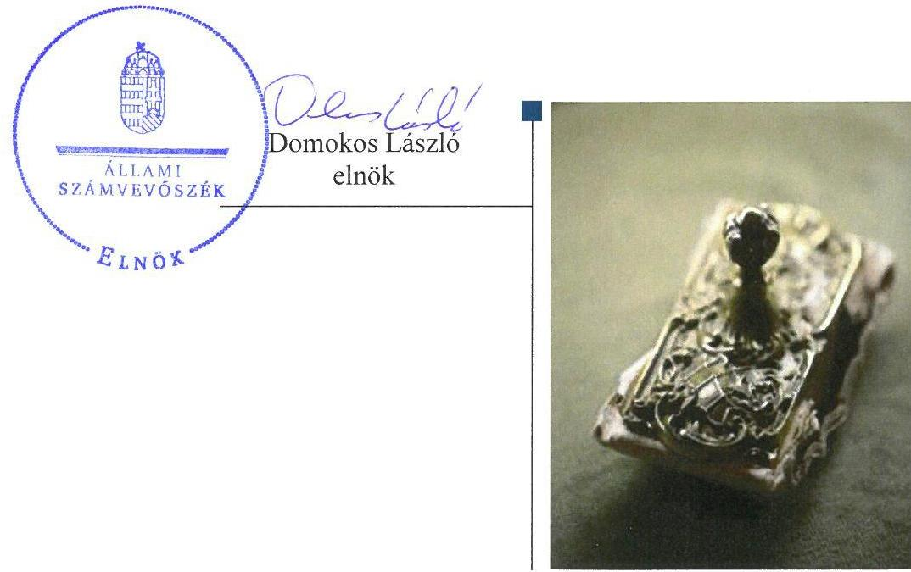

# Jelentés 

## Az önkormányzatok gazdasági társaságai

Az önkormányzatok többségi tulajdonában lévő gazdasági társaságok gazdálkodásának ellenőrzése - Újhartyán Település
Üzemeltető és Ország Közepe Ipari Park Kft. 2017.

---

# Jelentés 

## Az önkormányzatok gazdasági társaságai

Az önkormányzatok többségi tulajdonában lévő gazdasági társaságok gazdálkodásának ellenőrzése - Újhartyán Település
Üzemeltető és Ország Közepe Ipari Park Kft.
2017. október hó s. nap

---

# AZ ELLENŐRZÉST FELÜGYELTE:

DR. NAGY IMRE felügyeleti vezető

# AZ ELLENŐRZÉST VEZETTE ÉS A VÉGREHAJTÁSÁÉRT FELELŐS:

DR. NAGY JUDIT ellenőrzésvezető

# A PROGRAM ÖSSZEÁLLÍTÁSÁÉRT FELELŐS:

JANIK JÓZSEF LÁSZLÓ osztályvezető

---

**IKTATÓSZÁM:** V-1333-146/2016

**TÉMASZÁM:** 2167

**ELLENŐRZÉS-AZONOSÍTÓ SZÁM:** V-075830

---

Jelentéseink az Országgyűlés számítógépes hálózatán és az Interneten a www.asz.hu címen is olvashatóak.

---

# TARTALOMJEGYZÉK 

■ ÖSSZEGZÉS ..... 5
■ AZ ELLENŐRZÉS CÉLJA ..... 6
■ AZ ELLENŐRZÉS TERÜLETE ..... 7
■ AZ ELLENŐRZÉS HÁTTERE, INDOKOLTSÁGA ..... 9
■ A JELENTÉS LÉNYEGES KÉRDÉSKÖREI ..... 10
■ ELLENŐRZÉS HATÓKÖRE ÉS MÓDSZEREI ..... 11
■ MEGÁLLAPÍTÁSOK ..... 13
■ JAVASLATOK ..... 18
■ MELLÉKLETEK ..... 21
I. Sz. melléklet: Értelmező szótár ..... 21
■ FÜGGELÉK: ÉSZREVÉTELEK ..... 23
■ RÖVIDÍTÉSEK JEGYZÉKE ..... 25

---

.

---

# ÖSSZEGZÉS 

Újhartyán Város Önkormányzata a tulajdonosi joggyakorlás kereteit összességében a jogszabály szerint alakította ki, de a tulajdonosi jogait nem gyakorolta szabályszerűen.
Az Újhartyán Település Üzemeltető és Ország Közepe Ipari Park Kft. vagyongazdálkodása nem volt szabályszerű, mert nem biztosította gazdálkodásának szabályozottságát és számviteli átláthatóságát. Beszámolási és közzétételi kötelezettségének nem tett eleget, ezzel nem biztosította a Társaság átláthatóságát. Az éves számviteli beszámolói nem tükröztek megbízható és valós képet a Társaság vagyonáról.

## Az ellenőrzés társadalmi indokoltsága

Magyarországon az intézmény-centrikus közfeladat-ellátás jellemző, de egyre jelentősebb a költségvetésen kívüli feladatellátás térnyerése. Helyi szinten ennek legfontosabb szereplői az önkormányzati tulajdonban lévő gazdasági társaságok, amelyeknek ellenőrzése kiemelten fontos a közfeladat ellátása, és a közvagyon megőrzése, megóvása érdekében. Ezért alapvető követelmény, hogy gazdálkodásuk, működésük szabályszerű és átlátható legyen.

Az Újhartyán Település Üzemeltető és Ország Közepe Ipari Park Kft. Újhartyánban 2012-ben vízközmű üzemeltető, 2013-2015 között városüzemeltetési feladatokat látott el. Az Állami Számvevőszék az ellenőrzése során arra kereste a választ, hogy szabályszerű volt-e a Társaság ${ }^{1}$ gazdálkodása és az Önkormányzat² ehhez kapcsolódó tulajdonosi joggyakorlása.

A jelentésben foglalt megállapítások és a megfogalmazott számvevőszéki javaslatok hozzájárulnak a felelős tulajdonosi joggyakorláshoz és a szabályos gazdálkodáshoz.

## Főbb megállapítások, következtetések, javaslatok

Újhartyán Város Önkormányzata az Újhartyán Település Üzemeltető és Ország Közepe Ipari Park Kft. feletti tulajdonosi joggyakorlásának kereteit összességében a jogszabályi előírásoknak megfelelően alakította ki, de javadalmazási szabályzatot nem alkotott. A tulajdonosi joggyakorlás nem volt megfelelő. A tagi hitelről nem minden esetben határoztak Képviselő-testületi határozat keretében és a támogatások illetve a tagi hitelek rendelkezésre bocsátása szerződés nélkül történt, így nem biztosította a megítélt támogatások és tagi hitelek célszerű, szabályos, átlátható és elszámoltatható felhasználását. A Felügyelő bizottság ügyrenddel nem rendelkezett és az Önkormányzat az egyszerűsített éves beszámolót a Felügyelő bizottság írásbeli jelentése nélkül fogadta el.

A Társaság vagyongazdálkodása nem volt szabályszerű, a saját előállítású eszközök bekerülési értékének megállapítása helytelenül történt, a beruházások üzembe helyezése nem volt megfelelően dokumentált. Szabályzatai hiányosak voltak, és azokat a jogszabályi változások alapján nem aktualizálta. A bevételek és a személyi kiadások elszámolása megfelelő volt, de a ráfordítások és az értékcsökkenés elszámolását nem megfelelően végezte. 2012. évben a tevékenység alapján előírt üzletszabályzattal nem rendelkezett. Az adatvédelmi és adatbiztonsági szabályzatot nem készítették el. A közérdekű adatok közzétételi kötelezettségének nem tett eleget. Vagyonnyilvántartása nem volt megfelelő, az Önkormányzati tulajdonon végzett beruházásokat, felújításokat saját vagyonként aktiválta. A Társaság egyszerűsített éves beszámolói nem voltak leltárral alátámasztottak, ezáltal azok nem tükröztek megbízható és valós képet a Társaság vagyonáról.

---

# AZ ELLENŐRZÉS CÉLJA 

Az ellenőrzés célja annak értékelése, hogy az önkormányzat vagyongazdálkodási tevékenysége során szabályszerűen gyakorolta-e tulajdonosi jogait. A gazdasági társaság szabályozottsága, gazdálkodása és vagyongazdálkodási tevékenysége, bevételeinek és ráfordításainak elszámolása megfelelt-e a jogszabályi és tulajdonosi előírásoknak. A gazdasági társaság kötelezettségállománya jelent-e kockázatot a működésre, valamint a gazdálkodás átláthatósága és elszámoltathatósága érdekében biztosítva volt-e a szolgáltatás díjának megalapozottsága szabályszerű önköltségszámítással.

---

# **Újhartyán Település Üzemeltető és Ország Közepe Ipari Park Kft. és a tulajdonosi jogokat gyakorló Újhartyán Város Önkormányzata**

Újhartyán város Pest megyében található. A Központi Statisztikai Hivatal által közzétett adatok^{3} szerint az állandó lakosságszáma 2015. január 1-jén 2 753 fő volt. Városi rangot 2013. július 15-től kapott. Újhartyán Község Önkormányzata 1997. február 20-án a település vízművének üzemeltetése céljából gazdasági társaságot alapított, amelybe 2006. szeptember 5-én beolvadt az Ország Közepe Ipari Park Kft., ezt követően a társaság neve Újhartyán Községi Vízmű Üzemeltető és Ország Közepe Ipari Park Kft. lett. A kizárólagosan az Önkormányzat tulajdonában lévő Társaság 6,0 M Ft összegű jegyzett tőkével rendelkezett.

2012. évben még a Társaság végezte a településen a víz és csatorna közüzemi szolgáltatást, majd 2013. január 1-jétől ez a tevékenysége megszűnt. Az alapító okirat 2013. április 25-ei módosításával a Társaság neve Újhartyán Település Üzemeltető és Ország Közepe Ipari Park Kft. lett. A Társaság fő tevékenységi körévé 2014. július 4.-étől az építményüzemeltetés vált, de tevékenységi körébe tartozik az útépítés, valamint zöldterület kezelés is.

A Társaság működése során nem kapott vagyonkezelésbe vagyont az Önkormányzattól, tulajdonosi részesedéssel más gazdasági társaságban nem rendelkezett.

Az Önkormányzat a Társasággal 2013-ban kötött Kezelői megállapodást^{4}, amely a Társaság feladatává tette a csapadékvíz elvezető rendszer üzemeltetését. Az érintett vagyon elemek nem kerültek a Társaság tulajdonába.

A Társaság gazdálkodásának főbb adatait az 1. táblázat mutatja be:

1. táblázat

|  A TÁRSASÁG GAZDÁLKODÁSÁNAK FŐBB ADATAI (M FT) |  |  |  |   |
| --- | --- | --- | --- | --- |
|   | 2013. év | 2013. év | 2014. év | 2015. év  |
|  Értékesítés nettó árbevétele | 116,2 | 16,1 | 21,9 | 36,4  |
|  Mérlegfőösszeg | 359 | 329,5 | 330,2 | 373,3  |
|  Tárgyi eszközök | 252,4 | 297,0 | 300,7 | 330,4  |
|  Követelések | 34,6 | 26,8 | 15,7 | 18,6  |
|  Saját tőke összege | 151,2 | 137,3 | 136,7 | 135,6  |
|  Jegyzett tőke | 6,0 | 6,0 | 6,0 | 6,0  |
|  Mérleg szerinti eredmény | -30,3 | -13,9 | -0,6 | -1,1  |
|  Kötelezettségek | 151,2 | 141,3 | 147,2 | 198,5  |

*Forrás: A Társaság éves beszámolói*

---

Az Önkormányzat 2012-2015 között összesen 11,1 M Ft összegű működési célú támogatásban, valamint összesen 6,3 M Ft fejlesztési támogatásban részesítette a Társaságot. Ezenkívül több részletben tagi hitelt is nyújtott a Társaságnak, amelyek összege 194,0 M Ft volt, amiből 78,7 M Ft visszafizetésre került.

Az Önkormányzat által nyújtott támogatások és a tagi hitelek összegei a 2. táblázatba foglaltak szerint alakultak:
2. táblázat

# AZ ÖNKORMÁNYZAT ÁLTAL ADOTT TAGI HITELEK ÉS TÁMOGATÁSOK ALAKULÁSA (M FT) 

|  | 2012. év | 2013. év | 2014. év | 2015. év | Összesen |
| :--: | :--: | :--: | :--: | :--: | :--: |
| Működési támogatás | - | 3,7 | 3,7 | 3,7 | 11,1 |
| Fejlesztési célú támogatás | - | - | 1,8 | 4,5 | 6,3 |
| Tagi hitel folyósítás | 50,0 | 75,8 | 14,2 | 54,0 | 194,0 |
| Tagi hitel visszafizetés | 1,5 | 73,2 | 4,0 | - | 78,7 |

A 2012. év december 31.-én a Társaság saját tulajdonban lévő víziközmű létesítmények - a Vksztv5. 6. §-ának, a 75. § (3) bekezdésének és a 79. § (2) bekezdésének előírásai alapján - az Önkormányzat részére átadásra kerültek.

Az ellenőrzött időszakban az Önkormányzat polgármesterének és jegyzőjének, valamint a Társaság ügyvezetőjének személye nem változott. A Társaság gazdasági vezetőt nem foglalkoztatott, számviteli nyilvántartásainak vezetését és beszámolóinak elkészítését - vállalkozási szerződés alapján - könyvelő iroda végezte.

---

# AZ ELLENŐRZÉS HÁTTERE, INDOKOLTSÁGA 

## AZ ÖNKORMÁNYZATI TULAJDONÚ GAZDASÁGI

TÁRSASÁGOK teljes körű ellenőrzésének lehetőségét az Állami Számvevőszékről szóló 1989. évi XXXVIII. törvény 2011. január 1-jétől hatályos módosítása teremtette meg és az Állami Számvevőszékről szóló 2011. évi LXVI. törvény is tartalmazza. A gazdasági társaságok gazdálkodási tevékenysége szabályszerűségének ellenőrzését 2011. évtől végezzük. Az önkormányzatok többségi tulajdonában álló gazdasági társaságok ellenőrzése kiemelten fontos a vagyon megőrzése, megóvása érdekében.

A feladatellátás költségeinek, ráfordításainak alakulása a lakosság széles rétegét érinti. Az ellenőrzés várható hasznosulásaként ellenőrzéseink feltárhatják, hogy az önkormányzat a feladatellátásához rendelt vagyon működtetését a tulajdonostól elvárható gondossággal végezte-e, a feladatot ellátó gazdasági társaság a létesítő okiratban, szolgáltatási szerződésben foglaltak betartásával biztosította-e a feladat ellátását. Az ellenőrzés rávilágíthat arra, hogy a gazdasági társaság a vagyon használatával biztosította-e a szolgáltatás folytatásának feltételeit, az önkormányzat tulajdonosi felügyelete hozzájárult-e a szabályszerű gazdálkodáshoz és feladatellátáshoz.

A megállapítások alapján megfogalmazott számvevőszéki javaslatok hasznosítása elősegítheti a meglévő hibák megszüntetését. A jó gyakorlatok bemutatásával az Állami Számvevőszék hozzájárul a követendő megoldások megismertetéséhez, terjesztéséhez.

---

# A JELENTÉS LÉNYEGES KÉRDÉSKÖREI 

1.- Az önkormányzat tulajdonosi joggyakorlása szabályszerű volt-e?
2.- A gazdasági társaság vagyongazdálkodása szabályszerű volt-e, fizetőképessége biztosított volt-e a gazdálkodása során?
3.- A gazdasági társaság bevételeinek és ráfordításainak elszámolása, valamint az önköltségszámítás és árképzés szabályszerű volt-e?

---

# ELLENŐRZÉS HATÓKÖRE ÉS MÓDSZEREI 

## Az ellenőrzés típusa

Megfelelőségi ellenőrzés.

## Az ellenőrzött időszak

2012. január 1-jétől 2015. december 31-ig.

## Az ellenőrzés tárgya

Újhartyán Város Önkormányzata tulajdonosi joggyakorlása és a többségi tulajdonában lévő Újhartyán Település Üzemeltető és Ország Közepe Ipari Park Kft. gazdálkodásának szabályozottsága és szabályszerűsége.

Az ellenőrzés kiterjed minden olyan körülményre és adatra, amely az ÁSZ ${ }^{6}$ jogszabályban meghatározott feladatainak teljesítéséhez, valamint a program végrehajtása folyamán felmerült újabb összefüggések feltárásához szükséges.

## Az ellenőrzött szervezet

Újhartyán Település Üzemeltető és Ország Közepe Ipari Park Kft. és a tulajdonosi jogokat gyakorló Újhartyán Város Önkormányzata

## Az ellenőrzés jogalapja

Az ellenőrzés jogszabályi alapját az ÁSZ tv. ${ }^{7}$ 1. § (3) bekezdése és 5. § (3)-(4)-(5) bekezdései képezik.

## Az ellenőrzés módszerei

Az ellenőrzést a nemzetközi standardokat irányadónak tekintve az ellenőrzési program ellenőrzési kérdései, az ellenőrzött időszakban hatályos jogszabályok, az ellenőrzés szakmai szabályok és módszertanok figyelembe vételével végeztük.

Az ellenőrzés ideje alatt az ellenőrzött szervezettel történő kapcsolattartást az ÁSZ Szervezeti és Működési Szabályzatának vonatkozó előírásai alapján biztosítottuk.

---

Az ellenőrzés a kiválasztott, többségi tulajdonosi jogokat gyakorló önkormányzatra, illetve az ellenőrzésre kijelölt gazdasági társaság felett tulajdonosi jogokat gyakorló szervezetre és az ellenőrzött gazdasági társaságra terjedt ki.

Az ellenőrzési kérdések megválaszolásához szükséges bizonyítékok megszerzése a következő ellenőrzési eljárások alkalmazásával történt: megfigyelés, kérdésfeltevés (információkérés), összehasonlítás, valamint elemző eljárás. Az ellenőrzési bizonyítékként felhasználható adatforrások közé tartoztak egyrészt az ellenőrzési programban felsorolt adatforrások, másrészt adatforrás lehet még minden - az ellenőrzés folyamán - feltárt, az ellenőrzés
 szempontjából információkat tartalmazó dokumentum.

Az ellenőrzést a kérdésekre adott válaszok kiértékelésével, valamint a megjelölt adatforrások, a csatolt tanúsítványok felhasználásával, továbbá az adott időszakban hatályos jogszabályok figyelembe vételével folytattuk le.

A bevételek és ráfordítások elszámolása esetében a szabályszerű működést véletlen mintavétellel ellenőriztük. A mintavétellel ellenőrzött területek esetében minden egyes tétel vonatkozásában a szabályszerűségre vonatkozó kérdéseket tettünk fel, amelyek eredménye összesítésre került. Megfelelőnek értékeltünk egy ellenőrzött területet, amennyiben 95%-os bizonyossággal a teljes sokaságban az átlagos hibaarány legfeljebb 10%, nem megfelelőnek, amennyiben 10%-nál magasabb arányt képviselt. Abban az esetben, ha a teljes sokaság tekintetében a 10%-os hibaarányhoz való viszony megítélésének megbízhatósága nem érte el a 95%-ot, annak elérése érdekében értékelésünket további szempontokkal egészítettük ki, és figyelembe vettük a feltárt hibák típusát és súlyát. A ráfordítások elszámolására vonatkozó véletlen mintavételt kockázati alapú kiválasztással egészítettük ki, amelynek során évente a három legnagyobb összegű tételt választottuk ki.

A vagyonnyilvántartás esetében teljes körű ellenőrzést folytattunk le, az értékelés ebben az esetben is a 10%-os hibaarányhoz való viszonyítás alapján történt.

---

# 1. Az önkormányzat tulajdonosi joggyakorlása szabályszerű volt-e? 

## Összegző megállapítás

### 1.1. számú megállapítás

Az Önkormányzat tulajdonosi joggyakorlása nem volt szabályszerű.

A tulajdonosi joggyakorlás kereteit összességében megfelelően alakították ki, azonban nem készítettek javadalmazási szabályzatot.

Az Önkormányzat a tulajdonosi joggyakorlásával kapcsolatos előírásait az SZMSZ ${ }_{1,2}$-ben ${ }^{8}$ és a Vagyongazdálkodási rendelet ${ }_{1,2}$-ben ${ }^{9}$ rögzítette. A rendeletek előírásai szerint gazdasági társaság alapítása és megszüntetése, gazdálkodó szervezetben részesedés megszerzése, vagy átruházása, a Képviselő-testület ${ }^{10}$ kizárólagos hatáskörébe tartozott.

Az Önkormányzat az Ötv. ${ }^{11}$ 91. § (1) bekezdése, 2013. január 1-jétől a hatályos Mötv. ${ }^{12}$ 116. § (1) bekezdése előírásainak megfelelően rendelkezett Gazdasági program ${ }_{1}{ }^{13}$-mal. A 2015-ben elfogadott Gazdasági program ${ }_{2}{ }^{14}$ megfelelt az Mótv. 116. § (5) bekezdés előírásainak.

A 2012. január 1-jétől hatályos Nvtv. ${ }^{15}$ 9. § (1) bekezdése előírása szerinti közép és hosszú távú vagyongazdálkodási terv ${ }^{16}$-et a Képviselő-testület határidőn túl, a 32/2013. (II. 12.) számú határozatával fogadta el.

A Társaság a 2012. évben olyan tevékenységet végzett - vízközmű szolgáltatás -, amely a Vksztv. szerint a Képviselő-testület számára rendeletalkotási kötelezettséggel járt. A kötelezettségét a Képviselő-testület önkormányzati rendeletével ${ }^{17}$ teljesítette.

A Képviselő-testület a Taktv. ${ }^{18}$ 4. § (1) bekezdésének előírása ellenére Felügyelő bizottságot ${ }^{19}$ csak a 2013. január 24.-én hozott létre, és ez az Alapító okirat ${ }_{2}$-ben rögzítésre került.

A Képviselő-testület nem rendelkezett a Társaság felé üzleti terv készítési kötelezettségről, de a Társaság 2014-2015. évekre készített üzleti tervet, amelyet a Képviselő-testület határozataival ${ }^{20}$ elfogadott.

A Képviselő-testület a Taktv. 5. § (3) bekezdés előírásai ellenére nem alkotott szabályzatot a vezető tisztségviselők, felügyelő bizottsági tagok, valamint az Mt. ${ }^{21}$ 208. §-ának hatálya alá eső munkavállalók javadalmazása, valamint a jogviszony megszűnése esetére biztosított juttatások módjának, mértékének elveiről, annak rendszeréről.
1.2. számú megállapítás

Az Önkormányzat tulajdonosi joggyakorlása nem volt megfelelő.
A Felügyelő bizottság a Gt. ${ }^{22}$ 34. § (4) bekezdés, illetve a Ptk. ${ }^{23}$ 3:122. § (3) bekezdés előírásait figyelmen kívül hagyva nem készítette el ügyrendjét.

---

A Társaság egyszerűsített éves beszámolóit a Képviselő-testület határozattal elfogadta, azonban a beszámolók elfogadásáról - a Gt. 35. § (3) bekezdésében, a 2014. március 15-től a Ptk. 3:120. § (2) bekezdésében előírtak ellenére - a Felügyelő bizottság írásbeli jelentése hiányában döntött.

A Képviselő-testület határozatban döntött a Társaság részére nyújtott támogatások és a tagi hitelek folyósításáról. Az Önkormányzat azonban a forrásokat az Áht. ${ }^{24}$ 37. § (1) bekezdésében foglalt előírás ellenére szerződés nélkül adta át a Társaság részére, ezáltal nem biztosította a megítélt támogatások és tagi hitelek célszerű, szabályos, átlátható és elszámoltatható felhasználását. A 2015. évi 54,0 M Ft összegű tagi hitel folyósítására az Mötv. 107. §-a ellenére Képviselő-testületi határozat nélkül került sor.

# 2. A gazdasági társaság vagyongazdálkodása szabályszerű volt-e, fizetőképessége biztosított volt-e a gazdálkodása során? 

Összegző megállapítás

A Társaság vagyongazdálkodása nem volt szabályszerű, fizetőképessége biztosított volt. Közzétételi kötelezettségének nem tett eleget.
2.1. számú megállapítás

A Társaság rendelkezett a Számv. tv-ben előírt belső szabályzatokkal, de azok hiányosak voltak és aktualizálásuk nem történt meg. A Társaság nem rendelkezett 2012. évben üzletszabályzattal.

A Társaság a Számv. tv. 14. § (3)-(5) bekezdése előírásának megfelelően elkészítette Számviteli politikáját ${ }_{1,2}{ }^{29}$ és annak keretében számviteli szabályzatait.

A Számviteli politika ${ }_{1}$-t a Számv. tv. 14. § (11) bekezdésében rögzítettek ellenére nem módosították, így az 2013. január 1-jétől a Számv. tv. 3. § (3) bekezdésének 3. pontjával nem egyezően tartalmazta a jelentős összegű hiba fogalmára vonatkozó meghatározást, illetve nem törölték a Számv. tv. 3. § (3) bekezdésének 5. pontja szerint hatályon kívül helyezett Számv. tv. 154. § (5)-(6) bekezdései kapcsán a megbízható és valós képet lényegesen befolyásoló hiba esetén az ezzel kapcsolatos ismételt közzétételi kötelezettséget. Ezeket a változásokat a Számviteli politika ${ }_{2}$-ben sem vették figyelembe.

A Társaságnál a 2015. évben a Számv. tv. 55. § (2) bekezdése szerint a vevőnkénti és adósonkénti kisösszegű követelések könyvvitelben elkülönített csoportjára értékvesztés került elszámolásra, amelynek választását - a Számv. tv. 14. § (4) bekezdésében foglaltak ellenére -, a Számviteli politika ${ }_{2}$ nem rögzítette. A Számviteli politika ${ }_{1,2}$ nem tartalmazta a Társaságra jellemző szabályokat, előírásokat, módszereket, ezért nem felelt meg az Számv. tv. 14. § (4) bekezdés előírásainak.

Az Eszközök és források értékelési szabályzat ${ }_{1,2}$ nem felelt meg annak a követelménynek, amely szerint az eszközöket és a kötelezettségeket egyedileg kell rögzíteni és értékelni, ezért nem felelt meg a Számv. tv. 16. § (1) bekezdésében előírtaknak. Az Eszközök és források értékelési szabályzat ${ }_{1}$ 2.1.2. pontja az eszközök értékcsökkenésének számításához több módszert jelöl meg, de nem határozta meg, hogy a felsorolt módszerek közül a Tár-

---

saság melyeket alkalmazza. A gyakorlatban a társasági adó megállapításánál figyelembe vett értékcsökkenési leírási kulcsokat használták, ami ellentétes a Számv. tv. 52. § (1) bekezdés előírásaival, amely szerint a hasznos élettartam végén várható maradványértékkel csökkentett bekerülési értéket azokra az évekre kell felosztani, amelyekben ezeket az eszközöket előreláthatóan használni fogják.

A Társaság Leltárkészítési és leltározási szabályzat ${ }_{1,2}{ }^{26}$-ban előírt tárgyi eszközök öt évenkénti kötelező mennyiségi felvétellel történő leltározása nem felelt meg a Számv. tv. 69. § (3) bekezdés előírásának, mivel a jogszabály előírja, hogy a leltárba kerülő adatok valódiságáról leltározással köteles meggyőződni, legalább háromévente mennyiségi felvétellel.

A Társaság számlarend ${ }^{27}$-je hiányos volt, nem határozta meg a Számv. tv. 161. § (2) bekezdés b), c), d) pontjaiban foglaltakat, úgy mint a számla tartalmát, ha az a számla megnevezéséből egyértelműen nem következik, továbbá a számla értéke növekedésének, csökkenésének jogcímeit, a számlát érintő gazdasági eseményeket, azok más számlákkal való kapcsolatát, a főkönyvi számla és az analitikus nyilvántartás kapcsolatát, a számlarendben foglaltakat alátámasztó bizonylati rendet.

A Vksztv. ${ }^{28}$ 47. §-ának - 2012. július 15-étől hatályos - rendelkezése értelmében a vízi közmű szolgáltatók üzletszabályzatot kötelesek készíteni. A Társaság a 2012. évben ennek ellenére nem rendelkezett üzletszabályzattal.

A Társaság a $\mathrm{Kbt}_{1} .{ }^{29}$ 22. § (1) bekezdésében, valamint a $\mathrm{Kbt}_{2} .{ }^{30}$ 27. § (1) bekezdésében meghatározott Közbeszerzési szabályzattal rendelkezett.

# 2.2. számú megállapítás 

A Társaság vagyonának könyvviteli nyilvántartása nem felelt meg a jogszabályi és belső előírásoknak. A 2014. évi egyszerűsített éves beszámoló nem tükrözte a megbízható és valós képet.

Az Önkormányzati tulajdont képező tárgyi eszközökön végzett átalakítási, bővítési, felújítási munkák 2014-2015. években saját vagyonként kerültek aktiválásra, bekerülési értékük a Társaságnál került elszámolásra. Ez ellentétes a Számv. tv. 23. § (1) és (3) bekezdésének és a Számv. tv. 48. § (1) bekezdésének előírásaival. Mindez a Társaság 2014. évi egyszerűsített éves beszámolójában a megbízható és valós képet lényegesen befolyásoló hibát idézett elő.

A saját előállítású eszközök bekerülési értékének megállapítása nem felelt meg a Számv. tv. 51. § (1) bekezdésében és az Eszközök és források értékelési szabályzat ${ }_{1,2}$ 2.1.1. előírásaiban foglaltaknak, mivel a közvetlen önköltség megállapítása nem volt számviteli dokumentumokkal alátámasztva. A Társaság ezen eljárása nem felelt meg a Számv. tv. 165. § előírásainak.

## 2.3. számú megállapítás

A Társaság fizetőképessége az Önkormányzat rendszeres támogatása mellett volt biztosított, így a kötelezettségállomány nem jelentett veszélyt a működésre.

A Társaság kötelezettségeinek meghatározó része az Önkormányzattal szemben állt fenn, a főkönyvi kivonatok, illetve egyszerűsített éves beszámolók alapján a Társaság rövid lejáratú kötelezettségként kezelte az Önkormányzat felé fennálló tagi hitel tartozásokat.

---

A Társaság kötelezettségállományának főbb adatait a 3. táblázat mutatja be:
3. táblázat

A TÁRSASÁG GAZDÁLKODÁSÁNAK FŐBB ADATAI (M FT)

|  | 2012.év | 2013.év | 2014.év | 2015.év |
| :-- | --: | --: | --: | --: |
| Kötelezettségek | 151,2 | 141,3 | 147,2 | 198,5 |
| Hosszúlejáratú kötelezettségek | 89,3 | 83,0 | 78,0 | 73,0 |
| ebből OKIP Kft.-től átvett | 48,0 | 48,0 | 48,0 | 48,0 |
| Rövidlejáratú kötelezettségek | 61,9 | 58,3 | 69,2 | 125,5 |
| ebből Tagi hitel állomány | 48,5 | 51,1 | 61,3 | 115,3 |

A Társaság nem vezetett olyan megfelelően részletezett analitikus nyilvántartást, amely alapján megállapítható lett volna a rövid lejáratú kötelezettségek fizetési határideje, illetve annak teljesítése. E nyilvántartás hiánya ellentétes a Számv. tv. 159. § rendelkezésével.

Lejárt határidejű, hosszú lejáratú kötelezettségként tartották nyilván az OKIP Kft. ${ }^{31}$ től beolvadással átvett, az Önkormányzat felé fennálló lejárt 48 M Ft összegű tartozást. A fennálló lejárt tartozás törlesztésére, kiegyenlítésére nem került sor, az nem érintette a kötelezettségállomány változását.

A Társaság a hátralékos követelés kezelésére vonatkozó eljárásrenddel nem rendelkezett. 2012-ben víz-és csatornadíj tartozás esetén a vonatkozó Korm. rendelet ${ }^{32}$ 9. §-a előírásai szerint járt el.

# 2.4. számú megállapítás 

A Társaság egyszerűsített éves beszámolói leltárral nem voltak alátámasztottak, letétbe helyezési és közzétételi kötelezettségét a 2013. évben határidőn túl teljesítette. Adatvédelmi és közzétételi kötelezettségének nem tett eleget.

A Társaság a Számv. tv. 69. § (1) bekezdésében foglalt leltározási kötelezettségének nem tett eleget, az egyszerűsített éves beszámolók nem voltak leltárral alátámasztva.

A Társaságnak könyvvizsgálati kötelezettsége 2012-ben állt fenn. Az egyszerűsített éves beszámolót 2012-ben auditáló könyvvizsgáló, a mérlegtételek leltárral alátámasztottságának hiánya ellenére a 2012. évi egyszerűsített éves beszámolóról készített jelentését hitelesítő záradékkal látta el, ezzel nem tett eleget a Számv. tv. 156. § (1) bekezdésében rögzített kötelezettségének.

A Társaság egyszerűsített éves beszámolóit letétbe helyezte és közzétette, a 2012. évre vonatkozóan ezt késve, 2013. október 24-én teljesítette, így megsértette a Számv. tv. 153. § (1) bekezdésének rendelkezéseit.

A Társaság adatvédelmi és adatbiztonsági szabályzattal nem rendelkezett, ezzel
 megsértette az Infotv. ${ }^{33}$ 24. § (3) bekezdésének előírásait.

A Taktv. 2. § (1) bekezdése szerinti, továbbá az Infotv. 37. § (1) bekezdésében előírt, 1. melléklet szerinti adatokat a Társaság nem tette közzé.

A Társaság 2012. évben a Vksztv. 2. § 24. pontja alapján közműszolgáltatónak minősült. Az Infotv. 24. § (1) bekezdés c) pontjában, mint közmű

---

szolgáltatónak a 2012-re kötelezően előírt belső adatvédelmi felelős kijelölését nem teljesítette.

# 3. A gazdasági társaság bevételeinek és ráfordításainak elszámolása, valamint az önköltségszámítás és árképzés szabályszerű volt-e? 

Összegző megállapítás

## 3.1. számú megállapítás

A Társaság bevételeinek, személyi jellegű kiadásainak elszámolása és az árképzés szabályszerűen történt. A ráfordításainak és az értékcsökkenések elszámolása nem volt megfelelő.

A Társaság bevételeinek és személyi jellegű kiadásainak elszámolása szabályszerű volt. A ráfordításainak és az értékcsökkenés elszámolása nem megfelelően történt.

A Társaságnál a bevételek és a személyi jellegű ráfordítások elszámolása megfelelő volt.

A ráfordítások elszámolása nem volt megfelelő. A költségelszámolást megalapozó szerződések nem minden esetben álltak rendelkezésre, ezzel a Társaság nem tett eleget a Számv.tv. 165. § (1) bekezdésében foglalt előírásoknak. A Társaságnál előfordultak számviteli bizonylat nélkül vagy hiányos adattartalmú bizonylat alapján könyvelt tételek, megsértve ezzel a Számv. tv. 165. § (1) és a Számv. tv. 167. § (1) bekezdésének előírását.

Az értékcsökkenés elszámolása nem volt megfelelő. 2014-2015-ben az Önkormányzati tulajdont képező tárgyi eszközökön végzett átalakítási, bővítési, felújítási munkák során, a Társaság saját vagyonként aktiválta az elkészült beruházásokat és az értékcsökkenést e szerint számolta el. Ez ellentétes a Számv. tv. 23. § (1) és (3) bekezdésének, 48. § (1) bekezdésének és 52. § (1) bekezdésének előírásaival.

Az üzembe helyezéseket a Számv. tv. 52. § (2) bekezdésében foglalt előírással ellentétesen nem dokumentálták hitelt érdemlően, mivel az üzembe helyezési jegyzőkönyvekből nem voltak megállapíthatók a rendeltetésszerű használatbavételi időpontok.

## 3.2. számú megállapítás

A Társaság árképzése megfelelő volt.
A Társaság önköltségszámítási szabályzat készítésére nem volt kötelezett.
A Társaság a 2012. évben ivóvíz és csatornaszolgáltatási tevékenységet végzett, és a szolgáltatások árképzését a 16/2011. (XII.15.) számú önkormányzati rendeletnek és a Vksztv. előírásainak megfelelően végezte.

A Társaság által üzemeltetett Újhartyán Ipari Park területhasználati díjaik kiszámlázása évente a Képviselő-testület által meghatározott díjak szerint történt.

---

# JAVASLATOK 

Az ÁSZ tv. 33. § (1) bekezdésében foglaltak értelmében az ellenőrzött szervezet vezetője köteles a jelentésben foglalt megállapításokhoz kapcsolódó intézkedési tervet összeállítani és azt a jelentés kézhezvételétől számított 30 napon belül az ÁSZ részére megküldeni. Amennyiben az ellenőrzött szervezet vezetője nem küldi meg határidőben az intézkedési tervet, vagy továbbra sem elfogadható intézkedési tervet küld, az Állami Számvevőszék elnöke az ÁSZ tv. 33. § (3) bekezdés a) és b) pontjaiban foglaltakat érvényesítheti.

## Újhartyán Település Üzemeltető és Ország Közepe Ipari Park Kft. Ügyvezetőjének

1. Intézkedjen a számviteli politika hatályos jogszabályi rendelkezések szerinti módosításáról.
(2.1. sz. megállapítás 2.-3. bekezdései alapján)
2. Intézkedjen az eszközök és források értékelési szabályzatának a hatályos jogszabály szerinti kiegészítéséről.
(2.1. sz. megállapítás 4. bekezdés 1-2. mondata alapján)
3. Intézkedjen a leltárkészítési és leltározási szabályzat módosításáról a hatályos jogszabályi előírással összhangban.
(2.1. sz. megállapítás 5. bekezdése alapján)
4. Intézkedjen a számlarend jogszabályi rendelkezés szerinti kiegészítéséről.
(2.1. sz. megállapítás 6. bekezdése alapján)
5. Gondoskodjon arról, hogy az Önkormányzat tulajdonában lévő eszközök bővítésével, felújításával, átalakításával összefüggő munka ellenértéke a jogszabályi előírásokat betartva kerüljön nyilvántartásra és kimutatásra.
(2.2. sz. megállapítás 1. bekezdése alapján)
6. Intézkedjen arról, hogy a Társaság a saját előállítású eszközök bekerülési értékének megállapítása során a jogszabály és a belső szabályzat előírásának megfelelően járjon el.
(2.2. sz. megállapítás 2. bekezdése alapján)

---

7. Intézkedjen az egyszerűsített éves beszámoló mérlegének leltárral való alátámasztásáról.
(2.4. sz. megállapítás 1. bekezdése alapján)
8. Intézkedjen a jogszabályban foglaltak alapján, az adatvédelmi és adatbiztonsági szabályzat elkészítéséről.
(2.4. sz. megállapítás 4. bekezdése alapján)
9. Gondoskodjon a közzétételi kötelezettségek jogszabályi előírásnak megfelelő teljesítéséről.
(2.4. sz. megállapítás 5. bekezdése alapján)
10. Intézkedjen a számviteli elszámolások szabályszerű végrehajtására, ezen belül a ráfordítások és az értékcsökkenés elszámolása tekintetében a jogszabályi előírások betartására
(3.1. sz. megállapítás 2-3. bekezdései alapján)
11. Intézkedjen az üzembe helyezések jogszabálynak megfelelő dokumentálásáról.
(3.1 sz. megállapítás 4. bekezdése alapján)

# Újhartyán Város Önkormányzata Polgármesterének 

1. Intézkedjen a jogszabályban előírt, a vezető tisztségviselők, felügyelő bizottsági tagok, valamint az Mt. 208 §-ának hatálya alá eső munkavállalók javadalmazása, valamint a jogviszony megszünése esetére biztosított juttatások módjának, mértékének elveiről, annak rendszeréről szóló szabályzat megalkotásáról.
(1.1. sz. megállapítás 7. bekezdése alapján)
2. Kezdeményezze a Felügyelő bizottságnál az ügyrend elkészítését.
(1.2. sz. megállapítás1. bekezdése alapján)

---

3. Gondoskodjon arról, hogy a Társaság legfőbb szerve a Társaság egyszerűsített éves beszámolóiról a Felügyelő bizottság írásbeli jelentésének birtokában hozzon határozatot a jogszabályi előírásnak megfelelően.
(1.2. sz. megállapítás2. bekezdése alapján)
4. Kezdeményezze a Társaságnál feltárt szabálytalanságok tekintetében a felelősség tisztázását, és szükség szerint intézkedjen a felelősség érvényesítéséről.
(2.2. sz. megállapítás 1. bekezdése és a 2.4. sz. megállapítás 1. bekezdése alapján)

---

# MELLÉKLETEK 

- I. SZ. MELLÉKLET: ÉRTELMEZŐ SZÓTÁR
gazdasági társaság
gazdálkodó szervezet
közszolgáltatás
meghatározó befolyás
minősített többséget biztosító részesedés
többségi befolyást biztosító részesedés

Ptk. 3:88. § (1) bekezdése szerint „a gazdasági társaságok üzletszerű közös gazdasági tevékenység folytatására, a tagok vagyoni hozzájárulásával létrehozott, jogi személyiséggel rendelkező vállalkozások, amelyekben a tagok a nyereségből közösen részesednek, és a veszteséget közösen viselik".
A Polgári Törvénykönyvről szóló 1959. évi IV. törvény 685. § c) pontja szerint gazdálkodó szervezet: „az állami vállalat, az egyéb állami gazdálkodó szerv, a szövetkezet, a lakásszövetkezet, az európai szövetkezet, a gazdasági társaság, az európai részvénytársaság, az egyesülés, az európai gazdasági egyesülés, az európai területi együttműködési csoportosulás, az egyes jogi személyek vállalata, a leányvállalat, a vízgazdálkodási társulat, az erdő birtokossági társulat, a végrehajtói iroda, az egyéni cég, továbbá az egyéni vállalkozó." (2014. 03.15-ig hatályos)
Az Ebktv. ${ }^{34}$ 3. § d) pontja a következőképpen határozza meg a közszolgáltatást: „szerződéskötési kötelezettség alapján a lakosság alapvető szükségleteinek ellátására irányuló szolgáltatás, így különösen a villamos energia-, gáz-, hő-, víz-, szenny-víz- és hulladékkezelési, köztisztasági, postai és távközlési szolgáltatás, továbbá a menetrend alapján közlekedő járművekkel végzett közforgalmú személyszállítás".
A Ptk. 8:2. § (2) bekezdése szerint „A befolyással rendelkező akkor rendelkezik egy jogi személyben meghatározó befolyással, ha annak tagja vagy részvényese, és
a) jogosult e jogi személy vezető tisztségviselői vagy Felügyelőbizottsága tagjai többségének megválasztására, illetve visszahívására; vagy
b) a jogi személy más tagjai, illetve részvényesei a befolyással rendelkezővel kötött megállapodás alapján a befolyással rendelkezővel azonos tartalommal szavaznak, vagy a befolyással rendelkezőn keresztül gyakorolják szavazati jogukat, feltéve, hogy együtt a szavazatok több mint felével rendelkeznek."
A minősített befolyásszerző az ellenőrzött társaságban a szavazatok legalább hetvenöt százalékával rendelkezik. (Ptk. 3:324. §)
A Ptk. 8:2. § (1) bekezdése szerint „többségi befolyás az olyan kapcsolat, amelynek révén természetes személy vagy jogi személy (befolyással rendelkező) egy jogi személyben a szavazatok több mint felével vagy meghatározó befolyással rendelkezik."

---

.

---

# FÜGGELÉK: ÉSZREVÉTELEK 

A jelentéstervezetet a Számvevőszék 15 napos észrevételezésre megküldte az ellenőrzött szervezetek vezetőinek az ÁSZ tv. 29. §* (1) bekezdése előírásának megfelelően.

Újhartyán Település Üzemeltető és Ország Közepe Ipari Park Kft. ügyvezetője és Újhartyán Város Önkormányzatának polgármestere nem élt az ÁSZ tv. 29. § (2) bekezdésében foglalt észrevételezési jogával, a törvényes határidőn belül észrevételt nem tettek.

[^0]
[^0]:    * 29. § (1) Az Állami Számvevőszék az ellenőrzési megállapításait megküldi az ellenőrzött szervezet vezetőjének vagy az általa megbízott személynek, és annak, akinek személyes felelősségét állapította meg.
    (2) Az ellenőrzött szervezet vezetője és a felelősként megjelölt személy az ellenőrzés megállapításaira tizenöt napon belül írásban észrevételt tehet.
    (3) Az Állami Számvevőszék az észrevételre a beérkezésétől számított harminc napon belül írásban válaszol. A figyelembe nem vett észrevételeket köteles a jelentésben feltüntetni, és megindokolni, hogy azokat miért nem fogadta el.

---

.

---

# RÖVIDÍTÉSEK JEGYZÉKE 

${ }^{1}$ Társaság
${ }^{2}$ Önkormányzat
${ }^{3}$ KSH által közzétett adatok
${ }^{4}$ Kezelői megállapodás
${ }^{5}$ Vksztv.
${ }^{6}$ ÁSZ
${ }^{7}$ ÁSZ tv.
${ }^{8}$ SZMSZ $_{1,2}$
${ }^{9}$ Vagyongazdálkodási rendelet ${ }_{1}$
Vagyongazdálkodási rendelet ${ }_{2}$
${ }^{10}$ Képviselő-testület
${ }^{11}$ Ötv.
${ }^{12}$ Mötv.
${ }^{13}$ Gazdasági program ${ }_{1}$
${ }^{14}$ Gazdasági program $_{2}$
${ }^{15}$ Nvtv.
${ }^{16}$ Vagyongazdálkodási terv
${ }^{17}$ Rendelet
${ }^{18}$ Taktv.
${ }^{19}$ Felügyelő bizottság
${ }^{20}$ határozat üzleti terv elfogadásáról ${ }_{1}$
határozat üzleti terv elfogadásáról ${ }_{2}$
${ }^{21} \mathrm{Mt}$.
${ }^{22} \mathrm{Gt}$.

Újhartyán Település Üzemeltető és Ország Közepe Ipari Park Korlátolt Felelősségű Társaság
Újhartyán Község Önkormányzata 2013. július 15-ig, Újhartyán Város Önkormányzata 2013. július 15-től.
Magyarország Közigazgatási Helynévkönyve (2015. január 1.)
UTÜ-OKIP kezelői megállapodás, amelyet Újhartyán Község Önkormányzati Képviselő-testülete a 79/2013.(IV.24.) sz. határozatával hagyott jóvá
2011. évi CCIX. törvény a víz-köz-mű szolgáltatásról

Állami Számvevőszék
2011. évi LXVI. törvény az Állami Számvevőszékről

SZMSZ ${ }_{1}$ : az Önkormányzat 1/2011 (IV.14) számú rendelete a Képviselő-testület Szervezeti és Működési szabályzatáról (Hatályos: 2014. október 21-ig)
SZMSZ ${ }_{2}$ : az Önkormányzat 14/2014 (X.14) számú rendelete a Képviselő-testület Szervezeti és Működési szabályzatáról (Hatályos: 2014. október 21-től)
Újhartyán Község Önkormányzatának: a 10/2012 (III.22) számú rendelete az Önkormányzat vagyonáról és vagyongazdálkodás szabályairól
Vagyongazdálkodási rendelet ${ }_{2}$ : az Önkormányzat 11/2013 (VI.26) számú rendelete az Önkormányzat vagyonáról, a vagyon feletti tulajdonosi jogok gyakorlásának és a vagyon kezelésének szabályairól
Újhartyán Város Önkormányzata Képviselő-testülete
1990. évi LXV. törvény a helyi önkormányzatokról
2011. évi CLXXXIX. törvény Magyarország Helyi Önkormányzatairól
Újhartyán Község Polgármesterének a 2010-2014 ciklusra szóló Polgármesteri és Gazdasági Programja, elfogadta a Képviselő-testület 76/2011.(IV.06.) sz. határozatával
Újhartyán Város Gazdasági Programja 2015-2019, elfogadta a Képviselő-testület 39/2015.(III.26.) sz. határozatával
2011. évi CXCVI. törvény a nemzeti vagyonról

Újhartyán Község Önkormányzatának közép-és hosszútávú vagyongazdálkodási terve amelyet a Képviselő-testület a 32/2013. (II. 12.) számú határozatával fogadott el.
Újhartyán Község Önkormányzatának 4/1997 (IV.25) számú rendelete az Újhartyán községben a közüzemi vízműből szolgáltatott ivóvízért és csatornahasználatért fizetendő díjakról
2009. évi CXXII. törvény a köztulajdonban álló gazdasági társaságok takarékosabb működéséről szóló
Újhartyán Település Üzemeltető és Ország Közepe Ipari Park Korlátolt Felelősségű Társaság Felügyelő bizottsága
Újhartyán Város Önkormányzata Képviselő-testületének 287/2013. (XII.10.) sz. határozata az UTÜ-OKIP Kft. 2014. évi üzleti tervének elfogadásáról
Újhartyán Város Önkormányzata Képviselő-testületének 272/2014. (XII.17.) sz. határozata az UTÜ-OKIP Kft. 2015. évi üzleti tervének elfogadásáról
2012. évi I. törvény a munka törvénykönyvéről
2006. évi IV. törvény a gazdasági társaságokról

---

${ }^{23}$ Ptk.
${ }^{24}$ Áht.
${ }^{25}$ Számviteli politika 1

Számviteli politika 2
${ }^{26}$ Leltárkészítési és leltározási szabályzat ${ }_{1}$

Leltárkészítési és leltározási szabályzat ${ }_{2}$
${ }^{27}$ Számlarend
${ }^{28}$ Vksztv.
${ }^{29} \mathrm{Kbt}_{1}$.
${ }^{30} \mathrm{Kbt}_{2}$.
${ }^{31}$ OKIP Kft.
${ }^{32}$ Korm.rendelet
${ }^{33}$ Infotv.
${ }^{34}$ Ebktv.
2013. évi V. törvény a polgári törvénykönyvről (hatályos: 2014. március 15-étől) 2011.évi CXCV törvény az államháztartásról

Újhartyán Település Üzemeltető és Ország Közepe Ipari Park Korlátolt Felelősségű Társaság számviteli politikája (hatályos 2012. január 1-jétől) Újhartyán Település Üzemeltető és Ország Közepe Ipari Park Korlátolt Felelősségű Társaság számviteli politikája, hatályos 2014. január 1-jétől Újhartyán Település Üzemeltető és Ország Közepe Ipari Park Korlátolt
 Felelősségű Társaság leltározási szabályzata, hatályos 2012. január 1-jétől. Újhartyán Település Üzemeltető és Ország Közepe Ipari Park Korlátolt Felelősségű Társaság leltározási szabályzata, hatályos 2014. január 1-jétől. Újhartyán Település Üzemeltető és Ország Közepe Ipari Park Korlátolt Felelősségű Társaság számviteli politikája részeként elkészült számlarendje (hatályos 2012. január 1-jétől)
2011. évi CCIX. törvény a víziközmű-szolgáltatásról
2011. évi CVIII. törvény a közbeszerzésekről
2015. évi CXLIII. törvény a közbeszerzésekről

Ország Közepe Ipari Park Kft.
38/1995. (IV.5.) Korm. rendelet a közműves ivóvízellátásról és a közműves szennyvízelvezetésről (hatályos 1995. május 1-jétől 2013. február 28-ig)
2011. évi CXII. törvény az információs önrendelkezési jogról és az információszabadságról
2003. évi CXXV. törvény az egyenlő bánásmódról és az esélyegyenlőség előmozdításáról

---

# ÁLLAMI SZÁMVEVŐSZÉK 

1052 Budapest, Apáczai Csere János utca 10.
Levélcím: 1364 Budapest 4. Pf. 54
Telefon: +36 1 4849100 Telefax: +36 1 4849200
www.asz.hu
