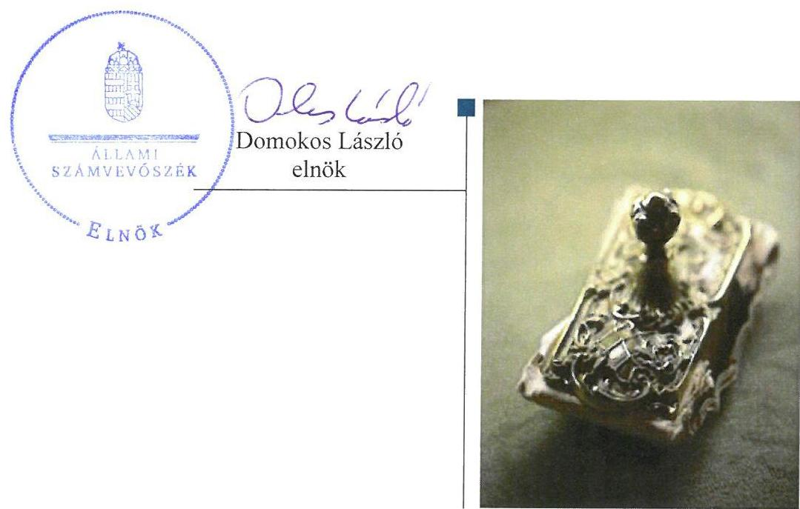
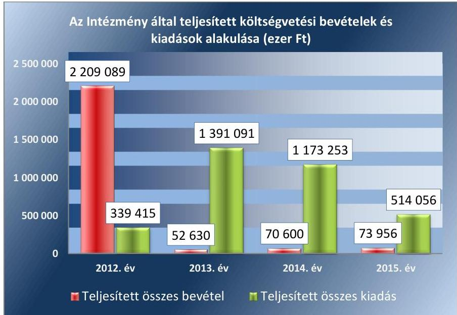
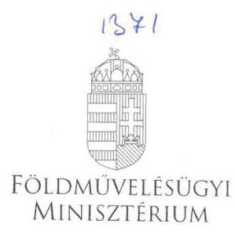
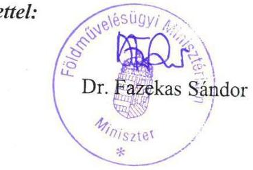
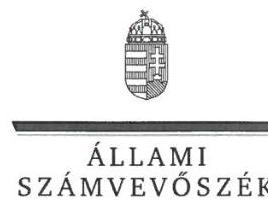
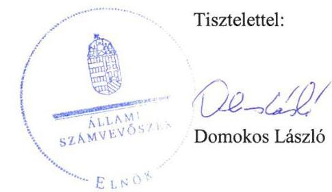

# Jelentés 

## A központi alrendszer intézményei

A központi alrendszer egyes intézményei pénzügyi és vagyongazdálkodásának ellenőrzése - Szentannai Sámuel Középiskola és Kollégium, Karcag 2017. 08. hó 14. nap

---

# AZ ELLENŐRZÉST FELÜGYELTE: 

MAKKAI MÁRIA felügyeleti vezető

## AZ ELLENŐRZÉST VEZETTE ÉS A VÉGREHAJTÁSÁÉRT FELELŐS:

DR. KOVÁCS DIÁNA ellenőrzésvezető

## A PROGRAM ÖSSZEÁLLÍTÁSÁÉRT FELELŐS:

JANIK JÓZSEF LÁSZLÓ osztályvezető

## A TÉMÁHOZ KAPCSOLÓDÓ KORÁBBI SZÁMVEVŐSZÉKI JELENTÉSEK:

- címe: 2015. évi zárszámadás - Magyarország 2015. évi központi költségvetése végrehajtásának ellenőrzése
- sorszáma: 16163
- címe: 2014. évi zárszámadás - Magyarország 2014. évi központi költségvetése végrehajtásának ellenőrzéséről
- sorszáma: 15167

IKTATÓSZÁM: V-1251-108/2016
TÉMASZÁM: 2285
ELLENŐRZÉS-AZONOSÍTÓ SZÁM: V076014

---

# TARTALOMJEGYZÉK 

■ ÖSSZEGZÉS ..... 5
■ AZ ELLENŐRZÉS CÉLJA ..... 6
■ AZ ELLENŐRZÉS TERÜLETE ..... 7
■ AZ ELLENŐRZÉS HÁTTERE, INDOKOLTSÁGA ..... 8
■ A JELENTÉS LÉNYEGES KÉRDÉSKÖREI ..... 9
■ ELLENŐRZÉS HATÓKÖRE ÉS MÓDSZEREI ..... 10
■ MEGÁLLAPÍTÁSOK ..... 12
■ JAVASLATOK ..... 20
■ MELLÉKLETEK ..... 23
I. Sz. melléklet: Értelmező szótár ..... 23
II. Sz. melléklet: Az integritás kontrollrendszer értékelése ..... 26
■ FÜGGELÉK: ÉSZREVÉTELEK ..... 27
■ RÖVIDÍTÉSEK JEGYZÉKE ..... 33

---

.

---

# ÖSSZEGZÉS 

A Minisztérium Szentannai Sámuel Középiskola és Kollégiumra vonatkozó irányító szervi feladatellátása összességében nem volt megfelelő. A belső kontrollrendszer kialakítása és működtetése nem járult hozzá a közpénzekkel és a nemzeti vagyonnal történő gazdaságos, hatékony és eredményes gazdálkodáshoz, a beszámolási és adatszolgáltatási tevékenységek szabályszerű teljesítéséhez. SZMSZ hiányában az irányítás feltételei nem voltak biztosítottak. A pénzügyi gazdálkodás nem volt megfelelő, az Intézmény a bevételek beszedése és elszámolása során nem tartotta be a jogszabályi előírásokat. A vagyongazdálkodás nem volt szabályszerű a 2012. és 2013. években, amely évekről készült beszámoló nem mutatott valós és megbízható képet. Az Intézmény vezetése nem építette ki a megfelelő védelmet a korrupciós veszélyekkel szemben. A közpénzfelhasználás eredményességét a gazdálkodás folyamatában mérhető célok nem támasztották alá.

## Az ellenőrzés társadalmi indokoltsága

A közpénzek felhasználásában és az állami vagyonnal való gazdálkodásban a központi alrendszer egyes intézményei meghatározó súlyt képviselnek. A foglalkoztatási problémák megoldásában a szakképzésnek kiemelkedő szerepe van. A munkavállalók megfelelő szakmai felkészültsége alapvető feltétele a gazdaság fejlődésének. A szakképzés legjelentősebb színterei a szakközépiskolák, szakiskolák. E szervezetekkel szemben társadalmi igény, hogy tevékenységükről a döntéshozók és a nyilvánosság felé elszámoljanak. Ezzel a társadalmi igénnyel és az ÁSZ¹ Stratégiájával összhangban, a közpénzügyek átláthatóságának előmozdítása, a közvagyon védelme érdekében került sor az Intézmény pénz-ügyi- és vagyongazdálkodásának ellenőrzésére.

## Főbb megállapítások, következtetések, javaslatok

Az irányító szervi feladatellátás során az SZMSZ érvényességével, az irányítási, felügyeleti és ellenőrzési jogosultságok és a munkáltatói jogkör gyakorlásával kapcsolatban tapasztalt hiányosságot az ellenőrzés.

A kontrollkörnyezet kialakítása nem volt szabályszerű, az Intézmény nem rendelkezett SZMSZ-szel. A kockázatkezelési rendszer, az információs és kommunikációs rendszer kialakítása és működtetése nem volt szabályszerű. 2012. évben nem gondoskodott az Intézmény a belső ellenőrzés kialakításáról. A célok folyamatos és eseti nyomon követését biztosító rendszer kialakítása és működtetése nem felelt meg a jogszabályi előírásoknak.

Az Intézmény pénzügyi gazdálkodása nem volt szabályszerű. Az Intézmény a vállalkozási tevékenységéből származó bevételeket és a kiadásokat nem különítette el az alaptevékenységből származó bevételeitől és kiadásaitól.

Az Intézmény 2012-2013. évi költségvetési beszámolói nem mutattak valós és megbízható képet. A vállalkozási tevékenységből származó bevételek elkülönítésének hiánya miatt az előirányzat-maradvány összeállítása sem volt megfelelő. Az Intézmény a haszonkölcsönbe kapott vagyonelemek nyilvántartása során a 2012. és a 2013. években nem tartotta be a számviteli előírásokat, és az elszámoltathatóság elvei sérültek. Az Intézmény a követelésekre vonatkozó év végi értékelést a 2013-2015. években nem végezte el.

Az integritás kontrollrendszer kiépítettsége nem volt egyensúlyban a korrupciós kockázatok szintjével. Az Intézmény a gazdálkodás folyamatában számszerűsített, mérhető célokat nem határozott meg.

---

# AZ ELLENŐRZÉS CÉLJA 

AZ ELLENŐRZÉS CÉLJA annak megítélése volt, hogy az ellenőrzött intézményre vonatkozó irányító szervi feladatellátás a jogszabályi előírások betartásával történt-e; az intézménynél a belső kontrollrendszer kialakítása és működtetése szabályszerű volt-e; kialakították-e az erőforrásokkal való szabályszerű, gazdaságos, hatékony és eredményes gazdálkodás követelményeit; szabályszerű volt-e a beszámolási és adatszolgáltatási kötelezettségek teljesítése; az intézmény pénzügyi és vagyongazdálkodása megfelelt-e a jogszabályi előírásoknak és belső szabályzatainak.

Az ellenőrzés keretében értékeltük az intézmény korrupciós kockázatainak kezelését szolgáló integritás kontrollok kiépítettségét és az integritás szemlélet érvényesülését.

Továbbá az ellenőrzés azt is értékelte, hogy a gazdálkodás folyamatában a gazdaságossági, hatékonysági és eredményességi célok kialakítása megtörtént-e, a célok elérése érdekében tettek-e intézkedéseket, a célkitűzéseket elér-ték-e; a szándékolt eredményeket elérték-e.

---

# **AZ ELLENŐRZÉS TERÜLETE**

## **Szentannai Sámuel Középiskola és Kollégium**

A karcagi Szentannai Sámuel Középiskola és Kollégium köznevelési intézmény, közfeladata szakmai középfokú oktatás nyújtása. Az ellenőrzött időszakban a környezetvédelem-vízgazdálkodás, közgazdaság, mezőgazdaság, informatika, gépészet, turisztika és élelmiszeripar szakmacsoportba tartozó szakképzést és szakközépiskolai ágazati képzést folytatott.

Az Intézmény² az ellenőrzött időszakban önállóan működő és gazdálkodó költségvetési szerv volt országos működési körrel. Az alapítói, fenntartói és irányítói jogokat a Minisztérium³ gyakorolta.

Az Intézményt vezető igazgató⁴ személye az ellenőrzött időszakban nem változott. A gazdasági vezetői⁵ feladatokat 2012. januártól ugyanaz a személy látta el.

Az Intézményben a nappali képzésben maximálisan felvehető tanulói létszám 600 fő volt, a kollégiumi férőhelyek száma 130 főről 150 főre emelkedett. Az Intézményben 2012-ben 502, 2013-ban 459, 2014-ben 450 és 2015-ben 465 diák kezdte meg a tanulmányait.

Az Intézmény által teljesített költségvetési bevételek és kiadások alakulását az 1. ábra mutatja be. A 2012. évben intézményi beruházásra biztosított előirányzat felhasználása 2013. és 2014. évben történt.

1. ábra

*Forrás: Az Intézmény 2012-2015. évi éves költségvetési beszámolói*

Az ellenőrzött időszakban az Intézménynél szervezeti, szerkezeti átalakítás nem történt.

---

# AZ ELLENŐRZÉS HÁTTERE, INDOKOLTSÁGA 

Az államháztartás központi alrendszerének közpénz felhasználása, az intézmények által ellátott közfeladatok sokrétűsége, valamint a feladatellátásához rendelt vagyon nagyságrendje indokolja, hogy az ÁSZ ellenőrzéseket folytasson a pénzügyi és vagyongazdálkodás területén. Az ÁSZ az ellenőrzései során feltárja a gazdálkodást érintő szabályozások esetleges hiányosságait, a szabályozással nem érintett gazdálkodási területeket, rámutathat a vagyongazdálkodási tevékenység - ezen belül a tulajdonosi joggyakorlás és vagyonkezelés - esetleges szabálytalanságaira, értékeli az állami vagyon nyilvántartására és elszámolására vonatkozó eljárásokat.

Az ellenőrzés hozzájárul a központi intézmények pénzügyi helyzetének pontosabb megítéléséhez és a jó gyakorlat kialakításán, bemutatásán keresztül a gazdálkodás szabályszerűségének javításához.

Az ÁSZ teljesítmény-ellenőrzési kiegészítő modul alapján elvégzett ellenőrzése a döntéshozók, ellenőrzöttek, irányító szervek, a társadalom számára objektív visszajelzést ad a gazdálkodás területén végrehajtott szervezeti, szervezési intézkedésekről, a közfeladat-ellátásnak keretet adó gazdálkodási tevékenységek folyamatában kialakított célokról, intézkedésekről, azok teljesítéséről. Az ÁSZ értékteremtő elemzéseivel, tanácsadó szerepét erősítve támogatja a szervezetek önértékelő, alkalmazkodó (ön)tanuló tevékenységét. Irányt mutat az ellenőrzött intézmények gazdálkodási és kapcsolódó adminisztratív folyamatainak optimalizációjához. Támogatja a központi költségvetési szervek felügyelhetőségét, a „jó gyakorlatok" elterjesztésével támogatja a „jó kormányzást".

---

# A JELENTÉS LÉNYEGES KÉRDÉSKÖREI 

1. Az irányító szerv ellenőrzött költségvetési szervre vonatkozó feladatellátása szabályszerű volt-e?
2. A belső kontrollrendszer kialakítása és működtetése biztosította-e a közpénzekkel és a nemzeti vagyonnal történő szabályszerű, gazdaságos, hatékony és eredményes gazdálkodást, illetve a beszámolási és adatszolgáltatási kötelezettségek szabályszerű teljesítését?
3. A költségvetési szerv pénzügyi gazdálkodása szabályszerű volt-e?
4. A költségvetési szerv vagyongazdálkodása szabályszerű volt-e?
5. Érvényesült-e az integritás szemlélet és ennek megfelelően kiépítették-e az integritás kontrollrendszert a költségvetési szervnél?
6. A költségvetési szerv meghatározott-e célokat, célértékeket a gazdálkodási folyamatok tekintetében?

---

# ELLENŐRZÉS HATÓKÖRE ÉS MÓDSZEREI 

## Az ellenőrzés típusa

Megfelelőségi és teljesítmény-ellenőrzés.

## Az ellenőrzött időszak

Az ellenőrzött időszak 2012. január 1-jétől 2015. december 31-ig tartó időszak volt.

## Az ellenőrzés tárgya

Az Intézményre vonatkozó irányító szervi feladatok ellátása. Az Intézmény belső kontroll rendszerének kialakítása és működtetése. A pénzügyi és vagyongazdálkodás szabályszerűsége. Az Intézmény beszámolási és adatszolgáltatási kötelezettségének teljesítése. Az Intézményre vonatkozóan a gazdálkodás folyamatában a gazdaságossági, hatékonysági és eredményességi célok és célértékek kialakítása, a kapcsolódó intézkedések meghatározása, a célkitűzések elérésének értékelése.

Az ellenőrzés kiterjedt minden olyan körülményre és adatra, amely az ÁSZ jogszabályban meghatározott feladatainak teljesítéséhez, valamint a program végrehajtása folyamán felmerült újabb összefüggések feltárásához szükséges.

## Az ellenőrzött szervezet

Szentannai Sámuel Középiskola és Kollégium, Földművelésügyi Minisztérium (Vidékfejlesztési Minisztérium) mint irányító szerv.

## Az ellenőrzés jogalapja

Az ellenőrzés jogszabályi alapját az ÁSZ tv. 1. § (3) bekezdés, 5. § (2)-(6) bekezdései, valamint Áht. ${ }^{6}$ 61. § (2) bekezdésének előírásai képezték.

## Az ellenőrzés módszerei

Az ellenőrzést az ellenőrzési program szempontjai, az ellenőrzött időszakban hatályos jogszabályok, az ellenőrzés szakmai szabályai, a jelen ellenőrzésre irányadó ÁSZ módszertanok figyelembevételével végeztük.

---

Az ellenőrzési kérdések megválaszolásához szükséges bizonyítékok megszerzése az Intézmény által rendelkezésre bocsátott dokumentumokra, adatokra alapozva megfigyelés, szemle (szemrevételezés), kérdésfeltevés (információkérés), mintavételezés, valamint elemző eljárás útján történt. Az ellenőrzési bizonyítékként felhasználható adatforrások közé tartoznak egyrészt az ellenőrzési program részletes szempontjainál felsorolt adatforrások, másrészt minden egyéb - az ellenőrzés folyamán feltárt, az ellenőrzés szempontjából információt tartalmazó - dokumentum.

Az ellenőrzés lefolytatásához az Intézmény a tanúsítványok kitöltésével, valamint az ÁSZ által kért dokumentumok megküldésével szolgáltatott adatokat.

Az Intézmény kiadási előirányzatai felhasználásának, a vagyonhasznosítási bevételi előirányzatok teljesítésének szabályszerűségét, valamint ezekhez kapcsolódóan a gazdálkodási jogkörök gyakorlásának szabályszerűségét mintavételezéssel ellenőriztük. A minta alapján a sokaságban előforduló hibaarányt becsültük. Az értékelés eredményeként kétféle, "Megfelelő" és "Nem megfelelő" minősítést alkalmaztunk. „Megfelelő"-nek értékeltünk egy ellenőrzött területet, amennyiben a hibaarány a teljes sokaságban 95\%-os bizonyossággal legfeljebb 10\% arányt képviselt. Abban az esetben, ha adott sokaság tekintetében a 10\%-os hibaarány küszöbérték átlépése megítélésének megbízhatósága nem érte el a 95\%-ot, annak elérése érdekében értékelésünket lényegességi alapon további szempontokkal egészítettük ki, és figyelembe vettük a feltárt hibák értékét. Az ellenőrzött időszakon belüli változás esetében a változás trendjét értékeltük.

Az integritás szemlélet érvényesülésének értékelése az Intézmény önbevallás útján kitöltött tanúsítványa alapján, a kockázatkezelési rendszer keretében történt.

A teljesítmény-ellenőrzési kiegészítő modul ellenőrzése során értékeltük, hogy az Intézmény a gazdálkodás folyamatában a gazdaságossági, hatékonysági és eredményességi célokat és célértékeket kialakította-e, a célkitűzéseket elérte-e.

---

# 1. Az irányító szerv ellenőrzött költségvetési szervre vonatkozó feladatellátása szabályszerű volt-e? 

Összegző megállapítás

A Minisztérium Intézményre vonatkozó feladatellátása összességében nem volt szabályszerű.

Az Intézmény alapításával kapcsolatos jogosultságok gyakorlása a jogszabályi előírásoknak megfelelően történt. Az ellenőrzött időszakban a Minisztérium a jogszabályi előírásoknak megfelelően elkészítette, kiegészítette és aktualizálta az Alapító okirat ${ }_{1,2,3,4,5}$-ot ${ }^{7}$. Az egységes szerkezetbe foglalt alapító okiratok törzskönyvi nyilvántartásba vétele a Magyar Államkincstárnál megtörtént.

Az Intézménnyel kapcsolatos egyéb irányítási, felügyeleti és ellenőrzési jogosultságok gyakorlása nem volt szabályszerű.

Az Alapító okirat ${ }_{1,2}$ 2012. január 1. és 2014. augusztus 27. közötti időszakban a Minisztérium egyetértését az SZMSZ ${ }^{8}$ érvényességi kellékeként jelölte meg. Az SZMSZ ${ }_{1,2,3,4}$ a Minisztérium egyetértését nem tartalmazta.

A Minisztérium az Intézmény elemi költségvetését felülvizsgálta, éves költségvetési beszámolóját jóváhagyta.

A Minisztérium a munkáltatói jogosultságait nem szabályszerűen gyakorolta, mert az ellenőrzött időszakban nem gondoskodott az
 Intézmény gazdasági vezetőjének kinevezéséről 2012-2014-ben az Áht. 9. § (1) bekezdés c) pontjában, 2015-ben az Áht. 9. § d) pontjában foglaltak ellenére.

A Minisztérium az Intézmény vezetésére pályázatot írt ki és annak eredményeként adott magasabb vezetői megbízást az igazgatói feladatok ellátására.

## 2. A belső kontrollrendszer kialakítása és működtetése biztosította-e a közpénzekkel és a nemzeti vagyonnal történő szabályszerű, gazdaságos, hatékony és eredményes gazdálkodást, illetve a beszámolási és adatszolgáltatási kötelezettségek szabályszerű teljesítését?

Összegző megállapítás

Az Intézményben a belső kontrollrendszer kialakítása és működtetése összességében nem biztosította a közpénzekkel és a nemzeti vagyonnal történő szabályszerű, gazdaságos, hatékony és eredményes gazdálkodást, illetve a beszámolási és adatszolgáltatási kötelezettségek szabályszerű teljesítését.

A belső kontrollrendszer részletes értékelését a 1. táblázat mutatja be.

---

1. táblázat

A BELSŐ KONTROLLRENDSZER KIALAKÍTÁSÁNAK ÉS MŰKÖDTETÉSÉNEK ÉRTÉKELÉSE 2012-2015. ÉVEKBEN

| Évek | Kontroll-   környezet | Kockázatkezelés | Kontroll-   tevékenységek | Információ és   kommunikáció | Monitoring | ÖSSZESEN |
| :--: | :--: | :--: | :--: | :--: | :--: | :--: |
| 2012. | nem szabályszerű | nem szabályszerű | szabályszerű | nem szabályszerű | nem szabályszerű | nem szabályszerű |
| 2013. | nem szabályszerű | nem szabályszerű | szabályszerű | nem szabályszerű | nem szabályszerű | nem szabályszerű |
| 2014. | nem szabályszerű | nem szabályszerű | szabályszerű | nem szabályszerű | nem szabályszerű | nem szabályszerű |
| 2015. | nem szabályszerű | nem szabályszerű | szabályszerű | nem szabályszerű | nem szabályszerű | nem szabályszerű |

A kontrollkörnyezet kialakítása nem volt szabályszerű.
SZMSZ-szel nem rendelkezett az Intézmény az ellenőrzött időszakban, ezért az Áht. 10. § (5) bekezdésében és a Köznev. tv. ${ }^{9}$ 25. § (4) bekezdésében foglaltakat megsértette. Az SZMSZ ${ }_{1}$ tartalma nem volt megfelelő, mert olyan jogszabályra is hivatkozott, ami az SZMSZ ${ }_{1}$ aláírása időpontjában még nem létezett. Az SZMSZ ${ }_{1,2,3,4}$ az Alapító okirat ${ }_{1,2}$-ban leírtak ellenére nem tartalmazta az érvényességi kellékként meghatározott fenntartói egyetértést, illetve SZMSZ ${ }_{5}$-t a Köznev. tv. 25. § (4) bekezdésében előírtak ellenére a nevelőtestület, a diákönkormányzat és - a 20/2012. (VIII.31.) EMMI rendelet 4. § (5) bekezdése szerinti - szülői szervezet véleménye nélkül fogadta el.

Az Intézmény nem határozta meg a Munka tv. ${ }^{10}$ 97. § (1) bekezdés, illetve a Munka tv. ${ }_{2}{ }^{11}$ 80. § (1) bekezdés előírásai ellenére a munkakörök átadásának rendjét és a Bkr. ${ }^{12}$ 6. § (1) bekezdés c) pontja ellenére a szervezet minden szintjén az etikai elvárásokat.

Az Intézmény nem szabályozta az Ávr. ${ }^{13}$ 13. § (2) bekezdés a) pontjában foglaltak ellenére az ellenőrzési adatszolgáltatási feladatok teljesítésével kapcsolatos előírásokat és feltételeket, az Ávr. 13. § (5) bekezdését megsértve a gazdasági szervezet költségvetési szerven belüli belső és külső kapcsolattartásának szabályait, és az Ávr. 53. § (2) bekezdésében foglaltak ellenére a 100 ezer Ft alatti kifizetések esetében követendő eljárást.
2012. január 1. és 2014. január 6. között megsértette az Intézmény az Áht. 10. § (5) bekezdésében előírtakat, mert a gazdasági szervezetre vonatkozóan ügyrend olyan jogszabályi hivatkozást tartalmazott, amelyek az ügyrend kiadásának időpontjában még nem léteztek; a Bkr. 6. § (3) bekezdést megsértve nem rendelkezett ellenőrzési nyomvonallal, a Bkr. 6. § (4) bekezdésben előírtak ellenére szabálytalanságkezelési eljárásrenddel és nem szabályozta a kontroll eljárásokat a Bkr. 8. § (4) bekezdés a) pontjában előírtakat megsértve. Az Intézmény megsértette a Bkr. 6. § (3) bekezdését 2014. január 6. és 2015. december 31. között, mert az ellenőrzési nyomvonal nem tartalmazta a felelősségi és az információs szinteket, kapcsolatokat.

Az Intézmény rendelkezett az ellenőrzött időszakban az Számv. tv. ${ }^{14}$ ben előírt számviteli, és az Áht. szerinti gazdálkodási szabályzatokkal, valamint 2013. január 2-től a Kbt. ${ }^{15}$ előírásai alapján közbeszerzési szabályzattal.

A SZÁMVITELI POLITIKA ${ }_{2}{ }^{16}$-ben 2015. július 4-étől nem határozták meg a kivételes nagyságú vagy előfordulású bevételeket, költsége-

---

ket, ráfordításokat, megsértve a Számv. tv. 14. § (4) bekezdését. Az értékelési szabályzat ${ }^{17}$ nem rendelkezett követeléstípusonként a kis összegű követelések év végi meghatározásának szabályairól az Áhsz 18. § (17) bekezdés d), illetve az Áhsz 2 50. § (2) bekezdés b) pontjában foglaltak ellenére. Az önköltség-számítási szabályzat ${ }^{18}$ a járművezető képzés és 2015-től a bérpálinkafőzés önköltség-számítási rendjét nem szabályozta az Áhsz 18. § (15), illetve az Áhsz 2. 50. § (3) bekezdésében előírtak ellenére. A bizonylati rendben a bizonylatok megőrzési idejét a Számv. tv. 169. § (2) bekezdésében előírt minimális 8 évvel szemben 5 évben határozták meg.

# 2.2. számú megállapítás 

2.3. számú megállapítás

A kockázatkezelési rendszer kialakítása és működtetése nem volt szabályszerű az ellenőrzött időszakban.

A KOCKÁZATKEZELÉSI RENDSZERT 2012. január 1. és 2014. január 5. között nem alakították ki, megsértve a Bkr. 3. § b) pontjában előírtakat. A területet 2014. január 6-tól szabályozó FEUVE szabályzat ${ }^{19}$ nem tartalmazta a szükség esetén alkalmazandó kockázati kitettség mérséklésének módszerét a Bkr. 2. § m) pontjában foglaltak ellenére és a kockázatok kezelése érdekében szükséges intézkedések teljesítésének folyamatos nyomon követési módját a Bkr. 7. § (2) bekezdésében előírtak ellenére.

A Bkr. 7. § (1) és (2) bekezdéseiben és a FEUVE Szabályzatban előírtak ellenére az Intézmény nem mérte fel a gazdálkodása és tevékenysége kockázatait, és nem működtetett kockázatkezelési rendszert.

A kontrolltevékenységek kialakítása és működtetése megfelelt a jogszabályokban és a belső szabályzatokban foglaltaknak.

AZ INTÉZMÉNY GAZDÁLKODÁSÁT a gazdálkodási szabályzat ${ }^{20}$ és a pénzkezelési szabályzat ${ }^{21}$, a feladatköri elkülönítéseket a dolgozók munkaköri leírásai határozták meg az ellenőrzött időszakban. A jogkörök gyakorlóinak kijelölése és a nyilvántartás vezetése az Ávr. szerint történt. A pénzügyi ellenjegyzésre és érvényesítésre feljogosított személyek rendelkeztek az Ávr.-ben előírt végzettséggel. A gazdálkodási jogkörök gyakorlása során betartották az összeférhetetlenségi szabályokat.

Az Intézmény nem rendelkezett az Ávr. 56. § (1) bekezdésben foglaltak ellenére analitikus nyilvántartással a kötelezettségvállalásokról 2012. január 1. és 2013. április 2. között.

A gazdálkodási jogkörök gyakorlásáról részletesen a 3.3. számú megállapítás szól.

Az információs és kommunikációs folyamatok kialakítása és működtetése nem felelt meg a jogszabályi előírásoknak.

AZ INFORMÁCIÓS RENDSZER keretében az intézmény nem szabályozta a beszámolási szinteket, módokat és határidőket a Bkr. 9. § (1)(2) bekezdésekben foglaltak ellenére. Az Intézmény az ellenőrzött időszakban megsértette az Ltv. ${ }^{22}$ 9. § (4) bekezdésében előírtakat, mert az iratkezelési szabályzat olyan rendelkezéseket tartalmazott, amelyek a kiadás időpontjában még nem léteztek. 2012. január 1. és 2013. október 26. között az Intézmény megsértette az Ávr. 13. § (2) bekezdés h) pontjában foglal-

---

takat, mivel belső szabályzatban nem rendezte a közérdekű adatok megismerésére irányuló kérelmek intézésének, a kötelezően közzéteendő adatok nyilvánosságra hozatalának rendjét, illetve megsértette az Info tv. ${ }^{23}$ 24. § (3) bekezdését az adatvédelmi és adatbiztonsági szabályzat hiánya miatt. Mindezeket 2013. október 27-től az adatkezelési szabályzatban ${ }^{24}$ szabályozták.

Az Intézmény megsértette az Info tv. 37. § (1) bekezdésében foglaltakat, mivel nem tette közzé honlapján az adatkezelési szabályzatát, valamint az éves költségvetését és költségvetési beszámolóját.
2.5. számú megállapítás

Belső ellenőrzési rendszer kialakításáról az Intézmény csak 2013. évtől gondoskodott, működtetése azonban nem volt megfelelő.

BELSŐ ELLENŐRZÉS kialakításáról az Áht. 70. § (1) bekezdésben foglaltak ellenére nem gondoskodott az Intézmény 2012-ben. A belső ellenőrzési feladatokat 2013. január 23-tól külső vállalkozás látta el. Nem rendelkezett az Intézmény 2012. január 1. és 2013. február 28. között a Bkr. 17. § (1) bekezdés előírása ellenére belső ellenőrzési kézikönyvvel ${ }^{25}$ és 2012. január 1. és 2013. november 12. között stratégiai ellenőrzési tervvel a Bkr. 22. § (1) bekezdés b) pontja ellenére.

A 2013-2014. évi belső ellenőrzési tervet a Bkr. 22. § (1) bekezdés b) pontjában foglaltak ellenére nem alapozta meg kockázatelemzés.

Az Intézmény nem rendelkezett a teljes ellenőrzött időszakban a belső ellenőrzésekről vezetett nyilvántartással, megsértve a Bkr. 50. § (1) és (2) bekezdéseiben foglaltakat.
2.6. számú megállapítás

Az Intézmény 2012-2013. években nem határozta meg a feladatellátása során a célok elérését szolgáló követelményeket, és 2014. évtől nem gondoskodott azok érvényesítéséről.

Az Intézmény megsértette a Bkr. 6. § (2) bekezdését, mert nem határozta meg 2012. január 1. és 2014. január 5. között a források szabályszerű, gazdaságos, hatékony és eredményes felhasználásához a követelményeket, illetve 2014-2015. években azért, mert a 2014. évtől a FEUVE szabályzatában bemutatott, a források szabályszerű, gazdaságos, hatékony és eredményes felhasználásához kapcsolódó folyamatok működtetéséről nem gondoskodott. Az Intézmény céljai megvalósítása nyomon követését nem dokumentálta, megsértve a Bkr. 10. §-ában leírtakat.

---

# 3. A költségvetési szerv pénzügyi gazdálkodása szabályszerű volt-e? 

## Összegző megállapítás

Az intézmény pénzügyi gazdálkodása összességében nem volt szabályszerű.
3.1. számú megállapítás

Az elemi költségvetés és az előirányzatok megállapítása során összességében betartották a jogszabályi előírásokat és a belső szabályzatokban foglaltakat.

Az Intézmény 2012-2013. évi elemi költségvetései megfeleltek a vonatkozó NGM rendeletek ${ }^{26}$ előírásainak, a 2014. évtől pedig az Ávr. és az Áhsz. ${ }^{27}$ előírásainak megfelelő bontásban és tartalommal kerültek elkészítésre, mellékszámításokkal megalapozottak voltak.
2015. évtől minisztériumi döntés értelmében 5 intézmény ${ }^{28}$ gazdasági szervezetének feladatait látja el az Intézmény, ami 16516 ezer Ft összegű előirányzat módosításon keresztül érvényesült.

## 3.2. számú megállapítás

A bevételi és kiadási előirányzatok módosítása, átcsoportosítása összességében megfelelt a jogszabályi előírásoknak.

Az Intézmény a 2012-2013. év vonatkozásában az Áhsz. ${ }^{29}$ 49. § (3) bekezdésében foglaltakat, valamint a számviteli politika ${ }^{30}$ III. fejezet 1. pontjában meghatározott előírásokat megsértve, nem rendelkezett a saját hatáskörben végrehajtott előirányzat módosításokhoz, átcsoportosításokhoz kapcsolódó analitikus nyilvántartással.

Az Intézmény eredeti előirányzatainak módosításaival 2012-2015. években országgyűlési, kormányzati, irányítószervi és saját hatáskörben összesen 4345392 ezer Ft forrásbővülésre került sor. Az Intézmény bevételi és kiadási előirányzatainak évközi módosításait hatáskör szerinti bontásban a 2. táblázat mutatja be.
2. táblázat

## ELŐIRÁNYZAT-MÓDOSÍTÁSOK HATÁSKÖRÖNKÉNTI MEGOSZLÁSA A 2012-2015. ÉVEKBEN (EZER FT)

|  | Előirányzat-módosítások hatáskörökként |  |  |  |  |
| :--: | :--: | :--: | :--: | :--: | :--: |
| Év | Országgyűlési | Kormányzati | Irányítószer-   vi | Saját | Összesen |
| 2012. | 0 | 1858601 | -19000 | 33125 | 1872726 |
| 2013. | 10300 | 8730 | 0 | 1441593 | 1460623 |
| 2014. | 0 | 2789 | 20970 | 852785 | 876544 |
| 2015. | 0 | 8152 | 26791 | 100556 | 135499 |

Forrás: ÁSZ kimutatás
Az ellenőrzött időszakban saját hatáskörben végrehajtott előirányzatmódosítás az előző évek előirányzat maradványok felhasználásán, támogatás felhasználások miatti módosításokon, kiemelt előirányzatok közötti átcsoportosításokon alapultak.

---

### 3.3. számú megállapítás

Az
 Intézmény a bevételek beszedése és elszámolása során a jogszabályi előírásokat és a belső szabályzatában foglaltakat nem tartotta be.

A bevételek elszámolása során az Intézmény a vállalkozási bevételeket nem különítette el az alaptevékenység bevételeitől, megsértve ezzel 2012-2013. években az Áhsz. 9. számú mellékletének, valamint az Áhsz. 149. § (1) bekezdésében előírt főkönyvi tagolást, továbbá 2014-2015. években az Áhsz. 44.§ (1) bekezdésében foglalt előírásokat.

Az ingatlan bérbeadás esetében az Intézmény nem tartotta be az Önköltségszámítási szabályzat II. fejezet 4. pontjában, illetve az Önköltségszámítási szabályzat 4. mellékletében leírtakat, mivel a költségkalkulációt egyedileg nem készítették el, így nem igazolták, hogy a bevételszerzés nem haszonszerzési céllal történt.

Az Intézmény a bérbeadási folyamata során megsértette az Áfa. tv ${ }^{31}$. 86. § (2) bekezdésének a) és b) pontjait, mivel garázs bérbeadására nem számította fel az általános forgalmi adót.

Az Intézmény - az elkülönítés kivételével - szabályszerűen használta fel a kiadási előirányzatait és a gazdálkodási jogkörgyakorlás megfelelő volt. A kiadások tekintetében a gazdálkodási jogkörök kontrolltevékenységének szabályszerűsége és a kiadások szabályszerűsége a 2012-2015. években megfelelő volt.

Az Intézmény az éves költségvetési beszámolóját nem a jogszabályi előírásoknak megfelelő tartalommal készítette el. Az előirányzat maradvány megállapítása a vállalkozási tevékenység elkülönítésének hiánya miatt nem volt szabályszerű.

A haszonszerzés céljából végzett, az alapító okiratban szakmai alapfeladatként nem rögzített vagyonhasznosítási tevékenységét az Intézmény alaptevékenységként kezelte. Az Intézmény az Áhsz. 38. § (2) bekezdésében foglaltak ellenére a 2012-2013. években nem készített a vállalkozói tevékenységéről az Áhsz. 4. számú melléklet szerinti vállalkozási maradványkimutatást. A 2014-2015. években elkészített maradványkimutatás pedig az Áhsz. 8. § (3) bekezdésében foglaltak ellenére nem tartalmazta - elkülönítve - a vállalkozási tevékenység bevételeit és kiadásait.

# 4. A költségvetési szerv vagyongazdálkodása szabályszerű volt-e? 

## Összegző megállapítás

Az Intézmény vagyongazdálkodása a 2012-2013. évek kivételével szabályszerű volt.
4.1. számú megállapítás

Az Intézménynél a vagyongazdálkodás feltételeinek kialakítása szabályszerű volt. A vagyon nyilvántartása nem felelt meg a jogszabályi előírásoknak és a vagyonnal való elszámoltatás feltételeit nem biztosították 2012-2013-ban.

Az Intézmény feladatellátásához 12 önálló helyrajzi számon nyilvántartott, Karcag város tulajdonában lévő ingatlant használt az ellenőrzött 2012-2015. években. Az Intézmény az ingatlanokat a Minisztériummal kötött

---

Megállapodás ${ }^{32}$, illetve a Karcag Város Önkormányzatával kötött Haszonkölcsön szerződés ${ }_{1.2}{ }^{33}$, Haszonbérleti szerződés ${ }_{1.2}{ }^{34}$ és Használatba adási szerződés ${ }^{35}$ alapján használta, összhangban az Alapító okiratban foglaltakkal. Az Intézmény vagyonkezelésbe kapott ingatlan vagyonnal, így vagyonkezelési szerződéssel sem rendelkezett a 2012-2015. években.

Az Intézmény a haszonkölcsönbe kapott vagyonelemek nyilvántartása során a 2012. és a 2013. években nem tartotta be az Áhsz. 19. számú melléklet 15. pontjában foglalt, idegen eszközök nyilvántartására vonatkozó előírásokat, és "Üzemeltetésre, kezelésre átadott" vagyonként könyvelte azokat. A haszonkölcsönbe kapott eszközök értékével indokolatlanul növelte a befektetett eszközök mérlegértékét, ami sérti a Számv. tv. 15. § (3) bekezdés valódiság és a Számv. tv. 16. § (4) bekezdés lényegesség elvét. A hiba nagysága elérte a jelentős összegű hiba mértékét.

# 4.2. számú megállapítás Az éves beszámolókat alátámasztó leltár nem volt teljes körű. 

A 2012-2015. évek éves költségvetési beszámolóinak elkészítéséhez, a mérleg tételeinek alátámasztásához a Számv. tv. 69. § (1)-(2) bekezdésében, az Áhsz. 137. § (3) bekezdésében, illetve az Áhsz. 222. § (1) bekezdésében foglalt előírás ellenére a leltározást az Intézmény nem végezte el teljes körűen, mivel a saját tőke egyeztetéssel történő leltározásának dokumentumai nem álltak rendelkezésre.

Az Intézmény a követelésekre vonatkozó év végi értékelést a 2013-2015. években nem végezte el, amivel megsértette az Áhsz 131. § (2) és a Számv. tv. 55. § (1), valamint az Áhsz 218.§ (6) bekezdésében foglalt előírásokat.

Az Intézmény a beszámolóinak elkészítése során - 2012-2013. évben - nem tartotta be a használatra kapott eszközök esetében az Áhsz. 132. § (1) bekezdésben foglalt értékelési előírásokat, valamint megsértették a Számv. tv. 15. § (3) bekezdésben foglalt valódiság elvét.

### 4.3. számú megállapítás Az Intézmény értékmegőrzési, állagmegóvási feladatainak eleget tett. A vagyonhasznosítása szabályszerű volt.

Az Intézmény a Haszonkölcsön szerződés ${ }_{1.2}$ 7. pontjában és a Használatba adási szerződés 11. pontjában foglaltak szerinti tulajdonosi engedélyt a haszonkölcsönbe kapott ingatlanokon végzett beruházási, felújítási munkákhoz (élelmiszer feldolgozó üzem építése, tanügyi, szálló és a konyha épületek korszerűsítése) az Önkormányzattól ${ }^{36}$ utólag szerezte be.

Az Intézmény által az ingatlanok hasznosítására megkötött szerződések összességében megfeleltek a jogszabályok előírásainak, de nem tartalmazták az Nvtv. ${ }^{37}$ 11. § (11) bekezdés a) és b) pontjában szabályozott beszámolási, nyilvántartási és adatszolgáltatási kötelezettségek előírását.

---

# 5. Érvényesült-e az integritás szemlélet és ennek megfelelően ki- 

építették-e az integritás kontrollrendszert a költségvetési szervnél?

Összegző megállapítás

Az Intézmény tett erőfeszítéseket az integritás szemlélet érvényesítése érdekében, azonban az integritás kontrollok kiépítettségi szintje nem volt egyensúlyban a korrupciós kockázatok szintjével.

Az Intézmény 2015. évben részt vett az ÁSZ integritás felmérésében.
Az Intézményben a korrupciós kockázatokkal szembeni védettséget növelő integritás kontrollok kiépítettsége alacsony.

Az Intézmény integritás kontrollrendszerét a II. számú melléklet mutatja be részletesen.

## 6. A költségvetési szerv meghatározott-e célokat, célértékeket a gazdálkodási folyamatok tekintetében?

Összegző megállapítás Az Intézmény a gazdálkodási folyamatok tekintetében célokat, célértékeket nem határozott meg, intézkedéseket nem tett.

Gazdaságossági, hatékonysági és eredményességi követelményeket a gazdálkodási folyamatokban az Intézmény nem alakított ki. Célkitűzések hiányában azok teljesítése nem volt értékelhető.

---

# JAVASLATOK 

Az ÁSZ tv. 33. § (1) bekezdésében foglaltak értelmében az ellenőrzött szervezet vezetője köteles a jelentésben foglalt megállapításokhoz kapcsolódó intézkedési tervet összeállítani és azt a jelentés kézhezvételétől számított 30 napon belül az ÁSZ részére megküldeni. Amennyiben az ellenőrzött szervezet vezetője nem küldi meg határidőben az intézkedési tervet, vagy továbbra sem elfogadható intézkedési tervet küld, az Állami Számvevőszék elnöke az ÁSZ tv. 33. § (3) bekezdés a) és b) pontjaiban foglaltakat érvényesítheti.

## a Szentannai Sámuel Középiskola és Kollégium igazgatójának

1. Intézkedjen az Intézmény SZMSZ-ének a jogszabályi előírásoknak megfelelő elkészítéséről és a Köznev.tv. előírásainak megfelelő elfogadásáról.
(2.1. sz. megállapítás első bekezdése alapján)
2. Intézkedjen a Munka tv-ben előírtak szerint a munkakörök átadási rendjének meghatározásáról, továbbá a Bkr.-ben előírt, a szervezet minden szintjén érvényesülő etikai elvárások meghatározásáról.
(2.1 sz. megállapítás 2. bekezdése alapján)
3. Intézkedjen az Ávr.-ben előírtaknak megfelelően az ellenőrzési, adatszolgáltatási feladatok teljesítésével kapcsolatos előírások és feltételek, valamint a gazdasági szervezet belső és külső kapcsolattartásának szabályozásáról, továbbá a 100 ezer Ft alatti kifizetések esetében követendő eljárás meghatározásáról.
(2.1. sz. megállapítás 3. bekezdése alapján)
4. Intézkedjen a számviteli politika, az értékelési szabályzat, az önköltség számítási szabályzat és a bizonylati rend módosításáról, hogy azok teljes körűen feleljenek meg a jogszabályi előírásoknak.
(2.1. sz. megállapítás 6. bekezdése alapján)
5. Intézkedjen a Bkr.-ben előírtaknak megfelelő integrált kockázatkezelési rendszer működtetéséről.
(2.2. sz. megállapítás 2. bekezdése alapján)
6. Intézkedjen az iratkezelési szabályzat szabályszerű kiadásáról.
(2.4. sz. megállapítás első bekezdés 2. mondata alapján)

---

7. Intézkedjen az Info tv.-ben előírt kötelezően közzéteendő adatok teljes körű közzétételéről.
(2.4. sz. megállapítás 2. bekezdése alapján)
8. Intézkedjen a belső ellenőrzésekről készült nyilvántartás jogszabályi előírásoknak megfelelő vezetéséről.
(2.5. sz. megállapítás 3. bekezdése alapján)
9. Intézkedjen az intézmény vállalkozási és alaptevékenységéhez kapcsolódó bevételek szabályszerű elkülönítéséről, valamint a maradványkimutatás szabályszerű elkészítéséről.
(3.3. sz. megállapítás 1. bekezdése és a 3.4. sz. megállapítás 1. bekezdés 3. mondata alapján)
10. Intézkedjen a feltárt hiányosságok és szabálytalanságok tekintetében a felelősség tisztázása érdekében, és szükség szerint intézkedjen a felelősség érvényesítéséről.
(3.3. sz. megállapítás 1. bekezdése, 3.4. sz. megállapítás 1. bekezdés 3. mondata és a 4.1. sz. megállapítás 2. bekezdése alapján)

---

.

---

# MELLÉKLETEK 

- I. SZ. MELLÉKLET: ÉRTELMEZŐ SZÓTÁR
állami vagyon
állami vagyonnak minősül:
a) az állam tulajdonában lévő dolog, valamint a dolog módjára hasznosítható természeti erő,
b) az a) pont hatálya alá nem tartozó mindazon vagyon, amely vonatkozásában törvény az állam kizárólagos tulajdonjogát nevesíti,
c) az állam tulajdonában lévő tagsági jogviszonyt megtestesítő értékpapír, illetve az államot megillető egyéb társasági részesedés,
d) az államot megillető olyan immateriális, vagyoni értékkel rendelkező jogosultság, amelyet jogszabály vagyoni értékű jogként nevesít. (Forrás: Vtv. 1. § (2) bekezdése)
állami vagyon értékesítése
állami vagyon használója
állami vagyon használója
állami vagyon hasznosítása
állami vagyon hasznosítására kötött szerződés
állami vagyon kezelője /vagyonkezelő
Állami vagyonnak minősül:
a) az állam tulajdonában lévő dolog, valamint a dolog módjára hasznosítható természeti erő,
b) az a) pont hatálya alá nem tartozó mindazon vagyon, amely vonatkozásában törvény az állam kizárólagos tulajdonjogát nevesíti,
c) az állam tulajdonában lévő tagsági jogviszonyt megtestesítő értékpapír, illetve az államot megillető egyéb társasági részesedés,
d) az államot megillető olyan immateriális, vagyoni értékkel rendelkező jogosultság, amelyet jogszabály vagyoni értékű jogként nevesít. (Forrás: Vtv. 1. § (2) bekezdése)
Állami vagyon tulajdonjogának bármely jogcímen történő, visszterhes átruházása. (Forrás: Vtvr. 1. § (7) bekezdés d) pontja)
Az a természetes vagy jogi személy, jogi személyiséggel nem rendelkező szervezet, aki, vagy amely törvény vagy szerződés alapján, bármely jogcímen (bérlet, haszonbérlet, használat stb.) állami vagyont birtokol, használ, szedi annak használt, hasznosít, ide nem értve a haszonélvezőt, a vagyonkezelőt és a tulajdonosi jogok gyakorlóját". (Forrás: Vtvr. 1. § (7) bekezdés a) pontja)
Az állami vagyont az MNV Zrt. maga kezeli, vagy szerződés - így különösen bérlet, haszonbérlet, megbízás - alapján központi költségvetési szervnek, természetes vagy jogi személynek, vagy jogi személyiséggel nem rendelkező gazdálkodó szervezetnek hasznosításra átengedi.
(Forrás: Vtv. 23. § (1) bekezdése, hatályos 2012. január 1-jétől)
Az állami vagyonnal a tulajdonosi joggyakorló maga gazdálkodik, vagy szerződés így különösen bérlet, haszonbérlet, megbízás - alapján hasznosításra átengedi, illetőleg vagyonkezelésbe, haszonélvezetbe adja. (Forrás: Vtv. 23. § (1) bekezdése, hatályos 2013. június 28 -ától)
Az állami vagyon hasznosítására kötött szerződések elsődleges célja az állami vagyon hatékony működtetése, állagának védelme, értékének megőrzése, illetve gyarapítása, az állami és közfeladatok ellátásának elősegítése. (Forrás: Vtv. 23. § (2) bekezdése)
Az állami vagyont az MNV Zrt. maga kezeli, vagy szerződés - így különösen bérlet, haszonbérlet, megbízás - alapján központi költségvetési szervnek, természetes vagy jogi személynek, vagy jogi személyiséggel nem rendelkező gazdálkodó szervezetnek hasznosításra átengedi." Az állami vagyonra vonatkozóan az MNV Zrt. kizárólag az Nvtv-ben meghatározott személyekkel köthet vagyonkezelési szerződést. (Forrás: Vtv. 27. § (1) bekezdése, hatályos 2012. január 1-jétől)

---

| ÁSZ Integritás Projekt | Az Állami Számvevőszék 2009-ben indította el a „Korrupciós kockázatok feltérképe- |
| :--: | :--: |
|  | zése - Integritás alapú közigazgatási kultúra terjesztése" című, európai uniós forrás- |
|  | ból megvalósított kiemelt projektjét (Integritás Projekt). Az Integritás Projekt célja, hogy felmérje a közszféra intézményei korrupciós kockázatoknak való kitettségét, illetőleg az azok mérséklésére hivatott kontrollok szintjét. Az Állami Számvevőszék a projekt révén az integritás szemlélet minél szélesebb körrel történő megismertetését, gyakorlatba ültetését kívánja elérni. Az integritás követelményeinek megfelelő szervezeti működést előnyben részesítő közigazgatási kultúra elterjesztését és a korrupció elleni fellépést

 az ÁSZ önmagára nézve is stratégiai jelentőségű célként fogalmazta meg. A projekt a felmérésben résztvevő intézmények számára helyzetükről egyfajta „tükörképet" mutat be, ami alapot teremt a jövőbeni pozitív irányú elmozduláshoz. (Forrás: a http://integritas.asz.hu honlapon közzétett, a 2013. évi Integritás felmérés eredményeiről készült összefoglaló tanulmány) |
| belső ellenőrzés | Független, tárgyilagos bizonyosságot adó és tanácsadó tevékenység, amelynek célja, hogy az ellenőrzött szervezet működését fejlessze és eredményességét növelje, az ellenőrzött szervezet céljai elérése érdekében rendszerszemléletű megközelítéssel és módszeresen értékeli, illetve fejleszti az ellenőrzött szervezet irányítási és belső kontrollrendszerének hatékonyságát. (Forrás: Bkr. 2. § b) pontja) |
| belső kontrollrendszer | A belső kontrollrendszer a kockázatok kezelése és tárgyilagos bizonyosság megszerzése érdekében kialakított folyamatrendszer, amely azt a célt szolgálja, hogy a működés és gazdálkodás során a tevékenységeket szabályszerűen, gazdaságosan, hatékonyan, eredményesen hajtsák végre, az elszámolási kötelezettségeket teljesítsék, megvédjék az erőforrásokat a veszteségektől, károktól és nem rendeltetésszerű használattól. (Forrás: Áht. 69. § (1) bekezdése) |
| belső kontrollrendszer területei | A kontrollkörnyezet, a kockázatkezelési rendszer, a kontrolltevékenységek, az információs és kommunikációs rendszer, valamint a nyomon követési (monitoring) rendszer. (Forrás: Bkr. 3. §-a) |
| felújítás | Az elhasználódott tárgyi eszköz eredeti állaga (kapacitása, pontossága) helyreállítását szolgáló időszakonként visszatérő olyan tevékenység, melynek során az eszköz élettartama megnövekszik, minősége, használata jelentősen javul, így a pótlólagos ráfordításból a jövőben gazdasági előnyök származnak. (Forrás: Számv. tv. 3. § (4) bekezdés 8. pontja) |
| hasznosítás | A nemzeti vagyon birtoklásának, használatának, hasznok szedése jogának bármely a tulajdonjog átruházását nem eredményező jogcímen történő átengedése, ide nem értve a vagyonkezelésbe adást, valamint a haszonélvezeti jog alapítását. (Forrás: Nvtv. 3. § (1) bekezdés 4. pontja) |
| információs és kommunikációs rendszer | A költségvetési szerv vezetője által kialakított és működtetett olyan rendszer, mely biztosítja, hogy a megfelelő információk a megfelelő időben eljutnak az illetékes szervezethez, szervezeti egységhez, illetve személyhez. (Forrás: Bkr. 9. § (1) bekezdés) |
| integritás | Az integritás az elvek, értékek, cselekvések, módszerek, intézkedések konzisztenciáját jelenti, vagyis olyan magatartásmódot, amely meghatározott értékeknek megfelel. (Forrás: Nemzetgazdasági Minisztérium: Magyarországi államháztartási belső kontroll standardok Útmutató 1.6.1. pontja, 2012. december) |
| irányító szerv/felügyeleti szerv | A költségvetési szerv tekintetében az e törvényben meghatározott irányítási hatáskört gyakorló szerv. (Forrás: Áht. 1. § 9. pontja)   A kockázat annak a valószínűségét jelenti, hogy egy vagy több esemény vagy intézkedés nem kívánt módon befolyásolja a rendszer működését, céljainak megvalósulását. (Forrás: Javaslatok a korrupciós kockázatok kezelésére - Kockázatkezelési és ellenőrzési módszertan 35. oldal, ÁSZ) |

---

kockázatkezelési rendszer

kontrollkörnyezet
kontrolltevékenységek
kommunikáció
közfeladat
monitoring
monitoring-rendszer
tulajdonosi joggyakorló
vagyongazdálkodás

Olyan irányítási eszközök és módszerek összessége, melynek elemei a szervezeti célok elérését veszélyeztető tényezők (kockázatok) azonosítása, elemzése, csoportosítása, nyomon követése, valamint szükség esetén a kockázati kitettség mérséklése. (Forrás: Bkr. 2. § m) pontja)
A költségvetési szerv vezetője által kialakított olyan elvek, eljárások, belső szabályzatok összessége, amelyben világos a szervezeti struktúra, egyértelműek a felelősségi, hatásköri viszonyok és feladatok, meghatározottak az etikai elvárások a szervezet minden szintjén, átlátható a humánerőforrás-kezelés. (Forrás: Bkr. 6. § (1) bekezdés)
A költségvetési szerv vezetője által a szervezeten belül kialakított (kontroll) tevékenységek, melyek biztosítják a kockázatok kezelését, hozzájárulnak a szervezet céljainak eléréséhez. (Forrás: Bkr. 8. § (1) bekezdés)
Az a tevékenység, melynek során információ továbbítása valósul meg. A kommunikációs folyamat résztvevői között tájékoztatás történik, mely során tényeket, ezek magyarázatát közlik.
Jogszabályban meghatározott állami vagy önkormányzati feladat, amit az arra kötelezett közérdekből, a jogszabályban meghatározott követelményeknek és feltételeknek megfelelve végez, ideértve a lakosság közszolgáltatásokkal való ellátását, továbbá az állam nemzetközi szerződésekben vállalt kötelezettségeiből adódó közérdekű feladatokat, valamint e feladatok ellátásakor szükséges infrastruktúra biztosítását is. (Forrás: Nvtv. 3. § (1) bekezdés 7. pontja)
A monitoring általánosságban a különböző szintű szervezeti célok megvalósításának folyamatát kíséri figyelemmel, melynek során a releváns eseményekről és tevékenységekről (együtt: folyamatokról) rendszeres jelleggel, strukturált, döntéstámogató információkhoz jutnak a szervezet vezetői. (Forrás: NGM Útmutató a költségvetési szervek monitoring rendszeréhez 2011. november)
A költségvetési szerv vezetője köteles olyan monitoring rendszert működtetni, mely lehetővé teszi a szervezet tevékenységének, a célok megvalósításának nyomon követését. A költségvetési szerv monitoring rendszere az operatív tevékenységek keretében megvalósuló folyamatos és eseti nyomon követésből, valamint az operatív tevékenységektől függetlenül működő belső ellenőrzésből áll. (Forrás: Bkr. 10. §)
Aki a nemzeti vagyon felett az államot vagy a helyi önkormányzatot megillető tulajdonosi jogok és kötelezettségek összességének gyakorlására jogosult. (Forrás: Nvtv. 3. § (1) bekezdés 17. pontja)

A nemzeti vagyongazdálkodás feladata a nemzeti vagyon rendeltetésének megfelelő, az állam, az önkormányzat mindenkori teherbíró képességéhez igazodó, elsődlegesen a közfeladatok ellátásához és a mindenkori társadalmi szükségletek kielégítéséhez szükséges, egységes elveken alapuló, átlátható, hatékony és költségtakarékos működtetése, értékének megőrzése, állagának védelme, értéknövelő használata, hasznosítása, gyarapítása, továbbá az állam vagy a helyi önkormányzat feladatának ellátása szempontjából feleslegessé váló vagyontárgyak elidegenítése. (Forrás: Nvtv. 7. § (2) bekezdése)

---

# II. SZ. MELLÉKLET: AZ INTEGRITÁS KONTROLLRENDSZER ÉRTÉKELÉSE 

A közintézmények korrupciós kockázatoknak való kitettségét, valamint az azzal szembeni ellenálló képességüket az ÁSZ az integritás projekt keretében feltérképezi és értékeli. Az intézmény 2015. évben részt vett az ÁSZ integritás felmérésében. Az integritás szemlélet érvényesülésének értékelése az Intézmény által szolgáltatott adatok és az ellenőrzés tapasztalatai alapján történt. Az értékelést az alábbi táblázat tartalmazza:

| AZ INTEGRITÁS KONTROLLRENDSZERÉNEK ÉRTÉKELÉSE 2015. ÉVBEN |  |  |
| :--: | :--: | :--: |
| Sorszám | Megnevezés | Értékelés   alacsony, közepes, magas |
| 1. | Összeférhetetlenség és etika elvárások értékelése | alacsony |
| 2. | Humánerőforrás-gazdálkodás értékelése | közepes |
| 3. | Szervezet vagyonának megvédésére tett intézkedések értékelése | alacsony |
| 4. | A nemkívánatos dolgozói magatartással szembeni intézkedések és azok érvényesülésének értékelése: | alacsony |
| 5. | Az integritás erősítésének, annak tudatosításának, valamint a kockázatelemzések alkalmazásának értékelése | alacsony |
|  | Összesített értékelés | alacsony |

Az Intézményben az integritási kontrollrendszer kiépítettsége alacsony szintű volt, az integritás szemlélet nem érvényesült megfelelően. A kiépült kontrollok nem voltak képesek megfelelően kezelni a kockázatokat és hatékonyan támogatni az intézmény feladatellátását.

Az összeférhetetlenség és az etikai elvárások kiépítettségi szintje alacsony volt, mert az intézmény munkatársai kötelezően nem nyilatkoztak gazdasági érdekeltségeikről, vagy egyéb, a szervezet tevékenysége szempontjából releváns összeférhetetlenségről. Nem rendelkezett az intézmény etikai szabályzattal.

A Humánerőforrás-gazdálkodás kapcsán megállapítható, hogy az intézmény minden alkalmazottja rendelkezett munkaköri leírással, az új munkatársak kiválasztásakor minden esetben kiírtak álláspályázatot és minden esetben alkalmaznak egyéni beszélgetést a megfelelő felkészültségű szakemberek kiválasztásához. Ugyanakkor nem ellenőrizték az állásra jelentkezők által benyújtott pályázati dokumentumok hitelességét a felvételi eljárás során.

Az Intézmény vagyonának megvédésére tett intézkedései sem voltak megfelelőek, mert nem rendelkeztek a vonatkozó jogszabályi előírásokkal összhangban álló iratkezelési szabályzattal, nem szabályozták a külső személyekkel való kapcsolattartást és nem alkalmazták a "négy szem elvét". Meghatározták viszont a munkáltató tulajdonában, kezelésében lévő egyes eszközök használatára vonatkozó szabályokat és rendelkeztek a vonatkozó jogszabályi előírásokkal összhangban álló adatkezelési, titokvédelmi és informatikai szabályzattal.

A nemkívánatos dolgozói magatartással szembeni intézkedések nem érvényesültek az intézményben. Nem rendelkeztek belső szabályzattal a szervezeten belüli közérdekű bejelentők védelmére vonatkozóan. Nem működtettek közérdekű bejelentéseket kezelő, a szervezeten kívülről érkező panaszokat és közérdekű bejelentéseket kezelő, valamint egyéni teljesítményértékelési rendszert.

Az integritás erősítése, annak tudatosítása, valamint a kockázatelemzések alkalmazásának is alacsony volt a szintje, mivel az intézményben nem volt korrupcióellenes képzés az elmúlt 3 évben és nem végeztek rendszeres korrupciós kockázatelemzést. Ugyanakkor az Intézmény rendelkezett nyilvánosan közzétett stratégiával, amelyben szerepelt a szervezeti kultúra javítása és a 2015. évi belső ellenőrzési tervek megalapozásához készítettek kockázatelemzést.

---

# FÜGGELÉK: ÉSZREVÉTELEK 

A jelentéstervezetet a Számvevőszék 15 napos észrevételezésre megküldte az ellenőrzött szervezetek vezetőinek az ÁSZ tv. 29. § (1) bekezdése előírásának megfelelően.

Az ÁSZ a jelentéstervezetet észrevételezésre megküldte a Földművelésügyi miniszternek és a Szentannai Sámuel Középiskola és Kollégium igazgatójának.
A Földművelésügyi Minisztérium észrevételét és az arra adott választ a függelék alább tartalmazza. A Szentannai Sámuel Középiskola és Kollégium igazgatója az ÁSZ tv. 29. § (2) bekezdésében foglalt észrevételezési jogával nem élt, a törvényes határidőn belül észrevételt nem tett.

[^0]
[^0]:    * 29. § (1) Az Állami Számvevőszék az ellenőrzési megállapításait megküldi az ellenőrzött szervezet vezetőjének vagy az általa megbízott személynek, és annak, akinek személyes felelősségét állapította meg.
    (2) Az ellenőrzött szervezet vezetője és a felelősként megjelölt személy az ellenőrzés megállapításaira tizenöt napon belül írásban észrevételt tehet.
    (3) Az Állami Számvevőszék az észrevételre a beérkezésétől számított harminc napon belül írásban válaszol. A figyelembe nem vett észrevételeket köteles a jelentésben feltüntetni, és megindokolni, hogy azokat miért nem fogadta el.

---

DR. FAZEKAS SÁNDOR
miniszter

Iktatószám: ASzF/ 645/ 5/2017.

Ügyintéző: dr. Matula Györgyi
Telefonszám: $\quad 06-1-795-7305$
E-mail: edina.gyorgyi.matula@fm.gov.hu
Hivatkozási szám: V-1251-095/2016.

# Domokos László úr   elnök részére 

## Állami Számvevőszék

Budapest
Apáczai Csere János utca 10.
1052

Tárgy: Észrevételek a V-1251-095/2016. iktatószámmal megküldött számvevőszéki jelentéshez

## Tisztelt Elnök Úr!

Az Ön által megküldött, 2017. július 13-án kelt számvevőszéki jelentéstervezettel kapcsolatosan, amely a Földművelésügyi Minisztérium (továbbiakban: minisztérium) által fenntartott Szentannai Sámuel Középiskola és Kollégiumára (továbbiakban: intézmény) vonatkozó ellenőrzés megállapításait és javaslatait tartalmazza, a minisztérium az alábbi észrevételeket teszi.

A jelentéstervezet „Megállapítások" rész 1. pontja vonatkozásában:
A nemzeti köznevelésről szóló 2011. évi CXC. törvény 25. § (4) bekezdése szerint a köznevelési intézmény SzMSz-ét, a nevelési-oktatási intézmény házirendjét nevelési-oktatási intézményben a nevelőtestület, más köznevelési intézményben a szakalkalmazotti értekezlet az óvodaszék, iskolaszék, kollégiumi szék, továbbá az iskolai vagy a kollégiumi diákönkormányzat véleményének kikérésével fogadja el. Az SzMSz és a házirend azon rendelkezéseinek érvénybelépéséhez, amelyekből a fenntartóra, a működtetőre többletkötelezettség hárul, a fenntartó, a működtető egyetértése szükséges.

---

A számvevőszéki jelentéstervezet fentieken túli megállapításait tudomásul vesszük, azokra észrevételt nem teszünk.

Az észrevételre biztosított rövid határidőre tekintettel a véleményt elektronikus úton továbbítom Önnek, de természetesen postai úton is megküldjük.

Budapest, 2017. augusztus „, M. ,

# Üdvözlettel: 

---

# Dr. Fazekas Sándor úr 

miniszter

Földművelésügyi Minisztérium

## Budapest

## Tisztelt Miniszter Úr!

„A központi alrendszer egyes intézményei pénzügyi és vagyongazdálkodásának ellenőrzése Szentannai Sámuel Középiskola és Kollégium" címmel készített számvevőszéki jelentéstervezetre tett észrevételét köszönettel megkaptam.

Az Állami Számvevőszék észrevételre vonatkozó álláspontjáról a felügyeleti vezető által készített tájékoztatást csatoltan megküldöm.

Tájékoztatom Miniszter urat, hogy a számvevőszéki jelentésben - az Állami Számvevőszékről szóló 2011. évi LXVI. törvény 29. § (3) bekezdése alapján - a figyelembe nem vett észrevételt szerepeltetjük és megindokoljuk, hogy azt az ÁSZ miért nem fogadta el.

Budapest, 2017. O 8 hó 30 nap

Melléklet: Tájékoztatás az észrevétel kezeléséről

---

# Tájékoztatás   az észrevétel kezeléséről 

„A központi alrendszer egyes intézményei pénzügyi és vagyongazdálkodásának

 ellenőrzése Szentannai Sámuel Középiskola és Kollégium" című jelentéstervezetre 2017. augusztus 17-én érkezett észrevételt értékeltük és annak kezelésével kapcsolatban a következő tájékoztatást adom.

## A „Megállapítások" rész 1. pontjához tett észrevételre adott válasz:

Az észrevételben leírt tájékoztatást - amely az SZMSZ elfogadásával kapcsolatban a nemzeti köznevelésről szóló 2011. évi CXC. törvény 25. § (4) bekezdésben foglaltakat tartalmazza - köszönettel vettük. A tájékoztatás a jelentéstervezet 1. pont 3. bekezdésében szereplő megállapítást nem cáfolja, mert az Intézmény SZMSZ${ }_{1,2,3,4}$-jének elfogadásakor hatályos Alapító okirat${ }_{1-2}$ írta elő a Minisztérium egyetértését az SZMSZ érvényességéhez. Ezért a megállapítás helytálló, annak módosítása nem indokolt.

Budapest, 2017. 08. hó 30. nap

Makkai Mária
felügyeleti vezető

---

.

---

# RÖVIDÍTÉSEK JEGYZÉKE 

${ }^{1}$ ÁSZ
${ }^{2}$ Intézmény
${ }^{3}$ Minisztérium
${ }^{4}$ Igazgató
${ }^{5}$ gazdasági vezető
${ }^{6}$ Áht.
${ }^{7}$ Alapító okirat ${ }_{1}$

Alapító okirat ${ }_{2}$

Alapító okirat ${ }_{3}$

Alapító okirat ${ }_{4}$

Alapító okirat ${ }_{5}$
${ }^{8}$ SZMSZ${ }_{1}$
SZMSZ${ }_{2}$
SZMSZ${ }_{3}$
SZMSZ${ }_{4}$
SZMSZ${ }_{5}$
${ }^{9}$ Köznev. tv.
${ }^{10}$ Munka tv${ }_{1}$
${ }^{11}$ Munka tv${ }_{2}$
${ }^{12}$ Bkr.
${ }^{13}$ Ávr.
${ }^{14}$ Számv. tv.
${ }^{15}$ Kbt.

Állami Számvevőszék
Szentannai Sámuel Középiskola és Kollégium (2016. augusztus 31-ig Szentannai Sámuel Gimnázium, Szakközépiskola és Kollégium)
Vidékfejlesztési Minisztérium (VM), 2014. június 6-tól Földművelésügyi Minisztérium (FM)
Szentannai Sámuel Középiskola és Kollégium igazgatója
Szentannai Sámuel Középiskola és Kollégium gazdasági igazgatója
az államháztartásról szóló 2011. évi CXCV. törvény (hatályos: 2011. december 31-től)
Szentannai Sámuel Gimnázium, Szakközépiskola és Kollégium alapító okirata (Kiadta: Vidékfejlesztési Minisztérium KGF/1352/2/2011 számon, hatályos: 2011. szeptember 1. és 2013. július 3. között)
Szentannai Sámuel Gimnázium, Szakközépiskola és Kollégium alapító okirata (Kiadta: Vidékfejlesztési Minisztérium KGF/67/3/2013. számon, hatályos: 2013. július 4. és 2014. augusztus 27. között)
Szentannai Sámuel Gimnázium, Szakközépiskola és Szakközépiskola és Kollégium KGF/67/3/2013. számon kiadott alapító okiratának 2014.02.25-i kiegészítése, 2014. január 1-jétől hatályos

Szentannai Sámuel Gimnázium, Szakközépiskola és Kollégium alapító okirata (Kiadta: Földművelésügyi Minisztérium IfPF/67/2/2014. számon, hatályos: 2014. augusztus 28. és 2015. augusztus 30. között)
Szentannai Sámuel Gimnázium, Szakközépiskola és Kollégium alapító okirata (Kiadta: Földművelésügyi Minisztérium IfPF/923/2015. számon, hatályos: 2015. augusztus 31-től az ellenőrzött időszak végéig)
Szentannai Sámuel Gimnázium, Szakközépiskola és Kollégium Szervezeti és Működési Szabályzata (Kelt: 2011.10.07.)
Szentannai Sámuel Gimnázium, Szakközépiskola és Kollégium Szervezeti és Működési Szabályzata (Kelt: 2012.12.10.)
Szentannai Sámuel Gimnázium, Szakközépiskola és Kollégium Szervezeti és Működési Szabályzata (Kelt: 2013.10.07.)
Szentannai Sámuel Gimnázium, Szakközépiskola és Kollégium Szervezeti és Működési Szabályzata (Kelt: 2014.06.10.)
Szentannai Sámuel Gimnázium, Szakközépiskola és Kollégium Szervezeti és Működési Szabályzata (Kelt: 2015.09.01.)
a nemzeti köznevelésről szóló 2011. évi CXC. törvény (hatályos: 2012. szeptember 1-jétől)
a munka törvénykönyvéről szóló 1992. évi XXII. törvény
a munka törvénykönyvéről szóló 2012. évi I. törvény
370/2011. (XII.31.) Korm. rendelet a költségvetési szervek belső kontrollrendszeréről és belső ellenőrzéséről (hatályos: 2012. január 1-jétől) az államháztartásról szóló törvény végrehajtásáról szóló 368/2011. (XII.31.) Korm. rendelet (hatályos: 2012. január 1-jétől)
a számvitelről szóló 2000. évi C. törvény
a közbeszerzésekről szóló 2011. évi CVIII. törvény (hatályos: 2011. augusztus 21-től)

---

${ }^{16}$ Számviteli Politika${ }_{2}$
${ }^{17}$ Értékelési Szabályzat
${ }^{18}$ Önköltségszámítási Szabályzat
${ }^{19}$ FEUVE Szabályzat
${ }^{20}$ Gazdálkodási szabályzat
${ }^{21}$ pénzkezelési szabályzat
${ }^{22}$ Ltv.
${ }^{23}$ Info tv.
${ }^{24}$ Adatkezelési Szabályzat
${ }^{25}$ Belső ellenőrzési kézikönyv
${ }^{26}$ NGM rendeletek
${ }^{27}$ Áhsz. 2
${ }^{28}$ 5 intézmény
${ }^{29}$ Áhsz. 1
${ }^{30}$ Számviteli politika${ }_{1}$
${ }^{31}$ Áfa tv.
${ }^{32}$ Megállapodás
${ }^{33}$ Haszonkölcsön szerződés${ }_{1,2}$
${ }^{34}$ Haszonbérleti szerződés${ }_{1,2}$
${ }^{35}$ Használatba adási szerződés
${ }^{36}$ Önkormányzat
${ }^{37}$ Nvtv.

Szentannai Sámuel Gimnázium, Szakközépiskola és Kollégium Számviteli Politikája (hatályos: 2014. január 2.)
Szentannai Sámuel Gimnázium, Szakközépiskola és Kollégium Eszközök és Források Értékelésének Szabályzatai (hatályosak: 2012.01.02. és 2014.01.02.)
Szentannai Sámuel Gimnázium, Szakközépiskola és Kollégium Önköltségszámítási Szabályzatai (hatályos: 2012.01.02. és 2014.01.02.)
Szentannai Sámuel Gimnázium, Szakközépiskola és Kollégium FEUVE Szabályzat Ellenőrzési nyomvonal (hatályos: 2014. január 6.)
Szentannai Sámuel Gimnázium, Szakközépiskola és Kollégium Gazdálkodási szabályzatai (hatályos: 2012.01.01. és 2014.01.01.)
Szentannai Sámuel Gimnázium, Szakközépiskola és Kollégium Pénz- és értékkezelési Szabályzatai (hatályos: 2012.01.02., 2014.01.02.)
a közokiratokról, a közlevéltárakról és a magánlevéltári anyag védelméről szóló 1995. évi LXVI. törvény
az információs önrendelkezési jogról és az információszabadságról szóló 2011. évi CXII. törvény
Szentannai Sámuel Gimnázium, Szakközépiskola és Kollégium Adatkezelési Szabályzatai (hatályos: 2013.10.07., 2014.06.10. és 2015.09.08.)
Szentannai Sámuel Gimnázium, Szakközépiskola és Kollégium Belső ellenőrzési kézikönyv (hatályos: 2013. március 1.)
az elemi költségvetésről szóló 5/2012. (III. 1.) NGM rendelet (hatálytalan 2013. március 14-től)
az elemi költségvetésről szóló 10/2013. (III. 13.) NGM rendelet (hatálytalan 2013. december 31-től)
az államháztartás számviteléről szóló 4/2013. (I.11.) Korm. rendelet (hatályos: 2014. január 1-jétől)

Székács Elemér Mezőgazdasági és Élelmiszeripari Szakképző Iskola és Kollégium, Kenderesi Mezőgazdasági Szakképző Iskola és Kollégium, Bethlen Gábor Mezőgazdasági és Élelmiszeripari Szakképző Iskola és Kollégium, Kozma Ferenc Mezőgazdasági Szakképző Iskola és Kollégium, Kétegyházi Mezőgazdasági Szakképző Iskola és Kollégium
az államháztartás szervezeti beszámolási és könyvvezetési kötelezettségeinek sajátosságairól szóló 249/2000. (XII.24.) Korm. rendelet (hatályos: 2013. december 31-ig)
Szentannai Sámuel Gimnázium, Szakközépiskola és Kollégium Számviteli Politikája (hatályos: 2012. január 2-től 2014. január 1-ig)
az általános forgalmi adóról szóló 2007. évi CXXVII. törvény
Karcag Város Önkormányzata és a Vidékfejlesztési Minisztérium között létrejött ingyenes használatba adási megállapodás (2011. 09.01-2015.08.31, 12 ingatlan)
Karcag Város Önkormányzata és Szentannai Sámuel Gimnázium, Szakközépiskola és Kollégium között létrejött haszonkölcsönbe adási szerződés (2011. 09.01-2015.08.31, 9 ingatlan)
Karcag Város Önkormányzata és Szentannai Sámuel Gimnázium, Szakközépiskola és Kollégium között létrejött haszonkölcsön adási szerződés (2015.04.15-2035.04.14, 6 külterületi ingatlan)

Karcag Város Önkormányzata és Szentannai Sámuel Gimnázium, Szakközépiskola és Kollégium között létrejött használatba adási szerződés 12 db ingatlan (2015. 09.01.)
Karcag Város Önkormányzata
a nemzeti vagyonról szóló 2011. évi CXCVI. törvény

---

ÁLLAMI SZÁMVEVŐSZÉK
1052 Budapest, Apáczai Csere János utca 10.
Levélcím: 1364 Budapest 4. Pf. 54
Telefon: +36 1 4849100 Telefax: +36 1 4849200
www.asz.hu
