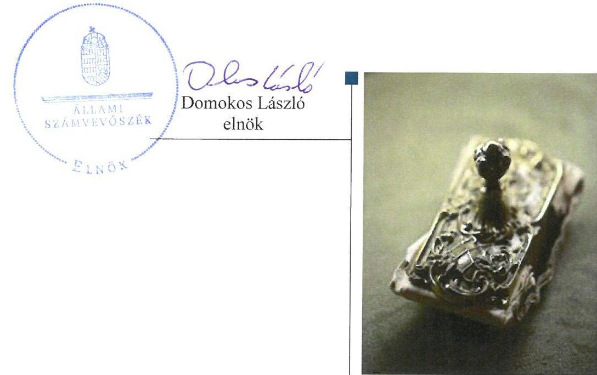
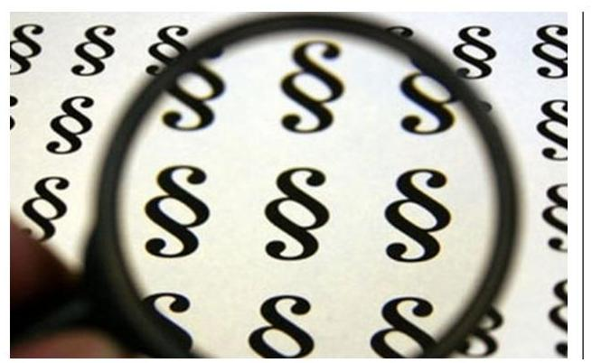
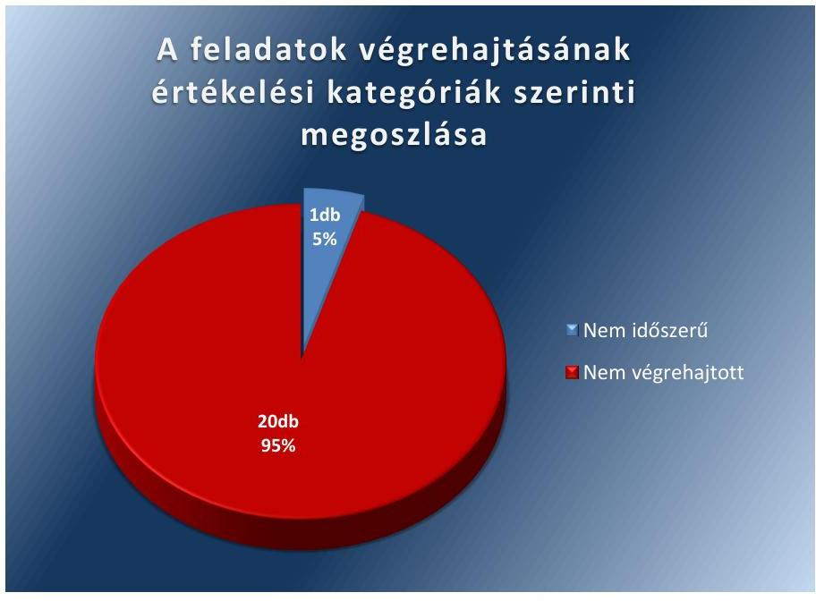
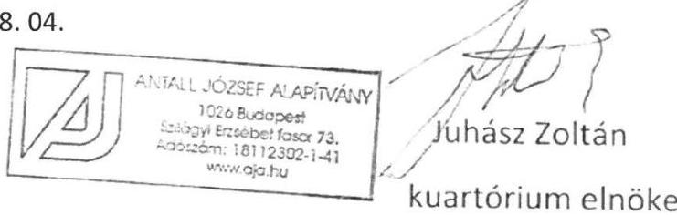
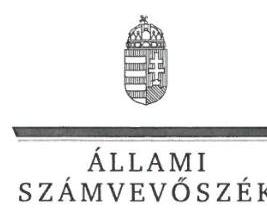
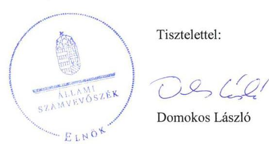
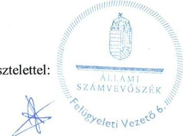

# Jelentés 

## Utóellenőrzések

Az Antall József Alapítvány 2012-2013. évi gazdálkodása törvényességének utóellenőrzése
2017.

---

# Jelentés 

## Utóellenőrzések

Az Antall József Alapítvány 2012-2013. évi gazdálkodása törvényességének utóellenőrzése
2017. 09. hó 26. nap

---

# AZ ELLENŐRZÉST FELÜGYELTE: 

DR. BENEDEK MÁRIA felügyeleti vezető

## AZ ELLENŐRZÉST VEZETTE ÉS A VÉGREHAJTÁSÁÉRT FELELŐS:

KAKAS SÁNDOR ellenőrzésvezető

## A PROGRAM ÖSSZEÁLLÍTÁSÁÉRT FELELŐS:

JANIK JÓZSEF LÁSZLÓ osztályvezető

## A TÉMÁHOZ KAPCSOLÓDÓ KORÁBBI SZÁMVEVŐSZÉKI JELENTÉSEK:

- címe: Jelentés az Antall József Alapítvány 2003-2005. évi gazdálkodása törvényességének ellenőrzéséről
- sorszáma: 0702
- címe: Jelentés az Antall József Alapítvány 2006-2007. évi gazdálkodása törvényességének ellenőrzéséről
- sorszáma: 0848
- címe: Jelentés az Antall József Alapítvány 2008-2009. évi gazdálkodása törvényességének ellenőrzéséről
- sorszáma: 1044
- címe: Jelentés az Antall József Alapítvány 2010-2011. évi gazdálkodása törvényességének ellenőrzéséről
- sorszáma: 13002
- címe: Jelentés az Antall József Alapítvány 2012-2013. évi gazdálkodása törvényességének ellenőrzéséről
- sorszáma: 15166

IKTATÓSZÁM: EL-0039-029/2017.
TÉMASZÁM: 21
ELLENŐRZÉS-AZONOSÍTÓ SZÁM: V075583

---

# TARTALOMJEGYZÉK 

■ ÖSSZEGZÉS ..... 5
■ AZ ELLENŐRZÉS CÉLJA ..... 6
■ AZ ELLENŐRZÉS TERÜLETE ..... 7
■ AZ ELLENŐRZÉS HÁTTERE, INDOKOLTSÁGA ..... 8
■ A JELENTÉS LÉNYEGES KÉRDÉSKÖRE ..... 9
■ ELLENŐRZÉS HATÓKÖRE ÉS MÓDSZEREI ..... 10
■ MEGÁLLAPÍTÁSOK ..... 12
■ MELLÉKLETEK ..... 15
I. sz. melléklet: Az ÁSZ 15166 számú jelentéséhez kapcsolódó intézkedési terv végrehajtása ..... 15
■ FÜGGELÉK: ÉSZREVÉTELEK ..... 21
■ RÖVIDÍTÉSEK JEGYZÉKE ..... 37

---

.

---

# ÖSSZEGZÉS 

Az Állami Számvevőszék az Antall József Alapítvány 2012-2013. évi gazdálkodása törvényességének utóellenőrzése során megállapította, hogy az intézkedési tervben meghatározott feladatokat nem hajtotta végre, a szabályszerű müködés és gazdálkodás feltételeit nem teremtette meg, mivel a korábban feltárt szabálytalanságokat, hiányosságokat nem szüntette meg. A jogszabályi előírások ellenére továbbra sem készítette el az éves tevékenységéről szóló jelentéseket és a számviteli beszámolót, közzétételi kötelezettségét nem teljesítette, melynek következtében nem biztositotta gazdálkodásának, vagyoni helyzetének átláthatóságát.

## Az ellenőrzés társadalmi indokoltsága

Az Állami Számvevőszék stratégiájában célul tűzte ki a számvevőszéki munka hasznosulásának javítását. Ezzel összhangban ellenőrzi, hogy az ellenőrzött szervezetek megvalósították-e a korábbi ellenőrzései által feltárt hibák, hiányosságok és szabálytalanságok megszüntetése céljából kialakított intézkedési terveikben foglaltakat. A rendszeres utóellenőrzések hozzájárulnak a szükséges intézkedések tényleges végrehajtásához, ezáltal a közpénzügyek rendezettségének javulásához, igazolják, hogy lezárult a következmények nélküli ellenőrzések időszaka.

## Főbb megállapítások, következtetések

Az Antall József Alapítvány az intézkedést igénylő megállapításokhoz és javaslatokhoz kapcsolódóan összeállított intézkedési tervet megküldte az Állami Számvevőszék részére.

Az intézkedési tervben meghatározott 21 feladatból 20-at nem hajtott végre, egy végrehajtása nem volt időszerű. Az Állami Számvevőszék által korábban az Antall József Alapítvány gazdálkodása törvényességének területén azonosított hiányosságok, szabálytalanságok továbbra is fennállnak.

A szervezeti és működési szabályzat módosításának, a gazdálkodási szabályzatok aktualizálásának elmaradása, a Kuratórium belső szabályzatok szerinti működése biztosításának hiánya miatt a szabályszerű működés és gazdálkodás feltételei, a költségvetési terv elfogadásának szabálytalansága miatt a tervezhető gazdálkodás feltételei továbbra sem biztosítottak.

Az Antall József Alapítvány a támogatott szervezetek támogatási szerződés szerinti elszámoltatásáról, az alapító párt részére nyújtott kölcsön fennmaradó részének visszafizettetéséről, valamint az Állami Számvevőszék által nem elfogadott kifizetett költség visszafizetéséről nem intézkedett.

Az Antall József Alapítvány a jogszabályban előírtak ellenére a tevékenységéről szóló éves jelentések, számviteli beszámolók elkészítéséről, közzétételéről, a könyvvezetés jogszabályoknak való megfelelőségéről nem gondoskodott, melynek következtében a gazdálkodásának, a vagyoni helyzetének átláthatósága nem volt biztosított.

---

# AZ ELLENŐRZÉS CÉLJA 

Az ellenőrzés célja annak értékelése volt, hogy a számvevőszéki jelentésben ${ }^{1}$ foglalt intézkedést igénylő megállapításokkal és javaslatokkal összhangban készített intézkedési tervben meghatározott feladatokat az Antall József Alapítvány végrehajtotta-e.

---

# AZ ELLENŐRZÉS TERÜLETE 

## Antall József Alapítvány

A pártok a népakarat kialakításában és kinyilvánításában történő közremúködésének elősegítése, az állampolgári tájékoztatás szélesítése, a politikai kultúra fejlesztése érdekében a Pártalapítványi tv. ${ }^{2}$ alapján tudományos, ismeretterjesztő, kutatási és oktatási tevékenységük elősegítésére a Párt tv. ${ }^{3}$-ben meghatározott költségvetési támogatásra jogosult alapítványt hozhatnak létre.

A Magyar Demokrata Fórum (2011. június 18-tól Jólét és Szabadság Demokrata Közösség) a törvényben biztosított lehetőséggel élve 2003. évben létrehozta az Antall József Alapítványt. Az Antall József Alapítvány célja, hogy tevékenységével hozzájáruljon a magyarországi politikai kultúra fejlesztéséhez, színvonalának emeléséhez, az alapító JESZ ${ }^{4}$ által vallott értékekhez és politikai értékrendhez kapcsolódó tudományos, ismeretterjesztő, kutatási és oktatási tevékenységet végezzen, valamint tudományos kutatás, tájékoztatás, oktatás és képzés szervezésével elősegítse a célok megvalósulását. Az Antall József Alapítvány a 2012. és 2013. évben a törvényi előírásoknak megfelelően évente 28300 ezer Ft költségvetési támogatásban részesült.

Az Állami Számvevőszék a 2015. évben ellenőrizte az Antall József Alapítvány 2012-2013. évi gazdálkodása törvényességét, az erről szóló 15166 számú jelentését 2015. augusztus 25-én tette közzé. Az ellenőrzés célja annak megállapítása volt, hogy az Antall József Alapítvány a 2012-2013. években törvényesen gazdálkodott-e.

Az utóellenőrzés - a 2015. augusztus 25-től a 2017. február 14-ig végrehajtott feladatokat figyelembe véve - az ÁSZ ${ }^{5}$ jelentésben a Kuratórium ${ }^{6}$ elnöke részére megfogalmazott intézkedést igénylő megállapításokra és javaslatokra készített, az ÁSZ részére megküldött intézkedési tervben foglalt feladatok megvalósításának ellenőrzésére, illetve értékelésére fókuszált.

---

# AZ ELLENŐRZÉS HÁTTERE, INDOKOLTSÁGA 

Az ÁSZ tv. ${ }^{7}$ 33. § (1) bekezdése értelmében a számvevőszéki jelentések intézkedést igénylő megállapításaihoz és javaslataihoz kapcsolódóan az ellenőrzött szervezet vezetője intézkedési tervet köteles összeállítani, és az ÁSZ részére megküldeni. Az intézkedési tervben foglaltak megvalósítását az ÁSZ tv. 33. § (7) bekezdésében foglaltak alapján - az ÁSZ utóellenőrzés keretében ellenőrizheti. Az intézkedések megvalósulásának értékelése során az ÁSZ figyelembe veszi az ellenőrzött szervezetek működési feltételeiben, valamint a jogszabályi előírásokban bekövetkezett változásokat.

Az intézkedési tervekben foglalt feladatok hiányos, illetve késedelmes végrehajtása, valamint megvalósításának elmaradása azt mutatja, hogy az ellenőrzések során feltárt hibák, hiányosságok és szabálytalanságok megszüntetése nem kapott kellő hangsúlyt. Ez a szabályszerű működés és a felelős vezetői magatartás vonatkozásában kockázatot hordoz. E kockázatok feltárásával az ÁSZ utóellenőrzési rendszere fokozza a fegyelmet, és igazolja, hogy a közpénzzel való szabályos gazdálkodás felelőssége elől nem lehet kitérni.

## AZ UTÓELLENŐRZÉS VÁRHATÓ HASZNOSULÁSA

Az utóellenőrzés négy szinten hasznosulhat:
$\longrightarrow$ A társadalom szintjén az utóellenőrzés jelzi, hogy a számvevőszéki ellenőrzés megállapításainak van következménye: az ÁSZ a hiányosságok megszüntetésére az ellenőrzött szervezet által meghatározott intézkedések végrehajtását is számon kéri.
$\longrightarrow$ Az ellenőrzött terület szintjén az utóellenőrzés tájékoztatást nyújt a terület döntéshozóinak a hiányosságok kiküszöbölésének jó gyakorlatairól, ezzel lehetőséget biztosítva arra, hogy az ÁSZ ellenőrzési megállapításai, javaslatai a terület nem ellenőrzött szervezeteinek a működése során is hasznosuljanak.
$\longrightarrow$ Az ellenőrzött szervezet szintjén az utóellenőrzés feltárja, hogy a szervezet az intézkedések végrehajtásával hasznosította-e a korábbi ellenőrzési jelentésben a hiányosságok megszüntetése, illetve a kockázatok kezelése érdekében megfogalmazott javaslatokat.
$\longrightarrow$ Az ÁSZ szintjén az utóellenőrzés visszacsatolást ad az ellenőrzési jelentések hasznosulásáról, az intézkedések elmaradása vagy részleges megvalósulása a további ellenőrzésekhez kockázati jelzésként szolgál.

---

# A JELENTÉS LÉNYEGES KÉRDÉSKÖRE 

Az Antall József Alapítvány az intézkedési tervben foglaltakat az elöirt határidőben végrehajtotta-e?

---

# ELLENŐRZÉS HATÓKÖRE ÉS MÓDSZEREI 

## Az ellenőrzés típusa

Megfelelőségi ellenőrzés.

## Az ellenőrzött időszak

Az utóellenőrzés alapját képező ÁSZ jelentés közzétételének napjától (2015. augusztus 25.) az ellenőrzésről szóló kiértesítő levél keltének napjáig (2017. február 14.) tartó időszak.

## Az ellenőrzés tárgya

Az ÁSZ tv. 2011. július 1-jei hatálybalépését követően a számvevőszéki jelentésben foglalt intézkedést igénylő megállapításokkal és javaslatokkal összhangban - az Antall József Alapítvány által - készített intézkedési tervben foglaltak végrehajtásának ellenőrzése.

Az ellenőrzés kiterjedt minden olyan körülményre és adatra, amely az ÁSZ jogszabályban meghatározott feladatainak teljesítéséhez, valamint a program végrehajtása folyamán felmerült újabb összefüggések feltárásához szükséges.

## Az ellenőrzött szervezet

Antall József Alapítvány

## Az ellenőrzés jogalapja

Az ÁSZ az ÁSZ tv.-ben meghatározott feladatkörében ellenőrzi a központi költségvetés végrehajtását, az államháztartás gazdálkodását, az államháztartásból származó források felhasználását és a nemzeti vagyon kezelését.

Az ÁSZ tv. 1. § (3) bekezdése szerint az ÁSZ általános hatáskörrel végzi a közpénzekkel és az állami és önkormányzati vagyonnal való felelős gazdálkodás ellenőrzését.

Az ÁSZ tv. 33. § (7) bekezdése alapján az ÁSZ tv. 33. § (1)-(2) bekezdése szerinti intézkedési tervben foglaltak megvalósítását az ÁSZ utóellenőrzés keretében ellenőrizheti.

---

# Az ellenőrzés módszerei 

Az ÁSZ az ellenőrzést a nemzetközi standardokat irányadónak tekintve az ellenőrzési program ellenőrzési kérdései, az ellenőrzött időszakban hatályos jogszabályok, az ellenőrzés szakmai szabályok és módszertanok figyelembevételével, önállóan végezte.

Az ÁSZ az ellenőrzés ideje alatt az Antall József Alapítvánnyal történő kapcsolattartást az ÁSZ SZMSZ ${ }^{8}$-ének vonatkozó előírásai alapján biztosította.

Az utóellenőrzés megállapításait elsősorban az ÁSZ rendelkezésére álló, valamint az Antall József Alapítványtól elektronikusan bekért dokumentumok alapozták meg.

Az ellenőrzési bizonyítékként felhasználható adatforrások közé tartoztak egyrészt a szakmai programban felsorolt adatforrások, másrészt minden - az ellenőrzés folyamán feltárt, az ellenőrzés szempontjából információt tartalmazó - dokumentum.

Az ÁSZ az intézkedési tervben előírt feladatok értékelését, azok végrehajthatósága, illetve végrehajtása szempontjából az alábbiak szerint végezte:
"határidőben végrehajtott" a feladat, ha a teljesítés dokumentáltan, az intézkedési tervben előírt határidőben és tartalommal megtörtént;
"határidőn túl végrehajtott" a feladat, ha annak teljesítése az intézkedési tervben meghatározott módon, de az előírt határidőn túl történt meg;
"részben végrehajtott" a feladat, ha végrehajtása teljes körűen az intézkedési tervben előírt módon nem történt meg;
"nem végrehajtott" a feladat, ha a végrehajtás nem történt meg, vagy amennyiben a teljesítést nem dokumentálták;
"okafogyottá vált" a feladat, ha végrehajtására - meghatározott esemény bekövetkezése, továbbá külső körülmény, a működést érintő feltétel változása miatt - már nincs szükség, illetve lehetőség, és egyértelműen megállapítható, hogy az intézkedést szükségessé tevő körülmény a jövőben nem fordulhat elő;
"nem időszerű" az a feladat, amelynek ellenőrzési időszakon belüli végrehajtására azért nem került (kerülhetett) sor, mert az intézkedés alapjául szolgáló esemény nem következett be, de annak jövőbeni előfordulása lehetséges, a végrehajtása nem volt esedékes, vagy a végrehajtás határideje még nem járt le.
Az ellenőrzés lefolytatásához az Antall József Alapítvány a tanúsítványok elektronikus kitöltésével, valamint az ÁSZ által kért dokumentumok elektronikus megküldésével szolgáltatott adatokat, amelyek valódiságát és teljes körűségét a Kuratórium elnöke által tett teljességi és hitelességi nyilatkozat igazolja. Az így rendelkezésre bocsátott adatok, információk kontrollja az ellenőrzés keretében történt.

---

# MEGÁLLAPÍTÁSOK 

## Az Antall József Alapítvány az intézkedési tervben foglaltakat az előírt határidőben végrehajtotta-e?

Összegző megállapítás

Az AJA ${ }^{9}$ az intézkedési tervben meghatározott 21 feladatból 20-at nem hajtott végre, egy végrehajtása nem volt időszerű.

Az ÁSZ a jelentésében a Kuratórium elnöke részére három összetett javaslatot fogalmazott meg, melynek hasznosítására az ÁSZ részére megküldött intézkedési tervben a hiányosságok, szabálytalanságok megszüntetése érdekében 21 feladatot határoztak meg. A feladatok elvégzésének felelőseként 20 esetben a Kuratórium elnöke, egy esetben a Kuratórium elnöke és a Kuratórium tagjai együttesen kerültek megnevezésre.

Az intézkedési tervben meghatározott feladatokat, határidőket, felelősöket, és a feladatok végrehajtását az I. számú melléklet mutatja be.

Az AJA intézkedési tervében meghatározott feladatok végrehajtásának értékelési kategóriák szerinti megoszlását az 1. ábra szemlélteti.

1. ábra

Fonás: ÁSZ
NEM VÉGREHAJTOTT feladatok:

1. A Kuratórium elnöke nem gondoskodott az SZMSZ ${ }^{10}$ Alapító okiratban ${ }^{11}$ foglaltaknak megfelelő módosításáról.
2. A Kuratórium elnöke nem intézkedett arról, hogy a költségvetési terv elfogadása, a vagyon felhasználása, valamint a 2012-2013. évi beszámolók elfogadása megfeleljen a 350/2011. (XII. 30.) Korm. rendeletnek ${ }^{12}$.

---

3. A Kuratórium elnöke nem intézkedett a PGSZ-ben ${ }^{13}$ előírt negyedéves beszámolók elkészíttetéséről, valamint nem ellenőrizte a kuratóriumi döntések végrehajtását.
4. A Kuratórium elnöke nem intézkedett arról, hogy a kuratóriumi ülések összehívása, gyakorisága, valamint a határozathozatal vonatkozásában az SZMSZ-ben és a PGSZ-ben foglalt szabályok betartásra kerüljenek.
5. A Kuratórium elnöke nem intézkedett a 2013. évi, valamint az azt követő évekre vonatkozó jelentések elkészítéséről és közzétételéről.
6. A Kuratórium elnöke nem gondoskodott arról, hogy az egyszerűsített éves beszámoló és a könyvvezetés megfeleljen a Számv. tv. ${ }^{14}$, valamint a 224/2000. (XII. 19.) Korm. rendelet ${ }^{15}$ előírásainak, illetve arról, hogy a PGSZ módosításra kerüljön az Alapító okiratban és az SZMSZ-ben foglaltakkal összhangban.
7. A Kuratórium elnöke nem intézkedett a Pártalapítványi tv. előírásai ellenére a 2012. évről készített jelentés Kuratórium általi elfogadtatásáról és közzétételéről, valamint a 2013-2015. évi jelentések elkészítéséről, elfogadtatásáról és közzétételéről.
8. A Kuratórium elnöke nem gondoskodott arról, hogy a 2012-2015. évi számviteli beszámolók eredménykimutatásának tagolása megfeleljen a 224/2000 (XII.19.) Korm. rendeletben meghatározottaknak és tartalmazzák az 5. számú mellékletben előírt tájékoztató adatokat.
9. A Kuratórium elnöke nem gondoskodott arról, hogy a beszámolók megfeleljenek a Számv. tv. 15. §-ában foglaltaknak.
10. A Kuratórium elnöke nem gondoskodott arról, hogy a mérlegben szereplő tárgyi eszközök értéke megfeleljen a Számv. tv. 69. §ában foglalt előírásoknak.
11. A Kuratórium elnöke nem gondoskodott arról, hogy a 2012-2015. évekre vonatkozóan az analitikus nyilvántartások és a főkönyv egyeztetése megtörténjen, valamint arról, hogy a könyvviteli mérleg adatai analitikus nyilvántartásokkal és leltárral alátámasztásra kerüljenek.
12. A Kuratórium elnöke nem gondoskodott arról, hogy a 2012-2015. évi könyvviteli mérlegben kimutatott követelések kötelezettek általi elismertetésére, a követelések egyedileg történő értékelésére, és a követelések összegének leltárral történő alátámasztására sor kerüljön.
13. A Kuratórium elnöke nem gondoskodott arról, hogy a könyvvezetési gyakorlat megfeleljen a jogszabályi előírásoknak.
14. A Kuratórium elnöke nem gondoskodott az eszközök és források értékelési szabályzatának elkészítéséről.
15. A Kuratórium elnöke nem gondoskodott a Számv. tv. előírásai szerint a számviteli politika ${ }^{16}$, a leltározási szabályzat ${ }^{17}$, a pénzkezelési szabályzat ${ }^{18}$, valamint a számlarend ${ }^{19}$ aktualizálásáról.

---

16. A Kuratórium elnöke nem gondoskodott az immateriális javak és a tárgyi eszközök esetében az évenként elszámolandó értékcsökkenés módszerének meghatározásáról, valamint azok nyilvántartásokon való rögzítéséről.
17. A Kuratórium elnöke nem intézkedett a meghiúsult rendezvény kártalanítás miatt kifizetett költség (1 429 ezer Ft) ÁSZ által nem elfogadott teljesítés visszafizetéséről.
18. A Kuratórium elnöke nem intézkedett arról, hogy a 2012. és 2013. évben támogatott szervezetek a támogatási szerződés szerinti elszámolásra, a bizonylatok, számlák csatolására felszólításra kerüljenek.
19. A Kuratórium elnöke ismételten nem intézkedett a Nádor utcai ingatlan tekintetében az AJA a JESZ-szel megkötött adásvételi szerződéstől való elállását követően a megfizetett vételár visszafizetésére vonatkozóan. Ennek ellenére a JESZ a 2015. évben 2650 ezer Ft vételárrészletet visszafizetett az AJA részére. A 2016. évre vonatkozóan az AJA dokumentumokkal nem igazolta esedékes vételárrészlet visszafizetését.
20. A Kuratórium elnöke nem intézkedett az adós felszólításáról a JESZ részére nyújtott kölcsön tekintetében fennmaradó 1455 ezer Ft részlet visszafizetése tárgyában, továbbá a teljesítés hiányában nem tette meg a megfelelő jogi lépéseket.

# NEM IDŐSZERŰ feladat: 

21. A támogatások kizárólag a Pártalapítványi tv.-ben foglaltak szerinti célokra történő felhasználására vonatkozó döntésekkel kapcsolatos intézkedés végrehajtása nem volt időszerű, mert az ellenőrzött időszakban az AJA nem kapott támogatást.

---

# MELLÉKLETEK

- I. SZ. MELLÉKLET: AZ ÁSZ 15166 SZÁMÚ JELENTÉSÉHEZ KAPCSOLÓDÓ INTÉZKEDÉSI TERV VÉGREHAJTÁSA

|  1. | Az intézkedési tervben meghatározott feladat | Az intézkedési tervben meghatározott határidő | Az intézkedési tervben meghatározott feladat felelőse | A feladat végrehajtása  |
| --- | --- | --- | --- | --- |
|   | 1. | 2. | 3. | 4.  |
|  1. |  | Nem végrehajtott feladatok |  |   |
|  1. | SZMSZ módosítása:
A kuratórium elnöke intézkedik az SZMSZ Alapító okiratban foglaltaknak megfelelő módosításáról a bankszámla feletti rendelkezés vonatkozásában, valamint a főigazgatói fel-adat- és hatáskör vonatkozásában, illetőleg intézkedik az új SZMSZ kuratórium általi elfogadásáról. | 2015. november 30. | elnök | A Kuratórium elnöke nem gondoskodott az SZMSZ Alapító okiratban foglaltaknak megfelelő módosításáról.  |
|  2. | Intézkedés a 350/2011. (XII. 30.) Korm. rend. betartásáról: Az alapítvány elnöke intézkedik aziránt, hogy a költségvetési terv elfogadása, a vagyon felhasználása, valamint a beszámolók elfogadása 2012. és 2013. évekre vonatkozóan, valamint az azt követő években megfeleljen a 350/2011. (XII. 30.) Korm. rendelet előírásainak. | 2015. november 30., valamint ezen időpontot követően folyamatosan | elnök | A Kuratórium elnöke nem intézkedett arról, hogy a költségvetési terv elfogadása, a vagyon felhasználása, valamint a 2012-2013. évi beszámolók elfogadása megfeleljen a 350/2011. (XII. 30.) Korm. rendeletnek. 2014. március 15-től a 350/2011. (XII. 30.) Korm. rendelet hatálya az AJA-ra nem terjed ki, ennek következtében a feladatok végrehajtása ezen időpontot követően okafogyottá vált.  |
|  3. | A döntések végrehajtása iránti intézkedés:
Az alapítvány elnöke intézkedik a PGSZ-ben előírt negyedéves beszámolók elkészíttetése iránt, valamint ellenőrzi a döntések végrehajtását. | folyamatos | elnök | A Kuratórium elnöke nem intézkedett a PGSZ-ben előírt negyedéves beszámolók elkészíttetéséről, valamint nem ellenőrizte a kuratóriumi döntések végrehajtását.  |
|  4. | A kuratórium szabályszerű működése érdekében:
Az Alapítvány elnöke intézkedik a kuratórium szabályszerű összehívása, üléseinek gyakorisága, valamint a határozathozatal vonatkozásában az SZMSZ-ben és a PGSZ-ben foglalt szabályok betartása iránt. | folyamatos | elnök | A Kuratórium elnöke nem intézkedett arról, hogy a kuratóriumi ülések összehívása, gyakorisága, valamint a határozathozatal vonatkozásában az SZMSZ-ben és a PGSZ-ben foglalt szabályok betartásra kerüljenek.  |
|  5. | Jelentéskészítési és közzétételi kötelezettséggel kapcsolatosan: | 2015. november 30., valamint azt követően folyamatosan | elnök | A Kuratórium elnöke nem intézkedett a 2013. évi, valamint az azt követő évekre vonatkozó jelentések elkészítéséről és közzétételéről.  |

---

|  5. | Az intézkedési tervben meghatározott feladat | Az intézkedési tervben meghatározott határidő | Az intézkedési tervben meghatározott feladat felelőse | A feladat végrehajtása  |
| --- | --- | --- | --- | --- |
|   | 1. | 2. | 3. | 4.  |
|   | Az alapítvány elnöke intézkedik a 2013. évi, valamint az azt követő években folyamatosan a jelentés elkészítéséről és közzétételéről. |  |  |   |
|  6. | Egyszerűsített éves beszámoló vonatkozásában:
Az alapítvány elnöke gondoskodik arról, hogy az egyszerűsített éves beszámoló, valamint a könyvvezetés megfeleljen a 224/2000. (XII. 19.) Korm. rend., valamint a Számviteli törvény előírásainak, azok javításra kerüljenek. Továbbá gondoskodni arról, hogy a PGSZ módosításra kerüljön az Alapító Okiratban és az SZMSZ-ben foglaltakkal összhangban, főigazgató feladat- és hatáskör kivezetésre kerüljön. | 2015. november 30. | elnök | A Kuratórium elnöke nem gondoskodott arról, hogy az egyszerűsített éves beszámoló és a könyvvezetés megfeleljen a Számv. tv., valamint a 224/2000. (XII. 19.) Korm. rendelet előírásainak, illetve arról, hogy a PGSZ módosításra kerüljön az Alapító okiratban és az SZMSZ-ben foglaltakkal összhangban.  |
|  7. | 2012. és 2013. évi jelentés elkészítése, elfogadása, valamint közzététele vonatkozásában:
Az alapítvány elnöke intézkedik a 2012. évi Pártalapítványi tv-ben foglalt jelentés kuratórium általi elfogadása és közzététele iránt, valamint a 2013. évi jelentés elkészítése, elfogadása, valamint közzététele iránt, valamint az ezt követő években folyamatosan gondoskodik a jelentés elkészítése, elfogadása és közzététele iránt. | 2015. november 30., valamint azt követően folyamatosan | elnök | A Kuratórium elnöke nem intézkedett a Pártalapítványi tv. előírásai ellenére a 2012. évről készített jelentés Kuratórium általi elfogadtatásáról és közzétételéről, valamint a 2013–2015. évi jelentések elkészítéséről, elfogadtatásáról és közzétételéről.  |
|  8. | 2012-2013. évi számviteli beszámolóval kapcsolatosan:
Az alapítvány elnöke gondoskodik arról, hogy: a 2012-2013. évi, valamint az azt követő években a számviteli beszámolók eredménykimutatásának tagolása megfeleljen a 224/2000 (XII.19.) Korm. rend. 5. sz. mellékletében meghatározottaknak és tartalmazza az abban előírt tájékoztató adatokat. | 2015. november 30., azt követően folyamatosan | elnök | A Kuratórium elnöke nem gondoskodott arról, hogy a 2012–2015. évi számviteli beszámolók eredménykimutatásának tagolása megfeleljen a 224/2000 (XII.19.) Korm. rendeletben meghatározottaknak és tartalmazzák az 5. számú mellékletben előírt tájékoztató adatokat.  |
|  9. | 2012-2013. évi számviteli beszámolóval kapcsolatosan:
Az alapítvány elnöke gondoskodik arról, hogy: a beszámoló megfeleljen a Számviteli tv. 15. §-ában foglaltaknak | 2015. november 30., azt követően folyamatosan | elnök | A Kuratórium elnöke nem gondoskodott arról, hogy a beszámolók megfeleljenek a Számv. tv. 15. §-ában foglaltaknak.  |
|  10. | 2012-2013. évi számviteli beszámolóval kapcsolatosan: | 2015. november 30., azt követően folyamatosan | elnök | A Kuratórium elnöke nem gondoskodott arról, hogy a mérlegben szereplő tárgyi eszközök értéke megfeleljen a Számv. tv. 69. §-ában foglalt előírásoknak.  |

---

|  1. | Az intézkedési tervben meghatározott feladat | Az intézkedési tervben meghatározott határidő | Az intézkedési tervben meghatározott feladat felelőse | A feladat végrehajtása  |
| --- | --- | --- | --- | --- |
|   | 1. | 2. | 3. | 4.  |
|   | Az alapítvány elnöke gondoskodik arról, hogy: a mérlegben szereplő tárgyi eszköz értéke megfeleljen a Számviteli tv. 69. §-ában foglaltaknak |  |  |   |
|  11. | 2012-2013. évi számviteli beszámolóval kapcsolatosan: Az alapítvány elnöke gondoskodik arról, hogy: elvégzésre kerüljön az analitikus nyilvántartások és a főkönyv egyeztetése a 2012-2013. évre, valamint az azt követő évekre vonatkozóan, valamint az egyszerűsített éves beszámoló könyvviteli mérlegének adatai az analitikus nyilvántartásokkal és leltárral alátámasztásra kerüljenek | 2015. november 30., azt követően folyamatosan | elnök | A Kuratórium elnöke nem gondoskodott arról, hogy a 2012–2015. évekre vonatkozóan az analitikus nyilvántartások és a főkönyv egyeztetése megtörténjen, valamint arról, hogy a könyvviteli mérleg adatai analitikus nyilvántartásokkal és leltárral alátámasztásra kerüljenek.  |
|  12. | 2012-2013. évi számviteli beszámolóval kapcsolatosan: Az alapítvány elnöke gondoskodik arról, hogy: 2012 évben, valamint az azt követő években kimutatott követelés összegének kötelezettek általi elismertetése megtörténjen, a követelések összegének leltárral történő alátámasztása, egyedileg történő értékelése | 2015. november 30., azt követően folyamatosan | elnök | A Kuratórium elnöke nem gondoskodott arról, hogy a 2012–2015. évi könyvviteli mérlegben kimutatott követelések kötelezettek általi elismertetésére, a követelések egyedileg történő értékelésére, és a követelések összegének leltárral történő alátámasztására sor kerüljön.  |
|  13. | 2012-2013. évi számviteli beszámolóval kapcsolatosan: Az alapítvány elnöke gondoskodik arról, hogy: könyvvezetési gyakorlat megfeleljen a jogszabályi előírásoknak | 2015. november 30., azt követően folyamatosan | elnök | A Kuratórium elnöke nem gondoskodott arról, hogy a könyvvezetési gyakorlat megfeleljen a jogszabályi előírásoknak.  |
|  14. | 2012-2013. évi számviteli beszámolóval kapcsolatosan: Az alapítvány elnöke gondoskodik arról, hogy: hatályos eszközök és források értékelési szabályzat elkészítése iránt | 2015. november 30., azt követően folyamatosan | elnök | A Kuratórium elnöke nem gondoskodott az eszközök és források értékelési szabályzatának elkészítéséről.  |
|  15. | 2012-2013. évi számviteli beszámolóval kapcsolatosan: Az alapítvány elnöke gondoskodik arról, hogy: számviteli politika, leltározási szabályzat és pénzkezelési szabályzat, számlarend hatályos törvényben foglaltaknak megfelelő aktualizálása | 2015. november 30., azt követően folyamatosan | elnök | A Kuratórium elnöke nem gondoskodott a Számv. tv. előírásai szerint a számviteli politika, a leltározási szabályzat, a pénzkezelési szabályzat, valamint a számlarend aktualizálásáról.  |
|  16. | 2012-2013. évi számviteli beszámolóval kapcsolatosan: Az alapítvány elnöke gondoskodik arról, hogy: immateriális javak és tárgyi eszközök esetében az évenként elszámolandó értékcsökkenés módszere meghatározásra kerüljön, azok a nyilvántartásokon rögzítésre kerüljenek | 2015. november 30., azt követően folyamatosan | elnök | A Kuratórium elnöke nem gondoskodott az immateriális javak és a tárgyi eszközök esetében az évenként elszámolandó értékcsökkenés módszerének meghatározásáról, valamint azok nyilvántartásokon való rögzítéséről.  |

---

|  1. | Az intézkedési tervben meghatározott feladat | Az intézkedési tervben meghatározott határidő | Az intézkedési tervben meghatározott feladat felelőse | A feladat végrehajtása  |
| --- | --- | --- | --- | --- |
|  1. |  | 2. | 3. | 4.  |
|  17. | Az elmaradt rendezvényre fordított támogatási összeg vonatkozásában:
Az alapítvány elnöke intézkedik a meghiúsult rendezvény kártalanítás miatt kifizetett költség (1.429.000 Ft) az Állami Számvevőszék által nem elfogadott teljesítés visszafizetése iránt. | 2015. december 31. | elnök | A Kuratórium elnöke nem intézkedett a meghiúsult rendezvény kártalanítás miatt kifizetett költség (1 429 ezer Ft) ÁSZ által nem elfogadott teljesítés visszafizetéséről.  |
|  18. | Támogatottakkal kapcsolatos eljárás:
A kuratórium elnöke intézkedik aziránt, hogy a 2012. és 2013. évben támogatott szervezetek a támogatási szerződés szerinti elszámolásra, bizonylatok, számlák csatolására felszólításra kerüljenek. | 2015. november 30. | elnök | A Kuratórium elnöke nem intézkedett arról, hogy a 2012. és 2013. évben támogatott szervezetek a támogatási szerződés szerinti elszámolásra, a bizonylatok, számlák csatolására felszólításra kerüljenek.  |
|  19. | A 2011. május 5. napján a JESZ-szel megkötött adásvételi szerződéssel kapcsolatosan, illetve a Nádor utcai ingatlannal kapcsolatos elállás:
Az alapítvány elnöke 2012. december 14. napján kelt levelében elállt a szerződéstől és felszólította az eladót a foglaló, valamint a megfizetett vételárrészlet visszafizetésére. Az alapítvány elnöke intézkedik aziránt, hogy a megfizetett foglaló és vételár visszafizetésre kerüljön ismételt felszólítással, szükséges eljárások megindításával, illetve intézkedik aziránt, hogy a JESZ a tartozást elismerje. Az alapítvány elállt az adásvételi szerződéstől és felszólította az eladót a már megfizetett foglaló és vételárrészlet visszafizetésére, jelenleg követelés feljegyzési eljárás indult el. | 2015. november 30. | elnök | A Kuratórium elnöke ismételten nem intézkedett a Nádor utcai ingatlan tekintetében az AJA a JESZ-szel megkötött adásvételi szerződéstől való elállását követően a megfizetett vételár visszafizetésére vonatkozóan. Ennek ellenére a JESZ a 2015. évben 2 650 ezer Ft vételárrészletet visszafizetett az AJA részére. A 2016. évre vonatkozóan az AJA dokumentumokkal nem igazolta esedékes vételárrészlet visszafizetését.  |
|  20. | A JESZ részére nyújtott kölcsönnel kapcsolatosan:
Az alapítvány elnöke a fennmaradt 1.455.000, - Ft visszafizetése tárgyában intézkedik aziránt, hogy az adós felszólításra kerüljön, illetve teljesítés hiányában a megfelelő jogi lépéseket megteszi. | 2015. november 30. | elnök | A Kuratórium elnöke nem intézkedett az adós felszólításáról a JESZ részére nyújtott kölcsön tekintetében fennmaradó 1 455 ezer Ft részlet visszafizetése tárgyában, továbbá a teljesítés hiányában nem tette meg a megfelelő jogi lépéseket.  |

---

|  Az intézkedési tervben meghatározott feladat | Az intézkedési tervben meghatározott határidő | Az intézkedési tervben meghatározott feladat felelőse | A feladat végrehajtása  |
| --- | --- | --- | --- |
|  1. | 2. | 3. | 4.  |
|  Nem időszerű feladat |  |  |   |
|  21. A támogatás Pártalapítványi törvényben előírt célokra történő felhasználása: |  |  |   |
|  A kuratórium elnöke gondoskodik arról, hogy a kuratórium olyan döntéseket hozzon, amely szerint az alapítvány a támogatásokat kizárólag a Pártalapítványi törvényben foglaltak szerinti célokra használja fel. |  |  |   |
|   | folyamatos | elnök, Kuratórium tagjai | A támogatások kizárólag a Pártalapítványi tv.-ben foglaltak szerinti célokra történő felhasználására vonatkozó döntésekkel kapcsolatos intézkedés végrehajtása nem volt időszerű, mert az ellenőrzött időszakban az AJA nem kapott támogatást.  |

*Forrás: ÁSZ által készített táblázat*

---

.

---

# FÜGGELÉK: ÉSZREVÉTELEK 

A jelentéstervezetet a Számvevőszék 15 napos észrevételezésre megküldte az ellenőrzött szervezet vezetőjének az ÁSZ tv. 29. §* (1) bekezdése előírásának megfelelően.

A függelék tartalmazza az ellenőrzött észrevételeit, illetve az el nem fogadott észrevételek elutasításának indoklását.

[^0]
[^0]:    * 29. § (1) Az Állami Számvevőszék az ellenőrzési megállapításait megküldi az ellenőrzött szervezet vezetőjének vagy az általa megbízott személynek, és annak, akinek személyes felelősségét állapította meg.
    (2) Az ellenőrzött szervezet vezetője és a felelősként megjelölt személy az ellenőrzés megállapításaira tizenöt napon belül írásban észrevételt tehet.
    (3) Az Állami Számvevőszék az észrevételre a beérkezésétől számított harminc napon belül írásban válaszol. A figyelembe nem vett észrevételeket köteles a jelentésben feltüntetni, és megindokolni, hogy azokat miért nem fogadta el.

---

Antall József Alapítvány
1026 Budapest, Szilágyi Erzsébet fasor 73.
e-mail: alapitvany.antalljozsef@gmail.com

# Állami Számvevőszék 

1364 Budapest 4. Pf. 54
Hivatkozási szám: EL-0039-026/2017

## Domokos László Elnök

Tisztelt Elnök Úr!

Az „Antall József Alapítvány 2012-2013. évi gazdálkodása törvényességének utóellenőrzése" című ellenőrzés megállapítása kapcsán az alábbi észrevételeket tesszük: (a lenti dokumentációkat minden esetben az ellenőrzést végző számvevőknek a helyszínen át is adtuk).

1. A Kuratórium elnöke intézkedett az SZMSZ Alapító okiratban foglaltak módosításáról-így különösen a bankszámla feletti rendelkezés vonatkozásában, valamint a főigazgatói feladat és hatáskör tekintetében és az SZMSZ kuratórium általi elfogadásáról. (módosított SZMSZ: 2017. március 6-án került elfogadásra.)
2. A 2015. november 27-én kelt jegyzőkönyv tanúsága szerint a Kuratórium elnöke felhívta a figyelmet, hogy a vagyon felhasználása, valamint a beszámolók elfogadását a 2012 és 2013. évekre vonatkozóan meg kell, hogy feleljen a 350/2011. (XII. 30.) Korm. rendelet előírásainak, melyre az alapítvány könyvelőjének figyelmét is felhívta.
3. 2017. március 6-án elfogadta az alapítvány kuratóriuma az új Pénzügyi és Gazdálkodási szabályzatot. Ebben negyedéves beszámolók már nincsenek.
4. Az új SZMSZ és PGSZ-ben meghatározott szabályok betartásra kerültek.
5. A Kuratórium elnöke 2015. 11. 25-én kelt jegyzőkönyv 6/2015. (XI.27.) számú határozata alapján döntött a 2012 és 2013-as jelentések elfogadásáról, melyek közzétételre is kerültek. A Magyar Közlöny oldaláról letölthetőek.
6. A Kuratórium elnöke intézkedett a 2015. 11. 27-ei jegyzőkönyv 7/2015. (XI.27.) határozata alapján az egyszerűsített éves beszámoló és

---

Antall József Alapítvány
1026 Budapest, Szilágyi Erzsébet fasor 73.
e-mail: alapitvany.antalljozsef@gmail.com
könyvvezetés tagolása megfeleljen a 224/2000. (XII.19.) Korm. rendelet előírásainak. A PGSZ módosításra került 2017. március 6-án, mely elfogadásra is került.
7. A Kuratórium elnöke a 2015. 11. 27-én kelt. jegyzőkönyv tanúsága szerint kérte a kuratóriumot, hogy a jelentések elkészítése, elfogadása és közzététele történjen meg. A 2014 és 2015. évi jelentés késve ugyan, de közzé lett téve.
8. A Kuratórium 7/2015. (XI.27.) számú határozatában erről döntött.
9. A Kuratórium 7/2015. (XI.27.) számú határozatában erről döntött.
10.A Kuratórium a 7/2015. (XI.27.) számú határozatában erről döntött, azonban a végrehajtása az Alapítvány személyi állományának csökkenése miatt elmaradt.
11.A Kuratórium 7/2015. (XI.27.) számú határozatában erről döntött, azonban végrehajtása a személyi állomány csökkenése miatt elmaradt.
12.A Kuratórium 7/2015. (XI.27.) számú határozatában erről döntött.
13.A Kuratórium 7/2015. (XI.27.) számú határozatában erről döntött és jelezte a könyvelést végző irodáknak.
14.A Kuratórium 7/2015. (XI.27.) számú határozatában erről döntött és jelezte a könyvelést végző irodáknak.
15.Az Alapítvány pénzügyi helyzete és csökkenő munkavállalói létszáma miatt ez az intézkedés elmaradt.
16.A Kuratórium 7/2015. (XI.27.) számú határozatában erről döntött és jelezte a könyvelést végző irodáknak.
17. A Kuratórium a 8/2015. (XI.27.) számú határozatot fogadta el. A 2012. november 20-án kötött szerződés lényege, hogy az AJA a programszervező céget az antalli hagyományok ápolása végett megbízza, hogy a Radnóti Miklós Színházban egy, az Antall József halálának évfordulója alkalmából zártkörűen megrendezésre kerülő „Protokoll" című színházi előadást megszervezzen. Az eseményre 2012. december 15-én (szombaton) 19 órától került volna sor a Radnóti Színházban. (Budapest VI. kerület, Nagymező utca 11.) A színház a programot az Antall Család elhatárolódása miatt lemondta. A színháznak ez költségbe került, ezért kérte, hogy az előkészítéssel kapcsolatos 1125 ezer Ft+Áfa (összesen 1429 ezer Ft-ot) utalja át az Alapítvány. (színházi, próbák, díszlet, meghívók) A rendezvény nem 2013 januárban volt, ahogyan az Ász a jegyzőkönyvben azt rögzítette. A szerződési kötelmeken felül fontos szempontok voltak a kegyeleti okok, amelyek többször kiemelt fontossággal kerültek figyelembevételre, hiszen mindennemű rossz

---

Antall József Alapítvány
1026 Budapest, Szilágyi Erzsébet fasor 73.
e-mail: alapitvany.antalljozsef@gmail.com
visszhangot próbált a Kuratórium elkerülni az Alapítvány névadójának, Antall József hírnevének védelmében. Jelen esetben ezt fontosabbnak ítélte meg, mint a miniszterelnök családja tette.
18. A Kuratórium a 9/2015. (XI. 27.) határozatában mindezeket rögzítette. Az egyesületeket telefonon és emailben is felszólítottuk a támogatási összeg elszámolására.
19.A Kuratórium intézkedett az adásvételi szerződés elállásával kapcsolatban. Határozat van róla, hogy a JESZ 10 éven keresztül minden év december 31. napjáig megfizet legalább 2.500 .000 Ft -ot. Ezt 2016. évre (2016. 06.28-án megtörtént), melyre vonatkozóan bevételi pénztárbizonylattal igazolta is az Alapítvány, melyet a számvevőknek át is adott.
20.A teljesítés 2016. 01. 05-én megtörtént. Bevételi pénztárbizonylattal ezt igazoltuk is.

Budapest, 2017. 08. 04.

---

# Juhász Zoltán úr 

elnők
Antall József Alapítvány

## Budapest

## Tisztelt Elnök Úr!

Köszönettel megkaptam az Állami Számvevőszékhez 2017. augusztus 16. napján kizárólag elektronikus úton érkezett "Utóellenörzések - Az Antall József Alapitvány 2012-2013. évi gazdálkodása törvényességének utóellenörzése" címủ számvevőszéki jelentéstervezetben foglalt megállapításokkal kapcsolatos tájékoztató levelét.

Tájékoztatom Elnök urat, hogy a tájékoztató levelét - az Állami Számvevőszékről szóló 2011. évi LXVI. törvény 29. § (3) bekezdése alapján - a jelentésben szerepeltetjük az Állami Számvevőszék válaszával együtt.

Az Állami Számvevőszék álláspontjáról a felügyeleti vezető által készített részletes tájékoztatást csatoltan megküldöm.

Budapest, 2017. 08. hó 28. nap

Tisztelettel:

Domokos László

Melléklet: Tájékoztatás az Antall József Alapítvány elnöke által megküldött tájékoztató levélben foglaltakra és az el nem fogadott észrevételekre, azok indokaira

---

# Tájékoztatás 

az Antall József Alapítvány (AJA) tájékoztató levelében foglaltakra és az el nem fogadott észrevételekre, azok indokaira

| 1. | Észrevétel: | Az észrevétel 1. oldal 1. megállapítása, az ÁSZ jelentéstervezet 12. oldal Nem végrehajtott feladatok 1. számú megállapítására tett észrevétel:   A Kuratórium elnöke intézkedett az SZMSZ Alapító okiratban foglaltak módosításáról-így különösen a bankszámla feletti rendelkezés vonatkozásában, valamint a föigazgatói feladat és hatáskör tekintetében és az SZMSZ kuratórium általi elfogadásáról, (módosított SZMSZ: 2017. március 6-án került elfogadásra.) |
| :--: | :--: | :--: |
|  | Válasz: | Az ÁSZ az AJA tájékoztató leveléből a fentiekben foglaltakat nem tekinti észrevételnek. |
|  | Indokolás: | Az ÁSZ nem tekinti észrevételnek az AJA által megküldött tájékoztató levélnek a fent megjelölt részében leírtakat, amely az ÁSZ megállapításra fogalmaz meg az AJA által az ellenőrzött időszakot követően megtett intézkedésről tájékoztatást. Az ÁSZ a vonatkozó ellenőrzését a V-1062-003/2016. iktatószámú 2016. február 4-én kelt Ellenőrzési program alapján folytatta le, mint az a jelentéstervezetben az ellenőrzés módszereinél ismertetésre került. Az ÁSZ az AJA által az ellenőrzés rendelkezésére bocsátott dokumentumok adataira alapozva tette meg a jelentéstervezetben erre vonatkozó megállapítását. |
| 2. | Észrevétel: | Az észrevétel 1. oldal 2. megállapítása, az ÁSZ jelentéstervezet 12. oldal Nem végrehajtott feladatok 2. számú megállapítására tett észrevétel:   A 2015. november 27-én kelt jegyzőkönyv tanúsága szerint a Kuratórium elnöke felhívta a figyelmet, hogy |

---

|  |  | a vagyon felhasználása, valamint a beszámolók elfogadását a 2012 és 2013. évekre vonatkozóan meg kell, hogy feleljen a 350/2011. (XII. 30.) Korm. rendelet előírásainak, melyre az alapítvány könyvelőjének figyelmét is felhívta. |
| :--: | :--: | :--: |
|  | Válasz: | Az ÁSZ az észrevételt nem fogadja el. |
|  | Indokolás: | Az észrevétel nem megalapozott. Az AJA által az ÁSZ ellenőrzés részére megküldött dokumentumok felülvizsgálata alapján az ÁSZ megállapította, hogy az AJA dokumentumokkal nem igazolta az intézkedési tervben meghatározott feladat ellenőrzött időszakban történt végrehajtását. Fentiek figyelembevételével az ÁSZ fenntartja a jelentéstervezetben az erre vonatkozó megállapítását. |
|  | Észrevétel: | Az észrevétel 1. oldal 3. megállapítása, az ÁSZ jelentéstervezet 13. oldal Nem végrehajtott feladatok 3. számú megállapítására tett észrevétel:   2017. március 6-án elfogadta az alapítvány kuratóriuma az új Pénzügyi és Gazdálkodási szabályzatot. Ebben negyedéves beszámolók már nincsenek. |
|  | Válasz: | Az ÁSZ az AJA tájékoztató leveléből a fentiekben foglaltakat nem tekinti észrevételnek. |
| 3. | Indokolás: | Az ÁSZ nem tekinti észrevételnek az AJA által megküldött tájékoztató levélnek a fent megjelölt részében leírtakat, amely az ÁSZ megállapításra fogalmaz meg az AJA által az ellenőrzött időszakot követően megtett intézkedésről tájékoztatást. Az ÁSZ a vonatkozó ellenőrzését a V-1062-003/2016. iktatószámú 2016. február 4-én kelt Ellenőrzési program alapján folytatta le, mint az a jelentéstervezetben az ellenőrzés módszereinél ismertetésre került. Az ÁSZ az AJA által az ellenőrzés rendelkezésére bocsátott dokumentumok adataira alapozva tette meg a jelentéstervezetben erre vonatkozó megállapítását. |
| 4. | Észrevétel: | Az észrevétel 1. oldal 4. megállapítása, az ÁSZ jelentéstervezet 13. oldal Nem végrehajtott feladatok 4. számú megállapítására tett észrevétel:   Az új SZMSZ és PGSZ-ben meghatározott szabályok betartásra kerültek. |

---

|  | Válasz: | Az ÁSZ az AJA tájékoztató leveléből a fentiekben foglaltakat nem tekinti észrevételnek. |
| :--: | :--: | :--: |
|  | Indokolás: | Az ÁSZ nem tekinti észrevételnek az AJA által megküldött tájékoztató levélnek a fent megjelölt részében leírtakat, amely az ÁSZ megállapításra fogalmaz meg az AJA által az ellenőrzött időszakot követően megtett intézkedésről tájékoztatást. Az ÁSZ a vonatkozó ellenőrzését a V-1062-003/2016. iktatószámú 2016. február 4-én kelt Ellenőrzési program alapján folytatta le, mint az a jelentéstervezetben az ellenőrzés módszereinél ismertetésre került. Az ÁSZ az AJA által az ellenőrzés rendelkezésére bocsátott dokumentumok adataira alapozva tette meg a jelentéstervezetben erre vonatkozó megállapítását. |
| 5. | Észrevétel: | Az észrevétel 1. oldal 5. megállapítása, az ÁSZ jelentéstervezet 13. oldal Nem végrehajtott feladatok 5. számú megállapítására tett észrevétel:   A Kuratórium elnöke 2015. 11. 25-én kelt jegyzőkönyv 6/2015. (XI.27.) számú határozata alapján döntött a 2012 és 2013-as jelentések elfogadásáról, melyek közzétételre is kerültek. A Magyar Közlöny oldaláról letölthetőek. |
|  | Válasz: | Az ÁSZ az észrevételt nem fogadja el. |
|  | Indokolás: | Az észrevétel nem megalapozott. Az AJA által az ÁSZ ellenőrzés részére megküldött dokumentumok felülvizsgálata alapján az ÁSZ megállapította, hogy az AJA dokumentumokkal nem igazolta az intézkedési tervben meghatározott feladat ellenőrzött időszakban történt végrehajtását. Fentiek figyelembevételével az ÁSZ fenntartja a jelentéstervezetben az erre vonatkozó megállapítását. |
| 6. | Észrevétel: | Az észrevétel 1. oldal 6. megállapítása, az ÁSZ jelentéstervezet 13. oldal Nem végrehajtott feladatok 6. számú megállapítására tett észrevétel:   A Kuratórium elnöke intézkedett a 2015. 11. 27-ei jegyzőkönyv 7/2015. (XI.27.) határozata alapján az egyszerüsített éves beszámoló és könyvvezetés tagolása megfeleljen a 224/2000. (XII.19.) Korm. rendelet előírásainak. A PGSZ módosításra került 2017. március 6-án, mely elfogadásra is került. |

---

|  | Válasz: | Az ÁSZ az észrevételt nem fogadja el. |
| :--: | :--: | :--: |
|  | Indokolás: | Az észrevétel nem megalapozott. Az AJA által az ÁSZ ellenőrzés részére megküldött dokumentumok felülvizsgálata alapján az ÁSZ megállapította, hogy az AJA hiteles dokumentumokkal nem igazolta az intézkedési tervben meghatározott feladat ellenőrzött időszakban történt végrehajtását. Továbbá a PGSZ módosítására vonatkozó észrevétele ellenőrzési időszakot követően megtett intézkedésről szóló tájékoztatásnak minősül, így az nem tekinthető észrevételnek. Fentiek figyelembevételével az ÁSZ fenntartja a jelentéstervezetben az erre vonatkozó megállapítását. |
| 7. | Észrevétel: | Az észrevétel 2. oldal 7. megállapítása, az ÁSZ jelentéstervezet 13. oldal Nem végrehajtott feladatok 7. számú megállapítására tett észrevétel:   A Kuratórium elnöke a 2015. 11. 27 -én kelt. jegyzőkönyv tanúsága szerint kérte a kuratóriumot, hogy a jelentések elkészítése, elfogadása és közzététele történjen meg. A 2014 és 2015. évi jelentés késve ugyan, de közzé lett téve. |
|  | Válasz: | Az ÁSZ az észrevételt nem fogadja el. |
|  | Indokolás: | Az észrevétel nem megalapozott. Az AJA által az ÁSZ ellenőrzés részére megküldött dokumentumok felülvizsgálata alapján az ÁSZ megállapította, hogy az AJA dokumentumokkal nem igazolta az intézkedési tervben meghatározott feladat ellenőrzött időszakban történt végrehajtását. Fentiek figyelembevételével az ÁSZ fenntartja a jelentéstervezetben az erre vonatkozó megállapítását. |
| 8. | Észrevétel: | Az észrevétel 2. oldal 8. megállapítása, az ÁSZ jelentéstervezet 13. oldal Nem végrehajtott feladatok 8. számú megállapítására tett észrevétel:   A Kuratórium 7/2015. (XI.27.) számú határozatában erről döntött. |
|  | Válasz: | Az ÁSZ az észrevételt nem fogadja el. |
|  | Indokolás: | Az észrevétel nem megalapozott. Az AJA által az ÁSZ ellenőrzés részére megküldött dokumentumok felülvizsgálata alapján az ÁSZ megállapította, hogy az AJA dokumentumokkal nem igazolta az intézkedési tervben |

---

|  |  | meghatározott feladat ellenőrzött időszakban történt végrehajtását. Fentiek figyelembevételével az ÁSZ fenntartja a jelentéstervezetben az erre vonatkozó megállapítását. |
| :--: | :--: | :--: |
| 9. | Észrevétel: | Az észrevétel 2. oldal 9. megállapítása, az ÁSZ jelentéstervezet 13. oldal Nem végrehajtott feladatok 9. számú megállapítására tett észrevétel:   A Kuratórium 7/2015. (XI.27.) számú határozatában erről döntött. |
|  | Válasz: | Az ÁSZ az észrevételt nem fogadja el. |
|  | Indokolás: | Az észrevétel nem megalapozott. Az AJA által az ÁSZ ellenőrzés részére megküldött dokumentumok felülvizsgálata alapján az ÁSZ megállapította, hogy az AJA hiteles dokumentumokkal nem igazolta az intézkedési tervben meghatározott feladat ellenőrzött időszakban történt végrehajtását. Fentiek figyelembevételével az ÁSZ fenntartja a jelentéstervezetben az erre vonatkozó megállapítását. |
| 10. | Észrevétel: | Az észrevétel 2. oldal 10. megállapítása, az ÁSZ jelentéstervezet 13. oldal Nem végrehajtott feladatok 10. számú megállapítására tett észrevétel:   A Kuratórium a 7/2015. (XI.27.) számú határozatában erről döntött, azonban a végrehajtása az Alapítvány személyi állományának csökkenése miatt elmaradt. |
|  | Válasz: | Az ÁSZ az észrevételt nem fogadja el. |
|  | Indokolás: | Az észrevétel nem megalapozott. Az AJA által az ÁSZ ellenőrzés részére megküldött dokumentumok felülvizsgálata alapján az ÁSZ megállapította, hogy az AJA hiteles dokumentumokkal nem igazolta az intézkedési tervben meghatározott feladat ellenőrzött időszakban történt végrehajtását. Fentiek figyelembevételével az ÁSZ fenntartja a jelentéstervezetben az erre vonatkozó megállapítását. |
| 11. | Észrevétel: | Az észrevétel 2. oldal 11. megállapítása, az ÁSZ jelentéstervezet 13. oldal Nem végrehajtott feladatok 11. számú megállapítására tett észrevétel:   A Kuratórium 7/2015. (XI.27.) számú határozatában erről döntött, azonban végrehajtása a személyi állomány csökkenése miatt elmaradt. |

---

|  | Válasz: | Az ÁSZ az észrevételt nem fogadja el. |
| :--: | :--: | :--: |
|  | Indokolás: | Az észrevétel nem megalapozott. Az AJA által az ÁSZ ellenőrzés részére megküldött dokumentumok felülvizsgálata alapján az ÁSZ megállapította, hogy az AJA hiteles dokumentumokkal nem igazolta az intézkedési tervben meghatározott feladat ellenőrzött időszakban történt végrehajtását. Fentiek figyelembevételével az ÁSZ fenntartja a jelentéstervezetben az erre vonatkozó megállapítását. |
| 12. | Észrevétel: | Az észrevétel 2. oldal 12. megállapítása, az ÁSZ jelentéstervezet 13. oldal Nem végrehajtott feladatok 12. számú megállapítására tett észrevétel:   A Kuratórium 7/2015. (XI.27.) számú határozatában erről döntött. |
|  | Válasz: | Az ÁSZ az észrevételt nem fogadja el. |
|  | Indokolás: | Az észrevétel nem megalapozott. Az AJA által az ÁSZ ellenőrzés részére megküldött dokumentumok felülvizsgálata alapján az ÁSZ megállapította, hogy az AJA hiteles dokumentumokkal nem igazolta az intézkedési tervben meghatározott feladat ellenőrzött időszakban történt végrehajtását. Fentiek figyelembevételével az ÁSZ fenntartja a jelentéstervezetben az erre vonatkozó megállapítását. |
| 13. | Észrevétel: | Az észrevétel 2. oldal 13. megállapítása, az ÁSZ jelentéstervezet 13. oldal Nem végrehajtott feladatok 13. számú megállapítására tett észrevétel:   A Kuratórium 7/2015. (XI.27.) számú határozatában erről döntött és jelezte a könyvelést végző irodáknak. |
|  | Válasz: | Az ÁSZ az észrevételt nem fogadja el. |
|  | Indokolás: | Az észrevétel nem megalapozott. Az AJA által az ÁSZ ellenőrzés részére megküldött dokumentumok felülvizsgálata alapján az ÁSZ megállapította, hogy az AJA könyvvezetése nem felelt meg a jogszabályi előírásoknak. Fentiek figyelembevételével az ÁSZ fenntartja a jelentéstervezetben az erre vonatkozó megállapítását. |
| 14. | Észrevétel: | Az észrevétel 2. oldal 14. megállapítása, az ÁSZ jelentéstervezet 13. oldal Nem végrehajtott feladatok 14. számú megállapítására tett észrevétel: |

---

|  |  | A Kuratórium 7/2015. (XI.27.) számú határozatában erről döntött és jelezte a könyvelést végző irodáknak. |
| :--: | :--: | :--: |
|  | Válasz: | Az ÁSZ az észrevételt nem fogadja el. |
|  | Indokolás: | Az észrevétel nem megalapozott. Az AJA által az ÁSZ ellenőrzés részére megküldött dokumentumok felülvizsgálata alapján az ÁSZ megállapította, hogy az AJA dokumentumokkal nem igazolta az intézkedési tervben meghatározott feladat ellenőrzött időszakban történt végrehajtását. Fentiek figyelembevételével az ÁSZ fenntartja a jelentéstervezetben az erre vonatkozó megállapítását. |
| 15. | Észrevétel: | Az észrevétel 2. oldal 15. megállapítása, az ÁSZ jelentéstervezet 13. oldal Nem végrehajtott feladatok 15. számú megállapítására tett észrevétel:   Az Alapítvány pénzügyi helyzete és csökkenő munkavállalói létszáma miatt ez az intézkedés elmaradt. |
|  | Válasz: | Az ÁSZ az észrevételt nem fogadja el. |
|  | Indokolás: | Az észrevétel nem megalapozott. Az AJA által az ÁSZ ellenőrzés részére megküldött dokumentumok felülvizsgálata alapján az ÁSZ megállapította, hogy az AJA hiteles dokumentumokkal nem igazolta az intézkedési tervben meghatározott feladat ellenőrzött időszakban történt végrehajtását. Fentiek figyelembevételével az ÁSZ fenntartja a jelentéstervezetben az erre vonatkozó megállapítását. |
| 16. | Észrevétel: | Az észrevétel 2. oldal 16. megállapítása, az ÁSZ jelentéstervezet 14. oldal Nem végrehajtott feladatok 16. számú megállapítására tett észrevétel:   A Kuratórium 7/2015. (XI.27.) számú határozatában erről döntött és jelezte a könyvelést végző irodáknak. |
|  | Válasz: | Az ÁSZ az észrevételt nem fogadja el. |
|  | Indokolás: | Az észrevétel nem megalapozott. Az AJA által az ÁSZ ellenőrzés részére megküldött dokumentumok felülvizsgálata alapján az ÁSZ megállapította, hogy az AJA dokumentumokkal nem igazolta az intézkedési tervben meghatározott feladat ellenőrzött időszakban történt végrehajtását. Fentiek figyelembevételével az ÁSZ fenntartja a jelentéstervezetben az erre vonatkozó megállapítását. |

---

| 17. | Észrevétel: | Az észrevétel 2. oldal 17. megállapítása, az ÁSZ jelentéstervezet 14. oldal Nem végrehajtott feladatok 17. számú megállapítására tett észrevétel:   A Kuratórium a 8/2015. (XI.27.) számú határozatot fogadta el. A 2012. november 20 -án kötött szerződés lényege, hogy az AJA a programszervező céget az antalli hagyományok ápolása végett megbizzza, hogy a Radnóti Miklós Színházban egy, az Antall József halálának évfordulója alkalmából zártkörüen megrendezésre kerülő „Protokoll" címủ színházi előadást megszervezzen. Az eseményre 2012. december 15 -én (szombaton) 19 órától került volna sor a Radnóti Színházban. (Budapest VI. kerület, Nagymező utca 11.) A színház a programot az Antall Család elhatárolódása miatt lemondta. A színháznak ez költségbe került, ezért kérte, hogy az előkészitéssel kapcsolatos 1125 ezer $\mathrm{Ft}+$ Áfa (összesen 1429 ezer Ft -ot) utalja át az Alapítvány, (színházi, próbák, díszlet, meghívők) A rendezvény nem 2013 januárban volt, ahogyan az ÁSZ a jegyzőkönyvben azt rögzítette. A szerződési kötelmeken felül fontos szempontok voltak a kegyeleti okok, amelyek többször kiemelt fontossággal kerültek figyelembevételre, hiszen mindennemú rossz visszhangot próbált a Kuratórium elkerülni az Alapítvány névadójának, Antall József hírnevének védelmében. Jelen esetben ezt fontosabbnak itélte meg, mint a miniszterelnök családja tette. |
| :--: | :--: | :--: |
|  | Válasz: | Az ÁSZ az észrevételt nem fogadja el. |
|  | Indokolás: | Az észrevétel nem megalapozott. Az AJA által az ÁSZ ellenőrzés részére megküldött dokumentumok felülvizsgálata alapján az ÁSZ megállapította, hogy az AJA dokumentumokkal nem igazolta az intézkedési tervben meghatározott feladat ellenőrzött időszakban történt végrehajtását. Fentiek figyelembevételével az ÁSZ fenntartja a jelentéstervezetben az erre vonatkozó megállapítását. |
| 18. | Észrevétel: | Az észrevétel 3. oldal 18. megállapítása, az ÁSZ jelentéstervezet 14. oldal Nem végrehajtott feladatok 18. számú megállapítására tett észrevétel:   A Kuratórium a 9/2015. (XI. 27.) határozatában mindezeket rögzítette. Az egyesületeket telefonon és |

---

|  |  | emailben is felszólítottuk a támogatási összeg elszámolására. |
| :--: | :--: | :--: |
|  | Válasz: | Az ÁSZ az észrevételt nem fogadja el. |
|  | Indokolás: | Az észrevétel nem megalapozott. Az AJA által az ÁSZ ellenőrzés részére megküldött dokumentumok felülvizsgálata alapján az ÁSZ megállapította, hogy az AJA dokumentumokkal nem igazolta az intézkedési tervben meghatározott feladat ellenőrzött időszakban történt végrehajtását. Fentiek figyelembevételével az ÁSZ fenntartja a jelentéstervezetben az erre vonatkozó megállapítását. |
| 19. | Észrevétel: | Az észrevétel 3. oldal 19. megállapítása, az ÁSZ jelentéstervezet 14. oldal Nem végrehajtott feladatok 19. számú megállapítására tett észrevétel:   A Kuratórium intézkedett az adásvételi szerződés elállásával kapcsolatban. Határozat van róla, hogy a JESZ 10 éven keresztül minden év december 31. napjáig megfizet legalább 2.500 .000 Ft -ot. Ezt 2016. évre (2016. 06.28 -án megtörtént), melyre vonatkozóan bevételi pénztárbizonylattal igazolta is az Alapítvány, melyet a számvevőknek át is adott. |
|  | Válasz: | Az ÁSZ az észrevételt nem fogadja el. |
|  | Indokolás: | Az észrevétel nem megalapozott. Az AJA által az ÁSZ ellenőrzés részére megküldött dokumentumok felülvizsgálata alapján az ÁSZ megállapította, hogy az AJA dokumentumokkal nem igazolta az intézkedési tervben meghatározott feladat ellenőrzött időszakban történt végrehajtását. Fentiek figyelembevételével az ÁSZ fenntartja a jelentéstervezetben az erre vonatkozó megállapítását. |
| 20. | Észrevétel: | Az észrevétel 3. oldal 20. megállapítása, az ÁSZ jelentéstervezet 14. oldal Nem végrehajtott feladatok 20. számú megállapítására tett észrevétel:   A teljesítés 2016. 01. 05-én megtörtént. Bevételi pénztárbizonylattal ezt igazoltuk is. |
|  | Válasz: | Az ÁSZ az észrevételt nem fogadja el. |
|  | Indokolás: | Az észrevétel nem megalapozott. Az AJA által az ÁSZ ellenőrzés részére megküldött dokumentumok felülvizsgálata alapján az ÁSZ megállapította, hogy az AJA |

---

|  | hiteles dokumentumokkal nem igazolta az intézkedési   tervben meghatározott feladat ellenőrzött időszakban   történt végrehajtását. Fentiek figyelembevételével az   ÁSZ fenntartja a jelentéstervezetben az erre vonatkozó   megállapítását. |
| :-- | :-- |

Budapest, 2017. 08. hó 28. nap

Tisztelettel:

Dr. Benedek Mária

---

.

---

# RÖVIDÍTÉSEK JEGYZÉKE 

${ }^{1}$ számvevőszéki jelentés
${ }^{2}$ Pártalapítványi tv.
${ }^{3}$ Párt tv.
${ }^{4}$ JESZ
${ }^{5}$ ÁSZ
${ }^{6}$ Kuratórium
${ }^{7}$ ÁSZ tv.
${ }^{8}$ ÁSZ SZMSZ
${ }^{9}$ AJA
${ }^{10}$ SZMSZ
${ }^{11}$ Alapító okirat
${ }^{12}$ 350/2011. (XII. 30.) Korm. rendelet
${ }^{13}$ PGSZ
${ }^{14}$ Számv. tv.
${ }^{15}$ 224/2000. (XII. 19.) Korm. rendelet
${ }^{16}$ számviteli politika
${ }^{17}$ leltározási szabályzat
${ }^{18}$ pénzkezelési szabályzat
${ }^{19}$ számlarend
az ÁSZ 15166-os számú jelentése (Elérhető a www.asz.hu honlapon.)
2003. évi XLVII. törvény a pártok múködését segítő tudományos, ismeretterjesztő, kutatási, oktatási tevékenységet végző alapítványokról (hatályos 2003. március 15-től)
1989. évi XXXIII. törvény a pártok múködéséről és gazdálkodásáról (hatályos 1989. október 30-tól)

Jólét és Szabadság Demokrata Közösség
Állami Számvevőszék
Antall József Alapítvány Kuratóriuma
2011. évi LXVI. törvény az Állami Számvevőszékről (hatályos 2011. július 1.-jétől)

Állami Számvevőszék Szervezeti és Működési Szabályzata
Antall József Alapítvány
Antall József Alapítvány Szervezeti és Múködési Szabályzata (hatályos: 2011. december 22-től)
Antall József Alapítvány Alapító Okirata (hatályos: 2013. augusztus 5-étől)
a civil szervezetek gazdálkodása, az adománygyűjtés és a közhasznúság egyes kérdéseiről szóló 350/2011. (XII. 30.) számú Korm. rendelet (hatályos: 2012. január 1-jétől)
Antall József Alapítvány Pénzügyi Gazdálkodási Szabályzata (hatályos 2010. október 25-étől)
2000. évi C. törvény a számvitelről (hatályos 2001. január 1-jétől)
a számviteli törvény szerinti egyes egyéb szervezetek beszámoló készítési és könyvvezetési kötelezettségének sajátosságairól szóló 224/2000. (XII. 19.) Korm. rendelet (hatályos: 2001. január 1-jétől)
Antall József Alapítvány Számviteli Politikája (hatályos 2004. január 1-jétől)
Antall József Alapítvány Leltározási és leltárkészítési szabályzata (hatályos 2004. január 1-jétől)
Antall József Alapítvány Pénzkezelési szabályzata (hatályos 2005. június 1-jétől)
Antall József Alapítvány Számlarendje (hatályos 2004. január 1-jétől)

---

# ÁLLAMI SZÁMVEVŐSZÉK 

1052 Budapest, Apáczai Csere János utca 10.
Levélcím: 1364 Budapest 4. Pf. 54
Telefon: +36 14849100 Telefax: +36 14849200
www.asz.hu