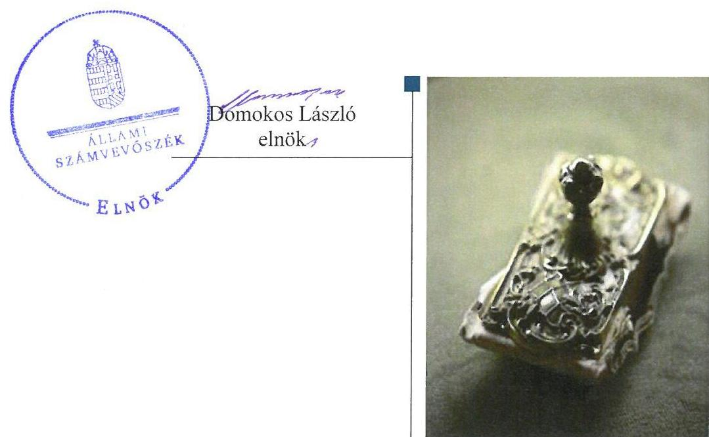
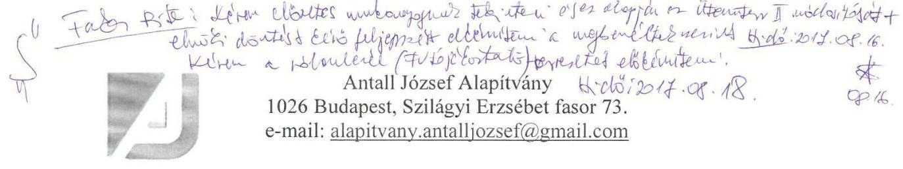
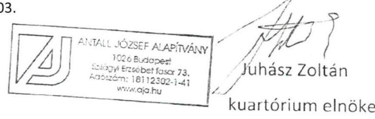
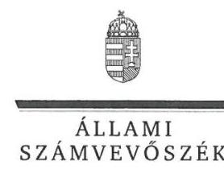
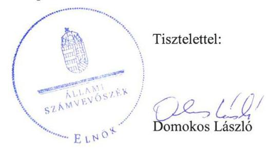

# Jelentés 

## Pártalapítványok gazdálkodása

A költségvetési támogatásban részesülő pártalapítványok 2014-2015. évi gazdálkodása törvényességének ellenőrzése az Antall József Alapítványnál 2017.

---

# Jelentés 

## Pártalapítványok gazdálkodása

A költségvetési támogatásban részesülő pártalapítványok 2014-2015. évi gazdálkodása törvényességének ellenőrzése az Antall József Alapítványnál
2017. O9. hó 26. nap

---

# AZ ELLENŐRZÉST FELÜGYELTE:

DR. BENEDEK MÁRIA felügyeleti vezető

# AZ ELLENŐRZÉST VEZETTE ÉS A VÉGREHAJTÁSÁÉRT FELELŐS:

KAKAS SÁNDOR ellenőrzésvezető

# A PROGRAM ÖSSZEÁLLÍTÁSÁÉRT FELELŐS:

JANIK JÓZSEF LÁSZLÓ osztályvezető

# A TÉMÁHOZ KAPCSOLÓDÓ KORÁBBI SZÁMVEVŐSZÉKI JELENTÉSEK:

- címe: Jelentés az Antall József Alapítvány 2012-2013. évi gazdálkodása törvényességének ellenőrzéséről
- sorszáma: 15166

Jelentéseink az Országgyűlés számítógépes hálózatán és az Interneten a www.asz.hu címen is olvashatóak.

|  IKTATÓSZÁM: V-1265-120/2016. | |
| --- | --- |
|  TÉMASZÁM: 2299 | |
|  ELLENŐRZÉS-AZONOSÍTÓ SZÁM: V077803 | |

---

# TARTALOMJEGYZÉK 

■ ÖSSZEGZÉS ..... 5
■ AZ ELLENŐRZÉS CÉLJA ..... 6
■ AZ ELLENŐRZÉS TERÜLETE ..... 7
■ AZ ELLENŐRZÉS HÁTTERE, INDOKOLTSÁGA ..... 8
■ A JELENTÉS LÉNYEGES KÉRDÉSKÖREI ..... 9
■ ELLENŐRZÉS HATÓKÖRE ÉS MÓDSZEREI ..... 10
■ MEGÁLLAPÍTÁSOK ..... 12
■ JAVASLATOK ..... 18
■ MELLÉKLETEK ..... 21
I. sz. melléklet: Értelmező szótár ..... 21
■ FÜGGELÉK: ÉSZREVÉTELEK ..... 23
■ RÖVIDÍTÉSEK JEGYZÉKE ..... 27

---

.

---

# ÖSSZEGZÉS 

Az Állami Számvevőszék az Antall József Alapítvány gazdálkodásának törvényességét ellenőrizte a 2014. január 1-jétől 2015. december 31-ig terjedő időszakra vonatkozóan. Megállapította, hogy a gazdálkodására vonatkozó szabályozási hiányosságok miatt gazdálkodásának törvényessége nem volt biztositott. Az Antall József Alapítvány a 2014-2015. évi tevékenységéről szóló éves jelentéseket és a számviteli beszámolókat a jogszabályi előírások ellenére nem készítette el, a jogszabályban előírt közzétételi kötelezettségét nem teljesítette, ennek következtében a gazdálkodásának, valamint a közpénzek felhasználásának átláthatóságát nem biztositotta.

## Az ellenőrzés társadalmi indokoltsága

A pártok - a Magyarország Alaptörvényében biztosított, a népakarat kialakításában és kinyilvánításában történő közreműködésének elősegítése, az állampolgári tájékoztatás szélesítése, a politikai kultúra fejlesztése érdekében történő politikai képzés, kutatás, tudományos és ismeretterjesztő tevékenység támogatása érdekében - költségvetési támogatásra jogosult alapítványt hozhatnak létre. Jogszabályi előírások alapján a pártalapítványok gazdálkodása törvényességének ellenőrzésére az Állami Számvevőszék jogosult, ezért kétévente ellenőrzi a költségvetésből támogatásban részesülő pártalapítványoknak a gazdálkodását.

Az Állami Számvevőszék stratégiájában megfogalmazta, hogy az államháztartáson kívülre nyújtott költségvetési támogatások és az ingyenes vagyonjuttatás ellenőrzésével hozzájárul ahhoz, hogy a közpénzeket a civil szervezetek is átlátható módon használják fel a közfeladatok szerződésben vállalt ellátása érdekében. A pártalapítványok gazdálkodása szabályszerűségének bemutatásával az ellenőrzés értékteremtő módon járul hozzá az Állami Számvevőszék stratégiai céljainak megvalósításához, a nyilvánosság megfelelő tájékoztatásához.

## Főbb megállapítások, következtetések, javaslatok

Az ellenőrzött időszakban a hatályos Alapító okirat megfelelt a jogszabályi előírásoknak. Az Antall József Alapítvány az eszközök és források értékelési szabályzata kivételével - rendelkezett számviteli szabályzatokkal, azonban ezeken a 2004. és 2005. években kiadott szabályzatokon a törvénymódosításokat követően a változásokat a jogszabályi előírások ellenére nem vezette keresztül, aminek következtében a közpénzekkel való átlátható és ellenőrizhető gazdálkodás garanciáit nem teremtette meg. A jogszabályi előírások ellenére hiányosan került kialakításra a Számviteli politika, az adatok biztonságának, védelmének érvényre juttatásához szükséges eljárási szabályokat nem alakították ki, továbbá nem állapították meg belső szabályzatban a kötelezően közzéteendő közérdekű adatok elektronikus közzétételi kötelezettség teljesítésének részletes szabályait.

Az Antall József Alapítvány a 2014. és a 2015. évre vonatkozóan nem készített költségvetési tervet, ennek következtében a kiszámítható, tervezhető gazdálkodás feltételeit nem biztosította. A központi költségvetési támogatás elfogadása megfelelt a törvényi előírásoknak. A ráfordítások elszámolása a 2014. évben nem volt szabályszerű, mert a könyvviteli elszámolást közvetlenül alátámasztó bizonylatok nem feleltek meg a jogszabályi előírásoknak.

Az Antall József Alapítvány a 2014. és a 2015. évi tevékenységéről szóló jelentést és számviteli beszámolót nem készítette el a jogszabályban előírtak ellenére, illetve ennek következtében jogszabályban előírt közzétételi kötelezettségének sem tett eleget, ezáltal nem biztosította a gazdálkodása törvényességének, valamint a közpénzek felhasználásának átláthatóságát.

---

# AZ ELLENŐRZÉS CÉLJA 

AZ ELLENŐRZÉS CÉLJA annak megállapítása volt, hogy az Antall József Alapítvány törvényesen gazdál-kodott-e, az éves számviteli beszámolók és a tevékenységéről szóló éves jelentések a jogszabályi előírásoknak megfeleltek-e, a könyvvezetés és gazdálkodás során a vonatkozó jogszabályi rendelkezéseket és belső előírásokat betartották-e.

---

# AZ ELLENŐRZÉS TERÜLETE 

## Antall József Alapítvány

A Pártalapítványi tv. ${ }^{1}$ alapján a pártok a politikai kultúra fejlesztése érdekében tudományos, ismeretterjesztő, kutatási és oktatási tevékenységük elősegítésére a Párt tv. ${ }^{2}$-ben meghatározott arányú költségvetési támogatásra jogosult alapítványt hozhatnak létre.

A Magyar Demokrata Fórum (2011. június 18-tól JESZ³) a törvény által biztosított lehetősége alapján 2003-ban létrehozta az Antall József Alapítványt.

Az Antall József Alapítvány Alapító okirata ${ }^{4}$ szerinti célja, hogy:
$\longrightarrow$ tevékenységével hozzájáruljon a magyarországi politikai kultúra fejlesztéséhez, színvonalának emeléséhez,
$\longrightarrow$ az alapító által vallott értékekhez, politikai értékrendhez kapcsolódó tudományos, kutatási és oktatási tevékenységet végezzen,
$\longrightarrow$ valamint tudományos kutatás, tájékoztatás, oktatás és képzés szervezésével elősegítse a fenti célok megvalósulását.
Az Antall József Alapítvány a törvényi előírásoknak megfelelően a 2014. I.-II. negyedévben 7075 ezer Ft - 7075 ezer Ft költségvetési támogatásban részesült. 2014. III.-IV. negyedévben és a 2015. évben költségvetési támogatásra nem volt jogosult, mert a 2014. évi országgyűlési választásokon a JESZ nem szerezte meg a szavazáson részt vett választók szavazatának $1 \%$-át.

---

# AZ ELLENŐRZÉS HÁTTERE, INDOKOLTSÁGA 

Társadalmi elvárás a közpénzek értékelvű, rendeltetésszerű felhasználása, a közpénzekből nyújtott támogatások átláthatóságának megteremtése, amelyhez az ÁSZ ${ }^{5}$ az államháztartásból nyújtott támogatások ellenőrzésével kíván hozzájárulni. A Párt tv. 9/A § (1) bekezdése alapján a politikai kultúra fejlesztése érdekében tudományos, ismeretterjesztő, kutatási, oktatási tevékenység folytatása céljából létrehozott pártalapítványok gazdálkodása törvényességének ellenőrzése - Pártalapítványi tv. 4. § (2) bekezdése értelmében - az ÁSZ feladata. E törvény 4. § (4) bekezdése alapján az ÁSZ kétévente - kötelező jelleggel - ellenőrzi azoknak a pártalapítványoknak a gazdálkodását, amelyek költségvetési támogatásban részesültek.

Az ÁSZ, mint az Országgyűlés ellenőrző szerve a pártalapítványok gazdálkodása törvényességének/szabályszerűségének értékelésével hozzájárul ahhoz, hogy a társadalom objektív képet alkothasson a pártalapítványok működéséről. Az ellenőrzés eredményeinek célzott felhasználói a nyilvánosság, a jogalkotó, továbbá a pártalapítványok esetén azok alapítója és szervei. A jelentésben foglalt megállapítások, következtések és javaslatok alapján a törvényalkotók konkrét lépéseket tehetnek a pártalapítványokra vonatkozó szabályozások megváltoztatása, átláthatóbbá, ellenőrizhetőbbé tétele irányába. Az ellenőrzött szervezetek szintjén a hiányosságok, szabálytalanságok feltárása, az ennek kapcsán megfogalmazott megállapítások elősegíthetik a pártalapítványok szabályszerű gazdálkodását.

---

# A JELENTÉS LÉNYEGES KÉRDÉSKÖREI 

1. Az Antall József Alapítvány gazdálkodásának törvényessége biztositott volt-e?
2. Az Antall József Alapítvány könyvvezetése és gazdálkodása során a vonatkozó jogszabályi rendelkezéseket és belső előírásokat betartották-e?
3. Az Antall József Alapítvány tevékenységéről szóló éves jelentések, az éves számviteli beszámolók a jogszabályi előírásoknak megfeleltek-e?

---

# ELLENŐRZÉS HATÓKÖRE ÉS MÓDSZEREI 

## Az ellenőrzés típusa

Szabályszerúségi ellenőrzés.

## Az ellenőrzött időszak

2014. január 1. - 2015. december 31.

## Az ellenőrzés tárgya

Az ellenőrzés tárgyát képezte az Antall József Alapítvány gazdálkodása, a könyvvezetés szabályozása és gyakorlata szabályszerűsége, az éves számviteli beszámolókra és az Antall József Alapítvány tevékenységéről szóló éves jelentésekre vonatkozó kötelezettség teljesítése, valamint a gazdálkodáshoz kapcsolódó ellenőrzések javaslatainak hasznosítására irányuló tevékenység.

Az ellenőrzés kiterjedt minden olyan körülményre és adatra, amely az ÁSZ jogszabályban meghatározott feladatainak teljesítéséhez, valamint a program végrehajtása folyamán felmerült újabb összefüggések feltárásához volt szükséges.

## Az ellenőrzött szervezet

Antall József Alapítvány

## Az ellenőrzés jogalapja

Az ÁSZ tv. ${ }^{6}$ 1. § (3) bekezdése, 5. § (3) bekezdése, a Pártalapítványi tv. 4. § (2) és (4) bekezdései.

## Az ellenőrzés módszerei

Az ÁSZ az ellenőrzést az ellenőrzési program szempontjai, az ellenőrzött időszakban hatályos jogszabályok, a jelen ellenőrzésre irányadó ÁSZ módszertan figyelembe vételével végezte.

Az ellenőrzés ideje alatt az Antall József Alapítvánnyal történő kapcsolattartás az ÁSZ SZMSZ²-ének vonatkozó előírásai alapján történt.

---

Az ellenőrzési kérdések megválaszolásához szükséges bizonyítékok megszerzése az ellenőrzött által rendelkezésre bocsátott dokumentumokra, adatokra alapozva megfigyelés, szemle (szemrevételezés), kérdésfeltevés (információkérés), mintavételezés, valamint elemző eljárás útján történt. A mintavételezés véletlen mintavételi eljárással történt.

Az ellenőrzési bizonyítékként felhasználható adatforrások közé tartoztak egyrészt az ellenőrzési program részletes szempontjainál felsorolt adatforrások, másrészt minden egyéb - az ellenőrzés folyamán - feltárt, az ellenőrzés szempontjából információt tartalmazó dokumentum.

Az ellenőrzés lefolytatásához az Antall József Alapítvány a tanúsítványok elektronikus kitöltésével, valamint az ÁSZ által kért dokumentumok elektronikus megküldésével szolgáltatott adatokat. Az így rendelkezésre bocsátott adatok, információk, a tanúsítványok adatai valódiságának kontrollja az ellenőrzés keretében történt.

---

# 1. Az Antall József Alapítvány gazdálkodásának törvényessége biztosított volt-e? 

Összegző megállapítás

Az AJA ${ }^{8}$ gazdálkodásának törvényessége a gazdálkodására vonatkozó belső szabályozás szabálytalanságai miatt nem volt biztosított.
1.1. számú megállapítás

Az AJA gazdálkodása szervezeti kereteinek kialakítása a jogszabályi előírásoknak megfelelt.

AZ ALAPÍTÓ OKIRAT megfelelt a Ptk. ${ }^{9}$, a Párt tv. és a Pártalapítványi tv. rendelkezéseinek, tartalmazta az AJA Alapító által meghatározott céljait és ennek érdekében végzett tevékenységeit, az AJA céljára rendelt vagyont, valamint annak kezelésére vonatkozó rendelkezéseket, a Kuratórium ${ }^{10}$ összetételét, feladat- és hatáskörét, továbbá a képviseleti és bankszámla feletti rendelkezési jog gyakorlására vonatkozó előírásokat. Az induló vagyon összegét 1000 ezer Ft-ban határozták meg.

Az Alapító okiratban rögzített célok és a cél elérése érdekében meghatározott tevékenységek összhangban voltak a Párt tv.-ben előírtakkal.

Az Alapító okirat értelmében az alapítványi vagyont öt éves időtartamra kijelölt öt tagból álló Kuratórium kezelte, a vagyon teljes egészében felhasználható volt az alapítványi célok elérése érdekében.

Az Alapító okirat rendelkezett az AJA képviseletéről, amely szerint az ellenőrzött időszakban a képviseleti jogot a Kuratórium elnöke vagy ügyvezető elnöke ${ }^{11}$ gyakorolta.

A Kuratórium az AJA működésének technikai segítésére Alapítványi Irodát ${ }^{12}$ hozott létre.

A Pártalapítványi tv. előírásaival összhangban az AJA rendelkezett az eljárási szabályait meghatározó SZMSZ ${ }^{13}$-el. Az SZMSZ tartalmazta az Alapító jogait, a Kuratórium feladatait, a külső szakértők alkalmazásának szabályait, a Kuratórium ügyrendjét, az Alapítványi Iroda tevékenységének, valamint az alapítványi vagyon kezelésének és felhasználásának szabályait.

Az AJA Alapító okiratának és az SZMSZ-ének vonatkozásában feltárt szabálytalanságokat az 1. táblázat tartalmazza.

## AZ ALAPÍTÓ OKIRAT ÉS AZ SZMSZ VONATKOZÁSÁBAN FELTÁRT SZABÁLYTALANSÁGOK

| Sorszám | Részmegállapítás | Megjegyzés |
| :--: | :--: | :--: |
| 1. | Az Alapító okirat és az SZMSZ előírásai között az AJA képviseleti jogának gyakorlása vonatkozásában nem volt összhang, mert az Alapító okirat rendelkezését - amely szerint az AJA képviseletében a Kuratórium elnöke vagy ügyvezető elnöke önállóan jogosult eljárni - az SZMSZ-en nem vezették át. |  |

---

|  Sorszám | Részmegállapítás | Megjegyzés  |
| --- | --- | --- |
|  2. | Az Alapító okirat és az SZMSZ előírásai a bankszámla feletti rendelkezési jog gyakor-
lásának szabályozása vonatkozásában nem voltak összhangban, mert az Alapító ok-
irat rendelkezéseit - amelyek szerint a Kuratórium elnöke és az ügyvezető elnök ön-
állóan; vagy a Kuratórium elnöke vagy ügyvezető elnöke és az előbbiek bármelyike
által írásban meghatalmazott egy kuratóriumi tag; vagy a Kuratórium elnöke vagy
ügyvezető elnöke által írásban meghatalmazott két kuratóriumi tag jogosult rendel-
kezni - az SZMSZ-en nem vezették át. |   |

A PÉNZÜGYI- ÉS SZÁMVITELI FELADATOK ellátását az AJA szerződés alapján külső szervezet bevonásával - a Számv. tv. ${ }^{14}$, valamint az SZMSZ előírásait figyelembe véve - biztosította. A könyvviteli szolgáltatás körébe tartozó feladatok irányításával, vezetésével, a beszámoló elkészítésével megbízott vállalkozás képviselője a Számviteli vhr. ${ }^{15}$ ben előírt szükséges szakmai képzettséggel rendelkezett.

Az AJA Számviteli politikájában ${ }^{16}$ kettős könyvvitel vezetését írta elő, ami összhangban volt a Számv. tv., valamint a Számviteli vhr. előírásaival.

# 1.2. számú megállapítás

Az AJA gazdálkodására vonatkozó belső szabályozás nem felelt meg a jogszabályi előírásoknak.

Az AJA az ellenőrzött időszakban rendelkezett jóváhagyott, 2004. január 1jén hatályba léptetett Számviteli politikával, Leltározási szabályzat ${ }^{17}$-tal, Számlarend ${ }^{18}$-del, valamint 2005. június 1-jén hatályba léptetett Pénzkezelési szabályzat ${ }^{19}$-tal. Az önköltségszámítás rendjére vonatkozó belső szabályzat elkészítési kötelezettség alól az AJA a Számv. tv. 14. § (6) bekezdése alapján mentesült.

A SZÁMVITELI POLITIKÁBAN rögzítették a Számv. tv., valamint a Számviteli vhr. előírásai alapján a beszámolási feladatokat, az éves számviteli beszámoló készítésének rendjét, időpontját, valamint az AJA sajátosságaihoz igazodóan a könyvvezetés módját.

A Pénzkezelési szabályzatban a pénztári kifizetésekre vonatkozóan szabályozták az utalványozás rendjét.

Az AJA számviteli szabályzatainak hiányosságait a 2. táblázat tartalmazza. 2. táblázat

## A SZÁMVITELI SZABÁLYZATOK HIÁNYOSSÁGAI

|  Sorszám | Részmegállapítás | Megjegyzés  |
| --- | --- | --- |
|  1. | Az AJA a Számv. tv. 14. § (11) bekezdésben előírtak ellenére a törvény 2015. július 4.-i módosításának hatálybalépését követően a Számviteli politikán 90 napon belül nem vezette keresztül a változásokat, mert a Számviteli politika keretében nem rögzítette azokat a gazdálkodóra jellemző szabályokat, előírásokat, módszereket, amelyekkel a gazdálkodó meghatározza, hogy mit tekint a számviteli elszámolás, az értékelés szempontjából kivételes nagyságú vagy előfordulású bevételnek, költségnek, ráfordításnak. |   |
|  2. | A Számv. tv. 161. § (5) bekezdésében előírtak ellenére a törvény 2015. július 4-i változásának hatálybalépését követően a Számlarend módosítását 90 napon belül nem végezték el, mert a rendkívüli bevételekre és rendkívüli ráfordításokra vonatkozó szabályokat a Számlarendből nem vezették ki. |   |

---

| Sorszám | Részmegállapítás | Megjegyzés |
| :--: | :--: | :--: |
| 3. | Az AJA a Számv. tv. 14. § (4) bekezdésében foglaltak ellenére a Számviteli politika keretében az ellenőrzött időszakban írásban nem rögzítette azokat a gazdálkodóra jellemző szabályokat, előírásokat, módszereket, amelyekkel a gazdálkodó meghatározza, hogy mit tekint a számviteli elszámolás, az értékelés szempontjából lényegesnek, jelentősnek, nem lényegesnek, nem jelentősnek, valamint azt, hogy a törvényben biztosított választási, minősítési lehetőségek közül melyeket, milyen feltételek fennállása esetén alkalmaz, az alkalmazott gyakorlatot milyen okok miatt kell megváltoztatni. |  |
| 4. | Az AJA a Számviteli politika keretében az ellenőrzött időszakban a Számv. tv. 14. § (5) bekezdés b) pontjában foglaltak ellenére az eszközök és források értékelési szabályzatát nem készítette el. |  |
| 5. | A Pénzkezelési szabályzat nem volt összhangban az Alapító Okirat és az SZMSZ rendelkezéseivel, mert a Pénzkezelési szabályzat 10. pontja szerint utalványozásra az AJA főigazgatója és a meghatalmazással bíró kijelölt igazgatója volt jogosult, azonban a 2014-2015. években hatályos Alapító okirat és SZMSZ ilyen tisztségeket nem határozott meg. |  |

AJ A. $A J A$ adatbiztonság- és közzétételi kötelezettség szabályozása vonatkozásában feltárt hiányosságokat a 3. táblázat tartalmazza.
3. táblázat

# AZ ADATBIZTONSÁG ÉS A KÖZZÉTÉTELI KÖTELEZETTSÉGEK SZABÁLYOZÁSA VONATKOZÁSÁBAN FELTÁRT HIÁNYOSSÁGOK 

Sorszám
1. Az AJA az Info. tv. ${ }^{20}$ 7. § (2) bekezdésében előírtak ellenére nem alakította ki azokat az eljárási szabályokat amelyek e törvény, valamint az egyéb adat- és titokvédelmi szabályok érvényre juttatásához szükségesek.
2. Az Info tv. 35. § (3) bekezdésének előírása ellenére a kötelezően közzéteendő közérdekű adatok elektronikus közzétételi kötelezettségének teljesítéséről szóló részletes szabályokat belső szabályzatban nem állapították meg.

Forrás: ÁSZ

Az AJA a Pártalapítványi tv.-ben foglaltakat betartva a szabályozásában biztosította, hogy támogatást csak egyértelműen azonosítható személytől fogadjon el. Az Alapító okiratban, valamint az SZMSZ-ben rögzítették az AJA-hoz történő csatlakozás, a támogatások elfogadásának szabályait. Az AJA az ellenőrzött időszakban - a költségvetési támogatáson kívül - egyéb támogatást, adományt nem kapott.

Az ellenőrzött időszakban az AJA gazdasági társaságot, alapítványt vagy egyéb szervezetet nem alapított, ilyen szervezethez nem csatlakozott, gaz-dasági-vállalkozási tevékenységet nem végzett.

A 2014-2015. években az AJA működőképessége biztosított volt, fizetésképtelenség nem merült fel.

---

# 2. Az Antall József Alapítvány könyvvezetése és gazdálkodása során a vonatkozó jogszabályi rendelkezéseket és belső előírásokat betartották-e? 

Összegző megállapítás

Az AJA könyvvezetése és gazdálkodása során a vonatkozó jogszabályi rendelkezéseket és belső előírásokat nem tartották be.
2.1. számú megállapítás

Az AJA a 2014-2015. években a jogszabályi és a belső szabályozási előírások ellenére költségvetési tervet nem készített.

Az AJA költségvetési terveinek elkészítésével kapcsolatban feltárt hiányosságot a 4. táblázat tartalmazza.
4. táblázat

## A KÖLTSÉGVETÉSI TERV KÉSZÍTÉSÉVEL KAPCSOLATBAN FELTÁRT HIÁNYOSSÁG

Sorszám
Készmegalapítás
Megjegyzés

1. Az AJA az ellenőrzött időszakban költségvetési terveket nem készített, amivel a 2014. évben megsértette az Ecvhr. ${ }^{21}$ 3. § (1)-(2) bekezdéseit, valamint a PGSZ ${ }^{22} 3$. pontját, a 2015. évben pedig a PGSZ 3. pontját.

Forrás: ÁSZ
2.2. számú megállapítás

Az AJA a támogatásokat szabályszerűen fogadta el, számolta el és használta fel.

Az AJA a 2014. I. és II. negyedévben a Párt tv. 9/A. § (3) bekezdés a) és b) pontja alapján a költségvetésből juttatott támogatásra jogosult volt. Az AJA-t a 2014. évben a Párt tv. 9/A. § (5) bekezdése, valamint a Kvtv. ${ }^{23}$ alapján évi 28300 ezer Ft összegű támogatás illette meg, amely összegből az AJA a Párt tv. törvény 9/A. § (2) bekezdése alapján 14150 ezer Ft támogatást kapott meg, negyedéves bontásban, a 2015. évben költségvetési támogatást nem kapott.

Az AJA a 2014. évi központi költségvetési támogatást a Számviteli vhr. 16. § (5) bekezdésében foglalt előírásnak megfelelően bevételként, az egyéb bevételek között számolta el.

Az AJA a 2014-2015. években egyéb, nem költségvetésből származó támogatást, adományt nem kapott, adománygyűjtést nem végzett.

Az AJA Alapító okiratában feltüntetett alapítványi célok és az AJA által a 2014-2015. években szervezett rendezvények összhangban voltak a Párt tv. 9/A. § (1) bekezdésében és a Pártalapítványi tv. 1. §-ban rögzítettekkel, így az AJA a támogatásokat szabályosan használta fel.
2.3. számú megállapítás

Az AJA kiadásainak elszámolása összességében nem volt szabályszerű.

AZ ANYAG- ÉS SZEMÉLYI JELLEGŰ RÁFORDÍTÁ-
SOK kifizetése és elszámolása nem felelt meg a Számv. tv.-nek.

---

A 2014. évben az AJA beruházásaira, felújításaira fordított összegek felhasználása, kifizetése és elszámolása szabályszerű volt. A 2015. évben beruházási, felújítási kiadás nem volt. Az AJA-nak a 2015. évben a JESZ-szel a Budapest Nádor utcai ingatlanra vonatkozó adásvételi szerződéstől történő elállás tárgykörében - kötött megállapodás alapján 2650 ezer Ft öszszegű beruházási előleg visszatérülése keletkezett. A beruházási előleg visszatérülést az AJA szabályosan számolta el.

Az AJA 2014-2015. években harmadik fél részére támogatást nem nyújtott. A támogatás nyújtás elbírálásának, elszámolásának, beszámolásának és a támogatás szabályszerű felhasználásának az ellenőrzési rendjét az Alapító okiratban, valamint az SZMSZ-ben kialakította. A támogatás folyósításának rendjét a PGSZ határozta meg.

Az AJA az ellenőrzött időszakban a Párt tv. 4. § (2) bekezdésében foglalt előírást betartotta, mert az alapító párt részére vagyoni hozzájárulást nem adott.

A kiadások vonatkozásában feltárt szabálytalanságokat az 5. táblázat tartalmazza.
5. táblázat

# A KIADÁSOKKAL KAPCSOLATOS SZABÁLYTALANSÁGOK 

Sorszám
1. Az anyag- és személyi jellegű ráfordítások elszámolása a 2014. évben nem volt megfelelő, mert a könyvviteli elszámolást közvetlenül alátámasztó bizonylatok nem feleltek meg a Számv. tv. 167. § (1) bekezdés c) és h) pontjában foglalt előírásnak, mert nem tartalmazták az utalványozó és a rendelkezés végrehajtását igazoló személy aláírását, valamint a könyvelés módjára, az érintett könyvviteli számlákra történő hivatkozást.

## Megjegyzés

A 2015. évben anyag- és személyi jellegű kiadás nem volt.

Forrás: $A 32$

## 3. Az Antall József Alapítvány tevékenységéről szóló éves jelentések, az éves számviteli beszámolók a jogszabályi előírásoknak megfeleltek-e?

Összegző megállapítás
Az AJA a 2014-2015. évi tevékenységéről szóló éves jelentéseket és annak részeként a számviteli beszámolókat nem készítette el.
3.1. számú megállapítás

Az AJA a jogszabályi előírások ellenére a 2014-2015. évi tevékenységéről szóló éves jelentéskészítési, beszámolókészítési és közzétételi kötelezettségének nem tett eleget.

Az éves jelentések és számviteli beszámolók elkészítésével, valamint közzétételével kapcsolatban feltárt hiányosságokat a 6. táblázat tartalmazza.

---

6. táblázat

# AZ ÉVES JELENTÉSEK ÉS SZÁMVITELI BESZÁMOLÓK ELKÉSZÍTÉSÉVEL, KÖZZÉTÉTELÉVEL KAPCSOLATBAN FELTÁRT HIÁNYOSSÁGOK 

| Sorszám | Részmegállapítás | Megjegyzés |
| :-- | :-- | :-- |

---

# JAVASLATOK 

Az ÁSZ tv. 33. § (1) bekezdésében foglaltak értelmében az ellenőrzött szervezet vezetője köteles a jelentésben foglalt megállapításokhoz kapcsolódó intézkedési tervet összeállítani és azt a jelentés kézhezvételétől számított 30 napon belül az ÁSZ részére megküldeni. Amennyiben az ellenőrzött szervezet vezetője nem küldi meg határidőben az intézkedési tervet, vagy továbbra sem elfogadható intézkedési tervet küld, az Állami Számvevőszék elnöke az ÁSZ tv. 33. § (3) bekezdése a) és b) pontjaiban foglaltakat érvényesítheti.

## A Kuratórium elnökének:

1. Intézkedjen a képviseleti jog és a bankszámla feletti rendelkezési jog tekintetében az Alapitó okirat és az SZMSZ elöírásai közötti összhang megteremtéséről.
(1. táblázat 1. és 2. sz. megállapítás alapján)
2. Intézkedjen a gazdálkodás törvényességének helyreállítása érdekében a Számv. tv.-ben foglalt elöírások betartására a tekintetben, hogy
a) törvénymódosítás esetén a változásokat, annak hatálybalépését követően a Számviteli politikán 90 napon belül vezessék keresztül;
(2. táblázat 1. sz. megállapítás alapján)
b) a törvény változásának esetén, annak hatálybalépését követően a Számlarend módosítását 90 napon belül végezzék el;
(2. táblázat 2. sz. megállapítás alapján)
c) a Számviteli politika keretében írásban rögzítsék azokat a gazdálkodóra jellemző szabályokat, elöírásokat, módszereket, amelyekkel a gazdálkodó meghatározza, hogy mit tekint a számviteli elszámolás, az értékelés szempontjából lényegesnek, jelentősnek, nem lényegesnek, nem jelentősnek, valamint azt, hogy a törvényben biztosított választási, minősitési lehetőségek közül melyeket, milyen feltételek fennállása esetén alkalmaz, az alkalmazott gyakorlatot milyen okok miatt kell megváltoztatni;
(2. táblázat 3. sz. megállapítás alapján)
d) az eszközök és források értékelési szabályzatát a Számviteli politika keretében elkészítsék;
(2. táblázat 4. sz. megállapítás alapján)

---

e) a könyvviteli elszámolást közvetlenül alátámasztó bizonylatok valamennyi általános alaki és tartalmi követelménynek megfeleljenek.
(5. táblázat 1. sz. megállapítás alapján)
3. Intézkedjen az utalványozásra jogosult személy tekintetében a Pénzkezelési szabályzatban foglaltak, valamint az Alapító Okirat és az SZMSZ rendelkezései közötti összhang megteremtéséről.
(2. táblázat 5. sz. megállapítás alapján)
4. Intézkedjen a személyes adatok védelme, valamint a közérdekü és a közérdekből nyilvános adatok megismeréséhez és terjesztéséhez való jog érvényesülése érdekében az Info. tv.-ben foglalt előirások betartása tekintetében
a) e törvény, valamint az egyéb adat- és titokvédelmi szabályok érvényre juttatásához szükséges eljárási szabályok kialakításáról;
(3. táblázat 1. sz. megállapítás alapján)
b) a kötelezően közzéteendő közérdekü adatok elektronikus közzétételi kötelezettség teljesítésének részletes szabályai belső szabályzatban történő megállapításáról.
(3. táblázat 2. sz. megállapítás alapján)
5. Intézkedjen a PGSZ előirása szerint éves költségvetési terv elkészítéséről.
(4. táblázat 1. sz. megállapítás alapján)
6. Intézkedjen a Pártalapítványi tv.-ben előirtak szerint az alapítvány tevékenységéről éves jelentés és annak részeként számviteli beszámoló elkészítéséről, illetve a közzétételi kötelezettségének teljesítéséről.
(6. táblázat 1. sz. megállapítás alapján)
7. Intézkedjen az alapítvány tevékenységéről számviteli beszámoló letétbe helyezésére és közzétételére vonatkozóan a Számviteli vhr.-ben, az Ectv.- ben és a Cnytv.-ben előirt rendelkezések betartásáról.
(6. táblázat 2. sz. megállapítás alapján)

---

.

---

# MELLÉKLETEK 

- I. SZ. MELLÉKLET: ÉRTELMEZŐ SZÓTÁR
adomány
alapítvány
beruházás
költségvetési támogatás
kuratórium

A civil szervezetnek - létesítő okiratban rögzített céljaira - ellenszolgáltatás nélkül juttatott eszköz, illetve nyújtott szolgáltatás (forrás: Ectv. 2. § 1. pontja); az a pénzbeli vagy természetbeni juttatás, amelyet az adományozó az adományozott civil szervezet alapcéljának, illetve közhasznú céljának elérésére ellenszolgáltatás nélkül juttat. (forrás: 350/2011. (XII. 30.) Korm. rendelet 1. § (5) bekezdés a) pontja)
A közhasznú szervezet részére törvényben meghatározott közhasznú tevékenysége támogatására, valamint az egyházi jogi személy részére törvényben meghatározott tevékenysége támogatására, továbbá a közérdekű kötelezettségvállalás céljára az adóévben visszafizetési kötelezettség nélkül adott támogatás, juttatás, térítés nélkül átadott eszköz könyv szerinti értéke, térítés nélkül nyújtott szolgáltatás bekerülési értéke, feltéve hogy az nem jelent az e törvényben meghatározottakon túl vagyoni előnyt az adományozónak, az adományozó tagjának vagy részvényesének, vezető tisztségviselőjének, felügyelőbizottsága vagy igazgatósága tagjának, könyvvizsgálójának, illetve ezen személyek vagy a természetes személy tag vagy részvényes közeli hozzátartozójának azzal, hogy nem minősül vagyoni előnynek az adományozó nevére, tevékenységére történő utalás. (a társasági adóról és az osztalékadóról szóló 1996. évi LXXXI. törvény 4. § 1/a. pont)

Magánszemély, jogi személy és jogi személyiséggel nem rendelkező gazdasági társaság (a továbbiakban együtt: alapító) - tartós közérdekű célra - alapító okiratban alapítványt hozhat létre. Alapítvány elsődlegesen gazdasági tevékenység folytatása céljából nem alapítható. Az alapítvány javára a célja megvalósításához szükséges vagyont kell rendelni. Az alapítvány jogi személy. Az alapítvány a bírósági nyilvántartásba vételével jön létre. (Forrás: Ptk. 74/A. § (1) - (2) bekezdés)
Az alapítvány az alapító által az alapító okiratban meghatározott tartós cél folyamatos megvalósítására létrehozott jogi személy. Az alapító az alapító okiratban meghatározza az alapítványnak juttatott vagyont és az alapítvány szervezetét. Alapítvány nem alapítható gazdasági-vállalkozási tevékenység folytatására. Az alapítvány az alapítványi cél megvalósításával közvetlenül összefüggő gazdasági tevékenység végzésére jogosult. Alapítvány nem lehet korlátlan felelősségű tagja más jogalanynak, nem létesíthet alapítványt és nem csatlakozhat alapítványhoz. (Forrás: Ptk. ${ }^{26}$ 3:378§, 3:379. § (1) - (3) bekezdés)
A tárgyi eszköz beszerzése, létesítése, saját vállalkozásban történő előállítása, a beszerzett tárgyi eszköz üzembe helyezése. A beruházás a meglévő tárgyi eszköz bővítését, rendeltetésének megváltoztatását, átalakítását, élettartamának, teljesítőképességének közvetlen növelését eredményező tevékenység. (Forrás: Számv. tv. 3. § (4) bekezdés 7. pont)

Az államháztartás alrendszerei terhére nyújtott pénzbeli vagy nem pénzbeli juttatás, amelyet a támogató nem elsősorban ellenszolgáltatás ellenében, de konkrét program megvalósítása vagy meghatározott időszakban a támogatott szervezet müködtetése érdekében nyújt. (Civil tv. 2. § 15. pont)
A társadalombiztosítás pénzügyi alapjai kivételével az államháztartás központi alrendszeréből ellenérték nélkül, pénzben nyújtott támogatások, ide nem értve az adományokat, segélyeket, felajánlásokat, a pártok és pártalapítványok támogatását. (forrás: az államháztartásról szóló 2011. évi CXCV. törvény 2. § (1) bekezdés n) pont)
Az alapítvány kezelő/ügyvezető szervezete. (forrás: Ptk. 3:397. § (1) bekezdése)

---

pártalapítvány

A politikai kultúra fejlesztése érdekében, tudományos, ismeretterjesztő, kutatási és oktatási tevékenység folytatása céljából pártok által létrehozott, külön jogszabályban - a Pártalapítványi tv. 1. § és 3. § (1) bekezdése - meghatározott, jogi személynek minősülő egyéb szervezet, speciális jogállású alapítvány (Forrás: Párt tv. 9/A. § (1) bekezdés, Pártalapítványi tv. 1. §, Ectv. 1. § (2) bekezdés, 2. § 6. c) pont, Számv. tv. 3. § (1) bekezdése 4. pont, Számviteli vhr. 2. § (1) bekezdés k) pont, (2) bekezdése, 3. § (1), (5)-(6) bekezdései, 4. § (1) bekezdés)

---

# FÜGGELÉK: ÉSZREVÉTELEK 

A jelentéstervezetet a Számvevőszék 15 napos észrevételezésre megküldte az ellenőrzött szervezet vezetőjének az ÁSZ tv. 29. §* (1) bekezdése előírásának megfelelően.

A függelék tartalmazza az ellenőrzött észrevételeit, illetve az el nem fogadott észrevételek elutasításának indoklását.

[^0]
[^0]:    * 29. § (1) Az Állami Számvevőszék az ellenőrzési megállapításait megküldi az ellenőrzött szervezet vezetőjének vagy az általa megbízott személynek, és annak, akinek személyes felelősségét állapította meg.
    (2) Az ellenőrzött szervezet vezetője és a felelősként megjelölt személy az ellenőrzés megállapításaira tizenöt napon belül írásban észrevételt tehet.
    (3) Az Állami Számvevőszék az észrevételre a beérkezésétől számított harminc napon belül írásban válaszol. A figyelembe nem vett észrevételeket köteles a jelentésben feltüntetni, és megindokolni, hogy azokat miért nem fogadta el.

---

# Állami Számvevőszék 

1364 Budapest 4. Pf. 54
Hivatkozási szám: V-1265-116/2016

## Domokos László Elnök

## Tisztelt Elnök Úr!

Az „Antall József Alapítvány 2014-2015. évi gazdálkodása törvényességének ellenőrzése" című ellenőrzés megállapítása kapcsán az alábbi észrevételeket tesszük:
3. Az AJA a 2014-2015. évi tevékenységéről szóló éves jelentéseket és annak részeként a számviteli beszámolót elkészítette. Közzétenni azonban csak 2017. január 7-én tette. Erről szóló feladóvevényt a számvevők részére át is adta.

Budapest, 2017. 08. 03.

---

ELNÖK

Ikt.szám: V-1265-117/2016.

# Juhász Zoltán úr 

elnök
Antall József Alapítvány

## Budapest

## Tisztelt Elnök Úr!

Köszönettel megkaptam az Állami Számvevőszékhez 2017. augusztus 16. napján kizárólag elektronikus úton érkezett "A költségvetési támogatásban részesülö pártalapítványok 20142015. évi gazdálkodása törvényességének ellenőrzése az Antall József Alapítványnál" címủ számvevőszéki jelentéstervezetben foglalt megállapításokkal kapcsolatos tájékoztató levelét.

Tájékoztatom Elnök urat, hogy a tájékoztató levelét - az Állami Számvevőszékről szóló 2011. évi LXVI. törvény 29. § (3) bekezdése alapján - a jelentésben szerepeltetjük az Állami Számvevőszék válaszával együtt.

Az Állami Számvevőszék álláspontjáról a felügyeleti vezető által készített részletes tájékoztatást csatoltan megküldöm.

Budapest, 2017. 08. hó 23 nap

Melléklet: Tájékoztatás az Antall József Alapítvány elnöke által megküldött tájékoztató levélre

---

# Tájékoztatás 

az Antall József Alapítvány (AJA) tájékoztató levelére

| 1. | Észrevétel: | Az észrevétel 1. oldala, az ÁSZ jelentéstervezet 16. oldal 3.1. számú megállapítás 6. táblázat 1. sorszám megállapítására „Az AJA a Pártalapítványi tv. 3/A. § (1) bekezdésében foglalt elöirása ellenére a 2014. és a 2015. évi tevékenységéről az éves jelentést és annak részeként a számviteli beszámolót nem készítette el, ennek következtében a Pártalapítványi tv. 3/A. § (5) bekezdésében elöirt közzétételi kötelezettségének nem tett eleget." tett észrevétel:   Az AJA a 2014-2015. évi tevékenységéről szóló éves jelentéseket és annak részeként a számviteli beszámolót elkészítette. Közzétenni azonban csak 2017. január 7-én tette. Erről szóló feladóvevényt a számvevők részére át is adta. |
| :--: | :--: | :--: |
|  | Válasz: | Az ÁSZ az AJA tájékoztató leveléből a fentiekben foglaltakat nem tekinti észrevételnek. |
|  | Indokolás: | Az ÁSZ nem tekinti észrevételnek az AJA által megküldött tájékoztató levélnek a fent megjelölt részében leírtakat, amely a fent nevesített ÁSZ megállapításra fogalmaz meg az AJA által az ellenőrzött időszakot követően megtett intézkedésről tájékoztatást. Az ÁSZ a vonatkozó ellenőrzését a V-1265-008/2016. iktatószámú 2016. december 15-én kelt Ellenőrzési program alapján folytatta le, mint az a jelentéstervezetben az ellenőrzés módszereinél ismertetésre került. Az ÁSZ az AJA által az ellenőrzés rendelkezésére bocsátott dokumentumok adataira alapozva tette meg megállapítását. |

Budapest, 2017. 08. hó 28. nap
Tisztelettel:
Dr. Benedek Mária

---

# RÖVIDÍTÉSEK JEGYZÉKE 

${ }^{1}$ Pártalapítványi tv.
${ }^{2}$ Párt tv.
${ }^{3}$ JESZ
${ }^{4}$ Alapító okirat
${ }^{5}$ ÁSZ
${ }^{6}$ ÁSZ tv.
${ }^{7}$ ÁSZ SZMSZ
${ }^{8}$ AJA
${ }^{9}$ Ptk. 1
${ }^{10}$ Kuratórium
${ }^{11}$ ügyvezető elnök
${ }^{12}$ Alapítványi iroda
${ }^{13}$ SZMSZ
${ }^{14}$ Számv. tv.
${ }^{15}$ Számviteli vhr.
${ }^{16}$ Számviteli politika
${ }^{17}$ Leltározási szabályzat
${ }^{18}$ Számlarend
${ }^{19}$ Pénzkezelési szabályzat
${ }^{20}$ Info tv.
${ }^{21}$ Ecvhr.
${ }^{22}$ PGSZ
${ }^{23}$ Kvtv.
${ }^{24}$ Ectv.
${ }^{25}$ Cnytv.
${ }^{26}$ Ptk. 2
2003. évi XLVII. törvény a pártok múködését segítő tudományos, ismeretterjesztő, kutatási, oktatási tevékenységet végző alapítványokról (hatályos 2003. július 1-jétől)
1989. évi XXXIII. törvény a pártok múködéséről és gazdálkodásáról (hatályos 1989. október 30-tól)

Jólét és Szabadság Demokrata Közösség
Antall József Alapítvány Alapító okirata (hatályos 2013. augusztus 5-étől)
Állami Számvevőszék
2011. évi LXVI. törvény az Állami Számvevőszékről (hatályos 2011. július 1-jétől)

Állami Számvevőszék Szervezeti és Működési Szabályzata
Antall József Alapítvány
1959. évi IV. törvény a Polgári Törvénykönyvről (hatályos 2014. március 15-ig)

Antall József Alapítvány Kuratóriuma
Antall József Alapítvány Kuratóriumának ügyvezető elnöke
Antall József Alapítvány Alapítványi irodája
Az Antall József Alapítvány Szervezeti és Működési Szabályzata (hatályos 2011. december 22-től)
2000. évi C. törvény a számvitelről (hatályos 2001. január 1-jétől)

224/2000. (XII.19) Korm. rendelet a számviteli törvény szerinti egyes egyéb szervezetek beszámoló készítési és könyvvezetési kötelezettségének sajátosságairól (hatályos 2001. január 1-jétől)
Antall József Alapítvány Számviteli Politikája (hatályos 2004. január 1-jétől)
Antall József Alapítvány Leltározási és Leltárkészítési Szabályzata (hatályos 2004. január 1-jétől)
Antall József Alapítvány Számlarendje (hatályos 2004. január 1-jétől)
Antall József Alapítvány Pénzkezelési Szabályzata (hatályos 2005. június 1-jétől)
2011. évi CXII. törvény az információs önrendelkezési jogról és az információszabadságról (hatályos 2011. július 27-től)
350/2011. (XII. 30.) Korm. rendelet a civil szervezetek gazdálkodása, az adománygyűjtés és a közhasznúság egyes kérdéseiről (hatályos 2012. január 1-jétől)
Antall József Alapítvány Pénzügyi Gazdálkodási Szabályzata (hatályos 2010. október 25-től)
2013. évi CCXXX. törvény Magyarország 2014. évi központi költségvetéséről (hatályos 2013. december 22-től)
2011. évi CLXXV. törvény az egyesülési jogról, a közhasznú jogállásról, valamint a civil szervezetek müködéséről és támogatásáról (hatályos 2011. december 22-től)
2011. évi CLXXXI. törvény a civil szervezetek bírósági nyilvántartásáról és az ezzel összefüggő eljárási szabályokról (hatályos 2011. december 23-tól)
2013. évi V. törvény a Polgári Törvénykönyvről (hatályos 2014. március 15-től)

---

# ÁLLAMI SZÁMVEVŐSZÉK 

1052 Budapest, Apáczai Csere János utca 10.
Levélcím: 1364 Budapest 4. Pf. 54
Telefon: +36 14849100 Telefax: +36 14849200
www.asz.hu