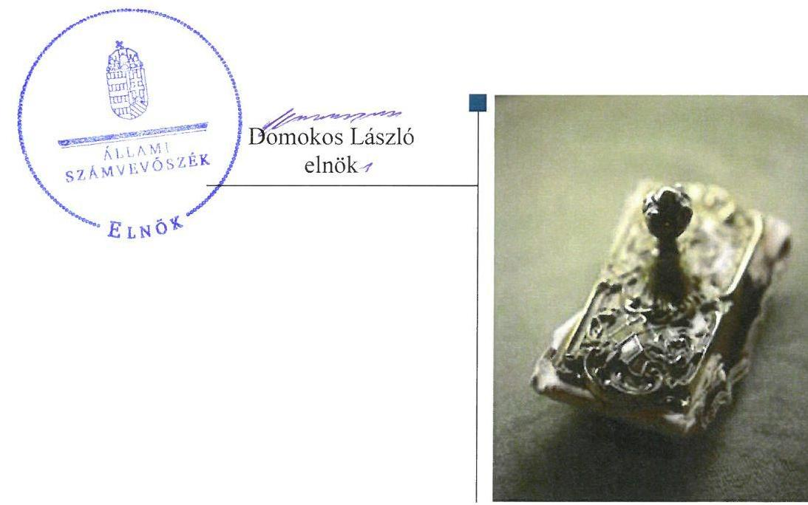
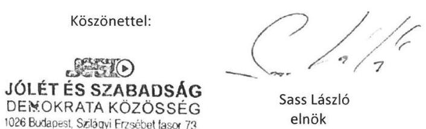
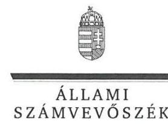
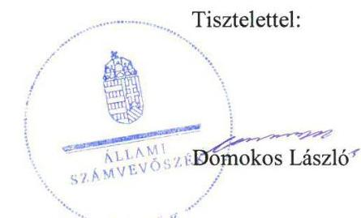

# Jelentés 

## Pártok gazdálkodása

A költségvetési támogatásban részesülő pártok 2014-2015. évi gazdálkodása törvényességének ellenőrzése a Jólét és Szabadság Demokrata Közösségnél 2017. 09. hó 26. nap

---

|  J | AZ ELLENŐRZÉST FELÜGYELTE:  |
| --- | --- |
|   | DR. BENEDEK MÁRIA felügyeleti vezető  |
|   | AZ ELLENŐRZÉST VEZETTE ÉS A VÉGREHAJTÁSÁÉRT FELELŐS:  |
|   | KAKAS SÁNDOR ellenőrzésvezető  |
|   | A PROGRAM ÖSSZEÁLLÍTÁSÁÉRT FELELŐS:  |
|   | JANIK JÓZSEF LÁSZLÓ osztályvezető  |
|   | A TÉMÁHOZ KAPCSOLÓDÓ KORÁBBI SZÁMVEVŐSZÉKI JELENTÉSEK:  |
|   | - címe: Jelentés a költségvetési támogatásban részesülő pártok 2012-2013. évi gazdálkodása törvényességének ellenőrzéséről - Jólét és Szabadság Demokrata Közösség  |
|  J | sorszáma: 15136  |
|   | IKTATÓSZÁM: V-1261-124/2016.  |
|   | TÉMASZÁM: 2295  |
|   | ELLENŐRZÉS-AZONOSÍTÓ SZÁM: V077603  |

---

# TARTALOMJEGYZÉK 

■ ÖSSZEGZÉS ..... 5
■ AZ ELLENŐRZÉS CÉLJA ..... 6
■ AZ ELLENŐRZÉS TERÜLETE ..... 7
■ AZ ELLENŐRZÉS HÁTTERE, INDOKOLTSÁGA ..... 8
■ A JELENTÉS LÉNYEGES KÉRDÉSKÖREI ..... 9
■ ELLENŐRZÉS HATÓKÖRE ÉS MÓDSZEREI ..... 10
■ MEGÁLLAPÍTÁSOK ..... 12
■ JAVASLATOK ..... 19
■ MELLÉKLETEK ..... 23
I. sz. melléklet: Értelmező szótár ..... 23
II. sz. melléklet: 2014. évi pénzügyi kimutatás ..... 24
■ FÜGGELÉK: ÉSZREVÉTELEK ..... 25
■ RÖVIDÍTÉSEK JEGYZÉKE ..... 37

---

.

---

# ÖSSZEGZÉS 

Az Állami Számvevőszék a Jólét és Szabadság Demokrata Közösség gazdálkodásának törvényességét ellenőrizte a 2014. január 1-jétől 2015. december 31-ig terjedő időszakra vonatkozóan. Megállapította, hogy gazdálkodásának szabályozási környezetét nem a jogszabályi előírásoknak megfelelően alakította ki, nem teremtette meg a közpénzekkel való átlátható és ellenőrizhető gazdálkodás alapjait. A könyvvezetése és gazdálkodása során a vonatkozó jogszabályi rendelkezéseket és belső előírásokat nem tartotta be. A 2014. évi pénzügyi kimutatást nem a jogszabályi előírásoknak megfelelően készítette el és tette közzé. A 2015. évi pénzügyi kimutatást nem készítette el, nem biztosította gazdálkodásának, vagyoni helyzetének átláthatóságát.

## Az ellenőrzés társadalmi indokoltsága

A pártok az állampolgárok egyesülési szabadsága alapján létrehozott olyan szervezetek, amelyek kereteket nyújtanak a népakarat kialakításához és kinyilvánításához, a politikai életben való állampolgári részvételhez.

A politikai élet tisztasága érdekében törvény állapítja meg a pártok vagyonára és gazdálkodására vonatkozó szabályokat. Az egyesülési jog alapján létrejövő más szervezetekhez képest szűkebb körben határozza meg azt a gazdasági tevékenységet, amelyet a párt végezhet, biztosítja azonban a pártok részére azt a jogosultságot, hogy az állami költségvetésből támogatásban részesüljenek. A pártok gazdálkodását a politikai élet tisztasága érdekében rendszeresen indokolt ellenőrizni, ezért törvényi előírás alapján az Állami Számvevőszék a költségvetési támogatást kapott pártok gazdálkodását kétévente ellenőrzi.

## Főbb megállapítások, következtetések, javaslatok

A Jólét és Szabadság Demokrata Közösség gazdálkodására vonatkozó számviteli keretek kialakítása és a belső szabályozások tartalma nem felelt meg a jogszabályi előírásoknak, az ellenőrzési rendszere nem az előírásoknak megfelelően működött, ami nem támogatta a közpénzekkel való átlátható és ellenőrizhető gazdálkodást.

A Jólét és Szabadság Demokrata Közösség a 2014. évi pénzügyi kimutatást nem a jogszabályi előírásoknak megfelelően készítette el, a 2015. évi pénzügyi kimutatást az ellenőrzött időszakban nem készítette el és a jogszabály által előírt határidőben nem tette közzé a Magyar Közlönyben és a saját honlapján, ezért gazdálkodásának átláthatósága nem volt biztosított. A Jólét és Szabadság Demokrata Közösség a 2014. évi pénzügyi kimutatást a jogszabály által előírt határidőben nem tette közzé a Magyar Közlönyben, valamint a saját honlapján történő közzétételről a jogszabályi előírás ellenére nem gondoskodott. A 2014. évi pénzügyi kimutatás Magyar Közlönyben történő közzétételéről a jogszabály által előírt határidőn túl intézkedett.

A Jólét és Szabadság Demokrata Közösség a működéséhez a forrásokat, köztük a költségvetésből juttatott támogatásokat nem szabályszerűen használta fel és számolta el, a gazdálkodással összefüggő tevékenységének keretében a kiadások kifizetése során a jogszabályok és a belső szabályzatok előírásait nem tartotta be, a közpénzekkel nem átlátható és ellenőrizhető módon gazdálkodott. A Jólét és Szabadság Demokrata Közösség működése során a vagyont nem az előírásoknak megfelelően használta.

---

# AZ ELLENŐRZÉS CÉLJA 

AZ ELLENŐRZÉS CÉLJA annak értékelése volt, hogy a közzétett pénzügyi kimutatások a törvényi előírásoknak megfeleltek-e, a könyvvezetés és gazdálkodás során betartották-e a vonatkozó jogszabályi és belső előírásokat; a Jólét és Szabadság Demokrata Közösség a működéséhez szabályszerűen igénybe vehető forrásokat használt-e fel.

---

# AZ ELLENŐRZÉS TERÜLETE 

## Jólét és Szabadság Demokrata Közösség

A Jólét és Szabadság Demokrata Közösség a Magyar Demokrata Fórum kizárólagos és általános jogutódjaként 2011. április 8-án létrejött olyan egyesület, amely nyilvántartott tagsággal rendelkezik, és a nyilvántartásba vételét végző bíróság előtt kinyilvánította, hogy a Párttörvény ${ }^{1}$ rendelkezéseit magára nézve kötelezőnek ismeri el a Párttörvény 1. §-a alapján.

A Jólét és Szabadság Demokrata Közösség döntéshozó testületei az Országos Gyűlés, az Országos Választmány, valamint az Országos Elnökség, amely az Országos Gyűlés és az Országos Választmány határozatait végrehajtó operatív testület. A párt jelenlegi elnöke 2015. december 12-től tölti be tisztét.

A Jólét és Szabadság Demokrata Közösség a 2014. évben 526550 ezer Ft központi költségvetési támogatásban részesült, a 2015. évben nem kapott központi költségvetési támogatást. A 2014. évi pénzügyi kimutatásban 515936 ezer Ft bevételt, valamint 541961 ezer Ft kiadást számolt el.

A Jólét és Szabadság Demokrata Közösség a 2014. évi országgyűlési választásokon 0,2 %-os szavazati arányt ért el, így nem jutott be az Országgyűlésbe.

A Jólét és Szabadság Demokrata Közösség jogelődje 2003-ban létrehozta az Antall József Alapítványt, gazdasági társaságot nem alapított.

---

# **AZ ELLENŐRZÉS HÁTTERE, INDOKOLTSÁGA**

Az ÁSZ tv.² 5. § (11) bekezdés a) pontja, valamint a Párttörvény 10. § (1) bekezdése alapján a pártok gazdálkodása törvényességének ellenőrzésére az ÁSZ³ jogosult. A Párttörvény 10. § (3) bekezdése alapján az ÁSZ kétévente ellenőrzi azoknak a pártoknak a gazdálkodását, amelyek rendszeres költségvetési támogatásban részesültek.

Az ÁSZ legutóbb a Jólét és Szabadság Demokrata Közösség 2012-2013. évi gazdálkodásának törvényességét ellenőrizte. Az ellenőrzés során a Jólét és Szabadság Demokrata Közösség a számvevőszéki ellenőrzés ellenőrzési program szerinti lefolytatásához szükséges dokumentumokat teljes körűen nem bocsátotta az ÁSZ rendelkezésére, ezzel nem tette lehetővé az ellenőrzési programban meghatározott kockázatbecslési munkalapok kitöltését és az ellenőrzési mintavételezés elvégzését, ezáltal az ellenőrzés lefolytatását meghiúsította.

A gazdálkodás szabályszerűségének, a felhasznált közpénzek nagyságának bemutatásával a társadalom objektív képet alkothat a pártok működéséről. Az ellenőrzés megállapításai a gazdálkodás megfelelőségének bemutatásával elősegíthetik, hogy a törvényalkotók konkrét lépéseket tegyenek a pártok finanszírozására vonatkozó szabályozások megváltoztatása, átláthatóbbá, ellenőrizhetőbbé tétele irányába. Az ellenőrzés rámutathat a pártok gazdálkodásával, valamint az állami költségvetésből származó források felhasználásával kapcsolatos jó gyakorlatokra és szabálytalanságokra.

---

# A JELENTÉS LÉNYEGES KÉRDÉSKÖREI 

1. A Jólét és Szabadság Demokrata Közösség gazdálkodásának törvényességi kerete biztosított volt-e?
2. A Jólét és Szabadság Demokrata Közösség pénzügyi kimutatása megfelelt-e a törvényi előírásoknak, közzétételi kötelezettségét szabályszerűen teljesítette-e?
3. A Jólét és Szabadság Demokrata Közösség könyvvezetése és gazdálkodása során a vonatkozó jogszabályi rendelkezéseket és belső előírásokat betartotta-e?

---

# ELLENŐRZÉS HATÓKÖRE ÉS MÓDSZEREI 

## Az ellenőrzés típusa

Szabályszerűségi ellenőrzés.

## Az ellenőrzött időszak

A 2014. január 1. - 2015. december 31. közötti időszak.

## Az ellenőrzés tárgya

A Jólét és Szabadság Demokrata Közösség ellenőrzése során az ellenőrzés tárgyát képezték a 2014. és a 2015. évi pénzügyi kimutatás elkészítésére, közzétételére, a párt könyvvezetésére, gazdálkodására, ennek keretében a számviteli szabályozás kialakítására, a bizonylati rend, bizonylati fegyelem betartására, egyéb gazdálkodási, ellenőrzési és pénzügyi-számviteli informatikai feladatok ellátására irányuló tevékenységek. Az ellenőrzés tárgya volt még a források elszámolása és felhasználása, valamint a vagyon jogszabályi előírásoknak megfelelő hasznosítása.

Az ellenőrzés kiterjedt minden olyan körülményre és adatra, amely az ÁSZ jogszabályban meghatározott feladatainak teljesítéséhez, valamint a program végrehajtása folyamán felmerült újabb összefüggések feltárásához szükséges volt.

## Az ellenőrzött szervezet

Jólét és Szabadság Demokrata Közösség

## Az ellenőrzés jogalapja

Az ellenőrzés jogalapját az ÁSZ tv. 5. § (11) bekezdés a) pontja, a Párttörvény 10. § (1) és (3)-(4) bekezdése képezte.

## Az ellenőrzés módszerei

Az ÁSZ az ellenőrzést az ellenőrzési program szempontjai, az ellenőrzött időszakban hatályos jogszabályok, az ellenőrzés szakmai szabályai az ellenőrzésre irányadó ÁSZ módszertanok figyelembevételével végezte. A gazdálkodás hibáinak kijavítására irányuló javaslatok kidolgozásakor a hatályos jogszabályok voltak az irányadóak.

---

Az ÁSZ az ellenőrzés ideje alatt a Jólét és Szabadság Demokrata Közösséggel történő kapcsolattartást az ÁSZ SZMSZ²-ének vonatkozó előírásai alapján biztosította.

Az ellenőrzési bizonyítékként felhasználható adatforrások közé tartoztak egyrészt az ellenőrzési program részletes szempontjainál felsorolt adatforrások, másrészt minden egyéb az ellenőrzés folyamán feltárt, az ellenőrzés szempontjából információt tartalmazó dokumentum.

Az ellenőrzés lefolytatásához a Jólét és Szabadság Demokrata Közösség a tanúsítványok elektronikus kitöltésével, valamint az ÁSZ által kért dokumentumok elektronikus megküldésével szolgáltatott adatokat. A rendelkezésre bocsátott adatok, információk kontrollja az ellenőrzés keretében történt.

Az ÁSZ az ellenőrzést a Jólét és Szabadság Demokrata Közösség által rendelkezésre bocsátott dokumentumokra, adatokra alapozta. Az ellenőrzés céljának eléréséhez szükséges bizonyítékokat a számvevő az egyes adatok közvetlen, részletes elemzésével alapozta meg, a következő ellenőrzési eljárások alkalmazásával: megfigyelés, szemle (szemrevételezés), kérdésfeltevés (információkérés), mintavételezés, valamint elemző eljárás.

---

# 1. A Jólét és Szabadság Demokrata Közösség gazdálkodásának törvényességi kerete biztosított volt-e? 

Összegző megállapítás

### 1.1. számú megállapítás

A JESZ ${ }^{5}$ gazdálkodásának törvényességi kerete nem volt biztosított.

A JESZ gazdálkodására vonatkozó számviteli keretek kialakítása és a belső szabályozások nem feleltek meg a jogszabályi előírásoknak.

## A SZÁMV. TV.-BEN ELŐÍRT SZABÁLYZATOKKAL

a JESZ rendelkezett.

A Számviteli politika ${ }^{7}$ a Számv. tv. előírásainak megfelelően tartalmazta a könyvvezetés módját, az évközi és év végi zárlati feladatokat és azok időpontját, valamint azt, hogy az értékelésnél a JESZ mit tekint jelentős, illetve nem jelentős összegű hibának, illetve a számviteli elszámolás, az értékelés szempontjából lényegesnek, jelentősnek és nem jelentősnek.

A Számviteli politika keretében elkészített Leltározási Szabályzat ${ }^{8}$, Pénzkezelési Szabályzat ${ }^{9}$ és Értékelési Szabályzat ${ }^{10}$ a Számv. tv. előírásainak megfelelt.

A JESZ a gazdálkodással kapcsolatos folyamatokat, feladatokat és hatásköröket az Országos Választmány által 2012. január 10-én jóváhagyott Pénzügyi és Gazdálkodási Szabályzat ${ }^{11}$-ban meghatározta. Az Alapszabály ${ }^{12}$ és a Pénzügyi és Gazdálkodási Szabályzat kitért a vagyonnal való gazdálkodás, ezen belül a kapcsolódó feladat- és hatáskörök, felelősségi viszonyok szabályozására. Az Alapszabály szerint az OSzB ${ }^{13}$ figyelemmel kíséri a párt vagyoni helyzetének alakulását. A Pénzügyi és Gazdálkodási Szabályzat rendelkezett az ingatlanvásárlás és eladás, a szerződéskötés, illetve az ingatlanokkal kapcsolatos intézkedések részletes szabályairól.

A számviteli rendszer és az adatbiztonság szabályozásában ugyanakkor jelentős hiányosságok is voltak, amelyeket az 1. táblázat mutat be.

## A SZÁMVITELI RENDSZER ÉS AZ ADATBIZTONSÁG SZABÁLYOZÁSÁNAK HIÁNYOSSÁGAI

## Sorszám

1. A Számv. tv. 14. § (4)
 bekezdésének előírása ellenére a JESZ a Számviteli politika keretében nem rögzítette azokat a jellemző szabályokat, előírásokat, módszereket, amelyekkel meghatározza, hogy mit tekint a számviteli elszámolás, az értékelés szempontjából nem lényegesnek.
2. A Számv. tv. 14. § (11) bekezdésének előírása ellenére a JESZ a 2013. évi CC. törvény ${ }^{14} 224 . \S$ és a 2015. évi CL. törvény ${ }^{15} 43 . \S$ 9. és 11. pontjának hatálybalépését követően a Számviteli politikán a változásokat 90 napon belül nem vezette keresztül.

---

| Sorszám |  |  |
| :--: | :--: | :--: |
| 3. | A JESZ a Számv. tv. 161. § (4) bekezdésének előírása ellenére a Számlarend ${ }^{16}$ karbantartásáról nem gondoskodott, a Párttörvény 2014. január 1-től hatályos módosulását követően azt nem módosította, mert a jogi személyektől, jogi személynek nem minősülő szervezettől és külföldi magánszemélyektől származó bevételi jogcímeket nem helyezte hatályon kívül. |  |
| 4. | A Számlarend a Számv. tv. 161. § (2) bekezdése a)-b) pontjának előírása ellenére nem tartalmazta minden alkalmazásra kijelölt számla számjelét és megnevezését, a számla tartalmát, ha az a számla megnevezéséből egyértelműen nem következett. |  |
| 5. | A JESZ nem alakította ki az Info. tv. ${ }^{17}$ 7. § (2) bekezdésének előírása ellenére azokat az eljárási szabályokat, amelyek az Info tv., valamint az egyéb adat- és titokvédelmi szabályok érvényre juttatásához szükségesek. |  |

1.2. számú megállapítás

A JESZ könyvvezetése, nyilvántartási rendszere nem felelt meg a jogszabályi és belső szabályozási előírásoknak.

A JESZ KÖNYVVITELI FELADATAIT a 2014. évben megbízási szerződés alapján külső könyvviteli szolgáltató látta el - a Számv. tv. és a Számviteli politika előírásaival összhangban - a kettős könyvvitel rendszerében.

A JESZ a Számlarendben rendelkezett a főkönyvi számlákhoz kapcsolódó analitikus nyilvántartások kapcsolatáról.

A könyvvezetéssel kapcsolatos szabálytalanságokat a 2. táblázat tartalmazza.
2. táblázat

# A KÖNYVVEZETÉSSEL KAPCSOLATOS SZABÁLYTALANSÁGOK 

## Sorszám

1. A JESZ a 2014. és 2015. évre vonatkozóan nem tett eleget a Számv. tv. 69. § (1)-(2) bekezdéseiben előírt leltározási kötelezettségének, leltározást nem végzett.
2. A JESZ a Számv. tv. 161. § (3) bekezdés előírása ellenére a Számlarendben és Bizonylati Rendben ${ }^{18}$ az analitikus nyilvántartások és a főkönyvi könyvelés között az értékadatok számszerű egyeztetésének lehetőségét nem biztosította, a Számv. tv. 69. § (2) bekezdésének előírása ellenére az analitikus nyilvántartások és a főkönyvi könyvelés között az adatok egyeztetése nem történt meg.
3. A JESZ a Számv. tv. 168. § (3) bekezdésének előírása ellenére a szigorú számadás alá vont bizonylatokról, nyomtatványokról nem vezetett olyan nyilvántartást, amely biztosította azok elszámoltatását.
4. A Számv. tv. 15. § (2) és (3) bekezdésében rögzített teljesség és valódiság számviteli alapelv nem érvényesült a könyvvezetés során, mert a JESZ a főkönyvi számlákhoz kapcsolódóan a Számv. tv. 169. § (2) bekezdésének előírása ellenére a 2014. évben a tárgyi eszközök, a készpénzforgalom, és az elszámolásra kiadott előlegek analitikus nyilvántartását, a 2015. évre vonatkozóan semmilyen analitikus nyilvántartást nem őrzött meg.
5. A JESZ a Számv. tv. 165. § (3) bekezdés a) pontjának előírása ellenére a pénzeszközöket érintő gazdasági műveletek, események bizonylatainak adatait nem rögzítette késedelem nélkül a könyvekben, a (3) bekezdés b) pontjának előírása ellenére az egyéb gazdasági műveletek, események bizonylatainak adatait pedig legkésőbb a tárgynegyedévet követő hó végéig.

---

| Sorszám | Részmegállapítás | Megjegyzés |
| :--: | :--: | :--: |
| 6. | A JESZ a Számv. tv. 15. § (6) bekezdésében meghatározott folytonosság számviteli alapelvet nem érvényesítette a könyvvezetés során, mert a 2014. és 2015. évi főkönyvi karton nem tartalmazott nyitó és záró egyenlegeket. |  |
| 7. | A JESZ a 2015. évben felvett három éves futamidejű, 14000 ezer Ft összegű kölcsön elszámolása során megsértette Számv. tv. 16. § (3) bekezdésében meghatározott a tartalom elsődlegessége a formával szemben számviteli alapelvet, mert a kölcsönt a Számv. tv. 42. § (2) bekezdésének előírása ellenére nem a hosszúlejáratú, hanem a rövidlejáratú kölcsönök között mutatta ki. |  |

1.3. számú megállapítás

A JESZ ellenőrzési rendszere nem az előírásoknak megfelelően működött.

A JESZ a vezetői ellenőrzés kereteit az Alapszabályban, a Belső Ellenőrzés Rendjében ${ }^{19}$, a Pénzügyi és Gazdálkodási Szabályzatban és a Pénzkezelési Szabályzatban szabályozta. Az Alapszabály, a Belső Ellenőrzés Rendje és a Pénzügyi és Gazdálkodási Szabályzat szerint a JESZ belső ellenőrzésére az OSzB jogosult, melynek feladata a gazdálkodásra vonatkozó rendelkezések, valamint az általános számviteli rend megtartásának ellenőrzése. A Pénzügyi és Gazdálkodási Szabályzat a JESZ szervezeti felépítésének megfelelően szabályozta a gazdálkodási jogköröket, a gazdasági műveletet elrendelő és az utalványozó aláírási jogosultságát.

Az OSzB az Ügyrend ${ }^{20}$ szerint vizsgálhatja az Alapszabályban előírt ellenőrzési és szabályzási hatáskörön túl a számlatükröt és számlarendet, a befektetett eszközök analitikus nyilvántartását, illetve a megyei irodákban helyszíni vizsgálatokat végezhet.

Az ellenőrzési rendszerrel kapcsolatos hiányosságokat a 3. táblázat tartalmazza.
3. táblázat

# AZ ELLENŐRZÉSI RENDSZERREL KAPCSOLATOS HIÁNYOSSÁGOK 

Sorszám Részmegállapítás
Megjegyzés

1. A JESZ a Pénzkezelési Szabályzat 9. pontjának előírása ellenére pénztárellenőrzést nem végzett.
2. Az OSzB az Ügyrend 3. § a)-b) pontjainak előírása ellenére nem ellenőrizte a JESZ központi költségvetésének végrehajtását, az Alapszabály és a Pénzügyi és Gazdálkodási Szabályzat gazdálkodásra vonatkozó rendelkezéseinek és az általános számviteli szabályok betartását. Az OSzB az Ügyrend 10. §-ában meghatározott átfogó, a JESZ szervezeti egységeire kiterjedő ellenőrzéseket nem végzett.

---

# 2. A Jólét és Szabadság Demokrata Közösség pénzügyi kimutatása megfelelt-e a törvényi előírásoknak, közzétételi kötelezettségét szabályszerűen teljesítette-e? 

Összegző megállapítás

A JESZ 2014. évi pénzügyi kimutatása nem felelt meg a jogszabályi előírásoknak, közzétételi kötelezettségét nem szabályszerűen teljesítette, a 2015. évi pénzügyi kimutatást az ellenőrzött időszakban nem készítette el.
2.1. számú megállapítás

A JESZ a 2014. évi pénzügyi kimutatást nem a jogszabályi előírásoknak megfelelően készítette el, a 2015. évi pénzügyi kimutatást az ellenőrzött időszakban nem készítette el.

A JESZ a 2014. évi pénzügyi kimutatást a Párttörvény alapján elkészítette. A pénzügyi kimutatás elkészítése során a Számv. tv.-ben meghatározott valódiság elve, a teljesség és a lényegesség számviteli alapelv nem érvényesült. A pénzügyi kimutatást az Alapszabály előírása ellenére az Országos Választmány nem hagyta jóvá.

A pénzügyi kimutatással kapcsolatos szabálytalanságokat a 4. táblázat tartalmazza.
4. táblázat

## A PÉNZÜGYI KIMUTATÁSSAL KAPCSOLATOS SZABÁLYTALANSÁGOK

Sorszám Részmegállapítás
Megjegyzés

1. A JESZ a 2014. évi pénzügyi kimutatás összeállítása során figyelmen kívül hagyta a Számv. tv. 15. § (2) bekezdésben meghatározott teljesség elvét, a 15. § (3) bekezdésben meghatározott valódiság elvét és a 16. § (4) bekezdésben meghatározott lényegesség elvét, mert a bevételi oldalon a „Központi költségvetésből származó támogatás" soron kimutatott összeg (515 882 ezer Ft) nem egyezett meg a JESZ részére ténylegesen juttatott költségvetési támogatás összegével (526 550 ezer Ft), valamint a kiadási oldalon nem tüntette fel a költségvetési támogatásból a Kincstár ${ }^{11}$ által - engedményezési megállapodás alapján - közvetlenül egy hitelezőnek átutalt (10 700 ezer Ft) összeget.
2. A JESZ a Számv. tv. 69. § (1) bekezdésének előírása ellenére a 2014. évi pénzügyi kimutatást leltárral nem támasztotta alá.
3. A JESZ az Alapszabály 20. §-a és a Pénzügyi és Gazdálkodási Szabályzat 1. § (12) pontjának előírása ellenére döntéshozó testületével nem hagyatta jóvá a pénzügyi kimutatást.

A JESZ a 2014. évi pénzügyi kimutatást a jogszabály által előírt határidőn túl tette közzé a Magyar Közlönyben, és nem gondoskodott a saját honlapon történő közzétételről.

A 2014. évi pénzügyi kimutatás közzététele nem felelt meg a jogszabályi előírásoknak.

A pénzügyi kimutatás közzétételével kapcsolatban feltárt szabálytalanságokat az 5. táblázat tartalmazza.

---

5. táblázat

# A PÉNZÜGYI KIMUTATÁS KÖZZÉTÉTELÉVEL KAPCSOLATBAN FELTÁRT SZABÁLYTALANSÁGOK 

| Sorszám | Részmegállapítás | Megjegyzés |
| :--: | :--: | :--: |
| 1. | A JESZ a 2014. évi pénzügyi kimutatást a Párttörvény 9. § (1) bekezdésben előírt határidőben nem tette közzé a Magyar Közlönyben. A közzétételre határidőn túl, 2015. július 28-án került sor. |  |
| 2. | A JESZ a Párttörvény 9. § (1) bekezdés előírása ellenére a 2014. évi pénzügyi kimutatást saját honlapján nem tette közzé. |  |
| 3. | A JESZ a 2014. évre vonatkozóan a Párttörvény 9. § (1) bekezdésének előírása ellenére nem a Párttörvény 1. sz. mellékletének tartalmilag és szerkezetileg megfelelő pénzügyi kimutatást tette közzé. | A pénzügyi kimutatás megnevezése nem felelt meg a Párttörvény 1. számú mellékletének. A pénzügyi kimutatás tartalmazta a belföldi és külföldi jogi személytől, jogi személynek nem minősülő gazdasági társaságtól és magánszemélytől kapott adomány jogcím sorokat is, továbbá Ft helyett ezer Ft-ban rögzítette az adatokat. |
| 4. | A JESZ a Párttörvény 9. § (1) bekezdésében foglaltak szerinti, a 2015. évre vonatkozó pénzügyi kimutatás elkészítéséről és közzétételéről nem intézkedett az ellenőrzött időszakban. |  |

## 3. A Jólét és Szabadság Demokrata Közösség könyvvezetése és gazdálkodása során a vonatkozó jogszabályi rendelkezéseket és belső előírásokat betartotta-e?

Összegző megállapítás

A JESZ a könyvvezetése és gazdálkodása során a vonatkozó jogszabályi rendelkezéseket és belső előírásokat nem tartotta be.
3.1. számú megállapítás

A JESZ nem szabályszerűen számolta el és használta fel a működéséhez a forrásokat.

A TAGDIJ fizetés szabályait az Alapszabály és a Pénzügyi és Gazdálkodási Szabályzat határozta meg.

A JESZ a 2014. évben a 2013. évi CCXXX. törvény²2-ben, valamint a 2013. évi LXXXVII. törvény²3-ben foglaltaknak megfelelően a központi költségvetésből 526550 ezer Ft támogatást kapott, a 2015. évben a központi költségvetésből támogatásban nem részesült.

A JESZ gazdálkodási-vállalkozási tevékenységet nem végzett.
A bevételekkel kapcsolatos szabálytalanságokat a 6. táblázat tartalmazza.
6. táblázat

## A BEVÉTELEKKEL KAPCSOLATOS SZABÁLYTALANSÁGOK

Sorszám
1. Az Országos Választmány az Alapszabály 16. § (1) bekezdés b) pontjának előírása ellenére a tagdíj összegét nem határozta meg.
2. A JESZ a Számv. tv. 169. § (2) bekezdésének előírása ellenére a központi költségvetésből származó bevételek könyvviteli elszámolását közvetlenül alátámasztó számviteli bizonylatokat - egy kivételével - nem őrizte meg.

---

| Sorszám | Részmegállapítás | Megjegyzés |
| :--: | :--: | :--: |
| 3. | A Számv. tv. 167. § (1) bekezdés c) pontjának előírása ellenére a központi költségvetésből származó bevétel könyvviteli elszámolását közvetlenül alátámasztó bizonylat nem tartalmazta az utalványozó aláírását. |  |
| 4. | A JESZ a Számv. tv. 165. § (3) bekezdés a) pontjának előírása ellenére a bevételek bizonylatainak adatait a könyvekben a hitelintézeti értesítés megérkezésekor nem rögzítette. |  |
| 5. | A JESZ a Számv. tv. 15. § (2)-(3) bekezdésben meghatározott teljesség és valódiság elvét nem érvényesítette, mert a 2014. évi pénzügyi kimutatásban, az „Egyéb bevétel" soron kimutatott összeg (54 ezer Ft) nem egyezett meg a bevételről kiállított bevételi pénztárbizonylaton szereplő (129 786 Ft) összeggel. | 
 |
| 6. | A telefon magánhasználat megtérítése jogcímen keletkezett bevétel adatait a számviteli nyilvántartásba a Számv. tv. 165. § (2) bekezdésének előírásai ellenére bizonylat hiányában jegyezte be. |  |

3.2. számú megállapítás

A JESZ a gazdálkodással összefüggő tevékenységének keretében a kiadások kifizetése során nem tartotta be a jogszabályok és a belső szabályzatok előírásait.

A JESZ kiadásaira fordított összegek kifizetése, elszámolása a 2014. és a 2015. évben a jogszabályok és a belső szabályzatok előírásainak nem felelt meg.

A 2014. évi pénzügyi kimutatás egyes kiadási sorainak tartalma megegyezett a könyvviteli nyilvántartással, azonban a könyvviteli nyilvántartás nem felelt meg a Számv. tv. és a Számviteli politika előírásainak.

A foglalkoztatás és a személyi jellegű kifizetések, illetve az ehhez kapcsolódó bejelentési kötelezettségek teljesítése nem felelt meg a jogszabályok és a belső szabályzatok előírásainak.

A költségtérítések a jogszabályi előírásokkal ellentétesen kerültek elszámolásra és kifizetésre.

Az eszközbeszerzések kifizetése és elszámolása nem volt szabályszerű, a JESZ az értékcsökkenés elszámolásáról nem gondoskodott.

A JESZ a 2015. évben az AJA ${ }^{24}$-val - a Budapest Nádor utcai ingatlanra vonatkozó adásvételi szerződéstől történő elállás tárgykörében - kötött megállapodás alapján 2650 ezer Ft összegű vételárrészletet fizetett vissza az AJA részére.

A kiadásokkal kapcsolatos szabálytalanságokat részletesen a 7. táblázat tartalmazza.

---

# A KIADÁSOKKAL KAPCSOLATOS SZABÁLYTALANSÁGOK 

| Sorszám | Részmegállapítás | Megjegyzés |
| :--: | :--: | :--: |
| 1. | A JESZ a Számv. tv. 169. § (2) bekezdés előírása ellenére a kiadások könyvviteli elszámolását közvetlenül alátámasztó számviteli bizonylatokat nem őrizte meg hiánytalanul. |  |
| 2. | A Számv. tv. 167. § (1) bekezdés c) pontjának előírása ellenére a kiadások könyvviteli elszámolását közvetlenül alátámasztó bizonylatok nem tartalmazták az utalványozó és a rendelkezés végrehajtását igazoló személy aláírását, az (1) bekezdés h) pontjának előírása ellenére a könyvelés módjára, az érintett könyvviteli számlákra történő hivatkozást. |  |
| 3. | A JESZ az Art. ${ }^{25}$ 16. § (4) bekezdésében előírt bejelentési kötelezettségének három munkavállaló vonatkozásában nem tett eleget. |  |
| 4. | A JESZ a kiküldetés jogcímen teljesített kiadások adatait a számviteli nyilvántartásba a Számv. tv. 165. § (2) bekezdésének előírása ellenére nem szabályszerűen kiállított bizonylat alapján jegyezte be. |  |
| 5. | A JESZ a Számv. tv. 52. § (2) bekezdésének előírása ellenére a tárgyi eszközök üzembe helyezését hitelt érdemlő módon nem dokumentálta. A tárgyi eszközök értékcsökkenését a Számv. tv. 52. § (1) bekezdésének előírása ellenére nem számolta el. |  |
| 6. | A JESZ a 2015. évben egy esetben szabálytalanul teljesített kifizetést a párt pénztárából 9500 ezer Ft összegben, mert az összeg felhasználását a Számv. tv. 165. § (1) bekezdésében foglaltak ellenére nem támasztotta alá bizonylatokkal. A Számv. tv. 167. § (1) bekezdés c) pontjának előírása ellenére a kiadás könyvviteli elszámolását közvetlenül alátámasztó bizonylat nem tartalmazta a gazdasági műveletet elrendelő személy megjelölését és az utalványozó aláírását. |  |

## 3.3. számú megállapítás

## A JESZ működése során a vagyon használata nem felelt meg a törvényi előírásoknak.

A JESZ jogelődje a Vagyon tv. ${ }^{26}$ alapján az MFB által nyújtott pénzkölcsönből működési feltételeinek biztosítása érdekében 22 iroda rendeltetésű ingatlant vásárolt.

A JESZ az MFB által nyújtott pénzkölcsönből vásárolt ingatlanokkal kapcsolatos törlesztési kötelezettségének a 2014-2015. években nem tett eleget.

A 2014. és a 2015. évben két MFB által nyújtott pénzkölcsönből vásárolt ingatlan bírósági végrehajtással kikerült a JESZ tulajdonából.

A vagyon használatával kapcsolatos szabálytalanságot a 8. táblázat tartalmazza.
8. táblázat

## A VAGYON HASZNÁLATÁVAL KAPCSOLATOS SZABÁLYTALANSÁG

## Sorszám

1. A JESZ a céljaira rendelt ingatlanvagyont nem a Vagyon tv. 68. § (1) bekezdésében meghatározott célnak megfelelően használta fel, mert a 2014. évben egy működési feltételeinek biztosítása érdekében iroda rendeltetésű, MFB által nyújtott pénzkölcsönből vásárolt ingatlanát térítésmentesen szívességi használatba adta.

---

# JAVASLATOK 

Az ÁSZ tv. 33. § (1) bekezdésében foglaltak értelmében az ellenőrzött szervezet vezetője köteles a jelentésben foglalt megállapításokhoz kapcsolódó intézkedési tervet összeállítani és azt a jelentés kézhezvételétől számított 30 napon belül az ÁSZ részére megküldeni. Amennyiben az ellenőrzött szervezet vezetője nem küldi meg határidőben az intézkedési tervet, vagy továbbra sem elfogadható intézkedési tervet küld, az Állami Számvevőszék elnöke az ÁSZ tv. 33. § (3) bekezdése a) és b) pontjaiban foglaltakat érvényesítheti.

## A Párt elnökének:

1. Intézkedjen a gazdálkodás törvényességének helyreállítása érdekében a Számv. tv.-ben foglalt előírások betartására a tekintetben, hogy
a) a Számviteli politika keretében írásban rögzítsék azokat a gazdálkodóra jellemző szabályokat, előírásokat, módszereket, amelyekkel meghatározza, hogy mit tekint a számviteli elszámolás, az értékelés szempontjából nem lényegesnek;
(1. táblázat 1. sz. megállapítás alapján)
b) törvénymódosítás esetén a változásokat, annak hatálybalépését követően a Számviteli politikán 90 napon belül vezessék keresztül;
(1. táblázat 2. sz. megállapítás alapján)
c) a Számlarend karbantartását folyamatosan végezzék;
(1. táblázat 3. sz. megállapítás alapján)
d) a Számlarend tartalmazza minden alkalmazásra kijelölt számla számjelét és megnevezését, valamint a számla tartalmát, ha az a számla megnevezéséből egyértelműen nem következik;
(1. táblázat 4. sz. megállapítás alapján)
e) a pénzügyi kimutatáshoz, a beszámoló elkészítéséhez, a mérleg tételeinek alátámasztásához a mérleg fordulónapján meglévő eszközök és források mennyiségben és értékben tételesen, ellenőrizhető módon tartalmazó leltárt állítson össze;
(2. táblázat 1. sz. és 4. táblázat 2. sz. megállapítás alapján)

---

f) biztosítsa a Számlarendben és a Bizonylati rendben az analitikus nyilvántartások és a főkönyvi könyvelés között az értékadatok számszerű egyeztetésének lehetőségét, és végezze el a főkönyvi könyvelés és az analitikus nyilvántartások adatai közötti egyeztetést az üzleti év mérlegforduló napjára vonatkozóan;
(2. táblázat 2. sz. megállapítás alapján)
g) vezesse a szigorú számadás alá vont bizonylatokról, nyomtatványokról az azok elszámoltatását biztosító nyilvántartást;
(2. táblázat 3. sz. megállapítás alapján)
h) érvényesítse a könyvvezetés során a teljesség és valódiság elvét és a könyvviteli elszámolást közvetlenül és közvetetten alátámasztó számviteli bizonylatot (ideértve az analitikus nyilvántartásokat is) a Számv.tv.-ben előírtaknak megfelelően őrizze meg;
(2. táblázat 4. sz. megállapítás alapján)
i) rögzítse a könyvekben a pénzeszközöket érintő gazdasági műveletek, események bizonylatainak adatait késedelem nélkül, az egyéb gazdasági műveletek, események bizonylatainak adatait legkésőbb a tárgynegyedévet követő hó végéig;
(2. táblázat 5. sz. megállapítás alapján)
j) érvényesítse a könyvvezetés során a folytonosság elvét;
(2. táblázat 6. sz. megállapítás alapján)
k) érvényesítse a könyvvezetés során a tartalom elsődlegessége a formával szemben elvét az egy üzleti évnél hosszabb lejáratra kapott kölcsön kimutatása során;
(2. táblázat 7. sz. megállapítás alapján)
l) érvényesítse a pénzügyi kimutatás összeállítása során a teljesség, a valódiság, valamint a lényegesség elvét;
(4. táblázat 1. sz. és 6. táblázat 5. sz. megállapítás alapján)
m) a központi költségvetésből származó bevételek könyvviteli elszámolását közvetlenül alátámasztó számviteli bizonylatokat őrizze meg legalább 8 évig olvasható, a könyvelési feljegyzések hivatkozása alapján visszakereshető módon;
(6. táblázat 2. sz. megállapítás alapján)

---

n) a központi költségvetésből származó bevételek könyvviteli elszámolását közvetlenül alátámasztó számviteli bizonylatok tartalmazzák az utalványozó aláírását;
(6. táblázat 3. sz. megállapítás alapján)
o) a hitelintézeti értesítés megérkezésekor a bevételek bizonylatainak adatait késedelem nélkül rögzítse a könyvekben;
(6. táblázat 4. sz. megállapítás alapján)
p) a számviteli nyilvántartásba csak szabályszerűen kiállított bizonylat alapján jegyezzenek be adatokat;
(6. táblázat 6. sz. és 7. táblázat 4. sz. megállapítás alapján)
q) a kiadások könyvviteli elszámolását közvetlenül alátámasztó számviteli bizonylatokat őrizze meg legalább 8 évig olvasható, a könyvelési feljegyzések hivatkozása alapján visszakereshető módon;
(7. táblázat 1. sz. megállapítás alapján)
r) a kiadások könyvviteli elszámolását közvetlenül alátámasztó számviteli bizonylatok tartalmazzák az utalványozó és a rendelkezés végrehajtását igazoló személy aláírását, a könyvelés módjára, az érintett könyvviteli számlákra történő hivatkozást;
(7. táblázat 2. sz. megállapítás alapján)
s) a tárgyi eszközök üzembe helyezését hitelt érdemlő módon dokumentálja, értékcsökkenését számolja el;
(7. táblázat 5. sz. megállapítás alapján)
t) minden gazdasági műveletről, eseményről állítson ki bizonylatot, amely az eszközök, illetve az eszközök forrásainak állományát vagy összetételét megváltoztatja, továbbá a kiadás könyvviteli elszámolását közvetlenül alátámasztó bizonylat tartalmazza a gazdasági műveletet elrendelő személy megjelölését és az utalványozó aláírását;
(7. táblázat 6. sz. megállapítás alapján)
2. Intézkedjen az Info. tv., valamint az egyéb adat- és titokvédelmi szabályok érvényre juttatásához szükséges eljárási szabályok kialakításáról.
(1. táblázat 5. sz. megállapítás alapján)

---

3. Intézkedjen a Pénzkezelési szabályzatban foglaltak szerinti pénztárellenőrzés elvégzéséről.
(3. táblázat 1. sz. megállapítás alapján)
4. Intézkedjen az Ügyrendben meghatározott ellenőrzési feladatok elvégzéséről.
(3. táblázat 2. sz. megállapítás alapján)
5. Intézkedjen az Alapszabály és a Pénzügyi és Gazdálkodási Szabályzatban foglaltak szerint a pénzügyi kimutatás döntéshozó testület általi jóváhagyásáról.
(4. táblázat 3. sz. megállapítás alapján)
6. Intézkedjen a Párttörvényben előírtak szerinti, tartalmilag és szerkezetileg megfelelően elkészített pénzügyi kimutatás Magyar Közlönyben, valamint saját honlapon való közzétételéről.
(5. táblázat 1-4. sz. megállapítás alapján)
7. Intézkedjen az Alapszabály előírásának megfelelően a tagdíj összegének Országos Választmány általi meghatározásáról.
(6. táblázat 1. sz. megállapítás alapján)
8. Intézkedjen a munkavállalók vonatkozásában az Art.-ban előírtak szerinti bejelentési kötelezettségének teljesítéséről.
(7. táblázat 3. sz. megállapítás alapján)
9. Intézkedjen a 2014. évben MFB által nyújtott pénzkölcsönből vásárolt ingatlannak a Vagyon tv.-ben meghatározott párt működési feltételeinek biztosítása érdekében iroda rendeltetésnek megfelelő használatáról.
(8. táblázat 1. sz. megállapítás alapján)

---

# MELLÉKLETEK 

- I. SZ. MELLÉKLET: ÉRTELMEZŐ SZÓTÁR
pénzügyi kimutatás
gazdálkodó tevékenység
költségvetési támogatás
nem pénzbeli támogatás

A Párttörvény 9. § (1) bekezdésében meghatározott, a törvény 1. számú melléklete szerinti pénzügyi kimutatás (hatályos 2014. május 6-ától), amelyet a pártok kötelesek minden év május 31-ig a Magyar Közlönyben, valamint saját honlappal rendelkező pártok a honlapjukon is közzétenni.
A párt a költségeinek fedezése és vagyonának gyarapítása érdekében a gazdasági vállalkozási tevékenységeket folytathat. (Párttörvény 6. §)
politikai céljainak és tevékenységének megismertetése érdekében kiadványokat jelentethet meg és terjeszthet, a pártot szimbolizáló jelvényeket és más ilyen célú tárgyakat árusíthat, és pártrendezvényeket szervezhet;
a tulajdonában álló ingatlanokat és ingókat díj ellenében hasznosíthatja és elidegenítheti.
Az államháztartás alrendszerei terhére nyújtott pénzbeli vagy nem pénzbeli juttatás, amelyet a támogató nem elsősorban ellenszolgáltatás ellenében, de konkrét program megvalósítása vagy meghatározott időszakban a támogatott szervezet működtetése érdekében nyújt. (Civil tv. ${ }^{27}$ 2. § 15. pont)
vagyoni értékkel rendelkező forgalomképes dolog, szellemi alkotás, illetve vagyoni értékű jog részben vagy egészében, véglegesen vagy ideiglenesen, teljesen vagy részben ingyenesen történő átruházása vagy átengedése, illetve szolgáltatás biztosítása. Civil tv. 2. § 25. pont)

---

# A Jólét és Szabadság Demokrata Közösség 2014. évi pénzügyi beszámolója a pártok működéséről és gazdálkodásáról szóló törvény szerint 

Bevételek
1. Tagdíjak
2. Központi költségvetésből származó támogatás ..... 515882
3. A párt országgyűlési képviselőcsoportjának nyújtott támogatás ..... 0
4. Egyéb hozzájárulások, adományok ..... 0
4.1. Jogi személyektől ..... 0
4.1.1.a Belföldiektől (500 ezer forint alatt) ..... 0
4.1.1.b Belföldiektől (500 ezer forint felett) ..... 0
4.2. Jogi személyiséggel nem rendelkezőktől ..... 0
4.3. Magánszemélyektől ..... 0
4.3.1.a Belföldiektől (500 ezer forint alatt) ..... 0
4.3.1.b Belföldiektől (500 ezer forint felett) ..... 0
4.3.2.a Külföldiektől (100 ezer forint alatt) ..... 0
5. A

 párt által alapított korlátolt felelősségű társaság nyereségéből származó bevétel ..... 0
6. Egyéb bevétel ..... 54
6.1. Ebből felvett hitel ..... 0
Összes bevétel a gazdasági évben ..... 515936
Kiadások
1. Támogatás a párt országgyűlési képviselőcsoportja számára ..... 0
2. Támogatás egyéb szervezeteknek ..... 0
3. Vállalkozások alapítására fordított összeg ..... 0
4. Működési kiadások ..... 32681
5. Eszközbeszerzés ..... 526
6. Politikai tevékenység kiadásai ..... 508754
7. Egyéb kiadások ..... 0
Összes kiadás a gazdasági évben ..... 541961

Budapest, 2015. május 29.

---

# FÜGGELÉK: ÉSZREVÉTELEK 

A jelentéstervezetet a Számvevőszék 15 napos észrevételezésre megküldte az ellenőrzött szervezet vezetőjének az ÁSZ tv. 29. § (1) bekezdése előírásának megfelelően.

A függelék tartalmazza az ellenőrzött észrevételeit, illetve az el nem fogadott észrevételek elutasításának indoklását.

[^0]
[^0]:    * 29. § (1) Az Állami Számvevőszék az ellenőrzési megállapításait megküldi az ellenőrzött szervezet vezetőjének vagy az általa megbízott személynek, és annak, akinek személyes felelősségét állapította meg.
    (2) Az ellenőrzött szervezet vezetője és a felelősként megjelölt személy az ellenőrzés megállapításaira tizenöt napon belül írásban észrevételt tehet.
    (3) Az Állami Számvevőszék az észrevételre a beérkezésétől számított harminc napon belül írásban válaszol. A figyelembe nem vett észrevételeket köteles a jelentésben feltüntetni, és megindokolni, hogy azokat miért nem fogadta el.

---

# Jólét és Szabadság Demokrata Közösség 

1026 Budapest, Szilágyi Erzsébet fasor 73.
Levelezési cím: 1550 Budapest, Pf. 92.
info@jesz.hu www.jesz.hu

JÓLÉT ÉS SZABADSÁG
DEMOKRATA KÖZÖSSÉG

## Állami Számvevőszék

1364 Budapest 4. Pf. 54

Tárgy: észrevételek a
V-1261-121/2016. számú
jelentéstervezethez

## Domokos László elnök

Tisztelt Elnök Úr!

### 1.1. számú megállapítás

1. pontja: A JESZ a számviteli politikáját módosította, mely átadásra is került. Csúszással ugyan, de később rögzítésre kerültek a Számv. tv. 14. § (4) bekezdésben foglalt előírások.
2. pontja: A JESZ a számviteli politikáját módosította, mely átadásra is került. Az ellenőrzést követően rögzítésre kerültek a Számv. tv. 14. § (11) bekezdésben foglalt előírások.
3. pontja: A JESZ a Számlarendjét az ellenőrzést követően módosította és aktualizálta. A 2014-es választási kudarc miatt humánerőforrás hiánnyal küzdött, ezért ezt nem tudta időben aktualizálni.
4. A JESZ a Számlarendjét az ellenőrzést követően módosította és aktualizálta. A 2014-es választási kudarc miatt humánerőforrás hiánnyal küzdött, ezért ezt nem tudta időben aktualizálni.
5. A JESZ az eljárási szabályokat időközben pótolta, de a 2014-es választási kudarc miatt humánerőforrás hiánnyal küzdött ezért ezt nem tudta időben aktualizálni.
6. A JESZ az Info tv. 35. § (3) bekezdésében előírtakat időközben pótolta.

### 1.2. számú megállapítás

1. pontja: A JESZ a 2014. évi és 2015. évi leltározását időközben megkezdte. Az ellenőrzés időpontjáig az nem készült el. A 2014-es választási kudarc miatt a dolgozóink száma oly mértékben lecsökkent, hogy ezen feladatokat időben nem tudtuk elvégezni.
2. pontja: A JESZ a Számv. tv. 161. § (3) bekezdés előírásai szerint a Számlarendben és a Bizonylati Rendben elvégezte a szükséges egyeztetéseket.
3. pontja: A JESZ a szigorú számadási bizonylatokról utólag megkezdte a szükséges nyilvántartás elvégzését.
4. pontja: A JESZ az ellenőrzés időpontjában nem rendelkezett azokkal az információkkal, melyekkel a korábbi kollégák bírtak. Az analitikus nyilvántartásokat időközben előkészítettük, de az ellenőrzés időpontjában humánerőforrás hiány miatt nem állt rendelkezésre.

---

# Jólét és Szabadság Demokrata Közösség 

1026 Budapest, Szilágyi Erzsébet fasor 73.
Levelezési cím: 1550 Budapest, Pf. 92.
Info@jesz.hu www.jesz.hu

6. pontja: A főkönyvi kartonok tartalmaznak nyitó és záró egyenlegeket. Ezt a személyes egyeztetésen a könyvelőnk át is adta, illetve telefonon is lett egyeztetve. Ezek nélkül nem is lehetett volna könyvelni.
7. pontja: 2015-ben az Alapítvány anyagi bevételekkel nem rendelkezett, ezért társadalmi munka keretében végezte el egy arra szakavatott személy a beszámolót.

### 1.3. számú megállapítás:

1.pontja: Pénztárellenőrzést a humánerőforrás hiánya miatt elmaradt. A jövőben erre kiemelten fogunk figyelni.
2.pontja: Az Országos Számvizsgáló Bizottság tagjainak nagy része a tisztséget nem látta el, ezért ezt a hiányosságot nem tudtuk teljesíteni.

### 2.1. számú megállapítás:

1. pontja: A megbízott könyvelő irodát megkértük, hogy dolgozza át a 2014. évre vonatkozó pénzügyi kimutatást, hogy az megfeleljen a Párttörvény 9. § (1) bekezdés előírásainak.
2. A megbízott könyvelő irodát megkértük, hogy dolgozza át a 2014. évre vonatkozó pénzügyi kimutatást különösen a Számv. tv. 15. § (2) bekezdés és a 16. § (4) bekezdés alapján.
3. A 2014. évi leltár elkészítését a párt utólag elvégzi.
4. 2015. évre vonatkozó pénzügyi kimutatás azért nem készült, mert állami támogatásban a párt ebben az időszakban nem részesült. Bevétele minimális volt a korábbi évekhez viszonyítva.

### 3.1 számú megállapítás:

1. pontja: A választmány a tagdijakat eltörölte. Az OV 2012. január 10-én 2011-re visszamenőleges hatállyal elfogadta, hogy a JESZ Országos Választmánya a kötelező tagdíjat 2011. január 1-től havonta 0 Ft-ban állapítja meg, az önkéntes tagdíj 2011. január 1-től kerül bevezetésre. A tagok által önkéntes tagdíj címén adott tagdíj mértékének felső korlátja nincs, elfogadta a 2012. évi pénzügyi tervet és PGSZ módosítását.
2. A számviteli bizonylatok rendelkezésre állnak, csak a párt ingatlanjainak felszámolása során több bizonylat dobozokba került, mely az ellenőrzés időpontjában nem állt rendelkezésre.
3. A Számv. tv. 167. § (1) bekezdése c.) pontjának előírását a jövőben figyelembe vesszük, és pótlólag tartalmazni fogja az utalványozó aláírását.
4. A Számv. tv. 165. § (3) bekezdését a jövőben figyelembe vesszük.

---

# Jólét és Szabadság Demokrata Közösség 

1026 Budapest, Szilágyi Erzsébet fasor 73.
Levelezési cím: 1550 Budapest, Pf. 92.
info@jesz.hu www.jesz.hu
7.A JESZ az V. kerület Nádor utcai ingatlant szívességi használatba adta ugyan, de az Alapítvánnyal közösen használták. Mindkét szervezet tudományos munkát végzett, melynek céljai hasonlóak voltak, ezért az irodahasználat véleményünk szerint kiadható volt szívességi használatra.

### 3.2 számú megállapítás

1. A számviteli bizonylatok rendelkezésre állnak csak az ellenőrzés időpontjában a munkaerőhiány miatt nem tudtuk rendelkezésre bocsájtani.
2. Ez az egyik pont, amellyel szemben szervezetünk nevében a leghatározottabban szeretnénk ellenvéleménnyel élni, mert ez egy klasszikus "kabátlopási-ügy", vagy úgy is mondhatnánk, nem mindegy, hogy osztogatnak vagy fosztogatnak. Ebben az ügyben - még ha nem is minden a "legszabályosabban" jártunk el - az elv nemes és példamutató volt. Vagyis nem, hogy megrovásban kellene részesülnünk, sokkal inkább dicséretben, mert információnk szerint az egyetlen egy párt vagyunk, aki folyamatosan megteszünk mindent azért, hogy a képviselőjelöltjei visszafizessék a felhasznált 1 millió forintot. Mivel sokan közülük erre anyagi helyzetükből vagy egyéb méltánytalanságból nem voltak képesek, itt lépett közbe politikai közösségünk (párt) és állt helyettük helyt azzal, hogy kifizette ezeket az 1 millió forintokat. Ezzel az adófizetők irányába törvény szerint teljesült a visszafizetés. Amennyiben pénzkezelési szabályokat sértettünk, azt őszintén sajnáljuk, de a cél nemes és helyes volt, s habár még nem értünk maradéktalanul a visszafizetések végére, úgy gondoljuk, érdemként kell arra tekinteni, hogy a törvényi visszatérítést egyetlen pártként a JESZ kezdte el, és abban a helyzetben, amibe közösségünk került, ez egy becsülendő tény kellene, hogy legyen.

Budapest, 2017. augusztus 4.

---

# Sass László úr 

elnök
Jólét és Szabadság Demokrata Közösség

## Budapest

## Tisztelt Elnök Úr!

Köszönettel megkaptam az Állami Számvevőszékhez 2017. augusztus 16. napján kizárólag elektronikus úton érkezett "A költségvetési támogatásban részesülő pártok 2014-2015. évi gazdálkodása törvényességének ellenőrzése a Jólét és Szabadság Demokrata Közösségnél" című számvevőszéki jelentéstervezetben foglalt megállapításokkal kapcsolatos tájékoztató levelét.

Tájékoztatom Elnök urat, hogy a tájékoztató levelét - az Állami Számvevőszékről szóló 2011. évi LXVI. törvény 29. § (3) bekezdése alapján - a jelentésben szerepeltetjük az Állami Számvevőszék válaszával együtt.

Az Állami Számvevőszék álláspontjáról a felügyeleti vezető által készített részletes tájékoztatást csatoltan megküldöm.

Budapest, 2017. ๑ hó 37 nap

Melléklet: Tájékoztatás a Jólét és Szabadság Demokrata Közösség elnöke által megküldött tájékoztató levélben foglaltakra és az el nem fogadott észrevételekre, azok indokaira

---

# Tájékoztatás 

a Jólét és Szabadság Demokrata Közösség (JESZ) tájékoztató levelében foglaltakra és az el nem fogadott észrevételekre, azok indokaira

| 1. | Észrevétel: | Az észrevétel 1. oldal 1.1. számú megállapítás 1-6. pontjai, az ÁSZ jelentéstervezet 12. oldal 1.1. számú megállapítás 1. táblázat 1-6. pontjaiban foglalt megállapításokra tett észrevétel:   1.1. számú megállapítás:   1. pontja: A JESZ a számviteli politikáját módosította, mely átadásra is került. Csúszással ugyan, de később rögzítésre kerültek a Számv. tv. 14. § (4) bekezdésben foglalt előírások.   2. pontja: A JESZ a számviteli politikáját módosította, mely átadásra is került. Az ellenőrzést követően rögzítésre kerültek a Számv. tv. 14. § (11) bekezdésben foglalt előírások.   3. pontja: A JESZ a Számlarendjét az ellenőrzést követően módosította és aktualizálta. A 2014-es választási kudarc miatt humánerőforrás hiánnyal küzdött, ezért ezt nem tudta időben aktualizálni.   4. A JESZ a Számlarendjét az ellenőrzést követően módosította és aktualizálta. A 2014-es választási kudarc miatt humánerőforrás hiánnyal küzdött, ezért ezt nem tudta időben aktualizálni.   5. A JESZ az eljárási szabályokat időközben pótolta, de a 2014-es választási kudarc miatt humánerőforrás hiánnyal küzdött ezért ezt nem tudta időben aktualizálni.   6. A JESZ az Info tv. 35. § (3) bekezdésében előírtakat időközben pótolta. |
| :--: | :--: | :--: |
|  | Válasz: | Az ÁSZ a JESZ tájékoztató leveléből a fentiekben foglaltakat nem tekinti észrevételnek. |
|  | Indokolás: | Az ÁSZ nem tekinti észrevételnek a JESZ által megküldött tájékoztató levélnek a fent megjelölt részében leírtakat, amely az ÁSZ megállapításra fogalmaz meg a JESZ által az |

---

|  |  | ellenőrzött időszakot követően megtett intézkedésről tájékoztatást. Az ÁSZ a vonatkozó ellenőrzését a V-1261008/2016. iktatószámú 2016. december 15-én kelt Ellenőrzési program alapján folytatta le, mint az a jelentéstervezetben az ellenőrzés módszereinél ismertetésre került. Az ÁSZ a JESZ által az ellenőrzés rendelkezésére bocsátott dokumentumok adataira alapozva tette meg a jelentéstervezetben erre vonatkozó megállapításait. |
| :--: | :--: | :--: |
| 2. | Észrevétel: | Az észrevétel 1. oldal 1.2. számú megállapítás 1-4. és 2. oldal 1.2. számú megállapítás 6-7. pontjai, az ÁSZ jelentéstervezet 13. oldal 1.2. számú megállapítás 2. táblázat 1-4. pontjai és 14. oldal 1.2. számú megállapítás 2. táblázat 6-7. pontjaiban foglalt megállapításokra tett észrevétel:   1.2. számú megállapítás:   1. pontja: A JESZ a 2014. évi és 2015. évi leltározását időközben megkezdte. Az ellenőrzés időpontjáig az nem készült el. A 2014-es választási kudarc miatt a dolgozóink száma oly mértékben lecsökkent, hogy ezen feladatokat időben nem tudtuk elvégezni.   2. pontja: A JESZ a Számv. tv. 161. § (3) bekezdés előírásai szerint a Számlarendben és a Bizonylati Rendben elvégezte a szükséges egyeztetéseket.   3. pontja: A JESZ a szigorú számadási bizonylatokról utólag megkezdte a szükséges nyilvántartás elvégzését.   4. pontja: A JESZ az ellenőrzés időpontjában nem rendelkezett azokkal az információkkal, melyekkel a korábbi kollégák bírtak. Az analitikus nyilvántartásokat időközben

 előkészítettük, de az ellenőrzés időpontjában humánerőforrás-hiány miatt nem állt rendelkezésre.   6. pontja: A főkönyvi kartonok tartalmaznak nyitó és záró egyenlegeket. Ezt a személyes egyeztetésen a könyvelőnk át is adta, illetve telefonon is lett egyeztetve. Ezek nélkül nem is lehetett volna könyvelni.   7. pontja: 2015-ben az Alapítvány anyagi bevételekkel nem rendelkezett, ezért társadalmi munka keretében végezte el egy arra szakavatott személy a beszámolót. |
|  | Válasz: | Az ÁSZ a JESZ tájékoztató leveléből a fentiekben hivatkozott 1-4. és 7. pontokra megfogalmazottakat nem tekinti észrevételnek, továbbá a 6. pontra vonatkozó észrevételt nem fogadja el. |
|  | Indokolás: | Az ÁSZ nem tekinti észrevételnek a JESZ által megküldött tájékoztató levélnek az 1-4. és 7. pontokra megfogalmazottakat, amelyek az ÁSZ megállapításaira fogalmaznak meg a JESZ által az ellenőrzött időszakot követően megtett intézkedésről tájékoztatást. Az ÁSZ a vonatkozó ellenőrzését a |

---

|  |  | V-1261-008/2016. iktatószámú 2016. december 15-én kelt Ellenőrzési program alapján folytatta le, mint az a jelentéstervezetben az ellenőrzés módszereinél ismertetésre került. Az ÁSZ a JESZ által az ellenőrzés rendelkezésére bocsátott dokumentumok adataira alapozva tette meg a jelentéstervezetben erre vonatkozó megállapításait.   A 6. pontban megfogalmazott észrevétel nem megalapozott. A JESZ által az ÁSZ ellenőrzés részére megküldött dokumentumok felülvizsgálata alapján az ÁSZ megállapította, hogy a JESZ dokumentumokkal nem igazolta a feladat ellenőrzött időszakban történt végrehajtását. Fentiek figyelembevételével az ÁSZ fenntartja a jelentéstervezetben az erre vonatkozó megállapítását. |
| :--: | :--: | :--: |
| 3. | Észrevétel: | Az észrevétel 2. oldal 1.3. számú megállapítás 1-2. pontjai, az ÁSZ jelentéstervezet 14. oldal 1.3. számú megállapítás 3. táblázat 1-2. pontjaiban foglalt megállapításokra tett észrevétel:   1.3. számú megállapítás:   1. pontja: Pénztárellenőrzést a humánerőforrás-hiánya miatt elmaradt. A jövőben erre kiemelten fogunk figyelni.   2. pontja: Az Országos Számvizsgáló Bizottság tagjainak nagy része a tisztséget nem látta el, ezért ezt a hiányosságot nem tudtuk teljesíteni. |
|  | Válasz: | Az ÁSZ a JESZ tájékoztató leveléből a fentiekben foglaltakat nem tekinti észrevételnek. |
|  | Indokolás: | Az ÁSZ nem tekinti észrevételnek a JESZ által megküldött tájékoztató levélnek a fent megjelölt részében leírtakat, amely az ÁSZ megállapításaira fogalmaz meg a JESZ által az ellenőrzött időszakot követően megtett intézkedésről tájékoztatást. Az ÁSZ a vonatkozó ellenőrzését a V-1261-008/2016. iktatószámú 2016. december 15-én kelt Ellenőrzési program alapján folytatta le, mint az a jelentéstervezetben az ellenőrzés módszereinél ismertetésre került. Az ÁSZ a JESZ által az ellenőrzés rendelkezésére bocsátott dokumentumok adataira alapozva tette meg a jelentéstervezetben erre vonatkozó megállapításait. |
| 4. | Észrevétel: | Az észrevétel 2. oldal 2.1. számú megállapítás 1-3. és 5. pontjai, az ÁSZ jelentéstervezet 15. oldal 2.1. számú megállapítás 4. táblázat 1-3. pontjai és 5. pontjában foglalt megállapításokra tett észrevétel:   2.1.számú megállapítás:   1. pontja: A megbízott könyvelő irodát megkértük, hogy dolgozza át a 2014. évre vonatkozó pénzügyi kimutatást, hogy az megfeleljen a Párttörvény 9. § (1) bekezdés előírásainak. |

---

|  |  | 2. A megbízott könyvelő irodát megkértük, hogy dolgozza át a 2014. évre vonatkozó pénzügyi kimutatást különösen a Számv. tv. 15. § (2) bekezdés és a 16. § (4) bekezdés alapján.   3. A 2014. évi leltár elkészítését a párt utólag elvégzi.   5. 2015. évre vonatkozó pénzügyi kimutatás azért nem készült, mert állami támogatásban a párt ebben az időszakban nem részesült. Bevétele minimális volt a korábbi évekhez viszonyítva. |
| :--: | :--: | :--: |
|  | Válasz: | Az ÁSZ a JESZ tájékoztató leveléből a fentiekben foglaltakat nem tekinti észrevételnek. |
|  | Indokolás: | Az ÁSZ nem tekinti észrevételnek a JESZ által megküldött tájékoztató levélnek a fent megjelölt részében leírtakat, amely az ÁSZ megállapításaira fogalmaz meg a JESZ által az ellenőrzött időszakot követően megtett intézkedésről tájékoztatást. Az ÁSZ a vonatkozó ellenőrzését a V-1261-008/2016. iktatószámú 2016. december 15-én kelt Ellenőrzési program alapján folytatta le, mint az a jelentéstervezetben az ellenőrzés módszereinél ismertetésre került. Az ÁSZ a JESZ által az ellenőrzés rendelkezésére bocsátott dokumentumok adataira alapozva tette meg a jelentéstervezetben erre vonatkozó megállapításait. |
| 5. | Észrevétel: | Az észrevétel 2. oldal 3.1. számú megállapítás 1-4. és 3. oldal 3.1. számú megállapítás 7. pontjai, az ÁSZ jelentéstervezet 16. oldal 3.1. számú megállapítás 6. táblázat 14. és 7. pontjában foglalt megállapításokra tett észrevétel:   3.1 számú megállapítás:   1. pontja: A választmány a tagdijakat eltörölte. Az OV 2012. január 10-én 2011-re visszamenőleges hatállyal elfogadta, hogy a JESZ Országos Választmánya a kötelező tagdíjat 2011. január 1-től havonta 0 Ft-ban állapítja meg, az önkéntes tagdíj 2011. január 1-től kerül bevezetésre. A tagok által önkéntes tagdíj címén adott tagdíj mértékének felső korlátja nincs, elfogadta a 2012. évi pénzügyi tervet és PGSZ módosítását.   2. A számviteli bizonylatok rendelkezésre állnak, csak a párt ingatlanjainak felszámolása során több bizonylat dobozokba került, mely az ellenőrzés időpontjában nem állt rendelkezésre.   3. A Számv. tv. 167. § (1) bekezdése c.) pontjának előírását a jövőben figyelembe vesszük, és pótlólag tartalmazni fogja az utalványozó aláírását.   4. A Számv. tv. 165. § (3) bekezdését a jövőben figyelembe vesszük. |

---

|  |  | 7. A JESZ az V. kerület Nádor utcai ingatlant szívességi használatba adta ugyan, de az Alapítvánnyal közösen használták. Mindkét szervezet tudományos munkát végzett, melynek céljai hasonlóak voltak, ezért az irodahasználat véleményünk szerint kiadható volt szívességi használatra. |
| :--: | :--: | :--: |
|  | Válasz: | Az ÁSZ a JESZ tájékoztató leveléből a fentiekben hivatkozott 2-4. és 7. pontokra megfogalmazottakat nem tekinti észrevételnek, továbbá az 1. pontra vonatkozó észrevételt nem fogadja el. |
|  | Indokolás: | Az ÁSZ nem tekinti észrevételnek a JESZ által megküldött tájékoztató levélnek a 2-4. és 7. pontokra megfogalmazottakat, amelyek az ÁSZ megállapításaira fogalmaznak meg a JESZ által az ellenőrzött időszakot követően megtett intézkedésről tájékoztatást. Az ÁSZ a vonatkozó ellenőrzését a V-1261-008/2016. iktatószámú 2016. december 15-én kelt Ellenőrzési program alapján folytatta le, mint az a jelentéstervezetben az ellenőrzés módszereinél ismertetésre került. Az ÁSZ a JESZ által az ellenőrzés rendelkezésére bocsátott dokumentumok adataira alapozva tette meg a jelentéstervezetben erre vonatkozó megállapításait.   Az 1. pontban megfogalmazott észrevétel nem megalapozott. A JESZ által az ÁSZ ellenőrzés részére megküldött dokumentumok felülvizsgálata alapján az ÁSZ megállapította, hogy a JESZ hiteles dokumentumokkal nem igazolta a feladat ellenőrzött időszakban történt végrehajtását. Fentiek figyelembevételével az ÁSZ fenntartja a jelentéstervezetben az erre vonatkozó megállapítását. |
| 6. | Észrevétel: | Az észrevétel 3. oldal 3.2. számú megállapítás 1. és 6. pontjai, az ÁSZ jelentéstervezet 17. oldal 3.2. számú megállapítás 7. táblázat 1. és 6. pontjaiban foglalt megállapításokra tett észrevétel:   3.2 számú megállapítás:   1. A számviteli bizonylatok rendelkezésre állnak, csak az ellenőrzés időpontjában a munkaerőhiány miatt nem tudtuk rendelkezésre bocsájtani.   6. Ez az egyik pont, amellyel szemben szervezetünk nevében a leghatározottabban szeretnénk ellenvéleménnyel élni, mert ez egy klasszikus "kabátlopási-ügy", vagy úgy is mondhatnánk, nem mindegy, hogy osztogatnak vagy fosztogatnak. Ebben az ügyben - még ha nem is minden a "legszabályosabban" jártunk el - az elv nemes és példamutató volt. Vagyis nem, hogy megrovásban kellene részesülnünk, sokkal inkább dicséretben, mert információnk szerint az egyetlen egy párt vagyunk, aki folyamatosan megteszünk mindent azért, hogy a képviselőjelöltjei visszafizessék a felhasznált 1 millió forintot. Mivel sokan közülük erre anyagi |

---

|  | helyzetükből vagy egyéb méltánytalanságból nem voltak képesek, itt lépett közbe politikai közösségünk (párt) és állt helyettük helyt azzal, hogy kifizette ezeket az 1 millió forintokat. Ezzel az adófizetők irányába törvény szerint teljesült a visszafizetés. Amennyiben pénzkezelési szabályokat sértettünk, azt őszintén sajnáljuk, de a cél nemes és helyes volt, s habár még nem értünk maradéktalanul a visszafizetések végére, úgy gondoljuk, érdemként kell arra tekinteni, hogy a törvényi visszatérítést egyetlen pártként a JESZ kezdte el, és abban a helyzetben, amibe közösségünk került, ez egy becsülendő tény kellene, hogy legyen. |
| :--: | :--: |
| Válasz: | Az ÁSZ a JESZ tájékoztató leveléből a fentiekben foglaltakat nem tekinti észrevételnek. |
| Indokolás: | Az ÁSZ nem tekinti észrevételnek a JESZ által megküldött tájékoztató levélnek a fent megjelölt részében leírtakat, amely az ÁSZ megállapításaira fogalmaz meg a JESZ által az ellenőrzött időszakot követően megtett intézkedésről tájékoztatást. Az ÁSZ a vonatkozó ellenőrzését a V-1261-008/2016. iktatószámú 2016. december 15-én kelt Ellenőrzési program alapján folytatta le, mint az a jelentéstervezetben az ellenőrzés módszereinél ismertetésre került. Az ÁSZ a JESZ által az ellenőrzés rendelkezésére bocsátott dokumentumok adataira alapozva tette meg a jelentéstervezetben erre vonatkozó megállapításait. |

Budapest, 2017.

---

.

---

# RÖVIDÍTÉSEK JEGYZÉKE 

${ }^{1}$ Párttörvény
${ }^{2}$ ÁSZ tv.
${ }^{3}$ ÁSZ
${ }^{4}$ ÁSZ SZMSZ
${ }^{5}$ JESZ
${ }^{6}$ Számv. tv.
${ }^{7}$ Számviteli Politika
${ }^{8}$ Leltározási Szabályzat
${ }^{9}$ Pénzkezelési Szabályzat
${ }^{10}$ Értékelési Szabályzat
${ }^{11}$ Pénzügyi és Gazdálkodási Szabályzat
${ }^{12}$ Alapszabály
${ }^{13}$ OSzB
${ }^{14}$ 2013. évi CC. törvény
${ }^{15}$ 2015. évi CI. törvény
${ }^{16}$ Számlarend
${ }^{17}$ Info. tv.
${ }^{18}$ Bizonylati Rend
${ }^{19}$ Belső Ellenőrzés Rendje
${ }^{20}$ Ügyrend
${ }^{21}$ Kincstár
${ }^{22}$ 2013. évi CCXXX. törvény
${ }^{23}$ 2013. évi LXXXVII. törvény
${ }^{24}$ AJA
${ }^{25}$ Art.
${ }^{26}$ Vagyon tv.
1989. évi XXXIII. törvény a pártok működéséről és gazdálkodásáról (hatályos 1989. október 30-tól)
2011. évi LXVI. törvény az Állami Számvevőszékről (hatályos 2011. július 1-jétől)

Állami Számvevőszék
Állami Számvevőszék Szervezeti és Működési Szabályzata
Jólét és Szabadság Demokrata Közösség
2000. évi C. törvény a számvitelről (hatályos 2001. január 1-jétől)

Jólét és Szabadság Demokrata Közösség Számviteli Politika (hatályos 2012. január 10-től)
Jólét és Szabadság Demokrata Közösség Leltározási Szabályzat (hatályos 2012. január 10-től)
Jólét és Szabadság Demokrata Közösség Pénzkezelési Szabályzata (hatályos 2013. június 8-tól)
Jólét és Szabadság Demokrata Közösség Értékelési Szabályzat (hatályos 2012. január 10-től)
Jólét és Szabadság Demokrata Közösség Pénzügyi és Gazdálkodási Szabályzata (hatályos 2012. január 10-től)
Jólét és Szabadság Demokrata Közösség Alapszabálya (hatályos 2013. november 10-től)
Országos Számvizsgáló Bizottság
2013. évi CC. törvény az egyes adótörvények és azokkal összefüggő más törvények, valamint a Nemzeti Adó- és Vámhivatalról szóló 2010. évi CXXII. törvény módosításáról (hatálytalan 2016. július 1-jétől)
2015. évi CI. törvény a számvitelről szóló 2000. évi C. törvény, valamint egyes pénzügyi tárgyú törvények módosításáról (hatálytalan 2016. július 1-jétől) Jólét és Szabadság Demokrata Közösség Számlarendje (hatályos 2012. január 10-től)
2011. évi CXII. törvény

 az információs önrendelkezési jogról és az információszabadságról (hatályos 2011. április 25-étől)
Jólét és Szabadság Demokrata Közösség Bizonylati Rendje (hatályos 2012. január 10-től)
Jólét és Szabadság Demokrata Közösség Belső Ellenőrzési Rendje (hatályos 2012. január 10-től)
Jólét és Szabadság Demokrata Közösség Országos Számvizsgáló Bizottság Ügyrendje (hatályos 2013. április 27-től)
Magyar Államkincstár
2013. évi CCXXX. törvény Magyarország 2014. évi központi költségvetéséről (hatályos 2013. december 22-től)
2013. évi LXXXVII. törvény az országgyűlési képviselők választási kampányköltségeinek átláthatóvá tételéről (hatályos 2014. január 1-től)
Antall József Alapítvány
2003. évi XCII. törvény az adózás rendjéről (hatályos 2004. január 1-jétől)
2007. évi CVI. törvény az állami vagyonról (hatályos 2007. szeptember 25-től)

---

${ }^{27}$ Civil tv.
2011. évi CLXXV. törvény az egyesülési jogról, a közhasznú jogállásról, valamint a civil szervezetek működéséről és támogatásáról (hatályos 2011. december 22-től)

---

# ÁLLAMI SZÁMVEVŐSZÉK 

1052 Budapest, Apáczai Csere János utca 10.
Levélcím: 1364 Budapest 4. Pf. 54
Telefon: +36 14849100 Telefax: +36 14849200
www.asz.hu
