# Jelentés 

## Gödöllői Királyi Kastély Közhasznú Nonprofit Kft.

Az állami tulajdonban (résztulajdonban) lévő gazdálkodó szervezetek vagyonmegőrzési és gazdálkodási tevékenységének ellenőrzése
2017.

---

# Jelentés 

## Gödöllői Királyi Kastély Közhasznú Nonprofit Kft.

Az állami tulajdonban (résztulajdonban) lévő gazdálkodó szervezetek vagyonmegőrzési és gazdálkodási tevékenységének ellenőrzése
2017. leoptrevet hó 20. nap
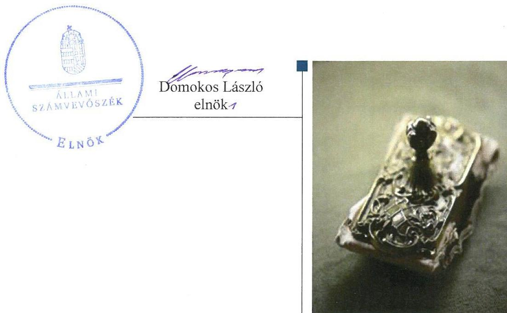

---

# AZ ELLENŐRZÉST FELÜGYELTE:

## MAKKAI MÁRIA felügyeleti vezető

## AZ ELLENŐRZÉST VEZETTE ÉS A VÉGREHAJTÁSÁÉRT FELELŐS:

### KORSÓSNÉ VIGH ANDREA ellenőrzésvezető

## A PROGRAM ÖSSZEÁLLÍTÁSÁÉRT FELELŐS:

### JANIK JÓZSEF LÁSZLÓ osztályvezető

---

**IKTATÓSZÁM:** V-1209-160/2016.

**TÉMASZÁM:** 2243

**ELLENŐRZÉS-AZONOSÍTÓ SZÁM:** V075901

---

Jelentéseink az Országgyűlés számítógépes hálózatán és az Interneta a www.asz.hu címen is olvashatóak.

---

# TARTALOMJEGYZÉK 

■ ÖSSZEGZÉS ..... 5
■ AZ ELLENŐRZÉS CÉLJA ..... 6
■ AZ ELLENŐRZÉS TERÜLETE ..... 7
■ AZ ELLENŐRZÉS HÁTTERE, INDOKOLTSÁGA ..... 8
■ A JELENTÉS LÉNYEGES KÉRDÉSKÖREI ..... 9
■ ELLENŐRZÉS HATÓKÖRE ÉS MÓDSZEREI ..... 10
■ MEGÁLLAPÍTÁSOK ..... 12
■ JAVASLATOK ..... 17
■ MELLÉKLETEK ..... 19
I. Sz. melléklet: Értelmező szótár ..... 19
■ FÜGGELÉK: ÉSZREVÉTELEK ..... 23
■ RÖVIDÍTÉSEK JEGYZÉKE ..... 37

---

.

---

# ÖSSZEGZÉS 

A Magyar Nemzeti Vagyonkezelő Zrt. és a Miniszterelnökség szabályszerűen gyakorolta a tulajdonosi jogokat. A Gödöllői Királyi Kastély Közhasznú Nonprofit Kft. belső szabályozottsága és a pénzügyi-számviteli feladatok ellátása összességében megfelelt az előírásoknak. A tervezési, beszámolási, adatszolgáltatási feladatok ellátása szabályszerű volt. A vagyongazdálkodás nem volt szabályszerű, mert a 2012-2015. évi beszámolók a vagyon öszszetétele tekintetében nem a valós helyzetet tükrözték.

## Az ellenőrzés társadalmi indokoltsága

Magyarországon az intézmény-centrikus közfeladat-ellátás, közvagyon gazdálkodás jellemző a költségvetésen kívüli feladatellátás térnyerése mellett. Ennek szereplői az állami tulajdonú gazdálkodó szervezetek is.

Az állami vagyonnal való gazdálkodás alapvető célja az állami vagyon átlátható, rendeltetésszerű és felelős felhasználásának biztosítása. Az állami tulajdonban álló gazdálkodó szervezetek államot megillető társasági részesedése a nemzeti vagyon részét képezi és legfőbb rendeltetése szerint a közfeladatok ellátását szolgálja.

Az Állami Számvevőszék stratégiájában megfogalmazta, hogy az államháztartáson kívülre nyújtott költségvetési támogatások és ingyenes vagyonjuttatások, valamint az államháztartáson kívül múködő közfeladat-ellátó rendszerek ellenőrzéseivel hozzájárul ahhoz, hogy a közpénzeket az államháztartáson kívül múködő szervezetek is átlátható, rendezett módon használják fel a közfeladatok szerződésben vállalt ellátása érdekében.

A Gödöllői Királyi Kastély Nonprofit Kft. kezelésében lévő gödöllői Grassalkovich kastély Magyarország egyik leglátogatottabb múemléke. E vagyon megőrzése, gyarapítása, fejlesztése, a vagyongazdálkodás szabályszerűsége a vagyonkezelési szerződés célja. A gödöllői kastély kiemelt fejlesztési helyszínként szerepel a felülvizsgált Nemzeti Kastélyprogramról hozott kormányhatározatban.

## Főbb megállapítások

A tulajdonosi joggyakorlók a társasági részesedés felett szabályszerűen gyakorolták a tulajdonosi jogokat. A Gödöllői Királyi Kastély Közhasznú Nonprofit Kft. kezelésében lévő nemzeti vagyon feletti tulajdonosi joggyakorlás szabályszerű volt.

A Társaság múködése összességében megfelelően szabályozott volt. A gazdálkodást meghatározó alapvető szabályzatokkal rendelkeztek, nem készítették el azonban a közzétételi kötelezettség teljesítésére vonatkozó szabályzatot, továbbá a számlarend részeként a bizonylati rendet.

A pénzügyi-számviteli feladatellátás összességében szabályszerű volt. A ráfordításokat és a bevételeket a jogszabályi előírásoknak megfelelően számolták el. A közhasznú és vállalkozási tevékenységek bevételeit és ráfordításait valamint a vagyonkezelt eszközökhöz kapcsolódó bevételeket és ráfordításokat az előírásoknak megfelelően elkülönítették. A végzett szolgáltatások önköltségét az utókalkuláció módszerével a jogszabályi előírások ellenére nem állapították meg.

A tervezési, beszámolási, adatszolgáltatási, valamint közzétételi kötelezettségeket szabályszerűen teljesítették.
A beszámolók a vagyon - vagyonkezelt illetve saját vagyon szerinti - megoszlásáról nem a valós helyzetet tükrözték, mert a vagyonkezelt eszközökön végzett, aktivált beruházásokat, felújításokat saját vagyonként szerepeltették a számviteli nyilvántartásokban. Ez nem biztosította a nemzeti vagyonnal történő átlátható és felelős gazdálkodás követelményeinek érvényesülését. A vagyonkezelési szerződés módosítása a vagyonkezelt eszközökön végrehajtott értéknövelő beruházásokkal, felújításokkal nem történt meg. A beszámolók mérlegeinek leltárral történő alátámasztása biztosított volt. A vagyon változását eredményező döntések megfeleltek az előírásoknak.

---

# AZ ELLENŐRZÉS CÉLJA 

Az ellenőrzés célja annak értékelése volt, hogy a tulajdonosi jogok gyakorlása szabályszerű volt-e; a gazdálkodó szervezet szabályozottsága, gazdálkodása és vagyongazdálkodási tevékenysége megfelelt-e a jogszabályi és a tulajdonosi előírásoknak; biztosítva volt-e a közfeladatok átláthatósága és elszámoltathatósága érdekében a közszolgáltatás díjának megalapozottsága szabályszerű önköltségszámítással; a vagyonváltozást eredményező döntések esetében a tulajdonosi jogok gyakorlója és a gazdálkodó szervezet szabályszerűen jártak-e el.

---

# **AZ ELLENŐRZÉS TERÜLETE**

## **Gödöllői Királyi Kastély Közhasznú Nonprofit Kft., MNV Zrt., Miniszterelnökség**

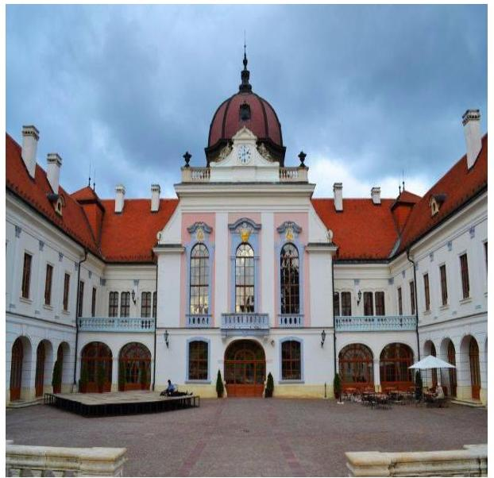

A Társaság¹ a Gödöllői Királyi Kastély Közhasznú Társaság jogutódjaként jött létre 2009-ben. Az ellenőrzött időszakban a Magyar Állam tulajdoni részaránya 84,17%-ot, az Önkormányzat² tulajdoni részaránya 15,82%-ot, a Mérnökiroda³ tulajdoni részaránya 0,01%-ot tett ki. A társasági részesedés vonatkozásában a tulajdonosi jogokat és kötelezettségeket 2012. január 1. és 2014. szeptember 11. között az MNV Zrt.⁴, 2014. szeptember 12. és 2015. december 31. között a Miniszterelnökség gyakorolta. A Társaság kezelt és saját vagyonnal gazdálkodott.

A Társaság közhasznú tevékenysége keretében, a kulturális szolgáltatás, a kulturális örökség védelme, a helyi közművelődési tevékenység támogatása, valamint a nemzeti emlékhelyek védelme területeken látott el közfeladatokat. A közfeladatok ellátására 2014. évben az EMMI⁵-vel közszolgáltatási szerződést kötött. Társasági szerződésben meghatározott fő feladata a múzeumi tevékenység.

A Társaság főbb vagyoni adatait az 1. táblázat mutatja be.

1. táblázat

|  A TÁRSASÁG FŐBB VAGYONI ADATAI (M FT) |  |  |  |  |   |
| --- | --- | --- | --- | --- | --- |
|  Megnevezés | 2012.
I. 1. | 2012.
XII. 31. | 2013.
XII. 31. | 2014.
XII. 31. | 2015.
XII. 31.  |
|  Mérlegfőösszeg | 8382,1 | 8288,3 | 8047,1 | 7880,3 | 7772,0  |
|  Kötelezettségek | 3519,4 | 3287,5 | 3317,7 | 3288,9 | 3247,3  |
|  Követelések | 14,6 | 14,7 | 11,8 | 23,0 | 11,7  |
|   |  |  |  | *Forrás: a Társaság 2012-2015. évi éves beszámolói* |   |

A vagyon 2012. január 1-jéről 2015. december 31-ére 610,1 millió Ft-tal, 7,3%-kal csökkent. A jegyzett tőke 2012-ben 1,2 M Ft-tal emelkedett, ezt követően 2020,7 M Ft volt. Az értékesítés nettó árbevétele a 2012. évi 317,0 M Ft-ról 2015-re 337,7 M Ft-ra növekedett. Az alkalmazottak átlagos statisztikai létszáma 2012-ben 80 fő, a 2015. évben 86 fő volt. Az ügyvezető személyében az ellenőrzött időszakban nem történt változás.

---

# AZ ELLENŐRZÉS HÁTTERE, INDOKOLTSÁGA 

## AZ ÁSZ ${ }^{6}$ KÖZÉPTÁVRA SZÓLÓ STRATÉGIÁJÁBAN

megfogalmazta, hogy az államháztartáson kívülre nyújtott költségvetési támogatások és ingyenes vagyonjuttatások, valamint az államháztartáson kívül működő közfeladat-ellátó rendszerek ellenőrzéseivel hozzájárul ahhoz, hogy a közpénzeket az államháztartáson kívül működő szervezetek is átlátható, rendezett módon használják fel a közfeladatok szerződésben vállalt ellátása, továbbá a közvagyon szerződésben vállalt átlátható, hatékony, költségtakarékos működtetése, értékének megőrzése, állagának védelme, értéknövelő használata, hasznosítása és gyarapítása érdekében.

Az ellenőrzés feladata a közvagyonnal biztosított közfeladat ellátással kapcsolatban a közpénzek átláthatósága, nyilvánossága érdekében a jogszabályokban, belső szabályzatokban megfogalmazott előírások érvényesülésének az állami tulajdonban (résztulajdonban) lévő gazdálkodó szervezetek vagyonérték megőrzési és gazdálkodási tevékenységének értékelése.

AZ ELLENŐRZÉS EREDMÉNYEKÉPP a törvényalkotás számára tapasztalatok állnak rendelkezésre az állami vagyonnal való köz-feladat-ellátás, közvagyonnal gazdálkodás értékeléséhez, az átláthatóságot biztosító szabályozáshoz. Az ellenőrzés tapasztalatai segítik és erősítik az ÁSZ hozzáadott értéket teremtő tevékenységét és tanácsadó szerepét.

---

# A JELENTÉS LÉNYEGES KÉRDÉSKÖREI 

1. A tulajdonosi jogok gyakorlása szabályszerű volt-e?
2. A társaság müködésének szabályozottsága megfelelt-e az előírásoknak?
3. A társaságnál a pénzügyi-számviteli feladatok ellátása szabályszerű volt-e?
4. A társaságnál a tervezési, beszámolási, adatszolgáltatási és ellenőrzési feladatok ellátása szabályszerű volt-e?
5. A társaság vagyongazdálkodása szabályszerű volt-e?

---

# ELLENŐRZÉS HATÓKÖRE ÉS MÓDSZEREI 

## Az ellenőrzés típusa

Megfelelőségi ellenőrzés.

## Az ellenőrzött időszak

A 2012. január 1-jétől 2015. december 31-ig tartó időszak.

## Az ellenőrzés tárgya

Az állami tulajdonban (résztulajdonban) lévő gazdasági társaság gazdálkodása, kiemelten vagyongazdálkodási tevékenysége, a tulajdonosi jogok gyakorlása.

## Az ellenőrzött szervezet

Gödöllői Királyi Kastély Közhasznú Nonprofit Kft., MNV Zrt, Miniszterelnökség.

## Az ellenőrzés jogalapja

Az ellenőrzés jogszabályi alapján az ÁSZ tv. ${ }^{7}$ 5. § (3)-(5) bekezdései, valamint a Vtv. ${ }^{8}$ 3. § (4) bekezdése képezték.

## Az ellenőrzés módszerei

Az ellenőrzést az ellenőrzési program ellenőrzési kérdései, az ellenőrzött időszakban hatályos jogszabályok, az ellenőrzés szakmai szabályok és módszertanok figyelembe vételével végeztük el.

Az ellenőrzött szervezetek az ellenőrzés lefolytatásához tanúsítványok kitöltésével, valamint az ÁSZ által kért dokumentumok megküldésével szolgáltattak adatokat.

A bevételek és ráfordítások elszámolását, és a vagyonnyilvántartás terén a szabályszerű működést véletlenszerű mintavétellel ellenőriztük. A mintavétellel ellenőrzött területek esetében minden egyes tétel vonatkozásában szabályszerűségre vonatkozó kérdéseket tettünk fel, amelyek eredménye összesítésre került. A jogszabályoknak és a belső előírásoknak megfelelőnek tekintettük az adott területet, amennyiben a minta ellenőrzésének eredménye alapján 95\%-os bizonyossággal a teljes sokaságban a

---

hibaarány kisebb volt, mint 10\%, nem megfelelőnek értékeltük, ha a hibaarány a 10\%-ot meghaladta. A ráfordítások elszámolására és a vagyonnyilvántartásra vonatkozó véletlen mintavételt kockázati alapú kiválasztással egészítettük ki, amelynek során évente a három legnagyobb összegű tételt választottuk ki.

---

# 1. A tulajdonosi jogok gyakorlása szabályszerű volt-e? 

## Összegző megállapítás

### 1.1. számú megállapítás

Az MNV Zrt. és a Miniszterelnökség szabályszerűen gyakorolta a tulajdonosi jogokat.

A társasági részesedés feletti tulajdonosi joggyakorlás szabályszerű volt.

A TULAJ DONOSI JOGGYAKORLÁSRA vonatkozó előírásokat 2014. szeptember 12-ig az MNV Zrt. SZMSZ ${ }^{9}$-ében és belső szabályzataiban, ezt követően az MNV Zrt. és a Miniszterelnökség között megkötött megbízási szerződésben ${ }^{10}$, ez alapján a Miniszterelnökség SZMSZ ${ }^{11}$ ében, továbbá a társasági szerződésben rögzítették. A társasági szerződésben meghatározták a taggyűlés kizárólagos hatáskörébe tartozó döntések körét. Rendelkeztek a tulajdonosi joggyakorlók képviseletéről az $\mathrm{FB}^{12}$-ben, meghatározták az FB feladatait. A társasági szerződés tartalmazta a könyvvizsgáló kijelölését és megbízatásának időtartamát.

AZ FB ÉS A KÖNYVVIZSGÁLÓ tevékenységéhez kapcsolódóan a tulajdonosi joggyakorlás szabályszerű volt. Az FB létszáma megfelelt a jogszabályokban foglaltaknak. A taggyűlés az üzleti tervek jóváhagyásáról az FB, az éves beszámolók elfogadásáról a könyvvizsgáló és az FB írásbeli jelentésének birtokában döntött összhangban a Gt. ${ }^{13}$, Ptk. ${ }^{14}$ és a társasági szerződés előírásaival.

A MONITORING RENDSZER KERETÉBEN a tulajdonosi joggyakorlók - a Számv. tv. ${ }^{15}$, a Civil tv. ${ }^{16}$, által előírt beszámolási kötelezettségen túl - a társaságot egyéb adatszolgáltatásra kötelezték. A gazdálkodás nyomon követését a MNV Zrt. monitoring szabályzatában ${ }^{17}$, 2014. szeptember 12-től az MNV Zrt. és a Miniszterelnökség közötti megbízási szerződésben előírt éven belüli kontrolling adatszolgáltatási kötelezettség biztosította.

## 1.2. számú megállapítás

A kezelt vagyon feletti tulajdonosi joggyakorlás megfelelt az előírásoknak.

AZ ÁLLAMI VAGYON KEZELÉSÉRE az MNV Zrt. jogelődje, a KVI ${ }^{18}$ kötötte meg a szerződést a Társaság jogelődjével. A 2006. február 15-én kötött vagyonkezelési szerződés az 1144/2001. (XII. 29.) Korm. határozat ${ }^{19} 4$. pontjában foglaltak teljesítése - a gödöllői kastélyegyüttes állami tulajdonban lévő részeinek a Társaság kezelésébe történő átadása - céljából jött létre. A szerződésben meghatározták a vagyonkezelésre vonatkozó részletes szabályokat. Rendelkeztek a Társaság és az MNV Zrt. nyilvántartási kötelezettségéről, a Társaság adatszolgáltatási és elszámolási kötelezettségéről valamint az MNV Zrt. ellenőrzési jogosultságáról. A Társaságot az MNV Zrt. az adatszolgáltatásokon keresztül ellenőrizte.

---

# 2. A társaság múködésének szabályozottsága megfelelt-e az előírásoknak? 

Összegző megállapítás

A Társaság múködésének szabályozottsága összességében megfelelt az előírásoknak.

RENDELKEZTEK a Számv. tv. előírásainak megfelelő számviteli politikával ${ }^{20}$, leltárkészítési és leltározási szabályzattal ${ }^{21}$, értékelési szabályzattal ${ }^{22}$, önköltségszámítási szabályzattal ${ }^{23}$ pénzkezelési szabályzattal, ${ }^{24}$ továbbá elkészítették a számlarendet ${ }^{25}$. A jogszabályi változásokat követően az aktualizálások megtörténtek.

NEM DOLGOZTÁK KI a Számlarend részeként az abban foglaltakat alátámasztó bizonylati rendet a Számv. tv. 161. § (2) bekezdés d) pontjában foglalt előírás ellenére. Az Info tv. ${ }^{26} 35$. § (3) bekezdésében foglaltak ellenére nem állapították meg az Info tv 37. §-ában meghatározott közzétételi listákon szereplő adatok közzétételi és az adatközlőnek való megküldési kötelezettsége teljesítésének részletes szabályait belső szabályzatban.

A JAVADALMAZÁSI SZABÁLYZAT ${ }^{27}$ összhangban volt a Munka tv. ${ }_{1,2}{ }^{28,29}$ és a Tak. tv. ${ }^{30}$ előírásaival. A jogszabályi változások miatti aktualizálás megtörtént, a szabályzatot és annak módosításait a taggyűlés jóváhagyta.

## 3. A társaságnál a pénzügyi-számviteli feladatok ellátása szabályszerű volt-e?

## Összegző megállapítás

### 3.1. számú megállapítás

A Társaságnál a pénzügyi-számviteli feladatok ellátása összességében szabályszerű volt.

A bevételek és a ráfordítások elszámolása megfelelő volt.
A BEVÉTELEK kiszámlázása, főkönyvi elszámolása a Számv. tv. előírásai, illetve a számviteli politika betartásával történt. A nyilvántartásokból megállapítható volt a határidőn túli követelések állománya. A hátralékos követelésállomány csökkentése érdekében a határidő lejártát követően fizetési felszólításokat küldtek a vevőknek.

AZ ANYAGJELLEGŰ RÁFORDÍTÁSOKNÁL az előírt esetekben a kötelezettségvállalást megalapozó szerződés, megállapodás rendelkezésre állt. A ráfordítások elszámolását a Számv. tv. szerinti bizony-latok támasztották alá.

AZ ÉRTÉKCSÖKKENÉS elszámolásánál betartották a Számv. tv.-ben, és a számviteli politikában foglaltakat, az előírt leírási kulcsokat alkalmazták. Az éves beszámolók kiegészítő mellékletében részletesen bemutatták az elszámolt értékcsökkenési leírást, ezen belül a terven felüli értékcsökkenést. A beszerzett immateriális javak, tárgyi eszközök állományba vétele az előírásoknak megfelelt.

---

A SZEMÉLYI JELLEGŰ RÁFORDÍTÁSOK elszámolása az előírásokkal összhangban történt. A bérkifizetéseket munkaszerződés, munkaidő elszámolás és teljesítésigazolás alátámasztotta. A személyi jellegű egyéb kifizetésekre a belső szabályzat és a jogszabályi előírások figyelembe vételével került sor.

A közhasznú és vállalkozási tevékenység szerinti elkülönítése a Civil tv. előírásainak megfelelően megvalósult mind a bevételek, mind a ráfordítások esetében. A vagyonkezelt eszközökhöz kapcsolódó bevételeket és ráfordításokat az előírásoknak megfelelően elkülönítették.

# 3.2. számú megállapítás 

Önköltségszámításra vonatkozó Számv. tv.-ben előírt kötelezettségének a Társaság nem tett eleget.

ÖNKÖLTSÉGSZÁMÍTÁSRA az ellenőrzött időszak egészében kötelezett volt a Társaság, az önköltségszámítás rendjét a Számv. tv. előírásának megfelelően belső szabályzatban kialakította. A szabályzat tartalmazta a kalkulációs módszerek leírását, valamint az előkalkuláció és utókalkuláció készítésének rendjét.

A Társaság - a Számv. tv. 14. § (7) bekezdését figyelmen kívül hagyva a végzett szolgáltatások Számv. tv. 51. § (2) bekezdése szerinti önköltséget nem állapította meg az önköltségszámítási szabályzat szerinti utókalkuláció módszerével. Ennek hiányában az utókalkulált önköltség - az önköltségszámítási szabályzatban rögzített elvek ellenére - nem szolgálhatott alapul az árképzés során, illetve a jövedelmezőség javítása érdekében szükséges intézkedések megalapozásához.

A múzeumi belépők és a rendezvények díjtételeit a piaci tényezők, a Társaság jóváhagyott üzleti tervei és árpolitikája, a továbbszámlázott szolgáltatások árrését a továbbszámlázott szolgáltatások árrésének kalkulációjára vonatkozó szabályzat ${ }^{31}$ figyelembe vételével határozták meg.

## 4. A társaságnál a tervezési, beszámolási, adatszolgáltatási és ellenőrzési feladatok ellátása szabályszerű volt-e?

Összegző megállapítás Szabályszerűen történt a tervezési, beszámolási, adatszolgáltatási és ellenőrzési feladatok ellátása.

## 4.1. számú megállapítás

A tervezési, beszámolási és adatszolgáltatási kötelezettségeket teljesítették.

ÜZLETI TERV készítési kötelezettségének a Társaság eleget tett minden évben. Az üzleti tervek megfeleltek az MNV Zrt. által kiadott tervezési irányelvekben foglaltaknak.

AZ ÉVES BESZÁMOLÓKAT a Társaság elkészítette a Számv. tv.-ben, a Civil tv-ben és a 350/2011. (XII. 30.) Korm. rendeletben ${ }^{32}$ foglaltaknak megfelelően. A beszámolók letétbe helyezéséről és közzétételéről a Számv. tv. és a Civil tv. szerint határidőben gondoskodtak.

---

AZ ADATSZOLGÁLTATÁSOKAT teljesítették. Az évközi adatközléseknek a Vhr ${ }^{33}$. és a Vagyonkezelési szerződés ${ }^{34}$ vonatkozó rendelkezéseit, valamint a tulajdonosi joggyakorlók előírásait betartva határidőben eleget tettek. A közérdekú adatok közzétételére az Info tv.-ben és a Tak. tv.-ben foglaltaknak megfelelően sor került.

# 4.2. számú megállapítás 

A Társaság által működtetett belső ellenőrzés támogatta a szabályszerű gazdálkodást. Az ellenőrzési javaslatokat hasznosították.

BELSŐ ELLENŐRZÉS kialakításáról külső szolgáltató bevonásával gondoskodtak. A vagyongazdálkodással kapcsolatos belső ellenőrzések a követelésekkel és tartozásokkal kapcsolatos tevékenységre, a szerződésekre, a gépjárművek használatára és a készletgazdálkodásra irányultak.

A belső ellenőrzés, az FB és a könyvvizsgáló észrevételeit figyelembe vették, hasznosították. Az egyéb külső ellenőrző szervek ellenőrzési jelentései intézkedést igénylő megállapítást nem tartalmaztak.

## 5. A társaság vagyongazdálkodása szabályszerű volt-e?

## Összegző megállapítás

### 5.1. számú megállapítás

A Társaság vagyongazdálkodása nem volt szabályszerű, mert számviteli nyilvántartása és éves beszámolói a vagyoni helyzetéről - a kezelt és saját vagyon összetétele tekintetében nem a valós helyzetet tükrözték.

Kialakították a vagyon értékének megőrzését, gyarapítását szolgáló szabályszerű gazdálkodás feltételeit.

A vagyongazdálkodáshoz kapcsolódó követelményeket, feladat-, hatásköröket, felelősségi viszonyokat rögzítették a társasági szerződés, a társaság SZMSZ ${ }^{35}$-e és belső szabályzatai. Az üzleti tervek tartalmazták a beruházási tervet, valamint további három évre való kitekintést a várható múködési, piaci folyamatokról és az eredményről. Kialakították a vagyonkezelt vagyon elkülönített nyilvántartási rendjét. Szabályozták az értékcsökkenési leírás módszerét és elszámolásának gyakoriságát. A vagyon értékelésének, leltározásának szabályai tartalmazták a vagyon megőrzését, védelmét biztosító előírásokat.

## 5.2. számú megállapítás

A Társaság vagyonnyilvántartása nem volt szabályszerű.
A beszámolók a Számv. tv. 4. § (2) bekezdés előírása ellenére a Társaság vagyoni helyzetéről, a saját és kezelt vagyon összetétele tekintetében nem a valós helyzetet tükrözték, mert a számviteli nyilvántartásaiban és beszámolóiban a Társaság saját vagyonként mutatta ki a vagyonkezelt eszközökön végzett, aktivált beruházások, felújítások értékét. A vagyonkezelt eszközökön végzett beruházások, felújítások miatti vagyonnövekedés számviteli elszámolásának feltételeit a Vhr. 18. § (1) bekezdése rögzítette.

A Társaság a vagyonkezelt eszközökön végzett beruházások, felújítások vagyonnövekedésként történő állománybavételéhez szükséges számviteli bizonylattal (módosított vagyonkezelési szerződéssel) nem rendelkezett.

A vagyonkezelési szerződésnek a vagyonnövekedés számviteli szabályok szerinti elszámolása érdekében szükséges módosítása nem történt

---

meg a vagyonkezelésben lévő állami vagyonon - a tulajdonosi joggyakorló előzetes hozzájárulásával - saját és elszámolási kötelezettséggel kapott külső forrásból végrehajtott értéknövelő beruházások, felújítások miatt a Vhr. 18. § (1) bekezdés a) és c) pontjainak előirása ellenére.

A könyvvizsgáló a fenti szabálytalanságok ellenére az éves beszámolókat korlátozás nélküli hitelesítő záradékkal látta el.

A LELTÁROZÁS a Számv. tv. és a leltárkészítési és leltározási szabályzat szerint történt. A beszámolóban szereplő eszközök és források állományát folyamatosan vezetett mennyiségi nyilvántartások, illetve a csak értékben kimutatható mérlegsorokat érintően az elvégzett egyeztetések támasztották alá. Mennyiségi felvétellel tételes leltározásra a 2013. évben került sor.

# 5.3. számú megállapítás 

A vagyon értékének, állagának megőrzése érdekében a rendelkezésre álló források mértékéig a Társaság ráfordítással élt.

A VAGYON ÉRTÉKÉNEK MEGŐRZÉSÉRŐL és a kezelt vagyont érintő, a Vhr. szerint 2013. június 28 -áig fennálló visszapótlási kötelezettség teljesítéséről a rendelkezésre álló források mértékéig gondoskodtak. 2012. január 1. és 2015. december 31. között az immateriális javak és tárgyi eszközök nettó értéke 8138,7 M Ft-ról 7590,7 M Ft-ra csökkent, az elszámolt értékcsökkenés 719,6 M Ft, a beruházás, felújítás összesen 169,3 M Ft volt. A vagyon jelentős értéknövekedését eredményező beruházásokra az ellenőrzött időszakot megelőzően került sor.

AZ ÁLLAGMEGÓVÁST érintően a Vtv.-ben, az Nvtv. ${ }^{36}$-ben, a Vhr.-ben és a Vagyonkezelési szerződésben foglaltak teljesítése érdekében a saját és a kezelt vagyon állapotfelmérését elvégezték. A karbantartási terveket a tulajdonosi joggyakorlók előírásai alapján az éves üzleti tervek keretében dolgozták ki. A 2012-2015 közötti időszakban karbantartásra öszszesen 118,6 millió Ft-ot fordítottak.

## 5.4. számú megállapítás

A saját és a kezelésbe vett vagyon változását eredményező döntések megfeleltek az előírásoknak.

A társasági szerződés előírásaival összhangban a tervezett beruházásokat, felújításokat, térítés nélküli átvételeket és karbantartásokat az éves üzleti tervek keretében terjesztették be a taggyűlésnek, melyek jóváhagyása megtörtént. A beruházásokkal, felújításokkal kapcsolatos szerződésekről a taggyűlés az FB jóváhagyását követően határozott. A bérbeadásról és a selejtezésről - a hatáskörében eljárva - az ügyvezető igazgató döntött. A vagyongazdálkodásra vonatkozó döntések a vagyon értékének megőrzését, gyarapítását, a vagyonvesztés elkerülését szolgálták.

---

# JAVASLATOK 

Az ÁSZ tv. 33. § (1) bekezdésében foglaltak értelmében az ellenőrzött szervezet vezetője köteles a jelentésben foglalt megállapításokhoz kapcsolódó intézkedési tervet összeállítani és azt a jelentés kézhezvételétől számított 30 napon belül az ÁSZ részére megküldeni. Amennyiben az ellenőrzött szervezet vezetője nem küldi meg határidőben az intézkedési tervet, vagy továbbra sem elfogadható intézkedési tervet küld, az Állami Számvevőszék elnöke az ÁSZ tv. 33. § (3) bekezdése a) és b) pontjaiban foglaltakat érvényesítheti.

## a Magyar Nemzeti Vagyonkezelő Zrt. vezérigazgatójának

1. Kezdeményezze a vagyonkezelésbe adott állami vagyonon végrehajtott értéknövelő beruházások, felújítások miatti vagyonnövekedés számviteli szabályok szerinti elszámolása érdekében a vagyonkezelési szerződés módosítását a Vhr.-ben elöirtaknak megfelelően.
(5.2. sz. megállapítás 3. bekezdése alapján)

## a Gödöllői Királyi Kastély Közhasznú Nonprofit Kft. ügyvezetőjének

1. Intézkedjen a Számv. tv.-ben elöirtak szerint a Számlarend részét képező bizonylati rend elkészitéséről.
(2. sz. megállapítás 2. bekezdés első mondata alapján)
2. Intézkedjen, hogy a jogszabályban meghatározott közzétételi listákon szereplő adatok közzétételi és az adatközlőnek történő megküldési kötelezettsége teljesitésének részletes szabályait belső szabályzatban állapitsák meg.
(2. sz. megállapítás 2. bekezdés 2. mondata alapján)
3. Intézkedjen a Számv. tv.-ben és az önköltség-számitási szabályzatban elöirtak szerint a Társaság által végzett szolgáltatások önköltségének utókalkuláció módszerével történő megállapításáról.
(3.2. sz. megállapítás 2. bekezdés első mondata alapján)

---

4. Kezdeményezze a vagyonkezelésbe adott állami vagyonon végrehajtott értéknövelő beruházások, felújítások miatti vagyonnövekedés számviteli szabályok szerinti elszámolása érdekében a vagyonkezelési szerződés módosítását a Vhr.-ben előirtaknak megfelelően.
(5.2. sz. megállapítás 3. bekezdése alapján)
5. Intézkedjen a vagyonkezelési szerződés módosításának a számviteli nyilvántartásokban történő átvezetéséről, hogy a beszámolók a társaság vagyoni helyzetéről a vagyon összetétele tekintetében a valós helyzetet tükrözzék.
(5.2. sz. megállapítás 1. bekezdése alapján)

---

# MELLÉKLETEK 

- I. SZ. MELLÉKLET: ÉRTELMEZŐ SZÓTÁR

Állami vagyon

Állami vagyon kezelője /vagyonkezelő

Gazdálkodó szervezet

## 2012. november 9-ig:

a) Az állam tulajdonában lévő dolog, valamint a dolog módjára hasznosítható természeti erő,
b) Az a) pont hatálya alá nem tartozó mindazon vagyon, amely vonatkozásában törvény az állam kizárólagos tulajdonjogát nevesíti,
c) az állam tulajdonában lévő tagsági jogviszonyt megtestesítő értékpapír, illetve az államot megillető egyéb társasági részesedés,
d) az államot megillető olyan immateriális, vagyoni értékkel rendelkező jogosultság, amelyet jogszabály vagyoni értékű jogként nevesít.
Forrás: Vtv. 1. § (2) bekezdése
2012. november 10-től az állami vagyon fogalma kiegészül a következő ponttal:
a) az állam tulajdonában lévő pénzügyi eszközök

Forrás: Vtv. 1. § (2) bekezdése

## 2012. január 1-jétől:

Az állami vagyont az MNV Zrt. maga kezeli, vagy szerződés - így különösen bérlet, haszonbérlet, megbízás - alapján központi költségvetési szervnek, természetes vagy jogi személynek, vagy jogi személyiséggel nem rendelkező gazdálkodó szervezetnek hasznosításra átengedi. Az állami vagyonra vonatkozóan az MNV Zrt. kizárólag az Nvtv.-ben meghatározott személyekkel köthet vagyonkezelési szerződést. Forrás: Vtv. 23. § (1), 27. § (1)

## 2013. június 28-ától:

Az állami vagyonnal az MNV Zrt. maga gazdálkodik, vagy szerződés - így különösen bérlet, haszonbérlet, megbízás - alapján központi költségvetési szervnek, természetes vagy jogi személynek, vagy jogi személyiséggel nem rendelkező gazdálkodó szervezetnek hasznosításra átengedi, illetőleg vagyonkezelésbe, haszonélvezetbe adja. Az állami vagyonra vonatkozóan az MNV Zrt. kizárólag az Nvtv.-ben meghatározott személyekkel köthet vagyonkezelési szerződést.
Forrás: Vtv. 23. § (1), 27. § (1)
2013. június 30-ig gazdálkodó szervezet:

Az állami vállalat, az egyéb állami gazdálkodó szerv, a szövetkezet, a lakás-szövetkezet, az európai szövetkezet, a gazdasági társaság, az európai rész-vénytársaság, az egyesülés, az európai gazdasági egyesülés, az európai területi együttműködési csoportosulás, az egyes jogi személyek vállalata, a leányvállalat, a vízgazdálkodási társulat, az erdőbirtokossági társulat, a végrehajtói iroda, az egyéni cég, továbbá az egyéni vállalkozó.
Forrás: Ptk. ${ }^{37}$ 685. § c) pontja
2013. július 1-jétől gazdálkodó szervezet:

Az állami vállalat, az egyéb állami gazdálkodó szerv, a szövetkezet, a lakás-szövetkezet, az európai szövetkezet, a gazdasági társaság, az európai rész-vénytársaság, az egyesülés, az európai gazdasági egyesülés, az európai területi együttműködési csoportosulás, az egyes jogi személyek vállalata, a leányvállalat, a vízgazdálkodási társulat, az erdőbirtokossági társulat, a végrehajtói iroda, az egyéni cég, továbbá az egyéni vállalkozó. Az állam, a helyi önkormányzat, a költségvetési szerv, az

---

egyesület, a köztestület, valamint az alapítvány gazdálkodó tevékenységével öszszefüggő polgári jogi kapcsolataira is a gazdálkodó szervezetre vonatkozó rendelkezéseket kell alkalmazni, kivéve, ha a törvény e jogi személyekre eltérő rendelkezést tartalmaz; a 292/A-292/B. §, 301/A-301/B. §, 405. § (1) bekezdés, valamint a 407/A. § (1) bekezdés tekintetében nem minősül gazdálkodó szervezetnek az, aki a közbeszerzésekről szóló törvény értelmében ajánlatkérő (szerződő hatóság).
Forrás: Ptk.; 685. § c) pontja
2014. március 15-től gazdálkodó szervezet:

A gazdasági társaság, az európai részvénytársaság, az egyesülés, az európai gazdasági egyesülés, az európai területi együttműködési csoportosulás, a szövetkezet, a lakásszövetkezet, az európai szövetkezet, a vízgazdálkodási társulat, az erdőbirtokossági társulat, az állami vállalat, az egyéb állami gazdálkodó szerv, az egyes jogi személyek vállalata, a közös vállalat, a végrehajtói iroda, a közjegyzői iroda, az ügyvédi iroda, a szabadalmi ügyvivői iroda, az önkéntes kölcsönös biztosító pénztár, a magánnyugdípénztár, az egyéni cég, továbbá az egyéni vállalkozó. Az állam, a helyi önkormányzat, a költségvetési szerv, az egyesület, a köztestület, valamint az alapítvány gazdálkodó tevékenységével összefüggő polgári jogi kapcsolataira is a gazdálkodó szervezetre vonatkozó rendelkezéseket kell alkalmazni. Forrás: Ppt. ${ }^{38} 396 . \S$
gazdasági társaság

Tulajdonosi ellenőrzés

Tulajdonosi jogok gyakorlója

A Ptk2. 3:88. § (1) bekezdése szerint „a gazdasági társaságok üzletszerű közös gazdasági tevékenység folytatására, a tagok vagyoni hozzájárulásával létrehozott, jogi személyiséggel rendelkező vállalkozások, amelyekben a tagok a nyereségből közösen részesednek, és a veszteséget közösen viselik".
Civil tv. 9/F. § (2) bekezdése szerint „az a gazdasági társaság minősül nonprofit gazdasági társaságnak és cégnevében az a gazdasági társaság tüntetheti fel a nonprofit jelleget, amelynek létesítő okirata tartalmazza, hogy a gazdasági társaság tevékenységéből származó nyereség a tagok között nem osztható fel, hanem az a gazdasági társaság vagyonát gyarapítja." (hatályos 2014. március 15-től)
2014. március 14-ig:

Az állami vagyon kezelőjét, haszonélvezőjét, használóját megillető jogok gyakorlását, annak szabályszerűségét, célszerűségét az MNV Zrt. - szükség szerint területi szervei útján - ellenőrzi.

## 2014. március 15 -től:

Az állami vagyon használóját, vagyonkezelőjét és haszonélvezőjét megillető jogok gyakorlását, annak szabályszerűségét, a kötelezettségek teljesítését, valamint a vagyon rendeltetése szerinti célszerűségét a tulajdonosi joggyakorló rendszeresen ellenőrzi.
Forrás: Vhr. 20. §.(1)
1.
2013. június 27-ig:

Az állami vagyon felett a Magyar Államot megillető tulajdonosi jogok és kötelezettségek összességét - ha törvény eltérően nem rendelkezik - az állami vagyon felügyeletéért felelős miniszter (a továbbiakban: miniszter) gyakorolja, aki e feladatát a Magyar Nemzeti Vagyonkezelő Zártkörűen Működő Részvénytársaság (a továbbiakban: MNV Zrt.), a Magyar Fejlesztési Bank, illetve a tulajdonosi joggyakorló szervezet útján látja el. A miniszter miniszteri rendeletben, a törvényben meghatározott állami vagyoni kör tekintetében, meghatározott időtartamra, a joggyakorlás egyes szabályainak meghatározásával - az őt megillető tulajdonosi jogok és kötelezettségek összességének, illetve azok meghatározott részének gyakorlóját az Áht.

---

szerinti központi költségvetési szervek, ezek intézménye, továbbá a 100\%-ban állami tulajdonban álló gazdasági társaságok közül kijelölheti.
Forrás: Vtv. 3. § (1) és (2)
2013. június 28 -ától:

A rábízott állami vagyon felett az államot megillető tulajdonosi jogok és kötelezettségek összességét tulajdonosi joggyakorlóként:
ha törvény vagy miniszteri rendelet eltérően nem rendelkezik, a Magyar Nemzeti Vagyonkezelő Zártkörűen Működő Részvénytársaság (a továbbiakban: MNV Zrt.), törvényben kijelölt személy vagy
az állami vagyon felügyeletéért felelős miniszter (a továbbiakban: miniszter) által rendeletben kijelölt személy gyakorolja.
[...] A miniszter e törvény felhatalmazása alapján - a meghatározott célok hatékonyabb elérése érdekében, miniszteri rendeletben, az ott meghatározott állami vagyoni kör tekintetében, meghatározott időtartamra - e törvény keretei között, a joggyakorlás egyes szabályainak meghatározásával - az államot megillető tulajdonosi jogok és kötelezettségek összességének, illetve azok meghatározott részének gyakorlóját az Áht. szerinti központi költségvetési szervek, ezek intézménye, továbbá a 100\%-ban állami tulajdonban álló gazdasági társaságok közül kijelölheti.
Forrás: Vtv. 3. § (1) és (2)
2.

Aki a nemzeti vagyon felett az államot vagy a helyi önkormányzatot megillető tulajdonosi jogok és kötelezettségek összességének gyakorlására jogosult.
Forrás: Nvtv. 3. § (1) 17. pontja

---

.

---

# FÜGGELÉK: ÉSZREVÉTELEK 

A jelentéstervezetet a Számvevőszék 15 napos észrevételezésre megküldte az ellenőrzött szervezet vezetőjének az ÁSZ tv. 29. §* (1) bekezdése előírásának megfelelően.

Az ÁSZ a jelentéstervezetet észrevételezésre megküldte a Gödöllői Királyi Kastély Közhasznú Nonprofit Kft. ügyvezetőjének, a Magyar Nemzeti Vagyonkezelő Zrt. vezérigazgatójának és a Miniszterelnökséget vezető miniszternek.
A Gödöllői Királyi Kastély Közhasznú Nonprofit Kft. ügyvezetőjének, a Magyar Nemzeti Vagyonkezelő Zrt. vezérigazgatójának és a Miniszterelnökséget vezető miniszter észrevételeit és az arra adott válaszokat a függelék alább tartalmazza.

[^0]
[^0]:    * 29. § (1) Az Állami Számvevőszék az ellenőrzési megállapításait megküldi az ellenőrzött szervezet vezetőjének vagy az általa megbízott személynek, és annak, akinek személyes felelősségét állapította meg.
    (2) Az ellenőrzött szervezet vezetője és a felelősként megjelölt személy az ellenőrzés megállapításaira tizenöt napon belül írásban észrevételt tehet.
    (3) Az Állami Számvevőszék az észrevételre a beérkezésétől számított harminc napon belül írásban válaszol. A figyelembe nem vett észrevételeket köteles a jelentésben feltüntetni, és megindokolni, hogy azokat miért nem fogadta el.

---

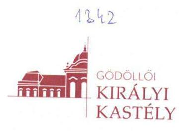

Állami Számvevőszék
Budapest
Apáczai Csere János utca 10. 1052

Domokos László
Elnök úr

Tárgy: Észrevétel vizsgálati jelentésre

Tisztelt Elnök Úr!
Társaságunknál, a Gödöllői Királyi Kastély Közhasznú Nonprofit Kft.-nél „Az állami tulajdonban (résztulajdonban) lévő gazdálkodó szervezetek vagyonmegőrzési és gazdálkodási tevékenységének ellenőrzése" keretében végzett ellenőrzéshez kapcsolódóan készült (V-1209145/2016 ikt számú) számvevőszéki jelentéstervezetet köszönettel kézhez kaptuk.
A jelentéstervezetben megfogalmazott megállapításokhoz az ÁSZ tv. 29.§ (2) bekezdésében megfogalmazott lehetőséggel élve észrevételt kívánunk tenni az alábbiakban leírtak szerint:

# Számvevőszéki jelentéstervezet 

Megállapítások
„5. A társaság vagyongazdálkodása szabályszerű volt-e?
Összegző megállapítás A Társaság vagyongazdálkodása nem volt szabályszerű, mert számviteli nyilvántartása és éves beszámolói a vagyoni helyzetéről - a kezelt és saját vagyon összetétele tekintetében - nem a valós helyzetet tükrözték."
„5.2. számú megállapítás A Társaság vagyonnyilvántartása nem volt szabályszerű."
A jelentéstervezet megállapítása szerint „A beszámolók a Számv. tv. 4.§ (2) bekezdés előírása ellenére a Társaság vagyoni helyzetéről, a saját és kezelt vagyon összetétele tekintetében nem a valós helyzetet tükrözték, mert a számviteli nyilvántartásaiban és beszámolóiban a Társaság saját vagyonként mutatta ki a vagyonkezelt eszközökön végzett, aktivált beruházások, felújítások értékét. A vagyonkezelt eszközökön végzett beruházások, felújítások miatti vagyonnövekedés számviteli elszámolásának feltételit a Vhr. 18.§ (1) bekezdése rögzítette."
A Társaságunk számviteli nyilvántartása és éves beszámolói a társaság vagyoni helyzetéről, különös tekintettel a kezelt és a saját vagyon összetételének kimutatására, a számviteli nyilvántartást megalapozó, illetve a számviteli nyilvántartásba vételhez figyelembe vehető dokumentumok szerinti valós képet tükrözik a vizsgált időszakban, és azon kívüli időszakokban is.

A számviteli nyilvántartás alapdokumentuma a vagyonkezelt eszközök tekintetében a Vagyonkezelési Szerződés, a nyilvántartás csak és kizárólag az abban rögzített tételeket tartalmazhatja, mennyiségben és értékben is.

---

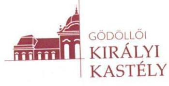

A Vagyonkezelési Szerződés módosítására annak megkötése óta nem került sor, sem a Társaság, sem az MNV Zrt. által végzett és aktivált beruházások értéke nem került átvezetésre - a szerződés megkötését követő jogszabályváltozás okán -, ezért a számviteli nyilvántartásban sem történhetett változás a szerződéskor nyilvántartásba vett mennyiséghez és értékhez képest.
A Társaság éves beszámolója a számviteli nyilvántartással egyezően került összeállításra. Az éves beszámoló részeként elkészített mérleg Ingatlanok és a kapcsolódó vagyoni értékủ jogok mérlegsor egy összegben tartalmazza mind a használatba kapott - alapításkor 99 év időszakra kapott használati jog jogcím alapján - ingatlanon végzett aktivált beruházások, mind pedig a vagyonkezelt ingatlanok - vagyonkezelési szerződés alapján - értékét. Ugyanakkor az éves beszámoló részeként elkészített kiegészítő mellékletben bemutatásra került a befektetett eszközök alakulásánál az eszközök értékéből a vagyonkezelt rész, a kötelezettségek bemutatásánál a vagyonkezeléssel kapcsolatos kötelezettség.
Álláspontunk szerint az éves beszámolók megfelelnek a Számv. tv 4. § (2) bekezdés előírásainak.
Ezt támasztja alá az is, hogy a Társaságunk éves beszámolóit a társaság könyvvizsgálóján kívül az MNV Zrt. Kontrolling Vagyonértékelő és Könyvszakértő Igazgatósága is ellenőrizte, és a számviteli törvénynek megfelelőnek találta. A 2012-2013 évek vonatkozásában ennek ténye az éves beszámolót tárgyaló Felügyelő Bizottsági jegyzőkönyvekben is rögzítésre került. Ezen felül egy év vonatkozásában sem került észrevételezésre a Társaság éves beszámolója alapján összeállított, a MNV Zrt. beszámolójának összeállításához és könyvvizsgálatához megküldött egyenlegközlő-adatszolgáltatás a vagyonkezelésbe vett, valamint az állami vagyonnal való gazdálkodásról szóló 254/2007. (X.4.) Korm. rendelet 14. §. (1) bekezdés alapján saját eszközként kimutatott, de vagyonkezelésbe még nem vett, állami tulajdonban lévő eszközök értékéről, a visszapótlási kötelezettségről. A Tulajdonos részéről szintén elfogadásra került a Társaság számviteli nyilvántartása alapján összeállított, tárgyévekben megküldött vagyonkataszteri jelentés is.
Ugyanakkor nem vitatjuk az 5.2 számú megállapításban megfogalmazottak azon részét, hogy:
„A Társaság a vagyonkezelt eszközökön végzett beruházások, felújitások vagyonnövekedéseként történő állománybavételéhez szükséges számviteli bizonylattal (módosított vagyonkezelési szerzödéssel) nem rendelkezett.
A vagyonkezelési szerződésnek a vagyonnövekedés számviteli szabályok szerinti elszámolása érdekében szükséges módosítása nem történt meg, a vagyonkezelésben lévő állami vagyonon a tulajdonosi joggyakorló elözetes hozzájárulásával - saját és elszámolási kötelezettséggel kapott külső forrásból végrehajtott értéknövelő beruházások, felújitások miatt a Vhr.18.§ (1) bekezdés a) és c) pontjainak elöírásai ellenére."

Ahogy a jelentéstervezet 17-18. oldalán található, a Társaság ügyvezetőjének irányába megfogalmazott javaslatok sorrendisége és az 5. javaslat szövegezése is mutatja, a számviteli nyilvántartások megfelelő rendezését meg kell előzze a vagyonkezelési szerződés megfelelő módosítása. Mindaddig a Társaság számviteli nyilvántartása csak az eddigi gyakorlat alapján alakulhat.

Természetesen tisztában vagyunk azzal, hogy a jelentés tartalmi, formai és mennyiségi korlátok közt tudja bemutatni az ellenőrzés igen átfogó eredményét és nincs lehetőség - és talán szükség

---

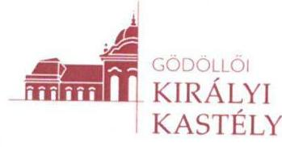
sem - az összefüggések teljeskörű bemutatására. Ugyanakkor az ok-okozati összefüggések jobb megérthetősége, valamint a javaslatok megfogalmazása, sorrendisége és a megállapítások közti koherencia megteremtése érdekében is javasoljuk a fentiek alapján a vizsgálati jelentéstervezet 5. pont összegző megállapításának, valamint az 5.2. számú megállapításának pontosítását illetve átfogalmazását.

Tekintettel arra, hogy - az Állami Számvevőszék által is ismert, megismert okok miatt - a vagyonkezelési szerződés módosításának elmaradása következtében a számviteli nyilvántartás nem volt, nem lehetett a saját és kezelt vagyon összetételének tekintetében a végleges fizikai állapot valóságának megfelelő, ugyanakkor a rendelkezésre álló bizonylatokkal egyezett és a jelentéstervezet több helyen is jelzi, hogy egyébiránt a Társaság a megfelelő gazdálkodás követelményeinek és a beszámolók alátámasztottságának eleget tett, átgondolandónak tartjuk, hogy a jelentéstervezet azon (5. és 15. oldalon) kijelentései, miszerint "a (társaság) vagyongazdálkodása nem volt szabályszerü", illetve "a beszámolók nem a valós helyzetet tükröztek" megfelelően tükrözik-e a tényállást, vagy árnyaltabb megfogalmazás esetleg a kialakult és valós helyzetet és abban az általam képviselt Társaság szerepét egy nyilvánosságra hozott dokumentumban jobban képesek leírni, ezért kérjük a megállapítás megfogalmazásában a hangsúly áthelyezését a vagyonkezelési szerződés hiányosságára, törölve a Számv. tv. 4.§ (2) bekezdés előírásának való meg nem felelést.

A jelentéstervezet egyéb megállapításaival, valamint valamennyi javaslatával Társaságunk alapvetően egyetért, azok megalapozottságát nem vitatja, a vizsgálati jelentéstervezetben foglalt, a fentiekben ki nem emelt megállapítások tekintetében nem kívánunk észrevételt tenni. A szükséges lépéseket azok kapcsán a magam és az általam irányított Társaság részéről megtesszük, megtettük.

Az ellenőrzés kapcsán alapvető és folyamatos tapasztalatunk volt, hogy az Állami Számvevőszék részéről valamennyi bevont szereplő Társaságunk irányába korrekt és segítő hozzáállást tanúsított, melyet ezúton is köszönök!

Gödöllő, 2017. augusztus 04.

Tisztelettel:
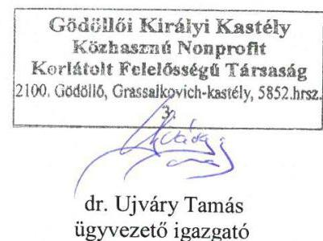

---

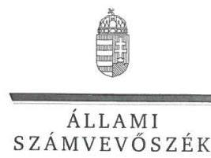

# Dr. Ujváry Tamás úr 

ügyvezető

Gödöllői Királyi Kastély Közhasznú Nonprofit Kft.

## Gödöllő

## Tisztelt Ügyvezető Úr!

„Az állami tulajdonban (résztulajdonban) lévő gazdálkodó szervezetek vagyonmegőrzési és gazdálkodási tevékenységének ellenőrzése - Gödöllöi Királyi Kastély Közhasznú Nonprofit Kft." címmel készített számvevőszéki jelentéstervezetre tett észrevételét köszönettel megkaptam.

Az Állami Számvevőszék észrevételre vonatkozó álláspontjáról a felügyeleti vezető által készített részletes tájékoztatást csatoltan megküldöm.

Tájékoztatom Ügyvezető urat, hogy a számvevőszéki jelentésben - az Állami Számvevőszékről szóló 2011. évi LXVI. törvény 29. § (3) bekezdése alapján - a figyelembe nem vett észrevételeket szerepeltetjük, annak indoklásával, hogy azokat az Állami Számvevőszék miért nem fogadta el.

Budapest, 2017. 68 hó 37 nap
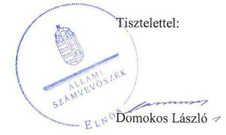

Melléklet: Tájékoztatás az észrevétel kezeléséről

---

# Tájékoztatás   az észrevétel kezeléséről 

„Az állami tulajdonban (résztulajdonban) lévő gazdálkodó szervezetek vagyonmegőrzési és gazdálkodási tevékenységének ellenőrzése - Gödöllöi Királyi Kastély Közhasznú Nonprofit Kft." címủ jelentéstervezetre 2017. augusztus 11-én érkezett észrevételét áttekintettük, annak kezelésével kapcsolatban a következő tájékoztatást adom.
A jelentéstervezet 5. számú összegző megállapítására és az 5.2. számú megállapítására, valamint az Összegzés és Főbb megállapítások fejezet vonatkozó részeire tett észrevételre adott válasz
Az észrevétel a jelentéstervezetnek azt a megállapítását kifogásolja, mely szerint a saját és vagyonkezelt vagyon kimutatása tekintetében a számviteli nyilvántartások a jogszabályi előírásoknak nem feleltek meg, a számviteli beszámolók nem a valós helyzetet tükrözték.
Az észrevételben leírtak megerősítik a jelentéstervezetnek azt a megállapítását, hogy a Társaság a vagyonkezelt vagyonon végzett aktivált beruházásokat, felújításokat a számviteli nyilvántartásokban, az éves beszámolók mérlegeiben saját vagyonként mutatta be. A jelentéstervezet javaslata a vagyonkezelt vagyonon végzett beruházás, felújítás vagyonkezelési szerződésben történő rendezése miatti szerződésmódosításra irányul, amelyet az állami vagyonnal való gazdálkodásról szóló 254/2007. (X. 4.) Korm, rendelet 18. § (1) bekezdés előirása szerint a vagyonnővekedés számviteli szabályok szerinti elszámolása érdekében kell módosítani.
A vagyonkezelt eszközök értékének csak az éves beszámolók kiegészítő mellékleteiben történő bemutatása nem felelt meg a számvitelről szóló 2000 . évi C. törvény 4. § (2) bekezdésében előírtaknak, mert a Társaság éves beszámolóinak mérlegei a vagyon összetételéről nem adnak valós összképet. Mindezek alapján az észrevételt nem fogadjuk el, a jelentéstervezet módosítása nem indokolt.

Budapest, 2017. 66 hó 37 nap
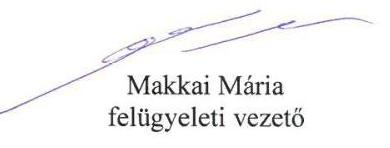

---

# 1390 

## Alami Számvevőszék

## Domokos László

elnök

1052 Budapest
Apáczai Cs. J. u. 10.

Ikt. sz.: MNV/01/17797/10/2017.
Hiv. sz.: V-1209-147/2016.

## Tisztelt Elnök Úr!

Tájékoztatom, hogy a 2017. július 27. napján „Az állami tulajdonban (résztulajdonban) lévő gazdálkodó szervezetek vagyonmegőrzési és gazdálkodási tevékenységének ellenőrzése - Gödöllöi Királyi Kastély Közhasznú Nonprofit Kft." tárgyában kézhez vett, V-1209-147/2016. ikt. sz. levél mellékleteként megküldött Jelentés-tervezetre az alábbi észrevételeket tesszük:
„Megállapítások" / 15. oldal 5.2. számú megállapítás 3. bekezdése és „Javaslatok a Magyar Nemzeti Vagyonkezelő Zrt. vezérigazgatójának" / 17. oldal 1. számú javaslat:

A Jelentés-tervezet hivatkozott megállapítása kapcsán, miszerint a Gödöllöi Királyi Kastély Közhasznú Nonprofit Kft. (a továbbiakban: Társaság) a vagyonkezelt eszközökön végzett beruházások, felújítások vagyonnövekedésként történő állományba vételéhez szükséges számviteli bizonylattal (módosított vagyonkezelési szerződés) nem rendelkezett, valamint az MNV Zrt. Vezérigazgatója részére ezzel összefüggésben megfogalmazott 1. számú javaslatával összefüggésben jelezni kívánjuk, hogy a Társaság és az MNV Zrt. az elszámolást már kölcsönösen több ízben kezdeményezte. Az elszámolás egyeztetései több éve megszakításokkal, de folyamatosan - az ellenőrzött időszakban is - zajlanak, azzal, hogy azokba az MNV Zrt. a 2015. augusztus 10. napján kelt levelével a Miniszterelnökség bevonását is kezdeményezte. Az MNV Zrt. az elszámolás előkészítéséhez szükséges intézkedésekről és a szempontrendszerekről 2015. október 20. napján tájékoztatta a Társaságot, azzal, hogy az egyeztetések mind írásban, mind személyesen jelenleg is zajlanak. Természetesen tényszerű, hogy az elszámolási megállapodás megkötésére még nem került sor, azonban a fentieket Társaságunk részéről szükségesnek tartjuk jelezni, valamint azt, hogy álláspontunk szerint annak megkötését - amint az lentebb is kifejtésre kerül - jelen esetre is irányadó kötelező érvénnyel nem írja elő jogszabály.

A vagyonkezelési szerződés módosítására, amelyet a Jelentés-tervezet javaslatokat tartalmazó, MNV Zrt.re vonatkozó 1. és a Társaságra vonatkozó 4. pontjai egyaránt előírnak a jelenleg hatályos jogszabályi környezetben [a nemzeti vagyonról szóló 2011. évi CXCVI. törvény (a továbbiakban: Nvtv.) 3. § (1) bekezdés 19. pontjában és az Nvtv. 11. § (1) bekezdésében foglaltak értelmében, a jelenlegi gyakorlat alapján a Társasággal annak tulajdonosi szerkezete miatt] már nem lehetne vagyonkezelési szerzödést kötni és vagyonkezelői joga az Nvtv. 17. § (1) bekezdése alapján jóhiszeműen szerzett és gyakorolt jognak és kötelezettségnek minősül, így a jelenleg hatályos vagyonkezelési Szerződés nem módosítható, kizárólag az abban foglalt rendelkezésekkel és szerződéses akarattal összhangban van lehetőség esetlegesen eljárni.

---

Fontosnak tartjuk kiemelni, hogy a vonatkozó, a vizsgált időszakban is hatályos jogszabályi előírások alapján a vagyonkezelt vagyonon végrehajtott értéknövelő beruházásokra is kiterjed a fennálló vagyonkezelői jogviszony, és a vagyonkezelési szerződés módosítása nem szükséges. Ezen álláspontunk alátámasztható az Nvtv. 11. § (6a) bekezdésével, amely szerint „a felek eltérő megállapodásának hiányában a vagyonkezelői jog e törvény erejénél fogva kiterjed arra a vagyonelemre is - ideértve a tartozékot és az alkotórészt is -, amely a vagyonkezelői jogviszony fennállása alatt válik a vagyon részévé", valamint az állami vagyonnal való gazdálkodásról szóló 254/2007. (X. 4.) Korm. rendelet 18. § (3c) bekezdésében foglaltakkal, miszerint „Az Nvtv. 11. § (6a) bekezdésére figyelemmel azokban az esetekben, ahol a felújítás, beruházás eredményére a meglévő vagyon részeként a vagyonkezelői jog a törvény erejénél fogva kiterjed, nincs szükség a vagyonkezelési szerződés módosítására. Ez esetben a számviteli szabályok szerinti elszámolásra a vagyonkezelő (3) bekezdésben meghatározott adatszolgáltatásának a tulajdonosi joggyakorló írásbeli elfogadása alapján kerül sor."

A vagyonnyilvántartás hiteles vezetése érdekében a nem központi költségvetési szerv vagyonkezelők vagyonkezelésében lévő vagyonelemeken végzett értéknövelő beruházások elszámolása az állami tulajdonon, egyéb vagyonkezelők által vagyonkezelt eszközön megvalósítandó beruházások, felújítások előzetes engedélyezésének és elszámolásának eljárásrendjéről szóló 35/2014. vezérigazgatói utasításban (egységes szerkezetben a 41/2014. számú vezérigazgatói utasítással) foglaltak szerinti elszámolási megállapodás keretében történik, amely tartalmaz olyan rendelkezést, amely tartalmilag átveszi az Nvtv. fentebb hivatkozott rendelkezését, ezáltal egyértelműsítve azt, hogy a beruházás a vagyonkezelő vagyonkezelésébe és nyilvántartásába kerül magának a vagyonkezelési szerződésnek a módosítása nélkül.

A fentiek alapján kérjük megfontolni a vagyonkezelési szerződés módosítására irányuló javaslat törlését, tekintettel arra, hogy az jogszabályi akadályba ütközik, és arra, hogy az elszámolási megállapodás megkötése a gyakorlatban minden olyan joghatást kivált, amelyet a vagyonkezelési szerződés módosítása esetleg jelenthetne.

Végezetül javasoljuk a Jelentés-tervezet 19. oldalán található I. sz. melléklet: értelmező szótár állami vagyon vagyonkezelője/vagyonkezelő fogalom-meghatározást szövegszerüen kiegészíteni az Nvtv. 3. § (1) bekezdés 19. pontjában és az Nvtv. 11. § (1) bekezdésében foglaltakkal.

Kérem Elnök Urat, hogy a jelentés véglegesítése során jelen észrevételeinket szíveskedjenek figyelembe venni.

Budapest, 2017. augusztus „, 11 "
Üdvözlettel:
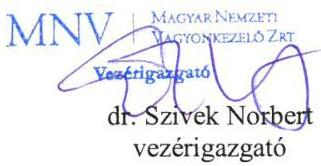

---

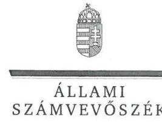

ELNÖK

Ikt.szám: V-1209-157/2016.

# Dr. Szívek Norbert úr 

vezérigazgató

Magyar Nemzeti Vagyonkezelő Zrt.

## Budapest

## Tisztelt Vezérigazgató Úr!

„Az állami tulajdonban (résztulajdonban) lévő gazdálkodó szervezetek vagyonmegőrzési és gazdálkodási tevékenységének ellenőrzése - Gödöllöi Királyi Kastély Közhasznú Nonprofit Kft." címmel készített számvevőszéki jelentéstervezetre tett észrevételét köszönettel megkaptam.

Az Állami Számvevőszék észrevételre vonatkozó álláspontjáról a felügyeleti vezető által készített részletes tájékoztatást csatoltan megküldöm.

Tájékoztatom Vezérigazgató urat, hogy a számvevőszéki jelentésben - az Állami Számvevőszékről szóló 2011. évi LXVI. törvény 29. § (3) bekezdése alapján - a figyelembe nem vett észrevételeket szerepeltetjük, annak indoklásával, hogy azokat az Állami Számvevőszék miért nem fogadta el.

Budapest, 2017. 28. hó 31 nap
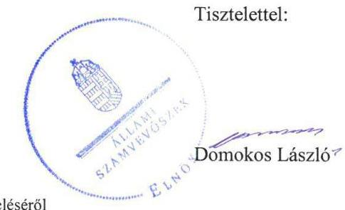

Melléklet: Tájékoztatás az észrevétel kezeléséről

---

# Tájékoztatás   az észrevétel kezeléséről 

,,Az állami tulajdonban (résztulajdonban) lévő gazdálkodó szervezetek vagyonmegőrzési és gazdálkodási tevékenységének ellenörzése - Gödöllöi Királyi Kastély Közhasznú Nonprofit Kft." címủ jelentéstervezetre 2017. augusztus 11-én érkezett észrevételét áttekintettük, annak kezelésével kapcsolatban a következő tájékoztatást adom.
Az 5.2. számú megállapítás 3. bekezdésére és a Magyar Nemzeti Vagyonkezelő Zrt. vezérigazgatójának címzett 1. számú javaslatra tett észrevételre adott válasz
Az észrevétel szerint a vagyonkezelési szerződés módosítása jogszabályi előírásba ütközik, valamint a beruházásokkal, felújításokkal kapcsolatos elszámolási megállapodás megkötése a gyakorlatban minden olyan joghatást kivált, amelyet a vagyonkezelési szerződés módosítása jelentene. Ugyanakkor tájékoztatnak arról, hogy az elszámolási megállapodás megkötését jogszabály kötelező érvénnyel nem írja elő.
A nemzeti vagyonról szóló 2011. évi CXCVI. törvény (Nvtv.) 17. § (1) bekezdése szerint a törvény hatályba lépése előtt létrejött szerződések időtartamának meghosszabbítása új jogviszony létesítésének minősül. A már meglévő szerződések egyéb módosítása, így a vagyonkezelt vagyonon végzett beruházás, felújítás szerződésben történő rendezése miatti szerződésmódosítás nem minősül új jogviszony létesítésének. A jelentéstervezet javaslata a vagyonkezelt vagyonon végzett beruházás, felújítás vagyonkezelési szerződésben történő rendezése miatti szerződésmódosításra irányul, amelyet az állami vagyonnal való gazdálkodásról szóló 254/2007. (X. 4.) Korm, rendelet (Vhr.) 18. § (1) bekezdés előírása szerint a vagyonnövekedés számviteli szabályok szerinti elszámolása érdekében kell módosítani.
Az ellenőrzés megállapította, hogy a Társaság a beszámolóiban az ellenőrzött időszak első évében (2012-ben), majd az ellenőrzött időszak valamennyi évében folyamatosan a vagyonkezelt eszközökön végzett beruházásokat, felújításokat szabálytalanul saját vagyonként mutatta ki. Az észrevételben leírtak szerint a vagyonkezelt eszközökön végzett beruházások, felújítások elszámolása nem zárult le. Az Nvtv. 11. § (6a) bekezdése 2013. június 28 -ától, a Vhr. 18. § (3c) pontja 2013. XI. 30 -ától hatályos. Tehát a vagyonkezelési szerződés módosításának kötelezettsége az ellenőrzött időszakban fennállt, a módosítások elmaradása miatt a vagyonkezelési szerződés nem felelt meg a jogszabályi előírásoknak. Mindezek alapján az észrevételeket nem fogadjuk el, a jelentéstervezet módosítása nem indokolt.

Budapest, 2017. O\& hó 3 nap

Makkai Mária
felügyeleti vezető

---

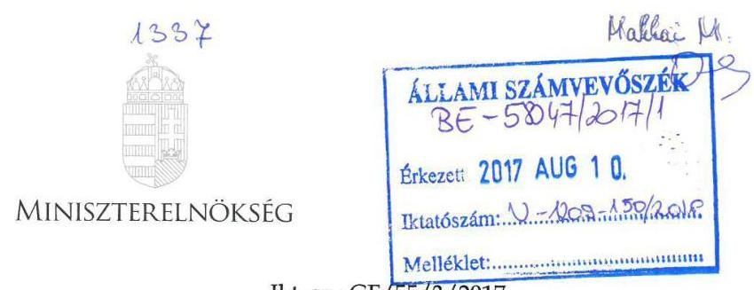

# Állami Számvevőszék 

Budapest
Apáczai Csere János u. 10.
1011

Tárgy: észrevétel "Gödöllői Királyi Kastély KNp.Kft. - Az állami tulajdonban (résztulajdonban lévő) gazdálkodó szervezetek vagyonmegőrzési és gazdálkodási tevékenységének ellenőrzése" jelentéstervezetéhez

## Tisztelt Elnök Úr!

Köszönettel megkaptam a "Gödöllői Királyi Kastély KNp.Kft. - Az állami tulajdonban (résztulajdonban lévő) gazdálkodó szervezetek vagyonmegőrzési és gazdálkodási tevékenységének ellenőrzése" tárgyában készült jelentéstervezetet.

A jelentéstervezet megállapításaival és javaslataival egyetértek, a megfogalmazott intézkedési javaslatok végrehajtása érdekében szükséges eljárásokat kezdeményeztem az illetékes szervezeti egység irányába.

Tájékoztatom, hogy a gazdasági társaság részéről a jelentéstervezet 15. oldalán található 5.2 számú megállapítás kapcsán közvetlenül kérte a megállapítás pontosítását az alábbi indokok alapján:

- A számviteli nyilvántartás alapdokumentuma a vagyonkezelt eszközök tekintetében a Vagyonkezelési Szerződés, a nyilvántartás csak és kizárólag az abban rögzített tételeket tartalmazhatja, mennyiségben és értékben is.
A Vagyonkezelési Szerződés módosítására annak megkötése óta nem került sor, sem a társaság, sem az MNV Zrt. által végzett és aktivált beruházások értéke nem került átvezetésre, ezért álláspontjuk szerint a számviteli nyilvántartásban sem történhetett változás a szerződéskor nyilvántartásba vett mennyiséghez és értékhez képest.
A társaság éves beszámolója a számviteli nyilvántartással egyezően került összeállítása. Az éves beszámoló részeként elkészített mérleg Ingatlanok és a kapcsolódó vagyoni értékú jogok mérlegsor egy összegben tartalmazza mind a használatba kapott - alapításkor 99 év időszakra kapott használati jog jogcím alapján - ingatlanon végzett aktivált beruházások, mind pedig a vagyonkezelt ingatlanok vagyonkezelési szerződés alapján - értékét. Ugyanakkor az éves beszámoló részeként

---

elkészített kiegészítő mellékletben bemutatásra került a befektetett eszközök alakulásánál az eszközök értékéből a vagyonkezelt rész, a kötelezettségek bemutatásánál a vagyonkezeléssel kapcsolatos kötelezettség.

Álláspontom szerint a jelentéstervezet a vagyonkezelési szerződés módosításának elmaradását jelöli meg a számviteli nyilvántartásokban történő eltérések okának, ugyanakkor a gazdasági társaság a vagyon megoszlásának nyilvántartását csak a kialakult helyzetnek megfelelően eszközölhette.

Tekintettel arra, hogy a végleges jelentés nyilvánosságra hozataláról az Állami Számvevőszék gondoskodik, a jelentéstervezet kapcsán észrevételként kérem figyelembe venni az alábbiakat.

A végleges jelentésben az ok-okozati összefüggések jobb megérthetősége, valamint a javaslatok megfogalmazása, sorrendisége és a megállapítások közti koherencia megteremtése érdekében a jelentéstervezet 15 . oldal 5 . pontjában található összegző megállapítás kerüljön kiegészítésre a mondat végén "a vagyonkezelési szerződés módosításának elmaradása okán" fordulattal, valamint az 5. oldal tetején található "összegzés" utolsó mondatának záró fordulataként is.

Egyidejűleg szeretném megköszönni Elnök Úrnak és munkatársainak az ellenőrzés lefolytatásában nyújtott munkáját, valamint segítő javaslataikat.

Budapest, 2017. augusztus „ 5 „.

Tisztelettel:
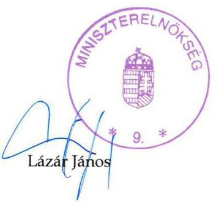

---

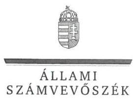

ELNÖK

Ikt.szám: V-1209-155/2016.

Dr. Lázár János úr
miniszter
Miniszterelnökség

Budapest

# Tisztelt Miniszter Úr! 

„Az állami tulajdonban (résztulajdonban) lévő gazdálkodó szervezetek vagyonmegőrzési és gazdálkodási tevékenységének ellenőrzése - Gödöllöi Királyi Kastély Közhasznú Nonprofit Kft." címmel készített számvevőszéki jelentéstervezetre tett észrevételét köszönettel megkaptam.

Az Állami Számvevőszék észrevételre vonatkozó álláspontjáról a felügyeleti vezető által készített részletes tájékoztatást csatoltan megküldőm.

Tájékoztatom Miniszter urat, hogy a számvevőszéki jelentésben - az Állami Számvevőszékről szóló 2011. évi LXVI. törvény 29. § (3) bekezdése alapján - a figyelembe nem vett észrevételeket szerepeltetjük, annak indoklásával, hogy azokat az Állami Számvevőszék miért nem fogadta el.

Budapest, 2017. 08 hó 37 nap
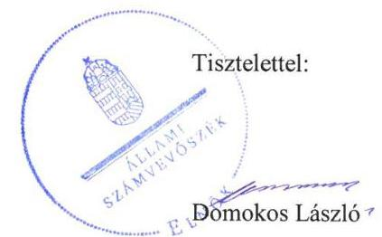

Melléklet: Tájékoztatás az észrevétel kezeléséről

---

# Tájékoztatás   az észrevétel kezeléséről 

„Az állami tulajdonban (résztulajdonban) lévő gazdálkodó szervezetek vagyonmegőrzési és gazdálkodási tevékenységének ellenörzése - Gödöllői Királyi Kastély Közhasznú Nonprofit Kft." című jelentéstervezetre 2017. augusztus 10-én érkezett észrevételét áttekintettük, annak kezelésével kapcsolatban a következő tájékoztatást adom.

1. A jelentéstervezet megállapításaira és javaslataira, valamint az intézkedések kezdeményezésére vonatkozó tájékoztatását köszönjük.
2. A jelentéstervezet 5. összegző megállapítására, az 5.2. számú megállapítására, valamint az Összegzés és Főbb megállapítások fejezet vonatkozó részeire tett észrevételre adott válasz
A Társaság jelentéstervezettel kapcsolatos pontositásra vonatkozó kéréséről adott tájékoztatását köszönjük. A Társaság észrevételére a Társaság ügyvezetőjének címzett, az észrevételek kezeléséről szóló levélben a következő tájékoztatást adtuk:
„Az észrevételben leírtak megerősítik a jelentéstervezetnek azt a megállapítását, hogy a Társaság a vagyonkezelt vagyonon végzett aktivált beruházásokat, felújításokat a számviteli nyilvántartásokban, az éves beszámolók mérlegeiben saját vagyonként mutatta be. A jelentéstervezet javaslata a vagyonkezelt vagyonon végzett beruházás, felújítás vagyonkezelési szerződésben történő rendezése miatti szerződésmódosításra irányul, amelyet az állami vagyonnal való gazdálkodásról szóló 254/2007. (X. 4.) Korm, rendelet 18. § (1) bekezdés előírása szerint a vagyonnövekedés számviteli szabályok szerinti elszámolása érdekében kell módosítani.
A vagyonkezelt eszközök értékének csak az éves beszámolók kiegészítő mellékleteiben történő bemutatása nem felelt meg a Számvitelről szóló 2000. évi C. törvény 4. § (2) bekezdésében előírtaknak, mert a Társaság éves beszámolóinak mérlegei a vagyon összetételéről nem adnak valós összképet. Mindezek alapján az észrevételt nem fogadjuk el, a jelentéstervezet módosítása nem indokolt."
A jelentéstervezet kiegészítésére vonatkozó észrevétellel kapcsolatban tájékoztatom, hogy a jelentés „Összegzés" és „Főbb megállapítások, következtetések, javaslatok" fejezetei összefoglaló képet adnak az cllenőrzés során tapasztaltakról, ezért azokban a részletes okok bemutatása nem indokolt.

Budapest, 2017. 08 hó 5 nap

Makkai Mária
felügyeleti vezető

---

# RÖVIDÍTÉSEK JEGYZÉKE 

${ }^{1}$ Társaság
${ }^{2}$ Önkormányzat
${ }^{3}$ Mérnökiroda
${ }^{4}$ MNV Zrt.
${ }^{5}$ EMMI
${ }^{6}$ ÁSZ
${ }^{7}$ ÁSZ tv.
${ }^{8}$ Vtv.
${ }^{9}$ MNV Zrt. SZMSZ-e
${ }^{10}$ megbízási szerződés
${ }^{11}$ Miniszterelnökség SZMSZ-e
${ }^{12}$ FB
${ }^{13} \mathrm{Gt}$.
${ }^{14} \mathrm{Ptk}_{2}$
${ }^{15}$ Számv. tv.
${ }^{16}$ Civil tv.
${ }^{17}$ monitoring szabályzat
${ }^{18} \mathrm{KVI}$
${ }^{19}$ 1144/2001. (XII. 29.) Korm. határozat
${ }^{20}$ számviteli politika
${ }^{21}$ eszközök és források leltárkészítési és leltározási szabályzata
${ }^{22}$ eszközök és források értékelési szabályzata
${ }^{23}$ önköltségszámítási szabályzat
${ }^{24}$ pénzkezelési szabályzat

Gödöllői Királyi Kastély Közhasznú Nonprofit Korlátolt Felelősségű Társaság
Gödöllő Város Önkormányzat
MaHill Mérnöki Iroda Korlátolt Felelősségű Társaság
Magyar Nemzeti Vagyonkezelő Zártkörűen Működő Részvénytársaság
Emberi Erőforrások Minisztériuma
Állami Számvevőszék
2011. évi LXVI. törvény az Állami Számvevőszékről
2007. évi CVI. törvény az állami vagyonról

Magyar Nemzeti Vagyonkezelő Zrt. Szervezeti és Működési Szabályzata, a 301/2011.(V.30.) IG Határozattal kiadott, többször módosított (hatályos 2012. január 1-jétől)
az MNV Zrt. 432/2014. (VII. 17) IG számú határozata alapján SZT-101.598 számon, 2014. szeptember 12-én, az MNV Zrt. és a Miniszterelnökség között az állami tulajdonú társasági részesedéshez kapcsolódó tulajdonosi jogok gyakorlására kötött, 2015. december 8-án SZT-106019 számon módosított és egységes szerkezetben foglalt megbízási szerződés alapján.
1/2014. (I. 22.) ME utasítás a Miniszterelnökség Szervezeti és Működési Szabályzatáról
felügyelőbizottság
2006. évi IV. törvény a gazdasági társaságokról (hatálytalan 2014. március 15-től)
2013. évi törvény a Polgári Törvénykönyvről
2000. évi C. törvény a számvitelről
2011. évi CLXXV. törvény az egyesülési jogról, a közhasznú jogállásról, valamint a civil szervezetek müködéséről és támogatásáról
a 2012. január 1-jén hatályos, az MNV Zrt. portfóliójába tartozó többségi állami tulajdonú társaságok negyedéves tulajdonosi értekezleteiről (Társasági Monitoring Szabályzat) tárgyú 53/2011. számú vezérigazgatói utasítás, a 2013. január 1-jétől hatályos 43/2012. számú vezérigazgatói utasítás, illetve a 2013. december 19-től hatályos 51/2013. vezérigazgatói utasítás
Kincstári Vagyoni Igazgatóság (általános jogutódja 2008. január 1-jétől az MNV Zrt.)
1144/2011. (XII. 29.) Korm. határozat a gödöllői Grassalkovich Kastély műemléki helyreállításával és fejlesztésével kapcsolatos intézkedésekről
Gödöllői Királyi Kastély Kht. Számviteli politika (11/2008. számú ügyvezető igazgatói utasítással jóváhagyva, többször módosított, 3. számú módosítása hatályos 2013. január 2-től)
a Számviteli politika 1. számú mellékletét képező Eszközök és források leltárkészítési és leltározási szabályzata, (módosítása hatályos 2012. november 27-től) a Számviteli politika 2. számú mellékletét képező Eszközök és források értékelési szabályzata, (módosítása hatályos 2012. december 10-től.)
a Számviteli politika 6. számú mellékletét képező Önköltségszámítási szabályzat hatályos a 2012. évi üzleti évtől.
a Számviteli politika 3. számú mellékletét képező Pénzkezelési szabályzat, többször módosított, (19. számú módosítása hatályos 2014. szeptember 14-től)

---

${ }^{25}$ számlarend
${ }^{26}$ Info tv.
${ }^{27}$ javadalmazási szabályzat
${ }^{28}$ Munka tv. 1
${ }^{29}$ Munka tv. 2
${ }^{30}$ Tak. tv.
${ }^{31}$ Továbbszámlázott szolgáltatások árrésének kalkulációja
${ }^{32}$ 350/2011. (XII. 30.) Korm. rendelet
${ }^{33} \mathrm{Vhr}$.
${ }^{34}$ Vagyonkezelési szerződés
${ }^{35}$ SZMSZ
${ }^{36}$ Nvtv.
${ }^{37}$ Ptk $_{1}$
${ }^{38} \mathrm{Ppt}$.
a Számviteli politika 5. számú mellékletét képező Számlarend, többször módosított, (3. számú módosítása hatályos 2014. március 22-től)
2011. évi CXII. törvény az információs önrendelkezési jogról és az információszabadságról
A Gödöllői Királyi Kastély Közhasznú Nonprofit Kft. Javadalmazási szabályzata, jóváhagyva a 15/1/2011. (05. 27.) számú taggyúlési határozat, többször módosított
1992. évi XXII. törvény a Munka Törvénykönyvéről (hatálytalan 2013. január 1-jétől)
2012. évi I. törvény a Munka Törvénykönyvéről (hatályos 2012. július 1-jétől)
2009. évi CXXII. törvény a köztulajdonban álló gazdasági társaságok takarékosabb müködéséről
Továbbszámlázott szolgáltatások árrésének kalkulációjára vonatkozó szabályzat (hatályos 2009. május 5-től)
350/2011. (XII. 30.) Korm. rendelet a civil szervezetek gazdálkodása, az adománygyűjtés és a közhasznúság egyes kérdéseiről
254/2007. (X. 4.) Korm. rendelet az állami vagyonról szóló gazdálkodásról 620576-2006-0150. számú, 2006. február 22-én kelt, a Kincstári Vagyoni Igazgatóság és a Gödöllői Királyi Kastély Kht. között létrejött Vagyonkezelési szerződés
a Gödöllői Királyi Kastély Közhasznú Társaság 18/1997. (11.25.) számú taggyúlési határozattal jóváhagyott Szervezeti és Működési Szabályzata, többször módosított (5. számú módosítása hatályos 2014. március 10-től)
2011. évi CXCVI. törvény a nemzeti vagyonról
1959. évi IV. törvény a Polgári Törvénykönyvről (hatálytalan 2014. március 15-től)
1952. évi III. törvény a polgári perrendtartásról

---

ÁLLAMI SZÁMVEVŐSZÉK
1052 Budapest, Apáczai Csere János utca 10.
Levélcím: 1364 Budapest 4. Pf. 54
Telefon: +36 14849100 Telefax: +36 14849200
www.asz.hu