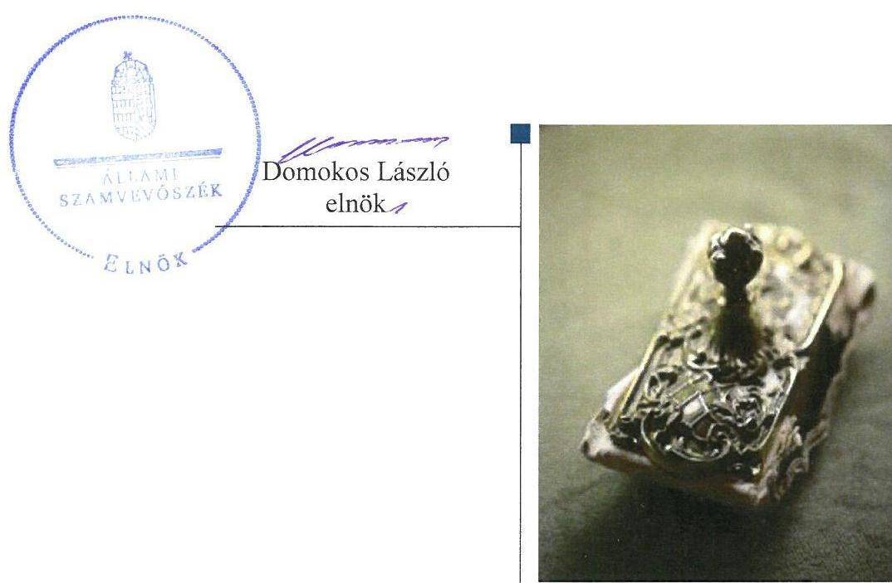
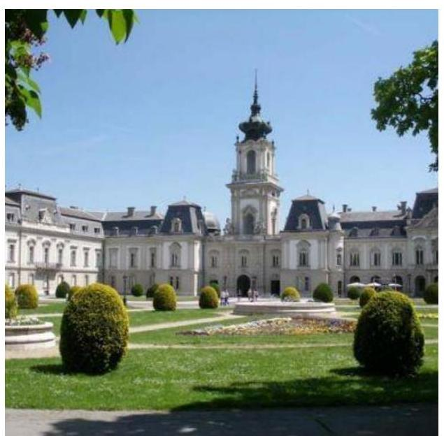
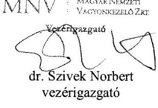
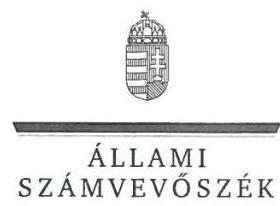
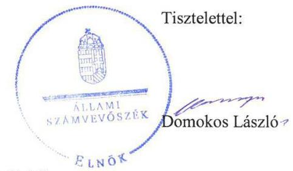
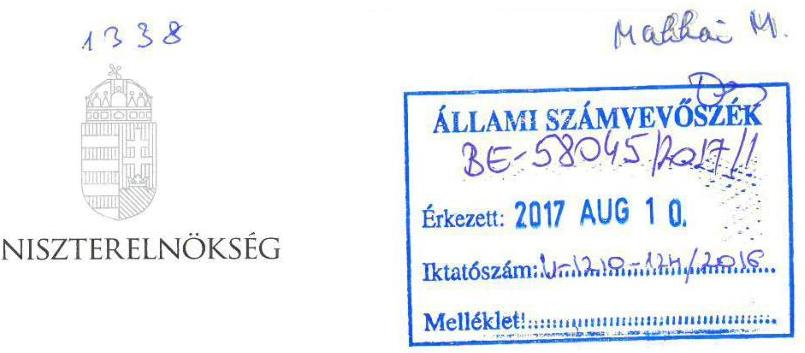
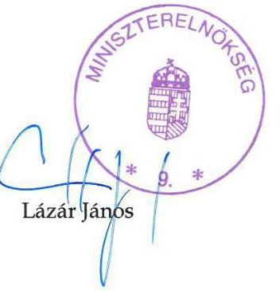

# Jelentés 

## Helikon Kastélymúzeum Közhasznú Nonprofit Kft.

Az állami tulajdonban (résztulajdonban) lévő gazdálkodó szervezetek vagyonmegőrzési és gazdálkodási tevékenységének ellenőrzése 2017.

---

# Jelentés 

## Helikon Kastélymúzeum Közhasznú Nonprofit Kft.

Az állami tulajdonban (résztulajdonban) lévő gazdálkodó szervezetek vagyonmegőrzési és gazdálkodási tevékenységének ellenőrzése
2017. nepáalver hó 20. nap

---

# AZ ELLENŐRZÉST FELÜGYELTE:

## MAKKAI MÁRIA felügyeleti vezető

## AZ ELLENŐRZÉST VEZETTE ÉS A VÉGREHAJTÁSÁÉRT FELELŐS:

### KORSÓSNÉ VIGH ANDREA ellenőrzésvezető

## A PROGRAM ÖSSZEÁLLÍTÁSÁÉRT FELELŐS:

### JANIK JÓZSEF LÁSZLÓ osztályvezető

---

**IKTATÓSZÁM:** V-1210-129/2016.

**TÉMASZÁM:** 2244

**ELLENŐRZÉS-AZONOSÍTÓ SZÁM:** V075903

---

Jelentéseink az Országgyűlés számítógépes hálózatán és az Interneta a www.asz.hu címen is olvashatóak.

---

# TARTALOMJEGYZÉK 

■ ÖSSZEGZÉS ..... 5
■ AZ ELLENŐRZÉS CÉLJA ..... 7
■ AZ ELLENŐRZÉS TERÜLETE ..... 8
■ AZ ELLENŐRZÉS HÁTTERE, INDOKOLTSÁGA ..... 9
■ A JELENTÉS LÉNYEGES KÉRDÉSKÖREI ..... 10
■ ELLENŐRZÉS HATÓKÖRE ÉS MÓDSZEREI ..... 11
■ MEGÁLLAPÍTÁSOK ..... 13
■ JAVASLATOK ..... 18
■ MELLÉKLETEK ..... 21
I. sz. melléklet: Értelmező szótár ..... 21
■ FÜGGELÉK: ÉSZREVÉTELEK ..... 25
■ RÖVIDÍTÉSEK JEGYZÉKE ..... 33

---

.

---

# ÖSSZEGZÉS 

A Magyar Nemzeti Vagyonkezelő Zrt. és a Miniszterelnökség szabályszerűen gyakorolta a tulajdonosi jogokat. A Helikon Kastélymúzeum Közhasznú Nonprofit Kft. belső szabályozottsága és a pénzügyi-számviteli feladatok ellátása összességében megfelelt az előírásoknak. A tervezési, beszámolási, adatszolgáltatási feladatok ellátása szabályszerű volt. A vagyongazdálkodás nem volt szabályszerű, mert a 2012-2015. évi beszámolók a vagyon öszszetétele tekintetében nem a valós helyzetet tükrözték.

## Az ellenőrzés társadalmi indokoltsága

Magyarországon az intézmény-centrikus közfeladat-ellátás, közvagyon gazdálkodás jellemző a költségvetésen kívüli feladatellátás térnyerése mellett. Ennek szereplői az állami tulajdonú gazdálkodó szervezetek is.

Az állami vagyonnal való gazdálkodás alapvető célja az állami vagyon átlátható, rendeltetésszerű és felelős felhasználásának biztosítása. Az állami tulajdonban álló gazdálkodó szervezetek államot megillető társasági részesedése a nemzeti vagyon részét képezi és legfőbb rendeltetése szerint a közfeladatok ellátását szolgálja.

Az Állami Számvevőszék stratégiájában megfogalmazta, hogy az államháztartáson kívülre nyújtott költségvetési támogatások és ingyenes vagyonjuttatások, valamint az államháztartáson kívül működő közfeladat-ellátó rendszerek ellenőrzéseivel hozzájárul ahhoz, hogy a közpénzeket az államháztartáson kívül működő szervezetek is átlátható, rendezett módon használják fel a közfeladatok szerződésben vállalt ellátása érdekében.

A Helikon Kastélymúzeum Közhasznú Nonprofit Kft. kezelésében lévő keszthelyi Festetics-kastélyegyüttes és park Magyarország egyik leglátogatottabb műemléke, amelynek turisztikai fejlesztéséhez jelentős központi és uniós támogatásokban részesült és további fejlesztése várható a felülvizsgált Nemzeti Kastélyprogramról hozott kormányhatározat alapján. E vagyon megőrzése, gyarapítása, a vagyongazdálkodás szabályszerűsége a vagyonkezelési szerződés célja.

## Főbb megállapítások

A társasági részesedés tekintetében 2014. szeptember 11-ig a tulajdonosi joggyakorló Magyar Nemzeti Vagyonkezelő Zrt., ezt követően a Miniszterelnökség szabályszerűen gyakorolta a tulajdonosi jogokat. A Helikon Kastélymúzeum Közhasznú Nonprofit Kft. kezelésében lévő nemzeti vagyon feletti tulajdonosi joggyakorlás rendjét a Magyar Nemzeti Vagyonkezelő Zrt. kialakította és a tulajdonosi jogokat megfelelően gyakorolta.

A Társaság működése összességében megfelelően szabályozott volt, a gazdálkodást meghatározó alapvető szabályzatokat elkészítették. Nem szabályozták a közérdekű adatok megismerésére irányuló igények teljesítésének rendjét, továbbá a 2014-től fennálló kötelezettség ellenére az önköltségszámítás rendjét. A számlarend és a leltározás szabályozása nem felelt meg a jogszabályi követelményeknek.

A pénzügyi-számviteli feladatellátás összességében szabályszerű volt. A bevételek és ráfordítások elszámolása a jogszabályi előírások szerint történt, a közhasznú, vállalkozási, valamint a vagyonkezelt eszközökhöz kapcsolódó bevételeket és ráfordításokat megfelelően elkülönítették. A végzett szolgáltatások önköltségét az utókalkuláció módszerével nem alapozták meg a 2014-2015. években a jogszabályi előírás ellenére.

A Társaság a tervezési, beszámolási, adatszolgáltatási és közzétételi kötelezettségeket szabályszerűen teljesítette.

A beszámolók a vagyon - vagyonkezelt illetve saját vagyon szerinti - megoszlásáról nem a valós helyzetet tükrözték, mert a vagyonkezelt eszközökön végzett, aktivált beruházásokat, felújításokat saját vagyonként szerepeltették a számviteli nyilvántartásokban. Ez nem biztosította a nemzeti vagyonnal történő átlátható és felelős gazdálkodás követelményeinek érvényesülését. A vagyonkezelési szerződés módosítása a vagyonkezelt eszközökön végrehajtott értéknövelő beruházásokkal, felújításokkal nem történt meg. A 2012-2013. években a mérleg leltárral összességében

---

nem volt alátámasztott, 2014-2015-ben alátámasztott volt. Az értékcsökkenést meghaladó mértékben megvalósított beruházás, felújítás biztosította a vagyon értékének megőrzését, a tervszerű karbantartás pedig az állagmegóvást, a vagyon értéke 2012-2015. között több mint kétszeresére emelkedett. A vagyon változását eredményező döntéshozatal szabályos volt.

---

# AZ ELLENŐRZÉS CÉLJA 

Az ellenőrzés célja annak értékelése volt, hogy a tulajdonosi jogok gyakorlása szabályszerű volt-e; a gazdálkodó szervezet szabályozottsága, gazdálkodása és vagyongazdálkodási tevékenysége megfelelt-e a jogszabályi és a tulajdonosi előírásoknak; biztosítva volt-e a közfeladatok átláthatósága és elszámoltathatósága érdekében a közszolgáltatás dijának megalapozottsága szabályszerű önköltségszámítással; a vagyonváltozást eredményező döntések esetében a tulajdonosi jogok gyakorlója és a gazdálkodó szervezet szabályszerűen jártak-e el.

---

### **A Z ELLENŐRZÉS TERÜLETE**

### **Helikon Kastélymúzeum Közhasznú Nonprofit Kft.**

A Társaság¹ a Helikon Kastélymúzeum Közhasznú Társaság jogutódjaként 2009-ben alakult 32,0 M Ft – az ellenőrzött időszakban változatlan összegű – jegyzett tőkével. Tevékenységét egyszemélyes közhasznú társaságként folytatta.

A Társaság a Magyar Állam tulajdonában lévő keszthelyi Festetics Kastély műemlék-együttes vagyonkezelését végzi, amely a balatoni régió meghatározó idegenforgalmi kulturális központja. A kastélyhoz tartozó park és pálmaház révén védett természeti értéket tart fenn, gondoz, gyarapít és mutat be. Alapító okirata² szerinti főtevékenysége a múzeumi tevékenység. Közhasznú tevékenysége keretében ellátott közfeladata továbbá a műemlékvédelem, a közösségi kulturális hagyományok, értékek ápolása, megőrzése, a könyvtár, levéltár működtetése, a tudományos tevékenység, a kutatás, nevelés és oktatás, ismeretterjesztés, a kulturális tevékenység, a helyi természetvédelem. Az EMMI³ a Társasággal 2014-ben közszolgáltatási szerződést⁴ kötött. A Társaság közhasznú tevékenységét segítő vállalkozói tevékenységeket is folytatott.

A társasági részesedés feletti tulajdonosi jogokat a Magyar Állam nevében 2012. január 1-je és 2014. szeptember 11. között az MNV Zrt.⁵, ezt követően az MNV Zrt-vel kötött megbízási szerződés alapján a Miniszterelnökség gyakorolta. A Társaság kezelt és saját vagyonnal gazdálkodott. A vagyonkezelésbe kapott eszközök felett a tulajdonosi joggyakorló az ellenőrzött időszakban az MNV Zrt. volt.

A Társaság főbb vagyoni adatait az 1. táblázat mutatja be.

1. táblázat

|  A TÁRSASÁG FŐBB VAGYONI ADATAI (M FT) |  |  |  |  |   |
| --- | --- | --- | --- | --- | --- |
|  Megnevezés | 2012.
jan.1. | 2012.
dec.21. | 2013.
dec.21. | 2014.
dec.21. | 2015.
dec.21.  |
|  Mérlegfőösszeg | 2320,6 | 2374,6 | 2601,5 | 2680,8 | 5034,2  |
|  Kötelezettségek | 1862,9 | 1983,7 | 2119,2 | 2124,4 | 4600,2  |
|  Követelések | 17,0 | 9,5 | 28,1 | 27,7 | 151,5  |

*Forrás: A Társaság 2012-2015. évi éves beszámolói*

Az értékesítés nettó árbevétele 2012-ben 249,2 M Ft, 2015-ben 325,0 M Ft volt. A foglalkoztatottak átlagos statisztikai létszáma a 2012. évi 118 főről 2015-re 131 főre emelkedett. Az ellenőrzött időszakban az ügyvezető személyében nem történt változás.

---

# AZ ELLENŐRZÉS HÁTTERE, INDOKOLTSÁGA 

## AZ ÁSZ' KÖZÉPTÁVRA SZÓLÓ STRATÉGIÁJÁBAN

megfogalmazta, hogy az államháztartáson kívülre nyújtott költségvetési támogatások, valamint az államháztartáson kívül működő közfeladat-ellátó rendszerek ellenőrzéseivel hozzájárul ahhoz, hogy a közpénzeket az államháztartáson kívül működő szervezetek is átlátható, rendezett módon használják fel a közfeladatok szerződésben vállalt ellátása, továbbá a közvagyon szerződésben vállalt átlátható, hatékony, költségtakarékos működtetése, értékének megőrzése, állagának védelme, értéknövelő használata, hasznosítása és gyarapítása érdekében.

Az ellenőrzés feladata a közvagyonnal biztosított közfeladat ellátással kapcsolatban a közpénzek átláthatósága, nyilvánossága érdekében a jogszabályokban, belső szabályzatokban megfogalmazott előírások érvényesülésének az állami tulajdonban lévő gazdálkodó szervezetek vagyonérték megőrzési és gazdálkodási tevékenységének értékelése.

AZ ELLENŐRZÉS EREDMÉNYEKÉPP a törvényalkotás számára tapasztalatok állnak rendelkezésre az állami vagyonnal való köz-feladat-ellátás, közvagyonnal gazdálkodás értékeléséhez, az átláthatóságot biztosító szabályozáshoz. Az ellenőrzés tapasztalatai segítik és erősítik az ÁSZ hozzáadott értéket teremtő tevékenységét és tanácsadó szerepét.

---

# A JELENTÉS LÉNYEGES KÉRDÉSKÖREI 

1.     - A tulajdonosi jogok gyakorlása szabályszerű volt-e?
2.     - A társaság müködésének szabályozottsága megfelelt-e az előírásoknak?
3.     - A társaságnál a pénzügyi-számviteli feladatok ellátása szabályszerű volt-e?
4.     - A társaságnál a tervezési, beszámolási, adatszolgáltatási és ellenőrzési feladatok ellátása szabályszerű volt-e?
5.     - A társaság vagyongazdálkodása szabályszerű volt-e?

---

# ELLENŐRZÉS HATÓKÖRE ÉS MÓDSZEREI 

## Az ellenőrzés típusa

Megfelelőségi ellenőrzés.

## Az ellenőrzött időszak

A 2012. január 1-jétől 2015. december 31-ig tartó időszak.

## Az ellenőrzés tárgya

Az állami tulajdonban lévő gazdasági társaság gazdálkodása, kiemelten vagyongazdálkodási tevékenysége, a tulajdonosi jogok gyakorlása.

## Az ellenőrzött szervezet

Helikon Kastélymúzeum Közhasznú Nonprofit Kft., MNV Zrt., Miniszterelnökség.

## Az ellenőrzés jogalapja

Az ellenőrzés jogszabályi alapján az ÁSZ tv. ${ }^{7}$ 5. § (3)-(5) bekezdései, valamint a Vtv. ${ }^{8}$ 3. § (4) bekezdése képezték.

## Az ellenőrzés módszerei

Az ellenőrzést az ellenőrzési program ellenőrzési kérdései, az ellenőrzött időszakban hatályos jogszabályok, az ellenőrzés szakmai szabályok és módszertanok figyelembe vételével végeztük el.

Az ellenőrzött szervezetek az ellenőrzés lefolytatásához tanúsítványok kitöltésével, valamint az ÁSZ által kért dokumentumok megküldésével szolgáltattak adatokat.

A bevételek és ráfordítások elszámolását, és a vagyonnyilvántartás terén a szabályszerű működést véletlenszerű mintavétellel ellenőriztük. A mintavétellel ellenőrzött területek esetében minden egyes tétel vonatkozásában szabályszerűségre vonatkozó kérdéseket tettünk fel, amelyek eredménye összesítésre került. A jogszabályoknak és a belső előírásoknak megfelelőnek tekintettük az adott területet, amennyiben a minta ellenőrzésének eredménye alapján 95\%-os bizonyossággal a teljes sokaságban a

---

hibaarány kisebb volt, mint 10\%, nem megfelelőnek értékeltük, ha a hibaarány a 10\%-ot meghaladta. A ráfordítások elszámolására és a vagyonnyilvántartásra vonatkozó véletlen mintavételt kockázati alapú kiválasztással egészítettük ki, amelynek során évente a három legnagyobb összegű tételt választottuk ki.

---

# 1. A tulajdonosi jogok gyakorlása szabályszerű volt-e? 

## Összegző megállapítás

### 1.1. számú megállapítás

Az MNV Zrt. és a Miniszterelnökség szabályszerűen gyakorolta a tulajdonosi jogokat.

## A társasági részesedés feletti tulajdonosi joggyakorlás a jogszabályi előírásoknak megfelelő.

A TULAJ DONOSI JOGGYAKORLÁSRA vonatkozó előírásokat 2014. szeptember 11-ig az MNV Zrt. SZMSZ ${ }^{9}$-ében és belső szabályzataiban, ezt követően az MNV Zrt. és a Miniszterelnökség között megkötött megbízási szerződésben ${ }^{10}$, ez alapján a Miniszterelnökség SZMSZ ${ }^{11}$ ében, továbbá a Társaság alapító okiratában a jogszabályi előírásokkal összhangban rögzítették. Az alapító okiratban meghatározták a tulajdonosi joggyakorló számára fenntartott tulajdonosi jogokat, előírták az ügyvezető feladat- és hatáskörét, az éves üzleti tervkészítési és beszámolási kötelezettséget. A Társaság gazdálkodásának folyamatos nyomon követését a MNV Zrt. monitoring szabályzatában ${ }^{12}$, 2014. szeptember 12-től az MNV Zrt. és a Miniszterelnökség közötti megbízási szerződésben előírt éven belüli kontrolling adatszolgáltatási kötelezettség biztosította.

A Társasági részesedés feletti tulajdonosi joggyakorlás az $\mathrm{FB}^{13}$ és a könyvvizsgáló tevékenységéhez kapcsolódóan szabályszerű volt. Az MNV Zrt. 2014. szeptember 11-ig, azt követően a Miniszterelnökség az éves üzleti tervek jóváhagyásáról az FB, az éves beszámolók elfogadásáról az FB és a könyvvizsgáló írásbeli jelentése birtokában döntött.

### 1.2. számú megállapítás

2. táblázat

VAGYONKEZLÉSI SZERZŐDÉS ${ }_{1,2}$ ALAPJÁN VAGYONKEZELT FŐBB INGATLANOK

Főbb vagyonkezelt ingatlanok
Festetics Kastély, kastélypark és pálmaház
Fenékpusatai uradalom
római erődmaradványok
keszthelyi Amazon Szálló
Vadaspark
Fenékpuszta műemlék együttes
Festetics Mauzóleum
Forrás: Vagyonkezelési szerződések

A vagyonkezelt eszközök feletti tulajdonosi joggyakorlás szabályszerű volt.

VAGYONKEZELŐI SZERZŐDÉS ${ }_{1,2}{ }^{14}$ alapján látott el a Társaság az átadott vagyon tekintetében vagyonkezelői feladatokat, amelynek körét a 2. táblázat szemlélteti. A vagyonkezelési szerződésben meghatározták a tulajdonosi joggyakorló jogait és a Társaság kötelezettségeit a vagyonkezelt ingatlanok hasznosítása feltételei vonatkozásában. Előírták az állami vagyon működtetésének, állaga védelmének, értéke megőrzésének, gyarapításának követelményeit és feltételeit, a vagyonkezelésre vonatkozó nyilvántartási, adatszolgáltatási, elszámolási, visszapótlási kötelezettséget. A vagyonkezelési szerződés ${ }_{1}$ módosítására az ellenőrzött időszak végéig a vagyonkezelt ingatlanok körében bekövetkezett változások miatt került sor, a vagyonkezelési szerződés ${ }_{2}$ az ellenőrzött időszakban nem módosult, tartalmuk a jogszabályi előírásoknak megfelelő volt.

## A VAGYONKEZELT VAGYON VÁLTOZÁSÁT EREDMÉNYEZŐ DÖNTÉSEK előkészítéséhez, a Vhr. ${ }^{15}$ 9. § (6) bekez-

---

dés szerinti előzetes engedély (tulajdonosi hozzájárulás) kéréséhez kapcsolódó követelményeket az MNV Zrt. Elszámolási szabályzatában meghatározta. A Társaság vagyonkezelt vagyona változását eredményező döntések előtt az MNV Zrt. a részére előzetesen megküldött előterjesztések, a kapcsolódó FB vélemények, javaslatok alapján írásbeli engedélyét, hozzájárulását megadta.

# 2. A társaság múködésének szabályozottsága megfelelt-e az előírásoknak? 

## Összegző megállapítás

A Társaság múködésének a szabályozottsága összességében megfelelő volt.

SZMSZ ${ }^{16}$-ben meghatározta a Társaság a szervezeti felépítését és függőségi kapcsolatait. A Társaság rendelkezett a Számv. tv. ${ }^{17}$ előírásainak megfelelő tartalmú Számviteli Politikával ${ }^{18}$. Ennek részeként elkészítette az Eszközök és források értékelési ${ }^{19}$, Leltározási és leltárkészítési ${ }^{20}$, Selejtezési ${ }^{21}$, valamint a Pénzkezelési ${ }^{22}$ szabályzatokat. Kialakította a Számlarendet ${ }^{23}$.

A SZÁMLAREND ${ }_{1,2}$ nem tartalmazta a Számv. tv. 161. § (2) bekezdés d) pont előírása ellenére a számlarendben foglaltakat alátámasztó bizonylati rendet.

## A LELTÁROZÁSI ÉS LELTÁRKÉSZÍTÉSI SZABÁLY-

ZAT nem felelt meg a Számv. tv. 69. § (3) bekezdésében foglalt előírásoknak, mert nem határozta meg a mennyiségi felvétellel történő leltározás gyakoriságát a legalább háromévenkénti gyakoriságra vonatkozó előírás figyelembe vételével.

ÖNKÖLTSÉGSZÁMÍTÁS rendjére vonatkozó belső szabályzatot a Társaság 2014-től a Számv. tv. 14. § (5) bekezdése c) pont előírása és a Számv. tv. 14. § (6) bekezdés szerinti mentesség megszűnése ellenére nem készített.

A KÖZÉRDEKŰ ADATOK megismerésére irányuló igények teljesítésének rendjét rögzítő szabályzatot nem készítette el az Info. tv. ${ }^{24}$ 30. § (6) bekezdésben előírtak ellenére.

JAVADALMAZÁSI SZABÁLYZATÁT ${ }^{25}$ a Társaság 2012. április 19-én a Taktv. ${ }^{26}$ előírásaival összhangban megalkotta, mely kiterjedt a vezető tisztségviselőire, az FB tagokra, az Mt.1-2, ${ }^{27,28}$ hatálya alá tartozó munkavállalókra és a könyvvizsgálóra. A szabályzatot és annak módosításait a tulajdonosi joggyakorló alapítói határozattal jóváhagyta.

---

# 3. A társaságnál a pénzügyi-számviteli feladatok ellátása szabályszerű volt-e? 

Összegző megállapítás

A Társaság pénzügyi-számviteli feladatellátása összességében szabályszerű volt.

A BEVÉTELEK ÉS RÁFORDÍTÁSOK elszámolása megfelelő volt. Bizonylati alátámasztása, főkönyvi elszámolása a közhasznú és a vállalkozói tevékenység elkülönítésének betartásával a Számv. tv.,a Civil tv. ${ }^{29}$ és a belső szabályozatok előírása szerint történt. A vagyonkezelt és saját eszközökhöz kapcsolódó bevételek és ráfordítások elkülönített nyilvántartása a vagyonkezelési szerződés ${ }_{1,2}$-ben előírtak szerint megvalósult. Az értékcsökkenési leírás mértéke, elszámolása megfelelt a Számviteli politika ${ }_{1,2}$, és a Számv. tv. előírásainak, melyet az éves beszámolók kiegészítő mellékletében bemutattak.

A beruházásoknak és a tárgyi eszközöknek az állományba vétele és a nyilvántartása megfelelt a jogszabályoknak és a belső szabályozásnak, az eszközállomány növekedések a leltárban fellehetők voltak.

A nyilvántartott követelésállomány csökkentése érdekében a Társaság intézkedett, a határidőt követően fizetési felszólításokat küldtek a vevőknek, sikertelen egyeztetés után pert indítottak.

A Társaság a 2014-2015. években a Számv. tv. 14. § (7) bekezdés előírását figyelmen kívül hagyva a végzett szolgáltatások Számv. tv. 51. § (2) bekezdés szerinti önköltségét nem állapította meg az utókalkuláció módszerével.

## 4. A társaságnál a tervezési, beszámolási, adatszolgáltatási és ellenőrzési feladatok ellátása szabályszerű volt-e?

## Összegző megállapítás

Szabályszerűen történt a tervezési, beszámolási, adatszolgáltatási és ellenőrzési feladatok ellátása
4.1. számú megállapítás

A Társaság a tervezési, beszámolási és adatszolgáltatási kötelezettségeket teljesítette.

ÜZLETI TERV készítési kötelezettségének a Társaság az alapító okirata alapján eleget tett minden évben. Az üzleti terv összhangban állt az MNV Zrt. által kiadott üzleti modellel és az évente kiadott tervezési irányelvvel.

AZ ÉVES BESZÁMOLÓKAT elkészítették, a tulajdonosi joggyakorló által jóváhagyott beszámolók letétbe helyezését és közzétételét határidőben teljesítették.

AZ ADATSZOLGÁLTATÁSOKAT teljesítették. A közérdekú adatok közzétételéről az Info. tv., és a Taktv. előírásait betartva gondoskodtak.

---

# 4.2. számú megállapítás 

A Társaság az ellenőrző szervek javaslatait hasznosította.

Belső ellenőrzést a Társaság nem alakított ki. Az FB által végzett ellenőrzések az éves üzleti tervekkel kapcsolatban fogalmaztak meg javaslatokat. Az MNV Zrt. a 2012-2014. években monitoring rendszer keretében bekért adatszolgáltatások alapján félévenként ellenőrizte és értékelte az alapítói határozatok végrehajtását. A vagyongazdálkodást érintő egyéb külső ellenőrzést a NAV ${ }^{50}$ végzett az ellenőrzött időszakban. A Társaság az MNV Zrt., az FB, valamint a NAV ellenőrzések javaslatainak végrehajtására intézkedett.

## 5. A társaság vagyongazdálkodása szabályszerű volt-e?

Összegző megállapítás

A Társaság vagyongazdálkodása nem volt szabályszerű, mert számviteli nyilvántartása és éves beszámolói a vagyoni helyzetéről - a kezelt és saját vagyon összetétele tekintetében nem a valós helyzetet tükrözték, továbbá mert a 2012-2013. évi mérlegek leltárral való alátámasztása összességében nem volt biztosított.
5.1. számú megállapítás

A kezelésbe vett és a saját vagyon értékének megőrzését, gyarapítását szolgáló szabályszerű vagyongazdálkodás feltételeit kialakították.

AZ ÉVES BERUHÁZÁSI, FEJLESZTÉSI, KARBANTARTÁSI TERVEKET, valamint ezek finanszírozási forrásait és a megvalósulás ütemezését hároméves kitekintéssel az éves üzleti tervek tartalmazták. A vagyongazdálkodást érintő szabályzatokat a Társaság elkészítette, a feladat- és hatásköröket, a felelősségi viszonyokat kialakította. A saját és kezelt eszközök nyilvántartása elkülönített számlákon történt.
5.2. számú megállapítás

A vagyon nyilvántartása nem volt szabályszerű. A 2012-2013. évi mérlegek leltárral összességében nem voltak alátámasztottak, a 2014-2015. évi mérlegek leltárral alátámasztottak voltak.

A BESZÁMOLÓK a Számv. tv. 4. § (2) bekezdés előírása ellenére a Társaság vagyoni helyzetéről, a saját és kezelt vagyon összetétele tekintetében nem a valós helyzetet tükrözték, mivel számviteli nyilvántartásaiban és beszámolóiban a Társaság saját vagyonként mutatta ki a vagyonkezelt eszközökön végzett, aktivált beruházások, felújítások értékét. A vagyonkezelt eszközökön végzett beruházások, felújítások miatti vagyonnövekedés számviteli elszámolásának feltételeit a Vhr. 18. § (1) bekezdése rögzítette.

A Társaság a vagyonkezelt eszközökön végzett beruházások, felújítások vagyonnövekedésként történő állományba vételéhez szükséges számviteli bizonylattal (módosított vagyonkezelési szerződéssel) nem rendelkezett.

A vagyonkezelési szerződés1-nek a vagyonnövekedés számviteli szabályok szerinti elszámolása érdekében szükséges módosítása nem történt meg a vagyonkezelésben lévő állami vagyonon - a tulajdonosi joggyakorló előzetes hozzájárulásával - saját és elszámolási kötelezettséggel kapott

---

külső forrásból végrehajtott értéknövelő beruházások, felújítások miatt a Vhr. 18. § (1) bekezdés a) és c) pontjainak előírása ellenére.

A könyvvizsgáló a fenti szabálytalanságok ellenére az éves beszámolókat korlátozás nélküli hitelesítő záradékkal látta el.

A 2012. évi nyitó értékben szereplő vagyonkezelt eszközhöz kapcsolódó aktivált beruházás 213,5 M Ft, az ellenőrzött időszakban aktivált, lezárt projekthez kapcsolódó beruházás 8,8 M Ft volt (a 2012-2015. években végrehajtott legnagyobb összegű, központi és EU-s forrásból megvalósított fejlesztési programok 2015. december 31-ig nem zárultak le).

A LELTÁR a 2012-2013. években nem támasztotta alá teljes körűen a beszámolóban szereplő eszközök és források értékét a Számv. tv. 69. § (1) bekezdés előírása ellenére. A mérlegérték leltári alátámasztása hiányzott 2012-ben az eszközoldalon a befektetett eszközök közül a telkek, épületek, egyéb építmények, járművek; a forrásoldalon a céltartalék, a hosszú lejáratú kötelezettségek, az egyéb rövid lejáratú kötelezettségek, valamint a passzív időbeli elhatárolások mérlegértéke tekintetében. A 2013. évben a befejezetlen beruházások, az egyéb követelések, az aktív időbeli elhatárolások, a hosszú lejáratú kötelezettségek, a rövid lejáratú kötelezettségek, valamint a passzív időbeli elhatárolások (a halasztott bevételek kivételével) mérlegértéke nem volt leltárral alátámasztott.

A 2014-2015. években a mérleget alátámasztó leltár a Számv. tv. és a belső szabályozás előírásainak megfelelő volt.

### 5.3. számú megállapítás

### 5.4. számú megállapítás

A Társaság gondoskodott a vagyon értékének, állagának megőrzéséről.

A VAGYON ÉRTÉKE az ellenőrzött időszakban több mint kétszeresére nőtt, szerkezetében jelentős átrendeződés nem történt. Az állami és önkormányzati tulajdonú vagyonkezelésbe vett eszközökön 2012-2015 között elvégzett összesen 3145,5 M Ft összegű beruházás és felújítás jelentősen meghaladta az időszakban elszámolt 179,5 M Ft összegű amortizációt, ami megfelelt a Nvtv. ${ }^{31}$-ben előírt, a nemzeti vagyon gyarapítására vonatkozó alapelvnek. A vagyon állagmegőrzését tervszerű rendszeres karbantartással biztosították.

A vagyonváltozást eredményező döntések megfeleltek az előírásoknak.

## A VAGYON VÁLTOZÁSÁT EREDMÉNYEZŐ DÖNTÉ-

SEK a Társaságnál megfeleltek a Vtv. az Nvtv., a Vhr., a Vagyonkezelési Szerződés, az Alapító Okirat és az SZMSZ előírásainak. A vagyonváltozást eredményező döntések a vagyon értékének megőrzését, gyarapítását szolgálták. A beruházások pályázatait, a felújításokat, a térítés nélküli vagyonkezelésbe vételt és a karbantartásokat az éves üzleti tervekben terjesztették elő a tulajdonosi joggyakorlónak, melyek jóváhagyása megtörtént. A beruházásokkal, felújításokkal kapcsolatos szerződésekről a Társaság legfőbb szerve az FB véleménye ismeretében határozott. A bérbeadásról és a selejtezésről, a hatáskörének megfelelően, az ügyvezető döntött.

---

# JAVASLATOK 

Az ÁSZ tv. 33. § (1) bekezdésében foglaltak értelmében az ellenőrzött szervezet vezetője köteles a jelentésben foglalt megállapításokhoz kapcsolódó intézkedési tervet összeállítani és azt a jelentés kézhezvételétől számított 30 napon belül az ÁSZ részére megküldeni. Amennyiben az ellenőrzött szervezet vezetője nem küldi meg határidőben az intézkedési tervet, vagy továbbra sem elfogadható intézkedési tervet küld, az Állami Számvevőszék elnöke az ÁSZ tv. 33. § (3) bekezdése a) és b) pontjaiban foglaltakat érvényesítheti.

## a Magyar Nemzeti Vagyonkezelő Zrt. vezérigazgatójának

1. Kezdeményezze a vagyonkezelésbe adott állami vagyonon végrehajtott értéknövelő beruházások, felújítások miatti vagyonnövekedés számviteli szabályok szerinti elszámolása érdekében a vagyonkezelési szerződés módosítását a Vhr.-ben elöirtaknak megfelelően.
(5.2. sz. megállapítás 3. bekezdése alapján)

## a Helikon Kastélymúzeum Közhasznú Nonprofit Kft. ügyvezetőjének

1. Intézkedjen a Számv. tv. előírásainak megfelelően a Számlarend részét képező bizonylati rend elkészítéséről.
(2. sz. megállapítás 2. bekezdése alapján)
2. Intézkedjen az önköltségszámítás rendjére vonatkozó belső szabályzat elkészítéséről és a végzett szolgáltatások Számv. tv. szerinti önköltségének az önköltségszámítás rendjére vonatkozó belső szabályzat szerinti utókalkuláció módszerével történő megállapításáról.
(2. sz. megállapítás 4. bekezdése és a 3. sz. megállapítás 4. bekezdése alapján)
3. Intézkedjen, hogy a leltározási szabályzat megfeleljen a Számv. tv. előírásainak.
(2. sz. megállapítás 3. bekezdése alapján)
4. Intézkedjen a közérdekü adatok megismerésére irányuló igények teljesítésének rendjét rögzítő szabályzat elkészítéséről az Info. tv. előírásának megfelelően.
(2. sz. megállapítás 5. bekezdése alapján)

---

5. Kezdeményezze a vagyonkezelésbe adott állami vagyonon végrehajtott értéknövelő beruházások, felújítások miatti vagyonnövekedés számviteli szabályok szerinti elszámolása érdekében a vagyonkezelési szerződés módosítását a Vhr.-ben elöirtaknak megfelelően.
(5.2. sz. megállapítás 3. bekezdése alapján)
6. Intézkedjen, hogy a beszámolók a társaság vagyoni helyzetéről a vagyon összetétele tekintetében a valós helyzetet tükrözzék.
(5.2. sz. megállapítás 1. bekezdése alapján)

---

.

---

# MELLÉKLETEK 

## I. SZ. MELLÉKLET: ÉRTELMEZŐ SZÓTÁR

állami vagyon
a) Az állam tulajdonában lévő dolog, valamint a dolog módjára hasznosítható természeti erő,
b) az a) pont hatálya alá nem tartozó mindazon vagyon, amely vonatkozásában törvény az állam kizárólagos tulajdonjogát nevesíti,
c) az állam tulajdonában lévő tagsági jogviszonyt megtestesítő értékpapír, illetve az államot megillető egyéb társasági részesedés,
d) az államot megillető olyan immateriális, vagyoni értékkel rendelkező jogosultság, amelyet jogszabály vagyoni értékű jogként nevesít.
Forrás: Vtv. 1. § (2) bekezdése
2012. november 10-től az állami vagyon fogalma kiegészül a következő ponttal:
e) az állam tulajdonában lévő pénzügyi eszközök

Forrás: Vtv. 1. § (2) bekezdése
2013. június 27-ig:

Az állami vagyont az MNV Zrt. maga kezeli, vagy szerződés - így különösen bérlet, haszonbérlet, megbízás - alapján központi költségvetési szervnek, természetes vagy jogi személynek, vagy jogi személyiséggel nem rendelkező gazdálkodó szervezetnek hasznosításra átengedi. Az állami vagyonra vonatkozóan az MNV Zrt. kizárólag az Nvtv-ben meghatározott személyekkel köthet vagyonkezelési szerződést.
Forrás: Vtv. 23. § (1), 27. § (1)

## 2013. június 28-ától:

Az állami vagyonnal az MNV Zrt. maga gazdálkodik, vagy szerződés - így különösen bérlet, haszonbérlet, megbízás - alapján központi költségvetési szervnek, természetes vagy jogi személynek, vagy jogi személyiséggel nem rendelkező gazdálkodó szervezetnek hasznosításra átengedi, illetőleg vagyonkezelésbe, haszonélvezetbe adja. Az állami vagyonra vonatkozóan az MNV Zrt. kizárólag az Nvtv-ben meghatározott személyekkel köthet vagyonkezelési szerződést.
Forrás: Vtv. 23. § (1), 27. § (1)
2014. március 14-ig:

A Ptk. ${ }^{32}$ 685. § c) pontja szerint gazdálkodó szervezet: „az állami vállalat, az egyéb állami gazdálkodó szerv, a szövetkezet, a lakásszövetkezet, az európai szövetkezet, a gazdasági társaság, az európai részvénytársaság, az egyesülés, az európai gazdasági egyesülés, az európai területi együttműködési csoportosulás, az egyes jogi személyek vállalata, a leányvállalat, a vízgazdálkodási társulat, az erdő birtokossági társulat, a végrehajtói iroda, az egyéni cég, továbbá az egyéni vállalkozó."
2014. március 15 -tól:

A gazdasági társaság, az európai részvénytársaság, az egyesülés, az európai gazdasági egyesülés, az európai területi együttműködési csoportosulás, a szövetkezet, a lakásszövetkezet, az európai szövetkezet, a vízgazdálkodási társulat, az erdőbirtokossági társulat, az állami vállalat, az egyéb állami gazdálkodó szerv, az egyes jogi személyek vállalata, a közös vállalat, a végrehajtói iroda, a közjegyzői iroda, az ügyvédi iroda, a szabadalmi ügyvivői iroda, az önkéntes kölcsönös biztosító pénztár, a magánnyugdíjpénztár, az egyéni cég, továbbá az egyéni vállalkozó. Az állam, a helyi önkormányzat, a költségvetési szerv, az egyesület, a köztestület, valamint az alapítvány gazdálkodó

---

tevékenységével összefüggő polgári jogi kapcsolataira is a gazdálkodó szervezetre vonatkozó rendelkezéseket kell alkalmazni.
Forrás: Ppt ${ }^{33}$. 396. §
MNV Zrt. Az állami vagyon felett, a Magyar Államot megillető tulajdonosi jogok és kötelezettségek összességét - a hatályos szabályozás szerint - az állami vagyon felügyeletéért felelős miniszter (jelenleg a nemzeti fejlesztési miniszter) gyakorolja. A miniszter feladatát nagy részben az MNV Zrt., mint tulajdonosi joggyakorló szervezet útján látja el.
nonprofit gazdasági társaság Civil tv. 9/F. § (2) bekezdése szerint „az a gazdasági társaság minősül nonprofit gazdasági társaságnak és cégnevében az a gazdasági társaság tüntetheti fel a nonprofit jelleget, amelynek létesítő okirata tartalmazza, hogy a gazdasági társaság tevékenységéből származó nyereség a tagok között nem osztható fel, hanem az a gazdasági társaság vagyonát gyarapítja." (hatályos 2014. március 15-től)
tulajdonosi ellenőrzés
2014. március 14-ig:

Az állami vagyon kezelőjét, haszonélvezőjét, használóját megillető jogok gyakorlását, annak szabályszerűségét, célszerűségét az MNV Zrt. - szükség szerint területi szervei útján - ellenőrzi.
2014. március 15 -töl:

Az állami vagyon használóját, vagyonkezelőjét és haszonélvezőjét megillető jogok gyakorlását, annak szabályszerűségét, a kötelezettségek teljesítését, valamint a vagyon rendeltetése szerinti célszerűségét a tulajdonosi joggyakorló rendszeresen ellenőrzi.
Forrás: Vhr. 20. § (1)
tulajdonosi jogok gyakorlója 1.
2013. június 27-ig:

Az állami vagyon felett a Magyar Államot megillető tulajdonosi jogok és kötelezettségek összességét - ha törvény eltérően nem rendelkezik - az állami vagyon felügyeletéért felelős miniszter (a továbbiakban: miniszter) gyakorolja, aki e feladatát a Magyar Nemzeti Vagyonkezelő Zártkörűen Működő Részvénytársaság (a továbbiakban: MNV Zrt.), a Magyar Fejlesztési Bank, illetve a tulajdonosi joggyakorló szervezet útján látja el. A miniszter miniszteri rendeletben, a törvényben meghatározott állami vagyoni kör tekintetében, meghatározott időtartamra, a joggyakorlás egyes szabályainak meghatározásával - az őt megillető tulajdonosi jogok és kötelezettségek összességének, illetve azok meghatározott részének gyakorlóját az Áht. szerinti központi költségvetési szervek, ezek intézménye, továbbá a 100\%-ban állami tulajdonban álló gazdasági társaságok közül kijelölheti.
Forrás: Vtv. 3. § (1) és (2)
2013. június 28-ától:

A rábízott állami vagyon felett az államot megillető tulajdonosi jogok és kötelezettségek összességét tulajdonosi joggyakorlóként:
a) ha törvény vagy miniszteri rendelet eltérően nem rendelkezik, a Magyar Nemzeti Vagyonkezelő Zártkörűen Müködő Részvénytársaság (a továbbiakban: MNV Zrt.), b) törvényben kijelölt személy vagy
c) az állami vagyon felügyeletéért felelős miniszter (a továbbiakban: miniszter) által rendeletben kijelölt személy gyakorolja.
[...] A miniszter e törvény felhatalmazása alapján - a meghatározott célok hatékonyabb elérése érdekében, miniszteri rendeletben, az ott meghatározott állami vagyoni kör tekintetében, meghatározott időtartamra - e törvény keretei között, a joggyakorlás egyes szabályainak meghatározásával - az államot megillető tulajdonosi jo-

---

gok és kötelezettségek összességének, illetve azok meghatározott részének gyakorlóját az Áht. szerinti központi költségvetési szervek, ezek intézménye, továbbá a 100\%-ban állami tulajdonban álló gazdasági társaságok közül kijelölheti.
Forrás: Vtv. 3. § (1) és (2)
2.

Aki a nemzeti vagyon felett az államot vagy a helyi önkormányzatot megillető tulajdonosi jogok és kötelezettségek összességének gyakorlására jogosult
Forrás: Nvtv. 3. § (1) 17. pontja
2013. június 27-től:

A vagyonkezelő köteles a vagyontárgy értékét megőrizni, állagának megóvásáról, jó karban tartásáról, működtetéséről gondoskodni, továbbá - a központi költségvetési szervek kivételével - díjat fizetni vagy a szerződésben előírt más kötelezettséget teljesíteni.
Forrás: Vtv. 27. § (2)

# 2013. június 28-ától december 31-ig: 

A vagyonkezelő köteles a vagyontárgy állagának megóvásáról, jó karbantartásáról, működtetéséről gondoskodni, továbbá - a központi költségvetési szervek kivételével - díjat fizetni, jogszabályban és szerződésben előírt más kötelezettségét teljesíteni, valamint a vagyontárgyat jogszabályban vagy szerződésben meghatározott célnak megfelelően használni. Amennyiben a vagyonkezelő ezen kötelezettségének nem tesz eleget, a tulajdonosi joggyakorló jogosult a szerződést azonnali hatállyal felmondani.
Forrás: Vtv. 27. § (2)

## 2014. január 1-jétől:

A vagyonkezelő köteles a vagyontárgy állagának megóvásáról, jó karbantartásáról, működtetéséről gondoskodni, jogszabályban és szerződésben előírt más kötelezettségét teljesíteni, valamint a vagyontárgyat jogszabályban vagy szerződésben meghatározott célnak megfelelően használni.
A vagyonkezelő - a központi költségvetési szervek és a kizárólag közfeladatot ellátó nem központi költségvetési szerv vagyonkezelők kivételével - köteles díjat fizetni, jogszabályban és szerződésben előírt más kötelezettségét teljesíteni, valamint a vagyontárgyat jogszabályban vagy szerződésben meghatározott célnak megfelelően használni. Amennyiben a vagyonkezelő ezen kötelezettségeinek nem tesz eleget, a tulajdonosi joggyakorló jogosult a szerződést azonnali hatállyal felmondani.
Forrás: Vtv. 27. § (2), (2a)

---

.

---

# FÜGGELÉK: ÉSZREVÉTELEK 

A jelentéstervezetet a Számvevőszék 15 napos észrevételezésre megküldte az ellenőrzött szervezetek vezetőinek az ÁSZ tv. 29. §* (1) bekezdése előírásának megfelelően.

Az ÁSZ a jelentéstervezetet észrevételezésre megküldte a Helikon Kastélymúzeum Közhasznú Nonprofit Kft. ügyvezetőjének, a Magyar Nemzeti Vagyonkezelő Zrt. vezérigazgatójának és a Miniszterelnökséget vezető miniszternek.
A Magyar Nemzeti Vagyonkezelő Zrt. vezérigazgatójának észrevételét és az arra adott választ, valamint a Miniszterelnökséget vezető miniszter nemleges válaszát a függelék alább tartalmazza. A Helikon Kastélymúzeum Közhasznú Nonprofit Kft. ügyvezetője az ÁSZ tv. 29. § (2) bekezdésében foglalt észrevételezési jogával nem élt, a törvényes határidőn belül észrevételt nem tett.

[^0]
[^0]:    * 29. § (1) Az Állami Számvevőszék az ellenőrzési megállapításait megküldi az ellenőrzött szervezet vezetőjének vagy az általa megbízott személynek, és annak, akinek személyes felelősségét állapította meg.
    (2) Az ellenőrzött szervezet vezetője és a felelősként megjelölt személy az ellenőrzés megállapításaira tizenöt napon belül írásban észrevételt tehet.
    (3) Az Állami Számvevőszék az észrevételre a beérkezésétől számított harminc napon belül írásban válaszol. A figyelembe nem vett észrevételeket köteles a jelentésben feltüntetni, és megindokolni, hogy azokat miért nem fogadta el.

---

# MNV   MAGYAR NEMZETI   VAGYONKEZELÓ ZRT.   VEZÉRIGAZGATÓ 

Állami Számvevőszék

## Domokos László   elnök

1052 Budapest
Apáczai Cs. J. u. 10.

Ikt. sz.: MNV/01/17797/ 9 /2017.
Hiv. sz.: V-1210-120/2016.

## Tisztelt Elnök Úr!

Tájékoztatom, hogy a 2017. július 27. napján „Az állami tulajdonban (résztulajdonban) lévő gazdálkodó szervezetek vagyonmegőrzési és gazdálkodási tevékenységének ellenőrzése - Helikon Kastélymúzeum Közhasznú Nonprofit Kft." tárgyában kézhez vett, V-1210-120/2016. ikt. sz. levél mellékleteként megküldött Jelentés-tervezetre az alábbi észrevételeket tesszük:
„Megállapítások" / 16. oldal 5.2. számú megállapítás 3. bekezdése és „Javaslatok a Magyar Nemzeti Vagyonkezelő Zrt. vezérigazgatójának" / 19. oldal 1. számú javaslat:

A Jelentés-tervezet hivatkozott megállapítása kapcsán, miszerint a Helikon Kastélymúzeum Közhasznú Nonprofit Kft. (a továbbiakban: Társaság) a vagyonkezelt eszközökön végzett beruházások, felújítások vagyonnövekedésként történő állományba vételéhez szükséges számviteli bizonylattal (módosított vagyonkezelési szerződés) nem rendelkezett, valamint az MNV Zrt. vezérigazgatója részére ezzel összefüggésben megfogalmazott 1. számú javaslatával összefüggésben jelezni kívánjuk, hogy a Társaság és az MNV Zrt. az elszámolást már kölcsönösen, több ízben kezdeményezte.

Az elszámolás egyeztetései folyamatosan - az ellenőrzött időszakban is - zajlanak, azzal, hogy az MNV Zrt. az elszámolás előkészítéséhez szükséges intézkedésekről és a szempontrendszerekről összefoglaló jelleggel, 2016. augusztus 31. napján külön is tájékoztatta a Társaságot, amely alapján az elszámolási folyamat előreláthatólag a végéhez közelít.

Fontosnak tartjuk kiemelni ugyanakkor, hogy a vonatkozó, a vizsgált időszakban is hatályos jogszabályi előírások alapján a vagyonkezelt vagyonon végrehajtott értéknövelő beruházásokra is kiterjed a fennálló vagyonkezelői jogviszony, és a vagyonkezelési szerződés módosítása nem szükséges. Ezen álláspontunk alátámasztható az Nvtv. 11. § (6a) bekezdésével, amely szerint „a felek eltérő megállapodásának hiányában a vagyonkezelői jog e törvény erejénél fogva kiterjed arra a vagyonelemre is - ideértve a tartozékot és az alkotórészt is -, amely a vagyonkezelői jogviszony fennállása alatt válik a vagyon részévé", valamint az állami vagyonnal való gazdálkodásról szóló 254/2007. (X. 4.) Korm. rendelet 18. § (3c) bekezdésében foglaltakkal, miszerint „Az Nvtv. 11. § (6a) bekezdésére figyelemmel azokban az esetekben, ahol a felújitás, beruházás eredményére a meglévő vagyon részeként a vagyonkezelői jog a törvény erejénél fogva kiterjed, nincs szükség a vagyonkezelési szerződés módosítására. Ez esetben a számviteli szabályok szerinti elszámolásra a vagyonkezelö (3) bekezdésben meghatározott adatszolgáltatásának a tulajdonosi joggyakorló írásbeli elfogadása alapján kerül sor."

---

A vagyonnyilvántartás hiteles vezetése érdekében a nem központi költségvetési szerv vagyonkezelők vagyonkezelésében lévő vagyonelemeken végzett értéknövelő beruházások elszámolása az állami tulajdonon, egyéb vagyonkezelők által vagyonkezelt eszközön megvalósitandó beruházások, felújitások előzetes engedélyezésének és elszámolásának eljárásrendjéről szóló 35/2014. vezérigazgatói utasitásban (egységes szerkezetben a 41/2014. számú vezérigazgatói utasitással) foglaltak szerinti elszámolási megállapodás keretében történik, amely tartalmaz olyan rendelkezést, amely tartalmilag átveszi az Nvtv. fentebb hivatkozott rendelkezését, ezáltal egyértelmüsitve azt, hogy a beruházás a vagyonkezelő vagyonkezelésébe és nyilvántartásába kerül magának vagyonkezelési szerződésmódositás nélkül.

A fentiek alapján kérjük megfontolni a javaslat törlését.
Szükségesnek tartjuk ugyanakkor jelezni azt is, hogy az elszámolási megállapodás előkészitéséhez kapcsolódóan folyamatban van a Társaság vagyonkezelési szerződésének újraszabályozása is, azonban az ehhez szükséges - a közfeladat-ellátásával kapcsolatos - elöfeltételek még nem teljesültek.

Szükségesnek tartjuk továbbá megiegyezni, hogy amennyiben az Állami Számvevőszék ellenőrzési szándéka kiterjedt a Társaság valamennyi vagyonkezelési jogviszonyára [figyelemmel arra, hogy Jelentés-tervezet 1.2. pontjában megjelölt vagyonkezelöi szerzödés2 (a Jelentés-tervezet röviditések jegyzékének 14. pontja szerint) a Társaság és Keszthely Város Önkormányzat (a továbbiakban: Önkormányzat) között 2015. április 30. napján létrejött vagyonkezelési szerzödés, amely nem állami, hanem kizárólag önkormányzati tulajdonra vonatkozhat], úgy meglátásunk szerint a Társaság és az Önkormányzat közötti vagyonkezelési jogviszony ellenörzése nem történt meg.

Amennyiben az ellenőrzési szándék kizárólag az állami vagyonra terjedt ki, úgy kérjük az ellenőrzés tárgyának megfelelő módon történő módosítását.

A Jelentés-tervezet rövidítések jegyzékének 14. pontja utal az SZT-104283 számú vagyonkezelési szerződésre is, amely szerződés a Várgondnokság Közhasznú Nonprofit Kft. és az MNV Zrt. között jött létre.

Kérem Elnök Urat, hogy a jelentés véglegesitése során jelen észrevételeinket szíveskedjenek figyelembe venni.

Budapest, 2017. augusztus „ " "

Üdvözlettel:

---

ELNÖK

Ikt.szám: V-1210-126/2016.

# Dr. Szivek Norbert úr 

vezérigazgató
Magyar Nemzeti Vagyonkezelő Zrt.

## Budapest

## Tisztelt Vezérigazgató Úr!

„Az állami tulajdonban (résztulajdonban) lévő gazdálkodó szervezetek vagyonmegőrzési és gazdálkodási tevékenységének ellenőrzése - Helikon Kastélymúzeum Közhasznú Nonprofit Kft." címmel készített számvevőszéki jelentéstervezetre tett észrevételét köszönettel megkaptam.

Az Állami Számvevőszék észrevételre vonatkozó álláspontjáról a felügyeleti vezető által készített részletes tájékoztatást csatoltan megküldöm.

Tájékoztatom Vezérigazgató urat, hogy a számvevőszéki jelentésben - az Állami Számvevőszékről szóló 2011. évi LXVI. törvény 29. § (3) bekezdése alapján - a figyelembe nem vett észrevételeket szerepeltetjük, annak indoklásával, hogy azokat az Állami Számvevőszék miért nem fogadta el.

Budapest, 2017. 03 hó 07 nap

Melléklet: Tájékoztatás az észrevételek kezeléséről

---

# Tájékoztatás   az észrevételek kezeléséről 

„Az állami tulajdonban (résztulajdonban) lévő gazdálkodó szervezetek vagyonmegőrzési és gazdálkodási tevékenységének ellenörzése - Helikon Kastélymúzeum Közhasznú Nonprofit Kft." című jelentéstervezetre 2017. augusztus 11-én érkezett észrevételét áttekintettük, annak kezelésével kapcsolatban a következő tájékoztatást adom.
A jelentéstervezet 5.2. számú megállapítás 3. bekezdésére és a Magyar Nemzeti Vagyonkezelő Zrt. vezérigazgatójának címzett 1. számú javaslatra tett észrevételre adott válasz
Az észrevétel szerint a vagyonkezelési szerződés módosítása a jogszabályi előírások alapján nem szükséges, a beruházásokkal, felújításokkal kapcsolatos elszámolási megállapodás megkötése a gyakorlatban minden olyan joghatást kivált, amelyet a vagyonkezelési szerződés módosítása jelentene. Ugyanakkor tájékoztatnak arról, hogy az elszámolási megállapodás megkötését jogszabály kötelező érvénnyel nem írja elő.
A Társaság által kitöltött 3. számú tanúsítvány szerint az ellenőrzött időszak minden évében történtek a vagyonkezelésbe vett állami vagyonon beruházások, illetve felújítások. A Társaság a vagyonkezelt eszközökön végzett beruházásokat, felújításokat saját vagyonként szerepeltette beszámolóiban. Az észrevételben leírtak szerint a vagyonkezelt eszközökön végzett beruházások, felújítások elszámolása nem zárult le. Az észrevételben leírtak megerősítik az ÁSZ ellenőrzés megállapítása alapján tett javaslatot, amely a vagyonkezelt vagyonon végzett beruházás, felújítás vagyonkezelési szerződésben történő rendezése miatti szerződésmódosításra irányult. A vagyonkezelési szerződést az állami vagyonnal való gazdálkodásról szóló 254/2007. (X. 4.) Korm, rendelet 18. § (1) bekezdés előírása szerint a vagyonnövekedés számviteli szabályok szerinti elszámolása érdekében kell módosítani. Az észrevételt nem fogadjuk el, a jelentéstervezet módosítása nem indokolt.
A vagyonkezelési szerződés újraszabályozására vonatkozó tájékoztatásukat köszönjük, amely a jelentéstervezet megállapításait tekintve nem releváns.
A jelentéstervezet 1.2. számú megállapítás első bekezdésében a vagyonkezelési szerződés2. re tett észrevételükre adott válasz
Az Állami Számvevőszék ellenőrzési program alapján végzi az ellenőrzéseit, így történt a Társaság esetében is. A jelentéstervezet az ellenőrzés alapján tett megállapításokat tartalmazza. Köszönjük a Keszthely Város Önkormányzat és a Társaság között fennálló vagyonkezelési szerződésre történő figyelemfelhívásukat. A Társaság a vagyonkezelési szerződést az ellenőrzés rendelkezésére bocsátotta, az ellenőrzés során annak értékelése - az ellenőrzési programban előírtak szerint - megtörtént.

---

A Rövidítések jegyzéke 14. pontjával kapcsolatban tett észrevételüket köszönjük, a jelzett részt a jelentéstervezetből töröltük.

Budapest, 2017. 03 hó ${ }^{\circ} \mathrm{F}$ nap

Makkai Mária
felügyeleti vezető

---

# Domonkos László elnök úr részére 

Ikt. sz.: GF/54/3/2017

## Állami Számvevőszék

Budapest
Apáczai Csere János u. 10.
1011

Tárgy: észrevétel "Az állami tulajdonban (résztulajdonban) lévő gazdálkodó szervezetek vagyonmegőrzési és gazdálkodási tevékenységének ellenőrzése - Helikon Kastélymúzeum Közhasznú $N p . K f t "$ jelentéstervezetéhez

## Tisztelt Elnök Úr!

Köszönettel megkaptam "Az állami tulajdonban (résztulajdonban) lévő gazdálkodó szervezetek vagyonmegőrzési és gazdálkodási tevékenységének ellenőrzése - Helikon Kastélymúzeum Közhasznú $N p . K f t "$ tárgyában készült jelentéstervezetet.

A jelentéstervezet megállapításaival és javaslataival egyetértek, észrevételt nem kívánok tenni, a megfogalmazott intézkedési javaslatok végrehajtása érdekében szükséges eljárásokat kezdeményeztem az illetékes szervezeti egység irányába.

Egyidejűleg szeretném megköszönni Elnök Úrnak és munkatársainak az ellenőrzés lefolytatásában nyújtott munkáját, valamint segitő javaslataikat.

Budapest, 2017. augusztus „ $\underline{9}$.
Tisztelettel:

---

.

---

# RÖVIDÍTÉSEK JEGYZÉKE 

${ }^{1}$ Társaság
${ }^{2}$ alapító okirat
${ }^{3}$ EMMI
${ }^{4}$ közszolgáltatási szerződés
${ }^{5}$ MNV Zrt.
${ }^{6}$ ÁSZ
${ }^{7}$ ÁSZ tv.
${ }^{8}$ Vtv.
${ }^{9}$ MNV Zrt. SZMSZ-e
${ }^{10}$ megbízási szerződés
${ }^{11}$ Miniszterelnökség SZMSZ-e
${ }^{12}$ monitoring szabályzat
${ }^{13} \mathrm{FB}$
${ }^{14}$ vagyonkezelési szerződés
${ }^{15}$ Vhr.
${ }^{16}$ SZMSZ
${ }^{17}$ Számv. tv.
${ }^{18}$ Számviteli Politika:
Számviteli Politika:

Helikon Kastélymúzeum Közhasznú Nonprofit Kft.
a Helikon Kastélymúzeum Közhasznú Nonprofit Kft. ellenőrzött időszakban hatályos, többször módosított, módosításokkal egységes szerkezetbe foglalt alapító okiratai
Emberi Erőforrások Minisztériuma
a Helikon Kastélymúzeum Közhasznú Nonprofit Kft. és az Emberi Erőforrások Minisztériuma között 28132-2/2014/KUKAB számú közszolgáltatási szerződés (hatályos: 2014. május 28 -tól)
Magyar Nemzeti Vagyonkezelő Zrt.
Állami Számvevőszék
2011. évi LXVI. törvény az Állami Számvevőszékről
2007. évi CVI. törvény az állami vagyonról

Magyar Nemzeti Vagyonkezelő Zrt. Szervezeti és Működési Szabályzata, a 301/2011.(V.30.) IG Határozattal kiadott, többször módosított (hatályos 2012. január 1-jétől)
az MNV Zrt. 2014. szeptember 12-én kelt SZT-101.598 számú megbízási szerződése a Miniszterelnökség részére a Helikon Kastélymúzeum Közhasznú Nonprofit Kft. (és további három) állami tulajdonú társasági részesedéséhez kapcsolódó tulajdonosi jogok gyakorlására
1/2014. (I. 22.) ME utasítás a Miniszterelnökség Szervezeti és Működési Szabályzatáról
a 2012. január 1-jén hatályos, az MNV Zrt. portfóliójába tartozó többségi állami tulajdonú társaságok negyedéves tulajdonosi értekezleteiről (Társasági Monitoring Szabályzat) tárgyú 53/2011. számú vezérigazgatói utasítás, a 2013. január 1-jétől hatályos 43/2012. számú vezérigazgatói utasítás, illetve a 2013. december 19-től hatályos 51/2013. vezérigazgatói utasítás
felügyelőbizottság
vagyonkezelői szerződés: az SZT-54790 szám alatt összevont, a KVI és a Helikon Kastélymúzeum (jogelődök) között 1996. június 27-én létrejött 380052-1997 számú vagyonkezelési szerződés „Alapszerződés", és annak az SZT-54790/1(380052-2002-0101) számú 2002. július 30-án kelt, az SZT-54790/1(380052-2004-0101) számú 2004. november 25-én kelt, az SZT-54790/3 (380052-2005-0103) számú 2005. március 8-án kelt módosító szerződései együttesen;
vagyonkezelési szerződés: Keszthely Város Önkormányzata és a Helikon Kastélymúzeum KNKft. 2015. április 30-i vagyonkezelési szerződése a Festetics Mauzóleumról
az SZT-54970/4 (380052-2006-0200) számú, egyébként önálló, de az „Alapszerződés" alá vont 2006. augusztus 24-én kelt szerződés 254/2007. (X. 4.) Korm. rendelet az állami vagyonról szóló gazdálkodásról Szervezeti és Működési Szabályzat (hatályos: 1996. szeptember 16.-tól) 2000. évi C. törvény a számvitelről

Számviteli Politika 13-2/2012/2. sz. Igazgatói utasítás (hatályos: 2012. január 1-től. 2012. december 31-ig)
Számviteli Politika 1/ 2013. sz. Igazgatói utasítás (hatályos 2013. január 1-től )

---

${ }^{19}$ Értékelési Szabályzat
${ }^{20}$ Leltározási és leltárkészítési Szabályzat
${ }^{21}$ Selejtezési Szabályzat
${ }^{22}$ Pénzkezelési Szabályzat
${ }^{23}$ Számlarend
${ }^{24}$ Info tv.
${ }^{25}$ Javadalmazási Szabályzat
${ }^{26}$ Taktv.
${ }^{27} \mathrm{Mt} .1$
${ }^{28} \mathrm{Mt} .2$
${ }^{29}$ Civil tv.
${ }^{30}$ NAV
${ }^{31}$ Nvtv.
${ }^{32}$ Ptk. 1
${ }^{33} \mathrm{Ppt}$. Eszközök és források értékelési szabályzata 13-2/2012/5. sz. Igazgatói utasítás (hatályos 2012. január 1-től )
Leltározási Szabályzat 13-2/2012/3. sz. Igazgatói utasítás (hatályos 2012. január 1-től) és 2012. május 31-től hatályos kiegészítés
Selejtezési és hasznosítási szabályzat 13-5/2012. sz. Igazgatói utasítás (hatályos 2012.május 18 -tól)
Pénzkezelési szabályzat 13/2/2012. sz. Igazgatói utasítás (hatályos 2012. január 1-től)
Számlarend; 13-2/2012. sz. Igazgatói utasítás (hatályos 2011. december 28-tól)
Számlarend; 13-4/2012. sz. Igazgatói utasítás módosítás (hatályos 2013. január 1-től)
2011. évi CXII. törvény az információs önrendelkezési jogról és az információszabadságról
Az MNV Zrt. vagyoni körébe tartozó, az állam többségi befolyása alatt álló gazdasági társaságok Mt. 208. § hatálya alá tartozó munkavállalóira, tisztségviselőire és könyvvizsgálóira vonatkozó javadalmazási rendszerről a Helikon Kastélymúzeum KNKft. (Hatályos 2012. április 19.-től )
2009. évi CXXII. törvény a köztulajdonban álló gazdasági társaságok takarékosabb müködéséről
1992. évi XXII. törvény a Munka Törvénykönyvéről (hatálytalan 2013. január 1-jétől)
2012. évi I. törvény a Munka Törvénykönyvéről (hatályos 2012. július 1-jétől)
2011. évi CLXXV. törvény az egyesülési jogról, a közhasznú jogállásról, valamint a civil szervezetek müködéséről és támogatásáról
Nemzeti Adó és Vámhivatal
2011. évi CXCVI. törvény a nemzeti vagyonról
a Polgári Törvénykönyvről szóló 1959. évi IV. törvény (hatályos 2014. március 14-éig)
a polgári perrendtartásról szóló 1952. évi III. törvény

---

ÁLLAMI SZÁMVEVŐSZÉK
1052 Budapest, Apáczai Csere János utca 10.
Levélcím: 1364 Budapest 4. Pf. 54
Telefon: +36 14849100 Telefax: +36 14849200
www.asz.hu