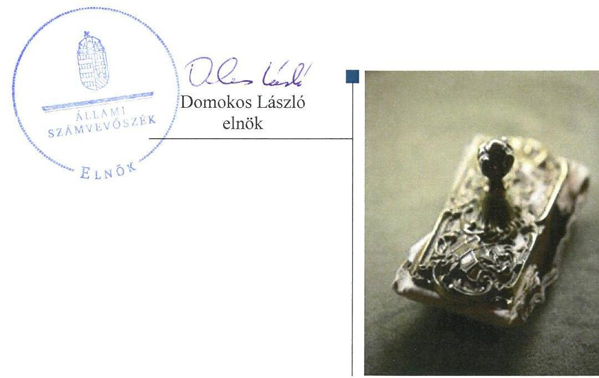
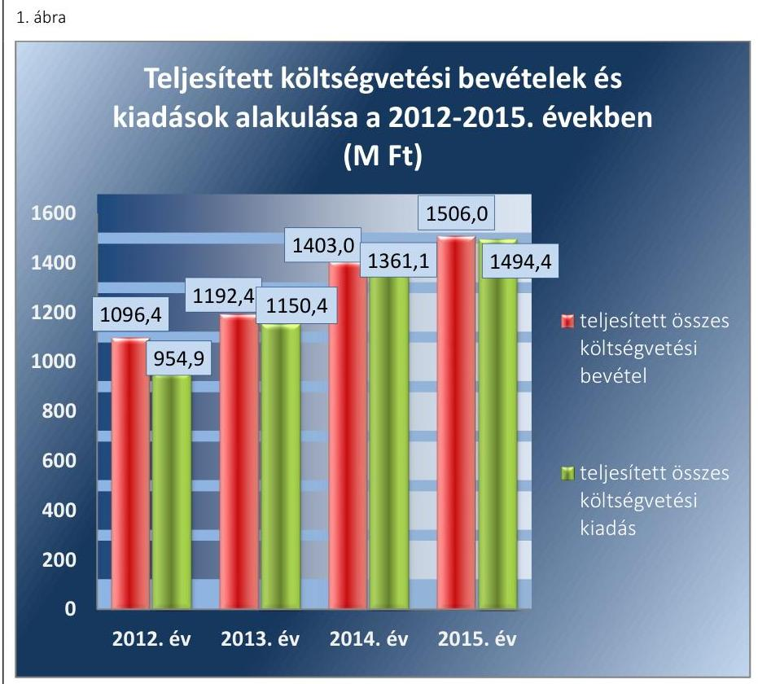
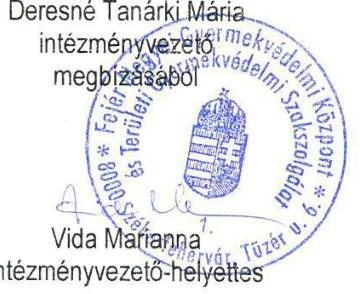
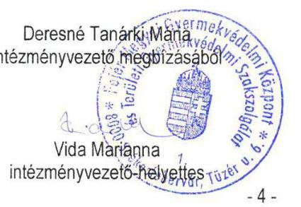
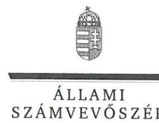
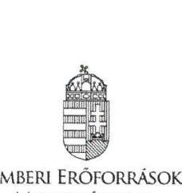
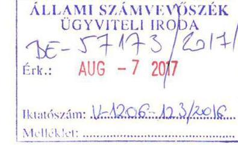
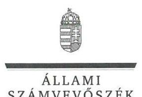
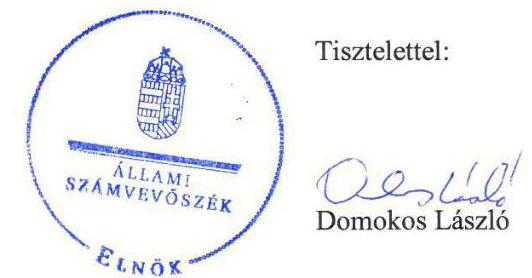

# Jelentés 

## A központi alrendszer intézményei

A központi alrendszer egyes intézményei pénzügyi és vagyongazdálkodásának ellenőrzése - Fejér Megyei Gyermekvédelmi Központ és Területi Gyermekvédelmi Szakszolgálat
2017.

---

# Jelentés 

## A központi alrendszer intézményei

A központi alrendszer egyes intézményei pénzügyi és vagyongazdálkodásának ellenőrzése - Fejér Megyei Gyermekvédelmi Központ és Területi Gyermekvédelmi Szakszolgálat
2017. október hó 6. nap

---

# AZ ELLENŐRZÉST FELÜGYELTE:

## MAKKAI MÁRIA felügyeleti vezető

## AZ ELLENŐRZÉST VEZETTE ÉS A VÉGREHAJTÁSÁÉRT FELELŐS:

### SCHMIDT JÁNOS ellenőrzésvezető

## A PROGRAM ÖSSZEÁLLÍTÁSÁÉRT FELELŐS:

### JANIK JÓZSEF osztályvezető

---

**IKTATÓSZÁM:** V-1206-134/2016.

**TÉMASZÁM:** 2240

**ELLENŐRZÉS-AZONOSÍTÓ SZÁM:** V076006

---

Jelentéseink az Országgyűlés számítógépes hálózatán és az Interneta a www.asz.hu címen is olvashatóak.

---

# TARTALOMJEGYZÉK 

■ ÖSSZEGZÉS ..... 5
■ AZ ELLENŐRZÉS CÉLJA ..... 6
■ AZ ELLENŐRZÉS TERÜLETE ..... 7
■ AZ ELLENŐRZÉS HÁTTERE, INDOKOLTSÁGA ..... 9
■ A JELENTÉS LÉNYEGES KÉRDÉSKÖREI ..... 10
■ ELLENŐRZÉS HATÓKÖRE ÉS MÓDSZEREI ..... 11
■ MEGÁLLAPÍTÁSOK ..... 14
■ JAVASLATOK ..... 22
■ MELLÉKLETEK ..... 25
I. Sz. melléklet: Értelmező szótár ..... 25
II. Sz. melléklet: Az integritás érvényesítése érdekében kialakított és múködtetett kontrollrendszer értékelése ..... 28
■ FÜGGELÉK: ÉSZREVÉTELEK ..... 29
■ RÖVIDÍTÉSEK JEGYZÉKE ..... 47

---

.

---

# ÖSSZEGZÉS 

A Fejér Megyei Gyermekvédelmi Központ és Területi Gyermekvédelmi Szakszolgálatra vonatkozó irányítószervi feladatellátás szabályszerű volt, a középirányító szervek tevékenysége nem felelt meg az előírásoknak. Az Intézménynél a kialakított belső irányítási rendszer összességében nem biztositotta a szabályszerű, átlátható és elszámoltatható közpénzfelhasználást. Az Intézmény pénzügyi és vagyongazdálkodása nem felelt meg a jogszabályi előírásoknak. Az Intézmény vezetése nem építette ki a megfelelő védelmet a korrupciós veszélyekkel szemben. A közpénzfelhasználás eredményességét a gazdálkodás folyamatában mérhető célok nem támasztották alá.

## Az ellenőrzés társadalmi indokoltsága

A közpénzek felhasználásában és az állami vagyonnal való gazdálkodásban a központi alrendszer egyes intézményei meghatározó súlyt képviselnek. E szervezetekkel szemben társadalmi igény, hogy tevékenységükről a döntéshozók és a nyilvánosság felé elszámoljanak. A társadalmi igénnyel és az ÁSZ Stratégiájával összhangban, a közpénzügyek átláthatóságának előmozdítása, a közvagyon védelme érdekében került sor a Fejér Megyei Gyermekvédelmi Központ és Területi Szakszolgálat pénzügyi- és vagyongazdálkodásának ellenőrzésére.

## Főbb megállapítások, következtetések, javaslatok

A Fejér Megyei Gyermekvédelmi Központ és Területi Gyermekvédelmi Szakszolgálatra vonatkozó irányítószervi feladatellátás megfelelt az előírásoknak. Az irányító szervek az egyéb irányítási, felügyeleti és ellenőrzési jogosultságukat szabályszerűen, míg a középirányító szervek nem a jogszabályi előírásoknak megfelelően gyakorolták.

A belső kontrollrendszer kialakítása és működtetése a közpénzekkel és a nemzeti vagyonnal történő szabályszerű, gazdaságos, hatékony és eredményes gazdálkodást, illetve a beszámolási és adatszolgáltatási kötelezettségek szabályszerű teljesítését összességében nem biztosította. A kockázatkezelési rendszer kialakítása és működtetése szabályszerű volt. A kontrolltevékenység szabályozottsága összességében megfelelt, gyakorlása, működtetése nem felelt meg a jogszabályokban és a belső szabályzatokban előírtaknak.

Az Intézmény pénzügyi gazdálkodása nem felelt meg a jogszabályi előírásoknak. A költségvetési előirányzatok megállapítása és módosítása a jogszabályi előírásoknak megfelelően történt. A kiadási előirányzatok felhasználása során a pénzgazdálkodási belső kontrollok nem működtek megfelelően.

A vagyon értékének megőrzését, gyarapítását szolgáló vagyongazdálkodás feltételeinek kialakítása nem szabályszerűen történt. Az Intézmény a közfeladat ellátáshoz szükséges vagyonelemeket, a vagyon hasznosítására vonatkozó szerződés nélkül használta a 2013-2015. években. A jogszabályok és a belső szabályzatok előírásainak megfelelő volt a mérlegben kimutatott eszközök és források értékelése.

Az Intézménynél nem tettek erőfeszítéseket az integritás szemlélet érvényesülésére, az integritás kontrollok kiépítettsége nem volt egyensúlyban a korrupciós kockázatok szintjével.

A gazdálkodás folyamatában számszerűsített, mérhető célokat, célértékeket nem határoztak meg.

---

# AZ ELLENŐRZÉS CÉLJA 

AZ ELLENŐRZÉS célja annak megítélése volt, hogy az ellenőrzött intézményre vonatkozó irányító szervi feladatellátás a jogszabályi előírások betartásával tör-tént-e; az intézménynél a belső kontrollrendszer kialakítása és múködtetése szabályszerű volt-e; kialakították-e az erőforrásokkal való szabályszerű, gazdaságos, hatékony és eredményes gazdálkodáshoz szükséges követelményeket, megvalósították-e azok számonkérését, ellenőrzését; az intézmény pénzügyi és vagyongazdálkodása megfelelt-e a jogszabályi előírásoknak és belső szabályzatainak.

Az intézmény korrupcióval szembeni veszélyeztetettségének csökkentése céljából/érdekében felmértük az integritási szemlélet érvényesülését a gazdálkodási folyamatokban.

A KIEGÉSZÍTŐ TELJESÍTMÉNY-ELLENŐRZÉSI MODUL célja annak értékelése volt, hogy a gazdálkodás folyamatában a gazdaságossági, hatékonysági és eredményességi követelmények kialakítása megtör-tént-e, azokat múködtették-e, a célkitúzéseket elérték-e; a pénzügyi és vagyongazdálkodás folyamataira vonatkozóan a költségvetési szerv belső kontrollrendszerének minőségéről kiadott vezetői nyilatkozatban a költségvetési szerv tevékenységében a hatékonyság, eredményesség, gazdaságosság követelményeinek érvényesítésére vonatkozó nyilatkozat helytálló volt-e.

---

# AZ ELLENŐRZÉS TERÜLETE 

## Fejér Megyei Gyermekvédelmi Központ és Területi Gyermekvédelmi Szakszolgálat

Az Intézmény ${ }^{1}$ Székesfehérvár központjában található, 1979ben alapították. Alapfeladata nevelőszülői hálózat múködtetésével otthont nyújtó ellátás biztosítása, gyermekotthoni szakmai egységek és utógondozói szakmai egysége múködtetése, területi gyermekvédelemi szakszolgáltatás megyei szintű ellátása. Az Intézmény által gyermekvédelmi szakellátásban részesülők létszáma a 2012-2015. években folyamatosan nőtt, a 2012. évi 730 fơről 2015. évre 798 fơre emelkedett.

Az Intézmény a 2011. évben önkormányzati alrendszerbe tartozott, majd a 2012. évtől a központi alrendszerbe került át.

A 2012. évben az irányító szerv a KIM² volt, a középirányítói feladatokat az FMIK ${ }^{3}$ látta el. Az irányítószervi feladatok 2013. január 1-jétől az EMMI ${ }^{4}$ hez kerültek. Az FMIK 2013. március 31-én a Korm. rendelet ${ }_{1}{ }^{5}$ 18. § (2) bekezdés rendelkezése alapján beolvadással megszűnt, feladatait általános és egyetemleges jogutódként az SZGYF ${ }^{6}$ vette át.

Az Intézmény 2012. március 31-ig önállóan múködő és gazdálkodó költségvetési szerv volt, április 1-jétől a Korm. rendelet ${ }_{1}$ 15. § (2) bekezdésének előírása szerint önállóan múködő költségvetési szerv lett. Az Intézmény önálló gazdasági szervezettel nem rendelkezett, gazdálkodásával összefüggő feladatait a Korm. rendelet ${ }_{1}$ 15. § (2) bekezdésének előírása alapján 2012. január 1-jétől az FMIK végezte, majd 2013. április 1-jétől az SZGYF látta el. A gazdasági feladatok ellátását a vonatkozó jogszabályok, illetve a 2015. szeptember 1-tól az SZGYF-fel kötött munkamegosztási megállapodás ${ }^{7}$ szabályozta.

Az Intézményt érintő szervezeti, szerkezeti átalakulásra a 2012-2015. években nem került sor. Az intézményvezető ${ }^{8}$ személyében nem történt változás.

Az intézményben dolgozók átlagos statisztikai állományi létszáma a 2012-2013. években 199 fő, a 2014. évben - jogszabályi változás következtében - a nevelőszülői jogviszony bevezetésével 391 fő lett, ami a 2015. évben 413 fơre emelkedett. Ezzel összefüggésben az éves költségvetési beszámolók alapján a teljesített költségvetési kiadás a 2012. évi 954,9 M Ft-ról a 2015. évre 1494,4 M Ft-ra nőtt.

A teljesített költségvetési bevételek összege a 2012. évben 1096,4 M Ft volt, ami a 2015. évre 1506,0 M Ft-ra nőtt. Az Intézmény folyamatosan bővítette a külső támogatóinak körét, amelynek eredményeként évente mintegy 14-16 M Ft támogatáshoz jutott. A teljesített költségvetési bevételek és kiadások alakulását a 2012-2015. években a 2. ábra mutatja be:

---

Forrás: 2012-2015. évi költségvetési beszámolók
Az Intézmény mérlegfőösszege az ellenőrzött években folyamatosan csökkent, a 2012. január 1-jei 859,5 M Ft-ról 2015. év végére 21,9 M Ft-ra. Ennek oka, hogy az Intézmény vagyonkezelésében lévő ingatlanok állami tulajdonba kerültek, így azok nyilvántartási értéke az intézményi mérlegből kivezetésre került.

---

# AZ ELLENŐRZÉS HÁTTERE, INDOKOLTSÁGA 

Az államháztartás központi alrendszerének közpénz felhasználása, az intézmények által ellátott közfeladatok sokrétűsége, valamint a feladatellátásához rendelt vagyon nagyságrendje indokolja, hogy az ÁSZ ${ }^{9}$ ellenőrzéseket folytasson a pénzügyi és vagyongazdálkodás területén. Az ÁSZ az ellenőrzései során feltárja a gazdálkodást, a központi alrendszer intézményei átalakulását, átszervezését érintő szabályozások esetleges hiányosságait, a szabályozással nem érintett gazdálkodási területeket, rámutathat a vagyongazdálkodási tevékenység - ezen belül a tulajdonosi joggyakorlás és vagyonkezelés - esetleges szabálytalanságaira, értékeli az állami vagyon nyilvántartására és elszámolására vonatkozó eljárásokat. Az ellenőrzés várhatóan hozzájárul a központi intézmények pénzügyi helyzetének pontosabb megítéléséhez és a jó gyakorlat kialakításán és terjesztésén keresztül az ellenőrzések elősegíthetik a gazdálkodás szabályszerűségének javítását.

AZ ELLENŐRZÉS EREDMÉNYEKÉPPEN nemcsak az ellenőrzött intézmények gazdálkodása javulhat, hanem átfogó képet kaphatunk a központi alrendszerbe tartozó költségvetési szervek gazdálkodásáról, annak hiányosságairól, de a jó gyakorlatokról is. Ellenőrzéseivel, javaslataival és megállapításaival az ÁSZ elősegítheti a költségvetési szervek pénzügyi és vagyongazdálkodása szabályozásának javítását és hozzájárulhat a jó kormányzáshoz. Az ellenőrzés az ellenőrzött számára visszajelzést ad a pénzügyi és vagyongazdálkodásában feltárt hiányosságokról, javaslataival hozzájárul azok kiküszöböléséhez, amely csökkentheti a későbbi ellenőrzések gyakoriságát. Az ellenőrzés megállapításait és javaslatait más szervezetek is hasznosíthatják a rendezett gazdálkodási keretek kialakításához.

---

# A JELENTÉS LÉNYEGES KÉRDÉSKÖREI 

1. Az ellenőrzött Intézményre vonatkozó irányítószervi feladatellátás szabályszerű volt-e?
2. A belső kontrollrendszer kialakítása és müködtetése megfelelt-e a jogszabályi előírásoknak?
3. Az Intézmény pénzügyi gazdálkodása szabályszerű volt-e?
4. Az Intézmény vagyongazdálkodása szabályszerű volt-e?
5. Érvényesült-e az integritás szemlélet és ennek megfelelően ki-építették-e az integritás kontrollrendszert az intézménynél?
6. Az Intézmény a gazdálkodás folyamatában kitűzött-e célokat és célértékeket, elérésük érdekében meghatározott-e intézkedéseket, feladatokat, illetve teljesítette-e azokat?

---

# ELLENŐRZÉS HATÓKÖRE ÉS MÓDSZEREI 

## Az ellenőrzés típusa

Megfelelőségi és teljesítmény-ellenőrzés.

## Az ellenőrzött időszak

Az ellenőrzött időszak 2012. január 1-jétől 2015. december 31-ig tart.

## Az ellenőrzés tárgya

Az ellenőrzött szervezetre vonatkozó irányító szervi feladatok ellátása. Az intézmény belső kontroll rendszerének kialakítása és múködtetése. A pénzügyi és vagyongazdálkodás szabályszerűsége. Az intézmény beszámolási és adatszolgáltatási kötelezettségének teljesítése.

Az ellenőrzés kiterjed minden olyan körülményre és adatra, amely az ÁSZ jogszabályban meghatározott feladatainak teljesítéséhez, valamint a program végrehajtása folyamán felmerült újabb összefüggések feltárásához szükséges.

## Az ellenőrzött szervezet

Fejér Megyei Gyermekvédelmi Központ és Területi Gyermekvédelmi Szakszolgálat, irányító szerv ${ }_{1-2}{ }^{10}$ ként a Közigazgatási és Igazságügyi Minisztérium valamint az Emberi Erőforrások Minisztériuma, középirányító szerv $1-2^{11}$ ként a Fejér Megyei Intézményfenntartó Központ és a Szociális és Gyermekvédelmi Főigazgatóság

## Az ellenőrzés jogalapja

Az ellenőrzés jogszabályi alapját az ÁSZ tv. ${ }^{12}$ 1. § (3) bekezdés, 5. § (2)-(6) bekezdései, valamint Áht. ${ }^{13} 61 . \S$ (2) bekezdésének előírásai képezik.

## Az ellenőrzés módszerei

Az ellenőrzést az ellenőrzési program szempontjai, az ellenőrzött időszakban hatályos jogszabályok, az ellenőrzés szakmai szabályai, az egyes ellenőrzési típusokhoz kapcsolódó ÁSZ módszertanok és nemzetközi standardok figyelembevételével végeztük.

---

Az ellenőrzési kérdések megválaszolásához szükséges bizonyítékok megszerzése a következő ellenőrzési eljárások alkalmazásával történt: kérdésfeltevés (információkérés), mintavételezés, valamint elemző eljárás. A minták kiválasztása során elsősorban reprezentativitást biztosító véletlen mintavételi eljárást alkalmaztunk.

Az ellenőrzési bizonyítékként felhasználható adatforrások közé tartoztak egyrészt a szakmai program részletes szempontjainál felsorolt adatforrások, másrészt adatforrás volt minden egyéb - az ellenőrzés folyamán feltárt, az ellenőrzés szempontjából releváns információt tartalmazó - dokumentum. Az ellenőrzés lefolytatásához az intézmény a tanúsítványok elektronikus kitöltésével, valamint az ÁSZ által kért dokumentumok elektronikus megküldésével szolgáltatott adatokat.

Az Intézmény 2012-2013. évi számviteli bizonylatai hiányoztak, amely miatt felvetődött a számviteli rend megsértésének gyanúja. Az ÁSZ törvényi kötelezettségének eleget téve, az illetékes hatóság felé értesítést tett, amely az ügyben indított nyomozást megszüntette. A számviteli nyilvántartást alátámasztó dokumentumok hiánya miatt, a bevételek és ráfordítások elszámolásának értékelése csak a 2014-2015. évekre volt elvégezhető.

Az ÁSZ a belső kontrollrendszer jogszabályi előírások szerinti kialakításának és működtetésének szabályszerűségét az erre irányuló ellenőrzési kérdésekre adott válaszok összesítése alapján, a lényegességi szempontok figyelembe vételével évente pillérenként (kontrollkörnyezet, kockázatkezelési rendszer, kontrolltevékenységek, információs és kommunikációs rendszer, monitoring rendszer) és összesítetten is minősítette. Az ÁSZ a pénzügyi gazdálkodás és a vagyongazdálkodás kialakításának és működtetésének szabályszerűségét az erre irányuló ellenőrzési kérdésekre adott válaszok összesítése alapján, a lényegességi szempontok figyelembe vételével évenkénti bontásban minősítette. „Megfelelő"-nek értékelte az ellenőrzött területet, amennyiben a szabályozás, illetve végrehajtás során a jogszabályi követelményeket maradéktalanul, vagy kisebb hiányosságok mellett érvényesítették, „nem megfelelő"-nek értékelte, amennyiben a szabályozás hiányosságai nem biztosították a szabályszerű működés feltételeit, illetve a gazdálkodás folyamatában jelentkező hibák lényegesek, nagyszámúak, vagy rendszerszerűek voltak.

Mintavétellel ellenőriztük az Intézménynél a kiadások előirányzatai felhasználásának, a tárgyi eszközök nyilvántartásba vételének (üzembe helyezés, értékelés, nyilvántartás), a bevételek beszedésének és elszámolásának, a vagyonelemek elidegenítésének és hasznosításának szabályszerűségét. A minta alapján a sokaságban előforduló hibaarányt becsültük. Az értékelés eredményeként kétféle, "Megfelelő" és "Nem megfelelő" minősítést alkalmaztunk. „Megfelelő"-nek értékeltünk egy ellenőrzött területet, amennyiben a hibaarány a teljes sokaságban 95\%-os bizonyossággal legfeljebb 10\% arányt képviselt. Abban az esetben, ha adott sokaság tekintetében a 10\%-os hibaarány küszöbérték átlépése megítélésének megbízhatósága nem érte el a 95\%-ot, annak elérése érdekében értékelésünket lényegességi alapon további szempontokkal egészítettük ki, és figyelembe vettük a feltárt hibák értékét.

Az integritás szemlélet érvényesülésének értékelése az Intézmény által kitöltött tanúsítványa és az ellenőrzés tapasztalatai alapján történt.

---

A teljesítmény-ellenőrzési kiegészítő modul ellenőrzése során értékeltük, hogy az Intézmény a gazdálkodás folyamatában a gazdaságossági, hatékonysági és eredményességi célokat és célértékeket kialakította-e, a célkitűzéseket elérte-e.

Az ellenőrzés során minden olyan körülményt és adatot is ellenőriztünk, amely a program végrehajtása kapcsán felmerült újabb összefüggéseknek az ellenőrzés céljaival összhangban lévő feltárásához szükséges volt.

---

# 1. Az ellenőrzött Intézményre vonatkozó irányítószervi feladatellátás szabályszerű volt-e? 

Összegző megállapítás

Az irányítószervek intézményre vonatkozó irányítószervi feladatellátása megfelelt, a középirányító szervi feladatellátás nem felelt meg a jogszabályi előírásoknak.
1.1. számú megállapítás

Az irányító szervek alapítással kapcsolatos joggyakorlása megfelelt a jogszabályi előírásoknak.

ALAPÍTÓ OKIRAT $1-5^{14}$-tel az Intézmény az Áht. előírásainak megfelelően rendelkezett, amelyeket 2012-ben a közigazgatási és igazságügyi miniszter, 2013-2015. években az emberi erőforrások minisztere adott ki. Az alapító okirat ${ }_{1-5}$ kiadása az Áht.-ban előírtak szerint az államháztartásért felelős miniszter előzetes egyetértésével történt.

Az alapító okirat ${ }_{1-5}$ tartalma, valamint az abban foglaltak módosítása és egységes szerkezetbe foglalása az Ávr. ${ }^{15}$-ben előírtaknak megfelelt.

Az irányító szervek az egyéb irányítási, felügyeleti és ellenőrzési jogosultságukat szabályszerűen, a középirányító szervek nem szabályszerűen gyakorolták.

AZ INTÉZMÉNY rendelkezett SZMSZ ${ }_{1-4}{ }^{16}$-gyel, amely az Áht. és a Gyvt. ${ }^{17}$ előírásának megfelelően jóváhagyásra került. Az Intézmény előirányzatokkal való gazdálkodását az irányító- és középirányító szervek a Korm. rendelet ${ }_{1-2}{ }^{18}$-ben előírtaknak megfelelően rendszeresen figyelemmel kísérték, az Intézmény vezetőjét az éves szakmai feladatellátásról, valamint az éves gazdálkodásról beszámoltatták.

Az irányító szerv ${ }_{1-2}$ a költségvetés tervezéssel kapcsolatos általános elvárásairól, követelményeiről az Ávr.-ben előírtak szerint az Intézményt tájékoztatta, és az ennek megfelelően összeállított elemi költségvetéseket jóváhagyta. A költségvetési beszámolók és az előirányzat-maradvány jóváhagyása az Áht. előírásának megfelelően megtörtént.

A 2012. évben a középirányító szerv ${ }_{1}$ nem ellenőrizte az államháztartással összefüggő közérdekű és közérdekből nyilvános adatok kötelező közzétételének, illetve igényre történő szolgáltatásának végrehajtását a Korm. rendelet ${ }_{1} 11 . \S$ (2) bekezdés c) pontjában előírtak ellenére.

Az Intézmény közfeladatai ellátásához használt vagyonelemek vagyonkezelője a középirányítószerv ${ }_{1-2}$ volt. A középirányító szerv $_{1-2}$ az MNV Zrt ${ }^{19}$ vel kötött vagyonkezelési szerződés 4.5.1. c) pontja alapján jogosult volt a vagyonelemek hasznosítására. A középirányító szerv $_{2}$ - a Vtv ${ }^{20}$. 25. § (4) bekezdésében rögzítettek ellenére - nem kötött szerződést a nemzeti vagyon hasznosítására. Így a 2013-2015. években a középirányító szerv $_{2}$ a Korm. rendelet ${ }_{1} 11 . \S$ (2) bekezdés d) pontjában, illetve a Korm. rendelet ${ }_{2}$

---

3. § (2) bekezdés g) pontjában előírtak ellenére - nem érvényesítette a vagyonnal való szabályszerű gazdálkodáshoz szükséges követelményeket. Az intézményvezető pályázat alapján, 2012. április 1-jei hatállyal öt évre szóló vezetői megbízást kapott a Korm. rendelet ${ }_{1}$-nek megfelelően a munkáltatói jogkört gyakorló középirányító szerv ${ }_{1}$ vezetőjétől.

A munkáltatói jogkört gyakorló középirányító szerv ${ }_{2}$ az intézményvezetőt a Kjt. ${ }^{21} 40 . \S$ (1) bekezdés a) pontjában előírtak ellenére nem minősítette.

# 2. A belső kontrollrendszer kialakítása és múködtetése megfelel-te a jogszabályi előírásoknak? 

## Összegző megállapítás

A belső kontrollrendszer kialakítása és múködtetése nem felelt meg a jogszabályi előírásoknak.

A belső kontrollrendszer évenkénti és összesített értékelését az 1. táblázat tartalmazza.

1. táblázat

## A BELSŐ KONTROLLRENSZER KIALAKÍTÁSÁNAK ÉS MŰKÖDTETÉSÉNEK ÉRTÉKELÉSE

| Megnevezés | Kontrollkörnyezet | Kockázatkerelési rendszer | Kontrolltevékenységek | Információ és kommunikáció | Monitoring | OSSZTSEN |
| :--: | :--: | :--: | :--: | :--: | :--: | :--: |
| 2012. | megfelelő | megfelelő | - | megfelelő | nem megfelelő | nem megfelelő |
| 2013. | nem megfelelő | megfelelő | - | megfelelő | nem megfelelő | nem megfelelő |
| 2014. | nem megfelelő | megfelelő | nem megfelelő | megfelelő | megfelelő | nem megfelelő |
| 2015. | nem megfelelő | megfelelő | nem megfelelő | megfelelő | megfelelő | nem megfelelő |

2.1. számú megállapítás

A kontrollkörnyezet kialakítása a 2012. év kivételével nem volt szabályszerű.

A KONTROLLKÖRNYEZET kialakítása és múködtetése az Intézménynél összességében nem volt szabályszerű.

A Számv. tv. ${ }^{22}$-ben előírt szabályzatokat, az Intézmény gazdálkodással összefüggő feladatait ellátó gazdasági szervezet: ${ }^{23}$, 2012. január 1-jei hatállyal adta ki úgy, hogy a számviteli politikájában ${ }^{24}$ - az Áhsz ${ }_{1}{ }^{25}$ előírása alapján - döntött arról, hogy annak rendelkezéseit és a számviteli politikája keretében elkészített szabályzatainak hatályát kiterjesztette az Intézményre.

Az Intézmény 2013. április 1-jétől nem rendelkezett számviteli politikával, és az annak keretében elkészítendő szabályzatokkal. A gazdasági szervezet ${ }_{2}$ a számviteli politikáját ${ }^{26}$ és az annak keretében elkészített szabályzatok hatályát - az Áhsz. ${ }_{1} 8 . \S$ (13) és az Áhsz. ${ }_{2}{ }^{27} 50 . \S$ (1) bekezdéseiben, és az abban hivatkozott 31. § (1) bekezdésében foglaltak ellenére - nem terjesztette ki az Intézményre, és önállóan kialakított formában sem adta ki a szabályzatokat. A 2015. szeptember 1-től érvényes munkamegosztási megállapodás alapján, a helyi sajátosságoknak megfelelő szabályzatok elkészítése intézményi, míg az elkészítésben való együttműködés és a szabályzat jóváhagyása a gazdasági szervezet ${ }_{2}$ feladata volt.

---

A számlarend ${ }^{28}$-ben foglaltakat alátámasztó bizonylati renddel az Intézmény - a Számv. tv. 161. § (2) bekezdés d) pontjában előírtak ellenére nem rendelkezett.

A gazdálkodás részletes rendjét a gazdálkodási szabályzat ${ }_{1-3}{ }^{29}$-ban rögzítették, amely tartalmazta az operatív gazdálkodási jogkörök gyakorlásának részletszabályait, de az Ávr. 53. § (2) bekezdésében előírtak ellenére az Intézmény nem rögzítette belső szabályzatban az előzetes írásbeli kötelezettségvállalást nem igénylő kifizetések rendjét.

Az Ávr. előírásainak megfelelően a tervezéssel, a kontroll eljárásokkal, az ellenőrzési, adatszolgáltatási és beszámolási feladatok teljesítésével kapcsolatos előírásokat, feltételeket, a gazdálkodási szabályzat ${ }_{1-3}$-ban, az ügyrend ${ }^{30}$-ben, beszámolási szabályzat ${ }^{31}$-ban, az ellenőrzési nyomvonal ${ }^{32}$ ban és a munkamegosztási megállapodásban rögzítették.

# 2.2. számú megállapítás 

## A kockázatkezelési rendszer kialakítása és múködtetése szabályszerű volt.

## KOCKÁZATKEZELÉSI RENDSZER KIALAKÍTÁSÁ-

RÓL ÉS MŰKÖDTETÉSÉRŐL az intézményvezető a Bkr ${ }^{33}$. előírásának megfelelően gondoskodott, az Intézmény kockázatkezelési szabályzat ${ }_{1-2}{ }^{34}$-vel rendelkezett.

A visszaélésekre, szabálytalanságokra és integritási, korrupciós kockázatokra vonatkozó bejelentések fogadására és kivizsgálására vonatkozó eljárásrend kialakításra került, az Intézmény tevékenységével kapcsolatos panaszok kivizsgálásának szabályait meghatározták.

Felmérték, meghatározták a szervezet tevékenységében és a gazdálkodásában rejlő kockázatokat, a kockázatokkal kapcsolatos szükséges intézkedéseket, amelyeket a kockázatok évenkénti nyilvántartásában rögzítettek.

## A kontrolltevékenység szabályozottsága összességében nem volt szabályszerű, gyakorlása, múködtetése 2014-2015-ben nem felelt meg a jogszabályokban és a belső szabályzatokban előírtaknak.

Az intézményvezető a kötelezettségvállalásra, utalványozásra, a teljesítésigazolásra jogosultakat kijelölte.. A 2012-2013. évekre vonatkozóan a gazdasági szervezet ${ }_{1-2}$ az érvényesítésre jogosult személyeket az Ávr. 58. § (4) bekezdésben előírtak ellenére nem jelölte ki. Az érvényesítő szabályszerű kijelölése 2014-től megtörtént.

A felhatalmazások, kijelölések az Áht. és Ávr. előírásának megfeleltek, azonban a gazdálkodási jogkörök gyakorlói aláírás mintáit tartalmazó nyilvántartást az Ávr. 60. § (3) bekezdésben előírtak ellenére nem naprakészen vezette az Intézmény.

A kifizetésekhez kapcsolódó gazdálkodási jogkörök gyakorlását szabálytalanságok jellemezték. A feltárt hiányosságokat részletesen a 3.3. számú megállapítás tartalmazza.

---

# 2.4. számú megállapítás 

Az információs és kommunikációs folyamatok kialakítása és múködtetése összességében a jogszabályi előírásoknak megfelelt.

AZ INTÉZMÉNY INFORMÁCIÓS-RENDSZERÉT az intézményvezető a Bkr. előírása szerint kialakította. Az információk kezelésére vonatkozó előírásokat az informatikai szabályzat ${ }^{35}$, a kommunikációs szabályzat ${ }^{36}$, valamint a beszámolási szabályzat ${ }^{37}$ tartalmazta.

Az Intézmény a közérdekú adatok kezelési rendjét a közzétételi szabályzat ${ }_{1-2}$-ben az Info. tv. ${ }^{38}$ és az Ávr. előírása szerint alakította ki.

Az adatok biztonságára, védelmére vonatkozó szabályokat az Intézmény az Info. tv. előírása szerint határozta meg, a feladatokat és hatásköröket az adatvédelmi ${ }^{39}$ és az informatikai szabályzatban rögzítette.

A 2012. január 1. és a 2014. augusztus 30. közötti időszakban az Intézmény, hatályos iratkezelési szabályzattal - az Ltv. ${ }^{40} 10 . \S$ (1) bekezdés a) pontjában foglaltak ellenére - nem rendelkezett.
2.5. számú megállapítás

Az Intézmény vezetője a jogszabályi előírásoknak összességében nem megfelelően alakította ki a szervezet tevékenységének, a célok megvalósításának folyamatos-és eseti nyomon követését biztosító rendszerét.

A MONITORING RENDSZER kialakítása és múködtetése keretében az intézményvezető a belső ellenőrzés kialakításáról az Áht. előírásának megfelelően csak a 2013. év második felétől gondoskodott. A 2013. július 1-jétől hatályos, a belső ellenőrzési feladatok ellátására kötött külön megállapodás ${ }^{41}$ szerint, a középirányító szerv ${ }_{2}$ megfelelő egységének feladata volt a belső ellenőrzés ellátása.

A belső ellenőrzés múködéséhez 2013. július 9-től hatályos, a Bkr. szerinti tartalmú belső ellenőrzési kézikönyv ${ }^{42}$-et elkészítették, amelynek felülvizsgálata, aktualizálása megtörtént.

A 2013. július 1-től tervezett ellenőrzéseket végrehajtották, az ellenőrzési jelentéseket elkészítették. Az ellenőrzési jelentésekben rögzített megállapítások, javaslatok alapján a Bkr.-ben előírt intézkedési terv készítési, végrehajtási és beszámolási kötelezettségének az intézményvezető eleget tett.

A belső ellenőrzési vezető által készített, az Intézménynél a 2013-2014. években elvégzett ellenőrzésekről, továbbá a belső ellenőrzési jelentésekben tett megállapításokról, javaslatokról, a vonatkozó intézkedési tervekről és azok végrehajtásának nyomon követését biztosító nyilvántartás a Bkr. 47. § (1) és az 50. § (1) bekezdéseiben előírtak ellenére nem állt rendelkezésre.

Az Intézmény vezetője - a Bkr. 14. § (2) bekezdésében előírtak ellenére - a tárgyévet követő év január 31-ig, a fejezetet irányító költségvetési szerv vezetőjének és a fejezetet irányító szerv belső ellenőrzési vezetőjének nem számolt be, a külső ellenőrzések javaslatai alapján készült intézkedési tervek végrehajtásáról.

Az Intézmény vezetője a költségvetési szerv belső kontrollrendszerének minőségét, a Bkr. 11. § (1) bekezdése szerinti nyilatkozataiban annak ellenére értékelte megfelelőre, hogy - a Bkr. 6. § (2) bekezdését figyel-

---

men kívül hagyva -nem működtetett teljes körűen olyan kialakított folyamatokat, amelyek a rendelkezésre álló források szabályszerű, gazdaságos, hatékony és eredményes felhasználását biztosították volna.

# 3. Az Intézmény pénzügyi gazdálkodása szabályszerű volt-e? 

## Összegző megállapítás

Az Intézmény pénzügyi gazdálkodása nem volt szabályszerű.
3.1. számú megállapítás

Az elemi költségvetés és az előirányzatok megállapítása során betartották a jogszabályi előírásokat és a belső szabályzatokban foglaltakat.

## AZ ÉVES ELEMI KÖLTSÉGVETÉSEK TERVEZÉSÉ-

VEL kapcsolatos feladatokat, folyamatokat az Ávr. előírásának megfelelően, az ügyrendben, a FEUVE szabályzatban, az ellenőrzési nyomvonalban, munkamegosztási megállapodásban, illetve a munkaköri leírásokban rögzítették.

Az Intézmény elemi költségvetéseinek megállapítása az Áht.-ban és Ávr.-ben foglaltaknak megfelelően történt. Azokat az NGM ${ }^{43}$ által évenként közzé tett tervezési köriratban, a 2012-2013. években hatályos NGM rendelet ${ }_{1-2}{ }^{44}$-ben, az irányító szerv ${ }_{1-2}$ által kiadott körlevelekben, valamint az Ávr-ben foglaltakra tekintettel állította össze a gazdasági szervezet ${ }_{1-2}$.

### 3.2. számú megállapítás

A bevételi és kiadási előirányzatok módosítása szabályszerű volt.
Az Intézmény összes eredeti és módosított bevételi és kiadási előirányzata a 2012-2015. években folyamatosan növekedett.

Az előirányzat módosításokra, átcsoportosításokra döntően a 2012. és a 2015. években kormányzati, a 2013. és a 2014. években pedig intézményi hatáskörben került sor, amelyek megfeleltek az Ávr. előírásainak.

Az előirányzat módosítások, átcsoportosítások hatáskörönkénti megoszlását a 2. táblázat mutatja be.
2. táblázat

ELŐIRÁNYZAT-MÓDOSÍTÁSOK, ÁTCSOPORTOSÍTÁSOK
HATÁSKÖRÖNKÉNTI MEGOSZLÁSA A 2012-2015. ÉVEKBEN (M FT-BAN)

| Megnevezés | 2012. év | 2013. év | 2014. év | 2015. év | Összesen |
| :-- | :--: | :--: | :--: | :--: | :--: |
| országgyűlési | - | - | - | - | - |
| kormányzati | 238,7 | 17,9 | 29,4 | 70,1 | 356,1 |
| irányító | 44,6 | $-19,4$ | 36,4 | 15,8 | 77,4 |
| szervi |  |  |  |  |  |
| intézményi | 18,6 | 142,4 | 90,1 | 55,2 | 306,3 |
| Összesen | 301,9 | 140,9 | 155,9 | 141,1 | 739,8 |

3.3. számú megállapítás

A kiadási előirányzatok felhasználása 2012-2013-ban nem volt értékelhető, 2014-2015-ben a gazdálkodási jogkörgyakorlás szabálytalanságai miatt nem felelt meg a jogszabályi előírásoknak.

A kiadási előirányzatokat 2014-2015-ben szabályszerűen, a törvényi előírásokkal összhangban álló feladatokra használták fel.

---

A személyi, dologi és a felhalmozási kiadások kifizetése és elszámolása során, a pénzgazdálkodási jogkörök kontrolltevékenységének szabályszerűségével kapcsolatban az ellenőrzés által feltárt hiányosságokat a 3. táblázat tartalmazza.
3. táblázat

# A GAZDÁLKODÁSI JOGKÖRÖK GYAKORLÁSÁNAK HIÁNYOSSÁGAI A 2014-2015. ÉVEKBEN 

## Intézményi Teljesítésigazolás

A személyi juttatások kifizetése esetében a teljesítés igazolása nem történt meg a Áht. 38. § (1) bekezdés előírásai ellenére. A dologi és felhalmozási kiadásoknál a teljesítés igazolása nem történt meg mivel - az Ávr. 57. § (4) bekezdésében foglalt előírások ellenére - nem a kötelezettségvállaló által írásban kijelölt személy végezte. A teljesítés igazolás során a teljesítés igazolás dátuma és a teljesítés tényére történő utalás - az Ávr. 57. § (3) bekezdésében előírtak ellenére -megjelölése elmaradt

## Intézményi Utalványozás

Az utalványozásra az - Ávr. 59. § (1) bekezdésében foglalt előírások ellenére - a dologi és felhalmozási kiadásoknál nem került sor, mert azt nem az arra jogosult személyek végezte el.

## Gazdasági szervezet: Pénzügyi ellenjegyzése

A pénzügyi ellenjegyzés nem volt szabályszerű, mert dátumát a kötelezettségvállalás dokumentumán - az Ávr. 55. § (1) bekezdésében foglalt előírások ellenére - a dologi, személyi és a felhalmozási kiadásoknál nem tüntették fel.

## Gazdasági szervezet: Érvényesítése

Az érvényesítő - az Ávr. 58. § (2) bekezdésében előírtak ellenére- nem jelezte az utalványozó felé a megelőző ügymenetben az Áht., Ávr.,és Áhsz, illetve a vonatkozó szabályzatok megsértését, illetve a teljesítésigazolással és pénzügyi ellenjegyzéssel kapcsolatos hiányosságok során a megelőző ügymenetben tapasztalt szabálytalanságokat

Forrás: Az Intézmény adatszolgáltatása alapján készített ÁSZ összesítő kimutatás

A 2014-2015. években vagyonelemek értékesítésére, bérbeadására nem került sor. Az MNV Zrt. engedélyéhez kötött vagyonértékesítés nem volt.
3.4. számú megállapítás

Az Intézmény 2012- 2013. évi költségvetési beszámolójának megfelelősége, bizonylatok hiányában nem volt értékelhető. A 20142015. évi költségvetési beszámolókat a gazdasági szervezet2 a jogszabályi előírásoknak megfelelően készítette el.

A KÖLTSÉGVETÉSI BESZÁMOLÓKAT a jogszabályi előírások alapján a gazdasági szervezet ${ }_{1-2}$ minden évben elkészítette. Az Intézmény 2012-2015. évi költségvetési beszámolóit az Áhsz.1,2 előírásai szerinti bontásban készítették el, a beszámolókat minden évben főkönyvi kivonat és leltár támasztotta alá.

A 2012-2013. évi könyvviteli elszámolást alátámasztó számviteli bizonylatok hiányában, a költségvetési beszámolóban és a könyvvezetésben nem érvényesült a Számv. tv. 15. § (3) bekezdésében foglalt valódiság elve. A Számv. tv. 169. § (2) bekezdésében foglalt előírás ellenére, az Intézmény megsértette a számviteli bizonylatok megőrzési kötelezettségét. A gazdasági szervezet2 a 2014-2015. években a jogszabályi előírásoknak megfelelően készítette el az Intézmény költségvetési beszámolóit.

Az adatszolgáltatási kötelezettségeket az Áhsz ${ }_{1-2}$ alapján a gazdasági szervezet ${ }_{1-2}$ teljesítette.

---

# 3.5. számú megállapítás 

Az Intézménynél végrehajtották az előirányzat felhasználáshoz kapcsolódó évközi korlátozó intézkedéseket, szabályszerű volt az előirányzat maradvány megállapítása.

Egyensúlyjavító intézkedések keretében, a 2012. és 2013. évi költségvetési hiánycél biztosításához szükséges további intézkedésekről szóló Korm. határozattal elrendelt egyes eszközcsoportokra vonatkozó beszerzési korlátozásokat az Intézmény betartotta, a beszerzési tilalom alól felmentést nem kért. Az előirányzat felhasználáshoz kapcsolódó évközi korlátozó intézkedéseket az Intézmény végrehajtotta.

A tárgyévi előirányzat-maradvány megállapítása, 2014-2015-ben megfelel az Áhsz 1,2 és az Ávr. előírásainak.

## 4. Az Intézmény vagyongazdálkodása szabályszerű volt-e?

Összegző megállapítás

Az Intézmény vagyongazdálkodása nem felelt meg a jogszabályi előírásoknak.
4.1. számú megállapítás

A vagyon értékének megőrzését, gyarapítását szolgáló vagyongazdálkodás feltételeinek kialakítása nem volt szabályszerű.

## AZ INTÉZMÉNY FELADATELLÁTÁSÁHOZ SZÜKSÉGES VAGYONT 2012. január 1-je előtt a fenntartó Megyei Önkormányzat biztosította.

A Konsz. tv. ${ }^{45}$ értelmében a feladatellátáshoz szükséges vagyonhoz kapcsolódó vagyonkezelői jogokat 2012. január 1-jétől - a Korm. rendelet ${ }_{1}$ alapján - középirányító szerv ${ }_{1}$ gyakorolta. A középirányító szerv ${ }_{1}$ 2012. szeptember 24-én aláírt Intézményi Megállapodás ${ }^{46}$ keretében, a vagyonkezelésében lévő Intézményi ingatlanvagyont, térítésmentes használatba adta az Intézménynek, a közfeladat ellátásához szükséges ingó vagyontárgyak vagyonkezelési jogát a Nvtv. ${ }^{47} 11 . \S$ (9) bekezdése szerint az Intézményre átruházta.

Az Intézményi Megállapodás keretében rögzítették, hogy a vagyonkezelőként eljáró középirányító szerv ${ }_{1}$ ellenérték nélkül biztosította az állami tulajdonú ingatlanokban az intézményi közfeladat ellátás mértékéhez igazodó használatot. Az Intézmény üzemeltette a használatába adott ingatlanokat, továbbá a Nvtv.-ben előírtak szerint rögzítették, hogy az Intézmény a szükséges állagmegóvó, veszély elhárítást célzó karbantartási munkákat, a vagyonkezelő tájékoztatása mellett, saját költségvetése terhére elvégzi.

Az Intézmény az ingó vagyontárgyak 2012. január 1-jével történt állami tulajdonba vételét követően - a Számv. tv. 15. § (2) bekezdésében rögzítettek ellenére - azok nyilvántartásokból történő kivezetéséről nem gondoskodott. Az Intézménynél az ingó vagyontárgyak kimutatása 2012. szeptember 24-étől (a Megállapodás létrejöttének időpontjától) a jogszabályi előírásoknak megfelelt, mivel a Megállapodás alapján az ingó vagyontárgyak az Intézmény vagyonkezelésébe kerültek.

Az Intézmény és a vagyonkezelői joggal rendelkező középirányító szerv ${ }_{2}$ között, az ingó és ingatlanvagyon hasznosítására vonatkozó - a Vtv. 25. § (4) bekezdésében rögzítettek ellenére - megállapodás, szerződés az ellenőrzött időszakban nem jött létre ${ }^{48}$.

---

# 4.2. számú megállapítás 

A jogszabályok és a belső szabályzatok előírásainak megfelelően történt a mérlegben kimutatott eszközök és források értékelése.

Az Áhsz 1 - 2 előírásának megfelelően értékelték és mutatták ki az év végi mérlegben az immateriális javakat és a tárgyi eszközöket. A kimutatott eszközök és források valódisága leltárral alátámasztott volt.

Az Intézményi beszerzéseknél, a gazdálkodási szabályzat ${ }_{1-3}$ előírásai szerint jártak el. Az Intézménynél az év végi szállítói kötelezettségállomány a 2012.december 31-hez viszonyítva, 2015.december 31-ére 355 e Ft-ról 3238 e Ft-ra növekedett, amely nem csak lejárt tartozásokból állt. A számlák döntő többsége közüzemi számla volt. Az Intézménynél keletkezett átmeneti likviditási problémákat „előirányzat keret előrehozásokkal" kezelték.

A rendező mérleg elkészítéséhez 2013. december 31-ei mérleg fordulónappal, a teljes körű leltározást az NGM rendelet ${ }^{49}$ előírásának megfelelően végezték el. A 2014. évi nyitó mérleg a rendező mérlegnek megfelelt.

## 5. Érvényesült-e az integritás szemlélet és ennek megfelelően kiépítették-e az integritás kontrollrendszert az intézménynél?

Összegző megállapítás

Az Intézmény nem tett erőfeszítéseket az integritás szemlélet érvényesítése érdekében, az integritás kontrollok kiépítettsége nem volt egyensúlyban a korrupciós kockázatok szintjével.

Az Intézmény a 2015. évre vonatkozó, Integritás Projekt szerinti adatszolgáltatásban részt vett. Az integritás kontrollrendszerének értékelése az ellenőrzés során, az Intézmény által szolgáltatott adatok alapján történt.

Az Intézmény a jogszabályok által is előírt szabályossági kontrollokat összességében kiépítette, azonban a korrupciós kockázatokkal szembeni védettséget növelő integritás kontrollok kiépítettsége alacsony szintű volt.

Az integritás érvényesítése érdekében kialakított és működtetett kontrollrendszer részletes értékelésének eredményét a II. számú melléklet tartalmazza.

## 6. Az Intézmény a gazdálkodás folyamatában kitűzött-e célokat és célértékeket, elérésük érdekében meghatározott-e intézkedéseket, feladatokat, illetve teljesítette-e azokat?

## Összegző megállapítás

Az Intézmény a gazdálkodási folyamatok tekintetében célokat, célértékeket nem határozott meg, intézkedéseket nem tett.

Az ellenőrzés a teljesítmény-ellenőrzési kiegészítő modul tekintetében megállapította, hogy az Intézmény a gazdálkodás folyamatában számszerúsített, eredményességi, gazdaságossági, hatékonysági követelményeket, mérhető célokat, célértékeket nem határozott meg. Célkitűzések hiányában azok teljesítése nem volt értékelhető.

---

# JAVASLATOK 

Az ÁSZ tv. 33. § (1) bekezdésében foglaltak értelmében az ellenőrzött szervezet vezetője köteles a jelentésben foglalt megállapításokhoz kapcsolódó intézkedési tervet összeállítani és azt a jelentés kézhezvételétől számított 30 napon belül az ÁSZ részére megküldeni. Amennyiben az ellenőrzött szervezet vezetője nem küldi meg határidőben az intézkedési tervet, vagy továbbra sem elfogadható intézkedési tervet küld, az Állami Számvevőszék elnöke az ÁSZ tv. 33. § (3) bekezdése a) és b) pontjaiban foglaltakat érvényesítheti.

## az emberi erőforrások miniszterének

1. Intézkedjen a feltárt szabálytalanságok tekintetében a munkajogi felelősség tisztázására irányuló eljárás megindításáról, és ennek eredménye ismeretében tegye meg a szükséges intézkedéseket.
(1.2. sz. megállapítás 4. bekezdése)

## a Szociális és Gyermekvédelmi Főigazgatóság, mint középirányító szerv főigazgatójának

1. Intézkedjen az intézményvezető Kjt.-ben előirtak szerinti minősitéséről.
(1.2. sz. megállapítás 6. bekezdése alapján)
2. Intézkedjen az intézmény közfeladatai ellátásához szükséges ingó és ingatlanvagyon hasznosítására vonatkozó szerződés Vtv. előírásainak megfelelő megkötéséről.
(1.2. sz. megállapítás 4. bekezdése alapján)

## a Szociális és Gyermekvédelmi Főigazgatóság, mint a Fejér Megyei Gyermekvédelmi Központ és Területi Gyermekvédelmi Szakszolgálat gazdasági szervezeti feladatait ellátó szerv főigazgatójának

1. Intézkedjen az intézményre vonatkozó számviteli politika és annak keretében elkészítendő szabályzatok elkészítéséről.
(2.1 sz. megállapítás 3. bekezdés 1. és 2. mondata alapján)

---

2. Intézkedjen a gazdálkodási jogkörökön belül a pénzügyi ellenjegyzés és az érvényesités szabályszerű gyakorlása érdekében.
(3.3. sz. megállapítás 3. számú táblázat 3. sora és 4. sora alapján)

# a Fejér Megyei Gyermekvédelmi Központ és Területi Gyermekvédelmi Szakszolgálat igazgatójának 

1. Intézkedjen a bizonylati rend elkészitéséről.
(2.1 sz. megállapítás 4. bekezdése alapján)
2. Intézkedjen az Ávr. előírásainak megfelelően az előzetes írásbeli kötelezettségvállalást nem igénylő kifizetések rendjének szabályozásáról.
(2.1. sz. megállapítás 5. bekezdése alapján)
3. Intézkedjen, hogy a gazdálkodási jogkörök gyakorlóinak aláírás mintáit tartalmazó nyilvántartást az Ávr. előírásainak megfelelően naprakészen vezessék.
(2.3. sz. megállapítás 2. bekezdése alapján)
4. Intézkedjen, hogy a külső ellenőrzések javaslatai alapján készült intézkedési tervek végrehajtásáról kerüljön sor a beszámolásra a fejezetet irányító költségvetési szerv vezetőjének és a fejezetet irányító szerv belső ellenőrzési vezetőjének a Bkr. előírásainak megfelelően.
(2.5. sz. megállapítás 5. bekezdése alapján)
5. Intézkedjen a gazdálkodási jogkörökön belül a teljesítésigazolás és utalványozás szabályszerű gyakorlása érdekében.
(3.3. sz. megállapítás 3. számú táblázat 1. és 2. sora alapján)

---

.

---

# MELLÉKLETEK 

I. SZ. MELLÉKLET: ÉRTELMEZŐ SZÓTÁR
állami vagyon
a) az állam tulajdonában lévő dolog, valamint a dolog módjára hasznosítható természeti erő,
b) az a) pont hatálya alá nem tartozó mindazon vagyon, amely vonatkozásában törvény az állam kizárólagos tulajdonjogát nevesíti,
c) az állam tulajdonában lévő tagsági jogviszonyt megtestesítő értékpapír, illetve az államot megillető egyéb társasági részesedés,
d) az államot megillető olyan immateriális, vagyoni értékkel rendelkező jogosultság, amelyet jogszabály vagyoni értékű jogként nevesít. (Forrás: Vtv. 1. § (2) bekezdése)
állami vagyon értékesítése
állami vagyon használója
állami vagyon hasznosítása
állami vagyon kezelője /vagyonkezelő

ÁSZ Integritás Projekt
belső ellenőrzés

Állami vagyonnak minősül:
a) az állam tulajdonában lévő dolog, valamint a dolog módjára hasznosítható természeti erő, b) az a) pont hatálya alá nem tartozó mindazon vagyon, amely vonatkozásában törvény az állam kizárólagos tulajdonjogát nevesíti,
c) az állam tulajdonában lévő tagsági jogviszonyt megtestesítő értékpapír, illetve az államot megillető egyéb társasági részesedés,
d) az államot megillető olyan immateriális, vagyoni értékkel rendelkező jogosultság, amelyet jogszabály vagyoni értékű jogként nevesít. (Forrás: Vtv. 1. § (2) bekezdése)
Állami vagyon tulajdonjogának bármely jogcímen történő, visszterhes átruházása. (Forrás: Vtvr. 1. § (7) bekezdés d) pontja)
Az a természetes vagy jogi személy, jogi személyiséggel nem rendelkező szervezet, aki, vagy amely törvény vagy szerződés alapján, bármely jogcímen (bérlet, haszonbérlet, használat stb.) állami vagyont birtokol, használ, szedi annak hasznait, hasznosít, ide nem értve a haszonélvezőt, a vagyonkezelőt és a tulajdonosi jogok gyakorlóját". (Forrás: Vtvr. 1. § (7) bekezdés a) pontja)

Az állami vagyont az MNV Zrt. maga kezeli, vagy szerződés - így különösen bérlet, haszonbérlet, megbízás - alapján központi költségvetési szervnek, természetes vagy jogi személynek, vagy jogi személyiséggel nem rendelkező gazdálkodó szervezetnek hasznosításra átengedi. (Forrás: Vtv. 23. § (1) bekezdése, hatályos 2012. január 1-jétől)
Az állami vagyonnal a tulajdonosi joggyakorló maga gazdálkodik, vagy szerződés - így különösen bérlet, haszonbérlet, megbízás - alapján hasznosításra átengedi, illetőleg vagyonkezelésbe, haszonélvezetbe adja. (Forrás: Vtv. 23. § (1) bekezdése, hatályos 2013. június 28-ától) Az állami vagyon hasznosítására kötött szerződések elsődleges célja az állami vagyon hatékony működtetése, állagának védelme, értékének megőrzése, illetve gyarapítása, az állami és közfeladatok ellátásának elősegítése. (Forrás: Vtv. 23. § (2) bekezdése)
Az állami vagyont az MNV Zrt. maga kezeli, vagy szerződés - így különösen bérlet, haszonbérlet, megbízás - alapján központi költségvetési szervnek, természetes vagy jogi személynek, vagy jogi személyiséggel nem rendelkező gazdálkodó szervezetnek hasznosításra átengedi." Az állami vagyonra vonatkozóan az MNV Zrt. kizárólag az Nvtv-ben meghatározott személyekkel köthet vagyonkezelési szerződést. (Forrás: Vtv. 27. § (1) bekezdése, hatályos 2012. január 1-jétől)
Az Állami Számvevőszék 2009-ben indította el a „Korrupciós kockázatok feltérképezése - Integritás alapú közigazgatási kultúra terjesztése" című, európai uniós forrásból megvalósított kiemelt projektjét (Integritás Projekt). Az Integritás Projekt célja, hogy felmérje a közszféra intézményei korrupciós kockázatoknak való kitettségét, illetőleg az azok mérséklésére hivatott kontrollok szintjét. Az Állami Számvevőszék a projekt révén az integritás szemlélet minél szélesebb körrel történő megismertetését, gyakorlatba ültetését kívánja elérni. Az integritás követelményeinek megfelelő szervezeti müködést előnyben részesítő közigazgatási kultúra elterjesztését és a korrupció elleni fellépést az ÁSZ önmagára nézve is stratégiai jelentőségű célként fogalmazta meg. A projekt a felmérésben résztvevő intézmények számára helyzetükről egyfajta „tükörképet" mutat be, ami alapot teremt a jövőbeni pozitív irányú elmozduláshoz. (Forrás: a http://integritas.asz.hu honlapon közzétett, a 2013. évi Integritás felmérés eredményeiről készült összefoglaló tanulmány)
Független, tárgyilagos bizonyosságot adó és tanácsadó tevékenység, amelynek célja, hogy az ellenőrzött szervezet működését fejlessze és eredményességét növelje, az ellenőrzött szervezet céljai elérése érdekében rendszerszemléletű megközelítéssel és módszeresen értékeli, illetve fejleszti az ellenőrzött szervezet irányítási és belső kontrollrendszerének hatékonyságát. (Forrás: Bkr. 2. § b) pontja)

---

belső kontrollrendszer

Belső kontrollrendszer területei
felújítás
hasznosítás
információs és kommunikációs rendszer
integritás
irányító szerv/ felügyeleti szerv
kockázat
kockázatkezelési rendszer
kontrollkörnyezet
kontrolltevékenységek
kommunikáció
középirányító szerv
közfeladat
monitoring

A belső kontrollrendszer a kockázatok kezelése és tárgyilagos bizonyosság megszerzése érdekében kialakított folyamatrendszer, amely azt a célt szolgálja, hogy a müködés és gazdálkodás során a tevékenységeket szabályszerűen, gazdaságosan, hatékonyan, eredményesen hajtsák végre, az elszámolási kötelezettségeket teljesítsék, megvédjék az erőforrásokat a veszteségektől, károktól és nem rendeltetésszerű használattól. (Forrás: Áht. 69. § (1) bekezdése)
A kontrollkörnyezet, a kockázatkezelési rendszer, a kontrolltevékenységek, az információs és kommunikációs rendszer, valamint a nyomon követési (monitoring) rendszer. (Forrás: Bkr. 3. $\S-a)$
Az elhasználódott tárgyi eszköz eredeti állaga (kapacitása, pontossága) helyreállítását szolgáló időszakonként visszatérő olyan tevékenység, melynek során az eszköz élettartama megnövekszik, minősége, használata jelentősen javul, így a pótlólagos ráfordításból a jövőben gazdasági előnyök származnak. (Forrás: Számv. tv. 3. § (4) bekezdés 8. pontja)
A nemzeti vagyon birtoklásának, használatának, hasznok szedése jogának bármely - a tulajdonjog átruházását nem eredményező - jogcímen történő átengedése, ide nem értve a vagyonkezelésbe adást, valamint a haszonélvezeti jog alapítását. (Forrás: Nvtv. 3. § (1) bekezdés 4. pontja)

A költségvetési szerv vezetője által kialakított és működtetett olyan rendszer, mely biztosítja, hogy a megfelelő információk a megfelelő időben eljutnak az illetékes szervezethez, szervezeti egységhez, illetve személyhez. (Forrás: Bkr. 9. § (1) bekezdés)
Az integritás az elvek, értékek, cselekvések, módszerek, intézkedések konzisztenciáját jelenti, vagyis olyan magatartásmódot, amely meghatározott értékeknek megfelel. (Forrás: Nemzetgazdasági Minisztérium: Magyarországi államháztartási belső kontroll standardok Útmutató 1.6.1. pontja, 2012. december)

A költségvetési szerv tekintetében az e törvényben meghatározott irányítási hatáskört gyakorló szerv. (Forrás: Áht. 1. § 9. pontja)
A kockázat annak a valószínűségét jelenti, hogy egy vagy több esemény vagy intézkedés nem kívánt módon befolyásolja a rendszer müködését, céljainak megvalósulását. (Forrás: Javaslatok a korrupciós kockázatok kezelésére - Kockázatkezelési és ellenőrzési módszertan 35. oldal, ÁSZ)
Olyan irányítási eszközök és módszerek összessége, melynek elemei a szervezeti célok elérését veszélyeztető tényezők (kockázatok) azonosítása, elemzése, csoportosítása, nyomon követése, valamint szükség esetén a kockázati kitettség mérséklése. (Forrás: Bkr. 2. § m) pontja) A költségvetési szerv vezetője által kialakított olyan elvek, eljárások, belső szabályzatok öszszessége, amelyben világos a szervezeti struktúra, egyértelműek a felelősségi, hatásköri viszonyok és feladatok, meghatározottak az etikai elvárások a szervezet minden szintjén, átlátható a humánerőforrás-kezelés. (Forrás: Bkr. 6. § (1) bekezdés)
A költségvetési szerv vezetője által a szervezeten belül kialakított (kontroll) tevékenységek, melyek biztosítják a kockázatok kezelését, hozzájárulnak a szervezet céljainak eléréséhez. (Forrás: Bkr. 8. § (1) bekezdés)
Az a tevékenység, melynek során információ továbbítása valósul meg. A kommunikációs folyamat résztvevői között tájékoztatás történik, mely során tényeket, ezek magyarázatát közlik.
A költségvetési szerv tekintetében törvény vagy kormányrendelet alapján meghatározott, átruházott irányítási hatásköröket gyakorló szerv. (Forrás: Áht. 9. § (4) bekezdés)
Jogszabályban meghatározott állami vagy önkormányzati feladat, amit az arra kötelezett közérdekből, a jogszabályban meghatározott követelményeknek és feltételeknek megfelelve végez, ideértve a lakosság közszolgáltatásokkal való ellátását, továbbá az állam nemzetközi szerződésekben vállalt kötelezettségeiből adódó közérdekű feladatokat, valamint e feladatok ellátásakor szükséges infrastruktúra biztosítását is. (Forrás: Nvtv. 3. § (1) bekezdés 7. pontja)
A monitoring általánosságban a különböző szintű szervezeti célok megvalósításának folyamatát kíséri figyelemmel, melynek során a releváns eseményekről és tevékenységekről (együtt: folyamatokról) rendszeres jelleggel, strukturált, döntéstámogató információkhoz jutnak a szervezet vezetői. (Forrás: NGM Útmutató a költségvetési szervek monitoring rendszeréhez 2011. november)

---

monitoring-rendszer

A költségvetési szerv vezetője köteles olyan monitoring rendszert múködtetni, mely lehetővé teszi a szervezet tevékenységének, a célok megvalósításának nyomon követését. A költségvetési szerv monitoring rendszere az operatív tevékenységek keretében megvalósuló folyamatos és eseti nyomon követésből, valamint az operatív tevékenységektől függetlenül múködő belső ellenőrzésből áll. (Forrás: 8kr. 10. §)
tulajdonosi joggyakorló

Vagyongazdálkodás

Aki a nemzeti vagyon felett az államot vagy a helyi önkormányzatot megillető tulajdonosi jogok és kötelezettségek összességének gyakorlására jogosult. (Forrás: Nvtv. 3. § (1) bekezdés 17. pontja)

A nemzeti vagyongazdálkodás feladata a nemzeti vagyon rendeltetésének megfelelő, az állam, az önkormányzat mindenkori teherbíró képességéhez igazodó, elsődlegesen a közfeladatok ellátásához és a mindenkori társadalmi szükségletek kielégítéséhez szükséges, egységes elveken alapuló, átlátható, hatékony és költségtakarékos múködtetése, értékének megőrzése, állagának védelme, értéknövelő használata, hasznosítása, gyarapítása, továbbá az állam vagy a helyi önkormányzat feladatának ellátása szempontjából feleslegessé váló vagyontárgyak elidegenítése. (Forrás: Nvtv. 7. § (2) bekezdése)

---

# II. SZ. MELLÉKLET: AZ INTEGRITÁS ÉRVÉNYESÍTÉSE ÉRDEKÉBEN KIALAKÍTOTT ÉS MŰKÖDTETETT KONTROLLRENDSZER ÉRTÉKELÉSE 

Az Intézmények korrupciós kockázatoknak való kitettségét, valamint az azzal szembeni ellenálló képességüket az ÁSZ az integritás projekt keretében feltérképezi és értékeli. Az Intézmény 2015. évben részt vett az ÁSZ integritás felmérésében. Az integritás szemlélet érvényesülésének értékelése az Intézmény által szolgáltatott adatok és az ellenőrzés tapasztalatai alapján történt.

Az ellenőrzés az Intézménynél kialakított integritás kontrollrendszert öt területen értékelte.
Az Intézménynél az integritás kontrollrendszer - az összesítő értékelés alapján - alacsony szintet ért el.
Az összeférhetetlenség és etikai elvárások területéhez kapcsolódó integritás kontrollok szintje közepes volt. Az Intézmény szabályozta az összeférhetetlenség kérdését, rendelkezett etikai szabályzattal, és a 2015. évet megelőző három évben az Intézmény munkatársaival szemben nem indult szakmai etikai eljárás kötelezettségszegés miatt, szabályozták a különféle ajándékok elfogadásának, meghívások, utaztatás feltételeit. Az Intézmény a munkatársainak azonban nem volt kötelező nyilatkozniuk a gazdasági érdekeltségeikről, vagy egyéb, a szervezet tevékenysége szempontjából releváns összeférhetetlenségről.

A humánerőforrás-gazdálkodás területhez kapcsolódó integritási kontrollok szintje közepes volt. Az Intézmény minden alkalmazottja rendelkezett munkaköri leírással, ellenőrizték az állásra jelentkezők benyújtott dokumentumainak hitelességét, a megfelelő szakemberek kiválasztásához az Intézmény minden esetben alkalmazott az objektív megítélést lehetővé tévő, általánosan elfogadott módszert. Az új munkatársak kiválasztásakor az Intézmény azonban nem minden esetben írt ki álláspályázatot.

A szervezet vagyonának megvédésére tett intézkedések magas szintűek voltak. Az Intézmény meghatározta a munkáltató tulajdonában, kezelésében lévő egyes eszközök használatára vonatkozó szabályokat. Rendelkezett a vonatkozó jogszabályi előírásokkal összhangban álló adatkezelési, titokvédelmi és informatikai szabályzattal, szabályozták a külső személyekkel történő kapcsolattartást, és alkalmazták „négy szem elve" eljárást.

A nemkívánatos dolgozói magatartással szembeni intézkedéseknek és azok érvényesülésének értékelése alacsony volt. Az Intézmény rendelkezett belső szabályzattal a szervezeten belüli közérdekű bejelentők védelmére vonatkozóan, működtetett közérdekű bejelentéseket kezelő, valamint a szervezeten kívülről érkező panaszokat és közérdekű bejelentéseket kezelő rendszert. Az Intézmény azonban nem működtetett egyéni teljesítmény-értékelő rendszert.

Az integritás erősítése, tudatosítása, valamint a kockázatelemzések alkalmazása alacsony szintű volt. Az Intézmény nem rendelkezett nyilvánosan közzétett stratégiával, az integritás szemlélet erősítése érdekében szükséges korrupcióellenes képzés nem volt, korrupciós kockázatelemzést nem végeztek.

---

# FÜGGELÉK: ÉSZREVÉTELEK 

A jelentéstervezetet a Számvevőszék 15 napos észrevételezésre megküldte az ellenőrzött szervezetek vezetőinek az ÁSZ tv. 29. §* (1) bekezdése előírásának megfelelően.

Az ÁSZ a jelentéstervezetet észrevételezésre megküldte a Fejér Megyei Gyermekvédelmi Központ és Területi Gyermekvédelmi Szakszolgálat igazgatójának, a Szociális és Gyermekvédelmi Főigazgatóság főigazgatójának, valamint az Emberi Erőforrások miniszterének.
A Fejér Megyei Gyermekvédelmi Központ és Területi Gyermekvédelmi Szakszolgálat igazgatójának és az Emberi Erőforrások miniszterének észrevételét és az arra adott válaszokat a függelék alább tartalmazza.

A Szociális és Gyermekvédelmi Főigazgatóság főigazgatója az ÁSZ tv. 29. § (2) bekezdésében foglalt észrevételezési jogával nem élt, a törvényes határidőn belül észrevételt nem tett.

[^0]
[^0]:    * 29. § (1) Az Állami Számvevőszék az ellenőrzési megállapításait megküldi az ellenőrzött szervezet vezetőjének vagy az általa megbízott személynek, és annak, akinek személyes felelősségét állapította meg.
    (2) Az ellenőrzött szervezet vezetője és a felelősként megjelölt személy az ellenőrzés megállapításaira tizenöt napon belül írásban észrevételt tehet.
    (3) Az Állami Számvevőszék az észrevételre a beérkezésétől számított harminc napon belül írásban válaszol. A figyelembe nem vett észrevételeket köteles a jelentésben feltüntetni, és megindokolni, hogy azokat miért nem fogadta el.

---

# FEJER MEGYEI GYERMEKVÉDELMI KÖZPONT ÉS TERÜLETI GYERMEKVÉDELMI SZAKSZOLGÁLAT

8000 Székesfehérvár, Tüzér u. 6. Telefon: Központ 06-22/315-130 Intézményvezető: 329-011 Fax: 312-069 Intézményvezető-helyettes: 315-130/25 Intézményvezető-helyettes: 315-130/33 Adószám: 15360197-1-07 Szla.szám: Magyar Államkincstár 10029008-00317430-00000000 e-mail: fmeyk@t-online.hu honlap: www.gyermekvedelem.hu

|  Iktatószám: | 1-169/2017. | Tárgy: | ÁSZ ellenőrzéshez észrevételek.  |
| --- | --- | --- | --- |
|   |  | Melléklet: |   |
|   |  | Hivatkozási szám: |   |

Állami Számvevőszék Domokos László elnök úr részére

Budapest Apáczai Csere János u. 10.

1052

## Tisztelt Elnök Úr!

V-1206-117/2016. sz. megküldött jelentéstervezetet köszönettel vettem.

A tervezethez a mellékelt észrevételeket teszem. Tisztelettel kérem az észrevételek megfontolását és elfogadását.

Köszönöm a Számvevőszék munkatársainak korrekt, jobbító szándékú észrevételeit és az ellenőrzés során tanúsított együttműködését.

Székesfehérvár, 2017. július 26.

Tisztelettel:

---

# ÉSZREVÉTELEK 

## „A központi alrendszer egyes intézményei pénzügyi és vagyongazdálkodásának ellenörzése   - Fejér Megyei Gyermekvédelmi Központ és Területi Gyermekvédelmi Szakszolgálat" címmel készített számvevöszéki jelentéstervezethez

## 1. Összegezéshez:

Az összegezett megállapítások megítélésem szerint nincsenek összhangban a jelentés tartalmi megállapításaival és nem fedik a valós helyzetet. Az intézmény valamennyi szabályzata feltöltésre került az ÁSZ által megnyitott felületre. Az intézmény müködésének szabályozottságát támasztja alá mind az SZMSZ, mind a becsatolt szabályzatok. A tervezet tartalma is azt erősíti, hogy a müködés szabályozott. Ezért, kérem, hogy az összegezés tartalmán módosítást eszközölni szíveskedjenek.
Kezdeményezem továbbá, hogy az összegező részben egyértelműen kerüljön rögzítésre, miként az a jelentéstervezet további részében szerepel is, hogy az intézmény gazdálkodási tevékenysége az intézmény szervezeti keretein kívül, a fenntartói szervezet által, annak szervezeti keretében történik.

A fő probléma okozója az, hogy az intézmény 2012. április 1-től - miként az a jelentéstervezetben is szerepel, elveszítette gazdasági önállóságát, ezt megelőzően, 2009-ben egy akkor fenntartói döntésnek következményeként gazdasági szervezetét is. Ezen időponttól kezdődően a mindenkori fenntartó szervezeti keretében folyik a gazdálkodási tevékenység.

Ennek ellenére a Számvitelről szóló 2000. évi C. törvény az intézmény mindenkori vezetője számára állapít meg kötelezettségeket, noha ezek teljesítéséhez sem szervezeti, sem személyi feltételekkel nem rendelkezik. Mint fenntartott intézmény vezetője sem munkáltatói jogkört, sem utasítási jogkört nem gyakorol a fenntartói keretben müködő gazdasági szervezet felett.

Az intézmény vezetője gyermekvédelmi és nem pénzügyi szakember, aki a gazdálkodással kapcsolatos kötelezettségeit - addig, míg volt gazdasági szervezet az intézményben megfelelő szakképesítésű szakemberek alkalmazásával (gazdasági vezető, stb.) tudta teljesíteni. 2009. óta ez a feltételrendszer nem áll rendelkezésre.

Fentiekben részletezett ellentmondás feloldására kezdeményezem a Számviteli törvény vonatkozó részének módosítása megfontolását, nevezetesen, azon költségvetési szerv vezetőjének feladatkörébe utalni a gazdálkodással kapcsolatos feladatok elvégzését, ahol a gazdálkodási tevékenység ténylegesen, tevölegesen folyik. Hiszen ott van ezen feladatok így a belső szabályozás - elvégzéséhez szükséges információ és feltételrendszer is.

---

Amennyiben ez nem kerül a helyére, a törvényben elöirt gazdálkodással kapcsolatos feladatok objektiv okok miatt nem tudnak megvalósulni megfelelően.

Az Összegezésben szereplő megállapítást tisztelettel kérem oly módon megfogalmazni, hogy abból derüljön ki az, ténylegesen, hogy az ellenörzött gazdálkodási tevékenység milyen szervezeti keretek között folyt, illetve folyik.
Ez a szemlélet egyébként teljes mértékben érvényesül a javaslatok megfogalmazásában.
Az intézmény vezetése szabályzataiban kiemelt figyelmet forditott a belső folyamatok (szakmai) szabályozására. A jelentéstervezetben rögzitettek ellenére kitöltöttük az integritás kérdőívet 2015-re vonatkozóan és azt az ellenőr tudomására is hoztuk.

Mind az etikai szabályzatban, mind a szakmai szabályzatokban kitértünk az integritás szemlélet érvényesülésére.

A gazdálkodással kapcsolatos szabályzatok elkészítése és az integritás szemlélet érvényesítése a gazdálkodási tevékenységet végző szervezet feladata lett volna, ami mint Önök is tudják, nem az intézményi keretek között müködött.

A 2015. évi munkamegosztási megállapodás után került ráterhelésre az intézményekre a gazdálkodással kapcsolatos szabályzatok elkészítése. Visszautalok a korábban írtakra, miszerint ezt a feladatot ott lehet elvégezni, ahol a gazdasági tevékenység folyik. Ezért volna szükséges ennek az ellentmondásnak a mielőbbi feloldása. Ezt 2016-ban már kezdeményeztem a fenntartónál, azonban nem jártam eredménnyel.

# 2. Föbb megállapítások, következtetések, javaslatok 

Kezdeményezem, hogy szíveskedjenek rögzíteni a gazdálkodást végző, illetve vagyongazdálkodást folytató szervezet megnevezését a fejezetben.

Megjegyzem továbbá, hogy a számszerüsíthető, mérhető célok meghatározásához szükséges lett volna egy konszolidált müködésre, - költségvetés tekintetében, - azonban folyamatos válságmenedzselést eszközöltünk, mert folyamatos likviditási problémákkal küzdöttünk. Erre vonatkozóan készültek is számszerüsített, kiadáscsökkentő intézkedések.
3. 1.p. Az ellenörzött intézményre vonatkozó irányítószervi feladatellátás szabályszerű volt-e?
1.2. megállapításhoz:

Ezt javasoljuk odailleszteni az összegező megállapításokhoz is.
4. 2.p. A belső kontrollrendszer kialakítása és müködtetése megfelelt-e a jogszabályi elöirásoknak?
2.1. megállapításhoz:

Javasoljuk nevesíteni a gazdálkodási feladatot végző szervezetet.

---

A megállapítások tartalma okán visszautalok a korábban írtakra, miszerint a számlarendet és bizonylati rendet az a szervezet tudja megfelelően elkészíteni, ahol ezen dokumentumok rendelkezésre állnak és ahol a folyamatok zajlanak.

Ezen megállapításokhoz kapcsolódóan nem tudjuk értelmezni, milyen szabályozást hiányol az előzetes írásbeli kötelezettségvállalást nem igénylő kifizetések rendjét illetően.

Ellentmondást vélünk felfedezni ezen megállapítás utolsó bekezdése és a megállapításokban rögzített hiányosságok között.

Azt is jelezni szeretném, hogy intézményi szintü költségvetési tervezés évek óta sajátos módon történik, tudomásom szerint az irányító szerv által meghatározott sarokszámok alapján visszaosztás történik.

# 2.3. megállapításhoz: 

Szíveskedjenek egyértelmüen rögzíteni, mely szervezethez kapcsolódik a mulasztás.
A gazdálkodási jogkörök gyakorlása a fenntartói szervezetben történt. Az onnan elkészített, intézménybe átküldött iratok minden esetben alárásra kerültek.

Az utalványozás minden olyan esetben megvalósult, amely esetben a dokumentumok az intézménybe átküldésre kerültek.

### 2.4. megállapításhoz:

Az intézmény rendelkezett 2012-2014. között iratkezelési szabályzattal, csak arról a Levéltári jóváhagyás hiányzott.

### 2.5. megállapításhoz:

Az intézmény vezetőjének évtizedek óta nem volt és nincs lehetősége a belső ellenőrzés ügyében intézkedni, tekintettel arra, hogy mind az önkormányzati, mind a későbbi fenntartói döntések értelmében a belső ellenőrzés a fenntartói szervezeten belül történt.

A belső ellenőrzésekhez kapcsolódó intézkedési tervek és azok végrehajtásáról szóló beszámolók 2014-2015. években is elkészítésre kerültek, azokat az ellenőr rendelkezésére bocsátottuk. Kérem ezt módosítani.

A belső ellenőrzési vezető által készített - 2013-2014. évekre vonatkozó - nyilvántartást az intézmény nem kapta meg, és az ellenőrzés időszakában sem tudta ezt a belső ellenőrzést végző szervezet számunkra prezentálni.

Az intézmény vezetője minden év január 31-ig elkészítette a külső ellenőrzések nyilvántartását és a szükséges intézkedések megvalósulásáról szóló beszámolóját. Ez feltöltésre került a felületre, illetve bemutatásra került az ellenőr részére.

Kérem ezt korrigálni és a javasolt feladatok közül töröini.

---

# 3.3. megállapításhoz. 

Táblázat - intézményi teljesítés igazolás.
A személyi juttatások kifizetése esetében a teljesités igazolása nem történt meg a tervezet szerint.

Kérem, szíveskedjék ennek az állitásnak az alátámasztására megjelölni a hiányosságot konkrétan.

## Javaslatokhoz:

- Fejér Megyei Gyermekvédelmi Központ és Területi Gyermekvédelmi Szakszolgálat igazgatójának

## 3. ponthoz:

Javasoljuk, hogy ezen feladat kerüljön rögzitésre a Szociális és Gyermekvédelmi Föigazgatóság főigazgatójának is, tekintettel arra, hogy a gazdálkodási jogkörök gyakorlónak munkáltatói jogköre ott van. Az esetleges változások ott jelentkeznek.
5. Érvényesült-e az integritás szemlélet és ennek megfelelően kiépitették-e az integritás kontrollrendszert az intézménynél?

A megállapítással nem értek egyet. 2015. évre vonatkozóan részt vettünk az Integritás Projekt szerinti adatszolgáltatásban.

A II. sz. melléklet szerint az intézmény 5 területen került értékelésre. Ebböl 2 terület közepes, 2 alacsony, 1 magas szintü minösités: kapott. Nem érthető, hogy ezen minösitések összesitéséböl hogy eredményeztethető az alacsony szint.

Javasoljuk ennek felülvizsgálatát és változtatását.
Megjegyzem továbbá, hogy a vonatkozó jogszabályok nem teszik kötelezővé a közalkalmazotti szféra dolgozóira az egyéni teljesitményértékelést, és kizárólag az intézmény vezetőjének kötelezettsége a gazdasági érdekeltségeiröl és egyéb összeférhetetlenségeiről nyilatkoznia.

A közalkalmazott bejelentési kötelezettséggel tartozik munkáltatója felé, ha további jogviszonyt keletkeztet. Ez minden esetben meg is történt.

Székesfehérvár, 2017. július 26.

---

ELNÖK

Ikt.szám: V-1206-124/2016.

# Deresné Tanárki Mária úrhölgy 

intézményvezető

Fejér Megyei Gyermekvédelmi Központ és Területi
Gyermekvédelmi Szakszolgálat

## Székesfehérvár

## Tisztelt Intézményvezető Úrhölgy!

„A központi alrendszer egyes intézményei pénzügyi és vagyongazdálkodásának ellenőrzése Fejér Megyei Gyermekvédelmi Központ és Területi Gyermekvédelmi Szakszolgálat" címmel készített számvevőszéki jelentéstervezetre tett észrevételeit köszönettel megkaptam.

Az Állami Számvevőszék észrevételekre vonatkozó álláspontjáról a felügyeleti vezető által készített részletes tájékoztatást csatoltan megküldőm.

Tájékoztatom Intézményvezető úrhölgyet, hogy a számvevőszéki jelentésben - az Állami Számvevőszékről szóló 2011. évi LXVI. törvény 29. § (3) bekezdése alapján - a figyelembe nem vett észrevételeket szerepeltetjük az el nem fogadás indokának feltüntetésével.

Budapest, 2017. 07 hó 3 nap

Tisztelettel:

Melléklet: Tájékoztatás az észrevételek kezeléséről

---

# Tájékoztatás   az észrevételek kezeléséről 

„A központi alrendszer egyes intézményei pénzügyi és vagyongazdálkodásának ellenörzése Fejér Megyei Gyermekvédelmi Központ és Területi Gyermekvédelmi Szakszolgálat" címủ jelentéstervezetre 2017. augusztus 03-án érkezett észrevételeket áttekintettük, azok kezelésével kapcsolatban a következő tájékoztatást adom.

## 1. A jelentéstervezet „Összegzés" címü részéhez tett észrevételekre adott válasz

Az észrevétel szerint az „Összegzés" részben leírtak nincsenek összhangban a jelentéstervezet tartalmi megállapításaival. Az észrevételben kezdeményezik a fejezet kiegészítését a gazdálkodási tevékenységet ellátó szervezet megjelölésével, illetve a Számviteli törvény vonatkozó részének módosítására tesznek javaslatot. Tájékoztatást ad továbbá arról, hogy az Intézmény részt vett az ÁSZ 2015. évi integritás projektjében.
A jelentéstervezet „Összegzés", „Főbb megállapítások, következtetések, javaslatok" és „Megállapítások" fejezeteinek megállapításai összhangban vannak egymással, mindhárom fejezet egyértelműen kimondja, hogy a belső kontrollrendszer kialakítása és müködtetése nem volt megfelelő, azaz a belső irányítási rendszer összességében nem biztosította a szabályszerű, átlátható és elszámoltatható közpénzfelhasználást.
A jelentéstervezet „Az ellenőrzés területe" fejezete tartalmazza az ellenőrzött időszakra vonatkozóan az Intézmény gazdálkodásának körülményeit, valamint az Intézmény gazdálkodással összefüggő feladatait ellátó szervezetek megjelölését. Ahogy az az észrevételben is szerepel, a jelentéstervezet a megállapított hiányosságoknál, valamint a javaslatok címzésénél megjelöli a hiányosságért felelőst, tehát egyértelmű, hogy az Intézmény vezetője miért felelős. Az ellenőrzés „Összegzés" és „Főbb megállapítások, következtetések, javaslatok" fejezetei összefoglaló képet adnak az ellenőrzés során tapasztaltakról, ezért azokban a felelősségi körök részletes bemutatása nem indokolt.
A számvitelről szóló 2000. évi C. törvény módosítására tett javaslatával kapcsolatban tájékoztatjuk, hogy az Állami Számvevőszék jogalkalmazó és nem jogalkotó, így nincs arra jogosultsága, hogy a jogszabályt módosítsa.
A dokumentumok ismételt áttekintése alapján megállapítottuk, hogy az Intézmény részt vett a 2015. évre vonatkozó Integritás Projekt szerinti adatszolgáltatásban. Ugyanakkor az ellenőrzés során kitöltötte a 11. számú tanúsítványt, amely az integritás teljes kontrollrendszerének 2015. évi értékelésére vonatkozott. A jelentéstervezetben az integritás szemlélet érvényesülését a 11. számú tanúsítvány alapján értékeltük. Ennek megfelelően a jelentéstervezetet az alábbiak szerint pontosítjuk:
5. megállapítás első bekezdése első mondat:

---

„Az Intézmény a 2015. évre vonatkozó, Integritás Projekt szerinti adatszolgáltatásban részt vett. Az integritás kontrollrendszerének értékelése az ellenörzés során, az Intézmény által szolgáltatott adatok alapján történt."
II. számú melléklet első bekezdés második mondat:
„Az Intézmény 2015. évben részt vett az ÁSZ integritás felmérésében. Az integritás szemlélet érvényesülésének értékelése az Intézmény által szolgáltatott adatok és az ellenörzés tapasztalatai alapján történt. "
Tájékoztatjuk, hogy a gazdálkodással kapcsolatos szabályzatok elkészitésére és az integritás szemlélet érvényesitésére vonatkozó előírásokat és felelősöket a vonatkozó jogszabályok meghatározzák.

# 2. A jelentéstervezet „Főbb megállapítások, következtetések, javaslatok" fejezetéhez tett észrevételre adott válasz 

Az Intézmény gazdálkodással összefüggő feladatainak elvégzéséért felelős szervezet rögzítésére vonatkozó kezdeményezésüket az 1. pontban adott válasz alapján nem fogadjuk el.
A számszerúsitő, mérhető célok meghatározásának elmaradására vonatkozó tájékoztatásukat köszönjük. Azok a jelentéstervezet megállapítását nem cáfolják, tehát annak módosítása nem indokolt.

## 3. A jelentéstervezet 1.2. megállapításához tett észrevételre adott válasz

Az észrevétel javasolja az 1.2. számú megállapítás összegző megállapításokhoz történő odaillesztését.
Az 1.2. számú megállapítás tartalma az „Összegzés" fejezet első mondatában, a „Főbb megállapítások, következtetések, javaslatok" fejezet első bekezdésében, valamint az 1. számú összegző megállapításban megjelenik. Ezért a jelentéstervezet módosítása nem indokolt.

## 4. A jelentéstervezet 2. számú megállapításaival kapcsolatban tett észrevételekre adott válasz

a) a 2.1. számú megállapításhoz tett észrevételekre adott válasz

A gazdasági szervezet nevesítésére vonatkozó javaslatukra adott válasz megegyezik az 1. pontban, ugyanerre a témára vonatkozó válasszal.

A számlarenddel, illetve bizonylati renddel kapcsolatos tájékoztatást köszönjük, az nem cáfolja a jelentéstervezet megállapítását, ezért a módosítás nem indokolt.
Az észrevétel kérdést tartalmaz az előzetes írásbeli kötelezettségvállalást nem igénylő kifizetések rendjének belső szabályzatban történő rögzítése értelmezésére vonatkozóan. A jelentéstervezet tartalmazza azt a jogszabályi helyet (az államháztartásról szóló törvény végrehajtásáról szóló 368/2011. (XII. 31.) Kormányrendelet (Ávr.) 53. § (2) bekezdés),

---

amelynek rendelkezése ellenére az Intézmény az előzetes írásbeli kötelezettségvállalást nem igénylő kifizetések rendjét belső szabályzatban nem rögzítette. Az Ávr. 53. § (1) bekezdése tartalmazza, hogy mely kifizetések teljesítéséhez nem szükséges előzetes írásbeli kötelezettségvállalás. Az ezen a jogszabályi helyen megjelölt kifizetésekre vonatkozóan kell elkészíteni a szabályozást.
Az észrevétel szerint ellentmondás van a 2.1 számú megállapítás utolsó bekezdése és a megállapításban rögzített hiányosságok között. Az utolsó bekezdés az Ávr. 13. § (2) bekezdés a) pontjában előírtak teljesülését rögzíti, így nincs ellentétben a jelentéstervezet más jogszabályi helyeknek való meg nem felelésre vonatkozó megállapításaival. Ezért a jelentéstervezet módosítása nem indokolt.
A költségvetés tervezésére vonatkozó tájékoztatásukat köszönjük, az nem kifogásolja a jelentéstervezet egyetlen megállapítását sem, ezért a jelentéstervezet módosítása nem indokolt.

# b) A 2.3. számú megállapításhoz tett észrevételre adott válasz 

Az észrevételben azt kérik, hogy a jelentéstervezetben egyértelműen szerepeljen, hogy mely szervezethez kapcsolódik a jelzett mulasztás. Az észrevétel rögzíti, hogy a gazdálkodási jogkörök gyakorlása a fenntartói szervezetben történt, és az intézménybe kiküldött dokumentumokat minden esetben aláírták.
Az államháztartásról szóló 2011. évi CXCV. törvény és az Ávr. előírásai értelmében a gazdasági szervezettel nem rendelkező költségvetési szerv vezetője gyakorolja a kötelezettségvállalással, az utalványozással összefüggő gazdálkodási jogköröket, valamint ő jogosult más személyt kijelölni kötelezettségvállalás, utalványozás és teljesítésigazolás gyakorlására. A jelentéstervezet 2.3. pontja és 3. táblázata valamennyi megállapításából egyértelműen kiderül, hogy a gazdálkodási jogkörökre történő kijelöléssel és a jogkörök gyakorlásával kapcsolatos hiányosságok az intézményvezető, vagy a gazdasági szervezet felelősségi körébe tartoznak-e, tehát a jelentéstervezetből egyértelműen azonosítható, hogy melyik szervezet mulasztott. Az észrevétel a jelentéstervezet megállapításait nem cáfolja, ezért annak módosítása nem indokolt.

## c) A 2.4. számú megállapítás 4. bekezdéséhez tett észrevételre adott válasz

Az észrevétel az ÁSZ megállapításával egyezően tartalmazza, hogy az Intézmény rendelkezett iratkezelési szabályzattal, azonban arról a Levéltári jóváhagyás hiányzott.
A köziratokról, a közlevéltárakról és a magánlevéltári anyag védelméről szóló 1995. évi LXVI. törvény 10. § (1) bekezdés a) pontja egyértelműen rögzíti, hogy a közfeladatot ellátó szerv az egyedi iratkezelési szabályzatát az illetékes közlevéltárral egyetértésben adja ki. Ennek alapján a közlevéltár egyetértése az iratkezelési szabályzat érvényességi kelléke, ezért az intézmény érvényes iratkezelési szabályzattal nem rendelkezett. Az ÁSZ megállapítása helytálló, a jelentéstervezet módosítása nem indokolt.

## d) A 2.5. számú megállapításhoz tett észrevételre adott válasz

Az észrevétel tájékoztat a belső ellenőrzés ellátásának módjáról. Kifogásolja a jelentéstervezet 2014-2015. évre vonatkozó megállapítását, miszerint az intézményvezető a belső ellenőrzésekre vonatkozó beszámolási kötelezettségének nem tett eleget. Tájékoztatást ad arról, hogy a belső ellenőrzési vezető által 2013-2014. évekre vonatkozó nyilvántartást az intézmény

---

nem kapta meg. Kifogásolja továbbá a jelentéstervezet külső ellenőrzésekről vezetett nyilvántartás hiányára vonatkozó megállapítását.
A belső ellenőrzés ellátására vonatkozó tájékoztatást köszönjük, az nem érinti a jelentéstervezet megállapításait.
A dokumentumok ismételt áttekintése alapján megállapítottuk, hogy a költségvetési szerv vezetője a belső ellenőrzésekre vonatkozó beszámolási kötelezettségének eleget tett, ezért a jelentéstervezet 2.5. számú megállapítás 3. bekezdése 2. mondatát az alábbiak szerint pontosítjuk:
„Az ellenőrzési jelentésekben rögzitett megállapitások, javaslatok alapján a Bkr.-ben elöirt intézkedési terv készitési, végrehajtási és beszámolási kötelezettségének az intézményvezető eleget tett."
A 2.5. számú megállapítás 4. bekezdéséhez tett észrevételükben megerősítik az ÁSZ által tett megállapítást, mely szerint a 2013-2014. évekre vonatkozó ellenőrzésekről vezetett nyilvántartást az intézmény sem kapta meg. Ezért az ÁSZ megállapítása helytálló, a jelentéstervezet módosítása nem indokolt.
A 2.5. számú megállapítás 5. bekezdéséhez tett észrevétel értékeléséhez - amely a külső ellenőrzésekhez kapcsolódó intézkedési tervek végrehajtására vonatkozó beszámoló készítési kötelezettségére vonatkozik - áttekintettük az ellenőrzés során rendelkezésre bocsátott dokumentumokat, valamint az intézményvezető által tett és aláirt teljességi és hitelességi nyilatkozatot. Ennek alapján megállapítható, hogy a Bkr. 14. § (2) bekezdésében előírt - a külső ellenőrzések javaslatai alapján az intézkedési tervek végrehajtásáról készített beszámolókat nem bocsátották az ellenőrzés rendelkezésére. Azokat a teljességi és hitelességi nyilatkozat sem tartalmazza. A jelentéstervezet a külső ellenőrzések nyilvántartásának hiányára vonatkozó megállapítást nem tartalmaz. Mindezekre tekintettel az ÁSZ megállapítása helytálló, a jelentéstervezet módosítása nem indokolt.

# 5. A jelentéstervezet 3.3. számú megállapításával kapcsolatban tett észrevételre adott válasz 

A személyi jellegủ előirányzatok teljesítéséhez kapcsolódó gazdálkodási jogkörök gyakorlása szabályszerűségének ellenőrzése - ahogy azt a jelentéstervezet „Az ellenőrzés módszerei" fejezetében bemutatjuk - mintavételi eljárással történt. A mintatételek ellenőrzése alapján az ÁSZ a sokaságban előforduló hibaarányt statisztikai becslés módszerével állapította meg, az értékelés eredményeként a gazdálkodási jogkörök gyakorlását megfelelőnek, vagy nem megfelelőnek minősítette. A mintatételek listája az ellenőrzött szervezet rendelkezésére áll, az azokhoz kapcsolódó, az Intézmény által az ellenőrzés számára is átadott dokumentumokból azonosítható, hogy mely mintatételeknél merültek fel a jelölt hiányosságok. Az észrevétel nem cáfolja a jelentéstervezet megállapítását, annak módosítása nem indokolt.

---

# 6. A Fejér Megyei Gyermekvédelmi Központ és Területi Gyermekvédelmi Szakszolgálat igazgatójának szóló 3. javaslathoz tett észrevételre adott válasz 

Az észrevétel arra vonatkozik, hogy a gazdálkodási jogkörök gyakorlóiról vezetett nyilvántartás elkészítésére vonatkozó javaslat a Szociális és Gyermekvédelmi Föigazgatóság részére is kerüljön rögzítésre.
Az Ávr. 60. § (3) bekezdése szerint a kötelezettséget vállaló szerv a kötelezettségvállalásra, pénzügyi ellenjegyzésre, teljesítés igazolására, érvényesítésre, utalványozásra jogosult személyekről és aláírás-mintájukról - elektronikus aláírás alkalmazása esetén a használt tanúsítványokról és az elektronikus aláíráshoz kapcsolódó tanúsítvány nyilvános adatairól - a belső szabályzatában foglaltak szerint naprakész nyilvántartást vezet. A kötelezettséget vállaló szerv az Intézmény, tehát az Intézmény feladata a nyilvántartás vezetése. Ezért a jelentéstervezet módosítása nem indokolt.

## 7. A jelentéstervezet 5. pontjához tett észrevételre adott válasz

Az integritás projektben való részvételhez kapcsolódó észrevételre adott választ az 1. pont tartalmazza.
Az integritás érvényesítése érdekében kialakított és müködtetett kontrollrendszer értékelése az integritás kérdőívben, illetve a vonatkozó tanúsítványban feltett kérdések értékelése alapján történik. Az ÁSZ integritás kontrollrendszert összevontan és területenként is értékeli. Az összesítő értékelés nem az egyes területek minősítésének átlagolása alapján történik, hanem a kérdésekre adott válaszok összevont értékelése alapján.
Az integritás kérdőív tartalmaz egyrészt olyan kritériumokat, amelyek teljesítése jogszabályi kötelezettséghez kapcsolódik, másrészt rákérdez olyan belső szabályozások, intézkedések meglétére, amelyeket a szervezetek - annak ellenére, hogy azt jogszabály nem teszi kötelezővé - az integritás szemlélet érvényesítése, az integritás kontrollrendszer erősítése érdekében alakítanak ki. A teljesítményértékeléssel, a gazdasági érdekeltségekre és összeférhetetlenségre vonatkozó nyilatkozattal összefüggő kérdések ebbe a körbe tartoznak.

Budapest, 2017. 08 hó 31 nap

Makkai Mária
felügyeleti vezető

---

#  

Iktatószám: 42877-2//2017/SZOCSTRAT

Hiv. szám: V-1206-119/2016.
Ügyintéző: Lőrincz László
Melléklet: -

## Domokos László részére

elnök

Állami Számvevőszék
Budapest
Apáczai Csere János utca 10.
1052

Tárgy: „A központi alrendszer egyes intézményei pénzügyi és vagyongazdálkodásának ellenőrzése - Fejér Megyei Gyermekvédelmi Központ és Területi Gyermekvédelmi Szakszolgálat" Állami Számvevőszék által ellenőrzött jelentéstervezetének észrevételezése

Tisztelt Elnök Úr!
„A központi alrendszer egyes intézményei pénzügyi és vagyongazdálkodásának ellenőrzése Fejér Megyei Gyermekvédelmi Központ és Területi Gyermekvédelmi Szakszolgálat" ellenőrzése tárgyban készült számvevőszéki jelentéstervezetét köszönettel megkaptam. Az Emberi Erőforrások Minisztériumát érintő megállapításaival kapcsolatban az alábbi észrevételeket teszem.

### 2.5. számú megállapítás:

A Jelentés 2.5. számú megállapítása alatt az szerepel, hogy „A 2013. július 1-től tervezett ellenőrzéseket végrehajtották, az ellenőrzési jelentéseket elkészítették. Az ellenőrzési jelentésekben rögzített megállapítások, javaslatok alapján a Bkr.-ben előírt intézkedési terv készítési, végrehajtási és a 2014-2015. évek kivételével - a Bkr. 14. § (2) bekezdésében előírt - beszámolási kötelezettségének az intézményvezető eleget tett."

## Észrevétel:

Az Intézmény 2014-2015. években is eleget tett a a költségvetési szervek belső kontrollrendszeréről és belső ellenőrzéséről szóló 370/2011. (XII. 31.) Korm. rendeletben foglalt intézkedési terv készítési, végrehajtási és beszámolási kötelezettségeinek.

---

# 4.1. számú megállapítás: 

A Jelentés 4.1. számú megállapítása alatt az szerepel, hogy „Az Intézmény vezetője - a Bkr. 14.§ (2) bekezdésében előírtak ellenére - a tárgyévet követő év január 31-ig, a fejezetet irányító költségvetési szerv vezetőjének és a fejezetet irányító költségvetési szerv belső ellenőrzési szerv vezetőjének nem számolt be, a külső ellenőrzések javaslatai alapján készült intézkedési tervek végrehajtásáról"

## Észrevétel:

Az ellenőrzött időszakban megtörtént a Szociális és Gyermekvédelmi Főigazgatóság (a továbbiakban: SZGYF) felé a beszámolás, ami határidőre továbbküldésre került a fejezetet irányító költségvetési szerv vezetőjének, valamint belső ellenőrzési vezetőjének.

### 4.1. számú megállapítás

A Jelentés 4.1. számú megállapítása alatt az szerepel, hogy „Az Intézmény a feladatellátásához szükséges vagyonát - a fenntartó Megyei Önkormányzat tulajdonában lévő vagyont - 2012. január 1-je előtt az intézmény vagyonkezelőként működtette."

## Észrevétel:

2011. december 31. napjáig az Intézményi vagyon a Fejér Megyei Önkormányzat (a továbbiakban: Önkormányzat) tulajdonában állt, az Intézmény azt az Önkormányzat fenntartásában álló Intézményként, saját vagyonként tartotta nyilván és használta. Az Intézmény és az Önkormányzat között tudomásunk szerint vagyonkezelői jogviszony vagy vagyonkezelési szerződés nem állt fenn. Az Intézmény fenntartója az Önkormányzat volt és adott át vagyont az intézmény részére, az akkori jogszabályok és közgyűlési rendeletek alapján. Vagyonkezelésről azonban az ő viszonyukban nem beszélhetünk, az Intézmény használatában álló ingatlanok tulajdoni lapján - a törölt bejegyzések között sem szerepel - az Intézmény vagyonkezelői joga.

### 4.1. számú megállapítás

A Jelentés 4.1. számú megállapításának második bekezdésében helyesen az szerepel, hogy „2012. január 1-jétől - a Korm. rendelet alapján - a középirányító szerv gyakorolta. (azaz a Fejér Megyei Intézményfenntartó Központ, a továbbiakban: FMIK) A középirányító szerv 2012. szeptember 24-én aláirt Intézményi Megállapodás keretében, a vagyonkezelésében lévő Intézményi ingatlanvagyont, térítésmentes használatba adta az Intézménynek". Ez valóban megtörtént, azonban ugyanezen pont utolsó bekezdésében azt tartalmazza a Jelentés, hogy ,,Az Intézmény és a vagyonkezelői joggal rendelkező középirányító szerv között, az ingó és ingatlanvagyon hasznositására vonatkozó - Vtv. 25. § (4) bekezdésében rögzítettek ellenére megállapodás, szerződés az ellenőrzött időszakban nem jött létre".

A fentiekben megfogalmazottak egymásnak ellentmondó megállapítást tartalmaznak, hiszen volt használati megállapodás az Intézmény és a vagyonkezelő szerv között, a második bekezdésben hivatkozott Intézményi Megállapodás, amelybe az SZGYF az FMIK 2013. március 31. napi megszűnésével - a megyei intézményfenntartó központokról, valamint a megyei önkormányzatok konszolidációjával, a megyei önkormányzati intézmények és a Fővárosi Önkormányzat egészségügyi intézményeinek átvételével összefüggő egyes kormányrendeletek módosításáról szóló 258/2011. (XII.7.) Korm. rendelet 18. § (2) bekezdése alapján, a megyei intézményfenntartó központok általános és egyetemleges

---

jogutódjaként - belépett. Ez az Intézményi Megállapodás az ingatlanok és az ingó vagyonelemek használatát is rendezte.

Az ingó vagyontárgyak vagyonkezelői jogát az FMIK ezen megállapodásban az Intézményre átruházta, így az ingóságok ennek alapján voltak az Intézmény nyilvántartásában. Nem egyértelmű tehát, hogy mire vonatkozik a jelentés 4.1. pontjának 4. bekezdése, miszerint azok a nyilvántartásokból kivezetésre kerültek volna.

Az SZGYF 2016. március 11. napján az Intézménnyel újabb megállapodást kötött az ingatlanok használatára vonatkozóan.

A vagyon értékének megőrzését, gyarapítását szolgáló vagyongazdálkodás feltételeinek kialakítása nem lett volna szabályszerű, a 4.1. pont utolsó bekezdésének megállapítása folytán.

A Jelentés 5. oldalán, a „Főbb megállapítások, következtetések, javaslatok" cím alatt, annak 4. bekezdésében is helytelen a megállapítás, miszerint:
„A vagyon értékének megőrzését, gyarapítását szolgáló vagyongazdálkodás feltételeinek kialakítása nem szabályszerüen történt. Az Intézmény a közfeladat ellátáshoz szükséges vagyonelemeket, a vagyon hasznosítására vonatkozó szerződés nélkül használta a 2013-2015. években".

Fenti indokok alapján kérjük az SZGYF, mint középirányító szerv főigazgatójának tett 2. javaslati pont törlését.

Tájékoztatom Elnök Urat, hogy az EMMI Szervezeti is Müködési Szabályzatáról szóló 33/2014. (IX.16) EMMI utasítás 146. § (12) bekezdés b) pontja alapján az emberi erőforrások minisztere által átruházott hatáskörben gyakorlom a kiadományozási jogot.

Üdvözlettel:
Czibere Károly

---

# E L N Ö K 

Ikt.szám: V-1206-126/2016.

## Balog Zoltán úr

miniszter
Emberi Eröforrások Minisztériuma

## Budapest

## Tisztelt Miniszter Úr!

„A központi alrendszer egyes intézményei pénzügyi és vagyongazdálkodásának ellenőrzése Fejér Megyei Gyermekvédelmi Központ és Területi Gyermekvédelmi Szakszolgálat" címmel készített számvevőszéki jelentéstervezetre a Szociális Ügyekért és Társadalmi Felzárkózásért felelős Államtitkár úr által a minisztérium nevében tett észrevételt köszönettel megkaptam.

Az Állami Számvevőszék észrevételre vonatkozó álláspontjáról a felügyeleti vezető által készített részletes tájékoztatást csatoltan megküldöm.

Tájékoztatom Miniszter urat, hogy a számvevőszéki jelentésben - az Állami Számvevőszékről szóló 2011. évi LXVI. törvény 29. § (3) bekezdése alapján - a figyelembe nem vett észrevételeket szerepeltetjük, annak indoklásával, hogy azokat az Állami Számvevőszék miért nem fogadta el.

Budapest, 2017. O\& hó 25 nap

Melléklet: Tájékoztatás az észrevételek kezeléséről

---

# Tájékoztatás   az észrevételek kezeléséről 

„A központi alrendszer egyes intézményei pénzügyi és vagyongazdálkodásának ellenörzése Fejér Megyei Gyermekvédelmi Központ és Területi Gyermekvédelmi Szakszolgálat" címủ jelentéstervezetre a 2017. augusztus 07 -én érkezett észrevételeket áttekintettük, annak kezelésével kapcsolatban a következő tájékoztatást adom.

## 1. A jelentéstervezet 2.5. számú megállapításával kapcsolatban tett észrevételre adott válasz

Az észrevételben leírtak a belső ellenőrzésekkel összefüggésben az intézkedési terv készitési, végrehajtási és éves beszámolási kötelezettség teljesitésére vonatkoznak.
A dokumentumok ismételt áttekintése alapján megállapítottuk, hogy a költségvetési szerv vezetője a belső ellenőrzésekre vonatkozó beszámolási kötelezettségének eleget tett, ezért a jelentéstervezet 2.5. számú megállapítás 3. bekezdése 2. mondatát az alábbiak szerint pontositjuk:
„Az ellenőrzési jelentésekben rögzitett megállapitások, javaslatok alapján a Bkr.-ben elöirt intézkedési terv készitési, végrehajtási és beszámolási kötelezettségének az intézményvezető eleget tett."
2. A jelentéstervezet 2.5. számú megállapítás 5. bekezdésével (észrevétel első 4.1. számú megállapítás) kapcsolatban tett észrevételre adott válasz

Az észrevétel szerint a külső ellenőrzésekről a beszámolás megtörtént a Szociális és Gyermekvédelmi Föigazgatóság, valamint a fejezetet irányító költségvetési szerv vezetője és belső ellenőrzési vezetője felé.
A 4.1. számú megállapításra tett észrevétel értékeléséhez áttekintettük az ellenőrzés során rendelkezésre bocsátott dokumentumokat, valamint az intézményvezető által aláirt teljességi és hitelességi nyilatkozatot. Ennek alapján megállapítható, hogy a Bkr. 14. § (2) bekezdésében előirt - a külső ellenőrzések javaslatai alapján az intézkedési tervek végrehajtásáról készített beszámolókat nem bocsátották az ellenőrzés rendelkezésére. Azokat a teljességi és hitelességi nyilatkozat sem tartalmazza. Mindezekre tekintettel az ÁSZ megállapítása helytálló, a jelentéstervezet módosítása nem indokolt.

## 3. A jelentéstervezet 4.1. számú megállapításával kapcsolatban tett észrevételre adott válasz

3/1. Az intézmény feladatellátásához szükséges vagyon 2012. január 1-je előtti használatára vonatkozó észrevételt értékeltük és a jelentés véglegesítése során a jelentéstervezet 4.1. számú megállapítás első bekezdését és második bekezdésének első mondatát a következők szerint pontositjuk:
„Az Intézmény feladatellátásához szükséges vagyont 2012. január 1-je előtt a fenntartó Megyei Önkormányzat biztositotta."

---

„A Konsz. tv. értelmében a feladatellátáshoz szükséges vagyonhoz kapcsolódó vagyonkezelői jogokat 2012. január 1-jétől - a Korm. rendelet alapján - középirányító szerv gyakorolta."

3/2. Az észrevétel szerint a jelentéstervezet a középirányító szerv és az Intézmény közötti megállapodás tekintetében ellentmondást tartalmaz. Az ingó vagyontárgyak szabálytalan kimutatására vonatkozó megállapítást az észrevétel vitatja.
A 2012. szeptember 24-én létrejött Megállapodást a középirányító szerv ${ }_{1}$, azaz az FMIK kötötte az intézménnyel. A Megállapodás szerint az ingatlanok az Intézmény használatába kerültek. Az FMIK 2013. március 31-i megszűnésével az Intézmény feladatellátásához kapcsolódó vagyon az SZGYF (középirányító szerv ${ }_{2}$ ), mint az FMIK általános és egyetemleges jogutódjának a vagyonkezelésébe került. Az SZGYF és az Intézmény között az ingó és ingatlanvagyon hasznosítására szerződés, megállapodás az ellenőrzött időszak végéig nem jött létre, ezt állapítja meg a jelentéstervezet 4.1. számú megállapítás 4. bekezdése. Azaz a megállapítások között ellentmondás nem áll fenn. A jelentéstervezet megállapítását megerősíti, hogy az SZGYF és az Intézmény között 2016-ban az ingatlanok használatára vonatkozó megállapodás létrejött. Ezért a jelentéstervezet megállapításának módosítása és a 2. javaslat törlése nem indokolt.
Az ingó vagyontárgyakat az Intézmény 2012. január 1-jét megelőzően nyilvántartásaiban kimutatta. 2012. január 1-jével az ingó vagyontárgyak állami tulajdonba kerültek, ezért azokat az Intézmény nyilvántartásaiból ki kellett volna vezetni. 2012. szeptember 24-étól, a Megállapodás létrejöttétől az ingóságokat, mint vagyonkezelt vagyont az Intézmény szabályszerűen mutatta ki nyilvántartásaiban. Az egyértelműség érdekében a jelentéstervezet 4.1. számú megállapítás 4.bekezdését az alábbiak szerint pontosítjuk:
„Az Intézmény az ingó vagyontárgyak 2012. január 1-jével történt állami tulajdonba vételét követően - a Számv. tv. 15. § (2) bekezdésében rögzítettek ellenére - azok nyilvántartásokból történő kivezetéséről nem gondoskodott. Az Intézménynél az ingó vagyontárgyak kimutatása 2012. szeptember 24-étől (a Megállapodás létrejöttének időpontjától) a jogszabályi előírásoknak megfelelt, mivel a Megállapodás alapján az ingó vagyontárgyak az Intézmény vagyonkezelésébe kerültek."

Budapest, 2017. 06. hó 25. nap

Makkai Mária
felügyeleti vezető

---

# RÖVIDÍTÉSEK JEGYZÉKE 

${ }^{1}$ Intézmény
${ }^{2}$ KIM
${ }^{3}$ FMIK
${ }^{4}$ EMMI
${ }^{5}$ Korm. rendelet ${ }_{1}$
${ }^{6}$ SZGYF
${ }^{7}$ munkamegosztási megállapodás
${ }^{8}$ intézményvezető
${ }^{9}$ ÁSZ
${ }^{10}$ irányító szerv ${ }_{1-2}$
${ }^{11}$ középirányító szerv $_{1-2}$
${ }^{12}$ ÁSZ tv.
${ }^{13}$ Áht.
${ }^{14}$ alapító okirat ${ }_{1-5}$
alapító okirat ${ }_{1}$
alapító okirat ${ }_{2}$
alapító okirat ${ }_{3}$
alapító okirat ${ }_{4}$
alapító okirat ${ }_{5}$
${ }^{15}$ Ávr.

Fejér Megyei Gyermekvédelmi Központ és Területi Gyermekvédelmi Szakszolgálat
Közigazgatási és Igazságügyi Minisztérium, irányítószerv ${ }_{1}$ 2012.12.31-ig
Fejér Megyei Intézményfenntartó Központ, középirányító szerv ${ }_{1}$ 2012.01.01-től 2013.03.31-ig

Emberi Erőforrások Minisztériuma, irányító szerv ${ }_{2}$ 2013.01.01-től
a 258/2011. (XII. 7.) Korm. rendelet a megyei intézményfenntartó központokról, valamint a megyei önkormányzatok konszolidációjával, a megyei önkormányzati intézmények és a Fővárosi Önkormányzat egészségügyi intézményeinek átvételével összefüggő egyes kormányrendeletek módosításáról
Szociális és Gyermekvédelmi Főigazgatóság, középirányító szerv ${ }_{2}$ 2013.04.01-től
a Szociális és Gyermekvédelmi Főigazgatóság és a Fejér Megyei Gyermekvédelmi Központ között 2015. szeptember 1-jén kelt megállapodás a gazdálkodást érintő feladatokról
Fejér Megyei Gyermekvédelmi Központ és Területi Gyermekvédelmi Szakszolgálat igazgatója, az Intézmény vezetője
Állami Számvevőszék
Közigazgatási és Igazságügyi Minisztérium, mint irányító szerv ${ }_{1}$ Emberi Erőforrások Minisztériuma, mint irányító szerv ${ }_{2}$
Fejér Megyei Intézményfenntartó Központ, mint középirányító szerv ${ }_{1}$ Szociális és Gyermekvédelmi Főigazgatóság, mint középirányító szerv ${ }_{2}$ az Állami Számvevőszékről szóló 2011. évi LXVI. törvény(hatályos: 2011. július 1-jétől)
az államháztartásról szóló 2011. évi CXCV. törvény (hatályos: 2012. január 1-jétől)

Fejér Megyei Gyermekvédelmi Központ alapító okirata (hatályos: 2012. január 1-jétől 2012. március 31-ig)
Fejér Megyei Gyermekvédelmi Központ alapító okirata (hatályos: 2012. április 1-jétől 2012. december 31-ig)
Fejér Megyei Gyermekvédelmi Központ alapító okirata (hatályos: 2013. január 1-jétől 2013. december 31-ig)
Fejér Megyei Gyermekvédelmi Központ alapító okirata (hatályos: 2014. január 1-jétől 2015. augusztus 23-ig)
Fejér Megyei Gyermekvédelmi Központ és Területi Gyermekvédelmi Szakszolgálat alapító okirata (hatályos: 2015. augusztus 24-től 2016. augusztus 31-ig)
az államháztartásról szóló törvény végrehajtásáról szóló 368/2011. (XII. 31.) Korm. rendelet (hatályos: 2012. január 1-jétől)

---

${ }^{16} \mathrm{SZMSZ}_{1-4}$
${ }^{17}$ Gyvt.
${ }^{18}$ Korm.rendelet ${ }_{2}$
${ }^{19}$ MNV Zrt.
${ }^{20}$ Vtv.
${ }^{21} \mathrm{Kjt}$.
${ }^{22}$ Számv. tv.
${ }^{23}$ gazdasági szervezet ${ }_{1-2}$
${ }^{24}$ számviteli politika
${ }^{25}$ Áhsz $_{1}$
${ }^{26}$ SZGYF számviteli politika
${ }^{27}$ Áhsz $_{2}$
${ }^{28}$ számlarend
${ }^{29}$ gazdálkodási szabályzat ${ }_{1-3}$
${ }^{30}$ ügyrend
SZMSZ: Fejér Megyei Gyermekvédelmi Központ Szervezeti és Működési Szabályzata (hatályos: 2011. május 5-től 2012. augusztus 8-ig)
SZMSZ: Fejér Megyei Gyermekvédelmi Központ Szervezeti és Működési Szabályzata (hatályos: 2012. augusztus 9-től 2014. szeptember 29-ig)
SZMSZ: Fejér Megyei Gyermekvédelmi Központ Szervezeti és Működési Szabályzata (hatályos: 2014. szeptember 30-tól 2015. november 30-ig)
SZMSZ4: Fejér Megyei Gyermekvédelmi Központ Szervezeti és Múködési Szabályzata (hatályos: 2015. december 1-jétől)
a gyermekek védelméről és a gyámügyi igazgatásról szóló 1997. évi XXXI. törvény (hatályos 1997. november 1-től)
a Szociális és Gyermekvédelmi Főigazgatóságról szóló 316/2012. (XI. 13.) Korm. rendelet
Magyar Nemzeti Vagyonkezelő Zártkörűen Múködő Részvénytársaság
az állami vagyonról szóló 2007. évi CVI. törvény (hatályos: 2007. szeptember 25-től)
a közalkalmazottak jogállásáról szóló 1992. évi XXXIII. törvény (hatályos: 1993. január 1-jétől)
a számvitelről szóló 2000. évi C. törvény
Fejér Megyei Intézményfenntartó Központ, mint gazdasági szervezet ${ }_{1}$
Szociális és Gyermekvédelmi Főigazgatóság, mint gazdasági szervezet ${ }_{2}$
a Fejér Megyei Gyermekvédelmi Központ Számviteli politika (hatályos: 2012. január 1-jétől)
az államháztartás szervezetei beszámolási és könyvvezetési kötelezettségének sajátosságairól szóló 249/2000. (XII. 24.) Korm. rendelet (hatálytalan: 2013. december 31-étől)
A Szociális és Gyermekvédelmi Főigazgatóság 11/2013. (II. 26.) SZGYF utasítása A Szociális es Gyermekvédelmi Főigazgatóság Számviteli Politikájáról (hatályos: 2013. február 27-től)
4/2013. (I. 11.) Korm. rendelet az államháztartás számviteléről (hatályos: 2014. január 1-jétől)

Fejér Megyei Gyermekvédelmi Központ Számlarend (hatályos: 2012. január 1-jétől
gazdálkodási szabályzat ${ }_{1}$ : Fejér Megyei Önkormányzat Gyermekvédelmi Központja kötelezettségvállalás, utalványozás, ellenjegyzés, érvényesítés rendjének szabályzata (hatályos: 2009. szeptember 1-jétől 2012. április 4 -ig)
gazdálkodási szabályzat ${ }_{2}$ : Fejér Megyei Gyermekvédelmi Központ Kötelezettségvállalás, utalványozás, ellenjegyzés, érvényesítés rendjének szabályzata (hatályos: 2012. január 1-jétől 2014. november 30-ig)
gazdálkodási szabályzat ${ }_{3}$ : Fejér Megyei Gyermekvédelmi Központ Szabályzat a kötelezettségvállalás, pénzügyi ellenjegyzés, teljesítés igazolása, érvényesítés, utalványozás és adatszolgáltatás rendjéről (hatályos: 2014. december 1-jétől)
Fejér Megyei Intézményfenntartó Központ gazdasági és pénzügyi főosztály ügyrendje (hatályos: 2012. március 1-jétől)

---

${ }^{31}$ beszámolási szabályzat
${ }^{32}$ ellenőrzési nyomvonal
${ }^{33} \mathrm{Bkr}$.
${ }^{34}$ kockázatkezelési szabályzat ${ }_{1-2}$
${ }^{35}$ informatikai szabályzat
${ }^{36}$ kommunikációs szabályzat
${ }^{37}$ beszámolási szabályzat
${ }^{38}$ Info tv.
${ }^{39}$ adatvédelmi szabályzat
${ }^{40}$ Ltv.
${ }^{41}$ belső ellenőrzési megállapodás
${ }^{42}$ belső ellenőrzési kézikönyv
${ }^{43}$ NGM
${ }^{44}$ NGM rendelet ${ }_{1-2}$
${ }^{45}$ Konsz.tv.
${ }^{46}$ Intézményi Megállapodás

Szabályzat a Fejér Megyei Gyermekvédelmi Központ és Területi gyermekvédelmi Szakszolgálat beszámolási rendszeréről, rendjéről (hatályos: 2012. január 1-jétől)
Fejér Megyei Gyermekvédelmi Központ és Területi gyermekvédelmi Szakszolgálat ellenőrzési nyomvonal kialakításnak szabályzata (hatályos: 2009. január 1-jétől)
a költségvetési szervek belső kontrollrendszeréről és belső ellenőrzéséről szóló 370/2011. (XII. 31.) Korm. rendelet (hatályos: 2012. január 1-jétől)
kockázatkezelési szabályzat ${ }_{1}$ Fejér Megyei Gyermekvédelmi Központ Kockázatkezelési Szabályzata (hatályos: 2012. január 1-jétől)
kockázatkezelési szabályzat ${ }_{2}$ Fejér Megyei Gyermekvédelmi Központ Kockázatkezelési Szabályzata (hatályos: 2014. január 1-jétől)
Fejér Megyei Gyermekvédelmi Központ és Területi Gyermekvédelmi Szakszolgálat Informatikai Biztonsági Szabályzata (hatályos: 2011. augusztus 10.)
Fejér Megyei Gyermekvédelmi Központ és Területi Gyermekvédelmi Szakszolgálat Kommunikációs Rendszerének Szabályzata (hatályos: 2008. január 1-jétől)
Szabályzat a Fejér Megyei Gyermekvédelmi Központ és Területi gyermekvédelmi Szakszolgálat beszámolási rendszeréről, rendjéről (hatályos: 2012. január 1-jétől)
az információs önrendelkezési jogról és az információszabadságról szóló 2011. év CXII. törvény (hatályos 2012. január 1-jétől)
a Fejér Megyei Gyermekvédelmi Központ és Területi gyermekvédelmi Szakszolgálat adatvédelmi és adatbiztonsági szabályzata (hatályos: 2011. november 15-étől)
1995. évi LXVI. törvény a köziratokról, a közlevéltárakról és a magánlevéltári anyag védelméről
a Szociális és Gyermekvédelmi Főigazgatóság és a Fejér Megyei Gyermekvédelmi Központ a belső ellenőrzési feladatok ellátására vonatozó, 2013. július 29-én kelt megállapodás (hatályos: 2013. július 1-jétől)
a Szociális és Gyermekvédelmi Főigazgatóság belső ellenőrzési kézikönyve (hatályos: 2013. július 9-étől)
Nemzetgazdasági Minisztérium
NGM rendelet ${ }_{1}$ 5/2012. (III. 1.) NGM rendelet az elemi költségvetésről (hatálytalan: 2013. március 14-étől)
NGM rendelet ${ }_{2}$ 10/2013. (III. 13.) NGM rendelet az elemi költségvetésről (hatálytalan: 2013. december 31-étől)
a megyei önkormányzatok konszolidációjáról, a megyei önkormányzati intézmények és a Fővárosi Önkormányzat egyes egészségügyi intézményeinek átvételéről szóló 2011. évi CLIV. törvény (hatályos: 2011. november 26-tól)
Fejér Megyei Intézményfenntartó Központ és a Fejér Megyei Gyermekvédelmi Központ között létrejött 34-180/2012. úgyszámú megállapodás

---

${ }^{47}$ Nvtv.
${ }^{48}$ ellenőrzött időszak alatt nem jött létre
${ }^{49}$ NGM rendelet $_{3}$
a nemzeti vagyonról szóló 2011. évi CXCVI. törvény ((hatályos: 2011. december 31-étől, kivéve a 20. § (2) bekezdésben meghatározott paragrafusok, amelyek 2012. január 1-jétől, a (3) bekezdésben meghatározott paragrafusok 2013. január 1-jétől, a (4) bekezdésben meghatározott paragrafus 2012. március 2-ától léptek hatályba)
2016. március 11-én FEMK-540-2/2016. számmal kötött Használati megállapodást a Szociális és Gyermekvédelmi Főigazgatóság és a Fejér Megyei Gyermekvédelmi Központ és Területi Gyermekvédelmi Szakszolgálat
az államháztartás számvitelének 2014. évi megváltozásával kapcsolatos feladatokról szóló 36/2013. (IX. 13.) NGM rendelet

---

# ÁLLAMI SZÁMVEVŐSZÉK 

1052 Budapest, Apáczai Csere János utca 10.
Levélcím: 1364 Budapest 4. Pf. 54
Telefon: +36 14849100 Telefax: +36 14849200
www.asz.hu