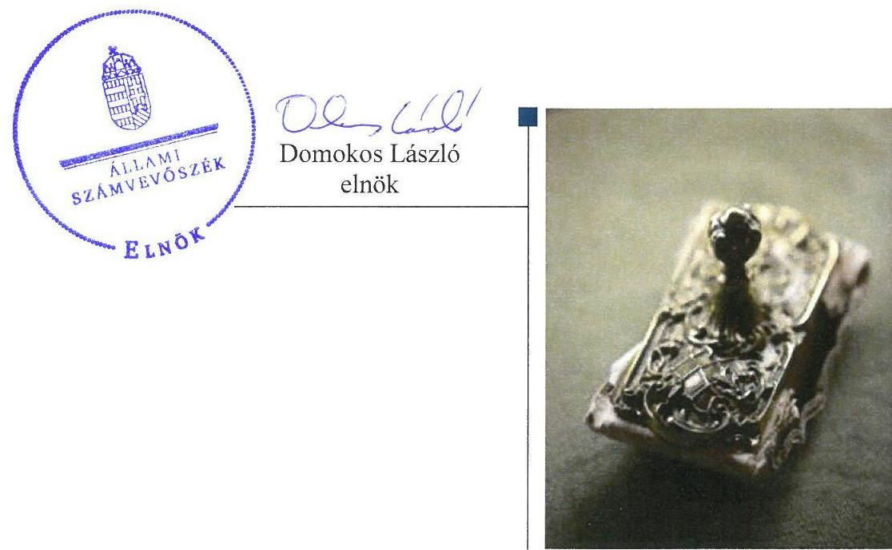
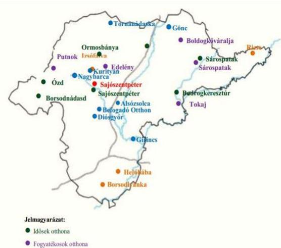
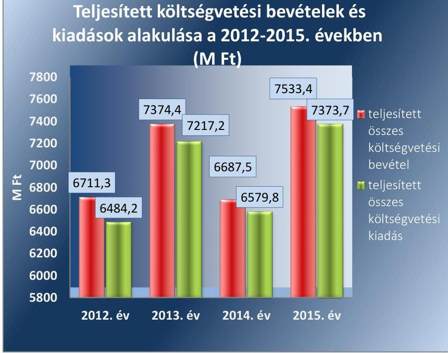
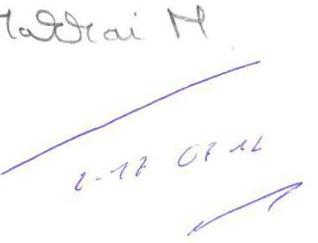
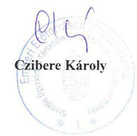
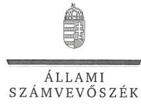
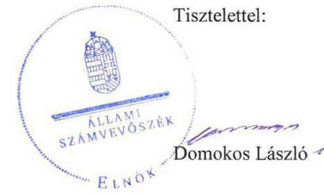
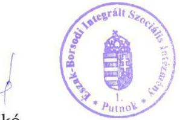
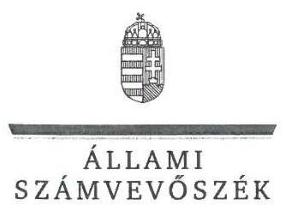
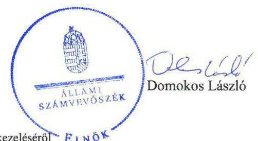

# Jelentés 

## A központi alrendszer intézményei

A központi alrendszer egyes intézményei pénzügyi és vagyongazdálkodásának ellenőrzése - Borsod-Abaúj-Zemplén Megyei Szociális, Gyermekvédelmi Központ és Területi Gyermekvédelmi Szakszolgálat 2017.

---

# Jelentés 

## A központi alrendszer intézményei

A központi alrendszer egyes intézményei pénzügyi és vagyongazdálkodásának ellenőrzése - Borsod-Abaúj-Zemplén Megyei Szociális, Gyermekvédelmi Központ és Területi Gyermekvédelmi Szakszolgálat
2017. október hó 6. nap

---

# AZ ELLENŐRZÉST FELÜGYELTE:

## MAKKAI MÁRIA felügyeleti vezető

## AZ ELLENŐRZÉST VEZETTE ÉS A VÉGREHAJTÁSÁÉRT FELELŐS:

### SCHMIDT JÁNOS ellenőrzésvezető

## A PROGRAM ÖSSZEÁLLÍTÁSÁÉRT FELELŐS:

### JANIK JÓZSEF osztályvezető

---

**IKTATÓSZÁM:** V-1207-121/2016.

**TÉMASZÁM:** 2241

**ELLENŐRZÉS-AZONOSÍTÓ SZÁM:** V076007

---

Jelentéseink az Országgyűlés számítógépes hálózatán és az Interneta a www.asz.hu címen is olvashatóak.

---

# TARTALOMJEGYZÉK 

■ ÖSSZEGZÉS ..... 5
■ AZ ELLENŐRZÉS CÉLJA ..... 6
■ AZ ELLENŐRZÉS TERÜLETE ..... 7
■ AZ ELLENŐRZÉS HÁTTERE, INDOKOLTSÁGA ..... 10
■ A JELENTÉS LÉNYEGES KÉRDÉSKÖREI ..... 11
■ ELLENŐRZÉS HATÓKÖRE ÉS MÓDSZEREI ..... 12
■ MEGÁLLAPÍTÁSOK ..... 14
■ JAVASLATOK ..... 23
■ MELLÉKLETEK ..... 25
I. Sz. melléklet: Értelmező szótár ..... 25
II. Sz. melléklet: Az integritás érvényesítése érdekében kialakított és múködtetett kontrollrendszer értékelése ..... 29
■ FÜGGELÉK: ÉSZREVÉTELEK ..... 31
■ RÖVIDÍTÉSEK JEGYZÉKE ..... 51

---

.

---

# ÖSSZEGZÉS 

A Borsod-Abaúj-Zemplén Megyei Szociális, Gyermekvédelmi Központ és Területi Gyermekvédelmi Szakszolgálatra vonatkozó irányítószervi feladatellátás megfelelt, a középirányító szervek tevékenysége nem felelt meg a jogszabályi előírásoknak. Az Intézményvezető által kialakított belső irányítási rendszer nem biztositotta a szabályszerü, átlátható és elszámoltatható közpénzfelhasználást. Az Intézmény pénzügyi gazdálkodása összességében nem volt szabályszerü. Az Intézmény vagyongazdálkodása nem felelt meg a jogszabályi előirásoknak. Az Intézmény vezetése nem épített ki megfelelő védelmet a korrupciós veszélyekkel szemben. A közpénzfelhasználás eredményességét a gazdálkodás folyamatában mérhető célok nem támasztották alá.

## Az ellenőrzés társadalmi indokoltsága

A közpénzek felhasználásában és az állami vagyonnal való gazdálkodásban a központi alrendszer egyes intézményei meghatározó súlyt képviselnek. E szervezetekkel szemben társadalmi igény, hogy tevékenységükről a döntéshozók és a nyilvánosság felé elszámoljanak. A társadalmi igénnyel és az ÁSZ Stratégiájával összhangban, a közpénzügyek átláthatóságának előmozdítása, a közvagyon védelme érdekében került sor a Borsod-Abaúj-Zemplén Megyei Szociális, Gyermekvédelmi Központ és Területi Gyermekvédelmi Szakszolgálat pénzügyi- és vagyongazdálkodásának ellenőrzésére, a 2012 -2015. évek vonatkozásában.

## Főbb megállapítások, következtetések, javaslatok

A Borsod-Abaúj-Zemplén Megyei Szociális, Gyermekvédelmi Központ és Területi Gyermekvédelmi Szakszolgálatra vonatkozó irányítószervi feladatellátás megfelelt az előírásoknak. Az irányító szervek az egyéb irányítási, felügyeleti és ellenőrzési jogosultságukat szabályszerűen, míg a középirányító szervek nem a jogszabályi előírásoknak megfelelően gyakorolták. 2012-ben a középirányító szerv nem ellenőrizte a közérdekú és közérdekből nyilvános adatok kötelező közzétételét.

A belső kontrollrendszer kialakítása és múködtetése a közpénzekkel és a nemzeti vagyonnal történő szabályszerű, gazdaságos, hatékony és eredményes gazdálkodást, illetve a beszámolási és adatszolgáltatási kötelezettségek szabályszerű teljesítését nem biztosította. Kockázatkezelési rendszert az intézménynél a 2012-2014-es években nem alakítottak ki és nem működtettek. A kontrolltevékenységek gyakorlása, múködtetése nem felelt meg a jogszabályokban és a belső szabályzatokban előírtaknak. Az Intézményvezető nem gondoskodott a belső ellenőrzés kialakításáról és múködtetéséről.

Az Intézmény pénzügyi gazdálkodása nem felelt meg a jogszabályi előírásoknak. A kiadási előirányzatok felhasználásánál a pénzgazdálkodási belső kontrollok a 2015. év kivételével nem megfelelően múködtek. A bevételi és kiadási előirányzatok módosítása, valamint az előirányzat-maradvány megállapítása szabályszerűen történt.

Az Intézmény vagyongazdálkodása nem volt szabályszerű, mert a 2012-2014. években vagyonkezelésébe nem tartozó ingatlanok szerepeltek az éves költségvetési beszámolók mérlegében, emiatt a gazdasági szervezetek által készített beszámolók, nem mutattak az Intézmény vagyoni helyzetéről megbízható és valós képet.

Az Intézmény erőfeszítéseket tett az integritás szemlélet érvényesítése érdekében, azonban az integritás kontrollok kiépítettsége nem volt egyensúlyban a korrupciós kockázatok szintjével.

A gazdálkodás folyamatában számszerűsített, mérhető célokat, célértékeket nem határoztak meg.

---

# AZ ELLENŐRZÉS CÉLJA 

A MEGFELELŐSÉGI ELLENŐRZÉS célja annak megítélése volt, hogy az ellenőrzött intézményre vonatkozó irányító szervi feladatellátás a jogszabályi előírások betartásával történt-e; az intézménynél a belső kontrollrendszer kialakítása és működtetése szabályszerű volt-e; kialakították-e az erőforrásokkal való szabályszerű, gazdaságos, hatékony és eredményes gazdálkodáshoz szükséges követelményeket, megvalósították-e azok számonkérését, ellenőrzését; az intézmény pénzügyi és vagyongazdálkodása megfelelt-e a jogszabályi előírásoknak és belső szabályzatainak;

Az intézmény korrupcióval szembeni veszélyeztetettségének csökkentése érdekében felmértük az integritási szemlélet érvényesülését a gazdálkodási folyamatokban.

A kiegészítő teljesítmény-ellenőrzési modul célja annak értékelése volt, hogy a gazdálkodás folyamatában a gazdaságossági, hatékonysági és eredményességi követelmények kialakítása megtörtént-e, azokat működtették-e, a célkitűzéseket elérték-e; a pénzügyi és vagyongazdálkodás folyamataira vonatkozóan a költségvetési szerv belső kontrollrendszerének minőségéről kiadott vezetői nyilatkozatban a költségvetési szerv tevékenységében a hatékonyság, eredményesség, gazdaságosság követelményeinek érvényesítésére vonatkozó nyilatkozat helytálló volt-e.

---

# AZ ELLENŐRZÉS TERÜLETE 

## Borsod-Abaúj-Zemplén Megyei Szociális, Gyermekvédelmi Központ és Területi Gyermekvédelmi Szakszolgálat

Az Intézménynek ${ }^{1}$ a Szoctv. ${ }^{2}$ alapján feladata volt a személyes gondoskodás keretébe tartozó szakosított szociális ellátás, így a fogyatékossággal élők tartós bentlakásos ellátásának, rehabilitációjának, pszichiátriai betegek tartós ellátásának, szenvedélybetegek ápolásának, rehabilitációjának, időskorúak tartós bentlakásos ellátásának, szociális foglalkoztatásának és jelzőrendszeres házi segítségnyújtásának biztosítása. Az Intézménynek a gyermekjóléti, gyermekvédelmi ellátórendszer hálózatának részeként a Gyvt. ${ }^{3}$ alapján szakellátás keretében feladata volt az ideiglenes hatállyal elhelyezett, az átmeneti és a tartós nevelésbe vett gyermekek otthont nyújtó ellátásának, a fiatal felnőtt további utógondozói ellátásának, a szakellátást más okból igénylő gyermek teljes körű ellátásának biztosítása, továbbá egyben a területi gyermekvédelmi szakszolgáltatást is végzett. A 2015. év végén a gyermekvédelemben 1387 férőhelyen, 11 szakmai egységben 1301 fő ellátásáról, a szociális ellátás területén 2685 férőhelyen, 18 szervezeti egységben 2646
fő ellátásáról gondoskodtak.
Az Intézmény a 2012. évtől az önkormányzati alrendszerből a központi alrendszerbe került át.

2012-ben az Intézmény irányítószerve a KIM ${ }^{4}$ volt, a középirányítói feladatokat a MIK ${ }^{5}$ látta el. Az irányítószervi feladatok 2013. január 1-jétől az EMMI ${ }^{6}$-hez kerültek. A MIK 2013. március 31-én a Korm. rendelet ${ }_{1}{ }^{7}$ 18. § (2) bekezdés rendelkezése alapján beolvadással megszűnt, feladatait általános és egyetemleges jogutódként az SZGYF ${ }^{8}$ vette át.

Az Intézmény 2012. március 31-ig önállóan működő és gazdálkodó költségvetési szerv volt, április 1-jétől a Korm. rendelet ${ }_{1}$ 15. § (2) bekezdésének előírása szerint önállóan működő költségvetési szerv lett. Az Intézmény gazdasági szervezettel nem rendelkezett. A gazdálkodásával összefüggő feladatait a Korm. rendelet ${ }_{1}$ 15. § (2) bekezdésének előírása alapján 2012. január 1-jétől a MIK végezte, majd 2013. április 1-jétől az SZGYF látta el. A gazdasági feladatok ellátását a vonatkozó jogszabályok, illetve a 2015. szeptember 17-től az SZGYF-el kötött munkamegosztási megállapodás ${ }^{9}$ szabályozta.

Az Intézményt érintő szervezeti, szerkezeti átalakulásra a 2012-2015. években nem került sor.

Az ellenőrzött időszakot követően két alkalommal 2016. október 10-én és 2017. július 1-én történt az intézmény szakmai feladatellátását és területi tagozódását érintő szervezeti átalakítás. A 2016. október 10-vel történő átalakítást követően az ellenőrzéssel érintett Intézmény, BorsodAbaúj Zemplén Megyei Dr. Csiba László Integrált Szociális Intézmény néven, azonos Törzskönyvi nyilvántartási azonosító számmal múködött to-

---

vább, szűkebb területet érintő szakmai feladatellátással (a korábbi 41 telephely, helyett 11 telephellyel). A 2017. július 1-én történt átalakítás során a feladatellátással érintett terület tovább szűkült (a korábbi 11 telephelyről 4 telephelyre). Az átalakítások során a telephelyek és az azokhoz kapcsolódó szakmai feladatok már meglévő, illetve újonnan alapított intézményekhez kerültek. Az átalakítások az ellenőrzés tárgyát képező belső kontrollrendszert és a gazdálkodási feladatok ellátását nem érintették. Ezért az ÁSZ javaslatainak címzettje és az intézkedési terv elkészítésére a BorsodAbaúj Zemplén Megyei Dr. Csiba László Integrált Szociális Intézmény vezetője kötelezett.

A Konsz. tv. értelmében a megyei önkormányzatok fenntartásában lévő intézmények, azok vagyona és vagyoni értékű jogai 2012. január 1-jén a törvény erejénél fogva állami tulajdonba kerültek. Az önkormányzati alrendszerből átkerült intézményi vagyon tekintetében 2012. január 1-jétől a tulajdonosi jogokat - a Vtv. ${ }^{10}$ alapján - az állami vagyon felügyeletéért felelős miniszter gyakorolta, aki e feladatát az MNV Zrt. ${ }^{11}$ útján látta el. A vagyonkezelői jogokat 2012. január 1-jétől - a Korm. rendelet; alapján - a MIK gyakorolta. A MIK 2013. március 31-én az SZGYF-be történt beolvadással megszűnt, és az átvett vagyon tekintetében a vagyonkezelői feladatokat a Korm. rendelet ${ }^{12}$ alapján a továbbiakban az SZGYF főigazgatója látta el.

Az Intézményben dolgozók átlagos statisztikai állománya a 2012. évben 1153 fő, 2015. évben 1566 fő volt. Az éves költségvetési beszámolók alapján a teljesített költségvetési bevétel a 2012. évi 6711,3 M Ft-ról a 2015. évre 7533,4 M Ft-ra nőtt. A teljesített kiadások összege a 2012. évben 6 484,2 M Ft volt, ami a 2015. évre 7 373,7 M Ft-ra nőtt. Az éves költségvetési számok közötti változásokat az évközben átadott, illetve átvett feladatok bevételi-, és költségkihatásai okozták. Az Intézmény teljesített költségvetési bevételeinek és kiadásainak alakulását az 1. ábra szemlélteti:

1. ábra

Teljesített költségvetési bevételek és kiadások alakulása a 2012-2015. években
(VI. Ft.)

Forrás: Intézményi beszámolók adatai

---

Az Intézmény mérleg főösszege a 2012. január 1-jei 4328,1 M Ft-ról 2015. év végére 957,9 M Ft-ra csökkent. A csökkenés oka, hogy a Konsz.tv. ${ }^{13}$ végrehajtásával összefüggésben az Intézmény vagyonkezelésében lévő ingatlanok nyilvántartási értéke az Intézmény mérlegéből kivezetésre került.

---

# AZ ELLENŐRZÉS HÁTTERE, INDOKOLTSÁGA 

AZ ÁLLAMHÁZTARTÁS KÖZPONTI ALRENDSZERÉNEK KÖZPÉNZ felhasználása, az intézmények által ellátott közfeladatok sokrétűsége, valamint a feladatellátásához rendelt vagyon nagyságrendje indokolja, hogy az ÁSZ ${ }^{14}$ ellenőrzéseket folytasson a pénzügyi és vagyongazdálkodás területén. Az ÁSZ az ellenőrzései során feltárja a gazdálkodást, a központi alrendszer intézményei átalakulását, átszervezését érintő szabályozások esetleges hiányosságait, a szabályozással nem érintett gazdálkodási területeket, rámutathat a vagyongazdálkodási tevékenység - ezen belül a tulajdonosi joggyakorlás és vagyonkezelés - esetleges szabálytalanságaira, értékeli az állami vagyon nyilvántartására és elszámolására vonatkozó eljárásokat. Az ellenőrzés várhatóan hozzájárul a központi intézmények pénzügyi helyzetének pontosabb megítéléséhez és a jó gyakorlat kialakításán és terjesztésén keresztül az ellenőrzések elősegíthetik a gazdálkodás szabályszerűségének javítását.

AZ ELLENŐRZÉS EREDMÉNYEKÉPPEN nemcsak az ellenőrzött intézmények gazdálkodása javulhat, hanem átfogó képet kaphatunk a központi alrendszerbe tartozó költségvetési szervek gazdálkodásáról, annak hiányosságairól, de a jó gyakorlatokról is. Ellenőrzéseivel, javaslataival és megállapításaival az ÁSZ elősegítheti a költségvetési szervek pénzügyi és vagyongazdálkodása szabályozásának javítását és hozzájárulhat a jó kormányzáshoz. Az ellenőrzés az ellenőrzött számára visszajelzést ad a pénzügyi és vagyongazdálkodásában feltárt hiányosságokról, javaslataival hozzájárul azok kiküszöböléséhez, amely csökkentheti a későbbi ellenőrzések gyakoriságát. Az ellenőrzés megállapításait és javaslatait más szervezetek is hasznosíthatják a rendezett gazdálkodási keretek kialakításához.

---

# A JELENTÉS LÉNYEGES KÉRDÉSKÖREI 

1. Az ellenőrzött Intézményre vonatkozó irányítószervi feladatellátás szabályszerű volt-e?
2. A belső kontrollrendszer kialakítása és müködtetése megfelelt-e a jogszabályi előírásoknak?
3. Az Intézmény pénzügyi gazdálkodása szabályszerű volt-e?
4. Az Intézmény vagyongazdálkodása szabályszerű volt-e?
5. Érvényesült-e az integritás szemlélet és ennek megfelelően ki-építették-e az integritás kontrollrendszert az Intézménynél?
6. Az Intézmény a gazdálkodás folyamatában kitűzött-e célokat és célértékeket, elérésük érdekében meghatározott-e intézkedéseket, feladatokat, illetve teljesítette-e azokat?

---

# ELLENŐRZÉS HATÓKÖRE ÉS MÓDSZEREI 

## Az ellenőrzés típusa

Megfelelőségi és teljesítmény-ellenőrzés

## Az ellenőrzött időszak

Az ellenőrzött időszak 2012. január 1-jétől 2015. december 31-ig tart.

## Az ellenőrzés tárgya

Az ellenőrzött szervezetre vonatkozó irányító szervi feladatok ellátása. Az intézmény belső kontroll rendszerének kialakítása és múködtetése. A pénzügyi és vagyongazdálkodás szabályszerűsége. Az intézmény beszámolási és adatszolgáltatási kötelezettségének teljesítése.

Az ellenőrzés kiterjed minden olyan körülményre és adatra, amely az ÁSZ jogszabályban meghatározott feladatainak teljesítéséhez, valamint a program végrehajtása folyamán felmerült újabb összefüggések feltárásához szükséges.

## Az ellenőrzött szervezet

Borsod-Abaúj-Zemplén Megyei Szociális, Gyermekvédelmi Központ és Területi Gyermekvédelmi Szakszolgálat, irányító szerv ${ }_{1-2}{ }^{15}$-ként a Közigazgatási és Igazságügyi Minisztérium valamint az Emberi Erőforrások Minisztériuma, középirányító szerv ${ }_{1-2}{ }^{16}$-ként a Borsod-Abaúj-Zemplém Megyei Intézményfenntartó Központ és a Szociális és Gyermekvédelmi Főigazgatóság

## Az ellenőrzés jogalapja

Az ellenőrzés jogszabályi alapját az ÁSZ tv. ${ }^{17}$ 1. § (3) bekezdés, 5. § (2)-(6) bekezdései, valamint Áht. ${ }^{18} 61 . \S$ (2) bekezdésének előírásai képezik.

## Az ellenőrzés módszerei

Az ellenőrzést az ellenőrzési program szempontjai, az ellenőrzött időszakban hatályos jogszabályok, az ellenőrzés szakmai szabályai, az egyes ellenőrzési típusokhoz kapcsolódó ÁSZ módszertanok és nemzetközi standardok figyelembe-vételével végeztük.

---

Az ellenőrzési kérdések megválaszolásához szükséges bizonyítékok megszerzése a következő ellenőrzési eljárások alkalmazásával történt: kérdésfeltevés (információkérés), mintavételezés, valamint elemző eljárás. A minták kiválasztása során elsősorban reprezentativitást biztosító véletlen mintavételi eljárást alkalmaztunk.

Az ellenőrzési bizonyítékként felhasználható adatforrások közé tartoztak egyrészt a szakmai program részletes szempontjainál felsorolt adatforrások, másrészt adatforrás volt minden egyéb - az ellenőrzés folyamán feltárt, az ellenőrzés szempontjából releváns információt tartalmazó - dokumentum. Az ellenőrzés lefolytatásához az Intézmény a tanúsítványok elektronikus kitöltésével, valamint az ÁSZ által kért dokumentumok elektronikus megküldésével szolgáltatott adatokat

Az ÁSZ a belső kontrollrendszer jogszabályi előírások szerinti kialakításának és működtetésének szabályszerűségét az erre irányuló ellenőrzési kérdésekre adott válaszok összesítése alapján, a lényegességi szempontok figyelembe vételével évente pillérenként (kontrollkörnyezet, kockázatkezelési rendszer, kontrolltevékenységek, információs és kommunikációs rendszer, monitoring rendszer) és összesítetten is minősítette. Az ÁSZ a pénzügyi gazdálkodás és a vagyongazdálkodás kialakításának és működtetésének szabályszerűségét az erre irányuló ellenőrzési kérdésekre adott válaszok összesítése alapján, a lényegességi szempontok figyelembe vételével évenkénti bontásban minősítette. „Megfelelő"-nek értékelte az ellenőrzött területet, amennyiben a szabályozás, illetve végrehajtás során a jogszabályi követelményeket maradéktalanul, vagy kisebb hiányosságok mellett érvényesítették, „nem megfelelő"-nek értékelte, amennyiben a szabályozás hiányosságai nem biztosították a szabályszerű működés feltételeit, illetve a gazdálkodás folyamatában jelentkező hibák lényegesek, nagyszámúak, vagy rendszerszerűek voltak.

Mintavétellel ellenőriztük az Intézménynél a kiadások előirányzatai felhasználásának, a tárgyi eszközök nyilvántartásba vételének (üzembe helyezés, értékelés, nyilvántartás), a bevételek beszedésének és elszámolásának, a vagyonelemek elidegenítésének és hasznosításának szabályszerűségét. A minta alapján a sokaságban előforduló hibaarányt becsültük. Az értékelés eredményeként kétféle, "Megfelelő" és "Nem megfelelő" minősítést alkalmaztunk. „Megfelelő"-nek értékeltünk egy ellenőrzött területet, amennyiben a hibaarány a teljes sokaságban 95\%-os bizonyossággal legfeljebb 10\% arányt képviselt. Abban az esetben, ha adott sokaság tekintetében a 10\%-os hibaarány küszöbérték átlépése megítélésének megbízhatósága nem érte el a 95\%-ot, annak elérése érdekében értékelésünket lényegességi alapon további szempontokkal egészítettük ki, és figyelembe vettük a feltárt hibák értékét.

Az integritás szemlélet érvényesülésének értékelése az Intézmény által kitöltött kérdőív és az ellenőrzés tapasztalatai alapján történt.

A teljesítmény-ellenőrzési kiegészítő modul ellenőrzése során értékeltük, hogy az Intézmény a gazdálkodás folyamatában a gazdaságossági, hatékonysági és eredményességi célokat és célértékeket kialakította-e, a célkitűzéseket elérte-e.

Az ellenőrzés során minden olyan körülményt és adatot is ellenőriztünk, amely a program végrehajtása kapcsán felmerült újabb összefüggéseknek az ellenőrzés céljaival összhangban lévő feltárásához szükséges volt.

---

# 1. Az ellenőrzött Intézményre vonatkozó irányítószervi feladatellátás szabályszerű volt-e? 

Összegző megállapítás

Az irányító szervek ellenőrzött intézményre vonatkozó feladatellátása megfelelt, a középirányító szervek irányítószervi feladatellátása nem felelt meg a jogszabályi előírásoknak.
1.1. számú megállapítás

Az irányító szervek alapítással kapcsolatos joggyakorlása megfelelt a jogszabályi előírásoknak.

ALAPÍTÓ OKIRAT ${ }_{1-4}{ }^{19}$-gyel az Intézmény az Áht. előírásainak megfelelően rendelkezett, amelyet a közigazgatási és igazságügyi miniszter nevében eljáró államtitkár, illetve az emberi erőforrások minisztere adott ki. Az alapító okirat ${ }_{1-4}$ kiadása az Áht.-ban előírtak szerint az államháztartásért felelős miniszter előzetes egyetértésével történt.

Az alapító okirat ${ }_{1-4}$ tartalma az Ávr. ${ }^{20}$-ben előírtaknak megfelelt.
1.2. számú megállapítás

Az irányító szervek az egyéb irányítási, felügyeleti és ellenőrzési jogosultságukat szabályszerűen, a középirányító szervek nem szabályszerűen gyakorolták.

Az irányító szervek tájékoztató körlevelekben az Ávr.-ben előírtak szerint a tervezett bevételek megállapításához kiadták az általános és kötelezően érvényesítendő tervezési követelményeket, és jóváhagyták az Intézmény elemi költségvetését, az éves létszám-előirányzatát. A költségvetési beszámolók, és az előirányzat-maradványok jóváhagyása az Áht. előírásának megfelelően történt.

A Korm. rendelet ${ }_{1-2}$ alapján a középirányító szerv ${ }_{1-2}$ az Intézmény bevételi és kiadási előirányzatokkal való gazdálkodását figyelemmel kísérte, az Intézmény vezetőjét az éves szakmai feladatellátásról, valamint az éves gazdálkodásról beszámoltatta. Az Intézmény rendelkezett SZMSZ ${ }_{1-4}{ }^{21}$-gyel, amely az Áht. és a Gyvt. előírásának megfelelően jóváhagyásra került.

Az Intézmény közfeladatai ellátásához használt vagyonelemek vagyonkezelője a középirányítószerv ${ }_{1-2}$ volt. A középirányító szerv ${ }_{1-2}$ az MNV Zrt.vel megkötött vagyonkezelési szerződés ${ }^{22}$ 4.5.1 c) pontja alapján jogosult volt a vagyonelemek használatba adására. A középirányító szerv ${ }_{1-2}$ a vagyonkezelésükben lévő vagyonelemek szabályszerű működtetéséről nem gondoskodott, mivel - a Vtv. 25. § (4) bekezdésében rögzítetteknek megfelelő - a nemzeti vagyon hasznosítására irányuló szerződést nem kötötték meg. Így 2012. évben a középirányító szerv ${ }_{1}$, majd 2013-2015. években az középirányító szerv ${ }_{2}$ - a Korm. rendelet ${ }_{1}$ 11. § (2) bekezdés d) pontjában, illetve a Korm. rendelet ${ }_{2}$ 3. § (2) bekezdés g) pontjában előírtak ellenére nem érvényesítette a vagyonnal való szabályszerű gazdálkodáshoz szükséges követelményeket.

---

A 2012. évben a középirányító szerv ${ }_{1}$ nem ellenőrizte az államháztartással összefüggő közérdekú és közérdekből nyilvános adatok kötelező közzétételének, illetve igényre történő szolgáltatásának végrehajtását a Korm. rendelet ${ }_{1} 11$ § 2) bekezdés c) pontjában előírtak ellenére.

# 2. A belső kontrollrendszer kialakítása és múködtetése megfelel-te a jogszabályi előírásoknak? 

## Összegző megállapítás

A belső kontrollrendszer kialakítása és múködtetése nem felelt meg a jogszabályi előírásoknak

A belső kontrollrendszer évenkénti és összesített értékelését az 1. táblázat tartalmazza.

1. táblázat

| A BELSŐ KONTROLLRENSZER KIALAKÍTÁSÁNAK ÉS MŰKÖDTETÉSÉNEK ÉRTÉKELÉSE |  |  |  |  |  |  |
| :--: | :--: | :--: | :--: | :--: | :--: | :--: |
| Megnevezés | Kontrollkörnyezet | Kockázatkezelési rendszer | Kontrolltevékenységek | Információ és kommunikáció | Monitoring | ÖSÖZSEN |
| 2012. | nem szabályszerű | nem szabályszerű | nem szabályszerű | nem szabályszerű | nem szabályszerű | nem szabályszerű |
| 2013. | nem szabályszerű | nem szabályszerű | nem szabályszerű | nem szabályszerű | nem szabályszerű | nem szabályszerű |
| 2014. | nem szabályszerű | nem szabályszerű | nem szabályszerű | nem szabályszerű | nem szabályszerű | nem szabályszerű |
| 2015. | nem szabályszerű | nem szabályszerű | nem szabályszerű | nem szabályszerű | nem szabályszerű | nem szabályszerű |

2.1. számú megállapítás

A kontrollkörnyezet kialakítása nem felelt meg a jogszabályi előírásoknak.

A KONTROLLKÖRNYEZET kialakítása nem volt szabályszerű az Intézménynél.

Az Intézmény 2012. április 1-jétől 2013. december 31-ig rendelkezett a Számv. tv. ${ }^{23}$-ben előírt szabályzatokkal - számviteli politika ${ }_{1-2}{ }^{24}$, és az annak keretében elkészített leltárkészítési és leltározási szabályzat ${ }_{1-2}{ }^{25}$, eszközök és források értékelési szabályzat ${ }_{1-2}{ }^{26}$, pénzkezelési szabályzat ${ }_{1}{ }^{27}$ és önkölt-ség-számítási szabályzat ${ }_{1}{ }^{28}$ - mert a gazdálkodással összefüggő feladatokat ellátó gazdasági szervezet ${ }_{1}{ }^{29}$ a számviteli politikájában ${ }_{2}$ - az Áhsz. ${ }_{1}$ előírása alapján - döntött arról, hogy annak rendelkezéseit és a számviteli politikája keretében elkészített szabályzatainak hatályát kiterjeszti az Intézményre.

Az Intézmény 2014. január 1-jétől az ellenőrzött időszak végéig számviteli politikával, és az annak keretében elkészítendő szabályzatokkal nem rendelkezett. A gazdasági szervezet ${ }_{2}$ a számviteli politikáját ${ }^{30}$ és az annak keretében elkészített szabályzatok hatályát - az Áhsz. ${ }_{1}$ 8. § (13), az Áhsz. ${ }_{2}{ }^{31}$ 50.§ (1) bekezdésében, és az abban hivatkozott 31. § (1) bekezdéseiben foglaltak ellenére - 2013. december 31-ét követően nem terjesztette ki az Intézményre, és önállóan, szabályosan kiadmányozott formában sem adta ki azokat.

---

A 2015. szeptember 17-től érvényes munkamegosztási megállapodás alapján a vonatkozó szabályzatok elkészítése intézményi, míg az elkészítésben való együttműködés és a szabályzat jóváhagyása a gazdasági szervezet ${ }_{2}$ feladata volt.

Az Intézmény csak a 2014-2015. években rendelkezett a Kbt. ${ }_{2}{ }^{32}$-ben előírt közbeszerzési szabályzattal ${ }^{33}$, illetve az Ávr.-ben előírt, a Kbt. hatálya alá nem tartozó beszerzések lebonyolításával kapcsolatos beszerzési szabályzattal ${ }^{34}$. 2012 - 2013-ban a - Kbt. ${ }_{1}{ }^{35}$ 22. § (1)-(2) bekezdésében, valamint az Ávr. 13. § (2) bekezdés b) pontjában előírtakkal ellentétben - a fenti szabályzatok nem készültek el.

A 2012-2013. években az Intézmény nem rendezte belső szabályzatban az Ávr. 13. § (2) bekezdés c), f) és g) pontokban előírtak ellenére a belföldi és külföldi kiküldetések elrendelésével és lebonyolításával, elszámolásával kapcsolatos kérdéseket, a gépjárművek igénybevételének és használatának, valamint a vezetékes és mobiltelefonok használatának rendjét.

Az Intézmény a 2012. évben nem rendelkezett a Bkr. ${ }^{36}$ 6. § (3) bekezdésében előírt, a múködési folyamatainak megfelelő ellenőrzési nyomvonallal. Az Intézmény vezetője 2013-tól gondoskodott a Bkr. szerint előírt ellenőrzési nyomvonal ${ }_{1-2}{ }^{37}$ elkészítéséről, de az ellenőrzési nyomvonal ${ }_{2}$ a Bkr. 6. § (3) bekezdésében előírtak ellenére sem tartalmazta a költségvetés tervezésével kapcsolatos felelősségi és információs szinteket, ellenőrzési és irányítási folyamatokat. Az Intézmény vezetője a Bkr. 6. § (4) bekezdésében előírtak ellenére a szabálytalanságok kezelésének eljárásrendjét ${ }^{38}$ csak 2015.közepétől szabályozta.

# 2.2. számú megállapítás 

## A kockázatkezelési rendszer kialakítása és múködtetése nem felelt meg a jogszabályi előírásoknak.

KOCKÁZATKEZELÉSI RENDSZERT az intézményvezető 2012-2014. között és 2015 első félévében a Bkr. 3. § b) pontjában és a Bkr. 7. § (1) bekezdésében előírtak ellenére nem alakított ki. Az Intézmény 2015. július 1-jétől rendelkezett kockázatkezelési szabályzat ${ }^{39}$-tal és múködtetett olyan kockázatkezelési rendszert, amelyben megállapításra kerültek a tevékenységben, gazdálkodásban rejlő kockázatok, meghatározásra kerültek az ezekkel kapcsolatban szükséges intézkedések, valamint a folyamatos teljesítés nyomon követésének módjai.
2.3. számú megállapítás

A kontrolltevékenységek szabályozottsága összességében megfelel, gyakorlása, múködtetése nem felelt meg a jogszabályokban és a belső szabályzatokban előírtaknak.

## A GAZDÁLKODÁSI JOGKÖRÖK GYAKORLÁSÁNAK

feltételeit- a Bkr., az Áht. és az Ávr. előírásainak megfelelően - az Intézmény és gazdasági szervezet ${ }_{1-2}$, a kötelezettségvállalási szabályzat ${ }_{1-2}{ }^{40}$, illetve 2015. szeptemberétől a munkamegosztási megállapodás elkészítésével biztosította.

Az intézményvezető kötelezettségvállalásra, utalványozásra történő felhatalmazást a 2013. év kivételével adott, a teljesítésigazolásra jogosultakat a 2012-2015 közötti években kijelölte.

---

# Megállapítások 

A gazdálkodási jogkörök gyakorlói aláírás mintáit tartalmazó nyilvántartást az Ávr. 60. § (3) bekezdésben előírtak ellenére nem naprakészen vezette az Intézmény.

A kifizetésekhez kapcsolódó gazdálkodási jogkörök gyakorlását szabálytalanságok jellemezték a 2012-2015. években. A feltárt hiányosságokat részletesen a 3.3. számú megállapítás tartalmazza.
2.4. számú megállapítás

Az információs és kommunikációs folyamatok kialakítása és múködtetése nem felelt meg a jogszabályi előírásoknak.

AZ INTÉZMÉNY INFORMÁCIÓS-RENDSZERÉT az intézményvezető a Bkr. 3. § d) pontjában és a 9. § (1)-(2) bekezdésében foglalt előírások ellenére - a beszámolási rendszer kivételével - nem alakította ki, a közzétételi kötelezettségének az Info. tv. ${ }^{41}$ 33. § (1) bekezdése rendelkezései ellenére nem tett eleget.

A 2012-2013. évben az Intézmény vezetője az Info. tv. 30. § (6) és a 35. § (3) bekezdései, továbbá az Ávr. 13. § (2) bekezdés h) pontja előírásai ellenére nem szabályozta a közérdekú adatok megismerésére irányuló igények teljesítésének, és a kötelezően közzéteendő adatok nyilvánosságra hozatalának rendjét. Az Intézmény a hiányosságot 2014. július 1-jétől szüntette meg.

Az Intézménynek nem volt iratkezelési szabályzata ${ }^{42}$, mivel a 2012-2015 közötti időszakban készített iratkezelési szabályzatokhoz az Ltv. ${ }^{43}$ 10. § (1) bekezdés a) pontjában foglaltak ellenére az illetékes közlevéltár egyetértésével nem rendelkezett.
2.5. számú megállapítás

Az Intézmény vezetője nem a jogszabályi előírásoknak megfelelően alakította ki és múködtette a szervezet a monitoring rendszerét.

A MONITORING RENDSZER kialakítása és múködtetése, az operatív tevékenységek folyamatos és eseti nyomon követése a Bkr. 10. §ában leírtakkal ellentétben - nem valósult meg az Intézményben.

A monitoring rendszer részeként az operatív tevékenységektől függetlenül végzett belső ellenőrzés kialakításáról az Intézményvezető - az Áht. 70. (1) bekezdésében előírtak ellenére -nem gondoskodott.

Az Intézmény vezetője a költségvetési szerv belső kontrollrendszerének minőségét a Bkr. 11. § (1) bekezdése szerinti nyilatkozataiban annak ellenére értékelte megfelelőre, hogy - a Bkr. 6. § (2) bekezdését figyelmen kívül hagyva - nem alakított ki és nem múködtetett olyan folyamatokat, amelyek a rendelkezésre álló források szabályszerű, gazdaságos, hatékony és eredményes felhasználását biztosították volna.

---

# 3. Az Intézmény pénzügyi gazdálkodása szabályszerű volt-e? 

## Összegző megállapítás

Az Intézmény pénzügyi gazdálkodása nem volt szabályszerű.
3.1. számú megállapítás

Az elemi költségvetés és az előirányzatok megállapítása során betartották a jogszabályi előírásokat és a belső szabályzatokban foglaltakat.

AZ ÉVES ELEMI KÖLTSÉGVETÉSEK TERVEZÉSÉVEL kapcsolatos feladatokat az Ávr. előírásainak megfelelően, az ügy-rend ${ }_{1-2}{ }^{44}$-ben, a 2015. szeptember 17-én megkötött munkamegosztási megállapodásban és a munkaköri leírásokban rögzítették. Az Intézmény elemi költségvetését 2012-ben a gazdasági szervezet ${ }_{1}$, illetve 2013-2015. években a gazdasági szervezet ${ }_{2}$, az Áht. -ban, az Ávr.-ben, az NGM ${ }^{45}$ rendeletek ${ }_{1-2}{ }^{46}$-ben foglalt előírások szerinti tartalommal állította össze. Az éves elemi költségvetések, az azokban foglalt előirányzatok megállapítása megfeleltek a jogszabályi előírásoknak és a belső szabályzatokban foglaltaknak.
3.2. számú megállapítás

A bevételi és kiadási előirányzatok módosítása szabályszerű volt.
AZ ELŐIRÁNYZAT MÓDOSÍTÁSOKRA, ÁTCSOPORTOSÍTÁSOKRA a 2012. évben döntően kormányzati, 20132015. években irányító szervi hatáskörben került sor. Az előirányzat módosításokról, átcsoportosításokról vezetett nyilvántartás megfelelt az Ávr. előírásainak, 2014. évtől megfelelt az Áhsz. 2 14. melléklet I. pontjában foglalt előírásoknak.

Az előirányzat módosítások, átcsoportosítások hatáskörönkénti bontását a 2. táblázat tartalmazza:
2. táblázat

ELŐIRÁNYZAT-MÓDOSÍTÁSOK, ÁTCSOPORTOSÍTÁSOK HATÁSKÖRÖNKÉNTI BONTÁSBAN (M FT-BAN)

| Megnevezés | 2012. év | 2013. év | 2014. év | 2015. év | Összesen |
| :--: | :--: | :--: | :--: | :--: | :--: |
| országgyűlési |  |  |  |  |  |
| kormányzati | 1499,9 | 93,8 | 209,0 | 157,5 | 1960,2 |
| irányító szervi | 15,5 | 517,0 | $-728,4$ | 698,7 | 502,8 |
| intézményi | 733,0 | 416,8 | 246,0 | 150,1 | 1545,9 |
| Összesen | 2248,4 | 1027,6 | $-273,4$ | 1006,3 | 4008,9 |

3.3. számú megállapítás

A kiadási előirányzatok felhasználása a gazdálkodási jogkörgyakorlás szabálytalanságai miatt nem felelt meg a jogszabályi előírásoknak. A bevételek beszedése és elszámolása a 2013. év kivételével nem volt szabályszerű.

A kiadási előirányzatokat szabályszerűen, a törvényi előírásokkal összhangban álló feladatokra használták fel, de ennek során a gazdálkodási jogkörök gyakorlása a 2012-2014. években nem felelt meg az Áht. az Ávr. és a kötelezettségvállalási szabályzat ${ }_{1-2}$-ben foglalt előírásoknak. A személyi, dologi

---

és a felhalmozási kiadások kifizetése és elszámolása során, a pénzgazdálkodási jogkörök - az Intézmény és a gazdasági tevékenységet végző szervezetek vonatkozásában - gyakorlásának szabályszerűségével kapcsolatban, az ellenőrzés által feltárt hiányosságokat a 3. táblázat tartalmazza.
3. táblázat

# A GAZDÁLKODÁSI JOGKÖRÖK GYAKORLÁSÁNAK HIÁNYOSSÁGAI A 2012-2015. ÉVEKBEN 

## Intézmény kötelezettségvállalása

A személyi juttatásoknál a 2013. és 2014. években a kiadásokat nem alapozta meg kötelezettségvállalás, mert azt - az Ávr. 52. § (1) bekezdésében előírtak ellenére - írásbeli felhatalmazás hiányában jogosultsággal nem rendelkező személy végezte.

## Intézmény teljesítésigazolása

A dologi és felhalmozási kiadásoknál a teljesítés igazolása - az Ávr. 57. § (3)-(4) bekezdésében foglalt előírások ellenére - nem történt meg, mert azt nem az arra jogosult végezte el.

## Intézmény utalványozása

Az utalványozás - az Ávr. 59. § (1) bekezdésében foglalt előírások ellenére - a dologi kiadásoknál és a felhalmozási kiadásoknál, 2012- 2014-ben nem történt meg, mert azt nem az arra jogosult végezte el.

## Gazdasági szervezet ${ }_{1-2}$ pénzügyi ellenjegyzése

Az Áht. 37 § (1) bekezdésében előírtak ellenére, a személyi juttatások esetében a pénzügyi ellenjegyzésre nem került sor. Nem volt pénzügyi ellenjegyzés a felhalmozási kiadásoknál sem a 2012-2013-as években - az Ávr. 55. (1) bekezdésében, és az Ávr. 55. § (2) bekezdés ca) pontjában foglalt előírás ellenére - mivel azt nem az arra jogosult, írásbeli felhatalmazással rendelkező személy végezte.

## Gazdasági szervezet ${ }_{1-2}$ érvényesítése

Érvényesítés - az Ávr. 58. § (1) bekezdéseiben foglalt előírások ellenére - nem történt meg a személyi, dologi és a felhalmozási kiadásoknál, mivel azt nem az arra jogosult személy végezte el. Továbbá - az Ávr. 58. § (2) bekezdéseiben foglaltak ellenére - nem jelezték az utalványozó felé a megelőző ügymenetben az Áht., Ávr.,és Áhsz, illetve a vonatkozó szabályzatok megsértését, illetve a teljesítésigazolással és pénzügyi ellenjegyzéssel kapcsolatos hiányosságok során a megelőző ügymenetben tapasztalt szabálytalanságokat.

Forrás: Az Intézmény adatszolgáltatása alapján készített ÁSZ összesítő kimutatás

A bevételek beszedése és elszámolása a 2013. év kivételével nem a jogszabályi előírásoknak megfelelő volt. Az Intézménynél a bevétel összegének megállapítását alátámasztó, az ellenőrzött időszakot megelőzően megkötött szerződések, megállapodások dokumentumai, a Számv.tv. 169. § (2) bekezdésében előírtak ellenére több esetben hiányoztak.
3.4. számú megállapítás

A gazdasági szervezet ${ }_{1-2}$ nem a jogszabályi előírások szerint készítette el az Intézmény 2012 - 2014. évi költségvetési beszámolóit, azok nem mutattak megbízható, valós képet az Intézmény vagyoni helyzetéről, ezért nem volt biztosítva az elszámoltathatóság.

A KÖLTSÉGVETÉSI BESZÁMOLÓKAT a jogszabályi előírások alapján a gazdasági szervezet ${ }_{1-2}$ minden évben elkészítette. Az Intézmény 2012-2015. évi költségvetési beszámolóit az Áhsz. ${ }_{1,2}$ előírásai szerinti bontásban készítették el, a beszámolókat minden évben fökönyvi kivonat és leltár támasztotta alá.

Az ellenőrzés a következő hiányosságokat tárta fel:
A 2012. évi, az Áht.-ben előírt, zárszámadáshoz kapcsolódó adatszolgáltatás nem felelt meg a jogszabályi előírásoknak, mert az Ávr. 161. § (1) és (3) bekezdések előírása ellenére a költségvetési beszámoló szöveges indokolása nem állt rendelkezésre.

---

$\longrightarrow$Az Intézmény gazdálkodással összefüggő feladatait ellátó gazdasági szervezet ${ }_{1-2}$ az Intézmény 2012-2014. évi mérlegeiben - az Áhsz. 1 20. § (2) bekezdésében és az Áhsz. 2 10. § (2) bekezdésében előírtak ellenére - az Intézmény vagyonkezelésébe nem tartozó ingatlanvagyont mutatott ki. A szabálytalanul szerepeltetett ingatlanok értéke meghaladta - a Számv tv. 3. § (3) bekezdés 3. pontjában, az Áhsz. 15 . § 8. pontjában, valamint az Áhsz. 2 1. § (1) bekezdés 3. pontjában lévő - jelentős összegű hiba mértékét. Az állami ingatlanvagyon intézményi mérlegben történő hibás kimutatásával megsértették a Számv. tv. 15. § (3) bekezdésében előírt valódiság elvét.
Az Intézményi beszámolókban helytelenül kimutatott állami tulajdonú ingatlan vagyon értékét a 4. táblázat mutatja be:
4. táblázat

# AZ INTÉZMÉNYI BESZÁMOLÓBAN SZABÁLYTALANUL KIMUTATOTT VAGYON ÉRTÉKE 

|  | 2012. év | 2013. év | 2014. év |
| :--: | :--: | :--: | :--: |
| Ingatlanok és kapcsolódó   vagyon értékú jogok (M Ft) | 3791,8 | 3695,6 | 3640,8 |
| Mérlegfőösszeg (M Ft) | 4328,1 | 4225,7 | 4156,0 |
| Ingatlanok / Mérlegfőösszeg (\%) | 87,6 | 87,5 | 87,6 |

Forrás: Intézményi beszámolók adatai
3.5. számú megállapítás

Végrehajtották az előirányzat felhasználáshoz kapcsolódó évközi korlátozó intézkedéseket, teljesítették a befizetési kötelezettségeket, és szabályszerű volt az előirányzat maradvány megállapítása.

Az Intézményt a 2012. évben érintette előirányzat zárolás a személyi juttatások és a munkaadókat terhelő járulékok vonatkozásában. A zárolás az év végével feloldásra került, az előirányzatot nem vonták el.

A tárgyévi előirányzat-maradvány megállapítása során betartották az Áhsz. 1,2 és az Ávr. előírásait.

## 4. Az Intézmény vagyongazdálkodása szabályszerű volt-e?

Összegző megállapítás
Az Intézmény vagyongazdálkodása nem felelt meg a jogszabályi előírásoknak.
4.1. számú megállapítás

A vagyongazdálkodás feltételeinek kialakítása nem volt szabályszerű. Az Intézmény a közfeladat ellátásához szükséges ingatlan vagyont szerződés nélkül használta.

A KONSZ. TV. ELŐÍRÁSA szerint, valamint a Korm. rendelet ${ }_{1}$ alapján 2012. január 1. napjától az Intézmény használatában lévő ingó és ingatlan vagyon a Magyar Állam tulajdonába került.

Az állami tulajdonba került vagyonelemek vagyonkezelője a középirányítószerv ${ }_{1-2}$ volt, az MNV Zrt.-vel 2012. október 25-én kötött vagyonkezelési szerződést alapján.

---

# Megállapítások 

A középirányító szerv $1-2$ és az Intézmény között - a Vtv. 25. § (4) bekezdésében rögzítettek ellenére - az ingó és ingatlan vagyontárgyak hasznosítására vonatkozóan szerződés az ellenőrzött időszakban nem jött létre.

A Konsz. tv. hatályba lépése előtt, az Intézmény vagyonkezelésében szereplő vagyon, számviteli nyilvántartásokból való kivezetéséről - a Számv. tv. 15. § (3) bekezdésében előírtakkal szemben - a gazdasági szervezet 1 nem, a gazdasági szervezet 2 csak a 2015. évben gondoskodott.

## 4.2. számú megállapítás

## 4.3. számú megállapítás

A mérlegben kimutatott eszközök és források nyilvántartása, értékelése a jogszabályi előírásoknak nem felelt meg.

Az ingatlanvagyon intézményi mérlegben történő hibás kimutatására vonatkozó szabálytalanságot részletesen a 3.4. számú megállapítás tartalmazza.

Az előírásoknak megfelelően megtörtént az eszközök bekerülési értékének megállapítása, állományba vétele. Az Intézménynél a leltározás gyakorisága és a leltár felvételének módja megfelelt a Számv. tv.-ben és az Áhsz.1-2-ben foglaltaknak. Az éves költségvetési beszámolók mérlegtételei a 2012-2015. években leltárral alátámasztottak voltak.

Az Intézménynél bizonylat nélkül kezelt, vagyonként nyilvántartott - a középirányító szerv $1-2$ vagyonkezelésébe tartozó - ingatlanokra vonatkozóan is, az Áhsz. 1 30. § (1) és (9) bekezdéseiben, valamint az Áhsz. 2 17. § (1) bekezdésében előírtak ellenére értékcsökkenést számoltak el és mutattak ki.

Az Intézmény követelésállománya 2012-ről 2015-re 196,0 M Ft-ról, 330,7 M FT-ra növekedett. Az Intézmény év végi kötelezettségállománya a 2012. december 31-i 683,2 M Ft-ról 2015. december 31-re 22,4 M Ft-ra csökkent. A 60 napon túli lejárt szállítói tartozás a 2012. december 31-én 276,7 M Ft volt. A 2012-2014. években az év végi lejárt szállítói kötelezettségállomány főként közüzemi számlákból, árubeszerzésekből és szolgáltatások igénybevételéből adódott.

## A vagyonelemek hasznosítása nem a jogszabályok előírásainak megfelelően történt.

Az Intézmény által a feladatellátáshoz használt vagyonelemek hasznosítása, a 2012. évet megelőzően megkötött szerződések alapján folyamatos volt. A gazdasági szervezet $1-2$ az Intézmény költségvetésének tervezési folyamatában, az ingatlanok bérleti dijából származó bevételt - a Korm. rendelet ${ }_{1} 11 . \S$ (2) a) és e) pontja előírásait figyelembe véve - az Intézménynél számba vette.

A bizonylat (szerződés) nélkül használt ingatlanok hasznosításból befolyt bérleti díjakat - az Áht. 45. § (4) bekezdésében foglaltak ellenére - a 2012. évtől is az intézmény szedte be és számolta el a saját bevételei között.

---

# 5. Érvényesült-e az integritás szemlélet és ennek megfelelően ki- 

építették-e az integritás kontrollrendszert az Intézménynél?

Összegző megállapítás Az Intézmény erőfeszítéseket tett az integritás szemlélet érvényesülésére, azonban az integritás kontrollrendszer kiépítettsége nem volt egyensúlyban a korrupciós kockázatok szintjével.

Az Intézmény 2015. és 2016. években is részt vett az ÁSZ Integritás Projektjében ${ }^{47}$. Az Intézmény a jogszabályok által is előírt szabályossági kontrollokat összességében kiépítette, azonban a korrupciós kockázatokkal szembeni védettséget növelő integritás kontrollok kiépítettsége alacsony volt. Az integritás kontrollrendszer kiépítettségével kapcsolatos megállapításokat a II. sz. melléklet tartalmazza.

## 6. Az Intézmény a gazdálkodás folyamatában kitűzött-e célokat és célértékeket, elérésük érdekében meghatározott-e intézkedéseket, feladatokat, illetve teljesítette-e azokat?

Összegző megállapítás Az Intézmény a gazdálkodási folyamatok tekintetében célokat, célértékeket nem határozott meg, intézkedéseket nem tett.

Az ellenőrzés a teljesítmény-ellenőrzési kiegészítő modul tekintetében megállapította, hogy az Intézmény a gazdálkodás folyamatában számszerúsített, eredményességi, gazdaságossági, hatékonysági követelményeket, mérhető célokat, célértékeket nem határozott meg. Célkitűzések hiányában azok teljesítése nem volt értékelhető.

---

# JAVASLATOK 

Az ÁSZ tv. 33. § (1) bekezdésében foglaltak értelmében az ellenőrzött szervezet vezetője köteles a jelentésben foglalt megállapításokhoz kapcsolódó intézkedési tervet összeállítani és azt a jelentés kézhezvételétől számított 30 napon belül az ÁSZ részére megküldeni. Amennyiben az ellenőrzött szervezet vezetője nem küldi meg határidőben az intézkedési tervet, vagy továbbra sem elfogadható intézkedési tervet küld, az Állami Számvevőszék elnöke az ÁSZ tv. 33. § (3) bekezdése a) és b) pontjaiban foglaltakat érvényesítheti.

## az emberi erőforrások miniszterének

1. Intézkedjen az Intézmény közfeladatainak ellátásához használt, az SZGYF vagyonkezelésében lévő vagyonnal összefüggésben a szerződés elmaradásával, valamint az Intézmény mérlegében történt kimutatásával kapcsolatban feltárt szabálytalanságok tekintetében a munkajogi felelősség tisztázására irányuló eljárás megindításáról, és ennek eredménye ismeretében tegye meg a szükséges intézkedéseket.
(1.2. sz. megállapítás 3. bekezdése és a 3.4. sz. megállapítás
2. bekezdés 2. albekezdése alapján)

## a Szociális és Gyermekvédelmi Főigazgatóság, mint a Borsod-Abaúj Zemplén Megyei Dr. Csiba László Integrált Szociális Intézmény gazdasági szervezeti feladatait ellátó szerv főigazgatójának

1. Intézkedjen az intézményre vonatkozó számviteli politika és annak keretében elkészítendő szabályzatok elkészítésében való együttmüködésről és az elkészült szabályzatok jóváhagyásáról a munkamegosztási megállapodásban foglaltaknak megfelelően.
(2.1. sz. megállapítás 3-4. bekezdése alapján)
2. Intézkedjen, hogy a gazdálkodási jogkörök gyakorlása során a pénzügyi ellenjegyzés és az érvényesités teljes körüen feleljen meg az Ávr.ben elöírtaknak.
(3.3. sz. megállapítás 3. táblázat 4. és 5. soraihoz tartozó részek alapján)

---

3. Intézkedjen a feltárt szabálytalanságok tekintetében a munkajogi felelősség tisztázására irányuló eljárás megindításáról, és ennek eredménye ismeretében tegye meg a szükséges intézkedéseket.
(2.1. sz. megállapítás 3-4. bekezdése, a 3.3. sz. megállapítás 3. táblázat 4. és 5. soraihoz tartozó részek, 3.4. sz. megállapítás 2. bekezdés 2. albekezdése alapján)

# a Borsod-Abaúj Zemplén Megyei Dr. Csiba László Integrált Szociális Intézmény igazgatójának 

1. Intézkedjen a Bkr.-ben elöirt ellenörzési nyomvonal ${ }_{2}$ kiegészitéséröl, hogy az tartalmazza a költségvetés tervezésével kapcsolatos felelősségi és információs szinteket, valamint az ellenőrzési és irányitási folyamatokat.
(2.1 sz. megállapítás 7. bekezdés 2. mondata alapján)
2. Intézkedjen az Ávr.-ben elöirtaknak megfelelően a gazdálkodási jogkörök gyakorlóiról vezetett nyilvántartás naprakész vezetéséről.
(2.3. sz. megállapítás 3. bekezdése alapján)
3. Intézkedjen az Info.tv.-ben elöirt közzétételi kötelezettség teljesitéséről.
(2.4. sz. megállapítás 1. bekezdése alapján)
4. Intézkedjen az iratkezelési szabályzat elkészitéséről és a Ltv.-ben elöirtak szerint az illetékes közlevéltár egyetértésével történő kiadásáról.
(2.4. sz. megállapítás 3. bekezdése alapján)
5. Intézkedjen az Áht. elöirásainak megfelelően a belső ellenőrzés kialakításáról és megfelelő müködtetéséről.
(2.5. sz. megállapítás 2. bekezdése alapján)
6. Intézkedjen, hogy a gazdálkodási jogkörök gyakorlása során a teljesitésigazolás az Ávr.-ben elöirtaknak megfelelően megtörténjen.
(3.3. sz. megállapítás 3. táblázat 2. sorához tartozó rész alapján)

---

# MELLÉKLETEK 

- I. SZ. MELLÉKLET: ÉRTELMEZŐ SZÓTÁR
állami vagyon
állami vagyonnak minősül:
a) az állam tulajdonában lévő dolog, valamint a dolog módjára hasznosítható természeti erő,
b) az a) pont hatálya alá nem tartozó mindazon vagyon, amely vonatkozásában törvény az állam kizárólagos tulajdonjogát nevesíti,
c) az állam tulajdonában lévő tagsági jogviszonyt megtestesítő értékpapír, illetve az államot megillető egyéb társasági részesedés,
d) az államot megillető olyan immateriális, vagyoni értékkel rendelkező jogosultság, amelyet jogszabály vagyoni értékű jogként nevesít. (Forrás: Vtv. 1. § (2) bekezdése)
állami vagyon értékesítése
állami vagyon használója
állami vagyon hasznosítása
állami vagyon hasznosítása kötött szerződés
állami vagyon kezelője /vagyonkezelő
Állami vagyonnak a tulajdonosi joggyakorló maga gazdálkodik, vagy szerződés - így különösen bérlet, haszonbérlet, megbízás - alapján hasznosításra átengedi, illetőleg vagyonkezelésbe, haszonélvezetbe adja. (Forrás: Vtv. 23. § (1) bekezdése, hatályos 2013. június 28-ától)
Az állami vagyonnal a tulajdonosi joggyakorló maga gazdálkodik, vagy szerződés - így különösen bérlet, haszonbérlet, megbízás - alapján hasznosításra átengedi, illetőleg vagyonkezelésbe, haszonélvezetbe adja. (Forrás: Vtv. 23. § (1) bekezdése, hatályos 2013. június 28-ától)
Az állami vagyon hasznosítására kötött szerződések elsődleges célja az állami vagyon hatékony működtetése, állagának védelme, értékének megőrzése, illetve gyarapítása, az állami és közfeladatok ellátásának elősegítése. (Forrás: Vtv. 23. § (2) bekezdése)
Az állami vagyont az MNV Zrt. maga kezeli, vagy szerződés - így különösen bérlet, haszonbérlet, megbízás - alapján központi költségvetési szervnek, természetes vagy jogi személynek, vagy jogi személyiséggel nem rendelkező gazdálkodó szervezetnek hasznosításra átengedi.
(Forrás: Vtv. 23. § (1) bekezdése, hatályos 2012. január 1-jétől)
Az állami vagyonnal a tulajdonosi joggyakorló maga gazdálkodik, vagy szerződés - így különösen bérlet, haszonbérlet, megbízás - alapján hasznosításra átengedi, illetőleg vagyonkezelésbe, haszonélvezetbe adja. (Forrás: Vtv. 23. § (1) bekezdése, hatályos 2013. június 28-ától)
Az állami vagyon hasznosítására kötött szerződések elsődleges célja az állami vagyon hatékony működtetése, állagának védelme, értékének megőrzése, illetve gyarapítása, az állami és közfeladatok ellátásának elősegítése. (Forrás: Vtv. 23. § (2) bekezdése)
Az állami vagyont az MNV Zrt. maga kezeli, vagy szerződés - így különösen bérlet, haszonbérlet, megbízás - alapján központi költségvetési szervnek, természetes vagy jogi személynek, vagy jogi személyiséggel nem rendelkező gazdálkodó szervezetnek hasznosításra átengedi." Az állami vagyonra vonatkozóan az MNV Zrt. kizárólag az Nvtv-ben meghatározott személyekkel köthet vagyonkezelési szerződést. (Forrás: Vtv. 27. § (1) bekezdése, hatályos 2012. január 1-jétől)

---

| ÁSZ Integritás Projekt | Az Állami Számvevőszék 2009-ben indította el a „Korrupciós kockázatok feltérképe- |
| :--: | :--: |
|  | zése - Integritás alapú közigazgatási kultúra terjesztése" című, európai uniós forrás- |
|  | ból megvalósított kiemelt projektjét (Integritás Projekt). Az Integritás Projekt célja, hogy felmérje a közszféra intézményei korrupciós kockázatoknak való kitettségét, illetőleg az azok mérséklésére hivatott kontrollok szintjét. Az Állami Számvevőszék a projekt révén az integritás szemlélet minél szélesebb körrel történő megismertetését, gyakorlatba ültetését kívánja elérni. Az integritás követelményeinek megfelelő szervezeti múködést előnyben részesítő közigazgatási kultúra elterjesztését és a korrupció elleni fellépést az ÁSZ önmagára nézve is stratégiai jelentőségű célként fogalmazta meg. A projekt a felmérésben résztvevő intézmények számára helyzetükről egyfajta „tükörképet" mutat be, ami alapot teremt a jövőbeni pozitív irányú elmozduláshoz. (Forrás: a http://integritas.asz.hu honlapon közzétett, a 2013. évi Integritás felmérés eredményeiről készült összefoglaló tanulmány) |
| belső ellenőrzés | Független, tárgyilagos bizonyosságot adó és tanácsadó tevékenység, amelynek célja, hogy az ellenőrzött szervezet múködését fejlessze és eredményességét növelje, az ellenőrzött szervezet céljai elérése érdekében rendszerszemléletű megközelítéssel és módszeresen értékeli, illetve fejleszti az ellenőrzött szervezet irányítási és belső kontrollrendszerének hatékonyságát. (Forrás: Bkr. 2. § b) pontja) |
| belső kontrollrendszer | A belső kontrollrendszer a kockázatok kezelése és tárgyilagos bizonyosság megszerzése érdekében kialakított folyamatrendszer, amely azt a célt szolgálja, hogy a múködés és gazdálkodás során a tevékenységeket szabályszerűen, gazdaságosan, hatékonyan, eredményesen hajtsák végre, az elszámolási kötelezettségeket teljesítsék, megvédjék az erőforrásokat a veszteségektől, károktól és nem rendeltetésszerű használattól. (Forrás: Áht. 69. § (1) bekezdése) |
| belső kontrollrendszer területei | A kontrollkörnyezet, a kockázatkezelési rendszer, a kontrolltevékenységek, az információs és kommunikációs rendszer, valamint a nyomon követési (monitoring) rendszer. (Forrás: Bkr. 3. §-a) |
| felújítás | Az elhasználódott tárgyi eszköz eredeti állaga (kapacitása, pontossága) helyreállítását szolgáló időszakonként visszatérő olyan tevékenység, melynek során az eszköz élettartama megnövekszik, minősége, használata jelentősen javul, így a pótlólagos ráfordításból a jövőben gazdasági előnyök származnak. (Forrás: Számv. tv. 3. § (4) bekezdés 8. pontja) |
| hasznosítás | A nemzeti vagyon birtoklásának, használatának, hasznok szedése jogának bármely a tulajdonjog átruházását nem eredményező - jogcímen történő átengedése, ide nem értve a vagyonkezelésbe adást, valamint a haszonélvezeti jog alapítását. (Forrás: Nvtv. 3. § (1) bekezdés 4. pontja) |
| információs és kommunikációs rendszer | A költségvetési szerv vezetője által kialakított és múködtetett olyan rendszer, mely biztosítja, hogy a megfelelő információk a megfelelő időben eljutnak az illetékes szervezethez, szervezeti egységhez, illetve személyhez. (Forrás: Bkr. 9. § (1) bekezdés) |
| integritás | Az integritás az elvek, értékek, cselekvések, módszerek, intézkedések konzisztenciáját jelenti, vagyis olyan magatartásmódot, amely meghatározott értékeknek megfelel. (Forrás: Nemzetgazdasági Minisztérium: Magyarországi államháztartási belső kontroll standardok Útmutató 1.6.1. pontja, 2012. december) |
| irányító szerv/ felügyeleti szerv | A költségvetési szerv tekintetében az e törvényben meghatározott irányítási hatáskört gyakorló szerv. (Forrás: Áht. 1. § 9. pontja) |
| jelentős összegű hiba | jelentős összegű hiba: ha a hiba feltárásának évében, a különböző ellenőrzések során, egy adott üzleti évet érintően (évenként külön-külön) feltárt hibák és hibahatások eredményt, saját tőkét növelő-csökkentő - értékének együttes (előjeltől független) összege meghaladja a számviteli politikában meghatározott értékhatárt. Minden esetben jelentős összegű a hiba, ha a hiba feltárásának évében az ellenőrzések során - ugyanazon évet érintően - megállapított hibák, hibahatások eredményt, saját tőkét |

---

kincstári költségvetés
kockázat
kockázatkezelési rendszer
kontrollkörnyezet
kontrolltevékenységek
kommunikáció
középirányító szerv
közfeladat
monitoring
monitoring-rendszer
tulajdonosi joggyakorló
növelő-csökkentő értékének együttes (előjeltől független) összege meghaladja az ellenőrzött üzleti év mérlegfőösszegének 2 százalékát, illetve ha a mérlegfőösszeg 2 százaléka nem haladja meg az 1 millió forintot, akkor az 1 millió forintot; (forrás: Számv. tv. 3. § (3) bekezdés 3. pontja)
A központi költségvetésről szóló törvény elfogadását követően a fejezetet irányító szerv az államháztartás központi alrendszerébe tartozó költségvetési szerv és a fejezeti kezelésű előirányzat kiemelt előirányzatait, valamint az elkülönített állami pénzalapok és a társadalombiztosítás pénzügyi alapjai jogszabályi előírás szerinti bevételeit és kiadásait kincstári költségvetés kiadásával állapítja meg. (Forrás: Áht. 28. § (2) bekezdés)
A kockázat annak a valószínűségét jelenti, hogy egy vagy több esemény vagy intézkedés nem kívánt módon befolyásolja a rendszer múködését, céljainak megvalósulását. (Forrás: Javaslatok a korrupciós kockázatok kezelésére - Kockázatkezelési és ellenőrzési módszertan 35. oldal, ÁSZ)
Olyan irányítási eszközök és módszerek összessége, melynek elemei a szervezeti célok elérését veszélyeztető tényezők (kockázatok) azonosítása, elemzése, csoportosítása, nyomon követése, valamint szükség esetén a kockázati kitettség mérséklése. (Forrás: Bkr. 2. § m) pontja)
A költségvetési szerv vezetője által kialakított olyan elvek, eljárások, belső szabályzatok összessége, amelyben világos a szervezeti struktúra, egyértelműek a felelősségi, hatásköri viszonyok és feladatok, meghatározottak az etikai elvárások a szervezet minden szintjén, átlátható a humánerőforrás-kezelés. (Forrás: Bkr. 6. § (1) bekezdés)
A költségvetési szerv vezetője által a szervezeten belül kialakított (kontroll) tevékenységek, melyek biztosítják a kockázatok kezelését, hozzájárulnak a szervezet céljainak eléréséhez. (Forrás: Bkr. 8. § (1) bekezdés)
Az a tevékenység, melynek során információ továbbítása valósul meg. A kommunikációs folyamat résztvevői között tájékoztatás történik, mely során tényeket, ezek magyarázatát közlik.
A költségvetési szerv tekintetében törvény vagy kormányrendelet alapján meghatározott, átruházott irányítási hatásköröket gyakorló szerv. (Forrás: Áht. 9. § (4) bekezdés)
Jogszabályban meghatározott állami vagy önkormányzati feladat, amit az arra kötelezett közérdekből, a jogszabályban meghatározott követelményeknek és feltételeknek megfelelve végez, ideértve a lakosság közszolgáltatásokkal való ellátását, továbbá az állam nemzetközi szerződésekben vállalt kötelezettségeiből adódó közérdekű feladatokat, valamint e feladatok ellátásakor szükséges infrastruktúra biztosítását is. (Forrás: Nvtv. 3. § (1) bekezdés 7. pontja)
A monitoring általánosságban a különböző szintű szervezeti célok megvalósításának folyamatát kíséri figyelemmel, melynek során a releváns eseményekről és tevékenységekről (együtt: folyamatokról) rendszeres jelleggel, strukturált, döntéstámogató információkhoz jutnak a szervezet vezetői. (Forrás: NGM Útmutató a költségvetési szervek monitoring rendszeréhez 2011. november)
A költségvetési szerv vezetője köteles olyan monitoring rendszert működtetni, mely lehetővé teszi a szervezet tevékenységének, a célok megvalósításának nyomon követését. A költségvetési szerv monitoring rendszere az operatív tevékenységek keretében megvalósuló folyamatos és eseti nyomon követésből, valamint az operatív tevékenységektől függetlenül működő belső ellenőrzésből áll. (Forrás: Bkr. 10. §)
Aki a nemzeti vagyon felett az államot vagy a helyi önkormányzatot megillető tulajdonosi jogok és kötelezettségek összességének gyakorlására jogosult. (Forrás: Nvtv. 3. § (1) bekezdés 17. pontja)

---

vagyongazdálkodás

A nemzeti vagyongazdálkodás feladata a nemzeti vagyon rendeltetésének megfelelő, az állam, az önkormányzat mindenkori teherbíró képességéhez igazodó, elsődlegesen a közfeladatok ellátásához és a mindenkori társadalmi szükségletek kielégítéséhez szükséges, egységes elveken alapuló, átlátható, hatékony és költségtakarékos múködtetése, értékének megőrzése, állagának védelme, értéknövelő használata, hasznosítása, gyarapítása, továbbá az állam vagy a helyi önkormányzat feladatának ellátása szempontjából feleslegessé váló vagyontárgyak elidegenítése. (Forrás: Nvtv. 7. § (2) bekezdése)

---

# - II. SZ. MELLÉKLET: AZ INTEGRITÁS ÉRVÉNYESÍTÉSE ÉRDEKÉBEN KIALAKÍTOTT ÉS MŰKÖDTETETT KONTROLLRENDSZER ÉRTÉKELÉSE 

Az ellenőrzés az Intézménynél kialakított integritás kontrollrendszert öt területen értékelte.
Az Intézménynél az integritás kontrollrendszer - az összesítő értékelés alapján - közepes szintet ért el.
Az összeférhetetlenség és etikai elvárások területéhez kapcsolódó integritás kontrollok szintje közepes volt. Az Intézmény szabályozta az összeférhetetlenség kérdését, nem rendelkezett etikai szabályzattal, és a 2015. évet megelőző három évben az Intézmény munkatársaival szemben nem indult szakmai etikai eljárás kötelezettségszegés miatt, szabályozták a különféle ajándékok elfogadásának, meghívások, utaztatás feltételeit. Az Intézmény a munkatársainak azonban nem volt kötelező nyilatkozniuk a gazdasági érdekeltségeikről, vagy egyéb, a szervezet tevékenysége szempontjából releváns összeférhetetlenségről.

A humánerőforrás-gazdálkodás területhez kapcsolódó integritási kontrollok szintje közepes volt. Az Intézmény minden alkalmazottja rendelkezett munkaköri leírással, ellenőrizték az állásra jelentkezők benyújtott dokumentumainak hitelességét, a megfelelő szakemberek kiválasztásához az Intézmény minden esetben alkalmazott az objektív megítélést lehetővé tévő, általánosan elfogadott módszert. Az új munkatársak kiválasztásakor az Intézmény azonban nem minden esetben írt ki álláspályázatot.

A szervezet vagyonának megvédésére tett intézkedések magas szintűek voltak. Az Intézmény meghatározta a munkáltató tulajdonában, kezelésében lévő egyes eszközök használatára vonatkozó szabályokat. Rendelkezett a vonatkozó jogszabályi előírásokkal összhangban álló iratkezelési, adatkezelési, titokvédelmi és informatikai szabályzattal, szabályozták a külső személyekkel történő kapcsolattartást, és alkalmazták „négy szem elve" eljárást.

A nemkívánatos dolgozói magatartással szembeni intézkedéseknek és azok érvényesülésének értékelése alacsony volt. Az Intézmény rendelkezett belső szabályzattal a szervezeten belüli közérdekű bejelentők védelmére vonatkozóan, működtetett közérdekű bejelentéseket kezelő, valamint a szervezeten kívülről érkező panaszokat és közérdekű bejelentéseket kezelő rendszert. Az Intézmény azonban nem működtetett egyéni teljesítmény-értékelő rendszert.

Az integritás erősítése, tudatosítása, valamint a kockázatelemzések alkalmazása alacsony szintű volt. Az Intézmény nem rendelkezett nyilvánosan közzétett stratégiával, az integritás szemlélet erősítése érdekében szükséges korrupcióellenes képzés nem volt, korrupciós kockázatelemzést nem végeztek.

---

.

---

# FÜGGELÉK: ÉSZREVÉTELEK 

A jelentéstervezetet a Számvevőszék 15 napos észrevételezésre megküldte az ellenőrzött szervezetek vezetőinek az ÁSZ tv. 29. §* (1) bekezdése előírásának megfelelően.

Az ÁSZ a jelentéstervezetet észrevételezésre megküldte a Borsod-Abaúj-Zemplén Megyei Dr. Csiba László Integrált Szociális Intézmény igazgatójának, a Szociális és Gyermekvédelmi Főigazgatóság föigazgatójának, valamint az Emberi Erőforrások miniszterének.
Az Észak-Borsodi Integrált Szociális Intézmény (Borsod-Abaúj-Zemplén Megyei Dr. Csiba László Integrált Szociális Intézmény jogutódja) igazgatójának és az Emberi Erőforrások miniszterének észrevételét és az arra adott válaszokat a függelék alább tartalmazza.
A Szociális és Gyermekvédelmi Főigazgatóság föigazgatója az ÁSZ tv. 29. § (2) bekezdésében foglalt észrevételezési jogával nem élt, a törvényes határidőn belül észrevételt nem tett.

[^0]
[^0]:    * 29. § (1) Az Állami Számvevőszék az ellenőrzési megállapításait megküldi az ellenőrzött szervezet vezetőjének vagy az általa megbízott személynek, és annak, akinek személyes felelősségét állapította meg.
    (2) Az ellenőrzött szervezet vezetője és a felelősként megjelölt személy az ellenőrzés megállapításaira tizenöt napon belül írásban észrevételt tehet.
    (3) Az Állami Számvevőszék az észrevételre a beérkezésétől számított harminc napon belül írásban válaszol. A figyelembe nem vett észrevételeket köteles a jelentésben feltüntetni, és megindokolni, hogy azokat miért nem fogadta el.

---

# 11112 

## 11112

## 11112

## 11112

## 11112

## 11112

## 11112

## 11112

## 11112

## 11112

## EMBERI ERÖFORRÁSOK   MINISZTÉRIUMA   SZOCIÁLIÁIS ÜGYEKÉRT ÉS TÁRSADALMI FELZÁRKÖZÁSÉRT FELELŐS ÁLLAMTITKÁR

Iktatószám:37507-3/2017/SZOCSTRAT

Hiv.sz: V-1207-104/2016
Ügyintéző: Aradi Zsuzsanna
Tel: 896-3101
Melléklet: -

## Domokos László részére

elnök

Állami Számvevőszék
Budapest
Apáczai Csere János utca 10.
1052

Tárgy: A központi alrendszer egyes intézményei pénzügyi és vagyongazdálkodásának ellenőrzése - „Borsod-Abaúj-Zemplén Megyei Szociális, Gyermekvédelmi Központ és Területi Gyermekvédelmi Szakszolgálat"- címủ ellenőrzés jelentéstervezetének észrevételezése

## Tisztelt Elnök Úr!

A központi alrendszer egyes intézményei pénzügyi és vagyongazdálkodásának ellenőrzése „Komárom-Esztergom Megyei Integrált Szociális Intézmény"- címủ ellenőrzés keretében készült jelentéstervezetét köszönettel megkaptam.

A számvevőszéki jelentéstervezet „Javaslatok" része az emberi erőforrások miniszterének 1. sorszám alatt az alábbiakat javasolja.
,,Intézkedjen az Intézmény közfeladatainak ellátásához használt, az SZGYF vagyonkezelésében lévő vagyonnal összefüggésben a szerződés elmaradásával, valamint az Intézmény mérlegében történt kimutatásával kapcsolatosban feltárt szabálytalanságok tekintetében a munkajogi felelősség tisztázására irányuló eljárás megindításáról, és ennek eredménye ismeretében tegye meg a szükséges intézkedéseket."

A javaslattal kapcsolatban az alábbi észrevételt teszem.
Az államháztartásról szóló törvény végrehajtásáról szóló 368/2011. (XII. 31.) Korm. rendelet 11. § (1) bekezdés b) pontja szerint a gazdálkodási feladatok ellátásáért a költségvetési szerv gazdasági vezetője a felelős, (6) bekezdése szerint a gazdasági vezető a feladatait a költségvetési szerv vezetőjének közvetlen vezetése és ellenőrzése mellett látja el.

---

A fentiek alapján indokoltnak tartom, hogy a számvevőszék által feltárt szabálytalanságok tekintetében a Szociális és Gyermekvédelmi Föigazgatóság föigazgatója rendelje el a munkajogi felelősség megállapítására irányuló vizsgálatot, illetve a belső ellenőrzési jelentés alapján a Gyermekvédelmi Föigazgatóság föigazgatója tegye meg a szükséges intézkedéseket, melynek végrehajtását irányítószervi hatáskörben az Emberi Erőforrások Minisztériuma ellenőrzi.

Tájékoztatom Elnök Urat, hogy az EMMI Szervezeti és Müködési Szabályzatáról szóló 33/2014. (IX.16) EMMI utasítás 146. § (1) bekezdés b) pontja alapján az emberi erőforrások minisztere által átruházott hatáskörben gyakorlom a kiadományozási jogot.

Budapest, 2017. július „, ,,,

# Üdvözlettel: 

---

# Balog Zoltán úr 

miniszter

Emberi Erőforrások Minisztériuma

## Budapest

## Tisztelt Miniszter Úr!

„A központi alrendszer egyes intézményei pénzügyi és vagyongazdálkodásának ellenőrzése -Borsod-Abaúj-Zemplén Megyei Szociális, Gyermekvédelmi Központ és Területi Gyermekvédelmi Szakszolgálat" címmel készített számvevőszéki jelentéstervezetre a szociális ügyekért és a társadalmi felzárkózásért felelős Államtitkár úr által a minisztérium nevében tett észrevételt köszönettel megkaptam.

Az Állami Számvevőszék észrevételre vonatkozó álláspontjáról a felügyeleti vezető által készített részletes tájékoztatást csatoltan megküldőm.

Tájékoztatom Miniszter urat, hogy a számvevőszéki jelentésben - az Állami Számvevőszékről szóló 2011. évi LXVI. törvény 29. § (3) bekezdése alapján - a figyelembe nem vett észrevételeket szerepeltetjük, annak indoklásával, hogy azokat az Állami Számvevőszék miért nem fogadta el.

Budapest, 2017. 67 hó 17 nap

Melléklet: Tájékoztatás az észrevétel kezeléséről

---

# Tájékoztatás   az észrevétel kezeléséről 

„A központi alrendszer egyes intézményei pénzügyi és vagyongazdálkodásának ellenörzése -Borsod-Abaúj-Zemplén Megyei Szociális, Gyermekvédelmi Központ és Területi Gyermekvédelmi Szakszolgálat" című jelentéstervezetre 2017. július 12-én érkezett észrevételt áttekintettük, annak kezelésével kapcsolatban a következő tájékoztatást adom.

Az emberi erőforrások miniszterének megfogalmazott 1. számú, a feltárt hiányosságokkal kapcsolatos munkajogi felelősség kivizsgálására irányuló javaslatra tett észrevételre adott válasz:
Az ellenőrzés megállapította, hogy a Borsod-Abaúj-Zemplén Megyei Szociális, Gyermekvédelmi Központ és Területi Gyermekvédelmi Szakszolgálat (Intézmény) közfeladatai ellátásához használt vagyonelemek tekintetében a középirányító szervek, mint vagyonkezelők és az Intézmény - az állami vagyonról szóló 2007. évi CVI. törvényben rögzítetteknek megfelelő - a nemzeti vagyon hasznosítására irányuló szerződést nem kötötték meg. Megállapította továbbá azt is, hogy az Intézmény gazdálkodásával összefüggő feladatokat ellátó gazdasági szervezetek az Intézmény 2012-2014. évi mérlegeiben a számvitelről szóló 2000. évi C. törvény és az államháztartásról szóló 4/2013. (I. 11.) Korm. rendelet rendelkezései ellenére az Intézmény vagyonkezelésébe nem tartozó ingatlanvagyont mutattak ki.
Az Intézmény középirányító szerve és a gazdálkodással összefüggő feladatait ellátó gazdasági szervezete 2012. január 1. és 2013. március 31. között a Borsod-Abaúj-Zemplén Megyei Intézményfenntartó Központ, 2013. április 1-jétől a Szociális és Gyermekvédelmi Főigazgatóság volt.
Tekintettel arra, hogy a Szociális és Gyermekvédelmi Főigazgatóságot érintik az előbbiekben bemutatott hiányosságok, és annak vezetője felett az egyéb munkáltatói jogokat az államháztartásról szóló 2011. évi CXCV. törvény 9. § c) pontja alapján az emberi erőforrások minisztere gyakorolja, a javaslat módosítása nem indokolt.

Budapest, 2017. 07. hó 14. nap

Makkai Mária
felügyeleti vezető

---

# Észak-Borsodi Integrált Szociális Intézmény 3630 Putnok, Bajcsy-Zs. E. út 48. 

## ÁLLAMI SZÁMVEVŐSZÉK $E E-52437 / 2017 / 17$   Érkezett: 2017 JOL 1 \&   Iktalószám: 0-1207-444/2018   Melléklet:   Tárgy: Számvevőszéki jelentéstervezet V-1207102/2016 Ügyiratszám: 9-2/2017. Ügyintéző: Beik-Sike Ildikó Hiv.sz.:   Melléklet: db

Állami Számvevőszék
Budapest
Apáczai Csere János utca 10
1052

## Domonkos László

## Elnök Úr részére

## Tisztelt Elnök Úr!

„A központi alrendszer egyes intézményei pénzügyi és vagyongazdálkodásának ellenőrzése -Borsod-Abaúj-Zemplén Megyei Szociális, Gyermekvédelmi Központ és Területi Gyermekvédelmi Szakszolgálat" címmel készített jelentéstervezetre a következők szerint észrevételt kívánunk tenni:
2. A belsö kontrollrendszer kialakítása és müködtetése megfelelte a jogszabályi elöirásoknak?
2.1. számú megállapítás „A kontrollkörnyezet kialakítása nem felelt meg a jogszabályi elöírásoknak"

Az Intézmény 2012. április 1-jétől 2013. március 31-ig rendelkezett a Számv. tv.-ben elöirt szabályzatokkal, 2013. április 1-jétől az ellenőrzött időszak végéig számviteli politikával és annak keretében elkészítendő szabályzatokkal nem rendelkezett. A gazdasági szervezet a számviteli politikáját és az annak keretében elkészített szabályzatok hatályát - nem terjesztette ki az intézményre, és önállóan, szabályosan kiadmányozott formában sem adta ki azokat."

---

# Észak-Borsodi Integrált Szociális Intézmény 3630 Putnok, Bajcsy-Zs. E. út 48. 

Észrevétel: Az Intézmény - a tervezetben leírtakkal ellentétben - az ellenőrzött időszak alatt folyamatosan (és azóta is) rendelkezett számviteli politikával, számlarenddel, leltározási szabályzattal, eszközök és források értékelési szabályzatával, pénzkezelési szabályzattal, önköltségszámítási szabályzattal. A jelentéstervezetben hiányolt dokumentumok az ÁSZ dokumentumbekérésre megadott oldalán feltöltésre kerültek.

## - Számviteli politika:

A „Dokumentumok" 2.3 menüpontja alatt a 2011. évi, a 2012. évi és a 2014. évi szabályozások feltöltésre kerültek. A beküldött dokumentumokat az ellenőrzési jelentéstervezet rövidítések jegyzéke 32. oldala meg is hivatkozta:
„számviteli politika: Borsod-Abaúj Zemplén Megyei Önkormányzat Szociális és Gyermekvédelmi Központ által kiadott szabályzat (hatályos 2011. április 1-től 2012. március 31-ig)
számviteli politika: Megyei Intézményfenntartó Központ számviteli politikája kiterjesztve az intézményre (hatályos 2012. április 1-től 2013. december 31-ig)

Számviteli politika: Borsod-Abaúj-Zemplén Megyei Szociális, Gyermekvédelmi Központ számviteli politikája (hatályos 2014. január 1-től)

- Leltárkészítési és leltározási szabályzat:

A „Dokumentumok" 2.3 menüpontja alatt feltöltésre került. Az ellenőrzési jelentéstervezet rövidítések jegyzéke 32. és 33. oldala meg is hivatkozta:
„Leltárkészítési és leltározási szabályzat: Borsod-Abaúj Zemplén Megyei Önkormányzat Szociális és Gyermekvédelmi Központ leltározási szabályzata (hatályos 2011. április 1-től)
leltárkészítési és leltározási szabályzat: Megyei Intézményfenntartó Központ leltározási szabályzata (hatályos 2012.01.0 1-től)

Leltárkészítési és leltározási szabályzat Borsod-Abaúj-Zemplén Megyei Szociális, Gyermekvédelmi Központ leltározási szabályzata (hatályos 2014. január 1-től)

- Eszközök és források értékelési szabályzata:

A „Dokumentumok" között, a 2.30 menüpont alatt feltöltésre került. Az ellenőrzési jelentéstervezet rövidítések jegyzéke 33. oldala a feltöltött dokumentumokat meg is hivatkozta:

---

# Észak-Borsodi Integrált Szociális Intézmény 3630 Putnok, Bajcsy-Zs. E. út 48. 

„Értékelési szabályzat: Borsod-Abaúj Zemplén Megyei Önkormányzat Szociális és Gyermekvédelmi Központja eszközök és források értékelési szabályzata (hatályos 2012. január 01-től)
értékelési szabályzat: Borsod-Abaúj-Zemplén Megyei Szociális és Gyermekvédelmi Központja eszközök és források értékelési szabályzata (hatályos 2012.04.01-től)

Értékelési szabályzat: Borsod-Abaúj-Zemplén Megyei Szociális és Gyermekvédelmi Központ eszközök és források értékelési szabályzata (hatályos 2014. 07. 01-től)

## - Pénzkezelési szabályzat:

A „Dokumentumok" között a 2.3 menüpont alatt feltöltésre került. Az ellenőrzési jelentéstervezet rövidítések jegyzékének 33. oldala ugyancsak meghivatkozta:
„Pénzkezelési szabályzat: Borsod-Abaúj Zemplén Megyei Önkormányzat Szociális és Gyermekvédelmi Központja pénzkezelési szabályzata (hatályos 2011. április 01-től)
pénzkezelési szabályzat: Borsod-Abaúj-Zemplén Megyei Szociális és Gyermekvédelmi Központ pénzkezelési szabályzata (hatályos 2014.01.0 1-től)

Pénzkezelési szabályzat: Borsod-Abaúj-Zemplén Megyei Szociális és Gyermekvédelmi Központ és Területi Gyermekvédelmi Szakszolgálat pénzkezelési szabályzata (hatályos 2015. 09. 01-től)

## - Önköltségszámitási szabályzat:

A 2.3 menüpont alatt feltöltésre került, az ellenőrzési jelentéstervezet rövidítések jegyzéke 33. oldala ugyanakkor meghivatkozta:
„Önköltségszámitási szabályzat: Borsod-Abaúj Zemplén Megyei Önkormányzat Szociális és Gyermekvédelmi Központja önköltségszámitási szabályzata hatályos 2012. január 1-jétől)
önköltségszámitási szabályzat: Borsod-Abaúj-Zemplén Megyei Szociális és Gyermekvédelmi Központ önköltségszámitási szabályzata (hatályos 2014.01.01-től)

---

# Észak-Borsodi Integrált Szociális Intézmény 3630 Putnok, Bajcsy-Zs. E. út 48. 

- Számlarend:

A „Dokumentumok" 2.4 menüpontja alatt feltöltésre került. Az ellenőrzési jelentéstervezet rövidítések jegyzéke 32. oldala ugyanakkor meghivatkozza
„számlarend: Borsod-Abaúj Zemplén Megyei Szociális és Gyermekvédelmi Központ számlarendje (hatályos 2012. január 1-jétől)

Téves az a megállapítás, amely szerint az Intézmény 2013. április 1-jétől az ellenőrzött időszak végéig számviteli politikával és az annak keretében elkészítendő szabályzatokkal nem rendelkezett.

Téves a kiindulópont és így az a megállapítás is, hogy a gazdasági szervezet a számviteli politikáját és az annak keretében elkészített szabályzatok hatályát nem terjesztette ki az intézményre és önállóan, szabályosan kiadmányozott formában sem adta ki azokat.

A jelentéstervezet 2.1. számú megállapítása nem a teljes beküldött dokumentáción alapul, így nem mutat teljes és objektív képet.

Az ellenőrzés során az intézmény által leírásra és az ellenőrzést végzők részére átadásra került az Intézményt érintő, 2012. április 1-jétől végbement szervezeti átalakítás folyamatának leírása.

A jelentéstervezetben leírtak a 2012. április 1-jétől hatályos Számviteli politikára hivatkozik vissza, amikor a Borsod-Abaúj-Zemplén Megyei Intézményfenntartó Központ látta el az átvett intézmények gazdálkodási feladatait. Ebben szerepel az a megfogalmazás, hogy „a számviteli politikának a rendelkezései és a kapcsolódó szabályzatok kiterjednek a hozzárendelt költségvetési szervre."

A jelentéstervezet ugyanakkor figyelmen kívül hagyta, hogy 2013. április 1-jétől megalakult Szociális és Gyermekvédelmi Főigazgatóság a jogutódja (általánosan és egyetemlegesen) a Megyei Intézményfenntartó Központoknak. E szerint az akkor meglévő szabályzatok az új szabályzatok kiadásáig érvényesek voltak.

A jelentéstervezetben leírtak sem ezt, sem az átalakulást követően, az Intézmény által kiadott szabályzatokat nem vette figyelembe.

---

# Észak-Borsodi Integrált Szociális Intézmény 3630 Putnok, Bajcsy-Zs. E. út 48. 

Tekintettel arra, hogy az ellenőrzött időtartam alatt - megszakítás nélkül - az Intézmény rendelkezett a meghivatkozott szabályzatokkal, a téves megállapításokból levont Összegző megállapítás sem megalapozott, amely szerint a kontrollkörnyezet kialakítása nem felelt meg a jogszabályi előírásoknak.
2.3. számú megállapítás „A kontrolltevékenységek szabályozottsága összességében megfelel, gyakorlása, müködtetése nem felelt meg a jogszabályokban és belső szabályzatokban elöirtaknak"

Az intézményvezető kötelezettségvállalásra, utalványozásra történő felhatalmazást a 2013. év kivételével adott, a teljesitésigazolásra jogosultakat a 2012-2015 közötti években kijelölte.

Észrevétel: 2013. április 1-jével a Szociális és Gyermekvédelmi Főigazgatóság kiadta az Intézmény részére a kötelezettségvállalási, teljesítésigazolási és utalványozási jogosultságokat. Az Intézmény ennek megfelelően járt el, és emiatt nem adhatott ki saját hatáskörben felhatalmazást.
„A gazdálkodási jogkörök gyakorlói aláirás mintáit tartalmazó nyilvántartást az Ávr. 60. § (3) bekezdésében elöirtak ellenére nem naprakészen vezette az intézmény."

Észrevétel: Az Intézmény gazdasági szervezettel nem rendelkezik. A gazdasági tevékenységet ellátó szervezet (az SZGYF megyei gazdasági osztálya) naprakészen vezette és vezeti az aláírás mintákat és felhatalmazásokat tartalmazó nyilvántartást. Ahogy korábbi ellenőrzési jelentésekben is olvasható, a Szociális és Gyermekvédelmi Főigazgatóság intranetes felületén is vezetésre került a nyilvántartás. Ez a számvevők számára bemutatásra, az ÁSZ részére feltöltésre került a Dokumentumok 2.9 menüpontjánál (pénzgazdálkodási jogkörök, aláírási jogosultság jegyzék, aláírás minták). A mintatételek számvevői ellenőrzése is erre a nyilvántartásra alapozva történt meg, ami egyezőséget mutatott.

---

# Észak-Borsodi Integrált Szociális Intézmény 3630 Putnok, Bajcsy-Zs. E. út 48. 

„A kifizetésekhez kapcsolódó gazdálkodási jogkörök gyakorlását szabálytalanságok jellemezték a 2012-2015 években.
„Intézmény kötelezettségvállalása: A személyi juttatásoknál a 2013. és 2014. években a kiadásokat nem alapozta meg kötelezettségvállalás, mert azt - az Ávr. 52. § (1) bekezdésében elöirtak ellenére-irásbeli felhatalmazás hiányában jogosultsággal nem rendelkező személy végezte.

Kapcsolódóan a 3.3. számú megállapítás: „A kiadási elöirányzatok felhasználása a gazdálkodási jogkörgyakorlás szabálytalanságai miatt nem felelt meg a jogszabályi elöirásoknak. A bevételek beszedése és elszámolása a 2013. év kivételével nem volt szabályszerű."

Észrevétel: A megállapítás nem helytálló. A bizonylatokat a gazdasági feladatokat ellátó szervezet az Intézménytől mindaddig nem fogadja be, amíg az arra jogosult személy teljesítésigazolással el nem látja. A felhatalmazások feltöltésre kerültek a 2.9 menüpont alatt.

Az észrevétel - a jelentéstervezetben hivatkozott 3.3. számú megállapítás miatt - a 3.3. számú megállapításnál kerül részletesen kifejtésre.
2.4. számú megállapítás „Az információs és kommunikációs folyamatok kialakítása és müködtetése nem felelt meg a jogszabályi elöirásoknak."

Az intézménynek nem volt iratkezelési szabályzata, mivel a 2012-2015 közötti időszakban készített iratkezelési szabályzatokhoz az Ltv. 10. § (1) bekezdés a) pontjában foglaltak ellenére az illetékes közlevéltár egyetértésével nem rendelkezett.

Észrevétel: Az Intézmény nemcsak, hogy készített iratkezelési szabályzatokat, de azokat alkalmazta is. Bár tény az egyetértés kikérésének elmaradása, azonban annak hiánya a szabályzat kiadásának hiányossága, nem pedig a szabályozás nemléte.

---

# Észak-Borsodi Integrált Szociális Intézmény 3630 Putnok, Bajcsy-Zs. E. út 48. 

2.5. számú megállapítás „Az Intézmény vezetője nem a jogszabályi előírásoknak megfelelően alakította ki és müködtette a szervezet a monitoring rendszerét."

A monitoring rendszer részeként az operativ tevékenységektől függetlenül végzett belső ellenőrzés kialakításáról az Intézményvezető - az Áht. 70. (1) bekezdésében előirtak ellenére nem gondoskodott.

Észrevétel: Az Intézmény belső ellenőrzését a vizsgált időtartam egésze alatt - a Bkr. vonatkozó rendelkezéseinek megtartásával - az SZGYF Belső Ellenőrzési Főosztályának munkatársai látták el, amelyre a 2.36, 2.37, 2.38 menüpontok alatt feltöltött 58 darab ellenőrzési dokumentum is tanúsított. A feladatellátásra vonatkozóan 2013-ban külön megállapodást is kötött az Intézmény az SZGYF-fel.

Javaslat: A 2.1., 2.3., 2.4., 2.5. számú megállapítások és azok alapján a 2. számú Összegző megállapítás módosítása.

## 3. Az Intézmény pénzügyi gazdálkodása szabályszerü volt-e?

Összegzö megállapítás: Az intézmény pénzügyi gazdálkodása nem volt szabályszerü.
3.3. számú megállapítás A kiadási előirányzatok felhasználása a gazdálkodási jogkörgyakorlás szabálytalanságai miatt nem felelt a jogszabályi elöírásoknak. A bevételek beszedése és elszámolása a 2013. év kivételével nem volt szabályszerü.

A felsorolt tételekkel kapcsolatban jelezzük, hogy az utalványozás, kötelezettségvállalás, pénzügyi ellenjegyzés, érvényesítés, teljesítésigazolás a mintatételek dokumentumainak ellenőrzése során a felhatalmazások, az aláírás minták, bizonylatokon szereplő aláírások egyeztetése minden esetben megtörtént.

---

# Észak-Borsodi Integrált Szociális Intézmény 3630 Putnok, Bajcsy-Zs. E. út 48. 

3. táblázat „A gazdálkodási jogkörök gyakorlásának hiányosságai 2012-2015 években"

Az Intézmény utalványozása: Az utalványozás - az Ávr. 59. § (1) bekezdésében foglalt elöirások ellenére - a dologi kiadásoknál és a felhalmozási kiadásoknál 2012-2014 évben nem történt meg, mert azt nem az arra jogosult végezte el."

Észrevétel: A megállapítás nem helytálló. Az utalványozást a szabályzatnak megfelelően, felhatalmazás alapján jogosultsággal rendelkező személyek végezték. A dologi és felhalmozási kiadások utalványozása az arra jogosult, felhatalmazással rendelkező személyek aláírásával igazoltan megtörtént.

A felhatalmazások feltöltésre kerültek a 2.9 menüpont alatt.
„Az intézmény pénzügyi ellenjegyzése: Az Áht. 37. § 819 bekezdésében elöirtak ellenére a személyi juttatások esetében a pénzügyi ellenjegyzésre nem került sor. Nem volt pénzügyi ellenjegyzés a felhalmozási kiadásoknál sem a 2012-2013-as években - az Ávr. 55. § (1) bekezdésében, és az Ávr. 55. § (1) bekezdésében és az Ávr. 55. § (2) bekezdés ca) pontjában foglalt elöirás ellenére - mivel azt nem az arra jogosult, irásbeli felhatalmazással rendelkező személy végezte."

Észrevétel: A megállapítás nem helytálló. A személyi juttatások, a dologi és felhalmozási kiadásoknál minden esetben a pénzügyi ellenjegyzés megtörtént, szabályzatnak megfelelően, az arra felhatalmazással rendelkező személyek aláírása által. A dokumentumok közé 2.9 alatt feltöltésre került.
„Érvényesités - az Ávr. 58. § (1) bekezdéseiben foglalt elöirások ellenére- nem történt meg a személyi, dologi és felhalmozási kiadásoknál, mivel azt nem az arra jogosult személy végezte el. Továbbá - az Ávr. 58. § (2) bekezdéseiben foglaltak ellenére nem jelezték az utalványozó felé a megelőző ügymenetben az Áht., Ávr. és Ahsz., illetve a vonatkozó szabályzatok megsértését illetve a teljesítésigazolással és pénzügyi ellenjegyzéssel kapcsolatos hiányosságok során a megelőző ügymenetben tapasztalt szabálytalanságokat."

Észrevétel: A személyi juttatások, a dologi és felhalmozási kiadásoknál minden esetben az érvényesítés megtörtént, szabályzatnak megfelelően, az arra felhatalmazással rendelkező személyek által. A dokumentumok közé 2.9 alatt feltöltésre került.

---

# Észak-Borsodi Integrált Szociális Intézmény 3630 Putnok, Bajcsy-Zs. E. út 48. 

Az ügymenetben nem történt szabálytalanság, a szabályzatok megsértésére nem került sor, a teljesítésigazolással és pénzügyi ellenjegyzéssel kapcsolatban hiányosságok nem merültek fel, ezért az érvényesitők nem jeleztek az utalványozó felé hiányosságokat és szabálytalanságokat.
3.4. számú megállapítás A gazdasági szervezet nem a jogszabályi elöirások szerint készítette el az intézmény 2012-2014 évi költségvetési beszámolóit, azok nem mutattak megbizható, valós képet az Intézmény vagyoni helyzetéröl, ezért nem volt biztositva az elszámoltathatóság."

A meghivatkozott években az elkészített intézményi beszámolók mind a fejezetgazda minisztérium (EMMI), mind a Magyar Államkincstár által is elfogadásra kerültek.
2015. év októberéig az intézmény könyveiből az ingatlanokat nem lehetett kivezetni, mert nem volt meg a gazdasági eseményt alátámasztó bizonylat - jelen esetben Jegyzőkönyv - amely alapján a jegyzőkönyvben rögzített vagyont az Intézmény könyveiből ki, míg azokat az SZGYF a könyveibe bevezeti, annak könyv szerinti értékén. Így az Intézmény a beszámolók összeállítása során körültekintően, a számviteli törvénynek megfelelően járt el.

Javaslat: A 3.3. és 3.4. megállapítások, illetve azok alapján 3. számú Összegző megállapítás módosítása.
6. Az Intézmény a gazdálkodás folyamatában kitüzött-e célokat és célértékeket, elérésük érdekében meghatározott-e intézkedéseket, feladatokat, illetve teljesítette-e azokat?

Összegzö megállapítás: Az intézmény a gazdálkodási folyamtok tekintetében célokat, célértékeket nem határozott meg, intézkedéseket nem tett."

Észrevétel: A Borsod Abaúj Zemplén Megyei Önkormányzat Szociális és Gyermekvédelmi Központja 2011. április 1-jén jött létre. Ezzel a szociális és gyermekvédelmi feladatok ellátása egy intézmény keretei közé szerveződött, aminek elsődleges oka a rendszerben meglévő forráshiány csökkentése volt.

---

# Észak-Borsodi Integrált Szociális Intézmény 3630 Putnok, Bajcsy-Zs. E. út 48. 

Egy évről-évre alulfinanszírozott, forráshiánnyal küzdő intézménynek 4600 fő ellátásáról kellett gondoskodni. Az Intézmény 2012. december 31-ei év végi kötelezettségeinek állománya 683,2 millió Ft volt. A gazdálkodásban mérhető és elsődleges cél a működőképesség fenntartása és a kötelezettségállomány csökkentése volt. Ezt az Intézmény a költségvetés elfogadásával és szigorú betartásával határozta meg. A célokat - a feladatok maradéktalan teljesítése és az ellátás színvonalának folyamatos emelése mellett - 2015. december 31-ére, 22,4 millió Ft összegű kötelezettségállomány mellett megvalósítottuk.

Ebben az időszakban tett intézkedés volt a háttérszolgáltatások visszaszervezése is az intézményhez (takarítás, karbantartás, porta stb.), amely gazdasági megtakarítást eredményezett. A megállapítás ezekre a tényekre nem reagált. A vonatkozó anyagok feltöltésre kerültek a „Dokumentumok" 3.16 menüpontja alatt.

A vizsgált időszak legnagyobb célja és egyben eredménye a müködőképesség fenntartása és a kötelezettségállomány csökkentése volt, ami napi, folyamatos intézkedéseket jelentett minden területen. A működőképesség fenti körülmények közötti fenntartása a gazdálkodás folyamatának kiemelkedő teljesítménye!

Ezért az összegző megállapítással nem értünk egyet, nem helytálló.

Javaslat: összegző megállapítás módosítása.

Putnok, 2017. július 5.

Tisztelettel:

mb. intézményvezető

---

ELNÖK

Ikt.szám: V-1207-111/2016.

# Beik-Sike Ildikó úrhölgy 

megbízott intézményvezető
Észak-Borsodi Integrált Szociális Intézmény

## Putnok

## Tisztelt Megbízott Intézményvezető Úrhölgy!

„A központi alrendszer egyes intézményei pénzügyi és vagyongazdálkodásának ellenőrzése -Borsod-Abaúj-Zemplén Megyei Szociális, Gyermekvédelmi Központ és Területi Gyermekvédelmi Szakszolgálat" címmel készített számvevőszéki jelentéstervezetre tett észrevételeit köszönettel megkaptam.

Az Állami Számvevőszék észrevételekre vonatkozó álláspontjáról a felügyeleti vezető által készített részletes tájékoztatást csatoltan megküldőm.

Tájékoztatom Megbízott Intézményvezető úrhölgyet, hogy a számvevőszéki jelentésben - az Állami Számvevőszékről szóló 2011. évi LXVI. törvény 29. § (3) bekezdése alapján - a figyelembe nem vett észrevételeket szerepeltetjük az el nem fogadás indokának feltüntetésével.

Budapest, 2017. ơ. hó 16 nap

Tisztelettel:

Melléklet: Tájékoztatás az észrevételek kezelésérol ${ }^{\text {E }}$ LNGK

---

# Tájékoztatás   az észrevételek kezeléséről 

„A központi alrendszer egyes intézményei pénzügyi és vagyongazdálkodásának ellenörzése -Borsod-Abaúj-Zemplén Megyei Szociális, Gyermekvédelmi Központ és Területi Gyermekvédelmi Szakszolgálat" címủ jelentéstervezetre 2017. július 19-én érkezett észrevételeket áttekintettük, azok kezelésével kapcsolatban a következő tájékoztatást adom.

## 1. A 2.1. számú megállapítással kapcsolatban tett észrevételre adott válasz

Az észrevétel szerint „Az Intézmény - a tervezetben leírtakkal ellentétben - az ellenőrzött időszak alatt folyamatosan (és azóta is) rendelkezett számviteli politikával, számlarenddel, leltározási szabályzattal, eszközök és források értékelési szabályzatával, pénzkezelési szabályzattal, önköltségszámítási szabályzattal". Ezt követően az egyes szabályzatokkal kapcsolatban rögzíti a beküldés tényét.
Az észrevételt az ellenőrzés rendelkezésére bocsátott dokumentumok alapján részben fogadjuk el. A jelentéstervezetben rögzített megállapítást, amely szerint az Intézmény „2013. április 1jétől az ellenőrzött időszak végéig számviteli politikával, és az annak keretében elkészítendő szabályzatokkal nem rendelkezett", figyelemmel az általános és egyetemleges jogutódlásra pontosítjuk. (a pontosítás az idézett megállapítást megelőző bekezdést is érinti). A következők szerint:
„Az Intézmény 2014. január 1-jétől az ellenőrzött időszak végéig számviteli politikával, és az annak keretében elkészítendő szabályzatokkal nem rendelkezett. A gazdasági szervezet; a számviteli politikáját és az annak keretében elkészített szabályzatok hatályát - az Áhsz.; 8. § (13), az Áhsz.; 50.§ (1) bekezdésében, és az abban hivatkozott 31. §(1) bekezdéseiben foglaltak ellenére - 2013. december 31-ét követően nem terjesztette ki az Intézményre, és önállóan, szabályosan kiadmányozott formában sem adta ki azokat."
A 2013. december 31-ét követő időszakban a számviteli politika, és az annak keretében elkészítendő szabályzatok a rendelkezésre álló dokumentumok alapján nem kerültek szabályosan kiadmányozásra, ezt a jelentéstervezet érintett megállapítása rögzíti. A szabályzatok kiadmányozása azért nem volt szabályos, mert az Áhsz. 50. § (1) bekezdésében, és az abban hivatkozott 31. § (1) bekezdésében foglaltak ellenére nem az arra jogosult - felelős - vezető adta ki azokat, hanem az SZGYF Borsod-Abaúj-Zemplén Megyei Kirendeltségének vezetője. Ezért a 2014. január 1-jét követő időszakra az észrevételt nem fogadjuk el, így a kontrollkörnyezetre vonatkozó 2.1. számú fő megállapítás módosítása nem indokolt.
Tájékoztatom továbbá, hogy a jelentéstervezet rövidítéseinek jegyzéke nem az ÁSZ megállapításaként kezelendő. Az egyértelműség érdekében a rövidítések jegyzékét pontosítjuk.

## 2. A 2.3. számú megállapítással kapcsolatban tett észrevételre adott válasz

Az észrevétel több részből áll. Rögzíti egyrészt, hogy a kötelezettségvállalási, teljesítésigazolási és utalványozási jogosultságokat az SZGYF adta ki az Intézmény részére. Ide vonatkozóan tájékoztatom, hogy az ellenőrzött időszakban hatályos jogszabályi környezet

---

- Ávr. 52. § (1) bekezdés a) pontja, 57. § (4) bekezdése, 59. § (1) bekezdése - alapján ezen gazdálkodási jogkörök gyakorlására az Intézmény vezetője, illetve az általa írásban kijelölt, felhatalmazott személy volt jogosult, mindezekre tekintettel az észrevételt nem fogadjuk el, a jelentéstervezet módosítása nem indokolt.
Az észrevétel tartalmazza továbbá, hogy a gazdasági szervezeti feladatokat ellátó költségvetési szerv naprakészen vezette a gazdálkodási jogkörök gyakorlóiról és aláírás-mintájukról szóló nyilvántartást. Az ÁSZ megállapítása az ellenőrzött időszakban hatályos jogszabály rendelkezés alapján helytálló, az Ávr. 60. § (3) bekezdése egyértelműen rögzíti, hogy a nyilvántartást a kötelezettséget vállaló szerv vezeti, amely nem a gazdasági szervezet, hanem az Intézmény. Ezért az észrevételt nem fogadjuk el, a jelentéstervezet módosítása nem indokolt.
Az észrevétel további részére a válasz - az észrevétel struktúrájával egyezően - a 3.3. számú megállapításra tett észrevételnél található.

# 3. A 2.4. számú megállapítással kapcsolatban tett észrevételre adott válasz 

Az észrevétel az ÁSZ megállapításával egyezően rögzíti, hogy az Intézmény készített iratkezelési szabályzatokat, amelyhez a közlevéltár egyetértésével nem rendelkeztek. Az ÁSZ álláspontja szerint a közlevéltár egyetértésének hiánya miatt - az észrevételben foglaltakkal ellentétben - az iratkezelési szabályzatok nem léptek hatályba, ugyanis a Ltv. 10. § (1) bekezdés a) pontja egyértelműen rögzíti, hogy a közfeladatot ellátó szerv az egyedi iratkezelési szabályzatát az illetékes közlevéltárral egyetértésben adja ki. Az észrevételt nem fogadjuk el, a jelentéstervezet módosítása nem indokolt.

## 4. A 2.5. számú megállapítással kapcsolatban tett észrevételre adott válasz

Az észrevételben foglaltak szerint az Intézmény belső ellenőrzését az SZGYF Belső ellenőrzési Főosztályának munkatársai látták el, amelyre vonatkozóan az ÁSZ ellenőrzés számára 58 darab ellenőrzési dokumentum került átadásra. Az észrevételben foglalt, „feladatellátásra" vonatkozóan 2013-ban kötött külön megállapodást az ellenőrzés részére nem adták át. Az ellenőrzés rendelkezésére bocsátott dokumentumok a 2013. december 8 -án kötött „Feladatmegosztási megállapodás"-t tartalmazták, amelyet azonban az Ávr. 10. § (5) bekezdésében foglaltak ellenére az irányítószerv nem hagyott jóvá, így az nem lépett hatályba, ezért az észrevételt nem fogadjuk el, a jelentéstervezet módosítása nem indokolt.

## 5. A 3.3. számú megállapítással kapcsolatban tett észrevételre adott válasz

Az észrevétel a 3.3. számú megállapítással kapcsolatban összefoglalóan tartalmazza, hogy a mintatételek esetében a felhatalmazások, az aláírás minták, bizonylatokon szereplő aláírások egyeztetése minden esetben megtörtént. A 2.3. számú megállapításra vonatkozó észrevételre adott válaszban foglaltakkal megegyezően tájékoztatom, hogy a kötelezettségvállalás, teljesítésigazolás és utalványozás esetében az alkalmazott gyakorlat nem felelt meg az Ávr. 52. § (1) bekezdés a) pontja, 57. § (4) bekezdése, 59. § (1) bekezdése előírásainak, mivel a gazdálkodási jogkörök gyakorlóit nem az arra jogosult személyek jelölték ki.
Az észrevétel ezt követően a jelentéstervezet 3. számú táblázatában foglalt egyes gazdálkodási jogkörök közül az utalványozást, a pénzügyi ellenjegyzést és az érvényesítést veszi sorra,

---

érdemben azonban nem cáfolja az ÁSZ megállapításait. Az észrevételhez nem tartalmaz alátámasztó dokumentumokat, tényeket, ezek feltüntetése nélkül az észrevétel arra korlátozódik, hogy az ellenőrzés megállapításainak az ellenkezőjét állítja. A dokumentumok ismételt áttekintését követően az észrevételt nem fogadjuk el, a jelentéstervezet módosítása nem indokolt.

# 6. A 3.4. számú megállapítással kapcsolatban tett észrevételre adott válasz 

Az észrevétel tartalmazza, hogy az Intézmény könyveiből nem lehetett kivezetni az ingatlanokat 2015. év októberéig, mert nem volt meg a gazdasági eseményt alátámasztó bizonylat. Az észrevétel nem cáfolja az ÁSZ azon megállapítását, amely szerint „az Intézmény 2012-2014. évi mérlegeiben - az Âhsz.; 20. § (2) bekezdésében és az Âhsz.; 10. § (2) bekezdésében elöirtak ellenére - az Intézmény vagyonkezelésébe nem tartozó ingatlanvagyont mutatott $k i^{\prime \prime}$. Az ÁSZ megállapítása nem az ingatlanok számviteli nyilvántartásokból való kivezetésére vonatkozott, hanem azok szabálytalan kimutatására. Az érintett ingatlanok nem tartoztak az intézmény vagyonkezelésébe, ezért az Intézmény beszámolóiban sem szerepelhettek. A beszámolók ebben a tekintetben nem feleltek meg a számvitelről szóló 2000. évi C. törvény 15. § (3) bekezdésében rögzített valódiság elvének. A beszámoló „fejezetgazda" és Magyar Államkincstár általi elfogadása az ÁSZ megállapítását nem érinti. Mindezekre tekintettek az észrevételt nem fogadjuk el, a jelentéstervezet módosítása nem indokolt.

## 7. A 6. számú megállapítással kapcsolatban tett észrevételre adott válasz

Az észrevétel tájékoztatást tartalmaz az évről-évre jelentkező forráshiányról, illetve a kötelezettségállomány ellenőrzött időszakban történő csökkentéséről és a háttérszolgáltatások visszaszervezésével elért megtakarításról. Az ÁSZ megállapításai a működőképesség fenntartására tett erőfeszítéseket nem vitatják és a kötelezettségállomány csökkentésére vonatkozóan negatív megállapítást sem tartalmaznak. Az ÁSZ megállapítása arra vonatkozik, hogy a gazdálkodás folyamatában eredményességi, gazdaságossági, hatékonysági követelményeket, célértékeket írásban nem határoztak meg és ezáltal azok teljesítése nem volt értékelhető. Az észrevételt nem fogadjuk el, a jelentéstervezet módosítása nem indokolt.

Budapest, 2017. 08. hó 6. nap

Makkai Mária
felügyeleti vezető

---

.

---

# RÖVIDÍTÉSEK JEGYZÉKE 

${ }^{1}$ Intézmény
${ }^{2}$ Szoctv.
${ }^{3}$ Gyvt.
${ }^{4}$ KIM
${ }^{5}$ MIK
${ }^{6}$ EMMI
${ }^{7}$ Korm. rendelet ${ }_{1}$
${ }^{8}$ SZGYF
${ }^{9}$ munkamegosztási megállapodás
${ }^{10}$ Vtv.
${ }^{11}$ MNV Zrt.
${ }^{12}$ Korm. rendelet ${ }_{2}$
${ }^{13}$ Konsz. tv.
${ }^{14}$ ÁSZ
${ }^{15}$ irányító szerv ${ }_{1-2}$
${ }^{16}$ középirányító szerv $_{1-2}$
${ }^{17}$ ÁSZ. tv.
${ }^{18}$ Áht.

Borsod-Abaúj-Zemplén Megyei Szociális, Gyermekvédelmi Központ és Területi Gyermekvédelmi Szakszolgálat (2016. október 10-től Borsod-Abaúj-Zemplén Megyei Dr. Csiba László Integrált Szociális Intézmény) a szociális igazgatásról és szociális ellátásokról szóló 1993. évi III. törvény (hatályos 1993. január 27-től)
a gyermekek védelméről és a gyámügyi igazgatásról szóló 1997. évi XXXI. törvény (hatályos 1997. november 1-től)
Közigazgatási és Igazságügyi Minisztérium, irányító szerv ${ }_{1}$
Borsod-Abaúj-Zemplén Megyei Intézményfenntartó Központ, középirányító szerv ${ }_{1}$ és gazdasági szervezet ${ }_{1}$ 2013.04.01-től
Emberi Erőforrások Minisztériuma, irányító szerv ${ }_{2}$
a 258/2011. (XII. 7.) Korm. rendelet a megyei intézményfenntartó központokról, valamint a megyei önkormányzatok konszolidációjával, a megyei önkormányzati intézmények és a Fővárosi Önkormányzat egészségügyi intézményeinek átvételével összefüggő egyes kormányrendeletek módosításáról
Szociális és Gyermekvédelmi Főigazgatóság, középirányító szerv ${ }_{2}$ és gazdasági szervezet ${ }_{2}$ 2013.04.01-től
a Szociális és Gyermekvédelmi Főigazgatóság Borsod-Abaúj-Zemplén Megyei Kirendeltsége és a Borsod-Abaúj-Zemplén Megyei Szociális, Gyermekvédelmi Központ és Területi Gyermekvédelmi Szakszolgálat között 2015. szeptember 17-én létrejött megállapodás
az állami vagyonról szóló 2007. évi CVI. törvény (hatályos: 2007. szeptember 25-től)
Magyar Nemzeti Vagyonkezelő Zártkörűen Működő Részvénytársaság
a Szociális és Gyermekvédelmi Főigazgatóságról szóló 316/2012. (XI. 13.) Korm. rendelet (hatályos: 2012. november 16-tól)
a megyei önkormányzatok konszolidációjáról, a megyei önkormányzati intézmények és a Fővárosi Önkormányzat egyes egészségügyi intézményeinek átvételéről szóló 2011. évi CLIV. törvény (hatályos: 2011. november 26-tól)
Állami Számvevőszék
Közigazgatási és Igazságügyi Minisztérium, mint irányító szerv ${ }_{1}$
Emberi Erőforrások Minisztériuma, mint irányító szerv ${ }_{2}$
Borsod-Abaúj-Zemplén Megyei Intézményfenntartó Központ, mint középirányító szerv ${ }_{1}$
Szociális és Gyermekvédelmi Főigazgatóság, mint középirányító szerv ${ }_{2}$
az Állami Számvevőszékről szóló 2011. évi LXVI. törvény (hatályos: 2011. július 1-jétől)
az államháztartásról szóló 2011. évi CXCV. törvény (hatályos: 2012. január 1-jétől)

---

${ }^{19}$ alapító okirat ${ }_{1-4}$
${ }^{20}$ Ávr.
${ }^{21} \mathrm{SZMSZ}_{1-4}$
${ }^{22}$ vagyonkezelési szerződés
${ }^{23}$ Számv. tv.
${ }^{24}$ számviteli politika $_{1-2}$
alapító okirat: Borsod-Abaúj-Zemplén Megyei Szociális és Gyermekvédelmi Központ alapító okirata (kelt 2012. szeptember 18., X09/30/656/2012 okiratszám, hatályos: 2012. január 1-jétől 2012. december 31-ig)
alapító okirat2: Borsod-Abaúj-Zemplén Megyei Szociális és Gyermekvédelmi Központ alapító okirata (kelt 2013. július 16., 3564512/2013. okiratszám, hatályos 2013. január 1-jétől 2013. december 31-ig) alapító okirat3: Borsod-Abaúj-Zemplén Megyei Szociális és Gyermekvédelmi Központ alapító okirata (kelt 2014. február 27-én, hatályos 2014. január 1-jétől 2015. június 24-ig)
alapító okirat4: Borsod-Abaúj-Zemplén Megyei Szociális és Gyermekvédelmi Központ alapító okirata (kelt 2015. május 21. 25161/2015/JISZOC okiratszám, hatályos: 2015. június 25-től) )
az államháztartásról szóló törvény végrehajtásáról szóló 368/2011. (XII. 31.) Korm. rendelet (hatályos: 2012. január 1-jétől)

SZMSZ3: Borsod-Abaúj-Zemplén Megyei Önkormányzat Szociális- és, Gyermekvédelmi Központja Szervezeti és Müködési Szabályzata (hatályos 2011. március 29-től 2012. június 30-ig)

SZMSZ3: Borsod-Abaúj-Zemplén Megyei Szociális- és, Gyermekvédelmi Központ Szervezeti és Müködési Szabályzata (hatályos 2012. július 1-jétől 2014. június 30-ig)

SZMSZ3: Borsod-Abaúj-Zemplén Megyei Szociális- és, Gyermekvédelmi Központ Szervezeti és Müködési Szabályzata (hatályos 2014. július 1-jétől 2015. november 30-ig)

SZMSZ4: Borsod-Abaúj-Zemplén Megyei Szociális, Gyermekvédelmi Központ és Területi Gyermekvédelmi Szakszolgálat Szervezeti és Müködési Szabályzata (hatályos 2015. december 1-jétől)
Az MNV Zrt. és a MIK között 2012. október 25-én SZT-38587 számon létrejött vagyonkezelési szerződés
a számvitelről szóló 2000. évi C. törvény (hatályos: 2000. január 1-jétől)
számviteli politika ${ }_{1}$ : Borsod-Abaúj-Zemplén Megyei Önkormányzat Szociális és Gyermekvédelmi Központ által kiadott szabályzat (hatályos 2011. április 1-től 2012. március 31-ig)
számviteli politika: Megyei Intézményfenntartó Központ számviteli politikája kiterjesztve az Intézményre (hatályos 2012. április 1-től 2013. december 31-ig)
${ }^{25}$ leltárkészítési és leltározási szabályzat ${ }_{1-2}$
leltárkészítési és leltározási szabályzat ${ }_{1}$ : Borsod-Abaúj-Zemplén Megyei Önkormányzat Szociális és Gyermekvédelmi Központ leltározási szabályzata (hatályos 2011.04.01-től)
leltárkészítési és leltározási szabályzat2: Megyei Intézményfenntartó Központ leltározási szabályzata (hatályos 2012.01.01-től)
értékelési szabályzat ${ }_{1}$ : Borsod-Abaúj-Zemplén Megyei Önkormányzat Szociális és Gyermekvédelmi Központja eszközök és források értékelési szabályzata (hatályos 2012. január 1-jétől)

---

| 27 pénzkezelési szabályzat ${ }_{1}$ | pénzkezelési szabályzat ${ }_{1}$ : Borsod-Abaúj-Zemplén Megyei Szociális és Gyermekvédelmi Központ eszközök és források értékelési szabályzata (hatályos 2012. április 1-jétől) |
| :--: | :--: |
| ${ }^{28}$ önköltség számítási szabályzat ${ }_{1}$ | pénzkezelési szabályzat ${ }_{1}$ : Borsod-Abaúj-Zemplén Megyei Önkormányzat Szociális és Gyermekvédelmi Központja pénzkezelési szabályzata (hatályos 2011. április 1-jétől) |
| ${ }^{29}$ gazdasági szervezet ${ }_{1-2}$ | önköltség számítási szabályzat ${ }_{1}$ : Borsod-Abaúj-Zemplén Megyei Önkormányzat Szociális és Gyermekvédelmi Központja önköltségszámítási szabályzata (hatályos 2012. január 1-jétől) |
| ${ }^{30}$ SZGYF számviteli politika | Borsod-Abaúj-Zemplén Megyei Intézményfenntartó Központ, mint gazdasági szervezet ${ }_{1}$ |
| ${ }^{31}$ Áhsz $_{2}$ | Szociális és Gyermekvédelmi Főigazgatóság, mint gazdasági szervezet ${ }_{2}$ |
| ${ }^{32} \mathrm{Kbt}_{.2}$ | A Szociális és Gyermekvédelmi Főigazgatóság 11/2013. (II. 26.) SZGYF utasítása A Szociális es Gyermekvédelmi Főigazgatóság Számviteli Politikájáról (hatályos: 2013. február 27-től) |
| ${ }^{33}$ közbeszerzési szabályzat | 4/2013. (I. 11.) Korm. rendelet az államháztartás számviteléről (hatályos: 2014. január 1-jétől) |
| ${ }^{34}$ beszerzési szabályzat | a közbeszerzésekről szóló 2015. évi CXLIII. törvény (hatályos: 2015. november 1-jétől) |
| ${ }^{35} \mathrm{Kbt}_{.1}$ | Borsod-Abaúj-Zemplén Megyei Szociális- és, Gyermekvédelmi Központ közbeszerzési szabályzata (hatályos: 2014. január 1-jétől) |
| ${ }^{36} \mathrm{Bkr}$. | Borsod-Abaúj-Zemplén Megyei Szociális- és, Gyermekvédelmi Központ beszerzési szabályzata (hatályos: 2014. január 1-jétől) |
| ${ }^{37}$ ellenőrzési nyomvonal ${ }_{1-2}$ | a közbeszerzésekről szóló 2011. évi CVIII. törvény (hatályos: 2011. augusztus 21-től 2015. október 31-ig) |
| ${ }^{38}$ szabálytalanságkezelési eljárásrend | a költségvetési szervek belső kontrollrendszeréről és belső ellenőrzéséről szóló 370/2011. (XII. 31.) Korm. rendelet (hatályos: 2012. január 1-jétől) |
| ${ }^{39}$ kockázatkezelési szabályzat | ellenőrzési nyomvonal ${ }_{1}$ : Borsod-Abaúj-Zemplén Megyei Szociális és Gyermekvédelmi Központ ellenőrzési nyomvonala (hatályos 2013. január 1-jétől) |
| ${ }^{40}$ kötelezettségvállalási szabályzat ${ }_{1-2}$ | ellenőrzési nyomvonal ${ }_{1}$ : 3/2015 (07.01.) Igazgatói utasítás a Borsod-AbaújZemplén Megyei Szociális és Gyermekvédelmi Központ ellenőrzési nyomvonalairól (hatályos 2015. július 1-jétől) |
| ${ }^{40}$ kötelezettségvállalási szabályzat ${ }_{1-2}$ | Borsod-Abaúj-Zemplén Megyei Szociális és Gyermekvédelmi Központ és Területi Gyermekvédelmi Szakszolgálat igazgatói utasítása a szabálytalanságok kezelésének eljárásrendjéről (hatályos: 2015. július 1jétől) |
| ${ }^{40}$ kötelezettségvállalási szabályzat ${ }_{1-2}$ | Borsod-Abaúj-Zemplén Megyei Szociális és Gyermekvédelmi Központ 4/2015. (VII.01.) számú Igazgatói utasítás a kockázatkezelési szabályzatról (hatályos 2015. július 1-jétől) |
| ${ }^{41}$ kötelezettségvállalási szabályzat ${ }_{1}$ : Kötelezettségvállalás, utalványozás, ellenjegyzés, érvényesítés rendjének szabályzata (hatályos: 2011. április 1-től),
kötelezettségvállalási szabályzat ${ }_{2}$ : Kötelezettségvállalás, pénzügyi ellenjegyzés, teljesítésigazolás, érvényesítés, utalványozás rendjének szabályzata (hatályos: 2014. január 1-től) |

---

${ }^{41}$ Info. tv.
${ }^{42}$ iratkezelési szabályzat ${ }_{1-3}$
${ }^{43} \mathrm{Ltv}$.
${ }^{44}$ ügyrend $_{1-2}$
${ }^{45}$ NGM
${ }^{46}$ NGM rendelet ${ }_{1-2}$
${ }^{47}$ ÁSZ Integritás Projekt
az információs önrendelkezési jogról és az információszabadságról szóló 2011. év CXII. törvény (hatályos 2012. január 1-jétől)
iratkezelési szabályzat ${ }_{1}$ : Borsod-Abaúj-Zemplén Megyei Önkormányzat Szociális - és Gyermekvédelmi Központ iratkezelési szabályzata (hatályos 2009. március 2-tól, levéltári jóváhagyással nem rendelkezik)
iratkezelési szabályzat ${ }_{2}$ : Borsod-Abaúj-Zemplén Megyei Szociális és Gyermekvédelmi Központ iratkezelési szabályzata (hatályos 2014. július 1jétől, levéltári jóváhagyással nem rendelkezik)
iratkezelési szabályzat ${ }_{3}$ : Borsod-Abaúj-Zemplén Megyei Szociális és Gyermekvédelmi Központ iratkezelési szabályzata (hatályos 2015. január 1-jétől, levéltári jóváhagyással nem rendelkezik)
a köziratokról, a közlevéltárakról és a magánlevéltári anyag védelméről szóló 1995. évi LXVI. törvény
ügyrend ${ }_{1}$ : Ügyrend az intézmény gazdasági szervezetének gazdálkodással összefüggő feladataira (hatályos: 2011. április 1-jétől)
ügyrend ${ }_{2}$ : Borsod-Abaúj-Zemplén Megyei Intézményfenntartó Központ Pénzügyi, Gazdasági és Üzemeltetési Főosztályának ügyrendje (hatályos: 2012. március 23-ától)

Nemzetgazdasági Minisztérium
NGM rendelet ${ }_{1}: 5 / 2012$. (III. 1.) NGM rendelet az elemi költségvetésről (hatálytalan: 2013. március 14-étől)
NGM rendelet ${ }_{2}: 10 / 2013$. (III. 13.) NGM rendelet az elemi költségvetésről (hatálytalan: 2013. december 31-étől)
az ÁSZ 2009-ben indított „Korrupciós kockázatok feltérképezése Integritás alapú közigazgatási kultúra terjesztése" című kiemelt projektje (http://integritas.asz.hu/).

---

# ÁLLAMI SZÁMVEVŐSZÉK 

1052 Budapest, Apáczai Csere János utca 10.
Levélcím: 1364 Budapest 4. Pf. 54
Telefon: +36 14849100 Telefax: +36 14849200
www.asz.hu