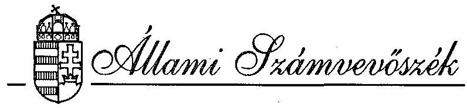
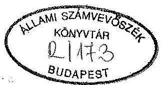
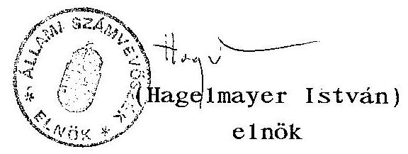
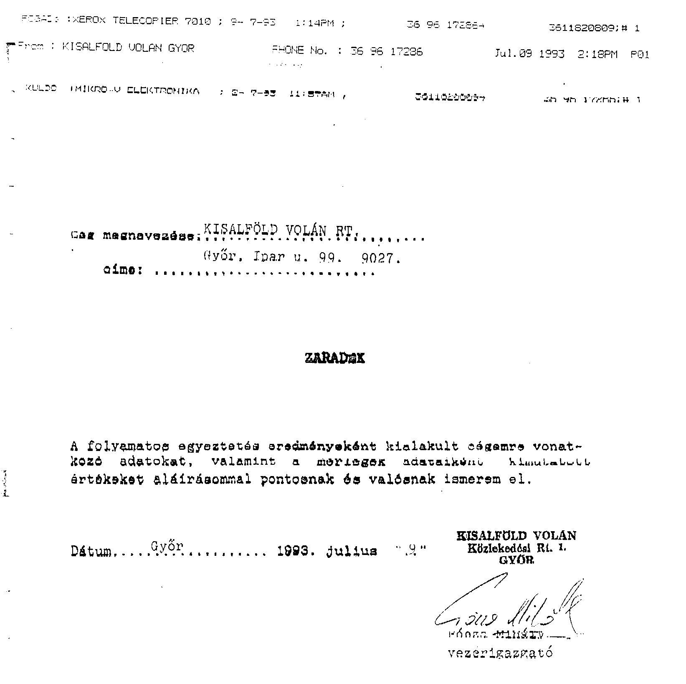
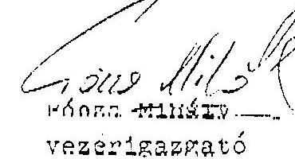
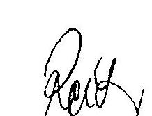
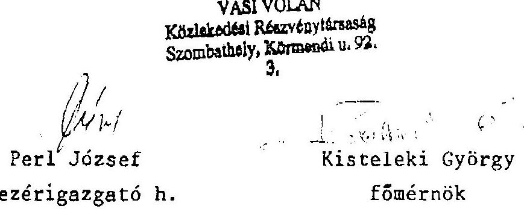
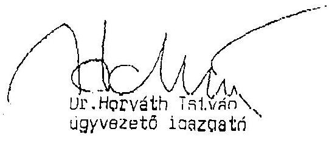

# JELENTÉS 

a VOLÁNBUSZ Vállalatnál, az országos menetrend szerinti személyszállításra rendelt állami vagyonnal való gazdálkodásról

---

ÁLLAMI SZÁMVEVŐSZÉK
IV. VAGYONELLENŐRZÉSI IGAZGATÓSÁG
$\mathrm{V}-19-21 / 1993$.
Témaszám: 173.

# JELENTÉS 

a VOLÁNBUSZ Vállalatnál az országos menetrend szerinti személyszállításra rendelt állami vagyonnal való gazdálkodás ellenőrzéséről

## 1.

## BEVEZETÉS

A VOLÁNBUSZ Vállalat (az egykori MÁVAUT) hosszú múltú tradicionális cég, amelyet fennállása alatt szinte már mindenfajta vállalati és társasági formában működtettek.

A cég 1992-ben a Közlekedési tárca decentralizációs ágazati stratégiáját követve végrehajtotta az úgynevezett "profiltisztítást", azaz megszüntette a nem személyszállítási tevékenységet a részvénytársaságon belül és Kft-be vitte a korábban jelentős beruházással létrehozott, az országos autóbuszállomány felújítására alkalmas gépjárműjavító üzemét is. Az autarch járműjavítás megszüntetésének gazdaságossága csak a későbbiekben lesz mérhető. A cég fejlődésének és működésének időrendi áttekintése a közhasználatú autóbusz személyszállítási tevékenység tartósan szükséges voltát igazolja.

---

A Posta 1909-ben indította meg a hazai távolsági autóbusz forgalmat a személyszállítás megszervezésére kapott megbízás alapján.

A vasúttársaságok később maguk is igyekeztek önálló gépkocsiüzemet létesíteni felismerve, hogy az autóbuszközlekedés egyenrangú partnere és szükséges kiegészítője a vasúti személyszállításnak.

A cég jelenleg is távolsági autóbuszjáratokat működtet. Ezenkívül Pest megyében ma is elszállítja az utasokat településeken belül a vasútállomásra, vagy vasútállomásról a távoli célállomásra, továbbá külföldön és az országban olyan távoli települések között tart fenn közvetlen kapcsolatot, amelyek vasúton nehezen elérhetők.

1927-ben alapították a MAVART-ot (Magyar Vasutak Autóközlekedési Részvénytársaság) vegyes - azaz áru és személyszállító-profillal. Járművei MÁVAG és MÁVAG-Mercedes teherautók, valamint autóbuszok voltak, amelyeket licenc alapján gyártott a MÁVAG.

Kezdetben a járművek üzemeltetését, karbantartását az Autótaxi Vállalat végezte. 1928-ban ezt az együttműködést a magas költségek miatt szüntették meg és a MAVART önálló javító-karbantartó bázist hozott létre.

1934-ben az autóbuszközlekedést leválasztották a Postáról és a hazai közúti személyszállításban a MAVART vette át a vezető szerepet.

A szinte monopolhelyzetben lévő MAVART mellett, 1935-ben 201 autóbuszvállalatot tartottak nyilván, amelyek többsége 1 vagy 2 autóbusszal rendelkezett.

---

A MÁV 1935. év januárjában megszüntette a MAVART részvénytársaság jellegét és létrehozta - részvényfelvásárlást követően - a MÁVAUT-ot. A MÁVAUT gyakorlatilag a MÁV egyik önálló részeként funkcionált, külön gépkocsi-főosztály irányítása mellett.

A MÁVAUT Budapesten működő országos központjához 16 vidéki főnökség tartozott.

1945-ig az autóbuszközlekedés ténylegesen piacgazdasági környezetben működött. 1948-ban a MÁVAUT-ot leválasztották a MÁV-tól.

Az újjászervezett üzem "MÁVAUT Autóbuszközlekedési Nemzeti Vállalat" az 50-es évek elejére már egységes szisztéma szerint működött és irányítását a Közlekedési és Postaügyi Minisztérium Gépjárműközlekedési Főosztálya látta el. Az iparosítás következtében megjelentek a naponta vidékről ingázó munkás tömegek. A gyors fejlődés után 1953-ban a távolsági autóbuszközlekedést decentralizálták. A MÁVAUT Igazgatóság irányítása alatt 15 MÁVAUT Vállalat alakult, majd egy átszervezés eredményeként megalapították az Autóbuszközlekedési Igazgatóságot és a vállalatok ennek felügyelete alá kerültek.

Az autóbusz-közlekedés menetrendjének összeállítása, kiadása és menetrendszerű közlekedésének ellenőrzése 1954. óta - egységes irányítás, koordinálás keretében történik.
1961. után az Autóközlekedési Vezérigazgatóság megalakulásával létrejött az egy megye, egy Vállalat formáció. Az irányítási és üzemi átszervezés 1962 januárjára befejeződött és ez a szisztéma mintegy 20 éven keresztül megfelelt a mindenkori gazdaságpolitikai elvárásoknak, kiépített az ország egészére egy világviszonylatban is jelentős autóbusz-közlekedési rendszert.

1964-től 1983-ig a Volán Tröszt keretében működött a cég. 1984. január 1-től az irányítást a Volán Vállalatok vezetőiből álló Igazgatótanács vette át, a Volán Vállalatok Központja vezérigazgatójának elnökletével.

---

A Minisztertanács 1990. január 1-i hatállyal megszüntette a Volán Vállalatok Központját és az akkor hatályba lépett törvények alapján megalakult a Volán Egyesülés, amely a cégek önkéntes társulása.

E társulási forma célja többek között az egyes tagvállalatok között országosan összehangolt szolgáltatások biztosítása. A Volán Egyesülés tagjai koordinálják a Magyar Államvasutak és a Volánok között a menetrendeket. Ez a rendszer biztosítja - ma még - az országos autóbusz-hálózat viszonylag egységes működését és a lakosság számára előre megtervezhető időben, útvonalban - a célállomásra utazást.

A VOLÁNBUSZ Közlekedési Részvénytársaságot 1992. december 31-én alapította zárt, egyszemélyes részvénytársaságként a közlekedési, hírközlési és vízügyi miniszter.

A társaság alapításkori tőkéje (jegyzett tőkéje) 2.200 millió Ft, amelyből

- pénzbeli betét 5 millió Ft,
- nem pénzbeli betét (apport) 2.195 millió Ft.

A jegyzett tőke részévé tett vagyonrész feletti vagyon (tőketartalék) értéke 1842 millió Ft.

Az átalakuláskor a létszám 2778 fő volt, szolgáltatói tevékenysége lebonyolításához pedig 870 db autóbusz állt rendelkezésre.

A társaság fő tevékenysége:

- menetrendszerű, közúti, távolsági személyszállítás;
- nem menetrendszerű, közúti távolsági személyszállítás;
- menetrendszerű, közúti helyi személyszállítás.

---

A cég a rendelkezésére álló kapacitással 176 településen helyközi személyszállítást 5781 km vonalhosszon, helyi személyszállítást 28 helységben - ebből 10 városban - 315 km vonalhosszon menetrendszerűen teljesít.

A részvénytársaság az államigazgatási felügyelet alatt álló állami vállalat - a VOLÁNBUSZ Vállalat - általános jogutódja.

A VOLÁNBUSZ Vállalat elsődleges feladata a menetrend alapján autóbusszal végzett közforgalmú személyszállítás volt.

Elsődleges feladatának ellátása mellett azonban 1989-ig széleskörű, jelentős mértékű egyéb üzleti tevékenységet is végzett a vállalat. Foglalkozott pl. építési szolgáltatással, járműjavítással, utaztatási és egyéb idegenforgalmi szolgáltatással, járműkölcsönzéssel és járművek lízingbe-adásával stb.

A Közlekedési, Hírközlési és Vízügyi Minisztérium (a továbbiakban: KHVM) átalakulásra vonatkozóan közzétett stratégiájának megfelelően e tevékenységeket 1989-91-ben egyszemélyes kft-ékbe szervezte a vállalat.
A gazdálkodás fő bevételi adatai az alábbiak voltak:

|  |  |  |  |
| :-- | :--: | :--: | :--: |
|  |  |  | 1990. 1991. 1992. |
| A vállalat összes üzleti bevétele | 2,6 | 3,4 | 4,0 |
| Autóbusz közlekedésből származó nettó árbev. | 1,9 | 2,8 | 3,7 |
| Fogyasztói árkiegészítés | 0,3 | 0,6 | 1,1 |

* Pest megyei adat
** A fogyasztói árkiegészítés a szolgáltatást igénybevevők, a tanulók, a nyugdíjasok szociálpolitikai kedvezményéhez nyújtott állami támogatás.

---

# 11. 

## ÖSSZEFOGLALÓ MEGÁLLAPÍTÁSOK, AJÁNLÁSOK

## 1. Összefoglaló megállapítások

A személyszállításon kívüli üzletágak leválasztására vonatkozó ágazati privatizációs stratégiának megfelelő vállalati profiltisztítás 1989-ben kezdődő folyamata 1991 végén befejeződött. A profiltisztítást célzó kft-alapítások során a Vállalat betartotta a jogszabályi rendelkezéseket.
Hasonlóképpen a jogszabályi rendelkezéseknek megfelelően zajlott le a vállalat átalakítása részvénytársasággá.

A vállalat elsődleges feladata - a "menetrend alapján autóbusszal végzett közforgalmú személyszállítás" - ellátását tekintve megállapítható, hogy a részvénytársasági formába való átalakulással összefüggésben a szolgáltatás ellátásában nagymértékű változás nem következett be a részvénytársasággá alakulás óta eltelt félévben.

A szolgáltatás szerkezetében, mennyiségében a változó igényekkel, gazdaságossági szempontokkal összefüggő módosulások már az átalakulást megelőzően elkezdődtek, az átalakulás után pedig folytatódtak.

A vizsgált időszakban a Vállalat tevékenységi területén a menetrend szerinti autóbusz-közlekedési ellátottság - a járműállomány elöregedése, pótlási gondok ellenére - jónak tekinthető. A helyi személyszállításban megjelentek a magán-

---

vállalkozók is, a helyközi és távolsági autóbuszvonalakon pedig 1991-92-ben mintegy 100 menetrendi átszervezést hajtott végre a Vállalat, amelyek többsége bővítés volt. Az átlagos utazási menetsebesség a vizsgált időszakban és általában évek óta nem változott.

A fentiekkel együtt is összességében csökkent az utasszám, és átrendeződés következett be az utasok összetételében és a szolgáltatás igénybevételének módjában. Legnagyobb mértékben a helyi forgalomban csökkent az utasszám. Folyamatosan csökkent a teljesárú menetjeggyel utazók száma, és emelkedett a kedvezményes utazások mennyisége. 1992-ben 1991-hez képest összességében jelentősen csökkent a férőhelykihasználási mutató, ezen belül a nemzetközi járatoknál növekedés következett be.

A szolgáltatás igénybevételének csökkenését, módosulását előidéző okok sokrétűek, azonban mind a helyi, mind a helyközi forgalomban szerepe volt a folyamatos tarifaemeléseknek és az életszínvonal általános csökkenésének.

A szolgáltatás színvonalának megfelelőségét jelzi, hogy a szolgáltatással összefüggő utas-panaszok száma, megalapozottsága, tartalma a vizsgált két évben lényegében nem változott.

Az évente szállított 100-120 millió utastól 300-305 panasz érkezett be évente, amelyeknek jelentős hányada a vállalat dolgozóinak - többségükben az autóbuszvezetőknek - magatartásával volt kapcsolatos. A Vállalat megítélésében jelentős szerepet játszó panaszolt magatartások szankcionálása azonban nem volt arányban azok súlyával.

---

A Vállalat a kezelésében levő állami vagyonnal a vizsgált években rendkívül alacsony mértékben, de jövedelmező - nyereséges - gazdálkodást folytatott. A rábizott vagyon könyvszerinti értékét saját döntési hatáskörében megőrizte. Az átalakulással kapcsolatos vagyonértékelés révén ez a vagyon közel 2,5-szeresére növekedett.

A menetrendszerű, közhasználatú autóbusz személyszállításban a folyamatos tarifaemelések és teljesítménynövekedés ellenére is alacsony jövedelmezőségű tevékenység fenntartásában évek óta feszítő gond az elöregedő járműállomány pótlására hivatott források szűkössége, valamint az ezzel szorosan összefüggő likviditási problémák.

A gondok önerőből történő felszámolására a Részvénytársaság sem képes, ugyanakkor a szükséges külső segítség módjára a vizsgálat lezárásáig nem született megoldás.

A vizsgálat által érintett területeken a vállalat a jogszabályokat jellemzően betartotta, azonban a jogszabályok téves értelmezésére, be nem tartására is akadtak példák.

Ide sorolható, hogy a kiépített belső ellenőrzés - amely a vállalati működés széles körét átfogóan végezte tevékenységét - szervezeti elhelyezése nem felelt meg a vonatkozó jogszabályi előírásoknak.

Környezetvédelmi szempontból a Vállalat - működéséből adódóan - a közúti közlekedésben és a telephelyén környezetterhelést, (de nem környezetszennyezést) okozott.

Az autóbuszok környezetvédelmi felülvizsgálatai az érvényben levő rendeletek szerint megtörténtek.

---

A Vállalat - lehetséges keretein belül - teljesítette a környezet védelmével kapcsolatos elvárásokat, így környezetvédelmi bírságot minimális mértékben fizetett.

Az átalakulási terv környezetvédelemmel kapcsolatos fejezete teljesítette a környezetvédelmi helyzetismertetés kívánalmát.

Környezetvédelmi szempontból javulást csakis a korszerűbb autóbuszmotorok, hajtóművek hozhatnak. A korszerűbb autóbuszállomány kialakítása azonban nem a Vállalat szándékán múlik, hanem a pénzhiányon.

Az önkéntességen alapuló VOLÁN EGYESÜLÉS szerény anyagi háttérrel, de gondozza a tagok között a környezetvédelmi feladatok koordinálását és speciális környezetvédelmi problémakörét, ezáltal tevékenysége hasznos, előremutató.

# 2. Ajánlások 

Az Állami Számvevőszék elnöke a vizsgálat során tett megállapítások alapján

- az Országgyűlés figyelmét felhívja az állami vagyon védelme érdekében arra, hogy
a közhasználatú menetrend szerinti autóbusz személyszállítás járműállománya további romlásának megakadályozása érdekében, illetve hosszabb távon az autóbuszállomány minőségi cseréjére biztosítsa a szükséges pénzügyi fedezetet állami támogatással, valamint beruházási forrásképzést lehetővé tevő szabályozórendszeri ${ }^{2}$ módosítással, adómentes közszolgáltatásnak minősítve a feladatot.

---

# - ajánlja a Kormánynak 

1. A menetrend szerinti közszolgáltatást végző autóbuszközlekedési gazdasági társaságok számára az autóbusz állomány megújításához a mindenkori éves költségvetésben előirányzott összegből az igényelhető támogatás mértékét és feltételeit a Kormányrendeletben szabályozza.
2. Járulékos, de nem elhanyagolható - a beruházási forrásokat befolyásoló - gond, hogy a számviteli ${ }^{1}$ és társasági adószabályozásban ${ }^{2}$ a felújítás és karbantartás fogalmi elhatárolása nem kielégítő. Különös tekintettel a speciális helyzetű autóbusz és járműfelújításokra, ezekre vonatkozóan is kezdeményezze a jogalkotónál, hogy adjon felhatalmazást a számvitelről ${ }^{1}$ szóló törvényben arra, hogy kapcsolódó Kormányrendeletben legyen egységesen és egyértelműen elhatárolva a felújítás és karbantartás fogalma, tárgyi tartalma.

## - ajánlja a Közlekedési, Hírközlési és Vízügyi Minisztériumnak

Határozza meg a tárca a menetrend szerinti autóbuszközlekedésben az ország valamennyi lakott településén kötelező ellátás minimumát, annak paramétereit, a színvonalat minősítő követelményrendszert valamennyi e tevékenységet végzőre annak érdekében, hogy az indokolt és szükséges anyagi fedezetet ebből kiindulva meg lehessen állapítani. A
 gazdálkodó szervezetnek pedig a nyújtandó közszolgáltatást legalább az alapellátás normáinak megfelelően kell teljesítenie az ország lakott településein.

[^0]
[^0]:    ${ }^{1}$ 1991. évi XVIII. tv. a számvitelről
    ${ }^{2}$ 1991. évi LXXXVI. tv. a társasági adóról

---

- ajánlja a Részvénytársaság vezetése részére

A belső ellenőrzés megállapításainak, javaslatainak teljeskörű hasznosítása érdekében hozza létre a végrehajtandó feladatok, a megtett intézkedések és az esetleges felelősségrevonások egységes, szabályozott, áttekinthető, zárt rendszerét.
IV.

# RÉSZLETES MEGÁLLAPÍTÁSOK 

1. Gazdálkodás a vagyonnal
1.1. Gazdasági társaságok alapítása a VOLÁNBUSZ Vállalatnál 1991-92-ben

A VOLÁNBUSZ Vállalat a vizsgált 1991-92. évben két gazdasági társaságot alapított:

- a VOLÁNBUSZ - CAR-TRADE Kft-t és a
- VOLÁNBUSZ Járműtechnika Kft-t. Az alapítás mindkét Kft esetében 1991. december 16-a volt és 1992. május 15-én mindkét társaságot nyilvántartásba vette a Fővárosi Bíróság mint cégbíróság. A nyilvántartásba vétel az alapítás törvényességét jelzi, jogszabálysértést a vizsgálat sem tapasztalt az alapítással összefüggő iratok tanulmányozása során.

A Kft-k alapítása tevékenységi körüket vizsgálva nem ellentétes a profiltisztításra vonatkozó ágazati stratégiával sem.

---

A Közlekedési, Hírközlési és Vízügyi Minisztérium privatizációs stratégiája (Közlekedési, Hírközlési és Vízügyi Értesítő 1992/19.) illetve egyes leiratai (Közigazgatási államtitkár, 251.546/1992. február 6.) szerint ugyanis a személyszállításon kívüli üzletágak leválasztandók, társaságba szervezendők és folyamatosan privatizálandók. A nem menetrendszerű személyszállítás (különjárati, bérautóbusz profil) esetében alternatívát biztosít és az önálló gazdasági társaság keretében is működtethető.

Az állam vállalatokra bízott vagyonának védelméről szóló a vizsgált időszakban még hatályban lévő - 1990. évi VIII. törvény betartását vizsgálva megállapítható, hogy a vállalat nem sértette meg a törvényt a Kft-k alapításakor a nem pénzbeli hozzájárulás értékétől függő bejelentési kötelezettséget illetően.

Megemlítendő azonban, hogy a bejelentési kötelezettség vállalat részéről történő vizsgálatakor, illetve a cégbejegyzéshez kapcsolódó nyilatkozattétel során nem a törvényben meghatározott módon, a könyvviteli mérleg szerinti összes eszközértéket vette alapul, hanem az ágazati minisztérium részére megküldött, a gazdálkodást jellemző fontosabb pénzügyi és egyéb adatok című adatszolgáltatásból a saját vagyon adatait. Ez alacsonyabb vagyonkiviteli értéket eredményezett, mint amit a törvény lehetővé tett.

Így az alkalmazott számítási mód nem sértette a vagyonvédelmi törvényt, mivel a könyvviteli mérleg szerinti összes eszközértéket figyelembe véve sem volt bejelentési kötelezettségük a kivitt összeg alapján.

---

# 1.2. A VOLÁNBUSZ Vállalat átalakulása részvénytársasággá 

A VOLÁNBUSZ Közlekedési Részvénytársaságot 1992. december 31-ével alapította meg a közlekedési, hírközlési és vízügyi miniszter a tartósan állami tulajdonban maradó vállalkozói vagyon kezeléséről és hasznosításáról szóló 1992. évi LIII. törvény, valamint a részben vagy teljesen tartósan állami tulajdonban maradó gazdálkodó szervezetekről szóló 126/1992.(VII.28.) Kormányrendeletben foglalt felhatalmazás alapján.

Az átalakulással összefüggésben a vizsgálat jogszabálysértést nem tapasztalt és az átalakulás a jogszabályban foglalt határidőn belül megtörtént. A társaság cégbejegyzése a vizsgálat időpontjában még nem történt meg. A cégbejegyzés iránti kérelem benyújtásánál - a 30 napos bejelentési határidőhöz képest - mintegy két hét késedelem volt tapasztalható.

Megjegyzendő, hogy az alapító okiratot a Vállalat nyilatkozata szerint 1993. február 5-én vették át a minisztériumban, tehát a december 31-i alapítást figyelembe véve a határidő már az átvételkor lejárt néhány nappal.

Nem észlelt jogszabálysértést a vizsgálat az átalakulási terv tanulmányozása során sem. Az átalakulási terv tartalmazta a jogszabályban foglalt elemeket (átalakulással elérni kívánt gazdasági cél, foglalkoztatási és szociális terv stb.).

Az 1992. december 1-jei átalakulási terv már a szakminisztériummal folytatott egyeztetések figyelembevételével történt, és a VOLÁNBUSZ Vállalat Felügyelő Bizottságának 1992.

---

október 29-én tartott üléséről készült jegyzőkönyv szerint megfelelő a vonatkozó privatizációs koncepciónak és tartalmában kitért a jogszabályokban előírt kérdésekre is.

Tekintettel arra, hogy a cégbejegyzés még nem történt meg és az alapítással összefüggésben a cégbíróság az autentikus, az átalakulás törvényessége a bejegyzéssel válik majd teljessé.

# 1.3. A részvénytársasággá alakulás hatása a menetrendszerű autóbusz személyszállításra 

A Vállalat tevékenységének részvénytársasági formában történt ellátásának színvonalát vizsgálva megállapítható, hogy a társasági formában eltelt félévben a szolgáltatások ellátásában nagymértékű változás nem következett be az átalakulással összefüggésben.

Az ellátás rendszere már a jogelőd tevékenysége során kialakult, a részvénytársasági formában eltelt félévben bekövetkezett menetrendszerinti változások (bővítések és szűkítések) a változó igényekkel és a gazdaságossági szempontokkal függtek össze.
A társaság a megyei autóbusz személyszállítási igények kielégítésére alkalmas, és azt megfelelő szinten látja el.

A Vállalat már 1991-ben szervezeti változtatásokat hajtott végre és a kifejezetten a társasági formához kötődő szervezeti változásokon (igazgatóság, felügyelőbizottság stb.) túl nem is tervez továbbiakat. A társaság foglalkoztatási stratégiája és létszámigénye - amint azt már az átalakulási tervben is jelezte - megfelel a korábbi vállalaténak. Az üzleti terv megvalósítása pedig a tevékenység közszolgálati jellegéből adódóan is jelentős mértékben külső tényezők függvénye, amelynek leghangsúlyosabb része az átalakulási tervben is jelzett beruházási forráshiány.

A részvénytársasággá alakulással kapcsolatos változás, rövid távon elsősorban a vagyonérték aktualizálásával függött össze.

# 1.4. A VOLÁNBUSZ Vállalat vagyonának változása 

A VOLÁNBUSZ Vállalat 1990. december 31. és 1992. december 31. között a kezelésében lévő állami vagyon könyvszerinti értékét látszólag megőrizte (1. sz. melléklet).

2 év alatt az 1,65 milliárdos vagyonérték 57,8 millió Ft-tal - 3,5 %-kal - növekedett is. E változásban szerepet játszó vagyonmozgások egyrészt nem számottevők a vállalati összvagyonhoz képest, másrészt a szokásos gazdálkodással összefüggő változások.

A Vállalat a vizsgált időszakban közvetlenül a vagyonát növelő állami támogatásban nem részesült.

A mérlegeiben két évre kimutatott fenti vagyonnövekmény forrása mintegy fele részben három év (1990-1992.) gazdálkodási eredménye, fele részben pedig két gazdasági társaságba apportként bevitt vagyontárgyak felértékelésének eredménye.

Az 1993. január 1-jei átalakuláshoz végrehajtott vagyonbecslés a Vállalat 1,7 milliárdos könyvszerinti saját tőkéjét közel 2,5-szeresére - 4 milliárd Ft-ra - értékelte.

---

A 2,3 milliárd Ft vagyontöbblet kialakulásában növelő tényezőként döntő szerepet játszott a tárgyi eszközök felértékelése. Az értéknövelés a már korábban is meg volt ingatlanoknál +1,3 milliárd (ezen belül a belterületi földingatlanoknál +1 milliárd), a műszaki berendezéseknél, gépeknél, járműveknél 1,2 milliárd Ft volt. Ezen belül a közel 850 db-os autóbuszállomány 300 milliós könyvszerinti értéke átértékeléssel 1,4 milliárdra változott.

Csökkentő tényezőként a befektetett pénzügyi eszközök (-49 millió), a vevőkkel szembeni követelések (-50 millió) leértékelése a kiemelkedő tételek.

Bár a vagyonértékeléssel nyilvánvalóvá vált vagyonvesztések két nagyságrenddel kisebb összeget jelentenek mint a felértékelésből eredő vagyonnövekmények, jelentőségük azonban a Vállalat könyvszerinti vagyona gyarapításának reális megítélhetősége szempontjából nem elhanyagolható. A pénzügyi és vevők miatti vagyonvesztések valósak. A könyvszerinti vagyon gyarapítása, illetve megőrzése látszólagos, mert a meglévő vagyon felértékeléséből származik.
1992. december 31-én a Vállalat összes eszközállományának (2,1 milliárd) 13,2 %-a (275,3 millió) volt befektetve Kft-kbe, részvényekbe, tartós lekötésű kötvényekbe.
E befektetések két évi összes hozama 15,4 millió Ft volt. Ezen belül döntő súllyal szerepelt a hét Kft-be befektetett 252,6 millió Ft értékű eszköz, amely után 2 év alatt 11,5 millió Ft osztalékhoz jutott a Vállalat.

Közülük a négy legnagyobb - 100 %-ban VOLÁNBUSZ-tulajdonú - Kft-t elsősorban nem üzleti megfontolásból, hanem a KHVM privatizációs stratégiája részeként kötelező feladatként hozta létre a VOLÁNBUSZ. Abból a célból, hogy tisztaprofilú - csak személyszállítást és azt közvetlenül kiszolgáló tevékenységet végző - társasággá alakulhasson át a megadott időben. E Kft-k ugyanis korábban a VOLÁNBUSZ Vállalaton belül, elkülönült szervezeti egységekként végezték tevékenységüket.

A Vállalat a privatizációs folyamatban a rá mért feladatokat jól végrehajtotta. Az ezzel összefüggő vagyonvesztések tehát nem a Vállalat gazdálkodását minősítik.

Ugyanezzel a problémakörrel függ össze szorosan a vevőtartozások leértékelése is. A lejárt vevőállomány döntő részben a Kft-ékbe kivált tevékenységekkel összefüggésben keletkezett.
1.5. A folyó gazdálkodás rentabilitása, a menetrend szerinti autóbusz-közlekedés járatfajtáinak rezsiviselő képessége

A VOLÁNBUSZ Vállalat 1991-92-ben rendkívül alacsony szintű, csökkenő jövedelmezőséggel működött (1991-ben 1 % volt, 1992-ben 0,5 % volt az árbevétel arányos mérleg szerinti eredmény).

Üzemi/üzleti/ tevékenységének 1991. évi 3,4 milliárdos bevételéből minössze 1,9 % - 65 millió Ft - volt a nyeresége, 1992-ben 4 milliárdos bevételéből 0,9 % - 36 millió Ft.

Ennél is kisebb összegű és arányú volt az adózás, részesedés-fizetés után megmaradó mérleg szerinti eredménye. 1991-ben 34 millió, 1992-ben 18 millió Ft.

A szokásos vállalkozói tevékenységi körbe tartozó pénzügyi műveletek eredménye mindkét évben jelentősen csökkentette az üzemi eredményt, a rendkívüli bevételek és ráfordítások egyenlege viszont mindkét évben pozitív volt.

---

A jövedelmezőséget meghatározó bevételek és kiadások alakulása okainak, a gazdálkodás esetleges tartalékainak teljeskörű, rendszerezett feltárására, elemzésére nem volt mód, mert nemcsak a számviteli rend változott meg, hanem a vállalat tevékenységi körének folyamatos változása is közvetlenül összehasonlíthatatlanná tette az 1990-91-92. évi gazdasági adatokat.

A vállalati gazdálkodás különféle dokumentumai alapján a vállalati tevékenység alacsony szintű jövedelmezősége kapcsán az alábbiak állapíthatók meg:

- Az alacsony jövedelmezőség 1990. évtől kezdődően jellemző a vállalat tevékenységére.
- Kialakulásában döntő szerepet játszottak a nemzetgazdaság átalakulásával járó gazdasági folyamatok (infláció, munkanélküliség növekedése, fizetőképes kereslet csökkenése, az ágazat privatizációra való felkészülése, stb.).
- A vállalati vezetés 1992-vel kezdődően minimumnyereségre - de nem veszteségre - törekszik. Ezt azért teszi, hogy a gazdasági szabályozók adta lehetőségek között a lehető legtöbb forrást érje el (pl. lízingeléssel) a közszolgálati tevékenysége ellátásához szükséges infrastruktúra, járműállomány pótlásához. Továbbá kellő bérezést nyújt a személyi állomány biztosítása érdekében.
- Bár belső érdekeltségi rendszerének egyik eleme a bevétel növeléséhez kötött premizálás, több évet átfogó kidolgozott, dokumentált, jövedelemnövelést célzó üzleti stratégiája nincs. Éves üzleti és fejlesztési tervekkel alkalmazkodik az adott körülményekhez. Az átalakulási terv a jövőnek kiindulópontját képezi.

---

- Az APEH Pest megyei Igazgatósága 1992. júliusában vizsgálta a Vállalatnál a díjemelések indokoltságát. A vizsgálathoz az 1989-90-91. évi adatokat vette alapul. Összefoglaló jelentésében nem kifogásolta a költségek alakulását, nem jelzett tartalékokat a költséggazdálkodásban. Megállapította, hogy "A költségek és eredmény alakulásában a Vállalat költségmegtakarítási törekvései is mutatkoznak."

A fentieket alapvetően cáfoló tényeket a számvevőszéki vizsgálat sem tárt fel. Előfordultak azonban olyan esetek is a vizsgált időszakban, amelyek azt jelzik, hogy a költségtakarékosság érvényesítése nem volt következetes, esetleg adott ráfordítással nagyobb eredmény is elérhető lett volna. A pénzgazdálkodásban is voltak nehézségek pl. az OMNIBUSZ Utazási Iroda 1990. évi 7 millió forint, 1991. évi 11 millió forint áthúzódó tartozása.

Az üzletágak rentabilitásának vizsgálata alapján megállapítható, hogy 1991-ben az elsődleges feladat - a "menetrend alapján autóbusszal végzett közforgalmú személyszállítás" - javára történő tevékenység-szerkezeti változtatás nem érintette hátrányosan a Vállalat jövedelmi helyzetét.

Az elsődleges tevékenység (feladat) jövedelmezősége 1991-hez képest növekedett.
A menetrendszerű autóbuszközlekedés fedezete 38,9 %-kal nőtt, az összes tevékenységé 18,8 %-kal emelkedett. (A tarifaemelés 25 %-os mértékű volt).

Az üzletág 1991-ben is a vállalati szintű üzleti bevételben elfoglalt részarányát meghaladó mértékű rezsiviselő volt, 1992-ben pedig ez a képessége tovább javult.

---

Ezt a javulást a tarifaemelésen túl az üzletág teljesítményének növekedése, valamint belső szerkezetének előnyös változása eredményezte.

A menetrend szerinti autóbusz-közlekedésen belül átlagot meghaladó teljesítménynövekedés következett be az átlagosnál
 jobb és javuló mutatókkal rendelkező helyközi (benne a távolsági) autóbusz-közlekedési ágazatban.

Ebben jelentős szerepet játszik az a vállalati törekvés, amely az alacsony jövedelmezőségű helyi közlekedést már 1991-ben is a helyközi járatokra igyekezett átterelni.

A nemzetközi autóbusz-közlekedés 1991-ben a legjobb jövedelmi pozíciójú járatfajta volt a menetrend szerinti autóbusz-közlekedésen belül, 1992-ben néhány jobb minőségű, drágább autóbusz forgalombaállítása átmenetileg jelentősen rontott a jövedelmezőségi pozícióján.

# 1.6. A Vállalat likviditási helyzete 

Pénzügyi egyensúlyát 1991-92-ben magas kamatú (31-36%-os) likviditási hitelek igénybevételével tudta csak fenntartani a Vállalat.

1991-ben mintegy 30 millió Ft-tal, 1992-ben 26,5 millió Ft-tal növelték költségeit a likviditási hitelek kamatai.

A 80 milliós folyószámla-hitelkeret használata mellett folyamatosan 45-50 milliós rövidlejáratú forgóeszközhitelre kényszerült a Vállalat. Főleg azért, mert beruházási célú kifizetései - többször kinyilvánított szándék ellenére - nem követték, hanem megelőzték a tárgyi eszközök értékcsökkenési leírásának megtérülését.

---

A cég e hitelek nélkül nem tudja megőrizni fizetőképességét. 1992. szeptember elejétől például nem vett igénybe rövidlejáratú forgóeszközhitelt a Vállalat. 1993. januárjában-februárjában 8-12 napon át fizetésképtelenné vált, mert nem voltak saját pénzügyi tartalékai, hogy a szokásos év elejei pénztelenség mellett az előző évről áthúzódó 80 millió Ft-ot is meghaladó szállítói tartozást kifizethesse.

Jelenleg a részvénytársaság nincs abban a helyzetben, hogy mérlegelés tárgyává tegye: forgóeszköz-szükségletét saját forrásból, vagy drága hitelekből finanszírozza. Csekély mérleg szerinti eredményének pénzügyi tartalékként való használatát lehetetlenné teszi a folyamatos beruházási forráshiány. A beruházások visszafogása a saját erejű forgóeszköz-finanszírozás megoldása érdekében átmenetileg sem reális alternatíva.

A Vállalat hitelképességét minősítő mutatók 1992. december 31-én a következők voltak:

- a Vállalat 1992-ben visszafizette 1986-87-ben felvett beruházási hiteleinek utolsó részletét is, tehát hosszúlejáratú kötelezettségei nincsenek.
- Tőkeellátottsági mutatója (saját tőke aránya az összes forráson belül) 81,7 %. (Világbanki minimum-követelmény: 35%.)
- Likviditási mutatója (a forgóeszközök és a rövidlejáratú kötelezettségek viszonya) az 1991. évi 135,4%-ról 122,6%-ra csökkent. (Világbanki minimum-követelmény: 130%).

---

1.7. A járműállomány, az infrastruktúra megújításának lehetőségei

A likviditás folyamatos fenntartása mellett - nagyrészt arra kihatóan is - a vizsgált években súlyos gondként jelent meg a selejtezésre érett autóbuszok folyamatos cseréjének biztosítása.

A műszaki és gazdasági adatok alapján a probléma tartós volta egyértelmű.

A járműállomány - 1992 végén 838 db autóbusz - átlagos életkora és egyben műszaki elavultsága az egyre kisebb számú csere (amely nem is minden esetben jelent új járművet) következtében folyamatosan növekszik. Az autóbuszok 32%-a (265 db) 10 évnél idősebb, fizikailag, műszakilag elhasznált. Az öregedő járműállomány után képződő értékcsökkenési leírás zsugorodik, helyét a növekvő üzemeltetési költségek foglalják el az önköltség típusú tarifákban és így az árbevételben. Az autóbuszárak gyors növekedése pedig egyre kevesebb jármű beszerzését, illetve felújítását teszi lehetővé (1992 januárjától az új számviteli törvény előírásai szerint a felújítás is ezt a forrást terheli). A beruházási források szűkülése és az inflációs járműárak miatt végül az igényelt szolgáltatás teljesítése kerül veszélybe.

A Részvénytársaság szakemberei szerint az autóbuszok gazdaságos élettartama - a 6-7 éves korban történő egyszeri teljes felújítással együtt - 10 év. Az ésszerű állománycsere tehát folyamatosan évi 10%.

Ehhez képest a Vállalatnál 1991-ben képződött járműamortizáció az akkori árak mellett legfeljebb 20-22 db normál (nem csuklós, nem nemzetközi járatra alkalmas) új autóbusz

---

beszerzésére, az 1992. évi pedig csak kb. 16 db új autóbusz beszerzésére elegendő forrást jelentett, ami az állománynak csupán 2%-a.

A mérleg szerinti adózott eredmény legfeljebb két új autóbusz megvásárlását tette volna lehetővé.

A járműállomány ésszerűnek tartott korösszetételét, műszaki állapotát biztosító cseréhez szükséges forrás és a Vállalatnál ténylegesen képződő forrás közötti óriási különbség áthidalására a vizsgálat lezárásáig nem született megoldás.

A Vállalat vezetése - a profiltisztítás és az átalakulás feladatának végrehajtása közben - 1992 áprilisában kiemelten foglalkozott a témával. Járműállományra vonatkozó rekonstrukciós program-variációkat dolgozott ki, amelyekben a 3-4 év alatti megvalósítást tartotta szükségesnek.

Közülük egy 4 éves csere-variációt továbbított a KHVM-be javaslatként. Ebben évi 1-1,3 milliárdos forráshiányt mutatott ki a saját erőn felül.

A számvevőszéki vizsgálat az autóbuszállomány rekonstrukciójára vonatkozó programjavaslat kritikai elemzését nem tartja feladatának. Annyi azonban mélyebb elemzés nélkül is megállapítható, hogy a program az ideális korösszetételűnek, műszaki színvonalúnak tartott járműállomány mielőbbi megteremtése szempontjából következetes a maga logikája szerint.

Gazdasági szempontból azonban kevésbé meggyőző az alkalmassága, mivel hiányoznak mellőle az előre is tekintő gazdaságossági számítások, takarékossági megfontolások, esetleges piacváltozásokkal összefüggő feladat-eszköz elemzések.

---

A részvénytársaság vezetése javára szól, hogy a külső segítségre várva sem szemléli tétlenül a romlás folyamatát, hanem igyekszik kihasználni az önerejű pótlás minden pillanatnyi lehetőségét. Költségei között új elemként 1992-vel kezdődően megjelent a lízing-költség is.

Az autóbusz-állomány üzemelését kiszolgáló infrastruktúrával (épületek, gépek, térburkolatok, hírközlési rendszer, stb.) kapcsolatosan feladatellátást veszélyeztető problémák eddig nem merültek fel.

A tényadatok azonban azt mutatják, hogy az alacsony leírási kulcsok alapján mindkét évben kevesebb forrás képződött e tárgyi eszközök után, mint amire az infrastruktúra felújításához, pótlásához ténylegesen szükség volt. A többletet a járműállomány pótlására hivatott forrás biztosította. E téren ugyancsak az értékcsökkenési leírás az egyetlen pótlási, fejlesztési forrás.
2. A közszolgáltatási tevékenység
2.1. A hatósági áras és szabadáras, a helyi és helyközi személyszállítás arányváltozásai

A Vállalatnál 1991-ben a szabadáras és hatósági áras személyszállítás arányát illetően megállapítható, hogy a szabadáras bevétel 324 millió forint volt a hatósági áras (árkiegészítéssel növelt) 2,5 milliárd forint bevétellel szemben. Arányuk 1:7,8. 1992-ben a szabadáras bevétel 90%-ra csökkent, a hatósági áras bevétel ugyanakkor 134%-ra nőtt, így bevételi arányuk 1:11,6-ra változott, számottevően a szerződéses járatok bevételének elmaradása miatt. Megállapítható, hogy a hatósági áras menetrend szerinti bevételek nemcsak összegszerűen, hanem arányukban is nőttek a szabadáras bevételhez képest.

---

A helyi közlekedésnél az utasszám - a vizsgált időszakban - 1991. évről 1992-re 16%-kal csökkent, bevétel tekintetében ez ellenkező előjelű; 12%-os növekedés állapítható meg. Árkiegészítés nélkül e bevételek 10%-os növekedést hoztak. Helyközi, távolsági és különjárati közlekedésnél az utasszám 2%-kal csökkent, a bruttó bevétel alakulása azonban 33%-os növekedést mutat. Árkiegészítés nélkül ez a növekedés 20%-os.
2.2. A menetrend szerinti autóbusz személyszállítási ellátottság

A VOLÁNBUSZ Vállalat menetrend szerinti autóbusz személyszállítási tevékenységének döntő része Pest megye és a főváros, illetve a megyei települések közötti és településeken belüli személyszállítás ellátása.

Pest megye menetrend szerinti autóbusz közlekedési ellátottsága a vizsgálat megállapítása szerint összességében jónak tekinthető.

Az ellátottság vizsgálatánál nem hagyható figyelmen kívül, hogy munkamegosztás van a VOLÁNBUSZ Vállalat, a MÁV és a BKV között.

Pest megye területén a VOLÁNBUSZ Vállalat járatai három helyiséget nem érintenek: Csömör, Nagykovácsi és Halásztelek közlekedési ellátását a BKV végzi.

Vannak helységek, amelyeket a VOLÁNBUSZ Vállalat csak néhány járattal érint, ellátásukat a MÁV és/vagy a BKV biztosítja (pl. Gyál, Budaörs).

---

A tömegközlekedési kapcsolatban (Csömör, Nagytarcsa) és a helyi személyszállításban (Dunaharaszti, Szigetújfalu, Isaszeg) megjelentek a magánvállalkozók is.

A VOLÁNBUSZ Vállalat helyközi autóbusz hálózata - amely jelentős helyi személyszállítást is bonyolít - lényegében már a vizsgálati időszak előtt kialakult, "beállt" rendszer.

# 2.3. A fizetőképes utazási igények alakulása 

A menetrendszerinti személyszállításban a helyközi forgalomban a vizsgált időszak alatt összességében stagnált, illetve kismértékben csökkent az utazásszám, azonban átrendeződés tapasztalható az utasok összetételében és szolgáltatás igénybevételének módjában.
Folyamatosan csökken a teljesárú menetjeggyel utazók száma és emelkedett a kedvezményes utazások mennyisége.

E jelenségben szerepe van annak, hogy a tanulóbérletjegyes utasok száma nőtt. Ugyanakkor jelentősen visszaesett a dolgozók havi bérletjegyével utazók száma.

A dolgozói bérletjegyek darabszámának csökkenése összefügghet a munkanélküliséggel is, mivel elsősorban nagyüzemek környezetében csökkent (pl. Budapest-Vác, Csepel-Szigethalom, Budapest-Érd vonalcsoportokon), másrészt esetenként a munkáltatók nem akarják vállalni a költségtérítést a Vállalat információi szerint.

A helyi forgalmakban - feltehetően az áremelések és jövedelmi viszonyok összefüggéseként - folyamatos csökkenés volt a vizsgált időszakban.

---

A szerződéses járatfajtákban jelentős csökkenés következett be főleg az építőipar és a gépipar igényeinek csökkenése következtében.

1991-ben 40, 1992-ben 36 szerződéses járat szűnt meg. Míg 1990-ben 113 autóbuszt kötött le ezen feladat, 1993-ban már csak 50 autóbuszt foglalkoztatott.

A különjárati személyszállítás csökkenése a magánvállalkozások megjelenésével kialakult árversennyel függ össze.
2.4. A belföldi menetrend szerinti autóbusz-közlekedés tarifáinak alakulása.

Az árak megállapításáról szóló 1990. évi LXXXVII. törvény alapján a belföldi menetrend szerinti autóbusz-közlekedés a hatósági áras szolgáltatások körébe tartozik.
1991. január 1-től a legmagasabb hatósági árat távolsági autóbusz-közlekedés esetében a közlekedési, hírközlési és vízügyi miniszter, helyi autóbusz-közlekedés esetében pedig a települési önkormányzat - fővárosban a Fővárosi Önkormányzat - képviselő-testülete állapítja meg a pénzügyminiszterrel egyetértésben.

A fenti törvény 8. § (1) bekezdése kimondja: "A legmagasabb árat - a (2) bekezdésben szabályozott kivétellel - úgy kell megállapítani, hogy a hatékonyan működő vállalkozó ráfordításaira és a működéséhez szükséges nyereségre fedezetet biztosítson, tekintettel az elvonásokra és támogatásokra is."

A VOLÁNBUSZ Vállalat esetében 1991-92-ben sem a távolsági, sem a helyi tarifák nem biztosítottak fedezetet a Vállalat által a működéséhez szükségesnek tartott nyereségre.

---

Az országosan egységes távolsági tarifák megállapításának előkészítő szakaszában - a KHVM által kért adatszolgáltatás keretében - a Vállalat évről-évre jelezte, kalkulációkkal alátámasztotta, hogy a járműpótlásban fennálló évtizedes elmaradás miatt az inflációt követő áremelésen felül mekkora az a forrástöbblet, amellyel a minimálisan szükséges eszközpótlást, felújítást biztosítani lehetne.

A tényleges áremelések azonban csak a folyó működési költségek indokolt emelkedéséhez biztosítottak keretet.

Kétségtelen, hogy a szükséges forrástöbbletet árakon keresztül előteremteni nem látszott megvalósíthatónak, sőt célszerűnek sem. Az állami támogatás valamilyen formájának kialakításával viszont indokolt lett volna a probléma megoldását megkezdeni.

A VOLÁNBUSZ Vállalat a vizsgált években semmiféle dokumentált visszajelzést arra vonatkozóan nem kapott, hogy az általa felvetett probléma - amelyet a jelenleg fennálló jogszabályi keretek között piaci döntésekkel, vállalati hatáskörben nem lehet megoldani - rendezésére mikor, milyen módon kerül sor, és ehhez milyen mélységű elemzéseket várnak el a Vállalattól.

A helyi autóbusz-közlekedés tarifái esetében a járműpótlási probléma differenciált kezelésének lehetősége csak látszólagos.
Az ármegállapodások szabadsága szűkre szabott keretek között mozog.
Mivel a helyi közlekedés tarifáihoz is állami támogatás kötődik, az ármegállapításról szóló törvény rendelkezése értelmében (1990. évi LXXXVII. tv. 7. § (2)) azokat is a pénzügyminiszterrel egyetértésben kell megállapítani.

---

Csak szórványosan fordult elő, hogy a települési önkormányzat áron kívüli támogatással vállalt részt a helyi közlekedés problémájának megoldásából.
A Pest megyei Önkormányzatok általában csak az üzemeltetési költségek növekedését ismerték el, az eszközpótlás terheit sem a tarifákban, sem külön támogatással nem vállalják.

# 2.5. A panaszügyek intézése a Vállalatnál 

A panaszügyek intézésének rendjét a vállalatnál a 6/1979. (II.7.) sz. igazgatói utasítás szabályozza. A panaszügyek intézéséről rendelkező belső utasítás - különösen a megszűnt VOLÁN Tröszt hatáskörét illetően - már átdolgozásra szorul.
A vállalati belső utasításnak megfelelően a vállalat központjában nyilvántartást vezetnek a panaszokról.

A nyilvántartás a panaszokra vonatkozó főbb adatokat tartalmazza az alkalmazott vállalati intézkedéssel (figyelmeztetés,
 fegyelmi büntetés, kártérítés stb.) együtt.

A Vállalat panaszügyi helyzetéről éves jelentés is készült. Emellett a közlekedési, hírközlési és vízügyi miniszter 75.059/91. számon elrendelt adatgyűjtésének megfelelően évente közlik a minisztérium részére a közérdekű bejelentéseket, javaslatokat és panaszokat. Megjegyzendő, hogy ezen elrendelt összeállítás csekélyebb használati értékű.

Összeségében a panaszügyek vállalati nyilvántartása megfelelő és áttekinthető.

Akadt azonban ügy is (pl. a 2451. sz.), ahol az elintézésre vonatkozóan nem volt adat. Mennyiségi és tartalmi ol-

---

dalról vizsgálva a panaszokat megállapítható, hogy 1991-ben 304 panasz volt, amelyből 229-et fogadott el indokoltnak a Vállalat, 1992-ben 303 panasz volt, amelyből 233-at tekintett megalapozottnak a Vállalat.

Tartalmilag a panaszok jelentős hányadát a Vállalat dolgozóinak, többségükben az autóbuszvezetőknek a magatartásával kapcsolatban tették.

1991-ben 96 panasz érkezett dolgozói magatartással kapcsolatban, amelyből 85-öt fogadtak el, 1992-ben pedig 125 panaszt tettek e tárgyban, amelyből 102-őt tekintettek megalapozottnak. Megjegyzendő, hogy ahol a kivizsgálás során egy tagadás egy állítás áll szemben, a panasz indokoltsága kétséget kizáróan nem állapítható meg, illetve nem bizonyítható.

A panaszok mintegy 90%-ának Vállalat általi elfogadása a dolgozók magatartásával kapcsolatos panaszok megalapozottságát mutatja.

Kisebb számúak, de megalapozottak voltak a járművek zsúfoltságát kifogásoló bejelentések is.

Így 1991-ben 16 zsúfoltságra vonatkozó panasz érkezett, amelyből 15 indokolt volt, míg 1992-ben 22 ilyen tárgyú panasz volt, amelyből 21-et megalapozottnak tekintettek.

A járatkimaradásokra, késésekre vonatkozó panaszok közül 1991-ben a 43-ból 34, 1992-ben pedig 35-ből 28 volt megalapozott.

Kisebb számot képviseltek pl. a járművek, várótermek tisztaságára, fűtésére tett panaszok:
1991-ben 7 (6 megalapozott), 1992-ben 18 (17

---

megalapozott). Menetrenddel kapcsolatos panasz 1991-ben 8 db volt, amelyből 5 volt indokolt, 1992-ben pedig 4 db, amelyből kettőt tekintettek megalapozottnak. A panaszokról alkotott reális kép kialakításához szükséges az utasforgalom számadatainak ismerete és a panaszok ahhoz történő viszonyítása.

A Vállalat az általa közölt adatok szerint 1991-ben 107,6 millió, 1992-ben pedig 99,6 millió utast szállított, ehhez képest a panaszok száma a vizsgált időszakban nem érte el évente a 310 db-ot.

A vállalati nyilvántartásban szereplő intézkedésekből az állapítható meg, hogy a felelősségrevonások száma kisebb mértékű a megalapozott panaszokénál és a felelősségrevonások egy része (a nagyszámú, részben szóbeli figyelmeztetések) formális és nincs arányban a kötelesség megszegésével.

1991-ben 108 "felelősségrevonás" történt (229 indokolt panasz volt) míg 1992-ben 88 "felelősségrevonás", amelyből három kártérítés volt (az indokolt panaszok száma 233).

Szóbeli információk szerint a felelősségrevonások megalapozott panaszokhoz viszonyított kisebb számának oka, hogy az autóbuszvezetők esetében más járatra történő áthelyezéssel, bizonyos jövedelemtől való elmaradással szankcionáltak. Mindez azonban a nyilvántartásból nem állapítható meg.

A csekély mértékű felelősségrevonást tartalmazó ügyekre példákat hozva, a megállást elmulasztó vagy korábban elindult buszvezetőket 1991-ben csak figyelmeztetésben részesítették a következő nyilvántartási számú ügyekben: 2065; 2083; 2085; 2131; 2145; 2146; 2196; 2249; 2289; 2331; 2388; 2389; 2445; 2478; stb.

---

Csak "kioktatás" volt a nyilvántartás szerint a szankciója a 2417-es számú ügyben a buszvezetőnek, aki előbb indult el és emiatt utas lemaradt. Ugyancsak mindössze figyelmeztetést alkalmaztak a buszvezetővel szemben 1992-ben a 2035. sz. ügyben, ahol a buszvezető eltépte az utas nyugdíjasigazolványát.

További példa 1992-ből a 2143. sz. ügy, ahol a megállást elmulasztó buszvezetővel szembeni intézkedés a nyilvántartásban: "a gépkocsivezetőt kioktatva".

Ugyancsak figyelmeztetés volt a szankciója annak az ügynek, ahol a járat nem a kijelölt helyről indult és emiatt utas maradt le (2135;).

Összeségében a panasz-nyilvántartásból nyert összkép alapján a vállalatnál a kifogásolt dolgozói magatartások szankcionálása egyes esetekben nincs arányban azoknak a súlyával.

Az önkormányzatoktól beérkezett szignalizációkat vizsgálva megállapítható, hogy 1991-ben 47 szignalizáció történt, amelyből 27 esetben eleget tettek a kérésnek, 1992-ben pedig az 58 esetből 32-ben teljesítették az önkormányzat kérését.

A megkeresések menetrendi időpontok, vonal-járatok módosítására, új járatok kérésére, megszűnt járatok visszaállítására, új megállók létesítésére, stb. vonatkoztak.

Az elutasítások indokaként többségében a gazdaságtalanság szerepelt, de emellett olyan indokok is szerepeltek, mint hogy a módosítás az utasok többségének az érdekét sértette volna, a megállóhelyet nem építették ki, stb.

---

# 2.6. Menetrendi átszervezések és okaik 

A vizsgált időszakban 1991-92-ben a VOLÁNBUSZ Vállalat mintegy 100 helyközi és távolsági autóbuszvonalon hajtott végre jelentősebb menetrendi átszervezést, amelyek többsége bővítés volt.

Megközelítőleg 50 vonali fejlesztés új eljutási lehetőséget teremtett részben a megye egyes körzetei és a főváros között, részben Pest megye települései között, részben pedig új távolsági viszonylatokban. Jellemző volt, hogy olyan, a fővárostól mintegy 20-30 km-re lévő településekről indítottak új járatokat, ahonnan főként csak átszállással tudtak Budapestre utazni. A járatcsökkentések oka a gazdaságtalanság volt.

### 2.7. A teljesítménymutatók és a menetrendi koordináció

A teljesítménymutatók a következőképpen alakultak a vállalat adatai szerint. Megjegyzendő, hogy részben reprezentatív felmérésen alapuló statisztikai adatok.

Az utaskilométerek és férőhelykilométerek jelentősebben a helyi közlekedés és a szerződéses járatok mutatóinál csökkentek, ugyanakkor a nemzetközi viszonylatoknál nőttek. A férőhelykihasználási mutatók a helyközi és távolsági viszonylatoknál csökkentek, a nemzetközi viszonylatoknál nőttek. Összességében 1992. évben az 1991. év férőhelykihasználási mutató 10%-kal csökkent.

A vállalat mindezt az alább felsorolt, kissé csökkenő szállított utasszám mellett teljesítette (az adatokat a vizsgált vállalat szolgáltatta, hasonló bontásban):

---

| Megneve-   zés | Helyi | Helyköz1-   távolsági | 1991. év |  |  |  |
| :--: | :--: | :--: | :--: | :--: | :--: | :--: |
|  |  |  | Nemzet-   köz1 | Szerző-   déses | Külön-   járat | Össz. |
| Száll.utas   ( 1000 fó) | 32.817 | 68.391 | 234 | 5.312 | 1.061 | 107.615 |
|  | 1992. év és változásai (1991. = 100 \%) |  |  |  |  |  |
| Száll.utas   ( 1000 fó) | 27.322   (84%) | 67.305   (98%) | $\begin{aligned} & 220 \\ & (94\%) \end{aligned}$ | 3.697   (70%) | 1.033   (97%) | 99.577   (93%) |

összességében egy év alatt 93%-ra csökkent az utasszám. A 7%-os csökkenés zöme a helyi és szerződéses járatoknál volt kimutatható.

A vizsgált időszakban az utasszám döntő részének megtartását ellentétes hatású összetevők befolyásolták;

# A helyközi forgalomban: 

- a folyamatos áremelések, az életszínvonal csökkenése az utazási kedvet rontotta. Ezek a hétvégi, kisteleki, ki-
- ránduló és látogató forgalomban voltak megfigyelhetők;
- a teljes árú menetjegygel utazók száma csökkent, a kibővített kedvezményes utazások száma nőtt;
- a nagyüzemek környékén, a munkáslétszám-csökkenés a dolgozói bérletek számának csökkenését is eredményezte;

A munkáltatók munkábajárási, 78/1993. (V.12.) Kormányrendelet szerinti előírt költségtérítési kötelezettségüknek nem minden esetben tettek eleget, ez csökkentette a megváltott bérletek számát. Ilyen esetekben a dolgozók inkább menetjegyet és félhavi bérletjegyet kombinálva váltottak.

---

A demográfiai hullám hatására a tanulóbérlet-jegyes utazások száma nőtt.

A helyi forgalomban:

- a csökkenés elsősorban az áremelésnek és életszínvonal csökkenésének tudható be.

A szerződéses járatoknál:

- az egyes iparágak elsorvadása következtében - kiemelten az építőiparban és hadiparban - a járatok száma, azok teljesítményei folyamatosan csökkentek, a lekötött autóbuszok száma így közel a felére csökkent.

A különjárati személyszállításban:

- a kialakuló árversenyben a vállalat nem volt versenyképes, a magánvállalkozók már jobb feltételeket tudtak biztosítani az utazni vágyóknak. A vállalat a rendelkezésére álló járműpark kihasználatlan részét a menetrendszerinti járatoknál működtette.

Az utasszám nagymértékű megtartása a kielégítő közlekedési ellátásra is utal. Az ellenőrzésnek nem volt tárgya, de arra a létező jelenségre hívjuk fel a figyelmet, melynek lényege, hogy a magánvállalkozók, egyes járataik autóbuszvezetésére a VOLÁN Vállalatok dolgozóit is megbízzák. A VOLÁN Vállalatoknál az új Munka Törvénykönyv és a Kollektív szerződés - részben közlekedésbiztonsági okból - limitálja a gépjárművezetők munkaidejét (készenléti időt, teljes munkaidőt), meghatározza a foglalkoztatás szabályait. Az autóbuszvezetők részére személyre szóló megállapodások rögzítik a kereseti feltételeket.

---

A magánvállalkozónál a jövedelemszerzés kedvezőbb és a munkavégzés, munkaidő kötetlenebb. A külön keresetért munkát vállaló gépjárművezető pihenőidejéről - újbóli szolgálatba állása előtt - nincsenek adatok, de az feltételezhető, hogy a közlekedésbiztonság emberi tényezője; a pihent, figyelmes gépjárművezető, a vállalat által megkövetelt törvényi előírások betartása mellett sem mindig biztosítható.

Egyesülések során a vizsgált vállalat vezetése jelezte, hogy hivatalosan nincs tudomásuk ilyen jellegű, külön munkát vállaló alkalmazottakról. Vállalatuk érdekében, bizonyítható esetben ezt a jelenséget rögtön vizsgálnák. Más vetületben pedig a "magán autóbusz vállalkozás" azért tud olcsóbban működni, mert sem az autóbuszvezető kiképzésének, sem szociális és egyéb ellátásának terhe nem hárul rá, továbbá üzemanyag-beszerzése kötetlenebb, a foglalkoztatás pedig szabad béralku a felek között.

A menetrendi koordináció a 15/1990.(IV.30.) KÖHÉM rendelettel módosított 7/1985.(VII.11.) KM rendelet betartásával történt a Volán és a MÁV, valamint a kapcsolódó Volán Vállalatok között. Az átalakulás időszakában gond, hogy az autóbusz közlekedés új magánvállalkozói, tevékenységüket a többi közlekedési vállalattal kellően nem egyeztetik. A VOLÁN EGYESÜLÉS tagjainak koordinált menetrendje - önszerveződéses vállalati szervezetek egységes szolgáltatása alapján az utazóközönség meg tudta tervezni az ország bármely pontján utazását. Ezt a biztonságát azóta elvesztette azokon a helyeken, ahol a magánvállalkozók nem vesznek részt - márpedig ez a többség - a VOLÁN-MÁV menetrendek egyeztetésében.

---

Az ún. évközi, valamint az évi menetrendváltozásban tett módosításokat a vállalat előzetesen megküldte a KHVM illetékes főosztályának. A menetrendi változások bevezetésére a KHVM jóváhagyása után került sor. Ez összhangban van az illetékes miniszter feladat- és hatáskörének gyakorlásával.

A közúti autóbuszközlekedéssel kapcsolatos információs rendszert illetően megállapítható, hogy a KSH, a KHVM adatszolgáltatások, a VOLÁNBUSZ átalakítási tervének adatai, a VOLÁN ELEKTRONIKA Rt. adatszolgáltatási anyaga, a vizsgált vállalattól kért műszaki és gazdasági mutatószámok közel azonosak, a vizsgálati részek tendenciára vonatkozó megállapításainál nem zavarók.

Terminológiai problémákról az autóbuszközlekedés vizsgálatánál külön szólni kell. Más-más terminológiát használnak ugyanis a statisztikai kiadványok, a fuvarozási-szállítási szabályozások, gazdasági és forgalmi előírások. Ez megnehezíti az értékelést, a koordinálást és feladat-ellátást.

A Közlekedéstudományi Intézet, már a VOLÁNBUSZ felkérésére 1992 márciusában készített tanulmányában az egységes terminológia alkalmazásának szükségességét javasolta. Megvalósítása indokolt lenne.

Időszerűvé vált egy Budapesti Közlekedési Szövetség (BKSZ) létrehozása. A Szövetségben közreműködő - a KTE, a KHVM, a Fővárosi Önkormányzat, a BKV, a MÁV és a VOLÁNBUSZ - felek a főváros és környéke tömegközlekedésének összehangolásában érdekeltek. E Szövetség létrehozásának célja a közlekedésben kialakítani az ellátásról az egységes értelmezést, viteldíj-rendszert, működési összehangoltságot úgy, mint a már több mint 25 éve működő nyugat-európai tömegközlekedési társulások tették.

---

# 2.8. Az átlagos utazási sebesség alakulása 

A menetrend készítésénél a tervezett menetsebesség a helyközi forgalomban 20-40 km/ó között változik, az útvonaltól, az útvonal forgalmától, a megállóhely számától, az utasforgalomtól stb. függően. Az átlagérték - tervezett és tényleges - 30 km/ó, mely a vizsgált időszakban és
 általában évek óta nem változott. Néhány területen új lehetőséget biztosítottak az autópályák (M0, M3, M5). A Volánbusz a lehetőségeket kihasználta - közvetlen eljutási kapcsolatokat alakított ki a megye távolabbi települései és a főváros között. Ezáltal pl. átszállás nélkül lehet a fővárosba jutni Újhartyán, Tura és Verseg térségéből, ugyanúgy Érd térségéből - az M0 autópálya átadott szakaszán közvetlenül lehet Csépére jutni. Az elővárosi forgalom tervezési sebességére vonatkozó adatszolgáltatás is 26-33 $\mathrm{km} / \mathrm{o}$ sebességet, tehát átlag $30 \mathrm{~km} / \mathrm{o}$ sebességet mutat.

Helyi forgalomban az átlagos menetsebesség értéke 13,6 km/ó, nem változott. Szerződéses járatok, valamint a távolsági járatok átlagos menetsebessége $50 \mathrm{~km} / \mathrm{o}$, a nemzetközi és különjáratoknál ez az érték $60 \mathrm{~km} / \mathrm{o}$, a tervezési és valós értékek nem változtak.

A közérdekű bejelentésekről, javaslatokról és panaszokról szóló KHVM statisztikai adatszolgáltató tanúsága szerint 1991. évben a menetrenddel kapcsolatban 12 megalapozott bejelentés, 63 megalapozott javaslat, 5 indokolt panasz volt.

Ezek a következőképpen változtak 1992-ben:

- a bejelentések száma 283%-ra nőtt;
- a javaslatok száma 63%-ra csökkent;
- a panaszok száma 40%-ra csökkent;

---

Mindezek alapján megállapítható, hogy a Volánbusz az útvonalváltozás lehetőségeit kihasználva, az adott gépjárműállomány mellett javítani tudott a térség néhány településének tömegközlekedésén az eljutási idő rövidítésével. Az átlagos eljutási sebességeket a helyközi közlekedésben az újabb autópálya szakaszok használatba vétele még növelheti.

A Volánbusz autóbuszállománya a helyi viszonylatban minőségileg rosszabb, mint helyközi és más távolsági viszonylatban. Ezt üzemfenntartási szempontok indokolják, mivel a helyi közlekedésben egy elromlott jármű pótlása gyorsabban történik, mert a járműmentés és javítás lehetősége is helyben van.
3. A gazdálkodással kapcsolatos jogszabályok betartása

A gazdálkodásnak a vizsgálat által érintett területein a vállalat a vonatkozó jogszabályi rendelkezéseket jellemzően betartotta.

Értelmezési bizonytalanság esetén általában állásfoglalásért folyamodott, vagy óvatosságból a számára esetleg anyagilag is kedvezőtlenebb megoldást választotta. Ez utóbbira példaként említhető, hogy az átalakulással kapcsolatos jogszabályok (az 1992. évi LIII. tv., az 1992. évi LIV. tv., az 1992. évi LV. tv.) rendkívül bonyolult előírás-rendszere miatt több milliós költséget vállalva szakértő céget bízott meg a Vállalat az átalakulás lebonyolításával. Vagy: az állam vállalatokra bízott vagyonának védelméről szóló 1990. évi VIII. tv. alkalmazása során a mérleg szerinti összes eszközérték helyett az ennél kisebb összegű saját vagyonához viszonyította a gazdasági társaságba vitt tárgyi apportjának értékét, tehát önmagát korlátozta a saját hatáskörben apportálható vagyonérték tekintetében.

---

Mindemellett jogszabály téves értelmezésére, illetve be nem tartására is akadt példa, amelynek "árát" ugyancsak megfizette a Vállalat.

Az APEH 1992. szeptember 23-i határozata az 1989-90-91. évek vonatkozásában az elsőfokú adóhatóság 12,7 millió Ft értékben állapított meg szabályoktól eltérő elévült vevő-tartozás-leírást, és 11,2 millió Ft értékben állóeszköz-fenntartási költségtöbbletet, döntően beruházásnak minősülő munkák fenntartásként való elszámolása következményeként. Fellebbezés után az APEH az adóhiány megfizetésén felül 5,6 millió Ft adóbírság és 1,2 millió Ft késedelmi pótlék megfizetésére kötelezte a vállalatot.

Ugyanakkor a Társadalombiztosítási Igazgatóság vizsgálta 1992 májusában a társadalombiztosításról szóló törvény és a végrehajtási rendelete hatálya alá tartozó pénzügyi elszámolásokat a vállalatnál. A vizsgálat 1988-91. évekre terjedt ki, érdemi hiányosságokat nem állapított meg.
4. A belső ellenőrzés szervezete és működése

A Vállalatnál a vizsgált időszakban önálló "Belső ellenőrzési szakiroda" működött.

Az egység létszáma, képzettsége és szakmai gyakorlata alapján alkalmas feladatai ellátására.

A Belső ellenőrzési szakiroda létszáma a vezetővel és a leltározókkal is együtt hét fő (+egy fő adminisztrátor).

---

Iskolai végzettségüket tekintve jogi egyetemi, közgazdasági egyetemi, mérlegképes könyvelői végzettséggel, illetve képzettséggel is rendelkeznek az ellenőrzést végzők. A vállalatnál többen több évtizedet töltöttek munkaviszonyban és ezalatt több (részben vezetői) munkakört is betöltöttek.

A belső ellenőrzés vizsgálati témái a vállalati működés széles körét átfogták és a ténymegállapítások mellett hasznosítható javaslatokat is tartalmaztak. 1991-ben 15, 1992-ben pedig 33 vizsgálatot végzett a belső ellenőrzés.

A vizsgálat témái között szerepelt pl. a vállalati ingatlangazdálkodás, a vállalkozásba adott gépjárművek ügyvitelének, gazdaságosságának vizsgálata, autóbusz állomány-feladat optimum, figyelemmel a járművek színvonalára, az autóbuszok műszaki javításánál előforduló hibák, pénzügyi ellenőrzések, stb.

A belső ellenőrzés szervezeti elhelyezkedése a vizsgált időszak egy részében, - 1991. július 1-jétől 1993. január 1-ig - ellentétes volt a vállalati felügyeleti és belső ellenőrzésről szóló 39/1978. (VII.18.) MT rendeletben foglaltakkal.

A rendelet 22. §-ának (1) bek. szerint a függetlenített belső ellenőri szervezet az igazgató közvetlen felügyelete és irányítása alatt működik, és feladatait az igazgató határozza meg.

A hatályos jogszabályokkal ellentétben a Belső ellenőrzési szakiroda a gazdasági igazgató (vezérigazgató-helyettes) közvetlen irányítása alá tartozott. Megjegyzendő, hogy az ellenőrzési tervet 1991-ben - mivel a szervezeti változás július 1-jével lépett hatályba - még a vállalat vezérigazgatója hagyta jóvá.

---

A részvénytársasággá alakulást követően készített Szervezeti, Működési és Ügyrendi Szabályzat tervezete szerint "Az ügyvezető igazgatóság Belső ellenőrzés szakirodája a felügyelő bizottság szakmai irányításával, a vezérigazgató által jóváhagyott éves munkaterv és eseti megbízás alapján végzi ellenőrzési feladatait".

A belső ellenőrzés jelentésében foglalt megállapítások és javaslatok hasznosítását vizsgálva megállapítható, hogy azokat részben hasznosítják, azonban a konkrétan végrehajtandó feladatok, a megtett intézkedések és az esetleges felelősségrevonások nem alkotnak egységes, áttekinthető zárt rendszert.

A gyakorlat szerint a gazdasági igazgató-helyettes a belső ellenőrzés jelentéseit megjegyzéssel látja el. A megjegyzés intézkedésre (jelentős részben általánosan) vagy az illetékesek tájékoztatására vonatkozik. Kontrollt a pénzügyi és leltárellenőrzések tekintetében az utóellenőrzések megállapításai jelentenek. Pl. a BEO-16/1991. sz. utóellenőrzés azonban ismételten fennálló hiányosságokat állapít meg, azonban vezetői megjegyzésként csak "az érdekeltek ismerjék meg" szerepel. Így az érintettek intézkedései egyes megállapítások esetében esetlegesek. Amennyiben intézkedés történik arról a belső ellenőrzés nyilatkozata szerint tájékoztatást kapnak. A vizsgálat alapján javasolható a belső ellenőrzés megállapításainak hasznosítását, illetve érvényesítését célzó folyamat szabályozása.

# 5. A környezetvédelmi jogszabályok betartása 

A Volánbusz Vállalatnak egy budapesti és nyolc Pest megyei telephelyű forgalmi (autóbusz-közlekedési) üzemigazgatósága van.

---

Az üzemigazgatóságok rendelkeznek a működésükhöz szükséges teljes infrastruktúrával.

Környezetvédelmi szempontból a vállalat, a közúti közlekedésben és a telephelyen belül, működéséből adódóan környezetterhelést okozott. Működése során nem érte el a környezetszennyezési határértékeket.

Az autóbuszok zajosak, kipufogógázaik ártalmasak. Az elöregedett (32%-uk 10 évnél öregebb) autóbuszállománynál különösen nehéz betartani a szennyezőanyag kibocsátási határértékeket.

A telephelyeken belüli zajemisszió mérések, egyes területeken a határérték túllépését mutatták. Környezetvédelmi bírságot kellett fizetni. Az Andor utcai telephelyen 1990-91-ben a vállalat vezetése faültetéssel, zajfelfogó fal építésével javított a helyzeten. A zsámbéki üzemigazgatóság műszaki telepét az önkormányzat bejelentésére zajbírsággal sújtották. A vállalat 1993 februárjában fellebbezett a bírság ellen. A vizsgálat idején az eljárás még nem zárult le. A járműtelepeken előírás szerint beépített műtárgyak csökkentik a szennyvizek olaj, ülepedő anyag tartalmát, ezáltal a környezetvédelmi normák szerinti határértékeket betartja.

A vállalat 1991-ben 120 ezer Ft csatornabírságot fizetett. A veszélyes hulladékok besorolása és kezelése az 56/1981. (I. 18.) MT rendelet szerint történik, a vállalat az előírt beszámolási kötelezettségének rendszeresen eleget tett.

Az autóbuszok környezetvédelmi vizsgálata a 6/1990.(IV.12.) sz. KÖHÉM rendelet és a 18/1991.(XII.18.) sz. KHVM rendelet szerint történik. A karbantartási rendszerben a környezetvédelmi tevékenység szabályozott, zárt és folyamatos. A vállalatnak van egy környezetvédelmi előadója, ezen kívül telephelyi környezetvédelmi felelősök dolgoznak, akik megbízatásukat több éve ugyanazon a helyen végzik. Összességében a vállalat - a pénzügyi lehetőségeihez képest - igyekszik betartani a törvényes előírásokat. A végső soron azonban a járműállomány korszerűsítése - környezetkímélő motorokkal - oldhatja meg a környezetben a tömeges és kiterjedt közlekedési ártalmak enyhítését.

Budapest, 1993. november " ".

---

Közlekedési, Hírközlési és Vízügyi Miniszter
$361.301 / 1993$.

Állami Számvevőszék Hagelmayer István elnök úr

Budapest

Tisztelt Elnök Úr!

Az Állami Számvevőszék 1993. évi ellenőrzési terve alapján a Kisalföld Volán, a Vasi Volán és a Volánbusz Részvénytársaságnál 1993. I. félévében végzett, az országos menetrend szerinti személyszállításra rendelt állami vagyonnal való gazdálkodással kapcsolatos ellenőrzési munkálatokról szóló jelentésekben foglaltakat - mint a vizsgált vagyoni kör felett az állami tulajdonosi jogokat gyakorló - köszönettel elfogadom.

Megnyugtató számomra, hogy a vizsgálat alapvető hiányosságot nem állapított meg az említett társaságoknál, illetve a jogelőd vállalatoknál.

A társaságok ügyvezető igazgatói az ÁSZ ajánlásokkal kapcsolatos intézkedéseket - belső munkafolyamataiknak a szervezeti-működési szabályzatukkal való összhangjának és a belső ellenőrzés zavartalan működési feltételeinek megteremtése érdekében - időközben megtették.

Részünkről a tulajdonosi ellenőrzések keretében fokozott figyelmet fogunk fordítani az ÁSZ ellenőrzései során feltárt hiányosságok kiküszöbölésére.

---

A tárca részére tett javaslatokat - a kötelező ellátás minimumának, annak paramétereinek, a színvonalat minősítő követelményrendszernek a meghatározását - célirányosnak tartjuk, az önkormányzatok feladat- és hatáskörének tiszteletbentartása mellett a szükséges intézkedéseket megtesszük, illetve kezdeményezzük.

Megköszönöm segítő támogatását a közhasználatú menetrend szerinti autóbusz személyszállítás közgazdasági - számviteli és adórendszeri módosítására vonatkozó - szabályozórendszerének korszerűsítésével kapcsolatban a Kormány és az Országgyűlés részére megfogalmazott javaslatain keresztül. Ez utóbbiakat úgy is, mint a Kormány, illetőleg az Országgyűlés tagja képviselni szándékozom.

Budapest, 1993. október " 26 "

---

# 4291/SzI/1993. 

## Hagelmayer István úr

elnök

Állami Számvevőszék

Budapest

Tisztelt Elnök Úr!
Az Állami Számvevőszék 1993. évi ellenőrzési terve alapján a Kisalföld, a Vasi és a Volánbusz vállalatoknál a menetrendszerinti személyszállításra rendelt állami vagyonnal való gazdálkodás ellenőrzéséről készített jelentéseiben foglaltakkal kapcsolatban észrevételeim a következők.

Messzemenően egyetértek a vizsgálat azon megállapításaival, amelyek a menetrendszerinti autóbusz személyszállítás járműállománya megújítási igényét fogalmazza meg.

A Kormány már korábban döntést hozott és a költségvetési törvényben a támogatandó célok közé az autóbuszrekonstrukciót felvette.
Az 1994. évi költségvetésről szóló törvényjavaslat e célra 1 Mrd Ft állami támogatást irányoz elő. A felhasználás módját szabályozó rendeletet 1994. március 31-éig tervezzük kiadni.

A megállapítások és ajánlások másik része részben már ma is meglévő, választható alternatívákra vonatkoznak (teljesítményarányos leírás, maradványérték egy összegű leírása, stb.) vagy alkalmazásuk további részletes helyzetfeltárásokat és vizsgálatokat igényelnek.

---

Bevezetésükről döntést hozni csak az előfeltételek megteremtése - a közlekedési munkamegosztáson alapuló feladat ellátás minimumának meghatározása, a finanszírozási mechanizmus kialakítása, stb. - után, az 1995. évi szabályozórendszer előkészítése és alkotása során látok lehetőséget.

Budapest, 1993. október 18.

---

IV. Vagyonellenőrzési Igazgatóság
$\mathrm{V}-10-25 / 1993$.
Témaszám: 173 .

# JELENTÉS 

a Dunántúli Volán Vállalatoknál
/Volánbusz Vállalat, Kisalföld Volán Vállalat és
Vasi Volán Vállalat/ az autóbusz-közlekedéshez kapcsolódó
környezetvédelmi jogszabályok betartásáról

## 1.

## BEVEZETÉS

1991-ben és 1992-ben, a vizsgált időszakban zajlott le a három Dunántúli Volán Vállalat - a Volánbusz Vállalat, a Kisalföld Volán Vállalat és a Vasi Volán Vállalat - átalakulása részvénytársasággá. A részvénytársaságokat a közlekedési, hírközlési és vízügyi miniszter, a tartósan állami tulajdonban maradó vagyon értékesítéséről, hasznosításáról és védelméről szóló 1992. évi LIII. törvény, valamint a részben vagy teljesen tartósan állami tulajdonban maradó gazdálkodó szervezetekről szóló 126/1992. (VIII.28.) Kormányrendeletben foglalt felhatalmazás alapján alapította meg.

Az átalakulás során, valamint a vizsgált években a vállalatoknak azonos környezetvédelmi problémái voltak. Ezek legnagyobb mértékben az elhasználódott járműpark működtetéséből, kisebb mértékben
 pedig a telepek működtetéséből, a környezeti terhelések mértékének csökkentése miatti követelményekből adódtak.

---

A vizsgálat célja a környezetvédelmi szabályok betartásának ellenőrzése. Az állami vagyonnal való gazdálkodás és közszolgálati tevékenység ellátásáról szóló program kiegészítéseként elhatározott ellenőrzés, a vállalatok átalakulás előtti időszakában, az autóbusz-közlekedéssel kapcsolatos környezeti ártalmak elhárítására tett intézkedésekre irányul.

A vizsgálat alapja az Állami Számvevőszékről szóló 1989. évi XXXVIII. törvény, típusa az ÁSZ elnöke által, saját hatáskörben elrendelt témavizsgálat.

A jelentés helyzetfelmérésre irányult, időszerűségét az INTOSAI 1995. évi tervezett környezetvédelmi témája adta.

A vizsgálat módszere az előzetesen kiküldött kérdőívekre adott válaszok és dokumentumok helyszíni ellenőrzése volt, vállalati szintű reprezentatív mintát választó vizsgálattal.

A vizsgálat tárgykörei kiterjedtek a vállalat járműparkjának és telephelyeinek környezetterhelési vizsgálatára, a környezetvédelmi jogszabályok betartására, a környezetvédelmi hatóságok ellenőrzései alapján hozott határozatok végrehajtására és a környezetvédelemmel foglalkozó szakemberek számára és képzettségére.

A vizsgálat az 1991-92. évekre terjedt ki. A vizsgálat 1993. május 15-től 1993. július 30-ig tartott, amelyből a helyszíni vizsgálat időpontja 1993. június 2-től 1993. július 8-ig terjedt.

---

# II. 

## ÖSSZEFOGLALÓ MEGÁLLAPÍTÁSOK, KÖVETKEZTETÉSEK ÉS JAVASLATOK

A vizsgált vállalatok rendelkeztek a működéshez szükséges teljes infrastruktúrával.

A vállalatok lehetséges eszközeiket környezetvédelmi szempontból úgy használták fel, hogy környezetszennyezést ne okozzanak. A működésből adódik, hogy a vállalatok a közúti közlekedésben és telephelyen belül többirányú környezetterhelést okoznak, de mivel a környezetnek vagy valamely elemének terhelései a kibocsátási határértéket nem haladták meg, így környezetszennyezést sem okoztak.

Az autóbuszok kipufogógázái, mint bármely hasonló Otto-rendszerű és dízel-rendszerű motorral meghajtott gépkocsi, a működés során a környezetre és egészségre egyaránt ártalmas szennyezőanyagot tartalmaz. Ez a szennyezőanyag kibocsátás és a közlekedésből eredő zajterhelés jelenti azt a fő problémakört, mely a vizsgálat során megállapítást nyert. Az autóbuszok motor és futómű életkorának növekedése révén a környezetvédelemmel kapcsolatos intézkedések száma és anyagi ráfordítása szükségszerűen nő.

A környezeti hatások vizsgálatánál a telephelyen belüli és közvetlen környezeti zajemisszió mérések egyes területeken határérték túllépést mutattak, melyeket a vállalatok időkorlátozás bevezetésével, nem-zajos üzemű berendezések telepítésével csökkentették a határértékek alá.

A VOLÁNBUSZ Vállalat Kelenföldi Üzemigazgatóságán állt fenn az a többéves zajterhelési probléma, mely a korábban korrekt módon telepített, de időközben, környezetében építési övezet-módosítás

---

során lakóépületekkel körbeépített telep és a lakóépület között több éven át tartott. Az elsőfokú építési hatóság a zajterhelés felé terelte a problémakört. A zajbírság kiszabása, a környezeti beépítés ellen többször fellebbező vállalat jogos érdekeit mellőzve, a környezetvédelmi hatóság milliós nagyságrendű bírságot szabott ki. A vállalat így, egyéb környezetvédelmi intézkedései mellett külön beruházásként 1992. év végére zajvédő falat építtetett.

A működés során keletkező szennyvizek olaj és ülepedőtartalmának ellenőrzése biztosított, így a közcsatornába, illetve elővizbe bejuttatott szennyvizek szennyezőanyag tartalma is ellenőrizhető, a határértékek betartása így biztosított volt.

A talajszennyezést a szilárd térburkolatok léte megakadályozta. A Vasi Volán Vállalatnál, a szentgotthárdi pályaudvaron történt, műszaki hiba miatt okozott talaj-olajszennyeződés, az 56/1981. (XII.18.) MT rendelet betartásával, talajcserével hárították el.

Veszélyes hulladékok besorolását és kezelését az 56/1981. (XII.18.) MT rendelet, anyagforgalmi diagram és anyagmérleg készítését az OKTH 4331/1986. határozata figyelembevételével a vállalatok elvégezték.

A vállalatokon belüli stabil légszennyezési források azonosíthatók, a környezetvédelmi előadók a légszennyezés mértékéről szóló éves bejelentőlapot kitöltve, időben megküldték a környezetvédelmi felügyelőségeknek.

Az autóbuszok környezetvédelmi vizsgálata a 6/1990. (IV.12.) KÖFÉM rendelet és a 18/1991. (XII.18.) KHVM rendelet szerint történt. A karbantartási rendszerben a környezetvédelmi tevékenység

---

szabályozott, zárt és folyamatos. A Közlekedési Felügyelet ezen felül folyamatosan, előre be nem jelentett ellenőrzéseket végzett. A kifogásolt autóbuszoknál a beszabályozások még az ellenőrzések időpontjában megtörténtek.

A környezetvédelmi bejárások gyakorisága évenként 2-4-szer történt. A bejárásokról nem mindegyik előadó készített jegyzőkönyvet. Ezen esetekben a feltárt hibák, azok javításának végrehajtási határideje, a végrehajtás utóellenőrzése nem dokumentált. A jegyzőkönyvek formai és elvárható tartalmi követelményeit a pontatlan kitöltéssel és fogalmazással több esetben nem teljesítették, így használati értékük csökkent. Mindezek ellenére, az előadók jól ismerik a telepeket, azok környezetvédelmi problémakörét és be tudták tartatni a környezetvédelemmel kapcsolatos jogszabályokban foglaltakat.

A vállalatok vezetése, a fenntartási és beruházási munkák előkészítésénél és megvalósításánál, a tervbírálatnál és a kivitelezés stádiumában, a környezetvédelmi jogszabályok érvényre jutása érdekében a környezetvédelmi előadók szakértelmét figyelembe vette. Vállalatonként egy-egy főállású előadó van, a telepeken, üzemigazgatóságokon a kinevezett felelősök általában közép- és felsőfokú műszaki végzettségűek.

A Kisalföld Volán Vállalatnak és a Vasi Volán Vállalatnak már több éve nem kellett fizetni környezetvédelmi bírságot, a VOLÁNBUSZ Vállalatra kivetett bírság legnagyobb része a jelentés első részében már jelzett, telep-környéki beépítés problémájából adódott.

A vállalatok átalakulási terveinek, a környezeti károk rendezéséről szóló fejezetei teljesítették az 1992. évi LVI. törvény IV. fejezetének 35. § (2) bekezdésében jelzett környezetvédelmi

---

helyzetismertetését. Mivel a vállalatok környezeti károkat nem okoztak, így nem volt elvárható egy külön, környezeti károk rendezését szolgáló terv készítése.

A vizsgálat alapvető megállapítása az, hogy a vállalatok telephelyeiken betartották a környezetvédelmi előírásokat. A járművek fajlagos szennyezési értékének csökkentését a járműpark rekonstrukciójától, a környezetkímélő közlekedési eszközök alkalmazásától lehet várni.

A vizsgálat kiterjedt arra, hogy az autóbuszközlekedéssel kapcsolatos környezetvédelmi problémakör gondozását, a vállalatok környezetvédelmi előadóit szakmai körökben felvállalja-e valaki. A VOLÁN EGYESÜLÉS, amely önkéntességen alapuló szervezet, megalakulásától (1990. február 8.) kezdve összetartotta az egyesületi tagvállalatok környezetvédelmi előadóit, félévenként konzultatív munkaértekezletet szervezett. Éves tevékenységét, a tárgyalt témákat, a hatályos jogszabályokat összefoglalta és azokat a tagoknak megküldte. Pályázatban való részvételben járatlan tagjait segítette, az új megoldások alkalmazásában tagjainak szakmai segítséget nyújtott. Ez, a jelenleg is tartó környezetvédelmi koordináló szerepvállalás hasznos mind a közúti, mind - közvetve - a szolgáltatást igénybevevő számára.

Budapest, 1993. november hó

---

Az Állami Számvevőszék vizsgálati száma: V-10-16/1993. témaszáma: 173

# I. MELLEKLET 

a Volán vállalatok 1991-1992. évi gazdálkodási és vagyon adatairól
az országos közhasználatú autóbusz személyszállításra rendelt állami vagyon ellenőrzéséhez

Összeállította:
a VOLÁN ELEKTRONIKA RT. MIKRO VOLÁN ELEKTRONIKA Kft

---

# Tartalomjegyzék 

Oldalszám
I. Bevezetés
II. Gazdálkodási, szállítási adatok
ALBA VOLÁN RT: Vagyoni, pénzügyi adatok ..... 4
Létszám, bér, beruházási adatok ..... 5
Szállítási teljesítmények ..... 6
Személyszállítás üzemi mutatói ..... 7
KISALFÖLD VOLÁN RT: Vagyoni, pénzügyi adatok ..... 8
Létszám, bér, beruházási adatok ..... 9
Szállítási teljesítmények ..... 10
Személyszállítás üzemi mutatói ..... 11
VASI VOLÁN RT: Vagyoni, pénzügyi adatok ..... 12
Létszám, bér, beruházási adatok ..... 13
Szállítási teljesítmények ..... 14
Személyszállítás üzemi mutatói ..... 15
VERTES VOLÁN RT: Vagyoni, pénzügyi adatok ..... 16
Létszám, bér, beruházási adatok ..... 17
Szállítási teljesítmények ..... 18
Személyszállítás üzemi mutatói ..... 19
VOLÁNBUSZ RT: Vagyoni, pénzügyi adatok ..... 20
Létszám, bér, beruházási adatok ..... 21
Szállítási teljesítmények ..... 22
Személyszállítás üzemi mutatói ..... 23
ZALA VOLÁN RT: Vagyoni, pénzügyi adatok ..... 24
Létszám, bér, beruházási adatok ..... 25
Szállítási teljesítmények ..... 26
Személyszállítás üzemi mutatói ..... 27
A vizsgált 6 Volán
szervezet összesen: Vagyoni, pénzügyi adatok ..... 28
Létszám, bér, beruházási adatok ..... 29
Szállítási teljesítmények ..... 30
Személyszállítás üzemi mutatói ..... 31
összes Volán
szervezet: Vagyoni, pénzügyi adatok ..... 32
Létszám, bér, beruházási adatok ..... 33
Szállítási teljesítmények ..... 34

---

III. Mérleg adatok
ALBA VOLÁN RT ..... 37
KISALFÖLD VOLÁN RT ..... 40
VASI VOLÁN RT ..... 43
VERTES VOLÁN RT ..... 46
VOLÁNBUSZ RT ..... 49
ZALA VOLÁN RT ..... 52
A vizsgált 6 Volán szervezet összesen ..... 55
IV. Záradékok
ALBA VOLÁN RT ..... 59
KISALFÖLD VOLÁN RT ..... 60
VASI VOLÁN RT ..... 61
VERTES VOLÁN RT ..... 62
VOLÁNBUSZ RT ..... 63
ZALA VOLÁN RT ..... 64

---

# BEVEZETŐ 

Az ÁLLAMI SZÁMVEVŐSZÉK és a KHVM felkérésére összeállítottuk a kijelölt Volán szervezetek vizsgálati anyagának mellékletét képező közgazdasági elemzésekhez szükséges adatokat.

Az adatokat a cégek bocsátották rendelkezésünkre, és az összeállítás elkészítése után ellenőrizték is.

Az összes Volán szervezetre (a mellékelt lista szerint) vonatkozóan az adatokat a rendelkezésünkre álló előzetes információkból állítottuk össze.

---

II. Gazdálkodási, szállítási adatok

---

Gazdálkodó szervezet megnevezése: ALBA VOLÁN RT
Vagyoni, pénzügyi adatok

| Megnevezés | 1991 1992 |  | 1992. év | Volán összesen |  |
| :-- | :--: | :--: | :--: | :--: | :--: |
|  | millió Ft |  | 1991. év   %-ában | százalékában |  |
| A vagyon alakulása |  |  |  |  |  |
| Saját tőke | 584,8 | 595,7 | 101,9 | 3,1 | 3,4 |
| Jegyzett tőke | 638,9 | 638,9 | 100,0 | 4,1 | 4,3 |
| ebből: külföldi | - | - | - | - | - |
| Állami vagyon | 638,9 | 638,9 | 100,0 | .. | .. |

Az árbevétel és az eredmény alakulása

| Értéknettó árbevétele | 1929,9 | 2156,8 | 111,8 | 5,1 | 5,7 |
| :-- | --: | --: | --: | --: | --: |
| ebből: export tev. | 442,9 | 420,7 | 95,0 | 9,3 | 13,4 |
| Alaptevékenység nettó |  |  |  |  |  |
| árbevétele | 1603,8 | 1900,0 | 118,5 | 5,1 | 6,5 |
| ebből:személyszállítás | 1134,2 | 1424,8 | 125,6 | 5,7 | 5,8 |
| áruszállítás | 469,6 | 475,2 | 101,2 | 4,5 | 9,6 |
| Eredmény |  |  |  |  |  |
| üzemi | 90,7 | 66,5 | 73,3 |  |  |
| mérleg szerinti | 32,2 | 10,5 | 32,6 |  |  |

A költségek alakulása

| Összes ráfordítás | 1930,3 | 2137,2 | 110,7 | 5,0 | 5,6 |
| :-- | --: | --: | --: | --: | --: |
| Összes költség | 1826,6 | 2025,2 | 110,9 | 4,8 | 5,4 |
| ebből: |  |  |  |  |  |
| Nettó anyagköltség | 659,6 | 841,8 | 127,6 | 5,1 | 6,4 |
| ebből: energia | 498,7 | 518,9 | 104,1 | 5,4 | 6,5 |
| Bérköltség | 357,0 | 433,6 | 121,5 | 4,7 | 5,6 |
| TB járulék | 153,6 | 195,1 | 127,0 | 4,6 | 6,0 |
| Értékcsökkenési leírás | 110,1 | 110,3 | 100,2 | 6,0 | 5,2 |

A támogatás alakulása

| Költségvetési támogatás | 303,8 | 469,6 | 154,6 | 5,7 | 5,8 |
| :--: | :--: | :--: | :--: | :--: | :--: |
| Ebből:fogyasztói árkieg. | 296,2 | 457,1 | 154,3 | 5,6 | 5,6 |
| Egyéb támogatás | - | 1,0 | - | - | 0,7 |
| Támogatás összesen | 303,8 | 470,6 | 154,9 | 5,6 | 5,7 |

---

Gazdálkodó szervezet megnevezése:ALBA VOLÁN RT
Létszám, bér, beruházási adatok
Megnevezés
1991 1992 1992. év Volán összesen
1991. év százalékában
%-ában 1991 1992
Létszám, bér-kereset alakulása
Teljes munkaidőben fog-
lakoztatottak átlagos
létszáma, fő
1991 1853
93,1
4,7
6,2
Átlagos havi bruttó
munkabér, Ft/fő
14405 18280
126,9
98,8 94,0

Beruházás alakulása

Beruházás teljes értéke
ebből: építés
gép
ebből:

 jármű
Az összes beruházásból:
saját forrás
1992
1992. Ft
Volán összesen
százalékában 1992
49,0
2,5
2,3
1,4
45,2
2,5
32,9
2,5
49,0
2,5

---

Gazdálkodó szervezet megnevezése: ALBA VOLAN RT
Szállítási teljesítmények

| Megnevezés | 1991 | 1992 | 1992. év | Volán összesen |  |
| :-- | :-- | :-- | :-- | :-- | :-- |
|  |  |  | 1991. év | százalékában |  |
|  |  |  | %-ában | 1991 | 1992 |

# SZEMÉLYSZÁLLÍTÁS

Szállított utasok, millió fő

| Helyi forgalomban | 54,6 | 48,4 | 88,6 | 5,6 | 5,4 |
| :-- | :-- | :-- | :-- | :-- | :-- |
| Helyközi forgalomban | 27,8 | 25,8 | 92,8 | 5,8 | 5,8 |
| összesen | 82,4 | 74,2 | 90,0 | 5,6 | 5,6 |

Utaskilométer teljesítmény, millió

| Helyi forgalomban | 203,8 | 180,8 | 88,7 | 5,8 | 5,6 |
| :-- | :-- | :-- | :-- | :-- | :-- |
| Helyközi forgalomban | 538,4 | 476,1 | 88,4 | 6,1 | 6,4 |
| összesen | 742,2 | 656,9 | 88,5 | 6,0 | 6,2 |

Átlagos utazási távolság
Eltérés az átlagtól
km
Helyi forgalomban $\quad 3,7 \quad 3,7 \quad 100,0 \quad 0,1 \quad 0,1$
Helyközi forgalomban $\quad 19,4 \quad 18,5 \quad 95,4 \quad 1,1 \quad 1,7$

## ÁRUSZÁLLÍTÁS

Szállított áruk tömege, ezer t

| Belföldi forgalomban | 412 | 2 | 0,5 | 1,1 | 0,0 |
| :-- | --: | --: | --: | --: | --: |
| Nemzetközi forgalomban | 78 | 73 | 93,6 | 5,4 | 16,2 |
| összesen | 490 | 75 | 15,3 | 1,3 | 0,6 |

Árutonnakilométer, millió

| Belföldi forgalomban | 7,9 | 0 | - | 1,0 | - |
| :-- | --: | --: | --: | --: | --: |
| Nemzetközi forgalomban | 113,9 | 105,9 | 93,0 | 13,2 | 24,9 |
| összesen | 121,8 | 105,9 | 86,9 | 7,2 | 16,2 |

---

Gazdálkodó szervezet megnevezése:ALBA VOLÁN Rt
Személyszállítás üzemi mutatói

|  | 1991 | 1992 | $\begin{gathered} 1992 / \\ 1991 . \text { év \% } \end{gathered}$ |
| :--: | :--: | :--: | :--: |
| Autóbuszállomány az év végén, db | 362 | 342 | 94.5 |
| Ebből: a nullára futott állomány | 224 | 214 | 95.5 |
| Üzembehelyezett autóbuszok az év folyamán, db | 5 | 8 | 160.0 |
| Ebből: az új autóbuszok száma | 2 | 1 | 50.0 |
| Kocsikilométer teljesítmény, ezer km | 25070 | 23702 | 94.5 |
| Ebből: helyi | 5777 | 5642 | 97.7 |
| helyközi menetrendszerű | 15650 | 15570 | 99.5 |
| Férőhelykilométer, millió km | 2102 | 1983 | 94.3 |
| Ebből: helyi | 660 | 637 | 96.5 |
| helyközi menetrendszerű | 1195 | 1175 | 98.3 |
| Helyi vonalhálózat, km | 151 | 159 | 105.3 |
| Helyi viszonylatok hossza, km | 402 | 411 | 102.2 |
| Helyi viszonylatok száma, db | 53 | 53 | 100.0 |
| Bekapcsolt helységek száma | 10 | 9 | 90.0 |
| Ebből: városok | 5 | 5 | 100.0 |
| Helyi forgalomban közlekedett autóbuszok átlagos száma, db | 93 | 92 | 98.9 |
| Helyközi menetrendszerű vonalhálózat, km | 1216 | 1222 | 100.5 |
| Helyközi viszonylatok hossza, km | 5309 | 5309 | 100.0 |
| Helyközi viszonylatok száma, db | 116 | 116 | 100.0 |
| Bekapcsolt helységek száma, db | 100 | 100 | 100.0 |
| Gépkocsinapok száma összesen, ezer | 128 | 123 | 96.1 |
| Ebből: fuvarban | 98 | 92 | 93.9 |

---

Gazdálkodó szervezet megnevezése:KISALFÖLD VOLÁN RT
Vagyoni, pénzügyi adatok

| Megnevezés | 1991 1992 |  | 1992. év | Volán összesen |  |
| :-- | :--: | :--: | :--: | :--: | :--: |
|  | millió | Ft | 1991. év   %-ában | százalékában |  |
| A vagyon alakulása |  |  |  |  |  |
| Saját tőke | 884,7 | 862,7 | 97,5 | 4,6 | 4,9 |
| Jegyzett tőke | 704,5 | 704,5 | 100,0 | 4,6 | 4,8 |
| ebből: külföldi | - | - | - | - | - |
| Állami vagyon | 704,5 | 704,5 | 100,0 | . | . |

Az árbevétel és az eredmény alakulása

| Értéknettó árbevétele | 1891,4 | 2114,4 | 111,8 | 5,0 | 5,6 |
| :-- | --: | --: | --: | --: | --: |
| ebből: export tev. | 145,8 | 117,2 | 80,4 | 3,1 | 3,7 |
| Alaptevékenység nettó |  |  |  |  |  |
| árbevétele | 1700,9 | 1750,2 | 102,9 | 5,4 | 6,0 |
| ebből:személyszállítás | 1177,3 | 1606,7 | 136,5 | 5,9 | 6,6 |
| árúszállítás | 523,6 | 143,5 | 27,4 | 5,0 | 2,9 |
| Eredmény |  |  |  |  |  |
| $\quad$ üzemi | 38,2 | 121,8 | 318,8 | . | . |
| mérleg szerinti | 2,3 | 1,2 | 52,2 | . | . |

A költségek alakulása

| Összes ráfordítás | 1896,1 | 2066,5 | 109,0 | 4,9 | 5,4 |
| :-- | --: | --: | --: | --: | --: |
| Összes költség | 1876,5 | 2006,8 | 106,9 | 5,0 | 5,3 |
| ebből: |  |  |  |  |  |
| Nettó anyagköltség | 759,0 | 873,2 | 115,0 | 5,8 | 6,7 |
| ebből: energia | 530,9 | 509,7 | 96,0 | 5,7 | 6,4 |
| Bérköltség | 406,8 | 415,4 | 102,1 | 5,3 | 5,4 |
| TB járulék | 174,2 | 178,6 | 102,5 | 5,2 | 5,5 |
| Értékcsökkenési leírás | 103,9 | 137,1 | 132,0 | 5,6 | 6,5 |

A támogatás alakulása

| Költségvetési támogatás | 367,6 | 542,6 | 147,6 | 6,9 | 6,6 |
| :--: | :--: | :--: | :--: | :--: | :--: |
| Ebből: fogyasztói árkieg. | 367,6 | 542,6 | 147,6 | 6,9 | 6,7 |
| Egyéb támogatás | - | 0,4 | - | - | 0,3 |
| Támogatás összesen | 367,6 | 543,0 | 147,7 | 6,8 | 6,5 |

---

Gazdálkodó szervezet:KISALFÖLD VOLÁN RT
Létszám, bér, beruházási adatok

| Megnevezés | 1991 | 1992 | 1992. év | Volán összesen |  |
| :-- | :-- | :-- | :-- | :-- | :-- |
|  |  |  | 1991. év | százalékában |  |
|  |  |  | %-ában | 1991 | 1992 |

Létszám, bér-kereset alakulása
Teljes munkaidőben foglalkoztatottak átlagos
létszáma, fő $2513 \quad 1977$
$78,7 \quad 5,9$
6,7

Átlagos havi bruttó munkabér, Ft/fő $13280 \quad 16858$
$126,9 \quad 91,1 \quad 88,7$

Beruházás alakulása

| Megnevezés | 1992   millió Ft | Volán összesen   százalékában |
| :-- | :--: | :--: |
|  |  |  |
| Beruházás teljes értéke | 92,0 | 4,6 |
| ebből: építés | 5,8 | 3,6 |
| gép | 86,2 | 4,8 |
| ebből: jármű | 74,0 | 5,7 |

Az összes beruházásból:
saját forrás
92,0
4,6

---

Gazdálkodó szervezet megnevezése: KISALFÖLD VOLÁN RT
Szállítási teljesítmények

| Megnevezés | 1991 | 1992 | 1992. év | Volán összesen |  |
| :-- | :-- | :-- | :-- | :-- | :-- |
|  |  |  | 1991. év | százalékában |  |
|  |  |  | %-ában | 1991 | 1992 |

SZEMÉLYSZÁLLÍTÁS
Szállított utasok, millió fő

| Helyi forgalomban | 86,0 | 83,9 | 97,6 | 8,8 | 9,4 |
| --: | --: | --: | --: | --: | --: |
| Helyközi forgalomban | 26,6 | 27,6 | 103,8 | 5,5 | 6,3 |
| Összesen | 112,6 | 111,5 | 99,0 | 7,7 | 8,4 |

Utaskilométer teljesítmény, millió

| Helyi forgalomban | 299,1 | 291,9 | 97,6 | 8,5 | 9,1 |
| --: | --: | --: | --: | --: | --: |
| Helyközi forgalomban | 470,2 | 492,6 | 104,8 | 5,3 | 6,6 |
| Összesen | 769,3 | 784,5 | 102,0 | 6,2 | 7,4 |

Átlagos utazási távolság, km
Eltérés az átlagtól
km
Helyi forgalomban $\quad 3,5 \quad 3,5 \quad 100,0 \quad -0,1 \quad -0,1$
Helyközi forgalomban $\quad 17,7 \quad 17,9 \quad 101,1 \quad -0,6 \quad 1,1$

# ÁRUSZÁLLÍTÁS

Szállított áruk tömege, ezer t

| Belföldi forgalomban | 3010 | 1155 | 38,4 | 8,1 | 9,9 |
| :--: | --: | --: | --: | --: | --: |
| Nemzetközi forgalomban | 42 | 29 | 69,0 | 2,9 | 6,4 |
| Összesen | 3052 | 1184 | 38,8 | 8,0 | 9,8 |

Árutonnakilométer, millió

| Belföldi forgalomban | 67,9 | 23,3 | 34,3 | 8,3 | 10,2 |
| :-- | --: | --: | --: | --: | --: |
| Nemzetközi forgalomban | 34,1 | 20,1 | 58,9 | 4,0 | 4,7 |
| Összesen | 102,0 | 43,4 | 42,5 | 6,1 | 6,6 |

---

Gazdálkodó szervezet megnevezése: KISALFÖLD VOLÁN RT
Személyszállítás üzemi mutatói

|  | 1991 | 1992 | 1992/1991   év %-ában |
| :--: | :--: | :--: | :--: |
| Autóbuszállomány az év végén, db | 367 | 358 | 97,5 |
| Ebből: a nullára futott állomány | 192 | 226 | 117,7 |
| Üzembehelyezett autóbuszok az év folyamán, db | 4 | 10 | 250,0 |
| Ebből: az új autóbuszok száma | 4 | 1 | 25,0 |
| Kocsikilométer teljesítmény, ezer km | 24661 | 25982 | 105,3 |
| Ebből: helyi | 8049 | 7603 | 94,5 |
| helyközi menetrendszerű | 14807 | 16314 | 110,2 |
| Férőhelykilométer, millió km | 2001 | 2121 | 106,0 |
| Ebből: helyi | 759 | 786 | 103,6 |
| helyközi menetrendszerű | 1145 | 1260 | 110,0 |
| Helyi vonalhálózat, km | 240 | 290 | 120,8 |
| Helyi viszonylatok hossza, km | 531 | 531 | 100,0 |
| Helyi viszonylatok száma, db | 83 | 81 | 97,6 |
| Bekapcsolt helységek száma | 10 | 10 | 100,0 |

 |
| Ebből: városok | 5 | 5 | 100,0 |
| Helyi forgalomban közlekedett autóbuszok átlagos száma, db | 137 | 139 | 101,5 |
| Helyközi menetrendszerű vonalhálózat, km | 1169 | 1202 | 102,8 |
| Helyközi viszonylatok hossza, km | 4045 | 5076 | 125,5 |
| Helyközi viszonylatok száma, db | 105 | 105 | 100,0 |
| Bekapcsolt helységek száma, db | 347 | 347 | 100,0 |
| Gépkocsinapok száma összesen, ezer | 137 | 134 | 97,8 |
| Ebből: fuvarban | 100 | .. | .. |
| Lízingelt autóbusz | 9 | 19 | 211,1 |
| Bérelt autóbusz | 1 | 3 | 300,0 |

---

Gazdálkodó szervezet megnevezése: VASI VOLAN RT
Vagyoni, pénzügyi adatok

| Megnevezés | 1991 | 1992 | 1992. év | Volán összesen |  |
| :-- | :-- | :-- | :-- | :-- | :-- |
|  | millió | Ft | 1991. év | százalékában |  |
|  |  |  | %-ában | 1991 | 1992 |
| A vagyon alakulása |  |  |  |  |  |
| Saját tőke | 485,0 | 487,7 | 100,6 | 2,5 | 2,8 |
| Jegyzett tőke | 423,4 | 423,4 | 100,0 | 2,7 | 2,9 |
| ebből: külföldi | - | - | - | - | - |
| Állami vagyon | 423,4 | 423,4 | 100,0 | .. | .. |

Az árbevétel és az eredmény alakulása

| Ért. nettó árbevétele | 1226,3 | 897,1 | 73,2 | 3,3 | 2,4 |
| :-- | :-- | :-- | :-- | :-- | :-- |
| ebből: export tev. | 147,1 | 36,0 | 24,5 | 3,1 | 1,1 |
| Alaptevékenység nettó |  |  |  |  |  |
| árbevétele | 1021,4 | 704,9 | 69,0 | 3,3 | 2,4 |
| ebből: személyszállítás | 521,5 | 636,8 | 122,1 | 2,6 | 2,6 |
| árúszállítás | 499,9 | 68,1 | 13,6 | 4,8 | 1,4 |
| Eredmény |  |  |  |  |  |
| üzemi | 3,6 | 13,6 | 377,8 |  |  |
| mérleg szerinti | -1,1 | 0,5 |  |  |  |

A költségek alakulása

| Összes ráfordítás | 1239,3 | 937,0 | 75,6 | 3,2 | 2,4 |
| :-- | :-- | :-- | :-- | :-- | :-- |
| Összes költség | 1220,4 | 886,8 | 72,7 | 3,2 | 2,4 |
| ebből: |  |  |  |  |  |
| Nettó anyagköltség | 495,1 | 348,2 | 70,3 | 3,8 | 2,7 |
| ebből: energia | 314,5 | 202,3 | 64,3 | 3,4 | 2,5 |
| Bérköltség | 268,4 | 201,4 | 75,0 | 3,5 | 2,6 |
| TB járulék | 115,3 | 89,9 | 78,0 | 3,5 | 2,8 |
| Értékcsökkenési leírás | 46,7 | 48,4 | 103,6 | 2,5 | 2,3 |

A támogatás alakulása

| Költségvetési támogatás | 138,1 | 199,4 | 144,4 | 2,6 | 2,4 |
| :-- | :-- | :-- | :-- | :-- | :-- |
| Ebből: fogyasztói árkieg. | 138,1 | 199,4 | 144,4 | 2,6 | 2,4 |
| Egyéb támogatás | - | 10,0 | - | - | 6,8 |
| Támogatás összesen | 138,1 | 209,4 | 151,6 | 2,5 | 2,5 |

---

Gazdálkodó szervezet megnevezése: VASI VOLAN RT
Létszám, bér, beruházási adatok

Létszám, bér-kereset alakulása
Teljes munkaidőben foglalkoztatottak átlagos
létszáma, fő  $1580 \quad 820 \quad 51,9 \quad 3,7 \quad 2,8$
Átlagos havi bruttó munkabér, Ft/fő $\quad 13852 \quad 19933 \quad 143,9 \quad 95,0 \quad 102,5$

Beruházás alakulása

Beruházás teljes értéke ebből: építés
gép
ebből: jármű

Az összes beruházásból:
saját forrás
$1992 \quad$ Volán összesen
millió Ft százalékában 1992

| 17,7 | 0,9 |
| --: | --: |
| 11,4 | 7,0 |
| 6,3 | 0,4 |
| 1,8 | 0,1 |

17,7
0,9

---

Gazdálkodó szervezet megnevezése: VASI VOLAN RT
Szállítási teljesítmények

| Megnevezés | 1991 | 1992 | 1992. év 1991. év %-ában | Volán összesen százalékában 1991 | összesen |
| :--: | :--: | :--: | :--: | :--: | :--: |
| SZEMÉLYSZÁLLÍTÁS |  |  |  |  |  |
| Szállított utasok, millió fő |  |  |  |  |  |
| Helyi forgalomban | 26,9 | 22,0 | 81,8 | 2,8 | 2,5 |
| Helyközi forgalomban | 18,2 | 16,8 | 92,2 | 3,8 | 3,8 |
| Összesen | 45,1 | 38,8 | 86,0 | 3,1 | 2,9 |

Utaskilométer teljesítmény, millió

| Helyi forgalomban | 91,9 | 74,8 | 81,4 | 2,6 | 2,3 |
| :-- | :--: | :--: | :--: | :--: | :--: |
| Helyközi forgalomban | 242,7 | 208,1 | 85,7 | 2,7 | 2,8 |
| Összesen | 334,6 | 282,9 | 84,5 | 2,7 | 2,7 |

Átlagos utazási távolság, km
Eltérés az átlagtól
km
Helyi forgalomban $\quad 3,4 \quad 3,4 \quad 100,0 \quad -0,2 \quad -0,2$
Helyközi forgalomban $\quad 13,3 \quad 12,4 \quad 93,2 \quad -5,0 \quad -4,4$

# ÁRUSZÁLLÍTÁS 

Szállított áruk tömege, ezer t

| Belföldi forgalomban | 1049 | 47 | 4,5 | 2,8 | 0,4 |
| :-- | --: | --: | --: | --: | --: |
| Nemzetközi forgalomban | 53 | 5 | 9,4 | 3,7 | 1,1 |
| Összesen | 1102 | 52 | 4,7 | 2,9 | 0,4 |

Árutonnakilométer, millió

| Belföldi forgalomban | 59,3 | 2,7 | 4,6 | 7,2 | 1,2 |
| :-- | --: | --: | --: | --: | --: |
| Nemzetközi forgalomban | 39,5 | 1,8 | 4,6 | 4,6 | 0,4 |
| Összesen | 98,8 | 4,5 | 4,6 | 5,9 | 0,7 |

---

Gazdálkodó szervezet megnevezése: VASI VOLAN RT
Személyszállítás üzemi mutatói

|  | 1991 | 1992 | 1992/1991   év %-ában |
| :--: | :--: | :--: | :--: |
| Autóbuszállomány az év végén, db | 219 | 199 | 90,9 |
| Ebből: a nullára futott állomány | 153 | 134 | 87,6 |
| Üzembehelyezett autóbuszok az év folyamán, db | - | - | - |
| Ebből: az új autóbuszok száma | - | - | - |
| Kocsikilométer teljesítmény, ezer km | 11847 | 11359 | 95,9 |
| Ebből: helyi | 2439 | 2344 | 96,1 |
| helyközi menetrendszerű | 9408 | 9015 | 95,8 |
| Férőhelykilométer, millió km | 885 | 851 | 96,2 |
| Ebből: helyi | 234 | 225 | 96,2 |
| helyközi menetrendszerű | 651 | 626 | 96,2 |
| Helyi vonalhálózat, km | 94 | 94 | 100,0 |
| Helyi viszonylatok hossza, km | 227 | 227 | 100,0 |
| Helyi viszonylatok száma, db | 46 | 46 | 100,0 |
| Bekapcsolt helységek száma | 5 | 5 | 100,0 |
| Ebből: városok | 4 | 4 | 100,0 |
| Helyi forgalomban közlekedett autóbuszok átlagos száma, db | 59 | 57 | 96,6 |
| Helyközi menetrendszerű vonalhálózat, km | 1226 | 1226 | 100,0 |
| Helyközi viszonylatok hossza, km | 2933 | 3014 | 102,8 |
| Helyközi viszonylatok száma, db | 94 | 95 | 101,1 |
| Bekapcsolt helységek száma, db | 254 | 254 | 100,0 |
| Gépkocsinapok száma összesen, ezer | 80 | 73 | 91,3 |
| Ebből: fuvarban | 53 | 53 | 100,0 |

---

Gazdálkodó szervezet megnevezése: VERTES VOLAN RT
Vagyoni, pénzügyi adatok

| Megnevezés | 1991 | 1992 | 1992. év | Volán összesen |  |
| :-- | :-- | :-- | :-- | :-- | :-- |
|  | millió | Ft | 1991. év | százalékában |  |
|  |  |  | %-ában | 1991 | 1992 |
| A vagyon alakulása |  |  |  |  |  |
| Saját tőke | 525,5 | 510,2 | 97,1 | 2,8 | 2,9 |
| Jegyzett tőke | 637,6 | 637,6 | 100,0 | 4,1 | 4,3 |
| ebből: külföldi | - | - | - | - | - |
| Állami vagyon | 637,6 | 637,6 | 100,0 | .. | .. |

Az árbevétel és az eredmény alakulása

| Ért. nettó árbevétele | 1227,5 | 1398,7 | 113,9 | 3,3 | 3,7 |
| :-- | --: | --: | --: | --: | --: |
| ebből: export tev. | 130,5 | 6,1 | 4,7 | 2,7 | 0,2 |
| Alaptevékenység nettó |  |  |  |  |  |
| árbevétele | 1043,2 | 1068,3 | 102,4 | 3,3 | 3,6 |
| ebből: személyszállítás | 881,7 | 1068,3 | 121,2 | 4,4 | 4,4 |
| árúszállítás | 151,5 | - | - | 1,5 | - |
| Eredmény |  |  |  |  |  |
| üzemi | 53,5 | 1,1 | 2,1 |  |  |
| mérleg szerinti | -59,9 | -10,7 |  |  |  |

A költségek alakulása

| Összes ráfordítás | 1237,9 | 1460,5 | 118,0 | 3,1 | 3,8 |
| :-- | --: | --: | --: | --: | --: |
| Összes költség | 1195,4 | 1358,8 | 113,7 | 3,2 | 3,6 |
| ebből: |  |  |  |  |  |
| Nettó anyagköltség | 473,8 | 506,4 | 106,9 | 3,6 | 3,9 |
| ebből: energia | 326,4 | 332,1 | 101,7 | 3,5 | 4,2 |
| Bérköltség | 282,8 | 290,1 | 102,6 | 3,7 | 3,8 |
| TB járulék | 121,3 | 135,2 | 111,5 | 3,7 | 4,2 |
| Értékcsökkenési leírás | 60,3 | 87,9 | 145,8 | 3,3 | 4,2 |

A támogatás alakulása

| Költségvetési támogatás | 283,8 | 396,4 | 139,7 | 5,3 | 4,9 |
| :-- | --: | --: | --: | --: | --: |
| Ebből: fogyasztói árkieg. | 281,7 | 394,1 | 139,9 | 5,3 | 4,8 |
| Egyéb támogatás | - | - | - | - | - |
| Támogatás összesen | 283,8 | 396,4 | 139,7 | 5,2 | 4,8 |

---

Gazdálkodó szervezet megnevezése: VERTES VOLAN RT
Létszám, bér, beruházási adatok
Megnevezés
1991 1992 1992. év Volán összesen
1991. év százalékában
%-ában

 19911992
Létszám, bér-kereset alakulása
Teljes munkaidőben fog-
lakoztatottak átlagos
létszáma, fő
13491174 87,0
$3,2 \quad 4,0$
Átlagos havi bruttó
munkabér, Ft/fő
1618519604 121,1 111,0 100,8

Beruházás alakulása

Beruházás teljes értéke
ebből: építés
gép
ebből: jármű
Az összes beruházásból:
saját forrás
1992
1992. Ft
Volán összesen
százalékában 1992
43,9
0,4
43,5
27,0
Az összes beruházásból:
saját forrás
43,9
2,2
0,3
2,4
2,1
43,9
2,2

---

Gazdálkodó szervezet megnevezése:VERTES VOLÁN RT
Szállítási teljesítmények

| Megnevezés | 1991 | 1992 | 1992. év 1991. év %-ában | Volán összesen   százalékában 1991 | összesen |
| :--: | :--: | :--: | :--: | :--: | :--: |

# SZEMÉLYSZÁLLÍTÁS 

Szállított utasok, millió fő

| Helyi forgalomban | 53.4 | 47.7 | 89.3 | 5.5 | 5.4 |
| Helyközi forgalomban | 23.6 | 23.1 | 97.9 | 4.9 | 5.2 |
| Összesen | 77.0 | 70.8 | 91.9 | 5.3 | 5.3 |

Utaskilométer teljesítmény, millió

| Helyi forgalomban | 212.6 | 190.4 | 89.6 | 6.0 | 5.9 |
| :-- | :-- | :-- | :-- | :-- | :-- |
| Helyközi forgalomban | 414.9 | 367.2 | 88.5 | 4.7 | 4.9 |
| Összesen | 627.5 | 557.6 | 88.9 | 5.1 | 5.2 |

Átlagos utazási távolság
Eltérés az átlagtól
km
Helyi forgalomban $\quad 4.0 \quad 4.0 \quad 100.0 \quad 0.4 \quad 0.4$
Helyközi forgalomban $\quad 17.6 \quad 15.9 \quad 90.3 \quad -0.7 \quad -0.9$

## ÁRUSZÁLLÍTÁS

Szállított áruk tömege, ezer t

| Belföldi forgalomban | 78 | 24 | 30.8 | 0.2 | 0.2 |
| :-- | :-- | :-- | :-- | :-- | :-- |
| Nemzetközi forgalomban | 22 | - | - | 1.5 | - |
| Összesen | 100 | 24 | 24.0 | 0.3 | 0.2 |

Árutonnakilométer, millió

| Belföldi forgalomban | 4.6 | 0.7 | 15.2 | 0.6 | 0.3 |
| :-- | :-- | :-- | :-- | :-- | :-- |
| Nemzetközi forgalomban | 25.0 | - | - | 2.9 | - |
| Összesen | 29.6 | 0.7 | 2.4 | 1.8 | 0.1 |

---

Gazdálkodó szervezet megnevezése:VERTES VOLÁN Rt
Személyszállítás üzemi mutatói

|  | 1991 | 1992 | $\begin{gathered} 1992 / \\ 1991 . \text { év } \% \end{gathered}$ |
| :--: | :--: | :--: | :--: |
| Autóbuszállomány az év végén, db | 314 | 336 | 107,0 |
| Ebből: a nullára futott állomány | 215 | 238 | 110,7 |
| Üzembehelyezett autóbuszok az év folyamán, db | 2 | 25 | $\begin{gathered} 12,5- \\ \text { szeres } \end{gathered}$ |
| Ebből: az új autóbuszok száma | - | - | - |
| Kocsikilométer teljesítmény, ezer km | 18854 | 17926 | 95,1 |
| Ebből: helyi | 5524 | 5049 | 91,4 |
| helyközi menetrendszerű | 10019 | 10144 | 101,2 |
| Férőhelykilométer, millió km | 1600 | 1365 | 85,3 |
| Ebből: helyi | 607 | 455 | 75,0 |
| helyközi menetrendszerű | 765 | 726 | 94,9 |
| Helyi vonalhálózat, km | 174 | 180 | 103,4 |
| Helyi viszonylatok hossza, km | 367 | 373 | 101,6 |
| Helyi viszonylatok száma, db | 44 | 46 | 104,5 |
| Bekapcsolt helységek száma | 8 | 10 | 125,0 |
| Ebből: városok | 6 | 6 | 100,0 |
| Helyi forgalomban közlekedett autóbuszok átlagos száma, db | 57 | 55 | 96,5 |
| Helyközi menetrendszerű vonalhálózat, km | 873 | 891 | 102,1 |
| Helyközi viszonylatok hossza, km | 2787 | 3118 | 111,9 |
| Helyközi viszonylatok száma, db | 72 | 75 | 104,2 |
| Bekapcsolt helységek száma, db | 102 | 106 | 103,9 |
| Gépkocsinapok száma összesen, ezer | 114 | 121 | 106,1 |
| Ebből: fuvarban | 85 | 83 | 97,6 |

---

Gazdálkodó szervezet megnevezése:VOLÁNÉSZ RT
Vagyoni, pénzügyi adatok

| Megnevezés | 1991 1992 |  | 1992. év | Volán összesen |  |
| :-- | :--: | :--: | :--: | :--: | :--: |
|  | millió Ft |  | 1991. év   %-ában | százalékában |  |
| A vagyon alakulása |  |  |  |  |  |
| Saját tőke | 1692,2 | 1707,9 | 100,9 | 8,9 | 9,7 |
| Jegyzett tőke | 1400,1 | 1400,1 | 100,0 | 9,1 | 9,5 |
| ebből: külföldi | - | - | - | - | - |
| Állami vagyon | 1400,1 | 1400,1 | 100,0 | .. | .. |

Az árbevétel és az eredmény alakulása

| Érték nettó árbevétele | 3337,8 | 3964,3 | 118,8 | 8,9 | 10,5 |
| :-- | :-- | :-- | :-- | :-- | :-- |
| ebből: export tevékenység | 191,8 | 186,9 | 97,4 | 4,0 | 6,0 |
| Alaptevékenység nettó |  |  |  |  |  |
| árbevétele | 2835,0 | 3681,2 | 129,8 | 9,0 | 12,6 |
| ebből:személyszállítás | 2835,0 | 3681,2 | 129,8 | 14,3 | 15,1 |
| áruszállítás | - | - | - | - | - |
| Eredmény |  |  |  |  |  |
| üzemi | 64,4 | 36,3 | 56,4 |  |  |
| mérleg szerinti | 33,6 | 17,7 | 52,7 |  |  |

# A költségek alakulása 

Összes ráfordítás 3504,9 3954,5 112,8 9,0 10,2
Összes költség 3387,9 3857,4 113,9 9,0 10,3
ebből:
Nettó anyagköltség 1582,8 1649,1 104,2 12,1 12,6
ebből: energia 883,3 1005,1 113,8 9,5 12,7
Bérköltség 844,4 931,6 110,3 11,0 12,1
TB járulék 361,8 420,2 116,1 10,9 12,9
Értékcsökkenési leírás 204,5 241,3 118,0 11,1 11,4

## A támogatás alakulása

Költségvetési támogatás 635,7 1074,3 169,0 11,9 13,2
Ebből:fogyasztói árkieg. 635,7 1074,3 169,0 11,9 13,2
Egyéb támogatás 4,4 - 5,3
Támogatás összesen 640,1 1074,3 167,8 11,8 12,9

---

Gazdálkodó szervezet: VOLÁNBUSZ RT
Létszám, bér, beruházási adatok
Megnevezés
19911992 1992. év Volán összesen
1991. év százalékában
%-ában
19911992
Létszám, bér-kereset alakulása
Teljes munkaidőben foglakoztatottak átlagos
létszáma, fő
$3249 \quad 2778$
85,5
$7,6 \quad 9,4$
Átlagos havi bruttó munkabér, Ft/fő 2046026917 131,6 140,3 138,4

Beruházás alakulása
Megnevezés
1992
millió Ft
Volán összesen
százalékában

Beruházás teljes értéke
293,7
14,7
ebből: építés
67,7
41,8
gép
208,0
10,6
ebből: jármű
165,0
12,7
Az összes beruházásból:
saját forrás
293,7
14,8

---

Gazdálkodó szervezet megnevezése: VOLÁNÉSZ RT
Szállítási teljesítmények

| Megnevezés | 1991 | 1992 | 1992. év | Volán összesen |  |
| :-- | --: | --: | --: | --: | --: |
|  |  |  | 1991. év | százalékában |  |
|  |  |  | %-ában | 1991 | 1992 |

# SZEMÉLYSZÁLLÍTÁS 

Szállított utasok, millió fő

| Helyi forgalomban | 32,6 | 27,3 | 83,7 | 3,3 | 3,1 |
| :-- | --: | --: | --: | --: | --: |
| Helyközi forgalomban | 75,0 | 72,3 | 96,4 | 15,5 | 16,4 |
| Összesen | 107,6 | 99,6 | 92,6 | 7,4 | 7,5 |

Utaskilométer teljesítmény, millió

| Helyi forgalomban | 123,0 | 100,5 | 81,7 | 3,5 | 3,1 |
| :-- | --: | --: | --: | --: | --: |
| Helyközi forgalomban | 1609,7 | 1545,6 | 96,0 | 18,2 | 20,8 |
| Összesen | 1732,7 | 1646,1 | 95,0 | 14,0 | 15,5 |

Átlagos utazási távolság, km
Eltérés az átlagtól
km
Helyi forgalomban 3,8 3,7 97,4 0,2 0,1
Helyközi forgalomban 21,5 21,4 99,5 3,2 4,6

## ÁRUSZÁLLÍTÁS

Szállított áruk tömege, ezer t
Belföldi forgalomban
Nemzetközi forgalomban
Összesen

Árutonnakilométer, millió
Belföldi forgalomban
Nemzetközi forgalomban
Összesen

---

Gazdálkodó szervezet megnevezése: VOLÁNBUSZ RT
Személyszállítás

|  | 1991 | 1992 | 1992/1991   év %-ában |
| :--: | :--: | :--: | :--: |
| Autóbuszállomány az év végén, db | 876 | 836 | 95,7 |
| Ebből: a nullára futott állomány | 587 | 603 | 102,7 |
| Üzembehelyezett autóbuszok az év folyamán, db | 18 | 35* | 194,4 |
| Ebből: az új autóbuszok száma | 15 | 7* | 46,7 |
| Kocsikilométer teljesítmény, ezer km | 63831 | 66527 | 104,2 |
| Ebből: helyi | 3618 | 2917 | 80,6 |
| helyközi menetrendszerű | 50855 | 56656 | 111,4 |
| Férőhelykilométer, millió km | 4539 | 4719 | 104,0 |
| Ebből: helyi | 258 | 229 | 88,8 |
| helyközi menetrendszerű | 3709 | 4086 | 110,2 |
| Helyi vonalhálózat, km | 409 | ... | ... |
| Helyi viszonylatok hossza, km | 596 | 315 | 52,9 |
| Helyi viszonylatok száma, db | 104 | 87 | 83,7 |
| Bekapcsolt helységek száma | 37 | 28 | 75,7 |
| Ebből: városok | 12 | 10 | 83,3 |
| Helyi forgalomban közlekedett autóbuszok átlagos száma, db | 71 | 70 | 98,6 |
| Helyközi menetrendszerű vonalhálózat, km | 5371 | 5371 | 100,0 |
| Helyközi viszonylatok hossza, km | .. | .. | .. |
| Helyközi viszonylatok száma, db | 246 | 270 | 109,8 |
| Bekapcsolt helységek száma, db** | 176 | 176 | 100,0 |
| Gépkocsinapok száma összesen, ezer | 322 | 318 | 98,8 |
| Ebből: fuvarban | 236 | 219 | 92,8 |

* Ebből: lízingelt 20 db , ebből új 2 db.
** Megyei adat.

---

Gazdálkodó szervezet megnevezése:ZALA VOLÁN RT
Vagyoni, pénzügyi adatok

| Megnevezés | 1991 1992 |  | 1992. év | Volán összesen |  |
| :-- | :--: | :--: | :--: | :--: | :--: |
|  | millió Ft |  | 1991. év   %-ában | százalékában   1991 | 1992 |
| A vagyon alakulása |  |  |  |  |  |
| Saját tőke | 1048,3 | 1065,1 | 101,6 | 5,5 | 6,0 |
| Jegyzett tőke | 439,6 | 439,6 | 100,0 | 2,9 | 3,0 |
| ebből: külföldi | - | - | - | - | - |
| Állami vagyon | 439,6 | 439,6 | 100,0 | .. | .. |

Az árbevétel és az eredmény alakulása

| Érték nettó árbevétele | 2098,7 | 1593,0 | 75,9 | 5,6 | 4,2 |
| :-- | :--: | :--: | :--: | :--: | :--: |
| ebből: export tevékenység | - | - | - | - | - |
| Alaptevékenység nettó |  |  |  |  |  |
| árbevétele | 911,2 | 1540,4 | 169,1 | 2,9 | 5,3 |
| ebből:személyszállítás | 885,8 | 1128,9 | 127,4 | 4,5 | 4,6 |
| áruszállítás | 25,4 | 411,5 | 16-szoros | 0,2 | 8,2 |
| Eredmény |  |  |  |  |

  |
| azemi | -23,6 | 13,3 |  |  |  |
| mérleg szerinti | 2,7 | 14,8 | 548,1 |  |  |

A költségek alakulása

| Összes ráfordítás | 2125,1 | 1837,6 | 86,5 | 5,4 | 4,8 |
| :--: | :--: | :--: | :--: | :--: | :--: |
| Összes költség | 2075,6 | 1989,5 | 95,9 | 5,5 | 5,3 |
| ebből: |  |  |  |  |  |
| Nettó anyagköltség | 474,7 | 669,4 | 141,0 | 3,6 | 5,1 |
| ebből: energia | 299,7 | 376,4 | 125,6 | 3,2 | 4,7 |
| Bérköltség | 285,6 | 360,6 | 126,3 | 3,7 | 4,7 |
| TB járulék | 122,2 | 160,4 | 131,3 | 3,7 | 4,9 |
| Értékcsökkenési leírás | 133,1 | 126,1 | 94,7 | 7,2 | 6,0 |

A támogatás alakulása

| Költségvetési támogatás | 237,9 | 363,1 | 152,6 | 4,5 | 4,4 |
| :--: | :--: | :--: | :--: | :--: | :--: |
| Ebből: fogyasztói árkieg. | 235,9 | 363,1 | 153,9 | 4,4 | 4,5 |
| Egyéb támogatás | 2,0 | - | - | 2,4 | - |
| Támogatás összesen | 237,9 | 363,1 | 152,6 | 4,4 | 4,4 |

---

Gazdálkodó szervezet megnevezése:ZALA VOLAN RT
Létszám, bér, beruházási adatok
Megnevezés
$1991 \quad 1992$
1992. év Volán összesen
1991. év
százalékában
$\%$-ában
19911992

Létszám, bér-kereset alakulása
Teljes munkaidőben foglakoztatottak átlagos
létszáma, fő
$1594 \quad 1547$
$97,1 \quad 3.7 \quad 5.2$
Átlagos havi bruttó munkabér, Ft/fő
$11962 \quad 18821$
$157,3 \quad 82,0 \quad 96,8$

Beruházás alakulása

Beruházás teljes értéke ebből: építés
gép
ebből: jármű
$1992 \quad$ Volán összesen
millió Ft
százalékában
90,4
4,5
1,5
0,9
74,5
4,1
67,3
5,2

Az összes beruházásból:
saját forrás
90,4
4,6

---

Gazdálkodó szervezet megnevezése: ZALA VOLAN RT
Szállítási teljesítmények

| Megnevezés | 1991 | 1992 | 1992. év | Volán összesen |  |
| :-- | :-- | :-- | :-- | :-- | :-- |
|  |  |  | 1991. év | százalékában |  |
|  |  |  | %-ában | 1991 | 1992 |

# SZEMÉLYSZÁLLÍTÁS 

Szállított utasok, millió fő

| Helyi forgalomban | 45,9 | 42,5 | 92,6 | 4,7 | 4,8 |
| :-- | :-- | :-- | :-- | :-- | :-- |
| Helyközi forgalomban | 23,4 | 23,8 | 101,7 | 4,8 | 5,4 |
| összesen | 69,3 | 66,3 | 95,7 | 4,7 | 5,0 |

Utaskilométer teljesítmény, millió

| Helyi forgalomban | 130,3 | 121,4 | 93,2 | 3,7 | 3,8 |
| :-- | :-- | :-- | :-- | :-- | :-- |
| Helyközi forgalomban | 464,2 | 401,7 | 86,5 | 5,3 | 5,4 |
| összesen | 594,5 | 523,1 | 88,0 | 4,8 | 4,9 |

Átlagos utazási távolság, km
Eltérés az átlagtól
km
Helyi forgalomban $\quad 2,8 \quad 2,9 \quad 103,6 \quad-0,8 \quad -0,7$
Helyközi forgalomban $\quad 19,8 \quad 16,9 \quad 85,4 \quad 1,5 \quad 0,1$

## ÁRUSZÁLLÍTÁS

Szállított áruk tömege, ezer $t$

| Belföldi forgalomban | 73 | 133 | 182,2 | 0,2 | 1,1 |
| :-- | --: | --: | --: | --: | --: |
| Nemzetközi forgalomban | 6 | - | - | 0,4 | - |
| összesen | 79 | 133 | 168,4 | 0,2 | 1,1 |

Árutonnakilométer, millió

| Belföldi forgalomban | 7,0 | 14,0 | 200,0 | 0,9 | 6,1 |
| :-- | --: | --: | --: | --: | --: |
| Nemzetközi forgalomban | 1,0 | - | - | 0,1 | - |
| összesen | 8,0 | 14,0 | 175,0 | 0,5 | 2,1 |

---

Gazdálkodó szervezet megnevezése: ZALA VOLAN RT
Személyszállítás üzemi mutatói

|  | 1991 | 1992 | 1992/1991   év %-ában |
| :--: | :--: | :--: | :--: |
| Autóbuszállomány az év végén, db | 316 | 312 | 98,7 |
| Ebből: a nullára futott állomány | 34 | 62 | 182,4 |
| Üzembehelyezett autóbuszok az év folyamán, db | 5 | 11 | 220,0 |
| Ebből: az új autóbuszok száma | - | 8 | - |
| Kocsikilométer teljesítmény, ezer km | 20804 | 20976 | 100,8 |
| Ebből: helyi | 3478 | 3497 | 100,5 |
| helyközi menetrendszerű | 16289 | 16914 | 103,8 |
| Férőhelykilométer, millió km | 1505 | 1468 | 97,5 |
| Ebből: helyi | 338 | 337 | 99,7 |
| helyközi menetrendszerű | 1018 | 1036 | 101,8 |
| Helyi vonalhálózat, km | 177 | 177 | 100,0 |
| Helyi viszonylatok hossza, km | 434 | 431 | 99,3 |
| Helyi viszonylatok száma, db | 76 | 76 | 100,0 |
| Bekapcsolt helységek száma | 5 | 5 | 100,0 |
| Ebből: városok | 5 | 5 | 100,0 |
| Helyi forgalomban közlekedett autóbuszok átlagos száma, db | 75 | 75 | 100,0 |
| Helyközi menetrendszerű vonal-hálózat, km | 2141 | 2600 | 121,4 |
| Helyközi viszonylatok hossza, km | . | . | . |
| Helyközi viszonylatok száma, db | . | . | . |
| Bekapcsolt helységek száma, db | 255 | 255 | 100,0 |
| Gépkocsinapok száma összesen, ezer | 119 | 114 | 95,8 |
| Ebből: fuvarban | 86 | 82 | 95,3 |

---

Gazdálkodó szervezet megnevezése:A VIZSGÁLT 6 VOLÁN SZERVEZET ÖSSZESEN
Vagyoni, pénzügyi adatok

| Megnevezés | 1991 1992 |  | 1992. év | Volán összesen |  |
| :-- | :--: | :--: | :--: | :--: | :--: |
|  | millió Ft |  | 1991. év | százalékában |  |
|  |  |  | %-ában | 1991 | 1992 |

A vagyon alakulása

| Saját tőke | 5220,5 | 5229,3 | 100,2 | 27,3 | 29,7 |
| :-- | --: | --: | --: | --: | --: |
| Jegyzett tőke | 4244,1 | 4244,1 | 100,0 | 27,5 | 28,7 |
| ebből: külföldi | - | - | - | - | - |
| Állami vagyon | 4244,1 | 4244,1 | 100,0 | … | … |

Az árbevétel és az eredmény alakulása

| Értéknettó árbevétele | 11711,6 | 12124,3 | 103,5 | 31,2 | 32,0 |
| :-- | --: | --: | --: | --: | --: |
| ebből: export tev. | 1058,1 | 766,9 | 72,5 | 22,2 | 24,5 |
| Alaptevékenység nettó |  |  |  |  |  |
| árbevétele | 9115,5 | 10645,0 | 116,8 | 29,0 | 36,3 |
| ebből:személyszállítás | 7435,5 | 9546,7 | 128,4 | 37,4 | 39,2 |
| áruszállítás | 1670,0 | 1098,3 | 65,8 | 16,0 | 22,2 |
| Eredmény |  |  |  |  |  |
| üzemi | 226,8 | 252,6 | 111,4 |  |  |
| mérleg szerinti | 9,8 | 34,0 | 346,9 |  |  |

A költségek alakulása

| Összes ráfordítás | 11933,6 | 12393,3 | 103,9 | 30,6 | 32,3 |
| :-- | --: | --: | --: | --: | --: |
| Összes költség | 11582,5 | 12124,5 | 104,7 | 30,6 | 32,3 |
| ebből: |  |  |  |  |  |
| Nettó anyagköltség | 4445,0 | 4888,1 | 110,0 | 34,1 | 37,4 |
| ebből: energia | 2853,5 | 2944,5 | 103,2 | 30,7 | 37,1 |
| Bérköltség | 2445,0 | 2632,7 | 107,7 | 31,9 | 34,3 |
| TB járulék | 1048,4 | 1179,4 | 112,5 | 31,6 | 36,3 |
| Értékcsökkenési leírás | 658,5 | 751,1 | 114,0 | 35,7 | 35,6 |

A támogatás alakulása

| Költségvetési támogatás | 1966,8 | 3045,4 | 154,8 | 36,9 | 37,3 |
| :-- | --: | --: | --: | --: | --: |
| ebből:fogyasztói árkieg. | 1955,2 | 3030,6 | 155,0 | 36,6 | 37,2 |
| Egyéb támogatás | 6,4 | 11,4 | 178,1 | 7,8 | 7,7 |
| Támogatás összesen | 1971,3 | 3056,8 | 155,1 | 36,4 | 36,8 |

---

Gazdálkodó szervezet megnevezése:A VIZSGÁLT 6 VOLÁN SZERVEZET ÖSSZESEN

Létszám, bér, beruházási adatok
Megnevezés
1991 1992 1992. év Volán összesen
1991. év százalékában
%-ában 1991 1992
Létszám, bér-kereset alakulása
Teljes munkaidőben fog-
lakoztatottak átlagos
létszáma, fő
$12276 \quad 10149$
$82,7 \quad 28,8 \quad 34,2$
Átlagos havi bruttó
munkabér, Ft/fő
$15584 \quad 20735$
$133,1 \quad 109,4 \quad 106,5$

Beruházás alakulása

Beruházás teljes értéke 937,4
ebből: építés
gép
ebből:jármű
Az összes beruházásból:
saját forrás
$1992 \quad$ Volán összesen
százalékában
1992
$46,9$
$57,1$
$46,1$
$38,1$
$47,3$

---

Gazdálkodó szervezet megnevezése:A VIZSGÁLT 6 VOLÁN SZERVEZET ÖSSZESEN
Szállítási teljesítmények

| Megnevezés | 1991 | 1992 | 1992. év 1991. év %-ában | Volán összesen   százalékában 1991 |  |
| :--: | :--: | :--: | :--: | :--: | :--: |
| SZEMÉLYSZÁLLÍTÁS |  |  |  |  |  |
| Szállított utasok, millió fő |  |  |  |  |  |
| Helyi forgalomban | 299,4 | 271,8 | 90,8 | 30,7 | 30,5 |
| Helyközi forgalomban | 194,6 | 189,4 | 97,3 | 40,3 | 42,9 |
| összesen | 494,0 | 461,2 | 93,4 | 33,9 | 34,6 |

Utaskilométer teljesítmény, millió

| Helyi forgalomban | 1060,7 | 959,8 | 90,5 | 30,0 | 29,9 |
| :-- | :-- | :-- | :-- | :-- | :-- |
| Helyközi forgalomban | 3740,1 | 3491,3 | 93,3 | 42,3 | 47,0 |
| összesen | 4800,8 | 4451,1 | 92,7 | 38,8 | 41,9 |

Átlagos utazási távolság
Eltérés az átlagtól
km
Helyi forgalomban $\quad 3,5 \quad 3,5 \quad 100,0 \quad -0,1 \quad -0,1$
Helyközi forgalomban $\quad 18,2 \quad 17,2 \quad 94,5 \quad -0,1 \quad 0,4$

# ÁRUSZÁLLÍTÁS 

Szállított áruk tömege, ezer $t$

| Belföldi forgalomban | 4622 | 1361 | 29,4 | 12,5 | 11,6 |
| :-- | --: | --: | --: | --: | --: |
| Nemzetközi forgalomban | 201 | 107 | 53,2 | 13,9 | 23,8 |
| Összesen | 4823 | 1468 | 30,4 | 12,7 | 12,1 |

Árutonnakilométer, millió

| Belföldi forgalomban | 146,7 | 40,7 | 27,7 | 17,8 | 17,9 |
| :-- | --: | --: | --: | --: | --: |
| Nemzetközi forgalomban | 213,5 | 127,8 | 59,9 | 24,8 | 30,0 |
| Összesen | 360,2 | 168,5 | 46,8 | 21,4 | 25,8 |

---

# Gazdálkodó szervezet megnevezése:A VIZSGÁLT 6 VOLÁN SZERVEZET ÖSSZESEN 

## Személyszállítás üzemi mutatói

|

  | 1991 | 1992 | 1992/1991   év %-ában |
| :--: | :--: | :--: | :--: |
| Autóbuszállomány az év végén, db | 2454 | 2385 | 97.2 |
| Ebből: a nullára futott állomány | 1405 | 1477 | 105,1 |
| Üzembehelyezett autóbuszok az év folyamán, db | 34 | 89 | 261,8 |
| Ebből: az új autóbuszok száma | 21 | 17 | 81,0 |
| Kocsikilométer teljesítmény, ezer km | 165087 | 166472 | 100,8 |
| Ebből: helyi | 28885 | 27052 | 93,7 |
| helyközi menetrendszerű | 117028 | 124613 | 106,5 |
| Férőhelykilométer, millió km | 12632 | 12507 | 99,0 |
| Ebből: helyi | 2856 | 2869 | 93,5 |
| helyközi menetrendszerű | 8483 | 8909 | 105,0 |
| Helyi vonalhálózat, km | 1245 | 900 | 72,3 |
| Helyi viszonylatok hossza, km | 2557 | 2286 | 89,5 |
| Helyi viszonylatok száma, db | 406 | 389 | 95,8 |
| Bekapcsolt helységek száma | 75 | 67 | 89,3 |
| Ebből: városok | 37 | 35 | 94,6 |
| Helyi forgalomban közlekedett autóbuszok átlagos száma, db | 492 | 488 | 99,2 |
| Helyközi menetrendszerű vonalhálózat, km | 11996 | 12512 | 104,3 |
| Helyközi viszonylatok hossza, km | .. | .. | .. |
| Helyközi viszonylatok száma, db | .. | .. | .. |
| Bekapcsolt helységek száma, db | 1234 | 1238 | 100,3 |
| Gépkocsinapok száma összesen, ezer | 900 | 883 | 98,1 |
| Ebből: fuvarban | 658 | 529 | 80,4 |

---

Gazdálkodó szervezet megnevezése:ÖSSZES VOLÁN SZERVEZET
(a mellékelt névsor szerint)
Vagyoni, pénzügyi adatok (előzetes adatok)
Megnevezés
1991 1992 1992. év
millió Ft 1991. év
%-ában

A vagyon alakulása

| Saját tőke | 19095.7 | 17632.6 | 92.3 |
| :-- | --: | --: | --: |
| Jegyzett tőke | 15424.3 | 14770.9 | 95.8 |
| ebből: külföldi | - | 40.0 | - |
| Állami vagyon |  |  |  |

Az árbevétel és az eredmény alakulása

| Ért.nettó árbevétele | 37581.2 | 37892.0 | 100.8 |
| :-- | --: | --: | --: |
| ebből: export tev. | 4759.4 | 3130.7 | 65.9 |
| Alaptevékenység nettó |  |  |  |
| árbevétele | 31410.4 | 29327.1 | 93.4 |
| ebből:személyszállítás | 19865.8 | 24368.8 | 122.7 |
| árúszállítás | 10416.6 | 4958.3 | 47.6 |
| Eredmény |  |  |  |
| üzemi | 71.8 | -25.4 |  |
| mérleg szerinti | -554.9 | -397.3 |  |

A költségek alakulása

Összes ráfordítás
Összes költség ebből:
Nettó anyagköltség ebből: energia
Bérköltség
TB járulék
értékcsökkenési leírás

38984.6 38367.1 98.6
37794.8 37585.2 99.4
13047.9 13083.5 100.3
9284.2 7934.8 85.5
7664.9 7677.5 100.2
3320.3 3250.7 97.9
1843.7 2112.0 114.6

A támogatás alakulása

Költségvetési támogatás ebből:fogyasztói árkieg. Egyéb támogatás
Támogatás összesen

5336.4 8165.7 153.0
5336.4 8137.6 153.0
82.4 147.1 178.5
5418.8 8312.8 153.4

---

Gazdálkodó szervezet megnevezése:VOLÁN SZERVEZET ÖSSZESEN
(a mellékelt névsor szerint)
Létszám, bér, beruházási adatok(előzetes adatok)
Megnevezés
$1991 \quad 1992 \quad 1992$. év
$1991 . \text{év}$
%-ában

Létszám, bér-kereset alakulása
Teljes munkaidőben foglalkoztatottak átlagos
létszáma, fő
$42650 \quad 29698 \quad 69,6$
Átlagos havi bruttó munkabér. Ft/fő
$14584 \quad 19446 \quad 133,3$

Beruházás alakulása

Beruházás teljes értéke ebből: építés
gép
ebből:jármű
Az összes beruházásból:
saját forrás
$1997,2$
$161,9 \quad .$.
$1798,8 \quad \square$
$1295,6 \quad \square$
1979.9

---

# Gazdálkodó szervezet megnevezése: ÖSSZES VOLÁN SZERVEZET (a mellékelt névsor szerint) 

Szállítási teljesítmények

Megnevezés
$1991 \quad 1992 \quad 1992$. év
1991. év
%-ában

## SZEMÉLYSZÁLLÍTÁS

Szállított utasok, millió fő

| Helyi forgalomban | 976.2 | 890.0 | 91.2 |
| :-- | --: | --: | --: |
| Helyközi forgalomban | 483.0 | 441.6 | 91.4 |
| Összesen | 1459.2 | 1331.6 | 91.3 |

Utaskilométer teljesítmény, millió
Helyi forgalomban $\quad 3530.0 \quad 3209.8 \quad 90.9$
Helyközi forgalomban $\quad 8838.5 \quad 7425.4 \quad 84.0$
Összesen $\quad 12368.5 \quad 10635.2 \quad 86.0$
Átlagos utazási távolság, km
Helyi forgalomban $\quad 3.6 \quad 3.6 \quad 100.0$
Helyközi forgalomban $\quad 18.3 \quad 16.8 \quad 91.8$

## ÁRUSZÁLLÍTÁS

Szállított áruk tömege, ezer t
Belföldi forgalomban $\quad 36936 \quad 11683 \quad 31.6$
Nemzetközi forgalomban $\quad 1444 \quad 450 \quad 31.2$
Összesen $\quad 38080 \quad 12133 \quad 31.9$
Árutonnakilométer, millió
Belföldi forgalomban $\quad 822 \quad 228 \quad 27.7$
Nemzetközi forgalomban $\quad 862 \quad 426 \quad 49.4$
Összesen $\quad 1684 \quad 654 \quad 38.8$

---

Az összesítésben szereplő Volán vállalatok:
Agria Volán
Ajkai Volán
Alba Volán
Balaton Volán
Balatonfüredi Volán
Bács Volán
Betvol Trans Kft.
Borsod Volán
Dudari Volán
Gemenc Volán
Hajdú Volán
Hatvani Volán
Jászkun Volán
Kapos Volán
Kisalföld Volán
Körös Volán
Kunság Volán
Mátra Volán
Nógrád Volán
Pannon Volán
Pannsped Kft.
Pápai Volán
Sümegi Volán
Szabolcs Volán
Tapolcai Volán
Tisza Volán
Transtank Kft.
Vasi Volán
Várpalotai Volán
Vértes Volán
Volánbusz
Volán-Metál Kanizsatrans Kft.
Volán Tefu Rt.
Volán Tömegáru
Zala Volán
Zala Volán Épkersped Kft.
Zala Volán Intertrans Kft.

---

III. Mérleg adatok

---

|  Sor. | Megnevezés | 1991. | 1991. cég | 1992. | 1992. vagyonállapot | 1992. cég  |
| --- | --- | --- | --- | --- | --- | --- |
|   |  | rendes | bírósági | adóalap | könyvv. | látót.  |
|   |  | mérleg | letéti a. |  | érték | letéti a.  |

|  1 | A. Befektetett eszközök | 690800 | 690800 | 628939 | 628939 | 1335626 | 628939  |
| --- | --- | --- | --- | --- | --- | --- | --- |
|  2 | I. IMMATERIÁLIS JAVAK | 4382 | 4382 | 5972 | 5972 | 5758 | 5972  |
|  3 | Vagyoni értékű jogok | 0 | 0 | 0 | 0 | 0 | 0  |
|  4 | Üzleti értékű jogok | 0 | 0 | 0 | 0 | 0 | 0  |
|  5 | Szellemi termékek | 4382 | 4382 | 2472 | 2472 | 2258 | 2472  |
|  6 | Értékelt fejlesztés aktivált értéke | 0 | 0 | 0 | 0 | 0 | 0  |
|  7 | Alapítás-átalakítás aktivált értéke | 0 | 0 | 2500 | 2500 | 3500 | 3500  |
|  8 | II. ANYAGI ESZKÖZÖK | 579195 | 579195 | 515837 | 515837 | 1244588 | 515837  |
|  9 | Ingatlanok | 273152 | 273152 | 268917 | 268917 | 878578 | 268917  |
|  10 | Nászaki berendezések, gépek, járművek | 264080 | 264080 | 214884 | 214884 | 319583 | 214884  |
|  11 | Egyéb berendezések, felszerelések, járművek | 40346 | 40346 | 28563 | 28563 | 42944 | 28563  |
|  12 | Beruházások | 1617 | 1617 | 1036 | 1036 | 1036 | 1036  |
|  13 | Beruházásokra adott előlegek | 0 | 0 | 2437 | 2437 | 2437 | 2437  |
|  14 | III. BEFEKTETÉSI PÉNZÜGYI ESZKÖZÖK | 107283 | 107283 | 107130 | 107130 | 85280 | 107130  |
|  15 | Részesedések | 69684 | 69684 | 67984 | 67984 | 47634 | 67984  |
|  16 | Értékpapírok | 155 | 155 | 146 | 146 | 146 | 146  |
|  17 | Adott kölcsönök | 37444 | 37444 | 39000 | 39000 | 37500 | 39000  |
|  18 | Hosszú lejáratú bankbetétek | 0 | 0 | 0 | 0 | 0 | 0  |
|  19 | B. Forgóeszközök | 384334 | 384334 | 330499 | 330499 | 258831 | 330499  |
|  20 | I. KÉSZLETEK | 122208 | 122208 | 98271 | 98271 | 94470 | 98271  |
|  21 | Anyagok | 118365 | 118365 | 95824 | 95824 | 92023 | 95824  |
|  22 | Áruk | 83 | 83 | 50 | 50 | 50 | 50  |
|  23 | Készletekre adott előlegek | 3059 | 3059 | 1696 | 1696 | 1696 | 1696  |
|  24 | Állatok | 701 | 701 | 701 | 701 | 701 | 701  |
|  25 | Befejezetlen termelés és félkész termékek | 0 | 0 | 0 | 0 | 0 | 0  |
|  26 | Késztermékek | 0 | 0 | 0 | 0 | 0 | 0  |
|  27 | II. KÖVETELÉSEK | 243735 | 243735 | 226711 | 226711 | 198844 | 226711  |
|  28 | Követelések áruszállításból és szolgáltatásokból(vevők) | 155481 | 155481 | 171142 | 171142 | 149178 | 171142  |
|  29 | Váltókövetelések | 0 | 0 | 0 | 0 | 0 | 0  |
|  30 | Jegyzett, de még be nem fizetett tőke | 0 | 0 | 0 | 0 | 0 | 0  |
|  31 | Alapítókkal szembeni követelések | 0 | 0 | 0 | 0 | 0 | 0  |
|  32 | Egyéb követelések | 88254 | 88254 | 55569 | 55569 | 49666 | 55569  |
|  33 | III. ÉRTÉKPAPÍROK | 0 | 0 | 0 | 0 | 0 | 0  |
|  34 | Eladásra vásárolt kötvények | 0 | 0 | 0 | 0 | 0 | 0  |
|  35 | Saját részvények, üzletrészek, eladásra vásárolt kötvények | 0 | 0 | 0 | 0 | 0 | 0  |
|  36 | Egyéb értékpapírok | 0 | 0 | 0 | 0 | 0 | 0  |
|  37 | IV. PÉNZESZKÖZÖK | 18391 | 18391 | 5517 | 5517 | 5517 | 5517  |
|  38 | Pénztár, csekk | 2726 | 2726 | 3459 | 3459 | 3459 | 3459  |
|  39 | Bankbetétek | 15665 | 15665 | 2058 | 2058 | 2058 | 2058  |
|  40 | C. Aktív időbeli elhatárolások | 0 | 0 | 4847 | 4847 | 4847 | 4847  |
|  41 | ESZKÖZÖK (AKTÍVUM) ÖSSZESEN | 1075194 | 1075194 | 964285 | 964285 | 1639304 | 964285  |

---

Alba Volán

|  Mérleg eszközök, források |  |  |  |  |  | (ezer Ft)  |
| --- | --- |

 --- | --- | --- | --- | --- |
|  Sor. | Megnevezés | 1991. | 1991. cég- | 1992. | 1992. vagyonárlag | 1992. cég-  |
|   |  | rendezv | bírósági | edémérleg | könyvit. | bírósági  |
|   |  | mérleg | letéti m. |  | érték | letéti m.  |
|  42 | D. Saját tőke | 584789 | 584789 | 595706 | 595706 | 1270725  |
|  43 | I. JEGTARTT TŐKE | 638899 | 638899 | 638899 | 638899 | 700000  |
|  44 | II. TŐKETARTALAK | 68094 | 68094 | 68495 | 68495 | 570725  |
|  45 | III. KRÉDITMENYTARTALÉK | $-124437$ | $-124437$ | $-111688$ | $-111688$ | 0  |
|  46 | IV. BLOKKOLT AVAGY ÁTHODOTY VESZTESÉGEK | $-30000$ | $-30000$ | 0 | 0 | 0  |
|  47 | V. HARLEG SZERINTI KRÉDITMENY | 32233 | 32233 | 0 | 0 | 0  |
|  48 | E. Céltartalékok | 0 | 0 | 15495 | 15495 | 15495  |
|  49 | 1. Céltartalék a várható veszteségekre | 0 | 0 | 15495 | 15495 | 15495  |
|  50 | 2. Céltartalék a várható kötelezettségekre | 0 | 0 | 0 | 0 | 0  |
|  51 | 3. Egyéb céltartalék | 0 | 0 | 0 | 0 | 0  |
|  52 | F. Kötelezettségek | 480195 | 480195 | 322310 | 322310 | 322310  |
|  53 | I. HOSSZÚ LEJÁRATÚ KÖTELEZETTSÉGEK | 300813 | 100813 | 28800 | 28800 | 28800  |
|  54 | Horvázási és fejlesztési hitelek | 49690 | 49690 | 18800 | 18800 | 18800  |
|  55 | Egyéb hosszú lejáratú hitelek | 0 | 0 | 0 | 0 | 0  |
|  56 | Hosszú lejáratra kapott kölcsönök | 1775 | 1775 | 0 | 0 | 0  |
|  57 | Tartozások kötvénykibocsátásból | 25000 | 25000 | 10000 | 10000 | 10000  |
|  58 | Alapítványokkal szembeni kötelezettségek | 0 | 0 | 0 | 0 | 0  |
|  59 | Egyéb hosszú lejáratú kötelezettségek | 24438 | 24438 | 0 | 0 | 0  |
|  60 | II. RÖVID LEJÁRATÚ KÖTELEZETTSÉGEK | 379382 | 379382 | 293510 | 293510 | 293510  |
|  61 | Vevőtől kapott előlegek | 31 | 31 | 3008 | 3008 | 3008  |
|  62 | Kötelezettségek áruszállításból és szolgáltatásokból (száll.) | 194867 | 194867 | 100337 | 100337 | 100337  |
|  63 | Váltótartozások | 0 | 0 | 0 | 0 | 0  |
|  64 | Rövid lejáratú hitelek | 67600 | 67600 | 78128 | 78128 | 78128  |
|  65 | Rövid lejáratú kölcsönök | 31971 | 31971 | 28520 | 28520 | 28520  |
|  66 | Egyéb rövid lejáratú kötelezettségek | 84913 | 84913 | 83517 | 83517 | 83517  |
|  67 | 0. Passzív időbeli elhatárolások | 16210 | 16210 | 30774 | 30774 | 30774  |
|  62 | FORRÁSOK (PASSZÍVÁK) ÖSSZESSÉGE | 1675194 | 1675194 | 964285 | 964285 | 1639304  |

---

Alba Volán

|  "B" eredménykimutatás |  |  |  |  | (ezer Ft) |  |   |
| --- | --- | --- | --- | --- | --- | --- | --- |
|  Sor. | Megnevezés | 1991. | 1991. cég- | 1992. | 1992. | vagyonmérleg | 1992. cég-  |
|   |  | rendezés | bírósági | adómérleg | könyvrit. | átért. | bírósági  |
|   |  | mérleg | letéti m. |  | érték |  | letéti m.  |
|  01 | Belföldi értékesítés nettó árbevétele | 1487018 | 1487018 | 1736071 | 0 | 0 | 1736071  |
|  02 | Export értékesítés nettó árbevétele | 442919 | 442919 | 420713 | 0 | 0 | 420713  |
|  I | Értékesítés nettó árbevétele | 1929937 | 1929937 | 2156784 | 0 | 0 | 2156784  |
|  II | Egyéb bevételek | 91048 | 91048 | 46966 | 0 | 0 | 46966  |
|  03 | Értékesítés elszámolt közvetlen önköltsége | 1233630 | 1233630 | 1358960 | 0 | 0 | 1358960  |
|  04 | Eladott áruk beszerzési értéke, alvállalkozói teljesítményért. | 136984 | 136984 | 79047 | 0 | 0 | 79047  |
|  III | Az értékesítés közvetlen költségei | 1370614 | 1370614 | 1438007 | 0 | 0 | 1438007  |
|  05 | Értékesítési költségek | 151640 | 151640 | 289666 | 0 | 0 | 289666  |
|  06 | Igazgatási költségek | 255050 | 255050 | 261722 | 0 | 0 | 261722  |
|  07 | Egyéb általános költségek | 49297 | 49297 | 35824 | 0 | 0 | 35824  |
|  IV | Az értékesítés közvetett költségei | 455987 | 455987 | 587212 | 0 | 0 | 587212  |
|  V | Egyéb ráfordítások | 103677 | 103677 | 111962 | 0 | 0 | 111962  |
|  A | ÜZEMETI EREDMÉNY | 90707 | 90707 | 66549 | 0 | 0 | 66549  |
|  08 | Kapott kamatok és kamatjellegű bevételek | 9576 | 9576 | 7842 | 0 | 0 | 7842  |
|  09 | Kapott osztalék és részesedés | 9662 | 9662 | 4285 | 0 | 0 | 4285  |
|  10 | Pénzügyi műveletek egyéb bevételei | 3407 | 3407 | 2447 | 0 | 0 | 2447  |
|  VI | Pénzügyi műveletek bevételei | 22645 | 22645 | 14574 | 0 | 0 | 14574  |
|  11 | Fizetett kamatok és kamatjellegű kifizetések | 74004 | 74004 | 57530 | 0 | 0 | 57530  |
|  12 | Pénzügyi befektetések leírása | 0 | 0 | 1800 | 0 | 0 | 1800  |
|  13 | Pénzügyi műveletek egyéb ráfordításai | 4 | 4 | 642 | 0 | 0 | 642  |
|  VII | Pénzügyi műveletek ráfordításai | 74008 | 74008 | 59972 | 0 | 0 | 59972  |
|  B | PÉNZÜGYI MŰVELETEK EREDMÉNYE | -51363 | -51363 | -45398 | 0 | 0 | -45398  |
|  C | SZOKÁSOS VÁLLALKOZÁSI EREDMÉNY | 39344 | 39344 | 21151 | 0 | 0 | 21151  |
|  VIII | Rendkívüli bevételek | 7571 | 7571 | 636 | 0 | 0 | 636  |
|  IX | Rendkívüli ráfordítások | 12577 | 12577 | 8103 | 0 | 0 | 8103  |
|  D | RENDKÍVÜLI EREDMÉNY | -5006 | -5006 | -7467 | 0 | 0 | -7467  |
|  E | ADÓZÁS ELŐTTI EREDMÉNY | 34338 | 34338 | 13684 | 0 | 0 | 13684  |
|  X | Adófizetési kötelezettség | 0 | 0 | 0 | 0 | 0 | 0  |
|  F | ADÓZOTT EREDMÉNY | 34338 | 34338 | 13684 | 0 | 0 | 13684  |
|  14 | Eredménytartalék igénybevétele osztalékra, részesedésre | 0 | 0 | 0 | 0 | 0 | 0  |
|  15 | Fizetett (jóváhagyott) osztalék, részesedés | -2105 | -2105 | 3168 | 0 | 0 | 3168  |
|  G | MÉRLEG SZERINTI EREDMÉNY | 32233 | 32233 | 10518 | 0 | 0 | 10518  |

---

|  (ezer Ft) |  |  |  |  |  |  |  |  |  |  |  |  |   |
| --- | --- | --- | --- | --- | --- | --- | --- | --- | --- | --- | --- | --- | --- |
|  (ezer Ft) |  |  |  |  |  |  |  |  |  |  |  |  |   |
|  Sor. | Megnevezés | 1991. | 1991. cég | 1992. | 1992. vagyon | mérleg | 1992. cég |  |  |  |  |  |   |
|   |  | rendeső |  |  |  |  |  |  |  |  |  |  |   |
|   |  | mérleg |  |  |  |  |  |  |  |  |  |  |   |
|  1 | A. Befektetett eszközök | 677754 | 677754 | 684886 | 684886 | 1049693 | 684886 |  |  |  |  |  |   |
|  2 | I. IMMATERIÁLIS JAVAK | 1877 | 1877 | 3886 | 3886 | 2250 | 3886 |  |  |  |  |  |   |
|  3 | Vagyoni értékű jogok | 1300 | 1300 | 1083 | 1083 | 500 | 1083 |  |  |  |  |  |   |
|  4 | Szellemi értékű jogok | 0 | 0 | 0 | 0 | 0 | 0 |

 |  |  |  |  |  |   |
|  5 | Szellemi termékek | 577 | 577 | 2903 | 2903 | 1750 | 2903 |  |  |  |  |  |   |
|  6 | Elsődleges fajlesztés aktivált értéke | 0 | 0 | 0 | 0 | 0 | 0 |  |  |  |  |  |   |
|  7 | Alapítás-átszervezés aktivált értéke | 0 | 0 | 0 | 0 | 0 | 0 |  |  |  |  |  |   |
|  8 | II. TÁRSASÁGI ESZKÖZÖK | 615995 | 615995 | 522233 | 522233 | 904356 | 522233 |  |  |  |  |  |   |
|  9 | Ingatlanok | 265431 | 265431 | 257952 | 257952 | 509156 | 257952 |  |  |  |  |  |   |
|  10 | Műszaki berendezések, gépek, járművek | 274488 | 274488 | 192688 | 192688 | 323515 | 192688 |  |  |  |  |  |   |
|  11 | Egyéb berendezések, felszerelések, járművek | 55692 | 55692 | 29772 | 29772 | 29864 | 29772 |  |  |  |  |  |   |
|  12 | Beruházások | 20184 | 20184 | 22693 | 22693 | 22693 | 22693 |  |  |  |  |  |   |
|  13 | Beruházásokra adott előlegek | 0 | 0 | 19128 | 19128 | 19128 | 19128 |  |  |  |  |  |   |
|  14 | III. BEFEKTETETT PÉNZÜGYI ESZKÖZÖK | 59862 | 59862 | 158767 | 158767 | 143067 | 158767 |  |  |  |  |  |   |
|  15 | Készletértékesítések | 28467 | 28467 | 136772 | 136772 | 121092 | 136772 |  |  |  |  |  |   |
|  16 | Értékpapírok | 9766 | 9766 | 524 | 524 | 524 | 524 |  |  |  |  |  |   |
|  17 | Adott kölcsönök | 21649 | 21649 | 21471 | 21471 | 21471 | 21471 |  |  |  |  |  |   |
|  18 | Bocsátható lejáratú bankbetétek | 0 | 0 | 0 | 0 | 0 | 0 |  |  |  |  |  |   |
|  19 | B. Forgóeszközök | 423288 | 423288 | 395068 | 395068 | 344397 | 395068 |  |  |  |  |  |   |
|  20 | I. KÉSZLETEK | 148866 | 148866 | 141300 | 141300 | 102426 | 141300 |  |  |  |  |  |   |
|  21 | Anyagok | 142897 | 142897 | 135855 | 135855 | 97927 | 135855 |  |  |  |  |  |   |
|  22 | Áruk | 0 | 0 | 0 | 0 | 0 | 0 |  |  |  |  |  |   |
|  23 | Készletekre adott előlegek | 3285 | 3285 | 4499 | 4499 | 4499 | 4499 |  |  |  |  |  |   |
|  24 | Állatok | 0 | 0 | 946 | 0 | 0 | 946 |  |  |  |  |  |   |
|  25 | Befejezetlen termelés és félkész termékek | 2684 | 2684 | 0 | 946 | 0 | 0 |  |  |  |  |  |   |
|  26 | Késztermékek | 0 | 0 | 0 | 0 | 0 | 0 |  |  |  |  |  |   |
|  27 | II. KÖVETELÉSEK | 228020 | 228020 | 203904 | 203904 | 192107 | 203904 |  |  |  |  |  |   |
|  28 | Követelések áruszállításból és szolgáltatásokból (vevők) | 168878 | 168878 | 82752 | 82752 | 70955 | 82752 |  |  |  |  |  |   |
|  29 | Váltókövetelések | 0 | 0 | 0 | 0 | 0 | 0 |  |  |  |  |  |   |
|  30 | Jegyzett, de még be nem fizetett tőke | 0 | 0 | 0 | 0 | 0 | 0 |  |  |  |  |  |   |
|  31 | Alapítókkal szembeni követelések | 0 | 0 | 0 | 0 | 0 | 0 |  |  |  |  |  |   |
|  32 | Egyéb követelések | 59144 | 59144 | 121152 | 121152 | 121152 | 121152 |  |  |  |  |  |   |
|  33 | III. ÉRTÉKPAPÍROK | 3890 | 3890 | 0 | 0 | 0 | 0 |  |  |  |  |  |   |
|  34 | Eladásra vásárolt kötvények | 0 | 0 | 0 | 0 | 0 | 0 |  |  |  |  |  |   |
|  35 | Saját részvények, üzletrészek, eladásra vásárolt kötvények | 3890 | 3890 | 0 | 0 | 0 | 0 |  |  |  |  |  |   |
|  36 | Egyéb értékpapírok | 0 | 0 | 0 | 0 | 0 | 0 |  |  |  |  |  |   |
|  37 | IV. PÉNZESZKÖZÖK | 42512 | 42512 | 49864 | 49864 | 49864 | 49864 |  |  |  |  |  |   |
|  38 | Pénztár, csekk | 3920 | 3920 | 3695 | 3695 | 3695 | 3695 |  |  |  |  |  |   |
|  39 | Bankbetétek | 38592 | 38592 | 46169 | 46169 | 46169 | 46169 |  |  |  |  |  |   |
|  40 | C. Aktív időbeli elhatárolások | 1207 | 1207 | 8000 | 8000 | 8000 | 8000 |  |  |  |  |  |   |
|  41 | ESZKÖZÖK (AKTÍVÁK) ÖSSZESSÉGE | 1102249 | 1102249 | 1087954 | 1087954 | 1402090 | 1087954 |  |  |  |  |  |   |

---

|  Sor. | Nevezetessége | 1991. | 1991. cég | 1992. | 1992. vagyon | 1992. cég- | 1992. cég-  |
| --- | --- | --- | --- | --- | --- | --- | --- |
|   |  | rendezése | bírósági | adómérleg | könyvit. | átért. | bírósági  |
|   |  | mérleg | letéti a. |  | érzék |  | letéti a.  |
|  42 | D. Saját tőke | 884671 | 884671 | 862731 | 862731 | 1165070 | 862731  |
|  43 | I. JEGYZETT TŐKE | 704546 | 704546 | 704546 | 704546 | 699770 | 704546  |
|  44 | II. TŐKETARTALÉKOK | 68072 | 68072 | 52764 | 52764 | 465300 | 52764  |
|  45 | III. KÖTELEZETTSÉGTARTALÉKOK | 108911 | 108911 | 104189 | 104189 | 0 | 104189  |
|  46 | IV. KÖLTSÉG ÉS ELHATÁROLOTT VESZTESÉG | 0 | 0 | 0 | 0 | 0 | 0  |
|  47 | V. MÉRLEG SZERINTI KÖTELEZETTSÉG | 2342 | 2342 | 1232 | 1232 | 0 | 1232  |
|  48 | E. Céltartalékok | 0 | 0 | 0 | 0 | 11797 | 0  |
|  49 | 1. Céltartalék a várható veszteségekre | 0 | 0 | 0 | 0 | 0 | 0  |
|  50 | 2. Céltartalék a várható kötelezettségekre | 0 | 0 | 0 | 0 | 11797 | 0  |
|  51 | 3. Egyéb céltartalék | 0 | 0 | 0 | 0 | 0 | 0  |
|  52 | F. Kötelezettségek | 215811 | 215811 | 205243 | 205243 | 205243 | 205243  |
|  53 | I. HOSSZÚ LEJÁRATÚ KÖTELEZETTSÉGEK | 3000 | 3000 | 0 | 0 | 0 | 0  |
|  54 | Beruházási és fejlesztési kötelezettségek | 3000 | 3000 | 0 | 0 | 0 | 0  |
|  55 | Egyéb hosszú lejáratú kötelezettségek | 0 | 0 | 0 | 0 | 0 | 0  |
|  56 | Hosszú lejáratra kapott kölcsönök | 0 | 0 | 0 | 0 | 0 | 0  |
|  57 | Tartozások kötvénykibocsátásból | 0 | 0 | 0 | 0 | 0 | 0  |
|  58 | Alapítókkal szembeni kötelezettségek | 0 | 0 | 0 | 

 0 | 0 | 0  |
|  59 | Egyéb hosszú lejáratú kötelezettségek | 0 | 0 | 0 | 0 | 0 | 0  |
|  60 | II. KÖVID LEJÁRATÚ KÖTELEZETTSÉGEK | 212811 | 212811 | 205243 | 205243 | 205243 | 205243  |
|  61 | Vevőtől kapott előlegek | 1343 | 1343 | 0 | 0 | 0 | 0  |
|  62 | Kötelezettségek áruszállításból és szolgáltatásokból (száll) | 93169 | 93169 | 69035 | 69035 | 69035 | 69035  |
|  63 | Váltótartozások | 0 | 0 | 22632 | 22632 | 22632 | 22632  |
|  64 | Rövid lejáratú kötelezettségek | 33000 | 33000 | 53000 | 53000 | 53000 | 53000  |
|  65 | Rövid lejáratú kölcsönök | 22000 | 22000 | 6000 | 6000 | 6000 | 6000  |
|  66 | Egyéb rövid lejáratú kötelezettségek | 63299 | 63299 | 54576 | 54576 | 54576 | 54576  |
|  67 | G. Pénzügyi időbeli elhatárolások | 1767 | 1767 | 19980 | 19980 | 19980 | 19980  |
|  82 | FORRÁSOK (PASSZÍVÁK) ÖSSZESEN | 1102249 | 1102249 | 1687954 | 1687954 | 1402090 | 1087954  |

---

Elsőföld Volán

| Sor. | Hegenvezés | 1991. | 1991. cég- 1992 | 1992. vagyonárleg | 1992. cég- |
| :--: | :--: | :--: | :--: | :--: | :--: |
|  |  | rendezes | bírósági | adómérleg | könyvvit. átáért. |
|  |  | mérleg | letéti a. | érték | letéti a. |

---

| Sor. | Hegyvezetés | 1991. | 1991. cég- | 1992. | 1992. vagyon | 1992. cég- |
| :--: | :--: | :--: | :--: | :--: | :--: | :--: |
|  |  | mérleg | bírósági | adómérleg | könyvv. | átáért. |
|  |  | mérleg | letéti a. |  | érték | letéti a. |

| 1 | A. Befektetett eszközök | 358493 | 358493 | 366130 | 365855 | 601816 | 365855 |
| :--: | :--: | :--: | :--: | :--: | :--: | :--: | :--: |
| 2 | I. IMMATERIÁLIS JAVAK | 1038 | 1038 | 4234 | 4234 | 4234 | 4234 |
| 3 | Vagyoni értékű jogok | 0 | 0 | 100 | 100 | 100 | 100 |
| 4 | Azleti értékű jogok | 0 | 0 | 0 | 0 | 0 | 0 |
| 5 | Szellemi termékek | 1038 | 1038 | 264 | 264 | 264 | 264 |
| 6 | Elbérleti fejlesztés aktivált értéke | 0 | 0 | 0 | 0 | 0 | 0 |
| 7 | Építés-átszervezés aktivált értéke | 0 | 0 | 3870 | 3870 | 3870 | 3870 |
| 8 | II. ANYAGI ESZKÖZÖK | 359554 | 359554 | 325854 | 326353 | 580781 | 326353 |
| 9 | Ingatlanok | 215569 | 215569 | 210909 | 210909 | 451342 | 210909 |
| 10 | Műszaki berendezések, gépek, járművek | 114155 | 114155 | 94195 | 94194 | 116354 | 94194 |
| 11 | Egyéb berendezések, felszerelések, járművek | 24625 | 24625 | 17112 | 17112 | 8947 | 17112 |
| 12 | Beruházások | 5205 | 5205 | 3638 | 4138 | 4138 | 4138 |
| 13 | Beruházásokra adott előlegek | 0 | 0 | 0 | 0 | 0 | 0 |
| 14 | III. BEFEKTETÉSI PÉNZSZERŰ ESZKÖZÖK | 37901 | 37901 | 36942 | 35268 | 16801 | 35268 |
| 15 | Részesedések | 29671 | 29671 | 28488 | 29488 | 12105 | 28488 |
| 16 | Értékpapírok | 590 | 590 | 470 | 470 | 470 | 470 |
| 17 | Adott kölcsönök | 7640 | 7640 | 7084 | 6310 | 4226 | 6310 |
| 18 | Hosszú lejáratú bankbetétek | 0 | 0 | 0 | 0 | 0 | 0 |
| 19 | B. Forgóeszközök | 288239 | 288239 | 200796 | 217329 | 138436 | 217329 |
| 20 | 1. ESZKÖZÖK | 76300 | 76300 | 44944 | 45481 | 33172 | 45481 |
| 21 | Anyagok | 65834 | 65834 | 44376 | 44378 | 33084 | 44378 |
| 22 | Áruk | 1741 | 1741 | 160 | 160 | 83 | 160 |
| 23 | Részletekre adott előlegek | 157 | 157 | 0 | 0 | 0 | 0 |
| 24 | Állatok | 5 | 5 | 5 | 5 | 5 | 5 |
| 25 | Befejezetlen termelés és félkész termékek | 2355 | 2355 | -497 | 938 | 0 | 938 |
| 26 | Késztermékek | 208 | 208 | 0 | 0 | 0 | 0 |
| 27 | II. KÖVETELÉSEK | 208920 | 208920 | 147244 | 162387 | 95803 | 162387 |
| 28 | Követelések áruszállításból és szolgáltatásokból(vevők) | 141059 | 141059 | 63492 | 64386 | 39876 | 64386 |
| 29 | Váltókövetelések | 4500 | 4500 | 0 | 0 | 0 | 0 |
| 30 | Jegyzett, de még be nem fizetett tőke | 0 | 0 | 0 | 0 | 0 | 0 |
| 31 | Építkezésekkel kapcsolatos követelések | 0 | 0 | 0 | 0 | 0 | 0 |
| 32 | Egyéb követelések | 63361 | 63361 | 83752 | 98001 | 55927 | 98001 |
| 33 | III. ÉRTÉKPAPÍROK | 0 | 0 | 0 | 0 | 0 | 0 |
| 34 | Eladásra vásárolt kötvények | 0 | 0 | 0 | 0 | 0 | 0 |
| 35 | Saját részvények, üzletrészek, eladásra vásárolt kötvények | 0 | 0 | 0 | 0 | 0 | 0 |
| 36 | Egyéb értékpapírok | 0 | 0 | 0 | 0 | 0 | 0 |
| 37 | IV. PÉNZESZKÖZÖK | 9019 | 9019 | 9508 | 9461 | 9461 | 9461 |
| 38 | Pénztár, csekk | 4142 | 4142 | 4717 | 4717 | 4717 | 4717 |
| 39 | Bankbetétek | 4877 | 4877 | 4791 | 4744 | 4744 | 4744 |
| 40 | C. Aktív időbeli elhatárolások | 3045 | 3045 | 705 | 1825 | 1977 | 1825 |
| 41 | ESZKÖZÖK (AKTÍVÁK) ÖSSZESEN | 689777 | 689777 | 567631 | 585009 | 742229 | 585009 |

---

|  Sor. | Negatívum | 1991. | 1991. cég- 1992 |  | 1992. vagyonárleg |  | 1992. cég-  |
| --- | --- | --- | --- | --- | --- | --- | --- |
|   |  | rendezés | bírósági | adómérleg | könyvv. | átáért. | bírósági  |
|   |  | mérleg | letéti a. |  | érték |  | letéti a.  |
|  42 | D. Saját tőke | 485049 | 485049 | 492344 | 487744 | 644964 | 487744  |
|  43 | I. JEGYZETT TŐKE | 423436 | 423436 | 423436 | 423436 | 403080 | 423436  |
|  44 | II. TŐKETARTALÉKOK | 2119 | 2119 | 4306 | 4306 | 241884 | 4306  |
|  45 | III. EREDMÉNYTARTALÉKOK | 73641 | 73641 | 66494 | 66494 | 0 | 66494  |
|  46 | IV. ELŐZŐ ÉV ÁTVITT VESZTESÉG | -13000 | -13000 | -7000 | -7000 | 0 | -7000  |
|  47 | V. MEGLÉVŐ ÉVI EREDMÉNY | -1147 | -1147 | 5108 | 508 | 0 | 508  |
|  48 | X. Céltartalékok | 0 | 0 | 0 | 7008 | 7008 | 7008  |
|  49 | 1. Céltartalék a várható veszteségekre | 0 | 0 | 0 | 7008 | 7008 | 7008  |
|  50 | 2. Céltartalék a várható kötelezettségekre | 0 | 0 | 0 | 0 | 0 | 0  |
|  51 | 3. Egyéb céltartalék | 0 | 0 | 0 | 0 | 0 | 0  |
|  52 | F. Kötelezettségek | 197791 | 197791 | 67265 | 81642 | 81642 | 81642  |
|  53 | I. HOSSZÚ LEJÁRATÚ KÖTELEZETTSÉGEK | 0 | 0 | 0 | 0 | 0 | 0  |
|  54 | Beruházási és fejlesztési hitelek | 0 | 0 | 0 | 0 | 0 | 0  |
|  55 | Egyéb hosszú lejáratú hitelek | 0 | 0 | 0 | 0 | 0 | 0  |
|  56 | Hosszú lejáratra kapott kölcsönök | 0 | 0 | 0 | 0 | 0 | 0  |
|  57 | Tartozások kötvénykibocsátásból | 0 | 0 | 0 | 0 | 0 | 0  |
|  58 | Alapítványokkal szembeni kötelezettségek | 0 | 0 | 0 | 0 | 0 | 0  |
|  59 | Egyéb hosszú lejáratú kötelezettségek | 0 | 0 | 0 | 0 | 0 | 0  |
|  60 | II. RÖVID LEJÁRATÚ KÖTELEZETTSÉGEK | 197791 | 197791 | 67265 | 81642 | 81642 | 81642  |
|  61 | Vevőtől kapott előlegek | 1908 | 1908 | -388 | 1002 | 1002 | 1002  |
|  62 | Kötelezettségek áruszállításból és szolgáltatásokból (száll) | 58147 | 58147 | 25060 | 24356 | 24356 | 24356  |
|  63 | Váltótartozások | 0 | 0 | 0 | 0 | 0 | 0  |
|  64 | Rövid lejáratú hitelek | 58000 |

 58000 | 22276 | 21500 | 21500 | 21500  |
|  65 | Rövid lejáratú kölcsönök | 21980 | 21980 | 2000 | 2000 | 2000 | 2000  |
|  66 | Egyéb rövid lejáratú kötelezettségek | 57756 | 57756 | 18317 | 32784 | 32784 | 32784  |
|  67 | 6. Passzív időbeli elhatárolások | 6937 | 6937 | 8022 | 8615 | 8615 | 8615  |
|  82 | FORRÁSOK (PASSZÍVUMOK) ÖSSZESEN | 689777 | 689777 | 567631 | 585009 | 742229 | 585009  |

---

|  (ezer Ft) |  |  |  |  |  |  |  |  |  |  |  |  |   |
| --- | --- | --- | --- | --- | --- | --- | --- | --- | --- | --- | --- | --- | --- |
|  Sor. |  |  |  |  |  |  |  |  |  |  |  |  |   |
|  01 | Belföldi értékesítés nettó árbevétele |  |  |  |  |  |  |  |  |  |  |  |   |
|  02 | Export értékesítés nettó árbevétele |  |  |  |  |  |  |  |  |  |  |  |   |
|  I |  |  |  |  |  |  |  |  |  |  |  |  |   |
|  II |  |  |  |  |  |  |  |  |  |  |  |  |   |
|  03 |  |  |  |  |  |  |  |  |  |  |  |  |   |
|  04 |  |  |  |  |  |  |  |  |  |  |  |  |   |
|  05 |  |  |  |  |  |  |  |  |  |  |  |  |   |
|  06 |  |  |  |  |  |  |  |  |  |  |  |  |   |
|  07 |  |  |  |  |  |  |  |  |  |  |  |  |   |
|  08 |  |  |  |  |  |  |  |  |  |  |  |  |   |
|  09 |  |  |  |  |  |  |  |  |  |  |  |  |   |
|  10 |  |  |  |  |  |  |  |  |  |  |  |  |   |
|  11 |  |  |  |  |  |  |  |  |  |  |  |  |   |
|  12 |  |  |  |  |  |  |  |  |  |  |  |  |   |
|  13 |  |  |  |  |  |  |  |  |  |  |  |  |   |
|  14 |  |  |  |  |  |  |  |  |  |  |  |  |   |
|  15 |  |  |  |  |  |  |  |  |  |  |  |  |   |
|  16 |  |  |  |  |  |  |  |  |  |  |  |  |   |
|  17 |  |  |  |  |  |  |  |  |  |  |  |  |   |
|  18 |  |  |  |  |  |  |  |  |  |  |  |  |   |
|  19 |  |  |  |  |  |  |  |  |  |  |  |  |   |
|  20 |  |  |  |  |  |  |  |  |  |  |  |  |   |
|  21 |  |  |  |  |  |  |  |  |  |  |  |  |   |
|  22 |  |  |  |  |  |  |  |  |  |  |  |  |   |
|  23 |  |  |  |  |  |  |  |  |  |  |  |  |   |
|  24 |  |  |  |  |  |  |  |  |  |  |  |  |   |
|  25 |  |  |  |  |  |  |  |  |  |  |  |  |   |
|  26 |  |  |  |  |  |  |  |  |  |  |  |  |   |
|  27 |  |  |  |  |  |  |  |  |  |  |  |  |   |
|  28 |  |  |  |  |  |  |  |  |  |  |  |  |   |
|  29 |  |  |  |  |  |  |  |  |  |  |  |  |   |
|  30 |  |  |  |  |  |  |  |  |  |  |  |  |   |
|  31 |  |  |  |  |  |  |  |  |  |  |  |  |   |
|  32 |  |  |  |  |  |  |  |  |  |  |  |  |   |
|  33 |  |  |  |  |  |  |  |  |  |  |  |  |   |
|  34 |  |  |  |  |  |  |  |  |  |  |  |  |   |
|  35 |  |  |  |  |  |  |  |  |  |  |  |  |   |
|  36 |  |  |  |  |  |  |  |  |  |  |  |  |   |
|  37 |  |  |  |  |  |  |  |  |  |  |  |  |   |
|  38 |  |  |  |  |  |  |  |  |  |  |  |  |   |
|  39 |  |  |  |  |  |  |  |  |  |  |  |  |   |
|  40 |  |  |  |  |  |  |  |  |  |  |  |  |   |
|  41 |  |  |  |  |  |  |  |  |  |  |  |  |   |
|  42 |  |  |  |  |  |  |  |  |  |  |  |  |   |
|  43 |  |  |  |  |  |  |  |  |  |  |  |  |   |
|  44 |  |  |  |  |  |  |  |  |  |  |  |  |   |
|  45 |  |  |  |  |  |  |  |  |  |  |  |  |   |
|  46
 |  |  |  |  |  |  |  |  |  |  |  |  |   |
|  47 |  |  |  |  |  |  |  |  |  |  |  |  |   |
|  48 |  |  |  |  |  |  |  |  |  |  |  |  |   |
|  49 |  |  |  |  |  |  |  |  |  |  |  |  |   |
|  50 |  |  |  |  |  |  |  |  |  |  |  |  |   |
|  51 |  |  |  |  |  |  |  |  |  |  |  |  |   |
|  52 |  |  |  |  |  |  |  |  |  |  |  |  |   |
|  53 |  |  |  |  |  |  |  |  |  |  |  |  |   |
|  54 |  |  |  |  |  |  |  |  |  |  |  |  |   |
|  55 |  |  |  |  |  |  |  |  |  |  |  |  |   |
|  56 |  |  |  |  |  |  |  |  |  |  |  |  |   |
|  57 |  |  |  |  |  |  |  |  |  |  |  |  |   |
|  58 |  |  |  |  |  |  |  |  |  |  |  |  |   |
|  59 |  |  |  |  |  |  |  |  |  |  |  |  |   |
|  60 |  |  |  |  |  |  |  |  |  |  |  |  |   |
|  61 |  |  |  |  |  |  |  |  |  |  |  |  |   |
|  62 |  |  |  |  |  |  |  |  |  |  |  |  |   |
|  63 |  |  |  |  |  |  |  |  |  |  |  |  |   |
|  64 |  |  |  |  |  |  |  |  |  |  |  |  |   |
|  65 |  |  |  |  |  |  |  |  |  |  |  |  |   |
|  66 |  |  |  |  |  |  |  |  |  |  |  |  |   |
|  67 |  |  |  |  |  |  |  |  |  |  |  |  |   |
|  68 |  |  |  |  |  |  |  |  |  |  |  |  |   |
|  69 |  |  |  |  |  |  |  |  |  |  |  |  |   |
|  70 |  |  |  |  |  |  |  |  |  |  |  |  |   |
|  71 |  |  |  |  |  |  |  |  |  |  |  |  |   |
|  72 |  |  |  |  |  |  |  |  |  |  |  |  |   |
|  73 |  |  |  |  |  |  |  |  |  |  |  |  |   |
|  74 |  |  |  |  |  |  |  |  |  |  |  |  |   |
|  75 |  |  |  |  |  |  |  |  |  |  |  |  |   |
|  76 |  |  |  |  |  |  |  |  |  |  |  |  |   |
|  77 |  |  |  |  |  |  |  |  |  |  |  |  |   |
|  78 |  |  |  |  |  |  |  |  |  |  |  |  |   |
|  79 |  |  |  |  |  |  |  |  |  |  |  |  |   |
|  80 |  |  |  |  |  |  |  |  |  |  |  |  |   |
|  81 |  |  |  |  |  |  |  |  |  |  |  |  |   |
|  82 |  |  |  |  |  |  |  |  |  |  |  |  |   |
|  83 |  |  |  |  |  |  |  |  |  |  |  |  |   |
|  84 |  |  |  |  |  |  |  |  |  |  |  |  |   |
|  85 |  |  |  |  |  |  |  |  |  |  |  |  |   |
|  86 |  |  |  |  |  |  |  |  |  |  |  |  |   |
|  87 |  |  |  |  |  |  |  |  |  |  |  |  |   |
|  88 |  |  |  |  |  |  |  |  |  |  |  |  |   |
|  89 |  |  |  |  |  |  |  |  |  |  |  |  |   |
|  90 |  |  |  |  |  |  |  |  |  |  |  |  |   |
|  91 |  |  |  |  |  |  |  |  |  |  |  |  |   |
|  92 |  |  |  |  |  |  |  |  |  |  |  |  |   |
|  93 |  |  |  |  |  |  |  |  |  |  |  |  |   |
|  94 |  |  |  |  |  |  |  |  |  |  |  |  |   |
|  95 |  |  |  |  |  |  |  |  |  |  |  |  |   |
|  96 |  |  |  |  |  |  |  |  |  |  |  |  |   |
|  97 |  |  |  |  |  |  |  |  |  |  |  |  |   |
|  98 |  |  |  |  |  |  |  |  |  |  |  |  |   |
|  99 |  |  |  |  |  |  |  |  |  |  |  |  |   |

 |  |  |  |  |  |  |  |   |
|  100 |  |  |  |  |  |  |  |  |  |  |  |  |   |
|  101 |  |  |  |  |  |  |  |  |  |  |  |  |   |
|  102 |  |  |  |  |  |  |  |  |  |  |  |  |   |
|  103 |  |  |  |  |  |  |  |  |  |  |  |  |   |
|  104 |  |  |  |  |  |  |  |  |  |  |  |  |   |
|  105 |  |  |  |  |  |  |  |  |  |  |  |  |   |
|  106 |  |  |  |  |  |  |  |  |  |  |  |  |   |
|  107 |  |  |  |  |  |  |  |  |  |  |  |  |   |
|  108 |  |  |  |  |  |  |  |  |  |  |  |  |   |
|  109 |  |  |  |  |  |  |  |  |  |  |  |  |   |
|  110 |  |  |  |  |  |  |  |  |  |  |  |  |   |
|  111 |  |  |  |  |  |  |  |  |  |  |  |  |   |
|  112 |  |  |  |  |  |  |  |  |  |  |  |  |   |
|  113 |  |  |  |  |  |  |  |  |  |  |  |  |   |
|  114 |  |  |  |  |  |  |  |  |  |  |  |  |   |
|  115 |  |  |  |  |  |  |  |  |  |  |  |  |   |
|  116 |  |  |  |  |  |  |  |  |  |  |  |  |   |
|  117 |  |  |  |  |  |  |  |  |  |  |  |  |   |
|  118 |  |  |  |  |  |  |  |  |  |  |  |  |   |
|  119 |  |  |  |  |  |  |  |  |  |  |  |  |   |
|  120 |  |  |  |  |  |  |  |  |  |  |  |  |   |
|  111 |  |  |  |  |  |  |  |  |  |  |  |  |   |
|  112 |  |  |  |  |  |  |  |  |  |  |  |  |   |
|  113 |  |  |  |  |  |  |  |  |  |  |  |  |   |
|  114 |  |  |  |  |  |  |  |  |  |  |  |  |   |
|  115 |  |  |  |  |  |  |  |  |  |  |  |  |   |
|  116 |  |  |  |  |  |  |  |  |  |  |  |  |   |
|  117 |  |  |  |  |  |  |  |  |  |  |  |  |   |
|  118 |  |  |  |  |  |  |  |  |  |  |  |  |   |
|  119 |  |  |  |  |  |  |  |  |  |  |  |  |   |
|  120 |  |  |  |  |  |  |  |  |  |  |  |  |   |
|  111 |  |  |  |  |  |  |  |  |  |  |  |  |   |
|  112 |  |  |  |  |  |  |  |  |  |  |  |  |   |
|  113 |  |  |  |  |  |  |  |  |  |  |  |  |   |
|  114 |  |  |  |  |  |  |  |  |  |  |  |  |   |
|  115 |  |  |  |  |  |  |  |  |  |  |  |  |   |
|  116 |  |  |  |  |  |  |  |  |  |  |  |  |   |
|  117 |  |  |  |  |  |  |  |  |  |  |  |  |   |
|  118 |  |  |  |  |  |  |  |  |  |  |  |  |   |
|  119 |  |  |  |  |  |  |  |  |  |  |  |  |   |
|  120 |  |  |  |  |  |  |  |  |  |  |  |  |   |
|  111 |  |  |  |  |  |  |  |  |  |  |  |  |   |
|  112 |  |  |  |  |  |  |  |  |  |  |  |  |   |
|  113 |  |  |  |  |  |  |  |  |  |  |  |  |   |
|  114 |  |  |  |  |  |  |  |  |  |  |  |  |   |
|  115 |  |  |  |  |  |  |  |  |  |  |  |  |   |
|  116 |  |  |  |  |  |  |  |  |  |  |  |  |   |
|  117 |  |  |  |  |  |  |  |  |  |  |  |  |   |
|  118 |  |  |  |  |  |  |  |  |  |  |  |  |   |
|  119 |  |  |  |  |  |  |  |  |  |  |  |  |   |
|  111 |  |  |  |  |  |  |  |  |  |  |  |  |   |
|  112 |  |  |  |  |  |  |  |  |  |  |  |  |   |
|  113 |  |  |  |  |  |  |  |  |  |  |  |  |   

 |  |  |   |
|  114 |  |  |  |  |  |  |  |  |  |  |  |  |   |
|  115 |  |  |  |  |  |  |  |  |  |  |  |  |   |
|  116 |  |  |  |  |  |  |  |  |  |  |  |  |   |
|  117 |  |  |  |  |  |  |  |  |  |  |  |  |   |
|  118 |  |  |  |  |  |  |  |  |  |  |  |  |   |
|  119 |  |  |  |  |  |  |  |  |  |  |  |  |   |
|  118 |  |  |  |  |  |  |  |  |  |  |  |  |   |
|  119 |  |  |  |  |  |  |  |  |  |  |  |  |   |
|  111 |  |  |  |  |  |  |  |  |  |  |  |  |   |
|  112 |  |  |  |  |  |  |  |  |  |  |  |  |   |
|  113 |  |  |  |  |  |  |  |  |  |  |  |  |   |
|  114 |  |  |  |  |  |  |  |  |  |  |  |  |   |
|  115 |  |  |  |  |  |  |  |  |  |  |  |  |   |
|  116 |  |  |  |  |  |  |  |  |  |  |  |  |   |
|  117 |  |  |  |  |  |  |  |  |  |  |  |  |   |
|  118 |  |  |  |  |  |  |  |  |  |  |  |  |   |
|  119 |  |  |  |  |  |  |  |  |  |  |  |  |   |
|  118 |  |  |  |  |  |  |  |  |  |  |  |  |   |
|  119 |  |  |  |  |  |  |  |  |  |  |  |  |   |
|  119 |  |  |  |  |  |  |  |  |  |  |  |  |   |
|  119 |  |  |  |  |  |  |  |  |  |  |  |  |   |
|  111 |  |  |  |  |  |  |  |  |  |  |  |  |   |
|  112 |  |  |  |  |  |  |  |  |  |  |  |  |   |
|  113 |  |  |  |  |  |  |  |  |  |  |  |  |   |
|  114 |  |  |  |  |  |  |  |  |  |  |  |  |   |
|  115 |  |  |  |  |  |  |  |  |  |  |  |  |   |
|  116 |  |  |  |  |  |  |  |  |  |  |  |  |   |
|  117 |  |  |  |  |  |  |  |  |  |  |  |  |   |
|  118 |  |  |  |  |  |  |  |  |  |  |  |  |   |
|  119 |  |  |  |  |  |  |  |  |  |  |  |  |   |
|  119 |  |  |  |  |  |  |  |  |  |  |  |  |   |
|  118 |  |  |  |  |  |  |  |  |  |  |  |  |   |
|  119 |  |  |  |  |  |  |  |  |  |  |  |  |   |
|  119 |  |  |  |  |  |  |  |  |  |  |  |  |   |
|  119 |  |  |  |  |  |  |  |  |  |  |  |  |   |
|  119 |  |  |  |  |  |  |  |  |  |  |  |  |   |
|  119 |  |  |  |  |  |  |  |  |  |  |  |  |   |
|  119 |  |  |  |  |  |  |  |  |  |  |  |  |   |
|  119 |  |  |  |  |  |  |  |  |  |  |  |  |   |
|  119 |  |  |  |  |  |  |  |  |  |  |  |  |   |
|  119 |  |  |  |  |  |  |  |  |  |  |  |  |   |
|  119 |  |  |  |  |  |  |  |  |  |  |  |  |   |
|  119 |  |  |  |  |  |  |  |  |  |  |  |  |   |
|  119 |  |  |  |  |  |  |  |  |  |  |  |  |   |
|  119 |  |  |  |  |  |  |  |  |  |  |  |  |   |
|  119 |  |  |  |  |  |  |  |  |  |  |  |  |   |
|  119 |  |  |  |  |  |  |  |  |  |  |  |  |   |
|  119 |  |  |  |  |  |  |  |  |  |  |  |  |   |
|  119 |  |  |  |  |  |  |  |  |  |  |  |  |   |
|  119

 |  |  |  |  |  |  |  |  |  |  |  |  |   |
|  119 |  |  |  |  |  |  |  |  |  |  |  |  |   |
|  119 |  |  |  |  |  |  |  |  |  |  |  |  |   |
|  119 |  |  |  |  |  |  |  |  |  |  |  |  |   |
|  119 |  |  |  |  |  |  |  |  |  |  |  |  |   |
|  119 |  |  |  |  |  |  |  |  |  |  |  |  |   |
|  119 |  |  |  |  |  |  |  |  |  |  |  |  |   |
|  119 |  |  |  |  |  |  |  |  |  |  |  |  |   |
|  119 |  |  |  |  |  |  |  |  |  |  |  |  |   |
|  119 |  |  |  |  |  |  |  |  |  |  |  |  |   |
|  

---

|  S |  |  |  |  |  | (ezer Ft)  |
| --- | --- | --- | --- | --- | --- | --- |
|   |  | 1991. | 1991. cég- 1992 |  | 1992. vagyonmérleg | 1992. cég-  |
|  Sor. | Megnevezés | rendezett | bírósági | cédmérleg | könyvv. | bírósági  |
|   |  | mérleg | letéti a. |  | érték | letéti a.  |
|  1 | A. Befektetett eszközök | 559408 | 559408 | 481337 | 478019 | 917860  |
|  2 | I. IMMATERIÁLIS JAVAK | 811 | 811 | 985 | 985 | 908  |
|  3 | Vagyoni értékű jogok | 0 | 0 | 0 | 0 | 0  |
|  4 | Osztalék értékű jogok | 0 | 0 | 0 | 0 | 0  |
|  5 | Szellemi termékek | 811 | 811 | 985 | 985 | 908  |
|  6 | Kísérleti fejlesztés aktivált értéke | 0 | 0 | 0 | 0 | 0  |
|  7 | Alapítás-átszervezés aktivált értéke | 0 | 0 | 0 | 0 | 0  |
|  8 | II. ANYAGI ESZKÖZÖK | 470583 | 470583 | 413821 | 414692 | 885821  |
|  9 | Ingatlanok | 321053 | 321053 | 311199 | 311199 | 626907  |
|  10 | Műszaki berendezések, gépek, járművek | 117981 | 117981 | 85392 | 86805 | 239534  |
|  11 | Egyéb berendezések, felszerelések, járművek | 28812 | 28812 | 15709 | 15642 | 17632  |
|  12 | Beruházások | 2737 | 2737 | 1521 | 956 | 1748  |
|  13 | Beruházásokra adott előlegek | 0 | 0 | 0 | 0 | 0  |
|  14 | III. BEFEKTETETT PÉNZÜGYI ESZKÖZÖK | 88014 | 88014 | 66531 | 62432 | 31131  |
|  15 | Részesedések | 58510 | 58510 | 35080 | 35080 | 15302  |
|  16 | Értékpapírok | 9621 | 9621 | 7483 | 7483 | 6000  |
|  17 | Adott kölcsönök | 19883 | 19883 | 23968 | 19869 | 9829  |
|  18 | Hosszú lejáratú bankbetétek | 0 | 0 | 0 | 0 | 0  |
|  19 | 8. Forgóeszközök | 339621 | 339621 | 281004 | 305448 | 210636  |
|  20 | I. ESZKÖZÖK | 74958 | 74958 | 48038 | 54029 | 54029  |
|  21 | Anyagok | 73913 | 73913 | 46957 | 43686 | 43686  |
|  22 | Áruk | 1045 | 1045 | 757 | 757 | 757  |
|  23 | Készletekre adott előlegek | 0 | 0 | 324 | 9586 | 9586  |
|  24 | Állatok | 0 | 0 | 0 | 0 | 0  |
|  25 | Befejezetlen termelés és félkész termékek | 0 | 0 | 0 | 0 | 0  |
|  26 | Késztermékek | 0 | 0 | 0 | 0 | 0  |
|  27 | II. KÖVETELÉSEK | 226058 | 226058 | 175998 | 193771 | 98961  |
|  28 | Követelések áruszállításból és szolgáltatásokból (vevők) | 188210 | 188210 | 138182 | 141218 | 48592  |
|  29 | Váltókövetelések | 1500 | 1500 | 0 | 0 | 0  |
|  30 | Jegyzett, de még be nem fizetett tőke | 0 | 0 | 0 | 0 | 0  |
|  31 | Alapítókkal szembeni követelések | 0 | 0 | 0 | 0 | 0  |
|  32 | Egyéb követelések | 36348 | 36348 | 37816 | 52553 | 50369  |
|  33 | III. ÉRTÉKPAPÍROK | 0 | 0 | 0 | 0 | 0  |
|  34 | Kiadásra vásárolt kötvények | 0 | 0 | 0 | 0 | 0  |
|  35 | Saját részvények, üzletrészek, eladásra vásárolt kötvények | 0 | 0 | 0 | 0 | 0  |
|  36 | Egyéb értékpapírok | 0 | 0 | 0 | 0 | 0  |
|  37 | IV. PÉNZESZKÖZÖK | 38605 | 38605 | 57568 | 57648 | 57648  |
|  38 | Pénztár, csekkök | 1165 | 1165 | 991 | 991 | 991  |
|  39 | Bankbetétek | 37440 | 37440 | 56577 | 56657 | 56657  |
|  40 | C. Aktív időbeli elhatárolások | 288 | 288 | 9536 | 8391 | 8391  |
|  41 | ESZKÖZÖK (AKTÍVÁK) ÖSSZESEN | 899317 | 899317 | 772477 | 791858 | 1136889  |

---

|  S |  |  |  |  |  |  | (ezer Ft)  |
| --- | --- | --- | --- | --- | --- | --- | --- |
|   |  | 1991. | 1991. cég- 1992 |  | 1992. vagyonmérleg |  | 1992. cég-  |
|  Sor. | Megnevezés | rendezett | bírósági | adómérleg | könyvv. | átért. | bírósági  |
|   |  | mérleg | letéti a. |  | érték |  | letéti a.  |
|  42 | 9. Saját tőke | 525542 | 524857 | 510226 | 862510 | 510226 |   |
|  43 | 1. JEGYZETT TŐKE | 637611 | 637611 | 637611 | 637611 | 430000 | 637611  |
|  44 | II. TŐKETARTALÉK | 0 | 0 | 0 | 0 | 432510 | 0  |
|  45 | III. KÖTELEZETTSÉGTARTALÉK | -52210 | -52210 | -116664 | -116645 | 0 | -116645  |
|  46 | IV. KÖZÖS ÁLLAPOT ÁLTAL SZABÁLYOZOTT VESZTESÉGEK | 0 | 0 | 0 | 0 | 0 | 0  |
|  47 | V. MEGLÉVŐ SZÁMINTI KÖTELEZETTSÉG | -59859 | -59859 | 3850 | -10740 | 0 | -10740  |
|  48 | 2. Céltartalékok | 0 | 0 | 4250 | 4250 | 0 | 4250  |
|  49 | 1. Céltartalék a várható veszteségekre | 0 | 0 | 4250 | 4250 | 0 | 4250  |
|  50 | 2. Céltartalék a várható kötelezettségekre | 0 | 0 | 0 | 0 | 0 | 0  |
|  51 | 3. Egyéb céltartalék | 0 | 0 | 0 | 0 | 0 | 0  |
|  52 | 9. Kötelezettségek | 373775 | 373775 | 242820 | 271721 | 268718 | 271721  |
|  53 | 1. HOSSZÚ LEJÁRATÚ KÖTELEZETTSÉGEK | 23005 | 23005 | 0 | 0 | 0 | 0  |
|  54 | Beruházási és fejlesztési hitelek | 0 | 0 | 0 | 0 | 0 | 0  |
|  55 | Egyéb hosszú lejáratú hitelek | 0 | 0 | 0 | 0 | 0 | 0  |
|  56 | Hosszú lejáratra kapott kölcsönök | 0 | 0 | 0 | 0 | 0 | 0  |
|  57 | Tartozások kötvénykibocsátásból | 23000 | 23000 | 0 | 0 | 0 | 0  |
|  58 | Alapítókkal szembeni kötelezettségek | 0 | 0 | 0 | 0 | 0 | 0  |
|  59 | Egyéb hosszú lejáratú kötelezettségek | 5 | 5 | 0 | 0 | 0 | 0  |
|  60 | II. KÖZEP LEJÁRATÚ KÖTELEZETTSÉGEK | 350770 | 350770 | 242820 | 271721 | 268718 | 271721  |
|  61 | Vevőtől kapott előlegek | 0 |

 0 | 405 | 405 | 405 | 405  |
|  62 | Kötelezettségek áruszállításból és szolgáltatásokból (száll) | 118404 | 118404 | 32166 | 36801 | 33798 | 36801  |
|  63 | Váltótartozások | 0 | 0 | 0 | 0 | 0 | 0  |
|  64 | Közel lejáratú követelések | 0 | 0 | 0 | 0 | 0 | 0  |
|  65 | Közel lejáratú kölcsönök | 0 | 0 | 3000 | 3000 | 3000 | 3000  |
|  66 | Egyéb rövid lejáratú kötelezettségek | 232366 | 232366 | 207249 | 231515 | 231515 | 231515  |
|  67 | 6. Passzív időbeli elhatárolások | 0 | 0 | 550 | 5661 | 5661 | 5661  |
|  82 | FORRÁSOK (PASSZÍVAK) ÖSSZESEN | 899317 | 899317 | 772477 | 791858 | 1136889 | 791858  |

---

|  (ezer Ft) |  |  |  |  |  |  |  |  |  |  |  |  |   |
| --- | --- | --- | --- | --- | --- | --- | --- | --- | --- | --- | --- | --- | --- |
|  Sor. |  |  |  |  |  |  |  |  |  |  |  |  |   |
|  01 | Belföldi értékesítés nettó árbevétele |  |  |  |  |  |  |  |  |  |  |  |   |
|  02 | Export értékesítés nettó árbevétele |  |  |  |  |  |  |  |  |  |  |  |   |
|  I |  |  |  |  |  |  |  |  |  |  |  |  |   |
|  1 |  |  |  |  |  |  |  |  |  |  |  |  |   |
|  II |  |  |  |  |  |  |  |  |  |  |  |  |   |
|  03 |  |  |  |  |  |  |  |  |  |  |  |  |   |
|  04 |  |  |  |  |  |  |  |  |  |  |  |  |   |
|  11 |  |  |  |  |  |  |  |  |  |  |  |  |   |
|  05 |  |  |  |  |  |  |  |  |  |  |  |  |   |
|  06 | Igazgatási költségek |  |  |  |  |  |  |  |  |  |  |  |   |
|  07 |  |  |  |  |  |  |  |  |  |  |  |  |   |
|  12 |  |  |  |  |  |  |  |  |  |  |  |  |   |
|  13 |  |  |  |  |  |  |  |  |  |  |  |  |   |
|  14 |  |  |  |  |  |  |  |  |  |  |  |  |   |
|  15 |  |  |  |  |  |  |  |  |  |  |  |  |   |
|  16 |  |  |  |  |  |  |  |  |  |  |  |  |   |
|  17 |  |  |  |  |  |  |  |  |  |  |  |  |   |
|  18 |  |  |  |  |  |  |  |  |  |  |  |  |   |
|  19 |  |  |  |  |  |  |  |  |  |  |  |  |   |
|  20 |  |  |  |  |  |  |  |  |  |  |  |  |   |
|  21 |  |  |  |  |  |  |  |  |  |  |  |  |   |
|  22 |  |  |  |  |  |  |  |  |  |  |  |  |   |
|  23 |  |  |  |  |  |  |  |  |  |  |  |  |   |
|  24 |  |  |  |  |  |  |  |  |  |  |  |  |   |
|  25 |  |  |  |  |  |  |  |  |  |  |  |  |   |
|  26 |  |  |  |  |  |  |  |  |  |  |  |  |   |
|  27 |  |  |  |  |  |  |  |  |  |  |  |  |   |
|  28 |  |  |  |  |  |  |  |  |  |  |  |  |   |
|  29 |  |  |  |  |  |  |  |  |  |  |  |  |   |
|  30 |  |  |  |  |  |  |  |  |  |  |  |  |   |
|  31 |  |  |  |  |  |  |  |  |  |  |  |  |   |
|  32 |  |  |  |  |  |  |  |  |  |  |  |  |   |
|  33 |  |  |  |  |  |  |  |  |  |  |  |  |   |
|  34 |  |  |  |  |  |  |  |  |  |  |  |  |   |
|  35 |  |  |  |  |  |  |  |  |  |  |  |  |   |
|  36 |  |  |  |  |  |  |  |  |  |  |  |  |   |
|  37 |  |  |  |  |  |  |  |  |  |  |  |  |   |
|  38 |  |  |  |  |  |  |  |  |  |  |  |  |   |
|  39 |  |  |  |  |  |  |  |  |  |  |  |  |   |
|  40 |  |  |  |  |  |  |  |  |  |  |  |  |   |
|  41 |  |  |  |  |  |  |  |  |  |  |  |  |   |
|  42 |  |  |  |  |  |  |  |  |  |  |  |  |   |
|  43 |  |  |  |  |  |  |  |  |  |  |  |  |   |
|  44 |  |  |  |  |  |  |  |  |  |  |  |  |   |
|  45 |  |  |  |  |  |  |  |  |  |  |  |  |   |
| 

 46 |  |  |  |  |  |  |  |  |  |  |  |  |   |
|  47 |  |  |  |  |  |  |  |  |  |  |  |  |   |
|  48 |  |  |  |  |  |  |  |  |  |  |  |  |   |
|  49 |  |  |  |  |  |  |  |  |  |  |  |  |   |
|  50 |  |  |  |  |  |  |  |  |  |  |  |  |   |
|  51 |  |  |  |  |  |  |  |  |  |  |  |  |   |
|  52 |  |  |  |  |  |  |  |  |  |  |  |  |   |
|  53 |  |  |  |  |  |  |  |  |  |  |  |  |   |
|  54 |  |  |  |  |  |  |  |  |  |  |  |  |   |
|  55 |  |  |  |  |  |  |  |  |  |  |  |  |   |
|  56 |  |  |  |  |  |  |  |  |  |  |  |  |   |
|  57 |  |  |  |  |  |  |  |  |  |  |  |  |   |
|  58 |  |  |  |  |  |  |  |  |  |  |  |  |   |
|  59 |  |  |  |  |  |  |  |  |  |  |  |  |   |
|  60 |  |  |  |  |  |  |  |  |  |  |  |  |   |
|  61 |  |  |  |  |  |  |  |  |  |  |  |  |   |
|  62 |  |  |  |  |  |  |  |  |  |  |  |  |   |
|  63 |  |  |  |  |  |  |  |  |  |  |  |  |   |
|  64 |  |  |  |  |  |  |  |  |  |  |  |  |   |
|  65 |  |  |  |  |  |  |  |  |  |  |  |  |   |
|  66 |  |  |  |  |  |  |  |  |  |  |  |  |   |
|  67 |  |  |  |  |  |  |  |  |  |  |  |  |   |
|  68 |  |  |  |  |  |  |  |  |  |  |  |  |   |
|  69 |  |  |  |  |  |  |  |  |  |  |  |  |   |
|  70 |  |  |  |  |  |  |  |  |  |  |  |  |   |
|  71 |  |  |  |  |  |  |  |  |  |  |  |  |   |
|  72 |  |  |  |  |  |  |  |  |  |  |  |  |   |
|  73 |  |  |  |  |  |  |  |  |  |  |  |  |   |
|  74 |  |  |  |  |  |  |  |  |  |  |  |  |   |
|  75 |  |  |  |  |  |  |  |  |  |  |  |  |   |
|  76 |  |  |  |  |  |  |  |  |  |  |  |  |   |
|  77 |  |  |  |  |  |  |  |  |  |  |  |  |   |
|  78 |  |  |  |  |  |  |  |  |  |  |  |  |   |
|  79 |  |  |  |  |  |  |  |  |  |  |  |  |   |
|  80 |  |  |  |  |  |  |  |  |  |  |  |  |   |
|  81 |  |  |  |  |  |  |  |  |  |  |  |  |   |
|  82 |  |  |  |  |  |  |  |  |  |  |  |  |   |
|  83 |  |  |  |  |  |  |  |  |  |  |  |  |   |
|  84 |  |  |  |  |  |  |  |  |  |  |  |  |   |
|  85 |  |  |  |  |  |  |  |  |  |  |  |  |   |
|  86 |  |  |  |  |  |  |  |  |  |  |  |  |   |
|  87 |  |  |  |  |  |  |  |  |  |  |  |  |   |
|  88 |  |  |  |  |  |  |  |  |  |  |  |  |   |
|  89 |  |  |  |  |  |  |  |  |  |  |  |  |   |
|  90 |  |  |  |  |  |  |  |  |  |  |  |  |   |
|  91 |  |  |  |  |  |  |  |  |  |  |  |  |   |
|  92 |  |  |  |  |  |  |  |  |  |  |  |  |   |
|  93 |  |  |  |  |  |  |  |  |  |  |  |  |   |
|  94 |  |  |  |  |  |  |  |  |  |  |  |  |   |
|  95 |  |  |  |  |  |  |  |  |  |  |  |  |   |
|  96 |  |  |  |  |  |  |  |  |  |  |  |  |   |
|  97 |  |  |  |  |  |  |  |  |  |  |  |  |   |
|  98 |  |  |  |  |  |  |  |  |  |  |  |  |   |
|  99 |  |  |  |  |

  |  |  |  |  |  |  |  |   |
|  100 |  |  |  |  |  |  |  |  |  |  |  |  |   |
|  101 |  |  |  |  |  |  |  |  |  |  |  |  |   |
|  102 |  |  |  |  |  |  |  |  |  |  |  |  |   |
|  103 |  |  |  |  |  |  |  |  |  |  |  |  |   |
|  104 |  |  |  |  |  |  |  |  |  |  |  |  |   |
|  105 |  |  |  |  |  |  |  |  |  |  |  |  |   |
|  106 |  |  |  |  |  |  |  |  |  |  |  |  |   |
|  107 |  |  |  |  |  |  |  |  |  |  |  |  |   |
|  108 |  |  |  |  |  |  |  |  |  |  |  |  |   |
|  109 |  |  |  |  |  |  |  |  |  |  |  |  |   |
|  110 |  |  |  |  |  |  |  |  |  |  |  |  |   |
|  111 |  |  |  |  |  |  |  |  |  |  |  |  |   |
|  112 |  |  |  |  |  |  |  |  |  |  |  |  |   |
|  113 |  |  |  |  |  |  |  |  |  |  |  |  |   |
|  114 |  |  |  |  |  |  |  |  |  |  |  |  |   |
|  115 |  |  |  |  |  |  |  |  |  |  |  |  |   |
|  116 |  |  |  |  |  |  |  |  |  |  |  |  |   |
|  117 |  |  |  |  |  |  |  |  |  |  |  |  |   |
|  118 |  |  |  |  |  |  |  |  |  |  |  |  |   |
|  119 |  |  |  |  |  |  |  |  |  |  |  |  |   |
|  120 |  |  |  |  |  |  |  |  |  |  |  |  |   |
|  121 |  |  |  |  |  |  |  |  |  |  |  |  |   |
|  122 |  |  |  |  |  |  |  |  |  |  |  |  |   |
|  123 |  |  |  |  |  |  |  |  |  |  |  |  |   |
|  124 |  |  |  |  |  |  |  |  |  |  |  |  |   |
|  125 |  |  |  |  |  |  |  |  |  |  |  |  |   |
|  126 |  |  |  |  |  |  |  |  |  |  |  |  |   |
|  127 |  |  |  |  |  |  |  |  |  |  |  |  |   |
|  128 |  |  |  |  |  |  |  |  |  |  |  |  |   |
|  129 |  |  |  |  |  |  |  |  |  |  |  |  |   |
|  130 |  |  |  |  |  |  |  |  |  |  |  |  |   |
|  131 |  |  |  |  |  |  |  |  |  |  |  |  |   |
|  132 |  |  |  |  |  |  |  |  |  |  |  |  |   |
|  133 |  |  |  |  |  |  |  |  |  |  |  |  |   |
|  134 |  |  |  |  |  |  |  |  |  |  |  |  |   |
|  135 |  |  |  |  |  |  |  |  |  |  |  |  |   |
|  136 |  |  |  |  |  |  |  |  |  |  |  |  |   |
|  137 |  |  |  |  |  |  |  |  |  |  |  |  |   |
|  138 |  |  |  |  |  |  |  |  |  |  |  |  |   |
|  139 |  |  |  |  |  |  |  |  |  |  |  |  |   |
|  140 |  |  |  |  |  |  |  |  |  |  |  |  |   |
|  141 |  |  |  |  |  |  |  |  |  |  |  |  |   |
|  142 |  |  |  |  |  |  |  |  |  |  |  |  |   |
|  143 |  |  |  |  |  |  |  |  |  |  |  |  |   |
|  144 |  |  |  |  |  |  |  |  |  |  |  |  |   |
|  145 |  |  |  |  |  |  |  |  |  |  |  |  |   |
|  146 |  |  |  |  |  |  |  |  |  |  |  |  |   |
|  147 |  |  |  |  |  |  |  |  |  |  |  |  |   |
|  148 |  |  |  |  |  |  |  |  |  |  |  |  |   |
|  149 |  |  |  |  |  |  |  |  |  |  |  |  |   |
|  150 |  |  |  |  |  |  |  |  |  |  |  |  |   |
|  151 |  |  |  |  |  |  |  |  |  |  |  |  |   |
|  152 |  |  |  |  |  |  |  |  |  |

  |  |  |   |
|  153 |  |  |  |  |  |  |  |  |  |  |  |  |   |
|  154 |  |  |  |  |  |  |  |  |  |  |  |  |   |
|  155 |  |  |  |  |  |  |  |  |  |  |  |  |   |
|  156 |  |  |  |  |  |  |  |  |  |  |  |  |   |
|  157 |  |  |  |  |  |  |  |  |  |  |  |  |   |
|  158 |  |  |  |  |  |  |  |  |  |  |  |  |   |
|  159 |  |  |  |  |  |  |  |  |  |  |  |  |   |
|  160 |  |  |  |  |  |  |  |  |  |  |  |  |   |
|  161 |  |  |  |  |  |  |  |  |  |  |  |  |   |
|  162 |  |  |  |  |  |  |  |  |  |  |  |  |   |
|  163 |  |  |  |  |  |  |  |  |  |  |  |  |   |
|  164 |  |  |  |  |  |  |  |  |  |  |  |  |   |
|  165 |  |  |  |  |  |  |  |  |  |  |  |  |   |
|  166 |  |  |  |  |  |  |  |  |  |  |  |  |   |
|  167 |  |  |  |  |  |  |  |  |  |  |  |  |   |
|  168 |  |  |  |  |  |  |  |  |  |  |  |  |   |
|  169 |  |  |  |  |  |  |  |  |  |  |  |  |   |
|  170 |  |  |  |  |  |  |  |  |  |  |  |  |   |
|  171 |  |  |  |  |  |  |  |  |  |  |  |  |   |
|  172 |  |  |  |  |  |  |  |  |  |  |  |  |   |
|  173 |  |  |  |  |  |  |  |  |  |  |  |  |   |
|  174 |  |  |  |  |  |  |  |  |  |  |  |  |   |
|  175 |  |  |  |  |  |  |  |  |  |  |  |  |   |
|  176 |  |  |  |  |  |  |  |  |  |  |  |  |   |
|  177 |  |  |  |  |  |  |  |  |  |  |  |  |   |
|  178 |  |  |  |  |  |  |  |  |  |  |  |  |   |
|  179 |  |  |  |  |  |  |  |  |  |  |  |  |   |
|  180 |  |  |  |  |  |  |  |  |  |  |  |  |   |
|  181 |  |  |  |  |  |  |  |  |  |  |  |  |   |
|  182 |  |  |  |  |  |  |  |  |  |  |  |  |   |
|  183 |  |  |  |  |  |  |  |  |  |  |  |  |   |
|  184 |  |  |  |  |  |  |  |  |  |  |  |  |   |
|  185 |  |  |  |  |  |  |  |  |  |  |  |  |   |
|  186 |  |  |  |  |  |  |  |  |  |  |  |  |   |
|  187 |  |  |  |  |  |  |  |  |  |  |  |  |   |
|  188 |  |  |  |  |  |  |  |  |  |  |  |  |   |
|  189 |  |  |  |  |  |  |  |  |  |  |  |  |   |
|  190 |  |  |  |  |  |  |  |  |  |  |  |  |   |
|  191 |  |  |  |  |  |  |  |  |  |  |  |  |   |
|  192 |  |  |  |  |  |  |  |  |  |  |  |  |   |
|  193 |  |  |  |  |  |  |  |  |  |  |  |  |   |
|  194 |  |  |  |  |  |  |  |  |  |  |  |  |   |
|  195 |  |  |  |  |  |  |  |  |  |  |  |  |   |
|  196 |  |  |  |  |  |  |  |  |  |  |  |  |   |
|  197 |  |  |  |  |  |  |  |  |  |  |  |  |   |
|  198 |  |  |  |  |  |  |  |  |  |  |  |  |   |
|  199 |  |  |  |  |  |  |  |  |  |  |  |  |   |
|  200 |  |  |  |  |  |  |  |  |  |  |  |  |   |
|  201 |  |  |  |  |  |  |  |  |  |  |  |  |   |
|  202 |  |  |  |  |  |  |  |  |  |  |  |  |   |
|  203 |  |  |  |  |  |  |  |  |  |  |  |  |   |
|  204 |  |  |  |  |  |  |  |  |  |  |  |  |   |
|  205 |  |  |  |  |  |  |  |  |  |  |  |  |   |
| 

 206 |  |  |  |  |  |  |  |  |  |  |  |  |   |
|  207 |  |  |  |  |  |  |  |  |  |  |  |  |   |
|  208 |  |  |  |  |  |  |  |  |  |  |  |  |   |
|  209 |  |  |  |  |  |  |  |  |  |  |  |  |   |
|  210 |  |  |  |  |  |  |  |  |  |  |  |  |   |
|  211 |  |  |  |  |  |  |  |  |  |  |  |  |   |
|  212 |  |  |  |  |  |  |  |  |  |  |  |  |   |
|  213 |  |  |  |  |  |  |  |  |  |  |  |  |   |
|  214 |  |  |  |  |  |  |  |  |  |  |  |  |   |
|  215 |  |  |  |  |  |  |  |  |  |  |  |  |   |
|  216 |  |  |  |  |  |  |  |  |  |  |  |  |   |
|  217 |  |  |  |  |  |  |  |  |  |  |  |  |   |
|  218 |  |  |  |  |  |  |  |  |  |  |  |  |   |
|  219 |  |  |  |  |  |  |  |  |  |  |  |  |   |
|  220 |  |  |  |  |  |  |  |  |  |  |  |  |   |
|  221 |  |  |  |  |  |  |  |  |  |  |  |  |   |
|  222 |  |  |  |  |  |  |  |  |  |  |  |  |   |
|  223 |  |  |  |  |  |  |  |  |  |  |  |  |   |
|  224 |  |  |  |  |  |  |  |  |  |  |  |  |   |
|  225 |  |  |  |  |  |  |  |  |  |  |  |  |   |
|  226 |  |  |  |  |  |  |  |  |  |  |  |  |   |
|  227 |  |  |  |  |  |  |  |  |  |  |  |  |   |
|  228 |  |  |  |  |  |  |  |  |  |  |  |  |   |
|  229 |  |  |  |  |  |  |  |  |  |  |  |  |   |
|  230 |  |  |  |  |  |  |  |  |  |  |  |  |   |
|  231 |  |  |  |  |  |  |  |  |  |  |  |  |   |
|  232 |  |  |  |  |  |  |  |  |  |  |  |  |   |
|  233 |  |  |  |  |  |  |  |  |  |  |  |  |   |
|  234 |  |  |  |  |  |  |  |  |  |  |  |  |   |
|  235 |  |  |  |  |  |  |  |  |  |  |  |  |   |
|  236 |  |  |  |  |  |  |  |  |  |  |  |  |   |
|  237 |  |  |  |  |  |  |  |  |  |  |  |  |   |
|  238 |  |  |  |  |  |  |  |  |  |  |  |  |   |
|  239 |  |  |  |  |  |  |  |  |  |  |  |  |   |
|  240 |  |  |  |  |  |  |  |  |  |  |  |  |   |
|  241 |  |  |  |  |  |  |  |  |  |  |  |  |   |
|  242 |  |  |  |  |  |  |  |  |  |  |  |  |   |
|  243 |  |  |  |  |  |  |  |  |  |  |  |  |   |
|  244 |  |  |  |  |  |  |  |  |  |  |  |  |   |
|  245 |  |  |  |  |  |  |  |  |  |  |  |  |   |
|  246 |  |  |  |  |  |  |  |  |  |  |  |  |   |
|  247 |  |  |  |  |  |  |  |  |  |  |  |  |   |
|  248 |  |  |  |  |  |  |  |  |  |  |  |  |   |
|  249 |  |  |  |  |  |  |  |  |  |  |  |  |   |
|  250 |  |  |  |  |  |  |  |  |  |  |  |  |   |
|  251 |  |  |  |  |  |  |  |  |  |  |  |  |   |
|  252 |  |  |  |  |  |  |  |  |  |  |  |  |   |
|  253 |  |  |  |  |  |  |  |  |  |  |  |  |   |
|  254 |  |  |  |  |  |  |  |  |  |  |  |  |   |
|  255 |  |  |  |  |  |  |  |  |  |  |  |  |   |
|  256 |  |  |  |  |  |  |  |  |  |  |  |  |   |
|  257 |  |  |  |  |  |  |  |  |  |  |  |  |   |
|  258 |  |  |  |  |  |  |  |  |  |  |  |  |   |
|  259 |  |  |  |  |

  |  |  |  |  |  |  |  |   |
|  260 |  |  |  |  |  |  |  |  |  |  |  |  |   |
|  261 |  |  |  |  |  |  |  |  |  |  |  |  |  |   |
|  262 |  |  |  |  |  |  |  |  |  |  |  |  |   |
|  263 |  |  |  |  |  |  |  |  |  |  |  |  |   |
|  264 |  |  |  |  |  |  |  |  |  |  |  |  |  |   |
|  265 |  |  |  |  |  |  |  |  |  |  |  |  |  |   |
|  266 |  |  |  |  |  |  |  |  |  |  |  |  |  |   |
|  267 |  |  |  |  |  |  |  |  |  |  |  |  |  |   |
|  268 |  |  |  |  |  |  |  |  |  |  |  |  |  |   |
|  269 |  |  |  |  |  |  |  |  |  |  |  |  |  |   |
|  270 |  |  |  |  |  |  |  |  |  |  |  |  |  |   |
|  271 |  |  |  |  |  |  |  |  |  |  |  |  |  |   |
|  272 |  |  |  |  |  |  |  |  |  |  |  |  |  |   |
|  273 |  |  |  |  |  |  |  |  |  |  |  |  |  |   |
|  274 |  |  |  |  |  |  |  |  |  |  |  |  |  |   |
|  275 |  |  |  |  |  |  |  |  |  |  |  |  |  |   |
|  276 |  |  |  |  |  |  |  |  |  |  |  |  |  |   |
|  277 |  |  |  |  |  |  |  |  |  |  |  |  |  |   |
|  278 |  |  |  |  |  |  |  |  |  |  |  |  |  |   |
|  279 |  |  |  |  |  |  |  |  |  |  |  |  |  |   |
|  280 |  |  |  |  |  |  |  |  |  |  |  |  |  |   |
|  281 |  |  |  |  |  |  |  |  |  |  |  |  |  |   |
|  282 |  |  |  |  |  |  |  |  |  |  |  |  |  |   |
|  283 |  |  |  |  |  |  |  |  |  |  |  |  |  |   |
|  284 |  |  |  |  |  |  |  |  |  |  |  |  |  |   |
|  285 |  |  |  |  |  |  |  |  |  |  |  |  |  |   |
|  286 |  |  |  |  |  |  |  |  |  |  |  |  |  |   |
|  287 |  |  |  |  |  |  |  |  |  |  |  |  |  |   |
|  288 |  |  |  |  |  |  |  |  |  |  |  |  |  |   |
|  289 |  |  |  |  |  |  |  |  |  |  |  |  |  |   |
|  290 |  |  |  |  |  |  |  |  |  |  |  |  |  |   |
|  291 |  |  |  |  |  |  |  |  |  |  |  |  |  |   |
|  292 |  |  |  |  |  |  |  |  |  |  |  |  |  |   |
|  293 |  |  |  |  |  |  |  |  |  |  |  |  |  |   |
|  294 |  |  |  |  |  |  |  |  |  |  |  |  |   |
|  295 |  |  |  |  |  |  |  |  |  |  |  |  |   |
|  296 |  |  |  |  |  |  |  |  |  |  |  |   |
|  297 |  |  |  |  |  |  |  |  |  |  |  |  |   |
|  298 |  |  |  |  |  |  |  |  |  |  |  |   |
|  299 |  |  |  |  |  |  |  |  |  |  |  |   |
|  299 |  |  |  |  |  |  |  |  |  |  |  |   |
|  210 |  |  |  |  |  |  |  |  |  |  |   |
|  2110 |  |  |  |  |  |  |  |  |  |  |   |
|  2111 |  |  |  |  |  |  |  |  |  |  |   |
|  21212 |  |  |  |  |  |  |  |  |  |  |   |
|  21313 |  |  |  |  |  |  |  |  |  |   |
|  21323 |  |  |  |  |  |  |  |  |   |
|  21334 |  |  |  |  |  |  |  |  |  |   |
|  2135 |  |  |  |  |  |  |  |  |  |   |
|  2143 |  |  |  |  |  |  |  |  |  |   |
|  2144 |  |  |  |  |  |  |  |  |  |   |
|  2145 |  |  |  |  |  |  |  |  |  |   |
|  2146 |  |  |  |  |  |  |  |  |  |   |
|  2150 |

  |  |  |  |  |  |  |  |  |   |
|  2151 |  |  |  |  |  |  |  |  |   |
|  2152 |  |  |  |  |  |  |  |  |  |   |
|  2153 |  |  |  |  |  |  |  |  |   |
|  2153 |  |  |  |  |  |  |  |  |   |
|  2153 |  |  |  |  |  |  |  |  |   |
|  2154 |  |  |  |  |  |  |  |  |   |
|  2155 |  |  |  |  |  |  |  |  |   |
|  2155 |  |  |  |  |  |  |  |  |   |
|  2156 |  |  |  |  |  |  |  |   |
|  2157 |  |  |  |  |  |  |  |   |
|  2158 |  |  |  |  |  |  |  |   |
|  2159 |  |  |  |  |  |  |  |   |
|  2160 |  |  |  |  |  |  |  |   |
|  2161 |  |  |  |  |  |  |  |   |
|  2162 |  |  |  |  |  |  |  |   |
|  2162 |  |  |  |  |  |  |  |   |
|  2162 |  |  |  |  |  |  |   |
|  2163 |  |  |  |  |  |  |   |
|  2163 |  |  |  |  |  |  |  |   |
|  2164 |  |  |  |  |  |  |   |
|  2165 |  |  |  |  |  |  |   |
|  2165 |  |  |  |  |  |  |   |
|  2166 |  |  |  |  |  |  |   |
|  2167 |  |  |  |  |  |  |   |
|  217 |  |  |  |  |  |  |   |
|  217 |  |  |  |  |  |  |   |
|  217 |  |  |  |  |  |  |   |
|  218 |  |  |  |  |  |   |
|  218 |  |  |  |  |  |  |   |
|  218 |  |  |  |  |  |   |
|  218 |  |  |  |  |  |  |   |
|  219 |  |  |  |  |  |  |   |
|  219 |  |  |  |  |  |   |
|  2220 |  |  |  |  |  |  |   |
|  219 |  |  |  |  |  |   |
|  2230 |  |  |  |  |  |   |
|  2231 |  |  |  |  |  |   |
|  2232 |  |  |  |  |  |   |
|  2233 |  |  |  |  |  |  |   |
|  219 |  |  |  |  |  |   |
|  2240 |  |  |  |  |  |   |
|  2241 |  |  |  |  |  |   |
|  219 |  |  |  |  |  |   |
|  2250 |  |  |  |  |  |   |
|  2251 |  |  |  |  |  |   |
|  219 |  |  |  |  |  |   |
|  2252 |  |  |  |  |  |   |
|  2260 |  |  |  |  |  |   |
|  2261 |  |  |  |  |  |   |
|  227 |  |  |  |  |  |   |
|  232 |  |  |  |  |  |   |
|  2333 |  |  |  |  |  |   |
|  234 |  |  |  |  |  |   |
|  234 |  |  |  |  |  |   |
|  234 |  |  |  |  |  |   |
|  235 |  |  |  |  |  |   |
|  235 |  |  |  |  |  |   |
|  235 |  |  |  |  |   |
|  235 |  |  |  |  |  |   |
|  236 |  |  |  |  |  |   |
|  236 |  |  |  |  |   |
|  236 |  |  |  |  |  |   |
|  237 |  |  |  |  |   |
|  237 |  |  |  |  |   |
|  238 |  |  |  |  |   |
|  238 |  |  |  |  |   |
|  239 |  |  |  |  |   |
|  242 |  |  |  |  |   |
|  239 |  |  |  |  |   |
|  242 |  |  |  |  |   |
|  239 |  |  |  |  |   |
|  243 |  |  |  |  |   |
|  243 |  |  |  |   |
|  243 |  |  |  |   |
|  243 |  |  |  |   |
|  244 |  |  |  |  |   |
|  244 |  |  |  |   |
|  244 |  |  |  |   |
|  245 |  |  |  |   |
|  245 |  |  |  |   |
|  245 |  |  |  |   |
|  245 |  |  |  |  |   |
|  246 |  |  |   |
|  246 |  |  |  |   |
|  25 |  |  |  |   |
|  25 |  |  |   |
|  25 |  |  |  |   |
|  25 |  |  |   |
|  25 |  |  |  |   |
|  25 |  |  |   |
|  25 |  |  |  |   |
|  25 |  |  |  |   |
|  25 |  |  |   |
|  26 |  |  |  |   |
|  26 |  |  |  |   |
|  26 |  |  |   |
|  26 |  |  |   |
|  26 |  |  |   |
|  26 |  |  |   |
|  27 |  |  |   |
|  27 |  |  |   |
|  27 |  |

 |  Sor. | Megnevezés | 1991. | 1991. cég | 1992. | 1992. vagyon | 1992. cég-  |
| --- | --- | --- | --- | --- | --- | --- |
|   |  | rendezv | bírósági | adómérleg | könyvt. | átért.  |
|   |  | mérleg | letéti a. |  | érték |   |
|  1 | A. Befektetett eszközök | 1572834 | 1572834 | 1629817 | 1620817 | 4013304  |
|  2 | I. IMMATERIÁLIS JAVAK | 871 | 871 | 1475 | 1475 | 1475  |
|  3 | Vagyoni értékű jogok | 0 | 0 | 0 | 0 | 0  |
|  4 | Azleti értékű jogok | 0 | 0 | 0 | 0 | 0  |
|  5 | Szellemi termékek | 871 | 871 | 1475 | 1475 | 1475  |
|  6 | Előzetes fejlesztés aktivált értéke | 0 | 0 | 0 | 0 | 0  |
|  7 | Alapítás-átszervezés aktivált értéke | 0 | 0 | 0 | 0 | 0  |
|  8 | II. ANYAGI ESZKÖZÖK | 1292826 | 1292826 | 1309111 | 1309111 | 3759648  |
|  9 | Ingatlanok | 731372 | 731372 | 791251 | 791251 | 2043974  |
|  10 | Gépek, berendezések, járművek | 371984 | 371984 | 367764 | 367764 | 1541569  |
|  11 | Egyéb berendezések, felszerelések, járművek | 67676 | 67676 | 77278 | 77278 | 92387  |
|  12 | Beruházások | 101623 | 101623 | 71218 | 71218 | 71218  |
|  13 | Beruházásokra adott előlegek | 171 | 171 | 1500 | 1500 | 1500  |
|  14 | III. BEFEKTETETT PÉNZÜGYI ESZKÖZÖK | 279137 | 279137 | 310231 | 310231 | 261181  |
|  15 | Befektetések | 230481 | 230481 | 252800 | 252800 | 235280  |
|  16 | Értékpapírok | 12715 | 12715 | 22660 | 22660 | 12140  |
|  17 | Adott kölcsönök | 35941 | 35941 | 34971 | 34971 | 13761  |
|  18 | Hosszú lejáratú bankhitelek | 0 | 0 | 0 | 0 | 0  |
|  19 | B. Forgóeszközök | 513375 | 513375 | 431804 | 431804 | 411692  |
|  20 | I. KÉSZLETEK | 143980 | 143980 | 110379 | 110379 | 105745  |
|  21 | Anyagok | 127689 | 127689 | 110379 | 110379 | 105745  |
|  22 | Áruk | 0 | 0 | 0 | 0 | 0  |
|  23 | Készletekre adott előlegek | 843 | 843 | 0 | 0 | 0  |
|  24 | Állatok | 0 | 0 | 0 | 0 | 0  |
|  25 | Befejezetlen termelés és félkész termékek | 15528 | 15528 | 0 | 0 | 0  |
|  26 | Késztermékek | 0 | 0 | 0 | 0 | 0  |
|  27 | II. KÖVETELÉSEK | 348455 | 348455 | 310063 | 310063 | 294585  |
|  28 | Követelések áruszállításból és szolgáltatásokból (vevők) | 181059 | 181059 | 97245 | 97245 | 46838  |
|  29 | Váltókövetelések | 0 | 0 | 0 | 0 | 0  |
|  30 | Jegyzett, de még nem fizetett tőke | 0 | 0 | 0 | 0 | 0  |
|  31 | Alapítókkal szembeni követelések | 0 | 0 | 0 | 0 | 0  |
|  32 | Egyéb követelések | 167396 | 167396 | 212818 | 212818 | 247747  |
|  33 | III. ÉRTÉKPAPÍROK | 0 | 0 | 0 | 0 | 0  |
|  34 | Eladásra vásárolt kötvények | 0 | 0 | 0 | 0 | 0  |
|  35 | Saját részvények, üzletrészek, eladásra vásárolt kötvények | 0 | 0 | 0 | 0 | 0  |
|  36 | Egyéb értékpapírok | 0 | 0 | 0 | 0 | 0  |
|  37 | IV. PÉNZESZKÖZÖK

 | 20940 | 20940 | 11362 | 11362 | 11362  |
|  38 | Pénztár, csekkék | 1648 | 1648 | 1909 | 1909 | 1909  |
|  39 | Bankbetétek | 19292 | 19292 | 9453 | 9453 | 9453  |
|  40 | C. Aktív időbeli elhatárolások | 1971 | 1971 | 37943 | 37943 | 0  |
|  41 | ESZKÖZÖK (AKTIVÁK) ÖSSZESEN | 2088180 | 2088180 | 2090564 | 2090564 | 4424996  |

---

|  (ezer Ft) |  |  |  |  |  |  |  |  |  |  |  |   |
| --- | --- | --- | --- | --- | --- | --- | --- | --- | --- | --- | --- | --- |
|  (ezer Ft) |  |  |  |  |  |  |  |  |  |  |  |   |
|  1992. cég- 1992. vagyonmérleg 1992. cég- |  |  |  |  |  |  |  |  |  |  |  |   |
|  hírósági adómérleg könyvv. átért. |  |  |  |  |  |  |  |  |  |  |  |   |
|  mérleg letéti a. |  |  |  |  |  |  |  |  |  |  |  |   |
|  |   |   |   |   |   |   |   |   |   |   |   |   |
|  1692193 1692193 1707924 1707924 4042356 1707924 |  |  |  |  |  |  |  |  |  |  |  |   |
|  1400075 1400075 1400075 1400075 1400075 1400075 1400075 |  |  |  |  |  |  |  |  |  |  |  |   |
|  253568 253568 251622 251622 2586854 251622 |  |  |  |  |  |  |  |  |  |  |  |   |
|  4910 4910 38550 38550 38550 38550 |  |  |  |  |  |  |  |  |  |  |  |   |
|  0 0 0 0 0 0 |  |  |  |  |  |  |  |  |  |  |  |   |
|  33640 33640 17677 17677 17677 17677 |  |  |  |  |  |  |  |  |  |  |  |   |
|  0 0 0 0 0 0 |  |  |  |  |  |  |  |  |  |  |  |   |
|  0 0 0 0 0 0 |  |  |  |  |  |  |  |  |  |  |  |   |
|  0 0 0 0 0 0 |  |  |  |  |  |  |  |  |  |  |  |   |
|  379249 379249 352183 352183 382640 352183 |  |  |  |  |  |  |  |  |  |  |  |   |
|  0 0 0 0 0 0 |  |  |  |  |  |  |  |  |  |  |  |   |
|  0 0 0 0 0 0 |  |  |  |  |  |  |  |  |  |  |  |   |
|  0 0 0 0 0 0 |  |  |  |  |  |  |  |  |  |  |  |   |
|  379249 379249 352183 352183 382640 352183 |  |  |  |  |  |  |  |  |  |  |  |   |
|  0 0 0 0 0 0 |  |  |  |  |  |  |  |  |  |  |  |   |
|  0 0 0 0 0 0 |  |  |  |  |  |  |  |  |  |  |  |   |
|  0 0 0 0 0 0 |  |  |  |  |  |  |  |  |  |  |  |   |
|  0 0 0 0 0 0 |  |  |  |  |  |  |  |  |  |  |  |   |
|  0 0 0 0 0 0 |  |  |  |  |  |  |  |  |  |  |  |   |
|  0 0 0 0 0 0 |  |  |  |  |  |  |  |  |  |  |  |   |
|  0 0 0 0 0 0 |  |  |  |  |  |  |  |  |  |  |  |   |
|  0 0 0 0 0 0 |  |  |  |  |  |  |  |  |  |  |  |   |
|  0 0 0 0 0 0 |  |  |  |  |  |  |  |  |  |  |  |   |
|  0 0 0 0 0 0 |  |  |  |  |  |  |  |  |  |  |  |   |
|  0 0 0 0 0 0 |  |  |  |  |  |  |  |  |  |  |  |   |
|  0 0 0 0 0 0 |  |  |  |  |  |  |  |  |  |  |  |   |
|  0 0 0 0 0 0 |  |  |  |  |  |  |  |  |  |  |  |   |
|  0 0 0 0 0 0 |  |  |  |  |  |  |  |  |  |  |  |   |
|  0 0 0 0 0 0 |  |  |  |  |  |  |  |  |  |  |  |   |
|  0 0 0 0 0 0 |  |  |  |  |  |  |  |  |  |  |  |   |
|  0 0 0 0 0 0 |  |  |  |  |  |  |  |  |  |  |  |   |
|  0 0 0 0 0 0 |  |  |  |  |  |  |  |  |  |  |  |   |
|  0 0 0 0 0 0 |  |  |  |

 |  |  |  |  |  |  |  |   |
|  0 0 0 0 0 0 |  |  |  |  |  |  |  |  |  |  |  |   |
|  0 0 0 0 0 0 |  |  |  |  |  |  |  |  |  |  |  |   |
|  0 0 0 0 0 0 |  |  |  |  |  |  |  |  |  |  |  |   |
|  0 0 0 0 0 0 |  |  |  |  |  |  |  |  |  |  |  |   |
|  0 0 0 0 0 0 |  |  |  |  |  |  |  |  |  |  |  |   |
|  

---

| Sor. | Heguvőség | 1991. | 1991. cég- 1992. | 1992. vagyonmérleg | 1992. cég- |
| :--: | :--: | :--: | :--: | :--: | :--: |
|  |  | rendeső | birómági | adómérleg | könyvit. átért. |
|  |  | mérleg | letéti a. | érték | letéti a. |

01 Belföldi értékesítés nettó árbevétele
02 Export értékesítés nettó árbevétele
I értékesítés nettó árbevétele
II Egyéb bevételek
03 Saját előállítású eszközök aktivált értéke
04 Saját termelésű eszközök állományváltozása
III Aktivált saját teljesítmények értéke
05 Anyagköltség
06 Igénybe vett anyagjellegű szolgáltatások értéke
07 Eladott áruk bekerülési értéke
08 Alvállalkozói teljesítmények értéke
IV Anyagjellegű ráfordítások
09 Bérköltség
10 Személyi jellegű egyéb kifizetések
11 Társadalombiztosítási járulék
V Személyi jellegű ráfordítások
VI Értékcsökkenési leírás
VII Egyéb költségek
VIII Egyéb ráfordítások
A ÖSSZES TEVÉKENYSÉG EREDMÉNYE
12 Kapott kamatok és kamatjellegű bevételek
13 Kapott osztalék és részesedés
14 Pénzügyi bevételek egyéb bevételei
IX Pénzügyi bevételek
15 Fizetett kamatok és kamatjellegű kifizetések
16 Pénzügyi befektetések leírása
17 Pénzügyi bevételek egyéb ráfordításai
2 Pénzügyi bevételek ráfordításai
B PÉNZFORGALMI MIVELLETEK EREDMÉNYE
C SZOKÁSOS ÜZEMLÉSI EREDMÉNY
XI Rendkívüli bevételek
XII Rendkívüli ráfordítások
D RENDKÍVÜLI EREDMÉNY
E ADÓZÁS ELŐTTI EREDMÉNY
XIII Adófizetési kötelezettség
F ADÓZOTT EREDMÉNY
18 Eredménytartalék igénybevétele osztalékra, részesedésre
19 Fizetett osztalék és részesedés
G MÉRLEG SZERINTI EREDMÉNY

| 3145967 | 3145967 | 3777440 | 0 | 0 | 3777440 |
| :--: | :--: | :--: | :--: | :--: | :--: |
| 191764 | 191764 | 186886 | 0 | 0 | 186886 |
| 3337751 | 3337751 | 3964328 | 0 | 0 | 3964328 |
| 41467 | 41467 | 21845 | 0 | 0 | 21845 |
| 163708 | 163708 | 5650 | 0 | 0 | 5650 |
| 6443 | 6443 | 0 | 0 | 0 | 0 |
| 190151 | 190151 | 5650 | 0 | 0 | 5650 |
| 1582826 | 1582826 | 1649096 | 0 | 0 | 1649096 |
| 169763 | 169763 | 299752 | 0 | 0 | 299752 |
| 0 | 0 | 0 | 0 | 0 | 0 |
| 4950 | 4950 | 2978 | 0 | 0 | 2978 |
| 1748539 | 1748539 | 1951826 | 0 | 0 | 1951826 |
| 844381 | 844381 | 931572 | 0 | 0 | 931572 |
| 146455 | 146455 | 216004 | 0 | 0 | 216004 |
| 361774 | 361774 | 420234 | 0 | 0 | 420234 |
| 1352810 | 1352810 | 1567810 | 0 | 0 | 1567810 |
| 204507 | 204507 | 241280 | 0 | 0 | 241280 |
| 82259 | 82259 | 96478 | 0 | 0 | 96478 |
| 117025 | 117025 | 98131 | 0 | 0 | 98131 |
| 64429 | 64429 | 36298 | 0 | 0 | 36298 |
| 10220 | 10220 | 4233 | 0 | 0 | 4233 |
| 9386 | 9386 | 15376 | 0 | 0 | 15376 |
| 192 | 192 | 8088 | 0 | 0 | 8088 |
| 19798 | 19798 | 27697 | 0 | 0 | 27697 |
| 50285 | 50285 | 29988 | 0 | 0 | 29988 |
| 0 | 0 | 0 | 0 | 0 | 0 |
| 120 | 120 | 12798 | 0 | 0 | 12798 |
| 50485 | 50485 | 42786 | 0 | 0 | 42786 |
| $-30607$ | $-30607$ | $-15089$ | 0 | 0 | $-15089$ |
| 33822 | 33822 | 21209 | 0 | 0 | 21209 |
| 209517 | 209517 | 64921 | 0 | 0 | 64921 |
| 192586 | 192586 | 51964 | 0 | 0 | 51964 |
| 16931 | 16931 | 12957 | 0 | 0 | 12957 |
| 50753 | 50753 | 34166 | 0 | 0 | 34166 |
| 9533 | 9533 | 10597 | 0 | 0 | 10597 |
| 41220 | 41220 | 23569 | 0 | 0 | 23569 |
| 0 | 0 | 0 | 0 | 0 | 0 |
| 7580 | 7580 | 5892 | 0 | 0 | 5892 |
| 33640 | 33640 | 17677 | 0 | 0 | 17677 |

---

Sor. Heguvőség

| 1 A. Befektetett eszközök | 762325 | 762325 | 733157 | 751629 | 1216920 | 733157  |
| --- | --- | --- | --- | --- | --- | --- |
|  2 I. IMMATERIÁLIS JAVAK | 0 | 0 | 12000 | 0 | 0 | 12000  |
|  3 Vagyoni értékű jogok | 0 | 0 | 12000 | 0 | 0 | 12000  |
|  4 Üzleti értékű jogok | 0 | 0 | 0 | 0 | 0 | 0  |
|  5 Szellemi termékek | 0 | 0 | 0 | 0 | 0 | 0  |
|  6 Kísérleti fejlesztés aktivált értéke | 0 | 0 | 0 | 0 | 0 | 0  |
|  7 Alapítás-átszervezés aktivált értéke | 0 | 0 | 0 | 0 | 0 | 0  |
|  8 II. TÁNGIBLE KÉSZKODOK | 517282 | 517282 | 483517 | 496886 | 1064997 | 483517  |
|  9 Ingatlanok | 242871 | 242871 | 237950 | 261400 | 543191 | 237950  |
|  10 Műszaki berendezések, gépek, járművek | 269639 | 269639 | 234072 | 138081 | 506633 | 234072  |
|  11 Egyéb berendezések, felszerelések, járművek | 4772 | 4772 | 4688 | 5062 | 8376 | 4688  |
|  12 Beruházások | 0 | 0 | 2321 | 27491 | 2321 | 2321  |
|  13 Beruházásokra adott előlegek | 0 | 0 | 4486 | 4852 | 4486 | 4486  |
|  14 III. BEFEKTETÉSI PERIODUS KÉSZKODOK | 245043 | 245043 | 237640 | 254743 | 151923 | 237640  |
|  15 Részesedések | 216463 | 216463 | 211326 | 223463 | 132762 | 211326  |
|  16 Értékpapírok | 2081 | 2081 | 1708 | 1781 | 1196 | 1708  |
|  17 Adott kölcsönök | 26499 | 26499 | 24606 | 29499 | 17965 | 24606  |
|  18 Lejáratú bankbetétek | 0 | 0 | 0 | 0 | 0 | 0  |
|  19 8. Forgóeszközök | 563309 | 562309 | 451805 | 509251 | 437990 | 451805  |
|  20 I. LÉSZIATKK | 135521 | 135521 | 107954 | 81632 | 102398 | 107954  |
|  21 Anyagok | 130795 | 130795 | 99313 | 74619 | 93757 | 99313  |
|  22 Áruk | 2649 | 2649 | 3526 | 3451 | 3526 | 3526  |
|  23 Készletekre adott előlegek | 2007 | 2007 | 5045 | 3492 | 5045 | 5045  |
|  24 Állatok | 70 | 70 | 70 | 70 | 70 | 70  |
|  25 Befejezetlen termelés és félkész termékek | 0 | 0 | 0 | 0 | 0 | 0  |
|  28 Késztermékek | 0 | 0 | 0 | 0 | 0 | 0  |
|  27 II. KÖVETELÉSEK | 342876 | 342876 | 192459 | 247900 | 184200 | 192459  |
|  28 Követelések áruszállításból és szolgáltatásokból (vevők) | 130433 | 130433 | 87504 | 214016 | 83935 | 87504  |
|  29 Váltókövetelések | 0 | 0 | 0 | 0 | 0 | 0  |
|  30 Jegyzett, de még be nem fizetett tőke | 0 | 0 | 0 | 0 | 0 | 0  |
|  31 Alapítókkal szembeni követelések | 0 | 0 | 8 | 0 | 0 | 0  |
|  32 Egyéb követelések | 212443 | 212443 | 104955 | 33884 | 100265 | 104955  |
|  33 III. ÉRTÉKPAPÍROK | 5000 | 5000 | 0 | 5000 | 0 | 0  |
|  34 Eladásra vásárolt kötvények | 5000 | 5000 | 0 | 5000 | 0 | 0  |
|  35 Saját részvények, üzletrészek, eladásra vásárolt kötvények | 0 | 0 | 0 | 0 | 0 | 0  |
|  36 Egyéb értékpapírok | 0 | 0 | 0 | 0 | 0 | 0  |
|  37 IV. PÉNZESZKÖZÖK | 78912 | 78912 | 151392 | 174719 | 151392 | 151392  |
|  38 Pénztár, csekkek | 10883 | 10883 | 12508 | 6615 | 12508 | 12508  |
|  39 Bankbetétek | 68029 | 68029 | 138884 | 168104 | 138884 | 138884  |
|  40 C. Aktív időbeli elhatárolások | 0 | 0 | 6960 | 0 | 6960 | 6960 

 |
|  41 KSIKODOK (AKTIVAK) ESZKÖZEI | 1324634 | 1324634 | 1191922 | 1260880 | 1661870 | 1191922  |

---

| Sor. | Bégnevezés | 1991. | 1991. cég | 1992. | 1992. | 1992. | 1992. cég |
| :--: | :--: | :--: | :--: | :--: | :--: | :--: | :--: |
|  |  |  |  |  |  |  | birósági |
|  |  | mérleg | letéti m. |  |  | érték | letéti m. |
| 42 | D. Saját tőke | 1048317 | 1048317 | 1065050 | 1088041 | 1510524 | 1065050 |
| 43 | I. JÁRVÁNYTŐKE | 439620 | 439620 | 439620 | 439620 | 709000 | 439620 |
| 44 | II. TŐKEZTARTALÉKOK | 26748 | 26748 | 42106 | 42106 | 801524 | 42106 |
| 45 | III. KÖTELEZETTSÉGTARTALÉKOK | 579253 | 579253 | 588681 | 585933 | 0 | 588681 |
| 46 | IV. KÖZVETLEN ÁRFOLYAMVESZTÉSEK | 0 | 0 | -20120 | 0 | 0 | -20120 |
| 47 | V. BÁZEL SZERINTI KÖTELEZETTSÉG | 2696 | 2696 | 14763 | 20382 | 0 | 14763 |
| 48 | 8. Céltartalékok | 0 | 0 | 8363 | 0 | 32837 | 8363 |
| 49 | 1. Céltartalék a várható veszteségekre | 0 | 0 | 0 | 0 | 32837 | 0 |
| 50 | 2. Céltartalék a várható kötelezettségekre | 0 | 0 | 8363 | 0 | 0 | 8363 |
| 51 | 3. Egyéb céltartalék | 0 | 0 | 0 | 0 | 0 | 0 |
| 52 | 7. Kötelezettségek | 276317 | 276317 | 108505 | 172839 | 108505 | 108505 |
| 53 | I. RÖVID LEJÁRATÚ KÖTELEZETTSÉGEK | 13000 | 13000 | 7385 | 35719 | 7385 | 7385 |
| 54 | Beruházási és fejlesztési kitelek | 13000 | 13000 | 0 | 13000 | 0 | 0 |
| 55 | Egyéb rövid lejáratú kitelek | 0 | 0 | 7385 | 0 | 7385 | 7385 |
| 56 | Rövid lejáratra kapott kölcsönök | 0 | 0 | 0 | 8056 | 0 | 0 |
| 57 | Tartozások kötvénykibocsátásból | 0 | 0 | 0 | 14663 | 0 | 0 |
| 58 | Alapítókkal szembeni kötelezettségek | 0 | 0 | 0 | 0 | 0 | 0 |
| 59 | Egyéb rövid lejáratú kötelezettségek | 0 | 0 | 0 | 0 | 0 | 0 |
| 60 | II. HOSSZÚ LEJÁRATÚ KÖTELEZETTSÉGEK | 263317 | 263317 | 101120 | 137120 | 101120 | 101120 |
| 61 | Vevőtől kapott előlegek | -15474 | -15474 | 900 | 12074 | 900 | 900 |
| 62 | Kötelezettségek áruszállításból és szolgáltatásokból (száll) | 106660 | 106660 | 66566 | 73260 | 66566 | 66566 |
| 63 | Váltótartozások | 0 | 0 | 0 | 0 | 0 | 0 |
| 64 | Rövid lejáratú kitelek | 71000 | 71000 | 13000 | 15530 | 13000 | 13000 |
| 65 | Rövid lejáratú kölcsönök | 31915 | 31915 | 0 | 0 | 0 | 0 |
| 66 | Egyéb rövid lejáratú kötelezettségek | 69216 | 69216 | 20654 | 36256 | 20654 | 20654 |
| 67 | G. Passzív időbeli elhatárolások | 0 | 0 | 10004 | 0 | 10004 | 10004 |
| 82 | FORRÁSOK (PASSZÍVAK) ÖSSZESEN | 1324634 | 1324634 | 1191922 | 1260880 | 1661870 | 1191922 |

---

Sala Volán

|  "B" eredménykimutatás |  |  |  |  |  | (esor 81) |   |
| --- | --- | --- | --- | --- | --- | --- | --- |
|  Sor. | Megnevezés | 1991. | 1991. cég | 1992. | 1992. | vagyonmérleg | 1992. cég  |
|   |  | rendező | bírósági | adómérleg | könyvit. | átért. | bírósági  |
|   |  | mérleg | letéti. a. |  | érték |  | letéti a.  |
|  01 | Belföldi értékesítés nettó árbevétele | 2098708 | 2098708 | 1592971 | 0 | 0 | 1592971  |
|  02 | Export értékesítés nettó árbevétele | 0 | 0 | 0 | 0 | 0 | 0  |
|  I | Értékesítés nettó árbevétele | 2098708 | 2098708 | 1592971 | 0 | 0 | 1592971  |
|  II | Egyéb bevételek | 2865 | 2865 | 257918 | 0 | 0 | 257918  |
|  03 | Értékesítéssel elszámolt közvetlen önköltség | 1043673 | 1043673 | 1010423 | 0 | 0 | 1010423  |
|  04 | Eladott áruk beszerzési értéke, alvállalkozói teljesítményérték | 556769 | 556769 | 489486 | 0 | 0 | 489486  |
|  III | Az értékesítés közvetlen költségei | 1602442 | 1602442 | 1499909 | 0 | 0 | 1499909  |
|  05 | Értékesítési költségek | 0 | 0 | 34015 | 0 | 0 | 34015  |
|  06 | Igazgatási költségek | 332783 | 332783 | 423552 | 0 | 0 | 423552  |
|  07 | Egyéb általános költségek | 140664 | 140664 | 32000 | 0 | 0 | 32000  |
|  IV | Az értékesítés közvetett költségei | 473447 | 473447 | 489567 | 0 | 0 | 489567  |
|  V | Egyéb ráfordítások | 49264 | 49264 | -151910 | 0 | 0 | -151910  |
|  A | ÜZEMETI (ÜZLETI) TEVÉKENYSÉGBŐL SZÁRMAZÓ EREDMÉNY | -23580 | -23580 | 13323 | 0 | 0 | 13323  |
|  08 | Kapott kamatok és kamatjellegű bevételek | 29737 | 29737 | 26370 | 0 | 0 | 26370  |
|  09 | Kapott osztalék és részesedés | 5133 | 5133 | 17934 | 0 | 0 | 17934  |
|  10 | Pénzügyi műveletekből származó egyéb bevételek | 0 | 0 | 2705 | 0 | 0 | 2705  |
|  VI | Pénzügyi műveletekből származó bevételek | 34870 | 34870 | 47009 | 0 | 0 | 47009  |
|  11 | Fizetett kamatok és kamatjellegű kifizetések | 3473 | 3473 | 15682 | 0 | 0 | 15682  |
|  12 | Pénzügyi befektetések leírása | 0 | 0 | 22500 | 0 | 0 | 22500  |
|  13 | Pénzügyi műveletekből származó egyéb ráfordítások | 2865 | 2865 | 3499 | 0 | 0 | 3499  |
|  VII | Pénzügyi műveletekből származó ráfordítások | 6338 | 6338 | 41781 | 0 | 0 | 41781  |
|  B | PÉNÜGYI MŰVELETEKBŐL SZÁRMAZÓ EREDMÉNY | 28532 | 28532 | 5228 | 0 | 0 | 5228  |
|  C | SZOKÁSOS VÁLLALKOZÁSI EREDMÉNY | 4952 | 4952 | 18551 | 0 | 0 | 18551  |
|  VIII | Rendkívüli bevételek | 16000 | 16000 | 14139 | 0 | 0 | 14139  |
|  II | Rendkívüli ráfordítások | 5077 | 5077 | 13006 | 0 | 0 | 13006  |
|  D | RENDKÍVÜLI EREDMÉNY | 10923 | 10923 | 1133 | 0 | 0 | 1133  |
|  E | ADÓZÁS ELŐTTI EREDMÉNY | 15875 | 15875 | 19684 | 0 | 0 | 19684  |
|  I | Adófizetési kötelezettség | 4276 | 4276 | 0 | 0 | 0 | 0  |
|  F | ADÓ UTÁNI EREDMÉNY | 11599 | 11599 | 19684 | 0 | 0 | 19684  |
|  14 | Eredménytartalék igénybevétele osztalékra, részesedésre | 0 | 0 | 0 | 0 | 0 | 0  |
|  15 | Fizetett (jóváhagyott) osztalék, részesedés | 8903 | 8903 | 4921 | 0 | 0 | 4921  |
|  G | MÉRLEG SZERINTI EREDMÉNY | 2696 | 2696 | 14763 | 0 | 0 | 14763  |

---

|  Sor. | Megnevezés | 1991. | 1991. cég | 1992. | 1992. vagyon | 1992. cég  |
| --- | --- | --- | --- | --- | --- | --- |
|   |  | rendező | bírósági | adómérleg | könyvt. | étért.  |
|   |  | mérleg | letéti |  | érték | letéti  |
|  1 | 4. Refektetett eszközök | 4661674 | 4661674 | 4515266 | 4530145 | 9135219  |
|  2 | 1. IMMATERIÁLIS JAVAK | 6979 | 6979 | 28552 | 16552 | 14625  |
|  3 | Vagyoni értékű jogok | 1300 | 1300 | 13183 | 1183 | 600  |
|  4 | Üzleti értékű jogok | 0 | 0 | 0 | 0 | 0  |
|  5 | Szellemi termékek | 7679 | 7679 | 7999 | 7999 | 6655  |
|  6 | Elbérleti fejlesztés aktivált értéke | 0 | 0 | 0 | 0 | 0  |
|  7 | Alapítás-átszervezés aktivált értéke | 0 | 0 | 7370 | 7370 | 7370  |
|  8 | II. ANYAGI ESZKÖZÖK | 3835435 | 3835435 | 3570373 | 3585022 | 8431191  |
|  9 | Ingatlanok | 2049448 | 2049448 | 2078178 | 2101628 | 5053148  |
|  10 | Műszaki berendezések, gépek, járművek | 1412327 | 1412327 | 1188995 | 1154416 | 3047188  |
|  11 | Egyéb berendezések, felszerelések, járművek | 242123 | 242123 | 173222 | 173529 | 200150  |
|  12 | Beruházások | 131366 | 131366 |

 102427 | 127532 | 103154  |
|  13 | Beruházásokra adott előlegek | 171 | 171 | 27551 | 27917 | 27551  |
|  14 | III. BEFEKTETETT PÉNÜGYI ESZKÖZÖK | 617260 | 617260 | 916341 | 928571 | 689403  |
|  15 | Értékkiesések | 633276 | 633276 | 732250 | 744387 | 564175  |
|  16 | Értékpapírok | 34928 | 34928 | 32991 | 33064 | 26478  |
|  17 | Adott kölcsönök | 149056 | 149056 | 151100 | 151120 | 104752  |
|  18 | Hosszú lejáratú bankbetétek | 0 | 0 | 0 | 0 | 0  |
|  19 | B. Forgóeszközök | 2511166 | 2511166 | 2091576 | 2189399 | 1841984  |
|  20 | I. ESZKÖZÖK | 695833 | 695833 | 549986 | 531092 | 492240  |
|  21 | Anyagok | 659413 | 659413 | 532704 | 504741 | 466222  |
|  22 | Áruk | 5518 | 5518 | 4493 | 4418 | 4416  |
|  23 | Készletekre adott előlegek | 9351 | 9351 | 11564 | 19273 | 20826  |
|  24 | Állatok | 776 | 776 | 1722 | 776 | 776  |
|  25 | Befejezetlen termelés és félkész termékek | 20567 | 20567 | -497 | 1884 | 0  |
|  26 | Késztermékek | 208 | 208 | 0 | 0 | 0  |
|  27 | II. KÖVETELÉSEK | 1598064 | 1598064 | 1256379 | 1344736 | 1064500  |
|  28 | Követelések áruszállításból és szolgáltatásokból (vevők) | 965118 | 965118 | 640317 | 770759 | 439374  |
|  29 | Váltókövetelések | 6000 | 6000 | 0 | 0 | 0  |
|  30 | Jegyzett, de még be nem fizetett tőke | 0 | 0 | 0 | 0 | 0  |
|  31 | Alapítókkal szembeni követelések | 0 | 0 | 0 | 0 | 0  |
|  32 | Egyéb követelések | 626946 | 626946 | 616062 | 573977 | 625126  |
|  33 | III. ÉRTÉKPAPÍROK | 6890 | 6890 | 0 | 5500 | 0  |
|  34 | Kiadásra vásárolt kötvények | 5000 | 5000 | 0 | 5000 | 0  |
|  35 | Saját részvények, üzletrészek, eladásra vásárolt kötvények | 3890 | 3890 | 0 | 0 | 0  |
|  36 | Egyéb értékpapírok | 0 | 0 | 0 | 0 | 0  |
|  37 | IV. PÉNZESZKÖZÖK | 208379 | 208379 | 285211 | 308571 | 285244  |
|  38 | Pénztár, csekk | 24484 | 24484 | 27279 | 21386 | 27279  |
|  39 | Bankbetétek | 163895 | 163895 | 257932 | 267185 | 257965  |
|  40 | C. Aktív időbeli elhatárolások | 6511 | 6511 | 67991 | 61906 | 30175  |
|  41 | ESZKÖZÖK (AKTÍVÁK) ÖSSZESEN | 7179351 | 7179351 | 6674833 | 6780550 | 11007378  |

---

|  S |  |  |  |  |  |  |  |  |  |  |   |
| --- | --- | --- | --- | --- | --- | --- | --- | --- | --- | --- | --- |
|  42 |  | 0. Saját tőke |  |  |  |  |  |  |  |  |   |
|  43 | I. JEGYZETT TŐKE |  |  |  |  |  |  |  |  |  |   |
|  44 | II. TŐKETARTALÉKOK |  |  |  |  |  |  |  |  |  |   |
|  45 | III. KÖZVETLENEN ELHATÁROLOTT TARTALÉKOK |  |  |  |  |  |  |  |  |  |   |
|  46 | IV. KÜLFÖLDI ÉS ÁTTELTETT ESZKÖZÖK |  |  |  |  |  |  |  |  |  |   |
|  47 | V. MEGSZÜNT SZERINTI KÖVETELÉS |  |  |  |  |  |  |  |  |  |   |
|  48 | 8. Céltartalékok |  |  |  |  |  |  |  |  |  |   |
|  49 | 1. Céltartalék a várható veszteségekre |  |  |  |  |  |  |  |  |  |   |
|  50 | 2. Céltartalék a várható kötelezettségekre |  |  |  |  |  |  |  |  |  |   |
|  51 | 3. Egyéb céltartalék |  |  |  |  |  |  |  |  |  |   |
|  52 | F. Kötelezettségek |  |  |  |  |  |  |  |  |  |   |
|  53 | I. HOSSZÚ LEJÁRATÚ KÖTELEZETTSÉGEK |  |  |  |  |  |  |  |  |  |   |
|  54 | Beruházási és fejlesztési kötelezettségek |  |  |  |  |  |  |  |  |  |   |
|  55 | Egyéb hosszú lejáratú kötelezettségek |  |  |  |  |  |  |  |  |  |   |
|  56 | Hosszú lejáratú kapott kölcsönök |  |  |  |  |  |  |  |  |  |   |
|  57 | Tartozások kötvénykibocsátásból |  |  |  |  |  |  |  |  |  |   |
|  58 | Alapítókkal szembeni kötelezettségek |  |  |  |  |  |  |  |  |  |   |
|  59 | Egyéb hosszú lejáratú kötelezettségek |  |  |  |  |  |  |  |  |  |   |
|  60 | II. RÖVID LEJÁRATÚ KÖTELEZETTSÉGEK |  |  |  |  |  |  |  |  |  |   |
|  61 | Vevőktől kapott előlegek |  |  |  |  |  |  |  |  |  |   |
|  62 | Kötelezettségek áruszállításból és szolgáltatásokból (szállítók) |  |  |  |  |  |  |  |  |  |   |
|  63 | Váltótartozások |  |  |  |  |  |  |  |  |  |   |
|  64 | Rövid lejáratú kötelezettségek |  |  |  |  |  |  |  |  |  |   |
|  65 | Rövid lejáratú kölcsönök |  |  |  |  |  |  |  |  |  |   |
|  66 | Egyéb rövid lejáratú kötelezettségek |  |  |  |  |  |  |  |  |  |   |
|  67 | G. Passzív időbeli elhatárolások |  |  |  |  |  |  |  |  |  |   |
|  68 | KÖTELEZETTSÉGEK (PASSZÍVÁK) ÖSSZESEN |  |  |  |  |  |  |  |  |  |   |

(ezer Ft) 1992. vagyonmérleg 1992. cég- bírósági letéti u.

---

As Alba, a Délalföldi, a Vaxi, a Törtee és a Zala Volán összesen.
'B' eredménykimutatás
1991. 1991. cég- 1992 1992. vagyonmérleg 1992. cég-
Sor. Megnevezés
rendszerű bírósági adómérleg könyvv. átért. bírósági
mérleg letéti n. érték letéti n.

01 Belföldi értékesítés nettó árbevétele 7507407 7507407 7538389 861106 0 7579938
02 Export értékesítés nettó árbevétele 866386 866386 620750 36012 0 579981
I. értékesítés nettó árbevétele 8373793 8373793 8159139 897118 0 8159919
II. Egyéb bevételek 217243 217243 490431 53518 0 495285
03 Értékesítéssel elszámolt közvetlen önköltség 5164315 5164315 5009441 614873 0 5011935
04 Eladott áruk beszerzési értéke, alvállalkozói teljesítményérték 925963 925963 914281 42822 0 914560
III. Az értékesítés közvetlen költségei 6090278 6090278 5923722 657695 0 5926495
05 Értékesítési költségek 459042 459042 923839 51537 0 922700
06 Igazgatási költségek 1327672 1327672 1235849 123220 0 1244863
07 Egyéb általános költségek 317975 317975 172890 54501 0 172988
IV. Az értékesítés közvetett költségei 2104689 2104689 2332578 229258 0 2340551
V. Egyéb ráfordítások 233737 233737 164461 50252 0 171762
A. ÜZLETI (ÜZEMETI) TEVÉKENYSÉGBŐL SZÁRMAZÓ EREDMÉNY 162392 162392 228809 13631 0 216376
08 Kapott kamatok és kamatjellegű bevételek 52478 52478 58055 1628 0 63527
09 Kapott osztalék és részesedés 21430 21430 26118 103 0 28117
10 Pénzügyi bevételek egyéb bevételei 6342 6342 7729 573 0 7558
VI. Pénzügyi bevételek 80250 80250 91902 2304 0 97202
11 Fizetett kamatok és kamatjellegű kifizetések 128258 128258 110606 20456 0 110557
12 Pénzügyi befektetések leírása 0 0 25644 0 0 25530
13 Pénzügyi bevételek egyéb ráfordításai 3601 3601 10913 838 0 10901
VII. Pénzügyi ráfordítások 131859 131859 147165 21296 0 146988
B. PÉNZÜGYI MŰVELETEK EREDMÉNYE -51609 -51609 -55263 -18992 0 -49786
C. SZOKÁSOS VÁLLALKOZÁSI EREDMÉNY 110783 110783 173546 -5361 0 166590
VIII. Rendkívüli bevételek 55284 55284 110775 17990 0 110944
IX. Rendkívüli

 ráfordítások 167327 167327 207862 12031 0 207862
D RENDEIVOLI EREDMENT -112043 -112043 -97087 5959 0 -96918
X ADOZAS ELOTTI EREDMENT -1260 -1280 76459 598 0 69663
X Adófizetési kötelezettség 6328 6328 29848 0 0 29735
7 ADASOTT EREDMENT -9568 -9568 46611 598 0 39928
14 Eredménytartalék igénybevétele osztalékra, részesedésre 1298 1298 0 0 0 0
15 Fizetett (jóváhagyott) osztalék, részesedés 11235 11235 23568 90 0 23658
G MERLEG SZERINTI EREDMENT -23735 -23735 23043 508 0 16279

-57-

---

IV. Záradékok

---

# KISALFÖLD VOLÁN 

A folyamatos egyeztetés eredményként kialakult cégemre vonatkozó adatokat, valamint a mérleg adataiként kimutatott értékeket aláírásommal pontosnak és valósnak ismerem el.

Dátum. . . . Győr............ 1993. július "4"

KISALFÖLD VOLÁN
Közlekedési Rt.
GYŐR

---

Cég megnevezése: ALBA VOLÁN RT
Címe: Székesfehérvár, Börgöndi út 14.

# ZÁRADÉK 

A folyamatos egyeztetés eredményeként kialakult cégemre vonatkozó adatokat, valamint a mérlegek adataiként kimutatott értékeket aláírásommal pontosnak és valósnak ismerem el.

Székesfehérvár
Dátum. 1993. július ".."

## ALBA VOLÁN Rt.

(2)
Tesuáa
(Tasnádiné dr. Galambos Mária) gazdasági igazgatóhelyettes

---

Cég megnevezése: VASI VOLÁN Rt.
Címe: Szombathely, Körmendi út 92.

# ZÁRADÉK 

A folyamatos egyeztetés eredményeként kialakult cégemre vonatkozó adatokat, valamint a mérlegek adataiként kimutatott értékeket aláírásommal pontosnak és valósnak ismerem el.

Szombathely, 1993. július 7.

---

# VERTES VOLÁN Rt 

## Tatabánya

## ZÁRADÉK

A folyamatos egyeztetés eredményeként kialakult cégemre vonatkozó adatokat, valamint a mérlegek adataiként kimutatott értékeket aláírásommal pontosnak és valósnak ismerem el.

Tatabánya, 1993. július 9.

VERTES VOLÁN
Tatabánya I., Csaba utca 19. KJV8 380-08806

---

-15-1-1-3-8766 VOLANBUSZ RT. EE. 13H 235 F01 12:21

Gugle 18.1/20

ULDO : :IKRC-U ELEKTRONIKA ; 2- 7-93 9:20AM ; 3611820809+ +36 : 149 8766;# 1

Cég megnevezése: VOLÁNBUSZ RT.

Címe: Budapest, XIII. Szabolcs u. 17. 1134.

ZÁRADÉK

A folyamatos egyeztetés eredményeként kialakult cégemre vonatkozó adatokat, valamint a mérlegek adataiként kimutatott értékeket aláírásommal pontosnak és valósnak ismerem el.

Dátum. 1993. július "8"

VOLÁNBUSZ Rt.
(14.)

/ Fehér Gyula / / dr. Pongrácz Barbara
vezérigazgatóhelyettes főkönyvelő

-63-

---

Dr. Zombori Györgyné
$1 n 20-809$
részére

Cég megnevezése: Zala Volán Közlekedési Készvénytársaság
Címe:
8900 Zalaegerszeg, Gasparich u. 16.

# ZÁRADÉK 

A folyamatos egyeztetés eredményeként kialakult cégemre vonatkozó adatokat, valamint a mérlegek adataiként kimutatott értékeket aláírásommal pontosnak és valósnak ismerem el.

Zalaegerszeg, 1993. július 7.

