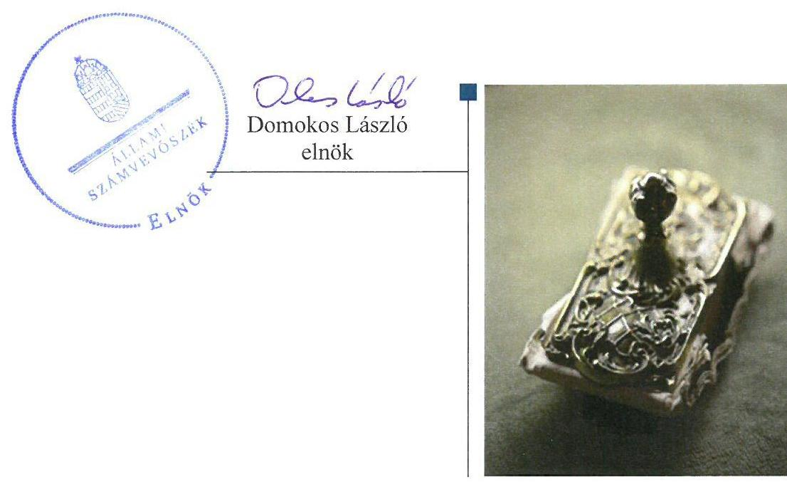
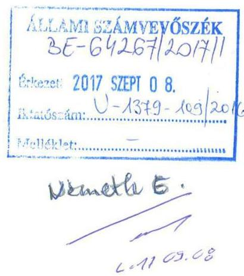
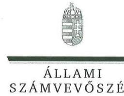
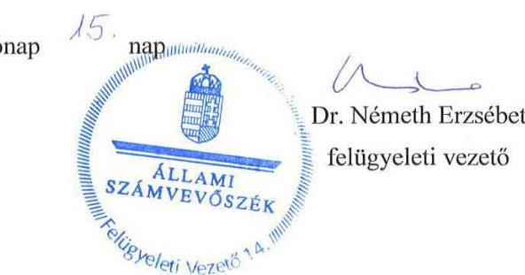

# Jelentés 

## Állami tulajdonú gazdasági társaságok

Az állami tulajdonban (résztulajdonban) lévő gazdálkodó szervezetek vagyonmegőrzési és gazdálkodási tevékenységének ellenőrzése ZKI Zöldségtermesztési Kutató Intézet Zrt.
2017.

---

# Jelentés 

## Állami tulajdonú gazdasági társaságok

Az állami tulajdonban (résztulajdonban) lévő gazdálkodó szervezetek vagyonmegőrzési és gazdálkodási tevékenységének ellenőrzése ZKI Zöldségtermesztési Kutató Intézet Zrt.
2017. October hó 12. nap

---

# AZ ELLENŐRZÉST FELÜGYELTE:

DR. NÉMETH ERZSÉBET felügyeleti vezető

## AZ ELLENŐRZÉST VEZETTE ÉS A VÉGREHAJTÁSÁÉRT FELELŐS:

BAJNAI ZSUZSANNA ellenőrzésvezető

## A PROGRAM ÖSSZEÁLLÍTÁSÁÉRT FELELŐS:

JANIK JÓZSEF LÁSZLÓ osztályvezető

IKTATÓSZÁM: V-1379-117/2016

TÉMASZÁM: 2084

ELLENŐRZÉS-AZONOSÍTÓ SZÁM: V075949

Jelentéseink az Országgyűlés számítógépes hálózatán és az Interneten a www.asz.hu címen is olvashatóak.

---

# TARTALOMJEGYZÉK 

■ ÖSSZEGZÉS ..... 5
■ AZ ELLENŐRZÉS CÉLJA ..... 6
■ AZ ELLENŐRZÉS TERÜLETE ..... 7
■ AZ ELLENŐRZÉS HÁTTERE, INDOKOLTSÁGA ..... 8
■ A JELENTÉS LÉNYEGES KÉRDÉSKÖREI ..... 9
■ ELLENŐRZÉS HATÓKÖRE ÉS MÓDSZEREI ..... 10
■ MEGÁLLAPÍTÁSOK ..... 12
■ JAVASLATOK ..... 16
■ MELLÉKLETEK ..... 17
I. sz. melléklet: Értelmező szótár ..... 17
■ FÜGGELÉK: ÉSZREVÉTELEK ..... 21
■ RÖVIDÍTÉSEK JEGYZÉKE ..... 25

---

.

---

# ÖSSZEGZÉS 

A ZKI Zöldségtermesztési Kutató Intézet Zrt. felett a Magyar Nemzeti Vagyonkezelő Zrt. a Mezőgazdasági Biotechnológiai Kutatóközpont és a Nemzeti Agrárkutatási és Innovációs Központ szabályszerűen gyakorolta a tulajdonosi jogokat. A ZKI Zöldségtermesztési Kutató Intézet Zrt. belső szabályozottsága biztosította a szabályszerű, átlátható vagyongazdálkodást, a vagyon értékének, állagának megőrzéséről gondoskodtak. A bevételek és ráfordítások elszámolása az előírások szerint történt.

## Az ellenőrzés társadalmi indokoltsága

Az állami tulajdonú gazdálkodó szervezetek a nemzeti vagyon részét képezik. Az állami vagyonnal való gazdálkodást illetően a tulajdonosi joggyakorlás és vagyongazdálkodás feladata az állami vagyon átlátható, rendeltetésszerű és felelős használatának biztosítása. Minden közpénzt, közvagyont használó szervezettel szemben társadalmi igény, hogy tevékenységéről elszámoljon. Ezt figyelembe véve és az Állami Számvevőszék Stratégiájával összhangban került sor a ZKI Zöldségtermesztési Kutató Intézet Zrt. ellenőrzésére a 2012-2015. évek vonatkozásában.

## Főbb megállapítások, következtetések

A ZKI Zöldségtermesztési Kutató Intézet Zrt. felett a Magyar Nemzeti Vagyonkezelő Zrt., 2013. szeptember 9-től megbízási szerződés alapján a Mezőgazdasági Biotechnológiai Kutatóközpont, majd 2014. január 1-jétől létrejöttét követően a Nemzeti Agrárkutatási és Innovációs Központ az előírásoknak megfelelően gyakorolta a tulajdonosi jogokat.

A ZKI Zöldségtermesztési Kutató Intézet Zrt. belső szabályzatait elkészítette, azok megfelelő keretet biztosítottak a szabályszerű vagyongazdálkodáshoz. A vagyonváltozást eredményező döntések szabályszerűek voltak, a vagyon értékének és állagának megőrzése biztosított volt.

A bevételek és ráfordítások elszámolása az előírások szerint történt. A jogszabályi és belső szabályozásban előírt beszámolási-, adatszolgáltatási kötelezettségnek a ZKI Zöldségtermesztési Kutató Intézet Zrt. eleget tett.

---

# AZ ELLENŐRZÉS CÉLJA 

Az ellenőrzés célja annak értékelése volt, hogy a tulajdonosi jogok gyakorlása szabályszerű volt-e; a gazdálkodó szervezet szabályozottsága, gazdálkodása és vagyongazdálkodási tevékenysége megfelelt-e a jogszabályi és a tulajdonosi előírásoknak; biztosítva volt-e az alkalmazott díjak megalapozottsága szabályszerű önköltségszámítással; a vagyonváltozást eredményező döntések esetében a tulajdonosi jogok gyakorlója és a gazdálkodó szervezet szabályszerűen jártak-e el.

---

# **AZ ELLENŐRZÉS TERÜLETE**

## **ZKI Zöldségtermesztési Kutató Intézet Zrt.**

A Társaság^{1} jogelődjét Kecskemét városa alapította 1943-ban.

Az ellenőrzött időszakban a Társaság részvényei a Magyar Állam kizárólagos tulajdonában voltak. A Társaság felett a tulajdonosi jogokat és kötelezettségeket az állami vagyon felügyeletért felelős miniszter az MNV Zrt.^{2} útján gyakorolta. A 1467/2013. (VII. 24.) Korm. határozat 1.b) pontjának előírása alapján a tulajdonosi joggyakorlói tevékenységet az MNV Zrt. – fenntartva magának bizonyos jogokat – megbízási szerződéssel 2013. szeptember 9-én átadta a Mezőgazdasági Biotechnológiai Kutatóközpontnak. A tulajdonosi jogokat 2014. január 1-től, létrejöttét követően, az MBK^{3} jogutódjaként a Nemzeti Agrárkutatási és Innovációs Központ gyakorolta. A Társaságnál, annak egyszemélyes jellegéből adódóan közgyűlés nem működött, a legfőbb szerv hatáskörébe tartozó kérdésekben a tulajdonosi joggyakorló döntött.

A ZKI Zöldségtermesztési Kutató Intézet Zrt. fő tevékenysége növények nemesítése, vetőmagvak termesztése és értékesítése volt, közfeladatot nem látott el, közszolgáltatást nem végzett. Vagyonkezelésbe vett állami vagyonnal nem rendelkezett.

A Társaság egyedüli tulajdonosa volt két külföldön – Szlovákiában, illetve Szerbiában – bejegyzett gazdasági társaságnak. A leányvállalatok feladata a Társaság áruinak értékesítése volt.

A ZKI Zöldségtermesztési Kutató Intézet Zrt. éves beszámolóinak kiemelt adatait az 1. táblázat ismerteti.

1. táblázat

|  BESZÁMOLÓK KIEMELT ADATAI (M FT) |  |  |  |  |   |
| --- | --- | --- | --- | --- | --- |
|  Megnevezés | 2012. | 2012. | 2013. | 2014. | 2015.  |
|   | F. 1. | VII. 31. | VII. 31. | VII. 31. | VII. 31.  |
|  Mérlegfőösszeg | 1561,1 | 1987,0 | 2389,2 | 2437,5 | 2400,6  |
|  Mérleg szerinti eredmény | 77,6 | 88,6 | 86,2 | 41,5 | 30,1  |
|  Saját tőke | 1089,2 | 1177,7 | 1263,9 | 1305,4 | 1335,5  |
|  Jegyzett tőke | 161,5 | 161,5 | 161,5 | 161,5 | 161,5  |
|  Kötelezettségek | 383,3 | 743,3 | 854,6 | 878,6 | 811,9  |
|  Követelések | 430,0 | 426,8 | 445,5 | 468,2 | 431,5  |
|   |  |  | Forrás: a Társaság 2012-2015. évi éves beszámolói |  |   |

A jelenlegi vezérigazgató 2014. június 1-től látja el feladatát, a könyvvizsgáló társaság, és a kijelölt könyvvizsgáló személye nem változott. Az átlagos statisztikai létszám 2015-ben 86 fő volt.

---

# AZ ELLENŐRZÉS HÁTTERE, INDOKOLTSÁGA 

Az állami tulajdonú gazdálkodó szervezetek ellenőrzése kiemelten fontos a nemzeti vagyon megőrzése, megóvása érdekében. Gazdálkodásuk jellemzően a közérdeklődés és a média figyelmének középpontjában áll, amihez hozzájárul a gazdálkodásuk körébe tartozó - közvetlen vagy közvetett állami tulajdonú - vagyon nagysága.

Az ÁSZ ${ }^{4}$ középtávra szóló stratégiájában megfogalmazta, hogy az államháztartáson kívülre nyújtott költségvetési támogatások és ingyenes vagyonjuttatások, valamint az államháztartáson kívül működő közfeladat-ellátó rendszerek ellenőrzéseivel hozzájárul ahhoz, hogy a közpénzeket az államháztartáson kívül működő szervezetek is átlátható, rendezett módon használják fel.

Az ellenőrzés megállapításai és javaslatai hozzájárulhatnak a nemzeti vagyonnal való gazdálkodás átláthatóságának, elszámoltathatóságának javításához. Az ellenőrzési tapasztalatok segítik és erősítik az ÁSZ hozzáadott értéket teremtő tevékenységét és tanácsadó szerepét is, mivel az ellenőrzés rámutathat az állami tulajdonú gazdálkodó szervezetek gazdálkodási tevékenységével kapcsolatos jó gyakorlatokra és szabálytalanságokra, felhívhatja a figyelmet a jogszabályi követelmények teljesítéséhez szükséges feltételek hiányosságaira.

---

# A JELENTÉS LÉNYEGES KÉRDÉSKÖREI 

1. A tulajdonosi jogok gyakorlása szabályszerű volt-e?
2. A társaság működésének szabályozottsága megfelelt-e az előírásoknak?
3. A társaságnál a pénzügyi-számviteli, adatszolgáltatási és ellenőrzési feladatok ellátása szabályszerű volt-e?
4. A társaság vagyongazdálkodása szabályszerű volt-e?

---

# ELLENŐRZÉS HATÓKÖRE ÉS MÓDSZEREI 

## Az ellenőrzés típusa

Megfelelőségi ellenőrzés.

## Az ellenőrzött időszak

A 2012. január 1-jétől 2015. december 31-ig tartó időszak.

## Az ellenőrzés tárgya

Az állami tulajdonban (résztulajdonban) lévő gazdasági társaság gazdálkodása, kiemelten vagyongazdálkodási tevékenysége, a tulajdonosi jogok gyakorlása.

Az ellenőrzés kiterjed minden olyan körülményre és adatra, amely az ÁSZ jogszabályban meghatározott feladatainak teljesítéséhez, valamint a program végrehajtása folyamán felmerült újabb összefüggések feltárásához szükséges.

## Az ellenőrzött szervezet

ZKI Zöldségtermesztési Kutató Intézet Zártkörűen Működő Részvénytársaság és a Társaság felett tulajdonosi joggyakorlók ${ }^{5}$ :

Magyar Nemzeti Vagyonkezelő Zártkörűen Működő Részvénytársaság, Mezőgazdasági Biotechnológiai Kutatóközpont,
Nemzeti Agrárkutatási és Innovációs Központ

## Az ellenőrzés jogalapja

Az ellenőrzés jogalapját az ÁSZ tv. ${ }^{6} 1 . \S$ (3) és 5. § (3)-(5) bekezdései képezik.

## Az ellenőrzés módszerei

Az ellenőrzést a nemzetközi standardokat irányadónak tekintve az ellenőrzési program ellenőrzési kérdései, az ellenőrzött időszakban hatályos jogszabályok, az ellenőrzés szakmai szabályok és módszertanok figyelembe vételével végeztük el.

---

Az ellenőrzési kérdések megválaszolásához szükséges bizonyítékok megszerzése az ellenőrzött szervezetek által rendelkezésre bocsátott, továbbá az ellenőrzés által feltárt releváns információkat tartalmazó dokumentumokra és adatokra alapozott megfigyelés, kérdésfelvetés, összehasonlítás, elemzés, továbbá mintavételezés ellenőrzési eljárások útján történt.

Az ellenőrzött szervezetek az ellenőrzés lefolytatásához tanúsítványok kitöltésével, valamint az ÁSZ által kért dokumentumok megküldésével szolgáltattak adatokat.

A bevételek és ráfordítások elszámolása, valamint a vagyonnyilvántartás terén a szabályszerű működést véletlen mintavétellel és irányított kiválasztással ellenőriztük. A jogszabályoknak és a belső előírásoknak megfelelőnek, azaz szabályszerűnek tekintettük az adott területet, amennyiben a minta ellenőrzésének eredménye alapján 95\%-os bizonyossággal a teljes sokaságban a hibaarány kisebb volt, mint 10\%, nem megfelelőnek értékeltük, ha a hibaarány a 10\%-ot meghaladta.

A vagyon értékének, állagának megőrzését megfelelőnek minősítettük, ha az eszközök pótlása az értékcsökkenési leírással arányosan történt meg.

---

# 1. A tulajdonosi jogok gyakorlása szabályszerű volt-e? 

## Összegző megállapítás

2. táblázat

## MNV ZRT ÁLTAL MEGTARTOTT JOGOK

részvények elidegenítése, megterhelése, biztosítékként történő felajánlása a tőkeemelés, a tőke leszállítása átalakítás, megszüntetés
kontrolling és eseti adatszolgáltatás kérése
tulajdonosi ellenőrzés
Forrás: Megbízási szerződés

## A Társaság feletti tulajdonosi joggyakorlás szabályszerű volt.

AZ MNV ZRT. a Vtv. ${ }^{7}$ alapján gyakorolta a tulajdonosi jogokat és kötelezettségeket a Magyar Állam nevében.

Az MNV Zrt. a 1467/2013. (VII.24.) Kormányhatározat 1.b) pontjában foglaltak alapján Megbízási szerződés ${ }^{8}$-t kötött 2013. szeptember 9-én a vidékfejlesztési miniszter által kijelölt költségvetési szervvel, az MBK-val a tulajdonosi jogok gyakorlására. Egyes a Megbízási szerződésben meghatározott tulajdonosi jogokat az MNV Zrt. fenntartott magának, amelyeket a 2. táblázat ismertet. A tulajdonosi jogok gyakorlója 2014. január 1-jei megalapítását követően jogutódként a NAIK ${ }^{9}$ lett.

Az MNV Zrt. az SZMSZ ${ }^{10}$-ében és belső szabályzataiban rendelkezett az állami tulajdonban álló társasági részesedések hasznosításával, értékesítésével, kezelésével kapcsolatos feladatokról.

AZ MBK ÉS A NAIK feladataikat a Megbízási szerződés keretei között látták el.

A TÁRSASÁG ALAPÍTÓ OKIRATÁBAN ${ }^{11}$ meghatározták az alapító kizárólagos hatáskörébe tartozó döntések körét, rendelkeztek a tulajdonosi joggyakorló képviseletéről az FB${ }^{12}$-ben, valamint a könyvvizsgáló személyéről. Az FB tagjainak száma három fő volt, összhangban a Taktv. ${ }^{13}$ és Ptk. ${ }_{2}$ előírásaival, a Gt. ${ }^{14}$-nek és a Ptk. ${ }_{2}{ }^{15}$-nek megfelelő ügyrendjük szerint működtek.

AZ ÜZLETI TERVEK elkészítéséhez az MNV Zrt. tervezési irányelveket adott ki. A Társaság minden évben az irányelvekben foglaltaknak megfelelően készítette el az üzleti terveket, melyeket az FB megtárgyalt és elfogadásra javasolt, a tulajdonosi joggyakorlók pedig jóváhagytak.

A SZÁMVITELI BESZÁMOLÓKAT - az FB előzetes írásbeli véleményezését követően - a tulajdonosi joggyakorlók a Gt.-ben, illetve a Ptk. ${ }_{2}$-ben előírtaknak megfelelően a könyvvizsgálói jelentések birtokában fogadtak el.

---

# 2. A társaság működésének szabályozottsága megfelelt-e az előírásoknak? 

Összegző megállapítás

A Társaság működésének szabályozottsága megfelelt az előírásoknak.

A SZÁMVITELI POLITIKÁBAN ${ }^{16}$ a Számv. tv. ${ }^{17}$ előírásaival összhangban meghatározták a számviteli beszámoló elkészítése során alkalmazandó elveket, értékelési módszereket és eljárásokat. Elkészítették és aktualizálták az eszközök és források Leltárkészítési és leltározási szabályzatát ${ }^{18}$, az Értékelési szabályzatot, ${ }^{19}$ az Önköltségszámítási szabályzatot ${ }^{20}$ és a Pénzkezelési szabályzatot ${ }^{21}$. A szabályzatok tartalmazták a vagyon megőrzését, védelmét biztosító előírásokat, az értékcsökkenési leírás módszerét, elszámolásának gyakoriságát.

A SZÁMLAREND ${ }^{22}$ tartalmazta minden alkalmazásra kijelölt számla számjelét, megnevezését, növekedésének, csökkenésének jogcímeit, a számlát
 érintő gazdasági eseményeket, azok más számlákkal és az analitikus nyilvántartással való kapcsolatát. Rendelkeztek a számlarendben foglaltakat alátámasztó bizonylati renddel.

A javadalmazási szabályzatot ${ }^{23}$ megalkották. A szabályzat a Taktv. előírásainak megfelelően rendelkezett a vezető tisztségviselők, FB tagok, valamint a vezető állású munkavállalók javadalmazása, a jogviszony megszűnése esetére biztosított juttatások módjának, mértékének elveiről, annak rendszeréről.

## 3. A társaságnál a pénzügyi-számviteli, adatszolgáltatási és ellenőrzési feladatok ellátása szabályszerű volt-e?

Összegző megállapítás

A pénzügyi-számviteli, adatszolgáltatási feladatokat az előírásoknak megfelelően végezték. Az ellenőrzési feladatok ellátása a belső ellenőrzés működtetési területén feltárt hiányosság mellett összességében szabályszerű volt.
3.1. számú megállapítás

A bevételek és a ráfordítások elszámolása a jogszabályi és a belső szabályzatok rendelkezéseinek betartásával történt.

A bevételek számviteli elszámolása a Számv. tv.-nek és a belső szabályzatokban foglaltaknak, a számlázási árak a kialakított árlistának megfeleltek. Az előállított termékek önköltségét az Önköltségszámítási szabályzat szerinti utókalkulációval számították ki, amely információt szolgáltatott az árképzéshez.

A szabályszerű követeléskezelés érdekében Követelés- és partnerkezelési szabályzat ${ }^{24}$-ot készítettek, a lejárt határidejű követeléseket behajtásra külső szervezetnek átadták. A megtett intézkedések ellenére a határidőn túli követelések értéke több mint 10%-al nőtt, 235,1 millió Ft-ra 2015 végére a 2012 évi záró adathoz képest.

---

A ráfordítások elszámolása számviteli bizonylatok alapján, szerződés szerinti teljesítéssel, a megfelelő főkönyvi számlákra történt. A munkabérek kifizetése összhangban volt a munkaszerződésekkel, jelenléti ívekkel. A személyi jellegű egyéb kifizetésekre a jogszabályi előírások figyelembe vételével került sor.

Az értékcsökkenés elszámolása megfelelt a Számv. tv., a számviteli politika és az értékelési szabályzat előírásainak. Az éves beszámolók kiegészítő mellékletében az elszámolt értékcsökkenést bemutatták, azonban nem ismertették elszámolásának gyakoriságát a Számv. tv. 88. § (4) bekezdése ellenére.
3.2. számú megállapítás

3.3. számú megállapítás

Az adatszolgáltatási és beszámolási kötelezettségeket összességében teljesítették.

Monitoring rendszer keretében az MNV Zrt. éves, és évközi adatszolgáltatási kötelezettséget írt elő a mérleg, az eredmény-kimutatás terv és tényadatairól, kiegészítve egyéb gazdasági információkkal, melynek a Társaság eleget tett, az alapítói határozatokban előírt eseti feladatait teljesítette.

A Taktv. szerinti közérdekű adatokat közzétették.
A vezérigazgató az Gt. 244. § (2) és a Ptk. 3:284. § (1) bekezdése ellenére nem készített háromhavonta jelentést a Társaság vagyoni helyzetéről és üzletpolitikájáról az FB részére, arra rendszertelenül került sor, négy tájékoztatás maradt el 2012-2015 között.

Az éves beszámolók letétbe helyezéséről és közzétételéről a Számv. tv.-ben foglaltaknak megfelelően gondoskodtak.

A Társaság kialakította a belső ellenőrzés rendszerét, azonban a belső ellenőrzési szabályzatban előírt ellenőrzési tervet 2015. év kivételével nem készítették el.

A belső ellenőrzés rendszerét a Társaság kialakította. A Belső ellenőrzési szabályzat ${ }^{25}$-ban foglaltak ellenére a 2012-2014. években éves ellenőrzési tervet nem készítettek. A 2015. évben ellenőrzési terv szerint a leltározást, a pénztárt és a követeléskezelést ellenőrizték. Az intézkedési tervben foglalt feladatokat végrehajtották.

Az MNV Zrt. a követeléskezelést és a Társaság szerződéses jogviszonyainak szabályszerűségét, gazdasági célszerűségét - a belső ellenőr bevonásával - vizsgálta a 2012-2013. években, a javaslatai hasznosultak.

---

# 4. A társaság vagyongazdálkodása szabályszerű volt-e? 

## Összegző megállapítás

A vagyongazdálkodás szabályszerű volt; a feltételek kialakítása, az ennek során meghozott döntések, a vagyon nyilvántartása megfelelt az előírásoknak. A vagyon értékének, állagának megőrzése biztosított volt.

A vagyongazdálkodás feltételeit kialakították. A Társaság vagyongazdálkodása vonatkozásában a feladat- és hatásköröket, valamint a felelősségi viszonyokat az alapító okiratban, szervezeti és működési szabályzatban, a számviteli politika keretében elkészített szabályzatokban határozták meg.

## A vagyonváltozást eredményező dönté-

sek szabályszerűek voltak. Az üzleti tervek tartalmazták a beruházásokat, felújításokat, karbantartási tervek készültek. A tervezett beruházásokról, felújításokról, selejtezésről - a hatáskörében eljárva - a vezérigazgató döntött, az értékhatárhoz kötött esetekben tulajdonosi joggyakorlók határoztak.

A vagyon nyilvántartása során az analitikus és főkönyvi nyilvántartási rendszer biztosította a Társaság vagyonának a Számv. tv., és a belső szabályozás szerinti nyilvántartását, a változások folyamatos nyomon követését.

A két külföldi - 100%-ban a Társaság tulajdonában lévő - leányvállalat részesedéseinek nyilvántartása, értékelése a jogszabályi és belső előírások alapján történt.

A leltárak az ellenőrzött évek beszámolóinak mérlegét alátámasztották. Az eszközök és források mennyiségi felvétellel és egyeztetéssel végzett leltározása megfelelt a jogszabályban és a Leltározási és leltárkészítési szabályzatban foglalt előírásoknak.

## A vagyon értékének, állagának megőrzé-

séről gondoskodtak, a Társaság vagyona a nyereséges gazdálkodás következtében mintegy másfélszeresére nőtt az ellenőrzött időszakban. A megvalósított beruházások, felújítások együttes értéke - 628,0 millió Ft - jelentősen meghaladta az elszámolt - 258,0 millió Ft - amortizációt, állagmegóvásra 59,7 millió Ft-ot fordítottak.

A vagyonnövekedés kisebbik hányadát - mintegy negyedét - fedezte a Társaság saját tőkéjének növekedése, nagyobb részt fejlesztési támogatásból és hitelből finanszírozták azt.

---

# JAVASLATOK 

Az ÁSZ tv. 33. § (1) bekezdésében foglaltak értelmében az ellenőrzött szervezet vezetője köteles a jelentésben foglalt megállapításokhoz kapcsolódó intézkedési tervet összeállítani és azt a jelentés kézhezvételétől számított 30 napon belül az ÁSZ részére megküldeni. Amennyiben az ellenőrzött szervezet vezetője nem küldi meg határidőben az intézkedési tervet, vagy továbbra sem elfogadható intézkedési tervet küld, az Állami Számvevőszék elnöke az ÁSZ tv. 33. § (3) bekezdése a) és b) pontjaiban foglaltakat érvényesítheti.

## A ZKI Zrt. vezérigazgatójának

1. Intézkedjen, hogy a jogszabályban előírt gyakorisággal készüljenek jelentések a társaság vagyoni helyzetéről és üzletpolitikájáról a ZKI Zrt. felügyelőbizottsága részére.
3.2. sz. megállapítás 3. bekezdése alapján)

---

# MELLÉKLETEK 

- I. SZ. MELLÉKLET: ÉRTELMEZŐ SZÓTÁR
állami vagyon

2012. november 9-ig:
a) Az állam tulajdonában lévő dolog, valamint a dolog módjára hasznosítható természeti erő,
b) Az a) pont hatálya alá nem tartozó mindazon vagyon, amely vonatkozásában törvény az állam kizárólagos tulajdonjogát nevesíti,
c) az állam tulajdonában lévő tagsági jogviszonyt megtestesítő értékpapír, illetve az államot megillető egyéb társasági részesedés,
d) az államot megillető olyan immateriális, vagyoni értékkel rendelkező jogosultság, amelyet jogszabály vagyoni értékű jogként nevesít.
Forrás: Vtv. 1. § (2) bekezdése
2012. november 10-től az állami vagyon fogalma kiegészül a következő ponttal:
a) az állam tulajdonában lévő pénzügyi eszközök

Forrás: Vtv. 1. § (2) bekezdése
2013. június 30-ig gazdálkodó szervezet:
Az állami vállalat, az egyéb állami gazdálkodó szerv, a szövetkezet, a lakásszövetkezet, az európai szövetkezet, a gazdasági társaság, az európai részvénytársaság, az egyesülés, az európai gazdasági egyesülés, az európai területi együttműködési csoportosulás, az egyes jogi személyek vállalata, a leányvállalat, a vízgazdálkodási társulat, az erdőbirtokossági társulat, a végrehajtói iroda, az egyéni cég, továbbá az egyéni vállalkozó.
Forrás: Ptk. ${ }^{26}$ 685. § c) pontja
2013. július 1-jétől gazdálkodó szervezet:
Az állami vállalat, az egyéb állami gazdálkodó szerv, a szövetkezet, a lakásszövetkezet, az európai szövetkezet, a gazdasági társaság, az európai részvénytársaság, az egyesülés, az európai gazdasági egyesülés, az európai területi együttműködési csoportosulás, az egyes jogi személyek vállalata, a leányvállalat, a vízgazdálkodási társulat, az erdőbirtokossági társulat, a végrehajtói iroda, az egyéni cég, továbbá az egyéni vállalkozó. Az állam, a helyi önkormányzat, a költségvetési szerv, az egyesület, a köztestület, valamint az alapítvány gazdálkodó tevékenységével összefüggő polgári jogi kapcsolataira is a gazdálkodó szervezetre vonatkozó rendelkezéseket kell alkalmazni, kivéve, ha a törvény e jogi személyekre eltérő rendelkezést tartalmaz; a 292/A-292/B. §, 301/A-301/B. §, 405. § (1) bekezdés, valamint a 407/A. § (1) bekezdés tekintetében nem minősül gazdálkodó szervezetnek az, aki a közbeszerzésekről szóló törvény értelmében ajánlatkérő (szerződő hatóság).
Forrás: Ptk. 685. § c) pontja
2014. március 15-től gazdálkodó szervezet:

A gazdasági társaság, az európai részvénytársaság, az egyesülés, az európai gazdasági egyesülés, az európai területi együttműködési csoportosulás, a szövetkezet, a lakásszövetkezet, az európai szövetkezet, a vízgazdálkodási társulat, az erdőbirtokossági társulat, az állami vállalat, az

---

egyéb állami gazdálkodó szerv, az egyes jogi személyek vállalata, a közös vállalat, a végrehajtói iroda, a közjegyzői iroda, az ügyvédi iroda, a szabadalmi ügyvivői iroda, az önkéntes kölcsönös biztosító pénztár, a magánnyugdíjpénztár, az egyéni cég, továbbá az egyéni vállalkozó. Az állam, a helyi önkormányzat, a költségvetési szerv, az egyesület, a köztestület, valamint az alapítvány gazdálkodó tevékenységével összefüggő polgári jogi kapcsolataira is a gazdálkodó szervezetre vonatkozó rendelkezéseket kell alkalmazni.
Forrás: Ppt. ${ }^{27}$ 396. §
gazdasági társaság
tulajdonosi ellenőrzés
tulajdonosi jogok gyakorlója
egyéb állami gazdálkodó szerv, az egyes jogi személyek vállalata, a közös vállalat, a végrehajtói iroda, a közjegyzői iroda, az ügyvédi iroda, a szabadalmi ügyvivői iroda, az önkéntes kölcsönös biztosító pénztár, a magánnyugdíjpénztár, az egyéni cég, továbbá az egyéni vállalkozó. Az állam, a helyi önkormányzat, a költségvetési szerv, az egyesület, a köztestület, valamint az alapítvány gazdálkodó tevékenységével összefüggő polgári jogi kapcsolataira is a gazdálkodó szervezetre vonatkozó rendelkezéseket kell alkalmazni.
Forrás: Ppt. ${ }^{27}$ 396. §
A Ptk. 3:88. § (1) bekezdése szerint „a gazdasági társaságok üzletszerű közös gazdasági tevékenység folytatására, a tagok vagyoni hozzájárulásával létrehozott, jogi személyiséggel rendelkező vállalkozások, amelyekben a tagok a nyereségből közösen részesednek, és a veszteséget közösen viselik".
2014. március 14-ig:

Az állami vagyon kezelőjét, haszonélvezőjét, használóját megillető jogok gyakorlását, annak szabályszerűségét, célszerűségét az MNV Zrt. szükség szerint területi szervei útján ellenőrzi.
2014. március 15-től:

Az állami vagyon használóját, vagyonkezelőjét és haszonélvezőjét megillető jogok gyakorlását, annak szabályszerűségét, a kötelezettségek teljesítését, valamint a vagyon rendeltetése szerinti célszerűségét a tulajdonosi joggyakorló rendszeresen ellenőrzi.
Forrás: Vhr. 20. §.(1)
1.
2013. június 27-ig:

Az állami vagyon felett a Magyar Államot megillető tulajdonosi jogok és kötelezettségek összességét - ha törvény eltérően nem rendelkezik - az állami vagyon felügyeletéért felelős miniszter (a továbbiakban: miniszter) gyakorolja, aki e feladatát a Magyar Nemzeti Vagyonkezelő Zártkörűen Működő Részvénytársaság (a továbbiakban: MNV Zrt.), a Magyar Fejlesztési Bank, illetve a tulajdonosi joggyakorló szervezet útján látja el. A miniszter miniszteri rendeletben, a törvényben meghatározott állami vagyoni kör tekintetében, meghatározott időtartamra, a joggyakorlás egyes szabályainak meghatározásával - az őt megillető tulajdonosi jogok és kötelezettségek összességének, illetve azok meghatározott részének gyakorlóját az Áht. szerinti központi költségvetési szervek, ezek intézménye, továbbá a 100%-ban állami tulajdonban álló gazdasági társaságok közül kijelölheti.
Forrás: Vtv. 3. § (1) és (2)
2013. június 28-ától:

A rábízott állami vagyon felett az államot megillető tulajdonosi jogok és kötelezettségek összességét tulajdonosi joggyakorlóként:
ha törvény vagy miniszteri rendelet eltérően nem rendelkezik, a Magyar Nemzeti Vagyonkezelő Zártkörűen Működő Részvénytársaság (a továbbiakban: MNV Zrt.),
törvényben kijelölt személy vagy
az állami vagyon felügyeletéért felelős miniszter (a továbbiakban: miniszter) által rendeletben kijelölt személy gyakorolja.

---

[...] A miniszter e törvény felhatalmazása alapján - a meghatározott célok hatékonyabb elérése érdekében, miniszteri rendeletben, az ott meghatározott állami vagyoni kör tekintetében, meghatározott időtartamra - e törvény keretei között, a joggyakorlás egyes szabályainak meghatározásával - az államot megillető tulajdonosi jogok és kötelezettségek összességének, illetve azok meghatározott részének gyakorlóját az Áht. szerinti központi költségvetési szervek, ezek intézménye, továbbá a 100%-ban állami tulajdonban álló gazdasági társaságok közül kijelölheti.
Forrás: Vtv. 3. § (1) és (2)
2.

Aki a nemzeti vagyon felett az államot vagy a helyi önkormányzatot megillető tulajdonosi jogok és kötelezettségek összességének gyakorlására jogosult.
Forrás: Nvtv. 3. § (1) 17. pontja

---

.

---

#

 FÜGGELÉK: ÉSZREVÉTELEK 

A jelentéstervezetet a Számvevőszék 15 napos észrevételezésre megküldte az ellenőrzött szervezetek vezetőinek az ÁSZ tv. 29. § (1) bekezdése előírásának megfelelően.

A függelék tartalmazza a ZKI Zöldségtermesztési Kutató Intézet vezérigazgatója által megküldött észrevételeket, az azokra adott válaszokat, illetve az el nem fogadott észrevételek elutasításának indoklását.

[^0]
[^0]:    * 29. § (1) Az Állami Számvevőszék az ellenőrzési megállapításait megküldi az ellenőrzött szervezet vezetőjének vagy az általa megbízott személynek, és annak, akinek személyes felelősségét állapította meg.
    (2) Az ellenőrzött szervezet vezetője és a felelősként megjelölt személy az ellenőrzés megállapításaira tizenöt napon belül írásban észrevételt tehet.
    (3) Az Állami Számvevőszék az észrevételre a beérkezésétől számított harminc napon belül írásban válaszol. A figyelembe nem vett észrevételeket köteles a jelentésben feltüntetni, és megindokolni, hogy azokat miért nem fogadta el.

---

# ZKI ZÖLDSÉGTERMESZTÉSI KUTATÓ INTÉZET ZÁRTKÖRÜEN MÜKÖDŐ RÉSZVÉNYTÁRSASÁG   VEGETABLE CROPS RESEARCH INSTITUTE COMPANY 

11-6000 Kecskemét, Mészöly Gyula út 6. $\cdot$ Roslacón: 11-6004 Kecskemét Pf: 116. - Tel.: 1-362 76/481-329 $\cdot$ Fax: 1-362 76/507-372 e-mail: zklanoc@zk.hu $\cdot$ web: www.zk.hu $\cdot$ RSH: 291 10402506-25000018-00000000 $\cdot$ adószám: 11575629-250  vevőirmagbalt: 1-362 76/417-446

Ikt.szám: 4/10-1/2017/K.

Állami Számvevőszék

## Domokos László

elnök

1364 Budapest 4.
Pf: 54
Ikt. szám: V-1379-104/2016

Tisztelt Elnök Úr!

Az ,,Állami tulajdonban (résztulajdonban) lévő gazdálkodó szervezetek vagyonmegőrzési és gazdálkodási tevékenységének ellenőrzése - ZKI zöldségtermesztési Kutató Intézet Zrt. 2017" című, 2017. augusztus 24-én kelt jelentéstervezetüket megkaptuk.

Az anyagban foglaltakkal egyetértünk, ahhoz érdemi észrevételt nem kívánunk tenni.
A jelentéstervezet 7. oldalának utolsó bekezdésében - feltehetően elírás folytán - társaságunk 2015. évi statisztikai létszáma hibásan 110 főben került meghatározásra. Kérjük ennek javítását - a hivatalos 2015. évi beszámolóban is szereplő - 86 főre.

A végleges jelentés elkészültét követően, a megfogalmazott javaslatok alapján intézkedési tervet készítünk és a hibás gyakorlatot módosítjuk.

Kecskemét, 2017. szeptember 05.

Tisztelettel:

ZKI Zöldségtermesztési Kutató Intézet Zártkörűen Működő Részvénytársaság 6000 Kecskemét, Mészöly Gyula út 6.

---

ELNÖK

# Laczkó Róbert úr 

vezérigazgató

ZKI Zöldségtermesztési Kutatóintézet Zrt.

## Kecskemét

## Tisztelt Vezérigazgató Úr!

„Állami tulajdonú gazdasági társaságok - Az állami tulajdonban (résztulajdonban) lévő gazdálkodó szervezetek vagyonmegőrzési és gazdálkodási tevékenységének ellenőrzése - ZKI Zöldségtermesztési Kutató Intézet Zrt." című jelentéstervezetre tett észrevételeit köszönettel megkaptam.

Az ellenőrzési megállapításokra vonatkozó észrevételét az Állami Számvevőszékről szóló 2011. évi LXVI. törvény 29. § (2) bekezdésében meghatározott tizenöt napos határidőn belül küldte meg. Az Állami Számvevőszék észrevétellel kapcsolatos álláspontját a mellékletként csatolt, a felügyeleti vezető által készített indokolás tartalmazza.

Budapest, 2017. 09. hó ${ }^{15}$ nap

Tisztelettel:

Melléklet: Észrevételre adott válasz

Domokos László

---

"„Állami tulajdonú gazdasági társaságok - Az állami tulajdonban (résztulajdonban) lévő gazdálkodó szervezetek vagyonmegőrzési és gazdálkodási tevékenységének ellenőrzése - ZKI Zöldségtermesztési Kutató Intézet Zrt. " című jelentéstervezethez tett észrevételre adott válasz

ZKI Zrt.
"„Állami tulajdonú gazdasági társaságok - Az állami tulajdonban (résztulajdonban) lévő gazdálkodó szervezetek vagyonmegőrzési és gazdálkodási tevékenységének ellenőrzése - ZKI Zöldségtermesztési Kutató Intézet Zrt. " című jelentéstervezetre tett észrevételeket áttekintettem, annak kezelésével kapcsolatban a következő tájékoztatást adom.
Az 1. számú észrevétel a jelentéstervezet megállapításait nem vitatja, pontosítást javasol az Ellenőrzés területe fejezetben, a 7. oldal 5. bekezdésében szereplő létszám adatot érintően.
Az észrevétel kapcsán az érintett mondatot módosítottuk, a jelentéstervezetben szereplő létszámadatot pontosítottuk.

Budapest, 2017.

---

# RÖVIDÍTÉSEK JEGYZÉKE 

${ }^{1}$ Társaság
${ }^{2}$ MNV Zrt.
${ }^{3}$ MBK
${ }^{4}$ ÁSZ
${ }^{5}$ tulajdonosi joggyakorlók
${ }^{6}$ ÁSZ tv.
${ }^{7}$ Vtv.
${ }^{8}$ Megbízási szerződés
${ }^{9}$ NAIK
${ }^{10}$ MNV Zrt. SZMSZ-e
${ }^{11}$ Alapító okirat
${ }^{12} \mathrm{FB}$
${ }^{13}$ Taktv.
${ }^{14} \mathrm{Gt}$.
${ }^{15} \mathrm{Ptk}_{2}$
${ }^{16}$ Számviteli politika
${ }^{17}$ Számv. tv.
${ }^{18}$ Leltárkészítési és leltározási szabályzat
${ }^{19}$ Értékelési szabályzat
${ }^{20}$ Önköltségszámítási szabályzat
${ }^{21}$ Pénzkezelési szabályzat
${ }^{22}$ Számlarend
${ }^{23}$ Javadalmazási szabályzat
${ }^{24}$ Követelés- és partnerkezelési szabályzat
${ }^{25}$ Belső ellenőrzési szabályzat
${ }^{26} \mathrm{Ptk}_{1}$
${ }^{27} \mathrm{Ppt}$.

ZKI Zöldségtermesztési Kutató Intézet Zártkörűen Működő Részvénytársaság Magyar Nemzeti Vagyonkezelő Zártkörűen Működő Részvénytársaság Mezőgazdasági Biotechnológiai Kutatóközpont
Állami Számvevőszék
Magyar Nemzeti Vagyonkezelő Zártkörűen Működő Részvénytársaság, Mezőgazdasági Biotechnológiai Kutatóközpont,
Nemzeti Agrárkutatási és Innovációs Központ
2011. évi LXVI. törvény az Állami Számvevőszékről
2007. évi CVI. törvény az állami vagyonról

Megbízási szerződés társasági részesedéshez kapcsolódó tulajdonosi jogok gyakorlására, SZT-40891
Nemzeti Agrárkutatási és Innovációs Központ
Magyar Nemzeti Vagyonkezelő Zrt. 301/2011.(V.30.) IG Határozattal kiadott Szervezeti és Működési Szabályzata és annak módosításai (hatályos 2012. január 1-jétől)
Alapító okirata és annak módosításai (hatályos 2011. május 16-tól)
ZKI Zöldségtermesztési Kutató Intézet Zártkörűen Működő Részvénytársaság felügyelő bizottsága
2009. évi CXXII. törvény a köztulajdonban álló gazdasági társaságok takarékosabb működéséről szóló
2006. évi IV. törvény a gazdasági társaságokról (hatálytalan 2014. március 15-től)
2013. évi törvény a Polgári Törvénykönyvről (hatályos 2014. március 15-től)

Számviteli politika és annak módosításai (hatályos 2011. január 1-jétől)
2000. évi C. törvény, a számvitelről

Leltározási szabályzat és annak módosítása (hatályos 2001. március 1-jétől)
Értékelési szabályzat és annak módosításai (hatályos 2001. március 30-tól)
Önköltségszámítási szabályzat (hatályos 2008. november 12-től)
Pénzkezelési szabályzat és annak módosításai (hatályos 2001. március 1-jétől)
Számlarend (hatályos 2001. március 30-tól)
Javadalmazási szabályzat és annak módosításai (hatályos 2010. január 27-től)
Követelés- és partnerkezelési szabályzat (hatályos 2013. február 28-tól)
Belső ellenőrzési szabályzat (hatályos 2001. március 1-jétől)
1959. évi IV. törvény a Polgári Törvénykönyvről (hatálytalan 2014. március 15-től)
1952. évi III. törvény a polgári perrendtartásról

---

# ÁLLAMI SZÁMVEVŐSZÉK 

1052 Budapest, Apáczai Csere János utca 10.
Levélcím: 1364 Budapest 4. Pf. 54
Telefon: +36 14849100 Telefax: +36 14849200
www.asz.hu
