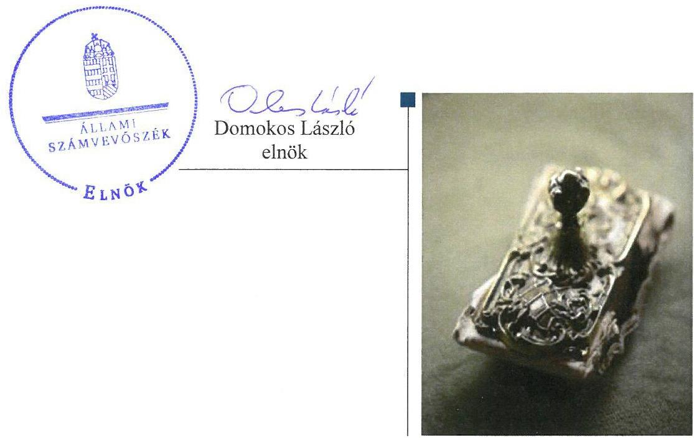

# Jelentés 

## Önkormányzatok belső kontrollrendszere

Az önkormányzatok belső kontrollrendszere kialakításának és működtetésének ellenőrzése - Bácsborsód
2017. 10. hó 03. nap

---

# AZ ELLENŐRZÉST FELÜGYELTE:

- RENKŐ ZSUZSANNA felügyeleti vezető
- AZ ELLENŐRZÉST VEZETTE ÉS A VÉGREHAJTÁSÁÉRT FELELŐS:
  - DÉR LÍVIA ellenőrzésvezető
  - A PROGRAM ÖSSZEÁLLÍTÁSÁÉRT FELELŐS:
    - JANIK JÓZSEF osztályvezető

- IKTATÓSZÁM: V-1244-066/2016.
- TÉMASZÁM: 2278
- ELLENŐRZÉS-AZONOSÍTÓ SZÁM: V-076409

Jelentéseink az Országgyűlés számítógépes hálózatán és az Interneten a www.asz.hu címen is olvashatóak.

---

# TARTALOMJEGYZÉK 

■ ÖSSZEGZÉS ..... 5
■ AZ ELLENŐRZÉS CÉLJA ..... 6
■ AZ ELLENŐRZÉS TERÜLETE ..... 7
■ AZ ELLENŐRZÉS HÁTTERE, INDOKOLTSÁGA ..... 8
■ A JELENTÉS LÉNYEGES KÉRDÉSKÖREI ..... 10
■ ELLENŐRZÉS HATÓKÖRE ÉS MÓDSZEREI ..... 11
■ MEGÁLLAPÍTÁSOK ..... 13
■ JAVASLATOK ..... 18
■ MELLÉKLETEK ..... 21
I. sz. melléklet: Értelmező szótár ..... 21
II. sz. melléklet: Az integritás szemlélet érvényesítésével és az integritás kontrollrendszer kiépítettségével kapcsolatos megállapítások ..... 23
■ FÜGGELÉK: ÉSZREVÉTELEK ..... 25
■ RÖVIDÍTÉSEK JEGYZÉKE ..... 27

---

.

---

# ÖSSZEGZÉS 

Bácsborsód Községi Önkormányzatnál a belső kontrollrendszer kialakításának és működtetésének hiányosságai miatt a közpénzfelhasználás szabályossága nem volt biztosított. Az értékpapírok adás-vételével kapcsolatos döntések nem voltak szabályszerűek. Az önkormányzati befektetésekre vonatkozó adatok nem voltak megbízhatóak. Az Önkormányzatnál nem építették ki a megfelelő védelmet a korrupciós veszélyekkel szemben.

## Az ellenőrzés társadalmi indokoltsága

Magyarország Alaptörvénye az önkormányzatoktól is elvárja a kiegyensúlyozott, átlátható és fenntartható költségvetési gazdálkodás elvének érvényesítését. Az önkormányzatok által betöltött társadalmi szerep, az általuk kezelt közpénz nagysága, a nemzeti vagyon átruházására vagy hasznosítására vonatkozó döntéseik sokrétűsége egyaránt indokolttá tették a számvevőszéki ellenőrzések folytatását. A korábbi évek ellenőrzési tapasztalatai igazolták azt, hogy a belső kontrollrendszer kialakítása és működtetése nélkül nem valósítható meg a közpénzek, a közvagyon szabályos, gazdaságos, hatékony és eredményes felhasználása. A kockázatok alapján fennállt a lehetősége annak, hogy az önkormányzatok befektetési döntései, továbbá a döntések végrehajtása és számviteli elszámolása nem voltak teljes mértékben szabályszerűek, és a kapcsolódó belső kontrollrendszerek sem működtek minden esetben megfelelően.

Bácsborsód Község Önkormányzata 2015. december 31-én 6,3 millió Ft vételi áron vásárolt tőkegarantált befektetési jeggyel rendelkezett.

## Főbb megállapítások, következtetések

Az egyes befektetések vonatkozásában 2011-2015 között, a gazdálkodás egészét érintően a 2015. évben a belső kontrollrendszer kialakítása és működtetése a pillérek összesített értékelése alapján nem volt szabályszerű, ezért azok nem biztosították a közpénzfelhasználás szabályosságát. A kontrolltevékenységek nem járultak hozzá a hibák megelőzéséhez, feltárásához. A befektetések vonatkozásában 2011-2015 között a kockázatkezelési rendszert nem működtették, nem mérték fel a kockázatokat, nem határozták meg ezen kockázatokkal kapcsolatban szükséges intézkedéseket, valamint azok teljesítése folyamatos nyomon követésének módját. Az önkormányzati gazdálkodás átláthatóságát nem biztosították, mivel nem tették közzé a befektetési jegyek vásárlására és visszaváltására vonatkozó adatokat.

Az értékpapírok adás-vételére vonatkozó döntéseket nem az arra jogosult hozta meg. A döntések végrehajtása során - a befektetési jegyek vételére vonatkozó kötelezettségvállalások szabálytalan ellenjegyzése miatt - nem volt biztosított a vagyonnal való felelős gazdálkodás.

A számviteli nyilvántartásban feltárt hibák miatt nem álltak rendelkezésre megbízható információk az Önkormányzat befektetéseiről. A befektetési jegyekről nem vezettek a jogszabályban meghatározott tartalmi követelményeknek megfelelő részletező nyilvántartást.

Az Önkormányzatnál nem tettek erőfeszítéseket az integritás szemlélet érvényesítése érdekében. Az integritás kontrollok kiépítettsége nem volt egyensúlyban a korrupciós kockázatok szintjével.

---

# AZ ELLENŐRZÉS CÉLJA 

Az ellenőrzés célja annak megállapítása volt, hogy szabályszerűen történt-e az Önkormányzat belső kontrollrendszerének kialakítása és működtetése, az biztosította-e az Önkormányzatnál a közpénzfelhasználás szabályosságát, a közpénzekkel és a nemzeti vagyonnal történő szabályszerű és felelős gazdálkodást, a beszámolási és adatszolgáltatási kötelezettségek szabályszerű teljesítését. Az ellenőrzés keretében értékeltük az Önkormányzat korrupciós kockázatainak kezelését szolgáló integritás kontrollok kiépítettségét és az integritás szemlélet érvényesülését.

Az Önkormányzat egyes befektetési tevékenységeinek ellenőrzése során az ellenőrzés célja az volt, hogy a kialakított kontrollkörnyezet biztosította-e a befektetési tevékenységek szabályszerű végzését. Megítéltük, hogy az egyes befektetési tevékenységekkel kapcsolatos döntéshozatal és a döntések végrehajtása, valamint az egyes befektetések számviteli elszámolása, nyilvántartása szabályszerű volt-e, és a belső és külső ellenőrzések hozzájárultak-e az egyes befektetési tevékenységek szabályszerűségéhez.

---

# **AZ ELLENŐRZÉS TERÜLETE**

## **Bácsborsód Községi Önkormányzat**

A Bács-Kiskun megyében fekvő Bácsborsód község állandó lakosainak száma 2015. január 1-jén 1222 fő volt. Az Önkormányzat1 hét tagú Képviselő-testületének munkáját egy állandó bizottság segítette. Az Önkormányzat egy intézménnyel rendelkezett, gazdasági társaságban részesedése nem volt. A polgármester az 1990. évi önkormányzati választások óta tölti be tisztségét. A jegyző 2006. óta látja el feladatait.

A 2011-2012. években az önkormányzati feladatok ellátását Körjegyzőség segítette. Az Önkormányzat 2013. március 1-jétől Katymár Községi Önkormányzattal, Katymár székhellyel Közös Önkormányzati Hivatalt hozott létre, amely gazdasági szervezettel nem rendelkezett. A Hivatalban foglalkoztatott köztisztviselők száma 2015. év végén 11 fő volt. A településen Nemzetiségi Önkormányzat2 működött.

Az Önkormányzat 2015. évi költségvetési beszámolója szerint 160,6 millió Ft költségvetési bevételt ért el, valamint 140,8 millió Ft költségvetési kiadást teljesített. Az Önkormányzat által kimutatott eszközvagyon értéke 2015. december 31-én 311,5 millió Ft volt. A forrásokon belül a költségvetési évben esedékes kötelezettség állomány 0,1 millió Ft, a költségvetési évet követően esedékes kötelezettség állomány 1,3 millió Ft volt, pénzintézettel szembeni kötelezettségállománnyal nem rendelkeztek. Az Önkormányzat adósságkonszolidációs támogatásban nem részesült.

---

# AZ ELLENŐRZÉS HÁTTERE, INDOKOLTSÁGA 

A demokratikus társadalmakban alapvető igény, hogy a közpénzeket, a közvagyont használók tevékenységükről elszámoljanak, ahhoz egyértelmű és érvényesíthető felelősségi szabályok társuljanak. Ennek a jogos igénynek az érvényesítéséhez meg kell teremteni azokat a folyamatokat, rendszereket, amelyek nélkülözhetetlenek az elszámoltatáshoz. Az elszámoltatás eredményes működtetéséhez szükség van a megfelelő információs, kontroll-, értékelési - és beszámolási rendszerek kialakítására. A belső kontrollok kiépítettsége hozzájárul az integritási szemlélet kialakításához és érvényesüléséhez. A belső kontrollrendszer kialakítása és működtetése nélkül nem valósítható meg a közpénzek, a közvagyon szabályos, gazdaságos, hatékony és eredményes felhasználása.

A BELSŐ KONTROLLRENDSZER azt a célt szolgálja, hogy az államháztartás szervei működésük és gazdálkodásuk során a tevékenységeket szabályszerűen, gazdaságosan, hatékonyan, eredményesen hajtsák végre, teljesítsék elszámolási kötelezettségeiket és megvédjék az erőforrásokat a veszteségektől, a károktól, a nem rendeltetésszerű használattól. A belső kontrollrendszer magában foglalja mindazon szabályokat, eljárásokat, gyakorlati módszereket és szervezeti struktúrákat, kockázatkezelési technikákat, kontrolltevékenységeket, amelyek segítséget nyújtanak a szervezetnek céljai eléréséhez. A belső kontrollrendszer szabályozása háromszintű, a törvényi előírásokat az Áht³. és a Mötv ${ }^{4}$. a rendeleti szintű szabályozást az Ávr. ${ }^{5}$ és a Bkr. ${ }^{6}$ tartalmazza, amelyeket útmutatói szinten az $\mathrm{NGM}^{7}$ által kiadott standardok és kézikönyvek támogatnak.

A megfelelő belső kontrollrendszer jelentősen csökkenti a hibák és szabálytalanságok kockázatát. Az ÁSZ ${ }^{8}$ célja, hogy javuljon az ellenőrzött önkormányzatok belső kontrollrendszerének szabályozottsága, működésének megfelelősége, szabályszerűsége, hozzájárulva ezzel az egyensúlyi helyzet fenntarthatóságához, biztosítva az önkormányzatnál a közpénzfelhasználás szabályosságát, a közpénzekkel és a nemzeti vagyonnal történő szabályszerű, gazdaságos, hatékony és eredményes gazdálkodást. Az ÁSZ ellenőrzés tapasztalatai nem csupán a közvetlenül ellenőrzött önkormányzatokat támogathatják, hanem a „jó gyakorlat” elterjesztésével azok az önkormányzatok is átvehetik a pozitív példákat, ahol eddig még nem végzett ellenőrzést az ÁSZ.

A közszféra integritás alapú kultúrájának kialakítása, megerősítése és működése szorosan összefügg a belső kontrollrendszer működésével, ezért az ellenőrzés kiterjed annak értékelésére is, hogy a belső kontrollrendszer kialakítása és működtetése hogyan hatott az integritás szemlélet érvényesülésére.

## AZ ÖNKORMÁNYZATOK ÁTMENETILEG SZABAD

PÉNZESZKÖZEINEK BEFEKTETÉSÉT jogszabály nem tiltja, a befektetések jellege nem korlátozott, a pénzpiaci szolgáltatók közül az önkormányzatok a kínált szolgáltatás és annak költségei alapján, szabadon választhatnak, azonban a veszteséges gazdálkodás kockázatai és kö-

---

vetkezményei az önkormányzatokat terhelik. A szabad pénzeszközök felhasználása során kiemelten fontos a felelős gazdálkodás érvényesülése, amely összhangban kell, hogy legyen, az önkormányzati gazdálkodás alapelveivel.
2015. első felében az MNB három befektetési szolgáltató tevékenységi engedélyét vonta vissza és kezdeményezte a vállalkozások felszámolását a működéssel kapcsolatos szabálytalanságok, hiányosságok miatt. A befektetési vállalkozások problémás helyzetbe kerülése jelentős veszteségekhez vezetett számos önkormányzat esetében. A korábbi évek ellenőrzési tapasztalatai alapján fennállt a lehetősége annak, hogy az önkormányzatok befektetési döntései, továbbá a döntések végrehajtása és számviteli elszámolása nem voltak teljes mértékben szabályszerűek, és a kapcsolódó külső és belső kontroll rendszerek sem működtek minden esetben megfelelően.

Az ellenőrzéssel feltárásra kerülhetnek azok a kockázatok, amelyek az önkormányzatok gazdálkodásával, ezen belül befektetési tevékenységeivel, kontrollkörnyezetével kapcsolatosak és a befektetési tevékenységek szabályszerű végrehajtását befolyásolják. Az ellenőrzéssel az önkormányzatok befektetési/vagyongazdálkodási döntéseinek összessége értékelhetővé válik, és megalapozott megállapítás tehető arra vonatkozóan, hogy azok milyen hatást gyakoroltak az önkormányzat vagyonára.

# AZ ELLENŐRZÉS VÁRHATÓ HASZNOSULÁSA 

NÉGY SZINTEN valósul meg. A törvényalkotás számára összegzett tapasztalatok állnak rendelkezésre a belső kontrollrendszer önkormányzati területen való kialakításáról, működtetéséről és hatásairól. Az ellenőrzés az ellenőrzött számára visszajelzést ad a belső kontrollrendszer kialakításában és működésében lévő hiányosságokról, javaslataival hozzájárul azok kiküszöböléséhez. Az ellenőrzés megállapításait és javaslatait más szervezetek is hasznosíthatják a rendezett gazdálkodási keretek kialakításához. A társadalom számára jelzi, hogy közpénz nem maradhat ellenőrizetlenül, az ÁSZ értékteremtő rend kialakításához és megőrzéséhez hozzájáruló tevékenysége pozitív hatással lesz a szervezetről kialakított összkép formálásában.

---

# A JELENTÉS LÉNYEGES KÉRDÉSKÖREI 

1.     - A belső kontrollrendszer egyes pillérei biztosították-e a befektetési tevékenységek szabályszerű végzését a 2011-2015. években?
2.     - Az Önkormányzat belső kontrollrendszerének kialakítása és működtetése a 2015. évben szabályszerű volt-e, az biztosította-e a közpénzfelhasználás szabályosságát, a nemzeti vagyonnal történő felelős gazdálkodást?
3.     - Az egyes befektetésekkel kapcsolatos döntéshozatal és a döntések végrehajtása szabályszerű volt-e?
4.     - Az egyes befektetések számviteli elszámolása, nyilvántartása szabályszerű volt-e?
5. Érvényesült-e az integritás szemlélet és ennek megfelelően kiépítették-e az integritás kontrollrendszert az Önkormányzatnál?

---

# ELLENŐRZÉS HATÓKÖRE ÉS MÓDSZEREI 

## Az ellenőrzés típusa

A belső kontrollrendszer ellenőrzése esetében megfelelőségi ellenőrzés, a befektetési tevékenységnél szabályszerűségi ellenőrzés.

## Az ellenőrzött időszak

A belső kontrollrendszer kialakításának és működtetésének ellenőrzése a 2015. január 1. és december 31. közötti időszakra terjedt ki. Az önkormányzatok egyes befektetési tevékenységeinek ellenőrzése tekintetében az ellenőrzött időszak a 2011. január 1. - 2015. december 31. közötti időszak. Ezen felül az önkormányzat befektetésekkel kapcsolatos döntés-előkészítésének és döntéshozatalának szabályszerűségét a 2011. január 1. előtti időszakra visszanyúlóan is ellenőriztük, amennyiben a 2015. december 31-én meglévő befektetéseire 2011. január 1-je előtt került sor. Az integritás szemlélet érvényesülését a 2015. évre vonatkozó adatszolgáltatás alapján értékeltük.

## Az ellenőrzés tárgya

A helyi önkormányzatnak, mint éves költségvetési beszámoló készítésére kötelezett szervezetnek és polgármesteri hivatalának belső kontrollrendszere. Az integritás szemlélet érvényesülése.

Az önkormányzat 2015. december 31-én meglévő, értékpapírokban megtestesülő befektetései, lekötött betétei, valamint a szabad pénzeszközei terhére, adásvételi szerződés keretében megszerzett, a kötelező feladatok ellátását nem szolgáló, az önkormányzat üzleti vagyonába tartozó, az ellenőrzött időszakban (2011-2015.) megszerzett

 ingatlanok, továbbá időkorlátozás nélkül megszerzett -kulturális javak (műtárgyak, műalkotások, stb.), illetve a feladatellátást nem szolgáló egyéb értéktárgyak (pl. ékszerek, befektetési nemesfém).

Az ellenőrzés kiterjedt minden olyan körülményre és adatra, amely az ÁSZ jogszabályban meghatározott feladatainak teljesítéséhez, valamint a program végrehajtása folyamán felmerült újabb összefüggések feltárásához szükséges volt.

## Az ellenőrzött szervezet

Bácsborsód Községi Önkormányzat és az önkormányzati működéshez kapcsolódó feladatokat ellátó Hivatal ${ }^{9}$.

---

# Az ellenőrzés jogalapja 

Az ÁSZ tv. ${ }^{10}$ 1. § (3) bekezdésében foglaltak alapján az ÁSZ általános hatáskörrel végzi a közpénzekkel és az állami és önkormányzati vagyonnal való felelős gazdálkodás ellenőrzését. Az ÁSZ tv. 5. § (2) bekezdése alapján az államháztartás gazdálkodásának ellenőrzése keretében az ÁSZ ellenőrzi a helyi önkormányzatok gazdálkodását, valamint az ÁSZ tv. 5. § (6) bekezdése alapján ellenőrzése során értékeli az államháztartás számviteli rendjének betartását és a belső kontrollrendszer működését.

## Az ellenőrzés módszerei

Az ellenőrzést a nemzetközi standardokat irányadónak tekintve az ellenőrzési program szempontjai, kérdései, az ellenőrzött időszakban hatályos jogszabályok, az ellenőrzés szakmai szabályok és módszertanok figyelembe vételével végeztük.

Az ellenőrzés ideje alatt az ellenőrzött szervezettel történő kapcsolattartást az ÁSZ SZMSZ-ének ${ }^{11}$ vonatkozó előírásai alapján biztosítottuk.

Az ellenőrzési kérdések megválaszolásához szükséges bizonyítékok megszerzése az ellenőrzöttek által rendelkezésre bocsátott dokumentumokra, adatokra alapozva megfigyelés, szemle (szemrevételezés), kérdésfeltevés (információkérés), valamint elemző eljárással történt. A minták kiválasztása rétegzett, véletlen mintavételi eljárással történt.

Az ellenőrzési bizonyítékként felhasználható adatforrások közé tartoznak egyrészt az ellenőrzési program részletes szempontjainál felsorolt adatforrások, másrészt minden - az ellenőrzés folyamán feltárt, az ellenőrzés szempontjából információt tartalmazó - dokumentum.

Az ellenőrzés lefolytatásához az önkormányzat a tanúsítványok elektronikus kitöltésével, valamint az ÁSZ által kért dokumentumok elektronikus megküldésével szolgáltatott adatokat. A rendelkezésre bocsátott adatok, információk kontrollja az ellenőrzés keretében történt.

A jelentésben használt fogalmak magyarázatát az I. számú melléklet, továbbá a rövidítések jegyzéke tartalmazza.

Az integritás szemlélet érvényesülésének értékelése az önkormányzat által kitöltött tanúsítvány alapján történt a 2015. évre vonatkozóan.

---

# 1. A belső kontrollrendszer egyes pillérei biztosították-e a befektetési tevékenységek szabályszerű végzését a 2011-2015. években? 

Összegző megállapítás

Az egyes befektetési tevékenységeket érintően 2011-2015 között a belső kontrollrendszer egyes pillérei kialakításának és működtetésének hiányosságai következtében azok nem biztosították a közvagyon biztonságos, körültekintő és szabályszerű befektetését.

A KONTROLLKÖRNYEZET a 2011. évben hatályos Ámr. ${ }^{12}$ 155. § (2) bekezdésében, a 2012-2015. években hatályos Bkr. 6. § (2) bekezdés b) pontjában foglaltak ellenére nem biztosította az értékpapírokkal kapcsolatos tevékenység szabályszerű, szabályozott végzését, mivel a döntés előkészítési, továbbá a számviteli szabályokat a befektetések elszámolásával, nyilvántartásával, értékelésével kapcsolatban nem határozták meg.

A 2011-2015. közötti időszakban a hatályos önkormányzati SZMSZ ${ }^{13}$ és költségvetési rendeletek ${ }^{14}$ a Képviselő-testület hatáskörébe utalták a befektetési - így az értékpapír vásárlási, értékesítési - döntések meghozatalát.

KOCKÁZATKEZELÉSI RENDSZERT az Ámr. 157. § (1)-(3) bekezdéseiben és a Bkr. 7. § (1)-(2) bekezdéseiben foglaltak ellenére nem működtettek, a befektetési tevékenységgel kapcsolatban nem mérték fel a kockázatokat, nem határozták meg az egyes kockázatokkal kapcsolatban szükséges intézkedéseket, valamint a 2012-2015. közötti időszakban azok teljesítésének folyamatos nyomon követésének módját.

A KONTROLLTEVÉKENYSÉGEK részeként a befektetések vonatkozásában az ellenjegyzést nem a jogszabályi előírásoknak megfelelően végezték. A befektetési jegyek 2010. évi vételére vonatkozó kötelezettségvállalás ellenjegyzése nem felelt meg az Ámr. 74. § (2) bekezdés f) pontjában foglaltaknak, mert az ellenjegyző feladatát jogosulatlanul látta el, mivel nem rendelkezett a jegyző általi írásos kijelöléssel.

AZ INFORMÁCIÓS ÉS KOMMUNIKÁCIÓS RENDSZER nem biztosította az átláthatóságot. Az Önkormányzat honlapján nem tette közzé a befektetési jegyek megvásárlására, továbbá visszaváltására adott megbízások tekintetében a szerződések megnevezését (típusát), tárgyát, a szerződő fél (megbízott) nevét, a szerződés (megbízás) értékét az Eisztv. ${ }^{15}$ 6. § (1) bekezdésének és melléklete III/4. pontjának, a

---

305/2005. (XII. 25.) Korm. rendelet ${ }^{16}$ 2. § (2) bekezdés b) pontjának, továbbá az Info. tv. ${ }^{17}$ 33. §. (1) bekezdésének, a 37. § (1) bekezdésének és 1. melléklete III/4. pontjának előírása ellenére.

A MONITORING RENDSZER keretén belül működő belső ellenőrzés az Önkormányzat irányítási, belső kontroll és ellenőrzési eljárásainak fejlesztését a befektetési tevékenység vonatkozásában nem támogatta, mivel nem végeztek a befektetésekkel kapcsolatos belső ellenőrzést. A külső ellenőrzések a befektetési tevékenységre nem terjedtek ki.

# 2. Az Önkormányzat belső kontrollrendszerének kialakítása és működtetése a 2015. évben szabályszerű volt-e, az biztosította a közpénzfelhasználás szabályosságát, a nemzeti vagyonnal történő felelős gazdálkodást? 

Összegző megállapítás

A gazdálkodás egészét érintően a 2015. évben a belső kontrollrendszer nem biztosította a szabályszerű működést, a gazdaságosság, hatékonyság és eredményesség követelményének érvényesülését.

A KONTROLLKÖRNYEZET kialakítása nem volt szabályszerű. Számviteli politikával, leltározási és leltárkészítési szabályzattal, továbbá számlarenddel nem rendelkeztek, mert azokat a Bkr. 6 § (2) bekezdésében foglaltakkal ellentétesen nem az arra jogosult jegyző, hanem a polgármester adta ki.

Az Ávr. 13.§ (2) bekezdés c) és e) pontjaiban foglaltak ellenére belső szabályzatban nem rendezték a belföldi és külföldi kiküldetések elrendelésével és lebonyolításával, elszámolásával kapcsolatos kérdéseket, a reprezentációs kiadások felosztását, azok teljesítésének és elszámolásának szabályait.

A hivatali SZMSZ ${ }^{18}$ az Ávr. 13. § (1) bekezdés g) pontjának előírásai ellenére nem tartalmazta a hatáskörök gyakorlásának módját, a helyettesítés rendjét és az ezekhez kapcsolódó felelősségi szabályokat, ezáltal a hatáskör gyakorlásának módja és felelősség rendje nem volt szabályozott.

A hivatásetikai alapelvek részletes tartalmát, valamint az etikai eljárás szabályait a Kttv. ${ }^{19} 231 . \S$ (1) bekezdése előírásai ellenére nem az arra jogosult képviselő-testület, hanem a jegyző állapította meg.

A KOCKÁZATKEZELÉSI RENDSZER működtetése nem volt szabályszerű. A Bkr. 7. § (1) és (2) bekezdésének előírásai ellenére nem mérték fel és nem állapították meg a tevékenységben, gazdálkodásban rejlő kockázatokat, nem határozták meg az egyes kockázatokkal kapcsolatban szükséges intézkedéseket, valamint azok teljesítése folyamatos nyomon követésének módját.

A KONTROLLTEVÉKENYSÉGEK működtetése nem volt szabályszerű, és nem biztosította a kockázatok kezelését.

---

Az Önkormányzat kiadásai terhére vállalt kötelezettségvállalások esetében az Ávr. 55. § (1) bekezdésében foglaltak ellenére a pénzügyi ellenjegyzés a kötelezettségvállalás dokumentumán nem történt meg. Ezáltal az Áht. 37. § (1) bekezdésében foglaltak ellenére nem győződtek meg arról, hogy a szabad előirányzat rendelkezésre áll-e, a tervezett kifizetési időpontokban a pénzügyi fedezet biztosított volt-e, és a kötelezettségvállalás nem sérti-e a gazdálkodásra vonatkozó szabályokat.

Az Ávr. 57. § (1) és (3) bekezdéseiben előírtak ellenére a teljesítésigazolás nem történt meg, vagy nem az arra jogosult végezte. A teljesítésigazolás hiányában elmaradt a kiadások jogosságának, összegszerűségének és a kötelezettségvállalás teljesítésének az ellenőrzése. Az érvényesítésre az Ávr. 58. § (1) bekezdésében foglaltak ellenére nem került sor, ezáltal nem történt meg az összegszerűségnek, a fedezet meglétének és a megelőző ügymenetben az Áht., az Áhsz ${ }_{2}{ }^{20}$. és az Ávr., továbbá a belső szabályzatok előírásai betartásának az ellenőrzése. Emiatt a kontrolltevékenységek nem biztosították a kiadásokkal kapcsolatban a hibák megelőzését és feltárását, a közpénzfelhasználás szabályosságát.

# AZ INFORMÁCIÓS ÉS KOMMUNIKÁCIÓS RENDSZER kialakítása és működtetése nem volt szabályszerű. Az önkormányzatnál: 

- az Info tv. 24. § (3) bekezdése ellenére nem rendelkeztek a jogosult vezető által aláírt adatvédelmi és adatbiztonsági szabályzattal;
- az Info. tv. 7. § (2) bekezdése ellenére nem alakították ki azokat az eljárási szabályokat, amelyek az Info. tv., valamint az egyéb adat- és titokvédelmi szabályok érvényre juttatásához szükségesek;
- az iratkezelés szabályzatot az Ltv. ${ }^{21} 10 . \S$ (1) bekezdés c) pontjában foglaltak ellenére nem a Magyar Nemzeti Levéltár egyetértésével adták ki.
- az időközi költségvetési jelentéseket az Ávr. 169. § (3) bekezdésében, a mérlegjelentéseket az Ávr. 170. § (2) bekezdésében előírt határidőn túl töltötték fel a Kincstár ${ }^{22}$ által működtetett elektronikus adatszolgáltató rendszerbe.

A MONITORING RENDSZER kialakítása és működtetése nem volt szabályszerű. Az operatív tevékenységek során megvalósuló folyamatos és eseti nyomon követést a Bkr. 3. § e) pontjában és a 10. §-ában foglaltak ellenére nem alakították ki és a Bkr. 3. § e) pontjában leírtak ellenére nem működtették.

Az Önkormányzat belső ellenőrzési feladatai ellátásáról gondoskodtak. A Bkr. 29. § (1) bekezdés előírásai ellenére a Hivatal stratégiai ellenőrzési tervvel nem rendelkezett.

A belső kontrollrendszer 2015. évi minősítéséről kiadott vezetői nyilatkozat nem volt helytálló. A Bkr. 11. § (1) bekezdése szerinti nyilatkozatban annak ellenére nyilatkoztak a gazdaságosság, eredményesség és hatékonyság követelményeinek érvényesítéséről, hogy - a Bkr. 6. § (2) bekezdését figyelmen kívül hagyva - nem alakítottak ki és nem működtettek olyan folyamatokat, amelyek a rendelkezésre álló források szabályszerű, gazdaságos, hatékony és eredményes felhasználását biztosították volna.

---

A HELYI NEMZETISÉGI ÖNKORMÁNYZATTAL kapcsolatos feladatok keretében az együttműködésre vonatkozó megállapodást megkötötték.

# 3. Az egyes befektetésekkel kapcsolatos döntéshozatal és a döntések végrehajtása szabályszerű volt-e? 

## Összegző megállapítás

A befektetési jegyek adás-vételével kapcsolatos döntések nem voltak szabályszerűek.

Az Önkormányzatnak 2015. december 31-én 6,3 millió Ft bekerülési értékű tőkegarantált befektetési jegy volt a tulajdonában, amely egy 2010. évi vételre és négy - 2010. és 2011. években végrehajtott - visszaváltásra vonatkozó szerződésből származott. Üzleti célú ingatlannal, lekötött betéttel, kulturális javakkal, egyéb értéktárgyakkal az Önkormányzat nem rendelkezett.

A befektetésekre vonatkozó döntések előkészítését nem szabályozták, ezáltal az Ámr. 155. § (2) bekezdésében, továbbá a 8kr. 4. § a) pontjában foglaltak ellenére nem biztosították, hogy a befektetési tevékenység összhangban legyen a gazdaságosság, hatékonyság és eredményesség követelményeivel.

A befektetési jegyek vételére és eladására vonatkozó döntések nem feleltek meg az önkormányzati SZMSZ, továbbá a költségvetési rendeletek rendelkezéseinek.

A Képviselő-testület az értékpapír vagyon változásának alakulásáról a féléves és éves beszámolók keretében kapott tájékoztatást.

## 4. Az egyes befektetések számviteli elszámolása, nyilvántartása szabályszerű volt-e?

## Összegző megállapítás

A befektetési jegyek bekerülési értékének helytelen meghatározása, továbbá a hiányosan vezetett analitikus nyilvántartás következtében a befektetések mérlegben szereplő adatainak megbízhatósága 2011-2015 között nem volt biztosított.

A BEFEKTETÉSEK NYILVÁNTARTÁSA során a Hivatal a 2014-2015. években az Áhsz2. 21. § (3) bekezdésének előírása ellenére nem a bekerülési értéken mutatta ki a befektetési jegyek állományát. A 2011-2015. évek között a 6,3 millió Ft bekerülési értékű befektetési jegyeket az éves beszámolókban 6,6 millió Ft értéken szerepeltették. Az eltérés évente 0,3 millió Ft volt, a hiba azonban az Önkormányzat vagyonához képest egyik évben sem minősült jelentősnek.

A befektetési jegyek állományát a 2011-2013. évi mérlegek nem a Számv. tv. ${ }^{23} 30$. § (3) bekezdésének megfelelően tartalmazták, azokat a befektetett pénzügyi eszközök között, részesedésként kellett volna szerepeltetni, ennek ellenére forgatási célú hitelviszonyt megtestesítő értékpapír-

---

ként mutatták ki. A befektetési jegyek 2014-2015. évi forgatási célú hitelviszonyt megtestesítő értékpapírként történő besorolása sem felelt meg az Áhsz. 12. § (12) bekezdése előírásának, mert a befektetési jegyeket az Önkormányzat a mérleg fordulónapját követő évben nem értékesítette, ezért azokat a 2014-2015. évi
 mérlegben az Áhsz. 11. § (8) bekezdésében foglaltaknak megfelelően tartós hitelviszonyt megtestesítő értékpapírként kellett volna kimutatni.

A befektetési jegyekről vezetett analitikus nyilvántartások szabálytalanok voltak, mert nem tartalmazták a 2011-2013. években az Áhsz. 12. számú melléklet 2. d) pontjában, míg a 2014-2015. éveket érintően az Áhsz. 14. számú melléklet VIII. 1. pont a) - i) alpontjában meghatározott tartalmi elemeket.

Az év végi számviteli feladatok végzése során a Hivatal a 2011-2013. években az Áhsz. 137.§ (1)-(3) bekezdésében, a 2014. évben az Áhsz. 22. § (2) bekezdés b) pontjában foglaltak ellenére a befektetési jegyek leltározását nem végezte el. A 2015. évi mérlegben szereplő befektetési jegyek értékét a Számv. tv. 69. § (1)-(2) bekezdéseiben foglaltak szerint egyeztetéssel leltározták, amely a részletező nyilvántartás hiányosságai miatt nem felelt meg a Számv. tv. 69. § (1) bekezdésében előírt követelményeknek.

# 5. Érvényesült-e az integritás szemlélet és ennek megfelelően kiépítették-e az integritás kontrollrendszert az Önkormányzatnál? 

Összegző megállapítás

Az Önkormányzat nem tett erőfeszítéseket az integritás szemlélet érvényesítése érdekében. Az integritás kontrollok kiépítettsége nem volt egyensúlyban a korrupciós kockázatok szintjével.

Az Önkormányzat az ellenőrzést megelőzően nem vett részt az ÁSZ Integritás Projektjében. Az Önkormányzat a jogszabályok által is előírt szabályossági kontrollokat összességében kiépítette, azonban a korrupciós kockázatokkal szembeni védettséget növelő integritás kontrollok kiépítettsége alacsony volt. Az integritás kontrollrendszer kiépítettségével kapcsolatos megállapításokat a II. sz. melléklet tartalmazza.

---

# JAVASLATOK 

Az ÁSZ tv. 33. § (1) bekezdésében foglaltak értelmében az ellenőrzött szervezet vezetője köteles a jelentésben foglalt megállapításokhoz kapcsolódó intézkedési tervet összeállítani és azt a jelentés kézhezvételétől számított 30 napon belül az ÁSZ részére megküldeni. Amennyiben az ellenőrzött szervezet vezetője nem küldi meg határidőben az intézkedési tervet, vagy továbbra sem elfogadható intézkedési tervet küld, az Állami Számvevőszék elnöke az ÁSZ tv. 33. § (3) bekezdése a) és b) pontjaiban foglaltakat érvényesítheti.

## a jegyzőnek:

1. Intézkedjen a belső kontrollrendszer egyes elemei jogszabályi előírásoknak megfelelő kialakítására és működtetésére, valamint a gazdálkodási jogkörök gyakorlása során a jogszabályi előírások betartására.
(1. számú megállapítás 1., 3. és 5. bekezdései, 2. számú megállapítás 1-2., 5.,7-11 bekezdései alapján)
2. Intézkedjen a jogszabályi előírásoknak megfelelő tartalmú hivatali szervezeti és működési szabályzat kiegészítéséről, és kezdeményezze annak jóváhagyását.
(2. számú megállapítás 3. bekezdése alapján)
3. Intézkedjen a köztisztviselőkre vonatkozó hivatásetikai alapelvek részletes tartalmát, valamint az etikai eljárás szabályait tartalmazó előterjesztés elkészítéséről.
(2. számú megállapítás 4. bekezdése alapján)
4. Intézkedjen, hogy az éves költségvetési beszámoló mérlegében kimutatott befektetési jegyek bekerülési értékének meghatározása és számviteli nyilvántartása a jogszabályi előírásoknak megfelelően történjen.
(4. számú megállapítás 1-2. bekezdései alapján)
5. Intézkedjen, hogy a befektetési jegyekről vezetett analitikus nyilvántartás tartalma megfeleljen a jogszabályban előírtaknak.
(4. számú megállapítás 3. bekezdése alapján)
6. Intézkedjen az éves költségvetési beszámolók mérlegében kimutatott befektetési jegyek jogszabályi előírásoknak megfelelő leltározásáról.
(4. számú megállapítás 4. bekezdése alapján)

---

7. Intézkedjen az Állami Számvevőszék ellenőrzése során feltárt hiányosságok és/vagy szabálytalanságok tekintetében a munkajogi felelősség tisztázására irányuló eljárás megindításáról, és ennek eredménye ismeretében tegye meg a szükséges intézkedéseket.
(1. számú megállapítás 5. bekezdése, 2. számú megállapítás 7-8. bekezdései, 4. számú megállapítás 1-4. bekezdései alapján)

---

.

---

# MELLÉKLETEK 

- I. SZ. MELLÉKLET: ÉRTELMEZŐ SZÓTÁR
belső ellenőrzés
belső kontrollrendszer
belső kontrollrendszer pillérei, kontrollterületei
betét
dematerializált értékpapír
értékpapírszámla
forgatási célú értékpapír
helyi önkormányzat

Független, tárgyilagos bizonyosságot adó és tanácsadó tevékenység, amelynek célja, hogy az ellenőrzött szervezet működését fejlessze és eredményességét növelje, az ellenőrzött szervezet céljai elérése érdekében rendszerszemléletű megközelítéssel és módszeresen értékeli, illetve fejleszti az ellenőrzött szervezet irányítási és belső kontrollrendszerének hatékonyságát. (Forrás: Bkr. 2. § b) pontja)
A belső kontrollrendszer a kockázatok kezelése és tárgyilagos bizonyosság megszerzése érdekében kialakított folyamatrendszer, amely azt a célt szolgálja, hogy a működés és gazdálkodás során a tevékenységeket szabályszerűen, gazdaságosan, hatékonyan, eredményesen hajtsák végre, az elszámolási kötelezettségeket teljesítsék, megvédjék az erőforrásokat a veszteségektől, károktól és nem rendeltetésszerű használattól. (Forrás: Áht. 69. § (1) bekezdése)
A kontrollkörnyezet, a kockázatkezelési rendszer, a kontrolltevékenységek, az információs és kommunikációs rendszer, valamint a nyomon követési (monitoring) rendszer. (Forrás: Bkr. 3. §-a)
a Ptk. szerinti betétszerződés vagy a takarékbetétről szóló 1989. évi 2. törvényerejű rendelet szerinti takarékbetét-szerződés alapján fennálló tartozás, ideértve a hitelintézetnél a fizetésiszámla-szerződés alapján fennálló pozitív számlaegyenleget is (Hpt. 6. § (1) bekezdés 8. pont).
a Tpt.-ben és külön jogszabályban meghatározott módon, elektronikus úton létrehozott, rögzített, továbbított és nyilvántartott, az értékpapír tartalmi kellékeit azonosítható módon tartalmazó adatösszesség (Tpt. 5. § (1) bekezdés 29. pont)
a dematerializált értékpapírról és a hozzá kapcsolódó jogokról az értékpapír-tulajdonos javára vezetett nyilvántartás (Tpt. 5. § (1) bekezdés 46. pont)
azok az értékpapírok, amelyeket forgatási célból, kamatbevétel, illetve árfolyamnyereség elérése érdekében szereztek be, továbbá azokat, amelyek a tárgyévet követő üzleti évben lejárnak (Számv. tv. 30. § (5) bekezdés)
A helyi önkormányzat jogi személy. Az önkormányzati feladatok ellátását a képviselő-testület és szervei biztosítják. A képviselőtestület szervei: a polgármester, a főpolgármester, a megyei közgyűlés elnöke, a képviselő-testület bizottságai, a részönkormányzat testülete, a polgármesteri hivatal, a megyei önkormányzati hivatal, a közös önkormányzati hivatal, a jegyző, továbbá a társulás. A képviselő-testület a feladatkörébe tartozó közszolgáltatások ellátására - jogszabályban meghatározottak szerint - költségvetési szervet, a Polgári perrendtartásról szóló 1952. évi III. törvény szerinti gazdálkodó szervezetet (a továbbiakban: gazdálkodó szervezet), nonprofit szervezetet és egyéb szervezetet (a továbbiakban együtt: intézmény) alapíthat, továbbá szerződést köthet természetes és jogi személlyel vagy jogi személyiséggel nem rendelkező szervezettel. A helyi önkormányzat éves költségvetési beszámolója magába foglalja a helyi önkormányzat - nem költségvetési szerveihez tartozó - feladataihoz kapcsolódó bevételeket és kiadásokat. A helyi önkormányzat összevont (konszolidált) költségvetési beszámolóját a helyi önkormányzatra és költségvetési szerveire vonatkozóan külön-külön beérkezett éves költségvetési beszámolók alapján a Kincstár készíti el és küldi meg az önkormányzatnak. (Forrás: Mötv. 41. § (1), (2), (6) bekezdései; Áhsz. 2. § (1) bekezdése, 6. § (1) bekezdés a) és f) pontja, 30. §-a, 37. § (1) és (6) bekezdése)

---

hitelviszonyt megtestesítő értékpapír
információs és kommunikációs rendszer
integritás
irányító szerv és annak vezetője
kockázatkezelési rendszer
kontrollkörnyezet
kulturális javak
üzleti vagyon
minden olyan értékpapír, illetve törvény által értékpapírnak minősített, jogot megtestesítő okirat, amelyben a kibocsátó (adós) meghatározott pénzösszeg rendelkezésére bocsátását elismerve arra kötelezi magát, hogy a pénz (kölcsön) összegét, valamint annak meghatározott módon számított kamatát vagy egyéb hozamát, és az általa esetleg vállalt egyéb szolgáltatásokat az értékpapír birtokosának (a hitelezőnek) a megjelölt időben és módon megfizeti, illetve teljesíti. Ide tartozik különösen: a kötvény, a kincstárjegy, a letéti jegy, a pénztárjegy, a célrészjegy, a takaréklevél, a jelzáloglevél, a hajóraklevél, a közraktárjegy, az árujegy, a zálogjegy, a kárpótlási jegy, a határozott idejű befektetési alap által kibocsátott befektetési jegy (Számv. tv. (6) bekezdés 2. pont)
A költségvetési szerv vezetője által kialakított és működtetett olyan rendszer, mely biztosítja, hogy a megfelelő információk a megfelelő időben eljutnak az illetékes szervezethez, szervezeti egységhez, illetve személyhez. (Forrás: Bkr. 9. § (1) bekezdés)
Az integritás elvek, értékek, cselekvések, módszerek, intézkedések konzisztenciáját jelenti: olyan magatartásmódot, amely meghatározott értékeknek felel meg. Az integritás a közszféra esetében a társadalom által elvárt nyilvánossági, átláthatósági, illetve jogi/etikai normáknak történő megfelelést jelenti.
(Forrás: a http://integritas.asz.hu honlapon közzétett „A 2012. évi integritás felmérés eredményeinek összefoglalója" címú dokumentum 3. oldal 1. bekezdése)
A közös önkormányzati hivatal kivételével a helyi önkormányzat által irányított költségvetési szerv esetén a képviselő-testület, közgyűlés és a polgármester, főpolgármester, megyei közgyűlés elnöke. A közös önkormányzati hivatal esetén a közös önkormányzati hivatal székhelye szerinti helyi önkormányzat képviselő-testülete és annak polgármestere. (Forrás: Áht. 2. § (1) bekezdés i), ia) és ib) pontja)
Olyan irányítási eszközök és módszerek összessége, melynek elemei a szervezeti célok elérését veszélyeztető tényezők (kockázatok) azonosítása, elemzése, csoportosítása, nyomon követése, valamint szükség esetén a kockázati kitettség mérséklése. (Forrás: Bkr. 2. § m) pontja)
A költségvetési szerv vezetője által kialakított olyan elvek, eljárások, belső szabályzatok összessége, amelyben világos a szervezeti struktúra, egyértelműek a felelősségi, hatásköri viszonyok és feladatok, meghatározottak az etikai elvárások a szervezet minden szintjén, átlátható a humánerőforrás-kezelés. (Forrás: Bkr. 6. § (1) bekezdés)
A költségvetési szerv vezetője által a szervezeten belül kialakított (kontroll) tevékenységek, melyek biztosítják a kockázatok kezelését, hozzájárulnak a szervezet céljainak eléréséhez. (Forrás: Bkr. 8. § (1) bekezdés)
az élettelen és élő természet keletkezésének, fejlődésének, az emberiség, a magyar nemzet, Magyarország történelmének kiemelkedő és jellemző tárgyi, képi, hangrögzített, írásos emlékei és egyéb bizonyítékai - az ingatlanok kivételével -, valamint a művészeti alkotások (a kulturális örökség védelméről szóló 2001. évi LXIV. törvény)
a nemzeti vagyon azon része, amely nem tartozik az önkormányzati vagyon esetén a törzsvagyonba (Nvtv. 3. § (1) bekezdés 18. pontja)

---

# - II. SZ. MELLÉKLET: AZ INTEGRITÁS SZEMLÉLET ÉRVÉNYESÍTÉSÉVEL ÉS AZ INTEGRITÁS KONTROLLRENDSZER KIÉPÍTETTSÉGÉVEL KAPCSOLATOS MEGÁLLAPÍTÁSOK 

Az Önkormányzat által a 2015. évre kitöltött integritás tanúsítvány alapján - öt kockázati területen - a kialakított kontrollokat értékeltük. Az Önkormányzatnál az integritás kontrollrendszer kialakítása alacsony volt.

| AZ INTEGRITÁS KONTROLLOK ÉRTÉKELÉSE |  |  |  |  |
| :--: | :--: | :--: | :--: | :--: |
| Sorszám | Megnevezés | Maximum elérhető   pontszámok | Elért   pontszámok | Értékelés |
| 1. | Összeférhetetlenség és etikai elvárások | 5 | 2 | alacsony |
| 2. | Humánerőforrás-gazdálkodás | 5 | 5 | magas |
| 3. | A szervezet vagyonának megvédésére tett intézkedések | 5 | 3 | alacsony |
| 4. | A nemkívánatos dolgozói magatartással szembeni intézkedések és azok érvényesülése | 5 | 1 | alacsony |
| 5. | Az integritás erősítése, annak tudatosítása, valamint a kockázatelemzések alkalmazása | 5 | 3 | alacsony |
|  | Összesítő értékelés | 25 | 14 | alacsony |

A kontrollok kiépítettségének főbb hiányosságai az alábbiak voltak:

1. a speciális korrupcióellenes rendszerek és eljárások tekintetében az Önkormányzatnál:

- nem rendelkeztek a jogszabályi előírásokkal összhangban álló etikai szabályzattal;
- nem működtettek közérdekű bejelentéseket kezelő, valamint a szervezeten kívülről érkező panaszokat és közérdekű bejelentéseket kezelő rendszert;
- nem végeztek rendszeres korrupciós kockázatelemzéseket;
- nem volt korrupcióellenes képzés az elmúlt 3 évben.

2. a „lágy" kontrollok (a szervezet által önként bevezetett, kialakított szabályok, követelmények) kialakítását érintően az Önkormányzatnál:

- nem szabályozták az ajándékok, meghívások, utaztatás elfogadásának feltételeit;
- az alkalmazottak számára a gazdasági vagy egyéb érdekeltségeikről, a szervezet tevékenysége szempontjából releváns összeférhetetlenségről szóló nyilatkozattételi kötelezettséget nem írták elő;
- nem szabályozták a külső személyekkel való kapcsolattartást;
- nem volt hatása a teljesítményértékeléseknek a munkatársak jövedelmére.

---

.

---

# FÜGGELÉK: ÉSZREVÉTELEK 

A jelentéstervezetet a Számvevőszék 15 napos észrevételezésre megküldte az ellenőrzött szervezet vezetőjének az ÁSZ tv. 29. § (1) bekezdése előírásának megfelelően.

Az ellenőrzött szervezetek vezetői az ÁSZ tv. 29. § (2) bekezdésében
 foglalt észrevételezési jogukkal nem éltek, a jelentéstervezetre észrevételt nem tettek.

[^0]
[^0]:    * 29. § (1) Az Állami Számvevőszék az ellenőrzési megállapításait megküldi az ellenőrzött szervezet vezetőjének vagy az általa megbízott személynek, és annak, akinek személyes felelősségét állapította meg.
    (2) Az ellenőrzött szervezet vezetője és a felelősként megjelölt személy az ellenőrzés megállapításaira tizenöt napon belül írásban észrevételt tehet.
    (3) Az Állami Számvevőszék az észrevételre a beérkezésétől számított harminc napon belül írásban válaszol. A figyelembe nem vett észrevételeket köteles a jelentésben feltüntetni, és megindokolni, hogy azokat miért nem fogadta el.

---

.

---

# RÖVIDÍTÉSEK JEGYZÉKE 

${ }^{1}$ Önkormányzat
${ }^{2}$ Nemzetiségi Önkormányzat
${ }^{3}$ Áht.
${ }^{4}$ Mötv.
${ }^{5}$ Ávr.
${ }^{6}$ Bkr.
${ }^{7}$ NGM
${ }^{8}$ ÁSZ
${ }^{9}$ Hivatal
${ }^{10}$ ÁSZ tv
${ }^{11}$ ÁSZ SZMSZ
${ }^{12}$ Ámr.
${ }^{13}$ önkormányzati SZMSZ
${ }^{14}$ költségvetési rendeletek
${ }^{15}$ Eisztv.
${ }^{16}$ 305/2005. (XII. 25.) Korm. rendelet
${ }^{17}$ Info. tv.
${ }^{18}$ hivatali SZMSZ
${ }^{19} \mathrm{Kttv}$.

Bácsborsód Községi Önkormányzat
Bácsborsód Község Német Nemzetiségi Önkormányzata
2011. évi CXCV. törvény az államháztartásról (hatályos: 2012. január 1-jétől)
2011. évi CLXXXIX. törvény Magyarország helyi önkormányzatairól (hatályos: 2013-tól)
368/2011. ((XII. 31.) Korm. rendelet az államháztartásról szóló törvény végrehajtásáról (hatályos: 2012. január 1-jétől)
370/2011. (XII. 31.) Korm. rendelet a költségvetési szervek belső kontrollrendszeréről és belső ellenőrzéséről (hatályos: 2012. január 1-jétől)
Nemzetgazdasági Minisztérium
Állami Számvevőszék
Bácsborsód és Katymár Községi Önkormányzatok Körjegyzősége (2013. február 28-áig)
Katymári Közös Önkormányzati Hivatal (2013. március 1-jétől)
2011. évi LXV. törvény az Állami Számvevőszékről (hatályos: 2011. július 1-jétől)

Az Állami Számvevőszék elnökének 3/2016. (XII. 30.) ÁSZ utasítása az Állami Számvevőszék Szervezeti és Működési Szabályzatáról (hatályos: 2017. január 1-jétől)
292/2009. (XII. 19.) Korm. rendelet az államháztartás működési rendjéről (hatályos: 2011. december 31-éig)
Bácsborsód Községi Önkormányzat Képviselő-testületének 7/2007. (IX. 19) rendelete Bácsborsód Község Képviselő-testülete és szervei Szervezeti és Működési Szabályzatáról (hatályos: 2016. március 9-éig)
Bácsborsód Községi Önkormányzat Képviselő-testületének 2/2011. (II. 15.) számú rendelete az Önkormányzat 2011. évi költségvetéséről
Bácsborsód Községi Önkormányzat Képviselő-testületének 2/2012. (II. 9.) számú rendelete az Önkormányzat 2012. évi költségvetéséről
Bácsborsód Községi Önkormányzat Képviselő-testületének 3/2013. (II. 14.) számú rendelete a 2013. évi költségvetésről
Bácsborsód Községi Önkormányzat Képviselő-testületének 4/2014. (III. 5.) számú rendelete az Önkormányzat 2014. évi költségvetéséről
Bácsborsód Községi Önkormányzat Képviselő-testületének 2/2015. (II. 26.) számú rendelete az Önkormányzat 2015. évi költségvetéséről
2005. évi XC. törvény az elektronikus információszabadságról (hatálytalan: 2012. január 1-jétől)
305/2005. (XII. 25.) Korm. rendelet a közérdekű adatok elektronikus közzétételére, az egységes adatkereső rendszerre, valamint a központi jegyzék adattartalmára, az adatintegrációra vonatkozó részletes szabályokról (hatályos: 2006. január 1-jétől)
2011. évi CXII. törvény az információs önrendelkezési jogról és az információszabadságról (hatályos 2012. január 1-jétől)
Katymári Közös Önkormányzati Hivatal Szervezeti és Működési Szabályzata (hatályos: 2013. március 1-jétől)
2011. évi CXCIX. törvény a közszolgálati tisztviselőkről (hatályos: 2012. március 1-jétől)

---

${ }^{20}$ Áhsz. 2
${ }^{21}$ Ltv.
${ }^{22}$ Kincstár
${ }^{23}$ Számv. tv.

4/2013. (I. 11.) Korm. rendelet az államháztartás számviteléről (hatályos: 2014. január 1-jétől)
1995. évi LXVI. törvény a közokiratokról, a közlevéltárakról és a magánlevéltári anyag védelméről (hatályos: 1996. január 1-jétől)
Magyar Államkincstár
2000. évi C. törvény a számvitelről (hatályos 2001. január 1-jétől)

---

# ÁLLAMI SZÁMVEVŐSZÉK 

1052 Budapest, Apáczai Csere János utca 10.
Levélcím: 1364 Budapest 4. Pf. 54
Telefon: +36 14849100 Telefax: +36 14849200
www.asz.hu
