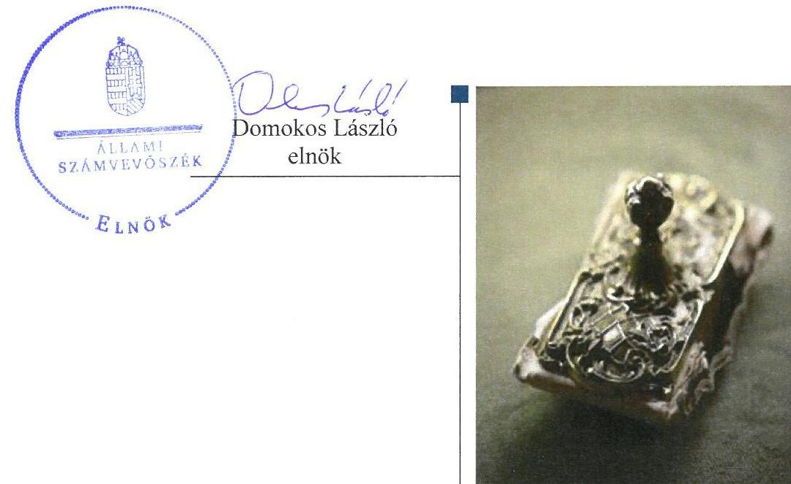
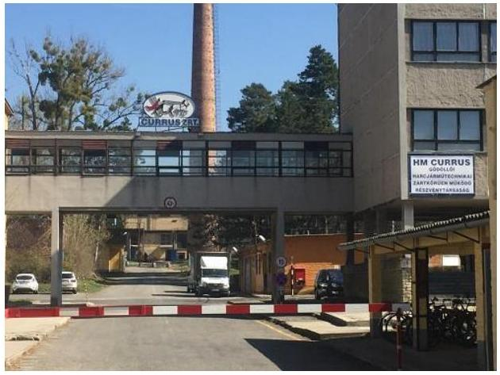
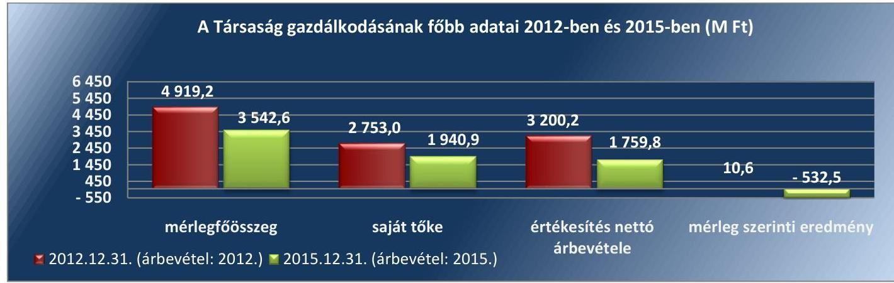
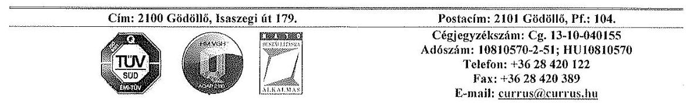
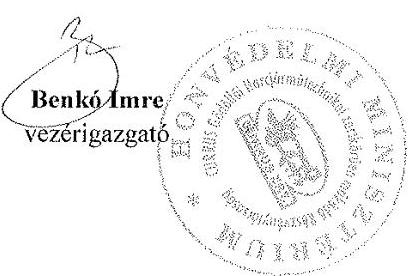
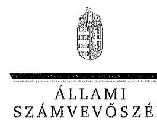
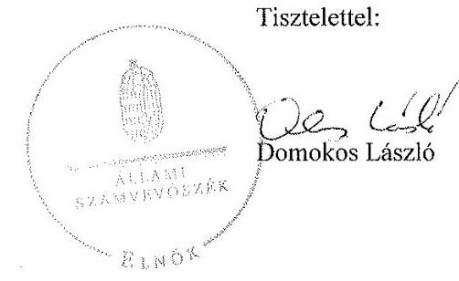
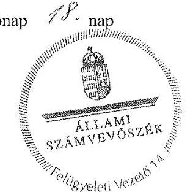

# Jelentés 

## Állami tulajdonú gazdasági társaságok

Az állami tulajdonban (résztulajdonban) lévő gazdálkodó szervezetek vagyonmegőrzési és gazdálkodási tevékenységének ellenőrzése HM CURRUS Gödöllői Harcjárműtechnikai zártkörűen működő Részvénytársaság 2017.

---

# Jelentés 

## Állami tulajdonú gazdasági társaságok

Az állami tulajdonban (résztulajdonban) lévő gazdálkodó szervezetek vagyonmegőrzési és gazdálkodási tevékenységének ellenőrzése HM CURRUS Gödöllői Harcjárműtechnikai zártkörűen működő Részvénytársaság
2017. 86666 hó 4. nap

---

# AZ ELLENŐRZÉST FELÜGYELTE:

DR. NÉMETH ERZSÉBET felügyeleti vezető

## AZ ELLENŐRZÉST VEZETTE ÉS A VÉGREHAJTÁSÁÉRT FELELŐS:

DR. PELLEI TAMÁS ellenőrzésvezető

## A PROGRAM ÖSSZEÁLLÍTÁSÁÉRT FELELŐS:

JANIK JÓZSEF osztályvezető

IKTATÓSZÁM: V-1369-154/2016.

TÉMASZÁM: 2403

ELLENŐRZÉS-AZONOSÍTÓ SZÁM: V075940

Jelentéseink az Országgyűlés számítógépes hálózatán és az Interneta a www.asz.hu címen is olvashatóak.

---

# TARTALOMJEGYZÉK 

■ ÖSSZEGZÉS ..... 5
■ AZ ELLENŐRZÉS CÉLJA ..... 6
■ AZ ELLENŐRZÉS TERÜLETE ..... 7
■ AZ ELLENŐRZÉS HÁTTERE, INDOKOLTSÁGA ..... 9
■ A JELENTÉS LÉNYEGES KÉRDÉSKÖREI ..... 10
■ ELLENŐRZÉS HATÓKÖRE ÉS MÓDSZEREI ..... 11
■ MEGÁLLAPÍTÁSOK ..... 13
■ JAVASLATOK ..... 20
■ MELLÉKLETEK ..... 21
I. Sz. melléklet: Értelmező szótár ..... 21
II. Sz. melléklet: A HM Currus Zrt. mérlegének főbb adatai a 2012-2015. években (M Ft) ..... 24
■ FÜGGELÉK: ÉSZREVÉTELEK ..... 25
■ RÖVIDÍTÉSEK JEGYZÉKE ..... 31

---

.

---

# ÖSSZEGZÉS 

A HM CURRUS Gödöllői Harcjárműtechnikai zártkörűen müködő Részvénytársaság tulajdonosi joggyakorlói a tevékenységüket szabályszerűen látták el. A Társaság számviteli szabályzatai - a leltározási szabályzat kivételével - nem feleltek meg az előírásoknak. A pénz-ügyi-számviteli, adatszolgáltatási és ellenőrzési feladatok ellátása összességében szabályszerű volt. A Társaság vagyongazdálkodása nem volt szabályszerű.

## Az ellenőrzés társadalmi indokoltsága

Az állami tulajdonú gazdálkodó szervezetek a nemzeti vagyon részét képezik. Az állami vagyonnal való gazdálkodást illetően a tulajdonosi joggyakorlás és vagyongazdálkodás feladata az állami vagyon átlátható, rendeltetésszerű és felelős felhasználásának biztosítása. Minden közpénzt, közvagyont használó szervezettel szemben társadalmi igény, hogy tevékenységéről elszámoljon.

Mindezek alapján, valamint a honvédelmi kiadások nagyságára tekintettel került sor a HM CURRUS Gödöllői Harcjárműtechnikai zártkörűen működő Részvénytársaság ellenőrzésére a 2012-2015. évek vonatkozásában.

## Főbb megállapítások, következtetések, javaslatok

A Honvédelmi Minisztérium és a Magyar Nemzeti Vagyonkezelő Zrt. megfelelően látta el a Társaság feletti tulajdonosi joggyakorlást.

A Társaság rendelkezett az előírt szabályzatokkal, de a Számviteli politika, az Értékelési szabályzat, a Pénzkezelési szabályzat tartalma nem felelt meg a jogszabályi előírásoknak.

A bevételek és a ráfordítások, valamint az értékcsökkenés elszámolása megfelelt a jogszabályi követelményeknek. Önköltségszámítási szabályzattal rendelkeztek, a szolgáltatások dijának megállapítását az előírások szerinti önköltségszámítással megalapozták. A tervezési, beszámolási, és adatszolgáltatási kötelezettségüket összességében teljesítették, bár az előírások ellenére a 2012. évi I. negyedévi jelentést nem készítették el. A Honvédelmi Minisztérium által a HM CURRUS Gödöllői Harcjárműtechnikai zártkörűen működő Részvénytársaságnál kialakított belső ellenőrzés, valamint a Honvédelmi Minisztérium belső ellenőrzése hozzájárult a Társaság feladatellátásának szabályszerű teljesítéséhez, támogatta a szabályszerű működés kontrollját.

Megteremtették a szabályszerű vagyongazdálkodás feltételeit, amelyeket a vagyonváltozást eredményező döntései meghozatalánál betartottak, ugyanakkor a vagyongazdálkodás nem volt szabályszerű, mivel az éves beszámolók mérlegadatait leltárral nem teljes körűen támasztották alá.

---

# AZ ELLENŐRZÉS CÉLJA 

Az ellenőrzés célja annak értékelése volt, hogy a tulajdonosi jogok gyakorlása szabályszerű volt-e; a gazdálkodó szervezet szabályozottsága, gazdálkodása és vagyongazdálkodási tevékenysége megfelelt-e a jogszabályi és a tulajdonosi előírásoknak; biztosítva volt-e a közfeladatok átláthatósága és elszámoltathatósága érdekében a közszolgáltatás díjának megalapozottsága szabályszerű önköltségszámítással; a vagyonváltozást eredményező döntések esetében a tulajdonosi jogok gyakorlója és a gazdálkodó szervezet szabályszerűen jártak-e el.

---

# **HAM CURRUS Gödöllői Harcjárműtechnikai zártkörűen működő Részvénytársaság**

**A HAM CURRUS GÖDÖLLŐI HARCJÁRMŰTECHNIKAI ZÁRTKÖRŰEN MŰKÖDŐ RÉSZVÉNYTÁRSASÁGOT** a HM1 1992. december 31-én alapította határozatlan időre. Az Nvtv.2 2. számú melléklete szerint nemzetgazdasági szempontból kiemelt jelentőségű nemzeti vagyonban tartandó, állami tulajdonban álló társaság 100 %-os tulajdonosa a Magyar Állam.

A Társaság3 több évtizedes tapasztalattal rendelkezik haditechnikai eszközök felújításában, javításában, fejlesztésében. Fő tevékenysége gépjármű-karosszéria és pótkocsi gyártás, amely keretében harckocsik és harcjárművek javítását, áramfejlesztők, tűzoltó gépjárművek, utánfutók üzemben tartását, vegyvédelmi eszközök javítását, gépjármű műszaki vizsgáztatást, valamint fémszerkezetek tervezését, gyártását, fém alkatrészek felületkezelését végzi. A polgári terület részére felületkezelést, műszaki vizsgáztatást, víztisztító berendezések gyártását is végezte. A Társaság értékesítés nettó árbevételére és eredményére a HAM specifikus javítási, karbantartási megrendelései döntő befolyással vannak.

A Magyar Állam nevében a tulajdonosi jogok gyakorlására az MNV Zrt.4 volt jogosult, amely a tulajdonosi jogokat és kötelezettségeket vagyonkezelési szerződés5 alapján 2012. december 31-ig korlátozásokkal és feltételekkel a HAM részére átengedte. A tulajdonosi jogokat és kötelezettségeket 2013. január 1-jétől az ellenőrzött időszak végéig a Nvtv.-nek és a Vtv.6-nek megfelelően a Hvt.7 és az Együttműködési megállapodás1-28 alapján a honvédelemért felelős miniszter gyakorolta azzal, hogy a meghatározott jogok tekintetében a tulajdonosi joggyakorlásra az MNV Zrt. volt jogosult.

A Társaság gazdálkodásának főbb jellemzőit az 1. ábra, valamint a II. számú melléklet mutatja be:

1. ábra

---

Mérlegfőösszeg - a 2012. évi 4 919,2 M Ft-ról 2015. évre 3 542,6 M Ftra - csökkenése mögött a saját tőke 2 753,0 M Ft-ról 1 940,9 M Ft-ra történő változása állt valamint az, hogy a kötelezettségei a 2012. évi 2 056,4 M Ft-ról a 2015. évre 1 499,3 M Ft-ra csökkentek. A mérleg eszközoldalát érintően a Társaság követelései a 2012. évi 292,4 M Ft-ról a 2015. évre 72,6 M Ft-ra csökkentek.

Az értékesítés nettó árbevétele 2012-ben 3 200,2 M Ft volt, 2013-ban emelkedett és 4 627,8 M Ft volt, amely a 2014. évben - a megrendelések visszaesése miatt - 57,4\%-kal csökkent és 1 969,6 M Ft-ra, valamint a 2015. évben 1 759,8 M Ft-ra változott.

Mérleg szerinti eredmény 2012-ben 10,6 M Ft volt, a 2013-2015. közötti években folyamatosan csökkent és a Társaságnak 2013-ban 50,9 M Ft, a 2014-ben 263,7 M Ft, illetve 2015-ben 532,5 M Ft vesztesége keletkezett.

A foglalkoztatott munkavállalók átlagos statisztikai létszáma a 2012. évi 199 fơről a 2015. évre 166 főre változott.

A Társaság - a 2014. év kivételével - az NGM ${ }^{9}$ részéről - hadiipari kapacitásai fenntartására - éves, vissza nem térítendő támogatást kapott, 2012-ben 7,0 M Ft, 2013-ban 11,2 M Ft, és 2015-ben 4,3 M Ft összegben.

2013-ban a HM arról döntött, hogy a HM EI Zrt. ${ }^{10}$ a Társaság részére a veszteséges működés, az üzleti tevékenység negatív eredményének elkerülése érdekében 100,0 M Ft vissza nem térítendő működési támogatást nyújt.

A Társaságnak a HM 2012-ben 55,0 M Ft, majd 200,0 M Ft rövid távú kölcsön felvételét engedélyezte a HM EI Zrt.-től, amelyeknek visszafizetése 2012-ben megtörtént. Hosszú lejáratú kötelezettsége a HM EI Zrt.-től és a HM Armcom Zrt. ${ }^{11}$-től - az ellenőrzött időszakot megelőzően megkötött szerződések alapján - felvett 250,0 M Ft - 250,0 M Ft-os kölcsön összege volt, amelyeknek a visszafizetésére nem került sor 2015. év végéig.

A Társaság 1997-ben - a saját többletfeladatainak elvégzésére - 3 M Ft jegyzett tőkével alapított Gépgyár Kft. ${ }^{12}$-ben rendelkezett 100 \%-os tulajdoni hányaddal. A Gépgyár Kft. az ellenőrzött időszakban a tevékenységét 2012. december 31-ig szüneteltette, illetve a 2014-2015. közötti években érdemi tevékenységet nem végzett. A Gépgyár Kft. saját tőkéje 2012-ben 10,8 M Ft, 2015-ben 10,7 M Ft, a mérlegfőösszege - a 2013. év kivételével - 10,7 M Ft volt. 2013-ban műszaki engedélyeztetési és tervkészítési feladat elvégzéséből 615,0 E Ft értékesítés nettó árbevétele volt, és mérlegfőösszege 10,8 M Ft-ra változott.

A Társaságnak nem volt vagyonkezelésbe vett vagyona, saját ingatlanokkal rendelkezett és nem minősült kormányzati szektorba sorolt szervezetnek

---

# AZ ELLENŐRZÉS HÁTTERE, INDOKOLTSÁGA 

Az állami tulajdonú gazdálkodó szervezetek ellenőrzése kiemelten fontos a nemzeti vagyon megőrzése, megóvása érdekében. Gazdálkodásuk jellemzően a közérdeklődés és a média figyelmének középpontjában áll, amihez hozzájárul a gazdálkodásuk körébe tartozó - közvetlen vagy közvetett állami tulajdonú - vagyon nagysága, illetve az általuk ellátott szolgáltatások minősége és hatékonysága. A szolgáltatási árképzés megalapozottsága és az éves elszámoltatás feltételeinek kialakítása az ellenőrzés során nagy hangsúlyt kap.

Az ellenőrzés rámutathat az állami tulajdonú gazdálkodó szervezetek gazdálkodási tevékenységével kapcsolatos jó gyakorlatokra és szabálytalanságokra. Felhívhatja a figyelmet a jogszabályi követelmények teljesítéséhez szükséges feltételek hiányosságaira, hozzájárulhat az államháztartáson kívüli, de (közvetlenül vagy közvetve) állami vagyont használó gazdálkodó szervezetek tevékenységének átláthatóságához. Ellenőrzésünk eredményeképpen javaslatainkkal, megállapításainkkal hozzájárulhatunk a nemzeti vagyonnal való gazdálkodás átláthatóságának, elszámoltathatóságának javításához.

---

# A JELENTÉS LÉNYEGES KÉRDÉSKÖREI 

1.     - A tulajdonosi jogok gyakorlása szabályszerű volt-e?
2.     - A társaság müködésének szabályozottsága megfelelt-e az előírásoknak?
3.     - A társaságnál a pénzügyi-számviteli, adatszolgáltatási és ellenőrzési feladatok ellátása szabályszerű volt-e?
4.     - A társaság vagyongazdálkodása szabályszerű volt-e?

---

# ELLENŐRZÉS HATÓKÖRE ÉS MÓDSZEREI 

## Az ellenőrzés típusa

Megfelelőségi ellenőrzés.

## Az ellenőrzött időszak

Az ellenőrzött időszak 2012. január 1-jétől 2015. december 31-ig tart.

## Az ellenőrzés tárgya

Állami tulajdonban (résztulajdonban) lévő gazdasági társaság gazdálkodása, kiemelten vagyongazdálkodási tevékenysége, a tulajdonosi jogok gyakorlása, továbbá a kormányzati szektorba sorolt gazdasági társaság gazdálkodásának a kormányzati szektor hiányára és az államadósságra befolyással bíró elemei.

Az ellenőrzés kiterjedt minden olyan körülményre és adatra, amely az ÁSZ ${ }^{13}$ jogszabályban meghatározott feladatainak teljesítéséhez, valamint a program végrehajtása folyamán felmerült újabb összefüggések feltárásához szükséges volt.

## Az ellenőrzött szervezet

Magyar Nemzeti Vagyonkezelő Zrt.
Honvédelmi Minisztérium
HM CURRUS Gödöllői Harcjárműtechnikai zártkörűen működő Részvénytársaság

## Az ellenőrzés jogalapja

Az ellenőrzés jogalapját az ÁSZ tv. ${ }^{14} 1$. § (3) bekezdése és 5. § (3)-(5) bekezdése képezte.

## Az ellenőrzés módszerei

Az ellenőrzést a nemzetközi standardokat irányadónak tekintve az ellenőrzési program ellenőrzési kérdései, az ellenőrzött időszakban hatályos jogszabályok, az ellenőrzés szakmai szabályok és módszertanok figyelembevételével végeztük.

---

Az ellenőrzési kérdések megválaszolásához szükséges bizonyítékok megszerzése a következő ellenőrzési eljárások alkalmazásával történt: megfigyelés, kérdésfeltevés (információkérés), összehasonlítás, valamint mintavételi és elemző eljárások. Az ellenőrzési bizonyítékként felhasználható adatforrások közé tartoztak egyrészt az ellenőrzési programban felsorolt adatforrások, másrészt adatforrás lehetett még minden - az ellenőrzés folyamán - feltárt, az ellenőrzés szempontjából információkat tartalmazó dokumentum.

Az ellenőrzött szervezetek az ellenőrzés lefolytatásához tanúsítványok kitöltésével, valamint az ÁSZ által kért dokumentumok megküldésével szolgáltattak adatokat.

A bevételek és ráfordítások elszámolása, valamint a vagyonnyilvántartás terén a szabályszerű múködést véletlen mintavétellel és irányított kiválasztással ellenőriztük. A jogszabályoknak és a belső előírásoknak megfelelőnek, azaz szabályszerűnek tekintettük az adott területet, amennyiben a minta ellenőrzésének eredménye alapján 95\%-os bizonyossággal a teljes sokaságban a hibaarány kisebb volt, mint 10\%, nem megfelelőnek értékeltük, ha a hibaarány a 10\%-ot meghaladta.

---

# 1. A tulajdonosi jogok gyakorlása szabályszerű volt-e? 

## Összegző megállapítás

1. táblázat

## MNV Zrt. által fenntartott főbb tulajdonosi jogok

társaság állami tulajdonú részesedésének elidegenítése, megterhelése,
a részesedésen vételi jog, elővásárlási jog létesítése,
részesedés biztosítékul adása,
a társaság végelszámolás útján történő megszüntetése
Forrás: Vagyonkezelési szerződés; Együttmüködési megállapodás

## A Társaság feletti tulajdonosi joggyakorlás szabályszerű volt.

AZ MNV ZRT. és a HM között a Társaság feletti tulajdonosi jogok és kötelezettségek gyakorlására a Vtv. előírásaival összhangban vagyonkezelési szerződés volt hatályban 2012-ben. A vagyonkezelési szerződésnek a Társaság feletti tulajdonosi jogok és kötelezettségek gyakorlására vonatkozó rendelkezéseit az Nvtv. és a Hvt. előírásai alapján 2012 decemberében megszüntették. Az MNV Zrt. és a HM között 2013. január 1-jétől az Nvtv. és a Hvt. előírásainak megfelelő Együttműködési megállapodás ${ }_{1-2}$ volt érvényben. Az MNV Zrt. által fenntartott főbb tulajdonosi jogokat az 1. táblázat mutatja be.

A HM a tulajdonosi jogok gyakorlására vonatkozó szabályokat a 11/2010. HM utasítás ${ }^{15}$-ban, a 67/2011. (VI.24.) HM utasítás ${ }^{16}$-ban, a Társaság múködésére és a vagyongazdálkodásra vonatkozó követelményeket az Alapító okirat ${ }_{1-6}{ }^{17}$-ban, valamint a tulajdonosi határozataiban rögzítette.

Az Alapító okirat ${ }_{1-6}$ a Gt. ${ }^{18}$ és a Ptk. ${ }^{19}$ előírásaival összhangban tartalmazta a vagyonnal történő felelős gazdálkodáshoz szükséges követelményeket, valamint abban meghatározták az $\mathrm{IG}^{20}$, az $\mathrm{FB}^{21}$ és a vezérigazgató ${ }^{22}$ feladatait, és rendelkeztek a könyvvizsgáló személyéről. A tulajdonosi joggyakorlás az IG, az FB, és a könyvvizsgáló tekintetében megfelelt a Gt. és a Ptk. ${ }_{2}$ előírásainak.

AZ ÉVES SZÁMVITELI BESZÁMOLÓK jóváhagyásáról a HM az Alaptó okirat ${ }_{1-6}$ előírásai szerint, a Gt., a Ptk. ${ }_{2}$ és a Számv. tv. ${ }^{23}$ előírásai alapján az FB jelentésének és a könnyvizsgáló véleményének ismeretében, tulajdonosi határozattal döntött.

AZ ÉVES ÉS AZ ÉVKÖZI BESZÁMOLÁST, AZ ADATSZOLGÁLTATÁSOK RENDJÉT a HM a 47728/2010. számú tulajdonosi határozatban rögzítette, amelynek keretében - többek között - meghatározta az éves beszámoló, az üzleti terv, illetve az FB jelentés tartalmára vonatkozó előírásokat. A HM az üzleti tervek elkészítéséhez minden évben tervezési irányelveket adott ki.

A HM tulajdonosi határozatokban rendelkezett a Társaság belső ellenőrzési feladatainak ellátásáról.

A HM és a Társaság 2012-ben a Magyar Állam tulajdonában álló és a HM vagyonkezelésében lévő öt tehergépjárműre vonatkozó, a Vtv. és a vagyonkezelési szerződésnek megfelelő ingó használatba adási szerződés ${ }_{1-}$ $2^{24}$-t kötött.

Az ingó használatba adási szerződés ${ }_{1-2}$-ben rögzítették a használó, valamint a használatba adó jogait és kötelezettségeit, a költségek viselésével, a vagyon használatával, elszámolásával és nyilvántartásával kapcsolatos

---

szabályozásokat, továbbá a HM meghatározta a rendeltetés- és szerződésszerű használat ellenőrzésének jogát.

# 2. A társaság múködésének szabályozottsága megfelelt-e az előírásoknak? 

## Összegző megállapítás

A Társaság számviteli szabályzatokkal rendelkezett, azonban azok tartalma - a leltározási szabályzat kivételével - nem felelt meg a jogszabályi előírásoknak.

AZ SZMSZ ${ }_{1-6}{ }^{25}$-t az Alapító okirat ${ }_{1-6}$ rendelkezéseivel összhangban, a működés, a képviselet, az irányítás szabályainak meghatározásával készítették el. Az Alapító okirat ${ }_{1-6}$ módosításait az SZMSZ ${ }_{1-6}$-en átvezették.

A SZÁMVITELI SZABÁLYZATOKAT a Társaság elkészítette. A Számv. tv. 14. § (3) és az (5) bekezdés a), b) és d) pontjaiban előírtak alapján rendelkezett Számviteli politikával ${ }^{26}$, Leltározási szabályzat$\mathrm{tal}_{1-2}{ }^{27}$, Értékelési szabályzattal ${ }^{28}$, valamint Pénzkezelési szabályzattal ${ }^{29}$.

A Társaság a Számv. tv. 14. § (11) bekezdésben foglalt kötelezettségnek nem tett eleget, mert az ellenőrzött időszakban a számviteli jogszabályi változásokat 90 napon belül - illetve azt követően - nem vezette át a Számviteli politikán és a Pénzkezelési szabályzaton, valamint az Értékelési szabályzaton.

A Számviteli politika hiányossága volt, hogy azon a Számv. tv. 3. § (3) bekezdése 3. pontjának 2013. január 1-jén hatályba lépő módosítása miatt a jelentős összegű hiba, valamint a Számv. tv. 3. § (3) bekezdése 5. pontjának 2013. január 1-jei hatályon kívül helyezése miatt a megbízható és valós képet lényegesen befolyásoló hiba fogalmát érintő változásait nem vezették át. Az értékelési szabályzatot nem aktualizálták a Számv. tv. 60. § (2) bekezdésének módosítását követően, valamint a pénzkezelési szabályzaton nem vezették át a Számv. tv. 14. § (9) bekezdésének 2012. december 1-jétől hatályon kívül helyezése miatt - a napi záró készpénzállomány maximális mértékének megszűnését érintő változást.

A Számviteli politika részét képező Számlarend ${ }^{30}$ a Számv. tv. 161. § (2) bekezdés b-d) pontjainak megfelelt, ugyanakkor általánosságban fogalmazta meg a bizonylati rendet. A Számv. tv. előírásainak megfelelő bizonylatolást és a bizonylati rendet a belső szabályzatokban és a számviteli szabályzatokban rögzítették. A Számv. tv. 162. § (2) bekezdés a) pontjában meghatározott, minden alkalmazásra kijelölt számla számjelét és megnevezését az évenként elkészített számlatükrök tartalmazták.

A Leltározási szabályzat ${ }_{1-2}$ megfelelt a Számv tv. előírásainak.
A Javadalmazási szabályzat ${ }^{31}$-ot a HM megalkotta, amely megfelelt a Taktv. ${ }^{32}$ előírásainak.

---

# 3. A társaságnál a pénzügyi-számviteli, adatszolgáltatási és ellenőrzési feladatok ellátása szabályszerű volt-e? 

Összegző megállapítás

## 3.1. számú megállapítás

A pénzügyi-számviteli, adatszolgáltatási és ellenőrzési feladatok ellátása összességében szabályszerű volt.

A bevételek és ráfordítások, valamint az értékcsökkenés elszámolása szabályszerű volt.

AZ ÉRTÉKESÍTÉS NETTÓ ÁRBEVÉTELÉNEK és az egyéb, rendkívüli és pénzügyi műveletek bevételeinek elszámolása szabályszerű volt, a könyvelés a Számv. tv. és a Számviteli politika előírásai szerinti főkönyvi számlákra történt.

A RÁFORDÍTÁSOK, ezen belül a személyi jellegű ráfordítások elszámolása szabályszerű volt, a Számv. tv., a Számviteli politika, illetve a Számlarend előírásainak megfelelt.

AZ ÉRTÉKCSÖKKENÉS elszámolása szabályszerű volt. A tárgyi eszközök értékcsökkenési leírásának összegét a használatbavétel napjától számolták el, bruttó értéken alapuló lineáris módszerrel. Az eszközök állományba vételét megalapozó üzembe helyezést a Számv. tv. előírásai szerint dokumentálták, valamint az eszközök besorolása az előírásoknak megfelelt. Az eszközök bekerülési értékének meghatározását a Számv. tv. és a Számviteli politika előírásai szerint végezték.

A KÖVETELÉSÁLLOMÁNY alakulását, és a vevőkövetelések pénzügyi teljesítéseit a Társaság nyomon követte, valamint a követelésállomány csökkentésére vonatkozóan intézkedett. Az analitikus nyilvántartásokból a fizetési határidőn túli vevőkövetelések állományának összege megállapítható volt. A követelések alakulását a 2. táblázat tartalmazza.
2. táblázat

KÖVETELÉSEK ALAKULÁSA 2012-2015. KÖZÖTTI ÉVEKBEN (M FT)

| Megnevezés | 2012. | 2013. | 2014. | 2015. | $\begin{gathered} 2015 .1 \\ 2012 . \end{gathered}$ |
| :--: | :--: | :--: | :--: | :--: | :--: |
| Követelések | 292,4 | 90,5 | 120,5 | 72,6 | 24,8\% |
| Követelések áruszállításból és szolgáltatásból (vevők) | 122,3 | 54,1 | 115,3 | 61,4 | $50,2 \%$ |
| Követelések kapcsolt vállalkozással szemben | 6,0 | 23,3 | 2,2 | 0 | - |
| Egyéb követelések | 164,1 | 13,1 | 3,0 | 11,2 | 6,8\% |

A Társaság vevő követeléseinek alakulását 2012-ben a hadiipari termelés, 2014-ben a polgári termelés többlet teljesítése, illetve a HM Védelemgazdasági Hivatallal szemben fennálló - 180 napot meghaladó - vevőkövetelések határozták meg. Az egyéb követelések 2012. évi összegét a kapott előlegek ÁFA elszámolásához kapcsolódó tétel okozta.

---

# 3.2. számú megállapítás 

Önköltségszámítási szabályzattal rendelkeztek, mely megfelelt az előírásoknak. A szolgáltatások díjának megállapítását az előírásoknak megfelelő önköltségszámítással megalapozták.

A Társaság az Önköltségszámítási szabályzatot ${ }^{33}$ a Számv. tv. előírása alapján elkészítette.

A Társaság saját gyártású termékei, valamint a végzett szolgáltatásai ármegállapításának alapja minden esetben az Önköltségszámítási szabályzat alapján készített kalkulációval alátámasztott volt. A Társaság árképzése a piaci viszonyok figyelembevételével történt, illetve a hadiipari megrendeléseknél a keretszerződésekben foglalt árak voltak a meghatározóak.

## 3.3. számú megállapítás

A Társaság az előírt tervezési, beszámolási és adatszolgáltatási kötelezettségét összességében teljesítette.

A TÁRSASÁG a 2012-2015. közötti években - a tulajdonosi joggyakorló céljaival összhangban álló - üzleti terveit elkészítette, azokat az IG és az FB elfogadásra javasolta, a HM tulajdonosi határozataival jóváhagyta.

AZ ÉVES BESZÁMOLÓKAT a Társaság minden évben összeállította, azokat az előírt határidőig az FB írásbeli jelentésének és a könyvvizsgáló véleményének a birtokában a HM tulajdonosi határozattal elfogadta, illetve a Társaság letétbe helyezte és közzétette.

AZ ADATOK VÉDELME ÉS A KÖZÉRDEKŰ ADATOK NYILVÁNOSSÁGRA HOZATALA biztosított volt. A Társaságnál a minősített adatvédelmi törvénynek ${ }^{34}$ és a minősített adatvédelmi rendeletnek ${ }^{35}$ megfelelően a minősített adatok védelmével kapcsolatos feladatok végrehajtását kinevezett biztonsági vezető végezte. A közérdekú adatok megismerése iránti igények benyújtásának szabályait az Info. tv. ${ }^{36}$ rendelkezései alapján kialakították, annak eljárásrendjét szabályozták, és a Társaság honlapján nyilvánosságra hozták.

A HM által a 477-28/2010. számú tulajdonosi határozat 2.1. pontjában előírt adatszolgáltatási kötelezettségét a Társaság - 2012. év I. negyedéves adatszolgáltatási kötelezettség kivételével - teljesítette.

## 3.4. számú megállapítás

A Társaságnál múködtetett belső ellenőrzés a vagyongazdálkodást ellenőrizte, továbbá a Társaság intézkedett az ellenőrzések javaslatainak végrehajtásáról.

A BELSŐ ELLENŐRZÉST a Társaságnál 2012-ben a HM Armcom Zrt. végezte, majd 2013-2015. közötti években a HM El Zrt. látta el.

2012-ben a HM Armcom Zrt. hét, illetve a HM El Zrt. 2013-ban négy, 2014-ben három, valamint 2015-ben négy ellenőrzést végzett. Az ellenőrzések a gépjárművek üzemeltetését, a leltározását, a selejtezés gyakorlatát, a pénzkezelést, a követeléskezelési tevékenységet, a költségtérítéseket, továbbá a múszaki vizsgáztatási és gépjármúmosási tevékenységet, és az elvégzett javítások minőségi kifogásait érintették. Az elvégzett belső ellenőrzések megállapításainak és intézkedést igénylő javaslatainak kezelésére intézkedési terveket készítettek, amelyek végrehajtásáról az FB felé

---

beszámoltak, illetve a 2013-2015. közötti években az ellenőrzési javaslatok realizálásáról a HM El Zrt.-t tájékoztatták.

A HM a Belső Ellenőrzési Főosztályán és az FB-én keresztül, valamint a könyvvizsgáló megbízásával biztosította a tulajdonosi ellenőrzéseket.

A HM Belső Ellenőrzési Főosztálya 2015-ben átfogó ellenőrzést végzett, amelynek során fejezetszintű államháztartási belső ellenőrzést végzett a Társaság múködésének gazdaságosságára és hatékonyságára vonatkozóan. Az ellenőrzési jelentés kiadására az ellenőrzött időszakban nem került sor.

# 4. A társaság vagyongazdálkodása szabályszerű volt-e? 

## Összegző megállapítás

### 4.1. számú megállapítás

### 4.2. számú megállapítás

A Társaság vagyongazdálkodása nem volt szabályszerű.
A saját vagyon értékének megőrzését szolgáló vagyongazdálkodás feltételeit kialakították.

A HM által előírt és jóváhagyott Üzleti tervekben részletesen meghatározták a bevételek és a költségek várható alakulását, a tervezett beruházásokat, illetve a gazdálkodás fő mutatóit.

A vagyongazdálkodáshoz és a vagyonváltozásokhoz kapcsolódó feladatás hatáskörökről, felelősségi viszonyokról az Alapító okirat ${ }_{1-6}$, az SZMSZ ${ }_{1-6}$, illetve a Kötelezettségvállalási szabályzat ${ }_{1-2}{ }^{37}$ rendelkezett, amelyekben előírták a HM, az IG, az FB, valamint a könyvvizsgáló kötelezettségeit, feladatait, és hatásköreit. A saját vagyon elidegenítéséhez és megterheléséhez kapcsolódó döntési jogköröket az Alapító okirat ${ }_{1-6}$-ban és az SZMSZ ${ }_{1-6}$ ben meghatározták.

A Társaság vagyongazdálkodása nem felelt meg a jogszabályi rendelkezéseknek és a belső előírásoknak.

A SAJÁT VAGYON KIMUTATÁSÁRÓL analitikus nyilvántartás vezetésével és a főkönyvi könyvelés készítésével gondoskodtak, a Társaság saját vagyonát szabályszerűen tartotta nyilván.

A VAGYONTÁRGYAK MÉRLEGTÉTELEINEK ALÁTÁMASZTÁSA ÉV VÉGI LELTÁRRAL összességében nem felelt meg a Számv. tv. 69.§ (1) bekezdés és a Leltározási szabályzat ${ }_{1-2}$ előírásainak. A Társaság a 2012-2013. közötti években a tárgyi eszközökre vonatkozóan nem állított össze olyan leltárt, amely tételesen, ellenőrizhető módon tartalmazta a mérleg fordulónapján meglévő tárgyi eszközeit mennyiségben és értékben, illetve a 2014-2015. közötti években a készleteket érintően nem állítottak össze olyan leltárt, amely tételesen, ellenőrizhető módon tartalmazta a mérleg fordulónapján meglévő készleteket mennyiségben és értékben. Az ellenőrzött időszakban összeállított „Mérlegsorok tartalma" - mérlegsorok leltára - kimutatások csupán összevont értékadatokat tartalmaztak a tárgyi eszközökkel és a készletekkel kapcsolatban.

---

A könyvvizsgáló minden évben hitelesítő záradékkal készítette el a független könyvvizsgálói jelentését. A könyvvizsgáló az év végi leltárak hiányosságait nem kifogásolta, az éves beszámolók Számv. tv. előírásainak nem megfelelő összeállítására vonatkozóan észrevételt nem tett.

# 4.3. számú megállapítás 

A saját vagyon értékének megőrzése megvalósult.

## A SAJÁT VAGYON ÉRTÉKÉNEK MEGŐRZÉSE a 2012-

2015. közötti években megvalósult, az immateriális javak és tárgyi eszközök nettó értéke növekedett. Az immateriális javak mérlegösszege a 2012. évi 3,7 M Ft-ról 2015. évre 23,5 M Ft-ra, a tárgyi eszközök mérlegösszege pedig a 2012. évi 2921,1 M Ft-ról 2015. évre 2 955,2 M Ft-ra emelkedett.

Az értékcsökkenés és az eszközök pótlására fordított pénzeszközök 2012-2015. év közötti alakulását az 3. táblázat tartalmazza.
3. táblázat

## ELSZÁMOLT ÉRTÉKCSÖKKENÉS ÉS ESZKÖZÖK PÓTLÁSÁRA FORDÍTOTT PÉNZESZKÖZÖK 2012-2015 (M FT)

| Megnevezés | 2012. | 2013. | 2014. | 2015. |
| :-- | :--: | :--: | :--: | :--: |
| A tárgyévben a saját vagyon után   elszámolt értékcsökkenés összege | 36,9 | 36,7 | 36,2 | 45,8 |
| A tárgyévben a saját tulajdonú esz-   közök pótlására fordított pénzesz-   köz (beruházások) | 33,8 | 21,1 | 20,0 | 140,5 |

Forrás: a Társaság adatszolgáltatása

Az elszámolt értékcsökkenés összege 155,6 M Ft, az eszközök pótlására fordított pénzeszköz (beruházás) 215,4 M Ft volt. Az értékcsökkenési leírást meghaladó beruházásra 2015-ben került sor, a beruházások 140,5 M Ft-os összegét egy 97,0 M Ft-ot meghaladó saját fejlesztésű multifunkcionális szállítójármú elkészítése, valamint egy víztisztító bemutató eszköz beszerzése eredményezte. A karbantartásra, felújításra forrásokat terveztek és karbantartást végeztek.

A SAJÁT TÖKE a 2012-2015. közötti években csökkent a megrendelések visszaesése miatt, mivel 2012. év kivételével növekvő mértékű veszteséget realizáltak. A 2015. évi könyvvizsgálói jelentés a fizetőképesség fenntartása érdekében a veszteség, és a negatív cash-flow, valamint a felhalmozott adósságállomány miatt - korlátozó záradék nélkül - figyelemfelhívást tartalmazott a tulajdonosi joggyakorló felé. A saját tőke és a jegyzett tőke alakulását a 4. táblázat tartalmazza.
4. táblázat

SAJÁT TŐKE ÉS A JEGYZETT TŐKE ALAKULÁSA 2012-2015 (M FT)

| Megnevezés | 2012. | 2013. | 2014. | 2015. |
| :-- | :--: | :--: | :--: | :--: |
| Jegyzett tőke | 863,0 | 863,0 | 863,0 | 863,0 |
| Saját tőke | 2753,0 | 2706,4 | 2442,8 | 1940,9 |

Forrás: a Társaság éves beszámolói

A veszteség rendezésére vonatkozó döntésre nem volt szükség, mivel a saját tőke minden évben meghaladta az előírt értéket, illetve a jegyzett tőke összegét.

---

# 4.4. számú megállapítás 

A vagyon változását eredményező döntések megfeleltek az előírásoknak.

## A SAJÁT VAGYON VÁLTOZÁSÁT EREDMÉNYEZŐ

DÖNTÉSEKRE vonatkozó követelményeket az SZMSZ1-6 és az Alapító okirat $_{1-6}$ tartalmazta. Az SZMSZ1-6-ben és az Alapító okirat $_{1-6}$-ban rögzített összeghatárt meghaladó hitelfelvétel engedélyezését, a vagyon és vagyonértékű jogok elidegenítését és megterhelését a HM a saját hatáskörében tartotta. A rögzített értékhatárt meghaladó beruházás, vagyon átadás, bérbeadás, haszonbérbeadás nem volt az ellenőrzött időszakban.

A HM a Társaság részére 2012-ben a HM El Zrt.-től - rövid távú likviditási problémái kezelésére - 55,0 M Ft, illetve 200,0 M Ft kölcsön felvételét engedélyezte, amelyeknek a visszafizetése az előírt határidőig 2012-ben megtörtént.

A Társaságnál az ellenőrzött időszakot megelőzően keletkezett - és az ellenőrzött időszakba áthúzódó - hosszú lejáratú kötelezettség a HM El Zrt.-től és a HM Armcom Zrt.-től felvett 250,0 M Ft - 250,0 M Ft-os kölcsön összege volt. A kölcsönök visszafizetésének határidejét a HM többszöri tulajdonosi határozatokban történt módosítást követően - tulajdonosi határozattal 2017. december 31-ei dátummal határozta meg.

Egy induló projektet érintően 2015-ben - hitel bankgaranciájaként - a Társaság ingatlanjainak jelzálogjoggal történő megterhelésére került sor 1 120,0 M Ft értékben. A HM a vagyon megterhelésére vonatkozó 32872/2015. számú tulajdonosi határozatban összeghatár megjelölése nélkül, „a lehető legalacsonyabb összeg" megjelöléssel engedélyezte az ingatlanok megterhelését a finanszírozó hitel fedezetéül.

A saját vagyon változását eredményező döntések szabályszerűek voltak, a meghatározott előírások szerint valósultak meg.

---

# JAVASLATOK 

Az ÁSZ tv. 33. § (1) bekezdésében foglaltak értelmében az ellenőrzött szervezet vezetője köteles a jelentésben foglalt megállapításokhoz kapcsolódó intézkedési tervet összeállítani és azt a jelentés kézhezvételétől számított 30 napon belül az ÁSZ részére megküldeni. Amennyiben az ellenőrzött szervezet vezetője nem küldi meg határidőben az intézkedési tervet, vagy továbbra sem elfogadható intézkedési tervet küld, az Állami Számvevőszék elnöke az ÁSZ tv. 33. § (3) bekezdése a) és b) pontjaiban foglaltakat érvényesítheti.

## HM CURRUS Gödöllői Harcjárműtechnikai Zrt. vezérigazgatójának

1. Intézkedjen, hogy a Társaság számviteli politikája és az annak keretében elkészítendő pénzkezelési, valamint értékelési szabályzat feleljenek meg a Számv. tv. előírásainak.
(2. sz. megállapítás 3. bekezdés alapján)
2. Intézkedjen a Számv. tv. előírásainak megfelelő, a mérlegben szereplő tárgyi eszközök és készletek alátámasztásául szolgáló olyan leltár öszszeállításáról, amely tételesen, ellenőrizhető módon tartalmazza a mérleg fordulónapján meglévő tárgyi eszközöket és készleteket menynyiségben és értékben.
(4.2. sz. megállapítás 2. bekezdés alapján)

---

# MELLÉKLETEK 

- I. SZ. MELLÉKLET: ÉRTELMEZŐ SZÓTÁR

Állami vagyon
a) Az állam tulajdonában lévő dolog, valamint a dolog módjára hasznosítható természeti erő,
b) az a) pont hatálya alá nem tartozó mindazon vagyon, amely vonatkozásában törvény az állam kizárólagos tulajdonjogát nevesíti,
c) az állam tulajdonában lévő tagsági jogviszonyt megtestesítő értékpapír, illetve az államot megillető egyéb társasági részesedés,
d) az államot megillető olyan immateriális, vagyoni értékkel rendelkező jogosultság, amelyet jogszabály vagyoni értékű jogként nevesít.
Forrás: Vtv. 1. § (2) bekezdése
2012. november 10-től az állami vagyon fogalma kiegészül a következő ponttal:
e) az állam tulajdonában lévő pénzügyi eszközök

Forrás: Vtv. 1. § (2) bekezdése
Gazdasági társaság
A Ptk. 3. 3:88. § (1) bekezdése szerint „a gazdasági társaságok üzletszerű közös gazdasági tevékenység folytatására, a tagok vagyoni hozzájárulásával létrehozott, jogi személyiséggel rendelkező vállalkozások, amelyekben a tagok a nyereségből közösen részesednek, és a veszteséget közösen viselik".
2013. június 27-ig:

Az állami vagyont az MNV Zrt. maga kezeli, vagy szerződés - így különösen bérlet, haszonbérlet, megbízás - alapján központi költségvetési szervnek, természetes vagy jogi személynek, vagy jogi személyiséggel nem rendelkező gazdálkodó szervezetnek hasznosításra átengedi, az állami vagyonra vonatkozóan az MNV Zrt. kizárólag az Nvtv-ben meghatározott személyekkel köthet vagyonkezelési szerződést.
Forrás: Vtv. 23. § (1), 27. § (1)
2013. június 28-ától:

Az állami vagyonnal az MNV Zrt. maga gazdálkodik, vagy szerződés - így különösen bérlet, haszonbérlet, megbízás - alapján központi költségvetési szervnek, természetes vagy jogi személynek, vagy jogi személyiséggel nem rendelkező gazdálkodó szervezetnek hasznosításra átengedi, illetőleg vagyonkezelésbe, haszonélvezetbe adja. Az állami vagyonra vonatkozóan az MNV Zrt. kizárólag az Nvtv-ben meghatározott személyekkel köthet vagyonkezelési szerződést.
Forrás: Vtv. 23. § (1), 27. § (1)
2014. március 14-ig:

A Ptk. ${ }^{38}$ 685. § c) pontja szerint gazdálkodó szervezet: „az állami vállalat, az egyéb állami gazdálkodó szerv, a szövetkezet, a lakásszövetkezet, az európai szövetkezet, a gazdasági társaság, az európai részvénytársaság, az egyesülés, az európai gazdasági egyesülés, az európai területi együttműködési csoportosulás, az egyes jogi személyek vállalata, a leányvállalat, a vízgazdálkodási társulat, az erdő birtokossági társulat, a végrehajtói iroda, az egyéni cég, továbbá az egyéni vállalkozó."
2014. március 15 -től:

A gazdasági társaság, az európai részvénytársaság, az egyesülés, az európai gazdasági egyesülés, az európai területi együttműködési csoportosulás, a szövetkezet, a lakásszövetkezet, az európai szövetkezet, a vízgazdálkodási társulat, az erdőbirtokossági társulat, az állami vállalat, az egyéb állami gazdálkodó szerv, az egyes jogi személyek vállalata, a

---

MNV Zrt.

Nemzeti vagyon
kötő́s vállalat, a végrehajtói iroda, a közjegyzői iroda, az ügyvédi iroda, a szabadalmi ügyvivői iroda, az önkéntes kölcsönös biztosító pénztár, a magánnyugdípénztár, az egyéni cég, továbbá az egyéni vállalkozó. Az állam, a helyi önkormányzat, a költségvetési szerv, az egyesület, a köztestület, valamint az alapítvány gazdálkodó tevékenységével összefüggő polgári jogi kapcsolataira is a gazdálkodó szervezetre vonatkozó rendelkezéseket kell alkalmazni.
Forrás: $\mathrm{Pp}^{39} .396 . \S$
Az állami vagyon felett, a Magyar Államok megillető tulajdonosi jogok és kötelezettségek összességét - a hatályos szabályozás szerint - az állami vagyon felügyeletéért felelős miniszter (jelenleg a nemzeti fejlesztési miniszter) gyakorolja. A miniszter feladatát nagy részben az MNV Zrt., mint tulajdonosi joggyakorló szervezet útján látja el.
a) az állam vagy a helyi önkormányzat kizárólagos tulajdonában álló dolgok,
b) az a) pont hatálya alá nem tartozó, állam vagy a helyi önkormányzat tulajdonában lévő dolog,
c) az állam vagy a helyi önkormányzatot tulajdonában lévő pénzügyi eszközök, továbbá az államot vagy a helyi önkormányzatot megillető társasági részesedések,
d) az államot vagy a helyi önkormányzatot megillető bármely vagyoni értékkel rendelkező jogosultság, amelyet jogszabály vagyoni értékű jogként nevesít,
e) Magyarország határa által körbezárt terület feletti légtér,
f) az üvegházhatású gázok kibocsátási egységeinek kereskedelméről szóló törvény szerint kibocsátási egység és légiközlekedési kibocsátási egység, valamint az ENSZ Éghajlatváltozási Keretegyezménye és annak Kiotói Jegyzőkönyve végrehajtási keretrendszeréről szóló törvény szerinti kiotói egység,
g) állami vagy helyi önkormányzati fenntartású közgyűjtemény (muzeális intézmény, levéltár, közgyűjteményként működő kép- és hangarchívum, valamint könyvtár) saját gyűjteményében nyilvántartott kulturális javak körébe tartozó dolog, kivéve, ha az állami vagy önkormányzati tulajdon jogszerű létrejötte kétséget kizáró módon nem bizonyítható és a dologra nézve más a tulajdonjogát bizonyítja vagy a kulturális javakra vonatkozó jogszabályokban meghatározott eljárás keretében valószínűsíti (g. pont módosult 2013. december 7-től),
h) a régészeti lelet,
i) a nemzeti adatvagyon körébe tartozó állami nyilvántartások fokozottabb védelméről szóló törvény szerinti nemzeti adatvagyon.
Forrás: Nvtv. 1. § (2)
Tulajdonosi ellenőrzés
2014. március 14-ig:

Az állami vagyon kezelőjét, haszonélvezőjét, használóját megillető jogok gyakorlását, annak szabályszerűségét, célszerűségét az MNV Zrt. - szükség szerint területi szervei útján - ellenőrzi.
2014. március 15 -től:

Az állami vagyon használóját, vagyonkezelőjét és haszonélvezőjét megillető jogok gyakorlását, annak szabályszerűségét, a kötelezettségek teljesítését, valamint a vagyon rendeltetése szerinti célszerűségét a tulajdonosi joggyakorló rendszeresen ellenőrzi.
Forrás: Vhr. 20. § (1)
Tulajdonosi jogok gyakorlója 1.
2013. június 27-ig:

Az állami vagyon felett a Magyar Államok megillető tulajdonosi jogok és kötelezettségek összességét - ha törvény eltérően nem rendelkezik - az állami vagyon felügyeletéért felelős miniszter (a továbbiakban: miniszter) gyakorolja, aki e feladatát a Magyar Nemzeti

---

Vagyonkezelő Zártkörűen Működő Részvénytársaság (a továbbiakban: MNV Zrt.), a Magyar Fejlesztési Bank, illetve a tulajdonosi joggyakorló szervezet útján látja el. A miniszter miniszteri rendeletben, a törvényben meghatározott állami vagyoni kör tekintetében, meghatározott időtartamra, a joggyakorlás egyes szabályainak meghatározásával - az őt megillető tulajdonosi jogok és kötelezettségek összességének, illetve azok meghatározott részének gyakorlóját az Áht. szerinti központi költségvetési szervek, ezek intézménye, továbbá a 100\%-ban állami tulajdonban álló gazdasági társaságok közül kijelölheti.
Forrás: Vtv. 3. § (1) és (2)

# 2013. június 28-ától: 

A rábízott állami vagyon felett az államot megillető tulajdonosi jogok és kötelezettségek összességét tulajdonosi joggyakorlóként:
a) ha törvény vagy miniszteri rendelet eltérően nem rendelkezik, a Magyar Nemzeti Vagyonkezelő Zártkörűen Működő Részvénytársaság (a továbbiakban: MNV Zrt.),
b) törvényben kijelölt személy vagy
c) az állami vagyon felügyeletéért felelős miniszter (a továbbiakban: miniszter) által rendeletben kijelölt személy gyakorolja.
[...] A miniszter e törvény felhatalmazása alapján - a meghatározott célok hatékonyabb elérése érdekében, miniszteri rendeletben, az ott meghatározott állami vagyoni kör tekintetében, meghatározott időtartamra - e törvény keretei között, a joggyakorlás egyes szabályainak meghatározásával - az államot megillető tulajdonosi jogok és kötelezettségek összességének, illetve azok meghatározott részének gyakorlóját az Áht. szerinti központi költségvetési szervek, ezek intézménye, továbbá a 100\%-ban állami tulajdonban álló gazdasági társaságok közül kijelölheti.
Forrás: Vtv. 3. § (1) és (2)
2.

Aki a nemzeti vagyon felett az államot vagy a helyi önkormányzatot megillető tulajdonosi jogok és kötelezettségek összességének gyakorlására jogosult
Forrás: Nvtv. 3. § (1) 17. pontja

---

II. SZ. MELLÉKLET: A HM CURRUS ZRT. MÉRLEGÉNEK FŐBB ADATAI A 2012-2015. ÉVEKBEN (M FT)

|  Megnevezés | 2012-12-31 | 2013-12-31 | 2014-12-31 | 2015-12-31  |
| --- | --- | --- | --- | --- |
|  Befektetett eszközök | 2927,8 | 2897,5 | 2880,7 | 2981,7  |
|  IMMATERIÁLIS JAVAK | 3,7 | 4,2 | 3,1 | 23,5  |
|  Szellemi termékek | 3,7 | 4,2 | 3,1 | 3,0  |
|  TÁRGYI ESZKÖZÖK | 2921,1 | 2890,3 | 2874,6 | 2955,2  |
|  Ingatlanok és a kapcsolódó vagyoni értékű jogok | 554,5 | 539,2 | 523,9 | 508,5  |
|  Műszaki berendezések, gépek, járművek | 96,4 | 88,3 | 91,1 | 81,0  |
|  Egyéb berendezések, felszerelések, járművek | 15,5 | 19,8 | 16,7 | 77,2  |
|  Beruházások, felújítások | 16,4 | 0,4 | 0,3 | 15,3  |
|  Tárgyi eszközök értékhelyesbítése | 2238,3 | 2242,6 | 2242,6 | 2273,2  |
|  BEFEKTETETT PÉNZÜGYI ESZKÖZÖK | 3,0 | 3,0 | 3,0 | 3,0  |
|  Forgóeszközök | 1960,6 | 853,8 | 583,1 | 554,9  |
|  PÉNZESZKÖZÖK | 759,1 | 230,9 | 3,4 | 7,9  |
|  Aktív időbeli elhatárolások | 30,8 | 124,8 | 7,3 | 6,0  |
|  ESZKÖZÖK (AKTÍVÁK) ÖSSZESEN | 4919,2 | 3876,1 | 3471,1 | 3542,6  |
|  Saját tőke | 2753,0 | 2706,4 | 2442,8 | 1940,9  |
|  JEGYZETT TÖKE | 863,0 | 863,0 | 863,0 | 863,0  |
|  EREDMÉNYTARTALÉK | $-358,9$ | $-348,3$ | $-399,1$ | $-682,9$  |
|  LEKÖTÖTT TARTALÉK | 0,0 | 0,0 | 0,0 | 20,1  |
|  ÉRTÉKELÉSI TARTALÉK | 2238,3 | 2242,6 | 2242,6 | 2273,2  |
|  MÉRLEG SZERINTI EREDMÉNY | 10,6 | $-50,9$ | $-263,7$ | $-532,5$  |
|  Céltartalékok | 25,0 | 5,0 | 0,0 | 15,0  |
|  Kötelezettségek | 2056,4 | 1037,5 | 966,4 | 1499,3  |
|  Passzív időbeli elhatárolások | 84,8 | 127,2 | 61,9 | 87,4  |
|  FORRÁSOK (PASSZÍVÁK) ÖSSZESEN | 4919,2 | 3876,1 | 3471,1 | 3542,6  |

---

# FÜGGELÉK: ÉSZREVÉTELEK 

A jelentéstervezetet a Számvevőszék 15 napos észrevételezésre megküldte az ellenőrzött szervezetek vezetőinek az ÁSZ tv. 29. §* (1) bekezdése előírásának megfelelően.

A függelék tartalmazza a HM CURRUS Gödöllői Harcjármütechnikai Zrt. vezérigazgatója által megküldött észrevételeket, az azokra adott válaszokat, illetve az el nem fogadott észrevételek elutasításának indoklását.

[^0]
[^0]:    * 29. § (1) Az Állami Számvevőszék az ellenőrzési megállapításait megküldi az ellenőrzött szervezet vezetőjének vagy az általa megbízott személynek, és annak, akinek személyes felelősségét állapította meg.
    (2) Az ellenőrzött szervezet vezetője és a felelősként megjelölt személy az ellenőrzés megállapításaira tizenöt napon belül írásban észrevételt tehet.
    (3) Az Állami Számvevőszék az észrevételre a beérkezésétől számított harminc napon belül írásban válaszol. A figyelembe nem vett észrevételeket köteles a jelentésben feltüntetni, és megindokolni, hogy azokat miért nem fogadta el.

---

# HONVÉDELMI MINISZTÉRIUM   CURRUS GÖDÖLLÖI HARCJÁRMÚTECHNIKAI ZÁRTKÖRÜEN MÜKÖDÖ RÉSZVÉNYTÁRSASÁG (HM Currus Zrt.) www.currus.hu 

Nyt. szám: 81-15/2017

Domokos László
Állami Számvevőszék

Tárgy: V-1369-144/2016. sz. jelentéstervezet

## Tisztelt Domokos Úr!

2017. augusztus 21-n kaptam kézhez „Az állami tulajdonban (résztulajdonban) lévő gazdálkodó szervezetek vagyonmegőrzési és gazdálkodó tevékenységének ellenőrzése - HM CURRUS Gödöllői Harcjármútechnikai Zrt." 2012-2015. időszaki vizsgálatának jelentéstervezetét.

A jelentéstervezetben foglalt megállapításokkal kapcsolatban az alábbi észrevételeket tesszük:

1) 2. pont: „A Társaság müködésének szabályozottsága nem felelt meg az előírásoknak."

Észrevételek:
A) A Társaság valóban nem vezette át a hivatkozott törvényi változásokat (Számviteli törvény 3. § (3) 3. pont és 5. pont jelentős összegủ hiba és megbízható és valós képet lényegesen befolyásoló hiba fogalmi változásai) a Számviteli Politikában és az Értékelési Szabályzatban, azonban a számviteli beszámolók a mindenkor hatályos jogszabályi elöírásoknak megfelelően készültek el.
B) A Társaság által a vizsgált időszakban érvényben lévő Pénzkezelési Szabályzatban a napi készpénzlimítre vonatkozó korlátázást (amely már a Szabályzat készítésének időpontjában hatályos jogszabályban meghatározott értéknél is jelentősen kisebb mértékben került megállapításra) jogszabályi előírás hiányában is - az ésszerű gazdálkodás érdekében - a mai napig is fenntartja. A Szabályzatból a hatályon kívül helyezett hivatkozást valóban törölni kellett volna, de ez a fenntartott belső önkorlátozás véleményünk szerint jogszabályba nem ütközik.
2) A 3.3 megállapítás szerint a Társaság a Tulajdonos által meghatározott 2012. I. negyedévi adatszolgáltatási kötelezettségét nem teljesítette.

Észrevétel: A Társaság minden - a Tulajdonos által elöirt - adatszolgáltatási kötelezettségét teljesítette. A 2012. I. negyedéves beszámolót tévedésből nem töltöttük fel, azonban feltöltésre kerültek az igazgatósági és felügyelőbizottsági határozatok kimutatásai, amelyek között szerepel a 2012. I. negyedévi gazdálkodási jelentés elfogadása (IG/6A/2012.04.18., FB/4/2012.04.18.), és ez alátámasztja a hiányolt beszámoló elkészültét. Amennyiben lehetőséget biztosítanak a pótlólagos feltöltésre, azokat késedelem nélkül rendelkezésre tudjuk bocsátani.

---

3) 4. pont: „A Társaság vagyongazdálkodása nem volt szabályszerű." A 4.2 számú megállapítás szerint a Társaság a 2012-2013. évek vonatkozásában nem állított össze tárgyi eszköz leltárt, valamint a 20142015. időszakban a készletek vonatkozásában olyan leltárt, amely tételesen, ellenőrizhető módon tartalmazta a mérleg fordulónapján meglévő tárgyi eszközeit, készlet állományát.

Észrevétel: Az adatszolgáltatás során feltöltésre kerültek azok a papír alapú leltári összesítők, kimutatások, jegyzőkönyvek, amelyek az adott időszakokat érintették. A megállapításban hivatkozott időszaki leltárak jegyzőkönyveiben rögzítésre került, hogy a hiányolt analitikák a terjedelmük miatt elektronikus úton kerültek letárolásra. Ez az adatfeltöltés során sajnos a figyelmünket elkerülte, így csak a papír alapú dokumentumokat szkenneltük be és töltöttük fel. Az elektronikus anyagokat időközben előkerestük, amennyiben lehetőséget biztosítanak a pótlólagos feltöltésre, azokat késedelem nélkül rendelkezésre tudjuk bocsátani.

Tisztelt Számvevőszék!
Kérjük Önöket, hogy észrevételeink érdemi megvizsgálásának eredményeként a jelentéstervezetet és annak minősítését kedvező irányban módosítani szíveskedjenek.

Gödöllő, 2017. szeptember 05.

Tisztelettel:

Készült: 2 példányban
Egy példány: 2 lap
Ügyintéző (tel): Pap Zuszsanna Melinda (06-20-555-1769)
Kapják: 1.sz. példány: Címzett
1.sz. másolati példány elektronikusan : HM VFF
2.sz. példány: Irattár

---

ELNÖK

Ikt.szám: V-1369-148/2016.

# Benkó Imre úr 

vezérigazgató
HM CURRUS Gödöllői Harcjárműtechnikai Zrt.

## Gödöllő

## Tisztelt Vezérigazgató Úr!

Az ,,Állami tulajdonú gazdasági társaságok - Az állami tulajdonban (résztulajdonban) lévő gazdálkodó szervezetek vagyonmegőrzési és gazdálkodási tevékenységének ellenőrzése - HM CURRUS Gödöllöi Harcjármütechnika Zrt. 2017." címủ jelentéstervezetre tett észrevételeit köszönettel megkaptam.

Az ellenőrzési megállapításokra vonatkozó észrevételét az Állami Számvevőszékről szóló 2011. évi LXVI. törvény 29. § (2) bekezdésében meghatározott tizenöt napos határidőn belül küldte meg. Az Állami Számvevőszék észrevétellel kapcsolatos álláspontját a mellékletként csatolt, a felügyeleti vezető által készített indokolás tartalmazza.

Budapest, 2017. 12aplrsaber hó 18 nap

Tisztelettel:

Melléklet: Észrevételre adott válasz

---

„Állami tulajdonú gazdasági társaságok - Az állami tulajdonban (résztulajdonban) lévő gazdálkodó szervezetek vagyonmegőrzést és gazdálkodási tevékenységének ellenörzése - HM CURRUS Gödöllöi Harcjármütechnika Zrt. 2017." című jelentéstervezetre tett észrevételekre adott válaszok

|  | 2. számú megállapításhoz (Számviteli szabályzatok):   „A) A Társaság valóban nem vezette át a hivatkozott törvényi változásokat (Számviteli törvény 3. § (3) 3. pont és 5. pont jelentös összegü hiba és megbizható és valós képet lényegesen befolyásoló hiba fogalmi változásai) a Számviteli Politikában és az Értékelési Szabályzatban, azonban a számviteli beszámolók a mindenkor hatályos jogszabályi elöírásoknak megfelelöen készültek el.   B) A Társaság által a vizsgált időszakban érvényben lévő Pénzkezelési Szabályzatban a napi készpénzlimitre vonatkozó korlátozást (amely már a Szabályzat készitésének idöpontjában hatályos jogszabályban meghatározott értéknél is jelentősen kisebb mértékben került megállapításra) jogszabályi elöírás hiányában is az ésszerü gazdálkodás érdekében - a mai napig is fenntartja. A Szabályzatból a hatályon kivül helyezett hivatkozást valóban törölni kellett volna, de ez a fenntartott belső önkorlátozás véleményünk szerint jogszabályba nem ütközik." |
| :--: | :--: |
| Válasz: | Az Állami Számvevőszék az észrevételeket nem fogadja el. |
| Indoklás: | Vezérigazgató Úr észrevételében elismeri, hogy a jelentéstervezetben hivatkozott törvényi változásokat nem vezették át sem a Számviteli Politikában, sem az Értékelési Szabályzatban, illetve hogy a Pénzkezelési Szabályzatban a hatályon kívül helyezett hivatkozást valóban törölni kellett volna. A jelentéstervezet lényeges kérdéskörei fejezet (10. oldal) és a Megállapítások fejezet (14. oldal) 2. pontjai a Társaság szabályozottságára, a 3. pontok a Társaság pénzügyi-számviteli feladatellátásának végrehajtására vonatkoznak. A 2. számú megállapításhoz kapcsolódó észrevétele - számviteli beszámolók jogszabályi előírásnak megfelelő elkészítése - nem befolyásolja azt, hogy a Társaság müködésének szabályozottsága megfelelte-a leitírásoknak, ezért a jelentéstervezetben az ide vonatkozó megállapításainkat továbbra is fenntartjuk. |
| Észrevétel: | 3.3. számú megállapításhoz (Beszámolási és adatszolgáltatási kötelezettség): „A Társaság minden - a Tulajdonos által elöirt - adatszolgáltatási kötelezettségét teljesitette. A 2012. I. negyedéves beszámolót tévedésböl nem töltöttük fel, azonban feltöltésre kerültek az igazgatósági és felügyelöbizottsági határozatok kimutatásai, amelyek között szerepel a 2012. I. negyedévi gazdálkodási jelentés elfogadása (JG/6A/2012.04.18., FB/4/2012.04.18.), és ez alátámasztja a hiányolt beszámoló elkészültét. Amennyiben lehetőséget biztosítanak a pótlólagos feltöltésre, azokat késedelem nélkül rendelkezésre tudjuk bocsátani." |

---

| Válasz: | Az Állami Számvevőszék az észrevételt nem fogadja el. |
| :--: | :--: |
| Indoklás: | A 2017. március 8-i keltezésú - Benkó Imre vezérigazgató által aláirt - „Nyilatkozat" dokumentum 7. pontja tartalmazza, hogy a 2012. 1. negyedévi adatszolgáltatás nem lelhető fel. Az ellenőrzési folyamat jelenlegi szakaszában nincs lehetőség az esetlegesen fellelt dokumentum pótlólagos beküldésére, ezért a jelentéstervezet Megállapítások fejezet 3.3. pontjában foglalt megállapításainkat továbbra is fenntartjuk. |
| Észrevétel: | 4.2. számú megállapításhoz (Vagyongazdálkodás):   „Az adatszolgáltatás során feltöltésre kerültek azok a papír alapú leltári összesitők, kimutatások, jegyzőkönyvek, amelyek az adott időszakokat érintették. A megállapításban hivatkozott idöszaki leltárak jegyzőkönyveiben rögzitésre került, hogy a hiányolt analitikák a terjedelmük miatt elektronikus úton kerültek letárolásra. Ez az adatfeltöltés során sajnos a figyelmünket elkerülte, igy csak a papír alapú dokumentumokat szkenneltük be és töltöttük fel. Az elektronikus anyagokat idöközben elökerestük, amennyiben lehetöséget biztositanak a pótlólagos feltöltésre, azokat késedelem nélkül rendelkezésre tudjuk bocsátani." |
| Válasz: | Az Állami Számvevőszék az észrevételt nem fogadja el |
| Indoklás: | Vezérigazgató Úr észrevételében tájékoztat, hogy az adatfeltöltés során, az elektronikus úton tárolt dokumentumokat nem, csak a papír alapú dokumentumokat töltötték fel az ÁSZ webes felületére. Az ellenőrzési folyamat jelenlegi szakaszában nincs lehetőség a hiányzó dokumentumok utólagos beküldésére, ezért a jelentéstervezet Megállapítások fejezet 4.2. pontjában foglalt megállapításainkat továbbra is fenntartjuk. |

Tájékoztatom Vezérigazgató Urat, hogy az Állami Számvevőszékről szóló 2011. évi LXVI. törvény 29. § (3) bekezdése alapján az Állami Számvevőszék a figyelembe nem vett észrevételeket köteles a jelentésben feltüntetni és megindokolni, hogy azokat miért nem fogadta el.

Budapest, 2017. cseplomben hónap

Dr. Németh Erzsébet felügyeleti vezető

---

# RÖVIDÍTÉSEK JEGYZÉKE 

${ }^{1} \mathrm{HM}$
${ }^{2}$ Nvtv.
${ }^{3}$ Társaság
${ }^{4}$ MNV Zrt.
${ }^{5}$ vagyonkezelési szerződés
${ }^{6}$ Vtv.
${ }^{7}$ Hvt.
${ }^{8}$ Együttműködési megállapodás ${ }_{1-2}$

## ${ }^{9}$ NGM

${ }^{10}$ HM El Zrt.
${ }^{11}$ HM Armcom Zrt.
${ }^{12}$ Gépgyár Kft.
${ }^{13}$ ÁSZ
${ }^{14}$ ÁSZ tv.
${ }^{15}$ 11/2010. HM utasítás
${ }^{16}$ 67/2011. HM utasítás
${ }^{17}$ Alapító okirat ${ }_{1-6}$

## Honvédelmi Minisztérium

A nemzeti vagyonról szóló 2011. évi CXCVI. törvény (hatályos: 2011. december 31-étől)
HM CURRUS Gödöllői Harcjárműtechnikai zártkörűen működő Részvénytársaság Magyar Nemzeti Vagyonkezelő Zártkörűen Működő Részvénytársaság
Az MNV Zrt. és a Honvédelmi Minisztérium között 2008. május 28-án létrejött SZT-28425 sz. vagyonkezelési szerződés (hatálytalan: 2013. január 1-jétől)
Az állami vagyonról szóló 2007. évi CVI. törvény (hatályos: 2007. szeptember 25étől)
A honvédelemről és a Magyar Honvédségről, valamint a különleges jogrendben bevezethető intézkedésekről szóló 2011. évi CXIII. törvény
Együttműködési megállapodás ${ }_{1}$ : Az MNV Zrt. és a Honvédelmi Minisztérium között létrejött SZT-39158. számú Együttműködési megállapodás (hatályos: 2013. január 1-jétől 2013. november 29-éig)
Együttműködési megállapodás ${ }_{2}$ : Az MNV Zrt. és a Honvédelmi Minisztérium között létrejött SZT-39158/1. számú Együttműködési megállapodás (hatályos: 2013. november 29-étől)
Nemzetgazdasági Minisztérium
Honvédelmi Minisztérium Elektronikai, Logisztikai és Vagyonkezelő Zártkörűen Múködő Részvénytársaság
Honvédelmi Minisztérium Armcom Kommunikációtechnikai zártkörűen működő Részvénytársaság
„GÉPGYÁR" Gyártó, Szolgáltató és Kereskedelmi Korlátolt Felelősségű Társaság Állami Számvevőszék
Az Állami Számvevőszékről szól 2011. évi LXVI. törvény (hatályos: 2011. július 1jétől)
A Magyar Nemzeti Vagyonkezelő Zrt. és a Honvédelmi Minisztérium között 2008. május 29-én megkötött Vagyonkezelési Szerződés ingatlanvagyonra vonatkozó rendelkezései végrehajtásának egyes szabályairól szóló 11/2010. (I.27.) HM utasítás (hatályos: 2010. február 4-étől)
A Honvédelmi Minisztérium vagyonkezelésében lévő ingóságok és társasági részesedések kezelésének, tulajdonosi ellenőrzésének, valamint az ingóságok hasznosításának, elidegenítésének, átadás-átvételének szabályairól szóló 67/2011. (VI.24.) HM utasítás (hatályos: 2011. július 2-ától)
Alapító okirat1: HM CURRUS Gödöllői Harcjárműtechnikai zártkörűen működő Részvénytársaság Alapító Okirat (hatályos: 2011. október 10-étől 2012. április 1jéig)
Alapító okirat2: HM CURRUS Gödöllői Harcjárműtechnikai zártkörűen működő Részvénytársaság Alapító Okirat (hatályos: 2012. április 1-jétől 2012. június 17éig)
Alapító okirat3: HM CURRUS Gödöllői Harcjárműtechnikai zártkörűen működő Részvénytársaság Alapító Okirat (hatályos: 2012. június 17-étől 2013. szeptember 1-jéig)
Alapító okirat4: HM CURRUS Gödöllői Harcjárműtechnikai zártkörűen működő Részvénytársaság Alapító Okirat (hatályos: 2013. szeptember 1-jétől 2014. július 14-éig)

---

| 18 | Gt. |
| :--: | :--: |
| 19 | Ptk. 2 |
| 20 | IG |
| ${ }^{21} \mathrm{FB}$ |  |
| 22 | vezérigazgató |
| ${ }^{23}$ | Számv. tv. |
| ${ }^{24}$ | ingó használatba adási szerződés:2 |
| ${ }^{25} \mathrm{SZMSZ}_{3-6}$ |  |
| ${ }^{26}$ Számviteli politika | SZámviteli politika |
| ${ }^{27}$ Leltározási szabályzat ${ }_{1-2}$ | SZMSZ: A Honvédelmi Minisztérium Currus Gödöllői Harcjárműtechnikai Zártkörűen Működő Részvénytársaság Szervezeti és Működési Szabályzat (hatályos: 2012. július 1-jétől 2013. április 3-áig) |
| ${ }^{28}$ Értékelési szabályzat | HM CURRUS Gödöllői Harcjárműtechnikai ZRt. Számviteli politika és Szöveges Számlarend (hatályos: 2010. július 1-jétől) |
| ${ }^{29}$ Pénzkezelési szabályzat | 1-11111-1-11111-1-11111-1-11111-1-11111-1-11111-1-11111-1-11111-1-11111-1-11111-1-11111-1-11111-1-11111-1-11111-1-11111-1-11111-1-11111-1-11111-1-11111-1-11111-1-11111-1-11111-1-11111-1-11111-1-11111-1-11111-1-11111-1-11111-1-11111-1-11111-1-11111-1-11111-1-11111-1-11111-1-11111-1-11111-1-11111-1-11111-1-11111-1-11111-1-11111-1-11111-1-11111-1-11111-1-11111-1-11111-1-11111-1-11111-1-11111-1-11111-1-11111-1-11111-1-11111-1-11111-1-11111-1-11111-1-11111-1-11111-1-11111-1-11111-1-11111-1-11111-1-11111-1-11111-1-11111-1-11111-1-11111-1-11111-1-11111-1-11111-1-11111-1-11111-1-11111-1-11111-1-11111-1-11111-1-11111-1-11111-1-11111-1-11111-1-11111-1-11111-1-11111-1-11111-1-11111-1-11111-1-11111-1-11111-1-11111-1-11111-1-11111-1-11111-1-11111-1-11111-1-11111-1-11111-1-11111-1-11111-1-11111-1-11111-1-11111-1-11111-1-11111-1-11111-1-11111-1-11111-1-11111-1-11111-1-11111-1-11111-1-11111-1-11111-1-11111-1-11111-1-11111-1-11111-1-11111-1-11111-1-11111-1-11111-1-11111-1-11111-1-11111-1-11111-1-11111-1-11111-1-11111-1-11111-1-11111-1-11111-1-11111-1-11111-1-11111-1-11111-1-11111-1-11111-1-11111-1-11111-1-11111-1-11111-1-11111-1-11111-1-11111-1-11111-1-11111-1-11111-1-11111-1-11111-1-11111-1-11111-1-11111-1-11111-1-11111-1-11111-1-11111-1-11111-1-11111-1-11111-1-11111-1-11111-1-11111-1-11111-1-11111-1-11111-1-11111-1-11111-1-11111-1-11111-1-11111-1-11111-1-11111-1-11111-1-11111-1-11111-1-11111-1-11111-1-11111-1-11111-1-11111-1-11111-1-11111-1-11111-1-11111-1-11111-1-11111-1-11111-1-11111-1-11111-1-11111-1-11111-1-11111-1-11111-1-11111-1-11111-1-11111-1-11111-1-11111-1-11111-1-11111-1-11111-1-11111-1-11111-1-11111-1-11111-1-11111-1-11111-1-11111-1-11111-1-11111-1-11111-1-11111-1-11111-1-11111-1-11111-1-11111-1-11111-1-11111-1-11111-1-11111-1-11111-1-11111-1-11111-1-11111-1-11111-1-11111-1-11111-1-11111-1-11111-1-11111-1-11111-1-11111-1-11111-1-11111-1-11111-1-11111-1-11111-1-11111-1-11111-1-11111-1-11111-1-11111-1-11111-1-11111-1-11111-1-11111-1-11111-1-11111-1-11111-1-11111-1-11111-1-11111-1-11111-1-11111-1-11111-1-11111-1-11111-1-11111-1-11111-1-11111-1-11111-1-11111-1-11111-1-11111-1-11111-1-11111-1-11111-1-11111-1-11111-1-11111-1-11111-1-11111-1-11111-1-11111-1-11111-1-11111-1-11111-1-11111-1-11111-1-11111-1-11111-1-11111-1-11111-1-11111-1-11111-1-11111-1-11111-1-11111-1-11111-1-11111-1-11111-1-11111-1-11111-1-11111-1-11111-1-11111-1-11111-1-11111-1-11111-1-11111-1-11111-1-11111-1-11111-1-11111-1-11111-1-11111-1-11111-1-11111-1-11111-1-11111-1-11111-1-11111-1-11111-1-11111-1-11111-1-11111-1-11111-1-11111-1-11111-1-11111-1-11111-1-11111-1-11111-1-11111-1-11111-1-11111-1-11111-1-11111-1-11111-1-11111-1-11111-1-11111-1-11111-1-11111-1-11111-1-11111-1-11111-1-11111-1-11111-1-11111-1-11111-1-11111-1-11111-1-11111-1-11111-1-11111-1-11111-1-11111-1-11111-1-11111-1-11111-1-11111-1-11111-1-11111-1-11111-1-11111-1-11111-1-11111-1-11111-1-11111-1-11111-1-11111-1-11111-1-11111-1-11111-1-11111-1-11111-1-11111-1-11111-1-11111-1-11111-1-11111-1-11111-1-11111-1-11111-1-11111-1-11111-1-11111-1-11111-1-11111-1-11111-1-11111-1-11111-1-11111-1-11111-1-11111-1-11111-1-11111-1-11111-1-11111-1-11111-1-11111-1-11111-1-11111-1-11111-1-11111-1-11111-1-11111-1-11111-1-11111-1-11111-1-11111-1-11111-1-11111-1-11111-1-11111-1-11111-1-11111-1-11111-1-11111-1-11111-1-11111-1-11111-1-11111-1-11111-1-11111-1-11111-1-11111-1-11111-1-11111-1-11111-1-11111-1-11111-1-11111-1-11111-1-11111-1-11111-1-11111-1-11111-1-11111-1-11111-1-11111-1-11111-1-11111-1-11111-1-11111-1-11111-1-11111-1-11111-1-11111-1-11111-1-11111-1-11111-1-11111-1-11111-1-11111-1-11111-1-11111-1-11111-1-11111-1-11111-1-11111-1-11111-1-11111-1-11111-1-11111-1-11111-1-11111-1-11111-1-11111-1-11111-1-11111-1-11111-1-11111-1-11111-1-11111-1-11111-1-11111-1-11111-1-11111-1-11111-1-11111-1-11111-1-11111-1-11111-1-11111-1-11111-1-11111-1-11111-1-11111-1-11111-1-11111-1-11111-1-11111-1-11111-1-11111-1-11111-1-11111-1-11111-1-11111-1-11111-1-11111-1-11111-1-11111-1-11111-1-11111-1-11111-1-11111-1-11111-1-11111-1-11111-1-11111-1-11111-1-11111-1-11111-1-11111-1-11111-1-11111-1-11111-1-11111-1-11111-1-11111-1-11111-1-11111-1-11111-1-11111-1-11111-1-11111-1-11111-1-11111-1-11111-1-11111-1-11111-1-11111-1-11111-1-11111-1-11111-1-11111-1-11111-1-11111-1-11111-1-11111-1-11111-1-11111-1-11111-1-11111-1-11111-1-11111-1-11111-1-11111-1-11111-1-11111-1-11111-1-11111-1-11111-1-11111-1-11111-1-11111-1-11111-1-11111-1-11111-1-11111-1-11111-1-11111-1-11111-1-11111-1-11111-1-11111-1-11111-1-11111-1-11111-1-11111-1-11111-1-11111-1-11111-1-11111-1-11111-1-11111-1-11111-1-11111-1-11111-1-11111-1-11111-1-11111-1-11111-1-11111-1-11111-1-11111-1-11111-1-11111-1-11111-1-11111-1-11111-1-11111-1-11111-1-11111-1-11111-1-11111-1-11111-1-11111-1-11111-1-11111-1-11111-1-11111-1-11111-1-11111-1-11111-1-11111-1-11111-1-11111-1-11111-1-11111-1-11111-1-11111-1-11111-1-11111-1-11111-1-11111-1-11111-1-11111-1-11111-1-11111-1-11111-1-11111-1-11111-1-11111-1-11111-1-11111-1-11111-1-11111-1-11111-1-11111-1-11111-1-11111-1-11111-1-11111-1-11111-1-11111-1-11111-1-11111-1-11111-1-11111-1-11111-1-11111-1-11111-1-11111-1-11111-1-11111-1-11111-1-11111-1-11111-1-11111-1-11111-1-11111-1-11111-1-11111-1-11111-1-11111-1-11111-1-11111-1-11111-1-11111-1-11111-1-11111-1-11111-1-11111-1-11111-1-11111-1-11111-1-11111-1-11111-1-11111-1-11111-1-11111-1-11111-1-11111-1-11111-1-11111-1-11111-1-11111-1-11111-1-11111-1-11111-1-11111-1-11111-1-11111-1-11111-1-11111-1-11111-1-11111-1-11111-1-11111-1-11111-1-11111-1-11111-1-11111-1-11111-1-11111-1-11111-1-11111-1-11111-1-11111-1-11111-1-11111-1-11111-1-11111-1-11111-1-11111-1-11111-1-11111-1-11111-1-11111-1-11111-1-11111-1-11111-1-11111-1-11111-1-11111-1-11111-1-11111-1-11111-1-11111-1-11111-1-11111-1-11111-1-11111-1-11111-1-11111-1-11111-1-11111-1-11111-1-11111-1-11111-1-11111-1-11111-1-11111-1-11111-1-11111-1-11111-1-11111-1-11111-1-11111-1-11111-1-11111-1-11111-1-11111-1-11111-1-11111-1-11111-1-11111-1-11111-1-11111-1-11111-1-11111-1-11111-1-11111-1-11111-1-11111-1-11111-1-11111-1-11111-1-11111-1-11111-1-11111-1-11111-1-11111-1-11111-1-11111-1-11111-1-11111-1-11111-1-11111-1-11111-1-11111-1-11111-1-11111-1-11111-1-11111-1-11111-1-11111-1-11111-1-11111-1-11111-1-11111-1-11111-1-11111-1-11111-1-11111-1-11111-1-11111-1-11111-1-11111-1-11111-1-11111-1-11111-1-11111-1-11111-1-11111-1-11111-1-11111-1-11111-1-11111-1-11111-1-11111-1-11111-1-11111-1-11111-1-11111-1-11111-1-11111-1-11111-1-11111-1-11111-1-11111-1-11111-1-11111-1-11111-1-11111-1-11111-1-11111-1-11111-1-11111-1-11111-1-11111-1-11111-1-11111-1-11111-1-11111-1-11111-1-11111-1-11111-1-11111-1-11111-1-11111-1-11111-1-11111-1-11111-1-11111-1-11111-1-11111-1-11111-1-11111-1-11111-1-11111-1-11111-1-11111-1-11111-1-11111-1-11111-1-11111-1-11111-1-11111-1-11111-1-11111-1-11111-1-11111-1-11111-1-11111-1-11111-1-11111-1-11111-1-11111-1-11111-1-11111-1-11111-1-11111-1-11111-1-11111-1-11111-1-11111-1-11111-1-11111-1-11111-1-11111-1-11111-1-11111-1-11111-1-11111-1-11111-1-11111-1-11111-1-11111-1-11111-1-11111-1-11111-1-11111-1-11111-1-11111-1-11111-1-11111-1-11111-1-11111-1-11111-1-11111-1-11111-1-11111-1-11111-1-11111-1-11111-1-11111-1-11111-1-11111-1-11111-1-11111-1-11111-1-11111-1-11111-1-11111-1-11111-1-11111-1-11111-1-11111-1-11111-1-11111-1-11111-1-11111-1-11111-1-11111-1-11111-1-11111-1-11111-1-11111-1-11111-1-11111-1-11111-1-11111-1-11111-1-11111-1-11111-1-11111-1-11111-1-11111-1-11111-1-11111-1-11111-1-11111-1-11111-1-11111-1-11111-1-11111-1-11111-1-11111-1-11111-1-11111-1-11111-1-11111-1-11111-1-11111-1-11111-1-11111-1-11111-1-11111-1-11111-1-11111-1-11111-1-11111-1-11111-1-11111-1-11111-1-11111-1-11111-1-11111-1-11111-1-11111-1-11111-1-11111-1-11111-1-11111-1-11111-1-11111-1-11111-1-11111-1-11111-1-11111-1-11111-1-11111-1-11111-1-11111-1-11111-1-11111-1-11111-1-11111-1-11111-1-11111-1-11111-1-11111-1-11111-1-11111-1-11111-1-11111-1-11111-1-11111-1-11111-1-11111-1-11111-1-11111-1-11111-1-11111-1-11111-1-11111-1-11111-1-11111-1-11111-1-11111-1-11111-1-11111-1-11111-1-11111-1-11111-1-11111-1-11111-1-11111-1-11111-1-11111-1-11111-1-11111-1-11111-1-11111-1-11111-1-11111-1-11111-1-11111-1-11111-1-11111-1-11111-1-11111-1-11111-1-11111-1-11111-1-11111-1-11111-1-11111-1-11111-1-11111-1-11111-1-11111-1-11111-1-11111-1-11111-1-11111-1-11111-1-11111-1-11111-1-11111-1-11111-1-11111-1-11111-1-11111-1-11111-1-11111-1-11111-1-11111-1-11111-1-11111-1-11111-1-11111-1-11111-1-11111-1-11111-1-11111-1-11111-1-11111-1-11111-1-11111-1-11111-1-11111-1-11111-1-11111-1-11111-1-11111-1-11111-1-11111-1-11111-1-11111-1-11111-1-11111-1-11111-1-11111-1-11111-1-11111-1-11111-1-11111-1-11111-1-11111-1-11111-1-11111-1-11111-1-11111-1-11111-1-11111-1-11111-1-11111-1-11111-1-11111-1-11111-1-11111-1-11111-1-11111-1-11111-1-11111-1-11111-1-11111-1-11111-1-11111-1-11111-1-11111-1-11111-1-11111-1-11111-1-11111-1-11111-1-11111-1-11111-1-11111-1-11111-1-11111-1-11111-1-11111-1-11111-1-11111-1-11111-1-11111-1-11111-1-11111-1-11111-1-11111-1-11111-1-11111-1-11111-1-11111-1-11111-1-11111-1-11111-1-11111-1-11111-1-11111-1-11111-1-11111-1-1111-1-1111-1-1111-1-11111-1-11111-1-1111-1-1111-1-1111-1-1111-1-1111-1-1111-1-1111-1-1111-1-1111-1-1111-1-111-1-1111-1-1111-1-1111-1-1111-1-1111-1-111-1-111-1-111-1-1111-1-111-1-111-1-1-111-1-111-1-1-111-1-111-1-1-111-1-1-111-1-1-111-1-1-11-1-1-11-1-1-11-1-1-1-1-11-1-1-1-11-1-1-1-1-1-1-1-1-1-1-1-1-1-1-1-1-1-1-1-1-1-1-1-1-1-1-1-1-1-1-1-1-1-1-1-1-1-1-1-1-1-1-1-1-1-1-1-1-1-1-1-1-1-1-1-1-1-1-1-1-1-1-1-1-1-1-1-1-1-1-1-1-1-1-1-1-1-1-1-1-1-1-1-1-1-1-1-1-1-1-1-1-1-1-1-1-1-1-1-

---

${ }^{31}$ Javadalmazási szabályzat
${ }^{32}$ Taktv.
${ }^{33}$ Önköltségszámítási szabályzat
${ }^{34}$ minősített adatvédelmi törvény
${ }^{35}$ minősített adatvédelmi rendelet
${ }^{36}$ Info tv.
${ }^{37}$ Kötelezettségvállalási szabályzat ${ }_{1-2}$
${ }^{38}$ Ptk. 1
${ }^{39} \mathrm{Pp}$.

HM CURRUS Gödöllői Harcjárműtechnikai Zártkörűen Működő Részvénytársaság Javadalmazási Szabályzat (hatályos: 2010. november 4-étől)
A köztulajdonban álló gazdasági társaságok takarékosabb müködéséről szóló 2009. évi CXXII. törvény (hatályos: 2009. december 4-étől)

HM CURRUS Gödöllői Harcjárműtechnikai ZRt. Önköltségszámításai Szabályzat (hatályos: 2011. január 15-étől)
A minősített adatok védelméről szóló 2009.évi CLV. törvény (hatályos: 2010. április 1-jétől)
A Nemzeti Biztonsági Felügyelet müködésének, valamint a minősített adat kezelésének rendjéről szóló 90/2010.(III.26.) Korm. rendelet (hatályos: 2010. április 1-jétől)
Az információs önrendelkezési jogról és az információszabadságról szóló 2011. évi CXII. törvény (hatályos: 2012. január 1-jétől)
Kötelezettségvállalási szabályzat1: HM CURRUS Gödöllői Harcjárműtechnikai ZRt. Kötelezettségvállalási és Utalványozási Szabályzata (hatályos: 2010. június 15étől 2013. március 1-jéig)
Kötelezettségvállalási szabályzat2: HM CURRUS Gödöllői Harcjárműtechnikai ZRt. Kötelezettségvállalási és Utalványozási Szabályzat (hatályos: 2013. március 1jétől)
A Polgári törvénykönyvről szóló 1959. évi IV. törvény (hatályos: 2014. március 14-ig)
A polgári perrendtartásról szóló 1952. évi III. törvény (hatályos: 1953. január 1jétől)

---

# ÁLLAMI SZÁMVEVŐSZÉK 

1052 Budapest, Apáczai Csere János utca 10.
Levélcím: 1364 Budapest 4. Pf. 54
Telefon: +36 14849100 Telefax: +36 14849200
www.asz.hu