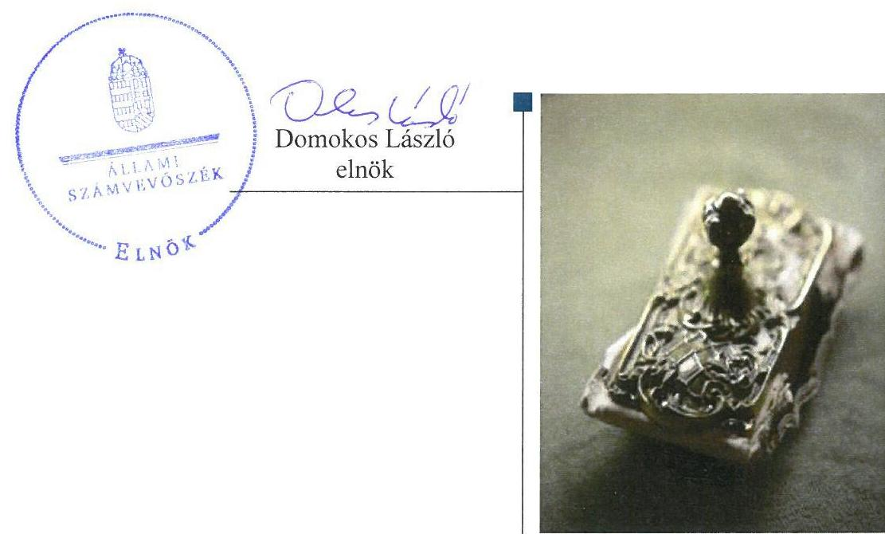
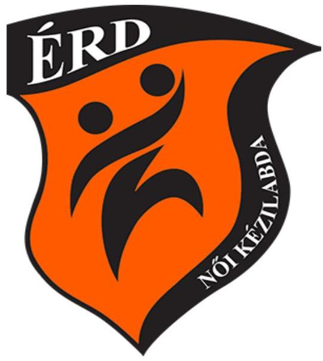
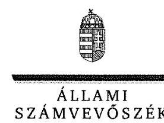
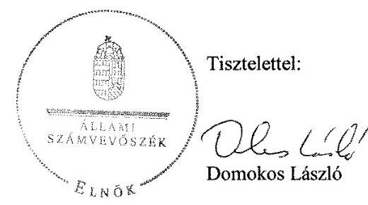
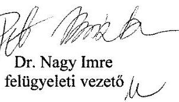

# Jelentés 

## Az önkormányzatok gazdasági társaságai

Az önkormányzatok többségi tulajdonában lévő gazdasági társaságok gazdálkodásának ellenőrzése - Érdi Sport Szolgáltató és Kereskedelmi Kft. 2017.

---

# Jelentés 

## Az önkormányzatok gazdasági társaságai

Az önkormányzatok többségi
tulajdonában lévő gazdasági társaságok gazdálkodásának ellenőrzése - Érdi Sport Szolgáltató és Kereskedelmi Kft.
2017.  hó 5. nap

---

# AZ ELLENŐRZÉST FELÜGYELTE:

DR. NAGY IMRE felügyeleti vezető

# AZ ELLENŐRZÉST VEZETTE ÉS A VÉGREHAJTÁSÁÉRT FELELŐS:

DR. NAGY JUDIT ellenőrzésvezető

# A PROGRAM ÖSSZEÁLLÍTÁSÁÉRT FELELŐS:

JANIK JÓZSEF LÁSZLÓ osztályvezető

---

**IKTATÓSZÁM:** V-1325-163/2016

**TÉMASZÁM:** 2167

**ELLENŐRZÉS-AZONOSÍTÓ SZÁM:** V-075822

---

Jelentéseink az Országgyűlés számítógépes hálózatán és az Interneten a www.asz.hu címen is olvashatóak.

---

# TARTALOMJEGYZÉK 

■ ÖSSZEGZÉS ..... 5
■ AZ ELLENŐRZÉS CÉLJA ..... 6
■ AZ ELLENŐRZÉS TERÜLETE ..... 7
■ AZ ELLENŐRZÉS HÁTTERE, INDOKOLTSÁGA ..... 9
■ A JELENTÉS LÉNYEGES KÉRDÉSKÖREI ..... 10
■ ELLENŐRZÉS HATÓKÖRE ÉS MÓDSZEREI ..... 11
■ MEGÁLLAPÍTÁSOK ..... 13
■ JAVASLATOK ..... 18
■ MELLÉKLETEK ..... 19
I. Sz. melléklet: Értelmező szótár ..... 19
■ FÜGGELÉK: ÉSZREVÉTELEK ..... 21
■ RÖVIDÍTÉSEK JEGYZÉKE ..... 27

---

.

---

# ÖSSZEGZÉS 

Érd Megyei Jogú Város Önkormányzata a tulajdonosi joggyakorlás kereteit összességében a jogszabályi előírásoknak megfelelően alakította ki, illetve a tulajdonosi jogokat szabályszerűen gyakorolta.
Az Érdi Sport Szolgáltató és Kereskedelmi Kft. vagyongazdálkodása összességében szabályszerű volt. Beszámolási kötelezettségeinek összességében eleget tett. A Társaság bevételeinek és ráfordításainak elszámolása a személyi jellegű ráfordítások kivételével szabályszerű volt.

## Az ellenőrzés társadalmi indokoltsága

Magyarországon az intézmény-centrikus közfeladat-ellátás jellemző, de egyre jelentősebb a költségvetésen kívüli feladatellátás térnyerése. Helyi szinten ennek legfontosabb szereplői az önkormányzati tulajdonban lévő gazdasági társaságok, amelyeknek ellenőrzése kiemelten fontos a közfeladat ellátása, és a közvagyon megőrzése, megóvása érdekében. Ezért alapvető követelmény, hogy gazdálkodásuk, működésük szabályszerű és átlátható legyen.

Napjainkban a közvélemény részéről kiemelt figyelem kíséri a sporttal kapcsolatos önkormányzati feladatok megvalósítását, ezért fontos szerep jut az ezzel kapcsolatos ellenőrzéseknek is. Érden 2012-2015 között az Érdi Sport Szolgáltató és Kereskedelmi Kft. látta el a tömegsport és versenysport támogatásával összefüggő feladatokat. Az Állami Számvevőszék az ellenőrzése során arra kereste a választ, hogy szabályszerű volt-e a sporttal összefüggő feladatokat ellátó Társaság gazdálkodása és az Önkormányzat ehhez kapcsolódó tulajdonosi joggyakorlása.

A jelentésben foglalt megállapítások és a megfogalmazott számvevőszéki javaslatok hozzájárulnak a felelős tulajdonosi joggyakorláshoz és a szabályos gazdálkodáshoz.

## Főbb megállapítások, következtetések, javaslatok

Érd Megyei Jogú Város Önkormányzata az Érdi Sport Szolgáltató és Kereskedelmi Kft. feletti tulajdonosi joggyakorlásának kereteit összességében a jogszabályoknak megfelelően kialakította, a feladatellátás feltételeit biztosította, tulajdonosi jogait szabályszerűen gyakorolta. Rendeletalkotási kötelezettségét teljesítette, a Társaság beszámolóit jóváhagyta.

A Társaság vagyongazdálkodása összességében szabályszerű volt. A gazdálkodással kapcsolatos szabályzatait elkészítette, azonban a számviteli politikáját és az eszközök és források leltározási szabályzatát nem aktualizálta, számlarendjét nem tartotta karban. Az adatvédelmi és adatbiztonsági szabályzatát, továbbá a közbeszerzési szabályzatát nem készítette el. Beszámolási kötelezettségeit alapvetően teljesítette, azonban az egyszerűsített éves beszámolók kiegészítő melléklete nem a jogszabályi előírásoknak megfelelően mutatta be az előírt tartalmi elemeket. A közérdekű és közérdekből nyilvános adatainak közzétételi kötelezettségének nem tett eleget.

A Társaságnál a bevételek és az értékcsökkenés elszámolása megfelelő, a személyi jellegű ráfordítások elszámolása nem megfelelő volt. A ráfordítások elszámolása megfelelő volt, ugyanakkor a Társaság a közbeszerzésre vonatkozó jogszabályoknak nem minden esetben tett eleget. Önköltségszámítási szabályzattal a belső előírásai ellenére nem rendelkezett.

---

# AZ ELLENŐRZÉS CÉLJA 

Az ellenőrzés célja annak értékelése, hogy az önkormányzat vagyongazdálkodási tevékenysége során szabályszerűen gyakorolta-e tulajdonosi jogait. A gazdasági társaság szabályozottsága, gazdálkodása és vagyongazdálkodási tevékenysége, bevételeinek és ráfordításainak elszámolása megfelelt-e a jogszabályi és tulajdonosi előírásoknak. A gazdasági társaság kötelezettségállománya jelent-e kockázatot a működésre, valamint a gazdálkodás átláthatósága és elszámoltathatósága érdekében biztosítva volt-e a szolgáltatás díjának megalapozottsága szabályszerű önköltségszámítással.

---

# **AZ ELLENŐRZÉS TERÜLETE**

## **Érdi Sport Szolgáltató és Kereskedelmi Kft. és a tulajdonosi jogokat gyakorló Érd Megyei Jogú Város Önkormányzata**

Az Önkormányzat - az Ötv.^{3} 9. § (4) bekezdésében foglalt lehetősége szerint - az ellenőrzött időszakot megelőzően, a 2009. évben döntött a tömegsport és versenysport támogatása feladat gazdasági társaság útján történő ellátásáról. A Társaságot az Önkormányzat és az Érdi Városi Sportegyesület 2009. november 19-én alapította, az Stv.^{4} alapján a nevezési jogok megszerzését követően, az egyes sportági szakszövetségek versenykiírásaiból adódó, a szakosztályok bajnokságban szereplésével összefüggő tevékenységének végzésére. Az Önkormányzat közfeladat ellátására vonatkozóan szerződést a Társasággal nem kötött. A Társaság jegyzett tőkéje alapításkor 1,0 M Ft volt, melynek 90 % -a az önkormányzati tulajdonrész, a fennmaradó 10% az Érdi Városi Sportegyesület tulajdonába került. A Társaság legfőbb szervének^{5} 2013. október 21.-ei ülésén a kisebbségi tulajdonrész, többségi tulajdonosnak történő értékesítéséről döntöttek, így egyszemélyes tulajdonossá vált az Önkormányzat. A Sportcsarnok^{6} megvásárlásához az Önkormányzat két alkalommal tagi kölcsönt nyújtott a Társaságnak, melyből a 2014. évben 9,0 M Ft-tal a tulajdonos törzstőkét emelt, 696,7 M Ft-ot tőketartalékba helyezett, a fennmaradó 384,8 M Ft tagi kölcsön összeg erejéig jelzálogjogot jegyeztetett be az épületre. A Társaság főtevékenysége az egyéb sporttevékenység volt, ellátott feladatai nem változtak, a megvásárolt Sportcsarnok üzemeltetését 2013. szeptember 30-ától az Érdi Városfejlesztési és Szolgáltató Kft.-vel kötött haszonbérleti szerződéssel biztosították. A Társaság feladatellátásához az Önkormányzat vagyont sem használatba, sem vagyonkezelésbe nem adott át. Az Önkormányzat nem vállalt sem garanciát sem kezességet a Társaság kötelezettségvállalásai biztosítékául.

A Társaság gazdálkodásának adatait az 1. táblázat mutatja be.

1. táblázat

|  A TÁRSASÁG GAZDÁLKODÁSÁVAL KAPCSOLATOS ADATOK ALAKULÁSA (MILLIÓ FT) | 2012 | 2013 | 2014 | 2015  |
| --- | --- | --- | --- | --- |
|  Értékesítés nettó árbevétele | 252,0 | 108,2 | 42,1 | 200,7  |
|  Egyéb bevételek (támogatások) | 152,3 | 184,5 | 138,4 | 128,2  |
|  Mérlegfőösszeg | 588,8 | 1.844,5 | 1.852,7 | 1.620,8  |
|  Követelések | 55,3 | 189,7 | 104,2 | 87,8  |
|  ebből: vevő követelések | 53,9 | 9,2 | 3,9 | 0,9  |
|  Saját tőke | 31,0 | -60,1 | 407,9 | 220,3  |
|  Jegyzett tőke (törzstőke) | 1,0 | 1,0 | 10,0 | 10,0  |
|  Mérleg szerinti eredmény | 4,7 | -91,2 | -237,7 | -187,5  |
|  Kötelezettségek összesen | 510,0 | 1.339,9 | 418,1 | 411,7  |
|  Átlagos statisztikai állományi létszám (fő) | 30 | 32 | 29 | 28  |

*Forrás: A Társaság egyszerűsített éves beszámolói*

---

Az Önkormányzatnál a polgármester személyét érintő változás nem történt, a jegyző személye egy alkalommal, 2013. április 1-jétől, a Társaság ügyvezetőjének személye, egy alkalommal - 2013. március 1-jétől - változott.

---

# AZ ELLENŐRZÉS HÁTTERE, INDOKOLTSÁGA 

## AZ ÖNKORMÁNYZATI TULAJDONÚ GAZDASÁGI

TÁRSASÁGOK teljes körű ellenőrzésének lehetőségét az Állami Számvevőszékről szóló 1989. évi XXXVIII. törvény 2011. január 1-jétől hatályos módosítása teremtette meg és az Állami Számvevőszékről szóló 2011. évi LXVI. törvény is tartalmazza. A gazdasági társaságok gazdálkodási tevékenysége szabályszerűségének ellenőrzését 2011. évtől végezzük. Az önkormányzatok többségi tulajdonában álló gazdasági társaságok ellenőrzése kiemelten fontos a vagyon megőrzése, megóvása érdekében.

A feladatellátás költségeinek, ráfordításainak alakulása a lakosság széles rétegét érinti. Az ellenőrzés várható hasznosulásaként ellenőrzéseink feltárhatják, hogy az önkormányzat a feladatellátásához rendelt vagyon működtetését a tulajdonostól elvárható gondossággal végezte-e, a feladatot ellátó gazdasági társaság a létesítő okiratban, szolgáltatási szerződésben foglaltak betartásával biztosította-e a feladat ellátását. Az ellenőrzés rávilágíthat arra, hogy a gazdasági társaság a vagyon használatával biztosította-e a szolgáltatás folytatásának feltételeit, az önkormányzat tulajdonosi felügyelete hozzájárult-e a szabályszerű gazdálkodáshoz és feladatellátáshoz.

A megállapítások alapján megfogalmazott számvevőszéki javaslatok hasznosítása elősegítheti a meglévő hibák megszüntetését. A jó gyakorlatok bemutatásával az Állami Számvevőszék hozzájárul a követendő megoldások megismertetéséhez, terjesztéséhez.

---

# A JELENTÉS LÉNYEGES KÉRDÉSKÖREI 

1.- Az önkormányzat tulajdonosi joggyakorlása szabályszerű volt-e?
2.- A gazdasági társaság vagyongazdálkodása szabályszerű volt-e, fizetőképessége biztosított volt-e a gazdálkodása során?
3.- A gazdasági társaság bevételeinek és ráfordításainak elszámolása szabályszerű volt-e?

---

# ELLENŐRZÉS HATÓKÖRE ÉS MÓDSZEREI 

## Az ellenőrzés típusa

Megfelelőségi ellenőrzés.

## Az ellenőrzött időszak

2012. január 1-jétől 2015. december 31-ig.

## Az ellenőrzés tárgya

Érd Megyei Jogú Város Önkormányzata tulajdonosi joggyakorlása és a többségi tulajdonában lévő Érdi Sport Szolgáltató és Kereskedelmi Kft. gazdálkodásának szabályozottsága és szabályszerűsége.

Az ellenőrzés kiterjed minden olyan körülményre és adatra, amely az ÁSZ ${ }^{7}$ jogszabályban meghatározott feladatainak teljesítéséhez, valamint a program végrehajtása folyamán felmerült újabb összefüggések feltárásához szükséges.

## Az ellenőrzött szervezet

Érd Megyei Jogú Város Önkormányzata mint tulajdonosi joggyakorló és az Érdi Sport Szolgáltató és Kereskedelmi Kft.

## Az ellenőrzés jogalapja

Az ellenőrzés jogszabályi alapját az ÁSZ tv. ${ }^{8}$ 1. § (3) bekezdése és 5. § (3)-(4)-(5) bekezdései képezik.

## Az ellenőrzés módszerei

Az ellenőrzést a nemzetközi standardokat irányadónak tekintve az ellenőrzési program ellenőrzési kérdései, az ellenőrzött időszakban hatályos jogszabályok, az ellenőrzés szakmai szabályok és módszertanok figyelembe vételével végeztük.

Az ellenőrzés ideje alatt az ellenőrzött szervezettel történő kapcsolattartást az ÁSZ Szervezeti és Működési Szabályzatának vonatkozó előírásai alapján biztosítottuk.

---

Az ellenőrzés a kiválasztott, többségi tulajdonosi jogokat gyakorló önkormányzatra, illetve az ellenőrzésre kijelölt gazdasági társaság felett tulajdonosi jogokat gyakorló szervezetre és az ellenőrzött gazdasági társaságra terjedt ki.

Az ellenőrzési kérdések megválaszolásához szükséges bizonyítékok megszerzése a következő ellenőrzési eljárások alkalmazásával történt: megfigyelés, kérdésfeltevés (információkérés), összehasonlítás, valamint elemző eljárás. Az ellenőrzési bizonyítékként felhasználható adatforrások közé tartoztak egyrészt az ellenőrzési programban felsorolt adatforrások, másrészt adatforrás lehet még minden - az ellenőrzés folyamán - feltárt, az ellenőrzés szempontjából információkat tartalmazó dokumentum.

Az ellenőrzést a kérdésekre adott válaszok kiértékelésével, valamint a megjelölt adatforrások, a csatolt tanúsítványok felhasználásával, továbbá az adott időszakban hatályos jogszabályok figyelembe vételével folytattuk le.

A bevételek és ráfordítások elszámolása, valamint a vagyonnyilvántartás terén a szabályszerű működést véletlen mintavétellel ellenőriztük. A mintavétellel ellenőrzött területek esetében minden egyes tétel vonatkozásában a szabályszerűségre vonatkozó kérdéseket tettünk fel, amelyek eredménye összesítésre került. Megfelelőnek értékeltünk egy ellenőrzött területet, amennyiben 95%-os bizonyossággal a teljes sokaságban az átlagos hibaarány legfeljebb 10%, nem megfelelőnek, amennyiben 10%-nál magasabb arányt képviselt. A ráfordítások elszámolására és a vagyonnyilvántartásra vonatkozó véletlen mintavételt kockázati alapú kiválasztással egészítettük ki, amelynek során évente a három legnagyobb összegű tételt választottuk ki.

---

# 1. Az önkormányzat tulajdonosi joggyakorlása szabályszerű volt-e? 

Összegző megállapítás

### 1.1. számú megállapítás

Az Önkormányzat tulajdonosi joggyakorlása összességében szabályszerű volt.

Az Önkormányzat a tulajdonosi joggyakorlás kereteit összességében szabályszerűen alakította ki.

Az Ötv. 91. § (6) bekezdése, 2013. január 1-jétől az Mötv. ${ }^{9}$ 116. § (3)-(4) bekezdései szerint az Önkormányzat a gazdasági programjában, a 2007-2010. évekre jóváhagyott gazdasági program ${ }_{1}{ }^{10}$-ben, valamint annak 2011-2014. évekre vonatkozóan felülvizsgált, módosított változatában - gazdasági program ${ }_{2}{ }^{11}$-, a Társaság által ellátott feladatok biztosítására, színvonalának javítására vonatkozó fejlesztési célokat, valamint a sportcsarnok megvásárlására vonatkozó elképzeléseket is meghatározta. Gazdasági programot, fejlesztési tervet az Önkormányzat
 a 2014. évi önkormányzati választásokat követően nem készített, a Közgyűlés ${ }^{12}$ az alakuló ülést követő hat hónapon belül az MÖtv. 116. § (5) bekezdésében rögzítettek ellenére nem hagyott jóvá.

A Közgyűlés 2015. szeptember 24-ei ülésén a Batthyány 2015-2020 elnevezésű városfejlesztési program megvalósításáról döntött határozataiban, melyek a gazdaság-, intézmény- és közszolgáltatás fejlesztés, valamint a nemzeti vagyon hasznosításával kapcsolatos részterületekre terjedtek ki.

Közép- és hosszú távú vagyongazdálkodási tervvel ${ }^{13}$ az Önkormányzat az Nvtv. ${ }^{14}$ 9. § (1) bekezdésében foglalt előírás szerint rendelkezett, annak Közgyűlés általi elfogadására azonban - a vagyonrendelet ${ }_{1}{ }^{15}{ }_{12}{ }^{16}$ 9. § (1) bekezdésének előírása ellenére - nem a gazdasági program ${ }_{2}$ 2012. szeptember 20-i elfogadásával egyidejűleg, hanem 2013. május 30-án került sor.

Az Önkormányzat a tulajdonosi joggyakorlására vonatkozó szabályokat a vagyonrendelet ${ }_{1}{ }^{17}{ }_{2}$-ben, illetve az SZMSZ ${ }_{1,2}{ }^{18}$-ben szabályozta. A vagyonrendelet ${ }_{1,2}$ 8. § (1) bekezdése szerint a tulajdonosi jogokat a Közgyűlés, átruházott hatáskörben a Városfejlesztési, Üzemeltetési és Vagyongazdálkodási Bizottság, valamint a polgármester gyakorolta. A Társaság legfőbb szervének hatáskörébe tartozó ügyekben a vagyonrendelet ${ }_{2}$ 34. § (3) bekezdése alapján többszemélyes gazdasági társaságnál a polgármester, a 34. § (2) bekezdése alapján az egyszemélyes gazdasági társaság esetén a Közgyűlés közvetlenül járt el.

A Társaság létesítő okiratai ${ }^{19}$ megfeleltek a Gt. ${ }^{20}$ 12. § (1) bekezdésében, valamint a Ptk. ${ }_{1}{ }^{21}$ 54. § (2) bekezdésében, illetve a Ptk. ${ }_{2}{ }^{22}$ 3:5 §-ában előírt tartalmi követelményeknek.

Az Önkormányzat a tulajdonosi joggyakorlás keretében a feladatellátásról készült szakmai-, valamint az éves pénzügyi beszámolók értékelésével gyakorolta a tulajdonosi jogait.

---

Javadalmazási Szabályzat jóváhagyásáról a Közgyűlés a Taktv. 5. § (3) bekezdésében rögzítettek ellenére késedelmesen, 299/2014. (XII.18.) sz. határozatával döntött.

# 1.2. számú megállapítás Az Önkormányzat tulajdonosi joggyakorlása szabályszerű volt. 

A 3 fős, ügyrenddel rendelkező Felügyelő-bizottság a Gt. 34. § (1) bekezdésében, valamint a Ptk. ${ }_{2}$ 3:121. § (1) bekezdésében előírtak szerint működött. A Gt. 41. § (1) bekezdésének illetve a Ptk. ${ }_{2}$ 3:130. §-ban foglaltaknak megfelelően a Társaság könyvvizsgálatát végző társaságot ${ }^{23}$ a Társaság legfőbb szerve megválasztotta.

A Társaság üzleti tervei alapján a működéshez szükséges önkormányzati forrás biztosítását, továbbá az ügyvezető által elkészített egyszerűsített éves beszámolókat és szöveges beszámolót - a létesítő okiratban meghatározott feladatok ellátásáról - a társaság legfőbb szerve határozattal jóváhagyta, illetve a 2012. évi egyszerűsített éves beszámoló esetében annak elfogadására a Polgármestert felhatalmazta.

Az Önkormányzat három alkalommal végzett belső ellenőrzést a Társaságnál - melyből egy alkalommal utóellenőrzés történt - az ellenőrzési terveknek ${ }^{24}$ megfelelően. A belső ellenőrzési programok a készpénz- és bankszámlaforgalom ellenőrzése mellett, a Társaság rendelkezésére álló erőforrásokkal történt hatékony gazdálkodás ellenőrzésére vonatkoztak. A belső ellenőrzések által feltárt hiányosságok megszüntetése érdekében, a Társaság intézkedési terveket ${ }^{25}$ készített.
2012. évben a képződött nyereséget eredménytartalékba helyezték, 2013-2015 között a Társaság veszteséges volt. A Társaság 2013. évi egyszerűsített éves beszámolójának felülvizsgálata során - mivel a Társaság saját tőkéje a veszteség folytán a törzstőke felére csökkent -, a könyvvizsgáló figyelemfelhívással élt a tulajdonos felé, hogy a Ptk. ${ }_{2}$ 3:189. § (1) bekezdés a) és b) pontjában foglaltaknak megfelelően intézkedjen a tőkehelyzet rendezése érdekében, amely a tagi kölcsön egy részének bevonásával - 2014. november 27-én - meg is történt.

## 2. A gazdasági társaság vagyongazdálkodása szabályszerű volt-e, fizetőképessége biztosított volt-e a gazdálkodása során?

## Összegző megállapítás

2.1. számú megállapítás

A Társaság vagyongazdálkodása összességében megfelelt a jogszabályi előírásoknak, fizetőképessége biztosított volt.

A Társaság számviteli szabályzatokkal rendelkezett, de azok határidőben történő aktualizálásáról, karbantartásáról - indokoltsága ellenére - nem gondoskodott. Nem készítettek adatvédelmi és adatbiztonsági, valamint közbeszerzési szabályzatot.

A Társaság a Számv. tv. ${ }^{26}$ 14. § (3) bekezdése szerint a Számviteli politika ${ }^{27}$-t elkészítette, de azt a Számv. tv. ${ }^{28}$ 14. § (11) bekezdésében rögzítettek ellenére 2013. január 1-jével nem módosította, így az a Számv. tv. 3. § (3) bekezdés 3. pontja ellenére nem megfelelően tartalmazta a jelentős összegű hiba fogalmát, valamint a Számviteli politika ${ }^{29}$ nem határozta

---

meg. Nem törölték a Számviteli politika ${ }_{1}$-ben a Számv. tv. 3. § (3) bekezdés 5) pontjának hatályon kívül helyezése kapcsán a megbízható és valós képet lényegesen befolyásoló hiba fogalmát. A Számviteli politika ${ }_{2}$ a Számv. tv. 14. § (4) bekezdésében foglaltak ellenére, nem tartalmazta azokat a Társaságra jellemző szabályokat, előírásokat, módszereket, amelyekkel meghatározzák, hogy mit tekint a számviteli elszámolás, az értékelés szempontjából lényegesnek, jelentősnek, nem lényegesnek, nem jelentősnek, kivételes nagyságú vagy előfordulású bevételnek, költségnek, ráfordításnak. Az elkészült Számlarendet ${ }^{30}$ Számv. tv. 161. § (4) bekezdés előírását megsértve nem tartották karban, az nem tartalmazott minden, a könyvelés során ténylegesen használt számlát a Számv. tv. 161. § (2) bekezdés a) pontjában előírtak ellenére.

A Számv. tv. 14. § (5) bekezdés a) pontjában előírt Eszközök és források leltározási szabályzatát ${ }^{31}$ nem aktualizálták, így az a Számv. tv. 14. § (11) valamint 69. § (3) bekezdésében rögzítettek ellenére 2012. január 1-jétől a tárgyi eszközökre vonatkozóan nem fogalmazott meg követelményt a leltározás - meghatározott időszakonként, de legalább 3 évente - mennyiségi felvétellel történő gyakoriságára.

A Társaság a Számv. tv. 14. § (5) bekezdés d) pontja szerint elkészített Pénzkezelési szabályzat ${ }_{1}{ }^{32} \cdot{ }_{2}{ }^{33} \cdot{ }_{3}{ }^{34} \cdot{ }_{4}{ }^{35}$-ai a jogszabályi előírásoknak megfeleltek.

A Társaság nem rendelkezett a Kbt ${ }_{1}{ }^{36}$ 22. § (1) bekezdésében, valamint a Kbt ${ }_{2}{ }^{37}$ 27. § (1) bekezdésében meghatározott Közbeszerzési szabályzattal, továbbá az Infotv. ${ }^{38}$ 24. § (3) bekezdése szerinti Adatvédelmi és adatbiztonsági Szabályzattal.

A Társaság nem készített Önköltségszámítási szabályzatot annak ellenére, hogy a szabályzat készítésére vonatkozó kötelezettséget a Számviteli Politika ${ }_{2}$-ben előírta.

# 2.2. számú megállapítás 

A Társaság a vagyonnal kapcsolatos nyilvántartási kötelezettségét teljesítette, a vagyongazdálkodása összességében megfelelt a jogszabályi előírásoknak.

A Társaság saját vagyona tekintetében a nyilvántartásait a Számv. tv. 4649 § és a Számviteli Politika ${ }_{1,2}$ előírásainak megfelelően vezette és értékelte, a vagyonváltozás kimutatása folyamatosan megtörtént. Az analitikus és a főkönyvi nyilvántartások egyezősége biztosított volt. Az éves beszámolóban és a számviteli nyilvántartásokban szereplő vagyonelemek állományát év végén leltárral támasztották alá.

2012-2013. években a beszámolóban és a számviteli nyilvántartásokban szereplő tárgyi eszközök állományát egyeztetéssel leltározták. Az egyeztetésről készült dokumentumok nem feleltek meg az Eszközök és források leltározási szabályzat 1. pont és 3.1 pont előírásai szerinti alaki és tartalmi követelményeknek.

## 2.3. számú megállapítás

A Társaság fizetőképessége biztosított volt, lejárt kötelezettségállománnyal a 2013. év végét követően nem rendelkeztek.

A Társaság kötelezettségeinek állománya csökkent, a Társaság fizetőképessége folyamatosan javult. A tagi kölcsön után a kamatfizetési kötelezettségeinek a Társaság rendben eleget tett.

---

Az egyéb kötelezettségek, valamint szerződésen és jogszabályon alapuló rövid lejáratú kötelezettségek határidőben történő teljesítése a 2013. év végétől biztosított volt, így a fennálló kötelezettségállomány a Társaság működését nem veszélyeztette.

A Társaság kötelezettségállományára vonatkozó adatokat a 2. táblázat mutatja be.
2. táblázat

A TÁRSASÁG KÖTELEZETTSÉG ÁLLOMÁNYÁNAK ALAKULÁSA (M FT)

|  |  | 2012. év | 2013. év | 2014. év | 2015. év |
| :--: | :--: | :--: | :--: | :--: | :--: |
| Kötelezettségek összesen: |  | 510,0 | 1339,9 | 418,1 | 411,7 |
| Hosszú lejáratú kötelezettség összesen: |  | 463,0 | 462,0 | 384,8 | 384,8 |
| Rövid lejáratú kötelezettség összesen: |  | 47,0 | 877,9 | 33,3 | 26,9 |
| ebből határidőn belüli |  | 6,1 | 842,2 | 7,2 | 6,9 |
| ebből határidőn túli | 1-30 nap | 5,7 | 0,8 | 0,0 | 0,0 |
| Szállítói tartozásállomány |  | 11,8 | 843,0 | 7,2 | 6,9 |

2.4. számú megállapítás

A Társaság a jogszabályban előírt beszámolási kötelezettségeit határidőben teljesítette. A közérdekű adatokkal kapcsolatos közzétételi kötelezettségének nem tett eleget.

A Társaság egyszerűsített éves beszámolóit a Felügyelő bizottság megtárgyalta, határozattal jóváhagyta, a könyvvizsgáló hitelesítő záradékkal látta el.

A Társaság egyszerűsített éves beszámolóit a törvényi előírásnak megfelelően határidőben letétbe helyezte és közzétette.

A Társaság a közérdekű adatait saját honlapon hozta nyilvánosságra, ahol megtalálható a jogszabály alapján a Tao. ${ }^{39}$ támogatások felhasználásának elszámolása is. A Taktv. ${ }^{40}$ 2. § (1) bekezdésének ca) pontjában előírtak ellenére a Társaság vezető tisztségviselőinek és a vezető állású munkavállalóinak nyújtott pénzbeli juttatásokat a honlap nem tartalmazta.

A Társaság a Számv. tv. 90. § (3) bekezdés a) pontjában foglaltak ellenére nem tüntette fel az egyszerűsített éves beszámolók kiegészítő mellékletében a tagi kölcsönhöz kapcsolódóan bejegyzett biztosítékok fajtáját és formáját.

---

# 3. A gazdasági társaság bevételeinek és ráfordításainak elszámolása szabályszerű volt-e? 

Összegző megállapítás

A Társaság bevételeinek elszámolása szabályszerű volt. A beruházások, felújítások, és az értékcsökkenés elszámolása, valamint az anyagjellegű ráfordítások, egyéb, rendkívüli és pénzügyi műveletek ráfordításai elszámolása szabályszerűen történt. A személyi jellegű ráfordítások elszámolása nem volt szabályszerű.

A Társaság a Számviteli politika ${ }_{1,2}$-ben határozta meg a bevételek és ráfordítások elszámolásához szükséges szabályokat.

A Társaság saját bevételei a sportolói tagdíjakból és reklámbevételekből álltak. A bevételek elszámolása megfelelően történt.
2012. évben egyenlegközlő és felszólító levelek kiküldésével tett intézkedéseket a hátralékos díjbevételek csökkentésére. A 2013-2015. években az egyenlegközlő levelek küldésén kívül más intézkedésre nem volt szükség. A vevő követelések állománya folyamatosan csökkent, a 2012. év végi 53,9 M Ft-ról a 2015. december 31-re 0,9 M Ft-ra. A vevő követelésállományon belül a határidőn belüli követelések 96,1 %-kal, a határidőn túli követelések 98,5 %-kal csökkentek.

A beruházások, felújítások és az értékcsökkenés elszámolása megfelelően történt.

A ráfordítások elszámolása megfelelően történt. Az Érdi Sport Szolgáltató és Kereskedelmi Kft. a Sportcsarnok rendeltetésszerű használatához szükséges tárgyi eszközök beszerzése során mellőzte a közbeszerzési eljárás lefolytatását, mellyel megsértette a Kbt. 19. §-ára tekintettel a Kbt. 15. §-ának előírását.

A személyi jellegű ráfordítások elszámolása nem volt szabályszerű, mert a személyi jellegű kifizetések a Számv. tv. 165. § (1) előírásai ellenére nem voltak bizonylatokkal alátámasztva.

---

# JAVASLATOK 

Az ÁSZ tv. 33. § (1) bekezdésében foglaltak értelmében az ellenőrzött szervezet vezetője köteles a jelentésben foglalt megállapításokhoz kapcsolódó intézkedési tervet összeállítani és azt a jelentés kézhezvételétől számított 30 napon belül az ÁSZ részére megküldeni. Amennyiben az ellenőrzött szervezet vezetője nem küldi meg határidőben az intézkedési tervet, vagy továbbra sem elfogadható intézkedési tervet küld, az Állami Számvevőszék elnöke az ÁSZ tv. 33. § (3) bekezdés a) és b) pontjaiban foglaltakat érvényesítheti.

## Érdi Sport Szolgáltató és Kereskedelmi Kft. Ügyvezetőjének

1. Intézkedjen
 a számviteli politika kiegészítéséről és aktualizálásáról, az eszközök és források leltározási szabályzatának aktualizálásáról, a számlarend karbantartásáról a jogszabályi rendelkezések szerint.
(2.1. sz. megállapítás 1. és 2. bekezdése alapján)
2. Intézkedjen a jogszabályi előírásoknak megfelelően az adatvédelmi és adatbiztonsági szabályzat, valamint a közbeszerzési szabályzat elkészítéséről.
(2.1. sz. megállapítás 4. bekezdése alapján)
3. Intézkedjen a Számviteli politikában előírt önköltségszámítási szabályzat elkészítéséről.
(2.1. sz. megállapítás 5. bekezdése alapján)
4. Intézkedjen a közzétételi kötelezettség jogszabályi előírásnak maradéktalanul megfelelő teljesítéséről.
(2.4. sz. megállapítás 3. bekezdésének 2. mondata alapján)
5. Intézkedjen arról, hogy az egyszerűsített éves beszámolók kiegészítő melléklete a jogszabály előírásainak megfelelően mutassa be az előírt tartalmi elemet.
(2.4. sz. megállapítás 5. bekezdése alapján)
6. Intézkedjen arról, hogy a közbeszerzési eljárásokat folytassák le a jogszabályi előírásoknak megfelelően.
(3. sz. megállapítás 5. bekezdés 2. mondata alapján)
7. Intézkedjen arról, hogy a személyi jellegű ráfordítások elszámolása a jogszabályi előírásnak megfelelően történjen.
(3. sz. megállapítás 6. bekezdése alapján)

---

# MELLÉKLETEK 

- I. SZ. MELLÉKLET: ÉRTELMEZŐ SZÓTÁR
gazdasági társaság
gazdálkodó szervezet
közép- és hosszú távú vagyongazdálkodási terv
közszolgáltatás
meghatározó befolyás
minősített többséget biztosító részesedés
többségi befolyást biztosító részesedés

Ptk. 2. 3:88. § (1) bekezdése szerint „a gazdasági társaságok üzletszerű közös gazdasági tevékenység folytatására, a tagok vagyoni hozzájárulásával létrehozott, jogi személyiséggel rendelkező vállalkozások, amelyekben a tagok a nyereségből közösen részesednek, és a veszteséget közösen viselik".
A Ptk. 1:685. § c) pontja szerint gazdálkodó szervezet: „az állami vállalat, az egyéb állami gazdálkodó szerv, a szövetkezet, a lakásszövetkezet, az európai szövetkezet, a gazdasági társaság, az európai részvénytársaság, az egyesülés, az európai gazdasági egyesülés, az európai területi együttműködési csoportosulás, az egyes jogi személyek vállalata, a leányvállalat, a vízgazdálkodási társulat, az erdőbirtokossági társulat, a végrehajtói iroda, az egyéni cég, továbbá az egyéni vállalkozó." (2014. 03. 15-ig hatályos)
Az Nvtv. 7.§ (2) bekezdése szerint „a nemzeti vagyongazdálkodás feladata a nemzeti vagyon rendeltetésének megfelelő, az állam, az önkormányzat mindenkori teherbíró képességéhez igazodó, elsődlegesen a közfeladatok ellátásához és a mindenkori társadalmi szükségletek kielégítéséhez szükséges, egységes elveken alapuló, átlátható, hatékony és költségtakarékos működtetése, értékének megőrzése, állagának védelme, értéknövelő használata, hasznosítása, gyarapítása, továbbá az állam vagy a helyi önkormányzat feladatának ellátása szempontjából feleslegessé váló vagyontárgyak elidegenítése." Az Nvtv. 9.§ (1) bekezdése szerint az önkormányzat ennek biztosítása céljából közép- és hosszú távú vagyongazdálkodási tervet köteles készíteni. (hatályos 2012. január 1-jétől)
Az Ebktv. ${ }^{41}$ 3. § d) pontja a következőképpen határozza meg a közszolgáltatást: „szerződéskötési kötelezettség alapján a lakosság alapvető szükségleteinek ellátására irányuló szolgáltatás, így különösen a villamos energia-, gáz-, hő-, víz-, szennyvíz- és hulladékkezelési, köztisztasági, postai és távközlési szolgáltatás, továbbá a menetrend alapján közlekedő járművekkel végzett közforgalmú személyszállítás". A Ptk. 2:8:2. § (2) bekezdése szerint „A befolyással rendelkező akkor rendelkezik egy jogi személyben meghatározó befolyással, ha annak tagja vagy részvényese, és
a) jogosult e jogi személy vezető tisztségviselői vagy Felügyelőbizottsága tagjainak többségének megválasztására, illetve visszahívására; vagy
b) a jogi személy más tagjai, illetve részvényesei a befolyással rendelkezővel kötött megállapodás alapján a befolyással rendelkezővel azonos tartalommal szavaznak, vagy a befolyással rendelkezőn keresztül gyakorolják szavazati jogukat, feltéve, hogy együtt a szavazatok több mint felével rendelkeznek."
A minősített befolyásszerző az ellenőrzött társaságban a szavazatok legalább hetvenöt százalékával rendelkezik. (Ptk. 2:3:324. §)
A Ptk. 2:8:2. § (1) bekezdése szerint „többségi befolyás az olyan kapcsolat, amelynek révén természetes személy vagy jogi személy (befolyással rendelkező) egy jogi személyben a szavazatok több mint felével vagy meghatározó befolyással rendelkezik."

---

.

---

# FÜGGELÉK: ÉSZREVÉTELEK 

A jelentéstervezetet a Számvevőszék 15 napos észrevételezésre megküldte az ellenőrzött szervezetek vezetőinek az ÁSZ tv. 29. § (1) bekezdése előírásának megfelelően.

Az ÁSZ a jelentéstervezetet észrevételezésre megküldte az Érdi Sport Szolgáltató és Kereskedelmi Kft. ügyvezetőjének, valamint az Érd Megyei Jogú Város Önkormányzata polgármesterének.
Az Érdi Sport Szolgáltató és Kereskedelmi Kft. ügyvezetőjének észrevételét melléklet nélkül és az arra adott választ a függelék alább tartalmazza. Az Érd Megyei Jogú Város Önkormányzatának polgármestere az ÁSZ tv. 29. § (2) bekezdésében foglalt észrevételezési jogával nem élt, a törvényes határidőn belül észrevételt nem tett.

[^0]
[^0]:    * 29. § (1) Az Állami Számvevőszék az ellenőrzési megállapításait megküldi az ellenőrzött szervezet vezetőjének vagy az általa megbízott személynek, és annak, akinek személyes felelősségét állapította meg.
    (2) Az ellenőrzött szervezet vezetője és a felelősként megjelölt személy az ellenőrzés megállapításaira tizenöt napon belül írásban észrevételt tehet.
    (3) Az Állami Számvevőszék az észrevételre a beérkezésétől számított harminc napon belül írásban válaszol. A figyelembe nem vett észrevételeket köteles a jelentésben feltüntetni, és megindokolni, hogy azokat miért nem fogadta el.

---

# ÉRDI SPORT KFT. 

2030 Érd, Velencel út 39-41. www.handballerd.hu

Telefon: +3620-914-4037
e-mail:iroda.kezilabda@gmail.com

Állami Számvevőszék
Domokos László Elnök Úr részére
1052 Budapest, Apáczai Csere János utca 10.

Tárgy: Észrevételezés a V-1325-154/216 iktatószámú Számvevőszéki Jelentéstervezethez

Tisztelt Domokos László Elnök Úr!
Köszönettel megkaptam a fenti iktatószámon nyilvántartott „Az önkormányzatok többségi tulajdonában lévő gazdasági társaságok gazdálkodásának ellenőrzése-Érdi Sport Szolgáltató és Kereskedelmi Kft. 2017" Számvevőszéki Jelentéstervezet példányát, amelyre mint az Érdi Sport Kft. hivatalos képviselője az alábbi észrevételeket kívánom tenni.

Örömmel fogadtuk a megállapítást, miszerint Társaságunk gazdálkodását az Állami Számvevőszék összességében szabályszerűnek minősítette.

A Számvevőszéki jelentéstervezetben megfogalmazott megállapításokkal, javaslatokkal kapcsolatban az alábbi észrevételeket kívánjuk tenni a végleges jelentés elkészítéséhez, a megállapítások sorszámozásához rendelve.
2.1. A megállapításban foglaltakat a negyedik bekezdésben foglaltak kivételével elfogadjuk, a hibák kijavítására már az ellenőrzött időszakot követő időszakban részben sor került, a további hibák kijavítását a törvényi előírásoknak megfelelően végrehajtjuk.
A negyedik bekezdésben foglaltakkal szembeni észrevételünk: véleményünk szerint Közbeszerzési Szabályzatot csak abban az esetben kell készítenünk, ha Társaságunk a 2015. évi CXLIII. törvény a közbeszerzésekről 5.§ szerinti meghatározások szerint ajánlatkérőnek minősül. Jelenleg az ennek megállapítására vonatkozó 6.K.27.188/2017/9/1. számon a Székesfehérvári Közigazgatási és Munkaügyi Bíróságon még folyamatban lévő per végleges lezárásáig a Közbeszerzési Szabályzatra vonatkozó megállapításokkal nem áll módunkban egyetérteni. Mellékletben küldjük a bíróság idéző végzését a per folyamatának igazolására.
2.2. A megállapításban foglaltakat észrevételezés nélkül elfogadjuk, a hibák kijavítására már az ellenőrzött időszakot követő időszakban részben sor került, a további hibák kijavítását a törvényi előírásoknak megfelelően végrehajtjuk.
2.3. A megállapításban foglaltakat észrevételezés nélkül elfogadjuk.
2.4. A megállapításban foglaltakat elfogadjuk, a megállapítás szövegezésében kérjük a „A közérdekű adatokkal kapcsolatos közzétételi kötelezettségének nem tett eleget." szövegezés helyett a „A közérdekű adatokkal kapcsolatos közzétételi kötelezettségének részben tett eleget" megfogalmazásra módosítani.

---

# ÉRDI SPORT KFT. 

2030 Érd, Velencei út 39-41. www.handballerd.hu

Telefon: +3620-914-4037
e-mail:iroda.kezilabda@gmail.com
3. A megállapításban foglaltakat a hatodik bekezdésben foglaltak kivételével elfogadjuk. A hatodik bekezdésben foglaltakban megfogalmazott „A személy jellegű ráfordítások elszámolása nem volt szabályszerű, mert a személy jellegű kifizetések a Számv.tv. 165.§ (1) előírásai ellenére nem voltak bizonylatokkal alátámasztva" mondattal nem áll módunkban egyetérteni, mivel a személy jellegű kifizetésekre vonatkozó mintatételek mindegyikéhez beküldtük a rendelkezésre álló bizonylatokat, és azok ellen kifogást a vizsgálat nem emelt.
Amennyiben a rendelkezésre álló bizonylatokat nem elegendőnek, vagy hiányosnak találta a vizsgálat, abban az esetben kérem, hogy a megállapítást ennek megfelelően pontosan tegyék meg, és a megállapítás szövegét „A személy jellegű ráfordítások elszámolása nem volt szabályszerű, mert a személy jellegű kifizetések a Számv.tv. 165.§ (1) előírásai ellenére nem megfelelően, vagy hiányosan voltak alátámasztva." szövegezésre módosítani. Kérjük, hogy ezzel kapcsolatban a végleges jelentésben megfogalmazott javaslatokban szíveskedjenek pontos leírást adni arról, hogy a vizsgálat mely bizonylatokat találta nem megfelelőnek, hogy az intézkedéseket annak megfelelően meg tudjuk tenni.

Kérem, hogy az észrevételeket a végleges Számvevőszéki jelentés elkészítésekor szíveskedjenek figyelembe venni.

Ezúton szeretném megköszönni az ellenőrzésben közreműködő munkatársainak az ellenőrzéssel kapcsolatos elvárások gyors megértéséhez nyújtott segítségét, a pontos, precíz munkát, és a korrekt kapcsolattartást.

Érd, 2017. augusztus 22.

Köszönettel,

Szantó Erzsébet Gizella
ügyvezető
Érdi Sport Kft.
Érdi Sport Kft. 2030 Érd. Velencei út 39-41.
Asz.: 14988177-2-13

Melléklet : 1. A Székesfehérvári Közigazgatási és Munkaügyi Bíróság Idéző Végzése

---

ELKÖK

Ikt.szám: V-1325-159/2016.

# Szántó Erzsébet Gizella úrhölgy 

ügyvezető
Érdi Sport Szolgáltató és Kereskedelmi Kft.
Érd

## Tisztelt Ügyvezető Úrhölgy!

„Az önkormányzatok gazdasági társaságai - Az önkormányzatok többségi tulajdonában lévő gazdasági társaságok gazdálkodásának ellenőrzése - Érdi Sport Szolgáltató és Kereskedelmi Kft." címmel készített számvevőszéki jelentéstervezetre tett észrevételeit köszönettel megkaptam.
Az Állami Számvevőszék észrevételekre vonatkozó álláspontjáról a felügyeleti vezető által készített részletes tájékoztatást csatoltan megküldöm.
Tájékoztatom Ügyvezető úrhölgyet, hogy a számvevőszéki jelentésben - az Állami Számvevőszékről szóló 2011. évi LXVI. törvény 29. § (3) bekezdése alapján - a figyelembe nem vett észrevételeket szerepeltetjük annak megindoklásával, hogy azokat miért nem fogadtuk el.

Budapest, 2017. 03. hó 13. nap

Melléklet: Tájékoztatás az észrevételek kezeléséről

---

# Tájékoztatás   az észrevételek kezeléséről 

„Az önkormányzatok gazdasági társaságai - Az önkormányzatok többségi tulajdonában lévő gazdasági társaságok gazdálkodásának ellenőrzése - Érdi Sport Szolgáltató és Kereskedelmi Kft. " című számvevőszéki jelentéstervezetre 2017. augusztus 22-én tett (az Állami Számvevőszékhez 2017. augusztus 24-én érkezett) észrevételeit áttekintettük, annak kezelésével kapcsolatban a következő tájékoztatást adom:
A jelentéstervezet 2.1. számú megállapítás 4. bekezdésében (15. oldal) szereplő megállapításra (,...A Társaság nem rendelkezett a ... a Kbt. 27. § (1) bekezdésében meghatározott Közbeszerzési szabályzattal, ...") vonatkozó észrevétel
Az észrevételben jelezték, hogy Közbeszerzési Szabályzatot csak abban az esetben kell készíteni, ha a Társaság a Kbt. 5.§ szerint ajánlatkérőnek minősül. Mivel ennek megállapítására folyamatban lévő per van, a megállapítással nem értenek egyet.
Az észrevételt nem fogadom el. A Kbt. 27. § (1) bekezdése értelmében az ajánlatkérő köteles meghatározni a közbeszerzési eljárásai előkészítésének, lefolytatásának, belső ellenőrzésének felelősségi rendjét, a nevében eljáró, illetve az eljárásba bevont személyek, valamint szervezetek felelősségi körét és a közbeszerzési eljárásai dokumentálási rendjét, összhangban a vonatkozó jogszabályokkal. Az észrevétel a megállapítást nem cáfolja, a folyamatban lévő perre való tekintettel pedig a megállapítás törlése nem indokolt.
A jelentéstervezet 2.2. számú megállapítás (15. oldal) szereplő megállapításra („A Társaság a vagyonnal kapcsolatos nyilvántartási kötelezettségét teljesítette, a vagyongazdálkodása összességében megfelelt a jogszabályi előírásoknak...") vonatkozó észrevétel
Az észrevételben jelezték, hogy a megállapításban foglaltakat észrevételezés nélkül elfogadják, a hibák kijavítására már részben sor került, a további hibák kijavítását a törvényi előírásoknak megfelelően végrehajtják. Az észrevétel a megállapítást nem vitatta, ezért azt nem módosítja.
A jelentéstervezet 2.3. számú megállapítás (15. oldal) szereplő megállapításra (,A Társaság fizetőképessége biztosított volt, lejárt kötelezettségállománnyal a 2013. év végét követően nem rendelkeztek....") vonatkozó észrevétel
Az észrevételben jelezték, hogy a megállapításban foglaltakat észrevételezés nélkül elfogadják. Az észrevétel a megállapítást nem vitatta, ezért azt nem módosítja.
A jelentéstervezet 2.4. számú megállapítás 2. mondatában (16. oldal) szereplő megállapításra (,...A közérdekű adatokkal kapcsolatos közzétételi kötelezettségének nem tett eleget.") vonatkozó észrevétel
Az észrevételben kérik a megállapítás (, A közérdekű adatokkal kapcsolatos közzétételi kötelezettségének nem tett eleget. ") módosítását „A közérdekű adatokkal kapcsolatos közzétételi kötelezettségének részben tett eleget. " megállapításra.

---

Észrevétele nem megalapozott, azt nem
 fogadom el. A köztulajdonban álló gazdasági társaságok takarékosabb működésről szóló 2009. évi CXXII. törvény (Taktv.) 2. § (1) bekezdésének ca) pontjában előírtak ellenére a Társaság vezető tisztségviselőinek és a vezető állású munkavállalóinak nyújtott pénzbeli juttatásokat a honlap nem tartalmazta, így a megállapítás megalapozott, annak módosítása nem indokolt.

A jelentéstervezet 3. számú megállapítás 6. bekezdésében (17. oldal) szereplő megállapításra (,...A személyi jellegű ráfordítások elszámolása nem volt szabályszerű, mert a személyi jellegű kifizetések a Számv. tv. 165. § (1) előírásai ellenére nem voltak bizonylatokkal alátámasztva.") vonatkozó észrevétel

Az észrevétel szerint a személyi jellegű kifizetésekre vonatkozó mintatételek mindegyikéhez beküldték a rendelkezésre álló bizonylatokat, így a megállapítással nem értenek egyet, kérik annak módosítását ,,A személyi jellegű ráfordítások elszámolása nem volt szabályszerű, mert a személyi jellegű kifizetések a Számv. tv. 165. § (1) előírásai ellenére nem megfelelően, vagy hiányosan voltak alátámasztva." megállapításra. Kérik a végleges jelentésben a pontos leírását annak, hogy mely bizonylatokat nem talált megfelelőnek az ellenőrzés.

Az észrevétel nem megalapozott, azt nem fogadom el. A Számv. tv. 165. § (1) bekezdése értelmében minden gazdasági műveletről, eseményről, amely az eszközök, illetve az eszközök forrásainak állományát vagy összetételét megváltoztatja, bizonylatot kell kiállítani (készíteni). A munkaidő-nyilvántartás a személyi jellegű kifizetések teljesítésigazolásának alapdokumentuma, mivel ez alapján lehet megállapítani és ellenőrizni az adott napon, az adott hónapban vagy az adott időszakban - például a sportról szóló 2004. évi I. törvény 8. § (2) bekezdés d) pontja szerinti munkaidőkeret alkalmazása esetén - teljesített munkaórák mértékét. Mivel az ellenőrzés számára nem került átadásra valamennyi munkaidő-nyilvántartási bizonylat, a személyi jellegű ráfordítások elszámolása nem volt szabályszerű.

A személyi jellegű ráfordítások elszámolása terén a szabályszerű működést a 2012-2015. évek összevont adataiból vett mintatétellel ellenőriztük. A nem megfelelő értékelés a sokaságra vonatkozik, emiatt a hibás tételek egyedi azonosítása a jelentésben nem értelmezhető.

Budapest, 2017. 03 hó 13 nap

---

# RÖVIDÍTÉSEK JEGYZÉKE 

${ }^{1}$ Társaság
${ }^{2}$ Önkormányzat
${ }^{3}$ Ötv.
${ }^{4}$ Stv.
${ }^{5}$ társaság legfőbb szerve
${ }^{6}$ Sportcsarnok
${ }^{7}$ ÁSZ
${ }^{8}$ ÁSZ tv.
${ }^{9}$ Mötv.
${ }^{10}$ gazdasági program ${ }_{1}$
${ }^{11}$ gazdasági program $_{2}$

Érdi Sport Szolgáltató és Kereskedelmi Kft.
Érd Megyei Jogú Város Önkormányzata
1990. évi LXV. törvény a helyi önkormányzatokról
2004. évi I. tv. a Sportról

Érdi Sport Szolgáltató és Kereskedelmi Kft. taggyűlése, 2013. október 21-étől Érd Megyei Jogú Város Önkormányzatának Közgyűlése
Érd belterület 18778/2 hrsz. alatt felvett „Érd Aréna" ingatlan
Állami Számvevőszék
2011. évi LXVI. törvény az Állami Számvevőszékről

Magyarország Helyi Önkormányzatairól szóló 2011. évi CLXXXIX. tv.
Érd Megyei Jogú Város Önkormányzatának 142/2007. (V 17.) számú határozatával jóváhagyott gazdasági programja - „Batthyány-program"
Érd Megyei Jogú Város Önkormányzatának 397/2011 (XI. 24.) számú, valamint a 276/2012 (IX 20.) számú határozataival módosított, a 2011-2014. évekre vonatkozó gazdasági programja
Érd Megyei Jogú Város Önkormányzatának Közgyűlése
${ }^{13}$ közép- és hosszú távú vagyongazdálkodási terv
Érd Megyei Jogú Város Önkormányzatának a Közgyűlés a 131/2013. (V. 30.) számú határozatával elfogadott közép- és hosszú távú vagyongazdálkodási terve a nemzeti vagyonról szóló 2011. évi CXCVI. törvény (hatályos: 2011. december 31-étől)
Érd Megyei Jogú Város Közgyűlésének 36/2008. (VI. 27.) számú rendelete és módosításai Érd Megyei Jogú Város Önkormányzata vagyonáról és a vagyontárgyak feletti tulajdonosi jogok gyakorlásáról (hatályos: 2008. június 28-ától)
Érd Megyei Jogú Város Közgyűlésének 13/2012. (III. 27.) számú rendelete és módosításai Érd Megyei Jogú Város Önkormányzata vagyonáról és a vagyontárgyak feletti tulajdonosi jogok gyakorlásáról (hatályos: 2012. március 28-ától)
Érd Megyei Jogú Város 36/2008. (VI. 27.) számú rendelete az önkormányzat vagyonáról és a vagyontárgyak feletti tulajdonosi jogok gyakorlásáról
57/2012. (XII. 19.) számú rendelet Érd Megyei Jogú Város Önkormányzatának Közgyűlése és szervei Szervezeti és Működési Szabályzatáról
31/2014. (XI. 26.) számú rendelet Érd Megyei Jogú Város Önkormányzatának Közgyűlése és szervei Szervezeti és Működési Szabályzatáról
Érdi Sport Szolgáltató és Kereskedelmi Kft. társasági szerződése, a 2013. október 21-jétől alapító okirata.
2006. évi IV. törvény a Gazdasági társaságokról
1959. évi IV. törvény a Polgári törvénykönyvről (hatályos: 2014. március 14-éig)
2013. évi V. törvény a Polgári törvénykönyvről (hatályos: 2014. március 15-étől)

CC Audit Kft.
Érd Megyei Jogú Város Önkormányzatának a 375/2011. (X. 20.) számú, a 320/2012. (X. 18.) számú, a 312/2013. (XII. 19.) számú, a

---

${ }^{25}$ intézkedési tervek
${ }^{26}$ Számv.tv.
${ }^{27}$ Számviteli politika ${ }_{1}$
${ }^{28}$ Számv.tv.
${ }^{29}$ Számviteli politika ${ }_{2}$
${ }^{30}$ Számlarend
${ }^{31}$ Eszközök és források leltározási szabályzata
${ }^{32}$ Pénzkezelési szabályzat ${ }_{1}$
${ }^{33}$ Pénzkezelési szabályzat ${ }_{2}$
${ }^{34}$ Pénzkezelési szabályzat ${ }_{3}$
${ }^{35}$ Pénzkezelési szabályzat ${ }_{4}$
${ }^{36} \mathrm{Kbt}_{1}$.
${ }^{37} \mathrm{Kbt}_{2}$.
${ }^{38}$ Infotv.
${ }^{39}$ Tao
${ }^{40}$ Taktv.
${ }^{41}$ Ebktv.
313/2014. (XII. 18.) számú határozataival jóváhagyott 2012-2015. évi belső ellenőrzési tervei.
Érdi Sport Szolgáltató és Kereskedelmi Kft. belső ellenőrzési jelentés javaslatainak végrehajtásához 2014. október 31.-én és 2016. január 19.-én készült Intézkedési terve.
2000. évi C. törvény a számvitelről

Érdi Sport Szolgáltató és Kereskedelmi Kft. Számviteli és értékelési Szabályzata, szöveges számlakerettel, hatályos 2009. december 2. - 2015. április 27.
2000. évi C. törvény a számvitelről

Érdi Sport Szolgáltató és Kereskedelmi Kft. Számviteli politikája, hatályos 2015. április 28.-tól
Érdi Sport Szolgáltató és Kereskedelmi Kft. szöveges számlarendje, hatályos 2009. december 2.-től

Érdi Sport Szolgáltató és Kereskedelmi Kft. Eszközök és források leltározási szabályzata hatályos: 2010. január 11-től
Érdi Sport Szolgáltató és Kereskedelmi Kft. Pénzkezelési szabályzata, hatályos: 2011. november 15. - 2012. április 30.

Érdi Sport Szolgáltató és Kereskedelmi Kft. Pénzkezelési szabályzata, hatályos: 2012. május 1. - 2012. november 25.

Érdi Sport Szolgáltató és Kereskedelmi Kft. Pénzkezelési szabályzata, hatályos: 2012. november 26.- 2013. február 28.

Érdi Sport Szolgáltató és Kereskedelmi Kft. Pénzkezelési szabályzata hatályos: 2013. március 1-jétől
2011. évi CVIII. törvény a Közbeszerzésekről
2015. évi CXLIII. törvény a Közbeszerzésekről
2011. évi CXII. törvény az információs önrendelkezési jogról és az információszabadságról
1996. évi LXXXI. törvény a társasági adóról és az osztalékadóról
a köztulajdonban álló gazdasági társaságok takarékosabb működésről szóló 2009. évi CXXII. törvény
az egyenlő bánásmódról és az esélyegyenlőség előmozdításáról szóló 2003. évi CXXV. törvény

---

ÁLLAMI SZÁMVEVŐSZÉK
1052 Budapest, Apáczai Csere János utca 10.
Levélcím: 1364 Budapest 4. Pf. 54
Telefon: +36 14849100 Telefax: +36 14849200
www.asz.hu
