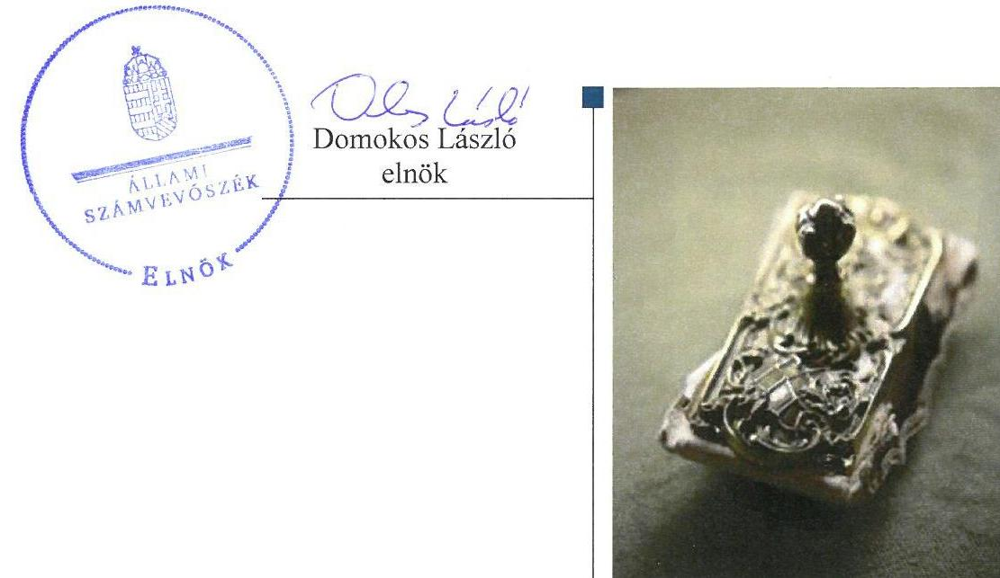
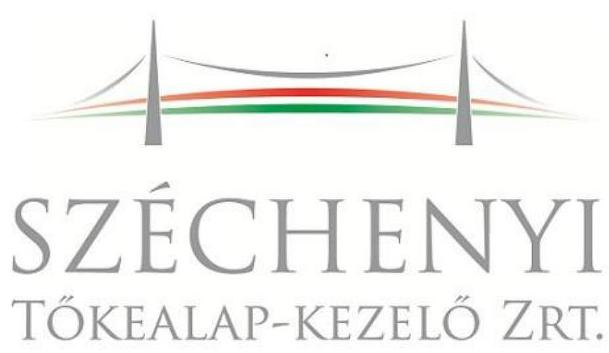
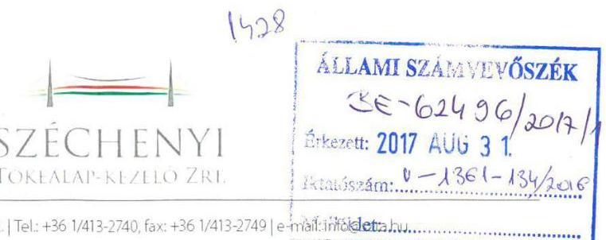
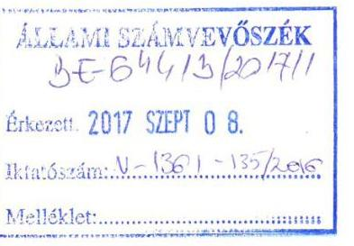
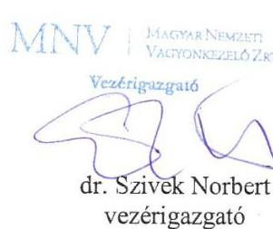

# Jelentés 

## Állami tulajdonú gazdasági társaságok

Az állami tulajdonban (résztulajdonban) lévő gazdálkodó szervezetek vagyonmegőrzési és gazdálkodási tevékenységének ellenőrzése-Széchenyi Tőkealap-kezelő Zrt. 2017.

---

# Jelentés 

## Állami tulajdonú gazdasági társaságok

Az állami tulajdonban (résztulajdonban) lévő gazdálkodó szervezetek vagyonmegőrzési és gazdálkodási tevékenységének ellenőrzése-Széchenyi Tőkealap-kezelő Zrt.
2017. oktober hó 11 nap

---

# AZ ELLENŐRZÉST FELÜGYELTE:

DR. NAGY IMRE felügyeleti vezető

# AZ ELLENŐRZÉST VEZETTE ÉS A VÉGREHAJTÁSÁÉRT FELELŐS:

MODER BEATRIX ellenőrzésvezető

# A PROGRAM ÖSSZEÁLLÍTÁSÁÉRT FELELŐS:

JANIK JÓZSEF LÁSZLÓ osztályvezető

---

**IKTATÓSZÁM:** V-1361-136/2016

**TÉMASZÁM:** 2395

**ELLENŐRZÉS-AZONOSÍTÓ SZÁM:** V075932

---

Jelentéseink az Országgyűlés számítógépes hálózatán és az Interneta a www.asz.hu címen is olvashatóak.

---

# TARTALOMJEGYZÉK 

■ ÖSSZEGZÉS ..... 5
■ AZ ELLENŐRZÉS CÉLJA ..... 6
■ AZ ELLENŐRZÉS TERÜLETE ..... 7
■ AZ ELLENŐRZÉS HÁTTERE, INDOKOLTSÁGA ..... 9
■ A JELENTÉS LÉNYEGES KÉRDÉSKÖREI ..... 10
■ ELLENŐRZÉS HATÓKÖRE ÉS MÓDSZEREI ..... 11
■ MEGÁLLAPÍTÁSOK ..... 13
■ JAVASLATOK ..... 18
■ MELLÉKLETEK ..... 19
I. Sz. melléklet: Értelmező szótár ..... 19
■ FÜGGELÉK: ÉSZREVÉTELEK ..... 23
■ RÖVIDÍTÉSEK JEGYZÉKE ..... 27

---

.

---

# ÖSSZEGZÉS 

A Széchenyi Tőkealap-kezelő Zrt. feletti tulajdonosi jogokat a Nemzeti Fejlesztési Ügynökség és a Nemzetgazdasági Minisztérium összességében szabályszerűen gyakorolta. A Széchenyi Tőkealap-kezelő Zrt. müködésének szabályozottsága, a bevételek és ráfordítások elszámolása megfelelt az előírásoknak. A beszámolási és adatszolgáltatási kötelezettséget az előírásoknak megfelelően teljesítették, a közzétételi kötelezettség szabályszerű teljesítésével a gazdálkodás átláthatóságát biztosították. A vagyon nyilvántartása megfelelő volt, a felelős vagyongazdálkodás követelményei érvényesültek.

## Az ellenőrzés társadalmi indokoltsága

Az állami tulajdonú gazdálkodó szervezetek a nemzeti vagyon részét képezik, ezért ellenőrzésük kiemelten fontos a nemzeti vagyon megőrzése, megóvása érdekében. Az állami vagyonnal való gazdálkodás alapvető célja az állami vagyon átlátható, rendeltetésszerű és felelős felhasználásának biztosítása.

Az Állami Számvevőszék stratégiájában megfogalmazott egyik kiemelt célja, hogy az államháztartáson kívül múködő feladatellátó rendszerek ellenőrzéseivel hozzájáruljon ahhoz, hogy a közpénzeket az államháztartáson kívül múködő szervezetek is átlátható, rendezett módon használják fel a szerződésben átvállalt állami feladatok ellátása érdekében.

Az Állami Számvevőszék a Széchenyi Tőkealap-kezelő Zrt. ellenőrzésekor az általa korábban ellenőrizetlen területek, szervezetek körébe tartozó társaságnál végzett ellenőrzést. A számvevőszéki ellenőrzés hozzájárul a közpénzek, közvagyon szabályos, átlátható, elszámoltatható és eredményes felhasználásához.

## Főbb megállapítások, következtetések, javaslatok

A Széchenyi Tőkealap-kezelő Zrt. feletti tulajdonosi jogokat a Nemzeti Fejlesztési Ügynökség és a Nemzetgazdasági Minisztérium összességében megfelelően gyakorolták, a tulajdonosi felügyeletet biztosították. A felügyelő bizottság törvényes működésének feltételeit azonban 2015. július 21 -ét követően a Nemzetgazdasági Minisztérium nem biztosította.

A Széchenyi Tőkealap-kezelő Zrt. müködésének, gazdálkodásának, alapkezelési tevékenységének szabályozottsága megfelelt a jogszabályi előírásoknak.

A bevételek és a ráfordítások elszámolása, a tervezési, beszámolási, adatszolgáltatási kötelezettségek teljesítése a jogszabályi előírásokkal és a tulajdonosi elvárásokkal összhangban történt. A közérdekű adatok szabályszerű közzétételével biztosították a gazdálkodás nyilvánosságát és átláthatóságát.

A Széchenyi Tőkealap-kezelő Zrt. - a vonatkozó ágazati jogszabály előírásának megfelelően - kialakította és müködtette a függetlenített belső ellenőrzést.

A társaság a vagyonával felelősen gazdálkodott, a mérlegben kimutatott eszközöket és forrásokat szabályszerű leltárral alátámasztották, a vagyonváltozást eredményező döntéseket az arra felhatalmazottak szabályszerűen hozták.

---

# AZ ELLENŐRZÉS CÉLJA 

Az ellenőrzés célja annak értékelése volt, hogy a tulajdonosi jogok gyakorlása szabályszerű volt-e; a gazdálkodó szervezet szabályozottsága, gazdálkodása és vagyongazdálkodási tevékenysége megfelelt-e a jogszabályi és a tulajdonosi előírásoknak; biztosítva volt-e a közfeladatok átláthatósága és elszámoltathatósága érdekében a közszolgáltatás díjának megalapozottsága szabályszerű önköltségszámítással; a vagyonváltozást eredményező döntések esetében a tulajdonosi jogok gyakorlója és a gazdálkodó szervezet szabályszerűen jártak-e el.

---

# **AZ ELLENŐRZÉS TERÜLETE**

## **Széchenyi Tőkealap-kezelő Zártkörűen Működő Részvénytársaság**

1. táblázat

### **A SZÉCHENYI TŐKEALAP-KEZELŐ ZRT. FELETTI TULAJDONOSI JOGGYAKORLÁS ALAKULÁSA 2012 ÉS 2015 KÖZÖTT**

|  Időszak | Tulaj
donosi
joggyak
orló | Jogalap  |
| --- | --- | --- |
|  2012.01.01.-
2013.02.27. | NFÜ | SZT-33234 sz.
vagyonkezel
ési szerződés  |
|  2013.02.28.-
2013.12.31. | NFÜ | SZT-39180 sz.
megbízási
szerződés  |
|  2014.01.01.-től | NGM | 475/2013.
(XII.17.) Korm.
rendelet. 12.§  |

*Forrás: Széchenyi Tőkealap-kezelő Zrt. adatszolgáltatósa és alapító okiratai*

A Széchenyi Tőkealap-kezelő Zrt. a Magyar Állam 100%-os tulajdonában álló gazdasági társaság, amelynek 5 millió Ft-os – 50 db 100 ezer Ft névértékű névre szóló törzsrészvényből álló – alaptőkéje az ellenőrzött időszakban nem változott.

A Társaság^{1} főtevékenysége *"Máshova nem sorolt egyéb pénzügyi közvetítés"*, amelynek keretében a feladata a Széchenyi Tőkealap kezelése volt. A Társaságot a 2007-2013 programozási időszakban az Európai Regionális Fejlesztési Alapból, az Európai Szociális Alapból és a Kohéziós Alapból származó támogatások felhasználásának alapvető szabályairól és felelős intézményeiről szóló 255/2006. (XII. 8.) Korm. rendelet 21. § (4a) bekezdésében jelölték ki kizárólagos jogkörrel alapkezelő szervezetként. A kijelölést az Európai Regionális Fejlesztési Alapból, az Európai Szociális Alapból és a Kohéziós Alapból származó támogatások felhasználásának rendjéről szóló 4/2011. (I. 28.) Korm. rendelet 115. § (2) bekezdésében megerősítették.

Az SZTA^{2} forrását a Regionális Operatív Programok 2009-2010. évi akcióterveiben nevesített "Regionális Tőkebefektetési Alap" elnevezésű komponensek régiónként 2 milliárd, azaz összesen 14 milliárd Ft összegű kerete alkotta. A Regionális Tőkebefektetési Alap program célkitűzése, hogy segítse a mikro-, kis- és középvállalkozásokat azzal, hogy pótlólagos forrást és tanácsadási szolgáltatásokat biztosít részükre a szükséges technológiai fejlesztésekhez, struktúraváltáshoz.

Az SZTA forrását az NFÜ^{3} a 2010. szeptember 30.-án kelt PVFSZ_{1}^{4} alapján kamatmentes visszatérítendő támogatásként bocsátotta a Társaság rendelkezésére. A PVFSZ_{1} értelmében a Társaság a forrást kizárólag kockázati-tőkealap létrehozása, kezelése és működtetése céljából, a Program megvalósítására kapta. A Társaság a rendelkezésére bocsátott forrás terhére, a PVFSZ_{1}-ben meghatározott feltételekkel, kockázati tőkelap-jegye ket bocsátott ki. A jogszabályi környezet és a társasági részesedés feletti tulajdonosi joggyakorló személyében bekövetkezett változás miatt a PVFSZ_{1}-t két alkalommal módosították. A PVFSZ_{1}^{5} megkötésére 2014. szeptember 30-án, a PVFSZ_{1}^{6} megkötésére 2015. november 19-én került sor.

A társasági részesedés feletti tulajdonosi jogokat a 2012-2013. években – a Vtv.^{7} 29. § (5) bekezdés előírásaival összhangban az MNV Zrt.^{8}-vel kötött vagyonkezelési szerződés^{9}, majd az Nvtv.^{10} előírásának megfelelően, megbízási szerződés^{11} alapján – az NFÜ gyakorolta. Az Áht.^{12}, valamint a 475/2013. (XII. 17.) Korm. rendelet^{13} alapján a Társasággal összefüggő jogviszonyok tekintetében 2014. január 1-jétől az NFÜ jogutódja az NGM^{14} lett. A Társaság feletti tulajdonosi joggyakorlás változását az 1. táblázat

---

szemlélteti. Az NFÜ és az NGM az ellenőrzött időszakban kettős jogviszonyban állt a társasággal, a társasági részesedés feletti tulajdonosi joggyakorláson felül a Program végrehajtásához kapcsolódó irányító hatósági feladatokat láttak el. Az ellenőrzést az NFÜ tevékenységét illetően az NGM-nél, mint jogutód szervezetnél folytattuk le.

Az ellenőrzött időszakban a társaság egyszemélyi tulajdonosa a Magyar Állam volt, így a közgyűlés jogait a tulajdonosi joggyakorló ${ }_{1,2}{ }^{15}$ gyakorolta.

A Társaság 2012-2015. évi éves beszámolóinak főbb adatait a 2. táblázat tartalmazza:
2. táblázat

A TÁRSASÁG 2012-2015. ÉVI ÉVES BESZÁMOLÓINAK FŐBB ADATAI (MILLIÓ FT-BAN)

| Megnevezés | 2012-12-31 | 2013-12-31 | 2014-12-31 | 2015-12-31 |
| :--: | :--: | :--: | :--: | :--: |
| Mérleg főösszeg | 14510,5 | 14600,8 | 14679,2 | 14699,7 |
| Befektetett eszközök | 14020,8 | 14011,7 | 14016,4 | 14021,3 |
| ebből: befektetett pénzügyi eszközök értéke | 14000,0 | 14000,0 | 14000,0 | 14000,0 |
| Követelések | 19,4 | 17,3 | 13,4 | 19,6 |
| Saját tőke | 464,0 | 556,8 | 587,5 | 648,7 |
| Mérleg szerinti eredmény | 90,8 | 92,8 | 30,7 | 61,2 |
| Passzív időbeli elhatárolások | 28,2 | 30,4 | 50,2 | 26,4 |
| Bevételek összesen | 389,9 | 423,3 | 421,4 | 451,8 |
| ebből: az értékesítés nettó árbevétele | 389,9 | 420,0 | 420,1 | 421,5 |
| egyéb bevétel | 0 | 3,3 | 1,3 | 30,3 |
| Kiadások összesen | 312,3 | 335,4 | 394,5 | 387,8 |
| ebből: anyag- és személyi jellegú kiadások | 288,7 | 314,5 | 374,8 | 368,9 |

A befektetett eszközök szinte egészét a befektetett pénzügyi eszközök - a kibocsátott kockázati tőkealap-jegyek - tették ki, melynek mérlegértéke az ellenőrzött időszakban változatlan volt.

A társaság az ellenőrzött időszakban nyereségesen gazdálkodott. Eredményfelosztásra nem került sor, az adózott eredményt az eredménytartalékba helyezték. A társaság saját tőkéje a 2012. évi 464,0 millió Ft-ról a 2015. év végére 648,7 millió Ft-ra, 40\%-kal emelkedett.

Az ellenőrzéssel érintett években a társaságnál $\mathrm{FB}^{16}$ és Igazgatóság ${ }^{17}$ működött. A vezérigazgató ${ }^{18}$ személye a 2012-2015. években nem változott.

A munkavállalók átlagos állományi létszáma 2012. január 1-jén 8 fő, 2015. december 31.-én 18 fő volt.

A Társaságnak a tulajdonában, irányítása, felügyelete vagy az ellenőrzése alatt álló költségvetési szerve, gazdasági társasága, alapítványa nem volt, a Vtv.-ben és az Nvtv.-ben definiált, vagyonkezelésbe vett vagyonnal nem rendelkezett, a saját vagyonát nem terhelte meg, vagyon ingyenes átruházására, apportálására nem került sor.

A Társaság az ellenőrzött időszakban nem tartozott a kormányzati szektorba sorolt szervezetek körébe.

---

# AZ ELLENŐRZÉS HÁTTERE, INDOKOLTSÁGA 

Az állami tulajdonú gazdálkodó szervezetek gazdálkodása jellemzően a közérdeklődés és a média figyelmének középpontjában áll, amihez hozzájárul a gazdálkodásuk körébe tartozó - közvetlen vagy közvetett állami tulajdonú - vagyon nagysága, illetve az általuk ellátott közszolgáltatások minősége és hatékonysága.

Az ÁSZ ${ }^{19}$ célkitűzése, hogy ellenőrzésével rámutasson az állami tulajdonú gazdálkodó szervezetek gazdálkodási tevékenységével kapcsolatos jó gyakorlatra és szabálytalanságokra, hozzájáruljon az államháztartáson kívüli, de (közvetlenül vagy közvetve) állami vagyont használó gazdálkodó szervezetek tevékenységének átláthatóságához, valamint felhívja a figyelmet a jogszabályi követelmények teljesítéséhez szükséges feltételek hiányosságára.

Az ellenőrzés várható hasznosulásaként az ellenőrzés megállapításai a jogalkotás számára segítséget nyújthatnak az átláthatóságot biztosító szabályozáshoz. Az ellenőrzöttek számára visszajelzést ad a vagyongazdálkodási tevékenységgel, beszámolással kapcsolatos szabálytalanságokról és kockázatokról. Az ellenőrzés tapasztalatai segítik és erősítik az ÁSZ hozzáadott értéket teremtő elemző tevékenységét és tanácsadó szerepét.

---

# A JELENTÉS LÉNYEGES KÉRDÉSKÖREI 

1.     - A tulajdonosi jogok gyakorlása szabályszerű volt-e?
2.     - A társaság müködésének szabályozottsága megfelelt-e az előírásoknak?
3.     - A társaságnál a pénzügyi-számviteli, adatszolgáltatási és ellenőrzési feladatok ellátása szabályszerű volt-e?
4.     - A társaság vagyongazdálkodása szabályszerű volt-e?

---

# ELLENŐRZÉS HATÓKÖRE ÉS MÓDSZEREI 

## Az ellenőrzés típusa

Megfelelőségi ellenőrzés.

## Az ellenőrzött időszak

Az ellenőrzött időszak 2012. január 1-jétől 2015. december 31-ig tart.

## Az ellenőrzés tárgya

A Széchenyi Tőkealap-kezelő Zrt. gazdálkodása, kiemelten vagyongazdálkodási tevékenysége, valamint a tulajdonosi jogok gyakorlása.

Az ellenőrzés kiterjed minden olyan körülményre és adatra, amely az ÁSZ jogszabályban meghatározott feladatainak teljesítéséhez, valamint a program végrehajtása folyamán felmerült újabb összefüggések feltárásához szükséges.

## Az ellenőrzött szervezet

Széchenyi Tőkealap-kezelő Zártkörűen Működő Részványtársaság; Nemzetgazdasági Minisztérium, Magyar Nemzeti Vagyonkezelő Zrt.

## Az ellenőrzés jogalapja

Az ellenőrzés jogalapját az ÁSZ tv. 1. § (3) bekezdése és 5. § (3)-(5) bekezdése képezi.

## Az ellenőrzés módszerei

Az ellenőrzést a nemzetközi standardokat irányadónak tekintve az ellenőrzött időszakban hatályos jogszabályok, az ellenőrzés szakmai szabályok és módszertanok figyelembevételével végeztük.

Az ellenőrzési kérdések megválaszolásához szükséges bizonyítékok megszerzése a következő ellenőrzési eljárások alkalmazásával történt: megfigyelés, kérdésfeltevés (információkérés), összehasonlítás, valamint elemző eljárás. Az ellenőrzési bizonyítékként felhasználható adatforrások közé tartoztak egyrészt az ellenőrzési programban felsorolt adatforrások, másrészt az ellenőrzés során feltárt, az ellenőrzés szempontjából információkat tartalmazó dokumentumok.

---

A bevételek és ráfordítások elszámolását, valamint a vagyonnyilvántartás szabályszerűségét véletlen mintavétellel ellenőriztük. A mintatételek értékelése alapján, egyrészt a sokaságban előforduló hibás tételek arányát becsültük, másrészt az irányítottan kiválasztott tételeket értékeltük. A jogszabályoknak és a belső előírásoknak megfelelőnek, azaz szabályszerűnek tekintettük az adott területet, amennyiben a minta ellenőrzésének eredménye alapján 95\%-os bizonyossággal a teljes sokaságban a hibaarány kisebb volt, mint 10\%, nem megfelelőnek értékeltük, ha a hibaarány a 10\%ot meghaladta. A ráfordítások elszámolására és a vagyonnyilvántartásra vonatkozó véletlen mintavételt kockázati alapú kiválasztással egészítettük ki, amelynek során évente a három legnagyobb összegű tételt választottuk ki.

---

# 1. A tulajdonosi jogok gyakorlása szabályszerű volt-e? 

Összegző megállapítás

A tulajdonosi jogok gyakorlása - a 2015. évi beszámoló nem szabályszerűen múködő FB jelentése alapján történt elfogadása kivételével - összességében megfelelt az előírásoknak.

A TULAJ DONOSI JOGGYAKORLÁS RENDJÉT a tulajdonosi joggyakorló ${ }_{1,2}$ a Társaság alapító okiratai ${ }^{20}$-ban és az alapszabály ${ }^{21}$-ban, az NFÜ SZMSZ ${ }^{22}$-ben, illetve NGM SZMSZ ${ }^{23}$-ben, valamint a PVFSZ ${ }_{1-3}$-ban határozta meg.

Az NFÜ SZMSZ-ben a Társaságot, mint tulajdonosi joggyakorlással érintett szervezetet nevesítették, a társasági részesedés feletti tulajdonosi jogokat az NFÜ elnöke gyakorolta, az irányító hatósági feladatokat az NFÜ Regionális Fejlesztési Programok Irányító Hatósága Főosztály látta el.

Az NGM SZMSZ értelmében a miniszter ${ }^{24}$ által átruházott hatáskörben a társasági részesedés feletti tulajdonosi joggyakorló 2014. december 12ig a Tervezéskoordinációért felelős államtitkár, ezt követően az Európai Uniós Források felhasználásáért felelős államtitkár volt. Az irányító hatósági feladatokat a Regionális Fejlesztési Programok Irányításáért felelős helyettes államtitkárság látta el.

A tulajdonosi joggyakorló ${ }_{1,2}$ a Társaság alapító okirataiban és az alapszabályban a Gt. ${ }^{25}$ és a Ptk. ${ }^{26}$ előírásaival összhangban meghatározta a Társaság tevékenységi körét, alaptőkéjét, képviseletét, és a cégjegyzés módját, továbbá a Taktv. ${ }^{27}$ előírásaival összhangban három tagú FB és állandó könyvvizsgáló megbízásáról rendelkezett.

A tulajdonosi joggyakorló ${ }_{1,2}$ a hatásköreit összességében a Gt. és a Ptk. ${ }_{2}$ előírásainak megfelelően gyakorolta. A Társaság ügyvezetését 2014. május 30-ig négy tagú, 2014. május 31-től három tagú Igazgatóság látta el, az Igazgatóság létszámát a Ptk. ${ }_{2}$, valamint a Taktv. előírásaival összhangban állapították meg. A Társaság könyvvizsgálóját a Gt. és a Ptk. ${ }_{2}$ előírásaival összhangban alapítói határozattal megválasztották, a könyvvizsgálóval kötendő szerződés lényeges elemeinek tartalmát meghatározták.

A Társaságnál 2015. július 21-ig három tagú FB múködött, az FB ügyrendjét ${ }^{28}$ a Gt. és a Ptk. ${ }_{2}$ előírásával összhangban a tulajdonosi joggyakorló ${ }_{1,2}$ hagyta jóvá. Az FB tagjainak száma 2015. július 21-től lemondás következtében két főre csökkent, ezért az Igazgatóság - a Ptk. ${ }_{2}$ 3:122. § (4) bekezdésében foglaltaknak eleget téve - a 6/2015. (08. 14.) számú határozatában tulajdonosi döntést kezdeményezett harmadik FB tag megválasztására. A tulajdonosi joggyakorló ${ }_{2}$ azonban a Ptk. ${ }_{2}$ 3:109. § (2) és (4) bekezdéseiben előírtakat figyelmen kívül hagyva harmadik FB tagot nem választott, ezáltal az FB múködésének - a Taktv. 4. § (2) bekezdésében és a Ptk. ${ }_{2}$ 3:121. § (1) bekezdésében előírt - feltételeit nem biztosította. Az FB az ellenőrzött időszak végéig így nem szabályszerűen múködött.

---

A tulajdonosi joggyakorló ${ }_{1,2}$ - a Gt. és a Ptk. 2 előírásaival összhangban a könyvvizsgáló véleményének és az FB írásbeli jelentésének birtokában határozott a számviteli törvény szerinti éves beszámolók elfogadásáról. A 2015. évi beszámoló elfogadása azonban nem felelt meg a Ptk. 2 3:120. § (2) bekezdésében rögzített előírásnak, mivel a tulajdonosi joggyakorló ${ }_{2}$ annak elfogadásáról - határozatképes FB hiányában - nem szabályszerűen működő FB által készített jelentés birtokában döntött.

Az NFÜ és az NGM a Program szakmai felügyeletét ellátó forrásgazda szervezetként (irányító hatóságként) az SZTA létrehozásához és kezeléséhez, a Program megvalósításához kapcsolódó feladat-ellátás követelményeit a PVFSZ ${ }_{1-3}$-ban számon kérhető módon meghatározta.

Üzleti terv készítési kötelezettséget a PVFSZ ${ }_{1-3}$-ban írtak elő a Társaság számára. A 2012., 2013. és 2015. évi üzleti terveket a tulajdonosi joggyakorló ${ }_{1,2}$ alapítói határozattal jóváhagyta, azonban a 2014. évi üzleti terv tulajdonosi jóváhagyása a Ptk.2. 3:109.§ (2) bekezdése, a PVFSZ ${ }_{1-2}$ 6.1. illetve 7.1. pontjában rögzítettek, és annak ellenére elmaradt, hogy a vezérigazgató az elvárt tartalmú, Igazgatóság által megtárgyalt üzleti tervet jóváhagyásra előterjesztette.

A MONITORING TEVÉKENYSÉGET a PVFSZ ${ }_{1-3}$-ban a Társaság számára előírt adatszolgáltatások, beszámolók, jelentések, illetve azok ellenőrzéséről készíttetett ellenőrzési jelentések nyomon követésével biztosították. A PVFSZ ${ }_{1}$-ben kizárólag az irányító hatóság ${ }_{1}$ felé teljesítendő beszámolási, jelentéstételi kötelezettségeket határoztak meg, a PVFSZ ${ }_{2,3}$-ban már elkülönítve rögzítették a tulajdonosi joggyakorló ${ }_{2}$ és az irányító hatóság ${ }_{2}$ felé teljesítendő rendszeres adatszolgáltatások körét, tartalmát és határidejét.

A JAVADALMAZÁSI ÉS JUTTATÁSI RENDSZER elveiről a Taktv.-ben és a 2173/2003. (VII.29). Korm. határozatban ${ }^{29}$ foglalt előírásoknak megfelelően a tulajdonosi joggyakorló ${ }_{1,2}$ által jóváhagyott Javadalmazási szabályzatban ${ }^{30}$ rendelkeztek.

# 2. A társaság múködésének szabályozottsága megfelelt-e az előírásoknak? 

Összegző megállapítás

A Társaság múködésének szabályozottsága megfelelt az előírásoknak. A belső szabályzatokat elkészítették, azok aktualizálását végrehajtották.

A TÁRSASÁGI SZMSZ ${ }^{31}$ biztosította a Társaság szabályozott múködését, tartalmazta a Társaság tevékenységi körét, szervezeti felépítését, meghatározta az Igazgatóság, a Befektetési bizottság, a vezérigazgató, valamint a munkaszervezet egyes szervezeti egységeinek feladat és hatáskörét.

A SZÁMVITELI SZABÁLYZATOK elkészítéséről és a szükséges aktualizálásukról gondoskodtak. A Számv. tv. ${ }^{32}$ előírásainak megfelelően elkészítették a Társaság sajátosságainak megfelelő Számviteli politikát ${ }^{33}$, valamint annak keretében az Értékelési szabályzatot ${ }^{34}$, a Leltározási

---

szabályzatot ${ }^{35}$ és a Pénzkezelési szabályzatot ${ }^{36}$. A Társaság rendelkezett a Számv. tv. előírásainak megfelelő tartalmú Számlarenddel ${ }^{37}$ és az azt alátámasztó Bizonylati renddel ${ }^{38}$.

A SZAKMAI TEVÉKENYSÉG SZABÁLYOZÁSA keretében - a Számv. tv-ben előírt szabályzatokon felül, a Kbftv. ${ }^{39}$-ben és egyéb ágazati jogszabályokban előírtak érvényesülése érdekében - a Társaság rendelkezett Alapkezelési szabályzattal ${ }^{40}$, Belső ellenőrzési alapszabálylyal ${ }^{41}$, Biztonsági szabályzattal ${ }^{42}$, Közbeszerzési szabályzattal ${ }^{43}$, Iratkezelési szabályzattal ${ }^{44}$, Kockázatkezelési politikával ${ }^{45}$, Munkaügyi szabályzattal ${ }^{46}$, Munkavédelmi szabályzattal ${ }^{47}$, Összeférhetetlenségi politikával ${ }^{48}$, Szakmai felelősségbiztosítási politikával ${ }^{49}$, Titokvédelmi szabályzattal ${ }^{50}$ és Tűzvédelmi szabályzattal ${ }^{51}$.

# 3. A társaságnál a pénzügyi-számviteli, adatszolgáltatási és ellenőrzési feladatok ellátása szabályszerű volt-e? 

Összegző megállapítás

## 3.1. számú megállapítás

A Társaság a pénzügyi-számviteli, adatszolgáltatási és ellenőrzési feladatokat szabályszerűen látta el.

A bevételek és a ráfordítások elszámolása megfelelt a jogszabályi és belső szabályzatokban rögzített előírásoknak.

A BEVÉTELEK ÉS RÁFORDÍTÁSOK ELSZÁMOLÁSA megfelelt a Számv. tv. és belső számviteli szabályzatok előírásainak. A bevételek és ráfordítások elszámolása során a gazdasági eseményt alátámasztó dokumentumok minden esetben rendelkezésre álltak. A bevételeket és ráfordításokat a megfelelő főkönyvi számlákra szabályosan számolták el. A könyvviteli elszámolást közvetlenül alátámasztó bizonylatok megfeleltek a Számv. tv.-ben előírt alaki és tartalmi követelményeknek.

Az értékcsökkenés elszámolása szabályszerű volt. A terv szerinti értékcsökkenést a jogszabályok és a belső szabályzatok előírásainak megfelelően az üzembe helyezés időpontjától, a maradványérték figyelembevételével, lineáris leírási kulccsal, havi rendszerességgel számolták el

A KÖVETELÉSÁLLOMÁNY kimutatása megfelelt a Számv. tv. előírásainak. A lejárt határidejű vevőkövetelések beszedése érdekében intézkedtek. Behajthatatlan követelés címén követelés leírás nem történt.
3.2. számú megállapítás

A Társaság tervezési, beszámolási, adatszolgáltatási és közzétételi kötelezettségét szabályszerűen teljesítette.

TERVEZÉSI, BESZÁMOLÁSI, ADATSZOLGÁLTATÁSI és egyéb tájékoztatási kötelezettségeinek a Társaság a Számv. tvben, illetve a PVFSZ ${ }_{1-3}$-ban előírt határidőben és módon eleget tett.

ÜZLETI TERV készítési kötelezettségét az ellenőrzött időszak minden évében teljesítette. A feladat-ellátásról, az alapkezelési tevékenységéről az irányító hatóság ${ }_{1,2}$ és a tulajdonosi joggyakorló ${ }_{1,2}$ felé a PVFSZ ${ }_{1-3}$-ban foglaltaknak megfelelően beszámolt.

---

AZ ÉVES SZÁMVITELI BESZÁMOLÓKAT a Társaság a Számv. tv. előírásainak megfelelően, határidőben elkészítette és jóváhagyásra a tulajdonosi joggyakorló1,2 részére megküldte. A tulajdonosi joggyakorló1,2 által jóváhagyott éves beszámolók közzétételét és letétbe helyezését a Társaság a Számv. tv. előírásainak megfelelően, határidőben teljesítette.

A KÖZÉRDEKBŐL NYILVÁNOS ADATOK közzétételéről és az adatok védelméről a Társaság a Taktv.-ben és az Info. tv.-ben foglaltaknak megfelelően gondoskodott. A közérdekből nyilvános adatainak nyilvánosságra hozatalát, megismerhetőségét, hozzáférhetővé tételét internetes honlapján biztosította.
3.3. számú megállapítás

A Társaság a belső ellenőrzést megfelelően múködtette, a belső és külső ellenőrzések javaslatainak végrehajtására intézkedett.

A BELSŐ ELLENŐRZÉSI RENDSZER kialakítására a Kbftv.-ben foglaltakkal összhangban került sor. A belső ellenőrzés feladatait egy fő belső ellenőr látta el megbízásos jogviszonyban. A belső ellenőr főbb feladatait a társasági SZMSZ és a belső ellenőrrel kötött szerződés ${ }^{52}$ tartalmazták, tevékenységét a Belső ellenőrzési alapszabály alapján végezte. A Társaság a belső és külső ellenőrzések tapasztalatait hasznosította, az ellenőrzések során tett javaslatokra intézkedett.

A tulajdonosi joggyakorló1,2 a tulajdonosi ellenőrzést az FB múködtetésével és az állandó könyvvizsgáló megbízásával biztosította.

# 4. A társaság vagyongazdálkodása szabályszerű volt-e? 

Összegző megállapítás

A Társaság a szabályszerű vagyongazdálkodás feltételeit kialakította, vagyonát az előírások szerint tartotta nyilván, a vagyon értékének megőrzéséről gondoskodott. A vagyon változását eredményező döntések megfeleltek az előírásoknak.

A VAGYONGAZDÁLKODÁS KÖVETELMÉNYEIT, a szabályszerű vagyongazdálkodás feltételeit a Társaság Számviteli politikájában, az Értékelési Szabályzatban és a Leltározási szabályzatban rögzített előírások biztosították. A vagyon változását eredményező döntések a vezérigazgató, mint a Társaság felelős vezetője kizárólagos döntési hatáskörébe tartoztak. A társasági SZMSZ-ben meghatározták a Társaság vagyonának kezelésével összefüggő feladatokat, a vagyon védelmével és gyarapításával kapcsolatos teendőket, valamint a munkavállalók feladatait és felelősségét az általuk használt vagyontárgyak megóvásáért. Az eszközök fizikai védelme szempontjából lényeges feladatokat a Biztonsági szabályzatban, a Munkaügyi szabályzatban és a Munkavédelmi szabályzatban határozták meg.

A VAGYON NYILVÁNTARTÁSA a Számv. tv. és a számviteli szabályzatok előírásaival összhangban történt. A Társaság rendelkezett átlátható, naprakész vagyonnyilvántartással. A leltározást a Leltározási szabályzatban foglaltakkal összhangban szabályszerűen végrehajtották. A

---

3. táblázat

| IMMETRIÁLIS JAVAK ÉS TÁRGYI ESZKÖZÖK KÖNYV SZERINTI ÉRTÉKÉNEK VÁLTOZÁSA (E FT) |  |  |
| :--: | :--: | :--: |
| Mégnevezés | Összeg |  |
| Nyitó érték 2012. január 1jén: | 26975 |  |
| Beruházás, felújítás | 38860 |  |
| Elszámolt terv szerinti értékcsökkenés: | 43618 |  |
| Értékesített tárgyi eszközök értéke: | 876 |  |
| Záró érték 2015. december 31.-én: | 21341 |  |
| Forrás: A Társaság éves számviteli beszámolói |  |  |

4. táblázat

HASZNÁLHATÓSÁGI FOK ALAKULÁSA (\%)

| Mégnevezés | 2012. | 2015. |
| :-- | --: | --: |
| immateriális javak | 58,2 | 40,7 |
| számítástechnikai esz- |  |  |
| közök | 58,6 | 7,2 |
| gépek, berendezések | 22,9 | 8,1 |

Forrás: A Társaság. éves számviteli beszámolói
mérlegben és a számviteli nyilvántartásokban szereplő vagyontárgyak állományát teljes körű, az eszközöket és forrásokat tételesen, mennyiségben és értékben ellenőrizhető módon tartalmazó leltárral támasztották alá.

A VAGYON ÉRTÉKÉNEK MEGŐRZÉSE, gyarapítása, a befektetett tárgyi eszközök állagmegóvása érdekében a Társaság az éves üzleti tervekben rögzítette a bevételi és költségterveket, bemutatta a tervezett beruházásokat, valamint a tervezett karbantartási költségek nagyságrendjét.

A Társaság eszközállományának értéke 1,9\%-kal - a 2012. év eleji 14 401,6 M Ft-ról 14 669,7 M Ft-ra - emelkedett. Az immateriális javak és tárgyi eszközök könyv szerinti értékének 5,6 M Ft-os csökkenése mellett a pénzeszközök 368,1 M Ft-ról 653,1 M Ft-ra növekedtek.

Az immateriális javak, tárgyi eszközök könyv szerinti értékének csökkenését döntően a beruházások, felújítások értékét meghaladóan elszámolt terv szerinti értékcsökkenés okozta, amelynek következtében az eszközök használhatósági foka romlott. A könyv szerinti nettó érték változását és a meghatározó eszközök használhatósági fokát a 3. és 4. táblázat mutatja be.

A Társaság a vagyontárgyainak karbantartásáról, a megfelelő feladatellátáshoz szükséges eszközállomány biztosításáról gondoskodott.

## A VAGYON VÁLTOZÁSÁT EREDMÉNYEZŐ DÖNTÉ-

SEKET a Gt., a Ptk., az Alapító okirat, valamint az Alapszabály előírásaival összhangban a vezérigazgató, mint a Társaság felelős vezetője szabályszerűen hozta. A vagyonváltozási döntések a múködési feltételek és infrastruktúra megteremtésére irányultak, az éves üzleti tervekben megfogalmazottakkal összhangban. Az elhasználódott, feleslegessé vált eszközök selejtezése szabályszerű selejtezési eljárás keretében történt.

---

# JAVASLATOK 

Az ÁSZ tv. 33. § (1) bekezdésében foglaltak értelmében az ellenőrzött szervezet vezetője köteles a jelentésben foglalt megállapításokhoz kapcsolódó intézkedési tervet összeállítani és azt a jelentés kézhezvételétől számított 30 napon belül az ÁSZ részére megküldeni. Amennyiben az ellenőrzött szervezet vezetője nem küldi meg határidőben az intézkedési tervet, vagy továbbra sem elfogadható intézkedési tervet küld, az Állami Számvevőszék elnöke az ÁSZ tv. 33. § (3) bekezdése a) és b) pontjaiban foglaltakat érvényesítheti.

## A nemzetgazdasági miniszternek

1. Intézkedjen a felügyelőbizottság jogszabályokban elöirt létszámának biztositásáról.
(1. sz. megállapítás 6. bekezdése alapján)

---

# MELLÉKLETEK 

## I. SZ. MELLÉKLET: ÉRTELMEZŐ SZÓTÁR

állami vagyon
állami vagyon kezelése/hasznosítása
állami vagyon hasznosítására kötött szerződés
állami vagyon értékesítése
gazdasági társaság
gazdálkodó szervezet
a) Az állam tulajdonában lévő dolog, valamint a dolog módjára hasznosítható természeti erő,
b) az a) pont hatálya alá nem tartozó mindazon vagyon, amely vonatkozásában törvény az állam kizárólagos tulajdonjogát nevesíti,
c) az állam tulajdonában lévő tagsági jogviszonyt megtestesítő értékpapír, illetve az államot megillető egyéb társasági részesedés,
d) az államot megillető olyan immateriális, vagyoni értékkel rendelkező jogosultság, amelyet jogszabály vagyoni értékű jogként nevesít.
Forrás: Vtv. 1. § (2) bekezdése
2012. november 10-től az állami vagyon fogalma kiegészül a következő ponttal:
e) az állam tulajdonában lévő pénzügyi eszközök

Forrás: Vtv. 1. § (2) bekezdése
2013. június 27-ig:

Az állami vagyont az MNV Zrt. maga kezeli, vagy szerződés - így különösen bérlet, haszonbérlet, megbízás - alapján központi költségvetési szervnek, természetes vagy jogi személynek, vagy jogi személyiséggel nem rendelkező gazdálkodó szervezetnek hasznosításra átengedi. Az állami vagyonra vonatkozóan az MNV Zrt. kizárólag az Nvtv-ben meghatározott személyekkel köthet vagyonkezelési szerződést.
Forrás: Vtv. 23. § (1), 27. § (1)
2013. június 28-ától:

Az állami vagyonnal az MNV Zrt. maga gazdálkodik, vagy szerződés - így különösen bérlet, haszonbérlet, megbízás - alapján központi költségvetési szervnek, természetes vagy jogi személynek, vagy jogi személyiséggel nem rendelkező gazdálkodó szervezetnek hasznosításra átengedi, illetőleg vagyonkezelésbe, haszonélvezetbe adja. Az állami vagyonra vonatkozóan az MNV Zrt. kizárólag az Nvtv-ben meghatározott személyekkel köthet vagyonkezelési szerződést.
Forrás: Vtv. 23. § (1), 27. § (1)
Az állami vagyon hasznosítására kötött szerződések elsődleges célja az állami vagyon hatékony működtetése, állagának védelme, értékének megőrzése, illetve gyarapítása, az állami és közfeladatok ellátásának elősegítése.
Forrás: Vtv. 23. § (2) bekezdése
Állami vagyon tulajdonjogának bármely jogcímen történő, visszterhes átruházása.
Forrás: Vhr. 1. § (7) bekezdés d) pont)
A Ptk2. 3:88. § (1) bekezdése szerint „a gazdasági társaságok üzletszerű közös gazdasági tevékenység folytatására, a tagok vagyoni hozzájárulásával létrehozott, jogi személyiséggel rendelkező vállalkozások, amelyekben a tagok a nyereségből közösen részesednek, és a veszteséget közösen viselik".
2014. március 14-ig:

A Ptk. ${ }^{53}$ 685. § c) pontja szerint gazdálkodó szervezet: „az állami vállalat, az egyéb állami gazdálkodó szerv, a szövetkezet, a lakásszövetkezet, az európai szövetkezet, a gazdasági társaság, az európai részvénytársaság, az egyesülés, az európai gazdasági egyesülés, az európai területi együttműködési csoportosulás, az egyes jogi személyek vállalata, a leányvállalat, a vízgazdálkodási társulat, az erdő birtokossági társulat, a végrehajtói iroda, az egyéni cég, továbbá az egyéni vállalkozó."

---

# 2014. március 15-től: 

A gazdasági társaság, az európai részvénytársaság, az egyesülés, az európai gazdasági egyesülés, az európai területi együttműködési csoportosulás, a szövetkezet, a lakásszövetkezet, az európai szövetkezet, a vízgazdálkodási társulat, az erdőbirtokossági társulat, az állami vállalat, az egyéb állami gazdálkodó szerv, az egyes jogi személyek vállalata, a közös vállalat, a végrehajtói iroda, a közjegyzői iroda, az ügyvédi iroda, a szabadalmi ügyvivői iroda, az önkéntes kölcsönös biztosító pénztár, a magánnyugdíjpénztár, az egyéni cég, továbbá az egyéni vállalkozó. Az állam, a helyi önkormányzat, a költségvetési szerv, az egyesület, a köztestület, valamint az alapítvány gazdálkodó tevékenységével összefüggő polgári jogi kapcsolataira is a gazdálkodó szervezetre vonatkozó rendelkezéseket kell alkalmazni.
Forrás: $\mathrm{Pp}^{54} .396 . \S$
kapcsolt vállalkozás
kormányzati szektorba sorolt egyéb szervezet

MNV Zrt.
nemzeti vagyon

Az anyavállalat és a leányvállalat és a közös vezetésű vállalkozások (fölérendelt anyavállalat esetében a minősítést a fölérendelt anyavállalat szempontjából kell elvégezni) Forrás: Számv. tv. 3. § (2) bekezdés 7. pont
Az a szervezet, amely az Áht. alapján nem része az államháztartásnak, azonban az Európai Közösséget létrehozó szerződéshez csatolt, a túlzott hiány esetén követendő eljárásról szóló jegyzőkönyv alkalmazásáról szóló 2009. május 25-i 479/2009/EK rendelet szerint a kormányzati szektorba tartozik.
Az állami vagyon felett, a Magyar Államok megillető tulajdonosi jogok és kötelezettségek összességét - a hatályos szabályozás szerint - az állami vagyon felügyeletéért felelős miniszter (jelenleg a nemzeti fejlesztési miniszter) gyakorolja. A miniszter feladatát nagy részben az MNV Zrt., mint tulajdonosi joggyakorló szervezet útján látja el.
a) az állam vagy a helyi önkormányzat kizárólagos tulajdonában álló dolgok,
b) az a) pont hatálya alá nem tartozó, állam vagy a helyi önkormányzat tulajdonában lévő dolog,
c) az állam vagy a helyi önkormányzatot tulajdonában lévő pénzügyi eszközök, továbbá az államot vagy a helyi önkormányzatot megillető társasági részesedések,
d) az államot vagy a helyi önkormányzatot megillető bármely vagyoni értékkel rendelkező jogosultság, amelyet jogszabály vagyoni értékű jogként nevesít,
e) Magyarország határa által körbezárt terület feletti légtér,
f) az üvegházhatású gázok kibocsátási egységeinek kereskedelméről szóló törvény szerint kibocsátási egység és légiközlekedési kibocsátási egység, valamint az ENSZ Éghajlatváltozási Keretegyezménye és annak Kiotói Jegyzőkönyv végrehajtási keretrendszeréről szóló törvény szerinti kiotói egység,
g) állami vagy helyi önkormányzati fenntartású közgyűjtemény (muzeális intézmény, levéltár, közgyűjteményként működő kép- és hangarchívum, valamint könyvtár) saját gyűjteményében nyilvántartott kulturális javak körébe tartozó dolog, kivéve, ha az állami vagy önkormányzati tulajdon jogszerű létrejötte kétséget kizáró módon nem bizonyítható és a dologra nézve más a tulajdonjogát bizonyítja vagy a kulturális javakra vonatkozó jogszabályokban meghatározott eljárás keretében valószínűsíti (g. pont módosult 2013. december 7-től),
h) a régészeti lelet,
i) a nemzeti adatvagyon körébe tartozó állami nyilvántartások fokozottabb védelméről szóló törvény szerinti nemzeti adatvagyon.
Forrás: Nvtv. 1. § (2)

---

tulajdonosi ellenőrzés
tulajdonosi jogok gyakor-
lója

### 2014. március 14-ig:

Az állami vagyon kezelőjét, haszonélvezőjét, használóját megillető jogok gyakorlását, annak szabályszerűségét, célszerűségét az MNV Zrt. - szükség szerint területi szervei útján - ellenőrzi.

### 2014. március 15-től:

Az állami vagyon használóját, vagyonkezelőjét és haszonélvezőjét megillető jogok gyakorlását, annak szabályszerűségét, a kötelezettségek teljesítését, valamint a vagyon rendeltetése szerinti célszerűségét a tulajdonosi joggyakorló rendszeresen ellenőrzi.
Forrás: Vhr. 20. § (1)
1.

### 2013. június 27-ig:

Az állami vagyon felett a Magyar Államot megillető tulajdonosi jogok és kötelezettségek összességét - ha törvény eltérően nem rendelkezik - az állami vagyon felügyeletéért felelős miniszter (a továbbiakban: miniszter) gyakorolja, aki e feladatát a Magyar Nemzeti Vagyonkezelő Zártkörűen Működő Részvénytársaság (a továbbiakban: MNV Zrt.), a Magyar Fejlesztési Bank, illetve a tulajdonosi joggyakorló szervezet útján látja el. A miniszter miniszteri rendeletben, a törvényben meghatározott állami vagyoni kör tekintetében, meghatározott időtartamra, a joggyakorlás egyes szabályainak meghatározásával - az őt megillető tulajdonosi jogok és kötelezettségek összességének, illetve azok meghatározott részének gyakorlóját az Áht. szerinti központi költségvetési szervek, ezek intézménye, továbbá a 100\%-ban állami tulajdonban álló gazdasági társaságok közül kijelölheti.
Forrás: Vtv. 3. § (1) és (2)
2013. június 28-ától:

A rábízott állami vagyon felett az államot megillető tulajdonosi jogok és kötelezettségek összességét tulajdonosi joggyakorlóként:
a) ha törvény vagy miniszteri rendelet eltérően nem rendelkezik, a Magyar Nemzeti Vagyonkezelő Zártkörűen Működő Részvénytársaság (a továbbiakban: MNV Zrt.),
b) törvényben kijelölt személy vagy
c) az állami vagyon felügyeletéért felelős miniszter (a továbbiakban: miniszter) által rendeletben kijelölt személy gyakorolja.
[...] A miniszter e törvény felhatalmazása alapján - a meghatározott célok hatékonyabb elérése érdekében, miniszteri rendeletben, az ott meghatározott állami vagyoni kör tekintetében, meghatározott időtartamra - e törvény keretei között, a joggyakorlás egyes szabályainak meghatározásával - az államot megillető tulajdonosi jogok és kötelezettségek összességének, illetve azok meghatározott részének gyakorlóját az Áht. szerinti központi költségvetési szervek, ezek intézménye, továbbá a 100\%ban állami tulajdonban álló gazdasági társaságok közül kijelölheti.
Forrás: Vtv. 3. § (1) és (2)
2.

Aki a nemzeti vagyon felett az államot vagy a helyi önkormányzatot megillető tulajdonosi jogok és kötelezettségek összességének gyakorlására jogosult
Forrás: Nvtv. 3. § (1) 17. pontja

---

.

---

# FÜGGELÉK: ÉSZREVÉTELEK 

A jelentéstervezetet a Számvevőszék 15 napos észrevételezésre megküldte az ellenőrzött szervezetek vezetőinek az ÁSZ tv. 29. §* (1) bekezdése előírásának megfelelően.

Az ÁSZ a jelentéstervezetet észrevételezésre megküldte a Széchenyi Tőkealap-kezelő Zrt. vezérigazgatójának, a Magyar Nemzeti Vagyonkezelő Zrt. vezérigazgatójának és a Nemzetgazdasági miniszternek.
A Széchenyi Tőkealap-kezelő Zrt. vezérigazgatójának és a Magyar Nemzeti Vagyonkezelő Zrt. vezérigazgatójának nemleges észrevételét a függelék alább tartalmazza. A Nemzetgazdasági Minisztérium az ÁSZ tv. 29. § (2) bekezdésében foglalt észrevételezési jogával nem élt, a törvényes határidőn belül észrevételt nem tett.

[^0]
[^0]:    * 29. § (1) Az Állami Számvevőszék az ellenőrzési megállapításait megküldi az ellenőrzött szervezet vezetőjének vagy az általa megbízott személynek, és annak, akinek személyes felelősségét állapította meg.
    (2) Az ellenőrzött szervezet vezetője és a felelősként megjelölt személy az ellenőrzés megállapításaira tizenöt napon belül írásban észrevételt tehet.
    (3) Az Állami Számvevőszék az észrevételre a beérkezésétől számított harminc napon belül írásban válaszol. A figyelembe nem vett észrevételeket köteles a jelentésben feltüntetni, és megindokolni, hogy azokat miért nem fogadta el.

---

K/953/2017.

# Domokos László úr 

elnök
Állami Számvevőszék

Budapest 4.
Pf. 54.
1364

Tárgy: Számvevőszéki jelentéstervezet észrevételezése

## Tisztelt Elnök Úr!

2017. augusztus 25-én kézhez vettük a Széchenyi Tőkealap-kezelő Zrt., mint állami tulajdonban (résztulajdonban) lévő gazdálkodó szervezet vagyonmegőrzési és gazdálkodási tevékenységének ellenőrzése tárgyában készült, 2017. augusztus 23. napjára datált számvevőszéki jelentéstervezetet. Az ÁSZ tv. 29.§ (1) bekezdésében rögzítetteknek megfelelően erre 15 napon belül írásban tehet észrevételt az ellenőrzött szervezet vezetője.

A számvevőszéki jelentéstervezet szövegéhez észrevételt nem kívánok tenni.
Kizárólag tájékoztatásul közlöm, hogy a Széchenyi Tőkealap-kezelő Zrt. tulajdonosi joggyakorlója 1/2016. (06.13.) számú alapítói határozattal intézkedett a Felügyelőbizottság harmadik tagjának kijelöléséről (lásd: 1.sz. megállapítás 6. bekezdését érintő információ).

Az ÁSZ tv. 33.§ (1) bekezdésében foglaltak értelmében az ellenőrzött szervezet vezetője köteles a jelentésben foglalt megállapításokhoz kapcsolódó intézkedési tervet összeállítani és azt a jelentés kézhezvételétől számított 30 napon belül az ÁSZ részére megküldeni.
Tekintettel arra, hogy a jelentéstervezet a Széchenyi Tőkealap-kezelő Zrt. ügyvezetése, illetve munkaszervezete számára intézkedési javaslatot nem fogalmaz meg, kérem annak szíves tudomásulvételét, hogy - a tervezet tartalmának változatlan fennállása esetén a végleges dokumentumban - az ügyvezetés külön intézkedési tervet nem készít.

---

# SZÉCHENYI 

TÖKKALAP-KEZERÖZRT

1072 Budapest, flákóczi út 42 | Tel.: +36 1/413-2740, fax: +36 1/413-2749| e-mail: info@szta.hu
$-2-$

Tisztelt Elnök Úr!
Amint az ellenőrzés társadalmi indokoltság rész rögzíti: „Az Állami Számvevőszék a Széchenyi Tőkealap-kezelő Zrt. ellenőrzésekor az általa korábban ellenőrizetlen területek, szervezetek körébe tartozó társaságnál végzett ellenőrzés." Ennek kapcsán tájékoztatom, hogy a számvevőszéki ellenőrzés fókuszkérdései (alkérdései) súlypontjainak, valamint az ellenőrzés során a társaságunktól bekért dokumentumok listájának figyelembevétele már az elmúlt hónapok belső szabályozási munkája során messzemenően hasznosult. Szakmai támogatásukra a jövőben is számítunk, megköszönve kollégáinak együttműködését.

Budapest, 2017. augusztus 28.

Üdvözlettel:
Dr. Csuhaj V. Imre
elnök-vezérigazgató

---

# 4482 

## MNV   Magyar Nemzet   VagYONKEZEló ZRT   VEZÉRIGAZGATÓ

Állami Számvevőszék

## Domokos László

elnök

1052 Budapest
Apáczai Cs. J. u. 10.

## 

Ikt. sz.: MNV/01/3998/ ㅈ/2017.
Hiv. sz.: V-1361-130/2016.

Tisztelt Elnök Úr!
Tájékoztatom, hogy az MNV Zrt. a 2017. augusztus 28. napján „Az állami tulajdonban (résztulajdonban) lévő gazdálkodó szervezetek vagyonmegőrzési és gazdálkodási tevékenységének ellenőrzése - Széchenyi Tőkealap-kezelő Zrt." tárgyában kézhez vett, V-1361-130/2016. ikt. sz. Jelentés-tervezetre nem kíván észrevételt tenni.

Budapest, 2017. szeptember ," 4 "
Üdvözlettel:

---

# RÖVIDÍTÉSEK JEGYZÉKE 

${ }^{1}$ Társaság
${ }^{2}$ SZTA
${ }^{3}$ NFÜ
${ }^{4}$ PVFSZ ${ }_{1}$
${ }^{5}$ PVFSZ ${ }_{2}$
${ }^{6}$ PVFSZ ${ }_{3}$
${ }^{7}$ Vtv.
${ }^{8}$ MNV Zrt.
${ }^{9}$ vagyonkezelési szerződés
${ }^{10}$ Nvtv.
${ }^{11}$ megbízási szerződés
${ }^{12}$ Áht.
${ }^{13}$ 475/2013. (XII. 17.) Korm. rendelet
${ }^{14}$ NGM
${ }^{15}$ tulajdonosi joggyakorló:
tulajdonosi joggyakorló2
${ }^{16} \mathrm{FB}$
${ }^{17}$ Igazgatóság
${ }^{18}$ vezérigazgató
${ }^{19}$ ÁSZ
${ }^{20}$ alapító okirat
${ }^{21}$ alapszabály
${ }^{22}$ NFÜ SZMSZ

Széchenyi Tőkealap-kezelő Zártkörűen működő részvénytársaság
Széchenyi Tőkealap
Nemzeti Fejlesztési ügynökség
a 2010. szeptember 30.-án kelt programvégrehajtási és finanszírozási szerződés
a 2014. szeptember 30.-án kelt programvégrehajtási és finanszírozási szerződés
a 2015. november 19.-én kelt programvégrehajtási és finanszírozási szerződés
2007. évi CVI. törvény az állami vagyonról

Magyar Nemzeti Vagyonkezelő Zártkörűen működő részvénytársaság
az MNV Zrt. és az NFÜ 2010. március 23.-án létrejött, SZT-33234 számú vagyonkezelési szerződés a társasági részesedéshez kapcsolódó tulajdonosi jogok gyakorlására
2011. évi CXCVI. törvény a nemzeti vagyonról
az MNV Zrt. és az NFÜ között 2013. február 28.-án létrejött, SZT-39180 számú megbízási szerződés a társasági részesedés feletti tulajdonosi jogok gyakorlására
2011. évi CXCV. törvény az államháztartásról
a Nemzeti Fejlesztési Ügynökség megszüntetésével összefüggő egyes kérdésekről
Nemzetgazdasági Minisztérium
Nemzeti Fejlesztési Ügynökség elnöke
Nemzetgazdasági Minisztérium Tervezéskoordinációért Felelős államtitkár (2014. január 1-től 2014. december 12-ig)

Nemzetgazdasági Minisztérium Európai Uniós Források felhasználásáért felelős államtitkár (2014. december 13-tól)
a Széchenyi Tőkealap-kezelő Zártkörűen Működő Részvénytársaság Felügyelő Bizottsága
a Széchenyi Tőkealap-kezelő Zártkörűen Működő Részvénytársaság Igazgatósága
a Széchenyi Tőkealap-kezelő Zrt. elnök-vezérigazgatója
Állami Számvevőszék
a Széchenyi Tőkealap-kezelő Zártkörűen Működő Részvénytársaság alapító okirata (hatályos 2011. május 24-től 201. április 26-ig)
a Széchenyi Tőkealap-kezelő Zártkörűen Működő Részvénytársaság alapító okirata2 (hatályos 2012. április 27-től 2013. május 13-ig)
a Széchenyi Tőkealap-kezelő Zártkörűen Működő Részvénytársaság alapító okirata3 (hatályos 2013. május 14-től 2014. május 30-ig)
a Széchenyi Tőkealap-kezelő Zártkörűen Működő Részvénytársaság alapszabálya (hatályos 2014. május 31-től)
17/2012. (VI.15.) NFM utasítás a Nemzeti Fejlesztési Ügynökség Szervezeti és Müködési Szabályzatáról (hatálytalan 2013. augusztus 16-tól)
5/2013. (VIII.16.) ME utasítás a Nemzeti Fejlesztési Ügynökség Szervezeti és Müködési Szabályzatának kiadásáról (hatályos 2013. augusztus 16-tól)

---

${ }^{23}$ NGM SZMSZ
${ }^{24}$ miniszter
${ }^{25} \mathrm{Gt}$.
${ }^{26}$ Ptk. 2
${ }^{27}$ Taktv.
${ }^{28}$ FB ügyrend
${ }^{29}$ 2173/2003. (VII.29). Korm. határozat
${ }^{30}$ Javadalmazási szabályzat
${ }^{31}$ Társasági SZMSZ
${ }^{32}$ Számv. tv.
${ }^{33}$ Számviteli politika
${ }^{34}$ Értékelési Szabályzat
${ }^{35}$ Leltározási szabályzat

22/2014. (VIII.29.) NGM utasítás a Nemzetgazdasági Minisztérium Szervezeti és Müködési Szabályzatáról (hatálytalan 2015. január 21-től)
1/2015. (I.21.) NGM utasítás a Nemzetgazdasági Minisztérium Szervezeti és Müködési Szabályzatáról (hatályos 2015. január 21-től)
16/2015. (VII.21.) NGM utasítás a Nemzetgazdasági Minisztérium Szervezeti és Müködési Szabályzatáról szóló 1/2015. (I.21.) NGM utasítás módosításáról
Nemzetgazdasági Miniszter
2006. évi IV. törvény a gazdasági társaságokról (hatálytalan 2014. március 15-től)
2013. évi V. törvény a Polgári Törvénykönyvről (hatályos 2014. március 15-től)
2009. évi CXXII. törvény a köztulajdonban álló gazdasági társaságok takarékosabb müködéséről
a Széchenyi Tőkealap-kezelő Zártkörűen Müködő Részvénytársaság Felügyelőbizottságának ügyrendje
az állam, illetőleg a központi és a társadalombiztosítási költségvetési szervek többségi befolyása alatt álló gazdálkodó szervezetek vezető tisztségviselői, felügyelő bizottsági tagjai és más vezető állású munkavállalói javadalmazásának elveiről
Javadalmazási szabályzat1: a Regionális Tőkealap-kezelő Zártkörűen Müködő Részvénytársaság 3/2011. (04.07.) alapítói határozattal hatályba léptetett Javadalmazási szabályzata (hatályos 2011. április 7-től)
Javadalmazási szabályzat2: a Széchenyi Tőkealap-kezelő Zártkörűen Müködő Részvénytársaság 4/2012. (03.07.) alapítói határozattal hatályba léptetett Javadalmazási szabályzata (hatályos 2012. március 7-től)
Javadalmazási szabályzat3: a Széchenyi Tőkealap-kezelő Zártkörűen Müködő Részvénytársaság 7/2015. (05.27.) alapítói határozattal hatályba léptetett Javadalmazási szabályzata (hatályos 2015. május 27-től)
SZMSZ1: a Széchenyi Tőkealap-kezelő Zártkörűen Müködő Részvénytársaság Szervezeti és Müködési Szabályzata (hatályos 2011. április 7-től)
SZMSZ2: a Széchenyi Tőkealap-kezelő Zártkörűen Müködő Részvénytársaság Szervezeti és Müködési Szabályzata (hatályos 2014. július 18-tól)
SZMSZ3: a Széchenyi Tőkealap-kezelő Zártkörűen Müködő Részvénytársaság Szervezeti és Müködési Szabályzata (hatályos 2014. november 25-től)
SZMSZ4: a Széchenyi Tőkealap-kezelő Zártkörűen Müködő Részvénytársaság Szervezeti és Müködési Szabályzata (hatályos 2015. augusztus 14-től)
2000. évi C. törvény a számvitelről

Számviteli politika1: a Regionális Tőkealap-kezelő Zártkörűen Müködő Részvénytársaság Számviteli politikája (hatályos 2011. április 07-től)

Számviteli politika2: a Széchenyi Tőkealap-kezelő Zártkörűen Müködő Részvénytársaság Számviteli politikája (hatályos 2014. július 18-tól)

Értékelési Szabályzat1: a Regionális Tőkealap-kezelő Zártkörűen Müködő Részvénytársaság Eszközök és Források Értékelési Szabályzata (hatályos 2011. április 07-től)

Értékelési Szabályzat2: a Széchenyi Tőkealap-kezelő Zártkörűen Müködő Részvénytársaság Eszközök és Források Értékelési Szabályzata (hatályos 2014. július 18-tól)

Leltározási szabályzat1: a Regionális Tőkealap-kezelő Zártkörűen Müködő Részvénytársaság Leltározási szabályzata (hatályos 2011. április 07-től)

---

| ${ }^{36}$ | Pénzkezelési szabályzat |
| :--: | :--: |
| ${ }^{37}$ | Számlarend |
| ${ }^{38}$ | Bizonylati rend |
| ${ }^{39} \mathrm{Kbftv}$. | Bizonylati rend1: a Regionális Tőkealap-kezelő Zártkörűen Működő Részvénytársaság Bizonylati rendje (hatályos 2014. július 18-tól) |
| ${ }^{40}$ | Alapkezelési szabályzat |
| ${ }^{41}$ | Belső ellenőrzési alapszabály |
| ${ }^{42}$ | Biztonsági szabályzat |
| ${ }^{43}$ | Közbeszerzési szabályzat |
| ${ }^{44}$ | Iratkezelési szabályzat |
| ${ }^{45}$ | Kockázatkezelési politika |
| ${ }^{46}$ | Munkaügyi szabályzat |
| ${ }^{47}$ | Munkavédelmi szabályzat |

Leltározási szabályzat2: a Széchenyi Tőkealap-kezelő Zártkörűen Múködő Részvénytársaság Leltározási szabályzata (hatályos 2014. július 18-tól)
Pénzkezelési szabályzat1: a Regionális Tőkealap-kezelő Zártkörűen Múködő Részvénytársaság Pénzkezelési szabályzata (hatályos 2011. április 07-től)
Pénzkezelési szabályzat2: a Széchenyi Tőkealap-kezelő Zártkörűen Múködő Részvénytársaság Pénzkezelési szabályzata (hatályos 2014. július 18-tól)
Számlarend1: a Regionális Tőkealap-kezelő Zártkörűen Múködő Részvénytársaság Számlarendje (hatályos 2011. április 07-től)
Számlarend2: a Széchenyi Tőkealap-kezelő Zártkörűen Múködő Részvénytársaság Számlarendje (hatályos 2014. július 18-tól)
Bizonylati rend1: a Regionális Tőkealap-kezelő Zártkörűen Múködő Részvénytársaság Bizonylati rendje (hatályos 2011. április 07-től)
Bizonylati rend2: a Széchenyi Tőkealap-kezelő Zártkörűen Múködő Részvénytársaság Bizonylati rendje (hatályos 2014. július 18-tól)
2014. évi XVI. törvény a kollektív befektetési formákról és kezelőikről, valamint egyes pénzügyi tárgyú törvények módosításáról
Alapkezelési szabályzat1: a Széchenyi Tőkealap-kezelő Zártkörűen Múködő Részvénytársaság Alapkezelési szabályzata (hatályos 2012. február 28-ig)
Alapkezelési szabályzat2: a Széchenyi Tőkealap-kezelő Zártkörűen Múködő Részvénytársaság Alapkezelési szabályzata (hatályos 2012. március 1-től)
Alapkezelési szabályzat3: a Széchenyi Tőkealap-kezelő Zártkörűen Múködő Részvénytársaság Alapkezelési szabályzata (hatályos 2013. február 5-től)
Alapkezelési szabályzat4: a Széchenyi Tőkealap-kezelő Zártkörűen Múködő Részvénytársaság Alapkezelési szabályzata (hatályos 2013. október 14-től)
Alapkezelési szabályzat5: a Széchenyi Tőkealap-kezelő Zártkörűen Múködő Részvénytársaság Alapkezelési szabályzata (hatályos 2015. január 5-től)
Alapkezelési szabályzat6: a Széchenyi Tőkealap-kezelő Zártkörűen Múködő Részvénytársaság Alapkezelési szabályzata (hatályos 2015. május 27-től)
a Széchenyi Tőkealap-kezelő Zártkörűen Múködő Részvénytársaság Belső ellenőrzési alapszabálya (hatályos 2014. december 3-tól)
a Széchenyi Tőkealap-kezelő Zártkörűen Múködő Részvénytársaság Biztonsági szabályzata (hatályos 2014. július 18-tól)
a Széchenyi Tőkealap-kezelő Zártkörűen Múködő Részvénytársaság Közbeszerzési eljárási szabályzata (hatályos 2012. március 7-től)
a Széchenyi Tőkealap-kezelő Zártkörűen Múködő Részvénytársaság Iratkezelési és irattározási szabályzata (hatályos 2013. október 15-től)
a Széchenyi Tőkealap-kezelő Zártkörűen Múködő Részvénytársaság Kockázatkezelési politikája (hatályos 2014. július 18-tól)
Munkaügyi szabályzat1: a Széchenyi Tőkealap-kezelő Zártkörűen Múködő Részvénytársaság Munkaügyi szabályzata (hatályos 2015. április 28-tól)
Munkaügyi szabályzat2: a Széchenyi Tőkealap-kezelő Zártkörűen Múködő Részvénytársaság Munkaügyi szabályzata (hatályos 2015. augusztus 14-től)
Munkavédelmi szabályzat:: a Széchenyi Tőkealap-kezelő Zártkörűen Múködő Részvénytársaság Munkavédelmi szabályzata (hatályos 2014. február 24-től)

---

|  | Munkavédelmi szabályzat: a Széchenyi Tőkealap-kezelő Zártkörűen Működő Részvénytársaság Munkavédelmi szabályzata (hatályos 2015. november 9-től) |
| :--: | :--: |
| ${ }^{48}$ Összeférhetetlenségi politika | a Széchenyi Tőkealap-kezelő Zártkörűen Működő Részvénytársaság Összeférhetetlenségi politikája (hatályos 2014. július 18-tól) |
| ${ }^{49}$ Szakmai felelősségbiztosítási politika | a Széchenyi Tőkealap-kezelő Zártkörűen Működő Részvénytársaság Szakmai felelősségbiztosítási politikája (hatályos 2014. július 18-tól) |
| ${ }^{50}$ Titokvédelmi szabályzat | a Széchenyi Tőkealap-kezelő Zártkörűen Működő Részvénytársaság Titokvédelmi szabályzata (hatályos 2014. július 18-tól) |
| ${ }^{51}$ Tűzvédelmi szabályzat | Tűzvédelmi szabályzat: a Széchenyi Tőkealap-kezelő Zártkörűen Működő Részvénytársaság Tűzvédelmi szabályzata (hatályos 2014. február 24-től) |
|  | Tűzvédelmi szabályzat: a Széchenyi Tőkealap-kezelő Zártkörűen Működő Részvénytársaság Tűzvédelmi szabályzata (hatályos 2015. március 24-től) |
| ${ }^{52}$ szerződés | K/SZ/36/2013. számú vállalkozási szerződés |
| ${ }^{53}$ Ptk. 1 | 1959. évi IV. törvény a Polgári Törvénykönyvről (hatálytalan 2014. március 15-től) |
| ${ }^{54} \mathrm{Pp}$. | 1952. évi III. törvény a polgári perrendtartásról |

---

# ÁLLAMI SZÁMVEVŐSZÉK 

1052 Budapest, Apáczai Csere János utca 10.
Levélcím: 1364 Budapest 4. Pf. 54
Telefon: +36 14849100 Telefax: +36 14849200
www.asz.hu