# Jelentés 

## Állami tulajdonú gazdasági társaságok

Az állami tulajdonban (résztulajdonban) lévő gazdálkodó szervezetek vagyonmegőrzési és gazdálkodási tevékenységének ellenőrzése Közszolgálati Kulturális Előadó-művészeti Nonprofit Kft.
2017.

---

# Jelentés 

## Állami tulajdonú gazdasági társaságok

Az állami tulajdonban (résztulajdonban) lévő gazdálkodó szervezetek vagyonmegőrzési és gazdálkodási tevékenységének ellenőrzése Közszolgálati Kulturális Előadó-művészeti Nonprofit Kft.
2017. 06. 12. nap
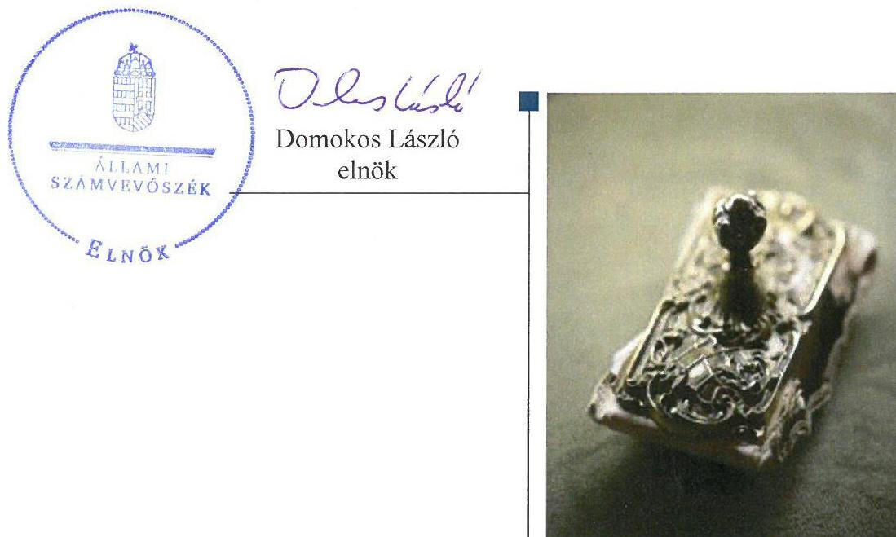

---

# AZ ELLENŐRZÉST FELÜGYELTE:

DR. NAGY IMRE felügyeleti vezető

# AZ ELLENŐRZÉST VEZETTE ÉS A VÉGREHAJTÁSÁÉRT FELELŐS:

RÁCZKEVI KATALIN ellenőrzésvezető

# A PROGRAM ÖSSZEÁLLÍTÁSÁÉRT FELELŐS:

JANIK JÓZSEF osztályvezető

---

**IKTATÓSZÁM:** V-1271-131/2016.

**TÉMASZÁM:** 2305

**ELLENŐRZÉS-AZONOSÍTÓ SZÁM:** V075923

---

Jelentéseink az Országgyűlés számítógépes hálózatán és az Interneten a www.asz.hu címen is olvashatóak.

---

# TARTALOMJEGYZÉK 

■ ÖSSZEGZÉS ..... 5
■ AZ ELLENŐRZÉS CÉLJA ..... 6
■ AZ ELLENŐRZÉS TERÜLETE ..... 7
■ AZ ELLENŐRZÉS HÁTTERE, INDOKOLTSÁGA ..... 8
■ A JELENTÉS LÉNYEGES KÉRDÉSKÖREI ..... 9
■ ELLENŐRZÉS HATÓKÖRE ÉS MÓDSZEREI ..... 10
■ MEGÁLLAPÍTÁSOK ..... 12
■ JAVASLATOK ..... 17
■ MELLÉKLETEK ..... 19
I. Sz. melléklet: Értelmező szótár ..... 19
II. Sz. melléklet: A Közszolgálati Kulturális Előadó-művészeti Nkft. vagyonának megoszlása 2012-2015. között (MFT) ..... 20
■ FÜGGELÉK: ÉSZREVÉTELEK ..... 21
■ RÖVIDÍTÉSEK JEGYZÉKE ..... 35

---

.

---

# ÖSSZEGZÉS 

A Médiaszolgáltatás-támogató és Vagyonkezelő Alap tulajdonosi joggyakorlása a Közszolgálati Kulturális Előadó-művészeti Nonprofit Kft. felett összességében szabályszerű volt. A Társaság működésének szabályozottsága 2012. május 31-től felelt meg a jogszabályi előírásoknak. A bevételek és a ráfordítások elszámolása megfelelő volt. A vagyongazdálkodás összességében szabályszerű volt. A Társaság a tervezési, beszámolási, adatszolgáltatási és közzétételi kötelezettségének eleget tett, ezzel biztosította az átláthatóságot.

## Az ellenőrzés társadalmi indokoltsága

Az állami tulajdonú gazdálkodó szervezetek a nemzeti vagyon részét képezik. Az állami vagyonnal való gazdálkodást illetően a tulajdonosi joggyakorlás és a vagyonnal való gazdálkodás feladata az állami vagyon átlátható, rendeltetésszerű és felelős felhasználásának biztosítása. Az állam meghatározza az ellátandó közszolgáltatással kapcsolatos feladatokat, amelyhez a vagyonnal kapcsolatos döntéseknek igazodniuk kell.

Magyarországon az intézmény-centrikus közfeladat-ellátás, az állami vagyon gazdálkodás jellemző a költségvetésen kívüli feladatellátás térnyerése mellett. Ennek szereplői az állami tulajdonú gazdasági társaságok is.

A számvevőszéki ellenőrzés hozzájárul a közpénzek szabályos, átlátható, elszámoltatható és eredményes felhasználásához. Minden közpénzt, közvagyont felhasználó szervezettel szemben társadalmi igény, hogy tevékenységükről elszámoljanak. Ennek megfelelően került sor a Közszolgálati Kulturális Előadó-művészeti Nonprofit Kft. ellenőrzésére a 2012-2015. évek vonatkozásában.

## Főbb megállapítások, következtetések

A Médiaszolgáltatás-támogató és Vagyonkezelő Alapnak a Társaság feletti tulajdonosi joggyakorlása összességében megfelelt a jogszabályi előírásoknak. A tulajdonosi joggyakorló a Társaság 2014. évi beszámolóját a felügyelőbizottság írásbeli jelentése nélkül fogadta el. A jogszabályoknak megfelelő anyagi érdekeltségi rendszert nem alakítottak ki, mert nem készítették el a Társaságra vonatkozó javadalmazási szabályzatot.

A Társaság 2012. május 31-ét megelőzően számviteli szabályzatokat nem alakította ki. A Társaság szabályozottságának hiányosságait a 2012. május 31-től hatályba helyezett szabályzatokkal pótolták. A 2012. május 31-től hatályos számlarend a jogszabállyal nem volt összhangban, mert nem tartalmazta a valamennyi alkalmazásra kijelölt számla számjelét és megnevezését, valamint a számla tartalmát. A Társaság a pénzügyi-számviteli feladatait szabályszerűen látta el. A bevételek és ráfordítások elszámolása megfelelt a jogszabályi előírásoknak és a belső szabályzatoknak. Az értékcsökkenés elszámolása megfelelt a jogszabályi feltételeknek, a tárgyi eszközök besorolása, a bekerülési érték meghatározása megfelelő volt. A Társaság az üzleti terveit elkészítette, negyedéves adatszolgáltatási rendszerén keresztül számolt be a tulajdonos felé.

A Társaság az idegen tulajdonú eszközök leltározása során nem tartotta be a leltározási szabályzatban előírtakat, nyilvántartást ezen eszközökről a jogszabály előírásai ellenére nem vezetett. A tulajdonosi joggyakorlótól 2015. évben átvett eszközök értékét a Társaság helytelenül mutatta ki a könyveiben, melyet a 2015. évi mérlegbeszámoló elfogadásakor a független könyvvizsgálói jelentésében a könyvvizsgáló nem kifogásolt.

---

# AZ ELLENŐRZÉS CÉLJA 

Az ellenőrzés célja annak értékelése, hogy a tulajdonosi jogok gyakorlása szabályszerű volt-e; a gazdálkodó szervezet szabályozottsága, gazdálkodása és vagyongazdálkodási tevékenysége megfelelt-e a jogszabályi és a tulajdonosi előírásoknak; biztosítva volt-e a közfeladatok átláthatósága és elszámoltathatósága érdekében a közszolgáltatás díjának megalapozottsága szabályszerű önköltségszámítással; a vagyonváltozást eredményező döntések esetében a tulajdonosi jogok gyakorlója és a gazdálkodó szervezet szabályszerűen jártak-e el.

---

# **AZ ELLENŐRZÉS TERÜLETE**

## **A Közszolgálati Kulturális Előadó-művészeti Nonprofit Korlátolt Felelősségű Társaság**

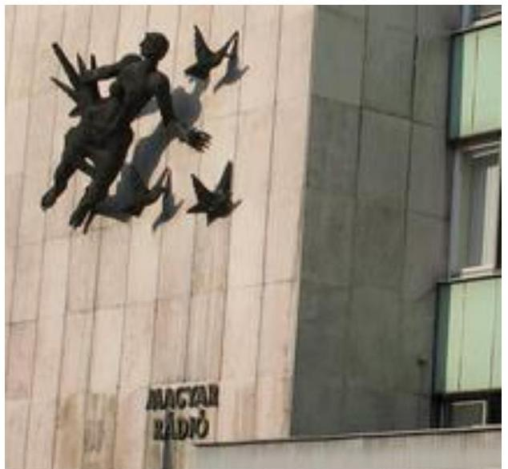

A Közszolgálati Kulturális Előadó-művészeti Nonprofit Kft. a Magyar Állam kizárólagos tulajdonában lévő társaság. Fő feladata előadó-művészeti tevékenység folytatása.

A Társaság¹ jogelődjét 1989-ben alapította a Magyar Állam, Pannónia Rádió Idegenforgalmi, Kereskedelmi és Szervezési Kft. néven, majd 2011. augusztus 4-e után Pannónia Művészeti Szolgáltató Kft-ként, újabb névváltozást követően 2012. január 23-tól Pannónia Művészeti Szolgáltató Nonprofit Kft. néven működött tovább. A 2012. április 7-én kelt MTVA² határozata alapján a Társaság elnevezése Közszolgálati Kulturális Előadó-művészeti Nkft.-re változott. Az ellátott tevékenység keretében szimfonikus zenekar, énekkar és gyermekkórus működött.

A Társaság 100%-os tulajdonosa a Magyar Állam, a tulajdonosi jogok gyakorlója³ a Médiaszolgáltatás-támogató és Vagyonkezelő Alap volt. Az Együttműködési megállapodás⁴ alapján az MTVA látta el a Társaság számára a társadalombiztosítási-kifizetőhelyi-, jogi-, igazgatási-, humánerőforrás-gazdálkodási-, informatikai- és a biztonsági feladatokat is. Az Együttműködési megállapodás alapján az MTVA 2012. január 1-től pénzügyi, számviteli és kontrolling szolgáltatást végzett a Társaság részére. Az ügyvezető⁵ személye az ellenőrzött időszakban négy alkalommal változott. Az Alapító⁶ által kijelölt könyvvizsgáló személye az ellenőrzött időszak alatt nem változott. A Társaság egyszemélyes jellegéből adódóan a legfőbb szerv hatáskörébe tartozó kérdésekben az egyedüli tag, az Alapító döntött. A felügyelő bizottság tagjainak száma 3 fő volt.

A Társaság jegyzett tőkéje 12,9 M Ft⁷ volt, az ellenőrzött időszak alatt nem változott. A Társaság tulajdonosi részesedéssel más gazdasági társaságban az ellenőrzött időszakban nem rendelkezett. A Társaság létszáma 2015-ben 147 fő volt. A Társaság főbb mérleg és eredményadatait az 1. táblázat szemlélteti.

1. táblázat

|   | 2012. | 2013. | 2014. | 2015.  |
| --- | --- | --- | --- | --- |
|  Értékesítés nettó árbevétele | 42,2 | 60,1 | 63,4 | 116,9  |
|  Mérlegfőösszeg | 80,0 | 93,2 | 129,4 | 127,3  |
|  Mérleg szerinti eredmény | 16,9 | 14,2 | 27,3 | -109,6  |
|  Saját tőke | 15,3 | 29,5 | 56,8 | -52,8  |
|  Jegyzett tőke | 12,9 | 12,9 | 12,9 | 12,9  |
|  Követelések | 7,4 | 20,0 | 107,9 | 60,7  |

*Forrás: A Társaság 2012-2015. évi beszámolói*

---

# AZ ELLENŐRZÉS HÁTTERE, INDOKOLTSÁGA 

## Közszolgálati Kulturális Előadó-művészeti Nonprofit Korlátolt Felelősségű Társaság

Az ÁSZ⁸ alapvető célkitűzése, hogy az államháztartáson kívülre nyújtott költségvetési támogatások és ingyenes vagyonjuttatások ellenőrzésével hozzájáruljon ahhoz, hogy a közpénzeket az államháztartáson kívül működő szervezetek is átlátható, rendezett módon használják fel a szerződésben átvállalt feladatok ellátása érdekében.

Az állami tulajdonú gazdálkodó szervezetek ellenőrzése kiemelten fontos a nemzeti vagyon megőrzése, megóvása érdekében. Gazdálkodásuk jellemzően a közérdeklődés és a média figyelmének középpontjában áll, amihez hozzájárul a gazdálkodásuk körébe tartozó - közvetlen vagy közvetett állami tulajdonú - vagyon nagysága, illetve az általuk ellátott közszolgáltatások minősége és hatékonysága. A szolgáltatási/közszolgáltatási árképzés megalapozottsága és az éves elszámoltatás feltételeinek kialakítása az ellenőrzés során nagy hangsúlyt kap. A szolgáltatás/közszolgáltatás árában és annak támogatásában meg kell jelennie az önköltségszámítás szempontjainak, amely biztosítja a működés fenntarthatóságát (eszközpótlást) is.

Az ellenőrzés rámutathat az állami tulajdonú gazdálkodó szervezetek gazdálkodási tevékenységével jó gyakorlatokra és szabálytalanságokra. Felhívhatja a figyelmet a jogszabályi követelmények teljesítéséhez szükséges feltételek hiányosságaira, hozzájárulhat az államháztartáson kívüli, de (közvetlenül vagy közvetve) állami vagyont használó gazdálkodó szervezetek tevékenységének átláthatóságához. Ellenőrzésünk eredményeképpen javaslatainkkal, megállapításainkkal hozzájárulhatunk a nemzeti vagyonnal való gazdálkodás átláthatóságának, elszámoltathatóságának javításához.

---

# A JELENTÉS LÉNYEGES KÉRDÉSKÖREI 

1. A tulajdonosi jogok gyakorlása szabályszerű volt-e?
2. A Társaság működésének szabályozottsága megfelelt-e az előírásoknak?
3. A Társaságnál a pénzügyi-számviteli, adatszolgáltatási és ellenőrzési feladatok ellátása szabályszerű volt-e?
4. A Társaság vagyongazdálkodása szabályszerű volt-e?

---

# ELLENŐRZÉS HATÓKÖRE ÉS MÓDSZEREI 

## Az ellenőrzés típusa

Megfelelőségi ellenőrzés.

## Az ellenőrzött időszak

Az ellenőrzött időszak 2012. január 1-jétől 2015. december 31-ig tart.

## Az ellenőrzés tárgya

Állami tulajdonban lévő gazdasági társaság gazdálkodása, kiemelten vagyongazdálkodási tevékenysége, a tulajdonosi jogok gyakorlása.

## Az ellenőrzött szervezet

A Közszolgálati Kulturális Előadó-művészeti Nkft., valamint a Médiaszolgáltatás-támogató és Vagyonkezelő Alap, mint a tulajdonosi jogok gyakorlója.

## Az ellenőrzés jogalapja

Az Állami Számvevőszékről szóló 2011. évi LXVI. törvény 5. § (3)-(5) bekezdései.

## Az ellenőrzés módszerei

Az ellenőrzést az ellenőrzési program ellenőrzési kérdései, az ellenőrzött időszakban hatályos jogszabályok, az ellenőrzés szakmai szabályok és módszertanok figyelembe vételével végeztük el.

Az ellenőrzési kérdések megválaszolásához szükséges bizonyítékok megszerzése az ellenőrzöttek által rendelkezésre bocsátott dokumentumokra, adatokra alapozva kérdésfelvetés, mintavételezés, ellenőrzési eljárások útján történt.

Az ellenőrzött szervezetek az ellenőrzés lefolytatásához tanúsítványok kitöltésével, valamint az ÁSZ által kért dokumentumok megküldésével szolgáltattak adatokat.

A bevételek és ráfordítások elszámolását, és a vagyonnyilvántartás terén a szabályszerű működést véletlenszerű mintavétellel ellenőriztük. A mintavétellel ellenőrzött területek esetében minden egyes tétel vonat-

---

kozásában szabályszerűségre vonatkozó kérdéseket tettünk fel, amelyek eredménye összesítésre került. A jogszabályoknak és a belső előírásoknak megfelelőnek tekintettük az adott területet, amennyiben a minta ellenőrzésének eredménye alapján 95%-os bizonyossággal a teljes sokaságban a hibaarány kisebb volt, mint 10%, nem megfelelőnek értékeltük, ha a hibaarány a 10%-ot meghaladta. A ráfordítások elszámolására és a vagyonnyilvántartásra vonatkozó véletlen mintavételt kockázati alapú kiválasztással egészítettük ki, amelynek során évente a három leg-nagyobb összegű tételt választottuk ki.

---

# 1. A tulajdonosi jogok gyakorlása szabályszerű volt-e? 

Összegző megállapítás

A tulajdonosi jogok gyakorlása összességében szabályszerű volt.

A TULAJDONOSI JOGGYAKORLÁS szabályait a Gt.⁹ és a Ptk.¹⁰ előírásaival összhangban lévő Alapító okirat₁₋₁₀¹¹-ban határozta meg az MTVA. Rögzítésre kerültek az Alapító kizárólagos - és az ügyvezető kiemelt - feladatai. Az Alapító kizárólagos hatáskörébe tartoztak egyebek mellett az üzleti terv és a beszámoló elfogadása, az ügyvezető kiemelt feladatai között az üzletpolitika, marketing elképzelések, gazdasági tervek kidolgozása.

A Társasággal az Együttműködési megállapodásban rögzítették a működés további feltételeit. A tulajdonosi joggyakorlás az FB¹², tekintetében 2012. január 23-ig nem volt szabályszerű, mert a Társaságnál FB nem működött a Gt. 33. § (1) bekezdésében előírásainak ellenére.

A felügyelő bizottság tagjait az Alapító okiratban meghatározták, feladataikat és beszámolási kötelezettségüket is rögzítették. Az Alapító a könyvvizsgálóval kapcsolatos feladatainak eleget tett, a könyvvizsgálót megválasztotta és a díjazást megállapította.

A TÁRSASÁG BESZÁMOLTATÁSA, szabályszerűen, a Gt. és a Ptk. előírásainak megfelelően történt. A 2014. évi beszámolót a felügyelő bizottsági jelentése nélkül fogadták el, amely nem felelt meg az Alapító okirat₉ 12.3. pontjában foglaltaknak.

A tulajdonosi joggyakorló nem intézkedett a Taktv¹³. 5. § (3) bekezdésében foglaltaknak megfelelően a Társaság vonatkozásában a vezető tisztségviselők, felügyelőbizottsági tagok, valamint az Mt.¹⁴ 208. §-ának hatálya alá eső munkavállalók javadalmazása, valamint a jogviszony megszűnése esetére biztosított juttatások módjának, mértékének elveiről, annak rendszeréről szóló szabályzat megalkotásáról.

## 2. A Társaság működésének szabályozottsága megfelelt-e

 az előírásoknak?

Összegző megállapítás

A Társaság működésének szabályozottsága 2012. május 31-ét követően megfelelt a jogszabályoknak, azt megelőzően szabályozottsága nem felelt meg az előírásoknak.

Számviteli szabályzatokkal a Társaság a 2012. január 1. - 2012. május 30. közötti időszakban nem rendelkezett, ezen belül a Számv.tv. 14.§. (3) és (5) bekezdéseiben előírtak szerint számviteli politikával, eszközök és a források leltárkészítési és leltározási-, illetve értékelési,

---

pénzkezelési szabályzattal. A Társaság 2012. május 31-ig nem rendelkezett számlarenddel, amely nem felelt meg a Számv.tv. 161. § (1) bekezdésében foglaltaknak.

A számviteli politika ${ }^{15}$ részeként szabályozott eszközök és a források értékelése, valamint a Leltározási szabályzat ${ }^{16}$ és a Pénzkezelési szabályzat ${ }^{17}$ megfelel a Számv. tv. előírásainak. A Társaság rendelkezett az Szja tv ${ }^{18}$. szerinti adókötelezettség megállapításához szükséges Cafeteria szabályzat ${ }_{1-4}{ }^{19}$-tal.

A számlarend ${ }^{20}$ nem tartalmazta valamennyi alkalmazásra kijelölt számla számjelét és megnevezését, valamint a számla tartalmát - ha az a számla megnevezéséből egyértelműen nem következik - továbbá a számla értéke növekedésének, csökkenésének jogcímeit, a számlát érintő gazdasági eseményeket, amely nem felelt meg a Számv. tv. 161. § (2) bekezdés a) és b) pontjában foglaltaknak.

A Társaság 2014. december 15-től rendelkezett SZMSZ ${ }^{21}$-tal - amelynek készítésére előírás nem volt -, amelyben szabályozták a szervezeti felépítést és működést. A Társaság ügyeinek intézésére, cégjegyzésre, cégképviseletre az Alapító okirat ${ }_{1-10}$ alapján az ügyvezető volt jogosult.

# 3. A Társaságnál a pénzügyi-számviteli, adatszolgáltatási és ellenőrzési feladatok ellátása szabályszerű volt-e? 

## Összegző megállapítás

### 3.1. számú megállapítás

1. ábra

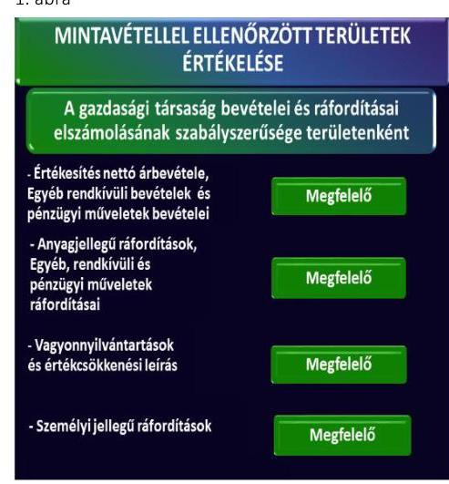

## A pénzügyi-számviteli, adatszolgáltatási feladatok ellátása szabályszerű volt.

A bevételek és ráfordítások elszámolása megfelel a jogszabályi előírásoknak és a belső szabályozásnak.

A bevételek elszámolása megfelelően történt. A számviteli bizonylatokon szereplő főkönyvi számlakijelölések megfeleltek a Számv. tv. előírásainak és a belső szabályozásnak. A kapott támogatás felhasználásáról a támogatási szerződésnek megfelelően beszámolt a Társaság.

A bevételek kiszámlázása a Társaság belső szabályzatai előírása szerint történt.

A ráfordítások elszámolását szabályszerűen végezték. Az anyagjellegű és egyéb ráfordítások elszámolását megfelelő számviteli bizonylatokkal alátámasztották, a költségelszámolást megalapozó szerződés, megrendelés rendelkezésre állt. A tulajdonosi jóváhagyáshoz kötött kifizetésekhez rendelkezésre állt a tulajdonosi jóváhagyás. A személyi jellegű ráfordítások elszámolása szabályszerű volt. A cafeteria juttatás megfelelt a Cafeteria szabályzat ${ }_{1-4}$ és az Szja tv. előírásainak.

Az értékcsökkenés elszámolása megfelel a jogszabályoknak és a belső szabályozásnak. A tárgyi eszközök besorolása a Számv. tv. megfelelően történt, a bekerülési érték meghatározása megfelelő volt.

A mintavétellel ellenőrzött területek értékelését az 1. ábra mutatja.

---

A Társaság követelésállománya a 2012. évi 7,4 M Ft-ról 2015-re 60,7 M Ft-ra növekedett, ebből a vevői követelés állománya a 2012. évi 6,4 M Ft-ról 2015-re lecsökkent 2,2 M Ft-ra.
3.2. számú megállapítás

A Társaság teljesítette a tervezési, beszámolási, adatszolgáltatási kötelezettségét.

Az Alapító okiratban előírtak szerint üzleti tervet a Társaság évente készített, amit az FB 2012-ben és 2013-ban tárgyalt, és javasolt az Alapítónak elfogadásra. A 2014. és a 2015. évben az üzleti terveket az Alapító nem tárgyalta és nem fogadta el, ezzel nem tettek eleget az Alapító okirat ${ }_{1-10}$ 10.3. pontjában foglalt előírásoknak. A Társaság 2012. május 31-től hatályos számviteli politikája negyedéves jelentéskészítési kötelezettséget is előírt a vezetőség számára, amelynek eleget tett.

Az egyszerűsített éves beszámolókat a Társaság ügyvezetője a Számv. tv. előírásainak megfelelően elkészítette, melyet az Alapító a jogszabályoknak megfelelően elfogadott. A 2014. évi beszámolót az MTVA az FB jelentése nélkül fogadta el, amely nem felelt meg az Alapító okirat ${ }_{9}$-ben foglaltaknak.

Az MTVA az egyes évek beszámolójának elfogadásakor betartotta a jogszabályi előírásokat, a könyvvizsgáló korlátozás nélküli hitelesítő záradékkal ellátott jelentésének figyelembevételével.

A Társaság iratkezelési -, adatvédelmi és adatbiztonsági -, valamint közérdekű adatok közzétételére vonatkozó szabályzatot nem készített, adatvédelmi felelőst nem jelölt ki, a Társaság és az MTVA közötti Együttműködési megállapodás 5.1. és 6. pontjaiban foglalt előírásokat betartva az ellenőrzött időszakban az MTVA látta el a Társaság információs-adatvédelmi és informatikai feladatait.

Közzétételi kötelezettségének a Társaság az Info tv. ${ }^{32}$-ben meghatározott gazdálkodási tevékenységével kapcsolatban eleget tett. Az egyszerűsített éves beszámolókat közzétették a könyvvizsgálói jelentésekkel együtt. A Céginformációs Szolgálat részére közzététel és letétbe helyezés céljából benyújtott beszámolók befogadásra és határidőben közzétételre kerültek.

---

# 4. A Társaság vagyongazdálkodása szabályszerű volt-e? 

## Összegző megállapítás

### 4.1. számú megállapítás

A Társaság vagyongazdálkodása az idegen tulajdonú eszközök leltározásának hiánya és az eszközök helytelen értéken történő átvétele kivételével összességében szabályszerű volt.

A Társaság a vagyongazdálkodás feltételeit kialakította. A mérlegek leltárral alátámasztottak voltak. A térítés nélkül átvett eszközök állományba vétele az előírások ellenére nem piaci értéken történt.

A Társaság SZMSZ-e rögzítette, hogy az Mttv ${ }^{23}$. alapján a Társaság gazdasági feladatait az MTVA látja el és a Társaság tulajdonában lévő és a használatára bocsátott eszközökkel való gazdálkodás tekintetében az ügyvezető felel.

A saját vagyon vonatkozásában a Társaság a Számv. tv. szerint az állományba vételi, nyilvántartási és elszámolási kötelezettségét teljesítette.

A vagyonnyilvántartás megfelelő volt. A vagyonnyilvántartásban folyamatos volt a vagyonváltozás kimutatása. A mérlegek leltárral minden esetben megfelelően alátámasztottak voltak a saját tulajdonú eszközöket érintően, a Leltározási szabályzat előírásának megfelelően.

Az idegen tulajdonú eszközöket a Leltározási szabályzat 1.2/ pontjának előírásai ellenére nem leltározták a 2012. január 1 - 2014. december 31.-i időszakban, a Társaság könyvvizsgálója erre vonatkozó észrevételeit 2015. február 26.-án kelt vezetői levelében jelezte. Az Együttműködési megállapodás alapján a leltározás az MTVA-val közös feladata volt. A Társaságnál a 2012. január 1. és 2015. november 30. között az érték nélküli eszközökről nyilvántartást nem vezettek, amellyel nem teljesültek a Számv. tv. 157 § (1) bekezdésben foglaltak, valamint 160 § (5) bekezdésben és a 161 § (2) bekezdésben foglalt „0" számlaosztály nyilvántartási számláinak vezetésére vonatkozó előírások.

Az addig kizárólagos használatában lévő, idegen tulajdonú eszközök az Mttv. 137/B. § (2) bekezdése alapján a 2015. november 30-i átadással a Társaság tulajdonba kerültek.

A térítésmentes vagyonátadásra Megállapodás ${ }^{24}$ alapján került sor, bruttó 251,7 M Ft értékben. Az eszközátadás során csak a 2014-ben az MTVA által beszerzett hangszerek szerepeltek értékkel összesen nettó 41,1 M Ft értékben. A Társaság a térítés nélküli eszköz átvétel bekerülési értékének meghatározása során nem tartotta be a Számv. tv. 50. § (4) bekezdését, mivel nem piaci értéken vette nyilvántartásba az átvett eszközöket.

Az eljárás következtében a Számv. tv. 15. § (3) bekezdésében rögzített mérleg valódiság elve sérült.

A könyvvizsgáló a szabálytalan eljárást nem kifogásolta, korlátozás nélküli hitelesítő záradékkal ellátott jelentést bocsátott ki a 2015. évi beszámoló vonatkozásában.

---

# 4.2. számú megállapítás 

A Társaság megfelelően gondoskodott a saját és a térítés nélküli használatba vett eszközök értékének, állagának megőrzéséről.

A Társaság folyamatosan gondoskodott a saját és a térítés nélküli használatra kapott eszközök karbantartásáról. A 2012. január 1. és 2015. november 30. közötti időszakban a hangszerhasználatról az Együttműködési megállapodás 9.2. pontja rendelkezett, mely szerint az MTVA tulajdonába került hangszereket a Társaság térítésmentesen használhatta azzal, hogy a hangszerek javíttatása, továbbá az elhasználódott alkatrészek beszerzése a Társaság feladata és kötelezettsége volt.

A Társaság saját vagyonában történt változásokat eredményező döntések megfeleltek az Alapító okirat szerinti előírásoknak.

---

# JAVASLATOK 

Az ÁSZ tv. 33. § (1) bekezdésében foglaltak értelmében az ellenőrzött szervezet vezetője köteles a jelentésben foglalt megállapításokhoz kapcsolódó intézkedési tervet összeállítani és azt a jelentés kézhezvételétől számított 30 napon belül az ÁSZ részére megküldeni. Amennyiben az ellenőrzött szervezet vezetője nem küldi meg határidőben az intézkedési tervet, vagy továbbra sem elfogadható intézkedési tervet küld, az Állami Számvevőszék elnöke az ÁSZ tv. 33. § (3) bekezdés a) és b) pontjaiban foglaltakat érvényesítheti.

## A Közszolgálati Kulturális Előadó-művészeti Nonprofit Kft. Ügyvezetőjének

1. Intézkedjen a számlarend jogszabályi rendelkezéseknek megfelelő módosításáról.
(2. sz. megállapítás 3. bekezdése alapján)
2. Intézkedjen a térítésmentesen átvett eszközök bekerülési értékének a jogszabályi előírásnak megfelelő megállapításáról.
(4.1 sz. megállapítás 6. bekezdése alapján)

## A Médiaszolgáltatás-támogató és Vagyonkezelő Alap Vezérigazgatójának

1. Intézkedjen a jogszabályban előírt, a vezető tisztségviselők, felügyelőbizottsági tagok, valamint az Mt. 208 §-ának hatálya alá eső munkavállalók javadalmazása, valamint a jogviszony megszünése esetére biztosított juttatások módjának, mértékének elveiről, annak rendszeréről szóló szabályzat megalkotásáról.
(1. sz. megállapítás 5. bekezdése alapján)

---

.

---

# MELLÉKLETEK 

- I. SZ. MELLÉKLET: ÉRTELMEZŐ SZÓTÁR
gazdasági társaság
A Ptk2. 3:88. § (1) bekezdése szerint „a gazdasági társaságok üzletszerű közös gazdasági tevékenység folytatására, a tagok vagyoni hozzájárulásával létrehozott, jogi személyiséggel rendelkező vállalkozások, amelyekben a tagok a nyereségből közösen részesednek, és a veszteséget közösen viselik".

---

II. SZ. MELLÉKLET: A KÖZSZOLGÁLATI KULTURÁLIS ELŐADÓ-MŰVÉSZETI NKFT. VAGYONÁNAK MEGOSZLÁSA 2012-2015. KÖZÖTT (MFT)

|  Megnevezés | 2012.12.31. | 2013.12.31. | 2014.12.31. | 2015.12.31. | Változás 2015.12.31/ 2012.12.31.  |
| --- | --- | --- | --- | --- | --- |
|  Befektetett eszközök | 0 | 0 | 1,8 | 43,2 | 43,2  |
|  Immateriális javak | 0 | 0 | 0 | 0 | 0  |
|  Szellemi termékek | 0 | 0 | 0 | 0 | 0  |
|  Tárgyi eszközök | 0 | 0 | 1,8 | 43,2 | 43,2  |
|  Forgóeszközök | 19,4 | 26,9 | 127,6 | 78,6 | 59,2  |
|  Követelések | 7,4 | 20,0 | 107,9 | 60,7 | 53,3  |
|  Pénzeszközök | 12,1 | 4,6 | 9,1 | 16,6 | 4,5  |
|  Aktív időbeli elhatárolások | 60,6 | 66,3 | 0 | 5,5 | $-55,1$  |
|  Eszközök (aktívák) összesen | 80,1 | 93,2 | 129,4 | 127,3 | 47,2  |
|  Saját tőke | 15,4 | 29,5 | 56,8 | $-52,8$ | $-68,2$  |
|  Jegyzett tőke | 12,9 | 12,9 | 12,9 | 12,9 | 0  |
|  Tőketartalék | 0,08 | 0,08 | 0,08 | 0,08 | 0  |
|  Eredménytartalék | $-17,7$ | 2,4 | 16,6 | 43,8 | 61,5  |
|  Mérleg szerinti eredmény | 16,9 | 14,2 | 27,3 | $-109,6$ | $-126,5$  |
|  Céltartalékok | 0 | 0 | 0 | 0 | 0  |
|  Kötelezettségek | 44,6 | 53,7 | 63,1 | 139,3 | 94,7  |
|  Passzív időbeli elhatárolások | 20,1 | 10,0 | 9,4 | 4,8 | $-15,3$  |
|  Források (passzívák) összesen | 80,1 | 93,2 | 129,4 | 127,3 | 47,2  |

Forrás: Közszolgálati Kulturális Előadó-művészeti NKft. 2012-2015. évek éves beszámolói

---

# Függelék: Észrevételek 

A jelentéstervezetet a Számvevőszék 15 napos észrevételezésre megküldte az ellenőrzött szervezetek vezetőinek az ÁSZ tv. 29. §* (1) bekezdése előírásának megfelelően.

Az
 ÁSZ a jelentéstervezetet észrevételezésre megküldte a Közszolgálati Kulturális Előadóművészeti Nonprofit Kft. ügyvezetőjének és a Médiaszolgáltatás-Támogató és Vagyonkezelő Alap vezérigazgatójának.
A Közszolgálati Kulturális Előadóművészeti Nonprofit Kft. ügyvezetőjének és a Médiaszolgáltatás-Támogató és Vagyonkezelő Alap vezérigazgatójának észrevételét és az arra adott választ a függelék alább tartalmazza.

[^0]
[^0]:    * 29. § (1) Az Állami Számvevőszék az ellenőrzési megállapításait megküldi az ellenőrzött szervezet vezetőjének vagy az általa megbízott személynek, és annak, akinek személyes felelősségét állapította meg.
    (2) Az ellenőrzött szervezet vezetője és a felelősként megjelölt személy az ellenőrzés megállapításaira tizenöt napon belül írásban észrevételt tehet.
    (3) Az Állami Számvevőszék az észrevételre a beérkezésétől számított harminc napon belül írásban válaszol. A figyelembe nem vett észrevételeket köteles a jelentésben feltüntetni, és megindokolni, hogy azokat miért nem fogadta el.

---

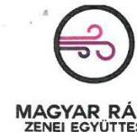

Magyar Rádió Zenei Együttesek
KÖZSZOLGÁLATI KULTURÁLIS ELŐADÓ-MŰVÉSZETI NONPROFIT KFT.

# Állami Számvevőszék 

Budapest 4.
Pf. 54.
1364
Domokos László
elnök részére

## Tisztelt Elnök Úr!

Alulírott Kovács Géza, mint a Közszolgálati Kulturális Előadó-művészeti Nonprofit Kft. (székhely: 1037 Budapest, Kunigunda útja 64.; továbbiakban: KÖKU Kft.) ügyvezetője az Ön, V-1271118/2016. iktatószámú, 2017. augusztus 11. napján kelt levelének mellékletét képező az „Állami tulajdonú gazdasági társaságok - Az állami tulajdonban (résztulajdonban) lévő gazdálkodó szervezetek vagyonmegőrzési és gazdálkodási tevékenységének ellenőrzése - Közszolgálati Kulturális Előadó-művészeti Nonprofit Kft." címmel készült számvevőszéki jelentéstervezetre - a rendelkezésemre álló határidőn belül - az alábbi észrevételt teszem:

1. Az 5. oldal 7. bekezdésben foglaltakhoz: „A Társaság az idegen tulajdonú eszközök leltározása során nem tartotta be a leltározási szabályzatban előírtakat, nyilvántartást ezen eszközökről a jogszabály előírásai ellenére nem vezetett."

Szeretnénk kiemelni, hogy az MTVA, mint tulajdonosi joggyakorló nyilvántartotta ezen eszközöket.
2. Az 5. oldal 7. bekezdésben; a 15. oldal 1. és 2. bekezdéseiben; valamint a 15. oldal 8., 9. és 10. bekezdéseiben foglaltakhoz: „Az MTVA-tól 2015. évben átvett eszközök értékét a Társaság helytelenül mutatta ki a könyveiben, ezt a könyvvizsgáló nem kifogásolta. A térítés nélkül átvett eszközök állományba vétele az előírások ellenére nem piaci értéken történt meg, így a valódiság elve sérült."

A jelentéstervezet megállapítja, hogy a Társaság a 2015. november 30-i térítés nélküli eszközátvétel során nem tartotta be a Számviteli törvény 50. § (4) bekezdését, mivel nem piaci értéken vette nyilvántartásba az átvett eszközöket.

A számviteli törvény hivatkozott paragrafusa jogszabály eltérő rendelkezése esetén eltérést enged a piaci érték alkalmazásától. A közmédia rendszer 2010. évi átalakítása során a 109/2010. (X. 28.) OGY határozat rendelkezett a közszolgálati médiaszolgáltatók vagyonának térítésmentes állami tulajdonba adásáról, amely vagyon tulajdonosi joggyakorlója az MTVA lett (rábízott vagyon). A később a Közszolgálati Kulturális Előadó-művészeti Nonprofit Kft-nek átadott hangszerállomány jelentős része ezen vagyonátadás során került az MTVA-hoz a Magyar Rádió Zrt-tól 2011. január 1-én. Az Mttv. az átmeneti szabályok között [213.§ (3) bek.] rendelkezett a térítésmentesen átvett eszközök bekerülési értékéről és azt a számviteli törvény rendelkezéseitől eltérően az átadónál kimutatott könyv szerinti értéken határozta meg. E rendelkezés alapján 2011-ben mintegy 26 Mrd forintnyi vagyon került ezen az értéken az MTVA könyveibe a közszolgálati médiaszolgáltatóktól. A Társaság részére történő 2015. novemberi eszközátadás a fentiekkel analóg elven az átadás időpontjában az MTVA-nál kimutatott könyv szerinti értéken került be a Társaság könyveibe.

---

Az alkalmazott értékelési eljárás megítélésünk szerint nem sértette a számviteli elveket, hanem következetesen alkalmazott egy korábban a tulajdonosi joggyakorló esetében előírt és elfogadott metódust.

# Kiegészítő információk 

A hangszerek, a kották, a zenei egyéb berendezések értékelése speciális szaktudást igényel. Az előzetesen beszerzett információk alapján ez jelentős költségteher az egyébként is veszteséges, közpénzből gazdálkodó Nonprofit Kft-nek. A Számviteli törvény 50.§-a (4) bekezdése alapján az eszközök piaci értéken történő értékeléséhez a Nonprofit Kft-nek külön hangszer szakértőket, külön „kotta szakértőket", továbbá az egyéb zenei berendezéshez is szakértőt, szakértőket kellett volna igénybe venni.

Az „ezres tételszámú" eszköz piaci értékelése a Társaságnak jelentős költségtétel, amely nem áll arányban a nyilvánosságra hozott adatok hasznosságával.
A Számviteli törvény 16. § (5) bekezdésében megfogalmazott költség-haszon összevetésének elve alapján a nyilvánosságra hozott információk hasznosíthatósága (hasznossága) arányban kell, hogy álljon az információk előállításának költségeivel.

A piaci értékelés nincs hatással az eredményre a Számviteli törvény 15. § (7) bekezdésében megfogalmazott összemérés elve alapján „az adott időszak eredményének meghatározásakor a tevékenységek adott időszaki teljesítéseinek elismert bevételeit és a bevételeknek megfelelő költségeit (ráfordításait) kell számításba venni, függetlenül a pénzügyi teljesítéstől".

A Társaság közzétett 2015. évi kiegészítő mellékletének „Általános része" tartalmazta a számviteli törvény 16.§ (5) bekezdésének haszon-ráfordítás számviteli elvének érvényesülését.

Tekintettel arra, hogy esetünkben több jogszabály együttes alkalmazásáról van szó, ezért lényeges szempontként vettük figyelembe, hogy a közpénzből működő Közszolgálati Kulturális Előadó-művészeti Nonprofit Kft. a törvényben meghatározott mértékű előirányzatot szabályosan, átlátható módon és eredményesen használja fel.

A Társaság éves költségvetését - a tulajdonosi joggyakorló költségvetésének részeként - az Országgyűlés hagyja jóvá. A 2014. évi LXIV. törvény a Nemzeti Média- és Hírközlési Hatóság 2015. évi egységes költségvetésének 3. számú melléklete szerint a Közszolgálati Kulturális Nonprofit Kft. éves előirányzata 871,4 millió forint. Ez a költségvetés nem tartalmaz rendkívüli, ún. nem a Nonprofit Kft. szokásos üzletmenetéhez kapcsolódó költségeket.

A Társaság a 2015-ös évet mínusz 109.604 ezer Ft veszteséggel zárta, a saját tőkéje mínusz 52.797 ezer Ft. Ezt a veszteséget még tovább növelte volna az értékbecslések költsége.

Meggyőződésünk, hogy a tulajdonosi joggyakorló felelősen járt el, amikor a Társaság alaptevékenységének végzéséhez szükséges eszközöket a Társaság tulajdonába adta, amely lépés javította az állami vagyonnal való gazdálkodás átláthatóságát, sokkal inkább megfelelt a valós gyakorlatnak ezzel is segítve a megbízható, valós kép kialakítását a Társaságról. Álláspontunk szerint helyesen és szabályosan jártunk el a közpénzből gazdálkodó Társaság esetében is a fent hivatkozott törvények és előírások alapján.

---

Fentiek alapján kérjük a Tisztelt Állami Számvevőszéket, hogy észrevételeinket elfogadni és a jelentéstervezet szövegét módosítani szíveskedjék.

Budapest, 2017. augusztus 30.

Tisztelettel:
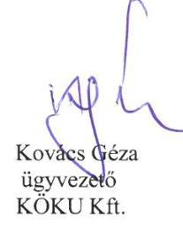

---

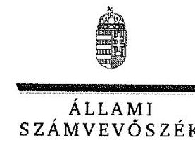

ELNÖK

# Kovács Géza úr 

ügyvezető
Közszolgálati Kulturális Előadó-művészeti Nonprofit Kft.

## Budapest

## Tisztelt Ügyvezető Úr!

Az „Állami tulajdonú gazdasági társaságok - Az állami tulajdonban (résztulajdonban) lévő gazdálkodó szervezetek vagyonmegőrzési és gazdálkodási tevékenységének ellenőrzése - Közszolgálati Kulturális Előadó-művészeti Nonprofit Kft." címmel készített számvevőszéki jelentéstervezetre tett észrevételeit köszönettel megkaptam.
Az Állami Számvevőszék észrevételekre vonatkozó álláspontjáról a felügyeleti vezető által készített részletes tájékoztatást csatoltan megküldöm.
Tájékoztatom Ügyvezető urat, hogy a számvevőszéki jelentésben - az Állami Számvevőszékről szóló 2011. évi LXVI. törvény 29. § (3) bekezdése alapján - a figyelembe nem vett észrevételeket szerepeltetjük az elutasítás indokának feltüntetésével.

Budapest, 2017. 03. hó 22. nap
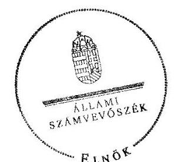

Tisztelettel:

Domokos László

Melléklet: Tájékoztatás az észrevételek kezeléséről

---

# Tájékoztatás   az észrevételek kezeléséről 

Az ,,Állami tulajdonú gazdasági társaságok - Az állami tulajdonban (résztulajdonban) lévő gazdálkodó szervezetek vagyonmegőrzési és gazdálkodási tevékenységének ellenőrzése - Közszolgálati Kulturális Előadó-művészeti Nonprofit Kft." című számvevőszéki jelentéstervezetre 2017. augusztus 30-án kelt észrevételeit áttekintettem, annak kezeléséről az alábbi tájékoztatást adom.
A jelentéstervezet 5. oldal „Főbb megállapítások, következtetések" című fejezet 3. bekezdés 1. mondatában szereplő megállapításra vonatkozó észrevétele kapcsán

Az észrevételben jelezte, hogy a Médiaszolgáltatás-támogató és Vagyonkezelő Alap (továbbiakban: MTVA), mint tulajdonosi joggyakorló nyilvántartotta ezen eszközöket, míg a megállapítás (, A Társaság az idegen tulajdonú eszközök leltározása során nem tartotta be a leltározási szabályzatban előírtakat, nyilvántartást ezen eszközökről a jogszabály előírásai ellenére nem vezetett.") arra irányult, hogy a Közszolgálati Kulturális Előadó-művészeti Nonprofit Kft. (továbbiakban: Társaság) az idegen tulajdonú eszközök leltározása során nem tartotta be a leltározási szabályzatban előírtakat, nyilvántartást ezen eszközökről a jogszabály előírásai ellenére nem vezetett. Észrevétele a jelentéstervezetben foglalt megállapítást nem vitatja, így a megállapítás módosítása, illetve törlése nem indokolt.
A jelentéstervezet 5. oldal „Főbb megállapítások, következtetések" című fejezet 3. bekezdés 2. mondatában szereplő megállapításra, a 15. oldal Összegző megállapításra és a 4.1. számú megállapításra, továbbá 4.1. számú megállapítás 6-8. bekezdéseiben szereplő megállapításra vonatkozó észrevétele kapcsán
Észrevételében jelezte, hogy a médiaszolgáltatásokról és a tömegkommunikációról szóló 2010. évi CLXXXV. törvény (továbbiakban: Mttv.) 213. § (3) bekezdése értelmében az MTVA-nak 2011-ben térítés nélkül átadott vagyon bekerülési értéke az eszközöknek az átadás időpontjában a közszolgálati médiaszolgáltató által vezetett könyv szerinti értéknek felelt meg. A Társaság részére történő 2015. novemberi eszközátadás a fentiekkel analóg módon történt. Kiegészítő információként közölte, hogy a térítésmentesen átvett eszközök piaci értékelésének költsége nem állt volna arányban a nyilvánosságra hozott adatok hasznosságával (költség-haszon összevetésének elve), ami jelentős költségteher lett volna az egyébként is veszteséges Társaságnak, illetve az összemérés elve alapján a piaci értékelés nincs hatással az eredményre. Álláspontjuk szerint a tulajdonosi joggyakorló felelősen járt el, amikor a Társaság tulajdonába adta az alaptevékenység végzéséhez szükséges eszközöket, és ez a lépés javította az állami vagyonnal való gazdálkodás átláthatóságát.
A számvitelről szóló 2000. évi C. törvény (továbbiakban: Számv. tv.) 50. § (4) bekezdése értelmében a térítés nélkül (a visszaadási kötelezettség nélkül) átvett eszköz, illetve az ajándékként, hagyatékként kapott eszköz, továbbá a többletként fellelt (a nem adminisztrációs hibából származó többlet-) eszköz bekerülési (beszerzési) értéke - ha jogszabály eltérően nem rendelkezik - az eszköznek az állományba vétel időpontjában ismert piaci értéke. A Számv. tv. 15. § (3) bekezdése értelmében a könyvvitelben rögzített és a beszámolóban szereplő tételek értékelése meg

---

kell, hogy feleljen a Számv. tv.-ben előírt értékelési elveknek és az azokhoz kapcsolódó értékelési eljárásoknak (a valódiság elve).
Az Mttv. 213. § (3) bekezdése az MTVA részére 2011. január 1. napjával átadott vagyonnal kapcsolatos bekerülési értéket szabályozta, amely értékelési lehetőség nem terjeszthető ki az MTVA által a Társaságnak 2015-ben átadott vagyonra, mivel a jogszabály hatálya nem terjedt ki arra. A Társaság a térítés nélküli eszköz átvétel bekerülési értékének meghatározása során nem tartotta be a Számv. tv. 50. § (4) bekezdését, és az eljárás következtében a Számv. tv. 15. § (3) bekezdésében rögzített mérleg valódiság elve sérült. Az előzőekben leírtak alapján észrevétele nem megalapozott, azt nem fogadom el, így a javaslatot megalapozó megállapítás módosítása, illetve törlése nem indokolt.
Észrevételében a kiegészítő információk megállapításokra vonatkozó észrevételeket nem tartalmaztak, azokat az Állami Számvevőszék nem értékelte.
Tájékoztatom továbbá, hogy a megállapítás nem vitatta, hogy a tulajdonosi joggyakorló felelősen járt el, amikor a Társaság tulajdonába adta az alaptevékenység végzéséhez szükséges eszközöket. A megállapítás arra vonatkozott, hogy ezen eszközök átvétele helytelen értéken történt.

Budapest, 2017. 03. hó 22. nap
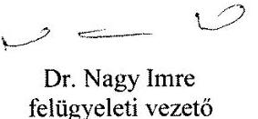

---

# Tisztelt Elnök Úr! 

Alulírott Vaszily Miklós, mint a Médiaszolgáltatás-támogató és Vagyonkezelő Alap (székhely: 1037 Budapest, Kunigunda útja 64.; továbbiakban: MTVA) vezérigazgatója az Ön, V-1271-119/2016. iktatószámú, 2017. augusztus 11. napján kelt levelének mellékletét képező az „Állami tulajdonú gazdasági társaságok - Az állami tulajdonban (résztulajdonban) lévő gazdálkodó szervezetek vagyonmegőrzési és gazdálkodási tevékenységének ellenőrzése - Közszolgálati Kulturális Előadóművészeti
 Nkft." címmel készült számvevőszéki jelentéstervezetre - a rendelkezésemre álló határidőn belül - az alábbi észrevételt teszem:

1. Az 5. oldal 7. bekezdésben foglaltakhoz: „A Társaság az idegen tulajdonú eszközök leltározása során nem tartotta be a leltározási szabályzatban előírtakat, nyilvántartást ezen eszközökről a jogszabály előírásai ellenére nem vezetett."

Szeretnénk kiemelni, hogy az MTVA, mint tulajdonosi joggyakorló nyilvántartotta ezen eszközöket.
2. Az 5. oldal 7. bekezdésben; a 15. oldal 1. és 2. bekezdéseiben; valamint a 15. oldal 8., 9. és 10. bekezdéseiben foglaltakhoz: „Az MTVA-tól 2015. évben átvett eszközök értékét a Társaság helytelenül mutatta ki a könyveiben, ezt a könyvvizsgáló nem kifogásolta. A térítés nélkül átvett eszközök állományba vétele az előírások ellenére nem piaci értéken történt meg, így a valódiság elve sérült."

A jelentéstervezet megállapítja, hogy a Társaság a 2015. november 30-i térítés nélküli eszközátvétel során nem tartotta be a Számviteli törvény 50. § (4) bekezdését, mivel nem piaci értéken vette nyilvántartásba az átvett eszközöket.

A számviteli törvény hivatkozott paragrafusa jogszabály eltérő rendelkezése esetén eltérést enged a piaci érték alkalmazásától. A közmédia rendszer 2010. évi átalakítása során a 109/2010. (X. 28.) OGY határozat rendelkezett a közszolgálati médiaszolgáltatók vagyonának térítésmentes állami tulajdonba adásáról, amely vagyon tulajdonosi joggyakorlója az MTVA lett (rábízott vagyon). A később a Közszolgálati Kulturális Előadó-művészeti Nonprofit Kft-nek átadott hangszer állomány jelentős része ezen vagyonátadás során került az MTVA-hoz a Magyar Rádió Zrt-től 2011. január 1-én. Az Mttv. az átmeneti szabályok között [213.§ (3) bek.] rendelkezett a térítésmentesen átvett eszközök bekerülési értékéről és azt a számviteli törvény rendelkezéseitől eltérően az átadónál kimutatott könyv szerinti értéken határozta meg. E rendelkezés alapján 2011-ben mintegy 26 Mrd forintnyi vagyon került ezen az értéken az MTVA könyveibe a közszolgálati médiaszolgáltatóktól. A Társaság részére történő 2015. novemberi eszközátadás a fentiekkel analóg elven az átadás időpontjában az MTVA-nál kimutatott könyv szerinti értéken került be a Társaság könyveibe.

Az alkalmazott értékelési eljárás megítélésünk szerint nem sértette a számviteli elveket, hanem következetesen alkalmazott egy korábban a tulajdonosi joggyakorló esetében előírt és elfogadott metódust.

---

# Kiegészítő információk 

A hangszerek, a kották, a zenei egyéb berendezések értékelése speciális szaktudást igényel. Az előzetesen beszerzett információk alapján ez jelentős költségteher az egyébként is veszteséges, közpénzből gazdálkodó Nonprofit Kft-nek. A Számviteli törvény 50.§-a (4) bekezdése alapján az eszközök piaci értéken történő értékeléséhez a Nonprofit Kft-nek külön hangszer szakértőket, külön „kotta szakértőket", továbbá az egyéb zenei berendezéshez is szakértőt, szakértőket kellett volna igénybe venni.

Az „ezres tételszámú" eszköz piaci értékelése a Társaságnak jelentős költségtetel, amely nem áll arányban a nyilvánosságra hozott adatok hasznosságával.
A Számviteli törvény 16. § (5) bekezdésében megfogalmazott költség-haszon összevetésének elve alapján a nyilvánosságra hozott információk hasznosíthatósága (hasznossága) arányban kell, hogy álljon az információk előállításának költségeivel.

A piaci értékelés nincs hatással az eredményre a Számviteli törvény 15. § (7) bekezdésében megfogalmazott összemérés elve alapján „az adott időszak eredményének meghatározásakor a tevékenységek adott időszaki teljesítéseinek elismert bevételeit és a bevételeknek megfelelő költségeit (ráfordításait) kell számításba venni, függetlenül a pénzügyi teljesítéstől".

A Társaság közzétett 2015. évi kiegészítő mellékletének „Általános része" tartalmazta a számviteli törvény 16.§ (5) bekezdésének haszon-ráfordítás számviteli elvének érvényesülését.

Tekintettel arra, hogy esetünkben több jogszabály együttes alkalmazásáról van szó, ezért lényeges szempontként vettük figyelembe, hogy a közpénzből működő Közszolgálati Kulturális Előadó-művészeti Nonprofit Kft. a törvényben meghatározott mértékű előirányzatot szabályosan, átlátható módon és eredményesen használja fel.

A Társaság éves költségvetését - a tulajdonosi joggyakorló költségvetésének részeként - az Országgyűlés hagyja jóvá. A 2014.évi LXIV. törvény a Nemzeti Média-és Hírközlési Hatóság 2015. évi egységes költségvetésének 3. számú melléklete szerint a Közszolgálati Kulturális Nonprofit Kft. éves előirányzata 871,4 millió forint. Ez a költségvetés nem tartalmaz rendkívüli un. nem a Nonprofit Kft. szokásos üzletmenetéhez kapcsolódó költségeket.

A Társaság a 2015-ös évet mínusz 109.604 ezer Ft veszteséggel zárta, a saját tőkéje mínusz 52.797 ezer Ft. Ezt a veszteséget még tovább növelte volna az értékbecslések költsége.

Meggyőződésünk, hogy a tulajdonosi joggyakorló felelősen járt el, amikor a Társaság alaptevékenységének végzéséhez szükséges eszközöket a Társaság tulajdonába adta, amely lépés javította az állami vagyonnal való gazdálkodás átláthatóságát, sokkal inkább megfelelt a valós gyakorlatnak ezzel is segítve a megbízható, valós kép kialakítását a Társaságról. Álláspontunk szerint helyesen és szabályosan jártunk el a közpénzből gazdálkodó Társaság esetében is a fent hivatkozott törvények és előírások alapján.
3. A 12. oldal Tulajdoni joggyakorlás címszó alatt a 2. bekezdéshez: „Nem működött FB 2012. január 23-ig a Gt. 33. §. (1) előírása ellenére."

A Közszolgálati Közalapítvány, a Magyar Rádió Zrt., a Magyar Televízió Zrt., a Duna Televízió Zrt. és a Magyar Távirati Iroda Zrt. vagyona meghatározott körének a Műsorszolgáltatás Támogató és Vagyonkezelő Alap részére történő átadásáról szóló 109/2010. (X. 28.) OGY határozat, valamint a

---

# TV | RÁDIÓ | HÍR | ÚJ MÉDIA   Vezérigazgatóság   Médiaszolgáltatás-Támogató és Vagyonkezelő Alap 

2011. január 1. napján hatályba lépett, a médiaszolgáltatásokról és a tömegkommunikációról szóló 2010. évi CLXXXV. törvény (Mttv.) alapján a közszolgálati médiarendszer strukturális felépítése és működése 2011. január 1. napját követően jelentősen átrendeződött. Ennek keretében a közszolgálati médiaszolgáltatók feladataik jelentős részét a Médiaszolgáltatás-támogató és Vagyonkezelő Alap (a továbbiakban: MTVA) vette át, illetve a közszolgálati médiaszolgáltatók munkavállalóinak jelentős része - munkáltatói jogutódlás keretében - az MTVA munkavállalói állományába került. A közszolgálati médiarendszer hatékony, átlátható kialakítása, a racionalizált gazdálkodás megvalósítása olyan jelentős munkaterhet jelentett az MTVA számára a közszolgálati rádió és televízió csatornák műsorainak zavartalan biztosítása mellett, hogy a valamennyi belső és külső szabályozónak való megfelelő működés kialakításához a fenti jogszabályok kihirdetése és a hatályba lépésük között rendelkezésre álló idő nem volt elegendő. Az MTVA mindent megtett annak érdekében, hogy a leányvállalatai is a jogszabályi előírásoknak megfelelően működjenek, amelynek feltételei 2012 januárját követően teremtődtek meg.

Fentiek alapján kérjük a Tisztelt Állami Számvevőszéket, hogy észrevételeinket elfogadni és a jelentéstervezet szövegét módosítani szíveskedjék.

Budapest, 2017. augusztus 30.
Tisztelettel:
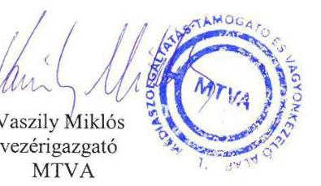

---

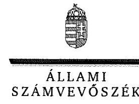

ELNÖK

Ikt.szám: V-1271-126/2016.

# Vaszily Miklós úr 

vezérigazgató

Médiaszolgáltatás-Támogató és Vagyonkezelő Alap
Budapest

## Tisztelt Vezérigazgató Úr!

Az ,,Állami tulajdonú gazdasági társaságok - Az állami tulajdonban (résztulajdonban) lévő gazdálkodó szervezetek vagyonmegőrzési és gazdálkodási tevékenységének ellenőrzése - Közszolgálati Kulturális Előadó-művészeti Nkft. "címmel készített számvevőszéki jelentéstervezetre tett észrevételeit köszönettel megkaptam.

Az Állami Számvevőszék észrevételekre vonatkozó álláspontjáról a felügyeleti vezető által készített részletes tájékoztatást csatoltan megküldöm.

Tájékoztatom Vezérigazgató urat, hogy a számvevőszéki jelentésben - az Állami Számvevőszékről szóló 2011. évi LXVI. törvény 29. § (3) bekezdése alapján - a figyelembe nem vett észrevételeket szerepeltetjük az elutasítás indokának feltüntetésével.

Budapest, 2017. 08 . hó 22 nap
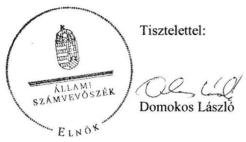

Melléklet: Tájékoztatás az észrevételek kezeléséről

---

# Tájékoztatás   az észrevételek kezeléséről 

Az ,,Állami tulajdonú gazdasági társaságok - Az állami tulajdonban (résztulajdonban) lévő gazdálkodó szervezetek vagyonmegőrzési és gazdálkodási tevékenységének ellenőrzése - Közszolgálati Kulturális Előadó-művészeti Nkft. " címû számvevőszéki jelentéstervezetre 2017. augusztus 30 -án kelt észrevételeit áttekintettem, annak kezeléséről az alábbi tájékoztatást adom.
A jelentéstervezet 5. oldal „Főbb megállapítások, következtetések" címû fejezet 3. bekezdés 1. mondatában szereplő megállapításra vonatkozó észrevétele kapcsán

Az észrevételben jelezte, hogy a Médiaszolgáltatás-támogató és Vagyonkezelő Alap (továbbiakban: MTVA), mint tulajdonosi joggyakorló nyilvántartotta ezen eszközöket, míg a megállapítás („A Társaság az idegen tulajdonú eszközök leltározása során nem tartotta be a leltározási szabályzatban előírtakat, nyilvántartást ezen eszközökről a jogszabály előírásai ellenére nem vezetett.") arra irányult, hogy a Közszolgálati Kulturális Előadó-művészeti Nonprofit Kft. (továbbiakban: Társaság) az idegen tulajdonú eszközök leltározása során nem tartotta be a leltározási szabályzatban előírtakat, nyilvántartást ezen eszközökről a jogszabály előírásai ellenére nem vezette. Észrevétele a jelentéstervezetben foglalt megállapítást nem vitatja, így a megállapítás módosítása, illetve törlése nem indokolt.
A jelentéstervezet 5. oldal „Főbb megállapítások, következtetések" címû fejezet 3. bekezdés 2. mondatában szereplő megállapításra, a 15. oldal Összegző megállapításra és a 4.1. számú megállapításra, továbbá 4.1. számú megállapítás 6-8. bekezdéseiben szereplő megállapításra vonatkozó észrevétele kapcsán
Észrevételében jelezte, hogy a médiaszolgáltatásokról és a tömegkommunikációról szóló 2010. évi CLXXXV. törvény (továbbiakban: Mttv.) 213. § (3) bekezdése értelmében az MTVA-nak 2011-ben térítés nélkül átadott vagyon bekerülési értéke az eszközöknek az átadás időpontjában a közszolgálati médiaszolgáltató által vezetett könyv szerinti értéknek felelt meg. A Társaság részére történő 2015. novemberi eszközátadás a fentiekkel analóg módon történt. Kiegészítő információként közölte, hogy a térítésmentesen átvett eszközök piaci értékelésének költsége nem állt volna arányban a nyilvánosságra hozott adatok hasznosságával (költség-haszon összevetésének elve), ami jelentős költségteher lett volna az egyébként is veszteséges Társaságnak, illetve az összemérés elve alapján a piaci értékelés nincs hatással az eredményre. Álláspontjuk szerint a tulajdonosi joggyakorló felelősen járt el, amikor a Társaság tulajdonába adta az alaptevékenység végzéséhez szükséges eszközöket, és ez a lépés javította az állami vagyonnal való gazdálkodás átláthatóságát.
A számvitelről szóló 2000. évi C. törvény (továbbiakban: Számv. tv.) 50. § (4) bekezdése értelmében a térítés nélkül (a visszaadási kötelezettség nélkül) átvett eszköz, illetve az ajándékként, hagyatékként kapott eszköz, továbbá a többletként fellelt (a nem adminisztrációs hibából származó többlet-) eszköz bekerülési (beszerzési) értéke - ha jogszabály eltérően nem rendelkezik - az eszköznek az állományba vétel időpontjában ismert piaci értéke. A Számv. tv. 15. § (3) bekezdése értelmében a könyvvitelben rögzített és a beszámolóban szereplő tételek értékelése meg

kell, hogy feleljen a Számv. tv.-ben előírt értékelési elveknek és az azokhoz kapcsolódó értékelési eljárásoknak (a valódiság elve).
Az Mttv. 213. § (3) bekezdése az MTVA részére 2011. január 1. napjával átadott vagyonnal kapcsolatos bekerülési értéket szabályozta, amely értékelési lehetőség nem terjeszthető ki az MTVA által a Társaságnak 2015-ben átadott vagyonra, mivel a jogszabály hatálya nem terjedt ki arra. A Társaság a térítés nélküli eszköz átvétel bekerülési értékének meghatározása során nem tartotta be a Számv. tv. 50. § (4) bekezdését, és az eljárás következtében a Számv. tv. 15. § (3) bekezdésében rögzített mérleg valódiság elve sérült. Az előzőekben leírtak alapján észrevétele nem megalapozott, azt nem fogadom el, így a javaslatot megalapozó megállapítás módosítása, illetve törlése nem indokolt.
Észrevételében a kiegészítő információk a megállapításokra vonatkozó észrevételeket nem tartalmazták, azokat az Állami Számvevőszék nem értékelte.
Tájékoztatom továbbá, hogy a megállapítás nem vitatta, hogy a tulajdonosi joggyakorló felelősen járt el, amikor a Társaság tulajdonába adta az alaptevékenység végzéséhez szükséges eszközöket. A megállapítás arra vonatkozott, hogy ezen eszközök átvétele helytelen értéken történt.

# A jelentéstervezet 1. számú megállapítás 2. bekezdés 2. mondatában szereplő megállapításra vonatkozó észrevétele kapcsán 

Észrevétele értelmében a közszolgálati médiarendszer hatékony, átlátható kialakítása olyan jelentős terhet jelentett az MTVA számára, hogy valamennyi belső és külső szabályozónak való megfelelő működés kialakításához a
 rendelkezésre álló idő nem volt elegendő, a jogszabályi előírásoknak való megfelelés 2012 januárját követően teremtődött meg.
Észrevétele a jelentéstervezetben foglalt megállapítást nem vitatja, így annak módosítása, illetve törlése nem indokolt.

Budapest, 2017. 05. 22.
Dr. Nagy Imre
felügyeleti vezető

---

.

---

# RÖVIDÍTÉSEK JEGYZÉKE 

${ }^{1}$ Társaság
${ }^{2}$ MTVA
${ }^{3}$ tulajdonosi jogok gyakorlója
${ }^{4}$ Együttműködési megállapodás
${ }^{5}$ ügyvezető
${ }^{6}$ Alapító
${ }^{7} \mathrm{M} \mathrm{Ft}$
${ }^{8}$ ÁSZ
${ }^{9}$ Gt.
${ }^{10}$ Ptk.
${ }^{11}$ Alapító okirat ${ }_{1-10}$
${ }^{12} \mathrm{FB}$
${ }^{13}$ Taktv.
${ }^{14} \mathrm{Mt}$.
${ }^{15}$ Számviteli politika
${ }^{16}$ Leltározási szabályzat
${ }^{17}$ Pénzkezelési szabályzat
${ }^{18}$ Szja. tv.
${ }^{19}$ Cafeteria szabályzat ${ }_{1-4}$
${ }^{20}$ Számlarend
${ }^{21}$ SZMSZ
${ }^{22}$ Info. tv.
${ }^{23}$ Mttv.
${ }^{24}$ Megállapodás

Közszolgálati Kulturális Előadó-művészeti Nonprofit Kft.
Médiaszolgáltatás-támogató és Vagyonkezelő Alap
Médiaszolgáltatás-támogató és Vagyonkezelő Alap
a Társaság és az MTVA között. 2012. június 14-én kötött megállapodás, hatályos 2012. január 1-től
a Társaság ügyvezetője
Médiaszolgáltatás-támogató és Vagyonkezelő Alap
millió forint
Állami Számvevőszék
a gazdasági társaságokról szóló 2006. évi IV. törvény (hatályos: 2014. március 14-ig)
a polgári törvénykönyvről szóló 2013. évi V. törvény (hatályos: 2014. március 15-től)
a Társaság alapító okiratai, hatályosak: 2011.08.04.1, 2012.01.23.2, 2012.04.07.3, 2013.11.15.4, 2014.05.01.5, 2014.08.01.6, 2014.08.27.7, 2015.02.24.8, 2015.09.28.9, 2015.12.31.10
a Társaság Felügyelő Bizottsága
a köztulajdonban álló gazdasági társaságok takarékosabb működéséről szóló 2009. évi CXXII. tv.
a Munka Törvénykönyvéről szóló 1992. évi XXII. törvény
a Társaság számviteli politikája, hatályos 2012. május 31-től
a Társaság 2012. május 31-én életbe lépett Eszközök és Források Leltározási és Selejtezési Szabályzata
a Társaság pénzkezelési szabályzata, hatályos 2012. május 31-től
az 1995. évi CXVII. törvény a személyi jövedelemadóról
a 3/2012. sz. ügyvezetői utasítás a Társaság munkavállalóinak a havi rendszeres béren kívüli juttatásairól, hatályos 2012. szeptember 1-től;
az 5/2013. sz. ügyvezető igazgatói utasítás a Társaság választható béren kívüli juttatásairól, hatályos 2013. január 1-től;
1/2014. sz. ügyvezetői igazgatói utasítás a Társaság választható béren kívüli juttatásairól, hatályos: 2014. április 1-től;
1/2015. sz. ügyvezetői igazgatói utasítás a Társaság választható béren kívüli juttatásairól, hatályos: 2015. április 1-től
a Társaság Számla- és Bizonylati rendje, hatályos 2012. május 31-től
a Társaság Szervezeti és működési szabályzata, hatályos 2014. december 15-től
az információs önrendelkezési jogról és az információszabadságról szóló 2011. évi CXII. törvény
a médiaszolgáltatásokról és a tömegkommunikációról szóló 2010. évi CLXXXV. törvény (hatályos: 2010. december 31-től)
Megállapodás eszközök átadásáról a Társaság és az MTVA között, készült 2015. november 30-án

---

# ÁLLAMI SZÁMVEVŐSZÉK 

1052 Budapest, Apáczai Csere János utca 10.
Levélcím: 1364 Budapest 4. Pf. 54
Telefon: +36 14849100 Telefax: +36 14849200
www.asz.hu
