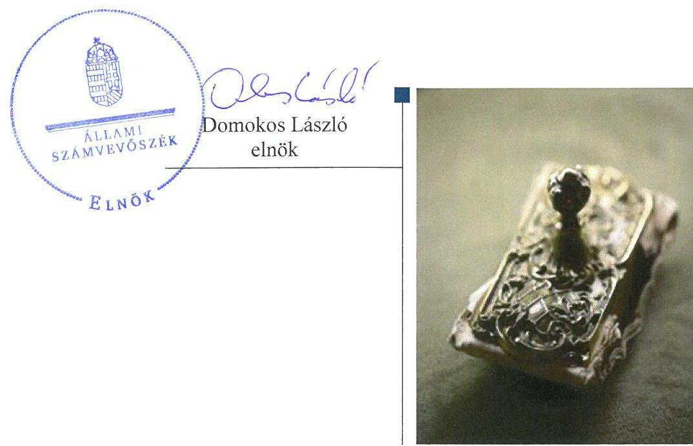
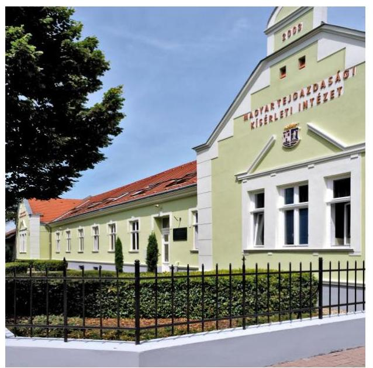
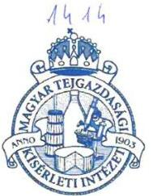
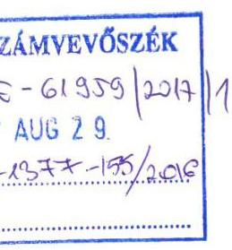
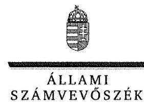
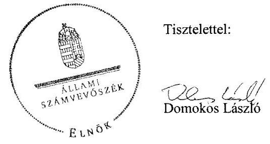
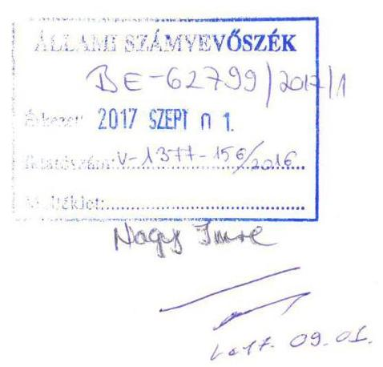
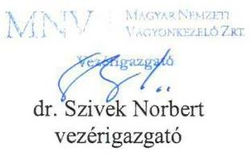
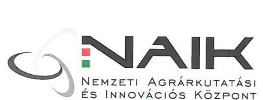
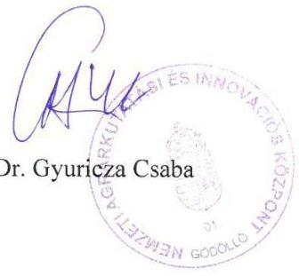

# Jelentés 

## Állami tulajdonú gazdasági társaságok

Az állami tulajdonban (résztulajdonban) lévő gazdálkodó szervezetek vagyonmegőrzési és gazdálkodási tevékenységének ellenőrzése Magyar Tejgazdasági Kísérleti Intézet Kft.
2017.

---

# Jellentés 

## Állami tulajdonú gazdasági társaságok

Az állami tulajdonban (résztulajdonban) lévő gazdálkodó szervezetek vagyonmegőrzési és gazdálkodási tevékenységének ellenőrzése Magyar Tejgazdasági Kísérleti Intézet Kft.
2017. Ataber hó 12 nap

---

# AZ ELLENŐRZÉST FELÜGYELTE:

DR. NAGY IMRE felügyeleti vezető

# AZ ELLENŐRZÉST VEZETTE ÉS A VÉGREHAJTÁSÁÉRT FELELŐS:

SALAMIN VIKTOR ellenőrzésvezető

# A PROGRAM ÖSSZEÁLLÍTÁSÁÉRT FELELŐS:

JANIK JÓZSEF osztályvezető

IKTATÓSZÁM: V-1377-163/2016.

TÉMASZÁM: 2411

ELLENŐRZÉS-AZONOSÍTÓ SZÁM: V075947

Jelentéseink az Országgyűlés számítógépes hálózatán és az Interneta a www.asz.hu címen is olvashatóak.

---

# TARTALOMJEGYZÉK 

■ ÖSSZEGZÉS ..... 5
■ AZ ELLENŐRZÉS CÉLJA ..... 6
■ AZ ELLENŐRZÉS TERÜLETE ..... 7
■ AZ ELLENŐRZÉS HÁTTERE, INDOKOLTSÁGA ..... 9
■ A JELENTÉS LÉNYEGES KÉRDÉSKÖREI ..... 10
■ ELLENŐRZÉS HATÓKÖRE ÉS MÓDSZEREI ..... 11
■ MEGÁLLAPÍTÁSOK ..... 13
■ JAVASLATOK ..... 18
■ MELLÉKLETEK ..... 19
I. sz. melléklet: Értelmező szótár ..... 19
II. sz. melléklet: A Társaság főbb mérleg adatai (M Ft) ..... 23
■ FÜGGELÉK: ÉSZREVÉTELEK ..... 25
■ RÖVIDÍTÉSEK JEGYZÉKE ..... 35

---

.

---

# ÖSSZEGZÉS 

A tulajdonosi jogokat a Magyar Nemzeti Vagyonkezelő Zrt., az ATEV Fehérjefeldolgozó Zrt. és a Nemzeti Agrárkutatási és Innovációs Központ szabályszerüen gyakorolták. A Magyar Tejgazdasági Kísérleti Intézet Kft. szabályozottsága, bevételei és ráfordításai, valamint a beruházások és felújitások elszámolása nem volt megfelelő, közzétételi kötelezettségének nem tett eleget, ezzel az átláthatóságot nem biztositotta. A vagyongazdálkodás összességében szabályszerü volt.

## Az ellenőrzés társadalmi indokoltsága

Az állami tulajdonú gazdálkodó szervezetek a nemzeti vagyon részét képezik. Az állami vagyon megőrzése, megóvása érdekében kiemelten fontos a vagyon átlátható, rendeltetésszerú és felelős felhasználásának biztosítása.

Az Állami Számvevőszék Stratégiájával összhangban ellenőrzésével hozzájárul a nemzeti vagyont használó gazdálkodó szervezetek tevékenységének átláthatóságához, elszámoltathatóságának javításához.

Az ellenőrzés eredményeképpen a jelentésben foglalt megállapítások és az ezek alapján megfogalmazott számvevőszéki javaslatok hasznosítása elősegítheti a feltárt hiányosságok orvoslását.

## Főbb megállapítások, következtetések, javaslatok

A Társaság részesedései felett az MNV Zrt., ATEV Zrt. és a NAIK tulajdonosi jogait szabályszerűen gyakorolta. Az MNV Zrt. kialakította a tulajdonosi jogok gyakorlásának rendjét, megalkotta a javadalmazási, juttatási rendszerről szóló szabályzatot és múködtette monitoring rendszerét.

A Társaság egyes belső szabályzatait hiányosan, illetve nem a jogszabályi előírásoknak megfelelően készítette el. Önköltség-számítási szabályzattal a jogszabályi előírás ellenére nem rendelkezett.

A Társaság pénzügyi-számviteli feladatainak ellátása összességében nem felelt meg az előírásoknak, a bevételek és ráfordítások, valamint a beruházások, felújítások elszámolása nem volt megfelelő. Az értékcsökkenés és személyi juttatások elszámolása megfelelt a jogszabályi és belső előírásoknak.

Éves beszámolóit a Társaság a 2012-2015. években a jogszabályban előírt határidőben elkészítette, azokat közzétette és letétbe helyezte. Tervezési, valamint ellenőrzési feladatait a tulajdonosi elvárásoknak megfelelően teljesítette, adatvédelmi és adatbiztonsági szabályzattal azonban nem rendelkezett, közzétételi kötelezettségének nem tett eleget.

A Társaság vagyongazdálkodása összességében szabályszerű volt, a vagyon változását eredményező döntések megfeleltek az előírásoknak.

---

# AZ ELLENŐRZÉS CÉLJA 

AZ ELLENŐRZÉS CÉLJA annak értékelése volt, hogy a tulajdonosi jogok gyakorlása szabályszerű volt-e; a gazdálkodó szervezet szabályozottsága, gazdálkodása és vagyongazdálkodási tevékenysége megfelelt-e a jogszabályi és a tulajdonosi előírásoknak; a vagyonváltozást eredményező döntések esetében a tulajdonosi jogok gyakorlója és a gazdálkodó szervezet szabályszerűen jár-tak-e el.

---

# AZ ELLENŐRZÉS TERÜLETE 

## A Magyar Tejgazdasági Kísérleti Intézet Kft. valamint tulajdonosi joggyakorlói, a Magyar Nemzeti Vagyonkezelö Zrt., az ATEV Fehérjefeldolgozó Zrt. és a Nemzeti Agrárkutatási és Innovációs Központ

A MAGYAR TEJGAZDASÁGI KÍSÉRLETI INTÉZET KFT.-t 1993. január 1-jén az Állami Vagyonkezelő Rt. alapította mosonmagyaróvári székhellyel. Az Állami Vagyonkezelő Rt. jogutódja 1992-től az Állami Privatizációs és Vagyonkezelő Rt., majd 2008-tól a Magyar Nemzeti Vagyonkezelő Zrt. lett.

A Társaság részesedése feletti tulajdonosi jogokat az állami vagyon felügyeletéért felelős miniszter gyakorolta, aki e feladatát az MNV Zrt. útján látta el.

Az MNV Zrt. a Társaság részesedései feletti tulajdonosi jogok gyakorlására 2013. június 26-án az ATEV Fehérjefeldolgozó Zrt.-vel, szeptember 9-én a Mezőgazdasági Biotechnológiai Kutatóközponttal (2014. január 1-jétől elnevezése Nemzeti Agrárkutatási és Innovációs Központ - NAIK) megbízási szerződést kötött. Az MNV Zrt. az ATEV Zrt.-vel a megbízási szerződést 2013. augusztus 12-én megszüntette, a NAIK esetében a tulajdonosi jogok gyakorlására vonatkozó meghatalmazást a 2014. és a 2015. évre is kiadta.

A Társaság alaptevékenysége élelmiszeripari kutatás-fejlesztés, főtevékenysége „Egyéb természettudományi, müszaki kutatás, fejlesztés." volt. A kutatás-fejlesztés célja olyan eredmények létrehozása volt, amelyek a magyar tejgazdaságon túl más iparágakban is értéket képviselnek, piacképesek és eladhatóak. A Társaság laboratóriumi kapacitásaira alapozva építette ki szolgáltatási tevékenységét, akkreditált laboratóriumaiban végezte a nyerstej minősítését, valamint élelmiszerek, gyógyszerek és állatgyógyá-szati-készítmények vizsgálatát. A Társaság tevékenysége 2003-tól kibővült tejhez köthető, az emberi szervezet számára kedvező élettani hatású étrend kiegészítők, gyógyszernek nem minősülő gyógyhatású készítmények és speciális tápszerek gyártásával és forgalmazásával. A Mezőgazdasági és Vidékfejlesztési Hivatallal kötött együttmüködési megállapodás alapján a Társaság 2011. november 1-jétől 2015. március 31-éig a tejkvóta rendszer müködtetésével kapcsolatos adminisztrációs feladatokat is végzett.

A Társaság által nyújtott szolgáltatások és értékesített termékek nem tartoztak a hatósági áras szolgáltatások körébe, közszolgáltatást nem végzett, közfeladatot nem látott el.

A Társaság jegyzett tőkéje 711,0 M Ft-ról 1100,0 M Ft-ra, mérlegfőöszszege 1274,6 M Ft-ról 1361,5 M Ft-ra, értékesítésének nettó árbevétele 1080,6 M Ft-ról 1210,0 M Ft-ra, átlagos állományi létszáma 78 föről 80 före nőtt a 2012-2015. évek között. A mérleg szerinti eredmény a 2014. év kivételével pozitív volt.

---

Az ügyvezető személye egy alkalommal változott, a jelenlegi ügyvezető 2012. május 16-ától látta el feladatait.

A Társaság kezelésében, használatában nemzeti vagyon nem volt, kapcsolt vállalkozásban lévő részesedéssel nem rendelkezett, kormányzati szektorba nem volt besorolva.

---

# AZ ELLENŐRZÉS HÁTTERE, INDOKOLTSÁGA 

AZ ÁLLAMI TULAJDONÚ GAZDÁLKODÓ SZERVEZETEK ellenőrzése kiemelten fontos a nemzeti vagyon megőrzése, megóvása érdekében. Gazdálkodásuk jellemzően a közérdeklődés és a média figyelmének középpontjában áll, amihez hozzájárul a gazdálkodásuk körébe tartozó - közvetlen vagy közvetett állami tulajdonú - vagyon nagysága, illetve az általuk ellátott közszolgáltatások minősége és hatékonysága. A szolgáltatási/közszolgáltatási árképzés megalapozottsága és az éves elszámoltatás feltételeinek kialakítása az ellenőrzés során nagy hangsúlyt kap. A szolgáltatás/közszolgáltatás árában és annak támogatásában meg kell jelennie az önköltségszámítás szempontjainak, amely biztosítja a müködés fenntarthatóságát (eszközpótlást) is. Az ellenőrzés rámutathat az állami tulajdonú gazdálkodó szervezetek gazdálkodási tevékenységével jó gyakorlatokra és szabálytalanságokra. Felhívhatja a figyelmet a jogszabályi követelmények teljesítéséhez szükséges feltételek hiányosságaira, hozzájárulhat az államháztartáson kívüli, de (közvetlenül vagy közvetve) állami vagyont használó gazdálkodó szervezetek tevékenységének átláthatóságához. Ellenőrzésünk eredményeképpen javaslatainkkal, megállapításainkkal hozzájárulhatunk a nemzeti vagyonnal való gazdálkodás átláthatóságának, elszámoltathatóságának javításához.

---

# A JELENTÉS LÉNYEGES KÉRDÉSKÖREI 

1.     - A tulajdonosi jogok gyakorlása szabályszerű volt-e?
2.     - A társaság müködésének szabályozottsága megfelelt-e az előírásoknak?
3.     - A társaságnál a pénzügyi-számviteli, adatszolgáltatási és ellenőrzési feladatok ellátása szabályszerű volt-e?
4.     - A társaság vagyongazdálkodása szabályszerű volt-e?

---

# ELLENŐRZÉS HATÓKÖRE ÉS MÓDSZEREI 

## Az ellenőrzés típusa

Megfelelőségi ellenőrzés.

## Az ellenőrzött időszak

Az ellenőrzött időszak 2012. január 1-jétől 2015. december 31-ig tartott.

## Az ellenőrzés tárgya

Állami tulajdonban (résztulajdonban) lévő gazdasági társaság gazdálkodása, kiemelten vagyongazdálkodási tevékenysége, a tulajdonosi jogok gyakorlása volt.

Az ellenőrzés kiterjedt minden olyan körülményre és adatra, amely az ÁSZ ${ }^{1}$ jogszabályban meghatározott feladatainak teljesítéséhez, valamint a program végrehajtása folyamán felmerült újabb összefüggések feltárásához szükséges volt.

## Az ellenőrzött szervezet

Magyar Tejgazdasági Kísérleti Intézet Kft., valamint a tulajdonosi jogokat gyakorló Magyar Nemzeti Vagyonkezelő Zrt., ATEV Fehérjefeldolgozó Zrt. és Nemzeti Agrárkutatási és Innovációs Központ.

## Az ellenőrzés jogalapja

Az ellenőrzés jogalapját az ÁSZ tv. ${ }^{2}$ 1. § (3) bekezdése és 5. § (3)-(5) bekezdése képezte.

## Az ellenőrzés módszerei

Az ellenőrzést a nemzetközi standardokat irányadónak tekintve az ellenőrzési program ellenőrzési kérdései, az ellenőrzött időszakban hatályos jogszabályok, az ellenőrzés szakmai szabályok és módszertanok figyelembe vételével végeztük.

Az ellenőrzés ideje alatt az ellenőrzött szervezettel történő kapcsolattartást az ÁSZ Szervezeti és Múködési Szabályzatának vonatkozó előírásai alapján biztosítottuk.

---

Az ellenőrzésre a nemzetgazdasági szempontból kiemelt jelentőségű nemzeti vagyon körébe tartozó gazdálkodó szervezeteknél és a többségi állami tulajdonban álló gazdálkodó szervezeteknél került sor. A program szerinti feladatokat a kiválasztott gazdálkodó szervezeteknél (társaságoknál) és azok többségi tulajdonban lévő leányvállalatainál, valamint a tulajdonosi jogok gyakorlójánál kellett végrehajtani. Az ellenőrzés szempontjai és az ellenőrzés alá vont gazdálkodó szervezetek köre az ellenőrzés tapasztalatai alapján - indokolt esetben - változhat. Az ellenőrzési kérdések megválaszolásához szükséges bizonyítékok megszerzése a következő ellenőrzési eljárások alkalmazásával történt: megfigyelés, kérdésfeltevés (információkérés), összehasonlítás, valamint elemző eljárás. Az ellenőrzési bizonyítékként felhasználható adatforrások közé tartoznak egyrészt az ellenőrzési programban felsorolt adatforrások, másrészt adatforrás lehetett még minden - az ellenőrzés folyamán - feltárt, az ellenőrzés szempontjából információkat tartalmazó dokumentum.

Az ellenőrzést a kérdésekre adott válaszok kiértékelésével, valamint a megjelölt adatforrások, a csatolt tanúsítványok felhasználásával, továbbá az adott időszakban hatályos jogszabályok figyelembe vételével folytattuk le.

A bevételek és ráfordítások elszámolása, valamint a vagyonnyilvántartás terén, a szabályszerű működést véletlen mintavétellel és irányított kiválasztással ellenőriztük. A mintatételek értékelése alapján egyrészt a sokaságban előforduló hibás tételek arányát becsültük, másrészt az irányítottan kiválasztott tételeket értékeltük. A jogszabályoknak és a belső előírásoknak megfelelőnek, azaz szabályszerűnek tekintettük az adott területet, amennyiben a minta ellenőrzésének eredménye alapján 95\%-os bizonyossággal a teljes sokaságban a hibaarány kisebb volt, mint 10\%, nem megfelelőnek értékeltük, ha a hibaarány a 10\%-ot meghaladta. A ráfordítások elszámolására és a vagyonnyilvántartásra vonatkozó véletlen mintavételt kockázati alapú kiválasztással egészítettük ki, amelynek során évente a három legnagyobb összegű tételt választottuk ki.

---

# 1. A tulajdonosi jogok gyakorlása szabályszerű volt-e? 

Összegző megállapítás

A tulajdonosi jogok gyakorlása szabályszerű volt.

A TULAJDONOSI JOGGYAKORLÁS RENDJÉT az MNV Zrt. ${ }^{3}$ a Gt. ${ }^{4}$, a Ptk.2. ${ }^{5}$, az Nvtv. ${ }^{6}$ és a Vtv. előírásainak megfelelően SZMSZ ${ }^{7}$-ében, vezérigazgatói utasításokban, valamint az Alapító Okirat ${ }^{8}$ ban rögzítette. Az MNV Zrt. kiadta tervezési irányelv ${ }_{1,2,3,4}{ }^{9}$-eit a portfóliójába tartozó gazdasági társaságok éves üzleti tervének tartalmi elemeire vonatkozóan. Tulajdonosi ellenőrzési szabályzat ${ }_{1,2}{ }^{10}$-ában az MNV Zrt. előírta az $\mathrm{FB}^{11} \mathrm{Gt}$. és $\mathrm{Ptk}_{.2}$ előírásai szerinti jelentéstételi kötelezettségét.

A TULAJDONOSI JOGOKAT az MNV Zrt. Igazgatósága és vezérigazgatója az SZMSZ-ben és az Alapító Okiratban foglaltaknak megfelelően, szabályszerűen gyakorolta. Az ATEV Zrt. és a NAIK a megbízási szerződés ${ }_{1,2}{ }^{12}$-ben foglaltak szerint gyakorolta tulajdonosi jogait. A tulajdonosi joggyakorlás az FB és a könyvvizsgáló tevékenységéhez kapcsolódóan szabályszerű volt. Az FB a Gt. 34. § (1) bekezdésében és a Ptk. 2 3:121 § (1) bekezdésében előírtak szerint három főből állt. Az MNV Zrt. a megbízási szerződés ${ }_{1,2}$-ben foglaltak alapján az FB egy tagját delegálta. A könyvvizsgálót a Gt. 19. § (4) bekezdése, illetve a Ptk. 2 3:130. §-ának megfelelően megválasztották.

## A GAZDÁLKODÁSRÓL ÉS A FELADATELLÁTÁSRÓL a 2012. évet érintően az MNV Zrt., a 2013-2015. éveket érintően az MNV Zrt. és a NAIK a Gt., Ptk.2, Alapító Okirat és a megbízási szerződés2 előírásai szerint beszámoltatta a Társaságot ${ }^{13}$. Az MNV Zrt. kialakította és müködtette monitoring rendszerét, az ATEV Zrt. és a NAIK a megbízási szerződés ${ }_{1,2}$ szerint közremüködött a kontrolling adatszolgáltatásban.

ÜZLETI TERV készítésének kötelezettségét az Alapító Okiratban és a tervezési irányelv ${ }_{1,2,3,4}$-ben előírták. A Társaság által elkészített 20122013. évi üzleti tervet a Gt. 19. § (3) bekezdése szerint az MNV Zrt. határozatával ${ }^{14}$ jóváhagyta. A 2014-2015. évre vonatkozó üzleti tervet a Ptk. 2 3:109. § (2) bekezdése és a megbízási szerződés2 alapján a NAIK hagyta jóvá határozatával ${ }^{15}$.

A TÁRSASÁG ÉVES EREDMÉNYÉNEK eredménytartalékban történő elhelyezéséről a 2012. évet érintően az MNV Zrt. a Gt. 141. § (2) bekezdése, a 2013-2015. évek tekintetében a NAIK a Gt. 141. § (2) bekezdése, illetve a Ptk. 2 3:109. § (2) bekezdése alapján döntött a Számv. tv. ${ }^{16}$ 19. § (1) szerinti éves beszámoló jóváhagyásakor. Döntését - a Gt., illetve a Ptk. 2 előírása szerint - a könyvvizsgáló, valamint az FB véleményének birtokában hozta.

---

A JEGYZETT TÖKE 711,0 M Ft-ról 1100,0 M Ft-ra (389,0 M Fttal) nőtt a 2015. évben a Társaság eredménytartaléka terhére. A tőkeemelés a Ptk.-ban foglaltaknak megfelelt. A NAIK 2014. december 8-án - a megbízási szerződés2-ben rögzítetteknek megfelelően - a tőkeemeléshez kikérte az MNV Zrt. előzetes hozzájárulását, amely arról a Ptk. ${ }_{2}$ 3:201. § (1) bekezdése, az Alapító Okirat és a SZMSZ előírása szerint döntött. A saját tőke és jegyzett tőke arányának Gt.-ben, illetve Ptk. ${ }_{2}$-ben előírt szintje biztosított volt a 2012-2015. években.

A JAVADALMAZÁSI SZABÁLYZAT ${ }^{17}$-ot a Társaság legfőbb szerve a Taktv. ${ }^{18}$ 5.§ (3) bekezdésében foglaltak szerint megalkotta és határozattal jóváhagyta.

# 2. A társaság múködésének szabályozottsága megfelelt-e az előírásoknak? 

Összegző megállapítás

A Társaság múködésének szabályozottsága nem felelt meg a jogszabályi előírásoknak. A Társaság egyes belső szabályzatait késve, illetve hiányosan készítette el, önköltség-számítási szabályzattal nem rendelkezett.

SZÁMVITELI POLITIKÁVAL a Társaság 2012. évre vonatkozóan nem rendelkezett, megsértve ezzel a Számv. tv. 14. § (3)-(4) bekezdéseit. A 2013. január 1-jétől, illetve 2015. január 1-jétől hatályos Számviteli politika ${ }^{19}{ }_{2}{ }^{20}$ a Számv. tv. előírásainak megfelelt.

A Társaság eszközök és források leltárkészítési és leltározási szabályzatával, valamint értékelési szabályzattal a Számv. tv. előírásainak megfelelően rendelkezett. A pénzkezelési szabályzat ${ }_{1}{ }^{21}{ }_{2}{ }^{22}$ a Számv. tv. 14. § (8) bekezdése előírásának megfelelt.

ÖNKÖLTSÉG-SZÁMÍTÁSI SZABÁLYZATTAL a Társaság a Számv. tv. 14. § (7) bekezdésében foglaltak ellenére nem rendelkezett. A Társaság éves beszámolóinak adatai alapján a költségnemek szerinti költségek együttes összege az 500,0 M Ft-ot meghaladta a 2012-2015. évben, ezért szabályzat készítésére kötelezett volt.

SZÁMLARENDDEL a Társaság a 2012. január 1. és 2015. május 6. közötti időszakban nem rendelkezett, ezzel megsértette a Számv. tv. 161. § (1)-(2) bekezdéseiben foglaltakat. A 2015. május 7-étől hatályos Számlarend ${ }^{23}$ a Számv. tv. 161. § (2) bekezdés a) pontjának előírása ellenére nem tartalmazta minden alkalmazásra kijelölt számla számjelét és megnevezését.

KÉPVISELETI JOGKÖRÖKKEL kapcsolatos előírását a Társaság SZMSZ ${ }_{1}{ }^{24}{ }_{2}{ }^{25}$-ében és a Képviseleti, kötelezettségvállalási, utalványozási és engedélyezési jog szabályzat ${ }_{1}{ }^{26}{ }_{2}{ }^{27}$-ában rögzítette, amely az ügyvezető hatáskörébe utalta a szerződések kötését és a nettó 0,5 M Ft vagy azt meghaladó megrendelések kötelezettségvállalását.

---

# 3. A társaságnál a pénzügyi-számviteli, adatszolgáltatási és ellenőrzési feladatok ellátása szabályszerű volt-e? 

Összegző megállapítás

### 3.1. számú megállapítás

1. táblázat

KÖVETELÉSÁLLOMÁNY ALAKULÁSA (ADATOK M FT-BAN)

| Vevőkövetelés | 2012 | 2013 | 2014 | 2015 |
| :--: | :--: | :--: | :--: | :--: |
| Összes | 129,1 | 191,2 | 168,5 | 189,9 |
| - határidőn   belüli | 62,6 | 122,7 | 110,1 | 126,2 |
| - határidőn   túli | 66,5 | 68,5 | 58,4 | 63,7 |

A Társaság pénzügyi-számviteli feladatainak ellátása nem felelt meg az előírásoknak, tervezési, adatszolgáltatási valamint ellenőrzési feladatait a tulajdonosi elvárásoknak megfelelően teljesítette. Közzétételi kötelezettségének nem tett eleget.

A bevételek és ráfordítások elszámolása, a vagyon nyilvántartása nem volt megfelelő. Az értékcsökkenés és a személyi juttatások elszámolása megfelelt a Társaság belső szabályzatainak és a jogszabályi előírásoknak.

AZ ÉRTÉKESÍTÉS NETTÓ ÁRBEVÉTELÉNEK ÉS AZ ANYAGJELLEGŰ ÉS EGYÉB RÁFORDÍTÁSAINAK elszámolása nem volt megfelelő. Egyes könyvviteli elszámolást alátámasztó bizonylatok a könyvelés módjára, az érintett könyvviteli számlákra történő hivatkozás tekintetében nem feleltek meg a Számv. tv. 167. § (1) bekezdés h) pontjában foglalt előírásoknak.

A SZEMÉLYI JELLEGŰ RÁFORDÍTÁSOK elszámolása megfelelő volt. A személyi jellegű ráfordítások kifizetését munkaszerződéssel, munkaidő elszámolással alátámasztották. A számfejtett bruttó bér öszszege megfelelt a munkaszerződésben foglaltaknak.

A BERUHÁZÁSOK, FELÚJÍTÁSOK elszámolása nem volt megfelelő. Egyes könyvviteli elszámolást alátámasztó bizonylatok a könyvelés módjára, az érintett könyvviteli számlákra történő hivatkozás tekintetében nem feleltek meg a Számv. tv. 167. § (1) bekezdés h) pontjában foglalt előírásoknak. Előfordult, hogy az eszköz besorolása nem volt szabályszerű, mivel vagyoni értékű jogot a szellemi termékek közé sorolta be a Társaság, ezzel nem tett eleget a Számv. tv. 25. § (6) bekezdésében foglaltaknak.

AZ ÉRTÉKCSÖKKENÉS elszámolása megfelelő volt. Terven felüli értékcsökkenést a 2012-2013. és a 2015. évben számolt el a Társaság a Számv. tv. előírásainak megfelelően.

A KÖVETELÉSÁLLOMÁNY csökkentése érdekében a Társaság intézkedett, fizetési és ügyvédi felszólításokat küldött, illetve benyújtotta hitelezői igényét. A Társaság határidőn túli vevőköveteléseinek állománya 2,8 M Ft-tal csökkent a 2015. év végére a 2012. év végéhez képest. A követelésállomány alakulását az 1. táblázat mutatja be.

---

# 3.2. számú megállapítás 

A Társaság a tulajdonosi elvárások és belső előírásai szerint teljesítette tervezési, beszámolási kötelezettségét, közzétételi kötelezettségének azonban nem tett eleget.

TERVEZÉSI FELADATAIT a Társaság a tulajdonosi elvárásoknak megfelelően, az Alapító Okirat és a tervezési irányelv ${ }_{1,2,3,4}$ elöírásai szerint teljesítette.

ÉVES BESZÁMOLÓJÁT a Társaság a Számv. tv. 19. § (1) bekezdése szerint elkészítette és jóváhagyásra benyújtotta. Az MNV Zrt. a 2012. évi, a NAIK a 2013-2015. évi beszámolót határozatával elfogadta, döntése előtt az FB és a könyvvizsgáló véleményét megismerte. A könyvvizsgáló hitelesítő záradékkal látta el a beszámolókat, megállapítást nem tett. Közzétételi, letétbe helyezési kötelezettségét a Számv. tv. 153. § (1) bekezdése szerinti határidőre, a 154. § (7) bekezdésében előírtak szerint a Társaság teljesítette.

KÖZZÉTÉTELI KÖTELEZETTSÉGÉNEK a Társaság nem tett eleget, ezzel megsértette a Taktv. 2. § (1) bekezdésének a)-dc) előírásait. A közérdekú adatok közzétételére vonatkozó szabályzattal a 2012. január 1. és 2013. január 7. közötti időszakban nem rendelkezett a Társaság, megsértve ezzel az Infotv. 35. § (3) bekezdésében foglaltakat. A Társaság adatvédelmi és adatbiztonsági szabályzatot az Infotv. 24 § (3) bekezdésének előírása ellenére nem készített.
3.3. számú megállapítás

A Társaság belső ellenőrzés múködtetésére nem volt kötelezett, külső szakértők bevonásával világíttatta át múködését.

BELSŐ ELLENŐRZÉS múködtetésére a Társaság nem volt kötelezett. Az FB a 2012. évben elrendelte a Társaság teljes körú átvilágítását, melynek külső szakértő bevonásával eleget tett és javaslatait hasznosította. A termékei forgalmazásához kapcsolódó ellenőrzés alapján a Társaság átszervezte értékesítési folyamatait és integrált rendszert vezetett be. Ügyvédi iroda által végzett jogi és gazdasági átvilágítás szabálytalanságot nem tárt fel.

## 4. A társaság vagyongazdálkodása szabályszerű volt-e?

Összegző megállapítás
A Társaság vagyongazdálkodása összességében szabályszerű volt.

### 4.1. számú megállapítás

A Társaság szabályozta a vagyongazdálkodáshoz kapcsolódó fel-adat- és hatásköröket, éves beruházási terveit elkészítette.

BERUHÁZÁSI-FEJLESZTÉSI TERVEIT a Társaság éves üzleti terveinek részeként az MNV Zrt., illetve NAIK határozatával jóváhagyta.

---

# A VAGYONGAZDÁLKODÁS FELADAT- ÉS HATÁSKÖREIT a Társaság SZMSZ1,2-ében, valamint a Képviseleti, kötelezettségvállalási, utalványozási és engedélyezési jog szabályzat ${ }_{1,2}$-ban szabályozta. 

4.2. számú megállapítás

## 4.3. számú megállapítás

2. táblázat

A TÁRSASÁG ESZKÖZEINEK ÁTLAGOS ÉLETKORA (ÉV)

|  | 2012 | 2013 | 2014 | 2015 |
| :--: | :--: | :--: | :--: | :--: |
| Ingatlanok   Szám.tech-   nikai eszk. | 6,0 | 6,5 | 7,1 | 7,6 |
| Gépek, be-   rendezések | 2,4 | 2,5 | 2,3 | 2,5 |
| Jármúvek | 6,1 | 6,3 | 5,7 | 5,8 |
|  | 2,9 | 2,2 | 2,1 | 2,7 |
|  | Forrás: A Társaság adatszolgáltatása |  |  |  |

4.4. számú megállapítás

A Társaság a 2013-2015. évi beszámolóit leltárral alátámasztotta, azonban a 2012. évben nem végzett az előírásoknak megfelelő leltározást.

LELTÁRRAL a Társaság a 2013-2015. évi beszámolóit az előírásoknak megfelelően alátámasztotta. A Társaság a 2012. évben leltározási jegyzőkönyvet nem készített, a készletek kivételével leltározást nem végzett, ezzel nem tett eleget a Számv. tv. 69. § (1) bekezdésében és az Eszközök, források leltározási szabályzata ${ }^{28} 1.1 .6$ pontjában foglaltakat.

A Társaság eszközei értékének, állagának megőrzéséről gondoskodott.

A TÁRSASÁG ÖSSZES VAGYONA 86,9 M Ft-tal (6,8\%-kal) nőtt 2015. év végére a 2012. évhez képest. Jelentős változás az immateriális javak eszközcsoportban történt, azon belül az alapítás és átszervezés aktivált értéke növekedett jelentős mértékben.

Összességében a Társaság saját tulajdonú eszközeinek pótlására fordított összeg meghaladta az elszámolt értékcsökkenés összegét a 20122015. években.

A Társaság eszközeinek átlagos életkorát a 2. táblázat mutatja be.

## A Társaságnál a saját vagyon változását eredményező döntések megfeleltek az előírásoknak.

A VAGYONNAL KAPCSOLATOS DÖNTÉSEK során a Társaság betartotta az Alapító Okirat, a megbízási szerződés ${ }_{1,2}$ és a tervezési irányelv ${ }_{1,2,3,4}$ elöírását. Az Alapító Okirat és a megbízási szerződés ${ }_{1}$ előírása szerint a Társaság kikérte törzstőkéjének egynegyedét meghaladó értékű ügyben a tulajdonosi jogokat gyakorló hozzájárulását, melyet az ATEV Zrt. határozat ${ }^{29}$-val jóváhagyott.

A Társaság a tőkeemelés fedezetének igazolására a Ptk. 2 3:201. § (1) bekezdése szerint 2014. szeptember 30-i fordulónappal elkészítette közbenső mérlegét, melyet a könyvvizsgáló véleményezett.

---

# JAVASLATOK 

Az ÁSZ tv. 33. § (1) bekezdésében foglaltak értelmében az ellenőrzött szervezet vezetője köteles a jelentésben foglalt megállapításokhoz kapcsolódó intézkedési tervet összeállítani és azt a jelentés kézhezvételétől számított 30 napon belül az ÁSZ részére megküldeni. Amennyiben az ellenőrzött szervezet vezetője nem küldi meg határidőben az intézkedési tervet, vagy továbbra sem elfogadható intézkedési tervet küld, az Állami Számvevőszék elnöke az ÁSZ tv. 33. § (3) bekezdése a) és b) pontjaiban foglaltakat érvényesítheti.

## A Magyar Tejgazdasági Kísérleti Intézet Kft.   Ügyvezetőjének

1. Intézkedjen az önköltségszámítási szabályzat elkészítéséről a jogszabályi rendelkezésnek megfelelően.
(2. sz. megállapítás 3. bekezdése alapján)
2. Intézkedjen, hogy a számlarend tartalmazza minden alkalmazásra kijelölt számla számjelét és megnevezését.
(2. sz. megállapítás 4. bekezdés 2. mondata alapján)
3. Intézkedjen a számviteli elszámolások szabályszerű végrehajtására, ezen belül az értékesítés nettó árbevétele, az anyagjellegú és egyéb ráfordítások, valamint a beruházások, felújítások elszámolása tekintetében a jogszabályi előírások betartására.
(3.1 sz. megállapítás 1. bekezdés és 3. bekezdés 1-2. mondatai alapján)
4. Intézkedjen annak érdekében, hogy a Társaság a jogszabályban foglalt közzétételi kötelezettségének eleget tegyen.
(3.2 sz. megállapítás 3. bekezdése 1. mondata alapján)
5. Intézkedjen az adatvédelmi és adatbiztonsági szabályzat elkészítéséről.
(3.2 sz. megállapítás 3. bekezdése 3. mondata alapján)

---

# MELLÉKLETEK 

## I. SZ. MELLÉKLET: ÉRTELMEZŐ SZÓTÁR

állami vagyon
a) Az állam tulajdonában lévő dolog, valamint a dolog módjára hasznosítható természeti erő,
b) az a) pont hatálya alá nem tartozó mindazon vagyon, amely vonatkozásában törvény az állam kizárólagos tulajdonjogát nevesíti,
c) az állam tulajdonában lévő tagsági jogviszonyt megtestesítő értékpapír, illetve az államot megillető egyéb társasági részesedés,
d) az államot megillető olyan immateriális, vagyoni értékkel rendelkező jogosultság, amelyet jogszabály vagyoni értékű jogként nevesít.
Forrás: Vtv. 1. § (2) bekezdése
2012. november 10-től az állami vagyon fogalma kiegészül a következő ponttal:
e) az állam tulajdonában lévő pénzügyi eszközök

Forrás: Vtv. 1. § (2) bekezdése
2013. június 27-ig:

Az állami vagyont az MNV Zrt. maga kezeli, vagy szerződés - így különösen bérlet, haszonbérlet, megbízás - alapján központi költségvetési szervnek, természetes vagy jogi személynek, vagy jogi személyiséggel nem rendelkező gazdálkodó szervezetnek hasznosításra átengedi.
Forrás: Vtv. 23. § (1) bekezdése
2013. június 28-ától:

Az állami vagyonnal az MNV Zrt. maga gazdálkodik, vagy szerződés - így különösen bérlet, haszonbérlet, megbízás - alapján központi költségvetési szervnek, természetes vagy jogi személynek, vagy jogi személyiséggel nem rendelkező gazdálkodó szervezetnek hasznosításra átengedi, illetőleg vagyonkezelésbe, haszonélvezetbe adja.
Forrás: Vtv. 23. § (1) bekezdése
A Ptk. 3:88. § (1) bekezdése szerint „a gazdasági társaságok üzletszerű közös gazdasági tevékenység folytatására, a tagok vagyoni hozzájárulásával létrehozott, jogi személyiséggel rendelkező vállalkozások, amelyekben a tagok a nyereségből közösen részesednek, és a veszteséget közösen viselik".
a) az állami vagyon használatására kötött szerződések elsődleges célja az állami vagyon hatékony működtetése, állagának védelme, értékének megőrzése, illetve gyarapítása, az állami és közfeladatok ellátásának elősegítése.
Forrás: Vtv. 23. § (2) bekezdése
2014. március 14-ig:

A Ptk. ${ }^{30}$ 685. § c) pontja szerint gazdálkodó szervezet: „az állami vállalat, az egyéb állami gazdálkodó szerv, a szövetkezet, a lakásszövetkezet, az európai szövetkezet, a gazdasági társaság, az európai részvénytársaság, az egyesülés, az európai gazdasági egyesülés, az európai területi együttműködési csoportosulás, az egyes jogi személyek vállalata, a leányvállalat, a vízgazdálkodási társulat, az erdő birtokossági társulat, a végrehajtói iroda, az egyéni cég, továbbá az egyéni vállalkozó."
2014. március 15 -től:

A gazdasági társaság, az európai részvénytársaság, az egyesülés, az európai gazdasági egyesülés, az európai területi együttműködési csoportosulás, a szövetkezet, a lakásszövetkezet, az európai szövetkezet, a vízgazdálkodási társulat, az erdőbirtokossági

---

kapcsolt vállalkozás
kormányzati szektorba sorolt egyéb szervezet

MNV Zrt.
nemzeti vagyon
társulat, az állami vállalat, az egyéb állami gazdálkodó szerv, az egyes jogi személyek vállalata, a közös vállalat, a végrehajtói iroda, a közjegyzői iroda, az ügyvédi iroda, a szabadalmi ügyvivői iroda, az önkéntes kölcsönös biztosító pénztár, a magánnyugdíjpénztár, az egyéni cég, továbbá az egyéni vállalkozó. Az állam, a helyi önkormányzat, a költségvetési szerv, az egyesület, a köztestület, valamint az alapítvány gazdálkodó tevékenységével összefüggő polgári jogi kapcsolataira is a gazdálkodó szervezetre vonatkozó rendelkezéseket kell alkalmazni.
Forrás: Ppt ${ }^{31}$. 396. §
Az anyavállalat és a leányvállalat és a közös vezetésű vállalkozások (fölérendelt anyavállalat esetében a minősítést a fölérendelt anyavállalat szempontjából kell elvégezni)
Forrás: Számv. tv. 3. § (2) 7. pont
Az a szervezet, amely az Áht. alapján nem része az államháztartásnak, azonban az Európai Közösséget létrehozó szerződéshez csatolt, a túlzott hiány esetén követendő eljárásról szóló jegyzőkönyv alkalmazásáról szóló 2009. május 25-i 479/2009/EK rendelet szerint a kormányzati szektorba tartozik. A nemzetgazdasági miniszter 2013. június 26-án megjelent Közleményben tette közé ezen szervezetek listáját
Az állami vagyon felett, a Magyar Államot megillető tulajdonosi jogok és kötelezettségek összességét - a hatályos szabályozás szerint - az állami vagyon felügyeletéért felelős miniszter (jelenleg a nemzeti fejlesztési miniszter) gyakorolja. A miniszter feladatát nagy részben az MNV Zrt., mint tulajdonosi joggyakorló szervezet útján látja el.
a) az állam vagy a helyi önkormányzat kizárólagos tulajdonában álló dolgok,
b) az a) pont hatálya alá nem tartozó, állam vagy a helyi önkormányzat tulajdonában lévő dolog,
c) az állam vagy a helyi önkormányzatot tulajdonában lévő pénzügyi eszközök, továbbá az államot vagy a helyi önkormányzatot megillető társasági részesedések,
d) az államot vagy a helyi önkormányzatot megillető bármely vagyoni értékkel rendelkező jogosultság, amelyet jogszabály vagyoni értékű jogként nevesít,
e) Magyarország határa által körbezárt terület feletti légtér,
f) az üvegházhatású gázok kibocsátási egységeinek kereskedelméről szóló törvény szerint kibocsátási egység és légiközlekedési kibocsátási egység, valamint az ENSZ Éghajlatváltozási Keretegyezménye és annak Kiotói Jegyzőkönyve végrehajtási keretrendszeréről szóló törvény szerinti kiotói egység,
g) állami vagy helyi önkormányzati fenntartású közgyűjtemény (muzeális intézmény, levéltár, közgyűjteményként működő kép- és hangarchívum, valamint könyvtár) saját gyűjteményében nyilvántartott kulturális javak körébe tartozó dolog, kivéve, ha az állami vagy önkormányzati tulajdon jogszerű létrejötte kétséget kizáró módon nem bizonyítható és a dologra nézve más a tulajdonjogát bizonyítja vagy a kulturális javakra vonatkozó jogszabályokban meghatározott eljárás keretében valószínűsíti (g. pont módosult 2013. december 7-től),
h) a régészeti lelet,
i) a nemzeti adatvagyon körébe tartozó állami nyilvántartások fokozottabb védelméről szóló törvény szerinti nemzeti adatvagyon.
Forrás: Nvtv. 1. § (2)
A tulajdonosi joggyakorló vagy a nemzeti vagyon használója által a nemzeti vagyon
bírtoklásának, használatának, hasznok szedése jogának bármely - a tulajdonjog átruházását nem eredményező - jogcímen történő átengedése, ide nem értve a vagyonkezelésbe adást, valamint a haszonélvezeti jog alapítását.
Forrás: Nvtv. 3. § (1) 4. pont

---

rábízott vagyon

Tulajdonosi ellenőrzés
tulajdonosi jogok gyakorlója

Egyrészt minden a Vtv. alkalmazásában állami vagyonnak minősülő vagyon, amit az MNV Zrt. kezel és nyilvántart.
Másrészt az a vagyon, amely felett a Magyar Állam nevében az MFB Zrt. gyakorolja a tulajdonosi jogokat.
Forrás: MFB tv. 3. § (9)
A rábízott vagyon a tulajdonosi jogokat gyakorló szervezetek saját vagyonától elkülönítendő.
Forrás: Vtv. 22. § (6)
2014. március 14-ig:

Az állami vagyon kezelőjét, haszonélvezőjét, használóját megillető jogok gyakorlását, annak szabályszerűségét, célszerűségét az MNV Zrt. - szükség szerint területi szervei útján - ellenőrzi.

## 2014. március 15-től:

Az állami vagyon használóját, vagyonkezelőjét és haszonélvezőjét megillető jogok gyakorlását, annak szabályszerűségét, a kötelezettségek teljesítését, valamint a vagyon rendeltetése szerinti célszerűségét a tulajdonosi joggyakorló rendszeresen ellenőrzi.
Forrás: Vhr. 20. § (1)
1.
2013. június 27-ig:

Az állami vagyon felett a Magyar Államot megillető tulajdonosi jogok és kötelezettségek összességét - ha törvény eltérően nem rendelkezik - az állami vagyon felügyeletéért felelős miniszter (a továbbiakban: miniszter) gyakorolja, aki e feladatát a Magyar Nemzeti Vagyonkezelő Zártkörűen Működő Részvénytársaság (a továbbiakban: MNV Zrt.), a Magyar Fejlesztési Bank, illetve a tulajdonosi joggyakorló szervezet útján látja el. A miniszter miniszteri rendeletben, a törvényben meghatározott állami vagyoni kör tekintetében, meghatározott időtartamra, a joggyakorlás egyes szabályainak meghatározásával - az őt megillető tulajdonosi jogok és kötelezettségek összességének, illetve azok meghatározott részének gyakorlóját az Áht. szerinti központi költségvetési szervek, ezek intézménye, továbbá a 100\%-ban állami tulajdonban álló gazdasági társaságok közül kijelölheti.
Forrás: Vtv. 3. § (1) és (2)
2013. június 28-ától:

A rábízott állami vagyon felett az államot megillető tulajdonosi jogok és kötelezettségek összességét tulajdonosi joggyakorlóként:
a) ha törvény vagy miniszteri rendelet eltérően nem rendelkezik, a Magyar Nemzeti Vagyonkezelő Zártkörűen Működő Részvénytársaság (a továbbiakban: MNV Zrt.),
b) törvényben kijelölt személy vagy
c) az állami vagyon felügyeletéért felelős miniszter (a továbbiakban: miniszter) által rendeletben kijelölt személy gyakorolja.
[...] A miniszter e törvény felhatalmazása alapján - a meghatározott célok hatékonyabb elérése érdekében, miniszteri rendeletben, az ott meghatározott állami vagyoni kör tekintetében, meghatározott időtartamra - e törvény keretei között, a joggyakorlás egyes szabályainak meghatározásával - az államot megillető tulajdonosi jogok és kötelezettségek összességének, illetve azok meghatározott részének gyakorlóját az Áht. szerinti központi költségvetési szervek, ezek intézménye, továbbá a 100\%-ban állami tulajdonban álló gazdasági társaságok közül kijelölheti.
Forrás: Vtv. 3. § (1) és (2)

---

2. 

Aki a nemzeti vagyon felett az államot vagy a helyi önkormányzatot megillető tulajdonosi jogok és kötelezettségek összességének gyakorlására jogosult
Forrás: Nvtv. 3. § (1) 17. pontja

---

II. SZ. MELLÉKLET: A TÁRSASÁG FŐBB MÉRLEG ADATAI (M FT)

| Megnevezés | 2012-12-31. | 2013-12-31. | 2014-12-31. | 2015-12-31. |
| :-- | --: | --: | --: | --: |
| Befektetett eszközök | 566,5 | 604,0 | 695,2 | 824,2 |
| - ebből: Tárgyi eszközök | 550,9 | 518,5 | 621,4 | 684,0 |
| Forgóeszközök | 648,0 | 833,6 | 654,7 | 524,5 |
| - ebből: Követelések | 139,9 | 194,4 | 174,3 | 200,4 |
| Aktív időbeli elhatárolások | 60,1 | 40,6 | 7,6 | 12,8 |
| ESZKÖZÖK ÖSSZESEN | 1274,6 | 1478,2 | 1357,5 | 1361,5 |
| Saját tőke | 1146,9 | 1255,0 | 1210,9 | 1211,2 |
| - ebből: Jegyzett tőke | 711,0 | 711,0 | 711,0 | 1100,0 |
| - ebből: Mérleg szerinti eredmény | 67,3 | 108,1 | $-44,0$ | 0,3 |
| Céltartalékok | 2,1 | 0,0 | 22,0 | 0,0 |
| Kötelezettségek | 88,1 | 96,1 | 99,2 | 101,9 |
| Passzív időbeli elhatárolások | 37,5 | 127,1 | 25,4 | 48,4 |
| FORRÁSOK ÖSSZESEN | 1274,6 | 1478,2 | 1357,5 | 1361,5 |

---

.

---

# FÜGGELÉK: ÉSZREVÉTELEK 

A jelentéstervezetet a Számvevőszék 15 napos észrevételezésre megküldte az ellenőrzött szervezetek vezetőinek az ÁSZ tv. 29. §* (1) bekezdése előírásának megfelelően.

Az ÁSZ a jelentéstervezetet észrevételezésre megküldte Magyar Tejgazdasági Kísérleti Intézet Kft. ügyvezetőjének, a Magyar Nemzeti Vagyonkezelő Zrt. vezérigazgatójának, ATEV Fehérjefeldolgozó Zrt. vezérigazgatójának, valamint a Nemzeti Agrárkutatási és Innovációs Központ mb. föigazgatójának.
A Magyar Tejgazdasági Kísérleti Intézet Kft. ügyvezetőjének észrevételét és az arra adott választ, valamint a Magyar Nemzeti Vagyonkezelő Zrt. vezérigazgatójának és a Nemzeti Agrárkutatási és Innovációs Központ mb. föigazgatójának nemleges észrevételét a függelék alább tartalmazza. Az ATEV Fehérjefeldolgozó Zrt. vezérigazgatója az ÁSZ tv. 29. § (2) bekezdésében foglalt észrevételezési jogával nem élt, a törvényes határidőn belül észrevételt nem tett.

[^0]
[^0]:    * 29. § (1) Az Állami Számvevőszék az ellenőrzési megállapításait megküldi az ellenőrzött szervezet vezetőjének vagy az általa megbízott személynek, és annak, akinek személyes felelősségét állapította meg.
    (2) Az ellenőrzött szervezet vezetője és a felelősként megjelölt személy az ellenőrzés megállapításaira tizenöt napon belül írásban észrevételt tehet.
    (3) Az Állami Számvevőszék az észrevételre a beérkezésétől számított harminc napon belül írásban válaszol. A figyelembe nem vett észrevételeket köteles a jelentésben feltüntetni, és megindokolni, hogy azokat miért nem fogadta el.

---

# MAGYAR TEJGAZDASÁGI 

HUNGARIAN DAIRY RESEARCH INSTITUTE Ltd.

KísÉRLETI INTÉZET KFT.
UNGARISCHES MILCHFORSCHUNGSINSTITUT GmbH.

M17/003631.

Domokos László úr elnök részére

Állami Számvevőszék Budapest 4. Pf. 54. 1364

Tárgy: Számvevőszéki jelentéstervezet vonatkozásában tett észrevételek

Hivatkozási szám: V-1377-146/2016.

Tisztelt Elnök Úr!

Hivatkozva az „Állami tulajdonú gazdasági társaságok - Az állami tulajdonban (résztulajdonban) lévő gazdálkodó szervezetek vagyonmegőrzési és gazdálkodási tevékenységének ellenőrzése - Magyar Tejgazdasági Kísérleti Intézet Kft." című számvevőszéki jelentéstervezet (a továbbiakban: jelentéstervezet) megküldésére, mely postai úton 2017. augusztus 15-én érkezett meg a Magyar Tejgazdasági Kísérleti Intézet Kft. (a továbbiakban: MTKI Kft.) székhelyére, az abban foglalt megállapítások vonatkozásában az ÁSZ tv. 29. § (2) bekezdése szerint a jelentés lényeges kérdésköreinek tagolása szerint, alábontásokkal, a következő észrevételeket tesszük:

## 1. KÉRDÉSKÖR: A tulajdonosi jogok gyakorlása szabályszerű volt-e?

Az összegző megállapítást és annak részletezését elfogadjuk, észrevételt nem kívánunk tenni.
2. KÉRDÉSKÖR: A társaság múködésének szabályozottsága megfelelt-e az előírásoknak?

### 2.1 Számviteli politika

A jelentéstervezet részletezi, hogy „Számviteli politikával a Társaság 2012. évre vonatkozóan nem rendelkezett, megsértve ezzel a Számv. tv. 14. § (3)-(4) bekezdéseit."

A 2012. évre vonatkozó Számviteli Politikával kapcsolatban az alábbi észrevételt tesszük:
2017. április 7. napján M17/001594 iktatószámon az MTKI Kft. az Állami Számvevőszék felé kérelmet nyújtott be az eredeti dokumentumok befogadása iránt. A kérelem 1. pontjában kértük a 2012. január 1. napjától hatályos Számviteli Politika befogadását, az alábbi indoklással:

---

„Az MTKI Kft. a 2017. február 17. napján tartott helyszini ellenörzésen a 2012. január 1. napjától hatályos Számviteli Politikából eredetiben aláirt példányt nem tudott bemutatni, ezzel azt a látszatott keltve, hogy nem rendelkezett a dokumentummal.

Az MTKI Kft. az Állami Számvevőszék ellenőrzésének „Dokumentumbeküldés" szakaszában megküldte a 2012. augusztus 17-én kelt igazságügyi magánszakértői véleményt, mely az MTKI Kft. gazdálkodásának vizsgálatára vonatkozott. Ezen szakértői vélemény 4. oldalán olvasható, hogy a szakértő a 2012. január 1. napjától hatályos aláirt Számviteli Politikát átvette, tehát az MTKI Kft. rendelkezett eredetiben aláirt példánnyal.

Az Állami Számvevőszék általi ellenőrzés „Mintabeküldés" szakaszában az MTKI Kft. az irattárában történő dokumentumgyüjtések során fellelte az igazságügyi szakértő által visszaküldött dokumentumok között az eredetiben aláirt 2012. január 1. napjától hatályos Számviteli Politikát."

Az Állami Számvevőszék a 2017. július 7. napján kelt, V-1377-142/2016 iktatószámú levelében jelezte az MTKI Kft. felé, hogy ezen eredeti dokumentum befogadására az ellenőrzési eljárás keretében már nincs lehetőség.

# Az MTKI Kft. összegzése, észrevétele a 2012. évi Számviteli Politikára vonatkozóan: 

Álláspontunk szerint az MTKI Kft. nem sértette meg a Számv. tv. 14. § (3)-(4) bekezdéseit, mert - a 2012. augusztus 17. napján kelt igazságügyi magánszakértői jelentéssel is bizonyíthatóan - rendelkezett Számviteli Politikával a 2012. évre vonatkozóan. Azon tényállást azonban elfogadjuk, hogy az Állami Számvevőszék az adatszolgáltatás módját és határidejét rögzítő előírásai szerint a késedelmes megküldés miatt a dokumentumot nem fogadhatta be.

## 2.2 Önköltség-számítási szabályzat

A jelentéstervezet részletezi, hogy ,,önköltség-számítási szabályzattal a Társaság a Számv. tv. 14. § (7) bekezdésében foglaltak ellenére nem rendelkezett".

## Az önköltség-számítási szabályzattal kapcsolatban az alábbi észrevételt tesszük:

2017. április 7. napján M17/001594 iktatószámon az MTKI Kft. az Állami Számvevőszék felé kérelmet nyújtott be az eredeti dokumentumok befogadása iránt. A kérelem 2. pontjában kértük az önköltség-számítási szabályzat befogadását, az alábbi indoklással:
„Az MTKI Kft. a 2017. február 17. napján tartott helyszini ellenőrzésen a 2012. január 1. napjától hatályos önköltségszámítási szabályzatból eredetiben aláirt példányt nem tudott bemutatni, ezzel azt a látszatott keltve, hogy nem rendelkezett a dokumentummal.

Az MTKI Kft. az Állami Számvevőszék ellenőrzésének „Dokumentumbeküldés" szakaszában megküldte a 2012. augusztus 17-én kelt igazságügyi magánszakértői véleményt, mely az MTKI Kft. gazdálkodásának vizsgálatára vonatkozott. Ezen szakértői vélemény 8. oldalán olvasható, hogy a szakértő a 2012. január 1. napjától hatályos aláirt önköltségszámítási szabályzatot átvette, tehát az MTKI Kft. rendelkezett eredetiben aláirt példánnyal.

---

Az Állami Számvevőszék általi ellenőrzés „Mintabeküldés" szakaszában az MTKI Kft. az irattárában történő dokumentumgyüjtések során fellelte az igazságügyi szakértő által visszaküldött dokumentumok között az eredetiben aláirt 2012. január 1. napjától hatályos önköltségszámitási szabályzatot."

Az Állami Számvevőszék a 2017. július 7. napján kelt, V-1377-142/2016 iktatószámú levelében jelezte az MTKI Kft. felé, hogy ezen eredeti dokumentum befogadására az ellenőrzési eljárás keretében már nincs lehetőség.

# Az MTKI Kft. összegzése, észrevétele az önköltség-számitási szabályzatra vonatkozóan: 

Álláspontunk szerint az MTKI Kft. nem sértette meg a Számv. tv. 14. § (7) bekezdését, mert a 2012. augusztus 17. napján kelt igazságügyi magánszakértői jelentéssel is bizonyíthatóan rendelkezett önköltség-számitási szabályzattal. Azon tényállást azonban elfogadjuk, hogy az Állami Számvevőszék az adatszolgáltatás módját és határidejét rögzítő előírásai szerint a késedelmes megküldés miatt a dokumentumot nem fogadhatta be.

### 2.3 Számlarendre és képviseleti jogkörre vonatkozó észrevételek

A megállapításokat elfogadjuk, észrevételt nem kívánunk tenni.

## 3. KÉRDÉSKÖR: A társaságnál a pénzügyi-számviteli, adatszolgáltatási és ellenőrzési feladatok ellátása szabályszerű volt-e?

### 3.1. számú megállapítás

A jelentéstervezet szerint „a bevételek és ráfordítások elszámolása, a vagyon nyilvántartása nem volt megfelelő".

A részletezésben az értékesítés nettó árbevételénél, az anyagjellegủ ráfordításoknál, a beruházásoknál és a felújításoknál „egyes könyvviteli elszámolást alátámasztó bizonylatok nem feleltek meg a Számv. tv. 167. § (1) bekezdés h) pontjában foglalt elöírásoknak".

Szeretnénk jelezni, hogy az „egyes könyvviteli elszámolást alátámasztó bizonylatok" megfogalmazás nem teszi lehetővé, hogy érdemben tegyen az MTKI Kft. észrevételt. Ezúton kérjük, hogy legyenek szívesek megadni a kifogásolt bizonylatok listáját, hogy az érdemi észrevételeket megtehessük.

A személyi jellegű ráfordítások, az értékcsökkenés és a követelésállomány tekintetében a megállapításokat elfogadjuk, észrevételt nem kívánunk tenni.

### 3.2. számú megállapítás

A megállapításokat elfogadjuk, észrevételt nem kívánunk tenni.

### 3.3. számú megállapítás

A megállapításokat elfogadjuk, észrevételt nem kívánunk tenni.

---

# 4. KÉRDÉSKÖR: A társaság vagyongazdálkodása szabályszerű volt-e? 

A 4.1. és 4.3. számú megállapításokat elfogadjuk, észrevételt nem kívánunk tenni.
A 4.2. számú megállapításnál észrevételezzük, hogy a 2012. évben is történt teljes körű leltározás (nem csak a készletek tekintetében), de a leltározás záró jegyzőkönyve nem áll rendelkezésre.

## JAVASLATOK

A jelentéstervezetben megfogalmazott javaslatokat elfogadjuk, az intézkedési tervet határidőre elkészítjük.

Mosonmagyaróvár, 2017. augusztus 24.

Tisztelettel!
dr. Kocsis Róbert
ügyvezető
KSYAR TEJGAZDASAGI KISÉRLETI INTEZET KFT.
9200 Mosonmagyaróvár, Lucanny u. 24.
Adószám: 11128215-2-08
igazgató

---

ELKÖK

Ikt.szám: V-1377-160/2016.

# Dr. Kocsis Róbert úr 

ügyvezető

Magyar Tejgazdasági Kísérleti Intézet Kft.
Mosonmagyaróvár

## Tisztelt Ügyvezető Úr!

Az ,,Állami tulajdonú gazdasági társaságok- Az állami tulajdonban (résztulajdonban) lévő gazdálkodó szervezetek vagyon-megőrzési és gazdálkodási tevékenységének ellenőrzése - Magyar Tejgazdasági Kísérleti Intézet Kft. " címmel készített számvevőszéki jelentéstervezetre tett észrevételeit köszönettel megkaptam.
Az Állami Számvevőszék észrevételekre vonatkozó álláspontjáról a felügyeleti vezető által készített részletes tájékoztatást csatoltan megküldőm.

Tájékoztatom Ügyvezető urat, hogy a számvevőszéki jelentésben - az Állami Számvevőszékről szóló 2011. évi LXVI. törvény 29. § (3) bekezdése alapján - a figyelembe nem vett észrevételeket szerepeltetjük az elutasítás indokának feltüntetésével.

Budapest, 2017. 03. hó 23 . nap

Melléklet: Tájékoztatás az észrevételek kezeléséről

---

# Tájékoztatás   az észrevételek kezeléséről 

Az ,,Állami tulajdonú gazdasági társaságok - Az állami tulajdonban (résztulajdonban) lévő gazdálkodó szervezetek vagyonmegőrzési és gazdálkodási tevékenységének ellenörzése - Magyar Tejgazdasági Kísérleti Intézet Kft. " című számvevőszéki jelentéstervezetre 2017. augusztus 24én kelt észrevételeit áttekintettük, annak kezelésével kapcsolatban a következő tájékoztatást adom.

## A jelentéstervezet 1. lényeges kérdéskörének összegző megállapításaira vonatkozó észrevételek kapcsán

Az észrevételben jelezte, hogy a megállapításban foglaltakat észrevételezés nélkül elfogadják. Az észrevétel a megállapítást nem vitatta, ezért azt nem módosítja.

## A jelentéstervezet 2. lényeges kérdéskörének megállapításaira vonatkozó észrevételek kapcsán

1. A 2. megállapítás 1. bekezdése megállapításával (,Számviteli politikával a Társaság 2012. évre vonatkozóan nem rendelkezett, megsértve ezzel a Számv. tv. 14. § (3)-(4) bekezdéseit. ") kapcsolatban észrevételében jelezte, hogy 2017. április 7. napján az Állami Számvevőszék (továbbiakban: ÁSZ) felé benyújtásra került a 2012. január 1-jétől hatályos Számviteli politika, amelyet a 2017. február 17. napján tartott helyszíni adatbetekintés során nem mutattak be. A helyszíni adatbetekintés során készített és az ügyvezető úr által aláirt jegyzőkönyv tanúsága szerint „Az ellenőrzött szervezet képviselője tudomásul veszi, hogy a kért és a helyszínen be nem mutatott dokumentumok tekintetében további pótlásra, megküldésre a mai napot követően nincs további lehetőség. " Az ÁSZ-hoz beérkezett dokumentumot a számvevőszéki ellenőrzés során már nem tudtuk figyelembe venni, tekintettel arra, hogy az adatszolgáltatás 2 hónappal korábban, 2017. február 17-én lezárult, továbbá a beküldött dokumentumok hitelességéről nem állt módunkban meggyőződni. Ezúton tájékoztatom, hogy az ügyvezető úr által kiállított teljességi és hitelességi nyilatkozat sem tartalmazta a 2012. január 1-jétől hatályos Számviteli politikát. Az előzőekre tekintettel az észrevételben foglaltakat nem fogadom el, ezért megállapítást nem módosít.
2. A 2. megállapítás 2. bekezdése megállapításával (,Önköltség-számítási szabályzattal a Társaság a Számv. tv. 14. § (7) bekezdésében foglaltak ellenére nem rendelkezett.. ") kapcsolatban észrevételében jelezte, hogy 2017. április 7. napján az Állami Számvevőszék (továbbiakban: ÁSZ) felé benyújtásra került a 2012. január 1-jétől hatályos Önköltségszámítási szabályzat, amelyet a 2017. február 17. napján tartott helyszíni adatbetekintés során nem mutattak be. A helyszíni adatbetekintés során készített és az ügyvezető úr által aláirt jegyzőkönyv tanúsága szerint „Az ellenőrzött szervezet képviselője tudomásul veszi, hogy a kért és a helyszínen be nem mutatott dokumentumok tekintetében további pótlásra, megküldésre a mai napot követően nincs további lehetőség. " Az ÁSZ-hoz beérkezett dokumentumot a számvevőszéki ellenőrzés során már nem tudtuk figyelembe venni, tekintettel arra, hogy az adatszolgáltatás 2

---

hónappal korábban, 2017. február 17-én lezárult, továbbá a beküldött dokumentumok hitelességéről nem állt módunkban meggyőződni. Ezúton tájékoztatom, hogy az ügyvezető úr által kiállított teljességi és hitelességi nyilatkozat sem tartalmazta a 2012. január 1-jétől hatályos Önköltségszámítási szabályzatot. Az előzőekre tekintettel az észrevételben foglaltakat nem fogadom el, ezért megállapítást nem módosít.
3. A 2. megállapítás 3. és 5. bekezdése megállapításait (,Számlarenddel a Társaság a 2012. január 1. és 2015. május 6. közötti időszakban nem rendelkezett.... A 2015. május 7-étől hatályos Számlarend ... nem tartalmazta minden alkalmazásra kijelölt számla számjelét és megnevezését. ... Képviseleti jogkörökkel kapcsolatos elöírását a Társaság SZMSZ1,3 -ében és a Képviseleti, kötelezettségvállalási, utalványozási és engedélyezési jog szabályzat ${ }_{1,3}$-ában rögzítette, amely az ügyvezető hatáskörébe utalta a szerződések kötését és a nettó $0,5 \mathrm{MFt}$ vagy azt meghaladó megrendelések kötelezettségvállalását. ") észrevételezés nélkül elfogadják. Az észrevétel a megállapítást nem vitatta, ezért azt nem módosítja.

# A jelentéstervezet 3. lényeges kérdéskörének megállapításaira vonatkozó észrevételek kapcsán 

1. A 3.1. számú megállapítással (,,A bevételek és ráfordítások elszámolása, a vagyon nyilvántartása nem volt megfelelő. "), valamint a 3.1. számú megállapítás 1. bekezdés 2. megállapításával és a 3. bekezdés 2. megállapításával (,Egyes könyvviteli elszámolást alátámasztó bizonylatok a könyvelés módjára, az érintett könyvviteli számlákra történő hivatkozás tekintetében nem feleltek meg a Számv. tv. 167. § (1) bekezdés h) pontjában foglalt elöírásoknak. ") kapcsolatban észrevételében kérte a kifogásolt bizonylatok listájának megadását, hogy az érdemi észrevételeket megtehessék.
A bevételek és ráfordítások elszámolása, valamint a vagyonnyilvántartás terén, a szabályszerű működést véletlen mintavétellel és irányított kiválasztással ellenőriztük, amelynek kiértékelését a számvevőszéki jelentéstervezet „Az ellenőrzés módszerei" című fejezet részletesen tartalmazza. A megállapításokat az Önök által az ÁSZ részére rendelkezésre bocsátott dokumentumok alapján ellenőriztük és ezen dokumentumokra alapozva állapítottuk meg, hogy a bevételek és ráfordítások elszámolása, a vagyon nyilvántartása nem volt megfelelő. Az észrevétel a megállapítást nem vitatta, ezért azt nem módosítja.
2. A 3.1. számú megállapítás 2. bekezdés megállapításait (,„A személyi jellegü ráforditások elszámolása megfelelő volt. A személyi jellegü ráforditások kifizetését munkaszerződéssel, munkaidő elszámolással alátámasztották. A számfejtett bruttó bér összege megfelelt a munkaszerződésben foglaltaknak."), a 4. bekezdés megállapításait (,Az értékcsökkenés elszámolása megfelelő volt. Terven felüli értékcsökkenést a 2012-2013. és a 2015. évben számolt el a Társaság a Számv. tv. elöírásainak megfelelően. ") és az 5. bekezdés megállapításait (,„A követelésállomány csökkentése érdekében a Társaság intézkedett, fizetési és ügyvédi felszólításokat küldött, illetve benyújtotta hitelezői igényét. A Társaság határidőn túli vevőköveteléseinek állománya 2,8 M Ft-tal csökkent a 2015. év végére a 2012. év végéhez képest. ") észrevételezés nélkül elfogadják. Az észrevétel a megállapításokat nem vitatta, ezért azokat nem módosítja.
3. A 3.2. számú megállapítást (,„A Társaság a tulajdonosi elvárások és belső elöírásai szerint teljesítette tervezési, beszámolási kötelezettségét, közzétételi kötelezettségének azonban nem

---

# 1432 

## MNV   Magyar Nemzeti   VAGYONKEZEló ZRT   VEZÉRIGAZGATÓ

Állami Számvevőszék

## Domokos László

elnök

1052 Budapest
Apáczai Cs. J. u. 10.

Ikt. sz.: MNV/01/3995/ >/2017.
Hiv. sz.: V-1377-147/2016.

Tisztelt Elnök Úr!
Tájékoztatom, hogy az MNV Zrt. a 2017. augusztus 16. napján az „Állami tulajdonú gazdasági társaságok - Az állami tulajdonban (résztulajdonban) lévő gazdálkodó szervezetek vagyonmegőrzési és gazdálkodási tevékenységének ellenőrzése - Magyar Teigazdasági Kísérleti Intézet Kft." tárgyában kézhez vett, V-1377-147/2016. ikt. sz. Jelentés-tervezetre nem kíván észrevételt tenni.

Budapest, 2017. augusztus „¿5."
Üdvözlettel:

---

2100 Gödöllő, Szent-Györgyi Albert u. 4.

Levélcím: 2100 Gödöllő, Pf. 411
Telefon: (28) 526-100
Fax: (28) 526-101
Web: http://www.naik.hu

Iktatószám: 144466222

Hiv. szám:
Ügyint.:

# Főigazgató 

## Domokos László részére

elnök

Állami Számvevőszék

1052 Budapest
Apáczai Csere János utca 10.

## Tisztelt Elnök Úr!

„Az állami tulajdonú gazdasági társaságok - Az állami tulajdonban (résztulajdonban) lévő gazdálkodó szervezetek vagyonmegőrzési és gazdálkodási tevékenységének ellenőrzése Magyar Tejgazdasági Kísérleti Intézet Kft." című, V-1377-149/2016. iktatószámú jelentéstervezetet megkaptam, arra észrevételt nem teszek.

Gödöllő, 2017. augusztus 21.

Üdvözlettel:

---

# RÖVIDÍTÉSEK JEGYZÉKE 

${ }^{1}$ ÁSZ
${ }^{2}$ ÁSZ tv.
${ }^{3}$ MNV Zrt.
${ }^{4} \mathrm{Gt}$.
${ }^{5}$ Ptk. 2
${ }^{6}$ Nvtv.
${ }^{7}$ SZMSZ
${ }^{8}$ Alapító Okirat
${ }^{9}$ tervezési irányelvek1
tervezési irányelvek2
tervezési irányelvek3
tervezési irányelvek4
${ }^{10}$ Tulajdonosi ellenőrzési szabályzat ${ }_{1}$

Tulajdonosi ellenőrzési szabályzat ${ }_{2}$
${ }^{11} \mathrm{FB}$
${ }^{12}$ megbízási szerződés
${ }^{12}$ megbízási szerződés2
${ }^{13}$ Társaság
${ }^{14}$ MNV Zrt. határozat

Állami Számvevőszék
az Állami Számvevőszékről szóló 2011. évi LXVI. törvény
Magyar Nemzeti Vagyonkezelő Zártkörűen Működő Részvénytársaság
a gazdasági társaságokról szóló 2006. évi IV. törvény (hatálytalan 2014. március 15 -étől)
a Polgári Törvénykönyvről szóló 2013. évi V. törvény (hatályos 2014. március 15étől)
a nemzeti vagyonról szóló 2011. évi CXCVI. törvény
A Magyar Nemzeti Vagyonkezelő Zrt. Szervezeti és Működési Szabályzatáról hozott 301/2011.(V.30.) IG. sz. határozat (hatályos 2011.május 30-ától), illetve módosításai 180/2012.(IV.23.) IG. sz. határozat (hatályos 2012.április 23-ától)
508/2012.(X.08.) IG. sz. határozat (hatályos 2012.október 08-ától)
430/2013.(VI.17.) IG. sz. határozat (hatályos 2013.július 01-étől))
Magyar Tejgazdasági Kísérleti Intézet Kft. 1993. január 1-étől hatályos Alapító Okirata és annak módosításai
Az MNV Zrt. Igazgatósága Tervezési irányelvek a 2012. üzleti évre az MNV Zrt. portfóliójába tartozó, többségi állami tulajdonú cégkör részére kiadott 513/2011.(XI.07.) IG. sz. határozat
Az MNV Zrt. Igazgatósága Tervezési irányelvek a 2013. üzleti évre az MNV Zrt. portfóliójába tartozó, többségi állami tulajdonú cégkör részére kiadott 558/2012.(X.24.) IG. sz. határozat
Az MNV Zrt. Igazgatósága Tervezési irányelvek a 2014. üzleti évre az MNV Zrt. portfóliójába tartozó, többségi állami tulajdonú cégkör részére kiadott 774/2013.(X.21.) IG. sz. határozat
Az MNV Zrt. Igazgatósága Tervezési irányelvek a 2015. üzleti évre az MNV Zrt. portfóliójába tartozó, többségi állami tulajdonú cégkör részére kiadott 4/2015.(I.12.) IG. sz. határozat
46/2011. számú vezérigazgatói utasítás A Magyar Nemzeti Vagyonkezelő Zrt. Tulajdonosi ellenőrzési szabályzata és módosítása (hatályos 2011. október 05étől)
39/2014. számú vezérigazgatói utasítás A Magyar Nemzeti Vagyonkezelő Zrt. Tulajdonosi ellenőrzési szabályzata (hatályos 2014. szeptember 10-étől)
Magyar Tejgazdasági Kísérleti Intézet Kft. felügyelőbizottsága
SZT-40.128 számú szerződés az MNV Zrt. és az ATEV Fehérjefeldolgozó Zrt. között (hatályos 2013. június 26-tól 2013. augusztus 12-ig)
SZT-40.891 számú szerződés az MNV Zrt. és a Mezőgazdasági Biotechnológiai Kutatóközpont között (hatályos 2013. szeptember 9-étől)
Magyar Tejgazdasági Kísérleti Intézet Kft.
Az MNV Zrt. 166/2012.(V.14.) sz. Alapítói Határozata a Magyar Tejgazdasági Kísérleti Intézet Kft. 1. Az ügyvezető igazgató 2011. évi prémiumfeladatainak kiértékelése 2. A 2011. évi beszámoló elfogadása 3. A Társaság 2012. évi üzleti tervének jóváhagyása 4. A Társaság Javadalmazási Szabályzatának hatályon kívül helyezése, új Javadalmazási Szabályzat elfogadása
Az MNV Zrt. 188/2013.(V.22.) sz. Alapítói Határozata a Magyar Tejgazdasági Kísérleti Intézet Kft. 1. 2012. évi beszámolójának jóváhagyásáról,2. Első számú

---

${ }^{15}$ NAIK határozat
${ }^{16}$ Számv. tv.
${ }^{17}$ Javadalmazási Szabályzat
${ }^{18}$ Taktv.
${ }^{19}$ Számviteli politika ${ }_{1}$
${ }^{20}$ Számviteli politika 2
${ }^{21}$ Pénzkezelési szabályzat ${ }_{1}$
${ }^{22}$ Pénzkezelési szabályzat ${ }_{2}$
${ }^{23}$ Számlarend
${ }^{24}$ Társaság SZMSZ ${ }_{1}$
${ }^{25}$ Társaság SZMSZ ${ }_{2}$
${ }^{26}$ Képviseleti, kötelezettségvállalási, utalványozási és engedélyezési jog szabályzat ${ }_{1}$
${ }^{27}$ Képviseleti, kötelezettségvállalási, utalványozási és engedélyezési jog szabályzat ${ }_{2}$
${ }^{28}$ Eszközök, források leltározási szabályzata
${ }^{29}$ ATEV Zrt. határozat
${ }^{30}$ Ptk. 1
${ }^{31} \mathrm{Ppt}$.
vezető prémiumfeladatainak értékeléséről, 3.2013. évi üzleti terv jóváhagyásáról, 4. Felügyelő Bizottság tagjainak megválasztásáról, 5.Felhatalmazás szabadság engedélyezéséről 6.Alapító Okirat módosításáról, 7. Javadalmazási Szabályzat jóváhagyásáról
A NAIK 1/2014.(IV.8.) Alapítói Határozata a Magyar Tejgazdasági Kísérleti Intézet Kft. 2014. évi üzleti tervének jóváhagyásáról és a módosítására kiadott NAIK 1/2014.(X.06.) Alapítói Határozata a Magyar Tejgazdasági Kísérleti Intézet Kft. 2014. évi módosított üzleti tervének jóváhagyásáról

A NAIK 1/2015.(V.27.) Alapítói Határozata a Magyar Tejgazdasági Kísérleti Intézet Kft. 1. A Magyar Tejgazdasági Kísérleti Intézet Kft. 2014. évi éves beszámolójának elfogadása 2. A 2015. évi üzleti terv elfogadása
a számvitelről szóló 2000. évi C. törvény
A Magyar Tejgazdasági Kísérleti Intézet Kft. Javadalmazási Szabályzata az MNV Zrt. 38/2011.(III.07.) sz. Alapítói Határozatának melléklete (hatályos 2011. március 7étől 2012. május 13-áig.)
A Magyar Tejgazdasági Kísérleti Intézet Kft. Javadalmazási Szabályzata az MNV Zrt. 166/2012.(V.14.) sz. Alapítói Határozatának melléklete (hatályos 2012. május 15étől 2013. május 22-éig.)
A Magyar Tejgazdasági Kísérleti Intézet Kft. Javadalmazási Szabályzata az MNV Zrt. 188/2013.(V.22.) sz. Alapítói Határozatának melléklete (hatályos 2013. május 23ától)
a köztulajdonban álló gazdasági társaságok takarékosabb múködéséről szóló 2009. évi CXXII. törvény

A Magyar Tejgazdasági Kísérleti Intézet Kft. Számviteli Politikája (hatályos 2013. január 1-jétől-2014. december 31-éig)
A Magyar Tejgazdasági Kísérleti Intézet Kft. Számviteli Politikája (hatályos 2015. január 1-jétől)
A Magyar Tejgazdasági Kísérleti Intézet Kft. Pénzkezelési (Pénztár és bankforgalom) Szabályzata (hatályos 2011. január 5-étől)
A Magyar Tejgazdasági Kísérleti Intézet Kft. Pénzkezelési Szabályzata (hatályos 2013. január 1-jétől)

A Magyar Tejgazdasági Kísérleti Intézet Kft. Számlarendje (hatályos 2015. május 7étől)
A Magyar Tejgazdasági Kísérleti Intézet Kft. Szervezeti és Múködési Szabályzata (hatályos 2011. július 1-jétől 2012. május 16-áig)
A Magyar Tejgazdasági Kísérleti Intézet Kft. Szervezeti és Múködési Szabályzata (hatályos 2012. május 17-étől)
A Magyar Tejgazdasági Kísérleti Intézet Kft. Képviseleti, kötelezettségvállalási, utalványozási és engedélyezési jog szabályzata (hatályos 2012. szeptember 18ától 2014. május 25-éig)
A Magyar Tejgazdasági Kísérleti Intézet Kft. Képviseleti, kötelezettségvállalási, utalványozási és engedélyezési jog szabályzata (hatályos 2014. május 26-ától)

A Magyar Tejgazdasági Kísérleti Intézet Kft. Eszközök, források leltározási szabályzata (hatályos 2001. március 1-jétől)
Az ATEV Zrt. 1/2013.(VIII.02.) sz. Határozata a Kerry Ingredients licenszhasznosítási szerződés módosítására
a Polgári Törvénykönyvről szóló 1959. évi IV. törvény (hatálytalan 2014. március 15-étől)
a polgári perrendtartásról szóló 1952. évi III. törvény

---

# ÁLLAMI SZÁMVEVŐSZÉK 

1052 Budapest, Apáczai Csere János utca 10.
Levélcím: 1364 Budapest 4. Pf. 54
Telefon: +36 14849100 Telefax: +36 14849200
www.asz.hu