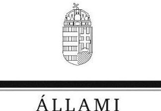
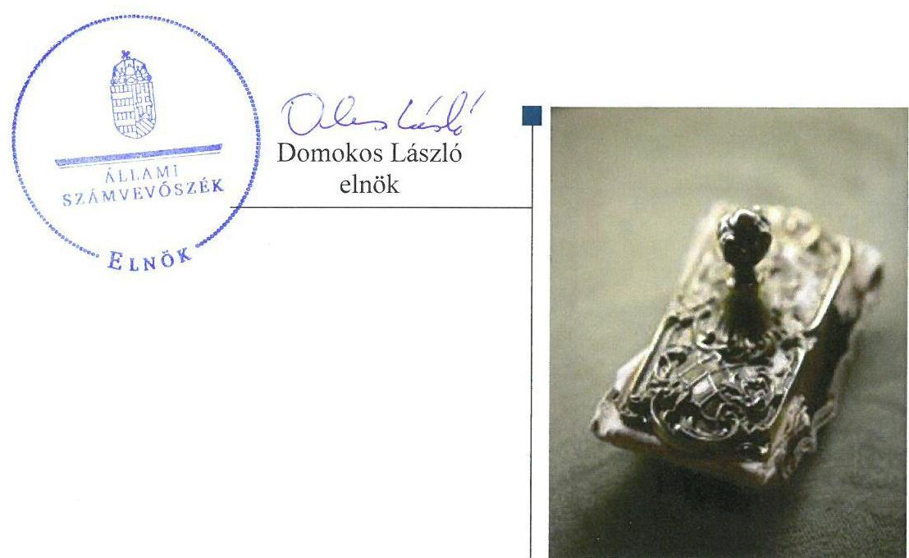
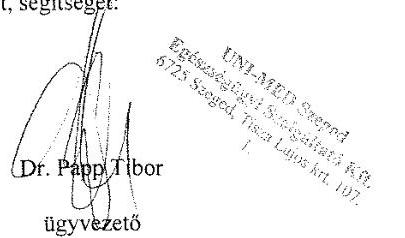
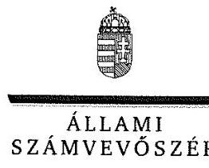
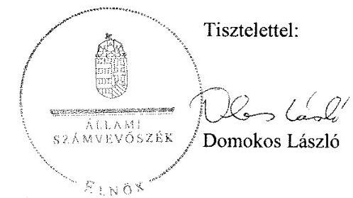

# Jelentés

## UNI-MED Szeged Egészségügyi Szolgáltató Kft. ellenőrzése

2017.

17207 www.asz.hu

---

# Jelentés 

## UNI-MED Szeged Egészségügyi Szolgáltató Kft. ellenőrzése

2017. 10. hó 19. nap

---

# AZ ELLENŐRZÉST FELÜGYELTE:

- BÖRÖCZ IMRE felügyeleti vezető

- AZ ELLENŐRZÉST VEZETTE ÉS A VÉGREHAJTÁSÁÉRT FELELŐS:
  - JOÓ ERIKA ellenőrzésvezető
  - A PROGRAM ÖSSZEÁLLÍTÁSÁÉRT FELELŐS:
    - JANIK JÓZSEF osztályvezető

- IKTATÓSZÁM: V-1195-138/2016
- TÉMASZÁM: 2229
- ELLENŐRZÉS-AZONOSÍTÓ SZÁM: V-075911

Jelentéseink az Országgyűlés számítógépes hálózatán és az Interneten a www.asz.hu címen is olvashatóak.

---

# TARTALOMJEGYZÉK 

■ ÖSSZEGZÉS ..... 5
■ AZ ELLENŐRZÉS CÉLJA ..... 6
■ AZ ELLENŐRZÉS TERÜLETE ..... 7
■ AZ ELLENŐRZÉS HÁTTERE, INDOKOLTSÁGA ..... 9
■ A JELENTÉS LÉNYEGES KÉRDÉSKÖREI ..... 10
■ ELLENŐRZÉS HATÓKÖRE ÉS MÓDSZEREI ..... 11
■ MEGÁLLAPÍTÁSOK ..... 13
■ JAVASLATOK ..... 17
■ MELLÉKLETEK ..... 19
I. Sz. melléklet: Értelmező szótár ..... 19
■ FÜGGELÉK: ÉSZREVÉTELEK ..... 23
■ RÖVIDÍTÉSEK JEGYZÉKE ..... 27

---

.

---

# ÖSSZEGZÉS 

Az UNI-MED Szeged Egészségügyi Szolgáltató Korlátolt Felelősségű Társaság feletti tulajdonosi jogokat a Szegedi Tudományegyetem nem szabályszerűen gyakorolta. A Társaság működésének szabályozottsága az előírásoknak nem felelt meg, ennek következtében az átláthatóság és elszámoltathatóság nem volt biztosított. A bevételek és ráfordítások elszámolása nem volt szabályszerű. A vagyongazdálkodás nem felelt meg a jogszabályi előírásoknak.

## Az ellenőrzés társadalmi indokoltsága

Az Állami Számvevőszék a stratégiáját megvalósítva ellenőrzéseivel segíti az átláthatóságot és az elszámoltathatóságot a közpénzekkel, a közvagyonnal való gazdálkodásban. Ellenőrzési témaválasztása során kiemelt figyelmet fordít a korábban ellenőrizetlen területekre.

Az Állami Számvevőszék céljaival megegyező társadalmi igény, hogy a központi költségvetési szervek által alapított gazdálkodó szervezetek, gazdasági társaságok működése szabályszerű, gazdálkodásuk átlátható és elszámoltatható legyen.

Az ellenőrzés az egészségügyi szolgáltatásokhoz kapcsolódó tevékenységet végző intézményi társaság 2012-2015. évek közötti gazdálkodási tevékenységéről, az állami tulajdonban lévő gazdasági társaságokra vonatkozó szabályok betartási kötelezettségének teljesítéséről a társaság és a tulajdonosa számára hasznosítandó, valamint széles körben is megismerhető megállapításokat tesz.

## Főbb megállapítások, következtetések, javaslatok

Az UNI-MED Szeged Egészségügyi Szolgáltató Korlátolt Felelősségű Társaság felett a tulajdonosi jogokat az alapító Szegedi Tudományegyetem nem az előírásoknak megfelelően gyakorolta. A Társaság 2012. és 2013. évi beszámolóját a Szegedi Tudományegyetem a felügyelőbizottság írásbeli jelentése nélkül fogadta el. A felügyelőbizottság 2015. május 28-áig nem rendelkezett ügyrenddel. A Társaság saját tőkéje a 2013-2015. években nem érte el a társasági formára kötelezően előírt jegyzett tőke nagyságát, a Szegedi Tudományegyetem a jogszabályi előírások ellenére nem intézkedett a vagyoni helyzet helyreállítása érdekében, nem biztosította a törvényes működés feltételeinek megteremtését.

Az UNI-MED Szeged Egészségügyi Szolgáltató Korlátolt Felelősségű Társaság működésének szabályozottsága nem felelt meg a jogszabályi előírásoknak. Az ellenőrzött időszakban nem rendelkezett számviteli politikával, 2014. január 1-jéig pénzkezelési szabályzattal és 2015. január 1-jéig több, kötelezően elkészítendő szabályzattal. Az elkészített szabályzatok tartalma nem felelt meg a jogszabályi előírásoknak.

A bevételek, az anyag- és személyi jellegű ráfordítások, valamint az értékcsökkenés elszámolása nem volt szabályszerű.

Az UNI-MED Szeged Egészségügyi Szolgáltató Korlátolt Felelősségű Társaság kizárólag saját vagyonnal rendelkezett, a vagyon nyilvántartása nem volt szabályszerű. Az éves beszámolók mérlegtételeit alátámasztó leltárt a jogszabályi előírások ellenére az ellenőrzött időszakban nem készítettek.

Az ÁSZ a Szegedi Tudományegyetem kancellárjának és az UNI-MED Szeged Egészségügyi Szolgáltató Kft. ügyvezetőjének fogalmazott meg javaslatokat, amelyek alapján kötelesek intézkedési tervet összeállítani és azt a jelentés kézhezvételétől számított 30 napon belül az ÁSZ részére megküldeni.

---

# AZ ELLENŐRZÉS CÉLJA 

Az ellenőrzés célja annak értékelése volt, hogy a tulajdonosi jogok gyakorlása szabályszerű volt-e; a gazdálkodó szervezet szabályozottsága, gazdálkodása és vagyongazdálkodási tevékenysége megfelelt-e a jogszabályi és a tulajdonosi előírásoknak; biztosítva volt-e az elszámoltathatóság; a vagyonváltozást eredményező döntések esetében a tulajdonosi jogok gyakorlója és a gazdálkodó szervezet szabályszerűen jártak-e el.

---

# AZ ELLENŐRZÉS TERÜLETE

## UNI-MED Szeged Egészségügyi Szolgáltató Korlátolt Felelősségű Társaság

Az SZTE¹ 2006. december 14-én alapította a 100%-os tulajdonában álló egyszemélyes korlátolt felelősségű társaságot, az Egészségcentrum Szeged Szolgáltató Kft-t.

Az Egészségcentrum Szeged Szolgáltató Kft. hat éven keresztül aktív tevékenységet nem végzett. 2012. november 12-én az alapító SZTE a gazdasági társaság vonatkozásában átfogó jelentőségű módosításokról döntött. Megváltoztatta a Társaság székhelyét, tevékenységi körét, bővítette a telephelyek számát, valamint UNI-MED Szeged Egészségügyi Szolgáltató Kft-re változtatta a Társaság elnevezését.

Az Ftv.² rendelkezései alapján az állami felsőoktatási intézmény – a saját bevételéből és tulajdonában lévő vagyonával – a Kormány hozzájárulása nélkül létesíthet gazdálkodó szervezetet, feltéve, hogy a vagyoni hozzájárulásnak nem része kincstári vagyon. A Társaság alapító okirata tartalmazta, hogy a Társaság törzstőkéje teljes egészében az SZTE saját bevételéből állt. Az Ftv. rendelkezése szerint a felsőoktatási intézmény által alapított társasággal kapcsolatos tulajdonosi jogokat a rektor³ gyakorolta. A rektor a tulajdonosi jogok gyakorlását átruházta az SZTE Szent-Györgyi Albert Klinikai Központ elnökére, 2012. október 15-étől az SZTE gazdasági és műszaki főigazgatójára.

Az Nftv.⁴ rendelkezései alapján 2015. január 1-jétől a tulajdonosi jogokat a kancellár gyakorolta, amelyet az SZTE SZMSZ⁵₁₄-ében 2015. március 16-án rögzített. Az SZMSZ₁₅₋₁₆ tartalmazta, hogy a kancellárt általános jogkörrel az igazgatásszervezési főigazgató helyettesíti.

Az Nftv. rendelkezései szerint az állami felsőoktatási intézmény által alapított gazdasági társaság alapítására, részesedésszerzésre, működésére, illetve a vezető tisztségviselőjének felelősségére az állami részesedéssel működő gazdasági társaságra vonatkozó szabályokat kell alkalmazni. Az Nftv. rendelkezése szerint a Társaság felügyelőbizottságába egy tagot az MNV Zrt. jogosult volt delegálni. Az MNV Zrt. élt a törvény által biztosított jogosultságával és 2012 decemberében tagot delegált a felügyelőbizottságba.

A Társaság alapító okiratában₁₋₅⁶ meghatározott fő tevékenysége az ellenőrzött időszakban a fekvőbeteg-ellátás volt. A gazdasági társaság létrehozásának célja a betegellátás területén kihasználatlan piaci lehetőségek feltárása és kiaknázása a térítéses ellátások önálló szolgáltatásával magyar és külföldi ügyfelek részére. A Társaság mérlegfőösszege 2015. december 31-én 14,1 millió forint volt, amely a forrásokat tekintve -6,8 millió forint saját tőkéből, 1,3 millió forint kötelezettségből és 19,6 millió forint passzív időbeli elhatárolásból tevődött össze. A mérlegfőösszeg alakulását az 1. táblázat mutatja be.

1. táblázat

|  MÉRLEGFŐÖSSZEG (MILLIÓ FT) |   |
| --- | --- |
|  időpont | mérlegfőösszeg  |
|  2012. 12. 31. | 1,6  |
|  2013. 12. 31. | 4,4  |
|  2014. 12. 31. | 10,4  |
|  2015. 12. 31. | 14,1  |

*Forrás: 2012-2015. éves beszámolók*

---

2. táblázat

## ÉRTÉKESÍTÉS NETTÓ ÁRBEVÉTELE, MÉRLEG SZERINTI EREDMÉNY (MILLIÓ FT)

|  év | árbevétel | eredményt  |
| --- | --- | --- |
|  2012. | 0 | -0,6  |
|  2013. | 13,4 | -2,2  |
|  2014. | 81,8 | -0,6  |
|  2015. | 92,9 | -1,1  |

Forrás: 2012-2015. éves beszámolók

A Társaság a betegellátáshoz szükséges személyi, tárgyi és szakmai környezeti feltételekkel nem rendelkezett, azokat együttműködési és közreműködői megállapodások⁷ keretében kívánta biztosítani. Az SZTE 2012. december 10-én együttműködési megállapodást⁸ kötött a Társasággal. A szerződő felek az együttműködési megállapodásban rögzítették, hogy az SZTE tudomásával és szándékainak megfelelően a Társaság térítéses betegellátó tevékenység ellátását és szervezését végzi saját nevében és felelősségére a betegek állampolgárságára tekintet nélkül.

Az ÁNTSZ⁹ Országos Tisztifőorvosi Hivatal 2013. június 5-én határozatlan időtartamú működési engedélyt adott ki a Társaság részére különböző fekvőbeteg és járóbeteg szakellátási szakmák és azokhoz tartozó szolgáltatások ellátására. A Társaság - mint engedélyes - a tevékenységeket az SZTE Szent-Györgyi Albert Klinikai Központtal - mint közreműködő egészségügyi szolgáltatóval - végezte.

A Társaság tényleges tevékenységét 2013-ban a működési engedély¹⁰ megszerzését követően kezdte meg.

Az ügyvezető₁₋₃¹¹ személye kétszer változott az ellenőrzött időszakban. A jelenlegi ügyvezető 2017. április 4-étől tölti be tisztségét. A foglalkoztatottak létszáma az ellenőrzött időszakban nem emelkedett három fő fölé.

A Társaság jegyzett tőkéje 3 millió forint volt, mérleg szerinti eredménye a 2012-2015. években negatív volt. Az értékesítés nettó árbevétele és a mérleg szerinti eredmény alakulását a 2. táblázat mutatja be.

A Társaság önköltségszámítási szabályzat készítésére nem volt kötelezett.

Az ellenőrzött időszak alatt a könyvvizsgáló társaság, és a kijelölt könyvvizsgáló személye egyszer változott.

A Társaság kizárólag saját vagyonnal rendelkezett, vagyonkezelésbe vett állami vagyonnal, illetve más társaságban meghatározó részesedéssel nem rendelkezett.

---

# AZ ELLENŐRZÉS HÁTTERE, INDOKOLTSÁGA 

A KÖZPONTI KÖLTSÉGVETÉSI SZERVEK ÁLTAL ALAPÍTOTT GAZDÁLKODÓ SZERVEZETEK gazdálkodása jellemzően a közérdeklődés és a média figyelmének középpontjában áll. Az ellenőrzés rámutathat a gazdálkodási tevékenységgel kapcsolatos jó gyakorlatokra és szabálytalanságokra. Felhívhatja a figyelmet a jogszabályi követelmények teljesítéséhez szükséges feltételek hiányosságaira. Az éves elszámoltatás feltételeinek kialakítása az ellenőrzés során nagy hangsúlyt kap. Az állami tulajdonban lévő gazdasági társaságokra vonatkozó szabályok szerint működő intézményi társaságok ellenőrzési tapasztalatai hozzájárulhatnak a gazdálkodás átláthatóságának, elszámoltathatóságának javításához.

---

# A JELENTÉS LÉNYEGES KÉRDÉSKÖREI 

1.     - A tulajdonosi jogok gyakorlása szabályszerű volt-e?
2.     - A társaság működésének szabályozottsága megfelelt-e az előírásoknak?
3.     - A társaságnál a pénzügyi-számviteli, adatszolgáltatási feladatok ellátása szabályszerű volt-e?
4.     - A társaság vagyongazdálkodása szabályszerű volt-e?

---

# ELLENŐRZÉS HATÓKÖRE ÉS MÓDSZEREI 

## Az ellenőrzés típusa

Megfelelőségi ellenőrzés.

## Az ellenőrzött időszak

Az ellenőrzött időszak 2012. január 1-jétől 2015. december 31-ig tart.

## Az ellenőrzés tárgya

Az UNI-MED Szeged Egészségügyi Szolgáltató Korlátolt Felelősségű Társaság feletti tulajdonosi joggyakorlás, valamint a gazdasági társaság gazdálkodása - kiemelten vagyongazdálkodási tevékenysége szabályozottsága és szabályszerűsége.

Az ellenőrzés kiterjedt minden olyan körülményre és adatra, amely az ÁSZ¹² jogszabályban meghatározott feladatainak teljesítéséhez, valamint a program végrehajtása folyamán felmerült újabb összefüggések feltárásához szükséges volt.

## Az ellenőrzött szervezet

UNI-MED Szeged Egészségügyi Szolgáltató Korlátolt Felelősségű Társaság, Szegedi Tudományegyetem

## Az ellenőrzés jogalapja

Az ellenőrzés jogalapját az ÁSZ tv.¹³ 1. § (3) bekezdése és 5. § (3) bekezdése képezi.

## Az ellenőrzés módszerei

Az ellenőrzést a nemzetközi standardokat irányadónak tekintve az ellenőrzési program ellenőrzési kérdései, az ellenőrzött időszakban hatályos jogszabályok, az ellenőrzés szakmai szabályok és módszertanok figyelembevételével végeztük.

Az ellenőrzés ideje alatt az ellenőrzött szervezettel történő kapcsolattartást az ÁSZ Szervezeti és Működési Szabályzatának vonatkozó előírásai alapján biztosítottuk.

---

Az állami tulajdonban (résztulajdonban) lévő gazdálkodó szervezetek vagyonmegőrzési és gazdálkodási tevékenységének ellenőrzése címú ellenőrzési program szerinti feladatokat az intézményi társaságnál, valamint a tulajdonosi jogok gyakorlóinál kellett végrehajtani.

Az ellenőrzési kérdések megválaszolásához szükséges bizonyítékok megszerzése a következő ellenőrzési eljárások alkalmazásával történt: megfigyelés, kérdésfeltevés (információkérés), összehasonlítás, mintavételezés, valamint elemző eljárás. Az ellenőrzési bizonyítékként felhasználható adatforrások közé tartoznak egyrészt az ellenőrzési programban felsorolt adatforrások, másrészt adatforrás lehet még minden - az ellenőrzés folyamán - feltárt, az ellenőrzés szempontjából információkat tartalmazó dokumentum.

Az ellenőrzést a kérdésekre adott válaszok kiértékelésével, valamint a megjelölt adatforrások, a csatolt tanúsítványok felhasználásával, továbbá az adott időszakban hatályos jogszabályok figyelembevételével folytattuk le.

A bevételek és ráfordítások elszámolása, valamint a vagyonnyilvántartás terén a szabályszerű működést véletlen mintavétellel és irányított kiválasztással ellenőriztük. A jogszabályoknak és

 a belső előírásoknak megfelelőnek, azaz szabályszerűnek tekintettük az adott területet, amennyiben a minta ellenőrzésének eredménye alapján 95%-os bizonyossággal a teljes sokaságban a hibaarány kisebb volt, mint 10%, nem megfelelőnek értékeltük, ha a hibaarány a 10%-ot meghaladta.

---

# 1. A tulajdonosi jogok gyakorlása szabályszerű volt-e? 

## Összegző megállapítás

A Társaság feletti tulajdonosi jogok gyakorlása nem volt szabályszerű.

A FELÜGYELŐBIZOTTSÁGOT a Gt.¹⁴ és a Ptk.¹⁵ előírásainak megfelelően alakították meg. A felügyelőbizottság a Gt. 34. § (4) bekezdése, valamint a Ptk. 2 3:122. § (3) bekezdése előírásai ellenére 2015. május 28-ig nem rendelkezett ügyrenddel. Az SZTE kancellár 2015. május 28-án fogadta el a felügyelőbizottság ügyrendjét.

AZ ÉVES BESZÁMOLÓKAT a 2012. és 2013. évek vonatkozásában a felügyelőbizottság nem tárgyalta. A tulajdonosi joggyakorló a Gt. 35. § (3) bekezdésében és a Ptk. 2 3:120. § (2) bekezdésében foglalt rendelkezések ellenére a 2012. és 2013. évi beszámolókat a felügyelőbizottság írásbeli jelentése nélkül fogadta el.

A 2014. évi beszámolót a kancellár a felügyelőbizottság jelentése alapján szabályszerűen fogadta el.

A 2015. évi beszámoló közzététel előtti elfogadásáról a 2016. évben az az SZTE SZMSZ¹⁶-ben foglaltaknak megfelelően az SZTE igazgatásszervezési főigazgatója döntött, mert nem volt hivatalban lévő kancellár.

A KÖNYVVIZSGÁLÓ jelentései alapján történt az éves beszámolók elfogadása. A könyvvizsgáló jelentéseiben a saját tőke csökkenése miatt felhívásokkal élt a 2013-2015. években.

A SAJÁT TŐKE a 2013. évtől negatív volt és folyamatosan csökkent. A Társaság három egymást követő teljes üzleti évben nem rendelkezett a társasági formájára kötelezően előírt jegyzett tőkének megfelelő összegű saját tőkével. (3. táblázat)

A mérleg szerinti eredmény az ellenőrzött időszak minden évében veszteség volt.

A Gt. 51. § (1) bekezdés, a Ptk. 2 3:133. § (2) bekezdés és a Ptk. 2 3:189. § (2) bekezdésben foglalt előírások ellenére a tulajdonosi joggyakorló nem tette meg a jogszabály szerinti szükséges intézkedéseket.

A 2015. évi üzleti tervben ötmillió Ft pótbefizetésre vonatkozó tervet rögzítettek, amelyet lekötött tartalékba kívántak helyezni. A pótbefizetés az ellenőrzött időszakban nem történt meg.

ÜZLETI TERV készítési kötelezettséget az SZTE a 2015. évtől írt elő. A Társaság a 2015. évre elkészítette az üzleti tervet, amelyet a kancellár a felügyelőbizottság véleményének figyelembevételével fogadott el 2015. június 22-én.

---

# 2. A társaság működésének szabályozottsága megfelelt-e az előírásoknak? 

Összegző megállapítás

A Társaság működésének szabályozottsága a jogszabályi előírásoknak nem felelt meg, így az elszámoltathatóság nem volt biztosított.

SZÁMVITELI POLITIKÁVAL a Társaság a Számv. tv.¹⁶ 14. § (3) bekezdés előírásai ellenére az ellenőrzött időszakban nem rendelkezett.

LELTÁROZÁSI, leltárkészítési szabályzattal a Számv. tv. 14. § (5) bekezdés a) pontjában, valamint a Számv. tv. 14. § (11) bekezdésében foglalt előírások ellenére 2014. december 31-ig nem rendelkezett a Társaság.

A leltározási, leltárkészítési szabályzatot¹⁷ 2015. január 1-jén elkészítették. A leltározási szabályzat nem felelt meg a Számv. tv. 14. § (3)(4) bekezdés előírásainak, mert nem vette figyelembe a gazdasági társaság szervezeti felépítését, valamint nem a hatályos jogszabályokra hivatkozott.

ESZKÖZÖK ÉS FORRÁSOK ÉRTÉKELÉSI szabályzatával a Számv. tv. 14. § (5) bekezdés b) pontjában, valamint a Számv. tv. 14. § (11) bekezdésében foglalt előírások ellenére 2014. december 31-ig nem rendelkezett a Társaság.

Az eszközök és források értékelési szabályzatát¹⁸ 2015. január 1-jén elkészítették. Az értékelési szabályzatban foglaltak nem feleltek meg a Számv. tv. 14. § (3)-(4) bekezdés előírásainak, mert nem vette figyelembe a gazdasági társaság szervezeti felépítését és hatályon kívül helyezett jogszabályokra hivatkozott.

PÉNZKEZELÉSI SZABÁLYZATTAL a Számv. tv. 14. § (5) bekezdés d) pontja, valamint a Számv. tv. 14. § (11) bekezdése előírásai ellenére 2013. december 31-ig nem rendelkezett a Társaság.

A pénzkezelési szabályzatot¹⁹ 2014. január 1-jén léptették hatályba. A pénzkezelési szabályzat nem felelt meg a Számv. tv. 14. § (3)-(4) bekezdés előírásainak, mert nem vette figyelembe a gazdasági társaság szervezeti felépítését és nem a hatályos jogszabályokra hivatkozott.

SZÁMLARENDDEL a Számv. tv. 161. § (1) és (4) bekezdés előírásai ellenére nem rendelkezett a Társaság.

BIZONYLATI RENDDEL a Társaság a Számv. tv. 161. § (2) bekezdés d) pont előírásai ellenére nem rendelkezett.

JAVADALMAZÁSI SZABÁLYZATTAL a Taktv.²⁰ 5. § (3) bekezdésének és a Kormányhatározat²¹ 4. a) pontjának előírásai ellenére a Társaság a vezető tisztségviselőkre és a felügyelőbizottság tagjaira vonatkozóan nem rendelkezett.

---

# 3. A társaságnál a pénzügyi-számviteli, adatszolgáltatási feladatok ellátása szabályszerű volt-e? 

Összegző megállapítás

A Társaság a pénzügyi-számviteli és adatszolgáltatási feladatokat nem a jogszabályi előírásoknak megfelelően látta el.

### 3.1. számú megállapítás

A bevételek és ráfordítások elszámolása nem volt szabályszerű.

A BEVÉTELEK elszámolása nem felelt meg a jogszabályi előírásoknak, mert
$\longrightarrow$ a szolgáltatások számlázott összege nem felelt meg a díjegyzékben²² foglaltaknak;
$\longrightarrow$ a bevételi bizonylatok a Számv. tv. 167. § (1) bekezdés h), i) pontjai előírásai ellenére nem tartalmazták az érintett könyvviteli számlákra történő hivatkozásokat, a könyvviteli nyilvántartásokban történt rögzítés időpontját, igazolását.

A RÁFORDÍTÁSOK elszámolása nem felelt meg a jogszabályi előírásoknak, mert
$\longrightarrow$ az anyagjellegű ráfordítások közül az igénybevett egészségügyi szolgáltatások esetében a Számv. tv. 166. § (1)-(2) bekezdés valamint a Számv. tv. 167. § (1) bekezdés e) és g) pont rendelkezései ellenére nem voltak ellenőrizhető elszámolással megalapozottak a számlákon szereplő összegek, mert a számlák vizsgálati díjat tartalmaztak különböző összegekben, de a feltüntetett összegek számítási alapját és számítását nem mellékelték a számlákhoz;
$\longrightarrow$ a Számv tv. 167. § (1) bekezdés c) pont előírásai ellenére a pénztárbizonylatok nem tartalmazták az utalványozó és az ellenőrzést végző személy aláírását;
$\longrightarrow$ a személyi jellegű ráfordítások elszámolása során a munkabérek számfejtésének alapjául szolgáló jelenléti íveken a munkaidő nyilvántartása nem felelt meg a Mt.²³ 134. § (2) bekezdés előírásainak, mert nem volt megállapítható a teljesített rendes és rendkívüli munkaidő;
$\longrightarrow$ az Szja. tv.²⁴ 48. § (1) bekezdése előírásai ellenére a munkavállaló által rendelkezésre bocsátott személyi jövedelemadó kedvezményre jogosító nyilatkozatot nem vették figyelembe az adóelőleg levonása során;
$\longrightarrow$ az Szja tv. 25. § (1) bekezdés rendelkezései ellenére a vezető tisztségviselőnek járó díjazás számfejtése során az önálló tevékenység esetén figyelembe vehető 10% költséghányad levonásával számították ki az adót és járulékokat;
$\longrightarrow$ a kifizetett jutalmak esetében a Számv. tv. 165. § (1)-(2) és a 166. § (1) bekezdés előírásai ellenére a kifizetést megalapozó dokumentumokkal a Társaság nem rendelkezett.
$\longrightarrow$ a vagyoni értékű jog értékcsökkenésének elszámolásakor a Számv. tv. 52. § (1) bekezdés előírása ellenére nem határozták meg az eszköz hasznos élettartamát.

---

# 3.2. számú megállapítás 

A beszámolási, adatszolgáltatási kötelezettségek teljesítése nem volt szabályszerű. A személyazonosító adatok védelme nem volt biztosított.

BESZÁMOLÁSI, ADATSZOLGÁLTATÁSI kötelezettséget a tulajdonosi joggyakorló a 2015. év vonatkozásában írt elő. A Társaság a 2015. évi időközi adatszolgáltatási kötelezettségének az I. negyedévben nem tett eleget, az I. féléves és a III. negyedéves beszámolót elkészítették.

KÖZZÉTÉTELI KÖTELEZETTSÉGÉNEK a Társaság a Taktv. 2. §. szerinti adatok vonatkozásában nem tett eleget. A Társaság az éves beszámolóit közzétette.

ADATVÉDELMI SZABÁLYZATOT az Eüak.²⁵ 32. § (2) bekezdés h) pont előírása ellenére nem készített a Társaság, így az egészségügyi és személyazonosító adatok védelme nem volt biztosított.

## 4. A társaság vagyongazdálkodása szabályszerű volt-e?

Összegző megállapítás

A Társaság a vagyongazdálkodás keretében a jogszabályi előírások ellenére leltárt nem állított össze, valamint a vagyon nyilvántartása a jogszabályi előírásoknak nem felelt meg.

A VAGYON NYILVÁNTARTÁSA a Számv. tv. 25. § (1), és 52. § (1) bekezdésében foglalt előírásoknak nem felelt meg.

A 2015-ben beszerzett szoftver licenc bruttó értékét és értékcsökkenését a 2015. évi beszámoló kiegészítő mellékletében a vagyoni értékű jogok között, az összesítésnél a tárgyi eszközök között szerepeltették. Az eszközt vagyoni értékű jogként aktiválták, de az értékcsökkenést szellemi termékek értékcsökkenéseként számolták el. A nyilvántartásban a Számv tv. 52. § (2) bekezdés előírásai ellenére nem rögzítették az egyedi eszköz várható élettartamát.

LELTÁRT a beszámolók mérlegtételeinek alátámasztására a Társaság a Számv. tv. 69. § (1) bekezdés rendelkezései ellenére az ellenőrzött időszakban nem állított össze a mérleg fordulónapján meglévő eszközök és források állományáról.

A Társaság független könyvvizsgálója a Számv. tv. 156. § (1) bekezdésében, valamint a Számv. tv. 156. § (5) bekezdés g) pontjában foglaltak ellenére jelentéseiben nem kifogásolta a mérlegtételeket alátámasztó leltárak hiányát.

---

# JAVASLATOK 

Az ÁSZ tv. 33. § (1) bekezdésében foglaltak értelmében az ellenőrzött szervezet vezetője köteles a jelentésben foglalt megállapításokhoz kapcsolódó intézkedési tervet összeállítani és azt a jelentés kézhezvételétől számított 30 napon belül az ÁSZ részére megküldeni. Amennyiben az ellenőrzött szervezet vezetője nem küldi meg határidőben az intézkedési tervet, vagy továbbra sem elfogadható intézkedési tervet küld, az Állami Számvevőszék elnöke az ÁSZ tv. 33. § (3) bekezdés a) és b) pontjaiban foglaltakat érvényesítheti.

## A Szegedi Tudományegyetem kancellárjának

1. Intézkedjen a jogszabályi előírásoknak megfelelően a társaság saját tőkéjének jogszabályban jelzett szintje alá csökkenése miatt.
(1. sz. összegző megállapítás 6-9. bekezdései alapján)
2. Intézkedjen a jogszabályi előírásoknak megfelelő javadalmazási szabályzat elkészítéséről.
(2. sz. összegző megállapítás 10. bekezdése alapján)

## Az UNI-MED Szeged Egészségügyi Szolgáltató Kft. ügyvezetőjének

1. Intézkedjen a jogszabályi előírásoknak megfelelően a Számviteli Politika elkészítéséről, valamint arról, hogy az annak keretében elkészített szabályzatok a társaság adottságainak, körülményeinek megfeleljenek.
(2. sz. összegző megállapítás 1-7. bekezdései alapján)
2. Intézkedjen a jogszabályi előírásoknak megfelelő Számlarend összeállításáról.
(2. sz. összegző megállapítás 8. bekezdése alapján)
3. Intézkedjen arról, hogy a bevételek és ráfordítások elszámolása megfeleljen a jogszabályi előírásoknak.
(3.1. sz. megállapítás 1-2. bekezdései alapján)

---

4. Intézkedjen közzétételi kötelezettsége jogszabályi előírásoknak megfelelő teljesítéséről.
(3.2. sz. megállapítás 2. bekezdése alapján)
5. Készítse el a jogszabályi előírásoknak megfelelő adatvédelmi szabályzatot.
(3.2. sz. megállapítás 3. bekezdése alapján)
6. Intézkedjen, hogy a szoftver licenc nyilvántartása megfeleljen a jogszabályi előírásoknak.
(4. sz. összegző megállapítás 2. bekezdése alapján)
7. Intézkedjen a beszámoló elkészítéséhez, a mérlegtételek alátámasztásához szükséges leltár jogszabályi előírásoknak megfelelő összeállításáról.
(4. sz. összegző megállapítás 3. bekezdése alapján)

---

# MELLÉKLETEK 

## I. SZ. MELLÉKLET: ÉRTELMEZŐ SZÓTÁR

gazdasági társaság
intézményi társaság
gazdálkodó szervezet
meghatározó befolyás

A Ptk2. 3:88. § (1) bekezdése szerint „a gazdasági társaságok üzletszerű közös gazdasági tevékenység folytatására, a tagok vagyoni hozzájárulásával létrehozott, jogi személyiséggel rendelkező vállalkozások, amelyekben a tagok a nyereségből közösen részesednek, és a veszteséget közösen viselik".
Forrás: Ftv. 121. § (1) bekezdése
Az állami felsőoktatási intézmény - a saját bevételéből és tulajdonában lévő vagyonával a Kormány hozzájárulása nélkül létesíthet gazdálkodó szervezetet, illetve ezekben részesedést szerezhet, feltéve, hogy a vagyoni hozzájárulásnak nem része kincstári vagyon.
Forrás: Nftv. 115. § (10) bekezdése
2012. szeptember 1-jétől:

Az állami fenntartású felsőoktatási intézmény kincstárnál vezetett külön fizetési számlájának egyenlege, valamint a (9) bekezdés b) pontjában meghatározott maradvány, illetve az e törvényben meghatározott gazdasági társaságtól kapott osztalék terhére tulajdonosi joggyakorló szervezet engedélyéhez, jóváhagyásához nem kötött döntésével zártkörűen működő részvénytársaságot vagy
 korlátolt felelősségű társaságot (a továbbiakban együtt: intézményi társaság) alapíthat, illetve ezekben szerezhet részesedést.
2014. március 14-ig:

A Ptk. 1 ${ }^{26}$ 685. § c) pontja szerint gazdálkodó szervezet: „az állami vállalat, az egyéb állami gazdálkodó szerv, a szövetkezet, a lakásszövetkezet, az európai szövetkezet, a gazdasági társaság, az európai részvénytársaság, az egyesülés, az európai gazdasági egyesülés, az európai területi együttműködési csoportosulás, az egyes jogi személyek vállalata, a leányvállalat, a vízgazdálkodási társulat, az erdő birtokossági társulat, a végrehajtói iroda, az egyéni cég, továbbá az egyéni vállalkozó."
2014. március 15-től:

A gazdasági társaság, az európai részvénytársaság, az egyesülés, az európai gazdasági egyesülés, az európai területi együttműködési csoportosulás, a szövetkezet, a lakásszövetkezet, az európai szövetkezet, a vízgazdálkodási társulat, az erdőbirtokossági társulat, az állami vállalat, az egyéb állami gazdálkodó szerv, az egyes jogi személyek vállalata, a közös vállalat, a végrehajtói iroda, a közjegyzői iroda, az ügyvédi iroda, a szabadalmi ügyvivői iroda, az önkéntes kölcsönös biztosító pénztár, a magánnyugdípénztár, az egyéni cég, továbbá az egyéni vállalkozó. Az állam, a helyi önkormányzat, a költségvetési szerv, az egyesület, a köztestület, valamint az alapítvány gazdálkodó tevékenységével összefüggő polgári jogi kapcsolataira is a gazdálkodó szervezetre vonatkozó rendelkezéseket kell alkalmazni.
Forrás: Ptk ${ }^{27}$. 396. §
2014. március 14-ig:

A befolyással rendelkező akkor rendelkezik egy jogi személyben meghatározó befolyással, ha annak tagja, illetve részvényese és
a) jogosult e jogi személy vezető tisztségviselői vagy felügyelőbizottsága tagjai többségének megválasztására, illetve visszahívására, vagy
b) a jogi személy más tagjaival, illetve részvényeseivel kötött megállapodás alapján egyedül rendelkezik a szavazatok több mint ötven százalékával.
A meghatározó befolyás akkor is fennáll, ha a befolyással rendelkező számára az előzőek szerinti jogosultságok közvetett módon biztosítottak. A befolyással rendelkezőnek egy jogi

---

személyben a szavazatok több mint ötven százalékával közvetett módon való rendelkezése vagy egy jogi személyben közvetetten fennálló meghatározó befolyása megállapítása során a jogi személyben szavazati joggal rendelkező más jogi személyt (köztes vállalkozást) megillető szavazatokat meg kell szorozni a befolyással rendelkezőnek a köztes vállalkozásban, illetve vállalkozásokban fennálló szavazatával. Ha a köztes vállalkozásban fennálló szavazatok mértéke az ötven százalékot meghaladja, akkor azt egy egészként kell figyelembe venni.
Forrás: Ptk. 685/B. § (2)-(3) bekezdések
2014. március 15-től:

A befolyással rendelkező akkor rendelkezik egy jogi személyben meghatározó befolyással, ha annak tagja vagy részvényese, és
a) jogosult e jogi személy vezető tisztségviselői vagy felügyelőbizottsága tagjai többségének megválasztására, illetve visszahívására; vagy
b) a jogi személy más tagjai, illetve részvényesei a befolyással rendelkezővel kötött megállapodás alapján a befolyással rendelkezővel azonos tartalommal szavaznak, vagy a befolyással rendelkezőn keresztül gyakorolják szavazati jogukat, feltéve, hogy együtt a szavazatok több mint felével rendelkeznek.
Forrás: Ptk. 8:2. § (2) bekezdés
az állam vagy a helyi önkormányzat kizárólagos tulajdonában álló dolgok,
az a) pont hatálya alá nem tartozó, állam vagy a helyi önkormányzat tulajdonában lévő dolog,
az állam vagy a helyi önkormányzat tulajdonában lévő pénzügyi eszközök, továbbá az államot vagy a helyi önkormányzatot megillető társasági részesedések,
az államot vagy a helyi önkormányzatot megillető bármely vagyoni értékkel rendelkező jogosultság, amelyet jogszabály vagyoni értékű jogként nevesít,
Magyarország határa által körbezárt terület feletti légtér,
az üvegházhatású gázok kibocsátási egységeinek kereskedelméről szóló törvény szerint kibocsátási egység és légiközlekedési kibocsátási egység, valamint az ENSZ Éghajlatváltozási Keretegyezménye és annak Kiotói Jegyzőkönyve végrehajtási keretrendszeréről szóló törvény szerinti kiotói egység,
állami vagy helyi önkormányzati fenntartású közgyűjtemény (muzeális intézmény, levéltár, közgyűjteményként működő kép- és hangarchívum, valamint könyvtár) saját gyűjteményében nyilvántartott kulturális javak körébe tartozó dolog, kivéve, ha az állami vagy önkormányzati tulajdon jogszerű létrejötte kétséget kizáró módon nem bizonyítható és a dologra nézve más a tulajdonjogát bizonyítja vagy a kulturális javakra vonatkozó jogszabályokban meghatározott eljárás keretében valószínűsíti (g. pont módosult 2013. december 7-től),
a régészeti lelet,
a nemzeti adatvagyon körébe tartozó állami nyilvántartások fokozottabb védelméről szóló törvény szerinti nemzeti adatvagyon.
Forrás: Nvtv. 1. § (2)
2014. március 14-ig:

Az állami vagyon kezelőjét, haszonélvezőjét, használóját megillető jogok gyakorlását, annak szabályszerűségét, célszerűségét az MNV Zrt. - szükség szerint területi szervei útján - ellenőrzi.
2014. március 15-től:

Az állami vagyon használóját, vagyonkezelőjét és haszonélvezőjét megillető jogok gyakorlását, annak szabályszerűségét, a kötelezettségek teljesítését, valamint a vagyon rendeltetése szerinti célszerűségét a tulajdonosi joggyakorló rendszeresen ellenőrzi.
Forrás: Vhr. 20. § (1)

---

tulajdonosi jogok gyakorlója

1.
2013. június 27-ig:

Az állami vagyon felett a Magyar Államot megillető tulajdonosi jogok és kötelezettségek összességét - ha törvény eltérően nem rendelkezik - az állami vagyon felügyeletéért felelős miniszter (a továbbiakban: miniszter) gyakorolja, aki e feladatát a Magyar Nemzeti Vagyonkezelő Zártkörűen Működő Részvénytársaság (a továbbiakban: MNV Zrt.), a Magyar Fejlesztési Bank, illetve a tulajdonosi joggyakorló szervezet útján látja el. A miniszter miniszteri rendeletben, a törvényben meghatározott állami vagyoni kör tekintetében, meghatározott időtartamra, a joggyakorlás egyes szabályainak meghatározásával - az őt megillető tulajdonosi jogok és kötelezettségek összességének, illetve azok meghatározott részének gyakorlóját az Áht. szerinti központi költségvetési szervek, ezek intézménye, továbbá a 100%-ban állami tulajdonban álló gazdasági társaságok közül kijelölheti.
Forrás: Vtv. 3. § (1) és (2)
2013. június 28-ától:

A rábízott állami vagyon felett az államot megillető tulajdonosi jogok és kötelezettségek összességét tulajdonosi joggyakorlóként:
a) ha törvény vagy miniszteri rendelet eltérően nem rendelkezik, a Magyar Nemzeti Vagyonkezelő Zártkörűen Működő Részvénytársaság (a továbbiakban: MNV Zrt.),
b) törvényben kijelölt személy vagy
c) az állami vagyon felügyeletéért felelős miniszter (a továbbiakban: miniszter) által rendeletben kijelölt személy gyakorolja.
[...] A miniszter e törvény felhatalmazása alapján - a meghatározott célok hatékonyabb elérése érdekében, miniszteri rendeletben, az ott meghatározott állami vagyoni kör tekintetében, meghatározott időtartamra - e törvény keretei között, a joggyakorlás egyes szabályainak meghatározásával - az államot megillető tulajdonosi jogok és kötelezettségek összességének, illetve azok meghatározott részének gyakorlóját az Áht. szerinti központi költségvetési szervek, ezek intézménye, továbbá a 100%-ban állami tulajdonban álló gazdasági társaságok közül kijelölheti.
Forrás: Vtv. 3. § (1) és (2)
2.

Aki a nemzeti vagyon felett az államot vagy a helyi önkormányzatot megillető tulajdonosi jogok és kötelezettségek összességének gyakorlására jogosult
Forrás: Nvtv. 3. § (1) 17. pontja

---

.

---

# FÜGGELÉK: ÉSZREVÉTELEK 

A jelentéstervezetet a Számvevőszék 15 napos észrevételezésre megküldte az ellenőrzött szervezetek vezetőinek az ÁSZ tv. 29. § (1) bekezdése előírásának megfelelően.

Észrevételezési jogával az intézményi társaság vezetője élt. A függelék tartalmazza az ügyvezető észrevételeit, illetve az észrevételek kezeléséhez kapcsolódó tájékoztatást.

- Az UNI-MED Szeged Egészségügyi Szolgáltató Kft. ügyvezetőjének írásban tett észrevétele
- Tájékoztatás az UNI-MED Szeged Egészségügyi Szolgáltató Kft. ügyvezetőjének az észrevételek kezeléséről

[^0]
[^0]:    * 29. § (1) Az Állami Számvevőszék az ellenőrzési megállapításait megküldi az ellenőrzött szervezet vezetőjének vagy az általa megbízott személynek, és annak, akinek személyes felelősségét állapította meg.
    (2) Az ellenőrzött szervezet vezetője és a felelősként megjelölt személy az ellenőrzés megállapításaira tizenöt napon belül írásban észrevételt tehet.
    (3) Az Állami Számvevőszék az észrevételre a beérkezésétől számított harminc napon belül írásban válaszol. A figyelembe nem vett észrevételeket köteles a jelentésben feltüntetni, és megindokolni, hogy azokat miért nem fogadta el.

---

# 1995 

## UNI-MED SZEGED EGÉSZSÉGÜGYI SZOLGÁLTATÓ KFT

## 0623 SZEGED, TISZAI TÉR 101

- 26.10.42/221040
(2016/2017. 00:00:00
www.uni-szeged.hu

Állami Számvevőszék
Elnök
Domokos László Elnök Úr
részére

Igen Tisztelt Elnök Úr!
Hivatkozással az Y -1195-127 /2016 iktatószámmal megküldött „UNI-MED Szeged Egészségügyi Szolgáltató Kft. ellenőrzése" címmel készített számvevőszéki jelentéstervezetre, az abban foglalt ellenőrzés megállapításaira, az alábbi észrevételt teszem.

Az Állami Számvevőszék vizsgálata során feltárt, a Társaság 2012-2015 évek közötti tevékenységére vonatkozó hibákat, problémákat a tulajdonos Szegedi Tudományegyetem és a tulajdonosi jogokat gyakorló Kancellár által 2017. április 4.-ei hatállyal kinevezett új ügyvezetés korrigálta:

1. Új felügyelőbizottság kinevezése megtörtént, alakuló ülésük 2017. május 23-án lezajlott, a felügyelőbizottság ügyrendjét megvitatták, elfogadták, elnökét megválasztották.
2. A Felügyelőbizottság a Társaság 2016-os gazdálkodását áttekintette, értékelte, a pénzügyi beszámolót elfogadta, írásbeli jelentését a Tulajdonos számára megküldte.
3. A tulajdonos Szegedi Tudományegyetem a Társaság tőkehelyzetét két ütemben, a könyvvizsgálói jelentések figyelembevételével rendezte.
4. A Társaság működésének szabályozottságában észlelt hiányosságok ugyancsak korrekcióra kerültek, számviteli politika, számlarend, pénzkezelési és egyéb szabályzatok aktualizálása, jogharmonizációja megtörtént, a menedzsment és a munkavállalók, illetve a külső számviteli szolgáltató és könyvvizsgáló együttműködése révén a bizonylati fegyelem, a pénzkezelés a szabályzatokat betartva, zökkenőmentesen és a jogszabályi környezetnek megfelelően működik. Vagyon nyilvántartás és leltár készült, a szoftver licenc nyilvántartás megfelel a jogszabályi előírásoknak.
5. A Társaság adatvédelmi szabályzata elkészült.
6. A közzétételi kötelezettségek jogszabályi előírásoknak megfelelő teljesítéséről intézkedtem.

Az Állami Számvevőszék megállapításaihoz kapcsolódó intézkedési tervet, dokumentációt a megadott határidőn belül az Állami Számvevőszék számára megküldjük.

Köszönjük Elnök Úr és munkatársainak konstruktív együttműködését, segítségét:
Szeged, 2017. augusztus 29.

Tisztelettel:

---

ELNÖK

# Dr. Papp Tibor úr 

ügyvezető
UNI-MED Szeged Egészségügyi Szolgáltató Kft.

## Szeged

## Tisztelt Ügyvezető Úr!

Az ,,UNI-MED Szeged Egészségügyi Szolgáltató Kft. ellenőrzése" címmel készített számvevőszéki jelentéstervezetre tett észrevételeit köszönettel megkaptam.
Az Állami Számvevőszék észrevételekre vonatkozó álláspontjáról a felügyeleti vezető által készített részletes tájékoztatást csatoltan megküldöm.

Tájékoztatom Ügyvezető urat, hogy a számvevőszéki jelentésben - az Állami Számvevőszékről szóló 2011. évi LXVI. törvény 29. § (3) bekezdése alapján - a figyelembe nem vett észrevételeket szerepeltetjük, annak indoklásával, hogy azokat az Állami Számvevőszék miért nem fogadta el.

Budapest, 2017. 03. 20.

Melléklet: Tájékoztatás az észrevételek kezeléséről

---

# Tájékoztatás   az észrevételek kezeléséről 

Az „UNI-MED Szeged Egészségügyi Szolgáltató Kft. ellenőrzése" című jelentéstervezetre tett (2017. augusztus 29-én kelt, szeptember 1-én postára adott, és az Állami Számvevőszékhez szeptember 5-én érkezett) észrevételeit áttekintettük, azok kezelésével kapcsolatban a következő tájékoztatást adom.
Az UNI-MED Szeged Egészségügyi Szolgáltató Kft. ügyvezetője észrevételében az új felügyelőbizottság kinevezésére, a társaság tőkehelyzetének, illetve szabályozottsága hiányosságainak rendezésére, a közzétételi kötelezettségének teljesítésére vonatkozóan megtett, vagy folyamatban lévő intézkedéseiről adott tájékoztatást.
Az észrevételek a jelentéstervezet megállapításait nem vitatták, a megtett intézkedések éppen a megállapítások és az azokon alapuló javaslatok hasznosításának szándékát igazolják. Az észrevételek olyan eseményekről adnak tájékoztatást, amelyek az ellenőrzött időszak után következtek be, így azok a jelentéstervezet megállapításainak, vagy a megállapításokon alapuló egyes javaslatoknak a módosítását nem indokolják.
Tájékoztatom, hogy a számvevőszéki jelentés függelékeként szerepeltetjük a jelentéstervezethez tett észrevételeit, valamint az azokra adott válaszunkat.

Budapest, 2017. 03. 20.

Böröcz Imre
felügyeleti vezető

---

# RÖVIDÍTÉSEK JEGYZÉKE 

${ }^{1}$ SZTE
${ }^{2}$ Ftv.
${ }^{3}$ rektor
${ }^{4}$ Nftv.
${ }^{5}$ SZMSZ
${ }^{6}$ alapító okirat 1-5
${ }^{7}$ közreműködői szerződés
${ }^{8}$ együttműködési megállapodás
${ }^{9}$ ÁNTSZ
${ }^{10}$ működési engedély
${ }^{11}$ ügyvezető ${ }_{1-3}$

Szegedi Tudományegyetem
2005. évi CXXXIX. törvény a felsőoktatásról (hatályos: 2012. szeptember 1-jéig)

A Szegedi Tudományegyetem rektora
2011. évi CCIV. törvény a nemzeti felsőoktatásról (hatályos: 2012. szeptember 1-jétől)
Szegedi Tudományegyetem Szervezeti és Működési Szabályzata
SZMSZ 1 - kelte: 2011. december 19.
SZMSZ 2 - kelte: 2012. január 30.
SZMSZ 3 - kelte: 2012. szeptember 24.
SZMSZ 4 - kelte: 2012. december 17.
SZMSZ 5 - kelte: 2013. február 25.
SZMSZ 6 - kelte: 2013. május 06.
SZMSZ 7 - kelte: 2013. július 15.
SZMSZ 8 - kelte: 2013. szeptember 30.
SZMSZ 9 - kelte:

 2013. december 16.
SZMSZ10 - kelte: 2014. január 27.
SZMSZ11 - kelte: 2014. március 31.
SZMSZ12 - kelte: 2014. június 30.
SZMSZ13 - kelte: 2014. szeptember 29.
SZMSZ14 - kelte: 2015. március 16.
SZMSZ15 - kelte: 2015. július 20.
SZMSZ16 - kelte: 2015. október 12.
SZMSZ17 - kelte: 2015. november 30.
SZMSZ18 - kelte: 2015. december 21.
alapító okirat1: 2008. december 29. (Egészségcentrum Szeged Szolgáltató Kft)
alapító okirat2: 2012. november 12.
alapító okirat3: 2013. február 21.
alapító okirat4: 2013. december 11.
alapító okirat5: 2015. december 15.
a Társaság és az SZTE Szent-Györgyi Albert Klinikai Központ között 2012. december 10-én létrejött szerződés járó- és fekvőbeteg szakellátási tevékenység ellátására.
az SZTE és az Társaság között 2012. december 10-én létrejött megállapodás térítéses betegellátó tevékenység ellátására és szervezésére. Kiegészítésre került 2012. december 10-én, módosították 2014. június 26-án.
Állami Népegészségügyi és Tisztiorvosi Szolgálat
az ÁNTSZ IF-2461-5/2013. sz. határozata működési engedély kiadásáról az Társaság részére fekvő és járóbeteg szakellátási szakmák és azokhoz tartozó szolgáltatások ellátására, kiadva. 2013. június 5-én. Módosítva: IF-5576-9/2014. sz. határozattal 2014. szeptember 15-én, és IF-5576-12/2014. sz. határozattal 2014. december 5-én
ügyvezető1: 2012. november 11-ig
ügyvezető2: 2012. november 12-től 2013. december 31-ig

---

12 ÁSZ
${ }^{13}$ ÁSZ tv.
${ }^{14} \mathrm{Gt}$.
${ }^{15} \mathrm{Ptk}_{2}$
${ }^{16}$ Számv. tv.
${ }^{17}$ leltározási szabályzat
${ }^{18}$ értékelési szabályzat
${ }^{19}$ pénzkezelési szabályzat
${ }^{20}$ Taktv.
${ }^{21}$ Kormányhatározat
${ }^{22}$ díjjegyzék
${ }^{23} \mathrm{Mt}$.
${ }^{24}$ Szja. tv.
${ }^{25}$ Eüak. tv.
${ }^{26} \mathrm{Ptk}_{-1}$
${ }^{27} \mathrm{Ppt}$.
ügyvezető3: 2014. január 2-től 2016. november 18-ig
Állami Számvevőszék
2011. évi LXVI. törvény az Állami Számvevőszékről (hatályos: 2011. július 1-jétől) a gazdasági társaságokról szóló 2006. évi IV. törvény (hatálytalan: 2014. március 15-től)
2013. évi V. törvény a Polgári Törvénykönyvről (hatályos: 2014. március 15-étől)
2000. évi C. törvény a Számvitelről (hatályos: 2001. január 1-jétől)

UNI-MED Kft. leltározási, leltárkészítési szabályzata, hatályos 2015. január 01-től
UNI-MED Kft. eszközök és források értékelési szabályzat, hatályos 2015. január 1-jétől
UNI-MED Kft. pénzkezelési szabályzata, hatályos 2014. január 1-jétől
a köztulajdonban álló gazdasági társaságok takarékosabb működéséről szóló 2009. évi CXXII. törvény (hatályos: 2009. december 4-től)

2173/2003 (VII.29) Korm. határozat az állam, illetőleg a központi és a társadalombiztosítási költségvetési szervek többségi befolyása alatt álló gazdálkodó szervezetek vezető tisztségviselői, felügyelő bizottsági tagjai és más vezető állású munkavállalói javadalmazásának elveiről
a Társaság által a Szegedi Tudományegyetemmel kötött Együttműködési megállapodás 3. mellékletében foglalt Térítésköteles Egészségügyi Szolgáltatások Térítési díjjegyzéke
2012. évi I. tv. a munka törvénykönyvéről (hatályos 2012. július 1-jétől)
1995. évi CXVII. törvény a személyi jövedelemadóról
1997. évi XLVII. törvény - az egészségügyi és a hozzájuk kapcsolódó személyes adatok kezeléséről és védelméről
a Polgári Törvénykönyvről szóló 1959. évi IV. törvény (hatálytalan 2014. március 15-től)
a polgári perrendtartásról szóló 1952. évi III. törvény (hatályos: 1953. január 1-jétől)

---

# ÁLLAMI SZÁMVEVŐSZÉK 

1052 Budapest, Apáczai Csere János utca 10.
Levélcím: 1364 Budapest 4. Pf. 54
Telefon: +36 14849100 Telefax: +36 14849200
www.asz.hu
