# Jelentés 

## 2016. évi zárszámadás

Magyarország 2016. évi központi költségvetése végrehajtásának ellenőrzése
2017.


---

# Jelentés 

## 2016. évi zárszámadás

Magyarország 2016. évi központi költségvetése végrehajtásának ellenőrzése
2017. 10. 02.
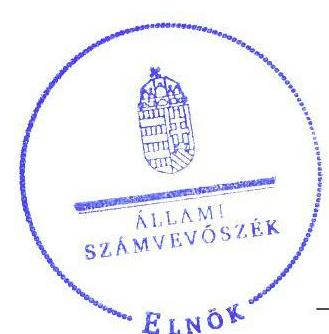

17208
T/17578/1
www.asz.hu

---

|   | AZ ELLENŐRZÉST FELÜGYELTE:  |
| --- | --- |
|   | MAKKAI MÁRIA felügyeleti vezető  |
|   | AZ ELLENŐRZÉST VEZETTE ÉS A VÉGREHAJTÁSÁÉRT FELELŐS:  |
|   | DORMÁN ISTVÁN ZOLTÁN ellenőrzésvezető  |
|   | A PROGRAM ÖSSZEÁLLÍTÁSÁÉRT FELELŐS:  |
|   | TÓTPÁL SZABOLCS osztályvezető  |
|   | A TÉMÁHOZ KAPCSOLÓDÓ KORÁBBI SZÁMVEVŐSZÉKI JELENTÉSEK:  |
|   | - címe: Jelentés Magyarország 2015. évi központi költségvetése végrehajtásának ellenőrzéséről  |
|   | - sorszáma: 16163  |
|  Jelentéseink az Országgyűlés számítógépes hálózatán és az Interneten a www.asz.hu címen is olvashatóak. | - címe: Jelentés Magyarország 2014. évi központi költségvetése végrehajtásának ellenőrzéséről  |
|   | - sorszáma: 15167  |
|   | - címe: Jelentés a 2013. évi zárszámadásról - Magyarország 2013. évi költségvetése végrehajtásának ellenőrzéséről  |
|   | - sorszáma: 14207  |
|   | IKTATÓSZÁM: EL-0026-5171/2017.  |
|   | TÉMASZÁM: 2442  |
|   | ELLENŐRZÉS-AZONOSÍTÓ SZÁM: V0788  |

---

# TARTALOMJEGYZÉK 

ELNÖKI ELŐSZÓ ..... 5
ÖSSZEGZÉS ..... 7
AZ ELLENŐRZÉS CÉLJA ..... 9
AZ ELLENŐRZÉS TERÜLETE ..... 10
AZ ELLENŐRZÉS HÁTTERE, INDOKOLTSÁGA ..... 12
A JELENTÉS LÉNYEGES KÉRDÉSKÖREI ..... 13
ELLENŐRZÉS HATÓKÖRE ÉS MÓDSZEREI ..... 14
MEGÁLLAPÍTÁSOK ..... 17
MELLÉKLETEK ..... 37
I. sz. melléklet: Értelmező szótár ..... 37
II. sz. melléklet: A kontrollkörnyezet minősítése és a belső kontrollrendszer értékelése ..... 42
III. sz. melléklet: Az integritás kontrollrendszer értékelésének összegzése ..... 46
IV. sz. melléklet: Az ellenőrzésbe bevont fejezetek és szervezetek listája ..... 48
V. sz. melléklet: Az ellenőrzésben résztvevők listája ..... 50
FÜGGELÉK: ÉSZREVÉTELEK ..... 53
I. sz. függelék: Az ellenőrzött szervezetek ÁSZ által el nem fogadott észrevételei ..... 54
II. sz. függelék: Az Országgyűlés felé beszámolásra kötelezett intézmények ellenőrzésének eredményéről készített rövid összefoglaló értékelés és azokra tett, ÁSZ által el nem fogadott észrevételek ..... 74
RÖVIDÍTÉSEK JEGYZÉKE ..... 81

---

.

---

# ELNÖKI ELŐSZÓ 


Tisztelt Országgyúlési Képviselő!
Tisztelt Olvasó!
Az Alaptörvény szerint az Országgyűlés fogadja el a központi költségvetést, és hagyja jóvá annak végrehajtását a központi költségvetés végrehajtásáról (zárszámadásról) szóló törvény elfogadásával. A Számvevőszék törvényi előírások alapján évente ellenőrzi a központi költségvetés végrehajtását, a társadalombiztosítás pénzügyi alapjai költségvetésének végrehajtásáról készített zárszámadást és a társadalombiztosítás pénzügyi alapjainak pénzügyi beszámolóját, valamint az elkülönített állami pénzalapok költségvetésének végrehajtásáról készített zárszámadást.
A 2016. évi zárszámadási ellenőrzésünk során értékeltük a Számvevőszék részére átadott törvényjavaslatban szereplő adatok, valamint az azt megalapozó beszámolók, elszámolások megbízhatóságát. Ellenőriztük a 2016. évi éves költségvetési beszámolók és az azok részét képező költségvetési jelentések, maradvány-kimutatások összeállításának szabályszerűségét.
A központi alrendszer intézményei - így az ellenőrzésbe bevont 152 szervezet is - jelentős hatást gyakorolnak a költségvetési egyensúly fenntarthatóságára, az állami vagyonnal való gazdálkodás minőségére, emiatt fontos, hogy közpénzfelhasználásuk szabályos, átlátható és elszámoltatható legyen. Ez alapfeltétele az erőforrások eredményes és hatékony elosztásának és annak, hogy a költségvetési szervek hatékonyan lássák el feladataikat és működésük gazdaságos legyen.
Az államháztartásról szóló törvény előírásának megfelelően, a Kormány a zárszámadásról szóló törvényjavaslatot a költségvetési évet követő év szeptember 30-áig az Országgyűlés elé terjeszti, illetve azt előzetesen a Számvevőszéknek megküldi. A zárszámadásról szóló törvényjavaslatot az Országgyűlés a Számvevőszék jelentésével együtt tárgyalja meg.
Zárszámadási ellenőrzésünk végrehajtásának, a zárszámadási törvényjavaslatról adott véleményünk célja, hogy támogassuk az Országgyűlést a törvényjavaslat elfogadhatóságával kapcsolatos döntéshozatalban és megállapításainkkal erősítsük a közpénzekkel való felelős gazdálkodást.

Domokos László
az Állami Számvevőszék elnöke

---

.

---

# ÖSSZEGZÉS 

A 2016. évi költségvetés végrehajtása megfelelt a jogszabályi előírásoknak. Az államháztartás központi alrendszere 2016. évi törvényi előirányzatainak teljesítése, a hiány és az államadósság alakulása megfelelt a törvényi előírásoknak és az európai uniós feltételeknek. A zárszámadási törvényjavaslat tartalmazza a jogszabályban előírt tartalmi elemeket, szerkezete összhangban van a törvényi előírásokkal. A törvényjavaslat a beszámolók adatainak megfelelően, valósághűen mutatja be a költségvetés végrehajtására vonatkozó pénzügyi adatokat, információkat. A zárszámadási törvényjavaslatban a központi alrendszer részét képező központi költségvetés, a társadalombiztosítás pénzügyi alapjai és az elkülönített állami pénzalapok bevétel- és kiadás-teljesítési adatai megbízhatóak.

## Az ellenőrzés társadalmi indokoltsága

A költségvetés végrehajtásának, a zárszámadás ellenőrzése az Állami Számvevőszék törvény alapján végrehajtandó feladata. A zárszámadás ellenőrzése kiemelten támogatja a közpénzügyek átláthatóságát azzal, hogy a központi költségvetés, a társadalombiztosítás pénzügyi alapjai, valamint az elkülönített állami pénzalapok bevételi és kiadási előirányzatainak ellenőrzésén keresztül a központi alrendszer egészének bevételi és kiadási adatai megbízhatóságáról ad számot. A törvényben előírt ellenőrzési kötelezettség végrehajtása, a zárszámadásról adott számvevőszéki vélemény az Országgyűlést támogatja a megalapozott zárszámadás elfogadásában és hozzájárul az ellenőrzött szervezetek közpénzekkel való felelős gazdálkodásához. Az Állami Számvevőszék második alkalommal elkészített új formátumú, közérthető, felhasználóbarát jelentése egyidejűleg a közvélemény széleskörű tájékoztatását szolgálja.

## Főbb megállapítások

A 2016. évi költségvetés végrehajtása megfelelt a jogszabályi előírásoknak. Az államháztartás központi alrendszere 2016. évi bevételei 18 229,9 Mrd Ft¹-ra, kiadásai 19 054,9 Mrd Ft-ra teljesültek, amelynek eredményeként a pénzforgalmi hiány 825,0 Mrd Ft összegben alakult, ami a GDP² 2,3%-ának felel meg. A Stabilitási törvény³ szerinti államadósság teljes hazai össztermékhez viszonyított aránya a 2015. évi 72,7%-ról a 2016. évre 72,3%-ra csökkent. A Stabilitási törvény szerinti 2016. évi államadósság 25 620,7 Mrd Ft volt. Az államháztartás központi alrendszere 2016. évi törvényi előirányzatainak teljesítése, a hiány alakulása megfelelt az Államháztartásról szóló törvény⁴ és a Költségvetésről szóló törvény⁵, az államadósság alakulása megfelelt az Alaptörvény ${ }^{6}$ és a Stabilitási törvény előírásainak. A kormányzati szektor uniós módszertan szerinti hiánya 656,5 Mrd Ft, a GDP 1,9%-a volt. A hiány alakulása megfelelt az uniós feltételeknek. A kormányzati szektor uniós módszertan szerinti adóssága 2016 végén a GDP 73,9%-a volt (26 164,4 Mrd Ft) a 2015. évi 74,7%-hoz (25 654,0 Mrd Ft) képest. Az uniós kritériumok szerinti adósságcsökkentési követelményt Magyarország teljesítette.

Az NGM⁷ az Államháztartásról szóló törvényben előírt határidőt betartva megküldte a Számvevőszék⁸ részére a Törvényjavaslatot Magyarország 2016. évi központi költségvetéséről szóló 2015. évi C. törvény végrehajtásáról. A 2016. évi zárszámadási törvényjavaslat összeállítása során az NGM a jogszabályok és a vonatkozó belső szabályzatok előírásait betartotta, a törvényjavaslat tartalma, szerkezete megfelel a vonatkozó jogszabályok előírásainak.

A 2016. évi zárszámadási törvényjavaslatban a központi alrendszer részét képező központi költségvetés, a társadalombiztosítás pénzügyi alapjai és az elkülönített állami pénzalapok bevétel- és kiadás-teljesítési adatai megbízhatóak. A törvényjavaslat valósághűen mutatja be a költségvetés végrehajtására vonatkozó pénzügyi adatokat, információkat. A törvényjavaslatban szereplő adatokat a Kincstár⁹ által lezárt éves költségvetési beszámolók adatai alátámasztják. A központi alrendszer 2016. évi bevételi és kiadási előirányzatai teljesítési adatainak megbízhatóságát az 1. ábra mutatja be.

---

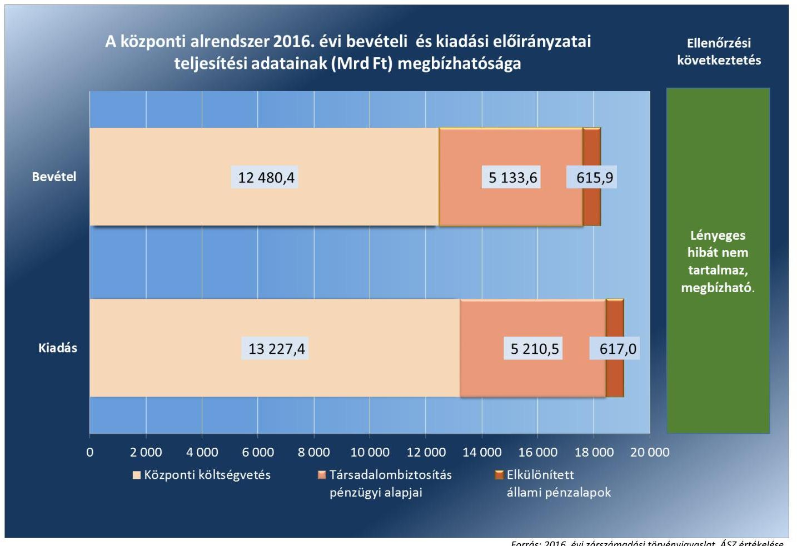

Forrás: 2016. évi zárszámadási törvényjavaslat, ÁSZ értékelése
A központi költségvetés, a társadalombiztosítás pénzügyi alapjai és az elkülönített állami pénzalapok bevételi és kiadási előirányzatainak teljesítése során összességében betartották a jogszabályi előírásokat.

---

# AZ ELLENŐRZÉS CÉLJA 

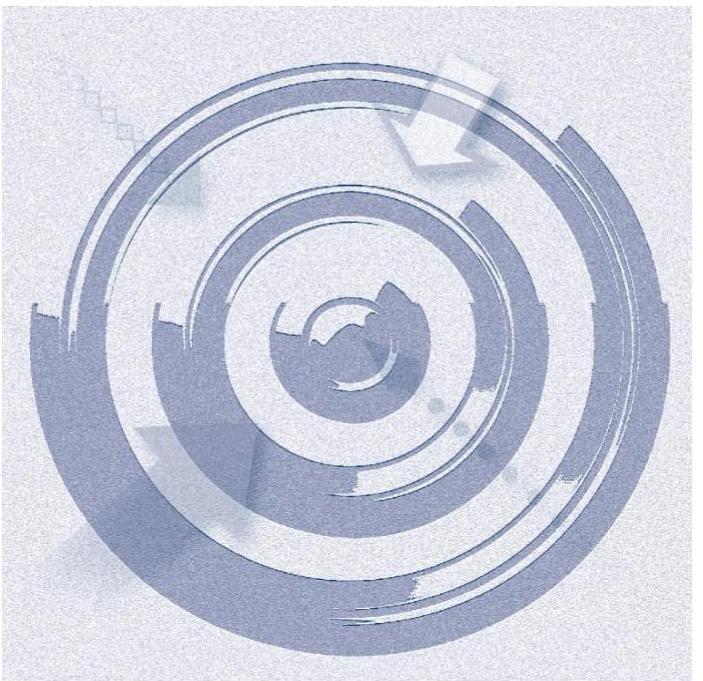

Az Állami Számvevőszék a zárszámadási törvényjavaslat megfelelőségét és az abban szereplő adatok megbízhatóságát ellenőrizte, amelynek célja volt, hogy ésszerű bizonyosságot szerezzen arról, hogy a zárszámadási törvényjavaslat tartalma, szerkezete megfelel-e a jogszabályi előírásoknak; az Alaptörvény és a Stabilitási törvény államadósságra vonatkozó előírásai érvényesültek-e, az államháztartás központi alrendszerében a hiány alakulása meg-felelt-e a Kvtv. ¹⁰ előírásainak; az államháztartás bevételeit a Kvtv.-ben rögzítettekkel összhangban, a közpénzekkel való gazdálkodás jogszabályi követelményeinek megfelelően használták-e fel, a törvényjavaslat valósághűen mutatja-e be a költségvetés végrehajtására vonatkozó pénzügyi adatokat, információkat; a központi költségvetés bevételi és kiadási előirányzatainak teljesítése megfelelt-e a jogszabályi előírásoknak és tartalmaz-e lényeges hibát; a költségvetés végrehajtásában jog- és hatáskörrel rendelkezők a 2016. évi költségvetésben meghatározott pénzügyi keretek között szabályszerűen gazdálkodtak-e a közpénzekkel.

---

### **AZ ELLENŐRZÉS TERÜLETE**

### **2016. évi zárszámadás – Magyarország 2016. évi központi költségvetése végrehajtásának ellenőrzése**


Az Országgyűlés a Kvtv.-ben az államháztartás központi alrendszerének bevételi főösszegét 15 800,4 Mrd Ft-ban, kiadási főösszegét 16 562,0 Mrd Ft-ban, hiányát 761,6 Mrd Ft-ban állapította meg. A Kvtv. módosításáról szóló törvények 2016. évben a központi alrendszer bevételi főösszegét 16 226,6 Mrd Ft-ra, a kiadási főösszeget 16 988,2 Mrd Ft-ra módosították, a tervezett hiány összege nem módosult. Magyarország 2016. évi központi költségvetéséről szóló 2015. évi C. törvény végrehajtásáról szóló Törvényjavaslat alapján 2016. évben a központi alrendszer bevételeinek, kiadásainak, és azok egyenlegeként a központi alrendszer hiányának alakulását az 1. táblázat mutatja.

1. táblázat

|  A KÖZPONTI ALRENDSZER BEVÉTELEINEK, KIADÁSAINAK ÉS A HIÁNY ALAKULÁSA (Mrd Ft) |  |  |   |
| --- | --- | --- | --- |
|   | Bevétel | Kiadás | Hiány*  |
|  Terv adat | 15 800,4 | 16 562,0 | 761,6  |
|  Törvényi módosított adat | 16 226,6 | 16 988,2 | 761,6  |
|  Tény adat | 18 229,9 | 19 054,9 | 825,0  |
|  * Folyó áron, pénzforgalmi szemléletben. Forrás: 2016. évi zárszámadási törvényjavaslat |  |  |   |

A központi alrendszer részét képező központi költségvetés bevételeinek teljesítése 2016. évben 12 480,4 Mrd Ft, a központi költségvetés kiadásainak teljesítése 13 227,4 Mrd Ft volt. A TB Alapok¹¹ bevételei 5133,6 Mrd Ft-ban, kiadásai 5210,5 Mrd Ft-ban, az ELKA¹² bevételei 615,9 Mrd Ft-ban, kiadásai 617,0 Mrd Ft összegben teljesültek.

Az Áht.¹³ előírásai alapján a költségvetés végrehajtásáról – a központi kezelésű, a szakmai fejezeti kezelésű előirányzatok, a költségvetési szervek, a TB Alapok és az ELKA bevételeiről és kiadásairól – éves költségvetési beszámolót, az éves költségvetési beszámolók alapján évente, az elfogadott költségvetéssel összehasonlítható módon zárszámadást kell készíteni. Az Áhsz. 2017. január 1-jétől hatályos módosítása értelmében az éves költségvetési beszámolók adataiból a Kincstár az államháztartás központi alrendszeréről összevont (konszolidált) beszámolót a zárszámadási törvényjavaslat Országgyűlés elé terjesztésének időpontjáig, szeptember 30-ig készíti el.

A 2016. évi zárszámadás ellenőrzése során a Számvevőszék az államháztartás központi alrendszerében a bevételek és kiadások adatainak megbízhatóságát, valamint a bevételi és kiadási előirányzatok teljesítésének, az éves költségvetési beszámolók összeállításának szabályszerűségét ellenőrizte. A kontrollkörnyezet és a belső kontrollrendszer (II. számú melléklet), valamint az integritás kontrollkörnyezet (III. számú melléklet) értékelése azokra a kontrollokra terjedt ki, amelyek elősegítik a közpénzek védelmét és támogatják a vezetést abban, hogy az ellenőrzött szervezet megfeleljen a vonatkozó jogszabályoknak.

A Számvevőszék elvégezte a zárszámadás kiegészítő információinak elkészítését, a pénzügyi számvitellel biztosító beszámolórészek összeállítása szabályszerűségének ellenőrzését is az OGY¹⁴ felé beszámolásra kötelezett intézmények és
 a TB Alapok tekintetében. Az ezzel kapcsolatos számvevőszéki megállapítások a zárszámadási törvényjavaslat adatai megbízhatóságának minősítését nem érintik.

---

# AZ ELLENŐRZÉS HÁTTERE, INDOKOLTSÁGA 


Az Alaptörvény szerint a központi költségvetés végrehajtásának ellenőrzését az Állami Számvevőszék végzi el. Az ÁSZ törvény¹⁵ előírásainak megfelelően a zárszámadási ellenőrzés végrehajtása a Számvevőszék éves gyakorisággal elvégzendő feladata. A Számvevőszék törvényi kötelezettségének teljesítésével hozzájárul ahhoz, hogy az Országgyűlés a zárszámadási törvény elfogadásával kapcsolatban megalapozott döntést hozzon. Az ellenőrzés célja teljes és objektív képet adni a 2016. évi zárszámadási törvényjavaslatban szereplő adatok megbízhatóságáról, továbbá a megállapításokkal elősegíteni az ellenőrzött szervezetek közpénzekkel való felelős gazdálkodását. A Számvevőszék az ellenőrzéssel hozzájárul az értékteremtő rend kialakításához és megőrzéséhez.

---

# A JELENTÉS LÉNYEGES KÉRDÉSKÖREI 

1. Az államháztartás központi alrendszerében a hiány és az államadósság alakulása megfelelt-e a törvényi előírásoknak? A zárszámadási törvényjavaslat tartalma, szerkezete megfelelt-e a jogszabályi előírásoknak?
2. A zárszámadási törvényjavaslat valósághűen mutatja-e be a költségvetés végrehajtására vonatkozó pénzügyi adatokat, információkat? A központi költségvetés, a TB Alapok és az ELKA bevételi és kiadási előirányzatainak teljesítési adatai megbízhatóak-e?
3. A központi költségvetés, a TB Alapok és az ELKA bevételi és kiadási előirányzatainak teljesítése, az előirányzatok módosítása, a költségvetési maradvány megállapítása és az éves költségvetési beszámolók összeállítása során betartották-e a jogszabályi előírásokat?

---

# ELLENŐRZÉS HATÓKÖRE ÉS MÓDSZEREI 

## Az ellenőrzés típusa

Megfelelőségi ellenőrzés.

## Az ellenőrzött időszak

2016. január 1-jétől 2016. december 31-ig, a zárszámadási törvényjavaslat összeállítása tekintetében 2017. szeptember 30-ig tartó időszak.

## Az ellenőrzés tárgya

A zárszámadás ellenőrzése során a Számvevőszék a 2016. évi zárszámadási törvényjavaslat megfelelőségét és az abban szereplő adatok megbízhatóságát ellenőrizte. A zárszámadási ellenőrzés keretében a központi kezelésű előirányzatok, szakmai fejezeti kezelésű előirányzatok (azon belül európai uniós támogatások), központi költségvetési szervek, TB Alapok és ELKA fő ellenőrzési területeken a gazdálkodás és az előirányzat-felhasználás megfelelőségét (szabályszerűségét), a költségvetési gazdálkodásra vonatkozó szabályokkal való összhangját ellenőrizte. Az ellenőrzés kiterjedt minden olyan körülményre és adatra, amely a Számvevőszék jogszabályban meghatározott feladatainak teljesítéséhez, valamint a program végrehajtása folyamán felmerült újabb összefüggések feltárásához szükséges volt.

## Az ellenőrzött szervezetek

Az NGM, Kincstár, NAV¹⁶, ÁKK Zrt.¹⁷, központi kezelésű előirányzatok, a mintavételezéssel kiválasztott fejezeti kezelésű előirányzatok (I. OGY, II. KE¹⁸, III. AB¹⁹, IV. AJBH²⁰, VI. BIR²¹, VIII. Ügyészség, X. IM²², XI. ME²³, XII. FM²⁴, XIII. HM²⁵, XIV. BM²⁶, XV. NGM, XVI. NAV, XVII. NFM²⁷, XVIII. KKM²⁸, XX. EMMI²⁹, XXI. MK³⁰, XXX. GVH³¹, XXXI. KSH³², XXXIII. MTA³³, XXXIV. MMA³⁴, XXXV. NKFIH³⁵ és XIX. UF³⁶) és kezelő szerveik. Az OGY részére a tevékenységükről beszámolásra kötelezett intézmények (NAIH³⁷, NVI³⁸, KH³⁹, NÉBIH⁴⁰, GVH⁴¹, KSH⁴², MTA⁴³, MMA⁴⁴, MEKSzH⁴⁵), az alkotmányos fejezetek intézményei (OGYH⁴⁶, KEH⁴⁷, AB, AJBH, Bíróságok cím intézményei⁴⁸, Kúria, Ügyészségek), továbbá a központi költségvetés mintavételezéssel kiválasztott 65 egyéb intézménye. A TB Alapok (Ny. Alap⁴⁹, E. Alap⁵⁰) és az ELKA (LXII. NKFIA⁵¹, LXIII. NEFA⁵², LXIV. SZHIA⁵³, LXV. BGA⁵⁴, LXVI. KNPA⁵⁵, LXVII. NKA⁵⁶, LXVIII. WMA⁵⁷) és az alapkezelők. Az ellenőrzött szervezeteket a IV. számú melléklet tartalmazza.

---

# Az ellenőrzés jogalapja 

Az ellenőrzés lefolytatásának jogalapját az Állami Számvevőszékről szóló 2011. évi LXVI. törvény 5. § (7) bekezdése képezte.

## Az ellenőrzés módszerei

Az ellenőrzést az Állami Számvevőszék Általános alapelveiben⁵⁸ (számvevőszéki ellenőrzési standardokban), a Megfelelőségi ellenőrzés alapelveiben⁵⁹, valamint az arra épülő, a zárszámadás ellenőrzésre vonatkozó, 2015. évben kiadott Módszertani Útmutatóban⁶⁰ foglalt, a költségvetés végrehajtásának ellenőrzéséhez speciálisan kialakított módszertani elvekkel és szabályokkal összhangban folytatta le.

Az ellenőrzés ideje alatt az ellenőrzött szervezettel történő kapcsolattartás az Állami Számvevőszék SZMSZ⁶¹-ének vonatkozó előírásai alapján történt.

Az ellenőrzési bizonyítékként felhasználható adatforrások közé tartoztak egyrészt a szakmai program részletes szempontjainál felsorolt adatforrások, másrészt adatforrás lehetett még - az ellenőrzés folyamán - feltárt, az ellenőrzés szempontjából információt tartalmazó dokumentum. Az ellenőrzési kérdések megválaszolásához szükséges bizonyítékok megszerzése az ellenőrzött által rendelkezésre bocsátott dokumentumokra, adatokra alapozva megfigyelés, szemle (szemrevételezés), kérdésfeltevés (információkérés), mintavételezés, valamint elemző eljárás útján történt.

A zárszámadási törvényjavaslat megfelelőségének ellenőrzése, a zárszámadási törvényjavaslat összeállítását támogató elektronikus információs rendszerek kialakításának és működtetésének, valamint a Kincstárnál az Áhsz.⁶²-ben előírt összevont (konszolidált) beszámolók elkészítésének ellenőrzése a vonatkozó jogszabályi előírások alapján történt.

Az Áhsz. előírásaival összhangban a költségvetés végrehajtásának ellenőrzését a pénzforgalmi szemléletű költségvetési számvitel által szolgáltatott adatok, a költségvetési számvitel alapján készülő beszámoló-részek ellenőrzésével végezte a Számvevőszék. A Számvevőszék a fő ellenőrzési területeken a bevételi és kiadási előirányzatok teljesítési adatainak megbízhatóságát, az előirányzatok teljesítésének, az előirányzat módosítások, a maradvány megállapításának és a beszámolók összeállításának szabályszerűségét ellenőrizte.

A 2016. évi zárszámadási törvényjavaslatban szereplő pénzforgalmi bevételek és kiadások teljesítését a Számvevőszék pénzegység alapú (MUS⁶³) mintavételi eljárással kiválasztott minták alapján ellenőrizte.

A Számvevőszék az ellenőrzés során feltárt hibákat két fő csoportba sorolta: a zárszámadási törvényjavaslat adatainak megbízhatóságát befolyásoló megbízhatósági hibák, illetve szabályszerűségi hibák, a jogszabályi előírásoknak való meg nem felelés esetei.

A Számvevőszék értékelte az ellenőrzés során azonosított megbízhatósági hibákat abból a szempontból, hogy azok önmagukban vagy együttesen lényegesek, és meghatározta, hogy milyen hatást gyakorolhatnak a zárszámadási törvényjavaslat egészének megbízhatóságára. Ehhez mérlegelte

---

a hibák jellegét és összegét a zárszámadási törvényjavaslat egésze vonatkozásában, valamint az előfordulásuk körülményeit. A zárszámadási törvényjavaslatról szóló véleménye kialakításához - az ellenőrzés eredményeinek kiértékelése és a hibák teljes sokaságra történt kivetítése alapján - a Számvevőszék a zárszámadási törvényjavaslat megbízhatóságát befolyásoló összes hiba összegét viszonyította a lényegességi küszöbértékhez. A lényegességi küszöbértéket a Számvevőszék a központi költségvetés, a TB Alapok és az ELKA bevételi, illetve kiadási főösszegének (teljesítési adat) 2%-ában határozta meg. A Számvevőszék ennek alapján alkotott véleményt a törvényjavaslatban szereplő adatok összességének megbízhatóságáról.

A Számvevőszék további specifikus lényegességi küszöbértékeket is meghatározott az egyes részterületek tekintetében. A specifikus lényegességi küszöbértéket az adott részterület bevételi, kiadási összegei teljesítési adatainak 2%-ában határozta meg. A 2016. évi zárszámadás ellenőrzés során a fő ellenőrzési területek adatait a Számvevőszék „megbízható"-nak értékelte, amennyiben az ellenőrzés eredményeinek kiértékelése alapján azt állapította meg, hogy a teljes alap sokaságban (azaz az ellenőrzési terület adatainak összességében) előforduló megbízhatósági hibák összértéke 95%-os megbízhatósággal nem haladja meg a 2%-os lényegességi szintet. Ellenkező esetben a Számvevőszék az adott ellenőrzési terület adataira vonatkozóan „nem megbízható" értékelést adott.

A kontrollkörnyezet, illetve a belső kontrollrendszer megfelelőségének minősítése során a minősítési kategóriák a következők voltak: ha az ellenőrzés eredményeképpen a megfelelőség százalékosan elérte legalább a 85%-os mértéket a kontrollkörnyezet, illetve a belső kontrollrendszer minősítése „megfelelő" lett; ha az ellenőrzés eredményeképpen a megfelelőség százalékosan 61% és 84% közötti volt a minősítés „részben megfelelő" lett; ha az ellenőrzés eredményeképpen a megfelelőség százalékosan nem érte el legalább a 61%-ot a kontrollkörnyezet, illetve a teljes belső kontrollrendszer minősítése „nem megfelelő" lett. (A megfelelőségi százalékokat egész számra kerekítve történt a minősítés.)

Az integritás kontrollrendszer értékelése alapján az intézmények integritás kontrollrendszere „kiváló", „megfelelő", vagy „fejlesztendő" minősítést kaphatott. „Kiváló", illetve „megfelelő" minősítést azon intézmények kaphattak, amelyek képesek kezelni a kockázatokat. „Fejlesztendő" minősítést azon intézmények kaptak, amelyek esetében a kontrollok jelenlegi szintje nem képes megfelelően kezelni a kockázatokat.

---

# MEGÁLLAPÍTÁSOK 

## 1. Az államháztartás központi alrendszerében a hiány és az államadósság alakulása megfelelt-e a törvényi előírásoknak? A zárszámadási törvényjavaslat tartalma, szerkezete megfelelt-e a jogszabályi előírásoknak?

Összegző megállapítás

Az államháztartás központi alrendszerében a hiány és az államadósság alakulása megfelelt a törvényi előírásoknak. A 2016. évi zárszámadási törvényjavaslat tartalma, szerkezete megfelelt a jogszabályi előírásoknak.
1.1. számú megállapítás

Az államháztartás központi alrendszere 2016. évi törvényi előirányzatainak teljesítése megfelelt a jogszabályi előírásoknak. Az államháztartás központi alrendszerében a pénzforgalmi hiány alakulása megfelelt a törvényi előírásoknak. Az államadósság alakulása megfelelt az Alaptörvény és a Stabilitási törvény előírásainak. Az uniós módszertan szerint számított hiány és államadósság alakulása megfelelt az uniós feltételeknek.

AZ ÁLLAMHÁZTARTÁS KÖZPONTI ALRENDSZERÉNEK BEVÉTELE 2003,3 Mrd Ft-tal (12,3%-kal) haladta meg a törvényi módosított előirányzatot. A bevételi előirányzat magasabb szintű teljesüléséhez a központi költségvetés 1872,0 Mrd Ft-tal, az ELKA 20,7 Mrd Ft-tal, a TB Alapok közül az Ny. Alap 30,2 Mrd Ft-tal, az E. Alap 80,4 Mrd Ft-tal járult hozzá. A központi alrendszer bevételi főösszegének alakulását 2015-2016. években a 2. ábra mutatja.
2. ábra
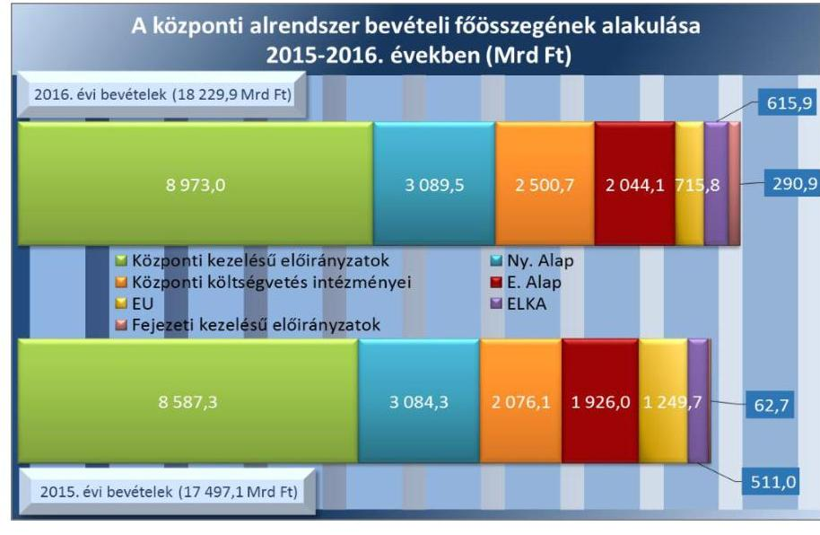

---

## AZ ÁLLAMHÁZTARTÁS KÖZPONTI ALRENDSZERÉNEK KIADÁSA 2066,7 Mrd Ft-tal (12,2%-kal) magasabb szinten

teljesült a törvényi módosított előirányzathoz képest, amelyhez a központi költségvetés 1868,0 Mrd Ft-tal, a TB Alapok közül az Ny. Alap 12,9 Mrd Ft-tal, az E. Alap 170,1 Mrd Ft-tal, az ELKA 15,7 Mrd Ft-tal járult hozzá. A (törvényi-, Kormány-, felügyeleti szervi- és intézményi hatáskörben) módosított (20 392,8 Mrd Ft összegű) előirányzathoz képest a teljesítés 6,6%-kal alacsonyabb volt. A központi alrendszer kiadásainak legnagyobb hányadát, 27,3%-át a TB Alapok kiadásai jelentették. A központi alrendszer összes kiadásából a költségvetési szervek kiadásai 24,1%-ot, a központi kezelésű előirányzatok kiadásai 23,6%-ot tettek ki. A szakmai fejezeti kezelésű előirányzatok 21,7%-ot, az ELKA kiadásai 3,3%-ot képviseltek. A központi alrendszer kiadási főösszegének alakulását 2015-2016. években a 3. ábra mutatja. 3. ábra

|  A központi alrendszer kiadási főösszegének alakulása |   |
| --- | --- |
|  2015-2016. években (Mrd Ft) |   |
|  2016. évi kiadások (19 054,9 Mrd Ft) |   |
|  4494,9 | 4600,4  |
|  4600,4 | 3076,6  |
|  4494,9 | 4600,4  |
|  4600,4 | 3076,6  |
|  4494,9 | 4600,4  |
|  4600,4 | 3076,6  |
|  4494,9 | 4600,4  |
|  4600,4 | 3076,6  |
|  4494,9 | 4600,4  |
|  4600,4 | 3076,6  |
|  4494,9 | 4600,4  |
|  4600,4 | 3076,6  |
|  4494,9 | 4600,4  |
|  4600,4 | 3076,6  |
|  4494,9 | 4600,4  |
|  4600,4 | 3076,6  |
|  4494,9 | 4600,4  |
|  4600,4 | 3076,6  |
|  4494,9 | 4600,4  |
|  4600,4 | 3076,6  |
|  4494,9 | 4600,4  |
|  4600,4 | 3076,6  |
|  4494,9 | 4600,4  |
|  4600,4 | 3076,6  |

  4494,9 | 4600,4  |
|  4600,4 | 3076,6  |
|  4494,9 | 4600,4  |
|  4600,4 | 3076,6  |
|  4494,9 | 4600,4  |
|  4600,4 | 3076,6  |
|  4494,9 | 4600,4  |
|  4600,4 | 3076,6  |
|  4494,9 | 4600,4  |
|  4600,4 | 3076,6  |
|  4494,9 | 4600,4  |
|  4600,4 | 3076,6  |
|  4494,9 | 4600,4  |
|  4600,4 | 3076,6  |
|  4494,9 | 4600,4  |
|  4600,4 | 3076,6  |
|  4494,9 | 4600,4  |
|  4600,4 | 3076,6  |
|  4494,9 | 4600,4  |
|  4600,4 | 3076,6  |
|  4494,9 | 4600,4  |
|  4600,4 | 3076,6  |
|  4494,9 | 4600,4  |
|  4600,4 | 3076,6  |
|  4494,9 | 4600,4  |
|  4600,4 | 3076,6  |
|  4494,9 | 4600,4  |
|  4600,4 | 3076,6  |
|  4494,9 | 4600,4  |
|  4600,4 | 3076,6  |
|  4494,9 | 4600,4  |
|  4600,4 | 3076,6  |
|  4494,9 | 4600,4  |
|  4600,4 | 3076,6  |
|  4494,9 | 4600,4  |
|  4600,4 | 3076,6  |
|  4494,9 | 4600,4  |
|  4600,4 | 3076,6  |
|  4494,9 | 4600,4  |
|  4600,4 | 3076,6  |
|  4494,9 | 4600,4  |
|  4600,4 | 3076,6  |
|  4494,9 | 4600,4  |
|  4600,4 | 3076,6  |
|  4494,9 | 4600,4  |
|  4600,4 | 3076,6  |
|  4494,9 | 4600,4  |
|  4600,4 | 3076,6  |
|  4494,9 | 4600,4  |
|  4600,4 | 3076,6  |
|  4494,9 | 4600,4  |
|  4600,4 | 3076,6  |
|  4494,9 | 4600,4  |
|  4600,4 | 3076,6  |
|  4494,9 | 4600,4  |
|  4600,4 | 3076,6  |
|  4494,9 | 4600,4  |
|  4600,4 | 3076,6  |
|  4494,9 | 4600,4  |
|  4600,4 | 3076,6  |
|  4494,9 | 4600,4  |
|  4600,4 | 3076,6  |
|  4494,9 | 4600,4  |
|  4600,4 | 3076,6  |
|  4494,9 | 4600,4  |
|  4600,4 | 3076,6  |
|  4494,9 | 4600,4  |
|  4600,4 | 3076,6  |
|  4494,9 | 4600,4  |
|  4600,4 | 3076,6  |
|  4494,9 | 4600,4  |
|  4600,4 | 3076,6  |
|  4494,9 | 4600,4  |
|  4600,4 | 3076,6  |
|  4494,9 | 4600,4  |
|  4600,4 | 3076,6  |
|  4494,9 | 4600,4  |
|  4600,4 | 3076,6  |
|  4494,9 | 4600,4  |
|  4600,4 | 3076,6  |
|  4494,9 | 4600,4  |
|  4600,4 | 3076,6  |
|  4494,9 | 4600,4  |
|  4600,4 | 3076,6  |
|  4494,9 | 4600,4  |
|  4600,4 | 3076,6  |
|  4494,9 | 4600,4  |
|  4600,4 | 3076,6  |
|  4494,9 | 4600,4  |
|  4600,4 | 3076,6  |
|  4494,9 | 4600,4  |
|  4600,4 | 3076,6  |
|  4494,9 | 4600,4  |
|  4600,4 | 3076,6  |
|  4494,9 | 4600,4  |
|  4600,4 | 3076,6  |
|  4494,9 | 4600,4  |
|  4600,4 | 3076,6  |
|  4494,9 | 4600,4  |
|  4600,4 | 3076,6  |
|  4494,9 | 4600,4  |
|  4600,4 | 3076,6  |
|  4494,9 | 4600,4  |
|  4600,4 | 3076,6  |
|  4494,9 | 4600,4  |
|  4600,4 | 3076,6  |
|  4494,9 | 4600,4  |
|  4600,4 | 3076,6  |
|  4494,9 | 4600,4  |
|  4600,4 | 3076,6  |
|  4494,9 | 4600,4  |
|  4600,4 | 3076,6  |
|  4494,9 | 4600,4  |
|  4600,4 | 3076,6  |
|  4494,9 | 4600,4  |
|  4600,4 | 3076,6  |
|  4494,9 | 4600,4  |
|  4600,4 | 3076,6  |
|  4494,9 | 4600,4  |
|  4600,4 | 3076,6  |
|  4494,9 | 4600,4  |
|  4600,4 | 3076,6  |
|  4494,9 | 4600,4  |
|  4600,4 | 3076,6  |
|  4494,9 | 4600,4  |
|  4600,4 | 3076,6  |
|  4494,9 | 4600,4  |
|  4600,4 | 3076,6  |
|  4494,9 | 4600,4  |
|  4600,4 | 3076,6  |
|  4494,9 | 4600,4  |
|  4600,4 | 3076,6  |
|  4494,9 | 4600,4  |
|  4600,4 | 3076,6  |
|  4494,9 | 4600,4  |
|  4600,4 | 3076,6  |
|  4494,9 | 4600,4  |
|  4600,4 | 3076,6  |
|  4494,9 | 4600,4  |
|  4600,4 | 3076,6  |
|  4494,9 | 4600,4  |
|  4600,4 | 3076,6  |
|  4494,9 | 4600,4  |
|  4600,4 | 3076,6  |
|  4494,9 | 4600,4  |
|  4600,4 | 3076,6  |
|  4494,9 | 4600,4  |
|  4600,4 | 3076,6  |
|  4494,9 | 4600,4  |
|  4600,4 | 3076,6  |
|  4494,9 | 4600,4  |
|  4600,4 | 3076,6  |
|  4494,9 | 4600,4  |
|  4600,4 | 3076,6  |
|  4494,9 | 4600,4  |
|  4600,4 | 3076,6  |
|  4494,9 | 4600,4  |
|  4600,4 | 3076,6  |
|  4494,9 | 4600,4  |
|  4600,4 | 3076,6  |
|  4494,9 | 4600,4  |
|  4600,4 | 3076,6  |
|  4494,9 | 4600,4  |
|  4600,4 | 3076,6  |
|  4494,9 | 4600,4  |
|  4600,4 | 3076,6  |
|  4494,9 | 4600,4  |
|  4600,4 | 3076,6  |
|  4494,9 | 4600,4  |
|  4600,4 | 3076,6  |
|  4494,9 | 4600,4  |
|  4600,4 | 3076,6  |
|  4494,9 | 4600,4  |
|  4600,4 | 3076,6  |
|  4494,9 | 4600,4  |
|  4600,4 | 3076,6  |
|  4494,9 | 4600,4  |
|  4600,4 | 3076,6  |
|  4494,9 | 4600,4  |
|  4600,4 | 3076,6  |
|  4494,9 | 4600,4  |
|  4600,4 | 3076,6  |
|  4494,9 | 4600,4  |
|  4600,4 | 3076,6  |
|  4494,9 | 4600,4  |
|  4600,4 | 3076,6  |
|  4494,9 | 4600,4  |
|  4600,4 | 3076,6  |
|  4494,9 | 4600,4  |
|  4600,4 | 3076,6  |
|  4494,9 | 4600,4  |
|  4600,4 | 3076,6  |
|  4494,9 | 4600,4  |
|  4600,4 | 3076,6  |
|  4494,9 | 4600,4  |
|  4600,4 | 3076,6  |
|  4494,9 | 4600,4  |
|  4600,4 | 3076,6  |
|  4494,9 | 4600,4  |
|  4600,4 | 3076,6  |
|  4494,9 | 4600,4  |
|  4600,4 | 3076,6  |
|  4494,9 | 4600,4  |
|  4600,4 | 3076,6  |
|  4494,9 | 4600,4  |
|  4600,4 | 3076,6  |
|  4494,9 | 4600,4  |
|  4600,4 | 3076,6  |

  4494,9 | 4600,4  |
|  4600,4 | 3076,6  |
|  4494,9 | 4600,4  |
|  4600,4 | 3076,6  |
|  4494,9 | 4600,4  |
|  4600,4 | 3076,6  |
|  4494,9 | 4600,4  |
|  4600,4 | 3076,6  |
|  4494,9 | 4600,4  |
|  4600,4 | 3076,6  |
|  4494,9 | 4600,4  |
|  4600,4 | 3076,6  |
|  4494,9 | 4600,4  |
|  4600,4 | 3076,6  |
|  4494,9 | 4600,4  |
|  4600,4 | 3076,6  |
|  4494,9 | 4600,4  |
|  4600,4 | 3076,6  |
|  4494,9 | 4600,4  |
|  4600,4 | 3076,6  |
|  4494,9 | 4600,4  |
|  4600,4 | 3076,6  |
|  4494,9 | 4600,4  |
|  4600,4 | 3076,6  |
|  4494,9 | 4600,4  |
|  4600,4 | 3076,6  |
|  4494,9 | 4600,4  |
|  4600,4 | 3076,6  |
|  4494,9 | 4600,4  |
|  4600,4 | 3076,6  |
|  4494,9 | 4600,4  |
|  4600,4 | 3076,6  |
|  4494,9 | 4600,4  |
|  4600,4 | 3076,6  |
|  4494,9 | 4600,4  |
|  4600,4 | 3076,6  |
|  4494,9 | 4600,4  |
|  4600,4 | 3076,6  |
|  4494,9 | 4600,4  |
|  4600,4 | 3076,6  |
|  4494,9 | 4600,4  |
|  4600,4 | 3076,6  |
|  4494,9 | 4600,4  |
|  4600,4 | 3076,6  |
|  4494,9 | 4600,4  |
|  4600,4 | 3076,6  |
|  4494,9 | 4600,4  |
|  4600,4 | 3076,6  |
|  4494,9 | 4600,4  |
|  4600,4 | 3076,6  |
|  4494,9 | 4600,4  |
|  4600,4 | 3076,6  |
|  4494,9 | 4600,4  |
|  4600,4 | 3076,6  |
|  4494,9 | 4600,4  |
|  4600,4 | 3076,6  |
|  4494,9 | 4600,4  |
|  4600,4 | 3076,6  |
|  4494,9 | 4600,4  |
|  4600,4 | 3076,6  |
|  4494,9 | 4600,4  |
|  4600,4 | 3076,6  |
|  4494,9 | 4600,4  |
|  4600,4 | 3076,6  |
|  4494,9 | 4600,4  |
|  4600,4 | 3076,6  |
|  4494,9 | 4600,4  |
|  4600,4 | 3076,6  |
|  4494,9 | 4600,4  |
|  4600,4 | 3076,6  |
|  4494,9 | 4600,4  |
|  4600,4 | 3076,6  |
|  4494,9 | 4600,4  |
|  4600,4 | 3076,6  |
|  4494,9 | 4600,4  |
|  4600,4 | 3076,6  |
|  4494,9 | 4600,4  |
|  4600,4 | 3076,6  |
|  4494,9 | 4600,4  |
|  4600,4 | 3076,6  |
|  4494,9 | 4600,4  |
|  4600,4 | 3076,6  |
|  4494,9 | 4600,4  |
|  4600,4 | 3076,6  |
|  4494,9 | 4600,4  |
|  4600,4 | 3076,6  |
|  4494,9 | 4600,4  |
|  4600,4 | 3076,6  |
|  4494,9 | 4600,4  |
|  4600,4 | 3076,6  |
|  4494,9 | 4600,4  |
|  4600,4 | 3076,6  |
|  4494,9 | 4600,4  |
|  4600,4 | 3076,6  |
|  4494,9 | 4600,4  |
|  4600,4 | 3076,6  |
|  4494,9 | 4600,4  |
|  4600,4 | 3076,6  |
|  4494,9 | 4600,4  |
|  4600,4 | 3076,6  |
|  4494,9 | 4600,4  |
|  4600,4 | 3076,6  |
|  4494,9 | 4600,4  |
|  4600,4 | 3076,6  |
|  4494,9 | 4600,4  |
|  4600,4 | 3076,6  |
|  4494,9 | 4600,4  |
|  4600,4 | 3076,6  |
|  4494,9 | 4600,4  |
|  4600,4 | 3076,6  |
|  4494,9 | 4600,4  |
|  4600,4 | 3076,6  |
|  4494,9 | 4600,4  |
|  4600,4 | 3076,6  |
|  4494,9 | 4600,4  |
|  4600,4 | 3076,6  |
|  4494,9 | 4600,4  |
|  4600,4 | 3076,6  |
|  4494,9 | 4600,4  |
|  4600,4 | 3076,6  |
|  4494,9 | 4600,4  |
|  4600,4 | 3076,6  |
|  4494,9 | 4600,4  |
|  4600,4 | 3076,6  |
|  4494,9 | 4600,4  |
|  4600,4 | 3076,6  |
|  4494,9 | 4600,4  |
|  4600,4 | 3076,6  |
|  4494,9 | 4600,4  |
|  4600,4 | 3076,6  |
|  4494,9 | 4600,4  |
|  4600,4 | 3076,6  |
|  4494,9 | 4600,4  |
|  4600,4 | 3076,6  |
|  4494,9 | 4600,4  |
|  4600,4 | 3076,6  |
|  4494,9 | 4600,4  |
|  4600,4 | 3076,6  |
|  4494,9 | 4600,4  |
|  4600,4 | 3076,6  |
|  4494,9 | 4600,4  |
|  4600,4 | 3076,6  |
|  4494,9 | 4600,4  |
|  4600,4 | 3076,6  |
|  4494,9 | 4600,4  |
|  4600,4 | 3076,6  |
|  4494,9 | 4600,4  |
|  4600,4 | 3076,6  |
|  4494,9 | 4600,4  |
|  4600,4 | 3076,6  |
|  4494,9 | 4600,4  |
|  4600,4 | 3076,6  |
|  4494,9 | 4600,4  |
|  4600,4 | 3076,6  |
|  4494,9 | 4600,4  |
|  4600,4 | 3076,6  |
|  4494,9 | 4600,4  |
|  4600,4 | 3076,6  |
|  4494,9 | 4600,4  |
|  4600,4 | 3076,6  |

  4494,9 | 4600,4  |
|  4600,4 | 3076,6  |
|  4494,9 | 4600,4  |
|  4600,4 | 3076,6  |
|  4494,9 | 4600,4  |
|  4600,4 | 3076,6  |
|  4494,9 | 4600,4  |
|  4600,4 | 3076,6  |
|  4494,9 | 4600,4  |
|  4600,4 | 3076,6  |
|  4494,9 | 4600,4  |
|  4600,4 | 3076,6  |
|  4494,9 | 4600,4  |
|  4600,4 | 3076,6  |
|  4494,9 | 4600,4  |
|  4600,4 | 3076,6  |
|  4494,9 | 4600,4  |
|  4600,4 | 3076,6  |
|  4494,9 | 4600,4  |
|  4600,4 | 3076,6  |
|  4494,9 | 4600,4  |
|  4600,4 | 3076,6  |
|  4494,9 | 4600,4  |
|  4600,4 | 3076,6  |
|  4494,9 | 4600,4  |
|  4600,4 | 3076,6  |
|  4494,9 | 4600,4  |
|  4600,4 | 3076,6  |
|  4494,9 | 4600,4  |
|  4600,4 | 3076,6  |
|  4494,9 | 4600,4  |
|  4600,4 | 3076,6  |
|  4494,9 | 4600,4  |
|  4600,4 | 3076,6  |
|  4494,9 | 4600,4  |
|  4600,4 | 3076,6  |
|  4494,9 | 4600,4  |
|  4600,4 | 3076,6  |
|  4494,9 | 4600,4  |
|  4600,4 | 3076,6  |
|  4494,9 | 4600,4  |
|  4600,4 | 3076,6  |
|  4494,9 | 4600,4  |
|  4600,4 | 3076,6  |
|  4494,9 | 4600,4  |
|  4600,4 | 3076,6  |
|  4494,9 | 4600,4  |
|  4600,4 | 3076,6  |
|  4494,9 | 4600,4  |
|  4600,4 | 3076,6  |
|  4494,9 | 4600,4  |
|  4600,4 | 3076,6  |
|  4494,9 | 4600,4  |
|  4600,4 | 3076,6  |
|  4494,9 | 4600,4  |
|  4600,4 | 3076,6  |
|  4494,9 | 4600,4  |
|  4600,4 | 3076,6  |
|  4494,9 | 4600,4  |
|  4600,4 | 3076,6  |
|  4494,9 | 4600,4  |
|  4600,4 | 3076,6  |
|  4494,9 | 4600,4  |
|  4600,4 | 3076,6  |
|  4494,9 | 4600,4  |
|  4600,4 | 3076,6  |
|  4494,9 | 4600,4  |
|  4600,4 | 3076,6  |
|  4494,9 | 4600,4  |
|  4600,4 | 3076,6  |
|  4494,9 | 4600,4  |
|  4600,4 | 3076,6  |
|  4494,9 | 4600,4  |
|  4600,4 | 3076,6  |
|  4494,9 | 4600,4  |
|  4600,4 | 3076,6  |
|  4494,9 | 4600,4  |
|  4600,4 | 3076,6  |
|  4494,9 | 4600,4  |
|  4600,4 | 3076,6  |
|  4600,4 | 3076,6  |
|  4600,4 | 3076,6  |
|  4600,4 | 3076,6  |
|  4600,4 | 3076,6  |
|  4600,4 | 3076,6  |
|  4600,4 | 3076,6  |
|  4600,4 | 3076,6  |
|  4600,4 | 3076,6  |
|  4600,4 | 3076,6  |
|  4600,4 | 3076,6  |
|  4600,4 | 3076,6  |
|  4600,4 | 3076,6  |
|  4600,4 | 3076,6  |
|  4600,4 | 3076,6  |
|  4600,4 | 3076,6  |
|  4600,4 | 3076,6  |
|  4600,4 | 3076,6  |
|  4600,4 | 3076,6  |
|  4600,4 | 3076,6  |
|  4600,4 | 3076,6  |
|  4600,4 | 3076,6  |
|  4600,4 | 3076,6  |
|  4600,4 | 3076,6  |
|  4600,4 | 3076,6  |
|  4600,4 | 3076,6  |
|  4600,4 | 3076,6  |
|  4600,4 | 3076,6  |
|  4600,4 | 3076,6  |
|  4600,4 | 3076,6  |
|  4600,4 | 3076,6  |
|  4600,4 | 3076,6  |
|  4600,4 | 3076,6  |
|  4600,4 | 3076,6  |
|  4600,4 | 3076,6  |
| 

---

teljesülésével számolt. A felülvizsgálat szerint a Kvtv. szerinti árfolyamok figyelembe vételével az adósságmutató prognosztizált csökkenése 0,1\% volt, ami alapján a Kormánynak nem állt fenn a Kvtv. módosítására vonatkozó kezdeményezési kötelezettsége. A Stabilitási törvény szerinti 2016. évi államadósság 25620,7 Mrd Ft volt, amely a GDP (35 420,3 Mrd Ft) 72,3\%-a. A 2015. évi államadósság a GDP 72,7\%-a volt, az államadósság GDP arányos csökkenése 2016. évre 0,4 százalékpont. Az államadósság 2016. évi alacsonyabb szintjéhez a devizaadósság jelentős csökkenése, valamint az év végi előtörlesztések, adósság-visszavásárlások járultak hozzá. Az államadósság alakulása megfelelt az Alaptörvény és a Stabilitási törvény államadósságra vonatkozó előírásainak.

# A KÖZPONTI ALRENDSZER FINANSZÍROZÁSI 

IGÉNYÉNEK ÉS ADÓSSÁGÁNAK kezelését az ÁKK Zrt. a Stabilitási törvény előírásainak megfelelően végezte. Ennek keretében elkészítette a központi költségvetés 2016. évi előzetes finanszírozási tervét, amelyet év közben az adatszolgáltatóktól (NGM és Kincstár) érkező információk alapján módosítottak. Az ÁKK Zrt. a finanszírozási terv végrehajtása során gondoskodott a központi költségvetés fizetőképességének fenntartásáról, valamint az állam átmenetileg szabad pénzeszközeinek kezeléséről. A KESZ ${ }^{64}$ likvidítása a 2016. évben biztosított volt. A letéti számlavezetés és az analitikus nyilvántartás megfelelt az Ávr. ${ }^{65}$-ben előírtaknak.

## A KORMÁNYZATI SZEKTOR UNIÓS MÓDSZERTAN

SZERINTI HIÁNYA 656,5 Mrd Ft, a GDP 1,9\%-a volt, alacsonyabb az uniós kritériumnál (GDP 3\%-a), megfelelt az uniós feltételeknek. Az uniós módszertan szerinti GDP arányos hiány a tervezett 2,0\%-nál alacsonyabb lett. Az uniós módszertan szerinti hiány pénzforgalmi hiányhoz mért 0,4 százalékpontos romlását - a 2017. szeptemberi EDP Jelentés ${ }^{66}$ adatai szerint - az eredményszemléletesítés, az államháztartáson kívüli szervezetek egyenlege, illetve az egyéb korrekciók eredményezték. A kétféle módszerrel számított hiány közötti eltérés legmeghatározóbb két tényezője közül az adóbevételekkel kapcsolatos eredményszemléletű korrekció egyenlegjavító hatása meghaladta az unió programok kiadásaival, bevételeivel összefüggő korrekciók egyenlegrontó hatását.

## A KORMÁNYZATI SZEKTOR UNIÓS MÓDSZERTAN

SZERINTI ADÓSSÁGA a 2015. évi 74,7\%-ról (adósság 25 654,0 Mrd Ft, GDP 34 324,1 Mrd Ft) 2016. évre 73,9\%-ra (adósság 26 164,4 Mrd Ft, GDP 35 420,3 Mrd Ft) csökkent. A kormányzati szektor az uniós kritériumok szerinti adósságcsökkentési követelményt teljesítette. A kormányzati szektor uniós módszertan szerinti hiányát és adósságát a 4. ábra mutatja be.

---

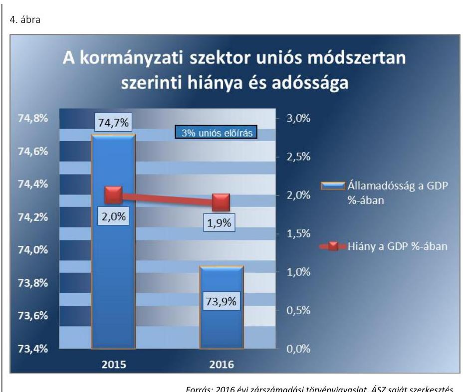

*Forrás: 2016 évi zárszámadási törvényjavaslat, ÁS2 saját szerkesztés*

## 1.2. számú megállapítás

**A 2016. évi zárszámadási törvényjavaslat tartalma, szerkezete megfelelő a jogszabályi előírásoknak. A törvényjavaslat összeállításánál az NGM betartotta a jogszabályi előírásokat és a vonatkozó belső szabályzatok előírásait.**

**A ZÁRSZÁMADÁSI TÖRVÉNYJAVASLAT** összeállításánál az NGM betartotta a jogszabályi előírásokat és a vonatkozó belső szabályzatok előírásait. A törvényjavaslat tartalma, szerkezete megfelelő az Áht. előírásainak. A törvényjavaslat az Áht. előírásainak megfelelően, az elfogadott költségvetéssel összehasonlítható módon került összeállításra. Normaszövege rögzíti az Alaptörvény és a Stabilitási törvény szerinti adósságmutató 2016. év végi alakulását, tartalmazza a költségvetési hiány finanszírozásának módját. Az államháztartás pénzforgalmi hiányát és az elsődleges egyenleg alakulását, a költségvetési mérleget alrendszerenként és összevontan, közgazdasági és funkcionális tagolásban a törvényjavaslat indokolásának melléklete tartalmazza. Az indokolás melléklete tájékoztatást ad az adóbevételekben érvényesülő közvetett támogatásokról, bemutatja az állam által vállalt kezességek, garanciák és viszontgaranciák állományát és az állam tulajdonában álló gazdálkodó szervezetek működéséből származó kötelezettségek, a részesedések alakulását. Az Áht. előírásaival összhangban a törvényjavaslat indokolása és melléklete bemutatja a kormányzati szektor uniós módszertan szerint számított hiányát és adósságát. Az Áht. előírásainak megfelelően a költségvetési tervezés során figyelembe vett makrogazdasági és költségvetési folyamatok alakulásának értékelését, az eltérések okait alrendszerenként a törvényjavaslat indokolása tartalmazza. A 2016. évi zárszámadási törvényjavaslat fejezeti indokolásai (a fejezeti kötetek) az Áht. előírásainak megfelelően tartalmazzák a fejezetek közötti átcsoportosítást, valamint a címrend és a címrend alá rendezett alcímek, jogcímcsoportok, jogcímek változását.

---

# A ZÁRSZÁMADÁSI TÖRVÉNYJAVASLAT ÖSSZE-

ÁLLÍTÁSÁNAK FOLYAMATÁT a törvényjavaslat kidolgozásához szükséges adatok átvételének módját, az adat- és dokumentumegyeztetések menetét, a törvényjavaslat összeállítása során alkalmazott kontrollokat, valamint a törvényjavaslat véglegezésének lépéseit, a törvényjavaslat elkészítéséért felelős szervezeti egységek számára az NGM belső Szabályzatban ${ }^{67}$ írta elő. Az NGM által kiadott Útmutató ${ }^{68}$ és Munkaprogram ${ }^{69}$ az Áht. és az Ávr. előírásaival összhangban tartalmazta a zárszámadási törvényjavaslat összeállítását megalapozó módszertani elveket, a beszámolási keretrendszert, a kapcsolódó feladatokat, azok ütemezését és felelőseit, az adatok átadására, az adatszolgáltató szervezetek (a NAV, a Kincstár, az ÁKK Zrt., a fejezetek, az alapkezelők) és az NGM közötti, illetve az NGM szervezetén belüli adategyeztetésekre vonatkozó iránymutatásokat, a zárszámadási törvényjavaslattal szemben támasztott tartalmi követelményeket. A zárszámadási törvényjavaslat összeállítását támogató elektronikus információs rendszerek - az NGM KAR ${ }^{70}$ rendszerének és a Kincstár KGR K11${ }^{71}$ rendszerének - kialakítása biztosította a zárszámadási törvényjavaslat adatainak megbízhatóságát.

## 2. A zárszámadási törvényjavaslat valósághűen mutatja-e be a költségvetés végrehajtására vonatkozó pénzügyi adatokat, információkat? A központi költségvetés, a TB Alapok és az ELKA bevételi és kiadási előirányzatainak teljesítési adatai megbízha-tóak-e?

Összegző megállapítás

A törvényjavaslat valósághűen mutatja be a költségvetés végrehajtására vonatkozó pénzügyi adatokat, információkat. A központi költségvetés, a TB Alapok és az ELKA bevételi és kiadási előirányzatainak teljesítési adatai megbízhatóak.

A KINCSTÁR KGR K11 rendszerében az Ávr. előírásainak megfelelően, a 2016. év zárását követően az államháztartás központi alrendszerében a központi kezelésű, a fejezeti kezelésű előirányzatok, a költségvetési szervek, a TB Alapok és az ELKA kezelő szervei elkészítették éves költségvetési beszámolóikat. A tulajdonosi joggyakorló szervezetek közül az MNV Zrt. ${ }^{72}$ az Áhsz.-ben előírt határidőig a 2016. évi éves költségvetési beszámolót nem töltötte fel a Kincstár KGR K11 rendszerébe. A Kincstár az Áhsz.ben előírtak szerint meghatározta a 2016. évi éves költségvetési beszámolók felülvizsgálatának ellenőrzési szempontjait. A Kincstár a 2016. évi éves költségvetési beszámolók esetében azok elfogadását megelőzően nem győződött meg arról, hogy valamennyi beszámoló teljesíti az Áhsz.-ben előírt követelményeket. Az Áhsz. előírásai szerinti, a helyi önkormányzat, a nemzetiségi önkormányzat, a társulás összevont (konszolidált) beszámolóját a Kincstár a törvényben előírt határidőt túllépve küldte meg a helyi önkormányzatok, a nemzetiségi önkormányzatok és a társulások részére.

---

### 2.1. számú megállapítás

3. táblázat

A KÖZPONTI KEZELÉSŰ ELŐIRÁNYZATOK TELJESÍTÉSI ADATAI (M Ft)

|  Adat | Bevétel | Kiadás  |
| --- | --- | --- |
|  Terv | 8087047,3 | 4666905,6  |
|  Módosított* |

 8516245,2 | 4728145,9  |
|  Tény | 8972994,8 | 4494910,5  |

*A módosított előirányzat megjegyzései a törvényjavaslatban szereplő törvényi módosított előirányzattal, nem tartalmazza a jogszabályi keretek között Kormány, felügyeleti szervi, intézményi hatáskörben történő módosításokat. Ez valamennyi táblázat vonatkozásában fennáll.

Fonrás: 2016. évi zárszámadási törvényjavaslat

AZ NGM az Áhsz. előírásainak megfelelően elkészítette a zárszámadási törvényjavaslatot. A törvényjavaslatban szereplő adatokat a kincstári éves költségvetési beszámolók adatai alátámasztják.

A ZÁRSZÁMADÁSI TÖRVÉNYJAVASLATBAN a központi költségvetés, a TB Alapok és az ELKA bevétel- és kiadás-teljesítési adatai megbízhatóak. A törvényjavaslat valósághűen mutatja be a költségvetés végrehajtására vonatkozó pénzügyi adatokat, információkat.

A központi költségvetés részét képező központi kezelésű bevételi és kiadási előirányzatok teljesítési adatai megbízhatóak.

A KÖZPONTI KEZELÉSŰ ELŐIRÁNYZATOK bevételeinek teljesítése 5,4%-kal haladta meg a törvényi módosított előirányzatot. A központi kezelésű előirányzatok kiadásai a törvényi módosított előirányzat 95,1%-ában teljesültek. A központi kezelésű előirányzatokon belül az ellenőrzés az NCSSZA ${ }^{73}$ kiadásainál, a helyi önkormányzatok támogatásai kiutalásánál, a tulajdonosi joggyakorlással, az állami vagyonnal kapcsolatos bevételeknél és kiadásoknál tárt fel megbízhatósági hibát. A költségvetés központi kezelésű bevételi és kiadási adatai megbízhatóak. A központi kezelésű előirányzatok bevételeinek és kiadásainak főbb összetevőit az 5. ábra mutatja be.
5. ábra

A központi kezelésű előirányzatok bevételei és kiadásai a 2016. évben (Mrd Ft)
2016. évi bevételek (8973,0 Mrd Ft)
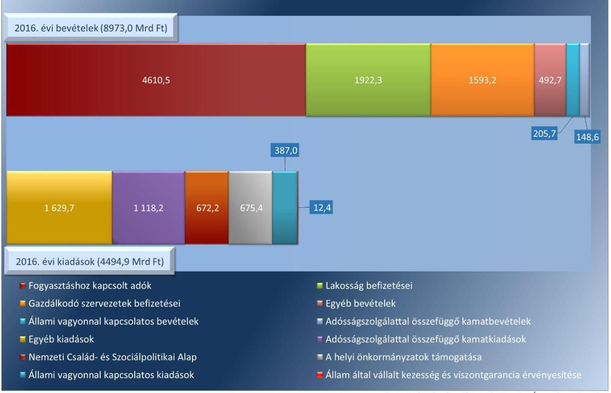

---

AZ ADÓBEVÉTELEK részeként a Fogyasztáshoz kapcsolt adók 4610 447,2 M Ft ${ }^{74}$ a Lakosság befizetései 1922 342,4 M Ft és a Gazdálkodó szervezetek befizetései 1593 203,7 M Ft összegben teljesültek. A Fogyasztáshoz kapcsolt adók 1,5%-kal (70 452,8 M Ft-tal) elmaradtak a törvényi módosított előirányzattól, míg a Lakosság befizetései 1,6%-kal (30 866,4 M Ft-tal), a Gazdálkodó szervezetek befizetései 2,3%-kal (36 468,6 M Ft-tal) haladták meg a törvényi módosított előirányzatokat. Az adóbevételeknél az ellenőrzés megbízhatósági hibát nem tárt fel, a bevételi adatok megbízhatóak.

AZ ÖNKORMÁNYZATOK TÁMOGATÁSAI esetében a IX. Helyi önkormányzatok támogatásai fejezet és a XX. EMMI fejezet 22. Települési és területi nemzetiségi önkormányzatok támogatása cím ellenőrzése összevontan történt. A 2016. évi teljesített kiadás a helyi önkormányzatok tekintetében 675 411,7 M Ft, a (674 261,7 M Ft összegű) törvényi módosított előirányzat 100,2%-a, a nemzetiségi önkormányzatok vonatkozásában 3111,0 M Ft, a (3137,0 M Ft összegű) törvényi módosított előirányzat 99,2%-a volt. A helyi önkormányzatok támogatásainak kiutalásánál az ellenőrzés megbízhatósági hibát tárt fel, a 2016. évi támogatások egy részének kifizetése nem a Kvtv. előírásai szerint történt. A megbízhatósági hiba összértéke nem haladja meg a lényegességi szintet, az önkormányzatok támogatásainak kiadási adatai megbízhatóak.

AZ ADÓSSÁGSZOLGÁLTATLAL kapcsolatos Kamatbevételek (148 589,6 M Ft) a központi kezelésű előirányzatok bevételeinek 1,7%-át, az adósságszolgálattal kapcsolatos Kamatkiadások (1 118 215,3 M Ft) a központi kezelésű előirányzatok kiadásainak 24,9%-át képezték. Az adósságszolgálattal kapcsolatos bevételek és kiadások teljesítésénél betartották a Kvtv. előírásait, amely szerint a kiadások teljesítése eltérhet az előirányzattól annak módosítása nélkül. Az ellenőrzés a bevételek és kiadások tekintetében megbízhatósági hibát nem tárt fel, a bevételi és a kiadási adatok megbízhatóak.

A XX. EMMI FEJEZET NCSSZA cím a központi kezelésű előirányzatok kiadás teljesítésének 15,0%-át képezte. A címen eredeti bevételi előirányzat nem szerepelt a Kvtv.-ben, az év közben keletkezett 1745,9 M Ft bevétel meghatározóan a jogosulatlanul igénybevett ellátások visszafizetéséből származott. Az előirányzaton a teljesített kiadás 672 176,1 M Ft volt, ami a (684 048,0 M Ft összegű) törvényi módosított előirányzat 98,3%-a. Az NCSSZA Családi támogatások címéről teljesített kiadások esetében az ellenőrzés megbízhatósági hibát állapított meg. Az NCSSZA előirányzatainak terhére történt kiutalások nem feleltek meg a Számv. tv. ${ }^{75}$ előírásainak, az ellátás megállapításáról, illetve összegének változásáról a Cst. Vhr. ${ }^{76}$ előírásai ellenére nem álltak rendelkezésre a folyósított ellátások elszámolásának bizonylatai. A Járási szociális feladatok ellátása jogcímcsoportról teljesített kiadásoknál megbízhatósági hiba volt, hogy a foglalkoztatást helyettesítő támogatást érintően a Szoctv. ${ }^{77}$ előírásai ellenére nem végezték el a jogosultság évenkénti felülvizsgálatát. Az NCSSZA előirányzatai terhére történő ellátások, támogatások folyósítása területén előforduló megbízhatósági hibák összértéke meghaladja a lényegességi szintet, az NCSSZA kiadási adatai nem megbízhatóak.

---

Az NCSSZA-nál feltárt megbízhatósági hiba a központi kezelésű előirányzatok bevételi, illetve kiadási adatainak megbízhatóságát nem befolyásolja.

# AZ ÁLLAMI VAGYONNAL, NFA ${ }^{78}$-VAL ÉS A TULAJDONOSI JOGGYAKORLÁSSAL kapcsolatos bevételek a központi kezelésű előirányzatok bevételeinek 2,3%-át, a kiadások a központi kezelésű előirányzatok kiadásainak 8,6%-át tették ki. A bevételek 205 653,7 M Ft összegben teljesültek, amely 11,0%-kal (25 529,7 M Ft-tal) maradt el a törvényi módosított előirányzattól. A teljesített kiadások összege 387 045,2 M Ft volt, amely a (332 716,0 M Ft összegű) törvényi módosított előirányzatot 16,3%-kal haladta meg. Az ellenőrzés a bevételek és a kiadások tekintetében megbízhatósági hibát tárt fel. A bevételek esetében a Számv. tv. előírásai ellenére az NFA által haszonbérleti díjként kiszámlázott összeg nem volt összhangban a szerződésben szereplő összeggel, a haszonbérleti szerződést az érintett földterület egy részének értékesítését követően nem módosították. A kiadásoknál megállapított megbízhatósági hiba volt, hogy az MNV Zrt. részéről a teljesítés igazolását követően vállalkozói díj kifizetésére nem a külső szolgáltatóval kötött szerződésben foglaltak szerint került sor, a kifizetés a tárgyévet követő évben teljesült. Az állami vagyonnal, NFA-val és a tulajdonosi joggyakorlással kapcsolatos bevételeknél és kiadásoknál előforduló megbízhatósági hibák összértéke nem haladja meg a lényegességi szintet, a bevételi, kiadási adatok megbízhatóak.

A KEZESSÉG-visszatérülés mértéke 3583,7 M Ft volt. Az állam által vállalt kezesség és viszontgarancia érvényesítésével összefüggő kiadások összege 12 417,5 M Ft volt, amely a központi kezelésű előirányzatok kiadásainak 0,3%-a. Az állam által vállalt kezességek, garanciák, viszontgarancia érvényesítéséből eredő kiadások a (27 631,1 M Ft összegű) törvényi módosított előirányzattól 15 213,6 M Ft összegben elmaradtak. Az ellenőrzés a kezesség-visszatérülés előirányzattal összefüggő bevételek és kiadások tekintetében megbízhatósági hibát nem tárt fel, a bevételi és a kiadási adatok megbízhatóak.

## A TOVÁBBI KÖZPONTI KEZELÉSŰ ELŐIRÁNYZATOK

kiadásai (többek között: szociálpolitikai menetdíj támogatás, lakásépítési támogatások, vállalkozások folyó támogatása, kormányzati rendkívüli kiadások), amelyek a központi kezelésű előirányzat kiadásainak 36,3%-át alkotják, 1629 644,7 M Ft összegben teljesültek. Az ellenőrzés megbízhatósági hibát nem tárt fel, a kiadási adatok megbízhatóak.

A TARTALÉKOK (RKI ${ }^{79}$, OVA $^{80}$, céltartalékok) törvényi módosított előirányzata 361 425,5 M Ft volt, amelyből 369 549,5 M Ft összegű felhasználásról a Kormány határozatokban döntött. Az RKI eredeti előirányzata 100 000,0 M Ft volt, amely törvényi hatáskörben 20 000,0 M Ft-tal növekedett. A Kvtv.-ben képzett RKI előirányzat, illetve az előirányzat növelésének mértéke megfelelt az Áht. előírásainak, a központi költségvetés kiadási főösszegének 0,5%-a és 2%-a között maradt. Az RKI előirányzataiból a felhasználás 123 112,2 M Ft (az előirányzat 99,9%-a), a fel nem használt rész 90,0 M Ft volt. Az OVA előirányzat felhasználása a törvényi módosított előirányzattal egyezően 80 000,0 M Ft volt. A Kvtv. előírásainak megfelel-

---

### 2.2. számú megállapítás

4. táblázat

A SZAKMAI FEJEZETI KEZELÉSŰ ELŐIRÁNYZATOK TELJESÍTÉSI ADATAI (M Ft)

| Adat | Bevétel | Kiadás |
| :-- | :--: | :--: |
| Terv | 906975,9 | 2801888,1 |
| Módosított | 906975,9 | 3014362,9 |
| Tény | 1006682,8 | 4132143,9 |

Forrás: 2016. évi zárszámadási törvényjavaslat
ően, a hiánycél várható teljesülését figyelembe véve, az OVA előirányzatról összesen 14 Kormányhatározat alapján történt 80000,0 M Ft összegű átcsoportosítás 18 fejezet részére. A céltartalékok 166 437,3 M Ft-os felhasználása 5011,8 M Ft-tal (3,1%-kal) túllépte a 161 425,5 M Ft-os törvényi módosított előirányzatot, amire a Kvtv. 4. sz. melléklete lehetőséget biztosított.

## A központi költségvetés részét képező szakmai fejezeti kezelésű bevételi és kiadási előirányzatok teljesítési adatai megbízhatóak.

## A SZAKMAI FEJEZETI KEZELÉSŰ ELŐIRÁNYZATOK 2016. évi teljesített bevételi főösszege 11,0%-kal meghaladta a törvényi módosított előirányzatot. Ezen belül a Szakmai fejezeti kezelésű előirányzatok saját bevételei a módosított előirányzat szintjén 290 907,7 M Ft-ra, a fejezeti kezelésű előirányzatok $\mathrm{EU}^{81}$ támogatása a (893 474,3 M Ft összegű) törvényi módosított előirányzattól 28,2%-kal elmaradva 641 060,0 M Ft összegben teljesült. A Szakmai fejezeti kezelésű előirányzatok kiadásai 4132 143,9 M Ft összegben, a (3 014 362,9 M Ft összegű) törvényi módosított előirányzatot 37,1%-kal meghaladva teljesültek. Ezen belül az Egyéb szakmai fejezeti kezelésű előirányzatok kiadásai 2035 202,4 M Ft-ot, az Uniós programok kiadásai 2096 941,5 M Ft-ot tettek ki. A Szakmai fejezeti kezelésű előirányzatok bevételeinél és kiadásainál az ellenőrzés nem tárt fel megbízhatósági hibát, a bevételi és kiadási adatok megbízhatóak. A Szakmai fejezeti kezelésű előirányzatok bevételeinek és kiadásainak összetevőit a 6. ábra mutatja be.
6. ábra
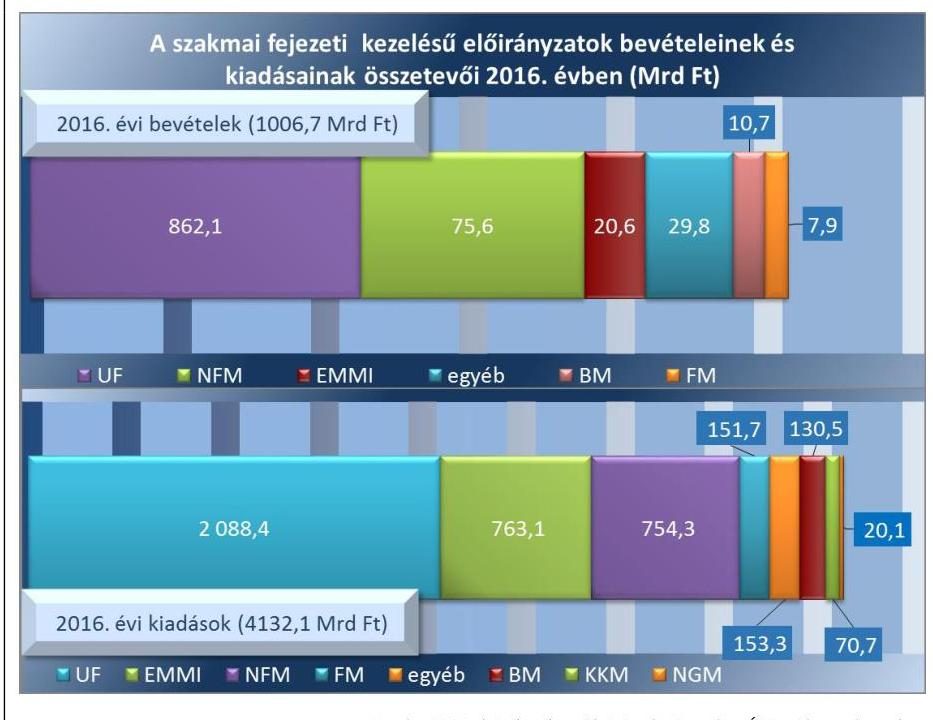

Forrás: 2016. évi zárszámadási törvényjavaslat, ÁSZ saját szerkesztés

---

5. táblázat

## A XIX. UNIÓS FEJLESZTÉSEK FEJEZET FEJEZETI KEZELÉSŰ ELŐIRÁNYZATAINAK TELJESÍTÉSI ADATAI (M Ft)

|  Adat | Bevétel | Kiadás  |
| --- | --- | --- |
|  Terv | 862066,6 | 1401323,8  |
|  Módosított | 862066,6 | 1401323,8  |
|  Tény | 862059,5 | 2088379,3  |

Forrás: 2016. évi zárszámadási törvényjavaslat

### 2.3. számú megállapítás

6. táblázat

## A KÖZPONTI KÖLTSÉGVETÉS INTÉZMÉNYEINEK TELJESÍTÉSI ADATAI (M Ft)

|  Adat | Bevétel | Kiadás  |
| --- | --- | --- |
|  Terv | 1191476,6 | 3472334,1  |
|  Módosított | 1185176,6 | 3616940,1  |
|  Tény | 2500739,6 | 4600354,8  |

Forrás: 2016. évi zárszámadási törvényjavaslat

A XIX. UNIÓS FEJLESZTÉSEK FEJEZET bevételei a törvényi módosított előirányzat 100,0%-ában teljesültek. A XIX. UF fejezet kiadásának teljesítése 49,0%-kal meghaladta a törvényi módosított előirányzatot. Az európai uniós támogatások kiadási adatai megbízhatóak. Az európai uniós támogatásokon belül az ellenőrzés a vidékfejlesztési és halászati programok kiadásainál tárt fel megbízhatósági hibát, a kiadásoknál előforduló megbízhatósági hibák összértéke nem haladja meg a lényegességi szintet.

A 1214/2016. (IV. 29.) Korm. határozat ${ }^{82}$ előírásai alapján felgyorsították a kötelezettségvállalási folyamatot, illetve a fejlesztési területekre bontott 2016. évi kifizetési célkitűzések megvalósítása érdekében módosították a 2016. évi eredeti kiadási előirányzatokat. A kifizetések összességében 97%-ra teljesültek, a kifizetési tervtől való elmaradás a Halászati Fejlesztések, a Közép-magyarországi régió fejlesztései és a Vidékfejlesztés területeket érintette 2016. év végén, a pályázati kiírások 2017. évre történt áthúzódása miatt.

A XIX. UF fejezet előirányzatok közötti, irányító hatósági hatáskörben végrehajtható átcsoportosítási lehetőségek kimerülését követően az államháztartásért felelős miniszter engedélyével a NSRK ${ }^{83}$ OP ${ }^{84}$-k kiadásait 30,0%-kal, továbbá törvényi felhatalmazás alapján Kormányhatáskörben 800 000,0 M Ft összeggel megemelték a 1606/2016. (XI. 8.) Korm. határozat ${ }^{85}$ rendelkezéseinek megfelelően. A XIX. UF fejezet azon előirányzatainál, melyek teljesülése módosítás nélkül eltérhet az előirányzattól, a teljesítés összege összességében nem érte el az engedélyezett keretösszeget.

A Kvtv.-ben előírtak alapján a NEFA
 a TÁMOP${ }^{86}$ a hazai társfinanszírozás céljára történő 3 808,7 M Ft XIX. UF fejezet részére történő átadását teljesítette. 2016-ban a GOP${ }^{87}$ garanciaeszközeire vonatkozó készfizető kezesség, illetve garancia állomány összegére vonatkozó, a Kvtv. szerinti előírások érvényesültek. A JEREMIE-típusú pénzügyi eszközök${ }^{88}$ végrehajtása során a GOP 4. pénzügyi eszközök prioritás és a KMOP${ }^{89}$ 1.3. intézkedés keretében megtérült pénzügyi eszközökből származó bevételeket a Kvtv.-ben előírtaknak megfelelően használták fel.

A vidékfejlesztési és halászati programok kiadásainál (ÚMVP${ }^{90}$, VP${ }^{91}$ és HOP${ }^{92}$) az Áht. és az Ávr. előírásai ellenére a kötelezettségvállalás a kifizetések teljesítését követően történt.

## A központi költségvetés intézményei bevételi és kiadási előirányzatainak teljesítési adatai megbízhatóak.

A KÖZPONTI KÖLTSÉGVETÉS INTÉZMÉNYEI bevételi előirányzatának teljesítése a törvényi módosított előirányzatot 111%-kal haladta meg. A kiadási előirányzatok a törvényi módosított előirányzat 127,2%-ában teljesültek. Az ellenőrzés a központi költségvetés egyéb intézményei bevételeinél és kiadásainál állapított meg megbízhatósági hibát. A központi költségvetés intézményei bevételi és kiadási adataiban előforduló megbízhatósági hibák összértéke nem éri el a lényegességi szintet, a bevételi és a kiadási adatok megbízhatóak. A központi költségvetés intézményeinek bevételeit és kiadásait intézmény-csoportonként a 7. ábra mutatja.

---

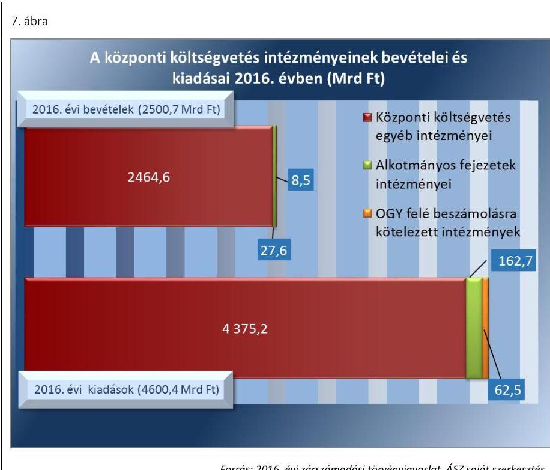

Forrás: 2016. évi zárczámadási törvényjavaslat, ÁSZ saját szerkesztés

# AZ OGY FELÉ BESZÁMOLÁSRA KÖTELEZETT 

INTÉZMÉNYEK bevételi előirányzatának teljesítése 27 634,3 M Ft volt, amely a (27 078,2 M Ft összegű) törvényi módosított előirányzatot 2,0%-kal haladta meg. A kiadási előirányzatok 62 477,4 M Ft-ban teljesültek, a teljesítés 16,7%-kal maradt el a (75 015,4 M Ft összegű) törvényi módosított előirányzattól. Az OGY felé beszámolásra kötelezett intézmények bevételeinél és kiadásainál az ellenőrzés megbízhatósági hibát nem tárt fel, a bevételi és a kiadási adatok megbízhatóak.

## AZ ALKOTMÁNYOS FEJEZETEK INTÉZMÉNYEINEK

bevételi előirányzata 8454,8 M Ft-ban a törvényi módosított előirányzattal megegyező összegben teljesült. Az alkotmányos fejezetek intézményeinek kiadási előirányzata 162 672,0 M Ft-ban teljesült, amely 13,4%-kal maradt el a (187 792,5 M Ft-os) törvényi módosított előirányzattól. A bevételeknél és a kiadásoknál az ellenőrzés megbízhatósági hibát nem tárt fel, a bevételi és a kiadási adatok megbízhatóak.

## A KÖZPONTI KÖLTSÉGVETÉS EGYÉB INTÉZMÉ-

NYEI bevételei 2 464 650,8 M Ft összegben teljesültek, amely a (2 473 699,3 M Ft összegű) törvényi módosított előirányzat 99,6%-a. A központi költségvetés egyéb intézményeinek kiadási előirányzata 4 375 205,3 M Ft-ban, a (5 512 463,7 M Ft összegű) törvényi módosított előirányzat 79,4%-ában teljesült. A bevételeknél és a kiadásoknál az ellenőrzés által megállapított megbízhatósági hiba volt, hogy az elszámolások a Számv. tv. és az Áhsz. előírásai ellenére nem voltak alátámasztva hiteles, megbízható számviteli bizonylattal, illetve az Áht. és az Ávr. előírásai ellenére a kötelezettségvállalás dokumentumai nem álltak rendelkezésre (BKMKSZTEAOKOK${ }^{93}$, BSZC${ }^{94}$, JNSZMHGKR${ }^{95}$, KUGYK${ }^{96}$, KULKEPV${ }^{97}$, SZTE${ }^{98}$, VMRFK${ }^{99}$). Az Áhsz. előírásai ellenére a bevételek és kiadások teljesítését nem az Áhsz. 15. mellékletében meghatározott egységes rovatrend szerint

---

### 2.4. számú megállapítás

1. táblázat

A TB ALAPOK TELJESÍTÉSI ADATAI (M Ft)

|  Adat | Bevétel | Kiadás  |
| --- | --- | --- |
|  Terv | 5 022 976,9 | 5 022 976,9  |
|  Módosított | 5 022 976,9 | 5 027 533,7  |
|  Tény | 5 133 592,8 | 5 210 514,2  |

Forrás: 2016. évi zárszámadási törvényjavaslat 8. táblázat

## AZ NY. ALAP TELJESÍTÉSI ADATAI (M Ft)

|  Adat | Bevétel | Kiadás  |
| --- | --- | --- |
|  Terv | 3 059 287,3 | 3 059 287,3  |
|  Módosított | 3 059 287,3 | 3 063 847,4  |
|  Tény | 3 089 514,5 | 3 076 742,8  |

Forrás: 2016. évi zárszámadási törvényjavaslat tartották nyilván (BKMKSZTEAOKOK, SZNM${ }^{100}$, VMRFK). Egyes bérbeadásból származó bevételek esetében az Ávr. előírása ellenére a szerződések nem tartalmazták a szervezet képviselőjének nyilatkozatát arra vonatkozóan, hogy a szervezet átlátható szervezetnek minősül (JNSZMHGKR, SSZC${ }^{101}$, SZSZBMKEOK${ }^{102}$). A központi költségvetés egyéb intézményeinek bevételi és kiadási teljesítési adataiban előforduló megbízhatósági hibák összértéke nem éri el a lényegességi szintet, a bevételi és kiadási adatok megbízhatóak.

## A TB Alapok bevételi és kiadási előirányzatainak teljesítési adatai megbízhatóak.

A TB ALAPOK teljesített bevétele 2,2%-kal, a TB Alapok teljesített kiadása 3,6%-kal meghaladta a törvényi módosított előirányzatot. A TB Alapok bevételeinek és kiadásainak összetevőit a 8. ábra mutatja be. 8. ábra

A TB Alapok bevételeinek és kiadásainak összetevői 2016. évben (Mrd Ft)

|  2016. évi bevételek (5133,6 Mrd Ft) | 2016.  |
| --- | --- |
|  2016. 5 | 1016,9  |
|  |   |
|  |   |
|  |   |

- Ny. Alap szociális hozzájárulási adó és munkáltatói járulék
- Ny. Alap biztosítási járulék
- Ny. Alap egyéb bevétel
- E. Alap adó és járulékbevételek, hozzájárulások
- E. Alap költségvetési hozzájárulás
- E. Alap egyéb bevétel
- Ny. Alap öregségi nyugdíj
- Ny. Alap egyéb kiadások
- E. Alap pénzbeli ellátások
- E. Alap természetbeni ellátások
- E. Alap egyéb kiadások

Forrás: 2016. évi zárszámadási törvényjavaslat, ÁSZ saját szerkesztés

AZ NY. ALAP bevételi előirányzatának teljesítése a törvényi módosított előirányzatot 1,0%-kal haladta meg. Az ellátással összefüggésben 3 085 054,1 M Ft, a működéshez kapcsolódóan 4460,3 M Ft bevétel teljesült. Az Ny. Alap kiadási előirányzatának teljesítése 0,4%-kal haladta meg a törvényi módosított előirányzatot. A teljesített kiadásokból 3 063 969,5 M Ft az ellátáshoz, 12 773,3 M Ft a működéshez kapcsolódott.

---

9. táblázat

AZ E. ALAP TELJESÍTÉSI ADATAI (M Ft)

| Adat | Bevétel | Kiadás |
| :-- | :--: | :--: |
| Terv | 1 963 689,6 | 1 963 689,6 |
| Módosított | 1 963 689,6 | 1 963 706,3 |
| Tény | 2 044 078,3 | 2 133 771,4 |

Forrás: 2016. évi zárszámadási törvényjavaslat
2.5. számú megállapítás
10. táblázat

AZ ELKA TELJESÍTÉSI ADATAI (M Ft)

| Adat | Bevétel | Kiadás |
| :-- | :--: | :--: |
| Terv | 591 887,9 | 597 894,4 |
| Módosított | 595 237,9 | 601 244,4 |
| Tény | 615 913,4 | 616 991,9 |

Forrás: 2016. évi zárszámadási törvényjavaslat

Az Ny. Alap költségvetése 4560,1 M Ft költségvetési befizetés mellett 12 771,7 M Ft többlettel teljesült.

AZ E. ALAP bevételi előirányzatának teljesítése a törvényi módosított előirányzatot 4,1%-kal haladta meg. Az ellátással összefüggésben 2 043 098,8 M Ft, a működéshez kapcsolódóan 976,5 M Ft bevétel teljesült. Az E. Alap teljesített kiadása a törvényi módosított előirányzatot 8,7%-kal haladta meg. A teljesített kiadásokból 2 125 470,5 M Ft az ellátáshoz, 8300,9 M Ft a működéshez kapcsolódott. Az E. Alap költségvetése 89 693,1 M Ft hiánnyal zárta az évet.

A TB Alapok bevételei megbízhatóak. A TB Alapok kiadásain belül az ellenőrzés az Ny. Alap működési kiadásainál tárt fel megbízhatósági hibát. A Számv. tv. előírásai ellenére a személyi juttatások elszámolásának bizonylatai nem álltak rendelkezésre. A TB Alapok kiadási adataiban előforduló megbízhatósági hibák összértéke nem éri el a lényegességi szintet, a kiadási adatok megbízhatóak.

## Az ELKA bevételi és kiadási előirányzatainak teljesítési adatai megbízhatóak.

AZ ELKA 2016. évi teljesített bevételei a törvényi módosított előirányzatot 3,5%-kal haladták meg, kiadásai a törvényi módosított előirányzatot 2,6%-kal meghaladva teljesültek. Az ELKA bevételeinek és kiadásainak egyenlege -1078,5 M Ft volt. Az ELKA bevételeinél és kiadásainál az ellenőrzés megbízhatósági hibát nem tárt fel, a bevételi és kiadási adatok megbízhatóak. Az ELKA bevételeit és kiadásait alaponként a 9. ábra mutatja be. 9. ábra
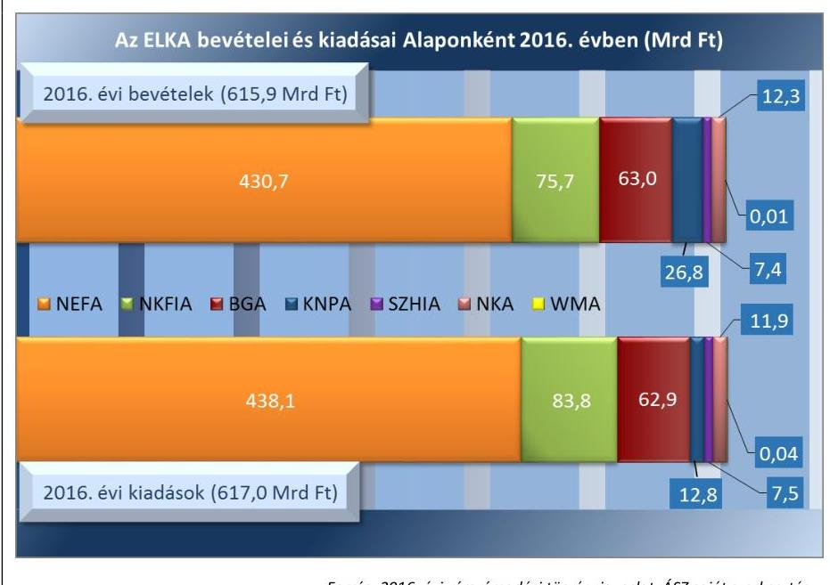

Forrás: 2016. évi zárszámadási törvényjavaslat, ÁSZ saját szerkesztés

---

# 3. A központi költségvetés, a TB Alapok és az ELKA bevételi és kiadási előirányzatainak teljesítése, az előirányzatok módosítása, a költségvetési maradvány megállapítása és az éves költségvetési beszámolók összeállítása során betartották-e a jogszabályi előírásokat? 

Összegző megállapítás

A központi költségvetés, a TB Alapok és az ELKA bevételi és kiadási előirányzatainak teljesítése, az előirányzatok módosítása, a költségvetési maradvány megállapítása és az éves költségvetési beszámolók összeállítása során összességében betartották a jogszabályi előírásokat.
3.1. számú megállapítás

A központi költségvetés részét képező központi kezelésű bevételi és kiadási előirányzatok teljesítése során összességében betartották a jogszabályi előírásokat.

A KÖLTSÉGVETÉS KÖZPONTI KEZELÉSŰ bevételi előirányzatainál az ellenőrzés szabályszerűségi hibát nem állapított meg. A költségvetés központi kezelésű kiadási előirányzatai tekintetében az ellenőrzés szabályszerűségi hibákat tárt fel az állam által vállalt kezesség és viszontgarancia érvényesítésével összefüggő bevételeknél, a IX. Helyi önkormányzatok támogatásai fejezet és a XX. EMMI fejezet Települési és területi nemzetiségi önkormányzatok támogatása cím kiadásainál, az NCSSZA előirányzatai terhére történt kiutalásoknál.

AZ ÖNKORMÁNYZATOK TÁMOGATÁSAI esetében a IX. Helyi önkormányzatok támogatásai fejezet és a XX. EMMI fejezet Települési és területi nemzetiségi önkormányzatok támogatása cím kiadásainál az Áht. és az Ávr. előírásai ellenére a támogatási szerződések, támogatói okiratok pénzügyi ellenjegyzést nem tartalmaztak.

AZ ADÓSSÁGSZOLGÁLATTAL kapcsolatos bevételek és kiadások kezelésével összefüggésben az ellenőrzés szabályszerűségi hibát nem tárt fel. Az ÁKK Zrt. az Áht. és az Ávr. vonatkozó előírásainak megfelelően eleget tett az adósságszolgálattal kapcsolatos bevételekkel és kiadásokkal összefüggő, a Kincstár könyvvezetéséhez és beszámolási kötelezettségéhez kapcsolódó adatszolgáltatási és beszámolási kötelezettségének.

A XX. EMMI FEJEZET NCSSZA cím előirányzatai terhére történt kiutalások tekintetében az érvényesítést, illetve az utalványozást végző személyek kijelölése és felhatalmazása, valamint az érvényesítést, utalványozást végző személyekről és aláírás-mintájukról vezetett nyilvántartás az Ávr. előírásai ellenére nem állt rendelkezésre. Az Ávr.-ben foglaltak ellenére nem történt meg a kifizetés érvényesítése.

AZ ÁLLAMI VAGYONNAL, NFA-VAL ÉS A TULAJDONOSI JOGGYAKORLÁSSAL kapcsolatos bevételekkel és a kiadásokkal összefüggő előirányzatok teljesítése az Áht., az Ávr., a Vtv.${ }^{103}$

---

és az egyéb vonatkozó jogszabályok előírásainak megfelelően történt. A szerződéskötések, a lebonyolított ügyletek elszámolásai szabályszerűek voltak.

AZ ÁLLAM ÁLTAL VÁLLALT KEZESSÉG ÉS VISZONTGARANCIA érvényesítésével összefüggő bevételek tekintetében az ellenőrzés által feltárt szabályszerűségi hiba volt, hogy a Kincstár a jogszabályban előírt határidőn túl utalta ki a garantőr szervezeteket megillető állami viszontgarancia összegét. A garantőr szervezetek betartották az állam által vállalt kezességek, garanciák, viszontgaranciák és nyújtott hitelek állományának felső határára vonatkozó Kvtv. előírásokat. Az ügyletek állományi adatait tartalmazó főkönyvi és analitikus nyilvántartásaik megfeleltek az Áht., az Áhsz., a Számv. tv. és az egyéb vonatkozó jogszabályok előírásainak.

A TARTALÉKOK közül az RKI és a céltartalékok képzése a jogszabályi előírásoknak megfelelt. Az OVA képzése tekintetében az ellenőrzés szabályszerűségi hibát tárt fel, az Áht. előírásai ellenére a Kvtv.-ben nem határozták meg az OVA célját, felhasználásának módját és feltételeit. A tartalékok felhasználása során betartották az Áht., az Ávr., a Kvtv. és a vonatkozó Kormányhatározatok előírásait.
3.2. számú megállapítás

A központi költségvetés részét képező szakmai fejezeti kezelésű bevételi és kiadási előirányzatok teljesítése, az előirányzat módosítása, a költségvetési maradvány megállapítása és az éves költségvetési beszámolók összeállítása során összességében betartották a jogszabályi előírásokat.

A SZAKMAI FEJEZETI KEZELÉSŰ ELŐIRÁNYZATOK bevételei tekintetében az ellenőrzés szabályszerűségi
 hibát nem tárt fel. A szakmai fejezeti kezelésű kiadási előirányzatok terhére teljesített kifizetések vonatkozásában négy fejezetnél állapított meg az ellenőrzés szabályszerűségi hibát, amelyek az Áht. és az Ávr. kötelezettségvállalásra (BIR, MK), teljesítésigazolásra, érvényesítésre (AJBH, MK) és utalványozásra (AJBH, MK, NVI) vonatkozó előírásainak be nem tartásához kapcsolódtak.

A támogatási célú előirányzatok tekintetében az egyes kifizetések teljesítése, elszámolása tekintetében kettő fejezetnél tárt fel szabályszerűségi hibát az ellenőrzés, amelyek az Ávr. teljesítésigazolásra (KE), érvényesítésre és utalványozásra (EMMI) vonatkozó előírásainak megsértésével függtek össze.

Az előirányzatok módosítása és átcsoportosítása, valamint a költségvetési maradványának megállapítása és kimutatása során a vonatkozó jogszabályok előírásait betartották. A maradvány elszámolásához kapcsolódóan négy fejezet (EMMI, HM, KKM, NGM) a maradvány-kimutatást az Ávr.-ben meghatározott határidőn túl nyújtotta be az államháztartásért felelős miniszternek.

A szakmai fejezeti kezelésű előirányzatok éves költségvetési beszámolóinak összeállítása során betartották a jogszabályi előírásokat. Az Áhsz. előírásai ellenére hat (EMMI, FM, HM, ME, NFM, NGM) fejezetet irányító szerv a fejezeti kezelésű előirányzatok éves költségvetési beszámolóját

---

a jogszabályban előírt határidőn túl töltötte fel a Kincstár KGR K11 rendszerébe. Az előirányzatokkal való gazdálkodási feladatokat hét fejezet fejezeti kezelésű előirányzatainál összesen 25 külső kezelő szerv látta el jogszabályi kijelölés, illetve megállapodás alapján. A külső kezelő szervek betartották a jogszabályokban és a megállapodásokban foglaltakat.

# AZ EURÓPAI UNIÓS TÁMOGATÁSOKHOZ KAP-

CSOLÓDÓ ELŐIRÁNYZATOK felhasználása összességében megfelelt a Kvtv., az Áht., az Ávr. és az Áhsz., valamint a végrehajtási rendeletek előírásainak. A 2007-2013. uniós programozási periódusra vonatkozó pénzügyi források igénybevétele a Kvtv. előírása szerint valósult meg. A BM fejezethez tartozó Szolidaritási Programok és a Belügyi Alapok képzése és igénybevétele a Kvtv. előírása és az EU-rendeletekben foglaltak szerint valósult meg. A 2014-2020. uniós programozási periódusra vonatkozó pénzügyi keretek 2016. évi forráslekötése a Kvtv. szerint előírt mértékben valósult meg.

Az ellenőrzés a vidékfejlesztési és halászati programok kiadásainál tárt fel szabályszerűségi hibát, az Ávr. előírásai ellenére az ÜMVP, a HOP, a VP és a MAHOP ${ }^{104}$ belső szabályzataiban nem határozták meg a pénzügyi ellenjegyzés, a teljesítésigazolás és az érvényesítés gyakorlásának módját, eljárási és dokumentációs részletszabályait.
3.3. számú megállapítás

A központi költségvetés intézményei bevételi és kiadási előirányzatainak teljesítése, az előirányzat módosítása, a költségvetési maradvány megállapítása és az éves költségvetési beszámolók összeállítása során összességében betartották a jogszabályi előírásokat.

AZ OGY FELÉ BESZÁMOLÁSRA KÖTELEZETT INTÉZMÉNYEK bevételeinél az ellenőrzés szabályszerűségi hibát nem tárt fel. A kiadási előirányzatok felhasználása során három intézménynél feltárt szabályszerűségi hibák az Ávr. kötelezettségvállalásra (GVH), pénzügyi ellenjegyzésre (KH) és teljesítésigazolásra (MMA) vonatkozó előírásainak be nem tartásához kapcsolódtak. Az OGY felé beszámolásra kötelezett intézmények betartották a Kbt. ${ }^{105}$ előírásait.

Az előirányzat módosítások és átcsoportosítások, valamint a költségvetési maradvány kimutatása során betartották az Áht., az Ávr. és az Áhsz. előírásait.

Az OGY felé beszámolásra kötelezett intézmények a 2016. évi éves költségvetési beszámolókat - az annak részét képező, költségvetési számvitellel készült költségvetési jelentéseket és maradvány-kimutatásokat - a jogszabályi előírásoknak megfelelően állították össze. Az Áhsz. kötelező egyezőségekre vonatkozó 17. mellékletének előírásai szerint biztosították a kötelező egyezőséget, betartották az egyes nyilvántartási számlák egyenlegére vonatkozó előírásokat. A NAIH a 2016. évi költségvetési beszámolót az Áhsz.-ben előírt határidőn túl készítette el és töltötte fel a Kincstár KGR K11 rendszerébe.

Az OGY felé beszámolásra kötelezett intézmények a 2016. évi éves költségvetési beszámolók részét képező - pénzügyi számvitellel készült - mérleget, eredménykimutatást és kiegészítő mellékletet a jogszabályi előírásoknak megfelelően állították össze.

---

AZ ALKOTMÁNYOS FEJEZETEK INTÉZMÉNYEI bevételei tekintetében három intézménynél feltárt szabályszerűségi hibák az Ávr. utalványozásra vonatkozó előírásainak (Budapest Környéki, Pécsi, Szegedi Tvsz. ${ }^{106}$ ) megsértésével függtek össze.

A kiadások tekintetében feltárt szabályszerűségi hibák az alkotmányos fejezetek 17 intézménye esetében az Áht. és az Ávr. kötelezettségvállalásra, pénzügyi ellenjegyzésre, teljesítésigazolásra, valamint utalványozásra vonatkozó előírásainak be nem tartásához kapcsolódtak (AJBH, Bíróságok cím intézményei közül a Debreceni Ítélőtábla, Balassagyarmati, Budapest Környéki, Debreceni, Győri, Gyulai, Kaposvári, Kecskeméti, Miskolci, Nyíregyházi, Pécsi, Szegedi, Szekszárdi, Szolnoki, Zalaegerszegi, Veszprémi Tvsz.). Az alkotmányos fejezetek intézményei betartották a Kbt. előírásait.

Az alkotmányos fejezetek intézményei az előirányzat módosítások és átcsoportosítások, valamint a költségvetési maradvány kimutatása során betartották az Áht., az Ávr. és az Áhsz. előírásait. A kötelezettségvállalással terhelt maradvány összegének megállapítása megfelelt az Ávr.-ben foglaltaknak.

Az alkotmányos fejezetek intézményei a 2016. évi éves költségvetési beszámolókat - az annak részét képező, költségvetési számvitellel készült költségvetési jelentéseket és maradvány-kimutatásokat - a jogszabályi előírásoknak megfelelően állították össze. Az Áhsz. kötelező egyezőségekre vonatkozó 17. mellékletének előírásai szerint biztosították a kötelező egyezőséget, betartották az egyes nyilvántartási számlák egyenlegére vonatkozó előírásokat. Az éves költségvetési beszámolókat az Áhsz.-ben előírt határidőig a Kincstár KGR K11 rendszerébe feltöltötték. Az irányító szervek az intézmények beszámolóit határidőben felülvizsgálták és jóváhagyták.

# A KÖZPONTI KÖLTSÉGVETÉS EGYÉB INTÉZMÉ-

NYEI bevételei tekintetében az ellenőrzés 13 egyéb intézménynél tárt fel szabályszerűségi hibát, amelyek az Áht., az Ávr. és a belső szabályzatok kötelezettségvállalásra, teljesítésigazolásra, érvényesítésre és utalványozásra vonatkozó előírásainak be nem tartásához kapcsolódtak (BKMKSZTEAOKOK, EFMGSZIK ${ }^{107}$, ESZC ${ }^{108}$, HSZSZK ${ }^{109}$, JNSZMHGKR, KDTVIZIG ${ }^{110}$, KUGYK, KULKEPV, MAVKRSZ ${ }^{111}$, SZNM, SZSZBMKEOK, SZTE, VMRFK).

A központi költségvetés egyéb intézményei kiadásai tekintetében 48 egyéb intézménynél tárt fel az ellenőrzés szabályszerűségi hibát, amelyek az Áht. és az Ávr. gazdálkodási jogkörök gyakorlására vonatkozó előírásainak be nem tartásából adódtak (AKI ${ }^{112}$, BIFO ${ }^{113}$, BKMKSZTEAOKOK, BLMGSZIK ${ }^{114}$, BPKSZC ${ }^{115}$, BSZC, DSZC ${ }^{116}$, EFMGSZIK, ESZC, FAMGSZIK ${ }^{117}$, FVGYEVKP ${ }^{118}$, GYMSMGYEVIG ${ }^{119}$, HBMBVI ${ }^{120}$, HSZSZK, JNSZMHGKR, KDTVIZIG, KEFO ${ }^{121}$, KEHI ${ }^{122}$, KGK ${ }^{123}$, KUGYK, KULKEPV, MANYSI ${ }^{124}$, MAVKRSZ, MMKM ${ }^{125}$, MSZC ${ }^{126}$, MVK ${ }^{127}$, NAK ${ }^{128}$, NORI ${ }^{129}$, NSZC ${ }^{130}$, NYE ${ }^{131}$, OGYEI ${ }^{132}$, OIK ${ }^{133}$, OSZAI ${ }^{134}$, PHIMGSZIK ${ }^{135}$, PMRFK ${ }^{136}$, PSZTLSZIK ${ }^{137}$, SBMGSZI ${ }^{138}$, SSZC, SZIE ${ }^{139}$, SZNM, SZRK ${ }^{140}$, SZSZBMKEOK, SZTE, SZTNH ${ }^{141}$, VASMKI ${ }^{142}$, VMBVI ${ }^{143}$, VMRFK, VMTGYI ${ }^{144}$ ).

A központi költségvetés 18 egyéb intézménye (BKMKSZTEAOKOK, BSZC, EFMGSZIK, ESZISZLKR ${ }^{145}$, HSZAK ${ }^{146}$, JNSZMHGKR, KAKR ${ }^{147}$, MSZC, MTTM ${ }^{148}$, MVK, NAK, NFA ${ }^{149}$, NORI, SZMK ${ }^{150}$, SZRK, SZSZBMKEOK, SZTE, SZTNH) be-

---

szerzéseivel a Kbt. 5. §-a alapján a Kbt. alanyi hatálya alá tartozó ajánlatkérőként megsértette a Kbt. 4. § (1)-(2) bekezdésében előírt közbeszerzési eljárás lefolytatásának kötelezettségét.

A Számv. tv. bizonylati fegyelemre vonatkozó előírásait az Áhsz. előírásai ellenére 10 egyéb intézmény a saját hatáskörben végrehajtott előirányzat-módosításoknál nem alkalmazta (AKI, FVGYEVKP, GYMSMGYEVIG, KUGYK, KULKEPV, MAVKRSZ, MMKM, MVK, NFA, PSZTLSZIK). Az Ávr. előírásai ellenére 47 egyéb intézmény a saját hatáskörben végrehajtott előirányzat-módosításokról, átcsoportosításokról az intézkedés meghozatalát követő öt munkanapon belül nem tájékoztatta az irányító szervet, illetve a Kincstárt (AKI, BAZMRFK ${ }^{151}$, BLMGSZIK, BPKSZC, BSZC, DJK ${ }^{152}$, DSZC, EFMGSZIK, ESZC, ESZISZLKR, FAJNSZMIO ${ }^{153}$, FAMGSZIK, FVGYEVKP, GYMSMGYEVIG, HSZAK, HSZSZK, JNSZMHGKR, JNSZMRFK ${ }^{154}$, KEFO, KGK, KUGYK, KZSGYAI ${ }^{155}$, MANYSI, MSZC, MTTM, MVK, NAK, NFA, NORI, NYE, NMRFK ${ }^{156}$, NSZC, OGYEI, OIK, OSZAI, PHIMGSZIK, PMRFK, PSZTLSZIK, SMBGSZI, SSZC, SZMK, SZNM, SZRK, SZTE, VMBVI, ZMFESZI ${ }^{157}$, ZMGYEVKP ${ }^{158}$ ).

A költségvetési maradvány kimutatását az egyéb intézmények összességében az Áht., az Ávr. és az Áhsz. előírásaival összhangban állították össze. Négy egyéb intézmény esetében az Áhsz. előírásai ellenére az éves költségvetési beszámolóban kimutatott maradvány nem egyezett meg a gazdasági eseményekről vezetett nyilvántartással, a kapcsolódó főkönyvi számlák alapján kimutatott maradvány összegével (ESZC, FVGYEVKP, OGYEI, SZNM).

A központi költségvetés egyéb intézményei a 2016. évi éves költségvetési beszámolóikat összességében az Áht., az Ávr. és az Áhsz. előírásainak megfelelően állították össze és küldték meg jóváhagyásra az irányító szerveknek. 12 egyéb intézmény az Áhsz. kötelező egyezőségekre vonatkozó 17. melléklete előírásai ellenére nem tartotta be az egyes nyilvántartási számlák egyenlegére vonatkozó előírásokat (ESZISZLKR, FVGYEVKP, GYMSMGYEVIG, HSZAK, JNSZMHGKR, KGK, KUGYK, OIK, OSZAI, PSZTLSZIK, SZRK, SZSZBMKEOK).

Az Áhsz. előírása ellenére 12 egyéb intézmény az éves költségvetési beszámolója adatait a Kincstár KGR K11 rendszerébe az Áhsz.-ben előírt határidőre nem töltötte fel (BIFO, FVGYEVKP, HSZSZK, KUGYK, KULKEPV, KZSGYAI, MMKM, MTTM, NAK, OGYEI, OIK, OSZAI).

Az irányító szervek 18 egyéb intézmény éves költségvetési beszámolóját az Áhsz.-ben előírt határidőt követően vizsgálták felül és hagyták jóvá a Kincstár KGR K11 rendszerében (DJK, DSZC, FVGYEVKP, GYMSMGYEVIG, HSZAK, HSZSZK, JNSZMHGKR, KEFO, KUGYK, KULKEPV, MAVKR, MMKM, MTTM, NAK, OGYEI, SSZC, SZMK, SZSZBMKEOK).

# 3.4. számú megállapítás

A TB Alapok bevételi és kiadási előirányzatainak teljesítése, az előirányzat módosítás, a költségvetési maradvány megállapítása és az éves költségvetési beszámolók összeállítása során összességében betartották a jogszabályi előírásokat.

A TB ALAPOK javára beszedett bevételek a jogszabályi előírások, belső szabályozások és felhatalmazások betartásával az adatszolgáltatásokkal egyezően teljesültek.

---

Az Ny. Alap kiadásainál az ellenőrzés nem tárt fel szabályszerűségi hibát. Az E. Alap kiadásainál az ellenőrzés szabályszerűségi hibákat az egyes ellátásoknál az Ávr. pénzügyi ellenjegyzésre, valamint a pénzügyi ellenjegyző és az érvényesítő kijelölésére vonatkozó szabályainak be nem tartásához kapcsolódóan tárt fel.

A TB Alapoknál az előirányzat módosítások megfeleltek a jogszabályi előírásoknak. A működési és ellátási szektor 2016. évi maradvány-kimutatásait szabályszerűen, az Áhsz. szerinti előírt tartalommal és formában készítették el. A TB alapok kötelezettségvállalással terhelt maradványa megfelelt a jogszabályi előírásoknak. Az éves költségvetési beszámolók előirányzat maradvány adatait a kapcsolódó főkönyvi számlák és az analitikus nyilvántartások adatai alátámasztották.

A TB Alapok ellátási és működési tevékenységéről szóló éves költségvetési beszámolókat - az annak részét képező, költségvetési számvitellel készült költségvetési jelentéseket és maradvány-kimutatásokat - a jogszabályi előírásoknak megfelelően állították össze. Az éves költségvetési beszámolókat az alapkezelők az Áhsz.-ben előírt határidőre feltöltötték a Kincstár által működtetett KGR K11 rendszerbe.

A TB Alapok és kezelő szerveik a 2016. évi éves költségvetési beszámolók részét képező, pénzügyi számvitellel készült mérleget, eredménykimutatást és kiegészítő mellékletet a jogszabályi előírásoknak megfelelően állították össze.

Az ELKA bevételi és kiadási előirányzatainak teljesítése, az előirányzat módosítása, a költségvetési maradvány megállapítása és az éves költségvetési beszámolók összeállítása során összességében betartották a jogszabályi előírásokat.

AZ ELKA tekintetében a NAV által beszedett, NEFA-t, NKA-t, NKFIA-t megillető adók és járulékbevételekről készített adatszolgáltatások a jogszabályi előírásoknak megfelelően, határidőben teljesültek az alapkezelők felé. Az ELKA által nyújtott támogatások kiutalásai és elszámolásai megfeleltek a jogszabályi előírásoknak. Az ELKA kiadásainál feltárt szabályszerűségi hibák az Ávr. utalványozásra (SZHIA), pénzügyi ellenjegyzésre és érvényesítésre (NEFA) és a teljesítésigazolásra (BGA) vonatkozó előírásainak be nem tartásához kapcsolódtak.

Az ELKA előirányzatok módosításai, a költségvetési
 maradvány megállapítása a jogszabályi előírásoknak megfelelően történt. A maradványra vonatkozóan az éves költségvetési beszámoló, a főkönyvi kivonat illetve az analitikus nyilvántartás egyezősége biztosított volt.

Az ELKA 2016. évi éves költségvetési beszámolóit – az annak részét képező, költségvetési számvitellel készült költségvetési jelentéseket és maradvány-kimutatásokat – a BGA, KNPA, NEFA, NKA, NKFIA, WMA alapkezelők a jogszabályi előírásoknak megfelelően állították össze. Az éves költségvetési beszámolókat az Áhsz.-ben előírt határidőben feltöltötték a Kincstár KGR K11 rendszerébe.

A SZHIA és a WMA 2016. december 31-ével történt megszűnését követően az alapkezelők az alapok az év végén meglévő pénzeszközöket, az alapokat megszüntető jogszabály előírásainak megfelelően a költségvetés

---

számára átutalták. Az SZHIA megszűnését követően az éves (záró) költségvetési beszámolót az alapkezelő az Áhsz.-ben előírtaknak megfelelően, határidőre elkészítette.

---

# MELLÉKLETEK 

## I. SZ. MELLÉKLET: ÉRTELMEZŐ SZÓTÁR

adósságszolgálattal kapcsolatos bevételek és kiadások
analitikus nyilvántartás
állam által vállalt kezességek, garanciák és viszontgaranciák
államháztartás központi alrendszere
állami vagyonnal, NFA-val és a tulajdonosi joggyakorlással kapcsolatos bevételek átcsoportosítás
belső kontrollrendszer

EDP Jelentés

KLI. fejezet az adósságszolgálattal kapcsolatos bevételek és kiadások az adósságátvállalásokkal együtt; XLII. A költségvetés közvetlen bevételei és kiadásai fejezet 8. Tőkekövetelések visszatérülése és 41. Követeléskezelés költségei címek; a központi költségvetés finanszírozása (KESZ).
Az Áhsz. 5. § (1) bekezdésében és 39. § (3) bekezdésében meghatározott részletező nyilvántartás. A részletező nyilvántartások kötelező minimum tartalmát az Áhsz. 14. melléklete állapítja meg.
Az állam által vállalt kezességek, garanciák és viszontgaranciák célja többek között, hogy indirekt módon támogassa a gazdálkodókat a működésükhöz, fejlesztésükhöz, a fiatalokat az otthonteremtéshez szükséges pénzpiaci forrásokhoz jutáshoz. Az állam által vállalt kezesség és viszontgarancia érvényesítése XLII. A költségvetés közvetlen bevételei és kiadásai fejezet 33. cím; a MEHIB ${ }^{159}$ és az Eximbank ${ }^{160}$ behajtási jutaléka XLII. fejezet 32/1/19 jogcímcsoport; Kezesség visszatérülés XLII. fejezet 4/1/9 jogcímcsoport.
Az államháztartás központi és önkormányzati alrendszerből áll. Az államháztartás központi alrendszerébe tartozik az állam, a központi költségvetési szerv, a törvény által az államháztartás központi alrendszerébe sorolt köztestület, illetve az e köztestület által irányított köztestületi költségvetési szerv. (Forrás: Áht. 3. §)
XLIII. Az állami vagyonnal kapcsolatos bevételek és kiadások fejezet, a XLIV. A nemzeti földalappal kapcsolatos bevételek és kiadások fejezet és az egyes költségvetési fejezeteken belüli tulajdonosi joggyakorlással kapcsolatos előirányzatok.
Az átcsoportosítást végrehajtó költségvetésének kiadási előirányzatai főösszegének változatlansága mellett, a kiadási előirányzatok egyidejű csökkentésével és növelésével végrehajtott módosítás. (Forrás: Áht. 1. § 5. pont)
A kockázatok kezelése és tárgyilagos bizonyosság megszerzése érdekében kialakított folyamatrendszer, amely azt a célt szolgálja, hogy egy adott szervezet a működés és a gazdálkodás során a tevékenységeket szabályszerűen, gazdaságosan, hatékonyan, eredményesen végezze, az elszámolási kötelezettségeket teljesítse, megvédje az erőforrásokat a veszteségektől, károktól és a nem rendeltetésszerű használattól. (Forrás: Áht. 69. §)
Az Európai Unió Túlzott Hiány Eljárása (Excessive Deficit Procedure = EDP) keretében a tagországok évente kétszer adatszolgáltatásban (EDP Jelentés) jelentik a kormányzati szektor két kiemelt mutatójának: a kormányzati szektor hiányának és adósságának alakulását. Annak érdekében, hogy az uniós konvergencia kritériumok által meghatározott mutatók és az államháztartási mutatók módszertani megkülönböztetése egyértelmű legyen, az Áht. a kormányzati szektor hiánya, illetve adóssága elnevezéseket használja. A Konvergencia Programban használatos mutatók módszertana megegyezik az EDP jelentésével. (Forrás: NGM honlap szerinti definíció)
Elkülönített Állami Pénzalapok Az ELKA a közfeladatok ellátása során az állam nevében beszedendő költségvetési bevételek és teljesítendő költségvetési kiadások alapszerű elszámolására szolgálnak. Elkülönített állami pénzalapot közfeladat részben vagy egészben államháztartáson kívüli forrásból történő ellátásának biztosítása céljából törvény hozhat létre. Ide tartozik a NEFA, a BGA, a KNPA, az NKA, a WMA, az NKFIA és a SZHIA. (Forrás: Áht. 6/A. § (5) bek., Kvtv. 10. §)

---

előirányzat-módosítás
fejezeti kezelésű előirányzat
fejezeti kezelésű előirányzat
fő ellenőrzési területek
garantőr szervezet
információs és kommunikációs rendszer
integritás
irányító szerv
kezelő szerv
Kincstár KGR K11 rendszere
kockázatkezelési rendszer

A megállapított bevételi előirányzat vagy a kiadási előirányzat növelése vagy csökkentése. (Forrás: Áht. 1. § 6. pont)
A fejezeti kezelésű előirányzatok a fejezetet irányító szerv sajátos szakmai, ágazati feladatai ellátása, vagy az államnak a fejezethez tartozó költségvetési szervek tevékenységével kapcsolatban felmerülő, illetve szakmailag ahhoz kapcsolódó sajátos kötelezettségei teljesítése során felmerülő költségvetési bevételek és költségvetési kiadások elszámolására szolgálnak. (Forrás: Áht. 6/A. § (3) bek.)
A zárszámadás ellenőrzés fő ellenőrzési területei: központi kezelésű előirányzatok; szakmai fejezeti kezelésű előirányzatok (és ezen belül európai uniós támogatások); központi költségvetés intézményei, társadalombiztosítás pénzügyi alapjai; elkülönített állami pénzalapok.
Az állami viszontgarancia alapján az állam által kifizetett összeg behajtása annak a jogi személynek a feladata, amely a viszontgarancia alapjául szolgáló kezességet, garanciát nyújtja. (Forrás: Áht. 93. § (2) bek.)
Az információ és kommunikáció rendszere biztosítja, hogy a megfelelő információk a megfelelő időben eljussanak az illetékes szervezethez, szervezeti egységhez, illetve személyhez. Az információs rendszerek keretében a beszámolási rendszereket úgy kell működtetni, hogy azok hatékonyak, megbízhatóak, pontosak és összehasonlíthatóak legyenek, a beszámolási szintek, határidők és módok világosan meg legyenek határozva. (Forrás: Bkr. 9. §)
Az integritás az elvek, értékek, cselekvések, módszerek, intézkedések konzisztenciáját jelenti, vagyis olyan magatartásmódot, amely meghatározott értékeknek megfelel. (Forrás: NGM Magyarországi államháztartási belső kontroll standardok Útmutató 1.6.1. pont, 2012. december, ÁSZ integritás honlap)
A fejezetet irányító szerv látja el a központi kezelésű előirányzatokhoz, a fejezeti kezelésű előirányzatokhoz, az elkülönített állami pénzalapokhoz és a társadalombiztosítás pénzügyi alapjaihoz kapcsolódó tervezési, gazdálkodási, ellenőrzési, adatszolgáltatási és beszámolási feladatokat. A fejezetet irányító szerveket az Ávr. 1. melléklete határozza meg. (Forrás: Áht. 6/B. § (1) bek., Ávr. 6. §)

A központi kezelésű előirányzat, a fejezeti kezelésű előirányzat és az elkülönített állami pénzalapok előirányzata esetében jogszabály a fejezetet irányító szerv feladatai ellátására – a tervezéssel, az előirányzatok módosításával, átcsoportosításával és az éves költségvetési beszámoló jóváhagyásával kapcsolatos feladatok kivételével – kezelő szervet jelölhet ki. Ha az Áht. központi kezelésű előirányzat, fejezeti kezelésű előirányzat vagy elkülönített állami pénzalapok előirányzata kezelő szervéről rendelkezik, azon – kezelő szerv kijelölése hiányában – a fejezetet irányító szervet kell érteni. (Forrás: Áht. 6/B. § (3) bek.)
A Költségvetés Gazdálkodási Rendszer K11 adatgyűjtő-beszámoló rendszer a Kincstár elemi költségvetés és elemi beszámoló készítést támogató web-es felületű rendszere, amely a beszámoló adatok előállítására, ellenőrzésére, kötelező egyezőségére vonatkozóan a rendszerbe beépített szabályokkal működik. A szabályokat az NGM határozza meg az Áhsz. előírásai, valamint az NGM Útmutató alapján. Az Áhsz. 17. melléklete írja elő az éves költségvetési beszámolás során alkalmazandó kötelező egyezőségeket.
Olyan irányítási eszközök és módszerek összessége, melynek elemei a szervezeti célok elérését veszélyeztető tényezők (kockázatok) azonosítása, elemzése, csoportosítása, nyomon követése, valamint szükség esetén a kockázati kitettség mérséklése. (Forrás: Bkr. 2. § m) pont)

---

kontrollkörnyezet
kontrolltevékenységek
kormányzati szektor
költségvetési jelentés
költségvetés közvetlen bevételei
költségvetés közvetlen kiadási előirányzatai
költségvetési számvitel
költségvetési szerv
költségvetési támogatás

A kontrollkörnyezet elemei az átlátható szervezeti struktúra, az egyértelmű felelősségi, hatásköri viszonyok és feladatok, a szervezet minden szintjén meghatározott etikai elvárások, valamint az átlátható humánerőforrás-kezelés. (Forrás: Bkr. 6. § (1) bek.)

Azok a szervezeten belüli tevékenységek, amelyek biztosítják a kockázatok kezelését, hozzájárulnak a szervezet céljainak eléréséhez. (Forrás: Bkr. 8. §)
Az uniós statisztika szerinti „kormányzati szektor” magában foglalja a „központi kormányzatot”, a „tartományi kormányzatot”, a „helyi önkormányzatot” és a „társadalombiztosítási alapokat”. Magyarországon ebbe a körbe tartoznak azok a szervezetek is, amelyek az Áht. alapján nem részei az államháztartásnak, azonban az Európai Közösséget létrehozó szerződéshez csatolt, a túlzott hiány esetén követendő eljárásról szóló jegyzőkönyv alkalmazásáról szóló 2009. május 25-i 479/2009/EK rendelet szerint a kormányzati szektorba tartoznak. (Forrás: ESA95Kézikönyv a Kormányzati Hiányról és Adósságról)
Az Áhsz. 6. § (2) bekezdés aa) pontja szerint a költségvetési jelentés az éves költségvetési beszámoló része, amely az egységes rovatrend szerinti tagolásban az eredeti és a módosított előirányzatokat, az azokra vonatkozó követeléseket, kötelezettségvállalásokat, más fizetési kötelezettségeket, valamint az előirányzatok teljesítését, továbbá a teljesített bevételek és kiadások kormányzati funkciók szerinti megoszlását, valamint azoknak a kormányzati funkciók rendjében meghatározott mutatószámait tartalmazza. (Forrás: Áhsz. 6. § (2) bek. aa) pontja és 8. § (1) bek.)
XLII. A költségvetés közvetlen bevételei és kiadásai fejezet 1. Vállalkozások költségvetési befizetései, 2. Fogyasztáshoz kapcsolt adók, 3. Lakosság költségvetési befizetései, 4. Egyéb költségvetési bevételek, 5. Költségvetési befizetések címek előirányzatai.
I. fejezet 8. Pártok támogatása cím, 9. Pártalapítványok támogatása cím, 10. Közszolgálati médiaszolgáltatás támogatása cím, XIV. BM fejezet 21. K600 hírrendszer működtetése cím, XVII. NFM ${ }^{161}$ fejezet 21. Vállalkozások folyó támogatása cím, 25. Peres ügyek cím, XVIII. KKM fejezet 8. Vállalkozások folyó támogatása cím, XLII. A költségvetés közvetlen bevételei és kiadásai fejezet 28. Diákhitel 2 konstrukció kamattámogatása cím, 29. Lakástámogatások cím, 31. Szociálpolitikai menetdíj támogatása cím, 32. Egyéb költségvetési kiadások cím, 34. Kormányzati rendkívüli kiadások cím, 35. Garancia és hozzájárulás a társadalombiztosítási ellátásokhoz cím, 36. Nemzetközi pénzügyi intézmények felé vállalt kötelezettségek kiadásai cím.
A bevételi és kiadási előirányzatok alakulásának, a követelések, kötelezettségvállalások, más fizetési kötelezettségek, és ezek teljesítésének, továbbá a központi költségvetésből kapott támogatások felhasználásának a valóságnak megfelelő, folyamatos, zárt rendszerű, áttekinthető nyilvántartását és az éves költségvetési beszámoló ezekre vonatkozó részei megbízható és valós összképet mutató elkészítését biztosítja. (Forrás: Áhsz. 3. § (2) bek.)
A költségvetési szerv jogszabályban vagy alapító okiratban meghatározott közfeladat ellátására létrejött jogi személy. A költségvetési szerv tevékenysége lehet alaptevékenység, amely a létrehozásáról rendelkező jogszabályban, alapító okiratában a szakmai alapfeladataként meghatározott, valamint a szakmai alapfeladatai ellátását elősegítő más, nem haszonszerzés céljából végzett tevékenység, vállalkozási tevékenység, amely haszonszerzés céljából, államháztartáson kívüli forrásból, nem kötelezően végzett termelő-, szolgáltató-, értékesítő tevékenység. (Forrás: Áht. 7. § (1)-(2) bek.)
A TB Alapok kivételével az államháztartás központi alrendszeréből ellenérték nélkül, pénzben nyújtott támogatások. (Forrás: Áht. 1. § 14. pont)

---

| kötelezettségvállalás | A kiadási előirányzatok terhére fizetési kötelezettség vállalásáról szóló - így különösen a foglalkoztatásra irányuló jogviszony létesítésére, szerződés megkötésére, költségvetési támogatás biztosítására irányuló - szabályszerűen megtett jognyilatkozat. (Forrás: Áht. 1. § 15. pont) |
| :--: | :--: |
| központi kezelésű előirányzatok | A központi költségvetésről szóló törvény szerint a következő előirányzatok: az Áht. 14. § (3) bekezdése szerinti fejezetbe tartozó központi kezelésű előirányzatok, az Áht. 14. § (4) bekezdés c) és d) pontja szerinti fejezetekbe tartozó központi kezelésű előirányzatok, I. fejezet 8-10. címébe tartozó központi kezelésű előirányzatok, XI. fejezet 32-34. címébe tartozó központi kezelésű előirányzatok, XIV. fejezet 21. címébe tartozó központi kezelésű előirányzatok, XVII. fejezet 21. és 25. címébe tartozó központi kezelésű előirányzatok, XX. fejezet 21. és 22. címébe tartozó központi kezelésű előirányzatok, XLIII. fejezet 1. cím 1. alcím 3. jogcímcsoportjába, 1. cím 2. alcím 4. jogcímcsoportjába és 2. cím 4. alcím 3. jogcímcsoportjába tartozó központi kezelésű előirányzatok. (Forrás: Áhsz. 1. melléklete) |
| maradvány | A költségvetési
 év során a bevételek és kiadások különbözete, amely az alaptevékenység bevételei és kiadásai tekintetében a költségvetési maradvány, a vállalkozási tevékenység bevételei és kiadásai tekintetében a vállalkozási maradvány. (Forrás: Áht. 1. § 17. pont) |
| megfelelőségi ellenőrzés | A megfelelőségi ellenőrzés a számvevőszéki ellenőrzések azon típusa, amely annak megállapítására irányul, hogy az ellenőrzés tárgyát képező tevékenység vagy működés - pénzügyi művelet, információ és adat - minden lényeges szempontból megfelel-e az ellenőrzött szervezetre vonatkozó szabályozásoknak és követelményeknek. |
| monitoring rendszer | A szervezet tevékenységének, a célok megvalósításának nyomon követését biztosító rendszer, amely az operatív tevékenységek keretében megvalósuló folyamatos és eseti nyomon követésből, valamint az operatív tevékenységektől független belső ellenőrzésből áll. (Forrás: Bkr. 10. §) |
| Nemzeti Család- és Szociálpolitikai Alap | Az Nemzeti Család- és Szociálpolitikai Alapból finanszírozza az állam az Ny. Alapból kikerült korhatár előtti ellátásokat, valamint a szociális ellátások egy meghatározott körét. A XX. EMMI fejezet 21. Nemzeti Család- és Szociálpolitikai Alap címen tervezett előirányzat nyújtott fedezetet a családi támogatásokra; a korhatár alatti ellátásokra; a jövedelempótló és jövedelemkiegészítő szociális támogatásokra; valamint a különféle jogcímen adott térítésekre. |
| NGM KAR rendszere | A Költségvetési Adatcserélő Rendszer a költségvetési és zárszámadási törvényjavaslat összeállítása során szükséges adategyeztetési és adatszolgáltatási feladatok támogatására kifejlesztett, internetes felületen elérhető online alkalmazás, amely az aktuálisan előkészítés alatt álló törvényjavaslat adatait tartalmazza. A rendszer a zárszámadási törvényjavaslat törvényi és egyéb mellékletének összeállítását segíti elő. (Forrás: NGM KAR Rendszerleírás 2015. január 29.) |
| önkormányzatok támogatásai | Helyi önkormányzatok támogatása, települési és területi nemzetiségi önkormányzatok támogatása: IX. Helyi önkormányzatok támogatásai fejezet, XX. EMMI fejezet 22. Települési és területi nemzetiségi önkormányzatok támogatása cím, XLII. A költségvetés közvetlen bevételei és kiadásai fejezet 38. A települési önkormányzatok adósságkonszolidációjához kapcsolódó állami támogatások cím. |
| pénzegység alapú (MUS) mintavételi eljárás | Pénzegység alapú mintavételezés (Monetary Unit-Sampling); olyan statisztikai mintavételi módszer, melynek segítségével értékelni lehet a beszámolóban esetlegesen előforduló hibás pénzügyi adatok mennyiségét. |
| pénzügyi számvitel | A vagyon és annak összetétele, a tevékenység eredménye valóságnak megfelelő, folyamatos, zárt rendszerű, áttekinthető nyilvántartását és az éves költségvetési beszámoló ezekre vonatkozó részei megbízható és valós összképet mutató elkészítését biztosítja. (Forrás: Áhsz. 3. § (3) bek.) |

---

tartalékok
társadalombiztosítás pénzügyi alapjai
uniós módszertan szerint számított egyenleg (hiány) és adósság

A központi költségvetés központi tartalékai XI. fejezet 32., 33. és 34. cím.
A TB Alapok a társadalombiztosítás rendszerének működtetésé során az állam nevében beszedendő költségvetési bevételek és teljesítendő költségvetési kiadások elszámolására szolgálnak. A TB Alapokhoz tartozik a Nyugdíjbiztosítási Alap és az Egészségbiztosítási Alap. Az Ny. Alap az öregségi nyugdíj - ideértve a társadalombiztosítási nyugellátásról szóló törvényben meghatározott szolgálatfüggő nyugellátást is -, a hozzátartozói nyugellátás és a törvényben meghatározott méltányossági kifizetések fedezetére szolgál. Az E. Alap a társadalombiztosítási ellátások közül az egészségbiztosítási (pénzbeli, természetbeni) ellátásokat finanszírozza. LXXI. Nyugdíjbiztosítási Alap és LXXII. Egészségbiztosítási Alap.
A Maastrichti Szerződés konvergencia-kritériumainak megfelelő hiány (3\%) és adósságráta (60\%) a GDP-hez viszonyítva. Az uniós módszertan szerinti ESA (vagy EDP) hiánymutató eltér az Áht.-ben meghatározott hiánymutatótól. Az eltérés módszertani okokra vezethető vissza, jellemzően a szervezeti kör különbözőségére, illetve az eredményszemléletű számbavételre. Az uniós statisztikai szabványok szerint definiált kormányzati szektor nagyobb szervezeti kört foglal magában, mint az államháztartás. Mindazon szervezetek beletartoznak, amelyek tevékenységük során közjavakat állítanak elő, a nemzeti jövedelem és a nemzeti vagyon elosztásában vesznek részt, irányításukat a kormányzati szervek végzik, és tevékenységük ellenértékében 50\%-nál kisebb arányt képvisel az árbevétel.

---

A KONTROLLKÖRNYEZETET a zárszámadás ellenőrzése keretében a Számvevőszék a szakmai fejezeti kezelésű előirányzatok, az alkotmányos fejezetek intézményei, a központi költségvetés egyéb intézményei és az ELKA esetében minősítette.

A SZAKMAI FEJEZETI KEZELÉSŰ ELŐIRÁNYZATOKAT KEZELŐ fejezetek, szervezetek kontrollkörnyezetének kialakítása 18 fejezetnél (AB, AJBH, BIR, BM, FM, GVH, HM, IM, KE, KKM, KSH, ME, MMA, MTA, NFM, NGM, OGY, ÜGYÉSZSÉG) „megfelelő" volt, a működés és a gazdálkodás szervezeti keretei megfeleltek a jogszabályi előírásoknak. Az EMMI kontrollkörnyezetének kialakítása részben megfelelő volt, az MK kontrollkörnyezete nem felelt meg a jogszabályi előírásoknak. A kontrollkörnyezet kialakítása tekintetében a következő hiányosságokat tárta fel az ellenőrzés: A Számv. tv.-ben előírt szabályzatokban a költségvetési számviteli szabályozásban 2014. évtől bekövetkezett változásokat a Számv. tv.-ben előírtak ellenére nem vezették át, és a Számv. tv. előírása ellenére - az Áhsz. 16. mellékletében megállapított egységes számlakeret alapján - a számlarendet nem készítették el (EMMI). A Számv. tv.-ben előírt szabályzatokat, valamint a számlarendet a Számv. tv.-ben foglalt előírások ellenére 2016. májusig nem készítették el (MK). A számlarend nem tartalmazta a könyvviteli számla értéke növekedésének, csökkenésének jogcímeit, mellyel megsértették a Számv. tv. és az Áhsz. előírásait (NAV). Az Áhsz. előírása ellenére a számlarend nem tartalmazta a részletező nyilvántartások vezetésének módját (NAV), a pénzügyi könyveléshez az összesítő bizonylatok (feladások) elkészítésének rendjét, valamint azok tartalmi és formai követelményeit (MTA, NAV, NKFIH). A közbeszerzési szabályzatot az AJBH a Kbt. hatálybalépését követően nem aktualizálta. A Bkr. ${ }^{162}$ 2016. október 1-jei hatállyal történt változását követően a költségvetési szerv vezetője a szervezeti integritást sértő események kezelésének eljárásrendjét, valamint az integrált kockázatkezelés eljárásrendjét nem szabályozta (IM). Az európai uniós támogatásokhoz kapcsolódó előirányzatokat kezelő fejezetek, szervezetek (BM, EMMI, Kincstár, ME, NFM, NGM) kontrollkörnyezetének kialakítása megfelelt a jogszabályi előírásoknak. Az Ávr.-ben előírtak ellenére az ÚMVP, a HOP, a VP és a MAHOP belső szabályzataiban nem határozták meg a pénzügyi ellenjegyzés, teljesítésigazolás, érvényesítés gyakorlásának módját, eljárási és dokumentációs részletszabályait, és azok IIER ${ }^{163}$ rendszerben történő alkalmazásának módját.

AZ OGY FELÉ BESZÁMOLÁSRA KÖTELEZETT INTÉZMÉNYEKNÉL a kontrollkörnyezet minősítése nyolc intézménynél (GVH, KH, KSH, MEKSzH, MMA, NAIH, NÉBIH, NVI) „megfelelő", az MTA-nál „részben megfelelő" volt. Az OGY felé beszámolásra kötelezett intézményeknél a kontrollkörnyezet kialakítása tekintetében megállapított hiányosságokat a jogszabályi előírások ellenére az SZMSZ ${ }^{164}$ aktualizálásának elmaradása (NÉBIH), az SZMSZ tartalmi hiányosságai (GVH, MEKSzH, MMA) a számviteli politika és annak keretében elkészítendő szabályzatok tartalmi hiányosságai (GVH, MMA, MTA, NAIH, NÉBIH), a számviteli politika keretében elkészítendő szabályzatok (MTA), és az egyéb szabályzatok aktualizálásának elmaradása (KH, MEKSzH, MMA, NAIH), az etikai elvárások meghatározásának elmaradása (MTA), az ellenőrzési nyomvonal (NÉBIH), a szervezet működésével összefüggő visszaélésekre, szabálytalanságokra és integritási, illetve korrupciós kockázatokra vonatkozó bejelentések fogadására és kivizsgálására vonatkozó eljárásrend hiánya (MEKSzH), 2016. október 1-től a szervezeti integritást sértő események kezelése eljárásrendjének hiánya (KSH, MEKSzH, MMA, MTA, NÉBIH), és a szervezeti integritást sértő események kezelése eljárásrendjének tartalmi hiányosságai (GVH) okozták.

AZ ALKOTMÁNYOS FEJEZETEK INTÉZMÉNYEI kontrollkörnyezetének kialakítása megfelelt a Bkr. előírásainak. A kontrollkörnyezet kialakítása tekintetében megállapított hiányosságok a szervezeti keretek kialakítása tekintetében az Ávr. előírásai ellenére az alapító okirat módosításának (AJBH), a számviteli szabályzatok tartalmi hiányosságaival (Debreceni, Egri, Miskolci, Szegedi, Székesfehérvári Tvsz.), a gazdálkodással kapcsolatos szabályzatok tartalmi hiányosságaival (Győri Ítélőtábla, Kaposvári Tvsz.), 2016. október 1-től a Bkr. előírásai ellenére a szervezeti integritást sértő események kezelésének eljárásrendje szabályozásának elmaradásával (AB, AJBH, KEH, Úgyészség), az integrált kockázatkezelés eljárásrendje szabályozásának elmaradásával (AJBH), illetve a szervezeti integritást sértő események kezelése eljárásrendjének tartalmi hiányosságaival (Bíróságok cím intézményei a Tatabányai Tvsz. kivételével, Kúria) függtek össze.

---

A KÖZPONTI KÖLTSÉGVETÉS EGYÉB INTÉZMÉNYEI kontrollkörnyezetének kialakítása 24 egyéb intézménynél „megfelelő" volt. 27 egyéb intézmény kontrollkörnyezete „részben megfelelő" (BAZMBVI ${ }^{165}$, BIFO, BKMKSZTEAOKOK, BLMGSZIK, BPKSZC, DSZC, ESZC, FAMGSZIK, HBMBVI, HSZAK, JNSZMHGKR, JNSZMRFK, KEFO, KULKEPV, MANYSI, MSZC, MVK, NAK, NORI, NSZC, NYE, OSZAI, PHIMGSZIK, SBMGSZI, SZIE, SZSZBMKEOK, VASMKI) minősítést kapott. A kontrollkörnyezet tekintetében feltárt hiányosságok a belső szabályozás és a számviteli szabályzatok hiányához és aktualizálásának elmaradásához kapcsolódtak. További 14 egyéb intézmény esetében a költségvetési szerv vezetője nem alakította ki a Bkr.-ben foglalt előírásoknak megfelelő kontrollkörnyezetet, a kontrollkörnyezet kialakítása „nem megfelelő" (EFMGSZIK, FVGYEVKP, GYMSMGYEVIG, HSZSZK, KUGYK, KZSGYAI, MTTM, NSZC, OGYEI, OIK, SSZC, VMRFK, ZMFESZI, ZMGYEVKP). A Számv. tv.-ben és az Áhsz.-ben előírt számviteli politikával a HSZSZK, VMRFK, KZSGYAI, a számviteli politika keretében elkészítendő leltározási és leltárkészítési szabályzattal négy (HSZSZK, KUGYK, KZSGYAI, VMRFK), az eszközök és források értékelési szabályzatával hat (HSZSZK, KEFO, KUGYK, KZSGYAI, SSZC, VMRFK), a pénzkezelési szabályzattal három (HSZSZK, KUGYK, KZSGYAI) és az önköltségszámítás rendjét meghatározó szabályzattal nyolc egyéb intézmény (JNSZMHGKR, KUGYK, KULKEPV, MVK, SZMK, SSZC, VMRFK, ZMFESZI) nem rendelkezett. Továbbá hat egyéb intézmény nem rendelkezett a Számv. tv. és az Áhsz. szerinti számlarenddel (GYMSMGYEVIG, HSZSZK, JNSZMRFK, KEFO, KZSGYAI, VMRFK), három egyéb intézmény nem készítette el a számlarendben foglaltakat alátámasztó bizonylati rendet (MMKM, OGYEI, SSZC). A Kbt.-ben előírtak ellenére négy egyéb intézmény nem rendelkezett a jogosult által aláírt közbeszerzési szabályzattal (GYMSMGYEVIG, KZSGYAI, NSZC, SZTNH). Nyolc egyéb intézmény az ellenőrzött időszak egészében vagy egy részében a közbeszerzési szabályzatát nem a hatályos jogszabályi előírások alapján készítette el (BIFO, EFMGSZIK, MANYSI, MTTM, MVK, VASMKI, ZMFESZI, ZMGYEVKP). Az Ávr. előírása ellenére a gazdálkodási jogkörgyakorlásra jogosult személyek aláírás mintáit tartalmazó naprakész nyilvántartást hét egyéb intézmény nem vezetett (FVGYEVKP, HBMBVI, NORI, SZNM, VMRFK, ZMFESZI, ZMGYEVKP). Nyolc költségvetési szerv vezetője a Bkr.-ben foglaltakat figyelmen kívül hagyva nem készítette el a költségvetési szerv működési folyamatainak megfelelő ellenőrzési nyomvonalat (HSZSZK, KOTIVIZIG ${ }^{166}$, KULKEPV, MANYSI, OGYEI, OIK, PSZTLSZIK, SSZC). A szervezeti integritást sértő események kezelésének eljárásrendjét a Bkr. 2016. október 1-jétől hatályos előírása ellenére 35 egyéb intézmény nem készítette el (AKI, BAZMBVI, BIFO, BKMKSZTEAOKOK, DSZC, EFMGSZIK, ESZISZLKR, GYMSMGYEVIG, HBMBVI, HSZSZK, JNSZMHGKR, JNSZMRFK, KEFO, KUGYK, KZSGYAI, KULKEPV, MANYSI, MMKM, MTTM, MVK, NAK, NMRFK, NYE, OSZAI, SBMGSZI, SSZC, SZFB ${ }^{167}$, SZIE, SZNM, SZTE, VASMKI, VMBVI, VMRFK, ZMFESZI, ZMGYEVKP).

A TB ALAPOK kezelő szerveinél (OEP (NEAK ${ }^{168}$ ), ONYF ${ }^{169}$ ) a kontrollkörnyezet kialakítása megfelelt a jogszabályok előírásainak. A TB Alapok alapkezelői szabályszerűen kialakították az intézményi működés szervezeti kereteit. A kontrollkörnyezet kialakítása tekintetében az ellenőrzés által feltárt hiányosságok az alapító okirat módosításának elmaradásához (OEP (NEAK)), a Számv. tv. előírásai ellenére a számviteli szabályzatok tartalmi hiányosságaihoz (E. Alap), a Bkr. előírásai ellenére 2016. október 1-jétől a szervezeti integritást sértő események kezelésének eljárásrendje szabályozásának elmaradásához (OEP (NEAK), ONYF) kapcsolódtak. Továbbá az Ávr. előírásai ellenére a pénzügyi ellenjegyzői és az érvényesítői jogkörök gyakorlóit nem a jogszabályban erre feljogosított személy jelölte ki (E. Alap ellátási szektor) és a belső ellenőrzési kézikönyv felülvizsgálata, aktualizálása a Bkr.-ben foglaltak ellenére legalább kétévente, dokumentált módon nem valósult meg (OEP (NEAK)).

AZ ELKA kezelő szervei által kialakított, az alapok működését, gazdálkodását meghatározó kontrollkörnyezet kialakítása megfelelő volt. Az alapokat kezelő szervek elkészítették a működésüket meghatározó szabályzatokat, a
 szabályszerű gazdálkodást meghatározó számviteli szabályzatokat, a gazdálkodási jogkörök gyakorlására vonatkozó eljárásrendet, valamint a beszámolási feladatok teljesítésével kapcsolatos belső szabályzatokat. A szakmai fejezeti kezelésű előirányzatok, az OGY felé beszámolásra kötelezett intézmények, az alkotmányos fejezetek, a központi költségvetés egyéb intézményei, a TB Alapok és az ELKA kezelő szervei kontrollkörnyezete minősítésének eredményeit a 10. ábra mutatja.

---

10. ábra
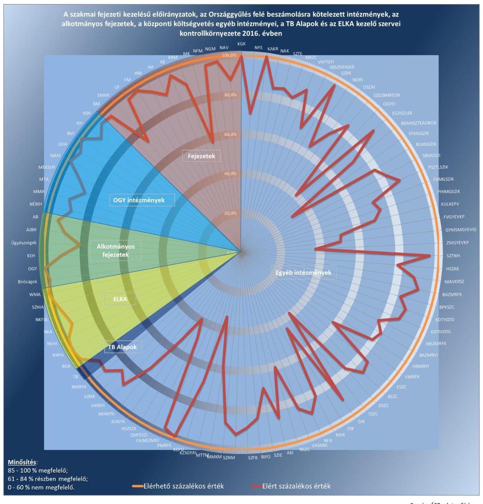

Fonrás: ÁSZ adatgyűjtése

A BELSŐ KONTROLLRENDSZER értékelését az OGY felé beszámolásra kötelezett intézmények, valamint a TB Alapok kezelői szervei (OEP (NEAK), ONYF) esetében végezte el a Számvevőszék.

AZ OGY FELÉ BESZÁMOLÁSRA KÖTELEZETT INTÉZMÉNYEK közül nyolc intézmény belső kontrollrendszerének kialakítása és működtetése megfelelt (GVH, KH, KSH, MEKSzH, MMA, MTA, NAIH, NVI), a NÉBIH belső kontrollrendszerének kialakítása és működtetése részben felelt meg az Áht. és a Bkr. előírásainak. A kockázatkezelési rendszer négy intézmény esetében „megfelelő" volt (GVH, KH, NAIH, NVI), két intézménynél részben felelt meg (MEKSzH, MTA), és három intézmény vonatkozásában nem felelt meg a Bkr.-ben előírtaknak (KSH, MMA, NÉBIH). Öt intézmény nem készített integrált kockázatkezelési eljárásrendet, ezzel megsértették a Bkr. 2016. október 1-jétől hatályos előírásait (KSH, MEKSzH, MMA, MTA, NÉBIH). A kontrolltevékenység nyolc intézménynél „megfelelő" volt (GVH, KH, KSH, MEKSzH, MMA, MTA, NAIH, NVI). A NÉBIH kontrolltevékenysége részben felelt meg a Bkr.-ben foglalt követelményeknek, 2016. október 1-jétől a Bkr. előírása ellenére a kontrolltevékenység részeként a döntések szabályszerűségi szempontból történő jóváhagyására, illetve ellenjegyzésére vonatkozóan nem biztosította a szervezeti célok elérését veszélyeztető kockázatok csökkentésére irányuló kontrollok kiépítését. Az információs és kommunikációs rendszer kialakítása és működtetése az OGY felé beszámolásra kötelezett kilenc intézmény esetében „megfelelő" minősítést kapott. A monitoring rendszer kialakítása és működtetése öt intézmény esetében „megfelelő" volt (GVH, KSH, MMA, MTA, NAIH), négy intézmény esetében részben felelt meg a Bkr. előírásainak (KH, MEKSzH, NÉBIH, NVI). Három intézmény esetében a belső ellenőrzési kézikönyvet a Bkr.-ben foglaltak ellenére legalább kétévente nem vizsgálták felül (MEKSzH, NÉBIH, NVI). A KH-nál továbbá a belső ellenőrzést végző feladatainak szabályozása nem felelt meg a Bkr. előírásainak.

A TB ALAPOK gazdálkodásának szabályszerűségét biztosító belső kontrollrendszer kialakításánál és működtetésénél betartották a jogszabályok előírásait. Az OEP (NEAK)-nál és az ONYF-nél a kockázatkezelési rendszer kialakítása és működtetése megfelelt a jogszabályok és belső szabályzatok előírásainak. A kontrolltevékenységek működése - az E. Alap ellátási szektoránál a pénzügyi ellenjegyzési és az érvényesítési jogkör gyakorlására adott felhatalmazás kivételével - biztosított volt. Az információs és kommunikációs folyamatok kialakítása és működtetése, valamint a monitoring rendszer kialakítása és működtetése a jogszabályok és belső szabályzatok előírásainak megfelelt. Az OGY felé beszámolásra kötelezett intézmények, valamint a TB Alapok kezelő szervei belső kontrollrendszerének értékeléséhez a megfelelőségi térképet a 11. ábra mutatja be.
11. ábra
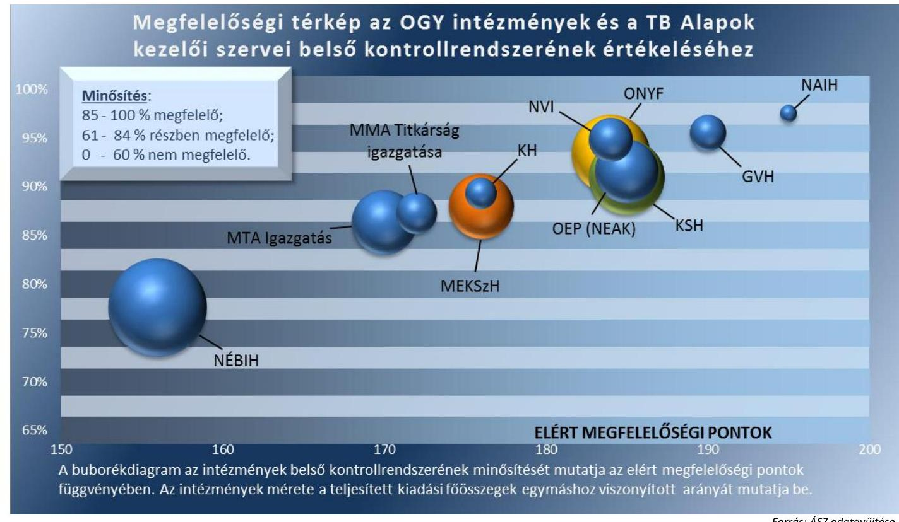

Forrás: ÁSZ adatgyűjtése

---

# III. SZ. MELLÉKLET: AZ INTEGRITÁS KONTROLLRENDSZER ÉRTÉKELÉSÉNEK ÖSSZEGZÉSE 

AZ INTEGRITÁS KONTROLLRENDSZERT a zárszámadás ellenőrzés keretében a Számvevőszék az OGY felé beszámolásra kötelezett intézményeknél, az alkotmányos fejezetek intézményeinél, a központi költségvetés egyéb intézményeinél, valamint a TB Alapok kezelő szerveinél értékelte.

AZ OGY FELÉ BESZÁMOLÁSRA KÖTELEZETT INTÉZMÉNYEK közül négy intézmény integritás kontrollrendszere „kiváló" (GVH, KSH, MMA, NAIH), három intézmény „megfelelő" (MEKSzH, NÉBIH, NVI), két intézmény „fejlesztendő" minősítést kapott (KH, MTA). A KH-nál a humánerőforrás gazdálkodás, a nemkívánatos dolgozói magatartással szembeni intézkedések és azok érvényesülése, továbbá az integritás erősítése, annak tudatosítása, valamint a kockázatelemzések alkalmazása fejlesztendő. Az MTA-nál a nemkívánatos dolgozói magatartással szembeni intézkedések meghozatala és azok érvényesülése, az integritás erősítése, annak tudatosítása, valamint a kockázatelemzések alkalmazása fejlesztendő terület.

AZ ALKOTMÁNYOS FEJEZETEK INTÉZMÉNYEI közül 16 intézmény „kiváló" (Fővárosi Ítélőtábla, Budapest Környéki, Debreceni, Fővárosi, Győri, Gyulai, Kaposvári, Kecskeméti, Szegedi, Szekszárdi, Székesfehérvári, Tatabányai, Zalaegerszegi Törvényszék, Kúria, OGYH, Ügyészség), 14 intézmény „megfelelő" minősítést kapott (AJBH, Bíróságok cím intézményei közül Debreceni, Győri, Pécsi, Szegedi Ítélőtábla, OBH, Egri, Miskolci, Veszprémi, Nyíregyházi, Pécsi, Szolnoki, Szombathelyi Törvényszék, valamint a KEH). Az AB-nál fejlesztendő a szabályozás a bejelentést tevők megfelelő védelmének biztosítása, valamint a szervezeten kívülről érkező panaszokat és közérdekű bejelentéseket kezelő rendszer működtetése, a korrupciós szempontból veszélyeztetett beosztásban dolgozó alkalmazottak figyelmének felhívása a jellemző kockázatokra és a kockázatokat megelőző intézkedésekre, és a korrupciós kockázatelemzés. A Bíróságok cím intézményei közül a Balassagyarmati Törvényszék-nél fejlesztendő az új munkatársak kiválasztására, valamint a nemkívánatos dolgozói magatartás és a közérdekű bejelentések kezelésére vonatkozó szabályozás.

A KÖZPONTI KÖLTSÉGVETÉS EGYÉB INTÉZMÉNYEI közül 24 egyéb intézmény „megfelelő", 14 egyéb intézmény „kiváló" értékelést kapott (BAZMRFK, BKMKSZTEAOKOK, BPKSZC, DJK, FAJNSZMIO, JNSZMRFK, KAKR, KEHI, MMKM, NMRFK, PMRFK, SZRK, SZTNH, VMBVI). 27 egyéb intézmény integritás kontrollrendszere minősült „fejlesztendő"-nek az összeférhetetlenség és etikai elvárások, a nemkívánatos dolgozói magatartással szembeni intézkedések és azok érvényesülése, illetve az integritás erősítése, annak tudatosítása, valamint a kockázatelemzések alkalmazásával kapcsolatos hiányosságok miatt (AKI, BIFO, BLMGSZIK, DSZC, EFMGSZIK, FVGYEVKP, GYMSMGYEVIG, HBMBVI, HSZSZK, JNSZMHGKR, KZSGYAI, MANYSI, MAVKRSZ, MSZC, MTTM, NAK, NORI, NYE, OSZAI, PSZTLSZIK, SBMGSZI, SZIE, SZNM, SSZC, SZTE, ZMFESZI, ZMGYEVKP).

A TB ALAPOK KEZELŐ SZERVEI közül az OEP (NEAK) és az ONYF integritás kontroll rendszere „kiváló" minősítést kapott.

Az OGY felé beszámolásra kötelezett intézmények, az alkotmányos fejezetek intézményei, a központi költségvetés egyéb intézményei és a TB Alapok kezelő szervei integritás kontrollrendszere minősítésének eredményeit a 12. ábra mutatja.

---

12. ábra
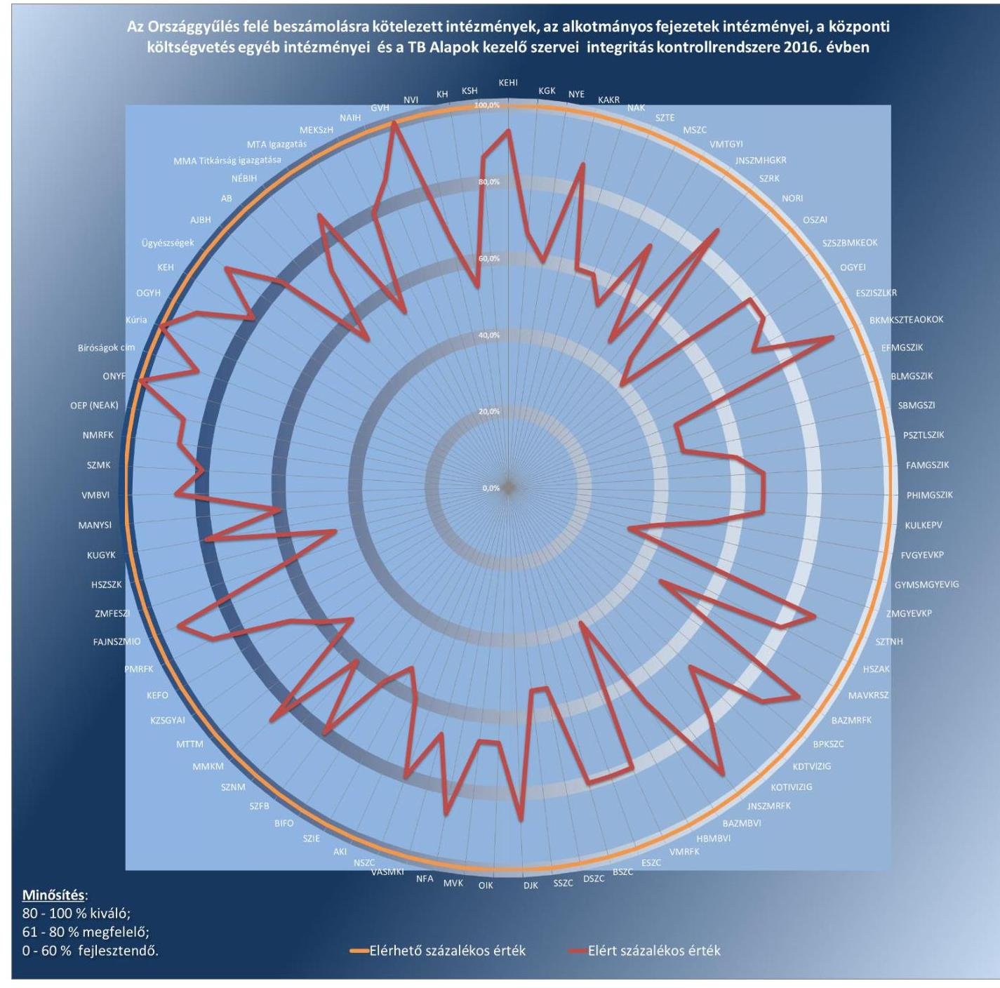

Forrás: ÁSZ adatgyűjtése

---

| Központi kezelésű és az állami vagyonnal kapcsolatos bevételi és kiadási előirányzatok | Szakmai fejezeti kezelésű előirányzatok | OGY felé beszámolásra kötelezett intézmények |
| :--: | :--: | :--: |
| Agrár-Vállalkozási Hitelgarancia Alapítvány | Alapvető Jogok Biztosának Hivatala | Gazdasági Versenyhivatal Igazgatása |
| Államadósság Kezelő Központ Zrt. | Alkotmánybíróság | Közbeszerzési Hatóság |
| Garantiqa Hitelgarancia Zrt. | Belügyminisztérium | Központi Statisztikai Hivatal |
| KAVOSZ Vállalkozásfejlesztési Zrt. | Bíróságok | Nemzeti Adatvédelmi és Információszabadság Hatóság |
| Kormányhivatalok (20) | Emberi Erőforrások Minisztériuma | Nemzeti Választási Iroda |
| Magyar Államkincstár | Gazdasági Versenyhivatal | Nemzeti <br> Élelmiszerlánc-biztonsági Hivatal |
| Magyar Bányászati és Földtani Hivatal | Földművelésügyi Minisztérium | Magyar Tudományos Akadémia Igazgatása |
| Magyar Exporthitel Biztosító Zrt. | Honvédelmi Minisztérium | Magyar Művészeti Akadémia Titkársága |
| Magyar Export-Import Bank Zrt. | Igazságügyi Minisztérium | Magyar Energetikai és Közmű-szabályozási Hivatal |
| Magyar Fejlesztési Bank Zrt. | Köztársasági Elnökség | Alkotmányos fejezetek intézményei |
| Magyar Nemzeti Vagyonkezelő Zrt. | Központi Statisztikai Hivatal | Alapvető Jogok Biztosának Hivatala |
| Nemzeti Földalapkezelő Szervezet | Magyar Tudományos Akadémia | Alkotmánybíróság |
| Nemzetgazdasági Minisztérium | Magyar Művészeti Akadémia | Köztársasági Elnöki Hivatal |
| Nemzeti Adó- és Vámhivatal | Miniszterelnökség | Bíróságok cím intézményei (26) és a Kúria |
| Nemzeti Útdijfizetési Szolgáltató Zrt. | Miniszterelnöki Kabinetiroda | Országgyűlés Hivatala |
| Földművelésügyi Minisztérium | Országgyűlés | Ügyészségek |
| Emberi Erőforrások Minisztériuma | Ügyészség | ELKA |
| Országos Nyugdíjbiztosítási Főigazgatóság | Nemzeti Adó- és Vámhivatal | Bethlen Gábor Alap (BGA Közhasznú Nonprofit Zrt.) |
| Nemzeti Fejlesztési Minisztérium | Nemzetgazdasági Minisztérium | Központi Nukleáris Pénzügyi Alap (NFM) |
| TB Alapok | Nemzeti Fejlesztési Minisztérium | Nemzeti Kutatási, Fejlesztési és Innovációs Alap (NKFIH) |
| Egészségbiztosítási Alap | Nemzeti Kutatási, Fejlesztési és Innovációs Hivatal | Nemzeti Foglalkoztatási Alap (NGM) |
| Országos Egészségbiztosítási Pénztár / Nemzeti Egészségbiztosítási Alapkezelő | Külgazdasági és Külügyminisztérium | Nemzeti Kulturális Alap (NKA Igazgatósága / EMET) |
| Nyugdíjbiztosítási Alap |  | Szövetkezeti Hitelintézetek Integrációs Alapja (MFB Zrt.) |
| Országos Nyugdíjbiztosítási Főigazgatóság | Uniós fejlesztések fejezet | Wesselényi Miklós Ár-és Belvízvédelmi Kártalanítási Alap (NGM, Kincstár) |

---

| A központi költségvetés egyéb intézményei |  |  |
| :--: | :--: | :--: |
| Agrárgazdasági Kutató Intézet | Baross László Mezőgazdasági Szakképző Iskola és Kollégium | Bács-Kiskun Megyei Kórház Szegedi Tudományegyetem Általános Orvostudományi Kar Oktató Kórháza |
| Békéscsabai Szakképzési Centrum | Egyesített Szent István és Szent László Kórház-rendelőintézet | Bélapátfalvai Idősek, Fogyatékosok Otthona |
| Borsod-Abaúj-Zemplén Megyei <br> Büntetés-végrehajtási Intézet | Borsod-Abaúj-Zemplén Megyei Rendőr-főkapitányság | Budapesti Komplex <br> Szakképzési Centrum |
| Deák Jenő Kórház | Dunaújvárosi Szakképzési Centrum | Dr. Entz Ferenc Mezőgazdasági Szakképző Iskola és Kollégium |
| Érdi Szakképzési Centrum | Fáy András Mezőgazdasági Szakképző Iskola és Kollégium | "Fehér Akác" Jász-Nagykun-Szolnok Megyei Idősek Otthona |
| Fővárosi Gyermekvédelmi Központ és <br> Területi Gyermekvédelmi Szakszolgálat | Győr-Moson-Sopron Megyei Gyermekvédelmi Igazgatóság és Területi Gyermekvédelmi Szakszolgálat | Hajdú-Bihar Megyei <br> Büntetés-végrehajtási Intézet |
| Hajdúsági Szociális Szolgáltató Központ | Hévígyógyfürdő és Szent András Reumakórház | Jász-Nagykun-Szolnok Megyei Hetényi Géza Kórház-rendelőintézet |
| Jász-Nagykun-Szolnok Megyei Rendőr-főkapitányság | Kátai Gábor Kórház | Dr. Kenessey Albert Kórház-rendelőintézet |
| Kéthelyi Értelmi Fogyatékosok Otthona | Kormányzati Ellenőrzési Hivatal | Kossuth Zsuzsa Gyermekotthon és Általános Iskola |
| Közép-Dunántúli Vízügyi Igazgatóság | Közép-Tisza-Vidéki Vízügyi Igazgatóság | Kőér Utógondozó és Gyermekotthoni Központ |
| Külképviseletek Igazgatása | Magyar Műszaki és Közlekedési Múzeum | Magyar Nyelvstratégiai Intézet |
| Magyar Természettudományi Múzeum | Miskolci Szakképzési Centrum | Mohácsi Kórház |
| MÁV Kórház és Rendelőintézet, Szolnok | Nagyatádi Kórház | Nagykanizsai Szakképzési Centrum |
| Nemzeti Földalapkezelő Szervezet | Nemzeti Örökség Intézete | Nógrád Megyei Rendőr-főkapitányság |
| Nyíregyházi Egyetem | Országos Gyógyszerészeti és Élelmezés-egészségügyi Intézet | Országos Idegennyelvű Könyvtár |
| Oroszlányi Szakorvosi és Ápolási Intézet | Pálóczi Horváth István Mezőgazdasági Szakképző Iskola és Kollégium | Pest Megyei Rendőr-főkapitányság |
| Pettkó-Szandtner Tibor Lovas Szakképző Iskola és Kollégium | Serényi Béla Mezőgazdasági Szakképző Iskola | Siófoki Szakképzési Centrum |
| Szabadtéri Néprajzi Múzeum | Szabolcs-Szatmár-Bereg Megyei Kórházak és Egyetemi Oktatókórház | Szegedi Fegyház és Börtön |
| Szegedi Tudományegyetem | Szellemi Tulajdon Nemzeti Hivatala | Szent Margit Kórház |
| Szent Rókus Kórház és Intézményei | Széchenyi István Egyetem | Vas Megyei Katasztrófavédelmi Igazgatóság |
| Vas Megyei Rendőr-főkapitányság | Veszprém Megyei <br> Büntetés-végrehajtási Intézet | Veszprém Megyei Tüdőgyógyintézet, Farkasgyepű |
| Zala Megyei Fagyöngy Egyesített Szociális Intézmény | Zala Megyei Gyermekvédelmi Központ és Területi Gyermekvédelmi Szakszolgálat |  |

---

# V. SZ. MELLÉKLET: AZ ELLENŐRZÉSBEN RÉSZTVEVŐK LISTÁJA 

| Az ellenőrzés végrehajtásában részt vett számvevők |  |  |
| :--: | :--: | :--: |
| Albert Enikő | Alexiné Sári Julianna | Babos Szilvia |
| Balás Elemér Attila | Baloghné Zsida Brigitta | Balogné Dakó Eszter |
| Bencsik Árpád | Berecz Helga Erika | Béres Edina |
| Béres László | Bialkó Zsolt Gyula | Bocsi Sándor |
| Botos István | Bretus Zoltán János | Buús Zoltánné Hütter Erzsébet |
| Cseh Katalin | Dr. Dargai Emőke | Deák Edit |
| Dombóvári Nóra | Draviczky Éva | Drippey Levente |
| Eigner György Zoltán | Dr. Eke-Pekács Tibor | Erdélyi László Tamás |
| Dr. Faragóné Tóth Mária |

 | Fekete Gábor | Fekete-Nagy András Gábor |
| Ferencz Katalin Zsuzsanna | Gaálné Izsó Éva | Gábor Mariann |
| Groholy Andrásné Hangyál Márta | Gyalai Márta | Gyulafalvi Enikő |
| Hadházy Sándor György | Dr. Halmné Harsányi Zsuzsanna | Herczku Olivia Zsuzsanna |
| Horváth Emese Csilla | Horváth Katalin | Dr. Horváth Klára |
| Horváth Zoltán | Illésné Borsik Andrea | Iszakné Dóczé Katalin |
| Jagicza Istvánné | Jakab Laura | Kalmár István |
| Kámán Edina | Karnits Zita | Karsai Lászlóné |
| Kersmájer Ágota | Dr. Kevés Judit | Kincses Erzsébet Eszter |
| Kisapáti Angéla | Koczor László | Korbuly Andrea |
| Kormány Gergely Zsolt | Kóródi Gábor | Kováts Tibor Balázs |
| Kökény László | Köllődné Gátai Mária | Kővári Orsolya |
| Krupánszki Dóra | Krüzselyi Attila | Künosné Talián Márta |
| Kurucz Ádám | L. Kovács János | Dr. Lajos Béla |
| Dr. Láng Ágnes Krisztina | Lendvai Ádám Csaba | Lipták Terézia Éva |
| Liziczai Imréné | Lucza Anikó | Madár Sándor |
| Magyari Anna | Márcz Zoltán János | Dr. Marosi Gyöngyi |
| Marozsán Katalin | Molnár Gyula Mihály | Molnár-Sipos Judit |
| Dr. Naár Edit | Dr. Nagy Ágnes | Nagy Csilla Erzsébet |
| Nagy László | Nagyné Pásztor Györgyi | Németh Anita |
| Noé Antal | Novák Márta | Nyéki Melinda |
| Nyikon Zsigmondné | Dr. Nyilasné Tamás Margit | Ódor Zoltán Tamás |
| Orbánné Reichert Judit | Orosz Diána | Papp Éva |
| Papp József | Pats Regina | Pencz Mária |
| Péntek László | Pénzes Gyula | Péter Ákos |
| Dr. Péter Laura | Plavecz Ádám | Dr. Podonyi László |
| Polyák Orsolya | Ritecz Tibor | Dr. Schreiber Judit Zsuzsanna |
| Sipos Attila | Solymár Ágnes | Somlai Gábor |
| Szabó Tamás | Szakályné Tóth Zsuzsanna | Szalontai Miklós |
| Szarka Péterné | Szeibel Gáborné | Szénási Péter |
| Szepes Béla Bálint | Szikszainé Király Mária | Szobota Péter |
| Dr. Szöllősi Zsolt | Temesváry Miklós | Tótfalusi Zoltán |
| Tóth Gábor | Tóth Richárd | Tóth Sándor |
| Turai Erzsébet | Dr. Türk Erika | Unger Ferenc |
| Uram Ferenc Gyula | Varga Sándor | Várhegyi Anett |
| Dr. Veress Tiborné | Vértényi Gábor Jenő | Vida Katalin |
| Vida László | Vincze Béla Róbert | Völgyesi Mátyás |
| Winter Zsuzsa | Zaroba Szilvia |  |

---

| Az ellenőrzés végrehajtását támogató számvevők |  |  |
| :-- | :-- | :-- |
| Dr. Bencsik Gábor | Bencsik János | Dr. Dókus Debóra Vanda |
| Dunai Katalin | Kricsfalusy Kornél | Körmendi Tibor |
| Luksander Alexandra | Mészáros Anna | Nagy Marianna |
| Dr. Németh Eszter | Puskás András | Szabó Cecília |
| Dr. Szántó Ivett | Székely Beáta | Dr. Székely Zsolt |
| Tihanyi Vilmos | Tóthné Szép Ildikó |  |
| A számvevőszéki jelentés összeállításában részt vett számvevők |  |  |
| Balázs Melinda | Federics Adrienn | Ferencz Katalin Zsuzsanna |
| Gácsi Györgyi Ivett | Gyalai Márta | Jagicza Istvánné |
| Jenei Zoltán Béláné | Kersmäjer Ágota | Koczor László |
| Korbuly Andrea | Kováts Tibor Balázs | Lipták Terézia Éva |
| Lucza Anikó | Marozsán Katalin | Mészáros Ildikó Éva |
| Molnár Gyula Mihály | Niklai Heléna | Nyikon Zsigmondné |
| Pénzes Gyula | Szabó Tamás | Szarka Péterné |
| Szikszainé Király Mária | Dr. Türk Erika | Várhegyi Anett |
| Völgyesi Mátyás | Dr. Zsolnay András |  |

---

.

---

# FÜGGELÉK: ÉSZREVÉTELEK 

A jelentéstervezetet a Számvevőszék 15 napos észrevételezésre megküldte az ellenőrzött szervezetek vezetőinek az ÁSZ tv. 29. § (1) bekezdése előírásának megfelelően.
A függelék tartalmazza az ellenőrzött szervezetek vezetői által tett és a Számvevőszék által el nem fogadott észrevételeket és az el nem fogadás indoklását.


[^0]
[^0]:    * 29. § (1) Az Állami Számvevőszék az ellenőrzési megállapításait megküldi az ellenőrzött szervezet vezetőjének vagy az általa megbízott személynek, és annak, akinek személyes felelősségét állapította meg.
    (2) Az ellenőrzött szervezet vezetője és a felelősként megjelölt személy az ellenőrzés megállapításaira tizenöt napon belül írásban észrevételt tehet.
    (3) Az Állami Számvevőszék az észrevételre a beérkezésétől számított harminc napon belül írásban válaszol. A figyelembe nem vett észrevételeket köteles a jelentésben feltüntetni, és megindokolni, hogy azokat miért nem fogadta el.

---

# ALAPVETŐ JOGOK BIZTOSÁNAK HIVATALA 

## Észrevétel (3.3. számú megállapítás 6. bekezdés)

A Fejezeti tartalék előirányzat terhére elrendelt utalványozás a kifizetést megelőzően, 2016. augusztus 4-én megtörtént. Ennek dokumentumát a levelemhez csatoltan megküldöm.

## Az észrevétel el nem fogadásának indoklása:

Az ellenőrzés a megállapításokat az ellenőrzött szervezet által az Állami Számvevőszéknek átadott dokumentumok alapján teszi. Az észrevételhez mellékelt, utólag beküldött dokumentumok hitelességéről az ellenőrzésnek nem állt módjában meggyőződni, azokat nem értékeltük. Az ÁSZ megállapítása az ellenőrzés során rendelkezésre álló dokumentumok alapján helytálló, annak módosítása nem indokolt.

## Észrevétel (3.3. számú megállapítás 6. bekezdés)

A Hivatal korábban rendelkezett a szabálytalanságok kezelésének és a kockázatkezelés rendjének főtitkári utasításként kiadott szabályzataival. A Bkr. valóban 2016. októbertől hatályos előírásával rendelkezett a szervezeti integritást sértő események és az integrált kockázatkezelési szabályzat elkészítéséről, de a szabályzatok tartalmának kialakítását segítő útmutatók csak az év utolsó hónapjaiban kerültek közzétételre, a belső kontrollrendszer jogszabályváltozásokat követő átfogó útmutatója pedig 2017-ben jelent meg. Emiatt, bár hozzákezdtünk mindkét szabályzat elkészítéséhez, azok közül csak a szervezeti integritást sértő események szabályzata lépett június hónapban hatályba. Elkészült az integrált kockázatkezelési szabályzat is, amelynek kiadására ebben a hónapban kerül sor.
Tájékoztatom Elnök urat, hogy a jogszabályváltozásokkal összhangban átdolgoztattam a Belső Ellenőrzési Kézikönyvet is, amely ugyancsak szeptemberben lép hatályba.

## Az észrevétel el nem fogadásának indoklása:

A szabályozások 2017. évben történt elkészítéséről adott tájékoztatásukat köszönjük. A szabályozások elkészítése az ellenőrzött időszakot követően történt, ezért a jelentéstervezet módosítása nem indokolt.

## ALKOTMÁNYBÍRÓSÁG

## Észrevétel (III. számú melléklet 3. bekezdése)

A panaszokról és a közérdekű bejelentésekről szóló 2013. évi CLXV. törvény (Panasztv.) 1. § (1) bekezdése szerint az állami szervek és a helyi önkormányzati szervek a panaszokat és a közérdekű bejelentéseket e törvény szerint kötelesek elintézni. A Panasztv. nem írja elő, hogy panaszokra és a közérdekű bejelentésekre vonatkozóan külön intézményi szabályzatot kellene készíteni. Ennek megfelelően az Alkotmánybíróság a panaszok és közérdekű bejelentések esetén a Panasztv.-ben foglaltak alapján jár el.
A bejelentők adatainak védelme az Alkotmánybíróság adatvédelmi és adatbiztonsági szabályzata értelmében garantált (XXV-1/2040-0/2016, hatályos 2017. január 1-től). A szabályzat rendelkezik az adatkezelés és adatbiztonság érvényesülésének feltételeiről, az adatkezelést végző foglalkoztatottak felelősségi rendszeréről, valamint az érintettek (panaszosok, közérdekű bejelentők) jogairól is.

## Az észrevétel el nem fogadásának indoklása:

Az integritás kontrollrendszer értékeléséhez az ellenőrzött szervezetek a F/6. számú Tanúsítványt töltötték ki. Az ellenőrzés észrevétellel érintett megállapítása az Alkotmánybíróság által kitöltött tanúsítvány adatain és az ellenőrzött szervezetek részére megküldött ellenőrzési programban foglalt értékelési módszeren alapul.

---

Az észrevételben foglalt, 2017. január 1-től hatályos, vonatkozó szabályozás kialakításáról szóló tájékoztatást köszönjük, az nem érinti az ÁSZ által ellenőrzött időszakot. Mindezek alapján az ÁSZ megállapítása helytálló, a jelentéstervezet módosítása nem indokolt.

# ÁLLAMADÓSSÁG KEZELŐ KÖZPONT ZÁRTKÖRŰEN MŰKÖDŐ RÉSZVÉNYTÁRSASÁG 

Észrevétel (A „Főbb megállapítások" és az 1.1. számú megállapítás „A Kormányzati rendszer Uniós módszertan szerinti adóssága")

Az 5. oldalon található Összegzés, Főbb megállapítások részében a kormányzati szektor uniós módszertan szerinti adóssága 2016. év végén 25 921,8 milliárd forint, míg a Magyar Nemzeti Bank előzetes pénzügyi számlái szerint ez 25 922,2 milliárd forint. Ugyanez az eltérés megtalálható a Megállapítások, 1.1. Megállapítás „A Kormányzati rendszer Uniós módszertan szerinti adóssága" részében (17. oldal) is.

## Az észrevétel el nem fogadásának indoklása:

A Magyar Nemzeti Bank előzetes pénzügyi számlái szerinti adósság összegére vonatkozó tájékoztatását köszönjük. Az adat az Állami Számvevőszék számára is ismert.
Az ÁSZ a 2016. évi zárszámadási törvényjavaslat megfelelőségét és az abban szereplő adatok megbízhatóságát ellenőrizte. A törvényjavaslatban és ezáltal az ÁSZ jelentéstervezetében szereplő „kormányzati szektor uniós módszertan szerinti adóssága" a 2017. áprilisi EDP-jelentés Eurostat által elfogadott adatain alapul és nem az észrevételben jelzett előzetes statisztikai publikáción. A jelentéstervezet módosítása nem indokolt.

## BELÜGYMINISZTÉRIUM

## Észrevétel (2.1. számú megállapításon belül az önkormányzatok támogatásaira vonatkozó megállapítás)

A jelentéstervezet 21. oldalán található 2.1. számú megállapítás pontosítását javaslom, mivel a Magyarország 2016. évi központi költségvetési törvény 3. mellékletének 1. 5. A települési önkormányzatok helyi közösségi közlekedésének támogatása jogcímen Baja Város Önkormányzata részére valóban egy összegben került folyósításra a támogatás, azonban ez sem az önkormányzatot, sem a központi költségvetést nem érintette hátrányosan, hiszen a 2016. évre vonatkozó teljes támogatását megkapta.

## Az észrevétel el nem fogadásának indoklása:

Az észrevétel megerősíti az ÁSZ megállapítását, amely szerint a támogatások egy részének kifizetése nem a Kvtv. előírásai szerint történt. Az ÁSZ megállapítása helytálló, a jelentéstervezet módosítása nem indokolt.

## Észrevétel (3.1. számú megállapításon belül az önkormányzatok támogatásaira vonatkozó megállapítás)

A jelentéstervezet 28. oldalán található 3.1. számú megállapításhoz kapcsolódóan tájékoztatom, hogy a Belügyminisztérium döntési jogkörébe tartozó pályázatok esetében a támogatói okiratok minden esetben tartalmazzák a pénzügyi ellenjegyzést „a központi költségvetés IX. fejezetébe sorolt előirányzatokra vonatkozó kötelezettségvállalás, utalványozás, ellenjegyzés és érvényesítés rendjéről szóló 35/2015. (XII. 9.) BM utasításnak" (a továbbiakban: BM utasítás) megfelelően.
A döntési jogosultsággal rendelkező társminisztériumok felé - mely esetekben a Belügyminisztérium csak folyósítja a megítélt támogatást - eddig és ezt követően is hangsúlyosan fogjuk jelezni, hogy a támogatói okirat aláírását megelőzően szükséges azt pénzügyileg ellenjegyezni, függetlenül attól, hogy a BM a társminisztériumi döntést megelőzően hivatalosan igazolja a költségvetési törvényben rendelkezésre álló fedezetet - ahogy azt a BM utasítás előírja. A 2017. évi támogatások folyósítása során kiemelt figyelmet fordítunk arra, hogy a BM utasításnak megfelelően valósuljon meg a pénzügyi ellenjegyzés és a kötelezettségvállalás, ezért azok már mindenben megfelelnek a BM utasítás

---

előírásainak.

# Az észrevétel el nem fogadásának indoklása: 

A megállapítás statisztikai kivetítés eredménye, amely a teljes sokaság (a IX. Helyi önkormányzatok támogatásai fejezet és a XX. EMMI fejezet Települési és területi nemzetiségi önkormányzatok támogatása cím kiadásai) vonatkozásában értelmezhető az önkormányzatok támogatásaira. A dokumentumok ismételt áttekintése alapján tájékoztatom, hogy a mintatételek esetében az államháztartásról szóló törvény végrehajtásáról szóló 368/2011. (XII. 31.) Korm. rendelet 55. § (1) bekezdésének előírásai ellenére a támogatói okiratokon a pénzügyi ellenjegyzést a pénzügyi ellenjegyzés dátumának és a pénzügyi ellenjegyzés tényére történő utalás megjelölésével, az arra jogosult személy aláírásával
 nem minden esetben igazolták. Az ÁSZ megállapítása helytálló, annak módosítása nem indokolt.

## FÖLDMŰVELÉSÜGYI MINISZTÉRIUM

## Észrevétel (3.2. számú megállapításon belül a beszámoló adatainak feltöltésére vonatkozó megállapítás)

Az FM éves költségvetési beszámolójának jogszabályban előírt határidőn túli feltöltése a Magyar Államkincstár által működtetett elektronikus adatszolgáltató rendszerben kialakult informatikai akadályok következtében történt, amelyeknek elhárítását követően az FM az adatszolgáltatását késedelem nélkül teljesítette, így azzal kapcsolatban szankció kiszabására sem került sor.

## Az észrevétel el nem fogadásának indoklása:

A beszámoló adatainak KGR K11 rendszerbe történő késedelmes feltöltése körülményeire vonatkozó tájékoztatásukat köszönjük. Az észrevételben leírtak megerősítik, hogy a beszámoló adatok a jogszabályi előírásban meghatározott határidőt követően kerültek feltöltésre a KGR K11 rendszerbe, ezért a jelentéstervezet megállapításának módosítása nem indokolt.

## HÉVÍZGYÓGYFÜRDŐ ÉS SZENT ANDRÁS REUMAKÓRHÁZ

## Észrevétel (3.3. számú megállapítás 4. bekezdése)

A saját hatáskörben végrehajtott előirányzat-módosításokról, átcsoportosításokról szóló, jogszabályi előírás szerinti tájékoztatási kötelezettség teljesítése az egészségügyi intézmények esetében általában nehézséget jelent. A fejezetet irányító szerv felé a tájékoztatás módjának egységesítése illetve erre szolgáló felület létrehozása nagyban segítené a kötelező adatszolgáltatást és hozzájárulna az intézmények jogszabályi előírásoknak megfelelő eljárásához.

## Az észrevétel el nem fogadásának indoklása:

Az észrevételben a saját hatáskörben végrehajtott előirányzat-módosításokra, átcsoportosításokra vonatkozó tájékoztatást köszönjük, amely nem cáfolja a jelentéstervezet megállapítását. Ezért a megállapítás - mely szerint az intézkedés meghozatalát követő öt munkanapon belül az Intézmény nem tájékoztatta az irányító szervet, illetve a Kincstárt - helytálló, a jelentéstervezet módosítása nem szükséges.

## Észrevétel (3.3. számú megállapítás 4. bekezdése)

A sérelmezett beszerzésekkel kapcsolatosan tisztelettel jelzem, hogy a Hévízgyógyfürdő és Szent András Reumakórház ÁSZ által sérelmezett beszerzései vonatkozásában a Közbeszerzési Döntőbizottság előtt a jelen észrevétel keletkezésének idején 1 hivatalból indított eljárás folyamatban van, a további ügyekben a Közbeszerzési Döntőbizottság a Kbt. 165. § (2) bekezdés b.) pontja szerint megállapította a jogsértés hiányát.

---

# Az észrevétel el nem fogadásának indoklása: 

Az észrevételben leírt a Közbeszerzési Döntőbizottság eljárásával, valamint döntésével kapcsolatos tájékoztatást köszönjük. Az észrevétel megerősíti a beszerzésekkel kapcsolatban - a közbeszerzési eljárás lefolytatásának kötelezettségére vonatkozó - tett megállapítást. Az észrevételt nem fogadjuk el, a jelentéstervezet módosítása nem szükséges.

## HONVÉDELMI MINISZTÉRIUM

## Észrevétel (3.2. számú megállapítás 4. bekezdése)

A tervezet 29. oldalán tett, 3.2. számú megállapítás 4. bekezdésében foglaltak véglegesítése során javaslom figyelembe venni, hogy a Kincstár KGR K11 program technikai és ellenőrzési problémái nem tették lehetővé a Honvédelmi Minisztérium részéről a 2016. évi fejezeti beszámolók határidőre történő feltöltését.

## Az észrevétel el nem fogadásának indoklása:

A beszámoló adatainak KGR K11 rendszerbe történő késedelmes feltöltése körülményeire vonatkozó tájékoztatásukat köszönjük. Az észrevételben leírtak megerősítik, hogy a beszámoló adatok a jogszabályi előírásban meghatározott határidőt követően kerültek feltöltésre a KGR K11 rendszerbe, ezért a jelentéstervezet megállapításának módosítása nem indokolt.

## KÖZÉP-DUNÁNTÚLI VÍZÜGYI IGAZGATÓSÁG

## Észrevétel (3.3. számú megállapítás, „A központi költségvetés egyéb intézményei" című rész első bekezdésére)

A Közép-dunántúli Vízügyi Igazgatóság a jelentéstervezet 31. oldalán - a bevételek tekintetében - nevesítésre került a kötelezettségvállalásra, teljesítésigazolásra, érvényesítésre és utalványozásra vonatkozó előírások be nem tartása címén. A beküldött dokumentumok esetében néhány tétel esetében a bevételek teljesítés igazolása nem történt meg.

## Az észrevétel el nem fogadásának indoklása:

Az észrevétel az ÁSZ megállapítását megerősíti, mely szerint „a beküldött dokumentumok esetében néhány tétel esetében a bevételek teljesítés igazolása nem történt meg." Tájékoztatom, hogy az ÁSZ a pénzforgalmi bevételek teljesítését pénzegység alapú mintavételi eljárással ellenőrizte, melyet a jelentéstervezet az „Ellenőrzés hatóköre és módszerei" fejezete részletesen tartalmaz. Az ÁSZ észrevétellel érintett megállapítása statisztikai mintavételen alapul és ezáltal a teljes sokaság (KDVIZIG bevételei) vonatkozásában értelmezhető. Ezért a jelentéstervezet érintett megállapítása helytálló, a jelentéstervezet módosítása nem indokolt.

## Észrevétel (3.3. számú megállapítás 9. bekezdésére)

A személyi juttatásokat érintő minta tételei esetében észrevétel: A pénzügyi ellenjegyzés vonatkozásában a havi illetmény utalásához kapcsolódó kifizetési jegyzéken és a kiadási utalványon minden esetben szerepel ellenjegyzés, ha az adott minta elemre a vizsgált időszakban volt kifizetés.

## Az észrevétel el nem fogadásának indoklása:

A személyi juttatásokat érintő mintatételekhez kapcsolódó - 8 dolgozó esetében - tett nyilatkozatot formai és tartalmi követelmények hiányában nem tudtuk értékelni. A kiadási mintatételekre vonatkozó értékelés megegyezik az 1. pontban adott tájékoztatással. Ezért a jelentéstervezet érintett megállapítása helytálló, a jelentéstervezet módosítása nem indokolt.

---

# KÖZTÁRSASÁGI ELNÖKI HIVATAL 

## Észrevétel (II. számú melléklet 3. bekezdés)

A Köztársasági Elnökség vonatkozásában az ellenőrzés - hiányosságként - állapította meg, hogy a költségvetési szervek belső kontrollrendszeréről és belső ellenőrzéséről szóló 370/2011. (XII. 31.) Korm. rendelet (Bkr.) 6. § (4) bekezdésében előírt, a szervezeti integritást sértő események kezelésének eljárásrendjét a Köztársasági Elnöki Hivatal 2016. október 1-jétől nem szabályozta.

Tekintettel arra, hogy a jogszabály módosításához konkrét végrehajtási határidő nem került meghatározásra, és a 2016. október 1-i hatálybalépésből több indok alapján közvetlen végrehajtási határidő nem következik, ezért a Hivatalunk működésével kapcsolatos marasztaló megállapítás minden jogi alapot nélkülöz, ezért kérjük az ezzel kapcsolatos szövegrészek törlését a jelentéstervezetből és a figyelemfelhívást visszavonni.

## Az észrevétel el nem fogadásának indoklása:

A költségvetési szervek belső kontrollrendszeréről és belső ellenőrzéséről szóló 370/2011. (XII. 31.) Korm. rendelet (Bkr.) 6. § (4) bekezdése 2016. október 1-jén hatályba lépett módosítása szerint a költségvetési szerv vezetője köteles szabályozni a szervezeti integritást sértő események kezelésének eljárásrendjét. A Bkr. a szabályozás elkészítésére vonatkozóan határidőt nem állapít meg, azaz a szabályozással a rendelkezés hatályba lépése időpontjától rendelkeznie kell a költségvetési intézményeknek.
A Bkr. az egyes kormányrendeleteknek a belső kontrollrendszer és az integritásirányítási rendszer fejlesztésével összefüggő módosításáról szóló 187/2016. (VII. 13) Korm. rendelet 16. § g) pontja alapján módosult, a hatályba lépés időpontját a 25. § (1) bekezdés határozta meg. A jogalkotó a jogalkotásról szóló 2010. évi CXXX. törvény 2. § (3) bekezdését betartva a jogszabály hatálybalépésének időpontját úgy állapította meg, hogy elegendő idő állt rendelkezésre a jogszabály alkalmazására való felkészülésre, mivel a módosítást elrendelő (fent megjelölt) kormányrendelet 2017. július 13-án lépett hatályba, a módosítás pedig 2017. október 1-jén. Azaz a szabályozás elkészítésére a költségvetési intézményeknek több mint két hónap rendelkezésére állt.
A KEH az észrevételében megerősíti a jelentéstervezetnek azt a megállapítását, hogy a szervezeti integritást sértő események kezelésének eljárásrendje szabályozásával az ellenőrzött időszakban nem rendelkezett. A szabályozás 2017. évben történt elkészítéséről adott tájékoztatásukat köszönjük. Tekintettel arra, hogy a szabályozás elkészítése az ellenőrzött időszakot (2016. január 1. - 2016. december 31.) követően történt, a jelentéstervezet módosítása nem indokolt.

## Észrevétel (3.2. számú megállapítás 2. bekezdés):

A Fejezeti kezelésű előirányzatok vonatkozásában az ellenőrzés megállapította, hogy a támogatási célú előirányzatok teljesítésénél, elszámolásánál az államháztartásról szóló törvény végrehajtásáról szóló 368/2011 (XII.31.) Korm. rendelet (Ávr.) 57. § (1) bekezdés előírásai ellenére a teljesítés igazolása során nem minden esetben került ellenőrzésre és igazolásra a kiadások teljesítésének jogossága, összegszerűsége.
Az Állami Számvevőszék megállapítását nem fogadom el, a támogatási célú előirányzatok felhasználásánál a jogszabályi és belső szabályok rendelkezései szerint jártunk el.
Az Állami Számvevőszék részére 2017. június 13-án napján hiteles, elektronikus formában megküldött 20 db dokumentum minden egyes dokumentuma tartalmazza a teljesítésigazolást, ily módon a megállapítás ellentétes a dokumentumokban foglaltakkal.

## Az észrevétel el nem fogadásának indoklása:

Az államháztartásról szóló törvény végrehajtásáról szóló 368/2011. (XII. 31.) Korm. rendelet 57. § (1) bekezdése alapján a teljesítés igazolása során ellenőrizhető okmányok alapján ellenőrizni és igazolni kell a kiadások teljesítésének jogosságát, összegszerűségét.
Az államháztartásról szóló 2011. évi CXCV. törvény 1. § 5. pontja meghatározza a kötelezettségvállalás fogalmát, mely szerint az adott tételekhez kapcsolódóan kötelezettségvállalás a kiadási előirányzatok terhére fizetési kötelezettség

---

vállalásáról szóló - így különösen szerződés megkötésére, költségvetési támogatás biztosítására irányuló - szabályszerűen megtett jognyilatkozat.
A kötelezettségvállalást a kötelezettségvállaló - pénzügyi ellenjegyzést követő - aláírása teszi érvényessé, ettől válik szabályszerű jognyilatkozattá. A kötelezettségvállalás dokumentuma tartalmazza a kifizetésre jogosult megnevezését és a kötelezettségvállalás összegét. Érvényes kötelezettségvállalás nélkül nem áll rendelkezésre a kifizetésre jogosult megjelölése és a kifizetendő összeg, ezért a kiadás jogosságának és összegszerűségének ellenőrzése és igazolása nem végezhető el. Vagyis a kötelezettségvállalásnak meg kell előznie a teljesítésigazolást.
A dokumentumok ismételt áttekintése során megállapítottuk, hogy a kötelezettségvállalást, pénzügyi ellenjegyzést és teljesítésigazolást tartalmazó dokumentumon a teljesítésigazolásra a kötelezettségvállalást és a pénzügyi ellenjegyzést megelőzően került sor. Ezért a jelentéstervezet megállapításának módosítása nem indokolt.

# KÖZÉP-TISZA-VIDÉKI VÍZÜGYI IGAZGATÓSÁG 

## Észrevétel (II. számú melléklet 5. bekezdés)

A bekért adatokra vonatkozó Teljességi és hitelességi nyilatkozat 2.28. pontja alapján (7. oldal) az Igazgatóság részéről megküldésre kerültek a 2016. évi aktualizált, a költségvetési szerv működési folyamataira vonatkozó ellenőrzési nyomvonalak.
A „KÖTIVIZIG_ELLENŐRZÉSI_NYOMVONAL_KARCAG" elnevezésű fájl, téves adattartalommal került megküldésre, mely utólagos ellenőrzés keretében derült ki. A helyes dokumentum jelen levél mellékleteként kerül csatolásra.

## Az észrevétel el nem fogadásának indoklása:

Az észrevételben leírtak megerősítik, hogy az ellenőrzött szervezet nem bocsátotta az ellenőrzés rendelkezésére az ellenőrzési nyomvonalat. Az észrevételhez mellékelt, utólag beküldött dokumentumok hitelességéről az ellenőrzésnek nem állt módjában meggyőződni, azokat nem értékeltük. Az ÁSZ megállapítása az ellenőrzés során rendelkezésre álló dokumentumok alapján helytálló, annak módosítása nem indokolt.

## KÚRIA

## Észrevétel (Szervezeti integritást sértő események kezelése eljárásrendje)

Az ellenőri jelentéstervezet a Kúrián megjelöli továbbá „a Szervezeti integritást sértő események kezelése eljárásrendjének tartalmi hiányosságát". A jelentéstervezet ezen megállapítása általános megfogalmazást tartalmaz, így abból nem határozható meg egyértelműen, hogy a megállapítást megfogalmazó milyen konkrét hiányosságot kifogásol. A Kúrián a Szervezeti integritást sértő események kezelésének eljárásrendje a költségvetési szervek belső kontrollrendszeréről és belső ellenőrzéséről szóló 370/2011. (XII. 31.) Korm. rendelet előírásainak megfelelően, az abban meghatározott kötelező tartalmi követelményeknek maradéktalanul eleget téve került kiadásra.

## Az észrevétel el nem fogadásának indoklása:

Az észrevétel tartalmazza, hogy a szervezeti integritást sértő események kezelésének eljárásrendje minden kötelező tartalmi előírásoknak eleget tesz. A dokumentumok ismételt felülvizsgálata alapján tájékoztatom, hogy az eljárásrend 2016. október 1-jétől nem felelt meg a Bkr. 6. § (4a) bekezdés pontjai szerinti előírásoknak, mert a bejelentett kockázatok és események előzetes értékelésének módszertanát nem tartalmazta. Az ÁSZ megállapítása helytálló, a jelentéstervezet módosítása nem indokolt.

## Észrevétel (10. ábra)

További észrevételünk, hogy a jelentéstervezet 42. oldalán, a Kontrollkörnyezet 2016. évi értékelésére szolgáló 10. ábrában az Alkotmányos fejezetekre vonatkozó részből a Kúria kimaradt.

---

# Az észrevétel el nem fogadásának indoklása: 

A dokumentumok ismételt áttekintése alapján tájékoztatom, hogy az érintett ábrán az „Alkotmányos fejezetek"-en belül a „Bíróságok" tartalmazzák a Kúria értékelését is. Az ábra pontosítása nem indokolt.

## MAGYAR ÁLLAMKINCSTÁR

Észrevétel (2.1. és 3.1. számú megállapításon belül az önkormányzatok támogatásaira vonatkozó megállapítás)
A jelentéstervezet szövegéből nem ismerjük konkrétan, mely támogatási jogcímeknél, mikor, mely esetekben nem a Kvtv. előírásai szerint történt a támogatások kifizetése. Továbbá az sem ismerhető meg a jelentéstervezetből, hogy a megbízhatósági hiba konkrétan a Kvtv.
 mely jogszabályhelyeit érinti.
A jelentéstervezet ez esetben sem tér ki arra, hogy konkrétan mely jogcímek esetében és konkrétan az Áht. és az Ávr. mely jogszabályhelyeit érintően tette meg ellenőrzési megállapításait.

## Az észrevétel el nem fogadásának indoklása:

Az észrevétel a megállapítások kiegészítését javasolja a konkrét kiadási mintatételek és a vonatkozó jogszabályhelyek megjelölésével.
A megállapítások statisztikai kivetítés eredménye alapján kerültek megfogalmazásra, amelyek a teljes sokaság (a IX. Helyi önkormányzatok támogatásai fejezet és a XX. EMMI fejezet Települési és területi nemzetiségi önkormányzatok támogatása cím kiadásai) vonatkozásában értelmezhetőek az önkormányzatok támogatásaira. Tájékoztatom, hogy a jogszabályhelyek megjelölését az adott támogatási jogcím esetében döntési jogkörrel rendelkező minisztérium részére az Állami Számvevőszékről szóló 2011. évi LXVI. törvény 33. § (6) bekezdése alapján megküldött figyelemfelhívó levél részletesen tartalmazza. A megállapítások kiegészítése, illetve törlése nem indokolt.

## MAGYAR FEJLESZTÉSI BANK ZRT.

## Észrevétel (3.5. számú megállapítás 1. bekezdésében szereplő, SZHIA vonatkozásában rögzített megállapítás)

Az MFB Zrt. - a hatályos SZHIA kötelezettségvállalási szabályzatával és ezáltal az Ávr.-rel összhangban - az SZHIA esetében az utalványozást elvégezte, ahogy ez a mellékletként csatolt bizonylatokon is látszik. Az utalványrendelet számviteli bizonylat elválaszthatatlan mellékletét képezi az utalvány bizonylat, amelyen az utalványozás aláírtan megtörtént.

## Az észrevétel el nem fogadásának indoklása:

Az észrevételben foglaltakkal ellentétben az ÁSZ ellenőrzés rendelkezésére bocsátott, észrevétellel nem érintett SZHIA mintatétel vonatkozásában az utalványrendeletnek nem képezte „elválaszthatatlan mellékletét az „utalvány bizonylat", azon mintatétel vonatkozásában az utalványozás szabályszerűen, az utalványrendeleten megtörtént és nem készült külön ún. „utalvány bizonylat".
Tájékoztatom, hogy az észrevétellel érintett mintatétel esetében az utalványozásra vonatkozó szabályszerűségi hiba abban állt, hogy az észrevételben hivatkozott „utalvány bizonylat", amelyen az utalványozó aláírása szerepelt nem tartalmazza maradéktalanul az Ávr. 59. § (3) bekezdésében foglalt tartalmi elemeket (például kötelezettségvállalás nyilvántartási száma, egységes rovatrend és kormányzati funkció szerinti szám, a terheléssel érintett pénzeszköz államháztartási számviteli kormányrendelet szerinti könyvviteli számlájának számát). Míg a mintatétel vonatkozásában szintén rendelkezésre álló „utalványrendelet" az előírt tartalmi elemekkel rendelkezett, viszont nem szerepelt rajta az utalványozó keltezéssel ellátott aláírása. Mindezekre tekintettel az ÁSZ megállapítása helytálló, annak módosítása nem indokolt.

---

# MAGYAR TERMÉSZETTUDOMÁNYI MÚZEUM 

## Észrevétel (3.3. számú megállapítás 15. bekezdés):

A jelentéstervezet megállapítása tényszerűségéhez hozzátartozik, hogy a Magyar Államkincstár a KGR K11 rendszerben 2017. február 28-án - a beszámoló feltöltésének jogszabályban előírt napján - verzióváltást hajtott végre a 2016. évi költségvetési beszámoló (központi alrendszer) és a 2016. időközi mérlegjelentés IV. negyedév adatszolgáltatásokon, továbbá 2017. március 1-jén végezte a KGR K11-es rendszer karbantartását. A verzióváltásra és a karbantartásra tekintettel a 2016. éves költségvetési beszámoló szankció nélküli adatszolgáltatási határidejét 2017. március 6-án határozták meg. A későbbiekben a KGR K11-es rendszerében még több alkalommal voltak bejelentkezési hibák, amelyek megszüntetésének időigénye miatt a Kincstár 2017. április 6-i tájékoztatása szerint a 2016. éves költségvetési beszámoló feltöltési határidejét 2017. április 12-én határozta meg (az adatszolgáltatási bírság kiszabására okot adó késedelem első napja 2017. április 13-a volt).
Múzeumunk a 2016. éves költségvetési beszámolóját ezen határidőn belül, 2017. március 10-én töltötte fel a KGR K11-es rendszerébe. Mivel a verzióváltások a beszámoló egyes űrlapjait, illetve kötelező egyezőségeket is érintettek, valamint a rendszer elérésével kapcsolatosan is problémák voltak, ezért a jogszabályi határidő betartásának nem voltak meg a technikai feltételei.

## Az észrevétel el nem fogadásának indoklása:

A beszámoló adatainak KGR K11 rendszerbe történő késedelmes feltöltése körülményeire vonatkozó tájékoztatásukat köszönjük. Az észrevételben leírtak megerősítik, hogy a beszámoló adatok a jogszabályi előírásban meghatározott határidőt követően kerültek feltöltésre a KGR K11 rendszerbe, ezért a jelentéstervezet megállapításának módosítása nem indokolt.

## Észrevétel (II. számú melléklet 5. bekezdés):

A jelentéstervezet II. melléklete „A Központi költségvetés egyéb intézményei" fejezetben „A szervezeti integritást sértő események kezelésének eljárásrendjét a Bkr. 2016. október 1-jétől hatályos előírása ellenére 35 egyéb intézmény nem készítette el" megállapítás megfogalmazása arra utal, mintha az eljárásrend elkészítésének 2016. évi elmulasztásával az intézmények jogszabályi előírást sértettek volna meg, illetve az eljárásrendek hiánya jelenleg is fennállna, amely múzeumunk esetében nem így van.
A Bkr. 2016. október 1-jétől hatályos 6. § (4) bekezdése azt valóban előírja, hogy a költségvetési szerv vezetője köteles szabályozni a szervezeti integritást sértő események kezelésének eljárásrendjét, azonban ennek elkészítésére határidőt nem szab.
A Múzeum „A szervezeti integritást sértő események kezelésének eljárásrendjé"-t 2017. február 28-án adta ki a Bkr. 3. § b) pontjában szereplő integrált kockázatkezelési rendszer kialakításának feladatait és a kapcsolódó szabályzatok elkészítését ütemező, 2017. január 9-én kiadott 1/2017. számú főigazgatói utasítás 4. pontjában megfogalmazottaknak megfelelően. Az ellenőrzés részére 2017. május 10-én mind az 1/2017. számú főigazgatói utasítás, mind „A szervezeti integritást sértő események kezelésének eljárásrendje" elektronikus formában átadásra került. (Megjegyzem, hogy az eljárásrend elkészítését támogató, a Nemzetgazdasági Minisztérium által a belső kontrollrendszer és az integritásirányítási rendszer fejlesztéséhez kiadott módszertani útmutatók is csak 2016. november végén kerültek publikálásra.)

## Az észrevétel el nem fogadásának indoklása:

A költségvetési szervek belső kontrollrendszeréről és belső ellenőrzéséről szóló 370/2011. (XII. 31.) Korm. rendelet (Bkr.) 6. § (4) bekezdése 2016. október 1-jén hatályba lépett módosítása szerint a költségvetési szerv vezetője köteles szabályozni a szervezeti integritást sértő események kezelésének eljárásrendjét. A Bkr. a szabályozás elkészítésére vonatkozóan határidőt nem állapít meg, azaz a szabályozással a rendelkezés hatályba lépése időpontjától rendelkeznie kell a költségvetési intézményeknek.

---

A Bkr. az egyes kormányrendeleteknek a belső kontrollrendszer és az integritásirányítási rendszer fejlesztésével összefüggő módosításáról szóló 187/2016. (VII. 13) Korm. rendelet 16. § g) pontja alapján módosult, a hatálybalépés időpontját a 25. § (1) bekezdés határozta meg. A jogalkotó a jogalkotásról szóló 2010. évi CXXX. törvény 2. § (3) bekezdését betartva a jogszabály hatálybalépésének időpontját úgy állapította meg, hogy elegendő idő állt rendelkezésre a jogszabály alkalmazására való felkészülésre, mivel a módosítást elrendelő (fent megjelölt) kormányrendelet 2017. július 13-án lépett hatályba, a Bkr. módosítása pedig 2017. október 1-jén. Azaz a szabályozás elkészítésére a költségvetési intézményeknek több mint két hónap rendelkezésére állt.
A Magyar Természettudományi Múzeum az észrevételében megerősíti a jelentéstervezetnek azt a megállapítását, hogy a szervezeti integritást sértő események kezelésének eljárásrendje szabályozásával az ellenőrzött időszakban nem rendelkezett. A szabályozás 2017. évben történt elkészítéséről adott tájékoztatásukat köszönjük. Tekintettel arra, hogy a szabályozás elkészítése az ellenőrzött időszakot követően történt, a jelentéstervezet módosítása nem indokolt.

# MINISZTERELNÖKSÉG 

## Észrevétel (3.2. számú megállapításon belül a beszámoló adatainak feltöltésére vonatkozó megállapítás)

A XI. Miniszterelnökség fejezet 2016. évi költségvetési beszámolójának az államháztartás számviteléről szóló 4/2013. (I. 11.) Korm. rendelet 32. § (3) bekezdésében foglalt határidőn (március 20.) túli teljesítésének oka, hogy a Magyar Államkincstár (a továbbiakban: Kincstár) KGR K11 adatszolgáltató rendszerében 2017. március 16-át követően komoly hálózati problémák adódtak, melyek következtében a rendszer működése folyamatosan akadozott, a rendszerbe nem, vagy csak nehezen lehetett belépni, illetve sikeres belépés esetén sem volt biztosított a folyamatos munkavégzés, illetve a sikeres adatmentés.
A probléma fennállásáról a KGR K11 rendszer elektronikus felületén folyamatosan értesültek a felhasználók, a probléma elhárításáról a Kincstár 2017. április 06-án e-mailen tájékoztatta az adatszolgáltatókat és egyben közölte a folyamatban lévő adatszolgáltatások késedelmes benyújtása esetében az adatszolgáltatási bírság kiszabására okot adó késedelem első napját. Ez az időpont a 1091 szektorban a 2016. évi költségvetési beszámoló esetében 2017. április 13-a volt.
A XI. Miniszterelnökség fejezet 2016. évi költségvetési beszámolója a Kincstár informatikai rendszerének helyreállítását követően, a Kincstár által adott határidőn belül, haladéktalanul feltöltésre került.

## Az észrevétel el nem fogadásának indoklása:

A beszámoló adatainak KGR K11 rendszerbe történő késedelmes feltöltése körülményeire vonatkozó tájékoztatásukat köszönjük. Az észrevételben leírtak megerősítik, hogy a beszámoló adatok a jogszabályi előírásban meghatározott határidőt követően kerültek feltöltésre a KGR K11 rendszerbe, ezért a jelentéstervezet megállapításának módosítása nem indokolt.

Észrevétel (2.2. számú és a 3.2. számú megállapításon belül a vidékfejlesztési és halászati programokra vonatkozó megállapítás)

Az Európai Mezőgazdasági Vidékfejlesztési Alap (EMVA) tekintetében a 2007-2013-as időszakban az Új Magyarország Vidékfejlesztési Program (ÚMVP), a 2014-2020-as időszakban az Új Vidékfejlesztési Program (ÚVP) került elfogadásra.
Az ellenőrzött programok tekintetében a támogatások felhasználása során az észrevételben felsorolt jogszabályokat betartva jártunk el.
A pénzügyi ellenjegyzés, a teljesítésigazolás, az érvényesítés ezen jogszabályok figyelembe vételével és betartásával történt, ezzel kapcsolatban az ÁSZ jelentéstervezete érdemi megállapítást nem tartalmaz.
A MAHOP esetében nem helytálló az az ÁSZ megállapítás, hogy az IIER rendszerben kell kezelni a pénzügyi ellenjegyzés, a teljesítésigazolás eljárási és a dokumentálás részletszabályait, mivel erre a program az EUPR informatikai rendszerét használja.

---

A Kifizető Ügynökség akkreditált szervezeti felépítése úgy került kialakításra, hogy az engedélyezési feladatok a szakmai főosztályok felelősségi körébe tartozzanak. Ezáltal a kötelezettségvállalás, és a teljesítésigazolás végrehajtását az egyes jogcímekért felelős szakmai főosztályvezetők végzik. Pénzügyi ellenjegyzésre a támogatások kezelése kapcsán azon ügyekben, ahol közigazgatási hatósági eljárásban történik a döntéshozatal nincs szükség, mivel a közigazgatási eljárásra vonatkozó szabályok szerint határozati formában történik a kifizetésekkel összefüggő döntéshozatal az egyes ügyekben.
Az érvényesítés kifizetések és beszedések jogosultságának, összegszerűségének, a fedezet meglétének és a vonatkozó jogszabályokban és belső szabályzatokban foglaltak betartásának ellenőrzését jelenti. Ez minden alap tekintetében ugyanúgy történik.
Fentiek alapján a kifizetések során biztosítva van a fedezet, tekintettel arra, hogy forrás hiányában létre se jön kifizetésről szóló döntés.
A kötelezettségvállalás időpontja az a nap, amikor a döntés megszületik. Ez a határozat dátuma (ÚMVP, HOP), illetve a támogatás kifizetéséről szóló értesítőlevél jóváhagyásának dátuma (VP, MAHOP).
A Kincstár kifizető ügynökségi könyvelésében, melyen az előírt közösségi jelentések - ezáltal az Európai Bizottsággal történő elszámolások és a Brüsszelből érkező visszatérítések - is alapulnak, a döntések kötelezettségként azzal a nappal kerülnek könyvelésre, mikor a döntés jóváhagyásra kerül. Tehát ilyen szempontból a kötelezettségvállalás (könyvelése) minden esetben megelőzi a kifizetést.

# Az észrevétel el nem fogadásának indoklása: 

Az észrevétel a vidékfejlesztési és halászati programok kiadásaihoz kapcsolódóan feltárt szabályszerűségi hibát és megbízhatósági hibát érinti, továbbá egyéb pontosításra vonatkozó javaslatot fogalmaz meg. A megbízhatósági hiba vonatkozásában a jelentéstervezet tartalmazza, hogy a kötelezettségvállalás a kifizetések teljesítését követően történt. A szabályszerűségi hibára vonatkozóan pedig azt rögzíti, hogy az Ávr. előírásai ellenére az ÚMVP, a HOP, a VP és a MAHOP belső szabályzataiban nem határozták meg a pénzügyi ellenjegyzés, a teljesítésigazolás és az érvényesítés részletszabályait.
Az észrevétel a szabályszerűségi hibával összefüggésben részletes tájékoztatást tartalmaz a vidékfejlesztési és halászati programok tekintetében a lebonyolításra, felhasználásra vonatkozó jogszabályokról és azok gyakorlati végrehajtásáról, az Ávr. vonatkozó előírásaira azonban nem tér ki. Tájékoztatom, hogy a jelentéstervezet szabályszerűséget érintő megállapítása a gazdálkodási jogkörök gyakorlására vonatkozó részletszabályok belső szabályzatban történő rögzítésének hiányára vonatkozik, amelyet az Ávr. kötelezően előír. Ezen részletszabályok meghatározása alól az említett jogszabályok alkalmazása
 nem ad felmentést.
A megbízhatósági hibával összefüggésben megfogalmazott észrevétellel kapcsolatban tájékoztatom, hogy a vidékfejlesztési és halászati programok kiadásai vonatkozásában a gyakorlatnak szintén meg kell felelnie az Áht. és az Ávr. vonatkozó előírásainak. Tehát a kötelezettségvállalásnak és a kötelezettségvállalás nyilvántartásba vételének minden esetben meg kell előznie a kifizetést.
Mindezek alapján a szabályszerűségi és a megbízhatósági hibára vonatkozó észrevételt nem fogadjuk el, a jelentéstervezet módosítása nem indokolt.
Az egyéb pontosító javaslatokkal összefüggésben tájékoztatom, hogy a dokumentumok áttekintése alapján a jelentéstervezetben foglalt „VP" rövidítés „ÚVP"-re való módosítására vonatkozó észrevételt nem fogadjuk el, a jelentéstervezet a rövidítésjegyzékre figyelemmel a rövidítést helyesen tartalmazza. Az IIER rendszerre vonatkozó pontosító észrevételt szintén nem fogadjuk el, ugyanis a jelentéstervezet az észrevétellel ellentétben nem azt tartalmazza, hogy kifejezetten a MAHOP esetében kell az IIER rendszerben a részletszabályokat kezelni, hanem értelemszerűen, amely programok esetében relevanciával bír.

---

# MINISZTERELNÖKI KABINETIRODA 

Észrevétel (3.2. számú megállapításán belül a szakmai fejezeti kezelésű kiadási előirányzatokra vonatkozó megállapítás)
Álláspontunk szerint az a megállapítás, amely a kötelezettségvállalás, teljesítésigazolás, érvényesítés, utalványozás be nem tartásához kapcsolódik, nem fedi a valóságot, félrevezető megállapítást tartalmaz. A számvevőszéki jelentéstervezetet ezen észrevétele tévesen azt sugallja, mintha az MK tekintetében a 2016. év során minden kötelezettségvállalás, teljesítésigazolás, és utalványozás szabályszerűtlen lett volna. Ezzel kapcsolatban kifogással élünk, mivel a fejezeti kezelésű kiadási előirányzatok teljesítése során az Áht. és az Ávr. vonatkozó előírásai a kötelezettségvállalásra, teljesítésigazolásra, érvényesítésre és utalványozásra vonatkozóan betartásra kerültek.

## Az észrevétel el nem fogadásának indoklása:

A jelentéstervezet megállapítása tényszerűen tartalmazza, hogy az ellenőrzés szabályszerűségi hibát állapított meg a gazdálkodási jogkörök gyakorlására vonatkozó előírások be nem tartásához kapcsolódóan. Az ÁSZ statisztikai mintavétel útján ellenőrizte a kiadások szabályszerűségét, ezért a megállapítás megfogalmazása helytálló. Tájékoztatom, hogy a szabályszerűségi hibát az okozta, hogy az ellenőrzött időszak egy részében a gazdálkodási jogkörgyakorlásnál a kapcsolódó felhatalmazások, valamint a vonatkozó szabályzatok nem álltak rendelkezésre. Mindezek alapján az ÁSZ jelentéstervezetének módosítása nem indokolt.

## Észrevétel (kontrollkörnyezet kialakítására vonatkozó megállapítás)

Álláspontunk szerint a jelentéstervezet félrevezető megállapítást tartalmaz, hiszen a költségvetési szervek belső kontrollrendszeréről és a belső ellenőrzésről szóló 370/2011. (XII. 31.) Korm. rendelet 6. §-ában rögzített kontrollkörnyezet kialakítására vonatkozó jogszabályi előírásoknak a Miniszterelnöki Kabinetiroda minden elemében - a szabályzatok kiadására vonatkozóan is - megfelelt.

## Az észrevétel el nem fogadásának indoklása:

Az észrevétellel érintett megállapítást követően a jelentéstervezet konkrétan felsorolja a fejezetek kontrollkörnyezetére vonatkozó hiányosságokat. Az MK esetében a hiányosság, amely a nem megfelelő minősítést eredményezte, hogy „A Számv. tv.-ben előírt szabályzatokat, valamint a számlarendet a Számv. tv.-ben foglalt előírások ellenére 2016. májusig nem készítették el." Az észrevételt nem fogadjuk el, a jelentéstervezet módosítása nem indokolt.

## Észrevétel (Számv. tv.-ben előírt szabályzatokra, valamint a számlarendre vonatkozó megállapítás)

Elismerjük, hogy a Számv. tv.-ben előírt szabályzatok, valamint a számlarend a Számv. tv.-ben előírt határidőig nem kerültek hatályba léptetésre, mindazonáltal az előírt szabályzatok 2016. május 27-én KÁT utasítás keretében kiadásra kerültek.
Így tisztelettel kérjük, a jelentéstervezet szövegezését kiegészíteni: „A Számv. tv.-ben előírt szabályzatok, valamint a számlarend a Számv. tv.-ben előírt határidőt követően, 2016. május 27-én kerültek kiadásra."

## Az észrevétel el nem fogadásának indoklása:

Az észrevétel megerősíti az ÁSZ megállapítását, amely tényszerűen tartalmazza, hogy 2016. májusáig nem készítették el az érintett szabályzatokat. A jelentéstervezet megfogalmazásának módosítása nem indokolt.

---

# NEMZETI ADÓ- ÉS VÁMHIVATAL 

## Észrevétel (II. számú melléklet 2. bekezdés):

A Tervezet II. melléklet 2. bekezdésében (40. oldal második bekezdés közepe) többek között az szerepel, hogy „A számlarend nem tartalmazta a könyvviteli számla értéke növekedésének, csökkenésének jogcímeit, mellyel megsértették a Számv. tv. és az Áhsz. előírásait (NAV). Az Áhsz. előírása ellenére a számlarend nem tartalmazta a részletező nyilvántartások vezetésének módját (NAV), a pénzügyi könyveléshez az összesítő bizonylatok (feladások) elkészítésének rendjét, valamint azok tartalmi és formai követelményeit (FM, MTA, NAV, NKFIH)"
a) A Tervezet tehát egyrészt kifogásolja, hogy a számlarend nem tartalmazza a könyvviteli számla értéke növekedésének, csökkenésének jogcímeit.
A NAV számlarendjéről szóló, 2016. december 13-tól érvényes 2173/2016/KIF szabályzatnak a mérleg tagolása, a számlaosztályok tartalmára vonatkozó fontosabb előírások, könyvelés jogcímei, számlát érintő gazdasági események számla összefüggései című 1. melléklete a mérleg tagolása szerint (fejezetenként) - a nemzeti vagyonba tartozó befektetett eszközök, a nemzeti vagyonba tartozó forgóeszközök, pénzeszközök, követelések, sajátos elszámolások, aktív időbeli elhatárolások, források - alábontásban részletesen tartalmazza valamennyi gazdasági eseményt, így a növekedési és csökkenési jogcímeket is.
Ugyanígy részletesen tartalmazta a hiányolt növekedési és csökkenési jogcímeket a 2016. december 13-ig érvényben volt, a NAV számlarendjéről szóló, a 2134/2015. szabályzattal módosított 2156/2014. szabályzatnak a mérleg tagolása, a számlaosztályok tartalmára vonatkozó fontosabb előírások, könyvelés jogcímei, számlát érintő gazdasági események számla összefüggései című 1. melléklete is. Előzőekre tekintettel a megállapítást nem tartom megalapozottnak.
b) A Tervezet másrészt kifogásolja, hogy a számlarend nem tartalmazza a részletező nyilvántartások vezetésének módját.
Ezzel szemben az a) pontban hivatkozott jelenleg érvényes számlarend és a korábban érvényes számlarend 1. melléklete a mérleg tagolása szerint (fejezetenként) - a nemzeti vagyonba tartozó befektetett eszközök, a nemzeti vagyonba tartozó forgóeszközök, pénzeszközök, követelések, sajátos elszámolások, aktív időbeli elhatárolások, források - alábontásban részletesen tartalmazza a könyvviteli számlákhoz kapcsolódó részletező (analitikus) nyilvántartások vezetésére vonatkozó előírásokat (elszámolás módját, speciális szabályokat). Előzőekre tekintettel a megállapítást nem tartom megalapozottnak.
c) A Tervezet harmadrészt kifogásolja, hogy a számlarend nem tartalmazza a pénzügyi könyveléshez az összesítő bizonylatok (feladások) elkészítésének rendjét valamint azok tartalmi és formai követelményeit.
Ezzel szemben az a) pontban hivatkozott jelenleg érvényes számlarend és a korábban érvényes számlarend 1. melléklete a mérleg tagolása szerint (fejezetenként) - a nemzeti vagyonba tartozó befektetett eszközök, a nemzeti vagyonba tartozó forgóeszközök, pénzeszközök, követelések, sajátos elszámolások, aktív időbeli elhatárolások, források - alábontásban részletesen tartalmazza a havi, negyedéves, éves zárlati feladatokra vonatkozó egyeztetési, adatszolgáltatási feladatokra vonatkozó részletes eljárási szabályokat.

## Az észrevétel el nem fogadásának indoklása:

A Nemzeti Adó- és Vámhivatal által az ellenőrzés rendelkezésére bocsátott, 2016. december 12-ig hatályban lévő, A Nemzeti Adó- és Vámhivatal elnöke által kiadott 2156/2014. szabályzat a számlarendről című dokumentum nem tartalmazta az 1-3. számú mellékleteket, ezért az észrevételben hivatkozott, az 1. számú mellékletben lévő szabályozást az Állami Számvevőszék az ellenőrzés során nem tudta értékelni, a megállapítások megtétele során figyelembe venni. Tekintettel arra, hogy az ellenőrzött időszak csaknem egészében ez a szabályozás volt érvényes, a jelentéstervezet megállapításának módosítása nem indokolt.

---

# NEMZETI FÖLDALAPKEZELŐ SZERVEZET 

## Észrevétel (előirányzat-módosítások szabályszerűségére vonatkozó megállapítás)

A jelentéstervezet 31. és 32. oldalán az ÁSZ szabályszerűségi és a bizonylati fegyelem betartásával kapcsolatban állapított meg hiányosságokat, melyek az NFA vonatkozásában nem a valós helyzetet tükrözik.

- Az előirányzat-módosításokhoz az engedélyeket az ellenőrzés időszakában elkészítettük.
- Az előirányzat-módosításokat minden esetben lejelentettük az FM részére.


## Az észrevétel el nem fogadásának indoklása:

Az észrevételben foglalt tájékoztatás szerint, az előirányzat-módosításokhoz az engedélyeket az ellenőrzés időszakában elkészítették. Ezzel megerősítik, hogy az előirányzat-változásokról a számvitelről szóló 2000. évi C. törvény 165. § (1)-(2) bekezdéseiben, illetve az államháztartás számviteléről szóló 4/2013. (I. 11.) Korm. rendelet 52. §-ában előírtak ellenére bizonylatot nem állítottak ki. Tájékoztatom, hogy az ÁSZ ellenőrzés időszakában utólag elkészített bizonylatok az ÁSZ megállapítását nem érintik, a jelentéstervezet módosítása nem indokolt.
Az észrevétel tartalmazza továbbá, hogy az előirányzat-módosításokról minden esetben tájékoztatták a Földművelésügyi Minisztériumot. Felhívom a figyelmét, hogy az ÁSZ megállapítása nem a tájékoztatás elmaradását rögzíti, hanem azt tartalmazza, hogy öt munkanapon belül nem tájékoztatták az irányító szervet. A dokumentumok ismételt áttekintése alapján az ÁSZ megállapítása helytálló, a jelentéstervezet módosítása nem indokolt.

## NEMZETGAZDASÁGI MINISZTÉRIUM

## Észrevétel (2.1. és 3.1. számú megállapítások):

A Családi támogatások címről teljesített kiadásokkal összefüggésben a jelentéstervezet megállapítja, hogy nem álltak rendelkezésre a folyósított ellátások elszámolásának bizonylatai. A jelentéstervezet nem tartalmazza, hogy konkrétan milyen bizonylatok hiánya merült fel. Az Országos Nyugdíjbiztosítási Főigazgatóság (a továbbiakban: ONYF) tájékoztatása szerint a Családi pótlék jogcímcsoport vonatkozásában az ellátás megállapításáról, illetve összegváltozásáról az érintett kormányhivatalok által megküldött okmányok - a Bács-Kiskun Megyei Kormányhivatal kivételével - tartalmaztak minden szükséges határozatot. Bács-Kiskun Megye esetében is csupán egy határozat nem volt megtalálható az összeállított okmányok között.
Az Emberi Erőforrások Minisztériuma (a továbbiakban: EMMI) álláspontja szerint az aktív korúak ellátásai közé tartozó foglalkoztatást helyettesítő támogatás esetében az elsőfokú hatáskört a kormányhivatalok járási hivatalai gyakorolják; a fővárosi és megyei kormányhivatal pedig a fellebbezés elbírálására jogosult hatóságként jár el. Az ellátás tekintetében a folyósító szerv a kormányhivatal.
A kormányhivatalok átfogó ellenőrzése keretében az EMMI az elmúlt években valamennyi fővárosi és megyei kormányhivatalt érintően vizsgálta azok szociális feladatkörének jogszabályszerű ellátását.
Az átfogó ellenőrzések során tapasztaltak alapján az ugyan felmerülhet, hogy egyes esetekben a foglalkoztatást helyettesítő támogatásra való jogosultság feltételeinek a szociális igazgatásról és szociális ellátásokról szóló 1993. évi III. törvény (a továbbiakban: Szoctv.) 25. § (4) bekezdésében előírt - évente legalább egy alkalommal elvégzendő felülvizsgálata nem történt meg határidőben, azonban annak általános, valamennyi járási hivatalra kiterjesztő megállapítása az EMMI álláspontja szerint is vitatható.
Az aktív korúak ellátására való jogosultság feltételeinek fennállását a foglalkoztatást helyettesítő támogatás esetében a Szoctv. 25.§ (4) bekezdés b) pontja szerint évente felül kell vizsgálniuk a járási hivataloknak. A kormányhivatalok tájékoztatása szerint a felülvizsgálatok megtörténtek, a vizsgált időszakra vonatkozóan elmaradást mindössze három kormányhivatal jelzett, figyelemmel arra, hogy az önkormányzatoktól átvett ügyiratokban a határozatok, felülvizsgálatok nem voltak megtalálhatóak, ezért rendkívüli felülvizsgálatot kellett indítani, mely folyamat a tárgyév végéig is eltarthatott.
A családtámogatásokkal, illetve a foglalkoztatást helyettesítő támogatással összefüggésben a szabályozási, szakmai irányítási, illetve felügyeleti jogkört gyakorló szervektől kapott tájékoztatás alapján a jelzett hibák néhány esetben

fordulhattak elő, így az a megállapítás, amely szerint az „Az NCSSZA előirányzatai terhére történő ellátások, támogatások folyósítása területén előforduló megbízhatósági hibák összértéke meghaladja a lényegességi szintet, az NCSSZA kiadási adatai nem megbízhatóak." a tájékoztatásokon alapuló álláspontunk szerint nem megalapozott.
Mindezekből következően kérjük a jelentéstervezet NCSSZA kapcsán megfogalmazott megállapításainak elhagyását.

# Az észrevétel el nem fogadásának indoklása: 

A Családi támogatások címről teljesített kiadásokkal és az aktív korúak ellátásai közé tartozó foglalkoztatást helyettesítő támogatással kapcsolatban adott tájékoztatásukat köszönjük.
A 2016. évi zárszámadási törvényjavaslatban szereplő pénzforgalmi bevételek és kiadások teljesítését az Állami Számvevőszék pénzegység alapú mintavételi eljárással kiválasztott minták alapján ellenőrizte. A mintavételi módszert a jelentéstervezet „Az ellenőrzés módszerei" fejezete tartalmazza. A 2016. évi zárszámadás ellenőrzés során a fő ellenőrzési területek adatait „megbízható"-nak értékelte az Állami Számvevőszék, amennyiben az ellenőrzés eredményeinek kiértékelése alapján azt állapította meg, hogy a teljes alapsokaságban (azaz az ellenőrzési terület adatainak összességében) előforduló megbízhatósági hibák összértéke 95\%-os megbízhatósággal nem haladja meg a 2\%-os lényegességi szintet.
A Családi támogatás cím esetében jellemző
 hiányosság volt például, hogy a családi pótlék megállapításáról, illetve annak változásáról határozat nem állt rendelkezésre, az egyedülállóság tényére vonatkozó nyilatkozat hiányzott, az egyedülállóság megszűnt, azonban a családi pótlék összegének megváltozásáról határozat nem állt rendelkezésre. A foglalkoztatást helyettesítő támogatás esetében a jogszabályban és a határozatban előírt felülvizsgálatot nem végezték el.
A mintatételek értékelésének statisztikai kivetítése alapján az ellenőrzés megállapította, hogy az NCSSZA kiadási adatai nem megbízhatóak. Ezért a jelentéstervezet megállapításának módosítása nem indokolt.

## Észrevétel (2.1. számú megállapítás):

A helyi önkormányzatok támogatásainak kiutalásánál megállapított megbízhatósági hibáról nincs tudomásunk. A Belügyminisztérium Önkormányzati Gazdasági Főosztályától kapott információk szerint az ellenőrzés során nem merült fel megbízhatósági probléma a fejezet tekintetében, így kérjük a megállapítás elhagyását.

## Az észrevétel el nem fogadásának indoklása:

A helyi önkormányzati támogatások kifizetéseinél az ellenőrzés megállapította, hogy támogatás folyósítása a Kvtv. 3. sz. melléklet I/5. pont előírásai, valamint a támogatási okiratban foglaltak ellenére nem időarányosan, részletekben történt. Az észrevételben leírtak nem cáfolják a jelentéstervezet megállapítását, ezért annak módosítása nem indokolt.

## Észrevétel (2.2. számú megállapítás):

A XIX. Uniós fejlesztések fejezetre vonatkozó rész utolsó bekezdését kérjük törölni, mivel a megállapítás álláspontunk szerint nem helytálló, tekintettel arra, hogy a támogatási kérelem egyben kifizetési kérelem is.

## Az észrevétel el nem fogadásának indoklása:

A 2016. évben kifizetett támogatásokhoz kapcsolódóan a kötelezettségvállalás dokumentumát 2017. évben kiadmányozták, ezért a támogatásokat a kötelezettségvállalást megelőzően, szabálytalanul fizették ki. A jelentéstervezet megállapítása helytálló, annak módosítása nem indokolt.

---

# Észrevétel (3.1. számú megállapítás - IX. Helyi önkormányzatok támogatása): 

Véleményünk szerint a IX. Helyi önkormányzatok támogatásai fejezet tekintetében a támogatási szerződések, támogatói okiratok minden esetben tartalmaztak pénzügyi ellenjegyzést. Erre való tekintettel kérjük a számvevőszéki jelentés vonatkozó megállapításának törlését.

## Az észrevétel el nem fogadásának indoklása:

A mintatételek ellenőrzése során az Állami Számvevőszék megállapította, hogy a IX. Helyi önkormányzatok támogatásai fejezet és a XX. EMMI fejezet Települési és területi nemzetiségi önkormányzatok támogatása cím kiadásainál az Áht. és az Ávr. előírásai ellenére a támogatási szerződések, támogatói okiratok (például a települési önkormányzatok helyi közösségi közlekedésének támogatása, a lakossági víz és csatornaszolgáltatás támogatás) pénzügyi ellenjegyzést nem tartalmaztak. A jelentéstervezet megállapítása helytálló, annak módosítása nem indokolt.

## Észrevétel (3.1. számú megállapítás - tartalékok):

A tartalékok tekintetében megfogalmazott szabályszerűségi hiba kapcsán jelezzük, hogy az OVA célja, felhasználás módja és feltételei a Kvtv. 19. §-ban meghatározásra kerültek. Kérjük az erre vonatkozó megállapítás elhagyását.

## Az észrevétel el nem fogadásának indoklása:

A Kvtv. 19. § az Országvédelmi Alap célját és felhasználásának módját egyáltalán nem tartalmazza, felhasználásának idejét meghatározza, egyéb feltételeit nem. Ezért a jelentéstervezet módosítása nem indokolt.

## Észrevétel (3.2. számú megállapítás - KGR K11):

A Magyar Államkincstár 2017. március 29-én, elektronikus úton értesítette az adatszolgáltatókat, hogy a 2016. évi költségvetési beszámolók tekintetében mind, a központi, mind az önkormányzati alrendszerre vonatkozóan verzióváltást hajtott végre a KGR K11 rendszerben. Ez a verzióváltás érintett olyan ellenőrzési szabálymódosításokat, melyek a címrendi módosítással érintett fejezeti kezelésű előirányzatok kezelőire is vonatkoztak. Ezen új ellenőrzési szabályoknak való megfelelés révén vált csak lehetővé a fejezeti kezelésű sorok tekintetében a jogszabályoknak megfelelően elkészített hibátlanított költségvetési beszámolók KGR K11 rendszerbeli feladása.

## Az észrevétel el nem fogadásának indoklása:

Tájékoztatásukat köszönjük, az nem cáfolja a jelentéstervezet megállapítását, ezért annak módosítása nem indokolt.

## Észrevétel (3.2. számú megállapítás - európai uniós támogatások):

Az európai uniós támogatásokhoz kapcsolódó előirányzatok rész utolsó bekezdését kérjük törölni, mivel az abban foglaltakkal nem értünk egyet. A támogatások az egységes kérelem keretén belül korábban a közigazgatási hatósági eljárás és szolgáltatás általános szabályairól szóló 2004. évi CXL. törvény (KET) alapján kerültek odaítélésre. Az új programozási időszak programjainak esetében a KET-et már nem alkalmazzák, de továbbra is egyoldalú jognyilatkozattal kerül megállapításra a támogatás összege, így pénzügyi ellenjegyzés nem lehetséges (KET), illetve nem szükséges. A támogatások kifizetése felülről nyitott előirányzatokról történik, így fedezetvizsgálatra nincs szükség, hiszen a törvény erejénél fogva mindig rendelkezésre áll a szükséges forrás.

## Az észrevétel el nem fogadásának indoklása:

Az államháztartásról szóló 2011. évi CXCV. törvény (Áht.) 37. § (1) bekezdése szerint kötelezettséget vállalni - az Ávr.ben meghatározott kivételekkel - csak pénzügyi ellenjegyzés után lehetséges. Az államháztartásról szóló törvény végrehajtásáról szóló 368/2011. (XII. 31.) Korm. rendelet (Ávr.) 53. § (2) bekezdése szerint az Áht. 32. §-a szerinti előirányzatok, így az európai uniós források felhasználásával kapcsolatos költségvetési kiadások esetében a pénzügyi ellenjegyzőnek meg kell győződnie többek között arról, hogy a kötelezettségvállalás nem sérti a gazdálkodásra vonatkozó szabályokat. Tehát a pénzügyi ellenjegyzés elvégzése alól az európai uniós támogatások kifizetései esetében nem ad felmentést a jogszabály. A jelentéstervezet megállapítása a fentiek alapján helytálló, annak módosítása nem indokolt.

# Észrevétel (3.5. számú megállapítás): 

A Nemzeti Foglalkoztatási Alap tekintetében megfogalmazott megállapítás esetében nem került megjelölésre, hogy a pénzügyi ellenjegyzéssel kapcsolatos szabálytalanságok pontosan mely vizsgálati tételek tekintetében merültek fel. Az NFA források felhasználása során kötelezettségvállalásra az NGM-ben, ezen kívül 20 kormányhivatalban és 197 járási/kerületi hivatalban, valamint az NSZFH-ban kerülhet sor. A konkrét intézkedés megvalósítása érdekében javasoljuk, hogy az észrevételt szíveskedjenek kiegészíteni a konkrét területi NFA egységre való hivatkozással.

## Az észrevétel el nem fogadásának indoklása:

A mintatételek listája az ellenőrzött szervezet rendelkezésére áll. Az azokhoz kapcsolódó, a Nemzeti Foglalkoztatási Alap kiadásaihoz az ellenőrzés számára is átadott dokumentumokból azonosítható, hogy mely mintatételeknél merültek fel a pénzügyi ellenjegyzéssel kapcsolatos hiányosságok. Az észrevétel nem cáfolja a jelentéstervezet megállapításait, azok módosítása nem indokolt.

## ORSZÁGOS BÍRÓSÁGI HIVATAL

## Észrevétel (3.2. számú megállapítás):

A fejezeti kezelésű előirányzatok kapcsán tett észrevétellel, mely szerint a kötelezettségvállalás dokumentumán a pénzügyi ellenjegyzés tényére történő utalás megjelölésével nem minden esetben igazolták, nem értek egyet, azt kérem törölni, tekintettel arra, hogy az ellenőrzést folytató munkatárssal az ellenőrzés során a vizsgálatban érintett és feltöltött dokumentációk tételesen egyeztetésre kerültek és egyetlen esetben sem fordult elő, hogy a fenti hiányosság jelzésre került volna, vagy arra vonatkozóan hiánypótlást írtak volna elő.

## Az észrevétel el nem fogadásának indoklása:

Az Állami Számvevőszék az ellenőrzés során a már teljesített kifizetések szabályszerűségét ellenőrizte. Tekintettel arra, hogy a kötelezettségvállalás dokumentumán a pénzügyi ellenjegyzésnek meg kell előznie a kötelezettségvállalást, a pénzügyi teljesítés utólagosan nem pótolható. Az ellenőrzés megállapította, hogy mintatételek 76\%-a esetében a pénzügyi ellenjegyzés tényére történő utalás elmaradt, ezért a jelentéstervezet megállapításának módosítása nem indokolt.

## ORSZÁGOS IDEGENNYELVŰ KÖNYVTÁR

## Észrevétel (3.3. számú megállapítás 10. bekezdés):

Kérjük a megállapítás OIK-ra vonatkozó pontosítását, mivel a megfogalmazás alapján a megállapítást nem tudjuk értelmezni, intézkedést nem tudunk hozni.

## Az észrevétel el nem fogadásának indoklása:

A kiadási előirányzatok teljesítéséhez kapcsolódóan a gazdálkodási jogkörök gyakorlása szabályszerűségének ellenőrzése mintavételi eljárással történt. A mintatételek listája az ellenőrzött szervezet rendelkezésére áll, az azokhoz kapcsolódó, az ellenőrzött szervezet által az ellenőrzés számára is átadott dokumentumokból azonosítható, hogy mely mintatételeknél merültek fel a jelölt hiányosságok. Jellemző hiányosság volt, hogy a foglalkoztatottak személyi juttatása és a külső személyi juttatások kifizetéseinél hiányzott az érvényesítés és az utalványozás.

# Észrevétel (3.3. számú megállapítás 12. bekezdés): 

A saját hatáskörben végrehajtott előirányzat-módosítás minden esetben a Kincstár informatikai rendszerén keresztül történt, kérjük annak meghatározását, pontosan milyen formában szükséges ezen túlmenően a Kincstár tájékoztatása.

## Az észrevétel el nem fogadásának indoklása:

Az államháztartásról szóló törvény végrehajtásáról szóló 368/2011. (XII. 31.) Korm. rendelet 167. § (4) bekezdése szerint az államháztartás központi alrendszerébe tartozó költségvetési szerv a saját hatáskörében végrehajtott elő-irányzat-módosításokról, átcsoportosításokról az intézkedés meghozatalát követő öt munkanapon belül tájékoztatja a Kincstárt és a fejezetet irányító szervet. Az Országos Idegennyelvű Könyvtár az irányító szervet a jogszabályi határidőn belül nem értesítette az előirányzat-módosításokról, ezért a jelentéstervezet megállapítása helytálló, annak módosítása nem indokolt.

## Észrevétel (3.3. számú megállapítás 14. bekezdés):

Kérjük a megállapítás OIK-ra vonatkozó pontosítását, mivel a megfogalmazás alapján a megállapítást nem tudjuk értelmezni, intézkedést nem tudunk hozni.

## Az észrevétel el nem fogadásának indoklása:

Az államháztartás számviteléről szóló 4/2013. (I. 11.) Korm. rendelet 17. számú mellékletének előírása ellenére az Országos Idegennyelvű Könyvtár éves költségvetési beszámolója 01. űrlap 268. sor 7. oszlop és 03. űrlap 40. sor 7. oszlop adatai összesen nem egyeznek meg a 0022 főkönyvi számla 2016. december 31-i egyenlegével, az eltérés 304608 Ft. Ezért a jelentéstervezet módosítása nem indokolt.

## Észrevétel (3.3. számú megállapítás 15. bekezdés):

A beszámoló feltöltése előtt az intézmény kérelmet töltött fel, annak jóváhagyása után kerül a beszámoló a KGR K11 rendszerbe feltöltésre. A Kincstár határidő túllépése miatt bírságot nem szabott ki.

## Az észrevétel el nem fogadásának indoklása:

Az észrevételben leírtak megerősítik annak tényét, hogy az Országos Idegennyelvű Könyvtár éves költségvetési beszámolóját a jogszabályban előírt határidőt követően töltötte fel a Kincstár KGR K11 rendszerébe, ezért a jelentéstervezet módosítása nem indokolt.

## Észrevétel (II. számú melléklet 5. bekezdés - kontrollkörnyezet kialakítása):

Az ellenőrzés során a kontrollkörnyezet kialakításával kapcsolatosan az ÁSZ rendszerébe feltöltésre kerültek a munkaköri leírások, a szervezeti ábra, vonatkozó belső szabályozók, így nézetünk szerint a kontrollkörnyezet kialakításra került.

## Az észrevétel el nem fogadásának indoklása:

A jelentéstervezet „Az ellenőrzés módszerei" fejezete tartalmazza, hogy ha az ellenőrzés eredményeképpen a kontrollkörnyezet minősítése nem érte el a 61\%-ot, akkor a minősítés „nem megfelelt" lett. A kontrollkörnyezet ellenőrzése során az Állami Számvevőszék a szabályozások megléte mellett azok érvényességét az ellenőrzött időszak egészére vonatkozóan értékelte, figyelembe vette a szabályzatok határidőben történő aktualizálását, valamint azt, hogy azok a jogszabályokban előírt valamennyi tartalmi és formai követelménynek megfelelnek-e. A jelentéstervezet megállapítását az észrevétel nem cáfolja, ezért annak módosítása nem indokolt.

# Észrevétel (II. számú melléklet 5. bekezdés - ellenőrzési nyomvonal): 

Az OIK rendelkezik 2016. évre hatályos ellenőrzési nyomvonallal (2015. évben készült), mely az ÁSZ rendszerébe az ellenőrzés során feltöltésre került, így kérjük a megállapítás OIK-ra vonatkozó részének törlését.

## Az észrevétel el nem fogadásának indoklása:

A költségvetési szervek belső kontrollrendszeréről és belső ellenőrzéséről szóló 370/2011. (XII. 31.) Korm. rendelet 6. § (3) bekezdése szerint az ellenőrzési nyomvonalnak tartalmaznia kell különösen a felelősségi és információs szinteket és kapcsolatokat, irányítási és ellenőrzési folyamatokat. Az Emberi Erőforrások Minisztere 2015. március 25-i döntése értelmében, az intézmény pénzügyi-gazdasági feladatait 2015. április -től a Petőfi Irodalmi Múzeum látja el, ezért a felelősségi és információs szintek, valamint az irányítási és ellenőrzési folyamatok az intézménynél változtak. A pénzügyi-gazdasági feladatokat ellátó szervezet változását követően az ellenőrzési nyomvonal módosítása nem történt meg. Ezért a jelentéstervezet megállapítása helytálló, annak módosítása nem indokolt.

## ORSZÁGOS NYUGDÍJBIZTOSÍTÁSI FŐIGAZGATÓSÁG

## Észrevétel (2.1. számú megállapításon belül a XX. EMMI fejezet NCSSZA címmel kapcsolatban)

A családtámogatási ellátásokkal összefüggő számviteli bizonylatok konkrét hiányáról az ONYF nyilatkozni nem tud. A jelentés nem tartalmazza, hogy konkrétan milyen bizonylatok
 hiánya merült fel.
Családi pótlék jogcímcsoport vonatkozásában az ellátás megállapításáról, illetve összegváltozásáról az érintett Kormányhivatalok által megküldött okmányok - Bács-Kiskun Megyei Kormányhivatal kivételével - tartalmaztak minden szükséges határozatot, megjegyezve, hogy ezen ellátások tekintetében kötelezően 2005. szeptember 1. napjától van jogszabályilag elrendelve a határozathozatali kötelezettség.
A családi pótlék vonatkozásában tett azon észrevétel alapján, hogy a családi pótlék iránti kérelem nem tartalmazta a nyilatkozatot a kérelmező egyedülállóságának tényéről, az ügyeket megvizsgáltuk. Ennek során ilyen hiányosságot kizárólag Borsod-Abaúj-Zemplén megye tekintetében találtunk, azzal, hogy amennyiben az igénybejelentést követően vált a jogosult egyedülállóvá, ilyen esetben nem igénybejelentő nyomtatványon, hanem külön nyilatkozat formájában kell az egyedülállóság tényét, jogcímét és annak kezdetét bejelentenie. Itt is megjegyezzük azt, hogy az iratok továbbítása nem a Kormányhivatal családtámogatási szakterületéről történt, hanem a pénzügyi szakterülettől, így az sem kizárt, hogy nem minden irat került továbbításra.
A foglalkoztatás helyettesítő támogatásra való jogosultság évi egyszeri felülvizsgálata a járási hivatalok hatásköre, melyre az ONYF-nek semmilyen befolyása nincs.

## Az észrevétel el nem fogadásának indoklása:

Az észrevétel nem cáfolja az ÁSZ érintett megállapítását. Tájékoztatást tartalmaz arról, hogy a családtámogatási ellátásokkal összefüggő számviteli bizonylatok hiányáról az ONYF nyilatkozni nem tud, rögzíti továbbá, hogy a foglalkoztatás helyettesítő támogatásra való jogosultság évi egyszeri felülvizsgálata vonatkozásában semmilyen befolyása nincs. Az észrevétel annak figyelembe vételét kéri, hogy az ONYF hatásköre ezen ügyekben kizárólag ellenőrzésre terjed ki. Mindezekre tekintettel az ÁSZ megállapításának módosítása nem indokolt.

---

# Észrevétel (2.4. számú megállapításon belül a Nyugdíjbiztosítási Alap működési kiadásai) 

A jelentéstervezetből nem derül ki egyértelműen a konkrét hiba. Feltételezésünk szerint az ellenőrzés azt az esetet kifogásolta, amikor két mintatételhez kapcsolódóan az ONYF nem tudta átadni a 2017. január 1-jei integrációban érintett, Budapest Főváros Kormányhivatalához kerülő személyek személyi anyagát.
Az ellenőrzés során is jeleztük, hogy az ONYF és a BFKH által megkötött költségvetési megállapodásban a felek rögzítették, hogy a jogutódlással átkerülő kormánytisztviselők személyi anyagát a közszolgálati tisztviselőkről szóló 2011. évi CXCIX. törvény 184. § (3) bekezdése alapján az ONYF legkésőbb 2016. december 31-ig megküldi a BFKH részére.
Átadtuk az ÁSZ részére (2017. 06. 19-én) azt a levelezést is, melyben felkértük a BFKH Humánpolitikai Főosztályát, hogy biztosítsák az ONYF részére ezen személyi anyagokat, valamint a választ is, mely szerint a BFKH Humánpolitikai Főosztálya adja meg az Állami Számvevőszék részére az adatszolgáltatást (megkeresést követően).
Mindezek ismeretében kérjük a jelentéstervezet ezen megállapítást tartalmazó részének felülvizsgálatát és módosítását. Az ONYF-nél a személyi juttatás elszámolásának bizonylatai az ellenőrzés időpontjában nem álltak rendelkezésre, mivel a Kttv. 184. § (3) bekezdése alapján átadta azt a jogutód szervezetnek, ugyanakkor a kifizetés időpontjában rendelkezésre álltak. Amennyiben a BFKH az ASZ kérése ellenére nem adta át a személyi anyagokat, úgy az nem róható fel az ONYF hibájának.

## Az észrevétel el nem fogadásának indoklása:

Az észrevétel megerősíti az ÁSZ megállapítását, amely szerint a személyi juttatások elszámolásának bizonylatai nem álltak rendelkezésre az ellenőrzés időpontjában. Tájékoztatom, hogy az észrevétellel ellentétben az ÁSZ megállapítása nem az ONYF mulasztásaként tartalmazza a hiányosságot, hanem tényként rögzíti, hogy nem álltak rendelkezésre a megalapozó bizonylatok. Annak feltárása, hogy a bizonylatok hiánya milyen okra vezethető vissza nem az Állami Számvevőszék feladata. Mindezek alapján az ÁSZ megállapítása helytálló, a jelentéstervezet módosítása nem indokolt.

## SZOMBATHELYI TÖRVÉNYSZÉK

## Észrevétel (III. számú melléklet 3. bekezdés):

A jelentéstervezet III. számú melléklete az integritás kontrollrendszer vonatkozásában a Szombathelyi Törvényszék „megfelelő" minősítést kapott.
A tervezetből nem állapítható meg az e körben feltárt hiányosság, így erre vonatkozóan szintén nem tudok érdemi észrevételt tenni. Kérem, hogy a jövőbeli helyes kontrollrendszer kialakítása érdekében szíveskedjék részletezni a hiányosságokat.

## Az észrevétel el nem fogadásának indoklása:

Az integritás kontrollrendszer értékeléséhez az ellenőrzött szervezetek a F/6. számú Tanúsítványt töltötték ki. Az integritás kontrollrendszer minősítése az ellenőrzött szervezetek által kitöltött tanúsítvány alapján történt, a Szombathelyi Törvényszék által kitöltött tanúsítvány kiértékelése „megfelelő" minősítésű eredményt adott. A Tanúsítványban adott válaszok iránymutatást adnak az integritás kontrollrendszer fejlesztési területeire vonatkozóan. Az észrevétel nem cáfolja a jelentéstervezet megállapítását, ezért a megállapítás módosítása nem indokolt.

## VAS MEGYEI RENDŐR-FŐKAPITÁNYSÁG

## Észrevétel:

A Főkapitányságon a Kötelezettségvállalási Szabályzat tartalmazza a kötelezettségvállalásra jogosultak beosztását, a jogcímeket és az összeghatárokat. E Szabályzat mellékletét képezi a pénzügyi ellenjegyzésre, a teljesítésigazolásra, az érvényesítésre és az utalványozásra jogosult személyek beosztásának listája.

---

A Pénzkezelési Szabályzat mellékletét képezi a pénztári kifizetések érvényesítésére, utalványozására jogosultak névjegyzéke. Az aláírás-minták e mellékletek alapján készültek el. Mindkét szabályzat többször módosításra került, lekövetve az esetleges személyi változásokat, a főkapitányság rendelkezik a kapcsolódó aláírás-mintákkal.
A Főkapitányságon a gazdasági főkapitány-helyettes, a közgazdasági osztályvezető, illetve a számviteli csoportvezető jogosult pénzügyi ellenjegyzésre. Kiemelt figyelmet fordítunk a távollétek összehangolására annak érdekében, hogy mindig elérhető legyen aláírásra jogosult személy. Így az elképzelhetetlen, hogy pénzügyi ellenjegyzést más, arra nem jogosult személy írjon alá.
A bizonylatok pénzügyi teljesítéséig kiemelt figyelmet fordítanak a Főkapitányság Közgazdasági Osztályának munkatársai az aláírási jogosultságokra és az aláírások ellenőrzésére, hiszen a bizonylati rend és a bizonylati fegyelem minden évben témája a belső ellenőrzésnek, vagy az ORFK Költségvetési Irodája által végzett ellenőrzésnek. Az eddigi ellenőrzések ezzel kapcsolatban hiányosságot nem tártak fel.
A fent leírtak, valamint az ellenőrzés végső megállapításainak alapot adó, feltárt hiányosságok részletes ismerete nélkül nem fogadom el a jelentéstervezetben foglalt alábbi megállapításokat.

1. A gazdasági események nem voltak alátámasztva hiteles, megbízható számviteli bizonylattal, illetve a kötelezettségvállalás dokumentumai nem álltak rendelkezésre.
2. A bevételek és a kiadások teljesítését nem az Ábsz. 15. mellékletében meghatározott egységes rovatrend szerint tartották nyilván.
3. A kötelezettségvállalásra, a teljesítésigazolásra, az érvényesítésre és az utalványozásra vonatkozó előírásokat nem tartották be.
4. A gazdálkodási jogkörök gyakorlására vonatkozó előírásokat nem tartották be.
5. A költségvetési szerv vezetője nem alakította ki a Bkr.-ben foglalt előírásoknak megfelelő kontrollkörnyezetet, a kontrollkörnyezet kialakítása nem megfelelő.

# Az észrevétel el nem fogadásának indoklása: 

A bevételi és kiadási előirányzatok teljesítéséhez kapcsolódó gazdálkodási jogkörök gyakorlása szabályszerűségének ellenőrzése mintavételi eljárással történt. A mintatételek listája az ellenőrzött szervezet rendelkezésére áll, az azokhoz kapcsolódó, az ellenőrzött szervezet által az ellenőrzés számára is átadott dokumentumokból azonosítható, hogy mely mintatételeknél merültek fel a jelölt hiányosságok. A Vas Megyei Rendőr-főkapitányság esetében a foglalkoztatottak rendszeres személyi juttatásai és a külső személyi juttatások kiadásaihoz tartozó mintatételek közül egyetlen sem felelt meg a jogszabályi előírásoknak, mivel például az érvényesítők nem rendelkeztek a jogkörgyakorláshoz a gazdasági vezető által adott meghatalmazással, a kötelezettségvállalást nem az arra jogosult írta alá, a túlszolgálat elrendelő lapok pénzügyi ellenjegyzése nem történt meg. A bevételek és kiadások teljesítésénél is előfordult, hogy az alátámasztó dokumentumok nem álltak rendelkezésre.
A kontrollkörnyezet kialakítása nem megfelelő minősítésének indoklását a jelentéstervezet II. számú melléklet 5. bekezdése a megállapítást követően részletesen tartalmazza, valamint megtalálható a Vas Megyei Rendőr-főkapitányság számára megküldött figyelemfelhívó levélben. Eszerint a szervezet nem rendelkezett számviteli politikával, leltározási és leltárkészítési szabályzattal, eszközök és források értékelési szabályzatával, az önköltségszámítás rendjére vonatkozó szabályzattal, számlarenddel, az ellenőrzési nyomvonalat nem aktualizálta, a szervezeti integritást sértő események kezelésének eljárásrendjét és az integrált kockázatkezelés eljárásrendjét nem szabályozta.
Az észrevételben leírtak nem cáfolják a jelentéstervezet megállapításait, azok módosítása nem indokolt.

---

# - II. SZ. FÜGGELÉK: AZ ORSZÁGGYŰLÉS FELÉ BESZÁMOLÁSRA KÖTELEZETT INTÉZMÉNYEK ELLENŐRZÉSÉNEK EREDMÉNYÉRŐL KÉSZÍTETT RÖVID ÖSSZEFOGLALÓ ÉRTÉKELÉS ÉS AZOKRA TETT, ÁSZ ÁLTAL EL NEM FOGADOTT ÉSZREVÉTELEK 

## GAZDASÁGI VERSENYHIVATAL (XXX. GAZDASÁGI VERSENYHIVATAL FEJEZET, 1. CÍM)

A Gazdasági Versenyhivatal (GVH) bevételi és a kiadási adatai megbízhatóak. A bevételek és a kiadások teljesítése és elszámolása összességében szabályszerű volt. A GVH működési kiadásainál - az Ávr. 50. § (1a) bekezdésében foglaltak ellenére - a szerződés nem minden esetben tartalmazta a szervezet képviselőjének nyilatkozatát arra vonatkozóan, hogy átlátható szervezetnek minősül.
Betartották az előirányzat-módosításra és átcsoportosításra vonatkozó jogszabályok előírásait. A költségvetési jelentés szabályszerűen tartalmazza a kiadási és bevételi előirányzatok teljesülését. A maradványt a jogszabályi előírásoknak megfelelően mutatták ki.
A 2016. évi éves költségvetési beszámolót és az annak részét képező, költségvetési számvitellel készült költségvetési jelentést, maradvány-kimutatást, valamint a pénzügyi számvitellel készült mérleget, eredménykimutatást és kiegészítő mellékletet a jogszabályi előírásoknak megfelelően állították össze.
A GVH gazdálkodásának szabályszerűségét biztosító belső kontrollrendszer kialakítása és működtetése megfelelt az Áht. és a Bkr. előírásainak. A kontrollkörnyezet kialakítása tekintetében az ellenőrzés hiányosságokat állapított meg: A GVH szervezeti integritást sértő események kezelésének eljárásrendje - a Bkr. 6. § (4a) bekezdés f) és h) pontjában foglaltak ellenére - nem tartalmazta az alkalmazható jogkövetkezményeket és a szervezeti integritást sértő események bekövetkezésének megelőzésére kialakított eljárási szabályokat. A GVH belső kontrollrendszerének kialakítása és működtetése támogatta az integritás szemlélet érvényesülését.

## KÖZBESZERZÉSI HATÓSÁG (I. ORSZÁGGYŰLÉS FEJEZET, 5. CÍM)

A Közbeszerzési Hatóság (KH) bevételi és a kiadási adatai megbízhatóak. A bevételek és a kiadások teljesítése és elszámolása összességében szabályszerű volt. A KH működési kiadásainál az Ávr. 55. § (1) bekezdés előírásai ellenére a pénzügyi ellenjegyzést a kötelezettségvállalás dokumentumán a pénzügyi ellenjegyzés dátumának és a pénzügyi ellenjegyzés tényére történő utalás megjelölésével, az arra jogosult személy aláírásával nem minden esetben igazolták.
Az előirányzat-módosításra és átcsoportosításra vonatkozó jogszabályi előírásokat betartották. A költségvetési jelentés az Áhsz. és az Ávr. előírásainak megfelelően tartalmazta a kiadási és bevételi előirányzatok teljesülését. A KH a maradványt az Áht., az Áhsz. és az Ávr. előírásainak megfelelően mutatta ki.
A 2016. évi éves költségvetési beszámolót, és az annak részét képező, költségvetési számvitellel készült költségvetési jelentést, maradvány-kimutatást, valamint a pénzügyi számvitellel készült mérleget, eredménykimutatást és kiegészítő mellékletet a jogszabályi előírásoknak megfelelően állították össze.
A KH gazdálkodásának szabályszerűségét biztosító belső kontrollrendszer kialakítása és működtetése szabályszerű volt. A monitoring rendszer kialakítása tekintetében az ellenőrzés hiányosságként állapította meg, hogy a Bkr. 15. § (2) bekezdésében foglaltak ellenére a szervezeti és működési szabályzatában nem írta elő a belső ellenőrzést végző személy vagy szervezet, vagy szervezeti egység feladatait. Az integritás kontrollrendszer tekintetében a humánerőforrás gazdálkodás, a nemkívánatos dolgozói magatartással szembeni intézkedések és azok érvényesülése, továbbá az integritás erősítése, annak tudatosítása, valamint a kockázatelemzések alkalmazása fejlesztendő területek. Az összeférhetetlenség és az etikai elvárások szabályozása megfelelő, a szervezet vagyonának védelmére tett intézkedések minősítése kiváló.

## A Közbeszerzési Hatóság elnöke által tett, a Számvevőszék által el nem fogadott észrevételek

## Észrevétel (2. bekezdés 2. mondat):

A pénzügyi ellenjegyzés - a papír alapú aláírás mellett - a Hatóság által használt iratkezelő rendszerben, elektronikusan is megtörténik, ahol bármikor visszakereshető módon rendelkezésre áll, hogy a pénzügyi ellenjegyzésre jogosult

---

eleget tett az Ávr.-ben rögzített ellenőrzési kötelezettségének, illetve itt szerepel az Ávr. 55. § (1) bekezdése szerint a pénzügyi ellenjegyző aláírása mellett a pénzügyi ellenjegyzés tényére történő utalás megjelölése.
A 2015.
 évi zárszámadás - Magyarország 2015. évi központi költségvetése végrehajtásának tárgyában, V-10156283/2016. iktatószámon, 2016. 09. 28-án kelt elnöki figyelemfelhívás 3. pontja hasonló hiányosságot állapított meg. Az elnöki figyelemfelhívásra a T-04756/02/2016. iktatószámon, 2016. 10. 13-án intézkedési terv készült a hiba későbbi előfordulása kiküszöbölése érdekében. A hivatkozott intézkedési terv az Állami Számvevőszék részére is megküldésre került.
A hivatkozott intézkedési terv végrehajtása óta a Közbeszerzési Hatóság minden szervezeti egysége kiemelt figyelmet fordít arra, hogy a kötelezettségvállalás dokumentuma minden esetben maradéktalanul eleget tegyen az Ávr. pénzügyi ellenjegyzésre vonatkozó előírásainak.
A jelen ellenőrzés által kiválasztott mintákban szereplő kötelezettségvállalási dokumentumok a megelőző időszakra vonatkoznak.

# Az észrevétel el nem fogadásának indoklása: 

Az észrevételben foglaltak az összefoglaló értékelés megállapítását megerősítik. A foganatosított intézkedésről a tájékoztatást köszönjük. Az értékelés megfogalmazása nem tartalmaz ellentmondást, mivel összességében minősíti szabályszerűnek a kiadások elszámolását, ugyanakkor megjelöli a hiányosságot. Az összefoglaló értékelés módosítása nem indokolt.

## Észrevétel (4. bekezdés 4. mondat):

Az ellenőrzés során vizsgált, a Közbeszerzési Hatóság Szervezeti és Működési Szabályzatáról szóló 2016. június hó 1. napján kelt Elnöki utasítás 2017. január 13. napján hatályát vesztette, helyette a Közbeszerzési Hatóság Szervezeti és Működési Szabályzatáról szóló 1/2017. számú Elnöki utasítás VI./4. pontja rendelkezik a belső ellenőr jogállásáról, illetve tevékenységéről.

## Az észrevétel el nem fogadásának indoklása:

Az észrevétel az összefoglaló értékelés megállapítását megerősíti. A 2017. évben kiadott új szervezeti működési szabályzatról szóló tájékoztatást köszönjük. Az összefoglaló értékelés módosítása nem indokolt.

## Észrevétel (4. bekezdés 5. mondat):

Az integritás kontrollrendszer tekintetében a humánerőforrás-gazdálkodást, a nemkívánatos dolgozói magatartással szembeni intézkedéseket és azok érvényesülését, valamint az integritás erősítését, annak tudatosítását, a kockázatelemzések alkalmazását értékelte a jelentés fejlesztendőnek, ezzel kapcsolatos pontos javaslatot nem fogalmazott meg, konkrét hiányosságot nem állapított meg.
Mindazonáltal a Közbeszerzési Hatóság 2016-ban már tett lépéseket a kontrollrendszer fejlesztésére - többek között a Közbeszerzési Hatóság integrált kockázatkezelési rendszeréről és az integritást sértő események kezelésének rendjéről szóló 17/2016. számú Elnöki utasítás kiadásával. Idén került sor a Közbeszerzési Hatóság belső kontroll kézikönyvének kiadására, mellyel például meghatározásra kerültek egyes humánerőforrás-kezelési elvek, célok; az integrált kockázatkezelési rendszer, továbbá a monitoring rendszer szabályai. Továbbá - ugyan a Közbeszerzési Hatóság nem tartozik az államigazgatási szervek integritásirányítási rendszeréről és az érdekérvényesítők fogadásának rendjéről szóló 50/2013. (II. 25. ) Korm. rendelet hatálya alá - sor került egy fő integritás tanácsadó kijelölésére, illetve továbbképzésének megkezdésére a fent megfogalmazott fejlesztendőnek értékelt terület teljes körű kialakítása érdekében.

## Az észrevétel el nem fogadásának indoklása:

Az észrevétel az összefoglaló értékelés megállapítását megerősíti és ezzel együtt tájékoztatást tartalmaz az összefoglaló értékelés által azonosított fejlesztendő területeket illetően megtett intézkedésekről.

---

# KÖZPONTI STATISZTIKAI HIVATAL (XXXI. KÖZPONTI STATISZTIKAI HIVATAL FEJEZET, 1. CÍM) 

A Központi Statisztikai Hivatal (KSH) bevételi és a kiadási adatai megbízhatóak. A bevételek és a kiadások teljesítése és elszámolása összességében szabályszerű volt. Az előirányzat módosítások összhangban voltak az Áht. és az Ávr.ben foglaltaknak, és megfelelő hatáskörben történtek.
A költségvetési jelentés megfelelően tartalmazta a kiadási és bevételi előirányzatok teljesülését. A költségvetési maradvány megállapítása és kimutatása szabályszerűen történt.
A 2016. évi éves költségvetési beszámolót, és az annak részét képező, költségvetési számvitellel készült költségvetési jelentést, maradvány-kimutatást, valamint a pénzügyi számvitellel készült mérleget, eredménykimutatást és kiegészítő mellékletet a jogszabályi előírásoknak megfelelően állították össze.
A KSH gazdálkodásának szabályszerűségét biztosító belső kontrollrendszer kialakítása és működtetése megfelelt az Áht. és a Bkr. előírásainak. A kontrollkörnyezet és a kialakítása és a kockázatkezelés tekintetében az ellenőrzés hiányosságokat állapított meg: A Bkr. 6. § (4) bekezdésében előírt, a szervezeti integritást sértő események kezelésének eljárásrendjét és az integrált kockázatkezelés eljárásrendjét 2016. október 1-jétől nem szabályozták. A KSH belső kontrollrendszerének kialakítása és működtetése támogatta az integritási szemlélet érvényesülését.

## MAGYAR ENERGETIKAI ÉS KÖZMŰ-SZABÁLYOZÁSI HIVATAL (I. ORSZÁGGYŰLÉS FEJEZET, 23. CÍM)

A Magyar Energetikai és Közmű-szabályozási hivatal (MEKSzH) bevételi és a kiadási adatai megbízhatóak. A bevételek és a kiadások teljesítése és elszámolása szabályszerű volt. Az előirányzat-módosításra és átcsoportosításra vonatkozó jogszabályi előírásokat betartották.
A költségvetési jelentés az Áhsz. és az Ávr. előírásainak megfelelően tartalmazta a kiadási és bevételi előirányzatok teljesülését. A maradványt az Áht., az Áhsz. és az Ávr. előírásainak megfelelően mutatták ki.
A 2016. évi éves költségvetési beszámolót, és az annak részét képező, költségvetési számvitellel készült költségvetési jelentést, maradvány-kimutatást és a pénzügyi számvitellel készült mérleget, eredménykimutatást és kiegészítő mellékletet a jogszabályi előírásoknak megfelelően állították össze.
A MEKSzH gazdálkodásának szabályszerűségét biztosító belső kontrollrendszer kialakítása és működtetése megfelelt az Áht. és a Bkr. előírásainak. A kockázatkezelési rendszer és a monitoring tekintetében az ellenőrzés az alábbi hiányosságokat tárta fel: A MEKSzH az 50/2013. (II. 25.) Korm. rendelet 4. § (1) bekezdése előírásai ellenére a szervezet működésével összefüggő integritási és korrupciós kockázatokra vonatkozó bejelentések fogadásáról és kivizsgálásáról belső szabályzatot nem készített. A MEKSzH a Bkr. 6. § (4) bekezdésében előírt, az integritást sértő események kezelésének eljárásrendjét és az integrált kockázatkezelés eljárásrendjét 2016. október 1-jétől nem szabályozta. A MEKSzH a Bkr. 6. § (3) bekezdés előírásai ellenére a költségvetési szerv ellenőrzési nyomvonalát nem aktualizálta. A belső kontrollrendszer kialakítása és működtetése hozzájárult az integritás szemlélet érvényesüléséhez.

## MAGYAR MŰVÉSZETI AKADÉMIA TITKÁRSÁG IGAZGATÁSA (XXXIV. MAGYAR MŰVÉSZETI AKADÉMIA FEJEZET, 1. CÍM)

A Magyar Művészeti Akadémia Titkárság Igazgatása (MMA) bevételi és a kiadási adatai megbízhatóak. A bevételek és a kiadások teljesítése és elszámolása szabályszerű volt. Az MMA működési kiadásainál az Ávr. 57. § (3) bekezdés előírásai ellenére a teljesítést az igazolás dátumának és a teljesítés tényére történő utalás megjelölésével, az arra jogosult személy aláírásával nem minden esetben igazolták.
Az előirányzatok-módosítására és átcsoportosítására vonatkozó hatásköri előírásokat betartották. Az előirányzat-módosításokat az Áht. előírásaival összhangban, megfelelő hatáskörben hajtották végre. A költségvetési jelentés a jogszabályok előírásainak megfelelően tartalmazta a kiadási és bevételi előirányzatok teljesülését. A maradványt a jogszabályi előírásoknak megfelelően mutatták ki.
A 2016. évi éves költségvetési beszámolót és az annak részét képező, költségvetési számvitellel készült költségvetési jelentést, maradvány-kimutatást, valamint a pénzügyi számvitellel készült mérleget, eredménykimutatást és kiegészítő mellékletet a jogszabályi előírásoknak megfelelően állították össze.
Az MMA gazdálkodásának szabályszerűségét biztosító belső kontrollrendszer kialakítása és működtetése megfelelt a jogszabályi előírásoknak. A kockázatkezelési rendszer tekintetében az ellenőrzés a következő hiányosságokat állapította meg: A Bkr. 6. § (4) bekezdésében előírt, az integrált kockázatkezelés eljárásrendjét 2016. október 1-jétől nem

---

szabályozták. A belső kontrollrendszer kialakítása és működtetése hozzájárult az integritás szemlélet érvényesüléséhez.

# A Magyar Művészeti Akadémia főtitkára által tett, a Számvevőszék által el nem fogadott észrevételek 

## Észrevétel:

Tekintettel arra, hogy saját dokumentációnkban nem találtunk olyan tételt, amely nem felelt meg a teljesítésigazolásra vonatkozó jogszabályi előírásoknak, kérem, felénk megküldeni szíveskedjenek, hogy az MMA Titkárság Igazgatásánál pontosan melyek azok a mintatételek (mintatétel sorszáma, kötelezettségvállalás száma, dátuma) amelyeknél nem tartottuk be a teljesítésigazolás szabályait. Amennyiben szükséges és arról van szó, dokumentálni tudjuk a helyettesítési rendet, vagy az esetlegesen hiányzó dokumentumot.

## Az észrevétel el nem fogadásának indoklása:

Teljesítésigazolással kapcsolatos szabályszerűségi hibát az ellenőrzés a foglalkoztatottak személyi juttatásai költségvetési kiadásainak mintatételeinél tárt fel: a kifizetést alátámasztó alapbizonylatokon (jelenléti íveken) nem szerepelt a teljesítésigazolásra kijelölt személy aláírása. A jelentéstervezet megállapítása helytálló, annak módosítása nem indokolt.

## Észrevétel:

A Bkr. 6. § (4) bekezdésben előírt, „az integrált kockázatkezelés eljárásrendjét 2016. október 1-jétől nem szabályozták” fordulatnál kérjük megjegyezni, hogy a szabályozás időközben megtörtént, a Magyar Művészeti Akadémia szervezeti integritást sértő eseményekre vonatkozó bejelentések fogadásának és kivizsgálásának eljárásrendje kiadásáról szóló 4/2017. (V. 05.) számú elnöki- főtitkári együttes utasításban.

## Az észrevétel el nem fogadásának indoklása:

Az integrált kockázatkezelés eljárásrendjének a 2017. évben történt elkészítéséről adott tájékoztatásukat köszönjük. Tekintettel arra, hogy a szabályozás elkészítése az ellenőrzött időszakot (2016. január 1. - 2016. december 31.) követően történt, a jelentéstervezet módosítása nem indokolt.

## MAGYAR TUDOMÁNYOS AKADÉMIA IGAZGATÁSA (XXXIII. MAGYAR TUDOMÁNYOS AKADÉMIA FEJEZET, 1. CÍM)

A Magyar Tudományos Akadémia Igazgatása (MTA) bevételi és a kiadási adatai megbízhatóak. A bevételek és a kiadások teljesítése és elszámolása szabályszerű volt.
Az előirányzat-módosításokat szabályszerűen hajtották végre. A költségvetési jelentés a jogszabályok előírásainak megfelelően tartalmazta a kiadási és bevételi előirányzatok teljesülését. A maradványt a jogszabályi előírásoknak megfelelően mutatták ki.
A 2016. évi éves költségvetési beszámolót és az annak részét képező, költségvetési számvitellel készült költségvetési jelentést, maradvány-kimutatást és a pénzügyi számvitellel készült mérleget, eredménykimutatást és kiegészítő mellékletet a jogszabályi előírásoknak megfelelően állították össze.
Az MTA gazdálkodásának szabályszerűségét biztosító belső kontrollrendszer kialakítása és működtetése megfelelt a jogszabályi előírásoknak. A kontrollkörnyezet, a kockázatkezelési rendszer és a monitoring tekintetében az ellenőrzés az alábbi szabályozási hiányosságokat tárta fel: A Bkr. 6. § (4) bekezdésében előírt, a szervezeti integritást sértő események kezelésének eljárásrendjét és az integrált kockázatkezelés eljárásrendjét 2016. október 1-jétől nem szabályozták. A belső ellenőrzési kézikönyv felülvizsgálata, aktualizálása - a Bkr. 17. § (4) bekezdése előírásai ellenére legalább kétévente, dokumentált módon nem valósult meg. Az integritás kontrollrendszer tekintetében az összeférhetetlenség kezelése, az etikai elvárások kialakítása, a humánerőforrás-gazdálkodás, valamint az intézmény vagyonának megvédése érdekében tett intézkedések megfeleltek az integritás követelményeinek. A nemkívánatos dolgozói magatartással szembeni intézkedések meghozatala és azok érvényesülése, az integritás erősítése, annak tudatosítása, valamint a kockázatelemzések alkalmazása fejlesztendő terület.

# NEMZETI ADATVÉDELMI ÉS INFORMÁCIÓSZABADSÁG HATÓSÁG (I. ORSZÁGGYŰLÉS FEJEZET, 21. CÍM) 

A Nemzeti Adatvédelmi és Információszabadság Hatóság (NAIH) bevételi és a kiadási adatai megbízhatóak. A bevételek és a kiadások teljesítése és elszámolása szabályszerű volt. Az előirányzat-módosításra és átcsoportosításra vonatkozó jogszabályi előírásokat betartották.
A NAIH előirányzatai felhasználásának 2016. évi pénzforgalmi teljesítési adatairól készült költségvetési jelentést és maradvány-kimutatást a jogszabályokkal összhangban állították össze, és a jogszabályi előírásoknak megfelelően határidőben benyújtották a Kincstárnak. Az előirányzat-maradványt szabályszerűen mutatták ki, a kötelezettségvállalással terhelt előirányzat-maradványt analitikával alátámasztották.
A 2016. évi éves költségvetési beszámolót, valamint az annak részét képező, költségvetési számvitellel készült költségvetési jelentést, maradvány-kimutatást és a pénzügyi számvitellel készült mérleget, eredménykimutatást és kiegészítő mellékletet a jogszabályi előírásoknak megfelelően állították össze.
A NAIH gazdálkodásának szabályszerűségét biztosító belső kontrollrendszer kialakítása és működtetése megfelelt a jogszabályi előírásoknak. A kockázatkezelési rendszer tekintetében az ellenőrzés a következő hiányosságot tárta fel: A NAIH esetében a Bkr. 7. § (4) bekezdésében foglaltak ellenére az integrált kockázatkezelési rendszer koordinálására szervezeti felelőst 2016. október 1-jétől nem jelölt ki. A NAIH belső kontrollrendszerének kialakítása és működtetése támogatta az integritási szemlélet érvényesülését.

## NEMZETI ÉLELMISZERLÁNC-BIZTONSÁGI HIVATAL (XII. FÖLDMŰVELÉSÜGYI MINISZTÉRIUM FEJEZET, 2. CÍM)

A Nemzeti Élelmiszerlánc-biztonsági Hivatal (NÉBIH) bevételi és a kiadási adatai megbízhatóak. A bevételek és a kiadások teljesítése és elszámolása szabályszerű volt. Betartották az előirányzat-módosításra és átcsoportosításra vonatkozó jogszabályok előírásait.
A költségvetési jelentés szabályszerűen tartalmazta a kiadási és bevételi előirányzatok teljesülését. A maradványt a jogszabályi
 előírásoknak megfelelően mutatták ki.
A 2016. évi éves költségvetési beszámolót, valamint az annak részét képező, költségvetési számvitellel készült költségvetési jelentést, maradvány-kimutatást és a pénzügyi számvitellel készült mérleget, eredménykimutatást és kiegészítő mellékletet a jogszabályi előírásoknak megfelelően állították össze.
A NÉBIH belső kontrollrendszerének kialakítása és működtetése összességében megfelelt a jogszabályi előírásoknak. A kontrolltevékenység, a monitoring rendszer működése és a kockázatkezelési rendszer működése tekintetében az ellenőrzés hiányosságokat állapított meg. A NÉBIH a Bkr. 6. § (3) bekezdés előírásai ellenére a költségvetési szerv ellenőrzési nyomvonalát nem aktualizálta. A Bkr. 6. § (4) bekezdésében előírt, az integritást sértő események kezelésének eljárásrendjét és az integrált kockázatkezelés eljárásrendjét 2016. október 1-jétől nem szabályozta. Az Ltv. 9. § (4) bekezdése és 10. § (1) bekezdése előírásai ellenére iratkezelési szabályzatot nem adott ki. A belső ellenőrzési kézikönyv felülvizsgálata, aktualizálása - a Bkr. 17. § (4) bekezdése előírásai ellenére - legalább kétévente, dokumentált módon nem valósult meg. Az integritás kontrollrendszert az ellenőrzés megfelelőnek minősítette.

## A NÉBIH elnöke által tett, a Számvevőszék által el nem fogadott észrevételek

## Észrevétel:

A NÉBIH nem az Országgyűlés felé beszámolásra kötelezett központi hivatal. Szakmai és gazdálkodási beszámolási kötelezettséggel elsősorban a földművelésügyi miniszter felé tartozunk, beszámolóinkat az FM SZMSZ-ében kijelölt szervezeti egységek vagy irányítási jogot gyakorló vezetők felé nyújtjuk be. A Nemzeti Élelmiszerlánc-biztonsági Hivatalról szóló 22/2012. (II. 29.) Korm. rendelet 1. §-a szerint a NÉBIH „az élelmiszerlánc-felügyeletért felelős miniszter

---

(a továbbiakban: miniszter) irányítása alá tartozó, központi hivatalként működő központi költségvetési szervé’ Az államháztartásról szóló 2011. évi CXCV. törvény 9. §-ban meghatározott irányítási jogokat a földművelésügyi miniszter gyakorolja.

# Az észrevétel el nem fogadásának indoklása: 

Az észrevételben leírt - mely szerint „a NÉBIH nem az Országgyűlés felé beszámolásra kötelezett központi hivatal" tájékoztatást köszönöm. Az észrevételben hivatkozott, a nemzeti élelmiszerlánc-biztonsági Hivatalról szóló 22/2012. (II. 29.) Korm. rendelet valóban nem írja elő az OGY részére történő beszámolási kötelezettséget. Ugyanakkor az élelmiszerláncról és hatósági felügyeletéről szóló 2008. évi XLVI. törvény 47/C. § (1) bekezdés előírja, hogy az országos főállatorvos az élelmiszerlánc-biztonsági jelentés keretében évente beszámol az Országgyűlésnek az élelmiszerlánc-biztonsági stratégia, a több éves terv és éves ellenőrzési terv végrehajtásáról, a célok teljesüléséről, valamint a felügyeleti díj felhasználásáról, amely a NÉBIH tevékenységéhez szorosan kapcsolódik. Mindezek alapján sorolta az Állami Számvevőszék a hivatalt az OGY részére a tevékenységükről beszámolásra kötelezett intézmények körébe.

## Észrevétel:

A Hivatal az integritási bejelentések kezelésére rendelkezik eljárásrenddel (10/2015. Elnöki Utasítás), ezt az ellenőrzés során átadtuk. A belső kontrollrendszer és az integritásirányítási rendszerek kifejlesztéséhez szükséges útmutatókat a Nemzeti Védelmi Szolgálat Korrupciómegelőzési Főosztálya 2016. novemberében tette közzé.

## Az észrevétel el nem fogadásának indoklása:

Az észrevételben hivatkozott és az ellenőrzés során átadott 10/2015. elnöki utasítással a Hivatal valóban rendelkezik, amelyet az államigazgatási szervek integritásirányítási rendszeréről és az érdekérvényesítők fogadásának rendjéről szóló 50/2013. (II. 25.) Korm. rendelet alapján készített el. Az ellenőrzés megállapítása a költségvetési szervek belső kontrollrendszeréről és belső ellenőrzéséről szóló 370/2011. (XII. 31.) Korm. rendelet 6. § (4a) bekezdésben 2016. október 1-jétől előírt, a szervezeti integritást sértő események kezelésének eljárásrendjének hiányára vonatkozik. Mindezek alapján az ellenőrzés megállapítása helytálló, módosítása nem indokolt.

## Észrevétel:

Az integrált kockázatkezelési rendszer kialakítását az államháztartási intézmények között ugyanezen szervezet a 2017. évben tájékoztató jelleggel folyamatosan monitoringozza, elismerve azt, hogy ennek kiépítése hosszú, akár több évet felölelő folyamat. A NÉBIH 2017. évi integritási és korrupció-megelőzési intézkedési tervének 1. pontja az integrált kockázatkezelési rendszer kiépítése a Nemzeti Védelmi Szolgálat útmutatójának megfelelően. 2016. decemberében az eljárásrend kiépítése részeként a szervezeti egység vezetők bevonásával kockázati felmérést végeztünk, az erről szóló rendelkezést az ellenőrzés során megküldtük.

## Az észrevétel el nem fogadásának indoklása:

Az integrált kockázatkezelési rendszer kialakításával és a 2017. évi folyamatos monitoringozásával kapcsolatos tájékoztatásukat köszönjük. Tekintettel arra, hogy a megállapítás a 2016. október 1-jétől érvényben lévő integrált kockázatkezelés eljárásrendjének szabályozására vonatkozott, ezért a megállapítás helytálló, annak módosítása nem indokolt.

## Észrevétel:

Az irattári terv módosítására sor került tavaly év végén, jelenleg levéltári jóváhagyására vár, ezért nem hatályos.

---

# Az észrevétel el nem fogadásának indoklása: 

A Felügyeleti vezetőnek szóló 03.1/3884-1/2017. ikt. számú levélben az irattári terv módosításával kapcsolatos tájékoztatást köszönjük, amely megerősíti, hogy „az irattári terv módosítása jelenleg jóváhagyásra vár, ezért nem hatályos." Mindezek alapján a megállapítás helytálló, az összefoglaló értékelés módosítása nem indokolt.

## Észrevétel:

A belső ellenőrzési kézikönyv módosításra azért nem került sor 2016-ban, mivel 2015-ban a szabályzatot felülvizsgáltuk, de mivel belső szabályzatunk szigorúbb előírásokat tartalmazott, mint a jogszabály, ezért a belső ellenőrzési kézikönyv módosítása dokumentáltan nem volt szükséges. A vonatkozó ügyirat másolatát csatolom.

## Az észrevétel el nem fogadásának indoklása:

Az ellenőrzés során rendelkezésre bocsátott - a Nemzeti Élelmiszerlánc-biztonsági Hivatal Belső Ellenőrzési Kézikönyv 2013. - dokumentumot ismételten áttekintettük, amely dokumentált módon nem tartalmazza a Bkr. 17. § (4) bekezdésben előírtak szerint a legalább kétévente történő felülvizsgálatot. Ezért a megállapítás helytálló, annak módosítása nem indokolt.

## NEMZETI VÁLASZTÁSI IRODA (I. ORSZÁGGYŰLÉS FEJEZET, 24. CÍM)

A Nemzeti Választási Iroda (NVI) bevételi és a kiadási adatai megbízhatóak. A bevételek és a kiadások teljesítése és elszámolása szabályszerű volt.
Az előirányzat-módosításokat és átcsoportosításokat az Ávr. figyelembe vételével, szabályszerűen hajtották végre. A költségvetési jelentés az Áhsz. előírásaival összhangban tartalmazta a kiadási és bevételi előirányzatok teljesítését. A maradványt a jogszabályi előírásoknak megfelelően mutatták ki. A kötelezettségvállalással terhelt maradványt szabályszerűen állapították meg.
A 2016. évi éves költségvetési beszámolót, és az annak részét képező, költségvetési számvitellel készült költségvetési jelentést, maradvány-kimutatást, valamint a pénzügyi számvitellel készült mérleget, eredménykimutatást és kiegészítő mellékletet a jogszabályi előírásoknak megfelelően állították össze.
Az NVI gazdálkodásának szabályszerűségét biztosító belső kontrollrendszer kialakítása és működtetése megfelelt az Áht. és a Bkr. előírásainak. A kontrollkörnyezetet tekintetében az ellenőrzés hiányosságot állapított meg: A belső ellenőrzési kézikönyv felülvizsgálata, aktualizálása - a Bkr. 17. § (4) bekezdése előírásai ellenére - legalább kétévente, dokumentált módon nem valósult meg. Az NVI belső kontrollrendszerének kialakítása és működtetése támogatta az integritási szemlélet érvényesülését.

---

# RÖVIDÍTÉSEK JEGYZÉKE 

${ }^{1}$ Mrd Ft
${ }^{2}$ GDP
${ }^{3}$ Stabilitási törvény
${ }^{4}$ Államháztartásról szóló törvény
${ }^{5}$ Költségvetésről szóló törvény
${ }^{6}$ Alaptörvény
${ }^{7}$ NGM
${ }^{8}$ Számvevőszék
${ }^{9}$ Kincstár
${ }^{10}$ Kvtv.
${ }^{11}$ TB Alapok
${ }^{12}$ ELKA
${ }^{13}$ Áht.
${ }^{14}$ OGY
${ }^{15}$ ÁSZ törvény
${ }^{16}$ NAV
${ }^{17}$ ÁKK Zrt.
${ }^{18} \mathrm{KE}$
${ }^{19} \mathrm{AB}$
${ }^{20}$ AJBH
${ }^{21}$ BIR
${ }^{22} \mathrm{IM}$
${ }^{23} \mathrm{ME}$
${ }^{24} \mathrm{FM}$
${ }^{25} \mathrm{HM}$
${ }^{26} \mathrm{BM}$
${ }^{27} \mathrm{NFM}$
${ }^{28} \mathrm{KKM}$
${ }^{29}$ EMMI
${ }^{30} \mathrm{MK}$
${ }^{31}$ GVH
${ }^{32} \mathrm{KSH}$
${ }^{33} \mathrm{MTA}$
${ }^{34}$ MMA
${ }^{35}$ NKFIH
${ }^{36} \mathrm{UF}$
${ }^{37}$ NAIH
${ }^{38}$ NVI
${ }^{39} \mathrm{KH}$
${ }^{40}$ NÉBIH
${ }^{41}$ GVH
milliárd forint
bruttó hazai termék
Magyarország gazdasági stabilitásáról szóló 2011. évi CXCIV. törvény az államháztartásról szóló 2011. évi CXCV. törvény
Magyarország 2016. évi központi költségvetéséről szóló 2015. évi C. törvény
Magyarország Alaptörvénye
Nemzetgazdasági Minisztérium
Állami Számvevőszék
Magyar Államkincstár
Magyarország 2016. évi központi költségvetéséről szóló 2015. évi C. törvény
Társadalombiztosítás pénzügyi alapjai
Elkülönített állami pénzalapok
az államháztartásról szóló 2011. évi CXCV. törvény
Országgyúlés
Állami Számvevőszékről szóló 2011. évi LXVI. törvény
Nemzeti Adó- és Vámhivatal
Államadósság Kezelő Központ Zártkörűen Működő Részvénytársaság
Köztársasági Elnökség
Alkotmánybíróság
Alapvető Jogok Biztosának Hivatala
Bíróságok
Igazságügyi Minisztérium
Miniszterelnökség
Földművelésügyi Minisztérium
Honvédelmi Minisztérium
Belügyminisztérium
Nemzeti Fejlesztési Minisztérium
Külgazdasági és Külügyminisztérium
Emberi Erőforrások Minisztériuma
Miniszterelnöki Kabinetiroda
Gazdasági Versenyhivatal
Központi Statisztikai Hivatal
Magyar Tudományos Akadémia
Magyar Művészeti Akadémia
Nemzeti Kutatási Fejlesztési és Innovációs Hivatal
Uniós Fejlesztések
Nemzeti Adatvédelmi és Információszabadság Hatóság
Nemzeti Választási Iroda
Közbeszerzési Hatóság
Nemzeti Élelmiszerlánc-biztonsági Hivatal
Gazdasági Versenyhivatal

---

| ${ }^{42} \mathrm{KSH}$ | Központi Statisztikai Hivatal |
| :--: | :--: |
| ${ }^{43}$ MTA | Magyar Tudományos Akadémia |
| ${ }^{44}$ MMA | Magyar Művészeti Akadémia |
| ${ }^{45}$ MEKSzH | Magyar Energetikai és Közmű-szabályozási Hivatal |
| ${ }^{46}$ OGYH | Országgyülés Hivatala |
| ${ }^{47} \mathrm{KEH}$ | Köztársaság Elnöki Hivatal |
| ${ }^{48}$ Bíróságok cím intézményei | Balassagyarmati Tvsz., Budapest Környéki Tvsz., Debreceni Ítélőtábla, Debreceni Tvsz., Egri Tvsz., Fővárosi Ítélőtábla, Fővárosi Tvsz., Győri Ítélőtábla, Győri Tvsz., Gyulai Tvsz., Kaposvári Tvsz., Kecskeméti Tvsz. Miskolci Tvsz., Nyíregyházi Tvsz., Országos Bírósági Hivatal, Pécsi Ítélőtábla, Pécsi Tvsz., Szegedi Ítélőtábla, Szegedi Tvsz., Székesfehérvári Tvsz,. Szekszárdi Tvsz., Szolnoki Tvsz., Szombathelyi Tvsz., Tatabányai Tvsz., Veszprémi Tvsz., Zalaegerszegi Tvsz. |
| ${ }^{49} \mathrm{Ny}$. Alap | Nyugdíjbiztosítási Alap |
| ${ }^{50}$ E. Alap | Egészségbiztosítási Alap |
| ${ }^{51}$ NKFIA | Nemzeti Kutatási, Fejlesztési és Innovációs Alap |
| ${ }^{52}$ NEFA | Nemzeti Foglalkoztatási Alap |
| ${ }^{53}$ SZHIA | Szövetkezeti Hitelintézetek Integrációs Alapja |
| ${ }^{54}$ BGA | Bethlen Gábor Alap |
| ${ }^{55}$ KNPA | Központi Nukleáris Pénzügyi Alap |
| ${ }^{56}$ NKA | Nemzeti Kulturális Alap |
| ${ }^{57}$ WMA | Wesselényi Miklós Ár- és Belvízvédelmi Kártalanítási Alap |
| ${ }^{58}$ Általános alapelvek | Állami Számvevőszék Ellenőrzési Alapelvek A számvevőszéki ellenőrzés általános alapelvei, 2015. július |
| ${ }^{59}$ Megfelelőségi ellenőrzés alapelvei | Állami Számvevőszék Ellenőrzési Alapelvek, 2015. július |
| ${ }^{60}$ Módszertani Útmutató | Módszertani Útmutató a költségvetés végrehajtásának (zárszámadás) ellenőrzéséhez, 2015. január |
| ${ }^{61}$ Állami Számvevőszék SZMSZ | Állami Számvevőszék Szervezeti és Működési Szabályzata |
| ${ }^{62}$ Áhsz. | az államháztartás számviteléről szóló 4/2013. (I. 11.) Korm. rendelet |
| ${ }^{63}$ MUS | Monetary Unit Sampling, pénzegység alapú mintavételi eljárás |
| ${ }^{64}$ KESZ | Kincstári Egységes Számla |
| ${ }^{65}$ Ávr. | az államháztartásról szóló törvény végrehajtásáról szóló 368/2011. (XII. 31.) Korm. rendelet |
| ${ }^{66}$ 2017. szeptemberi EDP Jelentés | Jelentés a kormányzati hiányról és adósságról 2017.09.29., Központi Statisztikai Hivatal |
| ${ }^{67}$ Szabályzat | NGM Szabályzat a zárszámadási törvényjavaslatok összeállítási folyamatához, 2016. április |
| ${ }^{68}$ Útmutató | Útmutató a Magyarország 2016. évi központi költségvetéséről szóló 2015. évi C. törvény végrehajtásáról szóló törvényjavaslat előkészítéséhez (NGM, 2017. május) |
| ${ }^{69}$ Munkaprogram | Munkaprogram a Magyarország 2016. évi központi költségvetéséről szóló 2015. évi C. törvény végrehajtásáról szóló törvényjavaslat előkészítéséhez (NGM, 2017. május) |
| ${ }^{70}$ KAR | Költségvetési Adatcserélő Rendszer |
| ${ }^{71}$ KGR K11 | Költségvetés Gazdálkodási Rendszer K11 adatgyűjtő-beszámoló rendszer |
| ${ }^{72}$ MNV Zrt. | Magyar Nemzeti Vagyonkezelő Zrt. |
| ${ }^{73}$ NCSSZA | EMMI fejezet Nemzeti Család- és Szociálpolitikai Alap cím |
| ${ }^{74} \mathrm{M}$ Ft | millió forint |

---

```
\({ }^{75}\) Számv. tv.
\({ }^{76}\) Cst. Vhr.
\({ }^{77}\) Szoctv.
\({ }^{78}\) NFA
\({ }^{79}\) RKI
\({ }^{80}\) OVA
\({ }^{81}\) EU
\({ }^{82}\) 1214/2016. (IV. 29.) Korm. határozat
\({ }^{83}\) NSRK
\({ }^{84}\) OP
\({ }^{85}\) 1606/2016. (XI. 8.) Korm. határozat
\({ }^{86}\) TÁMOP
\({ }^{87}\) GOP
\({ }^{88}\) JEREMIE
```

${ }^{89}$ KMOP
${ }^{90}$ ÚMVP
${ }^{91} \mathrm{VP}$
${ }^{92} \mathrm{HOP}$
${ }^{93}$ BKMKSZTEAOKOK
${ }^{94}$ BSZC
${ }^{95}$ JNSZMHGKR
${ }^{96}$ KUGYK
${ }^{97}$ KULKEPV
${ }^{98}$ SZTE
${ }^{99}$ VMRFK
${ }^{100}$ SZNM
${ }^{101}$ SSZC
${ }^{102}$

 SZSZBMKEOK
${ }^{103}$ Vtv.
${ }^{104}$ MAHOP
${ }^{105}$ Kbt.
${ }^{106}$ Tvsz.
${ }^{107}$ EFMGSZIK
${ }^{108}$ ESZC
${ }^{109}$ HSZSZK
${ }^{110}$ KDTVIZIG
${ }^{111}$ MAVKRSZ
a számvitelről szóló 2000. évi C. törvény
a családok támogatásáról szóló 1998. évi LXXXIV. törvény végrehajtásáról szóló 223/1998. (XII.30.) Korm. rendelet
1993. évi III. törvény a szociális igazgatásról és szociális ellátásokról Nemzeti Földalap
Rendkívüli kormányzati intézkedésekre szolgáló tartalék
Országvédelmi Alap
Európai Unió
1214/2016. (IV. 29.) Korm. határozat a 2016. évi fejlesztéspolitikai munkatervről Nemzeti Stratégiai Referenciakeret
Operatív Program
1606/2016. (XI. 8.) Korm. határozat az európai uniós programok likviditási hiányának kezeléséről
Társadalmi Megújulás Operatív Program
Gazdaságfejlesztési Operatív Program
Joint European Resources for Micro to Medium Enterprises (mikro-, kis- és középvállalkozásokat támogató közös európai források) a kkv-k finanszírozási forrásokhoz való hozzáférésének segítésére
Közép-Magyarországi Operatív Program
Új Magyarország Vidékfejlesztési Program (EU 2007-2013-ig tartó programozási időszakának EMVA-ból finanszírozott programja)
Vidékfejlesztési Program (EU 2014-2020-ig tartó programozási időszakának EMVA-ból finanszírozott programja)
Halászati Operatív Program (EU 2007-2013-ig tartó programozási időszakának Európai Halászati Alapból finanszírozott programja)
Bács-Kiskun Megyei Kórház és a Szegedi Tudományegyetem Általános Orvostudományi Kar Oktató Kórháza
Békéscsabai Szakképzési Centrum
Jász-Nagykun-Szolnok Megyei Hetényi Géza Kórház-Rendelőintézet
Kőér Utógondozó és Gyermekotthoni Központ
Külképviseletek Igazgatása
Szegedi Tudományegyetem
Vas Megyei Rendőr-főkapitányság
Szabadtéri Néprajzi Múzeum
Siófoki Szakképzési Centrum
Szabolcs-Szatmár-Bereg Megyei Kórházak és Egyetemi Oktatókórház
az állami vagyonról szóló 2007. évi CVI. törvény
Magyar Halgazdálkodási Operatív Program (EU 2014-2020-ig tartó programozási időszakának ETHA-ból finanszírozott programja)
a közbeszerzésekről szóló 2015. évi CXLIII. tv. (hatályos: 2015. november 1-től) Törvényszék
Dr. Entz Ferenc Mezőgazdasági Szakképző Iskola és Kollégium
Érdi Szakképzési Centrum
Hajdúsági Szociális Szolgáltató Központ
Közép-Dunántúli Vízügyi Igazgatóság
MÁV Kórház és Rendelőintézet, Szolnok

---

| ${ }^{112}$ AKI | Agrárgazdasági Kutató Intézet |
| :--: | :--: |
| ${ }^{113}$ BIFO | Bélapátfalvai Idősek Fogyatékosok Otthona |
| ${ }^{114}$ BLMGSZIK | Baross László Mezőgazdasági Szakképző Iskola és Kollégium |
| ${ }^{115}$ BPKSZC | Budapesti Komplex Szakképzési Centrum |
| ${ }^{116}$ DSZC | Dunaújvárosi Szakképzési Centrum |
| ${ }^{117}$ FAMGSZIK | Fáy András Mezőgazdasági Szakképző Iskola és Kollégium |
| ${ }^{118}$ FVGYEVKP | Fővárosi Gyermekvédelmi Központ és Területi Gyermekvédelmi Szakszolgálat |
| ${ }^{119}$ GYMSMGYEVIG | Győr-Moson-Sopron Megyei Gyermekvédelmi Igazgatóság és Területi Gyermekvédelmi Szakszolgálat |
| ${ }^{120}$ HBMBVI | Hajdú-Bihar Megyei Büntetés-végrehajtási Intézet |
| ${ }^{121}$ KEFO | Kéthelyi Értelmi Fogyatékosok Otthona |
| ${ }^{122}$ KEHI | Kormányzati Ellenőrzési Hivatal |
| ${ }^{123}$ KGK | Kátai Gábor Kórház |
| ${ }^{124}$ MANYSI | Magyar Nyelvstratégiai Intézet |
| ${ }^{125}$ MMKM | Magyar Műszaki és Közlekedési Múzeum |
| ${ }^{126}$ MSZC | Miskolci Szakképzési Centrum |
| ${ }^{127}$ MVK | Mohácsi Kórház |
| ${ }^{128}$ NAK | Nagyatádi Kórház |
| ${ }^{129}$ NORI | Nemzeti Örökség Intézet |
| ${ }^{130}$ NSZC | Nagykanizsai Szakképzési Centrum |
| ${ }^{131}$ NYE | Nyíregyházi Egyetem |
| ${ }^{132}$ OGYEI | Országos Gyógyszerészeti és Élelmezés-egészségügyi Intézet |
| ${ }^{133}$ OIK | Országos Idegennyelvű Könyvtár |
| ${ }^{134}$ OSZAI | Oroszlányi Szakorvosi és Ápolási Intézet |
| ${ }^{135}$ PHIMGSZIK | Pálóczi Horváth István Mezőgazdasági Szakképző Iskola és Kollégium |
| ${ }^{136}$ PMRFK | Pest Megyei Rendőr-főkapitányság |
| ${ }^{137}$ PSZTLSZIK | Pettkó-Szandtner Tibor Lovas Szakképző Iskola |
| ${ }^{138}$ SBMGSZI | Serényi Béla Mezőgazdasági Szakképző Iskola |
| ${ }^{139}$ SZIE | Széchenyi István Egyetem |
| ${ }^{140}$ SZRK | Szent Rókus Kórház és Intézményei |
| ${ }^{141}$ SZTNH | Szellemi Tulajdon Nemzeti Hivatala |
| ${ }^{142}$ VASMKI | Vas Megyei Katasztrófavédelmi Igazgatóság |
| ${ }^{143}$ VMBVI | Veszprém Megyei Büntetés-végrehajtási Intézet |
| ${ }^{144}$ VMTGYI | Veszprém Megyei Tüdőgyógyintézet, Farkasgyepű |
| ${ }^{145}$ ESZISZLKR | Egyesített Szent István és Szent László Kórház-Rendelőintézet |
| ${ }^{146}$ HSZAK | Hévízgyógyfürdő és Szent András Reumakórház |
| ${ }^{147}$ KAKR | Dr. Kenessey Albert Kórház-Rendelőintézet |
| ${ }^{148}$ MTTM | Magyar Természettudományi Múzeum |
| ${ }^{149}$ NFA | Nemzeti Földalapkezelő Szervezet |
| ${ }^{150}$ SZMK | Szent Margit Kórház |
| ${ }^{151}$ BAZMRFK | Borsod-Abaúj-Zemplén Megyei Rendőr-főkapitányság |
| ${ }^{152}$ DJK | Deák Jenő Kórház |
| ${ }^{153}$ FAJNSZMIO | „Fehér Akác" Jász-Nagykun-Szolnok Megyei Idősek Otthona |
| ${ }^{154}$ JNSZMRFK | Jász-Nagykun-Szolnok Megyei Rendőr-főkapitányság |
| ${ }^{155}$ KZSGYAI | Kossuth Zsuzsanna Gyermekotthon és Általános Iskola |

---

${ }^{156}$ NMRFK
${ }^{157}$ ZMFESZI
${ }^{158}$ ZMGYEVKP
${ }^{159}$ MEHIB
${ }^{160}$ Eximbank
${ }^{161}$ NFM
${ }^{162}$ Bkr.
${ }^{163}$ IIER
${ }^{164}$ SZMSZ
${ }^{165}$ BAZMBVI
${ }^{166}$ KOTIVIZIG
${ }^{167}$ SZFB
${ }^{168}$ OEP (NEAK)
${ }^{169}$ ONYF

Nógrád Megyei Rendőr-főkapitányság
Zala Megyei Fagyöngy Egyesített Szociális Intézmény
Zala Megyei Gyermekvédelmi Központ és Területi Gyermekvédelmi Szakszolgálat
Magyar Exporthitel Biztosító Zrt.
Magyar Export-Import Bank Zrt.
Nemzeti Fejlesztési Minisztérium
370/2011. (XII. 31.) Korm. rendelet a költségvetési szervek belső
kontrollrendszeréről és belső ellenőrzéséről
Integrált Irányítási és Ellenőrzési Rendszer
Szervezeti és Működési Szabályzat
Borsod-Abaúj-Zemplén Megyei Büntetés-végrehajtási Intézet
Közép-Tisza-Vidéki Vízügyi Igazgatóság
Szegedi Fegyház és Börtön
Országos Egészségbiztosítási Pénztár / Nemzeti Egészségbiztosítási Alapkezelő
Országos Nyugdíjbiztosítási Főigazgatóság

---

ÁLLAMI SZÁMVEVŐSZÉK
1052 Budapest, Apáczai Csere János utca 10.
Levélcím: 1364 Budapest 4. Pf. 54
Telefon: +36 14849100 Telefax: +36 14849200
www.asz.hu
