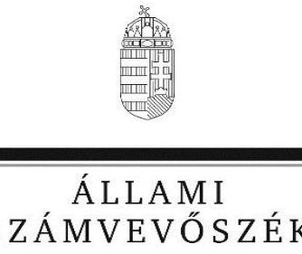

# Jelentés

**A központi alrendszer egyes intézményei pénzügyi és vagyongazdálkodásának ellenőrzése**

Aranysziget Otthon 2017.

17209 www.asz.hu

---

# Jelentés 

## A központi alrendszer egyes intézményei pénzügyi és vagyongazdálkodásának ellenőrzése

Aranysziget Otthon
2017. 10. hó 18. nap
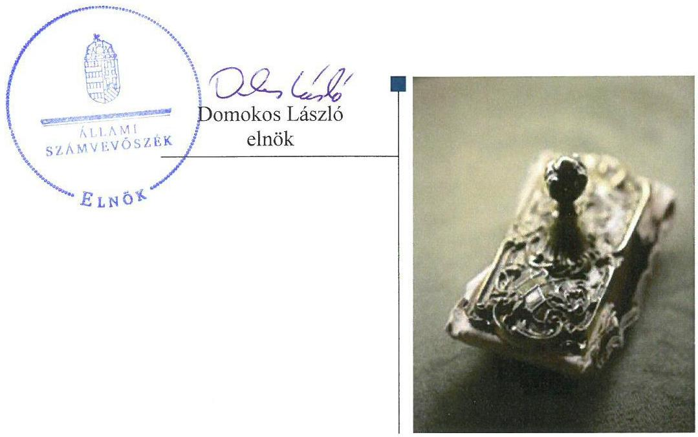

---

# AZ ELLENŐRZÉST FELÜGYELTE:

- **SALAMON ILDIKÓ** felügyeleti vezető

- **AZ ELLENŐRZÉST VEZETTE ÉS A VÉGREHAJTÁSÁÉRT FELELŐS:**
  - BÍRÓ ZSOLT ellenőrzésvezető
  - A PROGRAM ÖSSZEÁLLÍTÁSÁÉRT FELELŐS:
    - JANIK JÓZSEF LÁSZLÓ osztályvezető

- **IKTATÓSZÁM:** V-1335-125/2016.
- **TÉMASZÁM:** 2369
- **ELLENŐRZÉS-AZONOSÍTÓ SZÁM:** V076017

Jelentéseink az Országgyűlés számítógépes hálózatán és az Interneten a www.asz.hu címen is olvashatóak.

---

# TARTALOMJEGYZÉK 

■ ÖSSZEGZÉS ..... 5
■ AZ ELLENŐRZÉS CÉLJA ..... 7
■ AZ ELLENŐRZÉS TERÜLETE ..... 8
■ AZ ELLENŐRZÉS HÁTTERE, INDOKOLTSÁGA ..... 9
■ A JELENTÉS LÉNYEGES KÉRDÉSKÖREI ..... 10
■ ELLENŐRZÉS HATÓKÖRE ÉS MÓDSZEREI ..... 11
■ MEGÁLLAPÍTÁSOK ..... 14
■ JAVASLATOK ..... 26
■ MELLÉKLETEK ..... 31
I. sz. melléklet: Értelmező szótár ..... 31
II. sz. melléklet: Az integritás szemlélet érvényesítésével kapcsolatos megállapítások ..... 34
■ FÜGGELÉK: ÉSZREVÉTELEK ..... 35
■ RÖVIDÍTÉSEK JEGYZÉKE ..... 45

---

.

---

# ÖSSZEGZÉS 

Az Aranysziget Otthonra vonatkozó irányító szervi feladatellátás megfelelt, a középirányító szervi feladatellátás nem felelt meg a jogszabályi előírásoknak. A belső kontrollrendszer kialakítása és működtetése nem biztosította a szabályszerű, átlátható és elszámoltatható közpénzfelhasználás feltételeit. Az Aranysziget Otthon pénzügyi és vagyongazdálkodása nem felelt meg a jogszabályi előírásoknak. Az Intézmény vezetője nem építette ki a megfelelő védelmet a korrupciós veszélyekkel szemben. Az eredményes, hatékony, gazdaságos közpénzfelhasználást a gazdálkodás folyamatában mérhető célok nem támasztották alá.

## Az ellenőrzés társadalmi indokoltsága

Az államháztartás központi alrendszerének közpénz felhasználása, az intézmények által ellátott közfeladatok sokrétűsége, valamint a feladatellátásához rendelt vagyon nagyságrendje indokolja, hogy az Állami Számvevőszék ellenőrzéseket folytasson a pénzügyi és vagyongazdálkodás területén. Az Állami Számvevőszék az ellenőrzései során feltárja a gazdálkodást, a központi alrendszer intézményeinek átalakulását, átszervezését érintő szabályozások esetleges hiányosságait, a szabályozással nem érintett gazdálkodási területeket, rámutathat a vagyongazdálkodási tevékenység - ezen belül a tulajdonosi joggyakorlás és vagyonkezelés - esetleges szabálytalanságaira, értékeli az állami vagyon nyilvántartására és elszámolására vonatkozó eljárásokat. Az ellenőrzésünkkel hozzá kívánunk járulni a központi intézmények pénzügyi helyzetének pontosabb megítéléséhez, a jó gyakorlat kialakításán és terjesztésén keresztül az ellenőrzéseink elősegíthetik a gazdálkodás szabályszerűségének javítását.

## Főbb megállapítások, következtetések

Csongrád megyében található Aranysziget Otthonra vonatkozó irányító szervi feladatellátás megfelelt a jogszabályi előírásoknak. A középirányító szervi feladatellátás nem felelt meg a jogszabályi előírásoknak. A középirányító szervek nem érvényesítették a vagyonnal való szabályszerű gazdálkodáshoz szükséges követelményeket, mivel vagyonkezelőként nem kötöttek az Aranysziget Otthonnal közfeladatai ellátása érdekében szükséges vagyonelemekre vonatkozóan vagyon hasznosítására irányuló írásbeli szerződést.

Az Aranysziget Otthon belső kontrollrendszerének kialakítása és működtetése, ezen belül a kontrollkörnyezet kialakítása, a kockázatkezelési rendszer, az információs és kommunikációs folyamatok kialakítása és működtetése, valamint a kontrolltevékenységek gyakorlása, működtetése és a belső ellenőrzés működtetése egyik évben sem felelt meg a jogszabályi előírásoknak, emiatt nem voltak biztosítottak a szabályszerű, átlátható és elszámoltatható közpénzfelhasználás feltételei. Az Aranysziget Otthon szervezeti és működési szabályzata az ellenőrzött időszak elején nem felelt meg a jogszabályi előírásoknak. Az Aranysziget Otthon és a gazdálkodásával összefüggő feladatokat ellátó Csongrád Megyei Intézményfenntartó Központ 2012. április 1-jétől 2013. március 31-ig és a jogutód Szociális és Gyermekvédelmi Főigazgatóság 2013. április 1-jétől 2015. szeptember 17-ig nem rendelkezett az irányító szerv által jóváhagyott munkamegosztás és felelősségvállalás rendjét rögzítő munkamegosztási megállapodással. Az Aranysziget Otthon 2013. április 1-jétől az ellenőrzött időszak végéig nem rendelkezett számviteli politikával, mivel a gazdálkodással összefüggő feladatokat ellátó Szociális és Gyermekvédelmi Főigazgatóság nem készítette el. A számviteli politika keretében elkészítendő szabályzatokkal azonban 2012. április 1-jétől nem rendelkezett az Aranysziget Otthon, mivel a gazdálkodással összefüggő feladatokat ellátó Csongrád Megyei Intézményfenntartó Központ, valamint a Szociális és Gyermekvédelmi Főigazgatóság nem készítette el azokat. Az igazgató a 2014-2015. években nem működtetett kockázatkezelési rendszert, valamint 2012. január 1-je és 2013. június 30-a között nem gondoskodott a belső ellenőrzés kialakításáról.

Az Aranysziget Otthon pénzügyi és vagyongazdálkodása nem felelt meg a jogszabályi előírásoknak. A kiadási előirányzatok felhasználásánál a gazdálkodási jogkörök gyakorlása az ellenőrzött időszakban nem volt megfelelő. Az

---

Aranysziget Otthon vagyongazdálkodása a 2012-2015. években nem volt szabályszerű. A 2012-2015. években az Aranysziget Otthon - vagyonhasználati szerződés hiányában - közfeladata ellátásához használt ingatlan vagyon tekintetében nem minősült az állami vagyon jogszerű használójának. Továbbá a 2012-2015. években az Aranysziget Otthon vagyonkezelésébe nem tartozó ingatlanok szerepeltek az éves költségvetési beszámolók mérlegében, amely miatt a 2012-2015. évi költségvetési beszámolók nem mutattak az Aranysziget Otthon vagyoni helyzetéről megbízható és valós képet.

Az Aranysziget Otthon nem tett erőfeszítéseket az integritás szemlélet érvényesítése érdekében. Az integritás kontrollok kiépítettsége nem volt egyensúlyban a korrupciós kockázatok szintjével.

A gazdálkodás folyamatában számszerűsített, mérhető célokat, célértékeket nem határoztak meg.

---

# AZ ELLENŐRZÉS CÉLJA 

AZ ELLENŐRZÉS célja annak megítélése volt, hogy az ellenőrzött intézményre vonatkozó irányító szervi feladatellátás a jogszabályi előírások betartásával történt-e; az intézménynél a belső kontrollrendszer kialakítása és működtetése szabályszerű volt-e; kialakították-e az erőforrásokkal való szabályszerű, gazdaságos, hatékony és eredményes gazdálkodás követelményeit; szabályszerű volt-e a beszámolási és adatszolgáltatási kötelezettségek teljesítése; az intézmény pénzügyi és vagyongazdálkodása megfelelt-e a jogszabályi előírásoknak és belső szabályzatainak; az intézmény átalakításának vagy átszervezésének
lebonyolítása szabályszerűen történt-e.
Az ellenőrzés keretében értékeltük az intézmény korrupciós kockázatainak kezelését szolgáló integritás kontrollok kiépítettségét és az integritás szemlélet érvényesülését.

A KIEGÉSZÍTŐ TELJESÍTMÉNY-ELLENŐRZÉSI MODUL célja annak értékelése volt, hogy a gazdálkodás folyamatában a gazdaságossági, hatékonysági és eredményességi célok kialakítása megtörtént-e, a célok elérése érdekében tettek-e intézkedéseket, a célkitűzéseket és a szándékolt eredményeket elérték-e.

---

# AZ ELLENŐRZÉS TERÜLETE 

## Aranysziget Otthon

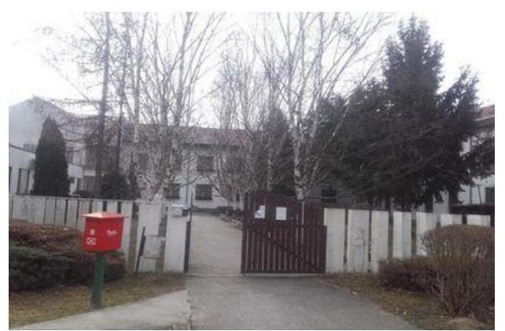

A Csongrád Megyei Önkormányzat 1993. évben hozta létre az Intézményt ${ }^{1}$. Az Intézmény Csongrád megyében található, az ellenőrzött időszakban a székhelye Csongrádon volt.

Az Intézmény közfeladata Szoctv. ${ }^{2}$ alapján a bentlakásos szociális ellátás: az időskorúak, demens betegek és fogyatékossággal élők tartós bentlakásos ellátása, a pszichiátriai betegek támogatott lakhatásban történő ellátása, valamint a 2001. évi CI. törvény ${ }^{3}$ alapján felnőttképzési tevékenység. Az Intézmény a tevékenységét Csongrád, Derekegyháza, Nagymágocs, Szentes településeken, 16 telephelyen végzi. Az ellenőrzött időszakban az igazgató ${ }^{4}$ személye nem változott.

Az Intézmény a Konszolidációs tv. ${ }^{5}$ 2. § (1) bekezdése alapján 2012. január 1-jével a megyei önkormányzat ${ }^{6}$-tól állami fenntartásba, és ezzel a központi alrendszerbe került. Az alapítói és irányító szervi feladatokat a KIM ${ }^{7}$ látta el, a középirányító szerve 258/2011. (XII. 7.) Korm. rendelet ${ }^{8}$ alapján a CSOMIK ${ }^{9}$ lett. A 2013. évtől az Intézmény irányító szerve az EMMI ${ }^{10}$ lett. A CSOMIK 2013. március 31-én 258/2011. (XII. 7.) Korm. rendelet 18. § (2) bekezdése előírása alapján az SZGYF ${ }^{11}$-be történő beolvadással megszűnt, feladatait egyetemleges jogutódként az SZGYF látta el, így az Intézmény középirányító szervi feladatait is.

Az Intézmény 2012. január 1-jétől 2012. március 31-ig önállóan működő és gazdálkodó költségvetési szerv, 2012. április 1-jétől az ellenőrzött időszak végéig önállóan működő költségvetési szerv volt. Az Intézmény gazdasági feladatait 2012. január 1-je és 2012. március 31-e között saját gazdasági szervezete, 2012. április 1-jétől 2013. március 31-ig a CSOMIK, 2013. április 1-jétől az ellenőrzött időszak végéig az SZGYF gazdasági szervezete látta el.

A Konszolidációs tv. értelmében a megyei önkormányzatok fenntartásában lévő intézmények, azok vagyona és vagyon értékű jogai 2012. január 1-jén a törvény erejénél fogva állami tulajdonba kerültek. Az önkormányzati alrendszerből átkerült intézményi vagyon tekintetében 2012. január 1-jétől a tulajdonosi jogokat - a Vtv ${ }^{12}$. alapján - az állami vagyon felügyeletéért felelős miniszter gyakorolta, aki e feladatot az MNV Zrt ${ }^{13}$. útján látta el. A vagyonkezelői jogokat 2012. január 1-jétől - a 258/2011. (XII. 7.) Korm. rendelet alapján - a CSOMIK gyakorolta. A CSOMIK az SZGYF-be történt beolvadással megszűnt, és a vagyonkezelői jogot a 316/2012. (XI. 13.) Korm. rendelet ${ }^{14}$ alapján a továbbiakban az SZGYF főigazgatója látta el.

Az Intézmény által teljesített bevételek összege 2012. évi 1537,9 M Ft-ról a 2015. évre 12,6%-kal 1731,6 M Ft-ra nőtt. A teljesített kiadások összege 2012. évi 1521,3 M Ft-ról a 2015. évre 13,1%-kal 1721,2 M Ft-ra nőtt.

---

# AZ ELLENŐRZÉS HÁTTERE, INDOKOLTSÁGA 

AZ ÁLLAMHÁZTARTÁS KÖZPONTI ALRENDSZERÉNEK közpénz felhasználása, az intézmények által ellátott közfeladatok sokrétűsége, valamint a feladatellátásához rendelt vagyon nagyságrendje indokolja, hogy az ÁSZ ${ }^{15}$ ellenőrzéseket folytasson a pénzügyi és vagyongazdálkodás területén. Az ÁSZ az ellenőrzései során feltárja a gazdálkodást, a központi alrendszer intézményei átalakulását, átszervezését érintő szabályozások esetleges hiányosságait, a szabályozással nem érintett gazdálkodási területeket, rámutathat a vagyongazdálkodási tevékenység - ezen belül a tulajdonosi joggyakorlás és vagyonkezelés - esetleges szabálytalanságaira, értékeli az állami vagyon nyilvántartására és elszámolására vonatkozó eljárásokat.

A társadalmi igénnyel összhangban az Áht. ${ }^{16}$ és a Bkr. ${ }^{17}$ is előírja a költségvetési szerv részére, hogy a költségvetési szerv valamennyi tevékenysége és célja összhangban legyen a gazdaságosság, hatékonyság és eredményesség követelményeivel. A Bkr. alapján az intézményvezetőnek évente nyilatkoznia is kell arról, hogy gondoskodott-e az intézmény tevékenységében a gazdaságosság, hatékonyság és eredményesség követelményeinek érvényesítéséről. A gazdaságos, hatékony és eredményes gazdálkodáshoz szükség van célok és célértékek kialakítására, a célok megvalósulásának mérését elősegítő mutatószámokra, valamint a mérhetőség, ellenőrizhetőség, értékelhetőség feltételeinek kialakítására. Az ÁSZ jelen ellenőrzés során értékeli, hogy az intézménynél a célokat kialakították-e, tettek-e intézkedéseket a célok végrehajtása céljából, a kitűzött célok teljesültek-e.

AZ ELLENŐRZÉS VÁRHATÓAN HOZZÁJÁRUL a központi intézmények pénzügyi helyzetének pontosabb megítéléséhez és a jó gyakorlat kialakításán és terjesztésén keresztül az ellenőrzések elősegíthetik a gazdálkodás szabályszerűségének javítását.

Az ÁSZ teljesítmény ellenőrzési modul alapján elvégzett ellenőrzése a döntéshozók, ellenőrzöttek, irányító szervek, a társadalom számára objektív visszajelzést ad a gazdálkodás területén végrehajtott szervezeti, szervezési intézkedésekről, a közfeladat-ellátásnak keretet adó gazdálkodási tevékenységek folyamatában kialakított célokról, intézkedésekről, azok teljesítéséről. Az ÁSZ értékteremtő elemzéseivel, tanácsadó szerepét erősítve támogatja a szervezetek önértékelő, alkalmazkodó (öntanuló) tevékenységét. Irányt mutat az ellenőrzött intézmények gazdálkodási és kapcsolódó adminisztratív folyamatainak optimalizációjához. Támogatja a központi költségvetési szervek felügyelhetőségét, a „jó gyakorlatok" elterjesztésével támogatja a „jó kormányzást".

---

# A JELENTÉS LÉNYEGES KÉRDÉSKÖREI 

1.     - Az irányító szerv ellenőrzött Intézményre vonatkozó feladatellátása szabályszerű volt-e?
2.     - A belső kontrollrendszer kialakítása és működtetése biztosította-e a közpénzekkel és a nemzeti vagyonnal történő szabályszerű, gazdaságos, hatékony és eredményes gazdálkodást, illetve a beszámolási és adatszolgáltatási kötelezettségek szabályszerű teljesítését?
3.     - Az Intézmény pénzügyi gazdálkodása szabályszerű volt-e?
4.     - Az Intézmény vagyongazdálkodása szabályszerű volt-e?
5.     - Érvényesült-e az integritás szemlélet és ennek megfelelően kiépítették-e az integritás kontrollrendszert?

 az Intézménynél?
6.     - Az Intézmény a gazdálkodás folyamatában kialakított-e célokat, célértékeket, azok elérése érdekében meghatározott-e intézkedéseket, feladatokat, elérte-e a szándékolt eredményeket?

---

# ELLENŐRZÉS HATÓKÖRE ÉS MÓDSZEREI 

## Az ellenőrzés típusa

Megfelelőségi ellenőrzés, amelyet teljesítményellenőrzési modul egészített ki.

## Az ellenőrzött időszak

2012. január 1-jétől 2015. december 31-ig terjedő időszak volt.

## Az ellenőrzés tárgya

Az ellenőrzött szervezetre vonatkozó irányító szervi feladatok ellátása. Az Intézmény belső kontrollrendszerének kialakítása és működtetése. A pénzügyi és vagyongazdálkodás szabályszerűsége. Az Intézmény beszámolási és adatszolgáltatási kötelezettségének teljesítése. Az Intézmény átalakításának vagy átszervezésének szabályszerűsége. Az Intézmény korrupciós kockázatainak kezelését szolgáló integritáskontrollok kiépítettsége és az integritás szemlélet érvényesülése.

A teljesítményellenőrzési kiegészítő modul esetében az intézményi gazdálkodás folyamatában a gazdaságossági, hatékonysági és eredményességi követelmények kialakítása és működtetése, a célkitűzések teljesítésének értékelése.

Az ellenőrzés kiterjedt minden olyan körülményre és adatra, amely az ÁSZ jogszabályban meghatározott feladatainak teljesítéséhez, valamint a program végrehajtása folyamán felmerült újabb összefüggések feltárásához szükséges volt.

## Az ellenőrzött szervezet

A központi alrendszer ellenőrzött intézménye: az Aranysziget Otthon és az Intézmény irányító szervei: Közigazgatási és Igazságügyi Minisztérium, az Emberi Erőforrások Minisztériuma, valamint az Intézmény középirányító szervei: a Csongrád Megyei Intézményfenntartó Központ, a Szociális és Gyermekvédelmi Főigazgatóság. A Közigazgatási és Igazságügyi Minisztérium jogutódjaként az Igazságügyi Minisztérium, valamint a Miniszterelnökség adatot szolgáltatott az ellenőrzéshez.

Az ellenőrzésre a központi alrendszer ellenőrzött intézményének és az Emberi Erőforrások Minisztériuma székhelyén, illetve a Szociális és Gyermekvédelmi Főigazgatóság székhelyén, telephelyén került sor.

---

# Az ellenőrzés jogalapja 

Az ellenőrzés jogszabályi alapját az ÁSZ tv. ${ }^{18} 1$. § (3) bekezdése, az 5. § (2)(6) bekezdései, valamint az Áht. 61. § (2) bekezdésének előírásai képezték.

## Az ellenőrzés módszerei

Az ellenőrzést az ellenőrzési program szempontjai, az ellenőrzött időszakban hatályos jogszabályok, az ellenőrzés szakmai szabályai, a jelen ellenőrzésre irányadó ÁSZ módszertanok figyelembevételével végeztük.

Az ellenőrzési kérdések megválaszolásához szükséges bizonyítékok megszerzése tételes és mintavételen alapuló dokumentumellenőrzés, összehasonlító elemzés ellenőrzési eljárások alkalmazásával történt. Az ellenőrzési bizonyítékként felhasznált adatforrások közé tartoztak egyrészt az ellenőrzési program részletes szempontjainál felsorolt adatforrások, másrészt minden egyéb - az ellenőrzés folyamán feltárt, az ellenőrzés szempontjából információt tartalmazó - dokumentum.

Az ellenőrzés lefolytatásához az ellenőrzött szervezetek tanúsítványok kitöltésével, valamint az ÁSZ által kért dokumentumok megküldésével szolgáltattak adatokat. A rendelkezésre bocsátott adatok, információk kontrollja az ellenőrzés keretében történt.

Az ÁSZ a belső kontrollrendszer jogszabályi előírások szerinti kialakításának és működtetésének szabályszerűségét az erre irányuló ellenőrzési kérdésekre adott válaszok összesítése alapján, a lényegességi szempontok figyelembevételével pillérenként (kontrollkörnyezet, kockázatkezelési rendszer, kontrolltevékenységek, információs és kommunikációs rendszer, monitoring rendszer) és összesítetten is minősítette. Az ÁSZ a pénzügyi gazdálkodás és a vagyongazdálkodás kialakításának és működtetésének szabályszerűségét az erre irányuló ellenőrzési kérdésekre adott válaszok összesítése alapján, a lényegességi szempontok figyelembevételével évenkénti bontásban minősítette. „Megfelelő"-nek értékelte az ellenőrzött területet, amennyiben a szabályozás, illetve végrehajtás során a jogszabályi követelményeket maradéktalanul, vagy kisebb hiányosságok mellett érvényesítették, „nem megfelelő"-nek értékelte, amennyiben a szabályozás hiányosságai nem biztosították a szabályszerű működés feltételeit, illetve a gazdálkodás folyamatában jelentkező hibák lényegesek, nagyszámúak, vagy rendszerszerűek voltak.

Mintavétellel ellenőriztük az Intézménynél a kiadások előirányzatai felhasználásának, a tárgyi eszközök nyilvántartásba vételének (üzembe helyezés, értékelés, nyilvántartás), a bevételek beszedésének és elszámolásának, a vagyonelemek elidegenítésének és hasznosításának szabályszerűségét. A minta alapján a sokaságban előforduló hibaarányt becsültük. Az értékelés eredményeként kétféle, "Megfelelő" és "Nem megfelelő" minősítést alkalmaztunk. „Megfelelő"-nek értékeltünk egy ellenőrzött területet, amennyiben a hibaarány a teljes sokaságban 95%-os bizonyossággal legfeljebb 10% arányt képviselt. Abban az esetben, ha az adott sokaság tekintetében a 10%-os hibaarány küszöbérték átlépése megítélésének megbízhatósága nem érte el a 95%-ot, annak elérése érdekében értékelésünket

---

lényegességi alapon további szempontokkal egészítettük ki, és figyelembe vettük a feltárt hibák értékét.

Az integritás szemlélet érvényesülésének értékelése az Intézmény által kitöltött tanúsítvány alapján történt. Értékeltük továbbá az integritás kontrollrendszer kiépítettségét a tanúsítványban szereplő kontrollok ellenőrzése alapján.

Az alapprogram alapján ellenőriztük, hogy a költségvetési szerv vezetője megtette-e nyilatkozatát arról, hogy gondoskodott a költségvetési szerv tevékenységében a hatékonyság, eredményesség és a gazdaságosság követelményeinek érvényesítéséről. A teljesítmény-ellenőrzési kiegészítő modul végrehajtása során értékeltük, hogy az ellenőrzött szervezet a gazdálkodás folyamatában a gazdaságossági, hatékonysági és eredményességi célokat és célértékeket kialakította-e, a célkitűzéseket elérte-e. A kiegészítő modul a gazdálkodási feladatokra terjedt ki, a szakmai feladatellátást nem értékelte.

A gazdálkodási feladatok értékelése az alábbi területekre terjedt ki:
pénzügyi gazdálkodási (nem szakmai, adminisztratív) feladatok: költségvetés-, beszámoló-készítés, könyvvezetés, adatszolgáltatások, előirányzat-gazdálkodás, kötelezettségvállalások nyilvántartása, kezelése, bevételkezelés, bér- és illetményszámfejtés;
$\longrightarrow$ vagyongazdálkodási (logisztikai) feladatok: közbeszerzések és közbeszerzési értékhatárt el nem érő beszerzések, készletgazdálkodás, nyomtatók, fénymásolók üzemeltetése, épület- és ingatlanüzemeltetés, karbantartás, hibabejelentés, gépjármű és flotta-menedzsment.
Az ellenőrzés során minden olyan körülményt és adatot ellenőriztünk, amely a program végrehajtása kapcsán felmerült újabb összefüggéseknek az ellenőrzés céljaival összhangban lévő feltárásához szükséges volt. A teljesítmény-ellenőrzési kiegészítő programmodulban megfogalmazott ellenőrzési cél megválaszolásához az alapprogram végrehajtása során megfogalmazott megállapításokat is figyelembe vettük.

---

# 1. Az irányító szerv ellenőrzött Intézményre vonatkozó feladatellátása szabályszerű volt-e? 

## Összegző megállapítás

### 1.1. számú megállapítás

### 1.2. számú megállapítás

Az Intézményre vonatkozó irányító szervi feladatellátás megfelelt, a középirányító szervi feladatellátás nem felelt meg a jogszabályi előírásoknak.

Az alapítással kapcsolatos irányító szervi jogosultságok gyakorlása a jogszabályi előírásoknak megfelelően történt.

Az Intézmény a 2012-2015. években rendelkezett a KIM és az EMMI minisztere által kiadott Áht. előírásainak megfelelő alapító okirattal${ }_{1-6}{ }^{19}$. Az alapító okirat${ }_{3-6}$ módosításához és kiadásához az államháztartásért felelős miniszter előzetes egyetértését tartalmazó dokumentum az ellenőrzött időszakban az Áht.-ben foglaltaknak megfelelően rendelkezésre állt. Az alapító okirat${ }_{3-6}$ módosításakor az Ávr.${ }^{20}$-ben foglaltaknak megfelelően az egységes szerkezetbe foglalt alapító okiratot elkészítették.

Az alapító okirat${ }_{3-5}$ 2014. december 31-ig az Ávr. 5. § (1) bekezdés e) pontjában, 2015. január 1-jétől az Ávr. 5. § (1) bekezdés d) pontjában előírtak ellenére nem tartalmazta az EMMI nevét, továbbá az Ávr. 6. §-ban előírtak ellenére nem határozták meg az egyes irányítói jogok gyakorlására jogosultakat. Az alapító okirat${ }_{6}$ megfelelt az Ávr. előírásainak.

Az Intézménnyel kapcsolatos egyéb irányítási, felügyeleti és ellenőrzési jogosultságokat az irányítószervek szabályszerűen, a középirányító szervek nem szabályszerűen gyakorolták.

Az Ávr.-ben előírtaknak megfelelően a 2012. évre vonatkozóan a KIM, a 2013-2015. évekre vonatkozóan az EMMI a tervezett bevételek megállapításához kiadta az általános és kötelezően érvényesítendő tervezési követelményeket. Az ellenőrzött időszakban az Intézmény éves elemi költségvetését, éves létszám-előirányzatát, éves költségvetési beszámolóját, valamint az Intézmény költségvetési előirányzat-maradványát a jogszabályi előírásoknak megfelelően a 2012. évben a KIM, a 2013-2015. években az EMMI jóváhagyta. A KIM, illetve az EMMI az Intézmény bevételi és kiadási előirányzatokkal való gazdálkodását Áht.-ban foglaltaknak megfelelően rendszeresen figyelemmel kísérte.

A 2012. évben a CSOMIK, míg a 2013-2015. években az SZGYF - a Vtv. 27. § (2) bekezdésében előírtak ellenére - a vagyonkezelésében lévő, az Intézmény közfeladatai ellátásához használt ingatlanok átlátható, szabályszerű működtetéséről nem gondoskodtak, mivel az állami vagyon használatának jogcímét az Intézménynek - a Vtv. 25. § (4) bekezdésében rögzített - használati szerződés megkötésével nem biztosították. Ezért a 2013-2015. években az SZGYF főigazgatója - a 316/2012. (XI. 13.) Korm. rendelet 3. § (2) bekezdés g) pontjában előírtak ellenére - nem érvényesítette

---

az erőforrásokkal, így különösen a vagyonnal való szabályszerű gazdálkodáshoz szükséges követelményeket.

Az államháztartással összefüggő közérdekű és közérdekből nyilvános adatok kötelező közzétételének, illetve igényre történő szolgáltatásának végrehajtását a 316/2012. (XI. 13.) Korm. rendelet 3. § (1) bekezdés o) pontjában foglaltak ellenére a 2013-2015. években az SZGYF főigazgatója nem ellenőrizte.
1.3. számú megállapítás

A középirányítói feladatokat ellátó SZGYF munkáltatói jogosultságainak gyakorlása nem volt szabályszerű.

Az igazgató feletti munkáltatói jogokat a 258/2011. (XII.7.) Korm. rendelet 9. § (4) bekezdése alapján a 2012. január 1. - 2013. március 31. közötti időszakban a CSOMIK vezetője, a 316/2012. (XI. 13.) Korm. rendelet 3. § (2) bekezdés d) pontja alapján a 2013. április 1-jétől 2015. december 31-ig terjedő időszakban az SZGYF főigazgatója gyakorolta. Az igazgató közalkalmazotti jogviszonyban látta el a feladatát, kinevezése határozott időre 2011. január 1-től 2016. január 1-ig szólt.

Az ellenőrzött időszakban az igazgató személye nem változott. Az igazgató minősítését a Kjt. ${ }^{21} 40 . \S$ (1) bekezdés a) pontjában foglaltak ellenére az SZGYF a vezetői megbízás lejárta előtt legalább három hónappal nem végezte el, mivel az Intézmény igazgatójának teljesítményértékelése a vezetői megbízás lejáratát megelőző napon, 2015. december 31-én történt meg.

# 2. A belső kontrollrendszer kialakítása és működtetése biztosította-e a közpénzekkel és a nemzeti vagyonnal történő szabályszerű, gazdaságos, hatékony és eredményes gazdálkodást, illetve a beszámolási és adatszolgáltatási kötelezettségek szabályszerű teljesítését? 

Összegző megállapítás

### 2.1. számú megállapítás

A belső kontrollrendszer kialakítása és működtetése nem biztosította a közpénzekkel és a nemzeti vagyonnal történő szabályszerű, gazdaságos, hatékony és eredményes gazdálkodás feltételeit, illetve a beszámolási és adatszolgáltatási kötelezettségek szabályszerű teljesítését.

Az Intézmény kontrollkörnyezetének kialakítása az ellenőrzött időszakban nem felelt meg a jogszabályi előírásoknak.

Az Intézmény a 2012-2015. években rendelkezett jóváhagyott SZMSZ-sel${ }_{1-3}{ }^{22}$. Az SZMSZ${ }_{1}$ módosítása az Intézmény központi alrendszerbe kerülést követően nem történt meg, emiatt az SZMSZ${ }_{1}$ 2012. január 1-je és 2013. december 10-e között nem tartalmazta - az Ávr. 13. § (1) bekezdés b) pontjában foglaltak ellenére - a hatályos alapító okirat keltét, számát, valamint 2012. április 1-je és 2013. december 10-e között nem tartalmazta - Ávr. 13. § (1) bekezdés e) pontjában foglaltak ellenére - az Intézmény gazdasági szervezetének a megnevezését. Az Intézmény SZMSZ${ }_{2,3}$ - az Ávr. 13. § (1)

---

bekezdés h) pontjában előírtak ellenére - nem tartalmazta a munkáltatói jogok gyakorlásának rendjét.

Az Intézmény és a gazdálkodásával összefüggő feladatokat ellátó CSOMIK, majd SZGYF 2012. április 1-jétől 2015. szeptember 16-ig - az Ávr. 10. § (5) bekezdésében és 2015. január 1-jétől az Ávr. 9. § (5a) bekezdésében foglaltaknak megfelelő - munkamegosztás és felelősségvállalás rendjét rögzítő munkamegosztási megállapodással nem rendelkezett. Az Intézmény és a gazdálkodásával összefüggő feladatokat ellátó SZGYF az irányító szerv által jóváhagyott munkamegosztási megállapodással${ }^{23}$ 2015. szeptember 17-étől rendelkezett.

A CSOMIK 2012. április 1-től, az SZGYF 2013. április 1-től látta el az Intézmény gazdálkodással összefüggő feladatait, az ellenőrzött időszak alatt sem a CSOMIK, sem az SZGYF gazdasági szervezete - az Ávr. 9. § (5) bekezdésében, az Ávr. 13.§ (5) bekezdésében és 2015. február 18-tól az Ávr. 10/A. §-ában előírtak ellenére - nem rendelkezett ügyrenddel.

Az Intézmény a Kjt.-ben előírtaknak megfelelően rendelkezett közalkalmazotti szabályzattal. Az Intézmény dolgozóinak etikai magatartását az etikai kódex${ }^{24}$ szabályozta.

A CSOMIK számviteli politika${ }^{25}$ 2. §-a rögzítette, hogy hatálya kiterjed a
 hozzárendelt önállóan működő költségvetési szervekre. A CSOMIK – az Áhsz. ${ }^{26}$ 8. § (13) bekezdésének előírása ellenére – számviteli politikájában nem döntött a számviteli politikához kapcsolódó szabályzatok kiterjesztéséről, vagy arról, hogy az Intézmény önálló szabályzatokat készít.

A CSOMIK az Intézmény részére – a Számv. tv. ${ }^{27}$ 14. § (5) bekezdéseiben, az Áhsz. ${ }^{2}$ 8. § (4) bekezdéseiben előírtak ellenére – a számviteli politikához kapcsolódó szabályzatokat (leltározási és leltárkészítési szabályzat, értékelési szabályzat, pénzkezelési szabályzat, önköltségszámítási szabályzat) nem készítette el.

Az Intézmény gazdálkodással összefüggő feladatait 2013. április 1-jétől ellátó SZGYF a 2013. február 23-tól hatályos számviteli politika ${ }^{28}$-ben – az Áhsz. ${ }^{2}$ 8. § (13) bekezdésében előírtak ellenére – nem döntött arról, hogy annak rendelkezéseit kiterjeszti-e az intézményre, vagy az – az előirányzatok feletti rendelkezési jogosultság függvényében – önálló számviteli politikát alakít ki, és önálló szabályzatokat készít. Az SZGYF főigazgatója a 2014–2015. években nem készített az Intézményre is vonatkozó számviteli politikát és annak keretében elkészítendő szabályzatokat az Áhsz. ${ }^{29}$ 50. § (1) bekezdésben és az abban hivatkozott 31. § (1) bekezdésében előírtak ellenére. Az előzőek miatt az Intézmény 2013. április 1-jétől az ellenőrzött időszak végéig – a Számv. tv. 14. § (3)–(5) bekezdéseiben az Áhsz. 8. § (3)–(4) bekezdéseiben, az Áhsz. ${ }^{2}$ 50. § (1) bekezdésében előírtak ellenére – a számviteli politikával és annak keretében elkészítendő szabályzatokkal (leltározási és leltárkészítési szabályzat, értékelési szabályzat, pénzkezelési szabályzat és önköltségszámítás rendjére vonatkozó szabályzattal) nem rendelkezett.

Az igazgató az Áhsz. ${ }^{2}$ 50. § (1) bekezdésében és az abban hivatkozott 31. § (1) bekezdésében előírtak ellenére 2015. évben jogosulatlanul adta ki számviteli politika ${ }^{30}$-t, a pénzkezelési szabályzat ${ }^{31}$-t és az önköltségszámítási szabályzat ${ }^{32}$-t, valamint a 2014. évben a leltározási és leltárkészítési szabályzat ${ }^{33}$-t, mert a számviteli politika elkészítéséért az éves költségvetési beszámolót készítő szerv vezetője (az SZGYF főigazgatója) a felelős.

---

### 2.2. számú megállapítás

### 2.3. számú megállapítás

Az igazgató az Ávr. előírásainak megfelelően adta ki a beszerzések lebonyolításával kapcsolatos beszerzési szabályzat ${ }^{34}$-at, a gépjármű üzemeltetési szabályzat ${ }^{35}$-at és a telefonok használatának szabályzat ${ }^{36}$-át.

Az igazgató a 2012–2015. években Ávr. 13. § (2) bekezdés c), e) pontjai előírása ellenére belső szabályzatban nem rendezte a belföldi és külföldi kiküldetések elszámolásával kapcsolatos kérdéseket, valamint a reprezentációs kiadások felosztását, azok elszámolásának szabályait.

Az Intézmény – a Kbt. ${ }^{37}$-ben előírtaknak megfelelően – rendelkezett Közbeszerzési szabályzattal ${ }^{38}$.

A 2012–2015. években az Intézmény FEUVE szabályzat ${ }^{39}$ része az ellenőrzési nyomvonal, amely a Bkr. 6. § (3) bekezdésének előírása ellenére nem tartalmazta az irányítási folyamatokat, információs szinteket és kapcsolatokat.

Az Intézmény rendelkezett hatályos – Bkr.-nek megfelelő – szabálytalanságkezelési eljárásrend ${ }^{40}$-mal.

Az igazgató az Intézmény gazdálkodási rendjét 2012. január 1–március 31. időszakra vonatkozóan az ügyrend ${ }^{41}$-ben, a 2012. április 1-jétől az ügyrend ${ }^{42}$-ban és a szabályzat ${ }^{43}$-ban, valamint 2015. augusztus 31-től a gazdálkodási szabályzatban ${ }^{44}$ rendezte, amelyek – az Ávr.-ben előírtaknak megfelelően – tartalmazták a kötelezettségvállalás, az ellenjegyzés, a teljesítésigazolás, az érvényesítés és az utalványozás gyakorlásának módjával kapcsolatos belső előírásokat, feltételeket, illetve az eljárási és dokumentációs részletszabályokat.

Az igazgató az ügyrendben rögzítette, hogy nem szükséges előzetes írásbeli kötelezettségvállalás a 100 ezer Ft alatti kifizetésekhez, azonban ezek rendjét az Ávr. 53. § (2) bekezdésben foglaltak ellenére belső szabályzatban nem rögzítette. A 2015. augusztus 31-től hatályos gazdálkodási szabályzatban rögzítésre került, hogy minden egyes kötelezettségvállalás esetén előzetes kötelezettségvállalás dokumentumot kell készíteni.

A kockázatkezelési rendszer kialakítása és működtetése a jogszabályi előírásoknak nem felelt meg.

Az Intézmény a FEUVE szabályzat keretében alakította ki a kockázatkezelési rendszerét, amelyben azonban – a Bkr. 7. § (2) bekezdésének előírásai ellenére – a 2012–2015. években nem határozták meg az egyes kockázatokkal kapcsolatban szükséges intézkedéseket, valamint azok teljesítésének folyamatos nyomon követésének módját. A 2012–2013. években felmérték és meghatározták az Intézmény tevékenységében és gazdálkodásában rejlő kockázatokat, azonban a 2014. és a 2015. évben – a Bkr. 7. § (2) bekezdésében foglaltak ellenére – nem mérték fel és nem állapították meg az Intézmény tevékenységében és gazdálkodásában rejlő kockázatokat.

## A kontrolltevékenység gyakorlása, működtetése nem felelt meg a jogszabályokban foglaltaknak.

Az igazgató által kiadott FEUVE szabályzat a Bkr.-nek megfelelően tartalmazta a kontrolltevékenység részeként végzett folyamatba épített, előzetes, utólagos és vezetői ellenőrzés szabályozását. A 2012. évben az Igazgató, mint kötelezettségvállaló – az Ávr. 57. § (4) bekezdés ellenére – nem jelölt ki a teljesítésigazolásra jogosultakat, a 2013–2015. években már élt

---

az Ávr.-ben biztosított lehetőséggel. A 2013–2015. évek között az SZGYF gazdasági vezetője – az Ávr. 57. § (4) bekezdése ellenére – is adott ki az Intézményre vonatkozóan kijelöléseket teljesítésigazolásra.

A 2012–2015. években az arra jogosult személyek adtak kijelöléseket ellenjegyzésre és érvényesítésre. A SZGYF gazdasági vezetője az Intézményre vonatkozóan több esetben adott ki kijelöléseket a pénzügyi ellenjegyzés és az érvényesítés jogkörök gyakorlására, de azok közül a 2013. évben több nem volt szabályszerű, mert hiányzott a kijelölés dátuma. A pénzügyi ellenjegyzésre és az érvényesítésre kijelölt személyek eleget tettek az Ávr.-ben előírt szakmai követelményeknek. A gazdálkodási jogkörök gyakorlására jogosultakról és aláírás mintájukról 2012. január 1-je és 2015. augusztus 30-a között Ávr. 60. § (3) bekezdésében foglaltak ellenére naprakész nyilvántartást nem vezettek, 2015. augusztus 31-től a nyilvántartást vezették.

Az ellenőrzött időszakban az Ávr-ben előírtak szerint minden évben rendelkezésre állt a kötelezettségvállalási nyilvántartás.

A 2012–2015. években a pénzgazdálkodási belső kontrollok működtetésének ellenőrzése során hiányosságokat tárt fel az ellenőrzés, amely a folyamatba épített, illetve a vezetői ellenőrzés nem megfelelő működésére volt visszavezethető. A kiadási előirányzatok felhasználásánál a pénzgazdálkodási belső kontrollok szabálytalanságait részletesen a 3.3. számú megállapítás tartalmazza.

# 2.4. számú megállapítás 

## Az információs és kommunikációs folyamatok kialakítása és működtetése nem felelt meg a jogszabályi előírásoknak.

Az igazgató a belső és külső információ áramlás rendjét 2012. február 1-jétől a kommunikáció szabályzat ${ }^{45}$-ben szabályozta, azonban az ellenőrzött időszakban a Bkr. 9. § (1)–(2) bekezdésekben foglaltak ellenére nem alakított ki és nem működtetett olyan információs és kommunikációs rendszert, amelyben a beszámolási rendszerek hatékonyak, megbízhatóak és pontosak, a beszámolási szintek, határidők és módok világosan meghatározottak voltak.

Az igazgató az Info. ${ }^{46}$ tv. és az Ávr. előírásai szerint szabályozta a közérdekű adatok megismerésére irányuló igények teljesítésének rendjét a közérdekű adatok megismerése szabályzat ${ }^{47}$-ben, valamint a közérdekű kérelmek, panaszok és bejelentések rendjét a közérdekű bejelentések szabályzat ${ }^{48}$-ben. A szabályzatok tartalmazták az Info. tv.-nek megfelelően a közérdekű adatok minősítését, igénylésének formáit és a kapcsolódó eljárásokat, valamint a panaszok és közérdekű bejelentések kezelésének rendjét, kapcsolódó vizsgálatokat és eljárásokat.

Az Intézmény rendelkezett – az Info. tv.-ben és az Ikr. ${ }^{49}$-ben előírt adatvédelmi szabályzat ${ }^{50}$-vel. Az igazgató – az Info. tv.-ben előírt – adatbiztonságra vonatkozó szabályokat informatikai szabályzat ${ }^{51}$-ben rögzítette, amelyben – az Info. tv.-ben előírt – adatok biztonságának, védelmének érvényre juttatásához szükséges eljárási szabályokat, a feladatokat és hatásköröket szabályozta.

Az Intézmény rendelkezett iratkezelési szabályzattal, azonban az iratkezelési szabályzat ${ }^{52}$ – az Ikr. 52–54. §-ban előírtak ellenére – nem tartalmazta az iratok kiadmányozásának rendjét, a 2014. évben kiadott iratke-

---

zelési szabályzat ${ }^{53}$-ben már rendezték a hiányosságot. Az igazgató az iratkezelési szabályzatot – az Ltv. ${ }^{54}$ 10. § (1) bekezdés a) pontjában foglaltak ellenére – nem az illetékes közlevéltárral egyetértésben adta ki.

A kötelezően közzéteendő adatok nyilvánosságra hozatali rendjét az igazgató a 2012–2015. években – az Info. tv. 35. § (3) bekezdésében és az Ávr. 13. § (2) bekezdés h) pontjában előírtak ellenére – nem szabályozta.

Az Intézmény a 2012. évben – az Info. tv. 37. §-ban előírtak ellenére az elektronikus közzétételi kötelezettségének nem tett eleget, mivel az adatbiztonságra vonatkozó informatikai szabályzatát a változást követően nem tette közzé. Az Intézmény a 2013–2015. években – az Info tv.-ben előírtaknak megfelelően – az elektronikus közzétételi kötelezettségének eleget tett, mivel internetes honlapján közzétette a kötelezően közzéteendő közérdekű adatokat.

# 2.5. számú megállapítás 

Az igazgató 2013. június 30-ig nem gondoskodott a monitoring rendszer részét képező belső ellenőrzés kialakításáról. Ezt követően a belső ellenőrzés működése nem felelt meg a Bkr. előírásainak.

A belső ellenőrzés kialakításáról az igazgató 2013. június 30-ig – az Áht. 70. (1) bekezdésében, a Bkr. 10. §-ában és 15. § (1) bekezdésében előírtak ellenére – nem gondoskodott. 2013. július 1-jétől az igazgató a belső ellenőrzési feladatok ellátására belső ellenőrzési megállapodás ${ }^{55}$-t kötött az SZGYF-fel. Az Intézmény SZMSZ a Bkr. előírásaival összhangban tartalmazta a belső ellenőrzést végző szervezet jogállását, feladatait. 2013. július 1-jétől a belső ellenőrzési feladatokat ellátó belső ellenőrök rendelkeztek a Bkr.-ben meghatározott általános és szakmai követelmények szerinti képesítéssel. Az SZGYF belső ellenőrzési kézikönyv ${ }^{56}$ hatálya az Intézményre nem terjedt ki. A 2014. évben történt felülvizsgálatot követően az SZGYF főigazgatója az SZGYF belső ellenőrzési kézikönyv ${ }^{57}$ hatályát kiterjesztette az Intézményre is. Az SZGYF belső ellenőrzési kézikönyv a Bkr.-ben előírtaknak megfelelt.

A belső ellenőrzési vezető 2013. évben a Bkr. 22. § (1) bekezdés b) pontjában és a 31. § (1) bekezdésében előírtak ellenére belső ellenőrzési tervet nem készített. A 2014–2015. évekre Bkr. előírásaival összhangban kockázatelemzéssel alátámasztott belső ellenőrzési tervek készültek. A belső ellenőrzési vezető a Bkr. 22. § (1) bekezdés b) és c) pontja ellenére a 2014–2015. években a tervezett két-két ellenőrzés közül, mindkét évben egyet-egyet hajtott végre.

A belső ellenőrzési vezető a belső ellenőrzésekről a 2014–2015. években Bkr.-nek megfelelő nyilvántartást vezetett.

Az igazgató nem alakított ki és nem érvényesített a célok elérését szolgáló, a rendelkezésre álló források gazdaságos, hatékony és eredményes felhasználását biztosító követelményeket.

A 2012–2015. években kiadott – és az irányító szerv részére a költségvetési beszámolóval egyidejűleg megküldött – vezetői nyilatkozatok nem voltak helytállóak. Az igazgató a Bkr. 11. § (1) bekezdése szerinti nyilatkozataiban a belső kontrollrendszerének minőségét az ellenőrzött időszakban értékelte, ezekben annak ellenére nyilatkozott a gazdaságosság, eredményes-

---

ség és hatékonyság követelményeinek érvényesítéséről, hogy – a költségvetési szerv vezetőjeként – a Bkr. 6. § (2) bekezdésében előírtak ellenére, nem alakított ki és nem működtetett olyan folyamatokat, amelyek a rendelkezésre álló források szabályszerű, gazdaságos, hatékony és eredményes felhasználását biztosították volna.

# 3. Az
 Intézmény pénzügyi gazdálkodása szabályszerű volt-e? 

## Összegző megállapítás

### 3.1. számú megállapítás

### 3.2. számú megállapítás

Az Intézmény pénzügyi gazdálkodása nem volt szabályszerű.
Az elemi költségvetés és az előirányzatok megállapítása során betartották a jogszabályi előírásokat.

Az éves elemi költségvetések és az eredeti előirányzatok megállapítása megfelelt a jogszabályi előírásoknak.

Az Intézmény a tervezett előirányzatokat bázis szemléletben tervezte meg, az irányító szervek által meghatározott keretszámok betartásával.

Az Intézményt a 2012-2015. években nem érintette szervezeti változás, illetve (évközi) új feladatot számára a KIM és az EMMI - mint irányító szervek - nem határoztak meg.

Az elemi költségvetés és a kincstári költségvetés adatai közötti egyezőség az Áht.-ban foglaltaknak megfelelően fennállt. Az ellenőrzött időszakban a költségvetéssel összefüggő adatszolgáltatási kötelezettségek az Ávr.-ben előírtaknak megfelelően teljesültek.

Az ellenőrzött időszakban a bevételi és kiadási előirányzatok módosítása, átcsoportosítása megfelelt, azonban a nyilvántartása a 2012-2013. években nem felelt meg a jogszabályi előírásainak.

Az Intézmény előirányzatai módosítására a 2012-2015. években kormányzati, irányító szervi és intézményi saját hatáskörben került sor, összesen 430,6 M Ft összegben. OGY ${ }^{58}$-i hatáskörben végrehajtott előirányzat módosítás nem volt.

Az Intézmény bevételi és kiadási előirányzatainak módosításait hatáskör szerinti bontásban az 1. táblázat tartalmazza.

1. táblázat

2012-2015. ÉVI ELŐIRÁNYZAT-MÓDOSÍTÁSOK HATÁSKÖRÖNKÉNT (M FT-BAN)

| Hatáskör megnevezése | 2012. év | 2013. év | 2014. év | 2015. év | Összesen |
| :-- | --: | --: | --: | --: | --: |
| Kormányzati | 66,0 | 26,4 | 82,3 | 46,6 | 221,3 |
| Irányító szervi | $-23,7$ | 50,6 | $-39,3$ | 4,5 | $-7,9$ |
| Intézményi | 110,6 | 31,8 | 21,5 | 53,3 | 217,2 |
| Összesen | 152,9 | 108,8 | 64,5 | 104,4 | 430,6 |

A 2012-2013. években a Számv. tv. 165. § (1) bekezdésében és az Áhsz. 1 49. § (1) bekezdésében foglaltak ellenére az előirányzat módosításáról, átcsoportosításáról az analitikus nyilvántartásokat nem vezették, a beszámolók adatai megegyeztek a főkönyvi könyvelés szerinti előirányzatváltozásokkal. Az intézményi éves beszámolók 2014-2015. évi módosított

---

előirányzat adatai megegyeztek a főkönyvi könyvelésben és az Áhsz.2-ben előírt tartalmú előirányzat nyilvántartásban szereplő adatokkal. Az előirányzat-módosításokkal kapcsolatos számviteli bizonylatokat a Számv. tv.-ben foglaltaknak megfelelően megőrizték.

Az Intézménynél a 2012-2015. években az Ávr. előírásának megfelelően az előző évi maradvány igénybevétele miatti előirányzat módosítás és az irányító szervek által jóváhagyott előző évi kötelezettségvállalással terhelt előirányzat-maradvány összege (2013. évben 19,9 M Ft, 2014-ben 18,9 M Ft, valamint 2015-ben 47,6 M Ft) megegyezett. A személyi juttatások kiemelt előirányzat-módosításai során az Áht.-ban és az Ávr.-ben meghatározott követelményeket betartották.

### 3.3. számú megállapítás

## Az Intézménynél a 2012-2015. években a kiadási előirányzatok felhasználása nem felelt meg a jogszabályi előírásoknak.

Az Intézmény az ellenőrzött időszakban a kiadásokat a módosított előirányzatokra figyelemmel teljesítette. A 2012-2015. években teljesített kiadások a módosított előirányzatot egyik évben sem lépték túl (a teljesítés 88,2-94,8\% között alakult).

A kiadási előirányzatok felhasználásánál a 2012-2015. években a gazdálkodási jogkörök gyakorlása nem volt megfelelő, mert:
$\longrightarrow$ több esetben - az Áht. 37. § (1) bekezdéseiben foglaltak ellenére kötelezettségvállalásra pénzügyi ellenjegyzés nélkül került sor,
$\longrightarrow$ több esetben előfordult, hogy az Ávr. 55.§ (1) bekezdés ellenére a pénzügyi ellenjegyzést nem az arra jogosult végezte,
$\longrightarrow$ előfordult - az Áht.37.§ (1) bekezdésében foglaltak ellenére -, hogy a pénzügyi ellenjegyző a kötelezettségvállalást megelőzően nem győződött meg arról, hogy a szabad előirányzat rendelkezésre áll, a tervezett kifizetési időpontokban a pénzügyi fedezet biztosított és a kötelezettségvállalás nem sérti a gazdálkodásra vonatkozó szabályokat, mivel a pénzügyi ellenjegyzés a kötelezettségvállalást követően történt,
$\longrightarrow$ előfordult - az Ávr. 57. § (3) bekezdése ellenére -, hogy a teljesítés igazolását nem az arra jogosult személy végezte,
$\longrightarrow$ előfordult - az Ávr. 57. § (1) bekezdés ellenére -, hogy nem történt meg a teljesítésigazolás, valamint nem álltak rendelkezésre a teljesítésigazoláshoz szükséges dokumentumok,
$\longrightarrow$ több esetben - az Ávr. 58. § (4) bekezdése és az Ávr. 55. § (2) bekezdés ellenére - az érvényesítést nem az arra jogosultak végezték,
$\longrightarrow$ többször előfordult - az Ávr. 58. § (3) bekezdésében foglaltak ellenére -, hogy az érvényesítés az utalványozást követően történt,
$\longrightarrow$ több esetben nem érvényesült az Áht. 38.§ (1) bekezdésben foglalt rendelkezés, mert az utalványozásra nem teljesítés igazolását követően került sor,
$\longrightarrow$ több esetben - az Ávr. 50. § (1) bekezdés a-c) pontjaiban foglaltak ellenére - a kötelezettségvállalás alapját jelentő megkötött visszterhes szerződések, adott megbízások, megrendelések nem tartalmazták a szakmai, műszaki teljesítés mennyiségi és minőségi jellemzőinek maghatározását, határidejét, a kifizetendő összeget, a pénzügyi teljesítés módját és feltételeit, a kifizetés határidejét.

---

A vagyonelemek 2012-2015. évi hasznosításával kapcsolatos bevételekre vonatkozó szabálytalanságokat a 4.3. számú megállapítás tartalmazza.

# 3.4. számú megállapítás 

Az Intézmény éves költségvetési beszámolói nem a jogszabályi előírásoknak megfelelően készültek el, a beszámolási kötelezettségek nem megfelelően teljesültek.

Az éves költségvetési beszámolókat az Áhsz.1,2-ben előírt formában a költségvetéssel összehasonlítható módon, az érvényes besorolás szerint állították össze. Az éves költségvetési beszámolókat a 2012 és 2013. években a pénzforgalmi jelentés, előirányzat-maradvány kimutatás, a 2014. és 2015. években a költségvetési jelentés tekintetében az Áhsz.1,2 előírásainak megfelelő bontásban, formában és tartalommal készítették el.

A beszámolók aláírása az Áhsz.-ben előírt követelményeknek megfelelően történt.

Az ellenőrzött időszakban az Intézmény főkönyvi könyvelése és az analitikus nyilvántartások adatai között - a 2012-2013. évi előirányzat nyilvántartás kivételével - a Számv.tv. előírásainak megfelelően az egyezőség fennállt.

Az Intézmény könyvviteli mérlegét a jogszabályok előírásai szerinti bontásban és formában, de 2012-ben az Intézmény gazdálkodással összefüggő feladatait ellátó CSOMIK, 2013-2015-ben az SZGYF az Áhsz.1 15. § (1) bekezdés és az Áhsz. 10. § (2) bekezdés előírásaitól eltérő tartalommal állította össze, mivel az Intézmény vagyonkezelésébe nem tartozó ingatlanokat is tartalmazott. A mérlegre vonatkozó szabálytalanságot részletesen a 4.2. számú megállapítás tartalmazza

## 3.5. számú megállapítás

Az előirányzat felhasználáshoz kapcsolódó évközi korlátozó intézkedések nem történtek, az előirányzat maradvány megállapítása szabályszerű volt.

A 2012-2015. években az Áht. és az Ávr. előírásainak megfelelően havi likviditási terveket készítettek.

Az Intézménynek egy alkalommal, 2012. januárjában volt szüksége 9,3 M Ft likvid forrásra. A likviditás biztosításához az Intézmény és a Csongrád Megyei Kormányhivatal megállapodást ${ }^{59}$ kötött 9,3 M Ft pénzeszköz ideiglenes átadásáról.

Az intézményt az ellenőrzött időszakban nem érintették az előirányzat felhasználáshoz kapcsolódó évközi korlátozó intézkedések: zárolások, maradványtartási, befizetési kötelezettségek.

Az előirányzat-maradvány megállapítása a 2012 - 2015. években megfelelt az Ávr.-ben foglaltaknak. Az Intézménynek az ellenőrzött években keletkezett előirányzat-maradványai teljes egészében kötelezettségvállalással terheltek voltak. Az Ávr. előírásainak megfelelően rendelkeztek az irányítószerv értesítésével a maradvány jóváhagyásokról. A kötelezettségvállalással terhelt előirányzat-maradványokat a következő év elején a szállítói kötelezettségek kiegyenlítésére használták fel.

---

# 4. Az Intézmény vagyongazdálkodása szabályszerű volt-e? 

## Összegző megállapítás

### 4.1. számú megállapítás

### 4.2. számú megállapítás

## Az Intézmény vagyongazdálkodása nem volt szabályszerű.

Az Intézmény a közfeladat ellátásához használt állami vagyont nem jogszerűen használta.

Az Intézmény az ellenőrzött időszakban közfeladata ellátásához használt állami vagyon tekintetében - a Vtv. 25. § (4) bekezdés szerint - jogcímmel (szerződéssel) nem rendelkezett, ezért nem minősült az állami vagyon jogszerű használójának.

A mérlegben kimutatott eszközök és források értékelése, leltározása nem a jogszabályok előírásainak megfelelően történt.

Az Intézmény gazdálkodással összefüggő feladatait ellátó CSOMIK, majd az SZGYF az Intézmény 2012-2015. évi mérlegeiben az Áhsz. 1 15. § (1) bekezdés, valamint az Áhsz. 2 10. § (2) bekezdésben előírtak ellenére az Intézmény tulajdonába, vagyonkezelésébe nem tartozó ingatlanvagyont mutattak ki.

Az Intézmény mérlegadatait és a mérlegben hibásan kimutatott ingatlanvagyont a 2. táblázat mutatja.
2. táblázat

## AZ INTÉZMÉNYI MÉRLEGBEN SZABÁLYTALANUL KIMUTATOTT INGATLANVAGYON ÉRTÉKE

| Megnevezés | 2012. év | 2013. év | 2014. év | 2015. év |
| :--: | :--: | :--: | :--: | :--: |
| Ingatlanok és kapcsolódó vagyoni értékű jogok (M Ft) | 1522,2 | 1485,5 | 1445,7 | 58,6 |
| Mérlegfőösszeg (M Ft) | 1688,6 | 1637,1 | 1674,9 | 267,1 |
| Ingatlanok/Mérlegfőösszeg (\%) | 90,1 | 90,7 | 86,3 | 21,9 |

Az Intézmény 2012. évi mérlege a Számv. tv. 3. § (3) bekezdés 5. pontjában, az Áhsz. 1 5. § 10. pontjában, az 2013-2015. évi mérlegei a Btk. ${ }^{60}$ 403. § (4) bekezdésében rögzített megbízható és valós képet lényegesen befolyásoló hibát tartalmazott. Az Intézmény 2012-2015. évi mérlegei nem mutattak az Intézmény vagyoni, pénzügyi és jövedelmi helyzetéről megbízható, valós képet. Az Intézmény vagyonkezelésébe nem tartozó vagyonnak az Intézmény mérlegében történő kimutatásával a gazdálkodási feladatot ellátók - egyben vagyonkezelők - megsértették a Számv. tv. 15. § (3) bekezdésében előírt valódiság és a Számv. tv. 16. § (4) bekezdésében előírt lényegesség elvét.

Az Intézmény számviteli nyilvántartásából a 2015. október 1-jén felvett jegyzőkönyv ${ }^{61}$ alapján egyes SZGYF által vagyonkezelt és az Intézmény nyilvántartásában szabálytalanul szereplő ingatlanok kivezetésre kerültek. A vagyonnyilvántartás rendezése azonban nem teljes körűen történt meg, mert az Intézmény 2015. évi mérlegében - az Áhsz. 2 10. § (2) bekezdésben előírtak ellenére - továbbra is szerepeltek 58,6 M Ft összegben az Intézmény vagyonkezelésébe nem tartozó ingatlanok.

---

Az Intézménynél a Számv. tv. 69. § (1) bekezdés, az Áhsz.: 37. § (2) bekezdés, az Áhsz.: 22. § (1) bekezdés előírása ellenére 2013. évben a kötelezettségeket, a költségvetésen kívüli passzív letéti elszámolásokat, 2014. évben a kötelezettségjellegű sajátos elszámolásokat, 2015. évben a költségvetési évben esedékes követeléseket, a költségvetési évben dologi kiadásokra esedékes kötelezettségeket, valamint a letétre, megőrzésre fedezetkezelésre átvett pénzeszközöket, biztosítékokat, továbbá a 2012-2015. években a saját tőke mérlegtételeket leltárral nem támasztották alá.

Az Intézménynél a Számv. tv. 69. § (1) bekezdés, az Áhsz.: 37. § (2) bekezdés, az Áhsz.: 22. § (1) bekezdésben előírtak ellenére 2012 - 2013. években az aktív, passzív pénzügyi elszámolások, követelések (adósok), 2014. évben a költségvetési évben esedékes követelések működési bevételre, a kötelezettségek leltárai tételesen, ellenőrizhető módon nem tartalmazták az eszközöket, forrásokat.

Az Intézmény gazdálkodással összefüggő feladatait ellátó SZGYF nem készített az Intézményre vonatkozóan - a 36/2013. (IX. 13.) NGM rendelet ${ }^{62}$ 8. § (1) a) pontjában előírtak ellenére - forintban összeállítandó rendező mérleget.

# 4.3. számú megállapítás 

## A vagyonelemek hasznosítása nem megfelelően történt.

Az Intézmény az ellenőrzött időszak alatt vagyonelemeket nem értékesített. Vagyonelemek hasznosítására 2012-2015. években került sor. Az Intézmény a 2012-2015. években az előző időszakban kötött bérbeadási szerződéseket nem szüntette meg, valamint a 2012-2014. években újakat is kötött annak ellenére, hogy ezen ingatlanok tekintetében sem vagyonkezelő, sem használó nem volt. Így az abból befolyt bevételek - az Áht. 45. § (4) bekezdésében előírtak alapján - az Intézményt nem illették volna meg.

## 5. Érvényesült-e az integritás szemlélet és ennek megfelelően kiépítették-e az integritás
 kontrollrendszert az Intézménynél?

Összegző megállapítás

Az Intézmény nem tett erőfeszítéseket az integritás szemlélet érvényesítése érdekében. Az integritás kontrollrendszer kiépítettsége nem volt egyensúlyban a korrupciós kockázatok szintjével.

Az Intézmény nem vett részt az ÁSZ Integritás Projektjében, ezért az integritás kontrollrendszerének értékelése az ellenőrzés során, az Intézmény által szolgáltatott adatok alapján történt.

Az Intézmény a jogszabályok által is előírt szabályossági kontrollokat nem építette ki. A korrupciós kockázatokkal szembeni védettséget növelő integritás kontrollok kiépítettsége alacsony volt.

Az Intézmény nem határozta meg követendő értékként az integritás szemléletet, nem mérte fel a korrupciós, integritási kockázatokat, továbbá csekély mértékben működtette az integritást erősítő, nem kötelezően előírt kontrollokat.

Az integritás kontrollrendszer kiépítettségével kapcsolatos részletes megállapításokat a II. sz. melléklet tartalmazza.

---

# 6. Az Intézmény a gazdálkodás folyamatában kialakított-e célokat, célértékeket, azok elérése érdekében meghatározott-e intézkedéseket, feladatokat, elérte-e a szándékolt eredményeket? 

Összegző megállapítás Az Intézmény a gazdálkodási folyamatok tekintetében célokat, célértékeket nem határozott meg, intézkedéseket nem tett.

Az Intézmény a gazdálkodás folyamatában számszerűsített eredményességi, gazdaságossági, hatékonysági követelményeket, mérhető célokat, célértékeket nem határozott meg. Célkitűzések hiányában azok teljesítése nem volt értékelhető.

---

# JAVASLATOK 

Az ÁSZ tv. 33. § (1) bekezdésében foglaltak értelmében az ellenőrzött szervezet vezetője köteles a jelentésben foglalt megállapításokhoz kapcsolódó intézkedési tervet összeállítani és azt a jelentés kézhezvételétől számított 30 napon belül az ÁSZ részére megküldeni. Amennyiben az ellenőrzött szervezet vezetője nem küldi meg határidőben az intézkedési tervet, vagy továbbra sem elfogadható intézkedési tervet küld, az Állami Számvevőszék elnöke az ÁSZ tv. 33. § (3) bekezdése a) és b) pontjaiban foglaltakat érvényesítheti.

## az emberi erőforrások miniszterének

1. Intézkedjen az Intézmény közfeladatainak ellátásához használt, az SZGYF vagyonkezelésében lévő vagyon kezelésével kapcsolatban feltárt szabálytalanságok tekintetében a munkajogi felelősség tisztázására irányuló eljárás megindításáról, és ennek eredményének ismeretében tegye meg a szükséges intézkedéseket.
1.2. számú megállapítás 2. bekezdése és a
4.1. számú megállapítás 1. bekezdése alapján)

## a Szociális és Gyermekvédelmi Főigazgatóság, mint középirányító szerv főigazgatójának

1. Intézkedjen a jogszabályi előírással összhangban az államháztartással összefüggő közérdekű és közérdekből nyilvános adatok kötelező közzététele, illetve igényre történő szolgáltatása Intézmény általi végrehajtásának ellenőrzésére.
(1.2. számú megállapítás 3. bekezdése alapján)
2. Intézkedjen a jogszabályi előírásoknak megfelelően a vagyonkezelésében lévő, az Intézmény közfeladatai ellátásához használt ingatlanok átlátható, szabályszerű működtetése érdekében a vagyon Intézmény általi használatához szerződés megkötésével a használat jogcímének a biztosítására.
(1.2. számú megállapítás 2. bekezdés 1. mondata és a 4.1 számú megállapítás 1. bekezdése alapján)

---

# a Szociális és Gyermekvédelmi Főigazgatóság, mint a Csongrád Megyei Aranysziget Integrált Szociális Otthon gazdasági szervezeti feladatait ellátó szerv főigazgatójának 

1. Intézkedjen a jogszabályi előírásoknak megfelelően az Intézmény gazdálkodási feladatait ellátó gazdasági szervezet ügyrendjének elkészítésére.
(2.1. számú megállapítás 3. bekezdése alapján)
2. Intézkedjen a jogszabályi előírásoknak megfelelően az Intézményre vonatkozó számviteli politika és az annak keretében elkészítendő szabályzatok elkészítésére.
(2.1. számú megállapítás 7. bekezdés 2-3. mondata alapján)
3. Intézkedjen, hogy a gazdálkodási jogkörök gyakorlása során a jogszabályi előírásoknak megfelelően
a) a pénzügyi ellenjegyzést az arra jogosult személy végezze, és arra a jogszabályi előírásokban foglaltak betartásával kerüljön sor;
b) az érvényesítés az arra jogosult által az utalványozás előtt megtörténjen.
(3.3. számú megállapítás 2. bekezdés 2-3. és 6-7. pontjai alapján)
4. Intézkedjen, hogy az Intézmény mérlegében a jogszabályi előírásokkal összhangban, az Intézmény tulajdonába, vagyonkezelésébe nem tartozó ingatlanvagyont ne mutassanak ki.
(4.2. számú megállapítás 1. bekezdése alapján)

## a Csongrád Megyei Aranysziget Integrált Szociális Otthon igazgatójának

1. Intézkedjen az Intézmény SZMSZ-ének módosítására annak érdekében, hogy az a jogszabályi előírásokkal összhangban tartalmazza a munkáltatói jogok gyakorlásának rendjét.
(2.1. számú megállapítás 1. bekezdés 3. mondata alapján)

---

2. Intézkedjen a jogszabályi előírásokkal összhangban
a) a belföldi és külföldi kiküldetések elszámolásával kapcsolatos kérdések, valamint
b) a reprezentációs kiadások felosztása, azok elszámolásának szabályai
belső szabályzatban történő rendezésére.
(2.1. számú megállapítás 10. bekezdése alapján)
3. Intézkedjen, hogy az ellenőrzési nyomvonal a jogszabályi előírásoknak megfelelően tartalmazza az irányítási folyamatokat, információs szinteket és kapcsolatokat.
(2.1. számú megállapítás 12. bekezdése alapján)
4. Intézkedjen a jogszabályban előírtaknak megfelelően az egyes kockázatokkal kapcsolatban szükséges intézkedések, valamint azok teljesítése folyamatos nyomon követésének módja meghatározására, továbbá mérjék fel és állapítsák meg az Intézmény tevékenységben és gazdálkodásában rejlő kockázatokat.
(2.2. számú megállapítás 1. bekezdése alapján)
5. Intézkedjen, hogy az Intézményre vonatkozóan a teljesítés igazolására történő kijelölések megfeleljenek a jogszabályi előírásoknak.
(2.3. számú megállapítás 1. bekezdés 3. mondata alapján)
6. Intézkedjen az információs és kommunikációs rendszer jogszabályi előírásnak megfelelő kialakítására és működtetésére.
(2.4. számú megállapítás 1. bekezdése alapján)
7. Intézkedjen, hogy az Intézmény iratkezelési szabályzatának kiadása a jogszabályban előírtakkal összhangban az illetékes közlevéltár egyetértésével történjen.
(2.4. számú megállapítás 4. bekezdés 2. mondata alapján)
8. Intézkedjen a jogszabályban előírtaknak megfelelően a kötelezően közzéteendő adatok nyilvánosságra hozatali rendjének szabályozására.
(2.4. számú megállapítás 5. bekezdése alapján)
9. Intézkedjen - a belső ellenőrzési vezető útján - a jóváhagyott éves belső ellenőrzési tervekben foglalt ellenőrzések végrehajtására.
(2.5. számú megállapítás 2. bekezdés 3. mondata alapján)

---

10. Intézkedjen a jogszabályban előírtaknak megfelelően olyan folyamatok kialakítására és működtetésére, amelyek biztosítják a rendelkezésre álló források szabályszerű, gazdaságos, hatékony és eredményes felhasználását.
(2.6. számú megállapítás 1. bekezdés 2. mondata alapján)
11. Intézkedjen, hogy a gazdálkodási jogkörök gyakorlása során a jogszabályi előírásoknak megfelelően
a) a kötelezettségvállalásra a pénzügyi ellenjegyzést követően kerüljön sor;
b) a teljesítésigazolás megtörténjen, és azt az arra jogosult személy végezze el, továbbá álljanak rendelkezésre a teljesítésigazoláshoz szükséges dokumentumok;
c) utalványozásra a teljesítésigazolást követően kerüljön sor.
(3.3. számú megállapítás 2. bekezdés 1, 4-5., 8. pontjai alapján)
12. Intézkedjen, hogy a kötelezettségvállalás dokumentumai - a megkötött visszterhes szerződések, adott megbízások, megrendelések - a jogszabályi előírásoknak megfelelően tartalmazzák a szakmai, műszaki teljesítés mennyiségi és minőségi jellemzőinek meghatározását, határidejét, a kifizetendő összeget, a pénzügyi teljesítés módját és feltételeit, a kifizetés határidejét.
(3.3. számú megállapítás 2. bekezdés 9. pontja alapján)
13. Intézkedjen az Intézmény mérlegében kimutatott eszközök és források jogszabályban előírtaknak megfelelő, teljes körű leltárral történő alátámasztására.
(4.2. számú megállapítás 5-6. bekezdése alapján)

---

.

---

# MELLÉKLETEK 

- I. SZ. MELLÉKLET: ÉRTELMEZŐ SZÓTÁR
állami vagyon
állami vagyon hasznosítása
állami vagyon hasznosítására kötött szerződés
állami vagyon kezelője /vagyonkezelő

ÁSZ Integritás Projekt
belső ellenőrzés

Állami vagyonnak minősül:
a) az állam tulajdonában lévő dolog, valamint a dolog módjára hasznosítható természeti erő,
b) az a) pont hatálya alá nem tartozó mindazon vagyon, amely vonatkozásában törvény az állam kizárólagos tulajdonjogát nevesíti,
c) az állam tulajdonában lévő tagsági jogviszonyt megtestesítő értékpapír, illetve az államot megillető egyéb társasági részesedés,
d) az államot megillető olyan immateriális, vagyoni értékkel rendelkező jogosultság, amelyet jogszabály vagyoni értékű jogként nevesít. (Forrás: Vtv. 1. § (2) bekezdése)
Az állami vagyont az MNV Zrt. maga kezeli, vagy szerződés - így különösen bérlet, haszonbérlet, megbízás - alapján központi költségvetési szervnek, természetes vagy jogi személynek, vagy jogi személyiséggel nem rendelkező gazdálkodó szervezetnek hasznosításra átengedi.
(Forrás: Vtv. 23. § (1) bekezdése, hatályos 2012. január 1-jétől)
Az állami vagyonnal a tulajdonosi joggyakorló maga gazdálkodik, vagy szerződés - így különösen bérlet, haszonbérlet, megbízás - alapján hasznosításra átengedi, illetőleg vagyonkezelésbe, haszonélvezetbe adja. (Forrás: Vtv. 23. § (1) bekezdése, hatályos 2013. június 28-ától)
Az állami vagyon hasznosítására kötött szerződések elsődleges célja az állami vagyon hatékony működtetése, állagának védelme, értékének megőrzése, illetve gyarapítása, az állami és közfeladatok ellátásának elősegítése. (Forrás: Vtv. 23. § (2) bekezdése)
Az állami vagyont az MNV Zrt. maga kezeli, vagy szerződés - így különösen bérlet, haszonbérlet, megbízás - alapján központi költségvetési szervnek, természetes vagy jogi személynek, vagy jogi személyiséggel nem rendelkező gazdálkodó szervezetnek hasznosításra átengedi." Az állami vagyonra vonatkozóan az MNV Zrt. kizárólag az Nvtv. ${ }^{63}$-ben meghatározott személyekkel köthet vagyonkezelési szerződést. (Forrás: Vtv. 27. § (1) bekezdése, hatályos 2012. január 1-jétől)
Az Állami Számvevőszék 2009-ben indította el a „Korrupciós kockázatok feltérképezése - Integritás alapú közigazgatási kultúra terjesztése" című, európai uniós forrásból megvalósított kiemelt projektjét (Integritás Projekt). Az Integritás Projekt célja, hogy felmérje a közszféra intézményei korrupciós kockázatoknak való kitettségét, illetőleg az azok mérséklésére hivatott kontrollok szintjét. Az Állami Számvevőszék a projekt révén az integritás szemlélet minél szélesebb körrel történő megismertetését, gyakorlatba ültetését kívánja elérni. Az integritás követelményeinek megfelelő szervezeti működést előnyben részesítő közigazgatási kultúra elterjesztését és a korrupció elleni fellépést az ÁSZ önmagára nézve is stratégiai jelentőségű célként fogalmazta meg. A projekt a felmérésben résztvevő intézmények számára helyzetükről egyfajta „tükörképet" mutat be, ami alapot teremt a jövőbeni pozitív irányú elmozduláshoz. (Forrás: a http://integritas.asz.hu honlapon közzétett, a 2013. évi Integritás felmérés eredményeiről készült összefoglaló tanulmány)
Független, tárgyilagos bizonyosságot adó és tanácsadó tevékenység, amelynek célja, hogy az ellenőrzött szervezet működését fejlessze és eredményességét növelje, az ellenőrzött szervezet céljai elérése érdekében rendszerszemléletű megközelítéssel és

---

belső kontrollrendszer

## belső kontrollrendszer területei

hasznosítás
információs és kommunikációs rendszer
integritás
irányító szerv/felügyeleti szerv
kincstári költségvetés
kockázat
kockázatkezelési rendszer
kontrollkörnyezet
kontrolltevékenységek
kommunikáció
korrupció
módszeresen értékeli, illetve fejleszti az ellenőrzött szervezet irányítási és belső kontrollrendszerének hatékonyságát. (Forrás: Bkr. 2. § b) pontja)
A belső kontrollrendszer a kockázatok kezelése és tárgyilagos bizonyosság megszerzése érdekében kialakított folyamatrendszer, amely azt a célt szolgálja, hogy a működés és gazdálkodás során a tevékenységeket szabályszerűen, gazdaságosan, hatékonyan, eredményesen hajtsák végre, az elszámolási kötelezettségeket teljesítsék, megvédjék az erőforrásokat a veszteségektől, károktól és nem rendeltetésszerű használattól. (Forrás: Áht. 69. § (1) bekezdése)
A kontrollkörnyezet, a kockázatkezelési rendszer, a kontrolltevékenységek, az információs és kommunikációs rendszer, valamint a nyomon követési (monitoring) rendszer. (Forrás: Bkr. 3. §-a)
A nemzeti vagyon birtoklásának, használatának, hasznok szedése jogának bármely a tulajdonjog átruházását nem eredményező - jogcímen történő átengedése, ide nem értve a vagyonkezelésbe adást, valamint a haszonélvezeti jog alapítását. (Forrás: Nvtv. 3. § (1) bekezdés 4. pontja)
A költségvetési szerv vezetője által kialakított és működtetett olyan rendszer, mely biztosítja, hogy a megfelelő információk a megfelelő időben eljutnak az illetékes szervezethez, szervezeti egységhez, illetve személyhez. (Forrás: Bkr. 9. § (1) bekezdés)
Az integritás az elvek, értékek, cselekvések, módszerek, intézkedések konzisztenciáját jelenti, vagyis olyan magatartásmódot, amely meghatározott értékeknek megfelel. (Forrás: Nemzetgazdasági Minisztérium: Magyarországi államháztartási belső kontroll standardok Útmutató 1.6.1. pontja, 2012. december)
A költségvetési szerv tekintetében az e törvényben meghatározott irányítási hatáskört gyakorló szerv. (Forrás: Áht. 1. § 9. pontja)
A központi költségvetésről szóló törvény elfogadását követően a fejezetet irányító szerv az államháztartás központi alrendszerébe tartozó költségvetési szerv és a fejezeti kezelésű előirányzat kiemelt előirányzatait, valamint az elkülönített állami pénzalapok és a társadalombiztosítás pénzügyi alapjai jogszabályi előírás szerinti bevételeit és kiadásait kincstári költségvetés kiadásával állapítja meg. (Forrás: Áht. 28. § (2) bekezdés)
A kockázat annak a valószínűségét jelenti, hogy egy vagy több esemény vagy intézkedés nem kívánt módon befolyásolja a rendszer működését, céljainak megvalósulását. (Forrás: Javaslatok a korrupciós kockázatok kezelésére - Kockázatkezelési és ellenőrzési módszertan 35. oldal, ÁSZ)
Olyan irányítási eszközök és módszerek összessége, melynek elemei a szervezeti célok elérését veszélyeztető tényezők (kockázatok) azonosítása, elemzése, csoportosítása, nyomon követése, valamint szükség esetén a kockázati kitettség mérséklése.
 (Forrás: Bkr. 2. § m) pontja)
A költségvetési szerv vezetője által kialakított olyan elvek, eljárások, belső szabályzatok összessége, amelyben világos a szervezeti struktúra, egyértelműek a felelősségi, hatásköri viszonyok és feladatok, meghatározottak az etikai elvárások a szervezet minden szintjén, átlátható a humánerőforrás-kezelés. (Forrás: Bkr. 6. § (1) bekezdés)
A költségvetési szerv vezetője által a szervezeten belül kialakított (kontroll) tevékenységek, melyek biztosítják a kockázatok kezelését, hozzájárulnak a szervezet céljainak eléréséhez. (Forrás: Bkr. 8. § (1) bekezdés)
Az a tevékenység, melynek során információtovábbítás valósul meg. A kommunikációs folyamat résztvevői között tájékoztatás történik, mely során tényeket, ezek magyarázatát közlik.
A Büntető Törvénykönyvről szóló 2012. évi C. törvény XXVII. Fejezetén belüli tényállások és azokon túlmutató minden olyan társadalmi jelenség, amely során valaki a

---

# Mellékletek 

középirányító szerv
közfeladat
monitoring
monitoring-rendszer
tulajdonosi joggyakorló
vagyongazdálkodás
vezető
vezetői nyilatkozat
rábízott hatalommal magán- vagy csoportelőny érdekében visszaél. A korrupció olyan jelenség, amely a társadalmi intézmények diszfunkcionális működéséből ered és - mivel aláássa az intézmények működésébe vetett közbizalmat, rombolja a jogállamiságot, a demokratikus értékeket és alapelveket, csökkenti a versenyképességet valamint az állami bevételeket, továbbá erősíti a bűnözést - súlyos veszélyt jelent a társadalom stabilitására és biztonságára. Az ellene való fellépés hiányában tartós, mélyreható, az emberek életét súlyosan terhelő gazdasági, illetve társadalmi károkat okoz. (Forrás: Nemzeti korrupcióellenes program (2015-2018))
A költségvetési szerv tekintetében törvény vagy kormányrendelet alapján meghatározott, átruházott irányítási hatásköröket gyakorló szerv. (Forrás: Áht. 9. § (4) bekezdés)
Jogszabályban meghatározott állami vagy önkormányzati feladat, amit az arra kötelezett közérdekből, a jogszabályban meghatározott követelményeknek és feltételeknek megfelelve végez, ideértve a lakosság közszolgáltatásokkal való ellátását, továbbá az állam nemzetközi szerződésekben vállalt kötelezettségeiből adódó közérdekű feladatokat, valamint e feladatok ellátásakor szükséges infrastruktúra biztosítását is. (Forrás: Nvtv. 3. § (1) bekezdés 7. pontja)
A monitoring általánosságban a különböző szintű szervezeti célok megvalósításának folyamatát kíséri figyelemmel, melynek során a releváns eseményekről és tevékenységekről (együtt: folyamatokról) rendszeres jelleggel, strukturált, döntéstámogató információkhoz jutnak a szervezet vezetői. (Forrás: NGM Útmutató a költségvetési szervek monitoring rendszeréhez 2011. november)
A költségvetési szerv vezetője köteles olyan monitoring rendszert működtetni, mely lehetővé teszi a szervezet tevékenységének, a célok megvalósításának nyomon követését. A költségvetési szerv monitoring rendszere az operatív tevékenységek keretében megvalósuló folyamatos és eseti nyomon követésből, valamint az operatív tevékenységektől függetlenül működő belső ellenőrzésből áll. (Forrás: Bkr. 10. §)
Aki a nemzeti vagyon felett az államot vagy a helyi önkormányzatot megillető tulajdonosi jogok és kötelezettségek összességének gyakorlására jogosult. (Forrás: Nvtv. 3. § (1) bekezdés 17. pontja)

A nemzeti vagyongazdálkodás feladata a nemzeti vagyon rendeltetésének megfelelő, az állam, az önkormányzat mindenkori teherbíró képességéhez igazodó, elsődlegesen a közfeladatok ellátásához és a mindenkori társadalmi szükségletek kielégítéséhez szükséges, egységes elveken alapuló, átlátható, hatékony és költségtakarékos működtetése, értékének megőrzése, állagának védelme, értéknövelő használata, hasznosítása, gyarapítása, továbbá az állam vagy a helyi önkormányzat feladatának ellátása szempontjából feleslegessé váló vagyontárgyak elidegenítése. (Forrás: Nvtv. 7. § (2) bekezdése)
az Intézmény első számú vezetője
a költségvetési szerv vezetője köteles - az előírt tartalmú - nyilatkozatban értékelni a költségvetési szerv belső kontrollrendszerének minőségét és azt az éves költségvetési beszámolóval együtt megküldeni az irányító szervnek. (Forrás: Ámr. 217. § c) pontja, 226. § (3) bek., 21. számú melléklete; Bkr. 11. § (1) és (4) bek., 1. számú melléklete)

---

# II. SZ. MELLÉKLET: AZ INTEGRITÁS SZEMLÉLET ÉRVÉNYESÍTÉSÉVEL KAPCSOLATOS MEGÁLLAPÍTÁSOK 

Az integritás szemlélet érvényesülésének értékelése az Intézmény által kitöltött és az ellenőrzés során felülvizsgált integritás tanúsítvány alapján történt. Az Intézmény integritás szemlélet érvényesülésének értékelésénél a következőket tapasztaltuk.

Az összeférhetetlenség és etikai elvárások kockázati területen:
Az Intézmény rendelkezett etikai kódex-el, az Intézmény egyetlen munkatársával szemben sem indult szakmai etikai eljárás kötelezettségszegés miatt az elmúlt 3 évben. Az Intézmény nem szabályozta az összeférhetetlenség kérdését, az Intézmény munkatársai kötelezően nem nyilatkoznak a gazdasági érdekeltségeikről, vagy egyéb, a szervezet tevékenysége szempontjából releváns összeférhetetlenségről, továbbá az Intézménynél nem szabályozott a különféle ajándékok, meghívások és az utaztatás elfogadásának a feltételei.

A humánerőforrás gazdálkodás kockázati területen:
Az Intézmény minden alkalmazottja rendelkezett munkaköri leírással, az Intézmény az új munkatársak kiválasztására állásinterjút alkalmazott. Azonban az új munkatársak kiválasztásakor az Intézmény nem minden esetben írt ki álláspályázatot, valamint nem ellenőrizték az állásra jelentkezők által benyújtott dokumentumok hitelességét,

A vagyon megvédésére tett intézkedések kockázati területen:
Az Intézmény meghatározta a munkáltató tulajdonában, kezelésében lévő egyes eszközök használatára vonatkozó szabályokat, az Intézmény rendelkezik adatkezelési, titokvédelmi és informatikai szabályzattal és alkalmazták a „négy szem elve" elnevezésű kontroll eljárást. Az Intézmény nem szabályozta az integritás szemlélet érvényesülése szempontjából releváns külső személyekkel történő kapcsolattartást, valamint nem rendelkezett a vonatkozó jogszabályi előírásokkal összhangban álló iratkezelési szabályzattal.

A nem kívánatos dolgozói magatartással szembeni intézkedések és azok érvényesülése kockázati területen:
Az Intézmény rendelkezett az Intézményen belüli közérdekű bejelentők védelmét biztosító belső szabályzattal, működtetett az Intézményen kívülről érkező panaszokat és közérdekű bejelentéseket kezelő rendszert. Az Intézmény nem működtetett egyéni teljesítményértékelési rendszert.

Az integritás erősítése, annak tudatosítása, valamint a kockázatelemzések alkalmazása kontrollok kialakítása:
Az Intézménynél végeznek rendszeresen kockázatelemzést a belső ellenőrzési tervek megalapozásához. Az Intézmény nem rendelkezett nyilvánosan közzétett stratégiával, nem volt korrupcióellenes képzés az elmúlt 3 évben, valamint nem végzett korrupciós kockázatelemzést sem.

---

# FÜGGELÉK: ÉSZREVÉTELEK 

A jelentéstervezetet a Számvevőszék 15 napos észrevételezésre megküldte az ellenőrzött szervezetek vezetőinek az ÁSZ tv. 29. § (1) bekezdése előírásának megfelelően.

A Szociális és Gyermekvédelmi Főigazgatóság részéről az ellenőrzött szervezet vezetője az ellenőrzés megállapításaira írásban észrevételt tett. Az Emberi Erőforrások Minisztériuma, továbbá a Csongrád Megyei Aranysziget Integrált Szociális Otthon vezetője az ÁSZ tv. 29. § (2) bekezdésében foglalt észrevételezési jogával nem élt, írásban jelezte, hogy észrevételt nem tesz. Az észrevétel alapján az Állami Számvevőszék nem módosította a jelentést.
A függelék tartalmazza a Szociális és Gyermekvédelmi Főigazgatóság főigazgatójának az észrevételét és az arra adott választ a figyelembe nem vett észrevételről, annak indokairól szóló tájékoztatást.

[^0]
[^0]:    * 29. § (1) Az Állami Számvevőszék az ellenőrzési megállapításait megküldi az ellenőrzött szervezet vezetőjének vagy az általa megbízott személynek, és annak, akinek személyes felelősségét állapította meg.
    (2) Az ellenőrzött szervezet vezetője és a felelősként megjelölt személy az ellenőrzés megállapításaira tizenöt napon belül írásban észrevételt tehet.
    (3) Az Állami Számvevőszék az észrevételre a beérkezésétől számított harminc napon belül írásban válaszol. A figyelembe nem vett észrevételeket köteles a jelentésben feltüntetni, és megindokolni, hogy azokat miért nem fogadta el.

---

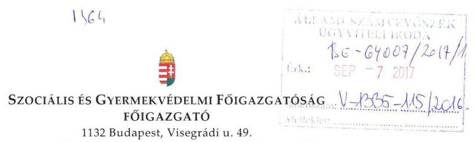

Iktatószám: SZGYF-IKT-20299-1/2017 Tárgy: Észrevétel számvevőszéki
Ügyintéző: Palló Sándor jelentéstervezethez.

# Domokos László úr 

elnök

## Állami Számvevőszék

## Budapest

Apáczai Csere János u. 10
1051

## Tisztelt Elnök Úr!

Köszönettel megkaptam a V-1335-105/2016 iktatószámú, a „Aranysziget Otthon" vonatkozásában „A központi alrendszer egyes intézményei pénzügyi és vagyongazdálkodásának ellenőrzése" című ellenőrzésről készült számvevőszéki jelentéstervezetet tartalmazó levelet.

A kézhez kapott jelentéstervezettel kapcsolatban a következő észrevételt szeretném tenni, melyek elfogadása esetén kérem a jelentés tervezet korrekcióját.

A jelentéstervezet 2.1. számú megállapításában, a 16. oldal utolsó bekezdésében szereplő megállapítás:
„Az intézmény gazdálkodással összefüggő feladatait 2013. április 1-jétől ellátó SZGYF a 2013. február 23-tól hatályos számviteli politika1 -ben - az Áhsz.: 8. § (13) bekezdésében előírtak ellenére - nem döntött arról, hogy annak rendelkezéseit kiterjeszti-e az Intézményre, vagy az - az előirányzatok feletti rendelkezésre jogosultság függvényében - önálló számviteli politikát alakít ki, és önálló szabályzatokat készít.

---

Az SZGYF főigazgatója a 2014-2015. években nem készített az Intézményre is vonatkozó számviteli politikát és annak keretében elkészítendő szabályzatokat az Áhsz.: 50. § (1) bekezdésében előírtak ellenére - a számviteli politikával és annak keretében elkészítendő szabályzatokkal (leltározási és leltárkészítési szabályzat, értékelési szabályzat, pénzkezelési szabályzat és önköltségszámítási rendjére vonatkozó szabályzattal) nem rendelkezett.

Az igazgató az Áhsz: 50. § (1) bekezdésében és az abban hivatkozott 31. § (1) bekezdésében előírtak ellenére jogosulatlanul adta ki számviteli politika:-t, a pénzkezelési szabályzat:-t, és az önköltségszámítási szabályzat:-t, valamint a 2014. évben a leltározási és leltárkészítési szabályzat:-t, mert a számviteli politika elkészítéséért az éves költségvetési beszámolót készítő szerv vezetője (az SZGYF főigazgatója) a felelős."

# Észrevétel: 

Álláspontom szerint a fenti megállapítás alapja téves jogértelmezés.
Az Állami Számvevőszék egy korábbi vizsgálata nyomán megküldte részünkre „A központi alrendszer egyes intézményei pénzügyi és vagyongazdálkodásának ellenőrzése -Borsod-Abaúj-Zemplén Megyei Szociális, Gyermekvédelmi Központ és Területi Gyermekvédelmi Szakszolgálat" címmel a készített jelentéstervezetet. A jelentés tervezetben rögzített - jelen ellenőrzés során megállapítottal megegyező - probléma kapcsán a következő megállapítás található:
„A gazdasági szervezet: a számviteli politikáját és az annak keretében elkészített szabályzatok hatályát - az Áhsz.: 8. § (13), az Áhsz: 50. § (1) bekezdésében és az abban hivatkozott 31. § (1) bekezdéseiben foglaltak ellenére - nem terjesztette ki az Intézményre, és önállóan, szabályosan kiadmányozott formában sem adta ki azokat.

A 2015. szeptember 17-től érvényes munkamegosztási megállapodás alapján a vonatkozó szabályzatok elkészítése intézményi, míg az elkészítésben való együttműködés és a szabályzat jóváhagyása a gazdasági szervezet feladata volt."

A megállapítás nyomán a következő javaslat került a jelentéstervezetbe:
„Intézkedjen az intézményre vonatkozó számviteli politika és annak keretében elkészítendő szabályzatok elkészítésében való együttműködésről és az elkészült szabályzatok jóváhagyásáról a munkamegosztási megállapodásában foglaltaknak megfelelően."

Mivel álláspontom szerint az idézett megállapítás - és a kapcsolódó javaslat - felel meg a jelenleg hatályos jogi szabályozásnak, kérem a jelentés tervezet ezzel megegyezőre történő javítását.

---

Tájékoztatom, hogy továbbiakban fel kívánjuk használni jelen ellenőrzés megállapításait, valamint az ellenőrzéssel való közös munkánk tapasztalatait. A feltárt hiányosságok jelentős részét már az ellenőrzés során javítottuk, illetve pótoltuk.

Az ellenőrzés során tapasztalt segítő együttműködésüket köszönöm!

Budapest, 2017. szeptember „......"
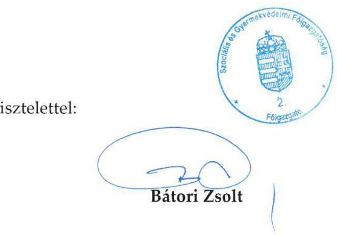

---

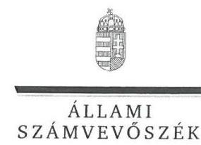

ELNÖK

Ikt.szám: V-1335-116/2016.

# Bátori Zsolt úr 

főigazgató
Szociális és Gyermekvédelmi Főigazgatóság

## Budapest

## Tisztelt Főigazgató Úr!

Köszönettel megkaptam a 2017. szeptember 6. napján az Állami Számvevőszékhez érkezett ,,A központi alrendszer egyes intézményei pénzügyi és vagyongazdálkodásának ellenőrzése Aranysziget Otthon" címủ számvevőszéki jelentéstervezetben foglalt megállapításokra a főigazgató úr által írásban tett, SZGYF-IKT-20299-1/2017. iktatószámú észrevételt.

Tájékoztatom Főigazgató urat, hogy a jelentésben - az Állami Számvevőszékről szóló 2011. évi LXVI. törvény 29. § (3) bekezdése alapján - a figyelembe nem vett észrevételt szerepeltetjük az el nem fogadás indokának feltüntetésével együtt.

Az Állami Számvevőszék észrevételre vonatkozó álláspontjáról a felügyeleti vezető által készített részletes tájékoztatást mellékelten megküldöm.

Budapest, 2017. 09 hó JÁ nap
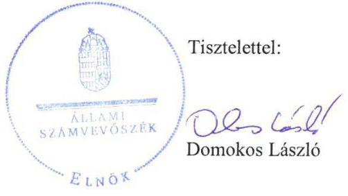

Melléklet: Tájékoztatás figyelembe nem vett észrevételről

---

# Tájékoztatás a figyelembe nem vett észrevételről 

| 1. | Észrevétel: | A 2.1 számú megállapítás 7. és 8. bekezdésében a számviteli politika és annak keretében elkészítendő szabályzatokhoz kapcsolódó ellenőrzési megállapítás téves jogértelmezésen alapul.   Az észrevétel érinti a Szociális és Gyermekvédelmi Főigazgatóság, mint a Csongrád Megyei Aranysziget Integrált Szociális Otthon gazdasági szervezeti feladatait ellátó szerv főigazgatójának címzett 2. számú javaslatot (2.1. számú megállapítás 7. bekezdés 2-3. mondata alapján). |
| :--: | :--: |

 :--: |
|  | Válasz: | Az Állami Számvevőszék az észrevételt nem fogadja el. |
| 1. | Indoklás: | Az ellenőrzés megállapításai az ÁSZ tv. 28. § (2) bekezdése alapján az ellenőrzött szervezetek által az Aranysziget Otthon ellenőrzéséhez kapcsolódóan az ellenőrzés lefolytatásához a törvényi határidőben rendelkezésre bocsátott dokumentumokon alapulnak. Az ellenőrzés részére rendelkezésre bocsátott dokumentumok ismételt felülvizsgálatát követően megállapítottuk, hogy a 2015. szeptember 17-étől hatályos, SZGYF-IKT-13682/2015. iktatószámú megállapodás nem tartalmaz rendelkezést a számviteli politika elkészítésére vonatkozó felelőségi körökre. Az államháztartás számviteléről szóló 4/2013. (I. 11.) Korm. rendelet (Áhsz.) 50. § (1) bekezdése szerint „A számviteli politika elkészítéséért, módosításáért a 31. § (1) bekezdése szerinti személyek felelősek.” Az Áhsz. 31. § (1) bekezdése szerint ,,az éves költségvetési beszámoló elkészítéséért az éves költségvetési beszámolót készítő - központi kezelésű előirányzat, fejezeti kezelésű előirányzat, társadalombiztosítás pénzügyi alapja, elkülönített állami pénzalap esetén a kezelő szerv, helyi önkormányzat, nemzetiségi önkormányzat, társulás, térségi fejlesztési tanács esetén a beszámolási feladatokat az Áht. 6/C. §-a alapján ellátó - szerv vezetője felelős.”   Észrevételében nem cáfolta az ellenőrzés azon megállapítását, hogy a Szociális és Gyermekvédelmi Főigazgatóság (SZGYF) 2013. évtől hatályos számviteli politikájában - az államháztartás szervezetei beszámolási és könyvvezetési kötelezettségének sajátosságairól szóló 249/2000. (XII. 24.) Korm. rendelet (Áhsz.) 8. § (13) bekezdésében előírtak ellenére - nem döntött arról, hogy annak rendelkezését kiterjeszti-e a hozzárendelt Aranysziget Otthonra, vagy az önálló számviteli politikát alakít ki, és önálló szabályzatokat készít. Továbbá nem cáfolta az ellenőrzés azon |

---

|  | megállapítását sem, miszerint - az Áhsz. 50. § (1) bekezdésében és az abban hivatkozott 31. § (1) bekezdésében előírtak ellenére - az SZGYF főigazgatója a 2014-2015. években nem készített az Aranysziget Otthonra is vonatkozó számviteli politikát és annak keretében elkészítendő szabályzatokat. A fentiek következtében az Aranysziget Otthon 2013. április 1-jétől az ellenőrzött időszak végéig - a számvitelről szóló 2000. évi C. törvény 14. § (3)-(5) bekezdéseiben, az Áhsz. 8. § (3)-(4) bekezdéseiben, az Áhsz. 50. § (1) bekezdésében előírtak ellenére - számviteli politikával és annak keretében elkészítendő szabályzatokkal (leltározási és leltárkészítési szabályzat, értékelési szabályzat, pénzkezelési szabályzat és önköltségszámítás rendjére vonatkozó szabályzat) nem rendelkezett.   Fentiekre tekintettel, az észrevétel nem megalapozott, a megállapítás és a Szociális és Gyermekvédelmi Főigazgatóság, mint a Csongrád Megyei Aranysziget Integrált Szociális Otthon gazdasági szervezeti feladatait ellátó szerv főigazgatójának címzett 2. számú javaslat módosítása nem indokolt. |
| :--: | :--: |

Budapest, 2017. 06. hó 18. nap
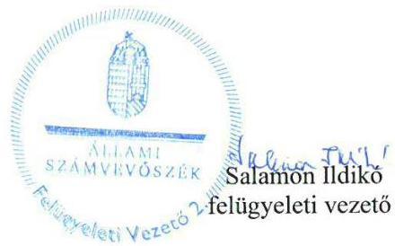

---

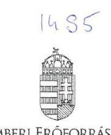

EMBERI ERŐFORRÁSOK MINISZTÉRIUMA
SZOCIÁLIS ÜGYEKÉRT ÉS TÁRSADALMI FELZÁRKÓZÁSÉRT FELELŐS ÁLLAMTITKÁR

Iktatószám: 10172-9/2017/SZOCSTRAT

Domokos László részére elnök

Állami Számvevőszék
Budapest.
Apáczai Csere János utca 10.
1052

Hiv. szám: V-1335-104/2016
Ügyintéző: Aradi Zsuzsanna
Tel. szám: +36 (1) 896-3101
Melléklet: -
ÁLLAMI SZÁMVEVŐSZÉK
26-646141201411
Ekezel: 2017 SZPI 11
Iktatószám: V-1335-114pol
Melléklet:

Tárgy: „Aranysziget Otthon" intézménynél az Állami Számvevőszék által lezajlott ellenőrzés jelentéstervezetének észrevételezése

# Tisztelt Elnök Úr! 

„A központi alrendszer egyes intézményei pénzügyi és vagyongazdálkodásának ellenőrzése - Aranysziget Otthon" című ellenőrzés keretében készült jelentéstervezetet köszönettel megkaptam.

Az Emberi Erőforrások Minisztériumát (a továbbiakban: EMMI) érintő megállapításaival kapcsolatban észrevételt nem teszek.

Tájékoztatom Elnök Urat, hogy az EMMI Szervezeti és Működési Szabályzatáról szóló 33/2014. (IX.16) EMMI utasítás 146. § (1) bekezdés b) pontja alapján az emberi erőforrások minisztere által átruházott hatáskörben gyakorlom a kiadványozási jogot.

Budapest, 2017. szeptember 5.
Üdvözlettel:
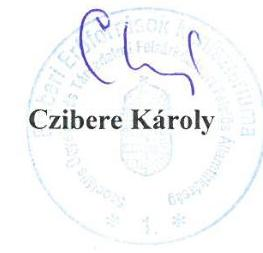

Cím: 1054 Budapest, Báthory utca 10. Tel: +36 17951200
E-mail: info@zmmi.gov.hu

---

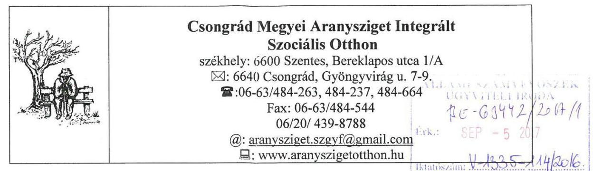

Állami Számvevőszék
1364 Budapest 4.
Pf. 54.

Tisztelt Állami Számvevőszék!

A V-1335-107/2016. iktatószámú "A központi alrendszer egyes intézményei pénzügyi és vagyongazdálkodásának ellenőrzése - Aranysziget Otthon" címmel készült Számvevőszéki jelentéstervezetet tudomásul vesszük és nem kívánunk észrevételt tenni.

Csongrád, 2017. szeptember 1.

Tisztelettel:
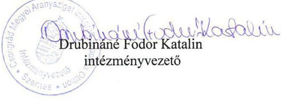

---

.

---

# RÖVIDÍTÉSEK JEGYZÉKE 

${ }^{1}$ Intézmény
${ }^{2}$ Szoctv.
${ }^{3}$ 2001. évi CI. törvény
${ }^{4}$ igazgató
${ }^{5}$ Konszolidációs tv.
${ }^{6}$ megyei önkormányzat
${ }^{7}$ KIM
${ }^{8}$ 258/2011. (XII. 7.) Korm. rendelet
${ }^{9}$ CSOMIK
${ }^{10}$ EMMI
${ }^{11}$ SZGYF
${ }^{12}$ Vtv.
${ }^{13}$ MNV Zrt.
${ }^{14}$ 316/2012. (XI. 13.) Korm. rendelet
${ }^{15}$ ÁSZ
${ }^{16}$ Áht.
${ }^{17}$ Bkr.
${ }^{18}$ ÁSZ tv.
${ }^{19}$ Alapító okirat ${ }_{1}$

Alapító okirat ${ }_{2}$

Alapító okirat ${ }_{3}$

Alapító okirat ${ }_{4}$

Alapító okirat ${ }_{5}$

Alapító okirat ${ }_{6}$
${ }^{20}$ Ávr.

Aranysziget Otthon (2017. március 8-tól a törzskönyvi adatok alapján: Csongrád Megyei Aranysziget Integrált Szociális Otthon az elnevezése, székhelye: Szentes) 1993. III. törvény a szociális igazgatásról és szociális ellátásokról (hatályos: 1993. február 26-tól)
2001. évi CI. törvény a felnőttképzésről Aranysziget Otthon igazgatója
2011. évi CLIV. törvény a megyei önkormányzatok konszolidációjáról, a megyei önkormányzati intézmények és a Fővárosi Önkormányzat egyes egészségügyi intézményeinek átvételéről (hatályos: 2011. november 26-tól)
Csongrád Megyei Önkormányzat
Közigazgatási és Igazságügyi Minisztérium
258/2011. (XII. 7.) Korm. rendelet a megyei intézményfenntartó központokról, valamint a megyei önkormányzatok konszolidációjával, a megyei önkormányzati intézmények és a Fővárosi Önkormányzat egészségügyi intézményeinek átvételével összefüggő egyes kormányrendeletek módosításáról
Csongrád Megyei Intézményfenntartó Központ
Emberi Erőforrások Minisztériuma
Szociális és Gyermekvédelmi Főigazgatóság
2007. évi CVI. törvény az állami vagyonról (hatályos: 2007. szeptember 25-től)

Magyar Nemzeti Vagyonkezelő Zrt.
316/2012. (XI. 13.) Korm. rendelet a Szociális és Gyermekvédelmi Főigazgatóságról (hatályos: 2012. november 16-tól)
Állami Számvevőszék
2011. évi CXCV. törvény az államháztartásról (hatályos: 2012. január 1-jétől). 370/2011. (XII. 31.) Korm. rendelet a költségvetési szervek belső kontrollrendszeréről és belső ellenőrzéséről (hatályos: 2012. január 1-jétől). az Állami Számvevőszékről szóló 2011. évi LXVI. törvény (hatályos: 2011. július 1-jétől)
Aranysziget Otthon Alapító okirata, kiadta a Közigazgatási és Igazságügyi Miniszter, okiratszám: IX-09/30/671/2012 (hatályos: 2012. január 1-jétől 2012. március 31-ig.)

Aranysziget Otthon Alapító okirata, kiadta a Közigazgatási és Igazságügyi Miniszter, okiratszám: IX-09/30/965/2012 (hatályos: 2012. április 1-jétől 2012. december 31-ig)

Aranysziget Otthon Alapító okirata, kiadta az Emberi Erőforrások Minisztere, okiratszám: 35645-13/2013 (hatályos: 2013. január 1-jétől 2013. július 15-ig) Aranysziget Otthon Alapító okirata, kiadta az Emberi Erőforrások Minisztere, okiratszám: 35645-13/2013 (hatályos: 2013. július 16-tól 2014. február 26-ig) Aranysziget Otthon Alapító okirata, kiadta az Emberi Erőforrások Minisztere, okiratszám: 35645-13/2013 (hatályos: 2014. február 27-től 2015. augusztus 6-ig) Aranysziget Otthon Alapító okirata, kiadta az Emberi Erőforrások Minisztere, okiratszám: 33766-5/2015/JISZOC (hatályos: 2015. augusztus 7-től 2016. június 7-ig)
368/2011. (XII. 31.) Korm. rendelet az államháztartásról szóló törvény végrehajtásáról (hatályos: 2012. január 1-jétől)

---

${ }^{21}$ Kjt.
${ }^{22}$ SZMSZ ${ }_{1}$

SZMSZ ${ }_{2}$

SZMSZ ${ }_{3}$
${ }^{23}$ munkamegosztási megállapodás
${ }^{24}$ etikai kódex
${ }^{25}$ CSOMIK számviteli politika
${ }^{26}$ Áhsz. 1
${ }^{27}$ Számv.tv.
${ }^{28}$ SZGYF Számviteli politika 1
${ }^{29}$ Áhsz. 2
${ }^{30}$ számviteli politika2
${ }^{31}$ pénzkezelési szabályzat ${ }_{2}$
${ }^{32}$ önköltség-számítási szabályzat ${ }_{2}$
${ }^{33}$ leltározási és leltárkészítési szabályzat ${ }_{2}$
${ }^{34}$ beszerzési szabályzat ${ }_{1}$
beszerzési szabályzat ${ }_{2}$
beszerzési szabályzat ${ }_{3}$
${ }^{35}$ gépjármű üzemeltetési szabályzat ${ }_{1}$
gépjármű üzemeltetési szabályzat ${ }_{2}$
gépjármű üzemeltetési szabályzat ${ }_{3}$
${ }^{36}$ telefonok használatának szabályzata
telefonok használatának szabályzata ${ }_{2}$
${ }^{37}$ Kbt. 1

Kbt. 2
${ }^{38}$ Közbeszerzési szabályzat ${ }_{1}$
Közbeszerzési szabályzat ${ }_{2}$
Közbeszerzési szabályzat ${ }_{3}$

1992. évi XXXIII. törvény a közalkalmazottak jogállásáról

Csongrád Megyei Önkormányzat Aranysziget Otthona Szervezeti és Működési Szabályzat (hatályos: 2011. április 15-től 2013. december 10-ig)
Aranysziget Otthon Szervezeti és Működési Szabályzat (hatályos: 2013. december 11-től 2015. november 1-ig)

Aranysziget Otthon Szervezeti és Működési Szabályzat (hatályos: 2015. november 2-től)
Szociális és Gyermekvédelmi Főigazgatóság és az Aranysziget Otthon által kötött megállapodás a gazdálkodást érintő feladatmegosztásról (hatályos: 2015. szeptember 17-től)
Aranysziget Otthon etikai kódexe (hatályos: 2010. április 1-jétől)
Csongrád Megyei Intézményfenntartó Központ számviteli politikája (hatályos: 2012. január 1-jétől)
249/2000. (XII. 24.) Korm. rendelet az államháztartás szervezetei beszámolási és könyvvezetési kötelezettségének sajátosságairól (hatályos: 2013. december 31-ig)
2000. évi C. törvény a számvitelről (hatályos 2001. január 1-től)
a Szociális és Gyermekvédelmi Főigazgatóság 11/2013. (II. 26.) SZGYF utasítása „A Szociális és Gyermekvédelmi Főigazgatóság Számviteli Politikájáról” (hatályos: 2013. február 23-tól)

4/2013. (I. 11.) Korm. rendelet az államháztartás számviteléről (hatályos: 2014. január 1-jétől)
Aranysziget Otthon számviteli politika
Aranysziget Otthon pénzkezelési szabályzat
Aranysziget Otthon önköltségszámítási szabályzat
Aranysziget Otthon leltárkészítési és leltározási szabályzat
Aranysziget Otthon beszerzési szabályzata (hatályos: 2011. április 29-től 2012. március 31-ig)
Aranysziget Otthon beszerzési szabályzata (hatályos: 2012. április 1-jétől 2015. szeptember 17-ig)
Aranysziget Otthon beszerzési szabályzata (hatályos: 2015. szeptember 18-tól)
Az Aranysziget Otthon Gépjármű üzemeltetési szabályzata (hatályos: 2012. január 1-jétől 2012. március 31-ig)
Az Aranysziget Otthon Gépjármű üzemeltetési szabályzata (hatályos: 2012. április 1-jétől 2014. augusztus 30-ig)
Az Aranysziget Otthon Gépjármű üzemeltetési szabályzata (hatályos: 2014. szeptember 1-jétől)
Az Aranysziget Otthon Telefonhasználatának szabályzata (hatályos: 2011. április 4-től 2015. január 13-ig)
Az Aranysziget Otthon Telefonhasználatának szabályzata (hatályos: 2015. január 14-től)
2011. évi CVIII. törvény a közbeszerzésekről (hatályos: 2011. augusztus 21-től 2015. október 31-ig)
2015. évi CXLIII. törvény a közbeszerzésekről (hatályos: 2015. november 1-jétől)

Az Aranysziget Otthon Közbeszerzési szabályzata (hatályos: 2010. október 26-tól 2012. június 26-ig)

Az Aranysziget Otthon Közbeszerzési szabályzata (hatályos: 2012. június 27-től 2014. január 13-ig)

Az Aranysziget Otthon Közbeszerzési szabályzata (hatályos: 2014. január 14-től)

---

${ }^{39}$ FEUVE szabályzat ${ }_{1}$

FEUVE szabályzat ${ }_{2}$
${ }^{40}$ szabálytalanságkezelési eljárásrend ${ }_{1}$
szabálytalanságkezelési eljárásrend ${ }_{2}$
szabálytalanságkezelési eljárásrend ${ }_{3}$
${ }^{41}$ ügyrend ${ }_{1}$
${ }^{42}$ ügyrend ${ }_{2}$
ügyrend ${ }_{3}$
${ }^{43}$ szabályzat
${ }^{44}$ gazdálkodási szabályzat
${ }^{45}$ kommunikáció szabályzat ${ }_{1}$
kommunikáció szabályzat ${ }_{2}$
${ }^{46}$ Info.tv.
${ }^{47}$ közérdekű adatok megismerése szabályzat ${ }_{1}$
közérdekű adatok megismerése szabályzat ${ }_{2}$
${ }^{48}$ közérdekű bejelentések szabályzat ${ }_{1}$
közérdekű bejelentések szabályzat ${ }_{2}$
${ }^{49}$ Ikr.
${ }^{50}$ adatvédelmi szabályzat ${ }_{1}$
adatvédelmi szabályzat ${ }_{2}$
${ }^{51}$ informatikai szabályzat ${ }_{1}$
informatikai szabályzat ${ }_{2}$
${ }^{52}$ iratkezelési szabályzat ${ }_{1}$
${ }^{53}$ iratkezelési szabályzat ${ }_{2}$
${ }^{54}$ Ltv.
${ }^{55}$ belső ellenőrzési megállapodás

Az Aranysziget Otthon FEUVE szabályzata (hatályos: 2011. június 30-tól 2013. január 29-ig)
Az Aranysziget Otthon FEUVE szabályzata (hatályos: 2013. január 30-tól)
Az Aranysziget Otthon Szabálytalanságkezelési szabályzata (hatályos: 2011. június 30-tól 2012. augusztus 12-ig)
Az Aranysziget Otthon Szabálytalanságkezelési szabályzata (hatályos: 2012. augusztus 13-tól 2015. január 14-ig)
Az Aranysziget Otthon Szabálytalanságkezelési szabályzata (hatályos: 2015. január 15-től)
Az Aranysziget Otthon Ügyrendje (hatályos: 2011. július 1-jétől 2012. március 31-ig)
Az Aranysziget Otthon Ügyrendje (hatályos: 2012. április 1-jétől 2014. június 30-ig)
Aranysziget Otthon Ügyrendje (hatályos: 2014. július 1-jétől)
Aranysziget Otthon szabályzat a Csongrád Megyei Intézményfenntartó Központtal kötött Munkamegosztási Megállapodásában foglaltak végrehajtására (hatályos: 2012. április 1-jétől)
Aranysziget Otthon gazdálkodási szabályzat a kötelezettségvállalás, pénzügyi ellenjegyzés, teljesítésigazolás, érvényesítés és utalványozás rendjéről (hatályos: 2015. augusztus 31-től)

Aranysziget Otthon belső szabályzat a külső és belső információ és kommunikáció kezelés rendjéről (hatályos: 2012. február 1-jétől 2013. január 9-ig)
Aranysziget Otthon belső szabályzat a külső és belső információ és kommunikáció kezelés rendjéről (hatályos: 2013. január 10-től)
az információs önrendelkezési jogról és az információ szabadságról szóló 2011. évi CXII. tv. (hatályos 2012. január 1-től)
Az Aranysziget Otthon Közérdekű adatok megismerésére irányuló igények teljesítésének rendje (hatályos: 2011. június 30-tól 2014. augusztus 25-ig)
Az Aranysziget Otthon Közérdekű adatok megismerésére irányuló igények teljesítésének rendje (hatályos: 2014. augusztus 26-tól)
Aranysziget Otthon Közérdekű kérelmek, bejelentések és panaszok szabályzata (hatályos: 2012. január 1-jétől 2013. szeptember 30-ig)
Aranysziget Otthon Közérdekű kérelmek, bejelentések és panaszok szabályzata (hatályos: 2013. október 1-jétől)
335/2005. (XII. 29.) Korm. rendelet a közfeladatot ellátó
 szervek iratkezelésének általános követelményeiről
Csongrád Megyei Aranysziget Otthon adatvédelmi szabályzata (hatályos: 2011. május 1-jétől 2014. augusztus 31-ig)
Aranysziget Otthon adatvédelmi szabályzata (hatályos: 2014. szeptember 1-jétől)
Csongrád Megyei Aranysziget Otthon informatikai szabályzata (hatályos: 2011. május 1-jétől 2012. március 31-ig)
Aranysziget Otthon informatikai szabályzata (hatályos: 2012. április 1-jétől)
Az Aranysziget Otthon Iratkezelési szabályzata (hatályos: 2011. május 2-tól 2014. december 17-ig)
Az Aranysziget Otthon Iratkezelési szabályzata (hatályos: 2014. december 18-tól) a közokiratokról, a közlevéltárakról és a magánlevéltári anyag védelméről szóló 1995. évi LXVI. törvény (hatályos: 1996. január 1-jétől)

Megállapodás az SZGYF és az Aranysziget Otthon között belső ellenőrzési feladatok ellátásáról (hatályos: 2013. július 1.)

---

${ }^{56}$ SZGYF belső ellenőrzési kézikönyv 1
${ }^{57}$ SZGYF belső ellenőrzési kézikönyv 2
${ }^{58}$ OGY
${ }^{59}$ megállapodás
${ }^{60}$ Btk.
${ }^{61}$ jegyzőkönyv
${ }^{62}$ 36/2013. (IX. 13.) NGM rendelet
${ }^{63}$ Nvtv.

SZGYF Főigazgatójának 21/2013. (VII. 8.) SZGYF Utasítása a Belső Ellenőrzési Kézikönyv Kiadásáról (hatályos: 2013. július 9-től 2014. december 13-ig)
SZGYF Főigazgatójának 5/2014. (XII. 13.) sz. Utasítása a SZGYF Belső Ellenőrzési Kézikönyv Kiadásáról (hatályos: 2014. december 14-től)
Országgyűlés
Csongrád Megyei Kormányhivatal és az Aranysziget Otthon által 2012. január 17-én kötött megállapodás
2012. évi C. törvény a Büntető Törvénykönyvről (hatályos: 2013. július 1-jétől) Aranysziget Otthon és a Szociális és Gyermekvédelmi Főigazgatóság által 2015. október 1-jén aláírt jegyzőkönyv
36/2013. (IX. 13.) NGM rendelet az államháztartás számvitelének 2014. évi megváltozásával kapcsolatos feladatokról
2011. évi CXCVI. törvény a nemzeti vagyonról

---

# ÁLLAMI SZÁMVEVŐSZÉK 

1052 Budapest, Apáczai Csere János utca 10.
Levélcím: 1364 Budapest 4. Pf. 54
Telefon: +36 14849100 Telefax: +36 14849200
www.asz.hu
