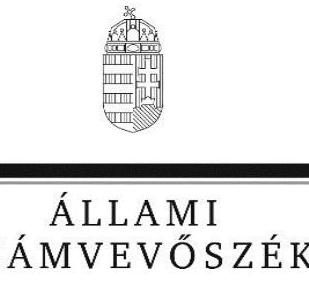

# Jelentés

**A központi alrendszer egyes intézményei pénzügyi és vagyongazdálkodásának ellenőrzése**

Pilisi Gyermekotthon, Óvoda, Általános Iskola, Speciális Szakiskola, Készségfejlesztő Speciális Szakiskola

2017.

17210 www.asz.hu

---

# Jelentés 

## A központi alrendszer egyes intézményei pénzügyi és vagyongazdálkodásának ellenőrzése

Pilisi Gyermekotthon, Óvoda, Általános Iskola, Speciális Szakiskola, Készségfejlesztő Speciális Szakiskola
2017. 10 hó 18 nap
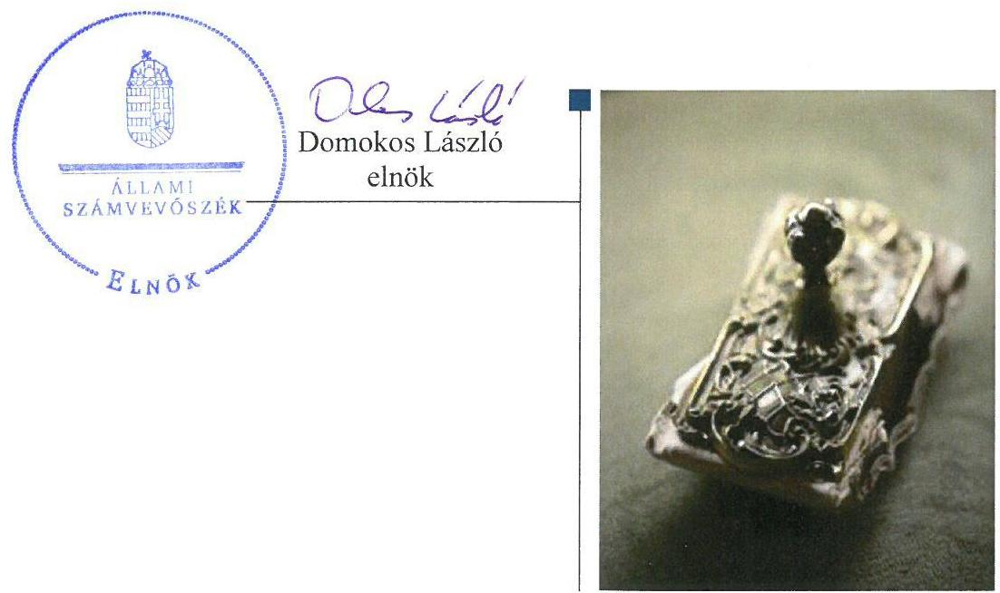

---

# AZ ELLENŐRZÉST FELÜGYELTE:

- **SALAMON ILDIKÓ** felügyeleti vezető

- **AZ ELLENŐRZÉST VEZETTE ÉS A VÉGREHAJTÁSÁÉRT FELELŐS:**

  - **BÍRÓ ZSOLT** ellenőrzésvezető

- **A PROGRAM ÖSSZEÁLLÍTÁSÁÉRT FELELŐS:**

  - **JANIK JÓZSEF LÁSZLÓ** osztályvezető

- **IKTATÓSZÁM:** V-1297-143/2016.
- **TÉMASZÁM:** 2331
- **ELLENŐRZÉS-AZONOSÍTÓ SZÁM:** V076019

Jelentéseink az Országgyűlés számítógépes hálózatán és az Interneta a www.asz.hu címen is olvashatóak.

---

# TARTALOMJEGYZÉK 

■ ÖSSZEGZÉS ..... 5
■ AZ ELLENŐRZÉS CÉLJA ..... 7
■ AZ ELLENŐRZÉS TERÜLETE ..... 8
■ AZ ELLENŐRZÉS HÁTTERE, INDOKOLTSÁGA ..... 9
■ A JELENTÉS LÉNYEGES KÉRDÉSKÖREI ..... 10
■ ELLENŐRZÉS HATÓKÖRE ÉS MÓDSZEREI ..... 11
■ MEGÁLLAPÍTÁSOK ..... 14
■ JAVASLATOK ..... 27
■ MELLÉKLETEK ..... 33
I. sz. melléklet: Értelmező szótár ..... 33
II. sz. melléklet: Az integritás szemlélet érvényesítésével kapcsolatos megállapítások ..... 36
■ FÜGGELÉK: ÉSZREVÉTELEK ..... 37
■ RÖVIDÍTÉSEK JEGYZÉKE ..... 57

---

.

---

# ÖSSZEGZÉS 

A Pilisi Gyermekotthon, Óvoda, Általános Iskola, Speciális Szakiskola, Készségfejlesztő Speciális Szakiskolára vonatkozó irányító szervi feladatellátás megfelelt, a középirányító szervi feladatellátás nem felelt meg a jogszabályi előírásoknak. A belső kontrollrendszer kialakítása és müködtetése nem biztositotta a szabályszerű, átlátható és elszámoltatható közpénzfelhasználás feltételeit. A Pilisi Gyermekotthon, Óvoda, Általános Iskola, Speciális Szakiskola, Készségfejlesztő Speciális Szakiskola pénzügyi és vagyongazdálkodása nem felelt meg a jogszabályi előírásoknak. Az Intézmény vezetője nem építette ki a megfelelő védelmet a korrupciós veszélyekkel szemben. Az eredményes, hatékony, gazdaságos közpénzfelhasználást a gazdálkodás folyamatában mérhető célok nem támasztották alá.

## Az ellenőrzés társadalmi indokoltsága

Az államháztartás központi alrendszerének közpénz felhasználása, az intézmények által ellátott közfeladatok sokrétűsége, valamint a feladatellátásához rendelt vagyon nagyságrendje indokolja, hogy az Állami Számvevőszék ellenőrzéseket folytasson a pénzügyi és vagyongazdálkodás területén. Az Állami Számvevőszék az ellenőrzései során feltárja a gazdálkodást, a központi alrendszer intézményeinek átalakulását, átszervezését érintő szabályozások esetleges hiányosságait, a szabályozással nem érintett gazdálkodási területeket, rámutathat a vagyongazdálkodási tevékenység - ezen belül a tulajdonosi joggyakorlás és vagyonkezelés - esetleges szabálytalanságaira, értékeli az állami vagyon nyilvántartására és elszámolására vonatkozó eljárásokat. Az ellenőrzésünkkel hozzá kívánunk járulni a központi intézmények pénzügyi helyzetének pontosabb megítéléséhez, a jó gyakorlat kialakításán és terjesztésén keresztül az ellenőrzéseink elősegíthetik a gazdálkodás szabályszerűségének javítását.

## Főbb megállapítások, következtetések

A Pilisi Gyermekotthon, Óvoda, Általános Iskola, Speciális Szakiskola, Készségfejlesztő Speciális Szakiskolára vonatkozó irányító szervi feladatellátás megfelelt a jogszabályi előírásoknak. A középirányító szervi feladatellátás nem felelt meg a jogszabályi előírásoknak. A középirányító szerv 2013-2015. években nem érvényesítette a vagyonnal való szabályszerű gazdálkodáshoz szükséges követelményeket, mivel vagyonkezelőként nem kötötte meg a Pilisi Gyermekotthon, Óvoda, Általános Iskola, Speciális Szakiskola, Készségfejlesztő Speciális Szakiskola közfeladatai ellátásához használt vagyonelemekre vonatkozóan a vagyon hasznosítására irányuló írásbeli szerződést.

A Pilisi Gyermekotthon, Óvoda, Általános Iskola, Speciális Szakiskola, Készségfejlesztő Speciális Szakiskola belső kontrollrendszerének kialakítása és működtetése egyik évben sem felelt meg a jogszabályi előírásoknak, emiatt nem voltak biztosítottak a szabályszerű, átlátható és elszámoltatható közpénzfelhasználás feltételei. Az Intézmény szervezeti és müködési szabályzata az ellenőrzött időszakban nem felelt meg a jogszabályi előírásoknak. Az Intézmény és a gazdálkodásával összefüggő feladatokat ellátó Szociális és Gyermekvédelmi Főigazgatóság 2013. július 1-jétől 2015. november 1-ig nem rendelkezett az irányító szerv által jóváhagyott munkamegosztás és felelősségvállalás rendjét rögzítő munkamegosztási megállapodással. Az Intézmény 2013. július 1-jétől az ellenőrzött időszak végéig nem rendelkezett számviteli politikával és az annak keretében elkészítendő eszközök és források leltárkészítési és leltározási szabályzattal, eszközök és források értékelési szabályzattal, pénzkezelési szabályzattal és az önköltségszámítás rendjére vonatkozó szabályzattal, mivel a gazdálkodással összefüggő feladatokat ellátó Szociális és Gyermekvédelmi Főigazgatóság azokat nem készítette el. Az igazgató a 2012-2015. években nem működtetett kockázatkezelési rendszert, valamint információs és kommunikációs rendszert.

A Pilisi Gyermekotthon, Óvoda, Általános Iskola, Speciális Szakiskola, Készségfejlesztő Speciális Szakiskola pénzügyi és vagyongazdálkodása nem felelt meg a jogszabályi előírásoknak, mert a kiadási előirányzatok felhasználásánál a

---

gazdálkodási jogkörök gyakorlása az ellenőrzött időszakban nem volt megfelelő. Az Intézmény vagyongazdálkodása a 2012-2015. években nem volt szabályszerű. A 2012-2015. években az Intézmény vagyonhasználati szerződés hiányában közfeladata ellátásához használt ingatlan vagyon tekintetében nem minősült az állami vagyon jogszerű használójának. Továbbá a 2012-2015. években az Intézmény vagyonkezelésébe nem tartozó ingatlanok szerepeltek az éves költségvetési beszámolók mérlegében, amely miatt a 2012-2015. évi költségvetési beszámolók nem mutattak az Intézmény vagyoni helyzetéről megbízható és valós képet.

A Pilisi Gyermekotthon, Óvoda, Általános Iskola, Speciális Szakiskola, Készségfejlesztő Speciális Szakiskola erőfeszítéseket tett az integritás szemlélet érvényesítése érdekében, azonban az integritás kontrollok kiépítettsége nem volt egyensúlyban a korrupciós kockázatok szintjével.

A gazdálkodás folyamatában számszerűsített, mérhető célokat, célértékeket nem határoztak meg.

---

# AZ ELLENŐRZÉS CÉLJA 

AZ ELLENŐRZÉS célja annak megítélése volt, hogy az ellenőrzött intézményre vonatkozó irányító szervi feladatellátás a jogszabályi előírások betartásával történte; az intézménynél a belső kontrollrendszer kialakítása és múködtetése szabályszerű volt-e; kialakították-e az erőforrásokkal való szabályszerű, gazdaságos, hatékony és eredményes gazdálkodás követelményeit; szabályszerű volt-e a beszámolási és adatszolgáltatási kötelezettségek teljesítése; az intézmény pénzügyi és vagyongazdálkodása megfelelt-e a jogszabályi előírásoknak és belső szabályzatainak; az intézmény átalakításának vagy átszervezésének
lebonyolítása szabályszerűen történt-e.
Az ellenőrzés keretében értékeltük az intézmény korrupciós kockázatainak kezelését szolgáló integritás kontrollok kiépítettségét és az integritás szemlélet érvényesülését.

A KIEGÉSZÍTŐ TELJESÍTMÉNY-ELLENŐRZÉSI MODUL célja annak értékelése volt, hogy a gazdálkodás folyamatában a gazdaságossági, hatékonysági és eredményességi célok kialakítása megtörtént-e, a célok elérése érdekében tettek-e intézkedéseket, a célkitűzéseket és a szándékolt eredményeket elérték-e.

---

# AZ ELLENŐRZÉS TERÜLETE

## Pilisi Gyermekotthon, Óvoda, Általános Iskola, Speciális Szakiskola, Készségfejlesztő Speciális Szakiskola

Az Intézmény1 Pest megyében található székhelye Pilisen van. Az Intézmény a Gyvt.2 alapján személyes gondoskodást nyújtó gyermekvédelmi szakellátás keretében otthont nyújtó ellátást és a különleges bánásmódot igénylő sajátos nevelési igényű gyermekek részére óvodai, általános iskolai és szakiskolai nevelést biztosított.

A 2012. évben az Intézmény irányító szerve az Önkormányzat3 volt. Az Intézmény gazdálkodási besorolása szerint önállóan működő és gazdálkodó költségvetési szerv volt. 2013. január 1-jétől a 2012. évi CXCII. törvény4 alapján az Intézmény a központi alrendszerbe került, az alapítói és irányító szervi feladatokat az EMMI5 látta el, a középirányító szerve a 316/2012. (XII. 13.) Korm. rendelet6 alapján az SZGYF7 lett. 2013. július 1-jétől az Intézmény gazdálkodási besorolása a 349/2012. (XII. 12.) Korm. rendelet8 alapján önállóan működőre változott és ettől az időponttól az Intézmény gazdálkodásával összefüggő feladatait az SZGYF látta el.

A 2012. évi CXCII. törvény értelmében az Intézménnyel kapcsolatos vagyon és vagyoni értékű jogok 2013. január 1-jén a törvény erejénél fogva állami tulajdonba kerültek. Az átkerült intézményi vagyon tekintetében 2013. január 1-jétől a tulajdonosi jogokat – a Vtv.9 alapján – az állami vagyon felügyeletéért felelős miniszter gyakorolta, aki e feladatát az MNV Zrt.10 útján látta el. A vagyonkezelői feladatokat a 316/2012. (XI. 13.) Korm. rendelet alapján az SZGYF főigazgatója látta el.

A 2015. évben az Intézményhez került Cegléden kettő és Gyömrőn lévő négy lakásotthon. Az ellenőrzött időszakban az igazgató11 személye nem változott meg. A gazdasági vezetői feladatokat 2013. június 30-ig az Intézmény gazdasági vezetője, 2013. július 1-jétől az SZGYF gazdasági vezetője látta el. Az Intézmény által teljesített összes bevétel a 2012. évi 371,6 M Ft-ról a 2015. évre 31,8%-kal 490,1 M Ft-ra, a teljesített összes kiadás a 2012. évi 358,6 M Ft-ról a 2015. évre 33,7%-kal 479,7 M Ft-ra nőtt.

---

# AZ ELLENŐRZÉS HÁTTERE, INDOKOLTSÁGA 

AZ ÁLLAMHÁZTARTÁS KÖZPONTI ALRENDSZERÉNEK közpénz felhasználása, az intézmények által ellátott közfeladatok sokrétűsége, valamint a feladatellátásához rendelt vagyon nagyságrendje indokolja, hogy az ÁSZ ${ }^{12}$ ellenőrzéseket folytasson a pénzügyi és vagyongazdálkodás területén. Az ÁSZ az ellenőrzései során feltárja a gazdálkodást, a központi alrendszer intézményei átalakulását, átszervezését érintő szabályozások esetleges hiányosságait, a szabályozással nem érintett gazdálkodási területeket, rámutathat a vagyongazdálkodási tevékenység - ezen belül a tulajdonosi joggyakorlás és vagyonkezelés - esetleges szabálytalanságaira, értékeli az állami vagyon nyilvántartására és elszámolására vonatkozó eljárásokat.

A társadalmi igénnyel összhangban az Áht. ${ }^{13}$ és a Bkr. ${ }^{14}$ is előírja a költségvetési szerv részére, hogy a költségvetési szerv valamennyi tevékenysége és célja összhangban legyen a gazdaságosság, hatékonyság és eredményesség követelményeivel. A Bkr. alapján az intézményvezetőnek évente nyilatkoznia is kell arról, hogy gondoskodott-e az intézmény tevékenységében a gazdaságosság, hatékonyság és eredményesség követelményeinek érvényesítéséről. A gazdaságos, hatékony és eredményes gazdálkodáshoz szükség van célok és célértékek kialakítására, a célok megvalósulásának mérését elősegítő mutatószámokra, valamint a mérhetőség, ellenőrizhetőség, értékelhetőség feltételeinek kialakítására. Az ÁSZ jelen ellenőrzés során értékeli, hogy az intézménynél a célokat kialakították-e, tettek-e intézkedéseket a célok végrehajtása céljából, a kitűzött célok teljesültek-e.

AZ ELLENŐRZÉS VÁRHATÓAN HOZZÁJÁRUL a központi intézmények pénzügyi helyzetének pontosabb megítéléséhez és a jó gyakorlat kialakításán és terjesztésén keresztül az ellenőrzések elősegíthetik a gazdálkodás szabályszerűségének javítását.

Az ÁSZ teljesítmény ellenőrzési modul alapján elvégzett ellenőrzése a döntéshozók, ellenőrzöttek, irányító szervek, a társadalom számára objektív visszajelzést ad a gazdálkodás területén végrehajtott szervezeti, szervezési intézkedésekről, a közfeladat-ellátásnak keretet adó gazdálkodási tevékenységek folyamatában kialakított célokról, intézkedésekről, azok teljesítéséről. Az ÁSZ értékteremtő elemzéseivel, tanácsadó szerepét erősítve támogatja a szervezetek önértékelő, alkalmazkodó (öntanuló) tevékenységét. Irányt mutat az ellenőrzött intézmények gazdálkodási és kapcsolódó adminisztratív folyamatainak optimalizációjához. Támogatja a központi költségvetési szervek felügyelhetőségét, a „jó gyakorlatok" elterjesztésével támogatja a „jó kormányzást".

---

# A JELENTÉS LÉNYEGES KÉRDÉSKÖREI 

1.     - Az irányító szerv ellenőrzött Intézményre vonatkozó feladatellátása szabályszerű volt-e?
2.     - A belső kontrollrendszer kialakítása és müködtetése biztosította-e a közpénzekkel és a nemzeti vagyonnal történő szabályszerű, gazdaságos, hatékony és eredményes gazdálkodást, illetve a beszámolási és adatszolgáltatási kötelezettségek szabályszerű teljesítését?
3.     - Az Intézmény pénzügyi gazdálkodása szabályszerű volt-e?
4.     - Az Intézmény vagyongazdálkodása szabályszerű volt-e?
5.     - Szabályszerűen hajtották-e végre az ellenőrzött időszakban az Intézményt érintő szervezeti, szerkezeti átalakításokat?
6.     - Érvényesült-e az integritás szemlélet és ennek megfelelően ki-építették-e az integritás kontrollrendszert az Intézménynél?
7. Az Intézmény a gazdálkodás folyamatában kialakított-e célokat, célértékeket, azok elérése érdekében meghatározott-e intézkedéseket, feladatokat, elérte-e a szándékolt eredményeket?

---

# ELLENŐRZÉS HATÓKÖRE ÉS MÓDSZEREI 

## Az ellenőrzés típusa

Megfelelőségi ellenőrzés, amelyet teljesítmény ellenőrzési modul egészített ki.

## Az ellenőrzött időszak

2012. január 1-jétől 2015. december 31-ig terjedő időszak volt.

## Az ellenőrzés tárgya

Az ellenőrzött szervezetre vonatkozó irányító szervi feladatok ellátása. Az Intézmény belső kontroll rendszerének kialakítása és múködtetése. A pénzügyi és vagyongazdálkodás szabályszerűsége. Az Intézmény beszámolási és adatszolgáltatási kötelezettségének teljesítése. Az Intézmény átalakításának vagy átszervezésének szabályszerűsége. Az Intézmény korrupciós kockázatainak kezelését szolgáló integritás kontrollok kiépítettsége és az integritás szemlélet érvényesülése.

A teljesítményellenőrzési kiegészítő modul esetében az intézményi gazdálkodás folyamatában a gazdaságossági, hatékonysági és eredményességi követelmények kialakítása és múködtetése, a célkitűzések teljesítésének értékelése.

Az ellenőrzés kiterjedt minden olyan körülményre és adatra, amely az ÁSZ jogszabályban meghatározott feladatainak teljesítéséhez, valamint a program végrehajtása folyamán felmerült újabb összefüggések feltárásához szükséges volt.

## Az ellenőrzött szervezet

A központi alrendszer ellenőrzött intézménye: a Pilisi Gyermekotthon, Óvoda, Általános Iskola, Speciális Szakiskola, Készségfejlesztő Speciális Szakiskola és az Intézmény irányító szervei: Budapest Főváros Önkormányzata, Emberi Erőforrások Minisztériuma, valamint az Intézmény középirányító szerve a Szociális és Gyermekvédelmi Főigazgatóság.

Az ellenőrzésre a központi alrendszer ellenőrzött intézményének és irányító szerveinek székhelyén, illetve középirányító szervének székhelyén, telephelyén került sor.

---

# Az ellenőrzés jogalapja 

Az ellenőrzés jogszabályi alapját az ÁSZ tv. ${ }^{15}$ 1. § (3) bekezdése, az 5. § (2) - (6) bekezdései, valamint az Áht. 61. § (2) bekezdésének előírásai képezték.

## Az ellenőrzés módszerei

Az ellenőrzést az ellenőrzési program szempontjai, az ellenőrzött időszakban hatályos jogszabályok, az ellenőrzés szakmai szabályai, a jelen ellenőrzésre irányadó ÁSZ módszertanok figyelembevételével végeztük.

Az ellenőrzési kérdések megválaszolásához szükséges bizonyítékok megszerzése tételes és mintavételen alapuló dokumentumellenőrzés, öszszehasonlító elemzés ellenőrzési eljárások alkalmazásával történt. Az ellenőrzési bizonyítékként felhasznált adatforrások közé tartoztak egyrészt az ellenőrzési program részletes szempontjainál felsorolt adatforrások, másrészt minden egyéb - az ellenőrzés folyamán feltárt, az ellenőrzés szempontjából információt tartalmazó - dokumentum.

Az ellenőrzés lefolytatásához az ellenőrzött szervezetek tanúsítványok kitöltésével, valamint az ÁSZ által kért dokumentumok megküldésével szolgáltattak adatokat. A rendelkezésre bocsátott adatok, információk kontrollja az ellenőrzés keretében történt.

Az ÁSZ a belső kontrollrendszer jogszabályi előírások szerinti kialakításának és működtetésének szabályszerűségét az erre irányuló ellenőrzési kérdésekre adott válaszok összesítése alapján, a lényegességi szempontok figyelembevételével pillérenként (kontrollkörnyezet, kockázatkezelési rendszer, kontrolltevékenységek, információs és kommunikációs rendszer, monitoring rendszer) és összesítetten is minősítette. Az ÁSZ a pénzügyi gazdálkodás és a vagyongazdálkodás kialakításának és működtetésének szabályszerűségét az erre irányuló ellenőrzési kérdésekre adott válaszok összesítése alapján, a lényegességi szempontok figyelembevételével évenkénti bontásban minősítette. „Megfelelő"-nek értékelte az ellenőrzött területet, amennyiben a szabályozás, illetve végrehajtás során a jogszabályi követelményeket maradéktalanul, vagy kisebb hiányosságok mellett érvényesítették, „nem megfelelő"-nek értékelte, amennyiben a szabályozás hiányosságai nem biztosították a szabályszerű működés feltételeit, illetve a gazdálkodás folyamatában jelentkező hibák lényegesek, nagyszámúak, vagy rendszerszerűek voltak.

Mintavétellel ellenőriztük az Intézménynél a kiadások előirányzatai felhasználásának, a tárgyi eszközök nyilvántartásba vételének (üzembe helyezés, értékelés, nyilvántartás), a bevételek beszedésének és elszámolásának, a vagyonelemek elidegenítésének és hasznosításának szabályszerűségét. A minta alapján a sokaságban előforduló hibaarányt becsültük. Az értékelés eredményeként kétféle, "Megfelelő" és "Nem megfelelő" minősítést alkalmaztunk. „Megfelelő"-nek értékeltünk egy ellenőrzött területet, amennyiben a hibaarány a teljes sokaságban 95\%-os bizonyossággal legfeljebb 10\% arányt képviselt. Abban az esetben, ha az adott sokaság tekintetében a 10\%-os hibaarány küszöbérték átlépése megítélésének megbízhatósága nem érte el a 95\%-ot, annak elérése érdekében értékelésünket

---

lényegességi alapon további szempontokkal egészítettük ki, és figyelembe vettük a feltárt hibák értékét.

Az integritás szemlélet érvényesülésének értékelése az Intézmény által kitöltött tanúsítvány alapján történt. Értékeltük továbbá az integritás kontrollrendszer kiépítettségét a tanúsítványban szereplő kontrollok ellenőrzése alapján.

Az alapprogram alapján ellenőriztük, hogy a költségvetési szerv vezetője megtette-e nyilatkozatát arról, hogy gondoskodott a költségvetési szerv tevékenységében a hatékonyság, eredményesség és a gazdaságosság követelményeinek érvényesítéséről. A teljesítmény-ellenőrzési kiegészítő modul végrehajtása során értékeltük, hogy az ellenőrzött szervezet a gazdálkodás folyamatában a gazdaságossági, hatékonysági és eredményességi célokat és célértékeket kialakította-e, a célkitűzéseket elérte-e. A kiegészítő modul a gazdálkodási feladatokra terjedt ki, a szakmai feladatellátást nem értékelte.

A gazdálkodási feladatok értékelése az alábbi területekre terjedt ki:
pénzügyi gazdálkodási (nem szakmai, adminisztratív) feladatok: költségvetés-, beszámoló-készítés, könyvvezetés, adatszolgáltatások, előirányzat-gazdálkodás, kötelezettségvállalások nyilvántartása, kezelése, bevételkezelés, bér- és illetményszámfejtés;
$\longrightarrow$ vagyongazdálkodási (logisztikai) feladatok: közbeszerzések és közbeszerzési értékhatárt el nem érő beszerzések, készletgazdálkodás, nyomtatók, fénymásolók üzemeltetése, épület- és ingatlanüzemeltetés, karbantartás, hibabejelentés, gépjármú és flotta-menedzsment.

Az ellenőrzés során minden olyan körülményt és adatot ellenőriztünk, amely a program végrehajtása kapcsán felmerült újabb összefüggéseknek az ellenőrzés céljaival összhangban lévő feltárásához szükséges volt. A tel-jesítmény-ellenőrzési kiegészítő programmodulban megfogalmazott ellenőrzési cél megválaszolásához az alapprogram végrehajtása során megfogalmazott megállapításokat is figyelembe vettük.

---

# 1. Az irányító szerv ellenőrzött Intézményre vonatkozó feladatellátása szabályszerű volt-e? 

Összegző megállapítás

Az Intézményre vonatkozó irányító szervi feladatellátás megfelelt, a középirányító szervi feladatellátás nem felelt meg a jogszabályi előírásoknak.
1.1. számú megállapítás

Az alapítással kapcsolatos irányító szervi jogosultságok gyakorlása a 2012-2015. években szabályszerűen történt.

Az Önkormányzat által kiadott alapító okirat ${ }_{1-2}{ }^{16}$, valamint az EMMI minisztere által kiadott alapító okirat ${ }_{3-6}{ }^{17}$ megfelel a jogszabályi előírásoknak. 2014. évben a kormányzati funkció megadása miatt, az Ávr. ${ }^{18}$ előírásainak megfelelően az alapító okirat ${ }_{5}$ kiadásával az alapító okirat ${ }_{4}$ kiegészítése megtörtént. Az alapító okirat ${ }_{3-6}$ kiadása előtt az államháztartásért felelős miniszter előzetes egyetértését tartalmazó dokumentum rendelkezésre állt. Az alapító okirat ${ }_{1-4,6}$-ot az Önkormányzat és az EMMI egységes szerkezetben adta ki.
1.2. számú megállapítás

Az Intézménnyel kapcsolatos egyéb irányítási, felügyeleti és ellenőrzési jogosultságokat az irányító szervek szabályszerűen, a középirányító szerv nem szabályszerűen gyakorolta.

Az Intézmény szervezeti kereteit az Önkormányzat által jóváhagyott SZMSZ ${ }_{1}{ }^{19}$, illetve az SZGYF-PMK ${ }^{20}$ által jóváhagyott SZMSZ ${ }_{2}{ }^{21}$-ben határozták meg.

Az Önkormányzat a 2012. évben, az EMMI a 2013-2015. években az Intézmény éves elemi költségvetéseit, az éves költségvetési beszámolóit, valamint a pénzmaradványát, előirányzat maradványát az Ávr. előírásainak megfelelően jóváhagyta.

A 2012. évben az Önkormányzat, valamint 2013-2015. években az SZGYF az Intézmény költségvetésének a végrehajtását megfelelően figyelemmel kísérték, a közfeladat ellátásának veszélybe kerülését nem állapították meg.

Az Önkormányzat rendeletében határozta meg az Intézmény térítési díját. Az SZGYF a 2013-2014. években elmulasztotta az 316/2012. (XI. 13.) Korm. rendelet 4. § (4) bekezdés b) pontja és az (5) bekezdés ellenére az intézményi térítési díj meghatározását, 2015. évben megállapította azt.

A 2013-2015. években az SZGYF - a Vtv. 27. § (2) bekezdésében előírtak ellenére - a vagyonkezelésében lévő, az Intézmény közfeladatai ellátásához használt ingatlanok átlátható, szabályszerű működtetéséről nem gondoskodott, mivel az állami vagyon használatának jogcímét az Intézménynek - a Vtv. 25. § (4) bekezdésében rögzített - használati szerződés meg-

---

kötésével nem biztosította. Így a 2013-2015. években az SZGYF főigazgatója - a 316/2012. (XI. 13.) Korm. rendelet 3. § (2) bekezdés g) pontjában előírtak ellenére - nem érvényesítette az erőforrásokkal, így különösen a vagyonnal való szabályszerű gazdálkodáshoz szükséges követelményeket.

A 2013-2015. években az SZGYF főigazgatója az államháztartással öszszefüggő közérdekű és közérdekből nyilvános adatok kötelező közzétételének, illetve igényre történő szolgáltatásának végrehajtását a 316/2012. (XI. 13.) Korm. rendelet 3. § (1) bekezdés o) pontjában foglaltak ellenére nem ellenőrizte.
1.3. számú megállapítás Az irányító szervek az Intézménnyel kapcsolatos munkáltató jogosultságaikat szabályszerűen gyakorolták.

Az igazgató személye az ellenőrzött időszakban nem változott, az igazgatót az Önkormányzat határozott időre - 2012. augusztus 16-tól 2017. augusztus 15-ig - szabályosan bízta meg az igazgatói feladatok ellátásával.

A 2012. január 1-je és 2013. június 30-a között az Intézmény gazdasági vezetőjének személye nem változott. A 349/2012. (XII. 12.) Korm. rendelet 7. § (1) bekezdése alapján az Intézmény 2013. július 1-jétől gazdasági szervezettel már nem rendelkezett. A gazdasági vezetői feladatokat az SZGYF gazdasági igazgatója látta el.

# 2. A belső kontrollrendszer kialakítása és múködtetése biztosí-totta-e a közpénzekkel és a nemzeti vagyonnal történő szabályszerű, gazdaságos, hatékony és eredményes gazdálkodást, illetve a beszámolási és adatszolgáltatási kötelezettségek szabályszerű teljesítését? 

Összegző megállapítás

### 2.1. számú megállapítás

A belső kontrollrendszer kialakítása és múködtetése nem biztosította a közpénzekkel és a nemzeti vagyonnal történő szabályszerű, gazdaságos, hatékony és eredményes gazdálkodás feltételeit, illetve a beszámolási és adatszolgáltatási kötelezettségek szabályszerű teljesítését.

Az Intézmény kontrollkörnyezetének kialakítása az ellenőrzött időszakban nem felelt meg a jogszabályi előírásoknak.

Az Intézmény az ellenőrzött időszakban SZMSZ ${ }_{1,2}$-vel rendelkezett. Az SZMSZ ${ }_{1}$ módosítása az Intézmény központi alrendszerbe kerülést követően nem történt meg, emiatt az SZMSZ ${ }_{1}$ 2013. január 1-je és 2014. február 26a között nem tartalmazta - az Ávr. 13. § (1) bekezdés b) pontjában foglaltak ellenére - a hatályos alapító okirat keltét, számát, valamint 2013. július 1je és 2014. február 26-a között nem tartalmazta - Ávr. 13. § (1) bekezdés e) pontjában foglaltak ellenére - az Intézmény gazdasági szervezetének a megnevezését. Továbbá 2013. január 1-je és 2014. február 26-a között az Intézmény nem rendelkezett - a 316/2012. (XI. 13.) Korm. rendelet 4. § (4) bekezdés a) pontjában foglaltak ellenére - az SZGYF-PMK által jóváhagyott SZMSZ-szel. Az SZMSZ ${ }_{1,2}$ az Ávr. 13. § (1) bekezdés g) és h) pontja ellenére

---

nem tartalmazta a hatáskörök gyakorlásának módját és a munkáltatói jogok gyakorlásának rendjét. Az SZMSZ2 az Ávr. 13. § 1) bekezdés c) és g) pontjaiban foglaltak ellenére nem tartalmazta az ellátandó, és a kormányzati funkció szerint besorolt alaptevékenységek megjelölését, valamint az SZMSZ2-ben nevesített minden munkakörhöz tartozó feladat- és hatásköröket.

Az Intézmény 2012. január 1-jétől 2013. június 30-ig gazdasági szervezettel rendelkezett. A gazdasági szervezet az Ávr. 9. § (5) bekezdése ellenére ügyrenddel nem rendelkezett. A 2012. január 1-je és 2013. június 30a között az Intézmény az Áhsz ${ }_{1}{ }^{22}$ előírásainak megfelelően rendelkezett számviteli politika ${ }^{23}$-val, és a hozzá kapcsolódó szabályzatokkal, leltározási és leltárkészítési szabályzat ${ }^{24}$-tal, értékelési szabályzat ${ }^{25}$-tal, pénzkezelési szabályzat ${ }^{26}$-tal, önköltségszámítási szabályzat ${ }^{27}$-tal. Továbbá rendelkezett - a Számv. tv. ${ }^{28}$-ben és az Áhsz ${ }_{1}$-ben előírtakkal összhangban - számlarend ${ }^{29}$-del és bizonylati rend ${ }^{30}$-del.

Az Intézmény gazdálkodással összefüggő feladatait 2013. július 1-jétől ellátó SZGYF gazdasági szervezete - az Ávr. 9. § (5) bekezdésében, az Ávr. 13.§ (5) bekezdésében és 2015. február 18-tól az Ávr. 10/A. §-ában előírtak ellenére - 2013. július 1-jétől 2015. december 31-ig nem rendelkezett ügyrenddel.

Az Intézmény és a gazdálkodásával összefüggő feladatokat ellátó SZGYF 2013. július 1-jétől 2015. október 31-ig - az Ávr. 10. § (5) bekezdésében és 2015. január 1-jétől az Ávr. 9. § (5a) bekezdésében foglaltaknak megfelelő - munkamegosztás és felelősségvállalás rendjét rögzítő érvényes munkamegosztási megállapodással nem rendelkezett. Az Intézmény és a gazdálkodásával összefüggő feladatokat ellátó SZGYF az irányító szerv által jóváhagyott munkamegosztási megállapodás ${ }^{31}$-sal 2015. november 1-jétől rendelkezett.

Az Intézmény 2013. július 1-jétől 2013. december 31-ig számviteli politikával, és az annak keretében elkészítendő szabályzatokkal (eszközök és források leltárkészítési és leltározási szabályzattal, eszközök és források értékelési szabályzattal, pénzkezelési szabályzattal és önköltségszámítás rendjére vonatkozó szabályzattal) nem rendelkezett, mert az Intézmény gazdálkodással összefüggő feladatait ellátó önállóan működő és gazdálkodó SZGYF számviteli politikája³2-ban - az Áhsz. ${ }_{1}$ 8. § (13) bekezdésében előírtak ellenére - nem döntött arról, hogy annak rendelkezéseit és a kapcsolódó szabályzatok hatályát kiterjeszti-e az Intézményre, vagy az önálló számviteli politikát alakít ki és külön szabályzatokat készít. Továbbá 2014. január 1-jétől az ellenőrzött időszak végéig sem rendelkezett az Intézmény a Számv. tv. 14. § (5) bekezdésében foglaltak ellenére számviteli politikával, és az annak keretében elkészítendő szabályzatokkal, mert az SZGYF főigazgatója - az Áhsz. ${ }^{33}$ 50.§ (1) bekezdésében, és az abban hivatkozott 31. § (1) bekezdésében foglaltak ellenére - azokat nem készítette el.

Az Intézmény - a Számv. tv. 161. § (1) bekezdésében, az Áhsz. ${ }_{1}$ 49. § (1) bekezdésében és az Áhsz. ${ }_{2}$ 51. § (2) bekezdésében előírtak ellenére - 2013. július 1-jétől az ellenőrzött időszak végéig nem rendelkezett hatályos számlarenddel.

Az Intézmény a Kjt. ${ }^{34}$ előírásainak megfelelően a 2012. évtől rendelkezett közalkalmazotti szabályzat ${ }_{1,2}{ }^{35}$-vel. Az etikai elvárásokat az ellenőrzött időszakban az SZMSZ ${ }_{1,2}$-ben és az etikai kódex ${ }^{36}$-ben fogalmazták meg. Az SZMSZ ${ }_{1,2}$-ben a munkaviszony létesítésének feltételeként előírták a FICE ${ }^{37}$

---

### 2.2. számú megállapítás

### 2.3. számú megállapítás

Etikai kódexének ${ }^{38}$ megismerését és elfogadását. Az igazgató az Ávr. előírásainak megfelelően kiadta a közbeszerzési értékhatárt el nem érő beszerzések lebonyolításával kapcsolatos beszerzési szabályzat ${ }_{1,2}{ }^{39}$-t.

Az igazgató szabályozta a szabálytalanságok kezelésének eljárásrend ${ }^{40}$ jét.

Az igazgató az Ávr. 13. § (2) bekezdés c) és f) pontjainak ellenére a 20122015. években belső szabályzatban nem rendezte a belföldi és külföldi kiküldetések elrendelésével és lebonyolításával, elszámolásával kapcsolatos kérdéseket, valamint a gépjárművek igénybevételének és használatának rendjét. Az Ávr. 13. § (2) bekezdés e) pontjának előírása ellenére 2015. február 24-ig nem határozta meg a reprezentációs kiadások felosztását, azok elszámolásának szabályait. Az Ávr. 13. § (2) bekezdés g) pontja ellenére 2015. március 3-ig nem szabályozta a vezetékes és rádiótelefonok használatának rendjét.

A 2012-2015. években az Intézmény ellenőrzési nyomvonal ${ }_{1,2}{ }^{41}$ nem felelt meg a Bkr. 6. § (3) bekezdés előírásainak, mert nem tartalmazta az irányítási folyamatokat, információs szinteket és kapcsolatokat.

## A kockázatkezelési rendszer kialakítása megfelelt, múködtetése nem felelt meg a jogszabályi előírásoknak.

Az Intézmény az ellenőrzött időszakban rendelkezett kockázatkezelési szabályzat ${ }^{42}$-tal, amely tartalmazta a kockázatok azonosításának, elemzésének, értékelésének, a kockázati kitettség mérséklésének módszerét, valamint a kockázat kezelése érdekében szükséges intézkedések teljesítésének folyamatos nyomon követési módját. A kockázatkezelési rendszer múködtetése a 2012-2015. években nem felelt meg a Bkr. 7. § (1)-(2) bekezdés előírásának, mert nem mérték fel és nem állapították meg az Intézmény gazdálkodásában rejlő kockázatokat, valamint nem határozták meg az egyes kockázatokkal kapcsolatban szükséges intézkedéseket.

## A kontrolltevékenység gyakorlása, múködtetése nem felelt meg a jogszabályokban foglaltaknak.

Az Intézmény gazdálkodási rendjét a kötelezettségvállalási szabályzat ${ }^{43}$ ban rendezték. Az Intézmény gazdasági szervezetének megszűnését követően 2013. július 1-jétől - 2015. december 31-ig az igazgató a kötelezettségvállalási szabályzatot nem módosította, így abban és más szabályzatban az Ávr. 13. § (2) bekezdés a) pontja ellenére nem rendezte, hogy az Ávr. 55. § (2) bekezdés c) és ca) pontjai és az Ávr. 58. § (4) bekezdése szerinti pénzügyi ellenjegyzésre, valamint az érvényesítésre az Intézmény gazdasági vezetője - aki az SZGYF gazdasági vezetője - jogosult.

Az Intézmény nem tett eleget az Ávr. 60. § (3) bekezdésében előírtaknak, mert 2012-2013. években nem vezették, 2014-2015. években nem naprakészen vezették a nyilvántartást a gazdálkodási jogkörök gyakorlására jogosult személyek aláírás mintáiról.

A gazdálkodási jogkörök gyakorlására vonatkozó felhatalmazások és kijelölések az alábbi esetekben nem feleltek meg az Ávr. előírásainak:
— Az Intézmény gazdasági vezetője 2012. és 2013. I. félévben megsértette az Ávr. 55. § (2) bekezdés a) pontja előírását, mert 2012. január

---

1-jétől határozatlan időre olyan személyt jelölt ki kötelezettségvállalások pénzügyi ellenjegyzésére, aki nem rendelkezett az Ávr. 55. § (3) bekezdés szerinti végzettséggel és képesítéssel.
$\longrightarrow$ Az SZGYF főigazgatója 2015. június 24-től 2015. december 31-ig megsértette az Ávr. 52. § (1) bekezdés a) pontjának előírását, mert jogszabályi felhatalmazás nélkül (és 2015. május 1-jére visszamenőleges hatállyal) adott felhatalmazást az Intézménynél kötelezettségvállalásra az SZGYF-PMK igazgatója részére.
$\longrightarrow$ Az igazgató 2015. évben megsértette az Ávr. 55. § (2) bekezdés c) pontja előírását, mert jogosultság nélkül jelölte ki az Intézmény dolgozóit az Intézmény dologi kiadásai tekintetében pénzügyi ellenjegyzőnek.
$\longrightarrow$ Az igazgató 2015. évben megsértette az Ávr. 58. § (4) bekezdés előírását, mert jogosultság nélkül jelölte ki az Intézmény dolgozóit az Intézmény dologi kiadásai tekintetében érvényesítőnek.
$\longrightarrow$ Az igazgató 2014. október 31-től 2015. december 31-ig megsértette az Ávr. 52. § (1) bekezdés a) pontja előírását, mert olyan személy részére adott felhatalmazást kötelezettségvállalásra, aki nem volt az Intézmény dolgozója.
A 2012-2015. években a pénzgazdálkodási belső kontrollok múködtetésének ellenőrzése során hiányosságokat tárt fel az ellenőrzés, amely a folyamatba épített, illetve a vezetői ellenőrzés nem megfelelő múködésére volt visszavezethető. A kiadási előirányzatok felhasználásánál a pénzgazdálkodási belső kontrollok szabálytalanságait részletesen a 3.3. számú megállapítás tartalmazza.

# 2.4. számú megállapítás 

Az információs és kommunikációs folyamatok kialakítása és múködtetése nem felelt meg a jogszabályi előírásoknak.

Az Intézmény információs rendszerét az SZMSZ ${ }_{1,2}$-ben szabályozták. Azonban az ellenőrzött időszakban a Bkr. 9. § (1)-(2) bekezdésekben foglaltak ellenére az igazgató nem alakított ki és nem múködtetett a szervezet minden szintjén érvényesülő, olyan információs és kommunikációs rendszert, amely biztosítja, hogy a beszámolási szintek, határidők és módok világosan meghatározottak legyenek.

Az ellenőrzött időszakban az igazgató az Info tv ${ }^{44}$. 35. § (3) bekezdés és az Ávr. 13. § (2) bekezdés h) pontjában előírtak ellenére nem szabályozta a kötelezően közzéteendő adatok nyilvánosságra hozatalának rendjét. Az Intézmény a 2012. évben - az Info. tv 33. § (1) és 37. § (1) bekezdésében előírtak ellenére - nem tett eleget a közzétételi kötelezettségének. Az Intézmény az elektronikus közzétételi kötelezettségének - az Info tv.-ben előírtaknak megfelelően - 2013. évtől az SZGYF által fenntartott honlapon való közzététellel eleget tett.

Az Intézmény az ellenőrzött időszakban az Info tv. és az lkr. ${ }^{45}$ előírásának megfelelően az informatikai biztonsági szabályzat ${ }^{46}$-ban meghatározta az adatok biztonságának, védelmének érvényre juttatásához szükséges eljárási szabályokat, feladatokat, és hatásköröket.

Az Intézmény a 2012-2013. években az Ltv. ${ }^{47}$ 9. § (4) bekezdése ellenére nem rendelkezett iratkezelési szabályzattal. Az igazgató 2014. január 1-jétől és az ellenőrzött időszak végén is hatályos iratkezelési szabályzatot

---

az Ltv. 10. § (1) bekezdés a) pont előírása ellenére nem az illetékes közlevéltár egyetértésében adta ki. Az lkr. 54. § előírása ellenére az iratkezelési szabályzatban vagy más egyéb szabályzatban nem rendelkeztek az Intézménynél használt bélyegzők nyilvántartásáról.

# 2.5. számú megállapítás 

Az igazgató nem a jogszabályi előírásoknak megfelelően múködtette a monitoring rendszer részét képező belső ellenőrzést.

A belső ellenőrzési feladatokat 2013. június 30-ig az Áht. és a Bkr. előírásainak megfelelően megbízás alapján külső szervezet, 2013. július 1-jétől a belső ellenőrzési megállapodás ${ }^{48}$ alapján az SZGYF látta el. A belső ellenőrzést végző személyek rendelkeztek a Bkr.-ben meghatározott szakmai képesítéssel és engedéllyel. Az Intézmény a 2012-2013. I. félévben rendelkezett belső ellenőrzési kézikönyv ${ }_{1}{ }^{49}$-gyel, azonban a belső ellenőrzési vezető annak felülvizsgálatát a belső ellenőrzési kézikönyv ${ }_{1}$ I. fejezet 4. pontja előírásának ellenére 2012. évben és 2013. I. félévben nem végezte el. Az SZGYF belső ellenőrzési kézikönyve ${ }_{1}{ }^{50}$ hatálya az Intézményre nem terjedt ki. A 2014. évben történt felülvizsgálatot követően az SZGYF főigazgatója az SZGYF belső ellenőrzési kézikönyv ${ }_{2}{ }^{51}$ hatályát kiterjesztette az Intézményre is. Az SZGYF belső ellenőrzési kézikönyv ${ }_{2}$ a Bkr.-ben előírtaknak megfelelt.

Az ellenőrzött időszakban az Intézmény SZMSZ ${ }_{1,2}$-ben - a Bkr. 15. § (2) bekezdés ellenére - nem írták elő a belső ellenőrzést végző szervezet jogállását, feladatait.

A 2012. évre tervezett kilenc ellenőrzést határidőben végrehajtották. A belső ellenőrzési vezető a Bkr. 22. § (1) bekezdés b) és c) pontja ellenére a 2013. évben tervezett nyolc ellenőrzésből ötöt nem hajtott végre, mert az SZGYF 2013. II. félévében nem végzett ellenőrzést, továbbá a 2014. évben tervezett kettő, a 2015. évre tervezett egy ellenőrzésből egyet sem hajtott végre. Ellenőrzési tervben nem szereplő egy - 2014-ben indult, 2015-re áthúzódó - ellenőrzés történt.
2.6. számú megállapítás

Az igazgató nem alakított ki és nem érvényesített a célok elérését szolgáló, a rendelkezésre álló források gazdaságos, hatékony és eredményes felhasználását biztosító követelményeket.

A 2012-2015. években kiadott - és az irányító szerv részére a költségvetési beszámolóval egyidejűleg megküldött - vezetői nyilatkozatok nem voltak helytállóak. Az igazgató a Bkr. 11. § (1) bekezdése szerinti nyilatkozataiban a belső kontrollrendszerének minőségét az ellenőrzött időszakban értékelte, ezekben annak ellenére nyilatkozott a gazdaságosság, eredményesség és hatékonyság követelményeinek érvényesítéséről, hogy - a költségvetési szerv vezetőjeként - a Bkr. 6. § (2) bekezdésében előírtak ellenére, nem alakított ki és nem múködtetett olyan folyamatokat, amelyek a rendelkezésre álló források szabályszerű, gazdaságos, hatékony és eredményes felhasználását biztosították volna.

---

# 3. Az Intézmény pénzügyi gazdálkodása szabályszerű volt-e? 

## Összegző megállapítás

### 3.1. számú megállapítás

Az Intézmény pénzügyi gazdálkodása nem volt szabályszerű.

Az elemi költségvetés és az előirányzatok megállapítása során öszszességében betartották a jogszabályi előírásokat.

Az Intézmény elemi költségvetése, az előirányzatok megállapítása megfelelit az Áht. előírásainak, valamint az Önkormányzat és az EMMI által meghatározott tervezési szempontoknak. A tervezett előirányzatokat mellékszámításokkal és indokolással támasztották alá.

A 2014-2015. évi intézményi költségvetés előkészítésekor az EMMI az Ávr. előírásának megfelelően vette számításba szerkezeti változásként, illetve szintrehozásként az ágazati változások Intézményt érintő hatásait.

Az Intézmény költségvetésével összefüggő Áht. szerinti adatszolgáltatási kötelezettséget - 2013. év kivételével - határidőben teljesítették. Az adatszolgáltatást az Ávr. 32. § (1) bekezdésében foglaltak ellenére a 2013. évi elemi költségvetés benyújtásakor az irányító szerv EMMI által megszabott határidőn túl teljesítették.

## A bevételi és kiadási előirányzatok módosítása, átcsoportosítása nem felelt meg a jogszabályi előírásoknak.

Az előirányzat-módosításokra az OGY ${ }^{52}$, a Kormány, az irányító szervi és az Intézmény saját hatáskörében került sor összesen 213,1 M Ft összegben. Az Intézmény bevételi és kiadási előirányzatainak évközi módosításait hatáskörgyakorlás szerinti megoszlásban az 1. táblázat mutatja be:

1. táblázat

## ELŐIRÁNYZAT-MÓDOSÍTÁSOK HATÁSKÖRÖK SZERINT 2012-2015. ÉVEKBEN (M FT)

| Tárgyév | Országgyűlés | Kormány | Irányító
szervi | Intézményi | Összesen |
| :--: | :--: | :--: | :--: | :--: | :--: |
| 2012. | 0,0 | 0,0 | $-3,2$ | 4,9 | 1,7 |
| 2013. | 1,4 | 9,1 | 27,9 | 25,2 | 63,6 |
| 2014. | 0,0 | 14,7 | $-5,8$ | 47,6 | 56,5 |
| 2015. | 0,0 | 8,0 | 52,1 | 31,2 | 91,3 |

Forrás: Az Intézmény 2012-2015. évek elemi költségvetési beszámolói
Az Áhsz. 1 49. § (1) bekezdés előírása ellenére az elemi költségvetési beszámoló alátámasztásáról a 2012-2013. években nem gondoskodtak, mert a 2012. évi előirányzat módosításokhoz, átcsoportosításokhoz kapcsolódó analitikus nyilvántartás a hatáskör gyakorlására vonatkozó információt nem tartalmazott és a bevételi előirányzatok nem kerültek megjelenítésre, a 2013. évben az előirányzat módosításokhoz, átcsoportosításokhoz kapcsolódó analitikus nyilvántartás vezetésére nem került sor.

Az Áhsz. 2 14. számú melléklet I.2. b) pontjában foglaltak ellenére az előirányzatok nyilvántartása 2014. évben nem tartalmazta az előirányzatok módosításait, átcsoportosításait elrendelő dokumentum azonosításához szükséges adatokat, illetve 2014-2015. években az eredeti előirányzatok módosításainak, átcsoportosításainak jogcímét.

---

A 2012-2015. években a költségvetési maradvány előirányzatosítása az Ávr. előírásainak megfelelően saját hatáskörben és a maradvány összegével egyezően történt.

A többletbevétel előirányzatosítása 2012. évben az Ávr. rendelkezésének megfelelően az Önkormányzat hatáskörében végrehajtott előirányzatmódosítás keretében történt. A 2012-2015. években a személyi juttatások kiemelt előirányzatok módosításai az Áht.-ban és az Ávr.-ben meghatározott szabályaival összhangban álltak.

### 3.3. számú megállapítás

Az Intézménynél a 2012-2015. években a kiadási előirányzatok felhasználása nem felelt meg a jogszabályi előírásoknak.

Az Intézmény bevételei a 2012-2015. években alapvetően irányító szervi támogatásból származtak. A bevételeken belül a teljesített intézményi múködési bevételek 0,9-1,4 \%-ot képviseltek, amelynek összegei 3,6 M Ft és 5,2 M Ft között mozgott. Az intézményi működési bevételek jellemzően az étkezési térítési díjakból, illetve az alkalmazotti és vendégétkeztetés díjából származott. Az ÁSZ által ellenőrzött vagyonhasznosításból származó bevétel kizárólag 2012-2013. években helyiség alkalmi bérbeadásából keletkezett.

A számviteli nyilvántartások vezetéséhez szükséges adatokat tartalmazó bizonylat kiállítására a Számv. tv. előírásának megfelelően sor került, a szerződésekben megállapított fizetési határidőig a bevételek teljesültek.

A 2012-2015. években az Intézmény a kiemelt kiadási előirányzatokat nem lépte túl. Teljesített összes kiadása 2012. évi 358,6 M Ft-ról 2015. évre 479,7 M Ft-ra, 33,7 \%-kal emelkedett. A kiadások növekedésének oka a 2015. évben a $\mathrm{KLIK}^{53}$-től a gyömrői és ceglédi lakásotthonok átvétele.

A kiadási előirányzatok felhasználásánál 2012-2015. években a gazdálkodási jogkörök gyakorlása nem volt megfelelő, mert:
— előfordult, hogy - az Áht. 37. § (1) bekezdése ellenére - a kötelezettségvállaló pénzügyi ellenjegyzés nélkül, vagy pénzügyi ellenjegyzést megelőzően vállalt kötelezettséget,
— rendszeresen előfordult - az Ávr. 58. § (4) bekezdése és az Ávr. 55. § (2) bekezdése ellenére -, hogy az érvényesítést nem az arra jogosult végezte,
— több esetben előfordult, hogy a pénzügyi ellenjegyzést - az Ávr. 55. § (1) bekezdése ellenére - nem az arra jogosult végezte,
— rendszeresen előfordult, hogy a teljesítés igazolást - az Ávr. 57. § (3) bekezdése ellenére - nem az arra jogosult személy végezte.
A vagyonelemek 2012-2013. évi hasznosításával kapcsolatos bevételekre vonatkozó szabálytalanságokat a 4.3. számú megállapítás tartalmazza.
3.4. számú megállapítás

Az Intézmény éves költségvetési beszámolói nem a jogszabályi előírásoknak megfelelően készültek, a beszámolási kötelezettség a 2014. évben késedelmesen teljesült.

Az éves költségvetési beszámolókat az Áhsz.1,2-ben előírt formában az elfogadott költségvetéssel összehasonlítható módon, az év utolsó napján érvényes szervezeti, besorolási rendnek megfelelően készítették el, azonban az Intézmény gazdálkodással összefüggő feladatait ellátó SZGYF a 2014. évi

---

beszámolót az Áhsz. 2 32. § (1) bekezdésében foglalt határidőn túl küldte meg az EMMI részére. A beszámolóhoz kapcsolódó szöveges és számszaki adatszolgáltatási kötelezettségek határidőben teljesültek.

Az Intézménynél a 2012-2013. években a Számv. tv. 165. § (4) bekezdésben foglaltak ellenére nem biztosították logikailag zárt rendszerrel a főkönyvi könyvelés, az analitikus nyilvántartások egyeztethetőséget, mivel az analitikus nyilvántartás és a főkönyvi könyvelés adatainak kezelését különálló informatikai alkalmazásokkal végezték és a programokban alkalmazott főkönyvi számlaszámok eltértek egymástól. A 2014-2015. években az Intézménynél szabályszerűen biztosították a főkönyvi könyvelés és az analitikus nyilvántartás közötti egyeztethetőséget.

A 2012. évben az Intézmény, a 2013. évben az Intézmény gazdálkodással összefüggő feladatait ellátó SZGYF, az Áhsz. 1 15. § (1) bekezdésében foglaltakkal ellentétesen az intézményi éves költségvetési beszámoló mérlegében az Intézmény vagyonkezelésébe nem tartozó ingatlanokat szerepeltetett. A 2014-2015. években az Intézmény gazdálkodással összefüggő feladatokat ellátó SZGYF az Áhsz. 2 10. § (2) bekezdése ellenére az intézményi éves költségvetési beszámolók mérlegében az Intézmény vagyonkezelésébe nem tartozó ingatlanokat mutatott ki. A mérlegre vonatkozó szabálytalanságot részletesen a 4.2. számú megállapítás tartalmazza.
3.5. számú megállapítás

Az Intézménynél előirányzat felhasználáshoz kapcsolódó évközi korlátozó intézkedések nem történtek, az előirányzat maradvány megállapítása szabályszerű volt.

A 2013. és 2014. évben az Intézmény az Áht. 78. § (2) bekezdésében rögzítettek ellenére likviditási tervvel nem rendelkezett. A 2012. és 2015. évben készült likviditási terv, az Ávr. 122. § (3) bekezdése előírásának ellenére havonta nem vizsgáltak felül a 2012. évi tervet. A 2015. évi likviditási terv havi felülvizsgálata megtörtént.

Az Intézmény részére az ellenőrzött időszakban költségvetési törvény nem határozott meg befizetési kötelezettséget. Az Intézmény előirányzatait a 2013-2015. évek között zárolás, maradványtartási kötelezettség nem érintette. A 2012. évben az Önkormányzat korlátozó intézkedéseket nem foganatosított az Intézménnyel szemben.

Az Intézménynél a 2012. évi pénzmaradványt, a 2013-2015. évi előirányzat maradványt, illetve ezen belül a kötelezettséggel terhelt maradványt az Ávr. előírásainak megfelelően állapították meg. A kötelezettségvállalással terhelt maradvány felhasználása az Ávr. előírásainak megfelelt. A kifizetések a következő év június 30-ig megtörténtek.

# 4. Az Intézmény vagyongazdálkodása szabályszerű volt-e? 

## Összegző megállapítás

Az Intézmény vagyongazdálkodása nem volt szabályszerű.
4.1. számú megállapítás

Az Intézmény a közfeladat ellátásához használt állami vagyont az ellenőrzött időszakban nem jogszerűen használta.

Az Intézmény által használt ingatlan vagyon tulajdonjoga a 2012. évben az Alapító okirat ${ }_{1,2}$ szerint az Önkormányzatot és a Pilisi kastély vonatkozásá-

---

ban Magyar Államot illette meg. A kastély épületének vagyonkezelési feladatait a Forster Központ ${ }^{54}$ látta el. A 2012-2015. években közfeladatai ellátásához használt kastély épületére vonatkozóan az Intézmény a Vtv. 25. § (4) bekezdésében foglaltak ellenére nem rendelkezett használati szerződéssel.

A 2012. évi CXCII. törvény értelmében 2013. január 1-jétől az Intézmény feladatellátásához szükséges vagyonelemek az Önkormányzat tulajdonából a Magyar Állam tulajdonába kerültek, és a 2012. évi CXCII. törvény, valamint 316/2012. (XI. 13.) Korm. rendelet alapján vagyonkezelőként az SZGYF került kijelölésre. Az Intézmény a 2013-2015. években a közfeladata ellátásához használt ingatlan vagyon tekintetében - a Vtv. 25. § (4) bekezdése szerinti - szerződéssel nem rendelkezett, ezért nem minősült az állami vagyon jogszerű használójának.

Az Intézménybe integrálódott 2015. szeptember 1-jétől a gyömrői és a ceglédi lakásotthon és így annak szervezeti egységeként múködött. Azon ingóságokat, amelyek nettó és bruttó nyilvántartási értéke $0,-$ Ft volt vagyonkezelői jog átruházásáról szóló szerződés ${ }^{55}$-sel a KLIK az Nvtv. ${ }^{56} 11 . \S$ (9) bekezdése alapján az Intézmény vagyonkezelésébe adta. A Vtvr. ${ }^{57} 11 . \S$ (2) bekezdésében rögzítettek szerint az Intézmény lépett jogutódként a régi vagyonkezelő, a KLIK helyébe. A Vtvr. 11. § (2) bekezdésben foglaltak ellenére a vagyonkezelői jog átruházását követően az Intézmény a jogutódlásról annak hatálybalépésétől - 2015. október 8-től - számított 15 napon belül és az ellenőrzött időszak végéig írásban nem értesítette a tulajdonosi joggyakorló MNV Zrt-t.

Az Intézmény a 2015. évben a Vtvr. 9. § (3) bekezdésében foglaltak ellenére a KLIK-től vagyonkezelésbe átvett értékkel nem bíró ingóságokról a Számv. tv. 159. §-ban előírt könyvviteli nyilvántartást nem vezetett.

Az Intézmény az adásvételi szerződéssel vagyonkezelésébe került eszközöket az Nvtv.-ben foglaltaknak megfelelően állományba vette.

# 4.2. számú megállapítás 

## A mérlegben kimutatott eszközök és források értékelése, leltározása nem a jogszabályok előírásainak megfelelően történt.

Az Intézmény, valamint az Intézmény gazdálkodással összefüggő feladatait ellátó SZGYF az Intézmény 2012-2015. évi mérlegeiben, a 2012-2013. években az Áhsz. 1 15. § (1) bekezdés, a 2014-2015. években az Áhsz. 2 10. § (2) bekezdésben előírtak ellenére az Intézmény tulajdonába, vagyonkezelésébe nem tartozó ingatlanvagyont mutatott ki. Továbbá az Intézmény gazdálkodással összefüggő feladatait ellátó SZGYF a 2015. évben a tárgyévi kötelezettségek dologi kiadásokra főkönyvi számlán szereplő kötelezettségállományt az Áhsz. 2 14. § (9) bekezdése ellenére a 2015. évi mérlegben nem a Költségvetési évben esedékes kötelezettségek dologi kiadásokra soron, hanem a Költségek, ráfordítások passzív időbeli elhatárolása soron mutatta ki. Az Intézmény mérlegeiben hibásan kimutatott állami ingatlanvagyon és kötelezettségek értékét az 2. táblázat mutatja be:

---

2. táblázat

# AZ INTÉZMÉNYI MÉRLEGBEN SZABÁLYTALANUL KIMUTATOTT ÉRTÉKEK 

| Megnevezés | 2012. év | 2013. év | 2014. év | 2015. év |
| :-- | --: | --: | --: | --: |
| Hiba összege (M Ft) | 154,8 | 200,9 | 200,0 | 203,2 |
| Mérlegfőösszeg (M Ft) | 227,1 | 230,3 | 226,7 | 214,2 |
| Hiba/Mérlegfőösszeg (\%) | 68,2 | 87,2 | 88,2 | 94,8 |

Forrás: Az Intézmény 2012-2015. évi beszámolók

Az Intézmény 2012. évi mérlege a Számv. tv. 3. § (3) bekezdés 5. pontjában, az Áhsz.1 5. § 10. pontjában, a 2013-2015. évi mérlegei a Btk. ${ }^{58}$ 403. § (4) bekezdésében rögzített megbízható és valós képet lényegesen befolyásoló hibát tartalmazott. Az Intézmény 2012-2015. évi mérlegei - a Számv. tv. 18. §-ában foglaltakkal ellentétesen - nem mutattak az Intézmény vagyoni helyzetéről megbízható és valós képet. Az állami ingatlanvagyon és a kötelezettségek intézményi mérlegben történő hibás kimutatásával a 2012. évben az Intézmény, a 2013-2015. években az SZGYF megsértette a Számv. tv. 15. § (3) bekezdésében előírt valódiság és a Számv. tv. 16. § (4) bekezdésében előírt lényegesség elvét.

A 2012-2015. években az Intézmény éves mérlegének nyitó adatai megegyeznek az előző évi záró adatokkal a Számv. tv.-ben foglalt előírásoknak megfelelően. Az eszközök állományba vétele, az értékcsökkenés elszámolása nem volt megfelelő, mert 2013. december hónapban állományba vették a 2014. február hónapban beszerzett és leszállított fűnyíró traktort, az eszköz után az értékcsökkenést, 2014. teljes évére elszámolták, megsértve a Számv. tv. 52. § (7) bekezdésben foglaltakat.

A 2012. évben az Áhsz. 1 37. § (1) bekezdésben foglalt előírások ellenére a készletek mennyiségi leltározását nem végezték el. A 2012-2013. években a Számv. tv. 69. § (2) bekezdésben előírtak ellenére a tárgyi eszközök esetében az analitikus nyilvántartás és főkönyvi könyvelés egyeztetését nem végezték el, ezáltal nem biztosították az Áhsz. 1 37. § (2) bekezdésben foglaltak értelmében az Intézmény könyvviteli mérlegében kimutatott eszközök és források valódiságát.

Az Áhsz. 2 22. § (1) bekezdésében, valamint a Számv. tv. 69. § (2) bekezdésben előírtak ellenére a 2015. évben a tárgyi eszközök esetében analitikus nyilvántartás és főkönyvi könyvelés egyeztetését a munkamegosztási megállapodás 6.) pontjában foglaltak ellenére az Intézmény nem végezte el, ezáltal nem biztosították, hogy az Áhsz. 2 22. § (1) bekezdésben foglaltaknak megfelelően a mérleg tételei a leltárral tételesen, ellenőrizhető módon alátámasztásra kerüljenek.

A leltárak kiértékelését, az eltérések rendezését a 2012. évben a leltárkészítési és leltározási szabályzatban foglaltak ellenére, a 2013. évben az Áhsz. 1 37. § (2) bekezdésében foglaltak ellenére nem végezték el. A 2014. évben az Intézmény gazdálkodással összefüggő feladatait ellátó SZGYF, a 2015. évben a munkamegosztási megállapodás 7.) pontjában foglaltak ellenére az Intézmény az Áhsz. 2 53. § (8) bekezdés b) pontjában foglaltak ellenére a leltári különbözetek elszámolását, az eltérések okainak kivizsgálását nem végezte el.

AZ EREDMÉNYSZEMLÉLETŰ SZÁMVITEL bevezetéséhez kapcsolódó feladatok végrehajtása során nem tartották be a 36/2013. (IX. 13.) NGM rendelet ${ }^{59}$ 2. § (1) bekezdésében előírtakat, mivel az Intézménynél mennyiségben és értékben nyilvántartott eszközöket tényleges

---

mennyiségi felvétellel nem leltározták. Az Intézmény gazdálkodással öszszefüggő feladatait ellátó SZGYF a rendező mérleget a 36/2013. (IX. 13.) NGM rendeletben foglaltak szerinti tartalommal készítette el, a 2014. évi nyitómérleg megfelelt a rendező mérlegnek, valamint elvégezte az Intézmény számviteli nyilvántartásaiban a 36/2013. (IX. 13.) NGM rendeletben előírt 2014. évi nyitást követő rendezési feladatokat.

# 4.3. számú megállapítás 

A vagyonelemek hasznosítása nem megfelelően történt.
A 2013. évtől a vagyonkezelő SZGYF az állami vagyon hatékony működtetésére, állagának védelmére, értékének megőrzésére nem fogalmazott meg előírásokat az Intézmény felé.

Az Intézmény az ellenőrzött időszak alatt vagyonelemeket nem értékesített. Vagyonelemek hasznosítására 2012-2013. években került sor. A 2012. évi bérbeadás a vagyongazdálkodási rendelet ${ }_{1,2}{ }^{60}$ előírásainak megfelelően kötött visszterhes szerződés keretében szabályszerűen történt. Az Intézmény a 2013. évben is kötött bérbeadási szerződéseket annak ellenére, hogy ezen ingatlanok tekintetében sem vagyonkezelő, sem használó nem volt. Így az abból befolyt bevételek - az Áht. 45. § (4) bekezdésében előírtak alapján - az Intézményt nem illették volna meg.

## 5. Szabályszerűen hajtották-e végre az ellenőrzött időszakban az Intézményt érintő szervezeti, szerkezeti átalakításokat?

Összegző megállapítás

### 5.1. számú megállapítás

Az Intézményt érintő 2015. évi szervezeti átalakításhoz kapcsolódó EMMI részéről meghozott döntés szabályszerű volt, az Intézmény ugyanakkor elmulasztotta a vagyonátvételhez kapcsolódó nyilvántartási kötelezettségeit.

Az EMMI Intézmény átalakítására vonatkozó döntése szabályszerű volt.

Az Intézmény átalakítására a KLIK által fenntartott gyermekvédelmi szakellátási feladatokat ellátó gyömrői és ceglédi lakásotthonok 2015. szeptember 1-jével történt beolvadásával került sor. Az Intézmény átszervezéséhez az EMMI minisztere, mint a gyermekek és az ifjúság védelméért felelős miniszter a Gyvt.-ben előírt jóváhagyását megadta. Az EMMI az Áht. előírásainak megfelelően kiadta az Alapító okirat ${ }_{6}$-ot, amely az intézményi változásokat tartalmazta.

Az Intézmény a 2015. évi átalakítási folyamat keretében a vagyonátvételéhez kapcsolódóan nem tett eleget nyilvántartási kötelezettségeinek.

Az átalakítás eredményeképpen az Intézmény vagyonkezelésébe került, mérlegben értékkel nem szereplő ingó vagyonelemek Áhsz. 14. melléklet VII. 6. pontban előírt nyilvántartásba vétele nem történt meg.

---

# 6. Érvényesült-e az integritás szemlélet és ennek megfelelően ki- 

építették-e az integritás kontrollrendszert az Intézménynél?

## Összegző megállapítás

Az Intézmény erőfeszítéseket tett az integritás szemlélet érvényesítése érdekében. Az integritás kontrollrendszer kiépítettsége nem volt egyensúlyban a korrupciós kockázatok szintjével.

Az Intézmény a 2015. évben részt vett az ÁSZ integritás projektjében.
Az Intézmény a jogszabályok által is előírt szabályossági kontrollokat nem építette ki. A korrupciós kockázatokkal szembeni védettséget növelő integritás kontrollok kiépítettsége alacsony volt.

Az Intézmény nem határozta meg követendő értékként az integritás szemléletet, nem mérte fel a korrupciós, integritási kockázatokat, továbbá csekély mértékben múködtet az integritást erősítő, nem kötelezően előírt kontrollokat.

Az integritás kontrollrendszer kiépítettségével kapcsolatos részletes megállapításokat a II. sz. melléklet tartalmazza.

## 7. Az Intézmény a gazdálkodás folyamatában kialakított-e célokat, célértékeket, azok elérése érdekében meghatározott-e intézkedéseket, feladatokat, elérte-e a szándékolt eredményeket?

Összegző megállapítás Az Intézmény a gazdálkodási folyamatok tekintetében célokat, célértékeket nem határozott meg, intézkedéseket nem tett.

Az Intézmény a gazdálkodás folyamatában számszerúsített eredményességi, gazdaságossági, hatékonysági követelményeket, mérhető célokat, célértékeket nem határozott meg. Célkitűzések hiányában azok teljesítése nem volt értékelhető.

---

# JAVASLATOK 

Az ÁSZ tv. 33. § (1) bekezdésében foglaltak értelmében az ellenőrzött szervezet vezetője köteles a jelentésben foglalt megállapításokhoz kapcsolódó intézkedési tervet összeállítani és azt a jelentés kézhezvételétől számított 30 napon belül az ÁSZ részére megküldeni. Amennyiben az ellenőrzött szervezet vezetője nem küldi meg határidőben az intézkedési tervet, vagy továbbra sem elfogadható intézkedési tervet küld, az Állami Számvevőszék elnöke az ÁSZ tv. 33. § (3) bekezdése a) és b) pontjaiban foglaltakat érvényesítheti.

## az emberi erőforrások miniszterének

1. Intézkedjen az Intézmény feladatainak ellátásához használt, az SZGYF vagyonkezelésében lévő vagyon
a) kezelésével, valamint
b) az Intézmény mérlegében történt kimutatásával
kapcsolatban feltárt szabálytalanságok tekintetében a munkajogi felelősség tisztázására irányuló eljárás megindításáról, és ennek eredménye ismeretében tegye meg a szükséges intézkedéseket.
(1.2. számú megállapítás 5. bekezdés, a 3.4. számú megállapítás 3. bekezdés és a 4.2. számú megállapítás 1. bekezdés alapján)

## a Szociális és Gyermekvédelmi Főigazgatóság, mint középirányító szerv főigazgatójának

1. Kezdeményezze a jogszabályi előírásokkal összhangban a vagyonkezelésében lévő, az Intézmény közfeladatai ellátásához használt állami vagyon tekintetében a jogszerü használat feltételeinek a megteremtését.
(1.2. számú megállapítás 5. bekezdés 1. mondata alapján)
2. Intézkedjen a jogszabályi előírással összhangban az államháztartással összefüggő közérdekü és közérdekből nyilvános adatok kötelező közzétételének, illetve igényre történő szolgáltatásának Intézmény általi végrehajtásának ellenőrzésére.
(1.2. számú megállapítás 6. bekezdés alapján)

---

3. Tegyen intézkedéseket az Intézménynél rendelkezésre álló források szabályszerü, gazdaságos, hatékony és eredményes felhasználását biztosító folyamatok kialakításával és müködtetésével kapcsolatban feltárt hiányosságok tekintetében a költségvetési szerv vezetőjének felelőssége tisztázása érdekében, és szükség szerint intézkedjen a felelősség érvényesítésére
(2.6. számú megállapítás 1. bekezdés 2. mondata alapján)

# a Szociális és Gyermekvédelmi Főigazgatóság, mint a Pilisi Gyermekotthon, Óvoda, Általános Iskola, Szakiskola és Készségfejlesztő Iskola gazdasági szervezeti feladatait ellátó szerv föigazgatójának 

1. Intézkedjen a jogszabályi előírásoknak megfelelően az Intézmény gazdálkodással összefüggő feladatait ellátó gazdasági szervezet ügyrendjének elkészítésére.
(2.1. számú megállapítás 3. bekezdés alapján)
2. Intézkedjen a jogszabályi előírásoknak megfelelően az Intézményre vonatkozó számviteli politika és az annak keretében elkészítendő szabályzatok elkészítésére.
(2.1. számú megállapítás 5. bekezdés 2. mondata alapján)
3. Intézkedjen, hogy az előirányzatok nyilvántartását a jogszabályban előirtaknak megfelelő tartalommal vezessék.
(3.2. számú megállapítás 3. bekezdés alapján)
4. Intézkedjen, hogy a gazdálkodási jogkörök gyakorlása során a jogszabályi előírásokkal összhangban az érvényesítést és a pénzügyi ellenjegyzést az arra jogosult személy végezze.
(3.3. számú megállapítás 4. bekezdés 2. és 3. pontja alapján)
5. Intézkedjen, hogy a jogszabályi előírásokkal összhangban az Intézmény éves költségvetési beszámolójának mérlegében
a) az Intézmény vagyonkezelésébe nem tartozó eszközöket ne mutassanak ki;
b) a tárgyévi kötelezettségeket a fökönyvi számlán szereplő kötelezettségállománnyal összhangban mutassák ki.
(3.4. számú megállapítás 3. bekezdés 2. mondata, 4.2. számú megállapítás 1. bekezdés alapján)

---

# a Pilisi Gyermekotthon, Óvoda, Általános Iskola, Szakiskola és Készségfejlesztő Iskola igazgatójának 

1. Intézkedjen az Intézmény SZMSZ-ének módosítására annak érdekében, hogy az a jogszabályi elöirással összhangban tartalmazza
a) az ellátandó, és a kormányzati funkció szerint besorolt alaptevékenységek megjelölését,
b) az SZMSZ-ben nevesített minden munkakörhöz tartozó feladat- és hatásköröket, a hatáskörök gyakorlásának módját,
c) a munkáltatói jogok gyakorlásának rendjét, valamint
d) a belső ellenőrzést végző szervezet feladatait.
(2.1. számú megállapítás 1. bekezdés 4-5. mondata és a 2.5. számú megállapítás 2. bekezdés alapján)
2. Intézkedjen a jogszabályi előírásoknak megfelelően az Intézmény számlarendjének elkészitésére.
(2.1. számú megállapítás 6. bekezdés alapján)
3. Intézkedjen a jogszabályi előirással összhangban
a) a belföldi és külföldi kiküldetések elszámolásával kapcsolatos kérdések, valamint
b) a gépjármüvek igénybevételének és használatának rendje
belső szabályzatban történő rendezésére.
(2.1. számú megállapítás 9. bekezdés alapján)
4. Intézkedjen a jogszabályi előírásnak megfelelő ellenőrzési nyomvonal elkészitésére, amely tartalmazza az információs szinteket és kapcsolatokat, irányitási folyamatokat.
(2.1. számú megállapítás 10. bekezdés alapján)
5. Intézkedjen a jogszabályi előírásoknak megfelelő kockázatkezelési rendszer müködtetésére.
(2.2. számú megállapítás 1. bekezdés 2. mondata alapján)
6. Intézkedjen, hogy az Intézmény, mint kötelezettséget vállaló szerv a jogszabályban elöirtaknak megfelelően a gazdálkodási jogkörök gyakorlására jogosult személyek aláírás mintáiról a nyilvántartást naprakészen vezesse.
(2.3. számú megállapítás 2. bekezdés alapján)

---

7. Intézkedjen, hogy kötelezettségvállalásra a jogszabályban foglaltaknak megfelelően a kötelezettséget vállaló szerv alkalmazásában álló személynek adjon írásbeli felhatalmazást.
(2.3. számú megállapítás 3. bekezdés 5. pontja alapján)
8. Intézkedjen az információs és kommunikációs rendszer jogszabályi előírásoknak megfelelő kialakítására és müködtetésére.
(2.4. számú megállapítás 1. bekezdés alapján)
9. Intézkedjen a jogszabályi előírásoknak megfelelően a kötelezően közzéteendő adatok nyilvánosságra hozatali rendjének szabályozására.
(2.4. számú megállapítás 2. bekezdés 1. mondata alapján)
10. Intézkedjen a jogszabályi előírással összhangban, hogy
a) az iratkezelési szabályzat kiadása az illetékes közlevéltár egyetértésével történjen;
b) az iratkezelési szabályzat vagy más egyéb szabályzat rendelkezzen az Intézmény által használt bélyegzők nyilvántartásáról.
(2.4. számú megállapítás 4. bekezdés 2. és 3. mondata alapján)
11. Intézkedjen - a belső ellenőrzési vezető útján - a jóváhagyott éves belső ellenőrzési tervekben foglalt ellenőrzések végrehajtására.
(2.5. számú megállapítás 3. bekezdés alapján)
12. Intézkedjen a jogszabályban elöirtaknak megfelelően a rendelkezésre álló források szabályszerü, gazdaságos, hatékony és eredményes felhasználását biztosító folyamatok kialakítására és müködtetésére.
(2.6. számú megállapítás 1. bekezdés 2. mondata alapján)
13. Intézkedjen, hogy a gazdálkodási jogkörök gyakorlása során a jogszabályi előírásokkal összhangban
a) a kötelezettségvállalásra a pénzügyi ellenjegyzést követően kerüljön sor;
b) a teljesítés igazolást az arra jogosult személy végezze el.
(3.3. számú megállapítás 4. bekezdés 1. és 4. pontja alapján)
14. Kezdeményezze az Intézmény közfeladatai ellátásához használt állami vagyon tekintetében a használat jogszerü feltételeit biztositó szerződés megkötését.
(4.1. számú megállapítás 1. bekezdés 3. mondata és
15. bekezdés 2. mondata alapján)

---

15. Intézkedjen a jogszabályban előírtaknak megfelelően a vagyonkezelői jog átruházásáról a tulajdonosi joggyakorló értesítésére.
(4.1. számú megállapítás 3. bekezdés 4. mondata alapján)
16. Intézkedjen a jogszabályban elöirtaknak megfelelően a vagyonkezelésbe átvett ingóságokról nyilvántartás vezetésére.
(4.1. számú megállapítás 4. bekezdés alapján)
17. Intézkedjen a jogszabályban elöirtaknak megfelelően az analitikus nyilvántartások és a fökönyvi könyvelés adatai közötti egyeztetés elvégzésére, és ezzel a mérleg tételei leltárral tételesen, ellenőrizhető módon történő alátámasztására.
(4.2. számú megállapítás 5. bekezdés alapján)
18. Intézkedjen a jogszabályi előírásnak megfelelően a leltári különbözetek elszámolásának, az eltérések okai kivizsgálásának elvégzésére.
(4.2. számú megállapítás 6. bekezdés 2. mondata alapján)

---

.

---

# MELLÉKLETEK 

- I. SZ. MELLÉKLET: ÉRTELMEZŐ SZÓTÁR
állami vagyon
állami vagyonnak minősül:
a) az állam tulajdonában lévő dolog, valamint a dolog módjára hasznosítható természeti erő,
b) az a) pont hatálya alá nem tartozó mindazon vagyon, amely vonatkozásában törvény az állam kizárólagos tulajdonjogát nevesíti,
c) az állam tulajdonában lévő tagsági jogviszonyt megtestesítő értékpapír, illetve az államot megillető egyéb társasági részesedés,
d) az államot megillető olyan immateriális, vagyoni értékkel rendelkező jogosultság, amelyet jogszabály vagyoni értékű jogként nevesít. (Forrás: Vtv. 1. § (2) bekezdése)
állami vagyon hasznosítása
Az állami vagyont az MNV Zrt. maga kezeli, vagy szerződés - így különösen bérlet, haszonbérlet, megbízás - alapján központi költségvetési szervnek, természetes vagy jogi személynek, vagy jogi személyiséggel nem rendelkező gazdálkodó szervezetnek hasznosításra átengedi.
(Forrás: Vtv. 23. § (1) bekezdése, hatályos 2012. január 1-jétől)
Az állami vagyonnal a tulajdonosi joggyakorló maga gazdálkodik, vagy szerződés - így különösen bérlet, haszonbérlet, megbízás - alapján hasznosításra átengedi, illetőleg vagyonkezelésbe, haszonélvezetbe adja. (Forrás: Vtv. 23. § (1) bekezdése, hatályos 2013. június 28 -ától)
állami vagyon hasznosítására kötött szerződések elsődleges célja az állami vagyon hatékony működtetése, állagának védelme, értékének megőrzése, illetve gyarapítása, az állami és közfeladatok ellátásának elősegítése. (Forrás: Vtv. 23. § (2) bekezdése)
állami vagyon kezelője /vagyonkezelő
Az állami vagyont az MNV Zrt. maga kezeli, vagy szerződés - így különösen bérlet, haszonbérlet, megbízás - alapján központi költségvetési szervnek, természetes vagy jogi személynek, vagy jogi személyiséggel nem rendelkező gazdálkodó szervezetnek hasznosításra átengedi." Az állami vagyonra vonatkozóan az MNV Zrt. kizárólag az Nvtv.-ben meghatározott személyekkel köthet vagyonkezelési szerződést. (Forrás: Vtv. 27. § (1) bekezdése, hatályos 2012. január 1-jétől)
ÁSZ Integritás Projekt
Az Állami Számvevőszék 2009-ben indította el a „Korrupciós kockázatok feltérképezése - Integritás alapú közigazgatási kultúra terjesztése" című, európai uniós forrásból megvalósított kiemelt projektjét (Integritás Projekt). Az Integritás Projekt célja, hogy felmérje a közszféra intézményei korrupciós kockázatoknak való kitettségét, illetőleg az azok mérséklésére hivatott kontrollok szintjét. Az Állami Számvevőszék a projekt révén az integritás szemlélet minél szélesebb körrel történő megismertetését, gyakorlatba ültetését kívánja elérni. Az integritás követelményeinek megfelelő szervezeti múködést előnyben részesítő közigazgatási kultúra elterjesztését és a korrupció elleni fellépést az ÁSZ önmagára nézve is stratégiai jelentőségű célként fogalmazta meg. A projekt a felmérésben résztvevő intézmények számára helyzetükről egyfajta „tükörképet" mutat be, ami alapot teremt a jövőbeni pozitív irányú elmozduláshoz. (Forrás: a http://integritas.asz.hu honlapon közzétett, a 2013. évi Integritás felmérés eredményeiről készült összefoglaló tanulmány)
belső ellenőrzés
Független, tárgyilagos bizonyosságot adó és tanácsadó tevékenység, amelynek célja, hogy az ellenőrzött szervezet múködését fejlessze és eredményességét növelje, az ellenőrzött szervezet céljai elérése érdekében rendszerszemléletű megközelítéssel

---

|  | és módszeresen értékeli, illetve fejleszti az ellenőrzött szervezet irányítási és belső kontrollrendszerének hatékonyságát. (Forrás: Bkr. 2. § b) pontja) |
| :--: | :--: |
| belső kontrollrendszer | A belső kontrollrendszer a kockázatok kezelése és tárgyilagos bizonyosság megszerzése érdekében kialakított folyamatrendszer, amely azt a célt szolgálja, hogy a múködés és gazdálkodás során a tevékenységeket szabályszerűen, gazdaságosan, hatékonyan, eredményesen hajtsák végre, az elszámolási kötelezettségeket teljesítsék, megvédjék az erőforrásokat a veszteségektől, károktól és nem rendeltetésszerű használattól. (Forrás: Áht. 69. § (1) bekezdése) |
| belső kontrollrendszer területei | A kontrollkörnyezet, a kockázatkezelési rendszer, a kontrolltevékenységek, az információs és kommunikációs rendszer, valamint a nyomon követési (monitoring) rendszer. (Forrás: Bkr. 3. §-a) |
| hasznosítás | A nemzeti vagyon birtoklásának, használatának, hasznok szedése jogának bármely a tulajdonjog átruházását nem eredményező - jogcímen történő átengedése, ide nem értve a vagyonkezelésbe adást, valamint a haszonélvezeti jog alapítását. (Forrás: Nvtv. 3. § (1) bekezdés 4. pontja) |
| információs és kommunikációs rendszer | A költségvetési szerv vezetője által kialakított és múködtetett olyan rendszer, mely biztosítja, hogy a megfelelő információk a megfelelő időben eljutnak az illetékes szervezethez, szervezeti egységhez, illetve személyhez. (Forrás: Bkr. 9. § (1) bekezdés) |
| integritás | Az integritás az elvek, értékek, cselekvések, módszerek, intézkedések konzisztenciáját jelenti, vagyis olyan magatartásmódot, amely meghatározott értékeknek megfelel. (Forrás: Nemzetgazdasági Minisztérium: Magyarországi államháztartási belső kontroll standardok Útmutató 1.6.1. pontja, 2012. december) |
| irányító szerv/felügyeleti szerv | A költségvetési szerv tekintetében az e törvényben meghatározott irányítási hatáskört gyakorló szerv. (Forrás: Áht. 1. § 9. pontja) |
| kockázat | A kockázat annak a valószínűségét jelenti, hogy egy vagy több esemény vagy intézkedés nem kívánt módon befolyásolja a rendszer múködését, céljainak megvalósulását. (Forrás: Javaslatok a korrupciós kockázatok kezelésére - Kockázatkezelési és ellenőrzési módszertan 35. oldal, ÁSZ) |
| kockázatkezelési rendszer | Olyan irányítási eszközök és módszerek összessége, melynek elemei a szervezeti célok elérését veszélyeztető tényezők (kockázatok) azonosítása, elemzése, csoportosítása, nyomon követése, valamint szükség esetén a kockázati kitettség mérséklése. (Forrás: Bkr. 2. § m) pontja) |
| kontrollkörnyezet | A költségvetési szerv vezetője által kialakított olyan elvek, eljárások, belső szabályzatok összessége, amelyben világos a szervezeti struktúra, egyértelmúek a felelősségi, hatásköri viszonyok és feladatok, meghatározottak az etikai elvárások a szervezet minden szintjén, átlátható a humánerőforrás-kezelés. (Forrás: Bkr. 6. § (1) bekezdés) |
| kontrolltevékenységek | A költségvetési szerv vezetője által a szervezeten belül kialakított (kontroll) tevékenységek, melyek biztosítják a kockázatok kezelését, hozzájárulnak a szervezet céljainak eléréséhez. (Forrás: Bkr. 8. § (1) bekezdés) |
| kommunikáció | Az a tevékenység, melynek során információ továbbítása valósul meg. A kommunikációs folyamat résztvevői között tájékoztatás történik, mely során tényeket, ezek magyarázatát közlik. |
| korrupció | A Büntető Törvénykönyvről szóló 2012. évi C. törvény XXVII. Fejezetén belüli tényállások és azokon túlmutató minden olyan társadalmi jelenség, amely során valaki a rábízott hatalommal magán- vagy csoportelőny érdekében visszaél. A korrupció olyan jelenség, amely a társadalmi intézmények diszfunkcionális múködéséből ered és - mivel aláássa az intézmények múködésébe vetett közbizalmat, rombolja a jogállamiságot, a demokratikus értékeket és alapelveket, csökkenti a versenyképességet valamint az állami bevételeket, továbbá erősíti a bűnözést - súlyos veszélyt jelent a társadalom stabilitására és biztonságára. Az ellene való fellépés hiányában tartós, |

---

középirányító szerv
közfeladat
monitoring
monitoring-rendszer
tulajdonosi joggyakorló
vagyongazdálkodás
vezető
vezetői nyilatkozat
mélyreható, az emberek életét súlyosan terhelő gazdasági, illetve társadalmi károkat okoz. (Forrás: Nemzeti korrupcióellenes program (2015-2018))
A költségvetési szerv tekintetében törvény vagy kormányrendelet alapján meghatározott, átruházott irányítási hatásköröket gyakorló szerv. (Forrás: Áht. 9. § (4) bekezdés)
Jogszabályban meghatározott állami vagy önkormányzati feladat, amit az arra kötelezett közérdekből, a jogszabályban meghatározott követelményeknek és feltételeknek megfelelve végez, ideértve a lakosság közszolgáltatásokkal való ellátását, továbbá az állam nemzetközi szerződésekben vállalt kötelezettségeiből adódó közérdekű feladatokat, valamint e feladatok ellátásakor szükséges infrastruktúra biztosítását is. (Forrás: Nvtv. 3. § (1) bekezdés 7. pontja)
A monitoring általánosságban a különböző szintű szervezeti célok megvalósításának folyamatát kíséri figyelemmel, melynek során a releváns eseményekről és tevékenységekről (együtt: folyamatokról) rendszeres jelleggel, strukturált, döntéstámogató információkhoz jutnak a szervezet vezetői. (Forrás: NGM Útmutató a költségvetési szervek monitoring rendszeréhez 2011. november)
A költségvetési szerv vezetője köteles olyan monitoring rendszert működtetni, mely lehetővé teszi a szervezet tevékenységének, a célok megvalósításának nyomon követését. A költségvetési szerv monitoring rendszere az operatív tevékenységek keretében megvalósuló folyamatos és eseti nyomon követésből, valamint az operatív tevékenységektől függetlenül múködő belső ellenőrzésből áll. (Forrás: Bkr. 10. §)
Aki a nemzeti vagyon felett az államot vagy a helyi önkormányzatot megillető tulajdonosi jogok és kötelezettségek összességének gyakorlására jogosult. (Forrás: Nvtv. 3. § (1) bekezdés 17. pontja)

A nemzeti vagyongazdálkodás feladata a nemzeti vagyon rendeltetésének megfelelő, az állam, az önkormányzat mindenkori teherbíró képességéhez igazodó, elsődlegesen a közfeladatok ellátásához és a mindenkori társadalmi szükségletek kielégítéséhez szükséges, egységes elveken alapuló, átlátható, hatékony és költségtakarékos múködtetése, értékének megőrzése, állagának védelme, értéknövelő használata, hasznosítása, gyarapítása, továbbá az állam vagy a helyi önkormányzat feladatának ellátása szempontjából feleslegessé váló vagyontárgyak elidegenítése. (Forrás: Nvtv. 7. § (2) bekezdése)
az intézmény első számú vezetője
a költségvetési szerv vezetője köteles - az előírt tartalmú - nyilatkozatban értékelni a költségvetési szerv belső kontrollrendszerének minőségét és azt az éves költségvetési beszámolóval együtt megküldeni az irányító szervnek. (Forrás: Ámr. 217. § c) pontja, 226. § (3) bek., 21. számú melléklete; Bkr. 11. § (1) és (4) bek., 1. számú melléklete)

---

# II. SZ. MELLÉKLET: AZ INTEGRITÁS SZEMLÉLET ÉRVÉNYESÍTÉSÉVEL KAPCSOLATOS MEGÁLLAPÍTÁSOK 

Az integritás szemlélet érvényesülésének értékelése az Intézmény által az ÁSZ integritás projektje keretében kitöltött és az ellenőrzés során felülvizsgált kérdőív alapján történt. Az Intézmény integritás szemlélet érvényesülésének értékelésénél a következőket tapasztaltuk.

Az összeférhetetlenség és etikai elvárások kockázati területen:
Az Intézmény szabályozta az összeférhetetlenség kérdését, az Intézmény munkatársai kötelezően nyilatkoznak a gazdasági érdekeltségeikről, vagy egyéb, a szervezet tevékenysége szempontjából releváns összeférhetetlenségről, az Intézmény rendelkezett Etikai kódex-el, az Intézmény egyetlen munkatársával szemben sem indult szakmai etikai eljárás kötelezettségszegés miatt az elmúlt 3 évben, azonban az Intézménynél nem szabályozott a különféle ajándékok, meghívások és az utaztatás elfogadásának a feltételei.

A humánerőforrás gazdálkodás kockázati területen:
Az Intézmény minden alkalmazottja rendelkezett munkaköri leírással, és ellenőrizték az állásra jelentkezők által benyújtott dokumentumok hitelességét, továbbá az Intézmény az új munkatársak kiválasztására állásinterjút alkalmazott. Azonban az új munkatársak kiválasztásakor az Intézmény nem minden esetben írt ki álláspályázatot.

A vagyon megvédésére tett intézkedések kockázati területen:
Az Intézmény rendelkezik adatkezelési, titokvédelmi és informatikai szabályzattal, az Intézmény szabályozta az integritás szemlélet érvényesülése szempontjából releváns külső személyekkel történő kapcsolattartást. Az Intézmény nem határozta meg a munkáltató tulajdonában, kezelésében lévő egyes eszközök használatára vonatkozó szabályokat, nem rendelkezett a vonatkozó jogszabályi előírásokkal összhangban álló iratkezelési szabályzattal, illetve nem alkalmazták a „négy szem elve" elnevezésű kontroll eljárást.

A nem kívánatos dolgozói magatartással szembeni intézkedések és azok érvényesülése kockázati területen:
Az Intézmény rendelkezett az Intézményen belüli közérdekű bejelentők védelmét biztosító belső szabályzattal és működtetett egyéni teljesítményértékelési rendszert. Az Intézmény nem működtetett közérdekű bejelentéseket kezelő rendszert, valamint az Intézményen kívülről érkező panaszokat és közérdekű bejelentéseket kezelő rendszert.

Az integritás erősítése, annak tudatosítása, valamint a kockázatelemzések alkalmazása kontrollok kialakítása:
Az Intézmény rendelkezett nyilvánosan közzétett stratégiával, rendszeresen végez kockázatelemzést a belső ellenőrzési tervek megalapozásához. Az Intézménynél nem volt korrupcióellenes képzés az elmúlt 3 évben, valamint nem végzett korrupciós kockázatelemzést sem.

---

# FÜGGELÉK: ÉSZREVÉTELEK 

A jelentéstervezetet a Számvevőszék 15 napos észrevételezésre megküldte az ellenőrzött szervezetek vezetőinek az ÁSZ tv. 29. $\xi^{*}$ (1) bekezdése előírásának megfelelően.

A Szociális és Gyermekvédelmi Főigazgatóság, a Pilisi Gyermekotthon, Óvoda, Általános Iskola, Szakiskola és Készségfejlesztő Iskola, továbbá Budapest Főváros Önkormányzata részéről az ellenőrzött szervezetek vezetői az ellenőrzés megállapításaira írásban észrevételt tettek. Az Emberi Erőforrások Minisztériuma az ÁSZ tv. 29. § (2) bekezdésében foglalt észrevételezési jogával nem élt, írásban jelezte, hogy észrevételt nem tesz.
Az elfogadott észrevétel alapján az Állami Számvevőszék módosította a jelentést.
A függelék tartalmazza az ellenőrzött szervezetek vezetőinek az észrevételeit és az azokra adott válaszokat, a figyelembe nem vett észrevételekről, azok indokairól szóló tájékoztatásokat.

[^0]
[^0]:    * 29. § (1) Az Állami Számvevőszék az ellenőrzési megállapításait megküldi az ellenőrzött szervezet vezetőjének vagy az általa megbízott személynek, és annak, akinek személyes felelősségét állapította meg.
    (2) Az ellenőrzött szervezet vezetője és a felelősként megjelölt személy az ellenőrzés megállapításaira tizenöt napon belül írásban észrevételt tehet.
    (3) Az Állami Számvevőszék az észrevételre a beérkezésétől számított harminc napon belül írásban válaszol. A figyelembe nem vett észrevételeket köteles a jelentésben feltüntetni, és megindokolni, hogy azokat miért nem fogadta el.

---

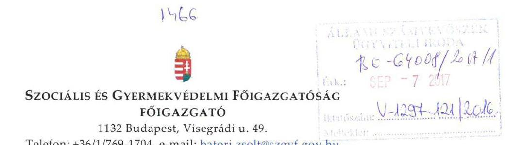

Iktatószám: SZGYF-IKT-20300-1/2017 Tárgy: Észrevétel számvevőszéki
Ügyintéző: Palló Sándor jelentéstervezethez.

# Domokos László úr 

elnök

## Állami Számvevőszék

## Budapest

Apáczai Csere János u. 10
1051

## Tisztelt Elnök Úr!

Köszönettel megkaptam a V-1297-104/2016 iktatószámú, a „Pilisi Gyermekotthon, Óvoda, Általános Iskola, Speciális Szakiskola, Készségfejlesztő Speciális Szakiskola" vonatkozásában „A központi alrendszer egyes intézményei pénzügyi és vagyongazdálkodásának ellenőrzése" című ellenőrzésről készült számvevőszéki jelentéstervezetet tartalmazó levelet.

A kézhez kapott jelentéstervezettel kapcsolatban a következőkben részletezett észrevételeket szeretném tenni, melyek elfogadása esetén kérem a jelentés tervezet korrekcióját.

1. A jelentéstervezet 2.1. számú megállapításában, a 16. oldal 5. bekezdésében szereplő megállapítás:
......„Továbbá 2014. január 1-jétől az ellenőrzött időszak végéig sem rendelkezett az intézmény a Számv. tv. 14. § (5) bekezdésében foglaltak ellenére számviteli politikával, és az annak keretében elkészítendő szabályzatokkal, mert az SZGYF föigazgatója - az Áhsz: 50. § (1) bekezdésében és az abban hivatkozott 31. § (1) bekezdésében foglaltak ellenére azokat nem készítette el."

---

# Észrevétel: 

Álláspontom szerint a fenti megállapítás alapja téves jogértelmezés.
Az Állami Számvevőszék egy korábbi vizsgálata nyomán megküldte részünkre „A központi alrendszer egyes intézményei pénzügyi és vagyongazdálkodásának ellenörzése - Borsod-Abaúj-Zemplén Megyei Szociális, Gyermekvédelmi Központ és Területi Gyermekvédelmi Szakszolgálat" címmel a készített jelentéstervezet. A jelentés tervezetben rögzített - jelen ellenőrzés során megállapítottal megegyező - probléma kapcsán a következő megállapítás található:
„A gazdasági szervezet: a számviteli politikáját és az annak keretében elkészitett szabályzatok hatályát - az Áhsz.: 8. § (13), az Áhsz: 50. § (1) bekezdésében és az abban hivatkozott 31. § (1) bekezdéseiben foglaltak ellenére - nem terjesztette ki az Intézményre, és önállóan, szabályosan kiadmányozott formában sem adta ki azokat.

A 2015. szeptember 17-től érvényes munkamegosztási megállapodás alapján a vonatkozó szabályzatok elkészitése intézményi, míg az elkészitésben való együttmüködés és a szabályzat jóváhagyása a gazdasági szervezet: feladata volt."

A megállapítás nyomán a következő javaslat került a jelentéstervezetbe:
„Intézkedjen az intézményre vonatkozó számviteli politika és annak keretében elkészitendő szabályzatok elkészitésében való együttmüködésről és az elkészült szabályzatok jóváhagyásáról a munkamegosztási megállapodásában foglaltaknak megfelelően."

Mivel álláspontom szerint az idézett megállapítás - és a kapcsolódó javaslat felel meg a jelenleg hatályos jogi szabályozásnak, kérem a jelentés tervezet ezzel megegyezőre történő javítását.
2. A Jelentéstervezet 2.5. számú megállapítás utolsó bekezdésében a következő szerepel:
„............a 2014. évben tervezett kettő, a 2015. évben tervezett egy ellenőrzésből egyet sem hajtott végre."

## Észrevétel:

Ez a megállapítás kiegészítésre szorul, mert 2014. évben 1 db ellenőrzés került lefolytatásra a szabályozottság vizsgálata tárgyában, amely áthúzódott 2015.évre.

---

A fenti észrevételt alátámasztó dokumentum mellékletben került csatolásra
A fent részletezettekre tekintettel kérem a jelentéstervezet módosítását.
Tájékoztatom, hogy továbbiakban fel kívánjuk használni jelen ellenőrzés megállapításait, valamint az ellenőrzéssel való közös munkánk tapasztalatait. A feltárt hiányosságok jelentős részét már az ellenőrzés során javítottuk, illetve pótoltuk.

Az ellenőrzés során tapasztalt segítő együttműködésüket köszönöm!

Budapest, 2017. szeptember „......"
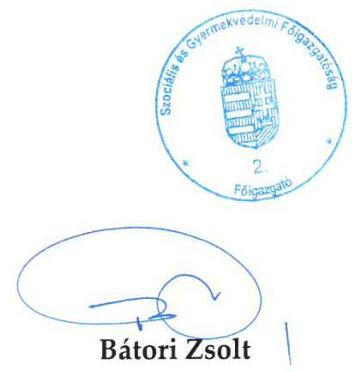

---

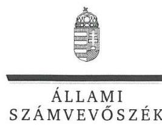

ELNÖK

Ikt.szám: V-1297-124/2016.

# Bátori Zsolt úr 

föigazgató
Szociális és Gyermekvédelmi Főigazgatóság

## Budapest

## Tisztelt Főigazgató Úr!

Köszönettel megkaptam a 2017. szeptember 6. napján az Állami Számvevőszékhez érkezett „A központi alrendszer egyes intézményei pénzügyi és vagyongazdálkodásának ellenörzése - Pilisi Gyermekotthon, Óvoda, Általános Iskola, Speciális Szakiskola, Készségfejlesztő Speciális Szakiskola" címủ számvevőszéki jelentéstervezetben foglalt megállapításokra a főigazgató úr által írásban tett, SZGYF-IKT-20300-1/2017. iktatószámú észrevételeket.

Tájékoztatom Főigazgató urat, hogy a jelentésben - az Állami Számvevőszékről szóló 2011. évi LXVI. törvény 29. § (3) bekezdése alapján - a figyelembe nem vett észrevételt szerepeltetjük az el nem fogadás indokának feltüntetésével együtt.

Az Állami Számvevőszék észrevételekre vonatkozó álláspontjáról a felügyeleti vezető által készített részletes tájékoztatást mellékelten megküldöm.

Budapest, 2017. O9 hó 21 nap
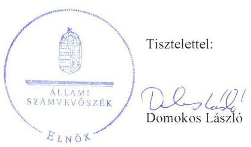

Melléklet: Tájékoztatás a figyelembe vett és figyelembe nem vett észrevételről

---

1. számú melléklet a V-1297-124/2016. ikt. számú levélhez

# Tájékoztatás a figyelembe vett és figyelembe nem vett észrevételekröl

|   | Észrevétel: | A 2.1 számú megállapítás 5. bekezdés második mondatában a számviteli politika és annak keretében elkészítendő szabályzatokhoz kapcsolódó ellenőrzési megállapítás téves jogértelmezésen alapul.  |
| --- | --- | --- |
|   |  | Az észrevétel érinti a Szociális és Gyermekvédelmi Főigazgatóság, mint a Pilisi Gyermekotthon, Óvoda, Általános Iskola, Szakiskola és Készségfejlesztő Iskola gazdasági szervezeti feladatait ellátó szerv főigazgatójának címzett 2. számú javaslatot (2.1. számú megállapítás 5. bekezdés 2. mondata alapján).  |
|   | Válasz: | Az Állami Számvevőszék az észrevételt nem fogadja el.  |
|  1. | Indoklás: | Az ellenőrzés megállapításai az ÁSZ tv. 28. § (2) bekezdése alapján az ellenőrzött szervezetek által a Pilisi Gyermekotthon, Óvoda, Általános Iskola, Szakiskola és Készségfejlesztő Iskola (továbbiakban Intézmény) ellenőrzéséhez kapcsolódóan az ellenőrzés lefolytatásához a törvényi határidőben rendelkezésre bocsátott dokumentumokon alapulnak. Az ellenőrzés részére rendelkezésre bocsátott dokumentumok ismételt felülvizsgálatát követően megállapítottuk, hogy a 2015. november 1-től hatályos SZGYF-IKT-16311/2015. iktatószámú megállapodás nem tartalmaz rendelkezést a számviteli politika elkészítésére vonatkozó felelőségi körökre. Az államháztartás számviteléről szóló 4/2013. (I. 11.) Korm. rendelet (Áhsz.) 50. § (1) bekezdése szerint „A számviteli politika elkészitéséért, módosításáért a 31. § (1) bekezdése szerinti személyek felelősek." Az Áhsz. 31. § (1) bekezdése szerint „az éves költségvetési beszámoló elkészitéséért az éves költségvetési beszámolót készitő - központi kezelésű előirányzat, fejezeti kezelésű előirányzat, társadalombiztosítás pénzügyi alapja, elkülönített állami pénzalap esetén a kezelő szerv, helyi önkormányzat, nemzetiségi önkormányzat, társulás, térségi fejlesztési tanács esetén a beszámolási feladatokat az Áht. 6/C. §-a alapján ellátó - szerv vezetője felelős." Észrevételében nem cáfolta az ellenőrzés azon megállapítását, hogy - az Áhsz. 50. § (1) bekezdésében és az abban hivatkozott 31. § (1) bekezdésében előírtak ellenére - a Szociális és Gyermekvédelmi Főigazgatóság (SZGY) főigazgatója a 20142015. években nem készített az Intézményre vonatkozó számviteli politikát és annak keretében elkészítendő szabályzatokat. A fentiek következtében az Intézmény 2014. január 1-jétől az  |

---

|  |  | ellenőrzött időszak végéig - a számvitelről szóló 2000. évi C. törvény 14. § (5) bekezdésében foglaltak ellenére - számviteli politikával és annak keretében elkészítendő szabályzatokkal nem rendelkezett.   Fentiekre tekintettel, az észrevétel nem megalapozott, a megállapítás és a Szociális és Gyermekvédelmi Föigazgatóság, mint a Pilisi Gyermekotthon, Óvoda, Általános Iskola, Szakiskola és Készségfejlesztő Iskola gazdasági szervezeti feladatait ellátó szerv föigazgatójának címzett 2. számú javaslat módosítása nem indokolt. |
| :--: | :--: | :--: |
|  | Észrevétel | A 2.5 számú megállapítás 3. bekezdése kiegészítésre szorul, mivel ,2014. évben 1 db ellenörzés került lefolytatásra a szabályozottság vizsgálata tárgyában, amely áthúzódott 2015. évre."   Az észrevétel érinti a Pilisi Gyermekotthon, Óvoda, Általános Iskola, Szakiskola és Készségfejlesztő Iskola igazgatójának címzett 11. számú javaslatot (2.5. számú megállapítás 3. bekezdése alapján). |
|  | Válasz | Az Állami Számvevőszék az észrevételt elfogadja. |
| 2. | Indoklás | Észrevételében nem cáfolta az ellenőrzés azon megállapítását, amely szerint a 2014. évben tervezett kettő és a 2015. évben tervezett egy ellenőrzésből egyet sem hajtottak végre.   Az ellenőrzés részére rendelkezésre bocsátott dokumentumok ismételt felülvizsgálatát követően megállapítottuk, hogy az ellenőrzési terv módosítása nélkül, az SZGYF Belső Ellenőrzési Főosztály a 2014. évben egy ellenőrzést végzett „A belső szabályozottság vizsgálata" címmel, amely a 2015. évre áthúzódott.   A fentiekre tekintettel a 2.5. számú megállapítás 3. bekezdését kiegészítettük a következők szerint: „Ellenörzési tervben nem szereplő egy - 2014-ben indult, 2015-re áthúzódó - ellenörzés történt."   A Pilisi Gyermekotthon, Óvoda, Általános Iskola, Szakiskola és Készségfejlesztő Iskola igazgatójának címzett 11. számú javaslat módosítása nem indokolt. |

Budapest, 2017. 06. hó 21. nap

---

Iktatószám: $423 / 2097$.
Ügyintéző: Kröpfl Mihályné
Tárgy: Számvevőszéki jelentéstervezet véleményezése

# Domokos László úr 

elnök

Állami Számvevőszék
Budapest
Apáczai Csere János u. 10
1052

## Tisztelt Elnök Úr!

A V-1297-106/2016 iktatószámú, „A központi alrendszer egyes intézményei pénzügyi és vagyongazdálkodásának ellenörzése - Pilisi Gyermekotthon, Óvoda, Általános Iskola, Speciális Szakiskola, Készségfejlesztő Speciális Szakiskola" címmel készített számvevőszéki jelentéstervezettel kapcsolatban az alábbi észrevételt teszem:

A 14. számú javaslathoz a számvevőszéki jelentéstervezet 30 -ik oldalán:
A Pilisi Gyermekotthon, Óvoda, Általános Iskola, Szakiskola és Készségfejlesztő Iskola igazgatójának szóló, 14. javaslat („Kezdeményezze az Intézmény közfeladatai ellátásához használt állami vagyon tekintetében a használat jogszerű feltételeit biztosító szerződés megkötését.") a nemzeti vagyonról szóló 2011. évi CXCVI. törvény 11. § (8) bekezdésének rendelkezése alapján az állami vagyon kezelőjének, a Szociális és Gyermekvédelmi Főigazgatóság főigazgatójának feladata. Ennek megfelelően kérem, hogy a 14. számú javaslatot „a Szociális és Gyermekvédelmi Főigazgatóság, mint középirányító szerv főigazgatójának" szóló javaslatok közé áthelyezni szíveskedjen.

A 15. számú javaslathoz a számvevőszéki jelentéstervezet 31 -ik oldalán:
A Pilisi Gyermekotthon, Óvoda, Általános Iskola, Szakiskola és Készségfejlesztő Iskola igazgatójának szóló, 15. javaslat („Intézkedjen a jogszabályban előírtaknak megfelelően a vagyonkezelői jog átruházásáról a tulajdonosi joggyakorló értesítésére.") az állami vagyonnal való

---

gazdálkodásról szóló 254/2007 (X. 4.) Korm. rendelet 11. § (2) bekezdésében foglaltak szerint az új vagyonkezelő feladata, azonban a Forrás SQL rendszer Kincstári Vagyonkataszteréhez a fenntartott Intézményeknek nincs hozzáférésük, így a változásokat az SZGYF jelenti a vagyonkataszterben. Ennek megfelelően kérem, hogy a 15. számú javaslatot „a Szociális és Gyermekvédelmi Főigazgatóság, mint középirányító szerv főigazgatójának" szóló javaslatok közé áthelyezni szíveskedjen.
A változásjelentést az SZGYF elküldte az MNV -nek, csatolom az MNV válaszlevelét.

Segítő együttműködését köszönöm!
Budapest, 2017. szeptember 5.

Tisztelettel:
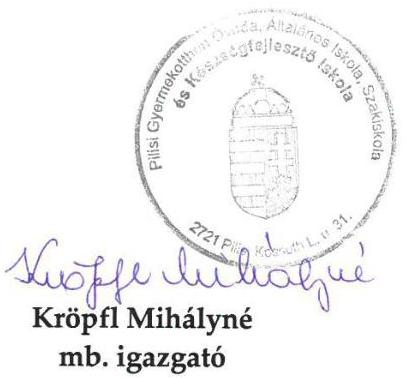

---

ELNÖK

Ikt.szám: V-1297-126/2016.

# Kröpfl Mihályné asszony 

igazgató
Pilisi Gyermekotthon, Óvoda, Általános Iskola, Szakiskola
és Készségfejlesztő Iskola

## Pilis

## Tisztelt Igazgató Asszony!

Köszönettel megkaptam a 2017. szeptember 6. napján az Állami Számvevőszékhez érkezett „ $A$ központi alrendszer egyes intézményei pénzügyi és vagyongazdálkodásának ellenőrzése - Pilisi Gyermekotthon, Óvoda, Általános Iskola, Speciális Szakiskola, Készségfejlesztő Speciális Szakiskola" című számvevőszéki jelentéstervezetben foglalt megállapításokra az Igazgató Asszony által írásban tett, 421/2017. iktatószámú észrevételeket.

Tájékoztatom Igazgató Asszonyt, hogy a jelentésben - az Állami Számvevőszékről szóló 2011. évi LXVI. törvény 29. § (3) bekezdése alapján - a figyelembe nem vett észrevételeket szerepeltetjük az el nem fogadás indokainak feltüntetésével együtt.

Az Állami Számvevőszék észrevételekre vonatkozó álláspontjáról a felügyeleti vezető által készített részletes tájékoztatást mellékelten megküldöm.

Budapest, 2017. O9 hó 26 nap
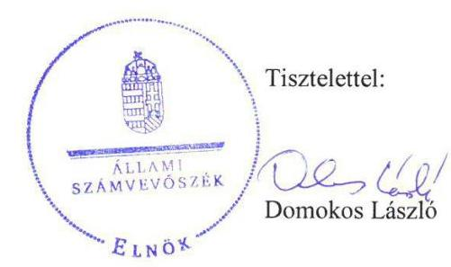

Melléklet: Tájékoztatás a figyelembe nem vett észrevételekről

---

# Tájékoztatás a figyelembe nem vett észrevételekről

|  Észrevétel: | A Pilisi Gyermekotthon, Óvoda, Általános Iskola, Szakiskola és Készségfejlesztő Iskola igazgatójának címzett 14. számú javaslat az állami vagyon kezelőjének, a Szociális és Gyermekvédelmi Főigazgatóság (SZGYF) főigazgatójának feladata.  |
| --- | --- |
|   | Az észrevétel érinti a Pilisi Gyermekotthon, Óvoda, Általános Iskola, Szakiskola és Készségfejlesztő Iskola (Intézmény) igazgatójának címzett 14. számú javaslatot (4.1. számú megállapítás 1. bekezdés 3. mondata és 2. bekezdés 2. mondata alapján).  |
|  Válasz: | Az Állami Számvevőszék az észrevételt nem fogadja el.  |
|  Indoklás: | Észrevételében nem cáfolta az ellenőrzés azon megállapítását, hogy az Intézmény a 2013-2015. években a közfeladata ellátásához használt ingatlan vagyon tekintetében nem rendelkezett - a Vtv. 25. § (4) bekezdése szerinti - szerződéssel, ezért nem minősült az állami vagyon jogszerű használójának.  |
|   | Az Intézmény Igazgatójának tett 14. számú javaslat arra irányult, hogy kezdeményezze az Intézmény közfeladatai ellátásához használt állami vagyon tekintetében a használat jogszerű feltételeit biztosító szerződés megkötését. A nemzeti köznevelésről szóló 2011. évi CXC. törvény (Nkt.) 22. § (1) bekezdés előírása szerint a köznevelési intézménynek rendelkeznie kell a feladat ellátásához szükséges feltételekkel. Az Intézmény által használt ingatlanok használata jogcímének rendezése, a - Vtv. 25. § (4) bekezdése szerinti - használati szerződés megkötésének kezdeményezése az Intézmény oldaláról rendezheti az Nkt. 22. § (1) bekezdésében előírt feltételeket, továbbá az állami vagyon jogszerű használatát.  |
|   | Tájékoztatom - mivel az ingatlanok hasznosítására vonatkozó szerződés megkötése két fél egybehangzó akaratán múlik -, hogy a jogszerű használat feltételeinek megteremtése érdekében javaslatot fogalmaztunk meg az SZGYF főigazgatójának is (Szociális és Gyermekvédelmi Főigazgatóság, mint középirányító szerv főigazgatójának címzett 1. számú javaslat).  |
|   | Fentiekre tekintettel, az észrevétel nem megalapozott, 14. számú javaslat címzettjének módosítása nem indokolt.  |

---

|  | Észrevétel | „A Forrás SQL rendszer Kincstári Vagyonkataszteréhez az fenntartott Intézménynek nincs hozzáférésük, igy a változásokat az SZGYF jelenti a vagyonkataszterben.", ezért a Pilisi Gyermekotthon, Óvoda, Általános Iskola, Szakiskola és Készségfejlesztő Iskola igazgatójának szóló. 15. számú javaslatot Szociális és Gyermekvédelmi Föigazgatóság föigazgatójának címzett javaslatok közé kérte áthelyezni.   Az észrevétel érinti a Pilisi Gyermekotthon, Óvoda, Általános Iskola, Szakiskola és Készségfejlesztő Iskola (Intézmény) igazgatójának címzett 15. számú javaslatot (4.1. számú megállapítás 3. bekezdés 4. mondata alapján). |
| :--: | :--: | :--: |
|  | Válasz | Az Állami Számvevőszék az észrevételt nem fogadja el. |
| 2. | Indoklás | Az ellenőrzés megállapította, hogy az „Intézménybe integrálódott 2015. szeptember 1-jétől a gyömröl és a ceglédi lakásotthon és igy annak szervezeti egységeként müködött." Észrevételeben nem cáfolta az ellenőrzés azon megállapítását, amely szerint az ingóságokat - a Klebersberg Intézményfenntartó Központ (KLIK) és az Intézmény részéről 2015. augusztus 12 -én aláirt, EMMI, mint irányítószerv által jóváhagyott vagyonkezelői jog átruházásáról szóló szerződéssel - a KLIK a nemzeti vagyonról szóló 2011. évi CXCVI. törvény (Nvtv.) 11. § (9) bekezdése alapján az Intézmény vagyonkezelésébe adta.   Az állami vagyonnal való gazdálkodásról szóló 254/2007. (X. 4.) Korm. rendelet (Vtvr.) 11. § (2) bekezdése szerint az „Nvtv. 11. § (9) bekezdése szerinti esetben az átruházással a tulajdonosi joggyakorlóval kötött vagyonkezelési szerzödésben az új vagyonkezelö a régi vagyonkezelö helyébe lép. Az új vagyonkezelö a jogutódlásról annak hatálybalépésétől számított tizenöt napon belül írásban értesíti a tulajdonosi joggyakorlói." A hivatkozott jogszabályi rendelkezés nem tartalmaz olyan elöirást, amely szerint a jogutódlást a Kincstári Vagyonkataszteren keresztül kell megtenni.   Az észrevételhez csatolt dokumentumot az észrevétel kezelése során nem vettük figyelembe, mivel az ellenőrzés megállapításai az ÁSZ tv. 28. § (2) bekezdése alapján az ellenőrzött szervezetek által az ellenőrzéséhez kapcsolódóan, az ellenőrzési időszakra 2012. január 1-jétől 2015. december 31-ig - vonatkozó, az ellenőrzés lefolytatásához a törvényi határidőben rendelkezésre bocsátott dokumentumokon alapulnak.   Fentiekre tekintettel, az észrevétel nem megalapozott, 15. számú javaslat címzettjének módosítása nem indokolt. |

Budapest, 2017. 09 hó 26 nap
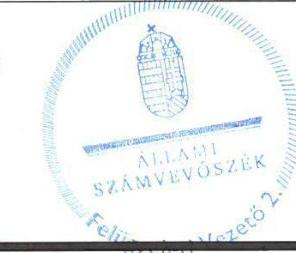

Salamon Ildikó
felügyeleti vezető

---

# 11.63 

## BUDAPEST

## 

Ikt.sz: 70/197-8/2017.
Tárgy: V-1297-105/2017. vizsgálati
jelentés megállapításainak
észrevételezése

Állami Számvevőszék
Domokos László Elnök Úr részére

## Tisztelt Elnök Úr!

Fenti számon érkezett, „A központi alrendszer egyes intézményei pénzügyi és vagyongazdálkodásának ellenőrzése - Pilisi Gyermekotthon, Óvoda, Általános Iskola, Speciális Szakiskola, Készségfejlesztő Speciális Szakiskola" címmel készített jelentéstervezetét köszönettel megkaptam.

Megköszönve munkájukat a következőkre hívom fel figyelmét:
1.) A jelentéstervezet „Főbb megállapítások, következtetések" között megállapítja, hogy 20122015. években az Intézmény

- vagyonhasználati szerződés hiányában közfeladata ellátásához használt ingatlan vagyon tekintetében nem minősült az állami/önkormányzati vagyon jogszerű használójának;
- vagyonkezelésébe nem tartozó ingatlanok szerepeltek az éves költségvetési beszámolók mérlegében, amely miatt a 2012-2015. évi költségvetési beszámolók nem mutattak az intézmény vagyoni helyzetéről megbízható és valós képet.

Tájékoztatom, hogy a Fővárosi Önkormányzat intézményeit érintő vagyonkezelési szerződés megkötése tekintetében - a főváros megkeresésére (1.sz. melléklet) - a Nemzetgazdasági Minisztérium Államháztartási Szabályozási Főosztálya 2014. évben az alábbi (kötelező erővel nem rendelkező) szakmai véleményt adta (2.sz. melléklet):
„Magyarország helyi önkormányzatairól szóló 2011. évi CLXXXIX. törvény 109. § (3) bekezdése alapján úgy tűnik, hogy az önkormányzat saját intézményével nem köthet vagyonkezelési szerződést."

Előzőekre figyelemmel - bár kétségtelen, hogy az Intézmény vagyonkezelési szerződéssel nem rendelkezett, azonban - a 22/2012 (III.14.) Főv. Kgy. rendelet (továbbiakban: vagyonrendelet) 3. § 55. pontja az önkormányzati költségvetési szerveket vagyonkezelő kategóriába sorolta. Rögzítette, hogy - függetlenül a vagyonkezelési, vagyongazdálkodási szerződés meglétére - a vagyonrendelet 53. §-a szerint az intézmények használatába adott vagyon működtetésére a vagyonkezelésre, valamint a vagyongazdálkodásra vonatkozó, a vagyonrendelet 54. §-ában foglaltakat kell alkalmazni, amely utóbbi rendelkezés szabályozza az intézmények rendelkezési jogát az önkormányzati vagyonnal.

---

Előzőekre tekintettel úgy ítéljük meg, hogy konkrét intézményi vagyonhasználati szerződés hiányában is a közfeladata ellátásához használt ingatlan vagyon tekintetében az önkormányzati vagyon jogszerü használójának minősül. (3.sz. melléklet)

Megjegyzendő, hogy a Nemzetgazdasági Minisztérium Államháztartási Szabályozási Főosztálya megfelelőnek tartotta a vagyonrendelettel történő szabályozás megoldását, és az intézmények használatában lévő vagyon, mint az államháztartáson belül vagyonkezelésbe adott eszköz nyilvántartását az önkormányzatnál.
2.) A jelentéstervezet 2.1. számú megállapítása szerint az Intézmény 2012. január 1-jétől gazdasági szervezettel rendelkezett, azonban gazdasági szervezete az államháztartásról szóló törvény végrehajtásáról szóló 368/2011. (XII. 31.) számú Korm. rendelet (a továbbiakban: Ávr.) 9. § (5) bekezdése ellenére ügyrenddel nem rendelkezett.

Elfogadva azt, hogy az Ávr. 10/A. §-a szerint a gazdasági szervezetnek a 13. § (5) bekezdése szerinti ügyrenddel kell rendelkeznie, amelynek tartalmaznia kell a költségvetési szerv szervezeti egységei által ellátott feladatok munkafolyamatainak leírását, a szervezeti egység vezetőinek és alkalmazottainak feladat- és hatáskörét, a helyettesítés rendjét, továbbá a szervezeti egység költségvetési szerven belüli belső és azon kívüli külső kapcsolattartásának módját, szabályait, jeleznem szükséges, hogy a hivatkozott jogszabályok úgy rendelkeznek, hogy ,,ha azokról a szervezeti és müködési szabályzat vagy a költségvetési szerv más szabályzata nem rendelkezik".
2012. évben az Intézmény Szervezeti és Müködési Szabályzatának III. fejezete (Gazdasági szervezetünkre vonatkozó rendelkezések) fentiekre vonatkozóan tartalmaz rendelkezést, ezért T. Számvevőszék 2.1. számú megállapítása felülvizsgálatát kérjük.

Kérem előzőek figyelembevételével a végleges jelentésük kibocsátását.
További intézkedését tisztelettel megköszönöm.

Budapest, 2017. szeptember „ $C$ „,
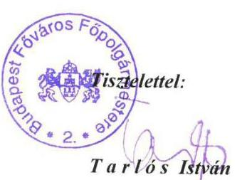

---

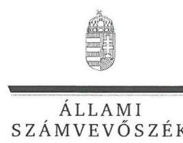

ELNÖK

# Tarlós István úr 

fópolgármester
Budapest Főváros Önkormányzata

## Budapest

## Tisztelt Főpolgármester Úr!

Köszönettel megkaptam a 2017. szeptember 7. napján az Állami Számvevőszékhez érkezett „A központi alrendszer egyes intézményei pénzügyi és vagyongazdálkodásának ellenörzése - Pilisi Gyermekotthon, Óvoda, Általános Iskola, Speciális Szakiskola, Készségfejlesztő Speciális Szakiskola" címủ számvevőszéki jelentéstervezetben foglalt megállapításokra a főpolgármester úr által írásban tett, 70/197-8/2017. iktatószámú észrevételeket.

Tájékoztatom Főpolgármester urat, hogy a jelentésben - az Állami Számvevőszékről szóló 2011. évi LXVI. törvény 29. § (3) bekezdése alapján - a figyelembe nem vett észrevételeket szerepeltetjük az el nem fogadás indokainak feltüntetésével együtt.

Az Állami Számvevőszék észrevételekre vonatkozó álláspontjáról a felügyeleti vezető által készített részletes tájékoztatást mellékelten megküldöm.

Budapest, 2017. O 9 hó 15 nap
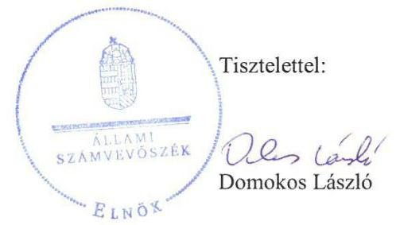

Melléklet: Tájékoztatás a figyelembe nem vett észrevételekről

---

# Tájékoztatás   a figyelembe nem vett észrevételekról 

|  | Észrevétel: | A „Föbb megállapítások, következtetések" 3. bekezdés 3-4. mondatához kapcsolódóan az észrevétel szerint „konkrét intézményi vagyonhasználati szerzödés hiányában is a közfeladata ellátásához használt ingatlan vagyon tekintetében az önkormányzati vagyon jogszerü használójának minösül." |
| :--: | :--: | :--: |
|  | Válasz: | Az Állami Számvevőszék az észrevételt nem fogadja el. |
| 1. | Indoklás: | Az észrevételben foglaltakkal ellentétben, a „Föbb megállapítások, következtetések" az önkormányzati vagyonra vonatkozóan nem tartalmaz megállapítást, a 3. bekezdés 3. mondata szerint „A 2012-2015. években az Intézmény vagyonhasználati szerződés hiányában közfeladata ellátásához használt ingatlan vagyon tekintetében nem minösült az állami vagyon jogszerü használójának. "   Az ellenőrzési megállapítás - a „Föbb megállapítások, következtetések" fejezet 3. bekezdés 3. mondatát alátámasztó 4.1. számú megállapítás 1. bekezdésében részletezettek szerint - arra irányult, hogy az Intézmény által használt, a Magyar Állam tulajdonában és a Forster Központ kezelésében lévő Pilisi kastély vonatkozásában a Pilisi Gyermekotthon, Óvoda, Általános Iskola, Speciális Szakiskola, Készségfejlesztő Speciális Szakiskola (továbbiakban Intézmény) a Vtv. 25. § (4) bekezdésében foglaltak ellenére nem rendelkezett használati szerződéssel.   Észrevételében nem cáfolta az ellenőrzés azon megállapítását, hogy az Intézmény 2012-ben nem rendelkezett a közfeladat ellátásához használt állami ingatlanvagyon - Pilisi kastély - tekintetében vagyonhasználati szerződéssel, továbbá az Intézmény a 2012. évi mérlegében vagyonkezelésébe nem tartozó állami ingatlanvagyont mutatott ki.   Az észrevételhez csatolt dokumentumokat az észrevétel kezelése során nem vettük figyelembe, mivel az ellenőrzés megállapításai az ÁSZ tv. 28. § (2) bekezdése alapján az ellenőrzött szervezetek által az ellenőrzéshez kapcsolódóan az ellenőrzött - a Fővárosi Önkormányzat esetében 2012. január 1. 2012. december 31. közötti - időszakra vonatkozó, az ellenőrzés lefolytatásához a törvényi határidőben rendelkezésre bocsátott dokumentumokon alapulnak.   Fentiekre tekintettel, az észrevétel nem megalapozott, a „Föbb megállapítások, következtetések" fejezetben foglaltak módosítása nem indokolt. |

---

|  |  | A 2.1. számú megállapítás 2. bekezdése szerint az Intézmény 2012. január 1-jétől 2013. június 30-ig gazdasági szervezettel rendelkezett. A gazdasági szervezet az államháztartási törvény végrehajtásáról szóló 358/2011. (XII. 31.) Korm. rendelet (Ávr.) 9. § (5) bekezdése ellenére ügyrenddel nem rendelkezett. A megállapításhoz kapcsolódó észrevétel szerint „2012. évben az Intézmény Szervezeti és Müködési Szabályzatának III. fejezete (Gazdasági szervezetünkre vonatkozó rendelkezések) fentiekre vonatkozóan tartalmaz rendelkezést". |
| :--: | :--: | :--: |
|  | Válasz | Az Állami Számvevőszék az észrevételt nem fogadja el |
| 2. | Indoklás | Az ellenőrzés megállapításai az ellenőrzött időszakban hatályos jogszabályi előírások figyelembevételével, az ellenőrzés lefolytatásához a törvényi határidőben rendelkezésre bocsátott dokumentumokon alapulnak.   Az észrevételében hivatkozott Ávr. 10/A. § 2015. február 18-tól hatályos, így a 2012. január 1-jétől 2013. június 30. közötti időszakra vonatkozó ellenőrzési megállapítás vonatkozásában az akkor hatályban volt, az Ávr. 9. § (5) bekezdése előírásait vettük figyelembe. Az Ávr. hivatkozott időszakban hatályos 9. § (5) bekezdése szerint „A gazdasági szervezetnek a 13. § (5) bekezdése szerinti ügyrenddel kell rendelkeznie." A 13. § (5) bekezdése szerint „A költségvetési szerv szervezeti egységei által ellátott feladatok munkafolyamatainak leírását, a szervezeti egység vezetöinek és alkalmazottainak feladat- és hatáskörét, a helyettesités rendjét, továbbá a szervezeti egység költségvetési szerven belüli belsö és azon kivüli külső kapcsolattartásának módját, szabályait - ha azokról a szervezeti és müködési szabályzat vagy a költségvetési szerv más szabályzata nem rendelkezik - a szervezeti egységek ügyrendje tartalmazza."   Az ellenőrzés részére rendelkezésre bocsátott dokumentumok ismételt felülvizsgálatát követően megállapítottuk, hogy a 2011. december 8 -ától hatályos, 3190/2011. (X. 21.) Főv. Kgy. számú határozattal jóváhagyott intézményi Szervezeti és Müködési Szabályzat (továbbiakban SZMSZ) - észrevételben hivatkozott - III. fejezete és egyéb pontjai sem tartalmazták az Ávr. 13. § (5) bekezdésében előírt valamennyi tartalmi elemet. Így az SZMSZ nem tartalmazta a gazdasági szervezet által ellátott feladatok munkafolyamatainak leírását, a gazdaság szervezet vezetőinek és alkalmazottainak helyettesítési rendjét, a gazdasági szervezet alkalmazottainak hatáskörét, a gazdasági szervezet költségvetési szervben belüli belső és azon kívüli kapcsolattartásának szabályait. Tekintettel arra, hogy ezeket a szabályozási területeket az Intézmény - ellenőrzés rendelkezésére bocsátott - más szabályzata sem tartalmazta, azokat a gazdasági szervezet ügyrendjében kellett volna szabályozni.   Észrevételében nem cáfolta az ellenőrzés azon megállapítását, hogy Intézmény gazdasági szervezete 2012-ben nem rendelkezett ügyrenddel. |

---

|  | Előzőekben foglaltakra tekintettel az észrevétel nem megalapozott, a   2.1. megállapítás 2. bekezdés 1-2. mondatának módosítása nem   indokolt. |
| :-- | :-- |

Budapest, 2017. 05 hó 15 nap

---

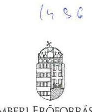

EMBERI ERÖFORRÁSOK
MINISZTÉRILIMA
SZOCIÁLIS ÜGYEKÉRT ÉS TÁRSADALMI FELZÁRKÖZÁSÉRT FELELŐS ÁLLAMTITKÁR

Iktatószám: 10172- 11/ 2017/SZOCSTRAT

Domokos László részére
elnök

Állami Számvevőszék
Budapest
Apáczai Csere János utca 10.
1052

Hiv. szám: V-1335-103/2016
Úgyintéző: Aradi Zsuzsanna
Tel. szám: +36 (1) 896-3101
Melléklet: -

ÁLLAMISZÁMVEVŐSZÉK
BE-64655/2017/1
Érkezz: 2017 SZPI 11
Iktatószám: V-1391-130/2016
Melléklet:

Tárgy: „Pilisi Gyermekotthon, Óvoda, Általános Iskola, Speciális Szakiskola, Készségfejlesztő Speciális Szakiskola" intézménynél az Állami Számvevőszék által lezajlott ellenőrzés jelentéstervezetének észrevételezése

# Tisztelt Elnök Úr! 

„A központi alrendszer egyes intézményei pénzügyi és vagyongazdálkodásának ellenőrzése Pilisi Gyermekotthon, Óvoda, Általános Iskola, Speciális Szakiskola, Készségfejlesztő Speciális Szakiskola" című ellenőrzés keretében készült jelentéstervezetet köszönettel megkaptam.

Az Emberi Erőforrások Minisztériumát (a továbbiakban: EMMI) érintő megállapításaival kapcsolatban észrevételt nem teszek.

Tájékoztatom Elnök Urat, hogy az EMMI Szervezeti és Müködési Szabályzatáról szóló 33/2014. (IX.16) EMMI utasítás 146. § (1) bekezdés b) pontja alapján az emberi erőforrások minisztere által átruházott hatáskörben gyakorlom a kiadományozási jogot.

Budapest, 2017. szeptember „ $\mathcal{S}^{\text {" }}$ "
Üdvözlettel:
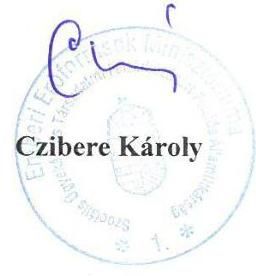

Cím: 1054 Budapest, Báthory utca 10. Tel: +36 17951200
E-mail: info@emmi.gov.hu

---

.

---

# RÖVIDÍTÉSEK JEGYZÉKE 

${ }^{1}$ Intézmény
${ }^{2}$ Gyvt.
${ }^{3}$ Önkormányzat
${ }^{4}$ 2012. évi CXCII. törvény
${ }^{5}$ EMMI
${ }^{6}$ 316/2012. (XI. 13.) Korm. rendelet
${ }^{7}$ SZGYF
${ }^{8}$ 349/2012. (XII. 12.) Korm. rendelet
${ }^{9}$ Vtv.
${ }^{10}$ MNV Zrt.
${ }^{11}$ igazgató
${ }^{12}$ ÁSZ
${ }^{13}$ Áht.
${ }^{14}$ Bkr.
${ }^{15}$ ÁSZ tv.
${ }^{16}$ Alapító okirat ${ }_{1}$

Alapító okirat ${ }_{2}$
${ }^{17}$ Alapító okirat ${ }_{3}$

Alapító okirat ${ }_{4}$

Alapító okirat ${ }_{5}$

Alapító okirat ${ }_{6}$
${ }^{18}$ Ávr.
${ }^{19}$ SZMSZ ${ }_{1}$
${ }^{20}$ SZGYF-PMK

Pilisi Gyermekotthon, Óvoda, Általános Iskola, Speciális Szakiskola, Készségfejlesztő Speciális Szakiskola
1997. évi XXXI. törvény a gyermekek védelméről és a gyámügyi igazgatásról (hatályos: 1997. november 1-től)
Budapest Főváros Önkormányzata
egyes szakosított és gyermekvédelmi szakellátási intézmények állami átvételéről és egyes törvények módosításáról szóló 2012. évi CXCII. törvény (hatályos: 2012. december 8 -tól)
Emberi Erőforrások Minisztériuma
a Szociális és Gyermekvédelmi Főigazgatóságról szóló 316/2012. (XI. 13.) Korm. rendelet (hatályos: 2012. november 16-tól)
Szociális és Gyermekvédelmi Főigazgatóság
az egyes szakosított szociális és gyermekvédelmi szakellátási intézmények állami átvételének részletes szabályairól és egyes kormányrendeletek módosításáról szóló 349/2012. (XII. 12.) Kormányrendelet (hatályos: 2012. december 13-tól) az állami vagyonról szóló 2007. évi CVI. törvény (hatályos: 2007.szeptember 25 -től)
Magyar Nemzeti Vagyonkezelő Zrt.
A Pilisi Gyermekotthon, Óvoda, Általános Iskola, Speciális Szakiskola igazgatója Állami Számvevőszék
2011. évi CXCV. törvény az államháztartásról.

370/2011. (XII. 31.) Korm. rendelet a költségvetési szervek belső
kontrollrendszeréről és belső ellenőrzéséről (hatályos 2012. január 1-jétől).
az Állami Számvevőszékről szóló 2011. évi LXVI. törvény (hatályos: 2011. július 1-jétől)
Budapest Főváros Közgyűlése által 1909/2011.(VI.22.) Főv.Kgy. határozattal kiadott alapító okirat (hatályos: 2011. szeptember 12-től 2012. december 29-ig)
Budapest Főváros Közgyűlése által 2526/2012.(XI.28.) Főv.Kgy. határozattal kiadott alapító okirat (hatályos: 2012. december 30-tól 2012. december 31-ig)
Emberi erőforrások miniszter által 2013. május 30-án kelt, 26718-37/2013. okiratszámú alapító okirat (hatályos: 2013. január 1-jétől 2013. június 30-ig)
Emberi erőforrások miniszter által 2013. november 13-án kelt, 48944-31/2013. okiratszámú alapító okirat (hatályos: 2013. július 01-jétől 2013. december 31-ig.
Emberi erőforrások miniszter által 2014. február 27-én kelt, 12376-111/2014/JSZOC. okiratszámú alapító okirat kiegészítés (hatályos: 2014. január 1-jétől 2015. augusztus 31-ig)
Emberi erőforrások miniszter által 2015. augusztus 26-án kelt, 39341-41/2015/JISZOC. okiratszámú alapító okirat (hatályos: 2015. szeptember 1-jétől az ellenőrzött időszak végén hatályban volt)
368/2011. (XII. 31.) Korm. rendelet az államháztartásról szóló törvény végrehajtásáról (hatályos 2012. január 1-jétől)
Pilisi Gyermekotthon, Óvoda, Általános Iskola, Speciális Szakiskola, Készségfejlesztő Speciális Szakiskola Szervezeti és Működési Szabályzata (hatályos: 2011. december 8-tól 2014. február 26-ig)

Szociális és Gyermekvédelmi Főigazgatóság Pest Megyei Kirendeltsége

---

${ }^{21}$ SZMSZ2
${ }^{22}$ Áhsz. 1
${ }^{23}$ számviteli politika
${ }^{24}$ leltárkészittési és leltározási szabályzat
${ }^{25}$ értékelési szabályzat
${ }^{26}$ pénzkezelési szabályzat
${ }^{27}$ önköltségszámítási szabályzat
${ }^{28}$ Számv. tv.
${ }^{29}$ számlarend
${ }^{30}$ bizonylati rend
${ }^{31}$ munkamegosztási megállapodás
${ }^{32}$ SZGYF számviteli politika
${ }^{33}$ Áhsz. 2
${ }^{34} \mathrm{Kjt}$.
${ }^{35}$ közalkalmazotti szabályzat ${ }_{1}$
közalkalmazotti szabályzat ${ }_{2}$
${ }^{36}$ etikai kódex
${ }^{37}$ FICE
${ }^{38}$ FICE Etikai kódex
${ }^{39}$ beszerzési szabályzat ${ }_{1}$
beszerzési szabályzat ${ }_{2}$
${ }^{40}$ szabálytalanságok kezelésének eljárásrendje
${ }^{41}$ ellenőrzési nyomvonal ${ }_{1}$

Pilisi Gyermekotthon, Óvoda, Általános Iskola, Speciális Szakiskola, Készségfejlesztő Speciális Szakiskola Szervezeti és Müködési Szabályzata (hatályos: 2014. február 27-től, az ellenőrzött időszak végéig hatályban volt.)

249/2000. (XII. 24.) Korm. rendelet az államháztartás szervezetei beszámolási és könyvvezetési kötelezettségének sajátosságairól (hatályos: 2013. december 31-ig)
Az Óvoda, Általános Iskola és Gyermekotthon Számviteli Politika (hatályos: 2010. január 1-jétől)
Az Óvoda, Általános Iskola és Gyermekotthon leltárkészítési és leltározási szabályzata (hatályos: 2010. január 1-jétől)
Az Óvoda, Általános Iskola és Gyermekotthon eszközök és források értékelési szabályzata (hatályos: 2010. január 1-jétől)
Az Óvoda, Általános Iskola és Gyermekotthon pénzkezelési szabályzata (hatályos: 2010. január 1-jétől)

Az Óvoda, Általános Iskola és Gyermekotthon önköltségszámítási szabályzata (hatályos: 2010. január 1-jétől)
2000. évi C. törvény a számvitelről (hatályos 2001. január 1-jétől)

Az Óvoda, Általános Iskola és Gyermekotthon Számlarend (hatályos 2010. január 1-jétől)
Az Óvoda, Általános Iskola és Gyermekotthon Bizonylati rendje (hatályos: 2010. január 1-jétől)
Szociális és Gyermekvédelmi Főigazgatóság és a Pilisi Gyermekotthon, Óvoda, Általános Iskola, Speciális Szakiskola, Készségfejlesztő Speciális Szakiskola által kötött megállapodás a gazdálkodást érintő feladatmegosztásról (hatályos: 2015. november 1-jétől)
A Szociális és Gyermekvédelmi Főigazgatóság 11/2013. (II. 26.) SZGYF utasítása A Szociális es Gyermekvédelmi Főigazgatóság Számviteli Politikájáról (hatályos: 2013. február 27-től)

4/2013. (I. 11.) Korm. rendelet az államháztartás számviteléről (hatályos: 2014. január 1-jétől)
1992. évi XXXIII. törvény a közalkalmazottak jogállásáról

Óvoda, Általános Iskola és Gyermekotthon Közalkalmazotti Szabályzat (hatályos: 2008. május 15-től 2013. december 31-ig)

Pilisi Gyermekotthon, Óvoda, Általános Iskola és Előkészítő Szakiskola Közalkalmazotti szabályzat (hatályos: 2014. január 1-jétől

Óvoda, Általános Iskola és Gyermekotthon etikai kódex (hatályos: 2012. szeptember 3-tól)
Nevelő Otthonok Nemzetközi Szövetsége
FICE Magyarországi Egyesületének Etikai Kódexe
Óvoda, Általános Iskola és Gyermekotthon Beszerzések lebonyolításának szabályzata (hatályos: 2010. január 1-jétől-2015. március 30-ig)
Pilisi Gyermekotthon, Óvoda, Általános Iskola és Előkészítő Szakiskola Igazgatói utasítása az Intézmény Beszerzési szabályzatáról (hatályos: 2015. április 1-jétől)

Óvoda, Általános Iskola és Gyermekotthon szabálytalanságok kezelésének eljárási rendje (hatályos: 2010. január 1-jétől)
Az Óvoda, Általános Iskola és Gyermekotthon ellenőrzési nyomvonala (hatályos: 2010. szeptember 20-tól 2013. szeptember 9-ig)

---

ellenőrzési nyomvonal ${ }_{2}$
42 kockázatkezelési szabályzat
${ }^{43}$ kötelezettségvállalási szabályzat
${ }^{44}$ Info tv.
${ }^{45} \mathrm{Ikr}$.
${ }^{46}$ informatikai biztonsági szabályzat
${ }^{47}$ Ltv.
${ }^{48}$ belső ellenőrzési megállapodás
${ }^{49}$ belső ellenőrzési kézikönyv:
${ }^{50}$ SZGYF belső ellenőrzési kézikönyv:
${ }^{51}$ SZGYF belső ellenőrzési kézikönyv:
${ }^{52}$ OGY
${ }^{53}$ KLIK
${ }^{54}$ Forster központ
${ }^{55}$ vagyonkezelői jog átruházásáról szóló szerződés
${ }^{56}$ Nvtv.
${ }^{57}$ Vtvr.
${ }^{58}$ Btk.
59 36/2013. (IX. 13.) NGM rendelet
${ }^{60}$ vagyongazdálkodási rendelet:
vagyongazdálkodási rendelet ${ }_{2}$

Ellenőrzési nyomvonal Pilisi Gyermekotthon, Óvoda, Általános Iskola és Előkészítő Szakiskola (hatályos: 2013. szeptember 10-től)
Óvoda, Általános Iskola és Gyermekotthon Kockázatkezelési szabályzat (hatályos: 2010. január 1-jétől)

Óvoda, Általános Iskola és Gyermekotthon Kötelezettségvállalás, utalványozás, ellenjegyzés, érvényesítés rendjének szabályzata (hatályos: 2010. január 1-jétől)
2011. évi CXII. törvény az információs önrendelkezési jogról és az információ szabadságról (hatályos: 2012. január 1-jétől)
335/2005. (XII. 29.) Korm. rendelet a közfeladatot ellátó szervek iratkezelésének általános követelményeiről
Óvoda, Általános Iskola és Gyermekotthon Informatikai Biztonsági Szabályzata (hatályos: 2010. január 1-jétől)
1995. évi LXVI. törvény a közokiratokról, a közlevéltárakról és a magánlevéltári anyag védelméről
Pilisi Gyermekotthon, Óvoda, Általános Iskola és Előkészítő Szakiskola és az SZGYF közötti megállapodás a belső ellenőrzési feladatok ellátására (hatályos: 2013. július 1-jétől)

Óvoda, Általános Iskola és Gyermekotthon Belső Ellenőrzési Kézikönyv 2010 SZGYF Főigazgatójának 21/2013. (VII. 8.) SZGYF Utasítása a Belső Ellenőrzési Kézikönyv Kiadásáról (hatályos: 2013. július 9-től)
SZGYF Főigazgatójának 5/2014. (XII. 13.) sz. Utasítása a SZGYF Belső Ellenőrzési Kézikönyv Kiadásáról (hatályos: 2014. december 14-től)
Országgyűlés
Klebelsberg Intézményfenntartó Központ
(2017. január 1-jétől Klebelsberg Központ)
2012. január 1-jétől 2014. augusztus 5-ig Forster Gyula Nemzeti Örökséggazdálkodási és Szolgáltatási Központ, majd 2014. augusztus 6-tól 2015. december 31-ig Forster Gyula Nemzeti Örökségvédelmi és Vagyongazdálkodási Központ

A Klebersberg Intézményfenntartó Központ és a Pilisi Gyermekotthon, Óvoda, Általános Iskola és Előkészítő szakiskola részéről 2015. augusztus 12-én aláírt szerződés ingóságok vagyonkezelői jogának átruházásáról
2011. évi CXCVI. törvény a nemzeti vagyonról

254/2007. (X. 4.) Korm. rendelet az állami vagyonnal való gazdálkodásról
2012. évi C. törvény a Büntető Törvénykönyvről (hatályos: 2013. július 1-jétől) 36/2013. (IX. 13.) NGM rendelet az államháztartás számvitelének 2014. évi megváltozásával kapcsolatos feladatokról
75/2007. (XII. 28.) Főv. Kgy. rendelet a Fővárosi Önkormányzat vagyonáról, a vagyontárgyak feletti tulajdonosi jogok gyakorlásáról (hatályos: 2012. március 14 -ig.)
22/2012. (III. 14.) Főv. Kgy. rendelet Budapest Főváros Önkormányzata vagyonáról, a vagyontárgyak feletti tulajdonosi jogok gyakorlásáról (hatályos: 2012. március 15 -től.)

---

# ÁLLAMI SZÁMVEVŐSZÉK 

1052 Budapest, Apáczai Csere János utca 10.
Levélcím: 1364 Budapest 4. Pf. 54
Telefon: +36 14849100 Telefax: +36 14849200
www.asz.hu