# Jelentés 

## Állami tulajdonú gazdasági társaságok

Az állami tulajdonban (résztulajdonban) lévő gazdálkodó szervezetek vagyonmegőrzési és gazdálkodási tevékenységének ellenőrzése Országos Fordító és Fordításhitelesítő Iroda Zrt. 2017.

---

# Jelentés 

## Állami tulajdonú gazdasági társaságok

Az állami tulajdonban (résztulajdonban) lévő gazdálkodó szervezetek vagyonmegőrzési és gazdálkodási tevékenységének ellenőrzése Országos Fordító és Fordításhitelesítő Iroda Zrt.
2017. 10. 24.
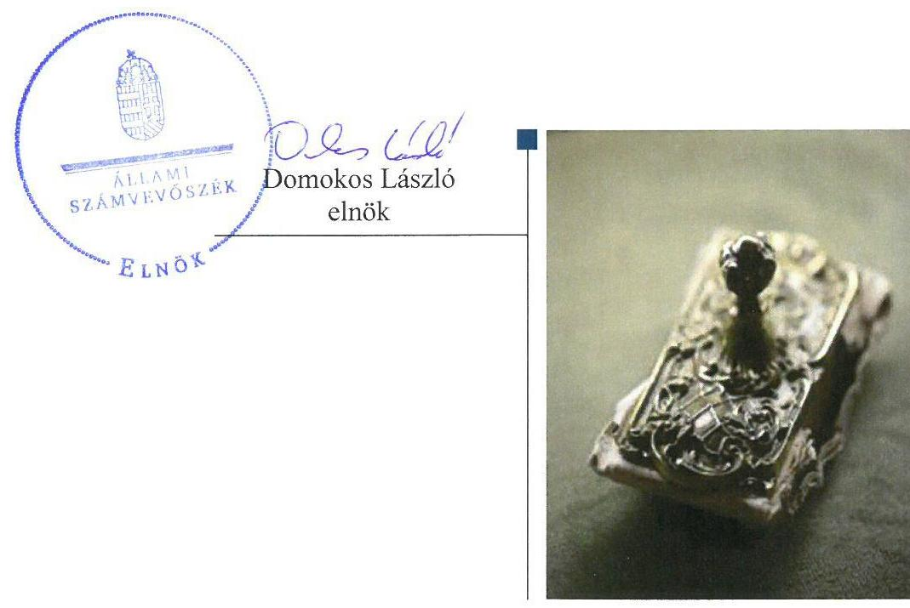

---

# AZ ELLENŐRZÉST FELÜGYELTE:

DR. NAGY IMRE felügyeleti vezető

# AZ ELLENŐRZÉST VEZETTE ÉS A VÉGREHAJTÁSÁÉRT FELELŐS:

GELENCSÉR ZSOLT ellenőrzésvezető

# A PROGRAM ÖSSZEÁLLÍTÁSÁÉRT FELELŐS:

JANIK JÓZSEF LÁSZLÓ osztályvezető

---

**IKTATÓSZÁM:** V-1372-121/2016.

**TÉMASZÁM:** 2406

**ELLENŐRZÉS-AZONOSÍTÓ SZÁM:** V075943

---

Jelentéseink az Országgyűlés számítógépes hálózatán és az Interneten a www.asz.hu címen is olvashatóak.

---

# TARTALOMJEGYZÉK 

■ ÖSSZEGZÉS ..... 5
■ AZ ELLENŐRZÉS CÉLJA ..... 6
■ AZ ELLENŐRZÉS TERÜLETE ..... 7
■ AZ ELLENŐRZÉS HÁTTERE, INDOKOLTSÁGA ..... 9
■ A JELENTÉS LÉNYEGES KÉRDÉSKÖREI ..... 10
■ ELLENŐRZÉS HATÓKÖRE ÉS MÓDSZEREI ..... 11
■ MEGÁLLAPÍTÁSOK ..... 13
■ JAVASLATOK ..... 20
■ MELLÉKLETEK ..... 21
I. sz. melléklet: Értelmező szótár ..... 21
II. sz. melléklet: Az eszközök és források állományának, valamint az eredmény alakulásáról (e Ft) ..... 27
■ FÜGGELÉK: ÉSZREVÉTELEK ..... 29
■ RÖVIDÍTÉSEK JEGYZÉKE ..... 41

---

.

---

# ÖSSZEGZÉS 

A Közigazgatási és Igazságügyi Minisztérium, majd névváltozást követően az Igazságügyi Minisztérium a társaság feletti tulajdonosi jogokat szabályszerűen gyakorolta. Az Országos Fordító és Fordításhitelesítő Iroda Zrt. működésének szabályozottsága összességében megfelelő volt. Az Országos Fordító és Fordításhitelesítő Iroda Zrt. tervezési, beszámolási, adatszolgáltatási kötelezettségét teljesítette. Az ellátott közszolgáltatási és szolgáltatási tevékenység bevételeinek és ráfordításainak elszámolása szabályszerű volt. Az Országos Fordító és Fordításhitelesítő Iroda Zrt. vagyongazdálkodása összességében szabályszerű volt.

## Az ellenőrzés társadalmi indokoltsága

Magyarországon az intézmény-centrikus közfeladat-ellátásra, a költségvetésen kívüli feladatellátás térnyerése mellett a közvagyon gazdálkodás jellemző. Ennek szereplői az állami tulajdonú gazdasági társaságok is.

Az állami tulajdonú gazdálkodó szervezetek a nemzeti vagyon részét képezik. Az állami vagyonnal való gazdálkodást illetően a tulajdonosi joggyakorlás és vagyongazdálkodás feladata az állami vagyon átlátható, rendeltetésszerű és felelős felhasználásának biztosítása. Az állam meghatározza az ellátandó közszolgáltatással kapcsolatos feladatokat, amelyhez a vagyonnal kapcsolatos döntéseknek igazodniuk kell. A nemzetgazdasági szempontból kiemelt jelentőségű nemzeti vagyonban tartandó állami tulajdonban álló társaság részesedését a nemzeti vagyonról szóló törvény határozza meg.

Minden közpénzt, közvagyont használó szervezettel szemben társadalmi igény, hogy a tevékenységükről elszámoljanak. Ezt figyelembe véve az Állami Számvevőszék Stratégiájával összhangban került sor az Országos Fordító és Fordításhitelesítő Iroda Zrt. ellenőrzésére.

## Főbb megállapítások, következtetések, javaslatok

Az Országos Fordító és Fordításhitelesítő Iroda Zrt. vagyongazdálkodásának feltételeit szabályszerűen alakította ki a Magyar Nemzeti Vagyonkezelő Zrt. és a részesedések tulajdonosi joggyakorlója a Közigazgatási és Igazságügyi Minisztérium, névváltozást követően Igazságügyi Minisztérium. A tulajdonosi joggyakorlás az ellenőrzött időszakban az előírásoknak megfelelően történt.

Az Országos Fordító és Fordításhitelesítő Iroda Zrt. tevékenységének szabályozottsága összességében megfelelt az előírásoknak a következő számviteli hiányosságok mellett: az ellenőrzött időszak egy részében nem rendelkezett önköltség-számítási szabályzattal, utókalkulációt az OFFI Zrt. az ellenőrzött időszakra nem készített.

Az Országos Fordító és Fordításhitelesítő Iroda Zrt. vagyongazdálkodása összességében szabályszerű volt. Tervezési, beszámolási, adatszolgáltatási kötelezettségét megfelelően teljesítette. Az ellátott közszolgáltatási és szolgáltatási tevékenység bevételeit és ráfordításait szabályszerűen számolta el.

---

# AZ ELLENŐRZÉS CÉLJA 

Az ellenőrzés célja annak értékelése, hogy a tulajdonosi jogok gyakorlása szabályszerű volt-e; a gazdálkodó szervezet szabályozottsága, gazdálkodása és vagyongazdálkodási tevékenysége megfelelt-e a jogszabályi és a tulajdonosi előírásoknak; biztosítva volt-e a közfeladatok átláthatósága és elszámoltathatósága érdekében a közszolgáltatás díjának megalapozottsága szabályszerű önköltségszámítással; a vagyonváltozást eredményező döntések esetében a tulajdonosi jogok gyakorlója és a gazdálkodó szervezet szabályszerűen jártak-e el.

---

# **AZ ELLENŐRZÉS TERÜLETE**

## **Országos Fordító és Fordításhitelesítő Iroda Zrt.**

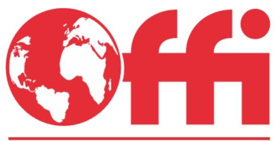

**A HITELES FORDÍTÁS KULCSA**

*ALAPÍTVA 1869*

Az Országos Fordító és Fordításhitelesítő Iroda Zártkörűen Működő Részvénytársaság az Országos Fordító és Fordításhitelesítő Iroda jogutódjaként 1994. április 25-én átalakulással jött létre. Az OFFI Zrt. egyszemélyes zártkörűen működő részvénytársaság, amelynek 100%-os tulajdonosa a Magyar Állam volt.

Az OFFI Zrt. alapítói 49 590 E Ft értékű jegyzett tőkéje az alakulás óta nem változott, amely 4959 db egyenként 10 E Ft névértékre szóló részvényből (törzsrészvény) állt. Az OFFI Zrt. alaptőkéjéből pénzbeli betét 5000 E Ft, a nem pénzbeli betét 44 590 E Ft volt.

Az MNV Zrt, az OFFI Zrt. működését vagyonkezelési szerződésben biztosította egy budapesti ingatlanrész 73/100-ad tulajdoni hányadával, 379,0 M Ft nettó értékben. Az OFFI székhelyén kívül az ellenőrzött időszak kezdetén hat, az ellenőrzött időszak végén huszonegy vidéki városban látta el feladatát.

A tulajdonosi joggyakorló részesedés tekintetében a Magyar Állam nevében a KIM, majd névváltozást követően az IM gyakorolta.

Az OFFI Zrt. kizárólagos feladatkörébe tartozott a hiteles fordítás, fordításhitelesítés, idegen nyelvű irat hiteles másolatának elkészítése, amely egyben közfeladat-feladatellátás. Fő tevékenysége a szakfordítás, tolmácsolás. Jogszabály alapján további feladata a lektorálás, névviselési ügyben szakhatósági tevékenység ellátása.

1. ábra

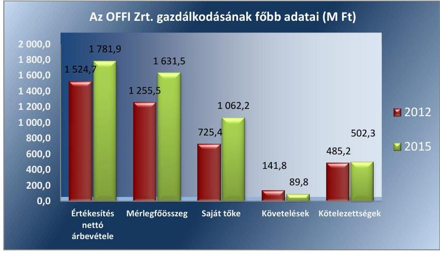

*Forrás: OFFI Zrt. 2012. és 2015. éves beszámolói*

A mérlegfőösszeg 2012. év végétől 2015. december 31-ig 29,9%-kal (1631,5 M Ft-ra), a saját tőke 46,4%-kal (1062,2 M Ft-ra), az értékesítés nettó árbevétele 16,8%-kal (1781,9 M Ft-ra) emelkedett, a mérleg szerinti eredménye 10,8-szorosára 16,7 M Ft-ról 180,4 M Ft-ra nőtt. A mérleg szerinti eredményt alapítói határozatokkal eredménytartalékba helyezték. A

---

követelések (89,8 M Ft) 67,3%-kal csökkentek. Az OFFI Zrt. átlagos állományi létszáma 2012-ben 175 fő volt, amely 2015-re 164 főre csökkent.

Az OFFI Zrt.-nek négy társasági részesedéssel működő kapcsolt vállalkozása $^{10}$ volt, amelyből két társaság maradt 2015. év végére (Kv$_1$, Kv$_2$). A tulajdonából kikerült társaságokat alapítói határozatokkal megszűntették, végelszámolták, visszterhesen átruházták. Az OFFI Zrt. az ellenőrzött időszakban nem volt kormányzati szektorba sorolt gazdálkodó szervezet.

---

# AZ ELLENŐRZÉS HÁTTERE, INDOKOLTSÁGA 

Az állami tulajdonú gazdálkodó szervezetek ellenőrzése kiemelten fontos a nemzeti vagyon megőrzése, megóvása érdekében. Gazdálkodásuk jellemzően a közérdeklődés és a média figyelmének középpontjában áll, amihez hozzájárul a gazdálkodásuk körébe tartozó - közvetlen vagy közvetett állami tulajdonú - vagyon nagysága, illetve az általuk ellátott közszolgáltatások minősége és hatékonysága. A szolgáltatási/közszolgáltatási árképzés megalapozottsága és az éves elszámoltatás feltételeinek kialakítása az ellenőrzés során nagy hangsúlyt kap. A szolgáltatás/közszolgáltatás árában és annak támogatásában meg kell jelennie az önköltségszámítás szempontjainak, amely biztosítja a működés fenntarthatóságát (eszközpótlást) is.

Az ellenőrzés rámutathat az állami tulajdonú gazdálkodó szervezetek gazdálkodási tevékenységével jó gyakorlatokra és szabálytalanságokra. Felhívhatja a figyelmet a jogszabályi követelmények teljesítéséhez szükséges feltételek hiányosságaira, hozzájárulhat az államháztartáson kívüli, de (közvetlenül vagy közvetve) állami vagyont használó gazdálkodó szervezetek tevékenységének átláthatóságához. Ellenőrzésünk eredményeképpen javaslatainkkal, megállapításainkkal hozzájárulhatunk a nemzeti vagyonnal való gazdálkodás átláthatóságának, elszámoltathatóságának javításához.

---

# A JELENTÉS LÉNYEGES KÉRDÉSKÖREI 

1.     - A tulajdonosi jogok gyakorlása szabályszerű volt-e?
2.     - Az Országos Fordító és Fordításhitelesítő Iroda Zrt. működésének szabályozottsága megfelelt-e az előírásoknak?
3.     - Az Országos Fordító és Fordításhitelesítő Iroda Zrt. pénzügyi-számviteli, adatszolgáltatási és ellenőrzési feladatok ellátása szabályszerű volt-e?
4.     - Az Országos Fordító és Fordításhitelesítő Iroda Zrt. vagyon-gazdálkodása szabályszerű volt-e?

---

# ELLENŐRZÉS HATÓKÖRE ÉS MÓDSZEREI 

## Az ellenőrzés típusa

Megfelelőségi ellenőrzés.

## Az ellenőrzött időszak

2012. január 1-jétől 2015. december 31-ig.

## Az ellenőrzés tárgya

Állami tulajdonú gazdasági társaságok - Az Országos Fordító és Fordításhitelesítő Iroda Zártkörűen Működő Részvénytársaság - vagyonmegőrzés és gazdálkodási tevékenységének ellenőrzése.

## Az ellenőrzött szervezet

Az Országos Fordító és Fordításhitelesítő Iroda Zártkörűen Működő Részvénytársaság, Közigazgatási és Igazságügyi Minisztérium, névváltozást követően Igazságügyi Minisztérium, a Magyar Nemzeti Vagyonkezelő Zártkörűen Működő Részvénytársaság.

## Az ellenőrzés jogalapja

Az ellenőrzés jogalapját az ÁSZ tv. 1. § (3) bekezdése és 5. § (3)-(5) bekezdése képezi.

## Az ellenőrzés módszerei

Az ellenőrzést a nemzetközi standardokat irányadónak tekintve az ellenőrzési program ellenőrzési kérdései, az ellenőrzött időszakban hatályos jogszabályok, az ellenőrzés szakmai szabályok és módszertanok figyelembe vételével végeztük.

Az ellenőrzés ideje alatt az ellenőrzött szervezettel történő kapcsolattartást az ÁSZ Szervezeti és Működési Szabályzatának vonatkozó előírásai alapján biztosítottuk.

Az ellenőrzés lefolytatásához az Országos Fordító és Fordításhitelesítő Iroda Zrt. tanúsítványok kitöltésével, valamint az ÁSZ által kért dokumentumok megküldésével szolgáltatott adatokat. A rendelkezésre bocsátott adatok, információk kontrollja a helyszíni ellenőrzés keretében történt. A

---

bevételek és ráfordítások elszámolása, valamint a vagyonnyilvántartás terén a szabályszerű működést véletlen mintavétellel ellenőriztük. A mintavétellel ellenőrzött területek esetében minden egyes tétel vonatkozásában a szabályszerűségre vonatkozó kérdéseket tettünk fel, amelyek eredménye összesítésre került.

A jogszabályoknak és a belső előírásoknak megfelelőnek tekintettük az adott területet, amennyiben a minta ellenőrzésének eredménye alapján 95%-os bizonyossággal a teljes sokaságban a hibaarány kisebb volt, mint 10%, nem megfelelőnek értékeltük, ha a hibaarány a 10%-ot meghaladta. Kockázatot, illetve magas kockázatot jeleztünk, amennyiben egy adott terület vonatkozásában a minta alapján a teljes sokaságban nem volt egyértelműen biztosított a jogszabályoknak és a belső szabályzatoknak megfelelő működés. A ráfordítások elszámolására és a vagyonnyilvántartásra vonatkozó véletlen mintavételt kockázati alapú kiválasztással egészítettük ki, amelynek során évente a három legnagyobb összegű tételt választottuk ki.

---

# 1. A tulajdonosi jogok gyakorlása szabályszerű volt-e? 

Összegző megállapítás

Az MNV Zrt. és a tulajdonosi joggyakorló$_{1-2}$ szabályszerűen alakította ki a tulajdonosi jogok gyakorlásának rendszerét, tulajdonosi jogait az előírásoknak megfelelően gyakorolta.
1.1. számú megállapítás

A tulajdonosi joggyakorló$_{1-2}$ részesedések feletti tulajdonosi joggyakorlása megfelelt a jogszabályi előírásoknak.

TÁRSASÁGI RÉSZESEDÉS TEKINTETÉBEN a tulajdonosi jogkör gyakorlását 2012. december 31-ig az MNV Zrt. és KIM közötti társasági részesedés vagyonkezelésbe adásáról szóló szerződés $^{11}$ tartalmazta. Az Nvtv. $^{12}$ módosítása után 2013. január 1-jétől az MNV Zrt. és KIM között létrejött Megbízási szerződés $^{13}$ alapján a tulajdonosi jogokat - névváltozást követően 2014. június 6-tól az IM gyakorolta. Az Nvtv. 8. § (7) bekezdésének 2012. június 30-tól hatályos módosításának megfelelően a tulajdonosi joggyakorló$_1$ a társasági részesedésre vonatkozó Megállapodást $^{14}$ megszüntette és a jogszabályban előírt határidőre a Megbízási szerződést megkötötte.

A tulajdonosi joggyakorló$_{1-2}$ a vagyongazdálkodás feltételeit a Lo$_{1-13}$ $^{15}$ban a jogszabályi előírásoknak megfelelően határozta meg. A tulajdonosi joggyakorlás rendjét a tulajdonosi joggyakorló$_{1-2}$-vel kötött szerződések $^{16}$, a tulajdonosi joggyakorló$_{1-2}$ SZMSZ$_{1-13}$ $^{17}$-ei tartalmazták. A tulajdonosi joggyakorló$_{1-2}$ kizárólagos hatáskörébe tartozott az FB ügyrendjének, az OFFI Zrt. Javadalmazási szabályzatának $^{18}$, az éves üzleti terveinek $^{19}$, beszámolóinak jóváhagyása $^{20}$. Javadalmazási, juttatási rendszeréről szóló szabályzatát (Jav$_{1-2}$) az OFFI Zrt. legfőbb szerve megalkotta, a tulajdonosi joggyakorló$_{1-2}$ alapítói határozattal elfogadta. A Jav$_2$-ben az OFFI Zrt. átvezette a Ptk$_2$ $^{21}$ hatálybalépését követően szükségessé vált fogalmak és jogszabályi hivatkozások változásait. A Jav$_{1-2}$ megfelelt a Taktv. $^{22}$ előírásainak.

A tulajdonosi joggyakorló$_{1-2}$ az OFFI Zrt-t a belső szabályozásnak megfelelően beszámoltatta a gazdálkodásáról és feladatellátásáról.

A tulajdonosi joggyakorló$_{1-2}$ az OFFI Zrt. 2012-2015. évi beszámolóit könyvvizsgálói véleménnyel alátámasztott FB$^{23}$ határozatok javaslata alapján alapítói határozatokkal a jogszabályi előírásoknak megfelelően elfogadta. Jóváhagyta
 a nyereség eredménytartalékba helyezését.
1.2. számú megállapítás

Az OFFI Zrt. kezelésében lévő nemzeti vagyon feletti MNV Zrt. tulajdonosi joggyakorlása a jogszabályi előírásoknak megfelelt.

Az OFFI Zrt. működését az MNV Zrt. és az OFFI Zrt. között létrejött egyéb vagyonkezelővel, ingatlanra vonatkozó vagyonkezelői szerződése biztosította a budapesti ingatlanrész 73/100-ad tulajdoni hányadával. A vagyonkezelési szerződést az MNV Zrt. 65/2012. (IX. 17.) IFŐIG. sz. határozatával hagyta jóvá.

---

Az állami vagyon kezelésére, hasznosítására kötött szerződés a Vtv. ${ }^{24}$ ben előírt tartalmi elemekkel rendelkezett. A kezelt vagyonra az MNV Zrt. vagyon-nyilvántartási szabályzatait ${ }^{25}$ megalkotta, tartalmuk megfelelt a Vhr. ${ }^{26}$ 14. § (3) bekezdés előírásainak. Az MNV Zrt. szabályozása meghatározta a vagyonváltozást eredményező döntések kereteit.

# 2. Az Országos Fordító és Fordításhitelesítő Iroda Zrt. működésének szabályozottsága megfelelt-e az előírásoknak? 

## Összegző megállapítás

Az OFFI Zrt. működésének szabályozottsága összességében megfelelt az előírásoknak.

### 2.1. számú megállapítás

Az OFFI Zrt. összességében az előírásoknak megfelelően készítette el belső szabályzatait. Az önköltségszámítás rendjére vonatkozó szabályzattal ugyanakkor az ellenőrzött időszak első részében nem rendelkezett. Az OFFI Zrt. a számlarend folyamatos karbantartásáról nem gondoskodott az ellenőrzött időszakban.

A létesítő okiratokban $\left(\mathrm{LO}_{1-13}\right)$ a tulajdonosi joggyakorló ${ }_{1-2}$ a vezérigazgató feladat- és hatáskörébe sorolta az OFFI Zrt. irányítási és ellenőrzési kötelezettségét, valamint a Számv. tv. szerinti beszámoló elkészítésének kötelezettségét, és az OFFI Zrt. üzleti könyveinek szabályszerű vezetését. Az OFFI Zrt.-nek az ellenőrzött időszakban négy SZMSZ ${ }_{1-4}{ }^{27}$ e volt hatályban. Az OFFI Zrt. SZMSZ ${ }_{1-3}$-at a vezérigazgató szabályszerűen, saját hatáskörében léptette hatályba, az SZMSZ4-et a tulajdonosi joggyakorló a 9/2015. (2015. október 30.) számú alapítói határozattal a létesítő okirat $_{11}$ 7.2.14. pontjában megfogalmazottaknak megfelelően hagyta jóvá.

A számviteli politika $\left(\mathrm{Szp}_{1-4}{ }^{28}\right)$ keretében a Számv. tv. ${ }^{29} 14$. § (4) bekezdésének megfelelően az OFFI Zrt. elkészítette az eszközök és a források leltárkészítési és leltározási szabályzatát ( $\mathrm{Lsz}_{1-2}{ }^{30}$ ), az eszközök és a források értékelési szabályzatát (Ész ${ }_{1-3}{ }^{31}$ ), és a pénzkezelési szabályzatát $\left(\mathrm{Pksz}_{1-5}{ }^{32}\right)$.

Az OFFI Zrt. ${ }^{33}$ a számviteli politika részeként nem készítette el a Számv. tv. 14. § (5) bekezdés c) pontjának megfelelő önköltség-számítási szabályzatot (Önksz ${ }^{34}$ ) 2014. március 12-ig.

Az OFFI Zrt. Lsz ${ }_{1}$ 2012. január 1-től nem felelt meg a Számv. tv. 69. § (3) bekezdésének, mert a szabályzatban nem írták elő a mennyiségi felvételre vonatkozó kötelezettséget a tárgyi eszközökre legalább háromévente. Az OFFI Zrt. leltározási szabályai a 2014. szeptember 26-tól hatályba lépett $\mathrm{Lsz}_{2}$ alapján már összhangban voltak a Számv. tv. előírásaival.

Az OFFI Zrt. az ellenőrzött időszakban a Számv. tv. 161. § (4) bekezdése ellenére folyamatosan nem tartotta karban számlarendjét ${ }^{35}$.

Az OFFI Zrt. a Szp ${ }_{2}$ 6. pontjában az Nvtv. 11. § (8) bekezdésének, a Vhr. 9. § (9) bekezdésének, a 17. § (1) bekezdésének, a 18. § (3b) bekezdésének és a vagyonkezelési szerződés 7.3., 7.8. és 12. pontja előírásaival összhangban részletesen szabályozta a kezelésbe vett állami vagyonra vonatkozó speciális elszámolási szabályokat. Az OFFI Zrt. eszköznyilvántartó rendszere

---

biztosította az Nvtv. 29. § (6) bekezdés d) pontjában előírt értékcsökkenés elszámolását és a visszapótlási kötelezettség megállapíthatóságát.

Az OFFI Zrt. az ellenőrzött időszakban 2013. május 10-től hatályos Szp ${ }_{2}$ 6. pontjában meghatározta a vagyonkezelésbe vett vagyon elkülönített nyilvántartási rendjét. A szabályozás összhangban volt a Számv. tv. 23. § (2) és a 42. § (5) bekezdéseiben, valamint a Vhr. 17. § (1) bekezdésében előírtakkal.

# 3. Az Országos Fordító és Fordításhitelesítő Iroda Zrt. pénzügyi-számviteli, adatszolgáltatási és ellenőrzési feladatok ellátása szabályszerű volt-e? 

Összegző megállapítás

Az OFFI Zrt. pénzügyi-számviteli, adatszolgáltatási és ellenőrzési feladatait összességében megfelelően látta el. Az önköltségszámítás gyakorlatát ugyanakkor nem megfelelően alakította ki, valamint annak gyakorlása sem volt szabályszerű.
3.1. számú megállapítás

Az OFFI Zrt. bevételeinek és ráfordításainak elszámolása megfelelt a jogszabályi előírásoknak és belső szabályzatainak, követelésállományát megfelelően kezelte.

## A bevételek és ráfordítások elszámolási

szabályait az OFFI Zrt. számviteli politikájában1-4, számlarendjében, számlatükrében meghatározta. Az OFFI Zrt. megfelelően alkalmazta könyvelési-és számlázási rendszerét, a Számv.tv. előírásaival összhangban számolta el bevételeit és ráfordításait. A tárgyi eszközök beszerzése, aktiválása és besorolása a számviteli politikában és az Eszközök és források értékelési szabályzatában ${ }_{1-3}{ }^{36}$ leírtaknak megfelelt. A személyi juttatások elszámolása és kifizetése összhangban volt a tulajdonos joggyakorlónak ${ }_{1-2}$ történő adatszolgáltatásokkal, a munkaszerződésekkel, a belső szabályzatokkal és a jogszabályokkal.

Az értékcsökkenési leírás elszámolása megfelelt a Számv. tv. 52. §-ban, a Szp-ban ${ }_{1-4}$ és az Eszközök és források értékelési szabályzatában ${ }_{1-3}$ előírt alapelveknek. A bruttó és nettó érték, valamint az értékcsökkenés tárgyévi változását, a leírási kulcsok mértékét az éves beszámolók kiegészítő mellékletében a Számv. tv. 92. § (1) bekezdésben foglaltaknak megfelelően bemutatta és ezzel összhangban alkalmazta.

A követeléseket a Számv. tv. 29.§ (1)-(2) bekezdése és a számviteli politika ${ }_{1-4}$ szerint vette nyilvántartásba. Az OFFI Zrt. a hátralékos követelések behajtásának eljárásrendjét a Kintlévőség Kezelési Szabályzataiban ${ }_{1-3}{ }^{37}$ rögzítette. A hatósági ügyfelek kintlévőségeinek aránya az árbevétel 20\%-át tette ki az ellenőrzött években, ennek ellenére a határidőn túli kintlévőségük mégis $80 \%$-os arányt képviselt.

A vevőkövetelések állományának alakulását az 1. táblázat mutatja be.

---

### 3.2. számú megállapítás

Az OFFI Zrt. közszolgáltatási és szolgáltatási díj megállapítása az ellenőrzött időszak első felében nem volt önköltség-számítási szabályzattal alátámasztott. A Számv. tv. 14. § (7) bekezdésében előírt utókalkuláció nem készült. A kalkulációs egységek nem fedték le teljes körűen az általános szerződési feltételekben meghatározott tevékenységeket és díjakat.

Az OFFI Zrt. tevékenységi körei jogszabályi rendelkezések szerint szolgáltatási és közszolgáltatási jellegűek. Kizárólagos tevékenységét a szakfordításról és tolmácsolásról szóló 24/1986. (VI. 26.) MT rendelet 5. §-a tartalmazza.

Az OFFI Zrt. a Számv. tv. 14. § (5) bekezdés c) pontjában és a 14. § (7) bekezdések alapján meghatározott önköltségszámítási szabályzatkészítési kötelezettségének 2014. március 12-ig nem tett eleget. Az OFFI Zrt. 2014. március 12-én hatályba léptetett önköltség-számítási szabályzata pedig nem tartalmazta teljes körűen az OFFI Zrt. működési sajátosságait, mivel nem tartalmazott előírást a lektorálásra, a szakfordításra, a korrektúrázásra és a leírásra, ellentétesen a Számv. tv. 14. § (7) bekezdésben foglaltakkal.

Az OFFI Zrt. az ellenőrzött időszakra utókalkulációval nem rendelkezett a Számv. tv. 14. § (7) bekezdésben és az önköltség-számítási szabályzatban foglaltak ellenére.

### 3.3. számú megállapítás

A gazdálkodó szervezet teljesítette a tervezési, beszámolási, adatszolgáltatási kötelezettségét.

Az OFFI Zrt. az üzleti terveit az MNV Zrt. tervezési irányelvei, a tulajdonosi joggyakorló ${ }_{1-2}$ útmutatásai szerint készítette el.

Az OFFI Zrt. a létesítő okiratokban ${ }_{1-13}$ előírt Számv. tv. 9. §-a szerinti éves beszámolóját, kiegészítő mellékletét és üzleti jelentését az előírt tartalommal, a Felügyelő Bizottság írásbeli jelentésével, könyvvizsgálói jelentéssel ${ }^{38}$ nyújtotta be a tulajdonosi joggyakorló ${ }_{1-2}$-nak elfogadásra. A könyvvizsgáló részéről nem volt figyelemfelhívás a tulajdonos felé. Az alapítói határozattal együtt a beszámolókat a Számv. tv. 153. § által előírt határidőben letétbe helyezték és az Számv. tv. 154/B. § szerint tették közzé.

A mérleg szerinti eredményt alapítói határozatok alapján eredménytartalékba helyezték. A saját tőke/jegyzett tőke arány miatt a tulajdonosi joggyakorlónak nem volt intézkedési kötelezettsége, mivel a mérleg szerinti eredmény minden évben nyereség volt. Az OFFI Zrt. mérlegének és eredménykimutatásának alakulását a II. számú melléklet mutatja be.

Az OFFI Zrt. 2014. április 1-vel Adatkezelési és Közzétételi Szabályzat ${ }^{39}$ kiadásával eleget tett az adatvédelemre és adatkezelésre, továbbá a közérdekű adatok megismerésére vonatkozó szabályozási kötelezettségének. Az OFFI Zrt. 2014-ben aktualizálta a 2008. évi iratkezelési szabályzatát, 2004.02.16-tól informatikai szabályzattal, 2012. 09.06-tól informatikai biztonsági szabályzattal is rendelkezett, az adatok védelme biztosított volt. Az OFFI Zrt. a jogszabályban előírt közzétételi kötelezettségét teljesítette.

---

# 3.4. számú megállapítás 

Az OFFI Zrt. belső ellenőrzést a 2013. év kivételével végzett. A tulajdonosi és külső ellenőrzések javaslatainak végrehajtásáról intézkedett.

Az OFFI Zrt. belső ellenőrzése az ellenőrzött időszakban 2012. évben, a 2014. és 2015. évben látott el belső ellenőrzési feladatokat.

Az OFFI Zrt. Felügyelő Bizottsága a feladatellátással kapcsolatos költségek csökkentése céljából, a négy gazdaságtalanul működő gazdasági társaság megszüntetésére tett javaslatot az IM és az MNV Zrt. részére.

Az MNV Zrt. a Vtv. 17. § d) bekezdésben foglalt tulajdonosi ellenőrzést nem végezte. A tulajdonosi joggyakorló ${ }_{1-2}$ IM Ellenőrzési Főosztálya a 2015. évben rendszerellenőrzés keretében ellenőrizte az OFFI gazdálkodását.

A KEHI 2013-ban az OFFI Zrt. átfogó ellenőrzése során többek között javasolta a gazdaságtalanul működő leányvállalatok megszüntetését, és további költségcsökkentő tényezőket a gazdálkodás racionalizálása érdekében.

Nem volt ellenőrzési javaslat a Budapest Fővárosi Kormányhivatal Egészségügyi Pénztár és a NAV ${ }^{40}$ ellenőrzések esetében.

Az OFFI Zrt. az ellenőrzések kapcsán feltárt hiányosságok megszüntetésére intézkedési tervet készített és azokat végrehajtotta.

## 4. Az Országos Fordító és Fordításhitelesítő Iroda Zrt. vagyongazdálkodása szabályszerű volt-e?

Összegző megállapítás

### 4.1. számú megállapítás

Az OFFI Zrt. vagyongazdálkodása összességében szabályszerű volt.

Az OFFI Zrt. kialakította a gazdálkodó szervezet saját és kezelésbe vett vagyon értékének megőrzést, gyarapítását szolgáló szabályszerű vagyongazdálkodás feltételeit.

Az OFFI Zrt. számviteli elszámolási rendszerében kialakította a kezelt vagyon hasznosításához kapcsolódó - Vsz. 7.16., 7.16.1., 7.16.1.1., 7.16.2.7.16.4. pontjai szerinti - bevételek és ráfordítások elkülönítését. Az OFFI Zrt. éves beruházásairól szóló beszámolóit 2012 kivételével elkészítette, mely megfelelt a Vsz. 7.16. pontban által előírt tartalomnak.

Az SZMSZ ${ }_{1-2}$-ben (4.2.g pont) a vezérigazgató feladataként szerepelt az OFFI Zrt. stratégiai tervének rendszeres felülvizsgálata és fejlesztése, majd az SZMSZ ${ }_{3-4}$-ben (11.2. f pont és 4.5. g pont) annak elkészítése, Alapító elé terjesztése, melyet az ellenőrzött időszak 2013-2015. éveiben nem végeztek el az OFFI Zrt.-nél.

Az OFFI Zrt. a Számv. tv. szerint tartotta nyilván saját vagyonát.
Az OFFI Zrt. az Szp ${ }_{2-4}$-ben 1.2 pontjában meghatározta azokat az elveket, melyek alapján a saját és a kezelt vagyon elkülönítése megvalósult. Bár az OFFI Zrt. a számlarendjét az ellenőrzött időszakban nem tartotta karban, a könyvelési rendszerben használt számlatükör főkönyvi számlái alapján biztosított volt a saját és vagyonkezelésbe adott vagyon elkülönített nyilvántartása.

---

Az OFFI Zrt. két leányvállalata után a Számv. tv. 54. § (1)-(2) bekezdés szerinti értékvesztést nem számolt el a 2013-2014. években összesen 4,6 M Ft értékben (OFFICE Kft. 3,3 M Ft, OFFI COOP Kft. 1,3 M Ft). Az értékvesztés nyilvántartás indokoltság oka az ellenőrzött időszak végére - az OFFICE Kft. esetében a befektetés értékesítésével, az OFFICE COOP Kft. végelszámolásával - megszűnt.

Az OFFI Zrt. az ellenőrzött időszakban készített Számv. tv. szerinti éves beszámolói mérlegét az Lsz1-2-ben meghatározott leltározással készített leltárak alapján alátámasztotta. Az OFFI Zrt. az ellenőrzött időszakban készített leltárai megfeleltek a Számv. tv. 69. §-ban előírt követelményeknek.
4.3. számú megállapítás

Az OFFI Zrt. nem lényeges nagyságrendű elmaradással teljesítette a vagyonkezelési
 szerződés 7.4. pontjában vállalt és a jogszabályban előírt visszapótlási kötelezettségét az ellenőrzött időszak 2014–2015. éveiben.

Az OFFI Zrt. vagyonkezelésbe vett tárgyi eszközét egy budapesti földterület és felépítmény 73/100-ad tulajdoni hányada jelentette. Az OFFI Zrt.-t a kezelt vagyon értékének megőrzése érdekében az elszámolt értékcsökkenéssel azonos mértékű visszapótlási kötelezettség terhelte a Vsz. 7.4. pontja alapján, összhangban a Vhr. 9 § (9) bekezdésének d) pontjában előírt követelményekkel. Az ellenőrzött időszakra összesítve az OFFI Zrt. teljes visszapótlási kötelezettsége 0,9 M Ft-tal maradt el a jogszabályi követelményektől. Az OFFI Zrt. tárgyi eszköz összes állományának használhatósági foka az induló 60,3%-os szintről 2015-re 63,8%-ra nőtt.

Az OFFI Zrt.-nél a saját vagyon változását eredményező döntések megfeleltek az előírásoknak. Az OFFI Zrt. a saját vagyonát érintő beruházások, felújítások, térítés nélküli átvételekre vonatkozó döntések előterjesztésére a tulajdonosi joggyakorló(1-2) a létesítő okiratokban írt elő követelményeket.

Az OFFI Zrt. az ellenőrzött időszakban a saját vagyont érintő beruházásokat, felújításokat az éves üzleti terveiben terjesztette elő, a tulajdonosi joggyakorló(1-2) az éves üzleti tervek elfogadásával döntött a közbeszerzési tervek elfogadásáról is.
4.4. számú megállapítás

Az OFFI Zrt.-nél a vagyonkezelésbe vett vagyon változását eredményező döntések megfeleltek a jogszabályi és a belső előírásoknak.

Az MNV Zrt. a Vsz 7.5. pontjában írta elő az OFFI Zrt. számára, hogy az építési engedély köteles fejlesztéseihez az elsőfokú építési hatóság felé irányuló engedély iránti kérelem benyújtása, illetve amennyiben az elvégzendő beruházás nem engedélyköteles, a munkálatok megkezdése előtt legalább 30 nappal megelőzően köteles az MNV Zrt. írásbeli engedélyét kérni. Az ellenőrzött időszakra vonatkozóan a tulajdonos MNV Zrt. a tervezett fejlesztésekhez írásbeli hozzájárulását megadta, mivel az érvényben volt Vsz 7.8.1. pontjában a felek meghatározták a vagyonkezelésbe vett eszközök 2012–2015. évekre vonatkozó beruházási tervét.

---

### 4.5. számú megállapítás

Az OFFI Zrt. a kapcsolt vállalkozásokkal való felelős gazdálkodást a számviteli törvény szerint készített beszámolók jóváhagyásán keresztül ellenőrizte.

Az OFFI Zrt. a Kv1-4 részére a vagyongazdálkodással kapcsolatos adatszolgáltatás rendjét, tartalmát, gyakoriságát az ellenőrzött időszakban a Tsz14-ben írta elő a kapcsolt vállalkozásai részére. A beszámolási kötelezettséget az OFFI Zrt. a vállalkozások számviteli törvény szerint készített beszámolóinak elkészítésében határozta meg, mely megfelelt a Gt. 141. § (2) bekezdés a) pontjának és a Ptk2 3:109. § (2) bekezdésének.

---

# JAVASLATOK 

Az ÁSZ tv. 33. § (1) bekezdésében foglaltak értelmében az ellenőrzött szervezet vezetője köteles a jelentésben foglalt megállapításokhoz kapcsolódó intézkedési tervet összeállítani és azt a jelentés kézhezvételétől számított 30 napon belül az ÁSZ részére megküldeni. Amennyiben az ellenőrzött szervezet vezetője nem küldi meg határidőben az intézkedési tervet, vagy továbbra sem elfogadható intézkedési tervet küld, az Állami Számvevőszék elnöke az ÁSZ tv. 33. § (3) bekezdése a) és b) pontjaiban foglaltakat érvényesítheti.

## Az Országos Fordító és Fordításhitelesítő Iroda Zrt. Vezérigazgatójának

1. Intézkedjen a számlarend karbantartásáról a jogszabályban előírtak szerint.
(2.1. sz. megállapítás 5. bekezdése alapján)
2. Intézkedjen arról, hogy a végzett szolgáltatások önköltségét utókalkuláció módszerével állapítsák meg, a jogszabályban és belső szabályzatban előírtak alapján.
(3.2. sz. megállapítás 3. bekezdése alapján)
3. Gondoskodjon a belső szabályozásnak megfelelően a társaság stratégiai tervének felülvizsgálatáról.
(4.1. sz. megállapítás 2. bekezdése alapján)

---

# MELLÉKLETEK 

## I. SZ. MELLÉKLET: ÉRTELMEZŐ SZÓTÁR

állami vagyon
a) Az állam tulajdonában lévő dolog, valamint a dolog módjára hasznosítható természeti erő,
b) az a) pont hatálya alá nem tartozó mindazon vagyon, amely vonatkozásában törvény az állam kizárólagos tulajdonjogát nevesíti,
c) az állam tulajdonában lévő tagsági jogviszonyt megtestesítő értékpapír, illetve az államot megillető egyéb társasági részesedés,
d) az államot megillető olyan immateriális, vagyoni értékkel rendelkező jogosultság, amelyet jogszabály vagyoni értékű jogként nevesít.
Forrás: Vtv. 1. § (2) bekezdése
2012. november 10-től az állami vagyon fogalma kiegészül a következő ponttal:
e) az állam tulajdonában lévő pénzügyi eszközök

Forrás: Vtv. 1. § (2) bekezdése
2013. június 27-ig:

Az állami vagyont az MNV Zrt. maga kezeli, vagy szerződés - így különösen bérlet, haszonbérlet, megbízás - alapján központi költségvetési szervnek, természetes vagy jogi személynek, vagy jogi személyiséggel nem rendelkező gazdálkodó szervezetnek hasznosításra átengedi.
Forrás: Vtv. 23. § (1) bekezdése
2013. június 28-ától:

Az állami vagyonnal az MNV Zrt. maga gazdálkodik, vagy szerződés - így különösen bérlet, haszonbérlet, megbízás - alapján központi költségvetési szervnek, természetes vagy jogi személynek, vagy jogi személyiséggel nem rendelkező gazdálkodó szervezetnek hasznosításra átengedi, illetőleg vagyonkezelésbe, haszonélvezetbe adja.
Forrás: Vtv. 23. § (1) bekezdése
anyavállalat
Az a vállalkozó, amely egy másik vállalkozónál (a továbbiakban: leányvállalat) közvetlenül vagy leányvállalatán keresztül közvetetten meghatározó befolyást képes gyakorolni, mert az alábbi feltételek közül legalább eggyel rendelkezik:
a) a tulajdonosok (a részvényesek) szavazatának többségével (50 százalékot meghaladóval) tulajdoni hányada alapján egyedül rendelkezik, vagy
b) más tulajdonosokkal (részvényesekkel) kötött megállapodás alapján a szavazatok többségét egyedül birtokolja, vagy
c) a társaság tulajdonosaként (részvényesként) jogosult arra, hogy a vezető tisztségviselők vagy a felügyelő bizottság tagjai többségét megválassza vagy visszahívja, vagy
d) a tulajdonosokkal (a részvényesekkel) kötött szerződés (vagy a létesítő okirat rendelkezése) alapján - függetlenül a tulajdoni hányadtól, a szavazati aránytól, a megválasztási és visszahívási jogtól - döntő irányítást, ellenőrzést gyakorol.
Forrás: Számv. tv. 3. § (2) 1. pont
gazdasági társaság
A Ptk2 3:88. § (1) bekezdése szerint „a gazdasági társaságok üzletszerű közös gazdasági tevékenység folytatására, a tagok vagyoni hozzájárulásával létrehozott, jogi személyiséggel rendelkező vállalkozások, amelyekben a tagok a nyereségből közösen részesednek, és a veszteséget közösen viselik".

---

állami vagyon hasznosítására kötött szerződés
állami vagyon használója
állami vagyon kezelője/vagyonkezelő
állami vagyon értékesítése
gazdálkodó szervezet
kapcsolt vállalkozás

Az állami vagyon hasznosítására kötött szerződések elsődleges célja az állami vagyon hatékony működtetése, állagának védelme, értékének megőrzése, illetve gyarapítása, az állami és közfeladatok ellátásának elősegítése.
Forrás: Vtv. 23. § (2) bekezdése
Az a természetes vagy jogi személy, jogi személyiséggel nem rendelkező szervezet, aki, vagy amely törvény vagy szerződés alapján, bármely jogcímen (bérlet, haszonbérlet, használat stb.) állami vagyont birtokol, használ, szedi annak hasznait, hasznosít, ide nem értve a haszonélvezőt, a vagyonkezelőt és a tulajdonosi jogok gyakorlóját.
Forrás: Vhr. 1. § (7) a. pontja
2013. június 27-ig:

Az állami vagyont az MNV Zrt. maga kezeli, vagy szerződés - így különösen bérlet, haszonbérlet, megbízás - alapján központi költségvetési szervnek, természetes vagy jogi személynek, vagy jogi személyiséggel nem rendelkező gazdálkodó szervezetnek hasznosításra átengedi. Az állami vagyonra vonatkozóan az MNV Zrt. kizárólag az Nvtv-ben meghatározott személyekkel köthet vagyonkezelési szerződést.
Forrás: Vtv. 23. § (1), 27. § (1)
2013. június 28-ától:

Az állami vagyonnal az MNV Zrt. maga gazdálkodik, vagy szerződés - így különösen bérlet, haszonbérlet, megbízás - alapján központi költségvetési szervnek, természetes vagy jogi személynek, vagy jogi személyiséggel nem rendelkező gazdálkodó szervezetnek hasznosításra átengedi, illetőleg vagyonkezelésbe, haszonélvezetbe adja. Az állami vagyonra vonatkozóan az MNV Zrt. kizárólag az Nvtv-ben meghatározott személyekkel köthet vagyonkezelési szerződést.
Forrás: Vtv. 23. § (1), 27. § (1)
Állami vagyon tulajdonjogának bármely jogcímen történő, visszterhes átruházása.
Forrás: Vhr. 1. § (7) d) pont)
2014. március 14-ig:

A Ptk. 141. § 685. c) pontja szerint gazdálkodó szervezet: „az állami vállalat, az egyéb állami gazdálkodó szerv, a szövetkezet, a lakásszövetkezet, az európai szövetkezet, a gazdasági társaság, az európai részvénytársaság, az egyesülés, az európai gazdasági egyesülés, az európai területi együttműködési csoportosulás, az egyes jogi személyek vállalata, a leányvállalat, a vízgazdálkodási társulat, az erdő birtokossági társulat, a végrehajtói iroda, az egyéni cég, továbbá az egyéni vállalkozó."
2014. március 15-től:

A gazdasági társaság, az európai részvénytársaság, az egyesülés, az európai gazdasági egyesülés, az európai területi együttműködési csoportosulás, a szövetkezet, a lakásszövetkezet, az európai szövetkezet, a vízgazdálkodási társulat, az erdőbirtokossági társulat, az állami vállalat, az egyéb állami gazdálkodó szerv, az egyes jogi személyek vállalata, a közös vállalat, a végrehajtói iroda, a közjegyzői iroda, az ügyvédi iroda, a szabadalmi ügyvivői iroda, az önkéntes kölcsönös biztosító pénztár, a magánnyugdíjpénztár, az egyéni cég, továbbá az egyéni vállalkozó. Az állam, a helyi önkormányzat, a költségvetési szerv, az egyesület, a köztestület, valamint az alapítvány gazdálkodó tevékenységével összefüggő polgári jogi kapcsolataira is a gazdálkodó szervezetre vonatkozó rendelkezéseket kell alkalmazni.
Forrás: Ptk42 396. §
Az anyavállalat és a leányvállalat és a közös vezetésű vállalkozások (fölérendelt anyavállalat esetében a minősítést a fölérendelt anyavállalat szempontjából kell elvégezni)

---

kormányzati szektorba sorolt egyéb szervezet
közös vezetésű vállalkozás
közszolgáltatás
leányvállalat
meghatározó befolyás

MFB Zrt.

Forrás: Számv. tv. 3. § (2) 7. pont
Az a szervezet, amely az Áht. alapján nem része az államháztartásnak, azonban az Európai Közösséget létrehozó szerződéshez csatolt, a túlzott hiány esetén követendő eljárásról szóló jegyzőkönyv alkalmazásáról szóló 2009. május 25-i 479/2009/EK rendelet szerint a kormányzati szektorba tartozik. A nemzetgazdasági miniszter 2013. június 26-án megjelent Közleményben tette közé ezen szervezetek listáját
Az a gazdasági társaság, ahol egyrészt az anyavállalat (az anyavállalat konszolidálásba bevont leányvállalata), másrészt egy (vagy több) másik vállalkozás az 1. pont szerinti jogosultságokkal paritásos alapon - legalább 33 százalékos szavazati aránnyal - rendelkezik. A közös vezetésű vállalkozást a tulajdonostársak közösen irányítják.
Forrás: Számv. tv. 3. § (2) 3. pont
Az Ebktv. 43. § 3. d) pontja a következőképpen határozza meg a közszolgáltatást: „szerződéskötési kötelezettség alapján a lakosság alapvető szükségleteinek ellátására irányuló szolgáltatás, így különösen a villamos energia-, gáz-, hő-, víz-, szennyvíz-, hulladékkezelési, köztisztasági, postai és távközlési szolgáltatás, továbbá a menetrend alapján közlekedő járművekkel végzett közforgalmú személyszállítás".
Az a gazdasági társaság, amelyre az anyavállalat meghatározó befolyást képes gyakorolni
Forrás: Számv. tv. 3. § (2) 2. pont
2014. március 14-ig:

A befolyással rendelkező akkor rendelkezik egy jogi személyben meghatározó befolyással, ha annak tagja, illetve részvényese és
a) jogosult e jogi személy vezető tisztségviselői vagy felügyelőbizottsága tagjai többségének megválasztására, illetve visszahívására, vagy
b) a jogi személy más tagjaival, illetve részvényeseivel kötött megállapodás alapján egyedül rendelkezik a szavazatok több mint ötven százalékával.
A meghatározó befolyás akkor is fennáll, ha a befolyással rendelkező számára az előzőek szerinti jogosultságok közvetett módon biztosítottak. A befolyással rendelkezőnek egy jogi személyben a szavazatok több mint ötven százalékával közvetett módon való rendelkezése vagy egy jogi személyben közvetetten fennálló meghatározó befolyása megállapítása során a jogi személyben szavazati joggal rendelkező más jogi személyt (köztes vállalkozást) megillető szavazatokat meg kell szorozni a befolyással rendelkezőnek a köztes vállalkozásban, illetve vállalkozásokban fennálló szavazatával. Ha a köztes vállalkozásban fennálló szavazatok mértéke az ötven százalékot meghaladja, akkor azt egy egészként kell figyelembe venni.
Forrás: Ptk1 685/B. § (2)–(3) bekezdések
2014. március 15-től:

A befolyással rendelkező akkor rendelkezik egy jogi személyben meghatározó befolyással, ha annak tagja vagy részvényese, és
a) jogosult e jogi személy vezető tisztségviselői vagy felügyelőbizottsága tagjai többségének megválasztására, illetve visszahívására; vagy
b) a jogi személy más tagjai, illetve részvényesei a befolyással rendelkezővel kötött megállapodás alapján a befolyással rendelkezővel azonos tartalommal szavaznak, vagy a befolyással rendelkezőn keresztül gyakorolják szavazati jogukat, feltéve, hogy együtt a szavazatok több mint felével rendelkeznek.
Forrás: Ptk2 8:2. §

 (2) bekezdés
Az MNV Zrt. melletti másik tulajdonosi joggyakorló szervezet az állami vagyon vonatkozásában, amely 2010. június 17-től gyakorol ilyen jogokat a rábízott állami tulajdonú társasági részesedések tekintetében.

---

minősített többséget biztosító részesedés

MNV Zrt.
nemzeti vagyon
nemzeti vagyon
társasága
rábízott vagyon

A minősített befolyásszerző az ellenőrzött társaságban a szavazatok legalább hetvenöt százalékával rendelkezik. (2014. március 14-ig: Gt. 52. § (2), 2014. március 15-től: Ptk. 2. 3:324. §)
Az állami vagyon felett, a Magyar Államot megillető tulajdonosi jogok és kötelezettségek összességét - a hatályos szabályozás szerint - az állami vagyon felügyeletéért felelős miniszter (jelenleg a nemzeti fejlesztési miniszter) gyakorolja. A miniszter feladatát nagy részben az MNV Zrt., mint tulajdonosi joggyakorló szervezet útján látja el.
a) az állam vagy a helyi önkormányzat kizárólagos tulajdonában álló dolgok,
b) az a) pont hatálya alá nem tartozó, állam vagy a helyi önkormányzat tulajdonában lévő dolog,
c) az állam vagy a helyi önkormányzat tulajdonában lévő pénzügyi eszközök, továbbá az államot vagy a helyi önkormányzatot megillető társasági részesedések,
d) az államot vagy a helyi önkormányzatot megillető bármely vagyoni értékkel rendelkező jogosultság, amelyet jogszabály vagyoni értékű jogként nevesít,
e) Magyarország határa által körbezárt terület feletti légtér,
f) az üvegházhatású gázok kibocsátási egységeinek kereskedelméről szóló törvény szerint kibocsátási egység és légiközlekedési kibocsátási egység, valamint az ENSZ Éghajlatváltozási Keretegyezménye és annak Kiotói Jegyzőkönyvének végrehajtási keretrendszeréről szóló törvény szerinti kiotói egység,
g) állami vagy helyi önkormányzati fenntartású közgyűjtemény (muzeális intézmény, levéltár, közgyűjteményként működő kép- és hangarchívum, valamint könyvtár) saját gyűjteményében nyilvántartott kulturális javak körébe tartozó dolog, kivéve, ha az állami vagy önkormányzati tulajdon jogszerű létrejötte kétséget kizáró módon nem bizonyítható és a dologra nézve más a tulajdonjogát bizonyítja vagy a kulturális javakra vonatkozó jogszabályokban meghatározott eljárás keretében valószínűsíti (g. pont módosult 2013. december 7-től),
h) a régészeti lelet,
i) a nemzeti adatvagyon körébe tartozó állami nyilvántartások fokozottabb védelméről szóló törvény szerinti nemzeti adatvagyon.
Forrás: Nvtv. 1. § (2)
A tulajdonosi joggyakorló vagy a nemzeti vagyon használója által a nemzeti vagyon birtoklásának, használatának, hasznok szedése jogának bármely - a tulajdonjog átruházását nem eredményező - jogcímen történő átengedése, ide nem értve a vagyonkezelésbe adást, valamint a haszonélvezeti jog alapítását.
Forrás: Nvtv. 3. § (1) 4. pont
Civil tv. 9/F. § (2) bekezdése szerint „az a gazdasági társaság minősül nonprofit gazdasági társaságnak és cégnevében az a gazdasági társaság tüntetheti fel a nonprofit jelleget, amelynek létesítő okirata tartalmazza, hogy a gazdasági társaság tevékenységéből származó nyereség a tagok között nem osztható fel, hanem az a gazdasági társaság vagyonát gyarapítja." (hatályos 2014. március 15-től)
Egyrészt minden a Vtv. alkalmazásában állami vagyonnak minősülő vagyon, amit az MNV Zrt. kezel és nyilvántart.
Másrészt az a vagyon, amely felett a Magyar Állam nevében az MFB Zrt. gyakorolja a tulajdonosi jogokat.
Forrás: MFB tv. 3. § (9)
A rábízott vagyon a tulajdonosi jogokat gyakorló szervezetek saját vagyonától elkülönítendő.
Forrás: Vtv. 22. § (6)

---

többségi befolyást biztosító részesedés
tulajdonosi ellenőrzés
tulajdonosi jogok gyakorlója
2014. március 14-ig: Többségi befolyás: az olyan kapcsolat, amelynek révén természetes személy, jogi személy vagy jogi személyiség nélküli gazdasági társaság (a továbbiakban együtt: befolyással rendelkező) egy jogi személyben a szavazatok több mint ötven százalékával vagy meghatározó befolyással rendelkezik.
Forrás: $\mathrm{Ptk}_{1}$ 685/B. § (1)
2014. március 15-től: Többségi befolyás az olyan kapcsolat, amelynek révén természetes személy vagy jogi személy (befolyással rendelkező) egy jogi személyben a szavazatok több mint felével vagy meghatározó befolyással rendelkezik.
Forrás: $\mathrm{Ptk}_{2}$ 8:2. § (1)
2014. március 14-ig:

Az állami vagyon kezelőjét, haszonélvezőjét, használóját megillető jogok gyakorlását, annak szabályszerűségét, célszerűségét az MNV Zrt. - szükség szerint területi szervei útján - ellenőrzi.
2014. március 15-től:

Az állami vagyon használóját, vagyonkezelőjét és haszonélvezőjét megillető jogok gyakorlását, annak szabályszerűségét, a kötelezettségek teljesítését, valamint a vagyon rendeltetése szerinti célszerűségét a tulajdonosi joggyakorló rendszeresen ellenőrzi.
Forrás: Vhr. 20. § (1)
1.
2013. június 27-ig:

Az állami vagyon felett a Magyar Államot megillető tulajdonosi jogok és kötelezettségek összességét - ha törvény eltérően nem rendelkezik - az állami vagyon felügyeletéért felelős miniszter (a továbbiakban: miniszter) gyakorolja, aki e feladatát a Magyar Nemzeti Vagyonkezelő Zártkörűen Működő Részvénytársaság (a továbbiakban: MNV Zrt.), a Magyar Fejlesztési Bank, illetve a tulajdonosi joggyakorló szervezet útján látja el. A miniszter miniszteri rendeletben, a törvényben meghatározott állami vagyoni kör tekintetében, meghatározott időtartamra, a joggyakorlás egyes szabályainak meghatározásával - az őt megillető tulajdonosi jogok és kötelezettségek összességének, illetve azok meghatározott részének gyakorlóját az Áht. szerinti központi költségvetési szervek, ezek intézménye, továbbá a 100%-ban állami tulajdonban álló gazdasági társaságok közül kijelölheti.
Forrás: Vtv. 3. § (1) és (2)
2013. június 28-ától:

A rábízott állami vagyon felett az államot megillető tulajdonosi jogok és kötelezettségek összességét tulajdonosi joggyakorlóként:
a) ha törvény vagy miniszteri rendelet eltérően nem rendelkezik, a Magyar Nemzeti Vagyonkezelő Zártkörűen Működő Részvénytársaság (a továbbiakban: MNV Zrt.),
b) törvényben kijelölt személy vagy
c) az állami vagyon felügyeletéért felelős miniszter (a továbbiakban: miniszter) által rendeletben kijelölt személy gyakorolja.
[...] A miniszter e törvény felhatalmazása alapján - a meghatározott célok hatékonyabb elérése érdekében, miniszteri rendeletben, az ott meghatározott állami vagyoni kör tekintetében, meghatározott időtartamra - e törvény keretei között, a joggyakorlás egyes szabályainak meghatározásával - az államot megillető tulajdonosi jogok és kötelezettségek összességének, illetve azok meghatározott részének gyakorlóját az Áht. szerinti központi költségvetési szervek, ezek intézménye, továbbá a 100%-ban állami tulajdonban álló gazdasági társaságok közül kijelölheti.
Forrás: Vtv. 3. § (1) és (2)

---

2.

Aki a nemzeti vagyon felett az államot vagy a helyi önkormányzatot megillető tulajdonosi jogok és kötelezettségek összességének gyakorlására jogosult
Forrás: Nvtv. 3. § (1) 17. pontja
2013. június 27-től:

A vagyonkezelő köteles a vagyontárgy értékét megőrizni, állagának megóvásáról, jó karban tartásáról, működtetéséről gondoskodni, továbbá - a központi költségvetési szervek kivételével - díjat fizetni vagy a szerződésben előírt más kötelezettséget teljesíteni.
Forrás: Vtv. 27. § (2)
2013. június 28-ától december 31-ig:

A vagyonkezelő köteles a vagyontárgy állagának megóvásáról, jó karbantartásáról, működtetéséről gondoskodni, továbbá - a központi költségvetési szervek kivételével - díjat fizetni, jogszabályban és szerződésben előírt más kötelezettségét teljesíteni, valamint a vagyontárgyat jogszabályban vagy szerződésben meghatározott célnak megfelelően használni. Amennyiben a vagyonkezelő ezen kötelezettségének nem tesz eleget, a tulajdonosi joggyakorló jogosult a szerződést azonnali hatállyal felmondani.
Forrás: Vtv. 27. § (2)
2014. január 1-jétől:

A vagyonkezelő köteles a vagyontárgy állagának megóvásáról, jó karbantartásáról, működtetéséről gondoskodni, jogszabályban és szerződésben előírt más kötelezettségét teljesíteni, valamint a vagyontárgyat jogszabályban vagy szerződésben meghatározott célnak megfelelően használni.

A vagyonkezelő - a központi költségvetési szervek és a kizárólag közfeladatot ellátó nem központi költségvetési szerv vagyonkezelők kivételével - köteles díjat fizetni, jogszabályban és szerződésben előírt más kötelezettségét teljesíteni, valamint a vagyontárgyat jogszabályban vagy szerződésben meghatározott célnak megfelelően használni. Amennyiben a vagyonkezelő ezen kötelezettségeinek nem tesz eleget, a tulajdonosi joggyakorló jogosult a szerződést azonnali hatállyal felmondani.
Forrás: Vtv. 27. § (2), (2a)

---

II. SZ. MELLÉKLET: AZ ESZKÖZÖK ÉS FORRÁSOK ÁLLOMÁNYÁNAK, VALAMINT AZ EREDMÉNY ALAKULÁSÁRÓL (E FT)

|  |  |  |  |  |  |
| :--: | :--: | :--: | :--: | :--: | :--: |
|  | ESZKÖZÖK ÉS FORRÁSOK ÁLLOMÁNYÁNAK ALAKULÁSA A 2012-2015 ÉVEKBEN (E FT) |  |  |  |  |
|  | Megnevezés | 2012.12.31. | 2013.12.31. | 2014.12.31. | 2015.12.31. |
| A | Befektetett eszközök | 613626 | 598172 | 577262 | 589734 |
| I. | Immateriális javak | 27505 | 27094 | 20783 | 34598 |
| II | Tárgyi eszközök | 571571 | 556528 | 541929 | 545086 |
| III. | Befektetett pénzügyi eszközök | 14550 | 14550 | 14550 | 10050 |
|  | ebből: Részesedés kapcsolt vállalkozásban | 14550 | 14550 | 14550 | 10050 |
| B | Forgóeszközök | 596356 | 737732 | 798225 | 974059 |
| C | Aktív időbeli elhatárolások | 45540 | 31961 | 20375 | 67717 |
|  | ESZKÖZÖK ÖSSZESEN | 1255522 | 1367865 | 1395862 | 1631510 |
| D | Saját tőke | 725414 | 787366 | 878823 | 1062218 |
| I | Jegyzett tőke | 49590 | 49590 | 49590 | 49590 |
| IV | Eredménytartalék | 648839 | 665368 | 727763 | 822518 |
| E | Céltartalék | 40760 | 10000 | 0 | 0 |
| F | Kötelezettségek | 485193 | 561232 | 484606 | 502336 |
| G | Passzív időbeli elhatárolások | 4155 | 9267 | 32433 | 66957 |
|  | FORRÁSOK ÖSSZESEN | 1255522 | 1367865 | 1395862 | 1631510 |

|  | AZ EREDMÉNY ALAKULÁSA A 2012-2015. ÉVEKBEN (E FT) |  |  |  |  |
| :--: | :--: | :--: | :--: | :--: | :--: |
|  | Megnevezés | 2012.12.31. | 2013.12.31. | 2014.12.31. | 2015. 12.31. |
| I | Értékesítés nettó árbevétele | 1524770 | 1547750 | 1691880 | 1781928 |
| II | Aktivált saját teljesítmények értéke | - | - | - | - |
| III | Egyéb bevételek | 19074 | 60834 | 66411 | 73424 |
| IV | Anyag jellegű ráfordítások | 586105 | 574958 | 728212 | 718494 |
| V | Személyi jellegű ráfordítások | 821694 | 824973 | 823654 | 833552 |
| VI | Értékcsökkenési leírás | 43339 | 40968 | 41131 | 47754 |
| VII | Egyéb ráfordítások | 85509 | 119883 | 76407 | 58766 |
| A | Üzemi (üzleti) tevékenység eredménye | 7197 | 47802 | 88887 | 196786 |
| VIII | Pénzügyi műveletek bevételei | 27193 | 22344 | 11424 | 7201 |
| IX | Pénzügyi műveletek ráfordításai | 475 | 48 | 8 | 110 |
| B | Pénzügyi műveletek eredménye | 26718 | 22296 | 11416 | 7091 |
| C | Szokásos vállalkozási eredmény | 33915 | 70098 | 100303 | 203877 |
| X | Rendkívüli bevételek | - | - | - | 5 |
| XI | Rendkívüli ráfordítások | 13779 | 2 | 6 | 4227 |
| D | Rendkívüli eredmény | $-13779$ | $-2$ | $-6$ | $-4222$ |
| E | Adózás előtti eredmény | 20136 | 70096 | 100297 | 199655 |
| F | Adózott eredmény | 16786 | 62264 | 91267 | 180393 |
| 22 | Eredménytartalék igénybevétele osztalékra | - | - | - | - |
| G | Mérleg szerinti eredmény | 16786 | 62264 | 91267 | 180393 |

Forrás: OFFI Zrt. 2012-2015. éves beszámolói

---

.

---

# FÜGGELÉK: ÉSZREVÉTELEK

A
 jelentéstervezetet a Számvevőszék 15 napos észrevételezésre megküldte az ellenőrzött szervezetek vezetőinek az ÁSZ tv. 29. § (1) bekezdése előírásának megfelelően.

Az ÁSZ a jelentéstervezetet észrevételezésre megküldte az igazságügyi miniszternek, az MNV Zrt. vezérigazgatójának és az Országos Fordító és Fordításhitelesítő Iroda Zrt. vezérigazgatójának.
A függelék tartalmazza az igazságügyi miniszternek, az MNV Zrt. vezérigazgatójának és az Országos Fordító és Fordításhitelesítő Iroda Zrt. vezérigazgatójának észrevételeit, illetve az el nem fogadott észrevételek elutasításának indoklását.

[^0]
[^0]:    * 29. § (1) Az Állami Számvevőszék az ellenőrzési megállapításait megküldi az ellenőrzött szervezet vezetőjének vagy az általa megbízott személynek, és annak, akinek személyes felelősségét állapította meg.
    (2) Az ellenőrzött szervezet vezetője és a felelősként megjelölt személy az ellenőrzés megállapításaira tizenöt napon belül írásban észrevételt tehet.
    (3) Az Állami Számvevőszék az észrevételre a beérkezésétől számított harminc napon belül írásban válaszol. A figyelembe nem vett észrevételeket köteles a jelentésben feltüntetni, és megindokolni, hogy azokat miért nem fogadta el.

---

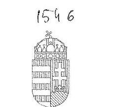

IGAZSÁGÜGYI MINISZTER

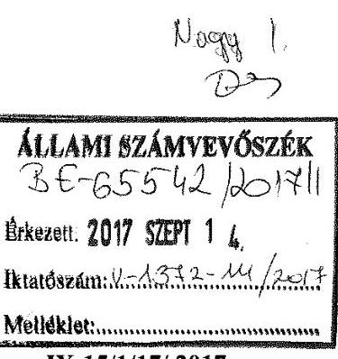

IX-15/1/17/2017.

Domokos László úr részére
elnök

Állami Számvevőszék

Budapest

Tárgy: „Az állami tulajdonban (résztulajdonban) lévő gazdálkodó szervezetek vagyonmegőrzési és gazdálkodási tevékenységének ellenőrzése - Országos Fordító és Fordításhitelesítő Iroda Zrt.” címmel készített számvevőszéki jelentéstervezet véleményezése

Tisztelt Elnök Úr!

Hivatkozással „Az állami tulajdonban (résztulajdonban) lévő gazdálkodó szervezetek vagyonmegőrzési és gazdálkodási tevékenységének ellenőrzése - Országos Fordító és Fordításhitelesítő Iroda Zrt.” címmel készített számvevőszéki jelentéstervezet elektronikus úton hozzám érkezett szövegezésében foglaltakra az alábbiakról tájékoztatom.

Mivel a megküldött tervezet 1. pontjában foglaltak alapján a tárca a tulajdonosi joggyakorlás rendszerét szabályszerűen alakította ki, illetve a tulajdonosi joggyakorlás az ellenőrzött időszakban az előírásoknak megfelelően történt, azzal kapcsolatosan negatív tartalmú körülmény megállapítására nem került sor, ezért kérem, hogy a tervezet „Összegzés” részének szövegezése az alábbiak szerint kerüljön módosításra:

„A Közigazgatási és Igazságügyi Minisztérium, majd névváltozást követően az Igazságügyi Minisztérium a társaság feletti tulajdonosi jogokat szabályszerűen gyakorolta.”

Emellett a jelentéstervezet 3. számú javaslatával összefüggésben jelzem, hogy az OFFI Zrt. stratégiai tervének felülvizsgálata időközben már megvalósult, és annak eredményeként a társaság 2016-2018. közötti időszakra vonatkozó középtávú fejlesztési stratégiáját a tulajdonosi joggyakorló 4/2017. számú alapítói határozatával 2017. február 27-én jóváhagyta.

Budapest, 2017. szeptember 12.

Tiszteltel:

Dr. Trócsányi László
miniszter

Postacím: 1357 Budapest, Pf. 2. Tel: (06-1) 795 9812 E-mail: miniszter@m.gaz.hu

---

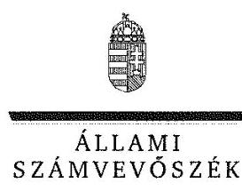

ELNÖK

Ikt.szám: V-1372-114/2016.

# Dr. Trócsányi László úr 

miniszter
Igazságügyi Minisztérium

## Budapest

## Tisztelt Miniszter Úr!

Az „Állami tulajdonú gazdasági társaságok - Az állami tulajdonban (résztulajdonban) lévő gazdálkodó szervezetek vagyonmegőrzési és gazdálkodási tevékenységének ellenőrzése - Országos Fordító és Fordításhitelesítő Zrt.” címmel készített számvevőszéki jelentéstervezetre tett észrevételeit köszönettel megkaptam.
Az Állami Számvevőszék észrevételekre vonatkozó álláspontjáról a felügyeleti vezető által készített részletes tájékoztatást csatoltan megküldöm.
Tájékoztatom Miniszter urat, hogy a számvevőszéki jelentésben - az Állami Számvevőszékről szóló 2011. évi LXVI. törvény 29. § (3) bekezdése alapján - a figyelembe nem vett észrevételeket szerepeltetjük az elutasítás indokának feltüntetésével.

Budapest, 2017. 10. hó 06. nap
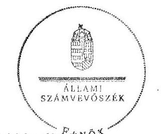

Tisztelettel:

Domokos László

Melléklet: Tájékoztatás az észrevételek kezeléséről

---

# Tájékoztatás   az észrevételek kezeléséről 

Az ,,Állami tulajdonú gazdasági társaságok - Az állami tulajdonban (résztulajdonban) lévő gazdálkodó szervezetek vagyonmegőrzési és gazdálkodási tevékenységének ellenőrzése - Országos Fordító és Fordításhitelesítő Zrt." címû számvevőszéki jelentéstervezetre 2017. szeptember 14-én érkezett észrevételeit áttekintettem, azok kezeléséről az alábbi tájékoztatást adom.

## A jelentéstervezet 5. oldal 1. mondatában szereplő megállapításra vonatkozó észrevétele kapcsán

Az észrevétel szerint a Minisztérium tulajdonosi joggyakorlására vonatkozóan a jelentéstervezetben nem került sor negatív tartalmú körülmény megállapítására, így kéri az 1. mondat módosítását.

A dokumentumok ismételt áttekintése alapján a jelentéstervezet 5. oldal első sorából az „összességében" szót töröljük.

## A jelentéstervezet 20. oldal „Javaslatok" címû fejezet 3. javaslatra vonatkozó észrevétele kapcsán

Észrevételében jelezte, hogy az Országos Fordító és Fordításhitelesítő Zrt. stratégiai tervének felülvizsgálata megvalósult, a középtávú fejlesztési stratégiát a tulajdonosi joggyakorló jóváhagyta.

Az Országos Fordító és Fordításhitelesítő Zrt. stratégiai tervének felülvizsgálatáról és a középtávú fejlesztési stratégia jóváhagyásáról szóló tájékoztatását köszönjük. Az észrevételben leírt intézkedés az ellenőrzött időszakot követően történt, ezért az a jelentéstervezet megállapítását nem érinti, a javaslatot megalapozó megállapítás és a javaslat módosítása, illetve törlése nem indokolt.

Budapest, 2017. 10. hó 02. nap
$\qquad$ $>$
Dr. Nagy Imre felügyeleti vezető

---

# 11181 

## 11181

## Magyar Nemzeti 

Vagyonkezelő Zrt.
VEZÉRIGAZGATÓ

Állami Számvevőszék

## Domokos László

elnök

1052 Budapest
Apáczai Cs. J. u. 10.

Ikt. sz.: MNV/01/7918/ 2 /2017.
Hiv. sz.: V-1372-102/2016.

Tisztelt Elnök Úr!

A 2017. augusztus 24. napján „Az állami tulajdonban (résztulajdonban) lévő gazdálkodó szervezetek vagyonmegőrzési és gazdálkodási tevékenységének ellenőrzése - Országos Fordító és Fordításhitelesítő Iroda Zrt." tárgyában kézhez vett, V-1372-102/2016. ikt. sz. Jelentés-tervezetre az alábbi észrevételeket tesszük:
„Az ellenőrzés területe Országos Fordító és Fordításhitelesítő Iroda Zrt." / 7. oldal 3. bekezdése
Mivel a tervezet több ponton is rögzíti, hogy az OFFI felett a társasági részesedések vonatkozásában a KIM-IM gyakorolta a tulajdonosi jogokat, így a MNV Zrt. csak közvetett módon biztosíthatta az Országos Fordító és Fordításhitelesítő Iroda Zrt. (a továbbiakban: Társaság) működését, mivel a tárgyi vagyonkezelési szerződés elsődleges célja az ingatlantulajdoni hányad mint állami vagyon hatékony és rendeltetésszerű használatának biztosítása volt.

Fentiek alapján javasoljuk a vonatkozó szövegrész módosítását az alábbiak szerint: ,,Az MNV Zrt. egy budapesti ingatlan 73/100-ad tulajdoni hányadára vonatkozó, az OFFI Zrt-vel kötött vagyonkezelési szerződéssel az OFFI Zrt. működését is biztosította. "
„Az ellenőrzés területe Országos Fordító és Fordításhitelesítő Iroda Zrt." / 7. oldal 3. bekezdése; „Megállapítások 1.2. számú megállapítás" / 13. oldal 1. bekezdése; „Rövidítések jegyzéke" / 31. oldal 3. pontja és 33. oldal 24. pontja

A Jelentés-tervezettel összefüggésben szükségesnek tartjuk megjegyezni, hogy az MNV Zrt. és Társaság között a Budapest, belterület 28398 hrsz.-ü, természetben 1062 Budapest, Bajza utca 52. sz. alatt található „kivett irodaház" megnevezésű ingatlan 73/100-ad arányú tulajdoni hányada (a továbbiakban: Ingatlanhányad) vonatkozásában, SZT-38534 szám alatt jött létre vagyonkezelési szerződés 2012. szeptember 18. napján.

---

Az előzőekben írtakra tekintettel kérjük, hogy ahol a Jelentés-tervezet az Ingatlanhányadra vonatkozóan létrejött vagyonkezelési szerződésre utal ott ez az utalás az SZT-38534 szám alatt létrejött vagyonkezelési szerződésre vonatkozzon.
„Rövidítések jegyzéke" / 31. oldal 11. pontja
A Jelentés-tervezet szövege szerint a hivatkozott szerződés ingatlanra vonatkozik, azonban a szerződésnek társasági részesedés a tárgya.

Mindezek alapján javasoljuk a szövegrész pontosítását az alábbiak szerint: „SZT-35610 számú egyéb vagyonkezelővel, társasági részesedésre vonatkozó vagyonkezelési szerződés az MNV Zrt. és a KIM között (Budapest, 2010. december 22.)".

Kérem Elnök Urat, hogy a jelentés véglegesítése során jelen észrevételeinket szíveskedjenek figyelembe venni.

Budapest, 2017. szeptember

Üdvözlettel:
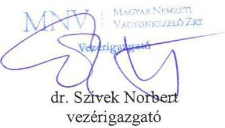

---

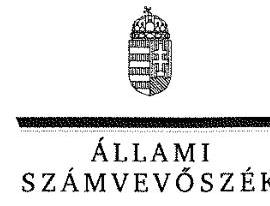

ELNÖK

Ikt.szám: V-1372-119/2016.

# Dr. Szivek Norbert úr 

vezérigazgató
Magyar Nemzeti Vagyonkezelő Zrt.

## Budapest

## Tisztelt Vezérigazgató Úr!

Az ,,Állami tulajdonú gazdasági társaságok - Az állami tulajdonban (résztulajdonban) lévő gazdálkodó szervezetek vagyonmegőrzési és gazdálkodási tevékenységének ellenőrzése - Országos Fordító és Fordításhitelesítő Zrt." címmel készített számvevőszéki jelentéstervezetre tett észrevételeit köszönettel megkaptam.
Az Állami Számvevőszék észrevételekre vonatkozó álláspontjáról a felügyeleti vezető által készített részletes tájékoztatást csatoltan megküldöm.
Tájékoztatom Vezérigazgató urat, hogy a számvevőszéki jelentésben - az Állami Számvevőszékről szóló 2011. évi LXVI. törvény 29. § (3) bekezdése alapján - a figyelembe nem vett észrevételeket szerepeltetjük az elutasítás indokának feltüntetésével.

Budapest, 2017. 10. hó 03. nap
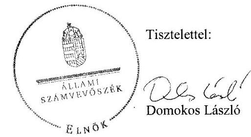

Melléklet: Tájékoztatás az észrevételek kezeléséről

---

# Tájékoztatás   az észrevételek kezeléséről 

Az ,,Állami tulajdonú gazdasági társaságok - Az állami tulajdonban (résztulajdonban) lévő gazdálkodó szervezetek vagyonmegőrzési és gazdálkodási tevékenységének ellenőrzése - Országos Fordító és Fordításhitelesítő Zrt." címû számvevőszéki jelentéstervezetre 2017. szeptember 8-án érkezett észrevételeit áttekintettem, annak kezeléséről az alábbi tájékoztatást adom.
A jelentéstervezet 7. oldal „Az ellenőrzés területe" címû fejezet 3. bekezdés 1. mondatában szereplő megállapításra vonatkozó észrevétele kapcsán
Az észrevételben a hivatkozott mondat pontosítását kérte.
A jelentéstervezet megállapítása értelmében az Országos Fordító és Fordításhitelesítő Iroda Zrt. vagyongazdálkodásának feltételeit szabályszerűen alakította ki a Magyar Nemzeti Vagyonkezelő Zrt. Észrevétele a jelentéstervezetben foglalt megállapítást nem vitatja, így a megállapítás módosítása nem indokolt.
A jelentéstervezet 31. oldal „Rövidítésjegyzék" címû fejezet 3. és 24. pontjában szereplő rövidítésekre vonatkozó észrevétele kapcsán
Észrevételében jelezte, hogy „Az ellenőrzés területe", illetve a „Megállapítások" 1.2. fejezete részben szereplő 3. és 24. sorszámú rövidítések hivatkozása az SZT-38534 iktatószámú, az MNV Zrt. és OFFI Zrt. közötti vagyonkezelési szerződésre vonatkozik.
Észrevétele megalapozott, azt elfogadom. A Rövidítésjegyzék 3. pontját az ,,SZT-38534 iktatószámon kötött Vagyonkezelési szerződés egyéb vagyonkezelővel, ingatlanra vonatkozóan MNV Zrt. és OFFI Zrt. között (2012. szeptember 18.)" szövegrészre módosítom, a Rövidítésjegyzék 24. pontját (13. oldal) pedig a duplikáció miatt törlöm.

## A jelentéstervezet 31. oldal „Rövidítésjegyzék" címû fejezet 11. pontjában szereplő rövidítésre vonatkozó észrevétele kapcsán

Észrevételében a Rövidítésjegyzék 11. pontjában hivatkozott rövidítés pontosítását kérte.
Az észrevételt részben fogadom el, az észrevétellel érintett szerződés megnevezése annak pontos címével és a Rövidítésjegyzék 16. pontjával is összhangban módosításra kerül a Rövidítésjegyzék 11. pontjában az ,,SZT-35610 iktatószámon kötött Szerződés társasági részesedés vagyonkezelésbe adásáról MNV Zrt. és KIM között (2010. december 30.)" szövegrészre.

Budapest, 2017. 10. hó 02. nap
$\longleftrightarrow \longrightarrow \longrightarrow$
Dr. Nagy Imre felügyeleti vezető

---

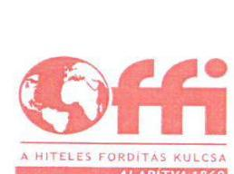

# Gelencsér Zsolt 

ellenőrzésvezető
részére
Állami Számvevőszék

## Budapest

Apáczai Csere János u. 10. 1052

Tárgy: Észrevétel jelentéstervezetre vonatkozóan

## Tisztelt Ellenőrzésvezető Úr!

| Ikt.sz.: | V16-005-6/2017 |
| :--: | :--: |
| Hiv.sz.: | V0759 ellenőrzés |
|  | V-1372-103/2016. |
| Úgyintéző: | Ignácz Zoltán |
| Elérhetőség: | ignacz.zoltan@offi.hu |

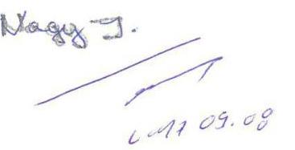

Köszönettel kézhez kaptam az „Állami tulajdonú gazdálkodási társaságok - Az állami tulajdonban (résztulajdonban) lévő gazdálkodó szervezetek vagyonmegőrzési és gazdálkodási tevékenységének ellenőrzése - Országos Fordító és Fordításhitelesítő Zrt." címmel készült számvevőszéki jelentéstervezetüket.

Egyetlen szövegkorrekciót javaslunk: a 7. oldal 5. bekezdése ismerteti az OFFI Zrt. tevékenységét. Ennek megfogalmazásában minimális elírás történt ezért a következő szöveget javasoljuk: „Az OFFI Zrt. kizárólagos feladatkörébe tartozik jogszabályi rendelkezés folytán a hiteles fordítás, fordításhitelesítés, idegen nyelvű irat hiteles másolatának elkészítése, amely egyben közfeladat ellátása. A jogszabály további rendelkezése alapján feladata ezen kívül a lektorálás, névviselési ügyben szakhatósági tevékenység ellátása. Cégjegyzék szerinti főtevékenysége a szakfordítás, tolmácsolás."

Ezen túl egyéb észrevételt a jelentésre nem kívánunk tenni. A jelentéstervezetben foglaltakkal köszönettel egyetértünk. A jelentéstervezetben tett (a 2012-2015 közötti időszakra vonatkozó) megállapításokra a tárgyidőszakot követő években az OFFI Zrt. - a saját belső ellenőrzési tapasztalataiból is kiindulva - saját hatáskörben intézkedéseket valósított meg.

Együttműködésüket ezúton is köszönöm.

Budapest, 2017. augusztus 29.

Tisztelettel:
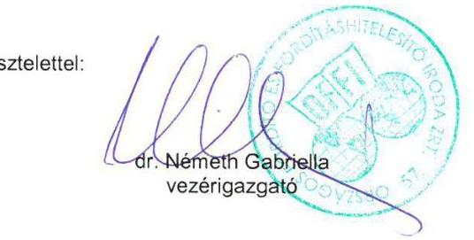

[^0]
[^0]:    Országos Fordító és Fordításhitelesítő Iroda Zrt.
    1062 Budapest, Bajza u. 52. - 1394 Budapest, Postafiók 359.
    Telefon: +36 (1) 4289600 - Fax:+36 (1) 2695184
    www.offi.hu - titkarsag@offi.hu
    Cg.: 01-10-042469 -Adószám: HU 10941908

---

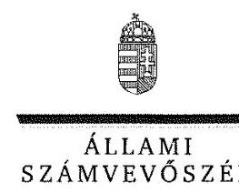

ELNÖK

# Dr. Németh Gabriella úrhölgy 

vezérigazgató
Országos Fordító és Fordításhitelesítő Iroda Zrt.

## Budapest

## Tisztelt Vezérigazgató Úrhölgy!

Az ,,Állami tulajdonú gazdasági társaságok - Az állami tulajdonban (résztulajdonban) lévő gazdálkodó szervezetek vagyonmegőrzési és gazdálkodási tevékenységének ellenőrzése - Országos Fordító és Fordításhitelesítő Zrt." címmel készített számvevőszéki jelentéstervezetre tett észrevételét köszönettel megkaptam.
Az Állami Számvevőszék észrevételre vonatkozó álláspontjáról a felügyeleti vezető által készített részletes tájékoztatást csatoltan
 megküldöm.
Tájékoztatom Vezérigazgató úrhölgyet, hogy a számvevőszéki jelentésben - az Állami Számvevőszékről szóló 2011. évi LXVI. törvény 29. § (3) bekezdése alapján - a figyelembe nem vett észrevételt szerepeltetjük az elutasítás indokának feltüntetésével.

Budapest, 2017. 10. hó 02. nap
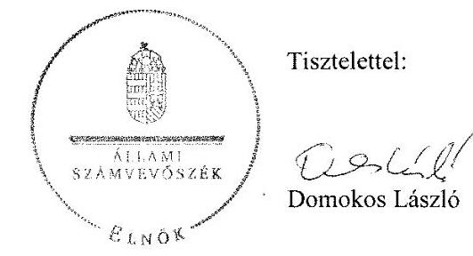

Melléklet: Tájékoztatás az észrevétel kezeléséről

---

# Tájékoztatás   az észrevétel kezeléséről 

Az „Állami tulajdonú gazdasági társaságok - Az állami tulajdonban (résztulajdonban) lévő gazdálkodó szervezetek vagyonmegőrzési és gazdálkodási tevékenységének ellenőrzése Országos Fordító és Fordításhitelesítő Zrt " címû számvevőszéki jelentéstervezetre 2017. szeptember 6-án érkezett észrevételét áttekintettem, annak kezeléséről az alábbi tájékoztatást adom.
A jelentéstervezet 7. oldal „Az ellenőrzés területe" címû fejezet 5. bekezdés 1. mondatában szereplő megállapításra vonatkozó észrevétele kapcsán
Az észrevétel szerint a bekezdésben „,...minimális elírás történt...". ezért szövegkorrekciót kér. Az észrevétel hivatkozik arra, hogy az Országos Fordító és Fordításhitelesítő Zrt. jogszabályi rendelkezések folytán látja el feladatait, illetve a cégjegyzék szerinti főtevékenysége a szakfordítás, tolmácsolás.
A jelentés hivatkozott bekezdésének 8. és 9. rövidítése tartalmazza a feladatellátás jogszabályi alapjait (Rövidítésjegyzék 31. oldal). A Társaság Alapszabálya és Szervezeti és Működési Szabályzata is rögzíti főtevékenységként a szakfordítás, tolmácsolást. Észrevétele a jelentéstervezetben foglalt megállapítást nem vitatja, így annak módosítása nem indokolt.

Budapest, 2017. 10. hó 02. nap
$\qquad$
Dr. Nagy Imre
felügyeleti vezető

---

.

---

# RÖVIDÍTÉSEK JEGYZÉKE 

${ }^{1}$ OFFI Zrt.
${ }^{2}$ MNV Zrt.
${ }^{3}$ Vagyonkezelési szerződés
${ }^{4}$ tulajdonosi joggyakorló1-2
${ }^{5}$ KIM
${ }^{6}$ MM tv.
${ }^{7}$ IM
${ }^{8}$ AB határozat
${ }^{9}$ Feladatellátás jogszabályi alapjai:
MT
IM rendelet

125/1993. (IX. 22.) Korm. rendelet
${ }^{10} \mathrm{Kv}_{1-4}$
${ }^{11}$ MNV Zrt - KIM közötti szerződés
${ }^{12}$ Nvtv.
${ }^{13}$ Megbízási szerződés
${ }^{14}$ Társasági részesedés megszüntetése
${ }^{15} \mathrm{Lo}_{1-13}$

Országos Fordító és Fordításhitelesítő Iroda Zártkörűen Működő Részvénytársaság
Magyar Nemzeti Vagyonkezelő Zártkörűen Működő Részvénytársaság
SZT-38534 Iktatószámon kötött Vagyonkezelési szerződés egyéb vagyonkezelővel, ingatlanra vonatkozóan MNV Zrt. és OFFI Zrt. között (2012. szeptember 18.)
tulajdonosi joggyakorló; Közigazgatási és Igazságügyi Minisztérium tulajdonosi joggyakorló2 Igazságügyi minisztérium
Közigazgatási és Igazságügyi Minisztériuma, tulajdonosi joggyakorló
Magyarország Minisztériumainak felsorolásáról szóló 2014. évi XX. törvény 1. § (2) bekezdés e) pontja alapján 2014.06.06-tól az Igazságügyi Minisztérium
Igazságügyi Minisztérium, tulajdonosi joggyakorló
354/B/1995. AB határozat Indoklás II. 1. pont 2. bekezdés

24/1986. (VI.26.) MT rendelet a szakfordításról és tolmácsolásról
7/1986. (VI.26.) IM rendelet a szakfordításról és a tolmácsolásról szóló 24/1986. (VI. 26.) MT számú rendelet végrehajtásáról
a magyar állampolgárságról szóló 1993. évi LV. törvény végrehajtásáról szóló a 125/1993. (IX. 22.) Korm. rendelet
Országos Fordító és Fordításhitelesítő Iroda Zártkörűen Működő Részvénytársaság kapcsolt vállalkozásai:
$\mathrm{Kv}_{1} \quad$ OFFI-BON Kereskedelmi és Szolgáltató Kft.
$\mathrm{Kv}_{2} \quad$ OFFI-COOP Kft.
$\mathrm{Kv}_{3} \quad$ OFFICE Számítástechnikai, Kereskedelmi és Szolgáltató Kft.
$\mathrm{Kv}_{4} \quad$ SKART Kereskedelmi és Szolgáltató Kft.
SZT-35610 Iktatószámon kötött Szerződés társasági részesedés vagyonkezelésbe adásáról MNV Zrt és KIM között (2010. december 30.)
a nemzeti vagyonról szóló 2011. évi CXCVI. törvény
SZT-39.125 iktatószámú társasági részesedéshez kapcsolódó tulajdonosi jogok gyakorlására létrejött Megbízási szerződés az MNV Zrt és KIM között (Budapest, 2013. január 1.)
SZT-39.128 iktatószámon az MNV Zrt és KIM között megállapodás társasági részesedés vagyonkezelésének megszüntetéséről
Országos Fordító Fordításhitelesítő Iroda Zártkörűen Működő Részvénytársaság létesítő okiratai:
$\mathrm{Lo}_{1}$ Alapító Okirat, hatályos 2011.01.14-től
$\mathrm{Lo}_{2}$ Alapító Okirat, hatályos 2012.09.02-től
$\mathrm{Lo}_{3}$ Alapító Okirat, hatályos 2012.11.14-től
$\mathrm{Lo}_{4}$ Alapító Okirat, hatályos 2013.11.06-tól
$\mathrm{Lo}_{5}$ Alapító Okirat, hatályos 2014.02.11-től
$\mathrm{Lo}_{6}$ Alapszabály, hatályos 2014.05.28-tól

---

${ }^{16}$ tulajdonosi joggyakorló ${ }_{1-2}$ szerződések
${ }^{17}$ Tulajdonosi SzMSZ
Tulajdonosi SZMSZ ${ }_{1}$
Tulajdonosi SZMSZ ${ }_{2}$
Tulajdonosi SZMSZ ${ }_{3}$
Tulajdonosi SZMSZ ${ }_{4}$
Tulajdonosi SZMSZ ${ }_{5}$
Tulajdonosi SZMSZ ${ }_{6}$
Tulajdonosi SZMSZ ${ }_{7}$
Tulajdonosi SZMSZ ${ }_{8}$
Tulajdonosi SZMSZ ${ }_{9}$
Tulajdonosi SZMSZ ${ }_{10}$
Tulajdonosi SZMSZ ${ }_{11}$
Tulajdonosi SZMSZ ${ }_{12}$
Tulajdonosi SZMSZ ${ }_{13}$
${ }^{18}$ Jav $_{1-2}$
${ }^{19}$ Üzleti terv $_{1-4}$
$\mathrm{Lo}_{7}$ Alapszabály, hatályos 2014.10.03-tól
$\mathrm{Lo}_{8}$ Alapszabály, hatályos 2014.11.20-tól
$\mathrm{Lo}_{9}$ Alapszabály, hatályos 2015.01.15-tól
$\mathrm{Lo}_{10}$ Alapszabály, hatályos 2015.05.15-tól
$\mathrm{Lo}_{11}$ Alapszabály, hatályos 2015.07.20-tól
$\mathrm{Lo}_{12}$ Alapszabály, hatályos 2015.10.07-tól
$\mathrm{Lo}_{13}$ Alapszabály, hatályos 2015.11.30-tól
SZT-35610 Iktatószámon kötött Szerződés társasági részesedés vagyonkezelésbe adásáról MNV Zrt és KIM között (2010. december 30.) SZT-39128 iktatószámon kötött Szerződés társasági részesedés vagyonkezelésének megszüntetéséről az MNV Zrt - KIM között (2012. december 31.)
SZT-39125 Megbízási Szerződés társasági részesedéshez kapcsolódó tulajdonosi jogok gyakorlására (2013. január 1.)
KIM/IM Szervezeti és Működési Szabályzat
17/2010. (VIII. 31.) KIM utasítás, hatályos 2011. november 28-tól 2012. július 27-ig;
17/2010. (VIII. 31.) KIM utasítás, hatályos 2012. július 28-tól 2012. november 16-ig
17/2010. (VIII. 31.) KIM utasítás, hatályos 2012. november 17-től 2013. január 25-ig
17/2010. (VIII. 31.) KIM utasítás, hatályos 2013. január 26-tól 2013. május 17-ig
17/2010. (VIII. 31.) KIM utasítás, hatályos 2013. május 18-tól 2013. június 18-ig
17/2010. (VIII. 31.) KIM utasítás, hatályos 2013. június 19-től 2013. szeptember 13-ig
17/2010. (VIII. 31.) KIM utasítás, hatályos 2013. szeptember 14-től 2013. október 25-ig
17/2010. (VIII. 31.) KIM utasítás, hatályos 2014. október 14-től 2014. május 5-ig
17/2010. (VIII. 31.) KIM utasítás, hatályos 2014. május 6-tól 2014. november 15-ig
7/2014. (XI. 14.) IM utasítás az IM SzMSz-ről, hatályos 2014. november 15-én
7/2014. (XI. 14.) IM utasítás az IM SzMSz-ről, hatályos 2014. november 16-tól 2015. június 2-ig
7/2014. (XI. 14) IM utasítás az IM SzMSz-ről, hatályos 2015. június 3-tól 2015. december 4-ig
7/2014. (XI. 14) IM utasítás az IM SzMSz-ről, hatályos 2015. december 4-től
Jav1 Javadalmazási szabályzat 2010. január 13-tól
Jav2 Javadalmazási szabályzat 2015. december 22-től
Üzleti terv1: 2012. év: 2/2012. számú alapítói határozattal fogadták el; Üzleti terv2: 2013. év: 1/2013. számú alapítói határozattal fogadták el; Üzleti terv3: 2014. év: 6/2013. számú alapítói határozattal fogadták el; Üzleti terv4: 2015. év: 8/2015. számú alapítói határozattal fogadták el.

---

${ }^{20}$ Éves beszámolók elfogadása
${ }^{21} \mathrm{Ptk}_{2}$
${ }^{22}$ Taktv.
${ }^{23} \mathrm{FB}$
${ }^{24} \mathrm{Vtv}$.
${ }^{25}$ MNV Zrt. Vagyon-nyilvántartási szabályzat ${ }_{1}$

Vagyon-nyilvántartási szabályzat ${ }_{2}$

Vagyon-nyilvántartási szabályzat ${ }_{3}$

Vagyongazdálkodási döntések
${ }^{26} \mathrm{Vhr}$.
${ }^{27} \mathrm{SZMSZ}_{1-4}$
${ }^{28} \mathrm{Szp}_{1-4}$
${ }^{29}$ Számv. tv
${ }^{30} \mathrm{Lsz}_{1-2}$
${ }^{31}$ Ész $_{1-3}$
${ }^{32} \mathrm{Pksz}_{1-5}$
2012. évben: 2/2013. számú alapítói határozat; 2013. évben: 1/2014. számú alapítói határozat; 2014. évben: 4/2015. számú alapítói határozat; 2015. évben: 4/2016. számú alapítói határozat
2013. évi V. törvény
a Polgári Törvénykönyvről
2009. évi CXXII. törvény
a köztulajdonban álló gazdasági társaságok takarékosabb működéséről OFFI Zrt. Felügyelő Bizottsága
2007. évi CVI. törvény az állami vagyonról

46/2008. sz. vezérigazgatói utasítás az MNV Zrt. Vagyon-nyilvántartási Szabályzatáról
10/2014. sz. vezérigazgatói utasítás az MNV Zrt közvetlen és közvetett kezelésű rábízott vagyonának nyilvántartási feladataira vonatkozó alapvető belső szabályok, hatályos: 2014. május
12/2014. számú vezérigazgatói utasítás az MNV Zrt. állami vagyon kezelőire, az állami vagyont használókra és a társasági részesedések esetében az MNV Zrt tulajdonosi joggyakorlását megbízottként ellátókra vonatkozó Vagyon-nyilvántartási szabályzata, hatályos 2014. május 31. 35/2012. (IX. 17.) IFŐIG. sz. határozat; 271/2013. (VIII. 01.) VIG. sz. határozat; 285/2014. (V. 26.) IG. sz. határozat, 306/2014. (VI. 13.) VIG sz. határozat; 324/2015. (IV.15.) VIG határozat; 41/2015. (III. 5.) ÚPIG számú határozat
az állami vagyonnal való gazdálkodásról szóló 254/2007. (X. 4.) Korm. rendelet
Országos Fordító Fordításhitelesítő Iroda Zártkörűen Működő Részvénytársaság ellenőrzött időszakban hatályos szervezeti és működési szabályzatai: 1. 2011. július 1-től, 2. 2012. március 1-től, 3. 2012. július 13-tól, 4. 2015. október 30-tól, 9/2015. számú alapítói határozattal
Szp ${ }_{1}$ Számviteli politika, hatályos 2011. január 2-tól
Szp2 Számviteli politika 2013. május 10-től
Szp3 Számviteli politika 2014. június 17-től
Szp3 Számviteli politika 2015. december 31-től
a számvitelről szóló 2000. évi C. törvény
Lsz ${ }_{1}$ leltározási szabályzat 2001. március 25-től
Lsz ${ }_{2}$ leltározási szabályzat 2014. szeptember 26-tól
Ész ${ }_{1}$ értékelési szabályzat 2001. március 25-től
Ész ${ }_{2}$ értékelési szabályzat 2013. május 10-től
Ész ${ }_{3}$ értékelési szabályzat 2014. június 17-től
Pksz ${ }_{1}$ pénzkezelési szabályzat 2009. november 1-től
Pksz ${ }_{2}$ pénzkezelési szabályzat 2012. augusztus 7-től
Pksz ${ }_{2.1}$ pénzkezelési szabályzatmódosítás 2012. október 1-től
Pksz ${ }_{2.2}$ pénzkezelési szabályzatmódosítás 2013. április 15-től
Pksz ${ }_{2.3}$ pénzkezelési szabályzatmódosítás 2013. május 29-től
Pksz ${ }_{3}$ pénzkezelési szabályzat 2014. február 18-tól
Pksz ${ }_{3.1}$ pénzkezelési szabályzatmódosítás 2014. december 15-től
Pksz ${ }_{4}$ pénzkezelési szabályzat 2015. március 30-tól

---

Pksz5 pénzkezelési szabályzat 2015. május 6-tól
Pksz5.1 pénzkezelési szabályzatmódosítás 2015. június 1-től
Pksz5.2 pénzkezelési szabályzatmódosítás 2015. június 15-től
Országos Fordító és Fordításhitelesítő Iroda Zártkörűen Működő Részvénytársaság
Önköltség-számítási szabályzat, hatályos 2014. március 12-től
Számlarend, hatályos 2001. március 31-től
Értékelési szabályzat1, hatályos 2001. március 25-től
Értékelési szabályzat2, hatályos 2013. május 10-től
Értékelési szabályzat3, hatályos 2014. június 17-től
Kintlévőség Kezelési Szabályzat1 1/2013. Gazdasági Főosztályi utasítás
Kintlévőség Kezelési Szabályzat2 1/2014. Gazdasági Főosztályi utasítás
Kintlévőség Kezelési Szabályzat3 2/2014. Gazdasági Főosztályi utasítás Számv.tv. 155. § (1) szerinti és az létesítő okiratokban 1-13 előírt könyvvizsgálati kötelezettség
Adatkezelési és Közzétételi Szabályzat hatályos 2014. április 1-től
Nemzeti Adó- és Vámhivatal
a Polgári Törvénykönyvről szóló 1959. évi IV. törvény (hatálytalan 2014. március 15-től)
a polgári perrendtartásról szóló 1952. évi III. törvény
egyenlő bánásmódról és az esélyegyenlőség előmozdításáról szóló 2003. évi CXXV. törvény

---

# ÁLLAMI SZÁMVEVŐSZÉK 

1052 Budapest, Apáczai Csere János utca 10.
Levélcím: 1364 Budapest 4. Pf. 54
Telefon: +36 14849100 Telefax: +36 14849200
www.asz.hu

