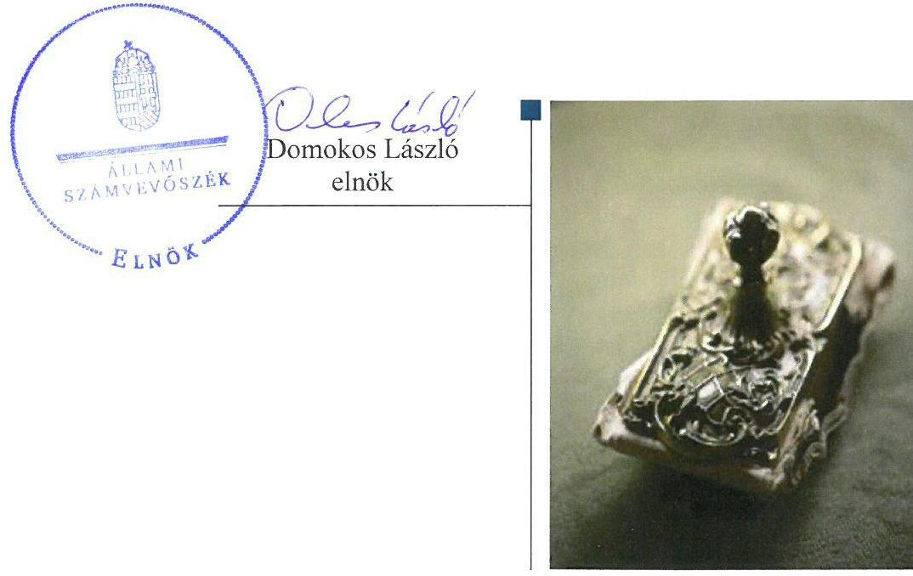
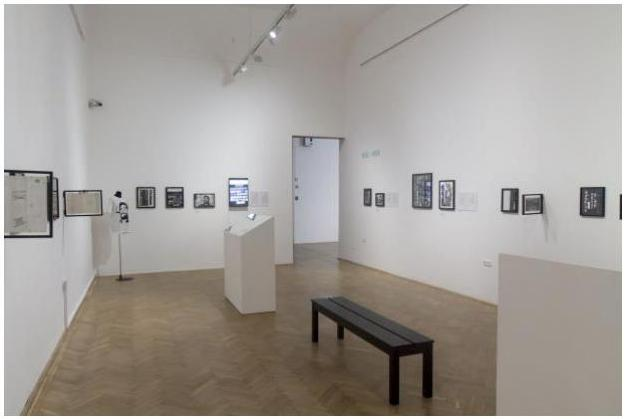
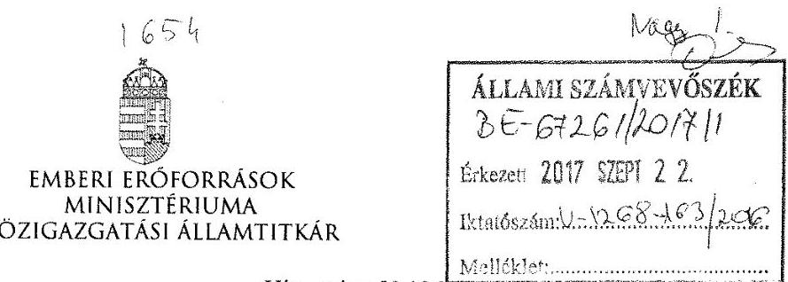
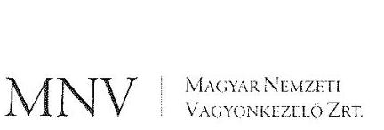
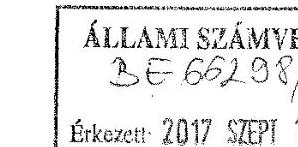
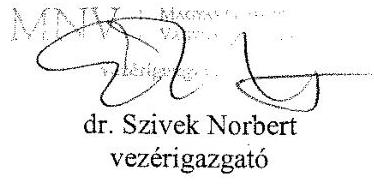
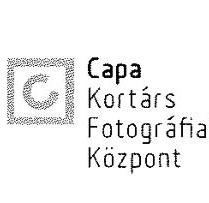
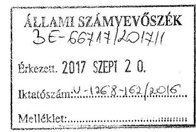
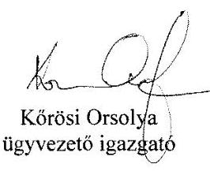

# Jelentés 

## Állami tulajdonú gazdasági társaságok

Az állami tulajdonban (résztulajdonban) lévő gazdálkodó szervezetek vagyonmegőrzési és gazdálkodási tevékenységének ellenőrzése Robert Capa Kortárs Fotográfiai Központ Nonprofit Kft.
2017.

---

# Jelentés 

## Állami tulajdonú gazdasági társaságok

Az állami tulajdonban (résztulajdonban) lévő gazdálkodó szervezetek vagyonmegőrzési és gazdálkodási tevékenységének ellenőrzése Robert Capa Kortárs Fotográfiai Központ Nonprofit Kft.
2017. JO hó 2 h. nap

---

# AZ ELLENŐRZÉST FELÜGYELTE:

DR. NAGY IMRE felügyeleti vezető

# AZ ELLENŐRZÉST VEZETTE ÉS A VÉGREHAJTÁSÁÉRT FELELŐS:

RÁCZKEVI KATALIN ellenőrzésvezető

# A PROGRAM ÖSSZEÁLLÍTÁSÁÉRT FELELŐS:

JANIK JÓZSEF osztályvezető

---

**IKTATÓSZÁM:** V-1268-164/2016.

**TÉMASZÁM:** 2302

**ELLENŐRZÉS-AZONOSÍTÓ SZÁM:** V075921

---

Jelentéseink az Országgyűlés számítógépes hálózatán és az Interneta a www.asz.hu címen is olvashatóak.

---

# TARTALOMJEGYZÉK 

■ ÖSSZEGZÉS ..... 5
■ AZ ELLENŐRZÉS CÉLJA ..... 7
■ AZ ELLENŐRZÉS TERÜLETE ..... 8
■ AZ ELLENŐRZÉS HÁTTERE, INDOKOLTSÁGA ..... 9
■ A JELENTÉS LÉNYEGES KÉRDÉSKÖREI ..... 10
■ ELLENŐRZÉS HATÓKÖRE ÉS MÓDSZEREI ..... 11
■ MEGÁLLAPÍTÁSOK ..... 13
■ JAVASLATOK ..... 19
■ MELLÉKLETEK ..... 21
I. Sz. melléklet: Értelmező szótár. ..... 21
II. Sz. melléklet: Robert Capa Kortárs Fotográfiai Központ Nonprofit Kft. vagyonának összetétele a 2012-2015 években (ezer Ft) ..... 24
■ FÜGGELÉK: ÉSZREVÉTELEK ..... 25
■ RÖVIDÍTÉSEK JEGYZÉKE ..... 29

---

.

---

# ÖSSZEGZÉS 

Az Emberi Erőforrások Minisztériuma és a Magyar Nemzeti Vagyonkezelő Zrt. tulajdonosi joggyakorlása a Robert Capa Kortárs Fotográfiai Központ Nonprofit Kft. felett szabályszerű volt. A Társaság müködése nem volt szabályozott, ezáltal az elszámoltathatóság feltételeit nem alakította ki. A bevételek elszámolása nem felelt meg az előírásoknak, a ráfordítások elszámolása megfelelő volt. A vagyongazdálkodás nem volt szabályszerű. A Társaság a tervezési, beszámolási és közzétételi kötelezettségének eleget tett.

## Az ellenőrzés társadalmi indokoltsága

Az állami tulajdonú gazdálkodó szervezetek a nemzeti vagyon részét képezik. Az állami vagyonnal való gazdálkodást illetően a tulajdonosi joggyakorlás és a vagyonnal való gazdálkodás feladata az állami vagyon átlátható, rendeltetésszerű és felelős felhasználásának biztosítása. Az állam meghatározza az ellátandó közszolgáltatással kapcsolatos feladatokat, amelyhez a vagyonnal kapcsolatos döntéseknek igazodniuk kell.

Magyarországon az intézmény-centrikus közfeladat-ellátás, az állami vagyon gazdálkodás jellemző a költségvetésen kívüli feladatellátás térnyerése mellett. Ennek szereplői az állami tulajdonú gazdasági társaságok is.

A számvevőszéki ellenőrzés hozzájárul a közpénzek szabályos, átlátható, elszámoltatható és eredményes felhasználásához. Minden közpénzt, közvagyont felhasználó szervezettel szemben társadalmi igény, hogy tevékenységükről elszámoljanak. Ennek megfelelően került sor a Robert Capa Kortárs Fotográfiai Központ Nonprofit Kft. ellenőrzésére a 2012-2015. évek vonatkozásában.

## Főbb megállapítások, következtetések

Az Emberi Erőforrások Minisztériuma társasági részesedés feletti tulajdonosi joggyakorlása megfelelt a jogszabályi előírásoknak. A Magyar Nemzeti Vagyonkezelő Zrt. a Társaság használatába adott nemzeti vagyon feletti tulajdonosi jogait szabályszerűen gyakorolta.

A Társaság szervezeti és működési szabályzattal az ellenőrzött időszakban nem rendelkezett, a 2012. február 1jével elkészített szervezeti és működési szabályzatot a tulajdonosi joggyakorló felé jóváhagyásra nem terjesztették elő. A Társaság számviteli szabályzatokat a 2012. január 1. és 2012. január 31. közötti időszakra nem készített. Társaság 2013. július 12-től alakította ki a számlarendjét és a bizonylati rendjét. A számviteli politika 2013. július 11-ig nem volt összhangban a jogszabályi előírással, mert nem szabályozták a külföldi pénzértékre szóló követelés, a valutakészlet, a devizaszámlán lévő devizakészlet forintra történő átszámításánál használandó árfolyamot. A leltározási szabályzat nem tartalmazott előírást a tényleges mennyiségi felvétellel való leltározás gyakoriságára vonatkozóan 2013. július 11-ig, ezt követően a szabályzat az előírásoknak megfelelt. A pénzkezelési szabályzatban 2013. július 11-ig nem határozták meg a Társaság telephelyein lévő egyes pénztárak záró állományának maximális mértékét. Az ellenőrzött időszakban a közhasznúsági mellékletben kimutatott közvetlenül el nem elszámolható költségek egyes tevékenységek közötti felosztásának rendjét nem szabályozták.

A Társaság bevételeinek elszámolása az elszámolásokat alátámasztó dokumentumok hiánya következtében nem volt megfelelő, a ráfordítások elszámolása megfelelt az előírásoknak. Az ellenőrzött időszakban az értékcsökkenési leírás elszámolását a jogszabályoknak és a belső szabályozásnak megfelelően végezték.

A Társaság a beszámolási kötelezettségének eleget tett, azonban a 2014. évi beszámoló közzétételére a jogszabályban előírt határidőn túl került sor. A Társaság a tervezési, adatszolgáltatási és közzétételi kötelezettségének eleget tett.

---

A Társaság vagyongazdálkodása nem volt szabályszerű. A vagyongazdálkodás feltételeit hiányosan alakították ki. A saját vagyon nyilvántartása 2013. július 11-ig nem felelt az előírásoknak, az idegen tulajdonú eszközök nyilvántartása nem volt megfelelő. A 2012. évi mérlegbeszámolót leltárral nem támasztották alá. A vagyon változását eredményező döntések - egy szerződés utólagos alapítói jóváhagyása kivételével - megfeleltek az előírásoknak.

---

# AZ ELLENŐRZÉS CÉLJA 

Az ellenőrzés célja annak értékelése volt, hogy a tulajdonosi jogok gyakorlása szabályszerű volt-e; a gazdálkodó szervezet szabályozottsága, gazdálkodása és vagyongazdálkodási tevékenysége megfelelt-e a jogszabályi és a tulajdonosi előírásoknak, biztosítva volt-e a közfeladatok átláthatósága és elszámoltathatósága érdekében a közszolgáltatás dijának megalapozottsága szabályszerű önköltségszámítással; a vagyonváltozást eredményező döntések esetében a tulajdonosi jogok gyakorlója és a gazdálkodó szervezet szabályszerűen jártak-e el.

---

# **AZ ELLENŐRZÉS TERÜLETE**

## **Robert Capa Kortárs Fotográfiai Központ Nonprofit Korlátolt Felelősségű Társaság**

A Robert Capa Kortárs Fotográfiai Központ Nonprofit Kft. a Magyar Állam kizárólagos tulajdonában álló közhasznú gazdasági társaság. Fő feladata művészeti intézmény működtetése, kulturális programok szervezése.

A Társaság^{1} jogelődjét 1997. december 17-én alapította a Magyar Állam, 2009. január 1-től 2013. július 12-ig Filharmónia Kelet-Magyarország Nonprofit Kft. néven előadó-művészeti kulturális tevékenységet folytatott. Az Alapító^{2} képviseletében eljáró Emberi Erőforrás Minisztériuma 2013. július 12-től módosította a Társaság nevét Robert Capa Nonprofit Kft-re, valamint fő tevékenységi körét művészeti létesítmény működtetésére. A tulajdonosi joggyakorló a Robert Capa Nonprofit Kft. célját a magyar fotográfia népszerűsítésében, a fotózás önálló művészeti ágként való magyarországi elismerésében határozta meg. A Társaság egyszemélyes jellegéből adódóan taggyűlés nem működött, a legfőbb szerv hatáskörébe tartozó kérdésekben az egyedüli tag, az Alapító által kijelölt tulajdonosi joggyakorló^{3} döntött.

A Társaság felett a tulajdonosi jogok gyakorlói 2012. április 17-ig a Magyar Nemzeti Vagyonkezelő Zrt., 2012. április 18-tól a Magyar Nemzeti Vagyonkezelő Zrt.-vel kötött vagyonkezelői szerződés alapján a Nemzeti Erőforrás Minisztérium^{4}, majd 2013. január 27-től megbízási szerződés alapján az Emberi Erőforrások Minisztériuma^{5} volt.

A Társaság jegyzett tőkéje az ellenőrzött időszak alatt 3,2 M Ft^{6} volt. A Társaság ügyvezetőjének személye az ellenőrzött időszakban egy alkalommal változott. A foglalkoztatottak létszáma 2012. évben 12 fő, 2015. évben 17 fő volt. A Társaság főbb gazdálkodási adatait az 1. táblázat tartalmazza.

1. táblázat

|  A TÁRSASÁG FŐBB GAZDÁLKODÁSI ADATAI 2012-2015 KÖZÖTT (MILLIÓ FORINT) |  |  |  |   |
| --- | --- | --- | --- | --- |
|  Megnevezés | 2012. | 2013. | 2014. | 2015.  |
|  jegyzett tőke | 3,2 | 3,2 | 3,2 | 3,2  |
|  saját tőke | 28,1 | 0,8 | -8,9 | 16,9  |
|  mérlegfőösszeg | 56,2 | 86,5 | 73,0 | 66,0  |
|  értékelés nettó árbevétele | 99,1 | 48,9 | 46,8 | 48,5  |
|  mérleg sz. eredmény | 0,8 | -27,3 | -9,8 | 25,8  |
|  követelések | 0,7 | 26,9 | 8,9 | 5,2  |
|  - ebből: lejárt követelés | 0,2 | 0 | 1,0 | 0  |

*Forrás: Robert Capa Kortárs Fotográfiai Központ Nkft. beszámolói*

---

# AZ ELLENŐRZÉS HÁTTERE, INDOKOLTSÁGA 

## Robert Capa Kortárs Fotográfiai Központ Nonprofit Korlátolt Felelősségú Társaság.

Az ÁSZ' alapvető célkitűzése, hogy az államháztartáson kívülre nyújtott költségvetési támogatások és ingyenes vagyon juttatások, valamint az államháztartáson kívül működő közfeladat-ellátó rendszerek ellenőrzéseivel hozzájáruljon ahhoz, hogy a közpénzeket az államháztartáson kívül múködő szervezetek is átlátható, rendezett módon használják fel a közfeladatok szerződésben vállalt állami feladatok ellátása érdekében.

Az ellenőrzés feladata a közvagyonnal biztosított közfeladat ellátással kapcsolatban a közpénzek átláthatósága, nyilvánossága érdekében a jogszabályokban, belső szabályzatokban megfogalmazott előírások érvényesülésének az állami tulajdonban lévő gazdálkodó szervezetek vagyonérték megőrzési és gazdálkodási tevékenységének értékelése.

Az ellenőrzés várható hasznosulásaként az ellenőrzés megállapításai a jogalkotás számára segítséget nyújthatnak a közvagyonnal való gazdálkodás értékeléséhez, jogszabályi keretei pontosításához, az átláthatóságot biztosító szabályozáshoz. Az ellenőrzött szervezetek számára visszajelzést ad a vagyongazdálkodási tevékenységgel, beszámolással kapcsolatos szabálytalanságokról és kockázatokról. Az ellenőrzés tapasztalatai segítik és erősítik az ÁSZ hozzáadott értéket teremtő tevékenységét és tanácsadó szerepét.

---

# A JELENTÉS LÉNYEGES KÉRDÉSKÖREI 

1.     - A tulajdonosi jogok gyakorlása szabályszerű volt-e?
2.     - A Társaság müködésének szabályozottsága megfelelt-e az előírásoknak?
3.     - A Társaságnál a pénzügyi-számviteli, adatszolgáltatási és ellenőrzési feladatok ellátása szabályszerű volt-e?
4.     - A Társaság vagyongazdálkodása szabályszerű volt-e?

---

# ELLENŐRZÉS HATÓKÖRE ÉS MÓDSZEREI 

## Az ellenőrzés típusa

Megfelelőségi ellenőrzés.

## Az ellenőrzött időszak

2012. január 1-től 2015. december 31-ig.

## Az ellenőrzés tárgya

Az állami tulajdonban lévő Robert Capa Kortárs Fotográfiai Központ Nonprofit Kft. gazdálkodása, kiemelten vagyongazdálkodási tevékenysége, valamint a Magyar Nemzeti Vagyonkezelő Zrt. és az Emberi Erőforrások Minisztériuma tulajdonosi joggyakorlása.

## Az ellenőrzött szervezet

A Robert Capa Kortárs Fotográfiai Központ Nonprofit Kft., valamint a Magyar Nemzeti Vagyonkezelő Zrt. és az Emberi Erőforrások Minisztériuma, mint a tulajdonosi jogok gyakorlói.

## Az ellenőrzés jogalapja

Az Állami Számvevőszékről szóló 2011. évi LXVI. törvény 5. § (3)-(5) bekezdései.

## Az ellenőrzés módszerei

Az ellenőrzést az ellenőrzési program ellenőrzési kérdései, az ellenőrzött időszakban hatályos jogszabályok, az ellenőrzés szakmai szabályok és módszertanok figyelembe vételével végeztük el.

Az ellenőrzési kérdések megválaszolásához szükséges bizonyítékok megszerzése az ellenőrzöttek által rendelkezésre bocsátott dokumentumokra, adatokra alapozva kérdésfelvetés, mintavételezés, ellenőrzési eljárások útján történt.

Az ellenőrzött szervezetek az ellenőrzés lefolytatásához tanúsítványok kitöltésével, valamint az ÁSZ által kért dokumentumok megküldésével szolgáltattak adatokat.

---

A bevételek és ráfordítások elszámolását, és a vagyonnyilvántartás terén a szabályszerű működést véletlenszerű mintavétellel ellenőriztük. A mintavétellel ellenőrzött területek esetében minden egyes tétel vonatkozásában szabályszerűségre vonatkozó kérdéseket tettünk fel, amelyek eredménye összesítésre került. A jogszabályoknak és a belső előírásoknak megfelelőnek tekintettük az adott területet, amennyiben a minta ellenőrzésének eredménye alapján 95\%-os bizonyossággal a teljes sokaságban a hibaarány kisebb volt, mint 10\%, nem megfelelőnek értékeltük, ha a hibaarány a 10\%-ot meghaladta. A ráfordítások elszámolására és a vagyonnyilvántartásra vonatkozó véletlen mintavételt kockázati alapú kiválasztással egészítettük ki, amelynek során évente a három legnagyobb összegű tételt választottuk ki.

---

# 1. A tulajdonosi jogok gyakorlása szabályszerű volt-e? 

Összegző megállapítás

Az MNV Zrt. és az EMMI tulajdonosi joggyakorlása szabályszerű volt.

A TULAJDONOSI JOGGYAKORLÁS szabályait a Társaság Alapító Okirata ${ }_{1-7}{ }^{8}$ a Gt.tv. ${ }^{9}$ és a Ptk. ${ }^{10}$ előírásaival, valamint az MNV Zrt. ${ }^{11}$ és az EMMI ${ }^{12}$ szervezeti és müködési szabályzataiban előírtakkal összhangban határozta meg. A tulajdonosi joggyakorló kizárólagos hatáskörébe tartozott egyebek mellett a felügyelő bizottság ${ }^{13}$ tagjainak megválasztása, a szervezeti és müködési szabályzat, a javadalmazási szabályzat, az éves üzleti terv ${ }^{14}$ és a Számv.tv. ${ }^{15}$ szerinti éves beszámoló elfogadása, a közhasznú szerződés megkötésével kapcsolatos döntések meghozatala és a közhasznúsági melléklet elfogadása.

Könyvvizsgáló választásáról, díjazásának meghatározásáról alapítói határozatban döntöttek, kivéve a 2012. évet, amikor az EMMI- az Alapító Okirat 9.2.7. pontjában előírtak ellenére- nem gondoskodott a társaság könyvvizsgálójának megválasztásáról.

A vagyonkezelői szerződés megszüntetését és a társasági részesedés hasznosítására irányuló megbízási szerződést ${ }^{16}$ az EMMI 2013. január 27én írta alá, ezzel nem tartották be az Nvtv. ${ }^{17} 18 . \S$ (7) bekezdésében előírt 2012. december 31-i határidőt. A késedelem miatt a részesedés a 2012. év végén az MNV Zrt. könyvei helyett az EMMI könyveiben szerepelt.

A GAZDÁLKODÁST ÉS A FELADATELLÁTÁST az EMMI az éves üzleti tervek, az egyszerűsített éves beszámolók, a támogatások felhasználásáról készült jelentések elfogadása során ellenőrizte. Az EMMI az Alapító Okirat ${ }_{1-7}$-ban foglaltaknak megfelelően hozott döntést az értékhatárt meghaladó szerződések jóváhagyásáról.

A JAVADALMAZÁSI SZABÁLYZAT ${ }_{1-2}$ elkészítésével a tulajdonosi joggyakorlók gondoskodtak a Tak.tv ${ }^{18}$ 5. § (3) bekezdésében foglaltaknak megfelelően a Társaság vonatkozásában a vezető tisztségviselők, felügyelőbizottsági tagok, valamint az Mt. ${ }^{19}$ 208. §-ának hatálya alá eső munkavállalók javadalmazására, valamint jogviszonya megszűnése esetére biztosított juttatások módjának, mértékének elveiről, annak rendszeréről szóló szabályzat megalkotásáról.

AZ MNV ZRT. a Társaság használatába adott nemzeti vagyon feletti tulajdonosi jogait szabályosan gyakorolta.

Az EMMI és a Társaság ingatlan haszonkölcsönbe adásáról szóló szerződést kötöttek egy, a Magyar Állam tulajdonában lévő ingatlannak a Társaság általi, közfeladat ellátás érdekében történő használatára. A szerződés az Nvtv. és a Vtv. ${ }^{20}$ előírásainak megfelelt. Az MNV Zrt. a szerződés megkötéséhez hozzájárult.

---

Az MNV Zrt.-nek az Nvtv. és a Vhr. ${ }^{21}$ rendelkezéseinek megfelelő vagyon nyilvántartási szabályzata volt az ellenőrzött időszakban.

# 2. A Társaság múködésének szabályozottsága megfelelt-e az előírásoknak? 

Összegző megállapítás

A Társaság múködésének szabályozottsága nem felelt meg az előírásoknak.

SZERVEZETI ÉS MŰKÖDÉSI SZABÁLYZATTAL nem rendelkeztek. A Társaság 2012. január 1-től 2012. január 31-ig szervezeti és működési szabályzatot nem készített, a 2012. február 1-jével elkészített szervezeti és működési szabályzatot az Alapító Okirat ${ }_{1-2} 10.5$ pontjában és az Alapító Okirat ${ }_{3-7} 10.3$ pontjában előírtak ellenére az EMMI felé jóváhagyásra nem terjesztették elő.

Számviteli politikával, leltározási szabályzattal, eszközök és források értékelési szabályzatával, pénzkezelési szabályzattal 2012. január 1-től 2012. január 31-ig a Társaság nem rendelkezett, amely nem felelt meg a Számv.tv. ${ }^{22} 14 . \S$ (3) és bekezdésében, valamint a Számv.tv. 14. § (5) bekezdésében előírtaknak.

A SZÁMVITELI POLITIKA ${ }_{1}{ }^{23}$-ben a Számv.tv. 60. § (1) bekezdésében előírtaknak nem tettek eleget, mert nem szabályozták a külföldi pénzértékre szóló követelés, a valutakészlet, a devizaszámlán levő devizakészlet forintra történő átszámításánál használandó árfolyamot. 2013. július 12-től a Számviteli politika ${ }_{2}{ }^{24}{ }_{3}{ }^{25}$-ban a szabályozási hiányosságot pótolták.

A LELTÁROZÁSI SZABÁLYZAT ${ }_{1}{ }^{26}$ 2012. február 1. és 2013. július 12. között nem tartalmazott rendelkezést a Számv.tv. 69. § (3) bekezdése szerinti tényleges mennyiségi felvétellel való leltározás gyakoriságára vonatkozóan. A 2013. július 12-én készült Leltározási szabályzat ${ }_{2}{ }^{27}$-vel a hiányosságot pótolták.

AZ ESZKÖZÖK ÉS FORRÁSOK ÉRTÉKELÉSI SZABÁLYZATA ${ }_{1}{ }^{28}$ 2012. február 1. és 2013. július 11. között nem tartalmazta az eszközök értékvesztése, értékhelyesbítése megállapításának és elszámolásának szabályait, ezzel a Számv.tv. 46. § (4) bekezdésében, valamint a Számv.tv. 57. §-ában előírtaknak nem tettek eleget. A 2013. július 12-től hatályos Eszközök és források értékelési szabályzata ${ }_{2}{ }^{29}$ megfelelt az előírásoknak.

PÉNZKEZELÉSI SZABÁLYZAT ${ }_{1}{ }^{30}$-ben nem határozták meg a Társaság hét telephelyén levő egyes pénztárak záró állományának maximális mértékét, amely nem felelt meg a Számv.tv. 14. § (8) bekezdésében foglaltaknak. A 2013. július 12-től hatályos Pénzkezelési szabály$z^{31}{ }_{3}{ }^{32}$ - ban a hiányosságot pótolták.

SZÁMLAREND ÉS BIZONYLATI REND készítéséről a Számv.tv. 161. § (1)-(4) bekezdésében előírtak ellenére a Társaság 2012.

---

január 1. és 2013. július 11. között nem gondoskodott. A Számv.tv. előírásainak megfelelő Számlarend ${ }_{1}{ }^{33}$ és Bizonylati rend ${ }^{34} 2013$. július 12 -ei hatályba helyezésével a hiányosságot pótolták.

# A KÖZHASZNÚSÁGI TEVÉKENYSÉGHEZ KAPCSOLÓDÓAN a Társaság 2012. január 1. és 2013. július 12. között a belső szabályzataiban nem biztosította, hogy a Civil tv. ${ }^{35} 46 . \S$ (1) bekezdésében előírt közhasznúsági melléklet összeállításához szükséges adatok rendelkezésre álljanak, mert a közhasznú és vállalkozási bevételek és ráfordítások elkülönített nyilvántartását és a közvetlenül el nem számolható költségek felosztási rendjét nem részletezte tovább, ezzel nem tettek eleget a Számv.tv. 161/A § (2) bekezdésében és a Civil tv. 46. § (1) bekezdésében előírtaknak.

A Számviteli Politika ${ }_{2-3}$ illetve Számlarend ${ }_{1-2}{ }^{36}$ tartalmazta a főkönyvi számlák közhasznú és vállalkozási tevékenység szerinti elkülönítését, azonban a szabályzatokban nem részletezte tovább a közvetlenül el nem számolható költségek felosztási rendjét, ezzel nem tettek eleget a Számv.tv. 161/A § (2) bekezdésében előírtaknak.

## 3. A Társaságnál a pénzügyi-számviteli, adatszolgáltatási és ellenőrzési feladatok ellátása szabályszerű volt-e?

## Összegző megállapítás

3.1. számú megállapítás

1. ábra

|  MINTAVÉTELEG ELLENŐRZOTT TÉRÜLETEK ÉRTÉKELÉSE |  |   |
| --- | --- | --- |
|  A gazdasági társaság bevételei és ráfordításai elszámolásának szabályszerűsége területénként |  |   |
|  Értékesítés nettó árbevételei (építő rendkívüli bevételek és elégítő műintékek bevételei) | Nem megfelelő |   |
|  - Anyagjellegú ráfordítások
(épzés, rendkívüli és gazdasági feladatok) |  |   |
|  - ráfordításai |  |   |
|  - Vagyojogalkomontások és értékcsökkenési leírás | Megfelelő |   |
|  - Személyi jellegú ráfordítások | Megfelelő |   |
|  - Vagyojog |  |   |

A Társaság a pénzügyi-számviteli feladatait a bevételek elszámolása kivételével szabályszerűen végezte. A tervezési, adatszolgáltatási és közzétételi kötelezettségeinek eleget tett.

A bevételek elszámolása nem volt megfelelő, a ráfordítások elszámolása megfelelt a jogszabályi előírásoknak és a belső szabályozásnak.

A BEVÉTELEK elszámolása az ellenőrzött időszakban nem volt megfelelő. Az elszámolásokat alátámasztó dokumentumok nem készültek, ezzel nem tartották be a Számv.tv. 165. § (1) bekezdésében foglalt előírásokat. A bevétel elszámolását alátámasztó dokumentumon szereplő, az érintett könyvelési számlákra való hivatkozás nem felelt meg a tényleges könyvelésnek, ezzel nem került betartásra a Számv.tv. 167. § (1) bekezdés h) pontjának előírása.

A RÁFORDÍTÁSOK elszámolása megfelelt a jogszabályi és a belső szabályozásban foglalt előírásoknak. Az anyagjellegú ráfordítások elszámolása a számviteli bizonylatok alapján, a szerződés szerinti teljesítéssel, a megfelelő főkönyvi számlákra történt. A személyi jellegú egyéb, ill. cafetéria kifizetésekre a belső szabályozások előírásaival összhangban került sor. A munkabérek kifizetését munkaszerződések alapján, a jogszabályi előírásoknak megfelelően teljesítették.

AZ ÉRTÉKCSÖKKENÉSI LEÍRÁS elszámolása és a beruházások aktiválása a jogszabályoknak és a belső szabályozásnak megfelelően történt. Az értékcsökkenési leírás elszámolása lineáris módszerrel a szám-

---

viteli politikában rögzített leírási kulcsok alkalmazásával a Számv.tv. előírásaival összhangban - a Számviteli politika; előírásainak megfelelően évente, a Számviteli politika ${ }_{2-3}$ előírásainak megfelelően negyedévente került elszámolásra.

A mintavétellel ellenőrzött területek értékelését az 1. ábra mutatja.
A Társaságnak 30 napon túli lejárt követelésállománya az ellenőrzött időszakban nem volt.

# 3.2. számú megállapítás 

## A Társaság teljesítette a tervezési, beszámolási és közzétételi kötelezettségét.

ÜZLETI TERVET a Társaság minden évben készített, melyeket a felügyelő bizottság véleményezése után a tulajdonosi joggyakorló jóváhagyott.

AZ EGYSZERŰSÍTETT ÉVES BESZÁMOLÓK az ellenőrzött időszakban a közhasznúsági melléklettel elkészültek, a tulajdonosi joggyakorló a beszámolókat a felügyelő bizottság jelentése és - a 2012. év kivételével - a könyvvizsgáló véleményének ismeretében elfogadta. A 2012. évben nem volt választott könyvvizsgálója a Társaságnak, a beszámoló elfogadása könyvvizsgálói vélemény ismerete nélkül történt, amely az Alapító Okirat1-2 9.2.1. pontjában előírtaknak nem felelt meg.

A 2013. és 2014. évi egyszerűsített éves beszámolókban a saját tőke a jegyzett tőke fele alá csökkent, e miatt a könyvvizsgáló mindkét évben korlátozás nélküli figyelemfelhívással élt. A felügyelő bizottság határozatban, az ügyvezető levélben tett jelzést az EMMI felé a jogszabályi előírások betartásával. A tulajdonosi joggyakorló a Társaság vagyoni helyzetéről közbenső beszámoló készítését írta elő, melyet alapítói határozattal elfogadott.

Az éves egyszerűsített beszámolókat és a közhasznúsági mellékletet a 2014. év kivételével - határidőben közzétették, letétbe helyezték. A 2014. évi beszámoló elfogadása a közzétételi határidő lejárta után történt, így a közzétételkor nem tartották be a Számv.tv. 153. § (1) bekezdésében előírt határidőt.

## ADATVÉDELMI ÉS ADATBIZTONSÁGI SZABÁLY-

ZATTAL a Társaság az ellenőrzött időszakban nem rendelkezett, megsértve az Info.tv. ${ }^{37} 24$. § (3) bekezdésében előírtakat. Nem került szabályozásra az Info.tv. 30. § (6) bekezdésében foglaltak szerint a közérdekú adatok megismerésére irányuló igények teljesítésének rendje.

A Társaság a Tak.tv. 2. §. (1) bekezdésében előírt közzétételi kötelezettségének eleget tett.

---

# 4. A Társaság vagyongazdálkodása szabályszerű volt-e? 

## Összegző megállapítás

### 4.1. számú megállapítás

### 4.2. számú megállapítás

4.3. számú megállapítás

## A Társaság vagyongazdálkodása nem volt szabályszerű.

A Társaság a saját vagyon értékének megőrzését, gyarapítását szolgáló, szabályszerű vagyongazdálkodás feltételeit hiányosságokkal alakította ki.

A VAGYONGAZDÁLKODÁS FELTÉTELEIT a Társaság 2012. február 1-től Leltározási szabályzat ${ }_{1-2}$, Selejtezési szabályzat ${ }_{1-2}$, Értékelési szabályzat ${ }_{1-2}$ keretében kialakította. A vagyonnal való gazdálkodással kapcsolatos feladat-, hatáskör-, és felelősségi viszonyokat az Alapító Ok-irat ${ }_{1-7}$-ben előírtak ellenére nem szabályozták.

A beruházásokról és felújításokról az éves üzleti terv keretében döntöttek.

A saját vagyon nyilvántartása 2013. július 12-től megfelelt az előírásoknak, azt megelőzően a nyilvántartás nem volt megfelelő. 2012. évre nem készült a mérlegbeszámolót alátámasztó leltár. Az idegen tulajdonú eszközök nyilvántartása nem volt megfelelő.

A SAJÁT VAGYON NYILVÁNTARTÁSA 2012. január 1. és 2013. július 12. között nem felelt meg a Számv. tv. 159. §-ában előírtaknak, mert analitikus nyilvántartást nem vezettek.
2012. évben a Selejtezési szabályzat1-ban előírtak ellenére bizonylatolás nélkül hajtották végre a selejtezést.

A Társaság nem tartotta nyilván a használatában lévő idegen tulajdonú eszközöket a Számlarend ${ }_{1-2}$-ben előírtak ellenére.

A 2012. évre nem készült a mérlegbeszámolót alátámasztó leltár. A leltározás során nem tartották be a Leltározási szabályzat ${ }_{1}$ 3.1. pontjában és 4. pontjában foglaltakat, nem készült leltározási ütemterv, leltározási utasítás, nem történt meg a leltározási felelősök kijelölése, az elkészített kimutatások nem feleltek meg a Számv.tv. 69. § (3)-(4) bekezdéseiben előírtak szerinti követelményeinek.

A 2013-2015. évekre vonatkozó egyszerűsített éves beszámolókat szabályszerű leltárral támasztották alá.

A Társaság gondoskodott a saját vagyona értékének, állagának megőrzéséről, a vagyon változását eredményező döntések - egy eset kivételével - megfeleltek az előírásoknak.

A TÁRSASÁG SAJÁT VAGYONÁNAK ÁLLAGMEGÖRZÉSÉRŐL a tulajdonosi joggyakorló által jóváhagyott üzleti terv ${ }_{1-4}$ alapján beruházási és fenntartási tevékenységre előirányzott forrásokkal gondoskodott.

A VAGYON VÁLTOZÁSÁT EREDMÉNYEZŐ DÖNTÉSEK meghozatalát, a tulajdonosi döntést igénylő szerződések értékhatárát az Alapító Okirat ${ }_{1-7}$-ben szabályozták. Egy ingatlan felújítás esetében,

---

az értékhatárt meghaladó szerződést a tulajdonosi joggyakorló utólag hagyott jóvá, ezzel nem teljesült az Alapító Okirat4 9.2.15. pontjában a szerződés előzetes jóváhagyására vonatkozó előírás.

---

# JAVASLATOK 

Az ÁSZ tv. 33. § (1) bekezdésében foglaltak értelmében az ellenőrzött szervezet vezetője köteles a jelentésben foglalt megállapításokhoz kapcsolódó intézkedési tervet összeállítani és azt a jelentés kézhezvételétől számított 30 napon belül az ÁSZ részére megküldeni. Amennyiben az ellenőrzött szervezet vezetője nem küldi meg határidőben az intézkedési tervet, vagy továbbra sem elfogadható intézkedési tervet küld, az Állami Számvevőszék elnöke az ÁSZ tv. 33. § (3) bekezdése a) és b) pontjaiban foglaltakat érvényesítheti.

## A Robert Capa Kortárs Fotográfiai Központ Nonprofit Kft. Ügyvezetőjének

1. Intézkedjen az SZMSZ alapító felé jóváhagyásra történő beterjesztéséről.
(2 sz. megállapítás 1. bekezdése alapján)
2. Intézkedjen a közvetlenül el nem számolható költségek felosztási rendjének szabályozásáról.
(2 sz. megállapítás 9. bekezdése alapján)
3. Intézkedjen a bevételek elszámolásának szabályszerű végrehajtásáról.
(3.1 sz. megállapítás 1. bekezdése alapján)
4. Intézkedjen a jogszabályban elöirt adatvédelmi és adatbiztonsági szabályzat és a közérdekü adatok megismerésére irányuló igények teljesitésének rendjét rögzitő szabályzat elkészitéséről.
(3.2 sz. megállapítás 5. bekezdése alapján)
5. Intézkedjen a használatában lévő idegen tulajdonú eszközök belső szabályzatnak megfelelő nyilvántartásáról.
(4.2 sz. megállapítás 3. bekezdése alapján)

---

.

---

# MELLÉKLETEK 

- I. SZ. MELLÉKLET: ÉRTELMEZŐ SZÓTÁR
gazdasági társaság
állami vagyon kezelője/vagyonkezelő
kapcsolt vállalkozás

MNV Zrt.
nemzeti vagyon

A Ptk2. 3:88. § (1) bekezdése szerint „a gazdasági társaságok üzletszerű közös gazdasági tevékenység folytatására, a tagok vagyoni hozzájárulásával létrehozott, jogi személyiséggel rendelkező vállalkozások, amelyekben a tagok a nyereségből közösen részesednek, és a veszteséget közösen viselik".
2013. június 27-ig:

Az állami vagyont az MNV Zrt. maga kezeli, vagy szerződés - így különösen bérlet, haszonbérlet, megbízás - alapján központi költségvetési szervnek, természetes vagy jogi személynek, vagy jogi személyiséggel nem rendelkező gazdálkodó szervezetnek hasznosításra átengedi. Az állami vagyonra vonatkozóan az MNV Zrt. kizárólag az Nvtv-ben meghatározott személyekkel köthet vagyonkezelési szerződést.
Forrás: Vtv. 23. § (1), 27. § (1)
2013. június 28-ától:

Az állami vagyonnal az MNV Zrt. maga gazdálkodik, vagy szerződés - így különösen bérlet, haszonbérlet, megbízás - alapján központi költségvetési szervnek, természetes vagy jogi személynek, vagy jogi személyiséggel nem rendelkező gazdálkodó szervezetnek hasznosításra átengedi, illetőleg vagyonkezelésbe, haszonélvezetbe adja. Az állami vagyonra vonatkozóan az MNV Zrt. kizárólag az Nvtv-ben meghatározott személyekkel köthet vagyonkezelési szerződést.
Forrás: Vtv. 23. § (1), 27. § (1)
Az anyavállalat és a leányvállalat és a közös vezetésű vállalkozások (fölérendelt anyavállalat esetében a minősítést a fölérendelt anyavállalat szempontjából kell elvégezni)
Forrás: Számv. tv. 3. § (2) 7. pont
Az állami vagyon felett, a Magyar Államot megillető tulajdonosi jogok és kötelezettségek összességét - a hatályos szabályozás szerint - az állami vagyon felügyeletéért felelős miniszter (jelenleg a nemzeti fejlesztési miniszter) gyakorolja. A miniszter feladatát nagy részben az MNV Zrt., mint tulajdonosi joggyakorló szervezet útján látja el.
a) az állam vagy a helyi önkormányzat kizárólagos tulajdonában álló dolgok,
b) az a) pont hatálya alá nem tartozó, állam vagy a helyi önkormányzat tulajdonában lévő dolog,
c) az állam vagy a helyi önkormányzatot tulajdonában lévő pénzügyi eszközök, továbbá az államot vagy a helyi önkormányzatot megillető társasági részesedések,
d) az államot vagy a helyi önkormányzatot megillető bármely vagyoni értékkel rendelkező jogosultság, amelyet jogszabály vagyoni értékű jogként nevesít,
e) Magyarország határa által körbezárt terület feletti légtér,
f) az üvegházhatású gázok kibocsátási egységeinek kereskedelméről szóló törvény szerint kibocsátási egység és légiközlekedési kibocsátási

---

egység, valamint az ENSZ Éghajlatváltozási Keretegyezménye és annak Kiotói Jegyzőkönyve végrehajtási keretrendszeréről szóló törvény szerinti kiotói egység,
g) állami vagy helyi önkormányzati fenntartású közgyűjtemény (muzeális intézmény, levéltár, közgyűjteményként működő kép- és hangarchívum, valamint könyvtár) saját gyűjteményében nyilvántartott kulturális javak körébe tartozó dolog, kivéve, ha az állami vagy önkormányzati tulajdon jogszerű létrejötte kétséget kizáró módon nem bizonyítható és a dologra nézve más a tulajdonjogát bizonyítja vagy a kulturális javakra vonatkozó jogszabályokban meghatározott eljárás keretében valószínűsíti (g. pont módosult 2013. december 7-től),
h) a régészeti lelet,
i) a nemzeti adatvagyon körébe tartozó állami nyilvántartások fokozottabb védelméről szóló törvény szerinti nemzeti adatvagyon.
Forrás: Nvtv. 1. § (2)
1.
2013. június 27-ig:

Az állami vagyon felett a Magyar Államot megillető tulajdonosi jogok és kötelezettségek összességét - ha törvény eltérően nem rendelkezik - az állami vagyon felügyeletéért felelős miniszter (a továbbiakban: miniszter) gyakorolja, aki e feladatát a Magyar Nemzeti Vagyonkezelő Zártkörűen Működő Részvénytársaság (a továbbiakban: MNV Zrt.), a Magyar Fejlesztési Bank, illetve a tulajdonosi joggyakorló szervezet útján látja el. A miniszter miniszteri rendeletben, a törvényben meghatározott állami vagyoni kör tekintetében, meghatározott időtartamra, a joggyakorlás egyes szabályainak meghatározásával az őt megillető tulajdonosi jogok és kötelezettségek összességének, illetve azok meghatározott részének gyakorlóját az Áht. szerinti központi költségvetési szervek, ezek intézménye, továbbá a 100\%-ban állami tulajdonban álló gazdasági társaságok közül kijelölheti.
Forrás: Vtv. 3. § (1) és (2)

## 2013. június 28-ától:

A rábízott állami vagyon felett az államot megillető tulajdonosi jogok és kötelezettségek összességét tulajdonosi joggyakorlóként:
a) ha törvény vagy miniszteri rendelet eltérően nem rendelkezik, a Magyar Nemzeti Vagyonkezelő Zártkörűen Működő Részvénytársaság (a továbbiakban: MNV Zrt.),
b) törvényben kijelölt személy vagy
c) az állami vagyon felügyeletéért felelős miniszter (a továbbiakban: miniszter) által rendeletben kijelölt személy gyakorolja.
[...] A miniszter e törvény felhatalmazása alapján - a meghatározott célok hatékonyabb elérése érdekében, miniszteri rendeletben, az ott meghatározott állami vagyoni kör tekintetében, meghatározott időtartamra - e törvény keretei között, a joggyakorlás egyes szabályainak meghatározásával - az államot megillető tulajdonosi jogok és kötelezettségek összességének, illetve azok meghatározott részének gyakorlóját az Áht. szerinti központi költségvetési szervek, ezek intézménye, továbbá a 100\%-ban állami tulajdonban álló gazdasági társaságok közül kijelölheti.
Forrás: Vtv. 3. § (1) és (2)

---

2. 

Aki a nemzeti vagyon felett az államot vagy a helyi önkormányzatot megillető tulajdonosi jogok és kötelezettségek összességének gyakorlására jogosult Forrás: Nvtv. 3. § (1) 17. pontja

---

II. SZ. MELLÉKLET: ROBERT CAPA KORTÁRS FOTOGRÁFIAI KÖZPONT NONPROFIT KFT. VAGYONÁNAK ÖSSZETÉTELE A 20122015 ÉVEKBEN (EZER FT)

|  Megnevezés | 2012.12.31. | 2013.12.31. | 2014.12.31. | 2015.12.31.  |
| --- | --- | --- | --- | --- |
|  Befektetett eszközök | 1977 | 46519 | 56372 | 43019  |
|  IMMATERIÁLIS JAVAK | 0 | 6337 | 11350 | 6010  |
|  TÁRGYI ESZKÖZÖK | 1977 | 40182 | 45022 | 37009  |
|  Forgóeszközök | 54045 | 39979 | 16177 | 20025  |
|  KÉSZLETEK | 2572 | 0 | 247 | 2555  |
|  KÖVETELÉSEK | 684 | 26926 | 8943 | 5197  |
|  PÉNZESZKÖZÖK | 50789 | 13053 | 6987 | 12273  |
|  Aktív időbeli elhatárolások | 192 | 44 | 488 | 2947  |
|  ESZKÖZÖK (AKTÍVÁK) ÖSSZESEN | 56214 | 86542 | 73037 | 65991  |
|  Saját tőke | 28098 | 827 | $-8924$ | 16909  |
|  JEGYZETT TÖKE | 3150 | 3150 | 3150 | 3150  |
|  TÖKETARTALÉK | 0 | 0 | 0 | 0  |
|  EREDMÉNYTARTALÉK | 24117 | 24948 | $-2323$ | $-12074$  |
|  MÉRLEG SZERINTI EREDMÉNY | 831 | $-27271$ | $-9751$ | 25833  |
|  Céltartalékok | 0 | 0 | 0 | 0  |
|  Kötelezettségek | 5997 | 28237 | 31107 | 11426  |
|  Passzív időbeli elhatárolások | 22119 | 57478 | 50854 | 37656  |
|  FORRÁSOK (PASSZÍVÁK) ÖSSZESEN | 56214 | 86542 | 73037 | 65991  |

---

# FÜGGELÉK: ÉSZREVÉTELEK 

A jelentéstervezetet a Számvevőszék 15 napos észrevételezésre megküldte az ellenőrzött szervezetek vezetőinek az ÁSZ tv. 29. §* (1) bekezdése előirásának megfelelően.

Az ÁSZ a jelentéstervezetet észrevételezésre megküldte az emberi erőforrások miniszterének, a Magyar Nemzeti Vagyonkezelő Zrt. vezérigazgatójának, valamint a Robert Capa Kortárs Fotográfiai Központ Nonprofit Kft. ügyvezetőjének.
Az Emberi Erőforrások Minisztériuma közigazgatási államtitkárának, a Magyar Nemzeti Vagyonkezelő Zrt. vezérigazgatójának és a Robert Capa Kortárs Fotográfiai Központ Nonprofit Kft. ügyvezetőjének nemleges észrevételét a függelék alább tartalmazza.

[^0]
[^0]:    * 29. § (1) Az Állami Számvevőszék az ellenőrzési megállapításait megküldi az ellenőrzött szervezet vezetőjének vagy az általa megbízott személynek, és annak, akinek személyes felelősségét állapította meg.
    (2) Az ellenőrzött szervezet vezetője és a felelősként megjelölt személy az ellenőrzés megállapításaira tizenöt napon belül írásban észrevételt tehet.
    (3) Az Állami Számvevőszék az észrevételre a beérkezésétől számított harminc napon belül írásban válaszol. A figyelembe nem vett észrevételeket köteles a jelentésben feltüntetni, és megindokolni, hogy azokat miért nem fogadta el.

---

Iktatószám: 11325-2/2017/ELL

Hiv. szám: V-1268-138/2016
Ügyintéző: Bánkné Simon Judit
Tel. szám: +36 (1) 795 4430
Melléklet: -

Domokos László részére
elnök

Állami Számvevőszék

Budapest
Apáczai Csere János u. 10.
1052

Tárgy: Észrevétel a „Robert Capa Kortárs Fotográfiai Központ Nonprofit Kft. ellenőrzése” című
számvevőszéki jelentéstervezethez

Tisztelt Elnök Úr!

A „Robert Capa Kortárs Fotográfiai Központ Nonprofit Kft. ellenőrzése” című számvevőszéki
jelentéstervezethez – az SZMSZ 145. § (1) bekezdés g) pontjában meghatározott jogkörömben
eljárva – nem teszek észrevételt.

Budapest, 2017. szeptember „ÍS„

Üdvözlettel:

Dr. Lengyel Györgyi

Cím: 1054 Budapest Akadémia utca 3. Tel: + 36 1 795 1200, Fax: + 36 1 795 0022
E-mail: info@cmmi.gov.hu

---

# 158 

## 158

## 

Állami Számvevőszék

## Domokos László

elnök

1052 Budapest
Apáczai Cs. J. u. 10.

ÁLLAMI SZÁMVEVÓSZÉK
3666238/61711
Érkszert: 2017 SEPI 18.
Iktatószén: 11- 1268-167/2016
Melléklet:

## 

Tisztelt Elnök Úr!
Tájékoztatom, hogy az MNV Zrt. a 2017. szeptember 5. napján „Az állami tulajdonban (résztulajdonban) lévő gazdálkodó szervezetek vagyonmegőrzési és gazdálkodási tevékenységének ellenőrzése - Robert Capa Kortárs Fotográfiai Központ Nonprofit Kft." tárgyában kézhez vett, V-1268-157/2016. ikt. sz. Jelentés-tervezetre nem kíván észrevételt tenni.

Budapest, 2017. szeptember ,, "
Üdvözlettel:

---

16/16.

# Állami Számvevőszék 

Domokos László
elnök

Tisztelt Elnök Úr!

Az ,,Állami tulajdon gazdasági társaságok, az állami tulajdonban (résztulajdonban) lévő gazdálkodó szervezetek vagyonmegőrzési és gazdálkodási tevékenységének ellenőrzése Robert Capa Kortárs Fotográfiai Központ Nonprofit Kft., címmel készült számvevőszéki jelentéstervezetüket köszönettel megkaptam.

A jelentéstervezetben szereplő ellenőrzési megállapításokkal kapcsolatban észrevételt nem kívánok tenni.

Budapest, 2017. szeptember 14.

Üdvözlettel

Körösi Orsolya ügyvezető igazgató

Robert Capa
Kortárs Fotográfiai Közpon
Nonprofit Kft.
1065 Budapest, Nagyfősző
Aaz: 10426715-2-42

---

# RÖVIDÍTÉSEK JEGYZÉKE 

${ }^{1}$ Társaság
${ }^{2}$ Alapító
${ }^{3}$ tulajdonosi joggyakorló
${ }^{4}$ Nemzeti Erőforrás Minisztérium
${ }^{5}$ Emberi Erőforrások Minisztériuma
${ }^{6} \mathrm{M} \mathrm{Ft}$
${ }^{7}$ ÁsZ
${ }^{8}$ Alapító Okirat
${ }^{9}$ Gt.tv.
${ }^{10}$ Ptk.
${ }^{11}$ MNV Zrt.
${ }^{12}$ EMMI
${ }^{13}$ felügyelő bizottság
${ }^{14}$ üzleti terv
${ }^{15}$ Számv.tv.
${ }^{16}$ megbízási szerződés
${ }^{17}$ Nvtv.
${ }^{18}$ Tak.tv.
${ }^{19} \mathrm{Mt}$.
${ }^{20} \mathrm{Vtv}$.
${ }^{21} \mathrm{Vhr}$.
${ }^{22}$ Számv.tv.
${ }^{23}$ Számviteli politika ${ }_{1}$
${ }^{24}$ Számviteli politika ${ }_{2}$
${ }^{25}$ Számviteli politika ${ }_{3}$
${ }^{26}$ Leltározási szabályzat ${ }_{1}$
${ }^{27}$ Leltározási szabályzat ${ }_{2}$
${ }^{28}$ Eszközök és Források Értékelési Szabályzata ${ }_{1}$
2012. január 1-jétől 2013. július 12-ig Filharmónia Kelet-Magyarország Koncertszervező és Rendező Nonprofit Kft. majd 2013. július 12-től Robert Capa Kortárs Fotográfiai Központ Nonprofit Kft.
a Magyar Állam
2012. április 17-ig Magyar Nemzeti Vagyonkezelő Zrt., 2012. április 18-tól Nemzeti Erőforrás Minisztériuma, ill. jogutódja Emberi Erőforrások Minisztériuma
Nemzeti Erőforrás Minisztérium, mint tulajdonosi joggyakorló, 2012. május 14től elnevezése Emberi Erőforrások Minisztériuma
Emberi Erőforrások Minisztériuma, mint tulajdonosi joggyakorló, 2012. május 13ig Nemzeti Erőforrás Minisztérium
Millió Forint
Állami Számvevőszék
A Robert Capa Nonprofit Kft Alapító Okirat1 hatályos 2012. január 15-ig, Alapító Okirat2 hatályos 2012. január 16-2013.április 28-ig, Alapító Okirat3 hatályos 2013. április 29-2013. július 16-ig, Alapító Okirat4 hatályos 2013. július 17-2014. május 15-ig, Alapító Okirat5 hatályos 2014. május 16- 2015. május 28-ig, Alapító Okirat6 hatályos 2015 május 29-2015. október 28-ig, Alapító Okirat7 hatályos 2015. október 29-től
2006. évi IV. törvény a gazdasági társaságokról (hatályos 2014.március 14-ig) a Polgári Törvénykönyvről szóló 2013. évi V. törvény Magyar Nemzeti Vagyonkezelő Zrt.
Emberi Erőforrások Minisztériuma
a Társaság Felügyelő Bizottsága
A Robert Capa Kortárs Fotográfiai Nkft. üzleti tervei; üzleti terv ${ }_{1}$ : 2012. évi üzleti terv, üzleti terv ${ }_{2}$ : 2013. évi üzleti terv, üzleti terv ${ }_{3}$ : 2014. évi üzleti terv, üzleti terv4 2015. évi üzleti terv
2000. évi C törvény a számvitelről
Az MNV Zrt. és az EMMI által a társasági részesedés hasznosítására irányuló 2013. január 27-én aláírt megbízási szerződés
2011. évi CXCVI. törvény a nemzeti vagyonról
2009. évi CXXII. törvény a köztulajdonban álló gazdasági társaságok takarékosabb müködéséről
a Munka Törvénykönyvéről szóló 1992. évi XXII. Törvény
2007. évi CVI. tv. az állami vagyonról
254/2007. (X.4.) Korm. rendelet az állami vagyonnal való gazdálkodásról
2000. évi C törvény a számvitelről

Számviteli Politika ${ }_{1}$ (hatályos: 2012. február 1-től)
Számviteli Politika ${ }_{2}$ (hatályos: 2013. július 12-től)
Számviteli Politika ${ }_{3}$ (hatályos: 2015. január 1-jétől)
Leltározási és Leltárkészítési Szabályzat ${ }_{1}$ (hatályos: 2012. február 1-jétől)
Leltározási és Leltárkészítési Szabályzat ${ }_{2}$ (hatályos: 2013. július 12-től)
Eszközök és Források Értékelési Szabályzata ${ }_{1}$ (hatályos: 2012. február 1-től)

---

${ }^{29}$ Eszközök és Források Értékelési Szabályzata ${ }_{2}$
${ }^{30}$ Pénzkezelési Szabályzat ${ }_{1}$
${ }^{31}$ Pénzkezelési Szabályzat ${ }_{2}$
${ }^{32}$ Pénzkezelési Szabályzat ${ }_{3}$
${ }^{33}$ Számlarend $_{1}$
${ }^{34}$ Bizonylati rend
${ }^{35}$ Civil.tv.
${ }^{36}$ Számlarend $_{2}$
${ }^{37}$ Info.tv.

Eszközök és Források Értékelési Szabályzata ${ }_{2}$ (hatályos: 2013. július 12-től),
Pénzkezelési Szabályzat ${ }_{1}$ (hatályos: 2012. február 1-től)
Pénzkezelési Szabályzat ${ }_{2}$ (hatályos: 2013. július 12-től)
Pénzkezelési Szabályzat ${ }_{3}$ (hatályos 2015. január 1-től)
a Társaság Számlarendje (hatályos: 2013. július 12-től)
a Társaság Bizonylati rendje (hatályos: 2013. július 12-től)
2011. évi CLXXV. törvény az egyesülési jogról, a közhasznú jogállásról, valamint a civil szervezetek múködéséről és támogatásáról
a Társaság Számlarendje (hatályos: 2015. január 1-jétől)
2011. évi CXII. törvény az információs önrendelkezési jogról és az információszabadságról

---

# ÁLLAMI SZÁMVEVŐSZÉK 

1052 Budapest, Apáczai Csere János utca 10.
Levélcím: 1364 Budapest 4. Pf. 54
Telefon: +36 14849100 Telefax: +36 14849200
www.asz.hu