# Jelentés 

## Az önkormányzatok gazdasági társaságai

Az önkormányzatok többségi tulajdonában lévő gazdasági társaságok gazdálkodásának ellenőrzése - Óbudai Danubia Zenekar Nonprofit Kft.
2017.

---

# Jelentés 

## Az önkormányzatok gazdasági társaságai

Az önkormányzatok többségi
tulajdonában lévő gazdasági társaságok gazdálkodásának ellenőrzése - Óbudai Danubia Zenekar Nonprofit Kft.
2017. 10. hó 10. nap
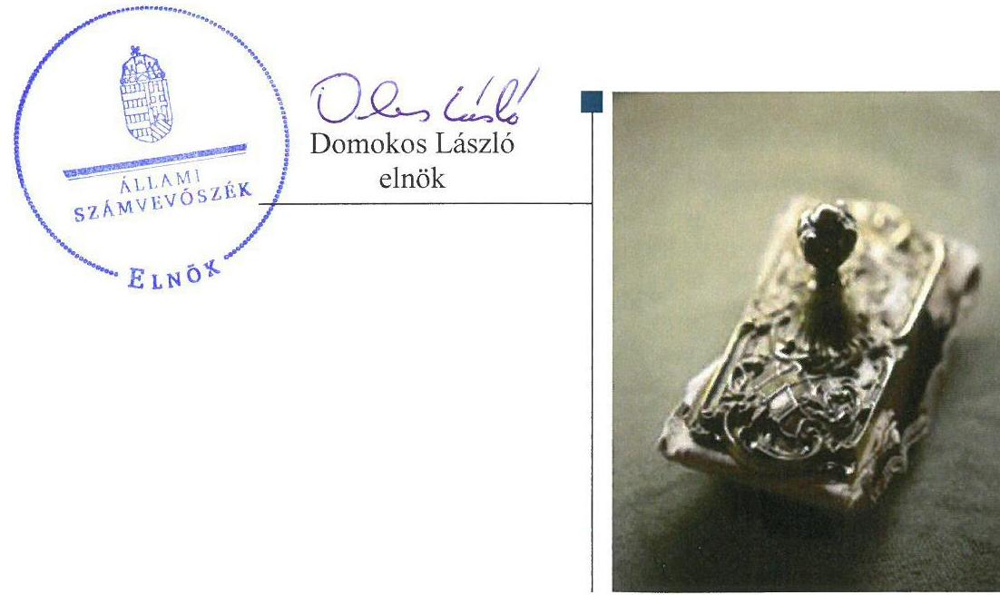

---

# AZ ELLENŐRZÉST FELÜGYELTE:

DR. HORVÁTH MARGIT felügyeleti vezető

## AZ ELLENŐRZÉST VEZETTE ÉS A VÉGREHAJTÁSÁÉRT FELELŐS:

HOFMEISTER LÁSZLÓ ellenőrzésvezető

A PROGRAM ÖSSZEÁLLÍTÁSÁÉRT FELELŐS:

JANIK JÓZSEF LÁSZLÓ osztályvezető

IKTATÓSZÁM: V-1277-230/2016

TÉMASZÁM: 2311

ELLENŐRZÉS-AZONOSÍTÓ SZÁM: V-075802

Jelentéseink az Országgyűlés számítógépes hálózatán és az Interneta a www.asz.hu címen is olvashatóak.

---

# TARTALOMJEGYZÉK 

■ ÖSSZEGZÉS ..... 5
■ AZ ELLENŐRZÉS CÉLJA ..... 6
■ AZ ELLENŐRZÉS TERÜLETE ..... 7
■ AZ ELLENŐRZÉS HÁTTERE, INDOKOLTSÁGA ..... 9
■ A JELENTÉS LÉNYEGES KÉRDÉSKÖREI ..... 10
■ ELLENŐRZÉS HATÓKÖRE ÉS MÓDSZEREI ..... 11
■ MEGÁLLAPÍTÁSOK ..... 13
■ JAVASLATOK ..... 21
■ MELLÉKLETEK ..... 23
I. Sz. melléklet: Értelmező szótár ..... 23
II. Sz. melléklet: 2012-2015. évi beszámoló adatok ..... 24
■ FÜGGELÉK: ÉSZREVÉTELEK ..... 25
■ RÖVIDÍTÉSEK JEGYZÉKE ..... 41

---

.

---

# ÖSSZEGZÉS 

Budapest Főváros III. Kerület, Óbuda-Békásmegyer Önkormányzata a kizárólagos tulajdonában álló Óbudai Danubia Zenekar Nonprofit Kft. feladatellátásával kapcsolatos tulajdonosi joggyakorlásának a kereteit szabályszerüen alakította ki, tulajdonosi jogait szabályszerűen gyakorolta. A Társaság vagyongazdálkodása nem volt szabályszerű, átláthatósága nem volt biztositott a közérdekü adatok hiányos nyilvánosságra hozatala miatt. Fizetőképessége a 2015. évre jelentősen romlott.

## Az ellenőrzés társadalmi indokoltsága

Magyarországon az önkormányzatok kötelező és önként vállalt feladataik ellátása során egyre szélesebb körben alkalmazzák a költségvetési szerveken kívüli feladatellátást, ezáltal az önkormányzati tulajdonú gazdasági társaságok is kiemelt fontosságú szerephez jutnak a lakossági szolgáltatások biztosításában. Az önkormányzatok többségi tulajdonában álló gazdasági társaságok ellenőrzése kiemelt jelentőségű, mivel múködésük hatással van a tulajdonos önkormányzat gazdálkodására, gazdálkodásának egyes elemei befolyásolják az önkormányzati alszektor hiányát és az államadósságot.

Az Állami Számvevőszék által az előadó-művészeti tevékenységet folytató Társaságnál végzett ellenőrzést további társadalmi elvárás indokolja sajátos feladatellátásából adódóan, mivel Az előadásokon keresztül a kerület lakosságának széles köre kerülhet kapcsolatba a Társasággal, az általa nyújtott szolgáltatásokkal.

## Főbb megállapítások, következtetések

Az Önkormányzat a jogszabályi előírásoknak eleget téve, gondoskodott a helyi közművelődési közfeladat ellátásáról, a Társaság feladatellátásával kapcsolatos tulajdonosi joggyakorlás kereteinek szabályszerű kialakításáról a felügyelőbizottság 2012-2014. évekre vonatkozó ügyrendjének jóváhagyása kivételével. A tulajdonosi jogok gyakorlása szabályszerű volt. Az Önkormányzat élt a jogszabályban rögzített lehetőséggel és ellenőrizte a tulajdonában álló Társaságot.

A Társaság Értékelési szabályzatot csak a 2014. évben készített. A Számviteli politika, a Számlarend és a Pénzkezelési szabályzat egyes rendelkezési nem feleltek meg a jogszabályi előírásoknak. A vagyongazdálkodása nem volt szabályszerű a leltározással kapcsolatos hiányosságok miatt, melyeket a könyvvizsgáló nem kifogásolt. A Társaság fizetőképessége a 2015. évre jelentősen romlott.

A Társaság az előírt tervezési, beszámolási és adatszolgáltatási kötelezettségeit hiányosan teljesítette. Belső ellenőrzést a jogszabály rendelkezése ellenére a 2014. évtől nem alakított ki a Társaság az ügyvezetője, így az nem biztosított kontrollt a szabályos múködéshez. A jogszabályokban előírt közzétételi kötelezettségének a gazdálkodási adatok tekintetében teljeskörűen nem tettek eleget, a közérdekú adatok közzétételével kapcsolatos szabályzatot nem készítették el.

A bevételek és a ráfordítások elszámolása szabályszerű volt. Az alkalmazott árakat az aktuális piaci viszonyok alapján alakították ki.

---

# AZ ELLENŐRZÉS CÉLJA 

Az ellenőrzés célja annak értékelése volt, hogy az önkormányzat vagyongazdálkodási tevékenysége során szabályszerűen gyakorolta-e tulajdonosi jogait; a gazdasági társaság szabályozottsága, gazdálkodása és vagyongazdálkodási tevékenysége, bevételeinek és ráfordításainak elszámolása megfelelt-e a jogszabályi és tulajdonosi előírásoknak; a gazdasági társaság fizetőképessége biztosított volt-e a gazdálkodás során, valamint a gazdálkodás átláthatósága és elszámoltathatósága érdekében biztosítva volt-e a szolgáltatás dijának megalapozottsága szabályszerű önköltségszámítással. Az ellenőrzés célja továbbá annak megítélése volt, hogy az önkormányzat többségi tulajdonában lévő gazdasági társaság gazdálkodásának a kormányzati szektor hiányára és az államadósságra befolyással bíró elemei a jogszabályi előírásoknak megfeleltek-e.

---

# **A Z ELLENŐRZÉS TERŰLETE**

## **Budapest Főváros III. Kerület, Óbuda-Békásmegyer Önkormányzat és a kizárólagos tulajdonában lévő Óbudai Danubia Zenekar Nonprofit Kft.**

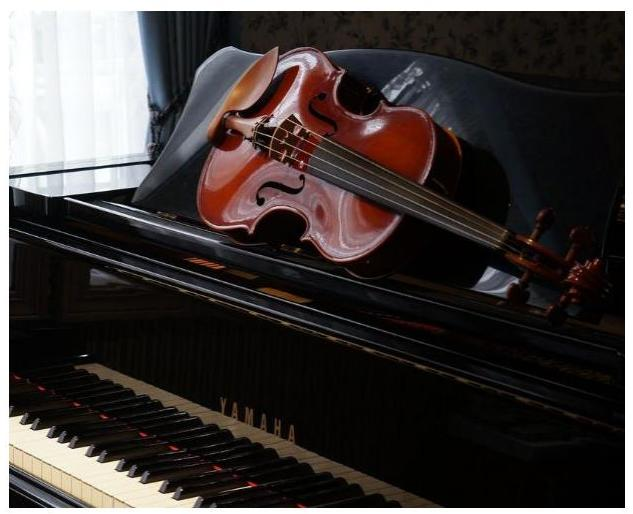

Az Óbudai Danubia Szimfonikus Zenekar Közhasznú társaságot 2007. január 24-én alapította az Önkormányzat 3 M Ft törzstőkével, 100%-os tulajdonosként. A Társaság 2009. április 1-jével nonprofit korlátolt felelősségű társasággá alakult.

Az Önkormányzat a Társaság számára az Alapító Okirat 3-ban feladatát a művészi alkotómunka feltételeinek javítása és a művészeti értékek létrehozásának, megőrzésének támogatásában határozta meg. Az Önkormányzat előírta a Társaságnak a kerületi rendezvényeken, kulturális eseményeken történő fellépéseket, ezzel a célja zenei értékek létrehozatala és megőrzése, hagyományőrzés, a klasszikus zene megismertetése és népszerűsítése volt.

A Társaság a 2012. év óta kiemelt minősítésű zeneművészeti szervezetként van nyilvántartva. A 2012-2015. években feladatait saját, bérelt és használatba vett vagyonnal látta el, vagyonkezelt eszköze nem volt, vállalkozási tevékenységet nem végzett. A Társaság a 2013. évtől kormányzati szektorba tartozott. Az ügyvezető személye az ellenőrzött időszakban nem változott. A Társaság szakmai mutatóit az 1. ábra mutatja be. A fizetőnézők száma a 2015. évre kétszeresére nőtt.

A Társaság jegyzett tőke értéke nem változott, gazdálkodását bemutató főbb adatokat a 2. ábra tartalmazza.

2. ábra

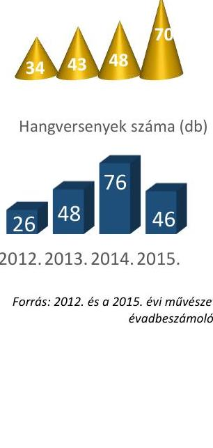

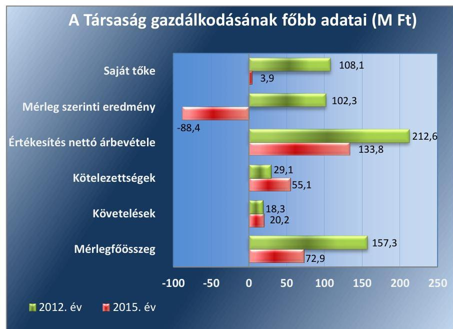

*Forrás: 2012. és 2015. évi egyszerűsített éves beszámolók*

---

A Társaság közhasznú tevékenységéből származó értékesítés nettó árbevétele, a 2012. évről a 2015. évre 37,1\%-kal csökkent, melyet elsősorban az előadások jegy és bérlet értékesítésének bevétele tett ki. A Társaság mérlegfőösszege a 2015. évre több mint felére csökkent, amely a 20142015. évi veszteséges gazdálkodás következménye volt. Mérleg szerinti eredménye a 2012. évi 102,3 M Ft-os nyereséget követően jelentős negatív tendenciát mutatott, a Társaság a 2015. évet 88,4 M Ft veszteséggel zárta. Ebben kiemelkedő szerepe volt a jegyértékesítésből származó bevétel csökkenése mellett, a TAO ${ }^{4}$ támogatások 39,6\%-os csökkenésének.
Az Önkormányzat polgármestere ${ }^{5}$ és a jegyzője ${ }^{6}$ személyében változás nem történt az ellenőrzött időszakban.

---

# AZ ELLENŐRZÉS HÁTTERE, INDOKOLTSÁGA 

Az önkormányzatok többségi tulajdonában álló gazdasági társaságok ellenőrzése kiemelten fontos a vagyon megőrzése, megóvása érdekében, valamint a kormányzati szektor elszámolásaiban megjelenő önkormányzati tulajdonú gazdálkodó szervezetek esetében, amelyekkel szemben alapvető követelmény, hogy gazdálkodásuk, múködésük szabályszerű, az általuk szolgáltatott adatok minél megbízhatóbbak legyenek. A feladatellátás költségeinek, ráfordításainak alakulása a lakosság széles rétegét érinti.

Ellenőrzéseink feltárhatják, hogy az önkormányzat a feladatellátásához rendelt vagyon múködtetését a tulajdonostól elvárható gondossággal vé-gezte-e, a feladatot ellátó gazdasági társaság a létesítő okiratban, közszolgáltatói szerződésben, fenntartói megállapodásban foglaltak betartásával biztosította-e a feladat ellátását. Az ellenőrzés eredményeképp meghatározhatóvá válnak a költségvetési hiányt befolyásoló szervezet kockázatai, lehetővé válik ezen kockázatok csökkentése. Az ellenőrzés rávilágíthat arra, hogy a gazdasági társaság a vagyon használatával biztosította-e a szolgáltatás folytatásának feltételeit, az önkormányzat tulajdonosi felügyelete hozzájárult-e a szabályszerű gazdálkodáshoz és feladatellátáshoz. A megállapítások alapján megfogalmazott számvevőszéki javaslatok hasznosítása elősegítheti a meglévő hibák megszüntetését. A jó gyakorlatok bemutatásával az ÁSZ ${ }^{7}$ hozzájárulhat a követendő megoldások megismertetéséhez, terjesztéséhez.

---

# A JELENTÉS LÉNYEGES KÉRDÉSKÖREI 

1. Az Önkormányzat tulajdonosi joggyakorlása szabályszerű volt-e?
2. A Társaság vagyongazdálkodása szabályszerű volt-e, fizetőképessége biztositott volt-e a gazdálkodás során?
3. A Társaság bevételeinek és ráfordításainak elszámolása, valamint az önköltségszámitás és árképzés szabályszerű volt-e?
4. A kormányzati szektorba sorolt, többségi önkormányzati tulajdonban lévő Társaság gazdálkodásának a kormányzati szektor hiányára és az államadósságra befolyással biró gazdasági eseményei megfeleltek-e a jogszabályi elöírásoknak?

---

# ELLENŐRZÉS HATÓKÖRE ÉS MÓDSZEREI 

## Az ellenőrzés típusa

Megfelelőségi ellenőrzés.

## Az ellenőrzött időszak

2012. január 1-jétől 2015. december 31-ig.

## Az ellenőrzés tárgya

Az Önkormányzat tulajdonosi joggyakorlása, valamint a Társaság gazdálkodásának szabályozottsága és szabályszerűsége, továbbá az önkormányzati alszektorba sorolt Társaság gazdálkodásának a kormányzati szektor hiányára és az államadósságra befolyással bíró elemei.

Az ellenőrzés kiterjed minden olyan körülményre és adatra, amely az ÁSZ jogszabályban meghatározott feladatainak teljesítéséhez, valamint a program végrehajtása folyamán felmerült újabb összefüggések feltárásához szükséges.

## Az ellenőrzött szervezet

Budapest Főváros III. kerület, Óbuda-Békásmegyer Önkormányzat és az Óbudai Danubia Zenekar Nonprofit Kft.

## Az ellenőrzés jogalapja

Az ellenőrzés jogszabályi alapját az Állami Számvevőszékről szóló 2011. évi LXVI. törvény 1. § (3) bekezdése és 5. § (3)-(4)-(5) bekezdései képezik.

## Az ellenőrzés módszerei

Az ellenőrzést a nemzetközi standardokat irányadónak tekintve az ellenőrzési program ellenőrzési kérdései, az ellenőrzött időszakban hatályos jogszabályok, az ellenőrzés szakmai szabályok és módszertanok figyelembe vételével végeztük.

Az ellenőrzés ideje alatt az ellenőrzött szervezettel történő kapcsolattartást az ÁSZ Szervezeti és Múködési Szabályzatának vonatkozó előírásai alapján biztosítottuk.

---

Az ellenőrzés a kiválasztott, kizárólagos tulajdonosi jogokat gyakorló Önkormányzatra és az ellenőrzött gazdasági társaságra terjedt ki.

Az ellenőrzési kérdések megválaszolásához szükséges bizonyítékok megszerzése a következő ellenőrzési eljárások alkalmazásával történt: megfigyelés, kérdésfeltevés (információkérés), összehasonlítás, mintavételezés, valamint elemző eljárás. Az ellenőrzési bizonyítékként felhasznált adatforrások közé tartoztak egyrészt az ellenőrzési programban felsorolt adatforrások, másrészt minden - az ellenőrzés folyamán - feltárt, az ellenőrzés szempontjából információkat tartalmazó dokumentum.

Az ellenőrzést a megjelölt adatforrások és az ellenőrzöttek által kitöltött tanúsítványok felhasználásával, a mintatételek kiértékelésével, továbbá az adott időszakban hatályos jogszabályok figyelembevételével folytattuk le.

A bevételek, a ráfordítások elszámolásának és a vagyon nyilvántartásának szabályszerűségét véletlenszerű mintavétel, a legnagyobb ráfordítások elszámolására és a legnagyobb összegű vagyonnövekedést jelentő eszközök nyilvántartására vonatkozó eljárás szabályszerűségét kockázatalapú, irányított mintavétel alapján ellenőriztük.

A mintavétellel ellenőrzött területek értékelése során az egyes mintatételekre vonatkozó szabályszerűségi kérdésekre adott válaszok kerültek statisztikai módszer segítségével összesítésre és minősítésre. A jogszabályoknak és a belső előírásoknak megfelelőnek tekintettük az adott területet, amennyiben a minta ellenőrzésének eredménye alapján 95\%-os bizonyossággal a teljes sokaságban a hibaarány kisebb volt, mint 10\% és nem megfelelőnek értékeltük, ha a hibaarány a 10\%-ot elérte.

---

# 1. Az Önkormányzat tulajdonosi joggyakorlása szabályszerű volt-e? 

Összegző megállapítás

### 1.1. számú megállapítás

Az Önkormányzat tulajdonosi joggyakorlása a Társaság felett szabályszerű volt.

Az Önkormányzat a tulajdonosi joggyakorlás kereteit az FB ügyrendjének jóváhagyása kivételével szabályszerűen kialakította.

Az Önkormányzat a kerület kulturális és múvelődési feladataival kapcsolatos stratégiai céljait a Gazdasági-városfejlesztési program ${ }_{1-2}{ }^{8}$-ban rögzítette. Célként tűzték ki a kulturális értéket képviselő hagyományos nagyrendezvények további megtartását. A Kulturális koncepció ${ }_{1-2}{ }^{9}$-ban vállalta az Önkormányzat a kulturális és múvelődési feladatok finanszírozásának részét képező önkormányzati támogatás nyújtását a Társaság számára.

A TULAJDONOSI JOGOK gyakorlásának szabályait az önkormányzati $\mathrm{SZMSZ}_{1-2}{ }^{10}$-ben, a Vagyonrendelet ${ }_{1-2}{ }^{11}$-ben, a Gazdálkodási rendelet ${ }^{12}$-ben, a Társaság Alapító Okirat ${ }_{1-6}$-ban, továbbá az Önkormányzat és a Társaság között fennálló Közszolgáltatási megállapodás ${ }^{13}$-ban, illetve Fenntartói megállapodás ${ }^{14}$-ban rögzítették.

Az Önkormányzat az Alapító Okirat ${ }_{1-6}$-ban meghatározta a Társaság $\mathrm{FB}^{15}$-ának tagjait, a Társaság törvényes képviseletét ellátó ügyvezetőjét. Meghatározták továbbá az ügyvezető és az FB feladatait, a beszámolási kötelezettségüket. AZ FB ügyrendjét 2015. január 14-ig a Képviselő-testület nem hagyta jóvá a Gt. ${ }^{16} 34 . \S$ (4) bekezdésében, illetve a 2014. március 15től hatályos Ptk. ${ }^{17}$ 3:122 (3) bekezdésében előírtak ellenére. A 2015. január 15-től módosított FB ügyrendet a Képviselő-testület elfogadta.

Az Önkormányzat a Gazdálkodási rendeletében szabályozta többek között a bevételi-kiadási és létszám előirányzatok tervezési és üzleti terv készítési feladatait. Előírta a Társaság számára éves jelentések, beszámolók készítését, továbbá az adatszolgáltatási, tájékoztatási kötelezettséget.

RENDELETALKOTÁSI kötelezettségét a Közműv. tv. ${ }^{18}$ előírásai alapján az Önkormányzat a Közművelődési rendelete ${ }^{19}$ megalkotásával teljesítette, melyben megfogalmazta a kulturális, közművelődési feladatait. A Társaság múködési célú önkormányzati támogatásáról a Képviselő-testület ${ }^{20}$ minden évben a költségvetési rendeletében döntött.

A TÁRSASÁG FELADAT-ELLÁTÁSÁHOZ az Önkormányzat az alapításkor a Társaság részére pénzbeli betétként 3 M Ft-os törzstőkét biztosított, ezenkívül a múködéséhez évente támogatást nyújtott, továbbá a Képviselő-testület döntése alapján 2014 decemberében ingatlant adott számára használatba térítésmentesen szakmai tevékenysége tárgyi feltételeinek javítása érdekében.

---

Az Önkormányzat a Társaság feladatellátásához kapcsolódó követelményeket az Alapító Okirat1-6-ban, a Közszolgáltatási megállapodásban és a Fenntartói megállapodásban rögzítette. A 2013. január 1-jétől hatályos Fenntartói megállapodás az Emtv. ${ }^{21}$-nek megfelelő tartalmú volt. A Közszolgáltatási megállapodás a 2012. március 31-étől hatályos Emtv. 13. § (2) bekezdés i) pontjában foglalt előírás ellenére azonban nem tartalmazta a módosításának, felmondásának feltételeit.

JAVADALMAZÁSI SZABÁLYZATOT a Társaságra vonatkozóan az Önkormányzat alkotott a Taktv. ${ }^{22}$ előírásainak megfelelően, melyet a Képviselő-testület elfogadott. A szabályzat megfogalmazta a Társaság ügyvezetőjének, az FB tagoknak és a vezető állású munkavállalóknak a javadalmazását, valamint a jogviszony megszűnése esetére biztosított juttatások módját és mértékét.

# 1.2. számú megállapítás Az Önkormányzat tulajdonosi jogait szabályszerűen gyakorolta. 

A tulajdonosi jogokat a Képviselő-testület gyakorolta az SZMSZ1-2-ben, a Vagyonrendelet ${ }_{1-2}$-ben, a Gazdálkodási rendeletben, az Alapító Okirat ${ }_{1-6}$ ban, a Közszolgáltatási megállapodásban és a Fenntartói megállapodásban meghatározottak szerint.

AZ FB az ellenőrzött időszakban 3 tagból állt, ügyrendjét a Gt. és a Ptk. 2 előírásának megfelelően megállapította. Tagjait és feladatait az Önkormányzat az Alapító Okirat ${ }_{1-6}$-ban rögzítette.

A KÖNYVVIZSGÁLÓ megválasztása a Gt. és a Ptk. 2 által előírtak szerint a Képviselő-testület által történt. A könyvvizsgáló az ellenőrzött években hitelesítő záradékkal látta el a Társaság éves beszámolóját.

Az FB jelentések és könyvvizsgálói vélemények alapján a Képviselő-testület határozatban döntött a Társaság év végi számviteli beszámolóinak elfogadásáról. Az éves szakmai és pénzügyi beszámolók útján győződött meg az Önkormányzat a Társaság szakmai feladatellátásának a teljesítéséről.

AZ ÜZLETI TERVÉT a Társaság az Önkormányzat előírására minden évben elkészítette. A Gazdálkodási rendelet 3. § (12) bekezdésében az Önkormányzat az is előírta, hogy a Társaság tervezze meg a tervezett és a tényleges létszámát telephelyenkénti vagy feladatonkénti bontásban. A Társaság ennek az előírásnak nem tett eleget.

A TÁRSASÁG ELLENŐRZÉSÉT az Önkormányzat az Áht. ${ }^{23}$ ban foglalt felhatalmazás alapján, jóváhagyott éves munkatervei szerint kettő alkalommal végezte annak 2012-2015. évi feladatellátására vonatkozóan. Az ellenőrzések során tapasztalt szabálytalanságokra tekintettel intézkedési terv készítési kötelezettséget írtak elő a Társaság ügyvezetője részére.

A KÉPVISELŐ-TESTÜLET a Civil tv. ${ }^{24}$ rendelkezésének megfelelően döntött a Társaság eredményének felhasználásáról az éves beszámolók elfogadásakor a Társaság közhasznú jogállásából adódóan. A döntés értelmében a Társaság a 2012. és a 2013. évi nyereségét eredménytarta-

---

lékba helyezte. A saját tőke értéke a 2014-2015. évi jelentős veszteség miatt nagymértékben visszaesett, azonban a jegyzett tőke értéke fölött maradt, így a Gt. és a Ptk. 2 által előírt intézkedésre nem volt szükség a tulajdonos Önkormányzat részéről.

# 2. A Társaság vagyongazdálkodása szabályszerű volt-e, fizetőképessége biztosított volt-e a gazdálkodás során? 

Összegző megállapítás

2.1. számú megállapítás

A Társaság vagyongazdálkodása nem volt szabályszerű a leltározás hiányossága miatt. Beszámolási, adatszolgáltatási kötelezettségét hiányosan teljesítette. A 2014. évtől belső ellenőrzést az ügyvezető nem alakított ki. Fizetőképessége a 2015. évre romlott.

A Társaság a 2012-2013. években értékelési szabályzat kivételével rendelkezett a Számv. tv. által előírt szabályzatokkal, azonban azok tartalma nem felelt meg maradéktalanul az előírásoknak. A 2014. évtől belső ellenőrzést az ügyvezető nem alakított ki.

A Társaság múködésének alapvető szabályait az Alapító Okirat ${ }_{1-6}$ a a Számviteli politika ${ }_{1-2}{ }^{25}$ és az ezek keretében elkészített szabályzatok, valamint a múködéshez szükséges további belső szabályzatok rögzítették.

A SZÁMVITELI POLITIKA ${ }_{1}$-ban az ügyvezető a Számv. tv. 14. § (11) bekezdésében foglalt 90 napos határidőn túl vezette keresztül a Civil. tv. 2012. évi hatályba lépésével bekövetkezett, közhasznú gazdasági társaságokra vonatkozó beszámolási kötelezettség előírásával kapcsolatos változást.

Értékelési szabályzat ${ }^{26}$-ot 2014. január 1-jéig a Társaság ügyvezetője nem készített, mely eljárással megsértette a Számv. tv. 14. § (5) bekezdés b) pontjában előírtakat.

A Társaság rendelkezett Számlarend ${ }_{1-4}{ }^{27}$-del, azonban a Számlarend ${ }_{2-4}$ a 2013-2015. években nem felelt meg a 161. § (2) bekezdés a) pont előírásainak, mert nem tartalmazta minden alkalmazásra kijelölt számla megnevezését, csak a számjelét.

A Pénzkezelési szabályzat ${ }_{1-4}{ }^{28}$ a Számv. tv. 14. § (8) bekezdésében előírtak ellenére nem rendelkezett a készpénzben és a bankszámlán tartott pénzeszközök közötti forgalomról.

A Leltárkészítési szabályzat ${ }^{29}$ előírásai a vagyon megőrzését, védelmét biztosították. A Selejtezési szabályzat ${ }^{30}$ rendelkezett a felesleges vagyontárgyak feltárásáról, hasznosításáról, a leértékelési és selejtezési eljárásról, valamint a hasznosítás és a selejtezés pénzügyi számviteli elszámolásáról.

Iratkezelési szabályzatot nem készítettek, mellyel megsértették az Ltv. ${ }^{31} 10 . \S$ (1) bekezdés a) pontjában előírtakat.

A BELSŐ ELLENŐRZÉST az ügyvezető nem alakította ki, mely a 2014. évtől nem felelt meg a Bkr. ${ }^{32}$ 10. §-ában foglaltak előírásnak, tekintettel a Bkr. 54/A. §-ára.

---

### 2.2. számú megállapítás

A vagyongazdálkodás a jogszabályi rendelkezéseknek és a belső előírásoknak nem felelt meg a leltározás és a leltár hiányosságai miatt.

SAJÁT VAGYON NYILVÁNTARTÁSA nem volt megfelelő a Társaságnál, ugyanakkor a beszerzett eszközök, immateriális javak állományba vétele, üzembe helyezése megtörtént. Az ellenőrzött évek beszámolóinak mérlegét alátámasztó, Számv. tv. 69. § (1) bekezdése szerinti leltárakat elkészítették. A 2012-2014. években a tárgyi eszközöket - melyek a mérlegfőösszeg 2-3\%-át tették ki - a Számv. tv. 69. § (3) bekezdésében, valamint a Leltárkészítési szabályzat 2.2. pontjában előírtak ellenére menynyiségi felvétel helyett egyeztetéssel leltározták. A 2015. évben az előírásnak megfelelően végezték el a mérlegfőösszeg közel 30\%-át kitevő tárgyi eszközök év végi leltározását, azonban a leltár tartalma a Leltárkészítési szabályzat 2.2. pontjában rögzítetteknek nem felelt meg, mert nem tartalmazta az eszközök bekerülési időpontját, a bekerülési értéket, az elszámolt értékcsökkenést, a nettó értéket, az esetleges értékelési különbözetet.

## A TÁRSASÁG VAGYONI HELYZETÉT JELLEMZŐ

mérlegadatok alakulását a II. sz. melléklet tartalmazza. A befektetett eszközök döntő részét a tárgyi eszközök képezték, melyeknek az értéke a 2012. évről a 2015. év végére több mint hatszorosára nőtt. A növekedés oka az önkormányzati tulajdonú, felújítási kötelezettséggel használt ingatlanon 2015. évben a Társaság által végrehajtott beruházás volt. A beruházás összegét a Társaság a Számv. tv.-nek megfelelő bizonylatok alapján nyilvántartásba vette. A forgóeszközök értéke a 2015. év végére 70,6\%-kal csökkent, melynek legfőbb oka a TAO támogatásból származó pénzeszközök csökkenése volt.

A saját tőke a 2012. évi 108,1 M Ft-ról a 2015. évre jelentős mértékben, 3,9 M Ft-ra csökkent. A nagyfokú csökkenést a Társaság 2014-2015. évi veszteséges gazdálkodása okozta, amelyben jelentős szerepe volt a TAO támogatásokból származó bevétel csökkenésének és a zenekari tagok megváltozott foglalkoztatásából (megnőtt a munkaviszonyban foglalkoztatottak száma a megbízási jogviszonyban foglalkoztatottak számával szemben) adódó személyi jellegű ráfordítások nagymértékű növekedésének. A Társaság saját vagyonát nem terhelte meg, nem idegenítette el.

## A Társaság fizetőképessége a 2015. évre romlott, azonban összességében biztosított volt a gazdálkodása során.

A KÖTELEZETTSÉGÁLLOMÁNY az ellenőrzött négy év során 100\%-ban rövid lejáratú kötelezettségből állt. A szerződésen és jogszabályon alapuló rövid lejáratú kötelezettségek határidőben történő teljesítése nem volt teljes mértékben biztosított az ellenőrzött időszak alatt. A kötelezettségek 2012. december 31-ről 2015. december 31-re 89,3\%-kal, 55,1 M Ft-ra nőttek, melynek 43,4\%-át a szállítókkal szembeni kötelezettség képezte.

A Társaság likviditásának és adósságmutatójának alakulását az 1. táblázat szemlélteti. A 2012-2014. években a Társaság forgóeszközeinek állománya többszöröse volt a rövid lejáratú kötelezettségeknek, ezzel a stabil fizetőképesség biztosítva volt, azonban a 2015. évben már nem érte el a

# 2.3. számú megállapítás 

1. táblázat

A TÁRSASÁG LIKVIDITÁSÁNAK ÉS ADÓSSÁGMUTATÓJÁNAK ALAKULÁSA

|  | Eladóso-   dettság   mértéke | Likviditási   rata |
| :-- | :--: | :--: |
| Referencia | $<1,0$ | $>1$ |
| 2012. év | 0,3 | 5,3 |
| 2013. év | 0,3 | 4,0 |
| 2014. év | 0,4 | 3,9 |
| 2015. év | 14,1 | 0,8 |
| Forrás: 2012-2015. évi egyszerúsített éves beszámolók, fölkönnyi kivonatok |  |  |

A Társaság likviditásának és adósságmutatójának alakulását az 1. táblázat szemlélteti. A 2012-2014. években a Társaság forgóeszközeinek állománya többszöröse volt a rövid lejáratú kötelezettségeknek, ezzel a stabil fizetőképesség biztosítva volt, azonban a 2015. évben már nem érte el a

---

# 2.4. számú megállapítás 

kötelezettségek összegét, melynek következtében a Társaság likviditási rátája 1,0 alá esett. Az adósságállomány szerkezete, a kötelezettségek állománya összességében azonban nem jelentett kockázatot a feladat ellátására, illetve a Társaság múködésére az ellenőrzött időszakban. Az év végén kimutatott lejárt kötelezettségek aránya az összes szállítói kötelezettségállományon belül javuló tendenciát mutatott, a 2012. évi 59,5\%-os aránnyal szemben a 2015. évre 7,0\%-ra csökkent.

A Társaság mind a szállítókkal, mind a költségvetéssel szembeni fizetési kötelezettségeit a mérlegkészítés időszakában teljesítette.

A Társaság az előírt tervezési, beszámolási és adatszolgáltatási kötelezettségeit hiányosan teljesítette.

Az üzleti terveket az ügyvezető a Gazdálkodási rendelet 3. § (2) bekezdésében, majd a 2013. évtől a Fenntartói megállapodás II.4. pontjában előírt határidőn túl nyújtotta be az Önkormányzathoz.

AZ EGYSZERŰSÍTETT ÉVES BESZÁMOLÓKAT az előírt határidőig a Képviselő-testület jóváhagyta, azokat letétbe helyezték és közzétették, azonban nem feleltek meg teljes mértékben a Számv. tv. előírásainak, mert a 2012-2014. évi kiegészítő mellékletek nem tartalmazták a hatályos Számv. tv. 93. § (3) bekezdésben foglaltak ellenére a támogatási program keretében végleges jelleggel kapott és felhasznált összegeket támogatásonként, jogcímenként és évenként.

Az FB és a könyvvizsgálói jelentések az éves beszámoló jóváhagyásakor a Képviselő-testület rendelkezésére álltak. Közhasznú jogállása miatt a közhasznúsági beszámolókat és közhasznúsági jelentést a Társaságnál elkészítették és közzétették a Civil tv. előírásainak megfelelően.

A 2012-2015. évek közötti időszakban az ellenőrzés által feltárt, a tárgyi eszközök 2012-2014. évi mennyiségi felvétellel történt leltározásának hiánya, a 2015. évi leltár és a kiegészítő mellékletek tartalmi hiányosságai, valamint a Számv. tv. által előírt 2012-2013. évi Értékelési szabályzat hiánya, illetve a Számviteli politika ${ }_{1-2}$ és a Pénzkezelési szabályzat ${ }_{1-4}$ tartalmi hiányossága mellett a könyvvizsgáló korlátozás nélküli hitelességi záradékkal látta el a beszámolókat.

A KÖZÉRDEKŰ ADATOK nyilvánosságra hozatalával kapcsolatos kötelezettségeinek a Társaság részben tett eleget.

A Társaság saját honlapján közzétette beszámolóit és közhasznúsági mellékleteit, azonban az Info. tv. ${ }^{33} 37 . \S$ (1) bekezdésében előírtak ellenére az Info. tv. 1. melléklet általános közzétételi lista II. rész 1., 12. és 14. pontjaiban, valamint a III. rész 2. pontjában szereplő adatai közül a szervezet feladatát, alaptevékenységét meghatározó alapvető jogszabályok hatályos és teljes szövegét, az alaptevékenységgel kapcsolatos vizsgálatok, ellenőrzések nyilvános megállapításait, a tevékenységére vonatkozó, jogszabályon alapuló statisztikai adatgyűjtés eredményeit, időbeli változását, továbbá a foglalkoztatottak személyi juttatásaira vonatkozó összesített adatokat nem tették közzé.

A Társaság a közzétételi listákon szereplő adatok pontos, naprakész és folyamatos közzétételi kötelezettség teljesítésének, adatközlőnek való

---

megküldésének részletes szabályait, továbbá a megküldött adatok elektronikus közzétételével, folyamatos hozzáférhetőségével, hitelességével, frissítésével kapcsolatos felelősséget belső szabályzatban nem állapította meg, mellyel megsértette az Info. tv. 35. § (3) bekezdés előírását.

A Társaság az Áht. 13. § (3) bekezdésében előírt adatszolgáltatási kötelezettségének az államháztartásért felelős miniszter részére a központi költségvetésről szóló törvény elkészítéséhez a 2013. évtől nem tett eleget.

# 3. A Társaság bevételeinek és ráfordításainak elszámolása, valamint az önköltségszámítás és árképzés szabályszerű volt-e? 

Összegző megállapítás

## 3.1. számú megállapítás

A Társaság bevételeinek és ráfordításainak elszámolása szabályszerű volt. Jegy és bérletárait a keresleti és kínálati tényezők figyelembevétele alapján alakította ki.

A Társaság bevételeinek és ráfordításainak elszámolása szabályszerű volt.

A BEVÉTELEK ELSZÁMOLÁSA a 2012-2015. években a Társaságnál a Számv. tv.-ben foglaltaknak megfelelő volt. A számviteli nyilvántartásokban a bevételeket a Számviteli politika ${ }_{1-2}$ és a Számlarend ${ }_{1-4}$ rendelkezéseinek megfelelően rögzítették. A 3. ábra szemlélteti a Társaság által kapott támogatás megoszlását főbb támogatási jogcímenként.
3. ábra
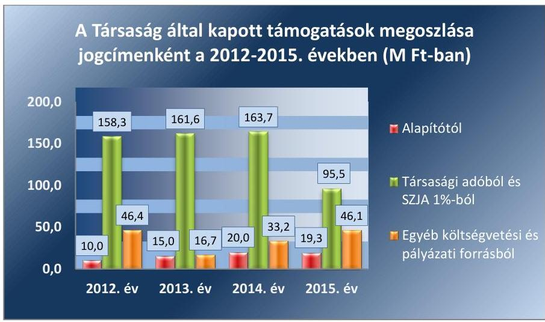

Forrás: 2012-2015. évi egyszerűsített éves beszámolók, fökönyvi kivonatok
A támogatások összege a 2012. évi 214,7 M Ft-ról a 2015. évre 53,8 M Ft-tal, azaz mintegy 25\%-kal csökkent, melyből a TAO támogatás közel 40\%-kal esett vissza, az egyéb költségvetési és pályázati támogatások közel azonos mértékben realizálódtak, míg az alapítói támogatás 93,0\%-os növekedést mutatott. A TAO támogatás visszaesése az értékesítés nettó árbevételének jelentős részét kitevő jegyértékesítés csökkenésével állt összefüggésben. A beszámolási, elszámolási kötelezettséggel nyújtott támogatásokkal a támogatók felé szabályszerűen elszámoltak.

---

2. táblázat

TÁRGYI ESZKÖZÖK HASZNÁLHATÓSÁGI FOKA

|   | számítá-   tedmikó   eszközök | Fgyéb be-   tendezések   felcserelései  |
| --- | --- | --- |
|  2012. év | $63,0 \%$ | $14,3 \%$  |
|  2013. év | $51,6 \%$ | $35,1 \%$  |
|  2014. év | $41,2 \%$ | $24,7 \%$  |
|  2015. év | $28,3 \%$ | $13,3 \%$  |

Fonrós: 2012-2015. év egyszerúsített éves beszámolók
3.2. számú megállapítás

## AZ ANYAGJELLEGŰ RÁFORDÍTÁSOK ELSZÁMOLÁSA a 2012-2015. években megfelelő volt.

Az ellenőrzött időszakban elmaradt a tulajdonos Önkormányzat jóváhagyásának beszerzése az Alapító okirat ${ }_{3-3}$ 15.2. pontjának, illetve az Alapító okirat $4-6$ 7.14. pontjában előírt értékhatárt ${ }^{34}$ elérő szolgáltatások igénybevétele esetében.

A SZEMÉLYI JELLEGŰ RÁFORDÍTÁSOK elszámolása megfelelő volt. A bérköltség elszámolását a számviteli alapbizonylatok megfelelően alátámasztották. A cafeteria juttatás szabályszerű kifizetéséhez a szükséges munkavállalói nyilatkozatokkal a Társaság rendelkezett.

AZ ÉRTÉKCSÖKKENÉS ELSZÁMOLÁSA megfelelő volt. A Számv. tv.-ben és a TAO tv. ${ }^{35}$ 2. számú mellékletében foglaltaknak megfelelően határozták meg és számolták el a terv szerinti és terven felüli értékcsökkenést. A bekerülési érték meghatározása, az eszközök besorolása szabályos volt.

## A SAJÁT VAGYON ÉRTÉKÉNEK MEGŐRZÉSE, PÓTLÁSA, FELÚJÍTÁSA összességében az előírásoknak, a tervezetnek megfelelően történt. A Társaság saját vagyona két legnagyobb értékű eszközcsoportjának a használhatóságát szemléltető mutatókat a 2. táblázat tartalmazza. Az ellenőrzött időszakban összesen 5,6 M Ft öszszegben valósult meg a saját vagyon értékének pótlása, melynek 85,7\%-a az egyéb berendezések beszerzéséből adódott. A 2013. év kivételével nem valósult meg az elszámolt értékcsökkenést elérő beszerzés vagy felújítás. Ennek eredményeképpen az eszközök használhatósága jelentősen romlott.

A KÖVETELÉSÁLLOMÁNY a 2012. évi 18,3 M Ft-ról a 2015. évre 10,4\%-kal nőtt a Társaságnál. A követelések legnagyobb része a vevőállományból adódott, kisebb részét az áfa ${ }^{36}$ és iparűzési adónemen fennállt túlfizetés képezte. A 2012-2014. évek mérlegforduló napjain a vevőkövetelések túlnyomó része lejárt határidejű volt. A Társaság a 2014. évtől rendelkezett a hátralékos követelésállomány kezelésével, minősítésével kapcsolatos intézkedésekre vonatkozó szabályozással. A követelésállomány csökkentése érdekében hozott intézkedéseket a Társaság nem dokumentálta, a ki nem egyenlített követelések beszedése érdekében szóban egyeztetett a partnereivel. Az egyeztetések eredményeként a 2015. évre a vevőkövetelésnek mindösszesen 4,3\%-a nem került határidőben kiegyenlítésre.

A Társaság önköltségszámítási szabályzat készítésére nem volt kötelezett, sajátos tevékenységéből adódóan jegy és bérletárait a keresleti és kínálati tényezők figyelembevétele alapján alakította ki.

A TÁRSASÁG ÁRKÉPZÉSÉRE vonatkozóan ágazati, önkormányzati előírás nem volt. A Számv. tv.-ben előírtak alapján nem voltak kötelezettek önköltségszámítási szabályzat készítésére. Az előadások jegy és bérletárait elsősorban a piaci viszonyok alapján állapították meg.

---

# 4. A kormányzati szektorba sorolt, többségi önkormányzati tulajdonban lévő Társaság gazdálkodásának a kormányzati szektor hiányára és az államadósságra befolyással bíró gazdasági eseményei megfeleltek-e a jogszabályi előírásoknak? 

Összegző megállapítás A Társaságnak a 2013-2015. években az államadósságra befolyással bíró gazdasági eseményei nem voltak.

A Társaság a 2013-2015. években a Stabilitási tv. ${ }^{37}$ szerinti államadósságot keletkeztető ügyletet nem kötött, ebből származó kötelezettsége nem keletkezett.

---

# JAVASLATOK 

Az ÁSZ tv. 33. § (1) bekezdésében foglaltak értelmében az ellenőrzött szervezet vezetője köteles a jelentésben foglalt megállapításokhoz kapcsolódó intézkedési tervet összeállítani és azt a jelentés kézhezvételétől számított 30 napon belül az ÁSZ részére megküldeni. Amennyiben az ellenőrzött szervezet vezetője nem küldi meg határidőben az intézkedési tervet, vagy továbbra sem elfogadható intézkedési tervet küld, az Állami Számvevőszék elnöke az ÁSZ tv. 33. § (3) bekezdése a) és b) pontjaiban foglaltakat érvényesítheti.
Javaslataink célja az Óbudai Danubia Zenekar Nonprofit Kft. gazdálkodása szabályszerűségének és gyakorlatának javítása annak érdekében, hogy a szabályozási környezet és az alkalmazott gyakorlat megfelelően tudja támogatni az átlátható müködést.

## Az Óbudai Danubia Zenekar Nonprofit Kft. ügyvezetőjének

1. Intézkedjen a Társaság müködésére vonatkozó létszámának megtervezéséről, valamint az üzleti tervének a tulajdonos Önkormányzat részére a Fenntartói megállapodásban elöirt határidőben való megküldéséről.
(1.2. megállapítás 5. és 2.4. megállapítás 1. bekezdése alapján)
2. Intézkedjen a Társaság számlarendjének a Számv. tv.-nek megfelelő tartalommal történő kiegészitéséről.
(2.1. megállapítás 4. bekezdése alapján)
3. Intézkedjen a Társaság pénzkezelési szabályzatának a készpénzben és bankszámlán tartott pénzeszközök közötti forgalomra vonatkozó kiegészitéséről a Számv. tv.-nek megfelelően.
(2.1. megállapítás 5. bekezdése alapján)
4. Intézkedjen az iratkezelési szabályzat elkészitéséről az Ltv.-ben elöirtak szerint.
(2.1. megállapítás 7. bekezdése alapján)
5. Intézkedjen a tárgyi eszközökre vonatkozó leltár leltárkészitési szabályzatban elöirt tartalomnak megfelelő összeállításáról.
(2.2. megállapítás 1. bekezdés 4. mondata alapján)

---

6. | Intézkedjen a belső ellenőrzés kialakításáról a Bkr. előírása szerint.
(2.1. megállapítás 8. bekezdése alapján)
7. | Intézkedjen az Info. tv. által előírt adatok hiánytalan közzé tételéről.
(2.4. megállapítás 6. bekezdése alapján)
8. | Intézkedjen az Info. tv. rendelkezésének megfelelően a közzétételi listákon szereplő adatok közzétételi kötelezettségének teljesítésével, megküldésével, folyamatos hozzáférhetőségével, hitelességével, frissítésével összefüggő részletes szabályok belső szabályzatban történő meghatározásáról.
(2.4. megállapítás 7. bekezdése alapján)
9. | Intézkedjen az államháztartásért felelős miniszter számára előírt adatszolgáltatási kötelezettség teljesítéséről az Áht.-ban előírtaknak megfelelően.
(2.4. megállapítás 8. bekezdése alapján)
10. | Intézkedjen a tulajdonosi jóváhagyás beszerzéséről az alapító okiratban elöirt értékhatárt elérő szolgáltatások igénybevétele esetében.
(3.1. megállapítás 4. bekezdése alapján)

---

# MELLÉKLETEK 

- I. SZ. MELLÉKLET: ÉRTELMEZŐ SZÓTÁR
belső ellenőrzés
eladósodottság mértéke
gazdasági társaság
gazdálkodó szervezet
használhatósági fok
kormányzati szektorba sorolt egyéb szervezet
likviditási mutató
tulajdonosi joggyakorló
vagyongazdálkodás

Független, tárgyilagos bizonyosságot adó és tanácsadó tevékenység, amelynek célja, hogy az ellenőrzött szervezet múködését fejlessze és eredményességét növelje, az ellenőrzött szervezet céljai elérése érdekében rendszerszemléletű megközelítéssel és módszeresen értékeli, illetve fejleszti az ellenőrzött szervezet irányítási és belső kontrollrendszerének hatékonyságát. (Forrás: Bkr. 2. § b) pontja) Azt mutatja, hogy a saját források a kötelezettségek hány százalékát fedezik. Kedvező, ha a mutató tartósan (jelentősen) 1 alatti értéket ér el: Kötelezettségek/ saját tőke.
Ptk.: 3.88. § (1) bekezdése szerint „a gazdasági társaságok üzletszerű közös gazdasági tevékenység folytatására, a tagok vagyoni hozzájárulásával létrehozott, jogi személyiséggel rendelkező vállalkozások, amelyekben a tagok a nyereségből közösen részesednek, és a veszteséget közösen viselik".
A Ptk.: ${ }^{58} 685 . \S$ c) pontja szerint gazdálkodó szervezet: „az állami vállalat, az egyéb állami gazdálkodó szerv, a szövetkezet, a lakásszövetkezet, az európai szövetkezet, a gazdasági társaság, az európai részvény társaság, az egyesülés, az európai gazdasági egyesülés, az európai területi együttmúködési csoportosulás, az egyes jogi személyek vállalata, a leányvállalat, a vízgazdálkodási társulat, az erdő birtokossági társulat, a végrehajtói iroda, az egyéni cég, továbbá az egyéni vállalkozó."
A mutató a tárgyi eszközök használhatósági szintjét mutatja. Kiszámítása: (Tárgyi eszközök nettó értéke x 100)/ Tárgyi eszközök bruttó értéke.
Az Áht. 1. § 12. pontja értelmében az a szervezet, amely az Áht. alapján nem része az államháztartásnak, azonban az Európai Közösséget létrehozó szerződéshez csatolt, a túlzott hiány esetén követendő eljárásról szóló jegyzőkönyv alkalmazásáról szóló 2009. május 25-i 479/2009/EK rendelet szerint a kormányzati szektorba tartozik és a szervezet megnevezését az államháztartásért felelős miniszter a Hivatalos Értesítőben és a Kormány honlapján közétette.
A mutató azt fejezi ki, hogy a likvid eszközöknek tekintett forgóeszközök értéke hányszorosa az éven belül esedékes kötelezettségeknek: forgóeszközök / rövid lejáratú kötelezettségek.
Aki a nemzeti vagyon felett az államot vagy a helyi önkormányzatot megillető tulajdonosi jogok és kötelezettségek összességének gyakorlására jogosult. (Forrás: Nvtv. 3. § (1) bekezdés 17. pontja)
A nemzeti vagyongazdálkodás feladata a nemzeti vagyon rendeltetésének megfelelő, az állam, az önkormányzat mindenkori teherbíró képességéhez igazodó, elsődlegesen a közfeladatok ellátásához és a mindenkori társadalmi szükségletek kielégítéséhez szükséges, egységes elveken alapuló, átlátható, hatékony és költségtakarékos múködtetése, értékének megőrzése, állagának védelme, értéknövelő használata, hasznosítása, gyarapítása, továbbá az állam vagy a helyi önkormányzat feladatának ellátása szempontjából feleslegessé váló vagyontárgyak elidegenítése. (Forrás: Nvtv. 7. § (2) bekezdése)

---

II. SZ. MELLÉKLET: 2012-2015. ÉVI BESZÁMOLÓ ADATOK

| A TÁRSASÁG 2012-2015. ÉVI BESZÁMOLÓINAK FŐBB ADATAI (M FT-BAN) |  |  |  |  |  |  |  |  |
| :--: | :--: | :--: | :--: | :--: | :--: | :--: | :--: | :--: |
| Megnevezés | 2012. év | 2013.* ${ }^{\text {ev }}$ | $\begin{gathered} 2013 .1 \\ 2012 . \text { ev } \\ (\%) \end{gathered}$ | 2014. év | $\begin{gathered} 2014 .1 \\ 2013 . \text { ev } \\ (\%) \end{gathered}$ | 2015. év | $\begin{gathered} 2015 .1 \\ 2014 . \text { ev } \\ (\%) \end{gathered}$ | $\begin{gathered} 2015 .1 \\ 2012 . \text { ev } \\ (\%) \end{gathered}$ |
| Mérlegfőösszeg | 157,3 | 162,3 | 103,2 | 132,9 | 81,9 | 72,9 | 54,9 | 46,4 |
| Befektetett eszközök | 3,8 | 4,7 | 123,7 | 4,4 | 94,5 | 22,1 | 497,7 | 581,6 |
| ebből tárgyi eszközök | 3,5 | 4,3 | 122,9 | 3,9 | 90,7 | 21,5 | 551,3 | 614,3 |
| Forgóeszközök | 153,1 | 150,8 | 98,5 | 126,7 | 84,0 | 45,0 | 35,5 | 29,4 |
| ebből pénzeszköz | 133,5 | 136,2 | 102,0 | 104,1 | 76,4 | 21,3 | 20,4 | 15,9 |
| ebből követelések | 18,3 | 12,9 | 70,5 | 20,7 | 160,5 | 20,2 | 97,6 | 110,4 |
| Aktív időbeli elhatárolás | 0,4 | 6,9 | 1725,0 | 1,8 | 26,1 | 5,8 | 322,2 | 1450,0 |
| Saját tőke | 108,1 | 120,2 | 111,2 | 92,4 | 76,9 | 3,9 | 4,2 | 3,6 |
| Jegyzett tőke | 3,0 | 3,0 | 100,0 | 3,0 | 100,0 | 3,0 | 100,0 | 100,0 |
| Eredménytartalék | 2,9 | 105,1 | 3624,1 | 117,2 | 111,5 | 89,4 | 76,3 | 3082,8 |
| Töketartalék | 0,0 | 0,0 | - | 0,0 | - | 0,0 | - | - |
| Mérleg szerinti eredmény | 102,3 | 12,1 | 11,8 | $-27,8$ | - | $-88,4$ | - | - |
| Kötelezettségek | 29,1 | 37,8 | 129,9 | 32,3 | 85,4 | 55,1 | 170,1 | 189,3 |
| ebből hosszú lejáratú kötelezettség | 0,0 | 0,0 | - | 0,0 | - | 0,0 | - | - |
| ebből rövid lejáratú kötelezettség | 29,1 | 37,8 | 129,9 | 32,3 | 85,4 | 55,1 | 170,1 | 189,3 |
| Passzív időbeli elhatárolás | 20,0 | 4,3 | 21,5 | 8,2 | 190,7 | 13,9 | 169,5 | 69,5 |
| Bevételek összesen | 427,5 | 568,1 | 132,9 | 412,3 | 72,6 | 295,5 | 71,7 | 69,1 |
| Értékesítés nettó árbevétele | 212,6 | 373,3 | 175,6 | 194,4 | 52,1 | 133,8 | 68,8 | 62,9 |
| Egyéb bevételek | 214,7 | 193,3 | 90,0 | 217,4 | 112,5 | 161,3 | 74,2 | 75,1 |
| ebből támogatások | 214,7 | 193,3 | 90,0 | 216,9 | 112,2 | 160,9 | 74,2 | 74,9 |
| - alapítói támogatás | 10,0 | 15,0 | 150,0 | 20,0 | 133,3 | 19,3 | 96,5 | 193,0 |
| - egyéb költségvetési és pályázati támogatás | 46,4 | 16,7 | 36,0 | 33,2 | 198,8 | 46,1 | 138,9 | 99,4 |
| - SZJA 1\% | 0,4 | 0,2 | 50,0 | 0.1 | 50,0 | 0,1 | 100,0 | 25,0 |
| - TAO támogatás | 157,9 | 161,4 | 102,2 | 163,6 | 101,4 | 95,4 | 58,3 | 60,4 |
| Pénzügyi és rendkívüli bevételek | 0,2 | 1,5 | 750,0 | 0,5 | 33,3 | 0,4 | 80,0 | 200,0 |
| Ráfordítások összesen | 320,3 | 555,1 | 173,3 | 440,2 | 79,3 | 383,9 | 87,2 | 119,9 |
| anyagjellegű ráfordítások | 283,6 | 359,0 | 126,6 | 230,4 | 64,2 | 149,4 | 64,8 | 52,7 |
| személyi jellegű ráfordítások | 35,6 | 184,9 | 519,4 | 203,0 | 109,8 | 230,1 | 113,3 | 646,3 |
| egyéb-, pénzügyi és rendkívüli ráfordítás | 1,1 | 11,2 | 1018,2 | 6,8 | 60,7 | 4,4 | 64,7 | 400,0 |
| Adózás előtti eredmény | 107,2 | 13,0 | 12,1 | $-27,9$ | - | $-88,4$ | - | - |

---

# FÜGGELÉK: ÉSZREVÉTELEK 

A jelentéstervezetet a Számvevőszék 15 napos észrevételezésre megküldte az ellenőrzött szervezetek vezetőinek az ÁSZ tv. 29. §* (1) bekezdése előírásának megfelelően.

Budapest Főváros III. Kerület, Óbuda-Békásmegyer Önkormányzat polgármestere, valamint az Óbudai Danubia Zenekar Nonprofit Kft. ügyvezetőjétől érkezett észrevételeket és azok kezeléséről szóló válaszlevelet a jelentés tartalmazza.

[^0]
[^0]:    * 29. § (1) Az Állami Számvevőszék az ellenőrzési megállapításait megküldi az ellenőrzött szervezet vezetőjének vagy az általa megbízott személynek, és annak, akinek személyes felelősségét állapította meg.
    (2) Az ellenőrzött szervezet vezetője és a felelősként megjelölt személy az ellenőrzés megállapításaira tizenöt napon belül írásban észrevételt tehet.
    (3) Az Állami Számvevőszék az észrevételre a beérkezésétől számított harminc napon belül írásban válaszol. A figyelembe nem vett észrevételeket köteles a jelentésben feltüntetni, és megindokolni, hogy azokat miért nem fogadta el.

---

# 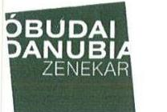 

Óbudai Danubia Nonprofit Kft.
1399 Budapest | Pf. 716
Tel. (+36-1) 373-0228 | E-mail info@danubiazenekar.hu
Web www.odz.hu

Állami Számvevőszék
1052 Budapest, Apáczai Csere János utca 10.
Levélcím: 1364 Budapest4. Pf. 54
Domonkos László elnök
Tárgy: Észrevétel számvevőszéki jelentéstervezetre
Iktatószám: V-1277-208/2016
Tisztelt Elnök Úr!
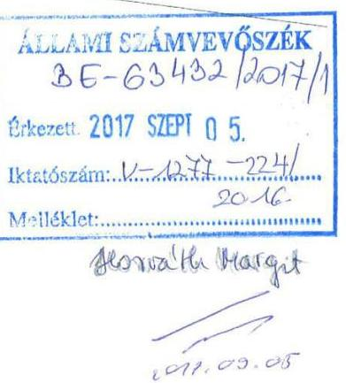

Hivatkozva az „Az önkormányzatok többségi tulajdonában lévő gazdasági társaságok gazdálkodásának ellenőrzése - Óbudai Danubia Zenekar Nonprofit Kft." címmel készített a Társaságunknak a V-1277-208/2016 iktató száma alatt megküldött számvevőszéki jelentéstervezetre a 2011. évi LXVI. tv. 29.§ (2) bekezdése szerint az ellenőrzés megállapításaira az alábbi észrevételeket teszem:

1/ A jelentéstervezet Összegzésnél az 5. oldal első bekezdés 2. mondata kimondja, „... , hogy a vagyongazdálkodás nem volt szabályszerü", más helyeken így a 15. oldal 2. pont eleje, „...a vagyongazdálkodás nem volt szabályszerü, nem volt megfelelő a leltározás hiányossága miatt" mondat szerepel, és ehhez hasonlóan fogalmaz a 16. oldal 2.2 pontja is. A megfogalmazás véleményünk szerint pontatlan, mert:

- egyrészt az Összegzésnél a vagyongazdálkodás egészére mondja ki a jelentéstervezet a szabálytalan vagyongazdálkodást, a többi résznél lényegében szintén az egészre, de ezt a leltározás hiányosságaival indokolva, ezért a kettő véleményünk szerint nincsen szinkronban,
- másrészt a jelentéstervezet 25 . oldalán megjelölt vagyongazdálkodásba tartozó feladatokat az ÓDZ kft szabályszerűen, az előírásoknak megfelelően hajtotta végre, ezért az ÓDZ kft vagyongazdálkodása megítélésünk szerint szabályszerű volt.

2./ A jelentéstervezet 7. oldalán szereplő 1. ábrán mutatja be Társaságunk szakmai mutatóit a 2012. és a 2015. évi művészeti évadbeszámolókra hivatkozva. Számunkra nem egyértelmű, hogy az éves adatok és az évadbeszámoló adataiból hogyan kerültek kiszámításra, hiszen pl. a vizsgálat során a jelzett évekre megküldött 1. sz. tanúsítvány alapján az ábrában található hangverseny számokkal nem azonosak.

3./ A jelentéstervezet 16. oldal 2.2 számú megállapításban megfogalmazottak szerint a saját vagyon nyilvántartása nem volt megfelelő. A saját vagyon elemeit a fökönyvi nyilvántartásban, illetve az ezeket alátámasztó analitikus nyilvántartásokban az előírásoknak megfelelően vezettük, a vagyon változásait folyamatosan, az előírások szerint, a valós mozgásoknak, az azokat alátámasztó dokumentumok szerint kezeltük,

---

# Öbudal Danubia Nonprofit Kft. 

1399 Budapest | Pf. 716
Tel. (+36-1) 373-0228 | E-mail info@danubiazenekar.hu
Web. www.odz.hu
amelyet a könyvvizsgáló is elfogadott és nem kifogásolt. Mindezek alapján véleményünk szerint a vagyon nyilvántartásunk megfelelő volt.
4./ A jelentéstervezet 8. oldalán az alábbi mondat szerepel: „Ebben kiemelkedö szerepe volt a jegyértékesitésböl származó bevételek csökkenése mellett a TAO támogatások $39,6 \%$-os csökkenésének." Tekintettel arra, hogy a TAO támogatás alapja a jegybevétel, így a jegybevétel csökkenése miatt, az igénybe vehető TAO támogatás is jóval kevesebb lett. A mondat szerintünk félreérthető, mert azt sugallja, hogy a jegybevétel alapján igénybe vehető Tao-támogatást nem tudta a Társaság megszerezni, holott nem erről van szó.
5./ A jelentéstervezet 16. oldal 2.2 pontban a Saját vagyon nyilvántartása résznél a tárgyi eszközök leltározásával kapcsolatosan, - amely szerintünk közvetlenül csak a vagyonnyilvántartás adatai mennyiségi helyessége ellenőrzésének a céljait szolgálja, kifogásolja, hogy nem a Leltározási szabályzat 2.2 pontja szerint jártunk el, mert 20122014 években csak egyeztetéses leltározást végeztünk, illetve a 2015. évi mennyiségi felvételes leltár nem tartalmazta az előirt adatokat. Véleményünk szerint:

- a leltározási szabályzat 2.2 pontja azt tartalmazza, - legalább is a szabályozási szándék az volt, - hogy minden évben a vonatkozó jogszabálynak megfelelően egyeztetéses leltározás történjen, amely úgy történik, hogy kinyomtatjuk az analitikából a Leltározási szabályzat 2.2 pontjai szerinti adatokat tartalmazó egyeztető listát, ezt egyeztetjük a fökönyvi könyveléssel, mérlegeljük, hogy az egyes eszközök használhatóak-e és, ha nem használhatóak, akkor azokat selejtezésre előkészítjük. Megjegyezzük, hogy az ÓDZ kft olyan kis társaság, hogy kapacitásunk sincsen, hogy minden évben mennyiségi felvételezést végezzünk,
- az előbbiek szerint jártunk el minden évben, mert a teljes időszak, a 2012-2015 évek mindegyikére kinyomtattuk az egyeztető listákat, amelyek alapján az egyeztetést elvégeztük,
2014. és 2015. években - a jelentéstervezettel ellentétben - mennyiségi felvételes leltározás is történt. 2014-ben a mennyiségi felvételes leltárt feltétlenül el kellett végezzük, mert ellenkező esetben nem feleltünk volna meg a számviteli törvény 69.§ (3) bekezdésében előírt 3 évente történő kötelező mennyiségi felvételes leltározás követelményének. 2014 után 2015-ben azért végeztünk mennyiségi felvételes leltározást is, mert az Önkormányzat belső ellenőrzése a 2014. évi mennyiséges felvételes leltározást - adathiányokra hivatkozva - nem fogadta el.

A fentiekre tekintettel véleményünk szerint a jelentéstervezet 2.2 pontja saját vagyon nyilvántartása részben megfogalmazott megállapítások pontositásra szorulnak, tekintettel arra, hogy 2012-2015 között minden évben elvégeztük az egyeztetéses leltározást, illetve 2014. és 2015 években mennyiségi felvételes leltárt is készítettünk, és a 2012-2013-as évekre a mennyiségi felvételes leltározás hiányát könyvvizsgálónk sem kifogásolta. Azt gondoljuk, hogy hiányosságunk az, hogy a Leltározási

---

#  

## Óbudai Danubia Nonprofit Kft.

1399 Budapest | PI. 716
Tel. (+36-1) 373-0228 | E-mail info@danubiazenekar.hu
Web www.odz.hu
szabályzat 2.2 pontjának megfogalmazása pontatlan és nem írja le egyértelműenszabályozási szándékunkat és az ez alapján általunk folytatott gyakorlatot.
6./ A jelentéstervezet 5. oldal összegzés részben szerepel az a kijelentés, hogy a „Társaság ..... átláthatósága nem volt biztositott a közérdekü adatokat hiányos nyilvánosságra hozatala miatt". A jelentéstervezet az Áht. 13.§ (3) bekezdése szerinti adatszolgáltatást és az Info törvény 1. számú melléklet II. rész 1,12,14 és III. rész 2. pont szerinti közérdekü adatokat említi. Ezekből

- az Áht. szerinti adatszolgáltatásként az ÓDZ kft feladata a beszámolók megküldése, amelyek ugyan nem történtek meg, de a beszámolók az ÓDZ kft honlapján megtalálhatóak,
- az ÓDZ kft-nek nincsen jogszabályon alapuló statisztikai adatgyűjtési kötelezettsége, ezért az Info törvény 1. számú melléklete II. rész 14. pontja szerint nincs mit közzétennie,
- az ÓDZ kft-nél a vizsgált időszakban volt ellenőrzés, amelyek az Info törvény 1. számú melléklet II. rész 12. pontja ellenére nem lettek közzétéve, de ezek nem tartalmaztak olyan megállapításokat, amelyek befolyásolták volna az ÓDZ kft átláthatóságát,
- az Info törvény 1. számú melléklet III. rész 2. pontja szerinti létszám és illetményadatok részben, ha nem is negyedéves időszakonként, de évente a beszámoló kiegészítő mellékletében, illetve az ÓDZ kft honlapja közérdekủ adatok egyéb részben a vezető tisztségviselők juttatásánál közzé van téve, de ezen adatok egy részének közzététele, ha ezt nem teszi meg mindenki egyszerre, a zenekarok közötti verseny miatt olyan versenyhátrányt jelentene, amely előbb-utóbb az ÓDZ kft ellehetetlenüléséhez vezetne.

Azt gondoljuk, hogy abban az általános megfogalmazásban, tehát úgy ahogy ez a jelentéstervezet 5. oldal összegző részben szerepel, nem állja meg a helyét, mert ez alapján az vélelmezhető, hogy olyan hiányosságok vannak a közérdekü adatok nyilvánosságra hozatalában, amely nem teszi lehetővé az ÓDZ kft átláthatóságát. Véleményünk szerint erről szó sincs, mert az ÓDZ kft honlapján megjelenő rengeteg szakmai információ, a gazdálkodásra vonatkozóan megjelenő adatok elegendő információt biztosítanak, hogy egy külső szemlélő az ÓDZ kft tevékenységét, gazdálkodását átlássa. A Társaságunk honlapján a közérdekủ adatok megismerésére vonatkozóan feltett szabályzatunk, - az ebben megtalálható, a közérdekủ adatok megismerésére kialakított rendszerünk - pedig, mindenki számára biztosítja, hogyha valakinek a honlapon esetleg nem szereplő közérdekủ adatra van szüksége, akkor ezt rövid időn belül a szabályzat alapján megkaphassa.
7./ A jelentéstervezet a Társaság könyvvizsgálójának munkájára vonatkozóan olyan megállapítást (korlátozásos könyvvizsgálói vélemény kiadása) tett, amely az ÓDZ kft megítélését is súlyosan befolyásolja, ezért a jelentéstervezetet megküldtük a könyvvizsgálónknak is. Ezzel kapcsolatosan megküldte véleményét azzal a kéréssel,

---

# Öbudai Danubia Nonprofit Kft. 

1399 Budapest | Pf. 716
Tel. (+36-1) 373-0228 | E-mail info@danubiazenekar.hu
Web www.odz.hu
hogy ezt és a hozzá tartozó bizonylatokat változtatás nélkül küldjük meg az Önök részére. Kérésének az észrevételünk részeként eleget teszik és levelét az érintett bizonylatokkal együtt mellékletként csatoljuk.

A fentiek alapján

## kérjük

észrevételeink elfogadását, és a jelentés szövegét észrevételeinknek megfelelően módosítani szíveskedjen.

Kérjük, továbbá, hogy az 5. oldal első bekezdés 2. mondatát szíveskedjék akként módosítani, hogy „A Társaság vagyongazdálkodása néhány elemében nem volt szabályszerü, átláthatósága részben nem volt biztositott a közérdekü adatok hiányos nyilvánosságra hozatala miatt".

Mellékeltek:1. sz. 1 sz. tanúsítványok másolatai
2. sz. Könyvvizsgáló anyag

Budapest, 2017. augusztus 30.

Tisztelettel
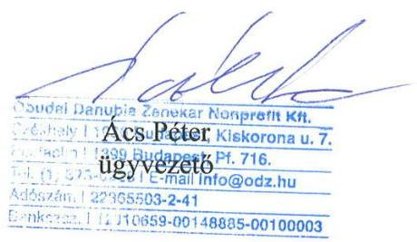

---

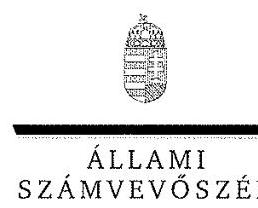

ELNÖK

Ikt.szám: V-1277-227/2016

# Ács Péter Ferenc úr 

ügyvezető

Óbudai Danubia Zenekar Nonprofit Kft.

## Budapest

## Tisztelt Ügyvezető Úr!

Köszönettel vettem az Óbudai Danubia Zenekar Nonprofit Kft. ellenőrzéséről készített számvevőszéki jelentéstervezetre megküldött észrevételeit.
Az Állami Számvevőszék észrevételekre vonatkozó álláspontjáról a felügyeleti vezető által készített részletes tájékoztatásból kap választ, amelyet levelemhez mellékeltem.
Tájékoztatom Ügyvezető urat, hogy az Állami Számvevőszék a figyelembe nem vett észrevételeket az Állami Számvevőszékről szóló 2011. évi LXVI. törvény 29. § (3) bekezdésében előírtak szerint köteles a jelentésében feltüntetni és megindokolni, hogy azokat miért nem fogadta el.

Budapest, 2017. 0\% hó $28^{\circ}$. nap
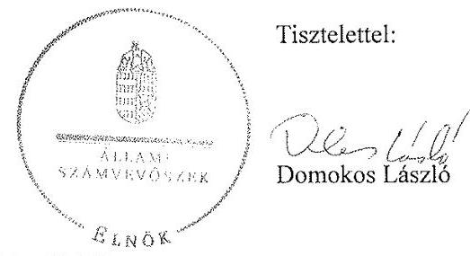

Melléklet: Tájékoztatás az észrevételek kezeléséről

---

# Tájékoztatás az észrevételek kezeléséről 

Megköszönöm Ügyvezető úrnak „Az önkormányzatok többségi tulajdonában lévő gazdasági társaságok gazdálkodásának ellenörzése - Óbudai Danubia Zenekar Nonprofit Kft." címmel készített jelentéstervezetre tett észrevételeit. Az észrevételek kezeléséről az alábbi tájékoztatást adom.

## 1. számú észrevétel

Az észrevétel 1. pontja szerint a jelentéstervezet Összegzés rész, 5. oldal első bekezdés 2. mondata kimondja, ,,A Társaság vagyongazdálkodása nem volt szabályszerü... ". A 15. oldal 2. pont elején ,, A Társaság vagyongazdálkodása nem volt szabályszerü a leltározás hiányossága miatt." mondat szerepel és hasonlóan fogalmaz a 16. oldal 2.2. pontja is. Az Ügyvezető úr véleménye szerint a megfogalmazás pontatlan, mivel az Összegzésnél a vagyongazdálkodás egészére mondja ki a jelentéstervezet a szabálytalan vagyongazdálkodást, a többi résznél lényegében szintén az egészre, de ezt a leltározás hiányosságaival indokolva, ezért a kettő véleményük szerint nincs szinkronban. Továbbá a jelentéstervezet 25 . oldalán rögzítettek szerint a vagyongazdálkodásba tartozó feladatokat a Társaság szabályszerűen, az előírásoknak megfelelően hajtotta végre, ezért a Társaság megítélése szerint a vagyongazdálkodása szabályszerű volt.

Az észrevételben foglaltakat tudomásul veszem, azok kezelésével kapcsolatban az Ügyvezető urat a következőkről tájékoztatom:

A jelentéstervezet Összegzésében a Társaság vagyongazdálkodásával kapcsolatban rögzítetteket az annak (részletes) Megállapításaiban - 15. oldal 2. pont elején és 16. oldal 2.2. pontjában - foglaltak alapozzák meg. Az Összegzés mindezek summázata. Arra szolgál, hogy az adott területről átfogó minősítést adjon. Amennyiben pedig a vagyongazdálkodás területén nyilvántartási és leltározási hiányosságok, problémák merülnek fel, a vagyongazdálkodás összesítő minősítése eleve a „nem szabályszerű" lehet.

A nemzeti vagyonról szóló 2011. évi CXCVI. törvény (Nvtv.) 7. § (2) bekezdésében meghatározott vagyongazdálkodási feladatok - így egyebek mellett az átlátható müködtetés - végrehajtásának alapvető feltétele, hogy a Társaság a mérleg fordulónapján meglévő eszközeit és forrásait mennyiségben és értékben tartalmazó, a számvitelről szóló 2000 . évi C. törvény (Számv. tv.) és a Leltározási szabályzat előírásai szerint elvégzett leltározáson alapuló leltár alapján vegye számba, ugyanis csak ennek birtokában készíthet megbízható és valós adatokon alapuló beszámolót.

Mindezek alapján megítélésünk szerint a jelentéstervezet Összegzésének 2. mondatában, a 15. oldal 2. pont elején és 16. oldal 2.2. pontjában a Társaság vagyongazdálkodásával kapcsolatban tett megállapítások továbbra is helytállóak, e tekintetben a jelentéstervezetben tett megállapításokat nem módosítom. Az észrevétel ellenőrzés által tett javaslatot nem érintett.

---

# 2. számú észrevétel 

Az észrevétel 2. pontja szerint a jelentéstervezet 1. ábrája mutatja be a Társaság szakmai mutatóit a 2012. és a 2015. évi művészeti évadbeszámolókra hivatkozva. Az észrevétel szerint nem egyértelmủ, hogy az éves adatok és az évadbeszámolók adataiból hogyan kerültek kiszámításra az 1. ábrán szereplő adatok, mivel az abban szereplő hangverseny- számok nem azonosak az ellenőrzés során a Társaság részéről kitöltött 1. sz. tanúsítvány adataival.

Észrevétele nem helytálló. A jelentéstervezet 1. ábrájának adattartalmát ellenőriztem. Az abban szereplő adatok helytállóak, azok a Társaság által az ellenőrzés rendelkezésére bocsátott müvészeti évadbeszámolókból - és nem az 1. sz. tanúsítványból - származnak. Az 1. ábrában szereplő adatok forrásaként a jelentéstervezetben is a művészeti évadbeszámolók kerültek megjelölésre. Az előbbiek alapján a jelentéstervezet 1. ábrájának adatait nem módosítom. Az észrevétel ellenőrzés által tett javaslatot nem érintett.

## 3. számú észrevétel

Az észrevétel 3. pontja szerint a jelentéstervezet 16. oldal 2.2. számú megállapításában megfogalmazottak szerint a saját vagyon nyilvántartása nem volt megfelelő. Ezzel kapcsolatban az észrevétel rögzíti, hogy a saját vagyon elemeit a fökönyvi nyilvántartásban, illetve az ezeket alátámasztó analitikus nyilvántartásokban az előírásoknak megfelelően vezették, a vagyon változásait folyamatosan, az előírások szerint, a valós mozgásoknak, az azokat alátámasztó dokumentumok szerint kezelték, amelyet a könyvvizsgáló is elfogadott és nem kifogásolt. Mindezek alapján a Társaság véleménye szerint a vagyon nyilvántartásuk megfelelő volt.

Az észrevétel a jelentéstervezet a Társaság saját vagyon nyilvántartásának szabályszerűségére vonatkozó minősítését vitatja, az azt megalapozó megállapításokat nem. Álláspontunk szerint a saját vagyon nyilvántartása szempontjából is alapvető fontosságú, hogy a Társaság a mérleg fordulónapján meglévő eszközeit és forrásait mennyiségben és értékben tartalmazó, a Számv. tv. és a Leltározási szabályzat előírásai szerint elvégzett leltározáson alapuló leltár alapján vegye számba. Csak ennek birtokában készíthet megbízható és valós adatokon alapuló beszámolót.

Mindezek alapján megítélésünk szerint a jelentéstervezet 16. oldal 2.2. pontjában a Társaság saját vagyon nyilvántartásával kapcsolatban tett megállapítások továbbra is helytállóak, e tekintetben a jelentéstervezetben tett megállapításokat nem módosítom. Az észrevétel ellenőrzés által tett javaslatot nem érintett.

## 4. számú észrevétel

Az észrevétel 4. pontja a jelentéstervezet 8. oldalán szereplő mondat - „Ebben kiemelkedő szerepe volt a jegyértékesitésböl származó bevétel csökkenése mellett, a TAO támogatások 39,6\%-os csökkenésének." - tartalmával kapcsolatban rögzíti, hogy a TAO támogatás alapja a jegybevétel, így a jegybevétel csökkenése miatt az igénybe vehető TAO támogatás is jóval kevesebb lett. A mondat

---

az Ügyvezető úr szerint félreérthető, mert arra is utalhat, hogy a jegybevétel alapján igénybe vehető TAO támogatást a Társaság nem tudta megszerezni.

Az észrevételt nem fogadom el. Az észrevétel szerinti félreérthetőség az érintett mondat vonatkozásában véleményünk szerint nem áll fenn, mivel abban a bevételek csökkenésének fö összetevőit kívántuk tömören bemutatni és nem a TAO támogatások jegyértékesítésből származó bevételhez kötöttségét. Az észrevétel alapján a jelentéstervezetet nem módosítom. Az észrevételben foglaltak ellenőrzés által tett javaslatot és azt megalapozó megállapítást nem érintenek.

# 5. számú észrevétel 

Az észrevétel 5. pontja szerint a jelentéstervezetben 16. oldal 2.2. pontban a Saját vagyon nyilvántartása résznél a tárgyi eszközök leltározásával kapcsolatosan, - amely a Társaság szerint közvetlenül csak a vagyonnyilvántartás adatai mennyiségi helyessége ellenőrzésének a céljait szolgálja - az ÁSZ kifogásolja, hogy nem a Leltározási szabályzat 2.2. pontja szerint jártak el, mert 2012-2014. években csak egyeztetéses leltározást végeztek, illetve a 2015. évi mennyiségi felvételes leltár nem tartalmazta az előírt adatokat.

## - A Társaság véleménye szerint:

- a leltározási szabályzat 2.2 pontja azt tartalmazta, - a szabályozási szándékuk legalábbis ez volt, - hogy minden évben a vonatkozó jogszabálynak megfelelően egyeztetéses leltározás történjen, amely úgy történt, hogy kinyomtatják az analitikából a Leltározási szabályzat 2.2 pontjai szerinti adatokat tartalmazó egyeztető listát, ezt egyeztetik a fökönyvi könyveléssel, mérlegelik az eszközök használhatóságát és a nem használható eszközöket selejtezésre előkészítik. Az észrevételben megjegyzik továbbá, hogy a Társaság olyan kicsi, hogy kapacitásuk sincs, hogy minden évben mennyiségi felvételezést végezzenek,
- a továbbiakban az észrevételben közlik, hogy minden évben az előbbiek szerint jártak el, mert a 2012-2015. évek mindegyikére kinyomtatták az egyeztető listákat, amelyek alapján az egyeztetést elvégezték,
- az észrevétel szerint 2014. és 2015. években - a jelentéstervezettel ellentétben - mennyiségi felvételes leltározás is történt. 2014-ben a mennyiségi felvételes leltárt a Számv. tv. 69. § (3) bekezdésében előírt 3 évente történő kötelező mennyiségi felvételes leltározás követelményének való megfelelés miatt kellett elvégezniük. A 2015. évben azért végeztek mennyiségi felvételes leltározást, mert az Önkormányzat belső ellenőrzése a 2014. évi mennyiségi felvételes leltározást - adathiányokra hivatkozva - nem fogadta el.

A fentiekre tekintettel Ügyvezető úr véleménye szerint a jelentéstervezet 2.2 pontja saját vagyon nyilvántartása részben megfogalmazott megállapítások pontositásra szorulnak, tekintettel arra, hogy 2012-2015 között minden évben elvégezték az egyeztetéses leltározást, illetve 2014., 2015. években mennyiségi felvételes leltárt is készítettek, a 2012-2013-as évekre a mennyiségi felvételes leltározás

---

hiányát a könyvvizsgálójuk sem kifogásolta. Az észrevétel szerint azt gondolják, hogy hiányosságuk az, hogy a Leltározási szabályzat 2.2 pontjának megfogalmazása pontatlan és nem írja le egyértelműen a Társaság szabályozási szándékát és az ez alapján folytatott gyakorlatot.

Az észrevételben foglaltakat nem fogadom el.
A Társaság tárgyi eszközeinek leltározása az észrevétel szerint is szabálytalan volt az ellenőrzött években. A Leltározási szabályzat minden évre mennyiségi felvételezéses - nem egyeztetéses leltározást írt elő a tárgyi eszközök tekintetében. A tárgyi eszközök 2015. évre vonatkozó mennyiségi felvételezéses leltározása során pedig nem a Leltározási szabályzatban előírtak szerint jártak el. Az észrevétel állítása szerinti 2014. évre vonatkozóan elvégzett mennyiségi felvételes leltározást az ellenőrzés rendelkezésére bocsátott dokumentumok nem támasztották alá, a Társaság Teljességi és hitelességi nyilatkozatának dokumentumjegyzékében ezzel kapcsolatos dokumentum nem szerepelt. Véleményünk szerint alapvető fontosságú, hogy a Társaság mérleg fordulónapján meglévő eszközeit és forrásait mennyiségben és értékben tartalmazó, a Számv. tv. és a Leltározási szabályzat előírásai szerint elvégzett - a Társaság tárgyi eszközökre is kiterjedő - leltározáson alapuló leltár kerüljön összeállításra.

Mindezek alapján megítélésünk szerint a jelentéstervezet 16. oldal 2.2. pontjában a Társaság tárgyi eszközeinek leltározásával kapcsolatban tett megállapítások továbbra is helytállóak, e tekintetben a jelentéstervezetben tett megállapításokat és az azokhoz kapcsolódó ügyvezetőnek címzett 5. számú javaslatot nem módosítom.

# 6. számú észrevétel 

Az észrevétel 6. pontja szerint a jelentéstervezet 5. oldalán az Összegzés részben szerepel, hogy a „Társaság ... átláthatósága nem volt biztositott a közérdekü adatok hiányos nyilvánosságra hozatala miatt.". A jelentéstervezet az Áht. 13. § (3) bekezdése szerinti adatszolgáltatást és az Info törvény 1. számú melléklet II. rész 1.,12.,14. és III. rész 2. pont szerinti közérdekủ adatokat említi. Az észrevétel szerint ezekből

- az Áht. szerinti adatszolgáltatásként a Társaság feladata a beszámolók megküldése, amelyek nem történtek meg, de a beszámolók a Társaság honlapján megtalálhatóak,
- A Társaságnak nincsen jogszabályon alapuló statisztikai adatgyűjtési kötelezettsége, ezért az Info törvény 1. számú melléklete II. rész 14. pontja szerint nincs mit közzétennie,
- a Társaságnál a vizsgált időszakban volt ellenőrzés, amelyek az Info törvény 1. számú melléklet II. rész 12. pontja ellenére nem lettek közzétéve, de ezek nem tartalmaztak olyan megállapításokat, amelyek befolyásolták volna a Társaság átláthatóságát,
- az Info törvény 1. számú melléklet III. rész 2, pontja szerinti létszám és illetményadatok részben, ha nem is negyedéves időszakonként, de évente a beszámoló kiegészítő

---

mellékletében, illetve a Társaság honlapja közérdekủ adatok egyéb részben a vezető tisztségviselők juttatásánál közzé lettek téve, de ezen adatok egy részének közzététele, ha ezt nem teszi meg mindenki egyszerre, a zenekarok közötti verseny miatt olyan versenyhátrányt jelentene, amely előbb-utóbb a Társaság ellehetetlenüléséhez vezetne.

Az észrevételben foglaltak szerint a jelentéstervezet 5. oldal összegző részében szereplő, hivatkozott megállapítás nem állja meg a helyét, mert az alapján az vélelmezhető, hogy olyan hiányosságok vannak a közérdekủ adatok nyilvánosságra hozatalában, amelyek nem teszik lehetővé a Társaság átláthatóságát. Véleményük szerint erről szó sincs, mert a Társaság honlapján megjelenő rengeteg szakmai információ, a gazdálkodásra vonatkozóan megjelenő adatok elegendő információt biztosítanak, hogy egy külső szemlélő a Társaság tevékenységét, gazdálkodását átlássa. Az észrevételben foglaltak szerint a Társaság honlapján a közérdekủ adatok megismerésére vonatkozóan feltett szabályzatuk mindenki számára biztosítja, hogyha valakinek a honlapon nem szereplő adatra van szüksége, akkor rövid időn belül a szabályzat alapján megkaphassa.

A jelentéstervezet 2.4. pontjának a Társaság adatszolgáltatási kötelezettsége teljesítésének hiányosságait rögzítő megállapításait - a statisztikai adatgyűjtési kötelezettség teljesítése kivételével - az észrevételben leírtak nem vitatják. A Társaság adatszolgáltatást a jelentéstervezet megállapításaiban rögzített területek vonatkozásában az észrevétel szerint sem teljesített az ellenőrzött években. A jogszabályon alapuló statisztikai adatgyűjtési kötelezettség hiányára vonatkozó észrevételét nem fogadom el, tekintettel arra, hogy az Országos Statisztikai Adatgyűjtési Program adatgyűjtéseiről és adatátvételeiről szóló 288/2009. (XII. 15.) Korm. rendelet statisztikai adatszolgáltatási feladatot határozott meg a Társaság részére egyrészt a Központi Statisztikai Hivatal, másrészt az Emberi Erőforrások Minisztériuma számára, amelyből következően az Info tv. 1. számú melléklete II. rész 14. pontja szerinti közzétételi kötelezettség teljesítése is feladat volt.

Az Info tv. az információs jogok keretei közé emelte a közfeladatot ellátó szervek arra vonatkozó kötelezettségét, hogy a közélet működésének átláthatósága szempontjából alapvető jelentőségű adatok nyilvánosságát az érintett szervek az elektronikus közzététel útján proaktiv módon is biztosítsák. Ebből következően az Info. tv. 1. sz. mellékletének megfelelő adatok közzétételének teljesítése biztosítja az ellátott közfeladat átláthatóságát. Tekintettel arra, hogy a közzétételi kötelezettség teljesítése hiányos volt, az átláthatóság követelménye sem teljesült, így az átláthatósággal kapcsolatban tett észrevételét nem fogadom el.

Mindezek alapján megítélésünk szerint a jelentéstervezet Összegzésében és 2.4. pontjában a Társaság közzétételi kötelezettség teljesítésének hiányosságai vonatkozásában tett megállapításai továbbra is helytállóak, e tekintetben a jelentéstervezetben tett megállapításokat és az azokhoz kapcsolódó ügyvezetőnek címzett 7., 8. és 9. számú javaslatait nem módosítom.

# 7. számú észrevétel 

Az észrevétel 7. pontja szerint a jelentéstervezet a Társaság könyvvizsgálójának munkájára vonatkozóan olyan megállapítást (korlátozásos könyvvizsgálói vélemény kiadása) tett, amely a Társaság megítélését is súlyosan befolyásolja, ezért a jelentéstervezetet megküldték a

---

könyvvizsgálójuknak is. A könyvvizsgáló ezzel kapcsolatosan megküldte véleményét azzal a kéréssel, hogy azt és a hozzá tartozó bizonylatokat változtatás nélkül küldje meg a Társaság az ÁSZ részére. A könyvvizsgáló kérésének észrevételük részeként eleget tesznek és levelét az érintett bizonylatokkal együtt mellékletként csatolják ahhoz.

Megköszönöm a könyvvizsgáló által tett észrevételekről megküldött ügyvezetői tájékoztatást. A könyvvizsgáló által megfogalmazottak azonban nem tekinthetők az ÁSZ tv. 29. § (2) bekezdése szerinti észrevételnek, tekintettel arra, hogy azt nem az ellenőrzött szervezet vezetője, illetve a felelősként megjelölt személy tette meg, a könyvvizsgáló nem volt az ÁSZ által ellenőrzött.

Tekintettel arra, hogy az ÁSZ ellenőrzése az ellenőrzési program szerinti feladatokra irányult, annak nem volt része a könyvvizsgálói záradék felülvizsgálata, így a jelentéstervezetet az alábbiak szerint módosítom: „A 2012-2015. évek közötti idöszakban az ellenőrzés által feltárt, a-könyvvizsgáló a tárgyi eszközök 2012-2014. évi mennyiségi felvétellel történt leltározásának hiánya, a 2015. évi leltár és a kiegészitő mellékletek tartalmi hiányosságai, valamint a Számv. tv. által elöirt 2012-2013. évi Értékelési szabályzat hiánya, illetve a Számviteli politika1,2 és a Pénzkezelési szabályzat1,4 tartalmi hiányossága mellett ellenére a könyvvizsgáló korlátozás nélküli hitelességi záradékkal látta el a beszámolókat."

Az Ügyvezető úr az észrevétel utolsó két bekezdésében végezetül a fentiek alapján kéri észrevételeik elfogadását és a jelentés szövegének észrevételeiknek megfelelő módosítását. Kérik továbbá az 5. oldal első bekezdés 2. mondatának a következők szerinti módosítását: „A Társaság vagyongazdálkodása néhány elemében nem volt szabályszerü, átláthatósága részben nem volt biztositott a közérdekü adatok hiányos nyilvánosságra hozatala miatt".

Észrevételben foglaltakat tudomásul veszem, azok kezelésével kapcsolatban az Ügyvezető urat a következőkről tájékoztatom:

A jelentéstervezet Összegző rész 5. oldal első bekezdés 2. mondatával összefüggésben az 1. és 6. számú észrevételekkel kapcsolatban már tájékoztattuk az Ügyvezető urat. Az észrevétel utolsó két bekezdésében a jelentéstervezet Összegző rész 5. oldal első bekezdés 2. mondatával összefüggésben, annak módosítására okot adó új tény, körülmény nem került közlésre, ezért az abban foglaltakat nem módosítom.

Budapest, 2017. 03. hó 22. nap

Dr. Horváth Margit felügyeleti vezető

---

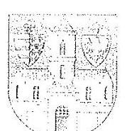

# ÓBUDA-BÉKÁSMEGYER ÖNKORMÁNYZAT 

## POLGÁRMESTER

1033 Budapest, Fö tér 3.

Domokos László úr
Elnök

Állami Számvevőszék
Budapest
Pf. 54
1364
Tisztelt Elnök Úr!
Az Állami Számvevőszék az Óbudai Danubia Zenekar Nonprofit Kft. ellenőrzéséről készített, fenti hivatkozási számú jelentés-tervezete részemre az alábbi megállapítást tette:

Kezdeményezze a Társasággal kötött közszolgáltatási megállapodás Emtv-nek megfelelő tartalommal történő kiegészitését (I.1. megállapitás 7. bekezdése alapján).

A megállapításra vonatkozóan az alábbi észrevételt teszem:
A számvevőszéki ellenőrzés a 2012. január 1-jétől 2015. december 31-ig tartó időszakot fedte le.
A Danubia Kft. és az Önkormányzat között 2012. február 16-án jött létre közszolgáltatási megállapodás 2012. január 01-től 2014. december 31-ig terjedő időtartamra.
Óbuda-Békásmegyer Önkormányzat Képviselő-testülete a 2012. szeptember 27-i ülésén döntött úgy, hogy az érvényben lévő közszolgáltatási megállapodást fenntartói megállapodással váltja fel.
A Képviselő-testület a 618/ÖK/2012.(IX.27.) Határozattal elfogadta a 2013. január 1. napjától 2015. december 31-ig kötendő fenntartói megállapodást, ezzel egyidejűleg az érvényben lévő közszolgáltatási megállapodást hatályon kívül helyezte.
Ahogyan azt a jelentés-tervezet is megállapítja, a jelenleg is hatályos, a 2016. január 1. napjától 2021. december 31-ig tartó időszakra vonatkozó fenntartói megállapodás az Emtvnek megfelelő tartalmú, a megállapodás 10 . pontja tartalmaz utalást a felmondás jogi lehetőségére.
A fent leírtak tekintettel a Képviselő-testület által hatályon kívül helyezett közszolgáltatási megállapodás javasolt kiegészítésére nem látok lehetőséget.

Óbuda-Békásmegyer, 2017. augusztus 29.
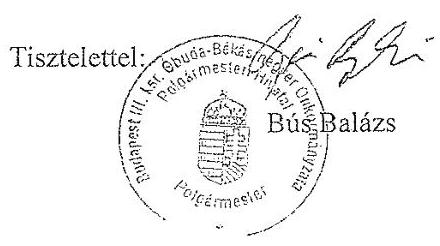

---

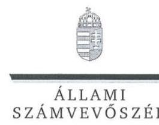

ELNÖK

Ikt.szám: V-1277-222/2016

# Bús Balázs úr 

polgármester

Budapest Főváros III. Kerület Óbuda-Békásmegyer Önkormányzat

## Budapest

## Tisztelt Polgármester Úr!

Köszönettel vettem az Óbudai Danubia Zenekar Nonprofit Kft. ellenőrzéséről készített számvevőszéki jelentéstervezetre megküldött észrevételét.
Az Állami Számvevőszék észrevételre vonatkozó álláspontját a felügyeleti vezető által készített részletes tájékoztatás tartalmazza, amelyet levelemhez mellékeltem.
Tájékoztatom polgármester urat, hogy az Állami Számvevőszék a figyelembe nem vett észrevételeket az Állami Számvevőszékről szóló 2011. évi LXVI. törvény 29. § (3) bekezdésében előírtak szerint köteles a jelentésében feltüntetni és megindokolni, hogy azokat miért nem fogadta el.

Budapest, 2017. 03. hó 0. nap
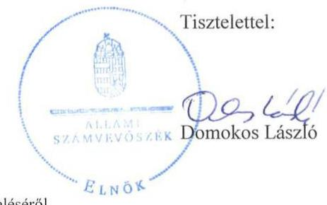

Melléklet: Tájékoztatás az észrevételek kezeléséről

---

# Tájékoztatás az észrevétel kezeléséről 

Megköszönöm polgármester úrnak „Az önkormányzatok gazdasági társaságai - Az önkormányzatok többségi tulajdonában lévő gazdasági társaságok gazdálkodásának ellenörzése - Óbudai Danubia Zenekar Nonprofit Kft." címmel készített jelentéstervezetre tett észrevételét. Az észrevétel kezeléséről az alábbi tájékoztatást adom.

Az észrevétel szerint az Állami Számvevőszék az Óbudai Danubia Zenekar Nonprofit Kft. ellenőrzéséről készített, V-1277-210/2016. hivatkozási számú jelentéstervezete a polgármester úr részére az alábbi megállapítást tette:

Kezdeményezze a Társasággal kötött közszolgáltatási meg-állapodás Emtv.-nek megfelelő tartalommal történő kiegészitését. (1.1. megállapitás 7. bekezdése alapján)

A polgármester úr a megállapításra vonatkozóan az alábbi észrevételt tette:
A számvevőszéki ellenőrzés a 2012. január 1-jétől 2015. december 31-ig tartó időszakot fedte le. A Danubia Kft. és az Önkormányzat között 2012. február 16-án jött létre közszolgáltatási megállapodás 2012. január 01-től 2014. december 31-ig terjedő időtartamra. Óbuda-Békásmegyer Önkormányzat Képviselő-testülete a 2012. szeptember 27-i ülésén döntött úgy, hogy az érvényben lévő közszolgáltatási megállapodást fenntartói megállapodással váltja fel. A Képviselő-testület a 618/ÖK/2012. (IX.27.) határozattal elfogadta a 2013. január 1. napjától 2015. december 31-ig kötendő fenntartói megállapodást, ezzel egyidejűleg az érvényben lévő közszolgáltatási megállapodást hatályon kívül helyezte.

Az észrevétel szerint a jelentés-tervezet is megállapítja, hogy a jelenleg is hatályos, a 2016. január 1. napjától 2021. december 31-ig tartó időszakra vonatkozó fenntartói megállapodás az Emtv.-nek megfelelő tartalmú, a megállapodás 10. pontja tartalmaz utalást a felmondás jogi lehetőségére.

A polgármester úr észrevétele végén közli, hogy a fent leírtakra tekintettel a Képviselő-testület által hatályon kívül helyezett közszolgáltatási megállapodás javasolt kiegészítésére nem lát lehetőséget.

Az észrevételbe foglaltakat az Önkormányzat Képviselő-testületének - ellenőrzés rendelkezésére bocsátott - kapcsolódó döntéseiről szóló 82/ÖK/2012.(II.16.), 618/ÖK/2012.(IX.27.) és 625/2015.(X.8.) számú határozatai alátámasztják. A Képviselő-testület a 618/ÖK/2012. (IX.27.) határozattal elfogadta a 2013. január 1. napjától 2015. december 31-ig kötendő fenntartói megállapodást, ezzel egyidejűleg az - addig 82/ÖK/2012.(II.16.) határozat alapján - érvényben lévő közszolgáltatási megállapodást hatályon kívül helyezte. A 618/ÖK/2012.(IX.27.), illetve 625/2015.(X.8.) számú határozattal elfogadott szerint - a 2013. január 1. napjától 2015. december 31-ig, illetve 2016. január 1. napjától 2021. december 31-ig tartó időszakra - a Danubia Kft.-vel

---

megkötött fenntartói megállapodások az Emtv.-nek megfelelő tartalmúak, a megállapodások 10. pontja tartalmaz utalást a felmondás jogi lehetőségére.

A jelentés-tervezetben, annak rövidítések jegyzékébe foglaltak szerint - eddig is - az a megállapítás szerepelt, hogy a közszolgáltatási megállapodás csak 2012. december 31-ig volt hatályos. A jelentéstervezet 1.1. megállapítása 7. bekezdése - eddig is - azt rögzítette, hogy a 2013. január 1jétől hatályos fenntartói megállapodás tartalma az Emtv.-nek megfelelő volt.

A polgármester úr észrevételét elfogadom. Az észrevételben leírtak a jelentéstervezet 1.1. megállapítása 7. bekezdésében szereplő, közszolgáltatási megállapodással és fenntartói megállapodással összefüggő megállapításait nem vitatják, a megállapítások továbbra is helytállóak. Ugyanakkor az észrevételben foglaltak - mely szerint a polgármesternek címzett javaslat 2012. szeptember 27-étől hatályon kívül helyezett közszolgáltatási megállapodás kiegészítésére irányul -, valamint a jelentéstervezet 1.1. megállapítása 7. bekezdésében a fenntartói megállapodással kapcsolatban rögzítettek alapján - mely szerint a 2013. január 1-jétől hatályos fenntartói megállapodás tartalma az Emtv.-nek megfelelő - a polgármesternek címzett javaslatot törlöm a jelentéstervezetből.

Budapest, 2017. 03. hó 8. nap

Dr. Horváth Margit felügyeleti vezető

---

# RÖVIDÍTÉSEK JEGYZÉKE 

${ }^{1}$ Önkormányzat
${ }^{2}$ Társaság
${ }^{3}$ Alapító Okirat1-6
${ }^{4}$ TAO
${ }^{5}$ polgármester
${ }^{6}$ jegyző
${ }^{7}$ ÁSZ
${ }^{8}$ Gazdasági-városfejlesztési program ${ }_{1-2}$
${ }^{9}$ Kulturális koncepció ${ }_{1-2}$
${ }^{10}$ önkormányzati SZMSZ ${ }_{1-2}$
${ }^{11}$ Vagyonrendelet ${ }_{1-2}$
${ }^{12}$ Gazdálkodási rendelet
${ }^{13}$ Közszolgáltatási megállapodás
${ }^{14}$ Fenntartói megállapodás
${ }^{15} \mathrm{FB}$
${ }^{16} \mathrm{Gt}$.
${ }^{17}$ Ptk. 2
2013. évig: Budapest III. kerület Óbuda-Békásmegyer Önkormányzata 2013. évtől: Budapest Főváros III. kerület, Óbuda-Békásmegyer Önkormányzata
Óbudai Danubia Zenekar Nonprofit Kft.
Alapító Okirat1: 285/ÖK/2011.(V.5.) számú határozattal elfogadva; Alapító Okirat2: 730/ÖK/2012. (XI.29.) számú határozattal elfogadva; Alapító Okirat3: 440/2013. (V.30.) számú határozattal elfogadva; Alapító Okirat4 a 906/2013. (XII.18.) számú határozattal elfogadva; Alapító Okirat5: 703/2014. (XI.3.) számú határozattal elfogadva; Alapító Okirat6: 221/2015. (IV.9.) számú határozattal elfogadva
társasági adó
Budapest Főváros III. kerület, Óbuda-Békásmegyer Önkormányzata polgármestere
Budapest Főváros III. kerület, Óbuda-Békásmegyer Önkormányzata Polgármesteri Hivatalának jegyzője
Állami Számvevőszék
Gazdasági-városfejlesztési program1: Óbuda-Békásmegyer Önkormányzat Gazdasági-városfejlesztési program (2011-2014); Gazdaságivárosfejlesztési program2: Óbuda-Békásmegyer Önkormányzat Gazdasági programja (2015-2019)
Kulturális Koncepció1: Óbuda-Békásmegyer Önkormányzata Kulturális Koncepció 2007.; Kulturális Koncepció2: Budapest Főváros III. kerület, Óbuda-Békásmegyer Önkormányzata Kulturális Koncepciója 2013.
SZMSZ1: 9/1995. (VI.1.) önkormányzati rendelet Budapest III. Kerület, Óbuda-Békásmegyer Önkormányzat Szervezeti és Működési Szabályzatáról (hatályos 2013. április 1-jéig); SZMSZ2: 22/2013. (III.29.) önkormányzati rendelet Budapest III. Kerület, Óbuda-Békásmegyer Önkormányzat Szervezeti és Múködési Szabályzatáról (hatályos 2013. április 2-től)
Vagyonrendelet1: 23/1995. (XII.28.) rendelet az önkormányzat vagyonáról és a vagyontárgyak feletti tulajdonosi jogok gyakorlásáról; Vagyonrendelet2: 17/2014. (VI.4.) önkormányzati rendelet az önkormányzat vagyonáról és a vagyontárgyak feletti tulajdonosi jogok gyakorlásáról (hatályos 2014. június 15-től)
17/2011. (V.11) önkormányzati rendelet az önkormányzat tulajdonában lévő gazdasági társaságok költségvetésével, beszámolásával, pénzellátásával összefüggő nyilvántartási és adatszolgáltatási kötelezettségeiről
83/ÖK/2012. (II.16.) számú határozattal elfogadott közszolgáltatási megállapodás (hatályos 2012. december 31-ig)
618/ÖK/2012. (IX.27.) határozattal elfogadott fenntartói megállapodás (hatályos 2013. január 1-jétől)
Óbudai Danubia Zenekar Nonprofit Kft. felügyelőbizottsága
2006. évi IV. törvény a gazdasági társaságokról (hatálytalan 2014. március 15-től)
2013. évi V. törvény a Polgári Törvénykönyvről (hatályos 2014. március 15-től)

---

${ }^{18}$ Közműv. tv.
${ }^{19}$ Közművelődési rendelet
${ }^{20}$ Képviselő-testület
${ }^{21}$ Emtv.
${ }^{22}$ Taktv.
${ }^{23}$ Áht.
${ }^{24}$ Civil tv.
${ }^{25}$ Számviteli politika $1-2$
${ }^{26}$ Értékelési szabályzat
${ }^{27}$ Számlarend $1-4$
${ }^{28}$ Pénzkezelési szabályzat $3-4$
${ }^{29}$ Leltárkészítési szabályzat
${ }^{30}$ Selejtezési szabályzat
${ }^{31}$ Ltv.
${ }^{32}$ Bkr.
${ }^{33}$ Info. tv.
${ }^{34}$ értékhatár
${ }^{35}$ TAO tv.
${ }^{36}$ áfa
${ }^{37}$ Stabilitási tv.
${ }^{38}$ Ptk. 1
1997. évi CXL. törvény a muzeális intézményekről, a nyilvános könyvtári ellátásról és a közművelődésről (hatályos 1998. január 1-jétől)
14/2000. (V.17.) számú, többször módosított önkormányzati rendelet a közművelődésről
Budapest Főváros III. kerület, Óbuda-Békásmegyer Önkormányzat Képviselő-testülete
2008. évi XCIX. törvény az előadó művészeti szervezetek támogatásáról és sajátos foglalkoztatási szabályairól
2009. évi CXXII. törvény a köztulajdonban álló gazdasági társaságok takarékosabb múködéséről
2011. évi CXCV. törvény az államháztartásról (hatályos 2012. január 1-jétől) 2011. évi CLXXV. törvény az egyesülési jogról, a közhasznú jogállásról, valamint a civil szervezetek múködéséről és támogatásáról (hatályos 2011. december 22-től)
a Társaság számviteli politikája: Számviteli politika1 (hatályos 2009. május 21-től); Számviteli politika2 (hatályos 2014. január 1-jétől)
a Társaság értékelési szabályzata (hatályos 2014. január 1-jétől)
a Társaság számlarendje: Számlarend ${ }_{1}$ (hatályos 2012. január 1-jétől); Számlarend ${ }_{2}$ (hatályos a 2013. évben); Számlarend ${ }_{3}$ (hatályos a 2014. évben), Számlarend (hatályos a 2015. évben)
a Társaság pénzkezelési szabályzata: Pénzkezelési szabályzat ${ }_{1}$ (hatályos 2009. május 21-től); Pénzkezelési szabályzat ${ }_{2}$ (hatályos 2014. február 1jétől); Pénzkezelési szabályzat ${ }_{3}$ (hatályos 2014. szeptember 1-jétől); Pénzkezelési szabályzat ${ }_{4}$ (hatályos 2015. november 1-jétől)
a Társaság eszközök és források leltárkészítési szabályzata (hatályos 2009. május 21-től)
a Társaság selejtezési szabályzata (hatályos 2012. január 1-jétől)
1995. évi LXVI. törvény a közokiratokról, a közlevéltárakról és a magánlevéltári anyag védelméről
370/2011. (XII. 31.) Korm. rendelet a költségvetési szervek belső kontrollrendszeréről és belső ellenőrzéséről
2011. évi CXII. törvény az információs önrendelkezési jogról és az információszabadságról
az Önkormányzat által az Alapító okirat1-3 15.4 pontjában előírt 1 M Ft, az Alapító okirat4 7.14. pontjában előírt 2 M Ft és az Alapító okirat5-6 7.14. pontjában előírt 1 M Ft értékhatár
1996. évi LXXXI törvény a társasági adóról és az osztalékadóról általános forgalmi adó
2011. évi CXCIV. törvény Magyarország gazdasági stabilitásáról
1959. évi IV. törvény a Polgári törvénykönyvről (hatályos 2014. március 14 -ig)

---

# ÁLLAMI SZÁMVEVŐSZÉK 

1052 Budapest, Apáczai Csere János utca 10.
Levélcím: 1364 Budapest 4. Pf. 54
Telefon: +36 14849100 Telefax: +36 14849200
www.asz.hu