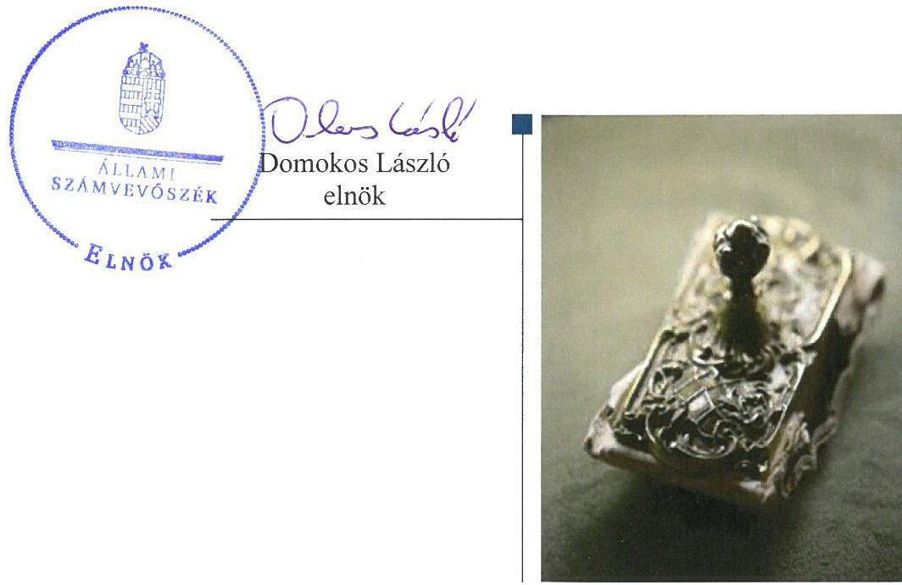
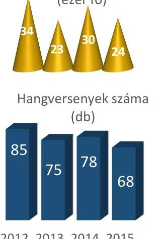
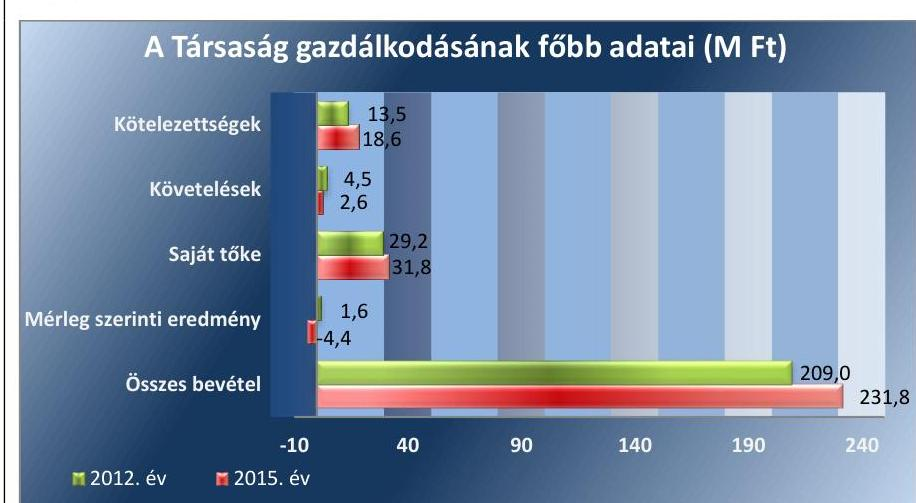
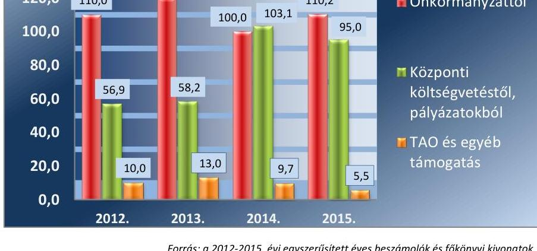
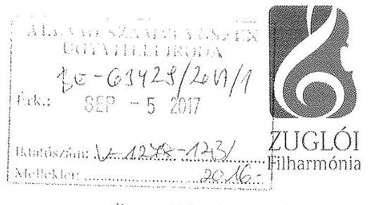
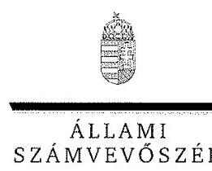
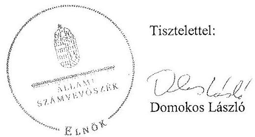

# Jelentés 

## Az önkormányzatok gazdasági társaságai

Az önkormányzatok többségi tulajdonában lévő gazdasági társaságok gazdálkodásának ellenőrzése - Zuglói Filharmónia Non-profit Kft.
2017.

---

# Jelentés 

## Az önkormányzatok gazdasági társaságai

Az önkormányzatok többségi
tulajdonában lévő gazdasági társaságok gazdálkodásának ellenőrzése - Zuglói Filharmónia Non-profit Kft.
2017. 10 hó 10 nap

---

# AZ ELLENŐRZÉST FELÜGYELTE:

DR. HORVÁTH MARGIT felügyeleti vezető

## AZ ELLENŐRZÉST VEZETTE ÉS A VÉGREHAJTÁSÁÉRT FELELŐS:

HOFMEISTER LÁSZLÓ ellenőrzésvezető

A PROGRAM ÖSSZEÁLLÍTÁSÁÉRT FELELŐS:

JANIK JÓZSEF LÁSZLÓ osztályvezető

IKTATÓSZÁM: V-1278-148/2016

TÉMASZÁM: 2312

ELLENŐRZÉS-AZONOSÍTÓ SZÁM: V-075803

Jelentéseink az Országgyűlés számítógépes hálózatán és az Interneten a www.asz.hu címen is olvashatóak.

---

# TARTALOMJEGYZÉK 

■ ÖSSZEGZÉS ..... 5
■ AZ ELLENŐRZÉS CÉLJA ..... 6
■ AZ ELLENŐRZÉS TERÜLETE ..... 7
■ AZ ELLENŐRZÉS HÁTTERE, INDOKOLTSÁGA ..... 9
■ A JELENTÉS LÉNYEGES KÉRDÉSKÖREI ..... 10
■ ELLENŐRZÉS HATÓKÖRE ÉS MÓDSZEREI ..... 11
■ MEGÁLLAPÍTÁSOK ..... 13
■ JAVASLATOK ..... 22
■ MELLÉKLETEK ..... 25
I. Sz. melléklet: Értelmező szótár. ..... 25
II. Sz. melléklet: 2012-2015. évi beszámolók adatai. ..... 27
■ FÜGGELÉK: ÉSZREVÉTELEK ..... 29
■ RÖVIDÍTÉSEK JEGYZÉKE ..... 39

---

.

---

# ÖSSZEGZÉS 

Budapest Főváros XIV. Kerület Zugló Önkormányzata a kizárólagos tulajdonában álló Zuglói Filharmónia Non-profit Kft. feladatellátására vonatkozóan a tulajdonosi joggyakorlás kereteit szabályszerűen kialakította, tulajdonosi jogait összességében szabályszerűen gyakorolta. A Társaság vagyongazdálkodása nem volt szabályszerű, az átláthatóság nem volt biztosított. A Társaság fizetőképessége stabil volt gazdálkodása során, árképzése szabályszerűen történt.

## Az ellenőrzés társadalmi indokoltsága

Magyarországon az önkormányzatok kötelező és önként vállalt feladataik ellátása során egyre szélesebb körben alkalmazzák a költségvetési szerveken kívüli feladatellátást, ezáltal az önkormányzati tulajdonú gazdasági társaságok is kiemelt fontosságú szerephez jutnak a lakossági szolgáltatások biztosításában. Az önkormányzatok többségi tulajdonában álló gazdasági társaságok ellenőrzése kiemelt jelentőségű, mivel működésük hatással van a tulajdonos önkormányzat gazdálkodására, gazdálkodásának egyes elemei befolyásolják az önkormányzati alszektor hiányát és az államadósságot.

Az Állami Számvevőszék által az előadó-művészeti tevékenységet folytató Társaságnál végzett ellenőrzést további társadalmi elvárás is indokolja sajátos feladatellátásából adódóan, mivel az előadásokon keresztül a kerület lakosságának széles köre kerülhet kapcsolatba az előadó-művészeti tevékenységet folytató Társasággal, az általa nyújtott szolgáltatásokkal.

## Főbb megállapítások, következtetések

Az Önkormányzat a jogszabályi előírásoknak megfelelően gondoskodott a helyi közművelődési közfeladatának, ennek keretében a Társasággal kapcsolatos tulajdonosi feladatainak megszervezéséről. A tulajdonosi jogok gyakorlása összességében szabályszerű volt a felügyelőbizottság 2012-2014. évi jogszabályokban előírt ügyrendjének hiánya mellett, valamint annak ellenére, hogy a 2014. évi beszámolóról érvényes felügyelőbizottsági vélemény nélkül döntöttek.

A Társaság rendelkezett az előírt számviteli szabályzatokkal, melyek a 2015. évtől megfeleltek a jogszabályi előírásoknak. A vagyongazdálkodás a jogszabályi rendelkezéseknek és a belső előírásoknak nem felelt meg a hiányos leltár, a vagyon 2012-2013. évi szabálytalan nyilvántartása, valamint a 2014. évtől fennálló kötelezettség ellenére a belső ellenőrzés kialakításának hiánya miatt. A Társaság fizetőképessége biztosított volt a gazdálkodás során.

A Társaság az előírt beszámolási, adatszolgáltatási kötelezettségeit nem teljesítette teljeskörűen, a kapcsolódó szabályozási környezetet hiányosan alakította ki. Az egyszerűsített éves beszámolóit határidőre elkészítette, azonban a beszámolók tartalma nem felelt meg teljeskörűen a jogszabály előírásainak. A beszámolóval és a leltárral kapcsolatos szabálytalanságokat a könyvvizsgáló nem kifogásolta. A vagyongazdálkodási, beszámolási, valamint adatszolgáltatási szabálytalanságok visszavezethetők a Társaság belső ellenőrzési rendszer kiépítésének hiányára, mely kockázatosabb működést eredményezett.

A Társaság bevételeinek elszámolása szabályszerű volt, ráfordításainak elszámolása nem volt szabályszerű a személyi jellegű ráfordítások és az értékcsökkenési leírás nem megfelelő elszámolása miatt. A Társaság árképzése összhangban állt a belső szabályzatával.

A Társaságnak az államadósságra befolyással bíró gazdasági eseményei nem voltak, adósságot keletkeztető ügyletet nem kötött.

---

# AZ ELLENŐRZÉS CÉLJA 

Az ellenőrzés célja annak értékelése volt, hogy az önkormányzat vagyongazdálkodási tevékenysége során szabályszerűen gyakorolta-e tulajdonosi jogait; a gazdasági társaság szabályozottsága, gazdálkodása és vagyongazdálkodási tevékenysége, bevételeinek és ráfordításainak elszámolása megfelelt-e a jogszabályi és tulajdonosi előírásoknak; a gazdasági társaság fizetőképessége biztosított volt-e a gazdálkodás során, valamint a gazdálkodás átláthatósága és elszámoltathatósága érdekében biztosítva volt-e a szolgáltatás dijának megalapozottsága szabályszerű önköltségszámítással. Az ellenőrzés célja továbbá annak megítélése volt, hogy az önkormányzat többségi tulajdonában lévő társaság gazdálkodásának a kormányzati szektor hiányára és az államadósságra befolyással bíró elemei a jogszabályi előírásoknak megfeleltek-e.

---

# AZ ELLENŐRZÉS TERÜLETE

## Budapest Főváros XIV. Kerület Zugló Önkormányzata és a kizárólagos tulajdonában lévő Zuglói Filharmónia Non-profit Kft.

Budapest Főváros XIV. Kerület Zugló Önkormányzatának Képviselő-testülete 2005. december 7-én döntött a Zuglói Szent István Király Szimfonikus Zenekar Közhasznú Társaság alapításáról, amely az Önkormányzat döntése alapján a 2006. évben Zuglói Filharmónia Közhasznú Társasággá, majd 2009. február 1-jével Zuglói Filharmónia Non-profit Kft.-vé alakult. Tulajdonosi szerkezete átlátható, a tulajdonosi jogokat 100%-ban az Önkormányzat gyakorolja. A Társaság 31,0 M Ft-os törzstőkéje az alapítás óta nem változott, 20,0 M Ft készpénzből és 11,0 M Ft apportból áll.

A Társaságot az Önkormányzat abból a célból hozta létre, hogy az Alapító okirat1-94-ban megjelölt közhasznú tevékenységek és az ahhoz kapcsolódó gazdasági tevékenységek végzésével társadalmi közös szükséglet kielégítését nyereség- és haszonszerzési cél nélkül biztosítsa. Alapításának célja olyan zenei események megvalósítása volt továbbá, amelyekben kifejezésre jut az Önkormányzat törekvése a zenei értékek létrehozására, megőrzésére, hagyományok ápolására és az ifjúság zenei nevelésére.

A Társaság a 2011. évben megkapta a "Nemzetközi Ifjúsági Zenekar" címet, majd a 2012. évben kiemelt minősítésű zeneművészeti szervezet lett. A 2013. évtől kezdve a kormányzati szektorba tartozott. Feladatellátását bérelt és használatba kapott ingatlanban saját vagyonával biztosította, vagyonkezelésbe, üzemeltetésbe vagyont nem vett át, a 2012. év kivételével vállalkozási tevékenységet nem folytatott.

A Társaság szakmai tevékenységét jellemző adatokat az 1. ábra, a gazdálkodását jellemző főbb adatok alakulását a 2. ábra szemlélteti.

*2. ábra*

*Forrás: 2012. és a 2015. évi egyszerűsített éves beszámolók*

---

A Társaság összes bevétele a 2012. évről a 2015. évre 10,9%-kal nőtt, melyet elsősorban a központi költségvetésből nyújtott növekvő támogatás eredményezett, mely a csökkenő TAO5 támogatásokat is kompenzálni tudta. A Társaság mérlegfőösszege a 2012. évi 42,7 M Ft-ról a 2015. évre 24,4%-kal, 53,1 M Ft-ra nőtt, mely elsősorban a 2013. évben a befektetett eszközökben végrehajtott beruházással indokolható. Mérleg szerinti eredménye a 2012. évi 1,6 M Ft nyereségről a 2015. évre -4,4 M Ft-ra csökkent. A saját tőke értéke a 2012. évről a 2015. évre 8,9%-kal nőtt, amit a 2012-2013. évi nyereség eredménytartalékba történt elszámolása okozott. A követelésállomány az adósokkal történt egyeztetéseknek következtében négy év alatt több mint 40%-kal csökkent.

Az Önkormányzatnál a 2014. évi önkormányzati választást követően a polgármester6 és a jegyző7 személye változott.

---

# AZ ELLENŐRZÉS HÁTTERE, INDOKOLTSÁGA 

Az önkormányzatok többségi tulajdonában álló gazdasági társaságok ellenőrzése kiemelten fontos a vagyon megőrzése, megóvása érdekében, valamint a kormányzati szektor elszámolásaiban megjelenő önkormányzati tulajdonú gazdálkodó szervezetek esetében, amelyekkel szemben alapvető követelmény, hogy gazdálkodásuk, működésük szabályszerű, az általuk szolgáltatott adatok minél megbízhatóbbak legyenek. A feladatellátás költségeinek, ráfordításainak alakulása a lakosság széles rétegét érinti.

Ellenőrzéseink feltárhatják, hogy az önkormányzat a feladatellátásához rendelt vagyon működtetését a tulajdonostól elvárható gondossággal végezte-e, a feladatot ellátó gazdasági társaság a létesítő okiratban, közszolgáltatói szerződésben, fenntartói megállapodásban foglaltak betartásával biztosította-e a feladat ellátását. Az ellenőrzés eredményeképp meghatározhatóvá válnak a költségvetési hiányt befolyásoló szervezet kockázatai, lehetővé válik ezen kockázatok csökkentése. Az ellenőrzés rávilágíthat arra, hogy a gazdasági társaság a vagyon használatával biztosította-e a szolgáltatás folytatásának feltételeit, az önkormányzat tulajdonosi felügyelete hozzájárult-e a szabályszerű gazdálkodáshoz és feladatellátáshoz. A megállapítások alapján megfogalmazott számvevőszéki javaslatok hasznosítása elősegítheti a meglévő hibák megszüntetését. A jó gyakorlatok bemutatásával az ÁSZ8 hozzájárulhat a követendő megoldások megismertetéséhez, terjesztéséhez.

---

# A JELENTÉS LÉNYEGES KÉRDÉSKÖREI 

1. Az Önkormányzat tulajdonosi joggyakorlása szabályszerű volt-e?
2. A Társaság vagyongazdálkodása szabályszerű volt-e, fizetőképessége biztosított volt-e a gazdálkodás során?
3. A Társaság bevételeinek és ráfordításainak elszámolása, valamint az önköltségszámítás és árképzés szabályszerű volt-e?
4. A kormányzati szektorba sorolt, többségi önkormányzati tulajdonban lévő Társaság gazdálkodásának a kormányzati szektor hiányára és az államadósságra befolyással bíró gazdasági eseményei megfeleltek-e a jogszabályi előírásoknak?

---

# ELLENŐRZÉS HATÓKÖRE ÉS MÓDSZEREI 

## Az ellenőrzés típusa

Megfelelőségi ellenőrzés.

## Az ellenőrzött időszak

2012. január 1-jétől 2015. december 31-ig

## Az ellenőrzés tárgya

Az Önkormányzat tulajdonosi joggyakorlása, valamint a Társaság gazdálkodásának szabályozottsága és szabályszerűsége, továbbá az önkormányzati alszektorba sorolt Társaság gazdálkodásának a kormányzati szektor hiányára és az államadósságra befolyással bíró elemei.

Az ellenőrzés kiterjedt minden olyan körülményre és adatra, amely az ÁSZ jogszabályban meghatározott feladatainak teljesítéséhez, valamint a program végrehajtása folyamán felmerült újabb összefüggések feltárásához szükséges volt.

## Az ellenőrzött szervezet

Budapest Főváros XIV. Kerület Zugló Önkormányzata és a Zuglói Filharmónia Non-profit Kft.

## Az ellenőrzés jogalapja

Az ellenőrzés jogszabályi alapját az Állami Számvevőszékről szóló 2011. évi LXVI. törvény 1. § (3) bekezdése és 5. § (3)-(4)-(5) bekezdései képezik.

## Az ellenőrzés módszerei

Az ellenőrzést a nemzetközi standardokat irányadónak tekintve az ellenőrzési program ellenőrzési kérdései, az ellenőrzött időszakban hatályos jogszabályok, az ellenőrzés szakmai szabályok és módszertanok figyelembe vételével végeztük.

Az ellenőrzés ideje alatt az ellenőrzött szervezettel történő kapcsolattartást az ÁSZ Szervezeti és Működési Szabályzatának vonatkozó előírásai alapján biztosítottuk.

---

Az ellenőrzés a kiválasztott, kizárólagos tulajdonosi jogokat gyakorló önkormányzatra és az ellenőrzött gazdasági társaságra terjedt ki.

Az ellenőrzési kérdések megválaszolásához szükséges bizonyítékok megszerzése a következő ellenőrzési eljárások alkalmazásával történt: megfigyelés, kérdésfeltevés (információkérés), összehasonlítás, mintavételezés, tételes ellenőrzés, valamint elemző eljárás. Az ellenőrzési bizonyítékként felhasznált adatforrások közé tartoztak egyrészt az ellenőrzési programban felsorolt adatforrások, másrészt minden - az ellenőrzés folyamán - feltárt, az ellenőrzés szempontjából információkat tartalmazó dokumentum.

Az ellenőrzést a megjelölt adatforrások és az ellenőrzöttek által kitöltött tanúsítványok felhasználásával, a mintatételek kiértékelésével, továbbá az adott időszakban hatályos jogszabályok figyelembevételével folytattuk le.

A bevételek és a ráfordítások elszámolásának szabályszerűségét véletlenszerű mintavétellel, a vagyon nyilvántartását tételes ellenőrzéssel, a legnagyobb ráfordítások elszámolására vonatkozó eljárás szabályszerűségét kockázatalapú, irányított mintavétel alapján ellenőriztük.

Az értékelés során az egyes szabályszerűségi kérdésekre adott válaszok kerültek statisztikai módszer segítségével összesítésre és minősítésre. A jogszabályoknak és egyéb előírásoknak megfelelőnek tekintettük az adott területet, amennyiben az ellenőrzés eredménye alapján 95%-os bizonyossággal a teljes sokaságban, illetve az ellenőrzött tételekre vonatkozóan a hibaarány kisebb volt, mint 10% és nem megfelelőnek értékeltük, ha a hibaarány a 10%-ot elérte.

---

# 1. Az Önkormányzat tulajdonosi joggyakorlása szabályszerű volt-e? 

Összegző megállapítás

Az Önkormányzat tulajdonosi joggyakorlása összességében szabályszerű volt.

### 1.1. számú megállapítás

Az Önkormányzat tulajdonosi joggyakorlásának kereteit szabályszerűen alakította ki.

A GAZDASÁGI PROGRAMJÁBAN1-29 az Önkormányzat rendelkezett a kerület kulturális kiszolgálását biztosító, multifunkcionális központ kialakításáról, és széleskörű, minden társadalmi csoport számára elérhető színvonalas, kulturális rendezvények, előadások biztosításáról, melyhez kapcsolódó feladatokat többek között a Társaságon keresztül látta el.

## A TULAJDONOSI JOGOK GYAKORLÁSÁNAK KE-

RETEIT az SZMSZ1-210, a Vagyonrendelet11, továbbá az Önkormányzat és a Társaság között létrejött Közszolgáltatási Szerződés12, valamint 2013. január 31-től öt évre szóló Fenntartói megállapodás13, és ezen keretmegállapodás alapján évente megkötött Támogatási szerződés
 }_{1-3}{ }^{14}$ tartalmazta.

Az Önkormányzat az Alapító okirat ${ }_{1-9}$-ban meghatározta a Társaság képviseletét ellátó ügyvezető személyét, az ügyvezető kötelezettségeit, feladatait, az összeférhetetlenségi szabályokat, valamint a tulajdonosi joggyakorló beszámoló elfogadására vonatkozó feladatait.

A Társaságnál $\mathrm{FB}^{15}$ működött. Az FB tagok számát és személyét, ellenőrzési hatáskörét, jogait az Alapító okirat ${ }_{1-9}$-ban a Gt. ${ }^{16}$ és a Taktv. ${ }^{17}$ rendelkezésének megfelelően határozta meg az Önkormányzat, az FB 2015. február 16-án kelt ügyrendjét határozattal jóváhagyta.

A KÖZMŰVELŐDÉSI FELADATOK Társaság útján történő ellátásáról az Önkormányzat az ellenőrzött időszakot megelőzően döntött. A közfeladat ellátásának megszervezése megfelelt a Mötv. ${ }^{18}$ előírásainak.

RENDELETALKOTÁSI KÖTELEZETTSÉGÉNEK az Önkormányzat a Közművelődési rendelet ${ }_{1-2}{ }^{19}$ megalkotásával eleget tett. A rendelet kiterjedt az Önkormányzat közművelődési feladataira, a helyi közművelődési tevékenység támogatására és a feladatellátás módjára.

Az Önkormányzat a Taktv. alapján elkészítette és jóváhagyta a Társaság üzleti tervének teljesítését elősegítő anyagi ösztönzési rendszerre vonatkozó Javadalmazási szabályzat ${ }^{20}$-ot, melyben meghatározták a vezető tisztségviselők, az FB tagok, a vezető állású munkavállalók javadalmazását, valamint a jogviszony megszűnése esetére biztosított juttatások módját, mértékét, elvét, annak rendszerét.

---

### 1.2. számú megállapítás

A tulajdonosi jogok gyakorlása összességében szabályszerű volt, azonban a 2014. évi beszámoló elfogadása során nem megfelelően jártak el. Az FB a 2015. évig ügyrend nélkül működött, melyet az Önkormányzat nem kifogásolt.

Az Önkormányzat tulajdonosi jogait a Képviselő-testület, valamint az általa meghatározott feladat és hatáskörben eljárva a Pénzügyi és Költségvetési Bizottság gyakorolta az SZMSZ1-2-ben, a Vagyonrendeletben, valamint az Alapító okirat ${ }_{1-9}$-ban rögzítettek szerint.

ELLENŐRZÉSI TEVÉKENYSÉGÉT az Önkormányzat tulajdonosi joggyakorlása során az FB és a könyvvizsgáló kijelölésén keresztül látta el a Társaság felett, az Áht. ${ }^{21}$-ban biztosított egyéb ellenőrzési lehetőséggel nem élt.

AZ FB az ellenőrzött években a Társaság gazdálkodását nyomon követte, azonban a Gt. 34. § (4) bekezdésében, illetve 2014. március 15-től a $\mathrm{Ptk}_{2}{ }^{22}$ 3:122. § (3) bekezdésében, valamint az Alapító okirat ${ }_{1-7}$ 11.3. pontjában előírtak ellenére 2015. február 15-ig nem állapította meg ügyrendjét.

A Képviselő-testület a 2012-2014. évi időszakban a Társaság éves beszámolójáról az FB érvényes véleményét is tartalmazó előterjesztés alapján döntött. A 2015. évben az FB a Társaság 2014. évi beszámolójának véleményezésekor nem volt határozatképes, mely eljárás nem felelt meg a Ptk. 2 3:122. § (2) bekezdésében foglaltaknak. A Képviselő-testület a 2014. évi beszámoló elfogadásakor nem a Ptk2. 3:120. § (2) bekezdésében foglaltak alapján járt el, mert érvényes FB vélemény hiányában döntött.

KÖNYVVIZSGÁLÓT a Képviselő-testület a Gt. és a Ptk2. által előírtak szerint kijelölt. A Társaság a könyvvizsgáló jelentését a beszámolóval együtt terjesztette elő a Képviselő-testület részére az ellenőrzött években. A könyvvizsgáló az ellenőrzött évek számviteli beszámolójáról hitelesítő, korlátozás nélküli záradékot adott véleményében.

Üzleti terv készítési kötelezettséget az Önkormányzat nem határozott meg, azonban a Társaság a 2012-2014. évekre elkészítette azokat, melyeket a Képviselő-testület jóváhagyott.

A KÉPVISELŐ-TESTÜLET DÖNTÖTT a Társaság éves eredményének az eredménytartalékba helyezéséről az Alapító Okirat1-9nak megfelelően. A Társaság saját tőkéje a társasági formára előírt törvényi minimum fölött volt, így a tulajdonos részéről a saját tőke tekintetében intézkedés megtétele nem vált szükségessé.

---

# 2. A Társaság vagyongazdálkodása szabályszerű volt-e, fizetőképessége biztosított volt-e a gazdálkodás során? 

Összegző megállapítás

A Társaság vagyongazdálkodása a leltár hiányossága és a 2012-2013. évben állományba vett vagyon szabálytalan nyilvántartása miatt nem volt szabályszerű. Belső ellenőrzést a 2014. évtől fennálló kötelezettség ellenére az ügyvezető nem alakított ki. A számviteli szabályzatai összességében megfeleltek az előírásoknak. A beszámolási és adatszolgáltatási kötelezettségeit hiányosan teljesítette.
2.1. számú megállapítás

A Társaság az előírt számviteli szabályzatokkal rendelkezett, melyek a 2015. évtől megfeleltek a jogszabályi előírásoknak. Belső ellenőrzést az ügyvezető nem alakított ki a jogszabály rendelkezése ellenére a 2014. évtől.

A Társaság rendelkezett a Számv. tv. ${ }^{23}$-ben előírt Számviteli politika ${ }_{1-2}{ }^{24}$-val, Leltárkészítési és leltározási szabályzat ${ }_{1-2}{ }^{25}$-tal, Eszközök és források értékelési szabályzat ${ }_{1-2}{ }^{26}$-tal, Pénzkezelési szabályzat ${ }_{1-2}{ }^{27}$-tal és Számlarend ${ }_{1-2}{ }^{28}$-del.

A SZÁMVITELI POLITIKA ${ }_{2}$ a mérleg és eredménykimutatás választott formáját nem a Számv. tv. 96. § (2)-(3) bekezdése szerinti - egyszerűsített éves beszámolóra vonatkozó tartalommal - határozta meg, azonban a gyakorlatban a törvényben az egyszerűsített éves beszámolóra előírt formát alkalmazta.

A Társaság a Számviteli politika ${ }_{1}$-t a Számv. tv. 2013. január 1-jével hatályba lépett változásaival - jelentős összegű hiba fogalmának változása, megbízható és valós képet lényegesen befolyásoló hiba fogalmának törlése - határidőn túl módosította. A Számviteli politika ${ }_{2}$-ben - a Számv. tv. 2015. július 4-étől hatályos 14. § (4) bekezdésében foglaltak ellenére - írásban nem rögzítették, hogy a Társaság mit tekint a számviteli elszámolás, az értékelés szempontjából kivételes nagyságú vagy előfordulású bevételnek, költségnek, ráfordításnak. Ezzel az eljárással megsértette a Társaság a Számv. tv. 14. § (11) bekezdését.

A SZÁMLAREND ${ }_{1}$ a Számv. tv. 161. § (2) bekezdés a) pontjában foglaltaknak nem felelt meg, mivel az a 2013-2014. években nem tartalmazta minden alkalmazásra kijelölt számla számjelét és megnevezését. A 2015. évtől megfelelő volt a szabályozás.

A PÉNZKEZELÉSI SZABÁLYZAT ${ }_{1}$ a 2012-2014. közötti években a Számv. tv. 14. § (8) bekezdés előírásai ellenére nem rendelkezett a készpénzállományt érintő pénzmozgások jogcímeiről, eljárási rendjéről, a készpénzállomány ellenőrzés gyakoriságáról. A pénzkezelési szabályzat ${ }_{2}$ megfelelt a Számv. tv. előírásainak.

---

### 2.2. számú megállapítás

1. táblázat

|  A TÁRSASÁG FŐBB |  |  |   |
| --- | --- | --- | --- |
|  MÉRLEGADATAINAK |  |  |   |
|  ALAKULÁSA (M FT) |  |  |   |
|   | $\begin{aligned} & 2012- \ & 12.31 \end{aligned}$ | $\begin{aligned} & 2015- \ & 12.31 \end{aligned}$ | $\%$  |
|  Befektetett eszközök | 7,7 | 13,1 | 70,1  |
|  Forgóeszközök | 35,0 | 39,9 | 14,0  |
|  Aktív időbeli elhatárolás | 0,0 | 0,1 | -  |
|  Saját tőke | 29,2 | 31,8 | 8,9  |
|  Kötelezettségek | 13,5 | 18,6 | 37,8  |
|  Passzív időbeli elhatárolás | 0,0 | 2,7 | -  |
|  Mérlegfőösszeg | 42,7 | 53,1 | 24,4  |

A vagyongazdálkodás a leltár hiányossága és a 2012-2013. évben állományba vett vagyon szabálytalan nyilvántartása miatt nem volt szabályszerű.

A TÁRSASÁG VAGYONGAZDÁLKODÁSA a leltárak vonatkozásában hiányosságokat mutatott, mivel a beszámoló elkészítéséhez összeállított leltár a Számv. tv. 69. § (1) bekezdésében megfogalmazott előírásoknak nem felelt meg, mert az - tételesen, ellenőrizhető módon, mennyiségben és értékben - nem tartalmazta a Társaság eszközei és forrásai közül a saját tőke értékét a 2012-2015. években, továbbá az aktív és a passzív időbeli elhatárolásokat a 2014-2015. években. A három mérlegsorra vonatkozóan a főkönyvi könyvelés és analitikus nyilvántartás adatai közötti egyeztetést a mérlegfordulónapra vonatkozóan nem végezték el, mely eljárás nem felelt meg a Számv. tv. 69. (2) bekezdésében előírtaknak.

## A 2012-2013. ÉVEKBEN ÁLLOMÁNYBA VETT SAJÁT VAGYON NYILVÁNTARTÁSA az ellenőrzött időszakban

nem felelt meg a jogszabályoknak és a belső szabályozásnak, mely által nem volt maradéktalanul biztosított a felelős gazdálkodás. Az ellenőrzés az alábbi szabálytalanságokat állapította meg: a térítés nélkül átvett eszközök értékét a Számv. tv. 45. § (1) bekezdés c) pontjában előírtak ellenére nem a halasztott bevételek között mutatták ki, azonban az eltérés nem minősült jelentős hibának; a tárgyi eszközök beszerzésénél az aktiválásig nyolc esetben nem a beruházások között mutatták ki az eszközöket, hanem a kapcsolódó főkönyvi számlán számolták el, mely nem felelt meg a Számv. tv. 26. § (7) bekezdésének és a Számlarend 1. fejezetében rögzítetteknek; öt esetben a tárgyi eszközök aktiválását az üzembe helyezési jegyzőkönyv és az állományba vételi bizonylat nem dokumentálta hitelt érdemlően, mivel azokon eltérő dátumok és összegek szerepeltek, mellyel a Számv. tv. 52. § (2) bekezdését megsértették.

A TÁRSASÁG FŐBB MÉRLEGADATAINAK alakulását az 1. táblázat mutatja be. A befektetett eszközök értéke a négy év alatt 70,1\%-kal nőtt, melyet a 2013. évi beruházások eredményeztek.

A forgóeszközök állománya a 2012. évről a 2015. évre 14,0\%-kal, ezen belül a pénzeszközök állománya 22,0\%-kal emelkedett.

A jegyzett tőke összege nem változott. A saját tőke és a jegyzett tőke aránya a 2012. év mérlegfordulónapi 94,2\%-os értékről, a 2015. év végére 102,6\%-ra nőtt. A saját tőke a 2012. évben a jegyzett tőke alá esett, melynek oka az előző évi veszteségből átvezetett negatív összegű eredménytartalék volt, de a társasági formára előírt törvényi minimum fölött maradt. A

---

### 2.3. számú megállapítás

2. táblázat

A TÁRSASÁG LIKVIDITÁSÁNAK ÉS ADÓSSÁGMUTATÓJÁNAK ALAKULÁSA

|   | Eladós-   dottság   mértéke | Likviditása rátá  |
| --- | --- | --- |
|  Referencia | $<1,0$ | $>1$  |
|  2012. év | 0,46 | 2,6  |
|  2013. év | 0,27 | 3,0  |
|  2014. év | 0,73 | 1,9  |
|  2015. év | 0,58 | 2,1  |
|  Forrás: 2012-2015. évi egyszerűsített éves beszá- |  |   |
|  molók, főkönyvi kivonatok adatai alapján szá- |  |   |
|  molt érték |  |   |

2.4. számú megállapítás
saját tőke értékének változását a mérleg szerinti eredmény, illetve a korábbi évek mérleg szerinti eredményéből átvezetett eredménytartalék összege alakította. A mérleg szerinti eredmény a 2015. évben negatív összegű volt a tervezett pályázati pénzek elmaradása miatt.

A források növekedését leginkább a rövid lejáratú kötelezettségek növekedése befolyásolta. A rövid lejáratú kötelezettségek 2014. év végén fennálló magas állományát a szállítói tartozások, valamint a munkabérek és az azokhoz kapcsolódó járulékok megnövekedett összegei eredményezték.

## A Társaság fizetőképessége biztosított volt a gazdálkodása során.

A KÖTELEZETTSÉGÁLLOMÁNY a vizsgált négy év során 100\%-ban rövid lejáratú kötelezettségből állt, melynek állománya 2012. december 31-ről 2015. év végére 37,8\%-kal nőtt. Ezen belül a lejárt kötelezettségek állománya 29,3\%-kal nőtt az ellenőrzött négy év alatt, azonban ezek aránya nem volt jelentős a teljes kötelezettségállományhoz viszonyítva.

AZ ELADÓSODOTTSÁGI MUTATÓK alapján megállapítható, hogy az eladósodás mértéke, szerkezete nem jelentett kockázatot a Társaság működésére, a feladat ellátására. Az eladósodottság mértéke a 2013. évben volt a legkedvezőbb, melyet az ebben az évben elvégzett beruházás, illetve a legalacsonyabb összegű kötelezettségállomány eredményezett. A Társaságnál a forgóeszköz-állomány és a rövid lejáratú kötelezettségek aránya a stabil likviditást mutatta. A Társaság likviditásának és adósságmutatójának az alakulását a 2. táblázat szemlélteti.

A Társaság számára tervezéssel kapcsolatos előírásokat nem határoztak meg, az előírt beszámolási,
 adatszolgáltatási kötelezettségeit nem teljesítette teljes körűen.

TERVEZÉSRE vonatkozó kötelezettséget az Önkormányzat nem határozott meg a Társaság számára.

EGYSZERŰSÍTETT ÉVES BESZÁMOLÓIT a Társaság elkészítette. Az éves beszámolók letétbe helyezése és közzététele a Számv. tv. szerint történt meg.

A Társaság az egyszerűsített éves beszámoló készítése során nem minden esetben tartotta be a Számv. tv. előírásait:

- a főkönyvi nyilvántartás és az eredménykimutatás egyes sorai közötti összhang nem volt biztosított, mivel a Társaság 2012-2015. évi közhasznú tevékenységéből származó bevétele és a 2013. évi pályázati támogatása az eredménykimutatásban nem a főkönyvi nyilvántartással megegyező sorokban jelent meg, mely eljárással megsértették a Számv. tv. 15. § (5) bekezdésben meghatározott következetesség elvét;
- a Számv. tv. 91. § a) pontban előírtak ellenére a 2012-2015. évek kiegészítő mellékleteiben a Társaság a tárgyévben foglalkoztatott munkavállalók átlagos statisztikai létszámát nem adta meg, valamint a Számv. tv. 88. § (2) bekezdésben meghatározottak ellenére a 2012-2014. évek kiegészítő mellékleteiben az eszközök és a források

---

összetételét, a saját tőke és a kötelezettségek tételeinek alakulását nem értékelte;
a 2012-2014. évi kiegészítő mellékletekben nem mutatták be a támogatási program keretében végleges jelleggel kapott, folyósított, illetve elszámolt összeget támogatásonként a jogszabály által előírt megbontásban, amely nem felelt meg a Számv. tv. 93. § (3) bekezdés előírásainak.
A Fenntartói megállapodásban és a Támogatási szerződés1-2-ben foglalt kötelezettségének a Társaság nem tett eleget teljes körűen, mivel az ezekben előírt évközi adatszolgáltatási kötelezettségét nem minden esetben teljesítette.

Az alapító által kijelölt könyvvizsgáló a leltár hiányosságai és az éves beszámoló szabályoknak nem megfelelő összeállítása ellenére a beszámolókat korlátozás nélküli hitelesítő záradékkal látta el.

# A KÖZÉRDEKŰ ADATOK MEGISMERÉSÉRE IRÁNYULÓ IGÉNYEK TELJESÍTÉSÉNEK rendjét rögzítő szabályzatot a Társaság az Info tv. ${ }^{30} 30 . \S$ (6) bekezdésben foglaltak ellenére nem készített. Továbbá az Info tv. 37. § (1) bekezdésében előírt közzététellel kapcsolatos kötelezettségének teljesítésére vonatkozó részletes szabályokat - az Info tv. 35. § (3) bekezdésében foglaltak ellenére - belső szabályzatban nem állapította meg. 

A Társaság honlapján a Taktv. és az Info tv. által előírt szervezeti és személyzeti adatokat, jövedelmi adatokat közzétette, azonban a közzétett adatok nem feleltek meg teljes körűen az Info. tv. 37. § (1) bekezdésében előírtaknak, mivel az Info tv. 1. számú mellékletében meghatározott adatok közül a Társaság tevékenységére, működésére vonatkozó adatokat, illetve a beszámolón kívüli gazdálkodási adatokat nem tette közzé.

A Társaság a központi költségvetésről szóló törvény elkészítéséhez az Áht. 13. § (3) bekezdésében előírtak ellenére nem szolgáltatott adatokat az államháztartásért felelős miniszternek, a 2013. évi kormányzati szektorba sorolását követő időszakban.

---

# 3. A Társaság bevételeinek és ráfordításainak elszámolása, valamint az önköltségszámítás és árképzés szabályszerű volt-e? 

Összegző megállapítás

A Társaság bevételeinek elszámolása szabályszerű volt, ráfordításainak elszámolása nem volt szabályszerű a személyi jellegű ráfordítások és az értékcsökkenési leírás nem megfelelő elszámolása miatt. Árképzése a belső szabályzatának megfelel.

A Társaság bevételeinek elszámolása szabályszerű volt, ráfordításainak elszámolása nem volt szabályszerű a személyi jellegű ráfordítások és az értékcsökkenési leírás nem megfelelő elszámolása miatt.

A BEVÉTELEK ELSZÁMOLÁSA megfelelő főkönyvi számlán történt. A Társaság a közhasznú és a vállalkozási tevékenységből származó bevételeit a 2012. évben a Számlarend alapján a megfelelő számlacsoportok alábontásával osztotta meg és alkalmazta. A 2012. évet követően nem végzett vállalkozási tevékenységet.

A közhasznú tevékenység ellátására kapott működési támogatásokat, pályázati forrásokat támogatásonként elkülönítve a Számv. tv. és a Támogatási szerződés1-3 által előírt módon számolta el. A bevételként elszámolt működési támogatás alakulását a 3. ábra mutatja be.
3. ábra

A Társaság működési támogatásának alakulása (M Ft)

Forrás: a 2012-2015. évi egyszerűsített éves beszámolók és főkönyvi kivonatok
Az önkormányzati támogatás közel azonos mértékű volt a négy év alatt. A központi költségvetési támogatások, illetve a pályázati források növekvő mértéke kedvező volt a csökkenő TAO támogatásból adódó bevételkiesés ellensúlyozásának szempontjából. Az Önkormányzat által a Társaság működéséhez nyújtott támogatás elszámolása a Támogatási szerződés1-3-nek megfelelően történt.

---

3. táblázat

TÁRGYI ESZKÖZÖK ELHASZNÁLÓDÁSI SZINTJE

|  | Számítás-   technikai   eszközök | Gépek, be-   sendere-   sok, felcse-   relések |
| :-- | :--: | :--: |
| 2012. év | $57,9 \%$ | $39,0 \%$ |
| 2013. év | $90,8 \%$ | $26,2 \%$ |
| 2014. év | $100,0 \%$ | $32,6 \%$ |
| 2015. év | $100,0 \%$ | $39,1 \%$ |

Forrás: a 2012-2015. évi egyszerűsített éves be-
számolók

A RÁFORDÍTÁSOK elszámolása az anyagjellegű, a pénzügyi műveletek és az egyéb ráfordítások vonatkozásában megfelelő volt. A Társaság a ráfordításokat a Számv. tv. rendelkezéseivel összhangban számolta el a megfelelő főkönyvi számlákra, elszámolásukat számviteli bizonylatok alátámasztották, a közhasznú tevékenységéhez kapcsolódó ráfordításokat elkülönítette a Számv. tv. előírásának megfelelően.

A SZEMÉLYI JELLEGŰ RÁFORDÍTÁSOK elszámolása nem volt megfelelő, mert a bérköltség könyvviteli elszámolását alátámasztó jelenléti ívek hiányosan álltak rendelkezésre, ami nem felelt meg a Számv. tv. 165. § (1) és (2) bekezdéseiben foglaltaknak, amelyek szerint a minden gazdasági műveletről bizonylatot kell kiállítani, illetve a számviteli nyilvántartásokba csak bizonylat alapján szabad adatokat bejegyezni.

## AZ ÉRTÉKCSÖKKENÉSI LEÍRÁS ELSZÁMOLÁSA

nem volt megfelelő. A Társaság az eszközök értékelésére vonatkozó szabályokat - beleértve az amortizáció elszámolását is - a Számviteli Politika ${ }_{1-2}$ ban és az Eszközök és Források értékelési szabályzat ${ }_{1-2}$-ban határozta meg, a Számv. tv. rendelkezéseinek megfelelően. Az Eszközök és források értékelési szabályzata ${ }_{1-2}$ az értékcsökkenés elszámolását lineáris módszer alkalmazásával írta elő, a Számviteli politika ${ }_{1-2}$ rögzítette a negyedévente történő elszámolási gyakoriságot, valamint a 100 ezer Ft bekerülési érték alatti eszközök esetében az egy összegben történő elszámolást.

A Társaság tárgyi eszközei körében állománynövekedés a 2012-2013. években történt, mely eszközök értékcsökkenésének elszámolási gyakorlata nem állt összhangban a vonatkozó szabályozással az alábbiak miatt:
— az eszközök értékcsökkenését nem negyedévente, hanem év végén egy összegben számolták el, mely nem felelt meg a Számviteli politika ${ }_{1}$ 20. pontjában, illetve a Számviteli politika ${ }_{2} 3.8$ pontjában előírtaknak;
a 2012. évben térítésmentesen átvett kisösszegű tárgyi eszközöknél a Számviteli politika ${ }_{1} 17.3$ pontjában előírtak ellenére nem az egyösszegű leírást alkalmazták.

VISSZAPÓTLÁSI KÖTELEZETTSÉGE saját vagyonára vonatkozóan a Társaságnak nem volt. Vagyona a 2012. évben térítésmentes eszközök átvételével, a 2013. évben eszköz beszerzéssel nőtt, saját ingatlannal nem rendelkezett, tevékenységét bérelt és ingyenesen használt ingatlanban végezte. A 2014-2015. években beszerzés, felújítás nem történt a tárgyi eszköz állományában. Ennek eredményeképpen a Társaság saját vagyonát képező eszközcsoportoknál romlott az elhasználódás szintje, melyet a 3. táblázat szemléltet.

A KÖVETELÉSEK összege 2012. december 31-ről 2015. december 31-ére 42,2%-kal csökkent, ezen belül a vevőállomány csökkenése több mint 90%-os volt. A Társaság az ellenőrzött időszak alatt értékvesztést nem számolt el, behajthatatlan követelése nem volt. A Társaság jogszabályi, illetve tulajdonosi előírás hiányában a hátralékos állomány csökkentésére irányuló intézkedéseket szabályzatban nem rögzített, azonban a lejárt határidejű vevőállomány behajtása érdekében szükség esetén egyeztetést

---

kezdeményezett az adóssal, melynek eredményeként a 2015. évben határidőn túli vevőkövetelése már nem volt.
3.2. számú megállapítás

A Társaság árképzése összhangban állt az Árképzési szabályzatával.
A TÁRSASÁG ÁRKÉPZÉSI szabályzat ${ }_{1,2}{ }^{31}$-tal rendelkezett, melyet az általa nyújtott szolgáltatások árának megállapításaira vonatkozóan alkalmazott. Az Önkormányzat a Társaság árképzésére vonatkozóan előírást nem határozott meg. A Társaság az egy zenekari tagra jutó átlag bérköltség meghatározása mellett az előadó-művészeti tevékenység sajátosságait is megjelenítette a szabályzatban. Az alkalmazott árak megállapítása megfelelt a belső szabályozásnak.

A Társaság a Számv. tv. felhatalmazása alapján önköltségszámítás rendjére vonatkozó szabályzat készítésére nem volt kötelezett, azt nem készített.

# 4. A kormányzati szektorba sorolt, többségi önkormányzati tulajdonban lévő Társaság gazdálkodásának a kormányzati szektor hiányára és az államadósságra befolyással bíró gazdasági eseményei megfeleltek-e a jogszabályi előírásoknak? 

Összegző megállapítás A Társaságnak az államadósságra befolyással bíró gazdasági eseményei nem voltak, adósságot keletkeztető ügyletet nem kötött.

A 2013-2015. években a Társaság a Stabilitási tv. ${ }^{32}$ szerinti államadósságot keletkeztető ügyletet nem kötött, ebből származó kötelezettsége nem keletkezett.

---

# JAVASLATOK 

Az ÁSZ tv. 33. § (1) bekezdésében foglaltak értelmében az ellenőrzött szervezet vezetője köteles a jelentésben foglalt megállapításokhoz kapcsolódó intézkedési tervet összeállítani és azt a jelentés kézhezvételétől számított 30 napon belül az ÁSZ részére megküldeni. Amennyiben az ellenőrzött szervezet vezetője nem küldi meg határidőben az intézkedési tervet, vagy továbbra sem elfogadható intézkedési tervet küld, az Állami Számvevőszék elnöke az ÁSZ tv. 33. § (3) bekezdése a) és b) pontjaiban foglaltakat érvényesítheti.
Javaslataink célja a Zuglói Filharmónia Nonprofit Kft. gazdálkodása szabályszerűségének és gyakorlatának javítása annak érdekében, hogy a szabályozási környezet és az alkalmazott gyakorlat megfelelően tudja támogatni az átlátható működést.

## A Zuglói Filharmónia NKft. ügyvezetőjének

1. Intézkedjen a Társaság számviteli politikájának a Számv. tv.-nek megfelelő tartalommal történő kiegészítéséről, illetve javításáról.
(2.1. megállapítás 2. és 3. bekezdései)
2. Intézkedjen a Számv. tv.-nek megfelelően a leltár összeállítása során a főkönyvi könyvelés és az analitikus nyilvántartás adatai közötti egyeztetés mérlegfordulónapi teljes körű elvégzéséről.
(2.2. megállapítás 1. bekezdése alapján)
3. Intézkedjen a Bkr. előírásainak megfelelően belső ellenőrzés kialakításáról.
(2.1. megállapítás 7. bekezdése alapján)
4. Intézkedjen az egyszerűsített éves beszámoló és kiegészítő melléklete Számv.tv. szerinti tartalommal való elkészítéséről.
(2.4. megállapítás 3. bekezdése alapján)
5. Intézkedjen a közérdekű adatok megismerésére irányuló igények teljesítésének rendjére, valamint az Info. tv-ben előírt közzététellel kapcsolatos kötelezettségének teljesítésére vonatkozó szabályzatok elkészítéséről.
(2.4. megállapítás 6. bekezdése alapján)

---

6. Intézkedjen az Info tv. szerinti közzétételi kötelezettség teljes körű teljesítéséről, a Társaság tevékenységére, működésére vonatkozó adatoknak, illetve a beszámolón kívüli gazdálkodási adatoknak a Társaság honlapján történő közzétételéről.
(2.4. megállapítás 7. bekezdése alapján)
7. Intézkedjen a központi költségvetésről szóló törvény elkészítéséhez az Áht. előírásai szerint, az államháztartásért felelős miniszter felé fennálló adatszolgáltatási kötelezettsége teljesítéséről.
(2.4. megállapítás 8. bekezdése alapján)
8. Intézkedjen a személyi jellegű ráfordítások elszámolásának a számviteli törvény előírásainak megfelelő alátámasztásáról.
(3.1. megállapítás 5. bekezdése alapján)
9. Intézkedjen a Számv. tv. előírásainak megfelelő, a számviteli politikában rögzített értékcsökkenési leírás elszámolásáról.
(3.1. megállapítás 6-7. bekezdése alapján)

---

Javaslataink célja az Önkormányzat szabályszerű működésének elősegítése, továbbá az önkormányzati tulajdonosi joggyakorlás kontrolljainak erősítése.

# Budapest Főváros XIV. Kerület Zugló Önkormányzata Polgármesterének 

1. Kezdeményezze, hogy a Társaság a Fenntartói megállapodásban és a Támogatási szerződésben foglalt, előírt adat-szolgáltatási kötelezettségének teljes körűen tegyen eleget.
(2.4. megállapítás 4. bekezdése alapján)
2. Intézkedjen a bérköltség elszámolását alátámasztó dokumentumok hiányával kapcsolatban feltárt szabálytalanság tekintetében a felelősség tisztázása érdekében, és szükség szerint intézkedjen a felelősség érvényesítéséről.
(3.1. megállapítás 5. bekezdése alapján)

---

# MELLÉKLETEK 

- I. SZ. MELLÉKLET: ÉRTELMEZŐ SZÓTÁR
belső ellenőrzés
eladósodottság mértéke
gazdasági társaság
gazdálkodó szervezet
elhasználódási szint
kormányzati szektorba sorolt egyéb szervezet
likviditási ráta
nonprofit gazdasági társaság
tulajdonosi joggyakorló
vagyongazdálkodás

Független, tárgyilagos bizonyosságot adó és tanácsadó tevékenység, amelynek célja, hogy az ellenőrzött szervezet működését fejlessze és eredményességét növelje, az ellenőrzött szervezet céljai elérése érdekében rendszerszemléletű megközelítéssel és módszeresen értékeli, illetve fejleszti az

 ellenőrzött szervezet irányítási és belső kontrollrendszerének hatékonyságát. (Forrás: Bkr. 2. § b) pontja) Azt mutatja, hogy a saját források a kötelezettségek hány százalékát fedezik. Kedvező, ha a mutató tartósan (jelentősen) 1 alatti értéket ér el. (Kötelezettségek/saját tőke)
Ptk. 3:88. § (1) bekezdése szerint „a gazdasági társaságok üzletszerű közös gazdasági tevékenység folytatására, a tagok vagyoni hozzájárulásával létrehozott, jogi személyiséggel rendelkező vállalkozások, amelyekben a tagok a nyereségből közösen részesednek, és a veszteséget közösen viselik”.
A Ptk. ${ }^{33}$ 685. § c) pontja szerint gazdálkodó szervezet: „az állami vállalat, az egyéb állami gazdálkodó szerv, a szövetkezet, a lakásszövetkezet, az európai szövetkezet, a gazdasági társaság, az európai részvénytársaság, az egyesülés, az európai gazdasági egyesülés, az európai területi együttműködési csoportosulás, az egyes jogi személyek vállalata, a leányvállalat, a vízgazdálkodási társulat, az erdőbirtokossági társulat, a végrehajtói iroda, az egyéni cég, továbbá az egyéni vállalkozó.” (2014.03.15-ig hatályos)
A mutató a tárgyi eszközök elhasználódási szintjét mutatja. Kiszámítása: 100((Tárgyi eszközök nettó értéke x 100)/ Tárgyi eszközök bruttó értéke).
Az Áht. 1. § 12. pontja értelmében az a szervezet, amely az Áht. alapján nem része az államháztartásnak, azonban az Európai Közösséget létrehozó szerződéshez csatolt, a túlzott hiány esetén követendő eljárásról szóló jegyzőkönyv alkalmazásáról szóló 2009. május 25-i 479/2009/EK rendelet szerint a kormányzati szektorba tartozik és a szervezet megnevezését az államháztartásért felelős miniszter a Hivatalos Értesítőben és a Kormány honlapján közzétette.
A mutató azt fejezi ki, hogy a likvid eszközöknek tekintett forgóeszközök értéke hányszorosa az éven belül esedékes kötelezettségeknek. (forgóeszközök/rövid lejáratú kötelezettségek)
A gazdasági társaság nem jövedelemszerzésre irányuló közös gazdasági tevékenység folytatására is alapítható (nonprofit gazdasági társaság). Nonprofit gazdasági társaság bármely társasági formában alapítható és működtethető. A gazdasági társaság nonprofit jellegét a gazdasági társaság cégnevében a társasági forma megjelölésénél fel kell tüntetni. (Gt. 4. § (1), (3) bekezdés 2014. március 15-ig hatályos)
Civil tv. ${ }^{34}$ 9/F. § (2) bekezdése szerint „az a gazdasági társaság minősül nonprofit gazdasági társaságnak és cégnevében az a gazdasági társaság tüntetheti fel a nonprofit jelleget, amelynek létesítő okirata tartalmazza, hogy a gazdasági társaság tevékenységéből származó nyereség a tagok között nem osztható fel, hanem az a gazdasági társaság vagyonát gyarapítja.” (hatályos 2014. március 15-től)
Aki a nemzeti vagyon felett az államot vagy a helyi önkormányzatot megillető tulajdonosi jogok és kötelezettségek összességének gyakorlására jogosult. (Forrás: Nvtv. 3. § (1) bekezdés 17. pontja)
A nemzeti vagyongazdálkodás feladata a nemzeti vagyon rendeltetésének megfelelő, az állam, az önkormányzat mindenkori teherbíró képességéhez igazodó,

---

elsődlegesen a közfeladatok ellátásához és a mindenkori társadalmi szükségletek kielégítéséhez szükséges, egységes elveken alapuló, átlátható, hatékony és költségtakarékos működtetése, értékének megőrzése, állagának védelme, értéknövelő használata, hasznosítása, gyarapítása, továbbá az állam vagy a helyi önkormányzat feladatának ellátása szempontjából feleslegessé váló vagyontárgyak elidegenítése. (Forrás: Nvtv. 7. § (2) bekezdése)

---

II. SZ. MELLÉKLET: 2012-2015. ÉVI BESZÁMOLÓK ADATAI

| A TÁRSASÁG BESZÁMOLÓINAK ADATAI (M FT) |  |  |  |  |  |  |  |  |
| :--: | :--: | :--: | :--: | :--: | :--: | :--: | :--: | :--: |
| Megnevezés | 2012. év | 2013. év | $\begin{gathered} 2013 .1 \\ 2014 . \text { év } \\ \text { (a) } \end{gathered}$ | 2014. év | $\begin{gathered} 2014 .1 \\ 2015 . \text { év } \\ \text { (a) } \end{gathered}$ | 2015. év | $\begin{gathered} 2015 .1 \\ 2016 . \text { év } \\ \text { (a) } \end{gathered}$ | $\begin{gathered} 2015 .1 \\ 2016 . \text { év } \\ \text { (a) } \end{gathered}$ |
| Mérlegfőösszeg | 42,7 | 45,9 | 107,5\% | 64,5 | 140,4\% | 53,1 | 82,4\% | 124,4\% |
| Befektetett eszközök | 7,7 | 16,1 | 209,5\% | 14,6 | 90,6\% | 13,1 | 89,8\% | 170,1\% |
| Forgóeszközök | 35,0 | 29,8 | 85,1\% | 49,9 | 167,4\% | 39,9 | 79,9\% | 114,0\% |
| ebből követelések | 4,5 | 0,9 | 19,7\% | 14,2 | 1602,0\% | 2,6 | 18,3\% | 57,8\% |
| ebből pénzeszközök | 30,5 | 28,9 | 94,7\% | 34,2 | 118,2\% | 37,2 | 109,0\% | 122,0\% |
| Aktív időbeli elhatárolások | 0,0 | 0,0 | 0,0\% | 0,0 | 0,0\% | 0,1 | - | - |
| Saját tőke összege | 29,2 | 36,2 | 124,0\% | 36,2 | 100,0\% | 31,8 | 88,0\% | 108,9\% |
| Jegyzett tőke | 31,0 | 31,0 | 100,0\% | 31,0 | 100,0\% | 31,0 | 100,0\% | 100,0\% |
| Tőketartalék | 0,0 | 0,0 | 0,0\% | 0,0 | 0,0\% | 0,0 | 0,0\% | 0,0\% |
| Eredménytartalék | -3,4 | -1,8 | 53,6\% | 5,2 | - | 5,2 | 100,0\% | - |
| Mérleg szerinti eredmény | 1,6 | 7,0 | 437,5\% | 0,0 | - | -4,4 | - | - |
| Kötelezettségek | 13,5 | 9,8 | 72,6\% | 26,4 | 270,1\% | 18,6 | 70,5\% | 137,8\% |
| ebből rövid lejáratú kötelezettségek | 13,5 | 9,8 | 72,6\% | 26,4 | 270,1\% | 18,6 | 70,5\% | 137,8\% |
| Passzív időbeli elhatárolás | 0,0 | 0,0 | 0,0\% | 1,9 | - | 2,7 | 140,2\% | - |
| Összes bevétel | 209,0 | 216,6 | 103,6\% | 242,6 | 112,0\% | 231,8 | 95,6\% | 110,9\% |
| ebből értékesítés nettó árbevétele | 1,9 | 0,0 | 0,0\% | 0,0 | - | 0,0 | - | 0,0\% |
| ebből egyéb bevételek | 207,1 | 216,6 | 104,7\% | 242,6 | 112,0\% | 231,8 | 95,6\% | 112,1\% |
| önkormányzati támogatás | 110,0 | 120,0 | 109,1\% | 100,0 | 83,3\% | 110,2 | 110,2\% | 100,1\% |
| egyéb költségvetési támogatás, pályázat | 56,9 | 58,2 | 102,3\% | 103,1 | 177,1\% | 95,0 | 92,1\% | 167,0\% |
| TAO és egyéb támogatások | 10,0 | 13,0 | 130,0\% | 9,7 | 74,6\% | 5,5 | 56,7\% | 55,0\% |
| Összes ráfordítás | 207,4 | 209,6 | 101,1\% | 242,6 | 115,7\% | 236,2 | 97,4\% | 113,9\% |
| ebből anyagi jellegű ráfordítások | 56,8 | 48,1 | 84,6\% | 61,8 | 128,5\% | 56,4 | 91,2\% | 99,3\% |
| ebből személyi jellegű kiadás | 149,4 | 159,3 | 106,6\% | 178,2 | 111,8\% | 177,2 | 99,5\% | 118,6\% |
| ebből egyéb, pénzügyi és rendkívüli ráfordítás | 1,2 | 2,2 | 183,3\% | 2,6 | 118,2\% | 2,6 | 100,0\% | 216,7\% |

Forrás: 2012-2015. évi egyszerűsített beszámolók és főkönyvi kivonatok

---

.

---

# FÜGGELÉK: ÉSZREVÉTELEK 

A jelentéstervezetet a Számvevőszék 15 napos észrevételezésre megküldte az ellenőrzött szervezetek vezetőinek az ÁSZ tv. 29. § (1) bekezdése előírásának megfelelően.

Budapest Főváros XIV. Kerület Zugló Önkormányzat polgármestere az észrevételezési lehetőségével nem élt. A Zuglói Filharmónia Non-profit Kft. ügyvezetőjétől érkezett észrevételeket és azok kezeléséről szóló válaszlevelet a jelentés tartalmazza.

[^0]
[^0]:    * 29. § (1) Az Állami Számvevőszék az ellenőrzési megállapításait megküldi az ellenőrzött szervezet vezetőjének vagy az általa megbízott személynek, és annak, akinek személyes felelősségét állapította meg.
    (2) Az ellenőrzött szervezet vezetője és a felelősként megjelölt személy az ellenőrzés megállapításaira tizenöt napon belül írásban észrevételt tehet.
    (3) Az Állami Számvevőszék az észrevételre a beérkezésétől számított harminc napon belül írásban válaszol. A figyelembe nem vett észrevételeket köteles a jelentésben feltüntetni, és megindokolni, hogy azokat miért nem fogadta el.

---

# 1441 

Állami Számvevőszék
Domokos László Úr részére

Tisztelt Domokos László Úr!

Csatoltan megküldjük a Zuglói Filharmónia Non-profit Kft. észrevételét az Állami Számvevőszék 2017. 08. 16-i kelettel készített „Számvevőszéki jelentéstervezetére”.

Észrevételünket a mai napon azonos tartalommal megküldtük Fenntartónknak, a Zuglói Önkormányzatnak is.

Üdvözlettel:

Melléklet:
1 db Észrevétel

Budapest, 2017. augusztus 31.

## 1442 2

Hortobágyi István
Zuglói Filharmónia Non-profit Kft. 1145 Budapest, Columbus u. 11., Telefon: (+361) 4670786; Fax: (+361) 4670790; Mobil: (+3670) 2058158; E-mail: info@zuglolilharmoniz.hu; Internet: www.zuglolilharmoniz.hu; www.facebook.com/ZugloiFilharmonia

---

# Az Állami Számvevőszék 2017. 08. 16-i kelettel készített 

„Számvevőszéki jelentéstervezetére”

## ÉSZREVÉTEL

## 1. Előírt Intézkedések

1. Intézkedjen a Társaság számviteli politikájának a Számv. tv.-nek megfelelő tartalommal történő kiegészítéséről, illetve javításáról.
(2.1.megállapítás 2. és 3. bekezdései)

## Megtett intézkedések

- A Társaság 2016. január 01-től hatályos „Számviteli politika” III. Fejezet 3.11. „A beszámoló formája” és a 3.12. „A mérleg választott formája” fejezet tartalmának pontosításával a két fejezet összhangja a Számv. tv.-nek megfelelő tartalommal bír.
- A Társaság 2016. január 01-től hatályos „Számviteli politika” III. Fejezet „A számvitelről szóló 2000. évi C. törvény 14. § (4) bekezdése alapján szabályozott kérdések” fejezet kiegészítésre került, így az addig rögzítetteken kívül tartalmazza, hogy a számviteli elszámolás, az értékelés szempontjából mit tekint kivételes nagyságú vagy előfordulású bevételnek, költségnek, ráfordításnak.

## 2. Előírt intézkedések

2. Intézkedjen a Számv. tv.-nek megfelelően a leltár összeállítása során a főkönyvi könyvelés és az analitikus nyilvántartás adatai közötti egyeztetés mérlegfordulónapi teljes körű elvégzéséről.
(2.2.megállapítás 1.bekezdése alapján)

## A Vizsgálat megállapításait nem fogadjuk el a következőkben leírtak alapján:

- Saját tőke mérlegsor leltári alátámasztásának hiánya került megállapításra a vizsgált éveket illetően. A számviteli törvény a saját tőke leltározásának módját egyeztetéssel írja elő. (69.§ 2-3. bek.) A Kft. leltározási szabályzata is így határozta meg.
Az egyeztetés megtörtént.
A jegyzett tőke összege a cégbírósági bejegyzés adataival egyeztetve lett. Az évközi eredménytartalék változás/mérl. sz. eredm./ figyelembevételével lett egyeztetve a saját tőke összege a könyvelés és a mérleg adataival.
Mind a Társaság, mind a Könyvvizsgáló ezt az egyeztetést minden vizsgált évben elvégezte a Társaság által készített dokumentáció és a Könyvvizsgáló egyéni vizsgálati módszerei alapján.

---

- Továbbiakban időbeli elhatárolások leltárainak hiánya került megállapításra. Mind a Könyvvizsgálat, mind az éves zárások során az egyeztetés megtörtént, az egyeztetés alátámasztásául szolgáló, a Társaság által elkészített dokumentumok alapján.
Az egyeztetésekhez szolgáló dokumentumok mind a Könyvvizsgáló anyagában, mind a Társaság könyvviteli anyagában megtalálhatóak mind a mai napig „Egyeztetések dokumentumai” címszó alatt.

Sajnos ezen dokumentumokat egyetlen esetben sem hiányolta a vizsgálat, sem a Gazdasági vezetőtől, sem a Könyvelő irodától, sem a Könyvvizsgálótól nem kérték bemutatásra, így az úgynevezett „hiányukról” csak itt és most értesült Társaságunk.

A vizsgálat által most a megállapításaiban hiányolt dokumentumok mind a Társaságunknál, mind a Könyvvizsgálónál megtalálhatóak, kérésükre bármikor rendelkezésükre bocsájthatók.

Kérjük megállapításukat az előadottak figyelembevételével módosítani szíveskedjenek.

# 3. Előírt intézkedések 

3.Intézkedjen a Bkr. előírásainak megfelelően belső ellenőrzés
 kialakításáról.
(2.1. megállapítás 7. bekezdése alapján)

## Megtett intézkedések

- Belső ellenőrzési rendszert a Társaság 2016. évtől működtetett: 2016. évben pénzügyi, 2017. évben pénzügyi és rendszerellenőrzés keretében. Intézkedési terv 2016. évben nem született.

## 4. Előírt intézkedések

4. Intézkedjen az egyszerűsített éves beszámoló és kiegészítő melléklet Számv.tv. szerinti tartalommal való elkészítéséről
(2.4. megállapítás 3. bekezdése alapján)

## Megtett intézkedések

- A közhasznú nonprofit gazdasági társaságok a 2011. évi CLXXV. tv.(Civil tv.) hatálya alá tartoznak. A könyvek vezetésére, valamint a beszámoló készítésére vonatkozó szabályokat a számvitelről szóló 2000. évi C. tv. (Szt.) tartalmazza.

---

A Szt. 9. §-a rendelkezik a vállalkozó beszámolókészítési kötelezettségéről, a 17-20. § és a 96-98/A. $\S$-ok pedig meghatározzák a beszámoló szerkezetére és tagolására vonatkozó előírásokat. Így a nonprofit gazdasági társaságok eredménykimutatását - fő szabályként - a számviteli törvény 71. §-a (2) bekezdésében részletezettek alapján, a törvény 2. és 3. számú melléklete szerint kell összeállítani. A kiegészítő mellékletben történő bemutatás esetében a vállalkozóra van bízva, hogy milyen szerkezetben és milyen adattartalommal részletezi sajátos tevékenységével kapcsolatos információkat.

A kiegészítő melléklet tartalmától és részletezettségétől függetlenül a Civil tv. 29. § (2) bekezdése kötelezően előírja, hogy „A civil szervezet beszámolója tartalmazza:
a) a mérleget (egyszerűsített mérleget),
b) az eredménykimutatást (eredménylevezetést),
c) kettős könyvvitel esetében a kiegészítő mellékletet."

A 29. § (3) bekezdése pedig egyértelműen rögzíti, hogy a civil szervezet köteles a beszámolójával egyidejűleg közhasznúsági mellékletet is készíteni.

Társaságunk 2017. évben a megállapítások figyelembevételével és a vonatkozó jogszabályban előírtak figyelembevételével teljesíti közzétételi kötelezettségeit.

# 9. Előírt intézkedések 

9. intézkedjen a Számv. tv. előírásainak megfelelő, a számviteli politikában rögzített értékcsökkenési leírás elszámolásáról.
(3.1. megállapítás 6-7. bekezdése alapján)

## Megtett intézkedések

- Társaságunk a 2016. január 01-től hatályos Számviteli politika 3.8. "Kiemelt számviteli teendők ütemezése" fejezetében előírtaknak megfelelően, a Számv. tv előírásainak figyelembevételével számolja el az értékcsökkenési leírást.

---

ELNÖK

Ikt.szám: V-1278-145/2016

# Hortobágyi István úr 

ügyvezető

Zuglói Filharmónia Non-profit Kft.
Budapest

## Tisztelt Ügyvezető Úr!

Köszönettel vettem a Zuglói Filharmónia Non-profit Kft. ellenőrzéséről készített számvevőszéki jelentéstervezetre megküldött észrevételeit.
Az Állami Számvevőszék észrevételekre vonatkozó álláspontját a felügyeleti vezető által készített részletes tájékoztatás tartalmazza, amelyet levelemhez mellékeltem.
Tájékoztatom Ügyvezető urat, hogy az Állami Számvevőszék a figyelembe nem vett észrevételeket az Állami Számvevőszékről szóló 2011. évi LXVI. törvény 29. § (3) bekezdésében előírtak szerint köteles a jelentésében feltüntetni és megindokolni, hogy azokat miért nem fogadta el.

Budapest, 2017. 03. hó 27. nap

Melléklet: Tájékoztatás az észrevételek kezeléséről

---

# Tájékoztatás az észrevételek kezeléséről 

Megköszönöm Ügyvezető úrnak „Az önkormányzatok gazdasági társaságai - Az önkormányzatok többségi tulajdonában lévő gazdasági társaságok gazdálkodásának ellenőrzése - Zuglói Filharmónia Non-profit Kft." címmel készített jelentéstervezetre tett észrevételeit. Az észrevételek kezeléséről az alábbi tájékoztatást adom.
I. észrevétel - Előírt intézkedések - 1. Intézkedjen a Társaság számviteli politikájának a Számv. tv.-nek megfelelő tartalommal történő kiegészítéséről, illetve javításáról.
(2.1. megállapítás 2. és 3. bekezdései)

Az észrevétel szerint:,,Megtett intézkedések:

- A Társaság 2016. január 01-től hatályos „Számviteli politika" III- Fejezet 3.11. „A beszámoló formája" és a 3.12. „A mérleg választott formája" fejezet tartalmának pontosításával a két fejezet összhangja a Számv. tv.-nek megfelelő tartalommal bír.
- A Társaság 2016. 2016. január 01-től hatályos „Számviteli politika" III- Fejezet „A számvitelről szóló 2000. évi C. törvény 14. § (4) bekezdése alapján szabályozott kérdések" fejezet kiegészítésre került, így az addig rögzítetteken kívül tartalmazza, hogy a számviteli elszámolás, az értékelés szempontjából mit tekint kivételes nagyságú vagy előfordulású bevételnek, költségnek, ráfordításnak."

A Társaság 2016. január 1-jétől hatályos Számviteli politikájának kiegészítésével kapcsolatos tájékoztatását tudomásul veszem. A fenti szabályzat módosítására azonban az ellenőrzött időszakot követően került sor, ezért az nem érinti a jelentésben tett megállapításokat.
Mindezek alapján a jelentéstervezet 2.1. megállapítás 2. és 3. bekezdésében tett megállapítások továbbra is helytállók, e tekintetben a jelentéstervezetben tett megállapításokat és az ügyvezetőnek címzett 1. számú javaslatot nem módosítom.
II. észrevétel - Előírt intézkedések - 2. Intézkedjen a Számv. tv.-nek megfelelően a leltár összeállítása során a főkönyvi könyvelés és az analitikus nyilvántartás adatai közötti egyeztetés mérlegfordulónapi teljes körű elvégzéséről.
(2.2. megállapítás 1. bekezdése alapján)

Az észrevétel szerint: „A Vizsgálat megállapításait nem fogadjuk el a következőkben leírtak alapján:

- Saját tőke mérlegsor leltári alátámasztásának hiánya került megállapításra a vizsgált éveket illetően. A számviteli törvény a saját tőke leltározásának módját egyeztetéssel írja elő. (69. § -3. bek.) A kft. leltározási szabályzata is így határozza meg. Az egyeztetés megtörtént. A jegyzett tőke összege a cégbírósági bejegyzés adataival egyeztetve lett. Az évközi eredménytartalék változás/mérl. sz. eredm./ figyelembevételével lett egyeztetve a saját tőke összege a könyvelés és a mérleg adataival.

---

Mind a Társaság, mind a Könyvvizsgáló ezt az egyeztetést minden vizsgált évben elvégezte a Társaság által készített dokumentáció és a Könyvvizsgáló egyéni vizsgálati módszerei alapján.
Továbbiakban időbeli elhatárolások leltárainak hiánya került megállapításra. Mind a Könyvvizsgálat, mind az éves zárások során az egyeztetés megtörtént, az egyeztetés alátámasztásául szolgáló, a Társaság által elkészített dokumentumok alapján.
Az egyeztetésekhez szolgáló dokumentumok mind a Könyvvizsgáló anyagában, mind a Társaság könyvviteli anyagában megtalálhatóak mind a mai napig „Egyeztetések dokumentumai" címszó alatt.
Sajnos ezen dokumentumokat egyetlen esetben sem hiányolta a vizsgálat, sem a Gazdasági vezetőtől, sem a Könyvelő irodától, sem a Könyvvizsgálótól nem kérték bemutatásra, így az úgynevezett „hiányukról" csak itt és most értesült a Társaságunk.
A vizsgálat által most a megállapításaiban hiányolt dokumentumok mind a Társaságunknál, mind a Könyvvizsgálónál megtalálhatóak, kérésükre bármikor rendelkezésükre bocsájthatók. Kérjük megállapításukat az előadottak figyelembevételével módosítani szíveskedjenek."

A Társaság a saját tőke leltári alátámasztásával, és az időbeli elhatárolások leltárának hiányával kapcsolatos észrevételében jelezte, hogy a leltári dokumentumokat nem hiányolta a vizsgálat, az ellenőrök nem kérték azok bemutatását.
Az ellenőrzés megkezdése során az adatbekérő dokumentum (V-1278-003/2016. iktatószámú) dokumentumjegyzékében (3. számú melléklet) az 1.3. Egyéb dokumentumok között, a hetedik francia bekezdésében az ÁSZ kérte a beszámolót alátámasztó, zárás előtti főkönyvi kivonatok, leltárkimutatás, leltárösszesítők ellenőrzés számára történő átadását. A V-1278-018/2016. iktatószámú helyszíni jegyzőkönyv szerint (Egyéb dokumentumok, 22. sor) a mérleg alátámasztásához értékben készített leltárt a 2012-2015. évekre vonatkozóan bemutatta a Társaság. A Társaság ügyvezetőjének 2017. február 27-én tett teljességi nyilatkozatának dokumentumjegyzéke szerint (139., 140., 408., 409., 410. sorok) a 2012-2015. évi leltári dokumentumok teljes körűen átadásra kerültek. Az ellenőrzés számára a helyszíni ellenőrzés időszakában az észrevételben hivatkozott dokumentumok azonban nem kerültek átadásra, így azok tartalmáról, szabályszerű kiállításáról, mérleggel való egyezőségéről a helyszíni ellenőrzés nem tudott meggyőződni, ezért az észrevételt nem fogadom el. A jelentéstervezet 2.2. megállapítás 1. bekezdésében tett megállapítás továbbra is helytálló, így a jelentéstervezetet és az ügyvezetőnek címzett 2. számú javaslatot nem módosítom.
III. Észrevétel - Előírt intézkedések 3. Intézkedjen a Bkr. előírásainak megfelelően belső ellenőrzés kialakításáról.
(2.1. megállapítás 7. bekezdése alapján)

Az észrevétel szerint: „Megtett intézkedések:

- Belső ellenőrzési rendszert a Társaság 2016. évtől működtetett: 2016. évben pénzügyi, 2017. évben pénzügyi és rendszerellenőrzés keretében. Intézkedési terv 2016. évben nem született."

A Társaság belső ellenőrzési rendszerének 2016. január 1-jétől történő működtetésével kapcsolatos tájékoztatását tudomásul veszem. A fenti eljárás kialakítására azonban az ellenőrzött időszakot követően került sor, nem érinti a jelentésben tett megállapításokat. Mindezek alapján a jelentéstervezet 2.1. megállapítás 7. bekezdésében tett megállapítás továbbra is helytálló, e tekintetben a jelentéstervezetet és az ügyvezetőnek címzett 3. számú javaslatot nem módosítom.

---

IV. Észrevétel - Előírt intézkedések 4. Intézkedjen az egyszerűsített éves beszámoló és kiegészítő melléklet Számv.tv. szerinti tartalommal való elkészítéséről.
(2.4. megállapítás 3. bekezdése alapján)

Az észrevétel szerint:

- „A közhasznú nonprofit gazdasági társaságok a 2011. évi CLXXV. tv. (Civil tv.) hatálya alá tartoznak. A könyvek vezetésére, valamint a beszámoló készítésére vonatkozó szabályokat a számvitelről szóló 2000. évi C. tv. (Szt.) tartalmazza.
A Szt. 9. §-a rendelkezik a vállalkozó beszámolókészítési kötelezettségéről, a 17-20. § és a 96-98/A. §-ok pedig meghatározzák a beszámoló szerkezetére és tagolására vonatkozó előírásokat. Így a nonprofit gazdasági társaságok eredménykimutatását - fő szabályként - a számviteli törvény 71. §-a (2) bekezdésében részletezettek alapján, a törvény 2. és 3. számú melléklete szerint kell összeállítani. A kiegészítő mellékletben történő bemutatás esetén a vállalkozóra van bízva, hogy milyen szerkezetben és milyen tartalommal részletezi sajátos tevékenységével kapcsolatos információkat.

A kiegészítő melléklet tartalmától és részletezettségétől függetlenül a Civil tv. 29. § (2) bekezdése kötelezően előírja, hogy „A civil szervezet beszámolója tartalmazza:
a) a mérleget (egyszerűsített mérleget),
b) az eredménykimutatást (eredménylevezetést),
c) kettős könyvvitel esetében a kiegészítő mellékletet."

A 29. § (3) bekezdése pedig egyértelműen rögzíti, hogy a civil szervezet köteles a beszámolójával egyidejűleg közhasznúsági mellékletet is készíteni.

Társaságunk 2017. évben a megállapítások figyelembevételével és a vonatkozó jogszabályban előírtak figyelembevételével teljesíti közzétételi kötelezettségeit."

A Társaság a beszámoló kiegészítő mellékletének tartalmára, a közhasznúsági melléklet-készítési kötelezettséggel összefüggő, valamint a közzétételi kötelezettség teljesítésével kapcsolatos észrevételében foglaltakat tudomásul veszem. Az észrevétel azonban nem tartalmaz olyan információt, amely a jelentéstervezet 2.4. megállapítás 3. bekezdésében - a számvitelről szóló 2000. évi C. törvény 15. § (5) bekezdésében, 91. § a) pontjában, 88. § (2) bekezdésében, 93. § (3) bekezdésében előírtak végrehajtásának hiányát megállapító - a főkönyvi nyilvántartás és az eredménykimutatás közötti összhanggal; a kiegészítő mellékletben nem szereplő, a tárgyévben foglalkoztatott munkavállalók átlagos statisztikai létszámával, az eszközök és források összetételével, a saját tőke és a kötelezettségek tételeinek alakulása értékelésével; valamint a támogatási program keretében végleges jelleggel kapott, folyósított, illetve támogatásonként elszámolt összegekkel kapcsolatos lenne. Az észrevétel alapján a jelentéstervezet 2.4. megállapítás 3. bekezdésében rögzített megállapítások, valamint az ügyvezetőnek címzett 4. számú javaslat továbbra is helytállók, így a jelentéstervezetet nem módosítom.

---

V. Észrevétel - Előírt intézkedések 9. Intézkedjen a Számv. tv. előírásainak megfelelő, a számviteli politikában rögzített értékcsökkenési leírás elszámolásáról.
(3.1. megállapítás 6-7. bekezdése alapján)

Az észrevétel szerint: „Megtett intézkedések:

- Társaságunk a 2016. január 01-től hatályos Számviteli politika 3.8. „Kiemelt számviteli teendők ütemezése" fejezetében előírtaknak megfelelően, a Számv. tv előírásainak figyelembevételével számolja el az értékcsökkenési leírást."

A Társaságnak az értékcsökkenési leírás elszámolására vonatkozó tájékoztatását tudomásul veszem. Az észrevétel alapján a jelentéstervezet 3.1. megállapítás 6-7. bekezdésében tett megállapítások, valamint az ügyvezető számára tett 9. számú javaslat továbbra is helytállók, így a jelentéstervezetet nem módosítom.

Budapest, 2017. 03. hó 27. nap

Dr. Horváth Margit
felügyeleti vezető

---

# RÖVIDÍTÉSEK JEGYZÉKE 

${ }^{1}$ Képviselő-testület
${ }^{2}$ Önkormányzat
${ }^{3}$ Társaság
${ }^{4}$ Alapító Okirat1-9
${ }^{5}$ TAO
${ }^{6}$ polgármester
${ }^{7}$ jegyző
${ }^{8}$ ÁSZ
${ }^{9}$ Gazdasági program ${ }_{1-2}$
${ }^{10} \mathrm{SZMSZ}_{1-2}$
${ }^{11}$ Vagyonrendelet
${ }^{12}$ Közszolgáltatási Szerződés
${ }^{13}$ Fenntartói megállapodás
${ }^{14}$ Támogatási szerződés ${ }_{1-3}$
${ }^{15} \mathrm{FB}$
${ }^{16} \mathrm{Gt}$.
${ }^{17}$ Taktv.

Budapest Főváros XIV. Kerület Zugló Önkormányzatának Képviselőtestülete
Budapest Főváros XIV. Kerület Zugló Önkormányzata
Zuglói Filharmónia Non-profit Kft.
Zuglói Filharmónia Non-profit Kft. Alapító Okirata1 (hatályos 2011. április 12-től 2012. február 29-ig); Zuglói Filharmónia Non-profit Kft. Alapító Okirata2 (hatályos 2012. március
 1-jétől 2013. január 30-ig); Zuglói Filharmónia Non-profit Kft. Alapító Okirata3 (hatályos 2013. január 31-jétől 2014. január 15-ig); Zuglói Filharmónia Non-profit Kft. Alapító Okirata4 (hatályos 2014. január 16-tól 2014. február 13-ig); Zuglói Filharmónia Nonprofit Kft. Alapító Okirata5 (hatályos 2014. február 14-től 2014. június 18-ig); Zuglói Filharmónia Non-profit Kft. Alapító Okirata6 (hatályos 2014. június 19-től 2014. december 3-ig); Zuglói Filharmónia Non-profit Kft. Alapító Okirata7 (hatályos 2014. december 4-től 2015. április 22-ig); Zuglói Filharmónia Non-profit Kft. Alapító Okirata8 (hatályos 2015. április 23-tól 2015. december 16-ig); Zuglói Filharmónia Non-profit Kft. Alapító Okirata9 (hatályos 2015. december 17-től)
társasági adó
Budapest Főváros XIV. Kerület Zugló Önkormányzat polgármestere
Budapest Főváros XIV. Kerület Zugló Önkormányzata Polgármesteri
Hivatalának jegyzője
Állami Számvevőszék
Gazdasági program1: Budapest Főváros XIV. Kerület Zugló Önkormányzat 2011-2014. évig terjedő időszakra szóló Gazdasági programja; Gazdasági program2: Budapest Főváros XIV. Kerület Zugló Önkormányzat Gazdasági program tervezet 2015-2019. évig terjedő időszakra
SZMSZ1: Budapest Főváros XIV. Kerület Zugló Önkormányzat Képviselőtestületének 13/2010. (IV.23.) Önkormányzati rendelete a Képviselőtestület szervezeti működési szabályzatáról; SZMSZ2: Budapest Főváros XIV. Kerület Zugló Önkormányzat Képviselő-testületének 27/2014.(XI.14.) Önkormányzati rendelete a Képviselő-testület szervezeti működési szabályzatáról
Zugló Önkormányzat Képviselő-testületének többször módosított 14/2004. (III. 29.) rendelete az Önkormányzat vagyonáról, a vagyontárgyak feletti tulajdonosi jogok gyakorlásáról
a 2066/2010. (XII.15.) önkormányzati határozattal elfogadott Közszolgáltatási szerződés
a 67/2013. (I.31.) önkormányzati határozattal elfogadott Fenntartói megállapodás a 2013. január 31-től 2018. január 31-ig terjedő időszakra
Támogatási szerződés: 2013. január 1-jétől 2013. december 31-ig szóló időszakra; Támogatási szerződés: 2014. január 1-jétől 2014. december 31-ig szóló időszakra; Támogatási szerződés: 2015. január 1-jétől 2015. december 31-ig szóló időszakra
Zuglói Filharmónia Non-profit Kft. felügyelőbizottsága
2006. évi IV. törvény a gazdasági társaságokról
2009. évi CXXII. törvény a köztulajdonban álló gazdasági társaságok takarékosabb működéséről

---

${ }^{18}$ Mötv.
${ }^{19}$ Közművelődési rendelet ${ }_{1-2}$
${ }^{20}$ Javadalmazási szabályzat
${ }^{21}$ Áht.
${ }^{22}$ Ptk. 2
${ }^{23}$ Számv. tv.
${ }^{24}$ Számviteli politika $1-2$
${ }^{25}$ Leltárkészítési és leltározási szabályzat ${ }_{1-2}$
${ }^{26}$ Eszközök és források értékelési szabályzata ${ }_{1-2}$
${ }^{27}$ Pénzkezelési szabályzat ${ }_{1-2}$
${ }^{28}$ Számlarend $_{1-2}$
${ }^{29} \mathrm{Bkr}$.
${ }^{30}$ Info. tv.
${ }^{31}$ Ár képzési szabályzat ${ }_{1-2}$
${ }^{32}$ Stabilitási tv.
${ }^{33}$ Ptk. 1
${ }^{34}$ Civil tv.
2011. évi CLXXXIX. törvény Magyarország helyi önkormányzatairól

Közművelődési rendelet 1 : 38/2006. (XI.28.) Önkormányzati rendeletet a helyi közművelődési tevékenység támogatásáról (hatályos 2006. november 28-tól 2012. március 29-ig); Közművelődési rendelet 2: 16/2012. (III.30.) Önkormányzati rendeletet a helyi közművelődési tevékenység támogatásáról (hatályos 2012. március 30-tól)
a Zuglói Filharmónia Non-profit Kft. javadalmazási szabályzata (hatályos 2010. december 15-től)
2011. évi CXCV. törvény az államháztartásról
2013. évi V. törvény a Polgári Törvénykönyvről (hatályos 2014. március 15-től)
2000. évi C. törvény a számvitelről

Számviteli politika1: a Zuglói Filharmónia Non-profit Kft. számviteli politikája (hatályos 2012. január 1-jétől 2014. december 31-ig);
Számviteli politika2: a Zuglói Filharmónia Non-profit Kft. számviteli politikája (hatályos 2015. január 1-jétől)
Leltárkészítési és leltározási szabályzat ${ }_{1}$ : a Zuglói Filharmónia Non-profit Kft. leltárkészítési és leltározási szabályzata (hatályos 2012. január 1-jétől 2014. december 31-ig);

Leltárkészítési és leltározási szabályzat ${ }_{2}$ : a Zuglói Filharmónia Non-profit Kft. eszközök és források leltárkészítési és leltározási szabályzata (hatályos 2015. január 1-jétől)
Eszközök és források értékelési szabályzata ${ }_{1}$ a Zuglói Filharmónia Nonprofit Kft. eszközök és források értékelési szabályzata (hatályos 2012. január 1-jétől 2014. december 31-ig); Eszközök és források értékelési szabályzata 2: a Zuglói Filharmónia Non-profit Kft. eszközök és források értékelési szabályzata (hatályos 2015. január 1-jétől)
Pénzkezelési szabályzat ${ }_{1}$ a Zuglói Filharmónia Non-profit Kft. pénzkezelési szabályzata (hatályos 2012. január 1-jétől 2014. december 31-ig); Pénzkezelési szabályzat ${ }_{2}$ : a Zuglói Filharmónia Non-profit Kft. pénzkezelési szabályzata (hatályos 2015. január 1-jétől)
Számlarend ${ }_{1}$ : a Zuglói Filharmónia Nonprofit Kft. számlarendje (hatályos 2012. január 1-jétől 2014. december 31-ig); Számlarend ${ }_{2}$ : a Zuglói Filharmónia Nonprofit Kft. számlarendje (hatályos 2015. január 1-jétől)
370/2011. (XII. 31.) Korm. rendelet a költségvetési szervek belső kontrollrendszeréről és belső ellenőrzéséről
2011. évi CXII. törvény az információs önrendelkezési jogról és az információszabadságról
Ár képzési szabályzat ${ }_{1}$ : a Zuglói Filharmónia Non-profit Kft. Ár képzési szabályzata (hatályos 2011. szeptember 1-jétől 2014. február 28-ig); Ár képzési szabályzat 2: a Zuglói Filharmónia Non-profit Kft. Ár képzési szabályzata (hatályos 2014. március 1-jétől)
2011. évi CXCIV. törvény Magyarország gazdasági stabilitásáról
1959. évi IV. törvény a Polgári törvénykönyvről (hatályos 2014. március 14-ig)
2011. évi CLXXV. törvény az egyesülési jogról, a közhasznú jogállásról, valamint a civil szervezetek működéséről és támogatásáról (hatályos 2011. december 22-től)

---

# ÁLLAMI SZÁMVEVŐSZÉK 

1052 Budapest, Apáczai Csere János utca 10.
Levélcím: 1364 Budapest 4. Pf. 54
Telefon: +36 14849100 Telefax: +36 14849200
www.asz.hu
