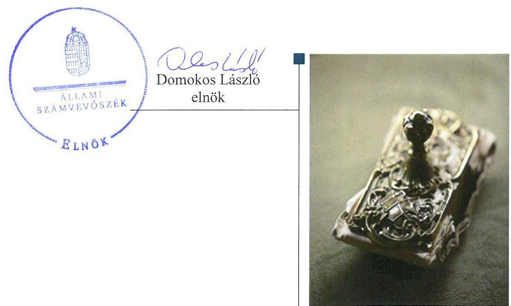
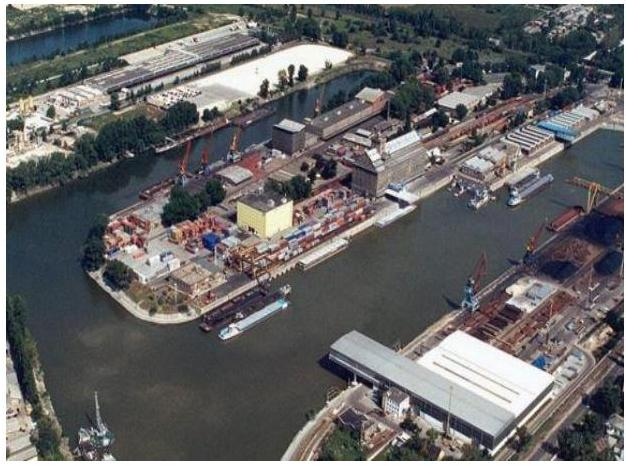
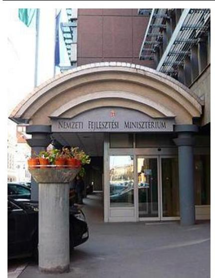

# Jelentés 

## Állami tulajdonú gazdasági társaságok

Az állami tulajdonban (résztulajdonban) lévő gazdálkodó szervezetek vagyonmegőrzési és gazdálkodási tevékenységének ellenőrzése -MAHART-Szabadkikötő Zrt.
2017.

---

# Jelentés 

## Állami tulajdonú gazdasági társaságok

Az állami tulajdonban (résztulajdonban) lévő gazdálkodó szervezetek vagyonmegőrzési és gazdálkodási tevékenységének ellenőrzése -MAHART-Szabadkikötő Zrt.
2017.  IO. hónap 5. nap

---

# AZ ELLENŐRZÉST FELÜGYELTE:

DR. NÉMETH ERZSÉBET felügyeleti vezető

## AZ ELLENŐRZÉST VEZETTE ÉS A VÉGREHAJTÁSÁÉRT FELELŐS:

SALI SÁNDORNÉ ellenőrzésvezető

A PROGRAM ÖSSZEÁLLÍTÁSÁÉRT FELELŐS:

TÓTPÁL SZABOLCS osztályvezető

IKTATÓSZÁM: V-1367-258/2016.

TÉMASZÁM: 2401

ELLENŐRZÉS-AZONOSÍTÓ SZÁM: V075938

Jelentéseink az Országgyűlés számítógépes hálózatán és az Interneten a www.asz.hu címen is olvashatóak.

---

# TARTALOMJEGYZÉK 

■ ÖSSZEGZÉS ..... 5
■ AZ ELLENŐRZÉS CÉLJA ..... 6
■ AZ ELLENŐRZÉS TERÜLETE ..... 7
■ AZ ELLENŐRZÉS HÁTTERE, INDOKOLTSÁGA ..... 8
■ A JELENTÉS LÉNYEGES KÉRDÉSKÖREI ..... 9
■ ELLENŐRZÉS HATÓKÖRE ÉS MÓDSZEREI ..... 10
■ MEGÁLLAPÍTÁSOK ..... 12
■ JAVASLATOK ..... 16
■ MELLÉKLETEK ..... 17
I. sz. melléklet: Értelmező szótár ..... 17
■ RÖVIDÍTÉSEK JEGYZÉKE ..... 19

---

.

---

# ÖSSZEGZÉS 

A MAHART-Szabadkikötő Zrt. felett a Magyar Nemzeti Vagyonkezelő Zrt. és a Nemzeti Fejlesztési Minisztérium a tulajdonosi jogokat szabályosan gyakorolta. A Társaság működése szabályozott volt. A pénzügyi-számviteli feladatok ellátása, valamint a beszámolási kötelezettség teljesítése megfelelt az előírásoknak. A vagyongazdálkodás szabályszerű volt. A Társaság az adatszolgáltatási kötelezettségét előírás szerint teljesítette.

## Az ellenőrzés társadalmi indokoltsága

Az állami tulajdonú gazdálkodó szervezetek a nemzeti vagyon részét képezik. Az állami vagyonnal való gazdálkodást illetően a tulajdonosi joggyakorlás és a vagyongazdálkodás feladata az állami vagyon átlátható, rendeltetésszerű és felelős felhasználásának biztosítása. Az állam meghatározza az ellátandó feladatokat, amelyhez a vagyonnal kapcsolatos döntéseknek igazodniuk kell.

Az Állami Számvevőszék az általa korábban ellenőrizetlen területek, szervezetek körébe tartozó társaságnál végzett ellenőrzést. A számvevőszéki ellenőrzés hozzájárul a közpénzek szabályos, átlátható, elszámoltatható és eredményes felhasználásához, a rend pedig értéket teremt. Ezt figyelembe véve került sor a MAHART-Szabadkikötő Zártkörűen Működő Részvénytársaság ellenőrzésére a 2012-2015. évek vonatkozásában. Alapvető követelmény az állami tulajdonú gazdálkodó szervezetekkel szemben, hogy működésük, gazdálkodásuk, a nemzeti vagyon kezelése és elszámolása szabályszerű legyen.

## Főbb megállapítások, következtetések

A kizárólag állami tulajdonú MAHART-Szabadkikötő Zrt. felett a Magyar Nemzeti Vagyonkezelő Zrt. és a Nemzeti Fejlesztési Minisztérium tulajdonosi joggyakorlása szabályszerű volt. Ennek keretében megtörtént a Társaság üzleti terveinek jóváhagyása, a számviteli beszámolók jogszabályi előírások betartásával történő elfogadása, valamint a javadalmazási, juttatási rendszerről szóló szabályzat megalkotása.

A Társaság a jogszabály által előírt szabályzatokat a jogszabályi előírásnak megfelelően elkészítette, azonban az Alapító okiratban előírt szervezeti és működési szabályzattal nem rendelkezett.

A pénzügyi-számviteli feladatok ellátása keretében a bevételek és a ráfordítások elszámolása az előírásoknak megfelelt, ugyanakkor a társaság két eszköz esetében a terv szerint elszámolható értékcsökkenést megváltoztatta, de a változás eredményre gyakorolt hatását nem számszerűsítette. A Társaság az adatszolgáltatási kötelezettségét teljesítette. A tulajdonosi joggyakorlók ellenőrizték az alapítói határozatok végrehajtását és a belső szabályozottságot.

A Társaság a vagyongazdálkodás feltételeit, szabályait és a döntési hatásköröket előírás szerint kialakította, szabályszerűen gazdálkodott. A vagyont szabályosan tartotta nyilván, a vagyon értékét megőrizte. Az éves beszámoló mérlegének tételeit az előírásnak megfelelő leltárral támasztotta alá. A vagyonváltozást eredményező döntések szabályszerűek voltak.

---

# AZ ELLENŐRZÉS CÉLJA 

Az ellenőrzés célja annak értékelése volt, hogy a tulajdonosi jogok gyakorlása szabályszerű volt-e; a gazdálkodó szervezet szabályozottsága, gazdálkodása és vagyongazdálkodási tevékenysége megfelelt-e a jogszabályi és a tulajdonosi előírásoknak, biztosítva volt-e a feladatellátás átláthatósága és elszámoltathatósága; a vagyonváltozást eredményező döntések esetében a tulajdonosi jogok gyakorlója és a gazdálkodó szervezet szabályszerűen jártak-e el.

---

# **AZ ELLENŐRZÉS TERÜLETE**

## **A MAHART-Szabadkikötő Zártkörűen Működő Részvénytársaság**

A MAHART-Szabadkikötő Zrt.1 2005. május 26-án kizárólagos állami tulajdonlással jött létre. Alapításának célja az volt, hogy a tulajdonos eleget tegyen a MAHART privatizációs koncepciójáról szóló kormányhatározat2, valamint a Csepeli Szabadkikötőt Országos Közforgalmú Kikötővé nyilvánító kormányhatározat3 előírásainak. A Társaság fő feladata ennek megfelelően a tulajdonában lévő ingatlanok üzemeltetése és a Kikötő4 státuszának megtartása, valamint felügyelete. Az üzemeltetési feladatokat a Társasággal kötött szerződés alapján a Budapesti Szabadkikötő Logisztikai Zrt. látja el.

A Társaságnál a közgyűlés jogait a részvényes (alapító) gyakorolta. A Társaság alapításkori jegyzett tőkéje 45,0 M Ft5 volt, ami az ellenőrzött időszak végéig nem változott. A Társaság a feladatait saját eszközeivel látta el, vagyonkezelésbe, használatba vett vagyonnal nem rendelkezett, közfeladatot nem látott el. Az Áht.6 előírása alapján kormányzati szektorba sorolt egyéb szervezetek közé, valamint a Bkr.7 hatálya alá nem tartozott.

A társasági részesedések feletti tulajdonosi jogokat 2014. november 19-ig az MNV Zrt.8, ezt követően a 77/2012. (XII. 22.) számú NFM rendelet9 2014. november 20-tól hatályos előírásai alapján az NFM10 gyakorolta.

A Társaság mérleg szerinti eredménye az ellenőrzött években pozitív volt, bevétele partfalhasználati és közreműködési feladatellátás címén kapott díjakból származott.

A MAHART-Szabadkikötő Zrt. vezérigazgatójának személye az ellenőrzött időszakban nem változott. A statisztikai létszám az ellenőrzött időszakban 2 fő volt.

A Társaság gazdálkodására jellemző főbb gazdálkodási adatokat az 1. táblázat tartalmazza.

1. táblázat

|  A TÁRSASÁG FŐBB GAZDÁLKODÁSI ADATAINAK ALAKULÁSA (M FT) |  |  |  |   |
| --- | --- | --- | --- | --- |
|  Megnevezés | 2012. év | 2013. év | 2014. év | 2015. év  |
|  Mérlegfőösszeg | 3 889,4 | 3 906,3 | 4 061,1 | 7 330,5  |
|  Befektetett eszközök | 3 781,8 | 3 790,7 | 3 893,8 | 7 115,3  |
|  Tárgyi eszközök | 3 775,2 | 3 784,8 | 3 749,6 | 6 911,8  |
|  Saját tőke | 839,9 | 843,3 | 901,8 | 902,1  |
|  Mérleg szerinti eredmény | 0,1 | 3,4 | 58,6 | 0,2  |
|  Értékesítés nettó árbevétele | 113,6 | 110,8 | 118,5 | 116,1  |
|  Értékesítés nettó árbevétele közvetített szolgáltatások nélkül | 68,6 | 71,6 | 73,4 | 72,8  |
|  Egyéb bevételek | 0,8 | 80,1 | 141,3 | 86,6  |
|  Költségek költségnemek szerinti együttes összege | 131,0 | 139,1 | 148,5 | 162,3  |
|   |  |  | Forrás: a Társaság 2012-2015. évi beszámolója |   |

---

# AZ ELLENŐRZÉS HÁTTERE, INDOKOLTSÁGA 

## A MAHART-Szabadkikötő Zártkörűen Működő Részvénytársaság

Az ÁSZ11 alapvető célkitűzése, hogy az államháztartáson kívülre nyújtott költségvetési támogatások és ingyenes vagyonjuttatások ellenőrzésével hozzájáruljon ahhoz, hogy a közpénzeket az államháztartáson kívül működő szervezetek is átlátható, rendezett módon használják fel.

Az ellenőrzés feladata a közvagyonnal biztosított feladatellátással kapcsolatban a közpénzek átláthatósága, nyilvánossága érdekében a jogszabályokban, belső szabályzatokban megfogalmazott előírások érvényesülésének az állami tulajdonban lévő gazdálkodó szervezetek vagyonérték megőrzési és gazdálkodási tevékenységének értékelése.

Az ellenőrzés várható hasznosulásaként az ellenőrzés megállapításai a jogalkotás számára támogatást nyújthatnak a közvagyonnal való gazdálkodás értékeléséhez, jogszabályi keretei pontosításához, az átláthatóságot biztosító szabályozáshoz. Az ellenőrzöttek számára visszajelzést ad a vagyongazdálkodási tevékenységgel, beszámolással kapcsolatos szabálytalanságokról és kockázatokról. Az ellenőrzés tapasztalatai segítik és erősítik az ÁSZ hozzáadott értéket teremtő elemző tevékenységét és tanácsadó szerepét.

---

# A JELENTÉS LÉNYEGES KÉRDÉSKÖREI 

1. A tulajdonosi jogok gyakorlása szabályszerű volt-e?
2. A Társaság működésének szabályozottsága megfelelt-e az előírásoknak?
3. A Társaságnál a pénzügyi-számviteli, adatszolgáltatási és ellenőrzési feladatok ellátása szabályszerű volt-e?
4. A Társaság vagyongazdálkodása szabályszerű volt-e?

---

# ELLENŐRZÉS HATÓKÖRE ÉS MÓDSZEREI 

## Az ellenőrzés típusa

Megfelelőségi ellenőrzés.

## Az ellenőrzött időszak

2012. január 1-től 2015. december 31-ig.

## Az ellenőrzés tárgya

Az állami tulajdonban lévő gazdasági társaság gazdálkodása, kiemelten vagyongazdálkodási tevékenysége, valamint a tulajdonosi jogok gyakorlása.

## Az ellenőrzött szervezet

A MAHART-Szabadkikötő Zártkörűen Működő Részvénytársaság, valamint a Magyar Nemzeti Vagyonkezelő Zrt. és a Nemzeti Fejlesztési Minisztérium, mint a Társaság feletti tulajdonosi joggyakorlók.

## Az ellenőrzés jogalapja

Az Állami Számvevőszékről szóló 2011. évi LXVI. törvény 5. § (3)-(5) bekezdései.

## Az ellenőrzés módszerei

Az ellenőrzést az ellenőrzött időszakban hatályos jogszabályok, az ellenőrzés szakmai szabályok és módszertanok figyelembevételével végeztük.

Az ellenőrzési kérdések megválaszolásához szükséges bizonyítékok megszerzése az ellenőrzött által rendelkezésre bocsátott dokumentumokra, adatokra alapozva kérdésfelvetés, mintavételezés, ellenőrzési eljárások útján történt.

Az ellenőrzési bizonyítékként felhasználható adatforrások közé tartoztak egyrészt a szakmai program részletes szempontjainál felsorolt adatforrások, másrészt minden egyéb - az ellenőrzés folyamán feltárt, az ellenőrzés szempontjából információkat tartalmazó - dokumentum.

Az ellenőrzés lefolytatásához a gazdálkodó szervezet a tanúsítványok elektronikus kitöltésével, valamint az ÁSZ által kért dokumentumok megküldésével szolgáltatott adatokat.

---

A bevételek és ráfordítások elszámolását, és a vagyonnyilvántartás terén a szabályszerű működést véletlenszerű mintavétellel ellenőriztük. A mintavétellel ellenőrzött területek esetében minden egyes tétel vonatkozásában szabályszerűségre vonatkozó kérdéseket tettünk fel, amelyek a számviteli törvény, illetve a tulajdonosi követelményeknek és az ellenőrzött szervezet belső szabályozásai előírásainak betartására vonatkoztak. A jogszabályoknak és a belső előírásoknak megfelelőnek tekintettük az adott területet, amennyiben a minta ellenőrzésének eredménye alapján 95%-os bizonyossággal a teljes sokaságban az hibaarány kisebb volt, mint 10%, nem megfelelőnek értékeltük, ha az hibaarány a 10%-ot meghaladta. A ráfordítások elszámolására és a vagyonnyilvántartásra vonatkozó véletlen mintavételt kockázati alapú kiválasztással egészítettük ki, amelynek során évente a három legnagyobb összegű tételt választottuk ki.

---

# 1. A tulajdonosi jogok gyakorlása szabályszerű volt-e? 

Összegző megállapítás

A Társaság felett az MNV Zrt. és az NFM tulajdonosi joggyakorlása szabályszerű volt.

A TULAJDONOSI JOGGYAKORLÁS szabályait a tulajdonosi joggyakorló 112, 213 a MAHART-Szabadkikötő Zrt. Alapító okiratában14 a Gt.15, a Ptk.16, valamint a szervezeti és működési szabályzatának előírásaival összhangban - meghatározta. Alapító okiratban döntött a Társaság vezérigazgatója, az FB17 tagok és a könyvvizsgáló kijelöléséről. Az FB - a Gt. és a Ptk. előírásaival összhangban megállapított ügyrendje szerint - szabályszerűen működött. Tagjainak számát a Taktv.18 4.§ (2) bekezdés előírásával összhangban három főben határozták meg az Alapító okiratban.

A BESZÁMOLTATÁSI RENDSZER keretében a tulajdonosi joggyakorló 1,2 negyedévente beszámoltatta a vezérigazgatót az üzleti terv teljesítéséről. Az FB - Alapító okiratnak megfelelően - negyedévente beszámoltatta a vezérigazgatót az ügyvezetésről, a Társaság vagyoni helyzetéről és üzletpolitikájáról. A tulajdonosi joggyakorló 1 - Tulajdonosi Ellenőrzési Szabályzatban előírtnak megfelelően - beszámoltatta az FB-t a Társaság ellenőrzéséről, valamint az intézkedéseiről. A Társaság éves számviteli beszámolóit a tulajdonosi joggyakorló 1,2 - az FB előzetes írásbeli véleményezését követően - a Gt.-ben, illetve a Ptk.-ban előírtaknak megfelelően, a könyvvizsgálói jelentések birtokában fogadta el.

AZ ÜZLETI TERVEKET a tulajdonosi joggyakorló 1,2 a 2012-2015. évekre jóváhagyta. A tulajdonosi joggyakorló 1,2 tervezési irányelvének megfelelően a Társaság üzleti terveiben szerepelt a fejlesztési terv, a közbeszerzési terv, a középtávú stratégia, valamint a kockázatkezelésre tervezett intézkedések meghatározása.

AZ ANYAGI ÉRDEKELTSÉGI RENDSZER elemeit a tulajdonosi joggyakorló 1,2 a Taktv.-nek megfelelően megalkotta. Szabályzatban rendelkezett az FB tagok, valamint a vezérigazgató javadalmazásáról, a jogviszony megszűnése esetére biztosított juttatások módjának, mértékének
 elveiről, rendszeréről.

---

# 2. A Társaság működésének szabályozottsága megfelelt-e az előírásoknak? 

Összegző megállapítás

A MAHART-Szabadkikötő Zrt. működésének szabályozottsága megfelelő volt.

A SZÁMVITELI POLITIKÁBAN $1,2,3^{19}$ a Számv. tv. ${ }^{20}$ előírásaival összhangban meghatározták a számviteli beszámoló elkészítése során alkalmazandó elveket, értékelési módszereket és eljárásokat. A számviteli politika ${ }_{1,2,3}$ keretében szabályszerűen elkészült az eszközök és források értékelési szabályzata ${ }^{21}$, a pénzkezelési szabályzat ${ }_{1,2}{ }^{22}$, valamint a leltárkészítési és leltározási szabályzat ${ }^{23}$.

A Társaság a Számv. tv.-nek megfelelően kialakította a számlarend ${ }_{1,2}{ }^{24}$jét, valamint rendelkezett selejtezési és hasznosítási szabályzattal ${ }^{25}$.

A Társaság a Számv. tv. 14. § (6) bekezdés alapján az önköltségszámítási szabályzatkészítési kötelezettség alól mentesült, mivel a nettó árbevétele, illetve a költségnemek szerinti költségek együttes összege egyik évben sem haladta meg a Számv. tv. 14. § (7) bekezdésében meghatározott értéket, amely alapján a végzett szolgáltatások önköltségét az önköltségszámítás rendjére vonatkozó belső szabályzat szerinti utókalkuláció módszerével kell megállapítani.

A Társaság az ellenőrzött időszakban - az Alapító okirat 10.3. pontjában előírtak ellenére - szervezeti és működési szabályzattal nem rendelkezett.

## 3. A Társaságnál a pénzügyi-számviteli, adatszolgáltatási és ellenőrzési feladatok ellátása szabályszerű volt-e?

Összegző megállapítás

A Társaságnál a pénzügyi-számviteli feladatok ellátása, valamint a beszámolási kötelezettség teljesítése megfelelt az előírásoknak. Az adatszolgáltatás és az ellenőrzési feladatok ellátása szabályszerű volt.

A BEVÉTELEK ELSZÁMOLÁSA megfelelt a jogszabályi előírásnak. Az értékesítés nettó árbevétele, az egyéb, a rendkívüli és a pénzügyi műveletek bevételének számlázása, főkönyvi számlákra történő elszámolása megfelelt a Számv. tv.-ben és a belső szabályozásban, megállapodásban, szerződésben előírtaknak. A mintavétellel ellenőrzött területek értékelését az 1. ábra mutatja.

A RÁFORDÍTÁSOK ELSZÁMOLÁSA megfelelt a jogszabályi és belső szabályozásban foglalt előírásoknak. A ráfordítások elszámolása számviteli bizonylatok alapján, szerződés szerinti teljesítéssel és a megfelelő főkönyvi számlákra történt.

A SZEMÉLYI JELLEGŰ RÁFORDÍTÁSOK ELSZÁMOLÁSA megfelelt a jogszabályi előírásoknak. A munkabérek kifizetése a munkaszerződésekben foglaltakkal összhangban, a megfelelő dokumentumokkal alátámasztva történt. A vezetői prémium kifizetésére alapítói határozatnak megfelelően került sor. A cafeteria igénybevételéhez leadott nyilatkozatok a jogszabályi előírásnak és a béren felüli juttatási rendszer szabályzat ${ }_{1,2,3,4}{ }^{26}$ előírásainak megfeleltek, a kifizetésekre a nyilatkozatokkal összhangban került sor.

AZ ÉRTÉKCSÖKKENÉS ELSZÁMOLÁSA megfelelt a Számv. tv. 52. §-ában foglalt előírásoknak. A beszerzett eszközök üzembe helyezése, állományba vétele, a bekerülési érték meghatározása szabályszerűen történt.

A BESZÁMOLÁSI KÖTELEZETTSÉGET a Társaság összeségében a jogszabályi előírásoknak és belső szabályozásnak megfelelően teljesítette. A könyvvizsgáló az éves beszámolókat hitelesítő záradékkal látta el. A Társaság az éves beszámolókat a Számv. tv. szerint letétbe helyezte és közzétette.

A Társaság két eszköz esetében a terv szerinti elszámolható értékcsökkenést megváltoztatta, azonban a 2012. évi beszámoló kiegészítő mellékletében a változás eredményre gyakorolt hatását - a Számv. tv. 53. § (5) bekezdésében előírtak ellenére - nem számszerűsítette.

AZ ADATSZOLGÁLTATÁSI KÖTELEZETTSÉGET a MAHART-Szabadkikötő Zrt. negyedévente az Alapító okirat és a tulajdonosi joggyakorló ${ }_{1,2}$ előírásának megfelelő gyakorisággal és tartalommal teljesítette.

A Társaság vezérigazgatója a Társaságra, mint köztulajdonban álló társaságra vonatkozó - a Taktv.-ben előírt - adatokat, információkat és dokumentumokat szabályszerűen közzétette.

TULAJDONOSI ELLENŐRZÉS keretében a tulajdonosi joggyakorló az alapítói határozatok végrehajtását rendszeresen értékelte és hiányosságot nem tárt fel. A tulajdonosi joggyakorló 2015 áprilisában a működésre vonatkozó belső szabályozottságot ellenőrizte és javaslatot tett a szervezeti és működési szabályzat elkészítésére.

# 4. A Társaság vagyongazdálkodása szabályszerű volt-e? 

## Összegző megállapítás

A MAHART-Szabadkikötő Zrt. vagyongazdálkodása szabályszerű volt.

A VAGYONGAZDÁLKODÁS feltételeit, irányelvét és gyakorlatának szabályait a döntési hatáskörökkel együtt a jogszabályi előírásokon túl az Alapító okirat, valamint a Társaság vagyonának üzemeltetésére kötött megállapodás ${ }^{27}$ és belső szabályzatok rögzítették.

AZ ANALITIKUS ÉS A FŐKÖNYVI NYILVÁNTARTÁSI RENDSZER biztosította a Társaság vagyonának a Számv. tv., az üzemletetési megállapodás és a belső szabályozás előírásainak megfelelő nyilvántartását, a változások folyamatos nyomon követését. Az eszközök állományba vétele, üzembe helyezése szabályszerűen megtörtént.

---

A Társaság az éves beszámolók mérlegtételeit a Számv. tv. és a leltárkészítési és leltározási szabályzat előírásainak megfelelően leltárakkal alátámasztotta.

A Társaság befektetett eszközeinek mérlegértéke a 2012. január 1-jei 3 961,5 M Ft-ról a 2015. december 31-ei 7 115,3 M Ft-ra (79,6\%-kal) nőtt a végrehajtott kapacitásbővítő fejlesztések eredményeként. A fejlesztésen túlmenően a Társaság - az üzemeltetési megállapodásban foglaltak szerint - közvetetten, az üzemeltető számára előírt kötelezettséggel biztosította a vagyona értékének, állagának megőrzését. A Társaság az ellenőrzött időszakban nyereségesen gazdálkodott. A 2014-ben a kimagasló mérleg szerinti eredményt a Társaság területén elhelyezett szennyvíz csövekhez kapcsolódóan kártalanítás címén kapott egyéb bevétel okozta.

Az ellenőrzött időszakban bekövetkezett vagyonnövekedés forrása európai uniós és hazai költségvetési finanszírozás, valamint az üzemeltető saját forrása volt. A Társaság működési költségét az üzemeltetőtől kapott partfalhasználati díj fedezte.

# A VAGYONVÁLTOZÁST EREDMÉNYEZŐ DÖNTÉ-

SEK szabályszerűek voltak. A tervezett beruházások végrehajtásáról szóló döntések előtt a vezérigazgató az Alapító okirat előírásainak megfelelően megkérte az FB jóváhagyását, a döntések megfeleltek a tulajdonosi előírásoknak és az üzemeltetési megállapodásnak. A fejlesztéshez igénybe vett támogatáshoz a támogatási szerződés aláírása - Alapító okiratnak megfelelően - alapítói határozattal jóváhagyásra került.

---

# JAVASLATOK 

Az ÁSZ tv. 33. § (1) bekezdésében foglaltak értelmében az ellenőrzött szervezet vezetője köteles a jelentésben foglalt megállapításokhoz kapcsolódó intézkedési tervet összeállítani és azt a jelentés kézhezvételétől számított 30 napon belül az ÁSZ részére megküldeni. Amennyiben az ellenőrzött szervezet vezetője nem küldi meg határidőben az intézkedési tervet, vagy továbbra sem elfogadható intézkedési tervet küld, az Állami Számvevőszék elnöke az ÁSZ tv. 33. § (3) bekezdése a) és b) pontjaiban foglaltakat érvényesítheti.

## MAHART-Szabadkikötő Zrt. vezérigazgatójának

1. Gondoskodjon a terv szerinti értékcsökkenés megváltoztatása esetén, a változás eredményre gyakorolt hatásának számszerűsített bemutatásáról.
(3. sz. megállapítás 7. bekezdés alapján)

---

# MELLÉKLETEK 

## I. SZ. MELLÉKLET: ÉRTELMEZŐ SZÓTÁR

állami vagyon
a) Az állam tulajdonában lévő dolog, valamint a dolog módjára hasznosítható természeti erő,
b) az a) pont hatálya alá nem tartozó mindazon vagyon, amely vonatkozásában törvény az állam kizárólagos tulajdonjogát nevesíti,
c) az állam tulajdonában lévő tagsági jogviszonyt megtestesítő értékpapír, illetve az államot megillető egyéb társasági részesedés,
d) az államot megillető olyan immateriális, vagyoni értékkel rendelkező jogosultság, amelyet jogszabály vagyoni értékű jogként nevesít.
Forrás: Vtv. ${ }^{28}$ 1. § (2) bekezdése
2012. november 10-től az állami vagyon fogalma kiegészül a következő ponttal:
e) az állam tulajdonában lévő pénzügyi eszközök

Forrás: Vtv. 1. § (2) bekezdése
gazdasági társaság
A Ptk. 3:88. § (1) bekezdése szerint „a gazdasági társaságok üzletszerű közös gazdasági tevékenység folytatására, a tagok vagyoni hozzájárulásával létrehozott, jogi személyiséggel rendelkező vállalkozások, amelyekben a tagok a nyereségből közösen részesednek, és a veszteséget közösen viselik".
MNV Zrt.
Az állami vagyon felett, a Magyar Államot megillető tulajdonosi jogok és kötelezettségek összességét - a hatályos szabályozás szerint - az állami vagyon felügyeletéért felelős miniszter (jelenleg a nemzeti fejlesztési miniszter) gyakorolja. A miniszter feladatát nagy részben az MNV Zrt., mint tulajdonosi joggyakorló szervezet útján látja el.
tulajdonosi jogok gyakorlója 1.

### 2013. június 27-ig:

Az állami vagyon felett a Magyar Államot megillető tulajdonosi jogok és kötelezettségek összességét - ha törvény eltérően nem rendelkezik - az állami vagyon felügyeletéért felelős miniszter (a továbbiakban: miniszter) gyakorolja, aki e feladatát a Magyar Nemzeti Vagyonkezelő Zártkörűen Működő Részvénytársaság (a továbbiakban: MNV Zrt.), a Magyar Fejlesztési Bank, illetve a tulajdonosi joggyakorló szervezet útján látja el. A miniszter miniszteri rendeletben, a törvényben meghatározott állami vagyoni kör tekintetében, meghatározott időtartamra, a joggyakorlás egyes szabályainak meghatározásával - az őt megillető tulajdonosi jogok és kötelezettségek összességének, illetve azok meghatározott részének gyakorlóját - az Áht. szerinti központi költségvetési szervek, ezek intézménye, továbbá a 100%-ban állami tulajdonban álló gazdasági társaságok közül kijelölheti.
Forrás: Vtv. 3. § (1) és (2) bekezdése

### 2013. június 28-ától:

A rábízott állami vagyon felett az államot megillető tulajdonosi jogok és kötelezettségek összességét tulajdonosi joggyakorlóként:
a) ha törvény vagy miniszteri rendelet eltérően nem rendelkezik, a Magyar Nemzeti Vagyonkezelő Zártkörűen Működő Részvénytársaság (a továbbiakban: MNV Zrt.),
b) törvényben kijelölt személy vagy
c) az állami vagyon felügyeletéért felelős miniszter (a továbbiakban: miniszter) által rendeletben kijelölt személy gyakorolja.

---

[...] A miniszter e törvény felhatalmazása alapján - a meghatározott célok hatékonyabb elérése érdekében, miniszteri rendeletben, az ott meghatározott állami vagyoni kör tekintetében, meghatározott időtartamra - e törvény keretei között, a joggyakorlás egyes szabályainak meghatározásával - az államot megillető tulajdonosi jogok és kötelezettségek összességének, illetve azok meghatározott részének gyakorlóját az Áht. szerinti központi költségvetési szervek, ezek intézménye, továbbá a 100%-ban állami tulajdonban álló gazdasági társaságok közül kijelölheti.
Forrás: Vtv. 3. § (1) és (2) bekezdése
2.

Aki a nemzeti vagyon felett az államot vagy a helyi önkormányzatot megillető tulajdonosi jogok és kötelezettségek összességének gyakorlására jogosult
Forrás: Nvtv. ${ }^{29}$ 3. § (1) bekezdés 17. pontja

---

# RÖVIDÍTÉSEK JEGYZÉKE 

${ }^{1}$ MAHART-Szabadkikötő Zrt./Társaság
${ }^{2}$ MAHART privatizációs koncepciójáról szóló kormányhatározat
${ }^{3}$ Csepeli Szabadkikötőt Országos Közforgalmú Kikötővé nyilvánító kormányhatározat
${ }^{4}$ Kikötő
${ }^{5} \mathrm{M} \mathrm{Ft}$
${ }^{6}$ Áht.
${ }^{7}$ Bkr.
${ }^{8}$ MNV Zrt.
${ }^{9}$ 77/2012. (XII. 22.) számú NFM rendelet
${ }^{10}$ NFM
${ }^{11}$ ÁSZ
${ }^{12}$ tulajdonosi joggyakorló:
${ }^{13}$ tulajdonosi joggyakorló:
${ }^{14}$ Alapító okirat
${ }^{15} \mathrm{Gt}$.
${ }^{16} \mathrm{Ptk}$.
${ }^{17} \mathrm{FB}$
${ }^{18}$ Taktv.
${ }^{19}$ számviteli politika:
számviteli politika;
számviteli politika;
${ }^{20}$ Számv. tv.
${ }^{21}$ eszközök és források értékelési szabályzata

MAHART-Szabadkikötő Zártkörűen Működő Részvénytársaság
2220/2003. (IX. 12.) számú Korm. határozat az orosz
államadósság terhére történő tengerjáró hajók átvételéről és a Magyar Hajózási Részvénytársaság privatizációs koncepciójáról
1019/2005. (III. 10.) számú Korm. határozat a Csepeli Szabadkikötő országos közforgalmú kikötővé nyilvánításáról és ezzel összefüggésben lehetséges privatizációs megoldásokról
Csepeli Szabadkikötő Országos Közforgalmú Kikötő millió forint
az államháztartásról szóló 2011. évi CXCV. törvény (hatályos 2011. december 31-től)
370/2011. (XII. 31.) Korm. rendelet a költségvetési szervek belső kontrollrendszeréről és belső ellenőrzéséről (hatályos 2012. január 1-jétől) Magyar Nemzeti Vagyonkezelő Zrt.
77/2012. (XII. 22.) számú NFM rendelet egyes gazdasági társaságok felett az államot megillető tulajdonosi jogok és kötelezettségek összességét gyakorló szervezet kijelöléséről
Nemzeti Fejlesztési Minisztérium
Állami Számvevőszék
MNV Zrt. 2014. november 19-ig
NFM 2014. november 20-tól
MAHART-Szabadkikötő Zrt. többször módosított Alapító okirata
(ellenőrzött időszak elején hatályos Alapító okirat 2011. május 23-án kelt, MNV Zrt. módosítás hatályos: 2012. május 29-től és 2013. augusztus 29-től,
NFM módosítás hatályos: 2014. december 20-tól és 2015. november 5-től)
2006. évi IV. törvény a gazdasági társaságokról (hatálytalan: 2014. március 15-től)
2013. évi V. törvény a Polgári Törvénykönyvről (hatályos: 2014. március 15-től)
MAHART-Szabadkikötő Zrt. Felügyelő Bizottsága
a köztulajdonban álló gazdasági társaságok takarékosabb működéséről szóló 2009. évi CXXII. törvény (hatályos: 2009. december 4-től)
MAHART-Szabadkikötő Zrt. 2012. január 1-2013. december 31. között hatályos számviteli politikája
MAHART-Szabadkikötő Zrt. 2014. január 1-2014. december 31. között hatályos számviteli politikája
MAHART-Szabadkikötő Zrt. 2015. január 1-jétől hatályos számviteli politikája
2000. évi C. törvény a számvitelről
eszközök és források értékelési szabályzata
(hatályos: 2012. január 1-jétől)

---

${ }^{22}$ pénzkezelési szabályzat ${ }_{1}$
pénzkezelési szabályzat ${ }_{2}$
${ }^{23}$ leltárkészítési és
 leltározási szabályzat
${ }^{24}$ számlarend$_{3}$
számlarend$_{2}$
${ }^{25}$ selejtezési és hasznosítási szabályzat
${ }^{26}$ béren felüli juttatási rendszer szabályzat$_{1}$
béren felüli juttatási rendszer szabályzat$_{2}$
béren felüli juttatási rendszer szabályzat$_{3}$
béren felüli juttatási rendszer szabályzat$_{4}$
${ }^{27}$ üzemeltetési megállapodás
${ }^{28}$ Vtv.
${ }^{29}$ Nvtv.

MAHART-Szabadkikötő Zrt. 2012. január 1-2014. december 31. között hatályos pénzkezelési szabályzata
MAHART-Szabadkikötő Zrt. 2015. január 1-jétől hatályos pénzkezelési szabályzata
leltárkészítési és leltározási szabályzat (hatályos: 2012. január 1-jétől)
MAHART-Szabadkikötő Zrt. 2012. január 1-2014. december 31. között hatályos számlarendje
MAHART-Szabadkikötő Zrt. 2015. január 1-jétől hatályos számlarendje
eszközök selejtezési és hasznosítási szabályzata (hatályos: 2012. január 1-jétől)
MAHART-Szabadkikötő Zrt. 2012. január 1-2012. december 31. között hatályos béren felüli juttatási rendszere
MAHART-Szabadkikötő Zrt. 2013. január 1-2013. december 31. között hatályos béren felüli juttatási rendszere
MAHART-Szabadkikötő Zrt. 2014. január 1-2014. december 31. között hatályos béren felüli juttatási rendszere
MAHART-Szabadkikötő Zrt. 2015. január 1-től hatályos béren felüli juttatási rendszere
Megállapodás üzemeltetési jog átadásáról a MAHART-Szabadkikötő Zrt. és a Budapesti Szabadkikötő Logisztikai Zrt. között (kelt, 2005. október 5.)
az állami vagyonról szóló 2007. évi CVI. törvény
a nemzeti vagyonról szóló 2011. évi CXCVI. törvény (hatályos: 2012. január 1-jétől)

---

ÁLLAMI SZÁMVEVŐSZÉK
1052 Budapest, Apáczai Csere János utca 10.
Levélcím: 1364 Budapest 4. Pf. 54
Telefon: +36 1 4849100 Telefax: +36 1 4849200
www.asz.hu
