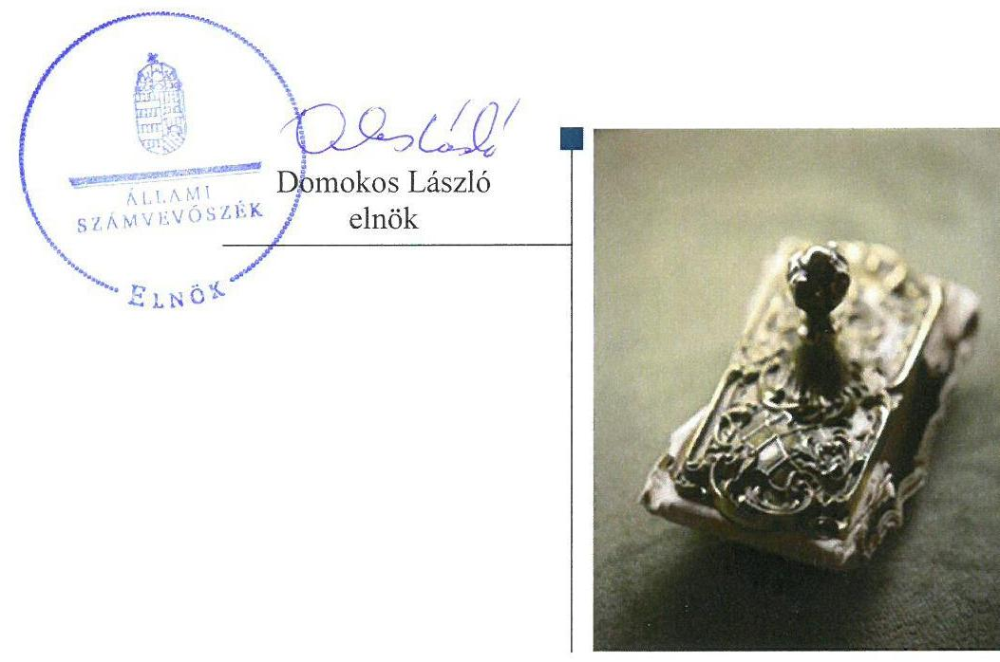
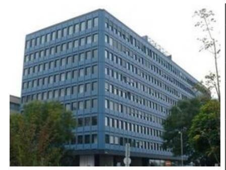
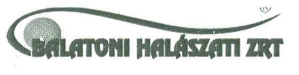
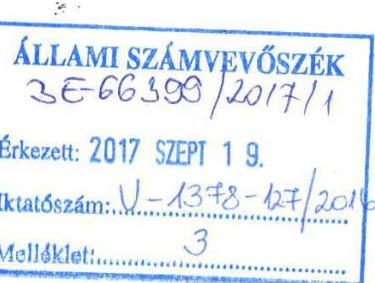
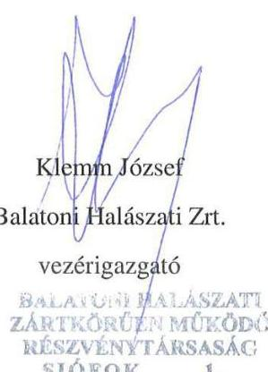
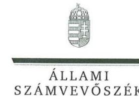
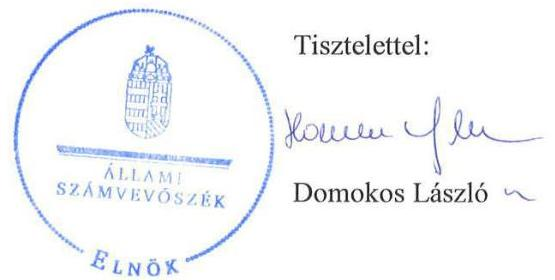
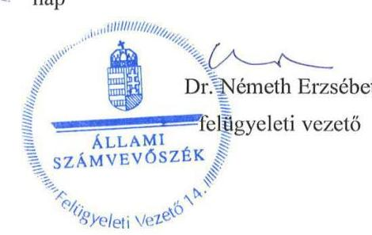

# Jelentés 

## Állami tulajdonú gazdasági társaságok

Az állami tulajdonban (résztulajdonban) lévő gazdálkodó szervezetek vagyonmegőrzési és gazdálkodási tevékenységének ellenőrzése Balatoni Halászati Zrt.
2017.

---

# Jellentés 

## Állami tulajdonú gazdasági társaságok

Az állami tulajdonban (résztulajdonban) lévő gazdálkodó szervezetek vagyonmegőrzési és gazdálkodási tevékenységének ellenőrzése Balatoni Halászati Zrt.
2017. 10
hó 15 nap

---

# AZ ELLENŐRZÉST FELÜGYELTE:

DR. NÉMETH ERZSÉBET felügyeleti vezető

## AZ ELLENŐRZÉST VEZETTE ÉS A VÉGREHAJTÁSÁÉRT FELELŐS:

BAJNAI ZSUZSANNA ellenőrzésvezető

## A PROGRAM ÖSSZEÁLLÍTÁSÁÉRT FELELŐS:

JANIK JÓZSEF LÁSZLÓ osztályvezető

IKTATÓSZÁM: V-1378-136/2016

TÉMASZÁM: 2084

ELLENŐRZÉS-AZONOSÍTÓ SZÁM: V075948

Jelentéseink az Országgyűlés számítógépes hálózatán és az Interneta a www.asz.hu címen is olvashatóak.

---

# TARTALOMJEGYZÉK 

■ ÖSSZEGZÉS ..... 5
■ AZ ELLENŐRZÉS CÉLJA ..... 6
■ AZ ELLENŐRZÉS TERÜLETE ..... 7
■ AZ ELLENŐRZÉS HÁTTERE, INDOKOLTSÁGA ..... 8
■ A JELENTÉS LÉNYEGES KÉRDÉSKÖREI ..... 9
■ ELLENŐRZÉS HATÓKÖRE ÉS MÓDSZEREI ..... 10
■ MEGÁLLAPÍTÁSOK ..... 12
■ JAVASLATOK ..... 16
■ MELLÉKLETEK ..... 19
I. sz. melléklet: Értelmező szótár ..... 19
■ FÜGGELÉK: ÉSZREVÉTELEK ..... 23
■ RÖVIDÍTÉSEK JEGYZÉKE ..... 37

---

.

---

# ÖSSZEGZÉS 

A Balatoni Halászati Zrt. felett a Magyar Nemzeti Vagyonkezelő Zrt. szabályszerűen gyakorolta a tulajdonosi jogokat. A Balatoni Halászati Zrt. müködésének szabályozottsága nem volt megfelelő. A bevételek és ráfordítások elszámolása nem felelt meg az előírásoknak. A vagyongazdálkodás nem volt szabályszerű.

## Az ellenőrzés társadalmi indokoltsága

Az állami tulajdonú gazdálkodó szervezetek a nemzeti vagyon részét képezik. Az állami vagyonnal való gazdálkodást illetően a tulajdonosi joggyakorlás és vagyongazdálkodás feladata az állami vagyon átlátható, rendeltetésszerű és felelős használatának biztosítása. Minden közpénzt, közvagyont használó szervezettel szemben társadalmi igény, hogy tevékenységéről elszámoljon. Ezt figyelembe véve és az Állami Számvevőszék Stratégiájával összhangban került sor a Balatoni Halászati Zrt. ellenőrzésére a 2012-2015. évek vonatkozásában.

## Főbb megállapítások, következtetések

A Balatoni Halászati Zrt. felett a Magyar Nemzeti Vagyonkezelő Zrt. az előírásoknak megfelelően gyakorolta a tulajdonosi jogokat.

A Balatoni Halászati Zrt. rendelkezett a törvény által előírt szabályzatokkal, azonban a számviteli politikát nem aktualizálták, a leltározási szabályzat leltározás gyakoriságára vonatkozó előírása nem felelt meg a jogszabálynak.

A számviteli feladatok ellátása nem volt szabályszerű, mivel nem a megfelelő főkönyvi számlákra könyveltek, a bevételek és a ráfordítások elszámolását közvetlenül alátámasztó bizonylatok nem feleltek meg maradéktalanul a formai követelményeknek. Az éves és évközi, beszámolási, adatszolgáltatási, valamint közzétételi kötelezettséget teljesítették.

A vagyongazdálkodás nem volt szabályszerű. A Balatoni Halászati Zrt. vagyonnyilvántartása nem felelt meg az előírásoknak, mivel az üzembe helyezést nem dokumentálták. A tárgyi eszközök mérlegsorának leltárral történő alátámasztása nem volt biztosított. A vagyon értékének, állagának megőrzéséről nem gondoskodtak.

A Balatoni Halászati Zrt. müködésének keretei között nem volt biztosított a vagyongazdálkodás megfelelősége, annak személyi és tárgyi feltételei nem álltak rendelkezésre. Megfontolandó a szabályszerű működés és a felelős vagyongazdálkodás feltételeinek kialakítása érdekében a feladatellátás jogi kereteinek átalakítása.

---

# AZ ELLENŐRZÉS CÉLJA 

Az ellenőrzés célja annak értékelése volt, hogy a tulajdonosi jogok gyakorlása szabályszerű volt-e; a gazdálkodó szervezet szabályozottsága, gazdálkodása és vagyongazdálkodási tevékenysége megfelelt-e a jogszabályi és a tulajdonosi előírásoknak; a vagyonváltozást eredményező döntések esetében a tulajdonosi jogok gyakorlója és a gazdálkodó szervezet szabályszerűen jártak-e el.

---

# **Balatoni Halászati Zrt.**

A Társaság^{1} az ellenőrzött időszakot megelőzően jött létre a Balatoni Halgazdaság Részvénytársaság jogutódjaként, tulajdonosa 100%-ban a Magyar Állam lett. A Társaság felett a tulajdonos jogait és kötelezettségeit az állami vagyon felügyeletért felelős miniszter az MNV Zrt.^{2} útján gyakorolta. A Társaságnál egyszemélyes jellegéből adódóan közgyűlés nem működött, a legfőbb szerv hatáskörébe tartozó kérdésekben a tulajdonosi joggyakorló döntött.

A Társaság halgazdálkodást, halfeldolgozást az ellenőrzött időszakban már nem végzett, az MNV Zrt. döntése alapján saját tulajdonú ingatlanjait – a halastavait – hasznosította. A halastavak mintegy háromnegyed része természetvédelmi oltalom alatt állt. A Társaság vagyonkezelésbe vett állami vagyonnal nem rendelkezett, egy gazdasági társaságban volt részesedése.

A Balatoni Halászati Zrt. éves beszámolóinak kiemelt adatait az 1. táblázat mutatja be.

1. táblázat

|  BESZÁMOLÓK KIEMELT ADATAI (M FT) |  |  |  |  |   |
| --- | --- | --- | --- | --- | --- |
|  Megnevezés | 2012. | 2012. | 2013. | 2014. | 2015.  |
|   | I. 1. | XII. 31. | XII. 31. | XII. 31. | XII. 31.  |
|  Mérlegfőösszeg | 2280,0 | 2407,5 | 2279,8 | 2620,9 | 2093,2  |
|  Ingatlanok | 335,6 | 325,8 | 309,2 | 297,5 | 246,5  |
|  Tárgyi eszközök (Ingatlanok) értékhelyesbítése | 1900,7 | 2049,5 | 1928,3 | 1939,9 | 1727,5  |
|  Saját tőke | 717,7 | 715,2 | 372,7 | 239,6 | 190,8  |
|  Jegyzett tőke | 10,0 | 10,0 | 10,0 | 10,0 | 10,0  |
|  Mérleg szerinti eredmény | - 275,6 | - 151,3 | - 221,2 | - 144,8 | 163,6  |
|  Követelések | 9,3 | 8,7 | 11,7 | 357,4 | 18,5  |
|  Kötelezettségek | 1409,0 | 1254,9 | 1691,7 | 1850,9 | 1742,0  |

*Forrás: a Társaság 2012-2015. évi éves beszámolói és adatszolgáltatása*

A Társaság saját tőkéje a veszteséges működés következtében mintegy 75%-kal, míg vagyona alig 10%-al csökken az ingatlanok piaci értékelése miatt. A változás mértéke nem keletkeztetett Gt.^{3} illetve Ptk.^{4} szerinti intézkedési kötelezettséget.

A vezérigazgató és a kijelölt könyvvizsgáló személye az ellenőrzött időszakban nem változott. Az átlagos statisztikai létszám 2015-ben 2 fő volt.

---

# AZ ELLENŐRZÉS HÁTTERE, INDOKOLTSÁGA 

Az állami tulajdonú gazdálkodó szervezetek ellenőrzése kiemelten fontos a nemzeti vagyon megőrzése, megóvása érdekében. Gazdálkodásuk jellemzően a közérdeklődés és a média figyelmének középpontjában áll, amihez hozzájárul a gazdálkodásuk körébe tartozó - közvetlen vagy közvetett állami tulajdonú - vagyon nagysága.

Az ÁSZ ${ }^{5}$ középtávra szóló stratégiájában megfogalmazta, hogy az államháztartáson kívülre nyújtott költségvetési támogatások és ingyenes vagyonjuttatások, valamint az államháztartáson kívül működő közfeladat-ellátó rendszerek ellenőrzéseivel hozzájárul ahhoz, hogy a közpénzeket az államháztartáson kívül működő szervezetek is átlátható, rendezett módon használják fel.

Az ellenőrzés megállapításai és javaslatai hozzájárulhatnak a nemzeti vagyonnal való gazdálkodás átláthatóságának, elszámoltathatóságának javításához. Az ellenőrzési tapasztalatok segítik és erősítik az ÁSZ hozzáadott értéket teremtő tevékenységét és tanácsadó szerepét is, mivel az ellenőrzés rámutathat az állami tulajdonú gazdálkodó szervezetek gazdálkodási tevékenységével kapcsolatos jó gyakorlatokra és szabálytalanságokra, felhívhatja a figyelmet a jogszabályi követelmények teljesítéséhez szükséges feltételek hiányosságaira.

---

# A JELENTÉS LÉNYEGES KÉRDÉSKÖREI 

1. A tulajdonosi jogok gyakorlása szabályszerű volt-e?
2. A társaság müködésének szabályozottsága megfelelt-e az előírásoknak?
3. A társaságnál a pénzügyi-számviteli, adatszolgáltatási és ellenőrzési feladatok ellátása szabályszerű volt-e?
4. A társaság vagyongazdálkodása szabályszerű volt-e?

---

# ELLENŐRZÉS HATÓKÖRE ÉS MÓDSZEREI 

## Az ellenőrzés típusa

Megfelelőségi ellenőrzés.

## Az ellenőrzött időszak

A 2012. január 1-jétől 2015. december 31-ig tartó időszak.

## Az ellenőrzés tárgya

Az állami tulajdonban (résztulajdonban) lévő gazdasági társaság gazdálkodása, kiemelten vagyongazdálkodási tevékenysége, a tulajdonosi jogok gyakorlása.

Az ellenőrzés kiterjed minden olyan körülményre és adatra, amely az ÁSZ jogszabályban meghatározott feladatainak teljesítéséhez, valamint a program végrehajtása folyamán felmerült újabb összefüggések feltárásához szükséges.

## Az ellenőrzött szervezet

Balatoni Halászati Zártkörűen Működő Részvénytársaság, és a tulajdonosi joggyakorló Magyar Nemzeti Vagyonkezelő Zártkörűen Müködő Részvénytársaság

## Az ellenőrzés jogalapja

Az ellenőrzés jogalapját az ÁSZ tv. ${ }^{6}$ 1. § (3) és az 5. § (3)-(5) bekezdései képezik.

## Az ellenőrzés módszerei

Az ellenőrzést a nemzetközi standardokat irányadónak tekintve az ellenőrzési program ellenőrzési kérdései, az ellenőrzött időszakban hatályos jogszabályok, az ellenőrzés szakmai szabályok és módszertanok figyelembe vételével végeztük el.

Az ellenőrzési kérdések megválaszolásához szükséges bizonyítékok megszerzése az ellenőrzött szervezetek által rendelkezésre bocsátott, továbbá az ellenőrzés által feltárt releváns információkat tartalmazó doku-

---

mentumokra és adatokra alapozott megfigyelés, kérdésfelvetés, összehasonlítás, elemzés, továbbá mintavételezés ellenőrzési eljárások útján történt.

Az ellenőrzött szervezetek az ellenőrzés lefolytatásához tanúsítványok kitöltésével, valamint az ÁSZ által kért dokumentumok megküldésével szolgáltattak adatokat.

A bevételek és ráfordítások elszámolása, valamint a vagyonnyilvántartás terén a szabályszerű múködést véletlen mintavétellel és irányított kiválasztással ellenőriztük. A jogszabályoknak és a belső előírásoknak megfelelőnek, azaz szabályszerűnek tekintettük az adott területet, amennyiben a minta ellenőrzésének eredménye alapján 95\%-os bizonyossággal a teljes sokaságban a hibaarány kisebb volt, mint 10\%, nem megfelelőnek értékeltük, ha a hibaarány a 10\%-ot meghaladta.

A vagyon értékének, állagának megőrzését megfelelőnek minősítettük, ha az eszközök pótlása az értékcsökkenési leírással arányosan történt meg.

---

# 1. A tulajdonosi jogok gyakorlása szabályszerű volt-e? 

Összegző megállapítás

Az MNV Zrt. szabályszerűen gyakorolta a tulajdonosi jogokat.

A TULAJDONOSI JOGGYAKORLÁSRA vonatkozó előírásokat az MNV Zrt. SZMSZ ${ }^{7}$-ében és belső szabályzataiban, továbbá a Társaság alapszabályában ${ }^{8}$ rögzítették. Az alapszabályban meghatározták az alapító kizárólagos hatáskörébe tartozó döntések körét, rendelkeztek a tulajdonosi joggyakorló képviseletéről az $\mathrm{FB}^{9}$-ben, és a könyvvizsgáló személyéről. Az FB a Gt.-nek és a Ptk. ${ }_{2}$-nek megfelelő ügyrendje szerint müködött, tagjainak száma három fő volt, összhangban a Taktv. ${ }^{10}$ és Ptk. ${ }_{2}$ előírásaival.

AZ ÜZLETI TERVEK elkészítéséhez az MNV Zrt. tervezési irányelveket adott ki. A Társaság minden évben az irányelvek szerint készítette el azokat, az FB megtárgyalta és elfogadásra javasolta, az MNV Zrt. pedig jóváhagyta.

A SZÁMVITELI BESZÁMOLÓKAT - az FB előzetes írásbeli véleményezését követően - a tulajdonosi joggyakorló a Gt.-ben, illetve a Ptk. ${ }_{2}$-ben előírtaknak megfelelően, a könyvvizsgálói jelentések birtokában fogadta el. A rövid lejáratú kötelezettségek és a passzív időbeli elhatárolások esetében a 2013. év nyitóadatai nem egyeztek meg az előző 2012. év záró adataival, megsértve a Számv. tv. 15. § (6) bekezdésében rögzített folytonosság alapelvét, ennek ellenére a könyvvizsgáló az éves beszámolóról készült jelentését korlátozás nélküli hitelesítő záradékkal látta el.

## 2. A társaság müködésének szabályozottsága megfelelt-e az előírásoknak?

## Összegző megállapítás

A Társaság müködésének szabályozottsága nem felelt meg az előírásoknak.

A SZÁMVITELI POLITIKÁBAN ${ }^{11}$ a Számv. tv. ${ }^{12}$ előírásaival összhangban meghatározták a számviteli beszámoló elkészítése során alkalmazandó elveket, értékelési módszereket, eljárásokat. A Számviteli politikán a Számv. tv. 14. § (11) bekezdése ellenére a 2013. január 1-jével hatályba lépett - a jelentős összegű, a megbízható és valós képet lényegesen befolyásoló hiba fogalmát érintő - változásokat nem vezették át.

A Társaság rendelkezett Leltározási szabályzattal ${ }^{13}$, azonban a tárgyi eszközök esetében a leltározás elvégzését az előírt legalább háromévenkénti mennyiségi felvétel helyett 3-5 évben határozták meg a Számv. tv. 69. § (3) bekezdése ellenére. Elkészítették az Értékelési ${ }^{14}$ - a Pénzkezelési ${ }^{15}$ és az Önköltségszámítási szabályzatot, ${ }^{16}$ amelyek megfeleltek a Számv. tv. előírásainak.

---

A SZÁMLAREND ${ }^{17}$ tartalmazta minden alkalmazásra kijelölt számla számjelét, megnevezését, a főkönyvi számla és az analitikus nyilvántartás kapcsolatát, azonban a Számv. tv. 161. § (2) bekezdés d) pontja ellenére a 2012-2013. években nem tartalmazott bizonylati rendet ${ }^{18}$.

A JAVADALMAZÁSI SZABÁLYZATOT ${ }^{19}$ a Társaság legfőbb szerve megalkotta. A szabályzat a Taktv. előírásainak megfelelően rendelkezett a vezető tisztségviselők, FB tagok, valamint a vezető állású munkavállalók javadalmazása, a jogviszony megszűnése esetére biztosított juttatások módjának, mértékének elveiről, annak rendszeréről.

# 3. A társaságnál a pénzügyi-számviteli, adatszolgáltatási és ellenőrzési feladatok ellátása szabályszerű volt-e? 

Összegző megállapítás

### 3.1. számú megállapítás

A Társaságnál a pénzügyi-számviteli feladatokat nem szabályszerűen végezték, az adatszolgáltatási és beszámolási feladatok ellátása megfelelő volt.

A bevételek, a ráfordítások valamint az értékcsökkenés elszámolása nem felelt meg a jogszabályban foglalt előírásoknak.

A BEVÉTELEK elszámolása nem volt megfelelő, mivel nem az egyéb bevételek között számolták el a Számv. tv. 77. § (2) bekezdésének b) pontja ellenére a kapott késedelmi kamatot, a (3) bekezdésének e) pontja ellenére a tárgyi eszköz értékesítéséből származó bevételt, illetve a Számv. tv. 77. § (3) bekezdés b) pontja ellenére az ott meghatározott költségtérítést.

A nyilvántartásokból megállapítható volt a határidőn túli követelések állománya. A behajtás érdekében fizetési meghagyásokat bocsátottak ki, végrehajtást kezdeményeztek. Az intézkedések eredményeképpen a lejárt követelések állománya 2015. év végére mintegy felére csökkent a 2012. évi nyitó adathoz képest.

AZ ANYAGJELLEGŰ ÉS SZEMÉLYI JELLEGŰ RÁFORDÍTÁSOK elszámolása nem volt megfelelő, mert a gazdasági eseményeket közvetlenül alátámasztó bizonylatokról hiányzott a bizonylat megnevezése, kiállítójának, az elrendelő személyének megjelölése, a kiállítás időpontja, az esemény tartalmának leírása, ezáltal nem teljesültek a Számv. tv. 167. § (1) bekezdés a-e) pontjaiban foglaltak, valamint sérült a Számv. tv. 165. § (2) bekezdés szerinti szabályszerű kiállítás követelménye.

Nem bontották meg a fizetendő kamatot ügyleti és késedelmi kamatra, így a késedelmi kamatot is pénzügyi műveletek ráfordításaként könyvelték egyéb ráfordítás helyett a Számv. tv. 81. § (2) bekezdés b) pontja ellenére.

AZ ÉRTÉKCSÖKKENÉSI LEÍRÁS elszámolása nem felelt meg a Számv. tv. 52. § (1) bekezdésben foglaltaknak, mivel a hasznos élettartam változását, a felújítást követő előrelátható használati idő növekedését nem vették figyelembe az amortizáció meghatározásakor.

---

# 3.2. számú megállapítás 

Az adatszolgáltatási kötelezettségeket teljesítették, az éves beszámolókat közzétették.

MONITORING RENDSZERE keretében az MNV Zrt. szabályozta az időszakonként elkészítendő adatszolgáltatások, elemzések, értékelések tartalmát, határidejét és benyújtásának módját. A Társaság a számára előírt évközi és éves adatszolgáltatási kötelezettségét teljesítette.

A Taktv. szerinti közérdekű adatokat közzétette.

AZ ÉVES BESZÁMOLÓK letétbe helyezéséről és közzétételéről a Társaság a 2013. év kivételével határidőben gondoskodott, a 2013. évi beszámolót néhány napos késedelemmel tette közzé.

A BELSŐ ELLENŐRZÉS rendszerét a Társaság nem alakította ki, erre vonatkozó jogszabályi kötelezettsége nem volt.

Az FB félévente ellenőrizte az alapítói határozatokban foglaltak végrehajtását, a vezérigazgatót negyedévente beszámoltatta a Társaság gazdálkodásáról, javaslatok megfogalmazására nem került sor.

A külső szervezetek vizsgálataik során nem tettek intézkedést igénylő megállapítást.

## 4. A társaság vagyongazdálkodása szabályszerű volt-e?

Összegző megállapítás

A vagyongazdálkodás nem volt szabályszerű. A vagyongazdálkodás feltételeit kialakították, a vagyonváltozással kapcsolatos döntéseknél a selejtezés kivételével a belső előírásokat betartották, azonban a vagyon nyilvántartása nem felelt meg az előírásoknak, valamint a vagyon értékének megőrzéséről nem gondoskodtak.

A VAGYONGAZDÁLKODÁS FELTÉTELEIT kialakították. A kapcsolódó követelményeket, feladat-, hatásköröket, felelősségi viszonyokat az alapszabály, továbbá belső szabályzatok rögzítették. Az üzleti tervek tartalmazták a beruházási-, karbantartási tervet.

## A VAGYONVÁLTOZÁST EREDMÉNYEZŐ DÖNTÉ-

SEK közül az értékhatárhoz kötött ingatlanértékesítés a tulajdonosi joggyakorló döntésének megfelelően történt, a beruházásokról, felújításról hatáskörében eljárva a vezérigazgató döntött.

Az elhasználódott, nullára leírt, csekély piaci értéket képviselő tárgyi eszközök selejtezésekor, anyagkészlet értékesítésekor az ár megállapítása a Selejtezési szabályzat ${ }^{20} 2$. pontja ellenére a vezérigazgató jóváhagyása nélkül történt.

A VAGYON KIMUTATÁSA az éves beszámolókban nem felelt meg az előírásoknak. Az üzembe helyezést - a Számv tv. 52. § (2) bekezdése ellenére - nem dokumentálták hitelt érdemlően, így az ingatlanok és a kapcsolódó vagyoni értékű jogok, valamint a beruházások és felújítások mérleg sorai nem a valóságnak megfelelő értéket mutatták.

---

A LELTÁRAK nem támasztották alá a Társaság mérleg fordulónapján meglévő tárgyi eszközeinek mennyiségét és értékét, mivel a Számv. tv. 69. § (1) bekezdésében foglaltak ellenére a leltárak nem tartalmazták ellenőrizhető módon mennyiségben és értékben azokat.

# A VAGYON ÉRTÉKÉNEK, ÁLLAGÁNAK MEGŐRZÉ- 

SÉRŐL nem gondoskodtak megfelelően, mert az ellenőrzött időszakban elszámolt értékcsökkenés mindössze 15\%-át fordították beruházásokra és felújításokra.

A Társaság 4,4 millió Ft értékben végzett karbantartást, melyből 4,1 millió Ft-ot a jármúparkjára fordított.

---

# JAVASLATOK 

Az ÁSZ tv. 33. § (1) bekezdésében foglaltak értelmében az ellenőrzött szervezet vezetője köteles a jelentésben foglalt megállapításokhoz kapcsolódó intézkedési tervet összeállítani és azt a jelentés kézhezvételétől számított 30 napon belül az ÁSZ részére megküldeni. Amennyiben az ellenőrzött szervezet vezetője nem küldi meg határidőben az intézkedési tervet, vagy továbbra sem elfogadható intézkedési tervet küld, az Állami Számvevőszék elnöke az ÁSZ tv. 33. § (3) bekezdése a) és b) pontjaiban foglaltakat érvényesítheti.

## a Balatoni Halászati Zrt. vezérigazgatójának

1. Intézkedjen a számviteli politika aktualizálásról a Számv. tv. előírásainak megfelelően.
(2. számú megállapítás 1. bekezdés 2. mondat alapján)
2. Intézkedjen arról, hogy a leltározási szabályzat leltározási gyakoriságra vonatkozó előirása megfeleljen a Számv. tv. rendelkezéseinek.
(2. sz. megállapítás 2. bekezdés első mondata alapján)
3. Intézkedjen annak érdekében, hogy az egyéb bevételek kimutatása a Számv. tv. előírásainak megfelelően történjen.
(3.1. számú megállapítás 1. bekezdése alapján)
4. Intézkedjen arról, hogy a könyvviteli elszámolást közvetlenül alátámasztó bizonylatok feleljenek meg a Számv. tv. bizonylatok formai kellékeire vonatkozó előírásainak.
(3.1. számú megállapítás 3. bekezdése alapján)
5. Intézkedjen a fizetendő késedelmi kamatok egyéb ráfordításként történő elszámolásáról.
(3.1. számú megállapítás 4. bekezdése alapján)
6. Intézkedjen annak érdekében, hogy az értékcsökkenés elszámolása a Számv. tv. előírásainak megfelelően történjen.
(3.1. számú megállapítás 5. bekezdése alapján)

---

7. Intézkedjen az eszközök üzembe helyezésének hitelt érdemlő módon történő dokumentálásáról.
(4. számú megállapítás 4. bekezdése alapján)
8. Intézkedjen a Szám. tv. előírásainak megfelelő, a mérleg tételeinek alátámasztásául szolgáló olyan leltár összeállításáról, amely ellenőrizhető módon tartalmazza a mérleg fordulónapján meglévő tárgyi eszközöket mennyiségben és értékben.
(4. számú megállapítás 5. bekezdése alapján)

---

.

---

# MELLÉKLETEK 

- I. SZ. MELLÉKLET: ÉRTELMEZŐ SZÓTÁR
állami vagyon

2012. november 9-ig:
a) Az állam tulajdonában lévő dolog, valamint a dolog módjára hasznosítható természeti erő,
b) Az a) pont hatálya alá nem tartozó mindazon vagyon, amely vonatkozásában törvény az állam kizárólagos tulajdonjogát nevesíti,
c) az állam tulajdonában lévő tagsági jogviszonyt megtestesítő értékpapír, illetve az államot megillető egyéb társasági részesedés,
d) az államot megillető olyan immateriális, vagyoni értékkel rendelkező jogosultság, amelyet jogszabály vagyoni értékű jogként nevesít.
Forrás: Vtv. 1. § (2) bekezdése
2012. november 10-től az állami vagyon fogalma kiegészül a következő ponttal:
a) az állam tulajdonában lévő pénzügyi eszközök

Forrás: Vtv. 1. § (2) bekezdése
2013. június 30-ig gazdálkodó szervezet:

Az állami vállalat, az egyéb állami gazdálkodó szerv, a szövetkezet, a lakás-szövetkezet, az európai szövetkezet, a gazdasági társaság, az európai részvénytársaság, az egyesülés, az európai gazdasági egyesülés, az európai területi együttműködési csoportosulás, az egyes jogi személyek vállalata, a leányvállalat, a vízgazdálkodási társulat, az erdőbirtokossági társulat, a végrehajtói iroda, az egyéni cég, továbbá az egyéni vállalkozó.
Forrás: Ptk. ${ }^{21}$ 685. § c) pontja
2013. július 1-jétől gazdálkodó szervezet:

Az állami vállalat, az egyéb állami gazdálkodó szerv, a szövetkezet, a lakás-szövetkezet, az európai szövetkezet, a gazdasági társaság, az európai rész-vénytársaság, az egyesülés, az európai gazdasági egyesülés, az európai területi együttműködési csoportosulás, az egyes jogi személyek vállalata, a leányvállalat, a vízgazdálkodási társulat, az erdőbirtokossági társulat, a végrehajtói iroda, az egyéni cég, továbbá az egyéni vállalkozó. Az állam, a helyi önkormányzat, a költségvetési szerv, az egyesület, a köztestület, valamint az alapítvány gazdálkodó tevékenységével összefüggő polgári jogi kapcsolataira is a gazdálkodó szervezetre vonatkozó rendelkezéseket kell alkalmazni, kivéve, ha a törvény e jogi személyekre eltérő rendelkezést tartalmaz; a 292/A-292/B. §, 301/A-301/B. §, 405. § (1) bekezdés, valamint a 407/A. § (1) bekezdés tekintetében nem minősül gazdálkodó szervezetnek az, aki a közbeszerzésekről szóló törvény értelmében ajánlatkérő (szerződő hatóság).
Forrás: Ptk. 1685 . § c) pontja
2014. március 15-től gazdálkodó szervezet:

A gazdasági társaság, az európai részvénytársaság, az egyesülés, az európai gazdasági egyesülés, az európai területi együttműködési csoportosulás, a szövetkezet, a lakásszövetkezet, az európai szövetkezet, a vízgazdálkodási társulat, az erdőbirtokossági társulat, az állami vállalat, az egyéb állami gazdálkodó szerv, az egyes jogi személyek vállalata, a közös vállalat, a végrehajtói iroda, a közjegyzői iroda, az ügyvédi iroda, a szabadalmi ügyvivői iroda, az önkéntes kölcsönös biztosító pénztár, a magánnyugdíjpénztár, az egyéni cég, továbbá az egyéni vállal-

---

## gazdasági társaság

tulajdonosi ellenőrzés
tulajdonosi jogok gyakorlója
kozó. Az állam, a helyi önkormányzat, a költségvetési szerv, az egyesület, a köztestület, valamint az alapítvány gazdálkodó tevékenységével összefüggő polgári jogi kapcsolataira is a gazdálkodó szervezetre vonatkozó rendelkezéseket kell alkalmazni.
Forrás: Ppt. ${ }^{22}$ 396. §
A Ptk2. 3:88. § (1) bekezdése szerint „a gazdasági társaságok üzletszerű közös gazdasági tevékenység folytatására, a tagok vagyoni hozzájárulásával létrehozott, jogi személyiséggel rendelkező vállalkozások, amelyekben a tagok a nyereségből közösen részesednek, és a veszteséget közösen viselik".
2014. március 14-ig:

Az állami vagyon kezelőjét, haszonélvezőjét, használóját megillető jogok gyakorlását, annak szabályszerűségét, célszerűségét az MNV Zrt. - szükség szerint területi szervei útján - ellenőrzi.

## 2014. március 15-től:

Az állami vagyon használóját, vagyonkezelőjét és haszonélvezőjét megillető jogok gyakorlását, annak szabályszerűségét, a kötelezettségek teljesítését, valamint a vagyon rendeltetése szerinti célszerűségét a tulajdonosi joggyakorló rendszeresen ellenőrzi.
Forrás: Vhr. 20. §.(1)
1.
2013. június 27-ig:

Az állami vagyon felett a Magyar Államot megillető tulajdonosi jogok és kötelezettségek összességét - ha törvény eltérően nem rendelkezik - az állami vagyon felügyeletéért felelős miniszter (a továbbiakban: miniszter) gyakorolja, aki e feladatát a Magyar Nemzeti Vagyonkezelő Zártkörűen Működő Részvénytársaság (a továbbiakban: MNV Zrt.), a Magyar Fejlesztési Bank, illetve a tulajdonosi joggyakorló szervezet útján látja el. A miniszter miniszteri rendeletben, a törvényben meghatározott állami vagyoni kör tekintetében, meghatározott időtartamra, a joggyakorlás egyes szabályainak meghatározásával - az őt megillető tulajdonosi jogok és kötelezettségek összességének, illetve azok meghatározott részének gyakorlóját az Áht. szerinti központi költségvetési szervek, ezek intézménye, továbbá a 100\%-ban állami tulajdonban álló gazdasági társaságok közül kijelölheti.
Forrás: Vtv. 3. § (1) és (2)
2013. június 28-ától:

A rábízott állami vagyon felett az államot megillető tulajdonosi jogok és kötelezettségek összességét tulajdonosi joggyakorlóként:
ha törvény vagy miniszteri rendelet eltérően nem rendelkezik, a Magyar Nemzeti Vagyonkezelő Zártkörűen Müködő Részvénytársaság (a továbbiakban: MNV Zrt.),
törvényben kijelölt személy vagy
az állami vagyon felügyeletéért felelős miniszter (a továbbiakban: miniszter) által rendeletben kijelölt személy gyakorolja.
[...] A miniszter e törvény felhatalmazása alapján - a meghatározott célok hatékonyabb elérése érdekében, miniszteri rendeletben, az ott meghatározott állami vagyoni kör tekintetében, meghatározott időtartamra - e törvény keretei között, a joggyakorlás egyes szabályainak meghatározásával - az államot megillető tulajdonosi jogok és kötelezettségek összességének, illetve azok meghatározott ré-

---

szének gyakorlóját az Áht. szerinti központi költségvetési szervek, ezek intézménye, továbbá a 100\%-ban állami tulajdonban álló gazdasági társaságok közül kijelölheti.
Forrás: Vtv. 3. § (1) és (2)
2.

Aki a nemzeti vagyon felett az államot vagy a helyi önkormányzatot megillető tulajdonosi jogok és kötelezettségek összességének gyakorlására jogosult.
Forrás: Nvtv. 3. § (1) 17. pontja

---

.

---

# FÜGGELÉK: ÉSZREVÉTELEK 

A jelentéstervezetet a Számvevőszék 15 napos észrevételezésre megküldte az ellenőrzött szervezet vezetőjének az ÁSZ tv. 29. §* (1) bekezdése előírásának megfelelően.

A függelék tartalmazza a Balatoni Halászati Zrt. vezérigazgatója által megküldött észrevételeket, az azokra adott válaszokat, illetve az el nem fogadott észrevételek elutasításának indoklását.

[^0]
[^0]:    * 29. § (1) Az Állami Számvevőszék az ellenőrzési megállapításait megküldi az ellenőrzött szervezet vezetőjének vagy az általa megbízott személynek, és annak, akinek személyes felelősségét állapította meg.
    (2) Az ellenőrzött szervezet vezetője és a felelősként megjelölt személy az ellenőrzés megállapításaira tizenöt napon belül írásban észrevételt tehet.
    (3) Az Állami Számvevőszék az észrevételre a beérkezésétől számított harminc napon belül írásban válaszol. A figyelembe nem vett észrevételeket köteles a jelentésben feltüntetni, és megindokolni, hogy azokat miért nem fogadta el.

---

Ndmetk $E$
Telefon: (84) 509-630
Postacim: 8601 Pf: 9
Cim: 8600 Siófok, Horgony utca 1.
E-mail: bhzrt@balhal.hu

## Domokos László úr

elnök

## Állami Számvevőszék

1052 Budapest Apáczai Csere János utca 10.
Tárgy: az ellenőrzés megállapításaira tett észrevétel

Ikt.szám:

# Tisztelt Elnök Úr! 

A Balatoni Halászati Zrt. részére küldött V-1378-122/2016 Ikt. számú levelükre, illetve a mellékelt „Számvevőszéki jelentéstervezet" -re észrevétel kívánunk tenni.

A jelentéstervezett összegzésével, annak a Balatoni Halászati Zrt. müködésére, a számviteli elszámolásokra, valamint a vagyongazdálkodás szabályszerűségére tett egyértelmű negatív megállapításaival nem értünk egyet! A jelentéstervezettben az általánosságba tett összegzések nem utalnak vissza azon mintavételekre, azon belül is azokra a konkrét tételekre, amely alapján a vizsgálat során a hiba megállapításra került. Igy az észrevételeink egy részét csak mi is általánosságba tudjuk megtenni. Véleményünk szerint a jelentéstervezet számos helyen téves megállapításokat tartalmaz.

Fentieket az alábbiakkal kívánjuk alátámasztani:

- A jelentés tervezet 7. oldala tévesen azt tartalmazza "A Társaság az ellenőrzött időszakot megelőzően jött létre a Balatoni Halgazdaság Részvénytársaság jogutódaként..."
Valójában a Balatoni Halászati Zrt. az 1899-ben létrehozott Balatoni Halászati Rt., majd a Balatoni Halgazdaság jogutódaként alakult át állami vállalatból társasággá. Az átalakulás az 1992. évi LIV. törvény alapján történt zártkörű alapítással 1993. január 1. időponttal. Majd 2009. augusztus 24 -ével a Társaságból kiválással létrejött a Balatoni Halgazdálkodási Nonprofit Zrt. a tárgyi eszközök, követelések, kötelezettségek, munkavállalói létszám stb. megosztásával. A Balatoni Halgazdálkodási Nonprofit Zrt. a kiválással lényegében tehermentesen alakul meg. A meglévő adósság állomány (korábbi években nyújtott és a társaság teherviselő képességét nagyságrendekkel meghaladó tulajdonosi kölcsön), a jelzáloggal terhelt halastavak, és a termőföld a Balatoni Halászati Zrt.-ben maradt.
- A jelentés tervezet 12. oldala a számviteli beszámolónál kifogásolta, hogy a rövid lejáratú kötelezettségek és a passzív időbeli elhatározások esetében a 2013. év nyitóadatai nem egyeznek meg az előző 2012. év záró adataival. Az eltérés 354.455 eft, amely az MNV Zrt. részéről nem számlázott, de 2008-2012 között számszerüsített, mint várható és így előírt ügyleti kamatok, amelyek a 2012. évi beszámolóban ezért a passzív időbeli elhatározások között kerültek kimutatásra.

2013. évi záráskor a tulajdonos szakmai részlegének észrevételezése alapján tekintettel arra, hogy a passzív időbeli elhatárolások között így több éves kötelezettségek szerepeltek - a 2013. évi beszámolóba és azóta is minden évben, a Rövid lejáratú kötelezettségek kapcsolt vállalkozással szembe mérlegsorba soroltunk át. Az adatok jobb bemutatása, és ezen bonyolult helyzet jobb összehasonlíthatósága miatt az előző 2012. évi adatot is ennek megfelelően szerepeltettük a beszámolóban.

---

Ezzel egyidejűleg a kiegészítő mellékletbe szövegesen és számszerűen is e változtatásra kitértiink. A beszámolót a könyvvizsgáló és a tulajdonos MNV Zrt. is ennek megfelelően fogadta el.

- A jelentés tervezet 12. oldala a Számvitel Politikában c. fejezetnél tett megállapítás" a jelentős összegű, a megbízható és valós képet lényegesen befolyásoló hiba fogalmát érintő változásokat nem vezették át"
A vizsgálathoz átadott Számvitel politika 5.oldalán a 12.1. Lényegesség kritériumai fejezet tartalmazza a jelentős összegủ hiba, valamint a megbízható és valós képet lényegesen befolyásoló hiba fogalmát. A változást a korábban készült Számviteli Politika anyagába - oldalcserével - szerkesztettük be.
- A jelentés tervezet 12. oldala a Leltározási Szabályzat c. fejezetnél tett megállapítás mely szerint a" tárgyi eszközök esetében a leltározás elvégzését az előírt legalább háromévenkénti mennyiségi felvétel helyett 3-5 évben határozták meg „észrevétel helytálló, a szabályzatban ennek korrigálása szükséges. Ennek ellenére a leltározásra háromévente sor került, a vizsgált időszakban 2014. évben, illetve az ingatlanoknál minden évben az elkészített vagyonértékelések során.
- A jelentés tervezet 13. oldala a Számlarend c. fejezetnél tett megállapítás „A Számlarend .........2012-2013. években nem tartalmazott bizonylati rendet"
A kifogásolt időszakban még az előző 1997-től érvényes Bizonylati Szabályzat volt érvényben, mivel a Balatoni Halgazdálkodási Nonprofit Zrt. kiválását követő években a korábbi tevékenységekből adódóan még akadtak olyan gazdasági események, melyek még a korábbi bizonylatok használatát tették szükségessé. A tiszta vagyonkezelési tevékenység csak ezt követően alakult ki, ezért a 2011. 01. 15-től érvényes Számlarendhez a 2012- 2013. években még a korábbi Bizonylati Szabályzat volt érvényben.
- A jelentés tervezet 13. oldala a pénzügyi-számviteli feladatok ellátása... bevételek elszámolása címü fejezetnél tett megállapításokat, hogy a társaság nem az egyéb bevételek között számolta el a kapott késedelmi kamatokat, a tárgyi eszköz értékesítésből befolyt bevételeket, valamint a Számv. tv. szerint egyéb bevételként elszámolandó meghatározott költségtérítéseket.
A jelentéstervezetből nem derül ki, hogy mely kiválasztott mintákra alapozva tett megállapítást Tisztelt Számvevőszék. Az egyéb bevételeknél elszámolásra került kapott késedelmi kamatokat a kiválasztott mintáknál évente ismételten átvizsgálva megállapítottuk, hogy nem volt olyan eset, amikor a kapott késedelmi kamatok nem az egyéb bevételek között kerültek volna elszámolásra. A megállapítás ez alapján nem helytálló. Ugyancsak áttekintettük a vizsgált időszak valamennyi évében teljeskörűen az ilyen címen elszámolt tételeket, és 2012-ben két esetben összesen 2.476 Ft összeg esetében tévedésből nem egyéb bevételként hanem pénzügyi műveletek bevételeinél történt elszámolás, az összes többi tétel egyéb bevételként került elszámolásra. Ennek bizonyítására csatoljuk a vizsgált évek valamennyi késedelmi és pénzügyi kamatelszámolások főkönyvi kartonjait. /1. sz. mellékletek/ 2012-2015. években összesen 989.450 Ft kapott késedelmi kamat, és 620.853 Ft pénzintézeti kamat elszámolása történt. /a tévesen elszámolt két tétel így összesen az ilyen címen egyéb bevételként elszámolt összeg $0,25 \%$-át jelenti/
A készletek között nyilvántartott eszközök értékesítését az árbevétel részeként, a tárgyi eszközök között nyilvántartott eszközök értékesítését az egyéb bevételek között számoltuk el. 2012-2015. között összesen 1.453.160 Ft fogyóanyag értékesítés és 391.417.890 Ft tárgyieszköz értékesítés történt. Az értékesítések elszámolásait ismét átvizsgálva megállapítottuk, hogy 2013. évben - ez mintában is kiválasztott tétel - egy db használt fax értékesítés történt 1000 Ft összegben, ami tárgyieszközök között volt nyilvántartva és az eladás tévesen árbevételként került elszámolásra. Ez a hiba az összes értékesítéshez viszonyítva még százalékban sem fejezhető ki. A többi

---

értékesítés a számviteli előírásoknak megfelelően került elszámolásra. /2. sz. mellékletek/
A jelentéstervezetben említett helytelenül elszámolt költségtérítés a pontos tétel megnevezése hiányában nem véleményezhető.

- A jelentés tervezet 13. oldala az anyagjellegü és személyi jellegü ráforditások elszámolásánál cimü fejezetnél megkifogásolásra került, hogy az elszámolásra került bizonylatokról hiányzott a bizonylat megnevezése, kiállítójának, az elrendelő személynek megjelölése, a kiállítás időpontja, az esemény tartalmának leírása.
Ez a megállapítás így általánosítva nem fogadható el. A Balatoni Halászati Zrt. a gazdasági eseményekről kiállításra került bizonylatokat számolt el a számviteli elszámolásai során. /Az ezzel kapcsolatos bizonylatok alapján történt az ÁFA visszaigénylés is, amelyeket a NAV nem kifogásolt meg. / Mivel ezen megállapítás sem említi azokat a konkrét eseteket, ami alapján ez a vélemény került kialakításra, csak általánosságba észrevételezhető. Az a megállapítás elfogadható, hogy néhány elszámolt bizonylatnál hiányzik valamilyen tartalmi elem, de ez nem jelenti azt az értékelést, hogy a ráfordítások elszámolása nem szabályszerűen kiállított bizonylatok alapján történt.
- Ugyanezen fejezetnél kifogásolás alá került, hogy nem került megbontásra a fizetendő kamatoknál az ügyleti kamat, és a késedelmi kamat, és a késedelmi kamat is a pénzügyi műveletek ráfordításainál került elszámolásra.
A társaságnál 2012-ig az tulajdonosi kölcsönök kamatát az éves beszámolókhoz a társaság számolta, amely számítást MNV Zrt. illetékes igazgatósága hagyott jóvá. Ezidéig késedelmi kamat nem került elszámolása. A kamatszámítás 2013-tól újraértékelésre került, és ekkor jelent meg először a késedelmi kamat elszámolása /PTK. 301/A. § szerinti késedelmi kamat, és a PTK 301. § (3) bekezdés szerinti lejárt tőke utáni kamat, mindkettő késedelmi kamat/ MNV Zrt. részéről visszamenőleg 2008- 2013-ig. E számítás az üzleti kamatok tekintetében is némi eltérést mutatott az egyes években ténylegesen elszámolt kamatoktól, amelyeket 2013. évben visszamenőleg korrigálni kellett. Ekkor került elszámolásra először a késedelmi kamat, de a korábbi évek korrekciójánál vigyázni kellett arra, hogy a korábban már elszámolt kamatköltségek, és az újonnan kiszámolt tőke utáni katatok, és késedelmi kamatok mindösszesen 2013-ig megegyezzenek. Az ezt követő években az éves elszámolásoknál az üzleti kamatok, és a késedelmi kamatok már külön-külön megjelentek és ezeknek megfelelően történt meg a számviteli elszámolásuk. A kamatokról MNV Zrt. egyik évben sem állított ki számlát.
- A jelentés tervezet 13. oldala az értékcsökkenés elszámolásánál kifogásolta, hogy" a hasznos élettartam változását, a felújítást követő előrelátható használati idő növekedését nem vették figyelembe az amortizáció meghatározásakor".
A számviteli törvény hivatkozott paragrafusa azt fejti ki, hogy az értékcsökkenés elszámolásának megállapításánál, és annak elszámolásánál azokra az évekre kell felosztani ameddig azt várhatóan használni fogják. Ráaktiválások a szolgálati lakásoknál, és a használtan beszerzett és csaknem tíz éves LVD-266 frsz-ú személygépkocsiknál voltak. A szolgálati lakásokat értékesítettük, és a tíz éves szgk-it is értékesíteni terveztük, ezért nem éltünk a használati idő növekedésével. A várható használati idő megállapítása a társaság döntési köréhez tartozott.
- A jelentés tervezet 14. oldalán a vagyongazdálkodást eredményezö döntéseknél kifogásolás alá került, hogy a Selejtezési szabályzatban megfogalmazottokkal

---

ellentétbe a társaság vezérigazgatója, arra vonatkozó jóváhagyása nélkül kerültek értékesítésre a csekély értéket képviselő tárgyieszközök, és fogyóeszközök.
Valamennyi értékesítés a vezérigazgató tudtával, és a vele történt ár egyeztetéseket követően történt. A kisebb értéket képviselő eszközök esetében szóban, nagyobb értékủ eszközöknél a vezérigazgató által aláírt szerződésekkel történt. A hivatkozott szabályzat nem arról ír, hogy az ármegállapítást írásban is dokumentálni kell, így a tett megállapítás nem helyén való, hiszen azt nem lehetett így megállapítani.

- A jelentés tervezet 14. oldalán a vagyon kimutatása c. fejezetben a vizsgálat kifogásolta, hogy az éves beszámolókban a vagyon kimutatása nem felelt meg az előírásoknak. Ezt követően indokként az fogalmazódott meg, hogy „az üzembehelyezést nem dokumentálták hitelt érdemlően, az ingatlanok.........beruházások és felújítások mérlegsorai nem a valóságnak megfelelő értéket mutatják".
A vizsgálat azon megállapítása jogos, hogy a tárgyi eszközök üzembe helyezéséről nem készült külön üzembehelyezési dokumentum, amit sürgősen pótolni szükséges. Ebből azonban nem következik, hogy a beszámolókban a vagyon nem a valóságnak megfelelő értéket mutat. A külön üzembehelyezési dokumentum elkészítése nélkül is valamennyi tárgyi eszközt a beszerzéskor, a ráaktiválásokkor a számlán lévő teljesítési idővel aktiváltunk és értékcsökkenést számoltunk el ezen időpontoktól. A nyilvántartás a könyvelést szolgáltatásként végző társaság Tensoft számítógépes rendszer tárgyi eszköz rendszerén keresztül történik és zárt rendszer lévén annak fökönyvi rendszerébe kerül. Értékhelyesbítés elszámolásával az ingatlanoknál évente vagyonértékelő által elkészített vagyonértékelés készül, amely piaci érték és a könyvszerinti értékek különbsége a főkönyvbe elszámolásra kerül. Előzőekből adódóan azzal, hogy egy külön üzembehelyezési dokumentum nem készült el, a tárgyi eszközök elszámolása, egyedi nyilvántartása, a folyamatos amortizáció elszámolása, évenkénti vagyonértékelések során a tárgyi eszközök beazonosítása megtörténik és a társaság kimutatott vagyona a valóságnak megfelelő. Fentiek alapján a jelentéstervezet vagyonnyilvántartásra vonatkozó megállapítása nem felel meg a valóságnak.
- A jelentés tervezet 15. oldalán a leltárak c. fejezetben a vizsgálat megállapította, hogy a társaság mérleg fordulónapján elkészített tárgyi eszközök leltára nem tartalmazza ellenőrizhető módon azok mennyiségét és értékét.
A társaság tárgyieszköz leltárt háromévenként készít. A vizsgált tárgyieszköz leltár a nyilvántartásból lehozott területenkénti, telephelyenkénti tárgyi eszköz listákból állt, amely leltár a nyilvántartott tárgyieszközök könyvszerinti egyeztetésével készült. A leltárhoz nem készült egy összesítő kimutatás, ami a főkönyvvel történő egyeztetést nehezíthette.
- A jelentés tervezet 15. oldalán a vagyon értékének, állagának megőrzése c. fejezetben megfogalmazásra került, hogy a vagyon értékének, állagának megőrzéséről nem gondoskodtak megfelelően, mert az ellenőrzött időpontban az elszámolt értékcsökkenés mindössze $15 \%$-át fordították beruházásokra és felújításokra.
A társaság 2010-ben tíz éves földhaszonbérleti szerződést kötött haszonbérlőkkel tógazdaságok /Fonyódi tógazdaság, Mórichely- Pogányszentpéter- Magasdi tógazdaság, Varászlói tógazdaság/ 2011. január 1-vel kezdődő hasznosításra.

2008. évben tulajdonosi felhatalmazás alapján haszonkölcsön szerződést kötött a Balatoni Halgazdálkodási Nonprofit Zrt.-vel a Balatonlellei tógazdaságra és további ingatlanok, illetve a Buzsáki tógazdaságra. A haszonkölcsön szerződés alapján díjfizetés a Balatoni Halászati Zrt. felé nem történik. A haszonkölcsön szerződések évente mintegy 20 millió forint nem realizált bevétel kiesést jelent a Társaságunknak.

A korábban említett haszonbérbe adott tógazdaságok esetében a korábban a termelést szolgáló egyéb tárgyi eszközök - az ingatlanokon kívül minden eszköz - a bérbeadást

---

követő időszakban értékesítésre került a bérlőknek. A társaság kezelésében maradt a nem működő korszerütlen halfeldolgozó üzem, az ugyancsak nem működő kacsa telep, üresen álló gépműhely, raktárak, és szolgálati lakások. Mindezek igen leromlott műszaki állapotban vannak. A bérlőkkel kötött szerződés szerint azok kötelesek a bérbevett ingatlanok állagmegóvását biztosítani. A bérlőknél történt beruházásokról, fenntartásokról, mivel az Ő könyveikben kerül elszámolásra teljes körűen nincs tudomásunk. A Balatoni Halgazdálkodási Nonprofit Zrt. a haszonkölcsönbe kapott eszközöknél 2012-2015. évek között összesen 51.343 EFt beruházást hajtott végre. /idegen eszközökön lévő beruházásként számolta el a könyveibe 3.sz. melléklet/. A másik bérlő 2012-ben 2.000 EFt beruházást végzett, amit külön egyezséggel a Balatoni Halászati Zrt számolt el. A bérlők további beruházásairól, fenntartásairól nem tudunk, mert azt a könyveikben számolják el.

A Balatonlellei halfeldolgozó telephelyét őrző-védő társaság védi. 2012-2015. közötti években az őrzésre kifizetett díj összesen nettó 14.751 EFt. volt. A vizsgált időszakban az állandó fenntartási igényt jelentő, leromlott állapotú szolgálati lakásokat értékesítettük. A halfeldolgozó és az egyéb még meglévő Balatonlelle-Irmapusztai ingatlanokat is értékesíteni szeretnénk. A társaságnál a vizsgált időszakban elszámolt amortizáció összesen 54.845 EFt volt, és az általunk ismert a tógazdaságokban végzett beruházások-fenntartások összege 53.343 EFt volt, és ezen felül szerepelnek még a vagyonvédelmi költségek. Mindezek mellett a társaságnál elszámolt amortizációs költség pénzjövedelme sem teremtődött meg, mivel a társaság egyedüli bevételét jelentő bérleti díjak nem fedezik a vagyonkezelés és egyéb kamatterhek ráfordításait. Jelentős vagyon-együttes van a haszonkölcsön szerződések mögött, melyek után a kölcsönvevő díjat nem fizet a Társaságunk részére.
Ezek ismeretében nem fogadható el az az értékelés, hogy a vagyon értékének állagának megőrzéséről nem gondoskodtak.

Kérjük Tisztelt Elnök Urat, hogy a végleges jelentésben fentiekben összefoglalt észrevételeinket szíveskedjenek figyelembe venni.

Siófok, 2017.09.12

Tisztelettel:

Mellékletek: 1-3.- ig

---

ELNÖK

Ikt.szám: V-1378-131/2016.

# Klemm József úr 

vezérigazgató

Balatoni Halászati Zrt.

## Siófok

## Tisztelt Vezérigazgató Úr!

Az ,,Állami tulajdonú gazdasági társaságok - Az állami tulajdonban (résztulajdonban) lévő gazdálkodó szervezetek vagyonmegőrzési és gazdálkodási tevékenységének ellenőrzése Balatoni Halászati Zrt. " címủ jelentéstervezetre tett észrevételeit köszönettel megkaptam.

Az ellenőrzési megállapításokra vonatkozó észrevételét az Állami Számvevőszékről szóló 2011. évi LXVI. törvény (a továbbiakban: ÁSZ tv.) 29. § (2) bekezdésében meghatározott tizenöt napos határidőn belül küldte meg. Az Állami Számvevőszék észrevétellel kapcsolatos álláspontját a mellékletként csatolt, a felügyeleti vezető által készített indokolás tartalmazza.

Tájékoztatom, hogy az Állami Számvevőszék a figyelembe nem vett észrevételeket az ÁSZ tv. 29. § (3) bekezdésében előírtak szerint köteles a jelentésében feltüntetni és megindokolni, hogy azokat miért nem fogadta el.

Budapest, 2017. 26.12.2017. hó 12 nap

Melléklet: Észrevételre adott válasz

---

"Az állami tulajdonban (résztulajdonban) lévő gazdálkodó szervezetek vagyonmegőrzési és gazdálkodási tevékenységének ellenörzése - Balatoni Halászati Zrt" címủ jelentéstervezethez tett észrevételre adott válasz

A jelentéstervezetre tett észrevételeket áttekintettem, annak kezelésével kapcsolatban a következő tájékoztatást adom.

# 1. A jelentéstervezet 7. oldal első bekezdésére vonatkozó észrevétel 

Vezérigazgató Úr észrevétele szerint a jelentéstervezet 7. oldala tévesen tartalmazza, hogy a „Társaság az ellenőrzött időszakot megelőzően jött létre a Balatoni Halgazdaság Részvénytársaság jogutódjaként".
A jelentéstervezetben szereplő mondatot a Balatoni Halászati Zrt. 2012-2015. évi beszámolója kiegészítő mellékleteinek 1. Általános rész, 1. A vállalkozás ismertetése c. része tartalmazza.
Erre való tekintettel az észrevétel a jelentéstervezetet nem módosítja.

## 2. A jelentéstervezet 12. oldal 1. számú megállapítás harmadik bekezdésére vonatkozó észrevétel

A Számv. tv. 15. § (6) bekezdése rögzíti a folytonosság alapelvét, amely szerint az üzleti év nyitóadatainak meg kell egyezniük az előző üzleti év megfelelő záró adataival.
A jelentéstervezet 1. számú megállapításának harmadik bekezdése alapján a rövid lejáratú kötelezettségek és a passzív időbeli elhatárolások esetében a 2013. év nyitóadatai nem egyeztek meg az előző 2012. év záró adataival, ezáltal megsértve a Számv. tv. 15. § (6) bekezdésében rögzített folytonosság alapelvét.
Vezérigazgató Úr észrevétele a megállapítást nem vitatja. A 2013. évi beszámoló elkészítésekor feltárt, a 2012. évet érintő különbözetet 354,5 millió Ft-ban számszerúsítette, a nyitó és záró adatok eltérésének indokként a jobb összehasonlíthatóságra hivatkozott.
A fentiekre való tekintettel a megállapítás módosítása nem indokolt.

## 3. A jelentéstervezet 12. oldal 2. számú megállapítás első bekezdésére vonatkozó észrevétel

A Számv. tv. 14. § (11) bekezdése szerint törvénymódosítás esetén a változásokat annak hatálybalépését követő 90 napon belül kell a számviteli politikán keresztülvezetni.
Az ellenőrzés megállapította, hogy a jogszabályi előírások ellenére a Számviteli politikán a 2013. január 1-jével hatályba lépett - a jelentős összegű, a megbízható és valós képet lényegesen befolyásoló hiba fogalmát érintő - változásokat nem vezették át.
Vezérigazgató Úr észrevétele szerint az ellenőrzés részére átadott számviteli politika 5. oldalának 12.1 Lényegességi kritériumai fejezet tartalmazza a jelentős összegű hiba, valamint a megbízható és valós képet lényegesen befolyásoló hiba fogalmát.
A megállapítás módosítása nem indokolt, tekintettel arra, hogy a számviteli politikában meghatározott jelentős összegủ hiba fogalma, valamint a megbízható és valós képet lényegesen befolyásoló hiba fogalma 2013. január 1-től nem felelt meg a hatályos szabályozásnak.

---

# 4. A jelentéstervezet 12. oldal 2. számú megállapítás második bekezdésére vonatkozó észrevétel 

A Számv. tv. 69. § (3) bekezdése szerint a vállalkozó a leltárba bekerülő adatok valódiságáról leltározással köteles meggyőződni, és azt az eszközök és a források leltárkészítési és leltározási szabályzatában meghatározott időszakonként, de legalább háromévente mennyiségi felvétellel el kell végeznie.
A jelentéstervezet 2. számú megállapításának második bekezdésében foglaltak alapján a Leltározási szabályzatban - a tárgyi eszközök esetében - a leltározás elvégzését az előírt legalább háromévenkénti mennyiségi felvétel helyett 3-5 évben határozták meg a jogszabályi előírások ellenére.
Vezérigazgató Úr szerint a megállapítás helytálló, levelében a végrehajtott leltározásokról ad tájékoztatást. Erre tekintettel a megállapítás módosítása nem indokolt.

## 5. A jelentéstervezet 2. számú megállapításának harmadik bekezdésére vonatkozó észrevétel

A Számv. tv. 161. § (2) bekezdés d) pontja szerint a számlarendnek tartalmaznia kell a számlarendben foglaltakat alátámasztó bizonylati rendet.
A jelentéstervezet 2. számú megállapításának harmadik bekezdése alapján a Számlarend a törvényi előírás ellenére a 2012-2013. években nem tartalmazott bizonylati rendet.
A megküldött észrevétel szerint a 2011. január 15-től érvényes Számlarendhez a 2012-2013. években még a korábbi, 1997-től érvényes Bizonylati szabályzat volt érvényben.
Az észrevétel kapcsán ismételten áttekintettük a dokumentumokat, és megállapítottuk, hogy a Balatoni Halászati Zrt. nem adta át az ellenőrzés részére az 1997. évtől érvényes Bizonylati szabályzatát, teljességi és hitelességi nyilatkozatának melléklete csak a 2014. január 1-től érvényes Bizonylati szabályzatot tartalmazza.
A fentiekre való tekintettel a megállapítás módosítása nem indokolt.

## 6. A jelentéstervezet 13. oldal 3.1. számú megállapítás első bekezdésére vonatkozó észrevétel

A Számv. tv. 77. § (2) bekezdés b) pontja szerint az egyéb bevételek között kell elszámolni a kapott késedelmi kamatok összegét, a (3) bekezdés b) pontja szerint a költségek ellentételezésére kapott összeget, a (3) bekezdés e) pontja szerint a tárgyi eszköz értékesítéséből származó bevételt.
A jelentéstervezet 3.1. számú megállapításának első bekezdésében foglaltak szerint a bevételek elszámolása nem volt megfelelő, mivel nem az egyéb bevételek között számolták el a Számv. tv. 77. § (2) bekezdésének b) pontja ellenére a kapott késedelmi kamatot, a (3) bekezdésének e) pontja ellenére a tárgyi eszköz értékesítéséből származó bevételt, illetve a Számv. tv. 77. § (3) bekezdés b) pontja ellenére az ott meghatározott költségtérítést.

- Vezérigazgató Úr észrevétele szerint nem volt olyan eset, hogy a kapott késedelmi kamatok nem az egyéb bevételek között kerültek volna elszámolásra.
Az észrevétel kapcsán ismételten áttekintettük a mintatételek dokumentumait, és megállapítottuk, hogy a Társaság által nyújtott lakáskölesön után a kölcsönbevevő által megtérített és jóváírt késedelmi kamattörlesztést nem az egyéb bevételek között számolták el, megsértve ezáltal a 77. § (2) bekezdés b) pontját.
- Vezérigazgató Úr a tárgyi eszközök értékesítésből származó bevétel elszámolására vonatkozó megállapítás helyességét nem vitatja, ugyanakkor kiemeli, hogy „a hiba az összes értékesítéshez viszonyítva még százalékban sem fejezhető ki".

---

Ezzel kapcsolatban felhívjuk a figyelmet a jelentéstervezet 10-11. oldalán található, az ellenőrzés módszerét bemutató fejezetben foglaltakra, mely szerint a bevételek és ráfordítások elszámolása, valamint a vagyonnyilvántartás terén a szabályszerű múködést véletlen mintavétellel és irányított kiválasztással ellenőriztük. A bevételek elszámolása megfelelőségének megítélésénél a legnagyobb összegű mintatételek mellett véletlenszerüen kiválasztott, csekély összegủ tételek is belekerülhettek, belekerültek a mintába. A jogszabályoknak és a belső előírásoknak megfelelőnek, azaz szabályszerűnek tekintettük az adott területet, amennyiben a minta ellenőrzésének eredménye alapján $95 \%$-os bizonyossággal a teljes sokaságban a hibaarány kisebb volt, mint $10 \%$, nem megfelelőnek értékeltük, ha a hibaarány a $10 \%$-ot meghaladta. A bevételek elszámolásának megítélése az ellenőrzés módszerei alapján „nem megfelelő" volt.
Felhívjuk továbbá szíves figyelmét, hogy az észrevétel mellékleteként megküldött dokumentumokat az Állami Számvevőszéknek már nem áll módjában figyelembe venni.
A fentiekre való tekintettel a megállapítás módosítása nem indokolt.

# 7. A jelentéstervezet 13. oldal 3.1. számú megállapítás harmadik bekezdésére vonatkozó észrevétel 

A Számv. tv. 167. § (1) bekezdés a-e) pontjai szerint a könyvviteli elszámolást közvetlenül alátámasztó bizonylat általános alaki és tartalmi kellékei a következők: a bizonylat megnevezése és sorszáma vagy egyéb más azonosítója, a bizonylatot kiállító gazdálkodó megjelölése, a gazdasági műveletet elrendelő személy vagy szervezet megjelölése, a bizonylat kiállításának időpontja, illetve - a gazdasági művelet jellegétől, időbeni hatályától függően - annak az időpontnak vagy időszaknak a megjelölése, amelyre a bizonylat adatait vonatkoztatni kell, a gazdasági művelet tartalmának leírása vagy megjelölése, a gazdasági művelet okozta változások mennyiségi, minőségi és - a gazdasági művelet jellegétől, a könyvviteli elszámolás rendjétől függően - értékbeni adatai.

A jelentéstervezet 3.1. számú megállapításának harmadik bekezdése szerint az anyagjellegủ és személyi jellegủ ráfordítások elszámolása nem volt megfelelő, mert a gazdasági eseményeket közvetlenül alátámasztó bizonylatokról hiányzott a bizonylat megnevezése, kiállítójának, az elrendelő személyének megjelölése, a kiállítás időpontja, az esemény tartalmának leírása, ezáltal nem teljesültek a Számv. tv. 167. § (1) bekezdés a-e) pontjaiban foglaltak.
Vezérigazgató Úr észrevételében nem vitatja, hogy néhány elszámolt bizonylatnál hiányzik valamilyen tartalmi elem. Véleménye szerint ugyanakkor ez nem jelenti azt, hogy a ráfordítások elszámolása nem szabályszerűen kiállított bizonylatok alapján történt.
Itt ismételten felhívjuk a figyelmet arra, hogy a ráfordítások elszámolása tekintetében az értékelés az Ellenőrzés módszerei fejezetben leírtak alapján történt, a hibák darabszáma alapján (22) az anyagjellegủ és személyi jellegủ ráfordítások elszámolása nem volt megfelelő.
A fentiekre való tekintettel a megállapítás módosítása nem indokolt.

## 8. A jelentéstervezet 13. oldal 3.1. számú megállapítás negyedik bekezdésére vonatkozó észrevétel

A Számv. tv. 81. § (2) bekezdés b) pontja szerint az egyéb ráfordítások között kell elszámolni a fizetett, illetve a mérlegkészítés időpontjáig ismertté vált, elszámolt, fizetendő, a mérlegfordulónap előtti időszakhoz kapcsolódó késedelmi kamatok összegét.
A jelentéstervezet 3.1. számú megállapításának negyedik bekezdése szerint nem bontották meg a fizetendő kamatot ügyleti és késedelmi kamatra, így a késedelmi kamatot is pénzügyi műveletek ráfordításaként könyvelték egyéb ráfordítás helyett a Számv. tv. 81. § (2) bekezdés b) pontja ellenére.

---

Vezérigazgató Úr észrevétele alapján a kamatok elszámolása 2013-tól üzleti kamatok és a késedelmi kamatok szerinti megbontásban történt.
Az észrevétel kapcsán ismételten áttekintettük a mintatételek dokumentumait, és megállapítottuk, hogy a Kincsem Nemzeti Lóverseny és Lovas Stratégiai Kft. felé fennálló lejárt kölcsöntartozások összegére felszámított késedelmi kamat elszámolása nem felelt meg a Számv. tv. 81. § (2) bekezdés b) pontjának.
A fentiekre való tekintettel a megállapítás módosítása nem indokolt.

# 9. A jelentéstervezet 13. oldal 3.1. számú megállapítás ötödik bekezdésére vonatkozó észrevétel 

A Számv. tv. 52. § (1) bekezdése szerint az immateriális javaknak, a tárgyi eszközöknek a hasznos élettartam végén várható maradványértékkel csökkentett bekerülési értékét azokra az évekre kell felosztani, amelyekben ezeket az eszközöket előreláthatóan használni fogják.
A jelentéstervezet 3.1. számú megállapításának ötödik bekezdése szerint az értékcsökkenési leírás elszámolása nem felelt meg a Számv. tv. 52. § (1) bekezdésben foglaltaknak, mivel a hasznos élettartam változását, a felújítást követő előrelátható használati idő növekedését nem vették figyelembe az amortizáció meghatározásakor.
Vezérigazgató Úr észrevétele szerint a Számv. tv. hivatkozott paragrafusa azt jelenti, hogy az értékcsökkenés elszámolásának megállapításánál azokra az évekre kell az értékcsökkenést felosztani, amely évekre az eszközt várhatóan használni fogják, ezért nem éltek a használati idő növekedésével.
A Számv. tv. 3. § (4) bekezdés 8. pontja szerint a felújítás az elhasználódott tárgyi eszköz eredeti állaga helyreállítását szolgáló, időszakonként visszatérő olyan tevékenység, amely mindenképpen azzal jár, hogy az adott eszköz élettartama megnövekszik. A megállapítás ennek az élettartam növekedésnek a figyelmen kívül hagyását kifogásolta, melyet nem befolyásol az adott eszköz felújítását követő gazdasági események sora.
A fentiekre való tekintettel a megállapítás módosítása nem indokolt.

## 10. A jelentéstervezet 14. oldal 4. számú megállapítás harmadik bekezdésére vonatkozó észrevétel

Selejtezési szabályzat 2. pontja szerint „feleslegesnek minősül egy eszköz, ha azt a hasznosítással és selejtezéssel megbízott munkatárs, vagy a bizottság megfelelő előterjesztése alapján a vállalkozás vezetője annak nyilvánítja. A felesleges vagyontárgyak hasznosításának a módját és az eladási árat mindig a cég vezetője hagyja jóvá."
A jelentéstervezet 4. számú megállapításának harmadik bekezdése megállapította, hogy az elhasználódott, nullára leírt, csekély piaci értéket képviselő tárgyi eszközök selejtezésekor, anyagkészlet értékesítésekor az ár megállapítása a Selejtezési szabályzat 2. pontja ellenére a vezérigazgató jóváhagyása nélkül történt.
Az észrevétel szerint valamennyi értékesítés a Társaság vezérigazgatója tudatával és a vele történt ár egyeztetéseket követően történt. A kisebb értéket képviselő eszközök esetében szóban, nagyobb értékủ eszközöknél a vezérigazgató által aláírt szereződésekkel történt. A hivatkozott szabályzat továbbá nem arról ír, hogy az ármegállapítást írásban is dokumentálni kell.
A Számv. tv. 15. § (3) bekezdése szerint a könyvvitelben rögzített tételeknek a valóságban is megtalálhatóknak, bizonyíthatóknak, kívülállók által is megállapíthatóknak kell lenniük.
A Számv. tv. 165. § (1) bekezdése szerint minden gazdasági műveletről, eseményről, amely az eszközök állományát megváltoztatja, bizonylatot kell kiállítani (készíteni). A Számv. tv. 166. § (2)

---

bekezdése szerint a számviteli bizonylat adatainak alakilag és tartalmilag hitelesnek, megbízhatónak és helytállónak kell lennie. A törvény előírásai alapján a selejtezési szabályzatban foglaltak betartása nem történhet szóban.
A fentiekre való tekintettel a megállapítás módosítása nem indokolt.

# 11. A jelentéstervezet 14. oldal 4. számú megállapítás negyedik bekezdésére vonatkozó észrevétel 

A Számv. tv. 52. § (2) bekezdése szerint üzembe helyezést hitelt érdemlő módon dokumentálni kell.
A jelentéstervezet 4. számú megállapításának negyedik bekezdése szerint a vagyon nyilvántartása nem felelt meg az elöírásoknak, mert a Számv tv. 52. § (2) bekezdése ellenére nem dokumentálták hitelt érdemlő módon az üzembe helyezést.
Vezérigazgató Úr észrevételében elismeri, miszerint a tárgyi eszközök üzembe helyezéséről nem készült külön üzembe helyezési dokumentum, ugyanakkor vitatta az ebből levont következtetés megfelelőségét.
Tekintettel arra, hogy a Számv. tv. 26. § (1) bekezdése szerint a tárgyi eszközök között a mérlegben a rendeltetésszerüen használatba vett, üzembe helyezett eszközöket kell kimutatni, a megállapítás módosítása nem indokolt.

## 12. A jelentéstervezet 15. oldal 4. számú megállapítás ötödik bekezdésére vonatkozó észrevétel

A Számv. tv. 69. § (1) bekezdése szerint a könyvek üzleti év végi zárásához, a beszámoló elkészitéséhez, a mérleg tételeinek alátámasztásához olyan leltárt kell összeállítani és e törvény elöírásai szerint megőrizni, amely tételesen, ellenőrizhető módon tartalmazza a vállalkozónak a mérleg fordulónapján meglévő eszközeit és forrásait mennyiségben és értékben.
A jelentéstervezet 4. számú megállapításának ötödik bekezdése szerint a leltárak nem támasztották alá a Társaság mérleg fordulónapján meglévő tárgyi eszközeinek értékét, mivel a Számv. tv. 69. § (1) bekezdésében foglaltak ellenére a leltárak nem tartalmazták ellenőrizhető módon mennyiségben és értékben azokat.
Vezérigazgató Úr észrevétele szerint a Társaság tárgyi eszköz leltárai a nyilvántartásból lehozott területenkénti, telephelyenkénti tárgyi eszköz listákból állt, amely leltár a nyilvántartott tárgyi eszközök könyvszerinti egyeztetésével készült, azonban összesítő kimutatást nem készítettek.
Az észrevétel alapján ismételten áttekintettük a leltározás dokumentumait. Megállapítottuk, hogy a 2012. és a 2013. évben a tárgyi eszközök vonatkozásban hiányoztak a leltárkiértékelések, így a teljes körüséget nem lehetett megállapítani, amit észrevételében Vezérigazgató Úr is elismert.
A fentiekre való tekintettel a megállapítás módosítása nem indokolt.

## 13. A jelentéstervezet 15. oldal 4. számú megállapítás hatodik bekezdésére vonatkozó észrevétel

A jelentéstervezet 4. számú megállapításának hatodik bekezdése alapján a vagyon értékének, állagának megőrzéséről nem gondoskodtak megfelelően, mert az ellenőrzött időszakban elszámolt értékcsökkenés mindössze $15 \%$-át fordították beruházásokra és felújításokra.
Vezérigazgató Úr észrevétele szerint a Társaságnál a vizsgált időszakban elszámolt amortizáció összesen 54.845 e Ft volt és az általuk a tógazdaságokban végzett beruházások-fenntartások öszszege 53.343 e Ft volt.

---

A Társaság beszámolói szerint az elszámolt amortizáció összege 54,8 millió Ft volt, azonban a 2012-2015. években végrehajtott beruházások értéke 7,5 millió Ft volt. Az észrevételben említett állagmegőrzési feladatok végrehajtásával kapcsolatos dokumentumok nem álltak az ellenőrzés rendelkezésére, azt a teljességi és hitelességi nyilatkozat nem tartalmazza. Tekintettel arra, hogy az utólag megküldött dokumentumokat nem áll módunkban figyelembe venni, az észrevétel a megállapítást nem módosítja.

Budapest, 2017. 54.16.14 hónap 12 nap

---

.

---

# RÖVIDÍTÉSEK JEGYZÉKE 

${ }^{1}$ Társaság
${ }^{2}$ MNV Zrt.
${ }^{3} \mathrm{Gt}$.
${ }^{4}$ Ptk. 2
${ }^{5}$ ÁSZ
${ }^{6}$ ÁSZ tv.
${ }^{7}$ MNV Zrt. SZMSZ-e
${ }^{8}$ alapszabály
${ }^{9} \mathrm{FB}$
${ }^{10}$ Taktv.
${ }^{11}$ Számviteli politika
${ }^{12}$ Számv. tv.
${ }^{13}$ Leltározási szabályzat
${ }^{14}$ Értékelési szabályzat
${ }^{15}$ Pénzkezelési szabályzat
${ }^{16}$ Önköltségszámítási szabályzat
${ }^{17}$ Számlarend
${ }^{18}$ Bizonylati rend
${ }^{19}$ Javadalmazási szabályzat
${ }^{20}$ Selejtezési szabályzat
${ }^{21}$ Ptk $_{1}$
${ }^{22}$ Ppt.

Balatoni Halászati Zártkörűen Működő Részvénytársaság
Magyar Nemzeti Vagyonkezelő Zártkörűen Működő Részvénytársaság
2006. évi IV. törvény a gazdasági társaságokról (hatálytalan 2014. március 15-től)
2013. évi törvény a Polgári Törvénykönyvről (hatályos 2014. március 15-től)

Állami Számvevőszék
2011. évi LXVI. törvény az Állami Számvevőszékről

Magyar Nemzeti Vagyonkezelő Zrt. Szervezeti és Működési Szabályzata és módosításai (301/2011.(V.30.) IG Határozat, hatályos 2012. január 1-jétől)
Alapszabály és módosításai (módosításokkal egységes szerkezetben, hatályos: 2010. október 06-tól)

Felügyelő Bizottság
2009. évi CXXII. törvény a köztulajdonban álló gazdasági társaságok takarékosabb müködéséről szóló
Számviteli politika (hatályos 2011. január 15-től)
2000. évi C. törvény a számvitelről

Leltározási szabályzat (hatályos 2011. március 30-tól)
Értékelési szabályzat (hatályos 2011. január 15-től)
Pénzkezelési szabályzat (hatályos 2012. január 1-től 2013. december 31-ig)
Pénzkezelési szabályzat (hatályos 2014. január 1-től)
Önköltség-számítási szabályzat (hatályos 2004. január 1-jétől)
Számlarend (hatályos 2011. január 15-től)
Bizonylati szabályzat (hatályos 2014. január 1-től)
Javadalmazási szabályzat (hatályos 2010. január 7-től)
Selejtezési szabályzat (hatályos 2011. március 30-tól)
1959. évi IV. törvény a Polgári Törvénykönyvről (hatálytalan 2014. március 15-től)
1952. évi III. törvény a polgári perrendtartásról

---

# ÁLLAMI SZÁMVEVŐSZÉK 

1052 Budapest, Apáczai Csere János utca 10.
Levélcím: 1364 Budapest 4. Pf. 54
Telefon: +36 14849100 Telefax: +36 14849200
www.asz.hu