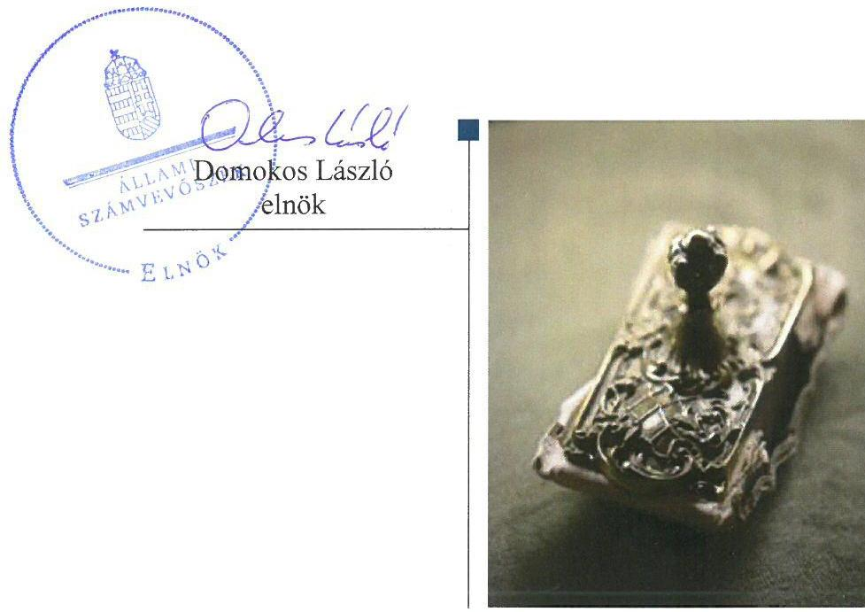
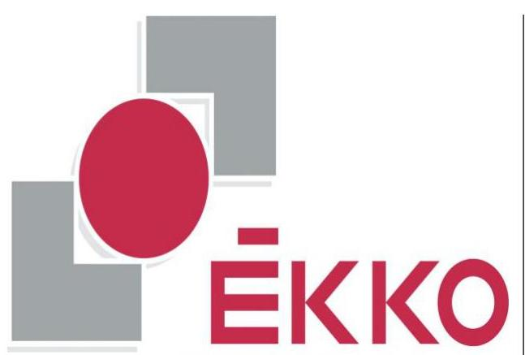
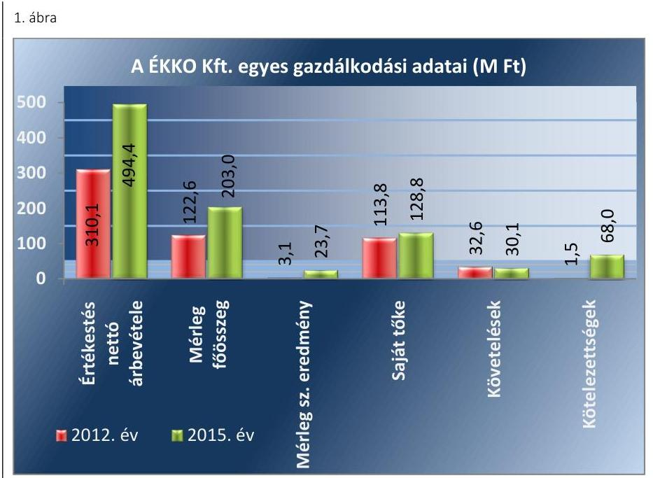
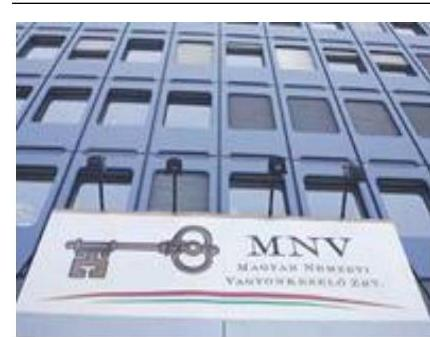
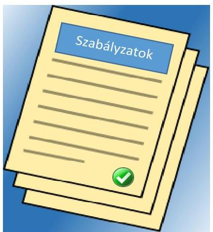
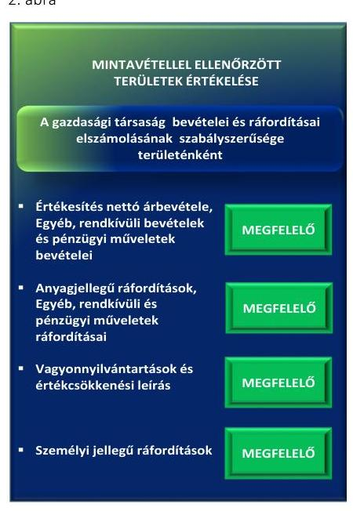

# Jelentés 

## ÉKKO Építőipari, Közszolgáltató, Kereskedő és Oktató Kft.

Az állami tulajdonban (résztulajdonban) lévő gazdálkodó szervezetek vagyonmegőrzési és gazdálkodási tevékenységének ellenőrzése 2017.

---

# Jelentés 

## ÉKKO Építőipari, Közszolgáltató, Kereskedő és Oktató Kft.

Az állami tulajdonban (résztulajdonban) lévő gazdálkodó szervezetek vagyonmegőrzési és gazdálkodási tevékenységének ellenőrzése
2017. 11. hó 07. nap

---

# AZ ELLENŐRZÉST FELÜGYELTE:

DR. HORVÁTH MARGIT felügyeleti vezető

## AZ ELLENŐRZÉST VEZETTE ÉS A VÉGREHAJTÁSÁÉRT FELELŐS:

- KLINGA LÁSZLÓ ellenőrzésvezető
- A PROGRAM ÖSSZEÁLLÍTÁSÁÉRT FELELŐS:
  - TÓTPÁL SZABOLCS osztályvezető

**IKTATÓSZÁM:** V-1396-118/2016

**TÉMASZÁM:** 2430

**ELLENŐRZÉS-AZONOSÍTÓ SZÁM:** V075966

Jelentéseink az Országgyűlés számítógépes hálózatán és az Interneta a www.asz.hu címen is olvashatóak.

---

# TARTALOMJEGYZÉK 

■ ÖSSZEGZÉS ..... 5
■ AZ ELLENŐRZÉS CÉLJA ..... 6
■ AZ ELLENŐRZÉS TERÜLETE ..... 7
■ AZ ELLENŐRZÉS HÁTTERE, INDOKOLTSÁGA ..... 9
■ A JELENTÉS LÉNYEGES KÉRDÉSKÖREI ..... 10
■ ELLENŐRZÉS HATÓKÖRE ÉS MÓDSZEREI ..... 11
■ MEGÁLLAPÍTÁSOK ..... 13
■ JAVASLATOK ..... 20
■ MELLÉKLETEK ..... 21
I. sz. melléklet: Értelmező szótár ..... 21
II. sz. melléklet: Az ÉKKO Kft. mérlegadatainak alakulása 2012-2015. között ..... 23
III. sz. melléklet: Az ÉKKO Kft. eredményének alakulása 2012-2015. között ..... 24
■ FÜGGELÉK: ÉSZREVÉTELEK ..... 25
■ RÖVIDÍTÉSEK JEGYZÉKE ..... 27

---

.

---

# ÖSSZEGZÉS 

A Magyar Nemzeti Vagyonkezelő Zrt. ÉKKO Építőipari, Közszolgáltató, Kereskedő és Oktató Kft. feletti tulajdonosi joggyakorlása szabályszerű volt. A Társaság müködésének szabályozottsága megfelelő volt. A pénzügyi-számviteli, beszámolási és adatszolgáltatási feladatok ellátása megfelelt a jogszabályi előírásoknak. A Társaság vagyongazdálkodása szabályszerű volt.

## Az ellenőrzés társadalmi indokoltsága

Az állami tulajdonú gazdálkodó szervezetek a nemzeti vagyon részét képezik. Az állami vagyonnal való gazdálkodást illetően a tulajdonosi joggyakorlás és a vagyongazdálkodás feladata az állami vagyon átlátható, rendeltetésszerű és felelős felhasználásának biztosítása. Az állam meghatározza az ellátandó feladatokat, amelyhez a vagyonnal kapcsolatos döntéseknek igazodniuk kell. A nemzetgazdasági szempontból kiemelt jelentőségű nemzeti vagyonban tartandó állami tulajdonban álló társasági részesedést a nemzeti vagyonról szóló törvény határozza meg.

Az Állami Számvevőszék az általa korábban ellenőrizetlen területek, szervezetek körébe tartozó társaságnál végzett ellenőrzést. A számvevőszéki ellenőrzés hozzájárul a közpénzek szabályos, átlátható, elszámoltatható és eredményes felhasználásához, a rend pedig értéket teremt. Minden közpénzt, közvagyont használó szervezettel szemben társadalmi igény, hogy tevékenységükről elszámoljanak. Ezt figyelembe véve és az Állami Számvevőszék Stratégiájával összhangban került sor az ÉKKO Építőipari, Közszolgáltató, Kereskedő és Oktató Kft. ellenőrzésére a 2012-2015. évek vonatkozásában

## Főbb megállapítások, következtetések, javaslatok

A Magyar Nemzeti Vagyonkezelő Zrt. a tulajdonosi jogok gyakorlásának kereteit kialakította, a tulajdonosi jogokat szabályszerűen gyakorolta. A döntések előkészítésére vonatkozó szabályokat és a döntésekhez kapcsolódó adatszolgáltatás rendjét a tulajdonosi jogok gyakorlója szabályszerűen meghatározta. Az üzleti terv készítési kötelezettséget az Alapító Okiratban előírták, míg az anyagi érdekeltségi rendszer szabályait a Javadalmazási szabályzatban meghatározták.

A Társaság működésének szabályozottsága megfelelt a jogszabályi előírásoknak. A belső számviteli szabályzatok elkészítésénél teljes körűen nem vették figyelembe a számviteli politikában foglalt előírásokat. A bevételek, a ráfordítások, a beruházások és az értékcsökkenés elszámolása az előírásoknak megfelelően történt. A Társaság az önköltségszámítás rendjét szabályozta, az árképzés önköltségszámításon alapult. A Társaság a jogszabályi és belső szabályozásban előírt beszámolási és adatszolgáltatási kötelezettségét szabályszerűen teljesítette.

A Társaság vagyongazdálkodása és a vagyon nyilvántartása szabályszerű volt, a vagyon értékét megőrizte. A vagyongazdálkodással összefüggő döntések szabályszerűek voltak.

---

# AZ ELLENŐRZÉS CÉLJA 

Az ellenőrzés célja annak értékelése volt, hogy a tulajdonosi jogok gyakorlása szabályszerű volt-e; a gazdálkodó szervezet szabályozottsága, gazdálkodása és vagyongazdálkodási tevékenysége megfelelt-e a jogszabályi és a tulajdonosi előírásoknak, biztosítva volt-e a szolgáltatás dijának megalapozottsága szabályszerű önköltségszámítással; a vagyonváltozást eredményező döntések esetében a tulajdonosi jogok gyakorlója és a gazdálkodó szervezet szabályszerűen jártak-e el.

---

# AZ ELLENŐRZÉS TERÜLETE 

## A Magyar Nemzeti Vagyonkezelő Zrt. és a kizárólagos tulajdonában lévő ÉKKO Építőipari, Közszolgáltató, Kereskedő és Oktató Kft.

Az ÉKKO Építőipari, Közszolgáltató, Kereskedő és Oktató Kft. működését 1993. december 1-jén kezdte meg. Az ÉKKO Kft ${ }^{1}$.-t 100\%-os tulajdoni hányaddal 30,2 millió Ft jegyzett tőkével a Magyar Állam alapította. Az ÉKKO Kft. feletti tulajdonosi jogokat az MNV Zrt. ${ }^{2}$ gyakorolta.

Alapításkor az alaptőkét az alapító 9,1 millió Ft-ot pénzbeli betétként és 21,1 millió Ft tárgyi apportként biztosította. A jegyzett tőke összege az ellenőrzött időszak alatt nem változott. Az ÉKKO Kft. két gazdasági társaságban összesen 0,5 millió Ft részesedéssel rendelkezett, amely a 2015. év végén értékesítés és felszámolási eljárás miatt megszűnt.

Az Alapító Okirat³-ban foglaltak alapján az ÉKKO Kft. fő tevékenysége máshová nem sorolható egyéb oktatás, melynek keretében felnőttképzési szolgáltatást - építő- és anyagmozgató gépkezelő képzést és a hozzá tartozó vizsgáztatási tevékenységet végzett. A Társaságnak a képzési és vizsgáztatási tevékenységéből származó bevételei piaci árakon alapultak. Az építő- és anyagmozgató gépkezelő vizsgázók száma 2012-ben 13179 fő, 2015. évben 15418 fő volt.

A debreceni székhelyű ÉKKO Kft. a tevékenység ellátása érdekében két telephelyet üzemeltetett - Győrben és Szombathelyen - , amelyek közül a szombathelyi telephelyet 2013 májusában megszüntették.

Az ÉKKO Kft. átlagos statisztikai állományi létszáma a 2012. évi 38 főről a 2015. év végére 26 főre csökkent.

Az ÉKKO Kft. tevékenységéhez tulajdonosi támogatást nem kapott, vagyonkezelésbe eszközöket nem vett át. Az ÉKKO Kft. közfeladatot nem látott el, közszolgáltatást nem végzett, nem minősült a kormányzati szektorba sorolt gazdasági társaságnak. A Társaság vagyonkezelésbe vett vagyonnal nem rendelkezett.

Az ÉKKO Kft. egyes gazdálkodási adatait a 2012. és a 2015. évek tekintetében az 1. ábra szemlélteti.

---

Forrás: az ÉKKO Kft. 2012. és 2015. évi éves beszámolói
A 2012. és 2015. év vége között az értékesítés nettó árbevétele 184,3 millió Ft-tal (59,4\%-kal), a mérlegfőösszeg 80,4 millió Ft-tal (65,5\%kal) nőtt. A mérleg szerinti eredmény az ellenőrzött időszakban pozitív volt. A saját tőke összege 15,0 millió Ft-tal (13,2\%-kal) nőtt. A követelések állománya 2,5 millió Ft-tal (7,7\%-kal) csökkent. A kötelezettségek állománya 66,5 millió Ft-tal nőtt, melyből az alapító által jóváhagyott osztalék 60,0 millió Ft volt. Az ÉKKO Kft.-nek a követeléseken és a kötelezettségeken belül lakossági tartozás állománya nem volt.

Az ügyvezető ${ }^{4}$ személye az ÉKKO Kft. megalakulása óta nem változott.

---

# AZ ELLENŐRZÉS HÁTTERE, INDOKOLTSÁGA 

Az ÁSZ ${ }^{5}$ alapvető célkitűzése, hogy az államháztartáson kívülre nyújtott költségvetési támogatások és ingyenes vagyon juttatások ellenőrzésével hozzájáruljon ahhoz, hogy a közpénzeket az államháztartáson kívül múködő szervezetek is átlátható, rendezett módon használják fel a szerződésben átvállalt állami feladatok ellátása érdekében.

Az ellenőrzés feladata a közvagyonnal biztosított feladatellátással kapcsolatban a közpénzek átláthatósága, nyilvánossága érdekében a jogszabályokban, belső szabályzatokban megfogalmazott előírások érvényesülésének az állami tulajdonban lévő gazdálkodó szervezetek vagyonérték megőrzési és gazdálkodási tevékenységének értékelése.

Az ellenőrzés várható hasznosulásaként az ellenőrzés megállapításai a jogalkotás számára segítséget nyújthatnak a közvagyonnal való gazdálkodás értékeléséhez, jogszabályi keretei pontosításához, az átláthatóságot biztosító szabályozáshoz. Az ellenőrzöttek számára visszajelzést ad a vagyongazdálkodási tevékenységgel, beszámolással kapcsolatos szabálytalanságokról és kockázatokról. Az ellenőrzés tapasztalatai segítik és erősítik az ÁSZ hozzáadott értéket teremtő elemző tevékenységét és tanácsadó szerepét.

---

# A JELENTÉS LÉNYEGES KÉRDÉSKÖREI 

1.     - A tulajdonosi jogok gyakorlása szabályszerű volt-e?
2.     - A Társaság müködésének szabályozottsága megfelelt-e az elöírásoknak?
3.     - A Társaságnál a pénzügyi-számviteli, adatszolgáltatási és ellenőrzési feladatok ellátása szabályszerű volt-e?
4.     - A Társaság vagyongazdálkodása szabályszerű volt-e?

---

# ELLENŐRZÉS HATÓKÖRE ÉS MÓDSZEREI 

## Az ellenőrzés típusa

Megfelelőségi ellenőrzés.

## Az ellenőrzött időszak

2012. január 1-jétől 2015. december 31-ig tart.

## Az ellenőrzés tárgya

Az állami tulajdonban lévő gazdasági társaság gazdálkodása, kiemelten vagyongazdálkodási tevékenysége, valamint a tulajdonosi jogok gyakorlása.

## Az ellenőrzött szervezet

A tulajdonosi joggyakorlás tekintetében a Magyar Nemzeti Vagyonkezelő Zártkörűen Működő Részvénytársaság, továbbá az ÉKKO Építőipari, Köszolgáltató, Kereskedő és Oktató Korlátolt Felelősségű Társaság

## Az ellenőrzés jogalapja

Az ellenőrzés jogalapját az ÁSZ tv6. 5. § (3)-(5) bekezdése képezi.

## Az ellenőrzés módszerei

Az ellenőrzést az ellenőrzött időszakban hatályos jogszabályok, az ellenőrzés szakmai szabályok és módszertanok figyelembevételével végeztük.

Az ellenőrzési kérdések megválaszolásához szükséges bizonyítékok megszerzése az ellenőrzött által rendelkezésre bocsátott dokumentumokra, adatokra alapozva kérdésfelvetés, mintavételezés, ellenőrzési eljárások útján történt.

Az ellenőrzési bizonyítékként felhasználható adatforrások közé tartoztak egyrészt a szakmai program részletes szempontjainál felsorolt adatforrások, másrészt minden egyéb - az ellenőrzés folyamán feltárt, az ellenőrzés szempontjából információkat tartalmazó - dokumentum.

Az ellenőrzés lefolytatásához a gazdálkodó szervezet a tanúsítványok elektronikus kitöltésével, valamint az ÁSZ által kért dokumentumok megküldésével szolgáltatott adatokat.

---

A bevételek és ráfordítások elszámolása, valamint a vagyonnyilvántartás terén, a szabályszerű múködést véletlen mintavétellel és irányított kiválasztással ellenőriztük. A mintatételek értékelése alapján egyrészt a sokaságban előforduló hibás tételek arányát becsültük, másrészt az irányítottan kiválasztott tételeket értékeltük. A jogszabályoknak és a belső előírásoknak megfelelőnek, azaz szabályszerűnek tekintettük az adott területet, amennyiben a minta ellenőrzésének eredménye alapján 95\%-os bizonyossággal a teljes sokaságban a hibaarány kisebb volt, mint 10\%, nem megfelelőnek értékeltük, ha a hibaarány a 10\%-ot meghaladta. A ráfordítások elszámolására és a vagyonnyilvántartásra vonatkozó véletlen mintavételt kockázati alapú kiválasztással egészítettük ki, amelynek során évente a három legnagyobb összegű tételt választottuk ki.

---

# 1. A tulajdonosi jogok gyakorlása szabályszerű volt-e? 

Összegző megállapítás

Az MNV Zrt. tulajdonosi joggyakorlása szabályszerű volt.

## A TULAJDONOSI JOGOK GYAKORLÁSÁNAK

RENDJÉT az MNV Zrt. a Gt. ${ }^{7}$, a Ptk. ${ }^{8}$, a Ptk. ${ }^{9}$. a Vtv. ${ }^{10}$, illetve az Nvtv. ${ }^{11}$ rendelkezéseivel összhangban az Alapító Okiratban, a Javadalmazási szabályzatban ${ }^{1.3^{12}}$, és saját belső szabályzataiban - a Tulajdonosi Ellenőrzési szabályzatban ${ }^{13}$, a Monitoring szabályzatban ${ }^{14}$, a Portfóliós Kódexben ${ }^{15}$ szabályszerűen határozta meg.

Az MNV Zrt. Igazgatósága ${ }^{16}$ által - a Vtv. 20. § (4) bekezdés k) pontjában foglaltaknak megfelelően - jóváhagyott MNV Zrt. SZMSZ ${ }^{17}$-ben rögzítették az MNV Zrt. Igazgatósága és a vezérigazgató ${ }^{18}$ döntéseivel összefüggő szabályokat. Meghatározták, hogy a portfólióért felelős főigazgató ${ }^{19}$ irányítja az ÉKKO Kft. feletti tulajdonosi joggyakorlással, a gazdasági főigazgató ${ }^{20}$ a vagyonnal való gazdálkodással kapcsolatos tervezési, beszámolási, kockázatkezelési és kontrolling feladatokat. Az MNV Zrt. - a Gt. 9. §, a Ptk. 1 54. §, valamint Ptk. 2 3:4. §-ban biztosított lehetőség alapján - az Alapító Okirat 6. § (1) bekezdésének előírásainak megfelelően szabályszerűen meghatározta a kizárólagos alapító hatáskörébe tartozó ügyek körét és a kizárólagos hatáskörébe tartozó magas értékű ügyleteket. Az alapító kizárólagos hatáskörébe tartozó ügyekben a tulajdonosi joggyakorló az MNV Zrt. vezérigazgatója volt.

A DÖNTÉSEK ELŐKÉSZÍTÉSÉRE vonatkozó előterjesztési kötelezettségek a Döntéselőkészítési szabályzatban ${ }^{1.4^{21}}$ és a Portfóliós Kódexben kerültek rögzítésre. Az alapítói határozatok kiadására minden esetben a döntés-előkészítő dokumentumok alapján került sor. Az ÉKKO Kft.nél a legfőbb döntést hozó szerv hatáskörébe tartozó döntéseket - az MNV Zrt. az SZMSZ-ében foglaltak szerint - az Alapító Okirat, a Gt. 19. § (5) és a Ptk. 2 3:109. § (4) bekezdések előírásainak megfelelően az MNV Zrt. vezérigazgatója hozta meg.

A MONITORING ADATSZOLGÁLTATÁSRA vonatkozó előírásokat - 2013 december 31-ig - az MNV Zrt. SZMSZ-e, valamint a Vagyonnyilvántartási szabályzat ${ }^{22}$ tartalmazta. A 2014. január 1-jétől hatályba léptetett Monitoring szabályzattal megteremtették az egységes szabályozást. Meghatározták a havi, negyedéves és éves kontrolling adatszolgáltatást, amelyek az eredménykimutatás és a mérleg terv/tényadatai elemzésére szolgált.

AZ FB TAGJAIT ÉS A KÖNYVVIZSGÁLÓT- a Gt. 19. § (4) bekezdésben, a Ptk. 2 3:26. §-ának, valamint az Alapító Okirat 6. §-ának k) és I) pontjaiban foglaltaknak megfelelően a tulajdonos MNV Zrt. szabályszerűen választotta meg. Az Alapító Okiratban rögzítették

---

az FB előzetes jóváhagyásához kötött döntések körét. Az FB tagjainak számát az Alapító okiratban három főben határozták meg a Gt. 34. § (1), a Ptk. 3 :26.§ (1) és a Taktv. ${ }^{23} 4 . \S$ (2) bekezdéseiben foglalt előírásoknak megfelelően. Az a $\mathrm{FB}^{24}$ ügyrenddel ${ }_{1-3}{ }^{25}$ rendelkezett. Az Alapító Okiratban előírtaknak megfelelve az FB működéséről, a végzett ellenőrzéseiről, intézkedéseiről hozott határozatok, évközi, valamint éves jelentések útján tájékoztatták az MNV Zrt.-t.

A BESZÁMOLTATÁSI RENDSZER keretében az MNV Zrt. havi, negyedéves, féléves és éves gyakoriságú jelentések készítésével számoltatta be az ÉKKO Kft.-t. Az ÉKKO Kft. számviteli beszámolóit - az FB előzetes írásbeli véleményezését követően - az MNV Zrt. vezérigazgatója a Gt. 141. § (2), illetve Ptk. 2 3:109. § (2) bekezdéseiben előírtaknak megfelelően, a könyvvizsgálói jelentések birtokában fogadta el.

AZ ÚZLETI TERVEKET ${ }^{26}$ az MNV Zrt. vezérigazgatója - az Alapító Okirat 6. § (1) bekezdés b) pontjában előírtak szerint-alapítói határozatokkal hagyta jóvá. Az üzleti terv ${ }_{1-4}$-ek elfogadásával a tervezett beruházások és fejlesztések a rövid- és a középtávú elképzelések jóváhagyása is megtörtént.

AZ ANYAGI ÉRDEKELTSÉGI RENDSZER elemeit az Alapító által elfogadott Javadalmazási szabályzat ${ }_{1-2}$-ben rögzítették. A szabályzatok a Taktv. előírásainak megfelelően rendelkeztek a vezető tisztségviselők, FB tagok, könyvvizsgáló, valamint a vezető állású munkavállalók javadalmazása, a jogviszony megszűnése esetére biztosított juttatások módjának, mértékének elveiről, annak rendszeréről.

# 2. A Társaság müködésének szabályozottsága megfelelt-e az előírásoknak? 

Összegző megállapítás Az ÉKKO Kft. müködésének szabályozottsága megfelelő volt.

A SZABÁLYSZERŰ MŰKÖDTETÉS KERETEIT az ÉKKO Kft. - a Gt., a Ptk.2, a Számv. tv. ${ }^{27}$, a Taktv. Tao tv. ${ }^{28}$ Szja. tv. ${ }^{29}$, valamint az MNV Zrt. elvárásainak megfelelően - az Alapító Okiratban, számviteli szabályzatokban és igazgató utasításokban határozta meg. Az MNV Zrt. ajánlása szerint elkészített, az adott évre vonatkozó gazdálkodás előírásait az éves üzleti tervek tartalmazták.

A SZABÁLYSZERŰ GAZDÁLKODÁST BIZTOSÍTÓ ALAPDOKUMENTUMOK a számviteli szabályzatok, a Selejtezési szabályzat ${ }^{30}$, az Utalványozás rendje ${ }^{31}$, a Szerződések kezelésének rendje ${ }^{32}$, a Szakmai teljesítésigazolás rendje ${ }^{33}$ voltak. Az ÉKKO Kft. az ellenőrzött időszakban rendelkezett a Számv. tv. 14. § (5) bekezdésében előírt és a Számviteli politika ${ }_{1-2}$ keretében elkészített Értékelési szabályzattal ${ }^{34}$, Leltározási szabályzattal ${ }^{35}$, Pénzkezelési szabályzattal ${ }^{36}$, Számlarend ${ }_{1-2}$-vel ${ }^{37}$ és annak részét képező Számlatükör ${ }_{1-4}$-gyel ${ }^{38}$, Bizonylati renddel ${ }^{39}$ A szabályzatok tartalma - a Pénzkezelési szabályzat kivételével - megfelelt a jogszabályi előírásoknak.

---

A SZÁMVITELI POLITIKA ${ }_{1-2}{ }^{40}$ 14. pontja tartalmazta a közhasznú szervezet gazdálkodására vonatkozó előírásokat és a közhasznúsági melléklet tartalmára vonatkozó előírásokat annak ellenére, hogy az ÉKKO Kft. nem végzett közhasznú tevékenységet.

AZ ÉRTÉKELÉSI SZABÁLYZAT nem tartalmazta - a Számviteli politika 2 9.1. pontjában foglaltak ellenére - a céltartalék képzés szabályait. A Számviteli politika ${ }_{2}$ 11.2. pontja szerint a jelentős maradványérték meghatározását a 200 ezer forint beszerzési értéket meghaladó tárgyi eszközök esetében írták elő, mely nem volt összhangban az Értékelési szabályzatban meghatározott két millió forinttal.

A LELTÁROZÁSI SZABÁLYZAT nem tartalmazta a Számviteli politika 2 9.4. pontjának előírása ellenére a leltározásnál alkalmazásra kerülő okmányokat, azok kellékeit, kiállításukat, kezelésüket. A Leltározási szabályzatban a mennyiségben is nyilvántartott eszközök esetében a mennyiségi leltározás szabályait a Számv. tv. 69. § (3) bekezdésében előírtak szerinti gyakoriság alapján - legalább háromévenkénti mennyiségi felvétel - határozták meg.

A PÉNZKEZELÉSI SZABÁLYZAT a Számv. tv. 14. § (8) bekezdés előírásai ellenére nem tartalmazta a pénzforgalom bankszámlán történő lebonyolításának rendjét, a készpénzben és a bankszámlán tartott pénzeszközök közötti forgalmát, illetve az ellenőrzés gyakoriságát. A pénzkezelési szabályzat nem rendelkezett a pénzforgalommal kapcsolatos nyilvántartási szabályokról, a pénzkezelés személyi feltételeiről és felelősségi szabályairól. A Számviteli politika ${ }_{2}$ 9.6. pontjában előírtak ellenére a Pénzkezelési szabályzat nem tartalmazta az ÉKKO Kft.-nél kialakított gyakorlatot, a jogszabályi előírásokat, a vagyonvédelmi követelmények összhangjának megteremtését, a vállalkozás sajátosságainak figyelembe vételét, a külső információs rendszer által támasztott igények kielégítését és a pénzforgalommal kapcsolatos bizonylati rendet, valamint az elszámolások szabályozását.

A SELEJTEZÉSI SZABÁLYZAT nem tartalmazta a Számviteli politika 2 9.5. pontjában előírt selejtezések ellenőrzésének eljárásrendjét.

AZ ÖNKÖLTSÉGSZÁMÍTÁSI SZABÁLYZAT készítésére az ÉKKO Kft. a Számv. tv. 14. § (6)-(7) bekezdésében foglaltak alapján nem volt kötelezett, azonban 2012. december 28-tól rendelkezett az előírásoknak megfelelő Önköltségszámítási szabályzattal ${ }^{41}$.

Az Önköltségszámítási szabályzatban az ÉKKO Kft. a fő tevékenységeihez kapcsolódó kalkulációs sémákat meghatározta.

Az ÉKKO Kft. a közvetlen és közvetett költségeket az Önköltségszámítási szabályzat 2.3 pontjában határozta meg. A szolgáltatási díjak képzése megfelelt az Önköltségszámítási szabályzatban előírtaknak. A kalkuláció el nem számolható költségeket nem tartalmazott, az értékcsökkenést figyelembe vették. A vizsgabizonyítványok kiállításának díját a 315/2013. (VIII.28.) Korm. rendelet 42 46. § (3) bekezdésében foglaltakkal összhangban, szabályszerűen határozták meg.

---

# 3. A Társaságnál a pénzügyi-számviteli, adatszolgáltatási és ellenőrzési feladatok ellátása szabályszerű volt-e? 

Összegző megállapítás

Az ÉKKO Kft. pénzügyi-számviteli feladatainak ellátása szabályszerű volt, az adatszolgáltatási kötelezettségének eleget tett.

## 3.1. számú megállapítás

2. ábra

Fonrás: ÁSZ saját

1. táblázat

## AZ ÉRTÉKESÍTÉS NETTŐ ÁRBEVÉTELÉNEK ALAKULÁSA (M FT)

| Év | Tervezett | Teljesített |
| :--: | :--: | :--: |
| 2012. | 336,0 | 310,1 |
| 2013. | 324,5 | 297,4 |
| 2014. | 324,0 | 296,6 |
| 2015. | 325,8 | 494,4 |

A bevételek, a ráfordítások, a beruházások és az értékcsökkenési leírás elszámolása, valamint a vagyonnyilvántartás megfelelő volt.

A BEVÉTELEK ELSZÁMOLÁSA megfelelt a Számv. tv.-ben és a Számviteli politika ${ }_{1-2}$-ben foglalt előírásoknak. Az értékesítés nettó árbevétele, az egyéb bevétel kiszámlázása, főkönyvi számlára történő elszámolása megfelelt a Számlarend ${ }_{1-2}$-ben és a Számlatükör ${ }_{1-4}$-ben foglaltaknak. A bevételek bizonylatainak kiállítása a Bizonylati szabályzat, valamint a Számv. tv. 166.-167. § előírásainak megfelelően történt.

Az értékesítés nettó árbevételének évenkénti alakulását az 1. táblázat tartalmazza.

AZ ANYAGJELLEGŰ-, EGYÉB-, PÉNZÜGYI- ÉS RENDKÍVÜLI RÁFORDÍTÁSOK ELSZÁMOLÁSA megfelelt a jogszabályi és a belső szabályzatokban foglalt előírásoknak. Az ÉKKO Kft. a Számv. tv. 78. § (1)-(7) bekezdésében előírtaknak megfelelően az anyagjellegú ráfordításait elkülönítetten tartotta nyilván, az elszámolásai a Számlarend ${ }_{1-2}$-ben és a Számlatükör ${ }_{1-4}$-ben meghatározott főkönyvi számlákon - megfelelően - történtek.

A SZEMÉLYI JELLEGŰ RÁFORDÍTÁSOK számviteli elszámolásai a Számlarend ${ }_{1-2}$-ben és a Számlatükör ${ }_{1-4}$-ben előírt főkönyvi számlaszámok alkalmazásának megfelelve, összességében szabályszerűen történtek. Az ÉKKO Kft. a személyi jellegű ráfordításokat az 5. számlaosztályban a Számv. tv. 79. § előírásainak megfelelően számolta el. A munkabérek kifizetései a munkaszerződések alapján, az Szja tv. és a Tbj. tv ${ }^{43}$. előírásainak megfelelő levonások alkalmazásával történtek.

A béren kívüli juttatások kifizetéseinek számfejtése és elszámolása a Természetbeni juttatások szabályzata ${ }_{1-5}$ előírásainak megfelelően történtek.

A BERUHÁZÁSOK, FELÚJÍTÁSOK ÉS AZ ÉRTÉKCSÖKKENÉSI LEÍRÁS ELSZÁMOLÁSA megfelelt a jogszabályok és a belső szabályzatok előírásainak. A tárgyi eszközök besorolásai és a bekerülési értékük meghatározása szabályszerűen a Számv. tv. 26. §, a Számviteli politika ${ }_{1-2}$ és az Értékelési szabályzat előírásainak megfelelően történt. A tárgyi eszközök a leltárakban megtalálhatóak voltak. Az eszközök állományba vételét az üzembe helyezési jegyzőkönyvek alapján a megfelelő főkönyvi számlákra könyvelték.

Az értékcsökkenési leírás elszámolása a Számlarend ${ }_{1-2}$-ben, a Számlatükör ${ }_{1-4}$-ben előírt főkönyvi számlákon keresztül, a Számviteli politika ${ }_{1-2}$-ben előírt havi gyakorisággal történt.

---

2. táblázat

KÖVETELÉSÁLLOMÁNY (M FT)

|  | 2012 | 2015 |
| :-- | --: | --: |
| Vevők | 28,0 | 24,9 |
| - Ebből lejárt vevő | 15,1 | 12,1 |
| Összes értékvesztés | $-1,7$ | $-0,6$ |
| Egyéb követelés | 6,3 | 5,7 |
| Összes követelés | 32,6 | 30,0 |

Forrás: az ÉKKO Kft. 2012-2015. évi éves beszámolói
3.2. számú megállapítás

A MÉRLEG SZERINTI KÖVETELÉS ÁLLOMÁNY a 2012. év végi 32,6 millió Ft-ról 2,5 millió Ft-tal (7,7\%-kal) 2015. év végére 30,1 millió Ft-ra csökkent. Az összes követelés állományból a vevőkövetelések a 2012. év végi 28,0 millió Ft-ról 3,2 millió Ft-tal (11,3\%-kal) 24,9 millió Ft-ra csökkent a 2015. év végére, melyből a lejárt követelés összege 12,1 millió Ft volt. A követelésállomány alakulását a 2. táblázat mutatja.

A lejárt határidejű követelések behajtásával kapcsolatban intézkedtek, a behajtási folyamatot figyelemmel kísérték. Az ÉKKO Kft. 2012-2015. években összesen 32 alkalommal 19,2 millió Ft vevőkövetelés behajtása érdekében küldött ki fizetési felszólítást vevőpartnerei részére. Az ellenőrzött időszakban egy alkalommal került sor a behajtás jogi útra terelésére.

## Az ÉKKO Kft. szabályszerűen teljesítette a beszámolási és adatszolgáltatási kötelezettségét.

A BESZÁMOLÁSI KÖTELEZETTSÉGÉNEK az ÉKKO Kft. a Monitoring szabályzat, a Vagyon-nyilvántartási szabályzat és az Alapító Okirat előírásainak megfelelve a Számv. tv. 17-20.§ -aiban és a Számviteli politika ${ }_{1-2}$-ben előírt tartalommal tett eleget.

Az FB az éves beszámolókat megtárgyalta, határozataiban elfogadta és az MNV Zrt.-nek jóváhagyásra javasolta, melyeket a könyvvizsgáló - a Gt. 40. § (1) és a Ptk. 3:129. § (1) bekezdéseiben előírtaknak megfelelően - hiteleső záradékkal látott el.

Az ÉKKO Kft. a 2012-2015. évi beszámolók letétbe helyezését, közzétételét a Számv. tv. 153. § (1), valamint 154. § (1) és (7) bekezdéseinek megfelelően határidőben teljesítette.

ADATSZOLGÁLTATÁSI KÖTELEZETTSÉGÉT az ÉKKO Kft. az előírt határidőre és a számára meghatározott dokumentumoknak megfelelően az MNV Zrt. részére havonta a kontrolling adatszolgáltatásaival teljesítette.

Az ÉKKO Kft. 2012 márciusától az MNV Zrt. 8/2012. (III. 21.) számú Alapítói Határozatának megfelelően a természetbeni juttatások kifizetéseit megelőzően az MNV Zrt. felé teljesítendő bejelentési kötelezettségének eleget tett.

Az ÉKKO Kft. nem tett eleget a Közzétételi szabályzat és a Taktv. 2. § (1) bekezdés a)-cb) pontjaiban előírtaknak és nem tette közzé a vezető tisztségviselők, a felügyelőbizottsági tagok a Munka tv. ${ }^{44}$ 208. §-a szerint vezető állású munkavállalók, valamint az önállóan cégjegyzésre vagy a bankszámla feletti rendelkezésre jogosult munkavállalók nevét, tisztségét vagy munkakörét, munkaviszonyban álló személy esetében a munkavállaló részére a munkaviszonya alapján közvetlenül vagy közvetve nyújtott pénzbeli juttatásokat, ezen belül külön feltüntetve alapbérét, egyéb időbérét, teljesítménybérét, valamint az időbért megalapozó időtartamot, illetve a teljesítménybért megalapozó teljesítménykövetelményeket, az Mt., illetve a munkaszerződés alapján járó mértéket megjelölve a munkavállalóra irányadó végkielégítés, illetve felmondási idő időtartamát.

TULAJ DONOSI ELLENŐRZÉS keretében az ÉKKO Kft.-t az MNV Zrt. a 2012-2015. években nem ellenőrizte.

---

A KÜLSŐ ELLENŐRZÉS keretében az ÉKKO Kft.-t a Nyugdíjbiztosítási Igazgatóság hat alkalommal, a Családtámogatási és TB Főosztály két alkalommal ellenőrizte a munkabérek számfejtése és kifizetése kapcsán. A Nyugdíjbiztosítási Igazgatóság 2013. évben két javaslatot tett, az ezekre vonatkozó intézkedéseket az ÉKKO Kft. határidőben teljesítette.

# 4. A Társaság vagyongazdálkodása szabályszerű volt-e? 

## Összegző megállapítás

4.1. számú megállapítás
4.2. számú megállapítás
4.3. táblázat

AZ ÉRTÉKCSÖKKENÉS ÉS A
BERUHÁZÁSOK ALAKULÁSA (M FT)

| Évek | Elszámolt ér-   tekcsökkenés | Beruházás,   felújítás |
| :--: | :--: | :--: |
| 2012. | 7,7 | 0,5 |
| 2013. | 4,2 | 0,6 |
| 2014. | 1,8 | 3,6 |
| 2015. | 4,4 | 10,8 |
| összesen | 18,1 | 15,5 |

Forrás: az ÉKKO Kft. 2012-2015. évi éves beszámolót

Az ÉKKO Kft. vagyongazdálkodása szabályszerű volt.
Az ÉKKO Kft. kialakította, szabályozta a saját vagyon értékének megőrzését, gyarapítását szolgáló, szabályszerű vagyongazdálkodás feltételeit.

A VAGYONGAZDÁLKODÁS FELTÉTELEIT az ÉKKO Kft. - a Vtv.-ben, az Nvtv.-ben a Számv. tv.-ben foglalt előírásoknak megfelelően - az Alapító Okiratban és az Üzleti terv1-4-ben és a belső szabályzatokban kialakította. A középtávú és éves fejlesztési elképzeléseket az Üzleti terv $_{1-4}$ tartalmazta. Az MNV Zrt. által kiadott Tervezési irányelv $_{1-4}$ előírásainak megfelelve az évenkénti Üzleti terv $_{1-4}$-ben meghatározták az éves beruházásokkal, karbantartásokkal kapcsolatos feladatokat.

Az ÉKKO Kft. a vagyongazdálkodás során a vagyonát szabályszerűen tartotta nyilván, a vagyon értékének megőrzését biztosította.

A VAGYON NYILVÁNTARTÁSA a Számviteli politika1-2, az Értékelési szabályzat, a Leltározási szabályzat, a Pénzkezelési szabályzat, Számlarend $_{1-2}$, Számlatükör $_{1-4}$ és Bizonylati rend előírásainak megfelelve átlátható, naprakész vagyonnyilvántartással biztosított volt.

Az ÉKKO Kft. a Számv. tv. 69. § (1)-(3) bekezdései előírásának megfelelően a mérlegében kimutatott eszközöket és forrásokat leltárral alátámasztotta. A folyamatosan vezetett, mennyiségi nyilvántartásokban szereplő eszközeit három évente - az ellenőrzött időszakban a 2012. évben és a 2015. évben - mennyiségi leltárfelvétellel leltározta. Az értékben nyilvántartott egyéb eszközök és források évenkénti egyeztetését az előírásoknak megfelelően elvégezte.

A VAGYON ÉRTÉKÉNEK MEGŐRZÉSE az ellenőrzött időszakban biztosított volt. A mérleg föösszege a 2012. évi 122,6 millió Ft-ról 2015. év végére 203,0 millió Ft-ra 80,4 millió Ft-tal nőtt.

A Társaság mérlegadatainak alakulását a II., az eredményének alakulását a III. számú melléklet szemlélteti a 2012-2015. évek között.

A saját vagyon állagának megőrzése érdekében a tárgyi eszközök rendszeres időközönkénti karbantartásáról gondoskodtak. A 2012-2015. években karbantartásra összesen 33,6 millió Ft-ot fordítottak.

Az ellenőrzött időszakban összesen 15,5 millió Ft értékben hajtottak végre beruházásokat és felújításokat, amelyek összege összességében nem haladta meg a tárgyi eszközök után elszámolt 18,1 millió Ft értékcsökkenés leírást, ezáltal az eszközök elhasználódási ütemét meghaladó mértékű eszközpótlás nem volt biztosított. Az elszámolt értékcsökkenési leírást és a megvalósított beruházások alakulását a 3. táblázat tartalmazza.

---

Az eszközcsoportonként eltérő visszapótlás eredményeként a számítástechnikai eszközök átlagos életkora nőtt, a gépek, berendezések, felszerelések és a járművek átlagos életkora csökkent 2015. év végére.

# 4.3. számú megállapítás 

A vagyon változását eredményező döntések szabályszerűek voltak.

A VAGYONGAZDÁLKODÁSI DÖNTÉST a részesedés értékesítésénél az Alapító Okirat ${ }_{3}$ és a Ptk. 2 előírásainak megfelelően - az MNV Zrt. SZMSZ-ben foglaltak szerint - a vezérigazgató hozta meg. Az ÉKKO Kft. által az MNV Zrt. felé 2014. évben benyújtott FÉSZ Kft.-ben lévő 12,3\%-os (370,0 ezer Ft névértékű) részesedés értékesítésével kapcsolatos döntés-előkészítés dokumentumai megfeleltek a Döntés előkészítési sza-bályzat ${ }_{3}$-ban meghatározottaknak. Az ÉKKO Kft. által az MNV Zrt. részére benyújtott feljegyzések, valamint az alapítói határozatokhoz beterjesztett előkészítő feljegyzések megfeleltek a Portfóliós Kódexben meghatározott belső döntés-előkészítés használatához javasolt „előterjesztés sablon" előírásának.

A BERUHÁZÁSOK, BESZERZÉSEK értéke nem érte el Alapító Okirat 6. §-ában meghatározott 10,0 millió forint értékhatárt, ennél fogva az MNV Zrt. előzetes hozzájárulására nem volt szükség. A beruházásokról és beszerzésekről az ügyvezető döntött az Alapító Okiratban foglaltaknak megfelelően és a Szerződéskötések rendjének megfelelően. Az ellenőrzött időszakban a tárgyi eszközök értékesítéséről az ügyvezető az Alapító Okiratban foglalt előírásoknak megfelelően döntött. A tárgyi eszközök értékesítésből származó összes bevétel a 2012-2015. években 6,1 millió Ft volt. Selejtezésről az ellenőrzött időszakban az ügyvezető a belső szabályzatok előírásainak megfelelően döntött.

A SAJÁT VAGYON BÉRBEADÁSÁRA kötött bérleti szerződéseket az ügyvezető az Alapító Okirat és a Szerződések kezelésének rendje szabályzatában foglaltaknak megfelelően kötötte meg. A terület bérbeadásából származó bevétel a 2012-2015. években összesen 14,5 millió Ft volt.

---

# JAVASLATOK 

Az ÁSZ tv. 33. § (1) bekezdésében foglaltak értelmében az ellenőrzött szervezet vezetője köteles a jelentésben foglalt megállapításokhoz kapcsolódó intézkedési tervet összeállítani és azt a jelentés kézhezvételétől számított 30 napon belül az ÁSZ részére megküldeni. Amennyiben az ellenőrzött szervezet vezetője nem küldi meg határidőben az intézkedési tervet, vagy továbbra sem elfogadható intézkedési tervet küld, az Állami Számvevőszék elnöke az ÁSZ tv. 33. § (3) bekezdése a) és b) pontjaiban foglaltakat érvényesítheti.
Javaslataink célja az ÉKKO Építőipari, Közszolgáltató, Kereskedő és Oktató Kft. gazdálkodása szabályszerűségének és gyakorlatának javítása annak érdekében, hogy a szabályozási környezet és az alkalmazott gyakorlat megfelelően tudja támogatni az átlátható müködést.

## Az ÉKKO Építőipari, Közszolgáltató, Kereskedő és Oktató Kft. ügyvezetőjének

1. Határozza meg az Értékelési szabályzatban - a Számviteli politikában foglaltakkal összhangban - a céltartalék képzés szabályait, továbbá teremtse meg az összhangot a jelentős maradványérték meghatározása esetében.
(2. megállapítás 4. bekezdése alapján)
2. Határozza meg a Leltározási szabályzatban - a Számviteli politika előírásával összhangban - a leltározásnál alkalmazásra kerülő okmányokat, azok kellékeit, kiállításukat, kezelésük rendjét.
(2. megállapítás 5. bekezdés 1. mondata alapján)
3. Határozza meg a Pénzkezelési szabályzatban a Számv. tv. előírásának megfelelően a pénzforgalom bankszámlán történő lebonyolításának rendjét, a készpénzben és a bankszámlán tartott pénzeszközök közötti forgalmát, az ellenőrzés gyakoriságát, a pénzforgalommal kapcsolatos nyilvántartási szabályokat, továbbá a pénzkezelés személyi feltételeit és felelősségi szabályait.
(2. megállapítás 6. bekezdés 1-2. mondata alapján)
4. Határozza meg a Selejtezési szabályzatban a selejtezések ellenőrzésének eljárásrendjét a Számviteli politikában előírtak szerint.
(2. megállapítás 7. bekezdése alapján)
5. Gondoskodjon a Taktv.-ben elöírtaknak megfelelően a közzétételi kötelezettség teljesítéséről.
(3.3. megállapítás 6. bekezdése alapján)

---

# MELLÉKLETEK 

## I. SZ. MELLÉKLET: ÉRTELMEZŐ SZÓTÁR

állami vagyon
a) Az állam tulajdonában lévő dolog, valamint a dolog módjára hasznosítható természeti erő,
b) az a) pont hatálya alá nem tartozó mindazon vagyon, amely vonatkozásában törvény az állam kizárólagos tulajdonjogát nevesíti,
c) az állam tulajdonában lévő tagsági jogviszonyt megtestesítő értékpapír, illetve az államot megillető egyéb társasági részesedés,
d) az államot megillető olyan immateriális, vagyoni értékkel rendelkező jogosultság, amelyet jogszabály vagyoni értékű jogként nevesít.
Forrás: Vtv. 1. § (2) bekezdése
2012. november 10-től az állami vagyon fogalma kiegészül a következő ponttal:
e) az állam tulajdonában lévő pénzügyi eszközök

Forrás: Vtv. 1. § (2) bekezdése
állami vagyon használója
Az a természetes vagy jogi személy, jogi személyiséggel nem rendelkező szervezet, aki, vagy amely törvény vagy szerződés alapján, bármely jogcímen (bérlet, haszonbérlet, használat stb.) állami vagyont birtokol, használ, szedi annak hasznait, hasznosít, ide nem értve a haszonélvezőt, a vagyonkezelőt és a tulajdonosi jogok gyakorlóját.
Forrás: Vhr. 1. § (7) a. pontja
állami vagyon hasznosítása
2013. június 27-ig:

Az állami vagyont az MNV Zrt. maga kezeli, vagy szerződés - így különösen bérlet, haszonbérlet, megbízás - alapján központi költségvetési szervnek, természetes vagy jogi személynek, vagy jogi személyiséggel nem rendelkező gazdálkodó szervezetnek hasznosításra átengedi.
Forrás: Vtv. 23. § (1) bekezdése
2013. június 28-ától:

Az állami vagyonnal az MNV Zrt. maga gazdálkodik, vagy szerződés - így különösen bérlet, haszonbérlet, megbízás - alapján központi költségvetési szervnek, természetes vagy jogi személynek, vagy jogi személyiséggel nem rendelkező gazdálkodó szervezetnek hasznosításra átengedi, illetőleg vagyonkezelésbe, haszonélvezetbe adja.
Forrás: Vtv. 23. § (1) bekezdése
állami vagyon hasznosítására kötött szerződések elsődleges célja az állami vagyon hatékony működtetése, állagának védelme, értékének megőrzése, illetve gyarapítása, az állami és közfeladatok ellátásának elősegítése.
Forrás: Vtv. 23. § (2) bekezdése
2013. június 27-ig:

Az állami vagyont az MNV Zrt. maga kezeli, vagy szerződés - így különösen bérlet, haszonbérlet, megbízás - alapján központi költségvetési szervnek, természetes vagy jogi személynek, vagy jogi személyiséggel nem rendelkező gazdálkodó szervezetnek hasznosításra átengedi. Az állami vagyonra vonatkozóan az MNV Zrt. kizárólag az Nvtv-ben meghatározott személyekkel köthet vagyonkezelési szerződést.
Forrás: Vtv. 23. § (1), 27. § (1)
2013. június 28-ától:

---

gazdasági társaság

MNV Zrt.
tulajdonosi jogok gyakorlója

Az állami vagyonnal az MNV Zrt. maga gazdálkodik, vagy szerződés - így különösen bérlet, haszonbérlet, megbízás - alapján központi költségvetési szervnek, természetes vagy jogi személynek, vagy jogi személyiséggel nem rendelkező gazdálkodó szervezetnek hasznosításra átengedi, illetőleg vagyonkezelésbe, haszonélvezetbe adja. Az állami vagyonra vonatkozóan az MNV Zrt. kizárólag az Nvtv-ben meghatározott személyekkel köthet vagyonkezelési szerződést.
Forrás: Vtv. 23. § (1), 27. § (1)
A Ptk. 3:88. § (1) bekezdése szerint „a gazdasági társaság üzletszerű közös gazdasági tevékenység folytatására, a tagok vagyoni hozzájárulásával létrehozott, jogi személyiséggel rendelkező vállalkozások, amelyekben a tagok a nyereségből közösen részesednek, és a veszteséget közösen viselik".
Az állami vagyon felett, a Magyar Államot megillető tulajdonosi jogok és kötelezettségek összességét - a hatályos szabályozás szerint - az állami vagyon felügyeletéért felelős miniszter (jelenleg a nemzeti fejlesztési miniszter) gyakorolja. A miniszter feladatát nagy részben az MNV Zrt., mint tulajdonosi joggyakorló szervezet útján látja el.
1.
2013. június 27-ig:

Az állami vagyon felett a Magyar Államot megillető tulajdonosi jogok és kötelezettségek összességét - ha törvény eltérően nem rendelkezik - az állami vagyon felügyeletéért felelős miniszter (a továbbiakban: miniszter) gyakorolja, aki e feladatát a Magyar Nemzeti Vagyonkezelő Zártkörűen Működő Részvénytársaság (a továbbiakban: MNV Zrt.), a Magyar Fejlesztési Bank, illetve a tulajdonosi joggyakorló szervezet útján látja el. A miniszter miniszteri rendeletben, a törvényben meghatározott állami vagyoni kör tekintetében, meghatározott időtartamra, a joggyakorlás egyes szabályainak meghatározásával - az őt megillető tulajdonosi jogok és kötelezettségek összességének, illetve azok meghatározott részének gyakorlóját az Áht. szerinti központi költségvetési szervek, ezek intézménye, továbbá a 100\%-ban állami tulajdonban álló gazdasági társaságok közül kijelölheti.
Forrás: Vtv. 3. § (1) és (2)
2013. június 28-ától:

A rábízott állami vagyon felett az államot megillető tulajdonosi jogok és kötelezettségek összességét tulajdonosi joggyakorlóként:
a) ha törvény vagy miniszteri rendelet eltérően nem rendelkezik, a Magyar Nemzeti Vagyonkezelő Zártkörűen Müködő Részvénytársaság (a továbbiakban: MNV Zrt.), b) törvényben kijelölt személy vagy
c) az állami vagyon felügyeletéért felelős miniszter (a továbbiakban: miniszter) által rendeletben kijelölt személy gyakorolja.
[...] A miniszter e törvény felhatalmazása alapján - a meghatározott célok hatékonyabb elérése érdekében, miniszteri rendeletben, az ott meghatározott állami vagyoni kör tekintetében, meghatározott időtartamra - e törvény keretei között, a joggyakorlás egyes szabályainak meghatározásával - az államot megillető tulajdonosi jogok és kötelezettségek összességének, illetve azok meghatározott részének gyakorlóját az Áht. szerinti központi költségvetési szervek, ezek intézménye, továbbá a 100\%-ban állami tulajdonban álló gazdasági társaságok közül kijelölheti.
Forrás: Vtv. 3. § (1) és (2)
2.

Aki a nemzeti vagyon felett az államot vagy a helyi önkormányzatot megillető tulajdonosi jogok és kötelezettségek összességének gyakorlására jogosult
Forrás: Nvtv. 3. § (1) 17. pontja

---

| Megnevezés | 2012-12-31. | 2013-12-31. | 2014-12-31. | 2015-12-31. |
| :--: | :--: | :--: | :--: | :--: |
| 1 | 2 | 3 | 4 | 5 |
| A. Befektetett eszközök | 21807 | 17729 | 19108 | 24057 |
| II. TÁRGYI ESZKÖZÖK | 21337 | 17679 | 19086 | 23990 |
| B. Forgóeszközök | 99249 | 101411 | 94993 | 175289 |
| I. KÉSZLETEK | 979 | 1667 | 929 | 1476 |
| II. KÖVETELÉSEK | 32573 | 10922 | 15154 | 30062 |
| IV. PÉNZESZKÖZÖK | 65697 | 58819 | 48949 | 143751 |
| C. Aktív időbeli elhatárolások | 1575 | 3932 | 4588 | 3664 |
| ESZKÖZÖK (AKTÍVÁK) ÖSSZESEN | 122631 | 123072 | 118689 | 203010 |
| D. SAJÁT TÖKE | 113784 | 113885 | 105098 | 128781 |
| I. JEGYZETT TÖKE | 30200 | 30200 | 30200 | 30200 |
| IV. EREDMÉNYTARTALÉK | 80490 | 83584 | 83685 | 74899 |
| VII. MÉRLEG SZERINTI EREDMÉNY | 3094 | 101 | $-8787$ | 23682 |
| F. Kötelezettségek | 1549 | 2252 | 7632 | 68029 |
| III. RÖVID LEJÁRATÚ KÖTELEZETTSÉGEK | 1549 | 2252 | 7632 | 68029 |
| G. Passzív időbeli elhatárolások | 7298 | 6935 | 5959 | 6200 |
| FORRÁSOK (PASSZÍVÁK) ÖSSZESEN | 122631 | 123072 | 118689 | 203010 |

Fonrás: az ÉKKO Kft. 2012-2015. évi egyszerúsített éves beszámolói

---

| Megnevezés | 2012.4 v | 2013.4 v | 2014.4 v | 2015.4 v |
| :--: | :--: | :--: | :--: | :--: |
| 1. | 2. | 3. | 4. | 5. |
| I. | 310095 | 297422 | 296595 | 494392 |
| II. Aktivált saját teljesítmények érték | 0 | 0 | 0 | 31 |
| III. Egyéb bevételek | 1146 | 3103 | 444 | 2223 |
| IV. Anyagjellegú ráfordítások | 152587 | 148116 | 161893 | 216520 |
| V. Személyi jellegú ráfordítások | 136922 | 134443 | 129591 | 169660 |
| VI. Értékcsökkenési leírás | 7715 | 4164 | 1773 | 4401 |
| VII. Egyéb ráfordítások | 14669 | 14190 | 13211 | 18558 |
| Üzemi (üzleti) tevékenység eredménye | $-652$ | $-388$ | $-9429$ | 87507 |
| VIII. Pénzügyi múveletek bevételei | 4377 | 1513 | 1255 | 626 |
| Pénzügyi műveletek eredménye | 4377 | 1093 | 1239 | 622 |
| Szokásos vállalkozási eredmény | 3725 | 705 | $-8190$ | 88129 |
| Adózás előtti eredmény | 3725 | 705 | $-8190$ | 88129 |
| XII. Adófizetési kötelezettség | 631 | 604 | 597 | 4447 |
| Adózott eredmény | 3094 | 101 | $-8787$ | 83682 |
| Mérleg szerinti eredmény | 3094 | 101 | $-8787$ | 23682 |

Formás: az ÉKKO Kft. 2012-2015. évi egyszerúsített éves beszámolói

---

# FÜGGELÉK: ÉSZREVÉTELEK 

A jelentéstervezetet a Számvevőszék 15 napos észrevételezésre megküldte az ellenőrzött szervezetek vezetőinek az ÁSZ tv. 29. §* (1) bekezdése előírásának megfelelően.

Az ÉKKO Építőipari, Közszolgáltató, Kereskedő és Oktató Kft. ügyvezetője és a tulajdonosi jogokat gyakorló Magyar Nemzeti Vagyonkezelő Zrt. vezérigazgatója nem tett észrevételt a jelentés-tervezetben foglalt megállapításokkal és javaslatokkal kapcsolatban.

[^0]
[^0]:    * 29. § (1) Az Állami Számvevőszék az ellenőrzési megállapításait megküldi az ellenőrzött szervezet vezetőjének vagy az általa megbízott személynek, és annak, akinek személyes felelősségét állapította meg.
    (2) Az ellenőrzött szervezet vezetője és a felelősként megjelölt személy az ellenőrzés megállapításaira tizenöt napon belül írásban észrevételt tehet.
    (3) Az Állami Számvevőszék az észrevételre a beérkezésétől számított harminc napon belül írásban válaszol. A figyelembe nem vett észrevételeket köteles a jelentésben feltüntetni, és megindokolni, hogy azokat miért nem fogadta el.

---

.

---

# RÖVIDÍTÉSEK JEGYZÉKE 

${ }^{1}$ ÉKKO Kft.
${ }^{2}$ MNV Zrt.
${ }^{3}$ Alapítói Okirat

4 ügyvezető
${ }^{5}$ ÁSZ
${ }^{6}$ ÁSZ tv.
${ }^{7}$ Gt.
${ }^{8}$ Ptk. 1
${ }^{9}$ Ptk. 2
${ }^{10}$ Vtv.
${ }^{11}$ Nvtv.
${ }^{12}$ Javadalmazási szabályzat 1

Javadalmazási szabályzat 2

Javadalmazási szabályzat3
${ }^{13}$ Tulajdonosi Ellenőrzési Szabályzat
${ }^{14}$ Monitoring Szabályzat
${ }^{15}$ Portfóliós Kódex
${ }^{16}$ MNV Zrt. Igazgatósága

ÉKKO Építőipari, Közszolgáltató, Kereskedő és Oktató Korlátolt Felelősségű Társaság
Magyar Nemzeti Vagyonkezelő Zártkörűen Működő Részvénytársaság.
ÉKKO Kft. Alapítói Ookirata egységes szerkezetben foglalásáról szóló 312/2011.(XI.07.) számú Alapító határozat és annak módosításai az ellenőrzött időszakban: az ÉKKO Kft. adataiban történt változások (2012. április 2-ától a 116/2012. (IV.2.) számú Alapítói határozattal, az alapító nevének székhelyének pontosítása, az FB tagok választása, új könyvvizsgáló megbízatása a (2013. május 16-ától a 178/2013. (V. 16.) számú Alapítói határozattal és a Ptk. 2 hatálybaléptetésével követően (2014. május 20-ától a 181/2015.(V.20.) számú Alapítói határozattal szükséges változások.
ÉKKO Építőipari, Közszolgáltató, Kereskedő és Oktató Korlátolt Felelősségű Társaság ügyvezetője
Állami Számvevőszék
az Állami Számvevőszékről szóló 2011. évi LXVI. törvény (hatályos: 2011. július 1-jétől)
a gazdasági társaságokról szóló 2006. évi IV. törvény (hatálytalan 2014. március 15-étől)
a Polgári Törvénykönyvről szóló 1959. évi IV. törvény (hatálytalan 2014.március 15-étől)
a Polgári Törvénykönyvről szóló 2013. évi V. törvény (hatályos 2014. március 15-étől)
az állami vagyonról szóló 2007. évi CVI. törvény
a nemzeti vagyonról szóló 2011. évi CXCVI. törvény
a 30/2011. (II.21.) számú Alapítói határozattal kiadott az MNV Zrt. vagyoni körébe tartozó az állam többségi befolyása alatt álló gazdasági társaságok Mt. 208. § hatálya alá tartozó munkavállalóira, tisztségviselőire és könyvvizsgálói vonatkozó ÉKKO Kft. javadalmazási szabályzata (hatálytalan: 2012. május 25-től)
a 200/2012. (V.25.) számú Alapítói határozattal kiadott az MNV Zrt. vagyoni körébe tartozó az állam többségi befolyása alatt álló gazdasági társaságok Mt. 208. § hatálya alá tartozó munkavállalóira, tisztségviselőire és könyvvizsgálói vonatkozó ÉKKO Kft. javadalmazási szabályzata (hatálytalan: 2013. május 16-tól)
a 178/2013. (V.16.) számú Alapítói határozattal kiadott az MNV Zrt. vagyoni körébe tartozó az állam többségi befolyása alatt álló gazdasági társaságok Mt. 208. § hatálya alá tartozó munkavállalóira, tisztségviselőire és könyvvizsgálói vonatkozó ÉKKO Kft. javadalmazási szabályzata (hatályos: 2013. május 16-tól)
Magyar Nemzeti Vagyonkezelő Zrt. Tulajdonos ellenőrzési szabályzatáról szóló 46/2011. számú vezérigazgatói utasítás /2012. január 1-jén hatályban lévő/ (elfogadva a 468/2011. (X. 3.) IG határozattal), és módosításai; 37/2013. számú (elfogadva az 569/2013. (VIII. 5. ) IG határozattal) és a 39/2014. számú vezérigazgatói utasítás (elfogadva a 493/2014. (IX. 8. ) IG határozattal)
Társasági Monitoring Szabályzatáról szóló 51/2013. számú vezérigazgatói utasítás (elfogadva az 559/2013. (XII. 19.) VIG határozattal)
Magyar Nemzeti Vagyonkezelő Zrt. Portfóliós Kódexéről szóló 7/2015. számú vezérigazgatói utasítás (elfogadva a 121/2015. (III. 31.) VIG határozattal)
a Magyar Nemzeti Vagyonkezelő Zrt. Igazgatósága

---

${ }^{17}$ MNV Zrt. SZMSZ

${ }^{18}$ MNV Zrt. vezérigazgatója
${ }^{19}$ portfolióért felelős főigazgató
${ }^{20}$ gazdasági főigazgató
${ }^{21}$ Döntéselőkészítési szabályzat ${ }_{1}$

Döntéselőkészítési szabályzat ${ }_{2}$

Döntéselőkészítési szabályzat ${ }_{3}$

Döntéselőkészítési szabályzat ${ }_{4}$
${ }^{22}$ Vagyonnyilvántartási szabályzat
${ }^{23}$ Taktv.
${ }^{24} \mathrm{FB}$
${ }^{25}$ FB Ügyrend ${ }_{1}$
FB Ügyrend $_{2}$
FB Ügyrend $_{3}$
${ }^{26}$ Üzleti terv $_{1}$
Üzleti terv $_{2}$
Üzleti terv $_{3}$
Üzleti terv $_{4}$
${ }^{27}$ Számv. tv.
${ }^{28}$ Tao tv.

Magyar Nemzeti Vagyonkezelő Zrt. Szervezeti és Működési Szabályzata /2012. január 1-jén hatályban lévő/ (elfogadva a 301/2011 (V. 30.) IG határozattal), és módosításai (elfogadva a 180/2012. (IV. 23.), az 508/2012. (X. 8.) és a 430/2013. (VI. 17.) IG határozattal)
a Magyar Nemzeti Vagyonkezelő Zrt. vezérigazgatója
a Magyar Nemzeti Vagyonkezelő Zrt. portfólióért felelős főigazgatója
a Magyar Nemzeti Vagyonkezelő Zrt. főigazgatója
az MNV Zrt. döntések előkészítésének és a döntésekkel kapcsolatos iratok kezelésének rendjéről szóló 30/2011. számú vezérigazgatói utasítás és 30/2011. számú módosítása egységes szerkezetben (2012. január 1-jén hatályban lévő)
az MNV Zrt. döntések előkészítésének és a döntésekkel kapcsolatos iratok kezelésének rendjéről szóló 30/2011. számú vezérigazgatói utasítás és 30/2011. számú módosítása egységes szerkezetben 35/2012. számú (hatályos 2012. december 18-tól)
az MNV Zrt. döntések előkészítésének és a döntésekkel kapcsolatos iratok kezelésének rendjéről szóló 30/2011. számú vezérigazgatói utasítás és 30/2011. számú módosítása egységes szerkezetben 44/2013. számú (hatályos 2013. október 15-től)
az MNV Zrt. döntések előkészítésének és a döntésekkel kapcsolatos iratok kezelésének rendjéről szóló 30/2011. számú vezérigazgatói utasítás és 30/2011. számú módosítása egységes szerkezetben 18/2014. számú vezérigazgatói utasítás (hatályos 2014. április 22-től)
Magyar Nemzeti Vagyonkezelő Zrt. Vagyonnyilvántartási Szabályzatról szóló 46/2008. számú vezérigazgató utasítás (2012. január 1-jén hatályban lévő), a Magyar Nemzeti Vagyonkezelő Zrt. közvetlen és közvetett kezelésű rábízott vagyonának nyilvántartási feladataira vonatkozó alapvető belső szabályokról szóló 10/2014. számú vezérigazgatói utasítás egységes szerkezetben a 24/2014. számú vezérigazgatói utasítással (hatályos 2014. március 24-étől) és a Magyar Nemzeti Vagyonkezelő Zrt. állami vagyon vagyonkezelőire, az államai vagyon használóira és a ÉKKO Kft.i részesedések esetében az MNV Zrt. tulajdonosi joggyakorlását megbízottként ellátókra vonatkozó Vagyonnyilvántartási szabályzatról szóló 12/2014. számú vezérigazgatói utasítás egységes szerkezetben a 24/2014. számú vezérigazgatói utasítással (hatályos március 24-étől)
a köztulajdonban álló gazdasági társaságok takarékosabb múködéséről szóló 2009. évi CXXII. törvény (hatályos: 2009. december 4-től)

ÉKKO Kft. Felügyelő Bizottsága
az ÉKKO Kft. Felügyelő Bizottságának 2006.09.01-jétől elfogadott ügyrendje
az ÉKKO Kft. Felügyelő Bizottságának az 524/2013. (X.1.) számú Alapítói határozattal elfogadott ügyrendje
az ÉKKO Kft. Felügyelő Bizottságának az 458/2015. (XII.28.) számú Alapítói határozattal elfogadott ügyrendje
az ÉKKO Kft. 2012. évi üzleti terve (elfogadva a 116/2012. (2012.IV.2.) számú Alapítói határozattal)
az ÉKKO Kft. 2013. évi üzleti terve (elfogadva a 178/2013. (V.16.) számú Alapító határozattal)
az ÉKKO Kft. 2014. évi üzleti terve (elfogadva a 126/2014. (IV.24.) számú Alapítói határozattal)
az ÉKKO Kft. 2015. évi üzleti terve (elfogadva a 105/2015. (IV.30.) számú Alapítói határozattal)
a számvitelről szóló 2000. évi C. törvény
a társasági adóról és az osztalékadóról szóló 1996. évi LXXXI. törvény

---

${ }^{29}$ Szja tv.
${ }^{30}$ Selejtezési szabályzat
${ }^{31}$ Utalványozás rendje
${ }^{32}$ Szerződések kezelésének rendje
${ }^{33}$ Szakmai teljesítésigazolás rendje
${ }^{34}$ Értékelési szabályzat
${ }^{35}$ Leltározási szabályzat
${ }^{36}$ Pénzkezelési szabályzat
${ }^{37}$ Számlarend: Számlarend: ${ }^{2}$
${ }^{38}$ Számlatükör ${ }_{1}$ Számlatükör ${ }_{2}$ Számlatükör ${ }_{3}$ Számlatükör ${ }_{4}$
${ }^{39}$ Bizonylati rend
${ }^{40}$ Számviteli politika: Számviteli politika2
${ }^{41}$ Önköltség számítási szabályzat
${ }^{42}$ 315/2013. (VIII.28.) Korm. rendelet
${ }^{43}$ Tbj. tv.
${ }^{44}$ Munka tv.
a személyi jövedelemadóról szóló 1995. évi CXVII. törvény
ÉKKO Kft. 2013. január 1-jén hatályba lépett Eszközök és források selejtezési szabályzata
a 2006. december 20-tól hatályos Utalványozás rendjéről szóló 4/2006. sz. Igazgatói Utasítás
a 2006. december 20-ától hatályos Szerződések kezelésének rendjéről szóló 5/2006. sz. Igazgatói Utasítás
a 2013. január 2-tól hatályos Szakmai teljesítésigazolás rendjéről szóló 2/2013. számú Igazgatói Utasítás
ÉKKO Kft. 2011. január 1-jén hatályba lépett Eszközök és források értékelési szabályzata
ÉKKO Kft. 2011. január 1-jén hatályba lépett Leltározási szabályzata
ÉKKO Kft. 2011. január 1-jén hatályba lépett Pénzkezelési szabályzata
ÉKKO Kft. 2011. január 1-jén hatályba lépett Számlarendje
ÉKKO Kft. 2011. január 1-jén hatályba lépett Számlarendje
ÉKKO Kft. 2012. január 1-jén hatályba lépett Számlatükörje
ÉKKO Kft. 2013. január 1-jén hatályba lépett Számlatükörje
ÉKKO Kft. 2014. január 1-jén hatályba lépett Számlatükörje
ÉKKO Kft. 2015. január 1-jén hatályba lépett Számlatükörje
ÉKKO Kft. 2012. január 1-jén hatályba lépett Bizonylati rendje
ÉKKO Kft. 2011. január 1-jén hatályba lépett Számviteli politikája
ÉKKO Kft. 2013. január 1-jén hatályba lépett Számviteli politikája
ÉKKO Kft. 2012. december 28-án hatályba lépett Vizsgákhoz, tanfolyamokhoz kapcsolódó mutatószám rendszer bővítése, önköltség számítás Üzleti modell tovább fejlesztéséről szóló önköltség számítási szabályzat
a komplex szakmai vizsgáztatás szabályairól szóló 315/2013. (VIII. 28.) Korm. rendelet (hatályos: 2013. szeptember 1-jétől
a társadalombiztosítás ellátásaira és a magánnyugdíra jogosultakról, valamint e szolgáltatások fedezetéről 1997. évi LXXX. törvény
a munka törvénykönyvéről szóló 2012. évi I. törvény

---

ÁLLAMI SZÁMVEVŐSZÉK
1052 Budapest, Apáczai Csere János utca 10.
Levélcím: 1364 Budapest 4. Pf. 54
Telefon: +36 14849100 Telefax: +36 14849200
www.asz.hu