# Jelentés 

## Utóellenőrzések

Az állami felsőoktatási intézmények gazdálkodásának, működésének ellenőrzéséről készült jelentések utóellenőrzése - Óbudai Egyetem 2017.

---

# Jelentés 

## Utóellenőrzések

Az állami felsőoktatási intézmények gazdálkodásának, múködésének ellenőrzéséről készült jelentések utóellenőrzése - Óbudai Egyetem 2017. 12. hó 05. nap
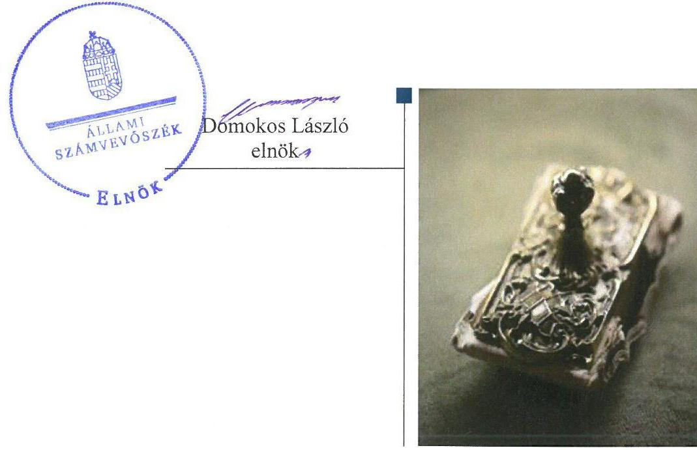

---

# AZ ELLENŐRZÉST FELÜGYELTE: 

PETŐ KRISZTINA felügyeleti vezető

## AZ ELLENŐRZÉST VEZETTE ÉS A VÉGREHAJTÁSÁÉRT FELELŐS:

HEIDINGER TIBOR ellenőrzésvezető

## A PROGRAM ÖSSZEÁLLÍTÁSÁÉRT FELELŐS:

JANIK JÓZSEF LÁSZLÓ osztályvezető

## A TÉMÁHOZ KAPCSOLÓDÓ KORÁBBI SZÁMVEVŐSZÉKI JELENTÉS:

- címe: Jelentés az Óbudai Egyetem ellenőrzéséről Az állami felsőoktatási intézmények gazdálkodásának, működésének ellenőrzése
- sorszáma: 15034

IKTATÓSZÁM: V-1348-059/2016.
TÉMASZÁM: 2096
ELLENŐRZÉS-AZONOSÍTÓ SZÁM: V075543

---

# TARTALOMJEGYZÉK 

■ ÖSSZEGZÉS ..... 5
■ AZ ELLENŐRZÉS CÉLJA ..... 6
■ AZ ELLENŐRZÉS TERÜLETE ..... 7
■ AZ ELLENŐRZÉS HÁTTERE, INDOKOLTSÁGA ..... 8
■ A JELENTÉS LÉNYEGES KÉRDÉSKÖRE ..... 9
■ ELLENŐRZÉS HATÓKÖRE ÉS MÓDSZEREI ..... 10
■ MEGÁLLAPÍTÁSOK ..... 12
■ MELLÉKLETEK ..... 15
I. sz. melléklet: Az ÁSZ 15034. számú jelentéséhez kapcsolódóan az Egyetem intézkedési tervének végrehajtása. ..... 15
II. sz. melléklet: Az ÁSZ 15034. számú jelentéséhez kapcsolódóan az EMMI intézkedési tervének végrehajtása. ..... 20
■ FÜGGELÉK: ÉSZREVÉTELEK ..... 21
■ RÖVIDÍTÉSEK JEGYZÉKE ..... 43

---

.

---

# ÖSSZEGZÉS 

Az utóellenőrzés megállapította, hogy az Óbudai Egyetem az intézkedési tervében szereplő feladatai jelentős részét határidőn túl vagy részben hajtotta végre, illetve nem hajtotta végre. Nem gondoskodtak a számviteli szabályzatok és az ellenőrzési nyomvonal aktualizálásáról, valamint a jogszabályi előírásoknak megfelelő iratkezelési szabályzat és vagyongazdálkodási terv elkészítéséről, így továbbra sem biztositották a szabályos müködés feltételeit. Fennálló hiányosság továbbra is, hogy a hallgatói költségtérítéseket nem alapozza meg önköltségszámitás. Az Emberi Erőforrások Minisztériuma - mint a fenntartói jogkör gyakorlója - az intézkedési tervében vállalt feladatát végrehajtotta.

## Az ellenőrzés társadalmi indokoltsága

Az Állami Számvevőszék stratégiájában célul tűzte ki a számvevőszéki munka hasznosulásának javítását. Ezzel összhangban ellenőrzi, hogy az ellenőrzött szervezetek megvalósították-e a korábbi ellenőrzései által feltárt hibák, hiányosságok és szabálytalanságok megszüntetése céljából kialakított intézkedési terveikben foglaltakat. A rendszeres utóellenőrzések hozzájárulnak a szükséges intézkedések tényleges végrehajtásához, ezáltal a közpénzügyek rendezettségének javulásához.

## Főbb megállapítások, következtetések

Az Óbudai Egyetem intézkedési tervében vállalt tizenegy feladata közül kettőt határidőben, négyet határidőn túl, négyet részben hajtott végre, egy feladatot nem teljesített.

Az Egyetemnél a szabályos működés alapvető feltételeit nem biztosították, mert a leltározási és leltárkészítési szabályzat, illetve az önköltségszámítás rendjére vonatkozó szabályzat átdolgozása elmaradt, továbbá nem gondoskodtak a jogszabályi előírásoknak megfelelően megalkotott iratkezelési szabályzat és vagyongazdálkodási terv elkészítéséről. Az ellenőrzési nyomvonal aktualizálásának elmaradásával az Egyetem nem tette lehetővé a működési folyamatok, a felelősségi és információs szintek, kapcsolatok, továbbá az irányítási, valamint ellenőrzési folyamatok napra kész nyomon követhetőségét és utólagos ellenőrizhetőségét. A kancellár nem gondoskodott az éves kötelezettségvállalási terv és végrehajtási ütemterv elkészítéséről és szenátusi jóváhagyásáról.

Az intézkedési tervben vállalt önköltség-számítási modellt ugyan kidolgozták, azonban az eljárás bevezetése és alkalmazása elmaradt, így a hallgatói költségtérítéseket továbbra sem alapozza meg jogszabályban előírt önköltségszámítás.

Az Emberi Erőforrások Minisztériuma az intézkedési tervében vállalt egy feladatát határidőben végrehajtotta.

---

# AZ ELLENŐRZÉS CÉLJA 

Az ellenőrzés célja annak értékelése volt, hogy a számvevőszéki jelentésben ${ }^{1}$ foglalt javaslatokat megalapozó megállapításokkal összhangban készített intézkedési tervben meghatározott feladatokat az ellenőrzött szervezet végrehajtotta-e.

---

# AZ ELLENŐRZÉS TERÜLETE 

## Óbudai Egyetem

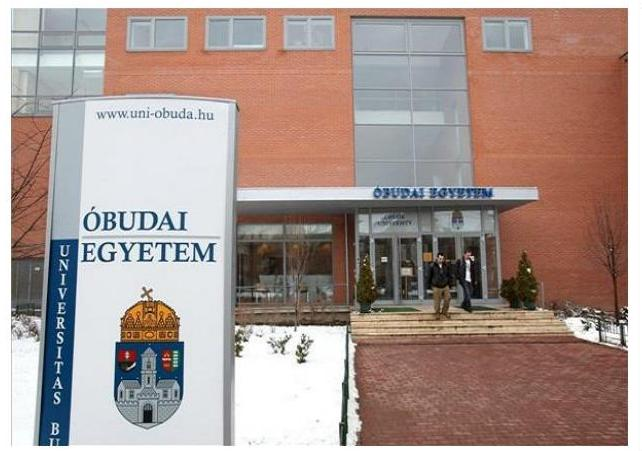

Az Óbudai Egyetem 2010. január 1-jével, a Budapesti Műszaki Főiskola jogutódjaként alakult meg Budapesten. Az Egyetem² az informatika, műszaki tudományok, természettudományok, gazdaságtudományok területén folytat képzést, a képzési területeken kutatási tevékenységet is végez.

Az Egyetem 2010. január 1-jétől egyetemi rangú intézmény, irányító szerve és fenntartója az EMMI³. Az Egyetem hallgatóinak száma a 2016/2017 őszi szemeszterben 11703 fő volt.

A jelenlegi rektor ${ }^{4}$ 2016. július 15-i hatállyal kapott megbízást az Egyetem irányítására, a jelenlegi kancellár ${ }^{5}$ 2016. november 1-je óta látja el feladatát.

Az Egyetem 2015. évi költségvetési beszámolója szerint 3483,8 millió Ft költségvetési bevételt és 9016,4 millió Ft finanszírozási bevételt ért el és 8859,2 millió Ft költségvetési kiadást teljesített. A 2015. december 31-ei mérleg szerint az Egyetem eszközei 9871,3 millió Ft-ot tettek ki, a követelések állománya 95,6 millió Ft, a kötelezettségek állománya 249,9 millió Ft volt.

Az ÁSZ ${ }^{6}$ 2014. évben ellenőrizte az Egyetem gazdálkodásának, múködésének szabályszerűségét a 2009. január 1. - 2013. december 31. közötti időszakra vonatkozóan, az erről szóló számvevőszéki jelentését 2015. március 5-én tette közzé. Az ellenőrzés célja annak megállapítása volt, hogy szabályos volt-e az állami felsőoktatási intézmény pénzügyi és vagyongazdálkodása, biztosított volt-e a vagyonnal való felelős gazdálkodás követelményének érvényesülése, jogszabályi előírásoknak megfelelően múködött-e a belső kontrollrendszer, az irányító szerv tevékenysége a jogszabályi előírásoknak megfelelt-e.

Az utóellenőrzés a számvevőszéki jelentésben a rektor és a miniszter részére megfogalmazott javaslatokat megalapozó megállapításokra készített, az ÁSZ részére megküldött intézkedési tervben foglalt feladatok megvalósításának ellenőrzésére, illetve értékelésére fókuszált.

---

# AZ ELLENŐRZÉS HÁTTERE, INDOKOLTSÁGA 

Az ÁSZ tv. ${ }^{7}$ 33. § (1) bekezdése értelmében a számvevőszéki jelentések intézkedést igénylő megállapításaihoz és javaslataihoz kapcsolódóan az ellenőrzött szervezet vezetője intézkedési tervet köteles összeállítani, és az ÁSZ részére megküldeni. Az intézkedési tervben foglaltak megvalósítását az ÁSZ tv. 33. § (7) bekezdésében foglaltak alapján - az ÁSZ utóellenőrzés keretében ellenőrizheti. Az intézkedések megvalósulásának értékelése során az ÁSZ figyelembe vette az ellenőrzött szervezet működési feltételeiben, valamint a jogszabályi előírásokban bekövetkezett változásokat.

Az intézkedési tervekben foglalt feladatok hiányos, illetve késedelmes végrehajtása, valamint megvalósításának elmaradása azt mutatja, hogy az ellenőrzések során feltárt hibák, hiányosságok és szabálytalanságok megszüntetése nem kapott kellő hangsúlyt. Ez a szabályszerű működés és a felelős vezetői magatartás vonatkozásában kockázatot hordoz. E kockázatok feltárásával az ÁSZ utóellenőrzési rendszere fokozza a fegyelmet, és igazolja, hogy a közpénzzel való szabályos gazdálkodás felelőssége elől nem lehet kitérni.

Az utóellenőrzés négy szinten hasznosulhat:
$\longrightarrow$ A társadalom szintjén az utóellenőrzés jelzi, hogy a számvevőszéki ellenőrzés megállapításainak van következménye: a hiányosságok megszüntetésére az ellenőrzött szervezet által meghatározott intézkedések végrehajtását is számon kéri az ÁSZ.
$\longrightarrow$ Az ellenőrzött terület szintjén az utóellenőrzés tájékoztatást nyújt a terület döntéshozóinak a hiányosságok kiküszöbölésének jó gyakorlatairól, ezzel lehetőséget biztosítva arra, hogy az ÁSZ ellenőrzési megállapításai, javaslatai a terület nem ellenőrzött szervezeteinek a működése során is hasznosuljanak.
$\longrightarrow$ Az ellenőrzött szervezet szintjén az utóellenőrzés feltárja, hogy a szervezet az intézkedések végrehajtásával hasznosította-e a korábbi ellenőrzési jelentésben a hiányosságok megszüntetése, illetve a kockázatok kezelése érdekében megfogalmazott javaslatokat.
$\longrightarrow$ Az ÁSZ szintjén az utóellenőrzés visszacsatolást ad az ellenőrzési jelentések hasznosulásáról, az intézkedések elmaradása vagy részleges megvalósulása a további ellenőrzésekhez kockázati jelzésként szolgál.

---

# A JELENTÉS LÉNYEGES KÉRDÉSKÖRE 

Az Egyetem és az EMMI az intézkedési terveikben foglaltakat az elöirt határidőben végrehajtották-e?

---

# ELLENŐRZÉS HATÓKÖRE ÉS MÓDSZEREI 

## Az ellenőrzés típusa

Megfelelőségi ellenőrzés.

## Az ellenőrzött időszak

Az utóellenőrzés alapját képező számvevőszéki jelentés közzétételének napjától (2015. március 5.) az ellenőrzésről szóló kiértesítő levél keltének napjáig (2017. május 17.) tartó időszak.

## Az ellenőrzés tárgya

Az ÁSZ tv. 2011. július 1-jei hatálybalépését követően a számvevőszéki jelentésben foglalt javaslatokat megalapozó megállapításokkal összhangban - az Egyetem és az EMMI által - készített intézkedési tervben foglaltak végrehajtásának ellenőrzése volt.

Az ellenőrzés kiterjedt minden olyan körülményre és adatra, amely az ÁSZ jogszabályban meghatározott feladatainak teljesítéséhez, valamint a program végrehajtása folyamán felmerült újabb összefüggések feltárásához szükséges volt.

## Az ellenőrzött szervezet

Óbudai Egyetem és az Emberi Erőforrások Minisztériuma

## Az ellenőrzés jogalapja

Az ÁSZ tv. 1. § (3) bekezdése szerint az ÁSZ általános hatáskörrel végzi a közpénzekkel és az állami és önkormányzati vagyonnal való felelős gazdálkodás ellenőrzését. Az ÁSZ tv. 33. § (7) bekezdése alapján a 33. § (1)-(2) bekezdése szerinti intézkedési tervben foglaltak megvalósítását az ÁSZ utóellenőrzés keretében ellenőrizheti.

## Az ellenőrzés módszerei

Az ÁSZ az ellenőrzést a nemzetközi standardokat irányadónak tekintve az ellenőrzési program ellenőrzési kérdései, az ellenőrzött időszakban hatályos jogszabályok, az ellenőrzés szakmai szabályok és módszertanok figyelembevételével, önálló ellenőrzés keretében végezte.

---

Az ÁSZ az ellenőrzés ideje alatt az ellenőrzött szervezettel történő kapcsolattartást az ÁSZ SZMSZ²-ének vonatkozó előírásai alapján biztosította.

Az utóellenőrzés megállapításait elsősorban az ÁSZ rendelkezésére álló, valamint az ellenőrzött szervezetektől elektronikusan bekért dokumentumok alapozták meg.

Az ellenőrzési bizonyítékként felhasználható adatforrások közé tartoztak egyrészt a szakmai programban felsorolt adatforrások, másrészt minden - az ellenőrzés folyamán feltárt, az ellenőrzés szempontjából információt tartalmazó - dokumentum.

Az intézkedési tervben előírt feladatokat azok végrehajtása szempontjából az alábbiak szerint értékelte az ÁSZ:
$\longrightarrow$ „határidőben végrehajtott" a feladat, ha a teljesítés dokumentáltan, az intézkedési tervben előírt határidőben és tartalommal megtörtént;
$\longrightarrow$ „határidőn túl végrehajtott" a feladat, ha annak teljesítése az intézkedési tervben meghatározott módon, de az előírt határidőn túl történt meg;
$\longrightarrow$ „részben végrehajtott" a feladat, ha végrehajtása teljes körűen az intézkedési tervben előírt módon nem történt meg;
$\longrightarrow$ „nem végrehajtott" a feladat, ha a végrehajtás nem történt meg, vagy amennyiben a teljesítést nem dokumentálták;
$\longrightarrow$ „okafogyottá vált" a feladat, ha végrehajtására - meghatározott esemény bekövetkezése, továbbá külső körülmény, a működést érintő feltétel változása miatt - már nincs szükség, illetve lehetőség, és egyértelműen megállapítható, hogy az intézkedést szükségessé tevő körülmény a jövőben nem fordulhat elő;
$\longrightarrow$ „nem időszerű" az a feladat, amelynek ellenőrzési időszakon belüli végrehajtására azért nem került (kerülhetett) sor, mert az intézkedés alapjául szolgáló esemény nem következett be, de annak jövőbeni előfordulása lehetséges, a végrehajtása nem volt esedékes, vagy a végrehajtás határideje még nem járt le.
Az ellenőrzés lefolytatásához az ellenőrzött szervezet a tanúsítványok elektronikus kitöltésével, valamint az ÁSZ által kért dokumentumok elektronikus megküldésével szolgáltatott adatokat, amelyek valódiságát és teljes körűségét az ellenőrzött szervezet vezetője által tett teljességi és hitelességi nyilatkozat igazolta. Az így rendelkezésre bocsátott adatok, információk kontrollja az ellenőrzés keretében megtörtént.

---

# MEGÁLLAPÍTÁSOK 

## Az Egyetem és az EMMI az intézkedési terveikben foglaltakat az előírt határidőben végrehajtották-e?

Összegző megállapítás

Az Egyetem az intézkedési tervében meghatározott tizenegy feladatból kettőt határidőben, négyet határidőn túl, négyet részben hajtott végre, egy feladatot nem hajtott végre. Az EMMI az intézkedési tervében meghatározott egy feladatát határidőben végrehajtotta.

A számvevőszéki jelentés a rektor részére hét, a miniszter ${ }^{9}$ részére egy javaslatot fogalmazott meg.

A rektor és a kancellár 11 feladatból álló intézkedési tervet állított össze a javaslatok hasznosítására.

A miniszter az intézkedési tervében egy feladatot határozott meg a javaslat hasznosítására.

Az Egyetem intézkedési tervében meghatározott feladatokat, határidőket, a feladatok végrehajtásáért felelős személyt és a feladatok végrehajtását az I. számú melléklet, az EMMI intézkedési tervében meghatározott feladat végrehajtását a II. számú melléklet mutatja be.

## EGYETEM:

Az Egyetem az intézkedési tervében meghatározott tizenegy feladatból kettőt határidőben, négyet határidőn túl, négyet részben hajtott végre, egy feladatot nem hajtott végre.

A kancellár az intézkedési terv végrehajtásáról a Bkr. ${ }^{10} 14 . \S$ (1) bekezdésében előírtaknak megfelelően nyilvántartást vezetett.

Az Egyetem intézkedési tervében meghatározott feladatok végrehajtásának értékelési kategóriák szerinti megoszlását az 1. ábra szemlélteti.

1. ábra
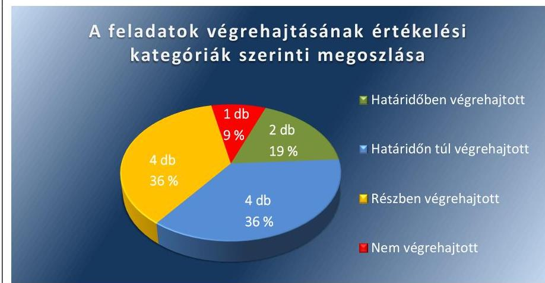

---

# HATÁRIDŐBEN VÉGREHAJTOTT feladatok: 

1. (2.1.) A gazdasági igazgató határidőben gondoskodott arról, hogy a hallgatói költségtérítések befizetése 2014 decemberétől a Kincstár ${ }^{11}$-nál vezetett gyűjtőszámlára történjen. A Pénzkezelési szabályzatban ${ }^{12}$ újraszabályozták a Neptun ${ }^{13}$ gyűjtőszámlához kapcsolódó be- és kifizetések, valamint az egyeztetések rendjét.
2. (2.4.a) A 2011. évi közbeszerzési szabálytalanság kapcsán feltárt munkajogi felelősség kivizsgálására irányuló eljárás megindításáról határidőben gondoskodtak. Az Egyetem belső ellenőrzési vizsgálata az érintett munkakörökben időközben bekövetkezett személyi változások miatt személyi felelősség megállapítását nem kezdeményezte.

## HATÁRIDŐN TÚL VÉGREHAJTOTT feladatok:

3. (1.2.b) A kancellár határidőn túl gondoskodott a belső ellenőrzés szakmai megerősítéséről, mert a gyakorlattal és regisztrációval rendelkező új belső ellenőr kinevezésére az intézkedési tervben meghatározott 2015. szeptember 30-ai határidő után 2015. október 12-én került sor.
4. (2.) A jogi igazgató és a kancellár határidőn túl gondoskodott a gazdálkodási jogkörök gyakorlásának újraszabályozásáról, mert a Gazdálkodási szabályzat ${ }^{14}$ és a Kötelezettségvállalási szabályzat ${ }^{15}$ hatályba léptetése az intézkedési tervben meghatározott 2015. szeptember 30-ai határidőn túl történt meg.
5. (2.4.b) A belső ellenőri vizsgálat megállapítása szerint az irodaszerek - közbeszerzési törvényt sértő módon való - beszerzéséért felelős munkavállalók munkajogilag nem vonhatók felelősségre, mert a munkaviszonyuk időközben megszűnt. Az Egyetem a közbeszerzést is érintő Beszerzési szabályzatát ${ }^{16}$ - a 2015. szeptember 30-i határidőn túl - a 2015. október 19-i ülésén tárgyalta meg és fogadta el.
6. (3.b) A belső ellenőrzési vezető a 2015. december 31-i határidőn túl gondoskodott az intézkedési terv végrehajtására vonatkozó belső ellenőrzési vizsgálat lefolytatásáról. A vizsgálatot az EMMI Belső Ellenőrzési Főosztálya 2016. januári 8-án kelt levelét követően kezdték el és a beszámoló elkészítése során végezték el.

## RÉSZBEN VÉGREHAJTOTT feladatok:

7. (1.1.) A jogi igazgató és a gazdasági igazgató nem gondoskodott teljes körűen a kontrollkörnyezet kialakításáról. A leltározási és leltárkészítési szabályzat és az önköltségszámítás rendjére vonatkozó szabályzat átdolgozása, hatályba helyezése nem történt meg. Az ellenőrzési nyomvonal nem került aktualizálásra a Bkr. 6. § (3) bekezdésében előírtak ellenére.
8. (1.2.a) A Szenátus ${ }^{17}$ elfogadta a 2015. január 20. napjától hatályos SZMSZ ${ }^{18}$-t, melynek értelmében a Gazdasági Igazgatóság szervezetén belül megvalósult a Kontrolling, Pénzügyi Tervezési és Vagyongazdálkodási osztály létrehozása, működési feltételeinek biztosítása. A kötelezettségvállalás, utalványozás, pénzügyi ellenjegyzés

---

teljes folyamatának szabályozását, a gazdálkodási jogkörök gyakorlásának módját, a bizonylatok nyilvántartásának rendjét az Egyetem a Kötelezettségvállalási szabályzatában az intézkedési tervben vállalt szeptember 30-ai határidőn túl újraszabályozta, azonban a szabályzat hiányos volt, mert a 4. számú mellékletet (utalványrendelet mintája) nem tartalmazta.
9. (2.2.) A hallgatói költségtérítések önköltségszámítással történő megalapozásához a hatályos jogszabályoknak megfelelő modell kidolgozása, próbaszámítása (futtatása) a 2015. évi önköltségszámítást megalapozó mutatókkal a villamosmérnök alapképzési szak, nappali tagozata esetében határidőn túl megtörtént, azonban az új költségtérítések e modellre épített kialakítása, rendszerének bevezetése az Egyetemen nem valósult meg.
10. (2.3.) Az Egyetem határidőn belül elfogadott Pénzkezelési szabályzata rendelkezett a számviteli bizonylatok megőrzési kötelezettségéről. Az elszámolási, eljárási és bizonylati rend kialakítását a jogi igazgató és a gazdasági igazgató határidőn túl hajtotta végre. Az Egyetem az Iratkezelési szabályzat és irattári terv ${ }^{19}$ kiadásához nem kérte meg az illetékes közlevéltár egyetértését, amelyre tekintettel nem rendelkezett az Ltv. ${ }^{20} 10 . \S$ (1) bekezdés a) pontjának megfelelően megalkotott egyedi iratkezelési szabályzattal. Az Egyetem oktatási és igazgatásszervezési területein dolgozók továbbképzéséről - képzés elrendelése, lefolytatása, teljesítésének igazolása nem gondoskodtak.

# NEM VÉGREHAJTOTT feladat: 

11. (3.a) A fenntartó egyetértésének hiányában az Egyetem nem rendelkezett az Nftv. ${ }^{21}$ 12. § (3) bekezdés gb) pontja előírásainak megfelelően megalkotott vagyongazdálkodási tervvel. Az intézkedési tervben vállalt éves kötelezettségvállalási terv és a végrehajtási ütemterv nem készült el.

## EMMI:

Az EMMI az intézkedési tervében meghatározott egy feladatát határidőben végrehajtotta.

Az emberi erőforrások minisztere az intézkedési terv végrehajtásáról a Bkr. 14. § (1) bekezdésében előírtaknak megfelelően nyilvántartást vezetett.

## HATÁRIDŐBEN VÉGREHAJTOTT feladat:

1. Az EMMI minisztere határidőben intézkedett a kincstári körön kívüli számlavezetés miatt a szabálytalan pénzkezeléshez kapcsolódóan a munkajogi felelősség kivizsgálásáról. A munkajogi felelősséggel kapcsolatos intézkedés azonban okafogyottá vált, mert a jelenlegi rektor a korábbi számvevőszéki ellenőrzés után került kinevezésre.

---

# MELLÉKLETEK

I. SZ. MELLÉKLET: AZ ÁSZ 15034. SZÁMÚ JELENTÉSÉHEZ KAPCSOLÓDÓAN AZ EGYETEM INTÉZKEDÉSI TERVÉNEK VÉGREHAJTÁSA

|  5
SZÁSZÁM | Az intézkedési tervben meghatározott feladat | Az intézkedési tervben meghatározott határidő | Az intézkedési tervben meghatározott feladat végrehajtásának felelőse | Az intézkedési tervben meghatározott feladat végrehajtása  |
| --- | --- | --- | --- | --- |
|   | 1. | 2. | 3. | 4.  |
|  Határidőben végrehajtott feladatok |  |  |  |   |
|  1. | 2.1. „Magyar Államkincstárnál a gyüjtőszámla megnyitása 2014. november 14-én megtörtént, a hallgatói költségtérítések befizetése 2014 decemberétől a Kincstárnál vezetett gyüjtőszámlán történik. Át kell tekinteni, s ha szükséges, újra kell szabályozni pénzkezelési szabályzatot, a befizetések jogszabályoknak megfelelő kezelését." | az intézkedés megtörtént | oktatási föigazgató, gazdasági igazgató | A gazdasági igazgató határidőben gondoskodott a Kincstárnál a gyüjtőszámla megnyitásáról. A Kincstár értesítő levelében közölte, hogy az Egyetem mint számlatulajdonos számára megnyitotta a Neptun hallgatói költségtérítések gyüjtőszámlát. Az Egyetem a 2015. szeptember 29-étől hatályos Pénzkezelési szabályzatában újraszabályozta a gyüjtőszámlához kapcsolódó be- és kifizetések, valamint az egyeztetések rendjét.  |
|  2. | 2.4. a) „Munkajogi felelősség kivizsgálására irányuló eljárás megindítása a vizsgálat során feltárt közbeszerzési szabálytalanság tekintetében." | 2015. április 30. | jogi igazgató | A 2011. évi közbeszerzési szabálytalanság miatt kezdeményezett munkajogi felelősség kivizsgálásának megindításáról határidőben gondoskodtak. A kancellár az OE-KA-354/2015. számú, 2015. április 29-én kelt levelében felkérte a belső ellenőrt a 2011. évi irodaszer beszerzésével kapcsolatos körülmények tisztázására, a szükséges vizsgálat lefolytatására és annak eredményéről tájékoztatás adására. Az ellenőrzés lefolytatására a kancellár az OE-KA361/2015. számú, 2015. május 5-én kelt megbízólevelet adta ki a belső ellenőr részére. Az Egyetem belső ellenőrzési vizsgálata az érintett munkakörökben időközben bekövetkezett személyi változások miatt személyi felelősség megállapítását nem kezdeményezte.  |
|  Határidőn túl végrehajtott feladatok |  |  |  |   |
|  3. | 1.2. b) „A kontrolltevékenység hiányosságainak kiküszöbölése részeként gondoskodni kell a belső ellenőrzés szakmai megerősítéséről." | 2015. szeptember 30. | kancellár | A kancellár határidőn túl gondoskodott a belső ellenőrzés szakmai megerősítéséről, mert a gyakorlattal és regisztrációval rendelkező új belső ellenőr kinevezésére 2015. október 12-én került sor.  |
|  4. | 2. „A gazdálkodási jogkörök gyakorlásának újra szabályozása az egyetemi belső szabályzatok átdolgozásával, figyelemmel a hatályos jogszabályi | 2015. szeptember 30. | jogi igazgató, kancellár | A jogi igazgató és a kancellár határidőn túl gondoskodott a gazdálkodási jogkörök gyakorlásának újraszabályozásáról, a folyamatba épített, illetve a külső kontrollrendszer megerősítéséről. Az Egyetem Szenátusa a Gazdálkodási szabályzatot az SZ-CXIII/193/2015. határozatával  |

---

|  5. | Az intézkedési tervben meghatározott feladat | Az intézkedési tervben meghatározott határidő | Az intézkedési tervben meghatározott feladat végrehajtásának felelőse | Az intézkedési tervben meghatározott feladat végrehajtása  |
| --- | --- | --- | --- | --- |
|   | 1. | 2. | 3. | 4.  |
|   | előírásokra, fokozott figyelemmel rendszeres személyi juttatások, a külső személyi juttatások, a dologi és felhalmozásí kiadások, az ellátottak juttatásai előirányzatainak felhasználására, valamint az intézményi müködési bevételek beszedésére. Folyamatba épített, illetve külső kontrollrendszer megerősítése / kialakítása a törvényekben, illetve a belső szabályzatokban foglaltak betartásának, betartatásának folyamatos monitorozása érdekében." |  |  | 2015. október 19-én, a Belső ellenőrzési kézikönyvet22 az SZ-CXIV/215/2015. határozatával, a Szabálytalanságok, közérdekű bejelentések kezelésének rendjét23 az SZ-CXIV/216/2015. határozatával, a Kockázatkezelési szabályzatot24 az SZ-CXIV/217/2015. határozatával 2015. november 16-án, a Kötelezettségvállalási szabályzatot az SZ-CXIV/197/2016. határozatával 2016. október 17-én fogadta el. A jogszabályi előírásokra figyelemmel átdolgozott szabályzatokat a Szenátus az intézkedési tervben meghatározott határidőn túl fogadta el.  |
|  5. | 2.4. b) „A vizsgálat eredményének ismeretében a szükséges intézkedések végrehajtása, a közbeszerzési szabályozást is érintő beszerzési szabályzat elkészítése a hatályos jogszabályok és rendelkezések figyelembe vételével. A Szenátusi elfogadást követően a szabályozások életbe léptetése." | 2015. szeptember 30. | operatív igazgató | Határidőben végrehajtott feladat:
A 2011. évi közbeszerzési szabálytalanság kapcsán a belső ellenőr az OE-KA-473/2015. számú, 2015. június 1-jén kelt ellenőrzési jelentésében rögzítette, hogy az irodaszerek - közbeszerzési törvényt sértő módon történő - beszerzéséért felelős munkavállalók munkajogilag nem vonhatók felelősségre, mert a munkaviszonyuk időközben megszűnt.
Határidőn túl végrehajtott feladat:
Az Egyetem Szenátusa a közbeszerzést is érintő Beszerzési szabályzatot az SZ-CXIII/194/2015. számú határozatával 2015. október 19-én fogadta el, amely a következő napon hatályba lépett. A Beszerzési szabályzat 17-20. §-ai tartalmazták a közbeszerzési eljárások minősítésére, megindítására, lefolytatására vonatkozó rendelkezéseket. A Beszerzési szabályzat 4. sz. mellékletében rögzítették a közbeszerzési folyamatábrát.  |
|  6. | 3. b) „Az intézkedési tervben érintett intézkedések ellenőrzése belső ellenőrzési vizsgálat keretében." | 2015. december 31. | belső ellenőrzési vezető | A belső ellenőrzési vezető határidőn túl gondoskodott a feladat végrehajtásáról, mert az intézkedési terv végrehajtásával kapcsolatos belső ellenőrzést határidőn túl folytatták le. A vizsgálatot az EMMI Belső Ellenőrzési Főosztály 2016. januári 8-i levelét követően kezdték el és a beszámoló elkészítése során végezték el. A kancellár az OE-KA-109/2/2016. számú, 2016. január 27-én kelt levelében tájékoztatta az EMMI Belső Ellenőrzési Főosztály vezetőjét a 2016. január 19-én véget ért belső ellenőrzés megállapításairól.  |

---

|  Sorszám | Az intézkedési tervben meghatározott feladat | Az intézkedési tervben meghatározott határidő | Az intézkedési tervben meghatározott feladat végrehajtásának felelőse | Az intézkedési tervben meghatározott feladat végrehajtása  |
| --- | --- | --- | --- | --- |
|   | 1. | 2. | 3. | 4.  |
|   |  |  | Részben végrehajtott feladatok |   |
|  7. | 1.1. „Az Óbudai Egyetem belső kontrollrendszert érintő szabályzatainak átdolgozása, aktualizálása a hatályos jogszabályok alkalmazásával. A Szenátusi elfogadást követően a szabályozások életbe léptetése." | 2015. szeptember 30. | jogi igazgató, gazdasági igazgató | A jogi igazgató és a gazdasági igazgató a feladatot részben hajtotta végre, mert nem gondoskodtak teljes körűen a kontrollkörnyezet kialakításáról. A szabályzatok hatályos jogszabályi előírásoknak megfelelő átdolgozását, aktualizálását nem teljes körűen végezték el.
Határidőben végrehajtott feladat:
A Számviteli politika ${ }^{25}$, a Számlarend ${ }^{26}$, az Értékelési szabályzat ${ }^{27}$ és a Pénzkezelési szabályzat átdolgozása, aktualizálása, Szenátus általi elfogadása és hatályba léptetése határidőben megtörtént. A szabályzatok hatályba léptetésének időpontját a rövidítések jegyzéke tartalmazza. Határidőn túl végrehajtott feladat:
A Gazdálkodási szabályzat, a Kapacitáskihasználási szabályzat ${ }^{28}$, a Selejtezési és hasznosítási szabályzat ${ }^{29}$, a Vagyongazdálkodási szabályzat, a Belső ellenőrzési kézikönyv, a Szabálytalanságok, közérdekű bejelentések kezelésének rendjéről szóló szabályzat, a Kockázatkezelési szabályzat, a Szellemi tulajdon-kezelési szabályzat és a Pályázati szabályzat átdolgozása, aktualizálása, Szenátus általi elfogadása és hatályba léptetése 2015. szeptember 30. után történt meg. A szabályzatok hatályba léptetésének időpontját a rövidítések jegyzéke tartalmazza.
Nem végrehajtott feladat:
A leltározási és leltárkészítési szabályzat és az önköltségszámítás rendjére vonatkozó szabályzat átdolgozása, hatályba helyezése nem történt meg. Az ellenőrzési nyomvonal nem került aktualizálásra a Bkr. 6. § (3) bekezdésében előírtak ellenére.  |
|  8. | 1.2. a) „Újra kell szabályozni a gazdálkodási jogkörök gyakorlásának módját, a kötelezettségvállalás, utalványozás, ellenjegyzés teljes folyamatát, ki kell alakítani a folyamat során keletkező bizonylatok tartalmi és formai elemeit, nyilvántartásuk rendjét. Az újraszabályozás során különös figyelmet kell szentelni a folyamatba épített, il- | 2015. szeptember 30. | belső ellenőr, gazdasági igazgató, jogi igazgató | Határidőben végrehajtott feladat:
A Kontrolling, Pénzügyi Tervezési és Vagyongazdálkodási Osztály létrehozása és működési feltételeinek biztosítása a Gazdasági Igazgatóság szervezetén belül, az SZ-CIII/3/2015. számú szenátusi határozattal 2015. január 19-én elfogadott SZMSZ alapján megtörtént.
Határidőn túl végrehajtott feladat:
A gazdálkodási jogkörök gyakorlása módjának szabályozását a Szenátus SZ-CXIII/193/2015. számú határozatával, 2015. október 19-én elfogadott Gazdálkodási szabályzat tartalmazta. A kötelezettségvállalás, utalványozás, pénzügyi ellenjegyzés teljes folyamatának szabályozását  |

---

|  9. | Az intézkedési tervben meghatározott feladat | Az intézkedési tervben meghatározott határidő | Az intézkedési tervben meghatározott feladat végrehajtásának felelőse | Az intézkedési tervben meghatározott feladat végrehajtása  |
| --- | --- | --- | --- | --- |
|   | 1. | 2. | 3. | 4.  |
|   | letve külső kontrollrendszer kialakítására, a szabályok betartásának folyamatos monitorozása érdekében. Valamennyi vezetői területen felül kell vizsgálni a kontrolltevékenység tényleges, tartalom szerinti alakulását. A jogszabályoknak megfelelő belső kontrollrendszer kialakítása érdekében a Gazdasági Igazgatóság szervezetén belül a Kontrolling, Pénzügyi Tervezési és Vagyongazdálkodási Osztály létrehozása, müködési feltételeinek biztosítása." |  |  | a Szenátus SZ-CXIV/197/2016. számú határozatával, 2016. október 17-én elfogadott Kötelezettségvállalási szabályzat tartalmazta.
Nem végrehajtott feladat:
A bizonylatok tartalmi és formai elemeinek szabályozása nem történt meg teljes körűen, mert a határidőn túl elkészített Kötelezettségvállalási szabályzat hiányos volt, mert nem tartalmazta a szabályzatban hivatkozott 4. sz. mellékletet (az utalványrendelet mintáját).  |
|  9. | 2.2. „A hallgatói költségtérítések önköltségszámítással történő megalapozásához a hatályos jogszabályoknak megfelelő modell kidolgozása, futtatása a 2015. évi önköltségszámítást megalapozó mutatókkal, s az új költségtérítések e modellre épített kialakítása, rendszerének bevezetése." | 2015. december 31. | kancellár | Határidőn túl végrehajtott feladat:
Az Égyetem villamosmérnök alapképzési szak nappali munkarendjére, utókalkuláció alapján próbaszámítást végeztek az önköltségre vonatkozóan. A próbaszámításban a 2016. június 10-én kelt kimutatásban részletezett 2015. évi óraszámok és óradíjak, valamint a 2015. évben ténylegesen felmerült kari szintű közvetlen és közvetett költségeket, továbbá az egyetemi szintű közvetett költségeket vették figyelembe. A próbaszámításhoz kapcsolódóan a gazdasági igazgató 2016. szeptember 20-án szöveges magyarázatot adott ki „Az önköltség számítás elvi módszerének szöveges magyarázata" címmel. A modell kidolgozása, próbaszámítása (futtatása) határidőn túl megvalósult.
Nem végrehajtott feladat:
Az új költségtérítési rendszer - a létrehozott önköltség-számítási modellre épített - kialakítása, bevezetése, alkalmazása nem valósult meg.  |
|  10. | 2.3. „Az ügyviteli tevékenység (iktatás, ügymenet, irattárazás) áttekintése és újraszabályozása, valamint utasítás kiadása a bizonylatok jogszabályi előírásoknak megfelelő megőrzésről, az érintett alkalmazotti körben továbbképzés elrendelése és | 2015. szeptember 30. | jogi igazgató, gazdasági igazgató | Határidőben végrehajtott feladat:
A Gazdálkodási szabályzat IV. sz. mellékletét képező Pénzkezelési szabályzat az SZ-CXII/182/2015. számú, 2015. szeptember 28-ai szenátusi határozattal került elfogadásra, így határidőn belül megtörtént a feladat végrehajtása. A Pénzkezelési szabályzat 30. § (6) bekezdése írja elő, hogy a bizonylatokat a Számv. tv. előírásainak megfelelően 8 évig meg kell őrizni.  |

---

|  10
Sorszám | Az intézkedési tervben meghatározott
feladat | Az intézkedési terv-
ben meghatározott
határidő | Az intézkedési
tervben megha-
tározott feladat
végrehajtásának
felelőse | Az intézkedési tervben meghatározott feladat végrehajtása  |
| --- | --- | --- | --- | --- |
|   |  | 1 | 2 | 3  |
|   | lefolytatása a szabályozásoknak megfelelő eljárás érvényesítése érdekében. A költségvetési forrása történő elszámolás, projektek - beleértve a pályázati finanszírozásukat - kivitelezési folyamatainak, bizonylati rendjének az áttekintése, az előírásoknak megfelelő eljárásrendek biztosítása, és a szabályok betartása ellenőrzési rendszerének kialakítása." |  |  | Határidőn túl végrehajtott feladat:
A költségvetési forrása történő elszámolás, a projektek kivitelezési folyamatainak, eljárási és bizonylati rendjének kialakítását az Egyetem a Szenátus által - a 2015. szeptember 30-ai határidő után - elfogadott Szellemi tulajdon-kezelési szabályzatban, Pályázati szabályzatban és Kapacitáskihasználási szabályzatban rögzítette. A szabályzatok hatályba léptetésének időpontját a rövidítések jegyzéke tartalmazza.
Nem végrehajtott feladat:
Az Egyetem az iratkezelési szabályzat és irattári terv kiadásához nem kérte meg az illetékes közlevéltár egyetértését, amelyre tekintettel nem rendelkezett az Ltv. 10. § (1) bekezdés a) pontjának megfelelően megalkotott egyedi iratkezelési szabályzattal.
Az Egyetem oktatási és igazgatásszervezési területein dolgozók továbbképzését - képzés elrendelése, lefolytatása, teljesítésének igazolása nem hajtották végre.  |
|   |  |  | Nem végrehajtott feladat |   |
|  11. | 3. a) „A vagyongazdálkodási terv, az éves kötelezettségvállalási terv és a végrehajtási ütemterv elkészítése a hatályos jogszabályi előírásoknak megfelelően, ezek szenátusi jóváhagyása." | 2015. szeptember 30. | kancellár | A fenntartó egyetértésének hiányában az Egyetem nem rendelkezett az Nftv. 12. § (3) bekezdés gb) pontja előírásainak megfelelően megalkotott vagyongazdálkodási tervvel. A kancellár nem gondoskodott az intézkedési terv feladatban vállalt éves kötelezettségvállalási terv és végrehajtási ütemterv elkészítéséről.  |

Forrás: ÁSZ által készített táblázat

---

# II. SZ. MELLÉKLET: AZ ÁSZ 15034. SZÁMÚ JELENTÉSÉHEZ KAPCSOLÓDÓAN AZ EMMI INTÉZKEDÉSI TERVÉNEK VÉGREHAJTÁSA

|  Sorszám | Az intézkedési tervben meghatározott feladat | Az intézkedési tervben meghatározott határidő | Az intézkedési tervben meghatározott feladat végrehajtásának felelőse | Az intézkedési tervben meghatározott feladat végrehajtása  |
| --- | --- | --- | --- | --- |
|   | 1. | 2. | 3. | 4.  |
|  Határidőben végrehajtott feladatok |  |  |  |   |
|  1. | „A kincstári körön kívüli számlavezetés miatt megállapított szabálytalan pénzkezeléshez kapcsolódó munkajogi felelősség kivizsgálása, a szükséges intézkedések kezdeményezése." | 2015. december 31. | EMMI, Belső Ellenőrzési Főosztály | Az EMMI Belső Ellenőrzési Főosztály a 37395/2015/ELL számú, 2015. július 10-én kelt feljegyzésében tájékoztatta a közigazgatási államtitkárt, az ÁSZ által a felsőoktatási intézményeknél feltárt szabálytalanságok tekintetében, a munkajogi felelősséggel kapcsolatos körülmények kivizsgálásának eredményéről. Az EMMI Belső Ellenőrzési Főosztály felmérte az ÁSZ által vizsgált időszakban, illetve azt követően a rektor személyében történt változásokat és megállapította, hogy az Óbudai Egyetem esetében a munkajogi felelősséggel kapcsolatos intézkedés okafogyottá vált, tekintettel arra, hogy a jelenlegi rektor a korábbi számvevőszéki ellenőrzés után került kinevezésre. A közigazgatási államtitkár a feljegyzésben foglaltakat 2015. július 14-én elfogadta.  |

---

# FÜGGELÉK: ÉSZREVÉTELEK 

A jelentéstervezetet a Számvevőszék 15 napos észrevételezésre megküldte az ellenőrzött szervezetek vezetőinek az ÁSZ tv. 29. §* (1) bekezdése előírásának megfelelően.
Az Óbudai Egyetem kancellárja és rektora az ellenőrzés megállapításaira írásban észrevételt tett.

Az Emberi Erőforrások Minisztériuma részéről észrevétel nem érkezett.
A függelék mellékletek nélkül tartalmazza az Óbudai Egyetem kancellárja és rektora észrevételeit, illetve az el nem fogadott észrevételek elutasításának indoklását.

[^0]
[^0]:    * 29. § (1) Az Állami Számvevőszék az ellenőrzési megállapításait megküldi az ellenőrzött szervezet vezetőjének vagy az általa megbízott személynek, és annak, akinek személyes felelősségét állapította meg.
    (2) Az ellenőrzött szervezet vezetője és a felelősként megjelölt személy az ellenőrzés megállapításaira tizenöt napon belül írásban észrevételt tehet.
    (3) Az Állami Számvevőszék az észrevételre a beérkezésétől számított harminc napon belül írásban válaszol. A figyelembe nem vett észrevételeket köteles a jelentésben feltüntetni, és megindokolni, hogy azokat miért nem fogadta el.

---

Iktatószám: OE-KA/555-4/2017
OE-RH/419-3/2017
Hivatkozási szám: V-1348-049/2016.
V-1348-050/2016.
Úgyintéző: Juhos Éva

# Domokos László úr 

elnök

## Állami Számvevőszék

Tisztelt Elnök Úr!
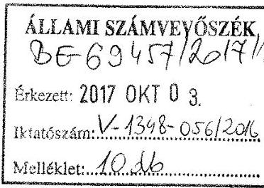

Köszönettel megkaptam az „Utóellenőrzések - Az állami felsőoktatási intézmények gazdálkodásának, müködésének ellenőrzéséről készült jelentések utóellenőrzése - Óbudai Egyetem" címủ ellenőrzésről készült, V-1348-049/2016. iktatószámú, számvevőszéki jelentéstervezetüket. Az ÁSZ tv. 29. § (2) bekezdése alapján, a megadott határidőn belül az ellenőrzési jelentéstervezetben szereplő megállapításokra az alábbi észrevételeket teszem:

1. 5. oldal Összegzés 1. mondat részletet: „... az intézkedési tervben szereplő feladatai jelentős részét határidőn túl vagy részben hajtotta végre, illetve nem hajtotta végre", a jelen levélhez csatolt dokumentumok alapján kérem felülvizsgálni és az alábbiak szerint módosítani: „ ... az intézkedési tervben szereplő feladatai jelentős részét végrehajtotta", hiszen a tizenegy feladat közül csupán kettő nem teljesült maradéktalanul.
2. 5. oldal Összegzés 2. mondat részletet: „...valamint a jogszabályi elölrásoknak megfelelő iratkezelési szabályzat és vagyongazdálkodási terv elkészitéséről, igy továbbra sem biztosították a szabályos müködés feltételeit." a jelen levélhez csatolt dokumentumok alapján kérem törölni, mert az intézkedési tervben vállaltak teljesültek.
3. 5. oldal Főbb megállapítások, következtetések 1. mondatát: „...tizenegy feladata közül kettőt határidőben, négyet határidőn túl, négyet részben hajtott végre, egy feladatot nem teljesitett." a csatolt dokumentumok alapján kérem felülvizsgálni és az alábbiak szerint módosítani: „,...tizenegy feladata közül öt határidőben, négyet határidőn túl, kettőt részben hajtott végre. "
4. 5. oldal Főbb megállapítások, következtetések 2. bekezdés 1. mondatát: : „Az Egyetemnél a szabályos müködés alapvető feltételeit nem biztosították, mert a leltározási és leltárkészitési szabályzat, ... átdolgozása elmaradt," tekintettel arra, hogy a jogszabályi követelményeknek eleget téve 2016. évben az Egyetem elvégezte a leltárfelvételi kötelezettségét, ezzel biztosította az Egyetem alapvető működési feltételeit kérem felülvizsgálni és módosítani. A feladat végrehajtásának igazolására csatoltan megküldöm a Leltárnyitó értekezlet emlékeztetőjét, jelenléti ívet és a leltározási ütemtervet (1. számú melléklet). A szabályzat módosítását a gazdasági igazgató személyében történt nagyfokú
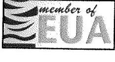

1034 Budapest, Bécsi út 96/B. www.uni-obuda.hu
Tel.: (06-1) 666-5856 juhos.eva@ka.uni-obuda.hu
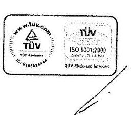

---

változások akadályozták. A csatolt személyi változásokat bemutató táblázatban (2. számú melléklet) is jól látható, hogy 2015. január 1-ét követően 2017. május 17-ig hat gazdasági igazgatója volt az Egyetemnek, emellett változott a kancellár személye és ezáltal az Egyetem struktúrája is. A folyamatos személyi változások miatt a szabályos müködés biztosítása a gyakorlatban megvalósult, a szabályozás módosítása folyamatosan zajlik.
5. 5. oldal Főbb megállapítások, következtetések 2. bekezdés 1. mondatát: „Az Egyetemnél a szabályos müködés alapvető feltételeit nem biztosították, mert ..., továbbá nem gondoskodtak a jogszabályi elöírásoknak megfelelően megalkotott iratkezelési szabályzat és vagyongazdálkodási terv elkészitéséről." kérem törölni, mert jelen levelemhez csatolom a jogszabályi kötelezettség teljesítését igazoló dokumentumokat:

- 2015. december 15-én kelt Magyar Nemzeti Levéltárnak írt levelünket, melyre válaszul 2016. május 12-én kelt 07/2-2/2016. iktatószámú levélben a Levéltár a 2016. január 1-től hatályos iratkezelési szabályzatunk kiadásával egyetért. Továbbá csatolom a 2017. január 1-től hatályos iratkezelési szabályzat kiadásához érkezett, 07/9-3/2017. iktatószámú egyetértő levelet. A csatolt (3. számú melléklet) Magyar Nemzeti Levéltár által kiadott egyetértő levelek alapján megállapítható, hogy az Egyetem eleget tett jogszabályi kötelezettségének.
- A 2016. évi vagyongazdálkodási tervet az Egyetem a jogszabályi előírásoknak megfelelően megküldte az EMMI illetékes szakterületének, ennek igazolására csatoltam megküldöm az OE-KA-925/2016. iktatószámú, 2016. május 24-én kelt Dr. Palkovics László államtitkár úrnak írt levelünket illetve az azt követő levelezést. A 2017. évi vagyongazdálkodási terv megküldése elektronikus formában történt 2017. április 4-én, ennek dokumentumait szintén csatolom. A csatolt dokumentumok (4. számú melléklet) alapján megállapítható, hogy az Egyetem eleget tett jogszabályi kötelezettségének.

6. 5. oldal Főbb megállapítások, következtetések 2. bekezdés 2. mondata vonatkozásában tájékoztatom, hogy az ellenőrzési nyomvonalak elkészítésre kijelölt határidő, az Állami Számvevőszék 2015. évi zárszámadás vizsgálathoz kapcsoló intézkedési terv szerint 2017. december 31. (5. számú melléklet). Az ellenőrzési nyomvonalak aktualizálását a 2015-2017. közötti időszakban történt vezetői személyi változások illetve az Egyetem Szervezeti és Müködési Rend 16 alkalommal történő változása akadályozta. Kérem az ellenőrzési nyomvonalak hiányára vonatkozó szövegrész pontosítását, módosítását.
7. 5. oldal Főbb megállapítások, következtetések utolsó mondatát: „A kancellár nem gondoskodott az éves kötelezettségvállalási terv és végrehajtási ütemterv elkészitéséről és szenàtusi jóváhagyásáról." kérem törölni, mert az intézkedési tervben szereplő feladat határidejét megelőzően az arra vonatkozó jogszabályi kötelezettség, a nemzeti felsőoktatásról szóló 2011. évi CCIV. törvény 74. § (3) bekezdés 2014. július 24-én hatályba lépett módosításával megszűnt, így a feladat végrehajtása okafogyottá vált.

---

8. 8. oldal 2. bekezdés alábbi mondatrészét: „Az intézkedési tervekben foglalt feladatok hiányos, illetve késedelmes végrehajtása, valamint megvalósitásának elmaradása azt mutatja, hogy az ellenörzések során feltárt hibák, hiányosságok és szabálytalanságok megszüntetése nem kapott kellő hangsúlyt. " kérem - a 2015-2017. években történt vezetői személyi változásokat (pl. kancellár, gazdasági igazgató stb.) és szervezeti struktúra változásokat figyelembe véve - módosítsák. A feltárt hibák, hiányosságok és szabálytalanságok megszüntetése folyamatosan megtörtént, azonban a változások ezek hiánytalan teljesítését akadályozták.
9. 12. oldalon szereplő megállapításokat a fent jelzett észrevételek és csatolt dokumentumok alapján kérem pontosítani. Az intézkedési tervben meghatározott tizenegy feladatból ötöt határidőben, négyet határidőn túl, kettőt részben hajtottunk végre.
10.13. oldal 3. pont szerint az intézkedési terv 1.2.b feladata határidőn túl került végrehajtásra. Az Egyetem az intézkedési tervben megjelölt határidőt figyelembe véve megtette a szükséges intézkedéseket, ennek alátámasztására jelen levelemhez csatolom a belső ellenőr pályázati felhívását, melynek megjelenési dátuma 2015. július 13-a, beadási határideje 2015. augusztus 12., elbírálási határideje 2015. augusztus 31. volt (6. számú melléklet). A pályázatra 6 fő nyújtotta be pályázatát, azonban a pályázatok előszűrése és a pályázók nyári szabadsága miatt a megfelelőnek talált 2 pályázó meghallgatása szeptember 15-ével zárult. A kiválasztott jelöltnek 2015. szeptember 23-án tett az Egyetem ajánlatot, melyet a pályázó 2015. október 12-ei kezdéssel fogadott el. Kérem a fentiek figyelembevételét.
11.13. oldal 4.-5. pont szerint az intézkedési terv 2. és 2.4.b feladata határidőn túl került végrehajtásra. Az Egyetem az intézkedési tervben megjelölt feladatokat és határidőt figyelembe véve 2015. szeptember 21-én az Egyetemi Tanács elé terjesztette a jelzett szabályzatokat, melyek elfogadásra kerültek. A szabályzatokat a 2015. szeptember 28-ai Egyetemi Tanács ismételten tárgyalta, de a felmerülő kérdések és észrevételek miatt az aznapi Szenátusra nem javasolták benyújtani. Ennek alátámasztására csatolom az Egyetemi Tanács üléseiről készített emlékeztetőket (7. számú melléklet). Kérem a megállapítás pontosítását, kiegészítését.
12. 13. oldal 7. pont szerint az intézkedési terv 1.1. feladata részben került végrehajtásra. Kérem a jelen levél 4. illetve 6 . pontjában leírtak figyelembevételét és a megállapítás pontosítását.
13. 13-14. oldal 8. pont szerint az intézkedési terv 1.2.a feladata részben került végrehajtásra, mert a Kötelezettségvállalási szabályzat hiányos volt, a 4. számú mellékletet (utalványrendelet mintáját) nem tartalmazta. Csatoltan megküldöm a jelzett mellékletet, mely a számvevőszéki adatszolgáltatás során sajnálatos módon lemaradt, azonban a szabályzat mellékletét képezi, honlapunkon is elérhető. A csatolt dokumentum (8. számú melléklet) alapján kérem a megállapítás törlését.
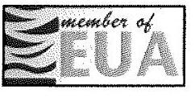

1034 Budapest, Bécsi út 96/B. www.uni-obuda.hu
Tel.: (06-1) 666-5856 juhos.eva@ka.uni-obuda.hu

---

14. 14. oldal 10. pont szerint az intézkedési terv 2.3. feladata részben került végrehajtásra, mert az Egyetem az Iratkezelési szabályzat és irattári terv kiadásához nem kérte meg a közlevéltár egyetértését. Kérem a jelen levél 5. pontjában leírtak és a csatolt dokumentumok figyelembevételével a megállapítás törlését.
15. 14. oldal 10. pont szerint az intézkedési terv 2.3. feladata részben került végrehajtásra, mert az Egyetem nem gondoskodott az oktatási és igazgatásszervezési területen dolgozók továbbképzéséről. Az Óbudai Egyetem kiemelt feladatként kezeli az oktatási és igazgatásszervezési területén dolgozók továbbképzését, ezért minden évben a tanévkezdést megelőzően képzést szervez és bonyolít le ezen területen dolgozó munkatársak részére. A 2016-os képzés prezentációi az érintett munkatársak körében az Egyetemi honlapon is közzétételre került. Jelen levelemhez csatoltan megküldöm a 2015ös és a 2016-os képzési programot, a 2016. évi képzési meghívót (9. számú melléklet). Az aláirt jelenléti íveket, a szervezésben részt vevő vezetők és munkatársak személyében történő változások, költözések miatt, jelenleg nem áll módunkban prezentálni. Kérem a fentiek figyelembevételével a megállapítás törlését.
16. 14. oldal 11. pont szerint az intézkedési terv 3.a feladata nem került végrehajtásra, mert a fenntartó egyetértésének hiányában az Egyetem nem rendelkezett a jogszabályi előírásoknak megfelelő vagyongazdálkodási tervvel. Kérem a jelen levél 5. pontjában leírtak és a csatolt dokumentumok figyelembevételével a megállapítás törlését.
17. 14. oldal 11. pont szerint az intézkedési terv 3.a feladata nem került végrehajtásra, mert az intézkedési tervben vállalt éves kötelezettségvállalási terv és végrehajtási ütemterv nem készült el. Kérem a megállapítás törlését, mert az intézkedési tervben szereplő feladat határidejét megelőzően az arra vonatkozó jogszabályi kötelezettség, a nemzeti felsőoktatásról szóló 2011. évi CCIV. törvény 74. § (3) bekezdés 2014. július 24-én hatályba lépett módosításával megszűnt, így a feladat végrehajtása okafogyottá vált.
A fentiekben leírtak és a csatolt dokumentumok alapján kérem a jelentéstervezet és az jelentéstervezet I. számú mellékletében foglaltak módosítását is.

Budapest, 2017. szeptember 28.
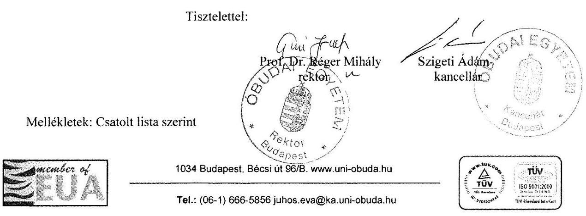

---

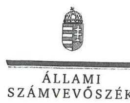

ELNÖK

Ikt.szám: V-1348-055/2016.

# Szigeti Ádám úr 

kancellár
Óbudai Egyetem

## Budapest

## Tisztelt Kancellár Úr!

Az „Utóellenörzések - az állami felsőoktatási intézmények gazdálkodásának, müködésének ellenörzéséről készült jelentések utóellenörzése - Óbudai Egyetem" címmel készített számvevőszéki jelentéstervezetre tett észrevételét köszönettel megkaptam.
Az Állami Számvevőszék észrevételre vonatkozó álláspontjáról a felügyeleti vezető által készített részletes tájékoztatást csatoltan megküldőm.
Tájékoztatom Kancellár urat, hogy a számvevőszéki jelentésben - az Állami Számvevőszékről szóló 2011. évi LXVI. törvény 29. § (3) bekezdése alapján - a figyelembe nem vett észrevételeket szerepeltetjük az elutasítás indokának feltüntetésével.
Tájékoztatom továbbá, hogy jelen levelem mellékletében foglaltakról prof. dr. Réger Mihály rektor urat is tájékoztattam.

Budapest, 2017. 10. hó 10. nap
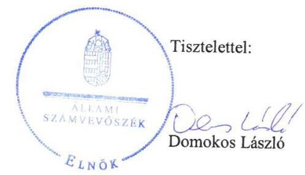

Melléklet: Tájékoztatás az el nem fogadott észrevételekről

---

# Tájékoztatás az el nem fogadott észrevételekről 

Az „Utóellenörzések - az állami felsőoktatási intézmények gazdálkodásának, müködésének ellenörzéséről készült jelentések utóellenörzése - Obudai Egyetem" címü jelentéstervezetre az OE-KA/555-4/2017. iktatószámú levélben tett észrevételeit áttekintettem.

Észrevételeinek kezeléséről az alábbi tájékoztatást adom.

## 1. Az 5. oldal Összegzés 1. mondatára tett észrevétele kapcsán

Kancellár úr a leveléhez csatolt dokumentumok alapján kérte felülvizsgálni az 5. oldal Összegzés 1. mondatát és a következők szerint módosítani a mondatot: „...az intézkedési tervben szereplő feladatai jelentős részét végrehajtotta".

Ezúton tájékoztatom, hogy az észrevételéhez csatolt dokumentumokat a számvevőszéki jelentés készítésekor nem tudjuk figyelembe venni a következőkre tekintettel. A 2016. november 22 -én kelt teljességi és hitelességi nyilatkozat szerint az Állami Számvevőszék (a továbbiakban: ÁSZ) rendelkezésére bocsátott dokumentumok, adatok megbízhatóak, és a bekért adatokra, dokumentumokra vonatkozóan teljes körü információt adnak, továbbá Kancellár úr a nyilatkozatban teljes felelősséget vállalt a rendelkezésre bocsátott dokumentumok, adatok hiánytalanságáért. Az ÁSZ az ellenőrzési megállapításait az adatbekérés során teljesített közremüködési kötelezettség keretében rendelkezésre bocsátott dokumentumokra, bizonyítékokra alapozva fogalmazza meg, így a teljességi és hitelességi nyilatkozatban foglaltakra tekintettel az utólag rendelkezésre bocsátott dokumentumok hitelességéről nem áll módunkban meggyőződni. Észrevételét nem fogadtuk el, ezért a jelentéstervezet módosítása nem indokolt.

## 2. Az 5. oldal Összegzés 2. mondatára tett észrevétele kapcsán

Kancellár úr a leveléhez csatolt dokumentumok alapján kérte törölni a következő mondatot: „...valamint a jogszabályi elöírásoknak megfelelő iratkezelési szabályzat és vagyongazdálkodási terv elkészitéséről, igy továbbra sem biztositották a szabályos müködés feltételeit".

A 2016. november 22 -én kelt teljességi és hitelességi nyilatkozat szerint az ÁSZ rendelkezésére bocsátott dokumentumok, adatok megbízhatóak, és a bekért adatokra, dokumentumokra vonatkozóan teljes körü információt adnak, továbbá Kancellár úr a nyilatkozatban teljes felelősséget vállalt a rendelkezésre bocsátott dokumentumok, adatok hiánytalanságáért. Az ÁSZ az ellenőrzési megállapításait az adatbekérés során teljesített közremüködési kötelezettség keretében rendelkezésre bocsátott dokumentumokra, bizonyítékokra alapozva fogalmazza meg, így a teljességi és hitelességi nyilatkozatban foglaltakra tekintettel az utólag rendelkezésre bocsátott dokumentumok hitelességéről nem áll módunkban meggyőződni. Észrevételét nem fogadtuk el, ezért a jelentéstervezet módosítása nem indokolt.

---

# 3. Az 5. oldal Főbb megállapítások, következtetések 1. mondatára tett észrevétele kapcsán 

Kancellár úr a leveléhez csatolt dokumentumok alapján kérte felülvizsgálni és a következők szerint módosítani a mondatot: „...tizenegy feladata közül öt határidőben, négyet határidőn túl, kettőt részben hajtott végre".

A 2016. november 22 -én kelt teljességi és hitelességi nyilatkozat szerint az ÁSZ rendelkezésére bocsátott dokumentumok, adatok megbízhatóak, és a bekért adatokra, dokumentumokra vonatkozóan teljes körű információt adnak, továbbá Kancellár úr a nyilatkozatban teljes felelősséget vállalt a rendelkezésre bocsátott dokumentumok, adatok hiánytalanságáért. Az ÁSZ az ellenőrzési megállapításait az adatbekérés során teljesített közremüködési kötelezettség keretében rendelkezésre bocsátott dokumentumokra, bizonyítékokra alapozva fogalmazza meg, így a teljességi és hitelességi nyilatkozatban foglaltakra tekintettel az utólag rendelkezésre bocsátott dokumentumok hitelességéről nem áll módunkban meggyőződni. Észrevételét nem fogadtuk el, ezért a jelentéstervezet módosítása nem indokolt.

## 4. Az 5. oldal Főbb megállapítások, következtetések 2. bekezdésének 1. mondatára tett észrevétele kapcsán

Kancellár úrnak - a leltározási és leltárkészítési szabályzat átdolgozásának elmaradására vonatkozó - észrevétele szerint az Egyetem a 2016. évben elvégezte a leltárfelvételi kötelezettségét, a szabályzat módosítását azonban a személyi változások akadályozták. A szabályos müködés biztosítása a gyakorlatban megvalósult, a szabályozás módosítása folyamatosan zajlik.

Az észrevétel nem vitatta, hogy a leltározási és leltárkészítési szabályzat módosítása az ellenőrzött időszakban nem történt meg (az jelenleg is folyamatban van), amelyre tekintettel a jelentéstervezet módosítása nem indokolt.

## 5. Az 5. oldal Főbb megállapítások, következtetések 2. bekezdés 1. mondatára tett észrevétele kapcsán

Kancellár úr a leveléhez csatolt dokumentumok alapján kérte törölni a következő mondatot: „Az Egyetemnél a szabályos müködés alapvető feltételeit nem biztositották, mert ..., továbbá nem gondoskodtak a jogszabályi elöírásoknak megfelelöen megalkotott iratkezelési szabályzat és vagyongazdálkodási terv elkészitéséről".

A 2016. november 22 -én kelt teljességi és hitelességi nyilatkozat szerint az ÁSZ rendelkezésére bocsátott dokumentumok, adatok megbízhatóak, és a bekért adatokra, dokumentumokra vonatkozóan teljes körű információt adnak, továbbá Kancellár úr a nyilatkozatban teljes felelősséget vállalt a rendelkezésre bocsátott dokumentumok, adatok hiánytalanságáért. Az ÁSZ az ellenőrzési megállapításait az adatbekérés során teljesített közremüködési kötelezettség keretében rendelkezésre bocsátott dokumentumokra, bizonyítékokra alapozva fogalmazza meg, így a teljes-

---

ségi és hitelességi nyilatkozatban foglaltakra tekintettel az utólag rendelkezésre bocsátott dokumentumok hitelességéről nem áll módunkban meggyőződni. Észrevételét nem fogadtuk el, ezért a jelentéstervezet módosítása nem indokolt.

# 6. Az 5. oldal Főbb megállapítások, következtetések 2. bekezdés 2. mondatára tett észrevétele kapcsán 

Kancellár úr kérte az ellenőrzési nyomvonalak hiányára vonatkozó szövegrész pontosítását, módosítását, arra tekintettel, hogy a 2015. évi zárszámadás számvevőszéki ellenőrzéséhez kapcsolódó intézkedési tervben az ellenőrzési nyomvonalak elkészitésére vállalt határidő 2017. december 31., továbbá azok aktualizálását a 2015-2017. évek közötti személyi változások és az Egyetem Szervezeti és Müködési Rendjének 16 alkalommal történő változása is akadályozta.

Az ÁSZ a tárgyi utóellenőrzése során a „Jelentés az Óbudai Egyetem ellenörzéséről - Az állami felsőoktatási intézmények gazdálkodásának, müködésének ellenörzése" címü jelentéshez kapcsolódó, az Egyetem által elkészített intézkedési tervben foglaltak végrehajtását ellenőrizte, nem pedig a 2015. évi zárszámadással kapcsolatos számvevőszéki jelentéssel összefüggésben összeállított intézkedési tervet. Az észrevétel az ellenőrzési nyomvonalak elkészitésének elmulasztását nem vitatta, amelyre tekintettel a jelentéstervezet módosítása nem indokolt.

## 7. Az 5. oldal Főbb megállapítások, következtetések utolsó mondatára tett észrevétele kapcsán

Kancellár úr a vonatkozó jogszabályi kötelezettségnek - az intézkedési tervben szereplő feladat határidejét megelőzően a nemzeti felsőoktatásról szóló 2011. évi CCIV. törvény 74. § (3) bekezdés 2014. július 24 -én hatályba lépett módosításával történt - megszüntetésére tekintettel kérte törölni a következő megállapítást: „A kancellár nem gondoskodott az éves kötelezettségvállalási terv és végrehajtási ütemterv elkészitéséről és szenátusi jóváhagyásáról".

A hivatkozott jogszabályi rendelkezés 2014. július 24-én bekövetkezett módosítását követően az Egyetem a 2015. március 24 -én kelt intézkedési tervének 3. pontjában - a jogszabályi kötelezettség megszủnése ellenére - vállalta az éves kötelezettségvállalási terv és a végrehajtási ütemterv elkészítését. Figyelemmel arra, hogy az ÁSZ az Állami Számvevőszékről szóló 2011. évi LXVI. törvény (továbbiakban: ÁSZ tv.) 33. § (7) bekezdése szerint az intézkedési tervben foglaltak megvalósítását utóellenőrzi. Az előzőekre tekintettel észrevételét nem fogadtuk el, ezért a jelentéstervezet módosítása nem indokolt.

## 8. A 8. oldal 2. bekezdés első mondatára tett észrevétele kapcsán

Kancellár úr a 2015-2017. évek közötti személyi és szervezeti változásokra figyelemmel kérte módosítani a következő mondatot: „Az intézkedési tervekben foglalt feladatok hiányos, illetve késedelmes végrehajtása, valamint megvalósitásának elmaradása azt mutatja, hogy az ellenörzések során feltárt hibák, hiányosságok és szabálytalanságok megszüntetése nem kapott kellő hangsúlyt."

---

Tájékoztatom Kancellár urat, hogy az észrevétellel érintett mondat nem az Egyetemre vonatkozó megállapítás, hanem az ellenőrzés hátterére, indokoltságára vonatkozó információ, amely valamennyi felsőoktatási intézmény esetében azonos tartalommal kerül feltüntetésre a jelentésekben. Erre tekintettel a jelentéstervezet módosítása nem indokolt.

# 9. A 12. oldalon szereplő megállapításokra tett észrevétele kapcsán 

Kancellár úr az 1-8. pontokban jelzett észrevételek és a csatolt dokumentumok alapján kérte a 12. oldalon szereplő megállapításokat pontosítani.

Észrevételét nem fogadtuk el a jelen tájékoztatás 1-8. pontjaiban foglaltakra tekintettel, a jelentéstervezet módosítása az észrevétele alapján nem indokolt.

## 10. A 13. oldal 3. pontjára tett észrevétele kapcsán

Az észrevétel - a belső ellenőrzés határidőn túl történt szakmai megerősítése kapcsán - annak figyelembevételét kérte, hogy 2015. július 13 -án - augusztus 12 -ei beadási és augusztus 31 -ei elbírálási határidővel - megjelent a belső ellenőr pályázati felhívása, és a pályázatok előszúrése, valamint a pályázók nyári szabadsága miatt a megfelelőnek talált két pályázó meghallgatása szeptember 15-ével zárult. Az Egyetem 2015. szeptember 23-ai ajánlatát a pályázó 2015. október 12 -ével fogadta el.

Az intézkedési tervben vállalt intézkedés nem egy pályázati eljárás lebonyolítása volt, hanem a belső ellenőrzés 2015. szeptember 30-ig történő megerősítése volt, amelynek tényleges megtörténtére a határidőt követően, 2015. október 12 -ével került sor. Erre tekintettel észrevételét nem fogadtuk el, ezért a jelentéstervezet módosítása nem indokolt.

## 11. A 13. oldal 4-5. pontjaira tett észrevétele kapcsán

Az észrevétel szerint az intézkedési tervben megjelölt feladatokat és határidőt figyelembe véve az Egyetem 2015. szeptember 21-én az Egyetemi Tanács elé terjesztette a jelzett szabályzatokat, amelyek elfogadásra kerültek. A szabályzatokat az Egyetemi Tanács ismételten megtárgyalta, de a felmerülő kérdések és észrevételek miatt az aznapi Szenátusra nem javasolták benyújtani. Kancellár úr ennek alátámasztására csatolta az Egyetemi Tanács üléseiről készített emlékeztetőket, és kérte a megállapítás pontosítását, kiegészítését.

Az észrevétel nem vitatta, hogy a szabályzatok a vállalt határidőt követően kerültek elfogadásra. Erre tekintettel észrevételét nem fogadtuk el, ezért a jelentéstervezet módosítása nem indokolt.

## 12. A 13. oldal 7. pontjára tett észrevétele kapcsán

Kancellár úr kérte az intézkedési terv részben végrehajtott 1.1 feladatára vonatkozó megállapítás pontosítását és a levelének 4., illetve 6 . pontjában leírtak figyelembevételét.

---

Észrevételét nem fogadtuk el. A Kancellár úr levelének 4. és 6. pontjában megfogalmazott észrevétele alapján - a jelen tájékoztatás 4. és 6 . pontjában kifejtettek alapján - a jelentéstervezet módosítása nem volt indokolt, amelyre tekintettel a 12. pontban megfogalmazott észrevétel sem teszi indokolttá a jelentéstervezet módosítását.

# 13. A 13-14. oldal 8. pontjára tett észrevétele kapcsán 

Kancellár úr a kötelezettségvállalási szabályzat 4. sz. mellékletének hiányával kapcsolatos észrevételében jelezte, hogy az az adatszolgáltatás során sajnálatos módom lemaradt, és csatoltan meg is küldte azt.

A 2016. november 22 -én kelt teljességi és hitelességi nyilatkozat szerint az ÁSZ rendelkezésére bocsátott dokumentumok, adatok megbízhatóak, és a bekért adatokra, dokumentumokra vonatkozóan teljes körű információt adnak, továbbá Kancellár úr a nyilatkozatban teljes felelősséget vállalt a rendelkezésre bocsátott dokumentumok, adatok hiánytalanságáért. Az ÁSZ az ellenőrzési megállapításait az adatbekérés során teljesített közremüködési kötelezettség keretében rendelkezésre bocsátott dokumentumokra, bizonyítékokra alapozva fogalmazza meg, így a teljességi és hitelességi nyilatkozatban foglaltakra tekintettel az utólag rendelkezésre bocsátott dokumentumok hitelességéről nem áll módunkban meggyőződni. Észrevételét nem fogadtuk el, ezért a jelentéstervezet módosítása nem indokolt.

## 14. A 14. oldal 10. pontjára (iratkezelési szabályzat és irattári terv) tett észrevétele kapcsán

Az iratkezelési szabályzattal és irattári tervvel összefüggő közlevéltári egyetértés hiányára vonatkozó észrevétel szerint Kancellár úr kéri a levele 5. pontjában leírtak és a csatolt dokumentumok figyelembevételével a megállapítás törlését.

A 2016. november 22 -én kelt teljességi és hitelességi nyilatkozat szerint az ÁSZ rendelkezésére bocsátott dokumentumok, adatok megbízhatóak, és a bekért adatokra, dokumentumokra vonatkozóan teljes körű információt adnak, továbbá Kancellár úr a nyilatkozatban teljes felelősséget vállalt a rendelkezésre bocsátott dokumentumok, adatok hiánytalanságáért. Az ÁSZ az ellenőrzési megállapításait az adatbekérés során teljesített közremüködési kötelezettség keretében rendelkezésre bocsátott dokumentumokra, bizonyítékokra alapozva fogalmazza meg, így a teljességi és hitelességi nyilatkozatban foglaltakra tekintettel az utólag rendelkezésre bocsátott dokumentumok hitelességéről nem áll módunkban meggyőződni. Észrevételét nem fogadtuk el, ezért a jelentéstervezet módosítása nem indokolt. Figyelemmel arra, hogy az észrevételeket tartalmazó levél 5. pontjában foglaltak sem indokolják - a jelen tájékoztatás 5. pontjában kifejtettek alapján - a jelentéstervezet módosítását, az észrevételt tartalmazó levél 14. pontja alapján szintén nem volt indokolt a jelentéstervezet módosítása.

---

# 15. A 14. oldal 10. pontjára (oktatási és igazgatásszervezési területen dolgozók továbbképzése) tett észrevétele kapcsán 

Az észrevétel szerint az Egyetem kiemelt feladatként az oktatási és igazgatásszervezési területen dolgozók továbbképzését, ezért minden évben a tanévkezdést megelőzően képzést szervez és bonyolít le az ezen a területen dolgozó munkatársai részére. A 2016-os képzés prezentációi az érintett munkatársak körében az egyetemi honlapon is közzétételre került. Csatolt dokumentumként Kancellár úr megküldte a 2015-ös és 2016-os képzési programot, a 2016. évi képzési meghívót. Az aláirt jelenléti íveket, a szervezésben részt vevő vezetők és munkatársak személyében történő változások, költözések miatt, jelenleg nem áll módjukban prezentálni.

A 2016. november 22 -én kelt teljességi és hitelességi nyilatkozat szerint az ÁSZ rendelkezésére bocsátott dokumentumok, adatok megbízhatóak, és a bekért adatokra, dokumentumokra vonatkozóan teljes körű információt adnak, továbbá Kancellár úr a nyilatkozatban teljes felelősséget vállalt a rendelkezésre bocsátott dokumentumok, adatok hiánytalanságáért. Az ÁSZ az ellenőrzési megállapításait az adatbekérés során teljesített közremüködési kötelezettség keretében rendelkezésre bocsátott dokumentumokra, bizonyítékokra alapozva fogalmazza meg, így a teljességi és hitelességi nyilatkozatban foglaltakra tekintettel az utólag rendelkezésre bocsátott dokumentumok hitelességéről nem áll módunkban meggyőződni. Észrevételét nem fogadtuk el, ezért a jelentéstervezet módosítása nem indokolt. Továbbá a továbbképzések tényleges lebonyolítását igazoló jelenléti ívek az ÁSZ részére nem kerültek átadásra, amelyet észrevétele is megerősít.

## 16. A 14. oldal 11. pontjára (vagyongazdálkodási terv) tett észrevétele kapcsán

A vagyongazdálkodási tervvel összefüggő fenntartói egyetértés hiányára vonatkozó észrevétel szerint Kancellár úr kéri a levele 5. pontjában leírtak és a csatolt dokumentumok figyelembevételével a megállapítás törlését.

A 2016. november 22 -én kelt teljességi és hitelességi nyilatkozat szerint az ÁSZ rendelkezésére bocsátott dokumentumok, adatok megbízhatóak, és a bekért adatokra, dokumentumokra vonatkozóan teljes körű információt adnak, továbbá Kancellár úr a nyilatkozatban teljes felelősséget vállalt a rendelkezésre bocsátott dokumentumok, adatok hiánytalanságáért. Az ÁSZ az ellenőrzési megállapításait az adatbekérés során teljesített közremüködési kötelezettség keretében rendelkezésre bocsátott dokumentumokra, bizonyítékokra alapozva fogalmazza meg, így a teljességi és hitelességi nyilatkozatban foglaltakra tekintettel az utólag rendelkezésre bocsátott dokumentumok hitelességéről nem áll módunkban meggyőződni. Észrevételét nem fogadtuk el, ezért a jelentéstervezet módosítása nem indokolt. Figyelemmel arra, hogy az észrevételeket tartalmazó levél 5. pontjában foglaltak sem indokolják - a jelen tájékoztatás 5. pontjában kifejtettek alapján - a jelentéstervezet módosítását, az észrevételt tartalmazó levél 16. pontja alapján szintén nem volt indokolt a jelentéstervezet módosítása.

---

# 17. A 14. oldal 11. pontjára (kötelezettségvállalási terv és végrehajtási ütemterv) tett észrevétele kapcsán 

Kancellár úr a vonatkozó jogszabályi kötelezettségnek - az intézkedési tervben szereplő feladat határidejét megelőzően a nemzeti felsőoktatásról szóló 2011. évi CCIV. törvény 74. § (3) bekezdés 2014. július 24 -én hatályba lépett módosításával történt - megszüntetésére tekintettel kérte törölni az éves kötelezettségvállalási terv és végrehajtási ütemterv elkészítésével kapcsolatos hiányosságra vonatkozó megállapítást.

Jelen tájékoztató 7. pontjában leírtakkal összhangban észrevételét nem fogadtuk el. A hivatkozott jogszabályi rendelkezés 2014. július 24 -én bekövetkezett módosítását követően az Egyetem a 2015. március 24 -én kelt intézkedési tervének 3. pontjában - a jogszabályi kötelezettség megszűnése ellenére - vállalta az éves kötelezettségvállalási terv és a végrehajtási ütemterv elkészítését. Figyelemmel arra, hogy ÁSZ tv. 33. § (7) bekezdése szerint az intézkedési tervben foglaltak megvalósítását utóellenőrzi, ezért a jelentéstervezet módosítása nem indokolt.

Budapest, 2017. 10. hó 10. nap
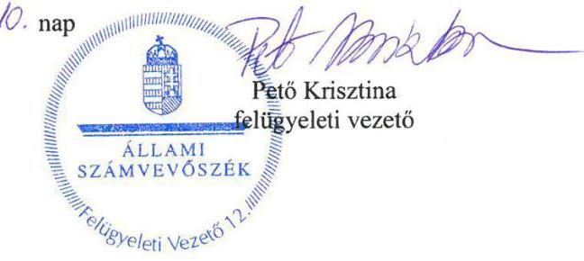

---

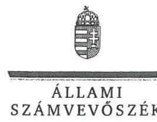

ELNÖK

Ikt.szám: V-1348-058/2016.

# Prof. Dr. Réger Mihály úr rektor 

Óbudai Egyetem

## Budapest

## Tisztelt Rektor Úr!

Az „Utóellenőrzések - az állami felsőoktatási intézmények gazdálkodásának, müködésének ellenőrzéséről készült jelentések utóellenőrzése - Óbudai Egyetem" címmel készített számvevőszéki jelentéstervezetre tett észrevételét köszönettel megkaptam.
Az Állami Számvevőszék észrevételre vonatkozó álláspontjáról a felügyeleti vezető által készített részletes tájékoztatást csatoltan megküldőm.
Tájékoztatom Rektor urat, hogy a számvevőszéki jelentésben - az Állami Számvevőszékről szóló 2011. évi LXVI. törvény 29. § (3) bekezdése alapján - a figyelembe nem vett észrevételeket szerepeltetjük az elutasítás indokának feltüntetésével.
Tájékoztatom továbbá, hogy jelen levelem mellékletében foglaltakról Szigeti Ádám kancellár urat is tájékoztattam.

Budapest, 2017. 10. hó 10. nap
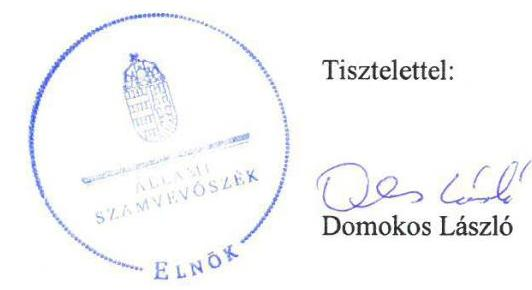

Melléklet: Tájékoztatás az el nem fogadott észrevételekről

---

# Tájékoztatás az el nem fogadott észrevételekről 

Az „Utóellenörzések - az állami felsőoktatási intézmények gazdálkodásának, müködésének ellenörzéséről készült jelentések utóellenörzése - Obudai Egyetem" címủ jelentéstervezetre az OE-RH/419-3/2017. iktatószámú levélben tett észrevételeit áttekintettem.

Észrevételeinek kezeléséről az alábbi tájékoztatást adom.

## 1. Az 5. oldal Összegzés 1. mondatára tett észrevétele kapcsán

Rektor úr a leveléhez csatolt dokumentumok alapján kérte felülvizsgálni az 5. oldal Összegzés 1. mondatát és a következők szerint módosítani a mondatot: „...az intézkedési tervben szereplő feladatai jelentős részét végrehajtotta".

Ezúton tájékoztatom, hogy az észrevételéhez csatolt dokumentumokat a számvevőszéki jelentés készítésekor nem tudjuk figyelembe venni a következőkre tekintettel. A 2016. november 22 -én kelt teljességi és hitelességi nyilatkozat szerint az Állami Számvevőszék (a továbbiakban: ÁSZ) rendelkezésére bocsátott dokumentumok, adatok megbízhatóak, és a bekért adatokra, dokumentumokra vonatkozóan teljes körű információt adnak, továbbá Rektor úr a nyilatkozatban teljes felelősséget vállalt a rendelkezésre bocsátott dokumentumok, adatok hiánytalanságáért. Az ÁSZ az ellenőrzési megállapításait az adatbekérés során teljesített közremüködési kötelezettség keretében rendelkezésre bocsátott dokumentumokra, bizonyítékokra alapozva fogalmazza meg, így a teljességi és hitelességi nyilatkozatban foglaltakra tekintettel az utólag rendelkezésre bocsátott dokumentumok hitelességéről nem áll módunkban meggyőződni. Észrevételét nem fogadtuk el, ezért a jelentéstervezet módosítása nem indokolt.

## 2. Az 5. oldal Összegzés 2. mondatára tett észrevétele kapcsán

Rektor úr a leveléhez csatolt dokumentumok alapján kérte törölni a következő mondatot: „... valamint a jogszabályi elöírásoknak megfelelő iratkezelési szabályzat és vagyongazdálkodási terv elkészitéséről, igy továbbra sem biztositották a szabályos müködés feltételeit".

A 2016. november 22-én kelt teljességi és hitelességi nyilatkozat szerint az ÁSZ rendelkezésére bocsátott dokumentumok, adatok megbízhatóak, és a bekért adatokra, dokumentumokra vonatkozóan teljes körű információt adnak, továbbá Rektor úr a nyilatkozatban teljes felelősséget vállalt a rendelkezésre bocsátott dokumentumok, adatok hiánytalanságáért. Az ÁSZ az ellenőrzési megállapításait az adatbekérés során teljesített közremüködési kötelezettség keretében rendelkezésre bocsátott dokumentumokra, bizonyítékokra alapozva fogalmazza meg, így a teljességi és hitelességi nyilatkozatban foglaltakra tekintettel az utólag rendelkezésre bocsátott dokumentumok hitelességéről nem áll módunkban meggyőződni. Észrevételét nem fogadtuk el, ezért a jelentéstervezet módosítása nem indokolt.

---

# 3. Az 5. oldal Főbb megállapítások, következtetések 1. mondatára tett észrevétele kapcsán 

Rektor úr a leveléhez csatolt dokumentumok alapján kérte felülvizsgálni és a következők szerint módosítani a mondatot: „...tizenegy feladata közül öt határidőben, négyet határidőn túl, kettőt részben hajtott végre".

A 2016. november 22 -én kelt teljességi és hitelességi nyilatkozat szerint az ÁSZ rendelkezésére bocsátott dokumentumok, adatok megbízhatóak, és a bekért adatokra, dokumentumokra vonatkozóan teljes körű információt adnak, továbbá Rektor úr a nyilatkozatban teljes felelősséget vállalt a rendelkezésre bocsátott dokumentumok, adatok hiánytalanságáért. Az ÁSZ az ellenőrzési megállapításait az adatbekérés során teljesített közremüködési kötelezettség keretében rendelkezésre bocsátott dokumentumokra, bizonyítékokra alapozva fogalmazza meg, így a teljességi és hitelességi nyilatkozatban foglaltakra tekintettel az utólag rendelkezésre bocsátott dokumentumok hitelességéről nem áll módunkban meggyőződni. Észrevételét nem fogadtuk el, ezért a jelentéstervezet módosítása nem indokolt.

## 4. Az 5. oldal Főbb megállapítások, következtetések 2. bekezdésének 1. mondatára tett észrevétele kapcsán

Rektor úrnak - a leltározási és leltárkészítési szabályzat átdolgozásának elmaradására vonatkozó - észrevétele szerint az Egyetem a 2016. évben elvégezte a leltárfelvételi kötelezettségét, a szabályzat módosítását azonban a személyi változások akadályozták. A szabályos müködés biztosítása a gyakorlatban megvalósult, a szabályozás módosítása folyamatosan zajlik.

Az észrevétel nem vitatta, hogy a leltározási és leltárkészítési szabályzat módosítása az ellenőrzött időszakban nem történt meg (az jelenleg is folyamatban van), amelyre tekintettel a jelentéstervezet módosítása nem indokolt.

## 5. Az 5. oldal Főbb megállapítások, következtetések 2. bekezdés 1. mondatára tett észrevétele kapcsán

Rektor úr a leveléhez csatolt dokumentumok alapján kérte törölni a következő mondatot: „Az Egyetemnél a szabályos müködés alapvető feltételeit nem biztositották, mert ..., továbbá nem gondoskodtak a jogszabályi elöírásoknak megfelelöen megalkotott iratkezelési szabályzat és vagyongazdálkodási terv elkészitéséről".

A 2016. november 22 -én kelt teljességi és hitelességi nyilatkozat szerint az ÁSZ rendelkezésére bocsátott dokumentumok, adatok megbízhatóak, és a bekért adatokra, dokumentumokra vonatkozóan teljes körű információt adnak, továbbá Rektor úr a nyilatkozatban teljes felelősséget vállalt a rendelkezésre bocsátott dokumentumok, adatok hiánytalanságáért. Az ÁSZ az ellenőrzési megállapításait az adatbekérés során teljesített közremüködési kötelezettség keretében rendelkezésre bocsátott dokumentumokra, bizonyítékokra alapozva fogalmazza meg, így a teljességi és

---

hitelességi nyilatkozatban foglaltakra tekintettel az utólag rendelkezésre bocsátott dokumentumok hitelességéről nem áll módunkban meggyőződni. Észrevételét nem fogadtuk el, ezért a jelentéstervezet módosítása nem indokolt.

# 6. Az 5. oldal Főbb megállapítások, következtetések 2. bekezdés 2. mondatára tett észrevétele kapcsán 

Rektor úr kérte az ellenőrzési nyomvonalak hiányára vonatkozó szövegrész pontositását, módosítását, arra tekintettel, hogy a 2015. évi zárszámadás számvevőszéki ellenőrzéséhez kapcsolódó intézkedési tervben az ellenőrzési nyomvonalak elkészitésére vállalt határidő 2017. december 31., továbbá azok aktualizálását a 2015-2017. évek közötti személyi változások és az Egyetem Szervezeti és Müködési Rendjének 16 alkalommal történő változása is akadályozta.

Az ÁSZ a tárgyi utóellenőrzése során a „Jelentés az Óbudai Egyetem ellenörzéséről - Az állami felsőoktatási intézmények gazdálkodásának, müködésének ellenörzése" címü jelentéshez kapcsolódó, az Egyetem által elkészített intézkedési tervben foglaltak végrehajtását ellenőrizte, nem pedig a 2015. évi zárszámadással kapcsolatos számvevőszéki jelentéssel összefüggésben összeállított intézkedési tervet. Az észrevétel az ellenőrzési nyomvonalak elkészitésének elmulasztását nem vitatta, amelyre tekintettel a jelentéstervezet módosítása nem indokolt.

## 7. Az 5. oldal Főbb megállapítások, következtetések utolsó mondatára tett észrevétele kapcsán

Rektor úr a vonatkozó jogszabályi kötelezettségnek - az intézkedési tervben szereplő feladat határidejét megelőzően a nemzeti felsőoktatásról szóló 2011. évi CCIV. törvény 74. § (3) bekezdés 2014. július 24 -én hatályba lépett módosításával történt - megszüntetésére tekintettel kérte törölni a következő megállapítást: „A kancellár nem gondoskodott az éves kötelezettségvállalási terv és végrehajtási ütemterv elkészitéséről és szenátusi jóváhagyásáról".

A hivatkozott jogszabályi rendelkezés 2014. július 24-én bekövetkezett módosítását követően az Egyetem a 2015. március 24 -én kelt intézkedési tervének 3. pontjában - a jogszabályi kötelezettség megszủnése ellenére - vállalta az éves kötelezettségvállalási terv és a végrehajtási ütemterv elkészitését. Figyelemmel arra, hogy az ÁSZ az Állami Számvevőszékről szóló 2011. évi LXVI. törvény (továbbiakban: ÁSZ tv.) 33. § (7) bekezdése szerint az intézkedési tervben foglaltak megvalósítását utóellenőrzi. Az előzőekre tekintettel észrevételét nem fogadtuk el, ezért a jelentéstervezet módosítása nem indokolt.

## 8. A 8. oldal 2. bekezdés első mondatára tett észrevétele kapcsán

Rektor úr a 2015-2017. évek közötti személyi és szervezeti változásokra figyelemmel kérte módosítani a következő mondatot: „Az intézkedési tervekben foglalt feladatok hiányos, illetve késedelmes végrehajtása, valamint megvalósitásának elmaradása azt mutatja, hogy az ellenörzések során feltárt hibák, hiányosságok és szabálytalanságok megszüntetése nem kapott kellő hangsúlyt."

---

Tájékoztatom Rektor urat, hogy az észrevétellel érintett mondat nem az Egyetemre vonatkozó megállapítás, hanem az ellenőrzés hátterére, indokoltságára vonatkozó információ, amely valamennyi felsőoktatási intézmény esetében azonos tartalommal kerül feltüntetésre a jelentésekben. Erre tekintettel a jelentéstervezet módosítása nem indokolt.

# 9. A 12. oldalon szereplő megállapításokra tett észrevétele kapcsán 

Rektor úr az 1-8. pontokban jelzett észrevételek és a csatolt dokumentumok alapján kérte a 12. oldalon szereplő megállapításokat pontosítani.

Észrevételét nem fogadtuk el a jelen tájékoztatás 1-8. pontjaiban foglaltakra tekintettel, a jelentéstervezet módosítása az észrevétele alapján nem indokolt.

## 10. A 13. oldal 3. pontjára tett észrevétele kapcsán

Az észrevétel - a belső ellenőrzés határidőn túl történt szakmai megerősítése kapcsán - annak figyelembevételét kérte, hogy 2015. július 13 -án - augusztus 12 -ei beadási és augusztus 31 -ei elbírálási határidővel - megjelent a belső ellenőr pályázati felhívása, és a pályázatok előszúrése, valamint a pályázók nyári szabadsága miatt a megfelelőnek talált két pályázó meghallgatása szeptember 15-ével zárult. Az Egyetem 2015. szeptember 23-ai ajánlatát a pályázó 2015. október 12 -ével fogadta el.

Az intézkedési tervben vállalt intézkedés nem egy pályázati eljárás lebonyolítása volt, hanem a belső ellenőrzés 2015. szeptember 30-ig történő megerősítése volt, amelynek tényleges megtörténtére a határidőt követően, 2015. október 12-ével került sor. Erre tekintettel észrevételét nem fogadtuk el, ezért a jelentéstervezet módosítása nem indokolt.

## 11. A 13. oldal 4-5. pontjaira tett észrevétele kapcsán

Az észrevétel szerint az intézkedési tervben megjelölt feladatokat és határidőt figyelembe véve az Egyetem 2015. szeptember 21-én az Egyetemi Tanács elé terjesztette a jelzett szabályzatokat, amelyek elfogadásra kerültek. A szabályzatokat az Egyetemi Tanács ismételten megtárgyalta, de a felmerülő kérdések és észrevételek miatt az aznapi Szenátusra nem javasolták benyújtani. Rektor úr ennek alátámasztására csatolta az Egyetemi Tanács üléseiről készített emlékeztetőket, és kérte a megállapítás pontosítását, kiegészítését.

Az észrevétel nem vitatta, hogy a szabályzatok a vállalt határidőt követően kerültek elfogadásra. Erre tekintettel észrevételét nem fogadtuk el, ezért a jelentéstervezet módosítása nem indokolt.

## 12. A 13. oldal 7. pontjára tett észrevétele kapcsán

Rektor úr kérte az intézkedési terv részben végrehajtott 1.1 feladatára vonatkozó megállapítás pontosítását és a levelének 4., illetve 6 . pontjában leírtak figyelembevételét.

---

Észrevételét nem fogadtuk el. A Rektor úr levelének 4. és 6. pontjában megfogalmazott észrevétele alapján - a jelen tájékoztatás 4. és 6 . pontjában kifejtettek alapján - a jelentéstervezet módosítása nem volt indokolt, amelyre tekintettel a 12. pontban megfogalmazott észrevétel sem teszi indokolttá a jelentéstervezet módosítását.

# 13. A 13-14. oldal 8. pontjára tett észrevétele kapcsán 

Rektor úr a kötelezettségvállalási szabályzat 4. sz. mellékletének hiányával kapcsolatos észrevételében jelezte, hogy az az adatszolgáltatás során sajnálatos módom lemaradt, és csatoltan meg is küldte azt.

A 2016. november 22 -én kelt teljességi és hitelességi nyilatkozat szerint az ÁSZ rendelkezésére bocsátott dokumentumok, adatok megbízhatóak, és a bekért adatokra, dokumentumokra vonatkozóan teljes körű információt adnak, továbbá Rektor úr a nyilatkozatban teljes felelősséget vállalt a rendelkezésre bocsátott dokumentumok, adatok hiánytalanságáért. Az ÁSZ az ellenőrzési megállapításait az adatbekérés során teljesített közremüködési kötelezettség keretében rendelkezésre bocsátott dokumentumokra, bizonyítékokra alapozva fogalmazza meg, így a teljességi és hitelességi nyilatkozatban foglaltakra tekintettel az utólag rendelkezésre bocsátott dokumentumok hitelességéről nem áll módunkban meggyőződni. Észrevételét nem fogadtuk el, ezért a jelentéstervezet módosítása nem indokolt.

## 14. A 14. oldal 10. pontjára (iratkezelési szabályzat és irattári terv) tett észrevétele kapcsán

Az iratkezelési szabályzattal és irattári tervvel összefüggő közlevéltári egyetértés hiányára vonatkozó észrevétel szerint Rektor úr kéri a levele 5. pontjában leírtak és a csatolt dokumentumok figyelembevételével a megállapítás törlését.

A 2016. november 22-én kelt teljességi és hitelességi nyilatkozat szerint az ÁSZ rendelkezésére bocsátott dokumentumok, adatok megbízhatóak, és a bekért adatokra, dokumentumokra vonatkozóan teljes körű információt adnak, továbbá Rektor úr a nyilatkozatban teljes felelősséget vállalt a rendelkezésre bocsátott dokumentumok, adatok hiánytalanságáért. Az ÁSZ az ellenőrzési megállapításait az adatbekérés során teljesített közremüködési kötelezettség keretében rendelkezésre bocsátott dokumentumokra, bizonyítékokra alapozva fogalmazza meg, így a teljességi és hitelességi nyilatkozatban foglaltakra tekintettel az utólag rendelkezésre bocsátott dokumentumok hitelességéről nem áll módunkban meggyőződni. Észrevételét nem fogadtuk el, ezért a jelentéstervezet módosítása nem indokolt. Figyelemmel arra, hogy az észrevételeket tartalmazó levél 5. pontjában foglaltak sem indokolják - a jelen tájékoztatás 5. pontjában kifejtettek alapján - a jelentéstervezet módosítását, az észrevételt tartalmazó levél 14. pontja alapján szintén nem volt indokolt a jelentéstervezet módosítása.

---

# 15. A 14. oldal 10. pontjára (oktatási és igazgatásszervezési területen dolgozók továbbképzése) tett észrevétele kapcsán 

Az észrevétel szerint az Egyetem kiemelt feladatként az oktatási és igazgatásszervezési területen dolgozók továbbképzését, ezért minden évben a tanévkezdést megelőzően képzést szervez és bonyolít le az ezen a területen dolgozó munkatársai részére. A 2016-os képzés prezentációi az érintett munkatársak körében az egyetemi honlapon is közzétételre került. Csatolt dokumentumként Rektor úr megküldte a 2015-ös és 2016-os képzési programot, a 2016. évi képzési meghívót. Az aláirt jelenléti íveket, a szervezésben részt vevő vezetők és munkatársak személyében történő változások, költözések miatt, jelenleg nem áll módjukban prezentálni.

A 2016. november 22 -én kelt teljességi és hitelességi nyilatkozat szerint az ÁSZ rendelkezésére bocsátott dokumentumok, adatok megbízhatóak, és a bekért adatokra, dokumentumokra vonatkozóan teljes körü információt adnak, továbbá Rektor úr a nyilatkozatban teljes felelősséget vállalt a rendelkezésre bocsátott dokumentumok, adatok hiánytalanságáért. Az ÁSZ az ellenőrzési megállapításait az adatbekérés során teljesített közremüködési kötelezettség keretében rendelkezésre bocsátott dokumentumokra, bizonyítékokra alapozva fogalmazza meg, így a teljességi és hitelességi nyilatkozatban foglaltakra tekintettel az utólag rendelkezésre bocsátott dokumentumok hitelességéről nem áll módunkban meggyőződni. Észrevételét nem fogadtuk el, ezért a jelentéstervezet módosítása nem indokolt. Továbbá a továbbképzések tényleges lebonyolítását igazoló jelenléti ívek az ÁSZ részére nem kerültek átadásra, amelyet észrevétele is megerősít.

## 16. A 14. oldal 11. pontjára (vagyongazdálkodási terv) tett észrevétele kapcsán

A vagyongazdálkodási tervvel összefüggő fenntartói egyetértés hiányára vonatkozó észrevétel szerint Rekto úr kéri a levele 5. pontjában leírtak és a csatolt dokumentumok figyelembevételével a megállapítás törlését.

A 2016. november 22 -én kelt teljességi és hitelességi nyilatkozat szerint az ÁSZ rendelkezésére bocsátott dokumentumok, adatok megbízhatóak, és a bekért adatokra, dokumentumokra vonatkozóan teljes körü információt adnak, továbbá Rektor úr a nyilatkozatban teljes felelősséget vállalt a rendelkezésre bocsátott dokumentumok, adatok hiánytalanságáért. Az ÁSZ az ellenőrzési megállapításait az adatbekérés során teljesített közremüködési kötelezettség keretében rendelkezésre bocsátott dokumentumokra, bizonyítékokra alapozva fogalmazza meg, így a teljességi és hitelességi nyilatkozatban foglaltakra tekintettel az utólag rendelkezésre bocsátott dokumentumok hitelességéről nem áll módunkban meggyőződni. Észrevételét nem fogadtuk el, ezért a jelentéstervezet módosítása nem indokolt. Figyelemmel arra, hogy az észrevételeket tartalmazó levél 5. pontjában foglaltak sem indokolják - a jelen tájékoztatás 5 . pontjában kifejtettek alapján - a jelentéstervezet módosítását, az észrevételt tartalmazó levél 16. pontja alapján szintén nem volt indokolt a jelentéstervezet módosítása.

---

# 17. A 14. oldal 11. pontjára (kötelezettségvállalási terv és végrehajtási ütemterv) tett észrevétele kapcsán 

Rektor úr a vonatkozó jogszabályi kötelezettségnek - az intézkedési tervben szereplő feladat határidejét megelőzően a nemzeti felsőoktatásról szóló 2011. évi CCIV. törvény 74. § (3) bekezdés 2014. július 24 -én hatályba lépett módosításával történt - megszüntetésére tekintettel kérte törölni az éves kötelezettségvállalási terv és végrehajtási ütemterv elkészítésével kapcsolatos hiányosságra vonatkozó megállapítást.

Jelen tájékoztató 7. pontjában leírtakkal összhangban észrevételét nem fogadtuk el. A hivatkozott jogszabályi rendelkezés 2014. július 24 -én bekövetkezett módosítását követően az Egyetem a 2015. március 24 -én kelt intézkedési tervének 3. pontjában - a jogszabályi kötelezettség megszűnése ellenére - vállalta az éves kötelezettségvállalási terv és a végrehajtási ütemterv elkészítését. Figyelemmel arra, hogy ÁSZ tv. 33. § (7) bekezdése szerint az intézkedési tervben foglaltak megvalósítását utóellenőrzi, ezért a jelentéstervezet módosítása nem indokolt.

Budapest, 2017.
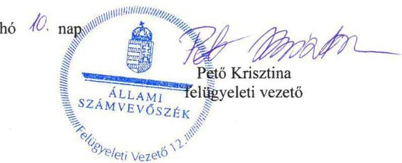

---

.

---

# RÖVIDÍTÉSEK JEGYZÉKE 

${ }^{1}$ Számvevőszéki jelentés
${ }^{2}$ Egyetem
${ }^{3}$ EMMI
${ }^{4}$ Rektor
${ }^{5}$ Kancellár
${ }^{6}$ ÁSZ
${ }^{7}$ ÁSZ tv.
${ }^{8}$ ÁSZ SZMSZ
${ }^{9}$ Miniszter
${ }^{10}$ Bkr.
${ }^{11}$ Kincstár
${ }^{12}$ Pénzkezelési szabályzat
${ }^{13}$ Neptun
${ }^{14}$ Gazdálkodási szabályzat
${ }^{15}$ Kötelezettségvállalási szabályzat
${ }^{16}$ Beszerzési szabályzat
${ }^{17}$ Szenátus
${ }^{18}$ SZMSZ
${ }^{19}$ Iratkezelési szabályzat és irattári terv
${ }^{20}$ Ltv.
${ }^{21}$ Nftv.
${ }^{22}$ Belső ellenőrzési kézikönyv
${ }^{23}$ Szabálytalanságok, közérdekű bejelentések kezelésének rendje
${ }^{24}$ Kockázatkezelési szabályzat
${ }^{25}$ Számviteli politika

Az Állami Számvevőszék 15034. számú jelentése az Óbudai Egyetem ellenőrzéséről - Az állami felsőoktatási intézmények gazdálkodásának, működésének ellenőrzése (2015. március)
Óbudai Egyetem
Emberi Erőforrások Minisztériuma
Az Óbudai Egyetem rektora
Az Óbudai Egyetem kancellárja
Állami Számvevőszék
2011. évi LXVI. törvény az Állami Számvevőszékről (hatályos: 2011. július 1-jétől)

Az Állami Számvevőszék elnökének 3/2016. (XII. 29.) ÁSZ utasítása az Állami Számvevőszék Szervezeti és Működési Szabályzatáról (hatályos 2017. január 1-jétől)
Az Emberi Erőforrások Minisztériuma minisztere
370/2011. (XII. 31.) Korm. rendelet a költségvetési szervek belső
kontrollrendszeréről és belső ellenőrzéséről (hatályos: 2012. január 1-jétől)
Magyar Államkincstár
A Szenátus SZ-CXII/182/2015. számú határozatával elfogadott pénzkezelési szabályzat (hatályos: 2015. szeptember 29-étől)
NEPTUN Tanulmányi Információs és Pénzügyi Rendszer
A Szenátus SZ-CXIII/193/2015. számú határozatával elfogadott Gazdálkodási szabályzat (hatályos: 2015. október 20-ától)
A Szenátus SZ-CXIV/197/2016. számú határozatával elfogadott
Kötelezettségvállalás és szerződéskötés rendjéről szóló szabályzat (hatályos: 2016. október 18-ától)

A Szenátus SZ-CXIII/194/2015. számú határozatával elfogadott Beszerzési szabályzat (hatályos: 2015. október 20-ától)
Az Óbudai Egyetem szenátusa
Az Óbudai Egyetem Szervezeti és Müködési Szabályzatának 1. számú melléklete (hatályos: 2015. január 20-ától)
A Szenátus az SZ-CXV/237/2015. számú határozatával elfogadott Iratkezelési szabályzat és irattári terv (hatályos: 2016. január 1-jétől)
A közokiratokról, a közlevéltárakról és a magánlevéltári anyag védelméről szóló 1995. évi LXVI. törvény
2011. évi CCIV. törvény a nemzeti felsőoktatásról

A Szenátus SZ-CXIV/215/2015. számú határozatával elfogadott Belső ellenőrzési kézikönyv (hatályos: 2015. november 17-étől)
A Szenátus SZ-CXIV/216/2015. számú határozatával elfogadott
Szabálytalanságok, közérdekű bejelentések kezelésének rendjéről szóló szabályzat (hatályos: 2015. november 17-étől)
A Szenátus SZ-CXIV/217/2015. számú határozatával elfogadott Kockázatkezelési szabályzat (hatályos: 2015. november 17-étől)
A Szenátus SZ-CXII/179/2015. számú határozatával elfogadott Számviteli politika (hatályos: 2015. január 1-jétől)

---

${ }^{26}$ Számlarend
${ }^{27}$ Értékelési szabályzat
${ }^{28}$ Kapacitáskihasználási szabályzat
${ }^{29}$ Selejtezési és hasznosítási szabályzat

A Szenátus SZ-CXII/180/2015. számú határozatával elfogadott Számlarend (hatályos: 2015. január 1-jétől)
A Szenátus SZ-CXII/181/2015. számú határozatával elfogadott Eszközök és források értékelési szabályzata (hatályos: 2015. január 1-jétől)
A Szenátus SZ-CXIII/203/2015. számú határozatával elfogadott Kapacitáskihasználási szabályzat (hatályos: 2015. október 20-ától)
A Szenátus SZ-CXIV/213/2015. számú határozatával elfogadott Selejtezési és hasznosítási szabályzat (hatályos: 2015. november 17-étől)

---

# ÁLLAMI SZÁMVEVŐSZÉK 

1052 Budapest, Apáczai Csere János utca 10.
Levélcím: 1364 Budapest 4. Pf. 54
Telefon: +36 14849100 Telefax: +36 14849200
www.asz.hu