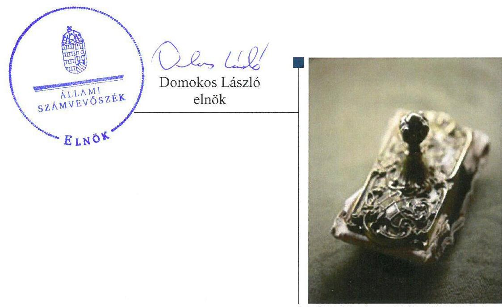
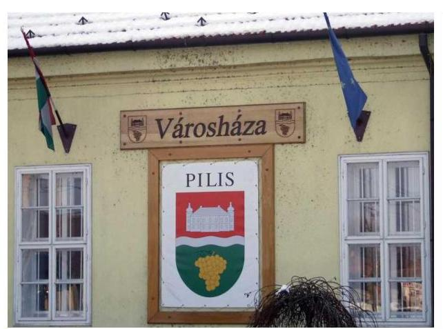
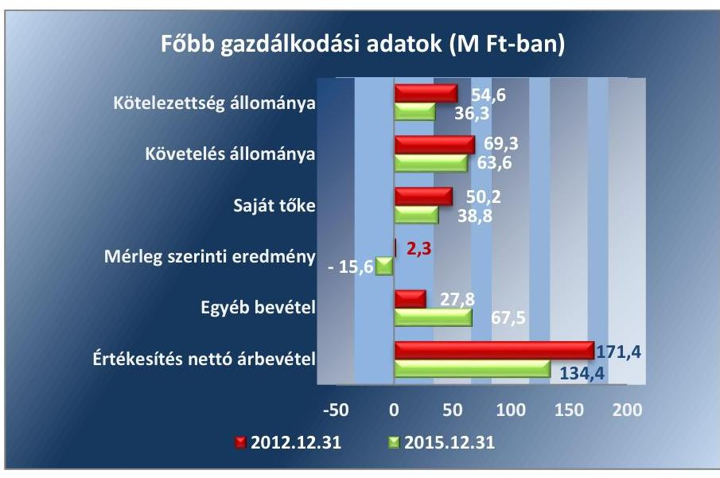
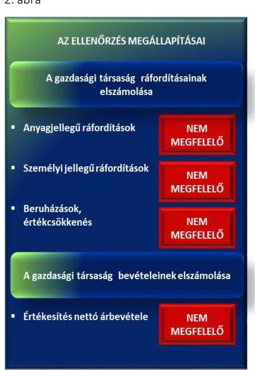
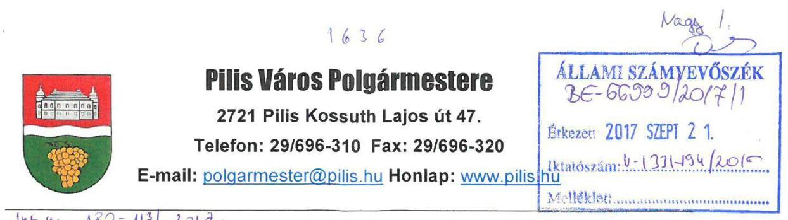
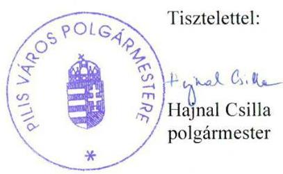
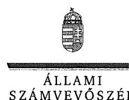
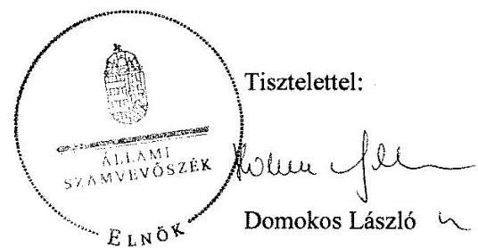

# Jelentés 

## Az önkormányzatok gazdasági társaságai

Az önkormányzatok többségi tulajdonában lévő gazdasági társaságok gazdálkodásának ellenőrzése - Gerje-Forrás Természetvédelmi, Környezetvédő Nonprofit Kft.
2017.

---

# Jelentés 

## Az önkormányzatok gazdasági társaságai

Az önkormányzatok többségi tulajdonában lévő gazdasági társaságok gazdálkodásának ellenőrzése - Gerje-Forrás Természetvédelmi, Környezetvédő Nonprofit Kft.
2017. november hó 2. nap

---

# AZ ELLENŐRZÉST FELÜGYELTE:

DR. NAGY IMRE felügyeleti vezető

# AZ ELLENŐRZÉST VEZETTE ÉS A VÉGREHAJTÁSÁÉRT FELELŐS:

VALASTYÁNNÉ DR. VÍZHÁNYÓ JÚLIA ellenőrzésvezető

# A PROGRAM ÖSSZEÁLLÍTÁSÁÉRT FELELŐS:

JANIK JÓZSEF osztályvezető

---

**IKTATÓSZÁM:** V-1331-203/2016.

**TÉMASZÁM:** 2365

**ELLENŐRZÉS-AZONOSÍTÓ SZÁM:** V075828

---

Jelentéseink az Országgyűlés számítógépes hálózatán és az Interneta a www.asz.hu címen is olvashatóak.

---

# TARTALOMJEGYZÉK 

■ ÖSSZEGZÉS ..... 5
■ AZ ELLENŐRZÉS CÉLJA ..... 6
■ AZ ELLENŐRZÉS TERÜLETE ..... 7
■ AZ ELLENŐRZÉS HÁTTERE, INDOKOLTSÁGA ..... 9
■ A JELENTÉS LÉNYEGES KÉRDÉSKÖREI ..... 10
■ ELLENŐRZÉS HATÓKÖRE ÉS MÓDSZEREI ..... 11
■ MEGÁLLAPÍTÁSOK ..... 13
■ JAVASLATOK ..... 19
■ MELLÉKLETEK ..... 23
I. Sz. melléklet: Értelmező szótár ..... 23
II. Sz. melléklet: A Társaság mérleg adatai az ellenőrzött időszakban ..... 25
■ FÜGGELÉK: ÉSZREVÉTELEK ..... 27
■ RÖVIDÍTÉSEK JEGYZÉKE ..... 37

---

.

---

# ÖSSZEGZÉS 

Pilis Város Önkormányzata a tulajdonosi joggyakorlás kereteit a jogszabályi előírásoknak megfelelően alakította ki, azonban a tulajdonosi jogokat nem megfelelően gyakorolta. A Gerje-Forrás Természetvédelmi, Környezetvédő Nonprofit Kft. vagyongazdálkodása nem volt szabályszerű. A Gerje-Forrás Természetvédelmi, Környezetvédő Nonprofit Kft. nem megfelelően gondoskodott a számviteli szabályzatok kialakításáról és a számviteli szabályok betartásáról, ezáltal gazdálkodásának átláthatósága nem volt biztositott. Ár képzése a jogszabályi előírásoknak megfelelt.

## Az ellenőrzés társadalmi indokoltsága

Magyarországon az önkormányzatok kötelező és önként vállalt feladataik vonatkozásában is egyre szélesebb körben alkalmazzák a költségvetésen kívüli feladatellátást, ezáltal - a nonprofit szervezetek mellett - az önkormányzati tulajdonú gazdasági társaságok is kiemelt fontosságú szerephez jutottak.

Pilisen a Gerje-Forrás Természetvédelmi, Környezetvédő Nonprofit Kft. végezte a hulladékgazdálkodási közszolgáltatást, valamint 2012. június 30-ig a víziközmű-szolgáltatást, továbbá a helyi közutak és közterületek fenntartását, csapadékvíz elvezetését, közműépítést, a köztisztaság és településtisztaság biztosítását, a Gerje patak forrás vidékének természetvédelmi kezelését, és Pilis Város piacának üzemeltetését.

Az Állami Számvevőszék az ellenőrzése során arra kereste a választ, hogy 2012-2015. között szabályszerű volt-e a Társaság gazdálkodása és az Önkormányzat ehhez kapcsolódó tulajdonosi joggyakorlása.

## Főbb megállapítások, következtetések, javaslatok

Pilis Város Önkormányzata a jogszabályban előírt gazdasági programját megalkotta, azonban közép- és hosszú távú vagyongazdálkodási tervet nem készített. A Társaság feletti tulajdonosi joggyakorlás kereteit szabályszerűen alakította ki. Hulladékgazdálkodásra vonatkozó rendeletalkotási kötelezettségének eleget tett. A Társaság Javadalmazási szabályzatát elkészítette. A tulajdonosi joggyakorlás nem volt szabályszerű, mert annak ellenére határozott a Számv. tv. szerinti beszámolókról, hogy a felügyelőbizottság írásbeli jelentését két évben nem készítette el. A felügyelőbizottság ügyrenddel nem rendelkezett.

Vagyongazdálkodása nem volt szabályszerű, mert számviteli nyilvántartásait nem a jogszabályi és belső előírásoknak megfelelően alakította ki, az a Társaság tevékenységének átláthatóságát nem biztosította. Számviteli beszámolóit nem a jogszabályi előírásoknak megfelelően készítette el, azokat leltárral nem támasztotta alá. Számviteli szétválasztási kötelezettségének nem tett eleget. Fizetőképessége nem volt biztosított. A közérdekű adatok közzétételéről és az adatbiztonságról nem gondoskodott.

Bevételeit és ráfordításait nem a jogszabályi előírásoknak megfelelően számolta el, hulladékkezelési tevékenységének bevételeit és ráfordításait nem különítette el. Ár képzése a jogszabályi előírásoknak megfelelt.

---

# AZ ELLENŐRZÉS CÉLJA 

Az ellenőrzés célja annak értékelése volt, hogy az önkormányzat vagyongazdálkodási tevékenysége során szabályszerűen gyakorolta-e tulajdonosi jogait; a gazdasági társaság szabályozottsága, gazdálkodása és vagyongazdálkodási tevékenysége, bevételeinek és ráfordításainak elszámolása megfelelt-e a jogszabályi és tulajdonosi előírásoknak; a gazdasági társaság fizetőképessége jelent-e kockázatot a működésre, valamint a gazdálkodás átláthatósága és elszámoltathatósága érdekében biztosítva volt-e a szolgáltatás dijának megalapozottsága szabályszerű önköltségszámítással.

---

# AZ ELLENŐRZÉS TERÜLETE 

## Pilis Város Önkormányzata és a kizárólagos tulajdonában lévő Gerje-Forrás Természetvédelmi, Környezetvédő Nonprofit Kft.

AZ ÖNKORMÁNYZAT ${ }^{1}$ a Társaság ${ }^{2}$ jogelődjét egyszemélyes tulajdonosként az ellenőrzött időszakot megelőzően hozta létre.

A TÁRSASÁG főtevékenysége az Alapító Okirat ${ }_{1}{ }^{3}$ szerint 2012. június 30-ig szennyvíz gyűjtése, kezelése, valamint más feladatai mellett víztermelés, -kezelés, -ellátása volt. A feladatok ellátására a Társaság az ellenőrzött időszakot megelőzően kötött Együttmúködési keretszerződést ${ }^{4}$ az Önkormányzattal. A víziközmű-szolgáltatási feladatok ellátása a Vksztv. ${ }^{5}$ változásai következtében 2012. június 30-án megszűnt.
2012. július 1. és 2015. december 31. közötti időszakban a Társaság főtevékenysége az Alapító Okirat ${ }_{2-6}$ szerint nem veszélyes hulladék gyűjtése volt. A Társaság hulladékgazdálkodási közszolgáltatási tevékenység ellátására Közszolgáltatási szerződés ${ }_{1-4}{ }^{6}$-t kötött 2013. október 1-jétől Péteri Község közigazgatási területére, 2014. január 1-jétől Pilis Város és Gomba Község közigazgatási területére, valamint 2014. június 20-tól Tápióság Község közigazgatási területére vonatkozóan.

A Társaság egyéb tevékenységei közé tartozott a helyi közutak és közterületek fenntartása, csapadékvíz elvezetése, közmúépítés, a köztisztaság és településtisztaság biztosítása, a Gerje patak forrás vidékének természetvédelmi kezelése, Pilis Város piacának üzemeltetése.

A Társaság jegyzett tőkéje 3,0 M Ft ${ }^{7}$ készpénzből állt.
Az Önkormányzat a feladatok ellátását szolgáló vagyont az ellenőrzött időszakot megelőzően Együttmüködési keretszerződés alapján üzemeltetésre és hasznosításra bocsátotta a jogelőd Társaság rendelkezésére. A Társaság vagyonkezelésbe vett vagyonnal nem rendelkezett. Más gazdasági társaságban tulajdonosi részesedése nem volt.

A foglalkoztatottak átlagos statisztikai létszáma a 2012. évben 24 fő, a 2015. évben 20 fő volt.

---

A Társaság főbb gazdálkodási adatait a 2012-2015. évek vonatkozásában az 1. ábra mutatja be.

1. ábra

Forrás: a Társaság 2012-2015. évi beszámolói
A TÁRSASÁG VAGYONA 2012. december 31. - 2015. december 31. között 115,0 M Ft-ról 91,9 M Ft-ra csökkent.

A befektetett eszközök értéke folyamatosan csökkent, a 2012. december 31-ei 21,8 M Ft-ról 2015. december 31-re 11,9 M Ft-ra.

A polgármester személye a 2014. évben, a jegyző személye öt alkalommal változott. A Társaság ügyvezetője az ellenőrzött időszakban háromszor változott, a jelenlegi ügyvezető 2015. június 1-jétől tölti be a tisztséget.

A Társaság a 2012-2015. években az Áht. ${ }^{8}$ alapján nem minősült kormányzati szektorba sorolt egyéb szervezetnek.

---

# AZ ELLENŐRZÉS HÁTTERE, INDOKOLTSÁGA 

AZ ÖNKORMÁNYZATI TÖBBSÉGI TULAJDONÁBAN ÁLLÓ GAZDASÁGI TÁRSASÁGOK ellenőrzése kiemelten fontos a vagyon megőrzése, megóvása érdekében, valamint a kormányzati szektor elszámolásaiban megjelenő önkormányzati tulajdonú gazdálkodó szervezetek esetében, amelyekkel szemben alapvető követelmény, hogy gazdálkodásuk, működésük szabályszerű, az általuk szolgáltatott adatok minél megbízhatóbbak legyenek. A feladatellátás költségeinek, ráfordításainak alakulása a lakosság széles rétegét érinti.

ELLENŐRZÉSEINK FELTÁRHATJÁK, hogy az Önkormányzat a feladatellátásához rendelt vagyon működtetését a tulajdonostól elvárható gondossággal végezte-e, a feladatot ellátó gazdasági társaság a létesítő okiratban, szolgáltatási szerződésben foglaltak betartásával bizto-sította-e a feladat ellátását. Az ellenőrzés eredményeképp meghatározhatóvá válnak a költségvetési hiányt befolyásoló szervezetek kockázatai, lehetővé válik ezen kockázatok csökkentése. Az ellenőrzés rávilágíthat arra, hogy a gazdasági társaság a vagyon használatával biztosította-e a szolgáltatás folytatásának feltételeit, az Önkormányzat tulajdonosi felügyelete hozzájárult-e a szabályszerű gazdálkodáshoz és feladatellátáshoz. A megállapítások alapján megfogalmazott számvevőszéki javaslatok hasznosítása elősegítheti a meglévő hibák megszüntetését. A jó gyakorlatok bemutatásával az ÁSZ ${ }^{9}$ hozzájárulhat a követendő megoldások megismertetéséhez, terjesztéséhez.

---

# A JELENTÉS LÉNYEGES KÉRDÉSKÖREI 

1.- Az Önkormányzat tulajdonosi joggyakorlása szabályszerű volt-e?
2.- A gazdasági társaság vagyongazdálkodása szabályszerű volt-e, fizetőképessége biztositott volt-e a gazdálkodás során?
3.- A gazdasági társaság bevételeinek és ráfordításainak elszámolása, valamint az önköltségszámitás és árképzés szabályszerű volt-e?

---

# ELLENŐRZÉS HATÓKÖRE ÉS MÓDSZEREI 

## Az ellenőrzés típusa

Megfelelőségi ellenőrzés.

## Az ellenőrzött időszak

2012. január 1-jétől 2015. december 31-ig.

## Az ellenőrzés tárgya

Pilis Város Önkormányzatának a Gerje-Forrás Természetvédelmi, Környezetvédő Nonprofit Kft. feletti tulajdonosi joggyakorlása, valamint a Gerje-Forrás Természetvédelmi, Környezetvédő Nonprofit Kft. gazdálkodásának szabályozottsága és szabályszerűsége.

Az ellenőrzés kiterjedt minden olyan körülményre és adatra, amely az ÁSZ jogszabályban meghatározott feladatainak teljesítéséhez, valamint a program végrehajtása folyamán felmerült újabb összefüggések feltárásához szükséges volt.

## Az ellenőrzött szervezet

Pilis Város Önkormányzata, valamint a Gerje-Forrás Természetvédelmi, Környezetvédő Nonprofit Kft.

## Az ellenőrzés jogalapja

Az ellenőrzés jogszabályi alapját az Állami Számvevőszékről szóló 2011. évi LXVI. törvény 1. § (3) bekezdése és 5. § (3)-(4)-(5) bekezdései képezték.

## Az ellenőrzés módszerei

Az ÁSZ az ellenőrzést a nemzetközi standardokat irányadónak tekintve az ellenőrzési program ellenőrzési kérdései, az ellenőrzött időszakban hatályos jogszabályok, az ellenőrzés szakmai szabályok és módszertanok figyelembevételével végezte.

Az ellenőrzés ideje alatt az ellenőrzött szervezettel történő kapcsolattartást az ÁSZ Szervezeti és Múködési Szabályzatának vonatkozó előírásai alapján biztosította.

---

Az ellenőrzési kérdések megválaszolásához szükséges bizonyítékok megszerzése a következő ellenőrzési eljárások alkalmazásával történt: megfigyelés, kérdésfeltevés (információkérés), összehasonlítás, valamint elemző eljárás. Az ellenőrzési bizonyítékként felhasználható adatforrások közé tartoztak egyrészt az ellenőrzési programban felsorolt adatforrások, másrészt adatforrás lehet még minden - az ellenőrzés folyamán - feltárt, az ellenőrzés szempontjából információkat tartalmazó dokumentum.

Az ÁSZ az ellenőrzést a kérdésekre adott válaszok kiértékelésével, valamint a megjelölt adatforrások, a csatolt tanúsítványok felhasználásával, továbbá az adott időszakban hatályos jogszabályok figyelembevételével folytatta le.

Az ÁSZ gazdasági társaság bevételei és ráfordításai, ezeken belül az ér-ték-csökkenés, valamint a vagyonnyilvántartás szabályszerűségének megítéléséhez a bevételeket és a ráfordításokat, a tárgyi eszközök állományváltozásait tartalmazó adott évi főkönyvi kivonat adatbázisát vette alapul. A minta kiválasztása során véletlen mintavételt alkalmazott az ÁSZ évenkénti, elemszámmal arányos rétegezéssel a teljes időszakra vonatkozóan. A minta alapján a sokaságban előforduló hibaarányt becsültük. Az ÁSZ a jogszabályoknak és a belső előírásoknak "megfelelő"-nek tekintette az adott területet, amennyiben a minta ellenőrzésének eredménye alapján 95\%-os bizonyossággal a teljes sokaságban a hibaarány legfeljebb 10\%, "nem megfelelő"-nek, amennyiben 10\%-nál magasabb arányt képviselt. A mintavételt megelőzően az anyagjellegú ráfordítások, valamint a tárgyieszköz növekedési tételei sokaságból évente sokaságonként ki lett emelve a 3-3 legnagyobb összegű tétel annak biztosítására, hogy az ellenőrzés az egyszerű véletlen mintavétel mellett a legnagyobb értékű tételek ellenőrzésére biztosan kiterjedjen.

---

# 1. Az Önkormányzat tulajdonosi joggyakorlása szabályszerű volt-e? 

Összegző megállapítás

Az Önkormányzat a tulajdonosi joggyakorlás kereteit a jogszabályi előírásoknak megfelelően alakította ki, azonban a tulajdonosi jogokat nem megfelelően gyakorolta.

### 1.1. számú megállapítás

Az Önkormányzat a tulajdonosi joggyakorlás kereteit a jogszabályi előírásoknak megfelelően alakította ki.

AZ ÖNKORMÁNYZAT az Ötv. ${ }^{10}$ előírásainak megfelelően készítette el a 2010-2014. évi Gazdasági program ${ }^{11}$-ját. A 2014-2019. évekre vonatkozó Gazdasági program ${ }^{12}$-t a Képviselő-testület ${ }^{13}$ az Mötv ${ }^{14}$. 116. § (5) bekezdésében foglaltak ellenére az alakuló ülését követő egy évvel később fogadta el.

## A TULAJDONOSI JOGOK GYAKORLÁSÁNAK

RENDJÉT az Önkormányzat a jogszabályi előírásoknak megfelelően az SZMSZ ${ }_{1-3}{ }^{15}$.ben, a Vagyonrendelet ${ }_{1-2}{ }^{16,17}$-ben, és a Társasággal kötött Együttmúködési Keretszerződésben szabályozta. A Vagyonrendelet ${ }_{1-2}$ szerint a Képviselő-testület a Társaság legfőbb szervének a hatáskörébe tartozó jogait közvetlenül gyakorolta. Az Alapító okirat ${ }_{1-6}{ }^{18}$ a Gt. ${ }^{19}$ a Ptk. ${ }_{1-2}{ }^{20}$ előírásainak megfelelt.

## KÖZÉP- ÉS HOSSZÚ TÁVÚ VAGYONGAZDÁLKO-

DÁSI TERVVEL az Önkormányzat az Nvtv. ${ }^{21}$ 9. § (1) bekezdésében és a Vagyonrendelet ${ }_{1-2} 11 . \S$ (1) bekezdésében foglaltak ellenére nem rendelkezett.

Az Önkormányzat a Társaság Javadalmazási szabályzat ${ }_{1-6}{ }^{22}$-át a Taktv. ${ }^{23}$ előírásainak megfelelően elkészítette.

Az Önkormányzat Együttmúködési Keretszerződésben szabályozta a Társaság gazdálkodását és feladatellátását követő monitoring tevékenységét. Teljes körű, részletes, féléves és éves pénzügyi, valamint szakmai beszámoló készítési kötelezettséget írt elő.

Az Önkormányzat a Hulladékgazdálkodási közszolgáltatás vonatkozásában a Hgt. ${ }^{24}$ 23. §-ában és a Htv. ${ }^{25}$ 35. § (1) bekezdés a)-g) pontjában, valamint a víziközmű szolgáltatási díjaira vonatkozóan a Vksztv.-ben előírt rendeletalkotási kötelezettségének eleget tett.
1.2. számú megállapítás

A tulajdonosi jogok gyakorlása nem volt megfelelő.
AZ FB ${ }^{26}$ ügyrenddel a Gt. 34. § (4) bekezdése és a Ptk. ${ }_{2}$ 3:122. § (3) bekezdése ellenére nem rendelkezett.

---

Az FB a Társaság 2012. és 2015. évi egyszerűsített éves beszámolójáról a Gt. 35. § (3) bekezdésében, illetve a Ptk. 2 3:120. § (2) bekezdésében foglaltak ellenére írásbeli jelentést nem készített. A 2014. évi egyszerűsített éves beszámolót az FB a Ptk. 2 3:120. § (2) bekezdésében foglaltak ellenére csak a Képviselő-testület általi elfogadást és közzétételt követően tárgyalta meg. A Képviselő-testület a Társaság 2012. és 2014. évi egyszerűsített éves beszámolóját a Gt. 35. § (3) bekezdésében, a 2015. évi egyszerűsített éves beszámolóját a Ptk. 2 3:120. § (2) bekezdésében foglaltak ellenére az FB írásbeli jelentése nélkül fogadta el.

A Társaság egyszerűsített éves beszámolóíhoz a Gt. és a Ptk. 2 előírásainak megfelelően a könyvvizsgálói jelentések rendelkezésre álltak.

A Htv. 50. § (1), (3) és (4) bekezdésében foglaltak ellenére a 2013. évtől a Társaság éves beszámoló helyett éves egyszerűsített beszámolót készített. A Ptk. 2 3:129. § (1) bekezdésében foglaltak ellenére a Társaság könyvvizsgálója ezt az Önkormányzat részére nem jelezte.

A tulajdonosi joggyakorló minden évben határozattal hagyta jóvá a Társaság üzleti tervét. A Társaság üzleti tervei az Együttműködési Keretszerződésnek megfelelően tartalmazták a kiadásokat, bevételeket és főösszesítőket, továbbá összevontan a személyi és létszám adatokat.

BELSŐ ELLENŐRZÉST az Önkormányzat a 2014. évben folytatott le a Társaságnál annak közfeladat ellátásának, működésének, gazdálkodására vonatkozóan. A belső ellenőrzés az FB ügyrend pótlásának, a pénzkezelési szabályzat felülvizsgálatának, az Alapító okirat és az SZMSZ módosításának szükségességét állapította meg. A Társaság a Bkr. ${ }^{27}$ 28. § c) pontjában és 45. § (1) bekezdésében előírt kötelezettsége ellenére intézkedési tervet nem készített.

# 2. A gazdasági társaság vagyongazdálkodása szabályszerű volt-e, fizetőképessége biztosított volt-e a gazdálkodás során? 

## Összegző megállapítás

2.1. számú megállapítás

A Társaság vagyongazdálkodása nem volt szabályszerű. A Társaság folyamatos fizetőképessége nem volt biztosított. Adatszolgáltatási és beszámolási kötelezettségét nem a jogszabályi előírásoknak megfelelően teljesítette.

A Társaság számviteli szabályzatait elkészítette, melyek nem feleltek meg a jogszabályi előírásoknak.

A TÁRSASÁG a jogszabályi előírásoknak megfelelően Számlarend ${ }^{28}$ del, Számviteli Politika ${ }_{1-2}{ }^{29}$-vel és az annak keretében elkészítendő eszközök és források értékelési szabályzattal ${ }^{30}$, leltárkészítési és leltározási szabályzattal ${ }_{1-2}{ }^{31}$, valamint pénzkezelési szabályzat ${ }_{1-2}{ }^{32}$-tal rendelkezett. A Számviteli Politika ${ }_{1} 9.1$ pontja, 2013. január 1-jétől, a Számviteli Politika ${ }_{2}$ 9.1 pontja 2013. október 21-től nem felelt meg a Számv. tv. ${ }^{33}$ 3. § (3) bekezdés 3. pontjának, mert a jelentős összegű hiba fogalmára vonatkozó rendelkezést a Számv. tv. 14. § (11) bekezdésében foglaltak ellenére a Tár-

---

saság nem módosította, valamint a Számv. tv. 3. § (3) bekezdés 5. pontjának 2013. január 1-jétől hatályon kívül helyezése ellenére a megbízható és valós képet lényegesen befolyásoló hiba fogalmát nem törölte.

A Társaságnak Értékelési szabályzata 2012. január 1. és 2013. október 16. között nem volt, amellyel megsértette a Számv. tv. 14. § (5) b) pontjában foglaltakat.

A Számv. tv. 14. § (8) bekezdésében előírtak ellenére a Pénzkezelési szabályzata nem tartalmazott előírást a készpénzben és a bankszámlán tartott pénzeszközök közötti forgalomra vonatkozóan.

SZÁMLARENDDEL a Társaság a Számv. tv. 161. § (1)-(2) bekezdésének előírásai ellenére 2012. január 1. és 2013. október 21. között nem rendelkezett. A bevételek elkülönítését számlatúkör alapján végezte, a költségek és ráfordítások feladatonkénti szétválasztására munkaszámokat vezetett be.

# 2.2. számú megállapítás 

A Társaság vagyongazdálkodása a jogszabályi előírásoknak nem felelt meg.

A saját tőke összege a 2012-2014. évek közötti időszakban 50,2 M Ft-ról 54,4 M Ft-ra emelkedett, azonban a 2015. évben a Társaság hulladékgazdálkodási tevékenységének vesztesége miatt 38,5 M Ft-ra csökkent. A saját tőke összege minden évben meghaladta Gt.-ben és a Ptk.1,2-ban előírt öszszeget.

A Társaság a 2012. évre vonatkozóan elkészítette az immateriális javak és tárgyi eszköz analitikus nyilvántartását. A 2013-2015. évekre vonatkozóan a Társaság, a Leltározási szabályzat ${ }_{1,2}{ }^{34} 5.1$ és 5.2 pontjainak, valamint a Számv. tv. 159. §. rendelkezéseinek ellenére nem vezette az immateriális javak és tárgyi eszközök analitikus nyilvántartását.

A Társaság a mérleg tételeit alátámasztó leltárakat a Számv. tv. 69. § (1) bekezdésében foglalt kötelezettsége ellenére nem készítette el.

A Társaság 2012. január 1. és 2012. december 31. között megsértette a Hgt. 29. § (3) bekezdését, mert a kötelezően ellátandó közszolgáltatás kereteibe nem tartozó más hulladékkezelési szolgáltatás költségeit, elszámolását nem különítette el.

A Társaság 2013. január 1-jétől megsértette továbbá a Htv. 50. § (2) bekezdésének előírásait, mert az egyes tevékenységeire nem vezetett olyan elkülönült nyilvántartást, amely biztosította az egyes tevékenységek átláthatóságát, valamint kizárta volna a keresztfinanszírozást.

### 2.3. számú megállapítás

A Társaság fizetőképessége nem volt biztosított.
A Társaság kötelezettség állománya 33,5\%-kal csökkent az ellenőrzött időszak végére, mert hosszú lejáratú kötelezettségeit kifizette. A szállítói állománya a 2012. évhez képest 67,9\%-os növekedést, a lejárt szállítói állománya 60\%-os növekedést mutatott. A Társaság folyamatos fizetőképessége nem volt biztosított.

---

# 2.4. számú megállapítás 

## A Társaság az ellenőrzött időszakban nem megfelelően teljesítette az előírt beszámolási, adatszolgáltatási kötelezettségeit.

A Társaság a 2013. évtől a Htv. 50. § (1), (3) bekezdésében foglalt előírás ellenére éves beszámoló helyett továbbra is egyszerűsített éves beszámolót készített.

A 2013-2015. években megsértette a Htv. 50. § (3) bekezdés előírásait, mert a közszolgáltatási tevékenységet a kiegészítő mellékletben nem oly módon mutatta be, mintha azt önálló vállalkozás keretében végezte volna.

A Társaság könyvvizsgálója az egyszerűsített éves beszámolókról készített korlátozás nélküli hitelesítő záradékkal ellátott jelentéseiben a Számv. tv. 69. § (1) bekezdése szerinti leltárral való alátámasztás hiányáról megállapítást nem tett, ezzel megsértette a Gt. 40. § (1) bekezdésében, illetve a Ptk. 2 3:129. § (1) bekezdésében, valamint a Számv. tv. 15. § (3)-(5) bekezdésben foglaltakat.

A Társaság teljesítette az éves egyszerűsített beszámolókra vonatkozó közzétételi és letétbe helyezési kötelezettségét, azonban a 2012. évi egyszerűsített beszámolót a Képviselő-testület 2013. június 26-án fogadta el, de a Társaság a Számv. tv. 153. § (1) bekezdése ellenére 2013. május 31én közzétette.

A Társaság az ellenőrzött időszakban a 2014. év kivételével a Civil tv. ${ }^{35}$ 46. § (1) bekezdésében előírt közhasznúsági mellékletet elkészítette.

A Társaság az Info tv. ${ }^{36}$ 30. § (6) bekezdésében foglaltak ellenére a közérdekű adatok megismerésére irányuló igények teljesítésének rendjét rögzítő szabályzatot nem készített. Az Info tv. 24. § (3) bekezdésének előírása ellenére adatvédelmi és adatbiztonsági szabályzattal nem rendelkezett. Az Info tv. 24. § (1) bekezdés c) pontja előírása ellenére adatvédelmi felelőst nem bízott meg.

Az Info tv. 37. § (1) bekezdése szerinti 1. mellékletben meghatározott adatokat nem teljeskörűen tette közzé. Nem tette közzé az Info tv. 1. melléklete II. 1. pontja alapján az adatvédelmi és adatbiztonsági szabályzatot, a II.13. pontja szerint a közérdekú adatok megismerésére irányuló igények intézésének rendjét, valamint a II.15. pontja szerinti a közérdekú adatokkal kapcsolatos kötelező statisztikai adatszolgáltatás adott szervre vonatkozó adatait.

A Társaság a honlapján nem teljesítette a Taktv. 2. § (3) bekezdése szerinti, a pénzeszközei felhasználásával, a Társaság vagyonával történő gazdálkodással összefüggő szerződések adatainak közzétehetővé tételi kötelezettségét.

---

# 3. A gazdasági társaság bevételeinek és ráfordításainak elszámolása, valamint az önköltségszámítás és árképzés szabályszerű volt-e? 

Összegző megállapítás

### 3.1. számú megállapítás

2. ábra

A bevételek és ráfordítások elszámolása nem volt megfelelő. Az árképzés megfelelt a jogszabályi előírásoknak.

A 2012-2015. években a Társaság a bevételeit és ráfordításait nem megfelelően számolta el.

AZ ÉRTÉKESÍTÉS NETTÓ ÁRBEVÉTELÉNEK elszámolása nem volt megfelelő, mert a Számv. tv. 165. § (1)-(2) bekezdésének előírása ellenére a gazdasági eseményt alátámasztó bizonylatok nem álltak rendelkezésre. A Számv. tv. 167. § (1) bekezdés h) pontjában foglaltak ellenére a könyvelést alátámasztó bizonylatok nem tartalmazták a könyvelés módjára, az érintett könyvviteli számlákra történő hivatkozást. Az ellenőrzés megállapításait a 2. ábra mutatja.

AZ ANYAGJELLEGŰ RÁFORDÍTÁSOK elszámolása nem volt megfelelő, mert a Társaság a Htv. 50. § (2) bekezdése ellenére az egyes tevékenységeire olyan elkülönült nyilvántartást nem vezetett, amely biztosította volna az egyes tevékenységek átláthatóságát, valamint kizárta volna a keresztfinanszírozást. A Számv. tv. 169. § (2) bekezdésében foglaltak ellenére a könyvviteli elszámolást közvetlenül és közvetetten alátámasztó számviteli bizonylatokat olvasható formában, a könyvelési feljegyzések hivatkozása alapján visszakereshető módon nem őrizte meg. A Számv. tv. 167. § (1) bekezdés h) és i) pontjában foglaltak ellenére a könyvviteli bizonylatokról hiányzott a könyvelés módjára, az érintett könyvviteli számlákra történő hivatkozás, és a könyvviteli nyilvántartásokban történt rögzítés időpontja, igazolása.

A SZEMÉLYI JELLEGŰ RÁFORDÍTÁSOK elszámolása nem volt megfelelő. A megbízási szerződés keretében történő foglalkoztatás esetén a 2013-2015. években hiányoztak a megbízási díj kifizetését és annak költségként történő elszámolását megalapozó megbízási szerződések, ezáltal megsértették a Számv. tv. 165. § (1)-(2) bekezdésében foglaltakat.

A BERUHÁZÁSOK ÉS AZ ESZKÖZÖK TERV SZERINTI ÉRTÉKCSÖKKENÉSÉNEK elszámolása nem volt megfelelő. A Számv. tv. 52. § (1) bekezdése ellenére az immateriális javak és tárgyi eszközök hasznos élettartam végén várható maradványértékkel csökkentett bekerülési értékét nem a megfelelő évekre osztották fel. A Számv. tv. 52. § (2) bekezdése ellenére a beruházások üzembe helyezését hitelt érdemlő módon nem dokumentálták.

A TÁRSASÁG A KÖVETELÉSÁLLOMÁNY CSÖKKENTÉSE ÉRDEKÉBEN nem a jogszabályi előírásoknak megfelelően intézkedett. A hulladékgazdálkodási közszolgáltatás vonatkozásá-

---

ban a 2012. évben a Hgt. 26. § (3) bekezdése ellenére a díjhátralék keletkezését követő 90 napot követően, annak adók módjára történő behajtását nem kezdeményezte az Önkormányzatnál. A 2013. évtől a Társaság a Htv. 52. § (3) bekezdésében foglaltak ellenére a felszólítás eredménytelensége esetén a díjhátralék megfizetésének esedékességét követő 45 napot követően nem kezdeményezte a NAV ${ }^{37}$-nál a díjhátralék adók módjára történő behajtását. Emiatt a határidőn túli követelés állománya a 2012. évi 4,2 M Ft-ról a 2015. évre 9,7 M Ft-ra emelkedett.

# 3.2. számú megállapítás A Társaság árképzése megfelelt a jogszabályi előírásoknak. 

A Társaság által a közüzemi szennyvízkezelés és -tisztítás vonatkozásában 2012. január 1. és 2012. június 30. között alkalmazott díjakat az Önkormányzat 2012. január 1-jétől hatályos Vízmú rendeletében ${ }^{38}$ határozta meg. A víziközmú-szolgáltatás díjai 2012. június 30-ig a jogszabályi előírásoknak megfeleltek.

A Társaság a hulladékszállítási tevékenység díjait az Önkormányzat által megalkotott Hulladékgazdálkodási rendelet ${ }^{39}$-nek megfelelően határozta meg. A díjak 2013. július 1-jétől a Rezsi tv. ${ }^{40}$ előírásainak megfeleltek.
2012. június 1-jétől Pilis város közigazgatási területén üzemeltetett alkalmi (búcsúi) ünnepi vásárok, használt cikk piacok, állat- és kirakodó vásárok, piacokra vonatkozóan a Piaci rendeletben ${ }^{41}$ kihirdetett árat alkalmazta.

---

# JAVASLATOK 

Az ÁSZ tv. 33. § (1) bekezdésében foglaltak értelmében az ellenőrzött szervezet vezetője köteles a jelentésben foglalt megállapításokhoz kapcsolódó intézkedési tervet összeállítani és azt a jelentés kézhezvételétől számított 30 napon belül az ÁSZ részére megküldeni. Amennyiben az ellenőrzött szervezet vezetője nem küldi meg határidőben az intézkedési tervet, vagy továbbra sem elfogadható intézkedési tervet küld, az Állami Számvevőszék elnöke az ÁSZ tv. 33. § (3) bekezdése a) és b) pontjaiban foglaltakat érvényesítheti.

## Gerje-Forrás Természetvédelmi, Környezetvédő Nonprofit Kft. Ügyvezetőjének

1. Intézkedjen a számviteli politika és a pénzkezelési szabályzat módosításáról a jogszabályi rendelkezések szerint.
(2.1. sz. megállapítás 1. és 3. bekezdései alapján)
2. Intézkedjen az immateriális javak és tárgyi eszközök analitikus nyilvántartásának vezetéséről a jogszabály és a belső szabályzat előírásainak megfelelően.
(2.2. sz. megállapítás 2. bekezdése alapján)
3. Intézkedjen a mérlegtételeit alátámasztó leltár elkészitéséről a jogszabályi előírásnak megfelelően.
(2.2. sz. megállapítás 3. bekezdése alapján)
4. Intézkedjen a jogszabályi előírásnak megfelelően olyan elkülönített nyilvántartás vezetéséről, amely biztosítja az egyes tevékenységek átláthatóságát, valamint kizárja a keresztfinanszírozást.
(2.2. sz. megállapítás 5. bekezdése alapján)
5. Intézkedjen arról, hogy a Társaság a jogszabályi előírásnak megfelelő beszámolót készítsen.
(2.4. sz. megállapítás 1. bekezdése alapján)
6. Intézkedjen arról, hogy az éves beszámoló kiegészítő melléklete a jogszabály előírásának megfelelően mutassa be az előírt tartalmi elemeket.
(2.4. sz. megállapítás 2. bekezdése alapján)

---

7. Intézkedjen a belső adatvédelmi felelős megbizásáról, valamint az adatvédelmi és adatbiztonsági szabályzat és a közérdekü adatok megismerésére irányuló igények teljesitésének rendjét rögzitő szabályzat jogszabályi előirásoknak megfelelő elkészitéséről.
(2.4. sz. megállapítás 6. bekezdése alapján)
8. Intézkedjen a közzétételi kötelezettség jogszabályi előirásoknak megfelelő teljes körü teljesitéséről.
(2.4. sz. megállapítás 7. és 8. bekezdései alapján)
9. Intézkedjen a megbizási díjak kifizetésének és elszámolásának bizonylattal történő alátámasztásáról, a jogszabályi előirásnak megfelelően.
(3.1. sz. megállapítás 3. bekezdése alapján)
10. Intézkedjen arról, hogy a közszolgáltatási díjhátralékos vevők felszólításának eredménytelensége esetén, a jogszabályban foglaltak szerint, kezdeményezzék a díjhátralék behajtását.
(3.1. sz. megállapítás 5. bekezdés harmadik mondata alapján)

# Pilis Város Önkormányzata Polgármesterének 

1. Intézkedjen az Önkormányzat közép- és hosszú távú vagyongazdálkodási tervének elkészitéséről a jogszabályi előirásoknak megfelelően.
(1.1. sz. megállapítás 3. bekezdése alapján)
2. Kezdeményezze a Felügyelőbizottságnál az ügyrend jogszabályban előirtak szerinti elkészitését
(1.2. sz. megállapítás 1. bekezdése alapján)
3. Kezdeményezze a Felügyelőbizottságnál, hogy a Társaság éves beszámolójáról készítsen a jogszabályban előirtak szerint írásbeli jelentést.
(1.2. sz. megállapítás 2. bekezdés első mondata alapján)
4. Intézkedjen arról, hogy a Társaság legfőbb szerve a Társaság éves beszámolójáról, a Felügyelő bizottság írásbeli jelentésének birtokában hozzon határozatot, a jogszabályi előírásnak megfelelően.
(1.2. sz. megállapítás 2. bekezdése utolsó mondata alapján)

---

5. Intézkedjen a Társaságnál a feltárt szabálytalanságok tekintetében a felelősség tisztázása érdekében, és szükség szerint intézkedjen a felelősség érvényesítéséről.
(2.1. sz. megállapítás 1. és 3. bekezdései, 2.2. sz. megállapítás 2. 3. és 5. bekezdései, 2.4. sz. megállapítás 1-2. és 6-8. bekezdései, 3.1. sz. megállapítás 5. bekezdése alapján

---

.

---

# MELLÉKLETEK 

- I. SZ. MELLÉKLET: ÉRTELMEZŐ SZÓTÁR
garanciaszerződés
gazdasági társaság
gazdálkodó szervezet
kezesség
közszolgáltatás
meghatározó befolyás
minősített többséget biztosító részesedés
nemzeti vagyon

A garanciaszerződés, illetve a garanciavállaló nyilatkozat a garantőr olyan kötelezettségvállalása, amely alapján a nyilatkozatban meghatározott feltételek esetén köteles a jogosultnak fizetést teljesíteni. (Ptk.: 6:431. § (1) bekezdése)
Ptk2. 3:88. § (1) bekezdése szerint „a gazdasági társaságok üzletszerű közös gazdasági tevékenység folytatására, a tagok vagyoni hozzájárulásával létrehozott, jogi személyiséggel rendelkező vállalkozások, amelyekben a tagok a nyereségből közösen részesednek, és a veszteséget közösen viselik".
A Ptk. 1 685.§ c) pontja szerint gazdálkodó szervezet: „az állami vállalat, az egyéb állami gazdálkodó szerv, a szövetkezet, a lakásszövetkezet, az európai szövetkezet, a gazdasági társaság, az európai részvénytársaság, az egyesülés, az európai gazdasági egyesülés, az európai területi együttműködési csoportosulás, az egyes jogi személyek vállalata, a leányvállalat, a vízgazdálkodási társulat, az erdő birtokossági társulat, a végrehajtói iroda, az egyéni cég, továbbá az egyéni vállalkozó." (2014. 03.15-ig hatályos)
A kezességre vonatkozó előírásokat a Ptk.: 6:416-430. §-ai tartalmazzák. Kezességi szerződéssel a kezes kötelezettséget vállal a jogosulttal szemben, hogyha a kötelezett nem teljesít, maga fog helyette a jogosultnak teljesíteni. Kezesség egy vagy több, fennálló vagy jövőbeli, feltétlen vagy feltételes, meghatározott vagy meghatározható összegű pénzkövetelés vagy pénzben kifejezhető értékkel rendelkező egyéb kötelezettség biztosítására vállalható.
A Ptk. 2 szerint kezességet csak írásban lehet vállalni. A kezes kötelezettsége ahhoz a kötelezettséghez igazodik, amelyért kezességet vállalt. A kezes kötelezettsége nem válhat terhesebbé, mint amilyen elvállalásakor volt, kiterjed azonban a kötelezett szerződésszegésének jogkövetkezményeire és a kezesség elvállalása után esedékessé váló mellékkövetelésekre is.
Az Ebktv. ${ }^{42}$ 3. § d) pontja a következőképpen határozza meg a közszolgáltatást: „szerződéskötési kötelezettség alapján a lakosság alapvető szükségleteinek ellátására irányuló szolgáltatás, így különösen a villamos energia-, gáz-, hő-, víz-, szennyvíz- és hulladékkezelési, köztisztasági, postai és távközlési szolgáltatás, továbbá a menetrend alapján közlekedő járművekkel végzett közforgalmú személyszállítás".
A Ptk. 2 8:2. § (2) bekezdése szerint „A befolyással rendelkező akkor rendelkezik egy jogi személyben meghatározó befolyással, ha annak tagja vagy részvényese, és
a) jogosult e jogi személy vezető tisztségviselői vagy felügyelőbizottsága tagjai többségének megválasztására, illetve visszahívására; vagy
b) a jogi személy más tagjai, illetve részvényesei a befolyással rendelkezővel kötött megállapodás alapján a befolyással rendelkezővel azonos tartalommal szavaznak, vagy a befolyással rendelkezőn keresztül gyakorolják szavazati jogukat, feltéve, hogy együtt a szavazatok több mint felével rendelkeznek."
A minősített befolyásszerző az ellenőrzött társaságban a szavazatok legalább hetvenöt százalékával rendelkezik. (Ptk.2. 3:324. §)
Nvtv. 1. § (2) bekezdése szerint többek között:
„az állam vagy a helyi önkormányzat kizárólagos tulajdonában álló dolgok,
az a) pont hatálya alá nem tartozó, állam vagy a helyi önkormányzat tulajdonában lévő dolog,
az állam vagy a helyi önkormányzat tulajdonában lévő pénzügyi eszközök, továbbá az államot vagy a helyi önkormányzatot megillető társasági részesedések,

---

nonprofit gazdasági társaság
számviteli szétválasztási kötelezettség
többségi befolyást biztosító részesedés
vagyonkezelő
az államot vagy a helyi önkormányzatot megillető bármely vagyoni értékkel rendelkező jogosultság, amelyet jogszabály vagyoni értékű jogként nevesít."
Civil tv. 9/F. § (2) bekezdése szerint „az a gazdasági társaság minősül nonprofit gazdasági társaságnak és cégnevében az a gazdasági társaság tüntetheti fel a nonprofit jelleget, amelynek létesítő okirata tartalmazza, hogy a gazdasági társaság tevékenységéből származó nyereség a tagok között nem osztható fel, hanem az a gazdasági társaság vagyonát gyarapítja." (hatályos 2014. március 15-től)
A Hgt. 29. § (3), a Htv. 50. § (2) és a Vksztv. 49. § (2) bekezdése szerint a több hulla-dék- vagy víziközmű-szolgáltatási ágazati tevékenységet végző szolgáltató az egyes tevékenységeire olyan elkülönült nyilvántartást vezet, amely biztosítja az egyes tevékenységek átláthatóságát, a diszkriminációmentességet, továbbá kizárja a keresztfinanszírozást és a versenytorzítást
A Ptk. 2 8:2. § (1) bekezdése szerint „többségi befolyás az olyan kapcsolat, amelynek révén természetes személy vagy jogi személy (befolyással rendelkező) egy jogi személyben a szavazatok több mint felével vagy meghatározó befolyással rendelkezik."
a) az állam tulajdonában álló nemzeti vagyon tekintetében:
aa) költségvetési szerv,
ab) helyi önkormányzat, önkormányzati társulás,
ac) önkormányzati intézmény,
ad) köztestület,
ae) az állam, az aa)-ac) alpontban meghatározott személyek együtt vagy külön-külön 100\%-os tulajdonában álló gazdálkodó szervezet,
af) az ae) alpont szerinti gazdálkodó szervezet 100\%-os tulajdonában álló gazdálkodó szervezet,
ag) a törvény által kijelölt egyedileg meghatározott jogi személy.
b) a helyi önkormányzat tulajdonában álló nemzeti vagyon tekintetében:
ba) önkormányzati társulás,
bb) költségvetési szerv vagy önkormányzati intézmény,
bc) köztestület,
bd) az állam, a helyi önkormányzat, a ba)-bb) alpontban meghatározott személyek együtt vagy külön-külön 100\%-os tulajdonában álló gazdálkodó szervezet,
be) a bd) alpont szerinti gazdálkodó szervezet 100\%-os tulajdonában álló gazdálkodó szervezet.
c) *az egyházi jogi személy a tevékenysége ellátásához szükséges nemzeti vagyon tekintetében. (Forrás: Nvtv. 3. § (1) bekezdés 19. pontja)

---

II. SZ. MELLÉKLET: A TÁRSASÁG MÉRLEG ADATAI AZ ELLENŐRZÖTT IDŐSZAKBAN

| A TÁRSASÁG MÉRLEG ADATAI AZ ELLENŐRZÖTT IDŐSZAKBAN (ADATOK M FT-BAN) |  |  |  |  |
| :--: | :--: | :--: | :--: | :--: |
| Megnevezés | 2012.12.31. | 2013.12.31. | 2014.12.31. | 2015.12.31. |
| Befektetett eszközök | 21,8 | 14,5 | 12,0 | 11,9 |
| ebből: tárgyi eszközök | 21,8 | 14,5 | 11,7 | 11,9 |
| Forgóeszközök | 70,3 | 73,4 | 84,0 | 68,3 |
| ebből: követelések | 69,3 | 67,9 | 74,1 | 63,6 |
| Aktív időbeli elhatárolások | 23,0 | 33,3 | 24,8 | 11,7 |
| ESZKÖZÖK ÖSSZESEN | 115,0 | 121,1 | 120,8 | 91,9 |
| Saját tőke | 50,2 | 52,8 | 54,4 | 38,8 |
| ebből: mérleg szerinti eredmény | 2,3 | 2,6 | 1,6 | $-15,6$ |
| Céltartalékok | 3,4 | 2,0 | 0,4 | 0,0 |
| Kötelezettségek | 54,6 | 54,0 | 61,0 | 36,3 |
| Passzív időbeli elhatárolások | 6,8 | 12,3 | 5,1 | 16,8 |
| FORRÁSOK ÖSSZESEN | 115,0 | 121,1 | 120,8 | 91,9 |
| Nettó árbevétel | 171,4 | 118,0 | 157,4 | 134,4 |

---

.

---

# FÜGGELÉK: ÉSZREVÉTELEK 

A jelentéstervezetet a Számvevőszék 15 napos észrevételezésre megküldte az ellenőrzött szervezetek vezetőinek az ÁSZ tv. 29. §* (1) bekezdése előírásának megfelelően.

Az ÁSZ a jelentéstervezetet észrevételezésre megküldte Pilis Város Önkormányzat polgármesterének és a Gerje-Forrás Természetvédelmi, Környezetvédő Nonprofit Kft. ügyvezetőjének.
Észrevételezési jogával Pilis Város Önkormányzat polgármestere élt. A függelék tartalmazza az ellenőrzött észrevételét melléklet nélkül, illetve az el nem fogadott észrevételek elutasításának indoklását.

[^0]
[^0]:    * 29. § (1) Az Állami Számvevőszék az ellenőrzési megállapításait megküldi az ellenőrzött szervezet vezetőjének vagy az általa megbízott személynek, és annak, akinek személyes felelősségét állapította meg.
    (2) Az ellenőrzött szervezet vezetője és a felelősként megjelölt személy az ellenőrzés megállapításaira tizenöt napon belül írásban észrevételt tehet.
    (3) Az Állami Számvevőszék az észrevételre a beérkezésétől számított harminc napon belül írásban válaszol. A figyelembe nem vett észrevételeket köteles a jelentésben feltüntetni, és megindokolni, hogy azokat miért nem fogadta el.

---

Állami Számvevőszék
1052 Budapest
Apáczai Csere János u. 10.
Hiv. sz.: V-1331-189/2016.

# Domokos László 

elnök úr részére

Tisztelt Elnök Úr!

Hivatkozva a Gerje-Forrás Természetvédelmi, Környezetvédő Nonprofit Kft-nél folytatott számvevőszéki vizsgálat kapcsán keletkezett jelentés-tervezetre - a tulajdonos Pilis Város Önkormányzatának képviseletében - az alábbi észrevételeket teszem:

Előre szeretném bocsátani, hogy az észrevételek a Kft. könyvelője és könyvvizsgálója által kerültek kidolgozásra, magam számviteli végzettséggel nem rendelkezem.
1.1. számú megállapításhoz:

Az Önkormányzat közép- és hosszú távú vagyongazdálkodási tervét, reményeim szerint, 2017. szeptember 28-án tartandó képviselő-testületi ülésén alkotja meg, illetve fogadja el a Képviselő-testület.

1. 2. 4. bekezdés megállapításhoz:
" $\square$
A Htv. 50. § (1), (3) és (4) bekezdésében foglaltak ellenére a 2013. évtől a Társaság éves beszámoló helyett éves egyszerúsített beszámolót készített. A Ptk. ${ }_{2}$ 3:129. § (1) bekezdésében foglaltak ellenére a Társaság könyvvizsgálója ezt az Önkormányzat részére nem jelezte.

Ezzel szemben
Hgt. (Hulladékgazdálkodási Tv.)
50. § (1) A közszolgáltató beszámolási és könyvvezetési kötelezettségére, a beszámoló összeállítására, a könyvek vezetésére, valamint a nyilvánosságra hozatalra és közzétételre a számvitelről szóló törvény (a továbbiakban: Szt.) rendelkezéseit az e törvény szerinti eltérésekkel kell alkalmazni.
(2) A hulladékgazdálkodási közszolgáltatás körébe nem tartozó tevékenységet is végző közszolgáltató az egyes tevékenységeire olyan elkülönült nyilvántartást vezet, amely biztosítja az egyes tevékenységek átláthatóságát, valamint kizárja a keresztfinanszírozást.

---

(3) A hulladékgazdálkodási közszolgáltatás körébe nem tartozó tevékenységet is végző közszolgáltató a hulladékgazdálkodási közszolgáltatás nyújtása érdekében végzett tevékenységét éves beszámolója kiegészítő mellékletében oly módon mutatja be, mintha azt önálló vállalkozás keretében végezte volna. A tevékenység elkülönült bemutatása legalább önálló mérleget és eredménykimutatást jelent.
(4) A közszolgáltató az auditált éves beszámolóját a tárgyévre készített üzleti jelentéssel és a könyvvizsgálói jelentéssel együtt az Szt. szerinti letétbe helyezéssel egyidejűleg megküldi a Hivatalnak.
(5) A közszolgáltató a Hivatal számára biztosítja, hogy a Hivatal a közszolgáltató pénzügyi-számviteli kimutatásait, valamint az azokhoz kapcsolódó bizonylatokat és információkat - ideértve az üzleti titkot is - megismerhesse, azokba betekinthessen.
2000.évi C. (számviteli) Tv., Sztv.
9. § (1) Éves beszámolót és üzleti jelentést köteles készíteni a kettős könyvvitelt vezető vállalkozó, a (2) bekezdésben foglaltak kivételével.
(2) ${ }^{82}$ Egyszerüsített éves beszámolót készíthet a kettős könyvvitelt vezető vállalkozó, ha két egymást követő üzleti évben a mérleg fordulónapján a következő, a nagyságot jelző három mutatóérték közül bármelyik kettő nem haladja meg az alábbi határértéket:
a) a mérlegfőösszeg az 1200 millió forintot,
b) az éves nettó árbevétel a 2400 millió forintot,
c) az üzleti évben átlagosan foglalkoztatottak száma az 50 föt.

A vizsgálat által felhívott jogszabályok összevetéséből látható, hogy a Társaság nem volt kötelezett éves beszámoló készítésére, mivel a Számviteli Tv. szerinti határértékek egyikét sem haladta meg a Gerje Forrás gazdasági adata, nemhogy kettőt. A fenti törvény megengedi, hogy a beszámolót a gazdasági tevékenység miatt a kiegészítő mellékletben tovább részletezzék, ez azonban nem kell, hogy a beszámoló kategóriáját és formáját megváltoztassa. A Hgt. szerinti részletezést a Vállalkozás elvégezte. "
2.1. számú megállapításhoz:
" Hivatkozás:
3. ${ }^{20}$ jelentős összegü hiba: ha a hiba feltárásának évében, a különböző ellenőrzések során, egy adott üzleti évet érintően (évenként külön-külön) feltárt hibák és hibahatások - eredményt, saját tőkét növelő-csökkentő - értékének együttes (előjeltől független) összege meghaladja a számviteli politikában meghatározott értékhatárt. Minden esetben jelentős összegủ a hiba, ha a hiba feltárásának évében az ellenőrzések során - ugyanazon évet érintően - megállapított hibák, hibahatások eredményt, saját tőkét növelő-csökkentő értékének együttes (előjeltől független) összege meghaladja az ellenőrzött üzleti év mérlegfőösszegének 2 százalékát, illetve ha a mérlegfőösszeg 2 százaléka nem haladja meg az 1 millió forintot, akkor az 1 millió forintot.

Értelmezésünk szerint a fenti jogszabályhely nem kognitív, tehát a hibára csak felső határokat állapít meg. Ettől a szigorúbb előírások felé a vállalkozás eltérhet, akár úgy is, hogy a meglevő szigorúbb belső előírásokat továbbra is hatályban tartja. "

---

2.2. számú megállapításhoz:
„ A Társaság 2013.01.01-től megsértette.......

Észrevétel:
A Társaság munkaszámokkal választotta szét az egyes tevékenységének költségeit. A bevételeket fökönyvi szinten bontotta meg. A költségek fökönyvi bontása indokolatlanul feldúsította volna a fökönyvi kivonatot, ezért ott a munkaszám került bevezetésre. Így a bevételek és a költségek az egyes tevékenységekre összerendelhetőek, ezzel a Társaság és a tulajdonos ezt a gyűjtési formát átláthatónak minősítette és a folyamatos monitoring miatt nem állt fenn a keresztfinanszírozás veszélye.
A Társaság az egyes tevékenységek bevételeinek és költségeinek kimutatásához félévente beszámolót készített a tulajdonos felé, amiben bemutatta az egyes tevékenység finanszírozását. Így a keresztfinanszírozás kizárható volt. ,,

# 2.4. számú megállapításhoz: 

„ (3) A hulladékgazdálkodási közszolgáltatás körébe nem tartozó tevékenységet is végző közszolgáltató a hulladékgazdálkodási közszolgáltatás nyújtása érdekében végzett tevékenységét éves beszámolója kiegészítő mellékletében oly módon mutatja be, mintha azt önálló vállalkozás keretében végezte volna. A tevékenység elkülönült bemutatása legalább önálló mérleget és eredménykimutatást jelent.

A könyvvizsgáló véleménye szerint a számviteli tv. 9. § (1) és (2) valamint a Hgt 50. § (3) betű szerinti összevetéséből látható, hogy a két jogszabályhely között látszólagos ellentmondás van. Álláspontja szerint a Hgt. az „éves beszámoló" kifejezést gyűjtőfogalomként használja, tartalmi megjelölés nélkül. Éves beszámoló készítési kötelezettség akkor állna fenn, ha a Hgt. fenti szakasza hivatkozott volna az Sztv. 9. §-ra. "
2.4.2 bekezdés megállapításához:
„ A Htv 50§ (3) bekezdését úgy értelmezte a Társaság, hogy az éves beszámolót készítő Társaságnak kell a kiegészítő mellékletben önálló vállalkozásként végzett tevékenységként bemutatnia a közszolgáltatási tevékenységet. A vizsgált társaság egyszerűsített éves beszámolót készített, melyre -az értelmezésünkben- nem ír elő a törvény ilyen kötelezettséget. Az egyszerűsített éves beszámoló kiegészítő melléklete a számviteli törvény előírásainak megfelelő tartalommal készült. „

### 3.2.1. bekezdés megállapításához:

„A gazdasági eseményt alátámasztó bizonylatok rendelkezésre álltak és állnak. Azt az ellenőrzés alatt hiánytalanul igyekeztünk bemutatni. Ha mégis van hiányzó dokumentum az csak az ellenőrzés ideje alatt fennálló munkaerő forrás hiánya eredményeként maradhatott el. Kérjük annak lehetőségét, hogy azt bemutassuk. ,,

### 3.1.2. bekezdés megállapításához:

„ A Társaság visszakereshető módon és a megfelelő feljegyzésekkel őrzi a bizonylatait. Az ellenőrzés nagyon rövid ideje alatt fellépő munkaerőhiány miatt azonban történt egy technikai probléma. A Társaság a könyvelésre átadott bizonylatait, még a könyvelés előtt, minden esetben lefénymásolja és őrzi, amik így nem tartalmazzák a könyvelési információkat. Sajnálatos módon, az ellenőrzés alatt ebből az anyagból is lettek visszakeresve kijelölt költség tételek. ,,

---

# Tisztelt Elnök Úr! 

Egy nagyon fontos tényre szeretném felhívni az Ön figyelmét. 2017. május 18 -án a mellékelt e-mail-lel fordultam Önhöz, kérve álláspontját abban a vonatkozásban, hogy a Gerje-Forrás Nonprofit Kft. végelszámolását a tulajdonos megkezdheti-e? Mint az e-mail-ben is jeleztem a Kft. tényleges gazdasági tevékenységet nem folytatott. Sajnos nem kaptam választ., ezért az ésszerủ gazdálkodás keretén belül 2017. augusztus 05 -én a Képviselő-testület, mint tulajdonos döntött a végelszámolás megindításáról. Ezen folyamat ma már odáig jutott, hogy a Kft. alkalmazottal, illetve munkavállalóval nem rendelkezik, az addig ott dolgozók munkaviszonya megszűnt, a végelszámoló pedig értékesítette és értékesíti a Kft-nél található kis és nagy értékủ tárgyi eszközöket. A tulajdonos Képviselő-testület szeretné, hogyha a végelszámolási folyamat még ez évben lezajlana.

Figyelemmel a fent leírtakra kérem szíves állásfoglalását, hogy a végleges és nyilvánosságra hozandó állami számvevőszéki jelentésben foglalt felvetések és javaslatok mi módon kerüljenek végrehajtásra?

Pilis, 2017. szeptember 18.

---

ELNÖK

# Hajnal Csilla úrhölgy 

polgármester
Pilis Város Önkormányzat

## Pilis

## Tisztelt Polgármester Úrhölgy!

„Az önkormányzatok gazdasági társaságai - Az önkormányzatok többségi tulajdonában lévő gazdasági társaságok gazdálkodásának ellenörzése - Gerje-Forrás Természetvédelmi, Környezetvédelmi Nonprofit Kft." címmel készített számvevőszéki jelentéstervezetre tett észrevételeit köszönettel megkaptam.
Az Állami Számvevőszék észrevételekre vonatkozó álláspontjáról a felügyeleti vezető által készített részletes tájékoztatást csatoltan megküldöm.
Tájékoztatom Polgármester úrhölgyet, hogy a számvevőszéki jelentésben - az Állami Számvevőszékről szóló 2011. évi LXVI. törvény 29. § (3) bekezdése alapján - a figyelembe nem vett észrevételeket szerepeltetjük annak megindoklásával, hogy azokat miért nem fogadtuk el.

Budapest, 2017. 40. hó 13 . nap

Melléklet: Tájékoztatás az észrevételek kezeléséről

---

# Tájékoztatás   az észrevételek kezeléséről 

„Az önkormányzatok gazdasági társaságai - Az önkormányzatok többségi tulajdonában lévő gazdasági társaságok gazdálkodásának ellenörzése - Gerje-Forrás Természetvédelmi, Környezetvédelmi Nonprofit Kft." című számvevőszéki jelentéstervezetre 2017. szeptember 18-án tett (az Állami Számvevőszékhez 2017. szeptember 21-én érkezett) észrevételeit áttekintettük, annak kezelésével kapcsolatban a következő tájékoztatást adom.
A jelentéstervezet 13. oldal „Megállapítások" fejezet 1.1. számú megállapítás 3. bekezdésben szereplő megállapításra és a 20. oldal „Javaslatok" fejezet polgármesternek címzett 1. javaslatban szereplő megállapításra vonatkozó észrevételei kapcsán
Az észrevételben jelezte, hogy a 2017. szeptember 28-ai testületi ülésen kerül sor a közép- és hosszú távú vagyongazdálkodási terv megalkotására, illetve elfogadására.
Az észrevételekben leírt későbbi intézkedés az ellenőrzött időszakot követően történtek, ezért az a jelentéstervezet megállapításait nem érinti. Az ellenőrzött időszakot követően történt változásokat az intézkedési terv összeállítása során indokolt figyelembe venni.
A jelentéstervezet 14. oldal „Megállapítások" fejezet 1.2. számú megállapítás 4. bekezdésben szereplő megállapításra és a 19. oldal „Javaslatok" fejezet ügyvezetőnek címzett 5. javaslatban szereplő megállapításra vonatkozó észrevételei kapcsán
Az észrevételben jelezte, hogy a Társaság nem volt kötelezett éves beszámoló készítésére, mivel a számvitelről szóló 2000 . évi C. törvény (a továbbiakban: Sztv.) 9. § szerinti határértékek egyikét sem haladta meg.
A hulladékról szóló CLXXXV. törvény ( a továbbiakban: Htv.) 50. § (1) bekezdése értelmében a közszolgáltató beszámolási és könyvvezetési kötelezettségére, a beszámoló összeállítására, a könyvek vezetésére, valamint a nyilvánosságra hozatalra és közzétételre a számvitelről szóló törvény rendelkezéseit az e törvény szerinti eltérésekkel kell alkalmazni. A (3) bekezdése értelmében a hulladékgazdálkodási közszolgáltatás körébe nem tartozó tevékenységet is végző közszolgáltató a hulladékgazdálkodási közszolgáltatás nyújtása érdekében végzett tevékenységét éves beszámolója kiegészítő mellékletében oly módon mutatja be, mintha azt önálló vállalkozás keretében végezte volna. A (4) bekezdése értelmében a közszolgáltató az auditált éves beszámolóját a tárgyévre készített üzleti jelentéssel és a könyvvizsgálói jelentéssel együtt a Számv. tv. szerinti letétbe helyezéssel egyidejűleg megküldi a Hivatalnak.
A Számv. tv. 96. § (1) bekezdése értelmében az egyszerűsített éves beszámoló a (2)-(4) bekezdés szerinti mérlegből, eredménykimutatásból és kiegészítő mellékletből áll. Üzleti jelentést - az egyszerüsített éves beszámolóhoz kapcsolódóan - nem kell készíteni.
A Htv. és a Sztv. idézett rendelkezései értelmében a Társaságnak éves beszámolót kellett készítenie, amit az is alátámaszt, hogy az üzleti jelentés nem része az egyszerűsített éves beszámolónak, viszont a Htv. 50. § (4) bekezdése arról is rendelkezik. Észrevétele nem megalapozott, azt nem fogadom el.

---

A jelentéstervezet 14. oldal „Megállapítások" fejezet 2.1. számú megállapítás 1. bekezdésben szereplő megállapításra és a 19. oldal „Javaslatok" fejezet ügyvezetőnek címzett 1. javaslatban szereplő megállapításra vonatkozó észrevétel kapcsán
Az észrevételben jelezte, hogy a Társaság belső szabályzatában eltérhet a jelentős összegű hiba törvényi meghatározásától, mivel a vonatkozó belső meghatározás szigorúbb, mint a törvényi előírás.
Az Sztv. 3.§ (3) bekezdés 3. pontja (jelentős összegű hiba) 2013. január 1-vel módosult. A módosítás megszüntette az 500 millió forintos alsó korlátot, azt 1 millió forintban határozta meg, ha a mérlegfőösszeg 2 százaléka nem haladja meg az 1 millió forintot. A módosítás következtében megváltozott a háromoszlopos beszámoló készítését meghatározó jelentős összegű hiba értékhatára is.
A Sztv. 4. § (2) bekezdése értelmében a beszámolónak megbízható és valós összképet kell adnia a gazdálkodó vagyonáról, annak összetételéről (eszközeiről és forrásairól), pénzügyi helyzetéről és tevékenysége eredményéről. Az 500 millió forintos korlát miatt korábban az érintettek a háromoszlopos beszámolóból téves következtetéseket vonhattak le a szabályos müködéssel kapcsolatosan.
Az észrevétel nem megalapozott, azt nem fogadom el, mivel Sztv. 14. § (11) bekezdése ellenére a Társaság a változásokat annak hatálybalépését követő 90 napon belül a számviteli politikán nem vezette keresztül.
A jelentéstervezet 15. oldal „Megállapítások" fejezet 2.2. számú megállapítás 5. bekezdésben szereplő megállapításra és a 19. oldal „Javaslatok" fejezet ügyvezetőnek címzett 4. javaslatban szereplő megállapításra vonatkozó észrevétel kapcsán
Az észrevételben jelezte, hogy a Társaság munkaszámokkal és fökönyvi szinten biztosította az egyes tevékenységek ráfordításait és bevételeit, ami így átlátható volt és nem állt fenn a keresztfinanszírozás veszélye.
A bevezetett munkaszámos rendszer nem biztosította az elkülönítést, mivel a szemétszállítás eszközeihez rendelt munkaszámok más ágazat tárgyi eszközeinél is megjelentek, illetve a szemétszállítás eszközeinél megjelent az általános igazgatás eszközeit jelentő munkaszám, így az elkülönített nyilvántartás nem valósult meg. Az észrevétel nem megalapozott, azt nem fogadom el.
A jelentéstervezet 16. oldal „Megállapítások" fejezet 2.4. számú megállapítás 1. bekezdésben szereplő megállapításra és a 19. oldal „Javaslatok" fejezet ügyvezetőnek címzett 5. javaslatban szereplő megállapításra vonatkozó észrevétel kapcsán
Az észrevételben jelezte, hogy az elkészítendő beszámoló típusára vonatkozóan a Htv. és a Szvt. között ellentmondás van, és a Htv. az „éves beszámoló" kifejezést gyűjtőfogalomként használja.
A Htv. 50. § (1) bekezdése értelmében a közszolgáltató beszámolási és könyvvezetési kötelezettségére, a beszámoló összeállítására, a könyvek vezetésére az Sztv. rendelkezéseit a Htv. szerinti eltérésekke1 kell alkalmazni. A két törvény között tehát nincs ellentmondás. Az „éves beszámoló" kifejezést a Sztv. sem használja gyűjtőfogalomként, az a beszámoló egyik formája (Sztv. 8.§ (2) bekezdés). Az észrevétel nem megalapozott, azt nem fogadom el.

---

A jelentéstervezet 16. oldal „Megállapítások" fejezet 2.4. számú megállapítás 2. bekezdésben szereplő megállapításra és a 19. oldal „Javaslatok" fejezet ügyvezetőnek címzett 6. javaslatban szereplő megállapításra vonatkozó észrevétel kapcsán
Az észrevételben jelezte, hogy a Társaság úgy értelmezte, hogy csak az éves beszámolót készítő társaságnak kell a kiegészítő mellékletben önálló vállalkozásként végzett tevékenységként bemutatnia a közszolgáltatási tevékenységet. A Társaság egyszerűsített éves beszámolót készített, amelynek kiegészítő melléklete tartalmazta az Sztv. szerinti előírásokat.
A Htv. 50. § (1) bekezdése értelmében a közszolgáltató beszámolási és könyvvezetési kötelezettségére, a beszámoló összeállítására az Sztv. rendelkezéseit a Htv. törvény szerinti eltérésekkel kell alkalmazni. A (3) bekezdése értelmében a hulladékgazdálkodási közszolgáltatás körébe nem tartozó tevékenységet is végző közszolgáltató a hulladékgazdálkodási közszolgáltatás nyújtása érdekében végzett tevékenységét éves beszámolója kiegészítő mellékletében oly módon mutatja be, mintha azt önálló vállalkozás keretében végezte volna. Az észrevétel a megállapítást nem cáfolja, annak módosítás, illetve törlése nem indokolt.
A jelentéstervezet 17. oldal „Megállapítások" fejezet 3.1. számú megállapítás 1. bekezdés 1. mondatában szereplő megállapításra vonatkozó észrevétel kapcsán

Az észrevétel jelezte, hogy a gazdasági eseményt alátámasztó bizonyaltok rendelkezésre álltak és állnak. Amennyiben mégis van hiányzó dokumentum, azt szeretnék bemutatni.
Az Állami Számvevőszék az ellenőrzését a megküldött ellenőrzési programnak megfelelően, a rendelkezésére bocsátott adatok és dokumentumok alapján végzi. A Társaság ügyvezetőjének az adatszolgáltatáshoz csatolt nyilatkozata szerint az Állami Számvevőszék részére átadott dokumentumok a bekért adatokra, dokumentumokra vonatkozóan teljes körű információt tartalmaztak. Ugyanakkor az ügyvezető több ellenőrzésre kiválasztott mintatétel esetén is nyilatkozott arról, hogy a vonatkozó számla nem fellelhető. Az észrevétel nem megalapozott, azt nem fogadom el.
A jelentéstervezet 17. oldal „Megállapítások" fejezet 3.1. számú megállapítás 2. bekezdés 2. mondatában szereplő megállapításra vonatkozó észrevétel kapcsán

Az észrevételben jelezte, hogy a könyvelési információkat még nem tartalmazó bizonylatok is kerültek az ellenőrzés számára átadásra.
Az észrevétel a megállapítást nem cáfolja, annak módosítás, illetve törlése nem indokolt.
A jelentéstervezet 19-21. oldal „Javaslatok" fejezet ügyvezetőnek címzett 1-10. javaslatban és a polgármesternek címzett 2-5. javaslatban szereplő megállapításokra vonatkozó észrevételek kapcsán
Az észrevételben jelezte, hogy 2017. május 18 -án Pilis Város Önkormányzata jelezte az Állami Számvevőszék felé, hogy az Önkormányzat nem kívánja a Társaság müködését a továbbiakban biztosítani, és tájékoztatást kértek arról, hogy megszüntethető-e a vizsgálat alatt a Társaság végelszámolással. Jelen levélben a végelszámolás megindításáról tájékoztatott és a javaslatok végrehajtásról kért állásfoglalást.
Az Állami Számvevőszék a 2017. június 20 -án elküldött válasz e-mailben azt a tájékoztatást adta, hogy a Társaság esetleges megszünése nem befolyásolja az ellenőrzés lefolytatását és a

---

számvevőszéki megállapítások megfogalmazását, mivel az ellenőrzés a 2012-2015. évre vonatkozik. A Társaság végelszámolására vonatkozó tájékoztatását köszönjük. Mivel a végelszámolási eljárás kezdeményezése nem eredményezi a Társaság azonnali megszủnését, az érintett javaslatok törlése nem indokolt.

Budapest, 2017. 40. hó 13 nap

Dr. Nagy Imre felügyeleti vezető

---

# RÖVIDÍTÉSEK JEGYZÉKE 

${ }^{1}$ Önkormányzat
${ }^{2}$ Társaság
${ }^{3}$ Alapító okirat ${ }_{1}$
Alapító okirat2
Alapító okirat3
Alapító okirat4
Alapító okirat5
Alapító okirat6
${ }^{4}$ Együttműködési Keretszerződés
${ }^{5}$ Vksztv.
${ }^{6}$ Közszolgáltatási szerződés ${ }_{1}$

Közszolgáltatási szerződés2

Közszolgáltatási szerződés3

Közszolgáltatási szerződés4
${ }^{7} \mathrm{M} \mathrm{Ft}$
${ }^{8}$ Áht.
${ }^{9}$ ÁSZ
${ }^{10}$ Ötv.
${ }^{11}$ Gazdasági program ${ }_{1}$
${ }^{12}$ Gazdasági program ${ }_{2}$
${ }^{13}$ Képviselő-testület
${ }^{14}$ Mötv.
${ }^{15} \mathrm{SZMSZ}_{1-3}$
${ }^{16}$ Vagyonrendelet ${ }_{1}$
${ }^{17}$ Vagyonrendelet ${ }_{2}$
${ }^{18}$ Alapító okirat ${ }_{1}$
Alapító okirat2
Alapító okirat3
Alapító okirat4
Alapító okirat5
Alapító okirat6
${ }^{19} \mathrm{Gt}$.
${ }^{20} \mathrm{Ptk} .1$

Pilis Város Önkormányzata
Gerje-Forrás Természetvédelmi, Környezetvédő Nonprofit Korlátolt Felelősségű Társaság a Társaság 2009. június 23-tól hatályos Alapító okirata
a Társaság 2012. szeptember 17-től hatályos Alapító okirata
a Társaság 2012. október 31-től hatályos Alapító okirata
a Társaság 2013. október 1-től hatályos Alapító okirata
a Társaság 2014. január 21-től hatályos Alapító okirat
a Társaság 2015. június 12-től hatályos Alapító okirata
Pilis Város Önkormányzata és a Gerje-Forrás Természetvédelmi, Környezetvédő Közhasznú Társaság között 2007. június 18-án megkötött szerződés
2011. évi CCIX. törvény a víziközmű-szolgáltatásról (hatályos 2011. december 31-től)
Hulladékgazdálkodási közszolgáltatási szerződés települési szilárd hulladék gyűjtésére és szállítására Pilis Város közigazgatási területén (hatályos 2014. január 1-jétől)
Hulladékgazdálkodási szerződés települési szilárd hulladék gyűjtésére és szállítására Gomba Község közigazgatási területén (hatályos 2014. január 1-jétől)
Közszolgáltatási szerződés a települési szilárd hulladékkal kapcsolatos kötelező közszolgáltatás ellátására Péteri Község közigazgatási területén (hatályos 2013. október 1-jétől)
Közszolgáltatási szerződés a települési szilárd hulladék gyűjtésére, szállítására Tápióság Község közigazgatási területén (hatályos 2014. június 20-tól)
millió forint
Az államháztartásról szóló 2011. évi CXCV. törvény (hatályos 2011. december 31-től)
Állami Számvevőszék
A helyi önkormányzatokról szóló 1990. évi LXV. törvény (hatálytalan 2012. január 1-jétől)
Az Önkormányzat 2010-2014. közötti gazdasági programja
Az Önkormányzat 2014-2019. közötti gazdasági programja
Pilis Város Önkormányzatának képviselő-testülete
2011. évi CLXXXIX. törvény Magyarország helyi önkormányzatairól (hatályos 2012. január 1-jétől)
Pilis Város Önkormányzata Képviselő-testület SzMSz-e (hatályos 2011. április 4-től)
Pilis Város Önkormányzata Képviselő-testület SzMSz-e (hatályos 2014. október 31-től)
Pilis Város Önkormányzata Képviselő-testület SzMSz-e (hatályos 2015. május 1-jétől)
Pilis Város Önkormányzata Képviselő-testületének 9/2012. (IV. 30.) számú önkormányzati rendelete Pilis Város Nemzeti Vagyonáról (hatályos 2012. május 1-jétől)
Pilis Város Önkormányzata Képviselő-testületének 22/2013. (VII. 29.) számú önkormányzati rendelete Pilis Város Nemzeti Vagyonáról (hatályos 2013. július 30-tól)
a Társaság 2009. június 23-tól hatályos Alapító okirata
a Társaság 2012. szeptember 17-től hatályos Alapító okirata
a Társaság 2012. október 31-től hatályos Alapító okirata
a Társaság 2013. október 1-től hatályos Alapító okirata
a Társaság 2014. január 21-től hatályos Alapító okirat
a Társaság 2015. június 12-től hatályos Alapító okirata
2006. évi IV. törvény a gazdasági társaságokról (hatálytalan 2014. március 15-től)
A Polgári Törvénykönyvről szóló 1959. évi IV. törvény (hatálytalan 2014. március 15-től)

---

| Ptk. 2 | A Polgári Törvénykönyvről szóló 2013. évi V. törvény (hatályos 2014. március 15-től) |
| :--: | :--: |
| ${ }^{21}$ Nvtv. | A nemzeti vagyonról szóló 2011. évi CXCVI. törvény (hatályos 2011. december 31-től) |
| ${ }^{22}$ Javadalmazási szabályzat ${ }_{1}$ | Pilis Város Önkormányzata alapításában lévő Gerje-Forrás Nonprofit Kft. Javadalmazási szabályzata (hatályos 2010. november 1-jétől) |
| Javadalmazási szabályzat ${ }_{2}$ | Pilis Város Önkormányzata alapításában lévő Gerje-Forrás Nonprofit Kft. Javadalmazási szabályzata (hatályos 2014. március 1-jétől) |
| Javadalmazási szabályzat ${ }_{3}$ | Pilis Város Önkormányzata alapításában lévő Gerje-Forrás Nonprofit Kft. Javadalmazási szabályzata (hatályos 2014. szeptember 1-jétől) |
| Javadalmazási szabályzat ${ }_{4}$ | Pilis Város Önkormányzata alapításában lévő Gerje-Forrás Nonprofit Kft. Javadalmazási szabályzata (hatályos 2015. augusztus 1-jétől) |
| Javadalmazási szabályzat ${ }_{5}$ | Pilis Város Önkormányzata alapításában lévő Gerje-Forrás Nonprofit Kft. Javadalmazási szabályzata (hatályos 2015. október 1-jétől) |
| Javadalmazási szabályzat ${ }_{6}$ | Pilis Város Önkormányzata alapításában lévő Gerje-Forrás Nonprofit Kft. Javadalmazási szabályzata (hatályos 2015. november 1-jétől) |
| ${ }^{23}$ Taktv. | A köztulajdonban álló gazdasági társaságok takarékosabb müködéséről szóló 2009. évi CXXII. törvény (hatályos 2009. december 4-től) |
| ${ }^{24}$ Hgt. | 2000. évi XLIII. törvény a hulladékgazdálkodásról (hatálytalan 2013. január 1-jétől) |
| ${ }^{25}$ Htv. | 2012. évi CLXXXV. törvény a hulladékról (hatályos 2013. január 1-jétől) |
| ${ }^{26}$ FB | A Társaság felügyelőbizottsága |
| ${ }^{27}$ Bkr. | 370/2011. (XII. 31.) Korm. rendelet a költségvetési szervek belső kontrollrendszeréről és belső ellenőrzéséről (hatályos 2012. január 1-jétől) |
| ${ }^{28}$ Számlarend | Számlarend (hatályos 2013. október 22-től) |
| ${ }^{29}$ Számviteli Politika ${ }_{1}$   Számviteli Politika ${ }_{2}$ | A Társaság többször módosított Számviteli Politikája (hatályos 2006. január 20-tól)   A Társaság Számviteli Politikája (hatályos 2013. október 21-től) |
| ${ }^{30}$ Értékelési szabályzat | A Társaság Értékelési szabályzata (hatályos 2013. október 16-tól) |
| ${ }^{31}$ Leltározási szabályzat ${ }_{1-2}$ | Leltározási szabályzat (hatályos 2006. január 20-tól)   Leltározási szabályzat (hatályos 2013. október 16-tól) |
| ${ }^{32}$ Pénzkezelési szabályzat ${ }_{1}$   Pénzkezelési szabályzat ${ }_{2}$ | A Társaság Pénzkezelési szabályzata (hatályos 2007. március 30-tól)   A Társaság Pénzkezelési szabályzata (hatályos 2013. október 22-től) |
| ${ }^{33}$ Számv. tv. | 2000. évi C. törvény a számvitelről (hatályos 2001. január 1-jétől) |
| ${ }^{34}$ Leltározási szabályzat ${ }_{1}$   Leltározási szabályzat ${ }_{2}$ | A Társaság Leltározási szabályzata (hatályos 2006. január 20-tól)   A Társaság Leltározási szabályzata (hatályos 2013. október 16-tól) |
| ${ }^{35}$ Civil tv. | az egyesülési jogról, a közhasznú jogállásról, valamint a civil szervezetek müködéséről és támogatásáról szóló 2011. évi CLXXV. törvény (hatályos: 2011. december 22-étől) |
| ${ }^{36}$ Info tv. | 2011. évi CXII. törvény az információs önrendelkezési jogról és az információszabadságról (hatályos 2011. július 27-től) |
| ${ }^{37}$ NAV | Nemzeti Adó- és Vámhivatal |
| ${ }^{38}$ Vizmú rendelet | Pilis Város Önkormányzatának 39/2011. (XI. 28.) számú rendelete a vizműből szolgáltatott ivóvizért, illetőleg a közüzemi csatornahasználatért fizetendő legmagasabb hatósági díjak megállapításáról és a díjak alkalmazásának feltételeiről |
| ${ }^{39}$ Hulladékgazdálkodási rendelet | A köztisztaságról és a szervezett köztisztasági szolgáltatásokról szóló 33/2011. (X. 31.) számú önkormányzati rendelet (hatályos 2011. november 1-jétől) |
| ${ }^{40}$ Rezsi tv. | A rezsicsökkentések végrehajtásáról szóló 2013. évi LIV. törvény (hatályos 2013. május 10-tól) |
| ${ }^{41}$ Piaci rendelet | Pilis Város Önkormányzata Képviselő-testületének 25/2012. (VI.04.) sz. önkormányzati rendelete a piacról (hatályos 2012. június 1-jétől) |
| ${ }^{42}$ Ebktv. | Egyenlő bánásmódról és az esélyegyenlőség előmozdításáról szóló 2003. évi CXXV. törvény (hatályos 2003. december 28-tól) |

---

ÁLLAMI SZÁMVEVŐSZÉK
1052 Budapest, Apáczai Csere János utca 10.
Levélcím: 1364 Budapest 4. Pf. 54
Telefon: +36 14849100 Telefax: +36 14849200
www.asz.hu