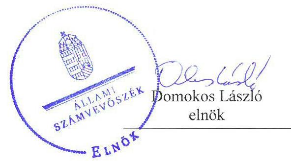
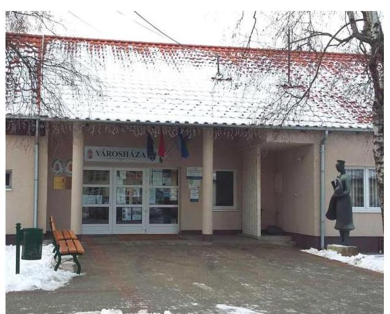
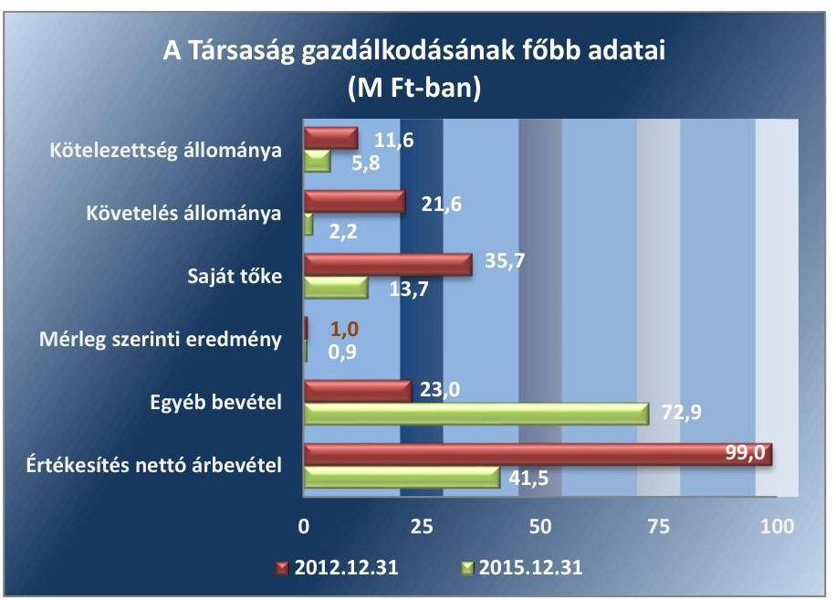
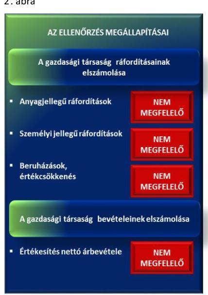
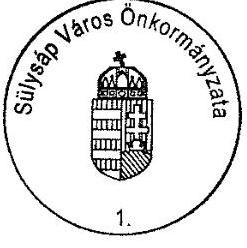
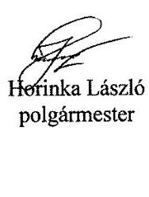
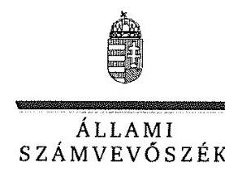
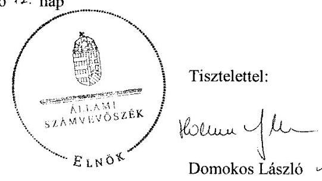

# Jelentés 

## Az önkormányzatok gazdasági társaságai

Az önkormányzatok többségi tulajdonában lévő gazdasági társaságok gazdálkodásának ellenőrzése - Tápiómenti Városüzemeltető és Szolgáltató Kft.
2017.

---

# Jelentés 

## Az önkormányzatok gazdasági társaságai

Az önkormányzatok többségi tulajdonában lévő gazdasági társaságok gazdálkodásának ellenőrzése - Tápiómenti Városüzemeltető és Szolgáltató Kft.
2017. október 2. nap

---

# AZ ELLENŐRZÉST FELÜGYELTE:

DR. NAGY IMRE felügyeleti vezető

# AZ ELLENŐRZÉST VEZETTE ÉS A VÉGREHAJTÁSÁÉRT FELELŐS:

VALASTYÁNNÉ DR. VÍZHÁNYÓ JÚLIA ellenőrzésvezető

# A PROGRAM ÖSSZEÁLLÍTÁSÁÉRT FELELŐS:

JANIK JÓZSEF osztályvezető

---

**IKTATÓSZÁM:** V-1330-205/2016.

**TÉMASZÁM:** 2364

**ELLENŐRZÉS-AZONOSÍTÓ SZÁM:** V075827

---

Jelentéseink az Országgyűlés számítógépes hálózatán és az Interneten a www.asz.hu címen is olvashatóak.

---

# TARTALOMJEGYZÉK 

■ ÖSSZEGZÉS ..... 5
■ AZ ELLENŐRZÉS CÉLJA ..... 6
■ AZ ELLENŐRZÉS TERÜLETE ..... 7
■ AZ ELLENŐRZÉS HÁTTERE, INDOKOLTSÁGA ..... 9
■ A JELENTÉS LÉNYEGES KÉRDÉSKÖREI ..... 10
■ ELLENŐRZÉS HATÓKÖRE ÉS MÓDSZEREI ..... 11
■ MEGÁLLAPÍTÁSOK ..... 13
■ JAVASLATOK ..... 18
■ MELLÉKLETEK ..... 21
I. Sz. melléklet: Értelmező szótár. ..... 21
II. Sz. melléklet: A Társaság főbb mérlegadatai. ..... 23
■ FÜGGELÉK: ÉSZREVÉTELEK ..... 25
■ RÖVIDÍTÉSEK JEGYZÉKE ..... 31

---

.

---

# ÖSSZEGZÉS 

Sülysáp Város Önkormányzata a tulajdonosi jogokat nem szabályszerűen gyakorolta. A Tápiómenti Városüzemeltető és Szolgáltató Kft. vagyongazdálkodása nem volt szabályszerű. Az egyszerűsített éves beszámolók mérlegét leltárral nem támasztotta alá. A Tápiómenti Városüzemeltető és Szolgáltató Kft. beszámolási kötelezettségének eleget tett. A közérdekű adatok közzétételéről nem gondoskodott, gazdálkodásának átláthatósága nem volt biztosított. Bevételeinek és ráfordításainak elszámolása nem volt szabályszerű. Árképzése a jogszabályi előírásoknak megfelelően történt.

## Az ellenőrzés társadalmi indokoltsága

Magyarországon az önkormányzatok kötelező és önként vállalt feladataik vonatkozásában is egyre szélesebb körben alkalmazzák a költségvetésen kívüli feladatellátást, ezáltal - a nonprofit szervezetek mellett - az önkormányzati tulajdonú gazdasági társaságok is kiemelt fontosságú szerephez jutottak.

Az Állami Számvevőszék az ellenőrzése során arra kereste a választ, hogy 2012-2015. között szabályszerű volt-e a Tápiómenti Városüzemeltető és Szolgáltató Kft. gazdálkodása és Sülysáp Város Önkormányzata ehhez kapcsolódó tulajdonosi joggyakorlása.

## Főbb megállapítások, következtetések, javaslatok

Sülysáp Város Önkormányzata tulajdonosi joggyakorlása a Tápiómenti Városüzemeltető és Szolgáltató Kft. felett nem volt szabályszerű. Sülysáp Város Önkormányzata a Tápiómenti Városüzemeltető és Szolgáltató Kft.-nél Felügyelőbizottságot nem hozott létre, a Tápiómenti Városüzemeltető és Szolgáltató Kft. javadalmazási és juttatási rendszerről szóló szabályzatát nem készítette el.

A Tápiómenti Városüzemeltető és Szolgáltató Kft. vagyongazdálkodása nem volt szabályszerű. Számviteli szabályzatait nem minden esetben a jogszabályban előírt határidőre készítette el, azokat a jogszabályi változások ellenére nem megfelelően aktualizálta. A használatra átvett eszközöket a jogszabályi előírások ellenére nem tartotta nyilván. Egyszerűsített éves számviteli beszámolóit elkészítette, azonban azokat leltárral nem támasztotta alá. A könyvvizsgáló minden évben korlátozás nélküli hitelesítő záradékkal látta el jelentéseit, a beszámolók leltárral való alátámasztottságának hiányát nem jelezte. A Tápiómenti Városüzemeltető és Szolgáltató Kft. adatvédelmi és adatbiztonsági szabályzattal nem rendelkezett, a közérdekű adatok közzétételéről a jogszabályi előírások ellenére nem gondoskodott. A gazdálkodás során fizetőképessége biztosított volt. A kiegészítő mellékletekben a maradványérték meghatározásának módját nem ismertette.

Bevételeinek és ráfordításainak elszámolása nem volt szabályszerű. Árképzése a jogszabályi előírásoknak megfelelően történt.

---

# AZ ELLENŐRZÉS CÉLJA 

Az ellenőrzés célja annak értékelése volt, hogy az önkormányzat vagyongazdálkodási tevékenysége során szabályszerűen gyakorolta-e tulajdonosi jogait; a gazdasági társaság szabályozottsága, gazdálkodása és vagyongazdálkodási tevékenysége, bevételeinek és ráfordításainak elszámolása megfelelt-e a jogszabályi és tulajdonosi előírásoknak; a gazdasági társaság fizetőképessége jelent-e kockázatot a működésre, valamint a gazdálkodás átláthatósága és elszámoltathatósága érdekében biztosítva volt-e a szolgáltatás díjának megalapozottsága szabályszerű önköltségszámítással.

---

# **AZ ELLENŐRZÉS TERÜLETE**

## **Sülysáp Város Önkormányzata és a kizárólagos tulajdonában lévő Tápiómenti Városüzemeltető és Szolgáltató Kft.**

**SÜLYSÁP VÁROS ÖNKORMÁNYZATA** a Társaságot1 kizárólagos tulajdonosként, az ellenőrzött időszakot megelőzően hozta létre.

**A TÁRSASÁG** Alapító okirat1,22-ában meghatározott főtevékenysége 2012. december 31-ig víztermelés, -kezelés, -elosztás volt, melyet az Önkormányzattal kötött Feladat-ellátási megállapodás3 alapján végzett. Az Önkormányzat a feladat ellátásához szükséges eszközöket az ellenőrzött időszakot megelőzően térítésmentesen adta a Társaság használatába.

2013. január 1-jétől a Feladatellátási és közszolgáltatási szerződés4 alapján ingatlankezelést, helyi közutak és közterületek karbantartását, az önkormányzati ingatlanvagyon működtetését végezte. Az Önkormányzat a feladatok ellátásához szükséges eszközöket térítésmentesen adta a Társaság használatába.

A kommunális szennyvíz gyűjtését, elszállítását és elhelyezését 2013. január 2-ától Közszolgáltatási szerződés5 alapján a Társaság saját eszközeivel végezte.

Vagyonkezelésre az Önkormányzat nem adott át eszközöket a Társaság részére.

A Társaság jegyzett tőkéje az ellenőrzött időszakban 3,0 M Ft6 volt, amely 2,9 M Ft volt készpénzből és 0,1 M Ft apportból állt. Az Önkormányzat többségi tulajdonában csak a Társaság volt. Más gazdasági társaságban a Társaságnak nem volt tulajdonosi részesedése.

A foglalkoztatott átlagos statisztikai állományi létszám a 2012. évben 27 fő, a 2015. évben 31 fő volt.

A Polgármester7 és a Jegyző8 személyében az ellenőrzött időszakban nem történt változás. A Társaság ügyvezetőjének személye az ellenőrzött időszak alatt egyszer változott.

---

A Társaság főbb gazdálkodási adatait a 2012-2015. évek vonatkozásában az 1. ábra szemlélteti.

1. ábra

Forrás: a Társaság 2012. és 2015. évi beszámolói
Az értékesítés nettó árbevétele a 2012. évi 99,0 M Ft-ról 41,5 M Ft-ra csökkent a víziközmű-szolgáltatási tevékenység 2012. december 31-ei megszűnése miatt.

---

# AZ ELLENŐRZÉS HÁTTERE, INDOKOLTSÁGA 

AZ ÖNKORMÁNYZAT TÖBBSÉGI TULAJDONÁBAN ÁLLÓ GAZDASÁGI TÁRSASÁGOK ellenőrzése kiemelten fontos a vagyon megőrzése, megóvása érdekében az önkormányzati tulajdonú gazdálkodó szervezetek esetében, amelyekkel szemben alapvető követelmény, hogy gazdálkodásuk, működésük szabályszerű, az általuk szolgáltatott adatok minél megbízhatóbbak legyenek. A feladatellátás költségeinek, ráfordításainak alakulása a lakosság széles rétegét érinti.

ELLENŐRZÉSEINK FELTÁRHATJÁK, hogy az Önkormányzat a feladatellátásához rendelt vagyon működtetését a tulajdonostól elvárható gondossággal végezte-e, a feladatot ellátó gazdasági társaság a létesítő okiratban, szolgáltatási szerződésben foglaltak betartásával biztosította-e a feladat ellátását. Az ellenőrzés eredményeképp meghatározhatóvá válnak a költségvetési hiányt befolyásoló szervezetek kockázatai, lehetővé válik ezen kockázatok csökkentése. Az ellenőrzés rávilágíthat arra, hogy a gazdasági társaság a vagyon használatával biztosította-e a szolgáltatás folytatásának feltételeit, az Önkormányzat tulajdonosi felügyelete hozzájárult-e a szabályszerű gazdálkodáshoz és feladatellátáshoz. A megállapítások alapján megfogalmazott számvevőszéki javaslatok hasznosítása elősegítheti a meglévő hibák megszüntetését. A jó gyakorlatok bemutatásával az ÁSZ hozzájárulhat a követendő megoldások megismertetéséhez, terjesztéséhez.

---

# A JELENTÉS LÉNYEGES KÉRDÉSKÖREI 

1.- Az Önkormányzat tulajdonosi joggyakorlása szabályszerű volt-e?
2.- A gazdasági társaság vagyongazdálkodása szabályszerű volt-e, fizetőképessége biztosított volt-e a gazdálkodás során?
3.- A gazdasági társaság bevételeinek és ráfordításainak elszámolása, valamint az önköltségszámítás és árképzés szabályszerű volt-e?

---

# ELLENŐRZÉS HATÓKÖRE ÉS MÓDSZEREI 

## Az ellenőrzés típusa

Megfelelőségi ellenőrzés.

## Az ellenőrzött időszak

2012. január 1-jétől 2015. december 31-ig.

## Az ellenőrzés tárgya

Sülysáp Város Önkormányzata kizárólagos tulajdonában lévő Tápiómenti Városüzemeltető és Szolgáltató Kft. feletti tulajdonosi joggyakorlása, valamint a Tápiómenti Városüzemeltető és Szolgáltató Kft. gazdálkodásának szabályozottsága és szabályszerűsége.

Az ellenőrzés kiterjedt minden olyan körülményre és adatra, amely az ÁSZ jogszabályban meghatározott feladatainak teljesítéséhez, valamint a program végrehajtása folyamán felmerült újabb összefüggések feltárásához szükséges.

## Az ellenőrzött szervezet

Sülysáp Város Önkormányzata, valamint a Tápiómenti Városüzemeltető és Szolgáltató Kft.

## Az ellenőrzés jogalapja

Az ellenőrzés jogszabályi alapját az Állami Számvevőszékről szóló 2011. évi LXVI. törvény 1. § (3) bekezdése és 5. § (3)-(4)-(5) bekezdései képezik.

## Az ellenőrzés módszerei

Az ellenőrzést a nemzetközi standardokat irányadónak tekintve az ellenőrzési program ellenőrzési kérdései, az ellenőrzött időszakban hatályos jogszabályok, az ellenőrzés szakmai szabályok és módszertanok figyelembevételével végeztük.

Az ellenőrzés ideje alatt az ellenőrzött szervezettel történő kapcsolattartást az ÁSZ Szervezeti és Működési Szabályzatának vonatkozó előírásai alapján biztosítottuk.

---

Az ellenőrzés a kizárólagos tulajdonosi jogokat gyakorló Sülysáp Város Önkormányzatra, valamint a Tápiómenti Városüzemeltető és Szolgáltató Kft.-re terjedt ki.

Az ellenőrzési kérdések megválaszolásához szükséges bizonyítékok megszerzése a következő ellenőrzési eljárások alkalmazásával történt: megfigyelés, kérdésfeltevés (információkérés), összehasonlítás, valamint elemző eljárás. Az ellenőrzési bizonyítékként felhasználható adatforrások közé tartoznak egyrészt az ellenőrzési programban felsorolt adatforrások, másrészt adatforrás lehet még minden - az ellenőrzés folyamán - feltárt, az ellenőrzés szempontjából információkat tartalmazó dokumentum.

Az ellenőrzést a kérdésekre adott válaszok kiértékelésével, valamint a megjelölt adatforrások, a csatolt tanúsítványok felhasználásával, továbbá az adott időszakban hatályos jogszabályok figyelembevételével folytattuk le.

A gazdasági társaság bevételei és ráfordításai, ezeken belül az értékcsökkenés, valamint a vagyonnyilvántartás szabályszerűségének megítéléséhez a bevételeket és a ráfordításokat, a tárgyi eszközök állományváltozásait tartalmazó adott évi főkönyvi kivonat adatbázisát vettük alapul. A minta kiválasztása során véletlen mintavételt alkalmaztunk évenkénti, elemszámmal arányos rétegezéssel a teljes időszakra vonatkozóan. A minta alapján a sokaságban előforduló hibaarányt becsültük. „Megfelelőnek" értékeltünk egy ellenőrzött területet, amennyiben 95\%-os bizonyossággal a teljes sokaságban a hibaarány legfeljebb 10\%, „nem megfelelőnek", amennyiben 10\%-nál magasabb arányt képviselt. A mintavételt megelőzően az anyagjellegű ráfordítások, valamint a tárgyi-eszköz növekedési tételei sokaságból évente sokaságonként kiemeltük a 3-3 legnagyobb összegű tételt annak biztosítására, hogy az ellenőrzés az egyszerű véletlen mintavétel mellett a legnagyobb értékű tételek ellenőrzésére biztosan kiterjedjen.

---

# 1. Az Önkormányzat tulajdonosi joggyakorlása szabályszerű volt-e? 

## Összegző megállapítás

### 1.1. számú megállapítás

Az Önkormányzat tulajdonosi joggyakorlása nem volt szabályszerű.

Az Önkormányzat tulajdonosi joggyakorlásának kereteit nem alakította ki szabályszerűen.

Az Önkormányzat Képviselő-testülete a tulajdonosi jogokat a vagyongazdálkodási rendelet ${ }_{1,2}{ }^{9}$ és az Alapító okirat ${ }_{1,2}$ alapján gyakorolta.

Az Önkormányzat a tulajdonosi jogok gyakorlásának kereteit nem a jogszabályi előírásoknak megfelelően alakította ki.

A Társaság Alapító okirat ${ }_{1,2}$-a alapján a tulajdonosi jogokat az Önkormányzat Képviselő-testülete gyakorolta.

Az Önkormányzat a Társasággal kapcsolatos tulajdonosi jogok gyakorlására vonatkozó előírásokat a Társaság Alapító okiratában ${ }_{1,2}$, az SZMSZ10-ben, a Feladat-ellátási megállapodásban, a Feladatellátási és közszolgáltatási szerződésben, valamint a Közszolgáltatási szerződésben alakította ki.

AZ ÖNKORMÁNYZAT az Ötv.11 előírásainak megfelelően készítette el a 2010-2014. évi Gazdasági program12-ját. A 2014-2019. évekre vonatkozó Gazdasági program13-ot a Képviselő-testület14 az Mötv.15 116. § (5) bekezdésében foglaltak ellenére az alakuló ülését követően késve fogadta el.

KÖZÉP ÉS HOSSZÚTÁVÚ VAGYONGAZDÁLKODÁSI TERVVEL az Önkormányzatnak 2012. január 1. és 2013. április 10. között nem rendelkezett, mellyel megsértette az Nvtv.16 9. § (1) bekezdésének előírását. 2013. április 11-től rendelkezett közép- és hosszú távú vagyongazdálkodási tervvel.

A JAVADALMAZÁSI, JUTTATÁSI RENDSZERRŐL SZÓLÓ SZABÁLYZATOT a Taktv. 5. § (3) bekezdésének rendelkezései ellenére a Képviselő-testület nem alkotta meg.
1.2. számú megállapítás

A tulajdonosi jogok gyakorlása nem volt szabályszerű.
A BESZÁMOLTATÁSI RENDSZER keretében az Önkormányzat a Társaság ügyvezetőjét évente beszámoltatta az előző évi teljesítményekről, eredményekről, amelyet határozattal minden évben elfogadott a Képviselő-testület. A tulajdonos Önkormányzat az Alapító okirat1,2-ban nem jelölte ki a felügyelőbizottsági tagokat, nem hozott létre és nem működtetett felügyelőbizottságot a Társaságnál, amellyel megsértette a

---

Taktv.17 4. § (1) bekezdésében, a Gt.18 33. § (2) bekezdés c) pontjában foglaltakat. Mivel a Társaságnál felügyelőbizottság nem működött, ezért az éves egyszerűsített beszámolók a Gt. 35. § (3) bekezdésében és a Ptk.19 3:120. § (2) bekezdésében foglaltak ellenére felügyelőbizottsági írásos jelentés nélkül kerültek beterjesztésre a Képviselő-testület részére. A

 beszámolókhoz csatolták a jogszabályban előírt könyvvizsgálói jelentést. A Képviselőtestület az Alapító okiratban ${ }_{1,2}$ foglalt hatáskörénél fogva minden évben határozattal fogadta el a beszámolókat.

PÉNZÜGYI TERVEK készítésének kötelezettségét a Társaság számára Feladatellátási és közszolgáltatási szerződés 6.2 h) pontja 2013. január 1-jétől írta elő. Ennek ellenére a Társaság a 2013. évben pénzügyi tervet nem készített. A 2014. és a 2015. évre vonatkozó pénzügyi terveit elkészítette.

# 2. A gazdasági társaság vagyongazdálkodása szabályszerű volt-e, fizetőképessége biztosított volt-e a gazdálkodás során? 

Összegző megállapítás

A Társaság vagyongazdálkodása nem volt szabályszerű. Számviteli szabályzatait nem minden esetben a jogszabályi változásoknak megfelelő határidőben készítette el és aktualizálta. Adatvédelmi és adatbiztonsági szabályzattal nem rendelkezett, a közérdekű adatok közzétételéről nem gondoskodott. A fizetőképessége biztosított volt.

A Társaság a Számv. tv-ben előírt szabályzatokat elkészítette. A szabályzatok aktualizálását nem a jogszabályi változásoknak megfelelően végezték el.

SZÁMVITELI POLITIKÁVAL ${ }_{1,2}{ }^{20}$ és az annak keretében elkészítendő Eszközök és források értékelési ${ }^{21}$, Leltározási ${ }_{1,2}{ }^{22}$, valamint Pénzkezelési szabályzattal ${ }_{1,2}{ }^{23}$, illetve Számlarenddel ${ }_{1,2}{ }^{24}$ rendelkezett. A Számviteli politika ${ }_{1,2}$ a Számv. tv. ${ }^{25}$ 80. § (2) bekezdésében foglaltak ellenére az egyösszegű értékcsökkenés elszámolásának összeghatárát 100 E Ft${ }^{26}$ helyett 200 E Ft-ban határozta meg.

A LELTÁROZÁSI SZABÁLYZAT ${ }_{1,2}$ nem tartalmazta a Számv. tv. 69. §. (3) bekezdésének 2012. január 1-jétől hatályos változását, amely szerint a leltárba bekerülő adatok valódiságáról mennyiségi nyilvántartás vezetése esetén legalább háromévente mennyiségi felvétellel, illetve egyeztetéssel kell meggyőződni.

## AZ ESZKÖZÖK ÉS FORRÁSOK ÉRTÉKELÉSI SZABÁLYZATÁVAL a Társaság a Számv. tv. 14. § (5) bekezdésében b) pontjában előírtak ellenére 2014. január 9-ig nem rendelkezett. Az Eszközök és források értékelési szabályzatát 2014. január 10-én készítette el és léptette hatályba. Az Eszközök és források értékelési szabályzata megfelelt a jogszabályi előírásoknak.

---

A PÉNZKEZELÉSI SZABÁLYZAT ${ }_{1,2}$ a Számv. tv. előírásainak megfelel.

A SZÁMLAREND ${ }_{1,2}$ a Számv. tv. 161. § (2) bekezdés a) pontjában foglaltak ellenére nem tartalmazta minden alkalmazásra kijelölt számla számjelét és megnevezését.

ÜZLETSZABÁLYZATTAL a Vksztv. ${ }^{27}$ 47. § (1) bekezdése előírása ellenére 2012. július 15. és december 31. között nem rendelkezett.
2.2. számú megállapítás

# A Társaság vagyongazdálkodási tevékenysége nem volt szabályszerű. Az éves beszámolóit leltárral nem támasztotta alá.

### 2.3. számú megállapítás

A Társaság fizetőképessége az ellenőrzött időszak végére romlott.

A Társaság fizetőképessége az ellenőrzött időszak végére romlott. Kötelezettségállománya a 2012. év és a 2015. év között 5,8 M Ft-tal csökkent. A lejárt rövidlejáratú kötelezettségállomány aránya növekedett.

A Társaság az Önkormányzattól a 2013. évben kapott 13,6 M Ft támogatást a 2013. évi beszámolójában a Számv. tv. 44. § (2) bekezdésében foglaltakat megsértve passzív időbeli elhatárolás helyett hosszú lejáratú kötelezettségként mutatta ki a mérlegében.

### 2.4. számú megállapítás

A Társaság beszámolási, adatszolgáltatási kötelezettségét teljesítette. Adatvédelmi és adatbiztonsági szabályzatot nem készített.

AZ EGYSZERŰSÍTETT ÉVES BESZÁMOLÓK készítésével a Társaság eleget tett a jogszabályokban előírt adatszolgáltatási és beszámolási kötelezettségének, amelyeket a Képviselőtestület az előírt határidőig jóváhagyott. A Társaság az egyszerűsített éves beszámolókat a Számv. tv. előírásainak megfelelően letétbe helyezte és közzétette. Az egyszerűsített éves beszámolók jóváhagyásakor az Önkormányzat Képviselőtestülete a könyvvizsgálói jelentések birtokában határozott.

A leltározás hiánya ellenére a könyvvizsgáló korlátozás nélküli hitelesítő záradékkal látta el a beszámolóhoz kapcsolódó jelentéseket.

A Társaság az Info tv. ${ }^{28}$ 30. § (6) bekezdésében foglaltaknak megfelelően a közérdekű adatok megismerésére irányuló igények teljesítésének rendjét rögzítő szabályzatot elkészítette.

---

Az Info tv. 24. § (3) bekezdésének előírása ellenére adatvédelmi és adatbiztonsági szabályzattal nem rendelkezett.

Az Info tv. 37. § (1) bekezdésében utalt 1. mellékletben meghatározott adatok közül az Önkormányzat honlapján csak a Társaság elérhetősége és az ügyvezető neve volt megtalálható.

# 3. A gazdasági társaság bevételeinek és ráfordításainak elszámolása, valamint az önköltségszámítás és árképzés szabályszerű volt-e? 

Összegző megállapítás

## 3.1. számú megállapítás

2. ábra

A Társaság bevételeinek és ráfordításainak elszámolása nem volt megfelelő. Árképzése megfelelően történt.

A Társaságnál az értékesítés nettó árbevételének és ráfordításainak elszámolása nem volt megfelelő.

A TÁRSASÁG BEVÉTELEINEK ÉS RÁFORDÍTÁSAINAK ELSZÁMOLÁSA a jogszabályi előírásoknak nem megfelelően történt. Az ellenőrzés megállapításait a 2. ábra mutatja.

AZ ÉRTÉKESÍTÉS NETTÓ ÁRBEVÉTELÉNEK ELSZÁMOLÁSA nem volt megfelelő. Az elszámolás alapjául szolgáló számviteli bizonylatok nem feleltek meg a Számv. tv. 167. § (1) bekezdés h), i) pontjának, nem tartalmazták a könyvviteli számlákra történő hivatkozást, valamint a könyvviteli nyilvántartásokban történt rögzítés időpontját, igazolását. A számlák az Áfa tv. ${ }^{29} 169$. § i) pontjának előírása ellenére nem tartalmazták a nyújtott szolgáltatások adó nélküli egységárát.

A SZEMÉLYI JELLEGŰ RÁFORDÍTÁSOK ELSZÁMOLÁSA nem volt megfelelő. A számfejtett munkabérek a Számv. tv. 165. § (1)-(2) bekezdésének rendelkezése ellenére munkaszerződéssel nem voltak alátámasztva.

AZ ANYAGJELLEGŰ RÁFORDÍTÁSOK ELSZÁMOLÁSA nem volt megfelelő. A bizonylatok nem feleltek meg a Számv. tv. 167. § (1) bekezdés h), i) pontjának, mivel nem tartalmazták a könyvviteli számlákra történő hivatkozást, valamint a könyvviteli nyilvántartásokban történt rögzítés időpontját, igazolását.

A BERUHÁZÁSOK ELSZÁMOLÁSA nem volt megfelelő. Az eszközök állományba vétele megtörtént, azonban az üzembe helyezés a Számv. tv. 52. § (2) bekezdése előírása ellenére nem volt hitelt érdemlően dokumentálva.

AZ ÉRTÉKCSÖKKENÉS elszámolása nem volt megfelelő. A Számviteli politika ${ }_{1,2}$ értelmében a terv szerinti értékcsökkenést a hasznos élettartam és a maradványérték figyelembevételével kellett volna elszá-

---

molni. Ezzel szemben a Társaság csoportos értékcsökkenési elszámolást alkalmazott. Ezzel nem tartotta be a Számv. tv. 52. § (1) bekezdésében, valamint a Számviteli politikában ${ }_{1,2}$-ban rögzített elveket.

A Társaság a kiegészítő mellékletekben nem ismertette a maradványérték meghatározásának módját, ezzel megsértette a Számv. tv. 88. § (4) bekezdésében előírtakat.

A KÖVETELÉSÁLLOMÁNY a 2012. évi 21,6 M Ft-ról, 2015-re 2,2 M Ft-ra csökkent. A követelések csökkenésének fő oka volt, hogy a Társaság a tevékenysége megváltozása miatt már nem számlázott vízdíjat.

# 3.2. számú megállapítás 

A Társaság önköltségszámítási szabályzat készítésére nem volt kötelezett. Árképzése megfelelő volt.

ÖNKÖLTSÉGSZÁMÍTÁSI SZABÁLYZAT elkészítése alól a Társaság a Számv. tv. 14. § (6) bekezdésének megfelelően mentesült. Azonban 2014. január 1-jei hatállyal elkészítette Önköltségszámítási szabályzatát ${ }^{30}$.

A Vksztv. 93. § (2) bekezdésében előírtak alapján 2012. január 1-jétől az Önkormányzat az ivóvíz- és szennyvíz szolgáltatási díj megállapítási jogosultsága megszűnt. A Társaság a vízdíj megállapítása során az önkormányzati ivóvíz rendelet ${ }^{31}$-ben szabályozott, a Vksztv. előírásainak megfelelő vízdíjat alkalmazta.

A Társaság a kommunális szennyvíz gyűjtésére, elszállítására és elhelyezésére vonatkozóan az Önkormányzat Folyékony hulladékkezelési rendelete ${ }^{32}$ által előírt díjtételt alkalmazta.

---

# JAVASLATOK 

Az ÁSZ tv. 33. § (1) bekezdésében foglaltak értelmében az ellenőrzött szervezet vezetője köteles a jelentésben foglalt megállapításokhoz kapcsolódó intézkedési tervet összeállítani és azt a jelentés kézhezvételétől számított 30 napon belül az ÁSZ részére megküldeni. Amennyiben az ellenőrzött szervezet vezetője nem küldi meg határidőben az intézkedési tervet, vagy továbbra sem elfogadható intézkedési tervet küld, az Állami Számvevőszék elnöke az ÁSZ tv. 33. § (3) bekezdés a) és b) pontjaiban foglaltakat érvényesítheti.

## A Tápiómenti Városüzemeltető és Szolgáltató Kft.   Ügyvezetőjének

1. Intézkedjen a számviteli politika, a leltározási szabályzat és a számlarend jogszabályi előírásoknak megfelelő módosításáról.
(2.1 sz. megállapítás 1. bekezdés 2. mondata, a 2. és az 5. bekezdés alapján)
2. Intézkedjen a jogszabályi előírásnak megfelelően a használatra átvett eszközök nyilvántartásáról.
(2.2 sz. megállapítás 1. bekezdés 3. mondata alapján)
3. Intézkedjen az egyszerűsített éves beszámoló mérlegtételeinek leltárral való alátámasztásáról.
(2.2 sz. megállapítás 2. bekezdése alapján)
4. Intézkedjen a jogszabályi előírásnak megfelelő adatvédelmi és adatbiztonsági szabályzat elkészítéséről.
(2.4 sz. megállapítás 4. bekezdése alapján)
5. Intézkedjen annak érdekében, hogy a Társaság a jogszabályban foglalt közzétételi kötelezettségének teljes körűen eleget tegyen.
(2.4 sz. megállapítás 5. bekezdése alapján)
6. Intézkedjen a számviteli elszámolások szabályszerű végrehajtására, ezen belül az értékesítés nettó árbevétele, a személyi jellegű ráfordítások, az anyagjellegű ráfordítások, a beruházások és az értékcsökkenés elszámolása tekintetében a jogszabályi előírások és a belső szabályozás betartására.
(3.1 sz. megállapítás 2.-6. bekezdései alapján)

---

7. Intézkedjen arról, hogy az egyszerűsített éves beszámoló kiegészítő melléklete a jogszabály előírásainak megfelelően mutassa be az előírt tartalmi elemeket.
(3.1. sz. megállapítás 7. bekezdés alapján)

# Sülysáp Város Önkormányzata Polgármesterének 

1. Kezdeményezze a Társaság legfőbb szervénél a jogszabályban előírt szabályzat megalkotását a vezető tisztségviselők, felügyelőbizottsági tagok, valamint az Mt. 208. §-ának hatálya alá eső munkavállalók javadalmazása, valamint a jogviszony megszünése esetére biztosított juttatások módjának, mértékének elveiről és rendszeréről.
(1. 1. sz. megállapítás 7. bekezdése alapján)
2. Kezdeményezze a Társaság legfőbb szervénél a Társaság felügyelőbizottságának létrehozását.
(1.2. sz. megállapítás 1. bekezdés 2. mondata alapján)
3. Intézkedjen a felügyelőbizottság létrehozásával és az önkormányzat tulajdonosi joggyakorlásának törvényességével kapcsolatban feltárt hiányosságok tekintetében a felelősség tisztázására irányuló eljárás megindításáról, és ennek eredménye ismeretében a szükséges intézkedések megtételéről.
(1.2. sz. megállapítás 1. bekezdés 2. mondata alapján)

---

.

---

# MELLÉKLETEK 

- I. SZ. MELLÉKLET: ÉRTELMEZŐ SZÓTÁR
garanciaszerződés
gazdasági társaság
gazdálkodó szervezet
kezesség
közszolgáltatás
meghatározó befolyás
minősített többséget biztosító részesedés
nemzeti vagyon

A garanciaszerződés, illetve a garanciavállaló nyilatkozat a garantőr olyan kötelezettségvállalása, amely alapján a nyilatkozatban meghatározott feltételek esetén köteles a jogosultnak fizetést teljesíteni. (Ptk. 2 6:431. § (1) bekezdése)
Ptk. 2 3:88. § (1) bekezdése szerint „a gazdasági társaságok üzletszerű közös gazdasági tevékenység folytatására, a tagok vagyoni hozzájárulásával létrehozott, jogi személyiséggel rendelkező vállalkozások, amelyekben a tagok a nyereségből közösen részesednek, és a veszteséget közösen viselik".
A Ptk. ${ }^{33}$ 685. § c) pontja szerint gazdálkodó szervezet: „az állami vállalat, az egyéb állami gazdálkodó szerv, a szövetkezet, a lakásszövetkezet, az európai szövetkezet, a gazdasági társaság, az európai részvénytársaság, az egyesülés, az európai gazdasági egyesülés, az európai területi együttműködési csoportosulás, az egyes jogi személyek vállalata, a leányvállalat, a vízgazdálkodási társulat, az erdő birtokossági társulat, a végrehajtói iroda, az egyéni cég, továbbá az egyéni vállalkozó." (hatályon kívül 2014. 03.15-től)
A kezességre vonatkozó előírásokat a Ptk. 2 6:416-430. §-ai tartalmazzák. Kezességi szerződéssel a kezes kötelezettséget vállal a jogosulttal szemben, hogyha a kötelezett nem teljesít, maga fog helyette a jogosultnak teljesíteni. Kezesség egy vagy több, fennálló vagy jövőbeli, feltétlen vagy feltételes, meghatározott vagy meghatározható összegű pénzkövetelés vagy pénzben kifejezhető értékkel rendelkező egyéb kötelezettség biztosítására vállalható.
A Ptk. 2 szerint kezességet csak írásban lehet vállalni. A kezes kötelezettsége ahhoz a kötelezettséghez igazodik, amelyért kezességet vállalt. A kezes kötelezettsége nem válhat terhesebbé, mint amilyen elvállalásakor volt, kiterjed azonban a kötelezett szerződésszegésének jogkövetkezményeire és a kezesség elvállalása után esedékessé váló mellékkövetelésekre is.
Az Ebktv. ${ }^{34}$ 3. § d) pontja a következőképpen határozza meg a közszolgáltatást: „szerződéskötési kötelezettség alapján a lakosság alapvető szükségleteinek ellátására irányuló szolgáltatás, így különösen a villamos energia-, gáz-, hő-, víz-, szennyvíz- és hulladékkezelési, köztisztasági, postai és távközlési szolgáltatás, továbbá a menetrend alapján közlekedő járművekkel végzett közforgalmú személyszállítás".
A Ptk. 2 8:2. § (2) bekezdése szerint „A
 befolyással rendelkező akkor rendelkezik egy jogi személyben meghatározó befolyással, ha annak tagja vagy részvényese, és
a) jogosult e jogi személy vezető tisztségviselői vagy felügyelőbizottsága tagjainak többségének megválasztására, illetve visszahívására; vagy
b) a jogi személy más tagjai, illetve részvényesei a befolyással rendelkezővel kötött megállapodás alapján a befolyással rendelkezővel azonos tartalommal szavaznak, vagy a befolyással rendelkezőn keresztül gyakorolják szavazati jogukat, feltéve, hogy együtt a szavazatok több mint felével rendelkeznek."
A minősített befolyásszerző az ellenőrzött társaságban a szavazatok legalább hetvenöt százalékával rendelkezik. (Ptk. 2. 3:324. §)
Nvt. 1. § (2) bekezdése szerint többek között:
„az állam vagy a helyi önkormányzat kizárólagos tulajdonában álló dolgok, az a) pont hatálya alá nem tartozó, állam vagy a helyi önkormányzat tulajdonában lévő dolog,

---

anonprofit gazdasági társaság
többségi befolyást biztosító részesedés
vagyonkezelő
az állam vagy a helyi önkormányzat tulajdonában lévő pénzügyi eszközök, továbbá az államot vagy a helyi önkormányzatot megillető társasági részesedések, az államot vagy a helyi önkormányzatot megillető bármely vagyoni értékkel rendelkező jogosultság, amelyet jogszabály vagyoni értékű jogként nevesít."
Civil tv. ${ }^{35}$ 9/F. § (2) bekezdése szerint „az a gazdasági társaság minősül nonprofit gazdasági társaságnak és cégnevében az a gazdasági társaság tüntetheti fel a nonprofit jelleget, amelynek létesítő okirata tartalmazza, hogy a gazdasági társaság tevékenységéből származó nyereség a tagok között nem osztható fel, hanem az a gazdasági társaság vagyonát gyarapítja." (hatályos 2014. március 15-től)
A Ptk. 1 8:2. § (1) bekezdése szerint „többségi befolyás az olyan kapcsolat, amelynek révén természetes személy vagy jogi személy (befolyással rendelkező) egy jogi személyben a szavazatok több mint felével vagy meghatározó befolyással rendelkezik."
a) az állam tulajdonában álló nemzeti vagyon tekintetében:
aa) költségvetési szerv,
ab) helyi önkormányzat, önkormányzati társulás,
ac) önkormányzati intézmény,
ad) köztestület,
ae) az állam, az aa)-ac) alpontban meghatározott személyek együtt vagy külön-külön 100%-os tulajdonában álló gazdálkodó szervezet,
af) az ae) alpont szerinti gazdálkodó szervezet 100%-os tulajdonában álló gazdálkodó szervezet,
ag) a törvény által kijelölt egyedileg meghatározott jogi személy.
b) a helyi önkormányzat tulajdonában álló nemzeti vagyon tekintetében:
ba) önkormányzati társulás,
bb) költségvetési szerv vagy önkormányzati intézmény,
bc) köztestület,
bd) az állam, a helyi önkormányzat, a ba)-bb) alpontban meghatározott személyek együtt vagy külön-külön 100%-os tulajdonában álló gazdálkodó szervezet,
be) a bd) alpont szerinti gazdálkodó szervezet 100%-os tulajdonában álló gazdálkodó szervezet.
c) az egyházi jogi személy a tevékenysége ellátásához szükséges nemzeti vagyon tekintetében. (Forrás: Nvtv. 3. § (1) bekezdés 19. pontja)

---

II. SZ. MELLÉKLET: A TÁRSASÁG FŐBB MÉRLEGADATAI

TÁPIÓMENTI VÁROSÜZEMELTETŐ ÉS SZOLGÁLTATÓ KFT FŐBB MÉRLEGADATAI (M Ft)

|  Megnevezés | 2012-12-31. | 2013-12-31. | 2014-12-31. | 2015-12-31.  |
| --- | --- | --- | --- | --- |
|  Befektetett eszközök | 33,2 | 33,4 | 24,2 | 23,3  |
|  - ebből: Tárgyi eszközök | 33,2 | 33,4 | 24,2 | 23,3  |
|  Forgóeszközök | 37,1 | 24,4 | 3,2 | 5,4  |
|  - ebből: Követelések | 21,6 | 17,8 | 2,3 | 2,2  |
|  Aktív időbeli elhatárolások | 0,0 | 1,7 | 1,0 | 0,5  |
|  ESZKÖZÖK ÖSSZESEN | 70,3 | 59,5 | 28,4 | 29,2  |
|  Saját tőke | 35,7 | 36,9 | 12,8 | 13,7  |
|  - ebből Jegyzett tőke | 3,0 | 3,0 | 3,0 | 3,0  |
|  - ebből: Mérleg szerinti eredmény | 1,0 | 1,2 | -5,5 | 0,9  |
|  Céltartalékok | 0,0 | 0,0 | 0,0 | 0,0  |
|  Kötelezettségek | 11,6 | 21,4 | 4,2 | 5,8  |
|  Passzív időbeli elhatárolások | 23,0 | 1,2 | 11,4 | 9,7  |
|  FORRÁSOK ÖSSZESEN | 70,3 | 59,5 | 28,4 | 29,2  |

Forrás: a Társaság 2012-2015. évi beszámolói

---

.

---

# FÜGGELÉK: ÉSZREVÉTELEK 

A jelentéstervezetet a Számvevőszék 15 napos észrevételezésre megküldte az ellenőrzött szervezetek vezetőinek az ÁSZ tv. 29. § (1) bekezdése előírásának megfelelően.

Az ÁSZ a jelentéstervezetet észrevételezésre megküldte Sülysáp Város Önkormányzata polgármesterének és a Tápiómenti Városüzemeltető és Szolgáltató Kft. ügyvezetőjének.
Észrevételezési jogával Sülysáp Város Önkormányzata polgármestere élt. A függelék tartalmazza az ellenőrzött észrevételeit melléklet nélkül, illetve az el nem fogadott észrevételek elutasításának indoklását.

[^0]
[^0]:    * 29. § (1) Az Állami Számvevőszék az ellenőrzési megállapításait megküldi az ellenőrzött szervezet vezetőjének vagy az általa megbízott személynek, és annak, akinek személyes felelősségét állapította meg.
    (2) Az ellenőrzött szervezet vezetője és a felelősként megjelölt személy az ellenőrzés megállapításaira tizenöt napon belül írásban észrevételt tehet.
    (3) Az Állami Számvevőszék az észrevételre a beérkezésétől számított harminc napon belül írásban válaszol. A figyelembe nem vett észrevételeket köteles a jelentésben feltüntetni, és megindokolni, hogy azokat miért nem fogadta el.

---

# SÜLYSÁP VÁROS ÖNKORMÁNYZATA 

2241 Sülysáp, Szent István tér 1.
tel.: 06-29/435-001, fax: 06-29/435-003
www.sulysap.hu, onkormanyzat@sulysap.hu

Ügyiratszám: S/696-5/2017
Ügyintéző: dr. Tóth Krisztina

## Domokos László elnök úrnak Állami Számvevőszék

1364 Budapest 4.
Postafiók: 54

Tárgy: A Tápiómenti Városüzemeltető és Szolgáltató Kft. működésével kapcsolatos számvevőszéki jelentéstervezet észrevételezése
Mellékletek: felügyelőbizottság megválasztásának és bejegyzésének dokumentumai, taggyülési meghívó, új ügyvezető megválasztásának és bejegyzésének dokumentumai
Hiv.szám: V-1330-194/2016.

## ÁLLAMI SZÁMVEVŐSZÉK

BE-GH12/201711
Erkszert: 2017 SZF1 21
Iktatószám:
Melléklet:

Tisztelt Elnök Úr!

A tárgyi ügyben 2017. szeptember 5. napján kézhez vett jelentéstervezetükkel kapcsolatosan Sülysáp Város Önkormányzata mint egyszemélyi tulajdonos részéről a következő észrevételeket kívánom tenni:

A jelentéstervezet megállapítja, hogy Sülysáp Város Önkormányzata tulajdonosi joggyakorlása a Tápiómenti Városüzemeltető és Szolgáltató Kft. felett nem volt szabályszerű, mivel a Társaságnál nem hozott létre felügyelőbizottságot, és nem alkotta meg a Társaság javadalmazási és juttatási rendszerről szóló szabályzatát.
Ezekkel kapcsolatosan jelezni szeretném, hogy Önkormányzatunk a mulasztás észlelését követően haladéktalanul megkezdte az intézkedést a hiányosságok kiküszöbölésére.

Egyrészről a 2017. június 22. napján tartott képviselő-testületi ülésen (taggyűlésen) létrehozásra került a felügyelőbizottság, majd pedig bejelentésre került a cégbírósághoz. Az ezt alátámasztó dokumentumokat mellékelem.
Ide vonatkozóan továbbá szeretnék rámutatni arra, hogy bár felügyelőbizottság a 2012-2015. években nem működött a Társaságnál, a taggyűlésként működő Képviselő-testület minden esetben a Magyarország helyi önkormányzatairól szóló 2011. évi CLXXXIX. törvény (a továbbiakban: Mötv.) 57. § (2) bekezdése szerinti pénzügyi bizottság előzetes véleménye

---

alapján tárgyalta a Társaság ügyeit, sőt az időközben létrehozott felügyelőbizottságot is e pénzügyi bizottság egyes tagjai alkotják.
Egyébiránt a Mötv. 120. § (1) bekezdése alapján a pénzügyi bizottság az Önkormányzatnál, intézményeinél és a Társaságnál véleményezte az éves költségvetési javaslatot és a végrehajtásáról szóló féléves, éves beszámoló tervezeteit, figyelemmel kísérte a költségvetési bevételek és a vagyonváltozás alakulását, és ellenőrzési joga volt a pénzkezelési szabályzat megtartását, valamint a bizonylati rend és a bizonylati fegyelem érvényesítését illetően, tehát hasonlóan széleskörű jogkörökkel bír, mint a felügyelőbizottság, azaz álláspontom szerint a Társaság működése a vizsgálati időszakban sem volt ellenőrizetlen.

Másrészről haladéktalanul megkezdtük javadalmazási és juttatási rendszerről szóló szabályzat előkészítését is, ami a 2017. szeptember 21. napjára összehívott taggyűlésen kerül tárgyalásra és elfogadásra, illetőleg azt követően cégiratok közé letétbe helyezésre. (Ezt alátámasztandó az észrevételezési határidő lejárta miatt válaszunkkal megvárni nem tudtuk, így jelenleg csak az ülésre szóló, ezt a napirendi pontot is tartalmazó meghívót tudjuk becsatolni.)

Összefoglalva tehát nyilatkozom, hogy jelentésük kiadásáig Önkormányzatunk - mint a Társaság egyszemélyi tulajdonosa - mind a köztulajdonban álló gazdasági társaságok takarékosabb működéséről szóló 2009. évi CXXII. törvény (a továbbiakban: Taktv.) 4. § (1) bekezdésében, mind pedig annak 5. § (3) bekezdésében foglalt kötelezettségének eleget tesz, ezért kérem, hogy a jelentéstervezet Összegzés, Megállapítások és Javaslatok című fejezeteiben az ezekre a kérdéskörökre vonatkozó megállapításokat, illetve javaslatokat lehetőség szerint módosítani, illetve törölni szíveskedjenek.
A Sülysáp Város Önkormányzata Polgármesterének tett javaslatok 3. pontjában foglaltak törlését - a fentieken túl - arra hivatkozással is kérem, hogy a Taktv. 9. § (1) bekezdése szerint a Társaság működését a törvény hatálybalépését követő első taggyűlés napjáig, de legkésőbb 2010. január 31-ig lett volna köteles összhangba hozni a 4. § (1) és 5. § (3) bekezdésének rendelkezéseivel, azonban azon személyek közül, akik ebben érintettek lehetnek már senki nem dolgozik a Társaságnál, illetve Önkormányzatunknál, sőt olyan is van köztük, aki időközben elhunyt.
Itt jelzem azt is - a jelentéstervezet 7. oldalán leírtakat is pontosítandó -, hogy már a vizsgálat megkezdése óta is történt személyi változás: 2017. február 1. napjától megbízás, majd 2017. április 1. napjától megválasztás útján Balogh Levente tölti be az ügyvezetői posztot a Társaságnál.

Megköszönve segítő munkájukat, megértésükben és észrevételeim elfogadásában bízva, tisztelettel

Sülysáp, 2017. szeptember 20.

---

ELNÖK

Ikt.szám: V-1330-199/2016.

# Horinka László úr 

polgármester
Sülysáp Város Önkormányzata

## Sülysáp

## Tisztelt Polgármester Úr!

„Az önkormányzatok gazdasági társaságai - Az önkormányzatok többségi tulajdonában lévő gazdasági társaságok gazdálkodásának ellenőrzése - Tápiómenti Városüzemeltető és Szolgáltató Kft." címmel készített számvevőszéki jelentéstervezetre tett észrevételeit köszönettel megkaptam.
Az Állami Számvevőszék észrevételekre vonatkozó álláspontjáról a felügyeleti vezető által készített részletes tájékoztatást csatoltan megküldöm.
Tájékoztatom Polgármester urat, hogy a számvevőszéki jelentésben - az Állami Számvevőszékről szóló 2011. évi LXVI. törvény 29. § (3) bekezdése alapján - a figyelembe nem vett észrevételeket szerepeltetjük annak megindoklásával, hogy azokat miért nem fogadtuk el.

Budapest, 2017. 10.
hó 12. nap

Melléklet: Tájékoztatás az észrevételek kezeléséről

---

# Tájékoztatás   az észrevételek kezeléséről 

„Az önkormányzatok gazdasági társaságai - Az önkormányzatok többségi tulajdonában lévő gazdasági társaságok gazdálkodásának ellenőrzése - Tápiómenti Városüzemeltető és Szolgáltató Kft. " című számvevőszéki jelentéstervezetre 2017. szeptember 20-án tett (az Állami Számvevőszékhez 2017. szeptember 21-én érkezett) észrevételeit áttekintettük, annak kezelésével kapcsolatban a következő tájékoztatást adom.
A jelentéstervezet 5. oldal „Főbb megállapítások" fejezet 1. bekezdésben szereplő megállapításra, a 13. oldal „Megállapítások" fejezet 1.1. számú megállapítás 7. bekezdésben szereplő megállapításra, az 1.2. számú megállapítás 1. bekezdésben szereplő megállapításra és a 19. oldal „Javaslatok" fejezet a polgármesternek címzett 1. és 2. javaslatban szereplő megállapításra vonatkozó észrevételei kapcsán
Az észrevételben jelezte, hogy a 2017. június 22-ei taggyűlésen sor került a felügyelő bizottság létrehozására, majd annak a cégbírósághoz történő bejelentésére. Jelezte, hogy a Magyarország helyi önkormányzatairól szóló 2011. évi CLXXXIX. törvény (a továbbiakban: Mötv.) 57. § (2) bekezdése szerint működő pénzügyi bizottság előzetes véleménye alapján tárgyalta a képviselőtestület a Társaság ügyeit, ami hasonlóan széleskörű jogkörrel bír, mint a felügyelőbizottság, így annak működése a vizsgált időszakban sem volt ellenőrizetlen. Továbbá jelezte, hogy megkezdték a javadalmazási és juttatási rendszerről szóló szabályzat előkészítését is. Ezekre való tekintettel kérte az e kérdéskörökre vonatkozó megállapítások és javaslatok módosítását, illetve törlését.
Észrevétele a jelentéstervezetben foglalt, 2012-2015. évekre vonatkozó megállapítást (,A tulajdonos Önkormányzat az Alapító okirat ${ }_{1,2}$ ben nem jelölte ki a felügyelőbizottsági tagokat, nem hozott létre és nem működtetett felügyelőbizottságot. ") nem vitatja, azt alátámasztja, így a javaslatot megalapozó megállapítás módosítása,
 illetve törlése nem indokolt.
A köztulajdonban álló gazdasági társaságok takarékosabb működéséről szóló 2009. évi CXXII. törvény (a továbbiakban: Taktv.) 4. § (1) bekezdése értelmében a köztulajdonban álló gazdasági társaságnál felügyelőbizottság létrehozása kötelező. A felügyelőbizottság a felügyeleti rendszer alappilléreként a szabályos működését, a rendszeres ellenőrzési feladatok ellátásáért felel. Mivel a felügyeleti jelzőrendszer nem működött megfelelően, a tulajdonosi képviselet nem töltötte be teljes körűen a szerepét, a tulajdonosi jogok gyakorlása sérült. Az Mötv. 120. § (1) bekezdése értelmében a pénzügyi bizottság a helyi önkormányzatnál és intézményeinél látja el a meghatározott feladatait. A képviselő-testület dönthet úgy, hogy a pénzügyi bizottság előzetes véleménye alapján tárgyalja a testület a gazdasági társaság ügyeit, azonban ez nem mentesíti az önkormányzatot a felügyelőbizottság létrehozásának kötelezettsége alól. Észrevétele nem megalapozott, azt nem fogadom el.
Észrevétele a jelentéstervezetben foglalt, 2012-2015. évekre vonatkozó megállapítást (,A javadalmazási, juttatási rendszerről szóló szabályzatot a Taktv. 5. § (3) bekezdésének rendelkezései

---

ellenére a Képviselő-testület nem alkotta meg. ") nem vitatja, azt alátámasztja, így a javaslatot megalapozó megállapítás módosítása, illetve törlése nem indokolt.

Az észrevételekben leírt későbbi intézkedések az ellenőrzött időszakot követően történtek, ezért az a jelentéstervezet megállapításait nem érintik. Az ellenőrzött időszakot követően történt változásokat az intézkedési terv összeállítása során indokolt figyelembe venni.

# A jelentéstervezet 19. oldal „Javaslatok" fejezet a polgármesternek címzett 3. javaslatra vonatkozó észrevétele kapcsán 

Az észrevételben jelezte, hogy a Taktv. 9.§ (1) bekezdése értelmében a köztulajdonban álló gazdasági társaság az alapító okiratát, illetve működését az e törvény hatálybalépését követő első taggyűlés napjáig, de legkésőbb 2010. január 31-ig lett volna köteles összhangba hozni a 3-4. §, az 5. § (3) bekezdés és a 6. § rendelkezéseivel. Az előzőekre és arra való tekintettel, hogy az ebben érintettek közül már senki nem dolgozik a Társaságnál és az Önkormányzatnál, kéri a javaslat törlését.

Az észrevétel nem megalapozott, azt nem fogadom el. A javaslat („Intézkedjen a felügyelőbizottság létrehozásával és az önkormányzat tulajdonosi joggyakorlásának törvényességével kapcsolatban feltárt hiányosságok tekintetében a felelősség tisztázására irányuló eljárás megindításáról, és ennek eredménye ismeretében a szükséges intézkedések megtételéről. ") az eljárás megindítását, és annak eredménye ismeretében a szükséges intézkedések megtételét írta elő, ami független attól, hogy jelenleg kik dolgoznak a Társaságnál vagy az Önkormányzatnál.

## A jelentéstervezet 7. oldal „Az ellenőrzés területe" fejezet utolsó mondatára vonatkozó észrevétele kapcsán

Észrevételében jelezte, hogy a vizsgálat megkezdése óta a Társaság ügyvezetői posztján történt változás.

Tájékoztatását köszönöm, az észrevételt elfogadom és a jelentés 7. oldal „Az ellenőrzés területe" fejezet utolsó mondatát az alábbiak szerint módosítom: „A Társaság ügyvezetőjének személye az ellenőrzött időszak alatt egyszer változott."

Budapest, 2017. 40. hó 11. nap
$\qquad$
Dr. Nagy Imre
felügyeleti vezető

---

# RÖVIDÍTÉSEK JEGYZÉKE 

${ }^{1}$ Társaság
${ }^{2}$ Alapító okirat ${ }_{1}$
Alapító okirat ${ }_{2}$
${ }^{3}$ Feladat-ellátási megállapodás
${ }^{4}$ Feladatellátási és közszolgáltatási szerződés
${ }^{5}$ Közszolgáltatási szerződés
${ }^{6} \mathrm{M} \mathrm{Ft}$
${ }^{7}$ Polgármester
${ }^{8}$ Jegyző
${ }^{9}$ Vagyongazdálkodási rendelet ${ }_{1}$

Vagyongazdálkodási rendelet ${ }_{2}$
${ }^{10}$ SZMSZ
${ }^{11}$ Ötv.
${ }^{12}$ Gazdasági program ${ }_{1}$
${ }^{13}$ Gazdasági program ${ }_{2}$
${ }^{14}$ Képviselő-testület
${ }^{15}$ Mötv.
${ }^{16}$ Nvtv.
${ }^{17}$ Taktv.
${ }^{18} \mathrm{Gt}$.
${ }^{19}$ Ptk. ${ }_{2}$
${ }^{20}$ Számviteli politika ${ }_{1}$
Számviteli politika ${ }_{2}$
${ }^{21}$ Értékelési szabályzat
${ }^{22}$ Leltározási szabályzat ${ }_{1}$
Leltározási szabályzat ${ }_{2}$
${ }^{23}$ Pénzkezelési szabályzat ${ }_{1}$
Pénzkezelési szabályzat ${ }_{2}$
${ }^{24}$ Számlarend ${ }_{1}$
Számlarend ${ }_{2}$

Tápiómenti Városüzemeltető és Szolgáltató Kft., 2014. január 23-ig Faluszolga Kereskedelmi és Szolgáltató Kft.
A Társaság többször módosított alapító okirata (hatályos 1995. május 8-tól)
A Társaság többször módosított alapító okirata (hatályos 2013. július 8-tól)
Az Önkormányzat és a Társaság között megkötött Feladat-ellátási megállapodás (hatályos 2009. december 21-től)
Az Önkormányzat és a Társaság között létrejött Feladatellátási és közszolgáltatási szerződés (hatályos 2013. január 1-jétől)
Az Önkormányzat és a Társaság között létrejött Közszolgáltatási szerződés (hatályos 2013. január 2-tól)
millió forint
Súlysáp Város polgármestere
Súlysáp Város jegyzője
Súlysáp Nagyközség Önkormányzata többször módosított 16/2004. (VII. 12.) sz. rendelete az Önkormányzat ingatlanvagyonnal, a vagyoni értékű jogokkal és értékpapírokkal való gazdálkodásról (hatályos 2004. július 13-tól)
Súlysáp Nagyközség Önkormányzata 3/2012. (II. 28.) sz. rendelete az önkormányzat vagyonáról és a vagyongazdálkodás szabályairól (hatályos 2012. február 28-tól)
Az Önkormányzat Szervezeti és Működési Szabályzata (hatályos 2009. december 22-től)
A helyi önkormányzatokról szóló 1990. évi LXV. törvény (hatályos 2011. december 31-ig)
Önkormányzat gazdasági programja a 2010-2014. és a 2014-2019. évekre Önkormányzat gazdasági programja a 2010-2014. és a 2014-2019. évekre Súlysáp Város Önkormányzatának képviselő-testülete
2011. évi CLXXXIX. törvény Magyarország helyi önkormányzatairól (hatályos 2012. január 1-jétől)

A nemzeti vagyonról szóló 2011. évi CXCVI. törvény (hatályos 2011. december 31-től)
2009. évi CXXII. törvény a köztulajdonba álló gazdasági társaságok takarékosabb működéséről (hatályos 2009. december 4-től)
2006. évi IV. törvény a gazdasági társaságokról (hatályos 2014. március 14-éig) 2013. évi V. törvény a Polgári Törvénykönyvről (hatályos 2014. március 15-től) A Társaság számviteli politikája (hatályos 2009. szeptember 1-jétől) A Társaság számviteli politikája (hatályos 2014. január 24-től) A Társaság értékelési szabályzata (hatályos 2014. január 10-től) A Társaság leltározási szabályzata (hatályos 2009. szeptember 1-jétől) A Társaság leltározási szabályzata (hatályos 2014. január 24-től) A Társaság pénzkezelési szabályzata (hatályos 2009. szeptember 1-jétől) A Társaság pénzkezelési szabályzata (hatályos 2014. január 24-től) A Társaság számlarendje (hatályos 2009. szeptember 1-jétől) A Társaság számlarendje (hatályos 2014. január 24-től)

---

${ }^{25}$ Számv. tv.
${ }^{26} \mathrm{E} F \mathrm{~F}$
${ }^{27}$ Vksztv.
${ }^{28}$ Info tv.
${ }^{29}$ Áfa tv.
${ }^{30}$ Önköltségszámítási szabályzat
${ }^{31}$ Ivóvíz rendelet
${ }^{32}$ Folyékony hulladékkezelési rendelet
${ }^{33}$ Ptk. 1
${ }^{34}$ Ebktv.
${ }^{35}$ Civil tv.
2000. évi C. törvény a számvitelről (hatályos 2001. január 1-jétől) ezer forint
2011. évi CCIX. törvény a víziközmű szolgáltatásról (hatályos 2012. január 1-jétől)
2011. évi CXII. törvény az információs önrendelkezési jogról és az információszabadságról (hatályos 2011. július 27-től)
2007. évi CXXVII. törvény az általános forgalmi adóról (hatályos 2008. január 1-jétől)
A Társaság Önköltségszámítási szabályzata (hatályos 2014. január 1-jétől)
Súlysáp Nagyközség Önkormányzatának a vezetékes ivóvíz szolgáltatási díjának meghatározásáról szóló 11/2009. (XI. 25.) számú rendelete (hatályos 2010. január 1-jétől)
Súlysáp Nagyközség Önkormányzata Képviselő-testületének többször módosított 19/2011. (XI. 10.) számú önkormányzati rendelete a települési folyékony hulladék kezelésével kapcsolatos kötelező helyi közszolgáltatásról (hatályos 2012. március 1-jétől)
1959. évi IV. törvény a Polgári Törvénykönyvről (hatályon kívül 2014. március 15-től)
2003. évi CXXV. törvény az egyenlő bánásmódról és az esélyegyenlőség előmozdításáról (hatályos 2004. január 27-től)
az egyesülési jogról, a közhasznú jogállásról, valamint a civil szervezetek működéséről és támogatásáról szóló 2011. évi CLXXV. törvény (hatályos: 2011. december 22-étől)

---

ÁLLAMI SZÁMVEVŐSZÉK
1052 Budapest, Apáczai Csere János utca 10.
Levélcím: 1364 Budapest 4. Pf. 54
Telefon: +36 14849100 Telefax: +36 14849200
www.asz.hu
