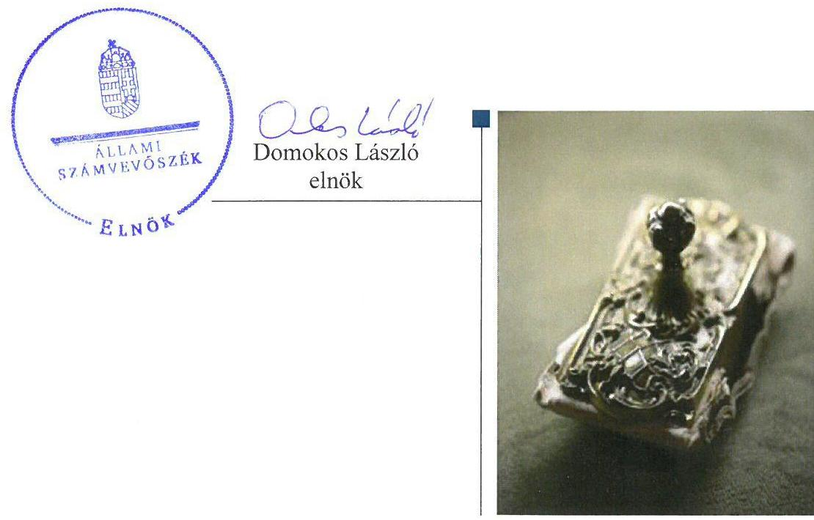
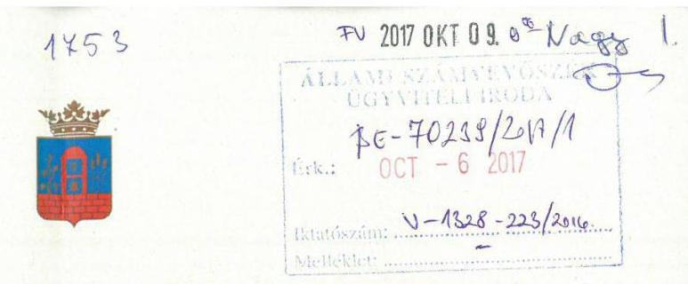
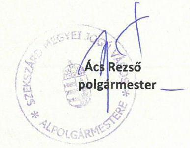
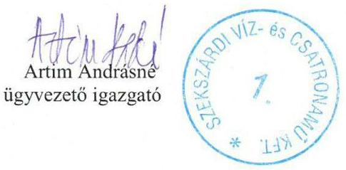
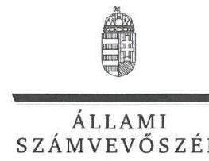
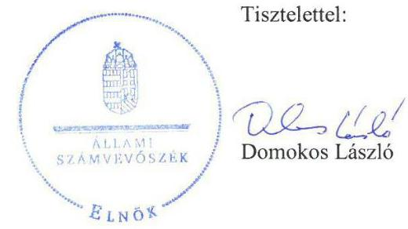
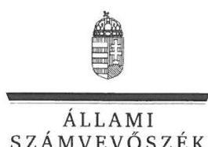

# Jelentés 

## Az önkormányzatok gazdasági társaságai

Az önkormányzatok többségi tulajdonában lévő gazdasági társaságok gazdálkodásának ellenőrzése Szekszárdi Víz- és Csatornamű Kft. 2017.

---

# Jelentés 

## Az önkormányzatok gazdasági társaságai

Az önkormányzatok többségi
tulajdonában lévő gazdasági társaságok gazdálkodásának ellenőrzése Szekszárdi Víz- és Csatornamű Kft.
2017.  hó 2. nap

---

# AZ ELLENŐRZÉST FELÜGYELTE:

DR. NAGY IMRE felügyeleti vezető

# AZ ELLENŐRZÉST VEZETTE ÉS A VÉGREHAJTÁSÁÉRT FELELŐS:

VALASTYÁNNÉ DR. VÍZHÁNYÓ JÚLIA ellenőrzésvezető

# A PROGRAM ÖSSZEÁLLÍTÁSÁÉRT FELELŐS:

JANIK JÓZSEF osztályvezető

---

**IKTATÓSZÁM:** V-1328-228/2016.

**TÉMASZÁM:** 2362

**ELLENŐRZÉS-AZONOSÍTÓ SZÁM:** V075825

---

Jelentéseink az Országgyűlés számítógépes hálózatán és az Interneten a www.asz.hu címen is olvashatóak.

---

# TARTALOMJEGYZÉK 

■ ÖSSZEGZÉS ..... 5
■ AZ ELLENŐRZÉS CÉLJA ..... 6
■ AZ ELLENŐRZÉS TERÜLETE ..... 7
■ AZ ELLENŐRZÉS HÁTTERE, INDOKOLTSÁGA ..... 9
■ A JELENTÉS LÉNYEGES KÉRDÉSKÖREI ..... 10
■ ELLENŐRZÉS HATÓKÖRE ÉS MÓDSZEREI ..... 11
■ MEGÁLLAPÍTÁSOK ..... 13
■ JAVASLATOK ..... 18
■ MELLÉKLETEK ..... 19
I. Sz. melléklet: Értelmező szótár. ..... 19
II. Sz. melléklet: A Társaság főbb mérlegadatai. ..... 21
■ FÜGGELÉK: ÉSZREVÉTELEK ..... 23
■ RÖVIDÍTÉSEK JEGYZÉKE ..... 35

---

.

---

# ÖSSZEGZÉS 

Szekszárd Megyei Jogú Város Önkormányzata tulajdonosi joggyakorlása nem volt szabályszerű. A 2014. évben a Kormány engedélye nélkül vállalt készfizető kezességet. A Szekszárdi Víz- és Csatornamű Kft. vagyongazdálkodása nem volt szabályszerű. Beszámolási kötelezettségét teljesítette, azonban a közérdekű adatok nyilvánosságra hozatalát nem biztosította. Ezáltal a Szekszárdi Víz- és Csatornamű Kft. átláthatósága nem volt biztosított. A Szekszárdi Víz- és Csatornamű Kft. fizetőképessége folyamatosan nem volt biztosított. A bevételek elszámolása szabályszerű volt, azonban ráfordításainak elszámolása a jogszabályi előírásoknak nem felelt meg, önköltségszámítást az előírások ellenére nem végzett.

## Az ellenőrzés társadalmi indokoltsága

Magyarországon az önkormányzatok kötelező és önként vállalt feladataik vonatkozásában is egyre szélesebb körben alkalmazzák a költségvetésen kívüli feladatellátást, ezáltal - a nonprofit szervezetek mellett - az önkormányzati tulajdonú gazdasági társaságok is kiemelt fontosságú szerephez jutottak.

Az önkormányzatok gazdasági társaságainak eladósodottsága az önkormányzat költségvetésére, pénzügyi helyzetére is veszélyt jelenthet, amelyre az ellenőrzés tapasztalatai rávilágíthatnak.

Szekszárd lakossága 2015. december 31-én 33032 fő volt, a Szekszárdi Víz- és Csatornamű Kft. feladatellátása a lakosság széles körét érintette.

Az Állami Számvevőszék az ellenőrzése során arra kereste a választ, hogy 2012-2015. között szabályszerű volt-e a Szekszárdi Víz- és Csatornamű Kft. gazdálkodása és Szekszárd Megyei Jogú Város Önkormányzata ehhez kapcsolódó tulajdonosi joggyakorlása.

## Főbb megállapítások, következtetések, javaslatok

Szekszárd Megyei Jogú Város Önkormányzata a tulajdonosi jogokat nem gyakorolta szabályszerűen, mert egy rövid lejáratú kölcsönszerződés biztosítékát képező készfizető kezességi megállapodáshoz az Önkormányzat a Kormány jogszabályban előírt hozzájárulását nem kérte. Gazdasági programját határidőben, közép- és hosszú távú vagyongazdálkodási tervét határidőn túl készítette el.

A Szekszárdi Víz- és Csatornamű Kft. a rábízott vagyonnal nem gazdálkodott szabályszerűen. Számviteli szabályzatait elkészítette, azonban azok szabályszerű karbantartásának nem minden esetben tett eleget. Vagyonnyilvántartásait a jogszabályi előírásoknak megfelelően vezette, számviteli beszámolóit leltárral alátámasztotta. A Szekszárdi Víz- és Csatornamű Kft. közműves ivóvízellátás, valamint a közműves szennyvízelvezetés és -tisztítás tevékenysége 2013. május 31-én megszűnt, az ehhez kapcsolódó vagyont az Önkormányzat részére a jogszabályi előírásoknak megfelelően átadta. Az Önkormányzat által a Szekszárdi Víz- és Csatornamű Kft.-től átvállalt hosszú lejáratú kötelezettség elszámolása szabálytalan volt. A 2014. évi céltartalék képzése nem volt szabályszerű. A Szekszárdi Víz- és Csatornamű Kft. a közérdekű adatok nyilvánosságra hozatalát nem biztosította, adatvédelmi felelőst nem jelölt ki, adatvédelmi és adatbiztonsági szabályzattal nem rendelkezett. A Szekszárdi Víz- és Csatornamű Kft. fizetőképessége nem volt biztosított.

A ráfordítások elszámolása során a jogszabályi előírásoknak több esetben nem tett eleget. A Szekszárdi Víz- és Csatornamű Kft. bevételeit megfelelően számolta el, árképzése szabályszerű volt. Önköltségszámítást a jogszabályi előírások ellenére nem végzett.

Az Állami Számvevőszék jelentésében a Szekszárdi Víz- és Csatornamű Kft. ügyvezetőjének öt javaslatot fogalmazott meg, amelyre az érintettnek 30 napon belül intézkedési tervet kell készítenie.

---

# AZ ELLENŐRZÉS CÉLJA 

Az ellenőrzés célja annak értékelése volt, hogy az önkormányzat vagyongazdálkodási tevékenysége során szabályszerűen gyakorolta-e tulajdonosi jogait; a gazdasági társaság szabályozottsága, gazdálkodása és vagyongazdálkodási tevékenysége, bevételeinek és ráfordításainak elszámolása megfelelt-e a jogszabályi és tulajdonosi előírásoknak; a gazdasági társaság fizetőképessége jelent-e kockázatot a működésre, valamint a gazdálkodás átláthatósága és elszámoltathatósága érdekében biztosítva volt-e a szolgáltatás díjának megalapozottsága szabályszerű önköltségszámítással.

---

# AZ ELLENŐRZÉS TERÜLETE 

## Szekszárd Megyei Jogú Város Önkormányzata és a kizárólagos tulajdonában lévő Szekszárdi Víz- és Csatornamű Kft.

A Társaságot ${ }^{1}$ az Önkormányzat² az ellenőrzött időszakot megelőzően kizárólagos tulajdonosként hozta létre. Alapító okirata ${ }^{3}$ szerinti főtevékenysége víztermelés, -kezelés, -ellátás volt. A feladatellátást szolgáló vagyont az ellenőrzési időszakot megelőzően, apportként bocsátotta a Társaság rendelkezésére.

A Társaság 2013. május 31-ig Közüzemi Szolgáltatási szerződés; ${ }^{4}$ alapján közműves ivóvízellátás, a közüzemi szennyvízelvezetés és -tisztítást végzett Szekszárd város területén. 2013. június 1-jétől a Társaság főtevékenysége a Fürdő ${ }^{5}$ üzemeltetése, másodlagos tevékenységei szennyvízszippantás, valamint jégpálya és autómosó üzemeltetés volt. 2012. augusztus 31-től 2013. május 31-ig Közüzemi Szolgáltatási szerződés ${ }_{2,4}{ }^{6}$ keretében biztosította Grábóc, Mucsfa és Nagyvejke települések ivóvíz ellátását is.

A Társaságnak az ellenőrzött időszak végén hat gazdasági társaságban volt részesedése, amely a Bikácsi Vízszolgáltató Kft. „v.a."7-ban 100\%, a ReHull Sió-menti Kft.-ben 100\%, a Zombavíz Szolgáltató Kft. „v.a."-ban 48\%, a Kéty- és Felsőnána Víziközmű Kft. „v.a."-ban 48\%, és a Sárköz-víz Kft. „v.a."-ban 6,63\%, valamint a Szabadkai Innovációs Tanácsadó Kft.-ben 50\% volt.

A Társasággal szemben egy 2014. december 31-én esedékes 3,2 M Ft ${ }^{8}$ összegű és egy 2015. január 29-én esedékes 4,5 M Ft összegű szállítói kötelezettség késedelmes teljesítése miatt 2015. augusztus 6-án felszámolási eljárás indult. A felszámolási eljárás ideje alatt a Társaság tevékenységét folytatta.

Az Önkormányzat a felszámolás előtti záró beszámolót, a felszámolási záró jelentést az $\mathrm{FB}^{9}$ írásos jelentése, valamint a könyvvizsgálói záradék ismertében határozatban fogadta el. A Társaság a felszámolási záró jelentését 2015. augusztus 6. - 2016. február 17. időszakra elkészítette.

Az Önkormányzat határozatával felhatalmazta a Polgármestert ${ }^{10}$ az Önkormányzat és a felszámoló között a Társaság felszámolási egyezségi javaslatának a kidolgozására, valamint a reorganizációs terv elkészítésére irányuló megbízási szerződés aláírására.

A Szekszárdi Törvényszék 2016. február 18-án jogerőre emelkedett végzésével a felszámolási eljárást megszüntette, mivel a Társaság, a felszámolási záró jelentés szerint, eleget tett az egyezségben vállalt fizetési kötelezettségeinek. A Társaság a felszámolási eljárás után a működését folytatta.

Az összes foglalkoztatotti létszám a 2012. évben 114 fő, a 2015. évben 62 fő volt.

---

Az ellenőrzött időszakban a Polgármester személye egy, a Jegyző ${ }^{11}$ személye három alkalommal változott. A jelenleg hivatalában lévő Polgármester 2014. november 20-tól, a Jegyző 2015. május 1-jétől látja el feladatait. A Társaságnál az ügyvezető személyében nem történt változás.

A Társaság az Áht. ${ }^{12}$ alapján nem minősült kormányzati szektorba sorolt egyéb szervezetnek.

---

# AZ ELLENŐRZÉS HÁTTERE, INDOKOLTSÁGA 

AZ ÖNKORMÁNYZATI TÖBBSÉGI TULAJDONBAN ÁLLÓ GAZDASÁGI TÁRSASÁGOK ellenőrzése kiemelten fontos a vagyon megőrzése, megóvása érdekében, valamint az önkormányzati tulajdonú gazdálkodó szervezetek esetében, amelyekkel szemben alapvető követelmény, hogy gazdálkodásuk, működésük szabályszerű, az általuk szolgáltatott adatok minél megbízhatóbbak legyenek. A feladatellátás költségeinek, ráfordításainak alakulása a lakosság széles rétegét érinti.

ELLENŐRZÉSEINK FELTÁRHATJÁK, hogy az Önkormányzat a feladatellátásához rendelt vagyon működtetését a tulajdonostól elvárható gondossággal végezte-e, a feladatot ellátó gazdasági társaság a létesítő okiratban, szolgáltatási szerződésben foglaltak betartásával biztosította-e a feladat ellátását. Az ellenőrzés rávilágíthat arra, hogy a gazdasági társaság a vagyon használatával biztosította-e a szolgáltatás folytatásának feltételeit, az Önkormányzat tulajdonosi felügyelete hozzájárult-e a szabályszerű gazdálkodáshoz és feladatellátáshoz. A megállapítások alapján megfogalmazott számvevőszéki javaslatok hasznosítása elősegítheti a meglévő hibák megszüntetését. A jó gyakorlatok bemutatásával az ÁSZ hozzájárulhat a követendő megoldások megismertetéséhez, terjesztéséhez.

---

# A JELENTÉS LÉNYEGES KÉRDÉSKÖREI 

1.- Az Önkormányzat tulajdonosi joggyakorlása szabályszerű volt-e?
2.- A gazdasági társaság vagyongazdálkodása szabályszerű volt-e, fizetőképessége biztosított volt-e a gazdálkodás során?
3.- A gazdasági társaság bevételeinek és ráfordításainak elszámolása, valamint az önköltségszámítás és árképzés szabályszerű volt-e?

---

# ELLENŐRZÉS HATÓKÖRE ÉS MÓDSZEREI 

## Az ellenőrzés típusa

Megfelelőségi ellenőrzés.

## Az ellenőrzött időszak

2012. január 1-jétől 2015. december 31-ig.

## Az ellenőrzés tárgya

Szekszárd Megyei Jogú Város Önkormányzata kizárólagos tulajdonában lévő Szekszárdi Víz- és Csatornamű Kft. feletti tulajdonosi joggyakorlása, valamint a Szekszárdi Víz- és Csatornamű Kft. gazdálkodásának szabályozottsága és szabályszerűsége.

Az ellenőrzés kiterjedt minden olyan körülményre és adatra, amely az ÁSZ jogszabályban meghatározott feladatainak teljesítéséhez, valamint a program végrehajtása folyamán felmerült újabb összefüggések feltárásához szükséges.

## Az ellenőrzött szervezet

Szekszárd Megyei Jogú Város Önkormányzata, valamint a Szekszárdi Víz- és Csatornamű Kft.

## Az ellenőrzés jogalapja

Az ellenőrzés jogszabályi alapját az Állami Számvevőszékről szóló 2011. évi LXVI. törvény 1. § (3) bekezdése és 5. § (3)-(4)-(5) bekezdései képezték.

## Az ellenőrzés módszerei

Az ellenőrzést a nemzetközi standardokat irányadónak tekintve az ellenőrzési program ellenőrzési kérdései, az ellenőrzött időszakban hatályos jogszabályok, az ellenőrzés szakmai szabályok és módszertanok figyelembevételével végeztük.

Az ellenőrzés ideje alatt az ellenőrzött szervezettel történő kapcsolattartást az ÁSZ Szervezeti és Működési Szabályzatának vonatkozó előírásai alapján biztosítottuk.

---

Az ellenőrzési kérdések megválaszolásához szükséges bizonyítékok megszerzése a következő ellenőrzési eljárások alkalmazásával történt: megfigyelés, kérdésfeltevés (információkérés), mintavételezés, összehasonlítás, valamint elemző eljárás. Az ellenőrzési bizonyítékként felhasználható adatforrások közé tartoztak egyrészt az ellenőrzési programban felsorolt adatforrások, másrészt adatforrás volt még minden - az ellenőrzés folyamán - feltárt, az ellenőrzés szempontjából információkat tartalmazó dokumentum.

Az ellenőrzést a kérdésekre adott válaszok kiértékelésével, valamint a megjelölt adatforrások, a csatolt tanúsítványok felhasználásával, továbbá az adott időszakban hatályos jogszabályok figyelembevételével folytattuk le.

A gazdasági társaság bevételei és ráfordításai, ezeken belül az értékcsökkenés, valamint a vagyonnyilvántartás szabályszerűségének megítéléséhez a bevételeket és a ráfordításokat, a tárgyi eszközök állományváltozásait tartalmazó adott évi főkönyvi kivonat adatbázisát vettük alapul. A minta kiválasztása során véletlen mintavételt alkalmaztunk évenkénti, elemszámmal arányos rétegezéssel a teljes időszakra vonatkozóan. A minta alapján a sokaságban előforduló hibaarányt becsültük. „Megfelelőnek" értékeltünk egy ellenőrzött területet, amennyiben 95\%-os bizonyossággal a teljes sokaságban a hibaarány legfeljebb 10\%, „nem megfelelőnek", amennyiben 10\%-nál magasabb arányt képviselt. A mintavételt megelőzően az anyagjellegű ráfordítások, valamint a tárgyi-eszköz növekedési tételei sokaságból évente sokaságonként kiemeltük a 3-3 legnagyobb összegű tételt annak biztosítására, hogy az ellenőrzés az egyszerű véletlen mintavétel mellett a legnagyobb értékű tételek ellenőrzésére biztosan kiterjedjen.

---

# 1. Az Önkormányzat tulajdonosi joggyakorlása szabályszerű volt-e? 

Összegző megállapítás

### 1.1. számú megállapítás

A tulajdonosi joggyakorlás nem volt szabályszerű. A Társaság által kötött kölcsönszerződés biztosítékát képező Önkormányzat általi készfizető kezességvállaláshoz a Kormány hozzájárulását nem kérték.

Az Önkormányzat a tulajdonosi joggyakorlás kereteit szabályszerűen alakította ki.

### 1.2. számú megállapítás

A TULAJDONOSI JOGOK GYAKORLÁSÁNAK RENDJÉT az Önkormányzat a Gt. ${ }^{13}$ és a Ptk. ${ }^{14}$ előírásainak megfelelően az Önkormányzati SZMSZ ${ }_{1,2}{ }^{15}$-ben, az Alapító Okiratban és a Vagyonrendeletben ${ }^{16}$ alakította ki. A Vagyonrendelet rendelkezéseinek értelmében a tulajdonosi jogokat a Közgyűlés ${ }^{17}$ és a Polgármester gyakorolta.

Az Önkormányzat a gazdasági program
 }_{1}{ }^{18}$-ját az Ötv ${ }^{19}$. előírásainak megfelelően meghatározta és elfogadta. A gazdasági program ${ }_{2}{ }^{20}$-t az Önkormányzat az MÖtv. ${ }^{21}$ 116. § (1) bekezdésének megfelelően elkészítette, azonban elfogadására az MÖtv. 116. § (5) bekezdése ellenére késedelmesen, a Képviselő-testület alakuló ülését követő hat hónapon túl került sor.

Közép- és hosszú távú vagyongazdálkodási tervvel az Önkormányzat az Nvtv. ${ }^{22}$ 9. § (1) bekezdésének előírása ellenére 2012. január 1. és 2013. február 27. között nem rendelkezett. 2013. február 28-tól közép- és hosszú távú vagyongazdálkodási tervvel rendelkezett.

Az Önkormányzat Közüzemi Szolgáltatási szerződésben határozta meg a Társaság feladatait, kötelezettségeit, a szolgáltatás díjmegállapításának részleteit, meghatározta az indokolt és szükséges költségek, ráfordítások körét, valamint a feladatellátásra vonatkozóan az adatszolgáltatás rendjét.

Az Önkormányzat a közműves ivóvíz-szolgáltatás, valamint a közműves szennyvízelvezetés és -tisztítás díjait a jogszabályoknak megfelelően Ivóvíz- és csatornaszolgáltatási rendeletben ${ }^{23}$ határozta meg.

A tulajdonosi jogok gyakorlása nem volt szabályszerű a 2014. évben felvett hitelhez kapcsolódó kezességvállalás miatt.

A Közgyűlés az éves beszámolókat az FB írásos jelentése, valamint a könyvvizsgálói jelentés birtokában határozattal hagyta jóvá.

A Társaság FB-je a 2010. december 16-tól hatályos Ügyrend alapján végezte munkáját. A Társaságnál 2012. január 1. és 2014. október 21. időszakban a Taktv. ${ }^{24}$ 4. § (2) bekezdése előírása ellenére hat főt meghaladó létszámú, hét tagú FB működött.

---

A Társaság üzleti terveit a Közgyűlés az éves számviteli beszámolók elfogadásával egy időben határozattal hagyta jóvá.

Az Önkormányzat által 2014. december 30-án aláírt, a Társaság 555,5 M Ft összegű kölcsönszerződésének biztosítékát képező készfizető kezességi megállapodás nem felelt meg a Stabilitási tv. ${ }^{25}$ 10. § (1) bekezdésben foglalt előírásnak, mert ahhoz a Kormány hozzájárulását nem kérték.

A Közgyűlés által elfogadott Javadalmazási szabályzat ${ }^{26}$ a Taktv. előírásainak megfelelt.

# 2. A gazdasági társaság vagyongazdálkodása szabályszerű volt-e, fizetőképessége biztosított volt-e a gazdálkodás során? 

## Összegző megállapítás

2.1. számú megállapítás
2.2. számú megállapítás

A Társaság vagyongazdálkodása nem volt szabályszerű.
A Társaság rendelkezett a Számv. tv. előírásainak megfelelő szabályzatokkal, azonban a Számlarend karbantartása nem történt meg.

Számviteli politikával ${ }^{27}$ és a keretébe tartozó számviteli szabályzatokkal a Társaság a Számv. tv. ${ }^{28}$ előírásainak megfelelően rendelkezett.

Számlarenddel és a Számlarendben foglaltakat alátámasztó bizonylati renddel a Társaság rendelkezett. A Számlarend folyamatos karbantartása 2013. január 1-jétől a Számv. tv. 161. § (4) bekezdése előírásaival ellentétesen nem történt meg. A 2013. évtől alkalmazott Alapítókkal szembeni hosszú lejáratú kötelezettség számla, valamint a 2014. évtől alkalmazott Részesedésekkel, értékpapírokkal kapcsolatos kötelezettség számlák számjele és megnevezése a Számv. tv.161. § (2) bekezdés a) pontjában foglaltak ellenére a Számlarendben nem szerepeltek.

Üzletszabályzattal a Vksztv. ${ }^{29}$ 47. § (1) bekezdése előírása ellenére 2012. július 15. és 2013. május 31. között nem rendelkezett.

A vagyon értékének megőrzése, gyarapítása és nyilvántartása a jogszabályi rendelkezéseknek és a belső előírásoknak megfelelően történt.

A vagyon értékének megőrzése, gyarapítása, hasznosítása a jogszabályi előírásoknak megfelelően történt. A Társaság betartotta a rá vonatkozó vagyon elidegenítésére, illetve megterhelésére vonatkozó előírásokat. Az Alapító okirat előírása szerint a vagyont érintő fejlesztések esetében tulajdonosi hozzájárulással rendelkezett. A Vksztv. 79. § (1) bekezdése alapján 2013. január 1-én a Társaság tulajdonában álló 762,4 M Ft értékű víziközmű vagyon átháramlott az ellátásért felelős Önkormányzat tulajdonába. Az átadás a jogszabályi előírásoknak megfelelően történt. A Társaság főbb mérlegadatait a II. számú melléklet szemlélteti.

---

# Megállapítások 

2.3. számú megállapítás

Társaság a saját vagyonához kapcsolódó nyilvántartásokat a 2012-2015. években a Számv. tv. előírásainak megfelelően vezette. A Társaság 2012-2014. évi éves számviteli beszámolóit, valamint a 2015. évben a felszámolás előtti záró beszámolót leltárral támasztotta alá, a főkönyvi könyvelés és az analitikus nyilvántartások közötti egyezőség biztosított volt.

A Társaság fizetőképessége folyamatosan nem volt biztosított, a rövid lejáratú kötelezettségeit egyik évben sem teljesítette határidőben. Az Önkormányzat által a Társaságtól átvállalt hosszú lejáratú kötelezettség elszámolása szabálytalan volt. Céltartalék képzése nem volt szabályszerű.

A rövid lejáratú kötelezettségek határidőben történő teljesítése nem volt biztosított, a szállítói analitikák alapján a Társaság a kötelezettségeit minden évben rendszeresen késedelmesen teljesítette. A lejárt szállítói kötelezettségek állományának összege csökkent, azonban az összes szállítói kötelezettségen belüli aránya a 2012. évi 61\%-ról a 2015. évre 88\%-ra nőtt.

A Társaság kötvénykibocsátásból származó tőketartozásának visszafizetését az Önkormányzat a 2013. december 9-i határozata alapján vállalta. Az Önkormányzat által ténylegesen átvállalt 488,9 M Ft kötelezettséget a Társaság a 2014. és a 2015. évben két egyenlő részletben számolta el a rendkívüli bevételek között. Az átvállalt kötelezettség halasztott bevételként történő 2014. évi elhatárolása, valamint annak 2015. évi megszüntetése nem felelt meg a Számv. tv. 45. § (1) bekezdés b) pontjában és (2) bekezdésében foglalt előírásoknak, mert a Társaság a halasztott bevételt nem az átvállalt kötelezettséghez kapcsolódó eszköz bekerülési értéke arányos részének költségként történő elszámolásakor szüntette meg.

A Számv. tv. 41. § (3) bekezdésében foglaltak ellenére a szokásos üzleti tevékenység rendszeresen és folyamatosan felmerülő költségeire 40,0 M Ft céltartalékot képzett. Ezáltal a Társaság a 2014. évi eredmény kimutatásában 40,0 M Ft-tal kevesebb mérlegszerinti eredményt mutatott ki, így a Társaság 2014. évi mérlegszerinti eredménye nem a valós eredményt tükrözte.

A Társaság könyvvizsgálója a jogszabályi rendelkezések Társaság általi megsértése ellenére a Gt. 40. § (1), valamint a Ptk. 2 3:129. § (1) bekezdései szerinti korlátozás nélküli hitelesítő záradékkal ellátott jelentéseket adott ki.

A vevőköveteléseken belül a határidőn túli vevőkövetelések állományának aránya nőtt (2012-ben 60\%; 2015-ben 77,2\%). A követelésállomány csökkentése érdekében 2012-2015. években havi gyakorisággal fizetési felszólításokat küldött a lakossági és a közületi fogyasztók részére, egyéb módon a Társaság nem intézkedett a követelésállomány csökkentése érdekében.

---

# 2.4. számú megállapítás 

A Társaság az előírt adatszolgáltatási és beszámolási kötelezettségét teljesítette, azonban a közérdekű adatok nyilvánosságra hozatalát nem biztosította.

A beszámolási és adatszolgáltatási feladatokat a Társaság az Alapító Okiratban, a Szervezeti és Működési Szabályzatban, valamint a számviteli politikában szabályozta. A jogszabályban előírt adatszolgáltatási és beszámolási kötelezettségének a Társaság minden évben eleget tett. Az éves beszámolók elfogadásakor az FB írásbeli jelentései és a hitelesítő záradékkal ellátott könyvvizsgálói jelentések rendelkezésére álltak. A Társaság legfőbb döntéshozó szerve az éves beszámolókat határozattal elfogadta, a Társaság számára egyéb tájékoztatási kötelezettséget nem határozott meg. A Társaság a beszámolókat a Számv. tv. szerint letétbe helyezte és közzétette.

A Társaság közzétételi kötelezettségének nem tett eleget, mivel az Info tv. ${ }^{30} 37$. § (1) bekezdésében meghatározott 1. melléklet szerinti adatok közül honlapon semmit nem tett közzé.

A Társaság a közérdekű adatok megismerésére irányuló igények teljesítésének rendjét rögzítő szabályzatát az Info tv. 30. § (6) bekezdésében foglalt kötelezettsége ellenére csak 2014. január 1-jén készítette el.

A Társaság az Info tv. 24. § (1) bekezdés c) pontja előírása ellenére adatvédelmi felelőst nem nevezett ki.

Az Info tv. 24. § (3) bekezdésének előírása ellenére adatvédelmi és adatbiztonsági szabályzattal nem rendelkezett.

## 3. A gazdasági társaság bevételeinek és ráfordításainak elszámolása, valamint az önköltségszámítás és árképzés szabályszerű volt-e?

Összegző megállapítás

A Társaság bevételeinek elszámolása megfelelő, árképzése szabályszerű volt. A ráfordítások elszámolása nem a jogszabályi előírásoknak megfelelően történt. Önköltségszámítást nem végzett.
3.1. számú megállapítás

A Társaság bevételeit szabályszerűen számolta el, a ráfordítások elszámolása nem volt megfelelő.

Az értékesítés nettó árbevételének elszámolása szabályszerű volt, azonban a ráfordítások elszámolása nem szabályszerűen történt.

Az értékesítés nettó árbevételének elszámolása megfelelt a Számv. tv., valamint a belső szabályzatokban foglalt előírásoknak.

Az anyagjellegű ráfordítások elszámolása nem felelt meg a Számv. tv. 165. § (2) bekezdésében előírtaknak, mert a ráfordítások költségelszámolását megalapozó számviteli bizonylatok a Számv. tv. 165. § (1) bekezdésében előírtak ellenére nem álltak rendelkezésre.

---

# A személyi jellegű ráfordítások elszámolása 

nem volt megfelelő. A bérköltség elszámolása során a munkavállalóval kötött munkaszerződésekben meghatározott munkabérek nem voltak összhangban a bérjegyzéken számfejtett összegekkel, így a Számv. tv. 166. § (2) bekezdésének előírása ellenére az elszámolást alátámasztó számviteli bizonylatok (bérjegyzékek) adatai tartalmilag nem voltak helytállóak. A munkavállalók cafeteria nyilatkozatai az Szja. tv. ${ }^{31} 71 . \S$ (4) bekezdésében foglaltak ellenére nem álltak rendelkezésre.

Az aktivált beruházásokat, felújításokat a Számv. tv. rendelkezéseinek megfelelő főkönyvi számlákra könyvelték, az eszközök besorolása, üzembe helyezése és állományba vétele a jogszabályi előírásoknak megfelelően történt.

Az értékcsökkenési leírás elszámolása megfelelt a Számv. tv., a Számviteli politika, valamint az Eszközök és források értékelési szabályzata ${ }^{32}$ előírásainak.
3.2. számú megállapítás

Árképzése a közműves ivóvízellátás, a közüzemi szennyvízelvezetés és -tisztítás vonatkozásában megfelelt a jogszabályoknak és a belső előírásoknak. Önköltségszámítást a jogszabályi előírások ellenére nem végzett.

A Társaság 2013. május 31-ig a közműves ivóvízellátás, a közüzemi szennyvízelvezetés és -tisztítás vonatkozásában a jogszabályi előírásoknak megfelelő díjat alkalmazott. A Társaság egyéb feladatai vonatkozásában az árképzés megfelelő volt.

Önköltségszámítási szabályzatát ${ }^{33}$ a Társaság a Számv. tv. előírásainak megfelelően elkészítette.

A Társaság azonban a Számv. tv. 14. § (7) bekezdésében foglaltak ellenére a végzett szolgáltatások Számv. tv. 51. § (2) bekezdése szerinti önköltségét az utókalkuláció módszerével nem állapította meg.

---

# JAVASLATOK 

Az ÁSZ tv. 33. § (1) bekezdésében foglaltak értelmében az ellenőrzött szervezet vezetője köteles a jelentésben foglalt megállapításokhoz kapcsolódó intézkedési tervet összeállítani és azt a jelentés kézhezvételétől számított 30 napon belül az ÁSZ részére megküldeni. Amennyiben az ellenőrzött szervezet vezetője nem küldi meg határidőben az intézkedési tervet, vagy továbbra sem elfogadható intézkedési tervet küld, az Állami Számvevőszék elnöke az ÁSZ tv. 33. § (3) bekezdés a) és b) pontjaiban foglaltakat érvényesítheti.

## A Szekszárdi Víz- és Csatornamű Kft. Ügyvezetőjének

1. Intézkedjen a számlarend jogszabályi rendelkezésnek megfelelő karbantartásáról.
(2.1 sz. megállapítás 2. bekezdése alapján)
2. Intézkedjen annak érdekében, hogy a Társaság a jogszabályban foglalt közzétételi kötelezettségének eleget tegyen.
(2.4 sz. megállapítás 2. bekezdése alapján)
3. Intézkedjen a jogszabályban előírt adatvédelmi és adatbiztonsági szabályzat elkészítéséről és adatvédelmi felelős kinevezéséről.
(2.4 sz. megállapítás 4-5. bekezdései alapján)
4. Intézkedjen a számviteli elszámolások szabályszerű végrehajtásáról, ezen belül az anyagjellegű ráfordítások és a személyi jellegű ráfordítások elszámolása tekintetében a jogszabályi előírások betartásáról.
(3.1 sz. megállapítás 3. és 4. bekezdése alapján)
5. Intézkedjen annak érdekében, hogy a Társaság az általa végzett szolgáltatások önköltségét a Számv. tv. előírásainak megfelelően állapítsa meg.
(3.2. sz. megállapítás 3. bekezdése alapján)

---

# MELLÉKLETEK 

- I. SZ. MELLÉKLET: ÉRTELMEZŐ SZÓTÁR
garanciaszerződés
gazdasági társaság
gazdálkodó szervezet
kezesség
közszolgáltatás
meghatározó befolyás
minősített többséget biztosító részesedés
nemzeti vagyon

A garanciaszerződés, illetve a garanciavállaló nyilatkozat a garantőr olyan kötelezettségvállalása, amely alapján a nyilatkozatban meghatározott feltételek esetén köteles a jogosultnak fizetést teljesíteni. (Ptk. 2 6:431. § (1) bekezdése)
Ptk. 2 3:88. § (1) bekezdése szerint „a gazdasági társaságok üzletszerű közös gazdasági tevékenység folytatására, a tagok vagyoni hozzájárulásával létrehozott, jogi személyiséggel rendelkező vállalkozások, amelyekben a tagok a nyereségből közösen részesednek, és a veszteséget közösen viselik".
A Ptk. ${ }^{34}$
 685. § c) pontja szerint gazdálkodó szervezet: „az állami vállalat, az egyéb állami gazdálkodó szerv, a szövetkezet, a lakásszövetkezet, az európai szövetkezet, a gazdasági társaság, az európai részvénytársaság, az egyesülés, az európai gazdasági egyesülés, az európai területi együttműködési csoportosulás, az egyes jogi személyek vállalata, a leányvállalat, a vízgazdálkodási társulat, az erdőbirtokossági társulat, a végrehajtói iroda, az egyéni cég, továbbá az egyéni vállalkozó.” (2014. 03. 15-ig hatályos)
A kezességre vonatkozó előírásokat a Ptk. 2. 6:416-430. §-ai tartalmazzák. Kezességi szerződéssel a kezes kötelezettséget vállal a jogosulttal szemben, hogyha a kötelezett nem teljesít, maga fog helyette a jogosultnak teljesíteni. Kezesség egy vagy több, fennálló vagy jövőbeli, feltétlen vagy feltételes, meghatározott vagy meghatározható összegű pénzkövetelés vagy pénzben kifejezhető értékkel rendelkező egyéb kötelezettség biztosítására vállalható.
A Ptk. 2. szerint kezességet csak írásban lehet vállalni. A kezes kötelezettsége ahhoz a kötelezettséghez igazodik, amelyért kezességet vállalt. A kezes kötelezettsége nem válhat terhesebbé, mint amilyen elvállalásakor volt, kiterjed azonban a kötelezett szerződésszegésének jogkövetkezményeire és a kezesség elvállalása után esedékessé váló mellékkövetelésekre is.
Az Ebktv. ${ }^{35}$ 3. § d) pontja a következőképpen határozza meg a közszolgáltatást: „szerződéskötési kötelezettség alapján a lakosság alapvető szükségleteinek ellátására irányuló szolgáltatás, így különösen a villamos energia-, gáz-, hő-, víz-, szennyvíz- és hulladékkezelési, köztisztasági, postai és távközlési szolgáltatás, továbbá a menetrend alapján közlekedő járművekkel végzett közforgalmú személyszállítás”.
A Ptk. 2. 8:2. § (2) bekezdése szerint „A befolyással rendelkező akkor rendelkezik egy jogi személyben meghatározó befolyással, ha annak tagja vagy részvényese, és
a) jogosult e jogi személy vezető tisztségviselői vagy felügyelőbizottsága tagjainak többségének megválasztására, illetve visszahívására; vagy
b) a jogi személy más tagjai, illetve részvényesei a befolyással rendelkezővel kötött megállapodás alapján a befolyással rendelkezővel azonos tartalommal szavaznak, vagy a befolyással rendelkezőn keresztül gyakorolják szavazati jogukat, feltéve, hogy együtt a szavazatok több mint felével rendelkeznek.”
A minősített befolyásszerző az ellenőrzött társaságban a szavazatok legalább hetvenöt százalékával rendelkezik. (Ptk. 2. 3:324. §)
Nvtv. 1. § (2) bekezdése szerint többek között:
„az állam vagy a helyi önkormányzat kizárólagos tulajdonában álló dolgok, az a) pont hatálya alá nem tartozó, állam vagy a helyi önkormányzat tulajdonában lévő dolog,

---

# Mellékletek 

az állam vagy a helyi önkormányzat tulajdonában lévő pénzügyi eszközök, továbbá az államot vagy a helyi önkormányzatot megillető társasági részesedések, az államot vagy a helyi önkormányzatot megillető bármely vagyoni értékkel rendelkező jogosultság, amelyet jogszabály vagyoni értékű jogként nevesít.”
nonprofit gazdasági társaság Civil tv. ${ }^{36}$ 9/F. § (2) bekezdése szerint „az a gazdasági társaság minősül nonprofit gazdasági társaságnak és cégnevében az a gazdasági társaság tüntetheti fel a nonprofit jelleget, amelynek létesítő okirata tartalmazza, hogy a gazdasági társaság tevékenységéből származó nyereség a tagok között nem osztható fel, hanem az a gazdasági társaság vagyonát gyarapítja.” (hatályos 2014. március 15-től)
többségi befolyást biztosító A Ptk. 1. 8:2. § (1) bekezdése szerint „többségi befolyás az olyan kapcsolat, amelynek részesedés révén természetes személy vagy jogi személy (befolyással rendelkező) egy jogi személyben a szavazatok több mint felével vagy meghatározó befolyással rendelkezik.”
vagyonkezelő a) az állam tulajdonában álló nemzeti vagyon tekintetében:
aa) költségvetési szerv,
ab) helyi önkormányzat, önkormányzati társulás,
ac) önkormányzati intézmény,
ad) köztestület,
ae) az állam, az aa)-ac) alpontban meghatározott személyek együtt vagy külön-külön 100%-os tulajdonában álló gazdálkodó szervezet,
af) az ae) alpont szerinti gazdálkodó szervezet 100%-os tulajdonában álló gazdálkodó szervezet,
ag) a törvény által kijelölt egyedileg meghatározott jogi személy.
b) a helyi önkormányzat tulajdonában álló nemzeti vagyon tekintetében:
ba) önkormányzati társulás,
bb) költségvetési szerv vagy önkormányzati intézmény,
bc) köztestület,
bd) az állam, a helyi önkormányzat, a ba)-bb) alpontban meghatározott személyek együtt vagy külön-külön 100%-os tulajdonában álló gazdálkodó szervezet,
be) a bd) alpont szerinti gazdálkodó szervezet 100%-os tulajdonában álló gazdálkodó szervezet.
c) az egyházi jogi személy a tevékenysége ellátásához szükséges nemzeti vagyon tekintetében. (Forrás: Nvtv. 3. § (1) bekezdés 19. pontja)

---

II. SZ. MELLÉKLET: A TÁRSASÁG FŐBB MÉRLEGADATAI

| A SZEKSZÁRDI VÍZ- ÉS CSATORNAMŰ KFT. MÉRLEGEINEK KIEMELT ADATAI (M FT) |  |  |  |  |
| :--: | :--: | :--: | :--: | :--: |
| Mégnevezés / időszak | 2012-12-31. | 2013-12-31. | 2014-12-31. | 2015-08-05. |
| I. Befektetett eszközök | 3239,3 | 3215,8 | 2055,0 | 1970,0 |
| ebből: tárgyi eszközök | 3026,0 | 2152,6 | 2032,8 | 1950,3 |
| II. Forgóeszközök | 644,9 | 454,8 | 416,6 | 216,1 |
| ebből: készletek | 27,4 | 33,7 | 12,7 | 12,4 |
| ebből: pénzeszközök | 101,1 | 37,4 | 9,4 | 41,7 |
| III. Aktív időbeli elhatárolások | 52,0 | 47,2 | 40,6 | 0 |
| ESZKÖZÖK ÖSSZESEN | 3936,2 | 3717,8 | 2512,2 | 2186,1 |
| IV. Saját tőke | 1204,0 | 753,5 | 773,7 | 802,5 |
| ebből: jegyzett tőke | 679,0 | 679,0 | 679,0 | 679,0 |
| ebből: mérleg szerinti eredmény | 89,2 | -450,4 | 20,2 | 28,8 |
| V. Céltartalékok | 219,0 | 0 | 40,0 | 0 |
| VI. Kötelezettségek | 2280,4 | 2868,9 | 1376,1 | 1319,3 |
| VII. Passzív időbeli elhatárolások | 232,8 | 95,4 | 322,4 | 64,3 |
| FORRÁSOK ÖSSZESEN | 3936,2 | 3717,8 | 2512,2 | 2186,1 |

---

.

---

# FÜGGELÉK: ÉSZREVÉTELEK 

A jelentéstervezetet a Számvevőszék 15 napos észrevételezésre megküldte az ellenőrzött szervezetek vezetőinek az ÁSZ tv. 29. § (1) bekezdése előírásának megfelelően.

Az ÁSZ a jelentéstervezetet észrevételezésre megküldte Szekszárd Megyei Jogú Város Önkormányzata polgármesterének és a Szekszárdi Víz- és Csatornamű Kft. ügyvezetőjének.
Szekszárd Megyei Jogú Város Önkormányzata polgármestere a jelentéstervezetre nemleges észrevételt tett. A függelék tartalmazza a Szekszárdi Víz- és Csatornamű Kft. ügyvezetőjének észrevételét a mellékletek nélkül, illetve az el nem fogadott észrevételek elutasításának indoklását.

[^0]
[^0]:    * 29. § (1) Az Állami Számvevőszék az ellenőrzési megállapításait megküldi az ellenőrzött szervezet vezetőjének vagy az általa megbízott személynek, és annak, akinek személyes felelősségét állapította meg.
    (2) Az ellenőrzött szervezet vezetője és a felelősként megjelölt személy az ellenőrzés megállapításaira tizenöt napon belül írásban észrevételt tehet.
    (3) Az Állami Számvevőszék az észrevételre a beérkezésétől számított harminc napon belül írásban válaszol. A figyelembe nem vett észrevételeket köteles a jelentésben feltüntetni, és megindokolni, hogy azokat miért nem fogadta el.

---

Szekszárd Megyei Jogú Város
Polgármestere

Szám: IV/B/8-2/2017.
Ül: Feri Blanka
Tel.: 74/504-136

Domokos László elnök
részére

Állami Számvevőszék
Budapest 4.
Pf. 54.
1364

Tisztelt Elnök Úr!
Hivatkozva a V-1328-217/2016. ikt. sz. levelére nyilatkozom, hogy az Állami Számvevőszékről szóló 2011. évi LXVI. törvény 29. § (2) bekezdésében foglaltak alapján „Az önkormányzatok gazdasági társaságai - Az önkormányzatok többségi tulajdonában lévő gazdasági társaságok gazdálkodásának ellenőrzése - Szekszárdi Víz-és Csatornamű Kft.” címmel készült számvevőszéki jelentéstervezetre észrevételt nem kívánok tenni.

Szekszárd, 2017. szeptember 26.

Tisztelettel:

---

# Szekszárdi Vízmű Kft.

H-7100. Szekszárd, Epreskert u. 9. tel.:(74)529-260, 529-261; fax.:(74)529-262

Jek 2: 1012012017.

Domokos László elnök úr

ÁLLAMI SZÁMVEVŐSZÉK Budapest

Tisztelt Elnök Úr!

Az önkormányzatok gazdasági társaságai - Az önkormányzatok többségi tulajdonában lévő gazdasági társaságok gazdálkodásának ellenőrzése - Szekszárdi Víz-és Csatornamű Kft. címmel készült Számvevőszéki jelentéstervezethez (Ikt. szám V-1328-218/2016) az alábbi észrevételeket teszem.

## I. Észrevétel a 2.1. sz. megállapításhoz: Számlarend

Az ellenőrzés során a 2011. január 1-től érvényes számlarend került feltöltésre, sajnos a módosítások feltöltése elmaradt. A számlarendet folyamatosan aktualizáltuk, amelyet mellékelünk. (1. sz. melléklet)

Kérjük a számlarend hiányosságaira tett megállapítást módosítani szíveskedjenek.

## II. Észrevétel a 2.3. sz. megállapításhoz

## a, Rövid lejáratú kötelezettségek:

A Szekszárdi Víz-és Csatornamű Kft.-nek kötvénykötelezettsége volt, amelynek 1/4 éves törlesztő részlete minden év december 31.-én volt esedékes. Ennek érdekében a cég rangsorolta a kötelezettségeit, és első helyen a kötvénykötelezettség kiegyenlítése szerepelt, csak azután a szállítók. Ezért fordult elő, hogy voltak lejárt fizetési határidejű szállítói tartozások a fordulónapon, amelyek ezután kiegyenlítésre kerültek.

A társaság likviditási mutatói:

|   | 2012. év | 2013. év | 2014. év | 2015. 08. 05.  |
| --- | --- | --- | --- | --- |
|  Forgóeszközök | 644920 eFt | 454849 eFt | 416628 eFt | 216102 eFt  |
|  Rövid lejáratú kötelezettség | 564215 eFt | 257901 eFt | 628010 eFt | 132230 eFt  |
|  Különbözet | 80705 eFt | 196948 eFt | -211382 eFt | 83872 eFt  |
|  Készletek | 27365 eFt | 33693 eFt | 12396 eFt | 12709 eFt  |
|  Pénzeszközök | 101094 eFt | 37365 eFt | 9413 eFt | 41654  |
|  Likviditási mutató |  |  |  |   |
|  Forgóeszköz/Rövid. kötelezettség | 1,14 | 1,76 | 0,66 | 1,63  |
|  Likviditási gyorsráta |  |  |  |   |
|  Forgóeszk.-készlet/Rövid. kötelezettség | 1,09 | 1,63 | 0,64 | 1,53  |

---

A vizsgált időszak alatt a likviditási mutató értékeit vizsgálva látható, hogy csak a 2014. év végi értéke nem megfelelő (egy átmeneti időszakra), amikor is tulajdonosi döntés alapján 2014. december 30.-án hitelfelvétel történt 438 millió Ft összegben, amelyet következő év márciusában a tulajdonos rendezett is.

# b, Átvállalt kötelezettség halasztott bevételként történő elszámolása: 

Az ellenőrzés megállapítása szerint a Társaság 2014. évi beszámolójában egyéb hosszú lejáratú kötelezettségként (79. sor 2013. évi oszlop) a Szekszárd Megyei Jogú Város Önkormányzatával szemben 927.717 eFt szerepel, amelyből a 2014. évben 438.284 eFt visszafizetésre került, a fennmaradó különbözetet (488.933 eFt) az Önkormányzat tulajdonosi döntés alapján elengedte. A Társaság az elengedett kötelezettséget 2 év alatt számolta el rendkívüli bevételként.

Az ÁSZ megállapítása szerint a rendkívüli bevételként elengedett kötelezettség összegét - amennyiben az beszerzett eszközhöz kapcsolódik - halasztott bevételként kell könyvelni és az elengedett kötelezettséghez kapcsolódó eszköz bekerülési értéke arányos részének költségként történő elszámolásakor kell az elhatárolást megszüntetni. A Társaság által alkalmazott két év alatti elszámolás nem felel meg a jogszabályi előírásoknak (Szt. 45. (1) b.) és (2) bekezdés).

Az ÁSZ megállapításával szemben tény, hogy ehhez az elengedett kötelezettséghez nem kapcsolódott eszközbeszerzés, tehát ilyen címen halasztott bevételt nem kellett könyvelni. Az elengedett kötelezettség összegét a Társaság két azonos részletben, az Önkormányzattal és a Bankkal kötött háromoldalú megállapodás alapján számolta el rendkívüli bevételként - a 2014. és 2015. évi önkormányzati adósságkonszolidációval összefüggésben -, ami véleményünk szerint nem ellentétes a számviteli szabályokkal.

A Szekszárdi Víz- és Csatornamű Kft. - a Szekszárd Mj. Város Önkormányzata 256/2013. (XII. 09.) számú határozata alapján - 2013. decemberben visszavásárolta a Raiffeisen Banktól a Vízmű által zártkörűen kibocsátott 3.128.999,93 EUR értékű kötvényt. Az értékpapírt a Társaság a befektetett pénzügyi eszközei között, tartós hitelviszonyt megtestesítő értékpapírként az akkori árfolyamon, 927.717 eFt összegben nyilvántartásba vette. Kötelezettsége azonos
 összegben az önkormányzattal szemben keletkezett.

A 927.717 EFt kötelezettségből 438.784 EFt a Raiffeisen Banktól tulajdonosi döntéssel felvett rövid lejáratú hitelből 2014. decemberben visszafizetésre került. A fennmaradó 488.933 EFt kötelezettséget az Önkormányzat átvállalta (elengedte). Az elengedett összeget a Társaság rendkívüli bevételként könyvelte, majd ebből 244.467 EFt-ot 2015. évre halasztott bevételként elhatárolt, mivel az adósság-konszolidáció 2015. áprilisban fejeződött be. 2.sz.melléklet

## c, Céltartalék elszámolása:

A 2014. év terhére képzett céltartalék mellékleteként nem a végleges feljegyzés került becsatolásra a 6-a-9 számon. A könyvvizsgáló a 2014 évi beszámoló készítése, ellenőrzése közben észlelte, és egyben írásban felhívta a figyelmünket, hogy a céltartalék képzés megfogalmazása nem jó, mivel előzőleg átbeszéltük, hogy mire kívánunk képezni. A feljegyzést akkor mindjárt javítottuk. A Toldi u-i ingatlanunk távhő ellátása bizonytalanná válhatott volna a szolgáltató részéről, ezért fel kellett készülnünk a gázra történő átállás lehetőségére, ennek érdekében kértünk be árajánlatot, ennek megfelelő összegre képeztünk céltartalékot.

---

A Számvevőszéki vizsgálat során a dokumentumok feltöltésekor tévesen nem a végleges feljegyzés lett becsatolva. Mellékletként csatoljuk a végleges dokumentumot ( 3.sz. melléklet ) és egyben kérjük, szíveskedjenek, a jegyzőkönyv véglegesítésekor a beküldött anyagot figyelembe venni és módosítást eszközölni.
Mindkét gazdasági esemény, események esetében/céltartalék, átvállalt hosszú lejáratú kötelezettség/ véleményünk szerint a Számviteli Törvény előírásainak megfelelően jártunk el. A társaság mérlegszerinti eredménye a valós eredményt tükrözte, a könyvvizsgáló korlátozás nélküli hitelesítő záradékkal ellátott jelentést adott ki.

# d, Vevőkövetelések 

A vevők részére a fizetési határidő lejárta után a társaság felszólításokat küldött a lakossági és közületi fogyasztók részére / a vizsgálat során becsatolásra kerültek /. Ezenfelül fizetési meghagyásokat bocsátott ki, ill. végrehajtásokat eszközölt, ill. szerződést kötött egy követeléskezelő társasággal a kintlévőségek behajtása érdekében. Jelenleg 197 ingatlanon szerepel végrehajtási jog, jelzálogjog a tartozások fejében. Mellékeljük a felszólításokra, fizetési meghagyásokra, végrehajtásokra vonatkozó kimutatásainkat.(4.sz.melléklet)

A víziközmű szolgáltatás törvényi változása következtében a Szekszárdi Vízmű Kft. 2013. június 1-től már nem volt víziközmű szolgáltató, új cég vette át a szolgáltatást. A fogyasztók egy része sajnos úgy gondolta, hogy nem is kell már kifizetnie a tartozását a régi szolgáltatónak. Ez látszik a korosított vevőállományon is.
A Kft. által indított eljárások (fizetési meghagyások, végrehajtási eljárások, külső cég megbízása a behajtásra) folyamatosan még napjainkban is eredményt hoznak a pénzforgalom szempontjából. Úgy ítéljük meg, hogy a szükséges lépéseket megtettük a behajtások érdekében.

## III. Észrevétel a 2.4.sz. megállapításhoz:

A társaság csak 2014. január 1-jén készítette el az Infotv. szerinti szabályzatát. 2012. évben már köztudomású volt a víziközmű szolgáltatásra vonatkozó törvényi előírások alapján, hogy a Szekszárdi Vízmű nem felel meg a jogszabályi előírásoknak, nem lesz a továbbiakban közszolgáltató. Ez be is következett 2013. május 31-én. A tulajdonos a társaság végelszámolását fontolgatta, ezért nem is készítettük el a kérdéses szabályzatot. Miután egyéb tevékenység végzése miatt a cég tovább működött, elkészítettük a szabályzatot is a közérdekű adatok megismerésére irányuló igények teljesítésének rendjéről.

## IV.Észrevétel a 3.1. sz.megállapításhoz:

## a, Anyagjellegű ráfordítások:

Az Önök által bekért 72 db mintatételt ismételten átvizsgáltuk. A számviteli dokumentumokon jól látszik a könyvviteli számlákra történő hivatkozás. A bekért mintatételekről másolatot készítettünk, amelyeket összehasonlítottunk az elektronikus adatszolgáltató rendszerükbe feltöltött anyaggal. Az ellenőrzés folyamán vettük észre, hogy kettő dokumentum nem került feltöltésre.
Mellékelten csatoljuk a bizonylatokat.
1, a 6-a-13-1 és a 6-a-13-2 számon a szerződés, a teljesítés igazolása, valamint a számla előlapja került feltöltésre, a számla pedig nem. (5.sz. melléklet)

---

2, az 5313 főkönyvi kartonra 2013.09.30-án a 189/OTP bizonylat számon könyvelt 4 420,-Ft számlavezetési díj könyvelésének bizonylata nem került be a dokumentum feltöltő rendszerükbe (6.sz. melléklet)
Mind a 72 db vizsgált tétel összes bizonylata a vizsgálat időpontjában teljes körűen rendelkezésre álltak a vizsgálati időszakban a dokumentumok feltöltése során elmaradt ez a két bizonylat.

# b, Személyi jellegű ráfordítások: 

A munkaügyi és bér dokumentumoknál az alap munkaszerződést csatoltuk be. Társaságunknál az évek során adott béremelésekről a dolgozó értesítést kap a megemelt személyi alapbér összegéről. A vizsgálat során, adatbekérésnél nem volt ez pontosítva, ezért nem is töltöttük fel. Mellékelten csatoljuk az értesítőket, megjelölve a feltöltött dokumentum elnevezésével. (7.sz.melléklet)
A mintatételek között megjelölték Csötönyi Dezsőné 2014.07. havi béranyagát. A dolgozó 2012.05.14-ig volt állományban, ezért a megjelölt időszakban már nem volt bér adata.

## IV . Észrevétel a 3.2.sz. megállapításhoz: Utókalkuláció

A tevékenységekhez kapcsolódó kalkuláció utókalkuláció tekintetében az adatszolgáltatáskor csak a víziközmű és szennyvíz szolgáltatáshoz kapcsolódó költség kalkulációs dokumentumokra koncentráltunk. Társaságunk természetesen az egyéb tevékenységeiről (ipari, építési szerelési) is készített kalkulációt, utókalkulációt. Ezek a dokumentumok sajnos nem lettek feltöltve az Önök rendszerébe. Mellékelten csatoljuk a dokumentumokat. (8.sz. melléklet)

A becsatolt dokumentációk, kiegészítések alapján kérem, szíveskedjen módosítani az előzetes jelentéstervezet egyes megállapításait, és ezek figyelembevételével kialakítani a végleges jelentést.

Szekszárd.2017.09.25.
Tisztelettel

---

ELHök

# Artim Andrásné úrhölgy 

ügyvezető
Szekszárdi Víz- és Csatornamű Kft.

## Budapest

## Tisztelt Ügyvezető Úrhölgy!

„Az önkormányzatok gazdasági társaságai - Az önkormányzatok többségi tulajdonában lévő gazdasági társaságok gazdálkodásának ellenőrzése - Szekszárdi Víz- és Csatornamű Kft. " címmel készített számvevőszéki jelentéstervezetre tett észrevételeit köszönettel megkaptam.

Az Állami Számvevőszék észrevételekre vonatkozó álláspontjáról a felügyeleti vezető által készített részletes tájékoztatást csatoltan megküldöm.

Tájékoztatom az Ügyvezető úrhölgyet, hogy a számvevőszéki jelentésben - az Állami Számvevőszékről szóló 2011. évi LXVI. törvény 29. § (3) bekezdése alapján - a figyelembe nem vett észrevételeket szerepeltetjük annak megindokolásával, hogy azt miért nem fogadtuk el.

Budapest, 2017. 10. hó 15. nap

Melléklet: Tájékoztatás az észrevételek kezeléséről

---

FELÜGYELETI VEZETŐ

# Tájékoztatás   az észrevételek kezeléséről 

„Az önkormányzatok gazdasági társaságai - Az önkormányzatok többségi tulajdonában lévő gazdasági társaságok gazdálkodásának ellenőrzése - Szekszárdi Víz- és Csatornamű Kft." címü jelentéstervezetre 2017. szeptember 25-én tett (az Állami Számvevőszékhez 2017. szeptember 27-én érkezett) észrevételét áttekintettük, annak kezelésével kapcsolatban a következő tájékoztatást adom.

1. A jelentéstervezet 2.1. számú megállapítás 2. bekezdésére („A Számlarend folyamatos karbantartása 2013. január 1-jétől a Számv. tv. 161. § (4) bekezdése előírásaival ellentétesen nem történt meg. A 2013. évtől alkalmazott Alapítókkal szembeni hosszú lejáratú kötelezettség számla, valamint a 2014. évtől alkalmazott Részesedésekkel, értékpapírokkal kapcsolatos kötelezettség számlák számjele és megnevezése a Számv. tv.161. § (2) bekezdés a) pontjában foglaltak ellenére a Számlarendben nem szerepeltek.") vonatkozó észrevétel:
Az észrevételben leírtak szerint „Az ellenőrzés során a 2011. január 1-től érvényes számlarend került feltöltésre, sajnos a módosítások feltöltése elmaradt. A számlarendet folyamatosan aktualizáltuk, amelyet mellékelünk. "

Az Állami Számvevőszék 2016. október 26-án tájékoztató levelet küldött az adatszolgáltatásra való felkészüléshez. A tájékoztatásban szerepelt, hogy az Állami Számvevőszékről szóló 2011. évi LXVI. törvény (a továbbiakban ÁSZ tv.) 28. § (1)-(2) bekezdésében foglaltak alapján a levél 3. számú mellékletében szereplő dokumentumok, tanúsítvány, valamint a Nyilatkozat feltöltését az Állami Számvevőszék Elektronikus Adatszolgáltatási Rendszerében a levél kézhezvételét követő öt munkanapon belül kell teljesíteni.

Erre tekintettel az Állami Számvevőszék a megküldött dokumentumot nem értékeli, a 2.1. számú megállapítás 2. bekezdésének módosítása nem indokolt.
2. a) A jelentéstervezet 2.3. számú megállapítás 1. bekezdésére („A rövid lejáratú kötelezettségek határidőben történő teljesítése nem volt biztosított, a szállítói analitikák alapján a Társaság a kötelezettségeit minden évben rendszeresen késedelmesen teljesítette.") vonatkozó észrevétel:

Az észrevételben leírtak szerint „A Szekszárdi Víz és Csatornamű Kft-nek kötvénykötelezettsége volt, amelynek ¼ éves törlesztő részlete minden év december 31-én volt esedékes. Ennek érdekében a cég rangsorolta a kötelezettségeit, és első helyen a kötvénykötelezettség kiegyenlítése szerepelt, csak azután a szállítók. Ezért fordult elő, hogy voltak lejárt fizetési határidejű szállítói tartozások a fordulónapon, amelyek ezután kiegyenlítésre kerültek."

---

Észrevétele a 2.3. számú megállapítás 1. bekezdésére tett megállapítást nem cáfolja, így annak módosítása, illetve törlése nem indokolt.
b) A jelentéstervezet 2.3. számú megállapítás 2. bekezdésére („Az átvállalt kötelezettség halasztott bevételként történő 2014. évi elhatárolása, valamint annak 2015. évi megszüntetése nem felelt meg a Számv. tv. 45. § (1) bekezdés b) pontjában és (2) bekezdésében foglalt előírásoknak, mert a Társaság a halasztott bevételt nem az átvállalt kötelezettséghez kapcsolódó eszköz bekerülési értéke arányos részének költségként történő elszámolásakor szüntette meg.") vonatkozó észrevétel:

Az észrevételben leírtak szerint „Az ÁSZ megállapításával szemben tény, hogy ehhez az elengedett kötelezettséghez nem kapcsolódott eszközbeszerzés, tehát ilyen címen nem kellett könyvelni."

Észrevétele a 2.3. számú megállapítás 2. bekezdésére nem fogadható el. A jelentéstervezet 2.3. számú megállapítás 2. bekezdésében tett megállapítás kiinduló pontja, hogy a Társaság tulajdonosi döntés alapján élményfürdő építéséhez euró alapú kötvényt bocsátott ki. A későbbi pénzügyi műveletek a beruházás következtében keletkezett kötelezettséghez kapcsolódnak. A megállapítás módosítása, illetve törlése nem indokolt.
c) A jelentéstervezet 2.3. számú megállapítás 3. bekezdésére („A Számv. tv. 41. § (3) bekezdésében foglaltak ellenére a szokásos üzleti tevékenység rendszeresen és folyamatosan felmerülő költségeire 40,0 M Ft céltartalékot képzett. Ezáltal a Társaság a 2014. évi eredmény kimutatásában 40,0 M Ft-tal kevesebb mérlegszerinti eredményt mutatott ki, így a Társaság 2014. évi mérlegszerinti eredménye nem a valós eredményt tükrözte.") vonatkozó észrevétel:

Az észrevételben leírtak szerint „A Számvevőszéki vizsgálat során a dokumentumok feltöltésekor tévesen nem a végleges feljegyzés lett becsatolva. Mellékletként csatoljuk a végleges dokumentumot."

Az 1. számú észrevétel elutasítására adott indoklás alapján az Állami Számvevőszék a megküldött dokumentumot nem értékeli, a 2.3. számú megállapítás 3. bekezdésének módosítása nem indokolt.
d) A jelentéstervezet 2.3. számú megállapítás 4. bekezdésére („A követelésállomány csökkentése érdekében 2012-2015. években havi gyakorisággal fizetési felszólításokat küldött a lakossági és a közületi fogyasztók részére, egyéb módon a Társaság nem intézkedett a követelésállomány csökkentése érdekében.") vonatkozó észrevétel:

Az észrevételben leírtak alapján „Ezen felül fizetési meghagyásokat bocsátott ki, ill. végrehajtásokat eszközölt, ill. szerződést kötött egy követeléskezelő társasággal a kintlévőségek behajtása érdekében. Jelenleg 197 ingatlanon szerepelt végrehajtási jog, jelzálog a tartozások fejében.

---

Mellékeljük a felszólításokra, fizetési meghagyásokra, végrehajtásokra vonatkozó kimutatásainkat."

Az 1. számú észrevétel elutasítására adott indoklás alapján az Állami Számvevőszék a megküldött dokumentumot nem értékeli, a 2.3. számú megállapítás 4. bekezdésének módosítása nem indokolt.
3. A jelentéstervezet 2.4. számú megállapítás 3. bekezdésére („A Társaság a közérdekű adatok megismerésére irányuló igények teljesítésének rendjét rögzítő szabályzatát az Info tv. 30. § (6) bekezdésében foglalt kötelezettsége ellenére csak 2014. január 1-jén készítette el.") vonatkozó észrevétel:

Az észrevételben leírtak szerint „A társaság csak 2014. január 1-jén készítette el az Infotv. szerinti szabályzatát. 2012. évben már köztudomású volt a víziközmű szolgáltatásra vonatkozó törvényi előírások alapján, hogy a Szekszárdi Vízmű nem felel meg a jogszabályi előírásoknak, nem lesz a továbbiakban közszolgáltató. Ez be is következett 2013. május 31-én."

A 2.4. számú megállapítás 3. bekezdésére tett észrevétel nem került elfogadásra. Az Infotv. (2011. évi CXII. törvény - az információs önrendelkezési jogról és az információszabadságról) 2011. július 26-án került kihirdetésre. A jogszabályban előírtak a Társaság számára 2011. július 27-étől alkalmazási kötelezettséget jelentettek.
 A megállapítás módosítása nem indokolt.
4. a) A jelentéstervezet 3.1. számú megállapítás 3. bekezdésére („Az anyagjellegű ráfordítások elszámolása nem felelt meg a Számv. tv. 165. § (2) bekezdésében előírtaknak, mert a ráfordítások költségelszámolását megalapozó számviteli bizonylatok a Számv. tv. 165. § (1) bekezdésében előírtak ellenére nem álltak rendelkezésre.") vonatkozó észrevétel:

Az észrevételben leírtak szerint „A számviteli dokumentumokon jól látszik a könyvviteli számlákra való hivatkozás. Az ellenőrzés folyamán vettük észre, hogy kettő dokumentum nem került feltöltésre. Mellékelten csatoljuk a bizonylatokat."

A jelentéstervezet nem tartalmaz a könyvviteli számlákra való hivatkozást érintően negatív megállapítást. A megállapítás a Számv. tv. 165. § (2) bekezdésére hivatkozik, amelynek értelmében a számviteli (könyvviteli) nyilvántartásokba csak szabályszerűen kiállított bizonylat alapján szabad adatokat bejegyezni.

A minta kiválasztása során véletlen mintavételt alkalmaztunk évenkénti, elemszámmal arányos rétegezéssel a teljes időszakra vonatkozóan. A minta alapján a sokaságban előforduló hibaarányt becsültük. A jelentéstervezet 3.1. számú megállapítás 3. bekezdésére tett észrevétel nem fogadható el az 1. számú észrevételre történt elutasítással azonos okok miatt sem, így a megállapítás módosítása nem indokolt.

---

b) A jelentéstervezet 3.1. számú megállapítás 4. bekezdés második mondatára („A bérköltség elszámolása során a munkavállalóval kötött munkaszerződésekben meghatározott munkabérek nem voltak összhangban a bérjegyzéken számfejtett összegekkel, így a Számv. tv. 166. § (2) bekezdésének előírása ellenére az elszámolást alátámasztó számviteli bizonylatok (bérjegyzékek) adatai tartalmilag nem voltak helytállóak.") vonatkozó észrevétel:

Az észrevételben leírtak szerint „A munkaügyi és bér dokumentumoknál az alap munkaszerződést csatoltuk be. Társaságunknál az évek során adott béremelésekről a dolgozó értesítést kap a megemelt személyi alapbér összegéről. A vizsgálat során, adatbekérésnél nem volt ez pontosítva, ezért nem is töltöttük fel. Mellékelten csatoljuk az értesítéseket, megjelölve a feltöltött dokumentum elnevezésével. A mintatételek között megjelölték Csötönyi Dezsőné 2014. 07. havi béranyagát. A dolgozó 2012. 05. 14-ig volt állományban, ezért a megjelölt időszakban már nem volt bér adata."

A Társasághoz eljuttatott adatbekérő levél dokumentumjegyzéke tartalmazta az ellenőrzéshez kiválasztott könyvelési tételeket alátámasztó dokumentációra vonatkozó adatszolgáltatási kötelezettséget. A bérjegyzéket az „alap munkaszerződés" nem támasztja alá, mivel a munka törvénykönyvéről szóló 2012. évi I. törvény 45. § (1) bekezdése szerint a munkaszerződés kötelező eleme a munkavállaló alapbére és a munkaszerződést az 58. § (1) bekezdése értelmében módosítani kell. A jelentéstervezet 3.1. számú megállapítás 4. bekezdés második mondatára tett észrevétel nem fogadható el az 1. számú észrevételre történt elutasítással azonos okok miatt sem. Továbbá tájékoztatásul közöljük, hogy a mintatételek ellenőrzéséhez szükséges dokumentumok adatbekérésében az Önök által megnevezett dolgozó szerepelt, azonban az észrevételben is közölt ok miatt, ellenőrzése nem történt meg, helyette pótminta került kijelölésre. A megállapítás módosítása nem indokolt.
5. A jelentéstervezet 3.2. számú megállapítás 3. bekezdésére („A Társaság azonban a Számv.tv. 14. § (7) bekezdésében foglaltak ellenére a végzett szolgáltatások Számv. tv. 51. § (2) bekezdése szerinti önköltségét az utókalkuláció módszerével nem állapította meg.") vonatkozó észrevétel:

Az észrevételben leírtak szerint „Társaságunk természetesen az egyéb tevékenységeiről (ipari, építési szerelési) is készített kalkulációt, utókalkulációt. Ezek a dokumentumok sajnos nem lettek feltöltve az Önök rendszerébe. Mellékelten csatoljuk a dokumentumokat.

A jelentéstervezet 3.2. számú megállapítás 3. bekezdésére tett észrevétel nem fogadható el, nem vehető figyelembe, az 1. számú észrevételre történt elutasítással azonos okok miatt. A megállapítás módosítása nem indokolt.

Budapest, 2017. 10. hó 19. nap

Dr. Nagy Imre felügyeleti vezető

---

.

---

# RÖVIDÍTÉSEK JEGYZÉKE 

${ }^{1}$ Társaság
${ }^{2}$ Önkormányzat
${ }^{3}$ Alapító Okirat
${ }^{4}$ Közüzemi Szolgáltatási szerződés
${ }^{5}$ Fürdő
${ }^{6}$ Közüzemi Szolgáltatási szerződés2
Közüzemi Szolgáltatási szerződés3
Közüzemi Szolgáltatási szerződés4
" „v.a."
${ }^{8} \mathrm{M} \mathrm{Ft}$
${ }^{9} \mathrm{FB}$
${ }^{10}$ Polgármester
${ }^{11}$ Jegyző
${ }^{12}$ Áht.
${ }^{13} \mathrm{Gt}$.
${ }^{14}$ Ptk. 2
${ }^{15}$ Önkormányzati SZMSZ1
Önkormányzati SZMSZ2
${ }^{16}$ Vagyonrendelet
${ }^{17}$ Közgyűlés
${ }^{18}$ Gazdasági Program ${ }^{1}$
${ }^{19}$ Ötv.
${ }^{20}$ Gazdasági Program ${ }^{2}$
${ }^{21}$ Mötv.
${ }^{22}$ Nvtv.
${ }^{23}$ Ivóvíz- és csatornaszolgáltatási rendelet
${ }^{24}$ Taktv.
${ }^{25}$ Stabilitási tv.

Szekszárdi Víz- és Csatornamű Kft.
Szekszárd Megyei Jogú Város Önkormányzata
A Szekszárdi Víz- és Csatornamű Kft. Alapító Okirata (hatályos 2008. július 25-től)
Az Önkormányzat és a Társaság között megkötött Közüzemi Szolgáltatási szerződés (hatályos 2007. december 13-től)
Szekszárdi Családbarát Strand- és Élményfürdő
Grábóc Község Önkormányzata és a Társaság között létrejött Közüzemi Szolgáltatási szerződés (hatályos 2012. augusztus 31-től)
Mucsfa Község Önkormányzata és a Társaság között létrejött Közüzemi Szolgáltatási szerződés (hatályos 2012. augusztus 31-től)
Nagyvejke Község Önkormányzata és a Társaság között létrejött (hatályos 2012. augusztus 31-től)
Végelszámolás alatt
millió forint
A Szekszárdi Víz- és Csatornamű Kft. felügyelőbizottsága
Szekszárd Megyei Jogú Város polgármestere
Szekszárd Megyei Jogú Város jegyzője
Az államháztartásról szóló 2011. évi CXCV. törvény (hatályos 2011. december 31-től)
2006. évi IV. törvény a gazdasági társaságokról (hatálytalan 2014. március 15-től) 2013. évi V. törvény a Polgári Törvénykönyvről (hatályos 2014. március 15-től) Az Önkormányzat Szervezeti és Működési Szabályzatáról szóló 10/2000. (IV. 17.) Kgy. számú rendelet (hatályos 2000. április 17-től)
Az Önkormányzat Szervezeti és Működési Szabályzatáról szóló 27/2014. (XII. 23.) Kgy. számú rendelet (hatályos 2015. január 1-től)
Az Önkormányzat 31/2004. (XII. 1.) számú rendelete az önkormányzat vagyonáról és a vagyongazdálkodás szabályairól (hatályos 2004. december 1-től)
Szekszárd Megyei Jogú Város Közgyűlése
Az Önkormányzat Gazdasági Programja a 2010-2014. évekre
1990. évi LXV. törvény a helyi önkormányzatokról (hatálytalan 2012. január 1-jétől)
Az Önkormányzat Gazdasági Programja a 2015-2020. évekre
2011. évi CLXXXIX. törvény Magyarország helyi önkormányzatairól (hatályos 2012. január 1-től)
A Nemzeti vagyonról szóló 2011. évi CXCVI. törvény (hatályos 2011. december 31-től)
Szekszárd Megyei Jogú Város Közgyűlése többször módosított 12/1994. (IV.1.) számú rendelete az ivóvíz- és csatornaszolgáltatási díjak megállapításáról (hatályos 1994. április 1-től)
2009. évi CXXII. törvény a köztulajdonba álló gazdasági társaságok takarékosabb működéséről (hatályos 2009. december 4-től)
2011. évi CXCIV. törvény Magyarország gazdasági stabilitásáról (hatályos 2011. december 31-től)

---

${ }^{26}$ Javadalmazási szabályzat
${ }^{27}$ Számviteli politika
${ }^{28}$ Számv. tv.
${ }^{29}$ Vksztv.
${ }^{30}$ Info tv.
${ }^{31}$ Szja. tv.
${ }^{32}$ Eszközök és források értékelési szabályzata
${ }^{33}$ Önköltségszámítási szabályzat
${ }^{34}$ Ptk. 1
${ }^{35}$ Ebktv.
${ }^{36}$ Civil tv.

A köztulajdonban álló gazdasági társaság vezető tisztségviselői, felügyelőbizottsági tagjai, valamint a Munka törvénykönyvéről szóló 1992. évi XXII. törvény 188. § (1) bekezdése vagy a 188/A. § (1) bekezdése hatálya alá eső munkavállalói javadalmazása, valamint a jogviszony megszűnése esetére biztosított juttatások módjának, mértékeinek elveiről annak rendszeréről szóló polgármesteri szabályzat (hatályos 2010. április 29-től)
A Társaság többször módosított számviteli politikája (hatályos 2011. január 1-jétől)
2000. évi C. törvény a számvitelről (hatályos 2001. január 1-jétől)
2011. évi CCIX. törvény a víziközmű szolgáltatásról (hatályos 2012. január 1-jétől)
2011. évi CXII. törvény az információs önrendelkezési jogról és az információszabadságról (hatályos 2011. július 27-től)
A személyi jövedelemadóról szóló 1995. évi CXVII. törvény (hatályos 1996. január 1-jétől)
A Társaság Eszközök és források értékelési szabályzata (hatályos 2011. január 1-től)
A Társaság önköltségszámítási szabályzata (hatályos 2009. január 1-jétől)
1959. évi IV. törvény a Polgári Törvénykönyvről (hatályon kívül 2014. március 15-től)
2003. évi CXXV. törvény az egyenlő bánásmódról és az esélyegyenlőség előmozdításáról (hatályos 2004. január 27-től)
Az egyesülési jogról, a közhasznú jogállásról, valamint a civil szervezetek működéséről és támogatásáról szóló 2011. évi CLXXV. törvény (hatályos: 2011. december 22-étől)

---

# ÁLLAMI SZÁMVEVŐSZÉK 

1052 Budapest, Apáczai Csere János utca 10.
Levélcím: 1364 Budapest 4. Pf. 54
Telefon: +36 14849100 Telefax: +36 14849200
www.asz.hu
