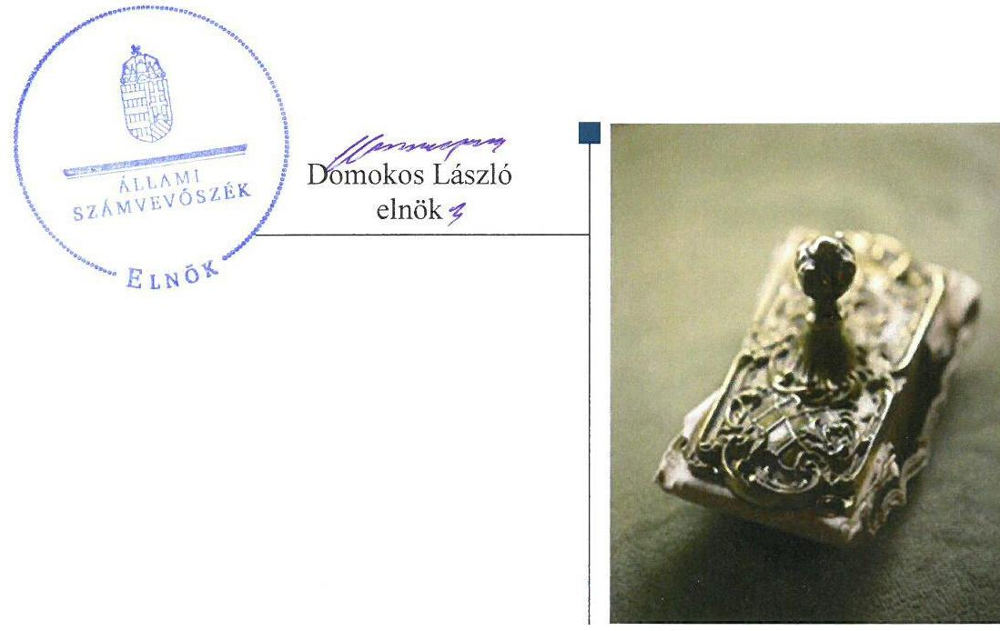
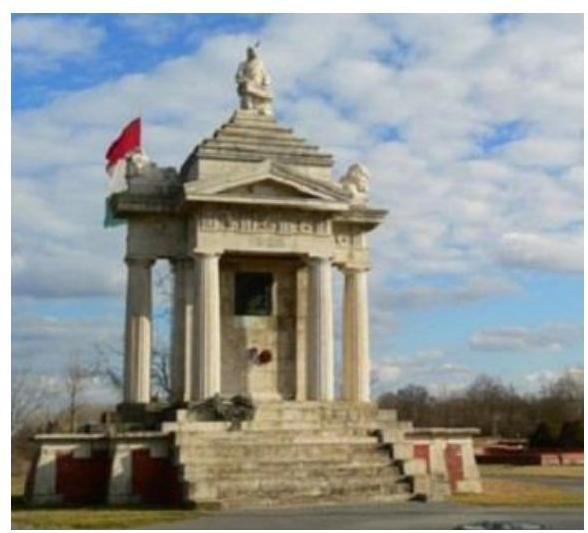
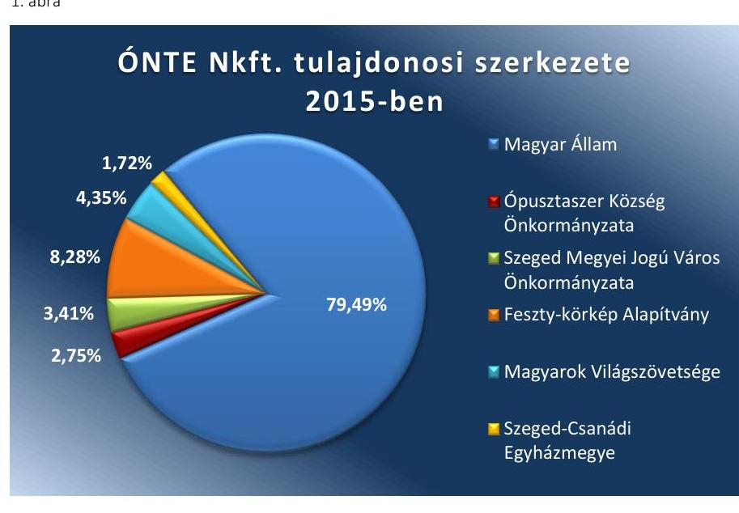
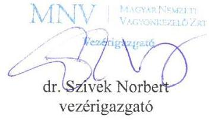
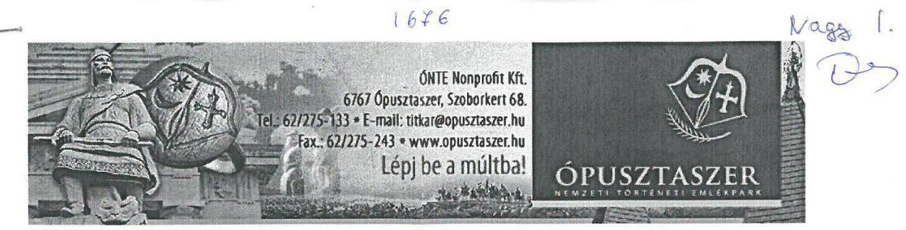
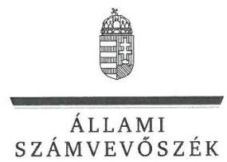
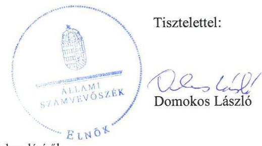

# Jelentés 

## Állami tulajdonú gazdasági társaságok

Az állami tulajdonban (résztulajdonban) lévő gazdálkodó szervezetek vagyonmegőrzési és gazdálkodási tevékenységének ellenőrzése ÖNTE Ópusztaszeri Nemzeti Történeti Emlékpark Közhasznú Nonprofit Kft.
2017.

---

# Jelentés 

## Állami tulajdonú gazdasági társaságok

Az állami tulajdonban (résztulajdonban) lévő gazdálkodó szervezetek vagyonmegőrzési és gazdálkodási tevékenységének ellenőrzése ÖNTE Ópusztaszeri Nemzeti Történeti Emlékpark Közhasznú Nonprofit Kft.
2017.  első hó 14. nap

---

# AZ ELLENŐRZÉST FELÜGYELTE:

DR. NAGY IMRE felügyeleti vezető

# AZ ELLENŐRZÉST VEZETTE ÉS A VÉGREHAJTÁSÁÉRT FELELŐS:

MODER BEATRIX ellenőrzésvezető

# A PROGRAM ÖSSZEÁLLÍTÁSÁÉRT FELELŐS:

JANIK JÓZSEF LÁSZLÓ osztályvezető

---

**IKTATÓSZÁM:** V-1366-143/2016

**TÉMASZÁM:** 2396

**ELLENŐRZÉS-AZONOSÍTÓ SZÁM:** V075933

---

Jelentéseink az Országgyűlés számítógépes hálózatán és az Interneten a www.asz.hu címen is olvashatóak.

---

# TARTALOMJEGYZÉK 

■ ÖSSZEGZÉS ..... 5
■ AZ ELLENŐRZÉS CÉLJA ..... 6
■ AZ ELLENŐRZÉS TERÜLETE ..... 7
■ AZ ELLENŐRZÉS HÁTTERE, INDOKOLTSÁGA ..... 9
■ A JELENTÉS LÉNYEGES KÉRDÉSKÖREI ..... 10
■ ELLENŐRZÉS HATÓKÖRE ÉS MÓDSZEREI ..... 11
■ MEGÁLLAPÍTÁSOK ..... 13
■ JAVASLATOK ..... 18
■ MELLÉKLETEK ..... 19
I. Sz. melléklet: Értelmező szótár ..... 19
■ FÜGGELÉK: ÉSZREVÉTELEK ..... 23
■ RÖVIDÍTÉSEK JEGYZÉKE ..... 29

---

.

---

# ÖSSZEGZÉS 

Az ÓNTE Ópusztaszeri Nemzeti Történeti Emlékpark Közhasznú Nonprofit Kft. feletti tulajdonosi jogokat a Csongrád Megyei Intézményfenntartó Központ nem megfelelően gyakorolta, a Magyar Nemzeti Vagyonkezelő Zrt. szabályszerűen gyakorolta. A társaság működésének szabályozottsága - a számviteli szabályzatok hiánya miatt - a 2012-2013. években nem felelt meg az előírásoknak, a 2014-2015. években megfelelő volt. A bevételek és ráfordítások elszámolása szabályszerű volt. A társaság a beszámolási, adatszolgáltatási, közzétételi kötelezettségét a jogszabályi előírásoknak megfelelően teljesítette, a gazdálkodás átláthatóságát biztosította. A vagyongazdálkodása szabályszerű volt, a vagyon értékének megőrzéséről gondoskodott.

## Az ellenőrzés társadalmi indokoltsága

Az állami tulajdonú gazdálkodó szervezetek a nemzeti vagyon részét képezik, ezért ellenőrzésük kiemelten fontos a nemzeti vagyon megőrzése, megóvása érdekében. Az állami vagyonnal való gazdálkodás alapvető célja az állami vagyon átlátható, rendeltetésszerű és felelős felhasználásának biztosítása.

Az Állami Számvevőszék stratégiájában megfogalmazott egyik kiemelt célja, hogy az államháztartáson kívülre nyújtott költségvetési támogatások és ingyenes vagyonjuttatások, valamint az államháztartáson kívül működő feladatellátó rendszerek ellenőrzéseivel hozzájáruljon ahhoz, hogy a közpénzeket az államháztartáson kívül működő szervezetek is átlátható, rendezett módon használják fel a szerződésben átvállalt állami feladatok ellátása érdekében.

Az Állami Számvevőszék az ÓNTE Ópusztaszeri Nemzeti Történeti Emlékpark Közhasznú Nonprofit Kft. ellenőrzésekor az általa korábban ellenőrizetlen területek, szervezetek körébe tartozó társaságnál végzett ellenőrzést. A számvevőszéki ellenőrzés hozzájárul a közpénzek, közvagyon szabályos, átlátható, elszámoltatható és eredményes felhasználásához.

## Főbb megállapítások, következtetések, javaslatok

Az ÓNTE Ópusztaszeri Nemzeti Történeti Emlékpark Közhasznú Nkft. állami tulajdonban lévő üzletrésze feletti tulajdonosi jogokat a Csongrád Megyei Intézményfenntartó Központ nem gyakorolta megfelelően, mivel a taggyűlésen való részvételre a mandátumadás módját és a képviseletre kijelölt személyek képviselettel összefüggő feladatait és beszámolási kötelezettségét nem határozta meg. Az MNV Zrt. a többségi tulajdonosi jogait szabályszerűen gyakorolta, a jogszabályoknak megfelelő működés kereteit kialakította, a tulajdonosi felügyeletet biztosította.

Az ÓNTE Nkft. a jogszabályban előírt számviteli szabályzatokkal a 2012-2013. években nem rendelkezett. A 2014. évtől a gazdálkodás szabályozottsága megfelelő volt, azonban az önköltségszámítás rendjéről szabályzatot nem alkottak, a végzett szolgáltatások önköltségét nem állapították meg.

A bevételek és ráfordítások elszámolása megfelelt a jogszabályi előírásoknak, a tervezési, beszámolási, adatszolgáltatási kötelezettségeket szabályszerűen teljesítették. Az ÓNTE Nkft. a közérdekből nyilvános adatai szabályszerű közzétételével a gazdálkodás átláthatóságát biztosította, azonban a közzététel rendjét és a közérdekű adatok megismerésére irányuló igények teljesítésének rendjét szabályzatban nem rögzítette.

Az ÓNTE Nkft. vagyongazdálkodása, a vagyon nyilvántartása szabályszerű volt, a mérlegben kimutatott eszközöket és forrásokat szabályszerű leltárral alátámasztották. A térítésmentesen illetve térítés ellenében rendelkezésére bocsátott állami vagyon használata, üzemeltetése a vonatkozó szerződéseknek megfelelően történt.

Az ÁSZ jelentésében az ÓNTE Ópusztaszeri Nemzeti Történeti Emlékpark Közhasznú Nonprofit Kft. ügyvezetőjének három javaslatot fogalmazott meg, amelyre az érintettnek 30 napon belül intézkedési tervet kell készítenie.

---

# AZ ELLENŐRZÉS CÉLJA 

Az ellenőrzés célja annak értékelése volt, hogy a tulajdonosi jogok gyakorlása szabályszerű volt-e; a gazdálkodó szervezet szabályozottsága, gazdálkodása és vagyongazdálkodási tevékenysége megfelelt-e a jogszabályi és a tulajdonosi előírásoknak; biztosítva volt-e a közfeladatok átláthatósága és elszámoltathatósága érdekében a közszolgáltatás díjának megalapozottsága szabályszerű önköltségszámítással; a vagyonváltozást eredményező döntések esetében a tulajdonosi jogok gyakorlója és a gazdálkodó szervezet szabályszerűen jártak-e el. Az ellenőrzés célja volt továbbá annak megítélése, hogy a kormányzati szektorba sorolt állami tulajdonban (résztulajdonban) lévő gazdálkodó szervezetek gazdálkodásának a kormányzati szektor hiányára és az államadósságra befolyással bíró elemei a jogszabályi előírásoknak megfeleltek-e.

---

# AZ ELLENŐRZÉS TERÜLETE 

## ÓNTE Ópusztaszeri Nemzeti Történeti Emlékpark Közhasznú Nonprofit Korlátolt Felelősségű Társaság

Az ÓNTE Nkft. ${ }^{1}$ 2009. május 29-én átalakulással jött létre, jogelődje az 1995. szeptember 22-én alapított Ópusztaszeri Nemzeti Történeti Emlékpark Közhasznú Társaság volt.

Az ÓNTE Nkft 48,31 millió Ft-os törzstőkéje az alapítása óta nem változott. A Magyar Állam 2012. január 1-je óta az ÓNTE Nkft. többségi tulajdonosa, a 38,4 millió Ft-os tulajdonrész a 2011. CLIV. tv. ${ }^{2}$ alapján, a Csongrád Megyei Önkormányzat adósságkonszolidációja keretében került a Magyar Állam tulajdonába. Az ellenőrzött időszakban a tulajdonosok között egy alkalommal - 2012. május 3-án - történt változás, a CIB Bank Zrt. 0,83 millió Ft-os tulajdoni részesedését a Szeged-Csanádi Egyházmegye vásárolta meg.

Az ÓNTE Nkft. tulajdonosi szerkezetét az 1. ábra szemlélteti.

Forrás: ÓNTE Nkft. Társaság szerződései
Az állami tulajdonrész feletti tulajdonosi jogokat 2012. január 1-től 2013. március 29-ig vagyonkezelőként a CSOMIK ${ }^{3}$, 2013. március 30-tól az MNV Zrt. ${ }^{4}$ gyakorolta.

Az ÓNTE Nkft. a feladatait a saját vagyonával, valamint a közfeladata ellátásához szükséges nemzeti vagyon vagyonkezelőivel, tulajdonosaival kötött - közhasznú-, haszonbérleti-, üzemeltetési - szerződések alapján rendelkezésére bocsátott vagyonnal látta el, a Vtv.-ben ${ }^{5}$ és az Nvtv.-ben ${ }^{6}$ definiált vagyonkezelői joggal nem rendelkezett.

---

Az ÓNTE Nkft. legfőbb döntéshozó szerve a taggyűlés volt, a társaság működését a taggyűlés által megválasztott háromtagú felügyelő bizottság és könyvvizsgáló ellenőrizte.

Az ÓNTE Nkft. az alapítása óta közhasznú jogállású, a Kult. tv. ${ }^{7}$ 2. melléklete szerint 2012-től nemzeti emlékhely. A cél szerinti fő közhasznú tevékenysége a múzeumi tevékenység és a kulturális örökség védelme, amelynek keretében skanzen, történeti emlékpark, örökség iskola fenntartásával és működtetésével, rendezvények szervezésével gondoskodik a Kárpát-medence magyarság kultúrájának bemutatásáról.

Az ÓNTE Nkft. a közhasznú feladatai ellátása érdekében az EMMI ${ }^{8}$-vel kötött támogatási szerződések alapján rendszeres működési célú állami támogatásban részesült. A közhasznú tevékenység céljainak megvalósítása érdekében vállalkozási (vendéglátás, bolti kiskereskedelem, szálláshely szolgáltatás) tevékenységet is végzett.

Az ellenőrzött időszakban az ügyvezető személye egy alkalommal, 2012. július 26-án változott. Az átlagos statisztikai állományi létszám a 2012. év végi 115 főről 2015. végére 92 főre csökkent.

Az ÓNTE Nkft. részesedéssel és egyéb befektetett pénzügyi eszközzel nem rendelkezett, a saját vagyonát nem terhelte meg, vagyon ingyenes átruházására, apportálására nem került sor. Az ÓNTE Nkft. tulajdonában, illetve irányítása, felügyelete vagy ellenőrzése alatt költségvetési szerv, gazdasági társaság, alapítvány nem volt.

Az ÓNTE Nkft. az ellenőrzött időszakban nem tartozott a kormányzati szektorba sorolt egyéb szervezetek körébe.

Az ÓNTE Nkft. főbb gazdálkodási adatait az 1. táblázat tartalmazza:

1. táblázat

|  AZ ÓNTE NKFT. FŐBB GAZDÁLKODÁSI ADATAI (M FT) |  |  |  |   |
| --- | --- | --- | --- | --- |
|  Megnevezés | 2012.12.31. | 2013.12.31. | 2014.12.31. | 2015.12.31.  |
|  Mérlegfőösszeg | 781,8 | 1193,6 | 1372,6 | 1553,2  |
|  Befektetett eszközök | 396,9 | 635,0 | 1085,1 | 1455,1  |
|  Saját tőke | 119,6 | 85,5 | 98,5 | 129,8  |
|  Jegyzett tőke | 48,3 | 48,3 | 48,3 | 48,3  |
|  Mérleg szerinti eredmény | $-1,8$ | $-36,7$ | 13,0 | 31,3  |
|  Éves nettó árbevétel | 275,2 | 258,5 | 257,8 | 252,7  |
|  ebből: közhasznú tevékenység árbevétele | 171,9 | 165,0 | 184,2 | 186,3  |
|  vállalkozási tevékenység árbevétele | 103,3 | 93,5 | 73,6 | 66,4  |
|  Támogatások | 257,3 | 239,3 | 603,2 | 367,1  |
|  ebből az állami költségvetésből származó általános | 210,0 | 210,0 | 260,0 | 228,8  |
|  működési támogatás |  |  |  |   |

---

# AZ ELLENŐRZÉS HÁTTERE, INDOKOLTSÁGA 

Az állami tulajdonú gazdálkodó szervezetek gazdálkodása jellemzően a közérdeklődés és a média figyelmének középpontjában áll, amihez hozzájárul a gazdálkodásuk körébe tartozó - közvetlen vagy közvetett állami tulajdonú - vagyon nagysága, illetve az általuk ellátott közszolgáltatások minősége és hatékonysága.

Az ÁSZ ${ }^{9}$ célkitűzése, hogy ellenőrzésével rámutasson az állami tulajdonú gazdálkodó szervezetek gazdálkodási tevékenységével kapcsolatos jó gyakorlatra és szabálytalanságokra, hozzájáruljon az államháztartáson kívüli, de (közvetlenül vagy közvetve) állami vagyont használó gazdálkodó szervezetek tevékenységének átláthatóságához, valamint felhívja a figyelmet a jogszabályi követelmények teljesítéséhez szükséges feltételek hiányosságára.

Az ellenőrzés várható hasznosulásaként az ellenőrzés megállapításai a jogalkotás számára segítséget nyújthatnak az átláthatóságot biztosító szabályozáshoz. Az ellenőrzöttek számára visszajelzést ad a vagyongazdálkodási tevékenységgel, beszámolással kapcsolatos szabálytalanságokról és kockázatokról. Az ellenőrzés tapasztalatai segítik és erősítik az ÁSZ hozzáadott értéket teremtő elemző tevékenységét és tanácsadó szerepét.

---

# A JELENTÉS LÉNYEGES KÉRDÉSKÖREI 

1.     - A tulajdonosi jogok gyakorlása szabályszerű volt-e?
2.     - A társaság működésének szabályozottsága megfelelt-e az előírásoknak?
3.     - A társaságnál a pénzügyi-számviteli, adatszolgáltatási és ellenőrzési feladatok ellátása szabályszerű volt-e?
4.     - A társaság vagyongazdálkodása szabályszerű volt-e?

---

# ELLENŐRZÉS HATÓKÖRE ÉS MÓDSZEREI 

## Az ellenőrzés típusa

Megfelelőségi ellenőrzés.

## Az ellenőrzött időszak

Az ellenőrzött időszak 2012. január 1-jétől 2015. december 31-ig tart.

## Az ellenőrzés tárgya

Az ÓNTE Ópusztaszeri Nemzeti Történeti Emlékpark Közhasznú Nonprofit Kft. gazdálkodása, kiemelten vagyongazdálkodási tevékenysége, a tulajdonosi jogok gyakorlása.

Az ellenőrzés kiterjed minden olyan körülményre és adatra, amely az ÁSZ jogszabályban meghatározott feladatainak teljesítéséhez, valamint a program végrehajtása folyamán felmerült újabb összefüggések feltárásához szükséges.

## Az ellenőrzött szervezet

ÓNTE Ópusztaszeri Nemzeti Történeti Emlékpark Közhasznú Nonprofit Korlátolt Felelősségű Társaság;

Szociális és Gyermekvédelmi Főigazgatóság, mint a Csongrád Megyei Intézményfenntartó Központ jogutódja;

Magyar Nemzeti Vagyonkezelő Zrt.

## Az ellenőrzés jogalapja

Az ellenőrzés jogalapját az ÁSZ tv. 1. § (3) bekezdése és 5. § (3)-(5) bekezdése képezi.

## Az ellenőrzés módszerei

Az ellenőrzést a nemzetközi standardokat irányadónak tekintve az ellenőrzött időszakban hatályos jogszabályok, az ellenőrzés szakmai szabályok és módszertanok figyelembevételével végeztük.

Az ellenőrzési kérdések megválaszolásához szükséges bizonyítékok megszerzése a következő ellenőrzési eljárások alkalmazásával történt: megfigyelés, kérdésfeltevés (információkérés), összehasonlítás, valamint

---

elemző eljárás. Az ellenőrzési bizonyítékként felhasználható adatforrások közé tartoztak egyrészt az ellenőrzési programban felsorolt adatforrások, másrészt az ellenőrzés során feltárt, az ellenőrzés szempontjából információkat tartalmazó dokumentumok.

A bevételek és ráfordítások elszámolását, valamint a vagyonnyilvántartás szabályszerűségét véletlen mintavétellel ellenőriztük. A
 mintatételek értékelése alapján, egyrészt a sokaságban előforduló hibás tételek arányát becsültük, másrészt az irányítottan kiválasztott tételeket értékeltük. A jogszabályoknak és a belső előírásoknak megfelelőnek, azaz szabályszerűnek tekintettük az adott területet, amennyiben a minta ellenőrzésének eredménye alapján 95%-os bizonyossággal a teljes sokaságban a hibaarány kisebb volt, mint 10%, nem megfelelőnek értékeltük, ha a hibaarány a 10%-ot meghaladta. A ráfordítások elszámolására és a vagyonnyilvántartásra vonatkozó véletlen mintavételt kockázati alapú kiválasztással egészítettük ki, amelynek során évente a három legnagyobb összegű tételt választottuk ki.

---

# 1. A tulajdonosi jogok gyakorlása szabályszerű volt-e? 

Összegző megállapítás

A CSOMIK tulajdonosi joggyakorlása nem volt megfelelő, az MNV Zrt. a tulajdonosi jogokat szabályszerűen gyakorolta.

## A TÖBBSÉGI TULAJDONOSI JOGGYAKORLÁS

RENDJÉT a CSOMIK és az MNV Zrt. a társasági szerződés ${ }_{1-6}$-ban ${ }^{10}$ a CSOMIK SZMSZ-ben ${ }^{11}$, illetve az MNV Zrt. SZMSZ ${ }_{1-4}$-ben ${ }^{12}$ alakította ki.

A CSOMIK SZMSZ-ben rögzítették, hogy a társasági részesedések feletti tulajdonosi jogokat az Intézmény-fenntartási Főosztály gyakorolja. Az Ávr. ${ }^{13}$ 13. § (1) bekezdés g) pontjában foglaltak ellenére azonban az SZMSZ-ben a tulajdonosi joggyakorláshoz kapcsolódó feladat és hatáskörök gyakorlásának módját - így különösen a taggyűlésen kialakítandó álláspontra vonatkozó mandátumadás módját, illetve a taggyűlésben képviseletre kijelölt személyek képviselettel összefüggő feladatait és beszámolási kötelezettségét - nem határozták meg.

Az MNV Zrt. SZMSZ ${ }_{1-4}$ előírásának megfelelően az MNV Zrt. vezérigazgatói határozatokban adott mandátumot a képviseletre kijelölt személyek képviselettel összefüggő feladataira.

A társasági szerződés ${ }_{1-6}$-ban - a Gt. ${ }^{14}$, illetve a Ptk. ${ }^{15}$ előírásaival összhangban - meghatározták a taggyűlés számára fenntartott jogokat, a társaság által ellátandó közhasznú, illetve a végezhető gazdasági-vállalkozási tevékenységek körét, rögzítették az ügyvezető hatáskörét, a többségi tulajdonos előzetes hozzájárulásához kötött, illetve a taggyűlés hatáskörébe utalt döntéseket, valamint az összeférhetetlenségi szabályokat és a cégjegyzés módját.

Az ügyvezetés ellenőrzésére a Taktv. ${ }^{16}$ előírásának megfelelően három tagból álló felügyelő bizottságot ${ }^{17}$ működtettek, valamint a Gt. és a Ptk. ${ }_{2}$ előírásával összhangban taggyűlési határozattal választották meg a könyvvizsgálót.

A taggyűlés - megismerve a könyvvizsgáló és a felügyelő bizottság beszámolóról adott írásbeli jelentését - határozattal hagyta jóvá az ÖNTE Nkft. 2012-2015. évi éves számviteli beszámolóit és a közhasznúsági mellékleteket.

MONITORING TEVÉKENYSÉGET a CSOMIK nem alakított ki, az MNV Zrt. a monitoring szabályzatának ${ }^{18}$ megfelelően működtette, a gazdálkodás alakulását folyamatosan nyomon követte és értékelte.

A JAVADALMAZÁSI SZABÁLYZATOT ${ }^{19}$ a taggyűlés megalkotta, amely a Taktv. előírásainak megfelelően tartalmazta a vezető tisztségviselő, a felügyelő bizottsági tagok, valamint az Mt. ${ }^{20}$ 208. §-ának hatálya alá eső munkavállalók javadalmazásának, valamint a munkaviszony

---

# 2. A társaság működésének szabályozottsága megfelelt-e az előírásoknak? 

## Összegző megállapítás

Az ÓNTE Nkft. működésének szabályozottsága a 2012-2013. években a számviteli szabályzatok hiánya miatt nem felelt meg az előírásoknak. A 2014-2015. években a belső szabályozás megfelelő volt.

A TÁRSASÁGI SZMSZ ${ }_{1-3}{ }^{21}$-ban meghatározták a társaság működésének kereteit, a szervezeti felépítést, a szervezeti egységek feladat- és hatáskörét, és a szervezeti változásoknak megfelelő aktualizálásáról gondoskodtak.

A GAZDÁLKODÁS SZABÁLYOZÁSA a 2012-2013. években nem felelt meg a jogszabályi előírásoknak, mert az ÓNTE Nkft. nem rendelkezett a 2012. évben a Számv. tv. ${ }^{22}$ 14. § (3) bekezdésében, valamint a 161. § (1) bekezdésében előírtak ellenére számviteli politikával és számlarenddel, a 2012-2013. években a Számv. tv. 14. § (5) bekezdés a)-b) pontjaiban előírtak ellenére leltározási és leltárkészítési szabályzattal, értékelési szabályzattal, valamint a Számv. tv. 161. § (2) bekezdése ellenére a számlarendet alátámasztó bizonylati renddel.

A 2014-2015. években a gazdálkodás szabályozottsága megfelelt a Számv. tv. előírásainak. Elkészítették a Társaság sajátosságainak megfelelő Számviteli politika ${ }_{1,2}$ - ${ }^{23}$, valamint annak keretében az Értékelési szabályzatot ${ }^{24}$ és a Leltározási szabályzatot ${ }^{25}$. A Pénzkezelési szabályzat ${ }_{1-3}{ }^{26}$ megfelelt a Számv. tv.-ben előírt tartalmi követelményeknek. A kialakított Számlarend ${ }^{27}$ tartalmazta az alkalmazásra kijelölt számlák számjelét és megnevezését, a számla értéke növekedésének, csökkenésének jogcímeit, valamint meghatározták a főkönyvi számlák és az analitikus nyilvántartások kapcsolatát, és kialakították a számlarendben foglaltakat alátámasztó Bizonylati rendet ${ }^{28}$.

---

# 3. A társaságnál a pénzügyi-számviteli, adatszolgáltatási és ellenőrzési feladatok ellátása szabályszerű volt-e? 

Összegző megállapítás
3.1. számú megállapítás
2. táblázat

## VEVŐKÖVETELÉSEK ALAKULÁSA (M FT)

| Megnevezés | 2012 | 2015 |
| :--: | :--: | :--: |
| Vevőkövetelések | 7,6 | 4,4 |
| ebből: határidőn belüli | 0 | 1,7 |
| határidőn túli: |  |  |
| 1-30 nap | 0 | 1,4 |
| 31-60 nap | 0 | 1,2 |
| 61-90 nap | 0 | 0 |
| 91-180 nap | 0 | 0 |
| 180-360 nap | 2,0 | 0 |
| 360 napon túli | 5,6 | 0,1 |

Forrás: Az ÖNTE Nkft. 2012-2015. év beszámolói

Az ÓNTE Nkft a pénzügyi-számviteli feladatokat szabályszerűen látta el, azonban az önköltség-számítási kötelezettségének nem tett eleget. Az adatszolgáltatási feladatokat, a közérdekű adatok közzétételét szabályszerűen végezte. A gazdálkodás átláthatóságát az ÓNTE Nkft. biztosította.

A bevételek és a ráfordítások elszámolása megfelelt az előírásoknak.

Az ÓNTE Nkft. a közhasznú és a vállalkozási tevékenységből származó bevételeit és ráfordításait - a Számv. tv. és a Civil tv. ${ }^{29}$ előírásainak megfelelően - elkülönítetten tartotta nyilván.

A BEVÉTELEK ELSZÁMOLÁSA megfelelt a Számv. tv. és a belső szabályozások előírásainak. Az árbevételek kiszámlázása a szerződésekben foglaltaknak megfelelően történt. Az értékesítés nettó árbevételét, az egyéb, a rendkívüli és a pénzügyi műveletek bevételeit a megfelelő főkönyvi számlákra számolták el, a kapott támogatások felhasználásáról az előírt elszámolásokat elkészítették.

A RÁFORDÍTÁSOK ELSZÁMOLÁSA megfelelt a Számv. tv.-ben és a belső szabályzatokban rögzített előírásoknak. Az anyag jellegű, valamint az egyéb, a rendkívüli és a pénzügyi műveletek ráfordításait az előírt tartalmú számviteli bizonylatok alapján a megfelelő főkönyvi számlákra szabályosan számolták el. A személyi jellegű ráfordítások elszámolását szabályos munkaszerződések alapozták meg, a munkavállalókat terhelő adók és járulékok levonása és elszámolása szabályszerűen történt.

Az értékcsökkenési leírás elszámolása szabályszerű volt. A terv szerinti értékcsökkenés elszámolása a Számv. tv. előírásainak megfelelően, az üzembe helyezés napjától, a maradványértékkel csökkentett bruttó érték alapulvételével, lineáris leírással, negyedévente történt.

A KÖVETELÉSÁLLOMÁNY csökkentése érdekében tett intézkedések hatására a vevőkkel szemben fennálló követelésállomány összege a 2012. év végi 7,6 millió Ft-ról 2015. végére 4,4 millió Ft-ra csökkent, valamint az összetétele is kedvezően alakult. A 2012. december 31-i vevőkövetelés 100%-a lejárt követelés volt, ezen belül 73,7%-ot képviseltek az egy éven túl lejárt követelések. 2015. december 31-én a lejárt vevőkövetelések aránya 61,4%, ezen belül mindössze 3,7% (0,1 millió Ft) volt a 360 napon túli követelések aránya. A követelések kimutatása, a követelések utáni értékvesztés elszámolása, illetve szükség szerinti visszaírása megfelelte a Számv. tv. előírásainak.

---

# 3.2. számú megállapítás 

Az ÓNTE Nkft. az önköltségszámítás rendjét nem alakította ki, a végzett szolgáltatások önköltségét utókalkulációval nem állapította meg.

A közhasznú tevékenység keretében végzett szolgáltatások árát a fizetőképes kereslet, a hasonló tevékenységet ellátó intézmények által alkalmazott díjak, valamint a 194/2000. (XI. 24.) Korm. rendelet a muzeális intézmények látogatóit megillető kedvezményekről előírásai figyelembe vételével határozták meg.

ÖNKÖLTSÉGSZÁMÍTÁS rendjére vonatkozó szabályzatot az ÓNTE Nkft. a Számv. tv. 14. § (5) bekezdés c) pont előírása ellenére nem készített, holott a költségnemek szerinti költségeinek együttes összege alapján a Számv. tv. 14. § (6) bekezdése szerinti mentessége az ellenőrzött időszakban nem állt fenn. A szabályozás hiányában, a Számv. tv. 14. § (7) bekezdés előírását figyelmen kívül hagyva, a végzett szolgáltatások Számv. tv. 51. § (2) bekezdése szerinti önköltségét az önköltségszámítás rendjére vonatkozó belső szabályzat szerinti utókalkuláció módszerével nem állapította meg. A könyvvizsgáló a szabályozási hiányosság ellenére korlátozás nélküli hitelesítő záradékkal látta el az éves számviteli beszámolókat.

### 3.3. számú megállapítás

Az ÓNTE Nkft. a tervezési, beszámolási, adatszolgáltatási és közzétételi kötelezettségét szabályszerűen teljesítette.

AZ ÉVES ÜZLETI TERVEKET a 2014-2015 évekre az MNV Zrt. által meghatározott követelményeknek megfelelően, határidőben elkészítették, azokat a taggyűlés határozattal elfogadta. A CSOMIK - a tulajdonosi joggyakorlása idején - üzleti terv készítési kötelezettséget nem írt elő. A 2013. évben benyújtott üzleti tervet - annak tartalmi hiányosságai miatt - a taggyűlés nem hagyta jóvá, előírta az MNV Zrt. elvárásainak megfelelő kiegészítését, ugyanakkor a taggyűlés elé történő ismételt előterjesztésétől eltekintett. Az ÓNTE Nkft. az üzleti tervet az elvárt követelményeknek megfelelően elkészítette.

AZ ÉVES SZÁMVITELI BESZÁMOLÓKAT, közhasznúsági mellékleteket határidőre elkészítették. A taggyűlési határozattal elfogadott éves beszámolók, közhasznúsági mellékletek letétbe helyezése, közzététele a könyvvizsgálói jelentéssel együtt a jogszabályi előírásoknak megfelelően, az előírt határidőben megtörtént.

A KÖZÉRDEKŰ ADATOK megismerésére irányuló igények teljesítésének rendjét rögzítő, valamint a közzétételi listákon szereplő adatok rendjét az ÓNTE Nkft. az Info tv. ${ }^{30} 30$. § (6) bekezdésében, illetve a 35. § (1) és (3) bekezdéseiben, valamint az Info tv. 37. § (1) bekezdésében foglalt előírások ellenére nem szabályozta. A jogszabályok által előírt közzétételi kötelezettségének az ÓNTE Nkft. eleget tett, a közérdekből nyilvános adatainak megismerhetőségét, hozzáférhetővé tételét internetes honlapján biztosította.

A TULAJDONOSI ELLENŐRZÉST a CSOMIK és az MNV Zrt. a felügyelő bizottság által végzett ellenőrzésekkel, valamint az állandó könyvvizsgáló megbízásával biztosította, továbbá az MNV Zrt. Ellenőrzési

---

Igazgatósága a 2014. évben vizsgálta a beszerzési, valamint a pénzkezelési folyamatok szabályozottságát, és azok betartását. Az ellenőrzés javaslatainak hasznosítására az ÓNTE Nkft. intézkedett.

# 4. A társaság vagyongazdálkodása szabályszerű volt-e? 

## Összegző megállapítás Az ÓNTE Nkft. vagyongazdálkodása szabályszerű volt.

A VAGYON NYILVÁNTARTÁSA biztosította a vagyon változásának folyamatos nyomon követését, a főkönyvi könyvelés és az analitikus nyilvántartások egyezőségét. A mérlegben és a számviteli nyilvántartásokban szereplő eszközök és források állományát tételesen, mennyiségben és értékben ellenőrizhető módon tartalmazó leltárral támasztották alá. A leltározás lebonyolítása megfelelt a Számv. tv. és a leltározási szabályzat előírásainak. A készleteket valamennyi évben, a tárgyi eszközöket a 2014-2015. években mennyiségi felvétellel leltározták, a további eszközök és a források leltározása - a Számv. tv. előírásaival összhangban - egyeztetéssel történt. A leltárak kiértékelése megtörtént, leltárkülönbözet többlet/hiány nem került megállapításra.

A VAGYON ÉRTÉKÉNEK MEGÖRZÉSE, gyarapítása érdekében az ÓNTE Nkft. az üzleti terveiben és az Akció terv ${ }^{31}$-ben rögzítette a gazdálkodás fő mutatóinak tervszámait a tervezési évre és középtávú kitekintésben, elkészítette a beruházási és közbeszerzési tervet, bemutatta a tervezett beruházások finanszírozhatóságát, valamint az infrastrukturális javítások becslését középtávra. Az Akció tervben elemezték a gazdálkodás eredményességére ható tényezőket és intézkedési tervet dolgoztak ki a fejlesztésekre és a szervezeti átalakításokra vonatkozóan.

A Társaság eszközállományának értéke több mint háromszorosára - a 2012. év eleji 465,6 M Ft-ról 1553,2 M Ft-ra - növekedett. A befektetett
 eszközök összes eszközön belül aránya a 2012. év végi 50,8%-ról a 2015. év végére 93,7%-ra emelkedett, döntően a pályázati forrásokból megvalósult jelentős összegű beruházások - Pallavicini Kápolna rekonstrukciója, Látogatóközpont kialakítása - következtében. Az elszámolt értékcsökkenést jelentősen meghaladó beruházások következtében a vagyon megőrzése, gyarapítása megvalósult.

Az ÓNTE Nkft. üzemeltetésében lévő, idegen tulajdonú ingatlanokon végzett beruházásokhoz a tulajdonos, vagyonkezelő engedélyét megkérték, a beruházások, felújítások értékét a számviteli nyilvántartásaikban a beruházással érintett ingatlan egyértelmű beazonosításával - a Számv. tv. 23. § (3) bekezdésében foglaltaknak megfelelően - egyéb építményként mutatták ki.

## A VAGYON VÁLTOZÁSÁT EREDMÉNYEZŐ DÖNTÉ-

SEK megfeleltek a Társasági Szerződés ${ }_{1-6}$, a társasági SZMSZ ${ }_{1-3}$, a Beszerzési szabályzat ${ }^{32}$ és a Közbeszerzési szabályzat ${ }^{33}$ előírásainak. A fejlesztési célú támogatásokat a támogatási céloknak megfelelően, szabályszerűen használták fel, az előírt szakmai és pénzügyi beszámolókat elkészítették. A 2014. évben lebonyolított selejtezéseket szabályszerű selejtezési eljárással hajtották végre.

---

# JAVASLATOK 

Az ÁSZ tv. 33. § (1) bekezdésében foglaltak értelmében az ellenőrzött szervezet vezetője köteles a jelentésben foglalt megállapításokhoz kapcsolódó intézkedési tervet összeállítani és azt a jelentés kézhezvételétől számított 30 napon belül az ÁSZ részére megküldeni. Amennyiben az ellenőrzött szervezet vezetője nem küldi meg határidőben az intézkedési tervet, vagy továbbra sem elfogadható intézkedési tervet küld, az Állami Számvevőszék elnöke az ÁSZ tv. 33. § (3) bekezdése a) és b) pontjaiban foglaltakat érvényesítheti.

## ÓNTE Ópusztaszeri Nemzeti Történeti Emlékpark Közhasznú Nkft. Ügyvezetőjének

1. Intézkedjen az önköltségszámítási szabályzat elkészítéséről a jogszabályban előírtak szerint.
(3.2. megállapítás 2. bekezdés első mondata alapján)
2. Intézkedjen arról, hogy a végzett szolgáltatások önköltségét az önköltségszámítás rendjére vonatkozó belső szabályzat szerinti utókalkuláció módszerével állapítsák meg.
(3.2. sz. megállapítás 2. bekezdés második mondata alapján)
3. Intézkedjen a jogszabályban foglaltak alapján a közérdekű adatok megismerésére irányuló igények teljesítésének, valamint a közzétételi listákon szereplő adatok közzétételének rendjére vonatkozó szabályzatok elkészítéséről.
(3.3. sz. megállapítás 3. bekezdés első mondata alapján)

---

# MELLÉKLETEK 

## I. SZ. MELLÉKLET: ÉRTELMEZŐ SZÓTÁR

állami vagyon
állami vagyon kezelése/hasznosítása
állami vagyon hasznosítására kötött szerződés
állami vagyon értékesítése
gazdasági társaság
gazdálkodó szervezet
a) Az állam tulajdonában lévő dolog, valamint a dolog módjára hasznosítható természeti erő,
b) az a) pont hatálya alá nem tartozó mindazon vagyon, amely vonatkozásában törvény az állam kizárólagos tulajdonjogát nevesíti,
c) az állam tulajdonában lévő tagsági jogviszonyt megtestesítő értékpapír, illetve az államot megillető egyéb társasági részesedés,
d) az államot megillető olyan immateriális, vagyoni értékkel rendelkező jogosultság, amelyet jogszabály vagyoni értékű jogként nevesít.
Forrás: Vtv. 1. § (2) bekezdése
2012. november 10-től az állami vagyon fogalma kiegészül a következő ponttal:
e) az állam tulajdonában lévő pénzügyi eszközök

Forrás: Vtv. 1. § (2) bekezdése
2013. június 27-ig:

Az állami vagyont az MNV Zrt. maga kezeli, vagy szerződés - így különösen bérlet, haszonbérlet, megbízás - alapján központi költségvetési szervnek, természetes vagy jogi személynek, vagy jogi személyiséggel nem rendelkező gazdálkodó szervezetnek hasznosításra átengedi. Az állami vagyonra vonatkozóan az MNV Zrt. kizárólag az Nvtv-ben meghatározott személyekkel köthet vagyonkezelési szerződést.
Forrás: Vtv. 23. § (1), 27. § (1)
2013. június 28-ától:

Az állami vagyonnal az MNV Zrt. maga gazdálkodik, vagy szerződés - így különösen bérlet, haszonbérlet, megbízás - alapján központi költségvetési szervnek, természetes vagy jogi személynek, vagy jogi személyiséggel nem rendelkező gazdálkodó szervezetnek hasznosításra átengedi, illetőleg vagyonkezelésbe, haszonélvezetbe adja. Az állami vagyonra vonatkozóan az MNV Zrt. kizárólag az Nvtv-ben meghatározott személyekkel köthet vagyonkezelési szerződést.
Forrás: Vtv. 23. § (1), 27. § (1)
Az állami vagyon hasznosítására kötött szerződések elsődleges célja az állami vagyon hatékony működtetése, állagának védelme, értékének megőrzése, illetve gyarapítása, az állami és közfeladatok ellátásának elősegítése.
Forrás: Vtv. 23. § (2) bekezdése
Állami vagyon tulajdonjogának bármely jogcímen történő, visszterhes átruházása.
Forrás: Vhr. 1. § (7) bekezdés d) pont)
A Ptk. 3:88. § (1) bekezdése szerint „a gazdasági társaságok üzletszerű közös gazdasági tevékenység folytatására, a tagok vagyoni hozzájárulásával létrehozott, jogi személyiséggel rendelkező vállalkozások, amelyekben a tagok a nyereségből közösen részesednek, és a veszteséget közösen viselik".
2014. március 14-ig:

A Ptk. ${ }^{34}$ 685. § c) pontja szerint gazdálkodó szervezet: „az állami vállalat, az egyéb állami gazdálkodó szerv, a szövetkezet, a lakásszövetkezet, az európai szövetkezet, a gazdasági társaság, az európai részvénytársaság, az egyesülés, az európai gazdasági egyesülés, az európai területi együttműködési csoportosulás, az egyes jogi személyek vállalata, a leányvállalat, a vízgazdálkodási társulat, az erdő birtokossági társulat, a végrehajtói iroda, az egyéni cég, továbbá az egyéni vállalkozó."

---

# 2014. március 15-től: 

A gazdasági társaság, az európai részvénytársaság, az egyesülés, az európai gazdasági egyesülés, az európai területi együttműködési csoportosulás, a szövetkezet, a lakásszövetkezet, az európai szövetkezet, a vízgazdálkodási társulat, az erdőbirtokossági társulat, az állami vállalat, az egyéb állami gazdálkodó szerv, az egyes jogi személyek vállalata, a közös vállalat, a végrehajtói iroda, a közjegyzői iroda, az ügyvédi iroda, a szabadalmi ügyvivői iroda, az önkéntes kölcsönös biztosító pénztár, a magánnyugdíjpénztár, az egyéni cég, továbbá az egyéni vállalkozó. Az állam, a helyi önkormányzat, a költségvetési szerv, az egyesület, a köztestület, valamint az alapítvány gazdálkodó tevékenységével összefüggő polgári jogi kapcsolataira is a gazdálkodó szervezetre vonatkozó rendelkezéseket kell alkalmazni.
Forrás: $\mathrm{Pp}^{35} .396 . \S$
kormányzati szektorba sorolt egyéb szervezet

MNV Zrt.
nemzeti vagyon
a) az állam vagy a helyi önkormányzat kizárólagos tulajdonában álló dolgok,
b) az a) pont hatálya alá nem tartozó, állam vagy a helyi önkormányzat tulajdonában lévő dolog,
c) az állam vagy a helyi önkormányzat tulajdonában lévő pénzügyi eszközök, továbbá az államot vagy a helyi önkormányzatot megillető társasági részesedések,
d) az államot vagy a helyi önkormányzatot megillető bármely vagyoni értékkel rendelkező jogosultság, amelyet jogszabály vagyoni értékű jogként nevesít,
e) Magyarország határa által körbezárt terület feletti légtér,
f) az üvegházhatású gázok kibocsátási egységeinek kereskedelméről szóló törvény szerint kibocsátási egység és légiközlekedési kibocsátási egység, valamint az ENSZ Éghajlatváltozási Keretegyezménye és annak Kiotói Jegyzőkönyve végrehajtási keretrendszeréről szóló törvény szerinti kiotói egység,
g) állami vagy helyi önkormányzati fenntartású közgyűjtemény (muzeális intézmény, levéltár, közgyűjteményként működő kép- és hangarchívum, valamint könyvtár) saját gyűjteményében nyilvántartott kulturális javak körébe tartozó dolog, kivéve, ha az állami vagy önkormányzati tulajdon jogszerű létrejötte kétséget kizáró módon nem bizonyítható és a dologra nézve más a tulajdonjogát bizonyítja vagy a kulturális javakra vonatkozó jogszabályokban meghatározott eljárás keretében valószínűsíti (g. pont módosult 2013. december 7-től),
h) a régészeti lelet,
i) a nemzeti adatvagyon körébe tartozó állami nyilvántartások fokozottabb védelméről szóló törvény szerinti nemzeti adatvagyon.
Forrás: Nvtv. 1. § (2)
Civil tv. 9/F. § (2) bekezdése szerint „az a gazdasági társaság minősül nonprofit gazdasági társaságnak és cégnevében az a gazdasági társaság tüntetheti fel a nonprofit jelleget, amelynek létesítő okirata tartalmazza, hogy a gazdasági társaság tevékenységéből származó nyereség a tagok között nem osztható fel, hanem az a gazdasági társaság vagyonát gyarapítja." (hatályos 2014. március 15-től)

---

tulajdonosi ellenőrzés
tulajdonosi jogok gyakor-
lója

### 2014. március 14-ig:

Az állami vagyon kezelőjét, haszonélvezőjét, használóját megillető jogok gyakorlását, annak szabályszerűségét, célszerűségét az MNV Zrt. - szükség szerint területi szervei útján - ellenőrzi.

### 2014. március 15-től:

Az állami vagyon használóját, vagyonkezelőjét és haszonélvezőjét megillető jogok gyakorlását, annak szabályszerűségét, a kötelezettségek teljesítését, valamint a vagyon rendeltetése szerinti célszerűségét a tulajdonosi joggyakorló rendszeresen ellenőrzi.
Forrás: Vhr. 20. § (1)
1.

### 2013. június 27-ig:

Az állami vagyon felett a Magyar Államot megillető tulajdonosi jogok és kötelezettségek összességét - ha törvény eltérően nem rendelkezik - az állami vagyon felügyeletéért felelős miniszter (a továbbiakban: miniszter) gyakorolja, aki e feladatát a Magyar Nemzeti Vagyonkezelő Zártkörűen Működő Részvénytársaság (a továbbiakban: MNV Zrt.), a Magyar Fejlesztési Bank, illetve a tulajdonosi joggyakorló szervezet útján látja el. A miniszter miniszteri rendeletben, a törvényben meghatározott állami vagyoni kör tekintetében, meghatározott időtartamra, a joggyakorlás egyes szabályainak meghatározásával - az őt megillető tulajdonosi jogok és kötelezettségek összességének, illetve azok meghatározott részének gyakorlóját az Áht. szerinti központi költségvetési szervek, ezek intézménye, továbbá a 100%-ban állami tulajdonban álló gazdasági társaságok közül kijelölheti.
Forrás: Vtv. 3. § (1) és (2)
2013. június 28-ától:

A rábízott állami vagyon felett az államot megillető tulajdonosi jogok és kötelezettségek összességét tulajdonosi joggyakorlóként:
a) ha törvény vagy miniszteri rendelet eltérően nem rendelkezik, a Magyar Nemzeti Vagyonkezelő Zártkörűen Működő Részvénytársaság (a továbbiakban: MNV Zrt.),
b) törvényben kijelölt személy vagy
c) az állami vagyon felügyeletéért felelős miniszter (a továbbiakban: miniszter) által rendeletben kijelölt személy gyakorolja.
[...] A miniszter e törvény felhatalmazása alapján - a meghatározott célok hatékonyabb elérése érdekében, miniszteri rendeletben, az ott meghatározott állami vagyoni kör tekintetében, meghatározott időtartamra - e törvény keretei között, a joggyakorlás egyes szabályainak meghatározásával - az államot megillető tulajdonosi jogok és kötelezettségek összességének, illetve azok meghatározott részének gyakorlóját az Áht. szerinti központi költségvetési szervek, ezek intézménye, továbbá a 100%-ban állami tulajdonban álló gazdasági társaságok közül kijelölheti.
Forrás: Vtv. 3. § (1) és (2)
2.

Aki a nemzeti vagyon felett az államot vagy a helyi önkormányzatot megillető tulajdonosi jogok és kötelezettségek összességének gyakorlására jogosult
Forrás: Nvtv. 3. § (1) 17. pontja

---

.

---

# FÜGGELÉK: ÉSZREVÉTELEK 

A jelentéstervezetet a Számvevőszék 15 napos észrevételezésre megküldte az ellenőrzött szervezetek vezetőinek az ÁSZ tv. 29. § (1) bekezdése előírásának megfelelően.

Az ÁSZ a jelentéstervezetet észrevételezésre megküldte a Szociális és Gyermekvédelmi Főigazgatóság főigazgatójának, a Magyar Nemzeti Vagyonkezelő Zrt. vezérigazgatójának és az ÖNTE Ópusztaszeri Nemzeti Történeti Emlékpark Közhasznú Nonprofit Kft. ügyvezetőjének.
A Magyar Nemzeti Vagyonkezelő Zrt. vezérigazgatójának nemleges észrevételét, illetve az ÖNTE Ópusztaszeri Nemzeti Történeti Emlékpark Közhasznú Nonprofit Kft. ügyvezetőjének észrevételeit, illetve az el nem fogadott észrevételek elutasításának indoklását a függelék tartalmazza. A Szociális és Gyermekvédelmi Főigazgatóság az ÁSZ tv. 29. § (2) bekezdésében foglalt észrevételezési jogával nem élt, a törvényes határidőn belül észrevételt nem tett.

[^0]
[^0]:    * 29. § (1) Az Állami Számvevőszék az ellenőrzési megállapításait megküldi az ellenőrzött szervezet vezetőjének vagy az általa megbízott személynek, és annak, akinek személyes felelősségét állapította meg.
    (2) Az ellenőrzött szervezet vezetője és a felelősként megjelölt személy az ellenőrzés megállapításaira tizenöt napon belül írásban észrevételt tehet.
    (3) Az Állami Számvevőszék az észrevételre a beérkezésétől számított harminc napon belül írásban válaszol. A figyelembe nem vett észrevételeket köteles a jelentésben feltüntetni, és megindokolni, hogy azokat miért nem fogadta el.

---

# 1645 

## MNV   MAGYAR Nemzet   VAGYONKEZELŐ ZRT   VEZÉRIGAZGATÓ

Állami Számvevőszék

## Domokos László

elnök

1052 Budapest
Apáczai Cs. J. u. 10.

Ikt. sz.: MNV/01/3998/ J4-/2017.
Hiv. sz.: V-1366-128/2016.

Tisztelt Elnök Úr!
Tájékoztatom, hogy az MNV Zrt. a 2017. szeptember 14. napján „Az állami tulajdonban (résztulajdonban) lévő gazdálkodó szervezetek vagyonmegőrzési és gazdálkodási tevékenységének ellenőrzése - ÖNTE Ópusztaszeri Nemzeti Történeti Emlékpark Kft." tárgyában kézhez vett, V-1366-128/2016. ikt. sz. Jelentés-tervezetre nem kíván észrevételt tenni.

Budapest, 2017. szeptember „ ${ }^{20}$ "
Üdvözlettel:

---

Állami Számvevőszék
Domokos László Elnök Úr
 részére

Budapest
Apáczai Csere János u. 10.
1052

Tisztelt Elnök Úr!
Ópusztaszer, 2017.09.22.
Iksz.: KI - 0250 /2017
Tárgy: észrevétel a V-1366-
130/2016 ikt. sz. számvevőszéki
jelentés-tervezetre
ÁLLAMI SZÁMVEVŐSZÉK
B6-58224/2017/
Érkeze: 2017 SZM 27.
Iktotószám: V-1366-136/2016
Melléklet:

A 2017. szeptember 13-án kézhez vett V-1366-130/2016 ikt. sz. számvevőszéki jelentéstervezetre az alábbi észrevételt teszem.

A jelentéstervezet több helyen - az összegző megállapításaiban (5.o.) és a részletezésnél (14. o.) egyenlőségjelet tesz a számviteli szabályzatok vonatkozásában 2012 és 2013. évek közé, ami véleményünk szerint nem szerencsés, mivel bár 2012-ben valóban nem rendelkezett az ÓNTE Nonprofit Kft. a számviteli szabályzatok többségével, 2013-ban már több szabályzat elkészült (számviteli politika, számlarend, bizonylati rend, pénzkezelési szabályzat) annak a munkának az első lépéseként, amelynek végrehajtásával a 2014-2015 (és a további) években már rendezett, szabályozott a kft. gazdálkodása, ahogyan azt a jelentést-tervezet is tényszerűen megállapítja.

A javaslat-tervezet 3.3 számú javaslatával kapcsolatban megjegyezzük, hogy az erre vonatkozó külön szabályzat hiányában is a közérdekű adatok közzétételére vonatkozóan a hatályos törvényi előírások szerint járt el az ÓNTE Nonprofit Kft.

Egyúttal köszönöm Elnök Úr munkatársainak az ellenőrzés korrekt, tárgyilagos lefolytatását.

Tisztelettel:

ÓNTE Ópusztaszeri Nemzeti Történeti
Emlékpark Közhasznú
Nonprofit Korlátolt Felelősségű Társaság
6767 Ópusztaszer, Szabarkert 68.
Érszám: 18455474-2-06
Kertész Péter
ügyvezető

---

ELNÖK

Ikt.szám: V-1366-137/2016.

# Kertész Péter úr 

ügyvezető
ÖNTE Ópusztaszeri Nemzeti Történeti Emlékpark Közhasznú Nonprofit Kft.

## Ópusztaszer

## Tisztelt Ügyvezető Úr!

Az ,,Állami tulajdonú gazdasági társaságok- Az állami tulajdonban (résztulajdonban) lévő gazdálkodó szervezetek vagyonmegőrzési és gazdálkodási tevékenységének ellenőrzése - ÖNTE Ópusztaszeri Nemzeti Történeti Emlékpark Közhasznú Nonprofit Kft. " címmel készített számvevőszéki jelentéstervezetre tett észrevételeit köszönettel megkaptam.
Az Állami Számvevőszék észrevételekre vonatkozó álláspontjáról a felügyeleti vezető által készített részletes tájékoztatást csatoltan megküldöm.
Tájékoztatom az Ügyvezető urat, hogy a számvevőszéki jelentésben - az Állami Számvevőszékről szóló 2011. évi LXVI. törvény 29. § (3) bekezdése alapján - a figyelembe nem vett észrevételeket szerepeltetjük annak megindokolásával, hogy azt miért nem fogadtuk el.

Budapest, 2017. 10. hó 20. nap

Melléklet: Tájékoztatás az észrevételek kezeléséről

---

# Tájékoztatás   az észrevételek kezeléséről 

„Állami tulajdonú gazdasági társaságok- Az állami tulajdonban (résztulajdonban) lévő gazdálkodó szervezetek vagyonmegőrzési és gazdálkodási tevékenységének ellenőrzése - ONTE Ópusztaszeri Nemzeti Történeti Emlékpark Közhasznú Nonprofit Kft." címü jelentéstervezetre 2017. szeptember 22-én tett (az Állami Számvevőszékhez 2017. szeptember 27-én érkezett) észrevételét áttekintettük, annak kezelésével kapcsolatban a következő tájékoztatást adom.

1. A jelentéstervezet „Összegzés"-ére és a 2. számú „Összegző megállapítás"-ára („Az ÓNTE Nkft. működésének szabályozottsága a 2012-2013. években a számviteli szabályzatok hiánya miatt nem felelt meg az előírásoknak.") valamint a 2. számú megállapítás 2. bekezdésre („A gazdálkodás szabályozása a 2012-2013. években nem felelt meg a jogszabályi előírásoknak, mert az ÓNTE Nkft. nem rendelkezett a 2012. évben a Számv. tv. 14. § (3) bekezdésében, valamint a 161. § (1) bekezdésében előírtak ellenére számviteli politikával és számlarenddel, a 2012-2013. években a Számv. tv. 14. § (5) bekezdés a)-b) pontjaiban előírtak ellenére leltározási és leltárkészítési szabályzattal, értékelési szabályzattal, valamint a Számv. tv. 161. § (2) bekezdése ellenére a számlarendet alátámasztó bizonylati renddel.") vonatkozó észrevétel:
Az észrevételben leírtak szerint „A jelentéstervezet több helyen - az összegző megállapításaiban (5. o.) és a részletezésnél (14. o.) egyenlőségjelet tesz a számviteli szabályzatok vonatkozásában 2012 és 2013. évek közé, ami véleményünk szerint nem szerencsés, mivel bár 2012-ben valóban nem rendelkezett az ONTE Nonprofit Kft. a számviteli szabályzatok többségével, 2013-ban már több szabályzat elkészült (számviteli politika, számlarend, bizonylati rend pénzkezelési szabályzat) annak a munkának az első lépéseként, amelynek végrehajtásával a 2014-2015 (és a további) években már rendezett, szabályozott a kft. gazdálkodása, ahogyan azt a jelentést-tervezet is tényszerűen megállapítja."

A 2000. évi C. törvény - a számvitelről (a továbbiakban Számv. tv.) 14. § (11) bekezdése előírja: „Az újonnan alakuló gazdálkodó a (3)-(4) bekezdés szerinti számviteli politikát, az (5) bekezdés szerint elkészítendő szabályzatokat a megalakulás időpontjától számított 90 napon belül köteles elkészíteni. Törvénymódosítás esetén a változásokat annak hatálybalépését követő 90 napon belül kell a számviteli politikán keresztülvezetni."

Az ÓNTE Nkft. a 2012. évben a hiányzó szabályzatok közül 2013. évben megalkotta a Számv. tv. 14. § (3) bekezdésében előírt számviteli politikát és a Számv. tv. 161. § (1) bekezdésében előírt számlarendet (azonban az nem tartalmazta a Számv. tv. 161. § (2) bekezdés d) pontjában foglalt kötelező tartalmi elemet, a számlarendben foglaltakat alátámasztó bizonylati rendet). Mivel a 2013. évben továbbra sem készítette el a Számv. tv. 14. § (5) bekezdés a) és b) pontjaiban előírtak ellenére az eszközök és a források leltárkészítési és leltározási szabályzatát, valamint az eszközök és a források értékelési szabályzatát és a Számv. tv. 161. § (2) bekezdés d)

---

pontja ellenére a bizonylati rendet sem alkották meg, a szabályozottság továbbra sem felelt meg az előírásoknak.

A jelentéstervezet „Összegzés"-ére, a 2. számú „Összegző megállapítás"-ára és a 2. számú megállapítás 2. bekezdésre tett észrevétel nem fogadható el. Az ÖNTE Nkft. a Számv. tv.) 14. § (11) bekezdése ellenére a 2012. évben, de a 2013. évben sem készítette el valamennyi, a jogszabályban előírt belső szabályzatot.
2. A jelentéstervezet 3.3. számú megállapítás 3. bekezdésre (,A közérdekű adatok megismerésére irányuló igények teljesítésének rendjét rögzítő, valamint a közzétételi listákon szereplő adatok rendjét az ÖNTE Nkft. az Info tv. 30. § (6) bekezdésében, illetve a 35. § (1) és (3) bekezdéseiben, valamint az Info tv. 37. § (1) bekezdésében foglalt előírások ellenére nem szabályozta. A jogszabályok által előírt közzétételi kötelezettségének az ÖNTE Nkft. eleget tett, a közérdekből nyilvános adatainak megismerhetőségét, hozzáférhetővé tételét internetes honlapján biztosította."), valamint az ügyvezetőnek címzett 3. számú javaslatra („Intézkedjen a jogszabályban foglaltak alapján a közérdekű adatok megismerésére irányuló igények teljesítésének, valamint a közzétételi listákon szereplő adatok közzétételének rendjére vonatkozó szabályzatok elkészítéséről.") vonatkozó észrevétel:

Az észrevételben leírtak szerint (,az erre vonatkozó külön szabályzat hiányában is a közérdekű adatok közzétételére vonatkozóan a hatályos törvényi előírások szerint járt el az ÖNTE Nonprofit Kft.").

A jelentéstervezet 3.3. számú megállapítás 3. bekezdésére és az ügyvezetőnek címzett 3. számú javaslatra tett észrevétel a megállapítást nem vitatta, ezért azt nem módosítja.

Budapest, 2017. 10. hó 20. nap

Dr. Nagy Imre felügyeleti vezető

---

# RÖVIDÍTÉSEK JEGYZÉKE 

${ }^{1}$ ÓNTE Nkft.
${ }^{2}$ 2011. CLIV. tv
${ }^{3}$ CSOMIK
${ }^{4}$ MNV Zrt.
${ }^{5}$ Vtv.
${ }^{6}$ Nvtv.
${ }^{7}$ Kult. tv.
${ }^{8}$ EMMI
${ }^{9}$ ÁSZ
${ }^{10}$ Társasági szerződés ${ }_{1-6}$
${ }^{11}$ CSOMIK SZMSZ
${ }^{12}$ MNV Zrt. SZMSZ ${ }_{1-4}$
${ }^{13}$ Ávr.
${ }^{14}$ Gt.
${ }^{15}$ Ptk. 2
${ }^{16}$ Taktv.
${ }^{17}$ felügyelő bizottság
${ }^{18}$ MNV Zrt. monitoring szabályzata
${ }^{19}$ Javadalmazási szabályzat
${ }^{20}$ Mt.

ÖNTE Ópusztaszeri Nemzeti Történeti Emlékpark Közhasznú Nonprofit Korlátolt Felelősségű Társaság
2011. évi CLIV. törvény a megyei önkormányzatok konszolidációjáról, a megyei önkormányzati intézmények és a Fővárosi Önkormányzat egyes egészségügyi intézményeinek átvételéről
Csongrád Megyei Intézményfenntartó Központ
Magyar Nemzeti Vagyonkezelő Zártkörűen működő részvénytársaság
2007. évi CVI. törvény az állami vagyonról
2011. évi CXCVI. törvény a nemzeti vagyonról
2001. évi LXIV. törvény a kulturális örökség védelméről

Emberi Erőforrások Minisztériuma
Állami Számvevőszék
ÖNTE Nkft. Társasági szerződés ${ }_{1}$ (hatályos 2011. április 20-tól 2012. május 30-ig)
ÖNTE Nkft. Társasági szerződés ${ }_{2}$ (hatályos 2012. május 30-tól 2013. február 27-ig)
ÖNTE Nkft. Társasági szerződés ${ }_{3}$ (hatályos 2013. február 27-től 2013. december 4-ig)
ÖNTE Nkft. Társasági szerződés ${ }_{4}$ (hatályos 2013. december 4-től 2014. május 21-ig)
ÖNTE Nkft. Társasági szerződés ${ }_{5}$ (hatályos 2014. május 21-től 2015. április 15-ig)
ÖNTE Nkft. Társasági szerződés ${ }_{6}$ (hatályos 2015. április 15-től)
78/2011. (XII.30) KIM utasítás a MIK-ek ideiglenes SZMSZ-éről
az MNV Zrt. 301/2011. (V. 30.) IG. határozattal jóváhagyott szervezeti és működési szabályzata (hatályos 2011. május 30-tól 2012. április 23-ig), az MNV Zrt. 180/2012. (IV. 23.) IG. határozattal jóváhagyott szervezeti és működési szabályzata (hatályos 2012. április 23-tól 2012. október 8-ig) az MNV Zrt. 508/2012. (X.08.) IG. határozattal jóváhagyott szervezeti és működési szabályzata (hatályos 2012. október 8-tól 2013. július 1-ig) az MNV Zrt. 430/2013. (VI. 17.) IG. határozattal jóváhagyott szervezeti és működési szabályzata (hatályos 2013. július 1-től )
368/2011. (XII. 31.) Korm. rendelet az államháztartásról szóló törvény végrehajtásáról
2006. évi IV. törvény a gazdasági társaságokról (hatálytalan 2014. március 15-től) 2013. évi V. törvény a Polgári Törvénykönyvről (hatályos 2014. március 15-től) 2009. évi CXXII. törvény a köztulajdonban álló gazdasági társaságok takarékosabb működéséről (hatályos: 2009. december 4-től)
ÖNTE Ópusztaszeri Nemzeti Történeti Emlékpark Közhasznú Nonprofit Korlátolt Felelősségű Társaság Felügyelő Bizottsága
az MNV Zrt. 559/2013. (XII. 19.) számú vezérigazgatói utasításával elfogadott társasági monitoring szabályzata
ÖNTE Ópusztaszeri Nemzeti Történeti Emlékpark Nonprofit Kft. Javadalmazási szabályzata (hatályos 2010. január 6-tól)
2012. évi I. törvény a munka törvénykönyvéről

---

${ }^{21}$ SZMSZ $_{1-3}$
${ }^{22}$ Számv. tv.
${ }^{23}$ Számviteli politika $_{1,2}$
${ }^{24}$ Értékelési szabályzat
${ }^{25}$ Leltározási szabályzat
${ }^{26}$ Pénzkezelési szabályzat $_{1-3}$
${ }^{27}$ Számlarend
${ }^{28}$ Bizonylati rend
${ }^{29}$ Civil tv.
${ }^{30}$ Info tv.
${ }^{31}$ Akció terv
${ }^{32}$ Beszerzési Szabályzat
${ }^{33}$ Közbeszerzési Szabályzat
${ }^{34}$ Ptk. 1
${ }^{35}$ Pp.

ÖNTE Nkft. Szervezeti és Működési Szabályzata (hatályos 2010.február 18-tól 2012. október 28-ig.)

ÖNTE Nkft. Szervezeti és Működési Szabályzata (hatályos 2012. október 29-től 2014. május 14-ig)
ÖNTE Nkft. Szervezeti és Működési Szabályzata (hatályos 2014. május 15-től)
2000. évi C. törvény a számvitelről

ÖNTE Ópusztaszeri Nemzeti Történeti Emlékpark Nonprofit Kft. Számviteli Politikája (hatályos 2013. január 1-től 2015. február 19-ig)
ÖNTE Ópusztaszeri Nemzeti Történeti Emlékpark Nonprofit Kft. Számviteli Politikája (2015. február 20-tól)
ÖNTE Ópusztaszeri Nemzeti Történeti Emlékpark Nonprofit Kft. Eszközök és Források Értékelési Szabályzata (hatályos 2014. január 1-től)
ÖNTE Ópusztaszeri Nemzeti Történeti Emlékpark Nonprofit Kft. Leltározási szabályzata (hatályos 2014. január 1-től)
ÖNTE Ópusztaszeri Nemzeti Történeti Emlékpark Nonprofit Kft. Pénz- és Értékcikk Kezelési Szabályzata (hatályos 2005. szeptember 5-től 2012. december 31-ig)
ÖNTE Ópusztaszeri Nemzeti Történeti Emlékpark Nonprofit Kft. Számlarendje (hatályos 2013. január 1-től)
ÖNTE Ópusztaszeri Nemzeti Történeti Emlékpark Nonprofit Kft. Bizonylati rendje (hatályos 2014. január 1-től)
2011. évi CLXXV. törvény az egyesülési jogról, a közhasznú jogállásról, valamint a civil szervezetek működéséről és támogatásáról
2011. évi CXII. törvény az információs önrendelkezési jogról és az információszabadságról
ÖNTE Ópusztaszeri Nemzeti Történeti Emlékpark Nonprofit Kft. Akció Terve 2014-2017.
ÖNTE Ópusztaszeri Nemzeti Történeti Emlékpark Nonprofit Kft. Beszerzési Szabályzatai (hatályos: 2014. január 1-től)
ÖNTE Ópusztaszeri Nemzeti Történeti Emlékpark Nonprofit Kft. közbeszerzési szabályzata (hatályos 2006. január 15-től 2014. január 1-ig)
1959. évi IV. törvény a Polgári Törvénykönyvről (hatálytalan 2014. március 15-től)
a polgári perrendtartásról szóló 1952. évi III. törvény

---

# ÁLLAMI SZÁMVEVŐSZÉK 

1052 Budapest, Apáczai Csere János utca 10.
Levélcím: 1364 Budapest 4. Pf. 54
Telefon: +36 14849100 Telefax: +36 14849200
www.asz.hu
