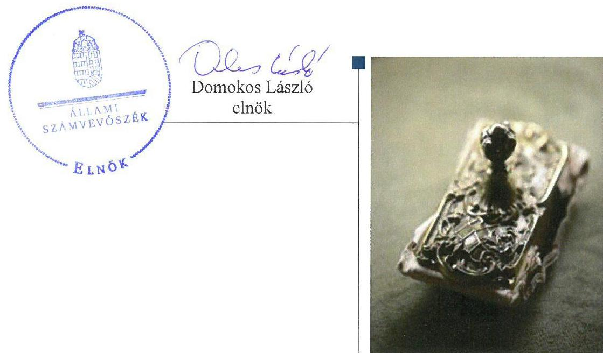
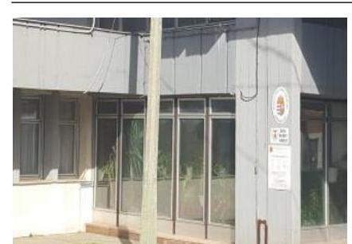

# Jelentés 

## Önkormányzati adósságrendezés ellenőrzése

Somoskőújfalu Község Önkormányzata adósságrendezési eljárásának ellenőrzése 2017.

---

# Jellentés 

## Önkormányzati adósságrendezés ellenőrzése

Somoskőújfalu Község Önkormányzata adósságrendezési eljárásának ellenőrzése 2017. wobember hó \&. nap

---

# AZ ELLENŐRZÉST FELÜGYELTE:

- RENKŐ ZSUZSANNA felügyeleti vezető
- AZ ELLENŐRZÉST VEZETTE ÉS A VÉGREHAJTÁSÁÉRT FELELŐS:
  - BAJNAI ZSUZSANNA ellenőrzésvezető
  - A PROGRAM ÖSSZEÁLLÍTÁSÁÉRT FELELŐS:
    - JANIK JÓZSEF LÁSZLÓ osztályvezető

**IKTATÓSZÁM:** V-1324-082/2016

**TÉMASZÁM:** 2358

**ELLENŐRZÉS-AZONOSÍTÓ SZÁM:** V073914

Jelentéseink az Országgyűlés számítógépes hálózatán és az Interneta a www.asz.hu címen is olvashatóak.

---

# TARTALOMJEGYZÉK 

■ ÖSSZEGZÉS ..... 5
■ AZ ELLENŐRZÉS CÉLJA ..... 6
■ AZ ELLENŐRZÉS TERÜLETE ..... 7
■ AZ ELLENŐRZÉS HÁTTERE, INDOKOLTSÁGA ..... 8
■ A JELENTÉS LÉNYEGES KÉRDÉSKÖREI ..... 9
■ ELLENŐRZÉS HATÓKÖRE ÉS MÓDSZEREI ..... 10
■ MEGÁLLAPÍTÁSOK ..... 12
■ JAVASLATOK ..... 18
■ MELLÉKLETEK ..... 19
I. sz. melléklet: Értelmező szótár ..... 19
■ FÜGGELÉK: ÉSZREVÉTELEK ..... 21
■ RÖVIDÍTÉSEK JEGYZÉKE ..... 23

---

.

---

# ÖSSZEGZÉS 

Somoskőújfalu Község Önkormányzata adósságrendezési eljárásának végrehajtása során a szabálytalan feladatellátás veszélyeztette az adósságrendezés céljainak elérését. A hitelezői igényeket teljes körűen kielégítették. A fizetőképesség helyreállításának teljesülése és az önkormányzat pénzügyi egyensúlyának fenntarthatósága nem volt értékelhető megbízható adatok hiányában.

## Az ellenőrzés társadalmi indokoltsága

Somoskőújfalu Község Önkormányzatánál 2010. július 6-tól 2011. február 10-ig adósságrendezési eljárás folyt, amely során a 61,9 millió Ft követelést jelentettek be. Ez a kötelezettségállomány az önkormányzat vagyonának több mint tizedét jelentette, így indokolt ellenőrizni, hogy az adósságrendezési eljárás elérte-e a célját, az eljárás szereplői eleget tettek-e törvényben meghatározott feladataiknak a fizetőképesség helyreállítása, a hitelezőknek hatékony jogvédelem nyújtása és az átgondolt, felelősségteljes gazdálkodás elősegítése érdekében.

## Főbb megállapítások, következtetések

A polgármester nem tette meg a törvény által előírt lépéseket az önkormányzat szállítói tartozásának adósságrendezési eljáráson kívüli teljesítése érdekében; nem tájékoztatta a pénzügyi bizottságot és a képviselő-testületet a fennálló helyzetről, továbbá nem nyilatkozott a hitelezői kérelemben foglaltakról. Nyilatkozat hiányában a bíróság a törvényi vélelem alapján rendelte el az adósságrendezést.

A végrehajtás nem volt szabályszerű, mert a hitelezőknek szóló felhívás nem tartalmazta pontosan az igény bejelentésének határidejét, az adósságrendezési bizottság határidőt követően alakult meg, a pénzügyi gondnok késve kapta meg a feladata ellátásához szükséges dokumentumokat.

Az adósságrendezés megindításakor nem készült éves beszámoló és vagyonleltár. A hitelezői igények kielégítéséhez felhasználható vagyon felmérésének elmaradása ellenére a hitelezők követelését 100\%-ban kielégítették.

Nem álltak rendelkezésre megbízható adatok a követelések, kötelezettségek állományára vonatkozóan, ezért a fizetőképesség alakulása nem volt értékelhető, ennek hiányában nem lehetett megállapítást tenni az átgondolt gazdasági működés jogalkotói elvárásának megvalósulására vonatkozóan.

---

# AZ ELLENŐRZÉS CÉLJA 

Az ellenőrzés célja annak megállapítása volt, hogy az adósságrendezési eljárás megindítása, lefolytatása szabályszerű volt-e, az önkormányzat gazdálkodása az adósságrendezési eljárás alatt megfelelt-e a jogszabályi előírásoknak; az eljárás szereplői - kiemelten a pénzügyi gondnok - a jogszabályokban foglaltak szerint jártak-e el az adósságrendezés során. A lefolytatott eljárás elérte-e a törvényben kitűzött célokat; az adósságrendezési eljárás alatt az önkormányzat folyamatosan teljesítette-e kötelező közfeladatait, a hitelezők követelését vagyonarányosan kielégítette-e, helyre állt-e fizetőképessége.

---

# AZ ELLENŐRZÉS TERÜLETE 

## Somoskőújfalu Község Önkormányzata

Somoskőújfalu Nógrád megye észak-keleti részén fekszik. Állandó lakosainak száma 2009. január 1-jén 2446 fő, 2014. december 31-én2 284 fő volt.

Az önkormányzat ${ }^{1}$ képviselő-testülete ${ }^{2}$ 2009. január 1-jétől 10 fővel és négy állandó bizottsággal, a 2010. évi önkormányzati választásokat követően hét fővel és két állandó bizottsággal múködött. A jelenlegi polgármester 2011. június 26. napjától tölti be tisztségét ${ }^{3}$, a jegyző ${ }^{4}$ személye öt alkalommal változott az ellenőrzött időszakban.

A gazdálkodási feladatokat a polgármesteri hivatal ${ }^{5}$ látta el, amely elkülönült gazdasági szervezettel nem rendelkezett.

Az önkormányzat a polgármesteri hivatalon kívül költségvetési szervvel nem rendelkezett.
A foglalkoztatottak létszáma - a közfoglalkoztatottakkal együtt 2009. január 1-jén 37 fő, 2014. december 31-én 79 fő volt.

Az önkormányzatnak egy gazdasági társaságban volt 6\%-os tulajdonrésze.

Az adósságrendezési eljárást egy hitelező - gazdasági társaság - kezdeményezte 2010. július 6-án, mivel az önkormányzat lejárt tartozását nem fizette ki. A bíróság ${ }^{6}$ végzése az adósságrendezés megindításáról 2010. október 6-án jelent meg a Cégközlönyben. Az eljárás egyezség megkötésével 2011. február 10-én zárult.

A pénzügyi gondnoki feladatok ellátására a bíróság a Mátraholding Zrt.-t ${ }^{7}$ jelölte ki.

---

# AZ ELLENŐRZÉS HÁTTERE, INDOKOLTSÁGA 

Az önkormányzatok finanszírozásának, gazdálkodásának keretei és feladatellátása jelentős változásokon ment keresztül a Har. tv. ${ }^{8}$ hatálybalépésétől eltelt időszakban.

Az önkormányzati eladósodást 2011-ig csak az Ötv.-ben ${ }^{9}$ meghatározott hitelfelvételi korlát szabályozta, a korlát megsértését azonban jogszabályok nem szankcionálták. 2012. évtől jelentős szigorítás lépett életbe. A korábbi passzív szabályozást a Stabilitási tv. ${ }^{10}$ hatálybalépésével az aktív kontroll váltotta fel. A törvény előírásai alapján az önkormányzatok hitelfelvételei engedélykötelessé váltak.

1996-ban a hitelfelvételi korlát bevezetése mellett az önkormányzatok adósságrendezésének szabályozására is sor került. Az adósságrendezési eljárás részben a lakosság védelmét szolgálta azzal, hogy biztosította az önkormányzatok által nyújtott kötelező közfeladatokhoz való hozzájutást az önkormányzat fizetésképtelensége esetén is. A Har. tv. alapján - 1996 és 2013 júniusa között - ugyanakkor elenyésző számú, mindösszesen 64 adósságrendezési eljárás indult. Az eljárások közel 60\%-a egyezséggel, $40 \%$-a vagyonfelosztással zárult.

Az adósságrendezés első időszakában (2009. évig) a forráshiányból eredeztethető eladósodás tette indokolttá az eljárások jelentős hányadának megindítását.

A második időszakban az eljárás alá vont önkormányzatok között megjelentek a nagyobb költségvetéssel és több intézménnyel is rendelkező települések. Az adósságrendezést szükségessé tevő problémák speciális pénzügyi elemekkel, a devizaalapú kötvénnyel történő finanszírozás begyűrűző hatásaival, valamint az anyagi lehetőségeket meghaladó, túlméretezett fejlesztésekkel összefüggő kötelezettségvállalásokkal egészültek ki, de a beruházások esetében fontos tényező volt a kellő szakértelem hiánya és a pénzügyi nehézségek szakszerűtlen kezelése is.

Az ÁSZ ${ }^{11}$ önkormányzati alrendszert érintő ellenőrzései, elemzései során számos ponton mutatott rá azokra a területekre, ahol a „szabályozás" módosításra, korrekcióra szorul. Az ellenőrzés alapján megfogalmazott javaslatok e területen is segítséget nyújthatnak a kormányzat és az Országgyűlés törvényhozó munkájában, hozzájárulhatnak az irányítói tevékenység erősítéséhez, végső soron a közpénzügyek átláthatóságához és a közvagyon védelméhez. Az ellenőrzés során tett megállapításaink megerősíthetik egy „megelőző monitoring funkció" kialakításának szükségességét a helyi önkormányzatok fizetésképtelenségének megelőzése érdekében.

---

# A JELENTÉS LÉNYEGES KÉRDÉSKÖREI 

1. Az adósságrendezési eljárás folyamata, végrehajtása során szabályszerű volt-e az önkormányzat és a pénzügyi gondnok feladatellátása?
2. A lefolytatott adósságrendezési eljárás elérte-e a törvényben kitüzött célokat?
3. Az adósságrendezési eljárást követően biztosított és fenntartható volt-e a pénzügyi egyensúly?

---

# ELLENŐRZÉS HATÓKÖRE ÉS MÓDSZEREI 

## Az ellenőrzés típusa

Rendszerellenőrzés.

## Az ellenőrzött időszak

A 2009. január 1. és 2015. június 30. közötti időszak.

## Az ellenőrzés tárgya

A Har. tv. által szabályozott adósságrendezési eljárás.

## Az ellenőrzött szervezet

Somoskőújfalu Község Önkormányzata és a pénzügyi gondnoki feladatok ellátásával összefüggésben a Mátraholding Zrt.

## Az ellenőrzés jogalapja

Az Állami Számvevőszékről szóló 2011. évi LXVI. törvény 5. § (2) bekezdése.

## Az ellenőrzés módszerei

Az ellenőrzés szakmai módszertana az ÁSZ hivatalos honlapján (www.asz.hu) közzétett szakmai szabályokon alapult, amelyek irányadónak tekintették a Legfőbb Ellenőrző Intézmények Nemzetközi Szervezete (INTOSAI) által kiadott nemzetközi (ISSAI) standardokat.

Az ellenőrzés alapját az ellenőrzött önkormányzattól bekért tanúsítványok, szabályzatok, szerződések, bírósági végzések, határozatok és egyéb dokumentumok, kimutatások, valamint az önkormányzati beszámolók adatai képezték. Az ellenőrzési kérdések megválaszolásához szükséges bizonyítékok megszerzése, összegyűjtése, az ellenőrzött által rendelkezésre bocsátott dokumentumok, adatok elemzés módszerével végrehajtott értékelésével történt, kiegészítve a megfigyelés, a szemle (szemrevételezés), a kérdésfeltevés (információkérés), mintavételezés módszerével. Az ellenőrzés keretében értékeltük az ellenőrzéshez elkészített tanúsítványok adatainak valódiságát.

---

Az adósságrendezési eljárás szabályszerűségét a bírósági végzések, határozatok, a testületi előterjesztések, jegyzőkönyvek és határozatok, a válságköltségvetések, a költségvetési beszámolók adatai, értesítések, közzétételek, a hitelezőkről készült kimutatások, jelentések, belső szabályzatok, és további releváns dokumentumok alapján ellenőriztük. A minősítés szempontja a Har. tv. által meghatározott dokumentumok határidőben és tartalmilag a vonatkozó előírásoknak megfelelő elkészítése volt.

A kontrolltevékenység múködését véletlen mintavétel alapján ellenőriztük.

Az önkormányzat fizetőképességének helyreállását likviditási mutatók számításával, pénzügyi egyensúlyának fenntarthatóságát a CLF módszer segítségével értékeltük.

Az önkormányzat adósságrendezési eljárása és az azt követő gazdálkodási tevékenysége hibáinak kijavítására, a közpénzekkel való felelős gazdálkodás segítésére irányuló javaslatok kidolgozásakor a hatályos jogszabályok voltak az irányadóak.

---

# MEGÁLLAPÍTÁSOK 

## 1. Az adósságrendezési eljárás folyamata, végrehajtása során szabályszerű volt-e az önkormányzat és a pénzügyi gondnok feladatellátása?

Összegző megállapítás

Az adósságrendezési eljárás megindítása és lefolytatása nem volt megfelelő, azonban az egyezség megkötésére az előírások szerint került sor. A belső szabályzatok elkészítésével kapcsolatos mulasztás, a hiányos nyilvántartások, a belső ellenőrzés elmaradása hozzájárult az adósságrendezési eljárás megindításához és szabálytalan lefolytatásához.

### 1.1. számú megállapítás

A polgármester a törvény által előírt kötelezettségeinek nem tett eleget az adósságrendezés megindítását megelőzően. A hitelezőknek szóló felhívás egy napos késedelemmel jelent meg, továbbá nem pontosan tartalmazta a hitelezői igény benyújtásának határidejét. A pénzügyi gondnok nem utasított el jogtalan hitelezői igényeket.

AZ ADÓSSÁGRENDEZÉSI ELJÁRÁS lefolytatását hitelező kérelmezte 2010. július 6-án az önkormányzat 2,8 millió Ft lejárt, nem vitatott tartozására hivatkozva. A polgármester nem tájékoztatta haladéktalanul a pénzügyi bizottságot ${ }^{12}$ a helyzet fennállásáról és nem hívta össze a képviselő-testületet a fizetési kötelezettség rendezésére vonatkozó határozathozatal céljából a Har. tv. 5.§ (1) bekezdése ellenére, továbbá nem nyilatkozott a bíróságnak a kérelemben foglaltak fennállásáról a Har. tv. 6. § (3) bekezdése ellenére. A bíróság végzése - a tartozás fennállásának tényét vélelmezve - a Cégközlönyben 2010. október 6-án jelent meg.

A HITELEZŐKNEK SZÓLÓ FELHÍVÁS két országos napilapban való megjelenéséről és a helyben szokásos módon történő kihirdetéséről a polgármester gondoskodott, azonban a Har. tv. 10. § (3) bekezdésében előírt határidőhöz képest a napilapokban a felhívások egy napos késedelemmel jelentek meg. A polgármester nem pontosan határozta meg a hitelezői igény bejelentésére nyitva álló határidőt a felhívásokban a Har. tv. 10. § (3) bekezdésében és a 10. § (2) bekezdés e) pontjában foglaltak ellenére, mivel a hirdetményekben a 2010. október 6-ai időpontot az adósságrendezési eljárás, és nem az adósságrendezés kezdő időpontjaként tüntette fel, továbbá a hitelezői igények bejelentésének határidejeként 2010. december 5. jelölte meg december 6. helyett. A határidő előírásoktól eltérő meghatározása nem okozott kárt a hitelezők számára.

A polgármester eleget tett a Har. tv. által előírt egyéb tájékoztatási kötelezettségének.

---

# A HITELEZŐKET NYILVÁNTARTÁSBA VETTE a pénzügyi gondnok. 

A követelések megvizsgálását követően egy hitelező igényét 0,4 millió Ft összegben a pénzügyi gondnok elutasította, mert határidőn túl jelentkezett. Egy hitelező követelését annak megalapozatlansága miatt 1,4 millió Ft-tal csökkentette, további kilencét összesen 1,1 millió Ft értékben, mert az adósságrendezés megindításának időpontját követően a Har. tv. 11. § (1) bekezdése ellenére - 2010. október 6-án és 7-én - kifizetették.

A pénzügyi gondnok nem utasított el a Har. tv. 15.§ (1) bekezdés és a 13. § (1) bekezdés d) pontja ellenére olyan követeléseket összesen 3,4 millió Ft értékben, amelyek az adósságrendezés megindítását követő időszakban történt teljesítésen alapultak, így azok forrását a válságköltségvetésben kellett volna biztosítani.

Az adósságrendezésben 21 hitelező vett részt, az elfogadott követelések értéke 59,0 millió Ft volt.

A pénzügyi gondnok határidőn belül eleget tett a hitelezők felé fennálló tájékoztatási kötelezettségének.

Az önkormányzat vagyonát nem mérték fel az adósságrendezés megindításakor.

## NEM KÉSZÜLT VAGYONLELTÁR ÉS ÉVES BESZÁ-

MOLÓ az adósságrendezés megindításának időpontját megelőző nappal, így a polgármester nem adta át azokat a pénzügyi gondnoknak a Har. tv. 13. § (2) bekezdés b) pontjában előírtak ellenére.

A polgármester nem adta át a pénzügyi gondnoknak a Har. tv. 13. § (2) bekezdése ellenére a feladata elvégzéséhez szükséges további dokumentumokat az adósságrendezés megindítását követő 30 napon belül, 2010. november 5-ig, arra a későbbiekben, 2010. december 14-éig bezárólag került sor.

Az adósságrendezési bizottság késve alakult meg. A 2010. évi válságköltségvetési rendelet nem felelt meg a törvényi előírásoknak, a 2011. évre nem készült válságköltségvetés.

AZ ADÓSSÁGRENDEZÉSI BIZOTTSÁG a Har. tv. 16. § (1) bekezdése ellenére nem a jogszabály által előírt határidőben 2010. október 14-én alakult meg, hanem 2010. november 10-én.

Az adósságrendezési bizottság a 2010. évi válságköltségvetési rendelettervezetet megtárgyalta és elfogadta.

A VÁLSÁGKÖLTSÉGVETÉSSEL kapcsolatos jogszabályi előírásoknak nem felelt meg tartalmilag a képviselő-testület által 2010. november 19-én elfogadott válságköltségvetési rendelet ${ }^{13}$, mert a Har. tv. 13. § (1) bekezdés d) pontja és a 31. § (1) bekezdés a) pontjában meghatározott előírások ellenére nem rendszeres személyi jellegú juttatás kifizetésére adott lehetőséget.

A pénzügyi gondnok a Har. tv. 14. § (1) bekezdésének előírása ellenére nem készített a költségvetést érintő előterjesztéshez csatolható véleményt, álláspontját a képviselő-testületi ülésen szóban ismertette.

---

A pénzügyi gondnok a Har. tv. 14. § (2) bekezdés c) pontja ellenére nem vett részt a képviselő-testület 2010. december 17-ei a 2011. évi költségvetési koncepciót tárgyaló ülésén.

NEM KÉSZÜLT 2011. évre vonatkozó válságköltségvetés a Har. tv. 19. § (2) bekezdésének előírása ellenére, a pénzügyi gondnok nem tájékoztatta a Har. tv. 14. § (2) bekezdés g) pontja ellenére erről a helyi önkormányzatok törvényességi ellenőrzéséért felelős szervet.
1.4. számú megállapítás

A reorganizációs program tartalmilag nem felet meg, az egyezségi javaslat megfelelt a jogszabály által meghatározott követelményeknek. Az egyezség szabályszerűen jött létre.

# A REORGANIZÁCIÓS PROGRAMOT ÉS EGYEZ- 

SÉGI JAVASLATOT a Har. tv. 21. §-ának előírása ellenére nem a pénzügyi gondnok terjesztette a képviselő-testületi ülés elé elfogadásra, hanem a polgármester.

A reorganizációs program tartalmazta az önkormányzat gazdasági helyzetének részletes leírását, az adósságrendezésbe vonható vagyon hasznosítására, illetve az egyéb tervezett intézkedésekre vonatkozó javaslatot. Célként fogalmazta meg a személyi és dologi kiadások csökkentését. A bevételek növelését a bérleti díjak emeléséből, valamint az adóhátralékok hatékonyabb behajtásából tervezték. A Har. tv. 20. § (2) bekezdésének előírása ellenére nem jelölték meg, hogy a hátralék behajtás révén milyen bevételekhez juthatnak, ezért a reorganizációs program tartalmilag nem felelt meg maradéktalanul a törvényi előírásoknak.

Az adósságrendezési bizottság az egyezségi javaslatban a hitelezőket csoportokba sorolta. A három csoport - pénzintézeti, pályázati és önkormányzati feladatellátáshoz kapcsolódó hitelezők - tekintetében azonos egyezségi javaslatot, a követelések teljes összegben történő kiegyenlítését terjesztette elő. Az egyezségi javaslat megfelelt az előírásoknak.

A képviselő-testület a reorganizációs programot és egyezségi javaslatot 2011. január 13-án elfogadta.

AZ EGYEZSÉGI tárgyalásra a hitelezők meghívása előírás szerint történt.

A 2011. január 31-én létrejött egyezség megfelelt a törvényben foglalt követelményeknek.
1.5. számú megállapítás

A megfelelő kontrollkörnyezetet nem alakították ki, mert nem készítették el a gazdálkodásra vonatkozó szabályzatokat. A kifizetéshez kapcsolódó gazdálkodási jogkörgyakorlás nem volt ellenőrizhető a bizonylatőrzési kötelezettség megsértése miatt. A belső ellenőrzés nem támogatta válságköltségvetésen alapuló kifizetések szabályszerű végrehajtását.

A KONTROLLKÖRNYEZET kialakítása az adósságrendezés időszakában nem volt megfelelő, mert
$\longrightarrow$ a jegyző a Számv. tv. ${ }^{14}$ 14. § (5) bekezdés a-b), d), az Áhsz. ${ }^{15}$ 8. §
(4) bekezdés a-b) és d) pontjainak előírásai ellenére nem készítette

---

el az eszközök és források értékelési szabályzatát, az eszközök és források leltározási és leltárkészítési szabályzatát és a pénzkezelési szabályzatot, mivel azokat a költségvetési szerv vezetője helyett a polgármester hagyta jóvá az Áhsz. 1 8. § (12) és az Ötv. 36. § (2) bekezdései ellenére;
—számlarend ${ }^{16}$ a Számv. tv. 161. § (2) bekezdés a-b) és d) pontjai ellenére nem tartalmazta minden alkalmazásra kijelölt számla számjelét és megnevezését, más számlákkal való kapcsolatát továbbá a bizonylati rendet;
— a jegyző a gazdálkodással - így különösen a kötelezettségvállalás, ellenjegyzés, a szakmai teljesítés igazolása, az érvényesítés, utalványozás gyakorlásának módjával, eljárási és dokumentációs részletszabályaival, valamint az ezeket végző személyek kijelölésének rendjével, és az adatszolgáltatási feladatok teljesítésével - kapcsolatos belső előírásokat, feltételeket nem rendezte az Ámr. ${ }^{17} 20 . \S$ (3) bekezdés a) pontjának, az Áht. ${ }^{18} 121 . \S\left(1^{\star}\right.$ bekezdése előírásának ellenére, mivel a szabályzatot nem a jegyző, hanem a polgármester adta ki.
Rendelkeztek számviteli politikával ${ }^{19}$, a képviselő-testület és a polgármesteri hivatal múködésének részletes szabályait tartalmazó SZMSZ ${ }^{20}$-szel, vagyongazdálkodási rendelettel ${ }^{21}$, amelyek megfeleltek a jogszabályi előírásoknak.

A KONTROLLTEVÉKENYSÉGEK - gazdálkodási jogkörök, pénzügyi gondnoki ellenjegyzés - gyakorlása nem volt ellenőrizhető a 2010-2011. években, mert a könyvviteli elszámolást alátámasztó számviteli bizonylatokat, főkönyvi számlákat nem őrizték meg a Számv. tv. 169. § (2) bekezdése ellenére.

A kötelezettségvállalásokhoz kapcsolódóan nem vezettek analitikus nyilvántartást az Ámr. 75. § (1) bekezdése ellenére, így nem volt megállapítható a rendelkezésre álló szabad előirányzatok összege.

A jegyző nem juttatta el a Har. vhr. ${ }^{22}$ 16. §-ában előírtak ellenére a pénzügyi gondnok ellenjegyzéshez szükséges aláírási címpéldányát az adósságrendezés megindításával egyidejűleg a számlavezető pénzügyi intézményhez, helyette bankszámla felett rendelkezésre jogosult személyként jelölte ki.

A BELSŐ ELLENŐRZÉST társulás ${ }^{23}$ keretében biztosították.
A társulás nem végzett belső ellenőrzést az önkormányzatnál az adósságrendezés alatt.

[^0]
[^0]:    * a 2011. január 1-jétől hatályos szabályozás szerint 121/A. § (1) bekezdés

---

# 2. A lefolytatott adósságrendezési eljárás elérte-e a törvényben kitüzött célokat? 

## Összegző megállapítás

A kötelező feladatok adósságrendezési eljárás alatti folyamatos teljesítésére és a hitelezői igények kielégítésére vonatkozó törvényi célkitúzés teljesült. A fizetőképesség nem volt értékelhető az elemzéshez szükséges megbízható adatok hiányában.

A KÖTELEZŐ FELADATOKAT folyamatosan teljesítették az adósságrendezés alatt, feladat átadás-átvétel nem történt.

A REORGANIZÁCIÓS PROGRAM számszerűsített bevételnövelő és kiadáscsökkentő intézkedéseit megvalósították, az intézkedések tartós hatásúak voltak.

Az önkormányzat számítása szerint összességében a 2014. év végéig a bérleti díjak emeléséből 1,9 millió Ft bevétel növekedés származott, míg a személyi jellegű és dologi kiadásoknál 2,6 millió Ft megtakarítást értek el.

A HITELEZŐK KÖVETELÉSÉT maradéktalanul kielégítették, azonban a II. csoport esetében arra az egyezségben vállalt határidőn túl, három hónapos késedelemmel került sor.

A kiegyenlített tartozások 84,6\%-át az állami költségvetés finanszírozta, a fennmaradó $15,4 \%$ fedezetét biztosította az önkormányzat saját bevétele. A hitelezői igények kiegyenlítésének alakulását az 1. táblázat szemlélteti.

1. táblázat

| A HITELEZŐI IGÉNYEK KIEGYENLÍTÉSÉNEK ALAKULÁSA (MILLIÓ FT) |  |  |  |  |
| :--: | :--: | :--: | :--: | :--: |
| Csoport | Egyezség   szerinti összeg | Vállalt   határidő | Kielégitett   hitelezöi igény | Teljesités   idöpontja |
| I. csoport (pénzintézeti hitelezők) | 24,8 | 2023.12.05. | 24,8 | 2012.12.28. |
| II. csoport (pályázati hitelezők) | 25,1 | 2011.04.11. | 25,1 | 2011.07.26. |
| III. csoport (önkormányzati feladatellátáshoz kapcsolódó hitelezők) | 9,1 | 2011.04.11. | 9,1 | 2011.04.07. |
| Összesen: | 59,0 |  | 59,0 |  |

## LIKVIDITÁSI TERVET NEM KÉSZÍTETTEK a

2010-2011. évben az Ámr. 201. § (1) bekezdésében, a 2012-2015. I. féléve között az Ávr. 122. § (1)-(2) bekezdéseiben foglaltak ellenére. Likviditási tervek hiányában a fizetőképesség alakulását nem kísérték figyelemmel, nem volt információjuk arról, hogy a kiadások teljesítéséhez a megfelelő pénzügyi fedezet rendelkezésre állt-e, ezáltal nem volt biztosítva a tartozások kialakulásának megelőzése.

---

A FIZETŐKÉPESSÉG értékeléséhez szükséges mutatók számításához megbízható adatok nem álltak rendelkezésre a következőkben felsoroltak miatt:

- A kötelezettségekhez kapcsolódó analitikus nyilvántartás vezetéséről nem gondoskodtak 2009-2013. években az Áhsz. 49. § (1) bekezdésében és a 9. számú mellékletének 4. d)* pontjában előírtak ellenére, a 2014. évben az Áhsz. 39. § (3) bekezdésében és a 14. mellékletének II. pontjában előírtak ellenére a kötelezettségekhez kapcsolódó részletező nyilvántartást nem vezették.
- A követelésekhez kapcsolódó analitikus, illetve részletező nyilvántartás vezetéséről nem gondoskodtak a 2009-2013. években az Áhsz. 1 49. § (1) bekezdésében és a 9. számú mellékletének 2. ca) pontjában, a 2014. évben az Áhsz. 39 § (3) bekezdésében és a 14. mellékletének III. pontjában előírtak ellenére.
- Nem tartalmazta a felújításhoz, ingatlanvásárláshoz felvett 15,8 millió Ft-os hitel összegét az Áhsz. 1 26. § (2) és a Számv. tv. 42. § (2) bekezdésében foglaltak ellenére 2009. évi beszámoló. A jelentős öszszegű hiba miatt sérült a Számv. tv. 15. § (2) bekezdésében előírt teljesség alapelve.
- A mérleg fordulónapjain a követelések és kötelezettségek leltározását a 2009-2013. években az Áhsz. 1 37. § (1) bekezdésében, a 2014. évben az Áhsz. ${ }^{24}$ 22. § (1) bekezdésében foglaltak ellenére nem végezték el.
A megállapított hiányosságok miatt sérült a Számv. tv. 15. § (3) bekezdése szerinti valódiság elve.

# 3. Az adósságrendezési eljárást követően biztosított és fenntartható volt-e a pénzügyi egyensúly? 

## Összegző megállapítás

A pénzügyi egyensúly megítéléséhez szükséges adatok nem álltak rendelkezésre.

A PÉNZÜGYI EGYENSÚLY nem volt értékelhető, mivel nem őrizték meg a Számv. tv. 169. § (1) bekezdése ellenére az Áhsz. 1 13. § (1) és az Áhsz. 2 31. § (1) bekezdéseinek megfelelően aláírt 2010., 2012-2014. évi beszámolókat, továbbá a 2. összegző megállapításban a fizetőképességhez kapcsolódó hiányosságok miatt.

[^0]
[^0]:    * a 2011. január 1-től hatályos szabályozás szerint da) pont

---

# JAVASLATOK 

Az ÁSZ tv. 33. § (1) bekezdésében foglaltak értelmében az ellenőrzött szervezet vezetője köteles a jelentésben foglalt megállapításokhoz kapcsolódó intézkedési tervet összeállítani és azt a jelentés kézhezvételétől számított 30 napon belül az ÁSZ részére megküldeni. Amennyiben az ellenőrzött szervezet vezetője nem küldi meg határidőben az intézkedési tervet, vagy továbbra sem elfogadható intézkedési tervet küld, az Állami Számvevőszék elnöke az ÁSZ tv. 33. § (3) bekezdése a) és b) pontjaiban foglaltakat érvényesítheti.

## a polgármesternek:

1. Intézkedjen a feltárt hiányosságok és szabálytalanságok tekintetében a munkajogi felelősség kivizsgálására irányuló eljárás megindítása iránt, és az eljárás eredményének ismeretében tegye meg a szükséges intézkedéseket.
(2. sz. megállapítás 6. bekezdés 1. mondata alapján)

## a jegyzőnek:

1. Intézkedjen a likviditási terv jogszabályi előírásoknak megfelelő elkészítéséről.
(2. sz. megállapítás 6. bekezdés 1. mondata alapján)
2. Intézkedjen az eszközök és források értékelési szabályzata, az eszközök és források leltározási és leltárkészítési szabályzata, a pénzkezelési szabályzat jogszabályi előírásoknak megfelelő elkészítéséről, valamint a gazdálkodással - így különösen a kötelezettségvállalás, ellenjegyzés, teljesítés igazolása, érvényesítés, utalványozás gyakorlásának módjával, eljárási és dokumentációs részletszabályaival, valamint az ezeket végző személyek kijelölésének rendjével - kapcsolatos belső előírások, feltételek belső szabályzatban történő rendezéséről.
(1.5. sz. megállapítás 1. bekezdés 1. és 3. pontjai alapján)

---

# MELLÉKLETEK 

## I. SZ. MELLÉKLET: ÉRTELMEZŐ SZÓTÁR

adósságrendezés
adósságrendezésbe vonható vagyon
adósságrendezési bizottság
adósságrendezési eljárás
adósságrendezési eljárás kezdő időpontja
adósságrendezés megindításának időpontja
bíróság
CLF módszer
egyezségi javaslat
egyezségi tárgyalás
hitelező
közfeladat

Az adósságrendezési eljárás azon szakasza, amely a bíróság adósságrendezést megindító végzésének Cégközlönyben való közzétételével [10. § (1) bekezdés] kezdődik, és az adósságrendezési eljárás befejezését elrendelő bírósági végzés Cégközlönyben való közzétételének napjáig tart. (Forrás: Har. tv. 2.§ b) pontja és 32. § (6) bekezdése).

Törvényben meghatározott forgalomképtelen törzsvagyon feletti, valamint a hatósági feladatok és az alapvető lakossági szolgáltatások ellátásához szükséges vagyon feletti forgalomképes vagyonrész. (Forrás: Har. tv. 2.§ f) pontja)
Az adósságrendezési eljárás megindítását követően megalakult bizottság, melynek tagjai: az önkormányzat polgármestere, a jegyző, a pénzügyi bizottság elnöke, egy önkormányzati képviselő. Elnöke a pénzügyi gondnok. (Forrás: Har. tv. 16. § (1) bekezdése)

A helyi önkormányzat székhelye szerint illetékes törvényszék (2011. XII. 31.-ig a fővárosi, megyei bíróságok) hatáskörébe tartozó nem peres eljárás, amely a helyi önkormányzatok fizetőképességének helyreállítására irányul. (Forrás: Har. tv. 3. § (1) bekezdése)
Az a nap, amelyen a kérelem a bírósághoz érkezik. (Forrás: Har. tv. 4. § (1) bekezdése)
A végzés Cégközlönyben való megjelenésének napja. (Forrás: Har .tv. 10. § (1) bekezdés d) pontja)
Az adósságrendezési eljárás során eljáró törvényszék, 2011. XII. 31-ig a megyei (fővárosi) bíróság.
Az önkormányzatok költségvetése elemzésének módszere, amely a pénzügyi kapacitás (nettó múködési jövedelem) fogalmát helyezi a középpontba. A módszer következetesen elkülöníti a folyó és a felhalmozási költségvetés bevételeit és kiadásait, azok költségvetési egyenlegeit. Bizonyos mértékig a vállalati gazdálkodás logikai elemeit érvényesíti az önkormányzatok pénzügyi, jövedelmi helyzetének vizsgálata során.
Az adósságrendezési bizottság által készített dokumentum az önkormányzat hitelezőinek a követeléséről, mely tartalmazza az indoklással alátámasztott egyezségi javaslatot. (Forrás: Har. tv. 20. § (3) bekezdése)
A képviselő-testület által elfogadott egyezségi javaslat alapján lefolytatott tárgyalás, mely egyezséggel vagy az adósságrendezési eljárásnak vagyonfelosztással történő folytatásának bírósági elrendelésével zárulhat.
Az adósságrendezés megindításának időpontjáig az, akinek a helyi önkormányzattal, vagy annak költségvetési szervével szemben vagyoni követelése áll fenn; az adósságrendezés megindításának időpontját követően az, aki a követelését a hitelezői igény bejelentésére nyitva álló határidő alatt bejelentette, és azt a pénzügyi gondnok elfogadta, illetve követelésének jogerős elbírálásáig az is, akinek az igénye vitatott. (Forrás: Har. tv. 2.§ c) pontja)
Jogszabályban meghatározott állami vagy önkormányzati feladat, amit az arra kötelezett közérdekből, a jogszabályban meghatározott követelményeknek és feltételeknek megfelelve végez, ideértve a lakosság közszolgáltatásokkal való ellátását, továbbá az állam nemzetközi szerződésekben vállalt kötelezettségeiből adódó közérdekű feladatokat, valamint e feladatok ellátásakor szükséges infrastruktúra biztosítását is. (Forrás: Nvtv. ${ }^{25}$ 3. § (1) bekezdés 7. pontja)

---

pénzügyi gondnok
reorganizációs program
válságköltségvetés

Az adósságrendezési eljárás lefolytatására, a bíróság által kijelölt, a pénzügyi gondnokok névjegyzékében szereplő személy, vagy szervezet.
A helyi önkormányzat gazdasági helyzetét bemutató dokumentum, mely tartalmazza továbbá az adósságrendezésbe vonható vagyon hasznosítására, valamint az önkormányzat adósságrendezéssel kapcsolatosan tervezett intézkedéseire vonatkozó javaslatot annak megjelölésével, hogy ezzel milyen bevételhez juthat. (Forrás: Har. tv. 20.§ (2) bekezdése)
A helyi önkormányzat az adósságrendezési eljárás ideje alatt a képviselő-testület által elfogadott válságköltségvetés alapján gazdálkodik. A jegyző az adósságrendezés megindításának időpontját követő 30 napon belül készíti el a válságköltségvetési rendelettervezetet. A válságköltségvetésből az önkormányzat a Har. tv. 18. § (2) bekezdésében és a 19. § (3) bekezdésében foglalt kiadásokat finanszírozhatja. Amennyiben nem kerül elfogadásra válságköltségvetés a Har. tv. 29. § (2) bekezdése alapján az önkormányzat az adósságrendezési eljárás alatt, a pénzügyi gondnok által kidolgozott múködési válságterv alapján kell, hogy müködjön. (Forrás: Mötv. ${ }^{26}$ 122. §-a, Har. tv. 18. § (1)-(2) bekezdése, 19. § (2) bekezdése, 29. § (2) bekezdése)

---

# FÜGGELÉK: ÉSZREVÉTELEK 

A jelentéstervezetet a Számvevőszék 15 napos észrevételezésre megküldte az ellenőrzött szervezetek vezetőinek az ÁSZ tv. 29. § ${ }^{\dagger}$ (1) bekezdése előírásának megfelelően.

Az ellenőrzött szervezetek vezetői az ÁSZ tv. 29. § (2) bekezdésében foglalt észrevételezési jogukkal nem éltek, a jelentéstervezetre észrevételt nem tettek.

[^0]
[^0]:    ${ }^{+} 29 . \S$ (1) Az Állami Számvevőszék az ellenőrzési megállapításait megküldi az ellenőrzött szervezet vezetőjének vagy az általa megbízott személynek, és annak, akinek személyes felelősségét állapította meg.
    (2) Az ellenőrzött szervezet vezetője és a felelősként megjelölt személy az ellenőrzés megállapításaira tizenöt napon belül írásban észrevételt tehet.
    (3) Az Állami Számvevőszék az észrevételre a beérkezésétől számított harminc napon belül írásban válaszol. A figyelembe nem vett észrevételeket köteles a jelentésben feltüntetni, és megindokolni, hogy azokat miért nem fogadta el.

---

.

---

# RÖVIDÍTÉSEK JEGYZÉKE 

${ }^{1}$ önkormányzat
${ }^{2}$ képviselő-testület
${ }^{3}$ polgármester
${ }^{4}$ jegyző
${ }^{5}$ polgármesteri hivatal
${ }^{6}$ bíróság
${ }^{7}$ Mátraholding Zrt.
${ }^{8}$ Har. tv.
${ }^{9}$ Ötv.
${ }^{10}$ Stabilitási tv.
${ }^{11}$ ÁSZ
${ }^{12}$ pénzügyi bizottság
${ }^{13}$ válságköltségvetési rendelet
${ }^{14}$ Számv. tv.
${ }^{15}$ Áhsz. 1
${ }^{16}$ számlarend
${ }^{17}$ Ámr.
${ }^{18}$ Áht.
${ }^{19}$ számviteli politika
${ }^{20}$ SZMSZ
${ }^{21}$ vagyongazdálkodási rendelet
${ }^{22}$ Har. vhr.
${ }^{23}$ társulás
${ }^{24}$ Áhsz. 2
${ }^{25}$ Nvtv.
${ }^{26}$ Mötv.

Somoskőújfalu Község Önkormányzata
Somoskőújfalu Község Önkormányzatának Képviselő-testülete
Somoskőújfalu Község Önkormányzatának polgármestere
Somoskőújfalu község polgármesteri hivatalának jegyzője
Somoskőújfalu Község Polgármesteri Hivatal 2014. december 31-ig
2015. január 1-jétől Somoskőújfalui Közös Önkormányzati Hivatal

Nógrád Megyei Bíróság, 2012. január 1-jétől Balassagyarmati Törvényszék
Mátraholding Gazdasági Tanácsadó Zártkörűen Működő Részvénytársaság
1996. évi XXV. törvény a helyi önkormányzatok adósságrendezési eljárásáról
1990. évi LXV. törvény a helyi önkormányzatokról
2011. évi CXCIV. törvény Magyarország gazdasági stabilitásáról

Állami Számvevőszék
Somoskőújfalu Község Önkormányzatának Pénzügyi, Gazdálkodási és Településfejlesztési Bizottsága
Somoskőújfalu Község Önkormányzat Képviselő-testületének 12/2010. (XI. 20.) SKt. sz. rendelete az önkormányzat válságköltségvetéséről
2000. évi C. törvény a számvitelről

249/2000. (XII. 24.) Korm. rendelet az államháztartás szervezetei beszámolási és könyvvezetési kötelezettségének sajátosságairól (hatálytalan 2014. január 1-jétől)
Számviteli rend V-VII. fejezet (hatályos 2007. január 1-jétől) és a Bizonylati szabályzat (hatályos 2009. január 1-jétől
292/2009. (XII. 30.) Korm. rendelet az államháztartás működési rendjéről (hatálytalan:2012. január 1-jétől)
1992. évi XXXVIII. törvény az államháztartásról (hatálytalan 2012. január 1-jétől)

Somoskőújfalu község önkormányzatának számviteli politikája (hatályos 2007. január 1-jétől)

Somoskőújfalu Község Önkormányzat Képviselő-testületének 1/2006. (X. 15.) SKt. sz. rendelete a Képviselő-testület és szervei Szervezeti és Müködési Szabályzatáról, melyet módosított a 17/2007. (IX. 20.) SKt. sz., a 16/2008. (XI. 21.) SKt. sz., valamint a 14/2009. (IV. 17.) SKt. sz. rendelet (hatályos 2006. október 16-tól)

Somoskőújfalu Község Önkormányzat Képviselő-testületének 13/2007. (IV. 17.) SKt. sz. rendelete az önkormányzat vagyonáról és a vagyongazdálkodás szabályairól (hatályos 2007. május 1-jétől)
95/1996. (VII. 4.) Korm. rendelet a helyi önkormányzatok adósságrendezési eljárásáról szóló 1996. évi XXV. törvény végrehajtásának egyes kérdéseiről
Salgótarjáni Kistérség Többcélú Társulása
4/2013. (I. 11.) Korm. rendelet az államháztartás számviteléről (hatályos 2014. január 1-jétől)
2011. évi CXCVI. törvény a nemzeti vagyonról
2011. évi CLXXXIX. törvény Magyarország helyi önkormányzatairól

---

# ÁLLAMI SZÁMVEVŐSZÉK 

1052 Budapest, Apáczai Csere János utca 10.
Levélcím: 1364 Budapest 4. Pf. 54
Telefon: +36 14849100 Telefax: +36 14849200
www.asz.hu