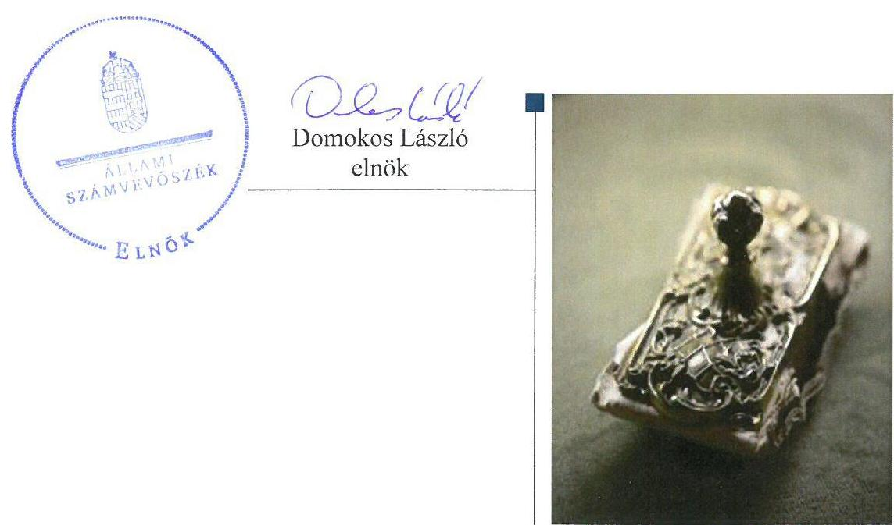
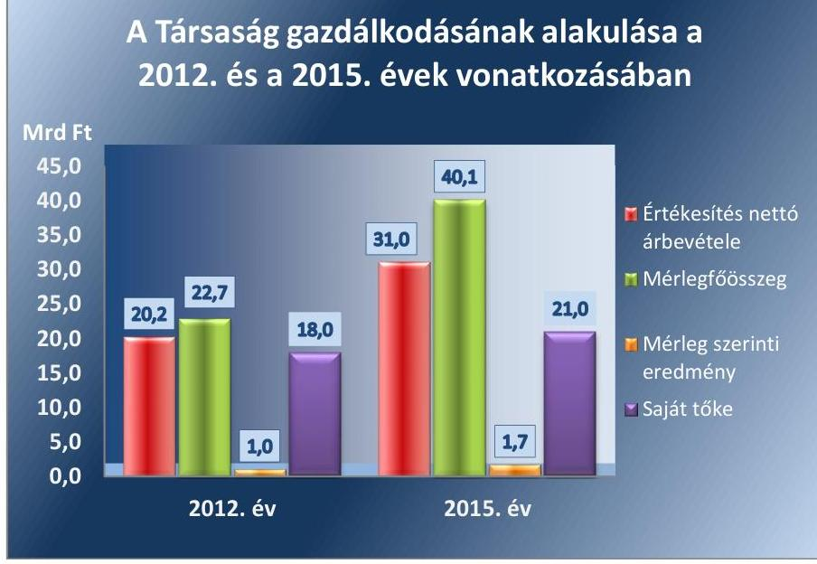
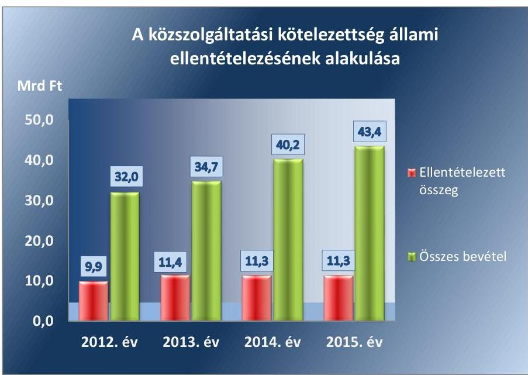
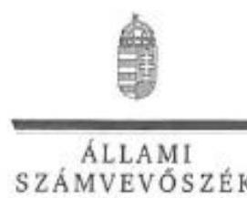
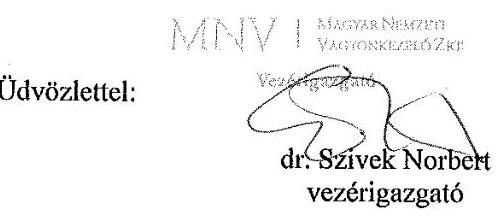
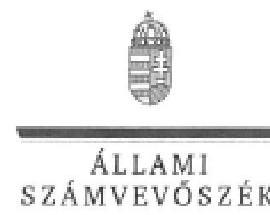

# Jelentés 

## Volánbusz Közlekedési Zrt.

Az állami tulajdonban (résztulajdonban) lévő gazdálkodó szervezetek vagyonmegőrzési és gazdálkodási tevékenységének ellenőrzése 2017.

---

# Jelentés 

## Volánbusz Közlekedési Zrt.

Az állami tulajdonban (résztulajdonban) lévő gazdálkodó szervezetek vagyonmegőrzési és gazdálkodási tevékenységének ellenőrzése
2017. 11 hó 94 nap


---

# AZ ELLENŐRZÉST FELÜGYELTE:

DR. HORVÁTH MARGIT felügyeleti vezető

## AZ ELLENŐRZÉST VEZETTE ÉS A VÉGREHAJTÁSÁÉRT FELELŐS:

HOFMEISTER LÁSZLÓ ellenőrzésvezető

A PROGRAM ÖSSZEÁLLÍTÁSÁÉRT FELELŐS:

TÓTPÁL SZABOLCS osztályvezető

IKTATÓSZÁM: V-1355-093/2016

TÉMASZÁM: 2389

ELLENŐRZÉS-AZONOSÍTÓ SZÁM: V-075926

Jelentéseink az Országgyűlés számítógépes hálózatán és az Interneten a www.asz.hu címen is olvashatóak.

---

# TARTALOMJEGYZÉK 

■ ÖSSZEGZÉS ..... 5
■ AZ ELLENŐRZÉS CÉLJA ..... 6
■ AZ ELLENŐRZÉS TERÜLETE ..... 7
■ AZ ELLENŐRZÉS HÁTTERE, INDOKOLTSÁGA ..... 9
■ A JELENTÉS LÉNYEGES KÉRDÉSKÖREI ..... 10
■ ELLENŐRZÉS HATÓKÖRE ÉS MÓDSZEREI ..... 11
■ MEGÁLLAPÍTÁSOK ..... 13
■ JAVASLATOK ..... 19
■ MELLÉKLETEK ..... 21
I. Sz. melléklet: Értelmező szótár ..... 21
I. Sz. melléklet: 2012-2015. évi beszámoló adatok ..... 23
■ FÜGGELÉK: ÉSZREVÉTELEK ..... 25
■ RÖVIDÍTÉSEK JEGYZÉKE ..... 37

---

.

---

# ÖSSZEGZÉS 

A Magyar Nemzeti Vagyonkezelő Zrt. Volánbusz Közlekedési Zrt. feletti tulajdonosi joggyakorlása szabályszerű volt. A Társaság működésének szabályozottsága, vagyongazdálkodása összességében megfelelt az előírásoknak. A vagyon értékének gyarapításáról gondoskodtak. A bevételek és ráfordítások elszámolása szabályszerű volt.

## Az ellenőrzés társadalmi indokoltsága

A közpénzt, közvagyont használó állami tulajdonú gazdálkodó szervezetekkel szemben társadalmi igény, hogy tevékenységük átlátható és elszámoltatható legyen. Az állam mint tulajdonos meghatározza az ellátandó közszolgáltatásokkal kapcsolatos feladatokat, amelyhez a vagyonnal kapcsolatos döntéseknek igazodniuk kell. A nemzetgazdasági szempontból kiemelt jelentőségű nemzeti vagyonban tartandó állami tulajdonban álló társasági részesedést a nemzeti vagyonról szóló törvény rögzíti.

Az állami vagyonnal való gazdálkodás célja az állami vagyon átlátható, rendeltetésszerű és felelős felhasználásának biztosítása. Az állami tulajdonú gazdálkodó szervezetek a nemzeti vagyon részét képezik.

Az Állami Számvevőszék stratégiájában célul tűzte ki az államháztartáson kívül működő szervezetek ellenőrzését, mely hozzájárul a közpénzek szabályos, átlátható, elszámoltatható és eredményes felhasználásához. A stratégiával összhangban került sor a Volánbusz Közlekedési Zrt. ellenőrzésére a 2012-2015. évekre vonatkozóan.

## Főbb megállapítások, következtetések

Az MNV Zrt. szabályszerűen rögzítette a felelős vagyongazdálkodáshoz szükséges követelményeket és jogosultságokat, a jogokat szabályszerűen gyakorolta a Társaság felett.

A Társaság rendelkezett az előírt számviteli szabályzatokkal, melyek a Leltározási szabályzat kivételével megfeleltek a jogszabálynak. A vagyongazdálkodása összességében szabályszerű volt a leltározással kapcsolatban felmerült hiányosság mellett. A vagyon értékének megőrzéséről és a vagyon állagának megóvásáról gondoskodtak, a 2012-2015. években összességében az értékcsökkenést meghaladó összegben végeztek felújítást, beruházást. A vagyonváltozást eredményező döntéseket a létesítő okiratokban rögzítetteknek megfelelően hozták meg. Az önköltségszámítás szabályozása és végrehajtása szabályszerű volt.

Jogszabályi rendelkezés hiánya ellenére a Társaság kialakította a belső ellenőrzést, mely hozzájárult a szabályos működéshez.

A Társaság határidőben teljesítette a beszámolási és adatszolgáltatási kötelezettségét az előírás szerinti formában és tartalommal. A bevételek és ráfordítások elszámolása szabályszerű volt.

---

# AZ ELLENŐRZÉS CÉLJA 


Az ellenőrzés célja annak értékelése volt, hogy a tulajdonosi jogok gyakorlása szabályszerű volt-e; a gazdálkodó szervezet szabályozottsága, gazdálkodása és vagyongazdálkodási tevékenysége megfelelt-e a jogszabályi és a tulajdonosi előírásoknak; biztosítva volt-e a közfeladatok átláthatósága és elszámoltathatósága érdekében a közszolgáltatás díjának megalapozottsága szabályszerű önköltségszámítással; a vagyonváltozást eredményező döntések esetében a tulajdonosi jogok gyakorlója és a gazdálkodó szervezet szabályszerűen jártak-e el.

---

# **AZ ELLENŐRZÉS TERÜLETE**

## **Magyar Nemzeti Vagyonkezelő Zártkörűen Működő Részvénytársaság és a Volánbusz Közlekedési Zártkörűen Működő Részvénytársaság**


A Társaság<sup>1</sup> az MNV Zrt.<sup>2</sup> tulajdonosi joggyakorlása alatt álló társasági portfólió része, 100%-ban állami tulajdonú részvénytársaság. A Társaság nem tartozott a kormányzati szektorba sorolt egyéb szervezetek közé, vagyonkezelésre, hasznosításra vonatkozóan szerződéssel nem rendelkezett, a kezelésében állami vagyon nem volt, saját tulajdonú vagyonával gazdálkodott.

A Társaság tevékenységi köre alapvetően két jól körülhatárolható részre osztható. Az egyik – a volumenében meghatározó terület – a menetrend szerinti közlekedést öleli fel, a másik a kiegészítő tevékenységeket. A Társaság fő tevékenységét alkotta a közszolgáltatói feladatok ellátása. Ide tartozott a belföldi helyközi, távolsági menetrend szerinti személyszállítás, budapesti agglomerációs helyközi menetrend szerinti személyszállítás, helyi menetrend szerinti személyszállítás. A Társaság tevékenységében a közszolgáltatói feladatok ellátásának részaránya magas volt, az ellenőrzött időszakban az értékesítés nettó árbevételének mintegy 79-88%-át adta.

A Társaság gazdálkodása az ellenőrzött időszakban kedvezően alakult. Az 1. ábra a Társaság néhány, jellemző gazdálkodási adatának alakulását mutatja a 2012. és a 2015. év vonatkozásában.

1. ábra



*Forrás: a Társaság 2012. és 2015. évi éves beszámolója*

A Társaság mérlegfőösszege a 2012. évi 22,7 Mrd Ft-ról 76,2%-kal, 40,1 Mrd Ft-ra nőtt, mely elsősorban a 2014. évi nagy értékű (12,0 Mrd Ft)

---

buszbeszerzés következménye volt. Az értékesítés nettó árbevétele a 2012. évről a 2015. évre 53,7%-kal nőtt. A Társaság a 2012-2015. éveket pozitív eredménnyel zárta, mérleg szerinti eredménye 0,6 Mrd Ft és 1,7 Mrd Ft között alakult. A jegyzett tőkéje 11,0 Mrd Ft volt, mely az ellenőrzött időszakban állandó volt.

A Társaság a közszolgáltatási tevékenységgel összefüggő, bevételekkel nem fedezett, a közszolgáltatási kötelezettség miatt felmerült indokolt költségekre a Személyszállítási tv. ${ }^{3} 30 . \S$ (1) bekezdése alapján évente ellentételezést kapott, melyet a 2. ábra mutat be.
2. ábra


Forrás: a Társaság 2012-2015. éves beszámolók
Az ellenőrzött időszakban az ellentételezésként kapott összeg nem változott jelentős mértékben, miközben az összes bevétel évente átlagosan 2,9 Mrd Ft-tal emelkedett.

A jelenlegi vezérigazgató 2015. április 28-tól látja el feladatát.

---

# AZ ELLENŐRZÉS HÁTTERE, INDOKOLTSÁGA 


Az állami tulajdonú gazdálkodó szervezetek ellenőrzése kiemelten fontos a nemzeti vagyon megőrzése, megóvása érdekében. Gazdálkodásuk jellemzően a közérdeklődés és a média figyelmének középpontjában áll, amihez hozzájárul a gazdálkodásuk körébe tartozó - közvetlen vagy közvetett állami tulajdonú - vagyon nagysága, illetve az általuk ellátott közszolgáltatások minősége és hatékonysága. A szolgáltatási/közszolgáltatási árképzés megalapozottsága és az éves elszámoltatás feltételeinek kialakítása az ellenőrzés során nagy hangsúlyt kap. A szolgáltatás/közszolgáltatás árában és annak támogatásában meg kell jelennie az önköltségszámítás szempontjainak, amely biztosítja a működés fenntarthatóságát (eszközpótlást) is.

Az ellenőrzés rámutathat az állami tulajdonú gazdálkodó szervezetek gazdálkodási tevékenységével jó gyakorlatokra és szabálytalanságokra. Felhívhatja a figyelmet a jogszabályi követelmények teljesítéséhez szükséges feltételek hiányosságaira, hozzájárulhat az államháztartáson kívüli, de (közvetlenül vagy közvetve) állami vagyont használó gazdálkodó szervezetek tevékenységének átláthatóságához. Ellenőrzésünk eredményeképpen javaslatainkkal, megállapításainkkal hozzájárulhatunk a nemzeti vagyonnal való gazdálkodás átláthatóságának, elszámoltathatóságának javításához.

---

# A JELENTÉS LÉNYEGES KÉRDÉSKÖREI 

1.     - A tulajdonosi jogok gyakorlása szabályszerű volt-e?
2.     - A Társaság működésének szabályozottsága megfelelt-e az előírásoknak?
3.     - A Társaságnál a pénzügyi-számviteli, adatszolgáltatási és ellenőrzési feladatok ellátása szabályszerű volt-e?
4.     - A Társaság vagyongazdálkodása szabályszerű volt-e?

---

# ELLENŐRZÉS HATÓKÖRE ÉS MÓDSZEREI 

## Az ellenőrzés típusa

Megfelelőségi ellenőrzés

## Az ellenőrzött időszak

2012. január 1-jétől 2015. december 31-ig

## Az ellenőrzés tárgya

Az állami tulajdonban lévő gazdasági társaság gazdálkodása, kiemelten vagyongazdálkodási tevékenysége, valamint a tulajdonosi jogok gyakorlása.

## Az ellenőrzött szervezet

Magyar Nemzeti Vagyonkezelő Zrt. és a Volánbusz Közlekedési Zrt.

## Az ellenőrzés jogalapja

Az ellenőrzés jogalapját az Állami Számvevőszékről szóló 2011. évi LXVI. törvény 1. § (3) bekezdése és 5. § (3)-(5) bekezdései képezik.

## Az ellenőrzés módszerei

Az ellenőrzést a nemzetközi standardokat irányadónak tekintve az ellenőrzési program ellenőrzési kérdései, az ellenőrzött időszakban hatályos jogszabályok, az ellenőrzés szakmai szabályok és módszertanok figyelembe vételével végeztük.

Az ellenőrzés ideje alatt az ellenőrzött szervezettel történő kapcsolattartást az ÁSZ Szervezeti és Működési Szabályzatának vonatkozó előírásai alapján biztosítottuk.

Az ellenőrzési kérdések megválaszolásához szükséges bizonyítékok megszerzése a következő ellenőrzési eljárások alkalmazásával történt: megfigyelés, kérdésfeltevés (információkérés), összehasonlítás, valamint elemző eljárás. Az ellenőrzési bizonyítékként felhasználható adatforrások közé tartoztak egyrészt az ellenőrzési programban felsorolt adatforrások, másrészt az ellenőrzés folyamán feltárt, az ellenőrzés szempontjából információkat tartalmazó dokumentumok.

---

Az ellenőrzést a kérdésekre adott válaszok kiértékelésével, valamint a megjelölt adatforrások, tanúsítványok felhasználásával, továbbá az adott időszakban hatályos jogszabályok figyelembe vételével folytattuk le.

A bevételek, a ráfordítások elszámolása, valamint a vagyonnyilvántartás terén a szabályszerű működést véletlenszerű mintavétellel és irányított kiválasztással ellenőriztük. A mintatételek értékelése alapján egyrészt a sokaságban előforduló hibás tételek arányát becsültük, másrészt az irányítottan kiválasztott tételeket értékeltük. A jogszabályoknak és a belső előírásoknak megfelelőnek, azaz szabályszerűnek tekintettük az adott területet, amennyiben a minta ellenőrzésének eredménye alapján 95%-os bizonyossággal a teljes sokaságban a hibaarány kisebb volt, mint 10% és nem megfelelőnek értékeltük, ha a hibaarány a 10%-ot elérte. A ráfordítások elszámolására és a vagyonnyilvántartásra vonatkozó véletlen mintavételt kockázati alapú kiválasztással egészítettük ki, melynek során évente a három legnagyobb összegű tételt választottuk ki.

---

# 1. A tulajdonosi jogok gyakorlása szabályszerű volt-e? 

Összegző megállapítás

Az MNV Zrt. tulajdonosi joggyakorlása szabályszerű volt.
A TULAJDONOSI JOGGYAKORLÁS rendjét az MNV Zrt. a létesítő okiratokban ${ }^{4}$ rögzítette. A létesítő okiratok tartalmazták a vagyonnal való felelős gazdálkodáshoz szükséges követelményeket, meghatározták az alapító kizárólagos hatáskörébe tartozó jogosítványokat. A létesítő okiratok tartalmazták az Igazgatóság ${ }^{5}$, a vezérigazgató ${ }^{6}$, valamint az FB<sup>7</sup> működésével, hatáskörével kapcsolatos jogokat és kötelezettségeket. A Társaságnál közgyűlés nem működött, a legfőbb szerv hatáskörében az MNV Zrt. mint tulajdonosi joggyakorló, a létesítő okiratokban és az alapítói határozatokon keresztül határozta meg, illetve biztosította a vagyonnal való rendelkezési jogokat. Az MNV Zrt. SZMSZ<sup>8</sup>-ében a Vtv.<sup>9</sup> 20. § (4) bekezdésében előírtakkal összhangban rögzítette az MNV Zrt. Igazgatósága, valamint vezérigazgatója döntési hatáskörét.

Az MNV Zrt. Igazgatósága, tekintettel a Taktv.<sup>10</sup>-ben foglaltakra, jóváhagyta a Társaság üzleti tervének teljesítését elősegítő anyagi ösztönzési rendszerre vonatkozó Javadalmazási szabályzat<sup>11</sup>-át, melyben meghatározták a vezető tisztségviselőkre és az FB tagokra vonatkozó javadalmazási rendszert.

A FELÜGYELŐBIZOTTSÁG az ellenőrzött években a Társaság gazdálkodását nyomon követte.

A KÖNYVVIZSGÁLÓ az MNV Zrt. Igazgatósága általi megválasztása szabályszerűen történt. A létesítő okirat tartalmazta a könyvvizsgáló személyével, működésével kapcsolatos hatásköröket, feladatokat.

A TÁRSASÁG BESZÁMOLTATÁSÁNAK RENDJÉT a létesítő okiratban és a Monitoring szabályzatban<sup>12</sup> határozták meg. Az MNV Zrt. vezérigazgatója kialakította a monitoring tevékenységét, szabályozta az időszakonként elkészítendő adatszolgáltatások, elemzések, értékelések tartalmát és határidejét. Az adatszolgáltatásokat a Társaság a tulajdonosi joggyakorló által meghatározott határidőben teljesítette. Az MNV Zrt. Igazgatósága a Gt.<sup>13</sup> és a Ptk. előírásait figyelembe véve, minden évben alapítói határozattal elfogadta a Társaság üzleti terveit és az éves számviteli beszámolókat. Az MNV Zrt. az éves beszámoló jóváhagyásáról minden évben az FB írásbeli jelentésének és a könyvvizsgáló írásbeli véleményének a birtokában határozott.

A TÁRSASÁGNÁL ELLENŐRZÉST az MNV Zrt. Igazgatósága a vagyongazdálkodás szabályozottságával kapcsolatban minden évben végzett. Az ellenőrzés figyelemmel kísérte az ellenőrzés javaslataira készített intézkedési terv végrehajtását, a megállapítások hasznosultak.

---

# 2. A Társaság működésének szabályozottsága megfelelt-e az előírásoknak? 

Összegző megállapítás

A Társaság a jogszabályi előírásoknak megfelelően elkészítette a működésére vonatkozó belső szabályzatokat az ingatlanok leltározására vonatkozó szabályozás kivételével.

A Társaság rendelkezett SZMSZ<sup>14</sup>-szel, melyben meghatározták a Társaság szervezeti felépítését, működésének alapvető szabályait, a munkaszervezet belső szabályozási és érdekeltségi
 rendszerét. Az SZMSZ 1-7-ben foglaltak alapján elkészítették a Társaság ügyrendjét, mely részletesen szabályozta a Társaság munkaszervezetének működését és a munkafolyamatok megosztását a szervezeti egységek között. A szabályzatot folyamatosan aktualizálták, az SZMSZ 1-7-nek az ellenőrzött időszakban történt módosításaival összhangban.

A Társaság rendelkezett a Számv. tv. ¹⁵ 14. § (3) és (5) bekezdésekben előírt számviteli szabályzatokkal, Számviteli politika 1-3¹⁶-val, valamint az annak keretében elkészítendő Értékelési szabályzat ¹⁷-tal, Pénzkezelési szabályzat ₁₋₈¹⁸-tal és Számlarend ¹⁹-del, melyek tartalma megfelelt a jogszabály előírásának.

A Leltározási szabályzat ₁₋₂²⁰-tal rendelkeztek az ellenőrzött időszakban, azonban annak 2.2.4. pontja nem felelt meg a Számv. tv. 69. § (3) bekezdésében foglalt, a legalább 3 évente, mennyiségi felvétellel végzendő leltározásra vonatkozó előírásnak, mert ingatlanok esetén 5 évente történő leltározást írtak elő.

A Társaság szolgáltatásnyújtásai és termék értékesítései kapcsán keletkező követelések kezelése teljes folyamatának szabályozására a vezérigazgató a 2013. évben hatályba léptette a Követeléskezelési szabályzatot²¹. A vagyonnal való gazdálkodás teljes körű szabályozása, valamint a vagyon megőrzése és gyarapítása érdekében megalkották az Ingatlangazdálkodási és hasznosítási szabályzat ₁₋₃²²-ot, a Beruházási és karbantartási szabályzat ₁₋²³-ot, az Autóbuszok karbantartási szabályzat ₁₋₃²⁴-át, valamint a Befektetési szabályzat ₁₋₂²⁵-ot.

Az ágazati jogszabályok előírásának megfelelően a Társaság elkészítette a közforgalmú menetrendszerinti személyszállítási szolgáltatásra és az ahhoz kapcsolódó szolgáltatásokra vonatkozó belső szabályzatát, az Üzletszabályzat ₁₋₂²⁶-ot, melyet a Nemzeti Közlekedési Hatóság határozattal jóváhagyott.

---

# 3. A Társaságnál a pénzügyi-számviteli, adatszolgáltatási és ellenőrzési feladatok ellátása szabályszerű volt-e? 

Összegző megállapítás

### 3.1. számú megállapítás

A Társaság a pénzügyi-számviteli, adatszolgáltatási és ellenőrzési feladatait szabályszerűen látta el.

Az ellenőrzött időszakban a Társaságnál a bevételek és ráfordítások elszámolása megfelelt az előírásoknak.

A BEVÉTELEK ELSZÁMOLÁSA megfelelő főkönyvi számlán, szabályszerűen történt. A bevételek könyvviteli elszámolását közvetlenül alátámasztó bizonylatok rendelkeztek a Számv. tv.-ben előírt általános alaki és tartalmi kellékekkel.

A RÁFORDÍTÁSOK ELSZÁMOLÁSA a Számv. tv. előírásainak, valamint a Számviteli politika ₁₋₃-ban és a Számlarendben foglaltaknak megfelelően történt. Az anyagjellegű és személyi jellegű ráfordítások elszámolását minden esetben megfelelő számviteli bizonylat támasztotta alá. Az értékcsökkenési leírás elszámolása a Számv. tv., valamint a Számviteli politika ₁₋₃ előírásai szerint történt. Az elszámolt értékcsökkenési leírás, az immateriális javak és tárgyi eszközök állományváltozása az éves beszámoló kiegészítő mellékletében bemutatásra kerültek.

A saját vagyon nyilvántartása a Társaságnál megfelelő volt.
A Társaság külön nyilvántartással rendelkezett a behajtás alatt lévő, határidőn túli vevőkövetelésekről. A határidő lejárta után a Társaság a Követeléskezelési Szabályzat előírásait betartva intézkedett a követelések behajtására. Fizetési felszólításokat küldtek ki, illetve ügyvédnek adták tovább a lejárt határidejű követelések behajtását. A határidőn túli vevőkövetelés értéke 33,5%-kal, 32,1 M Ft-ra csökkentek az ellenőrzött időszakban.

## 3.2. számú megállapítás

A Társaság az előírásoknak megfelelő önköltségszámítással alapozta meg a szolgáltatás, közszolgáltatás dijának megállapítását.

ÖNKÖLTSÉGSZÁMÍTÁSRA a Társaság az ellenőrzött időszakban kötelezett volt, melynek rendjét kialakították. Az Önköltségszámítási szabályzat ₁₋₃²⁷ a Számv. tv.-ben és a Számviteli politika ₁₋₃-ban foglaltak, valamint a Busz tv.²⁸ és a Személyszállítási tv. előírásai alapján került kialakításra. A Társaság elkülönítette a közvetlen és közvetett költségeket, meghatározta az alkalmazott kalkulációs módszereket, a felosztandó költségek vetítési alapját, teljeskörűen és szabályszerűen rendelkezett az utókalkuláció tartalmáról és időszakairól, készítésének határidejéről, az előkalkuláció időszakairól, valamint készítésének határidejéről.

Nemzetközi és egyéb szerződéses járatfajták esetében az alkalmazott díjak piaci viszonyok alapján, partneri megállapodások eredményeként alakultak ki. Ezekben az esetekben a díjszámítás alapját kalkuláció képezte, amely a szolgáltatás közvetlen és közvetett költségein kívül az elvárt - minimum 10%-os - nyereséghányadot is tartalmazta.

A Társaságnál az előírásoknak megfelelő önköltségszámítással alapozták meg a szolgáltatás dijának megállapítását, az utókalkulált önköltség

---

# 3.3. számú megállapítás 

meghatározását tevékenység alapú költségfelosztással, szabályszerűen végezték és dokumentálták.

## A Társaság teljesítette a tervezési, beszámolási és adatszolgáltatási kötelezettségét.

Az MNV Zrt. által előírt tervezést, beszámolást, adatszolgáltatást szabályszerűen végrehajtotta a Társaság.

ÜZLETI TERV KÉSZÍTÉSÉRE vonatkozó kötelezettségét a Társaság teljesítette az MNV Zrt. által megadott tervezési irányelvekkel összhangban. Az üzleti tervekről szóló előterjesztéseket a Társaság az ellenőrzött időszak valamennyi évére vonatkozóan először az FB elé terjesztette, amely azokat a tulajdonosi joggyakorló számára elfogadásra javasolta.

AZ ÉVES BESZÁMOLÓT a Számv. tv. előírásai szerint elkészítették, azokat a könyvvizsgáló hitelesítő záradékkal látta el. Az éves számviteli beszámoló letétbe helyezési és közzétételi kötelezettséget szabályszerűen teljesítették.

A KÖZÉRDEKŰ ADATOK nyilvánosságra hozatalával és szabályozásával kapcsolatos kötelezettségeinek a Taktv. és az Info tv.²⁹ alapján a Társaság eleget tett. A Személyszállítási tv. rendelkezése alapján az Üzletszabályzat ₁₋₂-ot a Társaság honlapján közzétették.

## A Társaság a jogszabály előírása alapján nem volt belső ellenőrzési tevékenység kialakítására kötelezett, ugyanakkor azt saját döntése alapján kialakította.

A Társaság nem tartozott a Bkr.³⁰ hatálya alá, saját döntése alapján építette ki belső ellenőrzési rendszerét, aminek működésére vonatkozó részletes előírásait a Társasági Ellenőrzési Szabályzat ₁₋₄³¹ és a Belső Ellenőrzési Szabályzat ₁₋₃³² tartalmazta. A belső ellenőrzési vezető a Belső Ellenőrzési Szabályzat ₁₋₃ előírásai alapján összeállította a tárgyévet követő évre vonatkozó éves ellenőrzési tervet, amit a vezérigazgató előzetes jóváhagyása után az FB megtárgyalt, majd jóváhagyott. Az éves ellenőrzési terveket minden esetben kockázatelemzéssel támasztották alá.

AZ ELVÉGZETT BELSŐ ELLENŐRZÉSEK több esetben tartalmaztak javaslatokat, észrevételeket, amikre vonatkozóan az intézkedési tervek elkészültek. Az intézkedések szabályszerű végrehajtását a belső ellenőrzés figyelemmel kísérte, azokról a belső ellenőrzési beszámolók keretében az FB-nek beszámolt.

---

# 4. A Társaság vagyongazdálkodása szabályszerű volt-e? 

## Összegző megállapítás

### 4.1. számú megállapítás

### 4.2. számú megállapítás

## A Társaság vagyonnal való gazdálkodása összességében szabályszerű volt.

A Társaság a szabályszerű vagyongazdálkodás feltételeit kialakította.

A TÁRSASÁG SZABÁLYZATAIBAN - a jogszabályi előírások és a tulajdonosi joggyakorló elvárásainak megfelelően - kitért a vagyonnal való gazdálkodás, ezen belül a kapcsolódó feladat- és hatáskörök, felelősségi viszonyok szabályozására.

## A VAGYONNAL VALÓ GAZDÁLKODÁS FELADAT-

ÉS HATÁSKÖREIT elsődlegesen a létesítő okiratok tartalmazták. Az SZMSZ 1.1-ben foglaltak alapján az ingatlangazdálkodás, a meglévő vagyon karbantartása, a vagyon bővítése a műszaki igazgatóság, a leltározás előkészítése, szervezése és lebonyolítása, valamint a befektetési tevékenység a gazdasági igazgatóság hatásköre és felelőssége volt.

A Társaság a jogszabályokban és belső szabályzataiban foglaltaknak megfelelően, szabályszerűen tartotta nyilván vagyonát az ingatlanok kivételével.

A Társaság a saját vagyon nyilvántartási és elszámolási kötelezettségének a jogszabályi előírások szerint eleget tett, gondoskodott a vagyon értékének megőrzéséről, gyarapításáról. Visszapótlási kötelezettsége saját vagyonára vonatkozóan a Társaságnak nem volt. A Társaság vagyona az ellenőrzött időszakban 76,2%-kal nőtt, a főbb mérlegadatokat a II. melléklet mutatja be.

A VAGYONNYILVÁNTARTÁSBAN folyamatos volt a vagyonváltozás kimutatása, az immateriális javak, tárgyi eszközök növekedési tételeinek nyilvántartásba vétele szabályszerű volt. Az analitikus nyilvántartások a tárgyi eszközök, készletek, követelések, kötelezettségek esetében az integrált informatikai rendszer moduljain keresztül a főkönyvvel automatikusan kapcsolatban voltak.

AZ ÉVES BESZÁMOLÓIT a Társaság - az ingatlanok három évenkénti mennyiségi felvételezéssel történő leltározására vonatkozó előírás kivételével - a Számv. tv.-ben foglaltak szerint készített leltárakkal alátámasztotta, a nyilvántartásokat és a főkönyvi számlákat az előírások szerint egyeztette. A Társaság immateriális javait, tárgyi eszközeit - az ingatlanok kivételével -, készleteit évente leltározták a leltározási ütemtervben meghatározott időintervallumban. Az ingatlanok leltározását 5 évente végezték a Számv. tv. előírásainak nem megfelelő Leltározási szabályzat ₁₋₂ alapján, az ellenőrzött időszakban kizárólag a 2015. évben történt mennyiségi felvétellel felvett ingatlan leltár. Ezzel a Számv. tv. 69. § (3) bekezdésében foglalt - a legalább 3 évente, mennyiségi felvétellel végzendő leltározásra vonatkozó - előírást megsértették. A könyvvizsgáló a leltározás hiányosságát nem kifogásolta.

---

# 4.3. számú megállapítás 

A Társaság az előírásoknak megfelelően gondoskodott vagyona értékének, állagának megőrzéséről, gyarapításáról.

A Társaság az ellenőrzött időszakban beruházási, valamint karbantartási tevékenységével összességében megfelelően gondoskodott a saját vagyon értékének gyarapításáról, a vagyon állagának megőrzéséről.

Az 1. táblázat a Társaság befektetett eszközök állományának alakulását mutatja a 2012-2015. években.

1. táblázat

## A TÁRSASÁG BEFEKTETETT ESZKÖZÖK ÁLLOMÁNYÁNAK ALAKULÁSA A 2012-2015. ÉVEKBEN (M FT)

| Megnevezés | 2012. | 2013. | 2014. | 2015. |
| :-- | --: | --: | --: | --: |
| Nyitó állomány | 11646,1 | 10499,0 | 10677,8 | 22238,2 |
| Értékcsökkenés összege | 1563,8 | 1247,9 | 2055,0 | 2571,8 |
| Eszközpótlás összege | 416,7 | 1426,7 | 13615,4 | 2447,2 |
| Záró állomány | 10499,0 | 10677,8 | 22238,2 | 22113,6 |

Forrás: A Társaság 2012-2015. évek éves beszámolói
4.4. számú megállapítás

A Társaság vagyonának változását eredményező döntéseket a létesítő okiratokban rögzítetteknek, a jogszabályi és belső szabályzatok előírásainak megfelelően hozták meg.

A VAGYON VÁLTOZÁSÁT eredményező döntéseket a létesítő okiratokban megfogalmazott hatásköröknek megfelelően hozta meg a Társaság. A vagyongazdálkodási döntések előkészítése, előterjesztése a tulajdonosi joggyakorló által meghatározott formában és tartalommal történt.

A Társaságnál a saját vagyont érintő beruházásokra, felújításokra, illetve a vagyon hasznosítására vonatkozó döntések meghozatala a jogosultsági előírások betartásával történtek. A jegyzett tőke 5%-át elérő, illetve 2015. június 22-től a legalább 250 M Ft összegű vagyongazdálkodási döntésekhez szükség volt a tulajdonosi joggyakorló jóváhagyására.

---

# JAVASLATOK 

Az ÁSZ tv. 33. § (1) bekezdésében foglaltak értelmében az ellenőrzött szervezet vezetője köteles a jelentésben foglalt megállapításokhoz kapcsolódó intézkedési tervet összeállítani és azt a jelentés kézhezvételétől számított 30 napon belül az ÁSZ részére megküldeni. Amennyiben az ellenőrzött szervezet vezetője nem küldi meg határidőben az intézkedési tervet, vagy továbbra sem elfogadható intézkedési tervet küld, az Állami Számvevőszék elnöke az ÁSZ tv. 33. § (3) bekezdése a) és b) pontjaiban foglaltakat érvényesítheti.

Javaslataink célja a Volánbusz Közlekedési Zrt. gazdálkodása szabályszerűségének és gyakorlatának javítása annak érdekében, hogy a szabályozási környezet és az alkalmazott gyakorlat megfelelően tudja támogatni az átlátható működést.

## Volánbusz Közlekedési Zrt. vezérigazgatójának

1. Intézkedjen a Társaság leltározási szabályzata Számv. tv.-nek megfelelő tartalommal történő módosításáról.
(2. megállapítás 3. bekezdése alapján)
2. Intézkedjen, hogy az ingatlanokra vonatkozóan a mennyiségi felvétellel történő leltározást a Számv. tv-ben előírtak szerinti gyakorisággal, 3 évente végezzék el.
(4.2. megállapítás 3. bekezdés 3. mondata alapján)

---

Javaslatunk célja a tulajdonosi joggyakorló MNV Zrt. szabályszerű működésének elősegítése, továbbá a tulajdonosi joggyakorlás kontrolljainak erősítése.

# Az MNV Zrt. vezérigazgatójának 

1. Intézkedjen a leltározási szabályzattal kapcsolatban feltárt szabálytalanság tekintetében a felelősség tisztázása érdekében, és szükség szerint intézkedjen a felelősség érvényesítéséről.
(2. megállapítás 3. bekezdése alapján)

---

# MELLÉKLETEK 

- I. SZ. MELLÉKLET: ÉRTELMEZŐ SZÓTÁR
állami vagyon
gazdasági társaság

MNV Zrt.
nemzeti vagyon
a) Az állam tulajdonában lévő dolog, valamint a dolog módjára hasznosítható természeti erő,
b) az a) pont hatálya alá nem tartozó mindazon vagyon, amely vonatkozásában törvény az állam kizárólagos tulajdonjogát nevesíti,
c) az állam tulajdonában lévő tagsági jogviszonyt megtestesítő értékpapír, illetve az államot megillető egyéb társasági részesedés,
d) az államot megillető olyan immateriális, vagyoni értékkel
 rendelkező jogosultság, amelyet jogszabály vagyoni értékű jogként nevesít.
Forrás: Vtv. 1. § (2) bekezdése
2012. november 10-től az állami vagyon fogalma kiegészül a következő ponttal:
e) az állam tulajdonában lévő pénzügyi eszközök
Forrás: Vtv. 1. § (2) bekezdése
A Ptk. 3:88. § (1) bekezdése szerint „a gazdasági társaságok üzletszerű közös gazdasági tevékenység folytatására, a tagok vagyoni hozzájárulásával létrehozott, jogi személyiséggel rendelkező vállalkozások, amelyekben a tagok a nyereségből közösen részesednek, és a veszteséget közösen viselik”.
Az állami vagyon felett, a Magyar Államot megillető tulajdonosi jogok és kötelezettségek összességét - a hatályos szabályozás szerint - az állami vagyon felügyeletéért felelős miniszter (jelenleg a nemzeti fejlesztési miniszter) gyakorolja. A miniszter feladatát nagy részben az MNV Zrt., mint tulajdonosi joggyakorló szervezet útján látja el.
a) az állam vagy a helyi önkormányzat kizárólagos tulajdonában álló dolgok,
b) az a) pont hatálya alá nem tartozó, állam vagy a helyi önkormányzat tulajdonában lévő dolog,
c) az állam vagy a helyi önkormányzat tulajdonában lévő pénzügyi eszközök, továbbá az államot vagy a helyi önkormányzatot megillető társasági részesedések,
d) az államot vagy a helyi önkormányzatot megillető bármely vagyoni értékkel rendelkező jogosultság, amelyet jogszabály vagyoni értékű jogként nevesít,
e) Magyarország határa által körbezárt terület feletti légtér,
f) az üvegházhatású gázok kibocsátási egységeinek kereskedelméről szóló törvény szerint kibocsátási egység és légiközlekedési kibocsátási egység, valamint az ENSZ Éghajlatváltozási Keretegyezménye és annak Kiotói Jegyzőkönyvének végrehajtási keretrendszeréről szóló törvény szerinti kiotói egység,
g) állami vagy helyi önkormányzati fenntartású közgyűjtemény (muzeális intézmény, levéltár, közgyűjteményként működő kép- és hangarchívum, valamint könyvtár) saját gyűjteményében nyilvántartott kulturális javak körébe tartozó dolog, kivéve, ha az állami vagy önkormányzati tulajdon jogszerű létrejötte kétséget kizáró módon nem bizonyítható és a dologra nézve más a tulajdonjogát bizonyítja vagy a kulturális javakra vonatkozó jogszabályokban meghatározott eljárás keretében valószínűsíti (g. pont módosult 2013. december 7-től),
h) a régészeti lelet,

---

tulajdonosi ellenőrzés
tulajdonosi jogok gyakorlója
i) a nemzeti adatvagyon körébe tartozó állami nyilvántartások fokozottabb védelméről szóló törvény szerinti nemzeti adatvagyon.
Forrás: Nvtv. ${ }^{33} 1 . \S(2)$
2014. március 14-ig:

Az állami vagyon kezelőjét, haszonélvezőjét, használóját megillető jogok gyakorlását, annak szabályszerűségét, célszerűségét az MNV Zrt. - szükség szerint területi szervei útján - ellenőrzi.
2014. március 15-től:

Az állami vagyon használóját, vagyonkezelőjét és haszonélvezőjét megillető jogok gyakorlását, annak szabályszerűségét, a kötelezettségek teljesítését, valamint a vagyon rendeltetése szerinti célszerűségét a tulajdonosi joggyakorló rendszeresen ellenőrzi.
Forrás: Vhr. ${ }^{34} 20 . \S(1)$
1.
2013. június 27-ig:

Az állami vagyon felett a Magyar Államot megillető tulajdonosi jogok és kötelezettségek összességét - ha törvény eltérően nem rendelkezik - az állami vagyon felügyeletéért felelős miniszter (a továbbiakban: miniszter) gyakorolja, aki e feladatát a Magyar Nemzeti Vagyonkezelő Zártkörűen Működő Részvénytársaság (a továbbiakban: MNV Zrt.), a Magyar Fejlesztési Bank, illetve a tulajdonosi joggyakorló szervezet útján látja el. A miniszter miniszteri rendeletben, a törvényben meghatározott állami vagyoni kör tekintetében, meghatározott időtartamra, a joggyakorlás egyes szabályainak meghatározásával - az őt megillető tulajdonosi jogok és kötelezettségek összességének, illetve azok meghatározott részének gyakorlóját az Áht. szerinti központi költségvetési szervek, ezek intézménye, továbbá a 100%-ban állami tulajdonban álló gazdasági társaságok közül kijelölheti.
Forrás: Vtv. 3. § (1) és (2)
2013. június 28-ától:

A rábízott állami vagyon felett az államot megillető tulajdonosi jogok és kötelezettségek összességét tulajdonosi joggyakorlóként:
a) ha törvény vagy miniszteri rendelet eltérően nem rendelkezik, a Magyar Nemzeti Vagyonkezelő Zártkörűen Működő Részvénytársaság (a továbbiakban: MNV Zrt.),
b) törvényben kijelölt személy vagy
c) az állami vagyon felügyeletéért felelős miniszter (a továbbiakban: miniszter) által rendeletben kijelölt személy gyakorolja.
[...] A miniszter e törvény felhatalmazása alapján - a meghatározott célok hatékonyabb elérése érdekében, miniszteri rendeletben, az ott meghatározott állami vagyoni kör tekintetében, meghatározott időtartamra - e törvény keretei között, a joggyakorlás egyes szabályainak meghatározásával - az államot megillető tulajdonosi jogok és kötelezettségek összességének, illetve azok meghatározott részének gyakorlóját az Áht. szerinti központi költségvetési szervek, ezek intézménye, továbbá a 100%-ban állami tulajdonban álló gazdasági társaságok közül kijelölheti.
Forrás: Vtv. 3. § (1) és (2)
2.

Aki a nemzeti vagyon felett az államot vagy a helyi önkormányzatot megillető tulajdonosi jogok és kötelezettségek összességének gyakorlására jogosult
Forrás: Nvtv. 3. § (1) 17. pontja

---

# A TÁRSASÁG 2012-2015. ÉVI BESZÁMOLÓINAK FŐBB ADATAI (M FT-BAN) 

| Megnevezés | 2012. év | 2013. év | 2013./ <br> 2012. év <br> (\%) | 2014. év | 2014./ <br> 2013. év <br> (\%) | 2015. év | 2015./ <br> 2014. év <br> (\%) | 2015./ <br> 2012. év <br> (\%) |
| :--: | :--: | :--: | :--: | :--: | :--: | :--: | :--: | :--: |
| Mérleg főösszeg | 22745,3 | 25614,7 | 112,6\% | 38885,3 | 151,8\% | 40083,8 | 103,1\% | 176,2\% |
| Befektetett eszközök | 10499,0 | 10677,8 | 101,7\% | 22238,2 | 208,3\% | 22113,6 | 99,4\% | 210,6\% |
| ebből tárgyi eszközök | 10367,7 | 10512,3 | 101,4\% | 22051,7 | 209,8\% | 21927,0 | 99,4\% | 211,5\% |
| Forgóeszközök | 5325,2 | 4615,6 | 86,7\% | 6169,1 | 133,7\% | 13697,3 | 222,0\% | 257,2\% |
| ebből követelések | 3916,7 | 2581,3 | 65,9\% | 3862,6 | 149,6\% | 9788,7 | 253,4\% | 249,9\% |
| ebből vevőkövetelések | 780,5 | 1008,4 | 129,2\% | 2158,9 | 214,1\% | 1744,2 | 80,8\% | 223,5\% |
| ebből pénzeszközök | 1132,8 | 1724,9 | 152,3\% | 1935,4 | 112,2\% | 3497,9 | 180,7\% | 308,8\% |
| Aktív időbeli elhatárolás | 6921,1 | 10321,3 | 149,1\% | 10478,0 | 101,5\% | 4272,9 | 40,8\% | 61,7\% |
| Saját tőke összege | 17953,5 | 18601,2 | 103,6\% | 19269,6 | 103,6\% | 20966,6 | 108,8\% | 116,8\% |
| Jegyzett tőke | 10983,5 | 10983,5 | 100,0\% | 10983,5 | 100,0\% | 10983,5 | 100,0\% | 100,0\% |
| Töketartalék | 2278,2 | 2278,2 | 100,0\% | 2278,2 | 100,0\% | 2278,2 | 100,0\% | 100,0\% |
| Eredménytartalék | 3656,2 | 4690,3 | 128,3\% | 5332,8 | 113,7\% | 5999,1 | 112,5\% | 164,1\% |
| Lekötött tartalék | 3,3 | 1,6 | 48,5\% | 6,7 | 418,8\% | 8,7 | 129,9\% | 263,6\% |
| Mérleg szerinti eredmény | 1032,3 | 647,6 | 62,7\% | 668,4 | 103,2\% | 1697,1 | 253,9\% | 164,4\% |
| Céltartalékok | 218,1 | 632,3 | 289,9\% | 940,3 | 148,7\% | 1446,5 | 153,8\% | 663,2\% |
| Kötelezettségek | 3553,2 | 5118,5 | 144,1\% | 17717,7 | 346,2\% | 16757,0 | 94,6\% | 471,6\% |
| ebből szállítói tartozások | 1985,0 | 2722,8 | 137,2\% | 3190,9 | 117,2\% | 3643,5 | 114,2\% | 183,6\% |
| Passzív időbeli elhatárolás | 1020,5 | 1262,7 | 123,7\% | 957,7 | 75,8\% | 913,7 | 95,4\% | 89,5\% |
| Összes bevétel | 32007,7 | 34675,7 | 108,3\% | 40185,5 | 115,9\% | 43414,7 | 108,0\% | 135,6\% |
| Értékesítés nettó árbevétele | 20195,9 | 22692,7 | 112,4\% | 27931,4 | 123,1\% | 31042,2 | 111,1\% | 153,7\% |
| Aktivált saját teljesítmények értéke | 22,5 | 58,8 | 261,3\% | 55,8 | 94,9\% | 62,6 | 112,2\% | 278,2\% |
| Pénzügyi és rendkívüli bevételek | 385,0 | 116,3 | 30,2\% | 115,6 | 99,4\% | 131,0 | 113,3\% | 34,0\% |
| Egyéb bevételek, támogatások | 11404,3 | 11807,9 | 103,5\% | 12083,0 | 102,3\% | 12178,9 | 100,8\% | 106,8\% |
| Összes ráfordítás | 30975,4 | 34028,1 | 109,9\% | 39517,1 | 116,1\% | 41717,6 | 105,6\% | 134,7\% |
| Anyagi jellegű ráfordítások | 18279,0 | 21260,2 | 116,3\% | 22730,1 | 106,9\% | 23704,2 | 104,3\% | 129,7\% |
| Személyi jellegű ráfordítások | 10218,6 | 10519,5 | 102,9\% | 12506,7 | 118,9\% | 13639,7 | 109,1\% | 133,5\% |
| Értékcsökkenési leírás | 1346,8 | 1239,3 | 92,0\% | 2016,4 | 162,7\% | 2493,0 | 123,6\% | 185,1\% |
| Egyéb ráfordítások | 1090,8 | 750,6 | 68,8\% | 1677,1 | 223,4\% | 1170,7 | 69,8\% | 107,3\% |
| Pénzügyi és rendkívüli ráfordítás | 36,5 | 33,9 | 92,9\% | 459,6 | 1355,8\% | 560,3 | 121,9\% | 1535,1\% |
| Adófizetési kötelezettség | 3,7 | 224,6 | 6070,3\% | 127,2 | 56,6\% | 149,7 | 117,7\% | 4045,9\% |

Forrás: 2012-2015. évi beszámolók, főkönyvi kivonatok

---

.

---

# FÜGGELÉK: ÉSZREVÉTELEK 

A jelentéstervezetet a Számvevőszék 15 napos észrevételezésre megküldte az ellenőrzött szervezetek vezetőinek az ÁSZ tv. 29. § (1) bekezdése előírásának megfelelően.


Volánbusz Közlekedési Zrt. vezérigazgatójától, valamint a Magyar Nemzeti Vagyonkezelő Zrt. vezérigazgatójától érkezett észrevételeket és azok kezeléséről szóló válaszlevelet a jelentés tartalmazza.

[^0]
[^0]:    * 29. § (1) Az Állami Számvevőszék az ellenőrzési megállapításait megküldi az ellenőrzött szervezet vezetőjének vagy az általa megbízott személynek, és annak, akinek személyes felelősségét állapította meg.
    (2) Az ellenőrzött szervezet vezetője és a felelősként megjelölt személy az ellenőrzés megállapításaira tizenöt napon belül írásban észrevételt tehet.
    (3) Az Állami Számvevőszék az észrevételre a beérkezésétől számított harminc napon belül írásban válaszol. A figyelembe nem vett észrevételeket köteles a jelentésben feltüntetni, és megindokolni, hogy azokat miért nem fogadta el.

---

# 4 VOLANBUSZ 

## Állami Számvevőszék

Budapest
Apáczai Csere János u. 10.
1052
Domokos László
elnök

Hivatkozási szám: V-1355-078/2016.
Tárgy: jelentéstervezet véleményezése

## Tisztelt Elnök Úr!

Fenti hivatkozási számú levelük mellékleteként részünkre 'Volánbusz Közlekedési Zrt. - az állami tulajdonban (résztulajdonban) lévő gazdálkodó szervezetek vagyonmegőrzési és gazdálkodási tevékenységének ellenőrzése 2017.' címen megküldött számvevőszéki jelentéstervezetre az alábbi észrevételeket tesszük.

1. A jelentéstervezet 13. oldalán olvasható, miszerint a VOLÁNBUSZ Zrt. (a továbbiakban: Társaság) Felügyelőbizottságának elnöke a Ptk. 3:122. §-a (1) bekezdésének megsértésével került posztjára. Ezzel kapcsolatban felmerült bennünk, hogy a Ptk. ominózus rendelkezését diszpozitív szabályként kellene értelmezni, hiszen a Ptk. nem tartalmaz ehhez kapcsolódó, eltérést tiltó szabályt. A gazdasági társaságoknál a felügyelőbizottság mindig a tulajdonos részére végez ellenőrzést, ez is azt támasztja alá, hogy nem indokolt ebben a kérdésben megkötni - a felügyelőbizottságot egyébként is megválasztani jogosult tulajdonos kezét. Ha viszont diszpozitív a Ptk. ezen rendelkezése, a tulajdonos FB elnököt kijelölő igazgatósági döntése jogszerűnek tekinthető, hiszen az az Alapszabálynak a Ptk. hivatkozott diszpozitív szabályozásától eltérő rendelkezése szerint került meghozatalra.
2. A jelentéstervezet 14. oldalán a 2. fejezet összegző megállapításában olvasható, hogy az ingatlanok leltározására vonatkozó társasági szabályozásunk nem
 megfelelő. A számvitelről szóló 2000. évi C. törvény 2012. január 1-től hatályos rendelkezése tartalmazza az eszközök háromévente mennyiségi felvétellel történő leltározásának kötelezettségét. Társaságunk eszközgazdálkodása alapvetően a számviteli törvénynél is jóval szigorúbb elvek mentén lett kialakítva, így az éves beszámolót minden évben mennyiségi felvétellel történő tárgyi eszköz leltárral, valamint készletleltárral támasztjuk alá, amely feladat a közel 40.000 db eszközt tekintve egy külön, erre a célra létrehozott szervezeti egység állandó munkáját igényli.

---

# VOLANBUSZ 

Az ingatlan-nyilvántartás rendszere, valamint az a tény, hogy az ingatlangazdálkodás, különösképpen pedig az ingatlanok adásvétele a Társaság leginkább kontrollált folyamatai közé tartozik, már önmagában biztosítja, hogy ezen a téren kiküszöbölhetők legyenek az esetleges visszaélések, és így a társaságot - közvetve pedig a Magyar Államot - ne érhesse anyagi hátrány. A jelzett hiányosság ellenére mellettünk szól, hogy a Társaság tulajdonában lévő ingatlanvagyonnal való gazdálkodás az érvényes törvényi, társasági előírások és a szükséges alapítói jóváhagyások szerint szabályosan történt, visszaélést, hiányt az átfogó NAV vizsgálatok, az éves könyvvizsgálói ellenőrzések, valamint a most lezárult számvevőszéki ellenőrzés sem állapított meg. A Társaság vonatkozó szabályzata mostanra természetesen a jogszabályi rendelkezéseknek megfelelően módosításra került, és ennek értelmében háromévente sor kerül a társasági ingatlanok mennyiségi felvétellel történő leltározására is.

Fentiek figyelembevétele mellett a jelentéstervezettel összességében egyetértünk, továbbá köszönjük a vizsgálat során tanúsított szakmailag és emberileg egyaránt korrekt hozzáállást, amelyet - amennyiben módja van rá - kérem, tolmácsoljon munkatársainak is.

Budapest, 2017. szeptember 27.

Tisztelettel:
Fekete Antal
vezérigazgató

---



ELBŐK

Ikt.szám: V-1355-087/2016

# Fekete Antal úr

vezérigazgató

Volánbusz Közlekedési Zrt.

Budapest

## Tisztelt Vezérigazgató Úr!

Köszönettel vettem a Volánbusz Közlekedési Zrt. ellenőrzéséről készített számvevőszéki jelentéstervezetre megküldött észrevételeit.

Az Állami Számvevőszék észrevételekre vonatkozó álláspontját a felügyeleti vezető által készített részletes tájékoztatás tartalmazza, amelyet levelemhez mellékeltem.

Tájékoztatom Vezérigazgató urat, hogy az Állami Számvevőszék a figyelembe nem vett észrevételeket az Állami Számvevőszékről szóló 2011. évi LXVI. törvény 29. § (3) bekezdésében előírtak szerint köteles a jelentésében feltüntetni és megindokolni, hogy azokat miért nem fogadta el.

Budapest, 2017. 10. hó 18. nap

Tisztelettel:

Domokos László

Melléklet: Tájékoztatás az észrevételek kezeléséről

1652 BUDAPEST, APÁCZAI CSERE JÁNOS UTCA 19. 1364 Budapest 4. Pf. 54 telefon: 484 9101 fax: 484 9201

---

# Tájékoztatás az észrevételek kezeléséről 

Megköszönöm Vezérigazgató úrnak „Az állami tulajdonban (résztulajdonban) lévő gazdálkodó szervezetek vagyonmegőrzési és gazdálkodási tevékenységének ellenőrzése - Volánbusz Közlekedési Zrt." címmel készített jelentéstervezetre tett észrevételeit. Az észrevételek kezeléséről az alábbi tájékoztatást adom.

## 1. számú észrevétel:

„A jelentéstervezet 13. oldalán olvasható, miszerint a VOLÁNBUSZ Zrt. (a továbbiakban: Társaság) Felügyelőbizottságának elnöke a Ptk. 3:122 §-a (1) bekezdésének megsértésével került posztjára. Ezzel kapcsolatban felmerült bennünk, hogy a Ptk. ominózus rendelkezését diszpozitív szabályként kellene értelmezni, hiszen a Ptk. nem tartalmaz ehhez kapcsolódó, eltérést tiltó szabályt. A gazdasági társaságoknál a felügyelőbizottság mindig a tulajdonos részére végez ellenőrzési, ez is azt támasztja alá, hogy nem indokolt ebben a kérdésben megkötni - a felügyelőbizottságot egyébként is megválasztani jogosult - tulajdonos kezét. Ha viszont diszpozitív a Ptk. ezen rendelkezése, a tulajdonos FB elnököt kijelölő igazgatósági döntése jogszerűnek tekinthető, hiszen az az Alapszabálynak a Ptk. hivatkozott diszpozitív szabályozásától eltérő rendelkezése szerint került meghozatalra."

A Társaság vezérigazgatójának észrevételét elfogadom, az 1. számú észrevételnek megfelelően a jelentést-tervezetet módosítom.

Jelentés-tervezet Megállapítások 1. A tulajdonosi jogok gyakorlása szabályszerű volt-e? Összegző megállapítás" / 13. oldal 3. bekezdés, második mondat törlésre került: „A 2014. évben az MNV Zrt. Igazgatósága választotta meg az FB elnökét, amellyel megsértették a Ptk. 3:122 § (1) bekezdésében foglaltakat, mely szerint az FB saját tagjai közül választ elnököt."

## 2. számú észrevétel:

„A jelentéstervezet 14. oldalán a 2. fejezet összegző megállapításában olvasható, hogy az ingatlanok leltározására vonatkozó társasági szabályozásunk nem volt megfelelő. A számvitelről szóló 2000. évi C. törvény 2012. január 1-től hatályos rendelkezése tartalmazza az eszközök háromévente mennyiségi felvétellel történő leltározásának kötelezettségét. Társaságunk eszközgazdálkodása alapvetően a számviteli törvénynél is jóval szigorúbb elvek mentén lett kialakítva, így az éves beszámolót minden évben mennyiségi felvétellel történő tárgyi eszköz leltárral, valamint készletleltárral támasztjuk alá, amely feladat közel 40.000 db eszközt tekintve egy külön, erre a célra létrehozott szervezeti egység állandó munkáját igényli.

Az ingatlan-nyilvántartás rendszere, valamint az a tény, hogy az ingatlangazdálkodás, különösképpen pedig az ingatlanok adásvétele a Társaság leginkább kontrollált folyamatai közé tartozik, már önmagában biztosítja, hogy ezen a téren kiküszöbölhetők legyenek az esetleges visszaélések, és így a társaságot - közvetve pedig a Magyar Államot - ne érhesse anyagi hátrány. A jelzett hiányosság

---

ellenére mellettünk szól, hogy a Társaság tulajdonában lévő ingatlanvagyonnal való gazdálkodás az érvényes törvényi, társasági előírások és a szükséges alapítói jóváhagyások szerint szabályosan történt, visszaélést, hiányt az átfogó NAV vizsgálatok, az éves könyvvizsgálói ellenőrzések, valamint a most lezárult számvevőszéki ellenőrzés sem állapított meg. A Társaság vonatkozó szabályzata mostanra természetesen a jogszabályi rendelkezéseknek megfelelően módosításra került, és ennek értelmében háromévente sor kerül a társasági ingatlanok mennyiségi felvétellel történő leltározására is."

Vezérigazgató úrnak a Társaság leltározási tevékenységével, valamint az ellenőrzött időszakot követően a jogszabályi rendelkezésekhez illeszkedően elkészített szabályozás elkészítésével kapcsolatos tájékoztatását tudomásul veszem. Vezérigazgató úr észrevételében a jelentés-tervezet ingatlanok leltározása szabályozásával, és leltározásának végrehajtásával kapcsolatos megállapításait nem vitatja, így a vonatkozó megállapításokat nem módosítom. Mindezek alapján a jelentés-tervezet vezérigazgatónak címzett 1. és 2. javaslatait továbbiakban is fenntartom, azokat nem módosítom.

Budapest, 2017. 40. hó 16. nap

Dr. Horváth Margit
felügyeleti vezető

---

# MNV Magyar Nemzeti Vagyonkezelő Zrt. 

## Vezérigazgató

## Állami Számvevőszék

## Domokos László

elnök

1052 Budapest
Apáczai Cs. J. u. 10.

Ikt. sz.: MNV/01/6192/2017.
Hiv. sz.: V-1355-079/2016.

Tisztelt Elnök Úr!
Tájékoztatom, hogy a 2017. szeptember 13. napján „Az állami tulajdonban (résztulajdonban) lévő gazdálkodó szervezetek vagyonmegőrzési és gazdálkodási tevékenységének ellenőrzése - Volánbusz Zrt." tárgyában kézhez vett, V-1355-079/2016. ikt. sz. levél mellékleteként megküldött Jelentés-tervezetre az alábbi észrevételeket tesszük:
„Összegzés Preambulum / 5. oldal 1. mondata" /„Összegzés Főbb megállapítások, következtetések / 5. oldal 4. bekezdés 1. mondata" / „Megállapítások 1. A tulajdonosi jogok gyakorlása szabályszerű volt-e? Összegző megállapítás" / 13. oldal:

A Jelentés-tervezet hivatkozott megállapításaiból kérjük törölni az olyan tartalmú utalásokat, amelyek az MNV Zrt. tulajdonosi joggyakorlásának szabályszerűségét csak „összességében" tartják megfelelőnek, azaz kérjük a megszorító tartalmú minősítés elhagyását. A Jelentés-tervezet egyetlen része tartalmaz hátrányos megállapítást az MNV Zrt. tulajdonosi joggyakorlásával kapcsolatosan, az a megállapítás viszont álláspontunk szerint nem helytálló, így a marasztaló megállapításra tett alábbi észrevételünk elfogadása esetén nem indokolt az „összességében" megszorító tartalmú minősítés használata a végleges jelentésben.
„Megállapítások 1. A tulajdonosi jogok gyakorlása szabályszerű volt-e? Összegző megállapítás" / 13. oldal 3. bekezdése:

A hivatkozott, Felügyelőbizottsággal (a továbbiakban: FB) kapcsolatos témakör azt a marasztaló megállapítást tartalmazza, hogy 2014. évben az MNV Zrt. Igazgatósága tulajdonosi joggyakorlói hatáskörben választotta meg az FB elnökét, jóllehet az új Ptk. alapján az FB-nek saját tagjai közül magának kellett volna elnököt választania. Kérjük az egész mondat törlését a Jelentés-tervezetből figyelemmel arra, hogy a 2014. évben történt FB elnök választás a Volánbusz Zrt. (a továbbiakban: Társaság) 2013. október 21-től hatályos alapszabályának 8.4.2. pont első mondata alapján történt, amely szerint: „A Felügyelő Bizottság legalább három és legfeljebb hat tagból áll, a Felügyelő Bizottság elnökének személyét közvetlenül az Alapító választja meg." Emellett a jelentés új Ptk-ra történő hivatkozása sem állja meg a helyét a 2014. évben történt FB elnök választás kapcsán, mert a Társaság csak 2015. év folyamán tért át az új Ptk. szerinti működésre. Mind a Gt., mind az új Ptk. szabályozása

---

lehetővé teszi, hogy a társaságok létesítő okirata alapján legfőbb szervi hatáskörbe kerüljön az FB elnökök megválasztása.
„Javaslatok" / 20. oldal 1. számú javaslata:
A Társaság Alapszabálya értelmében a Társaság Igazgatóságának hatásköre a Számviteli politika - annak részeként a leltározási szabályzat - megállapítása és módosítása.

Véleményünk szerint a rendelkezés alapján a leltározási szabályzattal kapcsolatban feltárt szabálytalanság tekintetében szükséges intézkedéseket a felelősség tisztázása érdekében a Társaság Igazgatóságának kell megtennie és annak eredménye alapján kezdeményezni esetlegesen a felelősség érvényesítését.

Az ÁSZ által az MNV Zrt. vezérigazgatójának javasolt intézkedést javasoljuk az alábbiak szerint módosítani:
„A Volánbusz Zrt. Igazgatóságának Elnökének
Intézkedjen a leltározási szabályzattal kapcsolatban feltárt szabálytalanság tekintetében a felelősség tisztázása érdekében, és szükség szerint intézkedjen a felelősség érvényesítéséről."

Kérem Elnök Urat, hogy a jelentés véglegesítése során jelen észrevételeinket szíveskedjenek figyelembe venni.

Budapest, 2017. szeptember „ $\stackrel{9}{9}$ ",


---



ELRŐK

Ikt.szám: V-1355-085/2016

Dr. Szívek Norbert úr
vezérigazgató

Magyar Nemzeti Vagyonkezelő Zrt.

Budapest

Tisztelt Vezérigazgató Úr!

Köszönettel vettem a Volánbusz Közlekedési Zrt. ellenőrzéséről készített számvevőszéki jelentéstervezetre megküldött észrevételeit.

Az Állami Számvevőszék észrevételekre vonatkozó álláspontját a felügyeleti vezető által készített részletes tájékoztatás tartalmazza, amelyet levelemhez mellékeltem.

Tájékoztatom Vezérigazgató urat, hogy az Állami Számvevőszék a figyelembe nem vett észrevételeket az Állami Számvevőszékről szóló 2011. évi LXVI. törvény 29. § (3) bekezdésében előírtak szerint köteles a jelentésében feltüntetni és megindokolni, hogy azokat miért nem fogadta el.

Budapest, 2017. 10. hó 18. nap

Tisztelettel:

Domokos László

Melléklet: Tájékoztatás az észrevételek kezeléséről

1052 BUDAPEST, APÁCZAI CSERE JÁNOS UTCA 1/9. 1304 Budapest 4. Pf. 54 telefon: 484 9101 fax: 484 9201

---

# Tájékoztatás az észrevételek kezeléséről 

Megköszönöm Vezérigazgató úrnak „Az állami tulajdonban (résztulajdonban) lévő gazdálkodó szervezetek vagyonmegőrzési és gazdálkodási tevékenységének ellenőrzése - Volánbusz Közlekedési Zrt." címmel készített jelentéstervezetre tett észrevételeit. Az észrevételek kezeléséről az alábbi tájékoztatást adom.

## I. számú észrevétel:

„Összegzés Preambulum / 5. oldal 1. mondata" / „Összegzés Főbb megállapítások, következtetések / 5. oldal 4. bekezdés 1. mondata" / „Megállapítások 1. A tulajdonosi jogok gyakorlása szabályszerű volt-e? Összegző megállapítás" / 13. oldal:"
„A Jelentés-tervezet hivatkozott megállapításaiból kérjük törölni az olyan tartalmú utalásokat, amelyek az MNV Zrt. tulajdonosi joggyakorlásának szabályszerűséget csak „összességében" tartják megfelelőnek, azaz kérjük a megszorító tartalmú minősítés elhagyását. A Jelentés-tervezet egyetlen része tartalmaz hátrányos megállapítást az MNV Zrt. tulajdonosi joggyakorlásával kapcsolatosan, ez a megállapítása viszont álláspontunk szerint nem helytálló, így a marasztaló megállapításra tett alábbi észrevételünk elfogadása esetén nem indokolt az „összességében" megszorító tartalmú minősítés használata a végleges jelentésben."

Tekintettel arra, hogy az MNV Zrt. II. számú észrevételét, amely az FB elnöknek megválasztására vonatkozik, elfogadom, így nem indokolt az „összességében" megszorító tartalmú minősítés használata, így az I. számú észrevételnek megfelelően a jelentést-tervezetet az alábbiak szerint módosítom:

- Jelentéstervezet 5. oldal ÖSSZEGZÉS 1. mondat: „A Magyar Nemzeti Vagyonkezelő Zrt. Volánbusz Közlekedési Zrt. feletti tulajdonosi joggyakorlása összességében szabályszerű volt."
- Jelentéstervezet 5. oldal Főbb megállapítások, következtetések 1. mondat: „Az MNV Zrt. szabályszerűen rögzítette a felelős vagyongazdálkodáshoz szükséges követelményeket és jogosultságokat, a jogokat összességében szabályszerűen gyakorolta a Társaság felett."
- Jelentéstervezet 13. oldal Megállapítások, összegző megállapítás: „Az MNV Zrt. tulajdonosi joggyakorlása összességében szabályszerű volt."


## II. számú észrevétel:

„Megállapítások 1. A tulajdonosi jogok gyakorlása szabályszerű volt-e? Összegző megállapítás" / 13. oldal 3. bekezdése:"

---

„A hivatkozott, Felügyelőbizottsággal (a továbbiakban: FB) kapcsolatos témakör azt a marasztaló megállapítást tartalmazza, hogy 2014. évben az MNV Zrt. Igazgatósága tulajdonosi joggyakorlói hatáskörben választotta meg az FB elnökét,
 jóllehet az új Ptk. alapján az FB-nek saját tagjai közül magának kellett volna elnököt választania. Kérjük az egész mondat törlését a Jelentés-tervezetből figyelemmel arra, hogy a 2014. évben történt FB elnökválasztás a Volánbusz Zrt. (a továbbiakban: Társaság) 2013. október 21-től hatályos alapszabályának 8.4.2. pont első mondata alapján történt, amely szerint: „A Felügyelő Bizottság legalább három és legfeljebb hat tagból áll, a Felügyelő Bizottság elnökének személyét közvetlenül az Alapító választja meg." Emellett a jelentés új Ptk-ra történő hivatkozása sem állja meg a helyét a 2014. évben történt FB elnökválasztás kapcsán, mert a Társaság csak 2015. év folyamán tért át az új Ptk. szerinti működésre. Mind a Gt., mind az új Ptk. szabályozása lehetővé teszi, hogy a társaságok létesítő okirata alapján legfőbb szervi hatáskörbe kerüljön az FB elnök megválasztása."

Az észrevételt elfogadom, a jelentés-tervezetet az alábbiak szerint módosítom:
Megállapítások 1. A tulajdonosi jogok gyakorlása szabályszerű volt-e? Összegző megállapítás" / 13. oldal 3. bekezdés, második mondat törlésre került:
„A 2014. évben az MNV Zrt. Igazgatósága választotta meg az FB elnökét, mellyel megsértették a Ptk. 3:122. § (1) bekezdésében foglaltakat, mely szerint az FB saját tagjai közül választ elnököt."

# III. számú észrevétel: 

„Javaslatok" / 20. oldal 1. számú javaslata:"
„A Társaság Alapszabálya értelmében a Társaság Igazgatóságának hatásköre a Számviteli politika annak részeként a leltározási szabályzat megállapítása és módosítása.
Véleményünk szerint a rendelkezés alapján a leltározási szabályzattal kapcsán feltárt szabálytalanság tekintetében szükséges intézkedéseket a felelősség tisztázása érdekében a Társaság Igazgatóságának kell megtennie és annak eredménye alapján kezdeményezni esetlegesen a felelősség érvényesítését.
Az ÁSZ által az MNV Zrt. vezérigazgatójának javasolt intézkedést javasoljuk az alábbiak szerint módosítani:
„A Volánbusz Zrt. Igazgatósága Elnökének
Intézkedjen a leltározási szabályzattal kapcsolatban feltárt szabálytalanság tekintetében a felelősség tisztázása érdekében, és szükség szerint intézkedjen a felelősség érvényesítéséről."

A jelentés-tervezet megállapítása szerint a Társaság vezérigazgatója által hatályba léptetett, az ellenőrzött időszakban hatályos leltározási szabályzatok az ingatlanok leltározásának gyakorisága tekintetében nem feleltek meg a számvitelről szóló 2000. évi C. törvény előírásainak. E hiányosság tekintetében a Társaság vezérigazgatójának fogalmaztunk meg javaslatot. Az ellenőrzés számára átadott, a Társaság ellenőrzött időszakban hatályos létesítő okiratai (8.1.2. p. pontjai) szerint az alapító kizárólagos hatásköre a részvénytársaság vezérigazgatója felett az alapvető munkáltatói jogkör gyakorlása. Az MNV Zrt. e jogkörének gyakorlása keretében, a tulajdonosi joggyakorlás

---

# Függelék: Észrevételek

kontrolljainak erősítése érdekében kezdeményeztük az MNV Zrt. részéről a Volánbusz Közlekedési Zrt. vezérigazgatója felé a felelősség tisztázását.

Mindezek alapján az MNV Zrt. vezérigazgatójának tett 1. számú javaslat címzettjét nem módosítom.

Budapest, 2017. 16. hó 16. nap

Dr. Horváth Margit
felügyeleti vezető

-3-

---

# RÖVIDÍTÉSEK JEGYZÉKE 

${ }^{1}$ Társaság
${ }^{2}$ MNV Zrt.
${ }^{3}$ Személyszállítási tv.
${ }^{4}$ létesítő okiratok
${ }^{5}$ Igazgatóság
${ }^{6}$ vezérigazgató
${ }^{7}$ FB
${ }^{8}$ MNV Zrt. SZMSZ
${ }^{9}$ Vtv.
${ }^{10}$ Taktv.
${ }^{11}$ Javadalmazási szabályzat ${ }_{1-2}$
${ }^{12}$ Monitoring szabályzat
${ }^{13} \mathrm{Gt}$.
${ }^{14} \mathrm{SZMSZ}_{1-7}$
${ }^{15}$ Számv. tv.

Volánbusz Közlekedési Zártkörűen Működő Részvénytársaság Magyar Nemzeti Vagyonkezelő Zártkörűen Működő Részvénytársaság 2012. évi XLI. törvény a személyszállítási szolgáltatásokról szóló (hatályos 2012. július 1-jétől)

Társaság Alapító okirata (hatályos 2011. május 23-tól); Társaság Alapító okirata (hatályos 2012. január 19-től); Társaság Alapító okirata (hatályos 2012. február 27-től); Társaság Alapító okirata (hatályos 2012. április 23-tól); Társaság Alapító okirata (hatályos 2012. május 29-től); Társaság Alapító okirata (hatályos 2012. július 23-tól); (hatályos 2012. szeptember 10-től);Társaság Alapító okirata (hatályos 2012. november 12-től); Társaság Alapító okirata (hatályos 2013. május 27-től); Társaság Alapító okirata (hatályos 2013. október 21-től); Társaság Alapszabálya (hatályos 2015. június 22-től); Társaság Alapszabálya (hatályos 2015. október 21-től)

VOLÁNBUSZ Zrt. Igazgatósága, a részvénytársaság ügyvezető szerve VOLÁNBUSZ Zrt. vezérigazgatója
VOLÁNBUSZ Zrt. felügyelőbizottsága
Magyar Nemzeti Vagyonkezelő Zártkörűen Működő Részvénytársaság Szervezeti és Működési Szabályzata
2007. évi CVI. törvény az állami vagyonról (hatályos 2007. szeptember 17-től)
2009. évi CXXII. törvény a köztulajdonban álló gazdasági társaságok takarékosabb működéséről (hatályos 2009. december 4-től)
a 384/2011 (XII.19.) Alapítói határozat 4. pontja a Volánbusz Zrt. Javadalmazási szabályzat ${ }_{1}$-ről (hatályos 2011. december 19-től)
a 431/2012 (XI.12.) Alapítói határozat a Volánbusz Zrt. Javadalmazási szabályzat ${ }_{2}$-ről (hatályos 2011. november 12-től)
az MNV Zrt. 51/2013. számú vezérigazgatói utasítása a Társasági Monitoring Szabályzatról
2006. évi IV. törvény a gazdasági társaságokról (hatálytalan 2014. március 15-től)
SZMSZ1: a VOLÁNBUSZ Zrt. Szervezeti és Működési Szabályzata (hatályos 2011. szeptember 5-től)

SZMSZ2: a VOLÁNBUSZ Zrt. Szervezeti és Működési Szabályzata (hatályos 2011. szeptember 28-tól)

SZMSZ3: a VOLÁNBUSZ Zrt. Szervezeti és Működési Szabályzata (hatályos 2012. június 11-től)

SZMSZ4: a VOLÁNBUSZ Zrt. Szervezeti és Működési Szabályzata (hatályos 2012. szeptember 17-től)

SZMSZ5: a VOLÁNBUSZ Zrt. Szervezeti és Működési Szabályzata (hatályos 2013. szeptember 26-tól)

SZMSZ6: a VOLÁNBUSZ Zrt. Szervezeti és Működési Szabályzata (hatályos 2015. június 10-től)

SZMSZ7: a VOLÁNBUSZ Zrt. Szervezeti és Működési Szabályzata (hatályos 2015. december 12-től)
2000. évi C. törvény a számvitelről (hatályos 2001. január 1-jétől)

---

${ }^{16}$ Számviteli politika $_{1-3}$
${ }^{17}$ Értékelési szabályzat
${ }^{18}$ Pénzkezelési szabályzat ${ }_{1-8}$
${ }^{19}$ Számlarend
${ }^{20}$ Leltározási szabályzat ${ }_{1-2}$
${ }^{21}$ Követeléskezelési szabályzat
${ }^{22}$ Ingatlangazdálkodási és hasznosítási szabályzat ${ }_{1-3}$
${ }^{23}$ Beruházási és karbantartási szabályzat ${ }_{1-3}$
${ }^{24}$ Autóbuszok karbantartási szabályzata ${ }_{1-3}$

Számviteli politika1: VOLÁNBUSZ Zrt. Számviteli Politika (hatályos 2011. január 1-jétől)
Számviteli politika2: VOLÁNBUSZ Zrt. Számviteli Politika módosítása (hatályos 2011. november 8-tól)
Számviteli politika3: VOLÁNBUSZ Zrt. Számviteli Politika (hatályos 2014. január 28-tól)
Volánbusz Zrt. Értékelési Szabályzata (hatályos: 2011. január 1-jétől)
Pénzkezelési szabályzat1: VOLÁNBUSZ Zrt. Társasági Készpénzkezelési Szabályzat (hatályos 2011. augusztus 1-jétől)
Pénzkezelési szabályzat2: VOLÁNBUSZ Zrt. Társasági Készpénzkezelési Szabályzat (hatályos 2012. december 8-tól)
Pénzkezelési szabályzat3: VOLÁNBUSZ Zrt. Társasági Készpénzkezelési Szabályzat (hatályos 2014. április 18-tól)
Pénzkezelési szabályzat4: VOLÁNBUSZ Zrt. Társasági Készpénzkezelési Szabályzat (hatályos 2015. október 9-től)
Pénzkezelési szabályzat5: VOLÁNBUSZ Zrt. Társasági Hitel Kártya Szabályzat (hatályos 2005. december 1-jétől)
Pénzkezelési szabályzat6: VOLÁNBUSZ Zrt. Társasági Üzleti Kártya Szabályzat (hatályos 2012. november 23-tól)
Pénzkezelési szabályzat7: VOLÁNBUSZ Zrt. Társasági Üzleti Kártya Szabályzat (hatályos 2014. április 18-tól)
Pénzkezelési szabályzat8: VOLÁNBUSZ Zrt. Társasági Üzleti Kártya Szabályzat (hatályos 2015. szeptember 8-tól)
VOLÁNBUSZ Zrt. Számlarendje (hatályos 2011. január 1-jétől)
Leltározási szabályzat1: VOLÁNBUSZ Zrt. Társasági Leltározási Szabályzat (hatályos 2008. január 1-jétől)
Leltározási szabályzat2: VOLÁNBUSZ Zrt. Társasági Leltározási Szabályzat (hatályos 2012. november 20-tól)
VOLÁNBUSZ Zrt. Társasági Követeléskezelési Szabályzata (hatályos 2013. június 26-tól)
Ingatlangazdálkodási és hasznosítási szabályzat ${ }_{1}$: VOLÁNBUSZ Zrt. Ingatlangazdálkodási és hasznosítási szabályzata (hatályos 2010. december 10-től)
Ingatlangazdálkodási és hasznosítási szabályzat2: VOLÁNBUSZ Zrt. Ingatlangazdálkodási és hasznosítási szabályzata (hatályos 2012. december 18-tól)
Ingatlangazdálkodási és hasznosítási szabályzat3: VOLÁNBUSZ Zrt. Ingatlangazdálkodási és hasznosítási szabályzata (hatályos 2013. november 13-tól)
Beruházási és karbantartási szabályzat ${ }_{1}$: VOLÁNBUSZ Zrt. Beruházási és karbantartási szabályzata (hatályos 2010. július 1-jétől)
Beruházási és karbantartási szabályzat2: VOLÁNBUSZ Zrt. Beruházási és karbantartási szabályzata (hatályos 2012. december 6-tól)
Beruházási és karbantartási szabályzat3: VOLÁNBUSZ Zrt. Beruházási és karbantartási szabályzata (hatályos 2015. december 1-jétől)
Autóbuszok karbantartási szabályzata ${ }_{1}$: VOLÁNBUSZ Zrt. Autóbuszok karbantartási szabályzata (hatályos 2011. november 1-jétől)
Autóbuszok karbantartási szabályzata2: VOLÁNBUSZ Zrt. Autóbuszok karbantartási szabályzata (hatályos 2013. január 17-től)

---

| 25 | Befektetési szabályzat ${ }_{1-2}$ |
| :--: | :--: |
| ${ }^{26}$ Üzletszabályzat ${ }_{1-2}$ | ```Autóbuszok karbantartási szabályzata3: VOLÁNBUSZ Zrt. Autóbuszok karbantartási szabályzata (hatályos 2015. október 9-től)``` |
|  | Befektetési szabályzat ${ }_{1}$: VOLÁNBUSZ Rt. Befektetési szabályzata (hatályos 2003. október 15-től) |
|  | Befektetési szabályzat2: VOLÁNBUSZ Zrt. Befektetési szabályzata (hatályos 2012. december 20-tól) |
| ${ }^{26}$ Üzletszabályzat ${ }_{1-2}$ | Üzletszabályzat ${ }_{1}$: VOLÁNBUSZ Zrt. Üzletszabályzata a közforgalmú menetrend szerinti személyszállítási szolgáltatásra és az ahhoz kapcsolódó szolgáltatásokra (hatályos 2013. április 19-től) |
|  | Üzletszabályzat2: VOLÁNBUSZ Zrt. Üzletszabályzata a közforgalmú menetrend szerinti személyszállítási szolgáltatásra és az ahhoz kapcsolódó szolgáltatásokra (hatályos 2015. 03. 06-tól) |
| ${ }^{27}$ Önköltségszámítási szabályzat ${ }_{1-3}$ | Önköltségszámítási szabályzat ${ }_{1}$: VOLÁNBUSZ Zrt. Önköltségszámítási Szabályzata (hatályos 2011. január 1-jétől) |
|  | Önköltségszámítási szabályzat ${ }_{2}$: VOLÁNBUSZ Zrt. Önköltségszámítási Szabályzata (hatályos 2014. január 29-től) |
|  | Önköltségszámítási szabályzat ${ }_{3}$: VOLÁNBUSZ Zrt. Önköltségszámítási Szabályzata (hatályos 2015. szeptember 9-től) |
| ${ }^{28}$ Busz tv. | 2004. évi XXXIII. törvény az autóbusszal végzett menetrend szerinti személyszállításról szóló (hatálytalan 2012. július 1-jétől) |
| ${ }^{29}$ Info tv. | 2011. évi CXII. törvény az információs önrendelkezési jogról és az információ-szabadságról (hatályos 2011. július 11-től) |
| ${ }^{30} \mathrm{Bkr}$. | 370/2011. (XII. 31.) Korm. rendelet a költségvetési szervek belső kontrollrendszeréről és belső ellenőrzéséről (hatályos 2012. január 1-jétől) |
| ${ }^{31}$ Társasági Ellenőrzési Szabályzat ${ }_{1-4}$ | Társasági Ellenőrzési Szabályzat ${ }_{1}$: VOLÁNBUSZ Rt. Társasági Ellenőrzési Szabályzata (hatályos 2000. január 1-jétől) |
|  | Társasági Ellenőrzési Szabályzat2: VOLÁNBUSZ Zrt. Társasági Ellenőrzési Szabályzata (hatályos 2012. december 6-tól) |
|  | Társasági Ellenőrzési Szabályzat3: VOLÁNBUSZ Zrt. Társasági Ellenőrzési Szabályzata (hatályos 2014. április 15-től) |
|  | Társasági Ellenőrzési Szabályzat4: VOLÁNBUSZ Zrt. Társasági Ellenőrzési Szabályzat (hatályos 2015. szeptember 5-től) |
| ${ }^{32}$ Belső Ellenőrzési Szabályzat ${ }_{1-3}$ | Belső Ellenőrzési Szabályzat ${ }_{1}$: VOLÁNBUSZ Zrt. Belső Ellenőrzési szabályzata (hatályos 2012. december 12-től) |
|  | Belső Ellenőrzési Szabályzat ${ }_{2}$: VOLÁNBUSZ Zrt. Belső Ellenőrzési szabályzata (hatályos 2014. április 15-től) |
| ${ }^{33} \mathrm{Nvtv}$. | Belső Ellenőrzési Szabályzat3: VOLÁNBUSZ Zrt. Belső Ellenőrzési szabályzata (hatályos 2015. szeptember 5-től) |
| ${ }^{34} \mathrm{Vhr}$. | 2011. évi CXCVI. törvény a nemzeti vagyonról (hatályos 2012. január 1-jétől) |
| ${ }^{34} \mathrm{Vhr}$. | 254/2007. (X.4.) Kormányrendelet az állami vagyonnal való gazdálkodásról |

---

# ÁLLAMI SZÁMVEVŐSZÉK 

1052 Budapest, Apáczai Csere János utca 10.
Levélcím: 1364 Budapest 4. Pf. 54
Telefon: +36 14849100 Telefax: +36 14849200
www.asz.hu
