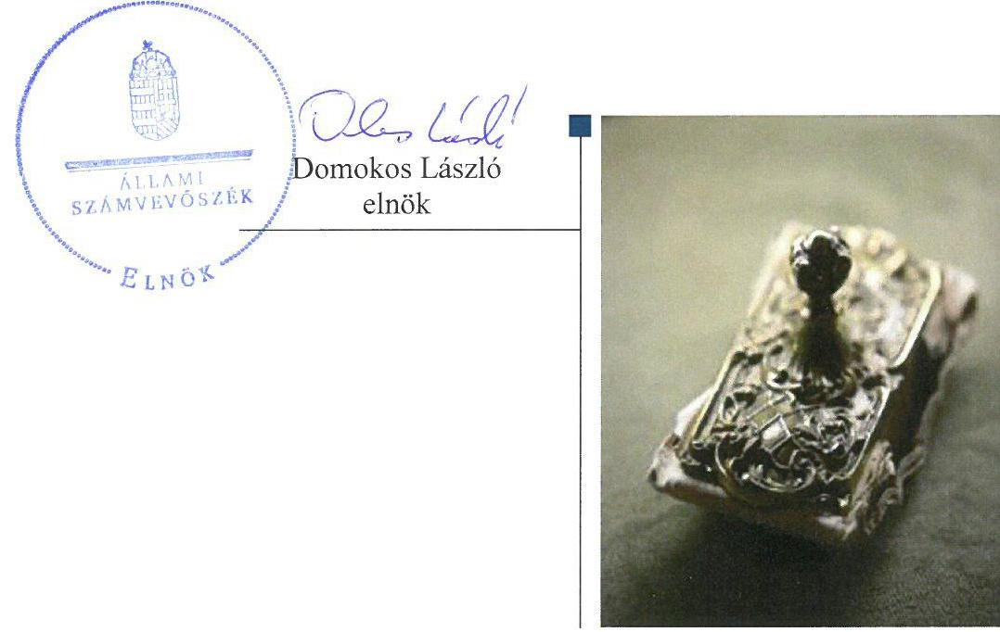
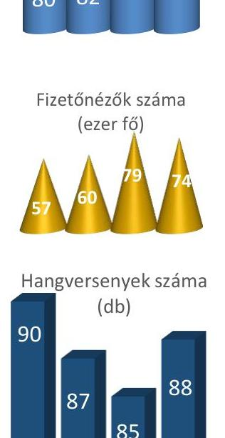
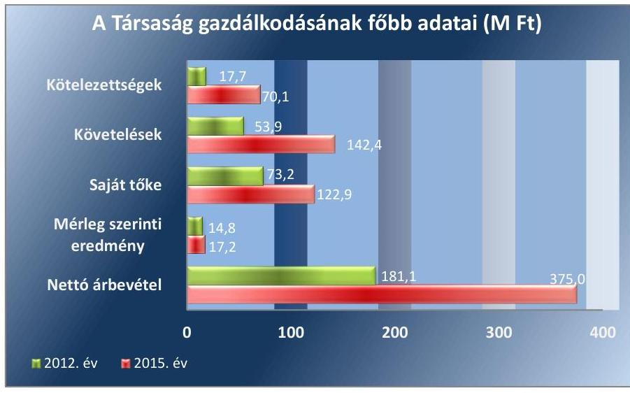
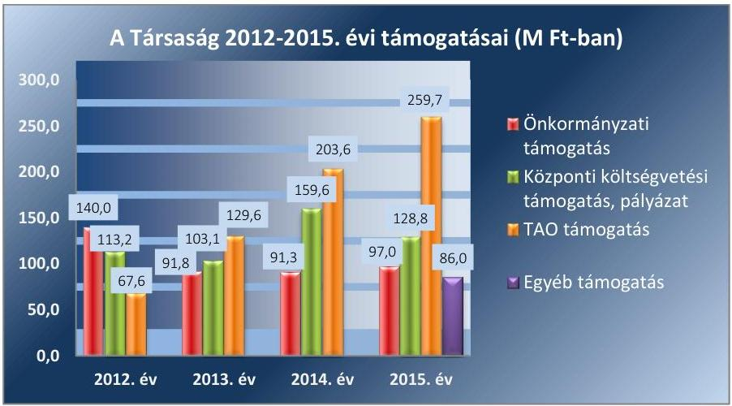
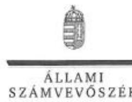
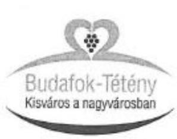
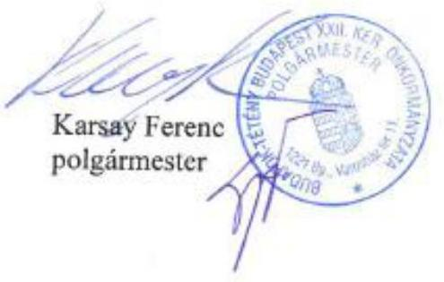
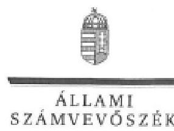

# Jelentés 

## Az önkormányzatok gazdasági társaságai

Az önkormányzatok többségi tulajdonában lévő gazdasági társaságok gazdálkodásának ellenőrzése - Budafoki Dohnányi Ernő Szimfonikus Zenekar Közhasznú Nonprofit Kft.
2017.

---

# Jelentés 

## Az önkormányzatok gazdasági társaságai

Az önkormányzatok többségi tulajdonában lévő gazdasági társaságok gazdálkodásának ellenőrzése - Budafoki Dohnányi Ernő Szimfonikus Zenekar Közhasznú Nonprofit Kft.
2017. 1. hó $\sigma$ 千 nap

---

# AZ ELLENŐRZÉST FELÜGYELTE:

DR. HORVÁTH MARGIT felügyeleti vezető

## AZ ELLENŐRZÉST VEZETTE ÉS A VÉGREHAJTÁSÁÉRT FELELŐS:

HOFMEISTER LÁSZLÓ ellenőrzésvezető

A PROGRAM ÖSSZEÁLLÍTÁSÁÉRT FELELŐS:

JANIK JÓZSEF LÁSZLÓ osztályvezető

IKTATÓSZÁM: V-1276-189/2016

TÉMASZÁM: 2310

ELLENŐRZÉS-AZONOSÍTÓ SZÁM: V-075801

Jelentéseink az Országgyűlés számítógépes hálózatán és az Interneten a www.asz.hu címen is olvashatóak.

---

# TARTALOMJEGYZÉK 

■ ÖSSZEGZÉS ..... 5
■ AZ ELLENŐRZÉS CÉLJA ..... 6
■ AZ ELLENŐRZÉS TERÜLETE ..... 7
■ AZ ELLENŐRZÉS HÁTTERE, INDOKOLTSÁGA ..... 9
■ A JELENTÉS LÉNYEGES KÉRDÉSKÖREI ..... 10
■ ELLENŐRZÉS HATÓKÖRE ÉS MÓDSZEREI ..... 11
■ MEGÁLLAPÍTÁSOK ..... 13
■ JAVASLATOK ..... 20
■ MELLÉKLETEK ..... 23
I. Sz. melléklet: Értelmező szótár ..... 23
II. Sz. melléklet: 2012-2015. évi beszámoló adatai ..... 24
■ FÜGGELÉK: ÉSZREVÉTELEK ..... 25
■ RÖVIDÍTÉSEK JEGYZÉKE ..... 41

---

.

---

# ÖSSZEGZÉS 

Budafok-Tétény Budapest XXII. kerület Önkormányzata a kizárólagos tulajdonában álló Budafoki Dohnányi Ernő Szimfonikus Zenekar Közhasznú Nonprofit Kft. feladatellátására vonatkozóan a tulajdonosi joggyakorlásának kereteit szabályszerűen kialakította, tulajdonosi jogait összességében szabályszerűen gyakorolta. A Társaság vagyongazdálkodása nem volt szabályszerű a vagyon nyilvántartásával, valamint a beszámolókkal kapcsolatos hiányosságok miatt. Az átláthatóság nem volt biztosított a közérdekű adatok tekintetében. A Társaság a közbeszerzési törvényt többször megsértette. Fizetőképessége stabil volt a gazdálkodása során.

## Az ellenőrzés társadalmi indokoltsága

Magyarországon az önkormányzatok kötelező és önként vállalt feladataik ellátása során egyre szélesebb körben alkalmazzák a költségvetési szerveken kívüli feladatellátást, ezáltal az önkormányzati tulajdonú gazdasági társaságok is kiemelt fontosságú szerephez jutnak a lakossági szolgáltatások biztosításában. Az önkormányzatok többségi tulajdonában álló gazdasági társaságok ellenőrzése kiemelt jelentőségű, mivel működésük hatással van a tulajdonos önkormányzat gazdálkodására, gazdálkodásának egyes elemei befolyásolják az önkormányzati alszektor hiányát és az államadósságot.

Az Állami Számvevőszék által az előadó-művészeti tevékenységet folytató Társaságnál végzett ellenőrzést további társadalmi elvárás indokolja sajátos feladatellátásából adódóan, mivel az előadásokon keresztül a kerület lakosságának széles köre kerülhet kapcsolatba a Társasággal, az általa nyújtott szolgáltatásokkal.

## Főbb megállapítások, következtetések

Az Önkormányzat összességében a jogszabályi előírásoknak megfelelően gondoskodott a helyi közművelődési közfeladatának, a Társaság fölötti tulajdonosi jogok szabályszerű gyakorlásához szükséges szervezeti kereteknek a kialakításáról. A tulajdonosi jogok gyakorlása összességében szabályszerű volt a felügyelőbizottság jogszabályokban előírt ügyrendjének hiánya mellett, valamint annak ellenére, hogy a 2014. évi beszámolóról felügyelőbizottsági vélemény nélkül döntöttek. Az Önkormányzat élt a jogszabályban rögzített lehetőséggel és ellenőrizte a tulajdonában álló Társaságot.

A Társaság nem rendelkezett közbeszerzési és iratkezelési szabályzattal. A Számviteli politika és a Pénzkezelési szabályzat nem felelt meg maradéktalanul a jogszabályi előírásoknak. A Társaság vagyongazdálkodása nem volt megfelelő a vagyon nyilvántartása, a beszámolók és a közzétételi kötelezettség teljesítésének és a kapcsolódó szabályozási környezet hiányosságai miatt. A Társaság fizetőképessége biztosított volt az ellenőrzött időszak gazdálkodása során.

Az egyszerűsített éves beszámolóit határidőre elkészítette, azonban a beszámolók tartalma nem felelt meg teljeskörűen a jogszabály előírásainak. A 2013-2015. évi beszámolókkal és a leltárakkal kapcsolatos szabálytalanságokat a könyvvizsgáló nem kifogásolta.

A Társaság bevételeinek elszámolása nem volt szabályszerű, ráfordításainak elszámolása megfelelő volt az értékcsökkenés elszámolása kivételével. A Társaság a közbeszerzési törvényt többször megsértette a szolgáltatások megrendelései során. Az árképzése megfelelő volt.

---

# AZ ELLENŐRZÉS CÉLJA 

Az ellenőrzés célja annak értékelése volt, hogy az önkormányzat vagyongazdálkodási tevékenysége során szabályszerűen gyakorolta-e tulajdonosi jogait; a gazdasági társaság szabályozottsága, gazdálkodása és vagyongazdálkodási tevékenysége, bevételeinek és ráfordításainak elszámolása megfelelt-e a jogszabályi és tulajdonosi előírásoknak; a gazdasági társaság fizetőképessége biztosított volt-e a gazdálkodás során, valamint a gazdálkodás átláthatósága és elszámoltathatósága érdekében biztosítva volt-e a szolgáltatás díjának megalapozottsága szabályszerű önköltségszámítással.

---

# AZ ELLENŐRZÉS TERÜLETE

## Budafok-Tétény Budapest XXII. kerület Önkormányzata és a kizárólagos tulajdonában lévő Budafoki Dohnányi Ernő Szimfonikus Zenekar Közhasznú Nonprofit Kft.

Budafok-Tétény Budapest XXII. kerület Önkormányzata 2001. június 21-ével alapította meg a Budafoki Dohnányi Ernő Szimfonikus Zenekar Kulturális Közhasznú Társaságot, amelynek jogutódja a 2009. augusztus 25-i cégbejegyzéstől a Budafoki Dohnányi Ernő Szimfonikus Zenekar Közhasznú Nonprofit Kft. Az ellenőrzött időszakban a Társaság¹ az Önkormányzat² 100%-os tulajdonában volt.

A Társaság alaptevékenysége nevelés és oktatás, képességfejlesztés, ismeretterjesztés, valamint kulturális tevékenység, ezen belül előadó-művészet. A zenekar kiemelt minőségű zeneművészeti szervezet. A Társaság a közhasznú feladatok mellett vállalkozási tevékenységet – hangfelvétel készítését, folyóirat kiadást – is végzett. Feladatellátását saját vagyonnal az Önkormányzattól használatba kapott ingatlanban biztosította, vagyonkezelésbe, üzemeltetésbe vagyont nem vett át. Az ügyvezető személye a 2012-2015. évek között nem változott.

A Társaság szakmai tevékenységét jellemző adatokat az 1. ábra, a gazdálkodását jellemző főbb adatok alakulását a 2. ábra szemlélteti.

2012. 2013. 2014. 2015.

*Forrás: 2012. és a 2015. évi évad beszámolók*

*Forrás: 2012. és 2015. évi egyszerűsített éves beszámolók*

A Társaság mérlegfőösszege a 2012. évi 185,8 M Ft-ról 62%-kal 301,0 M Ft-ra nőtt a 2015. évre. A közhasznú és vállalkozási tevékenységéből származó értékesítés nettó árbevétele a 2012. évről a 2015. évre 107,1%-kal nőtt. A Társaság a 2012-2015. éveket pozitív eredménnyel zárta, mérleg

---

szerinti eredménye az ellenőrzött időszakban 14,8 M Ft és 17,2 M Ft között alakult. A jegyzett tőkéje 11,2 M Ft volt, mely az ellenőrzött időszakban állandó volt.

A tulajdonosi joggyakorló Önkormányzat polgármestere ${ }^{3}$ a 2014. évi Önkormányzati választások óta tölti be tisztségét, a jegyző ${ }^{4}$ személye az ellenőrzött időszakban nem változott.

---

# AZ ELLENŐRZÉS HÁTTERE, INDOKOLTSÁGA 

Az önkormányzatok többségi tulajdonában álló gazdasági társaságok ellenőrzése kiemelten fontos a vagyon megőrzése, megóvása érdekében. Alapvető követelmény, hogy gazdálkodásuk, működésük szabályszerű, az általuk szolgáltatott adatok minél megbízhatóbbak legyenek. A feladatellátás költségeinek, ráfordításainak alakulása a lakosság széles rétegét érinti.

Ellenőrzéseink feltárhatják, hogy az önkormányzat a feladatellátásához rendelt vagyon működtetését a tulajdonostól elvárható gondossággal végezte-e, a feladatot ellátó gazdasági társaság a létesítő okiratban, közszolgáltatói szerződésben, fenntartói megállapodásban foglaltak betartásával biztosította-e a feladat ellátását. Az ellenőrzés eredményeképp meghatározhatóvá válnak a költségvetési hiányt befolyásoló szervezet kockázatai, lehetővé válik ezen kockázatok csökkentése. Az ellenőrzés rávilágíthat arra, hogy a gazdasági társaság a vagyon használatával biztosította-e a szolgáltatás folytatásának feltételeit, az önkormányzat tulajdonosi felügyelete hozzájárult-e a szabályszerű gazdálkodáshoz és feladatellátáshoz. A megállapítások alapján megfogalmazott számvevőszéki javaslatok hasznosítása elősegítheti a meglévő hibák megszüntetését. A jó gyakorlatok bemutatásával az ÁSZ ${ }^{3}$ hozzájárulhat a követendő megoldások megismertetéséhez, terjesztéséhez.

---

# A JELENTÉS LÉNYEGES KÉRDÉSKÖREI 

1.- Az Önkormányzat tulajdonosi joggyakorlása szabályszerű volt-e?
2.- A Társaság vagyongazdálkodása szabályszerű volt-e, fizetőképessége biztosított volt-e a gazdálkodás során?
3.- A Társaság bevételeinek és ráfordításainak elszámolása, valamint az önköltségszámítás és árképzés szabályszerű volt-e?

---

# ELLENŐRZÉS HATÓKÖRE ÉS MÓDSZEREI 

## Az ellenőrzés típusa

Megfelelőségi ellenőrzés

## Az ellenőrzött időszak

2012. január 1-jétől 2015. december 31-ig.

## Az ellenőrzés tárgya

Az Önkormányzat tulajdonosi joggyakorlása, valamint a Társaság gazdálkodásának szabályozottsága és szabályszerűsége.

Az ellenőrzés kiterjedt minden olyan körülményre és adatra, amely az ÁSZ jogszabályban meghatározott feladatainak teljesítéséhez, valamint a program végrehajtása folyamán felmerült újabb összefüggések feltárásához szükséges volt.

## Az ellenőrzött szervezet

Budafok-Tétény Budapest XXII. kerület Önkormányzata és a Budafoki Dohnányi Ernő Szimfonikus Zenekar Közhasznú Nonprofit Kft.

## Az ellenőrzés jogalapja

Az ellenőrzés jogszabályi alapját az Állami Számvevőszékről szóló 2011. évi LXVI. törvény 1. § (3) bekezdése és 5. § (3)-(4)-(5) bekezdései képezik.

## Az ellenőrzés módszerei

Az ellenőrzést a nemzetközi standardokat irányadónak tekintve az ellenőrzési program ellenőrzési kérdései, az ellenőrzött időszakban hatályos jogszabályok, az ellenőrzés szakmai szabályok és módszertanok figyelembe vételével végeztük.

Az ellenőrzés ideje alatt az ellenőrzött szervezettel történő kapcsolattartást az ÁSZ Szervezeti és Működési Szabályzatának vonatkozó előírásai alapján biztosítottuk.

Az ellenőrzés a kiválasztott, kizárólagos tulajdonosi jogokat gyakorló Önkormányzatra és az ellenőrzött gazdasági társaságra terjedt ki.

---

Az ellenőrzési kérdések megválaszolásához szükséges bizonyítékok megszerzése a következő ellenőrzési eljárások alkalmazásával történt: megfigyelés, kérdésfeltevés (információkérés), összehasonlítás, mintavételezés, valamint elemző eljárás. Az ellenőrzési bizonyítékként felhasznált adatforrások közé tartoztak egyrészt az ellenőrzési programban felsorolt adatforrások, másrészt minden - az ellenőrzés folyamán - feltárt, az ellenőrzés szempontjából információkat tartalmazó dokumentum.

Az ellenőrzést a megjelölt adatforrások és az ellenőrzöttek által kitöltött tanúsítványok felhasználásával, a mintatételek kiértékelésével, továbbá az adott időszakban hatályos jogszabályok figyelembevételével folytattuk le.

A bevételek, a ráfordítások elszámolásának és a vagyon nyilvántartásának szabályszerűségét véletlenszerű mintavétel, a legnagyobb ráfordítások elszámolására és a legnagyobb összegű vagyonnövekedést jelentő eszközök nyilvántartására vonatkozó eljárás szabályszerűségét kockázatalapú, irányított mintavétel alapján ellenőriztük.

Az értékelés során az egyes mintatételekre vonatkozó szabályszerűségi kérdésekre adott válaszok kerültek statisztikai módszer segítségével összesítésre és minősítésre. A jogszabályoknak és a belső előírásoknak megfelelőnek tekintettük az adott területet, amennyiben a minta ellenőrzésének eredménye alapján 95%-os bizonyossággal a teljes sokaságban a hibaarány kisebb volt, mint 10% és nem megfelelőnek értékeltük, ha a hibaarány a 10%-ot elérte.

---

# 1. Az Önkormányzat tulajdonosi joggyakorlása szabályszerű volt-e? 

Összegző megállapítás

### 1.1. számú megállapítás

Az Önkormányzat a tulajdonosi jogokat összességében szabályszerűen gyakorolta.

Az Önkormányzat a tulajdonosi joggyakorlás kereteit összességében szabályszerűen kialakította.

Az Önkormányzat a kerület kulturális életének fejlesztésére vonatkozó középtávú céljait a Gazdasági programban ${ }_{1-2}{ }^{5}$-ben, valamint a 2008-2012. évi Közművelődési Koncepciójában határozta meg, melyek megvalósításához kapcsolódó feladatellátás a Társaságot is érintette.

A TULAJDONOSI JOGGYAKORLÁS KERETEIT az Önkormányzat a Társaságra vonatkozóan az önkormányzati SZMSZ ${ }_{1-3}{ }^{7}$-ben, a Vagyonrendelet ${ }_{1-2}{ }^{8}$-ben, az Alapító okirat ${ }_{1-4}{ }^{9}$-ban, a Közszolgáltatási szerződés ${ }_{1-2}{ }^{10}$-ben, az évente megkötött Feladatellátási szerződés ${ }_{1-4}{ }^{11}$-ben és a Javadalmazási szabályzat ${ }_{1-2}{ }^{12}$-ben rögzítette.

Az üzleti terv teljesítését elősegítő anyagi ösztönzési rendszerre vonatkozóan a Taktv. ${ }^{13}$ előírásainak megfelelően az Önkormányzat elkészítette a Javadalmazási szabályzat ${ }_{1-2}$-ot, melyben a tulajdonában lévő gazdasági társaságokkal kapcsolatban fogalmazták meg a vezető tisztségviselők, felügyelőbizottsági tagok, és vezető állású munkavállalók javadalmazási, végkielégítési szabályait, valamint a kapcsolódó alapítói hatásköröket.

A Közszolgáltatási szerződés ${ }_{1-2}$-ben meghatározták többek között a Társaság szolgáltatási kötelezettségeit, az ellátási területet, valamint a szerződés felmondásának és módosításának szabályait. Az Emtv. ${ }^{14}$ 13. § (2) bekezdés e) pontjában foglaltak ellenére a Közszolgáltatási szerződés nem tartalmazta a Társaság használatába adott ingatlan visszaszolgáltatására vonatkozó szabályokat.

RENDELETALKOTÁSI KÖTELEZETTSÉGÉNEK az Önkormányzat a Közműv. tv. ${ }^{15}$ alapján eleget tett, a Közművelődési rendelet ${ }_{1-2}{ }^{16}$-ben meghatározták a közművelődési feladatellátás szakmai alapelveit, a finanszírozás és az ellátás szervezeti kereteit. Költségvetési rendeletei ${ }_{1-4}{ }^{17}$ tartalmazták a Társaság számára jóváhagyott támogatásokat.

A TÁRSASÁG FELADATELLÁTÁSÁHOZ SZÜKSÉGES VAGYONT az Önkormányzat az alapításkor 6,0 M Ft pénzbeli betét és 5,2 M Ft apport eszközállomány átadásával, ingatlan használatba adásával biztosította.

---

### 1.2. számú megállapítás

Az Önkormányzat a tulajdonosi jogokat a felügyelőbizottság működésével és a 2014. évi beszámoló elfogadásával kapcsolatban feltárt hiányosság kivételével szabályszerűen gyakorolta.

A Társaságra vonatkozó tulajdonosi jogokat az Alapító okirat ${ }_{1-4}$ és
 a Vagyonrendelet ${ }_{1-2}$ alapján a Képviselő-testület ${ }^{18}$, valamint az önkormányzati SZMSZ ${ }_{1-3}$-ben rögzített átruházott hatáskörben a polgármester gyakorolta.

A Társaság az ellenőrzött időszak minden évében készített üzleti tervet, melyet a Képviselő-testület a Társaság éves beszámolójával együtt tárgyalt és hagyott jóvá.

Az FB ${ }^{19}$ tagjainak számát a Képviselő-testület három főben határozta meg, mely megfelelt a jogszabályi előírásnak. Az FB nem rendelkezett a Képviselő-testület által jóváhagyott ügyrenddel a Gt. ${ }^{20} 34. § (4), illetve 2014. március 15-től a Ptk. ${ }^{21} 3:122. § (3) bekezdésében, valamint az Alapító okirat ${ }_{1-4} 3.4.4. pontjában foglaltak ellenére.

A Könyvvizsgáló megválasztása során a Képviselő-testület a Gt. és a Ptk. ${ }_{2}$ alapján járt el, az Alapító okirat ${ }_{1-4}$-ban rögzítette a Társaságnál könyvvizsgálói feladatot ellátó szervezetet és a feladatot közvetlenül végző könyvvizsgáló személyét a teljes ellenőrzött időszakra vonatkozóan.

A Társaság ellenőrzését az Önkormányzat az Áht. ${ }^{22}$-ban foglalt felhatalmazás alapján a 2013. évben végezte el az önkormányzati támogatás elszámolásának szabályszerűségére vonatkozóan. A belső ellenőrzés figyelemmel kísérte az ellenőrzés javaslataira készített intézkedési terv végrehajtását, az Önkormányzat ellenőrzési megállapításai hasznosultak.

Az eredmény felhasználásáról az Önkormányzat a Civil tv. ${ }^{23}$-ben és az Alapító okirat ${ }_{1-4}$-ban foglaltaknak megfelelően döntött a Társaság közhasznú jogállásából adódóan a Társaság éves beszámolóinak a megtárgyalásakor és jóváhagyásakor.

A Társaság saját tőkéje a realizált pozitív eredménynek köszönhetően jelentősen növekedett, a teljes ellenőrzött időszakban meghaladta a jegyzett tőke szintjét - melyet a 3. ábra szemléltet -, ezért a Gt.-ben és a Ptk. ${ }_{2}$-ban előírt intézkedésre a tulajdonos Önkormányzat részéről nem volt szükség.

---

# 2. A Társaság vagyongazdálkodása szabályszerű volt-e, fizetőképessége biztosított volt-e a gazdálkodás során? 

Összegző megállapítás

2.1. számú megállapítás

A Társaság vagyongazdálkodása nem volt megfelelő a vagyonnyilvántartásának, a beszámolók és a közzétételi kötelezettség teljesítésének hiányosságai miatt. Fizetőképessége biztosított volt.

A Társaság a jogszabályok által előírt szabályzatokkal, a közbeszerzési és az iratkezelési szabályzat kivételével, rendelkezett. A Számviteli politika és a Pénzkezelési szabályzat nem felelt meg maradéktalanul a jogszabályi előírásoknak.

A Társaság rendelkezett SZMSZ ${ }_{1-2}{ }^{24}$-szel, melyben meghatározták a működés rendjét, a vezetők és a munkavállalók feladatait, a felelősségi köröket, valamint a gazdálkodással kapcsolatos jogköröket.

A Társaság ügyvezetője a Számv. tv. ${ }^{25}$ által előírt szabályzatalkotási kötelezettségének a Számviteli politika ${ }_{1-2}{ }^{26}$, az Értékelési szabályzat ${ }_{1-2}{ }^{27}$, a Pénzkezelési szabályzat ${ }_{1-3}{ }^{28}$, a Leltározási szabályzat ${ }_{1-2}{ }^{29}$ és a Számlarend ${ }^{30}$ elkészítésével eleget tett.

A Számviteli politika ${ }_{1-2}$ tartalmazta a Számv. tv.-ben foglaltaknak megfelelően a beszámoló típusát, az eredménykimutatás választott formáját, a könyvvezetés módját.

A Pénzkezelési szabályzat ${ }_{1-2}$ a Számv. tv. 14. § (8) bekezdése előírásainak ellenére a pénzforgalom bankszámlán történő lebonyolításának rendjéről, a készpénzben és a bankszámlán tartott pénzeszközök közötti forgalomról, valamint a készpénzállományt érintő pénzmozgások jogcímeiről és eljárási rendjéről nem rendelkezett.

A Számviteli politika ${ }_{1-2}$ keretében nem rögzítették teljeskörűen a Számv. tv. 14. § (4) bekezdésében foglaltakat, mert nem határozták meg, hogy a minősítési lehetőségek közül - a követelések értékvesztése elszámolásához a vevők minősítésére vonatkozóan - melyiket milyen feltételek fennállása esetén alkalmazzák, valamint a számviteli elszámolás és értékelés szempontjából mit tekintenek jelentősnek figyelemmel a Számv. tv. 55. § (1) bekezdésében megfogalmazottakra. A Számviteli politika ${ }_{1-2}$-ban nem határozták meg a kapott előadó-művészeti támogatás EMMI rendelet ${ }^{31} 3. § (3) bekezdés c) pontjában előírt elszámolásához, a központi irányítás általános költségeinek a megosztására vonatkozó arányosítási módot.

A Leltározási szabályzat ${ }_{1-2}$ tartalmazta a leltározással szemben támasztott követelményeket, a leltárzás és a leltárkészítés módszereit, a leltározás menetét, a leltározás időpontját és gyakoriságát. A Leltározási szabályzat ${ }_{1}$-ben rögzítésre kerültek továbbá a selejtezésre vonatkozó belső szabályok is, melyekről a 2014. évtől a Selejtezési szabályzat ${ }^{32}$ rendelkezett.

A Társaság a Kbt. ${ }_{1}{ }^{33}$ és a Kbt. ${ }_{2}{ }^{34}$ hatálya alá tartozott ajánlatkérő szervezetként, azonban nem rendelkezett közbeszerzési szabályzattal, ezzel megsértette a Kbt. ${ }_{1} 22. § (1) bekezdés, valamint a Kbt. ${ }_{2} 27. § (1) bekezdés rendelkezését.

---

A Társaság az Ltv. ${ }^{35} 10. § (1) bekezdés a) pontjában foglalt előírás ellenére nem adott ki egyedi iratkezelési szabályzatot.

# 2.2. számú megállapítás 

A Társaságnál a vagyon nyilvántartása nem volt szabályszerű.

## A vagyon nyilvántartása a saját vagyonra vonatkozóan nem volt megfelelő. A Társaság a saját vagyonhoz kapcsolódó nyilvántartásokat folyamatosan vezette, azonban az analitikus nyilvántartások nem feleltek meg az előírásoknak.

A tárgyi eszközök beszerzésekor az üzembe helyezést nem dokumentálták hitelt érdemlő módon a Számv. tv. 52. § (2) bekezdésében előírtak ellenére. Előfordult, hogy a Számv. tv. 167. § (1) bekezdés h) pontjában foglaltak ellenére a könyvviteli elszámolást alátámasztó bizonylat nem tartalmazta az érintett könyvviteli számlákra történő hivatkozást.

A Társaság vagyoni helyzetére jellemző főbb mérlegadatokat a II. számú melléklet mutatja be.

Az ellenőrzött időszakban a Társaság vagyona 62,0%-kal nőtt. A befektetett eszközök állománya 7,7%-kal növekedett. Az állomány legnagyobb részét a tárgyi eszközök képezték, melynek értéke kis mértékben emelkedett. A forgóeszközök értéke 93,0%-kal nőtt, melyen belül a követelések állománya 164,2%-kal, a pénzeszközök 31,8%-kal emelkedett. A követelések értékének emelkedését elsősorban a levonható előzetes általános forgalmi adóval kapcsolatos követelésállomány növekedése okozta. A pénzeszközök állományváltozásának pozitív alakulásában kiemelkedő szerepe volt a Társaság által kapott támogatások 78,2%-os növekedésének is. A Társaság gazdálkodása összességében pozitívan értékelhető, mérleg szerinti eredménye folyamatosan emelkedett - melyet a 4. ábra mutat be -, az elért nyereség stabil gazdálkodási hátteret biztosított a szakmai tevékenységéhez. Saját vagyonát a Társaság nem terhelte meg és nem idegenítette el.

### 2.3. számú megállapítás

1. táblázat

A Társaság likviditásának és adósságmutatójának alakulása

|  | Eladóso-   dottság   mértéke | Likvidit-   tási rátia |
| :-- | :--: | :--: |
| Referencia | $<1,0$ | $>1$ |
| 2012. év | 0,2 | 6,7 |
| 2013. év | 0,3 | 4,9 |
| 2014. év | 0,3 | 5,2 |
| 2015. év | 0,6 | 3,3 |
| Forrás: 2012-2015. évi egyszerűsített éves besza- |  |  |
| molók, főkönyvi kivonatok |  |  |

A Társaság fizetőképessége biztosított volt a gazdálkodás során.
A kötelezettségállomány kizárólag rövid lejáratú kötelezettségekből állt, mely a 2012. év végi 17,7 M Ft-hoz képest a 2015. év végére 70,1 M Ft-ra növekedett. A rövid lejáratú kötelezettségek nagyrészt a szállítói tartozásokból, valamint az adó- és járulék befizetési kötelezettségekből álltak. A 2015. évi kötelezettségállomány jelentős részét, 56,1 M Ft-ot a Társaság költségvetési befizetési kötelezettségei képezték. A Társaság a jogszabályon alapuló rövid lejáratú kötelezettségeit határidőben teljesítette.

Az eladósodottság mértéke és a fizetőképesség romlott, azonban a közgazdasági mutatók alapján nem jelentett kockázatot a Társaság működésére, a feladatellátására. A Társaság likviditási és adósságmutatójának alakulását az 1. táblázat szemlélteti. A Társaság forgóeszköz-állománya minden évben jelentősen meghaladta az esedékes fizetési kötelezettségét, ami biztosította a likviditását. Az eladósodottság mértékére a növekvő kötelezettségállomány volt negatív hatással, azonban a saját tőke a kötelezettségek teljesítéséhez fedezetet nyújtott.

---

### 2.4. számú megállapítás

A Társaság az előírt beszámolási, adatszolgáltatási kötelezettségét a Taktv. és az Info. tv. által előírt közzétételi kötelezettség vonatkozásában hiányosan teljesítette. A Társaság beszámolóinak tartalma nem felelt meg teljeskörűen a jogszabály előírásainak.

Az egyszerűsített éves beszámolóját a Társaság elkészítette. Az éves beszámolók letétbe helyezése és közzététele a Számv. tv. szerint történt meg. A Társaság az egyszerűsített éves beszámolók készítése során nem minden esetben tartotta be a Számv. tv. előírásait.

A 2012., 2013. és 2014. évi kiegészítő mellékletek nem tartalmazták a Számv. tv. 93. § (3) bekezdésében foglaltak ellenére a támogatási program keretében végleges jelleggel kapott és elszámolt összegeket támogatásonként, továbbá a Számv. tv. 88. § (2) bekezdéseiben előírtak ellenére nem értékelték a saját tőke és a kötelezettségek alakulását, valamint hiányosan mutatták be az eszközök összetételét.

A 2012-2015. években a saját tőke mérlegsor nem volt leltárral alátámasztva a Számv. 69. § (1) bekezdésében előírtak ellenére. A leltározás nem mennyiségi felvétellel történt a 2012-2013. évben a pénzkészletről és az árukészletekről, mely nem felelt meg a Leltározási szabályzat ${ }_{1}$ III. fejezet 4., illetve 7. pont rendelkezésének.

A könyvvizsgáló a leltár, illetve a leltározás hiányosságait nem kifogásolta a 2012. év kivételével. Az egyszerűsített éves beszámolót - a leltározási hiányosságok ellenére - minden évben korlátozás nélküli hitelesítő záradékkal látta el a könyvvizsgáló.

A közérdekű adatok nyilvánosságra hozatalával kapcsolatos kötelezettségeinek nem tettek eleget teljeskörűen. A Taktv. 2. § (1) bekezdésében előírtak ellenére a vezető tisztségviselők, FB tagok adatait (nevét, tisztségét), juttatásait, az Info. tv. ${ }^{36} 37. § (1) bekezdésében előírtak ellenére az Info. tv. 1. melléklet szerinti általános közzétételi lista I. rész 2., II. rész 1., 12. és 14. pontjaiban, valamint a III. rész 1-2. pontjaiban szereplő adatai közül a szervezeti felépítését, a szervezeti egységek feladatait, a szervezet feladatát, alaptevékenységét meghatározó alapvető jogszabályok hatályos és teljes szövegét, az alaptevékenységgel kapcsolatos vizsgálatok, ellenőrzések nyilvános megállapításait, a tevékenységére vonatkozó, jogszabályon alapuló statisztikai adatgyűjtés eredményeit, időbeli változását, a 2012-2013. évi számviteli törvény szerinti éves beszámolókat, továbbá a foglalkoztatottak személyi juttatásaira vonatkozó összesített adatokat nem tették közzé.

A Társaság az Info. tv. 35. § (3) bekezdésében előírtak ellenére a közzétételi listákon szereplő adatok közzétételi kötelezettsége teljesítésének részletes szabályait belső szabályzatban nem állapította meg.

---

# 3. A Társaság bevételeinek és ráfordításainak elszámolása, valamint az önköltségszámítás és árképzés szabályszerű volt-e? 

Összegző megállapítás

A Társaság bevételeinek elszámolása nem volt szabályszerű, ráfordításainak elszámolása megfelelő volt az értékcsökkenés elszámolása kivételével. Az árképzése megfelelő volt.

### 3.1. számú megállapítás

A Társaság bevételeinek elszámolása nem volt szabályszerű, ráfordításainak elszámolása megfelelő volt az értékcsökkenés elszámolása kivételével.

A bevételek elszámolása nem felelt meg a Számv. tv-ben rögzített előírásoknak, mert a továbbszámlázott postaköltséget túlnyomó többségében értékesítés nettó árbevétele helyett egyéb bevételként számolták el, mellyel megsértették a Számv. tv. 72. § (1) bekezdésében foglaltakat. Előfordult továbbá, hogy a tárgyévben befolyt, de a következő évet érintő jegybevételt passzív időbeli elhatárolásként nem mutatták ki, ezzel a Számv. tv. 16. § (2) bekezdésében foglalt időbeli elhatárolás számviteli alapelvnek, valamint a Számv. tv. 44. § (1) bekezdés a) pontjában foglaltaknak nem tettek eleget.

A Társaság 2012-2015. években kapott támogatásainak alakulását az 5. ábra szemlélteti.
5. ábra

A Társaság a kapott költségvetési és egyéb támogatásokat elkülönítetten tartotta nyilván, az elszámolási kötelezettségének eleget tett. Az alapító támogatása a 2012. évről a 2015. évre 30,7%-kal csökkent, azonban a TAO $^{37}$ támogatás és egyéb gazdálkodó szervezetektől kapott támogatás összege 278,1
 M Ft-tal nőtt.

A RÁFORDÍTÁSOK ELSZÁMOLÁSA az anyagjellegű, a pénzügyi műveletek és az egyéb ráfordítások vonatkozásában megfelelő volt.

A Társaság a Kbt. 1 és a Kbt. 2 alanyi hatálya alá tartozó szervezetként reklámszolgáltatás és technikai szolgáltatás beszerzése során megsértette

---

2. táblázat

TÁRGYI ESZKÖZÖK HASZNÁLHATÓSÁGI FOKA%

|  | Ingatlanok | Gépek, berendezések | Egyéb berendezések |
| :--: | :--: | :--: | :--: |
| 2012. év | 85,5% | 47,0% | 36,3% |
| 2013. év | 79,5% | 40,1% | 30,7% |
| 2014. év | 73,5% | 33,2% | 49,5% |
| 2015. év | 67,5% | 60,2% | 38,9% |

a Kbt. 1 5. § alapján fennálló, a Kbt. 1 19. §-ában, valamint a Kbt. 2 21. § (1) bekezdésében előírt közbeszerzési eljárás lefolytatásának kötelezettségét. A személyi jellegű ráfordítások elszámolása megfelelt a Számv. tv.-ben foglaltaknak és a Számviteli politika ${ }_{1-2}$ előírásainak. A munkavállalót terhelő adókat, járulékokat az Szja tv. ${ }^{38}$ és a Tbj. tv. ${ }^{39}$ által előírtaknak megfelelően levonták.

## AZ ÉRTÉKCSÖKKENÉSI LEÍRÁS ELSZÁMOLÁSA

nem volt megfelelő, mert a tárgyi eszközök üzembe helyezését nem dokumentálták hitelt érdemlően a Számv. tv. 52. § (2) bekezdésében előírtaknak megfelelően.

VISSZAPÓTLÁSI KÖTELEZETTSÉGE saját vagyonára vonatkozóan a Társaságnak nem volt. Az amortizációból képződő, összesen 36,8 M Ft forrás 92,8%-át tárgyi eszközök beszerzésére fordították, főként hangszereket szereztek be. A legnagyobb összegű hangszerbeszerzés a 2014. évben történt, 24,6 M Ft értékben. A tárgyi eszközök mérlegértéke összességében csekély mértékben, 1,9%-kal nőtt az ellenőrzött időszakban, 2012. december 31-én a tárgyi eszközök nettó értéke 67,0 M Ft, 2015. december 31-én 68,3 M Ft volt.

A Társaság tárgyi eszközeinek használhatósági fokát eszköztípusonként a 2. táblázat szemlélteti. A használhatósági fok az Önkormányzattól használatba kapott ingatlannál az ellenőrzött időszakot megelőzően végrehajtott felújítást követően a visszapótlás hiánya miatt folyamatosan csökkent, a 2015. évben 67,5%-os volt, míg az egyéb berendezések esetében a 2014. évi jelentősebb összegű hangszer beszerzéseknek köszönhetően a kezdeti elavulást követően a 2013. évről a 2014. évre 18,8 százalékponttal javult. A 2015. évben a beszerzések csökkenésének következtében a használhatósági mutató ismét romlott.

A KÖVETELÉSÁLLOMÁNY összege a 2012. évről a 2015. évre 164,2%-kal nőtt, melynek jelentős részét a költségvetéssel szembeni áfa ${ }^{40}$ és TAO követelés tette ki. A vevőkkel szembeni követelés mérlegben kimutatott összege a négy év alatt közel 30%-os csökkenést mutatott. A követelések csökkentésére vonatkozóan a Társaság nem tett intézkedéseket, jogszabályi vagy tulajdonosi rendelkezés erre vonatkozóan nem tartalmazott számára előírásokat.

# 3.2. számú megállapítás 

## A Társaság árképzése megfelelő volt.

ÖNKÖLTSÉGSZÁMÍTÁSI SZABÁLYZAT készítésére a Társaság a Számv. tv. 14. § (6) bekezdése alapján nem volt kötelezett. Az árképzésre az Önkormányzat követelményeket nem fogalmazott meg, a Társaság által alkalmazott árakra jogszabályi előírás nem vonatkozott. A Társaság az egyes díjak, jegyárak megállapításánál a versenytársak árait vette alapul.

---

# JAVASLATOK 

Az ÁSZ tv. 33. § (1) bekezdésében foglaltak értelmében az ellenőrzött szervezet vezetője köteles a jelentésben foglalt megállapításokhoz kapcsolódó intézkedési tervet összeállítani és azt a jelentés kézhezvételétől számított 30 napon belül az ÁSZ részére megküldeni. Amennyiben az ellenőrzött szervezet vezetője nem küldi meg határidőben az intézkedési tervet, vagy továbbra sem elfogadható intézkedési tervet küld, az Állami Számvevőszék elnöke az ÁSZ tv. 33. § (3) bekezdés a) és b) pontjaiban foglaltakat érvényesítheti.
Javaslataink célja az Budafoki Dohnányi Ernő Szimfonikus Zenekar Közhasznú Nonprofit Kft. gazdálkodása szabályszerűségének és gyakorlatának javítása annak érdekében, hogy a szabályozási környezet és az alkalmazott gyakorlat megfelelően tudja támogatni az átlátható működést.

## A Budafoki Dohnányi Ernő Szimfonikus Zenekar Közhasznú Nonprofit Kft. ügyvezetőjének

1. Intézkedjen a Társaság számviteli politikájának az előadó művészeti támogatás és a központi irányítás általános költségei megosztása, továbbá a vevők minősítése tekintetében a Számv. tv. előírásainak megfelelő kiegészítéséről.
(2.1. megállapítás 5. bekezdése alapján)
2. Intézkedjen a Társaság pénzkezelési szabályzatának a pénzforgalom bankszámlán történő lebonyolításának rendjével, a készpénz és bankszámla közötti forgalommal, valamint a készpénzállományt érintő pénzmozgásokkal kapcsolatos módosításáról a Számv. tv. előírásainak megfelelően.
(2.1. megállapítás 4. bekezdés alapján)
3. Intézkedjen a Kbt ${ }_{2}$-ben előírtaknak megfelelően a Társaság közbeszerzési szabályzatának elkészítéséről.
(2.1. megállapítás 7. bekezdése alapján)
4. Intézkedjen az iratkezelési szabályzat elkészítéséről az Ltv.-ben előírtak szerint.
(2.1. megállapítás 8. bekezdése alapján)

---

5. Intézkedjen a tárgyi eszközök beszerzése során az üzembe helyezések hitelt érdemlő módon történő dokumentálásáról a Számv. tv. előírásainak megfelelően.
(2.2. megállapítás 2. bekezdése alapján)
6. Intézkedjen a könyvviteli elszámolást alátámasztó bizonylatok teljességéről - az érintett főkönyvi számlákra történő hivatkozások rögzítésével - a Számv. tv. által előírtaknak megfelelően.
(2.2. megállapítás 2. bekezdése alapján)
7. Intézkedjen, hogy az éves beszámoló mérlegét alátámasztó leltár a Számv. tv-ben előírtaknak megfelelően tartalmazza a Társaság saját tőkéjét.
(2.4. megállapítás 3. bekezdése alapján)
8. Intézkedjen a Taktv. és az Info. tv. által előírt közérdekű adatok hiánytalan közzétételéről.
(2.4. megállapítás 5. bekezdése alapján)
9. Intézkedjen az Info. tv. rendelkezésének megfelelően a közérdekű adatok közzétételi kötelezettsége teljesítésének részletes szabályait tartalmazó belső szabályzat elkészítéséről.
(2.4. megállapítás 6. bekezdése alapján)
10. Intézkedjen a bevételek elszámolása során a Számv. tv. előírásainak a betartásáról.
(3.1. megállapítás 1. bekezdése alapján)

---

Javaslataink célja az Önkormányzat szabályszerű működésének elősegítése, továbbá az önkormányzati tulajdonosi joggyakorlás kontrolljainak erősítése.

# Budafok-Tétény Budapest XXII. kerület Önkormányzata Polgármesterének 

1. Kezdeményezze a Társasággal kötött közszolgáltatási szerződésnek a vonatkozó kormányrendeletnek megfelelő tartalommal történő kiegészítését.
(1.1 megállapítás 4. bekezdése alapján)
2. Kezdeményezze, hogy az FB a Ptk2-ban előírtaknak megfelelően ügyrendjét megállapítsa és azt a Társaság legfőbb szerve jóváhagyja.
(1.2. megállapítás 3. bekezdés 2. mondata alapján)

---

# MELLÉKLETEK 

- I. SZ. MELLÉKLET: ÉRTELMEZŐ SZÓTÁR
belső ellenőrzés
eladósodottság mértéke
gazdasági társaság
gazdálkodó szervezet
használhatósági fok
likviditási mutató
nonprofit gazdasági társaság
tulajdonosi joggyakorló
vagyongazdálkodás

Független, tárgyilagos bizonyosságot adó és tanácsadó tevékenység, amelynek célja, hogy az ellenőrzött szervezet működését fejlessze és eredményességét növelje, az ellenőrzött szervezet céljai elérése érdekében rendszerszemléletű megközelítéssel és módszeresen értékeli, illetve fejleszti az ellenőrzött szervezet irányítási és belső kontrollrendszerének hatékonyságát. (Forrás: Bkr. 2. § b) pontja) Azt mutatja, hogy a saját források a kötelezettségek hány százalékát fedezik. Kedvező, ha a mutató tartósan (jelentősen) 1 alatti értéket ér el: Kötelezettségek/ saját tőke.
Ptk.: 3.88. § (1) bekezdése szerint „a gazdasági társaságok üzletszerű közös gazdasági tevékenység folytatására, a tagok vagyoni hozzájárulásával létrehozott, jogi személyiséggel rendelkező vállalkozások, amelyekben a tagok a nyereségből közösen részesednek, és a veszteséget közösen viselik".
A Ptk.: ${ }^{41}$ 685. § c) pontja szerint gazdálkodó szervezet: „az állami vállalat, az egyéb állami gazdálkodó szerv, a szövetkezet, a lakásszövetkezet, az európai szövetkezet, a gazdasági Társaság, az európai részvénytársaság, az egyesülés, az európai gazdasági egyesülés, az európai területi együttműködési csoportosulás, az egyes jogi személyek vállalata, a leányvállalat, a vízgazdálkodási társulat, az erdő birtokossági társulat, a végrehajtói iroda, az egyéni cég, továbbá az egyéni vállalkozó." (2014. március 15-ig hatályos)
A mutató a tárgyi eszközök használhatósági szintjét mutatja. Kiszámítása: Tárgyi eszközök nettó értéke x 100)/ Tárgyi eszközök bruttó értéke.
A mutató azt fejezi ki, hogy a likvid eszközöknek tekintett forgóeszközök értéke hányszorosa az éven belül esedékes kötelezettségeknek: forgóeszközök/ rövid lejáratú kötelezettségek.
A gazdasági társaság nem jövedelemszerzésre irányuló közös gazdasági tevékenység folytatására is alapítható (nonprofit gazdasági társaság). Nonprofit gazdasági társaság bármely társasági formában alapítható és működtethető. A gazdasági társaság nonprofit jellegét a gazdasági társaság cégnevében a társasági forma megjelölésénél fel kell tüntetni. (Gt. 4. § (1), (3) bekezdés 2014. március 15-ig hatályos)
Civil tv. 9/F. § (2) bekezdése szerint „az a gazdasági társaság minősül nonprofit gazdasági társaságnak és cégnevében az a gazdasági társaság tüntetheti fel a nonprofit jelleget, amelynek létesítő okirata tartalmazza, hogy a gazdasági társaság tevékenységéből származó nyereség a tagok között nem osztható fel, hanem az a gazdasági társaság vagyonát gyarapítja." (hatályos 2014. március 15-től)
Aki a nemzeti vagyon felett az államot vagy a helyi Önkormányzatot megillető tulajdonosi jogok és kötelezettségek összességének gyakorlására jogosult. (Forrás: Nvtv. 3. § (1) bekezdés 17. pontja)
A nemzeti vagyongazdálkodás feladata a nemzeti vagyon rendeltetésének megfelelő, az állam, az Önkormányzat mindenkori teherbíró képességéhez igazodó, elsődlegesen a közfeladatok ellátásához és a mindenkori társadalmi szükségletek kielégítéséhez szükséges, egységes elveken alapuló, átlátható, hatékony és költségtakarékos működtetése, értékének megőrzése, állagának védelme, értéknövelő használata, hasznosítása, gyarapítása, továbbá az állam vagy a helyi Önkormányzat feladatának ellátása szempontjából feleslegessé váló vagyontárgyak elidegenítése. (Forrás: Nvtv. 7. § (2) bekezdése)

---

II. SZ. MELLÉKLET: 2012-2015. ÉVI BESZÁMOLÓ ADATAI

| A TÁRSASÁG 2012-2015. ÉVI BESZÁMOLÓINAK ADATAI (M FT) |  |  |  |  |  |  |  |  |
| :--: | :--: | :--: | :--: | :--: | :--: | :--: | :--: | :--: |
| Megnevezés | 2012. év | 2013. év | $\begin{gathered} 2013 / \\ 2012 . \text { év } \\ { }(\%) \end{gathered}$ | 2014. év | $\begin{gathered} 2014 / \\ 2013 . \text { év } \\ { }(\%) \end{gathered}$ | 2015. év | $\begin{gathered} 2015 / \\ 2014 . \text { év } \\ { }(\%) \end{gathered}$ | $\begin{gathered} 2015 / \\ 2012 . \text { év } \\ { }(\%) \end{gathered}$ |
| Mérleg főösszeg | 185,8 | 192,1 | 103,4 | 252,0 | 131,2 | 301,0 | 119,4 | 162,0 |
| Befektetett eszközök | 67,5 | 62,2 | 92,1 | 82,5 | 132,6 | 72,7 | 88,1 | 107,7 |
| ebből tárgyi eszközök | 67,0 | 61,9 | 92,4 | 77,5 | 125,2 | 68,3 | 88,1 | 101,9 |
| Forgóeszközök | 118,3 | 129,8 | 109,7 | 169,4 | 130,5 | 228,3 | 134,8 | 193,0 |
| ebből követelések | 53,9 | 69,6 | 129,1 | 108,5 | 155,9 | 142,4 | 131,2 | 264,2 |
| - vevőkövetelés | 20,7 | 22,3 | 107,7 | 14,1 | 63,2 | 14,6 | 103,5 | 70,5 |
| ebből pénzeszközök | 64,2 | 58,9 | 91,7 | 59,6 | 101,2 | 84,6 | 141,9 | 131,8 |
| Aktív időbeli elhatárolások | 0,0 | 0,1 | - | 0,1 | 100,0 | 0,0 | - | - |
| Saját tőke összege | 73,2 | 89,1 | 121,7 | 105,7 | 118,6 | 122,9 | 116,3 | 167,9 |
| Jegyzett tőke | 11,2 | 11,2 | 100,0 | 11,2 | 100,0 | 11,2 | 100,0 | 100,0 |
| Tőketartalék | 0,0 | 0,0 | 0,0 | 0,0 | 0,0 | 0,0 | 0,0 | 0,0 |
| Eredménytartalék | 47,2 | 62,0 | 131,3 | 77,9 | 125,6 | 94,5 | 121,3 | 200,2 |
| Mérleg szerinti eredmény |

 14,8 | 15,9 | 107,4 | 16,6 | 104,4 | 17,2 | 103,6 | 116,2 |
| Kötelezettségek | 17,7 | 26,3 | 148,6 | 32,3 | 122,8 | 70,1 | 217,0 | 396,0 |
| ebből hosszú lejáratú kötelezettségek | 0,0 | 0,0 | - | 0,0 | - | 0,0 | - | - |
| ebből rövid lejáratú kötelezettségek | 17,7 | 26,3 | 148,6 | 32,3 | 122,8 | 70,1 | 217,0 | 396,0 |
| Passzív időbeli elhatárolás | 94,8 | 76,7 | 80,9 | 114,0 | 148,6 | 107,9 | 105,6 | 94,6 |
| Összes bevétel | 502,3 | 670,2 | 133,4 | 824,2 | 123,0 | 946,7 | 114,9 | 188,5 |
| ebből értékesítés nettó árbevétele | 181,1 | 345,5 | 190,8 | 369,7 | 107,0 | 375,0 | 101,4 | 207,1 |
| Ebből pénzügyi műveletek bevétele | 0,2 | 0,2 | 100,0 | 0,0 | - | 0,1 | - | 50,0 |
| ebből egyéb bevételek | 321,0 | 324,5 | 101,1 | 454,5 | 140,1 | 571,6 | 125,7 | 178,0 |
| ebből támogatás | 320,8 | 324,5 | 101,2 | 454,5 | 140,0 | 571,5 | 125,8 | 178,2 |
| - önkormányzati támogatás | 140,0 | 91,8 | 65,6 | 91,3 | 99,5 | 97,0 | 106,2 | 69,3 |
| - egyéb költségvetési támogatás, pályázat | 113,2 | 103,1 | 91,1 | 159,6 | 154,8 | 128,8 | 80,7 | 113,8 |
| - TAO támogatás | 67,6 | 129,6 | 191,7 | 203,6 | 157,1 | 259,7 | 127,5 | 384,2 |
| - egyéb támogatás | - | - | - | - | - | 86,0 | - | - |
| Összes ráfordítás | 487,5 | 654,3 | 134,2 | 807,6 | 123,4 | 929,5 | 115,1 | 190,7 |
| ebből anyagi jellegű ráfordítások | 288,1 | 420,0 | 145,8 | 531,6 | 126,6 | 626,7 | 117,9 | 217,5 |
| ebből személyi jellegű kiadás | 191,1 | 219,9 | 115,1 | 265,4 | 120,7 | 288,5 | 108,7 | 151,0 |
| ebből egyéb, pénzügyi és rendkívüli ráfordítás | 8,3 | 14,4 | 173,5 | 10,6 | 73,6 | 14,3 | 134,9 | 1625,3 |

Forrás: 2012-2015. évi egyszerűsített éves beszámolók és főkönyvi kivonatok

---

# FÜGGELÉK: ÉSZREVÉTELEK 

A jelentéstervezetet a Számvevőszék 15 napos észrevételezésre megküldte az ellenőrzött szervezetek vezetőinek az ÁSZ tv. 29. § (1) bekezdése előírásának megfelelően.

Budafoki Dohnányi Ernő Szimfonikus Zenekar Közhasznú Nonprofit Kft. ügyvezetőjétől, valamint a Budafok-Tétény Budapest XXII. Kerület Önkormányzata polgármesterétől érkezett észrevételeket és azok kezeléséről szóló válaszleveleket a jelentés tartalmazza.

[^0]
[^0]:    * 29. § (1) Az Állami Számvevőszék az ellenőrzési megállapításait megküldi az ellenőrzött szervezet vezetőjének vagy az általa megbízott személynek, és annak, akinek személyes felelősségét állapította meg.
    (2) Az ellenőrzött szervezet vezetője és a felelősként megjelölt személy az ellenőrzés megállapításaira tizenöt napon belül írásban észrevételt tehet.
    (3) Az Állami Számvevőszék az észrevételre a beérkezésétől számított harminc napon belül írásban válaszol. A figyelembe nem vett észrevételeket köteles a jelentésben feltüntetni, és megindokolni, hogy azokat miért nem fogadta el.

---

# 1802 

Budafoki Dohnányi Ernő Szimfonikus Zenekar Közhasznú Nonprofit Kft. Művészeti titkárság: 1087 Budapest, Kerepesi út 29/b. Telefon: 322-1488 $\cdot$ Fax: 413-6365 $\cdot$ E-mail: info@bdz.hu Székhely: 1221 Budapest, Tóth József u. 47. www.bdz.hu

## Állami Számvevőszék   Domokos László elnök részére

Tárgy: Budafoki Dohnányi Ernő Szimfonikus Zenekar Nonprofit Kft. ÁSZ ellenőrzése

Tisztelt Elnök Úr!
Budapest, 2017. szeptember 26.
A Budafoki Dohnányi Ernő Szimfonikus Zenekar Közhasznú Nonprofit Kft részére megküldött, a részünkről 2017. szeptember 12-én átvett, „Az önkormányzatok többségi tulajdonában lévő gazdasági társaságok gazdálkodásának ellenőrzése - Budafoki Dohnányi Ernő Szimfonikus Zenekar Közhasznú Nonprofit Kft." című számvevőszéki jelentéstervezettel kapcsolatban az alábbi észrevételeket kívánjuk tenni:

1) A jelentéstervezet 2.1 számú megállapításaival kapcsolatban haladéktalanul intézkedési tervet állítunk össze, mely kitér a Számviteli politika hiányosságainak a jelentésben említett pótlására.
2) A jelentéstervezet 2.1 pontjának 7. bekezdése tévesen állapította meg azt a tényt, miszerint a zenekar nem rendelkezik Közbeszerzési szabályzattal, hiszen Budafok-Tétény Budapest XXII. kerület Önkormányzatának közbeszerzési eljárásaira a vizsgált időszakban vonatkozó szabályzatok 1. pontja alapján a szabályzatok hatálya kiterjedt az önkormányzat gazdasági társaságaira is.
3) Ugyanezen pont 8. bekezdése szerint a Társaság az Ltv. 10. § (1) bekezdése a) pontja szerint nem adott ki egyedi iratkezelési szabályzatot. A jelentés megállapítása valós, azonban értelmezésünk szerint a fenti paragrafus alapján a költségvetési szervek kötelesek ezen szabályzat kiadására, míg a Társaság gazdasági társaság formájában működik.
4) A jelentés-tervezet 2.2 pontja 2. bekezdésének megállapításával szemben - miszerint a Társaság a tárgyi eszközök beszerzésekor azok üzembe helyezését nem dokumentálta hitelt érdemlő módon - a tárgyi eszközök üzembe helyezésekor minden esetben elkészült a „Beruházások, tárgyi eszközök, immateriális javak egyedi nyilvántartó lapja", amely véleményünk szerint hitelt érdemlően rögzíti a tárgyak üzembe helyezését. A lapon szerepel az „Üzembe helyezés kelte", így véleményünk szerint a Szt. 52. § (2) bekezdésében foglaltakat a társaság betartotta.
5) A jelentéstervezet 2.4 pontja 2. bekezdésének állításával szemben az Éves beszámoló közhasznúsági mellékletének 5. melléklete tartalmazza a támogatási program keretében elszámolt összegeket. A többi megállapítást illetően intézkedni fogunk.
6) A jelentés-tervezet 2.2 pontja 4. bekezdésének megállapításával ellentétben a könyvvizsgáló a leltározás hiányosságai miatt vezetői levelet fogalmazott meg a 2013. és 2014. években. A Társaság a vezetői levelekben kifogásolt hiányosságokat pótolta, a könyvvizsgáló ezért látta el a beszámolókat korlátozás nélküli hitelesítő záradékkal.
7) A közérdekű adatok nyilvánosságra hozatalával kapcsolatos megállapítás valós, azóta már intézkedtünk az adatok nyilvánosságra hozataláról, mely a honlapunkon olvasható. (www.bdz.hu)
8) A jelentés-tervezet 3.1 pontja Ráfordítások elszámolása részének második bekezdése szerint a Társaság megsértette a Kbt-t. Ez ügyben jelenleg eljárást folytatunk a Székesfehérvári Közigazgatási és Munkaügyi Bíróságon. A Közbeszerzési eljárást azért nem folytattuk le, mert egyrészt a projekt megvalósítása nem közpénzből történik, másrészt pedig a technikai- és reklámköltségek külön-külön nem érik el az Uniós értékhatárt, így nem képezik a közbeszerzés tárgyát.

---

9) Minden további megállapítás esetében intézkedünk a hiányosságok javításáról.

Kérjük Elnök Urat, hogy a fenti észrevételeinket a jelentésbe beépíteni szíveskedjenek.

Üdvözlettel

Hollerung Gábor
ügyvezető-zeneigazgató

---

ELNÖK

Ikt.szám: V-1276-180/2016

# Hollerung Gábor úr

Ügyvezető

Budafoki Dohnányi Ernő Szimfonikus Zenekar Közhasznú Nonprofit Kft.

Budapest

## Tisztelt Ügyvezető Úr!

Köszönettel vettem a Budafoki Dohnányi Ernő Szimfonikus Zenekar Közhasznú Nonprofit Kft. ellenőrzéséről készített számvevőszéki jelentéstervezetre megküldött észrevételeit.

Az Állami Számvevőszék észrevételekre vonatkozó álláspontját a felügyeleti vezető által készített részletes tájékoztatás tartalmazza, amelyet levelemhez mellékeltem.

Tájékoztatom Ügyvezető urat, hogy az Állami Számvevőszék a figyelembe nem vett észrevételeket az Állami Számvevőszékről szóló 2011. évi LXVI. törvény 29. § (3) bekezdésében előírtak szerint köteles a jelentésében feltüntetni és megindokolni, hogy azokat miért nem fogadta el.

Budapest, 2017. 10. hó 19. nap

Tisztelettel:

Domokos László

Melléklet: Tájékoztatás az észrevételek kezeléséről

1052 BUDAPEST, AFRICZIN CSERÉ JÁNOS UTCA 10. 1364 Budapest 4. Pl. 54 telefon: 484 9101 fax: 484 9201

---

# Tájékoztatás az észrevételek kezeléséről 

Megköszönöm Ügyvezető úrnak „Az önkormányzatok gazdasági társaságai - Az önkormányzatok többségi tulajdonában lévő gazdasági társaságok gazdálkodásának ellenőrzése - Budafoki Dohnányi Ernő Szimfonikus Zenekar Közhasznú Nonprofit Kft." címmel készített jelentés-tervezetre tett észrevételeit. Az észrevételek kezeléséről az alábbi tájékoztatást adom.

## 1. számú észrevétel:

„A jelentéstervezet 2.1. számú megállapításaival kapcsolatban haladéktalanul intézkedési tervet állítunk össze, mely kitér a Számviteli politika hiányosságainak a jelentésben említett pótlására."

A Számviteli politika jelentés-tervezetben rögzített hiányosságainak pótlásával kapcsolatos tájékoztatást tudomásul veszem. Az észrevétel alapján a jelentés-tervezet megállapításai továbbra is helytállóak, így a jelentés-tervezetet nem módosítom.

## 2. számú észrevétel:

„A jelentéstervezet 2.1. pontjának 7. bekezdése tévesen állapította meg azt a tényt, miszerint a zenekar nem rendelkezik Közbeszerzési szabályzattal, hiszen Budafok-Tétény Budapest XXII. kerület Önkormányzatának közbeszerzési eljárásaira a vizsgált időszakban vonatkozó szabályzatok 1. pontja alapján a szabályzatok hatálya kiterjedt az önkormányzat gazdasági társaságaira is. "

A közbeszerzésekről szóló 2011. évi CVIII. törvény 22. § (1), valamint a közbeszerzésekről szóló 2015. évi CXLIII. törvény 27. § (1) bekezdésének rendelkezése szerint az ajánlatkérő köteles meghatározni a közbeszerzési eljárásai előkészítésének, lefolytatásának, belső ellenőrzésének felelősségi rendjét, a nevében eljáró, illetve az eljárásba vont személyek, valamint szervezetek felelősségi körét és a közbeszerzési eljárásai dokumentálási rendjét, összhangban a vonatkozó jogszabályokkal. Ennek körében különösen meg kell határoznia az eljárás során hozott döntésekért felelős személyt, személyeket, vagy testületeket. Az idézett törvényi helyek szerinti kötelezettséget egyértelműen az ajánlatkérő, jelen esetben a Társaság vonatkozásában határozza meg. A Társaság tulajdonosánál hatályos közbeszerzési szabályzat Társaságra hatályos kiterjesztésének lehetősége a hivatkozott jogszabályokban nem szerepel. A Társaságnál az ÁSZ által bekért, de hiányzó dokumentumok vonatkozásában 2016. december 6-án lefolytatott helyszíni szemrevételezés során felvett jegyzőkönyv szerint Társaság nem rendelkezett közbeszerzési szabályzattal, amit a Társaság által 2016. december 12-én adott nyilatkozat is megerősített.

Mindezek alapján az észrevételben foglaltakat nem fogadom el, a jelentés-tervezet 2.1. számú megállapítás 7. bekezdésében a Társaság közbeszerzéssel kapcsolatos szabályozásával összefüggésben tett megállapítás továbbra is helytálló, e tekintetben a jelentés-tervezetben tett megállapítást és a kapcsolódó, a Társaság ügyvezetőjének címzett 3. számú javaslatot nem módosítom.

---

# 3. számú észrevétel: 

„Ugyanezen pont 8. bekezdése szerint a Társaság az Ltv. 10. § (1) bekezdése a) pontja szerint nem adott ki egyedi iratkezelési szabályzatot. A jelentés megállapítása valós, azonban értelmezésünk szerint a fenti paragrafus alapján a költségvetési szervek kötelesek ezen szabályzat kiadására, míg a Társaság gazdasági társaság formájában működik."

A Társaságot a tulajdonos önkormányzat a helyi közművelődési tevékenység közfeladat ellátására alapította, a Társaság közfeladatot látott el. A köziratokról, a közlevéltárakról és a magánlevéltári anyag védelméről szóló 1995. évi LXVI. törvény 2. § a) pontja szerint e törvény hatálya kiterjed a közfeladatot ellátó szervek irattári anyagára, továbbá az a) pont hatálya alá nem tartozó szervek és természetes személyek tulajdonában lévő maradandó értékű iratra. E törvény alkalmazása során szerv a jogi személy és a jogi személyiséggel nem rendelkező szervezet. A fenti értelmezés szerint a Társaság jogszabály által kötelezett volt egyedi iratkezelési szabályzat készítésére.

Mindezek alapján az észrevételben foglaltakat nem fogadom el, a jelentés-tervezet 2.1. számú megállapítás 8. bekezdésében a Társaság iratkezelési szabályzatának hiányával összefüggésben tett megállapítás továbbra is helytálló, e tekintetben a jelentés-tervezetben tett megállapítást és a kapcsolódó, a Társaság ügyvezetőjének címzett 4. számú javaslatot nem módosítom.

## 4. számú észrevétel:

„A jelentés-tervezet 2.2. pontja 2. bekezdésének megállapításával szemben - miszerint a Társaság a tárgyi eszközök beszerzésekor azok üzembe helyezését nem dokumentálta hitelt érdemlő módon - a tárgyi eszközök üzembe
 helyezésekor minden esetben készült a „Beruházások, tárgyi eszközök, immateriális javak egyedi nyilvántartó lapja", amely véleményünk szerint hitelt érdemlően rögzíti a tárgyak üzembe helyezését. A lapon szerepel az „Üzembe helyezés kelte", így véleményünk szerint a Szt. 52. § (2) bekezdésében foglaltakat a társaság betartotta."

Az Állami Számvevőszék által a Társaság ügyvezetőjének küldött V-1276-057/2016. iktatószámú, a mintatételekkel kapcsolatos adatbekérő levél 3. melléklete (dokumentumjegyzék) szerint a vagyongazdálkodás ellenőrizendő tételeinek adatforrásaként kértük a kiválasztott immateriális javak, tárgyi eszközök vagyonnövekedése szabályszerűsége megítéléséhez szükséges dokumentumként a szerződéseket, a számlákat, az analitikus nyilvántartásokat, az üzembehelyezési okmányokat, az átadás-átvételi jegyzőkönyveket, az állományba vételi bizonylatokat, az egyedi eszköz eszköznyilvántartó kartonokat, az értékcsökkenés elszámolás analitikus nyilvántartását, és az egyéb kapcsolódó dokumentumokat. A V-1276-092/2016. iktatószámú helyszíni jegyzőkönyv (2017. január 27.) helyszíni ellenőrzés megállapításait összefoglaló táblázat 4. pontja szerint a vagyon mintatételeihez az állományba helyezési bizonylatokat bemutatni nem tudták. A Társaság által 2017. február 24-én tett nyilatkozat szerint az egyszerű véletlen mintavétellel kiválasztott 30 db mintatétel közül 20 esetben az eszközök beszerzéséhez nem készítettek állományba vételi bizonylatot, és üzembehelyezési jegyzőkönyvet.

Mindezek alapján az észrevételben foglaltakat nem fogadom el, a jelentés-tervezet 2.2. számú megállapítás 2. bekezdésében a Társaság egyes vagyontárgyai beszerzésének dokumentálásával összefüggésben tett megállapítás továbbra is helytálló, e tekintetben a jelentés-tervezetben tett

megállapítást és a kapcsolódó, a Társaság ügyvezetőjének címzett 5. számú javaslatot nem módosítom.

# 5. számú észrevétel: 

„A jelentéstervezet 2.4. pontja 2. bekezdésének állításával szemben az Éves beszámoló közhasznúsági mellékletének 5. melléklete tartalmazza a támogatási program keretében elszámolt összegeket. A többi megállapítást illetően intézkedni fogunk."

A számvitelről szóló 2000. évi C. törvény 93. § (3) bekezdése szerint az éves beszámoló kiegészítő mellékletében kell bemutatni a támogatási program keretében végleges jelleggel kapott, folyósított, illetve elszámolt összegeket támogatásonként, a kapott összeg, annak felhasználása (jogcímenként és évenként), a rendelkezésre álló összeg megbontásban. Külön kell megadni a kiegészítő mellékletben a támogatási program keretében kapott visszatérítendő (kötelezettségként kimutatott) támogatásra vonatkozó adatokat. Az észrevételben jelzett közhasznúsági melléklet azonban nem része a beszámoló kiegészítő mellékletének.

Erre tekintettel az észrevételben foglaltakat nem fogadom el, a jelentés-tervezet 2.4. számú megállapítás 2. bekezdésében a támogatási programok keretében elszámolt összegekkel összefüggésben tett megállapítás továbbra is helytálló, e tekintetben a jelentés-tervezetben tett megállapítást nem módosítom. Az észrevételhez javaslat nem kapcsolódott.

## 6. számú észrevétel:

„A jelentés-tervezet 2.2. pontja 4. bekezdésének megállapításával ellentétben a könyvvizsgáló a leltározás hiányosságai miatt vezetői levelet fogalmazott meg a 2013. és 2014. években. A Társaság a vezetői levelekben kifogásolt hiányosságokat pótolta, a könyvvizsgáló ezért látta el a beszámolókat korlátozás nélküli hitelesítő záradékkal."

Az ellenőrzéshez kapcsolódó adatbekérés - V-1276-005/2016. iktatószámú, 2016. október 24-én kelt főtitkári levél - során kértük (3. számú melléklet dokumentumjegyzék 1.3 pont 8. francia bekezdés) a könyvvizsgáló által az ellenőrzött időszakra vonatkozóan adott vezetői leveleket. A Társaság ügyvezetője által 2017. február 7-én tett - az ÁSZ részéről bekért és ezzel összefüggésben átadott dokumentumok teljeskörűségére vonatkozó - teljességi és hitelességi nyilatkozatának 547. sorában rögzítettek szerint az ellenőrzés számára a 2012. évi beszámolóhoz adott könyvvizsgálói vezetői levél átadása történt meg. A teljességi és hitelességi nyilatkozat ezen túl, további vezetői levelek átadását nem tartalmazta, ezért az észrevételben hivatkozott 2013. és 2014. évre vonatkozó vezetői levelekre vonatkozóan az ellenőrzés megállapítást nem tett. Az ellenőrzés számára nem volt ismert, hogy milyen hiányosságokat állapított meg a könyvvizsgáló, és melyek voltak azok a hiányosságok, amelyeket a 2013. és 2014. évre vonatkozó vezetői levelekben foglaltaknak megfelelően pótolt a Társaság. A jelentés-tervezet 2.4. számú megállapítás 3. bekezdésében az ellenőrzés rendelkezésére bocsátott dokumentumok alapján a 2012-2015. évre vonatkozóan a saját tőke leltárával, valamint a pénzkészlet és az árukészlet 2012-2013. évi leltározásával kapcsolatban állapítottunk meg konkrét hiányosságokat, amelyekre vonatkozóan a Társaság észrevételt nem tett.

Erre tekintettel az észrevételben foglaltakat nem fogadom el, a jelentés-tervezet 2.4. számú megállapítás 4. bekezdésében a leltározás és leltár hiányosságai mellett a könyvvizsgáló által adott hitelesítő záradékkal összefüggésben tett megállapítás továbbra is helytálló, az ezzel összefüggésben a jelentés-tervezetben tett megállapítást és az ügyvezetőnek címzett 7. számú javaslatot nem módosítom.

# 7. számú észrevétel: 

„A közérdekű adatok nyilvánosságra hozatalával kapcsolatos megállapítás valós, azóta már intézkedtünk az adatok nyilvánosságra hozataláról, mely a honlapunkon olvasható. (www.bdz.hu)"

A közérdekű adatok nyilvánosságra hozatalával kapcsolatos intézkedésre vonatkozó tájékoztatását tudomásul veszem. Tekintettel arra, hogy az ellenőrzött időszakban a jelentés-tervezetben rögzített hiányosságok fennálltak, a jelentés-tervezet 2.4. számú megállapítás 5. és 6. bekezdéseiben rögzített megállapításai és az ügyvezetőnek címzett 8. és 9. javaslatai továbbra is helytállóak, így a jelentéstervezetet nem módosítom.

## 8. számú észrevétel:

„A jelentés-tervezet 3.1. pontja Ráfordítások elszámolása részének második bekezdés szerint a Társaság megsértette a Kbt-t. Ez ügyben jelenleg eljárást folytatunk a Székesfehérvári Közigazgatási és Munkatigyi Bíróságon. A Közbeszerzési eljárást azért nem folytattuk le, mert egyrészt a projekt megvalósítása nem közpénzből történik, másrészt pedig a technikai- és reklámköltségek külön-külön nem érik el az Uniós értékhatárt, így nem képezik a közbeszerzés tárgyát."
A Társaság a közbeszerzésekről szóló 2011. évi VIII. törvény (továbbiakban: Kbt.1) 6. § (1) bekezdés c) pontja és a közbeszerzésekről szóló 2015. évi CXLIII. törvény (továbbiakban: Kbt.2) 5. § (1) bekezdés e) pontja alapján ajánlatkérő szervezet, közbeszerzési eljárás lefolytatására volt kötelezett. Az ellenőrzés a 2012-2015. évekre vonatkozóan nem rendelkezett dokumentumokkal a közbeszerzési eljárások lefolytatására vonatkozóan, ugyanakkor a kiválasztott ráfordítás mintatételekben a Kbt. 1.2 szerinti értékhatárokat meghaladó beszerzéseket talált, ezért a Társaság megsértette a Kbt. 1 5. § alapján fennálló, a Kbt. 1 19. §-ában, valamint a Kbt. 2 21. § (1) bekezdésében előírt közbeszerzési eljárás lefolytatásának kötelezettségét.
A fentiekre tekintettel az észrevételben foglaltakat nem fogadom el, a jelentés-tervezet 3.1. számú megállapítás 5. bekezdésében a közbeszerzési eljárásokkal összefüggésben tett megállapítás továbbra is helytálló, így a jelentés-tervezetben tett megállapítást nem módosítom. Az észrevételhez javaslat nem kapcsolódott.

## 9. számú észrevétel:

„Minden további megállapítás esetében intézkedünk a hiányosságok javításáról."

Függelék: Észrevételek

A jelentés-tervezetben jelzett minden további hiányosság kijavítására vonatkozó intézkedésről szóló
tájékoztatást tudomásul veszem. Az észrevétel a jelentés-tervezet konkrét megállapításait, javaslatait
nem érintette, így a jelentés-tervezetet nem módosítom.

Budapest, 2017. 10. hó 9. nap

Dr. Horváth Margit
felügyeleti vezető

33

Budafok-Tétény Budapest XXII. kerület
ÖNKORMÁNYZATA
1221 Budapest, Városház tér 11. Levelezési cím: 1775 Budafok 1 Pf.: 109
Telefon: 229-2611 Fax: 229-2664
E-mail: onkormanyzat@bp22.hu www.budafokteteny.hu

Ügyiratszám: KOZPIKT/705-20/2017/XIV
Ügyintéző: Dukai Róbert

Tárgy: Budafoki Dohnányi Ernő Szimfonikus Zenekar Nonprofit Kft. ÁSZ ellenőrzése
Hivatkozási szám: V-1276-169/2016 és V-1276-173/2016

Domokos László úr
Elnök
Állami Számvevőszék

Tisztelt Elnök Úr!

Közönettel vettem kézhez a Budafoki Dohnányi Ernő Szimfonikus Zenekar Nonprofit Kft. ellenőrzéséről készült számvevőszéki jelentéstervezetüket és javaslataikat a társaság gazdálkodásában feltárt kockázatok csökkentésére.

Noha a jelentéstervezet az Önkormányzatunk tulajdonosi joggyakorlását szabályszerűnek minősíti, a közpénzekkel való felelős gazdálkodás jegyében nem csupán a hibák kijavítására, hanem hiányosságok elkerülésére is indokoltnak látom a tulajdonosi eszköztár fokozottabb alkalmazását, amelynek keretében:

1. A Zenekarral közösen áttekintjük az ÁSZ ellenőrzés által feltárt hiányosságok okait, összetevőit és ennek tükrében intézkedünk nem csupán a hiányosságok kijavításáról, hanem lépéseket teszünk a zenekar tevékenysége eredményességének növelése érdekében is.
2. A Zenekar ügyvezetőjével megvizsgáljuk a Társaság gyengülő likviditásának okait, és meghatározzuk a likviditás javításának lehetséges módozatait.
3. Számba vesszük a használatra átadott ingatlan állagmegóvási lehetőségeit.
4. Követelményként fogalmazzuk meg a Zenekar részére egy, a követelésállomány csökkentése érdekében tett intézkedési terv elkészítését.

A jelentéstervezet Önkormányzatra vonatkozó megállapításaihoz az alábbi észrevételeket teszem:

1. A jelentéstervezet 1.2 számú megállapításával szemben a Zenekar 2014. évi beszámolójáról, közhasznúsági mellékletéről az Önkormányzat Képviselő testülete az FB írásbeli jelentése birtokában döntött. Az FB írásbeli jelentését a 2017.02.20 napján kelt nyilatkozatunk mellékletének 23. sorában feltüntetett fájl ("Dohnányi 2014. évi beszámoló FEB") tartalmazza.

Az FB jelentése továbbá a képviselő-testület anyagai között a nyilvánosság számára is elérhető az alábbi linkről:
http://budafokteteny.hu/onkormanyzat/2015-aprilis-16-i-kepviselo-testuleti-ules-napirendje
2. A jelentéstervezet 1.2 számú megállapítása valós, miszerint a vizsgált időszakban a Zenekar Felügyelő bizottságának nem volt az Önkormányzat Képviselő-testülete által jóváhagyott ügyrendje. Ezt a hiányosságot az Önkormányzat Képviselő-testülete a 2017. február 2. napján hozott 16/2017.(II.02.) határozatával már pótolta, így az Önkormányzat Polgármestere számára előírt 2. számú javaslatban foglaltaknak már maradéktalanul eleget tettem, ahhoz intézkedési kötelezettség nem társulhat. Levelemhez mellékeltem a szóban forgó 16/2017.(II.02.) Képviselő-testületi határozatot.
3. A jelentéstervezet 1.2 számú megállapításával szemben a Zenekar számára a vizsgált időszakban volt üzleti terv készítési kötelezettség előírva, erről a képviselő-testület az éves munkatervében - melyben kötelező napirendi pontként szerepelt valamennyi vizsgált évben a beszámolóval együtt a következő évre vonatkozó üzleti terv elfogadása is - határozott:
a. 2015. évi üzleti terv készítési kötelezettség előírása: 254/2014.(XII.11.) Képviselőtestületi határozat
b. 2014. évi üzleti terv készítési kötelezettség előírása: 271/2013.(XII.19.) Képviselőtestületi határozat
c. 2013. évi üzleti terv készítési kötelezettség előírása: 229/2012.(12.13.) Képviselőtestületi határozat
d. 2012. évi üzleti terv készítési kötelezettség előírása: 335/2011.(12.15.) Képviselőtestületi határozat

A hivatkozott képviselő-testületi határozatokat levelemhez mellékeltem.
4. A jelentéstervezet 2.1. számú - előírt szabályzatok meglétével kapcsolatos megállapításával szemben a Zenekar rendelkezett közbeszerzési szabályzattal, hiszen Budafok-Tétény Budapest XXII. kerület Önkormányzatának közbeszerzési eljárásaira a vizsgált időszakban vonatkozó szabályzatok 1. pontja alapján a szabályzatok hatálya kiterjedt az önkormányzat gazdasági társaságaira is. Továbbá ezen szabályzatok a gazdasági társaságokra külön szabályokat, vagy értelmezést könnyítő rendelkezéseket is tartalmaznak.
A vizsgált időszakra vonatkozó hat szabályzatot és a jóváhagyó határozatokat mellékelten megküldöm:
a. Budafok-Tétény Bp. XXII. kerület Önkormányzatának Közbeszerzési eljárásaira vonatkozó Szabályzata, hatályos: 2012.01.02-től, jóváhagyva 321/2011.(12.15.) Képviselőtestületi határozattal;
b. Budafok-Tétény Bp. XXII. kerület Önkormányzatának Közbeszerzési eljárásaira vonatkozó Szabályzata, hatályos: 2012.02.10-től, jóváhagyva 10/2012.(02.09.) Képviselőtestületi határozattal;

c. Budafok-Tétény Bp. XXII. kerület Önkormányzatának Közbeszerzési eljárásaira vonatkozó Szabályzata, hatályos: 2013.09.13-tól, jóváhagyva 164/2013.(IX.12.) Képviselőtestületi határozattal;
d. Budafok-Tétény Bp. XXII. kerület Önkormányzatának Közbeszerzési eljárásaira vonatkozó Szabályzata, hatályos: 2014.10.27-től, jóváhagyva 189/2014.(X.22.) Képviselőtestületi határozattal;
e. Budafok-Tétény Bp. XXII. kerület Önkormányzatának Közbeszerzési eljárásaira vonatkozó Szabályzata, hatályos: 2015.04.20-tól, jóváhagyva 102/2015.(IV.16.) Képviselőtestületi határozattal;
f. Budafok-Tétény Bp. XXII. kerület Önkormányzatának Közbeszerzési eljárásaira vonatkozó Szabályzata, hatályos: 2015.12.11-től, jóváhagyva 269/2015.(XII.10.) Képviselőtestületi határozattal.

Budapest, 2017. szeptember 2.
Tisztelettel:

ELNÖK

Ikt.szám: V-1276-177/2016

Karsay Ferenc úr
polgármester

Budafok-Tétény Budapest XXII. kerület Önkormányzata

Budapest

Tisztelt Polgármester Úr!

Köszönettel vettem az Budafoki Dohnányi Ernő Szimfonikus Zenekar Közhasznú Nonprofit Kft. ellenőrzéséről készített számvevőszéki jelentéstervezetre megküldött észrevételeit.

Az Állami Számvevőszék észrevételekre vonatkozó álláspontjáról a felügyeleti vezető által készített részletes tájékoztatásból kap választ, amelyet levelemhez mellékeltem.

Tájékoztatom Polgármester urat, hogy az Állami Számvevőszék a figyelembe nem vett észrevételeket az Állami Számvevőszékről szóló 2011. évi LXVI. törvény 29. § (3) bekezdésében előírtak szerint köteles a jelentésében feltüntetni és megindokolni, hogy azokat miért nem fogadta el.

Budapest, 2017. 10. hó 17. nap

Tisztelettel:

Domokos László

Melléklet: Tájékoztatás az észrevételek kezeléséről

1052 BUDAPEST, APÁCZI CSERE JÁNOS UTCA 10. 1364 Budapest 4. Pf. 54 telefon: 484 9181 fax: 484 9201

# Tájékoztatás az észrevételek kezeléséről 

Megköszönöm Ügyvezető úrnak ..Az önkormányzatok többségi tulajdonában
 lévő gazdasági társaságok gazdálkodásának ellenőrzése - Budafoki Dohnányi Ernő Szimfonikus Zenekar Közhasznú Nonprofit Kft." címmel készített jelentéstervezetre tett észrevételeit. Az észrevételek kezeléséről az alábbi tájékoztatást adom.

## 1. számú észrevétel

Az észrevétel 1. pontja szerint a jelentéstervezet 1.2 számú megállapításával szemben a Budafoki Dohnányi Ernő Szimfonikus Zenekar Közhasznú Nonprofit Kft. (Társaság) 2014. évi beszámolójáról, közhasznúsági mellékletéről az Önkormányzat Képviselő-testülete az FB írásbeli jelentése birtokában döntött. Az FB írásbeli jelentését az Önkormányzat 2017.02.20. napján kelt Teljességi és hitelességi nyilatkozata mellékletének 23. sorában feltüntetett fájl (,Dohnányi 2014. évi beszámoló FEB.pdf") tartalmazta. Az észrevétel a továbbiakban rögzíti, hogy az FB jelentése a Képviselő-testület anyagai között a nyilvánosság számára is elérhető az alábbi linkről: http://budafokteteny.hu/onkormanyzat/2015-aprilis-16-i-kepviselo-testuleti-ules-napirendje.

Az észrevételben foglaltak helytállóak a következők miatt. Az FB írásbeli jelentését az Önkormányzat 2017.02.20. napján kelt Teljességi és hitelességi nyilatkozatában feltüntetett, az ellenőrzés részére elektronikus úton 2016. november 03-án megküldött fájl (,Dohnányi 2014. évi beszámoló FEB.pdf") valóban tartalmazza. Továbbá az FB jelentése a megadott link alatt, a Képviselő-testület 2015. április 16-i ülésének a Társaság 2014. évi beszámolójával, közhasznúsági mellékletével kapcsolatos döntését előkészítő anyagai között megtalálható.

Az előbbiek alapján a jelentéstervezet - Társaság 2014. évi beszámolójának, közhasznúsági mellékletének Képviselő-testület általi jóváhagyásával kapcsolatos megállapításáról szóló - 1.2 számú megállapításának 3. bekezdésének 3. mondatát törlöm, ami alapján a 1.2 pont 3. bekezdése az alábbiakra módosul:
„Az FB tagjainak számát a Képviselő-testület három főben határozta meg, mely megfeleli a jogszabályi előírásnak. Az FB nem rendelkezett a Képviselő-testület által jóváhagyott ügyrenddel a Gt. 34. § (4), illetve 2014. március 15-től a Ptk. 3:122. § (3) bekezdésében, valamint az Alapító okirat ${ }_{1-4}$ 3.4.4. pontjában foglaltak ellenére."

Az észrevétel az ellenőrzés által a jelentés-tervezetben tett javaslatot nem érintett.

## 2. számú észrevétel

Az észrevétel 2. pontja szerint a jelentéstervezet 1.2 számú megállapítás 3. bekezdés 2. mondatának megállapítása valós, miszerint az ellenőrzött időszakban a Társaság FB-ának nem volt az

---

Önkormányzat Képviselő-testülete által jóváhagyott ügyrendje. A Polgármester úr észrevételében a továbbiakban tájékoztat arról, hogy ezt a hiányosságot az Önkormányzat Képviselő-testülete a 2017. február 2. napján hozott 16/2017. (II.02.) határozatával már pótolta, a szóban forgó határozatot az észrevételhez mellékelte.

A Polgármester úr 2. számú észrevételében foglalt tájékoztatását tudomásul veszem. A 2. számú észrevétel a jelentéstervezet 1.2 számú megállapításának 3. bekezdésének 2. mondatában tett megállapítást nem vitatja, az abban foglaltak továbbra is helytállóak, ami alapján a jelentéstervezetben tett megállapítást és a jelentéstervezet ahhoz kapcsolódó, Önkormányzat polgármesterének címzett 2. javaslatát nem módosítom.

# 3. számú észrevétel 

Az észrevétel 3. pontja szerint a jelentéstervezet 1.2 számú megállapítás 2. bekezdésnek megállapításával szemben a Társaság számára az ellenőrzött időszakban elő volt írva üzleti terv készítési kötelezettség. Erről a Képviselő-testület az éves munkatervében - melyben kötelező napirendi pontként szerepelt valamennyi ellenőrzött évben a beszámolóval együtt a következő évre vonatkozó üzleti terv elfogadása is - rögzítettek szerint határozott. Az üzleti terv készítési kötelezettséget a Társaság részére a 335/2011.(12.15.), a 229/2012.(12.13.), a 271/2013.(XII.19.) és 254/2014.(XII.11.) számú - a Képviselő-testület 2012-2015. évek első félévi munkatervének elfogadásáról szóló - határozataiban írta elő, amely határozatokat és munkaterveket az észrevételhez mellékletként csatolták.

A Polgármester úr 3. számú észrevételében foglaltakat tudomásul veszem, azok kezelésével kapcsolatban a következőkról tájékoztatom:

Az ellenőrzés során - V-1276-006/2016. iktatószámú levélben - az ÁSZ által kezdeményezett adatbekérés - az adatbekérő levél 3. számú melléklete szerinti dokumentum jegyzék szerint - nem terjedt ki a Társaság üzleti terv készítésével kapcsolatos tulajdonosi döntések dokumentumaira. Az Önkormányzatnál 2016. december 6-án lefolytatott helyszíni szemrevételezés során az ellenőrzés csak az üzleti tervek elfogadásáról szóló Képviselő-testületi döntéseket és a 2012. évi üzleti tervet hiányolta - amely dokumentumokat meg is kapott az Önkormányzattól - , de az üzleti terv készítésének kötelezettségét előíró dokumentumok hiányát nem jelezte az ellenőrzöttnek, így nem is adtak át erre vonatkozó dokumentumot az ÁSZ részére. Mindezek alapján megállapítható, hogy az ellenőrzés nem rendelkezett a Társaság számára az Önkormányzat által előírt üzleti terv készítési kötelezettségre vonatkozó dokumentummal, így a jelentéstervezet 1.2 számú megállapítás 2. bekezdésének erre vonatkozó megállapítása dokumentummal nem volt megalapozott. Az előbbiek alapján a jelentéstervezet 1.2 számú megállapítás 2. bekezdését módosítom a következők szerint:
„A Társaság az ellenőrzött időszak minden évében készített üzleti tervet, melyet a Képviselő-testület a Társaság éves beszámolójával együtt tárgyalt és hagyott jóvá."

Az észrevétel az ellenőrzés által a jelentés-tervezetben tett javaslatot nem érintett.

---

# 4. számú észrevétel 

Az észrevétel 4. pontja szerint a jelentéstervezet 2.1. számú megállapítás 7. bekezdés - előírt szabályzatok meglétével kapcsolatos - megállapításával szemben a Társaság rendelkezett közbeszerzési szabályzattal, mivel az Önkormányzat közbeszerzési eljárásaira az ellenőrzött időszakban vonatkozó szabályzatok 1. pontja alapján a szabályzatok hatálya kiterjedt az Önkormányzat gazdasági társaságaira is. Továbbá ezen szabályzatok a gazdasági társaságokra külön szabályokat, vagy értelmezést könnyítő rendelkezéseket is tartalmaztak. Az ellenőrzött időszakra vonatkozó hat szabályzatot és a jóváhagyó határozatokat az észrevételhez mellékelték.

A Polgármester úr 4. számú észrevételében foglaltakat nem fogadom el, azzal kapcsolatban a következőkról tájékoztatom:

A közbeszerzésekről szóló 2011. évi CVIII. törvény 22. § (1), valamint a közbeszerzésekről szóló 2015. évi CXLIII. törvény 27. § (1) bekezdésének rendelkezése szerint az ajánlatkérő köteles meghatározni a közbeszerzési eljárásai előkészítésének, lefolytatásának, belső ellenőrzésének felelősségi rendjét, a nevében eljáró, illetve az eljárásba bevont személyek, valamint szervezetek felelősségi körét és a közbeszerzési eljárásai dokumentálási rendjét, összhangban a vonatkozó jogszabályokkal. Ennek körében különösen meg kell határoznia az eljárás során hozott döntésekért felelős személyt, személyeket, vagy testületeket. Az idézett törvényi helyek szerinti kötelezettséget egyértelműen az ajánlatkérő, jelen esetben a Társaság vonatkozásában határozza meg. A Társaság tulajdonosánál hatályos közbeszerzési szabályzat Társaságra hatályos kiterjesztésének lehetősége a hivatkozott jogszabályokban nem szerepel. A Társaságnál az ÁSZ által bekért, de hiányzó dokumentumok vonatkozásában 2016. december 6-án lefolytatott helyszíni szemrevételezés során felvett jegyzőkönyv szerint Társaság nem rendelkezett közbeszerzési szabályzattal, amit a Társaság által 2016. december 12-én adott nyilatkozat is megerősített.

Mindezek alapján megítélésünk szerint a jelentéstervezet 2.1. számú megállapítás 7. bekezdésében a Társaság közbeszerzéssel kapcsolatos szabályozásával összefüggésben tett megállapítás továbbra is helytálló, e tekintetben a jelentéstervezetben tett megállapítást és kapcsolódó a Társaság ügyvezetőjének címzett 3. számú javaslatot nem módosítom.

Budapest, 2017. 2. 17.

Dr. Horváth Margit
felügyeleti vezető

---

# RÖVIDÍTÉSEK JEGYZÉKE 

${ }^{1}$ Társaság
${ }^{2}$ Önkormányzat
${ }^{3}$ polgármester
${ }^{4}$ jegyző
${ }^{5}$ ÁSZ
${ }^{6}$ Gazdasági program ${ }_{1-2}$
${ }^{7}$ önkormányzati SZMSZ ${ }_{1-3}$
${ }^{8}$ Vagyonrendelet ${ }_{1-2}$
${ }^{9}$ Alapító okirat ${ }_{1-4}$
${ }^{10}$ Közszolgáltatási szerződés ${ }_{1-2}$

Budafoki Dohnányi Ernő Szimfonikus Zenekar Közhasznú Nonprofit Korlátolt Felelősségű Társaság
Budafok-Tétény Budapest XXII. kerület Önkormányzata
Budafok-Tétény Budapest XXII. kerület Önkormányzata polgármestere 2014. október 12-től

Budafok-Tétény Budapest XXII. kerület Önkormányzata Polgármesteri Hivatalának jegyzője
Állami Számvevőszék
Gazdasági program1: Budafok-Tétény Budapest XXII. kerület Önkormányzatának Négyéves gazdasági programja 2011-2014.
Gazdasági program2: Budafok-Tétény Budapest XXII. kerület Önkormányzatának Gazdasági Programja 2015-2020.
SZMSZ1: Budafok-Tétény Budapest XXII. kerület Önkormányzata Képviselő-testülete 10/2011. (IV.27.) önkormányzati rendelete a Képviselő-testület Szervezeti és Működési Szabályzatáról (hatálytalan 2013. január 1-jétől)

SZMSZ2: Budafok-Tétény Budapest XXII. kerület Önkormányzata Képviselőtestülete 31/2012. (XII.15.) önkormányzati rendelete a Képviselő-testület Szervezeti és Működési Szabályzatáról (hatálytalan 2015. április 30-tól)
SZMSZ3: Budafok-Tétény Budapest XXII. kerület Önkormányzata Képviselőtestülete 10/2015. (IV.20.) önkormányzati rendelete a Képviselő-testület Szervezeti és Működési Szabályzatáról (hatályos 2015. április 30-tól)
Vagyonrendelet1: Budafok-Tétény Budapest XXII. kerület Önkormányzata Képviselő-testülete többször módosított 18/2004. (V.28.) önkormányzati rendelete az Önkormányzat vagyonáról, a vagyontárgyak feletti tulajdonosi jogok gyakorlásáról (hatálytalan 2012. március 2-től)
Vagyonrendelet2: Budafok-Tétény Budapest XXII. kerület Önkormányzata Képviselő-testülete többször módosított 7/2012. (III.05.) önkormányzati rendelete az Önkormányzat vagyonáról, a vagyontárgyak feletti tulajdonosi jogok gyakorlásáról (hatályos 2012. március 2-től)
Alapító okirat1: a Budafoki Dohnányi Ernő Szimfonikus Zenekar Közhasznú Nonprofit Társaság 2001. június 21. napján kelt többször módosított alapító okirata egységes szerkezetben a 211/2011. (07.14.) önk. számú alapítói határozattal elfogadott módosításokkal
Alapító okirat2: a Budafoki Dohnányi Ernő Szimfonikus Zenekar Közhasznú Nonprofit Társaság 2001. június 21. napján kelt többször módosított alapító okirata egységes szerkezetben a 213/2012. (11.15.) önk. számú alapítói határozattal elfogadott módosításokkal
Alapító okirat3: a Budafoki Dohnányi Ernő Szimfonikus Zenekar Közhasznú Nonprofit Társaság 2001. június 21. napján kelt többször módosított alapító okirata egységes szerkezetben a 117/2014. (V.22.) önk. számú alapítói határozattal elfogadott módosításokkal
Alapító okirat4: a Budafoki Dohnányi Ernő Szimfonikus Zenekar Közhasznú Nonprofit Társaság 2001. június 21. napján kelt többször módosított alapító okirata egységes szerkezetben a 221/2014. (XI.13.) önk. számú alapítói határozattal elfogadott módosításokkal
Közszolgáltatási szerződés1: Budafok-Tétény Budapest XXII. kerület Önkormányzata és a Budafoki Dohnányi Ernő Szimfonikus Zenekar

---

11 Feladatellátási szerződés1-4

12 Javadalmazási szabályzat $1-2$

13 Taktv.
${ }^{14}$ Emtv.
${ }^{15}$ Közműv. tv.
${ }^{16}$ Közművelődési rendelet ${ }_{1-2}$

17 Költségvetési rendelet ${ }_{3-4}$

Közhasznú Nonprofit Kft. között 2009. június 25-án kelt közszolgáltatási szerződés (hatálytalan 2012. április 25-től)
Közszolgáltatási szerződés2: Budafok-Tétény Budapest XXII. kerület Önkormányzata és a Budafoki Dohnányi Ernő Szimfonikus Zenekar Közhasznú Nonprofit Kft. között 2012. április 25-én kelt közszolgáltatási szerződés (hatályos 2012. április 25-től)
Feladatellátási szerződés1: a Budafoki Dohnányi Ernő Szimfonikus Zenekar Közhasznú Nonprofit Kft. 2012. évi feladatellátási szerződése
Feladatellátási szerződés2: a Budafoki Dohnányi Ernő Szimfonikus Zenekar Közhasznú Nonprofit Kft. 2013. évi feladatellátási szerződése
Feladatellátási szerződés3: a Budafoki Dohnányi Ernő Szimfonikus Zenekar Közhasznú Nonprofit Kft. 2014. évi feladatellátási szerződése
Feladatellátási szerződés4: a Budafoki Dohnányi Ernő Szimfonikus Zenekar Közhasznú Nonprofit Kft. 2015. évi feladatellátási szerződése
Javadalmazási szabályzat ${ }_{1}$ : Budafok-Tétény Budapest XXII. kerület Önkormányzata javadalmazási szabályzata 98/2010. (IV.22.) önk. határozattal elfogadva (hatálytalan 2014. február 15-től)
Javadalmazási szabályzat2: Budafok-Tétény Budapest XXII. kerület Önkormányzata tulajdonában álló gazdasági társaságok javadalmazási szabályzata 10/2014. (II.6.) önk. határozattal elfogadva (hatályos 2014. február 15-től)
2009. évi CXXII. törvény a köztulajdonban álló gazdasági társaságok takarékosabb működéséről (hatályos 2009. december 4-től)
2008. évi XCIX. törvény az előadó-művészeti szervezetek támogatásáról és sajátos foglalkoztatási szabályairól (hatályos 2009. március 1-jétől)
1997. évi CXL. törvény a muzeális intézményekről, a nyilvános könyvtári ellátásról és a közművelődésről
Közművelődési rendelet1: Budafok-Tétény Budapest XXII. kerület Önkormányzata Képviselő-testületének 13/2009. (V.29.) önkormányzati rendelete a helyi közművelődési feladatok ellátásáról (hatálytalan 2013. február 9-től); Közművelődési rendelet2: Budafok-Tétény Budapest XXII. kerület Önkormányzata Képviselő-testületének 4/2013. (II.08.) önkormányzati rendelete a helyi közművelődési feladatok ellátásáról (hatályos 2013. február 9-től)
Költségvetési rendelet1: Budafok-Tétény Budapest XXII. kerület Önkormányzata Képviselő-testületének 4/2012. (III.05.) önkormányzati rendelete a Budafok-Tétény Budapest XXII. kerület Önkormányzata 2012. évi költségvetéséről
Költségvetési rendelet2: Budafok-Tétény Budapest XXII. kerület Önkormányzata Képviselő-testületének 5/2013. (III.04.) önkormányzati rendelete a Budafok-Tétény Budapest XXII. kerület Önkormányzata 2013. évi költségvetéséről
Költségvetési rendelet3: Budafok-Tétény Budapest XXII. kerület Önkormányzat Képviselő-testületének 1/2014. (II.11.) önkormányzati rendelete a Budafok-Tétény Budapest XXII. kerület Önkormányzata 2014. évi költségvetéséről
Költségvetési rendelet4: Budafok-Tétény Budapest XXII. kerület Önkormányzata Képviselő-testületének 5/2015. (II.23.) önkormányzati rendelete a Budafok-Tétény Budapest XXII. kerület Önkormányzata 2015. évi költségvetéséről

---

${ }^{18}$

 Képviselő-testület
${ }^{19} \mathrm{FB}$
${ }^{20} \mathrm{Gt}$.
${ }^{21} \mathrm{Ptk}_{2}$
${ }^{22}$ Áht.
${ }^{23}$ Civil tv.
${ }^{24} \mathrm{SZMSZ}_{1-2}$
${ }^{25}$ Számv. tv.
${ }^{26}$ Számviteli politika $1-2$
${ }^{27}$ Értékelési szabályzat ${ }_{1-2}$
${ }^{28}$ Pénzkezelési szabályzat ${ }_{1-3}$
${ }^{29}$ Leltározási szabályzat ${ }_{1-2}$
${ }^{30}$ Számlarend
${ }^{31}$ EMMI rendelet
${ }^{32}$ Selejtezési szabályzat
${ }^{33} \mathrm{Kbt} .1$
${ }^{34} \mathrm{Kbt} .2$
${ }^{35} \mathrm{Ltv}$.

Budafok-Tétény Budapest XXII. kerület Önkormányzata Képviselőtestülete
a Társaság felügyelőbizottsága
2006. évi IV. törvény a gazdasági társaságokról (hatálytalan 2014. március 15-től)
2013. évi V. törvény a Polgári Törvénykönyvről
2011. évi CXCV. törvény az államháztartásról
2011. évi CLXXV. törvény az egyesülési jogról, a közhasznú jogállásról, valamint a civil szervezetek működéséről és támogatásáról (hatályos 2011. december 22-től)

SZMSZ1 a Budafoki Dohnányi Ernő Szimfonikus Zenekar Közhasznú Nonprofit Kft. Szervezeti és Működési Szabályzata (hatálytalan 2014. január 1-jétől); SZMSZ2 a Budafoki Dohnányi Ernő Szimfonikus Zenekar Közhasznú Nonprofit Kft. Szervezeti és Működési Szabályzata (hatályos 2014. január 1-jétől)
2000. évi C. törvény a számvitelről

Számviteli politika: A Budafoki Dohnányi Ernő Szimfonikus Zenekar Nonprofit Korlátolt Felelősségű Társaság Számviteli politikája (hatálytalan 2014. május 22-től); Számviteli politika2: A Budafoki Dohnányi Ernő Szimfonikus Zenekar Nonprofit Korlátolt Felelősségű Társaság Számviteli politikája (hatályos 2014. május 22-től)
Értékelési szabályzat1: a Budafoki Dohnányi Ernő Szimfonikus Zenekar Közhasznú Nonprofit Kft. Értékelési szabályzata (hatálytalan 2014. május 22-től); Értékelési szabályzat2: a Budafoki Dohnányi Ernő Szimfonikus Zenekar Közhasznú Nonprofit Kft. Eszközök és források értékelési rendjére vonatkozó szabályzata (hatályos 2014. május 22-től)
Pénzkezelési szabályzat1: a Budafoki Dohnányi Ernő Szimfonikus Zenekar Közhasznú Nonprofit Kft. Pénzkezelési szabályzata (hatálytalan 2013. január 1-jétől); Pénzkezelési szabályzat2: a Budafoki Dohnányi Ernő Szimfonikus Zenekar Közhasznú Nonprofit Kft. Pénzkezelési szabályzata (hatálytalan 2013. november 1-jétől); Pénzkezelési szabályzat3: a Budafoki Dohnányi Ernő Szimfonikus Zenekar Közhasznú Nonprofit Kft. Pénzkezelési szabályzata (hatályos 2013. november 1-jétől)
Leltározási szabályzat1: a Budafoki Dohnányi Ernő Szimfonikus Zenekar Közhasznú Nonprofit Kft. Leltározási szabályzata (hatálytalan 2014. május 22-től); Leltározási szabályzat2: a Budafoki Dohnányi Ernő Szimfonikus Zenekar Közhasznú Nonprofit Kft. Az eszközök és források leltárkészítési és leltározási rendjére vonatkozó szabályzata (hatályos 2014. május 22-től)
a Budafoki Dohnányi Ernő Szimfonikus Zenekar Közhasznú Nonprofit Kft. Számlarendje (hatályos: 2012. január 1-től)
34/2013. (V. 14.) EMMI rendelet az előadó-művészeti szervezeteknek nyújtott támogatások pénzügyi és beszámolási szabályairól (hatályos 2013. május 14-től)
a Budafoki Dohnányi Ernő Szimfonikus Zenekar Közhasznú Nonprofit Kft. felesleges vagyontárgyak hasznosítási és selejtezési rendjére vonatkozó szabályzata (hatályos 2014. május 22-től)
2011. évi CVIII. törvény a közbeszerzésekről
2015. évi CXLIII. törvény a közbeszerzésekről
1995. évi LXVI. törvény a köziratokról, a közlevéltárakról és a magánlevéltári anyag védelméről

---

${ }^{36}$ Info. tv.
${ }^{37}$ TAO
${ }^{38}$ Szja. tv.
${ }^{39}$ Tbj. tv.
${ }^{40}$ áfa
${ }^{41}$ Ptk. 1
2011. évi CXII. törvény az információs önrendelkezési jogról és az információszabadságról
társasági adó
1995. évi CXVII. törvény a személyi jövedelemadóról
1997. évi LXXX. törvény a társadalombiztosítás ellátásaira és a magánnyugdíjra jogosultakról, valamint e szolgáltatások fedezetéről
általános forgalmi adó
1959. évi IV. törvény a Polgári törvénykönyvről (hatályos 2014. március 14-ig)

---

ÁLLAMI SZÁMVEVŐSZÉK
1052 Budapest, Apáczai Csere János utca 10.
Levélcím: 1364 Budapest 4. Pf. 54
Telefon: +36 14849100 Telefax: +36 14849200
www.asz.hu
