# Jelentés 

## HSSC Szolgáltató Központ Kft.

Az állami tulajdonban (résztulajdonban) lévő gazdálkodó szervezetek vagyonmegőrzési és gazdálkodási tevékenységének ellenőrzése 2017.

---

# Jelentés 

## HSSC Szolgáltató Központ Kft.

Az állami tulajdonban (résztulajdonban) lévő gazdálkodó szervezetek vagyonmegőrzési és gazdálkodási tevékenységének ellenőrzése
2017. 11 hó 7 nap
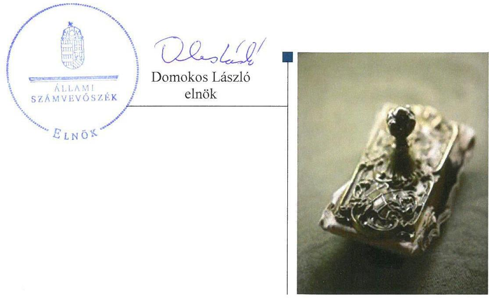

---

# AZ ELLENŐRZÉST FELÜGYELTE:

DR. HORVÁTH MARGIT felügyeleti vezető

## AZ ELLENŐRZÉST VEZETTE ÉS A VÉGREHAJTÁSÁÉRT FELELŐS:

- KLINGA LÁSZLÓ ellenőrzésvezető
- A PROGRAM ÖSSZEÁLLÍTÁSÁÉRT FELELŐS:
  - TÓTPÁL SZABOLCS osztályvezető

IKTATÓSZÁM: V-1395-132/2016.

TÉMASZÁM: 2429

ELLENŐRZÉS-AZONOSÍTÓ SZÁM: V075965

Jelentéseink az Országgyűlés számítógépes hálózatán és az Interneta a www.asz.hu címen is olvashatóak.

---

# TARTALOMJEGYZÉK 

■ ÖSSZEGZÉS ..... 5
■ AZ ELLENŐRZÉS CÉLJA ..... 6
■ AZ ELLENŐRZÉS TERÜLETE ..... 7
■ AZ ELLENŐRZÉS HÁTTERE, INDOKOLTSÁGA ..... 9
■ A JELENTÉS LÉNYEGES KÉRDÉSKÖREI ..... 10
■ ELLENŐRZÉS HATÓKÖRE ÉS MÓDSZEREI ..... 11
■ MEGÁLLAPÍTÁSOK ..... 13
■ JAVASLATOK ..... 21
■ MELLÉKLETEK ..... 23
I. sz. melléklet: Értelmező szótár ..... 23
II. sz. melléklet: A Társaság mérlegadatainak alakulása 2012-2015 között ..... 24
III. sz. melléklet: A Társaság eredményének alakulása 2012-2015 között ..... 25
■ FÜGGELÉK: ÉSZREVÉTELEK ..... 27
■ RÖVIDÍTÉSEK JEGYZÉKE ..... 33

---

.

---

# ÖSSZEGZÉS 

A Magyar Nemzeti Vagyonkezelő Zrt. HSSC Szolgáltató Központ Kft. feletti tulajdonosi joggyakorlása szabályszerű volt. A Társaság müködésének szabályozottsága megfelelő volt. A pénzügyi-számviteli, beszámolási és adatszolgáltatási feladatok ellátása megfelelt a jogszabályi előírásoknak. A Társaság vagyongazdálkodása szabályszerű volt.

## Az ellenőrzés társadalmi indokoltsága

Az állami tulajdonú gazdálkodó szervezetek a nemzeti vagyon részét képezik. Az állami vagyonnal való gazdálkodást illetően a tulajdonosi joggyakorlás és a vagyongazdálkodás feladata az állami vagyon átlátható, rendeltetésszerű és felelős felhasználásának biztosítása. Az állam meghatározza az ellátandó feladatokat, amelyhez a vagyonnal kapcsolatos döntéseknek igazodniuk kell. A nemzetgazdasági szempontból kiemelt jelentőségű nemzeti vagyonban tartandó állami tulajdonban álló társasági részesedést a nemzeti vagyonról szóló törvény határozza meg.

Az Állami Számvevőszék az általa korábban ellenőrizetlen területek, szervezetek körébe tartozó társaságnál végzett ellenőrzést. A számvevőszéki ellenőrzés hozzájárul a közpénzek szabályos, átlátható, elszámoltatható és eredményes felhasználásához, a rend pedig értéket teremt. Minden közpénzt, közvagyont használó szervezettel szemben társadalmi igény, hogy tevékenységükről elszámoljanak. Ezt figyelembe véve és az Állami Számvevőszék Stratégiájával összhangban került sor a HSSC Szolgáltató Központ Kft. ellenőrzésére a 2012-2015. évek vonatkozásában.

## Főbb megállapítások, következtetések, javaslatok

A Magyar Nemzeti Vagyonkezelő Zrt. a tulajdonosi jogokat szabályszerűen gyakorolta. A döntések előkészítésére vonatkozó szabályokat és a döntésekhez kapcsolódó adatszolgáltatás rendjét a tulajdonosi jogok gyakorlója szabályszerűen meghatározta. Az üzleti terv készítési kötelezettséget az Alapító Okiratban előírták, az anyagi érdekeltségi rendszer szabályait a Javadalmazási szabályzatban meghatározták.

A Társaság müködésének szabályozottsága megfelelt a jogszabályi előírásoknak, azonban a számlarend nem tartalmazta a bizonylati rendet és a jogszabályi előírásnak megfelelően a jelentős összegű hiba meghatározását. A számviteli politikában előírták az önköltségszámítási szabályzat készítésének kötelezettségét, de ennek ellenére a Társaság nem készítette el. A bevételek, a ráfordítások, a beruházások és az értékcsökkenés elszámolása az előírásoknak megfelelően történt. A Társaság a jogszabályi és belső szabályozásban előírt beszámolási és adatszolgáltatási kötelezettségét szabályszerűen teljesítette, a közzétételi kötelezettségének eleget tett.

A Társaság vagyongazdálkodása és a vagyon nyilvántartása szabályszerű volt. Az ellenőrzött időszakban az immateriális javak és tárgyi eszközök után elszámolt terv szerinti értékcsökkenés összege meghaladta az eszközpótlásra fordított kiadás összegét, ennek hatására a vagyon értéke csökkent. A vagyongazdálkodással összefüggő döntések szabályszerűek voltak.

---

# AZ ELLENŐRZÉS CÉLJA 

AZ ELLENŐRZÉS CÉLJA annak értékelése volt, hogy a tulajdonosi jogok gyakorlása szabályszerű volt-e; a gazdálkodó szervezet szabályozottsága, gazdálkodása és vagyongazdálkodási tevékenysége megfelelt-e a jogszabályi és a tulajdonosi előírásoknak, biztosítva volt$\cdot$ e a szolgáltatás dijának megalapozottsága szabályszerű önköltségszámítással; a vagyonváltozást eredményező döntések esetében a tulajdonosi jogok gyakorlója és a gazdálkodó szervezet szabályszerűen jártak-e el.

---

# AZ ELLENŐRZÉS TERÜLETE 

## A Magyar Nemzeti Vagyonkezelő Zrt. és a kizárólagos tulajdonában lévő HSSC Szolgáltató Központ Kft.

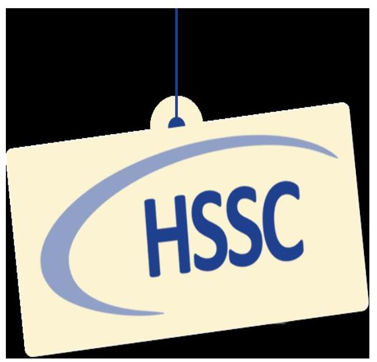

A 100\%-os állami tulajdonban álló Hungalu-Service Kft. a múködését 1990. október 1-jén kezdte meg. A Magyar Állam nevében az MNV Zrt. ${ }^{1}$ a 2011. évtől a társaságot átszervezte, amely HSSC Szolgáltató Központ Kft. elnevezéssel, 2012. március 1-jével folytatta müködését. A Társaság ${ }^{2}$ feletti tulajdonosi jogokat az MNV Zrt. gyakorolta, főtevékenysége a számviteli, könyvvizsgálói, adószakértői tevékenység volt.

A 2012-2015. években a Társaság - megbízási-, szolgáltatási-, szolgáltatási keret-, illetve megbízási keretszerződés alapján - az MNV Zrt. müködését közvetlenül segítő feladatokat látott el. Az egyes szakterületek a Call Center, Service Desk, Desktop, IP telefonrendszer, központi szervezet müködésének biztosítása, gépjármú park üzemeltetése, számlázási, valamint pénzügyi, számviteli kontrolling és egyéb adminisztrációs szolgáltatások voltak.

A Társaság az MNV Zrt. felügyelte alatt álló egyes állami tulajdonú társaságok részére - vállalkozási szerződések keretében - bérelszámolási, TB ügyintézési, számviteli, pénzügyi, kontrolling, valamint informatikai szolgáltatásokat végzett. A 2011. évi átszervezést követően 12 partnerrel kötött szerződéssel rendelkezett, amely 2012-ben 30 fölé emelkedett. Az ellenőrzött időszakban évente átlagosan 32 partner részére 95 db szolgáltatást nyújtott.

A Társaság egyes gazdálkodási adatait a 2012 és a 2015. évek tekintetében az 1. ábra szemlélteti:

1. ábra
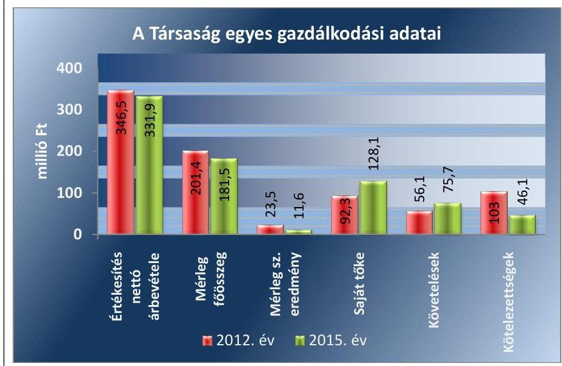

Forrás: a Társaság 2012. és 2015. évi beszámolói

---

A 2012. és 2015. év között a Társaság mérlegfőösszege 19,9 millió Fttal ( $9,9 \%$-kal), az értékesítés nettó árbevétele 14,6 millió Ft-tal ( $4,2 \%$-kal) csökkent. A mérleg szerinti eredmény az ellenőrzött időszakban pozitív volt. A saját tőke összege 35,8 millió Ft-tal ( $38,8 \%$-kal) nőtt. A követelések állománya 19,6 millió Ft-tal ( $34,9 \%$-kal), ezen belül a vevőkkel szembeni követelések állománya 16,0 millió Ft-tal ( $29,9 \%$-kal) növekedett. A kötelezettségek állománya 56,9 millió Ft-tal ( $55,2 \%$-kal) csökkent, amelyből a szállítókkal szembeni kötelezettség nagyságrendje nem változott ( 9,0 millió Ft és 9,4 millió Ft). A Társaságnak a követeléseken, kötelezettségeken belül nem volt lakossági tartozás állománya.

A Társaság közfeladatot nem látott el, közszolgáltatást nem végzett. Az ellenőrzött időszakban nem minősült kormányzati szektorba sorolt gazdasági társaságnak. Múködési, illetve felhalmozási támogatást nem kapott az MNV Zrt.-től. A Társaság vagyonkezelésbe vett vagyonnal nem rendelkezett.

AZ ellenőrzött időszakban a Társaság törzstőkéje 4,0 millió Ft volt, amely nem változott. Más gazdasági társaságban tulajdoni hányaddal nem rendelkezett. Az átlagos statisztikai állományi létszáma a 2012. évi 33 fơről a 2015. évre 43 főre növekedett, amelyet a partnerek számának, illetve részükre nyújtott szolgáltatások körének növekedése eredményezett.

Az ellenőrzött időszakban az ügyvezető ${ }^{3}$ személye három alkalommal változott. A jelenlegi ügyvezető 2015. május 24-e óta tölti be tisztségét.

---

# AZ ELLENŐRZÉS HÁTTERE, INDOKOLTSÁGA 

Az ÁSZ ${ }^{4}$ alapvető célkitűzése, hogy az államháztartáson kívülre nyújtott költségvetési támogatások és ingyenes vagyon juttatások ellenőrzésével hozzájáruljon ahhoz, hogy a közpénzeket az államháztartáson kívül múködő szervezetek is átlátható, rendezett módon használják fel a szerződésben átvállalt állami feladatok ellátása érdekében.

Az ellenőrzés feladata a közvagyonnal biztosított feladatellátással kapcsolatban a közpénzek átláthatósága, nyilvánossága érdekében a jogszabályokban, belső szabályzatokban megfogalmazott előírások érvényesülésének az állami tulajdonban lévő gazdálkodó szervezetek vagyonérték megőrzési és gazdálkodási tevékenységének értékelése.

Az ellenőrzés várható hasznosulásaként az ellenőrzés megállapításai a jogalkotás számára segítséget nyújthatnak a közvagyonnal való gazdálkodás értékeléséhez, jogszabályi keretei pontosításához, az átláthatóságot biztosító szabályozáshoz. Az ellenőrzöttek számára visszajelzést ad a vagyongazdálkodási tevékenységgel, beszámolással kapcsolatos szabálytalanságokról és kockázatokról. Az ellenőrzés tapasztalatai segítik és erősítik az ÁSZ hozzáadott értéket teremtő elemző tevékenységét és tanácsadó szerepét.

---

# A JELENTÉS LÉNYEGES KÉRDÉSKÖREI 

1.     - A tulajdonosi jogok gyakorlása szabályszerű volt-e?
2.     - A Társaság müködésének szabályozottsága megfelelt-e az elöírásoknak?
3.     - A Társaságnál a pénzügyi-számviteli, adatszolgáltatási és ellenőrzési feladatok ellátása szabályszerű volt-e?
4.     - A Társaság vagyongazdálkodása szabályszerű volt-e?

---

# ELLENŐRZÉS HATÓKÖRE ÉS MÓDSZEREI 

## Az ellenőrzés típusa

Megfelelőségi ellenőrzés.

## Az ellenőrzött időszak

2012. január 1-jétől 2015. december 31-ig tart.

## Az ellenőrzés tárgya

Az állami tulajdonban lévő gazdasági társaság gazdálkodása, kiemelten vagyongazdálkodási tevékenysége, valamint a tulajdonosi jogok gyakorlása.

## Az ellenőrzött szervezet

A tulajdonosi joggyakorlás tekintetében Magyar Nemzeti Vagyonkezelő Zártkörűen Müködő Részvénytársaság, továbbá a HSSC Szolgáltató Központ Korlátolt Felelősségű Társaság.

## Az ellenőrzés jogalapja

Az Állami Számvevőszékről szóló 2011. évi LXVI. törvény 5. § (3)-(5) bekezdései.

## Az ellenőrzés módszerei

Az ellenőrzést az ellenőrzött időszakban hatályos jogszabályok, az ellenőrzés szakmai szabályok és módszertanok figyelembevételével végeztük.

Az ellenőrzési kérdések megválaszolásához szükséges bizonyítékok megszerzése az ellenőrzött által rendelkezésre bocsátott dokumentumokra, adatokra alapozva kérdésfelvetés, mintavételezés, ellenőrzési eljárások útján történt.

Az ellenőrzési bizonyítékként felhasználható adatforrások közé tartoztak egyrészt a szakmai program részletes szempontjainál felsorolt adatforrások, másrészt minden egyéb - az ellenőrzés folyamán feltárt, az ellenőrzés szempontjából információkat tartalmazó - dokumentum.

Az ellenőrzés lefolytatásához a gazdálkodó szervezet a tanúsítványok elektronikus kitöltésével, valamint az ÁSZ által kért dokumentumok megküldésével szolgáltatott adatokat.

---

A bevételek és ráfordítások elszámolása, valamint a vagyonnyilvántartás terén, a szabályszerű múködést véletlen mintavétellel és irányított kiválasztással ellenőriztük. A mintatételek értékelése alapján egyrészt a sokaságban előforduló hibás tételek arányát becsültük, másrészt az irányítottan kiválasztott tételeket értékeltük. A jogszabályoknak és a belső előírásoknak megfelelőnek, azaz szabályszerűnek tekintettük az adott területet, amennyiben a minta ellenőrzésének eredménye alapján 95\%-os bizonyossággal a teljes sokaságban a hibaarány kisebb volt, mint 10\%, nem megfelelőnek értékeltük, ha a hibaarány a 10\%-ot meghaladta. A ráfordítások elszámolására és a vagyonnyilvántartásra vonatkozó véletlen mintavételt kockázati alapú kiválasztással egészítettük ki, amelynek során évente a három legnagyobb összegű tételt választottuk ki.

---

# 1. A tulajdonosi jogok gyakorlása szabályszerű volt-e? 

## Összegző megállapítás

### 1.1. számú megállapítás

Az MNV Zrt. tulajdonosi joggyakorlása szabályszerű volt.

## A Társaság feletti tulajdonosi joggyakorlás megfelelt az előírásoknak.

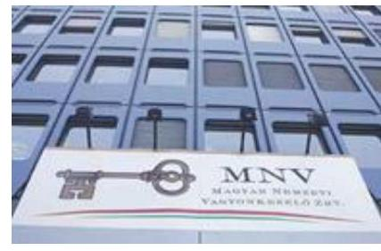

A TULAJDONOSI JOGOK GYAKORLÁSÁNAK RENDJÉT az MNV Zrt. a Gt. ${ }^{5}$, a Ptk. ${ }^{6}$, a Ptk. ${ }^{7}$. a Vtv. ${ }^{8}$, illetve az Nvtv. ${ }^{9}$ rendelkezéseivel összhangban az Alapító Okirat ${ }^{10}$-ban, a Javadalmazási szabályzatban ${ }^{11}$, a Befektetési szabályzatban ${ }^{12}$, a $\mathrm{FB}^{13}$ ügyrendben ${ }^{14}$ és saját belső szabályzataiban - a Tulajdonosi Ellenőrzési szabályzatban ${ }^{15}$, a Monitoring szabályzatban ${ }^{16}$, a Portfóliós Kódexben ${ }^{17}$ - határozta meg.

Az MNV Zrt. Igazgatósága ${ }^{18}$ által - a Vtv. 20. § (4) bekezdés k) pontjában foglaltaknak megfelelően - jóváhagyott MNV Zrt. SZMSZ ${ }^{19}$-ben rögzítették az MNV Zrt. Igazgatósága és a vezérigazgató ${ }^{20}$ döntéseivel összefüggő szabályokat. Az MNV Zrt. - a Gt. 9. §, a Ptk. 1 54. §, valamint Ptk. 2 3:4. §-ban biztosított lehetőség alapján - az Alapító Okirat VII. 11.1 pontja előírásainak megfelelően meghatározta a kizárólagos tulajdonosi jogokat és a kizárólagos hatáskörébe tartozó ügyleteket. Az alapító kizárólagos hatáskörébe tartozó ügyekben a tulajdonosi joggyakorló az MNV Zrt. vezérigazgatója volt.

A DÖNTÉSEK ELŐKÉSZÍTÉSÉRE vonatkozó előterjesztési kötelezettséget az MNV Zrt. a Döntéselőkészítési szabályzat ${ }^{21}$-ban és a Portfóliós Kódexben rögzítette. Alapítói határozat kiadására minden esetben döntés-előkészítő dokumentum alapján került sor. Végrehajtását félévente az MNV Zrt. Ellenőrzési Igazgatósága ${ }^{22}$ ellenőrizte, elfogadásáról az MNV Zrt. Igazgatósága döntött. A Társaságnál a legfőbb döntést hozó szerv hatáskörébe tartozó döntéseket az Alapító Okirat, a Gt. 19. § (5) és a Ptk. 2 3:109. § (4) bekezdés előírásainak megfelelően - az MNV Zrt. SZMSZ-ében foglaltak szerint - az MNV Zrt. vezérigazgatója hozta meg.

AZ ADATSZOLGÁLTATÁSRA vonatkozó előírásokat - a Monitoring Szabályzat 2013 decemberi hatályba lépéséig - az MNV Zrt. SZMSZ-e, valamint a Vagyonnyilvántartási szabályzat ${ }^{23}$ tartalmazta. A Monitoring szabályzattal megteremtették az egységes szabályozást.

AZ FB TAGJAIT ÉS A KÖNYVVIZSGÁLÓT - figyelemmel a Gt. 19. § (4) bekezdésben, a Ptk. 3:26. §-ában előírtakra, valamint az Alapító Okirat IX. és X. pontjaiban foglaltakra - a tulajdonos választotta meg. Az FB tagjainak számát három főben határozták meg, összhangban a Taktv. ${ }^{24}$ 4. § (2) bekezdésben foglalt előírásaival. A tulajdonosi joggyakorló az FB és könyvvizsgáló tevékenysége tekintetében szabályszerűen járt el.

---

A BESZÁMOLTATÁSI RENDSZER keretében az MNV Zrt. havi, negyedéves, féléves - eljárásrendben rögzített tartalmú - jelentések készítésével számoltatta be a Társaságot. A számviteli beszámolókat - az FB előzetes írásbeli véleményezését követően - az MNV Zrt. vezérigazgatója a Gt. 141. § (2), illetve Ptk. 3 :109. § (2) bekezdésben előírtaknak megfelelően, a könyvvizsgálói jelentések birtokában fogadta el.

AZ ÜZLETI TERVEKET az MNV Zrt. vezérigazgatója - az Alapító Okirat VII. 11.1 pontjában előírtak szerint - határozattal hagyta jóvá. Az üzleti tervek elfogadásával a tervezett beruházások, fejlesztések és a középtávú elképzelések jóváhagyása is megtörtént.

AZ ANYAGI ÉRDEKELTSÉGI RENDSZER elemeit az Alapító által elfogadott Javadalmazási szabályzat ${ }_{1-2}$-ben rögzítették. A szabályzatok a Taktv. előírásainak megfelelően rendelkeztek a vezető tisztségviselők, FB tagok, könyvvizsgáló, valamint a vezető állású munkavállalók javadalmazása, a jogviszony megszűnése esetére biztosított juttatások módjának, mértékének elveiről, annak rendszeréről.
1.2. számú megállapítás

Az MNV Zrt. a Társaság használatában lévő állami vagyon feletti tulajdonosi jogait szabályszerűen gyakorolta.

# VAGYONKEZELÉSBE VETT ÁLLAMI VAGYONNAL 

a Társaság a feladatellátásával összefüggésben nem rendelkezett.

Az ellenőrzött időszakon belül 2015. június 15-ig az MNV Zrt., 2015. június 16-tól a TLA Kft. ${ }^{25}$ a Társaságnak állami tulajdonú ingatlanban iroda és raktározás céljára helyiségeket adott bérbe. Ennek megfelelően került sor a Társaság és a TLA Kft. között a Bérleti szerződés ${ }_{2}$ megkötésére.

Az MNV Zrt. és a TLA Kft. az állami vagyon hasznosítására vonatkozó Bérleti szerződés ${ }_{1-2} \cdot \mathrm{t}^{26}$ szabályszerűen kötötték meg, annak tartalma megfelelt a Ptk. ${ }_{1-2}$-ben foglaltaknak. A Bérleti szerződés ${ }_{1-2}$ mellékleteiben tételesen rögzítették az átadott helyiségeket, meghatározták a bérlemény állagának védelmét, értéke megőrzésének, illetve gyarapításának biztosítását, a vagyon használatának ellenőrzését, a bérleti díjat, a díjfizetés gyakoriságát.

## 2. A Társaság müködésének szabályozottsága megfelelt-e az előírásoknak?

Összegző megállapítás

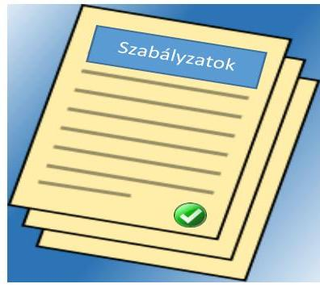

A Társaság müködésének szabályozottsága megfelelő volt.

A SZABÁLYSZERŰ MŰKÖDÉS KERETEIT a Társaság a Gt., a Ptk. ${ }_{2}$, a Számv. tv ${ }^{27}$., a Taktv., Tao tv. ${ }^{28}$, Szja. tv. ${ }^{29}$, valamint az MNV Zrt. elvárásainak megfelelően - az Alapító Okiratban, a Társaság SZMSZ ${ }^{30}$-ében, valamint a belső szabályzataiban határozta meg. Az adott évre vonatkozó gazdálkodás előírásait az éves üzleti tervek, és az éves beszámolók tartalmazták.

A SZABÁLYOZÁS ALAPDOKUMENTUMAI a számviteli szabályzatok, a Selejtezési szabályzat ${ }_{1-2}{ }^{31}$, a Befektetési szabályzat, a Béren

---

kívüli juttatások szabályzat ${ }_{1-5}{ }^{32}$, a Szerződéskötési és nyilvántartási szabály$z^{2 t_{1-2}}{ }^{33}$ és a Biztonsági szabályzat ${ }_{1-2}{ }^{34}$ voltak.

A Társaság az ellenőrzött időszakban rendelkezett a Számv. tv. 14. § (3) bekezdésében előírt Számviteli politikával ${ }_{1-2}{ }^{35}$, a Számv. tv. 14. § (5) bekezdés a)-b) és d) pontjaiban foglaltaknak megfelelően Leltározási szabályzat ${ }_{1-}$ ${ }_{2}$-vel ${ }^{36}$, Pénzkezelési szabályzat ${ }_{1-3}$-mal ${ }^{37}$ és Értékelési szabályzat ${ }_{1-3}$-mal ${ }^{38}$ és a Számv. tv. 161. § (1) bekezdésében előírt Számlarend ${ }_{1-2}$-vel ${ }^{39}$. A szabályzatok tartalma összességében megfelelt a jogszabályi előírásoknak.

A SZÁMVITELI POLITIKA 2 9.1.2. pontján a Társaság - a Számv. tv. 14. § (11) bekezdése ellenére - nem vezette át a Számv. tv. 2013. január 1-jei, a Számv. tv. 3. § (3) bekezdés 3. pont szerinti jelentős összegű hiba meghatározása változásait.

LELTÁROZÁSI SZABÁLYZAT ${ }_{1-2}$ a mérlegtételek leltárral való alátámasztását előírta, a mennyiségben is nyilvántartott eszközök esetében a mennyiségi leltározás szabályait a Számv. tv. 69. § (3) bekezdésében foglalt legalább háromévenkénti mennyiségi leltározástól szigorúbban határozta meg, mert évenkénti mennyiségi leltározást írt elő.

A SZÁMLAREND ${ }_{1-2}$ - a Számv. tv. 161. § (2) bekezdés d) pontjában foglaltaknak ellenére - nem tartalmazta a számlarendben foglaltakat alátámasztó bizonylati rendet.

A Béren kívüli juttatások szabályzat ${ }_{1-5}$-ről az ügyvezető - a Társasági SZMSZ1-3 2.2.2.1. pontban előírtak alapján - kizárólagos hatáskörben döntött. Tartalma megfelelt az Szja. tv. 71. §-ában, valamint a 39/2010. (II. 26.) Korm. rendeletben ${ }_{40}$ foglalt, béren kívüli juttatásokra vonatkozó előírásoknak.

# 3. A Társaságnál a pénzügyi-számviteli, adatszolgáltatási és ellenőrzési feladatok ellátása szabályszerű volt-e? 

Összegző megállapítás

## 3.1. számú megállapítás

A Társaságnál a pénzügyi-számviteli feladatok ellátása szabályszerű volt. Az adatszolgáltatási kötelezettségének eleget tett.

A bevételek és a ráfordítások elszámolása szabályszerű volt.
A BEVÉTELEK ELSZÁMOLÁSA megfelelt a jogszabályi és a belső szabályzatokban foglalt előírásoknak. Az értékesítés nettó árbevétele, az egyéb bevétel kiszámlázása, főkönyvi számlára történő elszámolása megfelelt a Számlarend ${ }_{1-2}$-ben, illetve a Számlatükör ${ }_{1-2}{ }^{41}$-ben foglaltaknak. A Társaság a bevételek elszámolásakor - a Számv. tv. 160. § (3) bekezdés a) pontja és 2. számú mellékletében előírtak alapján - az éves beszámoló összköltség típusú eredmény-kimutatásának elkészítéséhez szükséges számlacsoportokat alkalmazta. A Társaság a bevételeket alábontással, tevékenységi körönként osztotta meg. A bevételek kiszámlázásakor a szerződésekben rögzített árakat vette figyelembe.

---

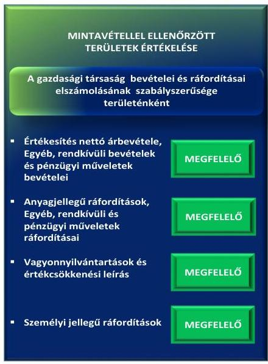

1. táblázat

|  AZ ÉRTÉKESÍTÉS NETTÓ ÁRBEVÉTELÉNEK ALAKULÁSA (M FT) |  |   |
| --- | --- | --- |
|  Év | Tervezett | Teljesített  |
|  2012. | 341,6 | 346,5  |
|  2013. | 367,3 | 337,2  |
|  2014. | 316,4 | 332,8  |
|  2015. | 331,4 | 331,9  |
|  Forrás: a HSSC Kft. 2012-2015. évi üzleti tervet, beszámolói |  |   |

1. táblázat

|  A KÖVETELÉSÁLLOMÁNY (MILLIÓ FT) |  |   |
| --- | --- | --- |
|  Megnevezés | 2012. | 2015.  |
|  Vevők | 53,4 | 69,4  |
|  Ebből lejárt | 22,5 | 45,8  |
|  Összes értékvesztés | $-11,7$ | $-15,7$  |
|  Egyéb követelések | 2,6 | 6,3  |
|  Összes követelés | 56,1 | 75,7  |
|  Forrás: Társaság 2012. és 2015. évi beszámolója |  |   |

Az üzleti tervekben szereplő bevételek - a 2013. évi 30,1 millió Ft-os elmaradás kivételével - a tervezettel azonosan alakultak. A 2013. évi bevételkiesését befolyásolta, hogy az MNV Zrt. egyes szolgáltatásokat nem vett igénybe. A bevételkiesést a 2014. évtől ellensúlyozta az új partnereknek nyújtott szolgáltatások bővülése, valamint az MNV Zrt. felé újonnan beinduló gépjárműpark-kezelési üzletági szolgáltatás. Az értékesítés nettó árbevételének alakulását az 1. táblázat szemlélteti.

A RÁFORDÍTÁSOK ELSZÁMOLÁSA megfelelte a jogszabályi és a belső szabályzatokban foglalt előírásoknak. A Társaság a költségeket a Számlarend ${ }_{1-2}$ és annak mellékletét képező Számlatükör ${ }_{1-2}$-ben foglaltaknak megfelelően - az 5. számlaosztályban költségnemek szerinti bontásban, a ráfordításokat a 8. számlaosztályban tartotta nyilván. Az anyagjellegű ráfordításokat a Számv. tv. 78. §-a, az egyéb ráfordításokat a Számv. tv. 81. § (1) bekezdése szerint számolta el. A költségelszámolást megalapozó dokumentumok a Számv. tv. 166. §-ban előírtak szerint összességében rendelkezésre álltak. Tartalmazták - a Számv. tv. 167. § (1) bekezdés h) pontjában előírtak szerint - a könyvelés módját és az érintett könyvviteli számlára való hivatkozást.

A személyi jellegű ráfordítások elszámolásánál a munkabérek kifizetését - a Számv. tv. 79. § előírtak szerint az 5. számlaosztályban - munkaszerződés alapján, az Szja tv. ${ }^{42}$ és a Tbj. tv ${ }^{43}$. előírásainak megfelelő levonások alkalmazásával teljesítette. A személyi jellegű egyéb kifizetésekre (jutalom, béren kívüli juttatások, gépkocsi használat és utazási bérlet költségtérítések, betegszabadság) a belső szabályzatok előírásaival összhangban került sor.

Az értékcsökkenés elszámolása - a Számv. tv. 52. § (1)-(7) bekezdései, valamint az Értékelési szabályzat ${ }_{1-3}$-ban előírtaknak megfelelően, a maradványértékkel csökkentett bruttó érték alapulvételével történt. A Társaság a beszerzett eszközöket állományba vette, egyedi nyilvántartó lapon rögzítette a leírás módját, használatbavételét üzembe-helyezési jegyzőkönyvvel támasztotta alá, az aktiválásáról külön jegyzőkönyvet készített.

A Társaság a 2015. évben - a használhatatlan és elavult tárgyi eszközei és immateriális javak selejtezésekor - 150 ezer Ft terven felüli értékcsökkenést számolt el, amely megfelelte a Számv. tv. 53. § (1) bekezdés b) pontjában, az 53. § (2) bekezdésében, valamint az Értékelési szabályzat ${ }_{2} 8.2$. pontjában előírtaknak.

A KÖVETELÉS ÁLLOMÁNY az ellenőrzött időszakban a vevőknél növekvő tendenciát mutatott (2012-ben 53,4 millió Ft, 2015-ben 69,4 millió Ft). A 2015. évben az MNV Zrt.-vel szemben fennálló követelés 30,0 millió Ft volt. A Társaság a 2012-2015. években hét partnerével szemben - a Számv. tv. 15. § (8) bekezdésében foglalt óvatosság elve szerint az előre látható kockázatok alapján értékvesztés elszámolásáról döntött összesen 31,9 millió Ft értékben, amelyből 15,5 millió Ft szabályszerűen visszaírásra került. A Társaság intézkedett a hátralékos követelés állomány csökkentésére, a partnereinek fizetési felszólítást küldött a lejárt követelés kiegyenlítésére. Külön egyeztetett az MNV Zrt.-vel - az érintett partnerek esetében - a kintlévőség behajtásának lehetőségéről, a cég jövőképéről, az esetleges végrehajtás megindításáról. A követelésállomány alakulását az 2. táblázat mutatja.

---

# 3.2. számú megállapítás 

A Társaság a belső szabályzatában előírt önköltségszámítás rendjére vonatkozó szabályzatot nem készített.

AZ ÖNKÖLTSÉGSZÁMÍTÁS RENDJÉRE VONATKOZÓ SZABÁLYZAT készítésére Társaság a Számv. tv. 14. § (7) bekezdésben foglaltak alapján nem volt kötelezett. Ennek ellenére a Számviteli politika ${ }_{1-2} 2$. pontja előírta az önköltségszámítás rendjére vonatkozó szabályzat készítését, amelyet a Társaság nem készített el, önköltségszámítást nem végzett.

Árképzéssel kapcsolatos tulajdonosi elvárás, ágazati előírás a 20122015. években nem volt a Társaság felé. Az értékesített szolgáltatások díjait az árakat befolyásoló tényezők változása alapján, a versenytársak árait figyelembe véve, a tevékenység összetettségét alapul véve alakították ki.
3.3. számú megállapítás

A Társaság szabályszerűen teljesítette a beszámolási, adatszolgáltatási kötelezettségét.

ADATSZOLGÁLTATÁSI KÖTELEZETTSÉGÉT a Társaság az Alapító Okiratban, a Társasági SZMSZ ${ }_{1-3}$-ban, valamint a Számviteli politikában ${ }_{1-2}$ és Számlarend ${ }_{1-2}$-ben meghatározottak szerint teljesítette az MNV Zrt. részére.

AZ ÉVES BESZÁMOLÓKAT a Társaság a Számv. tv. 17-20. §-aiban és a Számviteli politikában ${ }_{1-2}$ előírt tartalommal elkészítette. Azokat az FB jóváhagyásra javasolta, a könyvvizsgáló hitelesítő záradékkal látta el. Az éves beszámolók jóváhagyásáról - az MNV Zrt. SZMSZ 10. § (3) bekezdésében előírtaknak megfelelően - a tulajdonosi joggyakorló Alapítói határozatban döntött. A letétbe helyezés a Számv. tv. 153. § (1), és a 154. § (1) bekezdésben előírt határidőben megtörtént, közzétételi kötelezettségének eleget tett a Társaság.

A Társaság monitoring keretében történő beszámoltatása gazdálkodásáról és a feladatellátásról az MNV Zrt. által meghatározott adatszolgáltatások - elektronikus adattáblák havi, negyedéves kitöltése - teljesítésével megtörtént. A Társaság a terv és tényszámokat tartalmazó eredmény kimutatást és mérlegadatokat havonta, a beruházásra vonatkozó adatokat, a korosított vevő és szállítói állományt, valamint a létszám és kereseti adatokat negyedévente szolgáltatta.

Az ellenőrzött időszakban a Társaság - az Info tv. ${ }^{44}$ 24. § (1) bekezdés alapján - nem volt kötelezett adatvédelmi és adatbiztonsági szabályzat készítésére, belső adatvédelmi felelős kinevezésére. A Társaság azonban az informatikai rendszerekben kezelt adatok bizalmasságát, hitelességét, sérthetetlenségét a 2012. szeptember 19-től hatályos Információ biztonsági szabályzat ${ }_{1,2}{ }^{45}$-ban foglaltak szerint biztosította. A Társaság a közérdekú adatait nyilvánosságra hozta, mivel honlapján közzétette a Taktv. 2. § (1) bekezdésben előírt közérdekú adatokat. Az informatikai rendszer adatvédelmére vonatkozó normákat a belső szabályozás előírása alapján alkalmazta.

A TULAJDONOSI ELLENŐRZÉS keretében az MNV Zrt. 2012. évben humánpolitikai célú utóellenőrzést folytatott. A 2011. évi átvilágítás során feltárt hiányok pótlására tett javaslatok megvalósulását ellenőrizte, újabb észrevételt nem tett. Egyéb külső ellenőrzés keretében a

---

Budapest Főváros Kormányhivatalának Munkaügyi Felügyelősége 2014ben munkaügyi hatósági és helyszíni ellenőrzést végzett. A Társaság részére javaslatot nem tett.

# 4. A Társaság vagyongazdálkodása szabályszerű volt-e? 

## Összegző megállapítás

### 4.1. számú megállapítás

A Társaság vagyongazdálkodása szabályszerű volt.

A Társaság szabályszerű vagyongazdálkodás feltételeit kialakította.

VAGYONGAZDÁLKODÁS FELTÉTELEIT a Társaság - a Vtv.-ben, az Nvtv.-ben, a Számv. tv.-ben és a Tao tv.-ben foglalt előírásoknak megfelelően - az Alapító Okiratban, a Társasági SZMSZ1-3-ban, a számviteli szabályzatokban és az üzleti tervekben alakította ki. A középtávú és éves fejlesztési elképzeléseket - az MNV Zrt. által kiadott Tervezési irányelv ${ }^{46}$-ek előírásainak megfelelően - az üzleti tervek tartalmazták, melyekben figyelembe vették a megadott tervezési kereteket, valamint a főbb makrogazdasági adatokat.

## 4.2. számú megállapítás

A Társaság a saját vagyonát szabályszerűen tartotta nyilván, a saját vagyon értéke csökkent.

## AZ ANALITIKUS ÉS FŐKÖNYVI NYILVÁNTARTÁSI

RENDSZER biztosította a Társaság vagyonának Számv. tv. és belső szabályozás szerinti nyilvántartását, a változások folyamatos nyomon követését. A befektetett pénzügyi eszközök között az egyéb tartósan adott kölcsönök számlán - az ellenőrzött időszakot megelőzően, a dolgozók részére jutatott lakásépítési kölcsönök éven túli állományát - a Számv. tv. 27. § (6) bekezdésében előírtak szerint tartotta nyilván.

A Társaság a Számv. tv. 69. § (1)-(3) bekezdéseiben előírtaknak megfelelően a mérlegében - saját vagyonként - kimutatott eszközöket és forrásokat leltárral alátámasztotta. A mennyiségi nyilvántartásaiban szereplő eszközei - az ellenőrzött években - mennyiségi leltárfelvételét a Számv. tv. 69. § (3) bekezdésében előírtaknak megfelelően elvégezte. Az értékben kimutatott eszközöknél és forrásoknál a szükséges egyeztetéseket végrehajtotta.

A Társaság az ellenőrzött időszakban nem tartotta be maradéktalanul a Leltározási szabályzat ${ }_{1-2}$ 2. és 5. pontjában, valamint a 2. számú mellékletben a leltárfelvételi ív, és a leltározási jegyzőkönyv formai követelményeire vonatkozó előírásokat, továbbá leltárutasítást és leltárútemtervet nem készítettek.

A VAGYONGAZDÁLKODÁS során nem valósult meg a saját vagyon értékének megőrzése. Az ellenőrzött időszakban a mérlegfőösszeg 10,1\%-kal (19,9 millió Ft-tal) csökkent, amelyet jellemzően a tárgyi eszközök 57,3\%-os (10,4 millió Ft) és a pénzeszközök 23,7\%-os (14,9 millió Ft) csökkenése eredményezett. Forrásoldalon a mérlegfőösszeg csökkenése ellenére a saját tőke 38,8\%-kal (35,8 millió Ft-tal) növekedett. A kötelezettségek összege több mint a felére csökkent (56,9 millió Ft-tal) az ellenőrzött időszak végére.

---

A Társaság vagyonának alakulását a 2012-2015. évek vonatkozásában a 2. ábra szemlélteti.
2. ábra
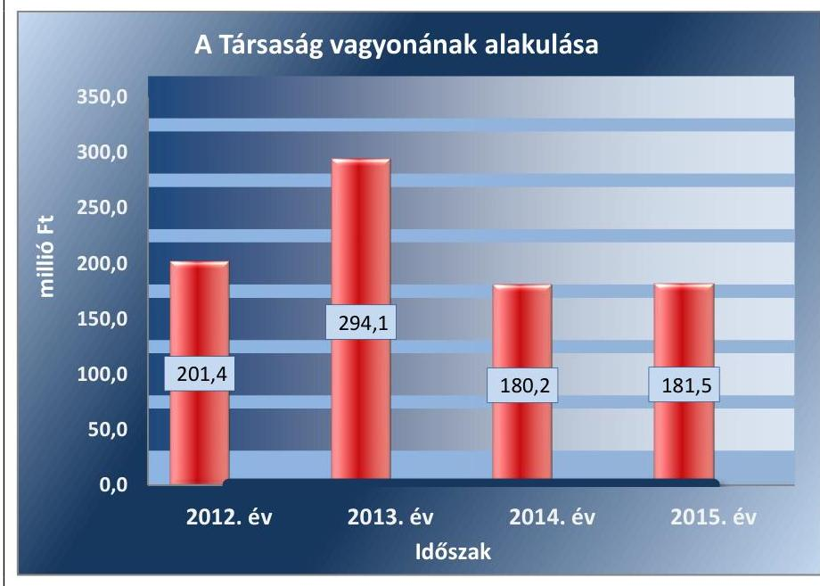

Forrás: A Társaság 2012.és 2015. évi beszámolói

A 2012-2015. években az immateriális javak és tárgyi eszközök után elszámolt terv szerinti értékcsökkenés összegét ( 81,0 millió Ft) nem érte el az eszközpótlásra (beruházásra) fordított kiadás összege (42,4 millió Ft). A fejlesztések számítástechnikai eszközök, notebookok, immateriális javak, szoftverek voltak, amelyek az ügyfelek igényeinek minél magasabb szintű kiszolgálását biztosította.

Az értékcsökkenés elszámolása a Számv. tv. 52. § (1) bekezdésében előírtaknak megfelelően, a maradványértékkel csökkentett bruttó érték alapulvételével történt.

Az ellenőrzött időszakban a Társaság rendelkezett a társasági formájára kötelezően előírt jegyzett tőkének megfelelő összegű saját tőkével, így az MNV Zrt.-nek a Gt. 51. § (1) bekezdés és a Ptk. 2 3:133. § (2) bekezdés szerinti intézkedési kötelezettsége nem keletkezett. A saját tőke jegyzett tőke arány a 2012. évi 23,1 szeres értékről a 2015. évre 32,0 szeresére a növekedett.

A Társaság mérlegadatainak alakulását a II., az eredményének alakulását a III. számú melléklet szemlélteti a 2012-2015. évek között.

# 4.3. számú megállapítás 

A saját vagyon változását eredményező döntések szabályszerűek voltak.

A SAJÁT VAGYONON tervezett beruházások jóváhagyására az Üzleti tervek elfogadásával, az eszközök értékesítésére, számítástechnikai eszközök bérbeadására a jogosultsági szabályok betartásával - a Társasági SZMSZ1-3 2.2.2.1 pontjában foglaltak szerint - az ügyvezető döntése alapján került sor. Térítés nélküli vagyon átvétel nem volt.

A vagyonváltozást eredményező, alapítói hatáskörbe tarozó döntési jogosultságokat az Alapító Okirat VII. 11.1. pontban rögzítették. A 2011-ben

---

beszerzett és 2012-ben aktivált 10 millió Ft beszerzési értéket meghaladó eszközök esetében az MNV Zrt. előzetes jóváhagyásával rendelkeztek

A 2015. évben - a Társasági SZMSZ ${ }_{1-3}$ 2.2.2.1 pontjában foglaltaknak megfelelően - az ügyvezető jóváhagyásával selejtezték a még értéken lévő, használhatatlanná vált immateriális javakat és tárgyi eszközöket. A selejtezés lebonyolítása és elszámolása megfelelt a selejtezési szabályzatban előírtaknak.

---

# JAVASLATOK 

Az ÁSZ tv. 33. § (1) bekezdésében foglaltak értelmében az ellenőrzött szervezet vezetője köteles a jelentésben foglalt megállapításokhoz kapcsolódó intézkedési tervet összeállítani és azt a jelentés kézhezvételétől számított 30 napon belül az ÁSZ részére megküldeni. Amennyiben az ellenőrzött szervezet vezetője nem küldi meg határidőben az intézkedési tervet, vagy továbbra sem elfogadható intézkedési tervet küld, az Állami Számvevőszék elnöke az ÁSZ tv. 33. § (3) bekezdése a) és b) pontjaiban foglaltakat érvényesítheti.
Javaslataink célja a HSSC Szolgáltató Központ Kft. gazdálkodása szabályszerűségének és gyakorlatának javítása annak érdekében, hogy a szabályozási környezet és az alkalmazott gyakorlat megfelelően tudja támogatni az átlátható múködést.

## A HSSC Szolgáltató Központ Kft. ügyvezetőjének

1. Intézkedjen, hogy a Számviteli politikában a jelentős összegű hiba meghatározására a Számv. tv.-ben foglaltaknak megfelelően kerüljön sor.
(2. megállapítás 4. bekezdése alapján)
2. Gondoskodjon a Számv. tv-ben elöirtaknak megfelelően a Számlarendben foglaltakat alátámasztó bizonylati rend elkészitéséről.
(2. megállapítás 6. bekezdése alapján)
3. Gondoskodjon arról, hogy leltározás során a Leltározási szabályzatban elöirtaknak megfelelő formában készítsék el a leltárfelvételi ívet és a leltározási jegyzőkönyvet, továbbá készítsék el a leltárutasítást és leltározási ütemtervet.
(4.2. megállapítás 3. bekezdése alapján)

---

.

---

# MELLÉKLETEK 

- I. SZ. MELLÉKLET: ÉRTELMEZŐ SZÓTÁR

| AH | Alapítói határozat |
| :--: | :--: |
| Call Center | Telefonos kommunikációs csatorna a kimenő hívások kezdeményezésének, illetve bejövő hívások fogadásának lebonyolítására. |
| Desktop | A GUI-k* munkaterülete, amelyen a különböző programokat és adatokat jelképező ikonok, valamint a folyamatok ablakai a felhasználó által elhelyezhetőek és átrendezhetőek. *GUI a felhasználó és a számítógép közti kommunikációt lehetővé tevő felület, amely szöveges parancsok és üzenetek helyett részben vagy teljesen grafikus elemek segítségével teszi lehetővé a vezérlést és a visszajelzést. (Forrás: https://pcforum.hu/szotar/desktop) |
| gazdasági társaság | $\mathrm{Ptk}_{2} \cdot 3.88$. § (1) bekezdése szerint „a gazdasági társaságok üzletszerű közös gazdasági tevékenység folytatására, a tagok vagyoni hozzájárulásával létrehozott, jogi személyiséggel rendelkező vállalkozások, amelyekben a tagok a nyereségből közösen részesednek, és a veszteséget közösen viselik". |
| gazdálkodó szervezet | A Ptk. 685. § c) pontja szerint gazdálkodó szervezet: „az állami vállalat, az egyéb állami gazdálkodó szerv, a szövetkezet, a lakásszövetkezet, az európai szövetkezet, a gazdasági társaság, az európai részvénytársaság, az egyesülés, az európai gazdasági egyesülés, az európai területi együttmúködési csoportosulás, az egyes jogi személyek vállalata, a leányvállalat, a vízgazdálkodási társulat, az erdő birtokossági társulat, a végrehajtói iroda, az egyéni cég, továbbá az egyéni vállalkozó." (2014. 03.15-ig hatályos) |
| IP telefonrendszer | A hang továbbítását IP*-hálózaton keresztül biztosítja. *Az internetprotokoll (angolul Internet Protocol, rövidítve: IP) az internet (és internetalapú) hálózat egyik alapvető szabványa (avagy protokollja). Ezen protokoll segítségével kommunikálnak egymással az internetre kötött csomópontok (számítógépek, hálózati eszközök, telefonok stb.) |
| Kontrolling | A tervezést, ellenőrzést és információellátást koordináló vezetési alrendszer, áttekintő, értékelő, koordináló és integráló tevékenység, a vezetési (tulajdonosi) funkció gyakorlásának eszköze, a tervezés és a számvitel vezetési szempontból történő öszszekapcsolása, mint költség és eredmény (nyereség) menedzsment (Teljesítmény és ráfordításmenedzsment). (Forrás: http://penzugysziget.hu/index.php?option=com_content\&view=article\&id=2274\&catid=285\&Itemid=390) |
| nemzeti vagyon | Nvtv. 1. § (2) bekezdése szerint többek között:   „az állam vagy a helyi önkormányzat kizárólagos tulajdonában álló dolgok,   az a) pont hatálya alá nem tartozó, állam vagy a helyi önkormányzat tulajdonában lévő dolog,   az állam vagy a helyi önkormányzat tulajdonában lévő pénzügyi eszközök, továbbá az államot vagy a helyi önkormányzatot megillető társasági részesedések, az államot vagy a helyi önkormányzatot megillető bármely vagyoni értékkel rendelkező jogosultság, amelyet jogszabály vagyoni értékű jogként nevesít." |
| Service Desk | Szolgáltatásüzemeltetés; a szolgáltató és a felhasználók közötti kapcsolat központja. Egy tipikus ügyfélszolgálat incidensekkel és szolgáltatás-kérésekkel foglalkozik, továbbá kezeli a kommunikációt a felhasználókkal. (Forrás: ITIL magyar szakkifejezésgyűjtemény, V1.0, 2011. október 16.) |

---

| Megnevezés | 2012-12-31. | 2013-12-31. | 2014-12-31. | 2015-12-31. |
| :--: | :--: | :--: | :--: | :--: |
|  | 2. | 3. | 4. | 5. |
| A. Befektetett eszközök | 66641 | 49165 | 43979 | 37463 |
| I. IMMATERIÁLIS JAVAK | 41490 | 33628 | 28472 | 23231 |
| II. TÁRGYI ESZKÖZÖK | 24437 | 15151 | 15168 | 14012 |
| III. BEFEKTETETT PÉNZÜGYI ESZKÖZÖK | 714 | 386 | 339 | 220 |
| B. Forgóeszközök | 134427 | 241984 | 132729 | 138919 |
| I. KÉSZLETEK | 823 | 40 | 0 | 595 |
| II. KÖVETELÉSEK | 56090 | 62286 | 64121 | 75704 |
| IV. PÉNZESZKÖZÖK | 77514 | 179658 | 68608 | 62620 |
| C. Aktív időbeli elhatárolások | 347 | 2962 | 3531 | 5103 |
| ESZKÖZÖK (AKTÍVÁK) ÖSSZESEN | 201415 | 294111 | 180239 | 181485 |
| D. Saját tőke | 92297 | 95599 | 116533 | 128136 |
| I. JEGYZETT TÖKE | 4000 | 4000 | 4000 | 4000 |
| IV. EREDMÉNYTARTALÉK | 64806 | 88297 | 91599 | 112533 |
| VII. MÉRLEG SZERINTI EREDMÉNY | 23491 | 3302 | 20934 | 11603 |
| E. Céltartalékok | 1500 | 1500 | 5000 | 0 |
| F. Kötelezettségek | 102971 | 186414 | 57658 | 46071 |
| III. RÖVID LEJÁRATÚ KÖTELEZETTSÉGEK | 102971 | 186414 | 57658 | 46071 |
| G. Passzív időbeli elhatárolások | 4647 | 10598 | 1048 | 7278 |
| FORRÁSOK (PASSZÍVÁK) ÖSSZESEN | 201415 | 294111 | 180239 | 181485 |

Adatok: ezer Ft-ban

---

| Megnevezés | 2012. év | 2013. év | 2014. év | 2015. év |
| :--: | :--: | :--: | :--: | :--: |
| 1 | 2 | 3 | 4 | 5 |
| I. Értékesítés nettó árbevétele | 346539 | 337233 | 332778 | 331937 |
| III. Egyéb bevételek | 416 | 2411 | 7626 | 17430 |
| IV. Anyagjellegú ráfordítások | 67528 | 56878 | 55358 | 74750 |
| V. Személyi jellegú ráfordítások | 206530 | 234321 | 218095 | 239573 |
| VI. Értékcsökkenési leírás | 23978 | 24445 | 18757 | 13778 |
| VII. Egyéb ráfordítások | 20759 | 19701 | 23490 | 10912 |
| A. Üzemi (üzleti) tevékenység eredménye | 28160 | 4299 | 24704 | 10354 |
| VIII. Pénzügyi műveletek bevételei | 124 | 78 | 403 | 514 |
| IX. Pénzügyi műveletek ráfordításai | 769 | 8 | 0 | 0 |
| B. Pénzügyi műveletek eredménye | $-645$ | 70 | 403 | 514 |
| C. Szokásos vállalkozási eredmény | 27515 | 4369 | 25107 | 10868 |
| X. Rendkívüli bevételek | 0 | 0 | 0 | 735 |
| XI. Rendkívüli ráfordítások | 0 | 0 | 900 | 0 |
| D. Rendkívüli eredmény | 0 | 0 | $-900$ | 735 |
| E. Adózás előtti eredmény | 27515 | 4369 | 24207 | 11603 |
| XII. Adófizetési kötelezettség | 4024 | 1067 | 3273 | 0 |
| F. Adózott eredmény | 23491 | 3302 | 20934 | 11603 |
| G. Mérleg szerinti eredmény | 23491 | 3302 | 20934 | 11603 |

Adatok: ezer Ft-ban

Forrás: a Társaság 2012-2015. évi éves beszámolói

---

.

---

# FÜGGELÉK: ÉSZREVÉTELEK 

A jelentéstervezetet a Számvevőszék 15 napos észrevételezésre megküldte az ellenőrzött szervezetek vezetőinek az ÁSZ tv. 29. §* (1) bekezdése előírásának megfelelően.

A HSSC Szolgáltató Központ Kft. ügyvezetője nem tett észrevételt, a Magyar Nemzeti Vagyonkezelő Zrt. vezérigazgatójától érkezett észrevételeket és azok kezeléséről szóló válaszlevelet a jelentés tartalmazza.

[^0]
[^0]:    * 29. § (1) Az Állami Számvevőszék az ellenőrzési megállapításait megküldi az ellenőrzött szervezet vezetőjének vagy az általa megbízott személynek, és annak, akinek személyes felelősségét állapította meg.
    (2) Az ellenőrzött szervezet vezetője és a felelősként megjelölt személy az ellenőrzés megállapításaira tizenöt napon belül írásban észrevételt tehet.
    (3) Az Állami Számvevőszék az észrevételre a beérkezésétől számított harminc napon belül írásban válaszol. A figyelembe nem vett észrevételeket köteles a jelentésben feltüntetni, és megindokolni, hogy azokat miért nem fogadta el.

---

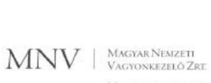

Állami Számvevőszék

Domokos László
elnök

1052 Budapest
Apáczai Cs. J. u. 10.

Ikt. sz.: MNV/01/ 3/2017.
Hiv. sz.: V-1395-117/2016.

Tisztelt Elnök Úr!

Tájékoztatom, hogy a 2017. szeptember 12. napján "Az állami tulajdonban (résztulajdonban) lévő gazdálkodó szervezetek vagyonmegőrzési és gazdálkodási tevékenységének ellenőrzése - HSSC Szolgáltató Központ Kft. tárgyában kézhez vett, V-1395-117/2016.sz. levél mellékleteként megküldött Jelentés-tervezetre az alábbi észrevételeket tesszük:

"Összegzés Főbb megállapítások, következtetések / 5. oldal 5. bekezdés 1. mondata" / "Megállapítások 4.2 megállapítás" / 19. oldal 2. bekezdés 1. mondata:

A Jelentés-tervezet hivatkozott megállapítása szerint a 2012-2015. években elszámolt értékcsökkenés 81,1 MFt, az eszközpótlásra (beruházásra) fordított kiadás összege 42,4 MFt volt. Tehát a beruházásra fordított összeg nem érte el az értékcsökkenés összegét.

Fentiek alapján kérjük a hivatkozott szövegrész alábbiak szerinti pontosítást: "Az ellenőrzött időszakban az immateriális javak és tárgyi eszközök után elszámolt terv szerinti értékcsökkenés összege meghaladta az eszközpótlásra fordított kiadás összegét, ennek hatására a vagyon értéke csökkent."

"Megállapítások 4.2 megállapítás" / 18. oldal:

A 4.2. számú megállapítás (18. oldal, utolsó bekezdés) szerint a mérlegfőösszeg csökkenése ellenére a saját tőke 38,8%-kal (35,8 MFt-tal) növekedett, a kötelezettségek összege több mint felére csökkent (56,9 MFt-tal) az ellenőrzött időszak végére.

Mindezekre tekintettel kérjük a hivatkozott szövegrész alábbiak szerinti pontosítást: "A vagyongazdálkodás során megvalósult a saját vagyon értékének megőrzése."

Fentieknek megfelelően a társaság vagyonának 2012-2015. közötti alakulását bemutató diagramon (19. oldal) a saját tőke értékének alakulását javasoljuk bemutatni a mérlegfőösszeg értékének alakulása helyett.

Kérem Elnök Urat, hogy a jelentés véglegesítése során jelen észrevételeinket szíveskedjenek figyelembe venni.

Budapest, 2017. szeptember " " "

Üdvözlettel:

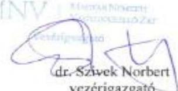

Cím 1133 Budapest, Pécsmező út 56. Pécsmező 1399 Budapest, PC708.
Telefon: +36 1 237-4400 Fax: +36 1 237-4100 Web: www.telekom.hu/telekom.hu

---

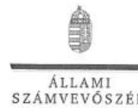

ELNÖK

Ikt.szám: V-1395-123/2016

Dr. Szívek Norbert úr
vezérigazgató

Magyar Nemzeti Vagyonkezelő Zrt.

Budapest

Tisztelt Vezérigazgató Úr!

Köszönettel vettem a „HSSC Szolgáltató Központ Kft.- Az állami tulajdonban (résztutajdonban) lévő gazdálkodó szervezetek vagyonmegőrzési és gazdálkodási tevékenységének ellenőrzése" című számvevőszéki jelentéstervezetre megküldött észrevételeit.

Az Állami Számvevőszék észrevételekre vonatkozó álláspontját a felügyeleti vezető által készített részletes tájékoztatás tartalmazza, amelyet levelemhez mellékeltem.

Tájékoztatom Vezérigazgató urat, hogy az Állami Számvevőszék a figyelembe nem vett észrevételeket az Állami Számvevőszékről szóló 2011. évi LXVI. törvény 29. § (3) bekezdésében előírtak szerint köteles a jelentésében feltüntetni és megindokolni, hogy azokat miért nem fogadta el.

Budapest, 2017. 10. hó 24. nap

Tisztelettel:

Domokos László

Melléklet: Tájékoztatás az észrevételek kezeléséről

1852 BUDAPEST, AFRÍZAI CSERIC JÁNOS UTCA 10 1364 Budapest 4. Pf. 54 telefon: 484 9101 fax: 484 9201

---

# Tájékoztatás az észrevételek kezeléséről 

Megköszönöm Vezérigazgató úrnak „HSSC Szolgáltató Központ Kft.- Az állami tulajdonban (részttulajdonban) lévő gazdálkodó szervezetek vagyonmegőrzési és gazdálkodási tevékenységének ellenörzése" címmel készített jelentés-tervezetre tett észrevételeit. Az észrevételek kezeléséről az alábbi tájékoztatást adom.

## I. számú észrevétel:

„Összegzés Főbb megállapítások, következtetések / 5. oldal 5. bekezdés 1. mondata" / „Megállapítások 4.2 megállapítás" / 19. oldal 2. bekezdés 1. mondata:

Az észrevételben rögzítik, hogy a jelentéstervezet hivatkozott megállapítása szerint a 2012-2015. években elszámolt értékcsökkenés $81,1 \mathrm{MFt}$, az eszközpótlásra (beruházásra) fordított kiadás összege $42,4 \mathrm{M}$ Ft volt. Tehát a beruházásra fordított összeg nem érte el az értékcsökkenés összegét.

Mindezek alapján az észrevételben kérik, hogy a hivatkozott szövegrész pontosítását a kérik a következők szerint: „Az ellenőrzött időszakban az immateriális javak és tárgyi eszközök után elszámolt terv szerinti értékcsökkenés összege meghaladta az eszközpótlásra forditott kiadás összegét, ennek hatására a vagyon értéke csökkent."

Az észrevételt elfogadom, a jelentéstervezet Főbb megállapítások, következtetések, javaslatok rész 3. bekezdés 2. mondatát - tartalmának pontosítása és a 4.2. számú megállapítás 6. bekezdés 1. mondatában foglaltakkal való összhang megteremtése érdekében - az alábbiak szerint módosítom:
„Az ellenőrzött időszakban az immateriális javak és tárgyi eszközök után elszámolt terv szerinti értékcsökkenés összege meghaladta az eszközpótlásra forditott kiadás összegét, ennek hatására a vagyon értéke csökkent."

## II. számú észrevétel:

„Megállapítások 4.2 megállapítás" / 18. oldal:
Az észrevételben rögzítik, hogy a 4.2. számú megállapítás (18. oldal, utolsó bekezdés) szerint a mérlegfőösszeg csökkenése ellenére a saját tőke $38,8 \%$-kal ( $35,8 \mathrm{MFt}$-tal) növekedett, a kötelezettségek összege több mint felére csökkent ( $56,9 \mathrm{M}$ Ft-tal) az ellenőrzött időszak végére.

Mindezek alapján az észrevételben a hivatkozott szövegrész pontosítását kérik a következők szerint: „A vagyongazdálkodás során megvalósult a saját vagyon értékének megőrzése."

---

Az észrevételben javasolják továbbá, hogy az előbbieknek megfelelően a társaság vagyonának 2012-2015. közötti alakulását bemutató diagramon (19. oldal) a saját tőke értékének alakulását bemutatni, a mérlegfőösszeg értékének alakulása helyett.

A II. számú észrevételt nem fogadom el, az alábbiak miatt:

A jelentés-tervezetben a Társaság saját vagyona tekintetében - a mérlegfőösszeg ellenőrzött időszaki alakulása alapján - tett megállapítása és a 2. ábrában rögzítettek helytállóak, azt az észrevételben foglaltak sem vitatják. A saját tőke értékének alakulását a Társaság saját vagyonának részeként az eredeti jelentéstervezet is bemutatta. A jelentés-tervezetben - azonban nem csak a saját tőke, hanem - a Társaság teljes saját vagyonának alakulását kívántuk bemutatni, így a megállapítás megtételére is ez alapján került sor.

Észrevételét tudomásul veszem, azonban az előbbiekben leírtak miatt a jelentéstervezet 4.2. számú megállapítás 4. bekezdés 1. mondatában, a Társaság vagyongazdálkodásával összefüggésben tett megállapítást nem módosítom. A megállapításhoz a jelentéstervezetben javaslat nem kapcsolódott.

Budapest, 2017. 40. hó 24. nap

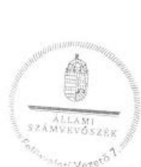

Dr. Horváth Margit felügyeleti vezető

---

.

---

# RÖVIDÍTÉSEK JEGYZÉKE 

${ }^{1}$ MNV Zrt.
${ }^{2}$ Társaság
${ }^{3}$ ügyvezető
${ }^{4}$ ÁSZ
${ }^{5} \mathrm{Gt}$.
${ }^{6}$ Ptk. 1
${ }^{7}$ Ptk2.
${ }^{8}$ Vtv.
${ }^{9}$ Nvtv.
${ }^{10}$ Alapító okirat
${ }^{11}$ Javadalmazási szabályzat 1,2
${ }^{12}$ Befektetési szabályzat
${ }^{13} \mathrm{FB}$
${ }^{14}$ FB Ügyrend
${ }^{15}$ Tulajdonosi Ellenőrzési Szabályzat
${ }^{16}$ Monitoring Szabályzat
${ }^{17}$ Portfóliós Kódex

Magyar Nemzeti Vagyonkezelő Zártkörűen Működő Részvénytársaság
HSSC Szolgáltató Központ Korlátolt Felelősségű Társaság
a HSSC Szolgáltató Központ Korlátolt Felelősségű Társaság ügyvezetője
Állami Számvevőszék
a gazdasági társaságokról szóló 2006. évi IV. törvény (hatálytalan 2014. március 15-étől)
a Polgári Törvénykönyvről szóló 1959. évi IV. törvény (hatálytalan 2014.március 15-étől)
a Polgári Törvénykönyvről szóló 2013. évi V. törvény (hatályos 2014. március 15étől)
az állami vagyonról szóló 2007. évi CVI. törvény
a nemzeti vagyonról szóló 2011. évi CXCVI. törvény (hatályos 2011. december 31étől)
a HSSC Szolgáltató Központ Kft. Alapítói okirata (módosítások az ellenőrzött időszakban: a jogszabályi változások átvezetése miatt (2012. március 7-étől a 68/2012. (III. 7.) AH I./1. pontja és 2014. május 29-étől a 277/2014. (V. 29.) AH I./3. pontja), a Társaság FB elnökének és/vagy tagjainak megválasztása miatt (2013. március 11-étől a 68/2013. (III. 11.) AH IV. pontja és 2014. december 18ától az 501/2014. (XII. 18.) AH 2. és 3. pontjai), a Társaság ügyvezetőjének megválasztása miatt (2012. február 27-étől a 49/2012. (II. 27.) AH I./1 pontja), 2013. március 27-étől a 103/2013. (III. 27.) AH 1. és 2. pontjai és 2015. május 20ától a 142/2015. (V. 20.) AH 1. pontja), a Társaság könyvvizsgálójának megválasztása (2015. május 29-től a 185/2015. (V. 29.) AH 2. pontja), feladatváltozás miatt (2012. május 9-étől a 159/2012. (V. 09.) AH IV. pontja és 2013. december 12-étől a 634/2013. (XII. 12.) AH)
a HSSC Szolgáltató Központ Kft. Mt. 188. § (1) bekezdése és a 188/A. § (1) bekezdés hatálya alá tartozó munkavállalóira, tisztségviselőire és könyvvizsgálóira vonatkozó javadalmazási rendszerről szóló Javadalmazási szabályzat (elfogadva a 159/2012. (V. 9.) AH II. pontjával) és a Társaság Mt. 208. § hatálya alá tartozó munkavállalóira, tisztségviselőire és könyvvizsgálóira vonatkozó javadalmazási rendszerről szóló Javadalmazási szabályzat (elfogadva a 68/2013. (III. 11.) AH II. pontjával)
a HSSC Szolgáltató Központ Kft. 1/2012 számú ügyvezetői utasítása Befektetési szabályzat kiadásáról (elfogadva a 68/2012. (III. 7.) AH-tal)
a HSSC Szolgáltató Központ Kft. Felügyelő Bizottsága
a HSSC Szolgáltató Központ Kft. Felügyelő Bizottság Ügyrendje (elfogadva a 9/2013. (I. 21.) AH-tal) és módosítása (elfogadva az 525/2013. (X. 3.) AH-tal)
Magyar Nemzeti Vagyonkezelő Zrt. Tulajdonos ellenőrzési szabályzatáról szóló 46/2011. számú vezérigazgatói utasítás /2012. január 1-jén hatályban lévő/ (elfogadva a 468/2011. (X. 3.) IG határozattal), és módosításai; 37/2013. számú (elfogadva az 569/2013. (VIII. 5. ) IG határozattal) és a 39/2014. számú vezérigazgatói utasítás (elfogadva a 493/2014. (IX. 8. ) IG határozattal)
Társasági Monitoring Szabályzatáról szóló 51/2013. számú vezérigazgatói utasítás (elfogadva az 559/2013. (XII. 19.) VIG határozattal)
a Magyar Nemzeti Vagyonkezelő Zrt. Portfóliós Kódexéről szóló 7/2015. számú vezérigazgatói utasítás (elfogadva a 121/2015. (III. 31.) VIG határozattal)

---

${ }^{18}$ MNV Zrt. Igazgatósága
${ }^{19}$ MNV Zrt. SZMSZ
${ }^{20}$ MNV Zrt. vezérigazgatója
${ }^{21}$ Döntéselőkészítési szabályzat
${ }^{22}$ MNV Zrt. Ellenőrzési Igazgatóság
${ }^{23}$ Vagyonnyilvántartási szabályzat
${ }^{24}$ Taktv.
${ }^{25}$ TLA Kft.
${ }^{26}$ Bérleti szerződések:
Bérleti szerződés1

Bérleti szerződés2
${ }^{27}$ Számv. tv.
${ }^{28}$ Tao tv.
${ }^{29}$ Szja tv.
${ }^{30}$ Társasági SZMSZ1

Társasági SZMSZ2

Társasági SZMSZ3
${ }^{31}$ Selejtezési szabályzat ${ }_{1}$

Selejtezési szabályzat ${ }_{2}$
${ }^{32}$ Béren kívüli juttatások szabályzat ${ }_{3}$
a Magyar Nemzeti Vagyonkezelő Zrt. Igazgatósága
a Magyar Nemzeti Vagyonkezelő Zrt. Szervezeti és Működési Szabályzata /2012. január 1-jén hatályban lévő/ (elfogadva a 301/2011 (V. 30.) IG határozattal), és módosításai (elfogadva a 180/2012. (IV. 23.), az 508/2012. (X. 8.) és a 430/2013. (VI. 17.) IG határozattal)
a Magyar Nemzeti Vagyonkezelő Zrt. vezérigazgatója
a döntések előkészítésének és a döntésekkel kapcsolatos iratok kezelésének rendjéről szóló 29/2011. számú vezérigazgatói utasítás és 30/2011. számú módisítása egységes szerkezetben (2012. január 1-jén hatályban lévő), 35/2012. számú (hatályos 2012. december 18-tól), 44/2013. számú (hatályos 2013. október 15-étől és 18/2014. számú vezérigazgatói utasítás (hatályos 2014. április 22-étől)
a Magyar Nemzeti Vagyonkezelő Zrt. Ellenőrzési Igazgatósága
a Magyar Nemzeti Vagyonkezelő Zrt. Vagyonnyilvántartási Szabályzatról szóló 46/2008. számú vezérigazgató utasítás (2012. január 1-jén hatályban lévő), a Magyar Nemzeti Vagyonkezelő Zrt. közvetlen és közvetett kezelésű rábízott vagyonának nyilvántartási feladataira vonatkozó alapvető belső szabályokról szóló 10/2014. számú vezérigazgatói utasítás egységes szerkezetben a 24/2014. számú vezérigazgatói utasítással (hatályos 2014. március 24-étől) és a Magyar Nemzeti Vagyonkezelő Zrt. állami vagyon vagyonkezelőire, az államai vagyon használóira és a társasági részesedések esetében az MNV Zrt. tulajdonosi joggyakorlását megbízottként ellátókra vonatkozó Vagyonnyilvántartási szabályzatról szóló 12/2014. számú vezérigazgatói utasítás egységes szerkezetben a 24/2014. számú vezérigazgatói utasítással (hatályos március 24-étől)
a köztulajdonban álló gazdasági társaságok takarékosabb müködéséről szóló 2009. évi CXXII. törvény (hatályos: 2009. december 4-től)

TLA Vagyonkezelő és - hasznosító Korlátolt Felelősségű Társaság (a Magyar állam kizárólagos tulajdonában álló társaság)
a Magyar Nemzeti Vagyonkezelő Zrt. és HSSC Szolgáltató Központ Kft. között 2011. november 1-jén létrejött Bérleti szerződés a 1117 Budapest, Fehérvári út 70. szám alatti ingatlanban $238,6 \mathrm{~m}^{2}$ iroda és raktár bérléséről
TLA Vagyonkezelő és - hasznosító Kft. és HSSC Szolgáltató Központ Kft. között 2016. június 16-tól létrejött Bérleti szerződés a 1117 Budapest, Fehérvári út 70. szám alatti ingatlanban $427,7 \mathrm{~m}^{2}$ iroda és raktár bérléséről
a számvitelről szóló 2000. évi C. törvény
a társasági adóról és az osztalékadóról szóló 1996. évi LXXXI. törvény
a személyi jövedelemadóról szóló 1995. évi CXVII. törvény
a HSSC Szolgáltató Központ Kft. 2011. július 26-án hatályba lépett Szervezeti és működési szabályzata
a HSSC Szolgáltató Központ Kft. 2012. június 18-án hatályba lépett Szervezeti és működési szabályzata
a HSSC Szolgáltató Központ Kft. 2014. augusztus 28-án hatályba lépett Szervezeti és működési szabályzata
a HSSC Szolgáltató Központ Kft. 2011. január 1-jén hatályba lépett Selejtezési szabályzata
a HSSC Szolgáltató Központ Kft. a 12/2012 számú ügyvezetői utasítással 2012. július 30-án hatályba lépett Selejtezési szabályzata
a HSSC Szolgáltató Központ Kft. 2012. január 1-jén hatályba lépett Béren kívüli, egyes meghatározott juttatásairól, a juttatások feltétel rendszeréről és elszámolási módjáról szóló szabályzata

---

Béren kívüli juttatások szabályzat ${ }_{2}$

Béren kívüli juttatások szabályzat ${ }_{3}$

Béren kívüli juttatások szabályzat ${ }_{4}$

Béren kívüli juttatások szabályzat ${ }_{5}$
${ }^{33}$ Szerződéskötési és nyilvántartási szabályzat ${ }_{1}$

Szerződéskötési és nyilvántartási szabályzat ${ }_{2}$
${ }^{34}$ Biztonsági Szabályzat ${ }_{1}$

Biztonsági Szabályzat ${ }_{2}$
${ }^{35}$ Számviteli politika ${ }_{3}$
Számviteli politika ${ }_{2}$
${ }^{36}$ Leltározási szabályzat ${ }_{1}$

Leltározási szabályzat ${ }_{2}$
${ }^{37}$ Pénzkezelési szabályzat ${ }_{1}$

Pénzkezelési szabályzat ${ }_{2}$
Pénzkezelési szabályzat ${ }_{3}$
${ }^{38}$ Értékelési Szabályzat ${ }_{1}$

Értékelési Szabályzat ${ }_{2}$
Értékelési Szabályzat ${ }_{3}$
${ }^{39}$ Számlarend ${ }_{1}$
Számlarend ${ }_{2}$
${ }^{40}$ 39/2010. (II. 26.) Korm. rendelet
${ }^{41}$ Számlatükör ${ }_{1}$
Számlatükör ${ }_{2}$
${ }^{42}$ Szja tv.
${ }^{43} \mathrm{Tbj} . \mathrm{tv}$.

a HSSC Szolgáltató Központ Kft. 2013. január 1-jén hatályba lépett Béren kívüli, egyes meghatározott juttatásairól, a juttatások feltétel rendszeréről és elszámolási módjáról szóló szabályzata
a HSSC Szolgáltató Központ Kft. 2014. január 1-jén hatályba lépett Béren kívüli, egyes meghatározott juttatásairól, a juttatások feltétel rendszeréről és elszámolási módjáról szóló szabályzata
a HSSC Szolgáltató Központ Kft. 2015. január 1-jén hatályba lépett Béren kívüli, egyes meghatározott juttatásairól, a juttatások feltétel rendszeréről és elszámolási módjáról szóló szabályzata
a HSSC Szolgáltató Központ Kft. 2011. július 26-án hatályba lépett Szerződéskötési és nyilvántartási szabályzata
a HSSC Szolgáltató Központ Kft. az 5/2012 számú ügyvezetői utasítással 2012. június 12-én hatályba lépett Szerződéskötési és nyilvántartási szabályzata
a HSSC Szolgáltató Központ Kft. 15/2012 számú ügyvezető utasítással 2012. szeptember 19-én hatályba lépett Információ Biztonsági szabályzata
a HSSC Szolgáltató Központ Kft. a 9/2014. számú ügyvezetői utasítással 2014. szeptember 1-jén hatályba lépett Informatikai biztonsági szabályzata
a HSSC Szolgáltató Központ Kft. 2011. január 1-jén hatályba lépett Számviteli politikája
a HSSC Szolgáltató Központ Kft. 2012. július 2-án hatályba lépett Számviteli politikája
a HSSC Szolgáltató Központ Kft. 2011. január 1-jén hatályba lépett Eszközök és források feltárkészítési és leltározási szabályzatai
a HSSC Szolgáltató Központ Kft. 2012. július 23-án hatályba lépett Eszközök és források feltárkészítési és leltározási szabályzatai
a HSSC Szolgáltató Központ Kft. 2011. január 1-jén hatályba lépett Pénzkezelési szabályzata
a HSSC Szolgáltató Központ Kft. 13/2012. számú 2012. július 30-án hatályba lépett Pénzkezelési szabályzata
a HSSC Szolgáltató Központ Kft. 12/2013. számú 2013. október 21-én hatályba lépett Pénzkezelési szabályzata
a HSSC Szolgáltató Központ Kft. 2011. január 1-jén hatályba lépett Eszközök és források értékelési szabályzatai
a HSSC Szolgáltató Központ Kft. 2012. július 19-én hatályba lépett Eszközök és források értékelési szabályzatai
a HSSC Szolgáltató Központ Kft. 2013. október 21-én hatályba lépett Eszközök és források értékelési szabályzatai
a HSSC Szolgáltató Központ Kft. 2011. január 1-jén hatályba lépett Számlarendje
a HSSC Szolgáltató Központ Kft. 2013. október 1-jén hatályba lépett Számlarendje a munkába járással kapcsolatos utazási költségtérítésről szóló 39/2010. (II. 26.) Korm. rendelet
a HSSC Szolgáltató Központ Kft. 2013. október 1-jén hatályba lépett Számlatükre a HSSC Szolgáltató Központ Kft. 2011. január 1-jén hatályba lépett Számlatükre a személyi jövedelemadóról szóló 1995. évi CXVII. törvény
a társadalombiztosítás ellátásaira és a magánnyugdíjra jogosultakról, valamint e szolgáltatások fedezetéről 1997. évi LXXX. törvény

---

${ }^{44}$ Infotv.
${ }^{45}$ Információ biztonsági szabályzat ${ }_{1}$

Információ biztonsági szabályzat ${ }_{2}$
${ }^{46}$ tervezési irányelvek
az információs önrendelkezési jogról és az információszabadságról szóló 2011. évi CXII. törvény
a HSSC Szolgáltató Központ Kft. Információ biztonsági szabályzata (hatályos: 2012.09.19-től 2014.08.31-ig)
a HSSC Szolgáltató Központ Kft. Információ biztonsági szabályzata (hatályos: 2014.09.01-től)

Tervezési irányelvek az MNV Zrt. portfóliójába tartozó többségi állami tulajdonú cégkör részére (a 2012. évi tervezési irányelvek elfogadása az 513/2011. (XI. 7.) IG határozattal, a 2013. évi tervezési irányelvek elfogadása az 558/2012. (X. 24.) IG határozattal, a 2014. évi tervezési irányelvek elfogadása az 774/2013. (X. 21.) IG határozattal, a 2015. évi tervezési irányelvek elfogadása az 4/2015. (I. 12.) IG határozattal)

---

# ÁLLAMI SZÁMVEVŐSZÉK 

1052 Budapest, Apáczai Csere János utca 10.
Levélcím: 1364 Budapest 4. Pf. 54
Telefon: +36 14849100 Telefax: +36 14849200
www.asz.hu