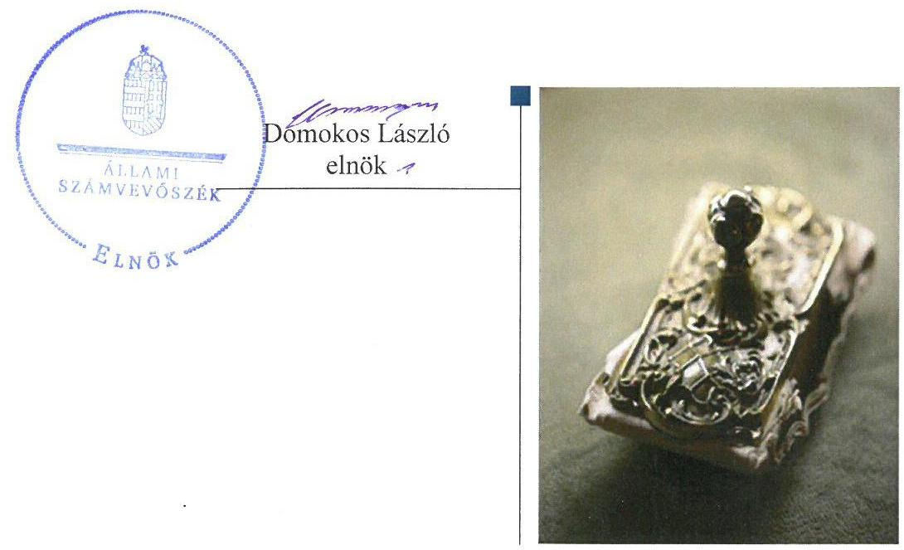
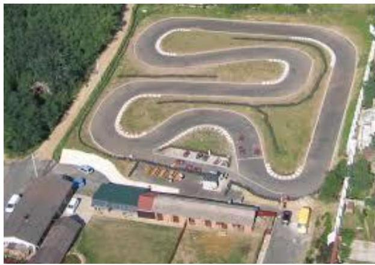
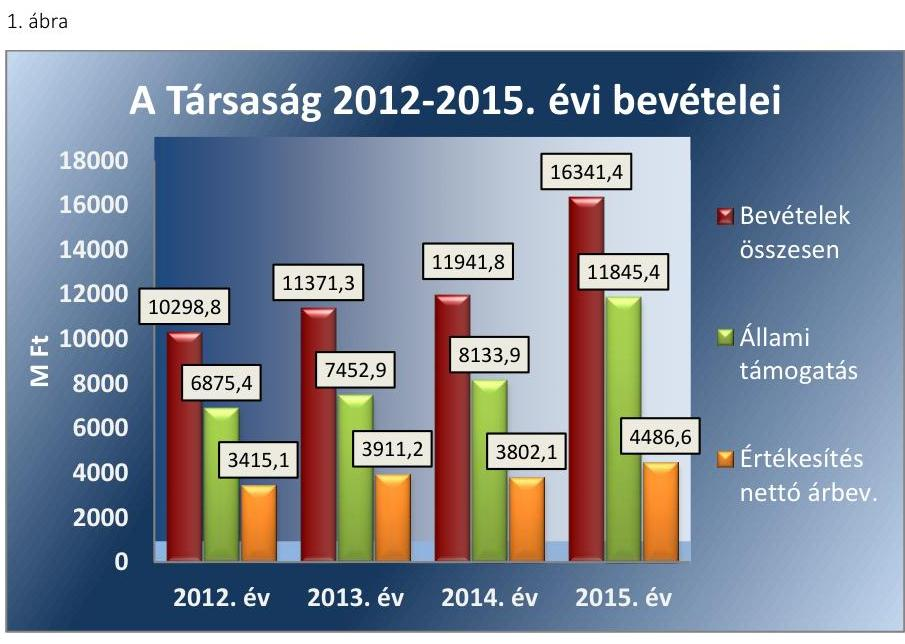
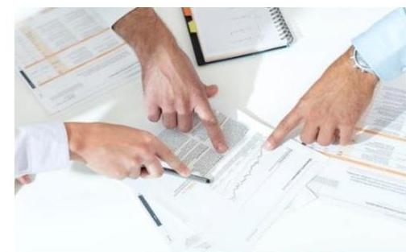
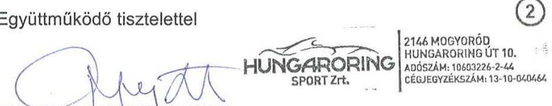
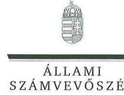
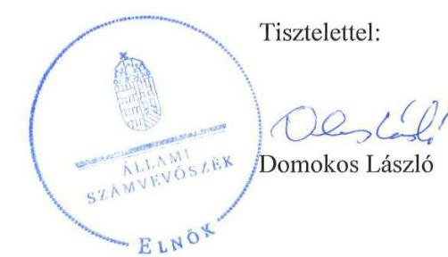
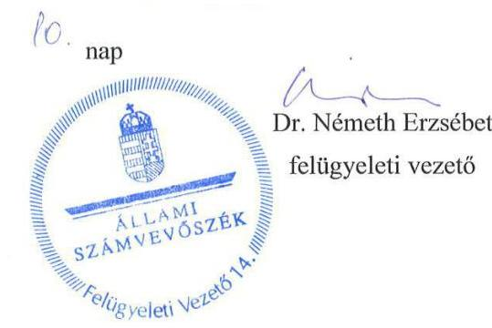

# Jelentés 

## Állami tulajdonú gazdasági társaságok

Az állami tulajdonban (résztulajdonban) lévő gazdálkodó szervezetek vagyonmegőrzési és gazdálkodási tevékenységének ellenőrzése Hungaroring Sport Zrt.
2017.

---

# Jelentés 

## Állami tulajdonú gazdasági társaságok

Az állami tulajdonban (résztulajdonban) lévő gazdálkodó szervezetek vagyonmegőrzési és gazdálkodási tevékenységének ellenőrzése Hungaroring Sport Zrt.
2017.  december hó 1. nap

---

# AZ ELLENŐRZÉST FELÜGYELTE:

DR. NÉMETH ERZSÉBET felügyeleti vezető

## AZ ELLENŐRZÉST VEZETTE ÉS A VÉGREHAJTÁSÁÉRT FELELŐS:

KORSÓSNÉ VIGH ANDREA ellenőrzésvezető

## A PROGRAM ÖSSZEÁLLÍTÁSÁÉRT FELELŐS:

JANIK JÓZSEF LÁSZLÓ osztályvezető

IKTATÓSZÁM: V-1363-128/2016.

TÉMASZÁM: 2397

ELLENŐRZÉS-AZONOSÍTÓ SZÁM: V075934

Jelentéseink az Országgyűlés számítógépes hálózatán és az Interneten a www.asz.hu címen is olvashatóak.

---

# TARTALOMJEGYZÉK 

■ ÖSSZEGZÉS ..... 5
■ AZ ELLENŐRZÉS CÉLJA ..... 6
■ AZ ELLENŐRZÉS TERÜLETE ..... 7
■ AZ ELLENŐRZÉS HÁTTERE, INDOKOLTSÁGA ..... 9
■ A JELENTÉS LÉNYEGES KÉRDÉSKÖREI ..... 10
■ ELLENŐRZÉS HATÓKÖRE ÉS MÓDSZEREI ..... 11
■ MEGÁLLAPÍTÁSOK ..... 13
■ MELLÉKLETEK ..... 17
I. Sz. melléklet: Értelmező szótár ..... 17
■ FÜGGELÉK: ÉSZREVÉTELEK ..... 19
■ RÖVIDÍTÉSEK JEGYZÉKE ..... 23

---

.

---

# ÖSSZEGZÉS 

A Magyar Államnak a Hungaroring Sport Zrt.-ben lévő társasági részesedése felett a Magyar Nemzeti Vagyonkezelő Zrt. és a Nemzeti Fejlesztési Minisztérium szabályszerűen gyakorolta a tulajdonosi jogokat. A Hungaroring Sport Zrt. szabályozottsága összességében megfelelő volt, a 2012-2013. években azonban nem volt önköltségszámítási szabályzat. A pénzügyi-számviteli feladatok ellátása az előírások szerint történt. A vagyongazdálkodás szabályszerű volt, a vagyon értékének megőrzéséről gondoskodtak.

## Az ellenőrzés társadalmi indokoltsága

Az állami tulajdonú gazdálkodó szervezetek a nemzeti vagyon részét képezik. Az állami vagyonnal való gazdálkodást illetően a tulajdonosi joggyakorlás és vagyongazdálkodás feladata az állami vagyon átlátható, rendeltetésszerű és felelős felhasználásának biztosítása. Minden közpénzt, közvagyont használó szervezettel szemben társadalmi igény, hogy tevékenységéről elszámoljon.

A Hungaroring Sport Zrt. ellenőrzését a vagyona nagyságrendje, továbbá a tevékenységéhez nyújtott jelentős összegű állami támogatás indokolta.

## Főbb megállapítások, következtetések, javaslatok

A Magyar Állam Hungaroring Sport Zrt.-ben lévő társasági részesedése felett a tulajdonosi jogokat 2012-ben a Magyar Nemzeti Vagyonkezelő Zrt., a 2013-2015. években a Nemzeti Fejlesztési Minisztérium az előírásoknak megfelelően gyakorolta.

A Társaság szabályozottsága összességében megfelelő volt. A működését meghatározó alapvető számviteli szabályzatok többségével a Társaság az ellenőrzött időszak egészében, azonban önköltségszámítási szabályzattal 2014-től rendelkezett. A szabályzatokat a jogszabályi előírásokkal összhangban készítették el és aktualizálták.

A bevételeket, az anyagjellegű-, személyi jellegű és egyéb ráfordításokat, az értékcsökkenést a jogszabályi és a belső szabályzatok előírásainak megfelelően számolták el. A szolgáltatások díjtételeit a Társaság 2014-2015-ben önköltségszámítással megalapozta. Az éves-, évközi beszámolási, adatszolgáltatási, valamint közzétételi kötelezettségeket teljesítették.

A vagyon nyilvántartása átlátható, naprakész, szabályszerű, a mérleg leltárral alátámasztott volt. A vagyonváltozást eredményező döntések az alapszabályban és a belső szabályzatokban rögzített hatásköri előírásoknak megfelelően történtek. A vagyon értékének megőrzése biztosított volt.

---

# AZ ELLENŐRZÉS CÉLJA 

Az ellenőrzés célja annak értékelése volt, hogy a tulajdonosi jogok gyakorlása szabályszerű volt-e; a gazdálkodó szervezet szabályozottsága, gazdálkodása és vagyongazdálkodási tevékenysége megfelelt-e a jogszabályi és a tulajdonosi előírásoknak; a vagyonváltozást eredményező döntések esetében a tulajdonosi jogok gyakorlója és a gazdálkodó szervezet szabályszerűen jártak-e el.

---

# **Hungaroring Sport Zrt.**

A Társaság^{1} jogelődje 1989. december 28-án alakult FORMA 1 Kkt.^{2} néven, Rt.^{3}-ként 1990. december 18-tól, Zrt.^{4}-ként 2006. július 11-től működött.

Fő tevékenysége 2012. május 25. óta "Egyéb sporttevékenység", azt megelőzően "sportlétesítmény üzemeltetése" volt, amelynek körébe tartozott a nemzetközi és hazai autósport rendezvényeknek – többek között a Formula 1 világverseny magyarországi futamainak – a megszervezése, lebonyolítása.

A Magyar Állam tulajdoni részaránya az ellenőrzött időszakban 72,1%-ról 98,4%-ra emelkedett. A társasági részesedés feletti tulajdonosi jogokat a Magyar Állam nevében a 2012. évben az MNV Zrt.,^{5} 2013. január 1-jétől a 77/2012. (XII. 22.) NFM rendelet^{6} alapján az NFM^{7} gyakorolta.

A Társaság jegyzett tőkéje 2012. január 1-jén 1940,0 M Ft volt, amely a végrehajtott három tőkeemelés (2012-ben 777,6 M Ft, 2013-ban 128,0 M Ft és 103,1 M Ft) eredményeként 2015. december 31-re 2948,7 M Ft-ra emelkedett. A Társaság 2012-2015. évi gazdálkodásának egyes kiemelt adatait az 1. táblázat szemlélteti.

1. táblázat

|  A TÁRSASÁG 2012-2015. ÉVI GAZDÁLKODÁSÁNAK KIEMELT ADATAI |  |  |  |   |
| --- | --- | --- | --- | --- |
|  Megnevezés | 2012.
dec. 21. | 2013.
dec. 21. | 2014.
dec. 21. | 2015.
dec. 21.  |
|  Mérlegfőösszeg (M Ft) | 8759,2 | 9597,2 | 9250,3 | 8810,5  |
|  Saját tőke (M Ft) | 7364,0 | 8598,2 | 8357,2 | 8240,0  |
|  Kötelezettségek (M Ft) | 1199,5 | 795,5 | 666,3 | 380,6  |
|  Követelések (M Ft) | 77,6 | 58,3 | 53,9 | 197,4  |
|  ebből: vevőkövetelés (M Ft) | 61,0 | 20,0 | 31,9 | 33,2  |
|  Átlagos állományi létszám (fő) | 14 | 15 | 15 | 19  |
|  Forrás: Éves beszámoló 2012-2015. |  |  |  |   |

A 2012-2015. években a Társaság életében meghatározó volt a folyamatos állami szerepvállalás, forrásbevonás, amely hozzájárult a tőkehelyzet megerősítéséhez, fedezetet biztosított a pálya és a kapcsolódó infrastruktúra átalakításához szükséges beruházásokra, a rendezői és televíziós közvetítői jogdíjakra. Az állami támogatásoknak a Társaság összes bevételein belüli részaránya a 2012. évi 66,8%-ról 2015-re 72,5%-ra növekedett. A Társaság 2012-2015. évi bevételeit, annak főbb összetevőit szemlélteti az 1. ábra.

---

Forrás: Éves beszámolók 2012-2015.
A Társaság az ellenőrzött időszak minden évében negatív üzleti és mérleg szerinti eredményt tervezett, ezzel szemben a 2014. év kivételével nyereségesen gazdálkodott. Mérleg szerinti eredménye 2012-ben 9,6 M Ft, 2013-ban 67,0 M Ft, 2015-ben 44,3 M Ft nyereség, 2014-ben 76,1 M Ft veszteség volt.

A Társaság legfőbb döntéshozó szerve a Közgyűlés, amely mellett a Közgyűlés által választott 5 fős Igazgatóság, 5 fős FB^{8}, valamint könyvvizsgáló működött. A Vezérigazgató és az Igazgatóság elnökének (Elnök-vezérigazgató) személye az ellenőrzött időszakban nem változott.

A Társaságnak egy kapcsolt vállalkozása volt, a Tanpálya Vezetéstechnikai Centrum Kft., amelyben 50% (21,5 M Ft) tulajdoni részesedéssel rendelkezett.

---

# AZ ELLENŐRZÉS HÁTTERE, INDOKOLTSÁGA 

Az állami tulajdonú gazdálkodó szervezetek ellenőrzése kiemelten fontos a nemzeti vagyon megőrzése, megóvása érdekében. Gazdálkodásuk jellemzően a közérdeklődés és a média figyelmének középpontjában áll, amihez hozzájárul a gazdálkodásuk körébe tartozó - közvetlen vagy közvetett állami tulajdonú - vagyon nagysága.

Az ÁSZ ${ }^{9}$ középtávra szóló stratégiájában megfogalmazta, hogy az államháztartáson kívülre nyújtott költségvetési támogatások és ingyenes vagyonjuttatások, valamint az államháztartáson kívül működő közfeladat-ellátó rendszerek ellenőrzéseivel hozzájárul ahhoz, hogy a közpénzeket az államháztartáson kívül működő szervezetek is átlátható, rendezett módon használják fel.

Az ellenőrzés megállapításai és javaslatai hozzájárulhatnak a nemzeti vagyonnal való gazdálkodás átláthatóságának, elszámoltathatóságának javításához. Az ellenőrzési tapasztalatok segítik és erősítik az ÁSZ hozzáadott értéket teremtő tevékenységét és tanácsadó szerepét is, mivel az ellenőrzés rámutathat az állami tulajdonú gazdálkodó szervezetek gazdálkodási tevékenységével kapcsolatos jó gyakorlatokra és szabálytalanságokra, felhívhatja a figyelmet a jogszabályi követelmények teljesítéséhez szükséges feltételek hiányosságaira.

---

# A JELENTÉS LÉNYEGES KÉRDÉSKÖREI 

1.     - A tulajdonosi jogok gyakorlása szabályszerű volt-e?
2.     - A társaság működésének szabályozottsága megfelelt-e az előírásoknak?
3.     - A társaságnál a pénzügyi-számviteli, adatszolgáltatási és ellenőrzési feladatok ellátása szabályszerű volt-e?
4.     - A társaság vagyongazdálkodása szabályszerű volt-e?

---

# ELLENŐRZÉS HATÓKÖRE ÉS MÓDSZEREI 

## Az ellenőrzés típusa

Megfelelőségi ellenőrzés

## Az ellenőrzött időszak

A 2012. január 1-jétől 2015. december 31-ig tartó időszak.

## Az ellenőrzés tárgya

Az állami tulajdonban (résztulajdonban) lévő gazdasági társaság gazdálkodása, kiemelten vagyongazdálkodási tevékenysége, a tulajdonosi jogok gyakorlása.

## Az ellenőrzött szervezet

Hungaroring Sport Zrt., Magyar Nemzeti Vagyonkezelő Zrt., Nemzeti Fejlesztési Minisztérium

## Az ellenőrzés jogalapja

Az ellenőrzés jogszabályi alapját az ÁSZ tv. ${ }^{10}$ 5. § (3)-(5) bekezdései képezték.

## Az ellenőrzés módszerei

Az ellenőrzést az ellenőrzési program ellenőrzési kérdései, az ellenőrzött időszakban hatályos jogszabályok, az ellenőrzés szakmai szabályok és módszertanok figyelembe vételével végeztük el.

Az ellenőrzött szervezetek az ellenőrzés lefolytatásához tanúsítványok kitöltésével, valamint az ÁSZ által kért dokumentumok megküldésével szolgáltattak adatokat.

A bevételek és ráfordítások elszámolását, és a vagyonnyilvántartás terén a szabályszerű működést véletlenszerű mintavétellel ellenőriztük. A mintavétellel ellenőrzött területek esetében minden egyes tétel vonatkozásában szabályszerűségre vonatkozó kérdéseket tettünk fel, amelyek eredménye összesítésre került. A jogszabályoknak és a belső előírásoknak megfelelőnek tekintettük az adott területet, amennyiben a minta ellenőrzésének eredménye alapján 95%-os bizonyossággal a teljes sokaságban a

---

hibaarány kisebb volt, mint 10%, nem megfelelőnek értékeltük, ha a hibaarány a 10%-ot meghaladta. A ráfordítások elszámolására és a vagyonnyilvántartásra vonatkozó véletlen mintavételt kockázati alapú kiválasztással egészítettük ki, amelynek során évente a három legnagyobb összegű tételt választottuk ki.

---

# 1. A tulajdonosi jogok gyakorlása szabályszerű volt-e? 

Összegző megállapítás

Az MNV Zrt. és az NFM szabályszerűen gyakorolták a tulajdonosi jogokat.

A TULAJDONOSI JOGGYAKORLÁSRA vonatkozó előírásokat az MNV Zrt. és az NFM az SZMSZ ${ }^{11}$-ében, valamint a Társaság alapszabályában ${ }^{12}$ rögzítették. Az alapszabályban a Gt. ${ }^{13}$ és a Ptk. ${ }^{14}$ előírásaival összhangban meghatározták a tulajdonosi joggyakorló jogait és kötelezettségeit, a Közgyűlés kizárólagos hatáskörébe tartozó döntések körét, a tulajdonosnak az igazgatóságban és az FB-ben való képviseletét, a képviselettel összefüggő feladatokat és beszámolási kötelezettséget, továbbá rendelkeztek a könyvvizsgálóról. Az MNV Zrt. és az NFM az igazgatóság és FB üléseken, valamint a közgyűlésen képviseltette magát.

A TÁRSASÁG TEVÉKENYSÉGE NYOMON KÖVETÉSE érdekében a tulajdonosi joggyakorlók monitoring adatszolgáltatási kötelezettséget írtak elő.

AZ ÜZLETI TERV készítési kötelezettséggel kapcsolatos követelményeket 2012-ben az MNV Zrt., 2013-tól az NFM meghatározta. A Társaság 2012-2015. évi üzleti terveit a Közgyűlés szabályszerűen - az alapszabály előírása szerint az igazgatóság és az FB általi megtárgyalást követően - elfogadta.

AZ ÉVES BESZÁMOLÓKAT - az alapszabály előírásával összhangban az igazgatóság és az FB általi megtárgyalást követően - a közgyűlés szabályszerűen jóváhagyta, döntésénél az igazgatóság és az FB üléséről készült jegyzőkönyvben, valamint a könyvvizsgálói jelentésekben foglaltakat figyelembe vette.

## 2. A társaság működésének szabályozottsága megfelelt-e az előírásoknak?

Összegző megállapítás

A Társaság működésének szabályozottsága a 2012-2013. években összességében megfelelő volt, önköltségszámítási szabályzattal azonban nem rendelkeztek. A 2014-2015. években a szabályozottság megfelelt az előírásoknak.

A TÁRSASÁG RENDELKEZETT a Számv. tv. ${ }^{15}$ által előírt számviteli politikával ${ }_{1-4}{ }^{16}$ és az annak keretében elkészített az eszközök és a források leltárkészítési és leltározási szabályzatával ${ }_{1-2}{ }^{17}$, az eszközök és a források értékelési szabályzatával ${ }_{1-2}{ }^{18}$ és a pénzkezelési szabályzattal ${ }_{1-2}{ }^{19}$,

---

melyek tartalma a jogszabályi előírásoknak megfelelő volt, aktualizálása megtörtént. 2013. március 26-án léptette hatályba az Info tv. ${ }^{20}$-nek megfelelően adatvédelmi szabályzatát ${ }^{21}$, amelyben rögzítette az adatkezelés jogalapját.

A Társaság a jogszabályi előírásoknak megfelelően készítette el az alapszabályát ${ }_{1-8}$ és az SZMSZ ${ }_{1-3}{ }^{22}$-t, rendelkezett továbbá a Taktv. ${ }^{23}$
 előírásainak megfelelő javadalmazási szabályzattal. ${ }^{24}$

HIÁNYOSSÁG volt, hogy a Társaság az ellenőrzött időszakban a Számv. tv. 14. § (6)-(7) bekezdései alapján önköltségszámításra kötelezett volt, ugyanakkor az önköltségszámítás belső rendjére vonatkozó szabályzattal ${ }^{25}$ a Számv. tv. 14. § (5) bekezdés c) pont előírása ellenére a 2012–2013. években nem rendelkezett. A szabályzatot 2014-ben készítették el.

# 3. A társaságnál a pénzügyi-számviteli, adatszolgáltatási és ellenőrzési feladatok ellátása szabályszerű volt-e? 

Összegző megállapítás

## 3.1. számú megállapítás

A Társaság szabályszerűen látta el pénzügyi-számviteli, adatszolgáltatási és ellenőrzési feladatait.

A bevételek és ráfordítások elszámolása megfelelt a Számv. tv. és a belső szabályzatok előírásainak. A szolgáltatások díjtételeit kalkulációval, illetve önköltségszámítással megalapozták.

A BEVÉTELEK – az értékesítés nettó árbevétele, az egyéb, rendkívüli és pénzügyi műveletek bevételeinek – az elszámolása szabályszerű volt. A könyvelés a megfelelő főkönyvi számlára történt, a bevételek kiszámlázásánál a belső szabályozás, illetve a megkötött szerződés szerinti árakat alkalmazták.

A Társaság folyamatosan intézkedett a lejárt követelések behajtása érdekében egyenlegközlő és felszólító levelek kiküldésével. A vevőkövetelések állománya az ellenőrzött időszakban közel felére mérséklődött.

A szolgáltatások díjtételeit a Társaság 2012–2013-ban kalkulációval, 2014–2015-ben önköltségszámítással megalapozta. Az önköltségszámítás a 2014–2015. években az önköltségszámítási szabályzat előírásai szerint történt, a 2012–2013. években pedig az ún. Üzleti elő- és utókalkulációs modellen alapult. A Társaság – a díjtételek meghatározásán túl – az éves üzleti terveit is e modell alkalmazásával alakította ki.

AZ ANYAGJELLEGŰ RÁFORDÍTÁSOK elszámolása szabályos volt, a költségelszámolást megalapozó dokumentumok – megrendelés, szerződés, szabályosan kiállított számla – rendelkezésre álltak. A helyes összegben és főkönyvi számlára történt a könyvelés.

A SZEMÉLYI JELLEGŰ RÁFORDÍTÁSOK és személyi jellegű egyéb kifizetések elszámolása szabályszerű volt. A kifizetést megalapozó dokumentumok – munkaszerződés, munkaidő elszámolás, Cafeteria nyilatkozatok – rendelkezésre álltak. A számfejtett bruttó bér összege meg-

---

# 3.2. számú megállapítás 

felelt a kinevezési okiratban, munkaszerződésben foglaltaknak. A munkavállalót terhelő járulék és adó levonások a jogszabályi előírások szerint történtek. A Cafeteria nyilatkozatok a jogszabályi és béren kívüli juttatások szabályzata ${ }_{1-3}$ előírásainak megfelelőek voltak.

AZ ÉRTÉKCSÖKKENÉS elszámolása a jogszabályok és a belső szabályozás szerint, szabályosan történt. Az immateriális javak, a tárgyi eszközök értékcsökkenését a Számv. tv., a Számviteli politika ${ }_{1-4}$ és az Értékelési szabályzat ${ }_{1-2}$ előírásaival összhangban, a várható hasznos élettartamot és a maradványértéket figyelembe véve lineáris kulcsok alkalmazásával határozták meg. Az értékcsökkenést havonta, a megfelelő értékben, szabályszerűen számolták el. Az éves beszámolók kiegészítő mellékletében az elszámolt értékcsökkenést az előírásoknak megfelelően bemutatták. Terven felüli értékcsökkenés elszámolására az immateriális javak és tárgyi eszközök selejtezése miatt a Számv. tv. és a Számviteli politika ${ }_{1-4}$ előírásainak megfelelően került sor.

A Társaság teljesítette tervezési, beszámolási és adatszolgáltatási kötelezettségeit. Belső ellenőrzést működtetett, a belső és a külső ellenőrzések javaslatait hasznosította.

ÜZLETI TERV készítési kötelezettsége a Társaságnak az ellenőrzött időszak egészében volt, amelynek 2012-ben az MNV Zrt., ezt követően az NFM által meghatározott tervezési irányelvek alapján eleget tett.

AZ ÉVES BESZÁMOLÓKAT a Számv. tv. előírásai betartásával, határidőben elkészítették, a tulajdonosi joggyakorló számára – az alapszabályban előírt véleményezések megtörténtét követően – előterjesztették, a jóváhagyást követően közzétették és letétbe helyezték.

MONITORING adatszolgáltatást a Társaság az MNV Zrt. és az NFM által meghatározott tartalommal, formában és gyakorisággal teljesített.

A KÖZÉRDEKŰ ADATOK KÖZZÉTÉTELÉRE a jogszabályi előírások szerint került sor.

BELSŐ ELLENŐRZÉST az ellenőrzött időszak egészében működtetett a Társaság, bár erre jogszabályi kötelezettsége nem volt. A belső ellenőr az éves ellenőrzési tervek alapján a 2012–2015. években összesen 32 ellenőrzést folytatott le és a 2012. évben tett – a 2013–2015. években nem tett – intézkedést igénylő megállapítást. A Társaság a felmerült hiányosság megszüntetésére intézkedett.

KÜLSŐ ELLENŐRZÉST a NAV végzett 2012 és 2015 között hat esetben. Ebből a Társaságnak egy esetben volt intézkedési kötelezettsége, amelynek eleget tett.

---

# 4. A társaság vagyongazdálkodása szabályszerű volt-e? 

## Összegző megállapítás

### 4.1. számú megállapítás

### 4.2. számú megállapítás

## A Társaság vagyongazdálkodása szabályszerű volt, a vagyon értékének megőrzéséről gondoskodott.

A szabályszerű vagyongazdálkodás feltételeit kialakították, a vagyon változását eredményező döntések szabályszerűek voltak.

## A SZABÁLYSZERŰ VAGYONGAZDÁLKODÁS FEL-

TÉTELEIT kialakították. A saját vagyon értéke megőrzésének, gyarapításának feltételeit a tulajdonosi joggyakorlók által jóváhagyott éves üzleti tervekben – az azok részét képező beruházási és felújítási tervekben – rögzítették. A vagyonváltozást eredményező döntések hatásköri és felelősségi rendjét, azoknak a közgyűlés, igazgatóság, vezérigazgató közötti megosztását az alapszabályban meghatározták. A vagyon nyilvántartása, értékelése, leltározása és selejtezése vonatkozásában a Számv. tv. előírása alapján elkészített belső szabályzatok rendelkeztek a feladat- és hatáskörökről.

## A VAGYON VÁLTOZÁSÁT EREDMÉNYEZŐ DÖNTÉ-

SEKRE szabályszerűen, az alapszabályban rögzített, a közgyűlés, az igazgatóság és a vezérigazgató között megosztott hatásköri előírások betartásával került sor.

A Társaság szabályszerű vagyonnyilvántartást vezetett, a vagyon értékének megőrzése biztosított volt.

A VAGYON NYILVÁNTARTÁSA átlátható és naprakész, a jogszabályi előírásoknak megfelelő volt. A Társaság az éves beszámolókban és a számviteli nyilvántartásokban szereplő vagyon állományát az ellenőrzött időszakban – a Számv. tv.-ben, illetve az eszközök és források leltározási és leltárkészítési szabályzat ${ }_{1-2}$-ban foglalt előírásoknak megfelelően leltárral alátámasztotta.

A Tanpálya Kft.-ben fennálló 50%-os, 21,5 M Ft könyv szerinti értékű részesedést szabályszerűen tartotta nyilván és értékelte a Társaság. E kapcsolt vállalkozás vagyongazdálkodása tekintetében a Társaság tulajdonosi kontrollja az éves beszámolók jóváhagyása, valamint a vezetésben lévő tulajdonosi képviselet útján valósult meg.

A VAGYON ÉRTÉKÉNEK MEGŐRZÉSE biztosított volt. A 2012–2015. években az elszámolt értékcsökkenést (663,7 M Ft) közel 40%-kal meghaladó ( $915,7 \mathrm{M} \mathrm{Ft}$ ) összegben fordítottak beruházásra és felújításra. Az állagmegóvás érdekében az eseti és folyamatos megelőző karbantartásra elszámolt kiadás az ellenőrzött időszakban összesen 600,7 M Ft volt.

---

# MELLÉKLETEK 

## I. SZ. MELLÉKLET: ÉRTELMEZŐ SZÓTÁR

állami vagyon
a) Az állam tulajdonában lévő dolog, valamint dolog módjára hasznosítható természeti erő;
b) az a) pont hatálya alá tartozó mindazon vagyon, amely vonatkozásában törvény az állam kizárólagos tulajdonjogát nevesíti;
c) az állam tulajdonában lévő tagsági jogviszonyt megtestesítő értékpapír, illetve az államot megillető egyéb társasági részesedés;
d) az államot megillető olyan immateriális, vagyoni értékkel rendelkező jogosultság, amelyet jogszabály vagyoni értékű jogként nevesít;
2012. november 10-től az állami vagyon fogalma kiegészül a következő ponttal:
e) az állam tulajdonában lévő pénzügyi eszközök.
(Forrás: Vtv. 1. § (2) bekezdése)
gazdasági társaság
A Ptk. 3:88. § (1) bekezdése szerint „a gazdasági társaságok üzletszerű közös gazdasági tevékenység folytatására, a tagok vagyoni hozzájárulásával létrehozott, jogi személyiséggel rendelkező vállalkozások, amelyekben a tagok a nyereségből közösen részesednek, és a veszteséget közösen viselik".
gazdálkodó szervezet
2014. március 14-ig:

A Ptk. ${ }^{26}$ 685. § c) pontja szerint gazdálkodó szervezet:
„az állami vállalat, az egyéb állami gazdálkodó szerv, a szövetkezet, a lakásszövetkezet, az európai szövetkezet, a gazdasági társaság, az európai részvénytársaság, az egyesülés, az európai gazdasági egyesülés, az európai területi együttműködési csoportosulás, az egyes jogi személyek vállalata, a leányvállalat, a vízgazdálkodási társulat, az erdő birtokossági társulat, a végrehajtói iroda, az egyéni cég, továbbá az egyéni vállalkozó."
2014. március 15-től:

A gazdasági társaság, az európai részvénytársaság, az egyesülés, az európai gazdasági egyesülés, az európai területi együttműködési csoportosulás, a szövetkezet, a lakásszövetkezet, az európai szövetkezet, a vízgazdálkodási társulat, az erdőbirtokossági társulat, az állami vállalat, az egyéb állami gazdálkodó szerv, az egyes jogi személyek vállalata, a közös vállalat, a végrehajtói iroda, a közjegyzői iroda, az ügyvédi iroda, a szabadalmi ügyvivői iroda, az önkéntes kölcsönös biztosító pénztár, a magánnyugdíjpénztár, az egyéni cég, továbbá az egyéni vállalkozó. Az állam, a helyi önkormányzat, a költségvetési szerv, az egyesület, a köztestület, valamint az alapítvány gazdálkodó tevékenységével összefüggő polgári jogi kapcsolataira is a gazdálkodó szervezetre vonatkozó rendelkezéseket kell alkalmazni.
Forrás: Pp. ${ }^{27} 396$. §
tulajdonosi joggyakorló
1.

## 2013. június 27-ig:

Az állami vagyon felett a Magyar Államot megillető tulajdonosi jogok és kötelezettségek összességét – ha törvény eltérően nem rendelkezik – az állami vagyon felügyeletéért felelős miniszter (a továbbiakban: miniszter) gyakorolja, aki e feladatát a Magyar Nemzeti Vagyonkezelő Zártkörűen Működő Részvénytársaság (a továbbiakban: MNV Zrt.), a Magyar Fejlesztési Bank, illetve a tulajdonosi joggyakorló szervezet útján látja el. A miniszter miniszteri rendeletben, a törvényben meghatározott állami vagyoni kör tekintetében, meghatározott időtartamra, a joggyakorlás egyes szabályainak meghatározásával – az őt megillető tulajdonosi jogok és kötelezettségek összességének, illetve

---

azok meghatározott részének gyakorlóját az Áht. szerinti központi költségvetési szervek, ezek intézménye, továbbá a 100%-ban állami tulajdonban álló gazdasági társaságok közül kijelölheti.
Forrás: Vtv. 3. § (1) és (2)

# 2013. június 28-ától: 

A rábízott állami vagyon felett az államot megillető tulajdonosi jogok és kötelezettségek összességét tulajdonosi joggyakorlóként:
a) ha törvény vagy miniszteri rendelet eltérően nem rendelkezik, a Magyar Nemzeti Vagyonkezelő Zártkörűen Működő Részvénytársaság (a továbbiakban: MNV Zrt.),
b) törvényben kijelölt személy vagy
c) az állami vagyon felügyeletéért felelős miniszter (a továbbiakban: miniszter) által rendeletben kijelölt személy gyakorolja.
[...] A miniszter e törvény felhatalmazása alapján – a meghatározott célok hatékonyabb elérése érdekében, miniszteri rendeletben, az ott meghatározott állami vagyoni kör tekintetében, meghatározott időtartamra – e törvény keretei között, a joggyakorlás egyes szabályainak meghatározásával – az államot megillető tulajdonosi jogok és kötelezettségek összességének, illetve azok meghatározott részének gyakorlóját az Áht. szerinti köz-ponti költségvetési szervek, ezek intézménye, továbbá a 100%-ban állami tulajdonban álló gazdasági társaságok közül kijelölheti.
Forrás: Vtv. 3. § (1) és (2)
2.

Aki a nemzeti vagyon felett az államot vagy a helyi önkormányzatot megillető tulajdonosi jogok és kötelezettségek összességének gyakorlására jogosult.
Forrás: Nvtv. ${ }^{28}$ 3. § (1) 17. pontja

---

# FÜGGELÉK: ÉSZREVÉTELEK 

A jelentéstervezetet a Számvevőszék 15 napos észrevételezésre megküldte az ellenőrzött szervezetek vezetőinek az ÁSZ tv. 29. § (1) bekezdése előírásának megfelelően.

A függelék tartalmazza a Hungaroring Sport Zrt. vezérigazgatója által megküldött észrevételeket, az azokra adott válaszokat, illetve az el nem fogadott észrevételek elutasításának indoklását.

[^0]
[^0]:    * 29. § (1) Az Állami Számvevőszék az ellenőrzési megállapításait megküldi az ellenőrzött szervezet vezetőjének vagy az általa megbízott személynek, és annak, akinek személyes felelősségét állapította meg.
    (2) Az ellenőrzött szervezet vezetője és a felelősként megjelölt személy az ellenőrzés megállapításaira tizenöt napon belül írásban észrevételt tehet.
    (3) Az Állami Számvevőszék az észrevételre a beérkezésétől számított harminc napon belül írásban válaszol. A figyelembe nem vett észrevételeket köteles a jelentésben feltüntetni, és megindokolni, hogy azokat miért nem fogadta el.

---

# HUNGARORING 

SPORT Zrt.

## ÁLLAMI SZÁMVEVŐSZÉK

Domokos László Elnök úr részére
1052. Budapest, Apáczai Csere János utca 10.

Mogyoród, 2017. szeptember 15.

Tárgy: Jelentéstervezet észrevételezése

## Tisztelt Elnök úr!

Tájékoztatom, hogy V-1363-115/2016. iktatószámú levelének mellékleteként csatolt tárgybeli jelentéstervezetet 2017. szeptember 11-én köszönettel kézhez vettem. A számvevőszéki jelentéstervezetre vonatkozóan az Állami Számvevőszék törvény 29.§ (2) bekezdésének megfelelően – az alábbi pontosítást kívánom tenni:

A jelentéstervezet 5. oldalán – az összegzés fejezetben „...a 2012–2013. években
 azonban nem volt önköltségszámítási szabályzat.." mondat szerepel. Ezt javaslom pontosítani:

A cég speciális működési jellegére tekintettel, a gyakorlatban a tevékenység komplexitásának jelentős növekedésével összhangban a 2011. évben felépített üzleti modellben kialakított elő- és utókalkuláció helyettesítette az önköltségszámítási szabályzatot. A gyakorlati működés tapasztalatai alapján, a 2013. évben került elkészítésre és a 2014. évben jóváhagyásra a Társaság formális önköltségszámítási szabályzata.

Ennek megfelelően javasoljuk a megállapítás pontosítását az alábbi szövegezéssel: „működésében megfelelt a Számviteli törvény előírásainak, formális önköltségszámítási szabályzat kiadására azonban csak a 2014. évben került sor"

A jelentéstervezet 14. oldalán - a Megállapítások fejezet 2. pontjában „A Számviteli törvény 161. § (1)-(, ) bekezdéseiben előírt számlarenddel a társaság 2014-től rendelkezett." mondat szerepel, amelyhez az alábbi megállapítást kívánom füzni:

A Hungaroring Sport Zrt. által a hatályos és az Állami Számvevőszék adatkérés alapján feltöltésre került számlarend 2011. január 1-től hatályos, amely információ a számlarend első oldalán a preambulum részben található, ennek megfelelően kérjük a megállapítás törlését.

Kérdés esetén állok rendelkezésére.
Együttműködő tisztelettel

Gyulay Zsolt, elnök-vezérigazgató

Hungaroring Sport Zrt.
H-2146 Mogyoród, Pf. 10.
Telefon: +36 28444444
E-mail: office@hungaroring.hu
www.hungaroring.hu
www.miniring.hu

---

ELNÖK

# Gyulay Zsolt úr 

elnök-vezérigazgató

Hungaroring Sport Zrt.

## Mogyoród

## Tisztelt Elnök-vezérigazgató Úr!

„Állami tulajdonú gazdasági társaságok - Az állami tulajdonban (résztulajdonban) lévő gazdálkodó szervezetek vagyonmegőrzési és gazdálkodási tevékenységének ellenőrzése Hungaroring Sport Zrt. " címü jelentéstervezetre tett észrevételeit köszönettel megkaptam.

Az ellenőrzési megállapításokra vonatkozó észrevételét az Állami Számvevőszékről szóló 2011. évi LXVI. törvény 29. § (2) bekezdésében meghatározott tizenöt napos határidőn belül küldte meg. Az Állami Számvevőszék észrevétellel kapcsolatos álláspontját a mellékletként csatolt, a felügyeleti vezető által készített indokolás tartalmazza.

Budapest, 2017. Hekéle
hó ${ }^{\text {th }}$ nap

Melléklet: Észrevételre adott válasz

---

"„Állami tulajdonú gazdasági társaságok - Az állami tulajdonban (résztulajdonban) lévő gazdálkodó szervezetek vagyonmegőrzési és gazdálkodási tevékenységének ellenőrzése Hungaroring Sport Zrt." címü jelentéstervezethez tett észrevételre adott válasz
Hungaroring Sport Zrt.
"„Állami tulajdonú gazdasági társaságok - Az állami tulajdonban (résztulajdonban) lévő gazdálkodó szervezetek vagyonmegőrzési és gazdálkodási tevékenységének ellenőrzése Hungaroring Sport Zrt." címü jelentéstervezetre tett észrevételeket áttekintettem, annak kezelésével kapcsolatban a következő tájékoztatást adom.

Az 1. számú észrevétel a jelentéstervezet 2. sz. megállapításait (számviteli szabályzatok) vitatja, pontosítást javasol az ellenőrzés összegzésében az önköltség számítási szabályzatot érintően.
Az Állami Számvevőszék az észrevételt nem fogadja el. Elnök-vezérigazgató Úr észrevételében elismeri, hogy a jogszabályban előírt, formalizált önköltségszámítási szabályzattal 2014-től rendelkezik a Társaság. A 2000. évi C. törvény, ún. Számv. tv. 14. § (7) bekezdésben foglaltak szerint "...a végzett szolgáltatások 51. § szerinti önköltségét az önköltségszámítás rendjére vonatkozó belső szabályzat szerinti utókalkuláció módszerével kell megállapítani. A jelentéstervezet a 3.1 számú megállapítás alatti 3. bekezdésben tartalmazza, hogy a Társaság 2012-2013-ban az ún. üzleti elő- és utókalkulációs modellen alapuló kalkulációt végzett. Az üzleti elő- és utókalkulációs modell azonban nem minősíthető egy formalizált módon, a felelős vezető által kiadott szabályozásnak, ezért a jelentéstervezetben az ide vonatkozó megállapításainkat továbbra is fenntartjuk.

Az 2. számú észrevétel a jelentéstervezet 2. sz. megállapításait vitatja, kéri a számlarendre vonatkozó megállapítás törlését.
Az Állami Számvevőszék az észrevételt elfogadja, annak kapcsán a jelentéstervezetben az érintett bekezdést töröljük.

Budapest, 2017.

---

# RÖVIDÍTÉSEK JEGYZÉKE 

${ }^{1}$ Társaság
${ }^{2}$ FORMA-1 Kkt.
${ }^{3} \mathrm{Rt}$.
${ }^{4}$ Zrt.
${ }^{5}$ MNV Zrt.
${ }^{6}$ 77/2012. (XII. 22.) NFM rendelet
${ }^{7}$ NFM
${ }^{8} \mathrm{FB}$
${ }^{9}$ ÁSZ
${ }^{10}$ ÁSZ tv.
${ }^{11}$ SZMSZ
${ }^{12}$ alapszabály
${ }^{13}$ Gt.
${ }^{14}$ Ptk.
${ }^{15}$ Számv. tv.
${ }^{16}$ számviteli politika $1-4$
${ }^{17}$ eszközök és a források
leltárkészítési és leltározási szabályzata1-2
${ }^{18}$ eszközök és források
értékelési szabályzata1-2
${ }^{19}$ pénzkezelési szabályzat
${ }^{20}$ Info tv.
${ }^{21}$ adatvédelmi szabályzat

Hungaroring Sport Zrt.
FORMA-1 Autóverseny Szervező és Rendező Közkereseti Társaság
Részvénytársaság
Zártkörűen Működő Részvénytársaság
Magyar Nemzeti Vagyonkezelő Zrt.
77/2012. (XII. 22.) NFM rendelet egyes gazdasági társaságok felett az államot megillető tulajdonosi jogok és kötelezettségek összességét gyakorló szervezet kijelöléséről
Nemzeti Fejlesztési Minisztérium
Felögyelőbizottság
Állami Számvevőszék
2011. évi LXVI. törvény az Állami Számvevőszékről

Szervezeti és Működési Szabályzat
Hungaroring Sport Zrt. alapszabálya ${ }_{1-8}$,

1. hatályos 2010.12.16-tól
2. hatályos 2012.04.11-től
3. hatályos 2012.05.08-tól
4. hatályos 2012.09.27-től
5. hatályos 2013.06.20-tól
6. hatályos 2014.05.15-től
7. hatályos 2015.02.20-tól
8. hatályos 2015.10.12-től
2006. évi IV. törvény a gazdasági társaságokról (hatálytalan 2014.03.15-től)
2013. évi V. törvény a Polgári Törvénykönyvről (hatályos: 2014.03.15-től)
2000. évi C. törvény a számvitelről

Hungaroring Sport Zrt. Számviteli politikája

1. hatályos 2011.12.20-tól
2. hatályos 2013.01.31-től
3. hatályos 2013.06.12-től
4. hatályos 2014.03.20-tól

Hungaroring Sport Zrt. leltározási szabályzata

1. hatályos 2011.02.22-től
2. hatályos 2013.06.12-től

Hungaroring Sport Zrt. értékelési szabályzata

1. hatályos 2011.01.01-től
2. hatályos 2013.06.12-től

Hungaroring Sport Zrt. pénzkezelési szabályzata

1. hatályos 2011.12.20-tól
2. hatályos 2013.02.07-től
2011. évi CXII. törvény az információs önrendelkezési jogról és az
információszabadságról
Hungaroring Sport Zrt. adatvédelmi szabályzata

---

${ }^{22}$ SZMSZ $_{1-3}$
${ }^{23}$ Taktv.
${ }^{24}$ javadalmazási szabályzat $_{3-3}$
${ }^{25}$ önköltségszámítás belső rendjére vonatkozó szabályzat
${ }^{26} \mathrm{Ptk}_{1}$.
${ }^{27} \mathrm{Pp}$.
${ }^{28} \mathrm{Nvtv}$.

---

# ÁLLAMI SZÁMVEVŐSZÉK 

1052 Budapest, Apáczai Csere János utca 10.
Levélcím: 1364 Budapest 4. Pf. 54
Telefon: +36 14849100 Telefax: +36 14849200
www.asz.hu

