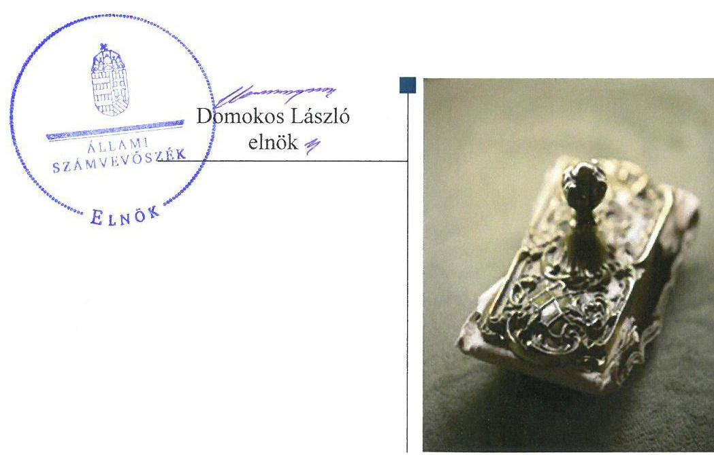
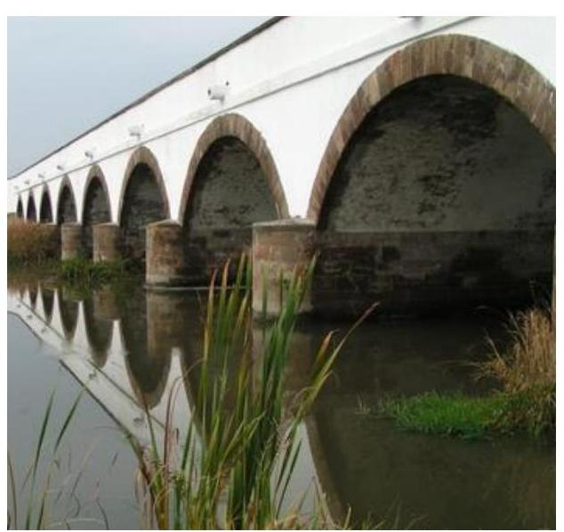
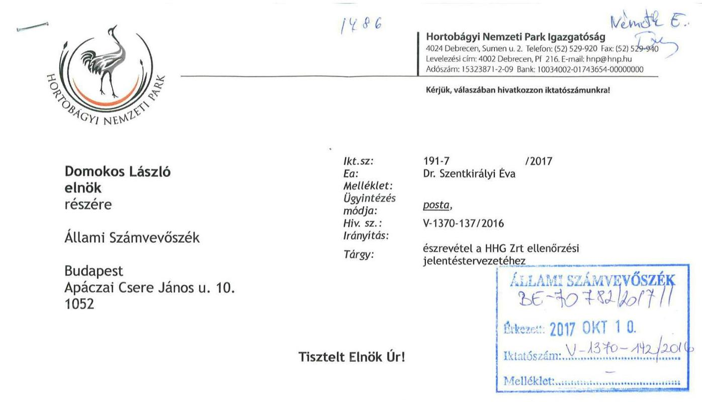
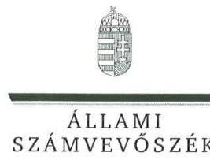
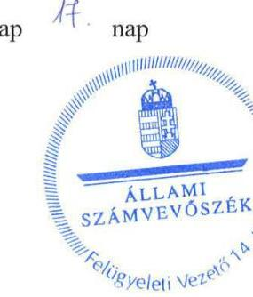

# Jelentés 

## Állami tulajdonú gazdasági társaságok

Az állami tulajdonban (résztulajdonban) lévő gazdálkodó szervezetek vagyonmegőrzési és gazdálkodási tevékenységének ellenőrzése Hortobágyi Halgazdaság Zrt.
2017.

---

# Jelentés 

## Állami tulajdonú gazdasági társaságok

Az állami tulajdonban (résztulajdonban) lévő gazdálkodó szervezetek vagyonmegőrzési és gazdálkodási tevékenységének ellenőrzése Hortobágyi Halgazdaság Zrt.
2017. vasenber hó 25. nap

---

# AZ ELLENŐRZÉST FELÜGYELTE:

DR. NÉMETH ERZSÉBET felügyeleti vezető

## AZ ELLENŐRZÉST VEZETTE ÉS A VÉGREHAJTÁSÁÉRT FELELŐS:

BAJNAI ZSUZSANNA ellenőrzésvezető

## A PROGRAM ÖSSZEÁLLÍTÁSÁÉRT FELELŐS:

JANIK JÓZSEF LÁSZLÓ osztályvezető

IKTATÓSZÁM: V-1370-144/2016.

TÉMASZÁM: 2404

ELLENŐRZÉS-AZONOSÍTÓ SZÁM: V075941

Jelentéseink az Országgyűlés számítógépes hálózatán és az Interneta a www.asz.hu címen is olvashatóak.

---

# TARTALOMJEGYZÉK 

■ ÖSSZEGZÉS ..... 5
■ AZ ELLENŐRZÉS CÉLJA ..... 6
■ AZ ELLENŐRZÉS TERÜLETE ..... 7
■ AZ ELLENŐRZÉS HÁTTERE, INDOKOLTSÁGA ..... 8
■ A JELENTÉS LÉNYEGES KÉRDÉSKÖREI ..... 9
■ ELLENŐRZÉS HATÓKÖRE ÉS MÓDSZEREI ..... 10
■ MEGÁLLAPÍTÁSOK ..... 12
■ JAVASLATOK ..... 16
■ MELLÉKLETEK ..... 19
I. sz. melléklet: Értelmező szótár ..... 19
■ FÜGGELÉK: ÉSZREVÉTELEK ..... 23
■ RÖVIDÍTÉSEK JEGYZÉKE ..... 27

---

.

---

# ÖSSZEGZÉS 

A Hortobágyi Halgazdaság Zrt. felett a Magyar Nemzeti Vagyonkezelő Zrt. és a Hortobágyi Nemzeti Park Igazgatósága szabályszerűen gyakorolta a tulajdonosi jogokat. A Hortobágyi Halgazdaság Zrt. müködésének szabályozottsága, a bevételek és ráfordítások elszámolása - a személyi jellegú ráfordítások kivételével - nem felelt meg az előírásoknak. A vagyonnal való gazdálkodás nem volt szabályszerű.

## Az ellenőrzés társadalmi indokoltsága

Az állami tulajdonú gazdálkodó szervezetek a nemzeti vagyon részét képezik. Az állami vagyonnal való gazdálkodást illetően a tulajdonosi joggyakorlás és vagyongazdálkodás feladata az állami vagyon átlátható, rendeltetésszerű és felelős használatának biztosítása. Minden közpénzt, közvagyont használó szervezettel szemben társadalmi igény, hogy tevékenységéről elszámoljon.

A Hortobágyi Halgazdaság Zrt. több mint 850 halastavat és egyéb ingatlant kezel, tevékenységét a Hortobágyi Nemzeti Park területén végzi. Az ország legnagyobb halgazdasága, területe meghaladja a 4500 hektárt. A vagyonkezelt vagyon méretét, nagyságát figyelembe véve, az Állami Számvevőszék Stratégiájával összhangban került sor a Hortobágyi Halgazdaság Zrt. ellenőrzésére a 2012-2015. évek vonatkozásában.

## Főbb megállapítások, következtetések

A Hortobágyi Halgazdaság Zrt. felett a Magyar Nemzeti Vagyonkezelő Zrt. és a Hortobágyi Nemzeti Park Igazgatósága az előírásoknak megfelelően gyakorolta a tulajdonosi jogokat.

A Hortobágyi Halgazdaság Zrt. rendelkezett a törvény által előírt szabályzatokkal, azonban a számviteli politikát nem módosították, és az nem tartalmazott a saját és a vagyonkezelt vagyon elkülönített nyilvántartására vonatkozó előírást.

A belső szabályozási hiányosságok hozzájárultak ahhoz, hogy a bevételek és a ráfordítások elszámolása - a személyi jellegú ráfordítások kivételével - nem volt megfelelő, mert a vagyonkezelt és a saját vagyonhoz kapcsolódó elkülönítés nem történt meg. Az éves és évközi, beszámolási, adatszolgáltatási kötelezettséget teljesítették, azonban a közérdekből nyilvános adatokat nem tették közzé.

A vagyonnyilvántartása nem felelt meg az előírásoknak, a beszámolók a vagyon - vagyonkezelt illetve saját vagyon szerinti - megoszlásáról nem a valós helyzetet tükrözték. Nem volt biztosított a nemzeti vagyonnal történő átlátható és felelős gazdálkodás követelményeinek érvényesülése.

---

# AZ ELLENŐRZÉS CÉLJA 

Az ellenőrzés célja annak értékelése volt, hogy a tulajdonosi jogok gyakorlása szabályszerű volt-e; a gazdálkodó szervezet szabályozottsága, gazdálkodása és vagyongazdálkodási tevékenysége megfelelt-e a jogszabályi és a tulajdonosi előírásoknak; a vagyonváltozást eredményező döntések esetében a tulajdonosi jogok gyakorlója és a gazdálkodó szervezet szabályszerűen jártak-e el.

---

# **Hortobágyi Halgazdaság Zrt.**

A Társaság^{1} jogelődje 1916-ban kezdte halászati tevékenységét a Hortobágyon. Gazdasági társasági formában 1993. november 30. óta működik, tulajdonosa 100%-ban a Magyar Állam. A Társaság felett a tulajdonosi jogokat és kötelezettségeket 2014. június 30-ig az MNV Zrt.^{2}, 2014. július 1-jétől a HNPI^{3} látta el^{*} megbízási szerződés alapján. A Társaságnál egyszemélyes jellegéből adódóan közgyűlés nem működött, a legfőbb szerv hatáskörébe tartozó kérdésekben a tulajdonosi joggyakorlók döntöttek.

A Társaság fő tevékenységi köre az édesvízi halászat mellett foglalkozott szaporítással, ivadékneveléssel, haltenyésztéssel, az országban egyedülálló módon biogazdálkodás keretében, továbbá halfeldolgozással, a világörökség részét képező természeti környezetben.

A Társaság feladatát saját és vagyonkezelésbe vett állami vagyonnal végezte. A kezelt vagyon Nemzeti Földalapba tartozó része felett a tulajdonosi jogokat az állami vagyon felügyeletéért felelős miniszter az agrárpolitikáért felelős miniszterrel közösen az NFA^{4} útján, az egyéb vagyonelemek tekintetében az MNV Zrt. gyakorolta.

Az éves beszámolók kiemelt adatait az 1. táblázat mutatja be.

1. táblázat

|  ÉVES BESZÁMOLÓK KIEMELT ADATAI (M FT) |  |  |  |   |
| --- | --- | --- | --- | --- |
|  Megnevezés | 2013. | 2013. | 2014. | 2015.  |
|   | YIL 31. | YIL 31. | YIL 31. | YIL 31.  |
|  Mérlegfőösszeg | 2417,0 | 2404,9 | 2687,5 | 3021,8  |
|  Mérleg szerinti eredmény | - 2,7 | - 271,5 | - 141,9 | 20,0  |
|  Saját tőke | 1261,1 | 1008,8 | 876,9 | 999,6  |
|  Jegyzett tőke | 816,1 | 816,1 | 816,1 | 816,2  |
|  Kötelezettségek | 938,6 | 1067,5 | 1505,8 | 1102,4  |
|  Követelések | 399,8 | 491,3 | 464,5 | 390,7  |
|  Értékesítés nettó árbevétele | 1369,6 | 1379,7 | 1032,8 | 1074,2  |
|  Anyagjellegű ráfordítások | 1056,6 | 1090,5 | 721,7 | 635,3  |
|  Személyi jellegű ráfordítások | 585,5 | 538,4 | 502,7 | 485,6  |
|  Üzemi tevékenység eredménye | - 36,6 | - 257,4 | - 135,7 | - 55,4  |

*Forrás: a Társaság 2012-2015. évi éves beszámolói*

A jelenlegi vezérigazgató 2015. április 15-től látja el feladatát. A könyvvizsgáló személye egyszer változott. Az átlagos statisztikai létszám 2015-ben 139 fő volt.

^{*} 2016. január 1-jétől ismét az MNV Zrt a tulajdonosi joggyakorló.

---

# AZ ELLENŐRZÉS HÁTTERE, INDOKOLTSÁGA 

Az állami tulajdonú gazdálkodó szervezetek ellenőrzése kiemelten fontos a nemzeti vagyon megőrzése, megóvása érdekében. Gazdálkodásuk jellemzően a közérdeklődés és a média figyelmének középpontjában áll, amihez hozzájárul a gazdálkodásuk körébe tartozó - közvetlen vagy közvetett állami tulajdonú - vagyon nagysága.

Az ÁSZ ${ }^{5}$ középtávra szóló stratégiájában megfogalmazta, hogy az államháztartáson kívülre nyújtott költségvetési támogatások és ingyenes vagyonjuttatások, valamint az államháztartáson kívül működő közfeladat-ellátó rendszerek ellenőrzéseivel hozzájárul ahhoz, hogy a közpénzeket az államháztartáson kívül működő szervezetek is átlátható, rendezett módon használják fel.

Az ellenőrzés megállapításai és javaslatai hozzájárulhatnak a nemzeti vagyonnal való gazdálkodás átláthatóságának, elszámoltathatóságának javításához. Az ellenőrzési tapasztalatok segítik és erősítik az ÁSZ hozzáadott értéket teremtő tevékenységét és tanácsadó szerepét is, mivel az ellenőrzés rámutathat az állami tulajdonú gazdálkodó szervezetek gazdálkodási tevékenységével kapcsolatos jó gyakorlatokra és szabálytalanságokra, felhívhatja a figyelmet a jogszabályi követelmények teljesítéséhez szükséges feltételek hiányosságaira.

---

# A JELENTÉS LÉNYEGES KÉRDÉSKÖREI 

1. A tulajdonosi jogok gyakorlása szabályszerű volt-e?
2. A társaság müködésének szabályozottsága megfelelt-e az előírásoknak?
3. A társaságnál a pénzügyi-számviteli, adatszolgáltatási és ellenőrzési feladatok ellátása szabályszerű volt-e?
4. A társaság vagyongazdálkodása szabályszerű volt-e?

---

# ELLENŐRZÉS HATÓKÖRE ÉS MÓDSZEREI 

## Az ellenőrzés típusa

Megfelelőségi ellenőrzés.

## Az ellenőrzött időszak

A 2012. január 1-jétől 2015. december 31-ig tartó időszak.

## Az ellenőrzés tárgya

Az állami tulajdonban (résztulajdonban) lévő gazdasági társaság gazdálkodása, kiemelten vagyongazdálkodási tevékenysége, a tulajdonosi jogok gyakorlása.

Az ellenőrzés kiterjed minden olyan körülményre és adatra, amely az ÁSZ jogszabályban meghatározott feladatainak teljesítéséhez, valamint a program végrehajtása folyamán felmerült újabb összefüggések feltárásához szükséges.

## Az ellenőrzött szervezet

Hortobágyi Halgazdaság Zártkörűen Működő Részvénytársaság, és a Magyar Nemzeti Vagyonkezelő Zártkörűen Múködő Részvénytársaság, a Hortobágyi Nemzeti Park Igazgatósága, valamint a Nemzeti Földalapkezelő Szervezet, mint tulajdonosi joggyakorlók.

## Az ellenőrzés jogalapja

Az ellenőrzés jogalapját az ÁSZ tv. ${ }^{6}$ 1. § (3) valamint az 5. § (3)(5) bekezdései képezték.

## Az ellenőrzés módszerei

Az ellenőrzést a nemzetközi standardokat irányadónak tekintve az ellenőrzési program ellenőrzési kérdései, az ellenőrzött időszakban hatályos jogszabályok, az ellenőrzés szakmai szabályok és módszertanok figyelembe vételével végeztük el.

Az ellenőrzési kérdések megválaszolásához szükséges bizonyítékok megszerzése az ellenőrzött szervezetek által rendelkezésre bocsátott, to-

---

vábbá az ellenőrzés által feltárt releváns információkat tartalmazó dokumentumokra és adatokra alapozott megfigyelés, kérdésfelvetés, összehasonlítás, elemzés, továbbá mintavételezés ellenőrzési eljárások útján történt.

Az ellenőrzött szervezetek az ellenőrzés lefolytatásához tanúsítványok kitöltésével, valamint az ÁSZ által kért dokumentumok megküldésével szolgáltattak adatokat.

A bevételek és ráfordítások elszámolása, valamint a vagyonnyilvántartás terén a szabályszerű múködést véletlen mintavétellel és irányított kiválasztással ellenőriztük. A jogszabályoknak és a belső előírásoknak megfelelőnek, azaz szabályszerűnek tekintettük az adott területet, amennyiben a minta ellenőrzésének eredménye alapján 95\%-os bizonyossággal a teljes sokaságban a hibaarány kisebb volt, mint 10\%, nem megfelelőnek értékeltük, ha a hibaarány a 10\%-ot meghaladta.

A vagyon értékének, állagának megőrzését megfelelőnek minősítettük, ha az eszközök pótlása az értékcsökkenési leírással arányosan történt meg.

---

# 1. A tulajdonosi jogok gyakorlása szabályszerű volt-e? 

## Összegző megállapítás

### 1.1. számú megállapítás

2. táblázat

## MNV ZRT ÁLTAL MEGTARTOTT JOGOK

részvények elidegenítése, megterhelése, biztosítékként történő felajánlása a tőkeemelés, a tőke leszállítása átalakítás, megszüntetés kontrolling és eseti adatszolgáltatás kérése
tulajdonosi ellenőrzés
Forrás: megbizási szerződés

### 1.2. számú megállapítás

## A Társaság felett a tulajdonosi joggyakorlás szabályszerű volt.

## A Társaság feletti tulajdonosi joggyakorlás megfelelt az előírásoknak.

A TÁRSASÁG feletti tulajdonosi jogokat az MNV Zrt. a Vtv. ${ }^{7}$ alapján gyakorolta. A 1723/2013. (X. 11.) Korm. határozat alapján 2014. július 1-jei hatállyal megbízási szerződést ${ }^{8}$ kötött a HNPI-vel. Egyes a megbízási szerződésben meghatározott tulajdonosi jogokat az MNV Zrt. fenntartott magának, amelyeket a 2. táblázat ismertet.

A tulajdonosi joggyakorlásra vonatkozó előírásokat az MNV Zrt. SZMSZ ${ }^{9}$-ében és belső szabályzataiban, a HNPI SZMSZ ${ }^{10}$-ében, továbbá a Társaság alapító okiratában ${ }^{11}$ rögzítették. Az alapító okiratban meghatározták az alapító kizárólagos hatáskörébe tartozó döntések körét, rendelkeztek a tulajdonosi joggyakorló képviseletéről az $\mathrm{FB}^{12}$-ben, és a könyvvizsgáló személyéről. Igazgatóság kialakítására nem került sor, annak jogait a vezérigazgató gyakorolta. Az FB a Gt. ${ }^{13}$-nek és a Ptk. ${ }^{14}$-nek megfelelő ügyrendje szerint múködött, tagjainak száma három fő volt, összhangban a Taktv. ${ }^{15}$ és Ptk. ${ }_{2}$ előírásaival.

AZ ÜZLETI TERVEKET a Társaság minden évben elkészítette. A 2014. és 2015. évi üzleti terveket az alapító okirat VIII. fejezet 4) pontja ellenére az FB nem tárgyalta, a HNPI nem hozott döntést azok elfogadásáról.

AZ ÉVES BESZÁMOLÓKAT - az FB előzetes írásbeli véleményezését követően - az MNV Zrt. és a HNPI a Gt.-ben, illetve a Ptk. ${ }_{2}$-ben előírtaknak megfelelően a könyvvizsgálói jelentések birtokában fogadta el.

## A vagyonkezelt eszközök tekintetében nem az előírások szerint jártak el.

AZ ÁLLAMI VAGYON KEZELÉSÉRE az MNV Zrt. jogelődje a $\mathrm{KVI}^{16}$ kötött vagyonkezelési szerződést ${ }^{17}$ az ellenőrzött időszakot megelőzően. A vagyonkezelési szerződésben előírták az állami vagyon múködtetésének, állaga védelmének, értéke megőrzésének, gyarapításának követelményeit, a vagyonkezelésre vonatkozó nyilvántartási, adatszolgáltatási, elszámolási, visszapótlási kötelezettséget. 2010. szeptember 1-jétől az Nfatv. ${ }^{18}$ alapján a vagyonkezelt 858 db ingatlanból 850 db a Nemzeti Földalapba került, így ezen vagyonelemek tekintetében a tulajdonosi joggyakorló az NFA lett, az egyéb ingatlanok az MNV Zrt. hatáskörében maradtak. A vagyonkezelt ingatlanok körében bekövetkezett változást követően - a Vtv. 23. § (1) és az Nfatv. 19/A § (1) bekezdésében foglaltak ellenére - a

---

tulajdonosi joggyakorlók a saját tulajdonosi joggyakorlásukba tartozó ingatlanok körében nem kötöttek új szerződést.

A vagyonkezelt vagyon változását eredményező döntések előkészítésének rendjét az MNV Zrt. Portfóliós kódexében ${ }^{19}$ meghatározta, az NFA ilyen kötelezettséget nem írt elő a Társaság részére.

# 2. A társaság múködésének szabályozottsága megfelelt-e az előírásoknak? 

Összegző megállapítás

## A Társaság gazdálkodásának szabályozottsága nem volt megfelelő.

SZÁMVITELI POLITIKÁVAL ${ }^{20}$ rendelkezett a Társaság, azonban az nem tartalmazott a saját és a vagyonkezelt eszközökkel folytatott vállalkozási tevékenységéhez kapcsolható bevételek és ráfordítások elhatárolására vonatkozó szabályt a vagyonkezelési szerződés 10.2. pontjában foglaltak ellenére, továbbá a saját és a rábízott állami vagyon elkülönített nyilvántartására vonatkozó előírást a Vhr ${ }^{21}$. 14. § (1) bekezdése és a vagyonkezelési szerződés 10.3 pontja ellenére.

A Számviteli politikán a Számv. ${ }^{22}$ tv. 14. § (11) bekezdése ellenére a 2013. január 1-jével hatályba lépett - a Számv. tv. 3. § (3) bekezdésének 3. pontja szerinti jelentős összegű hiba fogalmához kapcsolódó - változásokat nem vezették át.

A Társaság rendelkezett a Számv. tv. előírásainak megfelelő Leltározási szabályzattal ${ }^{23}$, Értékelési szabályzattal ${ }^{24}$, Önköltségszámítási szabályzattal ${ }^{25}$, Pénzkezelési szabályzattal ${ }^{26}$. A Számlarend ${ }^{27}$ 2015. április 30-ig nem tartalmazta a bizonylati rendet a Számv. tv. 161. § (2) bekezdés d) pontjában foglaltak ellenére.

A JAVADALMAZÁSI SZABÁLYZATOT ${ }^{28}$ megalkották. A szabályzat a Taktv. előírásainak megfelelően rendelkezett a vezető tisztségviselők, FB tagok, valamint a vezető állású munkavállalók javadalmazása, a jogviszony megszűnése esetére biztosított juttatások módjának, mértékének elveiről, annak rendszeréről.

## 3. A társaságnál a pénzügyi-számviteli, adatszolgáltatási és ellenőrzési feladatok ellátása szabályszerű volt-e?

Összegző megállapítás

A Társaságnál a pénzügyi-számviteli, adatszolgáltatási és ellenőrzési feladatok ellátása nem volt szabályszerű.
3.1. számú megállapítás

A bevételek és anyagjellegú ráfordítások, az értékcsökkenési leírás elszámolása nem felelt meg az előírásoknak, a személyi jellegú ráfordítások könyvelése szabályosan történt.

A BEVÉTELEK ÉS AZ ANYAGJELLEGÚ RÁFORDÍTÁSOK elszámolása nem felelt meg a vagyonkezelési szerződés

---

10.2 pontjában előírtaknak, mivel a vagyonkezelt és saját eszközökhöz kapcsolódó bevételek és ráfordítások elkülönített nyilvántartása nem valósult meg.

Az előállított termékek önköltségét az Önköltségszámítási szabályzat szerinti utókalkulációval számították ki, amely információt szolgáltatott az árképzéshez. Az árak kialakítása megfelelt az előírásoknak.

A SZEMÉLYI JELLEGÚ RÁFORDÍTÁSOK elszámolása a számfejtett béreknek megfelelően történt, munkaszerződések, jelenléti ívek támasztották alá.

AZ ÉRTÉKCSÖKKENÉSI LEÍRÁS könyvelése nem volt megfelelő, mert az üzembe helyezést nem dokumentálták hitelt érdemlően a Számv. tv. 52. § (2) bekezdésében foglaltak ellenére, így a rendeltetésszerú használatbavétel kezdő időpontja nem volt alátámasztott.
3.2. számú megállapítás

A beszámolási, adatszolgáltatási kötelezettséget teljesítették, azonban a közérdekből nyilvánosnak minősülő adatokat nem tették közzé.

AZ ELŐíRT ADATSZOLGÁLTATÁSOKAT a Társaság teljesítette, továbbá eleget tett az alapítói határozatokban előírt eseti feladatainak.

AZ ÉVES BESZÁMOLÓK letétbe helyezéséről és közzétételéről a Társaság a 2015. év kivételével határidőben gondoskodott, a 2015. évi beszámolót néhány napos késedelemmel tette közzé.

A KÖZÉRDEKBŐL NYILVÁNOS ADATOKAT nem tették közzé a Taktv. 2. § (1) bekezdésében foglaltak ellenére.

A BELSŐ ELLENŐRZÉST múködtették. A belső ellenőr a vagyon védelme és megóvása érdekében folytatott le vizsgálatokat, melyeket intézkedés követett.

A TULAJ DONOSI ELLENŐRZÉS keretében a Társaság gazdálkodását HNPI által megbízott szolgáltató vizsgálta, szabályossági, célszerűségi, hatékonysági szempontok alapján a 2014. évben. A javaslatokra intézkedési terv készült, melyet végrehajtottak, esetenként késedelemmel.

# 4. A társaság vagyongazdálkodása szabályszerű volt-e? 

Összegző megállapítás

A Társaság vagyongazdálkodása nem volt szabályszerű. Nem az előírások szerint tartotta nyilván a saját és a kezelésében lévő állami vagyont. Leltározási tevékenysége nem felelt meg az előírásoknak.

A VAGYON NYILVÁNTARTÁSA nem felelt meg az előírásoknak, mert a saját és a rábízott állami vagyonról elkülönített nyilvántartást nem vezettek a Vhr.17. § (1) bekezdésében foglaltak ellenére.

---

A vagyonkezelési szerződésnek a vagyonnövekedés számviteli szabályok szerinti elszámolása érdekében szükséges módosítása nem történt meg az értéknövelő beruházások, felújítások végrehajtását követően a Vhr. 18. § (1) bekezdésében foglaltak ellenére. A Társaság a vagyonkezelt eszközökön végzett beruházások, felújítások vagyonnövekedésként történő állományba vételéhez szükséges számviteli bizonylattal (módosított vagyonkezelési szerződéssel) nem rendelkezett a Számv. tv. 165. § (1) bekezdése ellenére, így a Társaság az éves beszámolóiban nem mutatta ki az állami vagyon részét képező eszközök kezelésbevételéhez kapcsolódó vagyonkezelt eszközökön végzett, aktivált beruházások, felújítások értékét a kötelezettségek között a Számv. tv. 42. § (1) bekezdése ellenére. Az éves beszámolók ezért a Számv. tv. 4. § (2) bekezdésének előírása ellenére a Társaság vagyoni helyzetéről, a saját és a kezelt vagyon összetétele (forrásai) tekintetében nem adtak megbízható, valós képet. A könyvvizsgáló az éves beszámolókról készült jelentését korlátozás nélküli hitelesítő záradékkal látta el.

A meglévő tárgyi eszköz felújításával összefüggő munkák értékét nem értéknövelő tételként vették figyelembe a Számv. tv. 48. § (1) bekezdése ellenére, hanem önálló eszközként aktiválták.

LELTÁROZÁST 2013-ban és 2015-ben is végeztek mennyiségi felvétellel. A leltárak a Számv. tv. 69. § (1) bekezdésében foglaltak ellenére nem tartalmazták ellenőrizhető módon a Társaság mérleg fordulónapján meglévő tárgyi eszközeit mennyiségben és értékben, mert a leltárakból hiányoztak egyéb építmények, járművek.

A VAGYONGAZDÁLKODÁS vonatkozásában a feladat- és hatásköröket, valamint a felelősségi viszonyokat az alapító okiratban, továbbá belső szabályzatokban határozták meg. Az értékhatárhoz kötött beruházásokat a tulajdonosi joggyakorlók jóváhagyták.

A 2014-2015. években végrehajtott selejtezés nem felelt meg a Selejtezési szabályzat előírásainak. A selejtezett eszközöket a Szám. tv. 165. § (1) bekezdése ellenére bizonylat nélkül vezették ki a könyvekből.

A VAGYON ÉRTÉKE az ellenőrzött időszakban több mint másfélszeresére nőtt, szerkezetében átrendeződés nem történt. A saját és az állami tulajdonú vagyonkezelésbe vett eszközökön 2012-2015 között elvégzett összesen 1530,1 millió Ft összegű beruházás és felújítás jelentősen meghaladta az időszakban elszámolt 366,6 millió Ft összegű amortizációt. A vagyon állagmegőrzéséről karbantartással gondoskodtak.

A Vtv. 27. §. (2), továbbá a (7) bekezdés és a vagyonkezelési szerződés 10.4. pontjában foglalt visszapótlási kötelezettség teljesítése nem állapítható meg, mivel a Társaság nyilvántartásaiban nem különítette el a saját és a kezelt vagyonát.

---

# JAVASLATOK 

Az ÁSZ tv. 33. § (1) bekezdésében foglaltak értelmében az ellenőrzött szervezet vezetője köteles a jelentésben foglalt megállapításokhoz kapcsolódó intézkedési tervet összeállítani és azt a jelentés kézhezvételétől számított 30 napon belül az ÁSZ részére megküldeni. Amennyiben az ellenőrzött szervezet vezetője nem küldi meg határidőben az intézkedési tervet, vagy továbbra sem elfogadható intézkedési tervet küld, az Állami Számvevőszék elnöke az ÁSZ tv. 33. § (3) bekezdése a) és b) pontjaiban foglaltakat érvényesítheti.

## Az MNV Zrt. vezérigazgatójának

1. Intézkedjen, hogy az MNV Zrt. a jogszabályi előirásnak megfelelően módosítsa a vagyonkezelési szerződést a Hortobágyi Halgazdaság Zrt. vagyonkezelésében lévő ingatlanokra vonatkozóan.
(1.2. sz. megállapítás 1. bekezdés utolsó mondata alapján)

## Az NFA elnökének

1. Intézkedjen, hogy az NFA a jogszabályi előírásoknak megfelelően kósse meg a Nemzeti Földalapba tartozó ingatlanok vagyonkezelésére irányuló szerződést a Hortobágyi Halgazdaság Zrt. vagyonkezelésében lévő ingatlanokra vonatkozóan.
(1.2 sz. megállapítás 1. bekezdés utolsó alapján)

## Hortobágyi Halgazdaság Zrt. vezérigazgatójának

1. Intézkedjen arról, hogy a számviteli politika a jogszabályi előírásoknak minden szempontból megfeleljen.
(2. sz. megállapítás 1-2. bekezdései alapján)
2. Intézkedjen, hogy az eszközök aktiválása esetén az üzembe helyezést a Számv. tv. előírásainak megfelelően, hitelt érdemlő módon dokumentálják.
(3.1. sz. megállapítás 4. bekezdése alapján)
3. Intézkedjen a jogszabályi előírásnak megfelelően a közérdekü adatok közzétételéről.
(3.2 sz. megállapítás 3. bekezdése alapján)

---

4. Intézkedjen a saját és a rábizott állami vagyon elkülönített nyilvántartásának vezetéséről a jogszabályi előírásnak megfelelően.
(4. sz. megállapítás 1. bekezdése alapján)
5. Intézkedjen, hogy a vagyonkezelt eszközökön végzett, aktivált beruházások, felújítások értéke a jogszabályi előírásnak megfelelően kerüljön kimutatásra a Társaság éves beszámolóiban.
(4. sz. megállapítás 2. bekezdése alapján)
6. Intézkedjen, hogy a meglévő tárgyi eszköz felújításával összefüggő munkák értékét - a Számv. tv. előírásainak megfelelően - értéknövelő tételként vegyék figyelembe.
(4. sz. megállapítás 3. bekezdése alapján)
7. Intézkedjen a Számv. tv. előírásainak megfelelő, a mérleg tételeinek alátámasztásául szolgáló olyan leltár összeállításáról, amely tételesen, ellenőrizhető módon tartalmazza a mérleg fordulónapján meglévő eszközöket és forrásokat mennyiségben és értékben.
(4. sz. megállapítás 4. bekezdés 2. mondata alapján)
8. Intézkedjen, hogy a selejtezés a belső szabályzatnak megfelelően kerüljön elvégzésre, továbbá a selejtezés során a Számv. tv. előírásainak megfelelő bizonylat kiállításáról.
(4 sz. megállapítás 6. bekezdése alapján)

---

.

---

# MELLÉKLETEK 

- I. SZ. MELLÉKLET: ÉRTELMEZŐ SZÓTÁR
állami vagyon

2012. november 9-ig:
a) Az állam tulajdonában lévő dolog, valamint a dolog módjára hasznosítható természeti erő,
b) Az a) pont hatálya alá nem tartozó mindazon vagyon, amely vonatkozásában törvény az állam kizárólagos tulajdonjogát nevesíti,
c) az állam tulajdonában lévő tagsági jogviszonyt megtestesítő értékpapír, illetve az államot megillető egyéb társasági részesedés,
d) az államot megillető olyan immateriális, vagyoni értékkel rendelkező jogosultság, amelyet jogszabály vagyoni értékű jogként nevesít.
Forrás: Vtv. 1. § (2) bekezdése
2012. november 10-től az állami vagyon fogalma kiegészül a következő ponttal:
a) az állam tulajdonában lévő pénzügyi eszközök

Forrás: Vtv. 1. § (2) bekezdése
2013. június 30-ig gazdálkodó szervezet:
Az állami vállalat, az egyéb állami gazdálkodó szerv, a szövetkezet, a lakás-szövetkezet, az európai szövetkezet, a gazdasági társaság, az európai rész-vénytársaság, az egyesülés, az európai gazdasági egyesülés, az európai területi együttműködési csoportosulás, az egyes jogi személyek vállalata, a leányvállalat, a vízgazdálkodási társulat, az erdőbirtokossági társulat, a végrehajtói iroda, az egyéni cég, továbbá az egyéni vállalkozó.
Forrás: Ptk. ${ }^{29}$ 685. § c) pontja
2013. július 1-jétől gazdálkodó szervezet:
Az állami vállalat, az egyéb állami gazdálkodó szerv, a szövetkezet, a lakás-szövetkezet, az európai szövetkezet, a gazdasági társaság, az európai rész-vénytársaság, az egyesülés, az európai gazdasági egyesülés, az európai területi együttműködési csoportosulás, az egyes jogi személyek vállalata, a leányvállalat, a vízgazdálkodási társulat, az erdőbirtokossági társulat, a végrehajtói iroda, az egyéni cég, továbbá az egyéni vállalkozó. Az állam, a helyi önkormányzat, a költségvetési szerv, az egyesület, a köztestület, valamint az alapítvány gazdálkodó tevékenységével összefüggő polgári jogi kapcsolataira is a gazdálkodó szervezetre vonatkozó rendelkezéseket kell alkalmazni, kivéve, ha a törvény e jogi személyekre eltérő rendelkezést tartalmaz; a 292/A-292/B. §, 301/A-301/B. §, 405. § (1) bekezdés, valamint a 407/A. § (1) bekezdés tekintetében nem minősül gazdálkodó szervezetnek az, aki a közbeszerzésekről szóló törvény értelmében ajánlatkérő (szerződő hatóság).
Forrás: Ptk.: 685. § c) pontja
2014. március 15-től gazdálkodó szervezet:

A gazdasági társaság, az európai részvénytársaság, az egyesülés, az európai gazdasági egyesülés, az európai területi együttmüködési csoportosulás, a szövetkezet, a lakásszövetkezet, az európai szövetkezet, a vízgazdálkodási társulat, az erdőbirtokossági társulat, az állami vállalat, az egyéb állami gazdálkodó szerv, az egyes jogi személyek vállalata, a közös vállalat, a végrehajtói iroda, a közjegyzői iroda, az ügyvédi iroda, a szabadalmi ügyvivői iroda, az önkéntes kölcsönös biztosító pénztár, a magánnyugdíjpénztár, az egyéni cég, továbbá

---

az egyéni vállalkozó. Az állam, a helyi önkormányzat, a költségvetési szerv, az egyesület, a köztestület, valamint az alapítvány gazdálkodó tevékenységével összefüggő polgári jogi kapcsolataira is a gazdálkodó szervezetre vonatkozó rendelkezéseket kell alkalmazni.
Forrás: Ppt. ${ }^{30}$ 396. §
gazdasági társaság
tulajdonosi ellenőrzés
tulajdonosi jogok gyakorlója
A Ptk2. 3:88. § (1) bekezdése szerint „a gazdasági társaságok üzletszerű közös gazdasági tevékenység folytatására, a tagok vagyoni hozzájárulásával létrehozott, jogi személyiséggel rendelkező vállalkozások, amelyekben a tagok a nyereségből közösen részesednek, és a veszteséget közösen viselik".
2014. március 14-ig:

Az állami vagyon kezelőjét, haszonélvezőjét, használóját megillető jogok gyakorlását, annak szabályszerűségét, célszerűségét az MNV Zrt. - szükség szerint területi szervei útján - ellenőrzi.

## 2014. március 15-től:

Az állami vagyon használóját, vagyonkezelőjét és haszonélvezőjét megillető jogok gyakorlását, annak szabályszerűségét, a kötelezettségek teljesítését, valamint a vagyon rendeltetése szerinti célszerűségét a tulajdonosi joggyakorló rendszeresen ellenőrzi.
Forrás: Vhr. 20. §.(1)
1 .
2013. június 27-ig:

Az állami vagyon felett a Magyar Államot megillető tulajdonosi jogok és kötelezettségek összességét - ha törvény eltérően nem rendelkezik - az állami vagyon felügyeletéért felelős miniszter (a továbbiakban: miniszter) gyakorolja, aki e feladatát a Magyar Nemzeti Vagyonkezelő Zártkörűen Működő Részvénytársaság (a továbbiakban: MNV Zrt.), a Magyar Fejlesztési Bank, illetve a tulajdonosi joggyakorló szervezet útján látja el. A miniszter miniszteri rendeletben, a törvényben meghatározott állami vagyoni kör tekintetében, meghatározott időtartamra, a joggyakorlás egyes szabályainak meghatározásával az őt megillető tulajdonosi jogok és kötelezettségek összességének, illetve azok meghatározott részének gyakorlóját az Áht. szerinti központi költségvetési szervek, ezek intézménye, továbbá a 100\%-ban állami tulajdonban álló gazdasági társaságok közül kijelölheti.
Forrás: Vtv. 3. § (1) és (2)
2013. június 28-ától:

A rábízott állami vagyon felett az államot megillető tulajdonosi jogok és kötelezettségek összességét tulajdonosi joggyakorlóként:
ha törvény vagy miniszteri rendelet eltérően nem rendelkezik, a Magyar Nemzeti Vagyonkezelő Zártkörűen Működő Részvénytársaság (a továbbiakban: MNV Zrt.),
törvényben kijelölt személy vagy
az állami vagyon felügyeletéért felelős miniszter (a továbbiakban: miniszter) által rendeletben kijelölt személy gyakorolja.
[...] A miniszter e törvény felhatalmazása alapján - a meghatározott célok hatékonyabb elérése érdekében, miniszteri rendeletben, az ott meghatározott állami vagyoni kör tekintetében, meghatározott időtartamra - e törvény keretei között, a joggyakorlás egyes szabályainak meghatározásával - az államot megillető tulajdonosi jogok és kötelezettségek összességének, illetve azok meghatározott részének gyakorlóját az Áht. szerinti központi költségvetési

---

szervek, ezek intézménye, továbbá a 100\%-ban állami tulajdonban álló gazdasági társaságok közül kijelölheti.
Forrás: Vtv. 3. § (1) és (2)
2.

Aki a nemzeti vagyon felett az államot vagy a helyi önkormányzatot megillető tulajdonosi jogok és kötelezettségek összességének gyakorlására jogosult. Forrás: Nvtv. 3. § (1) 17. pontja

---

.

---

# FÜGGELÉK: ÉSZREVÉTELEK 

A jelentéstervezetet a Számvevőszék 15 napos észrevételezésre megküldte az ellenőrzött szervezetek vezetőinek az ÁSZ tv. 29. § ${ }^{\text {T }}$ (1) bekezdése előírásának megfelelően.

A függelék tartalmazza a Hortobágyi Nemzeti Park Igazgatóság igazgatója által megküldött észrevételeket, az azokra adott válaszokat, illetve az el nem fogadott észrevételek elutasításának indoklását.

[^0]
[^0]:    ${ }^{\text {® }}$ 29. § (1) Az Állami Számvevőszék az ellenőrzési megállapításait megküldi az ellenőrzött szervezet vezetőjének vagy az általa megbízott személynek, és annak, akinek személyes felelősségét állapította meg.
    (2) Az ellenőrzött szervezet vezetője és a felelősként megjelölt személy az ellenőrzés megállapításaira tizenöt napon belül írásban észrevételt tehet.
    (3) Az Állami Számvevőszék az észrevételre a beérkezésétől számított harminc napon belül írásban válaszol. A figyelembe nem vett észrevételeket köteles a jelentésben feltüntetni, és megindokolni, hogy azokat miért nem fogadta el.

---

Hivatkozva 2017. szeptember 14-én kelt levelére, melyben megküldte az „Állami tulajdonban (résztulajdonban) lévő gazdálkodó szervezetek vagyonmegőrzési és gazdálkodási tevékenységének ellenőrzése - Hortobágyi Halgazdaság Zrt"-re vonatkozó számvevőszéki jelentéstervezetét, írásbeli észrevételt kívánok tenni.
A jelentéstervezet 1.1. megállapítása az tartalmazza, hogy „a 2014. és 2015. évi üzleti tervet az FB nem tárgyalta, a HNPI nem hozott döntést azok elfogadásáról." 2014. július 1-étől gyakorolta a HNPI megbízás alapján a tulajdonosi jogokat, így a 2014-es üzleti tervet a HNPI-nek nem is kellett elfogadnia. 2015-ös üzleti tervvel mind az FB, mind a HNPI több ízben is foglalkozott, azonban a társaság likviditási helyzete, a tőkeemelés szükségessége reorganizációs terv készítését és végrehajtását tette szükségessé. Ebben a helyzetben az üzleti terv csak a reorganizációs terv elkészítése után, annak egyfajta végrehajtási terveként kellett volna elkészüljön. Így az FB a reorganizációs tervet részesítette prioritásban, amit a tulajdonosi joggyakorló jóvá is hagyott. Mindemellett, úgy gondoljuk, hogy amennyiben az ÁSZ jelentéstervezete az FB müködésére is tartalmaz megállapítást, akkor az FB-nek is lehetőséget kellett volna adni, hogy észrevételt tehessen a jelentéstervet megállapításaira.
Kérem, szíveskedjen észrevételeimet megfontolni és végleges jelentésében lehetőség szerint figyelembe venni.

Debrecen, 2017. október 4.

---

ELNÖK

Ikt.szám: V-1370-143/2016.

# Dr. Kovács Zita úrhölgy 

igazgató
Hortobágyi Nemzeti Park Igazgatóság

## Debrecen

## Tisztelt Igazgató Úrhölgy!

Az „Állami tulajdonú gazdasági társaságok - Az állami tulajdonban (résztulajdonban) lévő gazdálkodó szervezetek vagyonmegőrzési és gazdálkodási tevékenységének ellenőrzése Hortobágyi Halgazdaság Zrt." címủ jelentéstervezetre tett észrevételeit köszönettel megkaptam.

Az ellenőrzési megállapításokra vonatkozó észrevételét az Állami Számvevőszékről szóló 2011. évi LXVI. törvény 29. § (2) bekezdésében meghatározott tizenöt napos határidőn belül küldte meg. Az Állami Számvevőszék észrevétellel kapcsolatos álláspontját a mellékletként csatolt, a felügyeleti vezető által készített indokolás tartalmazza.

Budapest, 2017. 16. hó 4 nap

Tisztelettel:

Melléklet: Észrevételre adott válasz

Domokos László

---

# 1. számú melléklet   a V-1370-143/2016. számú levélhez 

„Állami tulajdonú gazdasági társaságok - Az állami tulajdonban (résztulajdonban) lévő gazdálkodó szervezetek vagyonmegőrzési és gazdálkodási tevékenységének ellenörzése - Hortobágyi Halgazdaság Zrt. " című jelentéstervezetre tett észrevételre adott válasz

A jelentéstervezetre tett észrevételt (1.1 számú megállapítás, 12. oldal harmadik bekezdés) áttekintettem, annak kezelésével kapcsolatban a következő tájékoztatást adom.
A Hortobágyi Halgazdaság zártkörűen működő Részvénytársaság (a továbbiakban: HHG Zrt.) esetében az üzleti terv elfogadása a többször módosított 2014. szeptember 1-jétől hatályos Alapító Okirat VI/z pontja szerint az alapító kizárólagos hatáskörébe tartozik. Az Alapító Okirat VIII/4. pontja előírja, hogy a HHG Zrt. Felügyelő Bizottsága (a továbbiakban: FB) köteles megvizsgálni minden olyan előterjesztést, amelyről a döntés az alapító kizárólagos hatáskörébe tartozik. Sem az üzleti terv elkészítésére, sem annak elfogadására az Alapító Okirat nem határozott meg határidőt, az az év során bármikor történhet.
A jelentéstervezet 12. oldal harmadik bekezdésében szereplő megállapítás szerint a 2014. és 2015. évi üzleti tervet az FB nem tárgyalta, a HNPI nem hozott döntést azok elfogadásáról.
Észrevétele kapcsán ismételten áttekintettük az ellenőrzött szervezetektől az ellenőrzés lefolytatásához beküldött dokumentumokat, és megállapítottuk, hogy a HHG Zrt. 2014. évre elkészített üzleti tervét az FB nem tárgyalta meg. A 2015. május 19-én megtartott FB-ülésről készült jegyzőkönyv alapján, a 24/2015. (V.19.) számú határozat értelmében a 2015. évre készített üzleti tervet az FB nem tárgyalta meg, hanem a későbbiekben elkészítésre kerülő reorganizációs tervet tervezte felvenni napirendjére. A reorganizációs tervet a HHG Zrt. vezérigazgatója 2015. augusztus 14-én készítette el. Az ellenőrzés rendelkezésére bocsátott FB jegyzőkönyvek nem tartalmaznak határozatot a reorganizációs terv elfogadására vonatkozóan.
A Hortobágyi Nemzeti Park Igazgatóság, mint a HHG Zrt. felett a Magyar Állam nevében tulajdonosi jogokat és kötelezettségeket gyakorló alapító az ÁSZ részére az ellenőrzés lefolytatásához nem küldött be olyan dokumentumokat, amely a HHG Zrt. 2014-2015. évi üzleti terveinek elfogadásáról szóló döntést tartalmazná.
A fentiekre való tekintettel a megállapítás módosítása nem indokolt.
Tájékoztatom Igazgató Úrhölgyet, hogy az Állami Számvevőszékről szóló 2011. évi LXVI. törvény 29. § (3) bekezdése alapján az Állami Számvevőszék a figyelembe nem vett észrevételeket köteles a jelentésben feltüntetni és megindokolni, hogy azokat miért nem fogadta el.

Budapest, 2017.

Dr. Németh Erzsébet felügyeleti vezető

---

# RÖVIDÍTÉSEK JEGYZÉKE 

${ }^{1}$ Társaság
${ }^{2}$ MNV Zrt.
${ }^{3}$ HNPI
${ }^{4}$ NFA
${ }^{5}$ ÁSZ
${ }^{6}$ ÁSZ tv.
${ }^{7}$ Vtv.
${ }^{8}$ megbízási szerződés
${ }^{9}$ MNV Zrt. SZMSZ-e
${ }^{10}$ HNPI SZMSZ-e
${ }^{11}$ Társaság alapító okirata
${ }^{12} \mathrm{FB}$
${ }^{13} \mathrm{Gt}$.
${ }^{14} \mathrm{Ptk}_{2}$
${ }^{15}$ Taktv.
${ }^{16} \mathrm{KVI}$
${ }^{17}$ vagyonkezelési szerződés
${ }^{18}$ Nfatv.
${ }^{19}$ Portfoliós kódex
${ }^{20}$ Számviteli politika
${ }^{21}$ Vhr.
${ }^{22}$ Számv. tv.
${ }^{23}$ Leltározási szabályzat
${ }^{24}$ Értékelési szabályzat
${ }^{25}$ Önköltségszámítási szabályzat
${ }^{26}$ Pénzkezelési szabályzat
${ }^{27}$ Számlarend

Hortobágyi Halgazdaság Zártkörűen Működő Részvénytársaság
Magyar Nemzeti Vagyonkezelő Zártkörűen Működő Részvénytársaság
Hortobágyi Nemzeti Park Igazgatósága
Nemzeti Földalapkezelő Szervezet
Állami Számvevőszék
2011. évi LXVI. törvény az Állami Számvevőszékről
2007. évi CVI. törvény az állami vagyonról

SZT-41883 számú Megbízási szerződés társasági részesedéshez kapcsolódó tulajdonosi jog gyakorlására a Magyar Nemzeti Vagyonkezelő Zártkörűen
Működő Részvénytársaság és a Hortobágyi Nemzeti Park Igazgatóság között
Magyar Nemzeti Vagyonkezelő Zrt. Szervezeti és Működési Szabályzata, a 301/2011.(V.30.) IG Határozattal kiadott, többször módosított (hatályos 2012. január 1-jétől)
Hortobágyi Nemzeti Park Igazgatóság Szervezeti és Működési Szabályzata (hatályos 2012. december 6-tól)
Hortobágyi Halgazdaság Zártkörűen Működő Részvénytársaság alapító okirata (hatályos 2011. március 21-től) és annak módosításai
felügyelőbizottság
2006. évi IV. törvény a gazdasági társaságokról (hatálytalan 2014. március 15-től)
2013. évi törvény a Polgári Törvénykönyvről (hatályos 2014. március 15-től)
2009. évi CXXII. törvény a köztulajdonban álló gazdasági társaságok takarékosabb müködéséről szóló (hatályos: 2009. december 4-től)
Kincstári Vagyoni Igazgatóság (általános jogutódja 2008. január 1-jétől az MNV Zrt.)
A Hortobágyi Halgazdaság Rt és a KVI között 2002. március 29-én aláírt Kincstári vagyon körbe tartozó ingatlanokra és ingóságokra vonatkozó Vagyonkezelési szerződés
2010. évi LXXXVII. törvény a Nemzeti Földalapról

Magyar Nemzeti Vagyonkezelő Zrt. 7/2015. számú vezérigazgatói utasítás az MNV Zrt. Portfoliós Kódexéről (hatályos 2015. március 31-től)
Számviteli politika (hatályos 2011. június 9-től 2015. április 29-ig)
Számviteli politika (hatályos 2015. április 30-tól
254/2007. (X. 4.) Korm. rendelet az állami vagyonról való gazdálkodásról
2000. évi C. törvény a számvitelről

Leltározási szabályzat (hatályos 2012. január 3-tól 2015. április 29-ig)
Leltározási szabályzat (hatályos 2015. április 30-tól)
Értékelési szabályzat (hatályos 2011. június 9-től 2015. április 29-ig)
Értékelési szabályzat (hatályos 2015. április 30-tól)
Önköltségszámítási szabályzat hatályos (2011. június 9-től 2015. április 29-ig)
Önköltségszámítási szabályzat hatályos (2015. április 30-tól)
Pénzkezelési szabályzat (hatályos 2012. január 3-tól 2015. április 29-ig)
Pénzkezelési szabályzat (hatályos 2015. április 30-tól)
Számlarend (hatályos 2004. december 17-től 2015. április 29-ig

---

${ }^{28}$ Javadalmazási szabályzat
${ }^{29} \mathrm{Ptk}_{1}$
${ }^{30} \mathrm{Ppt}$.

Számlarend (hatályos 2015. április 30-tól)
Javadalmazási szabályzat és annak módosításai (hatályos 2011. március 21-től)
1959. évi IV. törvény a Polgári Törvénykönyvről (hatálytalan 2014. március 15től)
1952. évi III. törvény a polgári perrendtartásról

---

ÁLLAMI SZÁMVEVŐSZÉK
1052 Budapest, Apáczai Csere János utca 10.
Levélcím: 1364 Budapest 4. Pf. 54
Telefon: +36 14849100 Telefax: +36 14849200
www.asz.hu