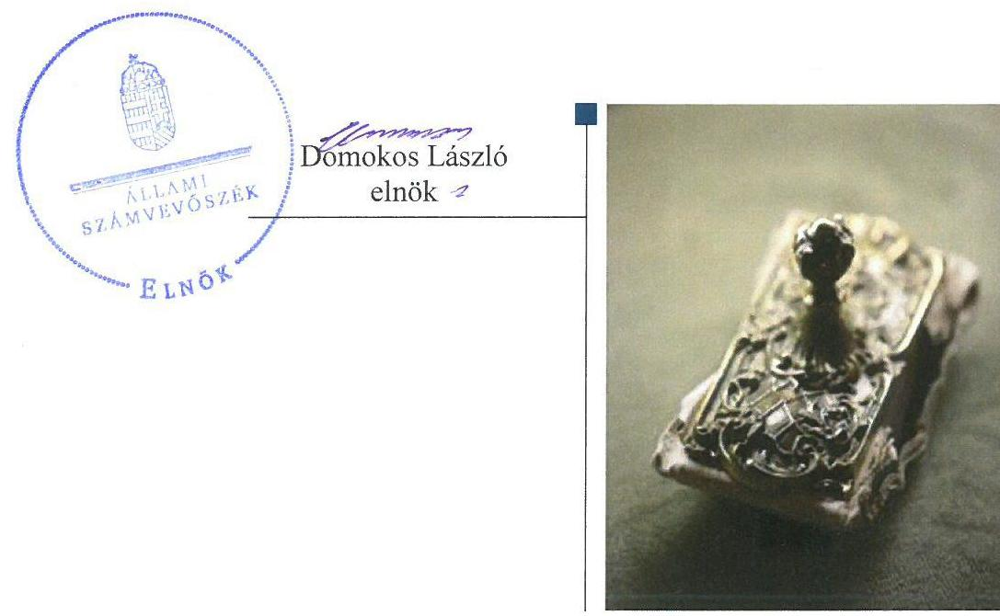
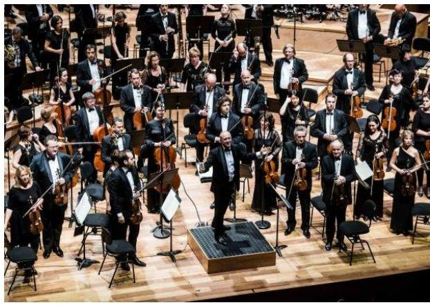
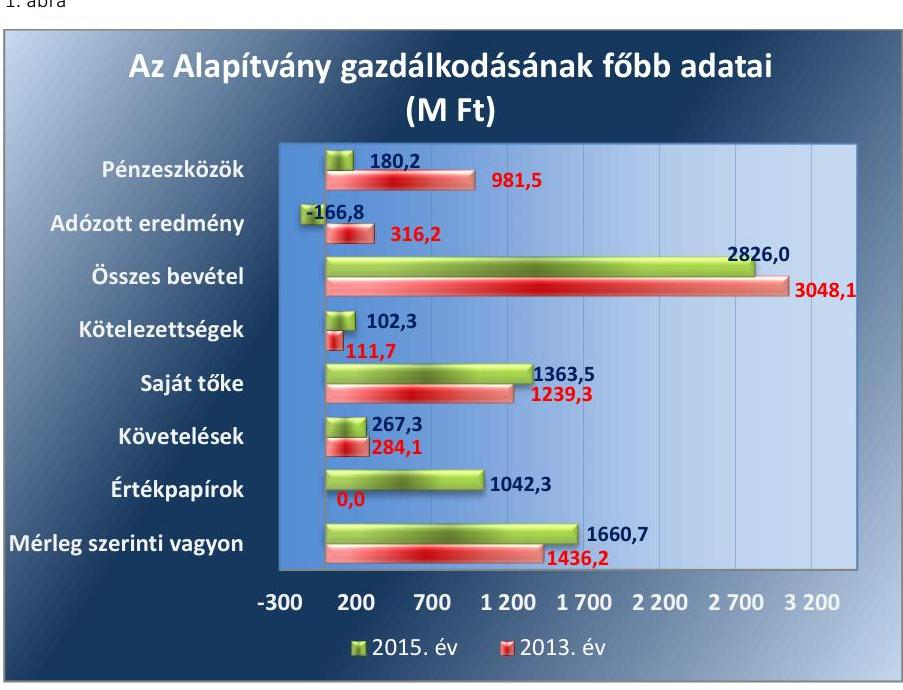
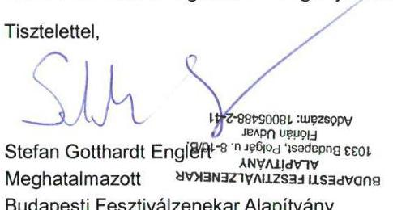
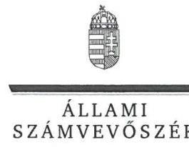
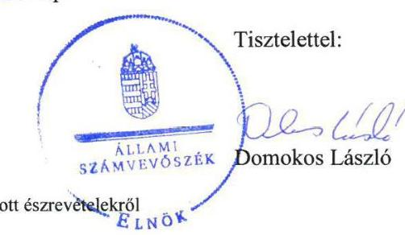

# Jelentés 

## Alapítványok ellenőrzése

Alapítványok/közalapítványok gazdálkodásának ellenőrzése Budapesti Fesztiválzenekar Alapítvány 2017.

---

# Jelentés 

## Alapítványok ellenőrzése

Alapítványok/közalapítványok gazdálkodásának ellenőrzése Budapesti Fesztiválzenekar Alapítvány 2017. 11. hó 09. nap

---

# AZ ELLENŐRZÉST FELÜGYELTE:

- **HOLMAN MAGDOLNA JULIANNA** felügyeleti vezető
- **AZ ELLENŐRZÉST VEZETTE ÉS A VÉGREHAJTÁSÁÉRT FELELŐS:**
  - **KEREKES PÉTER, MAROZSÁN LÁSZLÓNÉ** ellenőrzésvezető
  - **A PROGRAM ÖSSZEÁLLÍTÁSÁÉRT FELELŐS:**
    - **JANIK JÓZSEF LÁSZLÓ** osztályvezető

**IKTATÓSZÁM:** V-1272-082/2016

**TÉMASZÁM:** 2306

**ELLENŐRZÉS-AZONOSÍTÓ SZÁM:** V077501

Jelentéseink az Országgyűlés számítógépes hálózatán és az Interneta a www.asz.hu címen is olvashatóak.

---

# TARTALOMJEGYZÉK 

■ ÖSSZEGZÉS ..... 5
■ AZ ELLENŐRZÉS CÉLJA ..... 6
■ AZ ELLENŐRZÉS TERÜLETE ..... 7
■ AZ ELLENŐRZÉS HÁTTERE, INDOKOLTSÁGA ..... 9
■ A JELENTÉS LÉNYEGES KÉRDÉSKÖREI ..... 10
■ ELLENŐRZÉS HATÓKÖRE ÉS MÓDSZEREI ..... 11
■ MEGÁLLAPÍTÁSOK ..... 13
■ JAVASLATOK ..... 18
■ MELLÉKLETEK ..... 19
I. Sz. melléklet: Értelmező szótár ..... 19
■ FÜGGELÉK: ÉSZREVÉTELEK ..... 21
■ RÖVIDÍTÉSEK JEGYZÉKE ..... 37

---

.

---

# ÖSSZEGZÉS 

A Budapesti Fesztiválzenekar Alapítvány a gazdálkodása szervezeti kereteit kialakította, belső szabályozása összességében megfelelő volt. Az Alapítvány gazdálkodása nem volt szabályszerű, a ráfordítások elszámolása és az egyszerűsített éves beszámolók összeállítása során nem érvényesültek a jogszabályi előírások, így azok nem biztosították az államháztartásból kapott támogatások elszámoltathatóságát. Az alapítói akarat ellenére az Alapítvány a 2014-2015. években befektetési tevékenységet végzett. A támogatások nyilvántartása és elszámolása megfelelt a jogszabályi és támogatói előírásoknak.

## Az ellenőrzés társadalmi indokoltsága

Az Állami Számvevőszék az államháztartásból származó források felhasználásának keretében ellenőrzi az alapítványok, közalapítványok gazdálkodását. A jogszabályi felhatalmazás szerint azokat az alapítványokat, közalapítványokat ellenőrizheti, amelyek az államháztartásból nyújtott támogatásban vagy az államháztartásból meghatározott célra ingyenesen juttatott vagyonban részesültek. Ezekben az esetekben az érintett szervezetek gazdálkodási tevékenységének egésze ellenőrizhető.

Az ellenőrzések eredményeként tovább csökken a közpénzfelhasználás ellenőrizetlen területeinek száma. Az ÁSZ ${ }^{1}$ Stratégiájában célul tűzte ki, hogy az államháztartáson kívülre nyújtott költségvetési támogatások és az ingyenes vagyonjuttatás ellenőrzésével hozzájárul ahhoz, hogy a közpénzeket a civil szervezetek is átlátható módon használják fel.

## Főbb megállapítások, következtetések

Az Alapítvány² a gazdálkodása szervezeti kereteit kialakította, gazdálkodására vonatkozó belső szabályozása a számlarend kivételével megfelelt a jogszabályi előírásoknak, azonban az idegen nyelvű bizonylatok kezelésére vonatkozó belső szabályokat és a közérdekű adatok közzétételére vonatkozó szabályokat nem alakította ki.

Az Alapítvány gazdálkodása nem volt szabályszerű, költségvetési tervei nem feleltek meg a jogszabályi előírásoknak, a beruházások, felújítások elszámolása a 2013. és a 2015. években, az igénybevett és egyéb szolgáltatások, valamint a személyi jellegű ráfordítások elszámolása a 2013. és a 2014. években nem volt megfelelő. A számviteli beszámolók összeállítása során a jogszabályi előírások nem kerültek betartásra, a mérlegtételek besorolása, értékelése, leltározása nem volt megfelelő, az eredménykimutatás egyes sorainak értékét nem szabályszerűen állapították meg. Az Alapítvány a 2014-2015. években befektetési tevékenységet végzett, ami nem volt szabályszerű, mivel az alapító okiratban annak folytatására az alapító ${ }^{3}$ nem biztosított lehetőséget. Az Alapítvány a kapott támogatásokat szabályszerűen tartotta nyilván és számolta el, felhasználásukat a jogszabályban előírtaknak megfelelően mutatta be az egyszerűsített éves beszámolók kiegészítő mellékleteiben. Az elszámolásokat a támogatók elfogadták. Az Alapítvány felügyelő szerve az Alapítvány gazdálkodását, működését ellenőrizte, azonban nem tett jelzést a Kuratórium ${ }^{4}$ felé az alapító okiratban foglaltakkal ellentétes befektetési tevékenység folytatásával, valamint a beszámoló egyes sorai értékének helytelen megállapításával kapcsolatban.

---

# AZ ELLENŐRZÉS CÉLJA 

Az ellenőrzés célja annak megállapítása volt, hogy az Alapítvány gazdálkodása során betartotta-e a vonatkozó jogszabályi előírásokat, szabályszerűen számolta-e el a kapott költségvetési támogatásokat, az államháztartásból meghatározott célra ingyenesen juttatott vagyon használata, hasznosítása szabályszerű volt-e, továbbá, hogy az Alapítvány múködését szolgáló ellenőrzési, monitoring és nyilvántartási rendszerek szabályszerűen múködtek-e.

---

# **A2 ELLENŐRZÉS TERÜLETE**

## **Budapesti Fesztiválzenekar Alapítvány**

Az Alapítványt a Budapesti Fesztiválzenekar Egyesület alapította 1992-ben 100 ezer Ft induló vagyonnal.

Az Alapítvány célja a magyar zenei kultúra, különös tekintettel a főváros zenei élete fejlődésének elősegítése érdekében a Budapesti Fesztiválzenekar működtetése. Az ellenőrzött időszakban az Alapítvány kulturális közhasznú tevékenysége mellett gazdasági-vállalkozási tevékenységet is folytatott, melynek keretében elsősorban reklámtevékenységből, valamint CD és műsorfüzet értékesítésből származott bevétele. A gazdasági-vállalkozási tevékenységből származó bevételének az aránya az Alapítvány összes bevételén belül a 2013. évi 0,44%-ról 2015. évre 2,9%-ra nőtt.

Az Alapítvány az ellenőrzött időszakban államháztartási és azon kívüli forrásból összesen 5 501,2 millió Ft támogatást kapott feladatellátásának minél magasabb színvonalú ellátásának biztosításához, melynek megoszlását forrásonként az 1. táblázat szemlélteti.

1. táblázat

### **A2 ALAPÍTVÁNY ÁLTAL KAPOTT TÁMOGATÁSOK MEGOSZLÁSA FORRÁSCSOPORTONKÉNT (M FT)**

|  Forrás | 2013. év | 2014. év | 2015. év | Összesen  |
| --- | --- | --- | --- | --- |
|  Kp. költségvetésből | 1 150,0 | 1 150,0 | 1 050,0 | 3 350,0  |
|  Fővárosi Önkormányzattól | 270,0 | 260,0 | 260,0 | 790,0  |
|  TAO támogatásból | 499,1 | 441,6 | 190,7 | 1 131,4  |
|  SZIA 1%-ból | 1,5 | 1,0 | 1,9 | 4,4  |
|  Egyéb forrásból (adomány, szponzori és egyéb tám.) | 58,1 | 77,8 | 89,5 | 225,4  |
|  Összesen | 1 978,7 | 1 930,4 | 1 592,1 | 5 501,2  |

*Forrás: 2013.-2015. évi egyszerűsített éves beszámolók, fölkönyvi kivonatok*

Az Alapítvány Budapest Főváros Önkormányzatával közszolgáltatási szerződést kötött, melynek keretében részt vesz az önkormányzati kulturális közfeladat ellátásában. Az EMMI^{7} támogatási szerződés alapján nyújtott támogatást az ellenőrzött időszakban az Alapítvány hazai és külföldi hangversenyeinek megvalósításához.

Az ellenőrzött időszakban az államháztartásból ingyenesen juttatott vagyont, illetve vagyoni hozzájárulást az Alapítvány nem kapott, gazdasági társaságban részesedéssel nem rendelkezett.

Önköltségszámítás rendjére vonatkozó belső szabályzat készítésére az Alapítvány a Számv. tv.^{8} rendelkezése alapján nem volt kötelezett, az ellenőrzött időszakban nem tartozott a Kbt.^{9} alanyi hatálya alá. Könyvvizsgálati kötelezettsége nem volt, azonban az ügyvezető döntése alapján sor került a könyvvizsgálati feladatok ellátására az ellenőrzött időszakban.

---

Az Alapítvány főbb gazdálkodási adatait az 1. ábra mutatja.
1. ábra

Forrás: 2013.-2015. évi egyszerúsített éves beszámolók
Az Alapítvány legfőbb szerve a Kuratórium, mely 2015. évben 13 tagból állt. Ügyvezetését a manager igazgató látja el, a múvészeti irányítást a zeneigazgató végzi.

Az Alapítvány által foglalkoztatottak létszáma 2015-ben 21 fő volt.

---

# AZ ELLENŐRZÉS HÁTTERE, INDOKOLTSÁGA 

Társadalmi elvárás a közpénzek értékelvű, rendeltetésszerű felhasználása, a közpénzekből nyújtott támogatások átláthatóságának megteremtése, amelyhez az ÁSZ az államháztartásból nyújtott támogatások ellenőrzésével kíván hozzájárulni. Az ÁSZ Stratégiájában rögzített célkitűzése, hogy az államháztartáson kívülre nyújtott költségvetési támogatások és az ingyenes vagyonjuttatás ellenőrzésével hozzájáruljon ahhoz, hogy a közpénzeket a civil szervezetek is átlátható módon használják fel. Továbbá az alapítványok gazdálkodása szabályszerűségének bemutatásával hozzájárul ahhoz, hogy a társadalom objektív képet alkothasson az alapítványok működéséről.

Az ellenőrzés eredményeinek célzott felhasználói a nyilvánosság, a jogalkotó, továbbá az alapítványok alapítói és szervei. Az ellenőrzés eredményeképp a törvényalkotás számára tapasztalatok állnak rendelkezésre az alapítványok gazdálkodása szabályozásához. Az ellenőrzött szervezetek szintjén gazdálkodásuk vonatkozásában a hiányosságok, szabálytalanságok feltárása, az ennek kapcsán megfogalmazott megállapítások elősegíthetik az alapítványok szabályszerű gazdálkodását, míg a társadalom számára információt szolgáltat arról, hogy az alapítványok a közpénzeket szabályszerűen használták-e fel. Az alapítványok gazdálkodása szabályszerűségének bemutatásával az ellenőrzés értékteremtő módon járul hozzá az ÁSZ stratégiai céljainak megvalósításához, a nyilvánosság megfelelő tájékoztatásához.

---

# A JELENTÉS LÉNYEGES KÉRDÉSKÖREI 

1.- Az Alapítvány gazdálkodása szabályszerű volt-e?
2.- Az Alapítvány szabályszerűen tartotta-e nyilván és számolta-e el a kapott támogatásokat?
3.- Az Alapítvány müködéséhez kapcsolódó ellenőrzések betöltött-ék-e a szerepüket?

---

# ELLENŐRZÉS HATÓKÖRE ÉS MÓDSZEREI 

## Az ellenőrzés típusa

Szabályszerűségi ellenőrzés.

## Az ellenőrzött időszak

A 2013. január 1-je és 2015. december 31-e közötti időszak, a 2015. évi támogatás elszámolására vonatkozóan a 2016. év.

## Az ellenőrzés tárgya

Az ellenőrzés tárgya az Alapítvány vonatkozó jogszabályi előírások szerinti gazdálkodási tevékenysége volt. Ezen belül az Alapítvány gazdálkodásához kapcsolódó szervezeti és szabályozási keretek a jogszabályi előírásoknak megfelelő kialakítása, a kapott költségvetési/egyéb támogatások szabályszerű elszámolására irányuló tevékenysége. Az ellenőrzés kiterjedt továbbá az Alapítvány működését, gazdálkodását szolgáló nyilvántartási, ellenőrzési, monitoring tevékenységére.

Az ellenőrzés kiterjedt minden olyan körülményre és adatra, amely az ÁSZ jogszabályban meghatározott feladatainak teljesítéséhez, valamint a program végrehajtása folyamán felmerült újabb összefüggések feltárásához szükséges volt.

## Az ellenőrzött szervezet

Budapesti Fesztiválzenekar Alapítvány

## Az ellenőrzés jogalapja

Az ÁSZ tv. ${ }^{10} 1 . \S$ (3) bekezdése, 5. § (3) bekezdése, továbbá az Ectv. ${ }^{11}$ 47. §-a.

## Az ellenőrzés módszerei

Az ellenőrzést az ellenőrzési program szempontjai, az adott időszakban hatályos jogszabályok, az ellenőrzés szakmai szabályok és módszertanok, valamint a nemzetközi standardok figyelembevételével végezte az ÁSZ.

A közpénzekkel való felelős gazdálkodás segítésére irányuló javaslatok kidolgozásakor a hatályos jogszabályok voltak az irányadóak.

---

Az ellenőrzés ideje alatt az ÁSZ az ellenőrzött szervezettel történő kapcsolattartást az ÁSZ SZMSZ ${ }^{12}$-ének vonatkozó előírásai alapján biztosította.

Az ellenőrzési kérdések megválaszolásához szükséges bizonyítékok megszerzése az ellenőrzött által rendelkezésre bocsátott dokumentumokra, adatokra alapozva megfigyelés, szemle (szemrevételezés), kérdésfeltevés (információkérés), mintavételezés, valamint elemző eljárás útján történt. A mintavételezés véletlen mintavételi eljárással történt.

Mintavétellel ellenőriztük az igénybevett és egyéb szolgáltatások, személyi jellegú ráfordítások, beruházások, felújítások ráfordításai elszámolásának, valamint a mérlegtételek besorolásának, év végi értékelésének, leltározásának szabályszerűségét. Az Alapítvány által nyújtott támogatás elszámolásának szabályszerűsége tételesen került ellenőrzésre. A minta alapján a sokaságban előforduló hibaarányt becsültük. „Megfelelőnek" értékeltünk egy ellenőrzött területet, amennyiben 95\%-os bizonyossággal a teljes sokaságban a hibaarány legfeljebb 10\%, „nem megfelelőnek", amennyiben 10\%-nál magasabb arányt képviselt. Abban az esetben, ha a teljes sokaság tekintetében a 10\%-os hibaarányhoz való viszony megítélésnek megbízhatósága nem érte el a 95\%-ot, annak elérése érdekében értékelésünket további szempontokkal egészítettük ki, és figyelembe vettük a feltárt hibák értékét.

Az ellenőrzési bizonyítékként felhasznált adatforrások közé tartoztak egyrészt a szakmai program részletes szempontjainál felsorolt adatforrások, másrészt minden - az ellenőrzés folyamán feltárt, az ellenőrzés szempontjából információt tartalmazó - dokumentum.

Az ellenőrzés lefolytatásához az Alapítvány a kitöltött tanúsítványok, valamint az ÁSZ által kért dokumentumok megküldésével szolgáltatott adatokat, információkat. Az így rendelkezésre bocsátott adatok, információk és a tanúsítványok adatai valódiságának kontrollja az ellenőrzés keretében történt.

---

# 1. Az Alapítvány gazdálkodása szabályszerű volt-e? 

## Összegző megállapítás

### 1.1. számú megállapítás

### 1.2. számú megállapítás

Az Alapítvány gazdálkodása nem volt szabályszerű, belső szabályozottsága összességében megfelelő volt.

Az Alapítvány a gazdálkodása szervezeti kereteit a jogszabályokban előírtaknak megfelelően alakította ki.

Az Alapítvány az ellenőrzött időszakban rendelkezett alapító okirat ${ }_{1-3}{ }^{13}$-tal, amelyben rögzítették a $\mathrm{Ptk}_{1-2}{ }^{14}$-ban előírt tartalmi elemeket.

Az alapító az alapító okirat ${ }_{1-3}$-ban kijelölte a Kuratórium, valamint az $\mathrm{FB}^{15}$ tagjait, meghatározta a zenekar vezetését ellátó manager igazgató és zeneigazgató főbb feladatait.

Az alapító megállapította az SZMSZ ${ }_{1-2}{ }^{16}$-ben az Alapítvány szervezetére és működésére vonatkozó szabályokat, melyek között meghatározta az Alapítvány gazdálkodására, vagyonának kezelésére vonatkozó főbb előírásokat.

Az Alapítvány gazdálkodására vonatkozó belső szabályozás összességében megfelelt a jogszabályi előírásoknak. A közzététellel kapcsolatos szabályozási kötelezettségüknek nem tettek eleget.

Az Alapítvány gazdálkodására vonatkozó alapvető feladat és hatásköröket az alapító okirat ${ }_{1-3}$, továbbá az SZMSZ $_{1-2}$ rögzítette. Rendelkezett továbbá gazdálkodásának részletszabályait tartalmazó, a Számv. tv. által előírt számviteli politiká ${ }_{1-3}{ }^{17}$-val leltározási szabályzat ${ }_{1-3}{ }^{18}$-tal, értékelési szabály-zat ${ }_{1-3}{ }^{19}$-tal , pénzkezelési szabályzat ${ }_{1-3}{ }^{20}$-tal és számlarend ${ }^{21}$-del.

A SZÁMLAREND a 2014. évtől nem felelt meg a Számv. tv. 161. § (2) bekezdés a) pontja előírásának, mert nem tartalmazta minden alkalmazásra kijelölt számla számjelét és megnevezését.

Nem felelt meg továbbá a Számv. tv. 161/A. (1) bekezdésében foglaltaknak, mivel a költségek vonatkozásában nem alakította ki az alaptevékenysége és a vállalkozási tevékenysége között, a 224/2000. (XII.19.) Korm. rendelet ${ }^{22}$ 8. § (9) bekezdésében előírt elkülönített nyilvántartási kötelezettség megvalósítására vonatkozó belső szabályokat annak érdekében, hogy azok a mérleg, az eredménykimutatás és a kiegészítő melléklet adatainak az alátámasztására alkalmasak legyenek.

Az idegen nyelvű számlák bizonylatolásával kapcsolatos belső szabályokat az Alapítványnál a Számv. tv. 166. § (4) bekezdésében előírtak ellenére nem alakították ki.

Az Alapítvány rendelkezett aláírási rend ${ }_{1-3}{ }^{23}$-del, melyben meghatározták a szerződések, megrendelések és teljesítésigazolások aláírására jogosult személyeket, továbbá 2013. december 9-től a kifizetések engedélyezőjét is.

---

Az Alapítvány az Info. tv. ${ }^{24}$ 37. §-ában meghatározott közzétételi listákon szereplő adatok pontos, naprakész és folyamatos közzétételére vonatkozó kötelezettsége teljesítésének részletes szabályait az Info. tv. 35. § (3) bekezdésében előírtak ellenére belső szabályzatban nem állapította meg.

Az adatbiztonsági követelmények teljesítése érdekében az Info. tv. 7. § (2) bekezdésének előírása ellenére nem alakították ki az Alapítványnál azokat az eljárási szabályokat, amelyek a természetes személyek adatainak, valamint a közérdekú adatoknak a kezelésére vonatkoznak.

# 1.3. számú megállapítás 

Az Alapítvány költségvetési tervei nem feleltek meg a jogszabályi előírásoknak.

AZ ALAPÍTVÁNY KÖLTSÉGVETÉSI TERVEIT a 20132015. években a Kuratórium jóváhagyta, azonban a 2013. évi költségvetés tervezése során nem tartották be az Ecvhr. ${ }^{25}$ 3. § (2) bekezdésében előírtakat, mivel a kiadásokat és a bevételeket nem egyensúlyban tervezték meg. A tervezett kiadások meghaladták a bevételeket.

A költségvetési terveket az Ecvhr. 3. § (1) bekezdésében előírtak ellenére nem a 224/2000. (XII. 19.) Korm. rendelet alapján készített beszámoló tartalmi elemeinek megfelelően készítették el.
1.4. számú megállapítás

Az Alapítvány a beruházási ráfordításainak, valamint az igénybevett és egyéb szolgáltatásai és a személyi jellegú ráfordításainak elszámolása az ellenőrzött időszak két évében nem volt szabályszerű.

A KÖNYVVEZETÉSE SORÁN az Alapítvány nem tartotta be az Ectv. 20. §-ában, valamint a 224/2000. (XII. 19.) Korm. rendelet 8. § (9) bekezdésében előírtakat, mivel nem különítették el az alaptevékenységgel és a gazdasági-vállalkozási tevékenységgel kapcsolatos ráfordításokat, azokat csak év végén osztották meg.

A BERUHÁZÁSOK, FELÚJÍTÁSOK ráfordításainak elszámolása a 2013. és a 2015. években nem volt megfelelő, mert
$\longrightarrow$ a beszerzett tárgyi eszközök bekerülési értékének a meghatározásánál a szállítási és szerelési tevékenység ellenértékét a Számv. tv. 47. § (1) bekezdésében előírtak ellenére nem vették figyelembe,
$\longrightarrow$ az eszközök értékcsökkenésének az elszámolása nem felelt meg a Számv. tv. 80. § (2) bekezdésében adott felhatalmazás alapján, a számviteli politika ${ }_{1-3} 15$. fejezetében előírt egyösszegű értékcsökkenési leírás szabályainak,
$\longrightarrow$ a könyvviteli elszámolást közvetlenül alátámasztó bizonylatokon nem érvényesültek a Számv. tv. 167. § (1) bekezdés c) pontjában foglalt előírások, mert nem tartalmazták a beruházások elrendelésére jogosult személy, valamint az utalványozó és a rendelkezés végrehajtását igazoló személy aláírását,
$\longrightarrow$ a bizonylatok hitelességéhez, a megbízható, a valóságnak megfelelő adatrögzítéshez, könyveléshez szükséges adatokat a könyvviteli nyilvántartásokban történő rögzítést megelőzően a Számv. tv. 166. § (4) bekezdésében előírtak ellenére a bizonylaton magyarul nem tüntették fel.

---

A 2014. évben a beruházások, felújítások ráfordításának elszámolása összességében megfelelt a Számv. tv.-ben és a belső szabályzatokban előírtaknak.

# AZ IGÉNYBEVETT ÉS EGYÉB SZOLGÁLTATÁSOK ÉS SZEMÉLYI JELLEGŰ RÁFORDÍTÁSOK elszámolása 

a 2013-2014. években nem volt megfelelő. A könyvviteli elszámolást közvetlenül alátámasztó bizonylatokon nem érvényesültek a Számv. tv. 167. § (1) bekezdés c) pontjában foglalt előírások, mert nem tartalmazták az adott gazdasági múvelet elrendelésére jogosult személy, valamint az utalványozó és a rendelkezés végrehajtását igazoló személy aláírását.

A 2015. évben az elszámolások összességében megfeleltek a Számv. tv.ben és a belső szabályozásokban előírtaknak.

### 1.5. számú megállapítás

Az Alapítvány a 2014-2015. években az alapítói akarat ellenére befektetési tevékenységet végzett.

PÉNZESZKÖZÉT az Alapítvány a 2013. és 2014. években bankbetétben kötötte le, a 2014-2015. években értékpapírokat is vásároltak, amely az Ectv. 2. § 3. pontja szerint befektetési tevékenységnek minősült. Az Alapítvány által folytatott befektetési tevékenység nem volt szabályszerű, mivel ellentétes volt az alapító okirat ${ }_{2-3}$ II. 1 pontjában rögzített alapítói akarattal, miszerint az Alapítvány befektetési tevékenységet nem végez.

A Kuratórium ülésein tárgyalta az Alapítvány befektetési tevékenységét, azonban döntést nem hozott. Az Alapítvány ügyvezetője Kuratóriumi döntés nélkül adott megbízást az értékpapír ügyletekre vonatkozóan, ami az SZMSZ ${ }_{1}$ V. § 13.5 pontjának és az SZMSZ ${ }_{2}$ V. § 12.5 pontjának előírása szerint a Kuratórium döntési hatáskörébe tartozott tekintettel arra, hogy ez a gazdasági múvelet az Alapítvány vagyonának szerkezeti összetételét megváltoztatta.

Az Alapítvány értékpapír állománya 2014. december 31-én 1068,5 millió Ft, a 2015. év végén 1042,3 millió Ft volt.
1.6. számú megállapítás

Az Alapítvány beszámolási kötelezettségét teljesítette, azonban beszámolóinak összeállítása során nem érvényesültek a jogszabályi előírások.

Az Alapítvány múködéséről, vagyoni, pénzügyi és jövedelmi helyzetéről az üzleti év könyveinek zárását követően egyszerűsített éves beszámolót, valamint közhasznúsági mellékletet készített, azonban a beszámolók összeállítása során a mérlegtételek besorolása, értékelése, leltározása nem volt megfelelő, továbbá az eredménykimutatás egyes sorai értékének megállapításánál nem jártak el szabályszerűen.

A MÉRLEG induló tőke sorának értéke a 2013-2015. években az Ectv. 2. § 14. pontjában előírtak ellenére az Alapítvány nyilvántartásba vételét követően, 1992-1996. évek között kapott támogatásokat, vagyoni hozzájárulást is tartalmazott, az alapító által rendelkezésre bocsátott vagyoni hozzájáruláson kívül.

---

Az éven túli lejáratú értékpapír állományt a Számv. tv. 23. § (5) bekezdésében előírtak ellenére a 2015. évi közhasznú egyszerűsített éves beszámoló mérlegének elkészítéséig nem sorolták át a befektetett pénzügyi eszközök közé, azokat a forgóeszközök között mutatták ki.

A 2013-2015. évi mérlegsorokat leltárral alátámasztották, azonban a leltár a követelések esetében nem a Számv. tv. 69. § (2)-(3) bekezdéseiben foglalt, a leltározási szabályzatban előírt szabályszerű leltározás alapján készült, mivel a vevőköveteléseket az Alapítvány nem egyeztette a partnereivel.

AZ EREDMÉNYKIMUTATÁSBAN a 2014-2015. években a kamatokból és az értékpapírok hozamaiból származó bevételt az alap- és gazdasági-vállalkozási tevékenység közötti megosztás során a 224/2000. (XII. 19.) Korm. rendelet 15. § (4) bekezdésben előírtak ellenére figyelembe vették a vállalkozási tevékenység bevételeként.

Az Alapítvány egyszerűsített éves beszámolóinak és a közhasznúsági mellékleteinek az elfogadásakor a Kuratórium rendelkezésére állt az FB és a könyvvizsgáló jelentése. A beszámolókat a Kuratórium jóváhagyását követően az Ectv.-ben előírtaknak megfelelően határidőre letétbe helyezték és közzítették.

A KÖZÉRDEKŰ ADATOK nyilvánosságra hozásával kapcsolatos kötelezettségének az Alapítvány eleget tett.

# 2. Az Alapítvány szabályszerűen tartotta-e nyilván és számolta-e el a kapott támogatásokat? 

## Összegző megállapítás

Az Alapítvány szabályszerűen tartotta nyilván és számolta el a kapott támogatásokat.

A TÁMOGATÁSOK nyilvántartása az Alapítványnál megfelelt az Ectv.-ben előírtaknak.

Elszámolási kötelezettségének az Alapítvány az ellenőrzött időszakban a támogatókkal kötött közszolgáltatási szerződésekben, támogatási szerződésekben, illetve megállapodásokban előírtaknak megfelelően eleget tett, az elszámolásokat a támogatók elfogadták.

A támogatások felhasználását az Ectv.-ben előírtaknak megfelelően az egyszerűsített éves beszámolók kiegészítő mellékleteiben bemutatták.

---

# 3. Az Alapítvány működéséhez kapcsolódó ellenőrzések betöltött- 

ték-e a szerepüket?

Összegző megállapítás
Az Alapítvány működéséhez kapcsolódó FB ellenőrzések nem töltötték be a szerepüket.
3.1. számú megállapítás

Az FB az Alapítvány gazdálkodásához, múködéséhez kapcsolódó ellenőrzési feladatait nem a jogszabályban és az alapító által előírtaknak megfelelően látta el.

A KURATÓRIUM MEGHATÁROZTA az Alapítvány alapító okiratában az Ectv.-ben előírtaknak megfelelően az Alapítvány felügyelő szerveként múködő FB létrehozását, létszámát. Az alapító okiratban és az SZMSZ-ben rendelkezett továbbá az FB jogairól, kötelezettségeiről.

Az FB az ellenőrzött időszakban az SZMSZ1-2-ben foglaltaknak megfelelően a Kuratórium elé kerülő gazdálkodással kapcsolatos előterjesztéseket megvizsgálta és ezekkel kapcsolatos álláspontjáról a döntéshozó szervet tájékoztatta, múködésével kapcsolatosan ellenőrzést végzett, az ügyvezetőt ülésein beszámoltatta.

Az FB ülésén tárgyalta és meghatározta az Alapítvány befektetési politikájának alapelveit, nem tájékoztatta azonban a Kuratóriumot a 20142015. években arról, hogy az Alapítvány az alapító okirat ${ }_{2-3}$ tiltó rendelkezése ellenére folytat befektetési tevékenységet. Nem jelezte továbbá a legfőbb szerv felé, hogy az Alapítvány 2013-2015. évi egyszerűsített éves beszámolói mérlege és eredménykimutatása egyes sorainak értéke nem szabályszerűen került megállapításra.
3.2. számú megállapítás

Az Alapítványnak a külső ellenőrzésekhez kapcsolódóan nem volt intézkedési kötelezettsége.

KÜLSŐ ELLENŐRZÉST az Alapítványnál az ellenőrzött időszakban a NAV ${ }^{26}$ két alkalommal (mindkétszer 2014-ben), a Budapest Főváros Főpolgármesteri Hivatala pedig egy alkalommal végzett a 2015. évben. A Főpolgármesteri Hivatal az általa 2012-2014. évben nyújtott támogatások szerződésnek megfelelő felhasználásának szabályszerűségét ellenőrizte. A külső ellenőrző szervek intézkedést igénylő megállapításokat, javaslatokat nem tettek.

---

# JAVASLATOK 

Az ÁSZ tv. 33. § (1) bekezdésében foglaltak értelmében az ellenőrzött szervezet vezetője köteles a jelentésben foglalt megállapításokhoz kapcsolódó intézkedési tervet összeállítani és azt a jelentés kézhezvételétől számított 30 napon belül az ÁSZ részére megküldeni. Amennyiben az ellenőrzött szervezet vezetője nem küldi meg határidőben az intézkedési tervet, vagy továbbra sem elfogadható intézkedési tervet küld, az Állami Számvevőszék elnöke az ÁSZ tv. 33. § (3) bekezdése a) és b) pontjaiban foglaltakat érvényesítheti.

## A Budapesti Fesztiválzenekar Alapítvány Kuratóriuma elnökének

1. Intézkedjen az Info tv.-ben elöirtak érvényre juttatásához szükséges eljárási szabályok kialakítására
(1.2. sz. megállapítás 6. és 7. bekezdése alapján)
2. Intézkedjen a költségvetés tervezése és a könyvvezetés során a jogszabályban meghatározott elöírások betartására.
(1.3. sz. megállapítás 2. bekezdése és az 1.4. sz. megállapítás 1. bekezdése alapján)
3. Intézkedjen a beruházások, felújítások elszámolása során a Számv. tv.ben foglalt elöírások betartására.
(1.4. sz. megállapítás 2. bekezdése alapján)
4. Intézkedjen az alapító okiratban rögzítettek betartására.
(1.5. sz. megállapítás 1. bekezdés 2. mondata alapján)
5. Intézkedjen az egyszerüsített éves beszámoló összeállítása során az Ectv., a Számv. tv. és a vonatkozó kormányrendeletben elöírtak betartására.
(1.6. sz. megállapítás 2-5. bekezdése alapján)

---

# MELLÉKLETEK 

- I. SZ. MELLÉKLET: ÉRTELMEZŐ SZÓTÁR
adomány
alapító
alapító
alapítvány
államháztartás
államháztartásból származó forrás
beruházás
civil szervezet
felügyelőbizottság
felújítás
gazdálkodó tevékenység
gazdasági-vállalkozási tevékenység

A civil szervezetnek - létesítő okiratban rögzített céljaira - ellenszolgáltatás nélkül juttatott eszköz, illetve nyújtott szolgáltatás.
Az alapítványt, mint jogi személyt az alapító okiratban meghatározott tartós cél folyamatos megvalósítására létrehozó, az alapítvány részére az alapító okiratban meghatározott, az alapítványi cél megvalósításához szükséges pénzbeli és nem pénzbeli vagyoni hozzájárulást teljesítő személy(ek)/jogi személy(ek).
Az alapítvány az alapító által az alapító okiratban meghatározott tartós cél folyamatos megvalósítására létrehozott jogi személy. Az alapítvány a bírósági nyilvántartásba vételével jön létre. Az alapító az alapító okiratban meghatározza az alapítványnak juttatott vagyont és az alapítvány szervezetét. Alapítvány nem alapítható gazdasági-vállalkozási tevékenység folytatására. Az alapítvány az alapítványi cél megvalósításával közvetlenül összefüggő gazdasági tevékenység végzésére jogosult. Alapítvány nem lehet korlátlan felelősségű tagja más jogalanynak, nem létesíthet alapítványt és nem csatlakozhat alapítványhoz.
Az államháztartás a közfeladatok ellátásának egységes szervezeti, tervezési, gazdálkodási, ellenőrzési, finanszírozási, adatszolgáltatási és beszámolási szabályok szerint működő rendszere, amely központi és önkormányzati alrendszerből áll.
Az államháztartás központi alrendszerébe tartozik az állam, a központi költségvetési szerv, a törvény által az államháztartás központi alrendszerébe sorolt köztestület, és ezen köztestület által irányított köztestületi költségvetési szerv.
Az államháztartás önkormányzati alrendszerébe tartozik a helyi önkormányzat, a helyi nemzetiségi önkormányzat és az országos nemzetiségi önkormányzat által létrehozott társulás, valamint a területfejlesztési önkormányzati társulás, a térségi fejlesztési tanács, és a megnevezett szervezetek által irányított költségvetési szerv.
Az államháztartás központi és önkormányzati alrendszeréből származó forrás
A tárgyi eszköz beszerzése, létesítése, saját vállalkozásban történő előállítása, a beszerzett tárgyi eszköz üzembe helyezése. A beruházás a meglévő tárgyi eszköz bővítését, rendeltetésének megváltoztatását, átalakítását, élettartamának, teljesítőképességének közvetlen növelését eredményező tevékenység.
A civil társaság; a Magyarországon nyilvántartásba vett egyesület - a párt, a szakszervezet és a kölcsönös biztosító egyesület kivételével és - a közalapítvány és a pártalapítvány kivételével - az alapítvány.
Az alapítók a létesítő okiratban három tagból álló felügyelőbizottságot hozhatnak létre, azzal a feladattal, hogy az ügyvezetést a jogi személy érdekeinek megóvása céljából ellenőrizze.
Az elhasználódott tárgyi eszköz eredeti állaga (kapacitása, pontossága) helyreállítását szolgáló időszakonként visszatérő olyan tevékenység, melynek során az eszköz élettartama megnövekszik, minősége, használata jelentősen javul, így a pótlólagos ráfordításból a jövőben gazdasági előnyök származnak.
Azon tevékenységek összessége, amelyek a civil szervezet vagyoni, pénzügyi, jövedelmi helyzetére kiható gazdasági eseményt eredményeznek.
A jövedelem- és vagyonszerzésre irányuló vagy azt eredményező, üzletszerűen végzett gazdasági tevékenység, kivéve az adomány (ajándék) elfogadását, a létesítő okiratban meghatározott cél szerinti tevékenységet (ideértve a közhasznú tevékenységet is), - 2015. november 28 -tól - a pénzeszközök betétbe, értékpapírba, társasági részesedésbe történő elhelyezését és az ingatlan megszerzését, használatának átengedését és átruházását.

---

költségvetési támogatás
közhasznú tevékenység
vagyoni hozzájárulás

Az államháztartás alrendszerei terhére nyújtott pénzbeli vagy nem pénzbeli juttatás, amelyet a támogató nem elsősorban ellenszolgáltatás ellenében, de konkrét program megvalósítása vagy meghatározott időszakban a támogatott szervezet működtetése érdekében nyújt. Költségvetési támogatás különösen: a pályázat útján, valamint egyedi döntéssel kapott költségvetési támogatás; az Európai Unió strukturális alapjaiból, illetve a Kohéziós Alapból származó, a költségvetésből juttatott támogatás; az Európai Unió költségvetéséből vagy más államtól, nemzetközi szervezettől származó támogatás és a személyi jövedelemadó meghatározott részének az adózó rendelkezése szerint felajánlott összege.
Minden olyan tevékenység, amely a létesítő okiratban megjelölt közfeladat teljesítését közvetlenül vagy közvetve szolgálja, ezzel hozzájárulva a társadalom és az egyén közös szükségleteinek kielégítéséhez.
Az alapítvány alapítója által az alapításkor az alapítvány részére teljesítendő olyan hozzájárulás, amelynek értékét nem lehet visszakövetelni. Az alapító által az alapítvány rendelkezésére bocsátott vagyon pénzből és nem pénzbeli vagyoni hozzájárulásból állhat. Az alapítónak legalább az alapítvány múködésének megkezdéséhez szükséges vagyont a nyilván-tartásba-vételi kérelem benyújtásáig át kell ruháznia az alapítványra. Az alapítónak a teljes juttatott vagyont legkésőbb az alapítvány nyilvántartásba vételétől számított egy éven belül kell átruháznia az alapítványra.

---

# FÜGGELÉK: ÉSZREVÉTELEK 

A jelentéstervezetet a Számvevőszék 15 napos észrevételezésre megküldte az ellenőrzött szervezet vezetőjének az ÁSZ tv. 29. §* (1) bekezdése előírásának megfelelően.

A függelék tartalmazza az ellenőrzött észrevételeit, illetve az el nem fogadott észrevételek elutasításának indoklását.

- A Budapesti Fesztiválzenekar Alapítvány V-1272-077/2016. iktatószámon nyilvántartásba vett levele
- Tájékoztatás az el nem fogadott észrevételekről (V-1272-078/2016.)

#### Abstract

* 29. § (1) Az Állami Számvevőszék az ellenőrzési megállapításait megküldi az ellenőrzött szervezet vezetőjének vagy az általa megbízott személynek, és annak, akinek személyes felelősségét állapította meg. (2) Az ellenőrzött szervezet vezetője és a felelősként megjelölt személy az ellenőrzés megállapításaira tizenöt napon belül írásban észrevételt tehet. (3) Az Állami Számvevőszék az észrevételre a beérkezésétől számított harminc napon belül írásban válaszol. A figyelembe nem vett észrevételeket köteles a jelentésben feltüntetni, és megindokolni, hogy azokat miért nem fogadta el.

---

# Állami Számvevőszék 

Budapest
Apáczai Csere János u. 10.
1052
(levelezési cím: 1364 Budapest, Pf. 54.)

Tárgy: Észrevétel az Állami Számvevőszék V-1272-074/2016. iktatószámú számvevőszéki jelentéstervezetre

Tisztelt Állami Számvevőszék!
A Budapesti Fesztiválzenekar Alapítvány (székhely: 1033 Budapest, Polgár u. 8-10. Flórián Udvar B. ép. 0. szint; regisztrációs szám: 01-01-0002935; „Alapítvány") a fenti iktatószámú számvevőszéki jelentéstervezetet 2017. szeptember 13-án vette kézhez és ezúton észrevételt tesz a jelentéstervezetre az Állami Számvevőszékről szóló 2011. évi LXVI. törvény 29. § (2) bekezdésében meghatározott 15 napos határidőn belül.

## 1 Általános észrevételek

Az Alapítvány örömmel vette tudomásul az Állami Számvevőszék azon kulcsfontosságú megállapítását, amely szerint az Alapítvány a támogatások felhasználása tekintetében mindenben megfelelt a támogatói előírásoknak, illetve a támogatások nyilvántartása és elszámolása megfelelt a jogszabályi és támogatói előírásoknak. Az Alapítvány örömmel vette tudomásul azt is, hogy az Állami Számvevőszék az állami támogatások felhasználása és elszámolása tekintetében semmilyen nemü hiányosságot nem állapított meg.

Az Alapítvány mindazonáltal észrevételezi, hogy a jelentéstervezet összegzése kívülálló személyek számára azt a benyomást keltheti, mintha az Alapítvány tevékenysége általánosságban jogsértő lenne. Az Alapítvány különösen a következő megállapításokkal nem ért egyet:

- az összegzés, meglátásunk szerint, nem hangsúlyozza megfelelően, hogy az Alapítvány müködése általánosságban megfelel a jogszabályi előírásoknak, így különösen nem tér ki arra, hogy az Alapítvány mindenben megfelelt az államháztartásból kapott támogatások felhasználására vonatkozó előírásoknak;

---

- az összegzésben az Állami Számvevőszék túlzott hangsúlyt biztosít az Alapítvány működése során tapasztalt inkább technikai jellegű, kisebb jelentőséggel bíró hiányosságoknak;
- az Állami Számvevőszék általános következtetéseket von le az Alapítvány működése során tapasztalt kisebb súllyal bíró hiányosságokból, amelyek egy kívülálló számára félreértésre adhatnak okot;
- az Állami Számvevőszék az összegzésben nem tesz említést arról, hogy az Alapítvány az észlelt hiányosságok közül időközben többet pótolt és ezek tekintetében jelenleg már a jogszabályi előírásoknak megfelelően jár el.

Az Alapítvány megjegyzi továbbá, hogy az Állami Számvevőszék a rendelkezésére bocsátott több tízezer bizonylat közül néhány bizonylatra jellemző specifikumból vont le az Alapítvány gazdálkodására és működésére vonatkozó általános érvényű megállapításokat. Az Alapítvány hangsúlyozza, hogy a megállapítások azonban a néhány ellenőrzött bizonylatra helytállóak, nem feltétlenül jellemzik az Alapítvány bizonylatolását általánosságban.

Az Alapítvány kéri a tisztelt Állami Számvevőszéket, hogy a fenti, általános észrevételeket a jelentés véglegesítése során szíveskedjen figyelembe venni. Az Alapítvány továbbá kéri, hogy a tisztelt Állami Számvevőszék vegye figyelembe, hogy az Alapítvány az Állami Számvevőszék által tapasztalt hiányosságokat már pótolta vagy a hiányosságok pótlása folyamatban van.

# 2 Részletes észrevételek 

Az Alapítvány az Állami Számvevőszék egyes megállapításai tekintetében az alábbi részletes észrevételeket teszi:
2.1 Észrevétel az 1.1. számú megállapítás tekintetében

Az Alapítvány örömmel veszi tudomásul, hogy az Állam Számvevőszék megállapítása szerint az Alapítvány a gazdálkodás szervezeti kereteit a jogszabályokban előírtaknak megfelelően alakította ki.
2.2 Észrevétel az 1.2. számú megállapítás tekintetében
(i) A 2000. évi C. törvény („Számviteli törvény") 161/A. § (1) bekezdése értelmében a gazdálkodó a könyvvezetésre, a bizonylatolásra vonatkozó részletes belső szabályokat úgy alakítja ki, hogy az a beszámolót alátámassza. Az Alapítvány a beszámolóját a 224/2000. (XII. 19.) Korm. rendelet alapján készíti, ezért a könyvvezetésre, a bizonylatolásra vonatkozó részletes belső szabályokat úgy kell kialakítani, hogy a bevételek és költségek alap-, illetve vállalkozási tevékenységhez történő hozzárendelését is alátámasszák.

---

A jogszabályok azonban nem tartalmaznak részletesebb rendelkezést a belső szabályok kialakítására vonatkozóan, így a belső szabályok többféleképpen kialakíthatók. A fenti jogszabályoknak megfelel, ha a gazdálkodó a bevételeket és költségeket önálló költségközpontokba allokálja és az egyes önálló költségközpontokat alap- és vállalkozási tevékenység szerint osztja meg.

Az Alapítvány az alap- és vállalkozási tevékenységet önálló költségközpontokba allokálta, így meglátásunk szerint a belső szabályok kialakítása során szabályszerűen járt el.
(ii) A Számviteli törvény 166. § (4) bekezdése értelmében a bizonylaton a könyvelési tételeket magyar nyelven fel kell tüntetni, még abban az esetben is, ha a bizonylatot idegen nyelven állították ki.

A jogszabály azonban nem tartalmaz részletes rendelkezést a tekintetben, hogy a könyvelési tételeket hogyan kell magyar nyelven feltüntetni a bizonylatokon, így többféle megoldás elfogadható. A fenti jogszabálynak megfelel, ha a gazdálkodó a tranzakció elszámolásában érintett főkönyvi számla számokat feltünteti a bizonylatokon - ide értve az idegen nyelven kiállított számlákat is -, mivel a főkönyvi számok a számlatükörrel és a számlarenddel összenézve egyértelműen azonosítják a tranzakciót és annak elszámolását.

Az Alapítvány a bizonylatokon a főkönyvi számokat minden esetben feltüntette, így meglátásunk szerint szabályszerűen járt el.
(iii) Az Alapítvány tudomásul veszi az Állami Számvevőszék belső szabályok kialakítására vonatkozó megállapításait.

Az Alapítvány örömmel veszi tudomásul mindazonáltal, hogy az Állam Számvevőszék 1.6 számú megállapítása szerint a közzétételi kötelezettségének eleget tett.

Az Alapítvány értékeli az Állami Számvevőszék javító szándékkal tett megállapításait és vállalja, hogy 2017. év végéig közzétételre vonatkozó belső szabályzatban rögzíti a közzétételi kötelezettség teljesével kapcsolatos részletes szabályokat, illetve az adatbiztonsági követelmény teljesítése érdekében kialakítja azokat az eljárási szabályokat, amelyek a természetes személyek adatainak, valamint a közérdekű adatoknak a kezelésére vonatkoznak.
2.3 Észrevétel az 1.3. számú megállapítás tekintetében

A 350/2011 (XII.30.) Korm. rendelet 3. § (2) bekezdése alapján a civil szervezet a tevékenysége során a szolgáltatásai fenntarthatósága biztosítása érdekében az ésszerű gazdálkodás elve szerint jár el. A civil szervezet ezen elvnek megfelelően

---

köteles megtervezni az éves költségvetését oly módon, hogy a bevételei és kiadásai egyensúlyban legyenek.

A fenti rendelkezés egyértelmű célja a szervezet folyamatos működését és a szolgáltatásnyújtás fenntarthatóságát biztosítsa. Az Alapítvány kiemeli, hogy azon tény, hogy a költségvetés tervezetében a tervezett kiadásai meghaladták a tervezett bevételeit, semmilyen módon nem veszélyeztette 2013-ban a folyamatos müködését, az év során valamennyi fizetési kötelezettségét határidőben teljesítette.

Az Alapítvány hosszútávú céljainak megvalósításához és a szolgáltatásnyújtás fenntartásához elengedhetetlen olyan beruházások megvalósítása, amelyek finanszírozása több pénzügyi év költségvetését érintheti. Ezek az általános gazdasági logika alapján, akár azt eredményezik, hogy egy adott pénzügyi év költségvetésében a kiadások meghaladják a bevételek összegét, mindezt anélkül, hogy a fizetőképességet veszélyeztetnék.

Az alapítvány hangsúlyozza továbbá, hogy
(i) szervezetek szokásos ügyvitele során előfordulhat, hogy egy bizonyos üzleti évre vonatkozó költségvetésükben negatív eredménnyel számolnak vagy az üzleti év végén negatív eredményt érnek el. Ez egy mindennapi jelenség az üzleti világban. A negatív eredmény azonban nem befolyásolja kedvezőtlenül a szervezet működését és stabilitását, amennyiben a szervezet müködése egyébként pénzügyileg rendezett;
(ii) az Alapítvány elegendő tartalékot képzett ahhoz, hogy egy esetleges rövidtávú költségvetési hiányt ebből fedezzen. Az Alapítvány tartaléka 2013ban teljes mértékben fedezte a költségvetésben tervezett kiadások bevételt meghaladó összegét;
(iii) az Alapítvány pénzügyi eredménye 2013-ban végül is pozitív lett, az Alapítvány beszámolója szerint az Alapítvány bevétele 3.048.138 eFt, kiadása pedig 2.731 .891 eFt volt.

Megítélésünk szerint ezért azon tény, hogy a 2013. évi költségvetés tervezetében a tervezett kiadások meghaladták a tervezett bevételek összegét, semmilyen módon nem veszélyeztette az Alapítvány ezen évi folyamatos müködését, szolgáltatásának fentarthatóságát és nem befolyásolta hátrányosan a fizetési képességét.
2.4 Észrevétel az 1.4. számú megállapítás tekintetében
(i) A 224/2000. (XII. 19.) Korm. rendelet 8. § (9) bekezdése szerint elkülönítetten kell kimutatni az alaptevékenységgel, valamint a vállalkozási tevékenységgel kapcsolatos bevételeket, ráfordításokat, kiadásokat.

A rendelet azonban nem tartalmaz részletes rendelkezést a fentiek tekintetében, ezért az elkülönített kimutatás többféleképpen kialakítható. A fenti rendeletnek megfelel, ha a gazdálkodó a bevételeket, ráfordításokat és

---

költségeket önálló költségközpontokba allokálja és az egyes önálló költségközpontokat alap- és vállalkozási tevékenység szerint osztja meg.

Az Alapítvány az alap- és vállalkozási tevékenységet önálló költségközpontokba allokálta, így meglátásunk szerint szabályszerűen járt el.
(ii) A Számviteli törvény 47. § (1) bekezdése szerint az eszközök bekerülési értékébe az a szállítási költség számít bele, amely az eszközhöz egyedileg hozzákapcsoltható. Az Alapítvány számviteli politikája a fentieknek megfelel.
(iii) A Számviteli törvény 80. § (2) bekezdése szerint 100 ezer forint egyedi beszerzési érték alatti eszközök bekerülési értéke értékcsökkenési leírásként azonnal elszámolható. Az Alapítvány számviteli politikája a fentieknek megfelel.
(iv) A Számíviteli törvény 167. § (1) bekezdése szerint a számviteli bizonylatokat a felhatalmazott személy írja alá. A törvény azonban nem tartalmaz részletes rendelkezést a fentiek tekintetében, így többféleképpen értelmezhető. A fenti törvénynek megfelel, ha a gazdálkodó kiegészítő dokumentumokat, így például szerződéseket, teljesítési igazolásokat, továbbá könyvelési bizonylatokhoz (pl. számlákhoz, bérszámfejtési dokumentumokhoz) csatolt időelszámolásokat ír alá, melyek oksági láncot képeznek a könyvelési bizonylattal.

Az Alapítvány a fentiek szerint, így meglátásunk szerint szabályszerűen, járt el.
(v) A Számviteli törvény 166. § (4) bekezdése értelmében a bizonylaton a könyvelési tételeket magyar nyelven fel kell tüntetni, még abban az esetben is, ha a bizonylatot idegen nyelven állították ki.

A jogszabály azonban nem tartalmaz részletes rendelkezést a tekintetben, hogy a könyvelési tételeket hogyan kell magyar nyelven feltüntetni a bizonylatokon, így többféle megoldás elfogadható. A fenti jogszabálynak megfelel, ha a gazdálkodó a tranzakció elszámolásában érintett főkönyvi számla számokat feltünteti a bizonylatokon - ide értve az idegen nyelven kiállított számlákat is -, mivel a főkönyvi számok a számlatükörrel és a számlarenddel összenézve egyértelműen azonosítják a tranzakciót és annak elszámolását.

Az Alapítvány a bizonylatokon a főkönyvi számokat minden esetben feltüntette, így meglátásunk szerint szabályszerűen járt el.
2.5 Észrevétel az 1.5. számú megállapítás tekintetében

Az Állami Számvevőszék a jelentéstervezetben megállapítást tett az Alapítvány befektetési és pénzgazdálkodási gyakorlatával kapcsolatban.

---

Az Alapítvány úgy véli, hogy a vizsgálat tárgyává tett időpontban nem végzett az alapító okirata II. 1 pontja szerint „befektetési tevékenységet" az alábbi indokoknál fogva:
(i) a 2011. évi CLXXV. törvény 2. § 3. pontja szerint befektetési tevékenység "a civil szervezet eszközeiből történő értékpapír-, társasági tagsági jogviszonyból eredő vagyoni értékű jog, ingatlan és más egyéb éven túli befektetést szolgáló vagyontárgy szerzésére irányuló tevékenység". Megjegyezzük azonban, hogy a törvényben foglalt fogalommeghatározásnak a civil szervezetek müködése szempontjából kizárólag a befektetési szabályzat kialakítása tekintetében van jelentősége, az semmilyen módon nem korlátozza vagy köti feltételhez az Alapítvány működését;
(ii) a Magyar Nemzeti Bank egyértelműen elhatárolja egy vállalkozás befektetési és megtakarítási (pénzgazdálkodási) tevékenységét (lásd: www.mnb.hu/fogyasztovedelem/dontenem-kell/befektetes-megtakaritas). A Magyar Nemzeti Bank olyan tevékenységet minősít befektetési tevékenységnek, amely (i) magas szintű pénzügyi ismeretet igényel, (ii) kiemelkedő nyereség szerzésére irányul, (iii) magasabb kockázattal jár és (iv) azt jelentős ingadozások jellemzik. Az MNB befektetési tevékenységnek tekinti például a részvényekbe, illetve befektetési jegyekbe történő befektetést. Az MNB azonban megtakarításnak (pénzgazdálkodásnak) tekinti, ha a vállalkozás a rendelkezésére álló pénzeszközöket hagyományos befektetési formákba fekteti. Ezt a tevékenyéget az (i) egyszerűség, (ii) kiszámíthatóság, (iii) biztonságosabb hozam, (iv) alacsony kockázat jellemzi és az (v) alacsony pénzügyi ismeretet igényel. A fenti elhatárolás alapján az Alapítvány 2014. és 2015. években egyértelműen pénzgazdálkodási tevékenységet végzett megtakarítások formájában és nem folytatott befektetési tevékenységet;
(iii) Az Alapítvány alapítója, a Budapesti Fesztiválzenekar Egyesület az 1. sz. mellékletként csatolt nyilatkozatában az Alapítvány alapító okiratának befektetési tevékenységre vonatkozó rendelkezését értelmezte. Az alapító a nyilatkozatában kijelenti, hogy az Alapító Okirat II.1. pontja szerint tiltott „befektetési tevékenység" nem vonatkozik a pénzgazdálkodási tevékenységre és semmilyen módon nem korlátozza az Alapítvány pénzgazdálkodási tevékenységét. Az Alapítvány alapítója a csatolt nyilatkozatban kijelenti továbbá, hogy az Alapítvány pénzeszközeinek befektetésére irányuló 2014. és 2015. évi tevékenységét pénzgazdálkodási tevékenységnek és nem befektetési tevékenységnek tekinti. Az alapító az Alapítvány ezen, 2014-2015 évi tevékenységét az Alapító Okiratnak teljes mértékben megfelelőnek tekinti.

---

Az Alapítvány a szabad pénzeszközök kezelésével és az erre vonatkozó határozatok meghozatalára vonatkozó észrevételekkel kapcsolatban az alábbi megjegyzéseket teszi:
(i) Annak ellenére, hogy a kuratórium nem hozott formális határozatot a pénzgazdálkodási tevékenység jóváhagyása tekintetében, a kuratóriumi ülések jegyzőkönyvei alátámasztják, hogy az Alapítvány pénzgazdálkodási tevékenységét a kuratórium részletesen tárgyalta és valamennyi kuratóriumi tag tisztában volt az Alapítvány ezen tevékenységével. Egyik kuratóriumi tag sem hozott fel ellenvetést a tevékenység ellen, annak ellenére, hogy arra a kuratóriumi üléseken lehetősége lett volna. A fentiek formális határozat hiányában is akként értelmezhetők, hogy a kuratórium a pénzgazdálkodási tevékenységet jóváhagyta.
(ii) Az Alapítvány alapítójának 1. sz. mellékeltként csatolt nyilatkozatában az Alapítvány szabad pénzeszközök kezelésére és befektetésére vonatkozó tevékenységét teljes mértékben jóváhagyta. Értelmezésünk szerint a nyilatkozatban foglaltak az Alapítvány ezen tevékenységét legálisnak és az alapító akaratának megfelelőnek minősítik, még a kuratórium esetleges formális határozatának hiányában is.
2.6 Észrevétel az 1.6. számú megállapítás tekintetében
(i) A 2011. évi CLXXV. törvény 2. § 14. pontja szerint az Alapítvány induló tőkéje megegyezik a civil szervezet létrehozásakor rendelkezésre bocsátott összeggel. A rendelkezés az 1992-1996. közötti időszakban eltérő volt.
(ii) A Számviteli törvény 23. § (5) bekezdése alapján az értékpapírokat a befektetett eszközök vagy forgóeszközök közé kell sorolni, azok rendeltetése szerint. Amennyiben az értékpapírok értékesítésére vonatkozó szándék a pénzgazdálkodás keretében éven belüli, akkor a forgóeszközök közé kell átsorolni, még akkor is, ha az értékpapír hosszú lejáratú.
(iii) A Számviteli törvény 69. § (2) és (3) bekezdése szerint a vevőkövetelések a partnerek által elismert összegben mutathatóak ki. A jogszabály azonban nem tartalmaz részletes rendelkezést a követelések leltározása tekintetében.

A fenti törvénynek megfelel, ha a gazdálkodó a vevők fordulónap utáni pénzfizetéseit ellenőrzi. Az Alapítvány a fentiek szerint, így - meglátásunk szerint - szabályszerűen járt el. A jogszabály ugyanis nem követeli mega vevőkövetelések egyenlegközlését.
(iv) A 224/2000. (XII. 19.) Korm. rendelet 8. § (9) bekezdése szerint elkülönítetten kell kimutatni a könyvvezetés során az alaptevékenységgel, valamint a vállalkozási tevékenységgel kapcsolatos bevételeket, ráfordításokat, kiadásokat. Az értékpapírokkal kapcsolatos tevékenységet az

---

Alapítvány vállalkozási tevékenységnek tekintette, ezért az értékpapírokból származó bevételt a vállalkozási tevékenység bevételeinél mutatta ki.
2.7 Észrevétel az 2. számú megállapítás tekintetében

Az Alapítvány örömmel veszi tudomásul, hogy az Állam Számvevőszék megállapítása szerint az Alapítvány szabályszerűen tartotta nyilván és számolta el a kapott támogatásokat.
2.8 Észrevétel az 3.1. számú megállapítás tekintetében

Az Állami Számvevőszék 3.1. megállapításával kapcsolatban az Alapítvány visszautal a fenti megállapítások tekintetében tett észrevételeire. Az Alapítvány, meglátásunk szerint, az alapító okiratának megfelelően járt el és nem folytatott olyan tevékenységet, amelyről a felügyelőbizottságnak a kuratóriumot értesítenie kellett volna.
2.9 Észrevétel az 3.2. számú megállapítás tekintetében

Az Alapítvány örömmel veszi tudomásul, hogy az Állam Számvevőszék megállapítása szerint az Alapítványnak a külső ellenőrzésekhez kapcsolódóan nem volt intézkedési kötelezettsége.

Az Alapítvány készséggel áll az Állami Számvevőszék rendelkezésére és készséggel egyezteti a fenti észrevételben foglaltakat a végső jelentés elkészítését megelőzően.

Budapesti Fesztiválzenekar Alapítvány

---

ELNÖK

# Simor András úr 

Kuratórium elnöke
Budapesti Fesztiválzenekar Alapítvány

## Budapest

## Tisztelt Elnök Úr!

Az „Alapitványok/közalapitványok gazdálkodásának ellenörzése - Budapesti Fesztiválzenekar Alapítvány" címủ számvevőszéki jelentéstervezetre tett észrevételeit köszönettel megkaptam.

Az Állami Számvevőszék észrevételekre vonatkozó álláspontjáról a felügyeleti vezető által készített részletes tájékoztatást csatoltan megküldöm.

Tájékoztatom Elnök urat, hogy a jelentésben - az Állami Számvevőszékről szóló 2011. évi LXVI. törvény 29. § (3) bekezdése alapján - a figyelembe nem vett észrevételeket szerepeltetjük az elutasítás indokának feltüntetésével együtt.

Budapest, 2017. 10. hó 26 . nap

Melléklet: Tájékoztatás az el nem fogadott észrevételekröl

---

# Tájékoztatás az el nem fogadott észrevételekről 

Az „Alapitványok/közalapitványok gazdálkodásának ellenörzése - Budapesti Fesztiválzenekar Alapitvány" címủ számvevőszéki jelentéstervezetre tett észrevételeit áttekintettük, annak kezeléséről az alábbi tájékoztatást adom.

1. Az 1. pont Általános észrevételek részben megfogalmazott észrevételeit nem fogadtuk el. Az Összegzésnek nem célja az ellenőrzés eredményeként feltárt minden pozitív/negatív megállapítás megismétlése, azok a Főbb megállapítások, következtetések részben kerülnek lényegre törően bemutatásra. Az Állami Számvevőszék - az ÁSZ tv. felhatalmazása alapján - ellenőrzései szakmai szabályait, módszereit maga alakítja ki, ellenőrzései során statisztikai módszereket alkalmaz. A mintavétellel ellenőrzött egy-egy területre vonatkozóan - a statisztika szabályai szerint - a minta alapján a sokaságban előforduló hibaarányt becsültük, és amennyiben ez a hiba-arány meghaladta a $10 \%$-ot nem szabályszerűnek minősítettük az adott területet.
Örömmel vettük tájékoztatását, hogy a feltárt hiányosságok megszüntetése érdekében már az ellenőrzés végrehajtása során intézkedéseket tettek, ugyanakkor az ellenőrzött időszak vonatkozásában ezeket nem tudjuk figyelembe venni.
2. Az 1.2. számú megállapításra tett észrevételeit nem fogadtuk el (2.2 észrevétele).
a) A könyvvezetésre, a bizonylatolásra - a jelentéstervezet 1.2. számú megállapítás 3. bekezdésére - tett észrevételét nem fogadtuk el. Észrevétele részben megismétli a 224/2000. (XII. 19.) Korm. rendelet előírásait. E kormányrendelet 8. § (9) bekezdése előírja, hogy az egyéb szervezetnek a könyvvezetés során elkülönítetten kell kimutatni az alaptevékenységgel és a vállalkozási tevékenységgel kapcsolatos bevételeket, ráfordításokat, kiadásokat. A 8. § (10) bekezdése azt is rögzíti, hogy az egyéb szervezet könyvvezetését köteles úgy kialakítani, hogy a vállalkozási tevékenység (ár)bevétele és ráfordításai (költségei), kiadásai az alaptevékenység bevételeitől és ráfordításaitól (költségeitől), kiadásaitól, gazdasági eseményeitől elkülönüljenek. Az észrevétel nem tartalmazza, hogy melyik belső szabályzatban rögzítették a jogszabályban előírtakat; az ellenőrzés rendelkezésére bocsátott dokumentumok nem tartalmaznak a vállalkozási és az alaptevékenység elkülönített nyilvántartására - az észrevételében leírtakra vonatkozó - előírást. Mindezek alapján a jelentéstervezetben foglalt megállapításokat továbbra is fenntartjuk.
b) Nem fogadtuk el a jelentéstervezet 1.2. számú megállapítás 4. bekezdésére tett észrevételét. A Számv. tv. 166. § (4) bekezdése előírja, hogy az idegen nyelven kibocsátott, illetve befogadott idegen nyelvű bizonylaton azokat az adatokat, és megjelöléseket, amelyek a bizonylat hitelességéhez, a megbízható, valóságnak megfelelő adatrögzítéshez, könyveléshez szükségesek - belső szabályzatban

---

meghatározott módon magyarul is fel kell tüntetni. A jelentéstervezet megállapítása a szabályok kialakítására vonatkozik nem az alkalmazott gyakorlatra. Észrevétele nem tartalmazza, hogy a jogszabály általi szabályozást melyik belső szabályzat tartalmazza, az alkalmazott gyakorlatot írja le. Mindezek alapján megállapításunkat továbbra is fenntartjuk.
c) A közzétételi kötelezettségre vonatkozóan tett észrevétele az ellenőrzés megállapításait nem kifogásolja. Örömmel vettük tájékoztatását a közzétételi kötelezettség szabályozására vonatkozóan.
3. Az 1.3. számú megállapításra tett észrevételét nem fogadtuk el (2.3 észrevétele). Az ÁSZ szabályszerűségi ellenőrzést folytatott le, amely során - többek közt - azt értékeltük, hogy az Alapítvány betartotta-e a vonatkozó jogszabályi előírásokat gazdálkodása során. Mint azt Ön is idézte, a 350/2011. (XII.30.) Korm. rendelet 3. § (2) bekezdése értelmében a civil szervezetnek szolgáltatásai fenntarthatósága érdekében úgy kell megterveznie költségvetését, hogy a kiadásai és a bevételei egyensúlyban legyenek. Az a tény, hogy az Alapítvány 2013. évi költségvetési tervében a tervezett kiadások meghaladták a tervezett bevételeket, az előbbi jogszabály megsértését jelenti. E jogszabályi előírás a fizetőképesség, az Alapítvány folyamatos működésére, a fizetési kötelezettség határidőben történő teljesítésének figyelembevételére nem tartalmaz előírást.
4. Nem fogadtuk el az 1.4. számú megállapításra tett észrevételeit (2.4 észrevétele).
a) A 224/2000. (XII. 19.) Korm. rendelet 8. § (9) előírja, hogy ,, A könyvvezetés során az egyéb szervezetnek elkülönitetten kell kimutatni a rá vonatkozó sajátos gazdálkodási jogszabályban meghatározott alaptevékenységgel, valamint a vonatkozó külön jogszabály szerint meghatározott vállalkozási tevékenységgel kapcsolatos (ár)bevételeket, ráfordításokat (költségeket), kiadásokat." Az Alapítvány a ráfordításokat (költségeket) csak év végén, utólagos kigyűjtéssel különítette el az alap- és a vállalkozási tevékenységei között, így tehát nem alakított ki olyan könyvvezetést, amelyben az alaptevékenység ráfordításaitól (költségeitől) a vállalkozási tevékenység ráfordításai (költségei) elkülönülnek egymástól.
b) Az Alapítvány Értékelési Szabályzatának 2.1.1 alpontja (és nem a Számviteli politikája) rögzíti - összhangban Számv. tv. 47. § (1) bekezdésében foglaltakkal - az eszközök bekerülési értékének fogalmát, amely magába foglalja az eszköz üzembe helyezésével kapcsolatban felmerült szállítási, szerelési tevékenység ellenértékét is. Észrevétele az eszközök bekerülési értékének a szabályozására irányul, amelyet azonban az ÁSZ nem kifogásolt. Megállapításunk a beszerzett tárgyi eszköz bekerülési értékének helytelen meghatározására vonatkozik a szállítási és szerelési tevékenység ellenértékének figyelmen kívül hagyása miatt, így megállapításunkat továbbra is fenntartjuk.
c) Az értékcsökkenés elszámolására tett észrevételét nem fogadtuk el, az az előző pontban leírtakhoz hasonlóan a szabályozáshoz kapcsolódik, amelyet nem kifogásoltunk. Az ellenőrzés során feltárt helytelen értékcsökkenés elszámolások miatt észrevétele megállapításunkat nem módosítja.

---

d) A könyvviteli elszámolást közvetlenül alátámasztó bizonylatokra vonatkozó észrevételét nem fogadtuk el. A Számv. tv. 165. § (2) bekezdése alapján a számviteli nyilvántartásokba csak szabályszerűen kiállított bizonylat alapján szabad adatokat bejegyezni. A Számv. tv. 167. § (1) bekezdése meghatározza a számviteli bizonylat általános alaki és tartalmi kellékeit, a Számv. tv. 167. § (7) bekezdése pedig rögzíti, hogy mely esetekben van lehetőség adatok, információk és igazolások bizonylatokhoz történő - fizikai vagy logikai - hozzárendeléséhez. Az ellenőrzés a számviteli elszámolást közvetlenül alátámasztó bizonylatokkal szembeni követelményeknek való megfelelés hiányát tárta fel.
e) Nem fogadtuk el az idegen nyelven kiállított bizonylatok tekintetében tett észrevételét. Az Alapítvány belső szabályzataiban nem rendelkezett a Számv. tv. 166. § (4) bekezdésében foglalt előírásokkal, vagyis az idegen nyelven kibocsátott, befogadott bizonylaton azoknak az adatoknak, megjelöléseknek a magyar nyelven történő feltüntetéséről, amelyek a bizonylat hitelességéhez, megbízható, a valóságnak megfelelő adatrögzítéshez, könyveléshez szükségesek. A személyi jellegű ráfordítások - föként külföldi zenészek honoráriumát tartalmazó - idegen nyelvű kötelezettségvállalások nem tartalmazták az idegen nyelven befogadott bizonylatok könyveléshez szükséges adatait magyar nyelven, megsértve ezáltal a Számv. tv. 166. § (4) bekezdésében foglalt előírásokat.
5. Nem fogadtuk el az 1.5. számú megállapításra tett észrevételeit ( 2.5 észrevétele).

Az Ectv. az alapítványok tekintetében meghatározza a befektetési tevékenység fogalmát, és előírja befektetési szabályzat készítésének kötelezettségét, amennyiben az alapítvány befektetési tevékenységet végez. Az ellenőrzés a befektetési tevékenység vonatkozásában nem a törvényi előírás be nem tartására tett megállapítást, hanem a befektetési tevékenység végzésére, amelyet az Alapítvány az Alapító okiratában foglaltak szerint nem végez. Az Alapítvány által a 15 napos észrevételezés keretében megküldött 2017. szeptember 23-án kelt nyilatkozatot a jelentéstervezetben nem tudjuk figyelembe venni több okból. Egyrészt a jelentéstervezetben foglalt megállapításokat - az adatszolgáltatásra rendelkezésre álló idő alatt - az ellenőrzés rendelkezésére bocsátott, teljességi és hitelességi nyilatkozattal megerősített dokumentumok alapján tettük meg. Másrészt az ellenőrzött időszakon túl keletkezett dokumentumokat az ellenőrzés nem tudja figyelembe venni.
Az ellenőrzés a befektetés tekintetében a jogszabályok (Ectv.), a kapcsolódó belső szabályzatok, alapító okiratban foglaltak betartását vizsgálta. Az Alapítvány alapító okirata tartalmazza, hogy az Alapítvány befektetési tevékenységet nem végez. Észrevételében foglaltak szerint az Alapítvány befektetési tevékenységet nem végzett, miközben az ellenőrzés rendelkezésére bocsátott dokumentumok is tartalmaznak befektetésre vonatkozó információkat. Pl.: az ellenőrzés rendelkezésére bocsátott jegyzőkönyvek szerint a felügyelő bizottság ülésén többször elhangzott a befektetési tevékenység végzése. A felügyelő bizottság 2014. novemberi jegyzőkönyve szerint a felügyelő bizottság elnöke szavazásra bocsátotta és elfogadásra javasolta a befektetési politika szabályzatának alapelveit, melyet a felügyelő bizottság egyhangúlag jóváhagyott. Ezen túl az ellenőrzés rendelkezé-

---

sére bocsátották az ügyvezető igazgató által aláírt befektetési politika irányelveit, valamint az Alapítvány szerződést kötött befektetési és kiegészítő szolgáltatás nyújtására.
Az Alapítvány értékpapír ügyletekre vonatkozó döntései az ellenőrzött időszakban hatályos SZMSZ-ek szerint a Kuratórium döntési hatáskörébe tartoztak. Az Alapítvány Alapító okirata szerint a Kuratórium a hatáskörébe tartozó döntéseiről határozatot hoz. Észrevétele is megerősítette, hogy a Kuratórium határozatot nem hozott.
6. Nem fogadtuk el az 1.6. számú megállapításra tett észrevételeit (2.6 észrevétele).
a) Az induló tőkére vonatkozó észrevételét nem fogadtuk el. Az Ectv. 2. § 14. pontja előírja, hogy az induló tőke a civil szervezet létrehozásakor az alapító, illetve alapító tagok által a civil szervezet rendelkezésére bocsátott vagyon. Az alapító okirat szerint az Alapítvány induló vagyona 100.000 Ft . Az Alapítvány mérlegében 231.075 ezer Ft szerepel az induló tőke soron. Az Ectv. nem tartalmaz az induló tőkére vonatkozás szabályozás nem alkalmazására vonatkozó előírást.
b) Nem fogadtuk el értékpapírok besorolására vonatkozó észrevételét. Az 5. pontban leírtak szerint az Alapítvány befektetési tevékenységet végzett, ezért az értékpapírokat is ennek megfelelően kellett volna besorolni.
c) A vevőkövetelésekre vonatkozó észrevételét nem fogadtuk el, mert az Alapítvány a leltározási szabályzatában rögzítette, hogy leltárba csak az adós által elismert követelés vehető fel. Azért minősítette az ellenőrzés a vevőkövetelés leltározását nem szabályszerűnek, mert ez nem történt meg. A Számv. tv. 69. § (2)-(3) bekezdése a leltározásra vonatkozóan tartalmaz előírásokat, a leltározás módját a leltározási szabályzatban határozta meg az Alapítvány. Ennek megfelelően a jelentéstervezetben tett nem szabályszerű leltározásra vonatkozó megállapításunkat kiegészítjük a leltározási szabályzatban foglalt nem szabályos leltározásra való hivatkozással.
d) Az értékpapírokból származó bevétel megosztására vonatkozó észrevételét nem fogadtuk el. A 224/2000. (XII.19.) Korm. rendelet 15. § (4) bekezdése konkrétan meghatározza és előírja, hogy amennyiben az egyéb szervezet vállalkozási tevékenységet is folytat, akkor a kamat- és hozambevételeket, valamint a kapcsolódó (bank)költségek megosztásához az alaptevékenység, valamint a vállalkozási tevékenység (ár)bevételének az összes bevételen belüli arányát e megosztandó kamat és hozam nélkül kell számításba venni. Az Alapítvány vállalkozási tevékenységet is folytatott, ezért a kormányrendelet megosztásra vonatkozó előírását alkalmazni kellett volna.
7. A 3.1. számú megállapításra tett észrevételeit nem fogadtuk el (2.8 észrevétele). Megállapításunk a befektetési tevékenységre és az egyszerűsített éves beszámolók mérleg és eredménykimutatás egyes sorainak értékére vonatkozott. A befektetési tevékenység tekintetében visszautalunk az 5. pontban leírtakra, így megállapításunkat továbbra is fenntartjuk. Az egyszerűsített éves beszámolók mérleg és eredménykimutatás egyes sorainak értékére vonatkozóan nem tett észrevételt, így megállapításunkat nem módosítja.

---

8. Az 1.1., a 2. és a 3.2. számú megállapításra tett észrevételei (2.1, 2.7 és a 2.9 észrevételei) megállapításainkat nem kifogásolják.

Budapest, 2017. 10. hó 26. nap

Holman Magdolna felügyeleti vezető

---

.

---

# RÖVIDÍTÉSEK JEGYZÉKE 

${ }^{1}$ ÁSZ
${ }^{2}$ Alapítvány
${ }^{3}$ alapító
${ }^{4}$ Kuratórium
${ }^{5}$ TAO támogatás
${ }^{6}$ SZJA
${ }^{7}$ EMMI
${ }^{8}$ Számv. tv.
${ }^{9}$ Kbt.
${ }^{10}$ ÁSZ tv.
${ }^{11}$ Ectv.
${ }^{12}$ ÁSZ SZMSZ
${ }^{13}$ alapító okirat ${ }_{1-3}$
${ }^{14}$ Ptk $_{1-2}$
${ }^{15} \mathrm{FB}$
${ }^{16} \mathrm{SZMSZ}_{1-2}$
${ }^{17}$ számviteli politika $_{1-3}$
${ }^{18}$ leltározási szabályzat ${ }_{1-3}$
${ }^{19}$ értékelési szabályzat ${ }_{1-3}$
${ }^{20}$ pénzkezelési szabályzat ${ }_{1-3}$
${ }^{21}$ számlarend

Állami Számvevőszék
Budapesti Fesztiválzenekar Alapítvány
Budapesti Fesztiválzenekar Egyesület
Budapesti Fesztiválzenekar Alapítvány Kuratóriuma
társasági adó kedvezmény igénybevételéhez nyújtott támogatás
személyi jövedelemadó
Emberi Erőforrások Minisztériuma
2000. évi C. törvény a számvitelről
2011. évi CVIII. törvény a közbeszerzésekről
2011. évi LXVI. törvény az Állami Számvevőszékről (hatályos 2011. július 1-jétől)
2011. évi CLXXV. törvény az egyesülési jogról, a közhasznú jogállásról, valamint a
civil szervezetek múködéséről és támogatásáról
az Állami Számvevőszék szervezeti és múködési szabályzata
alapító okirat1: a Budapesti Fesztiválzenekar Alapítvány 2012. december 10-én
kelt alapító okirata; alapító okirat2: a Budapesti Fesztiválzenekar Alapítvány 2013.
november 14-én kelt alapító okirata; alapító okirat3: a Budapesti Fesztiválzenekar
Alapítvány 2014 december 18-án kelt alapító okirata
Ptk.1: 1959. évi IV. törvény a Polgári törvénykönyvről (hatálytalan 2014. március
15-től); Ptk.2: 2013. évi V. törvény a Polgári törvénykönyvről
Budapesti Fesztiválzenekar Alapítvány felügyelőbizottsága
SZMSZ1: a Budapesti Fesztiválzenekar Alapítvány 2005. február 4-én kelt
szervezeti és múködési szabályzata; SZMSZ2: a Budapesti Fesztiválzenekar
Alapítvány 2014. május 10-i módosításokkal egységes szerkezetbe foglalt
szervezeti és múködési szabályzata
számviteli politika3: a Budapesti Fesztiválzenekar Alapítvány 2013. január 1-től
hatályos számviteli politikája; számviteli politika3: a Budapesti Fesztiválzenekar
Alapítvány 2014. január 1-től hatályos számviteli politikája; számviteli politika3: a
Budapesti Fesztiválzenekar Alapítvány 2015. január 1-től hatályos számviteli politikája
leltározási szabályzat ${ }_{1}$ :a Budapesti Fesztiválzenekar Alapítvány 2013. január 1-től hatályos leltározási szabályzata; leltározási szabályzat2:a Budapesti
Fesztiválzenekar Alapítvány 2014. január 1-től hatályos leltározási szabályzata; leltározási szabályzat3:a Budapesti Fesztiválzenekar Alapítvány 2015. január 1-től hatályos leltározási szabályzata
értékelési szabályzat ${ }_{1}$ : a Budapesti Fesztiválzenekar Alapítvány 2013. január 1-től hatályos értékelési szabályzata; értékelési szabályzat2:a Budapesti
Fesztiválzenekar Alapítvány 2014. január 1-től hatályos értékelési szabályzata; értékelési szabályzat3: a Budapesti Fesztiválzenekar Alapítvány 2015. január 1-től hatályos értékelési szabályzata
pénzkezelési szabályzat ${ }_{1}$ : a Budapesti Fesztiválzenekar Alapítvány 2013. január 1-től hatályos pénzkezelési szabályzata; pénzkezelési szabályzat2: a Budapesti Fesztiválzenekar Alapítvány 2014. január 1-től hatályos pénzkezelési szabályzata; pénzkezelési szabályzat3: a Budapesti Fesztiválzenekar Alapítvány 2015. január 1-től hatályos pénzkezelési szabályzata
a Budapesti Fesztiválzenekar Alapítvány számlarendje (hatályos 2013. január 1-től)

---

${ }^{22}$ 224/2000. (XII. 19.) Korm. rendelet
${ }^{23}$ aláírási rend $1-3$
${ }^{24}$ Info.tv.
${ }^{25}$ Ecvhr.
${ }^{26} \mathrm{NAV}$
a számviteli törvény szerinti egyes egyéb szervezetek beszámoló készítési és könyvvezetési kötelezettségének sajátosságairól szóló 224/2000. (XII. 19.) Korm. rendelet
aláírási rend1: a Budapesti Fesztiválzenekar Aláírások, megrendelések és szerződések rendje (hatályos 2012. március 15-től); aláírási rend2: a Budapesti Fesztiválzenekar Aláírások, megrendelések, szerződések és kifizetések rendje (hatályos 2013. december 9-től); aláírási rend3: a Budapesti Fesztiválzenekar Aláírások, megrendelések, szerződések és kifizetések rendje (hatályos 2014. február 8-tól)
2011. évi CXII. törvény az információs önrendelkezési jogról és az információszabadságról
a civil szervezetek gazdálkodása, az adománygyűjtés, és a közhasznúság egyes kérdéseiről szóló 350/2011. (XII. 30.) Korm. rendelet
Nemzeti Adó- és Vámhivatal

---

# ÁLLAMI SZÁMVEVŐSZÉK 

1052 Budapest, Apáczai Csere János utca 10.
Levélcím: 1364 Budapest 4. Pf. 54
Telefon: +36 14849100 Telefax: +36 14849200
www.asz.hu