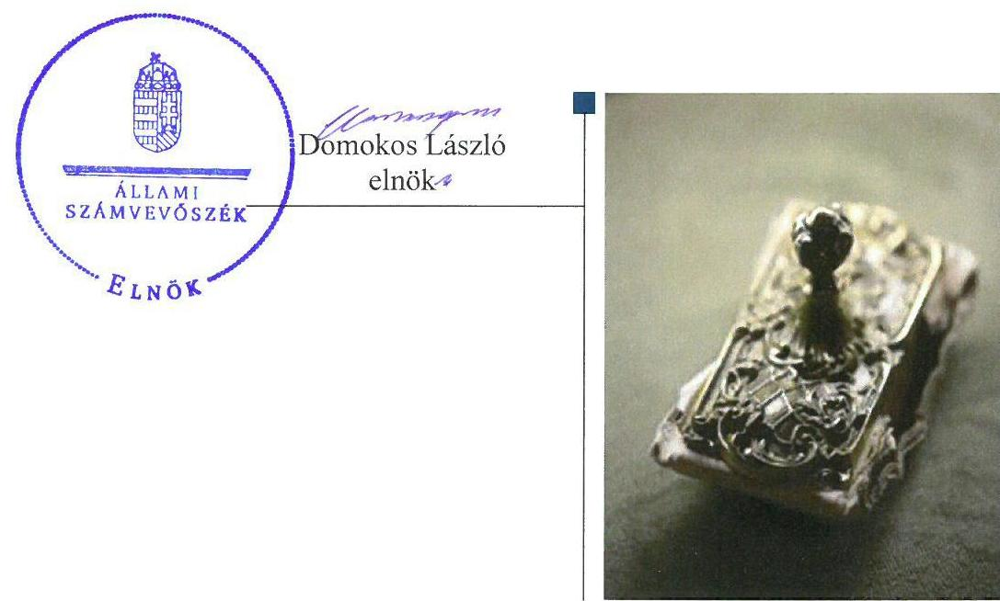
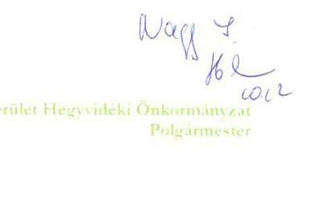
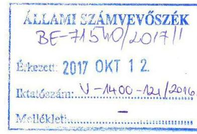
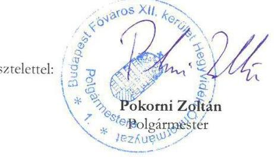
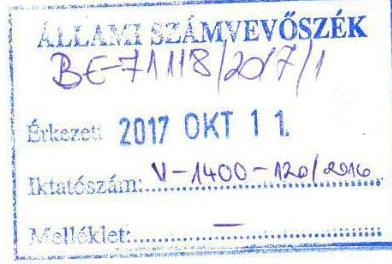
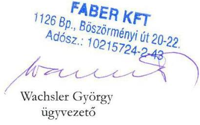
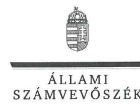
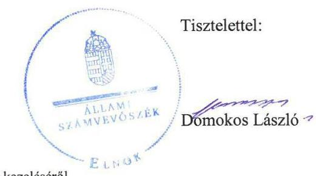
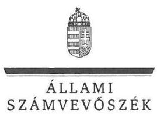

# Jelentés 

## Az önkormányzatok gazdasági társaságai

Az önkormányzatok többségi tulajdonában lévő gazdasági társaságok gazdálkodásának ellenőrzése - FÁBER Tervező, Fővállalkozó és Ingatlanforgalmazó Kft.
2017. 11. hó 21. nap

---

# AZ ELLENŐRZÉST FELÜGYELTE:

DR. NAGY IMRE felügyeleti vezető

# AZ ELLENŐRZÉST VEZETTE ÉS A VÉGREHAJTÁSÁÉRT FELELŐS:

DR. NAGY JUDIT ellenőrzésvezető

# A PROGRAM ÖSSZEÁLLÍTÁSÁÉRT FELELŐS:

JANIK JÓZSEF LÁSZLÓ osztályvezető

---

**IKTATÓSZÁM:** V-1400-127/2016

**TÉMASZÁM:** 2167

**ELLENŐRZÉS-AZONOSÍTÓ SZÁM:** V-075834

---

Jelentéseink az Országgyűlés számítógépes hálózatán és az Interneten a www.asz.hu címen is olvashatóak.

---

# TARTALOMJEGYZÉK 

■ ÖSSZEGZÉS ..... 5
■ AZ ELLENŐRZÉS CÉLJA ..... 6
■ AZ ELLENŐRZÉS TERÜLETE ..... 7
■ AZ ELLENŐRZÉS HÁTTERE, INDOKOLTSÁGA ..... 8
■ A JELENTÉS LÉNYEGES KÉRDÉSKÖREI ..... 9
■ ELLENŐRZÉS HATÓKÖRE ÉS MÓDSZEREI ..... 10
■ MEGÁLLAPÍTÁSOK ..... 12
■ JAVASLATOK ..... 16
■ MELLÉKLETEK ..... 17
I. Sz. melléklet: Értelmező szótár ..... 17
■ FÜGGELÉK: ÉSZREVÉTELEK ..... 19
■ RÖVIDÍTÉSEK JEGYZÉKE ..... 27

---

.

---

# ÖSSZEGZÉS 

Budapest Főváros XII. kerület Hegyvidéki Önkormányzat a tulajdonosi joggyakorlásának kereteit összességében szabályszerűen alakította ki, a tulajdonosi joggyakorlása megfelelő volt. A FÁBER Tervező, Fővállalkozó és Ingatlanforgalmazó Kft. vagyongazdálkodása szabályszerű volt. Beszámolási kötelezettségét teljesítette. Közzétételi kötelezettségének nem tett eleget, ezáltal nem biztosította a Társaság működésének átláthatóságát. A FÁBER Tervező, Fővállalkozó és Ingatlanforgalmazó Kft. bevételeinek és ráfordításainak elszámolása szabályszerű volt.

## Az ellenőrzés társadalmi indokoltsága

Magyarországon az intézmény-centrikus közfeladat-ellátás jellemző, de egyre jelentősebb a költségvetésen kívüli feladatellátás térnyerése. Helyi szinten ennek legfontosabb szereplői az önkormányzati tulajdonban lévő gazdasági társaságok, amelyeknek ellenőrzése kiemelten fontos a közfeladat ellátása, és a közvagyon megőrzése, megóvása érdekében. Ezért alapvető követelmény, hogy gazdálkodásuk, működésük szabályszerű és átlátható legyen.

Budapest Főváros XII. kerületében 2012-2015 között a FÁBER Tervező, Fővállalkozó és Ingatlanforgalmazó Kft. városüzemeltetési feladatokat látott el, Budapest Főváros XII. kerület Hegyvidéki Önkormányzattal kötött szerződések alapján. Az Állami Számvevőszék az ellenőrzése során arra kereste a választ, hogy szabályszerű volt-e a városüzemeltetéssel összefüggő közfeladatokat is ellátó FÁBER Tervező, Fővállalkozó és Ingatlanforgalmazó Kft gazdálkodása és Budapest Főváros XII. kerület Hegyvidéki Önkormányzat ehhez kapcsolódó tulajdonosi joggyakorlása.

## Főbb megállapítások, következtetések, javaslatok

Budapest Főváros XII. kerület Hegyvidéki Önkormányzat a tulajdonosi joggyakorlás kereteit a FÁBER Tervező, Fővállalkozó és Ingatlanforgalmazó Kft. javadalmazási szabályzatának késedelmes megalkotása kivételével szabályszerűen alakította ki. Budapest Főváros XII. kerület Hegyvidéki Önkormányzat tulajdonosi joggyakorlása megfelelt az önkormányzati vagyongazdálkodási rendeletek, Polgármesteri Hivatal ügyrendje és az önkormányzati Szervezeti és Működési Szabályzat előírásainak.

A FÁBER Tervező, Fővállalkozó és Ingatlanforgalmazó Kft. vagyongazdálkodása szabályszerű, fizetőképessége biztosított volt. Számviteli politikája és számlarendje nem volt megfelelő. A Társaság nem teljesítette az előírt beszámolási és közzétételi kötelezettségét, ezzel nem biztosította a Társaság működésének átláthatóságát. A Társaság bevételeinek és ráfordításainak elszámolása szabályszerű volt.

Az Állami Számvevőszék jelentésében a FÁBER Tervező, Fővállalkozó és Ingatlanforgalmazó Kft. ügyvezetőjének három javaslatot fogalmazott meg, amelyre az érintettnek 30 napon belül intézkedési tervet kell készítenie.

---

# AZ ELLENŐRZÉS CÉLJA 

Az ellenőrzés célja annak értékelése volt, hogy az önkormányzat vagyongazdálkodási tevékenysége során szabályszerűen gyakorolta-e tulajdonosi jogait. A gazdasági társaság szabályozottsága, gazdálkodása és vagyongazdálkodási tevékenysége, bevételeinek és ráfordításainak elszámolása megfelelt-e a jogszabályi és tulajdonosi előírásoknak. A gazdasági társaság kötelezettségállománya jelentett-e kockázatot a működésre.

---

# **AZ ELLENŐRZÉS TERÜLETE**

## **Budapest Főváros XII. kerület Hegyvidéki Önkormányzat és a FÁBER Tervező, Fővállalkozó és Ingatlanforgalmazó Kft.**

Az Önkormányzat^{1} kizárólagos tulajdonában lévő Társaság^{2} 1988-ban alakult, jegyzett tőkéje 7,0 M Ft.

A Társaság parkolásbiztosítás, ingatlanüzemeltetés (rendeltetésszerű használat biztosítása és állagmegóvás) és ingatlanhasznosítás (bérbeadással kapcsolatos közreműködői tevékenység) feladatokat látott el.

A Társaság által ellátott feladatok bővültek 2014. május 1-jétől a Hegyvidéki Rendészet kerékbilincs alkalmazási tevékenységét támogató, közreműködési tevékenység ellátásával.

A Társaság az Önkormányzattal kötött szerződés alapján végezte az ingatlan üzemeltetést^{1},^{4}, a kerékbilincs alkalmazását támogató tevékenységet^{4} és közszolgáltatásként a parkolók üzemeltetését (amely magában foglalta az Önkormányzat nevében számla kiállítását a várakozási díjról)^{1,3}.

A Társaság árbevételének meghatározó része az Önkormányzattól származott. A Társaság minden évben nyereségesen működött, osztalékfizetésre vonatkozó döntés, illetve osztalék kifizetés nem történt.

A Társaságnál a saját tőke/jegyzett tőke mutató jogszabályban előírt szintje biztosított volt.

A Társaság gazdálkodásával kapcsolatos néhány mutató alakulását az 1. táblázat mutatja be:

1. táblázat

|  A TÁRSASÁG GAZDÁLKODÁSI MUTATÓINAK ALAKULÁSA (M FT) |  |  |  |   |
| --- | --- | --- | --- | --- |
|   | 2012. | 2013. | 2014. | 2015.  |
|  Értékesítés nettó árbevétele | 670,6 | 718,0 | 504,6 | 630,4  |
|  Mérlegfőösszeg | 289,8 | 205,7 | 121,2 | 136,2  |
|  Mérleg szerinti eredmény | 3,6 | 0,1 | 3,5 | 0,4  |
|  Saját tőke összege | 52,4 | 52,5 | 56,0 | 56,4  |
|  Vevő követelések | 66,4 | 77,9 | 27,8 | 28,4  |
|   |  |  |  | Forrás: A Társaság egyszerűsített éves beszámolói  |

A Társaság nem rendelkezett vagyonkezelésbe vett vagyonnal.

A kizárólagos önkormányzati tulajdonban lévő Hágó Házgondnoksági Kft. beolvadt a Társaságba 2016. március 7-ei fordulónappal, a Ptk^{2}.^{6} 3:44.^{6} (1) bekezdésében írtak alapján. A Képviselő-testület^{7} 266/2015. (XII.17.) Bp. Főv. XII. ker. Hegyvidéki Önk. Kt. határozattal egyetértett az egyesülés szándékával, az egyesülési szerződést elfogadta.

A Polgármester^{8} és a Jegyző^{9} személyében változás nem következett be az ellenőrzött időszakban, a jelenlegi ügyvezető^{10} 2013. január 17-től irányítja a Társaságot.

---

# AZ ELLENŐRZÉS HÁTTERE, INDOKOLTSÁGA 

AZ ÖNKORMÁNYZATI TULAJDONÚ GAZDASÁGI TÁRSASÁGOK teljes körű ellenőrzésének lehetőségét az Állami Számvevőszékről szóló 1989. évi XXXVIII. törvény 2011. január 1-jétől hatályos módosítása teremtette meg és az Állami Számvevőszékről szóló 2011. évi LXVI. törvény is tartalmazza. A gazdasági társaságok gazdálkodási tevékenysége szabályszerűségének ellenőrzését 2011. évtől végzi az ÁSZ. Az önkormányzatok többségi tulajdonában álló gazdasági társaságok ellenőrzése kiemelten fontos a vagyon megőrzése, megóvása érdekében.

A feladatellátás költségeinek, ráfordításainak alakulása a lakosság széles rétegét érinti. Az ellenőrzés várható hasznosulásaként az ellenőrzések feltárhatják, hogy az önkormányzat a feladatellátásához rendelt vagyon működtetését a tulajdonostól elvárható gondossággal végezte-e, a feladatot ellátó gazdasági társaság a létesítő okiratban, szolgáltatási szerződésben foglaltak betartásával biztosította-e a feladat ellátását. Az ellenőrzés rávilágíthat arra, hogy a gazdasági társaság a vagyon használatával biztosította-e a szolgáltatás folytatásának feltételeit, az önkormányzat tulajdonosi felügyelete hozzájárult-e a szabályszerű gazdálkodáshoz és feladatellátáshoz.

A megállapítások alapján megfogalmazott számvevőszéki javaslatok hasznosítása elősegítheti a meglévő hibák megszüntetését. A jó gyakorlatok bemutatásával az Állami Számvevőszék hozzájárul a követendő megoldások megismertetéséhez, terjesztéséhez.

---

# A JELENTÉS LÉNYEGES KÉRDÉSKÖREI 

1. A tulajdonosi joggyakorlás szabályszerű volt-e?
2. A gazdasági társaság vagyongazdálkodása szabályszerű volt-e, fizetőképessége biztosított volt-e a gazdálkodása során?
3. A gazdasági társaság bevételeinek és ráfordításainak elszámolása szabályszerű volt-e?

---

# ELLENŐRZÉS HATÓKÖRE ÉS MÓDSZEREI 

## Az ellenőrzés típusa

Megfelelőségi ellenőrzés.

## Az ellenőrzött időszak

2012. január 1-jétől 2015. december 31-ig.

## Az ellenőrzés tárgya

Budapest Főváros XII. kerület Hegyvidéki Önkormányzat tulajdonosi joggyakorlása, valamint a FÁBER Tervező, Fővállalkozó és Ingatlanforgalmazó Kft. gazdálkodásának szabályozottsága és szabályszerűsége.

Az ellenőrzés kiterjedt minden olyan körülményre és adatra, amely az ÁSZ ${ }^{11}$ jogszabályban meghatározott feladatainak teljesítéséhez, valamint a program végrehajtása folyamán felmerült újabb összefüggések feltárásához szükséges.

## Az ellenőrzött szervezet

FÁBER Tervező, Fővállalkozó és Ingatlanforgalmazó Kft. és a kizárólagos tulajdonosi jogokat gyakorló Budapest Főváros XII. kerület Hegyvidéki Önkormányzat.

## Az ellenőrzés jogalapja

Az ellenőrzés jogszabályi alapját az ÁSZ tv. ${ }^{12} 1. § (3) bekezdése és 5. § (3)(4)-(5) bekezdései képezik.

## Az ellenőrzés módszerei

Az ellenőrzést a nemzetközi standardokat irányadónak tekintve az ellenőrzési program ellenőrzési kérdései, az ellenőrzött időszakban hatályos jogszabályok, az ellenőrzés szakmai szabályok és módszertanok figyelembe vételével végeztük.

Az ellenőrzés ideje alatt az ellenőrzött szervezettel történő kapcsolattartást az ÁSZ Szervezeti és Működési Szabályzatának vonatkozó előírásai alapján biztosítottuk.

---

Az ellenőrzési kérdések megválaszolásához szükséges bizonyítékok megszerzése a következő ellenőrzési eljárások alkalmazásával történt: megfigyelés, kérdésfeltevés (információkérés), összehasonlítás, valamint elemző eljárás. Az ellenőrzési bizonyítékként felhasználható adatforrások közé tartoztak egyrészt az ellenőrzési programban felsorolt adatforrások, másrészt adatforrás lehet még minden - az ellenőrzés folyamán - feltárt, az ellenőrzés szempontjából információkat tartalmazó dokumentum.

Az ellenőrzést a kérdésekre adott válaszok kiértékelésével, valamint a megjelölt adatforrások, a csatolt tanúsítványok felhasználásával, továbbá az adott időszakban hatályos jogszabályok figyelembe vételével folytattuk le.

A bevételek és ráfordítások elszámolása, valamint a vagyonnyilvántartás terén a szabályszerű működést véletlen mintavétellel ellenőriztük. A mintavétellel ellenőrzött területek esetében minden egyes tétel vonatkozásában a szabályszerűségre vonatkozó kérdéseket tettünk fel, amelyek eredménye összesítésre került. Megfelelőnek értékeltünk egy ellenőrzött területet, amennyiben 95%-os bizonyossággal a teljes sokaságban az átlagos hibaarány legfeljebb 10%, nem megfelelőnek, amennyiben 10%-nál magasabb arányt képviselt. A ráfordítások elszámolására és a vagyonnyilvántartásra vonatkozó véletlen mintavételt kockázati alapú kiválasztással egészítettük ki, amelynek során évente a három legnagyobb összegű tételt választottuk ki.

---

# 1. A tulajdonosi joggyakorlás szabályszerű volt-e? 

## Összegző megállapítás

### 1.1. számú megállapítás

## A tulajdonosi joggyakorlás összességében szabályszerű volt.

Az Önkormányzat a tulajdonosi joggyakorlás kereteit összességében szabályszerűen alakította ki.

Az Önkormányzat a tulajdonosi jogok gyakorlására vonatkozó szabályokat a vagyongazdálkodási rendeleteiben ${ }^{13}$, a Polgármesteri Hivatal ügyrendjében ${ }^{14}$ és önkormányzati SZMSZ ${ }_{1,2}{ }^{15}$-ben szabályozta.

Az önkormányzati SZMSZ 2. 6. sz. melléklet 7.5 pont b) és a vagyongazdálkodási rendelet 12. § (2) bekezdés b) pontja alapján a Polgármester gyakorolta a Társaságban meglévő önkormányzati tulajdonú tőkerészesedéshez kapcsolódó tagsági jogokat alapítói határozatok formájában. A tulajdonosi joggyakorló a tagsági jogok gyakorlásáról a Képviselő-testületet rendszeresen tájékoztatta.

Az Önkormányzat a Társaságnál az ügyvezető kinevezésével, feladatainak, beszámolási kötelezettségének az alapító okirat ${ }_{1}{ }^{16}{ }_{2}{ }^{17}{ }_{3}{ }^{18}{ }_{4}{ }^{19}{ }_{5}{ }^{20}{ }_{6}{ }^{21}{ }_{7}{ }^{22}$ ben történő előírásával biztosította a tulajdonosi jogok érvényesülését. Ugyanitt rendelkezett a Felügyelő-bizottság ${ }^{23}$ tagjainak kijelöléséről, a könyvvizsgáló megválasztásáról. Elkészítették a Felügyelő-bizottság ügyrendjét ${ }_{1},{ }^{24},{ }^{25}{ }_{2}{ }^{26}$, amelyet a tulajdonosi joggyakorló hagyott jóvá.

A Társaság által ellátott feladataival összefüggő tevékenységekre vonatkozóan az Önkormányzat rendeletalkotási ${ }^{27}$ kötelezettségének eleget tett.

Az Önkormányzat a feladatellátás követelményeit az alapító okirat ${ }_{1-7}$ ben és a Társasággal kötött szerződésekben határozta meg.

A Javadalmazási szabályzat ${ }^{28}$ érvénybe helyezése 2010. január 31. helyett késedelemmel, 2013. július 25-én történt meg, a Taktv. ${ }^{29} 5. § (3) előírása ellenére.

### 1.2. számú megállapítás

## A tulajdonosi jogok gyakorlása megfelelt a belső előírásoknak.

Az Önkormányzat a Gt. ${ }^{30} 34. § (1) bekezdésében és a Ptk. 3:121. § (1) bekezdésében foglaltaknak megfelelve a Felügyelő-bizottságot három taggal működtette. A Felügyelő-bizottság az egyszerűsített éves beszámolókat megtárgyalta, elfogadásra javasolta. A könyvvizsgáló az egyszerűsített éves beszámolókat hitelesítő záradékkal látta el.

A tulajdonosi joggyakorló a független könyvvizsgálati jelentést a Társaság egyszerűsített éves beszámolóiról alapítói határozattal ${ }^{31}$ elfogadta. A tulajdonosi joggyakorló az egyszerűsített éves

 beszámolókat az önkormányzati SZMSZ ${ }_{1,2}$, a vagyongazdálkodási rendeletek és az alapító okirat ${ }_{1-7}$ előírásaival összhangban hagyta jóvá.

Az Önkormányzat az Áht. ${ }^{32}$ 70. § (1) d) pontjában és az Ötv. 92. § (11) bekezdés b) pontjában foglalt lehetőségével élve 2013-ban rendszerellenőrzést végzett a Társaságnál a 2012-2013. ellenőrzési időszakra vonatkozóan. Az ellenőrzés célja annak megállapítása volt, hogy a Társaságnál a parkolási feladatok ellátását milyen módon teljesítették, a rendelkezésre álló erőforrások milyen mértékben biztosították a feladatellátást.

Az ügyvezető 2013. október 8-án a Bkr. 45. § (1)-(2) bekezdésében foglaltaknak eleget téve, intézkedések, felelősök és határidő megjelölésével intézkedési tervet készített.

A tulajdonosi joggyakorló beszámolt a Képviselő-testületnek az Önkormányzat tulajdonában és résztulajdonában álló gazdasági társaságok működésének átvilágításáról és a racionalizálási javaslatokról, amelyek a 266/2016. (XII.17.) határozattal elfogadásra kerültek.

# 2. A gazdasági társaság vagyongazdálkodása szabályszerű volt-e, fizetőképessége biztosított volt-e a gazdálkodása során? 

Összegző megállapítás

A Társaság számviteli szabályzatai nem feleltek meg a jogszabályi előírásoknak. Vagyongazdálkodása szabályszerű, fizetőképessége biztosított volt. A jogszabály és a Közszolgáltatási szerződés szerinti közzétételi kötelezettségének nem tett eleget.

### 2.1. számú megállapítás

A Társaság rendelkezett a jogszabályokban előírt szabályzatokkal, de a számviteli politika és 2013. január 31-ig a leltározási szabályzat nem felelt meg a törvényi előírásoknak.

A Társaság az alapító okirat ${ }_{1-7}$ alapján megalkotta a Társaság SZMSZ ${ }_{1}{ }^{33}{ }_{2}{ }^{34}{ }_{3}{ }^{35}$-t, melyben meghatározták a társaság működését, az ügyvezetés feladatát és jogkörét, valamint a Felügyelő-bizottság feladatait. A Számv. tv. 14. § (3) és (5) bekezdése előírásai alapján kidolgozták a Számviteli politika ${ }_{1}{ }^{36}{ }_{2}{ }^{37}{ }_{3}{ }^{38}$-at, az Eszközök és források értékelési szabályzat ${ }_{1}{ }^{39}{ }_{2}{ }^{40}$-át, a Pénzkezelési szabályzat ${ }_{1}{ }^{41}{ }_{2}{ }^{42}{ }_{3}{ }^{43}$-at, és a Leltározási szabályzat ${ }_{1}{ }^{44}{ }_{3}{ }^{45}$-jét.

A Számviteli politika ${ }_{1}$ nem tartalmazta - a 2013. január 1-jéig hatályban lévő - Számv. tv. 154. § (5)-(6) bekezdése értelmében a megbízható és valós képet lényegesen befolyásoló hibával kapcsolatos közzétételi kötelezettséget.

A Számviteli Politika ${ }_{2,3}$ 2. pontjában a kiegészítő melléklet részeként említi a cash-flow kimutatást, ellentétesen a Számv. tv. 96. § (4) bekezdés előírásaival.

A Számviteli politika ${ }_{3}$ a hatályba lépés időpontját ellenmondásosan határozta meg.

A Számviteli politika ${ }_{3}$ nem tartalmazta azokat a gazdálkodóra jellemző szabályokat, előírásokat, módszereket, a Számv. tv. 14. § (4) bekezdésében foglaltak ellenére, amelyekkel meghatározza, hogy mit tekint a számviteli elszámolás, az értékelés szempontjából lényegesnek, jelentősnek, nem lényegesnek, nem jelentősnek, kivételes nagyságú vagy előfordulású bevételnek, költségnek, ráfordításnak.

Az elkészült Számlarend ${ }^{46}$ a Számv. tv. 161. § (2) bekezdés a) pontjában foglalt előírást megsértve nem tartalmazta minden alkalmazásra kijelölt számla számjelét és megnevezését.

A 2013. január 31-ig hatályban lévő Leltározási szabályzat ${ }_{1}$ a Számv. tv. 69. § (3) bekezdése ellenére nem határozta meg, hogy meghatározott időszakonként, de legalább háromévente mennyiségi felvétellel, illetve minden üzleti év mérlegfordulónapjára vonatkozóan a csak értékben kimutatott eszközöknél és kötelezettségeknél, egyeztetéssel kell elvégeznie.

A Társaság elkészítette a Kbt. ${ }^{47}$ 22. § (1) alapján előírt Közbeszerzési szabályzat ${ }^{48}$-ot.

# 2.2. számú megállapítás 

## A Társaság vagyongazdálkodása megfelelt a jogszabályi és belső előírásoknak.

A Társaság saját vagyonnyilvántartása átlátható, naprakész volt, megfelelt a jogszabályi, illetve belső szabályozási előírásoknak.

A saját vagyon tekintetében a Társaság nyilvántartása megfelelt a Számv. tv. 46-49. § és a Számviteli politika ${ }_{1,2,3}$ előírásainak. A Társaság az Eszközök és források értékelési szabályzat ${ }_{1,2}$ alapján vezette a nyilvántartásait, illetve értékelte eszközeit és forrásait.

Az egyszerűsített éves beszámolóban és a számviteli nyilvántartásokban szereplő vagyonelemek állományát leltárral támasztották alá a Számv. tv. 69. § (1) megfelelően. A vagyonnyilvántartásban folyamatos volt a vagyonváltozás kimutatása. Az analitikus nyilvántartások és a főkönyvi nyilvántartások egyezősége biztosított volt.

A saját vagyon értékének megőrzése, gyarapítása és hasznosítása az előírásoknak megfelelően történt.

A Társaság eleget tett a Közszolgáltatási szerződés ${ }_{1}$ 4. melléklete, valamint a Kerékbilincs szerződés ${ }^{49}$ 2.2 pontjának előírásai alapján a szerződésekben megjelölt tevékenység végzéséhez szükséges eszközök beszerzésére vonatkozó kötelezettségének.

## 2.3. számú megállapítás

## A Társaság fizetőképessége biztosított volt, kötelezettségállománya a működését nem veszélyeztette.

A Társaság a szerződésen és jogszabályon alapuló rövid és hosszú lejáratú kötelezettségeinek határidőben történő teljesítése javuló tendenciát mutatott.

A Társaság kötelezettségállományának alakulását a 2. táblázat szemlélteti:
2. táblázat

## A TÁRSASÁG KÖTELEZETTSÉG ÁLLOMÁNYÁNAK ALAKULÁSA (M FT)

|  | 2012. év | 2013. év | 2014. év | 2015. év |
| :--: | :--: | :--: | :--: | :--: |
| Kötelezettségek összesen: | 76,3 | 56,8 | 37,7 | 71,8 |
| ebből: Hosszú lejáratú | 1,1 | 0,1 | 0 | 1,8 |
| ebből: Rövid lejáratú: | 75,2 | 56,7 | 37,7 | 69,9 |
| ebből: szállítói tartozásállomány | 40,1 | 15,2 | 3,1 | 33,0 |
| ebből: önkormányzati | 29,6 | 6,7 | 0 | 0,8 |
| Határidőn túli | 45,3 | 20,7 | 1,5 | 0,4 |

# 2.4. számú megállapítás 

A Társaság beszámolási kötelezettségének eleget tett. Közzétételi kötelezettségét nem teljesítette.

A Társaságot az Önkormányzattal kötött parkolási közszolgáltatási szerződés alapján adatszolgáltatási és beszámolási kötelezettség terhelte. A Társaság a jelentési kötelezettségének minden évben eleget tett.

Az egyszerűsített éves beszámolók Számv.tv. 153. § (1), 154. § (1) előírásainak megfelelően letétbe helyezése és közzététele az előírt határidőig megtörtént.

A 2012. és 2013. évi egyszerűsített éves beszámolók kiegészítő melléklete nem tartalmazta a közszolgáltatási feladatok bevételeinek és költségeinek elkülönített kimutatását, ezzel nem tett eleget a közszolgáltatási szerződés preambulumában vállalt kötelezettségének, valamint a Számv. tv. 88.§ (1) bekezdése előírásainak.

A Társaság elkészítette az Adatvédelmi és adatkezelési szabályzat ${ }_{1}{ }^{50}$-et, majd a jogszabályi változásnak megfelelően az Infotv. ${ }^{51}$ 24.§ (3) bekezdése alapján aktualizálta azt (Adatvédelmi és adatkezelési szabályzat ${ }_{2}{ }^{52}$).

A Társaság nem tette közzé a közszolgáltatási szerződést és annak módosításait, ezzel nem tett eleget a Közszolgáltatási szerződés ${ }_{1,2,3}$ 4.3 pontjában előírt kötelezettségének.

A Társaság az Info tv. 37. § (1) bekezdésében és 1. melléklete II.1., III.1. pontjaiban foglaltak ellenére honlapján nem tette közzé a társasági SZMSZ, valamint az adatvédelmi és adatbiztonsági szabályzat hatályos és teljes szövegét, valamint az egyszerűsített éves beszámolóit.

## 3. A gazdasági társaság bevételeinek és ráfordításainak elszámolása szabályszerű volt-e?

## Összegző megállapítás A Társaság elszámolásai szabályszerűek voltak.

A Társaságnál a bevételek és ráfordítások, a bér és személyi jellegű kifizetések elszámolása szabályszerű volt.

A jogszabályoknak és a belső szabályozásnak megfelelően történt az értékcsökkenési leírás elszámolása.

A Társaságnak vagyonpótlási és felújítási kötelezettsége nem volt, az Önkormányzat az éves eredmények kapcsán eszközpótlásra, felújításra történő felhasználásra vonatkozó döntést nem hozott.

# JAVASLATOK 

Az ÁSZ tv. 33. § (1) bekezdésében foglaltak értelmében az ellenőrzött szervezet vezetője köteles a jelentésben foglalt megállapításokhoz kapcsolódó intézkedési tervet összeállítani és azt a jelentés kézhezvételétől számított 30 napon belül az ÁSZ részére megküldeni. Amennyiben az ellenőrzött szervezet vezetője nem küldi meg határidőben az intézkedési tervet, vagy továbbra sem elfogadható intézkedési tervet küld, az Állami Számvevőszék elnöke az ÁSZ tv. 33. § (3) bekezdés a) és b) pontjaiban foglaltakat érvényesítheti.

## FÁBER Tervező, Fővállalkozó és Ingatlanforgalmazó Kft. Ügyvezetőjének

1. Intézkedjen a Számviteli politika hatályos jogszabályi rendelkezések szerinti módosításáról.
(2.1. sz. megállapítás 5. bekezdése alapján)
2. Intézkedjen a Számlarend jogszabályi rendelkezés szerinti kiegészítéséről.
(2.1. sz. megállapítás 6. bekezdése alapján)
3. Intézkedjen a közzétételi kötelezettségek jogszabályi előírásoknak és a Közszolgáltatási szerződésnek megfelelő teljes körű teljesítéséről.
(2.4. sz. megállapítás 5. és 6. bekezdése alapján)

# MELLÉKLETEK 

- I. SZ. MELLÉKLET: ÉRTELMEZŐ SZÓTÁR
gazdasági társaság
gazdálkodó szervezet
közszolgáltatás
meghatározó befolyás
minősített többséget biztosító részesedés
többségi befolyást biztosító részesedés

Ptk. 3.88. § (1) bekezdése szerint „a gazdasági társaságok üzletszerű közös gazdasági tevékenység folytatására, a tagok vagyoni hozzájárulásával létrehozott, jogi személyiséggel rendelkező vállalkozások, amelyekben a tagok a nyereségből közösen részesednek, és a veszteséget közösen viselik".
A Ptk. ${ }^{53}$ 685. § c) pontja szerint gazdálkodó szervezet: „az állami vállalat, az egyéb állami gazdálkodó szerv, a szövetkezet, a lakásszövetkezet, az európai szövetkezet, a gazdasági társaság, az európai részvénytársaság, az egyesülés, az európai gazdasági egyesülés, az európai területi együttműködési csoportosulás, az egyes jogi személyek vállalata, a leányvállalat, a vízgazdálkodási társulat, az erdő birtokossági társulat, a végrehajtói iroda, az egyéni cég, továbbá az egyéni vállalkozó." (2014. 03.15-ig hatályos)
Az Ebktv. ${ }^{54}$ 3. § d) pontja a következőképpen határozza meg a közszolgáltatást: „szerződéskötési kötelezettség alapján a lakosság alapvető szükségleteinek ellátására irányuló szolgáltatás, így különösen a villamos energia-, gáz-, hő-, víz-, szenny-víz- és hulladékkezelési, köztisztasági, postai és távközlési szolgáltatás, továbbá a menetrend alapján közlekedő járművekkel végzett közforgalmú személyszállítás".
A Ptk. 2 8:2. § (2) bekezdése szerint „A befolyással rendelkező akkor rendelkezik egy jogi személyben meghatározó befolyással, ha annak tagja vagy részvényese, és
a) jogosult e jogi személy vezető tisztségviselői vagy Felügyelő-bizottsága tagjai többségének megválasztására, illetve visszahívására; vagy
b) a jogi személy más tagjai, illetve részvényesei a befolyással rendelkezővel kötött megállapodás alapján a befolyással rendelkezővel azonos tartalommal szavaznak, vagy a befolyással rendelkezőn keresztül gyakorolják szavazati jogukat, feltéve, hogy együtt a szavazatok több mint felével rendelkeznek."
A minősített befolyásszerző az ellenőrzött társaságban a szavazatok legalább hetvenöt százalékával rendelkezik. (Ptk.2. 3:324. §)
A Ptk. 2 8:2. § (1) bekezdése szerint „többségi befolyás az olyan kapcsolat, amelynek révén természetes személy vagy jogi személy (befolyással rendelkező) egy jogi személyben a szavazatok több mint felével vagy meghatározó befolyással rendelkezik."

# FÜGGELÉK: ÉSZREVÉTELEK 

A jelentéstervezetet a Számvevőszék 15 napos észrevételezésre megküldte az ellenőrzött szervezetek vezetőinek az ÁSZ tv. 29. §* (1) bekezdése előírásának megfelelően.

Az ÁSZ a jelentéstervezetet észrevételezésre megküldte a Budapest Főváros XII. kerület Hegyvidéki Önkormányzat polgármesterének és a FÁBER Tervező, Fővállalkozó és Ingatlanforgalmazó Kft. ügyvezetőjének.
A függelék tartalmazza Budapest Főváros XII. kerület Hegyvidéki Önkormányzat polgármesterének a jelentéstervezetre tett nemleges észrevételét. A függelék tartalmazza továbbá a FÁBER Tervező, Fővállalkozó és Ingatlanforgalmazó Kft. ügyvezetőjének észrevételét, illetve az el nem fogadott észrevételek elutasításának indoklását.

[^0]
[^0]:    * 29. § (1) Az Állami Számvevőszék az ellenőrzési megállapításait megküldi az ellenőrzött szervezet vezetőjének vagy az általa megbízott személynek, és annak, akinek személyes felelősségét állapította meg.
    (2) Az ellenőrzött szervezet vezetője és a felelősként megjelölt személy az ellenőrzés megállapításaira tizenöt napon belül írásban észrevételt tehet.
    (3) Az Állami Számvevőszék az észrevételre a beérkezésétől számított harminc napon belül írásban válaszol. A figyelembe nem vett észrevételeket köteles a jelentésben feltüntetni, és megindokolni, hogy azokat miért nem fogadta el.

Állami Számvevőszék
Domokos László
elnök

Budapest4.
Pf. 54 .
2364

Tárgy „Az önkormányzatok gazdasági társaságai - Az önkormányzatok többségi tulajdonában lévő gazdasági társaságok gazdálkodásának ellenőrzése - FÁBER Tervező, Fővállalkozó és
 Ingatlanforgalmazó Kft." címmel készült számvevőszéki jelentéstervezetet

Iktatási szám: 1/542/26/2017
Úgyintéző: Szűtsné Kiss Zsuzsanna
2226 Budapest, Bőszőrményi út 23-25.
Telefon: 224-5900/5287 mellék
e-mail: szutsne.zsuzsa@hegyvidek.hu
www.hegyvidek.hu

# Tisztelt Elnök Úr! 

Köszönettel megkaptam és tanulmányoztam „Az önkormányzatok gazdasági társaságai - Az önkormányzatok többségi tulajdonában lévő gazdasági társaságok gazdálkodásának ellenőrzése FÁBER Tervező, Fővállalkozó és Ingatlanforgalmazó Kft." címmel készült számvevőszéki jelentéstervezetet.

Örömmel tapasztaltam, hogy a jelentéstervezet a tulajdonosi jogok gyakorlásával kapcsolatosan nem tartalmaz intézkedést igénylő megállapítást, erre tekintettel nem kívánok észrevételt tenni.

Segítő együttműködésüket és a vizsgálat keretében kapott értékes szakmai útmutatásaikat ezúton köszönöm meg.

Budapest Hegyvidék, 2017. október 6.

Tisztelettel:

---

# FÁBER Tervező, Fővállalkozó és Ingatlanforgalmazó Kft. 

1126 Budapest, Bőszörményi út 20-22.
telefon/fax: +36 13556859 E-mail: faber@faberkft.hu

## ÁLLAMI SZÁMVEVŐSZÉK

Domokos László elnök részére

1364 Budapest 4.
Pf.: 54

Tárgy: Számvevőszéki jelentéstervezet észrevételezése

## Tisztelt Elnök Úr!

Kelt: Budapest, 2017.10.06.
Iktatószám: 2/45/2017
Úgyintéző: Buzogány Kata

Ügyszám: V-1400-116/2016.

Köszönettel megkaptuk és tanulmányoztuk „Az önkormányzatok gazdasági társaságai - Az önkormányzatok többségi tulajdonában lévő gazdasági társaságok gazdálkodásának ellenőrzése FÁBER Tervező, Fővállalkozó és Ingatlanforgalmazó Kft." címmel készült számvevőszéki jelentéstervezetet.

A jelentéstervezet ügyvezetői intézkedést igénylő javaslatait megalapozottnak tartjuk, elfogadjuk, a „Részletes megállapítások" fejezetben foglaltakkal kapcsolatosan két észrevételt kívánunk tenni az alábbiak szerint.

A jelentéstervezet 5. oldalán az „Összegzés" címszó alatti bekezdésben az olvasható, hogy a Társaság „Beszámolási kötelezettségét teljesítette. Közzétételi kötelezettségének nem tett eleget, ezáltal nem biztosította a Társaság működésének átláthatóságát." Ugyanitt, a „Főbb megállapítások, következtetések" címszó alatt már az szerepel, hogy „A Társaság nem teljesítette az előírt beszámolási, és közzétételi kötelezettségét, ezzel nem biztosította a tevékenységének átláthatóságát".
A jelentéstervezet 15. oldalán, a „MEGÁLLAPÍTÁSOK" fejezet 2.4. pontjában ugyancsak az „Összegzés" szerinti tartalmú megállapítás olvasható, miszerint „A Társaság beszámolási kötelezettségének eleget tett. Közzétételi kötelezettségét nem teljesítette." Mivel a 2.4. pont részletezi, hogy mely beszámolási, illetve mely közzétételi kötelezettségét teljesítette, illetve nem teljesítette a Társaság, látható, hogy a beszámolási és közzétételi kötelezettséget együttesen előíró Számviteli törvény szerinti kötelezettségeket teljesítette, az Info törvény által előírt közzétételi kötelezettséget nem teljesítette a Társaság. Erre tekintettel az összegző jellegű megállapítás álláspontunk szerint tényszerűen mindhárom hivatkozott helyen „A Társaság beszámolási kötelezettségét teljesítette. Közzétételi kötelezettségének nem teljes körűen tett eleget." megfogalmazás lenne.

---

# FÁBER Tervező, Fővállalkozó és Ingatlanforgalmazó Kft. 

1126 Budapest, Bőszörményi út 20-22.
telefon/fax: +36 13556859 E-mail: faber@faberkft.hu

Kérjük továbbá, hogy a jelentéstervezet 7. oldalán, a FÁBER Kft. gazdálkodási mutatóit bemutató táblázat alatti bekezdésben a Hágó Kft. általi beolvadás időpontját 2016. március 7. napjára szíveskedjenek módosítani, ugyanis ekkor történt meg a cégbírósági bejegyzés.

Egyúttal tájékoztatjuk Önöket, hogy Társaságunk - a jelentéstervezetben foglalt hiányosságok közül a közzétételi kötelezettségnek eleget téve - honlapján feltüntette az alábbi közérdekű adatokat tartalmazó dokumentumokat:

- Szervezeti és Működési Szabályzat
- Adatvédelmi és adatbiztonsági szabályzat
- Egyszerűsített éves beszámolók 2013-2016. évekre vonatkozóan
- Közszolgáltatási szerződés és módosításai

Tájékoztatjuk továbbá Önöket, hogy Társaságunk már megkezdte az egyéb szabályzatok javítását, módosítását is.

A vizsgálat során tapasztalt segítő együttműködésüket és értékes szakmai útmutatásaikat ezúton is köszönjük.

Kelt: Budapest, 2017. október 5.

Tisztelettel:

---

ELNÖK

Ikt.szám: V-1400-123/2016.

# Wachsler György úr 

ügyvezető
FÁBER Tervező, Fővállalkozó és Ingatlanforgalmazó Kft.

## Budapest

## Tisztelt Ügyvezető Úr!

„Az önkormányzatok gazdasági társaságai - Az önkormányzatok többségi tulajdonában lévő gazdasági társaságok gazdálkodásának ellenőrzése - FÁBER Tervező, Fővállalkozó és Ingatlanforgalmazó Kft." címmel készített számvevőszéki jelentéstervezetre tett észrevételeit köszönettel megkaptam.
Az Állami Számvevőszék észrevételekre vonatkozó álláspontjáról a felügyeleti vezető által készített részletes tájékoztatást csatoltan megküldöm.
Tájékoztatom Ügyvezető urat, hogy a számvevőszéki jelentésben - az Állami Számvevőszékről szóló 2011. évi LXVI. törvény 29. § (3) bekezdése alapján - a figyelembe nem vett észrevételeket szerepeltetjük annak megindoklásával, hogy azokat miért nem fogadtuk el.

Budapest, 2017. 46 hó 37 nap

Melléklet: Tájékoztatás az észrevételek kezeléséről

---

FELÜGYELETI VEZETŐ

Melléklet
Ikt.szám: V-1400-123/2016.

# Tájékoztatás   az észrevételek kezeléséről 

„Az önkormányzatok gazdasági társaságai - Az önkormányzatok többségi tulajdonában lévő gazdasági társaságok gazdálkodásának ellenőrzése - FÁBER Tervező, Fővállalkozó és Ingatlanforgalmazó Kft." című jelentéstervezetre 2017. október 5-én tett (az Állami Számvevőszékhez 2017. október 11-én érkezett) észrevételét áttekintettük, annak kezelésével kapcsolatban a következő tájékoztatást adom.

1. A jelentéstervezet Összegzésére (,,Beszámolási kötelezettségét teljesítette. Közzétételi kötelezettségének nem tett eleget, ezáltal nem biztosította a Társaság működésének átláthatóságát."), a Főbb megállapítások, következtetések részre (,A Társaság nem teljesítette az előírt beszámolási és közzétételi kötelezettségét, ezzel nem biztosította a Társaság működésének átláthatóságát."), illetve a 2.4. számú összegző megállapítására (,A Társaság beszámolási kötelezettségének eleget tett. Közzétételi kötelezettségét nem teljesítette."), valamint a 2. (,Az egyszerűsített éves beszámolók Számv. tv. 153. § (1), 154. § (1) előírásainak megfelelően letétbe helyezése és közzététele az előírt határidőig megtörtént.") és 5., 6. bekezdéseire (,A Társaság nem tette közzé a közszolgáltatási szerződést és annak módosításait, ezzel nem tett eleget a Közszolgáltatási szerződés 23. 4.3. pontjában előírt kötelezettségének. A Társaság az Info tv. 37. § (1) bekezdésében és 1. melléklete II.1., III.1. pontjaiban foglaltak ellenére honlapján nem tette közzé a társasági SZMSZ-, valamint az adatvédelmi és adatbiztonsági szabályzat hatályos és teljes szövegét, valamint az egyszerűsített éves beszámolóit.") vonatkozó észrevétel:
Az észrevételben leírtak szerint „,Mivel a 2.4. pont részletezi, hogy mely beszámolási, illetve mely közzétételi kötelezettségét teljesítette, illetve nem teljesítette a Társaság, látható, hogy a beszámolási és közzétételi kötelezettséget együttesen előíró Számviteli törvény szerinti kötelezettségeket teljesítette, az Info törvény által előírt közzétételi kötelezettséget nem teljesítette a Társaság. Erre tekintettel az összegző jellegű megállapítás álláspontunk szerint tényszerűen mindhárom hivatkozott helyen „A Társaság beszámolási kötelezettségét teljesítette. Közzétételi kötelezettségének nem teljes körűen tett eleget." megfogalmazás lenne."

Az Állami Számvevőszék a jelentéstervezet Összegző részében a Megállapítások részben tett részletes megállapításokat összefoglalva, összevontan jeleníti meg. A jelentéstervezet javaslatai között a beszámoló készítésére vonatkozóan nem, csak a 2.4. számú megállapítás 5. és 6. bekezdéseiben leírt, az egyes közzétételi kötelezettségeket érintő megállapítások alapján tett javaslat szerepel.

Erre tekintettel az észrevétel alapján a jelentéstervezet módosítása nem indokolt.

---

2. A jelentéstervezet Ellenőrzés területe rész 9. bekezdés 1. mondatára (,A kizárólagos önkormányzati tulajdonban lévő Hágó Házgondnoksági Kft. beolvadt a Társaságba 2015. október 31-i fordulónappal, a Ptk. 3:44. § (1) bekezdésében írtak alapján.") vonatkozó észrevétel:

Az észrevételben leírtak szerint „A Hágó Kft. általi beolvadás időpontját 2016. március 7. napjára szíveskedjenek módosítani, ugyanis ekkor történt meg a cégbírósági bejegyzés."

Az Opten Cégtárban található, a FÁBER Kft. 2017. október 18-ai cégkivonatának adatai alapján az észrevételt elfogadjuk, a jelentéstervezetben a beolvadás dátumát módosítjuk.
3. A jelentéstervezetben feltárt közzétételi kötelezettségekre vonatkozó hiányosságokkal kapcsolatban tett észrevétel:

Az észrevételben leírtak szerint: „Egyúttal tájékoztatjuk Önöket, hogy Társaságunk - a jelentéstervezetben foglalt hiányosságok közül a közzétételi kötelezettségnek eleget téve - honlapján feltüntette az alábbi közérdekű adatokat tartalmazó dokumentumokat:

- Szervezeti és Működési Szabályzat
- Adatvédelmi és adatbiztonsági szabályzat
- Egyszerűsített éves beszámolók 2013-2016. évekre vonatkozóan
- Közszolgáltatási szerződés és módosításai

Tájékoztatjuk továbbá Önöket, hogy Társaságunk már megkezdte az egyéb szabályzatok javítását, módosítását is."

Az észrevétel a jelentéstervezet megállapításait nem cáfolja, azt megerősíti, ezért annak módosítása nem indokolt.

Budapest, 2017. 40. hó 34. nap

Dr. Nagy Imre felügyeleti vezető

---

.

---

# RÖVIDÍTÉSEK JEGYZÉKE 

${ }^{1}$ Önkormányzat
${ }^{2}$ Társaság
${ }^{3}$ Üzemeltetési szerződés

Üzemeltetési szerződés

Üzemeltetési szerződés

Üzemeltetési szerződés

${ }^{4}$ Kerékbilincs szerződés

5 Közszolgáltatás

Közszolgáltatás

6 Ptk. 2
7 Képviselő Testület
8 Polgármester
${ }^{9}$ Jegyző
${ }^{10}$ Ügyvezető
${ }^{11}$ ÁSZ
${ }^{12}$ ÁSZ tv.
${ }^{13}$ Vagyongazdálkodási rendelet
${ }^{14}$ Polgármesteri Hivatal Ügyrendje
${ }^{15}$ Önkormányzati SZMSZ ${ }_{1}$

Budapest Főváros XII. kerület Hegyvidéki Önkormányzat
FÁBER Tervező, Fővállalkozó és Ingatlanforgalmazó Kft.
Budapest Főváros XII. kerület Hegyvidéki Önkormányzat és a FÁBER Tervező, Fővállalkozó és Ingatlanforgalmazó Kft. között 2009. június 17.-én létrejött üzemeltetési szerződés ingatlanok (köztük sportközpont) üzemeltetéséről
Budapest Főváros XII. kerület Hegyvidéki Önkormányzat és a FÁBER Tervező, Fővállalkozó és Ingatlanforgalmazó Kft. között 2013. augusztus 30.-án létrejött üzemeltetési szerződés ingatlanok (köztük sportközpont) üzemeltetéséről
Budapest Főváros XII. kerület Hegyvidéki Önkormányzat és a FÁBER Tervező, Fővállalkozó és Ingatlanforgalmazó Kft. között 2013. augusztus 30.-án létrejött üzemeltetési szerződés módosítása 2014. augusztus 28-tól
Budapest Főváros XII. kerület Hegyvidéki Önkormányzat és a FÁBER Tervező, Fővállalkozó és Ingatlanforgalmazó Kft. között 2013. augusztus 30.-án létrejött üzemeltetési szerződés módosítása 2015. június 10-től
Budapest Főváros XII. kerület Hegyvidéki Önkormányzat és a FÁBER Tervező, Fővállalkozó és Ingatlanforgalmazó Kft. között 2014. április 30.-án létrejött vállalkozási szerződés a Hegyvidéki Rendészet kerékbilincs alkalmazási tevékenységét támogató, közreműködői tevékenység
Budapest Főváros XII. kerület Hegyvidéki Önkormányzat és a FÁBER Tervező, Fővállalkozó és Ingatlanforgalmazó Kft. között 2011. szeptember 30.-án létrejött szerződés közszolgáltatási szerződés a közterület parkolási feladatairól valamint a parkolók üzemeltetésével kapcsolatos feladatokról
Budapest Főváros XII. kerület Hegyvidéki Önkormányzat és a FÁBER Tervező, Fővállalkozó és Ingatlanforgalmazó Kft. között 2011. szeptember 30.-án létrejött szerződés közszolgáltatási szerződés módosítása
Budapest Főváros XII. kerület Hegyvidéki Önkormányzat és a FÁBER Tervező, Fővállalkozó és Ingatlanforgalmazó Kft. között 2014. szeptember 05.-én létrejött szerződés közszolgáltatási szerződés a közterület parkolási feladatairól valamint a parkolók üzemeltetésével kapcsolatos feladatokról
2013. évi V. törvény a Polgári Törvénykönyvről (hatályos: 2014. március 15-től)
Budapest XII. kerületi Hegyvidéki Önkormányzat Képviselő-testülete
Budapest XII. kerületi Hegyvidéki Önkormányzat polgármestere
Budapest XII. kerületi Hegyvidéki Önkormányzat jegyzője
FÁBER Tervező, Fővállalkozó és Ingatlanforgalmazó Kft. irányításáért felelős vezető tisztségviselője
Állami Számvevőszék
2011. évi LXVI. törvény az Állami Számvevőszékről

Budapest Főváros XII. kerületi Önkormányzat vagyona feletti tulajdonosi jogok gyakorlásáról szóló 4/1994. (III.2.) Budapest Főváros XII. kerületi Önkormányzat rendelete és módosításai
Budapest Főváros XII. kerület Hegyvidéki Önkormányzat aljegyzőjének 5/2013. utasítása a Budapest Főváros XII. kerület Hegyvidéki Polgármesteri Hivatal Ügyrendjéről és módosításai
Budapest Főváros XII. kerületi Önkormányzat 12/1995. (X.25.) rendelete a Budapest Főváros XII. kerületi Önkormányzat Képviselő testületének Szervezeti és Működési Szabályzatáról

---

Önkormányzati SZMSZ2
${ }^{16}$ Alapítói Okirat
${ }^{17}$ Alapítói Okirat
${ }^{18}$ Alapítói Okirat
${ }^{19}$ Alapítói Okirat
${ }^{20}$ Alapítói Okirat
${ }^{21}$ Alapítói Okirat
${ }^{22}$ Alapítói Okirat
${ }^{23}$ Felügyelő-bizottság
${ }^{24}$ Felügyelőbizottság ügyrendje1
${ }^{25}$ Felügyelőbizottság ügyrendje2
${ }^{26}$ Felügyelőbizottság ügyrendje3
${ }^{27}$ Társaság tevékenységével kapcsolatos rendeletek
${ }^{28}$ Javadalmazási szabályzat

Budapest Főváros XII. kerületi Önkormányzat 13/2013. (IV.30.) rendelete a Budapest Főváros XII. kerületi Önkormányzat Képviselő testületének Szervezeti és Működési Szabályzatáról
A Fáber Tervező, Fővállalkozó és Ingatlanforgalmazó Kft. -módosításokkal egységes szerkezetbe foglalt alapító okirata 2011. december 22.
A Fáber Tervező, Fővállalkozó és Ingatlanforgalmazó Kft. -módosításokkal egységes szerkezetbe foglalt alapító okirata 2013. január 11.
A Fáber Tervező, Fővállalkozó és Ingatlanforgalmazó Kft. -módosításokkal egységes szerkezetbe foglalt alapító okirata 2013. június 1.
A Fáber Tervező, Fővállalkozó és Ingatlanforgalmazó Kft. -módosításokkal egységes szerkezetbe foglalt alapító okirata 2014. január 17.
A Fáber Tervező, Fővállalkozó és Ingatlanforgalmazó Kft. -módosításokkal egységes szerkezetbe foglalt alapító okirata 2014. december 1.
A Fáber Tervező, Fővállalkozó és Ingatlanforgalmazó Kft. -módosításokkal egységes szerkezetbe foglalt alapító okirata 2015. január 18.
Fáber Tervező, Fővállalkozó és Ingatlanforgalmazó Kft. alapító okirata 2015.12.17.

A FÁBER Tervező, Fővállalkozó és Ingatlanforgalmazó Kft. alapító okirata1-4 10. pontja, alapító okirata5-6 12. pontja, alapító okirata7 6. pontja szerinti kinevezett felügyelő bizottság
FÁBER Kft. Felügyelőbizottságának Ügyrendje, melyet a Felügyelőbizottság a 2011. január 25-én megtartott ülésén meghozott 2/2011. (01.25.) számú határozatával fogadott el (hatályos 2011. január 25-2012. december 9.)
FÁBER Kft. Felügyelőbizottságának

 Ügyrendje, melyet a Felügyelőbizottság a 2012. december 10-én megtartott ülésén meghozott 2/2012. (12.10.) számú határozatával fogadott el (hatályos 2012. december 10.–2012. december 9.) FÁBER Kft. Felügyelő Bizottságának Ügyrendje (hatályos 2015.05.17-től)

Parkolás: Budapest XII. kerület Hegyvidéki Önkormányzat Képviselőtestületének 14/2010. (VI.28.) önkormányzati rendelete a Budapest XII. kerületi várakozási és védett övezetekről, a várakozási hozzájárulásokról és módosításai: 29/2011. (XII. 19.), 2/2012 (III.6.), 11/2012.(IV.23.), 35/2012. (XI.30.), 20/2013 (VI.24.), 35/2013 (XI.19.), 9/2014. (III.24.), 26/2014. (VIII.29.), 1/2015. (I.29.), 27/2015. (XI.20.) önkormányzati rendeletek.
Ingatlan bérbeadás: Budapest XII. kerület Hegyvidék Önkormányzata 23/2007. (VI.18.) rendelete az Önkormányzat tulajdonában álló lakások és nem lakás céljára szolgáló helyiségek bérletéről, a lakások lakbérének mértékéről, valamint a lakbértámogatásról és módosításai: 30/2007. (IX.25.), 47/2007. (XII.20.), 6/2008. (II.19.), 16/2008. (V.23.), 22/2008. (X.16.), 28/2008. (XI.19.), 1/2009. (IX.24.), 24/2009. (XI.20.), 31/2009. (XII.17.), 7/2010. (II.26.), 22/2010. (XI.24.), 3/2011. (II.22.), 15/2011 (V.30.), 34/2011. (XII.19.), 8/2012. (III.6.), 13/2012. (IV.23.), 8/2013. (III.4.), 22/2013. (VI.24.), 26/2013. (VI.24.), 36/2013.(XI.19.), 14/2014. (III.24.), 6/2015. (III.3.), 20/2015. (VI.2.), 38/2015. (XII.22.), önkormányzati rendeletek
Kerékbilincs: 15/2009. (VI.26.) önk. rendelet, 8/2014 (III.04) önkormányzati rendelet
Javadalmazási szabályzat a FÁBER Kft. vezető tisztségviselőjének, felügyelőbizottsági tagjainak, könyvvizsgálójának, a munka törvénykönyvéről szóló 2012. évi I. törvény 208. §-ának hatálya alá eső munkavállalójának és munkavállalóinak javadalmazási rendszeréről. A szabályzat rendelkezései 2013. július 25. napjától – 14/2013. (VII.9.) számú alapítói határozat alapján – érvényesek

---

${ }^{29}$ Taktv.
${ }^{30}$ Gt.
${ }^{31}$ Alapítói határozatok a könyvvizsgálói jelentések elfogadásáról
${ }^{32}$ Áht.
${ }^{33}$ Társaság SZMSZ${ }_{1}$
${ }^{34}$ Társaság SZMSZ${ }_{2}$
${ }^{35}$ Társaság SZMSZ${ }_{3}$
${ }^{36}$ Számviteli politika${ }_{1}$
${ }^{37}$ Számviteli politika${ }_{2}$
${ }^{38}$ Számviteli politika${ }_{3}$
${ }^{39}$ Eszközök és források értékelési szabályzata${ }_{1}$
${ }^{40}$ Eszközök és források értékelési szabályzata${ }_{2}$
${ }^{41}$ Pénzkezelési szabályzat${ }_{1}$
${ }^{42}$ Pénzkezelési szabályzat${ }_{2}$
${ }^{43}$ Pénzkezelési szabályzat${ }_{3}$
${ }^{44}$ Leltározási szabályzat${ }_{1}$
${ }^{45}$ Leltározási szabályzat${ }_{2}$
${ }^{46}$ Számlarend
${ }^{47}$ Kbt.
${ }^{48}$ Közbeszerzési szabályzat
${ }^{49}$ Kerékbilincs szerződés
${ }^{50}$ Adatvédelmi és adatkezelési szabályzat${ }_{1}$
${ }^{51}$ Infotv.
${ }^{52}$ Adatvédelmi és adatkezelési szabályzat${ }_{2}$
${ }^{53}$ Ptk.${ }_{1}$
${ }^{54}$ Ebktv.
2009. évi CXXII. törvény a köztulajdonban álló gazdasági társaságok takarékosabb működéséről (hatályos 2009. január 1.-jétől)
2006. évi IV. törvény a gazdasági társaságokról (hatálytalan: 2014. március 15-től)

9/2013. (V.30.) számú, 4/2014. (V.29.) számú, 4/2015. (V.29.) számú, 2/2016. (V.30.) számú „Alapítói Határozatok a számviteli törvény szerinti éves beszámolókról szóló könyvvizsgálói jelentések elfogadásáról”
2011. évi CXCV. törvény az államháztartásról (hatályos: 2011. december 31-től) FÁBER Kft. Szervezeti Működési Szabályzata (hatályos 2009. január 01.–2013. július 24.)
FÁBER Kft. Szervezeti Működési Szabályzata (hatályos 2013. július 25.–2014. február 28.)
FÁBER Kft. Szervezeti Működési Szabályzata (hatályos 2014. március 1.-től)
FÁBER Kft. Számviteli Politika (hatályos 2009. január 1.–2013. január 31.)
FÁBER Kft. Számviteli Politika 2013 (hatályos 2013. február 1.–2013. március 1.)

FÁBER Kft. Számviteli Politika 2013. (hatályos 2013. március 1.-jétől)
FÁBER Kft. Számviteli Politika (hatályos 2009. január 1.-jétől)
FÁBER Kft. Számviteli Politika (hatályos 2013. február 1.-jétől)
FÁBER Kft. Házipénztár kezelési szabályzat (hatályos: 2009. január 1.–2013. december 31.)

Pénzkezelési szabályzat FÁBER Kft. (hatályos: 2013. február 1.–2014. december 31.)

FÁBER Kft. Házipénztár kezelési szabályzat (hatályos: 2015. január 1.-jétől)
FÁBER Kft. Leltározási Szabályzat (hatályos: 2009. január 1.–2013. január 31.)
Leltározási és Selejtezési Szabályzat (Számviteli politika: 1. sz. melléklete) FÁBER Kft. (hatályos: 2013. február 1.-jétől)
FÁBER Kft. Számlarend hatályos 2009. január 1.-től
2011. évi CVIII. törvény a Közbeszerzésekről (hatálytalan: 2015. november 1-jétől)
FÁBER Kft. Általános Közbeszerzési Szabályzata (hatályos: 2015. június 15-től)
Budapest Főváros XII. kerület Hegyvidéki Önkormányzat és a FÁBER Tervező, Fővállalkozó és Ingatlanforgalmazó Kft. között 2014. április 30-án létrejött vállalkozási szerződés a Hegyvidéki Rendészet kerékbilincs alkalmazási tevékenységét támogató, közreműködői tevékenység
A FÁBER Kft. Adatvédelmi és Adatkezelési Szabályzata (hatályos: 2011. április 1.–2013. november 6.)
2011. évi CXII. törvény az információs önrendelkezési jogról és az információszabadságról
FÁBER Kft. Adatkezelési szabályzat (hatályos: 2013. november 7-től)
1959. évi IV. törvény a Polgári törvénykönyvről (hatályos: 2014. március 14-éig) 2003. évi CXXV. törvény az egyenlő bánásmódról és az esélyegyenlőség előmozdításáról

---

ÁLLAMI SZÁMVEVŐSZÉK
1052 Budapest, Apáczai Csere János utca 10.
Levélcím: 1364 Budapest 4. Pf. 54
Telefon: +36 14849100 Telefax: +36 14849200
www.asz.hu
