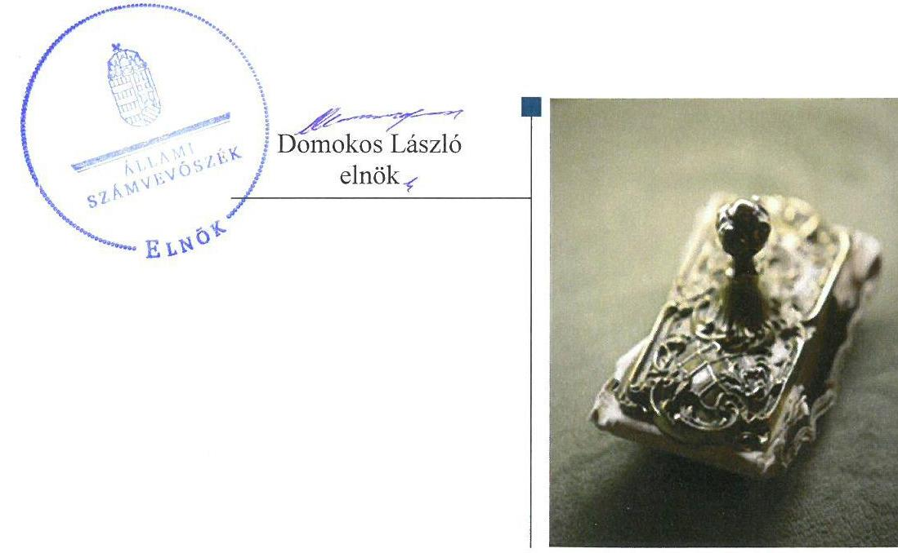
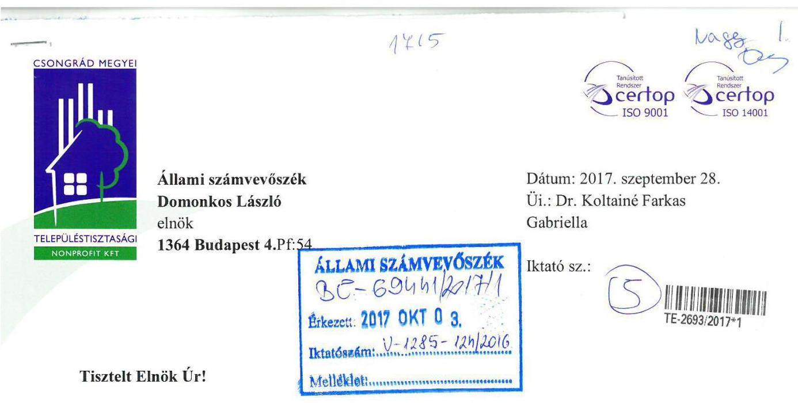
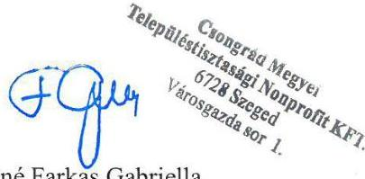
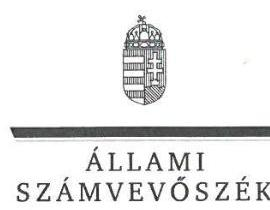
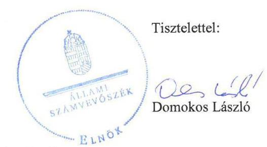
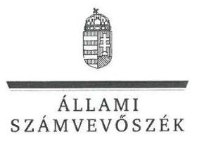

# Jelentés 

## Az önkormányzatok gazdasági társaságai

Az önkormányzatok többségi tulajdonában lévő gazdasági társaságok gazdálkodásának ellenőrzése - Csongrád Megyei
Településtisztasági Nonprofit Kft.
2017.

---

# Jelentés 

## Az önkormányzatok gazdasági társaságai

Az önkormányzatok többségi tulajdonában lévő gazdasági társaságok gazdálkodásának ellenőrzése - Csongrád Megyei
Településtisztasági Nonprofit Kft.
2017. 11. hó 21. nap

---

# AZ ELLENŐRZÉST FELÜGYELTE:

DR. NAGY IMRE felügyeleti vezető

# AZ ELLENŐRZÉST VEZETTE ÉS A VÉGREHAJTÁSÁÉRT FELELŐS:

DR. NAGY JUDIT ellenőrzésvezető

# A PROGRAM ÖSSZEÁLLÍTÁSÁÉRT FELELŐS:

JANIK JÓZSEF LÁSZLÓ osztályvezető

---

**IKTATÓSZÁM:** V-1285-130/2016

**TÉMASZÁM:** 2167

**ELLENŐRZÉS-AZONOSÍTÓ SZÁM:** V-075810

---

Jelentéseink az Országgyűlés számítógépes hálózatán és az Interneta a www.asz.hu címen is olvashatóak.

---

# TARTALOMJEGYZÉK 

■ ÖSSZEGZÉS ..... 5
■ AZ ELLENŐRZÉS CÉLJA ..... 6
■ AZ ELLENŐRZÉS TERÜLETE ..... 7
■ AZ ELLENŐRZÉS HÁTTERE, INDOKOLTSÁGA ..... 9
■ A JELENTÉS LÉNYEGES KÉRDÉSKÖREI ..... 10
■ ELLENŐRZÉS HATÓKÖRE ÉS MÓDSZEREI ..... 11
■ MEGÁLLAPÍTÁSOK ..... 13
■ JAVASLATOK ..... 18
■ MELLÉKLETEK ..... 21
I. Sz. melléklet: Értelmező szótár ..... 21
■ FÜGGELÉK: ÉSZREVÉTELEK ..... 23
■ RÖVIDÍTÉSEK JEGYZÉKE ..... 27

---

.

---

# ÖSSZEGZÉS 

Szeged Megyei Jogú Város Önkormányzata a hulladékgazdálkodási feladatok ellátásának kereteit szabályszerűen alakította ki. A Szegedi Környezetgazdálkodási Nonprofit Kft. tulajdonosi joggyakorlása a javadalmazási szabályzat megalkotása kivételével megfelelt a jogszabályi előírásoknak. A Csongrád Megyei Településtisztasági Nonprofit Kft. vagyongazdálkodása szabályszerű volt. Beszámolási és közzétételi kötelezettségeinek nem tett eleget, ezzel nem biztositotta müködésének átláthatóságát. A Csongrád Megyei Településtisztasági Nonprofit Kft. bevételeinek elszámolása nem volt szabályszerű, ráfordításainak elszámolása szabályszerűen történt. Önköltségszámitása, árképzése szabályszerű volt.

## Az ellenőrzés társadalmi indokoltsága

Magyarországon az intézmény-centrikus közfeladat-ellátás jellemző, de egyre jelentősebb a költségvetésen kívüli feladatellátás térnyerése. Helyi szinten ennek legfontosabb szereplői az önkormányzati tulajdonban lévő gazdasági társaságok, amelyeknek ellenőrzése kiemelten fontos a közfeladat ellátása, és a közvagyon megőrzése, megóvása érdekében. Ezért alapvető követelmény, hogy gazdálkodásuk, müködésük szabályszerű és átlátható legyen.

Szegeden és környékén 2012-2015 között a Csongrád Megyei Településtisztasági Nonprofit Kft. hulladékgazdálkodási feladatokat látott el. Az Állami Számvevőszék az ellenőrzése során arra kereste a választ, hogy szabályszerű volt-e a hulladékgazdálkodással összefüggő közfeladatokat is ellátó Társaság gazdálkodása és az ehhez kapcsolódó tulajdonosi joggyakorlás.

## Főbb megállapítások, következtetések

Szeged Megyei Jogú Város Önkormányzata a feladatellátás jogi kereteit szabályszerűen alakította ki. A Szeged Megyei Jogú Város Önkormányzata kizárólagos tulajdonában lévő Szegedi Környezetgazdálkodási Nonprofit Kft. - mint a Csongrád Megyei Településtisztasági Nonprofit Kft. többségi tulajdonosa - tulajdonosi joggyakorlása során szabályszerűen járt el. Nem alkotott azonban javadalmazási szabályzatot és nem rendelkezett a 2014. évi üzleti terv elfogadásáról.

A Csongrád Megyei Településtisztasági Nonprofit Kft. elkészítette szabályzatait, de a számviteli politika több ponton nem felelt meg a jogszabályi előírásoknak. A vagyongazdálkodása megfelelő volt, de a Társaság fizetőképessége nem volt biztosított, lejárt tartozásai folyamatosan nőttek.

A Csongrád Megyei Településtisztasági Nonprofit Kft. a beszámolási kötelezettségének az üzleti jelentések, közzétételi kötelezettségének a kiegészítő mellékleteke tekintetében nem tett eleget. Nem bíztak meg adatvédelmi felelőst és nem készült belső adatvédelmi nyilvántartás.

A bevételek elszámolása nem volt szabályszerű, a ráfordítások elszámolása szabályszerűen történt. A Csongrád Megyei Településtisztasági Nonprofit Kft. önköltségszámitása megfelelő, árképzése szabályszerű volt.

Az ÁSZ jelentésében a Csongrád Megyei Településtisztasági Nonprofit Kft. ügyvezetőjének öt, a Szegedi Hulladékgazdálkodási Nonprofit Kft. ügyvezetőjének egy javaslatot fogalmazott meg, amelyekre az érintetteknek 30 napon belül intézkedési tervet kell készíteniük.

---

# AZ ELLENŐRZÉS CÉLJA 

Az ellenőrzés célja annak értékelése volt, hogy az önkormányzat vagyongazdálkodási tevékenysége során szabályszerűen gyakorolta-e tulajdonosi jogait. A gazdasági társaság szabályozottsága, gazdálkodása és vagyongazdálkodási tevékenysége, bevételeinek és ráfordításainak elszámolása megfelelt-e a jogszabályi és tulajdonosi előírásoknak. A gazdasági társaság kötelezettségállománya jelentett-e kockázatot a múködésre.

---

# **Az ELLENŐRZÉS TERÜLETE**

## **Csongrád Megyei Településtisztasági Nonprofit Kft. és a tulajdonosi jogokat gyakorló Szegedi Környezetgazdálkodási Nonprofit Kft.**

**TELEPÜLÉSTISZTASÁGI NONPROFIT KFT.**

A Társaság^{1} többségi tulajdonosa 2012-2015 között a Szegedi Környezetgazdálkodási Nonprofit Kft. volt, 38 Szeged környéki önkormányzat kisebbségi tulajdonnal rendelkezett.

A Szegedi Környezetgazdálkodási Nonprofit Kft.-nek Szeged Megyei Jogú Város Önkormányzata kizárólagos tulajdonosa volt.

A Szegedi Hulladékgazdálkodási Nonprofit Kft. 2016-ban jött létre kiválással, mint a Szegedi Környezetgazdálkodási Nonprofit Kft. jogutódja.

A Társaságban a 2012. év elején a Környezetgazdálkodási Kft.^{2}-nek minősített többségi (77,9%) befolyása volt, ami 2015 végére – változatlan összegű törzsbetét mellett, a Társaság jegyzett tőkéje emelésének következményeként – 58,8%-os többségi befolyásra csökkent.

A tulajdonosi részesedések alakulását a Társaságban az 1. táblázat mutatja:

1. táblázat

|  TULAJDONOSI RÉSZESEDÉSEK MÉRTÉKE ÉS MEGOSZLÁSA |  |  |  |   |
| --- | --- | --- | --- | --- |
|   | 2012. | 2013. | 2014. | 2015.  |
|  Jegyzett tőke (M Ft) | 23,3 | 24,2 | 24,4 | 30,3  |
|  Környezetgazdálkodási Kft. (M Ft) | 17,8 | 17,8 | 17,8 | 17,8  |
|  Szeged környéki önkormányzatok (M Ft) | 5,5 | 6,4 | 6,6 | 12,5  |

*Forrás: A Társaság éves beszámolói, társasági szerződések*

A Társaság fő tevékenysége a nem veszélyes hulladék gyűjtése, amelynek keretében települési szilárd hulladék gyűjtését, elszállítását és lerakását, a lakosság által hulladékudvarba beszállított veszélyes hulladék gyűjtését, szállítását, lerakását, valamint települési szilárd hulladék gyűjtését, elszállítását és lerakását végezte. Az Önkormányzat^{3} részére közszolgáltatási szerződés^{4} alapján 2012. első negyedévben folyékony hulladékra vonatkozóan látott el közszolgáltatást a Társaság.

A Társaságnak vagyonkezelésbe vett vagyoneleme nem volt, egy gazdasági társaságban (Regionális Hulladék Begyűjtési és Értékesítési Korlátolt Felelősségű Társaság) 2013 áprilisától 100%-os tulajdona volt.

---

A Társaság gazdálkodásával kapcsolatos néhány mutató alakulását a 2. táblázat mutatja be:
2. táblázat

A TÁRSASÁG GAZDÁLODÁSI MUTATÓINAK ALAKULÁSA (M FT)

|  | 2012. | 2013. | 2014. | 2014.   öndév. | 2015. |
| :-- | --: | --: | --: | --: | --: |
| Értékesítés nettó ábevétele | 609,7 | 632,9 | 693,6 | 696,6 | 702,1 |
| Követelések | 109,0 | 107,3 | 143,9 | 140,4 | 158,5 |
| Ebből a lakossági tartozások állo-   mánya | 80,5 | 76,2 | 96,7 | 96,7 | 97,7 |
| Mérlegfőösszeg | 305,8 | 342,2 | 426,5 | 364,2 | 388,9 |
| Saját tőke összege | 66,9 | 70,7 | 72,0 | 9,6 | 15,8 |
| Jegyzett tőke | 23,3 | 24,2 | 24,4 | 24,4 | 30,3 |
| Mérleg szerinti eredmény | 1,4 | 2,9 | 1,0 | $-61,3$ | 0,3 |
| Foglalkoztatottak száma | 49 | 49 | 53 | 53 | 53 |

A Társaság az előző üzleti év éves beszámolójában elkövetett jelentős összegű hibát állapított meg, ezért a Számv. tv. 19. § (3) bekezdésének előírása alapján 2015-ben a módosításokat a mérleg és az eredmény-kimutatás minden tételénél az előző év adatai mellett bemutatta („háromoszlopos" beszámoló). Ennek fő oka egy kármentesítési projekt miatt végzett önellenőrzés volt. Az önellenőrzés összevont eredményhatása 62,3 M Ft veszteség volt és ennek következtében csökkent a saját tőke 2014-ben. A Társaság 2013. június 3-tól nonprofit szervezetként, 2013. december 4-től közhasznú szervezetként ${ }^{5}$ működött. Mérleg szerinti eredményét minden évben eredménytartalékba helyezte.

Az Önkormányzatnál a Polgármester ${ }^{6}$ és a Jegyző személye, továbbá a Társaság Ügyvezető7-jének és a gazdasági vezetőjének személye nem változott az ellenőrzött időszakban.

---

# AZ ELLENŐRZÉS HÁTTERE, INDOKOLTSÁGA 

## AZ ÖNKORMÁNYZATI TULAJDONÚ GAZDASÁGI

TÁRSASÁGOK teljes körű ellenőrzésének lehetőségét az Állami Számvevőszékről szóló 1989. évi XXXVIII. törvény 2011. január 1-jétől hatályos módosítása teremtette meg és az Állami Számvevőszékről szóló 2011. évi LXVI törvény is tartalmazza. A gazdasági társaságok gazdálkodási tevékenysége szabályszerűségének ellenőrzését 2011. évtől végzi az ÁSZ. Az önkormányzatok többségi tulajdonában álló gazdasági társaságok ellenőrzése kiemelten fontos a vagyon megőrzése, megóvása érdekében.

A feladatellátás költségeinek, ráfordításainak alakulása a lakosság széles rétegét érinti. Az ellenőrzés várható hasznosulásaként az ellenőrzések feltárhatják, hogy az önkormányzat a feladatellátásához rendelt vagyon működtetését a tulajdonostól elvárható gondossággal végezte-e, a feladatot ellátó gazdasági társaság a létesítő okiratban, szolgáltatási szerződésben foglaltak betartásával biztosította-e a feladat ellátását. Az ellenőrzés rávilágíthat arra, hogy a gazdasági társaság a vagyon használatával biztosí-totta-e a szolgáltatás folytatásának feltételeit, az önkormányzat tulajdonosi felügyelete hozzájárult-e a szabályszerű gazdálkodáshoz és feladatellátáshoz.

A megállapítások alapján megfogalmazott számvevőszéki javaslatok hasznosítása elősegítheti a meglévő hibák megszüntetését. A jó gyakorlatok bemutatásával az Állami Számvevőszék hozzájárul a követendő megoldások megismertetéséhez, terjesztéséhez.

---

# A JELENTÉS LÉNYEGES KÉRDÉSKÖREI 

1.     - A tulajdonosi joggyakorlás szabályszerű volt-e?
2.     - A gazdasági társaság vagyongazdálkodása szabályszerű volt-e, fizetőképessége biztositott volt-e a gazdálkodása során?
3.     - A gazdasági társaság bevételeinek és ráforditásainak elszámolása, valamint az önköltségszámitás és árképzés szabályszerű volt-e?

---

# ELLENŐRZÉS HATÓKÖRE ÉS MÓDSZEREI 

## Az ellenőrzés típusa

Megfelelőségi ellenőrzés.

## Az ellenőrzött időszak

2012. január 1-jétől 2015. december 31-éig.

## Az ellenőrzés tárgya

Szegedi Környezetgazdálkodási Nonprofit Kft. (a Szegedi Hulladékgazdálkodási Nonprofit Kft. jogelődje), illetve Szeged Megyei Jogú Város Önkormányzata tulajdonosi joggyakorlása, valamint a Csongrád Megyei Településtisztasági Nonprofit Kft. gazdálkodásának szabályozottsága és szabályszerűsége.

Az ellenőrzés kiterjedt minden olyan körülményre és adatra, amely az ÁSZ ${ }^{8}$ jogszabályban meghatározott feladatainak teljesítéséhez, valamint a program végrehajtása folyamán felmerült újabb összefüggések feltárásához szükséges.

## Az ellenőrzött szervezet

Csongrád Megyei Településtisztasági Nonprofit Kft. és a többségi tulajdonosi jogokat gyakorló Szegedi Hulladékgazdálkodási Nonprofit Kft., valamint Szeged Megyei Jogú Város Önkormányzata, mint a Szegedi Hulladékgazdálkodási Nonprofit Kft. többségi tulajdonosa

## Az ellenőrzés jogalapja

Az ellenőrzés jogszabályi alapját az ÁSZ tv. ${ }^{9}$ 1. § (3) bekezdése és 5. § (3)-(4)-(5) bekezdései képezik.

## Az ellenőrzés módszerei

Az ellenőrzést a nemzetközi standardokat irányadónak tekintve az ellenőrzési program ellenőrzési kérdései, az ellenőrzött időszakban hatályos jogszabályok, az ellenőrzés szakmai szabályok és módszertanok figyelembe vételével végeztük.

---

Az ellenőrzés ideje alatt az ellenőrzött szervezettel történő kapcsolattartást az ÁSZ Szervezeti és Múködési Szabályzatának vonatkozó előírásai alapján biztosítottuk.

Az ellenőrzési kérdések megválaszolásához szükséges bizonyítékok megszerzése a következő ellenőrzési eljárások alkalmazásával történt: megfigyelés, kérdésfeltevés (információkérés), összehasonlítás, valamint elemző eljárás. Az ellenőrzési bizonyítékként felhasználható adatforrások közé tartoztak egyrészt az ellenőrzési programban felsorolt adatforrások, másrészt adatforrás lehet még minden - az ellenőrzés folyamán - feltárt, az ellenőrzés szempontjából információkat tartalmazó dokumentum.

Az ellenőrzést a kérdésekre adott válaszok kiértékelésével, valamint a megjelölt adatforrások, a csatolt tanúsítványok felhasználásával, továbbá az adott időszakban hatályos jogszabályok figyelembe vételével folytattuk le.

A bevételek és ráfordítások elszámolása, valamint a vagyonnyilvántartás terén a szabályszerű múködést véletlen mintavétellel ellenőriztük. A mintavétellel ellenőrzött területek esetében minden egyes tétel vonatkozásában a szabályszerűségre vonatkozó kérdéseket tettünk fel, amelyek eredménye összesítésre került. Megfelelőnek értékeltünk egy ellenőrzött területet, amennyiben 95\%-os bizonyossággal a teljes sokaságban az átlagos hibaarány legfeljebb 10\%, nem megfelelőnek, amennyiben 10\%-nál magasabb arányt képviselt. Abban az esetben, ha a teljes sokaság tekintetében a 10\%-os hibaarányhoz való viszony megítélésének megbízhatósága nem érte el a 95\%-ot, annak elérése érdekében értékelésünket további szempontokkal egészítettük ki, és figyelembe vettük a feltárt hibák típusát és súlyát. A ráfordítások elszámolására és a vagyonnyilvántartásra vonatkozó véletlen mintavételt kockázati alapú kiválasztással egészítettük ki, amelynek során évente a három legnagyobb összegű tételt választottuk ki.

---

# 1. A tulajdonosi joggyakorlás szabályszerű volt-e? 

## Összegző megállapítás

### 1.1. számú megállapítás

### 1.2. számú megállapítás

## A tulajdonosi joggyakorlás szabályszerű volt.

A tulajdonosi joggyakorlás kereteinek kialakítása - a javadalmazási szabályzat hiánya mellett - szabályszerű volt.

Az Önkormányzat a tulajdonosi joggyakorlás szabályait vagyonrendelet ${ }^{10}$ ben határozta meg, amelynek 4. § (2) bekezdése B. b) pontjában felsorolt, többségi önkormányzati tulajdonban lévő gazdasági társaságok között szerepel a Környezetgazdálkodási Kft.

A Taggyűlés ${ }^{11}$-en a Környezetgazdálkodási Kft.-t mint tulajdonost a Környezetgazdálkodási Kft. SZMSZ ${ }^{12}$-e IV. fejezet I. pontjában foglaltak szerint a Környezetgazdálkodási Kft. ügyvezetője képviselte.

A Társaság SZMSZ ${ }^{13}$-ének II. fejezet 3.1.1. bekezdése meghatározta, hogy az Ügyvezető a többségi tulajdonos számára milyen időpontban és milyen tartalommal köteles tájékoztatást adni ${ }^{14}$, illetve mely szabályzatokat ${ }^{15}$ kell előzetes jóváhagyásra megküldeni. A Taggyűlés határozatában elfogadta ${ }^{16}$, hogy a mindenkori többségi tulajdonos jogosult a Kft. felett szakmai, gazdasági felügyeletet ellátni.

A Taggyűlés a vezető tisztségviselők, felügyelő-bizottsági tagok javadalmazásának, valamint jogviszonyuk megszűnése esetére biztosított juttatások módjának, mértékének elveiről, annak rendszeréről nem alkotott javadalmazási szabályzatot, megsértve ezzel a Taktv. ${ }^{17}$ 5. § (3) bekezdésében foglaltakat.

Az Önkormányzat területén a Közszolgáltatási szerződés keretében végzett folyékony hulladék gyűjtés és szállítás feltételeit, az alkalmazható árakat az Önkormányzat rendelet ${ }^{18}$-ben határozta meg.

## A tulajdonosi jogok gyakorlása- a 2014. évi üzleti terv jóváhagyása kivételével - szabályszerű volt.

A 3 fős Felügyelő bizottság ${ }^{19}$ a Gt. ${ }^{20} 34$. § (1) bekezdésében, valamint a Ptk. ${ }^{21}$ 3:121. § (1) bekezdésében előírtak szerint működött, tagjait a Társasági szerződés ${ }^{22}$ V. fejezet 6. pontja tartalmazta. A Felügyelő-bizottság megtárgyalta a szabályzatokat, az üzleti terveket, véleményezte az éves beszámolókat.

A 2012. és a 2013. években az Önkormányzat a Környezetgazdálkodási Kft. által készített konszolidált beszámolókból kapott tájékoztatást a Társaság gazdálkodásáról, elkülönítve a Társaság beszámolójának adatait. A Számv. tv. ${ }^{23}$ 117. § (1) bekezdés előírásának 2014. január 1-jétől hatályos módosítása miatt megszűnt a többségi tulajdonos társaság konszolidált beszámoló készítési kötelezettsége, ezt követően az Önkormányzatnak megküldött beszámolójában nem számolt be a Társaság gazdálkodásáról, azon-

---

ban az egymással szemben elszámolt bevételeket a kiegészítő mellékletben a Számv. tv. 88. § (6) bekezdésében foglaltaknak megfelelően bemutatta.

A Társaság üzleti tervét a Taggyúlés 2012, 2013, 2015 évekre elfogadta ${ }^{24}$, 2014. évre üzleti tervet a Társaság SZMSZ-e II. fejezet 2.1 bekezdésének h) pontjában előírtak ellenére a Taggyúlés nem fogadott el, így a Társaság 2014. év tekintetében üzleti tervvel nem rendelkezett.

A Taggyúlés a Felügyelő bizottság véleményének és a könyvvizsgáló jelentésének ismeretében hozott az éves beszámolót elfogadó határozatot ${ }^{25}$.

A Környezetgazdálkodási Kft. a Társaság által megnyitott folyószámla hitelszerződéshez kapcsolódóan készfizető kezességi szerződést kötött. A kötelezettségvállalás összege nem haladta meg az Alapító okirat ${ }^{26}$ B./ 2.) pontjában az Környezetgazdálkodási Kft. ügyvezetője által vállalható kötelezettség felső határát.

A Környezetgazdálkodási Kft. a Társaságnál ellenőrzést, vagy átvilágítást nem hajtott végre, belső ellenőrzési terveiben nem szerepelt a Társaság gazdálkodásának, vagyoni helyzetének ellenőrzése.

# 2. A gazdasági társaság vagyongazdálkodása szabályszerű volt-e, fizetőképessége biztosított volt-e a gazdálkodása során? 

Összegző megállapítás

A Társaság szabályozottsága a számviteli politika kivételével
megfelelt a jogszabályi előírásoknak. Vagyongazdálkodása
megfelelő volt, fizetőképessége nem volt biztosított. A Társaság a beszámolási, adatszolgáltatási, közzétételi kötelezettségének nem tett eleget.

### 2.1. számú megállapítás

A Társaság elkészítette szabályzatait, de a számviteli politika több ponton nem felelt meg a jogszabályi előírásoknak.

A Társaság a Számv. tv. 14. § (3), illetve (5) bekezdése előírásának megfelelően elkészítette számviteli politika ${ }_{1},{ }^{27} \mathrm{z},{ }^{28}{ }_{3}{ }^{29}$ és annak keretében számviteli szabályzatait.

A számviteli politika ${ }_{1} 15.1$ pontja nem a Számv. tv. 3. § (3) bekezdés 3) pontja szerint tartalmazta a jelentős összegű hiba fogalmát, illetve nem tartalmazta a megbízható és valós képet lényegesen befolyásoló hiba fogalmát, ezzel megsértve Számv. tv. 3. § (3) bekezdése 5) pontját.

A számviteli politika ${ }_{1,2,3}$-t a Számv. tv. 14. § (11) bekezdésében rögzítettek ellenére nem módosították, azaz 2013. január 1-jétől a Számv. tv. 3. § (3) bekezdés 5) pontja, a megbízható és valós képet befolyásoló hiba fogalmának törlése kapcsán nem törölték a hatályon kívül helyezett, a Számv. tv. 154. § (5)-(6) bekezdésében szerepelt, a megbízható és valós képet lényegesen befolyásoló hibák esetén az ismételt közzétételi kötelezettséget. A számviteli politika ${ }_{1,2,3} 20$. pontja a Számv. tv. 95. §-ával nem egyezően tartalmazza az üzleti jelentés tartalmára vonatkozó előírásokat.

---

A számviteli politika ${ }_{2,3}$ 2013. július 1-jétől nem tartalmazta a mérlegkészítés időpontját, megsértve ezzel a Számv. tv. 14. § (4) bekezdésében foglalt előírásokat.

A Társaság számlarendje ${ }_{1}{ }^{30} \cdot{ }_{2}{ }^{31}$-je a Számv. tv. 161. § (4) bekezdésében foglaltnak, a bizonylati rend ${ }_{1}{ }^{32} \cdot{ }_{2}{ }^{33}$ a Számv. tv. 161. § (2) d) pontjában foglaltaknak megfelelően elkészült.

A Társaság szálmarendje ${ }_{1,2}$ biztosította az ágazati jogszabályoknak, a Hgt. ${ }^{34} 29 . \S$ (3) bekezdésében és a $\mathrm{Ht}^{35} 50 . \S$ (2) bekezdésében előírt elkülönített nyilvántartás vezetését.

A beszerzések lebonyolítására az Ügyvezető a Kbt. ${ }^{36}$ 22. § (2) bekezdésében foglaltak alapján elkészítette a beszerzési szabályzat ${ }_{1-3}{ }^{37}$-at.

# 2.2. számú megállapítás 

## A Társaság vagyongazdálkodási tevékenysége megfelelt a jogszabályi rendelkezéseknek és a belső szabályzatoknak.

A Társaság vagyonnyilvántartása és vagyongazdálkodási tevékenysége a jogszabályoknak és a belső előírásoknak megfelelő volt.

A leltározási szabályzat ${ }_{1}{ }^{38} \cdot{ }_{2}{ }^{39}$ rendelkezett a saját vagyon leltározásáról a Számv. tv. 46. § (3) bekezdésében és 69. §-ában előírtaknak megfelelően a beszámoló mérlegtételeit leltárral alátámasztották. A tárgyi eszközök és immateriális javak mennyiségi felvétellel történő leltározását a leltározási szabályzat ${ }_{1,2}$ 5.1. pontjának megfelelően kétévente mennyiségi felvétellel (2013-ban és 2015-ben) elvégezték.

## A Társaság fizetőképessége nem volt biztosított a gazdálkodás során, lejárt kötelezettségei folyamatosan nőttek.

A Társaságnál a kötelezettségek állománya folyamatosan és jelentősen növekedett a lejárt határidejű kötelezettségek állományával együtt. A lejárt határidejű kötelezettségek 100\%-át rövid lejáratú szállítói kötelezettségek tették ki, hosszú lejáratú kötelezettséget a mérlegekben nem mutattak ki.

A Társaságnál az eladósodottság mértéke (kötelezettségek/saját tőke) folyamatosan nőtt, amit a 3. táblázat szemléltet:
3. táblázat

## ELADÓSODOTTSÁG MÉRTÉKE (M FT)

| Megnevezés | 2012. | 2013. | 2014. | 2015. | 2016. |
| :--: | :--: | :--: | :--: | :--: | :--: |
| Rövid lejáratú kötelezettségek | 186,1 | 245,1 | 317,5 | 317,5 | 341,5 |
| Ebből szállítói kötelezettségek | 86,9 | 136,1 | 181,1 | 181,1 | 265,0 |
| Ebből szállítói kötelezettségek kapcsolt vállalkozással szemben | 59,7 | 46,1 | 131,8 | 131,8 | 175,7 |
| Lejárt rövid határidejű kötelezettségek | 55,6 | 87,4 | 162,1 | 162,1 | 216,2 |
| Saját tőke | 66,9 | 70,7 | 72,0 | 9,6 | 15,8 |
| Eladósodottság mértéke (kötelezettségek/saját tőke) | 2,8 | 3,5 | 4,4 | 33,1 | 21,6 |

Forrás: A Társaság éves beszámolói

---

### 2.4. számú megállapítás

A Társaság beszámolási kötelezettségének eleget tett, de üzleti jelentései tartalmilag nem feleltek meg a jogszabályi előírásoknak. Nem bízott meg adatvédelmi felelőst, és nem tett eleget közzétételi kötelezettségének.

A Társaság a Számv. tv. 19. § (1) bekezdésének megfelelően elkészítette az éves beszámolóit, kivéve a 2012. évi kiegészítő mellékletet, és 2013 üzleti évtől - a Civil tv. ${ }^{40}$ 29. § (3) és (6) bekezdéseinek előírásai alapján - ennek részeként a közhasznúsági mellékletet.

A Társaság éves beszámolói az ágazati jogszabályoknak, a Hgt. 29. § (3) bekezdésében és a Ht. 50. § (2) bekezdésében előírtaknak megfelelően készültek.

A Társaság könyvvizsgálója minden üzleti évre vonatkozóan hitelesítő záradékot adott, azonban a 2015-ös üzleti évre szóló jelentésben a vélemény korlátozása nélkül figyelemfelhívással élt a Társaság jelentős saját tőke csökkenése miatt. A feltárt vagyonvesztés mértéke a $\mathrm{Ptk}_{2} 3: 189$ (1) bekezdés a) pontjának előírása alapján, még nem indokolta a Taggyúlés ügyvezető által történő haladéktalan összehívását.

A Társaság a 2012. évi éves beszámoló kiegészítő mellékletében nem mutatta be a jelentősebb összegű terven felüli értékcsökkenést és annak indokait, ezzel nem tett eleget a Számv. tv. 92. § (2) bekezdésében foglalt előírásnak.

A Társaság az éves beszámolóhoz kapcsolódó üzleti jelentéseiben nem mutatta be a Számv. tv. 95. § (5) bekezdésében előírtakat.

Az éves beszámolók jóváhagyásakor a Gt. 35. § (3) bekezdése, valamint a $\mathrm{Ptk}_{2} 3: 120 . \S$ (2) bekezdésének előírásai alapján a Felügyelő bizottsági határozatok és a Számv. tv. 156-158. §-ainak előírása szerinti könyvvizsgálói jelentések rendelkezésre álltak.

A Felügyelő bizottság minden évben véleményezte az éves beszámolót és arról határozatot hozott ${ }^{41}$.

A Társaság a jóváhagyott beszámolót a számviteli politikában ${ }_{1-3}$, a Számv. tv. 153. §-ában, majd 2013-tól a Civil tv. 30 § (1) bekezdésében előírtaknak megfelelően letétbe helyezte és a Céginformációs rendszerben történt letétbe helyezéssel teljesítette a Számv. tv. 154. § (7) bekezdésében előírt közzétételi kötelezettségét.

A Társaság rendelkezett az Info tv. ${ }^{42}$ 30. § (6) bekezdésében előírt, a köz-feladatot ellátó szervnek a közérdekű adatok megismerésére irányuló igények teljesítésének rendjét rögzítő szabályzattal ${ }^{43}$, melyet az Ügyvezető adott ki.

A Társaság az Info tv. 1. mellékletében meghatározott adatok, dokumentumok közül az éves beszámolók kiegészítő mellékleteit nem tette közzé saját honlapján, megsértve ezzel az Info tv. 37. § (1) bekezdésében meghatározott közzétételi kötelezettségét.

A Társaság az Info tv. 24. § (3) bekezdésében előírt belső adatvédelmi szabályzattal ${ }^{44}$ rendelkezett.

Az adatvédelmi szabályzat 20.1. pontjában és az Info tv. 24. § (1) bekezdésében előírt adatvédelmi felelőst nem bíztak meg, és az adatvédelmi felelős hiányában nem vezették az Info tv. 24. § (2) bekezdés e) pontjában és adatvédelmi szabályzat 20.2. pontjában előírt belső adatvédelmi nyilvántartást.

---

# 3. A gazdasági társaság bevételeinek és ráfordításainak elszámolása, valamint az önköltségszámítás és árképzés szabályszerű volt-e? 

Összegző megállapítás

### 3.1. számú megállapítás

A bevételek elszámolása nem volt szabályszerű, a ráfordítások elszámolása szabályszerűen történt. Társaság önköltségszámítása, árképzése szabályszerű volt.

A bevételek elszámolása nem volt szabályszerű, a ráfordítások elszámolása megfelelt az előírásoknak.

A bevételek elszámolása nem a számlatükör ${ }_{1}{ }^{45}{ }_{2}{ }^{46}$-ben megnevezett számlákra történt. A vevőktől származó túlfizetést a Számv. tv. 77. §-ában foglalt előírásokat figyelmen kívül hagyva egyéb bevételként és nem egyéb rövidlejáratú kötelezettségként számolták el.

Az anyagjellegú és egyéb ráfordítások, a személyi jellegú kiadások elszámolása megfelelő volt.

Az értékcsökkenés elszámolása megfelelő volt, a képződött forrásokat is hasznosítva, a - 2013. évet kivéve -az értékcsökkenést meghaladó mértékben történt pótlás és élettartam növelő felújítás a Társaságnál. A tervezett beruházásokról a többségi tulajdonos társaságot tájékoztatták, a tervek elfogadásáról a Taggyűlés döntött.

A hulladékkezelésből eredő hátralékos állomány behajtására vonatkozóan a Társaság a Hgt. 26. §-a, majd 2013. január 1-jétől a Ht. 52. §-nak előírásai szerint járt el.

## 3.2. számú megállapítás

A Társaság rendelkezett önköltség-számítási szabályzattal. A közszolgáltatási díjakat a szabályzat és a jogszabályi előírások alapján határozták meg.

A Társaság a Számv. tv. 14. § (7) bekezdése alapján önköltség-számítási szabályzat ${ }_{1,2,3}{ }^{47}$ készítésére volt kötelezett, melynek - a Társaság SZMSZ-e 2.2. pontjának előírása alapján - az Felügyelő bizottság véleményének kikérésével tett eleget és önköltségszámítását e szerint végezte.

A közszolgáltatási tevékenység elkülönítéséről az önköltség-számítási szabályzat ${ }_{1,2,3}$ rendelkezett, ami alapján a közszolgálati tevékenységek teljes mértékben elkülöníthetők voltak.

A Társaság közszolgáltatását igénylő önkormányzatok a Hgt. 23. §-ában kapott felhatalmazás alapján rendeletben határozták meg területükön a számlázható térítési díjakat. Az árképzésben a Társaság a díjmegállapításra vonatkozó Ht. 91. §-a,illetve a Rezsi tv. ${ }^{48}$ 12. §-a szerint járt el.

---

# JAVASLATOK 

Az ÁSZ tv. 33. § (1) bekezdésében foglaltak értelmében az ellenőrzött szervezet vezetője köteles a jelentésben foglalt megállapításokhoz kapcsolódó intézkedési tervet összeállítani és azt a jelentés kézhezvételétől számított 30 napon belül az ÁSZ részére megküldeni. Amennyiben az ellenőrzött szervezet vezetője nem küldi meg határidőben az intézkedési tervet, vagy továbbra sem elfogadható intézkedési tervet küld, az Állami Számvevőszék elnöke az ÁSZ tv. 33. § (3) bekezdése a) és b) pontjaiban foglaltakat érvényesítheti.

## Csongrád Megyei Településtisztasági Nonprofit Kft. Ügyvezetőjének

1. Intézkedjen a Számviteli politika hatályos jogszabályi rendelkezések szerinti módosításáról.
(2.1. sz. megállapítás 3. és 4. bekezdései alapján)
2. Intézkedjen arról, hogy az üzleti jelentés a jogszabály előírásának megfelelően mutassa be az előírt tartalmi elemeket.
(2.4. sz. megállapítás 5. bekezdése alapján)
3. Intézkedjen a közzétételi kötelezettségek jogszabályi előírásoknak megfelelő teljes körü teljesítéséről.
(2.4. sz. megállapítás 10. bekezdése alapján)
4. Intézkedjen a belső adatvédelmi felelős kinevezéséről, valamint a belső adatvédelmi nyilvántartás vezetéséről a jogszabályi előírásoknak megfelelően.
(2.4. sz. megállapítás 12. bekezdése alapján)
5. Intézkedjen, hogy a bevételek számviteli elszámolása a számlatükörnek megfelelően történjen.
(3.1. sz. megállapítás 1. bekezdése alapján)

---

# Szegedi Hulladékgazdálkodási Nonprofit Kft. Ügyvezetőjének 

1. Kezdeményezze a Taggyülésnél a jogszabályban elöirt, a vezető tisztségviselők, felügyelőbizottsági tagok, valamint az Mt. 208 §-ának hatálya alá eső munkavállalók javadalmazása, valamint a jogviszony megszünése esetére biztositott juttatások módjának, mértékének elveiről, annak rendszeréről szóló szabályzat megalkotását különös tekintettel a Taktv.-ben elöirtakra.
(1.1. sz. megállapítás 4. bekezdése alapján)

---

.

---

# MELLÉKLETEK 

- I. SZ. MELLÉKLET: ÉRTELMEZŐ SZÓTÁR
gazdasági társaság
gazdálkodó szervezet

Közhasznú szervezet
közszolgáltatás
meghatározó befolyás
minősített többséget biztosító részesedés
többségi befolyást biztosító részesedés

Ptk2. 3.88. § (1) bekezdése szerint „a gazdasági társaságok üzletszerű közös gazdasági tevékenység folytatására, a tagok vagyoni hozzájárulásával létrehozott, jogi személyiséggel rendelkező vállalkozások, amelyekben a tagok a nyereségből közösen részesednek, és a veszteséget közösen viselik".
A Ptk. $1^{49}$ 685. § c) pontja szerint gazdálkodó szervezet: „az állami vállalat, az egyéb állami gazdálkodó szerv, a szövetkezet, a lakásszövetkezet, az európai szövetkezet, a gazdasági társaság, az európai részvénytársaság, az egyesülés, az európai gazdasági egyesülés, az európai területi együttműködési csoportosulás, az egyes jogi személyek vállalata, a leányvállalat, a vízgazdálkodási társulat, az erdő birtokossági társulat, a végrehajtói iroda, az egyéni cég, továbbá az egyéni vállalkozó." (2014. 03.15-ig hatályos)
A Civil tv. 32. § (1) szerint Közhasznú szervezetté minősíthető a Magyarországon nyilvántartásba vett közhasznú tevékenységet végző szervezet, amely a társadalom és az egyén közös szükségleteinek kielégítéséhez megfelelő erőforrásokkal rendelkezik, továbbá amelynek megfelelő társadalmi támogatottsága kimutatható, és amely:
a) civil szervezet (ide nem értve a civil társaságot), vagy
b) olyan egyéb szervezet, amelyre vonatkozóan a közhasznú jogállás megszerzését törvény lehetővé teszi.
Az Ebktv. ${ }^{50}$ 3. § d) pontja a következőképpen határozza meg a közszolgáltatást: „szerződéskötési kötelezettség alapján a lakosság alapvető szükségleteinek ellátására irányuló szolgáltatás, így különösen a villamos energia-, gáz-, hő-, víz-, szenny-víz- és hulladékkezelési, köztisztasági, postai és távközlési szolgáltatás, továbbá a menetrend alapján közlekedő járművekkel végzett közforgalmú személyszállítás".
A Ptk. 2 8:2. § (2) bekezdése szerint „A befolyással rendelkező akkor rendelkezik egy jogi személyben meghatározó befolyással, ha annak tagja vagy részvényese, és
a) jogosult e jogi személy vezető tisztségviselői vagy Felügyelő-bizottsága tagjai többségének megválasztására, illetve visszahívására; vagy
b) a jogi személy más tagjai, illetve részvényesei a befolyással rendelkezővel kötött megállapodás alapján a befolyással rendelkezővel azonos tartalommal szavaznak, vagy a befolyással rendelkezőn keresztül gyakorolják szavazati jogukat, feltéve, hogy együtt a szavazatok több mint felével rendelkeznek."
A minősített befolyásszerző az ellenőrzött társaságban a szavazatok legalább hetvenöt százalékával rendelkezik. (Ptk.2. 3:324. §)
A Ptk. 2 8:2. § (1) bekezdése szerint „többségi befolyás az olyan kapcsolat, amelynek révén természetes személy vagy jogi személy (befolyással rendelkező) egy jogi személyben a szavazatok több mint felével vagy meghatározó befolyással rendelkezik."

---

.

---

# FÜGGELÉK: ÉSZREVÉTELEK 

A jelentéstervezetet a Számvevőszék 15 napos észrevételezésre megküldte az ellenőrzött szervezetek vezetőinek az ÁSZ tv. 29. §* (1) bekezdése előírásának megfelelően
A Szeged Megyei Jogú Város Önkormányzata polgármestere az ÁSZ tv. 29. § (2) bekezdésében foglalt észrevételezési jogával nem élt.
A függelék tartalmazza a Csongrád Megyei Településtisztasági Nonprofit Kft. ügyvezetőjének észrevételeit, illetve az el nem fogadott észrevétel elutasításának indoklását.
Az elfogadott észrevétel alapján a Számvevőszék módosította a jelentést.

[^0]
[^0]:    * 29. § (1) Az Állami Számvevőszék az ellenőrzési megállapításait megküldi az ellenőrzött szervezet vezetőjének vagy az általa megbízott személynek, és annak, akinek személyes felelősségét állapította meg.
    (2) Az ellenőrzött szervezet vezetője és a felelősként megjelölt személy az ellenőrzés megállapításaira tizenöt napon belül írásban észrevételt tehet.
    (3) Az Állami Számvevőszék az észrevételre a beérkezésétől számított harminc napon belül írásban válaszol. A figyelembe nem vett észrevételeket köteles a jelentésben feltüntetni, és megindokolni, hogy azokat miért nem fogadta el.

---

Köszönettel kézhez kaptam a V-1285-116/2016 iktatószámú, „Az önkormányzatok gazdasági társaságai - Az önkormányzatok tulajdonában lévö gazdasági társaságok gazdálkodásának ellenörzése - Csongrád Megyei Településtisztasági Nonprofit Kft." címmel készült számvevőszéki jelentéstervezetüket. Társaságunk áttekintette az Önök által elkészített anyagot, a megállapításokkal alapvetően egyet értünk azokat elfogadjuk.
A jelentéstervezetben megfogalmazott megállapításokhoz az ÁSZ tv. 29. § (2) bekezdésében megfogalmazott lehetőséggel élve észrevételt kívánunk tenni az alábbiakban leírtak szerint:

1 A jelentéstervezet 5. oldalán, a Föbb megállapítások, következtetések alcím alatti negyedik bekezdésben található „A bevételek elszámolása nem volt szabályszerű" szövegrész kiegészítéseként, „A behajtásból származó túlfizetések tekintetében, a bevételek elszámolása nem volt szabályszerű" szövegrészt javasolja Társaságunk beépíteni.
A pontosítást, arra való tekintettel kérjük, hogy a vizsgált időszakban, a behajtási eljárás során keletkezett vevői túlfizetések, összesen 332.846 Ft , került hibásan lekönyvelésre a bevételek közé, ami az időszaki összbevételünk $0,01 \%$-a.

2 A jelentéstervezet 26. oldalán a „Rövidítések jegyzőke" 2. pontja helyesen „Szegedi Hulladékgazdálkodási Nonprofit Kft. (a Szegedi Környezetgazdálkodási Nonprofit Kft. jogutódja)".

Bízom abban, hogy a Számvevőszéki jelentés javaslataiban megfogalmazott intézkedések végrehajtása következtében Társaságunk magasabb színvonalon láthatja el közfeladatait.

Tisztelettel:

Dr. Koltainé Farkas Gabriella ügyvezető igazgató

---

ELNÖK

Ikt.szám: V-1285-125/2016.

# Dr. Koltainé Farkas Gabriella úrhölgy 

ügyvezető
Csongrád Megyei Településtisztasági Nonprofit Kft.

## Szeged

## Tisztelt Ügyvezető Úrhölgy!

„Az önkormányzatok gazdasági társaságai - Az önkormányzatok többségi tulajdonában lévő gazdasági társaságok gazdálkodásának ellenőrzése - Csongrád Megyei Településtisztasági Nonprofit Kft. " címmel készített számvevőszéki jelentéstervezetre tett észrevételeit köszönettel megkaptam.
Az Állami Számvevőszék észrevételekre vonatkozó álláspontjáról a felügyeleti vezető által készített részletes tájékoztatást csatoltan megküldöm.
Tájékoztatom az Ügyvezető úrhölgyet, hogy a számvevőszéki jelentésben - az Állami Számvevőszékről szóló 2011. évi LXVI. törvény 29. § (3) bekezdése alapján - a figyelembe nem vett észrevételeket szerepeltetjük annak megindokolásával, hogy azt miért nem fogadtuk el.

Budapest, 2017. 10. hó 26 nap

Melléklet: Tájékoztatás az észrevételek kezeléséről

---

# Tájékoztatás   az észrevételek kezeléséről 

„Az önkormányzatok gazdasági társaságai - Az önkormányzatok többségi tulajdonában lévő gazdasági társaságok gazdálkodásának ellenőrzése - Csongrád Megyei Településtisztasági Nonprofit Kft." címú jelentéstervezetre 2017. szeptember 28-án tett (az Állami Számvevőszékhez 2017. október 3-án érkezett) észrevételét áttekintettük, annak kezelésével kapcsolatban a következő tájékoztatást adom.
A jelentéstervezet 5. oldal Főbb megállapítások, következtetések fejezet utolsó bekezdés 1. mondatára, a 3.1. számú megállapítás 1. bekezdésére és a Csongrád Megyei Településtisztasági Nonprofit Kft. ügyvezetőjének címzett 5. javaslatra vonatkozó észrevétel:
Az észrevételben kéri „A bevételek elszámolása nem volt szabályszerű." megállapítást „A behajtásból származó túlfizetések tekintetében a bevételek elszámolása nem volt szabályszerű:" megállapításra módosítani, mivel véleményük szerint a vevői túlfizetések kerültek hibásan lekönyvelésre.

Az észrevétel nem megalapozott, azt nem fogadom el, mivel a bevételek elszámolása azért sem volt szabályszerű, mert több esetben nem a szabályzatban előírtaknak megfelelően, a számlatükörben meghatározott számlákra könyvelték, vagy a számlatükörben nem szereplő számlát használtak.

A jelentéstervezet 26. oldal Rövidítésjegyzék 2. pontjára vonatkozó észrevétel
Az észrevételben kéri a rövidítés korrigálását.
Az észrevétel megalapozott, azt elfogadom és a Rövidítésjegyzék 2. pontjának zárójeles részét törlöm.

Budapest, 2017. 10. hó 26. nap

Dr. Nagy Imre felügyeleti vezető

---

# RÖVIDÍTÉSEK JEGYZÉKE 

${ }^{1}$ Társaság
${ }^{2}$ Környezetgazdálkodási Kft.
${ }^{3}$ Önkormányzat
${ }^{4}$ Közszolgáltatási szerződés
${ }^{5}$ Közhasznúság megszerzése, bejegyzése
${ }^{6}$ Polgármester
${ }^{7}$ Ügyvezető
${ }^{8}$ ÁSZ
${ }^{9}$ ÁSZ tv.
${ }^{10}$ Vagyonrendelet
${ }^{11}$ Taggyűlés
${ }^{12}$ Környezetgazdálkodási Kft. SZMSZ-e
${ }^{13}$ Társaság SZMSZ-e
${ }^{14}$ SZMSZ beszámolóra vonatkozó előírása
${ }^{15}$ SZMSZ jóváhagyandó szabályzatokra vonatkozó előírásai:
${ }^{16}$ Taggyűlési határozat

Csongrád Megyei Településtisztasági Nonprofit Kft.
Szegedi Környezetgazdálkodási Nonprofit Kft.
Szeged Megyei Jogú Város Önkormányzata
Szeged Megyei Jogú Város Önkormányzatával 2011. április 29-én aláírt közszolgáltatási szerződés. (Hatályos 2011. április 1 és 2012. március 31. között.) megszerzés időpontja 2013. december 4. a bejegyzés időpontja 2014. február 10.

Szeged Megyei Jogú Város Önkormányzata polgármestere
Csongrád Megyei Településtisztasági Nonprofit Kft. irányításáért felelős vezető tisztségviselöje
Állami Számvevőszék
2011. évi LXVI. törvény az Állami Számvevőszékről

25/2003. (VI.27.) Kgy. rendelet Szeged Megyei Jogú Város Önkormányzata vagyona feletti rendelkezési jog gyakorlásának szabályairól, amelynek 4. § (2) bekezdését a 7/2012. (III.05.) Szeged Megyei Jogú Város Önkormányzata Közgyűlésének 7/2012. (III.05.) rendelete módosította.
Csongrád Megyei Településtisztasági Nonprofit Kft. legfőbb döntéshozó szerve A Környezetgazdálkodási Kft. 2010. október 1-jétől hatályos szervezeti és működési szabályzata
A Társaság 2012.01.01-jétől hatályos Szervezeti és Működési Szabályzata (Hatályos: 2012. január 1.-jétől 7 módosítással, amelyek a törzstőke változással és a közhasznú szervezetté válással kapcsolatosak. Módosítások időpontjai: 2012.10.01, 2013.03.17, 2013.06.20, 2013.07.16, 2013.09.24, 2013.12.04, 2015.04.15.)

Minden év augusztus 10. napjáig írásos beszámoló a társaság féléves gazdálkodásáról. A beszámolónak tartalmaznia kell mérleg, eredménykimutatás adatok mellett a vevőkövetelésekre, likvidításra, beruházásokra, és a gazdálkodás mérőszámaira vonatkozó információkat.
Minden év október 25. napjáig írásos beszámoló a társaság I-III. negyedéves gazdálkodásáról. (A beszámolónak tartalmaznia kell a féléves beszámolónál leírtakat.)
Külső ellenőrzésekről készült jegyzőkönyvek megküldése a szakmai irányítást ellátó többségi tulajdonos részére.
Tájékoztatás adása a társaság gazdálkodásáról, a társaság üzleti könyveibe és irataiba való betekintés lehetővé tétele.
Minden évben a tulajdonos tájékoztatása a tervezett, és végrehajtott beruházásokról 50 millió forint feletti beruházások esetén előzetes tulajdonosi engedély beszerzése.

Szervezeti és működési szabályzat, és módosításai;
Közbeszerzési szabályzat és módosításai;
Számviteli politikája, és módosításai;
Önköltségszámítási szabályzat és módosításai
1/2010. (05. 19.) TGy. sz. határozat

---

${ }^{17}$ Taktv.
${ }^{18}$ Rendelet
${ }^{19}$ Felügyelő-bizottság
${ }^{20}$ Gt.
${ }^{21}$ Ptk. 2
${ }^{22}$ Társasági szerződés
${ }^{23}$ Számv. tv.
${ }^{24}$ Elfogadó határozatok
${ }^{25}$ Elfogadó határozatok
${ }^{26}$ Alapító okirat
${ }^{27}$ Számviteli politika ${ }_{1}$
${ }^{28}$ Számviteli politika ${ }_{2}$
${ }^{29}$ Számviteli politika ${ }_{3}$
${ }^{30}$ Számlarend ${ }_{1}$
${ }^{31}$ Számlarend $_{2}$
${ }^{32}$ Bizonylati rend $_{3}$
${ }^{33}$ Bizonylati rend $_{2}$
${ }^{34} \mathrm{Hgt}$.
${ }^{35} \mathrm{Ht}$.
${ }^{36} \mathrm{Kbt}$.
${ }^{37}$ Beszerzési szabályzat ${ }_{1}$
${ }^{37}$ Beszerzési szabályzat ${ }_{2}$
${ }^{37}$ Beszerzési szabályzat ${ }_{3}$
${ }^{38}$ Leltározási szabályzat ${ }_{1}$
${ }^{39}$ Leltározási szabályzat ${ }_{2}$
${ }^{40}$ Civil tv.
${ }^{41}$ Beszámoló Felügyelő bizottság általi véleményezés
${ }^{42}$ Info tv.
${ }^{43}$ Közzétételi szabályzat
2009. évi CXXII. törvény a köztulajdonban álló gazdasági társaságok takarékosabb múködésről
Szeged Megyei Jogú Város Közgyűlésének 53/2004. (XI.30) Kgy. rendelete az egyes helyi közszolgáltatások ellátásáról
Csongrád Megyei Településtisztasági Közhasznú Kft. Felügyelő bizottsága
2006. évi IV. törvény a Gazdasági társaságokról
2013. évi V. törvény a Polgári törvénykönyvről (hatályos: 2014. március 15-étől)

Csongrád Megyei Településtisztasági Közhasznú Kft. társasági szerződése
2000. évi C. törvény a számvitelről
4/2012. (05. 08.) sz. TGY határozat
5/2013. (03. 07.) sz. TGY határozat
7/2015. (05. 14.) sz. TGY határozat
3/2013. (03. 07.) sz. TGY határozat
2/2014. (03. 25.) sz. TGY határozat
6/2015. (05. 14.) sz. TGY határozat
1/2016. (05. 23.) sz. TGY határozat
Szegedi Környezetgazdálkodási Nonprofit Korlátolt Felelősségú Társaság egységes szerkezetbe foglalt Alapító okirata.
A Társaság 2012.01.01-jétől 2013. június 30.-ig hatályos Számviteli Politikája
A Társaság 2013.07.01-jétől 2014. december 31.-ig hatályos Számviteli Politikája
A Társaság 2015.01.01-jétől hatályos Számviteli Politikája
A Társaság 2012.01.01-jétől 2013.12.31-ig hatályos Számlarendje
A Társaság 2014.01.01-jétől 2015.12.31-ig hatályos Számlarendje
A Társaság 2012.01.01-jétől hatályos Bizonylati Rendje
A Társaság 2014.01.01-jétől hatályos Bizonylati Rendje
2000. évi XLIII. törvény a hulladékgazdálkodásról (hatálytalan 2013. január 1jétől)
2012. évi CLXXXV. törvény a hulladékról (hatályos: 2013. január 1-jétől, kivéve a 95. § (6) bekezdése, ami 2015. január 1-jén lép hatályba)
2011. évi CVIII. törvény a közbeszerzésekről
A Társaság 2011.04.28-tól 2012.01.23-ig hatályos Beszerzési Szabályzata
A Társaság 2012.01.24-től 2013.06.19-ig hatályos Beszerzési Szabályzata
A Társaság 2013.06.20-tól hatályos Beszerzési Szabályzata
A Társaság 2012.01.01-jétől 2013.06.30-ig hatályos Leltározási Szabályzata
A Társaság 2013.07.01-jétől 2015.12.31-ig hatályos Leltározási Szabályzata
2011. évi CLXXV. törvény az egyesülési jogról, a közhasznú jogállásról, valamint a civil szervezetek múködéséről és támogatásáról (hatályos 2011. december 14től)

A Felügyelő-bizottság 2013. február 26.-i határozata a 2013. évi mérlegbeszámoló és 2013. évi üzleti tervtől
A Felügyelő-bizottság 2014. március 3.-i határozata a 2013. évi mérlegbeszámoló és 2014. évi üzleti tervről
A Felügyelő-bizottság 2015. május 15.-i határozata a 2014. évi mérlegbeszámoló és 2015. évi üzleti terv elfogadása
2011. évi CXII. törvény az információs önrendelkezési jogról és az információszabadságról
A Társaság 2012.01.01-jétől hatályos Közzétételi Szabályzata

---

${ }^{44}$ Adatvédelmi szabályzat
${ }^{45}$ Számlatükör ${ }_{1}$
${ }^{46}$ Számlatükör ${ }_{2}$
${ }^{47}$ Önköltség-számítási szabályzat ${ }_{1}$

Önköltség-számítási szabályzat ${ }_{2}$
Önköltség-számítási szabályzat ${ }_{3}$
${ }^{48}$ Rezsi tv.
${ }^{49}$ Ptk. 1
${ }^{50}$ Ebktv.

A Társaság 2012.01.01-jétől hatályos Adatvédelmi Szabályzata
A Társaság 2012.01.01-jétől hatályos számlatükre
A Társaság 2013.01.01-jétől hatályos számlatükre
Önköltség-számítási szabályzat, Csongrád Megyei Településtisztasági Kft., (hatályos 2012. január 1.-jétől)
Önköltség-számítási szabályzat, Csongrád Megyei Településtisztasági Kft., (hatályos 2013. január 1.-jétől)
Önköltség-számítási szabályzat, Csongrád Megyei Településtisztasági Nonprofit Kft., (hatályos 2014. január 1.-jétől)
2013. évi LIV. törvény a rezsicsökkentés végrehajtásáról (hatályos: 2013. május 10-étől)
1959. évi IV. törvény a Polgári törvénykönyvről (hatályos: 2014. március 14-éig) 2003. évi CXXV. törvény az egyenlő bánásmódról és az esélyegyenlőség előmozdításáról

---

ÁLLAMI SZÁMVEVŐSZÉK
1052 Budapest, Apáczai Csere János utca 10.
Levélcím: 1364 Budapest 4. Pf. 54
Telefon: +36 14849100 Telefax: +36 14849200
www.asz.hu