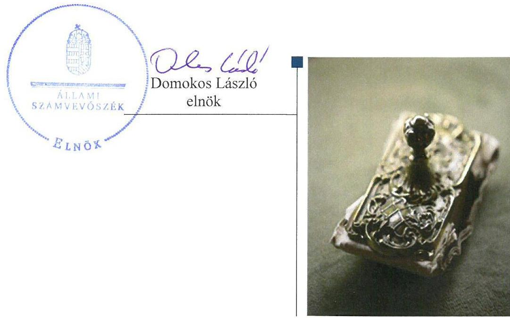
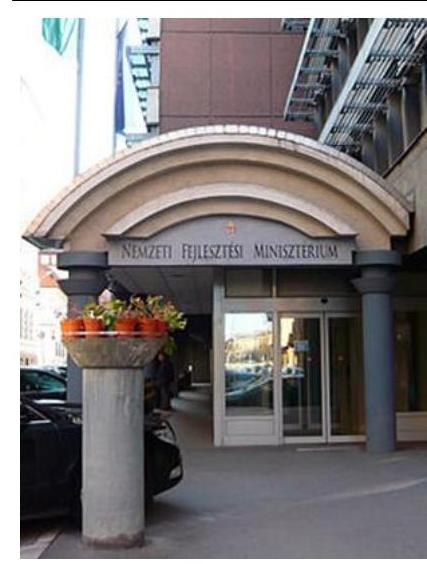
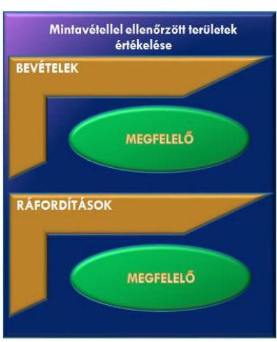

# Jelentés 

## Állami tulajdonú gazdasági társaságok

Az állami tulajdonban (résztulajdonban) lévő gazdálkodó szervezetek vagyonmegőrzési és gazdálkodási tevékenységének ellenőrzése - NFP Nemzeti Fejlesztési Programiroda Nonprofit Kft. 2017.

---

# Jelentés 

## Állami tulajdonú gazdasági társaságok

Az állami tulajdonban (résztulajdonban) lévő gazdálkodó szervezetek vagyonmegőrzési és gazdálkodási tevékenységének ellenőrzése - NFP Nemzeti Fejlesztési Programiroda Nonprofit Kft. 2017. november hó 23 .nap

---

# AZ ELLENŐRZÉST FELÜGYELTE:

DR. NÉMETH ERZSÉBET felügyeleti vezető

## AZ ELLENŐRZÉST VEZETTE ÉS A VÉGREHAJTÁSÁÉRT FELELŐS:

SALI SÁNDORNÉ ellenőrzésvezető

A PROGRAM ÖSSZEÁLLÍTÁSÁÉRT FELELŐS:

TÓTPÁL SZABOLCS osztályvezető

IKTATÓSZÁM: V-1365-154/2016.

TÉMASZÁM: 2399

ELLENŐRZÉS-AZONOSÍTÓ SZÁM: V075936

Jelentéseink az Országgyűlés számítógépes hálózatán és az Interneta a www.asz.hu címen is olvashatóak.

---

# TARTALOMJEGYZÉK 

■ ÖSSZEGZÉS ..... 5
■ AZ ELLENŐRZÉS CÉLJA ..... 6
■ AZ ELLENŐRZÉS TERÜLETE ..... 7
■ AZ ELLENŐRZÉS HÁTTERE, INDOKOLTSÁGA ..... 9
■ A JELENTÉS LÉNYEGES KÉRDÉSKÖREI ..... 10
■ ELLENŐRZÉS HATÓKÖRE ÉS MÓDSZEREI ..... 11
■ MEGÁLLAPÍTÁSOK ..... 13
■ MELLÉKLETEK ..... 17
I. Sz. melléklet: Értelmező szótár ..... 17
■ RÖVIDÍTÉSEK JEGYZÉKE ..... 19

---

.

---

# ÖSSZEGZÉS 

Az NFP Nemzeti Fejlesztési Programiroda Nonprofit Kft. felett a Nemzeti Fejlesztési Minisztérium és a Magyar Nemzeti Vagyonkezelő Zrt. tulajdonosi joggyakorlása szabályszerű volt. A Társaság müködésének szabályozottsága 2013-ban nem felelt meg az előírásoknak, 2014-ben a hiányzó szabályzatokat pótolta. A pénzügyi, számviteli, adatszolgáltatási és ellenőrzési feladatok ellátása megfelelt az előírásoknak. A Társaság vagyongazdálkodása szabályszerű volt.

## Az ellenőrzés társadalmi indokoltsága

Az állami tulajdonú gazdálkodó szervezetek a nemzeti vagyon részét képezik. Az állami vagyonnal való gazdálkodást illetően a tulajdonosi joggyakorlás és a vagyongazdálkodás feladata az állami vagyon átlátható, rendeltetésszerű és felelős felhasználásának biztosítása. Az állam meghatározza az ellátandó közszolgáltatással kapcsolatos feladatokat, amelyhez a vagyonnal kapcsolatos döntéseknek igazodniuk kell.

Az Állami Számvevőszék az általa korábban ellenőrizetlen területek, szervezetek körébe tartozó társaságnál végzett ellenőrzést. A számvevőszéki ellenőrzés hozzájárul a közpénzek szabályos, átlátható, elszámoltatható és eredményes felhasználásához, a rend pedig értéket teremt. Minden közpénzt, közvagyont használó szervezettel szemben társadalmi igény, hogy tevékenységükről elszámoljanak.

Állami feladat az Európai Unió vagy más nemzetközi szervezet felé vállalt kötelezettséggel összefüggő beruházások megvalósítása, mely feladat ellátására az NFP Nemzeti Fejlesztési Programiroda Nonprofit Kft. 2013-ban létrejött. Tevékenysége a magyarországi Környezeti és Energia Operatív Programon, illetve a Környezeti és Energiahatékonysági Operatív Program keretein belül a szennyvízelvezetés- és tisztítás, ivóvízminőség-javítás, hulladékgazdálkodás tárgyú, valamint a távhőszolgáltató szektort érintő beruházások hatékony, szakszerű és sikerorientált megvalósításának elősegítése. Figyelembe véve a kapott támogatás nagyságrendjét az Állami Számvevőszék Stratégiájával összhangban került sor az NFP Nemzeti Fejlesztési Programiroda Nonprofit Kft. ellenőrzésére a 2013-2015. évek vonatkozásában.

## Főbb megállapítások, következtetések, javaslatok

A kizárólag állami tulajdonban lévő NFP Nemzeti Fejlesztési Programiroda Nonprofit Kft. felett a Nemzeti Fejlesztési Minisztérium és a Magyar Nemzeti Vagyonkezelő Zrt. tulajdonosi joggyakorlása szabályszerű volt. A tulajdonosi joggyakorlók a Társaság üzleti tervét jóváhagyták, a számviteli beszámolókat a jogszabályi előírások betartásával elfogadták. A javadalmazási, juttatási rendszerről szóló szabályzatot az előírással összhangban megalkották.

Az NFP Nemzeti Fejlesztési Programiroda Nonprofit Kft. müködésének szabályozottsága 2013-ban nem felelt meg az előírásoknak, ezt követően a szabályozottság megfelelő volt. Elkészítette előírásnak megfelelően a Számviteli Politikát, azonban nem készítette el az előírt határidőig a Pénzkezelési szabályzatát, a Leltározási szabályzatát és az Iratkezelési szabályzatát, valamint a közérdekú adatok megismerésére irányuló igények teljesítésének rendjét rögzítő szabályzatot. A 2014. év végére a hiányzó szabályzatokat pótolta, valamint aktualizálási kötelezettségének 2014-2015. években eleget tett.

A Társaságnál a pénzügyi-számviteli feladatok ellátása megfelelt az előírásoknak. A beszámolás és az adatszolgáltatás szabályos volt. Az éves számviteli beszámolókat az Felügyelő Bizottság jóváhagyta, a könyvvizsgáló hitelesítő záradékkal látta el.

A vagyongazdálkodás szabályszerű volt. Az előírásoknak megfelelően kialakították a vagyongazdálkodás feltételeit, biztosították a vagyon értékének megőrzését. A vagyon nyilvántartását az előírások szerint vezették és gondoskodtak az érték- és állagmegőrzésről.

---

# AZ ELLENŐRZÉS CÉLJA 

Az ellenőrzés célja annak értékelése volt, hogy a tulajdonosi jogok gyakorlása szabályszerű volt-e; a gazdálkodó szervezet szabályozottsága, gazdálkodása és vagyongazdálkodási tevékenysége megfelelt-e a jogszabályi és a tulajdonosi előírásoknak, biztosítva volt-e a feladatellátás átláthatósága és elszámoltathatósága; a vagyonváltozást eredményező döntések esetében a tulajdonosi jogok gyakorlója és a gazdálkodó szervezet szabályszerűen jártak-e el.

---

# AZ ELLENŐRZÉS TERÜLETE 

## Az NFP Nemzeti Fejlesztési Programiroda Nonprofit Kft.

Az NFP Nemzeti Fejlesztési Programiroda Nonprofit Kft.-t 2013. március 8-án alapította a Magyar Állam nevében eljáró Magyar Nemzeti Vagyonkezelő Zrt., mint 100\%-os állami tulajdonú társaságot. A tulajdonosi jogköröket 2013. március 8-a és 2013. május 10-e között az állami vagyon felügyeletéért felelős miniszter az MNV Zrt. ${ }^{1}$ útján gyakorolta. A 77/2012. (XII. 22.) NFM rendelet ${ }^{2}$ 2013. május 11-étől a tulajdonosi jogok és kötelezettségek összessége gyakorlójának a Nemzeti Fejlesztési Minisztériumot jelölte meg.

A Társaság ${ }^{3}$ 2013. évben 0,5 M Ft jegyzett tőkével alakult, amely év közben alapítói határozat ${ }^{4}$ alapján 50,0 M Ft-ra változott és az ellenőrzött időszak további részében változatlan maradt. A jegyzett tőke emelésével egy időben 950,5 M Ft-tal a Társaság tőketartaléka is megemelésre került.

A Társaság közszolgáltatást nem végző, a 170/2012. (VII. 23.) Korm. rendelet ${ }^{5}$ 2. § (2)-(3) bekezdésében foglalt, valamint a 117/2013. (IV. 23.) Korm. rendelet ${ }^{6}$ 6. §-a szerinti feladatok végrehajtása érdekében létrehozott közfeladatot ellátó szerv. Létrehozásának célja a Kormány által meghatározott projektek szakmai támogatása, a szükséges kormányzati intézkedések kidolgozása és a határidők betartása érdekében a központi koordinációs tevékenység ellátása az Európai Unió vagy más nemzetközi szervezet felé vállalt kötelezettséggel összefüggő beruházásokhoz kapcsolódóan. A Társaság múködését költségvetési forrásból, valamint támogatásból biztosították.

A Társaság saját tulajdonú vagyontárgyaival gazdálkodott. Vagyonkezelésbe, használatba, üzemeltetésre nem vett át idegen tulajdonú vagyontárgyakat, nem rendelkezett továbbá tulajdonosi részesedéssel más gazdasági társaságban. A Társaságot az ellenőrzött időszakban az Áht. ${ }^{7}$ alapján nem sorolták a kormányzati szektorba sorolt egyéb szervezetek körébe, valamint nem tartozott a Bkr. ${ }^{8}$ hatálya alá.

Az ügyvezető személye az ellenőrzési időszakban egy alkalommal, 2014. szeptember 16-val változott. A Társaság gazdálkodása az ellenőrzött időszakban veszteséges volt, de a Társaság saját tőkéje nem csökkent a törzstőke jogszabályban előírt mértéke alá. Az átlagos statisztikai állományi létszám 2015. évben 29 fő volt. A Társaság gazdálkodására jellemző főbb gazdálkodási adatokat az 1. táblázat tartalmazza.

---

1. táblázat

A TÁRSASÁG FŐBB PÉNZÜGYI ADATAI (MILLIÓ FT-BAN)

|  Megnevezés | 2013. december 31. | 2014. december 31. | 2015. december 31.  |
| --- | --- | --- | --- |
|  Mérlegfőösszeg | 821,1 | 9272,5 | 13902,8  |
|  Befektetett eszközök | 100,5 | 8772,7 | 13479,2  |
|  Forgóeszközök | 719,4 | 488,5 | 418,6  |
|  Követelések | 58,0 | 196,7 | 11,1  |
|  ezen belül: vevők | 0,0 | 0,0 | 0,0  |
|  Saját tőke | 757,7 | 327,9 | 117,8  |
|  Értékesítés nettó árbevétele | 0,1 | 18,8 | 0,0  |
|  Egyéb bevételek | 82,0 | 170,5 | 4975,1  |
|  Mérleg szerinti eredmény | $-242,8$ | $-429,8$ | $-210,1$  |
|  Foglalkoztatottak átl. stat. áll. létszáma (fő) | 16 | 27 | 29  |

Forrás: a Társaság éves számviteli beszámolói 2013-2015. évek

---

# AZ ELLENŐRZÉS HÁTTERE, INDOKOLTSÁGA 

Az ÁSZ ${ }^{9}$ alapvető célkitűzése, hogy az államháztartáson kívülre nyújtott költségvetési támogatások és ingyenes vagyon juttatások ellenőrzésével hozzájáruljon ahhoz, hogy a közpénzeket az államháztartáson kívül múködő szervezetek is átlátható, rendezett módon használják fel a szerződésben átvállalt állami feladatok ellátása érdekében.

Az ellenőrzés feladata a közvagyonnal biztosított feladatellátással kapcsolatban a közpénzek átláthatósága, nyilvánossága érdekében a jogszabályokban, belső szabályzatokban megfogalmazott előírások érvényesülésének az állami tulajdonban lévő gazdálkodó szervezetek vagyonérték megőrzési és gazdálkodási tevékenységének értékelése.

Az ellenőrzés várható hasznosulásaként az ellenőrzés megállapításai a jogalkotás számára támogatást nyújthatnak a közvagyonnal való gazdálkodás értékeléséhez, jogszabályi keretei pontosításához, az átláthatóságot biztosító szabályozáshoz. Az ellenőrzöttek számára visszajelzést ad a vagyongazdálkodási tevékenységgel, beszámolással kapcsolatos szabálytalanságokról és kockázatokról. Az ellenőrzés tapasztalatai segítik és erősítik az ÁSZ hozzáadott értéket teremtő elemző tevékenységét és tanácsadó szerepét.

---

# A JELENTÉS LÉNYEGES KÉRDÉSKÖREI 

1.     - A tulajdonosi jogok gyakorlása szabályszerű volt-e?
2.     - A Társaság müködésének szabályozottsága megfelelt-e az előírásoknak?
3.     - A Társaságnál a pénzügyi-számviteli, adatszolgáltatási és ellenőrzési feladatok ellátása szabályszerű volt-e?
4.     - A Társaság vagyongazdálkodása szabályszerű volt-e?

---

# ELLENŐRZÉS HATÓKÖRE ÉS MÓDSZEREI 

## Az ellenőrzés típusa

Megfelelőségi ellenőrzés.

## Az ellenőrzött időszak

2013. március 8 -ától 2015. december 31-éig.

## Az ellenőrzés tárgya

Az állami tulajdonban lévő gazdasági társaság gazdálkodása, kiemelten vagyongazdálkodási tevékenysége, valamint a tulajdonosi jogok gyakorlása.

## Az ellenőrzött szervezet

Az NFP Nemzeti Fejlesztési Programiroda Nonprofit Kft., valamint a Magyar Nemzeti Vagyonkezelő Zrt. és a Nemzeti Fejlesztési Minisztérium, mint az állami tulajdonban lévő Társaság tulajdonosi joggyakorlói.

## Az ellenőrzés jogalapja

Az Állami Számvevőszékről szóló 2011. évi LXVI. törvény 5. § (3)-(5) bekezdései.

## Az ellenőrzés módszerei

Az ellenőrzést ez ellenőrzött időszakban hatályos jogszabályok, az ellenőrzés szakmai szabályok és módszertanok figyelembevételével végeztük.

Az ellenőrzési kérdések megválaszolásához szükséges bizonyítékok megszerzése a következő ellenőrzési eljárások alkalmazásával történt: megfigyelés, kérdésfeltevés (információkérés), összehasonlítás, valamint elemző eljárás.

Az ellenőrzési bizonyítékként felhasználható adatforrások közé tartoztak egyrészt az ellenőrzési programban felsorolt adatforrások, másrészt minden egyéb - az ellenőrzés során feltárt, az ellenőrzés szempontjából információkat tartalmazó - dokumentumok.

Az ellenőrzés lefolytatásához az ellenőrzött szervezetek a tanúsítványok elektronikus kitöltésével, valamint az ÁSZ által kért dokumentumok megküldésével szolgáltatott adatokat.

---

A bevételek és ráfordítások elszámolása, valamint a vagyonnyilvántartás terén a szabályszerű múködést véletlen mintavétellel és irányított kiválasztással ellenőriztük. A mintatételek értékelése alapján egyrészt a sokaságban előforduló hibás tételek arányát becsültük, másrészt az irányítottan kiválasztott tételeket értékeltük. A jogszabályoknak és a belső előírásoknak megfelelőnek, azaz szabályszerűnek tekintettük az adott területet, amenynyiben a minta ellenőrzésének eredménye alapján 95\%-os bizonyossággal a teljes sokaságban a hibaarány kisebb volt, mint 10\%, nem megfelelőnek értékeltük, ha a hibaarány a 10\%-ot meghaladta. A ráfordítások elszámolására és a vagyonnyilvántartásra vonatkozó véletlen mintavételt kockázati alapú kiválasztással egészítettük ki, amelynek során évente a három legnagyobb összegű tételt választottuk ki.

---

# 1. A tulajdonosi jogok gyakorlása szabályszerű volt-e? 

Összegző megállapítás

Az MNV Zrt. és az NFM tulajdonosi joggyakorlása szabályszerű volt.

A TULAJDONOSI JOGGYAKORLÁS főbb szabályait a tulajdonosi joggyakorló ${ }_{1,2}{ }^{10}$ a Gt. ${ }^{11}$ és a Ptk. ${ }^{12}$ előírásaival összhangban lévő Alapító okiratban ${ }^{13}$, valamint belső szabályzataiban határozta meg. A szervezeti és múködési szabályzatokban ${ }^{14}$ nevesítette a tulajdonosi joggyakorló döntéshozó szervezeti egységeit, valamint a döntéseket előkészítő testületeit. A tulajdonosi joggyakorlással kapcsolatos feladatok munkafolyamatait a tulajdonosi joggyakorló; a feladatot ellátó szervezeti egységek ügyrendjeiben ${ }^{15}$ rögzítette. A tulajdonosi joggyakorló; a tulajdonosi ellenőrzés részleteire a Tulajdonosi ellenőrzési szabályzatában ${ }^{16}$ tért ki.

A BESZÁMOLTATÁSI RENDSZER keretében a tulajdonosi joggyakorló; a 2013-2015. évi éves beszámolók, a 2014. évben az üzleti tervek teljesítéséről szóló negyedéves beszámolók, és a 2015. évben rögzített tartalmú negyedéves monitoring jelentések készítésével számoltatta be a Társaságot. A Társaság számviteli beszámolóit - az FB ${ }^{17}$ előzetes írásbeli véleményezését követően - a tulajdonosi joggyakorló; a Ptk.-ban előírtaknak megfelelően, a könyvvizsgáló elfogadó záradékát tartalmazó jelentések birtokában fogadta el.

AZ ÜZLETI TERVEKET a Társaság az Alapító Okiratban foglaltaknak megfelelően 2013-2015. években az előírásoknak megfelelő tartalommal elkészítette. Az üzleti terveket, illetve azok módosítását a tulajdonosi joggyakorló ${ }_{1,2}$ kizárólagos hatáskörében, Alapítói határozattal hagyta jóvá, mellyel a tervezett beruházások és a közbeszerzési terv is jóváhagyásra került.

AZ ANYAGI ÉRDEKELTSÉGI RENDSZER elemeit az Alapító által megalkotott Javadalmazási szabályzatban ${ }^{18}$ rögzítették. A szabályzat a Taktv. ${ }^{19}$ előírásainak megfelelően rendelkezett a vezető tisztségviselők, FB tagok, valamint a vezető állású munkavállalók javadalmazása, a jogviszony megszűnése esetére biztosított juttatások módjának, mértékének elveiről, annak rendszeréről.

---

# 2. A Társaság múködésének szabályozottsága megfelelt-e az előírásoknak? 

Összegző megállapítás

A Társaság múködésének szabályozottsága 2013-ban nem felelt meg az előírásoknak, 2014-ben a hiányzó szabályzatok elkészültek.

A SZÁMVITELI POLITIKÁT ${ }^{20}$ a Számv. tv. ${ }^{21}$-ben foglaltak szerint a megalakulást követő 90 napon belül elkészítette a Társaság. Az Eszközök és források értékelési szabályait a Társaság a Számviteli politika keretén belül határozta meg. A Társaság a Számv. tv. előírásainak megfelelően alakította ki Számlarendjét ${ }^{22}$, valamint 2014. március 31-ével kiadta a gazdálkodási jogköröket részletező Gazdálkodási szabályzatát ${ }^{23}$.

LELTÁROZÁSI SZABÁLYZATTAL ${ }^{24}$ a Társaság a Számv. tv. 14. § (11) bekezdésében foglaltak ellenére 2014. január 1-jéig nem rendelkezett. A szabályzat a törvényi előírásnak eleget téve tartalmazta a leltározás gyakoriságát (évenkénti), valamint a leltározás előkészítésének és lebonyolításának részleteit is. A Selejtezési szabályzatot ${ }^{25}$ szintén 2014. január 1-jén adta ki a Társaság, kitérve benne a feleslegessé vált vagyontárgyak feltárásának, hasznosításának és selejtezésének részleteire.

PÉNZKEZELÉSI SZABÁLYZATÁT ${ }^{26}$ a Társaság a Számv. tv. 14. § (11) bekezdésében foglaltak ellenére 2014. március 31-én adta ki. A Pénzkezelési szabályzat ${ }_{1,2}$ tartalmilag megfelelt a Számv. tv. előírásainak.

AZ ÖNKÖLTSÉGSZÁMÍTÁSI SZABÁLYZAT készítése alól a Társaság a Számv. tv. 14. § (6) bekezdése alapján mentesült, mint egyszerűsített éves beszámolót készítő. Az általa nyújtott szolgáltatási díjak a piaci árak figyelembe vételével kerültek megállapításra.

IRATKEZELÉSI SZABÁLYZATTAL ${ }^{27}$ a Társaság a megalakulásától 2014. november 10-éig nem rendelkezett, megsértve ezzel az Ltv. ${ }^{28}$ 9. § (4) bekezdésében foglaltakat, mely szerint a közfeladatot ellátó szerv iratkezelésének szabályait iratkezelési szabályzat tartalmazza. A 335/2005. (XII. 29.) Korm. rendelet ${ }^{29}$ előírásaival összhangban lévő szabályzatot 2014. november 11-ei hatállyal adták ki.

A KÖZÉRDEKŰ ADATOK közzétételére vonatkozó szabályozással a Társaság a megalakulásától 2014. november 12-éig nem rendelkezett, ezzel megsértette az Info tv. ${ }^{30} 30 . \S$ (6) bekezdését, mely szerint a közfeladatot ellátó szervnek a közérdekú adatok megismerésére irányuló igények teljesítésének rendjét rögzítő szabályzatot kell készítenie.

---

# 3. A Társaságnál a pénzügyi-számviteli, adatszolgáltatási és ellenőrzési feladatok ellátása szabályszerű volt-e? 

Összegző megállapítás

1. ábra

A Társaságnál a pénzügyi-számviteli, adatszolgáltatási feladatok ellátása megfelelt az előírásoknak.

A BEVÉTELEK ELSZÁMOLÁSA megfelelt a jogszabályi és belső szabályozásban foglalt előírásoknak. Az értékesítés nettó árbevételének, az egyéb, rendkívüli és pénzügyi műveletek bevételének számlázása, főkönyvi számlákra történő elszámolása megfelelt a Számv. tv.-ben, a belső szabályozásban előírtaknak. A Társaságnak szolgáltatási díjbevétele a 2014-ben végzett üzletviteli tanácsadásból származott, a 2015. évben nem volt díjbevétele. A Társaság bevételeit alapvetően az egyéb bevételek között megjelenő uniós pályázati források tették ki. A mintavétellel ellenőrzött területek értékelését az 1. ábra mutatja.

A RÁFORDÍTÁSOK ELSZÁMOLÁSA megfelelt a jogszabályi és belső szabályozásban foglalt előírásoknak. Az anyagjellegú ráfordítások, valamint az egyéb, rendkívüli és pénzügyi műveletek ráfordításai esetében a Számv. tv.-nek megfelelően az elszámolást megalapozó dokumentumok rendelkezésre álltak. A ráfordítások elszámolása a számviteli bizonylatok alapján a megfelelő főkönyvi számlákra történt.

A személyi jellegú ráfordítások elszámolását megalapozó dokumentumok rendelkezésre álltak. A munkabérek kifizetését munkaszerződés alapján, a jogszabályi előírásoknak megfelelő levonások alkalmazásával teljesítették. A személyi jellegú egyéb (költségtérítések), illetve cafetéria kifizetésekre a Társaság Juttatási szabályzata ${ }_{1,2}{ }^{31}$ és a Cafetéria szabályzata ${ }_{3-3}{ }^{32}$ előírásaival összhangban került sor.

Az értékcsökkenés elszámolása, kontírozása, a beszerzett tárgyi eszközök és immateriális javak besorolása megfelelt a Számv. tv. és a Számviteli politika ${ }_{3-3}$ előírásainak. A Társaság az immateriális javak és a tárgyi eszközök esetében is a lineáris értékcsökkenési módszert, valamint a Számviteli politika ${ }_{3-2}$-ben a 100 e $\mathrm{Ft}^{33}$ egyedi bekerülési érték alatti tárgyi eszközök esetén a bekerülési érték egyösszegű elszámolását választotta.

A BESZÁMOLÁSI ÉS ADATSZOLGÁLTATÁSI kötelezettségének a Társaság a jogszabályi előírások és az Alapító okiratában foglaltaknak összességében eleget tett. A könyvvizsgáló az egyszerűsített éves beszámolókat hitelesítő záradékkal látta el, melyek közzététele és letétbe helyezése szabályszerűen megtörtént.

A Társaság az Info tv. 1. számú mellékletében meghatározott közzétételi kötelezettségének - annak ellenére, hogy szabályzattal nem rendelkezett - az előírásnak megfelelően eleget tett. A jogszabályi előírásokkal összhangban lévő szabályzatot ${ }^{34}$ 2014. november 13-án adták ki. A tevékenységre, múködésre vonatkozó adatok közül a közérdekú adatok megismerésére irányuló igények intézésének rendje és az illetékes szervezeti egység nevének feltüntetése a 2014. november 13-tól kiadott Belső adatvédelmi és adatbiztonsági szabályzat hatálybalépésével és közzétételével valósult meg.

---

A Társaság a Taktv.-ben a vezető tisztségviselővel, a felügyelőbizottsági tagokkal, és a vezető állású dolgozókkal kapcsolatban előírt közzétételi kötelezettségnek az ellenőrzött időszak vonatkozásában a Társaság honlapján történő közzététellel eleget tett.

TULAJ DONOSI ELLENÖRZÉST végzett 2014. évben a tulajdonosi joggyakorló; a Társaság múködésének szabályozottságára vonatkozóan. A Társaság intézkedett a tulajdonosi ellenőrzés javaslatainak végrehajtása érdekében.

# 4. A Társaság vagyongazdálkodása szabályszerű volt-e? 

## Összegző megállapítás

A Társaság vagyongazdálkodása szabályszerű volt.
A Tulajdonosi joggyakorló1,2 által, az Alapító Okiratban a Társaság vagyonára megfogalmazott tulajdonosi előírásoknak a Társaság a szabályzataiban; SZMSZ-ében ${ }^{35}$, Gazdálkodási-, Selejtezési szabályzatában, valamint a Közbeszerzési és beszerzési szabályzatában ${ }^{36}$ tett eleget.

A vagyonát a Számv. tv. szerint tartotta nyilván, beszámolóiban teljes körűen szerepeltette. A vagyonában bekövetkezett változásokat nyilvántartásában folyamatosan kimutatta.

A Társaság a Leltározási szabályzata szerint a tárgyi eszközök esetében határozott meg mennyiségi és értékbeni nyilvántartást, és a leltározást valamennyi vagyonelem tekintetében éves gyakorisággal írta elő. Az ellenőrzött évek beszámolóinak mérlegét a Számv. tv. 69. § (1) bekezdése szerint elkészített leltárakkal, évenként alátámasztotta. A leltározás a tárgyi eszközök, készletek és pénzeszközök tekintetében tényleges mennyiségi felvétellel, a csak értékben kimutatott eszközök és kötelezettségek tekintetében egyeztetéssel megtörtént. A leltárkiértékelések eltérést nem állapítottak meg.

A VAGYONGAZDÁLKODÁS során megvalósult a vagyon értékének megőrzése. A Társaság vagyona a 2013. évi 821,1 M Ft-ról 2015. év végére 13 902,8 M Ft-ra nőtt a végrehajtott fejlesztések eredményeként. A vagyonváltozást eredményező döntések megfeleltek az előírásoknak. A saját vagyonon tervezett beruházások jóváhagyására az üzleti tervek elfogadásával, az eszközök értékesítésére a döntési jogosultsági szabályok betartásával került sor.

---

# MELLÉKLETEK 

## I. SZ. MELLÉKLET: ÉRTELMEZŐ SZÓTÁR

állami vagyon
gazdasági társaság

MNV Zrt.
tulajdonosi ellenőrzés
a) Az állam tulajdonában lévő dolog, valamint a dolog módjára hasznosítható természeti erő,
b) az a) pont hatálya alá nem tartozó mindazon vagyon, amely vonatkozásában törvény az állam kizárólagos tulajdonjogát nevesíti,
c) az állam tulajdonában lévő tagsági jogviszonyt megtestesítő értékpapír, illetve az államot megillető egyéb társasági részesedés,
d) az államot megillető olyan immateriális, vagyoni értékkel rendelkező jogosultság, amelyet jogszabály vagyoni értékű jogként nevesít.
Forrás: Vtv. ${ }^{37}$ 1. § (2) bekezdése
2012. november 10-től az állami vagyon fogalma kiegészül a következő ponttal:
e) az állam tulajdonában lévő pénzügyi eszközök

Forrás: Vtv. 1. § (2) bekezdése
A Ptk. 3:88. § (1) bekezdése szerint „a gazdasági társaságok üzletszerű közös gazdasági tevékenység folytatására, a tagok vagyoni hozzájárulásával létrehozott, jogi személyiséggel rendelkező vállalkozások, amelyekben a tagok a nyereségből közösen részesednek, és a veszteséget közösen viselik".
Az állami vagyon felett, a Magyar Államot megillető tulajdonosi jogok és kötelezettségek összességét - a hatályos szabályozás szerint - az állami vagyon felügyeletéért felelős miniszter (jelenleg a nemzeti fejlesztési miniszter) gyakorolja. A miniszter feladatát nagy részben az MNV Zrt., mint tulajdonosi joggyakorló szervezet útján látja el.
2014. március 14-ig:

Az állami vagyon kezelőjét, haszonélvezőjét, használóját megillető jogok gyakorlását, annak szabályszerűségét, célszerűségét az MNV Zrt. - szükség szerint területi szervei útján - ellenőrzi.
2014. március 15 -től:

Az állami vagyon használóját, vagyonkezelőjét és haszonélvezőjét megillető jogok gyakorlását, annak szabályszerűségét, a kötelezettségek teljesítését, valamint a vagyon rendeltetése szerinti célszerűségét a tulajdonosi joggyakorló rendszeresen ellenőrzi.
Forrás: Vhr. 20. § (1)
tulajdonosi jogok gyakorlója 1.
2013. június 27-ig:

Az állami vagyon felett a Magyar Államot megillető tulajdonosi jogok és kötelezettségek összességét - ha törvény eltérően nem rendelkezik - az állami vagyon felügyeletéért felelős miniszter (a továbbiakban: miniszter) gyakorolja, aki e feladatát a Magyar Nemzeti Vagyonkezelő Zártkörűen Működő Részvénytársaság (a továbbiakban: MNV Zrt.), a Magyar Fejlesztési Bank, illetve a tulajdonosi joggyakorló szervezet útján látja el. A miniszter miniszteri rendeletben, a törvényben meghatározott állami vagyoni kör tekintetében, meghatározott időtartamra, a joggyakorlás egyes szabályainak meghatározásával - az őt megillető tulajdonosi jogok és kötelezettségek összességének, illetve azok meghatározott részének gyakorlóját az Áht. szerinti központi költségvetési szervek, ezek intézménye, továbbá a 100\%-ban állami tulajdonban álló gazdasági társaságok közül kijelölheti.

---

Forrás: Vtv. 3. § (1) és (2)
2013. június 28-ától:

A rábízott állami vagyon felett az államot megillető tulajdonosi jogok és kötelezettségek összességét tulajdonosi joggyakorlóként:
a) ha törvény vagy miniszteri rendelet eltérően nem rendelkezik, a Magyar Nemzeti Vagyonkezelő Zártkörűen Működő Részvénytársaság (a továbbiakban: MNV Zrt.),
b) törvényben kijelölt személy vagy
c) az állami vagyon felügyeletéért felelős miniszter (a továbbiakban: miniszter) által rendeletben kijelölt személy gyakorolja.
[...] A miniszter e törvény felhatalmazása alapján - a meghatározott célok hatékonyabb elérése érdekében, miniszteri rendeletben, az ott meghatározott állami vagyoni kör tekintetében, meghatározott időtartamra - e törvény keretei között, a joggyakorlás egyes szabályainak meghatározásával - az államot megillető tulajdonosi jogok és kötelezettségek összességének, illetve azok meghatározott részének gyakorlóját az Áht. szerinti központi költségvetési szervek, ezek intézménye, továbbá a 100\%-ban állami tulajdonban álló gazdasági társaságok közül kijelölheti.
Forrás: Vtv. 3. § (1) és (2)
2.

Aki a nemzeti vagyon felett az államot vagy a helyi önkormányzatot megillető tulajdonosi jogok és kötelezettségek összességének gyakorlására jogosult
Forrás: Nvtv ${ }^{38}$. 3. § (1) 17. pontja

---

# RÖVIDÍTÉSEK JEGYZÉKE 

${ }^{1}$ MNV Zrt.
${ }^{2}$ 77/2012. (XII. 22.) NFM rendelet
${ }^{3}$ Társaság
${ }^{4}$ alapítói határozat
${ }^{5}$ 170/2012. (VII. 23.) Korm. rendelet
${ }^{6}$ 117/2013. (IV. 23.) Korm. rendelet
${ }^{7}$ Áht.
${ }^{8}$ Bkr.
${ }^{9}$ ÁsZ
${ }^{10}$ tulajdonosi joggyakorló: tulajdonosi joggyakorló:
${ }^{11} \mathrm{Gt}$.
${ }^{12}$ Ptk.
${ }^{13}$ Alapító Okirat
${ }^{14}$ szervezeti és müködési szabályzatok
${ }^{15}$ ügyrend

Magyar Nemzeti Vagyonkezelő Zrt.
az egyes gazdasági társaságok felett az államot megillető tulajdonosi jogok és kötelezettségek összességét gyakorló szervezet kijelöléséről szóló 77/2012. (XII. 22.) NFM rendelet (hatályos: 2013. január 1-jétől)

NFP Nemzeti Fejlesztési Programiroda Nonprofit Kft.
MNV Zrt. 145/2013. (IV. 26.) Alapítói határozata
az Európai Unió vagy más nemzetközi szervezet felé vállalt kötelezettséggel összefüggő beruházás megvalósítása érdekében szükséges intézkedésekről szóló 170/2012. (VII. 23.) Korm. rendelet (hatályos: 2012. július 24-től)
az Európai Unió vagy más nemzetközi szervezet felé vállalt kötelezettséggel összefüggő, a Kormány által a nemzeti fejlesztési miniszter hatáskörébe utalt beruházások megvalósítása érdekében szükséges intézkedésekről és az azokhoz kapcsolódó kiemelt jelentőségű ügyek lefolytatásának elősegítéséről (hatályos: 2013. április 24-étől 2014. december 19-éig)
az államháztartásról szóló 2011. évi CXCV. törvény (hatályos 2011. december 31től)
a költségvetési szervek belső kontrollrendszeréről és belső ellenőrzéséről szóló 370/2011. (XII. 31.) Korm. rendelet (hatályos 2012. január 1-jétől)
Állami Számvevőszék
2013. március 8-ától 2013. május 10-éig az MNV Zrt.,
2013. május 11-étől az NFM
a gazdasági társaságokról szóló 2006. évi IV. törvény (hatálytalan: 2014. március 15 -től)
a Polgári Törvénykönyvről szóló 2013. évi V. törvény (hatályos: 2014. március 15étől)
2013. március 8-ától a Nemzeti Fejlesztési Programiroda Nonprofit Kft./2013. 08. 01-jén kelt módosítástól NFP Nemzeti Fejlesztési Programiroda Nonprofit Kft. Alapító Okirata és annak módosításai
508/2012. (X. 08.) IG. sz. határozattal jóváhagyott egységes szerkezetű, az MNV Zrt. Szervezeti és müködési szabályzata (2012. 10. 10. - 2013. 03. 15.)
123/2013. (III. 07) IG. sz. határozattal jóváhagyott az MNV Zrt. Szervezeti és müködési szabályzata (módosítás) (2013. 03. 16. - 2013. április 24.)
246/2013. (IV. 22.) IG. sz. határozattal jóváhagyott az MNV Zrt. Szervezeti és müködési szabályzata (módosítás) (2013. 04. 25. - 2013. 07. 01.)
a módosított 25/2012. (IX. 17. ) NFM utasítás a Nemzeti Fejlesztési Minisztérium Szervezeti és Müködési Szabályzatáról (2012. 09. 18. - 2013. 07. 12. )
24/2013. (VII. 12.) NFM utasítás a Nemzeti Fejlesztési Minisztérium Szervezeti és Müködési Szabályzatáról (2013. 07. 13. - 2014. 10. 10.)
a módosított 33/2014. (X. 10.) .) NFM utasítás a Nemzeti Fejlesztési Minisztérium Szervezeti és Müködési Szabályzatáról (2014. 10. 11. - )
A Kiemelt Gazdasági Társaságok Ügyrendje (KGTF/20857/2013-NFM 2013. 10. 30. - 2014. 03. 18.)

A Kiemelt Gazdasági Társaságok Ügyrendje (KGFT/6376/2014-NFM 2014. 03.19.-)
A Társasági Portfólió Főosztály Ügyrendje (TPF/29191/2015-NFM 2015. 12. 30. - )
A Vagyonfelügyeleti Főosztály Ügyrendje (VFF/20824/2013-NFM 2013. 11. 01. - )

---

${ }^{16}$ Tulajdonosi ellenőrzési szabályzat
${ }^{17}$ FB
${ }^{18}$ javadalmazási szabályzat ${ }_{1}$

19 Taktv.
${ }^{20}$ Számviteli politika ${ }_{1}$

Számviteli politika2

Számviteli politika3
${ }^{21}$ Számv. tv.
${ }^{22}$ Számlarend $_{1}$

Számlarend $_{2}$
${ }^{23}$ Gazdálkodási szabályzat
${ }^{24}$ Leltározási szabályzat
${ }^{25}$ Selejtezési szabályzat
${ }^{26}$ Pénzkezelési szabályzat ${ }_{1}$

Pénzkezelési szabályzat ${ }_{2}$
${ }^{27}$ Iratkezelési Szabályzat
${ }^{28}$ Ltv.
${ }^{29}$ 335/2005. (XII. 29.) Korm. rendelet
${ }^{30}$ Info tv.
${ }^{31}$ Juttatási szabályzat ${ }_{1}$

Juttatási szabályzat ${ }_{2}$
${ }^{32}$ Cafetéria szabályzat ${ }_{1}$

Cafetéria szabályzat ${ }_{2}$
Cafetéria szabályzat ${ }_{3}$

46/2011. Vezérigazgatói utasítás az MNV Zrt. Tulajdonosi ellenőrzési szabályzata (2011. október)
az NFP Nemzeti Fejlesztési Programiroda Nonprofit Kft. Felügyelő Bizottsága
Javadalmazási szabályzat az NFP Nemzeti Fejlesztési Programiroda Nonprofit Kft. Mt. 208. § hatálya alá tartozó munkavállalóira, tisztségviselőire és könyvvizsgálójára vonatkozó javadalmazási rendszerről (171/2013. 05. 07. sz. Alapítói határozattal elfogadva)
a köztulajdonban álló gazdasági társaságok takarékosabb múködéséről szóló 2009. évi CXXII. törvény
az NFP Nemzeti Fejlesztési Programiroda Nonprofit Kft. Számviteli politikája (hatályos: 2013. június 1-jétől 2013. december 31-éig)
az NFP Nemzeti Fejlesztési Programiroda Nonprofit Kft. Számviteli politikája (hatályos: 2014. január 1-jétől 2014. december 31-éig)
az NFP Nemzeti Fejlesztési Programiroda Nonprofit Kft. Számviteli politikája (hatályos: 2015. január 1-jétől)
a számvitelről szóló 2000. évi C. törvény
az NFP Nemzeti Fejlesztési Programiroda Nonprofit Kft. Számviteli politika1 1. sz. függeléke (hatályos: 2013. június 1-jétől 2013. december 31-éig))
az NFP Nemzeti Fejlesztési Programiroda Nonprofit Kft. Számviteli politika2 1. sz. függeléke (hatályos: 2014. január 1-jétől)
az NFP Nemzeti Fejlesztési Programiroda Nonprofit Kft. Gazdálkodási szabályzata (hatályos: 2014. március 31-étől)
az NFP Nemzeti Fejlesztési Programiroda Nonprofit Kft. Számviteli politika 1. sz. melléklete (hatályos: 2014. január 1-jétől)
az NFP Nemzeti Fejlesztési Programiroda Nonprofit Kft. Selejtezési szabályzata (hatályos: 2014. január 1-jétől)
az NFP Nemzeti Fejlesztési Programiroda Nonprofit Kft. Pénzkezelési szabályzata (hatályos: 2014. március 31-étől 2014. július 8 -áig)
az NFP Nemzeti Fejlesztési Programiroda Nonprofit Kft. Pénzkezelési szabályzata (hatályos: 2014. július 9-étől)
az NFP Nemzeti Fejlesztési Programiroda Nonprofit Kft. Iratkezelési Szabályzata (hatályos: 2014. november 11-től)
1995. évi LXVI. törvény a közokiratokról, a közlevéltárakról és a magánlevéltári anyag védelméről
335/2005. (XII. 29.) Korm. rendelet a közfeladatot ellátó szervek iratkezelésének általános követelményeiről
2011. évi CXII. törvény az információs önrendelkezési jogról és az információszabadságról (hatályos: 2011. július 27-től)
az NFP Nemzeti Fejlesztési Programiroda Nonprofit Kft. Juttatási szabályzat az egyes meghatározott juttatásokról (hatályos: 2013. október 1-jétől 2014. június 1éig)
az NFP Nemzeti Fejlesztési Programiroda Nonprofit Kft. Juttatási szabályzat az egyes meghatározott juttatásokról a módosításokkal egységes szerkezetben (hatályos: 2014. június 2-ától)
az NFP Nemzeti Fejlesztési Programiroda Nonprofit Kft. Cafetéria szabályzata a választható béren kívüli juttatásokról (hatályos: 2013. június 1-jétől)
az NFP Nemzeti Fejlesztési Programiroda Nonprofit Kft. Cafetéria szabályzata a választható béren kívüli juttatásokról (hatályos: 2014. január 1-jétől)
az NFP Nemzeti Fejlesztési Programiroda Nonprofit Kft. Cafetéria szabályzata a választható béren kívüli juttatásokról (hatályos: 2015. január 1-jétől)

---

${ }^{33} \mathrm{e} \mathrm{Ft}$
${ }^{34}$ Belső adatvédelmi és adatbiztonsági szabályzat
${ }^{35}$ SZMSZ
${ }^{36}$ Közbeszerzési és beszerzési szabályzat
${ }^{37}$ Vtv.
${ }^{38}$ Nvtv.
ezer forint
az NFP Nemzeti Fejlesztési Programiroda Nonprofit Kft. Belső adatvédelmi és adatbiztonsági szabályzat (hatályos: 2014. november 13-ától)
az NFP Nemzeti Fejlesztési Programiroda Nonprofit Kft. Szervezeti-és Múködési Szabályzata (hatályos: 2013. október 31-től)
az NFP Nemzeti Fejlesztési Programiroda Nonprofit Kft. Közbeszerzési és beszerzési szabályzata (hatályos: 2014. november 10-étől)
az állami vagyonról szóló 2007. évi CVI. törvény
a nemzeti vagyonról szóló 2011. évi CXCVI. törvény (hatályos: 2012. január 1-jétől)

---

# ÁLLAMI SZÁMVEVŐSZÉK 

1052 Budapest, Apáczai Csere János utca 10.
Levélcím: 1364 Budapest 4. Pf. 54
Telefon: +36 14849100 Telefax: +36 14849200
www.asz.hu