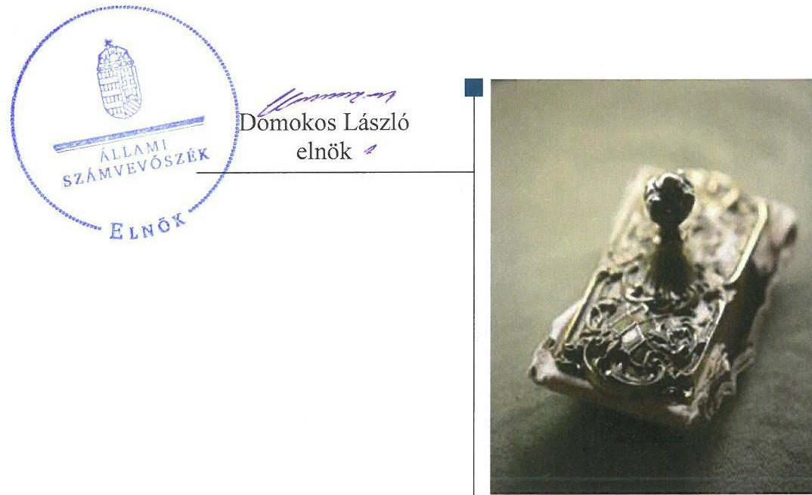
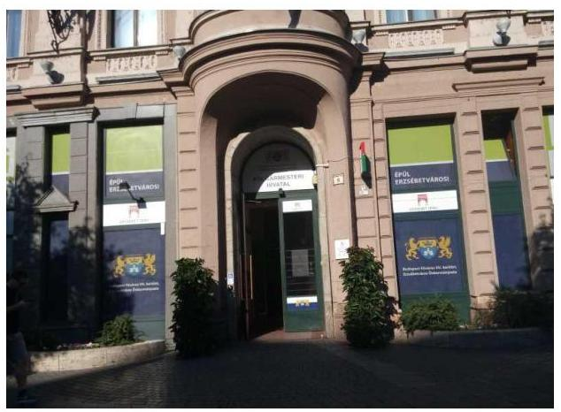
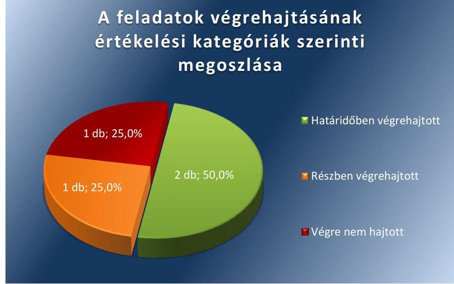
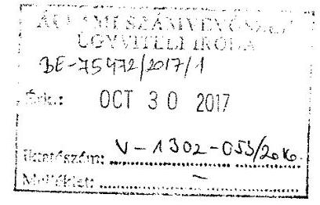
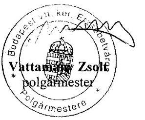
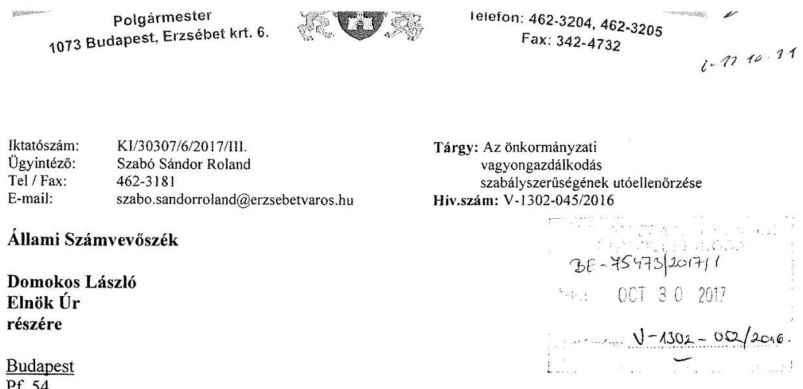
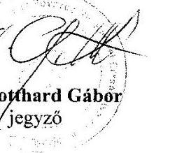

# Jelentés 

## Utóellenőrzések

Az önkormányzatok vagyongazdálkodása szabályszerűségének utóellenőrzése Budapest Főváros VII. kerület Erzsébetváros Önkormányzata
2017.

---

# Jelentés 

## Utóellenőrzések

Az önkormányzatok vagyongazdálkodása szabályszerűségének utóellenőrzése Budapest Főváros VII. kerület Erzsébetváros Önkormányzata
2017. 12. hó 06. nap

---

# AZ ELLENŐRZÉST FELÜGYELTE: 

RENKŐ ZSUZSANNA felügyeleti vezető

## AZ ELLENŐRZÉST VEZETTE ÉS A VÉGREHAJTÁSÁÉRT FELELŐS:

DR. NAGY JUDIT ellenőrzésvezető

## A PROGRAM ÖSSZEÁLLÍTÁSÁÉRT FELELŐS:

JANIK JÓZSEF LÁSZLÓ osztályvezető

## A TÉMÁHOZ KAPCSOLÓDÓ KORÁBBI SZÁMVEVŐSZÉKI JELENTÉSEK:

- címe: Jelentés az önkormányzatok vagyongazdálkodása szabályszerűségének ellenőrzéséről Budapest Főváros VII. kerület Erzsébetváros
- sorszáma: 14082

IKTATÓSZÁM: V-1302-055/2016.
TÉMASZÁM: 2096
ELLENŐRZÉS-AZONOSÍTÓ SZÁM: V075561

---

# TARTALOMJEGYZÉK 

■ ÖSSZEGZÉS ..... 5
■ AZ ELLENŐRZÉS CÉLJA ..... 6
■ AZ ELLENŐRZÉS TERÜLETE ..... 7
■ AZ ELLENŐRZÉS HÁTTERE, INDOKOLTSÁGA ..... 8
■ A JELENTÉS LÉNYEGES KÉRDÉSKÖRE ..... 9
■ ELLENŐRZÉS HATÓKÖRE ÉS MÓDSZEREI ..... 10
■ MEGÁLLAPÍTÁSOK ..... 12
■ MELLÉKLETEK ..... 15
I. sz. melléklet: Budapest Főváros VII. kerület Erzsébetváros Önkormányzata intézkedési tervének végrehajtása. ..... 15
■ FÜGGELÉK: ÉSZREVÉTELEK ..... 17
■ RÖVIDÍTÉSEK JEGYZÉKE ..... 21

---

.

---

# ÖSSZEGZÉS 

Az Állami Számvevőszék Budapest Főváros VII. kerület Erzsébetváros Önkormányzata vagyongazdálkodása szabályszerűségének utóellenőrzése során megállapította, hogy a vagyongazdálkodás szabályozottságára és a belső ellenőrzés müködésére vonatkozó számvevőszéki javaslatok hasznosultak, ezáltal a gazdálkodás elszámoltathatósága javult.

## Az ellenőrzés társadalmi indokoltsága

Az Állami Számvevőszék stratégiájában célul tűzte ki a számvevőszéki munka hasznosulásának javítását. Ezzel összhangban ellenőrzi, hogy az ellenőrzött szervezet megvalósította-e a korábbi ellenőrzései által feltárt hibák, hiányosságok és szabálytalanságok megszüntetése céljából elkészített intézkedési tervében foglaltakat. A rendszeres utóellenőrzések hozzájárulnak a szükséges intézkedések tényleges végrehajtásához, ezáltal a közpénzügyek rendezettségének javulásához.

## Főbb megállapítások, következtetések

Budapest Főváros VII. kerület Erzsébetváros Önkormányzata az intézkedési tervben meghatározott négy feladatból kettőt a szabályozottság és a belső ellenőrzés tárgykörben határidőben végrehajtott. A hivatásetikai alapelvek és az etikai eljárásrend az önkormányzati Szervezeti és Müködési Szabályzat részeként elfogadásra kerültek. Az ellenőrzésekről a jogszabályok előírásai szerint elkészültek a nyilvántartások, a hiányosságok kiküszöbölése érdekében az ellenőrzöttek intézkedési terveket készítettek.

Az üzemeltetésre, használatba átadott eszközök leltározása részben történt meg, így nem álltak rendelkezésére megbízható információk az üzemeltetésre átadott eszközök teljes állományáról. Ennek következtében a vagyonkimutatások hiányosan készültek el, nem a valós képet mutatták.

Budapest Főváros VII. kerület Erzsébetváros Önkormányzata az intézkedési terv végrehajtására vonatkozó belső ellenőrzési nyilvántartást vezette.

---

# AZ ELLENŐRZÉS CÉLJA 

Az ellenőrzés célja annak értékelése volt, hogy a számvevőszéki jelentésben foglalt intézkedést igénylő megállapításokkal és javaslatokkal összhangban készített intézkedési tervben meghatározott feladatokat az ellenőrzött szervezet végrehajtotta-e.

---

# **A2 ELLENŐRZÉS TERÜLETE**

## **Budapest Főváros VII. kerület Erzsébetváros Önkormányzata**

Budapest Főváros VII. kerület Erzsébetváros állandó lakosságszáma a Központi Statisztikai Hivatal által Magyarország Közigazgatási Helynévkönyvében közzétett adatok1 szerint 2016. január 1-jén 53 381 fő volt. A Polgármester2 a 2010. évi általános önkormányzati választás óta tölti be a tisztségét. Az utóellenőrzés idején hivatalban lévő Jegyző3 a Polgármesteri Hivatal4 irányításáról 2011. január 7-étől gondoskodott.

A 2016. évi költségvetési beszámoló5 alapján az Önkormányzat6 11 340,6 M Ft költségvetési bevételt ért el és 12 009,1 M Ft költségvetési kiadást teljesített. 2016. december 31-én 63 427,8 M Ft értékű eszközvagyonnal rendelkezett.

Az Állami Számvevőszék 2014. évben ellenőrizte Budapest Főváros VII. kerület Erzsébetváros Önkormányzatánál az Önkormányzat vagyongazdálkodása szabályszerűségét a 2009. január 1. és a 2012. december 31. közötti időszak vonatkozásában. Az erről szóló 14082 számú jelentését az ÁSZ7 2014. október 22-én tette közzé. Az ellenőrzés célja annak megállapítása volt, hogy az Önkormányzat vagyongazdálkodási tevékenységét a jogszabályi előírásokkal összhangban szabályozta-e, a vagyon nyilvántartása és a vagyongazdálkodási tevékenységek végrehajtása a jogszabályoknak és a belső előírásoknak megfelelően történt-e, továbbá annak megállapítása, hogy az Önkormányzatnál a vagyongazdálkodás során biztosították-e az átláthatóságot, valamint a külső és belső ellenőrzések megállapításai, javaslatai hozzájárultak-e a szabályszerű vagyongazdálkodáshoz. Az ÁSZ jelentésben foglalt feladatok végrehajtása érdekében a Képviselő-testület8 412/2014. (XI. 12.) számú határozattal intézkedési tervet fogadott el, amelyet az Állami Számvevőszék Elnöke 2015. március 5-én elfogadott.

Az utóellenőrzés – a 2014. október 22. és 2017. június 19. között végrehajtott feladatokat figyelembe véve – az ÁSZ jelentésben megfogalmazott, intézkedést igénylő megállapításokra és javaslatokra készített, az ÁSZ részére megküldött intézkedési tervben foglalt feladatok megvalósításának ellenőrzésére, illetve értékelésére fókuszált.

---

# AZ ELLENŐRZÉS HÁTTERE, INDOKOLTSÁGA 

Az ÁSZ tv. ${ }^{9}$ 33. § (1) bekezdése értelmében a számvevőszéki jelentések intézkedést igénylő megállapításaihoz és javaslataihoz kapcsolódóan az ellenőrzött szervezet vezetője intézkedési tervet köteles összeállítani, és az Állami Számvevőszék részére megküldeni. Az intézkedési tervben foglaltak megvalósítását - az ÁSZ tv. 33. § (7) bekezdésében foglaltak alapján - az Állami Számvevőszék utóellenőrzés keretében ellenőrizheti. Az intézkedések megvalósulásának értékelése során az Állami Számvevőszék figyelembe veszi az ellenőrzött szervezet működési feltételeiben, valamint a jogszabályi előírásokban bekövetkezett változásokat.

Az intézkedési tervekben foglalt feladatok hiányos, illetve késedelmes végrehajtása, valamint megvalósításának elmaradása azt mutatja, hogy az ellenőrzés során feltárt hibák, hiányosságok és szabálytalanságok megszüntetése nem kapott kellő hangsúlyt. Ez a szabályszerű működés és a felelős vezetői magatartás vonatkozásában kockázatot hordoz. E kockázatok feltárásával az Állami Számvevőszék utóellenőrzési rendszere fokozza a fegyelmet, és igazolja, hogy a közpénzzel való szabályos gazdálkodás felelőssége elől nem lehet kitérni.

Az utóellenőrzés négy szinten hasznosulhat:
A társadalom szintjén az utóellenőrzés jelzi, hogy a számvevőszéki ellenőrzés megállapításainak van következménye: a hiányosságok megszüntetésére az ellenőrzött szervezet által meghatározott intézkedések végrehajtását is számon kéri az ÁSZ.
$\longrightarrow$ Az ellenőrzött terület szintjén az utóellenőrzés tájékoztatást nyújt a terület döntéshozóinak a hiányosságok kiküszöbölésének jó gyakorlatairól, ezzel lehetőséget biztosítva arra, hogy az ÁSZ ellenőrzési megállapításai, javaslatai a terület nem ellenőrzött szervezeteinek a működése során is hasznosuljanak.
$\longrightarrow$ Az ellenőrzött szervezet szintjén az utóellenőrzés feltárja, hogy a szervezet az intézkedések végrehajtásával hasznosította-e a korábbi ellenőrzési jelentésben a hiányosságok megszüntetése, illetve a kockázatok kezelése érdekében megfogalmazott javaslatokat.
$\longrightarrow$ Az ÁSZ szintjén az utóellenőrzés visszacsatolást ad az ellenőrzési jelentések hasznosulásáról, az intézkedések elmaradása vagy részleges megvalósulása a további ellenőrzésekhez kockázati jelzésként szolgál.

---

# A JELENTÉS LÉNYEGES KÉRDÉSKÖRE 

Az Önkormányzat az intézkedési tervben foglaltakat az elöirt határidőben végrehajtotta-e?

---

# ELLENŐRZÉS HATÓKÖRE ÉS MÓDSZEREI 

## Az ellenőrzés típusa

Megfelelőségi ellenőrzés.

## Az ellenőrzött időszak

Az utóellenőrzés alapját képező ÁSZ jelentés közzétételének napjától (2014. október 22.) az ellenőrzésről szóló kiértesítő levél keltének napjáig (2017. június 19.) tartó időszak.

## Az ellenőrzés tárgya

Az ÁSZ tv. 2011. július 1-jei hatálybalépését követően a számvevőszéki jelentésben foglalt intézkedést igénylő megállapításokkal és javaslatokkal összhangban - az Önkormányzat által - készített intézkedési tervben foglaltak végrehajtásának ellenőrzése.

Az ellenőrzés kiterjedt minden olyan körülményre és adatra, amely az ÁSZ jogszabályban meghatározott feladatainak teljesítéséhez, valamint a program végrehajtása során felmerült újabb összefüggések feltárásához szükséges.

## Az ellenőrzött szervezet

Budapest Főváros VII. kerület Erzsébetváros Önkormányzata

## Az ellenőrzés jogalapja

Az ÁSZ tv. 1. § (3) bekezdése szerint az ÁSZ általános hatáskörrel végzi a közpénzekkel és az állami és önkormányzati vagyonnal való felelős gazdálkodás ellenőrzését.

Az ÁSZ tv. 33. § (7) bekezdése alapján az ÁSZ tv. 33. § (1)-(2) bekezdése szerinti intézkedési tervben foglaltak megvalósítását az ÁSZ utóellenőrzés keretében ellenőrizheti.

## Az ellenőrzés módszerei

Az utóellenőrzést a nemzetközi standardokat irányadónak tekintve az ellenőrzési program ellenőrzési kérdései, az ellenőrzött időszakban hatályos

---

jogszabályok, az ellenőrzés szakmai szabályok és módszertanok figyelembevételével végeztük.

Az ÁSZ az ellenőrzés ideje alatt az Önkormányzattal történő kapcsolattartást az ÁSZ SZMSZ ${ }^{10}$-ének vonatkozó előírásai alapján biztosította.

Az utóellenőrzés megállapításait az ÁSZ rendelkezésére álló, valamint az ellenőrzött szervezettől elektronikusan bekért dokumentumok alapozták meg.

Az ellenőrzési bizonyítékként felhasználható adatforrások közé tartoztak egyrészt a szakmai programban felsorolt adatforrások, másrészt minden - az ellenőrzés folyamán feltárt, az ellenőrzés szempontjából információt tartalmazó - dokumentum.

Az intézkedési tervben előírt feladatokat azok végrehajthatósága, illetve végrehajtása szempontjából az alábbiak szerint értékeltük:
"határidőben végrehajtott" a feladat, ha a teljesítés dokumentáltan, az intézkedési tervben előírt határidőben és tartalommal megtörtént;
"határidőn túl végrehajtott" a feladat, ha annak teljesítése az intézkedési tervben meghatározott módon, de az előírt határidőn túl történt meg;
"részben végrehajtott" a feladat, ha végrehajtása teljes körűen az intézkedési tervben előírt módon nem történt meg;
"nem végrehajtott" a feladat, ha a végrehajtás nem történt meg, vagy amennyiben a teljesítést nem dokumentálták;
"okafogyottá vált" a feladat, ha végrehajtására - meghatározott esemény bekövetkezése, továbbá külső körülmény, a múködést érintő feltétel változása miatt - már nincs szükség, illetve lehetőség, és egyértelműen megállapítható, hogy az intézkedést szükségessé tevő körülmény a jövőben nem fordulhat elő;
"nem időszerü" az a feladat, amelynek ellenőrzési időszakon belüli végrehajtására azért nem került (kerülhetett) sor, mert az intézkedés alapjául szolgáló esemény nem következett be, de annak jövőbeni előfordulása lehetséges, a végrehajtása nem volt esedékes, vagy a végrehajtás határideje még nem járt le.
Az ellenőrzés lefolytatásához az ellenőrzött szervezet a tanúsítványok elektronikus kitöltésével, valamint az ÁSZ által kért dokumentumok elektronikus megküldésével szolgáltatott adatokat, amelyek valódiságát és teljes körűségét az ellenőrzött szervezet vezetője által tett teljességi és hitelességi nyilatkozat igazolja. Az így rendelkezésre bocsátott adatok, információk kontrollja az ellenőrzés keretében megtörtént.

---

# MEGÁLLAPÍTÁSOK 

## Az Önkormányzat az intézkedési tervben foglaltakat az előírt határidőben végrehajtotta-e?

Összegző megállapítás

Az Önkormányzat az intézkedési tervben meghatározott feladataiból kettőt végrehajtott, egyet részben, egyet nem hajtott végre. Az intézkedési tervben meghatározott feladatok végrehajtásáról a jogszabályban előírt nyilvántartást vezették.

Az intézkedési tervben meghatározott feladatokat, határidőket, felelősöket és a feladatok végrehajtását az 1. sz. melléklet mutatja be.

Az ÁSZ jelentésében a Jegyző részére négy javaslatot fogalmazott meg, amelyek hasznosítására a Képviselő-testület négy feladatot határozott meg.

Az ÁSZ javaslatai alapján készült intézkedési tervben előírt négy feladatból az Önkormányzat kettőt határidőben, egyet részben, egyet nem hajtott végre.

Az Önkormányzatnál vezették az intézkedési tervben meghatározott feladatok végrehajtásáról a Bkr. ${ }^{11} 14 . \S$ (1) bekezdésében előírtak nyilvántartást.

Az Önkormányzat intézkedési tervében vállalt feladatok végrehajtási kategóriánkénti megoszlását az 1. ábra szemlélteti.

1. ábra

A feladatok végrehajtásának értékelési kategóriák szerinti megoszlása

Forrás: Állami Számvevőszék

---

# HATÁRIDŐBEN VÉGREHAJTOTT feladatok: 

1. A Jegyző kidolgozta a Polgármesteri Hivatal dolgozói számára a Kttv. ${ }^{12}$ előírásai alapján a hivatásetikai alapelveket és az etikai eljárás szabályait, amelyeket az SZMSZ módosítására ${ }^{13}$ vonatkozó előterjesztésével a Képviselő-testület elé terjesztett jóváhagyásra.
2. A Jegyző gondoskodott arról, hogy a Polgármesteri Hivatal belső ellenőrzési vezetője a külső és belső ellenőrzésekről a Bkr. szerinti nyilvántartást hozzon létre és vezessen 2014. január hónaptól. Az ellenőrzött szervek, illetve szervezeti egységek vezetői a feltárt hiányosságok megszüntetése érdekében Bkr.-ben foglaltaknak megfelelően intézkedési terveket készítettek.

## RÉSZBEN VÉGREHAJTOTT feladat:

3. Az üzemeltetést végző szervek az üzemeltetésre, használatra átadott eszközökről 2015. december 31-i fordulónapra vonatkozóan megküldték, a 2014. és 2016. december 31-i fordulónapra vonatkozóan teljes körűen nem küldték meg- a Számv. tv. ${ }^{14}$ 69.§ (3) bekezdésében, illetve az Áhsz. ${ }^{15}$ 22.§ (1)-(3) bekezdésében és az Önkormányzat leltározási szabályzatában ${ }_{1,2}{ }^{16}$ foglalt előírásoknak ellenére - az éves könyvviteli mérleg mennyiségi, értékbeli alátámasztásához szükséges hitelesített leltárakat az Önkormányzat részére.

## NEM VÉGREHAJTOTT feladat:

4. A Jegyző előkészítette a 2014-2016. évekre az Önkormányzat vagyonkimutatásait, amelyeket a Képviselő-testület megtárgyalt. A 2014-2016. évi vagyonkimutatásokban nem szerepeltek, az Áhsz. 30.§ (3) bekezdésében foglaltak ellenére, az üzemeltetésre átadott parkoló órák és a működtetésükhöz szükséges szoftverek.

---

.

---

# MELLÉKLETEK

- I. SZ. MELLÉKLET: BUDAPEST FÖVÁROS VII. KERÜLET ERZSÉBETVÁROS ÖNKORMÁNYZATA INTÉZKEDÉSI TERVÉNEK VÉGREHAJTÁSA

|  1. | 2. | 3. | 4.  |
| --- | --- | --- | --- |
|  Intézkedési terv alapján elvégzendő feladat | Az intézkedési tervben meghatározott határidő | Az intézkedési terv szerinti felelős | A feladat végrehajtása  |
|   | 2. | 3. | 4.  |
|  Határidőben végrehajtott feladat |  |  |   |
|  1. | A jegyző részletesen kidolgozta a Bkr. 6. § (1) bekezdés c) pontjának előírásai szerint a Hivatal dolgozói számára - az olyan kontroll környezet kialakítása érdekében, ahol meghatározottak az etikai elvárások a szervezet minden szintjén- a Kttv. 83. § (1) bekezdés előírásai alapján a hivatásetikai alapelveket, vezetőkkel szemben támasztott etikai alapelveket, az etikai eljárás rendjét, amelyet a Képviselő-testület elé előterjeszt jóváhagyásra. | 2014. november 30. | Jegyző  |
|  2. | A jegyző a megbízási szerződéssel foglalkoztatott külső szakértő 2013. december 31-én lejáró szerződését nem hosszabbította meg, helyette 2014. január 1-től köztisztviselői állományban lévő főállású belső ellenőrt alkalmaz a feladatok ellátására. A jegyző 2014. évben kiemelt feladatként kezeli a feltárt hiányosságok felszámolását, melyet utóellenőrzéssel biztosít. A Hivatal belső ellenőrzési egysége, 2014. január hónaptól a Hivatalt érintő külső ellenőrzésekről a Bkr. 14. § (1) bekezdés szerinti, a belső ellenőrzésekről Bkr. 50. § (1)-(2) bekezdés szerinti nyilvántartást vezet. Az ellenőrzött szervek, illetve szervezeti egységek vezetői a feltárt hiányosságok megszüntetése érdekében a Bkr. 45. § (2)-(3) bekezdésben foglaltaknak megfelelően intézkedési tervet készítenek. | 2014. január 1-től megtörtént, ezt követően folyamatosan. | Jegyző  |

|  2014. november 30. | Jegyző  |
| --- | --- |
|  |   |

Az Önkormányzat Képviselő-testülete a 410/2014. (XI. 12.) számú határozatával a 2014. november 17-től hatályba lépő SZMSZ módosításával rendelkezett a Bkr. 6. § (1) bekezdés c) pontjának előírásai szerint a Polgármesteri Hivatal dolgozói számára az olyan kontroll környezet létrehozásáról, ahol ismertek és elfogadottak az etikai elvárások a szervezet minden szintjén. A Kttv. 83. § (1) bekezdés előírásai alapján az SZMSZ tartalmazta a hivatásetikai alapelveket, a vezetőkkel szemben támasztott etikai alapelveket, valamint az etikai eljárás szabályait. Az Önkormányzat belső ellenőrzése 2014 januárjától a külső ellenőrzésekről a Bkr. 14. § (1) bekezdés szerinti, a belső ellenőrzésekről a Bkr. 50. § (1)(2) bekezdései szerinti nyilvántartást hozott létre és vezetett. Az ellenőrzött szervek, illetve szervezeti egységek vezetői a feltárt hiányosságok megszüntetése érdekében Bkr. 45. § (2)-(3) bekezdésben foglaltaknak megfelelően intézkedési terveket készítettek.

---

|  1. | 2. | 3. | 4.  |
| --- | --- | --- | --- |
|  3. | Az üzemeltetést végző szervek a 2013. december 31-i fordulónappal megküldték az általuk korábban üzemeltetésre átvett eszközökre vonatkozó - az Áhsz. 22. § (1)-(3) bekezdéseiben, a Számv. tv. 69 §-ában és a leltározási szabályzatban foglalt előírásoknak megfelelően - a mérleg alátámasztásához szükséges hitelesített leltárakat a Városgazdálkodási Iroda részére. | minden évben december 31-i fordulónappal | Jegyző  |

|  Végre nem hajtott feladat |  |  |   |
| --- | --- | --- | --- |
|  4. | Az üzemeltetésre átadott parkolóórák felsorolását és a működtetésükhöz szükséges szoftverek felsorolását és értékét 2013. év novemberében az Önkormányzat Városgazdálkodási Irodája analitikus nyilvántartásába felvezette és év végén leltározta. A 2014. január 1-től hatályos Áhsz. 30. § (1)-(3) bekezdésben előírtak szerint a VII. kerületi Önkormányzatnak a 2014. évtől készítendő vagyonkimutatása tartalmazni fogja, amelynek bemutatásáról a Képviselő-testület részére megfelelően gondoskodunk. | 2015. április 30. Ezt követően minden évben a zárszámadással egyidejűleg. | Jegyző  |

|  Az intézkedési
tervben
meghatározott
határidő | Az intézkedési
terv szerinti
felelős | A feladat végrehajtása  |
| --- | --- | --- |
|  2. | 3. | 4.  |
|  Részben végrehajtott feladat |  |   |
|  3. | Az üzemeltetést végző szervek a 2013. december 31-i fordulónappal megküldték az általuk korábban üzemeltetésre átvett eszközökre vonatkozó - az Áhsz. 22. § (1)-(3) bekezdéseiben, a Számv. tv. 69 §-ában és a leltározási szabályzatban foglalt előírásoknak megfelelően - a mérleg alátámasztásához szükséges hitelesített leltárakat a Városgazdálkodási Iroda részére. | minden évben december 31-i fordulónappal  |
|  Végre nem hajtott feladat |  |   |
|  4. | Az üzemeltetésre átadott parkolóórák felsorolását és a működtetésükhöz szükséges szoftverek felsorolását és értékét 2013. év novemberében az Önkormányzat Városgazdálkodási Irodája analitikus nyilvántartásába felvezette és év végén leltározta. A 2014. január 1-től hatályos Áhsz. 30. § (1)-(3) bekezdésben előírtak szerint a VII. kerületi Önkormányzatnak a 2014. évtől készítendő vagyonkimutatása tartalmazni fogja, amelynek bemutatásáról a Képviselő-testület részére megfelelően gondoskodunk. | 2015. április 30. Ezt követően minden évben a zárszámadással egyidejűleg.  |

---

# FÜGGELÉK: ÉSZREVÉTELEK 

A jelentéstervezetet a Számvevőszék 15 napos észrevételezésre megküldte az ellenőrzött szervezet vezetőjének az ÁSZ tv. 29. §* (1) bekezdése előírásának megfelelően.

A függelék tartalmazza a polgármester és jegyző észrevételét, amely szerint az ellenőrzés megállapításaival egyetért.

[^0]
[^0]:    * 29. § (1) Az Állami Számvevőszék az ellenőrzési megállapításait megküldi az ellenőrzött szervezet vezetőjének vagy az általa megbízott személynek, és annak, akinek személyes felelősségét állapította meg.
    (2) Az ellenőrzött szervezet vezetője és a felelősként megjelölt személy az ellenőrzés megállapításaira tizenöt napon belül írásban észrevételt tehet.
    (3) Az Állami Számvevőszék az észrevételre a beérkezésétől számított harminc napon belül írásban válaszol. A figyelembe nem vett észrevételeket köteles a jelentésben feltüntetni, és megindokolni, hogy azokat miért nem fogadta el.

---

# Budapest Főváros, VII.kerület Erzsébetváros Önkormányzata 

Polgármester
1073 Budapest, Erzsébet krt. 6.

Iktatószám: KI/30307/7/2017/III.
Ügyintéző: Szabó Sándor Roland
Tel / Fax: 462-3181
E-mail: szabo.sandorroland@erzsebetvaros.hu

## Állami Számvevőszék

## Domokos László

## Elnök Úr

## részére

Budapest
Pf. 54.
1364

## Tisztelt Elnök Úr!

Tárgy: Az önkormányzati vagyongazdálkodás
szabályszerüségének utóellenőrzése
Hiv.szám: V-1302-044/2016

## Tisztelt Elnök Úr!

Hivatkozva fenti számú levelükben megküldött, „Utóellenörzések - Az önkormányzati vagyongazdálkodás szabályszerűségének utóellenőrzése - Budapest Főváros VII. kerület Erzsébetváros Önkormányzata" témájában készített ellenőrzési jelentéstervezetre, az Állami Számvevőkról szóló 2011. évi LXVI. törvény 29. § (2) bekezdése szerint észrevételt nem teszek.

Szeretném megköszönni az Állami Számvevőszék vizsgálatában részt vevő munkatársainak közreműködését, segítő szándékát, amellyel az önkormányzat vagyongazdálkodásának javításához, színvonalának emeléséhez járultak hozzá.

Budapest, 2017. október 2017 OKT. 30

Tisztelettel:

---

Tisztelt Elnök Úr!

Hivatkozva fenti számú levelükben megküldött, „Utóellenörzések - Az önkormányzati vagyongazdálkodás szabályszerűségének utóellenörzése - Budapest Föváros VII. kerület Erzsébetváros Önkormányzata" témájában készített ellenőrzési jelentéstervezetre, az Állami Számvevőkről szóló 2011. évi LXVI. törvény 29. § (2) bekezdése szerint észrevételt nem teszek.

Szeretném megköszönni az Állami Számvevőszék vizsgálatában részt vevő munkatársainak közreműködését, segítő szándékát, amellyel az önkormányzat vagyongazdálkodásának javításához, színvonalának emeléséhez járultak hozzá.

Budapest, 2017. október 50.

Tisztelettel:

---

.

---

# RÖVIDÍTÉSEK JEGYZÉKE 

${ }^{1}$ KSH által közzétett adatok
${ }^{2}$ Polgármester
${ }^{3}$ Jegyző
${ }^{4}$ Polgármesteri Hivatal
${ }^{5}$ Éves költségvetési beszámoló
${ }^{6}$ Önkormányzat
${ }^{7}$ ÁSZ
${ }^{8}$ Képviselő-testület
${ }^{9}$ ÁSZ törvény
${ }^{10}$ ÁSZ SZMSZ
${ }^{11}$ Bkr.
${ }^{12}$ Kttv.
${ }^{13}$ SZMSZ módosítás
${ }^{14}$ Számv. tv.
${ }^{15}$ Áhsz
${ }^{16}$ Önkormányzat leltározási szabályzata
${ }^{17}$ Erőművház Kft.
${ }^{18}$ ERVA Zrt.
${ }^{19}$ ER-PARK Kft.

Magyarország Közigazgatási Helynévkönyve (2016. január 1.)
Budapest Főváros VII. kerület Erzsébetváros Önkormányzatának Polgármestere
Budapest Főváros VII. kerület Erzsébetváros Önkormányzatának Jegyzője
Budapest Főváros VII. kerület Erzsébetváros Önkormányzatának Polgármesteri Hivatala
Budapest Főváros VII. kerület Erzsébetváros Önkormányzata Képviselőtestületének 8/2017. (V.16.) önkormányzati rendelete a Budapest Főváros VII. Kerület Erzsébetváros Önkormányzata 2016. évi költségvetésének végrehajtásáról, a 2016. évi zárszámadásról.
Budapest Főváros VII. kerület Erzsébetváros Önkormányzata
Állami Számvevőszék
Budapest Főváros VII. kerület Erzsébetváros Önkormányzatának Képviselőtestülete
2011. évi LXVI. törvény az Állami Számvevőszékről

Az Állami Számvevőszék elnökének 3/2016. (XII.29.) ÁSZ utasítása az Állami Számvevőszék Szervezeti és Működési Szabályzat (hatályos 2017. január 1-jétől) A költségvetési szervek belső kontrollrendszeréről és belső ellenőrzéséről szóló 370/2011. (XII. 31.) Korm. rendelet
2011. évi CXCIX. törvény a közszolgálati tisztviselőkről

410/2014. (XI. 21.) számú képviselőtestületi határozat a Polgármesteri Hivatal Szervezeti- és Müködési Szabályzatának módosításáról
2000. évi C. törvény a számvitelről

Az államháztartás számviteléről szóló 4/2013. (I. 11.) Korm. rendelet
Budapest Főváros VII. kerület Erzsébetváros Önkormányzata Polgármesteri Hivatala 1/2013. számú jegyzői intézkedés (hatályos 2013. január 18-tól)
Erzsébetvárosi Összevont Művelődési Központ Nonprofit Korlátolt Felelősségű Társaság
Erzsébetvárosi Önkormányzati Vagyonkezelő Nonprofit Zártkörűen Müködő Részvénytársaság
ER-PARK Korlátolt Felelősségű Társaság

---

# ÁLLAMI SZÁMVEVŐSZÉK 

1052 Budapest, Apáczai Csere János utca 10.
Levélcím: 1364 Budapest 4. Pf. 54
Telefon: +36 14849100 Telefax: +36 14849200
www.asz.hu