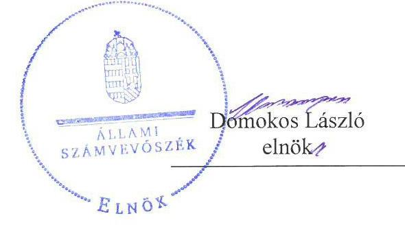
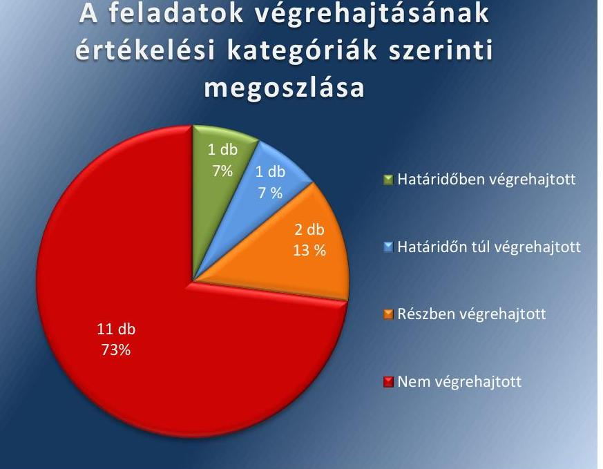

# Jelentés 

## Utóellenőrzések

Az önkormányzatok belső kontrollrendszere kialakításának és múködtetésének utóellenőrzése - Karád Község Önkormányzata
2017.

---

# Jelentés 

## Utóellenőrzések

Az önkormányzatok belső kontrollrendszere kialakításának és múködtetésének utóellenőrzése - Karád Község Önkormányzata
2017. 12. hó ๑๒ nap

---

|  AZ ELLENŐRZÉST FELÜGYELTE: |  |  |  |  |   |
| --- | --- | --- | --- | --- | --- |
|   | RENKŐ ZSUZSANNA felügyeleti vezető |  |  |  |   |
|   | AZ ELLENŐRZÉST VEZETTE ÉS A VÉGREHAJTÁSÁÉRT FELELŐS: |  |  |  |   |
|   | ÁRPÁSI TIBOR ellenőrzésvezető |  |  |  |   |
|   | A PROGRAM ÖSSZEÁLLÍTÁSÁÉRT FELELŐS: |  |  |  |   |
|   | JANIK JÓZSEF LÁSZLÓ osztályvezető |  |  |  |   |
|   | A TÉMÁHOZ KAPCSOLÓDÓ KORÁBBI SZÁMVEVŐSZÉKI JELENTÉSEK: |  |  |  |   |
|   | - címe: | Jelentés az önkormányzatok belső kontrollrendszere kialakításának, egyes kontrolltevékenységek és a belső ellenőrzés működésének ellenőrzéséről - Karád |  |  |   |
|  Jelentéseink az Országgyúlés számítógépes hálózatán és az Interneten a www.asz.hu címen is olvashatóak. | - sorszáma: | 14093 |  |   |
|   | IKTATÓSZÁM: EL-0071-066/2017. |  |  |  |   |
|   | TÉMASZÁM: 21 |  |  |  |   |
|   | ELLENŐRZÉS-AZONOSÍTÓ SZÁM: V075591 |  |  |  |   |

---

# TARTALOMJEGYZÉK 

■ ÖSSZEGZÉS ..... 5
■ AZ ELLENŐRZÉS CÉLJA ..... 6
■ AZ ELLENŐRZÉS TERÜLETE ..... 7
■ AZ ELLENŐRZÉS HÁTTERE, INDOKOLTSÁGA ..... 8
■ A JELENTÉS LÉNYEGES KÉRDÉSKÖRE ..... 9
■ ELLENŐRZÉS HATÓKÖRE ÉS MÓDSZEREI ..... 10
■ MEGÁLLAPÍTÁSOK ..... 12
■ MELLÉKLETEK ..... 15
I. Sz. melléklet: Az ÁSZ 14093. számú jelentéséhez kapcsolódó intézkedési terv végrehajtása ..... 15
■ FÜGGELÉK: ÉSZREVÉTELEK ..... 19
■ RÖVIDÍTÉSEK JEGYZÉKE ..... 21

---

.

---

# ÖSSZEGZÉS 

Az Állami Számvevőszék utóellenőrzése megállapította, hogy az intézkedési tervben foglaltakat Karád Község Önkormányzata döntően nem hajtotta végre. A belső kontrollrendszer kialakításának és müködésének továbbra is fennálló hiányosságai miatt nem volt biztositott a közpénzekkel való felelős, elszámoltatható, átlátható és szabályszerű gazdálkodás.

## Az ellenőrzés társadalmi indokoltsága

Az Állami Számvevőszék stratégiájában célul tűzte ki a számvevőszéki munka hasznosulásának javítását. Ezzel összhangban ellenőrzi, hogy az ellenőrzött szervezetek megvalósították-e a korábbi ellenőrzései által feltárt hibák, hiányosságok és szabálytalanságok megszüntetése céljából elkészített intézkedési terveikben foglaltakat. A rendszeres utóellenőrzések hozzájárulnak a szükséges intézkedések tényleges végrehajtáshoz, ezáltal a közpénzügyek rendezettségének javulásához.

## Főbb megállapítások, következtetések

Karád Község Önkormányzata az intézkedési tervben meghatározott 15 feladatból egyet határidőben, egyet határidőn túl, kettőt részben, tizenegy feladatot nem hajtott végre.

Határidőben teljesült a beszámolási feladatok, felelősségi körök meghatározása, míg határidőn túl alakították ki a Hivatal tevékenységének, a célok megvalósításának nyomon követési rendszerét.

Kettő feladatot a jegyző részben teljesített: az elkészítendő szabályzatok közül elmaradt a számlarend és a bizonylati rend módosítása, továbbá nem készítette el a köztisztviselők teljesítményértékelését. A kockázatok kezelése érdekében meghatározta a szükséges intézkedések folyamatos nyomon követési módját, azonban a kockázatkezelési rendszert nem múködtette.

A nem végrehajtott tizenegy feladat közül a felelősségi körében a polgármester nem kísérte figyelemmel a gazdálkodás szabályszerűségét, nem gondoskodott a teljesítésigazolásra jogosult személyek kijelöléséről, a vagyonnyilatkozatok megfelelő kezeléséről. A jegyző nem korszerűsítette a folyamatba épített, előzetes, utólagos és vezetői ellenőrzést, nem határozta meg a helyettesítés, valamint a köztisztviselő jogviszonya megszűnése esetére a munkakör átadásának és a munkáltatóval való elszámolás rendjét. Nem alakította ki a megfelelő információáramlást, nem gondoskodott az elektronikus közzétételi kötelezettség teljesítéséről, nem szabályozta a közérdekű adatok megismerésének rendjét, nem intézkedett a teljesítésigazolás és az érvényesítés során a jogszabályi előírások érvényesüléséről, a kötelezettségvállalások nyilvántartásba vételéről. Nem gondoskodott a vagyonnyilatkozatok kezeléséről, a belső ellenőrzés megfelelő működtetéséről.

A hiányosságok következtében Karád Község Önkormányzata müködésének átláthatósága, elszámoltathatósága és szabályszerűsége nem volt biztosított.

Az intézkedési tervben rögzített feladatok végrehajtásáról nem vezették a jogszabályi előírásnak megfelelő nyilvántartást.

---

# AZ ELLENŐRZÉS CÉLJA 

Az ellenőrzés célja annak értékelése volt, hogy a számvevőszéki jelentésben ${ }^{1}$ foglalt intézkedést igénylő megállapításokkal összhangban készített intézkedési tervben meghatározott feladatokat az önkormányzat végrehajtotta-e.

---

# **AZ ELLENŐRZÉS TERÜLETE**

## **Karád Község Önkormányzata**

Karád község a Dél-Dunántúl Régióban, Somogy megye területén a Külső-Somogyban helyezkedik el. Állandó lakosainak száma a KSH által közzétett népességi adatok² szerint 2016. január 1-jén 1532 fő volt.

Az Önkormányzat³ héttagú Képviselő-testületének⁴ munkáját két állandó bizottság segítette. Karád és Somogytúr községek önkormányzatainak képviselő-testületei igazgatási feladataik ellátására 2013. január 1-jén Karád székhellyel Közös Önkormányzati Hivatalt⁵ hoztak létre. A Közös Önkormányzati Hivatal szervezeti egységekre nem tagolódott, elkülönített gazdasági szervezettel nem rendelkezett. Az Önkormányzat költségvetési szervként a Karádi Napközi Otthonos Óvoda intézményt működtette.

A Polgármester⁶ 2011. november 20. – az időközi önkormányzati választás – óta tölti be tisztségét. A Jegyző₁⁷ 2009. október 1-jétől 2013. november 30-ig, a Jegyző₂⁸ 2013. december 1-jétől, míg a Jegyző₃⁹ 2015. április 14. óta látta el feladatait.

A 2016. évi költségvetési beszámoló¹⁰ szerint 285,2 millió Ft – önkormányzati szinten összesített – bevételt ért el, valamint 260,4 millió Ft kiadást teljesített az Önkormányzat. A 2016. december 31-i könyvviteli mérleg szerint 2099,0 millió Ft értékű eszközvagyonnal rendelkezett, a rövid lejáratú kötelezettségállománya 28,7 millió Ft volt, hosszú lejáratú kötelezettségállománnyal nem rendelkezett.

Az ÁSZ¹¹ Karád Község Önkormányzata belső kontrollrendszere kialakításának, egyes kontrolltevékenységek és a belső ellenőrzés működésének ellenőrzéséről szóló 14093 számú jelentését 2014. június 23-án hozta nyilvánosságra.

A feltárt hiányosságok kiküszöbölésére, szabálytalanságok megszüntetésére az Önkormányzat intézkedési tervet készített, amelyet az ÁSZ elnöke 2015. június 26-án fogadott el. Az utóellenőrzés az intézkedési tervben megfogalmazott feladatok megvalósításának ellenőrzésére, illetve értékelésére fókuszált.

---

# AZ ELLENŐRZÉS HÁTTERE, INDOKOLTSÁGA 

Az ÁSZ tv. ${ }^{12}$ 33. § (1) bekezdése értelmében a számvevőszéki jelentések intézkedést igénylő megállapításaihoz kapcsolódóan az ellenőrzött szervezet vezetője intézkedési tervet köteles összeállítani, és az ÁSZ részére megküldeni. Az intézkedési tervben foglaltak megvalósítását - az ÁSZ tv. 33. § (7) bekezdésében foglaltak alapján - az ÁSZ utóellenőrzés keretében ellenőrizheti. Az intézkedések megvalósulásának értékelése során az ÁSZ figyelembe veszi az ellenőrzött szervezetek működési feltételeiben, valamint a jogszabályi előírásokban bekövetkezett változásokat.

Az intézkedési tervekben foglalt feladatok hiányos, illetve késedelmes végrehajtása, valamint megvalósításának elmaradása azt mutatja, hogy az ellenőrzések során feltárt hibák, hiányosságok és szabálytalanságok megszüntetése nem kapott kellő hangsúlyt. Ez a szabályszerű működés és a felelős vezetői magatartás vonatkozásában kockázatot hordoz. E kockázatok feltárásával az ÁSZ utóellenőrzési rendszere fokozza a fegyelmet, és igazolja, hogy a közpénzzel való szabályos gazdálkodás felelőssége elől nem lehet kitérni.

## AZ UTÓELLENŐRZÉS NÉGY SZINTEN HASZNOSULHAT:

- A társadalom szintjén az utóellenőrzés jelzi, hogy a számvevőszéki ellenőrzés megállapításainak van következménye: a hiányosságok megszüntetésére az ellenőrzött szervezet által meghatározott intézkedések végrehajtását is számon kéri az ÁSZ.
- Az ellenőrzött terület szintjén az utóellenőrzés tájékoztatást nyújt a terület döntéshozóinak a hiányosságok kiküszöbölésének jó gyakorlatairól, ezzel lehetőséget biztosítva arra, hogy az ÁSZ ellenőrzési megállapításai, javaslatai a terület nem ellenőrzött szervezeteinek a működése során is hasznosuljanak.
- Az ellenőrzött szervezet szintjén az utóellenőrzés feltárja, hogy a szervezet az intézkedések végrehajtásával hasznosította-e a korábbi ellenőrzési jelentésben a hiányosságok megszüntetése, illetve a kockázatok kezelése érdekében megfogalmazott javaslatokat.
- Az ÁSZ szintjén az utóellenőrzés visszacsatolást ad az ellenőrzési jelentések hasznosulásáról, az intézkedések elmaradása vagy részleges megvalósulása a további ellenőrzésekhez kockázati jelzésként szolgál.

---

# A JELENTÉS LÉNYEGES KÉRDÉSKÖRE 

Az Önkormányzat az intézkedési tervben foglaltakat az elöirt határidőben végrehajtotta-e?

---

# ELLENŐRZÉS HATÓKÖRE ÉS MÓDSZEREI 

## Az ellenőrzés típusa

Megfelelőségi ellenőrzés

## Az ellenőrzött időszak

Az utóellenőrzés alapját képező ÁSZ jelentés közzétételének napjától (2014. június 24.) az ellenőrzésről szóló kiértesítő levél keltének napjáig (2017. június 19.) tartó időszak.

## Az ellenőrzés tárgya

A számvevőszéki jelentésben foglalt intézkedést igénylő megállapításokkal összhangban - az Önkormányzat által - készített intézkedési tervben foglaltak végrehajtásának ellenőrzése.

Az ellenőrzés kiterjedt minden olyan körülményre és adatra, amely az ÁSZ jogszabályban meghatározott feladatainak teljesítéséhez, valamint a program végrehajtása folyamán felmerült újabb összefüggések feltárásához szükséges volt.

## Az ellenőrzött szervezet

Karád Község Önkormányzata, Karádi Közös Önkormányzati Hivatal

## Az ellenőrzés jogalapja

Az ÁSZ törvényben meghatározott feladatkörében ellenőrzi a központi költségvetés végrehajtását, az államháztartás gazdálkodását, az államháztartásból származó források felhasználását és a nemzeti vagyon kezelését.

Az ÁSZ tv. 1. § (3) bekezdése szerint az ÁSZ általános hatáskörrel végzi a közpénzekkel és az állami és önkormányzati vagyonnal való felelős gazdálkodás ellenőrzését.

Az ÁSZ tv. 33. § (7) bekezdése alapján az ÁSZ tv. 33. § (1)-(2) bekezdése szerinti intézkedési tervben foglaltak megvalósítását az ÁSZ utóellenőrzés keretében ellenőrizheti.

---

# Az ellenőrzés módszerei 

Az ÁSZ az utóellenőrzést a nemzetközi standardokat irányadónak tekintve az ellenőrzési program ellenőrzési kérdései alapján, az ellenőrzött időszakban hatályos jogszabályok, az ellenőrzés szakmai szabályok és módszertanok figyelembevételével, önálló ellenőrzés keretében végezte.

Az ÁSZ az ellenőrzés ideje alatt az Önkormányzattal történő kapcsolattartást az ÁSZ SZMSZ-ének vonatkozó előírásai alapján biztosította.

Az utóellenőrzés megállapításait elsősorban az ÁSZ rendelkezésére álló, valamint az ellenőrzött szervezetektől elektronikusan bekért dokumentumok alapozták meg.

Az ellenőrzési bizonyítékként felhasználható adatforrások közé tartoztak egyrészt az ellenőrzés szakmai programjában felsorolt adatforrások, másrészt minden - az ellenőrzés folyamán feltárt, az ellenőrzés szempontjából információt tartalmazó - dokumentum.

Az intézkedési tervekben előírt feladatokat, azok végrehajthatósága, illetve végrehajtása szempontjából az alábbiak szerint értékelte az ÁSZ:
"határidőben végrehajtott" a feladat, ha a teljesítés dokumentáltan, az intézkedési tervben előírt határidőben és tartalommal megtörtént;
"határidőn túl végrehajtott" a feladat, ha annak teljesítése az intézkedési tervben meghatározott módon, de az előírt határidőn túl történt meg;
"részben végrehajtott" a feladat, ha végrehajtása teljes körűen az intézkedési tervben előírt módon nem történt meg;
"nem végrehajtott" a feladat, ha a végrehajtás nem történt meg, vagy amennyiben a teljesítést nem dokumentálták;
"okafogyottá vált" a feladat, ha végrehajtására - meghatározott esemény bekövetkezése, továbbá külső körülmény, a múködést érintő feltétel változása miatt - már nincs szükség, illetve lehetőség, és egyértelműen megállapítható, hogy az intézkedést szükségessé tevő körülmény a jövőben nem fordulhat elő;
"nem időszerü" az a feladat, amelynek ellenőrzési időszakon belüli végrehajtására azért nem került (kerülhetett) sor, mert az intézkedés alapjául szolgáló esemény nem következett be, de annak jövőbeni előfordulása lehetséges, a végrehajtása nem volt esedékes, vagy a végrehajtás határideje még nem járt le.
Az ellenőrzés lefolytatásához az ellenőrzött szervezet a tanúsítványok elektronikus kitöltésével, valamint az ÁSZ által kért dokumentumok elektronikus megküldésével szolgáltatott adatokat, amelyek valódiságát és teljes körűségét az ellenőrzött szervezet vezetője által tett teljességi és hitelességi nyilatkozat igazolta. Az így rendelkezésre bocsátott adatok, információk kontrollja az ellenőrzés keretében történt.

---

# MEGÁLLAPÍTÁSOK 

## Az Önkormányzat az intézkedési tervben foglaltakat az előírt határidőben végrehajtotta-e?

Összegző megállapítás

Az Önkormányzat az intézkedési tervben meghatározott tizenöt feladatból egyet határidőben, egyet határidőn túl, kettőt részben, tizenegyet nem hajtott végre. Az intézkedési tervben rögzített feladatok végrehajtásáról nem vezették a jogszabályban előírt nyilvántartást.

Az ÁSZ a jelentésében a polgármester részére négy, a jegyző ${ }_{2}$ részére hét javaslatot fogalmazott meg. Az ÁSZ részére megküldött intézkedési tervben a hiányosságok, szabálytalanságok megszüntetésére tizenöt feladatot határozott meg a képviselő-testület, a feladatok elvégzésének felelőseként a polgármestert és a jegyzőt ${ }_{2,3}$ jelölve meg.

A jegyző ${ }_{3}$ az ÁSZ javaslatai alapján készített intézkedési terv végrehajtásáról a Bkr. ${ }^{13} 14 . \S$ (1) bekezdése előírásainak megfelelő nyilvántartást nem vezette.

Az intézkedési tervben meghatározott feladatokat, határidőket, a feladatok elvégzésének felelősét és a feladatok végrehajtását az I. számú melléklet mutatja be.

Az intézkedési tervben tervezett feladatok végrehajtásának értékelési kategóriák szerinti megoszlását az 1. ábra szemlélteti.

1. ábra

## A feladatok végrehajtásának értékelési kategóriák szerinti megoszlása

---

# HATÁRIDŐBEN VÉGREHAJTOTT feladat: 

1. A jegyző ${ }_{2}$ meghatározta a beszámolási feladatok teljesítésével kapcsolatos belső előírásokat, feltételeket, felelősségi köröket.

## HATÁRIDŐN TÚL VÉGREHAJTOTT feladat:

2. A jegyző ${ }_{3}$ 2016-ban alakította ki a Hivatal tevékenységének, a célok megvalósításának nyomon követési rendszerét.

## RÉSZBEN VÉGREHAJTOTT feladatok:

3. A jegyző ${ }_{2}$ határidőben elkészítette a Közös Hivatal SZMSZ ${ }^{14}$-ét, vagyongazdálkodási rendelet módosítását ${ }^{15}$ és a köztisztviselői hivatásetikai alapelvekről és az etikai eljárás szabályairól szóló szabályzatot ${ }^{16}$, határidőn túl aktualizálta a számviteli politikát ${ }^{17}$, a pénzkezelési szabályzatot ${ }^{18}$, a leltározási szabályzatot ${ }^{19}$ és elkészítette a szabálytalanságok kezelésének eljárásrendjét ${ }^{20}$, míg nem készítette el a Számv tv ${ }^{21}$. 161. § (2) bekezdés d.) pontjában és a (4) bekezdésében foglaltak ellenére a számlarend és a számlarendben foglaltakat alátámasztó bizonylati rend módosítását, a Kttv. ${ }^{22} 130$. § (1) bekezdésében és a 10/2013. (I. 21.) Korm. rendeletben ${ }^{23}$ foglaltak ellenére a köztisztviselők teljesítményértékelését.
4. A jegyző ${ }_{3}$ meghatározta a kockázatok kezelése érdekében szükséges intézkedések folyamatos nyomon követési módját. A Bkr. 7. § (1) bekezdésében foglaltak ellenére a kockázatkezelési rendszert nem múködtette.

## NEM VÉGREHAJTOTT feladatok:

5. A polgármester nem kísérte figyelemmel a gazdálkodás szabályszerűségét a Mötv. ${ }^{24}$ 115. § (1) bekezdésében foglalt kötelezettsége ellenére.
6. A polgármester és a jegyző ${ }_{2,3}$ az Ávr. ${ }^{25}$ 57. § (4) bekezdésében foglaltak ellenére nem gondoskodtak arról, hogy az Önkormányzat Gazdálkodási szabályzata ${ }_{1}{ }^{26}{ }_{2}{ }^{27}$ tartalmazza a teljesítésigazolásra jogosult személyek kijelölését.
7. A polgármester és a jegyző ${ }_{3}$ nem gondoskodott a vagyonnyilatkozatokkal kapcsolatos kötelezettségek ellátásáról a Mötv. 39. § (3) bekezdésében foglaltak ellenére. A pénzügyi bizottság elnöke a Mötv. 57. § (2) bekezdésében foglaltak ellenére nem gondoskodott a vagyonnyilatkozatok nyilvántartásáról, kezeléséről és őrzéséről.
8. A jegyző ${ }_{2,3}$ a Bkr. 8. § (2) bekezdésében foglaltak ellenére nem korszerűsítette a folyamatba épített, előzetes, utólagos és vezetői ellenőrzést a beszerzési folyamat, és a vagyonhasznosítási tevékenység, valamint a pénzügyi döntések dokumentumainak elkészítéséhez.
9. A jegyző ${ }_{2,3}$ nem határozta meg a gazdasági feladatokat ellátó vezető és alkalmazottak helyettesítésének rendjét.
10. A jegyző ${ }_{2,3}$ a Kttv. 74. §-ában foglaltak ellenére nem szabályozta a köztisztviselő jogviszonya megszüntetése (megszűnés) esetére a munkakör átadása és a munkáltatóval való elszámolás rendjét.

---

11. A jegyző ${ }_{2,3}$ nem gondoskodott a megfelelő információk a megfelelő időben az illetékes szervezetekhez és személyekhez történő eljuttatásáról.
12. A jegyző ${ }_{2,3}$ az Info. tv. ${ }^{28}$ 33. § (1) és (3) és a 37. § (1) bekezdésében foglaltak ellenére nem gondoskodott az Önkormányzat elektronikus közzétételi kötelezettségének teljesítéséről.
13. A jegyző ${ }_{2,3}$ az Info. tv. 30. § (6) bekezdésében és az Ávr. 13. § (2) bekezdés h) pontjában foglalt előírás ellenére nem szabályozta a közérdekú adatok megismerésére irányuló igények teljesítésének rendjét.
14. A jegyző ${ }_{2,3}$ nem intézkedett az Áht. ${ }^{29}$ 37-38. §, az Ávr. 55-59. § és az Áhsz. 39. § előírásainak betartásáról-a teljesítésigazolás és az érvényesítés vonatkozásában, valamint azok ellenőrzése során a kötelezettségvállalással, a pénzügyi ellenjegyzéssel, az utalványozással, a kötelezettségvállalások nyilvántartásba vételével kapcsolatban.
15. A jegyző ${ }_{2,3}$ az Áht. a 70. § (1) bekezdésében foglalt kötelezettsége ellenére nem gondoskodott megfelelően a belső ellenőrzés múködtetéséről. A Bkr.21. § (4) bekezdésében előírtak ellenére nem dolgozta ki a tanácsadói tevékenységre vonatkozó eljárási szabályokat, a Bkr. 56. § (3) bekezdés a) pontjában foglaltak ellenére nem fogadtatott el stratégiai ellenőrzési tervet. A Bkr. 31. § (4) bekezdés a), d) és e) pontjában foglaltak ellenére nem gondoskodott arról, hogy az ellenőrzési terv mindenkor tartalmazza az azt megalapozó elemzések és a kockázatelemzés eredményének összefoglaló bemutatását, az ellenőrizendő időszakot, a szükséges ellenőrzési kapacitás meghatározását. A Bkr. 56. § (2) bekezdésében előírtak ellenére nem fogalmazta meg a véleményét, javaslatát az ellenőrzési tervhez. A Bkr. 56. § (2) bekezdésében előírtak ellenére nem készíttetett ellenőrzési programot, mely a stratégiai ellenőrzési terv éves lebontása. A Bkr. 33. § (2) bekezdés h) pontjában foglaltak ellenére nem gondoskodott arról, hogy az ellenőrzési terv tartalmazza az alkalmazott módszereket és eljárásokat. A Bkr. 47. § (1) bekezdésében foglaltak ellenére nem tartotta nyilván és nem követte nyomon az ellenőrzési jelentés alapján tett intézkedéseket, nem vezetett nyilvántartást az ellenőrzésekről.

---

# MELLÉKLETEK

- I. SZ. MELLÉKLET: AZ ÁSZ 14093. SZÁMÚ JELENTÉSÉHEZ KAPCSOLÓDÓ INTÉZKEDÉSI TERV VÉGREHAJTÁSA

|  Az intézkedési terv alapján elvégzendő feladat | Az intézkedési tervben meghatározott határidő | Az intézkedési tervben megjelölt felelős | A feladat végrehajtása  |
| --- | --- | --- | --- |
|  **Határidőben végrehajtott feladat** |  |  |   |
|  1. A jegyzőnek megfogalmazott javaslatokhoz
„3.3. Beszámolási feladatok teljesítésével kapcsolatos belső előírások, feltételek meghatározása, felelősségi körök meghatározása.” | 2014. július 1. | jegyző₁ | A 2014. július 1-től érvényes Gazdálkodási szabályzat₁-ban rögzítésre kerültek a beszámolási feladatok, felelősségi körök.  |
|  **Határidőn túl végrehajtott feladat** |  |  |   |
|  2. A jegyzőnek megfogalmazott javaslatokhoz
„5. Nyomon követési rendszer kialakítása a célok megvalósításának nyomon követése.” | 2014. július 1. | jegyző₁ | A 2016. március 28-ai keltezésű Belső kontroll kézikönyv tartalmazta a nyomon követési rendszer kialakítását.  |
|  **Részben végrehajtott feladatok** |  |  |   |
|  3. A jegyzőnek megfogalmazott javaslatokhoz
„1. A jegyző készítse el az SZMSZ-t aktualizálja a vagyongazdálkodási rendeletet, aktualizálja a számviteli politikát, pénzkezelési szabályzatot, a leltározási szabályzatot, a számlarendet és a bizonylati rendet. Készítse el a szabálytalanságok kezelése eljárásrendjét, a köztisztviselők teljesítmény értékelését, a hivatásetikai alapelveket és az etikai eljárás szabályainak dokumentálását.” | 2014. július 1. | jegyző₁ | A jegyző₁₃ a felsorolt részfeladatok közül
- határidőben elkészítette a Közös Hivatal SZMSZ-ét és a köztisztviselői hivatásetikai alapelvekről és az etikai eljárás szabályairól szóló szabályzatot (képviselőtestületi elfogadást követően mindkettő 2014. január 4-én lépett hatályba), a vagyongazdálkodási rendeletet Karád Község Önkormányzata 5/2013. (IV. 30.) rendeletével fogadta el;
- határidőn túl aktualizálta a számviteli politikát (2016. február 1-én lépett hatályba), a pénzkezelési szabályzatot (2016. március 1-jétől lépett hatályba), a leltározási szabályzatot (2016. március 16-tól lépett hatályba) és készítette el a szabálytalanságok kezelésének eljárásrendjét (2015. július 1-jétől lépett hatályba);
- nem készítette el a Számv tv. 161. § (2) bekezdés d.) pontjában és a (4) bekezdésében foglaltak ellenére a számlarend és a számlarendben foglaltakat alátámasztó bizonylati rend módosítását, a Kttv. 130. § (1) bekezdésében és a 10/2013. (I. 21.) Korm. rendeletben foglaltak ellenére a köztisztviselők teljesítményértékelését.  |

---

|  Az intézkedési terv alapján elvégzendő feladat | Az intézkedési tervben meghatározott határidő | Az intézkedési tervben megelölt felelős | A feladat végrehajtása  |
| --- | --- | --- | --- |
|  4. A jegyzőnek megfogalmazott javaslatokhoz
„2.1. A jegyző a Bkr. 7§. (2) bekezdése alapján határozza meg a kockázatok kezelése érdekében szükséges intézkedések folyamatos nyomon követési módját."
„2.2. A jegyző köteles kockázatkezelési rendszert müködtetni." | 2014. július 1. | jegyző₁ | A jegyző₁ a 2016. március 28-ai keltezésű Belső kontroll kézikönyvben meghatározta a kockázatok kezelése érdekében szükséges intézkedések folyamatos nyomon követési módját. A Bkr. 7. § (1) bekezdésében foglaltak ellenére a kockázatkezelési rendszert nem müködtette.  |
|  Nem végrehajtott feladatok |  |  |   |
|  5. A polgármesternek megfogalmazott javaslatokhoz
„1. Figyelemmel kell kísérni az önkormányzat gazdálkodásának szabályszerűségét.
A Mötv. 67. § f) pontja alapján gondoskodni kell a belső kontrollrendszer müködésére vonatkozó jogszabályi rendelkezések be nem tartásának, illetve a feltárt egyéb hibák és hiányosságának szabálytalanságok tekintetében az esetleges munkajogi felelősséggel kapcsolatos körülményeinek a kivizsgálásáról, és a vizsgálat eredményének függvényében a szükséges munkajogi intézkedéseket megtételéről."
„3. A gazdálkodás szabályszerűségének figyelemmel kísérése." | 2014. július 1-től
Minden esetben a vizsgálat megkezdését követő 30 napon belül | polgármester
polgármester,
jegyző₁ | A polgármester a Mötv. 115. § (1) bekezdésében foglaltak ellenére nem kísérte figyelemmel az önkormányzat gazdálkodásának szabályszerűségét.
A polgármester és a jegyző₁ nem gondoskodott a belső kontrollrendszer müködésére vonatkozó jogszabályi rendelkezések be nem tartásának, illetve a feltárt egyéb hibák és hiányosságok szabálytalanságok tekintetében az esetleges munkajogi felelősséggel kapcsolatos körülményeknek a kivizsgálásáról, és a vizsgálat eredményének függvényében a szükséges munkajogi intézkedések megtételéről.  |
|  6. A polgármesternek megfogalmazott javaslatokhoz
„2. Ki kell jelölni a teljesítésigazolásra jogosult személyeket."
A jegyzőnek megfogalmazott javaslatokhoz
„3.2. Teljesítésigazolásra jogosult személyek kijelölése." | 2014. július 1-től | polgármester,
jegyző₁ | A teljesítésigazolási feladatainak ellátására kijelölt személyekről az Ávr. 57. § (4) bekezdése szerinti írásbeli kijelölést, a kijelölés átvételéről szóló igazolást a 2014. július 1-től hatályos Gazdálkodási szabályzat₁ és a 2016. január 4-től hatályos Gazdálkodási szabályzat₁ nem tartalmazott.  |
|  7. „4. 2013. január 31-el megfelelően müködik a vagyonnyilatkozatok kezelése." | 2014. január 30.
Illetve a vagyonnyilatkozat benyújtását, felbontását követő 30 napon belül. | polgármester és a pénzügyi bizottság elnöke, jegyző₁ | A vagyonnyilatkozatok kezelésének szabályait az SZMSZ tartalmazta. A polgármester és a jegyző₁ nem gondoskodott a vagyonnyilatkozatokkal kapcsolatos kötelezettségek ellátásáról a Mötv. 39. § (3) bekezdésében foglaltak ellenére. A pénzügyi bizottság elnöke a Mötv. 57. § (2) bekezdésében foglaltak ellenére nem gondoskodott a vagyonnyilatkozatok nyilvántartásáról, kezeléséről és őrzéséről.  |

---

|  8. | „3.1. A FEUVE korszerűsítése a beszerzési folyamat, és a vagyonhasznosítási tevékenység, valamint a pénzügyi döntések dokumentumainak elkészítéséhez. | 2014. július 1. | jegyző  |
| --- | --- | --- | --- |
|  9. | „3.4. Gazdasági feladatokat ellátó vezető és alkalmazottak helyettesítési rendjének meghatározása." | 2014. július 1. | jegyző  |
|  10. | „3.5. Köztisztviselői jogviszony megszüntetése (megszűnése) esetére a munkakör átadása és a munkáltatóval való elszámolás rendjének kidolgozása." | 2014. július 1. | jegyző  |
|  11. | „4.1. Megfelelő információk eljuttatása a megfelelő időben illetékes szervezetekhez és személyekhez." | 2014. július 1. | jegyző  |
|  12. | „4.2. Önkormányzat elektronikus közzétételi kötelezettségének teljesítése." | 2014. július 1. | jegyző  |
|  13. | „4.3. Közérdekú adatok megismerésére irányuló igények teljesítési rendjének szabályozása." | 2014. július 1. | jegyző  |
|  14. | „6. Intézkedés a teljesítésigazolás és az érvényesítés vonatkozásában, valamint azok ellenőrzése során a kötelezettség vállalással, a pénzügyi ellenjegyzéssel, az utalványozással, a kötelezettség vállalások nyilvántartásba vételével kapcsolatban." | 2014. július 1. | jegyző  |
|  15. | „7. A költségvetési szerv belső kontrollrendszerének működtetése. A belső ellenőrzés megfelelő működtetése, nyomon követési rendszer kialakítása, tanácsadó tevékenységre vonatkozó eljárási szabályok kidolgozása, stratégiai ellenőrzési terv elfogadása. Az ellenőrzési tervnek mindenkor tartalmaznia kell az azt megalapozó elemzéseket, és a kockázatelemzés eredményének összefoglaló bemutatását, az ellenőrizendő időszakot, a szükséges ellenőrzési kapacitás meghatározását. Mindenkor szükséges a jegyző véleményének javaslatának megfogalmazása az ellenőrzési | 2014. január 1. | jegyző  |

|  Az intézkedési tervben meghatározott határidő | Az intézkedési tervben meghatározott határidő | A feladat végrehajtása  |
| --- | --- | --- |
|  2014. július 1. | jegyző 2 | A jegyző 2,3 a Bkr. 8. § (2) bekezdésében foglaltak ellenére nem korszerűsítette a folyamatba épített, előzetes, utólagos és vezetői ellenőrzést a beszerzési folyamat, és a vagyonhasznosítási tevékenység, valamint a pénzügyi döntések dokumentumainak elkészítéséhez.  |
|  2014. július 1. | jegyző 2 | A jegyző 2,3 nem határozta meg a gazdasági feladatokat ellátó vezető és alkalmazottak helyettesítés rendjét.  |
|  2014. július 1. | jegyző 2 | A jegyző 2,3 a Kttv. 74. § (1) bekezdésében foglaltak ellenére nem dolgozta ki a köztisztviselői jogviszony megszüntetése (megszűnése) esetére a munkakör átadása és a munkáltatóval való elszámolás rendjét.  |
|  2014. július 1. | jegyző 2 | A jegyző 2,3 nem gondoskodott a megfelelő információk a megfelelő időben az illetékes szervezetekhez és személyekhez történő eljuttatásáról.  |
|  2014. július 1. | jegyző 2 | A jegyző 2,3 az Info. tv. 33. § (1) és (3) és a 37. § (1) bekezdésében foglaltak ellenére nem gondoskodott az Önkormányzat elektronikus közzétételi kötelezettségének teljesítéséről.  |
|  2014. július 1. | jegyző 2 | A jegyző 2,3 az Info. tv. 30. § (6) bekezdésében és az Ávr. 13. § (2) bekezdés h) pontjában foglalt előírás ellenére nem szabályozta a közérdekú adatok megismerésére irányuló igények teljesítésének rendjét.  |
|  2014. július 1. | jegyző 2 | A jegyző 2,3 nem intézkedett az Áht. 37-38. §, az Ávr. 55-59. § és az Áhsz. 39. § előírásainak betartásáról a teljesítésigazolás és az érvényesítés vonatkozásában, valamint azok ellenőrzése során a kötelezettségvállalással, a pénzügyi ellenjegyzéssel, az utalványozással, a kötelezettségvállalások nyilvántartásba vételével kapcsolatban.  |
|  2014. január 1. | jegyző 2 | A jegyző 2,3 az Áht. a 70. § (1) bekezdésében foglalt kötelezettsége ellenére nem gondoskodott megfelelően a belső ellenőrzés működtetéséről. A Bkr. 21. § (4) bekezdésében előírtak ellenére nem dolgozta ki a tanácsadói tevékenységre vonatkozó eljárási szabályokat, a Bkr. 56. § (3) bekezdés a) pontjában foglaltak ellenére nem fogadtatott el stratégiai ellenőrzési tervet. A Bkr. 31. § (4) bekezdés a), d) és e) pontjában foglaltak ellenére nem gondoskodott arról, hogy az ellenőrzési terv mindenkor tartalmazza az azt megalapozó elemzések és a kockázatelemzés eredményének összefoglaló bemutatását, az ellenőrizendő időszakot, a szükséges ellenőrzési kapacitás meghatározását. A Bkr. 56. § (2) bekezdésében előírtak ellenére nem fogalmazta meg a véleményét, javas- |

---

|  Az intézkedési terv alapján elvégzendő feladat | Az intézkedési tervben meghatározott határidő | Az intézkedési tervben megjelölt felelős | A feladat végrehajtása  |
| --- | --- | --- | --- |
|  tervhez. Minden esetben éves ellenőrzési programot kell készíteni, amely a stratégiai ellenőrzési terv éves lebontása. Az ellenőrzési tervnek tartalmaznia kell az alkalmazott módszereket és eljárásokat. A belső ellenőrzés által tett javaslatok. A belső ellenőrzési jelentés alapján tett intézkedéseket nyilvántartani és nyomon követni kell. Az ellenőrzésekről nyilvántartást kell vezetni." |  |  | latát az ellenőrzési tervhez. A Bkr. 56. § (2) bekezdésében előírtak ellenére nem készíttetett ellenőrzési programot, mely a stratégiai ellenőrzési terv éves lebontása. A Bkr. 33. § (2) bekezdés h) pontjában foglaltak ellenére nem gondoskodott arról, hogy az ellenőrzési terv tartalmazza az alkalmazott módszereket és eljárásokat. A Bkr. 47. § (1) bekezdésében foglaltak ellenére nem tartotta nyilván és nem követte nyomon az ellenőrzési jelentés alapján tett intézkedéseket, nem vezetett nyilvántartást az ellenőrzésekről.  |

*Forrás: ÁSZ által készített táblázat*

---

# FÜGGELÉK: ÉSZREVÉTELEK 

A jelentéstervezetet a Számvevőszék 15 napos észrevételezésre megküldte az ellenőrzött szervezet vezetőjének az ÁSZ tv. 29. §* (1) bekezdése előírásának megfelelően.

A polgármester és a jegyző az ÁSZ tv. 29. § (2) bekezdésében foglalt észrevételezési jogával nem élt.

[^0]
[^0]:    * 29. § (1) Az Állami Számvevőszék az ellenőrzési megállapításait megküldi az ellenőrzött szervezet vezetőjének vagy az általa megbízott személynek, és annak, akinek személyes felelősségét állapította meg.
    (2) Az ellenőrzött szervezet vezetője és a felelősként megjelölt személy az ellenőrzés megállapításaira tizenöt napon belül írásban észrevételt tehet.
    (3) Az Állami Számvevőszék az észrevételre a beérkezésétől számított harminc napon belül írásban válaszol. A figyelembe nem vett észrevételeket köteles a jelentésben feltüntetni, és megindokolni, hogy azokat miért nem fogadta el.

---

.

---

# RÖVIDÍTÉSEK JEGYZÉKE 

${ }^{1}$ számvevőszéki jelentés
${ }^{2}$ KSH által közzétett népességi adatok
${ }^{3}$ Önkormányzat
${ }^{4}$ Képviselő-testület
${ }^{5}$ Hivatal
${ }^{6}$ Polgármester
${ }^{7}$ Jegyző ${ }_{1}$
${ }^{8}$ Jegyző ${ }_{2}$
${ }^{9}$ Jegyző ${ }_{3}$
${ }^{10}$ Költségvetési beszámoló
${ }^{11}$ ÁSZ
${ }^{12}$ ÁSZ tv.
${ }^{13}$ Bkr.
${ }^{14}$ vagyongazdálkodási rendelet
${ }^{15}$ SZMSZ
${ }^{16}$ hivatásetikai szabályzat
${ }^{17}$ számviteli politika
${ }^{18}$ pénzkezelési szabályzat
${ }^{19}$ leltározási szabályzat
${ }^{20}$ szabálytalanságok kezelése
${ }^{21}$ Számv. tv.
${ }^{22}$ Kttv.
${ }^{23}$ 10/2013. (I.21.) Korm. rendelet
${ }^{24}$ Mötv.
${ }^{25}$ Ávr.

Az ÁSZ 14093. számú jelentése - Jelentés az önkormányzatok belső kontrollrendszere kialakításának, egyes kontrolltevékenységek és a belső ellenőrzés müködésének ellenőrzéséről Karád (elérhető a www.asz.hu honlapon)
Központi Statisztikai Hivatal, Magyarország Közigazgatási Helynévkönyve 2016. január 1-jei adatai
Karád Község Önkormányzata
Karád Község Önkormányzatának Képviselő-testülete
Karádi Közös Önkormányzati Hivatal, (Karád Község és Somogytúr Község megállapodása alapján. Karád székhellyel, Somogytúr községben kirendeltséggel)
Karád Község Önkormányzatának polgármestere
Karád Község Jegyzője 2009. október 1-jétől 2013. november 30-áig
Karád Község Jegyzője 2013. december 1-jétől
Karád Község Jegyzője 2015. április 14-étől
Karád Község Önkormányzat képviselő-testületének 3/2017. (V. 30.) önkormányzati rendelete az önkormányzat 2016. évi zárszámadásáról
Állami Számvevőszék
Az Állami Számvevőszékről szóló 2011. évi LXVI. törvény (hatályos: 2011. július 1jétől)
a költségvetési szervek belső kontrollrendszeréről és belső ellenőrzéséről szóló 370/2011. (XII. 31.) Korm. rendelet
Karádi Község Önkormányzatának 5/2013. (IV.30.) rendelete az önkormányzat vagyonáról és a vagyongazdálkodás szabályairól (hatályos: 2013. április 30-ától)
Karádi Közös Önkormányzati Hivatal Szervezeti és Müködési Szabályzata (hatályos: 2014. január 4-étől)

Karádi Közös Önkormányzati Hivatal Szabályzata a köztisztviselői hivatásetikai alapelvekről és az etikai eljárás szabályairól (hatályos: 2014. január 4-étől)
Karádi Közös Önkormányzati Hivatal és Óvoda Számviteli politikája (hatályos: 2016. február 1-jétől)

Karádi Közös Önkormányzati Hivatal Pénzkezelési szabályzata (hatályos: 2016. március 1-jétől)
Karádi Közös Önkormányzati Hivatal Leltárkészítési és leltározási szabályzata (hatályos: 2016. március 16-ától)
Karád és Somogytúr Községek Polgármesteri Hivatalainak Szabálytalanságok kezelésének eljárásrendje (hatályos: 2015. július 1-jétől)
A számvitelről szóló 2000. évi C. törvény (hatályos: 2001. január 1-jétől)
2011. évi CXCIX. törvény a közszolgálati tisztviselőkről (hatályos: 2012. március 1jétől)
10/2013. (I.21.) Korm. rendelet a közszolgálati egyéni teljesítményértékelésről (hatályos: 2013. július 1-jétől
Magyarország helyi önkormányzatairól szóló 2011. évi CLXXXIX. törvény (hatályos: 2012. január 1-jétől)

Az államháztartásról szóló törvény végrehajtásáról szóló 368/2011. (XII. 31.) Korm. rendelet (hatályos 2012. január 1-jétől)

---

${ }^{26}$ Gazdálkodási szabályzat ${ }_{1}$
${ }^{27}$ Gazdálkodási szabályzat ${ }_{2}$
${ }^{28}$ Info tv.
${ }^{29}$ Áht.

Karádi Közös Önkormányzati Hivatal Gazdálkodási Szabályzata (hatályos: 2014. július 1-jétől)
Karádi Közös Önkormányzati Hivatal Gazdálkodási Szabályzata (hatályos: 2016. január 4-étől)
Információs önrendelkezési jogról és az információszabadságról szóló 2011. évi CXII. törvény (hatályos 2011.július 26-ától)
Az államháztartásról szóló 2011. évi CXCV. törvény (hatályos: 2011. december 31étől)

---

# ÁLLAMI SZÁMVEVŐSZÉK 

1052 Budapest, Apáczai Csere János utca 10.
Levélcím: 1364 Budapest 4. Pf. 54
Telefon: +36 14849100 Telefax: +36 14849200
www.asz.hu