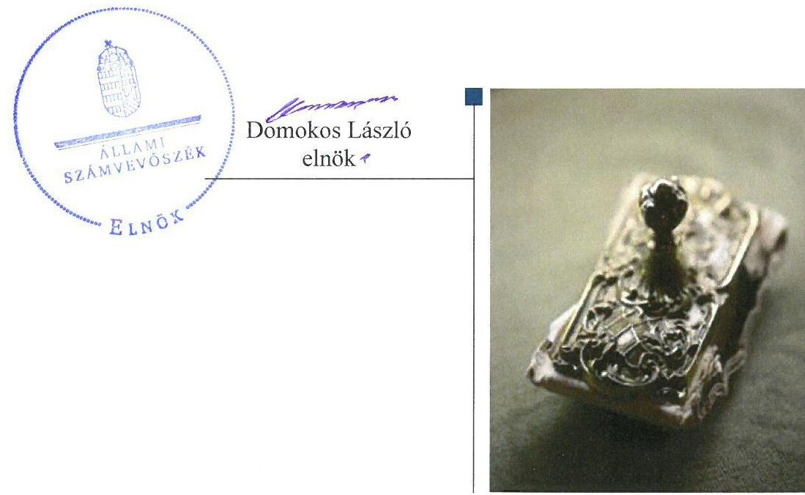
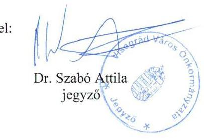
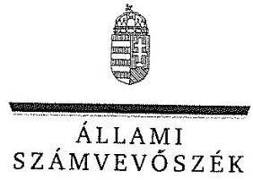
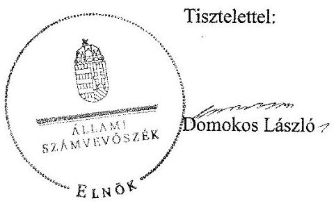
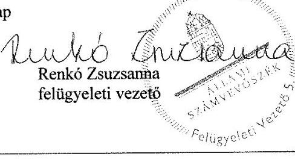

# Jelentés 

## Utóellenőrzések

Az önkormányzatok belső
kontrollrendszere kialakításának és múködtetésének utóellenőrzése Visegrád Város Önkormányzata 2017.

---

# Jelentés 

## Utóellenőrzések

Az önkormányzatok belső
kontrollrendszere kialakításának és múködtetésének utóellenőrzése Visegrád Város Önkormányzata 2017. 12. hó oc nap

---

|  AZ ELLENŐRZÉST FELÜGYELTE: |  |  |  |  |  |   |
| --- | --- | --- | --- | --- | --- | --- |
|   | RENKŐ ZSUZSANNA felügyeleti vezető |  |  |  |  |   |
|   | AZ ELLENŐRZÉST VEZETTE ÉS A VÉGREHAJTÁSÁÉRT FELELŐS: |  |  |  |  |   |
|   | DR. DANKÓ ISTVÁN ellenőrzésvezető |  |  |  |  |   |
|   | A PROGRAM ÖSSZEÁLLÍTÁSÁÉRT FELELŐS: |  |  |  |  |   |
|   | JANIK JÓZSEF LÁSZLÓ osztályvezető |  |  |  |  |   |
|   | A TÉMÁHOZ KAPCSOLÓDÓ KORÁBBI SZÁMVEVŐSZÉKI JELENTÉSEK: |  |  |  |  |   |
|   | - címe: | Jelentés az önkormányzatok belső kontrollrendszere kialakításának, egyes kontrolltevékenységek és a belső ellenőrzés működésének ellenőrzéséről - Visegrád |  |  |  |   |
|  Jelentéseink az Országgyúlés számítógépes hálózatán és az Interneten a www.asz.hu címen is olvashatóak. | - sorszáma: | 13122 |  |  |   |
|   | IKTATÓSZÁM: EL-0080-054/2017. |  |  |  |  |   |
|   | TÉMASZÁM: 21. |  |  |  |  |   |
|   | ELLENŐRZÉS-AZONOSÍTÓ SZÁM: V075511 |  |  |  |  |   |

---

# TARTALOMJEGYZÉK 

■ ÖSSZEGZÉS ..... 5
■ AZ ELLENŐRZÉS CÉLJA ..... 6
■ AZ ELLENŐRZÉS TERÜLETE ..... 7
■ AZ ELLENŐRZÉS HÁTTERE, INDOKOLTSÁGA ..... 8
■ A JELENTÉS LÉNYEGES KÉRDÉSKÖRE ..... 9
■ ELLENŐRZÉS HATÓKÖRE ÉS MÓDSZEREI ..... 10
■ MEGÁLLAPÍTÁSOK ..... 12
■ MELLÉKLETEK ..... 17
I. sz. melléklet: Az ÁSZ 13122. számú jelentéséhez kapcsolódó intézkedési terv pontjainak végrehajtása ..... 17
■ FÜGGELÉK: ÉSZREVÉTELEK ..... 23
■ RÖVIDÍTÉSEK JEGYZÉKE ..... 37

---

.

---

# ÖSSZEGZÉS 

Visegrád Város Önkormányzata belső kontrollrendszere kialakításának és müködtetésének utóellenőrzése során megállapítást nyert, hogy az Önkormányzat az intézkedési tervben foglalt feladatokat - az alapvető müködési, gazdálkodási és belső ellenőrzési szabályok megalkotása kivételével - nem hajtotta végre. A gazdálkodási jogkörök szabálytalan gyakorlása, valamint a monitoring rendszer kialakításának és müködtetésének területén továbbra is fennálló hiányosságok következtében Visegrád Város Önkormányzatánál továbbra sem biztositott a szabályszerü, átlátható és elszámoltatható közpénzfelhasználás.

## Az ellenőrzés társadalmi indokoltsága

Az Állami Számvevőszék stratégiájában célként határozta meg a számvevőszéki munka hasznosulásának javítását. Ezzel összhangban ellenőrzi, hogy az ellenőrzött szervezetek megvalósították-e a korábbi ellenőrzései által feltárt hibák, hiányosságok és szabálytalanságok megszüntetése céljából kialakított intézkedési terveikben foglaltakat. A rendszeres utóellenőrzések hozzájárulnak a szükséges intézkedések tényleges végrehajtásához, ezáltal a közpénzügyek rendezettségének javulásához, igazolják, hogy lezárult a következmények nélküli ellenőrzések időszaka.

## Főbb megállapítások, következtetések

Visegrád Város polgármestere az intézkedési tervet az előírt határidőn belül megküldte az Állami Számvevőszék részére.

Az intézkedési tervben meghatározott huszonöt feladatból a jegyző hármat határidőben, hatot határidőn túl, nyolcat részben, nyolcat nem hajtott végre. A hivatali SZMSZ-t, a hivatásetikai alapelveket és az etikai eljárás szabályozását, valamint belső ellenőrzési kézikönyvet elkészítették. Határidőn túl a gazdálkodási szabályzatban rögzítették az előzetes írásbeli kötelezettségvállalást nem igénylő kifizetések rendjét és a teljesítésigazolásra, az érvényesítésre és az ellenjegyzésre vonatkozó alapvető szabályokat. Nem múködtette megfelelően a pénzügyi folyamatokkal kapcsolatos kontrollokat és a monitoring rendszert, ezen belül nem teljesítette a belső ellenőrzésekkel és a feltárt hiányosságok kezelésével kapcsolatos előírásokat, nem vezette a jogszabályokban előírt nyilvántartásokat. A jegyző részben végezte el a köztisztviselők teljesítményértékelését, illetve részben intézkedett a belső ellenőrzés és a kockázatkezelési rendszer jogszabályi előírásoknak megfelelő működtetésére. Nem gondoskodott az információs rendszer kialakításával és a gazdasági események könyvelésével kapcsolatos jogszabályi kötelezettségek végrehajtásáról.

A jegyző az intézkedési tervben meghatározott feladatok végrehajtásáról a jogszabályban előírt nyilvántartást nem vezette.

---

# AZ ELLENŐRZÉS CÉLJA 

Az ellenőrzés célja annak értékelése volt, hogy a számvevőszéki jelentésben foglalt intézkedést igénylő megállapításokkal összhangban készített intézkedési tervben meghatározott feladatokat az ellenőrzött szervezet végrehajtotta-e.

---

# AZ ELLENŐRZÉS TERÜLETE 

## Visegrád Város Önkormányzata

Visegrád Pest megyében található, lakosainak száma a Központi Statisztikai Hivatal Magyarország közigazgatási helynévkönyv alapján 1842 fő volt 2016. január 1-én.

A polgármester ${ }^{1}$ a 2012. évi időközi önkormányzati választás óta tölti be tisztségét. Az aljegyző ${ }^{2}$ - később jegyző ${ }^{3}$ - személyében változás nem volt. A Képviselő-testület ${ }^{4}$ a polgármesterrel együtt hét főből állt.

Az Önkormányzat ${ }^{5}$ a 2016. évi költségvetés végrehajtása során 1037,5 M Ft költségvetési bevételt ért el és 604,4 M Ft kiadást teljesített. Az eszközvagyon értéke a 2016. évi költségvetési beszámoló szerint 4570,2 M Ft volt.

Az ÁSZ ${ }^{6}$ 2013. évben végezte el Visegrád Város Önkormányzata belső kontrollrendszere kialakításának, egyes kontrolltevékenységek és a belső ellenőrzés múködésének ellenőrzését. Az ellenőrzésről készült 13122. számú jelentését ${ }^{7}$ az ÁSZ 2013. december 2-án tette közzé. Az ellenőrzés célja annak megállapítása volt, hogy a belső kontrollrendszer elemeinek kialakítása, a pénzügyi folyamatokban kulcsszerepet betöltő teljesítésigazolás és érvényesítés, a belső ellenőrzés szabályos múködése biztosította-e az önkormányzatnál a közpénzfelhasználás szabályosságát, hozzájárult-e az értéket teremtő rend követelményének érvényesüléséhez. Az ÁSZ jelentésben foglalt javaslatok végrehajtása érdekében elkészített a feladatokat, felelősöket és határidőket tartalmazó intézkedési tervet ${ }^{8}$ az ÁSZ elnöke elfogadta.

Az utóellenőrzés - a 2013. december 2. és 2017. június 19. között végrehajtott feladatokat figyelembe véve - az ÁSZ jelentésben a jegyző részére megfogalmazott intézkedést igénylő megállapításokra és javaslatokra készített, az ÁSZ részére megküldött intézkedési tervben foglalt feladatok megvalósításának ellenőrzésére, illetve értékelésére fókuszált.

---

# AZ ELLENŐRZÉS HÁTTERE, INDOKOLTSÁGA 

Az ÁSZ tv. 33. § (1) bekezdése értelmében a számvevőszéki jelentések intézkedést igénylő megállapításaihoz és javaslataihoz kapcsolódóan az ellenőrzött szervezet vezetője intézkedési tervet köteles összeállítani, és az ÁSZ részére megküldeni. Az intézkedési tervben foglaltak megvalósítását az ÁSZ tv. 33. § (7) bekezdésében foglaltak alapján - az ÁSZ utóellenőrzés keretében ellenőrizheti. Az intézkedések megvalósulásának értékelése során az ÁSZ figyelembe vette az ellenőrzött szervezetek működési feltételeiben, valamint a jogszabályi előírásokban bekövetkezett változásokat.

Az intézkedési tervben foglalt feladatok hiányos, illetve késedelmes végrehajtása, valamint megvalósításának elmaradása azt mutatja, hogy az ellenőrzés során feltárt hibák, hiányosságok és szabálytalanságok megszüntetése nem kapott kellő hangsúlyt. Ez a szabályszerű működés és a felelős vezetői magatartás vonatkozásában kockázatot hordoz. E kockázatok feltárásával az ÁSZ utóellenőrzési rendszere fokozza a fegyelmet, és igazolja, hogy a közpénzzel való szabályos gazdálkodás felelőssége elől nem lehet kitérni.

Az utóellenőrzés négy szinten hasznosulhat:
$\longrightarrow$ A társadalom szintjén az utóellenőrzés jelzi, hogy a számvevőszéki ellenőrzés megállapításainak van következménye: a hiányosságok megszüntetésére az ellenőrzött szervezet által meghatározott intézkedések végrehajtását is számon kéri az ÁSZ.
$\longrightarrow$ Az ellenőrzött terület szintjén az utóellenőrzés tájékoztatást nyújt a terület döntéshozóinak a hiányosságok kiküszöbölésének jó gyakorlatairól, ezzel lehetőséget biztosítva arra, hogy az ÁSZ ellenőrzési megállapításai, javaslatai a terület nem ellenőrzött szervezeteinek a működése során is hasznosuljanak.
$\longrightarrow$ Az ellenőrzött szervezet szintjén az utóellenőrzés feltárja, hogy a szervezet az intézkedések végrehajtásával hasznosította-e a korábbi ellenőrzési jelentésben a hiányosságok megszüntetése, illetve a kockázatok kezelése érdekében megfogalmazott javaslatokat.
$\longrightarrow$ Az ÁSZ szintjén az utóellenőrzés visszacsatolást ad az ellenőrzési jelentések hasznosulásáról, az intézkedések elmaradása vagy részleges megvalósulása a további ellenőrzésekhez kockázati jelzésként szolgál.

---

# A JELENTÉS LÉNYEGES KÉRDÉSKÖRE 

Az önkormányzat az intézkedési tervben foglaltakat az elöirt határidőben végrehajtotta-e?

---

# ELLENŐRZÉS HATÓKÖRE ÉS MÓDSZEREI 

## Az ellenőrzés típusa

Megfelelőségi ellenőrzés.

## Az ellenőrzött időszak

Az utóellenőrzés alapját képező számvevőszéki jelentés közzétételének napjától (2013. december 2.) az ellenőrzésről szóló kiértesítő levél keltének napjáig (2017. június 19.) tartó időszak.

## Az ellenőrzés tárgya

Az ÁSZ tv. 2011. július 1-jei hatálybalépését követően a számvevőszéki jelentésben foglalt intézkedést igénylő megállapításokkal összhangban - az Önkormányzat által - készített intézkedési tervekben foglaltak végrehajtásának ellenőrzése.

Az ellenőrzés kiterjedt minden olyan körülményre és adatra, amely az ÁSZ jogszabályban meghatározott feladatainak teljesítéséhez, valamint a program végrehajtása folyamán felmerült újabb összefüggések feltárásához szükséges.

## Az ellenőrzött szervezet

Visegrád Város Önkormányzata, Visegrádi Polgármesteri Hivatal.

## Az ellenőrzés jogalapja

Az ÁSZ törvényben meghatározott feladatkörében ellenőrzi a központi költségvetés végrehajtását, az államháztartás gazdálkodását, az államháztartásból származó források felhasználását és a nemzeti vagyon kezelését.

Az ÁSZ tv. 1. § (3) bekezdése szerint az ÁSZ általános hatáskörrel végzi a közpénzekkel és az állami és önkormányzati vagyonnal való felelős gazdálkodás ellenőrzését.

Az ÁSZ tv. 33. § (7) bekezdés alapján a 33. § (1)-(2) bekezdése szerinti intézkedési tervben foglaltak megvalósítását az ÁSZ utóellenőrzés keretében ellenőrizheti.

---

# Az ellenőrzés módszerei 

Az ÁSZ az ellenőrzést a nemzetközi standardokat irányadónak tekintve az ellenőrzési program ellenőrzési kérdései alapján, az ellenőrzött időszakban hatályos jogszabályok, az ellenőrzés szakmai szabályok és módszertanok figyelembevételével, önálló ellenőrzés keretében végezte.

Az ÁSZ az ellenőrzés ideje alatt az Önkormányzattal a kapcsolattartást az ÁSZ SZMSZ²-ének vonatkozó előírásai alapján biztosította.

Az utóellenőrzés megállapításait elsősorban az ÁSZ rendelkezésére álló, valamint az ellenőrzött szervezettől elektronikusan bekért dokumentumok alapozták meg.

Az ellenőrzési bizonyítékként felhasználható adatforrások közé tartoztak egyrészt a szakmai programban felsorolt adatforrások, másrészt minden - az ellenőrzés folyamán feltárt, az ellenőrzés szempontjából információt tartalmazó - dokumentum.

Az intézkedési tervben előírt feladatokat azok végrehajthatósága, illetve végrehajtása szempontjából az alábbiak szerint értékelte az ÁSZ:
"határidőben végrehajtott" a feladat, ha a teljesítés dokumentáltan, az intézkedési tervben előírt határidőben és tartalommal megtörtént;
"határidőn túl végrehajtott" a feladat, ha annak teljesítése az intézkedési tervben meghatározott módon, de az előírt határidőn túl történt meg;
"részben végrehajtott" a feladat, ha végrehajtása teljes körűen az intézkedési tervben előírt módon nem történt meg;
"nem végrehajtott" ha a végrehajtás nem történt meg, vagy amenynyiben a teljesítést nem dokumentálták;
"okafogyottá vált" a feladat, ha végrehajtására - meghatározott esemény bekövetkezése, továbbá külső körülmény, a múködést érintő feltétel változása miatt - már nincs szükség, illetve lehetőség, és egyértelmúen megállapítható, hogy az intézkedést szükségessé tevő körülmény a jövőben nem fordulhat elő;
"nem időszerü" az a feladat, amelynek ellenőrzési időszakon belüli végrehajtására azért nem került (kerülhetett) sor, mert az intézkedés alapjául szolgáló esemény nem következett be, de annak jövőbeni előfordulása lehetséges, a végrehajtása nem volt esedékes, vagy a végrehajtás határideje még nem járt le.
Az ellenőrzés lefolytatásához az ellenőrzött szervezetek a tanúsítványok elektronikus kitöltésével, valamint az ÁSZ által kért dokumentumok elektronikus megküldésével szolgáltatott adatokat, amelyek valódiságát és teljes körűségét az ellenőrzött szervezet vezetője által tett teljességi és hitelességi nyilatkozat igazolta. Az így rendelkezésre bocsátott adatok, információk kontrollja az ellenőrzés keretében történt meg.

---

# MEGÁLLAPÍTÁSOK 

## Az önkormányzat az intézkedési tervben foglaltakat az előírt határidőben végrehajtotta-e?

Összegző megállapítás

A jegyző az intézkedési tervben meghatározott huszonöt feladatból hármat határidőben, hatot határidőn túl, nyolcat részben, nyolc feladatot nem hajtott végre. A jegyző az intézkedési tervben meghatározott feladatok végrehajtásáról a jogszabályban előírt nyilvántartást nem vezette.

Az ÁSZ a jelentésében a jegyző részére hét pontban huszonöt javaslatot fogalmazott meg. Az ÁSZ részére megküldött intézkedési tervben a szabálytalanságok és hiányosságok megszüntetése érdekében huszonöt feladatot határoztak meg, amelyek végrehajtásának felelőse a jegyző volt.

Az intézkedési tervben meghatározott feladatokat, határidőket és a feladatok végrehajtását és a felelősöket az I. számú melléklet mutatja be.

A jegyző az intézkedési tervben meghatározott feladatok végrehajtásáról nem vezette a Bkr. ${ }^{10}$ 14. § (1) bekezdésében előírt nyilvántartást.

Az Önkormányzat intézkedési tervében meghatározott feladatok végrehajtásának értékelési kategóriák szerinti megoszlását az 1. ábra szemlélteti.

1. ábra

A feladatok végrehajtásának értékelési kategóriák szerinti megoszlása

- Határidőben végrehajtott
- Határidőn túl végrehajtott
- Rászbog végrehajtott
- Nem végrehajtott

---

# HATÁRIDŐBEN VÉGREHAJTOTT feladat: 

$\qquad$ 1. A jegyző a hivatali SZMSZ ${ }^{11}$ - ellátandó és a szakfeladatrend szerint szakfeladat számmal és megnevezéssel besorolt alaptevékenységek, az alaptevékenységet szabályozó jogszabályok megjelölését; továbbá a munkáltatói jogok gyakorlásának rendjét és az irányító szerv által az a költségvetési szervhez rendelt más költségvetési szervek felsorolását tartalmazó - módosítását elkészítette és azt a Képviselő-testület elfogadta.
2. A jegyző előkészítette és kezdeményezte a polgármesternél a köztisztviselőkkel szembeni hivatásetikai alapelvek részletes tartalmának, valamint az etikai eljárás szabályainak dokumentumait ${ }^{12}$.
3. A jegyző gondoskodott a belső ellenőrzési kézikönyv ${ }^{13}$ jóváhagyásáról.

## HATÁRIDŐN TÚL VÉGREHAJTOTT feladat:

4. A jegyző az előzetes írásbeli kötelezettségvállalást nem igénylő kifizetések rendjét 2013. január 1. helyett 2016. március 1-től a gazdálkodási szabályzatban ${ }^{14}$ rögzítette.
5. A jegyző a teljesítésigazolás eljárására vonatkozó dokumentációs részletszabályokat 2013. január 1. helyett 2016. március 1-től a gazdálkodási szabályzatban rendezte.
6. A jegyző 2014. január 1. helyette 2014. március 20-án végezte el a belső kontrollrendszer minőségének a Bkr. 1. számú melléklete szerinti nyilatkozatban történő értékelését.
7. A jegyző az érvényesítők kijelölésére 2013.január 1. helyett 2016. március 1-én a gazdálkodási szabályzatban intézkedett.
8. A jegyző a Stratégiai ellenőrzési tervnek az ellenőrzési prioritásokkal és az ellenőrzési gyakorisággal történő kiegészítését 2014. január 31. követően kezdeményezte a belső ellenőrzési vezetőnél és a kiegészítéseket tartalmazó 2015-2019. közötti Stratégiai ellenőrzési terv ${ }^{15}$ 2015. január 8-án lépett hatályba.
9. A jegyző a 2016. március 1-től hatályos gazdálkodási szabályzatban határidőn túl intézkedett a kötelezettségvállalások nyilvántartásba vételére.

## RÉSZBEN VÉGREHAJTOTT feladatok:

10. A jegyző csak 2013. második féléve vonatkozásában készített a Polgármesteri hivatalban ${ }^{16}$ dolgozó köztisztviselők tekintetében teljesítményértékelést. A Kttv. ${ }^{17}$-ben előírt teljesítményértékeléseket 2014-2016. év tekintetében nem készítette el.
11. A jegyző - 2015. év kivételével - nem intézkedett arra, hogy az ellenőrzési tervet a belső ellenőr a Bkr. rendelkezéseinek megfelelően kiegészítse az ellenőrzési tervet megalapozó elemzések és a kockázatkezelés eredményének összefoglaló bemutatásával.
12. A jegyző 2015. évre intézkedett az ellenőrzési tervek megalapozásához szükséges kockázatelemzés elkészítésére, azonban 2016-2017. évben a Bkr. szerinti kockázatelemzés nem készült.
13. A jegyző intézkedett arra, hogy a 2015. évi jóváhagyott ellenőrzési tervben foglalt ellenőrzéseket hajtsák végre, azonban erről a

---

2016-2017.évek tekintetében a Bkr. előírásainak ellenére nem gondoskodott.
14. A jegyző a 2015. évben lezárt ellenőrzések esetében gondoskodott intézkedési tervek elkészítéséről, a Bkr. rendelkezéseinek ellenére 2014. és 2016. évben erre intézkedést nem tett.
15. A jegyző 2014-2016. években kezdeményezte, hogy a belső ellenőrzési vezető vezessen nyilvántartást az elvégzett belső ellenőrzésekről, a belső ellenőrzési jelentésekben tett megállapításokról, javaslatokról, a vonatkozó intézkedési tervekről, azonban azok végrehajtásának nyomon követéséről a Bkr. vonatkozó rendelkezésének ellenére nem gondoskodott.
16. A jegyző 2015. évben kezdeményezte, hogy a belső ellenőrzési vezető készítse el az éves ellenőrzési jelentést, azonban 2014. és 2016. években erre a Bkr. rendelkezéseinek ellenére nem intézkedett.
17. A jegyző felmérte és megállapította a Polgármesteri hivatal tevékenységében, gazdálkodásában rejlő kockázatokat, azonban a Bkr. 7. § (2) bekezdésének előírása ellenére nem határozta meg az egyes kockázatokkal kapcsolatban szükséges intézkedéseket, azok teljesítésének folyamatos nyomon követésének módját.

# NEM VÉGREHAJTOTT feladat: 

18. A jegyző a szervezeten belüli információáramlás rendszerét a Bkr. 9. § (1) bekezdésének előírása ellenére nem alakította ki.
19. A jegyző a Bkr. 3. § e) pontjában és a 10. §-ában foglaltak ellenére nem alakította ki és nem múködtette a szervezet tevékenységének, a célok megvalósításának folyamatos nyomon követését biztosító rendszert.
20. A jegyző nem intézkedett arra, hogy a teljesítésigazolásra - az Ávr. ${ }^{18}$ 57. § (4) bekezdésében foglalt előírásnak megfelelően - kijelölt személyek az Ávr. 57. § (1) bekezdésében foglaltak betartásával ellenőrizhető okmányok alapján ellenőrizzék a kiadások teljesítésének jogosságát, összegszerűségét, ellenszolgáltatást is magában foglaló kötelezettségvállalás esetében a szerződés, megrendelés teljesítését és hajtsák végre a teljesítések Ávr. 57. § (3) bekezdésében foglalt módon történő igazolását.
21. A jegyző nem intézkedett arra, hogy az érvényesítő - az Ávr. 58. § (1) bekezdésének megfelelően - a kifizetéseket megelőzően teljesítésigazolás alapján ellenőrizze - az Ávr. 57. § (3) bekezdése szerinti esetben annak hiányában is - az összegszerűséget, a fedezet meglétét és a megelőző ügymenetben az Áht. ${ }^{19}$, az Áhsz. ${ }^{20}$, az Ávr. előírásai és a belső szabályzatokban foglaltak betartását.
22. A jegyző nem gondoskodott arról, hogy az érvényesítő az Ávr. 58. § (2) bekezdés rendelkezéseinek megfelelően jelezze az utalványozónak, ha az Áht. vagy az államháztartási számviteli kormányrendelet, az Ávr. és a belső szabályzatok előírásainak megsértését tapasztalja.
23. A jegyző nem intézkedett arra, hogy a kötelezettségvállalásra az Áht. 37. § (1) és az Ávr. 55. § (1) bekezdésében foglaltak betartásával csak pénzügyi ellenjegyzés után kerüljön sor.

---

24. A jegyző nem intézkedett arra, hogy a gazdasági eseményeket a Számv. tv. ${ }^{21}$ 16. § (3) bekezdésében, az Áhsz. 9. § (11) bekezdésében és az Áhsz. 9. számú mellékletében foglaltaknak megfelelően a tényleges tartalmuk szerint könyveljék.
25. A jegyző nem intézkedett arra, hogy az ellenőrzésekhez - a Bkr. 33. § (2) bekezdésében foglalt előírásoknak megfelelően - ellenőrzési programok készüljenek.

---

.

---

# MELLÉKLETEK

- I. SZ. MELLÉKLET: AZ ÁSZ 13122. SZÁMÚ JELENTÉSÉHEZ KAPCSOLÓDÓ INTÉZKEDÉSI TERV PONTJAINAK VÉGREHAJTÁSA

|  Sorszám | Intézkedési tervben meghatározott feladat | Az intézkedési tervben meghatározott határidő | Az intézkedési tervben meghatározott feladatok felelőse | A feladat végrehajtása  |
| --- | --- | --- | --- | --- |
|   | 1. | 2.
Határidőben végrehajtott feladatok | 3. | 4.  |
|  1. | 1. a) Készítse elő a hivatali SZMSZ módosítását, és kezdeményezze az Áht. 9. § (1) bekezdés a) pontjában foglaltak alapján a polgármesternél a Képviselő-testület elé terjesztését annak érdekében, hogy az tartalmazza - az Ávr. 13. § (1) bekezdés c), h) és i) pontjaiban foglaltak szerint - az ellátandó és a szakfeladatrend szerint szakfeladat számmal és megnevezéssel besorolt alaptevékenységek, az alaptevékenységet szabályozó jogszabályok megjelölését; továbbá a munkáltatói jogok gyakorlásának rendjét és az irányító szerv által az Ávr. 10. § (1)-(3) bekezdése szerint a költségvetési szervhez rendelt más költségvetési szervek felsorolását.
1. c) Készítse elő a Mötv². 81. § (3) bekezdés c) pontjában foglalt feladatkörében a Kttv. 83. §-ában foglaltaknak megfelelően a köztisztviselőkkel szembeni hivatásetikai alapelvek részletes tartalmának, valamint az etikai eljárás szabályainak dokumentumait, és kezdeményezze a polgármesternél a Kttv. 231. § (1) bekezdésében foglaltak alapján annak Képviselő-testület elé terjesztését. | 2013. november 21. | jegyző | A jegyző elkészítette a hivatali SZMSZ módosítását és azt a Képviselö-testület elé terjesztették, amely a 216/2013. (11. 21.) számú határozatával elfogadta azt. A módosított SZMSZ az Ávr. 13. § (1) bekezdés c), h) és i) pontjaiban foglaltak szerint az ellátandó és a szakfeladatrend szerint szakfeladat számmal és megnevezéssel besorolt alaptevékenységek, az alaptevékenységet szabályozó jogszabályok megjelölését; továbbá a munkáltatói jogok gyakorlásának rendjét és az irányító szerv által az Ávr. 10. § (1)-(3) bekezdései szerint a költségvetési szervhez rendelt más költségvetési szervek felsorolását a jogszabályi előírásoknak megfelelően tartalmazta.  |
|  2. | 7. a) Gondoskodjon a Bkr. 17. § (1) bekezdésében foglaltak szerint a belső ellenőrzési kézikönyv költségvetési szerv vezetője általi jóváhagyásáról. | 2014. január 31. | jegyző | A jegyző a Kttv. 83. § (1) bekezdésében foglaltak alapján elkészítette a hivatásetikai alapelvekre és az etikai eljárás szabályozására vonatkozó dokumentumot, melyet a polgármester a Képviselőtestületnek - a testület Kttv. 231. § (1) bekezdése szerinti megállapítási jogára tekintettel - előterjesztett, amely azt a 6/2014. (01.16.) számú határozatával elfogadta.  |
|  3. |  |  |  |   |

---

|  E
SZ
TÉ | Intézkedési tervben meghatározott feladat | Az intézkedési tervben meghatározott határidő | Az intézkedési tervben meghatározott feladatok felelőse | A feladat végrehajtása  |
| --- | --- | --- | --- | --- |
|   | 1. | 2.
Határidőn túl végrehajtott feladatok | 3. | 4.  |
|  4. | 3. a) Rögzítse belső szabályzatban az Ávr. 53. § (2) bekezdése alapján az előzetes írásbeli kötelezettségvállalást nem igénylő kifizetések rendjét. | 2013. január 1-től folyamatosan | jegyző | A jegyző az előzetes írásbeli kötelezettségvállalást nem igénylő kifizetések rendjét - az Ávr. 53. § (2) bekezdésének megfelelően 2016. március 1-jétől a gazdálkodási szabályzatban rögzítette.  |
|  5. | 3. b) Rendezze belső szabályzatban az Ávr. 13. § (2) bekezdésének a) pontjában foglaltak szerint a teljesítésigazolás eljárásának dokumentációs részletszabályait. | 2013. január 1-től folyamatosan | jegyző | A jegyző a teljesítésigazolás eljárásának dokumentációs részletszabályait - az Ávr. 13. § (2) bekezdésének a) pontjában, valamint 57. § (1)-(4) bekezdésének foglaltaknak megfelelően - 2016. március 1-jétől a gazdálkodási szabályzatban rendezte.  |
|  6. | 5. b) Értékelje a Bkr. 11. § (1) bekezdésében foglaltak alapján - a Bkr. 1. melléklete szerinti nyilatkozatban - a belső kontrollrendszer minőségét. | 2014. január 1. | jegyző | A jegyző a Bkr. 11. § (1) bekezdésében szerint a belső kontrollrendszer minőségének értékeléséről a Bkr. 1. melléklete szerinti nyilatkozatot 2013. évre vonatkozóan elkészítette. A 2013. évi nyilatkozat azonban nem tartalmazta, hogy a jegyző a belső kontrollrendszerre vonatkozó jogszabályi előírásoknak - a kontrollkörnyezet, az integrált kockázatkezelési rendszer, a kontrolltevékenységek, az információs és kommunikációs rendszer, valamint a nyomon követési rendszer (monitoring) tekintetében - milyen módon tett eleget.  |
|  7. | 6. b) az érvényesítő az Ávr. 58. § (4) bekezdésében foglaltak szerinti kijelöléssel rendelkezzen. | 2013.január 1-től folyamatosan | jegyző | A jegyző a gazdálkodási szabályzatban 2016.március 1-es hatállyal jelölte ki az Ávr. 58. § (4) bekezdésében az érvényesítésre jogosult személyeket.  |
|  8. | 7. b) Kezdeményezze, hogy a belső ellenőrzési vezető egészítse ki a Stratégiai ellenőrzési tervet - a Bkr. 30. § (1) bekezdés f) pontjában foglaltak szerint - az ellenőrzési prioritásokkal és az ellenőrzési gyakorisággal. | 2014. január 31. | jegyző | A jegyző a 2015-2019. évekre vonatkozó, ellenőrzési prioritásokkal és az ellenőrzési gyakorisággal kiegészített Stratégiai ellenőrzési tervet 2015.január 8-án hagyta jóvá.  |
|  9. | 6. e) a kötelezettségvállalásokat az Ávr. 56. § (1) bekezdésében foglalt előírásnak megfelelően vegyék nyilvántartásba. | 2014.január 1. | jegyző | A jegyző a 2016. március 1-től hatályos gazdálkodási szabályzatban intézkedett a kötelezettségvállalások Ávr. 56. § (1) bekezdésében foglalt előírásnak megfelelő nyilvántartásba vételére.  |
|   | Részben végrehajtott feladat |  |  |   |
|  10. | 1. b) Készítse el a Kttv. 130. § (1) bekezdésének megfelelően a Polgármesteri Hivatalban dolgozó köztisztviselők teljesítményértékelését. | 2014. január 31., és azt követő minden évben folyamatosan tárgyévet követő év január 31-ig | jegyző | A jegyző 2014. januárban - 2013. második féléve vonatkozásában - 10 fő teljesítményértékelését végezte el. A Kttv. 130. § (1) bekezdésének előírása ellenére a 2014-2016. évi teljesítményértékelések elkészítésére nem intézkedett.  |

---

|  E
S
Z
S | Intézkedési tervben meghatározott feladat | Az intézkedési tervben meghatározott határidő | Az intézkedési tervben meghatározott feladatok felelőse | A feladat végrehajtása  |
| --- | --- | --- | --- | --- |
|   | 1. | 2. | 3. | 4.  |
|  11. | 7. c) Intézkedjen arról, hogy a belső ellenőrzési vezető az éves ellenőrzési tervet - a Bkr. 31. § (4) bekezdés a) pontjában foglaltak szerint - egészítse ki az ellenőrzési tervet megalapozó elemzések és a kockázatelemzés eredményének összefoglaló bemutatásával. | 2014. január 31-től folyamatosan | jegyző | A jegyző csak 2015. év vonatkozásában intézkedett az ellenőrzési terv kiegészítésére - a Bkr. 31. § (4) bekezdés a) pontjában foglaltak szerinti -az ellenőrzési tervet megalapozó elemzések és a kockázatelemzés eredményét összefoglaló kockázatelemzési dokumentumban. A jegyző a 2016-2017. évi ellenőrzési tervek és kockázatelemzési dokumentumok elkészítéséről nem gondoskodott.  |
|  12. | 7. d) Intézkedjen arról, hogy az éves ellenőrzési terv a Bkr. 31. § (2) bekezdése alapján kockázatelemzésen alapuljon. | 2014. január 31-től folyamatosan | jegyző | A jegyző csak 2015. évre intézkedett kockázatelemzés elkészítésére, 2016-2017. évben a Bkr. 31. § (2) bekezdése szerinti kockázatelemzés nem készült.  |
|  13. | 7. e) Intézkedjen arról, hogy a Bkr. 56. § (5) bekezdésében foglalt előírások szerint a jóváhagyott ellenőrzési tervben foglalt ellenőrzéseket hajtsák végre. | 2014. január 31-től folyamatosan | jegyző | A jegyző csak 2015. évben intézkedett arra, hogy a jóváhagyott ellenőrzési tervben szereplő ellenőrzések kerüljenek végrehajtásra. 2016-2017. évek vonatkozásában éves ellenőrzési terv készítésére nem intézkedett.  |
|  14. | 7. g) Készítsen a Bkr. 45. § (1)-(3) bekezdéseiben foglaltak alapján intézkedési tervet a belső ellenőrzési jelentésekben megfogalmazott javaslatok végrehajtására. | 2014.január 31-től folyamatosan | jegyző | A jegyző a 2015. év során lefolytatott öt ellenőrzésből három esetben gondoskodott intézkedési terv készítésére, kettő esetben nem voltak intézkedést igénylő javaslatok.2014. és 2016 tekintetében intézkedési tervek készítésére nem intézkedett.  |
|  15. | 7. h) Kezdeményezze, hogy - a Bkr. 50. § (1)-(2) bekezdéseinek és a 47. § (1) bekezdésének megfelelően - a belső ellenőrzési vezető vezessen nyilvántartást az elvégzett belső ellenőrzésekről, a belső ellenőrzési jelentésekben tett megállapításokról, javaslatokról, a vonatkozó intézkedési tervekről, és kövesse nyomon azok végrehajtását. | 2014.január 31-től folyamatosan | jegyző | A jegyző 2014-2016. években kezdeményezte a belső ellenőrzési vezetőnél az elvégzett belső ellenőrzéseket tartalmazó nyilvántartások vezetését. A nyilvántartások azonban nem tartalmazzák a Bkr. 47. § (1) bekezdésének megfelelően a végrehajtás nyomon követésére vonatkozó adatokat.  |
|  16. | 7. i) Kezdeményezze, hogy a belső ellenőrzési vezető készítse el - a Bkr. 49. § (1) és (3) bekezdéseiben foglalt előírások szerint - az éves ellenőrzési jelentést. | éves zárszámadási rendelet elkészítésének határideje (2014. február 15.) | jegyző | A jegyző csak 2015. év vonatkozásában kezdeményezte a belső ellenőrzési vezetőnél, hogy a Bkr. 49. § (1) és (3) bekezdéseiben foglalt előírások szerint készítse el az éves ellenőrzési jelentést. 2014. és 2016. évek vonatkozásában nem kezdeményezte és nem is intézkedett a jelentések elkészítésére.  |

---

|  E
S
Z | Intézkedési tervben meghatározott feladat | Az intézkedési tervben meghatározott határidő | Az intézkedési tervben meghatározott feladatok felelőse | A feladat végrehajtása  |
| --- | --- | --- | --- | --- |
|   | 1. | 2. | 3. | 4.  |
|  17. | 2. Mérje fel és állapítsa meg a Bkr. 7. §. (2) bekezdésében foglaltak alapján a Polgármesteri Hivatal tevékenységében és gazdálkodásában rejlő kockázatokat, határozza meg az egyes kockázatokkal kapcsolatban szükséges intézkedéseket, valamint azok teljesítése folyamatos nyomon követésének módját. | 2014. február 28. | jegyző | A jegyző felmérte és megállapította a Polgármesteri Hivatal tevékenységében rejlő és szervezeti célokkal összefüggő kockázatokat, azonban a Bkr. 7. § (2) bekezdésének előírása ellenére nem határozta meg az egyes kockázatokkal kapcsolatban szükséges intézkedéseket, valamint azok teljesítésének folyamatos nyomon követésének módját.  |
|   |  | Nem végrehajtott feladat |  |   |
|  18. | 4. Alakítsa ki a Bkr. 9. § (1) bekezdésében foglaltak szerint a szervezeten belüli információáramlás rendszerét. | 2014. február 28. | jegyző | A jegyző nem alakította ki a Bkr. 9. § (1) bekezdése szerinti olyan rendszert, mely biztosítja, hogy a megfelelő információk a megfelelő időben eljutnak az illetékes szervezethez, szervezeti egységhez, illetve személyhez. A jegyző a feladat teljesítésének igazolásaként a 2012. július 1-jétől hatályos "Belső kontrollrendszer" című dokumentumot jelölte meg, amely dokumentum már az intézkedési tervben előírt feladat meghatározását megelőzően, a 2013. évi ÁSZ ellenőrzés során ismert volt. A dokumentum IV. „Információ és kommunikációs rendszer" című pontja csak általános, elvi jellegű, jogszabályi szöveget ismétlő szabályokon kívül nem tartalmaz részletes rendelkezéseket a Polgármesteri Hivatalon belüli információáramlás rendszere vonatkozásában.  |
|  19. | 5. a) Alakítsa ki és működtesse a Bkr. 3. § e) pontjában és a 10. §-ában foglaltak alapján a szervezet tevékenységének, a célok megvalósításának folyamatos nyomon követését biztosító rendszert. | 2014. január 1. | jegyző | A jegyző a Bkr. 3. § e) pontjában megjelölt, a szervezet minden szintjén érvényesülő megfelelő nyomon követési rendszert (monitoring) nem alakította ki. A jegyző a feladat teljesítésének igazolásaként a 2012. július 1-jétől hatályos "Belső kontrollrendszer" című dokumentumot jelölte meg, amely dokumentum már az intézkedési tervben előírt feladat meghatározását megelőzően, a 2013. évi ÁSZ ellenőrzés során ismert volt. A dokumentum V. „Nyomon követési rendszer (monitoring)" című pontja csak általános, elvi jellegű, jogszabályi szöveget ismétlő szabályokon kívül nem tartalmaz részletes rendelkezéseket a célok megvalósításának folyamatos nyomon követését biztosító rendszer vonatkozásában.  |

---

|  E
SZ
É | Intézkedési tervben meghatározott feladat | Az intézkedési tervben meghatározott határidő | Az intézkedési tervben meghatározott feladatok felelőse | A feladat végrehajtása  |
| --- | --- | --- | --- | --- |
|   | 1. | 2. | 3. | 4.  |
|  20. | 6. a) a teljesítésigazolásra - az Ávr. 57. § (4) bekezdésében foglalt előírásnak megfelelően - kijelölt személyek az Ávr. 57. § (1) bekezdésében foglaltaknak megfelelően, ellenőrizhető okmányok alapján ellenőrizzék a kiadások teljesítésének jogosságát, összegszerűségét, ellenszolgáltatást is magában foglaló kötelezettségvállalás esetében a szerződés, megrendelés teljesítését, és azt az Ávr. 57. § (3) bekezdésében foglalt módon igazolják. | 2013. január 1-től folyamatosan | jegyző | A jegyző és a polgármester a gazdálkodási szabályzatban 2016. március 1-től jelölte ki a teljesítésigazolásra jogosult személyeket. A jegyző nem gondoskodott arról, hogy a kijelölt személyek az Ávr. 57. § (1) és (3) bekezdéseiben foglalt rendelkezéseknek megfelelően a teljesítés igazolása során ellenőrizhető okmányok alapján ellenőrizzék és igazolják a kiadások teljesítésének jogosságát, összegszerűségét, ellenszolgáltatást is magában foglaló kötelezettségvállalás esetében - ha a kifizetés vagy annak egy része az ellenszolgáltatás teljesítését követően esedékes - annak teljesítését, valamint eleget tegyenek annak a kötelezettségnek, hogy a teljesítést az igazolás dátumának és a teljesítés tényére történő utalás megjelölésével, az arra jogosult személy aláírásával kell igazolni.  |
|  21. | 6. c) az érvényesítő a kifizetéseket megelőzően - az Ávr. 58. § (1) bekezdése szerint - teljesítésigazolás alapján ellenőrizze - az Ávr. 57. § (3) bekezdése szerinti esetben annak hiányában is - az összegszerűséget, a fedezet meglétét és a megelőző ügymenetben az Áht., az Áhsz., az Ávr. előírásai és a belső szabályzatokban foglaltak betartását. | 2013. január 1-től folyamatosan | jegyző | A jegyző és a polgármester a gazdálkodási szabályzatban 2016. március 1-től jelölte ki az érvényesítésre jogosult személyeket. A jegyző nem intézkedett arra, hogy az érvényesítő a kifizetéseket megelőzően - az Ávr. 58. § (1) bekezdése szerint - teljesítésigazolás alapján ellenőrizze - az Ávr. 57. § (3) bekezdése szerinti esetben annak hiányában is - az összegszerűséget, a fedezet meglétét és a megelőző ügymenetben az Áht., az Áhsz., az Ávr. előírásai és a belső szabályzatokban foglaltak betartását.  |
|  22. | 6. d) az érvényesítő az Ávr. 58. § (2) bekezdésben foglalt előírásnak megfelelően jelezze az utalványozónak, ha az Áht. vagy az államháztartási számviteli kormányrendelet, az Ávr. és a belső szabályzatokban foglaltak megsértését tapasztalja. | 2014. január 1. | jegyző | A jegyző nem intézkedett azon kötelezettség ellátása érdekében, hogy az érvényesítő, ha az az Ávr. 58. § (1) bekezdésben megjelölt jogszabályok (az Áht., az államháztartási számviteli kormányrendelet és az Ávr. előírásait, továbbá a belső szabályzatok) megsértését tapasztalja, azt jelezze az utalványozónak.  |
|  23. | 6. f) az Áht. 37. § (1) és az Ávr. 55. § (1) bekezdésében foglaltaknak megfelelően kötelezettségvállalásra - az Ávr. 53. §-ában meghatározott kivételekkel - pénzügyi ellenjegyzés után kerüljön sor. | 2013.január 1-től folyamatosan | jegyző | A jegyző nem gondoskodott arról, hogy az Áht. 37. § (1) és az Ávr. 55. § (1) bekezdésében foglaltaknak megfelelően kötelezettségvállalásra - az Ávr. 53. §-ában meghatározott kivételekkel - pénzügyi ellenjegyzés után kerüljön sor. A kötelezettségvállalások dokumentumai nem tartalmazták a pénzügyi ellenjegyzésre utaló megjegyzést.  |

---

|  6. a) a gazdasági eseményeket a Számv. tv. 16. § (3) bekezdésében, az Áhsz. 9. § (11) bekezdésében és az Áhsz. 9. számú mellékletében foglaltaknak megfelelően a tényleges tartalmuk szerint könyveljék. | 2013. január 1-től folyamatosan | jegyző | A jegyző nem gondoskodott arról, hogy a gazdasági eseményeket a Számv. tv. 16. § (3) bekezdésében, az Áhsz. 9. § (11) bekezdésében és az Áhsz. 9. számú mellékletében foglaltaknak megfelelően a tényleges tartalmuk szerint könyveljék.  |
| --- | --- | --- | --- |
|  25. (2) bekezdésében foglalt előírások szerint ellenőrzési progr. mok készüljenek. |  |  |   |

|  Az intézkedési tervben meghatározott határidő | Az intézkedési tervben meghatározott feladatok felelőse | A feladat végrehajtása  |
| --- | --- | --- |
|  2. | 3. | 4.  |
|  2013. január 1-től folyamatosan | jegyző | A jegyző nem gondoskodott arról, hogy a gazdasági eseményeket a Számv. tv. 16. § (3) bekezdésében, az Áhsz. 9. § (11) bekezdésében és az Áhsz. 9. számú mellékletében foglaltaknak megfelelően a tényleges tartalmuk szerint könyveljék.  |
|  2014. január 31-től folyamatosan | jegyző | A jegyző nem gondoskodott arról, hogy a vizsgálatvezető az ellenőrzésekkel kapcsolatos ellenőrzési programot elkészítse és a belső ellenőrzési vezető által jóváhagyassa.  |

*Forrás: Intézkedési terv, tanúsítvány, az Önkormányzat adatszolgáltatása*

---

# FÜGGELÉK: ÉSZREVÉTELEK 

A jelentéstervezetet a Számvevőszék 15 napos észrevételezésre megküldte az ellenőrzött szervezet vezetőjének az ÁSZ tv. 29. §* (1) bekezdése előírásának megfelelően.
Az elfogadott észrevételek alapján a Számvevőszék módosította a jelentést.

A függelék tartalmazza az ellenőrzött észrevételeit, illetve az el nem fogadott észrevételek elutasításának indoklását.

[^0]
[^0]:    * 29. § (1) Az Állami Számvevőszék az ellenőrzési megállapításait megküldi az ellenőrzött szervezet vezetőjének vagy az általa megbízott személynek, és annak, akinek személyes felelősségét állapította meg.
    (2) Az ellenőrzött szervezet vezetője és a felelősként megjelölt személy az ellenőrzés megállapításaira tizenöt napon belül írásban észrevételt tehet.
    (3) Az Állami Számvevőszék az észrevételre a beérkezésétől számított harminc napon belül írásban válaszol. A figyelembe nem vett észrevételeket köteles a jelentésben feltüntetni, és megindokolni, hogy azokat miért nem fogadta el.

---

Ügyiratszám: 472-9/2017.

Tárgy: észrevétel az ellenőrzés megállapításaira Hiv. szám: EL-0080-043/2017

Állami Számvevőszék
Domokos László
elnök úr
részére

# Budapest 

Pf.:54
1364

Tisztelt Elnök Úr!
Az Állami számvevőszékről szóló 2011. évi LXVI törvény 29.§ (2) bekezdése alapján „Utóellenőrzések - az önkormányzatok belső kontrollrendszere kialakításának és müködtetésének utóellenőrzése - Visegrád Város Önkormányzata" tárgyú jelentéstervezet egyes megállapításaira az alábbi észrevételeket teszem:

1) „4. A jegyző az előzetes írásbeli kötelezettségvállalást nem igénylő kifizetések rendjét 2013. január 1. helyett 2016. március 1-től a gazdálkodási szabályzatban rögzítette."
Az előzetes írásbeli kötelezettségvállalást nem igénylő kifizetések rendje nemcsak a 2016. március 1-től hatályos gazdálkodási szabályzatban, hanem már a 2013. április 1-től - a 2013. júniusi ellenőrzésüket megelőzően - hatályos gazdálkodási szabályzatban is rögzítésre került.
2) „5. A jegyző a teljesítésigazolás eljárására vonatkozó dokumentációs részletszabályokat 2013. január 1. helyett 2016. március 1-től a gazdálkodási szabályzatban rendezte."

A teljesítésigazolás eljárására vonatkozó dokumentációs részletszabályok nemcsak a 2016. március 1-től hatályos gazdálkodási szabályzatban, hanem már a 2013. április 1-től - a 2013. júniusi ellenőrzésüket megelőzően - hatályos gazdálkodási szabályzatban is rendezésre került.
3) „7. A jegyző az érvényesítők kijelölésére 2013. január 1. helyett 2016. március 1-én a gazdálkodási szabályzatban intézkedett."
Az érvényesítők kijelölése nemcsak a 2016. március 1-től hatályos gazdálkodási szabályzatban, hanem már a 2013. április 1-től - a 2013. júniusi ellenőrzésüket megelőzően hatályos gazdálkodási szabályzatban is rendezésre került.

---

4) „9. A Jegyző csak 2013. második féléve vonatkozásában készitett a Polgármesteri Hivatalban dolgozó köztisztviselők tekintetében teljesítményértékelést. A Kttv.-ben elöirt teljesítményértékeléseket 2014-2016. év tekintetében nem készitette el."
A megállapítás második mondata nem fedi a valóságot, mert 2014-2016. évek tekintetében is készült Kttv-ben elöirt teljesítményértékelés.
5) „A jegyző - 2015. év kivételével - nem intézkedett arra, hogy az ellenőrzési tervet a belső ellenőr a Bkr. rendelkezéseinek megfelelően kiegészitse az ellenőrzési tervet megalapozó elemzések és a kockázatkezelés eredményének összefoglaló bemutatásával."
A belső ellenőr a 2016. és a 2017. évi ellenőrzési tervvel kapcsolatban készített az ellenőrzési tervet megalapozó elemzést és a kockázatkezelés eredményét összefoglaló bemutatást.
6) „A jegyző 2015. évre intézkedett az ellenőrzési tervek megalapozásához szükséges kockázatelemzés elkészitésére, azonban a 2016-2017. évben a Bkr szerinti kockázatelemzés nem készült."
A 2016. és a 2017. évek tekintetében is a Bkr előírásainak megfelelően kockázatelemzés készült.
7) „12. A jegyző intézkedett arra, hogy a 2015. évi jóváhagyott ellenőrzési tervben foglalt ellenörzéseket hajtsák végre, azonban erről a 2016. és 2017. évek tekintetében a Bkr elöírásainak ellenére nem gondoskodott."
A 2016. és a 2017. évek tekintetében is a Bkr előírásainak megfelelően intézkedés történt az éves ellenőrzési tervben foglalt ellenőrzések végrehajtására és az ellenőrzések meg is történtek.
8) „13. A Jegyző a 2015. évben lezárt ellenőrzések esetében gondoskodott intézkedési tervek elkészitéséröl, a Bkr. rendelkezéseinek ellenére 2014. és 2016. években erre intézkedést nem tett."
A 2016. évben lezárt ellenőrzések esetében Bkr. rendelkezéseinek megfelelően intézkedési tervek készültek.
9) „15. A jegyző 2015. évben kezdeményezte, hogy a belső ellenőrzési vezető készitse el az éves ellenőrzési jelentést, azonban a 2014. és 2016. években erre a Bkr. rendelkezéseinek ellenére nem intézkedett."
A megállapítás nem fedi a valóságot, mert 2014. és a 2016. években is a 2015. évhez hasonlóan kezdeményezésre került és a belső ellenőrzési vezető el is készítette ezen évekre szóló éves ellenőrzési jelentést.
10) „16. A jegyző a Bkr 7§ (2) bekezdésének elöírása ellenére nem mérte fel és nem állapította meg a Polgármesteri Hivatal tevékenységében rejlő kockázatokat, valamint nem határozta meg az egyes kockázatokkal kapcsolatban szükséges intézkedéseket, azok teljesitésének folyamatos nyomon követésének módját."
A Polgármesteri Hivatal tevékenységében rejlő kockázatok felmérésre kerültek, valamint az egyes kockázatokkal kapcsolatban szükséges intézkedések, azok teljesítésének folyamatos nyomon követésének módja is meghatározásra került. (belső ellenőrzési kézikönyv 2. számú melléklet, belső kontrollrendszer 3. és 4. számú mellékletek)
11) „17. A jegyző a szervezeten belüli információáramlás rendszerét a Bkr. 9§ (1) bekezdésének elöírása ellenére nem alakította ki."

---

# VISEGÁD 

Város
JEGYZÓJE

A szervezeten belüli információáramlás rendszere kialakításra került. (belső kontrollrendszer 31-32. oldal)
12) ,, 18. A jegyző a Bkr 3§ e) pontjában és a 10.§-ában foglaltak ellenére nem alakította ki és nem müködtette a szervezet tevékenységének, a célok megvalósitásának folyamatos nyomon követését biztositó rendszert."
A szervezet tevékenységének, a célok megvalósításának folyamatos nyomon követését biztosító rendszer kialakításra került. (belső kontrollrendszer 32-34. oldal és az 1. melléklet)
13) ,,19. A jegyző nem intézkedett arra, hogy a teljesítésigazolásra - az Ávr 57§ (4) bekezdésben foglalt elöírásnak megfelelően - kijelölt személyek az Ávr 57.§ (1) bekezdésében foglaltak betartásával ellenőrizhető okmányok alapján ellenőrizzék a kiadások teljesitésének jogosságát, összegszerűségét, ellenszolgáltatást is magában foglaló kötelezettségvállalás esetében a szerződés, megrendelés teljesitését és hajtsák végre a teljesitések az Ávr 57.§ (3) bekezdésben foglalt módon történő igazolását."
Intézkedés történt, hogy a teljesítésigazolásra kijelölt személyek az Ávr 57.§ (1) bekezdésében foglaltak betartásával ellenőrizhető okmányok alapján ellenőrizzék a kiadások teljesítésének jogosságát, összegszerűségét, ellenszolgáltatást is magában foglaló kötelezettségvállalás esetében a szerződés, megrendelés teljesítését és végrehajtották a teljesítések az Ávr 57.§ (3) bekezdésben foglalt módon történő igazolását. (2013. április 1-tól, 2014. február 1-től és 2016. március 1-től hatályos gazdálkodási szabályzatok 10-11 oldal)
14) ,,20. A jegyző nem intézkedett arra, hogy az érvényesitő - az Ávr 58.§ (1) bekezdésének megfelelően - a kifizetéseket megelőzően teljesitésigazolás alapján ellenőrizze - az Ávr 57.§ (3) bekezdése szerinti esetben annak hiányában is - az összegszerüséget, a fedezet meglétét és a megelőző ügymenetben az Áht, az Áhsz, az Ávr elöírásai és a belső szabályzatokban foglaltak betartását."
Intézkedés történt, hogy az érvényesítő a kifizetéseket megelőzően teljesítésigazolás alapján ellenőrizze - az Ávr 57.§ (3) bekezdése szerinti esetben annak hiányában is - az összegszerűséget, a fedezet meglétét és a megelőző ügymenetben az Áht, az Áhsz, az Ávr elöírásai és a belső szabályzatokban foglaltak betartását.
(2013. április 1-től, 2014. február 1-től és 2016. március 1-től hatályos gazdálkodási szabályzatok 11. oldal)
15) ,,21. A jegyző nem gondoskodott arról, hogy az érvényesitő az Ávr 58.§ (2) bekezdés rendelkezéseinek megfelelően jelezze az utalványozónak, ha az Áht vagy az államháztartási számviteli kormányrendelet, az Ávr. és a belső szabályzatok elöírásainak megsértését tapasztalja."
Intézkedés történt, hogy az érvényesítő az Ávr 58.§ (2) bekezdés rendelkezéseinek megfelelően jelezze az utalványozónak, ha az Áht vagy az államháztartási számviteli kormányrendelet, az Ávr. és a belső szabályzatok elöírásainak megsértését tapasztalja. (2013.

---

április 1-től, 2014. február 1-től és 2016. március 1-tól hatályos gazdálkodási szabályzatok 11. oldal)
16) ,,22. A jegyző nem intézkedett a kötelezettségvállalások Ávr 56.§ (1) bekezdésében foglalt elöírásnak megfelelő nyilvántartásba vételére."
Intézkedés történt, hogy a kötelezettségvállalások Ávr 56.§ (1) bekezdésében foglalt elöírásnak megfelelő nyilvántartásba vételére.
(2013. április 1-től, 2014. február 1-től és 2016. március 1-től hatályos gazdálkodási szabályzatok 8. oldal)
17) ,,23. A jegyző nem intézkedett arra, hogy a kötelezettségvállalásra az Áht 37.§ (1) és az Ávr 55.§ (1) bekezdésében foglaltak betartásával csak pénzügyi ellenjegyzés után kerüljön sor.
Intézkedés történt, hogy a kötelezettségvállalásra az Áht 37.§ (1) és az Ávr 55.§ (1) bekezdésében foglaltak betartásával csak pénzügyi ellenjegyzés után kerüljön sor.
(2013. április 1-től, 2014. február 1-től és 2016. március 1-től hatályos gazdálkodási szabályzatok 8. oldal)
18) ,,24. A jegyző nem intézkedett arra, hogy a gazdasági eseményeket a Számv. tv. 16§ (3) bekezdésében, az Áhsz 9.§ (11) bekezdésében és az Áhsz 9. számú mellékletében foglaltaknak megfelelően a tényleges tartalmuk szerint könyveljék."
Intézkedés történt, hogy a gazdasági események a Számv. tv. 16§ (3) bekezdésében, az Áhsz 9.§ (11) bekezdésében és az Áhsz 9. számú mellékletében foglaltaknak megfelelően a tényleges tartalmuk szerint legyen lekönyvelve.
(2013. április 1-től, 2014. február 1-től és 2016. március 1-től hatályos számvitel politika)
19) ,25. A jegyző nem intézkedett arra, hogy az ellenőrzésekhez - a Bkr 33.§ (2) bekezdésében foglalt elöírásoknak megfelelően - ellenőrzési programok készüljenek."
Intézkedés történt, hogy az ellenőrzésekhez - a Bkr 33.§ (2) bekezdésében foglalt elöírásoknak megfelelően - ellenőrzési programok készüljenek.

Észrevételeink alátámasztására mellékelt CD lemezen küldjük az iratokat, amelyek többségét, azért nem küldtük korábban, mert nem kérték.

Az ellenőrzés alapján készült jelentéstervezet egyéb megállapításaival kapcsolatban észrevételem nincsen, azt elfogadom.

Egyúttal kérem az észrevételek alapján az ellenőrzés megállapításait, ezáltal a jelentéstervezetet módosítani szíveskedjenek.

Visegrád, 2017. október 24.

---

ELNÖK

Ikt. szám: EL-0080-049/2017.

# Dr. Szabó Attila úr 

jegyzó
Visegrádi Polgármesteri Hivatal

## Visegrád

## Tisztelt Jegyző Úr!

Köszönettel megkaptam az ,,Utóellenörzések - Az önkormányzatok belsö kontrollrendszere kialakításának és müködtetésének utóellenörzése - Visegrád Város Önkormányzata" címủ jelentéstervezet megállapításaira tett észrevételét.

Az ellenőrzési megállapításokra vonatkozó észrevételét az Állami Számvevőszékről szóló 2011. évi LXVI. törvény 29. § (2) bekezdésében meghatározott tizenöt napos határidőn belül küldte meg. Az Állami Számvevőszék észrevétellel kapcsolatos álláspontját a mellékletként csatolt, a felügyeleti vezető által készített indokolás tartalmazza. Tájékoztatom, hogy az ÁSZ tv. 29. § (3) bekezdése szerint az ÁSZ a figyelembe nem vett észrevételeket a jelentésben feltünteti az észrevétel elutasításának indoklásával együtt.

Budapest, 2017. 17 hónap 75 nap

Melléklet: Észrevételre adott válasz

---

# „Utóellenörzések - Az önkormányzatok belsö kontrollrendszere kialakításának és müködtetésének utóellenörzése - Visegrád Város Önkormányzata" 

címủ jelentéstervezetre tett észrevételekre adott válasz

| 1. észrevétel : | Megállapítások fejezet Határidőn túl végrehajtott feladat 4. pont   Megállapítás: A jegyző az előzetes írásbeli kötelezettségvállalást nem igénylő kifizetések rendjét 2013. január 1. helyett 2016. március 1-től a gazdálkodási szabály-   zatban rögzítette.   Észrevétel: Az előzetes kötelezettségvállalást nem igénylő kifizetések rendje nem-   csak a 2016. március 1 -től hatályos gazdálkodási szabályzatban, hanem már a   2013. április 1-től - a 2013. júniusi ellenőrzést megelőzően - hatályos gazdálkodási   szabályzatban is rögzítésre került. |
| :--: | :--: |
| Válasz: | Az Állami Számvevőszék az észrevételt nem fogadja el. |
| Indoklás: | Az ÁSZ Elnöke 2017. június 19-én kelt levelében értesítette Visegrád Város Önkormányzata polgármesterét, hogy az utóellenőrzés lefolytatására a levélhez mellékelt ellenőrzési program alapján kerül sor. A levél mellékletét képező V-1062-003/2016. számú ellenőrzési program rögzítette, hogy az utóellenőrzés megállapításait az ÁSZ rendelkezésére álló, valamint az ellenőrzött szervezettől elektronikusan bekért dokumentumok alapozzák meg. Az ÁSZ 2017. március 22-én kelt levelében kérte „az intézkedési tervben meghatározott feladatok végrehajtását igazoló dokumentumok" és a kapcsolódó teljességi és hitelességi nyilatkozat feltöltését az ÁSZ Elektronikus Adatszolgáltatási Rendszerébe. Visegrád Város Önkormányzata polgármestere az ellenőrzés során tett teljességi nyilatkozatokban kijelentette, hogy az ellenőrzés kapcsán az ÁSZ részére átadott, a teljességi nyilatkozatokban részletezett dokumentumok, adatok megbízhatóak és a bekért adatokra, dokumentumokra vonatkozóan teljes körủ információt tartalmaznak. Az ellenőrzés rendelkezésére bocsátott dokumentumok felülvizsgálata alapján az ÁSZ megállapította, hogy az észrevételben hivatkozott 2013. április 1-től hatályos gazdálkodási szabályzatot az Önkormányzat az ellenőrzés során nem bocsátotta az ÁSZ rendelkezésére. |
| 2. észrevétel : | Megállapítások fejezet Határidőn túl végrehajtott feladat 5. pont   Megállapítás: A jegyző a teljesítésigazolás eljárására vonatkozó dokumentációs részletszabályokat 2013. január 1. helyett 2016. március 1 -től a gazdálkodási szabályzatban rendezte.   Észrevétel: A teljesítésigazolás eljárására vonatkozó dokumentációs részletszabályok nemcsak a 2016. március 1 -től hatályos gazdálkodási szabályzatban, hanem már a 2013. április 1-től - a 2013. júniusi ellenőrzést megelőzően - hatályos gazdálkodási szabályzatban is rendezésre került. |
| Válasz: | Az Állami Számvevőszék az észrevételt nem fogadja el. |
| Indoklás: | Az Állami Számvevőszék az észrevételt az 1. észrevételhez leírt indoklás alapján nem fogadja el. |

---

| 3. Észrevétel: | Megállapítások fejezet Határidőn túl végrehajtott feladat 7. pont   Megállapítás: A jegyző az érvényesitők kijelölésére 2013.január 1. helyett 2016. március 1 -én a gazdálkodási szabályzatban intézkedett.   Észrevétel: Az érvényesitő kijelölése nemcsak a 2016. március 1 -től hatályos gazdálkodási szabályzatban, hanem már a 2013. április 1 -től - a 2013. júniusi ellenőrzést megelőzően - hatályos gazdálkodási szabályzatban is rendezésre került. |
| :--: | :--: |
| Válasz: | Az Állami Számvevőszék az észrevételt nem fogadja el. |
| Indoklás: | Az Állami Számvevőszék az észrevételt az 1. észrevételhez leírt indoklás alapján nem fogadja el. |
| 4. észrevétel: | Megállapítások fejezet Részben végrehajtott feladat 9. pont   Megállapítás: A jegyző csak 2013. második féléve vonatkozásában készített a Polgármesteri hivatalban dolgozó köztisztviselők tekintetében teljesítményértékelést. A Kttv.-ben elöirt teljesítményértékeléseket 2014-2016. év tekintetében nem készítette el.   Észrevétel: A megállapítás második mondata nem fedi a valóságot, mert 2014-2016. évek tekintetében is készült Kttv-ben elöírt teljesítményértékelés. |
| Válasz: | Az Állami Számvevőszék az észrevételt nem fogadja el. |
| Indoklás: | Az ellenőrzés rendelkezésére bocsátott dokumentumok felülvizsgálata alapján az ÁSZ megállapította, hogy az észrevételben hivatkozott 2014-2016. évi teljesítményértékeléseket az Önkormányzat az ellenőrzés során nem bocsátotta az ÁSZ rendelkezésére. Az Állami Számvevőszék az észrevételt az 1. észrevételhez leírt indoklás alapján nem fogadja el. |
| 5. észrevétel: | Megállapítások fejezet Részben végrehajtott feladat 10. pont   Megállapítás: A jegyző - 2015. év kivételével - nem intézkedett arra, hogy az ellenőrzési tervet a belső ellenőr a Bkr. rendelkezéseinek megfelelően kiegészítse az ellenőrzési tervet megalapozó elemzések és a kockázatkezelés eredményének összefoglaló bemutatásával.   Észrevétel: A belső ellenőr a 2015. és a 2017. évi ellenőrzési tervvel kapcsolatban készített az ellenőrzési tervet megalapozó elemzést és a kockázatkezelés eredményének összefoglaló bemutatását. |
| Válasz: | Az Állami Számvevőszék az észrevételt nem fogadja el. |
| Indoklás: | Az ellenőrzés rendelkezésére bocsátott dokumentumok felülvizsgálata alapján az ÁSZ megállapította, hogy az észrevételben hivatkozott 2015. és a 2017. évi ellenőrzési tervvel kapcsolatban készített az ellenőrzési tervet megalapozó elemzést és a kockázatkezelés eredményének összefoglaló bemutatását az Önkormányzat az ellenőrzés során nem bocsátotta az ÁSZ rendelkezésére. Az Állami Számvevőszék az észrevételt az 1. észrevételhez leírt indoklás alapján nem fogadja el. |

---

| 6. észrevétel: | Megállapítások fejezet Részben végrehajtott feladat 11. pont   Megállapítás: A jegyző 2015. évre intézkedett az ellenőrzési tervek megalapozásához szükséges kockázatelemzés elkészítésére, azonban 2016-2017. évben a Bkr. szerinti kockázatelemzés nem készült.   Észrevétel: A 2016. és a 2017. évek tekintetében is a Bkr. előírásinak megfelelően kockázatelemzés készült. |
| :--: | :--: |
| Válasz: | Az Állami Számvevőszék az észrevételt nem fogadja el. |
| Indoklás: | Az ellenőrzés rendelkezésére bocsátott dokumentumok felülvizsgálata alapján az ÁSZ megállapította, hogy az észrevételben hivatkozott 2016-2017. évi ellenőrzési tervek megalapozásához szükséges kockázatelemzést az Önkormányzat az ellenőrzés során nem bocsátotta az ÁSZ rendelkezésére. Az Állami Számvevőszék az észrevételt az 1. észrevételhez leírt indoklás alapján nem fogadja el. |
| 7. észrevétel: | Megállapítások fejezet Részben végrehajtott feladat 12. pont   Megállapítás: A jegyző intézkedett arra, hogy a 2015. évi jóváhagyott ellenőrzési tervben foglalt ellenőrzéseket hajtsák végre, azonban erről a 2016-2017.évek tekintetében a Bkr. előírásainak ellenére nem gondoskodott.   Észrevétel: A 2016. és a 2017. évek tekintetében is a Bkr. előírásainak megfelelően intézkedés történt az éves ellenőrzési tervben foglalt ellenőrzések végrehajtására és az ellenőrzések meg is történtek. |
| Válasz: | Az Állami Számvevőszék az észrevételt nem fogadja el. |
| Indoklás: | Az ellenőrzés rendelkezésére bocsátott dokumentumok felülvizsgálata alapján az ÁSZ megállapította, hogy az észrevételben hivatkozott, a 2016-2017. évi jóváhagyott ellenőrzési tervben foglalt ellenőrzések végrehajtását igazoló dokumentumot az Önkormányzat az ellenőrzés során nem bocsátotta az ÁSZ rendelkezésére. Az Állami Számvevőszék az észrevételt az 1. észrevételhez leírt indoklás alapján nem fogadja el. |
| 8. észrevétel: | Megállapítások fejezet Részben végrehajtott feladat 13. pont   Megállapítás: A jegyző a 2015. évben lezárt ellenőrzések esetében gondoskodott intézkedési tervek elkészítéséről, a Bkr. rendelkezéseinek ellenére 2014. és 2016. évben erre intézkedést nem tett.   Észrevétel: A 2016. évben lezárt ellenőrzések esetében Bkr. rendelkezéseinek megfelelően intézkedési tervek készültek. |
| Válasz: | Az Állami Számvevőszék az észrevételt nem fogadja el. |
| Indoklás: | Az ellenőrzés rendelkezésére bocsátott dokumentumok felülvizsgálata alapján az ÁSZ megállapította, hogy az észrevételben hivatkozott, a 2014. és 2016. évben lezárt ellenőrzésekhez kapcsolódó intézkedési tervek elkészítését igazoló dokumentumokat az Önkormányzat az ellenőrzés során nem bocsátotta az ÁSZ rendelkezésére. Az Állami Számvevőszék az észrevételt az 1. észrevételhez leírt indoklás alapján nem fogadja el. |

---

| 9. észrevétel: | Megállapítások fejezet Részben végrehajtott feladat 15. pont   Megállapítás: A jegyző 2015. évben kezdeményezte, hogy a belső ellenőrzési vezető készítse el az éves ellenőrzési jelentést, azonban 2014. és 2016. években erre a Bkr. rendelkezéseinek ellenére nem intézkedett.   Észrevétel: A megállapítás nem fedi a valóságot, mert 2014. és a 2016. években is a 2015. évhez hasonlóan kezdeményezésre került és a belső ellenőrzési vezető el is készítette ezen évekre szóló éves ellenőrzési jelentést. |
| :--: | :--: |
| Válasz: | Az Állami Számvevőszék az észrevételt nem fogadja el. |
| Indoklás: | Az ellenőrzés rendelkezésére bocsátott dokumentumok felülvizsgálata alapján az ÁSZ megállapította, hogy az észrevételben hivatkozott, a 2014. és 2016. évi éves ellenőrzési jelentés elkészítését alátámasztó dokumentumokat az Önkormányzat az ellenőrzés során nem bocsátotta az ÁSZ rendelkezésére. Az Állami Számvevőszék az észrevételt az 1. észrevételhez leírt indoklás alapján nem fogadja el. |
| 10. észrevétel: | Megállapítások fejezet Nem végrehajtott feladat 16. pont   Megállapítás: A jegyző a Bkr. 7. § (2) bekezdésének előírása ellenére nem mérte fel és nem állapította meg a Polgármesteri hivatal tevékenységében, gazdálkodásában rejlő kockázatokat, valamint nem határozta meg az egyes kockázatokkal kapcsolatban szükséges intézkedéseket, azok teljesítésének folyamatos nyomon követésének módját.   Észrevétel: A Polgármesteri Hivatal tevékenységében rejlő kockázatok felmérésre kerültek, valamint egyes kockázatokkal kapcsolatban szükséges intézkedések, azok teljesítésének folyamatos nyomon követésének módja is meghatározásra került (belső ellenőrzési kézikönyv 2. számú melléklet, belső kontrollrendszer 3. és 4. számú mellékletek) |
| Válasz: | Az Állami Számvevőszék az észrevételt részben elfogadja. |
| Indoklás: | Az észrevételben hivatkozott és az ellenőrzés rendelkezésére bocsátott belső kontrollrendszer szabályzat 3. számú melléklete nem tartalmazta a kockázatok hatását, valószínűségét, a folyamat kockázatát, valamint nem határozta meg az egyes kockázatokkal kapcsolatban szükséges intézkedéseket, azok teljesítésének folyamatos nyomon követésének módját. A belső kontrollrendszer szabályzat 4. számú melléklete tartalmazta a Polgármesteri hivatal tevékenységében, gazdálkodásában rejlő kockázatok felmérését és megállapítását, azonban nem határozta meg az egyes kockázatokkal kapcsolatban szükséges intézkedéseket, azok teljesítésének folyamatos nyomon követésének módját. A belső ellenőrzési kézikönyv észrevételben hivatkozott melléklete nem tekinthető a költségvetési szerv vezetője által a Bkr. 7. § (2) bekezdésében előírt kockázatfelmérésének és megállapításának, hanem kizárólag a belső ellenőrzési vezető által a Bkr. 22. § (1) bekezdés b) pontjának megfelelő stratégiai és éves ellenőrzési tervet megalapozó a kockázatelemzésnek. |
| 11. észrevétel: | Megállapítások fejezet Nem végrehajtott feladat 17. pont   Megállapítás: A jegyző a szervezeten belüli információáamlás rendszerét a Bkr. 9. § (1) bekezdésének előírása ellenére nem alakította ki. |

---

|  | Észrevétel: A szervezeten belüli információáramlás rendszere kialakításra került (belső kontrollrendszer 31-32. oldal) |
| :--: | :--: |
| Válasz: | Az Állami Számvevőszék az észrevételt nem fogadja el. |
| Indoklás: | Az észrevételben hivatkozott és az ellenőrzés rendelkezésére bocsátott 2012. július 1-jétől hatályos belső kontrollrendszer szabályzat már az intézkedési tervben előírt feladat meghatározását megelőzően, a 2013. évi ÁSZ ellenőrzés során ismert volt. A dokumentum IV. „Információ és kommunikációs rendszer" címủ pontja csak általános, elvi jellegű, jogszabályi szöveget ismétlő szabályokon kívül nem tartalmaz részletes rendelkezéseket a Polgármesteri Hivatalon belüli információáramlás rendszere vonatkozásában, ezért az Állami Számvevőszék az észrevételt nem fogadja el. |
| 12. észrevétel: | Megállapítások fejezet Nem végrehajtott feladat 18. pont   Megállapítás: A jegyző a Bkr. 3. § e) pontjában és a 10. §-ában foglaltak ellenére nem alakította ki és nem müködtette a szervezet tevékenységének, a célok megvalósításának folyamatos nyomon követését biztosító rendszert.   Észrevétel: A szervezet tevékenységének, a célok megvalósításának folyamatos nyomon követését biztosító rendszer kialakításra kerülte (belső kontrollrendszer 32-34. oldal és az 1. melléklet) |
| Válasz: | Az Állami Számvevőszék az észrevételt nem fogadja el. |
| Indoklás: | Az észrevételben hivatkozott és az ellenőrzés rendelkezésére bocsátott 2012. július 1-jétől hatályos belső kontrollrendszer szabályzat már az intézkedési tervben előírt feladat meghatározását megelőzően, a 2013. évi ÁSZ ellenőrzés során ismert volt. A dokumentum V. „Nyomon követési rendszer (monitoring)" címủ pontja csak általános, elvi jellegű, jogszabályi szöveget ismétlő szabályokon kívül nem tartalmaz részletes rendelkezéseket a célok megvalósításának folyamatos nyomon követését biztosító rendszer vonatkozásában, ezért az Állami Számvevőszék az észrevételt nem fogadja el. |
| 13. észrevétel: | Megállapítások fejezet Nem végrehajtott feladat 19. pont   Megállapítás: A jegyző nem intézkedett arra, hogy a teljesítésigazolásra - az Ávr. 57. § (4) bekezdésében foglalt előírásnak megfelelően - kijelölt személyek az Ávr. 57. § (1) bekezdésében foglaltak betartásával ellenőrizhető okmányok alapján ellenőrizzék a kiadások teljesítésének jogosságát, összegszerűségét, ellenszolgáltatást is magában foglaló kötelezettségvállalás esetében a szerződés, megrendelés teljesítését és hajtsák végre a teljesítések Ávr. 57. § (3) bekezdésében foglalt módon történő igazolását.   Észrevétel: Intézkedés történt arra, hogy a teljesítésigazolásra kijelölt személyek az Ávr. 57. § (1) bekezdésében foglaltak betartásával ellenőrizhető okmányok alapján ellenőrizzék a kiadások teljesítésének jogosságát, összegszerűségét, ellenszolgáltatást is magában foglaló kötelezettségvállalás esetében a szerződés, megrendelés teljesítését és végrehajtották a teljesítések az Ávr. 57. § (3) bekezdésében foglalt módon történő igazolását. (2013. április 1-től, 2014. február 1-től és 2016. március 1től hatályos gazdálkodási szabályzatok 10-11. oldal) |
| Válasz: | Az Állami Számvevőszék az észrevételt nem fogadja el. |

---

| Indoklás: | Az ellenőrzés rendelkezésére bocsátott dokumentumok felülvizsgálata alapján az ÁSZ megállapította, hogy a teljesítés igazolása nem, vagy nem az Áht. 38. §-a és az Ávr. 57. § előírásainak megfelelően történt meg (teljesítésigazolás keltezése, a teljesítés tényére való utalás nem szerepelt az adott dokumentumon az Áht. 38. §-a és az Ávr. 57. § (3) bekezdése rendelkezéseinek ellenére, a teljesítés igazolása az Ávr. 57. $\S$ (1) bekezdése ellenére nem ellenőrizhető okmányok alapján történt. |
| :--: | :--: |
| 14. észrevétel: | Megállapítások fejezet Nem végrehajtott feladat 20. pont   Megállapítás: A jegyző nem intézkedett arra, hogy az érvényesítő - az Ávr. 58. § (1) bekezdésének megfelelően - a kifizetéseket megelőzően teljesítésigazolás alapján ellenőrizze - az Ávr. 57. § (3) bekezdése szerinti esetben annak hiányában is az összegszerűséget, a fedezet meglétét és a megelőző ügymenetben az Áht., az Áhsz., az Ávr. előírásai és a belső szabályzatokban foglaltak betartását.   Észrevétel: Intézkedés történt, hogy az érvényesítő a kifizetéseket megelőzően teljesítésigazolás alapján ellenőrizze - az Ávr. 57. § (3) bekezdése szerinti esetben annak hiányában is - az összegszerűséget, a fedezet meglétét és a megelőző ügymenetben az Áht., az Áhsz., az Ávr. előírásai és a belső szabályzatokban foglaltak betartását. (2013. április 1-től, 2014. február 1-től és 2016. március 1-től hatályos gazdálkodási szabályzatok 11. oldal) |
| Válasz: | Az Állami Számvevőszék az észrevételt nem fogadja el. |
| Indoklás: | Az ellenőrzés rendelkezésére bocsátott dokumentumok felülvizsgálata alapján az ÁSZ megállapította, hogy az érvényesítés nem az az Áht. 38. §-a és Ávr. 57. § előírásainak megfelelően történt meg (A kifizetések dokumentuma nem tartalmazta az érvényesítés keltezését, valamint az érvényesítésre utaló megjelölést az Áht. 38. § (1) bekezdésének és az Ávr. 58. § (3) bekezdésének ellenére. Az érvényesítő az Ávr. 58. § (1) bekezdése ellenére nem ellenőrizte az összegszerűséget, a fedezet meglétét és azt, hogy a megelőző ügymenetben az Áht., az államháztartási számviteli kormányrendelet és az Ávr. előírásait, továbbá a belső szabályzatokban foglaltakat megtartották-e.) |
| 15. észrevétel: | Megállapítások fejezet Nem végrehajtott feladat 21. pont   Megállapítás: A jegyző nem gondoskodott arról, hogy az érvényesítő az Ávr. 58. § (2) bekezdés rendelkezéseinek megfelelően jelezze az utalványozónak, ha az Áht. vagy az államháztartási számviteli kormányrendelet, az Ávr. és a belső szabályzatok előírásainak megsértését tapasztalja.   Észrevétel: Intézkedés történt, hogy az érvényesítő az Ávr. 58. § (2) bekezdés rendelkezéseinek megfelelően jelezze az utalványozónak, ha az Áht. vagy az államháztartási számviteli kormányrendelet, az Ávr. és a belső szabályzatok előírásainak megsértését tapasztalja. (2013. április 1-től, 2014. február 1-től és 2016. március 1től hatályos gazdálkodási szabályzatok 11. oldal) |
| Válasz: | Az Állami Számvevőszék az észrevételt nem fogadja el. |
| Indoklás: | Az ellenőrzés rendelkezésére bocsátott dokumentumok felülvizsgálata alapján az ÁSZ megállapította, hogy az érvényesítő az Ávr. 58. § (1) bekezdésben megjelölt jogszabályok, szabályzatok megsértését egyetlen esetben sem jelezte az utalványozónak, ezzel megsértette az Ávr. 58. § (2) bekezdésének rendelkezését. |

---

| 16. észrevétel: | Megállapítások fejezet Nem végrehajtott feladat 22. pont   Megállapítás: A jegyző nem intézkedett a kötelezettségvállalások Ávr. 56. § (1) bekezdésében foglalt előírásnak megfelelő nyilvántartásba vételére.   Észrevétel: Intézkedés történt, hogy a kötelezettségvállalások Ávr. 56. § (1) bekezdésében foglalt előírásnak megfelelő nyilvántartásba vételére. (2013. április 1-től, 2014. február 1-től és 2016. március 1-től hatályos gazdálkodási szabályzatok 8. oldal) |
| :--: | :--: |
| Válasz: | Az Állami Számvevőszék az észrevételt részben elfogadja. |
| Indoklás: | Az észrevételben hivatkozott és az ellenőrzés rendelkezésére bocsátott 2016. március 1 -től hatályos gazdálkodási szabályzat tartalmazott intézkedést a kötelezettségvállalások Ávr. 56. § (1) bekezdésében foglalt előírásnak megfelelő nyilvántartásba vételére, ezért az észrevétellel érintett megállapítást a 2016. március 1-jétől kezdődő időszakra és az intézkedési tervben előírt feladat végrehajtásának minősitését az Állami Számvevőszék módosította.   Az ellenőrzés rendelkezésére bocsátott dokumentumok felülvizsgálata alapján az ÁSZ megállapította, hogy az észrevételben hivatkozott 2013. április 1 -től és 2014. február 1-től hatályos gazdálkodási szabályzatokat az Önkormányzat az ellenőrzés során nem bocsátotta az ÁSZ rendelkezésére, ezért a 2016. február 28-ig tartó időszakra az Állami Számvevőszék az észrevételt az 1. észrevételhez leírt indoklás alapján nem fogadja el. |
| 17. észrevétel: | Megállapítások fejezet Nem végrehajtott feladat 23. pont   Megállapítás: A jegyző nem intézkedett arra, hogy a kötelezettségvállalásra az Áht. 37. § (1) és az Ávr. 55. § (1) bekezdésében foglaltak betartásával csak pénzügyi ellenjegyzés után kerüljön sor.   Észrevétel: Intézkedés történt, hogy a kötelezettségvállalásra az Áht. 37. § (1) és az Ávr. 55. § (1) bekezdésében foglaltak betartásával csak pénzügyi ellenjegyzés után kerüljön sor. (2013. április 1-től, 2014. február 1-től és 2016. március 1-től hatályos gazdálkodási szabályzatok 8. oldal) |
| Válasz: | Az Állami Számvevőszék az észrevételt nem fogadja el. |
| Indoklás: | Az ellenőrzés rendelkezésére bocsátott dokumentumok felülvizsgálata alapján az ÁSZ megállapította, hogy a kötelezettségvállalás dokumentuma az Áht. 37. § (2) bekezdésében, az Ávr. 55. § (1) bekezdésében foglalt előírásokkal ellentétben nem tartalmazta a pénzügyi ellenjegyzésre utaló megjelölést. |
| 18. észrevétel: | Megállapítások fejezet Nem végrehajtott feladat 24. pont   Megállapítás: A jegyző nem intézkedett arra, hogy a gazdasági eseményeket a Számv. tv. 16. § (3) bekezdésében, az Áhsz. 9. § (11) bekezdésében és az Áhsz. 9. számú mellékletében foglaltaknak megfelelően a tényleges tartalmuk szerint könyveljék.   Észrevétel: Intézkedés történt, hogy a gazdasági események a Számv. tv. 16. § (3) bekezdésében, az Áhsz. 9. § (11) bekezdésében és az Áhsz. 9. számú mellékletében foglaltaknak megfelelően a tényleges tartalmuk szerint legyen lekönyvelve. |

---

|  | (2013. április 1-től, 2014. február 1-től és 2016. március 1-től hatályos számviteli politika) |
| :--: | :--: |
| Válasz: | Az Állami Számvevőszék az észrevételt nem fogadja el. |
| Indoklás: | Az ellenőrzés rendelkezésére bocsátott dokumentumok felülvizsgálata alapján az ÁSZ megállapította, hogy az észrevételben hivatkozott számviteli politikákat az Önkormányzat az ellenőrzés során nem bocsátotta az ÁSZ rendelkezésére. Az Állami Számvevőszék az észrevételt az 1. észrevételhez leírt indoklás alapján nem fogadja el. |
| 19. észrevétel: | Megállapítások fejezet Nem végrehajtott feladat 25. pont   Megállapítás: A jegyző nem intézkedett arra, hogy az ellenőrzésekhez - a Bkr. 33. § (2) bekezdésében foglalt előírásoknak megfelelően - ellenőrzési programok készüljenek.   Észrevétel: Intézkedés történt, hogy az ellenőrzésekhez - a Bkr. 33. § (2) bekezdésében foglalt előírásoknak megfelelően - ellenőrzési programok készüljenek. |
| Válasz: | Az Állami Számvevőszék az észrevételt nem fogadja el. |
| Indoklás: | Az ellenőrzés rendelkezésére bocsátott dokumentumok felülvizsgálata alapján az ÁSZ megállapította, hogy az ellenőrzési programok elkészítését előiró intézkedést alátámasztó dokumentumot az Önkormányzat az ellenőrzés során nem bocsátott az ÁSZ rendelkezésére. Az intézkedést alátámasztó dokumentumra az észrevétel sem tartalmaz hivatkozást. |
| 20. észrevétel: | II. sz. melléklet   Megállapítás: 1-19. észrevételekkel érintett megállapítások.   Észrevétel: Az észrevételek alátámasztására az észrevétel mellékleteként megküldték az iratokat, amelyek többségét - az észrevétel szerint - azért nem küldték korábban, mert azokat az Állami Számvevőszék nem kérte. |
| Válasz: | Az Állami Számvevőszék az észrevételt nem fogadja el. |
| Indoklás: | Az Állami Számvevőszék az észrevételt az 1. észrevételhez leírt indoklás alapján nem fogadja el. |

Tájékoztatom Jegyző Urat, hogy az Állami Számvevőszékről szóló 2011. évi LXVI. törvény 29. § (3) bekezdése alapján az Állami Számvevőszék a figyelembe nem vett észrevételeket köteles a jelentésben feltüntetni, és megindokolni, hogy azokat miért nem fogadta el.

Budapest, 2017. 14 hónap 16 nap

---

# RÖVIDÍTÉSEK JEGYZÉKE 

${ }^{1}$ Polgármester
${ }^{2}$ aljegyző
${ }^{3}$ jegyző
${ }^{4}$ Képviselő-testület
${ }^{5}$ Önkormányzat
${ }^{6}$ ÁSZ
${ }^{7}$ számvevőszéki jelentés
${ }^{8}$ intézkedési terv
${ }^{9}$ ÁSZ SZMSZ
${ }^{10}$ Bkr.
${ }^{11}$ hivatali SZMSZ
${ }^{12}$ hivatásetikai alapelvek
${ }^{13}$ belső ellenőrzési kézikönyv
${ }^{14}$ gazdálkodási szabályzat
${ }^{15}$ Stratégiai ellenőrzési terv
${ }^{16}$ Polgármesteri hivatal
${ }^{17}$ Kttv.
${ }^{18}$ Ávr.
${ }^{19}$ Áht.
${ }^{20}$ Áhsz.
${ }^{21}$ Számv. tv.
${ }^{22}$ Mötv.

Visegrád Város polgármestere
Visegrád Város Önkormányzatának aljegyzője
Visegrád Város Önkormányzatának jegyzője
Visegrád Város Önkormányzatának Képviselő-testülete
Visegrád Város Önkormányzata
Állami Számvevőszék
13122 számú ÁSZ jelentés az önkormányzatok belső kontrollrendszere kialakításának, egyes kontrolltevékenységek és a belső ellenőrzés múködésének - 2013. évben induló - ellenőrzéséről, Visegrád (közzététel időpontja: 2013. december 2.)

Intézkedési terv Visegrád Város Önkormányzat belső kontrollrendszere kialakításának, egyes kontrolltevékenységek és a belső ellenőrzés múködésének Állami Számvevőszék 2013. évben lefolytatott ellenőrzéséről készült javaslatainak hasznosítására (hatályos 2013. december 20-tól)

Az Állami Számvevőszék elnökének 3/2016. (XII. 29.) ÁSZ utasítása az Állami Számvevőszék Szervezeti és Múködési Szabályzatáról (hatályos: 2017. január 1-jétől) 370/2011. (XII. 31.) Korm. rendelet a költségvetési szervek belső kontrollrendszeréről és belső ellenőrzéséről
Visegrádi Polgármesteri Hivatal Szervezeti és múködési szabályzata (Képviselőtestület 216/2013. (XI. 21.) számú határozata)
Visegrád Polgármesteri Hivatalának köztisztviselőivel szemben támasztott hivatásetikai alapelvek (Képviselő-testület a 6/2014. (I.16.) számú határozata)
Visegrád Város Önkormányzata és Intézményei Belső ellenőrzési Kézikönyve (hatályos 2013. január 1-től)

Visegrád Város Önkormányzata és intézményei, valamint a Német nemzetiségi Önkormányzat gazdálkodási szabályzata (hatályos: 2016. március 1-jétől)

Visegrád Város Önkormányzatának Stratégiai ellenőrzési Terve 2015-2019. (hatályos 2015. január 8-tól)

Visegrádi Polgármesteri Hivatal
2011. évi CXCIX. törvény a közszolgálati tisztviselőkről (hatályos: 2012. március 1-től)

368/2011. (XII. 31.) Korm. rendelet az államháztartásról szóló törvény végrehajtásáról 2011. évi CXCV. törvény az államháztartásról

249/2000. (XII. 24.) Korm. rendelet az államháztartás szervezetei beszámolási és könyvvezetési kötelezettségének sajátosságairól (hatályos 2013. december 31-ig), 4/2013. (I. 11.) Korm. rendelet - az államháztartás számviteléről (hatályos 2014. január 1-jétől)
a számvitelről szóló 2000. évi C. törvény (hatályos 2001. január 1-től)
Magyarország helyi önkormányzatairól szóló 2011. évi CLXXXIX. törvény (hatályos 2012. január 1-től)

---

# ÁLLAMI SZÁMVEVŐSZÉK 

1052 Budapest, Apáczai Csere János utca 10.
Levélcím: 1364 Budapest 4. Pf. 54
Telefon: +36 14849100 Telefax: +36 14849200
www.asz.hu