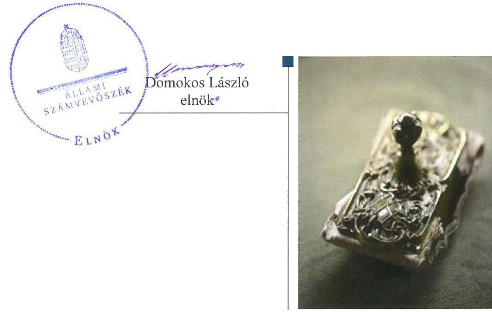
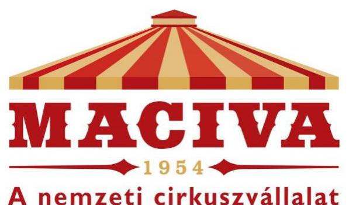
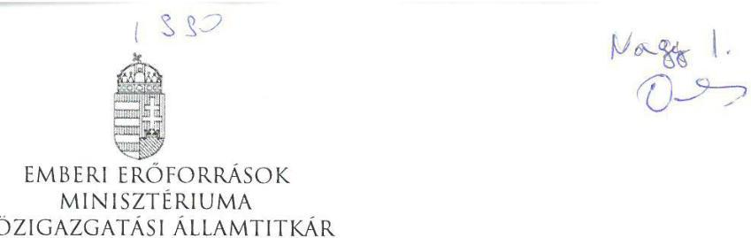
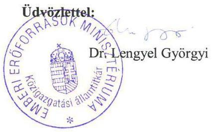

# Jelentés 

## Állami tulajdonú gazdasági társaságok

Az állami tulajdonban (résztulajdonban) lévő gazdálkodó szervezetek vagyonmegőrzési és gazdálkodási tevékenységének ellenőrzése - MACIVA Magyar Cirkusz és Varieté Nonprofit Kft. 2017. november hó 28. nap

---

# AZ ELLENŐRZÉST FELÜGYELTE:

DR. NAGY IMRE felügyeleti vezető

# AZ ELLENŐRZÉST VEZETTE ÉS A VÉGREHAJTÁSÁÉRT FELELŐS:

GELENCSÉR ZSOLT ellenőrzésvezető

# A PROGRAM ÖSSZEÁLLÍTÁSÁÉRT FELELŐS:

JANIK JÓZSEF LÁSZLÓ osztályvezető

---

**IKTATÓSZÁM:** V-1373-114/2016.

**TÉMASZÁM:** 2407

**ELLENŐRZÉS-AZONOSÍTÓ SZÁM:** V075944

---

Jelentéseink az Országgyűlés számítógépes hálózatán és az Interneten a www.asz.hu címen is olvashatóak.

---

# TARTALOMJEGYZÉK 

■ ÖSSZEGZÉS ..... 5
■ AZ ELLENŐRZÉS CÉLJA ..... 6
■ AZ ELLENŐRZÉS TERÜLETE ..... 7
■ AZ ELLENŐRZÉS HÁTTERE, INDOKOLTSÁGA ..... 8
■ A JELENTÉS LÉNYEGES KÉRDÉSKÖREI ..... 9
■ ELLENŐRZÉS HATÓKÖRE ÉS MÓDSZEREI ..... 10
■ MEGÁLLAPÍTÁSOK ..... 12
■ JAVASLATOK ..... 18
■ MELLÉKLETEK ..... 19
I. sz. melléklet: Értelmező szótár ..... 19
■ FÜGGELÉK: ÉSZREVÉTELEK ..... 25
■ RÖVIDÍTÉSEK JEGYZÉKE ..... 27

---

.

---

# ÖSSZEGZÉS 

Az Emberi Erőforrások Minisztériuma és a Magyar Nemzeti Vagyonkezelő Zrt. tulajdonosi jogait a MACIVA Magyar Cirkusz és Varieté Nonprofit Kft. felett a 2012-2015. években szabályszerűen gyakorolta. A MACIVA Magyar Cirkusz és Varieté Nonprofit Kft. elkészítette belső szabályzatait, működését megfelelően szabályozta. A vagyonkezelt vagyont nyilvántartásaiban nem különítette el, így átláthatósága sérült. A beszámolási és adatszolgáltatási kötelezettségét az előírásoknak megfelelően teljesítette, az adatok védelmét és átláthatóságát biztosította. Vagyongazdálkodása szabályszerű volt.

## Az ellenőrzés társadalmi indokoltsága

Az Állami Számvevőszék kiemelt célja, hogy az államháztartáson kívülre nyújtott költségvetési támogatások és ingyenes vagyonjuttatások, valamint az államháztartáson kívül működő feladatellátó rendszerek ellenőrzéseivel hozzájáruljon ahhoz, hogy a közpénzeket az államháztartáson kívül működő szervezetek is átlátható, rendezett módon használják fel a szerződésben átvállalt állami feladatok ellátása, továbbá az állami vagyon szerződésben vállalt átlátható, hatékony, költségtakarékos működtetése, értékének megőrzése, állagának védelme, értéknövelő használata, hasznosítása és gyarapítása érdekében.

Magyarországon az intézmény-centrikus állami feladat-ellátás, állami vagyon gazdálkodás jellemző a költségvetésen kívüli feladatellátás térnyerése mellett. Ennek szereplői a nonprofit szervezetek, az önkormányzati vagy állami tulajdonú gazdasági társaságok is. Ezen belül kiemelt jelentőségű számos állami tulajdonú gazdasági társaság működése abból a szempontból is, hogy gazdálkodásának egyes elemei befolyásolják a kormányzati szektor hiányát és az államadósságot. A MACIVA NKft. ${ }^{1}$ széles rétegeket megszólító cirkuszelőadói tevékenységének köszönhetően kiemelten közérdeklődésre számot tartó gazdasági társaság.

## Főbb megállapítások, következtetések, javaslatok

A tulajdonosi joggyakorlók jogaikat szabályszerűen gyakorolták a részesedésük felett, a MACIVA NKft. kezelésében lévő nemzeti vagyon feletti tulajdonosi joggyakorlás szintén megfelelt az előírásoknak.

A MACIVA Nkft. működésének szabályozottsága a jogszabályokban foglalt követelményeknek megfelelt, ugyanakkor nem rögzítette a kezelt vagyon elkülönített nyilvántartására vonatkozó rendelkezéseket, és számviteli nyilvántartásaiban sem kezelte azokat az előírásoknak megfelelően.

A MACIVA Nkft. bevételeinek, az anyagjellegű ráfordítások és az egyéb, rendkívüli és pénzügyi műveletek ráfordításainak elszámolása szabályszerű volt. A MACIVA Nkft. által végzett szolgáltatásokhoz kapcsolódóan az önköltséget az előírásoknak megfelelően állapították meg. A MACIVA Nkft. teljesítette a tulajdonosi joggyakorló és a jogszabályok által előírt tervezési, beszámolási, adatszolgáltatási kötelezettségét.

A MACIVA Nkft. vagyongazdálkodása megfelelt az előírásoknak.
Az Állami Számvevőszék jelentésében a MACIVA Magyar Cirkusz és Varieté Nonprofit Kft. ügyvezetőjének négy javaslatot fogalmazott meg, amelyekre az érintettnek 30 napon belül intézkedési tervet kell készítenie.

---

# AZ ELLENŐRZÉS CÉLJA 

Az ellenőrzés célja annak értékelése, hogy a tulajdonosi jogok gyakorlása szabályszerű volt-e; a gazdálkodó szervezet szabályozottsága, gazdálkodása és vagyongazdálkodási tevékenysége megfelelt-e a jogszabályi és a tulajdonosi előírásoknak; biztosítva volt-e a közfeladatok átláthatósága és elszámoltathatósága érdekében a közszolgáltatás díjának megalapozottsága szabályszerű önköltségszámítással; a vagyonváltozást eredményező döntések esetében a tulajdonosi jogok gyakorlója és a gazdálkodó szervezet szabályszerűen jártak-e el.

---

# **AZ ELLENŐRZÉS TERÜLETE**

## **MACIVA Magyar Cirkusz és Varieté Nonprofit Kft.**

Az MNV Zrt.2 és az OKM3 között a Vtv.4 29.§ (5) bek. alapján 2008. június 30-án létrejött megállapodás5 értelmében nyolc kulturális társaság – köztük a MACIVA Kht.6, majd 2009. évtől a MACIVA Nkft.– tulajdonosi jogait az ellenőrzött időszak kezdetétől, 2012. január 1-jétől az OKM jogutódaként a NEFMI7, majd névváltozást követően az EMMI8 gyakorolta. A MACIVA NKft. célja a társadalom művészeti célú közös szükségletei egy meghatározott szegmensének kielégítése, a magyar cirkuszművészet örökségének ápolása és fenntartása, amelynek keretében fenntartja a Fővárosi Nagycirkuszt. Céljai megvalósítása érdekében a MACIVA Nkft. megalapította és fenntartja a Baross Imre Artistaképző Szakközépiskola és Szakiskolát. A MACIVA Nkft. ügyvezetőjének személye az ellenőrzött időszakban kétszer változott, a jelenlegi ügyvezető feladatait 2015. július 31-től látja el. A MACIVA Nkft. törzstőkéje 15 mFt, az ellenőrzött időszakban nem változott. A MACIVA Nkft. 2012. év elejétől 2012. október 12-ig a KVI9-vel korábban kötött VSZ110 alapján 107,2 mFt bruttó értékű, majd 2012. október 12-től az MNV Zrt.-vel aláírt VSZ111 alapján 287,9 mFt bruttó értékű állami vagyont kezelt. A MACIVA Nkft.-nek kapcsolt vállalkozása nem volt, más gazdasági társaságban nem rendelkezett részesedéssel. A MACIVA Nkft. az ellenőrzött időszakban nem volt kormányzati szektorba sorolt gazdálkodó szervezet. A MACIVA NKft. főbb adatait az 1. táblázat tartalmazza.

1. táblázat

|   | 2012. | 2013. | 2014. | 2015. | 2016/2017
(%)  |
| --- | --- | --- | --- | --- | --- |
|  Értékesítés nettó árbevétele | 469,1 | 599,7 | 749,4 | 699,9 | 149,2  |
|  Mérleg főösszeg | 802,6 | 1059,6 | 1281,6 | 1354,1 | 168,7  |
|  Mérleg szerinti eredmény | -8,8 | 143,9 | 280,3 | 77,3 | -  |
|  Saját tőke összege | 332,2 | 476,1 | 756,4 | 833,7 | 251,0  |
|  Követelések | 38,8 | 42,0 | 45,1 | 39,2 | 101,0  |
|  Foglalkoztatottak átlagos állományi létszáma (fő) | 70,0 | 71,0 | 78,0 | 78,0 | 111,4  |

*Forrás: A MACIVA NKft. 2012-2015. éves beszámolói*

---

# AZ ELLENŐRZÉS HÁTTERE, INDOKOLTSÁGA 

Az állami tulajdonú gazdálkodó szervezetek ellenőrzése kiemelten fontos a nemzeti vagyon megőrzése, megóvása érdekében. Gazdálkodásuk jellemzően a közérdeklődés és a média figyelmének középpontjában áll, amihez hozzájárul a gazdálkodásuk körébe tartozó - közvetlen vagy közvetett állami tulajdonú - vagyon nagysága, illetve az általuk ellátott közszolgáltatások minősége és hatékonysága. Az ellenőrzés feladata a közvagyonnal biztosított közfeladat ellátással kapcsolatban a közpénzek átláthatósága, nyilvánossága érdekében a jogszabályokban, belső szabályzatokban megfogalmazott előírások érvényesülésének az állami tulajdonban lévő gazdálkodó szervezetek vagyonérték megőrzési és gazdálkodási tevékenységének értékelése. Az ellenőrzés rámutathat az állami tulajdonú gazdálkodó szervezetek gazdálkodási tevékenységével jó gyakorlatokra és szabálytalanságokra. Felhívhatja a figyelmet a jogszabályi követelmények teljesítéséhez szükséges feltételek hiányosságaira, hozzájárulhat az államháztartáson kívüli, de (közvetlenül vagy közvetve) állami vagyont használó gazdálkodó szervezetek tevékenységének átláthatóságához. Ellenőrzésünk eredményeképpen javaslatainkkal, megállapításainkkal hozzájárulhatunk a nemzeti vagyonnal való gazdálkodás átláthatóságának, elszámoltathatóságának javításához.

---

# A JELENTÉS LÉNYEGES KÉRDÉSKÖREI 

1. A tulajdonosi jogok gyakorlása szabályszerű volt-e?
2. A MACIVA Nkft. működésének szabályozottsága megfelelt-e az előírásoknak?
3. A MACIVA Nkft.-nél a pénzügyi-számviteli, adatszolgáltatási és ellenőrzési feladatok ellátása szabályszerű volt-e?
4. A MACIVA Nkft. vagyongazdálkodása szabályszerű volt-e?

---

# ELLENŐRZÉS HATÓKÖRE ÉS MÓDSZEREI 

## Az ellenőrzés típusa

Megfelelőségi ellenőrzés.

## Az ellenőrzött időszak

2012. január 1-jétől 2015. december 31-ig.

## Az ellenőrzés tárgya

Állami tulajdonban (résztulajdonban) lévő gazdasági társaság gazdálkodása, kiemelten vagyongazdálkodási tevékenysége, a tulajdonosi jogok gyakorlása, továbbá a kormányzati szektorba sorolt gazdasági társaság gazdálkodásának a kormányzati szektor hiányára és az államadósságra befolyással bíró elemei.

Az ellenőrzés kiterjed minden olyan körülményre és adatra, amely az ÁSZ jogszabályban meghatározott feladatainak teljesítéséhez, valamint a program végrehajtása folyamán felmerült újabb összefüggések feltárásához szükséges.

## Az ellenőrzött szervezet

MACIVA Magyar Cirkusz és Varieté Nonprofit Kft., Magyar Nemzeti Vagyonkezelő Zrt., Emberi Erőforrások Minisztériuma.

## Az ellenőrzés jogalapja

Az ellenőrzés jogalapját az ÁSZ tv. 1. § (3) bekezdése és 5. § (3)-(5) bekezdése képezi.

## Az ellenőrzés módszerei

Az ellenőrzést a nemzetközi standardokat irányadónak tekintve az ellenőrzési program ellenőrzési kérdései, az ellenőrzött időszakban hatályos jogszabályok, az ellenőrzés szakmai szabályok és módszertanok figyelembe vételével végeztük.

Az ellenőrzés lefolytatásához az ellenőrzött szervezetek tanúsítványok kitöltésével, valamint az ÁSZ ${ }^{12}$ által kért dokumentumok megküldésével szolgáltattak adatokat. A rendelkezésre bocsátott adatok, információk

---

kontrollja helyszíni ellenőrzés keretében történt. A bevételek és ráfordítások elszámolása, valamint a vagyonnyilvántartás terén a szabályszerű működést véletlen mintavétellel ellenőriztük. A mintavétellel ellenőrzött területek esetében minden egyes tétel vonatkozásában a szabályszerűségre vonatkozó kérdéseket tettünk fel, amelyek eredménye összesítésre került.

A jogszabályoknak és a belső előírásoknak megfelelőnek tekintettük az adott területet, amennyiben a minta ellenőrzésének eredménye alapján 95%-os bizonyossággal a teljes sokaságban a hibaarány kisebb volt, mint 10%, nem megfelelőnek értékeltük, ha a hibaarány a 10%-ot meghaladta. Kockázatot, illetve magas kockázatot jeleztünk, amennyiben egy adott terület vonatkozásában a minta alapján a teljes sokaságban nem volt egyértelműen biztosított a jogszabályoknak és a belső szabályzatoknak megfelelő működés. A ráfordítások elszámolására és a vagyon-nyilvántartásra vonatkozó véletlen mintavételt kockázati alapú kiválasztással egészítettük ki, amelynek során évente a három legnagyobb összegű tételt választottuk ki.

---

# 1. A tulajdonosi jogok gyakorlása szabályszerű volt-e? 

## Összegző megállapítás

### 1.1. számú megállapítás

## A tulajdonosi jogok gyakorlása szabályszerű volt.

A társaság feletti tulajdonosi joggyakorlás megfelelt az előírásoknak.

A MACIVA NKFT. feletti tulajdonosi joggyakorlást az ellenőrzött időszakban a tulajdonosi joggyakorlók szabályszerűen alakították ki. 2012. évben az Nvtv. ${ }^{13}$ 2012. június 30-án hatályba lépett rendelkezése szerint gazdasági társaságban fennálló állami tulajdonban lévő társasági részesedés nem lehetett vagyonkezelés tárgya, így a tulajdonosi jogok gyakorlása ekkortól az MNV Zrt. és az OKM között létrejött, társasági részesedések hasznosításának átengedéséről szóló megállapodás alapján történt. A vonatkozó Megbízási szerződést ${ }^{14}$ az Nvtv. 18.§ (7) bekezdésének megfelelően az arra jogosultak aláírták. Az MNV Zrt. ez alapján évente adott meghatalmazást az EMMI részére a joggyakorlásának folytatásához. A tulajdonosi joggyakorlás az FB${ }^{15}$, az ügyvezető és a könyvvizsgáló tevékenységéhez kapcsolódóan is szabályszerű volt. Az FB a Taktv. ${ }^{16} 4 . \S$ (2) bekezdésben előírtaknak megfelelően a MACIVA NKft-nél működött, az Alapító okirat ${ }_{1-8}$-ban meghatározott feladatokat látta el. Az FB és a könyvvizsgáló - a Gt.-ben, valamint a Ptk.-ban foglaltaknak megfelelően - minden ellenőrzött évben tárgyalta, illetve véleményezte az éves beszámolókat. A könyvvizsgáló a beszámolókról független könyvvizsgálói véleményében hitelesítő záradékot adott, egyéb, a tulajdonosi joggyakorló intézkedését igénylő jelzéssel, figyelemfelhívással nem élt.

A TULAJDONOSI JOGGYAKORLÓ az Alapító okirat ${ }_{1-8} 6.2$. pontjában foglaltak szerint minden évben jóváhagyta a MACIVA Nkft. éves beszámolóit, közhasznúsági jelentéseit. Az éves beszámolókat jóváhagyó döntésekhez - a Gt ${ }^{17} .35 . \S$ (3) bekezdésében és a Ptk ${ }^{18} .3: 120 . \S$ (2) bekezdésében foglaltaknak megfelelően - rendelkezésre álltak az FB
 és a könyvvizsgáló határozatai, illetve írásos jelentései. A tulajdonosi joggyakorló az ellenőrzött időszakban a Tak. tv. 5. § (3) bekezdésében előírt javadalmazási szabályzat ${ }_{1-2}{ }^{19}$-ot alapítói határozatokkal elfogadta.

## A MACIVA Nkft. kezelésében lévő nemzeti vagyon feletti tulajdonosi joggyakorlás szabályszerű volt.

VAGYONNYILVÁNTARTÁSI szabályzat ${ }_{1-2}{ }^{20}$-át az MNV Zrt. a Vtv.-ben és az Nvtv.-ben előírt vagyonnyilvántartásához elkészítette, amelyet a VSZ ${ }_{1-2}$-ben a MACIVA Nkft.-re kiterjesztette. A 2013. július 29-ig hatályos Vagyonnyilvántartási szabályzat ${ }_{1}$ 1.2.6. pontjában a Vhr. ${ }^{21}$-ben foglaltaknak megfelelően előírták a MACIVA Nkft.-nek, hogy a számviteli politikáját és a nyilvántartásait köteles úgy kialakítani és vezetni, hogy azok biztosítsák az adatszolgáltatás pontosságát és ellenőrizhetőségét. A VSZ ${ }_{1-2}$

---

rögzíti - a Vhr. szerinti vagyonnyilvántartás egységessége biztosításához -, hogy a MACIVA Nkft., mint vagyonkezelő az MNV Zrt. mindenkori Vagyonnyilvántartási szabályzatát megismerte és az abban foglaltakat magára nézve kötelezőnek ismerte el.

AZ MNV ZRT. a VSZ ${ }_{2}$ aláírásával fogadta el a MACIVA Nkft. 2012-2014. évekre vonatkozó beruházási tervét a VSZ 2 4.3.2. pontjában, a 2015. évi beruházási tervet az EMMI, mint az MNV Zrt. meghatalmazottja fogadta el.

# 2. A MACIVA Nkft. működésének szabályozottsága megfelelt-e az előírásoknak? 

Összegző megállapítás

A MACIVA Nkft. működésének szabályozottsága - a kezelt vagyon elkülönített nyilvántartására vonatkozó rendelkezések kivételével - megfelelt az előírásoknak.

A MACIVA NKFT. GAZDÁLKODÁSI RENDJÉNEK szabályozására a Számviteli politika ${ }_{1-4}{ }^{22}$-ben, a Számlarend ${ }_{1-2}{ }^{23}$-ban, a számviteli politika keretében elkészítendő egyéb számviteli szabályzatokban és egyéb szabályzatokban került sor. A szabályzatok elkészítéséért és hatályba léptetéséért a Számv. tv. ${ }^{24}$ 14. § (12) bekezdése és a 161. § (4) bekezdése, illetve az Alapító okirat alapján az ügyvezető volt felelős. Az SZMSZ ${ }_{1-2}{ }^{25}$, a Befektetési szabályzat ${ }^{26}$ elfogadását azonban az Alapító okirat 6.2. pontja az Alapító hatáskörében megtartotta.

A MACIVA NKft. a Számv. tv. 14.§ (5) bekezdésében foglaltaknak megfelelően a Számviteli politika ${ }_{1-4}$ keretében elkészítette az eszközök és a források leltározási és leltárkészítési szabályzat ${ }_{1-2}{ }^{27}$-át, az eszközök és a források értékelési szabályzat ${ }_{1-2}{ }^{28}$-át; az önköltségszámítási szabályzat ${ }_{1-2}{ }^{29}$-ot; a pénzkezelési szabályzat ${ }_{1-3}{ }^{30}$-ot.

A LELTÁROZÁSI ÉS LELTÁRKÉSZÍTÉSI szabályzat ${ }_{1-2}$ VI.2. pontjában rögzített a tárgyi eszközök (ingatlanok, építmények, lealapozott gépek és berendezések) 5 évenkénti mennyiségi felvétellel történő leltározási kötelezettsége ugyanakkor nem felelt meg a Számv. tv. 69. § (3) bekezdésének, mely szerint a társaság a mennyiségi nyilvántartásban szereplő eszközeiről legalább háromévente, mennyiségi felvétellel történő leltározással köteles meggyőződni.

A VAGYONKEZELÉSBE VETT ESZKÖZÖK vagyonkezelési szerződés szerinti elkülönített nyilvántartási szabályai nem kerültek rögzítésre a MACIVA Nkft. számviteli politikájában és a kapcsolódó szabályzatokban. A VSZ 17.10.1 és a VSZ 12.2 pontja, valamint a Vhr. 17. § (1) bekezdése ellenére a gazdálkodó szervezet számviteli politikájában és a kapcsolódó szabályzataiban nem írta elő a vagyonkezelésébe adott vagyon elkülönített nyilvántartási rendjét, azt, hogy tételesen tartalmazza az eszközök könyv szerinti bruttó és nettó értékét, az elszámolt értékcsökkenés összegét, az azokban bekövetkezett változásokat. A VSZ 12.1. pontjában előírtak ellenére nem került meghatározásra a vagyonkezelésbe vett va-

---

gyon használatából, működtetéséből származó bevételek, költségek, ráfordítások elkülönített nyilvántartásának rendje, továbbá az a követelmény sem, hogy a nyilvántartás tartalmazza a vagyon elsődleges rendeltetése szerinti közfeladat megjelölését.

# 3. A MACIVA Nkft.-nél a pénzügyi-számviteli, adatszolgáltatási és ellenőrzési feladatok ellátása szabályszerű volt-e? 

Összegző megállapítás

A MACIVA NKft. bevételeinek és ráfordításainak elszámolása - a beruházások és az értékcsökkenés elszámolása kivételével - megfelelt az előírásoknak. Az adatszolgáltatási és ellenőrzési feladatok ellátása megfelelt az előírásoknak.
3.1. számú megállapítás

A MACIVA NKft. bevételeinek, anyagjellegű ráfordításainak és egyéb, rendkívüli és pénzügyi műveletek ráfordításainak elszámolása szabályszerű volt. A beruházások és az értékcsökkenés elszámolása nem volt szabályszerű.

A BEVÉTELEK ÉS A RÁFORDÍTÁSOK elszámolása, ide nem értve az értékcsökkenés elszámolását, szabályszerű volt. A MACIVA NKft. az értékesítés nettó árbevételének számviteli elszámolása, az egyéb bevételeket és a pénzügyi műveleteket érintő gazdasági események könyvelése, az anyagjellegű ráfordítások, az egyéb és rendkívüli ráfordítások, valamint a személyi jellegű ráfordítások elszámolása során betartotta a Számv. tv.-ben foglaltakat és az elkészített Számlarendjének ${ }_{1-2}$ megfelelően könyvelte a gazdasági eseményeket.

A BERUHÁZÁSOK ÉS FELÚJÍTÁSOK elszámolása nem volt szabályszerű, mivel a bizonylatok elszámolása, a bekerülési érték meghatározása nem felelt meg a Számv. tv. 26. § (7) bekezdésének. A bizonylatok kontírozása során előfordult, hogy a kontírozás nem történt meg, vagy rossz helyre történt, így az nem felelt meg a Számv. tv. 167.§ (1) bekezdésének h) pontban foglalt előírásainak. A könyvelés alapját jelentő állományba vételi bizonylatok a Számv. tv. 165. § (1) bekezdésben foglalt követelmények ellenére nem álltak rendelkezésre, és az állományba vétel, valamint az eszközök besorolása nem felelt meg a Számv. tv. 23. § (3)-(4) bekezdésnek.

AZ ÉRTÉKCSÖKKENÉS ELSZÁMOLÁSA nem volt szabályszerű, mivel az évenkénti értékcsökkenések összegének megállapítása nem az üzembehelyezési okmány szerinti érték alapján, vagy nem megfelelő leírási kulccsal történt, ezáltal ezzel a MACIVA NKft. megsértette a Számv. tv. 52. § (1), a 63.§ (1) bekezdésében, továbbá a 80.§ (1) a) pontjában foglalt előírásokat.

Az önköltségszámítás rendjének kialakítása és az önköltség megállapítása az előírásoknak megfelelően történt.

AZ ÖNKÖLTSÉGSZÁMÍTÁSI SZABÁLYZAT ${ }_{1-2}$-t a MACIVA NKft. a Számv. tv. 14. § (5) bekezdés c) pontjának megfelelően a

---

2012-2015. évekre elkészítette. Az önköltségszámítás rendjét tartalmazó szabályzat összhangban volt a jogszabályokkal. Az Önköltségszámítási szabályzat ${ }_{1-2}$-ben meghatározták azt a számítási módszertant, ami a Számv. tv. 51. § (2) bekezdésének megfelelően az elvégzett, nyújtott szolgáltatás bekerülési értékét képező tételeket tartalmazta.

A MACIVA NKft. az Önköltségszámítási szabályzat ${ }_{1-2}$-ben foglaltaknak megfelelően az éves Üzleti terv ${ }_{1-6}$ készítése során elő-, illetve az éves beszámoló közhasznúsági jelentésének, illetve mellékletének készítésével egyidőben utókalkulációt végzett az egyes műsorok tekintetében.

# 3.3. számú megállapítás 

2. táblázat

## VAGYONKEZELT INGATLANOK (M FT)

| Év | Nettó érték | Használhatósági   fok |
| :-- | :-- | :--: |
| 2012. | 210,2 | 99,6 |
| 2013. | 222,1 | 97,6 |
| 2014. | 217,6 | 95,6 |
| 2015. | 213,0 | 93,6 |

Forrás: A Társaság 2012-2015 éves beszámolói

## A MACIVA Nkft. teljesítette a tervezési, beszámolási, adatszolgáltatási kötelezettségét.

## A TULAJDONOSI JOGGYAKORLÓ A MACIVA

NKFT. tájékoztatási és adatszolgáltatási kötelezettségét az Alapító okirat ${ }_{1-7}{ }^{31}$-ben, a Közhasznú szerződés ${ }^{32}$-ben, és a Közszolgáltatási szerződés ${ }^{33}{ }_{1-2}$-ben írta elő. A MACIVA NKft. ügyvezető igazgatója ${ }^{34}$ eleget tett az Alapító okirat ${ }_{1-7}$-ben és a vonatkozó jogszabályokban foglalt adatszolgáltatási kötelezettségének, miszerint az ügyvezető minden üzleti év végén, határidőre, a jogszabályoknak megfelelő módon elkészíti az éves beszámolóját, a közhasznúsági mellékletét, amit az alapító rendelkezésére bocsát. A MACIVA NKft. a közhasznú jelentés készítésének rendjét a Közhasznúsági jelentés készítésének rendjében ${ }^{35}{ }_{1-2}$ szabályozta, és a jelentéseket ennek megfelelően elkészítette, közzétette.

## A MACIVA NKFT. TERVEZÉSI, BESZÁMOLÁSI,

ADATSZOLGÁLTATÁSI feladatait az SZMSZ ${ }_{1-2}$ határozta meg. Az SZMSZ ${ }_{1-2}$ II. 2. pontjában határozták meg, hogy az ügyvezető igazgató feladata a tervezési feladatok keretében a Közhasznú szerződésben meghatározott időpontig gazdasági programot is magában foglaló üzleti és művészeti terv készítése. Az ügyvezető igazgató az éves üzleti tervek elkészítésével eleget tett az SZMSZ ${ }_{1-2}$-ben foglalt tervezési kötelezettségének. A MACIVA Nkft. ügyvezető igazgatója teljesítette a legalább negyedévente előírt adatszolgáltatási kötelezettségét a tulajdonosi joggyakorló felé.

A VAGYONKEZELÉSBE VETT eszközökről a MACIVA NKft. a VSZ 7.10.1 pontjának eleget téve adatszolgáltatási kötelezettségét teljesítette. Az OKM a Közhasznú szerződésben, illetve az EMMI a Közszolgáltatási szerződés ${ }_{1-2}$-ben meghatározta, hogy a MACIVA NKft. a tárgyévben nyújtott költségvetési támogatás mértékét, ütemezését a támogató által elfogadott üzleti terv alapján, külön támogatási szerződésekben rögzítik. Az üzleti tervek tartalmi előírásait a támogató meghatározta.

A MACIVA Nkft. az Info tv. 30.§ (6) bekezdése értelmében előírt közérdekű adatok megismerésére irányuló igények teljesítésének rendjét rögzítő szabályzattal rendelkezett. A MACIVA Nkft.-nél a közérdekű adatok nyilvánosságra hozatala biztosított volt, de nem tette közzé hiánytalanul (a vezető állású munkavállaló neve, beosztása, pénzbeli juttatása, végkielégítése, felmondási ideje, közbeszerzések 2015. évi adatai vonatkozásában) a Tak. tv. ${ }^{36}$ 2.§-ban előírt adatokat. A MACIVA Nkft. intézkedett az ellenőrzések javaslatainak végrehajtásáról. A MACIVA NKft. nem tartozik a Bkr. hatálya alá, így belső ellenőrzés működtetésére nem volt kötelezett a 2012-

---

2015. években, ugyanakkor belső ellenőrzést működtetett, amely tevékenysége keretében a pénztárat, leltárt ellenőrizte. Az ellenőrzésekre intézkedési terveket is kidolgoztak.

# 4. A MACIVA Nkft. vagyongazdálkodása szabályszerű volt-e? 

Összegző megállapítás

## 4.1. számú megállapítás

4.2. számú megállapítás

A MACIVA Nkft. vagyongazdálkodása a kezelt vagyon elkülönített nyilvántartására vonatkozó kötelezettségek teljesítése kivételével szabályszerű volt.

A MACIVA Nkft. kialakította és szabályozta a saját vagyon értékének megőrzését, gyarapítását szolgáló, szabályszerű vagyongazdálkodás feltételeit.

A MACIVA NKFT. ÜZLETI TERV ${ }^{37}$ 1-5-öt az ellenőrzött időszak minden évében készített, melyet a tulajdonosi jogok gyakorlója az Alapító okirat 6.2.10. pontjának megfelelően elfogadott. A MACIVA Nkft. ezen túlmenően középtávú stratégiai fejlesztési tervvel is rendelkezett 2011-2013. évekre vonatkozóan. Az MNV Zrt.-vel kötött VSZ 4.3.2. pontja rendelkezett a kezelt vagyonon, ingatlanokon előre meghatározott ütemterv szerinti felújításokról és beruházásokról.

A MACIVA NKFT. BELSŐ SZABÁLYZATAIBAN a jogszabályi és tulajdonosi előírásoknak megfelelően határozta meg a saját vagyonával való gazdálkodásának rendjét, feladat- és hatásköreit, felelősségi viszonyait.

A MACIVA Nkft. a Számv. tv. szerint tartotta nyilván saját vagyonát, ugyanakkor a vagyonkezelt vagyon elkülönített nyilvántartását a VSZ $_{1-2}$-ben előírtakkal ellentétben nem alakította ki.

A VSZ $_{1-2}$ ALAPJÁN a MACIVA Nkft. köteles volt a kincstári vagyonnal folytatott vállalkozási tevékenységből származó bevételeit és költségeit elkülöníteni, valamint eszköznyilvántartásaiban is elkülönített módon kezelni az eszközöket, azonban erre vonatkozó előírást a számviteli politikája, számlarendje nem tartalmazott, ami a gazdálkodás átláthatóságát csökkentette. Az ellenőrzött időszakban az éves beszámolót alátámasztó leltárfelvételek és leltárkiértékelések megtörténtek.

A MACIVA Nkft. az előírásoknak megfelelően gondoskodott a saját és kezelésbe vett vagyon értékének megőrzéséről.

A MACIVA NKFT. saját vagyona az ellenőrzött időszakban nőtt, a VSZ 7.2 pontjában előírt, a vagyonkezelésbe vett vagyon előírt visszapótlási kötelezettségének az ellenőrzött időszakban eleget tett. A 2013. évben a Fővárosi Nagycirkuszon végrehajtott beruházás elegendő fedezetet nyújtott a teljes ellenőrzött időszakra vonatkozó visszapótlási kötelezettségekre.

---

# 4.4. számú megállapítás 

A MACIVA Nkft.-nél a saját vagyon változását eredményező döntések megfeleltek az előírásoknak.

A MACIVA NKFT. saját vagyonának más személyek felé történő hasznosításával kapcsolatos döntésekről az Alapító okirat külön nem rendelkezett, így a vagyonhasznosítási döntések meghozatalára az ügyvezető volt jogosult.

A vagyontárgyak értékesítésére, selejtezésére vonatkozóan a tulajdonos nem vont magához jogokat, az ilyen tranzakciók engedélyezésére előterjesztések a tulajdonos felé nem is készültek, a döntéseket minden
 esetben az arra jogosult ügyvezető hozta meg.
4.5. számú megállapítás

A MACIVA NKft.-nél a vagyonkezelésbe vett vagyon változását eredményező döntések megfeleltek a jogszabályi és a belső előírásoknak.

A MACIVA NKft. a vagyonkezelésbe vett vagyon értékének, állagának megóvása, megőrzése és gyarapítása során a vagyongazdálkodási döntések előtt a tulajdonosi jogokat gyakorlót tájékoztatta, előzetes véleményét és javaslatát megküldte, írásbeli engedélyét előzetesen megkérte.

---

# JAVASLATOK 

Az ÁSZ tv. 33. § (1) bekezdésében foglaltak értelmében az ellenőrzött szervezet vezetője köteles a jelentésben foglalt megállapításokhoz kapcsolódó intézkedési tervet összeállítani és azt a jelentés kézhezvételétől számított 30 napon belül az ÁSZ részére megküldeni. Amennyiben az ellenőrzött szervezet vezetője nem küldi meg határidőben az intézkedési tervet, vagy továbbra sem elfogadható intézkedési tervet küld, az Állami Számvevőszék elnöke az ÁSZ tv. 33. § (3) bekezdése a) és b) pontjaiban foglaltakat érvényesítheti.

## MACIVA Magyar Cirkusz és Varieté Nonprofit Kft. Ügyvezetőjének

1. Intézkedjen a leltározási és leltárkészítési szabályzat módosításáról a jogszabályi rendelkezés szerint.
(2. sz. megállapítás 3. bekezdései alapján)
2. Intézkedjen a vagyonkezelésbe vett eszközök vagyonkezelési szerződés szerinti elkülönített nyilvántartásának szabályozásáról a jogszabály előírásának megfelelően.
(2. sz. megállapítás 4. bekezdés második mondata alapján)
3. Intézkedjen a beruházások és felújítások, továbbá az értékcsökkenés számviteli elszámolása tekintetében a jogszabályi előírások betartásáról.
(3.1. sz. megállapítás 2. és 3. bekezdése alapján)
4. Intézkedjen a közzétételi kötelezettség jogszabályi előírásoknak megfelelő teljes körű teljesítéséről.
(3.3. sz. megállapítás 4. bekezdés 2. mondata alapján)

---

# MELLÉKLETEK 

## I. SZ. MELLÉKLET: ÉRTELMEZŐ SZÓTÁR

állami vagyon
a) Az állam tulajdonában lévő dolog, valamint a dolog módjára hasznosítható természeti erő,
b) az a) pont hatálya alá nem tartozó mindazon vagyon, amely vonatkozásában törvény az állam kizárólagos tulajdonjogát nevesíti,
c) az állam tulajdonában lévő tagsági jogviszonyt megtestesítő értékpapír, illetve az államot megillető egyéb társasági részesedés,
d) az államot megillető olyan immateriális, vagyoni értékkel rendelkező jogosultság, amelyet jogszabály vagyoni értékű jogként nevesít.
Forrás: Vtv. 1. § (2) bekezdése
2012. november 10-től az állami vagyon fogalma kiegészül a következő ponttal:
e) az állam tulajdonában lévő pénzügyi eszközök

Forrás: Vtv. 1. § (2) bekezdése
2013. június 27-ig:

Az állami vagyont az MNV Zrt. maga kezeli, vagy szerződés - így különösen bérlet, haszonbérlet, megbízás - alapján központi költségvetési szervnek, természetes vagy jogi személynek, vagy jogi személyiséggel nem rendelkező gazdálkodó szervezetnek hasznosításra átengedi.
Forrás: Vtv. 23. § (1) bekezdése
2013. június 28-ától:

Az állami vagyonnal az MNV Zrt. maga gazdálkodik, vagy szerződés - így különösen bérlet, haszonbérlet, megbízás - alapján központi költségvetési szervnek, természetes vagy jogi személynek, vagy jogi személyiséggel nem rendelkező gazdálkodó szervezetnek hasznosításra átengedi, illetőleg vagyonkezelésbe, haszonélvezetbe adja.
Forrás: Vtv. 23. § (1) bekezdése
gazdasági társaság
Az a vállalkozó, amely egy másik vállalkozónál (a továbbiakban: leányvállalat) közvetlenül vagy leányvállalatán keresztül közvetetten meghatározó befolyást képes gyakorolni, mert az alábbi feltételek közül legalább eggyel rendelkezik:
a) a tulajdonosok (a részvényesek) szavazatának többségével (50 százalékot meghaladóval) tulajdoni hányada alapján egyedül rendelkezik, vagy
b) más tulajdonosokkal (részvényesekkel) kötött megállapodás alapján a szavazatok többségét egyedül birtokolja, vagy
c) a társaság tulajdonosaként (részvényesként) jogosult arra, hogy a vezető tisztségviselők vagy a felügyelő bizottság tagjai többségét megválassza vagy visszahívja, vagy
d) a tulajdonosokkal (a részvényesekkel) kötött szerződés (vagy a létesítő okirat rendelkezése) alapján - függetlenül a tulajdoni hányadtól, a szavazati aránytól, a megválasztási és visszahívási jogtól - döntő irányítást, ellenőrzést gyakorol.
Forrás: Számv. tv. 3. § (2) 1. pont
A Ptk. 3:88. § (1) bekezdése szerint „a gazdasági társaságok üzletszerű közös gazdasági tevékenység folytatására, a tagok vagyoni hozzájárulásával létrehozott, jogi személyiséggel rendelkező vállalkozások, amelyekben a tagok a nyereségből közösen részesednek, és a veszteséget közösen viselik".

---

állami vagyon hasznosítására kötött szerződés
állami vagyon használója
állami vagyon kezelője/vagyonkezelő
állami vagyon értékesítése
gazdálkodó szervezet

Az állami vagyon hasznosítására kötött szerződések elsődleges célja az állami vagyon hatékony működtetése, állagának védelme, értékének megőrzése, illetve gyarapítása, az állami és közfeladatok ellátásának elősegítése.
Forrás: Vtv. 23. § (2) bekezdése
Az a természetes vagy jogi személy, jogi személyiséggel nem rendelkező szervezet, aki, vagy amely törvény vagy szerződés alapján, bármely jogcímen (bérlet, haszonbérlet, használat stb.) állami vagyont birtokol, használ, szedi annak hasznait, hasznosít, ide nem értve a haszonélvezőt, a vagyonkezelőt és a tulajdonosi jogok gyakorlóját.
Forrás: Vhr. 1. § (7) a. pontja
2013. június 27-ig:

Az állami vagyont az MNV Zrt. maga kezeli, vagy szerződés - így különösen bérlet, haszonbérlet, megbízás - alapján központi költségvetési szervnek, természetes vagy jogi személynek, vagy jogi személyiséggel nem rendelkező gazdálkodó szervezetnek hasznosításra átengedi. Az állami vagyonra vonatkozóan az MNV Zrt. kizárólag az Nvtv-ben meghatározott személyekkel köthet vagyonkezelési szerződést.
Forrás: Vtv. 23. § (1), 27. § (1)
2013. június 28-ától:

Az állami vagyonnal az MNV Zrt. maga gazdálkodik, vagy szerződés - így különösen bérlet, haszonbérlet, megbízás - alapján központi költségvetési szervnek, természetes vagy jogi személynek, vagy jogi személyiséggel nem rendelkező gazdálkodó szervezetnek hasznosításra átengedi, illetőleg vagyonkezelésbe, haszonélvezetbe adja. Az állami vagyonra vonatkozóan az MNV Zrt. kizárólag az Nvtv-ben meghatározott személyekkel köthet vagyonkezelési szerződést.
Forrás: Vtv. 23. § (1), 27. § (1)
Állami vagyon tulajdonjogának bármely jogcímen történő, visszterhes átruházása.
Forrás: Vhr. 1. § (7) d) pont
2014. március 14-ig:

A Ptk. 138. § c) pontja szerint gazdálkodó szervezet: „az állami vállalat, az egyéb állami gazdálkodó szerv, a szövetkezet, a lakásszövetkezet, az európai szövetkezet, a gazdasági társaság, az európai részvénytársaság, az egyesülés, az európai gazdasági egyesülés, az európai területi együttműködési csoportosulás, az egyes jogi személyek vállalata, a leányvállalat, a vízgazdálkodási társulat, az erdő birtokossági társulat, a végrehajtói iroda, az egyéni cég, továbbá az egyéni vállalkozó."
2014. március 15-től:

A gazdasági társaság, az európai részvénytársaság, az egyesülés, az európai gazdasági egyesülés, az európai területi együttműködési csoportosulás, a szövetkezet, a lakásszövetkezet, az európai szövetkezet, a vízgazdálkodási társulat, az erdőbirtokossági társulat, az állami vállalat, az egyéb állami gazdálkodó szerv, az egyes jogi személyek vállalata, a közös vállalat, a végrehajtói iroda, a közjegyzői iroda, az ügyvédi iroda, a szabadalmi ügyvivői iroda, az önkéntes kölcsönös biztosító pénztár, a magánnyugdíjpénztár, az egyéni cég, továbbá az egyéni vállalkozó. Az állam, a helyi önkormányzat, a költségvetési szerv, az egyesület, a köztestület, valamint az alapítvány gazdálkodó tevékenységével összefüggő polgári jogi kapcsolataira is a gazdálkodó szervezetre vonatkozó rendelkezéseket kell alkalmazni.
Forrás: Ptk. 396. §

---

kapcsolt vállalkozás
kormányzati szektorba sorolt egyéb szervezet
közös vezetésű vállalkozás
közszolgáltatás
leányvállalat
meghatározó befolyás

Az anyavállalat és a leányvállalat és a közös vezetésű vállalkozások (fölérendelt anyavállalat esetében a minősítést a fölérendelt anyavállalat szempontjából kell elvégezni)
Forrás: Számv. tv. 3. § (2) 7. pont
Az a szervezet, amely az Áht. alapján nem része az államháztartásnak, azonban az Európai Közösséget létrehozó szerződéshez csatolt, a túlzott hiány esetén követendő eljárásról szóló jegyzőkönyv alkalmazásáról szóló 2009. május 25-i 479/2009/EK rendelet szerint a kormányzati szektorba tartozik. A nemzetgazdasági miniszter 2013. június 26-án megjelent Közleményben tette közé ezen szervezetek listáját
Az a gazdasági társaság, ahol egyrészt az anyavállalat (az anyavállalat konszolidálásba bevont leányvállalata), másrészt egy (vagy több) másik vállalkozás az 1. pont szerinti jogosultságokkal paritásos alapon - legalább 33 százalékos szavazati aránnyal - rendelkezik. A közös vezetésű vállalkozást a tulajdonostársak közösen irányítják.
Forrás: Számv. tv. 3. § (2) 3. pont
Az Ebktv. 40. § d) pontja a következőképpen határozza meg a közszolgáltatást: „szerződéskötési kötelezettség alapján a lakosság alapvető szükségleteinek ellátására irányuló szolgáltatás, így különösen a villamos energia-, gáz-, hő-, víz-, szennyvíz-, hulladékkezelési, köztisztasági, postai és távközlési szolgáltatás, továbbá a menetrend alapján közlekedő járművekkel végzett közforgalmú személyszállítás".
Az a gazdasági társaság, amelyre az anyavállalat meghatározó befolyást képes gyakorolni
Forrás: Számv. tv. 3. § (2) 2. pont
2014. március 14-ig:

A befolyással rendelkező akkor rendelkezik egy jogi személyben meghatározó befolyással, ha annak tagja, illetve részvényese és
a) jogosult e jogi személy vezető tisztségviselői vagy felügyelőbizottsága tagjai többségének megválasztására, illetve visszahívására, vagy
b) a jogi személy más tagjaival, illetve részvényeseivel kötött megállapodás alapján egyedül rendelkezik a szavazatok több mint ötven százalékával.
A meghatározó befolyás akkor is fennáll, ha a befolyással rendelkező számára az előzőek szerinti jogosultságok közvetett módon biztosítottak. A befolyással rendelkezőnek egy jogi személyben a szavazatok több mint ötven százalékával közvetett módon való rendelkezése vagy egy jogi személyben közvetetten fennálló meghatározó befolyása megállapítása során a jogi személyben szavazati joggal rendelkező más jogi személyt (köztes vállalkozást) megillető szavazatokat meg kell szorozni a befolyással rendelkezőnek a köztes vállalkozásban, illetve vállalkozásokban fennálló szavazatával. Ha a köztes vállalkozásban fennálló szavazatok mértéke az ötven százalékot meghaladja, akkor azt egy egészként kell figyelembe venni.
Forrás: Ptk. 685/B. § (2)-(3) bekezdések
2014. március 15-től:

A befolyással rendelkező akkor rendelkezik egy jogi személyben meghatározó befolyással, ha annak tagja vagy részvényese, és
a) jogosult e jogi személy vezető tisztségviselői vagy felügyelőbizottsága tagjai többségének megválasztására, illetve visszahívására; vagy
b) a jogi személy más tagjai, illetve részvényesei a befolyással rendelkezővel kötött megállapodás alapján a befolyással rendelkezővel azonos tartalommal szavaznak, vagy a befolyással rendelkezőn keresztül gyakorolják szavazati jogukat, feltéve, hogy együtt a szavazatok több mint felével rendelkeznek.
Forrás: Ptk. 8:2. § (2) bekezdés

---

MFB Zrt.
minősített többséget biztosító részesedés

MNV Zrt.
nemzeti vagyon
nemzeti vagyon hasznosítása
rábízott vagyon

Az MNV Zrt. melletti másik tulajdonosi joggyakorló szervezet az állami vagyon vonatkozásában, amely 2010. június 17-től gyakorol ilyen jogokat a rábízott állami tulajdonú társasági részesedések tekintetében.
A minősített befolyásszerző az ellenőrzött társaságban a szavazatok legalább hetvenöt százalékával rendelkezik. (2014. március 14-ig: Gt. 52. § (2), 2014. március 15-től: Ptk. 3:324. §)
Az állami vagyon felett, a Magyar Államot megillető tulajdonosi jogok és kötelezettségek összességét - a hatályos szabályozás szerint - az állami vagyon felügyeletéért felelős miniszter (jelenleg a nemzeti fejlesztési miniszter) gyakorolja. A miniszter feladatát nagy részben az MNV Zrt., mint tulajdonosi joggyakorló szervezet útján látja el.
a) az állam vagy a helyi önkormányzat kizárólagos tulajdonában álló dolgok,
b) az a) pont hatálya alá nem tartozó, állam vagy a helyi önkormányzat tulajdonában lévő dolog,
c) az állam vagy a helyi önkormányzat tulajdonában lévő pénzügyi eszközök, továbbá az államot vagy a helyi önkormányzatot megillető társasági részesedések,
d) az államot vagy a helyi önkormányzatot megillető bármely vagyoni értékkel rendelkező jogosultság, amelyet jogszabály vagyoni értékű jogként nevesít,
e) Magyarország határa által körbezárt terület feletti légtér,
f) az üvegházhatású gázok kibocsátási egységeinek kereskedelméről szóló törvény szerint kibocsátási egység és légiközlekedési kibocsátási egység, valamint az ENSZ Éghajlatváltozási Keretegyezménye és annak Kiotói Jegyzőkönyvének végrehajtási keretrendszeréről szóló törvény szerinti kiotói egység,
g) állami vagy helyi önkormányzati fenntartású közgyűjtemény (muzeális intézmény, levéltár, közgyűjteményként működő kép- és hangarchívum, valamint könyvtár) saját gyűjteményében nyilvántartott kulturális javak körébe tartozó dolog, kivéve, ha az állami vagy önkormányzati tulajdon jogszerű létrejötte kétséget kizáró módon nem bizonyítható és a dologra nézve más a tulajdonjogát bizonyítja vagy a kulturális javakra vonatkozó jogszabályokban meghatározott eljárás

 keretében valószínűsíti (g. pont módosult 2013. december 7-től),
h) a régészeti lelet,
i) a nemzeti adatvagyon körébe tartozó állami nyilvántartások fokozottabb védelméről szóló törvény szerinti nemzeti adatvagyon.
Forrás: Nvtv. 1. § (2)
A tulajdonosi joggyakorló vagy a nemzeti vagyon használója által a nemzeti vagyon birtoklásának, használatának, hasznok szedésének jogának bármely - a tulajdonjog átruházását nem eredményező - jogcímen történő átengedése, ide nem értve a vagyonkezelésbe adást, valamint a haszonélvezeti jog alapítását.
Forrás: Nvtv. 3. § (1) 4. pont
Egyrészt minden a Vtv. alkalmazásában állami vagyonnak minősülő vagyon, amit az MNV Zrt. kezel és nyilvántart.
Másrészt az a vagyon, amely felett a Magyar Állam nevében az MFB Zrt. gyakorolja a tulajdonosi jogokat.
Forrás: MFB tv. 3. § (9)
A rábízott vagyon a tulajdonosi jogokat gyakorló szervezetek saját vagyonától elkülönítendő.
Forrás: Vtv. 22. § (6)

---

többségi befolyást biztosító részesedés
tulajdonosi ellenőrzés
tulajdonosi jogok gyakorlója
2014. március 14-ig: Többségi befolyás: az olyan kapcsolat, amelynek révén természetes személy, jogi személy vagy jogi személyiség nélküli gazdasági társaság (a továbbiakban együtt: befolyással rendelkező) egy jogi személyben a szavazatok több mint ötven százalékával vagy meghatározó befolyással rendelkezik.
Forrás: $\mathrm{Ptk}_{1}$ 685/B. § (1)
2014. március 15-től: Többségi befolyás az olyan kapcsolat, amelynek révén természetes személy vagy jogi személy (befolyással rendelkező) egy jogi személyben a szavazatok több mint felével vagy meghatározó befolyással rendelkezik.
Forrás: $\mathrm{Ptk}_{2}$ 8:2. § (1)
2014. március 14-ig:

Az állami vagyon kezelőjét, haszonélvezőjét, használóját megillető jogok gyakorlását, annak szabályszerűségét, célszerűségét az MNV Zrt. - szükség szerint területi szervei útján - ellenőrzi.
2014. március 15-től:

Az állami vagyon használóját, vagyonkezelőjét és haszonélvezőjét megillető jogok gyakorlását, annak szabályszerűségét, a kötelezettségek teljesítését, valamint a vagyon rendeltetése szerinti célszerűségét a tulajdonosi joggyakorló rendszeresen ellenőrzi.
Forrás: Vhr. 20. § (1)
1 .
2013. június 27-ig:

Az állami vagyon felett a Magyar Államot megillető tulajdonosi jogok és kötelezettségek összességét - ha törvény eltérően nem rendelkezik - az állami vagyon felügyeletéért felelős miniszter (a továbbiakban: miniszter) gyakorolja, aki e feladatát a Magyar Nemzeti Vagyonkezelő Zártkörűen Működő Részvénytársaság (a továbbiakban: MNV Zrt.), a Magyar Fejlesztési Bank, illetve a tulajdonosi joggyakorló szervezet útján látja el. A miniszter miniszteri rendeletben, a törvényben meghatározott állami vagyoni kör tekintetében, meghatározott időtartamra, a joggyakorlás egyes szabályainak meghatározásával - az őt megillető tulajdonosi jogok és kötelezettségek összességének, illetve azok meghatározott részének gyakorlóját az Áht. szerinti központi költségvetési szervek, ezek intézménye, továbbá a 100%-ban állami tulajdonban álló gazdasági társaságok közül kijelölheti.
Forrás: Vtv. 3. § (1) és (2)
2013. június 28-ától:

A rábízott állami vagyon felett az államot megillető tulajdonosi jogok és kötelezettségek összességét tulajdonosi joggyakorlóként:
a) ha törvény vagy miniszteri rendelet eltérően nem rendelkezik, a Magyar Nemzeti Vagyonkezelő Zártkörűen Működő Részvénytársaság (a továbbiakban: MNV Zrt.),
b) törvényben kijelölt személy vagy
c) az állami vagyon felügyeletéért felelős miniszter (a továbbiakban: miniszter) által rendeletben kijelölt személy gyakorolja.
[...] A miniszter e törvény felhatalmazása alapján - a meghatározott célok hatékonyabb elérése érdekében, miniszteri rendeletben, az ott meghatározott állami vagyoni kör tekintetében, meghatározott időtartamra - e törvény keretei között, a joggyakorlás egyes szabályainak meghatározásával - az államot megillető tulajdonosi jogok és kötelezettségek összességének, illetve azok meghatározott részének gyakorlóját az Áht. szerinti központi költségvetési szervek, ezek intézménye, továbbá a 100%-ban állami tulajdonban álló gazdasági társaságok közül kijelölheti.
Forrás: Vtv. 3. § (1) és (2)

---

2. 

Aki a nemzeti vagyon felett az államot vagy a helyi önkormányzatot megillető tulajdonosi jogok és kötelezettségek összességének gyakorlására jogosult
Forrás: Nvtv. 3. § (1) 17. pontja
2013. június 27-től:

A vagyonkezelő köteles a vagyontárgy értékét megőrizni, állagának megóvásáról, jó karban tartásáról, működtetéséről gondoskodni, továbbá - a központi költségvetési szervek kivételével - díjat fizetni vagy a szerződésben előírt más kötelezettséget teljesíteni.
Forrás: Vtv. 27. § (2)
2013. június 28-ától december 31-ig:

A vagyonkezelő köteles a vagyontárgy állagának megóvásáról, jó karbantartásáról, működtetéséről gondoskodni, továbbá - a központi költségvetési szervek kivételével - díjat fizetni, jogszabályban és szerződésben előírt más kötelezettségét teljesíteni, valamint a vagyontárgyat jogszabályban vagy szerződésben meghatározott célnak megfelelően használni. Amennyiben a vagyonkezelő ezen kötelezettségének nem tesz eleget, a tulajdonosi joggyakorló jogosult a szerződést azonnali hatállyal felmondani.
Forrás: Vtv. 27. § (2)
2014. január 1-jétől:

A vagyonkezelő köteles a vagyontárgy állagának megóvásáról, jó karbantartásáról, működtetéséről gondoskodni, jogszabályban és szerződésben előírt más kötelezettségét teljesíteni, valamint a vagyontárgyat jogszabályban vagy szerződésben meghatározott célnak megfelelően használni.

A vagyonkezelő - a központi költségvetési szervek és a kizárólag közfeladatot ellátó nem központi költségvetési szerv vagyonkezelők kivételével - köteles díjat fizetni, jogszabályban és szerződésben előírt más kötelezettségét teljesíteni, valamint a vagyontárgyat jogszabályban vagy szerződésben meghatározott célnak megfelelően használni. Amennyiben a vagyonkezelő ezen kötelezettségeinek nem tesz eleget, a tulajdonosi joggyakorló jogosult a szerződést azonnali hatállyal felmondani.
Forrás: Vtv. 27. § (2), (2a)

---

# FÜGGELÉK: ÉSZREVÉTELEK 

A jelentéstervezetet a Számvevőszék 15 napos észrevételezésre megküldte az ellenőrzött szervezetek vezetőinek az ÁSZ tv. 29. § (1) bekezdése előírásának megfelelően.

Az ÁSZ a jelentéstervezetet észrevételezésre megküldte az emberi erőforrások miniszterének, a Magyar Nemzeti Vagyonkezelő Zrt. vezérigazgatójának, valamint a MACIVA Magyar Cirkusz és Varieté Nonprofit Kft. ügyvezetőjének.
Az Emberi Erőforrások Minisztériuma közigazgatási államtitkárának a nemleges észrevételét a függelék alább tartalmazza. A Magyar Nemzeti Vagyonkezelő Zrt. vezérigazgatója és MACIVA Magyar Cirkusz és Varieté Nonprofit Kft. ügyvezetője nem éltek az ÁSZ tv. 29. § (2) bekezdésében foglalt észrevételezési jogukkal, a törvényes határidőn belül észrevételt nem tettek.

[^0]
[^0]:    * 29. § (1) Az Állami Számvevőszék az ellenőrzési megállapításait megküldi az ellenőrzött szervezet vezetőjének vagy az általa megbízott személynek, és annak, akinek személyes felelősségét állapította meg.
    (2) Az ellenőrzött szervezet vezetője és a felelősként megjelölt személy az ellenőrzés megállapításaira tizenöt napon belül írásban észrevételt tehet.
    (3) Az Állami Számvevőszék az észrevételre a beérkezésétől számított harminc napon belül írásban válaszol. A figyelembe nem vett észrevételeket köteles a jelentésben feltüntetni, és megindokolni, hogy azokat miért nem fogadta el.

---

Iktatószám: 3316-4/2017/ELL

Hiv. szám: V-1373-107/2016.
Ügyintéző: Bánkné Simon Judit
Tel. szám: +36 (1) 7954430
Melléklet: -
Domokos László részére
elnök
Állami Számvevőszék
Budapest
Apáczai Csere János u. 10.
1052

Tárgy: Észrevétel „Az állami tulajdonú gazdasági társaságok - Az állami tulajdonban (résztulajdonban) lévő gazdálkodó szervezetek vagyonmegőrzési és gazdálkodási tevékenységének ellenőrzése - MACIVA Magyar Cirkusz és Varieté Nonprofit Kft." című számvevőszéki jelentéstervezethez

Tisztelt Elnök Úr!
„Az állami tulajdonú gazdasági társaságok - Az állami tulajdonban (résztulajdonban) lévő gazdálkodó szervezetek vagyonmegőrzési és gazdálkodási tevékenységének ellenőrzése MACIVA Magyar Cirkusz és Varieté Nonprofit Kft." című számvevőszéki jelentéstervezethez - az SZMSZ 145. § (1) bekezdés g) pontjában meghatározott jogkörömben eljárva - nem teszek észrevételt.

Budapest, 2017. november „, ${ }^{02}$,

---

# RÖVIDÍTÉSEK JEGYZÉKE 

${ }^{1}$ MACIVA NKft.
${ }^{2}$ MNV Zrt.
${ }^{3}$ OKM
${ }^{4}$ Vtv.
${ }^{5}$ megállapodás
${ }^{6}$ MACIVA Kht.
${ }^{7}$ NEFMI
${ }^{8}$ EMMI
${ }^{9}$ KVI
${ }^{10} \mathrm{VSZ}_{1}$
${ }^{11} \mathrm{VSZ}_{2}$
${ }^{12}$ ÁSZ
${ }^{13} \mathrm{Nvtv}$
${ }^{14}$ Megbízási szerződés
${ }^{15} \mathrm{FB}$
${ }^{16}$ Tak Tv.
${ }^{17}$ Gt.
${ }^{18} \mathrm{Ptk}$.
${ }^{19}$ Javadalmazási szabályzat ${ }_{1-2}$
${ }^{20}$ Vagyon-nyilvántartási szabályzat ${ }_{1-2}$
${ }^{21}$ Vhr.
${ }^{22}$ Számviteli politika ${ }_{1-4}$
${ }^{23}$ Számlarend ${ }_{1-2}$

MACIVA Magyar Cirkusz és Varieté NKft.
Magyar Nemzeti Vagyonkezelő Zrt.
Oktatási és Kulturális Minisztérium
2007. évi CVI. törvény - az állami vagyonról

SZT 28517 számú, társasági részesedések hasznosításának átengedéséről szóló megállapodás
MACIVA Magyar Cirkusz és Varieté Kht.
Nemzeti Erőforrás Minisztérium
Emberi Erőforrások Minisztériuma
Kincstári Vagyon Igazgatóság
SZT 54792 nyt. számú, a Kincstári Vagyoni Igazgatóság és a Magyar Cirkusz és Varieté Kht között 2001. október 09-én megkötött vagyonkezelési szerződés, hatályos 2012. október 11-ig
SZT-38662 számú az MNV Zrt. és a Magyar Cirkusz és Varieté NKft. között 2012. október 12-én megkötött vagyonkezelési szerződés

Állami Számvevőszék
a nemzeti vagyonról szóló 2011. évi CXCVI. törvény
Megbízási szerződés a társasági részesedéshez kapcsolódó tulajdonosi jogok gyakorlására (SZT-39088, 2013. jan.27)
MACIVA NKft. felügyelő bizottsága
a köztulajdonban álló gazdasági társaságok takarékosabb működéséről szóló 2009. évi CXXII. törvény
2006. évi IV. tv a gazdasági társaságokról
2013. évi V. törvény - a Polgári Törvénykönyvről

Javadalmazási szabályzat ${ }_{1}$ : hatályos 2010.03.23-tól
Javadalmazási szabályzat ${ }_{2}$ : hatályos 2015.11.26-tól
Vagyon-nyilvántartási szabályzat ${ }_{1}$ : 46/2008. számú vig. utasítással kiadott MNV Zrt. Vagyon-nyilvántartási Szabályzat
Vagyon-nyilvántartási szabályzat ${ }_{2}$ : 10/2014. számú vig. utasítással kiadott -egységes szerkezetben a 24/2014. számú vig. utasítással - a Magyar Nemzeti Vagyonkezelő Zrt. közvetlen és közvetett kezelésű rábízott vagyonának nyilvántartási feladataira vonatkozó alapvető belső szabályok 254/2007. (X. 4.) Korm. rendelet
az állami vagyonnal való gazdálkodásról
Számviteli politika ${ }_{1}$ : hatályos 2012.01.01-től
Számviteli politika ${ }_{2}$ : hatályos 2013.01.01-től
Számviteli politika ${ }_{3}$ : hatályos 2014.01.01-től
Számviteli politika ${ }_{4}$ : hatályos 2015.01.01-től
Számlarend ${ }_{1}$ : hatályos 2012.01.01-től

---

${ }^{24}$ Számv. tv.
${ }^{25}$ SZMSZ ${ }_{1-2}$ :
${ }^{26}$ Befektetési szabályzat
${ }^{27}$ Leltározási és leltárkészítési szabályzat ${ }_{1-2}$
${ }^{28}$ értékelési szabályzat ${ }_{1-2}$
${ }^{29}$ önköltségszámítási szabályzat ${ }_{1-2}$
${ }^{30}$ pénzkezelési szabályzat ${ }_{1-3}$
${ }^{31}$ Alapító okirat ${ }_{1-7}$

Számlarend ${ }_{2}$ : hatályos 2014.01.01-től
a számvitelről szóló 2000. évi C. törvény
Szervezeti és Működési Szabályzat ${ }_{1}$ : hatályos 2009.06.02-től
Szervezeti és Működési Szabályzat ${ }_{2}$ : hatályos 2013.12.11-től
A MACIVA Nkft. befektetési szabályzata: hatályos 2015.05.26-tól
Eszközök és a források leltározási és leltárkészítési szabályzat ${ }_{1}$ : hatályos 2012.01.01-től

Eszközök és a források leltározási és leltárkészítési szabályzat ${ }_{2}$ : hatályos 2014.01.01-től

Eszközök és a források értékelési szabályzat ${ }_{1}$ : hatályos 2012.01.01-től
Eszközök és a források értékelési szabályzat ${ }_{2}$ : hatályos 2014.01.01-től
Önköltségszámítási szabályzat ${ }_{1}$ : hatályos 2012.01.01-től
Önköltségszámítási szabályzat ${ }_{2}$ : hatályos 2014.01.01-től
Pénzkezelési szabályzat ${ }_{1}$ : hatályos 2012.01.01-től
Pénzkezelési szabályzat ${ }_{2}$ : hatályos 2013.01.01-től
Pénzkezelési szabályzat ${ }_{3}$ : hatályos 2014.01.01-től
MACIVA Magyar Cirkusz és Varieté Nonprofit Kft. VI/2012 sz. Alapítói határozatok szerinti módosításokkal egységes szerkezetbe foglalva, 15361-12/2012/KUAT iktatószámon iktatva
MACIVA Magyar Cirkusz és Varieté Nonprofit Kft. VI-VII/2012 sz. Alapítói határozatok szerinti módosításokkal egységes szerkezetbe foglalva
MACIVA Magyar Cirkusz és Varieté Nonprofit Kft. IV-VI/2013 sz. Alapítói határozatok szerinti módosításokkal egységes szerkezetbe foglalva,38021-1/2013/KUKAB iktatószámon iktatva
MACIVA Magyar Cirkusz és Varieté Nonprofit Kft. V/2014 sz. Alapítói határozatok szerinti módosításokkal egységes szerkezetbe foglalva, 19933-4/2014/KUKAB iktatószámon iktatva
MACIVA Magyar Cirkusz és Varieté Nonprofit Kft. III-V/2015.sz. Alapítói határozatok szerinti módosításokkal egységes szerkezetbe foglalva,21778-1/2015/PKF iktatószámon iktatva
MACIVA Magyar Cirkusz és Varieté Nonprofit Kft. IX-X/2015.sz. Alapító határozatok szerinti módosításokkal egységes szerkezetbe foglalva 23191-23/2015/PKF iktatószámon iktatva
MACIVA Magyar Cirkusz és Varieté Nonprofit Kft. 2015. november 26. napján elfogadott módosításokkal KP 392-1, 2015. decemberben ellenjegyezve
5.3.-17-3/2001 számú módosításokkal egybeszerkesztett Oktatási és Kulturális Minisztériummal kötött Közhasznú Szerződés 4660/2009 számon iktatott
28290/2014/KUKAB és 50572-2/2015/PKF iktatószámon iktatott Emberi Erőforrások Minisztériumával kötött Közszolgáltatási Szerződés
A MACIVA NKft. ügyvezető igazgatója
A MACIVA NKft. közhasznúsági mellékletének készítés rendje hatályos 2012.01.01-től illetve 2014.01.01-től

---

${ }^{36}$ Tak. tv.
${ }^{37}$ Üzleti terv ${ }_{1-5}$
${ }^{38}$ Ptk. 1
${ }^{39} \mathrm{Ppt}$.
${ }^{40}$ Ebktv.
2009. évi CXXII. törvény a köztulajdonban álló gazdasági társaságok takarékosabb működéséről
A társaság 2012. üzleti évre vonatkozó, az ügyvezető által benyújtott

 tervét az EMMI II/2012. (2012.06.27.) számú határozat, A társaság 2013. üzleti évre vonatkozó, az ügyvezető által benyújtott tervét az EMMI II/2013. (2013.04.10.) számú határozat, A társaság 2014. üzleti évre vonatkozó, az ügyvezető által benyújtott tervét az EMMI I/2014. (2014.02.04.) számú határozat, A társaság 2015. üzleti évre vonatkozó, az ügyvezető által benyújtott tervét az EMMI II/2015. (2015.04.09.) számú határozat, A társaság 2015. évre vonatkozó módosított, az ügyvezető által benyújtott terve az EMMI XII/2015. (2015.07.21.) számú határozat
a Polgári Törvénykönyvről szóló 1959. évi IV. törvény (hatálytalan 2014. március 15-től)
a polgári perrendtartásról szóló 1952. évi III. törvény
egyenlő bánásmódról és az esélyegyenlőség előmozdításáról szóló 2003. évi CXXV. törvény

---

# ÁLLAMI SZÁMVEVŐSZÉK 

1052 Budapest, Apáczai Csere János utca 10.
Levélcím: 1364 Budapest Pf. 54
Telefon: +36 1 4849100 Telefax: +36 1 4849200
www.asz.hu
