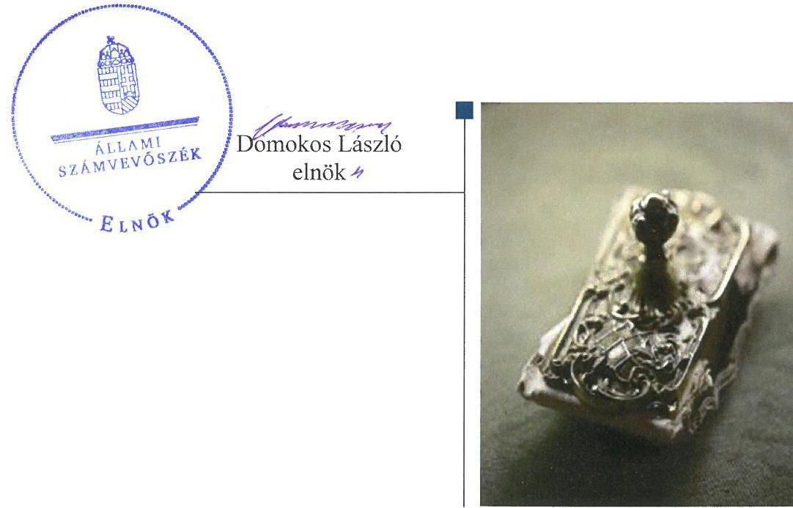
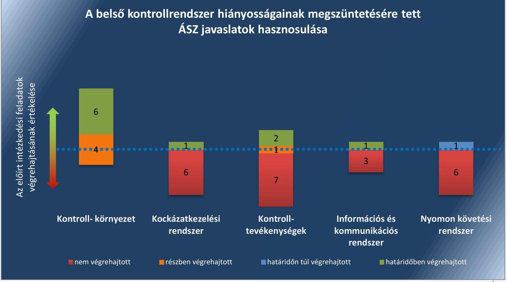
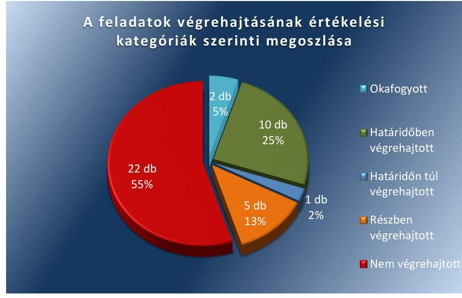

# Jelentés 

## Utóellenőrzések

Az önkormányzatok belső
kontrollrendszere kialakításának és múködtetésének utóellenőrzése Egercsehi Községi Önkormányzat 2017.

---

# Jelentés 

## Utóellenőrzések

Az önkormányzatok belső
kontrollrendszere kialakításának és múködtetésének utóellenőrzése Egercsehi Községi Önkormányzat 2017. 11. hó 22. nap

---

|  J | AZ ELLENŐRZÉST FELÜGYELTE:  |
| --- | --- |
|   | DR. BENEDEK MÁRIA felügyeleti vezető  |
|   | AZ ELLENŐRZÉST VEZETTE ÉS A VÉGREHAJTÁSÁÉRT FELELŐS:  |
|   | IVANYOS JÁNOS ellenőrzésvezető  |
|   | A PROGRAM ÖSSZEÁLLÍTÁSÁÉRT FELELŐS:  |
|   | JANIK JÓZSEF LÁSZLÓ osztályvezető  |
|   | A TÉMÁHOZ KAPCSOLÓDÓ KORÁBBI SZÁMVEVŐSZÉKI JELENTÉSEK:  |
|   | - címe: Jelentés az önkormányzatok belső kontrollrendszere kialakításának, egyes kontrolltevékenységek és a belső ellenőrzés működésének ellenőrzéséről Egercsehi  |
|  J | sorszáma: 14057  |
|   | IKTATÓSZÁM: EL-0063-040/2017  |
|   | TÉMASZÁM: 21  |
|   | ELLENŐRZÉS-AZONOSÍTÓ SZÁM: V075588  |

---

# TARTALOMJEGYZÉK 

■ ÖSSZEGZÉS ..... 5
■ AZ ELLENŐRZÉS CÉLJA ..... 7
■ AZ ELLENŐRZÉS TERÜLETE ..... 8
■ AZ ELLENŐRZÉS HÁTTERE, INDOKOLTSÁGA ..... 9
■ A JELENTÉS LÉNYEGES KÉRDÉSKÖRE ..... 10
■ AZ ELLENŐRZÉS HATÓKÖRE ÉS MÓDSZEREI ..... 11
■ MEGÁLLAPÍTÁSOK ..... 13
■ KÖVETKEZTETÉSEK ..... 19
■ MELLÉKLETEK ..... 21
I. sz. melléklet: Az ÁSZ 14057 számú jelentéséhez kapcsolódó intézkedési terv végrehajtása ..... 21
■ FÜGGELÉK: ÉSZREVÉTELEK ..... 31
■ RÖVIDÍTÉSEK JEGYZÉKE ..... 33

---

.

---

# ÖSSZEGZÉS 

Az Állami Számvevőszék Egercsehi Községi Önkormányzat belső kontrollrendszere kialakításának és müködtetésének utóellenőrzése során megállapította, hogy az intézkedési tervben meghatározott feladatok jelentős részét nem hajtotta végre. A fennmaradó szabályozásbeli és müködésbeli hiányosságok miatt a belső kontrollrendszer müködése továbbra sem szabályszerű, valamint a közpénzekkel való felelős gazdálkodásban rejlő kockázatok sem csökkentek. A fennálló hiányosságok miatt a belső kontrollrendszer gazdaságos, eredményes és hatékony müködtetése nem valósult meg.

## Az ellenőrzés társadalmi indokoltsága

Az Állami Számvevőszék stratégiájában célul tűzte ki a számvevőszéki munka hasznosulásának javítását. Ezzel összhangban ellenőrzi, hogy az ellenőrzött szervezetek megvalósították-e a korábbi ellenőrzései által feltárt hibák, hiányosságok és szabálytalanságok megszüntetése céljából kialakított intézkedési terveikben foglaltakat. A rendszeres utóellenőrzések hozzájárulnak a szükséges intézkedések tényleges végrehajtásához, ezáltal a közpénzügyek rendezettségének javulásához, igazolják, hogy lezárult a következmények nélküli ellenőrzések időszaka.

## Főbb megállapítások, következtetések

Egercsehi Községi Önkormányzat az intézkedési tervében meghatározott 40 feladatból tízet határidőben, egyet határidőn túl, ötöt részben, huszonkettőt nem hajtott végre, valamint két feladat okafogyottá vált.

A belső szabályzatok kialakításával, illetve aktualizálásával, valamint egyes kontrolltevékenységek kapcsán a jogszabályi előírásoknak megfelelő kijelölésekkel javult a közpénzekkel való gazdálkodás szabályozottsága.

A kockázatkezelési rendszer kialakítása és működtetése, a kontrolltevékenységek, az információs és kommunikációs tevékenységek, valamint a nyomon követési és belső ellenőrzési feladatok végrehajtása területén továbbra is fennálló jelentős hiányosságok mellett nem biztosított, hogy Egercsehi Községi Önkormányzat belső kontrollrendszerének működtetése megfeleljen a gazdaságosság, hatékonyság és eredményesség követelményeinek.

Az intézkedési tervben meghatározott feladatok részben történő végrehajtásával vagy végre nem hajtásával a felelős és elszámoltatható gazdálkodás, illetve vezetői magatartás vonatkozásában a kockázatok nem csökkentek a közpénzzel gazdálkodó szervezetekre vonatkozó jogszabályi elvárásoknak megfelelő szintre. A kötelező elektronikus közzétételi szabályok megsértése miatt Egercsehi Községi Önkormányzat gazdálkodásának átláthatósága nem biztosított.

Az intézkedési tervben meghatározott feladatok végrehajtásáról Egercsehi Községi Önkormányzat a jogszabályban előírt nyilvántartást nem vezette.

Az 1. ábra az intézkedési tervben meghatározott feladatok végrehajtásának értékelését mutatja a belső kontrollrendszer pillérei szerinti megoszlásban.

---

# A belső kontrollrendszer hiányosságainak megszüntetésére tett ÁSZ javaslatok hasznosulása

*Fonrás: ÁSZ*

---

# AZ ELLENŐRZÉS CÉLJA 

Az ellenőrzés célja annak értékelése volt, hogy a számvevőszéki jelentésben foglalt intézkedést igénylő megállapításokkal és javaslatokkal összhangban készített intézkedési tervben meghatározott feladatokat az ellenőrzött szervezet végrehajtotta-e.

---

# **AZ ELLENŐRZÉS TERÜLETE**

## **Egercsehi Községi Önkormányzat**

Egercsehi Község Heves megyében, az egri járásban fekszik, állandó lakosainak száma 2016. január 1-jén 1280 fő volt a Központi Statisztikai Hivatal Magyarország közigazgatási helynévkönyvében közzétett népességi adatok szerint. Egercsehi Községi Önkormányzat gazdálkodási feladatait az Egercsehi Közös Önkormányzati Hivatal látja el. Az Egercsehi Közös Önkormányzati Hivatal létszáma 8 fő. A Közös Hivatalt1 a jegyző2 vezeti, aki felett a munkáltatói jogokat a polgármester3 gyakorolja. Az utóellenőrzés által érintett időszak alatt a jegyző személye nem, a polgármester személye egyszer változott. A polgármester a 2014. évi önkormányzati választások óta tölti be hivatalát, a jegyző 2013. szeptember 1-jétől látja el feladatát.

Egercsehi Községi Önkormányzat a 2016. évi gazdálkodás zárszámadásáról szóló rendelet szerint 293,1 millió Ft költségvetési bevételt ért el és 259,0 millió Ft költségvetési kiadást teljesített. A vagyonkimutatás adatai szerint a 2016. évi eszközállomány értéke 692,2 millió Ft volt.

Az Állami Számvevőszék 2014. évben ellenőrizte Egercsehi Községi Önkormányzat belső kontrollrendszere kialakításának, egyes kontrolltevékenységek és a belső ellenőrzés működését a 2012. január 1. és 2012. december 31. közötti időszak vonatkozásában. Az erről szóló 14057 számú jelentését4 az ÁSZ5 2014. április 16-án tette közzé. Az ellenőrzés célja annak megállapítása volt, hogy a belső kontrollrendszer elemeinek kialakítása, a pénzügyi folyamatokban kulcsszerepet betöltő teljesítésigazolás és érvényesítés, és a belső ellenőrzés szabályos működése biztosította-e Egercsehi Községi Önkormányzatnál a közpénzfelhasználás szabályosságát, hozzájárult-e az értéket teremtő rend követelményének érvényesüléséhez. Az ÁSZ jelentésben foglalt javaslatok végrehajtása érdekében Egercsehi Községi Önkormányzat Képviselő-testülete az 50/2014. (VIII. 27.) számú határozattal elfogadta a kiegészített intézkedési tervet, melyet az ÁSZ elnöke a 2014. december 30-án kelt levelében jóváhagyott.

Az utóellenőrzés – a 2014. április 16-tól 2017. június 21-éig végrehajtott feladatokat figyelembe véve – az ÁSZ jelentésben a polgármester és a jegyző részére megfogalmazott intézkedést igénylő megállapításokra és javaslatokra készített, az ÁSZ részére megküldött intézkedési tervben foglalt feladatok megvalósításának ellenőrzésére, illetve értékelésére fókuszált.

---

# AZ ELLENŐRZÉS HÁTTERE, INDOKOLTSÁGA 

Az ÁSZ tv. ${ }^{6}$ 33. § (1) bekezdése értelmében a számvevőszéki jelentések intézkedést igénylő megállapításaihoz és javaslataihoz kapcsolódóan az ellenőrzött szervezet vezetője intézkedési tervet köteles összeállítani, és az ÁSZ részére megküldeni. Az intézkedési tervben foglaltak megvalósítását az ÁSZ tv. 33. § (7) bekezdésében foglaltak alapján - az ÁSZ utóellenőrzés keretében ellenőrizheti. Az intézkedések megvalósulásának értékelése során az ÁSZ figyelembe veszi az ellenőrzött szervezetek működési feltételeiben, valamint a jogszabályi előírásokban bekövetkezett változásokat.

Az intézkedési tervekben foglalt feladatok hiányos, illetve késedelmes végrehajtása, valamint megvalósításának elmaradása azt mutatja, hogy az ellenőrzések során feltárt hibák, hiányosságok és szabálytalanságok megszüntetése nem kapott kellő hangsúlyt. Ez a szabályszerű működés és a felelős vezetői magatartás vonatkozásában kockázatot hordoz. E kockázatok feltárásával az ÁSZ utóellenőrzési rendszere fokozza a fegyelmet, és igazolja, hogy a közpénzzel való szabályos gazdálkodás felelőssége elől nem lehet kitérni.

Az utóellenőrzés négy szinten hasznosulhat:

- A társadalom szintjén az utóellenőrzés jelzi, hogy a számvevőszéki ellenőrzés megállapításainak van következménye: a hiányosságok megszüntetésére az ellenőrzött szervezet által meghatározott intézkedések végrehajtását is számon kéri az ÁSZ.
- Az ellenőrzött terület szintjén az utóellenőrzés tájékoztatást nyújt a terület döntéshozóinak a hiányosságok kiküszöbölésének jó gyakorlatairól, ezzel lehetőséget biztosítva arra, hogy az ÁSZ ellenőrzési megállapításai, javaslatai a terület nem ellenőrzött szervezeteinek a működése során is hasznosuljanak.
- Az ellenőrzött szervezet szintjén az utóellenőrzés feltárja, hogy a szervezet az intézkedések végrehajtásával hasznosította-e a korábbi ellenőrzési jelentésben a hiányosságok megszüntetése, illetve a kockázatok kezelése érdekében megfogalmazott javaslatokat.
- Az ÁSZ szintjén az utóellenőrzés visszacsatolást ad az ellenőrzési jelentések hasznosulásáról, az intézkedések elmaradása vagy részleges megvalósulása a további ellenőrzésekhez kockázati jelzésként szolgál.

---

# A JELENTÉS LÉNYEGES KÉRDÉSKÖRE 

Az ellenőrzött szervezet az intézkedési tervben foglaltakat az elöirt határidőben végrehajtotta-e?

---

# AZ ELLENŐRZÉS HATÓKÖRE ÉS MÓDSZEREI 

## Az ellenőrzés típusa

Megfelelőségi ellenőrzés.

## Az ellenőrzött időszak

Az utóellenőrzés alapját képező ÁSZ jelentés közzétételének napjától (2014. április 16.) az ellenőrzésről szóló kiértesítő levél keltének napjáig (2017. június 21.) tartó időszak.

## Az ellenőrzés tárgya

Az ÁSZ tv. 2011. július 1-jei hatálybalépését követően a számvevőszéki jelentésben foglalt intézkedést igénylő megállapításokkal és javaslatokkal összhangban - Egercsehi Községi Önkormányzat által - készített intézkedési tervben foglaltak végrehajtásának ellenőrzése volt.

Az ellenőrzés kiterjedt minden olyan körülményre és adatra, amely az ÁSZ jogszabályban meghatározott feladatainak teljesítéséhez, valamint a program végrehajtása folyamán felmerült újabb összefüggések feltárásához szükséges volt.

## Az ellenőrzött szervezet

Egercsehi Községi Önkormányzat

## Az ellenőrzés jogalapja

Az ÁSZ tv. 33. § (7) bekezdése alapján az intézkedési tervben foglaltak megvalósítását az ÁSZ utóellenőrzés keretében ellenőrizheti.

## Az ellenőrzés módszerei

Az ÁSZ az ellenőrzést az ellenőrzési program ellenőrzési kérdései, az ellenőrzött időszakban hatályos jogszabályok, az ellenőrzés szakmai szabályok és módszertanok figyelembevételével, önálló ellenőrzés keretében végezte.

Az ÁSZ az ellenőrzés ideje alatt az ellenőrzött szervezettel történő kapcsolattartást az ÁSZ SZMSZ²-ének vonatkozó előírásai alapján biztosította.

---

Az utóellenőrzés megállapításait elsősorban az ÁSZ rendelkezésére álló, valamint az ellenőrzött szervezetektől elektronikusan bekért dokumentumok alapozták meg.

Az ellenőrzési bizonyítékként felhasználható adatforrások közé tartoztak egyrészt a szakmai programban felsorolt adatforrások, másrészt minden - az ellenőrzés folyamán feltárt, az ellenőrzés szempontjából információt tartalmazó - dokumentum.

Az intézkedési tervekben előírt feladatokat, azok végrehajthatósága, illetve végrehajtása szempontjából az alábbiak szerint értékelte az ÁSZ:
$\longrightarrow$ „határidőben végrehajtott" a feladat, ha a teljesítés dokumentáltan, az intézkedési tervben előírt határidőben és tartalommal megtörtént;
$\longrightarrow$ „határidőn túl végrehajtott" a feladat, ha annak teljesítése az intézkedési tervben meghatározott módon, de az előírt határidőn túl történt meg;
$\longrightarrow$ „részben végrehajtott" a feladat, ha végrehajtása teljes körűen az intézkedési tervben előírt módon nem történt meg;
$\longrightarrow$ „nem végrehajtott" a feladat, ha a végrehajtás nem történt meg, vagy amennyiben a teljesítést nem dokumentálták;
$\longrightarrow$ „okafogyottá vált" a feladat, ha végrehajtására - meghatározott esemény bekövetkezése, továbbá külső körülmény, a működést érintő feltétel változása miatt - már nincs szükség, illetve lehetőség, és egyértelműen megállapítható, hogy az intézkedést szükségessé tevő körülmény a jövőben nem fordulhat elő;
$\longrightarrow$ „nem időszerű" az a feladat, amelynek ellenőrzési időszakon belüli végrehajtására azért nem került (kerülhetett) sor, mert az intézkedés alapjául szolgáló esemény nem következett be, de annak jövőbeni előfordulása lehetséges, a végrehajtása nem volt esedékes, vagy a végrehajtás határideje még nem járt le.
Az ellenőrzés lefolytatásához az ellenőrzött szervezet a tanúsítványok elektronikus kitöltésével, valamint az ÁSZ által kért dokumentumok elektronikus megküldésével szolgáltatott adatokat, amelyek valódiságát és teljes körűségét az ellenőrzött szervezet vezetője által tett teljességi és hitelességi nyilatkozat igazolta. Az így rendelkezésre bocsátott adatok, információk kontrollja az ellenőrzés keretében történt.

---

# MEGÁLLAPÍTÁSOK 

## Az ellenőrzött szervezet az intézkedési tervben foglaltakat az előírt határidőben végrehajtotta-e?

Összegző megállapítás

Az Önkormányzat ${ }^{8}$ az intézkedési tervben meghatározott negyven feladat közül tízet határidőben, egyet határidőn túl, ötöt részben, huszonkettőt nem hajtott végre, valamint két feladat okafogyottá vált. Az intézkedési tervben meghatározott feladatok végrehajtásáról a jogszabályban előírt nyilvántartást nem vezette.

Az ÁSZ a jelentésében a polgármester részére négy, a jegyzőnek címezve 37 javaslatot fogalmazott meg. A polgármester által előterjesztett és a Kép-viselő-testület által jóváhagyott kiegészített intézkedési tervben a hiányosságok, szabálytalanságok megszüntetésére a polgármesternek négy, a jegyzőnek 36 feladatot határoztak meg.

Az intézkedési tervben meghatározott feladatokat, határidőket, felelősöket és a feladatok végrehajtását az I. számú melléklet mutatja be.

A jegyző az intézkedési tervben meghatározott feladatok végrehajtásáról nem vezette a Bkr. ${ }^{9}$ 14. § (1) bekezdésében előírtaknak megfelelő nyilvántartást.

Az Önkormányzat intézkedési tervében meghatározott feladatok végrehajtásának értékelési kategóriák szerinti megoszlását a 2. ábra szemlélteti.
2. ábra

Forrás: ÁSZ

---

# HATÁRIDŐBEN VÉGREHAJTOTT feladatok: 

1. A polgármester a 2014. január 1-jén hatályba léptetett Kötelezettségvállalás Szabályzatban ${ }^{10}$ intézkedett a polgármester által történő kötelezettségvállalások vonatkozásában a teljesítésigazolásra jogosult személyek kijelöléséről.
2. A jegyző kezdeményezte az új önkormányzati SZMSZ ${ }^{11}$ megalkotását, annak érdekében, hogy az tartalmazza az Ávr.-ben előírt valamennyi tartalmi elemet, melyet a Képviselő-testület ${ }^{12}$ a 3/2014. (II.25) Önkormányzati rendelettel 2014. február 25-én hagyott jóvá.
3. A jegyző intézkedett az Egységes Számviteli Politika ${ }^{13}$, a Pénzkezelési Szabályzat ${ }^{14}$, továbbá a Leltározási Szabályzat ${ }^{15}$ aktualizálásáról.
4. A jegyző a 2014. január 1-jétől hatályos Egységes Számviteli Politikában kialakította az önkormányzati intézmények számviteli rendjét.
5. A jegyző a 2014. január 1-jétől hatályos Egységes Számviteli Politika alapján aktualizálta és 2014. január 1-jével hatályba léptette a Számlarendet ${ }^{16}$. A jegyző módosította a Bizonylati rendet ${ }^{17}$, melyet önálló szabályzat formájában léptetett hatályba 2014. március 1jén.
6. A jegyző a 2014. június 1-jétől hatályos 3/2014. (V. 8.) jegyzői intézkedésben meghatározta az egészséget nem veszélyeztető és biztonságos munkavégzés követelményei megvalósításának módját.
7. A jegyző írásban értékelte a Közös Hivatalban dolgozó köztisztviselők munkateljesítményét.
8. A jegyző a 6/2014. (V. 8.) jegyzői intézkedés 2014. június 1-jei hatályba léptetésével gondoskodott arról, hogy a közszolgálatban álló személyek vagyonnyilatkozat tétele megfeleljen a jogszabály által előírt formai követelményeknek.
9. A jegyző a 2014. január 1-jén hatályba léptetett Kötelezettségvállalás Szabályzatban kijelölte az érvényesítésre, továbbá a jegyző általi kötelezettségvállalások esetére a teljesítésigazolásra jogosultak körét.
10. A jegyző elkészítette és az 1/2014. (V. 8.) jegyzői intézkedéssel 2014. június 1-jétől hatályba léptette az Adatvédelmi Szabályzatot ${ }^{18}$.

## HATÁRIDŐN TÚL VÉGREHAJTOTT feladat:

11. A jegyző kezdeményezte a 2015-2018. évre szóló stratégiai ellenőrzési terv elkészítését, amelyet a Képviselő-testület 2014. június 30. helyett 2014. november 26-án, a 87/2014. (XI. 26.) önkormányzati határozatával hagyott jóvá.

## RÉSZBEN VÉGREHAJTOTT feladatok:

12. A jegyző előkészítette a hivatali alapító okirat módosítását annak érdekében, hogy az tartalmazza az Ávr. ${ }^{19}$-ben előírt valamennyi

---

tartalmi elemet, azonban az Áht. ${ }^{20}$ 9. § (1) bekezdésben foglaltak ellenére nem kezdeményezte az alapító okirat módosításának Kép-viselő-testület elé terjesztését.
13. A jegyző meghatározta a Szabálytalanságok kezelésének ${ }^{21}$ eljárásrendjét, továbbá elkészítette és a 4/2014.(V. 8.) jegyzői intézkedéssel hatályba léptette a Közös Hivatal Ellenőrzési nyomvonalát²2, azonban az nem felelt meg a Bkr. 6. § (3) bekezdésében előírtaknak.
14. A jegyző a Közös Hivatal három köztisztviselőjének munkaköri leírását készítette el határidőben, további négy köztisztviselő munkaköri leírását a 2014. június 30-i határidőt követően, 2014. december 16-án írta alá. A munkaköri leírások nem feleltek meg a Kttv. 75. § (1) bekezdés d) pontja előírásainak.
15. A jegyző a jogszabályban foglalt feladatkörében előkészítette az 1/2013. (XI. 12.) jegyzői utasítást az Önkormányzat - hivatásetikai alapelveket részletesen leíró - Etikai Kódexéről ${ }^{23}$, azonban nem kezdeményezte az Etikai Kódex Képviselő-testület elé terjesztését a Kttv. 231. § (1) bekezdésben foglaltak megvalósulása érdekében, továbbá az Etikai Kódex nem tartalmazta az etikai eljárás szabályainak dokumentumait.
16. A jegyző a jogszabály szerint szabályozta a Folyamatba épített előzetes, utólagos, vezetői ellenőrzés (FEUVE ${ }^{24}$ ) rendszerét, azonban az nem biztosította a Bkr. 8. § (2) bekezdés b) pontjában foglaltak ellenére a döntések gazdaságossági, hatékonysági és eredményességi szempontú megalapozottságát.

# NEM VÉGREHAJTOTT feladatok: 

17. A polgármester nem intézkedett arról, hogy az Önkormányzat kiadási előirányzatai terhére történt kötelezettségvállalásokra az Áht. 37. § (1) bekezdésében és az Ávr. 55. § (1) bekezdésében foglaltaknak megfelelően - az Ávr. 53. §-ában meghatározott kivételeket figyelembe véve - kizárólag a pénzügyi ellenjegyzés után, írásban kerüljön sor.
18. A polgármester nem kísérte figyelemmel a gazdálkodás szabályszerűségét az Mötv. ${ }^{25}$ 115. § (1) bekezdés előírása szerint és nem gondoskodott a jegyző feletti, az Mötv. 67. § f) bekezdésében előírtak szerinti munkáltatói joggyakorlás keretében a teljesítésigazolás és érvényesítés kontrollokkal összefüggésben feltárt hiányosságok, valamint a gazdasági programmal és a vagyonnyilatkozat-tétellel összefüggő hiányosságok tekintetében a munkajogi felelősség kivizsgálásáról és a szükséges intézkedések megtételéről.
19. A polgármester nem kezdeményezte a Képviselő-testületnél az Mötv. 41. § (2) és (4) bekezdése és a 65. §-a ellenére az Mötv. 57. § (2) bekezdésének, valamint a helyi önkormányzati képviselők jogállásának egyek kérdéseiről szóló 2000. évi XCVI. törvény 10/A. § (3) bekezdésének megfelelően a vagyonnyilatkozatok vizsgálatáért felelősként kijelölt Ügyrendi, Összeférhetetlenségi és Vagyonnyilatkozat Nyilvántartó és Ellenőrző Bizottság vagyonnyilatkozattételi kötelezettség teljesítésére vonatkozó eljárásának szabályszerűségével kapcsolatos körülmények kivizsgálását.

---

20. A jegyző a Bkr. 3. § b) pontjában előírtak ellenére nem alakította ki a Közös Hivatal kockázatkezelési rendszerét.
21. A jegyző a Bkr. 7. § (2) bekezdésében foglaltak ellenére nem mérte fel és nem állapította meg a Közös Hivatal tevékenységében, gazdálkodásában rejlő kockázatokat, nem határozta meg az egyes kockázatokkal kapcsolatban szükséges intézkedéseket, és azok teljesítésének folyamatos nyomon követésének módját, továbbá nem tartotta nyilván a hivatalt érintő kockázati tényezőket és az egyes kockázatokra vonatkozó intézkedések teljesítésével kapcsolatos információkat.
22. A jegyző elkészítette a 6/2014. (V. 8.) számú jegyzői intézkedést, amely tartalmazta a Vttv. ${ }^{26}$-ben foglalt előírásnak megfelelően a vagyonnyilatkozat-tételre kötelezett köztisztviselők körét, azonban az SZMSZ-módosítás Képviselő-testület elé terjesztése a Vttv. 4. § a) pontjában foglalt előírások ellenére nem történt meg.
23. A jegyző az Mötv. 81. § (3) bekezdés c) pontjában foglalt feladatkörében, a Vttv. 4. § a) pontjában foglalt előírásoknak és az Áht. 9. § b) pontjában előírtak ellenére nem készítette elő a képviselő-testületi SZMSZ-módosítását annak érdekében, hogy az tartalmazza a Vttv. 4. § a) pontjában foglalt előírásoknak megfelelően a vagyon-nyilatkozat-tételre kötelezettek körét.
24. A jegyző az Mötv. 81. § (3) bekezdés e) pontja ellenére nem jelezte az őrzésért felelős önkormányzati bizottságnak, hogy négy fő közszolgálatban nem álló személy vagyonnyilatkozata a törvényben előírt formai követelményeknek nem felelt meg, valamint három fő képviselőt és egy fő nem képviselő bizottsági tagot nem tájékozatott a vagyonnyilatkozat tételi kötelezettség fennállásáról és esedékességének időpontjáról.
25. A jegyző a Kttv. 74. § (1) bekezdésben foglaltak ellenére nem szabályozta a jogviszony megszüntetése (megszűnése) esetére a munkakör átadásának és a munkáltatóval való elszámolásának rendjét.
26. A jegyző a Bkr. 3. § d) pontjában és a 9. § (1) bekezdésében foglaltak ellenére nem alakított ki olyan rendszert, amely biztosítja, hogy a megfelelő információk a megfelelő időben eljussanak az illetékes szervezethez, szervezeti egységhez, illetve személyhez.
27. A jegyző az Info tv. ${ }^{27}$ 30. § (6) bekezdésében és a 35. § (3) bekezdésében, valamint az Ávr. 13. § (2) bekezdés h) pontjában foglaltak ellenére nem állapította meg a közérdekű adatok megismerésére irányuló igények teljesítésére és a kötelezően közzéteendő adatok nyilvánosságra hozatalának rendjét.
28. A jegyző az Info tv. 33. § (1) és (3) bekezdésében, a 37. § (1) bekezdésében előírtak ellenére nem gondoskodott az Önkormányzat elektronikus közzétételi kötelezettségének teljesítéséről.
29. A jegyző a Bkr. 3. § e) pontjában és a 10. §-ában foglaltak előírtak ellenére nem alakította ki a Közös Hivatal tevékenységének, a célok megvalósításának nyomon követését biztosító rendszerét,

---

amelynek része az operatív tevékenységek keretében megvalósuló folyamatos és eseti nyomon követés is.
30. A jegyző a Bkr. 11. § (1) bekezdésben előírtak ellenére nem értékelte a jogszabályban meghatározott keretek között a Közös Hivatal belső kontrollrendszerének minőségét, a Bkr. 1. melléklet szerinti nyilatkozatban.
31. A jegyző nem intézkedett arról, hogy az Ávr. 60. § (3) bekezdésében foglaltak szerint nyilvántartásba vett, teljesítésigazolásra kijelölt személyek az Áht. 38. § (1) bekezdés, valamint az Ávr. 57. § (1) bekezdésében foglaltaknak megfelelően, ellenőrizhető okmányok alapján ellenőrizzék a kiadások teljesítésének jogosságát, összegszerűségét, valamint az ellenszolgáltatást is magába foglaló kötelezettségvállalás esetén - ha a kifizetés, vagy annak egy része az ellenszolgáltatás teljesítését követően esedékes - annak teljesítését és azt az Ávr. 57. § (3) bekezdésében foglalt módon igazolják.
32. A jegyző nem intézkedett annak érdekében, hogy az Ávr. 60. § (3) bekezdésében foglaltak szerint nyilvántartásba vett, érvényesítésre kijelölt személyek az Áht. 38. § (1) bekezdése, valamint az Ávr. 58. § (1) és (3) bekezdésének megfelelően a kifizetéseket megelőzően a teljesítésigazolás alapján - az Ávr. 57. § (3) bekezdése szerinti esetben annak hiányában is - ellenőrizzék az összegszerűséget, a fedezet meglétét és a megelőző ügymenetben az Áht., az Ávr., az Áhsz. előírásai és a belső szabályzatokban foglaltak betartását.
33. A jegyző nem intézkedett arról, hogy a kötelezettségvállalásokat az Ávr. 56. § (1) be-kezdésében foglalt előírásnak megfelelően vegyék nyilvántartásba.
34. A jegyző nem intézkedett arról, hogy a kötelezettségvállalásokra az Áht. 37. (1) bekezdésében és az Ávr. 55. § (1) bekezdésében foglaltaknak megfelelően - az Ávr. 53. §-ában meghatározott kivételeket figyelembe véve - kizárólag a pénzügyi ellenjegyzés után, írásban kerüljön sor.
35. A jegyző a Bkr. 16. § (4) bekezdésében előírtak ellenére nem kezdeményezte, hogy a belső ellenőrzési tevékenység megszervezésére vonatkozó megállapodásban rendelkezzenek a belső ellenőrzési vezetői feladatok és kötelezettségek ellátási módjáról.
36. A jegyző a Bkr. 31. § (4) bekezdésében előírtak ellenére nem kezdeményezte, hogy az éves ellenőrzési terv tartalmazza a jogszabályban előírt tartalmi elemeket, továbbá az a Bkr. 31. § (2) bekezdése alapján kockázatelemzés alapján felállított prioritásokon is alapuljon és a Bkr. 56. § (2) bekezdés előírásainak megfelelően a jegyző írásos véleményének figyelembe vételével készüljön el.
37. A jegyző a Bkr. 39. (1)-(2) bekezdéseiben előírtak ellenére nem kezdeményezte, hogy a jogszabályban előírtaknak megfelelően készüljön ellenőrzési jelentés, és az éves (összefoglaló) jelentés tartalmazza valamennyi kötelező tartalmi elemet.

---

38. A jegyző a Bkr. 22. § (2) bekezdés e) pontjában és az 50. §-ban foglalt előírások ellenére nem kezdeményezte, hogy a belső ellenőrzési vezető a jogszabályban foglalt előírásoknak megfelelően nyilvántartást vezessen az elvégzett belső ellenőrzésekről.

# OKAFOGYOTTÁ VÁLT feladatok: 

39. 2013. október 15-én külső szolgáltatóval kötött vállalkozási szerződés alapján a belső ellenőrzési feladat nem társulás keretében került ellátásra, ezért okafogyottá vált a jegyzőnek előírt feladat arról, hogy az Önkormányzat rendelkezzen a Bkr. 56. § (7) bekezdésében foglaltaknak megfelelően a Társulás munkaszervezeti feladatát ellátó vezetője által jóváhagyott belső ellenőrzési kézikönyvvel.
40. 2013. október 15-én külső szolgáltatóval kötött vállalkozási szerződés alapján a belső ellenőrzési feladat nem társulás keretében került ellátásra, ezért okafogyottá vált a jegyzőnek előírt feladat annak kezdeményezéséről, hogy a Bkr. 56. § (5) bekezdésében foglaltak szerint az éves ellenőrzési tervben jóváhagyott ellenőrzés elhagyására vagy új ellenőrzés indítására az éves terv módosítását követően kerüljön sor.

---

# KÖVETKEZTETÉSEK 

Az Önkormányzat nem intézkedett a közérdekú adatok közzétételéről, amivel sérül a közérdekú és közérdekből nyilvános adatok megismeréséhez és terjesztéséhez füződő jog érvényesülése, ami jelentős kockázatot jelent a belső kontrollrendszer kialakítása és szabályszerű múködtetése szempontjából. A nem végrehajtott feladat indokolja a feltárt hiányosság, szabálytalanság tekintetében a munkajogi felelősség tisztázására irányuló eljárás megindítását, és eredményének ismeretében a szükséges intézkedések megtételét.

---

.

---

# MELLÉKLETEK

■ I. SZ. MELLÉKLET: AZ ÁSZ 14057 SZÁMÚ JELENTÉSÉHEZ KAPCSOLÓDÓ INTÉZKEDÉSI TERV VÉGREHAJTÁSA

|  Az intézkedési tervben meghatározott feladat | Az intézkedési tervben meghatározott határidő | Az intézkedési tervben meghatározott feladat végrehajtásának felelése | A feladat végrehajtása  |
| --- | --- | --- | --- |
|  1. | 2. | 3. | 4.  |
|  Határidőben végrehajtott feladatok |  |  |   |
|  1. Jelölje ki az Ávr. 57. § (4) bek.-nek megfelelően az általa történő kötelezettségvállalások esetén a teljesítésigazolásra jogosult személyeket. | 2014. május 12., folyamatos | polgármester | A polgármester a 2014. január 1-jén hatályba léptetett Kötelezettségvállalás, ellenjegyzés, utalványozás, érvényesítés szabályzat 3. számú mellékletében gondoskodott a kötelezettségvállalások vonatkozásában a teljesítésigazolásra jogosult személyek kijelöléséről.  |
|  2. Kezdeményezze az önkormányzati SZMSZ módosítását annak érdekében, hogy az tartalmazza az Ávr. 13. § (1) bekezdésében előírt valamennyi tartalmi elemet és kezdeményezze az Áht. 9. § (1) bekezdés a) pontjában foglaltakra tekintettel a módosítás Képviselő-testület általi jóváhagyását. | 2014. június 30. | jegyző | A jegyző kezdeményezte az új önkormányzati SZMSZ megalkotását, melyet a Képvi-selő-testület a 3/2014. (II.25) Önkormányzati rendelettel 2014. február 25-én hagyott jóvá. A 2014. február 26-án hatályba lépett SZMSZ tartalmazta az Ávr. 13. § (1) bekezdésében előírt valamennyi tartalmi elemet.  |
|  3. Aktualizálja a Számv. tv. 14. § (11) bekezdésében foglaltak alapján a számviteli politikát, a pénzkezelési, továbbá a leltározási és leltárkészítési szabályzatokat. | 2014. június 30. | jegyző | A jegyző 2014. január 1-jei hatállyal, a Számv. tv. ${ }^{28}$ 14. § (11) bekezdésében foglaltak alapján aktualizálta az Egységes Számviteli Politikát, a Pénzkezelési Szabályzatot, továbbá a Leltározási Szabályzatot.  |
|  4. Alakítsa ki az önkormányzat intézményeinél a számviteli rendet. | 2014. június 30. | jegyző | A jegyző a 2014. január 1-jétől hatályos Egységes Számviteli Politika II. fejezetében meghatározta az önkormányzati intézmények számviteli rendjét.  |
|  5. Aktualizálja a számlarendet továbbá módosítsa a bizonylati rendet a jogszabályváltozást követő 90 napon belül. | 2014. június 30. | jegyző | A jegyző 2014. január 1-jével hatályba léptette a 2014. január 1-től hatályos Egységes Számviteli Politika alapján aktualizált Számlarendet. A jegyző 2014. március 1-én önálló szabályzat formájában léptette hatályba a módosított Bizonylati rendet.  |
|  6. Határozza meg az egészséget nem veszélyeztető és biztonságos munkavégzés követelményei megvalósításának módját az Mvtv. 2. § (3) bekezdése alapján. | 2014. június 30. | jegyző | A jegyző a 2014. június 1-jétől hatályos, a képernyő előtti munkavégzés minimális egészségügyi és biztonsági követelményeiről szóló 3/2014. (V. 8.) jegyzői intézkedésben az Mvtv. ${ }^{29}$ 2. § (3) bekezdése alapján meghatározta az egészséget nem veszélyeztető és biztonságos munkavégzés követelményei megvalósításának módját.  |

---

|  Az intézkedési tervben meghatározott feladat | Az intézkedési tervben meghatározott határidő | Az intézkedési tervben meghatározott feladat végrehajtásának felelőse | A feladat végrehajtása  |
| --- | --- | --- | --- |
|  1. | 2. | 3. | 4.  |
|  7. Értékelje írásban a Közös Hivatalban dolgozó köztisztviselők munkateljesítményét. | 2014. június 30. | jegyző | A jegyző a 2014. január - 2014. június közötti időszakra a Közös Hivatalban dolgozó tisztségviselők munkateljesítmény értékeléseit 2014. június 30-i dátummal elkészítette.  |
|  8. Intézkedjen arról, hogy a közszolgálatban álló személyek vagyonnyilatkozat tétele megfeleljen a Vagyonnyilatkozat tételéről szóló törvény 11. §-ában foglalt formai követelményeknek. | 2014. július 30. | jegyző | A jegyző a 2014. június 1-én hatályba léptetett 6/2014. (V. 8.) jegyzői intézkedésben gondoskodott arról, hogy a közszolgálatban álló személyek vagyonnyilatkozat tétele megfeleljen a Vttv. 11. §-ában foglalt formai követelményeknek.  |
|  9. Jelölje ki az Ávr. 57. § (4) bekezdés és 58. § (4) bekezdés alapján az általa történő kötelezettségvállalások esetén a teljesítésigazolásra és az érvényesítésre jogosult köztisztviselőt. | 2014.május 12., folyamatos | jegyző | A jegyző 2014. január 1-jén hatályba léptette a Kötelezettségvállalás Szabályzatot, mely az Ávr. 57. § (4) és 58. § (4) bekezdések előírásainak megfelelően tartalmazta az érvényesítésre, továbbá a jegyző általi kötelezettségvállalások esetére a teljesítésigazolásra jogosultak körét. Gondoskodott arról, hogy az új polgármester hivatalba lépésével 2014. október 16-án a Kötelezettségvállalás Szabályzat kijelölésre vonatkozó mellékleteit aktualizálják.  |
|  10. Készítsen adatvédelmi és adatbiztonsági szabályzatot az Info tv. 24. § (3) bekezdés alapján. | 2014. szeptember 15. | jegyző | A jegyző az 1/2014. (V. 8.) jegyzői intézkedéssel 2014. június 1-től hatályba léptette az Info tv. 24. § (3) bekezdésének előírásaival összhangban lévő Adatvédelmi és adatbiztonsági Szabályzatot.  |
|  Határidőn túl végrehajtott feladat |  |  |   |
|  11. Kezdeményezze, hogy a Bkr. 22. § (1) bekezdés b) pontjában, a 29. § (1) bekezdésében foglaltaknak megfelelően készítsék el a stratégiai ellenőrzési tervet, és azt a Képviselő-testület a Bkr. 56. § (3) bekezdésében előírtak alapján hagyja jóvá. | 2014. június 30. | jegyző | A Képviselő-testület a 87/2014. (XI. 26.) önkormányzati határozatával 2014. június 30. helyett 2014. november 26-án hagyta jóvá a Bkr. 22. § (1) bekezdés b) pontjában, a 29. § (1) bekezdésében foglaltaknak megfelelően elkészített 2015-2018. közötti időszakra vonatkozó stratégiai ellenőrzési tervet.  |
|  Részben végrehajtott feladatok |  |  |   |
|  12. Készítse elő a Mótv. 81. § (3) bekezdés c) pontjában foglalt feladatkörében a hivatali alapító okirat módosítását annak érdekében, hogy az tartalmazza az Ávr. 5. § (1) bek.-ben előírt valamennyi tartalmi elemet és annak kiadása érdekében kezdeményezze az Áht. 9. § (1) bek. a) pontjában foglaltakra tekintettel a módosítás Képviselő-testület elé terjesztését. | 2014. június 30. | jegyző | A jegyző 2014. február 21-ei keltezéssel elkészítette a hivatali alapító okirat módosítását az Ávr. 5. § (1) bekezdésében előírtaknak megfelelően, azonban az Áht. 9. § (1) bekezdésben foglaltak ellenére nem kezdeményezte az alapító okirat módosításának Képviselő-testület elé terjesztését.  |

---

|  Az intézkedési tervben meghatározott feladat | Az intézkedési tervben meghatározott határidő | Az intézkedési tervben meghatározott feladat végrehajtásának felelőse | A feladat végrehajtása  |
| --- | --- | --- | --- |
|  1. | 2. | 3. | 4.  |
|  13. Tegyen javaslatot a Bkr. 6. § (4) bekezdésének megfelelően a szabálytalanságok kezelésének eljárásrendjére, valamint készítse el a Bkr. 6. § (3) bekezdésében előírtaknak megfelelően az ellenőrzési nyomvonalat. | 2014. június 30. | jegyző | A jegyző a 2014. január 27-i keltezésű Szabálytalanságok kezelésének eljárásrendje elnevezésű szabályzatban a Bkr. 6. § (4) bekezdésének megfelelően határozta meg a szabálytalanságok kezelésének eljárásrendjét, továbbá elkészítette és a 4/2014.(V. 8.) jegyzői intézkedéssel 2014. június 1-jével hatályba léptette a Közös Hivatal Ellenőrzési nyomvonalát, azonban az nem felelt meg a Bkr. 6. § (3) bekezdésében előírtaknak, mert a felelősségi és információs szintek és kapcsolatok, valamint az irányítási és ellenőrzési folyamatok nem a nyomon követést és az utólagos ellenőrzést lehetővé tevő módon kerültek meghatározásra.  |
|  14. Készítse el a Kttv. 75. § (1) bekezdés d) pontjában foglaltaknak megfelelően a Közös hivatalban dolgozó valamennyi köztisztviselő munkaköri leírását. | 2014. június 30. | jegyző | A jegyző a Közös Hivatal három köztisztviselőjének munkaköri leírását készítette el határidőben, 2014. január 3-án illetve január 17-én. További négy köztisztviselő munkaköri leírását a 2014. június 30-i határidőt követően, 2014. december 16-án írta alá. A munkaköri leírások részben feleltek meg a Kttv. 75. § (1) bekezdés d) pontja előírásainak, mert a munkaköri leírások tartalmazták a köztisztviselők feladatait, ugyanakkor a munkakör betöltésével kapcsolatos követelmények (végzettség, szakképzettség, szakképesítés, tapasztalat, képességek) nem a Kttv. vonatkozó rendelkezése szerint kerültek meghatározásra, hanem a munkakör betöltőjének iskolai végzettsége és képesítése került rögzítésre.  |
|  15. Készítse elő a Mötv. 81. § (3) bekezdés c) pontjában foglalt feladatkörében a Kttv. 83. §-ában foglaltaknak megfelelően a köztisztviselőkkel szembeni hivatásetikai alapelvek részletes tartalmának, valamint az etikai eljárás szabályainak dokumentumait és kezdeményezze a Kttv. 231. § (1) bekezdésében foglaltak megvalósulása érdekében annak Képviselő-testület elé terjesztését. | 2014. június. 30. | jegyző | A jegyző az Mötv.-ben foglalt feladatkörében, a Kttv. 83. §-ában foglaltaknak megfelelően elkészítette és az 1/2013. (XI. 12.) jegyzői utasítással kiadta az Önkormányzat – hivatásetikai alapelveket részletesen leíró – Etikai Kódexét, mely azonban, nem tartalmazta az etikai eljárás szabályai szerint alkalmazandó dokumentumok meghatározását. A jegyző a Kttv. 231. § (1) bekezdésben foglaltak ellenére nem kezdeményezte az Etikai Kódex Képviselő-testület elé terjesztését.  |
|  16. Biztosítsa a kontrolltevékenység részeként minden tevékenységre vonatkozóan a Bkr. 8. § (2) bekezdése alapján a folyamatba épített, előzetes, utólagos és vezetői ellenőrzést. | 2014. augusztus 30. | jegyző | A jegyző a 2014. augusztus 30-i határidőn túl, 2016. május 27-i keltezéssel szabályozta a Bkr. 8. § (2) bekezdése alapján a Folyamatba épített előzetes, utólagos, vezetői ellenőrzés (FEUVE) rendszerét, azonban az nem biztosította a Bkr. 8. § (2) bekezdés b) pontjában foglaltak ellenére a döntések gazdaságossági, hatékonysági és eredményességi szempontú megalapozottságát.  |

---

|  17. | Intézkedjen, hogy az Önkormányzat kiadási előirányzatai terhére történt kötelezettségvállalásokra az Áht.7. § (1) bekezdésében és az Ávr. 55. § (1) bekezdésében foglaltaknak megfelelően - az Ávr. 53. §-ában meghatározott kivételeket figyelembe véve - kizárólag a pénzügyi ellenjegyzés után, a pénzügyi teljesítés esedékességét megelőzően, írásban kerüljön sor. | 2014. május 12., folyamatos | polgármester | A polgármester nem intézkedett arról, hogy az Önkormányzat kiadási előirányzatai terhére történt kötelezettségvállalásokra az Áht. 37. § (1) bekezdésében és az Ávr. 55. § (1) bekezdésében foglaltaknak megfelelően - az Ávr. 53. §-ában meghatározott kivételeket figyelembe véve - kizárólag a pénzügyi ellenjegyzés után, írásban kerüljön sor. A 2014. január 1-től hatályos Kötelezettségvállalás Szabályzat a 100000 Ft-ot meg nem haladó összegű kötelezettségvállalásra is előzetes dokumentálási kötelezettséget ír elő, továbbá az 50000 Ft értékhatár felett írásos visszaigazolt megrendelés szükséges. Kötelezettségvállalásra olyan esetben is sor került, amikor a Kötelezettségvállalás Szabályzatban előírt dokumentumok (megrendelés, szerződés) hiányoztak, így azokon a szabályzat szerint kötelező ellenjegyzés nem történt meg. A polgármester nem kísérte figyelemmel a gazdálkodás szabályzzerűségét az Mötv. 115. § (1) bekezdés előírása szerint és nem gondoskodott a jegyző feletti, az Mötv. 67. § f) bekezdésében előírtak szerinti munkáltatói joggyakorlás keretében a teljesítésigazolás és érvényesítés kontrollokkal összefüggésben feltárt hiányosságok, valamint a gazdasági programmal és a vagyonnyilatkozat-tétellel összefüggő hiányosságok tekintetében a munkajogi felelősség kivizsgálásáról és a szükséges intézkedések megtételéről.  |
| --- | --- | --- | --- |
|  18. | A Mötv. 115. § (1) bekezdésében foglaltak alapján kísérje figyelemmel az Önkormányzat gazdálkodásának szabályszerűségét. Az Mötv. 67. § f) pontja alapján gondoskodjon a belső kontrollrendszer működésére vonatkozó jogszabályi rendelkezések be nem tartása, valamint a teljesítésigazolás, illetve az érvényesítés kontrollokkal összefüggésben feltárt hiányosságok, szabálytalanságok, különösen a gazdasági programmal és a vagyonnyilatkozat-tétellel összefüggő hiányosságok tekintetében az esetleges munkajogi felelősséggel kapcsolatos körülmények kivizsgálásáról, majd a vizsgálat eredményének függvényében tegye meg a szükséges intézkedéseket. | 2014. május 12., folyamatos | polgármester  |
|  19. | Kezdeményezze a Képviselő-testületnél a Mötv. 41. § (2) és (4) bekezdése és a 65. §-a alapján a Mötv. 57. § (2) bekezdésének, valamint a helyi önkormányzati képviselők jogállásának egyes kérdéseiről szóló 2000. évi XCVI. törvény 10/A. § (3) bekezdésének megfelelően a vagyonnyilatkozatok | 2014. május 12., folyamatos | polgármester  |

|  Az intézkedési tervben meghatározott határidő | Az intézkedési tervben meghatározott határidő | A feladat végrehajtása  |
| --- | --- | --- |
|  2. | 3. | 4.  |

|  Nem végrehajtott feladatok |   |
| --- | --- |
|  2014. május 12., folyamatos |   |
|  polgármester | A polgármester nem intézkedett arról, hogy az Önkormányzat kiadási előirányzatai terhére történt kötelezettségvállalásokra az Áht. 37. § (1) bekezdésében és az Ávr. 55. § (1) bekezdésében foglaltaknak megfelelően - az Ávr. 53. §-ában meghatározott kivételeket figyelembe véve - kizárólag a pénzügyi ellenjegyzés után, írásban kerüljön sor. A 2014. január 1-től hatályos Kötelezettségvállalás Szabályzat a 100000 Ft-ot meg nem haladó összegű kötelezettségvállalásra is előzetes dokumentálási kötelezettséget ír elő, továbbá az 50000 Ft értékhatár felett írásos visszaigazolt megrendelés szükséges. Kötelezettségvállalásra olyan esetben is sor került, amikor a Kötelezettségvállalás Szabályzatban előírt dokumentumok (megrendelés, szerződés) hiányoztak, így azokon a szabályzat szerint kötelező ellenjegyzés nem történt meg. A polgármester nem kísérte figyelemmel a gazdálkodás szabályszerűségét az Mötv. 115. § (1) bekezdés előírása szerint és nem gondoskodott a jegyző feletti, az Mötv. 67. § f) bekezdésében előírtak szerinti munkáltatói joggyakorlás keretében a teljesítésigazolás és érvényesítés kontrollokkal összefüggésben feltárt hiányosságok, valamint a gazdasági programmal és a vagyonnyilatkozat-tétellel összefüggő hiányosságok tekintetében a munkajogi felelősség kivizsgálásáról és a szükséges intézkedések megtételéről.  |
|  polgármester | A polgármester nem intézkedett a köztisztviselők és nem köztisztviselők vonatkozásában a vagyonnyilatkozat-tételi kötelezettség teljesítésére vonatkozó eljárás szabályszerűségével kapcsolatos körülmények kivizsgálásáról, és nem kezdeményezte a Képviselő-testületnél a szükséges intézkedések megtételét. Nem kezdeményezte a Képviselő-testületnél az Mötv. 41. § (2) és (4) bekezdése és a 65. §-a ellenére az  |

---

|  Az intézkedési tervben meghatározott feladat | Az intézkedési tervben meghatározott határidő | Az intézkedési tervben meghatározott feladat végrehajtásának felelőse | A feladat végrehajtása  |
| --- | --- | --- | --- |
|  1. | 2. | 3. | 4.  |
|  vizsgálatáért felelősként kijelölt Ügyrendi, Összeférhetetlenségi és Vagyonnyilatkozat Nyilvántartó és Ellenőrző Bizottság vagyonnyilatkozat-tételi kötelezettség teljesítésére vonatkozó eljárásának szabályszerűségével kapcsolatos körülmények kivizsgálását, majd a vizsgálat eredményének függvényében kezdeményezze a Képviselő-testületnél a szükséges intézkedések megtételét. |  |  | Mötv. 57. § (2) bekezdésének, valamint a helyi önkormányzati képviselők jogállásának egyek kérdéseiről szóló 2000. évi XCVI. törvény 10/A. § (3) bekezdésének megfelelően a vagyonnyilatkozatok vizsgálatáért felelősként kijelölt Ügyrendi, Összeférhetetlenségi és Vagyonnyilatkozat Nyilvántartó és Ellenőrző Bizottság vagyonnyilatkozat-tételi kötelezettség teljesítésére vonatkozó eljárásának szabályszerűségével kapcsolatos körülmények kivizsgálását.  |
|  20. | Alakítsa ki és működtesse a Bkr. 3. § b) pontjában előírtak szerint a Közös Hivatal kockázatkezelési rendszerét. | 2014. július 30., folyamatos | jegyző  |
|  21. | Mérje fel és állapítsa meg a Bkr. 7. § (2) bekezdésében foglaltak alapján a Közös Hivatal tevékenységében, gazdálkodásában rejlő kockázatokat, határozza meg az egyes kockázatokkal kapcsolatban szükséges intézkedéseket, valamint azok teljesítése folyamatos nyomon követésének módját. | 2014. július 30. | jegyző  |
|  22. | Kezdeményezze az önkormányzati SZMSZ módosítását annak érdekében, hogy az tartalmazza a vagyonnyilatkozat tételről szóló törvény 4. § a) pontjában foglalt előírásnak megfelelően a vagyonnyilatkozat-tételre kötelezett köztisztviselők körét, és kezdeményezze az Áht. 9. § (1) bekezdés a) pontjában foglaltakra tekintettel a módosítás Képviselő-testület elé terjesztését. | 2014. július 30. | jegyző  |
|  23. | Készítse elő a Mötv. 81. § (3) bekezdés c) pontjában foglalt feladatkörében a képviselő-testületi SZMSZ-módosítását annak érdekében, hogy az tartalmazza a Vagyonnyilatkozat-tételre kötelezettek körét és kezdeményezze a módosítás Képviselőtestület elé terjesztését. | 2014. július 30. | jegyző  |

|  Az intézkedési tervben meghatározott feladat | A feladat végrehajtása  |
| --- | --- |
|  3. | 4.  |
|  Mötv. 57. § (2) bekezdésének, valamint a helyi önkormányzati képviselők jogállásának egyek kérdéseiről szóló 2000. évi XCVI. törvény 10/A. § (3) bekezdésének megfelelően a vagyonnyilatkozatok vizsgálatáért felelősként kijelölt Ügyrendi, Összeférhetetlenségi és Vagyonnyilatkozat Nyilvántartó és Ellenőrző Bizottság vagyonnyilatkozat-tételi kötelezettség teljesítésére vonatkozó eljárásának szabályszerűségével kapcsolatos körülmények kivizsgálását. |   |
|  2014. július 30., folyamatos | jegyző  |
|  2014. július 30. | jegyző  |
|  2014. július 30. | jegyző  |
|  2014. július 30. | jegyző  |

A jegyző elkészítette a 6/2014. (V. 8.) számú jegyzői intézkedést, amely tartalmazta a vagyonnyilatkozat tételről szóló törvényben foglalt előírásnak megfelelően a vagyonnyilatkozat-tételre kötelezett köztisztviselők körét, azonban az SZMSZ-módosítás Képviselő-testület elé terjesztése a Vttv. 4. § a) pontjában foglalt előírások ellenére nem történt meg.

A jegyző az Mötv. 81. § (3) bekezdés c) pontjában foglalt feladatkörében, a Vttv. 4. § a) pontjában és az Áht. 9. § b) pontjában foglaltak ellenére nem készítette elő a képviselő-testületi SZMSZ-módosítását annak érdekében, hogy az tartalmazza a Vttv. 4. § a) pontjában foglalt előírásoknak megfelelően a vagyonnyilatkozat-tételre kötelezettek körét.

---

|  Az intézkedési tervben meghatározott feladat | Az intézkedési tervben meghatározott határidő | Az intézkedési tervben meghatározott feladat végrehajtásának felelőse | A feladat végrehajtása  |
| --- | --- | --- | --- |
|  1. | 2. | 3. | 4.  |
|  24. | Jelezze a Mótv. 81. § (3) bekezdés e) pontja alapján az őrzésért felelős önkormányzati bizottságnak, hogy négy fő közszolgálatban nem álló személy vagyonnyilatkozata a törvény 11. §-ban előírt formai követelményeknek nem felelt meg, valamint három fő képviselőt és egy fő nem képviselő bizottsági tagot nem tájékozatott a vagyonnyilatkozat tételi kötelezettség fennállásáról és esedékességének időpontjáról. | 2014. július 30. | jegyző | A jegyző az Mótv. 81. § (3) bekezdés e) pontja ellenére nem jelezte az őrzésért felelős önkormányzati bizottságnak, hogy négy fő közszolgálatban nem álló személy vagyonnyilatkozata a törvényben előírt formai követelményeknek nem felelt meg, valamint három fő képviselőt és egy fő nem képviselő bizottsági tagot nem tájékozatott a vagyonnyilatkozat tételi kötelezettség fennállásáról és esedékességének időpontjáról.  |
|  25. | Szabályozza a Kttv. 74. § (1) bekezdésben foglaltak alapján a jogviszony megszüntetése (megszűnése) esetére a munkakör átadásának és a munkáltatóval való elszámolásának rendjét. | 2014. augusztus 30. | jegyző | A jegyző a Kttv. 74. § (1) bekezdésben foglaltak ellenére nem szabályozta a jogviszony megszüntetése (megszűnése) esetére a munkakör átadásának és a munkáltatóval való elszámolásának rendjét.  |
|  26. | Alakítson ki és működtessen a Bkr. 3. § d) pontjában és a 9. § (1) bekezdésében foglaltaknak megfelelően egy olyan rendszert, amely biztosítja, hogy a megfelelő információk a megfelelő időben eljutnak az illetékes szervezethez, szervezeti egységhez, illetve személyhez. | 2014. szeptember 30., folyamatos | jegyző | A jegyző a Bkr. 3. § d) pontjában és a 9. § (1) bekezdésében foglaltak ellenére nem alakított ki olyan rendszert, amely biztosítja, hogy a megfelelő információk a megfelelő időben eljussanak az illetékes szervezethez, szervezeti egységhez, illetve személyhez.  |
|  27. | Állapítsa meg - az Info tv. 30. § (6) bekezdésében és a 35. § (3) bekezdésében, valamint az Ávr. 13. § (2) bekezdés h) pontjában foglaltaknak megfelelően a közérdekű adatok megismerésére irányuló igények teljesítésére és a kötelezően közzéteendő adatok nyilvánosságra hozatalának rendjét. | 2014. szeptember 15. | jegyző | A jegyző az Info tv. 30. § (6) bekezdésében és a 35. § (3) bekezdésében, valamint az Ávr. 13. § (2) bekezdés h) pontjában foglaltak ellenére nem állapította meg a közérdekű adatok megismerésére irányuló igények teljesítésére és a kötelezően közzéteendő adatok nyilvánosságra hozatalának rendjét.  |
|  28. | Gondoskodjon az Info tv. 33. § (1) és (3) bekezdésében, a 37. § (1) bekezdésében foglaltaknak megfelelően az Önkormányzat elektronikus közzétételi kötelezettségének teljesítéséről. | 2014. szeptember 15. | jegyző | A jegyző az Info tv. 33. § (1) és (3) bekezdésében, a 37. § (1) bekezdésében foglaltak előírtak ellenére nem gondoskodott az Önkormányzat elektronikus közzétételi kötelezettségének teljesítéséről.  |

---

|  2. Orszám | Az intézkedési tervben meghatározott feladat | Az intézkedési tervben meghatározott határidő | Az intézkedési tervben meghatározott feladat végrehajtásának felelőse | A feladat végrehajtása  |
| --- | --- | --- | --- | --- |
|   | 1. | 2. | 3. | 4.  |
|  29. | Alakítsa ki és működtesse a Bkr. 3. § e) pontjában és a 10. §-ában foglaltak alapján a Közös Hivatal tevékenységének, a célok megvalósításának nyomon követését biztosító rendszerét, amelynek része az operatív tevékenységek keretében megvalósuló folyamatos és eseti nyomon követés is. | 2014. szeptember 15., folyamatos | jegyző | A jegyző a Bkr. 3. § e) pontjában és a 10. §-ában foglaltak előírtak ellenére nem alakította ki a Közös Hivatal tevékenységének, a célok megvalósításának nyomon követését biztosító rendszerét, amelynek része az operatív tevékenységek keretében megvalósuló folyamatos és eseti nyomon követés is.  |
|  30. | Értékelje a Bkr. 11. § (1) bek.-ben előírtaknak megfelelően a jogszabályban meghatározott keretek között, a Közös Hivatal belső kontrollrendszer minőségét a Bkr. 1. melléklet szerinti nyilatkozatban. | 2014. szeptember 15. | jegyző | A jegyző a Bkr. 11. § (1) bekezdésben előírtak ellenére nem értékelte a jogszabályban meghatározott keretek között a Közös Hivatal belső kontrollrendszerének minőségét, a Bkr. 1. melléklet szerinti nyilatkozatban.  |
|  31. | Az Ávr. 60. § (3) bekezdésében foglaltak szerint nyilvántartásba vett, teljesítésigazolásra kijelölt személyek az Áht. 38. § (1) bekezdés, valamint az Ávr. 57. § (1) bekezdésében foglaltaknak megfelelően, ellenőrizhető okmányok alapján ellenőrizzék a kiadások teljesítésének jogosságát, összegszerűségét. Ellenszolgáltatást is magába foglaló kötelezettségvállalás esetén - ha a kifizetés, vagy annak egy része az ellenszolgáltatás teljesítését követően esedékes - annak teljesítését és azt az Ávr. 57. § (3) bekezdésében foglalt módon igazolják. | 2014. május 12., folyamatos. | jegyző | A jegyző nem intézkedett arról, hogy az Ávr. 60. § (3) bekezdésében foglaltak szerint nyilvántartásba vett, teljesítésigazolásra kijelölt személyek az Áht. 38. § (1) bekezdés, valamint az Ávr. 57. § (1) bekezdésében foglaltaknak megfelelően, ellenőrizhető okmányok alapján ellenőrizzék a kiadások teljesítésének jogosságát, összegszerűségét, valamint az ellenszolgáltatást is magába foglaló kötelezettségvállalás esetén - ha a kifizetés, vagy annak egy része az ellenszolgáltatás teljesítését követően esedékes annak teljesítését és azt az Ávr. 57. § (3) bekezdésében foglalt módon igazolják. Kötelezettségvállalásra olyan esetben is sor került, amikor a Kötelezettségvállalás Szabályzatban előírt dokumentumok (megrendelés, szerződés) hiányoztak, így a kiadások teljesítésének jogossága, összegszerűsége nem volt alátámasztott. A 100 000 Ft-ot elérő karbantartási kiadások esetén a teljesítésigazolás a teljesítés tényére való utalás megjelölése nélkül történt.  |
|  32. | Az Ávr. 60. § (3) bekezdésében foglaltak szerint nyilvántartásba vett, érvényesítésre kijelölt személyek az Áht. 38. § (1) bekezdése, valamint az Ávr. 58. § (1) és (3) bekezdésének megfelelően a kifizetéseket megelőzően a teljesítés igazolás alapján - az Ávr. 57. § (3) bekezdése szerinti esetben annak hiányában is - ellenőrizzék az összegszerűséget, a fedezet meglétét és a megelőző ügymenetben az Áht., május 12., folyamatos. | 2014. május 12., folyamatos. | jegyző | A jegyző nem intézkedett annak érdekében, hogy az Ávr. 60. § (3) bekezdésében foglaltak szerint nyilvántartásba vett, érvényesítésre kijelölt személyek az Áht. 38. § (1) bekezdése, valamint az Ávr. 58. § (1) és (3) bekezdésének megfelelően a kifizetéseket megelőzően a teljesítésigazolás alapján - az Ávr. 57. § (3) bekezdése szerinti esetben annak hiányában is - ellenőrizzék az összegszerűséget, a fedezet meglétét és a megelőző ügymenetben az Áht., az Ávr., az Áhsz. előírásai és a belső szabályzatokban foglaltak betartását Kötelezettségvállalásra olyan esetben is sor került, amikor a Kötelezettségvállalás Szabályzatban előírt dokumentumok (megrendelés, szerződés) hiányoztak, így azokon a szabályzat szerint kötelező ellenjegyzés nem történt meg.  |

---

|  Az intézkedési tervben meghatározott feladat | Az intézkedési tervben meghatározott határidő | Az intézkedési tervben meghatározott feladat végrehajtásának felelőse | A feladat végrehajtása  |
| --- | --- | --- | --- |
|  1. | 2. | 3. | 4.  |
|  Áht. az Ávr., az Áhsz. előírásait és a belső szabályzatokban foglaltak betartását, továbbá az Ávr. 58. § (2) bekezdésében foglaltak alapján jelezzék az utalványozónak, ha az Áht., az Áhsz., az Ávr. vagy a belső szabályzatokban foglaltak megsértését tapasztalják. |  |  | Az 50 000 Ft értékhatár feletti kötelezettségvállalások esetében belső szabályzatban előírt írásbeli megrendelés hiányát, az ellenjegyzési és teljesítésigazolási hiányosságokat, az Áht., az Áhsz., az Ávr. és a belső szabályzatokban foglaltak megsértését, az Ávr. 58. § (2) bekezdésében foglaltak ellenére nem jelezték az utalványozónak.  |
|  33. A kötelezettségvállalásokat az Ávr. 56. § (1) bekezdésében foglalt előírásnak megfelelően vegyék nyilvántartásba. | 2014. május 12., folyamatos. | jegyző | A jegyző nem intézkedett arról, hogy a kötelezettségvállalásokat az Ávr. 56. § (1) bekezdésében foglalt előírásnak megfelelően vegyék nyilvántartásba, mert a kötelezettségvállalás nyilvántartási száma az utalványrendeleten nem került feltüntetésre, továbbá nyilvántartásba vételt igazoló dokumentum nem készült.  |
|  34. A kötelezettségvállalásokra az Áht. 37. (1) bekezdésében és az Ávr. 55. § (1) bekezdésében foglaltaknak megfelelően - az Ávr. 53. §-ában meghatározott kivételeket figyelembe véve - kizárólag a pénzügyi ellenjegyzés után a pénzügyi teljesítés esedékességét megelőzően, írásban kerüljön sor. | 2014. május 12., folyamatos. | jegyző | A jegyző nem intézkedett arról, hogy a kötelezettségvállalásokra az Áht. 37. (1) bekezdésében és az Ávr. 55. § (1) bekezdésében foglaltaknak megfelelően - az Ávr. 53. §-ában meghatározott kivételeket figyelembe véve - kizárólag a pénzügyi ellenjegyzés után, írásban kerüljön sor. A 2014. január 1-től hatályos Kötelezettségvállalás Szabályzat a 100 000 Ft-ot meg nem haladó összegű kötelezettségvállalásra is előzetes bizonylatolási kötelezettséget ír elő, továbbá az 50 000 Ft értékhatár felett írásos visszaigazolt megrendelés is szükséges. Kötelezettségvállalásra olyan esetben is sor került, amikor Kötelezettségvállalás Szabályzatban előírt dokumentumok (megrendelés, szerződés) hiányoztak, így azokon a szabályzat szerint kötelező ellenjegyzés nem történt meg.  |
|  35. Kezdeményezze, hogy a Bkr. 16. § (4) bekezdésének megfelelően a belső ellenőrzési tevékenység megszervezésére vonatkozó megállapodásban rendelkezzenek a belső ellenőrzési vezetői feladatok és kötelességek ellátásának módjáról. | 2014. június 30. | jegyző | A jegyző a Bkr. 16. § (4) bekezdésében előírtak ellenére nem kezdeményezte, hogy a belső ellenőrzési tevékenység megszervezésére vonatkozó megállapodásban rendelkezzenek a belső ellenőrzési vezetői feladatok és kötelezettségek ellátási módjáról.  |
|  36. Kezdeményezze, hogy az éves ellenőrzési terv tartalmazza a Bkr. 31. § (4) bekezdésében előírt tartalmi elemeket, továbbá az a Bkr. 31. § (2) bekezdése alapján kockázatelemzés alapján felállított | 2014. június. 30. | jegyző | A jegyző a Bkr. 31. § (4) bekezdésében előírtak ellenére nem kezdeményezte, hogy az éves ellenőrzési terv tartalmazza a jogszabályban előírt tartalmi elemeket, továbbá az a Bkr. 31. § (2) bekezdése alapján kockázatelemzés alapján felállított prioritásokon is alapuljon és a Bkr. 56. § (2) bekezdés előírásainak megfelelően a jegyző írásos véleményének figyelembe vételével készüljön el. Az Önkormányzat a Bkr. 31.  |

---

|  Az intézkedési tervben meghatározott feladat | Az intézkedési tervben meghatározott határidő | Az intézkedési tervben meghatározott feladat végrehajtásának felelőse | A feladat végrehajtása  |
| --- | --- | --- | --- |
|  1. | 2. | 3. | 4.  |
|  prioritásokon is alapuljon és a Bkr. 56. § (2) bekezdés előírásainak megfelelően, a jegyző írásos véleményének figyelembe vételével készüljön el. |  |  | § (1) bekezdésének előírása ellenére 2014., 2016. és 2017. évekre szóló ellenőrzési tervvel nem rendelkezett.  |
|  37. Kezdeményezze, hogy a Bkr. 39. § (1)-(2) bekezdéseinek megfelelően készüljön ellenőrzési jelentés, és az éves (összefoglaló) jelentés tartalmazza a Bkr. 48. §-ában foglalt valamennyi kötelező tartalmi elemet. | 2014. június. 30. | jegyző | A jegyző a Bkr. 39. § (1)-(2) bekezdéseiben előírtak ellenére nem kezdeményezte, hogy a jogszabályban előírtaknak megfelelően készüljön ellenőrzési jelentés, és az éves (összefoglaló) jelentés tartalmazza valamennyi kötelező tartalmi elemet.  |
|  38. Kezdeményezze, hogy a belső ellenőrzési vezető a Bkr. 22. § (2) bekezdés e) pontjában és az 50. §ban foglalt előírásnak megfelelően vezessen az elvégzett belső ellenőrzésekről nyilvántartást. |  |  | A jegyző a Bkr. 22. § (2) bekezdés e) pontjában és az 50. §-ban foglalt előírások ellenére nem kezdeményezte, hogy a belső ellenőrzési vezető a jogszabályban foglalt előírásoknak megfelelően nyilvántartást vezessen az elvégzett belső ellenőrzésekről.  |
|  |   |   |   |
|  39. Kezdeményezze, hogy az Önkormányzat rendelkezzen a Bkr. 56. § (7) bekezdésében foglaltaknak megfelelően a Társulás munkaszervezeti feladatát ellátó vezetője által jóváhagyott belső ellenőrzési kézikönyvvel. | 2014. június 30. | jegyző | 2013. október 15-én külső szolgáltatóval kötött vállalkozási szerződés alapján a belső ellenőrzési feladat nem társulás keretében került ellátásra, ezért okafogyottá vált a jegyzőnek előírt feladat arról, hogy az Önkormányzat rendelkezzen a Bkr. 56. § (7) bekezdésében foglaltaknak megfelelően a Társulás munkaszervezeti feladatát ellátó vezetője által jóváhagyott belső ellenőrzési kézikönyvvel.  |
|  40. Kezdeményezze, hogy a Bkr. 56. § (5) bekezdésében foglaltak szerint az éves ellenőrzési tervben jóváhagyott ellenőrzés elhagyására, vagy új ellenőrzés indítására az éves terv módosítására kerüljön sor. | 2014. június. 30. | jegyző | 2013. október 15-én külső szolgáltatóval kötött vállalkozási szerződés alapján a belső ellenőrzési feladat nem társulás keretében került ellátásra, ezért okafogyottá vált a jegyzőnek előírt feladat annak kezdeményezéséről, hogy a Bkr. 56. § (5) bekezdésében foglaltak szerint az éves ellenőrzési tervben jóváhagyott ellenőrzés elhagyására vagy új ellenőrzés indítására az éves terv módosítását követően kerüljön sor.  |

---

.

---

# FÜGGELÉK: ÉSZREVÉTELEK 

A jelentéstervezetet a Számvevőszék 15 napos észrevételezésre megküldte az ellenőrzött szervezet vezetőjének az ÁSZ tv. 29. §* (1) bekezdése előírásának megfelelően.
Az ellenőrzött szervezet vezetője az ÁSZ. tv. 29. § (2) bekezdésében foglalt észrevételezési jogával nem élt, a jelentéstervezetre észrevételt nem tett.

[^0]
[^0]:    * 29. § (1) Az Állami Számvevőszék az ellenőrzési megállapításait megküldi az ellenőrzött szervezet vezetőjének vagy az általa megbízott személynek, és annak, akinek személyes felelősségét állapította meg.
    (2) Az ellenőrzött szervezet vezetője és a felelősként megjelölt személy az ellenőrzés megállapításaira tizenöt napon belül írásban észrevételt tehet.
    (3) Az Állami Számvevőszék az észrevételre a beérkezésétől számított harminc napon belül írásban válaszol. A figyelembe nem vett észrevételeket köteles a jelentésben feltüntetni, és megindokolni, hogy azokat miért nem fogadta el.

---

.

---

# RÖVIDÍTÉSEK JEGYZÉKE 

${ }^{1}$ Közös Hivatal
${ }^{2}$ jegyző
${ }^{3}$ polgármester
${ }^{4}$ jelentés
${ }^{5}$ ÁSZ
${ }^{6}$ ÁSZ tv.
${ }^{7}$ ÁSZ SZMSZ
${ }^{8}$ Önkormányzat
${ }^{9}$ Bkr.
${ }^{10}$ Kötelezettségvállalás Szabályzat
${ }^{11}$ SZMSZ
${ }^{12}$ Képviselő-testület
${ }^{13}$ Egységes Számviteli Politika
${ }^{14}$ Pénzkezelési Szabályzat
${ }^{15}$ Leltározási Szabályzat
${ }^{16}$ Számlarend
${ }^{17}$ Bizonylati rend
${ }^{18}$ Adatvédelmi Szabályzat
${ }^{19}$ Ávr.
${ }^{20}$ Áht.
${ }^{21}$ Szabálytalanságok kezelése
${ }^{22}$ Ellenőrzési nyomvonal
${ }^{23}$ Etikai Kódex

Egercsehi Közös Önkormányzati Hivatal
Egercsehi Közös Önkormányzati Hivatal jegyzője
Egercsehi Község Önkormányzatának polgármestere
14057 sorszámú jelentés az önkormányzatok belső kontrollrendszere kialakításának, egyes kontrolltevékenységek és a belső ellenőrzés müködésének ellenőrzéséről - Egercsehi
Állami Számvevőszék
2011. évi LXVI. törvény az Állami Számvevőszékről (hatályos: 2011. július 1-jétől) az Állami Számvevőszék elnökének 3/2016. (XII.29.) ÁSZ utasítása az Állami Számvevőszék Szervezeti és Működési Szabályzatáról (hatályos: 2017. január 1től)
Egercsehi Községi Önkormányzat
a költségvetési szervek belső kontrollrendszeréről és belső ellenőrzéséről szóló 370/2011. (XII. 31.) Korm. rendelet (hatályos: 2012. január 1-től)
Kötelezettségvállalás, ellenjegyzés, utalványozás, érvényesítés szabályzatban, Egercsehi Közös Önkormányzati Hivatal (hatályos: 2014. január 1-jétől 2015. december 31-ig),
Pénzgazdálkodással kapcsolatos kötelezettségvállalás, ellenjegyzés, érvényesítés és utalványozás rendjéről szóló szabályzat, Egercsehi Közös Önkormányzati Hivatal (hatályos: 2016. január 1-jétől)
Egercsehi Községi Önkormányzat Képviselő-testület és szervei Szervezeti és Müködési Szabályzata, 3/2014. (II.25) Önkormányzati rendelet (hatályos: 2014. február 26.-2015. augusztus 26.), módosította a 10/2015. (VIII. 26.) Önkormányzati rendelet (hatályos: 2015. augusztus 27-től)
Egercsehi Községi Önkormányzat Képviselő-testülete
Egységes Számviteli Politika, Egercsehi Közös Önkormányzati Hivatal (hatályos: 2014. január 1-től)

Pénzkezelési Szabályzat, Egercsehi Községi Önkormányzat (hatályos: 2014. január 1-jétől 2015. december 31-ig)
Leltározási és leltárkészítési szabályzat, Egercsehi Közös Önkormányzati Hivatal (hatályos: 2014. január 1-től)
Számlarend, Egercsehi Közös Önkormányzati Hivatal (hatályos 2014. január 1-től)
Bizonylati rend, Egercsehi Közös Önkormányzati Hivatal (hatályos: 2014. március 1-től)
Adatvédelmi és adatbiztonsági szabályzat, Egercsehi Közös Önkormányzati Hivatal (hatályos: 2014. június 1.)
az államháztartásról szóló törvény végrehajtásáról szóló 368/2011. (XII. 31.) Korm. rendelet (hatályos: 2012. január 1-től)
2011. évi CXCV. törvény az államháztartásról (hatályos: 2012. január 1-től) Szabálytalanságok kezelésének eljárásrendje, Egercsehi Közös Önkormányzati Hivatal (hatályos: 2014. január 27-től)
4/2014.(V. 8.) jegyzői intézkedés az ellenőrzési nyomvonalról, Egercsehi Közös Önkormányzati Hivatal (hatályos: 2014. június 1.)
1/2013. (XI.12.) Jegyzői utasítás Egercsehi Községi Önkormányzat Etikai Kódexéről (hatályos: 2013. november 12-től)

---

${ }^{24}$ FEUVE rendszer
${ }^{25}$ Mötv.
${ }^{26}$ Vttv.
${ }^{27}$ Info tv.
${ }^{28}$ Számv. tv.
${ }^{29}$ Mvtv.

Folyamatba épített előzetes, utólagos vezetői ellenőrzés rendszere, Egercsehi Közös Önkormányzati Hivatal (hatályos: 2016. május 27-tól)
Magyarország helyi önkormányzatairól szóló 2011. évi CLXXIX. törvény (hatályos: 2012. január 1-jétől)
2007. évi CLII. törvény egyes vagyonnyilatkozat-tételi kötelezettségekről (1-17. $\S$-a, 18. § (1)-(5) bekezdése, 19-25. §-a, valamint melléklete 2008. január 1-jétől lépett hatályba)
az információs önrendelkezési jogról és az információszabadságról szóló 2011. évi CXII. törvény (hatályos: 2011. július 27-től)
a számvitelről szóló 2000. évi C. törvény (hatályos: 2001. január 1-től)
az 1993. évi XCIII. törvény a munkavédelemről (hatályos: 1994. január 1-jétől)

---

# ÁLLAMI SZÁMVEVŐSZÉK 

1052 Budapest, Apáczai Csere János utca 10.
Levélcím: 1364 Budapest 4. Pf. 54
Telefon: +36 14849100 Telefax: +36 14849200
www.asz.hu