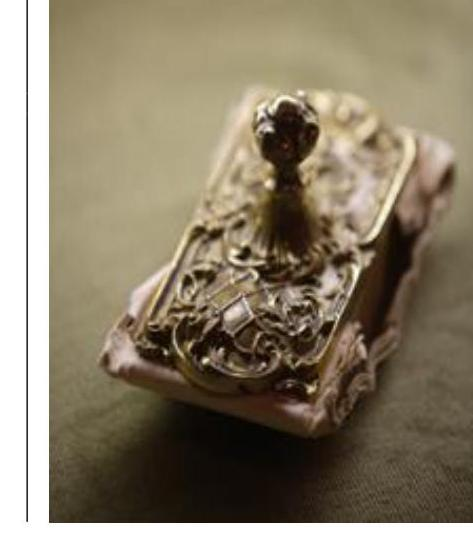
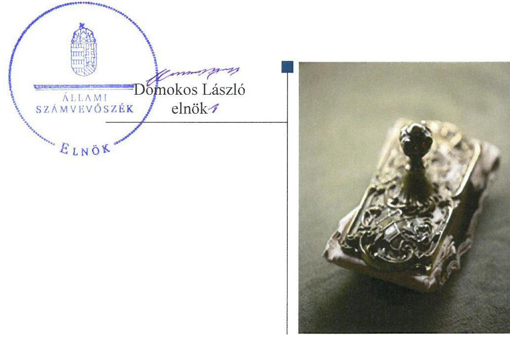
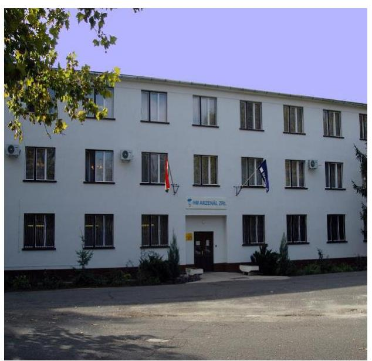
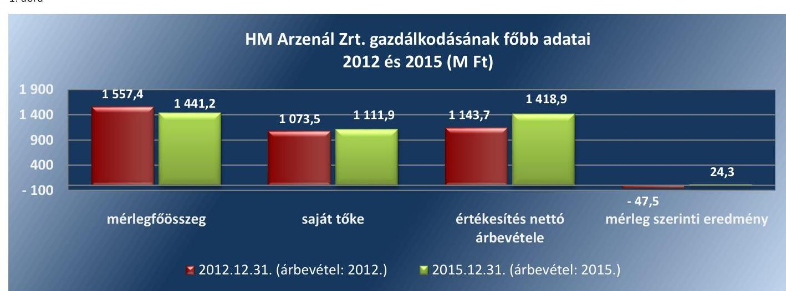
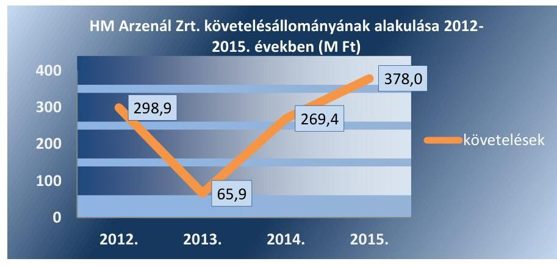
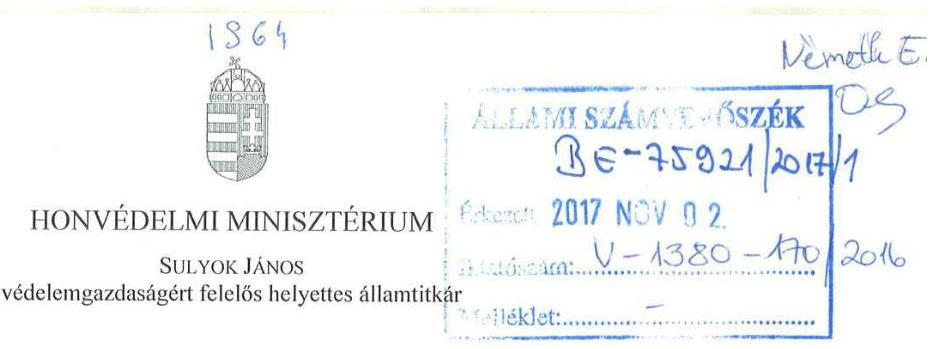
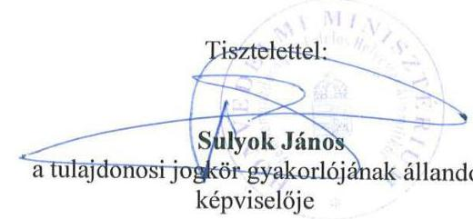
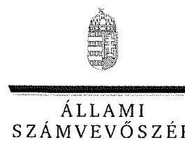
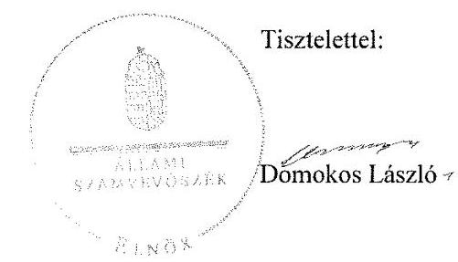
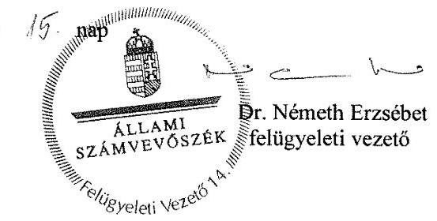

# Jelentés 

## Állami tulajdonú gazdasági társaságok

Az állami tulajdonban (résztulajdonban) lévő gazdálkodó szervezetek vagyonmegőrzési és gazdálkodási tevékenységének ellenőrzése HM ARZENÁL Elektromechanikai zártkörűen működő Részvénytársaság
2017.

---

# Jelentés 

## Állami tulajdonú gazdasági társaságok

Az állami tulajdonban (résztulajdonban) lévő gazdálkodó szervezetek vagyonmegőrzési és gazdálkodási tevékenységének ellenőrzése HM ARZENÁL Elektromechanikai zártkörűen működő Részvénytársaság
2017. november 28. nap

---

# AZ ELLENŐRZÉST FELÜGYELTE:

DR. NÉMETH ERZSÉBET felügyeleti vezető

## AZ ELLENŐRZÉST VEZETTE ÉS A VÉGREHAJTÁSÁÉRT FELELŐS:

DR. PELLEI TAMÁS ellenőrzésvezető

## A PROGRAM ÖSSZEÁLLÍTÁSÁÉRT FELELŐS:

JANIK JÓZSEF osztályvezető

IKTATÓSZÁM: V-1380-172/2016.

TÉMASZÁM: 2414

ELLENŐRZÉS-AZONOSÍTÓ SZÁM: V075950

Jelentéseink az Országgyűlés számítógépes hálózatán és az Interneten a www.asz.hu címen is olvashatóak.

---

# TARTALOMJEGYZÉK 

■ ÖSSZEGZÉS ..... 5
■ AZ ELLENŐRZÉS CÉLJA ..... 6
■ AZ ELLENŐRZÉS TERÜLETE ..... 7
■ AZ ELLENŐRZÉS HÁTTERE, INDOKOLTSÁGA ..... 9
■ A JELENTÉS LÉNYEGES KÉRDÉSKÖREI ..... 10
■ ELLENŐRZÉS HATÓKÖRE ÉS MÓDSZEREI ..... 11
■ MEGÁLLAPÍTÁSOK ..... 13
■ JAVASLATOK ..... 19
■ MELLÉKLETEK ..... 21
I. Sz. melléklet: Értelmező szótár ..... 21
II. Sz. melléklet: Társaság mérlegének főbb adatai a 2012-2015. évben (M Ft.). ..... 24
■ FÜGGELÉK: ÉSZREVÉTELEK ..... 25
■ RÖVIDÍTÉSEK JEGYZÉKE ..... 31

---

.

---

# ÖSSZEGZÉS 

A HM ARZENÁL Elektromechanikai zártkörűen működő Részvénytársaság feletti tulajdonosi joggyakorlás szabályszerű volt. A Társaság működésének szabályozottsága megfelelő volt, saját vagyonával szabályszerűen gazdálkodott.

## Az ellenőrzés társadalmi indokoltsága

Az Állami Számvevőszék stratégiájában megfogalmazta, hogy az államháztartáson kívülre nyújtott költségvetési támogatások és ingyenes vagyonjuttatások, valamint az államháztartáson kívül működő közfeladat-ellátó rendszerek ellenőrzéseivel hozzájárul ahhoz, hogy a közpénzeket az államháztartáson kívül működő szervezetek is átlátható, rendezett módon használják fel a közfeladatok szerződésben vállalt ellátása érdekében.

Ezt figyelembe véve, valamint a honvédelmi kiadások nagyságára tekintettel került sor a HM ARZENÁL Elektromechanikai zártkörűen működő Részvénytársaság ellenőrzésére a 2012-2015. évek vonatkozásában.

## Főbb megállapítások, következtetések, javaslatok

A Honvédelmi Minisztérium és a Magyar Nemzeti Vagyonkezelő Zrt. a tulajdonosi joggyakorlás tevékenységét szabályszerűen látta el. A Honvédelmi Minisztérium által a HM ARZENÁL Elektromechanikai zártkörűen működő Részvénytársaság részére használatba adott ingatlanok tekintetében kötött szerződés nem volt megfelelő, mivel az nem felelt meg teljes körűen az állami vagyonról szóló törvény végrehajtására kiadott kormányrendeletben foglaltaknak.

A HM ARZENÁL Elektromechanikai zártkörűen működő Részvénytársaság működésének szabályozottsága megfelelő volt. A bevételeinek és a ráfordításainak elszámolása megfelelő volt. A Társaság a végzett szolgáltatások díjának megállapítását az előírásoknak megfelelő önköltségszámítással alapozta meg, továbbá szabályszerűen teljesítette a tervezési, beszámolási, és adatszolgáltatási kötelezettségét.

A Honvédelmi Minisztérium által a HM ARZENÁL Elektromechanikai zártkörűen működő Részvénytársaságnál kialakított belső ellenőrzés, valamint a Honvédelmi Minisztérium belső ellenőrzése hozzájárult a feladatellátás szabályszerű teljesítéséhez, támogatta a szabályszerű működés kontrollját.

A Társaság a szabályszerű vagyongazdálkodás feltételeit kialakította a saját vagyon tekintetében, amelyeket vagyonának változását eredményező döntései meghozatalánál betartotta. A használatba vett ingatlanok vagyonváltozását eredményező döntések nem feleltek meg az előírásoknak, mert a Honvédelmi Minisztérium engedélye nélkül végeztek pótlólagos felújításokat, beruházásokat.

---

# AZ ELLENŐRZÉS CÉLJA 

Az ellenőrzés célja annak értékelése volt, hogy a tulajdonosi jogok gyakorlása szabályszerű volt-e; a gazdálkodó szervezet szabályozottsága, gazdálkodása és vagyongazdálkodási tevékenysége megfelelt-e a jogszabályi és a tulajdonosi előírásoknak; biztosítva volt-e a közfeladatok átláthatósága és elszámoltathatósága érdekében a közszolgáltatás díjának megalapozottsága szabályszerű önköltségszámítással; a vagyonváltozást eredményező döntések esetében a tulajdonosi jogok gyakorlója és a gazdálkodó szervezet szabályszerűen jártak-e el.

---

# **H M ARZENÁL Elektromechanikai zártkörűen működő Részvénytársaság**

## **HM ARZENÁL ELEKTROMECHANIKAI ZÁRTKÖRŰEN MŰKÖDŐ RÉSZVÉNYTÁRSASÁGOT**

A HM1 elsődlegesen a Magyar Honvédség nomenklatúrájába tartozó berendezések, eszközök tervezése, fejlesztése, gyártása, javítása, felújítása, valamint a Magyar Honvédség és a HM objektumai biztonságtechnikai rendszereinek tervezése, gyártása, kivitelezése céljából alapította 1992-ben 298,567 M Ft alaptőkével. A Társaság jegyzett tőkéje az ellenőrzött időszakban nem változott, 331,185 M Ft volt, amely 89,570 M Ft pénzbeli hozzájárulásból és 241,615 M Ft apportból állt.

A Társaság2 (haditechnikai) alaptevékenysége a Magyar Honvédség rakéta és lokátor-technikai eszközeinek modernizálása, speciális légvédelmi rakétarendszer eszközeinek, valamint lokátorainak karbantartása, helyszíni javítása, rakéták műszaki állapotának vizsgálata, üzemidejük meghosszabbításához szükséges technológia kidolgozása és végrehajtása, valamint mérőműszerek, nagynyomású levegő tároló edények, emelő eszközök műszaki felülvizsgálata, kalibrálása volt. A feladatai közé tartozott még különböző frekvencia sávban üzemelő felderítő lokátor állomások vevő és jelfeldolgozó rendszereinek modernizálása, azok üzemeltetési biztonságának növelése, és adatbeviteli rendszerek kiépítése. Nem haditechnikai (polgári) tervezési feladatként jelentkezett objektumok, épületek beruházási tender dokumentációjának kidolgozása, valamint betörésvédelmi, tűzjelző és tűzoltó, video-kamerás megfigyelő és beléptető rendszerek telepítése. A Társaság gazdálkodásának főbb adatait az 1. ábra, és a mérlegadatait a II. számú melléklet tartalmazza.

*Forrás: A Társaság éves beszámolói*

---

1. táblázat

|  ÉRTÉKESÍTÉS NETTÓ ÁRBEVÉTEL |  |  |  |   |
| --- | --- | --- | --- | --- |
|  ALAKULÁSA 2012-2015 KÖZÖTT |  |  |  |   |
|  (M FT) |  |  |  |   |
|  |   |   |   |   |
|  2012 | 2013 | 2014 | 2015 |   |
|  Netto ár- |  |  |  |   |
|  bevétel | 1143,7 | 1056,2 | 1298,0 | 1418,9  |
|  összesen |  |  |  |   |
|  Export, | 3,7 | 0,2 | 0,2 | 0,2  |
|  polgári |  |  |  |   |
|  Export, | 140,1 | 133,7 | 415,8 | 245,2  |
|  haditech- |  |  |  |   |
|  nikai |  |  |  |   |
|  Belföldi, | 461,2 | 444,3 | 455,8 | 632,7  |
|  polgári |  |  |  |   |
|  Belföldi, | 538,7 | 478,0 | 426,2 | 540,8  |
|  haditech- |  |  |  |   |
|  nikai |  |  |  |   |

A mérlegfőösszeg 2012. december 31. és 2015. december 31. között 7,5%-kal - 116,2 M Ft-tal - csökkent, amelyet az eszközöknél a tárgyi eszközök és pénzeszközök, a forrásoknál a kötelezettségek és az eredménytartalék csökkenése okozott. Az értékesítés nettó árbevétele az ellenőrzött időszakban összesen 275,2 M Ft-tal emelkedett. Az értékesítés nettó árbevételének alakulását az 1. táblázat tartalmazza.

A mérlegszerinti eredmény 2012. évi veszteségét a pénzügyi műveletek ráfordításai okozták, ugyanakkor a Társaság 2012. évben üzemi (üzleti) szinten nyereséggel zárta az eredmény elszámolását.

A foglalkoztatott munkavállalók átlagos statisztikai létszáma a 2012. évi 165 főről a 2015. évre 157 főre változott.

A Társaság számviteli és könyvelési feladatait a 2012-2015. években a HM Armcom Zrt. ${ }^{3}$ látta el - a Társaság belső számviteli szabályzatában foglaltak alapján - külső szolgáltatás keretében.

Az NGM ${ }^{4}$ a 2012. évben 3,7 M Ft hadiipari kapacitás megtartó, a 2014. évben 5,9 M Ft honvédelmi felkészítő vissza nem térítendő támogatást folyósított a Társaságnak. A Nemzeti Fejlesztési Ügynökséggel megkötött támogatási szerződés keretében a 2013-2015. években - Magyar-svéd haditechnikai K+F projekt 2. fázisa témát érintően - 30,0 M Ft támogatásban részesült. A 2013. évben tulajdonosi határozat Társaságnak.

A Társaságnak vagyonkezelésbe vett vagyona nem volt, használatra átvett állami vagyonnal rendelkezett, amely a HM vagyonkezelésében állt. Más gazdasági társaságban tulajdoni részesedéssel nem rendelkezett, nem minősült kormányzati szektorba sorolt gazdálkodó szervezetnek.

---

# AZ ELLENŐRZÉS HÁTTERE, INDOKOLTSÁGA 

Az állami tulajdonú gazdálkodó szervezetek ellenőrzése kiemelten fontos a nemzeti vagyon megőrzése, megóvása érdekében. Gazdálkodásuk jellemzően a közérdeklődés és a média figyelmének középpontjában áll, amihez hozzájárul a gazdálkodásuk körébe tartozó - közvetlen vagy közvetett állami tulajdonú - vagyon nagysága, illetve az általuk ellátott szolgáltatások minősége és hatékonysága. A szolgáltatási árképzés megalapozottsága és az éves elszámoltatás feltételeinek kialakítása az ellenőrzés során nagy hangsúlyt kap.

Az ellenőrzés rámutathat az állami tulajdonú gazdálkodó szervezetek gazdálkodási tevékenységével kapcsolatos jó gyakorlatokra és szabálytalanságokra. Felhívhatja a figyelmet a jogszabályi követelmények teljesítéséhez szükséges feltételek hiányosságaira, hozzájárulhat az államháztartáson kívüli, de (közvetlenül vagy közvetve) állami vagyont használó gazdálkodó szervezetek tevékenységének átláthatóságához. Ellenőrzésünk eredményeképpen javaslatainkkal, megállapításainkkal hozzájárulhatunk a nemzeti vagyonnal való gazdálkodás átláthatóságának, elszámoltathatóságának javításához.

---

# A JELENTÉS LÉNYEGES KÉRDÉSKÖREI 

1.     - A tulajdonosi jogok gyakorlása szabályszerű volt-e?
2.     - A társaság működésének szabályozottsága megfelelt-e az előírásoknak?
3.     - A társaságnál a pénzügyi-számviteli, adatszolgáltatási és ellenőrzési feladatok ellátása szabályszerű volt-e?
4.     - A társaság vagyongazdálkodása szabályszerű volt-e?

---

# ELLENŐRZÉS HATÓKÖRE ÉS MÓDSZEREI 

## Az ellenőrzés típusa

Megfelelőségi ellenőrzés.

## Az ellenőrzött időszak

Az ellenőrzött időszak 2012. január 1-jétől 2015. december 31-ig tart.

## Az ellenőrzés tárgya

Állami tulajdonban (résztulajdonban) lévő gazdasági társaság gazdálkodása, kiemelten vagyongazdálkodási tevékenysége, a tulajdonosi jogok gyakorlása, továbbá a kormányzati szektorba sorolt gazdasági társaság gazdálkodásának a kormányzati szektor hiányára és az államadósságra befolyással bíró elemei.

Az ellenőrzés kiterjedt minden olyan körülményre és adatra, amely az ÁSZ ${ }^{5}$ jogszabályban meghatározott feladatainak teljesítéséhez, valamint a program végrehajtása folyamán felmerült újabb összefüggések feltárásához szükséges.

## Az ellenőrzött szervezet

Magyar Nemzeti Vagyonkezelő Zrt.
Honvédelmi Minisztérium
HM ARZENÁL Elektromechanikai zártkörűen működő Részvénytársaság

## Az ellenőrzés jogalapja

Az ellenőrzés jogalapját az ÁSZ tv. ${ }^{6}$ 1. § (3) bekezdése és 5. § (3)-(5) bekezdése képezi.

## Az ellenőrzés módszerei

Az ellenőrzést a nemzetközi standardokat irányadónak tekintve az ellenőrzési program ellenőrzési kérdései, az ellenőrzött időszakban hatályos jogszabályok, az ellenőrzés szakmai szabályok és módszertanok figyelembevételével végeztük.

---

Az ellenőrzési kérdések megválaszolásához szükséges bizonyítékok megszerzése a következő ellenőrzési eljárások alkalmazásával történt: megfigyelés, kérdésfeltevés (információkérés), összehasonlítás, valamint mintavételi és elemző eljárások. Az ellenőrzési bizonyítékként felhasználható adatforrások közé tartoztak egyrészt az ellenőrzési programban felsorolt adatforrások, másrészt adatforrás lehetett még minden - az ellenőrzés folyamán - feltárt, az ellenőrzés szempontjából információkat tartalmazó dokumentum.

Az ellenőrzött szervezetek az ellenőrzés lefolytatásához tanúsítványok kitöltésével, valamint az ÁSZ által kért dokumentumok megküldésével szolgáltattak adatokat.

A bevételek és ráfordítások elszámolása, valamint a vagyonnyilvántartás terén a szabályszerű működést véletlen mintavétellel és irányított kiválasztással ellenőriztük. A jogszabályoknak és a belső előírásoknak megfelelőnek, azaz szabályszerűnek tekintettük az adott területet, amennyiben a minta ellenőrzésének eredménye alapján 95%-os bizonyossággal a teljes sokaságban a hibaarány kisebb volt, mint 10%, nem megfelelőnek értékeltük, ha a hibaarány a 10%-ot meghaladta.

---

# 1. A tulajdonosi jogok gyakorlása szabályszerű volt-e? 

Összegző megállapítás

A Társaság feletti tulajdonosi joggyakorlás megfelelt az előírásoknak. A HM által kötött ingatlan használatba adási szerződés nem volt szabályszerű.

AZ MNV ZRT. ${ }^{7}$ volt jogosult 2012-ben a Magyar Állam nevében a tulajdonosi jogok gyakorlására, amely a tulajdonosi jogokat és kötelezettségeket 2012. december 31-ig a Vtv. ${ }^{8}$ rendelkezéseivel összhangban Vagyonkezelési szerződés ${ }^{9}$ alapján - az abban meghatározott korlátozásokkal és feltételekkel
 - a HM részére átengedte. A tulajdonosi jogokat és kötelezettségeket 2013. január 1-jétől az ellenőrzött időszak végéig a Nvtv. ${ }^{10}$-nek és a Vtv.-nek megfelelően a Hvt. ${ }^{11}$ és az Együttműködési megállapodás ${ }_{1-2}{ }^{12}$ alapján a honvédelemért felelős miniszter gyakorolta.

A HM a tulajdonosi jogok gyakorlására vonatkozó szabályokat a 11/2010. HM utasítás ${ }^{13}$-ban, a 67/2011. HM utasítás ${ }^{14}$-ban, a Társaság működésére és a vagyongazdálkodására vonatkozó követelményeket az Alapító Okirat ${ }_{1-}$ ${ }^{15}$-ban, az Alapszabály ${ }_{1-2}{ }^{16}$-ban és a tulajdonosi határozatokban rögzítette.

Az Alapító Okirat ${ }_{1-10}$ és az Alapszabály ${ }_{1-2}$ a Gt. ${ }^{17}$ és a Ptk. ${ }^{18}$ előírásaival összhangban tartalmazta a vagyonnal történő felelős gazdálkodáshoz szükséges követelményeket, és meghatározták az MNV Zrt., a HM, az FB ${ }^{19}$, az IG ${ }^{20}$, a vezérigazgató ${ }^{21}$ jogait, feladatait, valamint rendelkezéseket a könyvvizsgáló személyéről. Az FB, az IG és a vezérigazgató, illetve a könyvvizsgáló tevékenységéhez kapcsolódó tulajdonosi joggyakorlás megfelelt a Gt. és a Ptk. ${ }_{2}$ előírásainak.

Az ÉVES BESZÁMOLÓKAT a HM az FB jelentése, valamint a Számv. tv. ${ }^{22}$-ben foglaltak alapján - könyvvizsgáló véleményének ismeretében tulajdonosi határozattal fogadta el.

Az ÉVES ÉS AZ ÉVKÖZI BESZÁMOLÁST, AZ ADATSZOLGÁLTATÁSOK RENDJÉT a HM a 477-26/2010. számú tulajdonosi határozatban rögzítette, amelynek keretében - többek között - meghatározta az éves beszámoló, az üzleti terv, illetve az FB jelentés tartalmára vonatkozó előírásokat. A HM az üzleti tervek elkészítéséhez minden évben tervezési irányelveket adott ki.

A HM tulajdonosi határozatokban rendelkezett a Társaság belső ellenőrzési feladatainak ellátásáról.

A Vhr. ${ }^{23}$ 20. § (1) bekezdés előírása ellenére az 1992. július 29-én megkötött használatba adási szerződés ${ }^{24}$-ben nem került rögzítésre, hogy a tulajdonosi ellenőrzés eljárásrendjét, a felek jogait, kötelezettségeit a felek a szerződés részének tekintik.

---

# 2. A társaság működésének szabályozottsága megfelelt-e az előírásoknak? 

Összegző megállapítás

A Társaság működésének szabályozottsága megfelelő volt.
Az SZMSZ ${ }_{1-9}{ }^{25}$-t az Alapító okirat ${ }_{1-10}$-nak és az Alapszabály ${ }_{1-2}$-nak megfelelően készítették el.

A számviteli szabályzatokat a Társaság elkészítette, a működése a meglévő szabályzatok alapján biztosított volt. A Számv. tv 14. § (3) bekezdésében foglaltak alapján rendelkezett Számviteli politikával ${ }_{3-3}{ }^{26}$ és a Számv. tv. 14. § (5) bekezdés a), b) és d) pontjaiban meghatározott szabályzatokkal.

A Társaság a Számv. tv. 14. § (11) bekezdésben foglalt kötelezettségnek nem tett eleget, mert az ellenőrzött időszakban a számviteli jogszabályi változásokat 90 napon belül - illetve azt követően - nem vezette át a Számviteli politikán ${ }_{2}$. A Számviteli politika ${ }_{2}$ hiányossága volt, hogy azon a Számv. tv. 3. § (3) bekezdése 3. pontjának 2013. január 1-jén hatályba lépő módosítása miatt a jelentős összegű hiba, valamint a Számv. tv. 3. § (3) bekezdése 5. pontjának 2013. január 1-jei hatályon kívül helyezése miatt a megbízható és valós képet lényegesen befolyásoló hiba fogalmát érintő változásait nem vezették át.

A Társaság rendelkezett Leltározási szabályzat ${ }_{1-2}{ }^{27}$-tal, de a Leltározási szabályzat ${ }_{1}$-ot a Számv. tv. hatálybalépését követően nem aktualizálták, a Leltározási szabályzat ${ }_{1}$ a 2001. január 1-jétől hatályon kívül helyezett a számvitelről szóló 1991. évi XVIII. tv. jogszabályi előírásaira épült. A Leltározási szabályzat ${ }_{2}$ megfelelt a Számv tv. előírásainak.

A Pénzkezelési Szabályzat ${ }_{3-5}{ }^{28}$ a Számv. tv. 14. § (8) bekezdésben meghatározott előírásnak megfelelt, tartalmazta a pénzforgalom és pénzkezelés folyamán érvényesítendő szabályozásokat.

A Számlarend ${ }_{3-2}{ }^{29}$ kialakítása a Számv. tv. 161. § (1) bekezdésében meghatározottak alapján megtörtént, tartalma megfelelt a Számv. tv. előírásainak. A Számv. tv. előírásainak megfelelő bizonylatolást és a bizonylati rendet a belső szabályzatok tartalmazták.

A Javadalmazási szabályzatot ${ }^{30}$ a HM megalkotta, amely megfelelt a Taktv. ${ }^{31}$ előírásainak.

---

# 3. A társaságnál a pénzügyi-számviteli, adatszolgáltatási és ellenőrzési feladatok ellátása szabályszerű volt-e? 

Összegző megállapítás

## 3.1. számú megállapítás

A pénzügyi-számviteli, adatszolgáltatási és ellenőrzési feladatok ellátása szabályszerű volt.

A bevételek és ráfordítások elszámolása megfelelt az előírásoknak.
Az ÉRTÉKESÍTÉS NETTÓ ÁRBEVÉTELÉNEK az egyéb, rendkívüli és pénzügyi műveletek bevételének elszámolása megfelel a Számv. tv.-ben, a Számviteli politikában ${ }_{1-2}$ és a Számlarendben ${ }_{1-2}$ foglalt előírásoknak.

A RÁFORDÍTÁSOK elszámolása szabályszerű volt. A ráfordítások elszámolása számviteli bizonylatok alapján, megfelelő főkönyvi számlákra, szerződés vagy megrendelés alapján történt.

Az ÉRTÉKCSÖKKENÉS ELSZÁMOLÁSA megfelelő volt, az éves beszámolók kiegészítő mellékletében az elszámolt értékcsökkenés alakulását bemutatták, továbbá meghatározták, hogy az értékcsökkenés elszámolását bruttó (bekerülési) érték alapján lineáris módszerrel végzik, valamint a 100 E Ft beszerzési (bekerülési) értéket meg nem haladó egyedi eszközök értékcsökkenését - használatbavételkor - egy összegben elszámolják.

A HÁTRALÉKOS KÖVETELÉSEKET a Társaság naprakészen nyilvántartotta. A követelésállomány alakulását, a megtett intézkedéseket, illetve az előző időszakban megtett intézkedéseik hatását, következményeit az FB megtárgyalta, és ennek eredményéről negyedévente tájékoztatatta az IG-t. A határidőn túli vevőkövetelések behajtására fizetési felszólító levél kiküldését alkalmazták, fizetési meghagyásos eljárást kezdeményeztek vagy kintlévőség kezelő társaságot bíztak meg. A követelésállomány alakulását a 2. ábra tartalmazza.
2. ábra

Forrás: A Társaság adatszolgáltatása
A követelésállomány a 2012 és 2013 között jelentősen csökkent, majd 2015-ig fokozatosan emelkedett. A vevőkövetelések összegének 99\%-a haditechnikai és 1\% nem haditechnikai (polgári) kintlévőség volt. Az egyéb

---

# Megállapítások

2. táblázat

|  A SAJÁT TŐKE ALAKULÁSA 2012 ÉS 2015. ÉVEKBEN (M FT) |  |   |
| --- | --- | --- |
|  Tőkeelemek | 2012. | 2015.  |
|  Saját tőke | 1 073,5 | 1 111,9  |
|  Jegyzett tőke | 331,2 | 331,2  |
|  Saját tőke /jegyzett tőke | 324,1% | 335,7%  |

*Forrás: A Társaság 2012-2015. évi éves beszámolói*

követelések adóhatósággal szembeni adótúlfizetések és dolgozókkal szembeni követelések voltak.

**Az ÖNKÖLTSÉGSZÁMÍTÁSI SZABÁLYZAT** ${ }_{1-2}$ ${ }^{32}$-ot a Társaság a Számv. tv. előírása alapján elkészítette és az ellenőrzött időszakban aktualizálta. Az Önköltségszámítási szabályzat ${ }_{1-2}$ részletesen tartalmazta a kalkulációs módszereket, azok tartalmi elemeit, a kalkulációkészítés határidejét.

A Társaság negyedévente végzett utókalkulációs tevékenységet a termékek és a szolgáltatások önköltségének megállapítására. A Társaság a szolgáltatási díjait az előírásoknak megfelelő önköltségszámítással megalapozta.

## A tervezési, beszámolási, adatszolgáltatási kötelezettség teljesítése megfelelő volt.

**Üzleti terveit** a Társaság a 2012-2015. közötti években elkészítette, azokat az FB megtárgyalta, az IG jóváhagyta és előterjesztette a HM részére. A HM tulajdonosi határozatával minden évben elfogadta az éves üzleti terveket.

**Az éves beszámolókat** a Társaság az ellenőrzött időszakban elkészítette, azokat az előírt határidőig az FB írásbeli jelentésének és a könyvvizsgálói vélemény birtokában a HM tulajdonosi határozattal elfogadta. A Társaság az éves beszámolókat letétbe helyezte és közzétette.

A Társaság a Számv. tv. 88. § (4) bekezdésében előírtak ellenére az éves beszámolók kiegészítő mellékletében nem ismertette az értékcsökkenés elszámolásának gyakoriságát.

**A saját tőke és a jegyzett tőke** aránya az ellenőrzött időszakban elérte a meghatározott értéket, a saját tőke és a jegyzett tőke alakulását a 2. táblázat tartalmazza.

## Az adatok védelme és a közérdekű adatok nyilvánosságra hozatala biztosított volt

A Társaság a titokvédelmi és ügyviteli szabályzat ${ }^{33}$-ban, valamint a biztonsági szabályzat ${ }_{1-2}$ ${ }^{34}$-ben rendelkezett a minősített adatok védelméről. A minősített adatvédelmi törvénynek ${ }^{35}$ és a minősített adatvédelmi rendeletnek ${ }^{36}$ megfelelően rendszerbiztonsági felügyelőt és adatvédelmi ügyintézőt is foglalkoztattak az ellenőrzött időszakban. A Társaság az Info tv. ${ }^{37}$ előírása alapján elkészítette a közérdekű vagy közérdekből nyilvános adatok igénylésének eljárásrendjét.

A HM által a 477-26/2010. számú tulajdonosi határozatban előírt adatszolgáltatási kötelezettségét a Társaság teljesítette.

## A belső ellenőrzés ellenőrizte a vagyongazdálkodást.

**A belső ellenőrzést** a 2012. évben a HM Armcom Zrt. végezte, majd 2013-2015. években a HM El Zrt. látta el. Az elvégzett belső ellenőrzési jelentések alapján készült intézkedési tervekbe foglalt feladatok végrehajtásáról a Társaság minden évben jelentést készített.

---

A HM belső ellenőrzésén és az FB-én keresztül, valamint könyvvizsgáló megbízásával biztosította a tulajdonosi ellenőrzéseket.

A HM belső ellenőrzése 2014-ben vizsgálta a Társaság tevékenységét fejezetszintű államháztartási belső ellenőrzés keretében. Az ellenőrzésről készült jelentés több megállapítást tett mind a Társaság, mind a HM szervezeti egységei felé. A megállapítások alapján a Társaság intézkedési tervet készített.

# 4. A társaság vagyongazdálkodása szabályszerű volt-e? 

## Összegző megállapítás

### 4.1. számú megállapítás

### 4.2. számú megállapítás

A Társaság vagyongazdálkodása szabályszerű volt.
A saját vagyon értékének megőrzését, gyarapítását szolgáló vagyongazdálkodás feltételeit kialakították.

A Társaság a HM által előírt és jóváhagyott éves üzleti terveiben rögzítette a gazdálkodás fő mutatóit, a bevétel- és költségterveket, valamint a beruházási, fejlesztési terveket.

A vagyongazdálkodáshoz és vagyonváltozásokhoz kapcsolódó feladat- és hatáskörökre, felelősségi viszonyokra vonatkozó előírások az Alapító okirat ${ }_{1-10}$-ban és az Alapszabály ${ }_{1-2}$-ban, valamint az SZMSZ ${ }_{1-9}$-ben kerültek meghatározásra. A kötelezettségvállalásokkal kapcsolatos aláírási és utalványozási jogosultságokat vezérigazgatói intézkedésekben rögzítették.

A Társaság a vagyonát az előírásoknak megfelelően tartotta nyilván, a vagyona értékének, állagának megőrzéséről gondoskodott.

## A saját vagyonról vezetett nyilvántartás

átlátható volt, a saját vagyon és a vagyonváltozás folyamatos nyilvántartását és kimutatását a főkönyvi könyveléssel és az analitikus nyilvántartások vezetésével biztosították. A használatba adási szerződés keretében használatba vett ingatlanokat szabályszerűen, elkülönített analitikus nyilvántartásban rögzítették. A használatba vett ingatlanokon végzett felújításokat a főkönyvi könyvelési rendszerében a Számv. tv. 26. § (2) bekezdés előírásai alapján, mint bérbe vett ingatlanokon végzett és aktivált beruházást szerepeltették, az értékcsökkenést elszámolták.

Év végi leltárral támasztották alá a 2012-2015. közötti években az éves beszámoló részét képező mérleg egyes eszköz és forrás tételeit valamint a számviteli nyilvántartásokban lévő vagyontárgyak állományát mennyiségben és értékben, amely megfelelt a Számv. tv. előírásainak.

A saját vagyon értékének megőrzése az immateriális javak és tárgyi eszközök esetében megvalósult, mivel összevont nettó értékük 24,4 M Ft-tal emelkedett 2012. január 1. és 2015. december 31. közötti időszakban. Az immateriális javak és tárgyi eszközök nettó értékének alakulását a 3. táblázat tartalmazza.

---

4. táblázat

## ÉRTÉKCSÖKKENÉS-BERUHÁZÁS 2012-2015 (M FT)

| Megnevezés | 2012 | 2013 | 2014 | 2015 |
| :-- | :--: | :--: | :--: | :--: |
| Értékcsökkenési leírás | 46,9 | 44,3 | 44,2 | 44,2 |
| Eszközök pótlására fordított pénzeszköz (beruházás) | 123,4 | 35,4 | 23,9 | 55,0 |

Forrás: A Társaság adatszolgáltatása
4.3. számú megállapítás

## Az immateriális javak és a tárgyi eszközök nettó értékének alakulása (M FT)

| Megnevezés | 2012.01 .31 | 2012.12 .31 | 2013.12 .31 | 2014.12 .31 | 2015.12 .31 |
| :-- | :--: | :--: | :--: | :--: | :--: |
| Immateriális javak | 5,8 | 15,8 | 12,9 | 10,8 | 33,9 |
| Tárgyi eszközök | 660,5 | 721,5 | 705,0 | 671,7 | 656,8 |
| Összesen | 666,3 | 737,3 | 717,9 | 682,5 | 690,7 |

Forrás: A Társaság adatszolgáltatása

Az
 immateriális javak nettó értéke 28,1 M Ft-tal emelkedett, a tárgyi eszközök nettó értéke 3,7 M Ft-tal csökkent.

A 4. táblázat tartalmazza 2012-2015. közötti években elszámolt értékcsökkenési leírás és az eszközpótlásra fordított pénzeszköz (beruházás) összegének alakulását. A 2012-2015. években a Társaságnál elszámolt értékcsökkenési leírás összege 179,6 M Ft és az eszközpótlásra fordított pénzeszköz (beruházás) összege 237,7 M Ft volt.

A Társaság az ellenőrzött időszakban a tárgyi eszközei és immateriális javai állapotának folyamatos karbantartásáról gondoskodott. A karbantartásokkal kapcsolatos adatokat az éves üzleti tervek tartalmazták.

A vagyon változását eredményező döntések a saját vagyon esetében megfeleltek, a használatba vett ingatlanok esetében nem felelt meg az előírásnak.

## A SAJÁT VAGYON VÁLTOZÁSÁT EREDMÉNYEZŐ

DÖNTÉSEK szabályszerűek voltak, az Alapító okirat ${ }_{1-10}$-ban és az Alapszabály ${ }_{1-2}$-ban meghatározott, valamint az SZMSZ ${ }_{1-9}$-ben rögzített előírások szerint valósultak meg.

A használatba vett ingatlanok esetében, a használatba adási szerződés 6. pontjában előírtak ellenére - egy esetet kivéve - a Társaság nem rendelkezett a HM engedélyével az elvégzett pótlólagos felújítások, bővítések tekintetében.

---

# JAVASLATOK 

Az ÁSZ tv. 33. § (1) bekezdésében foglaltak értelmében az ellenőrzött szervezet vezetője köteles a jelentésben foglalt megállapításokhoz kapcsolódó intézkedési tervet összeállítani és azt a jelentés kézhezvételétől számított 30 napon belül az ÁSZ részére megküldeni. Amennyiben az ellenőrzött szervezet vezetője nem küldi meg határidőben az intézkedési tervet, vagy továbbra sem elfogadható intézkedési tervet küld, az Állami Számvevőszék elnöke az ÁSZ tv. 33. § (3) bekezdése a) és b) pontjaiban foglaltakat érvényesítheti.

## a Honvédelmi miniszternek

1. A jogszabályi előírásnak megfelelően a használatba adási szerződésben kerüljön rögzítésre, hogy a tulajdonosi ellenőrzés eljárásrendjét, a felek jogait, kötelezettségeit a felek a szerződés részének tekintik.
(1. sz. megállapítás 13. oldal utolsó bekezdése alapján)

## a HM ARZENÁL Elektromechanikai Zrt. vezérigazgatójának

1. Intézkedjen, hogy a Számviteli politika feleljen meg a Számv. tv. előírásainak, valamint a Számv. tv. módosítása esetén a változások hatályba lépését követő 90 napon belül a Számviteli politikán történő keresztülvezetéséről.
(2. sz. megállapítás 3. bekezdése alapján)
2. Intézkedjen arról, hogy az éves beszámoló kiegészítő melléklete a jogszabály előírásának megfelelően mutassa be az értékcsökkenés elszámolásának gyakoriságát.
(3.2. sz. megállapítás 3. bekezdése alapján)
3. Intézkedjen az ingatlan használatba adási szerződésnek megfelelően arról, hogy a használatba vett ingatlanok esetében az elvégzett pótlólagos felújítások, bővítések tekintetében rendelkezzen a HM engedélyével.
(4.3. sz. megállapítás 2. bekezdése alapján)

---

.

---

# MELLÉKLETEK 

## I. SZ. MELLÉKLET: ÉRTELMEZŐ SZÓTÁR

állami vagyon
gazdasági társaság
gazdálkodó szervezet

MNV Zrt.
nemzeti vagyon
a) Az állam tulajdonában lévő dolog, valamint a dolog módjára hasznosítható természeti erő,
b) az a) pont hatálya alá nem tartozó mindazon vagyon, amely vonatkozásában törvény az állam kizárólagos tulajdonjogát nevesíti,
c) az állam tulajdonában lévő tagsági jogviszonyt megtestesítő értékpapír, illetve az államot megillető egyéb társasági részesedés,
d) az államot megillető olyan immateriális, vagyoni értékkel rendelkező jogosultság, amelyet jogszabály vagyoni értékű jogként nevesít.
Forrás: Vtv. 1. § (2) bekezdése
2012. november 10-től az állami vagyon fogalma kiegészül a következő ponttal:
e) az állam tulajdonában lévő pénzügyi eszközök
Forrás: Vtv. 1. § (2) bekezdése
A Ptk. 3:88. § (1) bekezdése szerint „a gazdasági társaságok üzletszerű közös gazdasági tevékenység folytatására, a tagok vagyoni hozzájárulásával létrehozott, jogi személyiséggel rendelkező vállalkozások, amelyekben a tagok a nyereségből közösen részesednek, és a veszteséget közösen viselik".
2014. március 14-ig:

A Ptk. ${ }^{38}$ 685. § c) pontja szerint gazdálkodó szervezet: „az állami vállalat, az egyéb állami gazdálkodó szerv, a szövetkezet, a lakásszövetkezet, az európai szövetkezet, a gazdasági társaság, az európai részvénytársaság, az egyesülés, az európai gazdasági egyesülés, az európai területi együttműködési csoportosulás, az egyes jogi személyek vállalata, a leányvállalat, a vízgazdálkodási társulat, az erdő birtokossági társulat, a végrehajtói iroda, az egyéni cég, továbbá az egyéni vállalkozó."
2014. március 15-től:

A gazdasági társaság, az európai részvénytársaság, az egyesülés, az európai gazdasági egyesülés, az európai területi együttműködési csoportosulás, a szövetkezet, a lakásszövetkezet, az európai szövetkezet, a vízgazdálkodási társulat, az erdőbirtokossági társulat, az állami vállalat, az egyéb állami gazdálkodó szerv, az egyes jogi személyek vállalata, a közös vállalat, a végrehajtói iroda, a közjegyzői iroda, az ügyvédi iroda, a szabadalmi ügyvivői iroda, az önkéntes kölcsönös biztosító pénztár, a magánnyugdíjpénztár, az egyéni cég, továbbá az egyéni vállalkozó. Az állam, a helyi önkormányzat, a költségvetési szerv, az egyesület, a köztestület, valamint az alapítvány gazdálkodó tevékenységével összefüggő polgári jogi kapcsolataira is a gazdálkodó szervezetre vonatkozó rendelkezéseket kell alkalmazni.
Forrás: Pp. ${ }^{39} 396$. §
Az állami vagyon felett, a Magyar Államot megillető tulajdonosi jogok és kötelezettségek összességét - a hatályos szabályozás szerint - az állami vagyon felügyeletéért felelős miniszter (jelenleg a nemzeti fejlesztési miniszter) gyakorolja. A miniszter feladatát nagy részben az MNV Zrt., mint tulajdonosi joggyakorló szervezet útján látja el.
a) az állam vagy a helyi önkormányzat kizárólagos tulajdonában álló dolgok,
b) az a) pont hatálya alá nem tartozó, állam vagy a helyi önkormányzat tulajdonában lévő dolog,

---

c) az állam vagy a helyi önkormányzat tulajdonában lévő pénzügyi eszközök, továbbá az államot vagy a helyi önkormányzatot megillető társasági részesedések,
d) az államot vagy a helyi önkormányzatot megillető bármely vagyoni értékkel rendelkező jogosultság, amelyet jogszabály vagyoni értékű jogként nevesít,
e) Magyarország határa által körbezárt terület feletti légtér,
f) az üvegházhatású gázok kibocsátási egységeinek kereskedelméről szóló törvény szerint kibocsátási egység és légiközlekedési kibocsátási egység, valamint az ENSZ Éghajlatváltozási Keretegyezménye és annak Kiotói Jegyzőkönyve végrehajtási keretrendszeréről szóló törvény szerinti kiotói egység,
g) állami vagy helyi önkormányzati fenntartású közgyűjtemény (muzeális intézmény, levéltár, közgyűjteményként működő kép- és hangarchívum, valamint könyvtár) saját gyűjteményében nyilvántartott kulturális javak körébe tartozó dolog, kivéve, ha az állami vagy önkormányzati tulajdon jogszerű létrejötte kétséget kizáró módon nem bizonyítható és a dologra nézve más a tulajdonjogát bizonyítja vagy a kulturális javakra vonatkozó jogszabályokban meghatározott eljárás keretében valószínűsíti (g. pont módosult 2013. december 7-től),
h) a régészeti lelet,
i) a nemzeti adatvagyon körébe tartozó állami nyilvántartások fokozottabb védelméről szóló törvény szerinti nemzeti adatvagyon.
Forrás: Nvtv. 1. § (2)
tulajdonosi ellenőrzés
2014. március 14-ig:

Az állami vagyon kezelőjét, haszonélvezőjét, használóját megillető jogok gyakorlását, annak szabályszerűségét, célszerűségét az MNV Zrt. - szükség szerint területi szervei útján - ellenőrzi.
2014. március 15-től:

Az állami vagyon használóját, vagyonkezelőjét és haszonélvezőjét megillető jogok gyakorlását, annak szabályszerűségét, a kötelezettségek teljesítését, valamint a vagyon rendeltetése szerinti célszerűségét a tulajdonosi joggyakorló rendszeresen ellenőrzi.
Forrás: Vhr. 20. § (1)
tulajdonosi jogok gyakor-
lója
1.

## 2013. június 27-ig:

Az állami vagyon felett a Magyar Államot megillető tulajdonosi jogok és kötelezettségek összességét - ha törvény eltérően nem rendelkezik - az állami vagyon felügyeletéért felelős miniszter (a továbbiakban: miniszter) gyakorolja, aki e feladatát a Magyar Nemzeti Vagyonkezelő Zártkörűen Működő Részvénytársaság (a továbbiakban: MNV Zrt.), a Magyar Fejlesztési Bank, illetve a tulajdonosi joggyakorló szervezet útján látja el. A miniszter miniszteri rendeletben, a törvényben meghatározott állami vagyoni kör tekintetében, meghatározott időtartamra, a joggyakorlás egyes szabályainak meghatározásával - az őt megillető tulajdonosi jogok és kötelezettségek összességének, illetve azok meghatározott részének gyakorlóját az Áht. szerinti központi költségvetési szervek, ezek intézménye, továbbá a 100%-ban állami tulajdonban álló gazdasági társaságok közül kijelölheti.
Forrás: Vtv. 3. § (1) és (2)
2013. június 28-ától:

A rábízott állami vagyon felett az államot megillető tulajdonosi jogok és kötelezettségek összességét tulajdonosi joggyakorlóként:
a) ha törvény vagy miniszteri rendelet eltérően nem rendelkezik, a Magyar Nemzeti Vagyonkezelő Zártkörűen Működő Részvénytársaság (a továbbiakban: MNV Zrt.),
b) törvényben kijelölt személy vagy

---

c) az állami vagyon felügyeletéért felelős miniszter (a továbbiakban: miniszter) által rendeletben kijelölt személy gyakorolja.
[...] A miniszter e törvény felhatalmazása alapján - a meghatározott célok hatékonyabb elérése érdekében, miniszteri rendeletben, az ott meghatározott állami vagyoni kör tekintetében, meghatározott időtartamra - e törvény keretei között, a joggyakorlás egyes szabályainak meghatározásával - az államot megillető tulajdonosi jogok és kötelezettségek összességének, illetve azok meghatározott részének gyakorlóját az Áht. szerinti központi költségvetési szervek, ezek intézménye, továbbá a 100%-ban állami tulajdonban álló gazdasági társaságok közül kijelölheti.
Forrás: Vtv. 3. § (1) és (2)
2.

Aki a nemzeti vagyon felett az államot vagy a helyi önkormányzatot megillető tulajdonosi jogok és kötelezettségek összességének gyakorlására jogosult
Forrás: Nvtv. 3. § (1) 17. pontja

---

II. SZ. MELLÉKLET: TÁRSASÁG MÉRLEGÉNEK FŐBB ADATAI A 2012-2015. ÉVBEN (M FT.)

|  Megnevezés | 2012-12-31 | 2013-12-31 | 2014-12-31 | 2015-12-31  |
| --- | --- | --- | --- | --- |
|  Befektetett eszközök | 739,6 | 719,0 | 683,2 | 690,9  |
|  IMMATERIÁLIS JAVAK | 15,8 | 12,9 | 10,8 | 33,9  |
|  TÁRGYI ESZKÖZÖK | 721,5 | 705,0 | 671,7 | 656,8  |
|  Ingatlanok és a kapcsolódó vagyoni értékű jogok | 348,1 | 346,3 | 345,2 | 342,1  |
|  Műszaki gépek, berendezések, járművek | 276,6 | 249,3 | 231,2 | 218,0  |
|  Egyéb berendezések, felszerelések, járművek | 16,8 | 16,3 | 17,2 | 19,3  |
|  Beruházások, felújítások | 80,0 | 93,1 | 78,1 | 77,4  |
|  Forgóeszközök | 816,9 | 559,9 | 618,2 | 748,6  |
|  Követelések | 298,9 | 65,9 | 269,4 | 378,0  |
|  ebből vevők | 279,2 | 41,7 | 237,8 | 347,8  |
|  PÉNZESZKÖZÖK | 128,7 | 128,2 | 73,1 | 38,1  |
|  Aktív időbeli elhatárolások | 0,9 | 0,5 | 0,6 | 1,7  |
|  ESZKÖZÖK (AKTÍVÁK) ÖSSZESEN | 1557,4 | 1279,4 | 1302,0 | 1441,2  |
|  Saját tőke | 1073,5 | 1075,0 | 1087,6 | 1111,9  |
|  JEGYZETT TŐKE | 331,2 | 331,2 | 331,2 | 331,2  |
|  TÖKETARTALÉK | 4,2 | 4,3 | 4,3 | 4,3  |
|  EREDMÉNYTARTALÉK | 738,1 | 738,0 | 752,1 | 776,4  |
|  MÉRLEG SZERINTI EREDMÉNY | $-47,5$ | 1,5 | 12,6 | 24,3  |
|  Céltartalékok | 15,0 | 15,0 | 20,0 | 20,0  |
|  Kötelezettségek | 483,9 | 204,4 | 214,4 | 330,3  |
|  ebből szállítók | 250,3 | 28,9 | 29,2 | 192,9  |
|  Passzív időbeli elhatárolások | 81,4 | 45,1 | 33,3 | 29,7  |
|  FORRÁSOK (PASSZÍVÁK) ÖSSZESEN | 1557,4 | 1279,4 | 1302,0 | 1441,2  |

Forrás: A Társaság éves beszámolói

---

# FÜGGELÉK: ÉSZREVÉTELEK 

A jelentéstervezetet a Számvevőszék 15 napos észrevételezésre megküldte az ellenőrzött szervezetek vezetőinek az ÁSZ tv. 29. § (1) bekezdése előírásának megfelelően.

A függelék tartalmazza a Honvédelmi Minisztérium által megküldött észrevételeket, az azokra adott válaszokat, illetve az el nem
 fogadott észrevételek elutasításának indoklását.

[^0]
[^0]:    * 29. § (1) Az Állami Számvevőszék az ellenőrzési megállapításait megküldi az ellenőrzött szervezet vezetőjének vagy az általa megbízott személynek, és annak, akinek személyes felelősségét állapította meg.
    (2) Az ellenőrzött szervezet vezetője és a felelősként megjelölt személy az ellenőrzés megállapításaira tizenöt napon belül írásban észrevételt tehet.
    (3) Az Állami Számvevőszék az észrevételre a beérkezésétől számított harminc napon belül írásban válaszol. A figyelembe nem vett észrevételeket köteles a jelentésben feltüntetni, és megindokolni, hogy azokat miért nem fogadta el.

---

Nyt. szám: 1705/389-79/2017
{ sz. példány

# Domokos László úr 

Állami Számvevőszék
elnök

## Budapest

## Tisztelt Elnök Úr!

Az állami tulajdonban (résztulajdonban) lévő gazdálkodó szervezetek vagyonmegőrzési és gazdálkodási tevékenységének ellenőrzése - HM Arzenál Elektromechanikai zártkörűen működő Részvénytársaság címmel készített jelentéstervezethez az alábbi észrevételeket teszem:

1. A jelentéstervezet 5. oldal „Főbb megállapítások, következtetések, javaslatok", első bekezdésben tett megállapítás - „a HM által a HM Arzenál Zrt. részére használatba adott ingatlanok tekintetében kötött szerződés nem volt megfelelő, mivel az nem felelt meg teljes körűen az állami vagyonról szóló törvény végrehajtására kiadott kormányrendeletben foglaltaknak" - módosítását kérjük a következők szerint:
„A Honvédelmi Minisztérium és a HM Arzenál Zrt. között létrejött ingatlan használatba adási szerződés módosítása szükséges, mivel az nem felel meg a később hatályba lépett, az állami vagyonról szóló törvény végrehajtására kiadott kormányrendelet egyes rendelkezéseinek."
2. A jelentéstervezet 13. oldal utolsó bekezdésének - „a Vhr. 20.§ (1) bekezdés előírása ellenére az 1992. július 29-én megkötött használatba adási szerződésben nem került rögzítésre, hogy a tulajdonosi ellenőrzés eljárásrendjét, a felek jogait, kötelezettségeit a felek a szerződés részének tekintik" - módosítását kérjük a következők szerint:
„A Vhr. 20. § (1) bekezdésének megfelelően a HM és a HM Arzenál Zrt. közötti használatba adási szerződésben rögzíteni szükséges, hogy a tulajdonosi ellenőrzés eljárásrendjét, a felek jogait és kötelezettségeit a felek a szerződés részének tekintik."

Indokolás: A használatba adási szerződés a Felek között 1992-ben jött létre, míg a hivatkozott Korm. rendelet 2007-ben lépett hatályba. Ebből következően kifogásolható az a megállapítás, miszerint a felek szerződése nem volt megfelelő, mert a létrejöttének időpontjában megfelelt a hatályos jogi szabályozásnak. Az eredeti

---

szerződés nyilvánvalóan nem tartalmazhatta az állami vagyonnal való gazdálkodásról szóló 254/2007. (X. 4.) 20. § (1) bekezdésére utalást.

Kérem Elnök Urat, hogy egyetértésük esetén a jelentéstervezet véglegesítése során az észrevételeinket beépíteni szíveskedjenek.

Budapest, 2017. október 20.

Készült: 2 példányban
Egy példány: 2 lap
Úgyintéző ( $\boldsymbol{\sim}$ ): Antusné Tímár Judit örgy. (474-1192/21-037)
Kapják: 1. sz. pld.: Címzett
2. sz. pld.: Irattár

---

ELHők

Ikt.szám: V-1380-171/2016.

# Dr. Simicskó István úr 

miniszter

## Honvédelmi Minisztérium

## Budapest

## Tisztelt Miniszter Úr!

Az „Állami tulajdonú gazdasági társaságok - Az állami tulajdonban (résztulajdonban) lévő gazdálkodó szervezetek vagyonmegőrzési és gazdálkodó tevékenységének ellenőrzése - HM Arzenál Elektromechanikai Zrt." címû jelentéstervezetre - a tulajdonosi jogkör gyakorlójának állandó képviselőjeként eljáró helyettes államtitkár által - tett észrevételeket köszönettel megkaptam.

Az ellenőrzési megállapításokra vonatkozó észrevételeit az Állami Számvevőszékről szóló 2011. évi LXVI. törvény 29. § (2) bekezdésében meghatározott tizenöt napos határidőn belül küldte meg. Az Állami Számvevőszék észrevétellel kapcsolatos álláspontját a mellékletként csatolt, a felügyeleti vezető által készített indokolás tartalmazza.

Budapest, 2017. 17. hó 15. nap

Melléklet: Észrevételre adott válasz

---

# 1. számú melléklet 

a V-1380-171/2016. számú levélhez
„Állami tulajdonú gazdasági társaságok - Az állami tulajdonban (résztulajdonban) lévő gazdálkodó szervezetek vagyonmegőrzési és gazdálkodási tevékenységének ellenőrzése - HM Arzenál Elektromechanikai Zrt. " című jelentéstervezetre tett észrevételeire adott válasz

A jelentéstervezetre tett észrevételeit áttekintettem, annak kezelésével kapcsolatban a következő tájékoztatást adom.

A jelentéstervezet „Főbb megállapítások, következtetések, javaslatok" első bekezdésére (5. oldal), valamint az 1. számú megállapítás 7. bekezdésére (13. oldal) vonatkozó észrevétel

A jelentéstervezetben szereplő megállapítás szerint a HM és a HM Arzenál Zrt. részére használatba adott ingatlanok tekintetében kötött szerződés nem volt megfelelő, mivel az nem felelt meg teljes körűen az állami vagyonról szóló törvény végrehajtására kiadott kormányrendeletben foglaltaknak, valamint az állami vagyonnal való gazdálkodásról szóló 254/2007. (X.4.) Korm. rendelet 20. § (1) bekezdés előírása ellenére az 1992. július 29-én megkötött használatba adási szerződésben nem került rögzítésre, hogy a tulajdonosi ellenőrzés eljárásrendjét, a felek jogait, kötelezettségeit a felek a szerződés részének tekintik.
Helyettes államtitkár Úr tájékoztat, hogy a „használatba adási szerződés a Felek között 1992-ben jött létre, míg a hivatkozott kormányrendelet 2007-ben lépett hatályba. Ebből következően kifogásolható az a megállapítás, miszerint a felek szerződése nem volt megfelelő, mert a létrejöttének időpontjában megfelelt a hatályos jogi szabályozásnak. Az eredeti szerződés nyilvánvalóan nem tartalmazhatta az állami vagyonnal való gazdálkodásról szóló 254/2007. (X.4.) Korm. rendelet 20. § (1) bekezdésére utalást."

Tájékoztatom a tulajdonosi jogkör gyakorlójának állandó képviselőjeként Helyettes Államtitkár Urat, hogy a jelentéstervezet megállapítása arra vonatkozik, hogy a vizsgált használatba adási szerződés az ellenőrzött időszakban nem felelt meg a hivatkozott jogszabályi előírásnak, függetlenül attól, hogy annak létrejöttekor a hatályos jogszabályoknak megfelelően kötötték.
A fentiekre való tekintettel a megállapítások módosítása, valamint a Honvédelmi Miniszternek címzett 1. javaslat törlése nem indokolt, mert a Honvédelmi Minisztérium és a HM Arzenál Zrt. között létrejött ingatlan használatba adási szerződés módosítása szükséges, mivel az nem felel meg a később hatályba lépett, az állami vagyonról szóló törvény végrehajtására kiadott kormányrendelet egyes rendelkezéseinek. A Vhr. 20. § (1) bekezdésének megfelelően a HM és a HM Arzenál Zrt. közötti használatba adási szerződésben rögzíteni szükséges, hogy a tulajdonosi ellenőrzés eljárásrendjét, a felek jogait és kötelezettségeit a felek a szerződés részének tekintik.
Tájékoztatom Miniszter Urat, hogy az Állami Számvevőszékről szóló 2011. évi LXVI. törvény 29. § (3) bekezdése alapján az Állami Számvevőszék a figyelembe nem vett észrevételeket köteles a jelentésben feltüntetni és megindokolni, hogy azokat miért nem fogadta el.

Budapest, 2017.

---

.

---

# RÖVIDÍTÉSEK JEGYZÉKE 

${ }^{1} \mathrm{HM}$
${ }^{2}$ Társaság
${ }^{3}$ HM Armcom Zrt.
${ }^{4}$ NGM
${ }^{5}$ ÁSZ
${ }^{6}$ ÁSZ tv.
${ }^{7}$ MNV Zrt.
${ }^{8}$ Vtv.
${ }^{9}$ Vagyonkezelési szerződés
${ }^{10}$ Nvtv.
${ }^{11}$ Hvt.
${ }^{12}$ Együttműködési megállapodás1-2
${ }^{13}$ 11/2010. HM utasítás
${ }^{14}$ 67/2011. HM utasítás
${ }^{15}$ Alapító Okirat1-10

## Honvédelmi Minisztérium

HM ARZENÁL Elektromechanikai zártkörűen működő Részvénytársaság
HONVÉDELMI MINISZTÉRIUM ARMCOM Kommunikációtechnikai zártkörűen működő Részvénytársaság
Nemzetgazdasági Minisztérium
Állami Számvevőszék
Az Állami Számvevőszékről szóló 2011. évi LXVI. törvény (hatályos: 2011. július 1-jétől)
Magyar Nemzeti Vagyonkezelő Zártkörűen Működő Részvénytársaság
Az állami vagyonról szóló 2007. évi CVI. törvény (hatályos: 2007. szeptember 25-étől)
Az MNV Zrt. és a Honvédelmi Minisztérium között 2008. május 28-án létrejött SZT-28425 számú vagyonkezelési szerződés (hatálytalan: 2013. január 1-jétől)
A nemzeti vagyonról szóló 2011. évi CXCVI. törvény (hatályos: 2011. december 31-étől)
A honvédelemről és a Magyar Honvédségről, valamint a különleges jogrendben bevezethető intézkedésekről szóló 2011. évi CXIII. törvény (hatályos: 2012. január 1-jétől)
Együttműködési megállapodás1: Az MNV Zrt. és a HM között a HM Arzenál Zrt. feletti tulajdonosi jogok gyakorlásának szabályozása tekintetében létrejött SZT39158. számú együttműködési megállapodás (hatályos: 2013. január 1-jétől 2013. november 29-éig)
Együttműködési megállapodás2: Az MNV Zrt. és a HM között a HM Arzenál Zrt. feletti tulajdonosi jogok gyakorlásának szabályozása tekintetében létrejött SZT39.158/1. számú együttműködési megállapodás (hatályos: 2013. november 29-étől)
A Magyar Nemzeti Vagyonkezelő Zrt. és a Honvédelmi Minisztérium között 2008. május 29-én megkötött Vagyonkezelési Szerződés ingatlanvagyonra vonatkozó rendelkezései végrehajtásának egyes szabályairól szóló 11/2010. (I.27.) HM utasítás (hatályos: 2010. február 4-étől)
A Honvédelmi Minisztérium vagyonkezelésében lévő ingóságok és társasági részesedések kezelésének, tulajdonosi ellenőrzésének, valamint az ingóságok hasznosításának, elidegenítésének, átadás-átvételének szabályairól szóló 67/2011. (VI.24.) HM utasítás (hatályos: 2011. július 2-ától)
Alapító Okirat1: HM Arzenál Elektromechanikai zártkörűen működő Részvénytársaság Alapító okirata a 2011. október 10-ei módosításokkal egységes szerkezetben (hatálytalan: 2012. február 6-ától)
Alapító Okirat2: HM Arzenál Elektromechanikai zártkörűen működő Részvénytársaság Alapító okirata a 2012. február 7-ei módosításokkal egységes szerkezetben (hatályos: 2012. február 7-étől 2012. május 16-áig)
Alapító Okirat3: HM Arzenál Elektromechanikai zártkörűen működő Részvénytársaság Alapító okirata a 2012. május 16-ai módosításokkal egységes szerkezetben (hatályos: 2012. május 16-ától 2012. június 12-éig)
Alapító Okirat4: HM Arzenál Elektromechanikai zártkörűen működő Részvénytársaság Alapító okirata a 2012. június 13-ai módosításokkal egységes szerkezetben (hatályos: 2012. június 13-ától 2012. szeptember 20-áig)

---

Alapító Okirat5: HM Arzenál Elektromechanikai zártkörűen működő Részvénytársaság Alapító okirata a 2012. szeptember 20-ai módosításokkal egységes szerkezetben (hatályos: 2012. szeptember 20-ától 2013. február 15-éig)
Alapító Okirat8: HM Arzenál Elektromechanikai zártkörűen működő Részvénytársaság Alapító okirata a 2013. február 15-ai módosításokkal egységes szerkezetben (hatályos: 2013. február 15-étől 2013. július 15-éig)
Alapító Okirat7: HM Arzenál Elektromechanikai zártkörűen működő Részvénytársaság Alapító okirata a 2013. július 15-ei módosításokkal egységes szerkezetben (hatályos: 2013. július 15-étől 2013. október 1-jéig)
Alapító Okirat9: HM Arzenál Elektromechanikai zártkörűen működő Részvénytársaság Alapító okirata a 2013. október 1-ei módosításokkal egységes szerkezetben (hatályos: 2013. október 1-jétől 2013. december 31-éig)
Alapító Okirat9: HM Arzenál Elektromechanikai zártkörűen működő Részvénytársaság Alapító okirata a 2014. január 1-ai módosításokkal egységes szerkezetben (hatályos: 2014. január 1-jétől 2014. június 13-áig)
Alapító Okirat10: HM Arzenál Elektromechanikai zártkörűen működő Részvénytársaság Alapító okirata a 2014. június 13-ai módosításokkal egységes szerkezetben (hatályos: 2014. június 13-ától 2015. június 23-áig)
Alapszabály1: HM Arzenál Elektromechanikai Zrt. Alapszabálya (hatályos: 2015. június 23-ától 2015. szeptember 1-jéig)
Alapszabály2: HM Arzenál Elektromechanikai Zrt. Alapszabálya (hatályos: 2015. szeptember 2-ától)
A gazdasági társaságokról szóló 2006. évi IV. törvény (hatályos: 2014. március 14-éig)
A Polgári Törvénykönyvről szóló 2013. évi V. törvény (hatályos: 2014. március 15-től)
HM ARZENÁL Elektromechanikai zártkörűen működő Részvénytársaság Felügyelőbizottsága
HM ARZENÁL Elektromechanikai zártkörűen működő Részvénytársaság Igazgatósága
HM ARZENÁL Elektromechanikai zártkörűen működő Részvénytársaság vezérigazgatója
A számvitelről szóló 2000. évi C. törvény (hatályos: 2001. január 1-jétől)
Az állami vagyonnal való gazdálkodásról szóló 254/2007. (X. 4.) Korm. rendelet (hatályos: 2007. október 4-étől)
HM Fenntartási- és Elhelyezési Főigazgatóság Elhelyezési Osztály és a HM ARZENÁL Elektromechanikai Rt. között 1992. július 29-én megkötött Használatba adási szerződés
SZMSZ1: HM Arzenál Elektromechanikai Rt. Szervezeti és Működési Szabályzat (hatályos: 2011. szeptember 27-étől 2012. április 26-áig)
SZMSZ2: HM Arzenál Elektromechanikai Zrt. Szervezeti és Működési Szabályzat (hatályos: 2012. április 26-ától 2012. augusztus 9-éig)
SZMSZ3: HM Arzenál Elektromechanikai Zrt. Szervezeti és Működési Szabályzat (hatályos: 2012. augusztus 9-étől 2013. június 1-jéig)
SZMSZ4: HM Arzenál Elektromechanikai Zrt. Szervezeti és Működési Szabályzat (hatályos: 2013. június 1-jétől 2014. január 1-jéig)
SZMSZ5: HM Arzenál Elektromechanikai Zrt. Szervezeti és Működési Szabályzat (hatályos: 2014. január 1-jétől 2014. április 23-áig)
SZMSZ6: HM Arzenál Elektromechanikai Zrt. Szervezeti és Működési Szabályzat (hatályos: 2014. április 23-ától 2014. augusztus 1-jéig)

---

| 26 | Számviteli politika1-2 |
| :--: | :--: |
|  | ${ }^{27}$ Leltározási Szabályzat ${ }_{1-2}$ |
| ${ }^{28}$ | Pénzkezelési szabályzat ${ }_{1-5}$ |
| ${ }^{29}$ | Számlarend ${ }_{1-2}$ |
| ${ }^{30}$ | Javadalmazási szabályzat ${ }_{1-2}$ |
| ${ }^{31}$ | Taktv. |
| ${ }^{32}$ | Önköltségszámítási szabályzat ${ }_{1-2}$ |
| ${ }^{33}$ | titokvédelmi és ügyviteli

 szabályzat |
| ${ }^{34}$ | biztonsági szabályzat ${ }_{1-2}$ |

SZMSZ:: HM Arzenál Elektromechanikai Zrt. Szervezeti és Működési Szabályzat (hatályos: 2014. augusztus 1-jétől 2015. május 29-éig)
SZMSZs: HM Arzenál Elektromechanikai Zrt. Szervezeti és Működési Szabályzat (hatályos: 2015. május 29-étől 2015. július 1-jéig)
SZMSZs: HM Arzenál Elektromechanikai Zrt. Szervezeti és Működési Szabályzat (hatályos: 2015. július 1-jétől)
Számviteli politika1: HM Arzenál Elektromechanikai Zrt. Számviteli politika (hatályos: 2010. január 11-étől)
Számviteli politika2: HM Arzenál Elektromechanikai Zrt. Számviteli politika 1. számú módosítás (hatályos: 2011. június 29-étől)
Leltározási Szabályzat1: HM Arzenál Elektromechanikai Rt. Leltározási szabályzat (hatályos: 2000. március 1-jétől 2013. augusztus 27-éig)
Leltározási Szabályzat2: HM Arzenál Elektromechanikai Zrt. Leltározási szabályzata (hatályos: 2013. augusztus 27-étől)
Pénzkezelési szabályzat1: HM Arzenál Elektromechanikai Zrt. Pénzkezelési szabályzata (hatályos: 2011. június 30-ától 2013. július 29-éig)
Pénzkezelési szabályzat2: HM Arzenál Elektromechanikai Zrt. Pénzkezelési szabályzata (hatályos: 2013. július 29-étől)
Pénzkezelési szabályzat3: HM Arzenál Elektromechanikai Zrt. Pénzkezelési szabályzata 1. számú módosítás (hatályos: 2013. december 20-ától)
Pénzkezelési szabályzat4: HM Arzenál Elektromechanikai Zrt. Pénzkezelési szabályzata 2. számú módosítás (hatályos: 2014. október 1-jétől)
Pénzkezelési szabályzat5: HM Arzenál Elektromechanikai Zrt. Pénzkezelési szabályzata 3. számú módosítás (hatályos: 2015. július 31-étől)
Számlarend1: HM Arzenál Elektromechanikai Rt. Számlarendje (hatályos: 2003. március 31-étől 2013. szeptember 19-éig)
Számlarend2: HM Arzenál Elektromechanikai Zrt. Számlarendje (hatályos: 2013. szeptember 19-étől)
Javadalmazási szabályzat1: Javadalmazási szabályzat (hatályos: 2010. november 4-étől 2015. december 12-éig)
Javadalmazási szabályzat2: Javadalmazási Szabályzat (hatályos: 2015. december 12-étől)
A köztulajdonban álló gazdasági társaságok takarékosabb működéséről szóló 2009. évi CXXII. tv. (hatályos: 2009. december 4-étől)
Önköltségszámítási szabályzat1: HM ARZENÁL Elektromechanikai Részvénytársaság Önköltségszámítási és Árképzési szabályzata (hatályos: 2003. március 31-étől 2013. szeptember 26-áig), illetve a HM Arzenál Elektromechanikai Zrt. 2003. március 31-étől hatályos Önköltségszámítási és Árképzési szabályzatának 1. és 2. számú módosítása
Önköltségszámítási szabályzat2: HM Arzenál Elektromechanikai Zrt. Önköltségszámítási és Árképzési szabályzata (hatályos: 2013. szeptember 26-ától), illetve a HM Arzenál Elektromechanikai Zrt. 2013. szeptember 26-ától hatályos Önköltségszámítási és Árképzési szabályzatának 1. számú módosítása
HM Arzenál Elektromechanikai Zártkörűen Működő Részvénytársaság Titokvédelmi és Ügyviteli Szabályzat (hatályos: 2007. november 13-ától)
biztonsági szabályzat1: HM Arzenál Elektromechanikai Zártkörűen Működő Részvénytársaság Biztonsági Szabályzata a minősített adatok védelméről (hatályos: 2011. augusztus 11-étől 2014. június 25-éig)
biztonsági szabályzat2: HM Arzenál Elektromechanikai Zártkörűen Működő Részvénytársaság Biztonsági Szabályzata a minősített adatok védelméről (hatályos: 2014. június 25-étől)

---

${ }^{35}$ minősített adatvédelmi törvény
${ }^{36}$ minősített adatvédelmi rendelet
${ }^{37}$ Info tv.
${ }^{38}$ Ptk. 1
${ }^{39} \mathrm{Pp}$.

A minősített adatok védelméről szóló 2009. évi CLV. törvény (hatályos: 2010. április 1-jétől)
A Nemzeti Biztonsági Felügyelet működésének, valamint a minősített adat kezelésének rendjéről szóló 90/2010.(III.26.) Korm. rendelet (hatályos: 2010. április 1-jétől)
Az információs önrendelkezési jogról és az információszabadságról szóló 2011. évi CXII. törvény (hatályos: 2012. január 1-jétől)
A Polgári Törvénykönyvről szóló 1959. évi IV. törvény (hatálytalan: 2014. március 15-étől)
A polgári perrendtartásról szóló 1952. évi III. törvény (hatályos: 1953. január 1-jétől)

---

# ÁLLAMI SZÁMVEVŐSZÉK 

1052 Budapest, Apáczai Csere János utca 10.
Levélcím: 1364 Budapest 4. Pf. 54
Telefon: +36 14849100 Telefax: +36 14849200
www.asz.hu
