# Jelentés 

## Állami tulajdonú gazdasági társaságok

Az állami tulajdonban (résztulajdonban) lévő gazdálkodó szervezetek vagyonmegőrzési és gazdálkodási tevékenységének ellenőrzése HONVÉDELMI MINISZTÉRIUM ARMCOM Kommunikációtechnikai zártkörűen működő Részvénytársaság
2017.
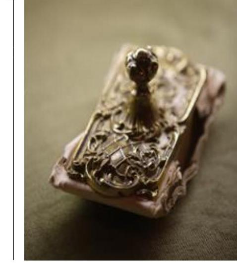

---

# Jelentés 

## Állami tulajdonú gazdasági társaságok

Az állami tulajdonban (résztulajdonban) lévő gazdálkodó szervezetek vagyonmegőrzési és gazdálkodási tevékenységének ellenőrzése HONVÉDELMI MINISZTÉRIUM ARMCOM Kommunikációtechnikai zártkörűen működő Részvénytársaság
2017. november hó 28. nap
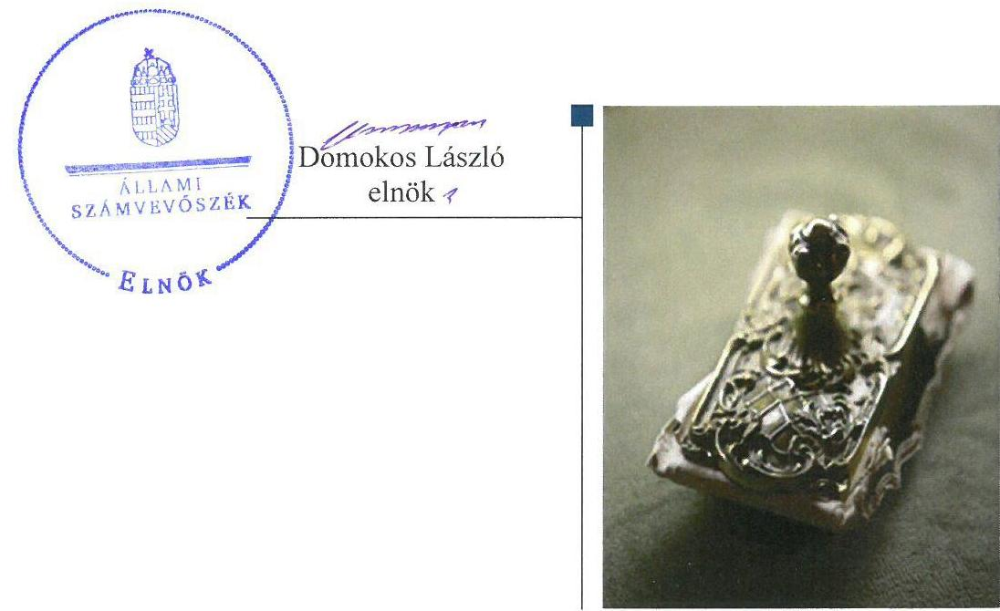

---

# AZ ELLENŐRZÉST FELÜGYELTE:

DR. NÉMETH ERZSÉBET felügyeleti vezető

## AZ ELLENŐRZÉST VEZETTE ÉS A VÉGREHAJTÁSÁÉRT FELELŐS:

DR. PELLEI TAMÁS ellenőrzésvezető

## A PROGRAM ÖSSZEÁLLÍTÁSÁÉRT FELELŐS:

JANIK JÓZSEF osztályvezető

IKTATÓSZÁM: V-1381-152/2016.

TÉMASZÁM: 2415

ELLENŐRZÉS-AZONOSÍTÓ SZÁM: V075951

Jelentéseink az Országgyűlés számítógépes hálózatán és az Interneta a www.asz.hu címen is olvashatóak.

---

# TARTALOMJEGYZÉK 

■ ÖSSZEGZÉS ..... 5
■ AZ ELLENŐRZÉS CÉLJA ..... 6
■ AZ ELLENŐRZÉS TERÜLETE ..... 7
■ AZ ELLENŐRZÉS HÁTTERE, INDOKOLTSÁGA ..... 9
■ A JELENTÉS LÉNYEGES KÉRDÉSKÖREI ..... 10
■ ELLENŐRZÉS HATÓKÖRE ÉS MÓDSZEREI ..... 11
■ MEGÁLLAPÍTÁSOK ..... 13
■ JAVASLATOK ..... 18
■ MELLÉKLETEK ..... 19
I. Sz. melléklet: Értelmező szótár ..... 19
II. Sz. melléklet: HM Armcom Zrt. mérlegadatai 2012-2015. évek (M Ft) ..... 22
■ FÜGGELÉK: ÉSZREVÉTELEK ..... 23
■ RÖVIDÍTÉSEK JEGYZÉKE ..... 37

---

.

---

# ÖSSZEGZÉS 

A Honvédelmi Minisztérium ARMCOM Kommunikációtechnikai Zrt. feletti tulajdonosi joggyakorlás szabályszerű volt. A Társaság müködésének szabályozottsága megfelelt az előírásoknak. A ráfordítások és az értékcsökkenés elszámolása szabályszerű volt, a bevételek elszámolása nem felelt meg az előírásoknak. A Társaság a vagyonával szabályszerűen gazdálkodott, a beszámolási és adatszolgáltatási kötelezettségét teljesítette.

## Az ellenőrzés társadalmi indokoltsága

Az Állami Számvevőszék stratégiájában megfogalmazta, hogy az államháztartáson kívülre nyújtott költségvetési támogatások és ingyenes vagyonjuttatások, valamint az államháztartáson kívül múködő közfeladat-ellátó rendszerek ellenőrzéseivel hozzájárul ahhoz, hogy a közpénzeket az államháztartáson kívül múködő szervezetek is átlátható, rendezett módon használják fel.

A fentiek alapján, valamint a honvédelmi kiadások nagyságára tekintettel került sor a Honvédelmi Minisztérium ARMCOM Kommunikációtechnikai zártkörűen működő Részvénytársaság ellenőrzésére a 2012-2015. évek vonatkozásában.

## Főbb megállapítások, következtetések, javaslatok

A Honvédelmi Minisztérium és a Magyar Nemzeti Vagyonkezelő Zrt. tulajdonosi joggyakorlása szabályszerű volt. A Honvédelmi Minisztérium által a Honvédelmi Minisztérium ARMCOM Kommunikációtechnikai zártkörűen működő Részvénytársaság részére használatba adott ingatlanok tekintetében kötött szerződés nem volt megfelelő, mivel az nem felelt meg teljes körűen az ingatlanok nyilvántartási rendjéről szóló belső szabályozásban foglaltaknak.

Az előírt számviteli szabályzatokkal rendelkeztek, azok tartalma megfelelt a jogszabályi követelményeknek. A ráfordításokat és az értékcsökkenést szabályszerűen számolták el. A bevételek elszámolása nem volt megfelelő, mert a munkahelyi étkeztetés árbevételeit nem a jogszabályi előírásoknak megfelelően számolták el. A szolgáltatások díjának megállapítását az előírásoknak megfelelő önköltségszámítással megalapozták, továbbá az előírt tervezési, beszámolási és adatszolgáltatási kötelezettséget teljesítették.

A szabályszerű vagyongazdálkodás feltételeit kialakították, amelyekre a saját vagyon változását eredményező döntéseik meghozatalánál figyelemmel voltak.

---

# AZ ELLENŐRZÉS CÉLJA 

Az ellenőrzés célja annak értékelése volt, hogy a tulajdonosi jogok gyakorlása szabályszerű volt-e; a gazdálkodó szervezet szabályozottsága, gazdálkodása és vagyongazdálkodási tevékenysége megfelelt-e a jogszabályi és a tulajdonosi előírásoknak; biztosítva volt-e a közfeladatok átláthatósága és elszámoltathatósága érdekében a közszolgáltatás díjának megalapozottsága szabályszerű önköltségszámítással; a vagyonváltozást eredményező döntések esetében a tulajdonosi jogok gyakorlója és a gazdálkodó szervezet szabályszerűen jártak-e el.

---

# AZ ELLENŐRZÉS TERÜLETE

## HONVÉDELMI MINISZTÉRIUM ARMCOM Kommunikációtechnikai zártkörűen működő Részvénytársaság

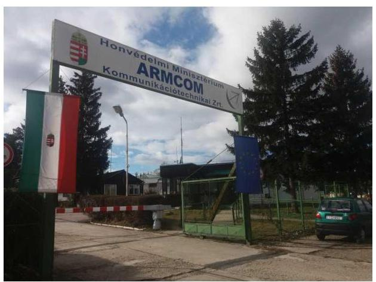

### A HONVÉDELMI MINISZTÉRIUM ARMCOM KOMMUNIKÁCIÓTECHNIKAI ZÁRTKÖRŰEN MŰKÖDŐ RÉSZVÉNYTÁRSASÁGOT

alapítója – a Honvédelmi Minisztérium – 1992. évben gödöllői székhellyel, határozatlan időre hozta létre.

A jegyzett tőkéje alapításkor 200,0 M Ft volt, amely 60,0 M Ft pénzbeli és 140,0 M Ft nem pénzbeli hozzájárulásból (apportból) állt. A Társaság1 jegyzett tőkéjét 1994-ben 221,480 M Ft-ra emelték, amely a nem pénzbeli hozzájárulás 161,480 M Ft-ra való megemelésével valósult meg.

A Társaság alapvető feladata a Magyar Honvédség kommunikációs célú megrendeléseinek teljesítése volt, de emellett polgári megrendeléseket is végzett.

Az ellenőrzött időszakban ellátott feladatai voltak a Magyar Honvédség számára híradó és informatikai rendszerek tervezése és kivitelezése, illetve karbantartása, az analóg rendszerű telefonközpontok, rádió berendezések javítása és felújítása, a műholdas távközlési állomások kialakítása, általános gépjavítás és karbantartás, vegyvédelmi eszközök javítása és karbantartása, antennatornyok karbantartása, valamint univerzális hangosító berendezések javítása és karbantartása. Polgári területen ellátott feladatai voltak a napelemmel működő energiaellátó rendszerek tervezése és telepítése, az épületek érintésvédelmi és villámvédelmi rendszerének felülvizsgálata, illetve karbantartása, valamint a villamos és erősáramú szerelési munkák, az épületgépészeti és vasszerkezeti munkák végzése és a mobil telekommunikáció technikai hátterének megteremtése. A Társaság gazdálkodásának főbb adatait az 1. ábra tartalmazza.

1. ábra

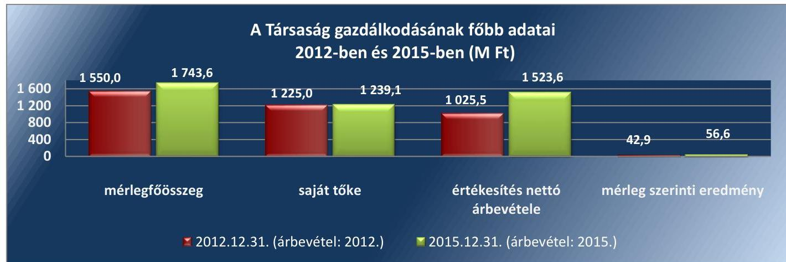

*Forrás: A Társaság éves beszámolói*

---

A mérlegfőösszeg 2012. december 31. és 2015. december 31. között 12,5\%-kal - 193,6 M Ft-tal - nőtt, amelyet az eszközöknél a tárgyi eszközök, a készletek és a vevőkövetelések, a forrásoknál a passzív időbeli elhatárolások növekedése eredményezett.

Az értékesítés nettó árbevétele - a 2013. évet kivéve - az ellenőrzött időszakban folyamatosan - összesen 498,1 M Ft-tal - emelkedett. Az értékesítés nettó árbevételéből 2012-ben 711,1 M Ft, 2015-ben 1 119, 9 M Ft volt honvédségi irányú.

A foglalkoztatott munkavállalók átlagos statisztikai létszáma 2012-ben 116 fő és 2015-ben 115 fő volt.

A Társaságnál a tulajdonosi jogok gyakorlója 2012-ben az MNV Zrt. ${ }^{2}$ és a 2013-2015. közötti években a honvédelemért felelős miniszter volt.

Az NGM³ 2012-ben 3,0 M FT, 2013-ben 4,8 M Ft honvédelmi felkészítő támogatást, valamint 2014-ben 3,6 M Ft, 2015-ben 3,9 M Ft hadiipari kapacitás fenntartó támogatást folyósított a Társaság részére.

A Társaságnak vagyonkezelésbe vett vagyona nem volt, használatra átvett állami vagyonnal rendelkezett, amely a HM vagyonkezelésében állt. Más gazdasági társaságban tulajdoni részesedéssel nem rendelkezett, nem minősült kormányzati szektorba sorolt gazdálkodó szervezetnek.

---

# AZ ELLENŐRZÉS HÁTTERE, INDOKOLTSÁGA 

Az állami tulajdonú gazdálkodó szervezetek ellenőrzése kiemelten fontos a nemzeti vagyon megőrzése, megóvása érdekében. Gazdálkodásuk jellemzően a közérdeklődés és a média figyelmének középpontjában áll, amihez hozzájárul a gazdálkodásuk körébe tartozó - közvetlen vagy közvetett állami tulajdonú - vagyon nagysága, illetve az általuk ellátott szolgáltatások minősége és hatékonysága. A szolgáltatási árképzés megalapozottsága és az éves elszámoltatás feltételeinek kialakítása az ellenőrzés során nagy hangsúlyt kap.

Az ellenőrzés rámutathat az állami tulajdonú gazdálkodó szervezetek gazdálkodási tevékenységével kapcsolatos jó gyakorlatokra és szabálytalanságokra. Felhívhatja a figyelmet a jogszabályi követelmények teljesítéséhez szükséges feltételek hiányosságaira, hozzájárulhat az államháztartáson kívüli, de (közvetlenül vagy közvetve) állami vagyont használó gazdálkodó szervezetek tevékenységének átláthatóságához. Ellenőrzésünk eredményeképpen javaslatainkkal, megállapításainkkal hozzájárulhatunk a nemzeti vagyonnal való gazdálkodás átláthatóságának, elszámoltathatóságának javításához.

---

# A JELENTÉS LÉNYEGES KÉRDÉSKÖREI 

1.     - A tulajdonosi jogok gyakorlása szabályszerű volt-e?
2.     - A társaság müködésének szabályozottsága megfelelt-e az előírásoknak?
3.     - A társaságnál a pénzügyi-számviteli, adatszolgáltatási és ellenőrzési feladatok ellátása szabályszerű volt-e?
4.     - A társaság vagyongazdálkodása szabályszerű volt-e?

---

# ELLENŐRZÉS HATÓKÖRE ÉS MÓDSZEREI 

## Az ellenőrzés típusa

Megfelelőségi ellenőrzés.

## Az ellenőrzött időszak

Az ellenőrzött időszak 2012. január 1-től 2015. december 31-ig tartott.

## Az ellenőrzés tárgya

Állami tulajdonban lévő gazdasági társaság gazdálkodása, kiemelten vagyongazdálkodási tevékenysége, a tulajdonosi jogok gyakorlása, továbbá a kormányzati szektorba sorolt gazdasági társaság gazdálkodásának a kormányzati szektor hiányára és az államadósságra befolyással bíró elemei.

Az ellenőrzés kiterjedt minden olyan körülményre és adatra, amely az ÁSZ ${ }^{4}$ jogszabályban meghatározott feladatainak teljesítéséhez, valamint a program végrehajtása folyamán felmerült újabb összefüggések feltárásához szükséges volt.

## Az ellenőrzött szervezet

Magyar Nemzeti Vagyonkezelő Zrt.
Honvédelmi Minisztérium
Honvédelmi Minisztérium ARMCOM Kommunikációtechnikai zártkörűen múködő Részvénytársaság

## Az ellenőrzés jogalapja

Az ellenőrzés jogalapját az ÁSZ tv. ${ }^{5}$ 1. § (3) bekezdése és 5. § (3)-(5) bekezdése képezi.

## Az ellenőrzés módszerei

Az ellenőrzést a nemzetközi standardokat irányadónak tekintve az ellenőrzési program ellenőrzési kérdései, az ellenőrzött időszakban hatályos jogszabályok, az ellenőrzés szakmai szabályok és módszertanok figyelembevételével végeztük.

---

Az ellenőrzési kérdések megválaszolásához szükséges bizonyítékok megszerzése a következő ellenőrzési eljárások alkalmazásával történt: megfigyelés, kérdésfeltevés (információkérés), összehasonlítás, valamint mintavételi és elemző eljárások. Az ellenőrzési bizonyítékként felhasználható adatforrások közé tartoztak egyrészt az ellenőrzési programban felsorolt adatforrások, másrészt adatforrás lehetett még minden - az ellenőrzés folyamán - feltárt, az ellenőrzés szempontjából információkat tartalmazó dokumentum.

Az ellenőrzött szervezetek az ellenőrzés lefolytatásához tanúsítványok kitöltésével, valamint az ÁSZ által kért dokumentumok megküldésével szolgáltattak adatokat.

A bevételek és ráfordítások elszámolása, valamint a vagyonnyilvántartás terén a szabályszerű múködést véletlen mintavétellel és irányított kiválasztással ellenőriztük. A jogszabályoknak és a belső előírásoknak megfelelőnek, azaz szabályszerűnek tekintettük az adott területet, amennyiben a minta ellenőrzésének eredménye alapján 95\%-os bizonyossággal a teljes sokaságban a hibaarány kisebb volt, mint 10\%, nem megfelelőnek értékeltük, ha a hibaarány a 10\%-ot meghaladta.

---

# 1. A tulajdonosi jogok gyakorlása szabályszerű volt-e? 

Összegző megállapítás

A Társaság feletti tulajdonosi joggyakorlás megfelelt az előírásoknak.

AZ MNV ZRT. a Társaság feletti tulajdonosi jogok gyakorlását a Vtv. ${ }^{6}$ rendelkezéseivel összhangban Vagyonkezelési szerződés ${ }^{7}$-ben 2012. december 31-éig a $\mathrm{HM}^{8}$-nek átadta. A vagyonkezelési szerződés társasági részesedések feletti rendelkezéseit az Nvtv. ${ }^{9}$ és a Hvt. ${ }^{10}$ előírásaival összhangban megszüntették és 2013. január 1-jétől az MNV Zrt. és a HM között az Nvtv. és a Hvt. előírásainak megfelelő Együttműködési megállapodás ${ }_{1-2}{ }^{11}$ volt érvényben. A tulajdonosi joggyakorlás összhangban volt a Vtv. előírásaival.

A HM a tulajdonosi jogok gyakorlására vonatkozó szabályokat a 11/2010. HM utasítás ${ }^{12}$-ban, a 67/2011. HM utasítás ${ }^{13}$-ban, a Társaság múködésére és a vagyongazdálkodására vonatkozó követelményeket az Alapító okirat ${ }_{1-4}{ }^{14}$-ban, az Alapszabály ${ }_{1-2}{ }^{15}$-ban és a tulajdonosi határozataiban rögzítette.

Az Alapító okirat ${ }_{1-4}$ és az Alapszabály ${ }_{1-2}$ a Gt. ${ }^{16}$ és a Ptk. ${ }_{2}{ }^{17}$ előírásaival összhangban tartalmazta a vagyonnal történő felelős gazdálkodáshoz szükséges követelményeket, valamint meghatározták az IG ${ }^{18}$, az FB ${ }^{19}$ és a vezérigazgató ${ }^{20}$ feladatait, és rendelkeztek a könyvvizsgáló személyéről. A tulajdonosi joggyakorlás az IG, az FB, és a könyvvizsgáló tekintetében megfelelt a Gt. és a Ptk. ${ }_{2}$ előírásainak.

AZ ÉVES SZÁMVITELI BESZÁMOLÓK jóváhagyásáról a HM az Alapító Okirat ${ }_{1-4}$ és az Alapszabály ${ }_{1-2}$ előírásai szerint, a Gt. és a Ptk. ${ }_{2}$ valamint a Számv. tv. ${ }^{21}$ előírásaival összhangban az FB jelentése és a könyvvizsgáló véleményének az ismeretében tulajdonosi határozattal döntött.

## A TÁRSASÁG ÉVES ÉS ÉVKÖZI BESZÁMOLÁSI, ADATSZOLGÁLTATÁSI RENDJÉT a HM a 477-25/2010.

számú tulajdonosi határozatban rögzítette, amelynek keretében - többek között - meghatározta az éves beszámoló, az üzleti terv, illetve az FB jelentés tartalmára vonatkozó előírásokat. A HM az üzleti tervek elkészítéséhez minden évben tervezési irányelveket adott ki.

A HM tulajdonosi határozatokban rendelkezett a Társaság belső ellenőrzési feladatainak ellátásáról.

A HM és a Társaság által megkötött Használatba adási szerződés ${ }_{1-2}{ }^{22}$ nem rögzítette, hogy a Társaság részére használatra átadott ingatlanokon végzett beruházásokról és felújításokról a Társaság évente köteles elszámolni, miközben annak szerződésben való szerepeltetését az ingatlanok nyilvántartási rendjéről szóló 59/2010. (HK 5.) HM IÜ-HM KPÜ együttes intézkedés 7. pontja előírta.

---

# 2. A társaság múködésének szabályozottsága megfelelt-e az előírásoknak? 

Összegző megállapítás

A Társaság múködésének szabályozottsága megfelelt az előírásoknak.

A SZÁMVITELI SZABÁLYZATOKKAL a Társaság az ellenőrzött időszakban rendelkezett. A Számv. tv. rendelkezéseinek megfelelően elkészítették a Számviteli politikát ${ }^{23}$, aktualizálásáról gondoskodtak.

A 2012-2015. közötti években a Társaság a Számv. tv. előírásainak megfelelően rendelkezett Számlarend ${ }_{1-2}{ }^{24}$-del, Bizonylati rend ${ }_{1-2}{ }^{25}$-del, Leltározási szabályzat ${ }^{26}$ - tal és Pénzkezelési szabályzat ${ }_{1-2}{ }^{27}$-tal, valamint a Számviteli politika keretében elkészített Értékelési szabályzat ${ }^{28}$-tal. A számviteli szabályzatok megfeleltek a Számv. tv. követelményeinek.

A JAVADALMAZÁS SZABÁLYZAT ${ }_{1-2}{ }^{29}$-ot a HM megalkotta, amely megfelelt a Taktv. ${ }^{30}$ rendelkezéseinek.

## 3. A társaságnál a pénzügyi-számviteli, adatszolgáltatási és ellenőrzési feladatok ellátása szabályszerű volt-e?

Összegző megállapítás

A Társaság a pénzügyi-számviteli feladatait - a bevételek elszámolása kivételével - szabályszerűen végezte. A tervezési, adatszolgáltatási és közzétételi kötelezettségeinek eleget tett.
3.1. számú megállapítás

A ráfordításokat és az értékcsökkenést szabályszerűen számolták el. A bevételek elszámolása nem volt megfelelő.

AZ ÉRTÉKESÍTÉS NETTÓ ÁRBEVÉTELÉNEK elszámolása nem volt megfelelő. A munkahelyi étkeztetés árbevételének elszámolásánál a kiállított számlákon külön tételként megadott étkezési hozzájárulást a Számv. tv. 79. § (3) bekezdés előírása ellenére nem személyi jellegű egyéb kifizetésként, hanem munkahelyi étkeztetés árbevételének csökkenéseként könyvelték és ezzel az értékesítés nettó árbevételének elszámolásánál megsértették a Számv. tv. 72. § (1) bekezdés előírását is. Ezzel a Társaság megsértette a Számv tv. 15. § (9) bekezdésében meghatározott bruttó elszámolás elvét.

A RÁFORDÍTÁSOK elszámolása szabályszerű volt. A Társaság figyelembe vette a Számv. tv. és belső szabályzatainak előírásait.

AZ ÉRTÉKCSÖKKENÉS elszámolása szabályszerű volt. A tárgyi eszközök állományba vételét megalapozó üzembe helyezést a Számv. tv. előírásainak megfelelően dokumentálták, valamint az eszközök besorolása az előírások alapján történt.

A KÖVETELÉSÁLLOMÁNY hátralékos kezelésének rendjét a Társaság a kintlévőség kezelési intézkedés ${ }^{31}$-ben határozta meg, amelyben

---

# Megállapítások 

## 3.2. számú megállapítás

## 3.3. számú megállapítás

rögzítették a megelőző intézkedéseket, valamint a lejárt követelések kezelésének és behajtásának eljárásrendjét. A Társaság rendelkezett a követelések lejárat szerinti összetételét tartalmazó analitikus nyilvántartással.

A Társaság a szolgáltatások diját az előírásoknak megfelelő önköltségszámítással alapozta meg.

A szolgáltatások önköltségszámítását és árképzését megalapozó Önköltségszámítási szabályzat ${ }_{1-2}{ }^{32}$ összhangban volt a Számv. tv. előírásaival. A szolgáltatások díjtételeinek megállapítását az Önköltségszámítási szabályzat ${ }_{1-2}$ árképzésre vonatkozó fejezete alapján végezték, az ármeghatározás piaci alapon történt. A Társaság utókalkulációval készített önköltségszámítással megalapozta a szolgáltatásainak díjait.

## A Társaság az előírt tervezési, beszámolási és adatszolgáltatási kötelezettségét teljesítette.

ÜZLETI TERVEIT a Társaság határidőben és a HM által előírt tartalommal elkészítette, azokat az IG és az FB elfogadásra javasolta, és a HM tulajdonosi határozataival jóváhagyta.

AZ ÉVES BESZÁMOLÓKAT a Társaság elkészítette és azokat az előírt határidőig az FB írásbeli jelentésének és a könyvvizsgáló véleményének birtokában a HM tulajdonosi határozattal elfogadta, valamint a Társaság letétbe helyezte és közzétette.

A HM által a 477-25/2010. számú tulajdonosi határozatban előírt adatszolgáltatási kötelezettségét a Társaság teljesítette.

## AZ ADATOK VÉDELME ÉS A KÖZÉRDEKŰ ADATOK

NYILVÁNOSSÁGRA HOZATALA biztosított volt. A Társaság 2012-ben hatályba helyezte az adatvédelmi és adatbiztonsági szabályzatát ${ }^{33}$, amely rögzítette az alkalmazott adatvédelmi és adatkezelési elveket, valamint a Társaság adatvédelmi és adatkezelési politikáját. A Társaságnál gondoskodtak a belső adatvédelmi felelős kijelöléséről. A közérdekú adatok megismerése iránti igény benyújtásának szabályait az Info. tv. ${ }^{34}$ előírásai alapján alakították ki, illetve eljárásrendjét szabályozták.

## A Társaság múködtetett belső ellenőrzést, továbbá intézkedett a tulajdonosi ellenőrzések javaslatainak végrehajtásáról.

A BELSŐ ELLENŐRZÉSI TEVÉKENYSÉGET a Társaság - a HM előírásának megfelelően - a 2012-ben saját szervezeti keretek között látta el, a 2013. évtől kezdődően a HM El Zrt. ${ }^{35}$ végezte. Az elvégzett belső ellenőrzési jelentések megállapításaira vonatkozóan intézkedési tervet készítettek.

A HM belső ellenőrzése és az FB-én keresztül, valamint a könyvvizsgáló kijelölésével biztosították a tulajdonosi ellenőrzést.

A HM belső ellenőrzése 2015-ben fejezetszintú államháztartási belső ellenőrzést végzett, amelynek keretében értékelte a Társaság katonai feladataihoz kapcsolódó tevékenységét, valamint a múködésének gazdaságosságát, hatékonyságát és eredményességét. Az ellenőrzés megállapításaira vonatkozóan a Társaság vezérigazgatója intézkedési tervet készített.

---

# 4. A társaság vagyongazdálkodása szabályszerű volt-e? 

## Összegző megállapítás

### 4.1. számú megállapítás

### 4.2. számú megállapítás

## A Társaság vagyongazdálkodás szabályszerű volt.

A saját vagyon értékének megőrzését szolgáló vagyongazdálkodás feltételeit kialakították.

A HM által jóváhagyott éves üzleti tervek részletesen tartalmazták a Társaság várható bevételeit, a költségek és ráfordítások alakulását, a tervezett beruházásokat.

A Társaság saját vagyonnal való gazdálkodás tekintetében belső szabályzataiban, valamint az Alapító Okirat ${ }_{1-4}$-ban és az Alapszabály ${ }_{1-2}$-ban rögzítette a feladat- és hatásköröket, felelősségi viszonyokat. Előírták a HM, az IG, az FB, a könyvvizsgáló, valamint a foglalkoztatott munkavállalók kötelezettségeit, feladatait, és hatásköreit.

A saját vagyon elidegenítéséhez, megterheléséhez, biztosítékba adásához, bérbeadásához, és hasznosításához kapcsolódó döntési jogköröket az Alapító Okirat ${ }_{1-4}$-ban és az Alapszabály ${ }_{1-2}$-ban határozták meg.

## A Társaság a vagyonát az előírásoknak megfelelően tartotta nyilván.

A SAJÁT VAGYONNAL kapcsolatos állományba vételi, nyilvántartási, leltározási és elszámolási kötelezettségek szabályozottak voltak. A Társaság a vagyon nyilvántartását főkönyvi könyvelés készítésével és analitikus nyilvántartások vezetésével biztosította. A használatba adási szerződés keretében használatba vett ingatlanokat szabályszerűen, elkülönített analitikus nyilvántartásban rögzítették.

TÉTELES LELTÁRRAL támasztotta alá a Társaság a számviteli beszámolókban és a számviteli nyilvántartásokban szereplő vagyontárgyak állományát, ami összhangban volt a Számv. tv., a Számviteli politika és a Leltározási Szabályzat előírásaival. A leltárak dokumentumai tételesen, és ellenőrizhető módon tartalmazták a Társaság mérleg fordulónapján meglévő eszközeit és forrásait mennyiségben és értékben.

## A saját vagyon értékének megőrzése megvalósult.

## A SAJÁT VAGYON ÉRTÉKÉNEK MEGŐRZÉSE a 2012-

2015. közötti években megvalósult, mivel az elszámolt értékcsökkenés öszszege 110,9 M Ft, az eszközök pótlására fordított pénzeszköz (beruházás) 268,3 M Ft volt.

Az immateriális javak és tárgyi eszközök nettó értéke növekedett, az immateriális javak mérlegösszege a 2012. év végi 2,0 M Ft-ról 2015. december 31-ére 9,3 M Ft-ra, a tárgyi eszközök mérlegösszege pedig a 2012. év végi 134,4 M Ft-ról 2015. december 31-ére 281,1 M Ft-ra emelkedett. Az elszámolt értékcsökkenés és a beruházások alakulását a 2012-2015. években a 1. táblázat tartalmazza.

---

1. táblázat

ELSZÁMOLT ÉRTÉKCSÖKKENÉS ÉS ESZKÖZÖK PÓTLÁSÁRA FORDÍTOTT PÉNZESZKÖZÖK 2012-2015 (M FT)

| Megnevezés | 2012. | 2013. | 2014. | 2015. |
| :-- | :--: | :--: | :--: | :--: |
| elszámolt értékcsökkenés | 31,8 | 31,5 | 22,9 | 24,7 |
| saját tulajdonú eszközök pót-   lására fordított pénzeszközök   (beruházások) | 32,2 | 15,5 | 22,5 | 198,1 |

Forrás: a Társaság adatszolgáltatása
Az értékcsökkenési leírást jelentősen meghaladó összegű beruházásra 2015-ben került sor. A 2015. évi beruházás 198,1 M Ft-os összegét egy URH rádiójavító műhely kialakításának megkezdése eredményezte.

A Társaság az ellenőrzött időszakban éves karbantartási ütemterveket készített, és a saját vagyon részét képező tárgyi eszközöknél a karbantartási feladatok ütemezetten, terv szerint végrehajtásra kerültek.

A SAJÁT TÖKE ÉS A JEGYZETT TÖKE alakulását a 2. táblázat tartalmazza.
2. táblázat

SAJÁT TŐKE ÉS A JEGYZETT TŐKE ALAKULÁSA 2012-2015 (M FT)

| Megnevezés | 2012. | 2013. | 2014. | 2015. |
| :-- | :--: | :--: | :--: | :--: |
| Jegyzett tőke | 221,5 | 221,5 | 221,5 | 221,5 |
| Saját tőke | 1225,0 | 1163,1 | 1182,5 | 1239,1 |

A Társaság saját tőkéje minden évben elérte az előírt értéket, illetve jelentősen meghaladta a jegyzett tőke értékét, veszteség rendezésére nem volt szükség.
4.4. számú megállapítás

A saját vagyon változását eredményező döntések szabályszerűek voltak.

# A SAJÁT VAGYON VÁLTOZÁSÁT EREDMÉNYEZŐ 

DÖNTÉSEKRE vonatkozó követelményeket az Alapító Okirat ${ }_{1-4}$ és az Alapszabály ${ }_{1-2}$ tartalmazta. A saját vagyon változását eredményező döntések szabályszerűek voltak.

---

# JAVASLATOK 

Az ÁSZ tv. 33. § (1) bekezdésében foglaltak értelmében az ellenőrzött szervezet vezetője köteles a jelentésben foglalt megállapításokhoz kapcsolódó intézkedési tervet összeállítani és azt a jelentés kézhezvételétől számított 30 napon belül az ÁSZ részére megküldeni. Amennyiben az ellenőrzött szervezet vezetője nem küldi meg határidőben az intézkedési tervet, vagy továbbra sem elfogadható intézkedési tervet küld, az Állami Számvevőszék elnöke az ÁSZ tv. 33. § (3) bekezdése a) és b) pontjaiban foglaltakat érvényesítheti.

## a Honvédelmi miniszternek és a HM ARMCOM Kommunikációtechnikai Zrt. vezérigazgatójának

1. Intézkedjen a Honvédelmi Minisztérium és a Társaság által megkötött használatba adási szerződés módosításáról annak érdekében, hogy az a szabályozásnak megfelelően rögzítse a Társaság részére használatra átadott ingatlanokon végzett beruházásokra és felújításokra vonatkozó elszámolási kötelezettséget.
(1 sz. megállapítás 7. bekezdése alapján)

## a HM ARMCOM Kommunikációtechnikai Zrt. vezérigazgatójának

1. Intézkedjen a számviteli elszámolások szabályszerű végrehajtásáról, ezen belül az értékesítés nettó árbevétele tekintetében a jogszabályi előírások betartásáról.
(3.1. sz. megállapítás 1. bekezdése alapján)

---

# MELLÉKLETEK 

## I. SZ. MELLÉKLET: ÉRTELMEZŐ SZÓTÁR

állami vagyon
gazdasági társaság
állami vagyon kezelője/vagyonkezelő
gazdálkodó szervezet
a) Az állam tulajdonában lévő dolog, valamint a dolog módjára hasznosítható természeti erő,
b) az a) pont hatálya alá nem tartozó mindazon vagyon, amely vonatkozásában törvény az állam kizárólagos tulajdonjogát nevesíti,
c) az állam tulajdonában lévő tagsági jogviszonyt megtestesítő értékpapír, illetve az államot megillető egyéb társasági részesedés,
d) az államot megillető olyan immateriális, vagyoni értékkel rendelkező jogosultság, amelyet jogszabály vagyoni értékű jogként nevesít.
Forrás: Vtv. 1. § (2) bekezdése
2012. november 10-től az állami vagyon fogalma kiegészül a következő ponttal:
e) az állam tulajdonában lévő pénzügyi eszközök
Forrás: Vtv. 1. § (2) bekezdése
A Ptk. 3:88. § (1) bekezdése szerint „a gazdasági társaságok üzletszerű közös gazdasági tevékenység folytatására, a tagok vagyoni hozzájárulásával létrehozott, jogi személyiséggel rendelkező vállalkozások, amelyekben a tagok a nyereségből közösen részesednek, és a veszteséget közösen viselik".
2013. június 27-ig:

Az állami vagyont az MNV Zrt. maga kezeli, vagy szerződés - így különösen bérlet, haszonbérlet, megbízás - alapján központi költségvetési szervnek, természetes vagy jogi személynek, vagy jogi személyiséggel nem rendelkező gazdálkodó szervezetnek hasznosításra átengedi. Az állami vagyonra vonatkozóan az MNV Zrt. kizárólag az Nvtv-ben meghatározott személyekkel köthet vagyonkezelési szerződést.
Forrás: Vtv. 23. § (1), 27. § (1)
2013. június 28-ától:

Az állami vagyonnal az MNV Zrt. maga gazdálkodik, vagy szerződés - így különösen bérlet, haszonbérlet, megbízás - alapján központi költségvetési szervnek, természetes vagy jogi személynek, vagy jogi személyiséggel nem rendelkező gazdálkodó szervezetnek hasznosításra átengedi, illetőleg vagyonkezelésbe, haszonélvezetbe adja. Az állami vagyonra vonatkozóan az MNV Zrt. kizárólag az Nvtv-ben meghatározott személyekkel köthet vagyonkezelési szerződést.
Forrás: Vtv. 23. § (1), 27. § (1)
2014. március 14-ig:

A Ptk. $1^{36}$ 685. § c) pontja szerint gazdálkodó szervezet: „az állami vállalat, az egyéb állami gazdálkodó szerv, a szövetkezet, a lakásszövetkezet, az európai szövetkezet, a gazdasági társaság, az európai részvénytársaság, az egyesülés, az európai gazdasági egyesülés, az európai területi együttműködési csoportosulás, az egyes jogi személyek vállalata, a leányvállalat, a vízgazdálkodási társulat, az erdő birtokossági társulat, a végrehajtói iroda, az egyéni cég, továbbá az egyéni vállalkozó."
2014. március 15-től:

A gazdasági társaság, az európai részvénytársaság, az egyesülés, az európai gazdasági egyesülés, az európai területi együttműködési csoportosulás, a szövetkezet, a lakásszövetkezet, az európai szövetkezet, a vízgazdálkodási társulat, az erdőbirtokossági társulat, az állami vállalat, az egyéb állami gazdálkodó szerv, az egyes jogi személyek

---

MNV Zrt.
nemzeti vagyon
tulajdonosi ellenőrzés
tulajdonosi jogok gyakor-
lója
vállalata, a közös vállalat, a végrehajtói iroda, a közjegyzői iroda, az ügyvédi iroda, a szabadalmi ügyvivői iroda, az önkéntes kölcsönös biztosító pénztár, a magánnyugdíjpénztár, az egyéni cég, továbbá az egyéni vállalkozó. Az állam, a helyi önkormányzat, a költségvetési szerv, az egyesület, a köztestület, valamint az alapítvány gazdálkodó tevékenységével összefüggő polgári jogi kapcsolataira is a gazdálkodó szervezetre vonatkozó rendelkezéseket kell alkalmazni.
Forrás: Pp. ${ }^{37}$ 396. §
Az állami vagyon felett, a Magyar Államot megillető tulajdonosi jogok és kötelezettségek összességét - a hatályos szabályozás szerint - az állami vagyon felügyeletéért felelős miniszter (jelenleg a nemzeti fejlesztési miniszter) gyakorolja. A miniszter feladatát nagy részben az MNV Zrt., mint tulajdonosi joggyakorló szervezet útján látja el.
a) az állam vagy a helyi önkormányzat kizárólagos tulajdonában álló dolgok,
b) az a) pont hatálya alá nem tartozó, állam vagy a helyi önkormányzat tulajdonában lévő dolog,
c) az állam vagy a helyi önkormányzatot tulajdonában lévő pénzügyi eszközök, továbbá az államot vagy a helyi önkormányzatot megillető társasági részesedések,
d) az államot vagy a helyi önkormányzatot megillető bármely vagyoni értékkel rendelkező jogosultság, amelyet jogszabály vagyoni értékű jogként nevesít,
e) Magyarország határa által körbezárt terület feletti légtér,
f) az üvegházhatású gázok kibocsátási egységeinek kereskedelméről szóló törvény szerint kibocsátási egység és légiközlekedési kibocsátási egység, valamint az ENSZ Éghajlatváltozási Keretegyezménye és annak Kiotói Jegyzőkönyv végrehajtási keretrendszeréről szóló törvény szerinti kiotói egység,
g) állami vagy helyi önkormányzati fenntartású közgyűjtemény (muzeális intézmény, levéltár, közgyűjteményként működő kép- és hangarchívum, valamint könyvtár) saját gyűjteményében nyilvántartott kulturális javak körébe tartozó dolog, kivéve, ha az állami vagy önkormányzati tulajdon jogszerű létrejötte kétséget kizáró módon nem bizonyítható és a dologra nézve más a tulajdonjogát bizonyítja vagy a kulturális javakra vonatkozó jogszabályokban meghatározott eljárás keretében valószínűsíti (g. pont módosult 2013. december 7-től),
h) a régészeti lelet,
i) a nemzeti adatvagyon körébe tartozó állami nyilvántartások fokozottabb védelméről szóló törvény szerinti nemzeti adatvagyon.
Forrás: Nvtv. 1. § (2)
2014. március 14-ig:

Az állami vagyon kezelőjét, haszonélvezőjét, használóját megillető jogok gyakorlását, annak szabályszerűségét, célszerűségét az MNV Zrt. - szükség szerint területi szervei útján - ellenőrzi.
2014. március 15 -tól:

Az állami vagyon használóját, vagyonkezelőjét és haszonélvezőjét megillető jogok gyakorlását, annak szabályszerűségét, a kötelezettségek teljesítését, valamint a vagyon rendeltetése szerinti célszerűségét a tulajdonosi joggyakorló rendszeresen ellenőrzi. Forrás: Vhr. 20. § (1)
1.

## 2013. június 27-ig:

Az állami vagyon felett a Magyar Államot megillető tulajdonosi jogok és kötelezettségek összességét - ha törvény eltérően nem rendelkezik - az állami vagyon felügyeletéért felelős miniszter (a továbbiakban: miniszter) gyakorolja, aki e feladatát a Magyar Nemzeti Vagyonkezelő Zártkörűen Működő Részvénytársaság (a továbbiakban: MNV

---

Zrt.), a Magyar Fejlesztési Bank, illetve a tulajdonosi joggyakorló szervezet útján látja el. A miniszter miniszteri rendeletben, a törvényben meghatározott állami vagyoni kör tekintetében, meghatározott időtartamra, a joggyakorlás egyes szabályainak meghatározásával - az őt megillető tulajdonosi jogok és kötelezettségek összességének, illetve azok meghatározott részének gyakorlóját az Áht. szerinti központi költségvetési szervek, ezek intézménye, továbbá a 100\%-ban állami tulajdonban álló gazdasági társaságok közül kijelölheti.
Forrás: Vtv. 3. § (1) és (2)

# 2013. június 28-ától: 

A rábízott állami vagyon felett az államot megillető tulajdonosi jogok és kötelezettségek összességét tulajdonosi joggyakorlóként:
a) ha törvény vagy miniszteri rendelet eltérően nem rendelkezik, a Magyar Nemzeti Vagyonkezelő Zártkörűen Működő Részvénytársaság (a továbbiakban: MNV Zrt.),
b) törvényben kijelölt személy vagy
c) az állami vagyon felügyeletéért felelős miniszter (a továbbiakban: miniszter) által rendeletben kijelölt személy gyakorolja.
[...] A miniszter e törvény felhatalmazása alapján - a meghatározott célok hatékonyabb elérése érdekében, miniszteri rendeletben, az ott meghatározott állami vagyoni kör tekintetében, meghatározott időtartamra - e törvény keretei között, a joggyakorlás egyes szabályainak meghatározásával - az államot megillető tulajdonosi jogok és kötelezettségek összességének, illetve azok meghatározott részének gyakorlóját az Áht. szerinti központi költségvetési szervek, ezek intézménye, továbbá a 100\%ban állami tulajdonban álló gazdasági társaságok közül kijelölheti.
Forrás: Vtv. 3. § (1) és (2)
2.

Aki a nemzeti vagyon felett az államot vagy a helyi önkormányzatot megillető tulajdonosi jogok és kötelezettségek összességének gyakorlására jogosult
Forrás: Nvtv. 3. § (1) 17. pontja

---

II. SZ. MELLÉKLET: HM ARMCOM ZRT. MÉRLEGADATAI 2012-2015. ÉVEK (M FT)

|  Megnevezés | 2012-12-31 | 2013-12-31 | 2014-12-31 | 2015-12-31  |
| --- | --- | --- | --- | --- |
|  Befektetett eszközök | 386,5 | 120,5 | 120,1 | 540,4  |
|  IMMATERIÁLIS JAVAK | 2,0 | 3,2 | 15,4 | 9,3  |
|  Szellemi termékek | 2,0 | 2,4 | 2,4 | 1,4  |
|  TÁRGYI ESZKÖZÖK | 134,4 | 117,2 | 104,7 | 281,1  |
|  Ingatlanok és a kapcsolódó vagyoni értékű jogok | 55,4 | 50,2 | 45,0 | 39,4  |
|  Műszaki berendezések, gépek, járművek | 25,4 | 16,1 | 17,1 | 14,4  |
|  Egyéb berendezések, felszerelések, járművek | 53,6 | 50,9 | 41,3 | 30,7  |
|  Beruházások, felújítások | - | - | 1,3 | 196,6  |
|  Tárgyi eszközök értékhelyesbítése | - | - | - | -  |
|  BEFEKTETETT PÉNZÜGYI ESZKÖZÖK | 250,1 | 0,1 | 0 | 250,0  |
|  Forgóeszközök | 1155,0 | 1331,2 | 1341,3 | 1196,4  |
|  Követelések | 112,5 | 450,1 | 494,0 | 167,5  |
|  PÉNZESZKÖZÖK | 952,0 | 768,1 | 744,7 | 886,5  |
|  Aktív időbeli elhatárolások | 8,5 | 6,6 | 4,7 | 6,8  |
|  ESZKÖZÖK (AKTÍVÁK) ÖSSZESEN | 1550,0 | 1458,3 | 1466,1 | 1743,6  |
|  Saját tőke | 1225,0 | 1163,1 | 1182,5 | 1239,1  |
|  JEGYZETT TÖKE | 221,5 | 221,5 | 221,5 | 221,5  |
|  EREDMÉNYTARTALÉK | 957,4 | 1000,3 | 926,3 | 950,8  |
|  LEKÖTÖTT TARTALÉK | - | - | 12,1 | 7,0  |
|  MÉRLEG SZERINTI EREDMÉNY | 42,9 | $-61,8$ | 19,3 | 56,6  |
|  Céltartalékok | 10,0 | 3 | 2,0 | 12,0  |
|  Kötelezettségek | 300,9 | 273,4 | 244,9 | 233,0  |
|  Passzív időbeli elhatárolások | 14,1 | 18,8 | 36,7 | 259,5  |
|  FORRÁSOK (PASSZÍVÁK) ÖSSZESEN | 1550,0 | 1458,3 | 1466,1 | 1743,6  |

---

# FÜGGELÉK: ÉSZREVÉTELEK 

A jelentéstervezetet a Számvevőszék 15 napos észrevételezésre megküldte az ellenőrzött szervezetek vezetőinek az ÁSZ tv. 29. §* (1) bekezdése előírásának megfelelően.

Az ellenőrzött szervezetek vezetői az ÁSZ tv. 29. § (2) bekezdésében foglalt észrevételezési jogukkal éltek, a jelentéstervezetre észrevételt tettek.
Az elfogadott észrevételek alapján a Számvevőszék módosította a jelentést.
A függelék tartalmazza az ellenőrzött szervezetek észrevételeit, illetve az el nem fogadott észrevételek elutasításának indoklását.

[^0]
[^0]:    * 29. § (1) Az Állami Számvevőszék az ellenőrzési megállapításait megküldi az ellenőrzött szervezet vezetőjének vagy az általa megbízott személynek, és annak, akinek személyes felelősségét állapította meg.
    (2) Az ellenőrzött szervezet vezetője és a felelősként megjelölt személy az ellenőrzés megállapításaira tizenöt napon belül írásban észrevételt tehet.
    (3) Az Állami Számvevőszék az észrevételre a beérkezésétől számított harminc napon belül írásban válaszol. A figyelembe nem vett észrevételeket köteles a jelentésben feltüntetni, és megindokolni, hogy azokat miért nem fogadta el.

---

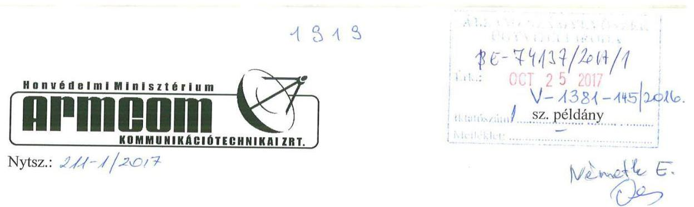

# Domonkos László 

elnök

Állami Számvevőszék

## Tisztelt Elnök Úr!

Tárgy: Észrevétel jelentéstervezetre

Köszönettel vettük 2017. október 11-én V-1381-142/2016. Ikt. számon érkezett Számvevőszéki jelentéstervezetüket, mely az Állami Számvevőszékről szóló 2011. évi LXVI. törvény (továbbiakban: ÁSZ tv.) 29. § (1) bekezdésében foglaltak alapján „Az állami tulajdonban (résztulajdonban) lévő gazdálkodó szervezetek vagyonmegőrzési és gazdálkodási tevékenységének ellenőrzése - Honvédelmi Minisztérium ARMCOM Kommunikációtechnikai zártkörűen működő Részvénytársaság" címmel született.

Az ÁSZ tv. 29. § (2) bekezdése szerint a jelentéstervezetre a következő észrevételeket kívánjuk tenni:
1., 1. sz. megállapítás 7. bekezdése

A Honvédelmi Minisztérium és a HM ARMCOM Zrt között új használatba adási szerződés kerül aláírásra, mely figyelembe veszi a megállapításban foglaltakat.
2., 3.1. sz. megállapítás 1. bekezdése

Megállapítás: „Az értékesítés nettó árbevételének elszámolása nem volt megfelelő. A munkahelyi étkeztetés árbevételének elszámolásánál a kiállított számlákon külön tételként megadott étkezési hozzájárulást a Számv. tv. 79 § (3) bekezdés előírása ellenére nem személyi jellegű egyéb kifizetésként, hanem munkahelyi étkeztetés árbevételének csökkenéseként könyvelték és ezzel az értékesítés nettó árbevételének elszámolásánál megsértették a Számv. tv. 72. § (1) bekezdés előírását is. Ezzel a Társaság megsértette a Számv. tv. 15. § (9) bekezdésében meghatározott bruttó elszámolás elvét."

A megállapításban foglaltakkal csak részben tudunk egyetérteni. Részvénytársaságunk az érintett időszakban az értékesítés nettó árbevételében csak a munkahelyi étkezésre a dolgozók által ténylegesen térített összeget könyvelte nettó árbevételként. A számlán külön tételként feltüntetett étkezési hozzájárulás, azt a célt szolgálta, hogy a számlán egyenlegében a ténylegesen befizetett összeg szerepeljen nettó árbevételként. A számlán, az első soron feltüntetett árbevétel (az önköltséggel megegyező) az általános forgalmi adó alapjaként az áfa

---

elszámolást szolgálja, a 2. soron az előbbiekben említett árbevétel (adókörön kívüliként) az árbevétel módosítását, rendezését szolgálta annak érdekében, hogy az értékesítés nettó árbevétele a tényleges - a dolgozók által térített - árbevétel legyen. Ezzel, véleményünk szerint részvénytársaságunk nem sértette meg a Számv. tv. 72. § (1) bekezdésében foglaltakat, miután az árbevételt a jogszabályoknak megfelelően mutatta ki, valamint nem sértette meg a Számv. tv. 15. § (9) bekezdésében meghatározott bruttó elszámolás elvét sem, hiszen nem számolta el a bevételeket és a költségeket egymással szemben. A Számv. tv. 79. § (3) bekezdésében foglaltak vonatkozásában a megállapítást elfogadjuk. Ezen költségek megfelelő átvezetését a 2016. év vonatkozásában az ellenőrzés javaslatára elvégeztük. Megjegyezni kívánjuk, hogy az említett módosítások nem befolyásolták adózás előtti eredményünket, hiszen költségek egymásközti átrendezéséről volt szó és természetesen mindenkor megfizettük a munkahelyi étkezéshez nyújtott természetben juttatás után a részvénytársaságunkat terhelő közterheket.

# Tisztelt Elnök Úr! 

Szeretnénk köszönetünket kifejezni ellenőreik segítő szándékú, tárgyszerű, munkájáért, mely részvénytársaságunk menedzsmentjének is megnyugtató eredménnyel zárult. Egyben szeretnénk kérni, illetve javasolni, hogy jelentésükben, illetve összefoglalójukban - miután a jelentések nyilvánosak - az általánosan megfogalmazott megállapításokat ne alkalmazzák, miután azok sokszor külső partnerek felé félreérthetőek. Például az a megállapítás, hogy „a bevételek, az értékesítés nettó árbevételének elszámolása nem megfelelő", egy külső partner részére akár riasztó is lehet, és téves következtetésekre adhat okot. Célszerűnek tartanánk egy pontosabb megfogalmazást (pl. a munkahelyi étkezés bevételeit tévesen mutatta ki, bár véleményünk szerint ez nem így van), még akkor is, ha az a későbbiekben részletezve van.

Kérjük észrevételeink elfogadását.

Köszönettel és tisztelettel:

Gödöllő, 2017. október Jh e n
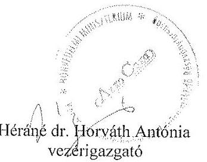

Héráné dr. Horváth Antónia
vezérigazgató

---

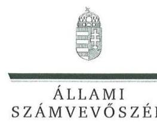

ELNÖK

Ikt.szám: V-1381-148/2016.

# Héráné dr. Horváth Antónia úrhölgy 

vezérigazgató

HM ARMCOM Kommunikációtechnikai Zrt.

## Gödölló

## Tisztelt Vezérigazgató Úrhölgy!

Az „Állami tulajdonú gazdasági társaságok - Az állami tulajdonban (résztulajdonban) lévő gazdálkodó szervezetek vagyonmegőrzési és gazdálkodási tevékenységének ellenőrzése - HM ARMCOM Kommunikációtechnikai Zrt. " című jelentéstervezetre tett észrevételeit köszönettel megkaptam.

Az ellenőrzési megállapításokra vonatkozó észrevételét az Állami Számvevőszékről szóló 2011. évi LXVI. törvény (a továbbiakban: ÁSZ tv.) 29. § (2) bekezdésében meghatározott tizenöt napos határidőn belül küldte meg. Az Állami Számvevőszék észrevétellel kapcsolatos álláspontját a mellékletként csatolt, a felügyeleti vezető által készített indokolás tartalmazza.

Tájékoztatom, hogy az Állami Számvevőszék a figyelembe nem vett észrevételeket az ÁSZ tv. 29. § (3) bekezdésében előírtak szerint köteles a jelentésében feltüntetni és megindokolni, hogy azokat miért nem fogadta el.

Budapest, 2017. 11. hó 14 nap

Melléklet: Észrevételre adott válasz

Tisztelettel:
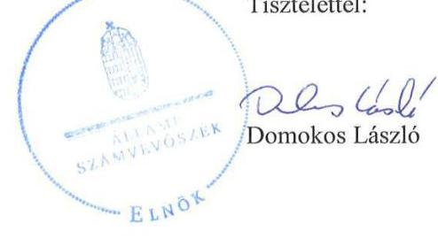

---

"Az állami tulajdonban (résztulajdonban ) lévő gazdálkodó szervezetek vagyonmegőrzési és gazdálkodási tevékenységének ellenörzése - HM ARMCOM Kommunikációtechnikai Zrt." című jelentéstervezethez tett észrevételre adott válasz

A jelentéstervezetre tett észrevételeket áttekintettem, annak kezelésével kapcsolatban a következő tájékoztatást adom.

# 1. A jelentéstervezet 1. sz. megállapításának 7. bekezdésére vonatkozó észrevétel 

Vezérigazgató Úrhölgy észrevételében tájékoztatást ad a Honvédelmi Minisztérium és a Társaság közötti új használatba adási szerződés megkötésére vonatkozóan, így az észrevétel a jelentéstervezetet nem módosítja.

## 2. A jelentéstervezet 3.1. sz. megállapítás első bekezdésére vonatkozó észrevétel

A Számv. tv. a 3. § (7) bekezdésének 3. pontja alatt tételesen nevesíti a személyi jellegủ egyéb kifizetések között az étkezési térítést, melyet a 79. § szerint előírt módon a ráfordítások között szükséges megjeleníteni. A jelentéstervezet megállapítja, hogy a Társaság a munkahelyi étkeztetés árbevételének elszámolásánál a kiállított számlákon külön tételként megadott étkezési hozzájárulást a Számv. tv. 79. § (3) bekezdés elöírása ellenére nem személyi jellegű egyéb kifizetésként, hanem munkahelyi étkeztetés árbevételének csökkenéseként könyvelte, és ezzel az értékesítés nettó árbevételének elszámolásánál megsértették a Számv. tv. 72. § (1) bekezdés előírását, illetve a Számv tv. 15. § (9) bekezdésében meghatározott bruttó elszámolás elvét.
Vezérigazgató Úrhölgy észrevételében elfogadja a Számv. tv. 79. § (3) bekezdésében foglaltak vonatkozásában tett megállapítást. Ugyanakkor vitatja, hogy a Társaság megsértette volna a Számv. tv. 72. § (1) bekezdésében foglaltakat, illetve a bruttó elszámolás elvét.
Az észrevétel kapcsán ismételten áttekintettük az ellenőrzés rendelkezésére álló dokumentumokat és megállapítottuk, hogy a személyi jellegủ egyéb ráfordítások között nem került kimutatásra az üzemi étkeztetéshez biztosított étkezési hozzájárulás. Az étkezési hozzájárulás nem szabályszerű könyvelése egyrészt a személyi jellegủ ráfordításoknál, másrészt pedig az értékesítés nettó árbevétele csökkentése tekintetében eredményezett szabálytalanságot, megsértve ezzel a Számv. tv. 72. § (1) bekezdésében, illetve a Számv. tv. 15. § (9) bekezdésében foglalt bruttó elszámolás elvét is, mely néhány nevesített kivételtől eltekintve tiltja a bevételek és ráfordítások egymással szemben való elszámolását.
A fentiekre való tekintettel a megállapítás módosítását nem tartjuk indokoltnak.

Az összegző megállapításokra vonatkozó észrevételével kapcsolatban felhívjuk a figyelmet a jelentéstervezet ellenőrzés módszerét bemutató fejezetében foglaltakra, mely szerint a bevételek és ráfordítások elszámolása, valamint a vagyonnyilvántartás terén a szabályszerű müködést véletlen mintavétellel és irányított kiválasztással ellenőriztük. A jogszabályoknak és a belső előírásoknak megfelelőnek, azaz szabályszerűnek tekintettük az adott területet, amennyiben a minta ellenőrzésének eredménye alapján $95 \%$-os bizonyossággal a teljes sokaságban a hibaarány kisebb volt, mint $10 \%$, nem megfelelőnek értékeltük, ha a hibaarány a $10 \%$-ot meghaladta. A bevételek elszámolásának megítélése az ellenőrzés módszerei alapján „nem megfelelő" volt, mely értékelés megjelenik mind a részletes, mind pedig az összegző megállapításokban.

---

Budapest, 2017. 11. hónap 14. nap

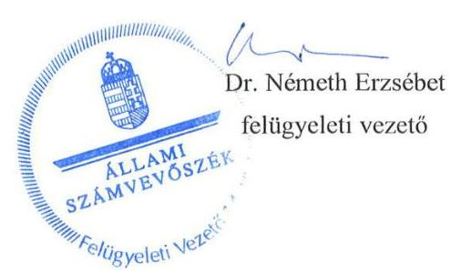

---

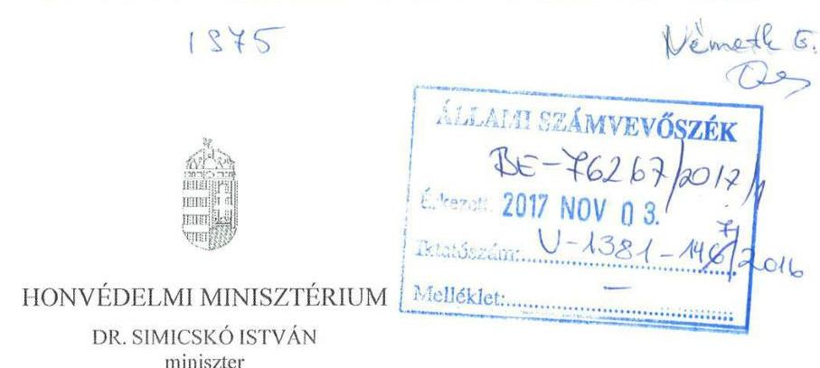

Nyt. szám: 1710/73-51/2017.
Hiv. szám: V-1381-143/2016.

# Domokos László úr 

az Állami Számvevőszék
elnöke

## Budapest

Tárgy: jelentéstervezet véleményezése

## Tisztelt Elnök Úr!

A fenti hivatkozási számon megküldött, „Az állami tulajdonban (résztulajdonban) lévő gazdálkodó szervezetek vagyonmegőrzési és gazdálkodási tevékenységének ellenőrzése HONVÉDELMI MINISZTÉRIUM ARMCOM Kommunikációtechnikai zártkörüen müködő Részvénytársaság" címü jelentéstervezetet szakközegeimmel áttanulmányoztattam, azzal kapcsolatban az alábbi véleményt teszem:

1. 5. oldal „Föbb megállapítások, következtetések, javaslatok", első bekezdésének második mondatával kapcsolatban

Az összegző megállapítást javaslom módosítani, ugyanis a részletező megállapítások között azt alátámasztó, megindokoló kifejtés az állami vagyonnal való gazdálkodásról szóló 254/2007. (X. 4.) Korm. rendelet vonatkozásában nem szerepel.

Mindemellett a tervezet 13. oldal utolsó bekezdésében megjelenített indokok szerint a Társasággal kötött használatba adási szerződést valóban szükséges átdolgozni, amely a HM tárca részéről folyamatban is van. Kifogásolható azonban az a szerződés létrejöttének időpontjára is visszautaló megállapítás, miszerint a felek szerződése „nem volt megfelelő", ezért javaslom helyette a „pontosítása szükséges" szóhasználatot.

---

2. 13. oldal „Megállapítások" utolsó bekezdésével kapcsolatban

Az 1. pontban megfogalmazottak alapján a bekezdést javaslom pontosítani az alábbiak szerint:
„Az ingatlanok nyilvántartási rendjéről szóló 59/2010. (HK. 5.) HM IÜ-HM KPH együttes intézkedés 7. pontjának megfelelően a HM és a Társaság közötti használatba adási szerződésben rögzíteni szükséges a Társaság éves elszámolási kötelezettségét a részére használatba adott ingatlanokon végzett beruházások és felújítások vonatkozásában."

Budapest, 2017. október $24-\mathrm{i} \mathrm{n}$
Tisztelettel:

Dr. Símicskó István

---

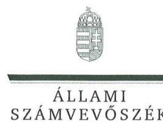

ELNÖK

Ikt.szám: V-1381-150/2016.

# Dr. Simicskó István úr 

miniszter

Honvédelmi Minisztérium

## Budapest

## Tisztelt Miniszter Úr!

Az „Állami tulajdonú gazdasági társaságok - Az állami tulajdonban (résztulajdonban) lévő gazdálkodó szervezetek vagyonmegőrzési és gazdálkodási tevékenységének ellenőrzése - HM ARMCOM Kommunikációtechnikai Zrt." címủ jelentéstervezetre tett észrevételeit köszönettel megkaptam.

Az ellenőrzési megállapításokra vonatkozó észrevételét az Állami Számvevőszékről szóló 2011. évi LXVI. törvény (a továbbiakban: ÁSZ tv.) 29. § (2) bekezdésében meghatározott tizenöt napos határidőn belül küldte meg. Az Állami Számvevőszék észrevétellel kapcsolatos álláspontját a mellékletként csatolt, a felügyeleti vezető által készített indokolás tartalmazza.

Tájékoztatom, hogy az Állami Számvevőszék a figyelembe nem vett észrevételeket az ÁSZ tv. 29. § (3) bekezdésében előírtak szerint köteles a jelentésében feltüntetni és megindokolni, hogy azokat miért nem fogadta el.

Budapest, 2017. 111. hó ${ }^{\text {H }}$ nap
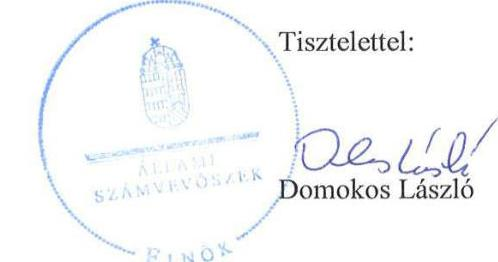

Melléklet: Észrevételre adott válasz

---

"Az állami tulajdonban (résztulajdonban ) lévő gazdálkodó szervezetek vagyonmegőrzési és gazdálkodási tevékenységének ellenörzése - HM ARMCOM Kommunikációtechnikai Zrt." című jelentéstervezethez tett észrevételre adott válasz Honvédelmi Minisztérium

A jelentéstervezetre tett észrevételeket áttekintettem, annak kezelésével kapcsolatban a következő tájékoztatást adom.

# 1. A jelentéstervezet Összegzés fejezetének 3. bekezdésére vonatkozó észrevétel 

Miniszter Úr észrevételében kérte a jelentéstervezet 5. oldal 3. bekezdés második mondatában szereplő megállapítás módosítását tekintettel arra, hogy az állami vagyonnal való gazdálkodásról szóló 254/2007. (X.24.) Korm. rendelet vonatkozásában részletező megállapítás nem szerepel a tervezetben.
Az észrevételt elfogadjuk, azt a jelentéstervezet véglegezése során figyelembe vesszük.

## 2. A jelentéstervezet 1. sz. megállapításának 7. bekezdésére vonatkozó észrevétel

A jelentéstervezet szerint a HM és a Társaság által megkötött Használatba adási szerződés1-2 nem rögzítette, hogy a Társaság részére használatra átadott ingatlanokon végzett beruházásokról és felújításokról a Társaság évente köteles elszámolni, miközben annak szerződésben való szerepeltetését az ingatlanok nyilvántartási rendjéről szóló 59/2010. (HK 5.) HM IÜ-HM KPÜ együttes intézkedés előírta.
Mind a fenti megállapítással, mind pedig az Összegzés fejezet 3. bekezdés második mondatával kapcsolatban Miniszter Úr szövegmódosítási javaslatot fogalmazott meg.
Az észrevételt részben elfogadjuk, a részletes megállapítást kiegészítjük az 59/2010. (HK 5.) HM IÜ-HM KPÜ együttes intézkedés vonatkozó pontjának feltüntetésével. Ugyanakkor az észrevételben szereplő szóhasználatot (,,pontosítása szükséges", illetve „rögzíteni szükséges") nem fogadjuk el tekintettel arra, hogy azok javaslatot fogalmaznak meg. Az érintett megállapítás vonatkozásában intézkedést a Honvédelmi miniszternek és a HM ARMCOM Kommunikációtechnikai Zrt. vezérigazgatójának az 1. sz. javaslat fogalmaz meg.

Budapest, 2017.
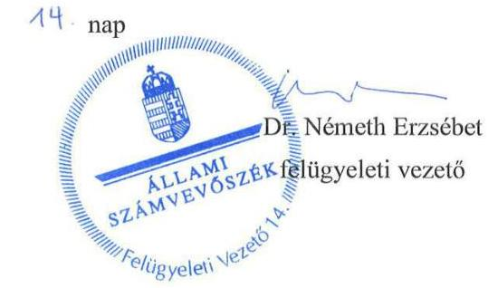

---

# MNV MAGYAR NEMZETI   VAGYONKEZELÓ ZRT   VEZERIGAZGATÓ 

Állami Számvevőszék

## Domokos László

elnök

1052 Budapest
Apáczai Cs. J. u. 10.

Ikt. sz.: MNV/01/11831/2017.
Hiv. sz.: V-1381-144/2016.

Tisztelt Elnök Úr!
Tájékoztatom, hogy a 2017. október 12. napján „Az állami tulajdonban (résztulajdonban) lévő gazdálkodó szervezetek vogyonmegőrzési és gazdálkodási tevékenységének ellenörzése - HM ARMCOM Kommunikációtechnikai Zrt." tárgyában kézhez vett, V-1381-144/2016. ikt. sz. levél mellékleteként megküldött Jelentés-tervezetre az alábbi észrevételeket tesszük:
„Összegzés Főbb megállapítások, következtetések / 5. oldal harmadik bekezdés második mondat és „Megállapítások 1. A tulajdonosi jogok gyakorlása szabályszerű volt-e? Összegző megállapítás" / 13. oldal hetedik bekezdés

A Honvédelmi Minisztérium vagyonkezelésében és a HM ARMCOM Zrt. használatában lévő ingatlanok tekintetében kötött Használatba adási szerződés vonatkozásában a Jelentés-tervezet megállapítja, hogy a szerződés nem volt megfelelő, mivei nem felelt meg teljes körűen az állami vagyonról szóló törvény végrehajtására kiadott kormányrendelciben foglaltaknak, továbbá a Használatba adási szerződés nem rögzítette, hogy a Társaság részére használatba adott ingatlanokon végzett beruházásokról és felújításokról a Társaság évente köteles elszámolni, miközben annak szerzödésben való szerepeltetését az ingatlanos nyilvántartási rendjéről szóló 59/2010. (HK5.) HM Úl-HM KPÚ együttes irtézkedés előirta.

Fenti megállapításokhoz kapcsolódóan a Jelentés-tervezet intézkedést javasol a Honvédelmi miniszternek és a HM ARMCOM Zrt. vezérigazgatójának a Használatba adási szerződés módosítása iránt, annak érdekében, hogy az a szabályozásnak megfelelően rögzítse a Társaság részére használatra átadott ingatlanokon végzett beruházásokra és felújításokra vonatkozó elszámolási kötelezettséget, nem állapítható meg ugyanakkor egyértelműen, hogy az 5. oldal harmadik bekezdés második mondatában foglalt megállapítás a Vht. 14. §-ban foglalt, az állami vagyon használóját, vagyonkezelőjét tzrhelő adatszolgaltatási kötelezettséget tartalmazó rendelkezééve vonatkozik-e.

Javostom, hogy a megállapítás kerüljön pontositásra a konkrét jogszabályhelyre való hivatkozással.
Kérem Elnök Urat, hogy a jelentés véglegesítése során jelen észrevételeinket szíveskedjenek figyelembe venni.
Budapest, 2017. október „,"
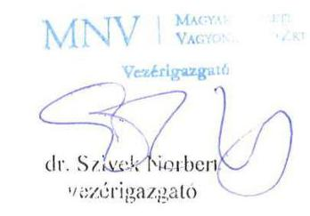

---

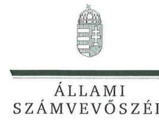

ELNÖK

Ikt.szám: V-1381-149/2016.

# Dr. Szivek Norbert 

vezérigazgató

## MNV Zrt.

## Budapest

## Tisztelt Vezérigazgató Úr!

Az „Állami tulajdonú gazdasági társaságok - Az állami tulajdonban (résztulajdonban) lévő gazdálkodó szervezetek vagyonmegőrzési és gazdálkodási tevékenységének ellenőrzése - HM ARMCOM Kommunikációtechnikai Zrt. " című jelentéstervezetre tett észrevételeit köszönettel megkaptam.

Az ellenőrzési megállapításokra vonatkozó észrevételét az Állami Számvevőszékről szóló 2011. évi LXVI. törvény (a továbbiakban: ÁSZ tv.) 29. § (2) bekezdésében meghatározott tizenöt napos határidőn belül küldte meg. Az Állami Számvevőszék észrevétellel kapcsolatos álláspontját a mellékletként csatolt, a felügyeleti vezető által készített indokolás tartalmazza.

Tájékoztatom, hogy az Állami Számvevőszék a figyelembe nem vett észrevételeket az ÁSZ tv. 29. § (3) bekezdésében előírtak szerint köteles a jelentésében feltüntetni és megindokolni, hogy azokat miért nem fogadta el.

Budapest, 2017. 11. hó 14 nap
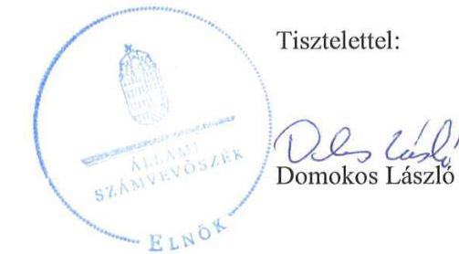

Melléklet: Észrevételre adott válasz

---

"Az állami tulajdonban (résztulajdonban ) lévő gazdálkodó szervezetek vagyonmegőrzési és gazdálkodási tevékenységének ellenőrzése - HM ARMCOM Kommunikációtechnikai Zrt." című jelentéstervezethez tett észrevételre adott válasz

Magyar Nemzeti Vagyonkezelő Zrt.
A jelentéstervezetre tett észrevételeket áttekintettem, annak kezelésével kapcsolatban a következő tájékoztatást adom.
Vezérigazgató Úr észrevételében kérte a jelentéstervezet 5. oldal 3. bekezdés második mondatában szereplő megállapítás pontosítását.
Az észrevételt elfogadjuk, a jelentéstervezet véglegezése során azt figyelembe vesszük.

Budapest, 2017. 11. hónap 14. nap
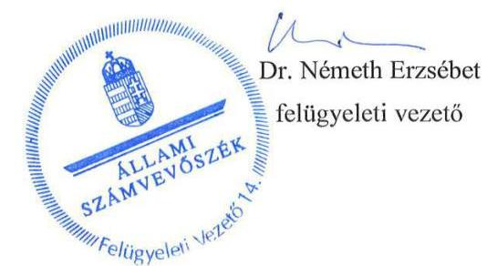

---

.

---

# RÖVIDÍTÉSEK JEGYZÉKE 

${ }^{1}$ Társaság
${ }^{2}$ MNV Zrt.
${ }^{3}$ NGM
${ }^{4}$ ÁSZ
${ }^{5}$ ÁSZ tv.
${ }^{6}$ Vtv.
${ }^{7}$ Vagyonkezelési szerződés
${ }^{8}$ HM
${ }^{9}$ Nvtv.
${ }^{10}$ Hvtv
${ }^{11}$ Együttműködési megállapodás1-2
${ }^{12}$ 11/2010. HM utasítás
${ }^{13}$ 67/2011. HM utasítás
${ }^{14}$ Alapító Okirat1-4

Honvédelmi Minisztérium ARMCOM Kommunikációtechnikai zártkörűen működő Részvénytársaság
Magyar Nemzeti Vagyonkezelő Zártkörűen Működő Részvénytársaság
Nemzetgazdasági Minisztérium
Állami Számvevőszék
Az Állami Számvevőszékről szóló 2011. évi LXVI. törvény (hatályos: 2011. július 1jétől)
Az állami vagyonról szóló 2007. évi CVI. törvény (hatályos: 2007. szeptember 25étől)
Az MNV Zrt. és a HM között 2008. május 28-án létrejött SZT-28425 számú vagyonkezelési szerződés (hatálytalan: 2013. január 1-jétől)
Honvédelmi Minisztérium
A nemzeti vagyonról szóló 2011. évi CXCVI. törvény (hatályos: 2011. december 31-étől)
A honvédelemről és a Magyar Honvédségről, valamint a különleges jogrendben bevezethető intézkedésekről szóló 2011. évi CXIII. törvény (hatályos: 2012. január 1-jétől)
Együttműködési megállapodás1: Az MNV Zrt. és a HM között a Társaság feletti tulajdonosi jogok gyakorlásának szabályozása tekintetében létrejött SZT-39158. számú együttműködési megállapodás (hatályos: 2013. január 1-jétől 2013. november 29-éig)
Együttműködési megállapodás2: Az MNV Zrt. és a HM között a Társaság feletti tulajdonosi jogok gyakorlásának szabályozása tekintetében létrejött SZT39.158/1. számú együttműködési megállapodás (hatályos: 2013. november 29étől)
A Magyar Nemzeti Vagyonkezelő Zrt. és a Honvédelmi Minisztérium között 2008. május 29-én megkötött Vagyonkezelési Szerződés ingatlanvagyonra vonatkozó rendelkezései végrehajtásának egyes szabályairól szóló 11/2010. (I.27.) HM utasítás (hatályos: 2010. február 4-étől)
A Honvédelmi Minisztérium vagyonkezelésében lévő ingóságok és társasági részesedések kezelésének, tulajdonosi ellenőrzésének, valamint az ingóságok hasznosításának, elidegenítésének, átadás-átvételének szabályairól szóló 67/2011. (VI.24.) HM utasítás (hatályos: 2011. július 2-ától)
Alapító okirat1: HONVÉDELMI MINISZTÉRIUM ARMCOM Kommunikációtechnikai zártkörűen működő Részvénytársaság Alapító Okirat (hatályos: 2011. július 21étől 2012. március 1-jéig)
Alapító okirat2: HONVÉDELMI MINISZTÉRIUM ARMCOM Kommunikációtechnikai zártkörűen működő Részvénytársaság Alapító Okirat (hatályos: 2012. március 1jétől 2012. május 31-éig)
Alapító okirat3: HONVÉDELMI MINISZTÉRIUM ARMCOM Kommunikációtechnikai zártkörűen működő Részvénytársaság Alapító Okirat (hatályos: 2012. május 31étől 2013. május 15-éig)
Alapító okirat4: HONVÉDELMI MINISZTÉRIUM ARMCOM Kommunikációtechnikai zártkörűen működő Részvénytársaság Alapító Okirat (hatályos: 2013. május 15étől 2014. július 14-éig)

---

${ }^{15}$ Alapszabály $1-2$
${ }^{16} \mathrm{Gt}$.
${ }^{17}$ Ptk. 2
${ }^{18} \mathrm{IG}$
${ }^{19} \mathrm{FB}$
${ }^{20}$ vezérigazgató
${ }^{21}$ Számv. tv.
${ }^{22}$ használatba adási szerződés $1-2$
${ }^{23}$ Számviteli politika
${ }^{24}$ Számlarend $1-2$
${ }^{25}$ Bizonylati rend $1-2$
${ }^{26}$ Leltározási szabályzat
${ }^{27}$ Pénzkezelési szabályzat $1-2$
${ }^{28}$ Értékelési szabályzat

Alapszabály1: HONVÉDELMI MINISZTÉRIUM ARMCOM Kommunikációtechnikai zártkörűen működő Részvénytársaság Alapszabály (hatályos: 2014. július 14-étől 2015. június 22-éig)
Alapszabály2: HONVÉDELMI MINISZTÉRIUM ARMCOM Kommunikációtechnikai zártkörűen működő Részvénytársaság Alapszabály (hatályos: 2015. június 22-étől)
A gazdasági társaságokról szóló 2006. évi IV. törvény (hatályos: 2014. március 14éig)
A Polgári Törvénykönyvről szóló 2013. évi V. törvény (hatályos: 2014. március 15től)
HONVÉDELMI MINISZTÉRIUM ARMCOM Kommunikációtechnikai zártkörűen működő Részvénytársaság Igazgatósága
HONVÉDELMI MINISZTÉRIUM ARMCOM Kommunikációtechnikai zártkörűen működő Részvénytársaság Felügyelőbizottsága
HONVÉDELMI MINISZTÉRIUM ARMCOM Kommunikációtechnikai zártkörűen működő Részvénytársaság vezérigazgatója
A számvitelről szóló 2000. évi C. törvény (hatályos: 2001. január 1-jétől)
használatba adási szerződés1: (hatályos: 1997. január 1-étől)
használatba adási szerződés2: az 1997. január 1-től hatályos használatba adási szerződés módosítása (hatályos: 2000. április 21-étől)
HONVÉDELMI MINISZTÉRIUM ARMCOM Kommunikációtechnikai Zrt. Számviteli politika és Értékelési szabályzat (hatályos: 2011. január 1-jétől), illetve a Számviteli politika és Értékelési szabályzat 1-3. számú módosításai, továbbá a Számviteli politika és Értékelési szabályzat módosításáról szóló 49/2015. számú vezérigazgatói intézkedés
Számlarend1: HONVÉDELMI MINISZTÉRIUM ARMCOM Kommunikációtechnikai Zrt. Vállalkozási számlarend (hatályos: 2012. január 1-jétől 2015. január 1-jéig)
Számlarend2: HONVÉDELMI MINISZTÉRIUM ARMCOM Kommunikációtechnikai Zrt. Vállalkozási számlarend (hatályos: 2015. január 1-jétől)
Bizonylati rend1: HONVÉDELMI MINISZTÉRIUM ARMCOM
Kommunikációtechnikai Zrt. Bizonylati rend, illetve annak módosítása (hatályos: 2009. január 1-jétől 2014. február 1-jéig)

Bizonylati rend2: HONVÉDELMI MINISZTÉRIUM ARMCOM
Kommunikációtechnikai Zrt. Bizonylati Rend és Bizonylati Album (hatályos: 2014. február 1-jétől)
HONVÉDELMI MINISZTÉRIUM ARMCOM Kommunikációtechnikai Zrt. Leltározási Szabályzat (hatályos: 2010. december 7-étől), illetve a Leltározási Szabályzat módosításáról szóló 37/2012. számú, a 48/2012. számú, valamint az 50/2013. számú vezérigazgatói intézkedés
Pénzkezelési szabályzat ${ }_{1}$ : HONVÉDELMI MINISZTÉRIUM ARMCOM Kommunikációtechnikai Zrt. Pénz és Értékkezelési Szabályzat, illetve annak módosításai (hatályos: 2011. május 13-ától 2013. október 28-áig)
Pénzkezelési szabályzat ${ }_{2}$ : HONVÉDELMI MINISZTÉRIUM ARMCOM Kommunikációtechnikai Zrt. Pénz és Értékkezelési Szabályzat, illetve annak módosításai (hatályos: 2013. október 28-ától)
HONVÉDELMI MINISZTÉRIUM ARMCOM Kommunikációtechnikai Zrt. Számviteli politika és Értékelési szabályzat (hatályos: 2011. január 1-jétől), illetve a Számviteli politika és Értékelési szabályzat 1-3. számú módosításai, továbbá a Számviteli politika és Értékelési szabályzat módosításáról szóló 49/2015. számú vezérigazgatói intézkedés

---

${ }^{29}$ Javadalmazási szabályzat ${ }_{1-2}$

30 Taktv.
${ }^{31}$ kintlévőség kezelési intézkedés
${ }^{32}$ Önköltségszámítási szabályzat ${ }_{1-2}$

Javadalmazási szabályzat: HONVÉDELMI MINISZTÉRIUM ARMCOM Kommunikációtechnikai zártkörűen működő Részvénytársaság Javadalmazási Szabályzat (hatályos: 2010. november 4-étől 2015. december 12-éig)
Javadalmazási szabályzat: HONVÉDELMI MINISZTÉRIUM ARMCOM Kommunikációtechnikai zártkörűen működő Részvénytársaság Javadalmazási Szabályzat (hatályos: 2015. december 12-étől)
A köztulajdonban álló gazdasági társaságok takarékosabb müködéséről szóló 2009. évi CXXII. tv. (hatályos: 2009. december 4-étől)

A HM ARMCOM Kommunikációtechnikai ZRt. vezérigazgatójának 21/2011 intézkedése a kintlévőség kezelésére
Önköltségszámítási szabályzat ${ }_{1}$ : HONVÉDELMI MINISZTÉRIUM ARMCOM Kommunikációtechnikai Zrt. Önköltségszámítási és Árképzési Szabályzat (hatályos: 2011. január 1-jétől 2014. január 1-jéig)
Önköltségszámítási szabályzat ${ }_{1}$ : HONVÉDELMI MINISZTÉRIUM ARMCOM Kommunikációtechnikai Zrt. Önköltségszámítási és Árképzési Szabályzat (hatályos: 2014. január 1-jétől)
A HM ARMCOM Kommunikációtechnikai ZRt. Adatvédelmi és Adatbiztonsági Szabályzata (hatályos: 2012. március 22-étől)
Az információs önrendelkezési jogról és az információszabadságról szóló 2011. évi CXII. törvény (hatályos: 2012. január 1-jétől)
Honvédelmi Minisztérium Elektronikai, Logisztikai és Vagyonkezelő Zártkörűen Müködő Részvénytársaság
A Polgári Törvénykönyvről szóló 1959. évi IV. törvény (hatálytalan: 2014. március 15-étől)
A polgári perrendtartásról szóló 1952. évi III. törvény (hatályos: 1953. január 1jétől)

---

# ÁLLAMI SZÁMVEVŐSZÉK 

1052 Budapest, Apáczai Csere János utca 10.
Levélcím: 1364 Budapest 4. Pf. 54
Telefon: +36 14849100 Telefax: +36 14849200
www.asz.hu